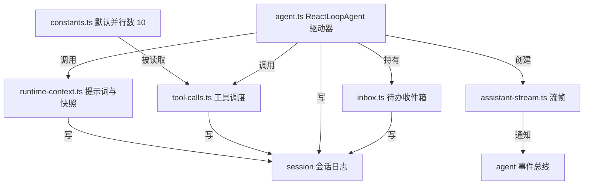
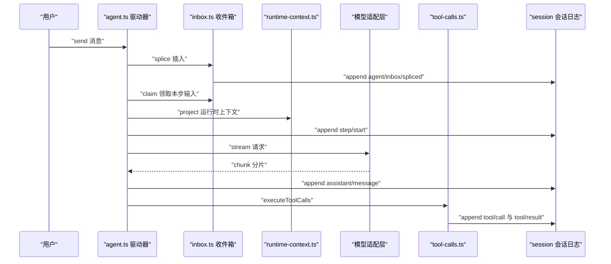
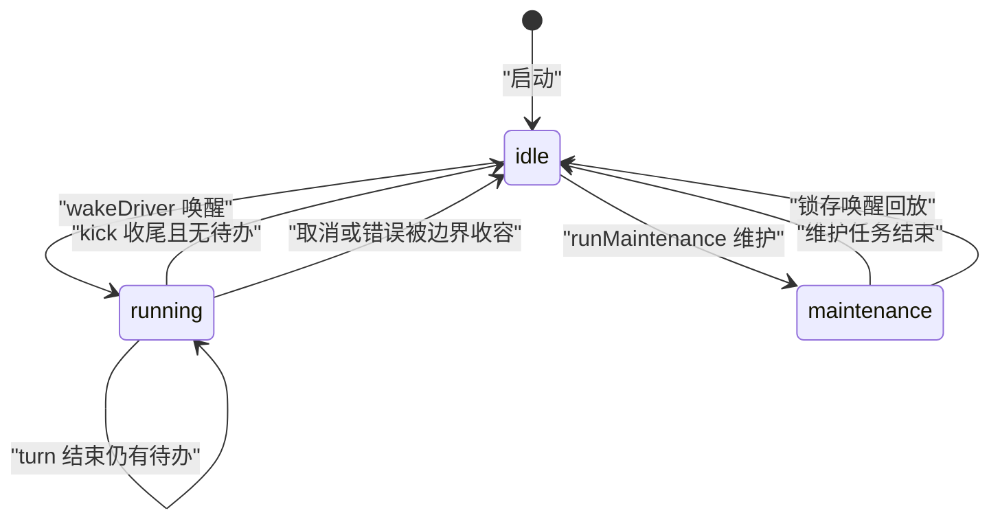
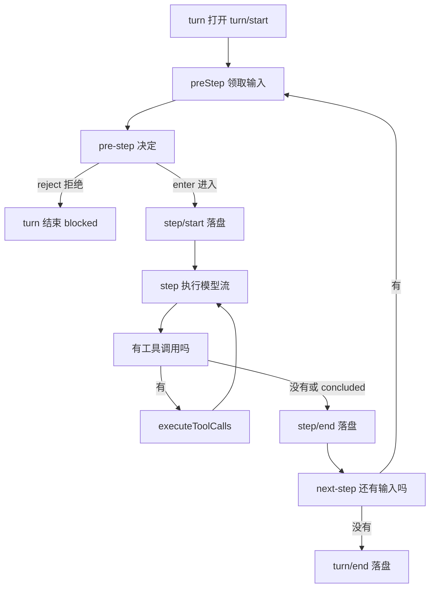
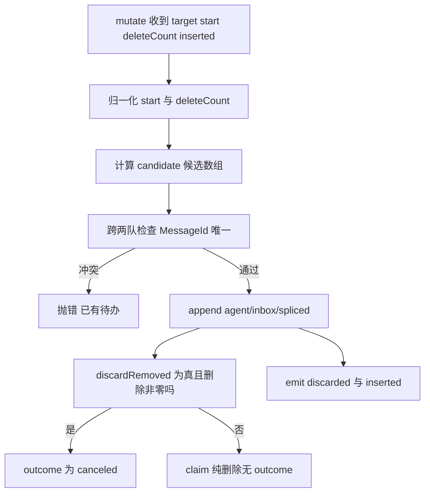
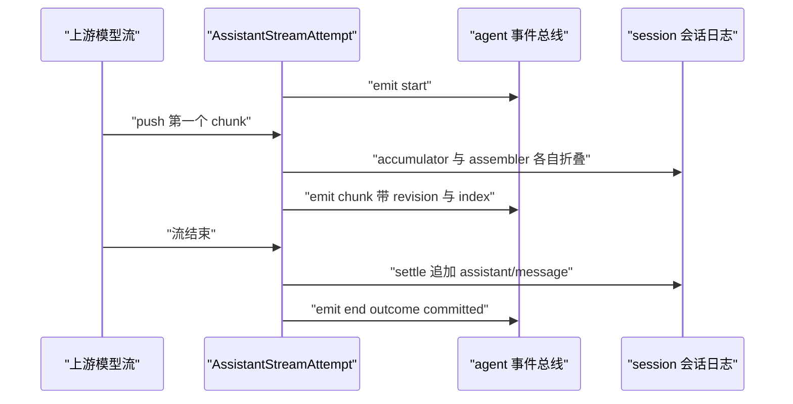
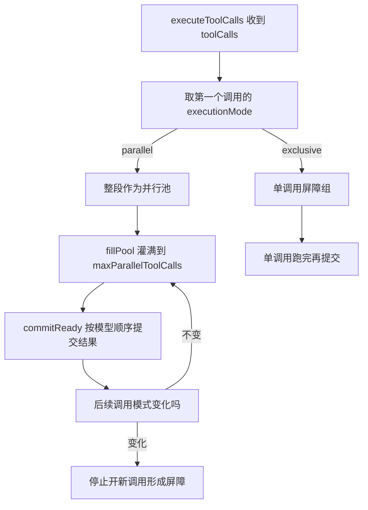
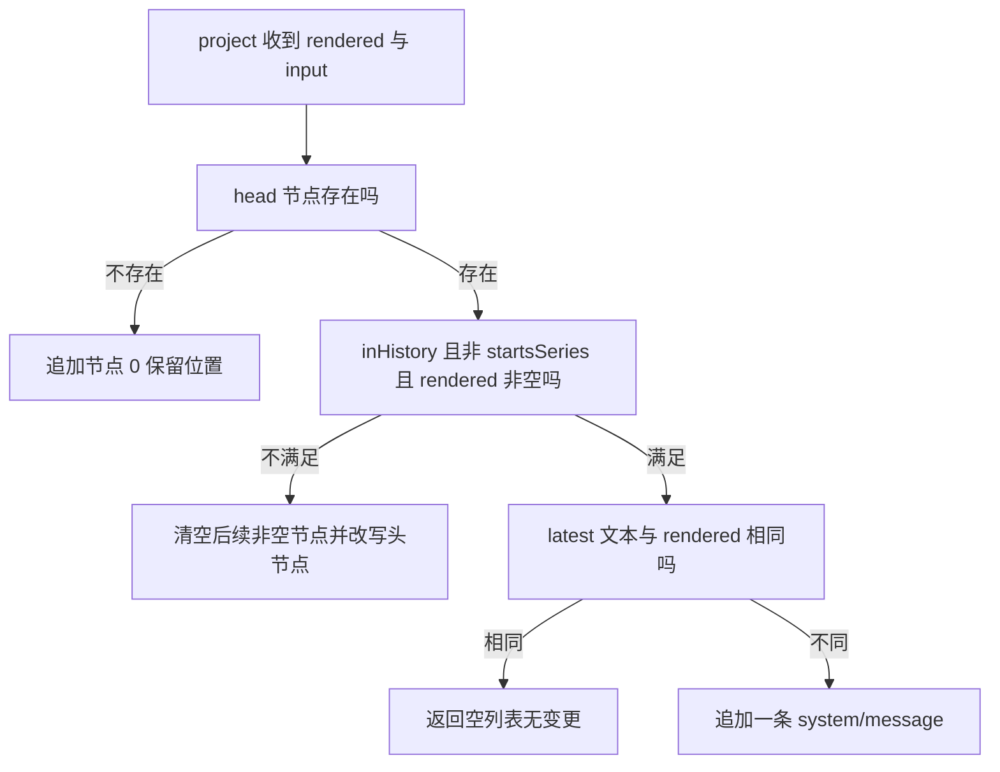

# DeepSeek Harness 的 Agent Loop 源码精读

!!! abstract "学完这一页你能"
    - 默画出 agent-loop 五个文件的职责分工图，并说出每个文件写入的 session 事件类型。
    - 对着 agent.ts 源码，讲清楚 idle、maintenance、running 三个相位如何切换、取消信号如何落盘。
    - 复述 inbox 的 splice 语义与 `agent/inbox/spliced` 投影折叠规则，并指出跨队 MessageId 唯一性校验的位置。
    - 描述一次模型流从 start、chunk 到 end 的投递与落盘顺序，以及取消时 interrupted 锚点的产生条件。

## 0. 知识地图

!!! note "术语：Agent Loop（代理循环）"
    Agent Loop 指反复执行「派生请求、调用模型、运行工具、再派生下一次请求」的主驱动循环。例子：用户问「今天天气」，模型先调用天气工具，拿到结果后再生成最终回答。



建议这样读：先看第 1 节的时序图，建立「一个轮次从消息到回复」的整体画面。
再按第 2、3 节读 agent.ts 的相位机与 turn、step 骨架。
最后逐个读 inbox、assistant-stream、tool-calls、runtime-context 四个工位，图中每个箭头都是依赖方向，所有模块的可见效果都汇入 session 日志。

## 1. 五个文件如何分工

**先想一个问题**：你要给聊天机器人加「用户中途取消」功能。它要清空待办、中止在跑的模型请求、保留已经显示给用户的半句回复，这些逻辑应该放进哪几个文件，而不是全堆在 agent.ts 里？

**心智模型**：

!!! tip "心智模型"
    一句话模型：agent.ts 是调度大厅，inbox、assistant-stream、tool-calls、runtime-context 是四个只做一件事的工位。
    日常类比：餐厅后厨主厨不下单、不洗菜，他把「收订单」「出锅」「备菜」「贴标签」分给四个工位。
    类比哪里不成立：餐厅工位靠口头喊话，这个包里的工位只通过 session 日志与 `agent/*` 事件通信，任何落盘都可被重放。

**图解**：



1. 用户消息先进入 inbox，inbox 用一个 `agent/inbox/spliced` 事件落盘，投影同步折叠出最新的两个待办队列。
2. 驱动器在步骤边界 `claim` 消息，先组装提示词与工具，再开步骤、发模型请求。
3. 流式分片每一片都先落盘结算，再通过 `agent/assistant-stream` 通知界面。
4. 助理消息若有工具调用，交给 tool-calls.ts 调度，结果落盘后回到下一轮派生。

**一步一步来**：

① 这一步要做什么：先读 agent.ts 顶部的模块导入，确认五个文件的引用边界。

```ts
// agent.ts 顶部：五个文件在同一个包里的引用关系，从这里直接看到模块边界
import { ReactLoopInbox } from './inbox.ts'
import { RuntimeContextProjection, SystemPromptProjection } from './runtime-context.ts'
import { AssistantStreamAttempt } from './assistant-stream.ts'
import { executeToolCalls } from './tool-calls.ts'
// 上方省略了 llm、session、scope、cordis 等类型导入
```

**这段代码在做什么**
- `ReactLoopInbox` 是收件箱的实现类，驱动器只在 `agent.ts` 里实例化它一次。
- `RuntimeContextProjection` 与 `SystemPromptProjection` 同在一个文件，负责两类隐藏信息。
- `AssistantStreamAttempt` 每次模型尝试创建一个，负责把流式分片折叠成四类帧。
- `executeToolCalls` 是纯函数入口，收到本步工具调用后返回 `{ concluded }` 给步骤机。
- 注意 `constants.ts` 不在这里导入，它的默认值在 tool-calls.ts 里被读取。

② 这一步要做什么：读构造函数，看驱动器如何把四个工位装进一个 `ReactLoopAgent` 实例。

```ts
constructor(
  private loopCtx: Context,
  public readonly id: SessionId,
  public readonly options: AgentOptions,
  public readonly session: Session,
) {
  this.requestSurfaceGeneration = session.surface.contentGeneration // 记录表层代际
  this.dispatch = agentEvents(loopCtx, this) // 构造一次性事件分发器
  this.scope = createScope(loopCtx, this) // 打开 agent 作用域
  this.ctx = this.scope.ctx
  this.inbox = new ReactLoopInbox(this.ctx.sessionProjections, session, this.dispatch) // 装配收件箱
  const lastTurn = this.loopCtx.sessionProjections.stateOf(session, 'turnBoundary')?.lastTurn ?? 0
  this.phase = { kind: 'idle', lastTurn } // 初始为空闲相位
  this.runtimeContext = new RuntimeContextProjection(this.ctx, session) // 装配运行时上下文
  this.systemPrompt = new SystemPromptProjection(session) // 装配系统提示词投影
}
```

**这段代码在做什么**
- `inbox` 拿到 `sessionProjections`，证明收件箱状态不是一个普通数组，而是从会话日志投影出来的。
- `lastTurn` 从 `turnBoundary` 投影读取，冷启动即使没有 Agent 实例也能读到上次轮次号。
- `scope` 是 agent 作用域边界，生命周期拥有者在驱动器退出后负责解绑。
- `dispatch` 只构造一次，热路径上的事件分发不再分配新对象。
- 初始相位固定是 `idle`，这是状态机全部切换的起点。

**动手验证**：把「导入关系加装配顺序」合成一个可运行的迷你模块图脚本。

```js
// 运行环境：Node 20+，无外部依赖
// 验证五个模块的职责字符串与一个极简装配函数
import assert from 'node:assert/strict'

const modules = {
  'agent.ts': '驱动器：相位、轮次、步骤、取消',
  'inbox.ts': '收件箱：两个持久化待办队列',
  'assistant-stream.ts': '流帧：start、chunk、end、中断前缀',
  'tool-calls.ts': '工具调度：排他屏障加有界并行池',
  'runtime-context.ts': '系统提示词与运行时上下文快照',
}

function assemble() {
  // 用字符串代替真实类，只验证装配顺序
  const parts = ['inbox', 'runtimeContext', 'systemPrompt']
  const bundle = { session: {}, dispatch: {} }
  for (const name of parts) bundle[name] = modules[name === 'inbox' ? 'inbox.ts' : 'runtime-context.ts']
  bundle.phase = { kind: 'idle', lastTurn: 0 }
  return bundle
}

const agent = assemble()
assert.equal(agent.phase.kind, 'idle')
assert.ok(agent.inbox.includes('收件箱'))
assert.ok(agent.runtimeContext.includes('系统提示词'))
console.log('装配顺序：inbox -> runtime-context -> systemPrompt -> phase idle')
console.log('模块图断言通过')
```

预期输出：

```text
装配顺序：inbox -> runtime-context -> systemPrompt -> phase idle
模块图断言通过
```

**常见坑**：

| 现象 | 原因 | 怎么修 |
| --- | --- | --- |
| 把待办直接存内存数组，重启后消息丢失 | 收件箱必须从持久日志投影 | 只通过 `agent/inbox/spliced` 事件变更 |
| 在 agent.ts 里手写工具并发池 | 并发调度与驱动逻辑耦合 | 把排他屏障和并行池留在 tool-calls.ts |
| 事件分发器在热路径重复创建 | 每次 `agentEvents` 都构造新对象 | 构造函数里建一次并复用 `dispatch` |

**小结**
1. agent.ts 指向另外四个模块，是唯一知道全局装配关系的文件。
2. 四个工位都不互相直接调用，它们通过 agent.ts 串联、通过 session 日志交换可见效果。
3. 五个文件里只有 constants.ts 不产生会话事件，它只提供 `DEFAULT_MAX_PARALLEL_TOOL_CALLS = 10`。

## 2. agent.ts 的三相状态机

**先想一个问题**：用户连着发三条消息，同时系统要做后台维护任务。一条主循环怎么既处理消息、又被维护任务打断、还能记住「打断期间有新消息」这个事实？

!!! note "术语：相位（Phase）"
    相位是驱动器同一时间只能处于一种的工作模式枚举，本包只有 `idle`、`maintenance`、`running` 三种。例子：驱动器空闲时是 `idle`，一旦 `wakeDriver` 启动就切成 `running`。

**心智模型**：

!!! tip "心智模型"
    一句话模型：三个相位是红绿灯，绿灯空闲可进车，红灯运行只放行当前车流，黄灯维护只放行养护车。
    日常类比：十字路口，绿灯谁都能过，黄灯只有养护车能进，红灯里的车走完才转绿。
    类比哪里不成立：这个红绿灯还有「唤醒锁存」键，黄灯期间有人按了绿灯，转绿时要补跑一次。

**图解**：



1. `[*]` 到 `idle` 是构造完成后的初始状态。
2. `idle` 只在收到 `wakeDriver` 时进入 `running`。
3. `running` 内部可以连续跑多个 turn，每次 turn 结束若还有待办就继续留在 `running`。
4. `maintenance` 从 `idle` 进入，维护期间收到的唤醒会锁存，结束回 `idle` 时补跑。

**一步一步来**：

① 这一步要做什么：先看三相位的类型定义，理解每个相位携带哪些字段。

```ts
type Phase =
  | { kind: 'idle'; lastTurn: number } // 空闲：只记上个轮次号
  | {
    kind: 'maintenance'
    abort: AbortController // 维护任务的取消信号
    lastTurn: number
    wakeRequested: boolean // 维护期间是否锁存了唤醒
  }
  | {
    kind: 'running'
    abort: AbortController // 主驱动取消信号
    turn: number
    step: number
    wakeRequested: boolean // 运行期间是否锁存了唤醒
  }
```

**这段代码在做什么**
- `idle` 不持有取消控制器，因为它没有活动可取消。
- `maintenance` 与 `running` 都持有独立的 `AbortController`。
- `wakeRequested` 是锁存位，回答「相位切换期间有没有人喊过醒来」。
- `turn` 与 `step` 只在 `running` 里存在，记录当前轮次与步骤号。
- 这是一个可辨识联合，访问 `.abort` 前必须收窄 `kind`。

② 这一步要做什么：看 `setPhase` 如何发布对外可见的状态变化。

```ts
private setPhase(next: Phase): void {
  const previousStatus = this.status // 读取切换前的对外状态
  this.phase = next
  const status = this.status // 读取切换后的对外状态
  if (status !== previousStatus) {
    this.dispatch.emit('agent/status', { status }) // 只有变化才发事件
  }
}
```

**这段代码在做什么**
- `status` 是派生值：`idle` 与 `maintenance` 都对外报 `'idle'`，只有 `running` 报 `'running'`。
- 从 `maintenance` 切回 `idle`，对外状态没变，不发 `agent/status`。
- 从 `idle` 切到 `running` 会发一次 `agent/status { status: 'running' }`。
- 这个设计让监听方只看「忙」与「闲」两级，不用关心维护细节。

③ 这一步要做什么：看 `wakeDriver` 的锁存条件，这是状态机最容易被读错的判断。

```ts
private wakeDriver(wakeAfterAbort = false): void {
  if (this.phase.kind !== 'idle') { // 非空闲：不能直接开驱动器
    const reason = abortedCancelCause(this.phase.abort.signal)
    if (reason?.kind !== 'disposed'
      && (this.phase.kind === 'maintenance' || wakeAfterAbort)) {
      this.phase.wakeRequested = true // 锁存，等当前活动结束再回放
    }
    return
  }
  const driver = Promise.withResolvers<void>()
  this.activityDone = driver.promise // 记录本次活动完成信号
  this.setPhase({
    kind: 'running',
    abort: new AbortController(),
    turn: this.phase.lastTurn,
    step: 0,
    wakeRequested: false,
  })
  this.loopCtx.agents.withInitiator(this, () => this.kick())
    .then(driver.resolve, driver.reject)
}
```

**这段代码在做什么**
- 参数 `wakeAfterAbort` 来自 `send` 的分类，它在插入收件箱之前被捕获，防止重入取消改判。
- 活着的 `running` 驱动器会自己领取队列，所以普通唤醒不锁存。
- `maintenance` 期间任何 `wakeDriver` 都锁存，因为维护任务结束后要补跑。
- `disposed` 永远不锁存，这样销毁流程不会等待新的模型轮次。
- `withInitiator` 保证整个 `kick` 都在「发起者代理」上下文中运行，工具执行时能取到发起 Agent。

**动手验证**：把三条切换规则写成一个可运行的相位机脚本。

```js
// 运行环境：Node 20+，无外部依赖
import assert from 'node:assert/strict'

let phase = { kind: 'idle', lastTurn: 0, wakeRequested: false }
const statusLog = []

function status() {
  return phase.kind === 'running' ? 'running' : 'idle'
}

function setPhase(next) {
  const before = status()
  phase = { ...next }
  const after = status()
  if (before !== after) statusLog.push(after)
}

function wakeDriver(wakeAfterAbort = false) {
  if (phase.kind !== 'idle') {
    const disposed = phase.kind === 'disposed'
    if (!disposed && (phase.kind === 'maintenance' || wakeAfterAbort)) phase.wakeRequested = true
    return
  }
  setPhase({ kind: 'running', turn: phase.lastTurn, step: 0, wakeRequested: false })
}

wakeDriver() // idle 到 running
assert.equal(phase.kind, 'running')
wakeDriver(false) // 活驱动器自己领取队列，不锁存
assert.equal(phase.wakeRequested, false)
setPhase({ kind: 'maintenance', lastTurn: 2, wakeRequested: false })
wakeDriver() // 维护中唤醒要锁存
assert.equal(phase.wakeRequested, true)
console.log('statusLog:', statusLog.join(' -> '))
console.log('相位机断言通过')
```

预期输出：

```text
statusLog: running -> idle
相位机断言通过
```

**常见坑**：

| 现象 | 原因 | 怎么修 |
| --- | --- | --- |
| 维护期间的消息在维护结束后没有触发新轮次 | `wakeRequested` 被漏判或提前清零 | 结束维护时检查 `wakeRequested && inbox.hasPending` 再补跑 |
| 已销毁的 agent 还启动了新模型轮次 | `disposed` 信号也被锁存 | 锁存条件里排除 `disposed` |
| `agent/status` 事件乱发 | 没有比较前后状态 | 只在 `previousStatus !== status` 时 `emit` |

**小结**
1. 三种相位里只有两个对外状态：`idle` 与 `running`。
2. `wakeDriver` 非空闲时只锁存，空闲时才真正开驱动器。
3. `wakeAfterAbort` 与 `disposed` 是锁存判断的两个关键例外。

## 3. agent.ts 的 turn 与 step

**先想一个问题**：用户说「帮我写周报」，模型可能先查文件、再写草稿、再让你确认。这一串模型调用算一个 turn 还是多个 turn？中途取消时，落盘的「半句回复」要如何标记？

!!! note "术语：turn 与 step"
    turn（轮次）是从接收一个用户意图到该意图结束的完整对话周期；step（步骤）是轮次内一次「组装输入、调用模型、执行工具」的迭代。例子：用户问天气，模型调天气工具再回答一次，这是一个 turn 里两个 step。

**心智模型**：

!!! tip "心智模型"
    一句话模型：turn 是一场会议，step 是会议里的一次发言，开会记录和发言记录都写在 `session` 日志里。
    日常类比：一次客户来访是一个 turn，来访中每一轮问答是一个 step。
    类比哪里不成立：会议可以无限拖延，这里的 step 结束条件是「没有更多工具调用」或「工具结果 `concludesTurn` 为真」。

**图解**：



1. 每个 turn 先写 `turn/start`，只写一次。
2. 首次进入取 `next-turn` 加 `next-step`，之后每步只取 `next-step`。
3. `reject` 或不进入的空批会直接结束轮次，不产生模型调用。
4. 循环在「没有 `next-step` 输入」时跳出，最后写 `turn/end`。

**一步一步来**：

① 这一步要做什么：读 `turn()` 的入口，看轮次号如何递增、目标如何在首步与后续步之间切换。

```ts
private async turn(): Promise<boolean> {
  if (this.phase.kind !== 'running') {
    this.throwError(new Error(`agent "${this.id}": turn without driver reservation`))
  }
  const phase = this.phase
  const { signal } = phase.abort
  signal.throwIfAborted() // 已取消就不再开轮次
  const turn = phase.turn + 1 // 轮次号递增
  try {
    this.session.append('turn/start', { turn }) // 持久化轮次开始
  } catch (error: unknown) {
    this.throwError(error)
  }
  phase.turn = turn
  let turnEnds: TurnEndReason | null = null
  let target: InboxTarget = 'next-turn' // 首步目标含一轮排队消息
  // 下方循环体见下一步
}
```

**这段代码在做什么**
- 不在 `running` 相位就抛错，防止没有驱动器预约的裸调用。
- `signal.throwIfAborted()` 在开轮次前先检查取消信号。
- `turn/start` 落盘失败会走 `throwError`，不静默吞掉。
- `turnEnds` 先置空，之后由步骤结果或异常分支填写。
- `target` 初始为 `next-turn`，循环里会改回 `next-step`。

② 这一步要做什么：看循环体如何把拒绝、空首步、步骤错误分别导向不同的结束原因。

```ts
while (true) {
  signal.throwIfAborted()
  const step = phase.step + 1
  const decision = await this.preStep(target, { turn, step })
  if (decision.kind === 'reject') {
    turnEnds = { kind: 'blocked' } // 被 pre-step 拒绝
    return false
  }
  if (turnEnds && decision.messages.length === 0) break // 有结束原因且无后续输入
  if (phase.step === 0 && decision.messages.length === 0) {
    turnEnds = { kind: 'completed' } // 空首步只开边界，不花模型调用
    return false
  }
  signal.throwIfAborted()
  this.session.append('step/start', { turn, step }) // 接受后才开步骤
  phase.step = step
  const toolRecovery = new ToolCallRecovery()
  const stopRecovery = this.ctx.on('session/event', (session, event) => {
    if (session === this.session) toolRecovery.observe(event)
  })
  try {
    const stepEnd = await this.step(decision)
    if (turnEnds === null || turnEnds.kind !== 'max-tokens') turnEnds = stepEnd
  } catch (error: unknown) {
    // 记录未答复工具调用，再向上抛
  } finally {
    stopRecovery()
    this.session.append('step/end', { turn, step })
  }
  if (turnEnds && this.inbox.nextStep.length === 0) {
    await this.dispatch.serial('agent/turn-stopping', { turn, signal })
    signal.throwIfAborted()
  }
  if (turnEnds && this.inbox.nextStep.length === 0) break
  target = 'next-step'
}
```

**这段代码在做什么**
- `preStep` 返回 `reject` 时没有步骤可开，轮次结束原因是 `blocked`。
- 每一步都先写 `step/start`，再执行，最后在 `finally` 里写 `step/end`。
- `ToolCallRecovery` 观察本会话事件，步骤失败时能算出未答复的 `tool/call`。
- `max-tokens` 是粘性的：一旦某步命中上限，后续正常完成的步骤不会降级结束原因。
- `agent/turn-stopping` 只在前一步已产生结束原因、且 `nextStep` 为空时串行触发一次。

③ 这一步要做什么：看取消与普通错误如何变成 `turn/end` 的原因。

```ts
} catch (error: unknown) {
  const cause = abortedCancelCause(signal)
  if (cause !== undefined) {
    turnEnds = { kind: 'aborted', reason: cause } // 取消原因单独复制
    throw error
  }
  turnEnds = {
    kind: 'error',
    error: error instanceof LlmError
      ? error.failure // LlmError 保留结构化事实
      : { message: errorChain(error), code: 'UNKNOWN' }, // 其余压平为文本
  }
  this.throwError(error)
} finally {
  try {
    this.session.append('turn/end', { turn, reason: turnEnds! })
  } catch (error: unknown) {
    this.throwError(error)
  }
}
```

**这段代码在做什么**
- `abortedCancelCause` 只复制 `kind` 与 `reason`，把调用方原始对象留在信号上，避免 Node fetch 加上的 `stack` 进日志。
- 取消走 `aborted`，普通失败走 `error`，两条路径都要先 `throw error` 再交给 `finally`。
- `LlmError` 保留原始失败事实，其他错误平整成 `{ message, code: 'UNKNOWN' }`。
- `turn/end` 是 `finally` 里必须写的事件，写失败也会 `throwError`。

**动手验证**：把「开轮次、重试不重复附加入口、写结束原因」合成脚本。

```js
// 运行环境：Node 20+，无外部依赖
import assert from 'node:assert/strict'

const events = []
const session = {
  append(type, payload, intent) {
    events.push([type, payload, intent])
    return { seq: events.length }
  },
}

function runTurn() {
  session.append('turn/start', { turn: 1 })
  let firstAttempt = true
  const decision = { kind: 'enter', messages: [{ id: 'u1', text: '写周报' }] }
  for (let attempt = 1; attempt <= 2; attempt++) {
    if (firstAttempt) {
      for (const m of decision.messages) {
        session.append('user/message', m, { surfaceOp: 'append' })
      }
    }
    firstAttempt = false
    if (attempt === 1) continue // 第一次流失败，agent/request-error 决定重试
    session.append('assistant/message', { message: '周报草稿' })
  }
  session.append('turn/end', { turn: 1, reason: { kind: 'completed' } })
}

runTurn()
const users = events.filter(e => e[0] === 'user/message')
assert.equal(users.length, 1, '重试不重复附加入口消息')
assert.deepEqual(events.at(-1)[0], 'turn/end')
assert.equal(events.at(-1)[1].reason.kind, 'completed')
console.log('轮次事件顺序：', events.map(e => e[0]).join(' -> '))
console.log('turn 与 step 断言通过')
```

预期输出：

```text
轮次事件顺序： turn/start -> user/message -> assistant/message -> turn/end
turn 与 step 断言通过
```

**常见坑**：

| 现象 | 原因 | 怎么修 |
| --- | --- | --- |
| 重试后用户消息重复出现 | 把附加入口放在每次尝试里 | 只在 `firstAttempt` 时追加 `user/message` |
| 取消时日志出现不可序列化的 stack | 直接记 `AbortSignal.reason` | 用 `abortedCancelCause` 只复制 `kind` 与 `reason` |
| 步骤结束原因在 `max-tokens` 后被降级 | 每次都用最新 `stepEnd` 覆盖 | `max-tokens` 粘性判断，不覆盖已有 `max-tokens` |

**小结**
1. 首步目标 `next-turn`，后续改 `next-step`，空首批只开边界不花模型调用。
2. `step/start` 与 `step/end` 是步骤括号，失败与取消也会写 `step/end`。
3. `turn/end` 原因有 `blocked`、`completed`、`max-tokens`、`aborted`、`error` 五类（资料按 TurnEndReason 列举，完整枚举需核对官方文档）。

## 4. inbox.ts：可持久化的两个待办队列

**先想一个问题**：用户快速发两条消息，又撤回一条。程序崩溃重启后，待办队列要能原样恢复。一个纯内存数组为什么做不到？

!!! note "术语：投影（Projection）"
    投影是从持久日志重新计算当前状态的数据结构，读方不信任内存、只看事件折叠。例子：`inbox` 投影把 `agent/inbox/spliced` 事件按顺序折叠成两个待办数组。

**心智模型**：

!!! tip "心智模型"
    一句话模型：投影像「从银行流水重算当前余额」，inbox 像两个排队通道。
    日常类比：两个窗口排队，`next-turn` 队每次叫一个，`next-step` 队每次都清空。
    类比哪里不成立：银行流水不会校验两条记录号码重复，这个投影每次 splice 都要求跨队 `MessageId` 唯一。

**图解**：



1. 任何 splice 都先归一化起点与删除数量，容忍负数与浮点输入。
2. 冲突检查会同时看两个队列，不是只看被改的那一队。
3. 投影折叠与 `session.append()` 返回同一时刻完成，读方不用等待异步。
4. 普通删除带 `outcome: 'canceled'`，`claim` 是纯删除、无 `outcome`。

**一步一步来**：

① 这一步要做什么：读投影定义里的 `apply`，这是冷启动恢复的核心折叠函数。

```ts
apply(state: InboxState, event) {
  if (event.type !== 'agent/inbox/spliced') return state // 只认识一种事件
  const splice = event.data
  try {
    const inbox = state[splice.target]
    const removedCount = splice.removedCount ?? 0
    if (!Number.isSafeInteger(splice.start) || splice.start < 0 || splice.start > inbox.length
      || !Number.isSafeInteger(removedCount) || removedCount < 0
      || splice.start + removedCount > inbox.length) {
      throw new Error('invalid inbox splice') // 边界非法拒绝恢复
    }
    const next = inbox.toSpliced(splice.start, removedCount, ...splice.inserted)
    const ids = new Set<string>()
    for (const message of splice.target === 'next-turn'
      ? [...next, ...state['next-step']]
      : [...state['next-turn'], ...next]) {
      if (ids.has(message.id)) throw new Error(`message "${message.id}" is already pending`)
      ids.add(message.id)
    }
    return splice.target === 'next-turn'
      ? { 'next-turn': next, 'next-step': state['next-step'] }
      : { 'next-turn': state['next-turn'], 'next-step': next }
  } catch (error: unknown) {
    throw new Error(`invalid persisted inbox splice at session seq ${event.seq}`, { cause: error })
  }
}
```

**这段代码在做什么**
- 折叠只处理 `agent/inbox/spliced` 一种事件，其他事件直接返回原状态。
- `start` 与 `removedCount` 必须是安全整数且在边界内，非法历史会整体拒绝。
- 使用 `toSpliced` 返回新数组，不修改旧状态对象。
- `MessageId` 唯一性检查跨两个队列，防止同一消息同时出现在两队。
- 失败时把 `event.seq` 写进错误，定位到具体的历史事件序号。

② 这一步要做什么：读 `claim`，看「领取」为什么是纯删除而不是带 `canceled` 的删除。

```ts
claim(target: InboxTarget, turn: number): UserMessage[] {
  const claimed = this.mutate('next-step', 0, this.nextStep.length, [], false)
  if (target === 'next-turn') claimed.push(...this.mutate('next-turn', 0, 1, [], false))
  for (const message of claimed) this.dispatch.emit('agent/inbox/claimed', { message, turn })
  return claimed
}
```

**这段代码在做什么**
- 先取空 `next-step` 全部消息，再按需要从 `next-turn` 取一条。
- 两次 `mutate` 的最后一个参数都是 `false`，表示不 `discardRemoved`。
- 纯删除不产生 `outcome: 'canceled'`，只产生 `agent/inbox/claimed` 通知。
- 返回的 `claimed` 顺序是「先 next-step、再 next-turn」，与轮次首步的组装顺序一致。
- `agent/inbox/claimed` 事件带 `turn`，让监听方知道这批输入归属哪个轮次。

③ 这一步要做什么：读 `mutate` 的归一化与事件发布尾段，补齐 splice 语义。

```ts
private mutate(target, start, deleteCount, inserted, discardRemoved): UserMessage[] {
  const state = this.current()
  const inbox = state[target]
  const truncatedStart = Math.trunc(start)
  const offset = Number.isNaN(truncatedStart) ? 0 : truncatedStart
  const actualStart = offset < 0
    ? Math.max(inbox.length + offset, 0) // 负数从尾部倒数
    : Math.min(offset, inbox.length)
  const truncatedDeleteCount = Math.trunc(deleteCount)
  const actualDeleteCount = Math.min(
    Math.max(Number.isNaN(truncatedDeleteCount) ? 0 : truncatedDeleteCount, 0),
    inbox.length - actualStart,
  )
  if (actualDeleteCount === 0 && inserted.length === 0) return []
  const candidate = inbox.toSpliced(actualStart, actualDeleteCount, ...inserted)
  // 跨队唯一性检查省略
  const outcome = discardRemoved && actualDeleteCount > 0 ? 'canceled' as const : undefined
  const splice = {
    target,
    start: actualStart,
    ...(actualDeleteCount === 0 ? {} : { removedCount: actualDeleteCount }),
    inserted,
    ...(outcome === undefined ? {} : { outcome }),
  }
  const removed = inbox.slice(actualStart, actualStart + actualDeleteCount)
  const event = this.session.append('agent/inbox/spliced', splice)
  if (discardRemoved) {
    for (const message of removed) this.dispatch.emit('agent/inbox/discarded', { message })
  }
  for (const message of event.data.inserted) {
    this.dispatch.emit('agent/inbox/inserted', { message })
  }
  return removed
}
```

**这段代码在做什么**
- `start` 支持负索引，`-1` 从队尾数起，超界会收敛到合法范围。
- 删除量会按剩余长度截断，避免越界删除报错。
- 事件体只写有效字段：没有删除就不写 `removedCount`，没有 outcome 就不写 `outcome`。
- `agent/inbox/discarded` 事件只出现在 `discardRemoved` 为真、删除非零时。
- `agent/inbox/inserted` 事件对 `event.data.inserted` 发布，保证持有删除消息的消费者能从通知拿到原始消息。

**动手验证**：把投影折叠与唯一性检查写入脚本。

```js
// 运行环境：Node 20+，无外部依赖
import assert from 'node:assert/strict'

let state = { 'next-turn': [], 'next-step': [] }

function apply(event) {
  if (event.type !== 'agent/inbox/spliced') return state
  const { target, start, removedCount = 0, inserted = [] } = event.data
  const inbox = state[target]
  if (start < 0 || start > inbox.length || start + removedCount > inbox.length) {
    throw new Error('invalid inbox splice')
  }
  const next = inbox.toSpliced(start, removedCount, ...inserted)
  const other = target === 'next-turn' ? state['next-step'] : state['next-turn']
  const ids = new Set()
  for (const m of [...next, ...other]) {
    if (ids.has(m.id)) throw new Error(`message ${m.id} is already pending`)
    ids.add(m.id)
  }
  return target === 'next-turn' ? { ...state, 'next-turn': next } : { ...state, 'next-step': next }
}

state = apply({ type: 'agent/inbox/spliced', data: { target: 'next-turn', start: 0, inserted: [{ id: 'm1', text: '你好' }] } })
assert.equal(state['next-turn'].length, 1)
assert.throws(
  () => apply({ type: 'agent/inbox/spliced', data: { target: 'next-step', start: 0, inserted: [{ id: 'm1' }] } }),
  /already pending/,
)
console.log('收件箱投影断言通过，当前 next-turn 有', state['next-turn'].length, '条')
```

预期输出：

```text
收件箱投影断言通过，当前 next-turn 有 1 条
```

**常见坑**：

| 现象 | 原因 | 怎么修 |
| --- | --- | --- |
| 同一条消息出现在两个待办队列 | 插入前没有跨队唯一性检查 | 构建 `candidate` 后遍历两队列查重 |
| 撤销消息后消费者拿不到原消息 | 只读了 splice 之前的 `session/event` 视图 | 使用 `agent/inbox/discarded` 通知拿删除消息 |
| 冷启动投影因一个坏事件整体失败 | 越界 splice 被静默容忍 | `apply` 里拒绝非法边界并带 `event.seq` 报错 |

**小结**
1. 收件箱状态不是普通内存数组，而是 `agent/inbox/spliced` 事件折叠出的投影。
2. `claim` 是纯删除，普通删除带 `outcome: 'canceled'`，两者事件区分明确。
3. `mutate` 的归一化把负数起点、浮点删除量收敛到合法区间，再落一个规范化事件。

## 5. assistant-stream.ts：start、chunk、end 三帧

**先想一个问题**：你要做打字机效果，还要在失败时只显示已经吐出的半句。程序怎么区分「已经投递给用户」和「还没投递」的文本？

!!! note "术语：持久结算（durable settlement）"
    持久结算是指流式帧的终态必须等对应 `assistant/message` 或 `assistant/attempt` 事件落盘后才发出。例子：`end` 帧的 `outcome` 是 `committed` 时，它引用的 `seq` 就是刚落盘事件的序号。

**心智模型**：

!!! tip "心智模型"
    一句话模型：流帧是电影胶片，start 是片头、chunk 是每一格、end 是片尾。
    日常类比：电影逐格放映，坏掉一格就停在这格。
    类比哪里不成立：胶片坏了整卷报废，这个实现取消时会把已投递的 chunk 剪成 `interrupted: true` 的助手消息落盘。

**图解**：



1. `start` 在第一个 `chunk` 投递前发出，带 `revision` 和 `turn、step`。
2. 每个 `chunk` 会被 `accumulator` 和 `assembler` 同时折叠，再发一帧。
3. `settle` 先落盘，落盘成功后置 `terminal`，再发 `end` 帧。
4. 落盘失败会走 `abandon`，发出 `outcome: 'abandoned'` 的 `end` 帧。

**一步一步来**：

① 这一步要做什么：读 `start` 与 `push`，看每帧携带的身份信息。

```ts
start(): void {
  this.emit({
    type: 'start',
    attemptId: this.attemptId, // 本次尝试唯一标识
    revision: this.nextRevision(), // 分配下一个进程内修订号
    turn: this.turn,
    step: this.step,
  })
}

push(chunk: StreamChunk): void {
  const timed = this.accumulator.push({ time: Date.now(), chunk }) // 记时间并存紧凑流
  this.assembler.push(timed.chunk) // 组装内容块
  this.emit({
    type: 'chunk',
    attemptId: this.attemptId,
    revision: this.nextRevision(),
    index: this.index++, // 本次尝试内递增
    time: timed.time,
    chunk: timed.chunk,
  })
}
```

**这段代码在做什么**
- `attemptId` 由 `LlmAttemptId(sessionId + ':' + attempt)` 组成，只在 Agent 生命周期内唯一。
- `revision` 来自外部传入的 `nextRevision`，每次取都会自增。
- `accumulator` 保存带时间戳的紧凑流，供落盘事件引用。
- `assembler` 把分片拼成内容块，供最终 `assistant/message` 使用。
- `index` 只在 `push` 里递增，`start` 不占 index。

② 这一步要做什么：读 `settle` 与 `abandon`，看终态如何与落盘绑定。

```ts
settle(eventType: 'assistant/message' | 'assistant/attempt', append: () => SessionSeq): void {
  let seq: SessionSeq
  try {
    seq = append() // 同步落盘，拿到会话序号
  } catch (error: unknown) {
    this.abandon() // 落盘失败转放弃
    throw error
  }
  this.terminal = true
  this.emit({
    type: 'end',
    attemptId: this.attemptId,
    revision: this.nextRevision(),
    index: this.index,
    outcome: { kind: 'committed', eventType, seq },
  })
}

abandon(): void {
  this.terminal = true
  this.emit({
    type: 'end',
    attemptId: this.attemptId,
    revision: this.nextRevision(),
    index: this.index,
    outcome: { kind: 'abandoned' }, // 没有 seq 可引
  })
}
```

**这段代码在做什么**
- `settle` 的回调 `append()` 是同步的，失败就转 `abandon` 再抛错。
- `committed` 结局带 `eventType` 与 `seq`，`abandoned` 结局没有这两项。
- 两种结局都置 `terminal = true`，保证一次尝试只发一次 `end`。
- `end` 帧的 `index` 是当前累计分片数，不额外加一。

③ 这一步要做什么：读三个派生 getter，看消费端从哪里取回复与中断前缀。

```ts
get stream(): SessionEventMap['assistant/attempt']['stream'] {
  return [...this.accumulator.snapshot()] as AssistantStreamRecord[] // 完整紧凑流
}

blocks(): ContentBlock[] {
  return this.assembler.blocks() // 最终回复内容块
}

interruptedBlocks(): ContentBlock[] {
  return this.assembler.interruptedBlocks() // 取消时可安全展示的前缀
}
```

**这段代码在做什么**
- `stream` getter 展开 `accumulator.snapshot()`，避免返回可变引用。
- `blocks()` 用于成功路径的 `assistant/message`。
- `interruptedBlocks()` 用于取消路径，只保留可安全展示的前缀。
- 二者的差异决定取消时落的是 `interrupted: true` 的 `assistant/message` 还是普通 `assistant/attempt`。

**动手验证**：把帧序与 index 规则写进可验证脚本。

```js
// 运行环境：Node 20+，无外部依赖
import assert from 'node:assert/strict'

const frames = []
let revision = 0
let index = 0
let terminal = false

function start() { frames.push(['start', 'r' + revision++]) }
function push(chunk) { frames.push(['chunk', 'r' + revision++, index++, chunk]) }
function settle(kind) { terminal = true; frames.push(['end', kind, 'i' + index]) }

start()
push('你')
push('好')
settle('committed')

assert.equal(terminal, true)
assert.deepEqual(frames.map(f => f[0]), ['start', 'chunk', 'chunk', 'end'])
assert.equal(frames[1][2], 0)
assert.equal(frames[2][2], 1)
assert.equal(frames[3][2], 'i2')
console.log('帧序列：', frames.map(f => `${f[0]}${f[0] === 'chunk' ? ':' + f[3] : ''}`).join(' -> '))
console.log('流帧断言通过')
```

预期输出：

```text
帧序列： start -> chunk:你 -> chunk:好 -> end
流帧断言通过
```

**常见坑**：

| 现象 | 原因 | 怎么修 |
| --- | --- | --- |
| 终态帧引用了还没落盘的序号 | `append` 之后还有异步步骤 | 先同步 `append` 成功，再 `emit end` |
| 一次尝试发出两个 `end` | 没有用 `terminal` 挡重复结算 | `settle` 与 `abandon` 都置 `terminal = true` |
| 取消后丢了用户已看到的半句 | 直接把错误往上抛 | 取消分支用 `interruptedBlocks()` 写 `interrupted: true` 锚点 |

**小结**
1. 一次尝试固定三帧：一个 `start`、零或多个 `chunk`、一个 `end`。
2. `chunk` 的 `revision` 每次自增，`index` 只在推送分片时自增。
3. `settle` 是「先落盘、后发终态」，`abandon` 是落盘失败时的保底终态。

## 6. tool-calls.ts：排他屏障与有界并行池

**先想一个问题**：模型一口气要查 8 个城市天气，外加一个「切换当前目录」的排他操作。怎么让 8 个查询并发，又保证排他操作前后没人同时执行？

!!! note "术语：排他调用与并行安全调用"
    exclusive（排他）调用必须单独运行，作为顺序屏障；parallel-safe（并行安全）调用可以与其他并行安全调用同时执行。例子：切换目录是排他，读取城市天气是并行安全。

**心智模型**：

!!! tip "心智模型"
    一句话模型：工具调度是一个有界并行池，排他调用是横在池子中间的闸门。
    日常类比：高速收费站普通车道并行放行，绿色通道车辆到来时，普通车道先放空再让它单独通过。
    类比哪里不成立：收费站不要求结果按模型顺序提交，这个调度器要按模型顺序 `commitReady` 提交结果。

**图解**：



1. `executeToolCalls` 先读 `ctx.agents.requireInitiator()` 拿到发起 Agent。
2. 第一个调用的模式决定整组策略：并行安全则一段同模式调用成组，排他则单独成组。
3. `fillPool` 的上限是 `maxParallelToolCalls`，默认 10。
4. 补池时会重新读后面调用的模式，发现变化就停住，形成下一道屏障。

**一步一步来**：

① 这一步要做什么：读 `executeToolCalls` 的分组入口，看排他与并行如何切组。

```ts
const planned: PlannedCall[] = toolCalls.map(block => ({
  block,
  exec: {
    callId: block.id,
    name: block.name,
    arguments: parseArguments(block.arguments), // 参数在调度前解析
    agent,
    signal,
  },
}))

let next = 0
let concluded = false
while (next < planned.length) {
  const first = planned[next]! // 当前组第一个调用
  const mode = ctx.tools.executionMode(first.exec).kind
  const group = mode === 'parallel' ? planned.slice(next) : [first]
  const outcome = await runGroup(ctx, turn, step, group, mode, signal, acceptContext)
  next += outcome.consumed // 消费掉的调用数
  concluded ||= outcome.concluded // 是否结束轮次
  if (outcome.aborted) {
    for (const call of planned.slice(next)) appendSkippedToolCall(session, turn, step, call.block)
    return { concluded }
  }
}
return { concluded }
```

**这段代码在做什么**
- `parseArguments` 解析失败时保留原始文本、空字符串映射为 `{}`。
- 并行组的初值是「当前到结尾的整段」，然后在组内遇到模式变化再停。
- 排他组只含一个调用，保证屏障成立。
- `next += outcome.consumed` 说明一个组可能没有消费整段，会留给下一道屏障。
- 取消时对未开始的每个调用补 `tool/call` 与 `tool/result` 合成对。

② 这一步要做什么：读 `runGroup` 里的 `fillPool`，看并行上限与屏障如何统一。

```ts
const fillPool = async (): Promise<void> => {
  while (!aborted && nextToStart < group.length && inFlight.size < maxParallelToolCalls) {
    const nextCall = group[nextToStart]!
    if (nextToStart > 0 && mode === 'parallel'
      && ctx.tools.executionMode(nextCall.exec).kind !== 'parallel') break // 遇到排他变屏障
    await startCall(nextToStart)
    nextToStart++
    throwSchedulerFailure()
    await commitReady()
    throwSchedulerFailure()
    if (signal.aborted) aborted = true
  }
}
```

**这段代码在做什么**
- `inFlight.size < maxParallelToolCalls` 是并行池的上界，`maxParallelToolCalls` 每次从配置采样。
- `nextToStart > 0` 时若下一个调用模式不再是并行，就中断补池，形成新屏障。
- 每次 `startCall` 后立刻 `commitReady`，保证有序提交不被新开调用拖住。
- `signal.aborted` 在预执行等待期间也可能到达，补池每轮都检查。
- `throwSchedulerFailure` 把内部失败转为外层可捕获的异常。

③ 这一步要做什么：读取消补账函数，看未派发调用如何成为合法历史。

```ts
function appendSkippedToolCall(session, turn, step, block: ToolCallBlock): void {
  const callSeq = appendToolCall(session, turn, step, block) // 先补 tool/call
  appendToolResult(session, turn, step, block, {
    content: [{ type: 'text', text: 'Error: tool call aborted before dispatch' }],
    isError: true,
    error: {
      message: 'tool call aborted before dispatch',
      info: { name: 'AbortError', code: TOOL_ABORTED_BEFORE_DISPATCH },
    },
  }, callSeq) // 结果引用自己的 call 序号
}
```

**这段代码在做什么**
- 每条被取消跳过的调用都会补一对 `tool/call` 与 `tool/result`。
- 错误码固定是 `TOOL_ABORTED_BEFORE_DISPATCH`，文本固定不变。
- 这样回放被取消步骤时，模型看到的是成对工具历史，不会尝试自动重试。
- `callSeq` 由 `appendToolCall` 返回，结果必须引用它。

**动手验证**：把分组、上限与取消补账合成脚本。

```js
// 运行环境：Node 20+，无外部依赖
import assert from 'node:assert/strict'

const log = []
function executionMode(name) {
  return name === '切换目录' ? 'exclusive' : 'parallel'
}
const calls = [
  { name: '查天气A', mode: 'parallel' },
  { name: '查天气B', mode: 'parallel' },
  { name: '切换目录', mode: 'exclusive' },
  { name: '查天气C', mode: 'parallel' },
  { name: '查天气D', mode: 'parallel' },
]
const MAX = 2
let i = 0
while (i < calls.length) {
  const first = calls[i]
  if (first.mode === 'exclusive') {
    log.push('dispatch:' + first.name)
    log.push('result:' + first.name)
    i += 1
    continue
  }
  const pool = []
  while (i < calls.length && calls[i].mode === 'parallel') pool.push(calls[i++])
  for (const call of pool.slice(0, MAX)) log.push('dispatch:' + call.name)
  for (const call of pool) log.push('result:' + call.name)
}
// 取消补账
for (const name of ['查天气E']) {
  log.push('tool/call:' + name)
  log.push('tool/result:' + name + ' aborted before dispatch')
}
assert.deepEqual(log.slice(0, 4), [
  'dispatch:查天气A', 'dispatch:查天气B', 'result:查天气A', 'result:查天气B',
])
assert.equal(log[4], 'dispatch:切换目录')
assert.ok(log.includes('tool/result:查天气E aborted before dispatch'))
console.log(log.join(' -> '))
console.log('有界并行加排他屏障断言通过')
```

预期输出：

```text
dispatch:查天气A -> dispatch:查天气B -> result:查天气A -> result:查天气B -> dispatch:切换目录 -> result:切换目录 -> dispatch:查天气C -> dispatch:查天气D -> result:查天气C -> result:查天气D -> tool/call:查天气E -> tool/result:查天气E aborted before dispatch
有界并行加排他屏障断言通过
```

**常见坑**：

| 现象 | 原因 | 怎么修 |
| --- | --- | --- |
| 排他调用与并行调用同时执行 | 屏障只按首调用分组，忘了补池时重读模式 | `fillPool` 里遇到模式变化就 `break` |
| 结果顺序与模型调用顺序不一致 | dispatch 完成顺序不同 | `commitReady` 只按连续模型顺序槽位提交 |
| 取消后模型看到孤立 `tool/call` | 没补结果对 | 对未开始的调用补 `ABORTED_BEFORE_DISPATCH` 结果 |

**小结**
1. 分组策略由第一个调用的 `executionMode` 决定，并行组内再遇排他就会截断成新屏障。
2. 补池上限 `maxParallelToolCalls` 每次从配置采样，设为 1 就是全串行。
3. 取消时用固定错误码补账，保证回放历史里每对工具调用都有结果。

## 7. runtime-context.ts：系统提示词与运行时上下文

**先想一个问题**：你的机器人有「系统人设」和「运行时环境快照」两类隐藏信息，每次模型请求都要带。怎么避免每个 step 重复写这两条、又能在中途替换旧值？

!!! note "术语：表层节点（surface node）"
    surface node 是会话表层里按顺序保留下来的消息节点，系统提示词占用节点 0 及后续替换节点。例子：首条系统提示词落成 `system/message`，后续 capable 查询可追加一条更新的 `system/message`。

**心智模型**：

!!! tip "心智模型"
    一句话模型：系统提示词投影是舞台背景布，运行时上下文投影是实时提词屏。
    日常类比：舞台背景布可以换，提词屏内容一改就换一行。
    类比哪里不成立：背景布可以叠多层，但模型只读「最新的非空那块」；这里还要看路由是否支持 `in-history` 追加。

**图解**：



1. 首条提示词即使为空也追加，为节点 0 预留身份。
2. 非 `in-history`、新序列或空文本都会走「清空加改写」路径。
3. 相同文本在 capable continuing 路径下返回空列表，什么都不写。
4. 追加只发生在「capable 且 continuing 且文本变化且非空」的路径。

**一步一步来**：

① 这一步要做什么：读 `SystemPromptProjection.project` 的判定核心。

```ts
project(rendered: string, input: SystemPromptDecisionInput): SystemPromptCommit[] {
  const nodes = this.systemNodes() // 读存活 system/message 节点
  const head = nodes[0]
  if (head === undefined) {
    return [{ message: createSystemMessage(rendered), intent: { surfaceOp: 'append' } }]
  }
  const latest = nodes.findLast(node => node.text !== '') ?? head // 找最新非空文本
  if (!input.inHistory || input.startsSeries || rendered.length === 0) {
    const updates = nodes.slice(1).filter(node => node.text !== '')
      .map(node => this.replace(node.seq, '')) // 清空后续非空节点
    if (head.text !== rendered) updates.push(this.replace(head.seq, rendered))
    return updates
  }
  if (latest.text === rendered) return []
  return [{ message: createSystemMessage(rendered), intent: { surfaceOp: 'append' } }]
}
```

**这段代码在做什么**
- `inHistory` 由 `preparedCall.systemPromptUpdate === 'in-history'` 决定，只有 capable 路由为真。
- `startsSeries` 由 pre-step 声明、表层代际变化或路由缺 `toolUpdate` 时工具变化三者合并而来。
- 走替换路径时，先逐个清空后续非空节点，最后才按需改写头节点。
- 追加路径在文本没变化时返回空数组，避免重复写事件。
- 每个清空都通过 `replace` 带 `sourceEventSeqs`，是逐节点空替换而不是整体删除表层。

② 这一步要做什么：读 `RuntimeContextProjection` 构造函数，看快照如何恢复并跟随事件。

```ts
constructor(ctx: Context, session: Session) {
  const surface = new Set(session.surface.nodes)
  for (const event of eventsNewestFirst(session)) { // 从最新往回扫
    if (event.type !== 'user/message' || !isOwned(event.data)) continue
    this.retained ??= null
    if (surface.has(event.seq)) {
      this.retained = { seq: event.seq, text: textOf(event.data) }
      break
    }
  }

  ctx.on('session/event', (subject, event) => {
    if (subject !== session) return
    if (event.type === 'user/message' && isOwned(event.data)) {
      this.retained = { seq: event.seq, text: textOf(event.data) }
    } else if (this.retained
      && isReplacementSurfaceEvent(event)
      && event.sourceEventSeqs?.includes(this.retained.seq) === true) {
      this.retained = null // 被替换后不再保留
    }
  })
}
```

**这段代码在做什么**
- 恢复阶段从最新事件往回扫，碰到第一个存在于 `surface.nodes` 的 `user/message` 就停。
- `this.retained ??= null` 区分「从没有过快照」和「有但现在不保留」。
- 事件监听只关注 `subject === session`，忽略其他会话。
- 被替换事件引用到 retained 序号时就置空，表示快照不再保留。
- `isOwned` 只认消息源为 `runtime-context`，不会误认用户消息。

③ 这一步要做什么：读 `RuntimeContextProjection.project`，看不写事件的两个提前返回。

```ts
project(current: string, sections: readonly ContextSnapshotSection[]): UserMessage | undefined {
  if (this.retained === undefined && current.length === 0) return // 从来无快照且当前为空
  const snapshot = current.length === 0 ? CLEARED : current
  if (this.retained?.text === snapshot) return // 值相同不更新
  return createUserMessage({
    content: [{ type: 'text', text: snapshot }],
    source: sections.length === 0
      ? { kind: SOURCE } // 清除标记没有贡献来源
      : { kind: SOURCE, form: 'snapshot', sections },
  })
}
```

**这段代码在做什么**
- 三个提前返回里两个是 `return` 不产生消息：从无到空、值相同。
- `CLEARED` 是固定文本，告诉模型旧快照不再适用。
- 有内容时 `source` 带 `form: 'snapshot'` 与 `sections`，可归属各贡献来源。
- 清除标记不带 `sections`，因为没有任何贡献可归属。

**动手验证**：把系统提示词投影的追加、无操作、改写三条路径写入脚本。

```js
// 运行环境：Node 20+，无外部依赖
import assert from 'node:assert/strict'

let nodes = [] // { seq, text }
const ops = []

function project(rendered, inHistory, startsSeries) {
  const head = nodes[0]
  if (head === undefined) {
    ops.push('append:' + rendered)
    nodes.push({ seq: nodes.length + 1, text: rendered })
    return
  }
  const latest = [...nodes].reverse().find(n => n.text !== '') ?? head
  if (!inHistory || startsSeries || rendered.length === 0) {
    const updates = []
    for (const n of nodes.slice(1)) {
      if (n.text !== '') updates.push(`replace:${n.seq}:空`)
    }
    if (head.text !== rendered) updates.push(`replace:${head.seq}:${rendered}`)
    ops.push(...updates)
    return
  }
  if (latest.text === rendered) return
  ops.push('append:' + rendered)
  nodes.push({ seq: nodes.length + 1, text: rendered })
}

project('你是助手', true, false)
assert.deepEqual(ops, ['append:你是助手'])
project('你是助手', true, false)
assert.equal(ops.length, 1, '文本相同不追加')
project('你是助手V2', true, false)
assert.deepEqual(ops.at(-1), 'append:你是助手V2')
project('你是助手V3', false, false)
assert.deepEqual(ops.at(-1), 'replace:1:你是助手V3')
console.log(ops.join(' -> '))
console.log('提示词投影断言通过')
```

预期输出：

```text
append:你是助手 -> append:你是助手V2 -> replace:1:你是助手V3
提示词投影断言通过
```

**常见坑**：

| 现象 | 原因 | 怎么修 |
| --- | --- | --- |
| 每次都重写系统提示词 | 没有先比较 `latest.text` | 相同文本返回空数组 |
| 清空旧提示词用了表层删除 | 会破坏中间历史节点 | 用逐节点 `replace` 空替换保留中间历史 |
| 清除后的旧快照又回到模型 | 清除标记没有被正确跟踪 | 被替换事件命中 retained 序号就置 `null` |

**小结**
1. 系统提示词只有「追加头节点、追加新节点、清空加改写」三种落盘方式。
2. `inHistory`、`startsSeries`、渲染文本是否为空共同决定选哪条路径。
3. 运行时上下文快照在三个条件下保持不写：从无到空、值相同、旧值被替换后置空。

## 综合对比

| 维度 | agent.ts | inbox.ts | assistant-stream.ts | tool-calls.ts | runtime-context.ts |
| --- | --- | --- | --- | --- | --- |
| 一句话职责 | 相位机加轮次步骤机 | 两个持久化待办队列 | 一次尝试的流帧折叠 | 排他屏障加有界并行池 | 两类隐藏消息的投影 |
| 直接依赖 | 四个模块全部 | sessionProjections、dispatch | llm 的 accumulator 与 assembler | tools 执行调度接口 | session 与 session 事件 |
| 关键写入事件 | turn/start、step/start、user/message、assistant/message、turn/end | agent/inbox/spliced | 无，自己只发 `agent/assistant-stream` 帧 | tool/call、tool/result | system/message、user/message |
| 出错时行为 | 记录 turn/end 原因后收容在 kick 边界 | 非法 splice 历史拒绝冷启动恢复 | 落盘失败转 abandon | 取消补 ABORTED_BEFORE_DISPATCH 结果 | 值不变则不写事件 |
| 配置项 | options 的 provider、model、reasoningEffort、maxTokens | 无 | 无 | 读 maxParallelToolCalls | 无 |

## 应用与行业实践

### 应用场景地图

| 场景 | 用到本页哪个知识点 | 典型技术选型 | 注意事项 |
| --- | --- | --- | --- |
| 客服工单批量质检（每小时数千条） | inbox 的 splice 语义与跨队 MessageId 校验 | 持久化待办队列 + session 事件表 | 跨队 ID 重复会让折叠投影错位 |
| 后台管理的万行表格批量改写 | tool-calls 的排他屏障与有界并行池 | 并发池上限按账号速率限制设定 | 屏障前的写库会被并发覆盖 |
| 低端安卓的首屏语音问答 | assistant-stream 的 start、chunk、end 三帧 | SSE 或 WebSocket 逐帧投递 | 取消要落成 interrupted 锚点 |
| 多人协作白板的 AI 摘要 | agent.ts 的 idle、maintenance、running 三相 | 单会话串行化 + 取消信号 | 维护相位不能吞掉用户新输入 |
| 大促前的商品描述批量生成 | runtime-context 的系统提示词与运行时变量 | 模板化提示词 + 变量注入 | 上下文膨胀会挤占输出预算 |
| 财务对账异常排查助手 | 有界并行池 + 排他屏障 | 只读工具并行，写账工具串行 | 并行只读要设超时与结果上限 |
| 车机离线导航的语音指令 | 三帧投递与取消锚点 | 本地小模型 + 流式字幕 | 断网后锚点要能回放补发 |
| 会议纪要自动生成（一小时录音） | 待办队列 + 三相状态机 | 分片转写 + 持久化队列 | 分片 MessageId 必须全局唯一 |

### 三个场景拆解

#### 场景 1：客服工单批量质检的断点续跑

**业务背景**

每条工单要做一次「读工单、调检索工具、出质检结论」。量级按每小时数千条估，进程重启或人工中断后已完成的条数不能重跑。

**怎么用本页知识解决**

思路是把每条工单写成一条待办，处理成功才 splice 摘除，并落盘 `agent/inbox/spliced`。重启后靠折叠投影按 MessageId 去重，跳过已处理的条目。

```ts
// 示意代码：方法名按你项目 inbox.ts 的实际导出替换
for (const job of await inbox.peek()) {        // 只读队首，不摘除
  const id = `ticket:${job.ticketId}`;         // 跨队唯一，前缀区分业务
  if (seen.has(id)) continue;                  // 投影里已处理就跳过
  const result = await runAgentTurn(job);      // 驱动一次 agent loop
  await inbox.splice([id]);                    // 成功后才摘除并写事件
  seen.add(id);
}
```

- 先摘除再执行，崩溃就会丢任务；所以顺序必须是「先执行、后 splice」。
- MessageId 由业务前缀加主键拼成，跨队列重复时在写入前校验，别等折叠时才发现。
- 折叠投影只认 spliced 事件，重放时按 ID 去重，与执行的物理顺序无关。
- 记录每条待办的开始与结束时间戳，便于算重启后的补跑量。

**怎么度量收益**

看三个指标：重复处理条数、重启到恢复的时间、每千条工单的模型调用次数。用 OpenTelemetry 的 Generative AI 语义约定采集 token 与调用计数，用 session 事件表统计 spliced 条数。测量方法是固定同一批工单，人为 kill 进程五次再比对集合。

**什么时候不该用**

- 工单之间存在顺序依赖时（后一条要读前一条结论），摘除式队列会打乱顺序，应改成单条串行循环。
- 单条处理耗时短于一次落盘开销时（本地纯规则判断），持久化队列的 IO 会占掉大头。

#### 场景 2：后台管理的万行表格批量改写

**业务背景**

运营在表格里选中几千行商品标题，要求按统一风格改写。模型单行秒级返回，前端要看到逐行进度，还要能随时按下停止。

**怎么用本页知识解决**

把「改写一行」当成一次工具调用，放进有界并行池；最后写库那一步放在排他屏障之后，串行执行。池上限不拍脑袋，按实测的速率限制和单行耗时定。

```ts
// 示意代码：pool 与 barrier 对应本页 tool-calls.ts 的两个概念
const pool = createBoundedPool({ limit: 4 });     // 上限由速率限制实测决定
const results = [];
await pool.map(rows, async (row) => {             // 每行一次模型调用
  const text = await rewriteTitle(row.title);     // 只读改写，互不干扰
  results.push({ id: row.id, text });             // 先收集，暂不写库
});
await barrier(async () => {                       // 排他屏障，内部串行
  await db.batchUpdate(results);                  // 一次性落库，避免覆盖
});
```

- 只读的改写调用可以并发，任何写库动作必须落在屏障内，否则后写的行会覆盖先写的行。
- 池上限从 1 开始，按 1、2、4、8 逐档跑同一批数据，记录端到端耗时，取开始变平的档位。
- 每行要带超时与结果上限，单行失败只标记该行状态，不要中断整批。
- 进度条按「已回收结果数除以总行数」更新，不要按发出去的请求数更新。

**怎么度量收益**

看端到端耗时（前端埋点从点击到最后一行落库）、单行 P95 延迟（模型 SDK 的耗时直方图）、失败行数与重试次数（写库记录的状态字段）。并发档位的对比实验要保留原始耗时记录，作为取值依据。

**什么时候不该用**

- 行数少于 20 且单行一秒内返回时，池的调度开销与屏障等待不划算，直接串行即可。
- 改写输入依赖同一行的其他字段联动时（标题要跟价格一起变），并行会读到旧快照，必须先冻结输入再并发。

#### 场景 3：低端安卓的首屏语音问答

**业务背景**

用户在低端机上问一句「今天天气」，界面要先出「正在思考」再逐字出答案。切走页面必须立刻停，不能继续在后台烧流量和电量。

**怎么用本页知识解决**

服务端把模型流拆成 start、chunk、end 三帧往下发。客户端收到 start 挂占位，收到 chunk 追加，收到 end 收尾；取消时服务端要写 interrupted 锚点，下次恢复才知道这条流没收尾。

```ts
// 示意代码：帧名沿用本页 assistant-stream.ts 的讲法
stream.on("start", () => ui.showThinking());     // 首帧占位，避免留白屏
stream.on("chunk", (text) => ui.append(text));   // 中间帧逐段追加文本
stream.on("end", () => ui.finish());             // 末帧收尾并落盘结果
cancelButton.onclick = async () => {             // 用户切走或点停止
  await abort();                                 // 触发 loop 的取消信号
};
```

- 三帧必须按序投递与落盘，收到的 end 之前先到 chunk，顺序错乱客户端就会渲染出半句话。
- 取消信号触发后，若已发 start 但未发 end，落盘要写 interrupted 锚点。
- 客户端不要自己合成 end，缺 end 就按 interrupted 处理，避免把半截答案当成完整答案。
- 首帧只发占位信息，不要等第一个 token 才发，否则低端机的白屏时间会拉长。

**怎么度量收益**

看首字延迟（从用户松手到第一个 chunk，用前端埋点或 PerformanceObserver）、帧间隔 P95（客户端记录相邻两次 chunk 的时间差）、取消率与恢复成功率（服务端统计 interrupted 锚点后能否续跑）。

**什么时候不该用**

- 本地就能算完的指令（切歌、调音量）不该走模型流，直接本地响应即可。
- 答案长度短于一次网络往返时，拆帧反而多出往返次数，改成一次性返回。

### 行业先进实践

**并行工具调用（出处：OpenAI 官方文档 Function calling）**

文档说明模型可以在一次回复里给出多个工具调用，客户端并发执行后把结果一起回传。作用是把互不依赖的 IO 等待重叠起来。你的项目可以先把只读工具标记为可并行，写类工具一律放进排他屏障。

**关闭并行工具调用以保证顺序（出处：Anthropic 官方文档 Tool use）**

官方提供 disable_parallel_tool_use 这一类参数，让一次回复只返回一个工具调用。工具之间存在顺序依赖时，这一步能避免读到中间态。你的项目可以维护一张「必须串行」的工具清单，把参数按工具名映射过去。

**状态持久化与断点续跑（出处：开源项目 LangGraph 的 persistence 与 checkpointer 文档）**

checkpointer 把执行的每一步写成检查点，进程重启后从最近检查点恢复。关键在于把「已完成的副作用」与「待办队列」解耦。你的项目可以把 inbox 的 spliced 事件当作同类检查点来用。

**工具与资源的统一协议（出处：Model Context Protocol 规范）**

规范用 JSON-RPC 定义 tools/list 与 tools/call 两组能力，客户端按能力声明发现工具。工具描述与调用参数在协议层固定后，换模型时改动集中在适配层。你的项目可以把 runtime-context 里的工具说明按这份规范的结构组织。

**幂等键避免重试产生重复副作用（出处：Stripe 官方文档 Idempotent requests）**

客户端在请求头带幂等键，服务端对同一键只执行一次。取消或超时后的重试因此不会重复扣减。你的项目可以让写类工具带上由 MessageId 派生的幂等键。

### 从学到用：落地路线

**第 1 步：试点**

先选一条只读、可重放、出错能人工补的内部流程接上 agent loop，比如内部知识库问答。验收标准：能对着日志复述出每次运行的相位切换序列。

**第 2 步：验证**

给这条流程加取消入口，并做进程重启演练，检查 splice 事件与 end 帧是否一一对应。验收标准：连续 20 次「跑到一半 kill 进程再重启」，重复执行条数为 0。

**第 3 步：推广**

把工具按只读可并行与写类串行分类，池上限按速率限制实测值设定，再复制到第二条流程。验收标准：每条流程都留下池上限的取值记录与实验数据。

**第 4 步：防回退**

把相位序列、splice 条数、interrupted 锚点数写成固定断言，接进 CI 门禁。验收标准：改动 agent.ts 或 inbox.ts 而没同步更新断言时，CI 阻断合并。

### 动手作业

**目标**

在自己项目里跑通一条最小 agent loop：待办能持久化、能取消、能重启续跑。

**步骤**

1. 选一条只读流程，把每个输入写成一条待办，MessageId 用业务前缀加主键拼。
2. 先只实现 idle 与 running 两个相位，maintenance 用手动触发的方式模拟。
3. 接一个流式接口，按 start、chunk、end 三帧落盘，记录每帧时间戳。
4. 加一个取消入口，取消后检查 session 事件里是否出现 interrupted 锚点。
5. 把待办处理改成「执行成功再 splice」，splice 时写 `agent/inbox/spliced` 事件。
6. 跑一次「处理到一半 kill 进程」的演练，重启后核对已处理集合。
7. 给两个互不依赖的只读工具加有界并行池，上限从 1 调到 4，记录每档端到端耗时。

**验收标准**

- 重启演练跑 20 次，重复处理条数为 0，漏处理条数为 0。
- 取消后能在事件里找到 interrupted 锚点，锚点前后帧顺序正确。
- 池上限 1 到 4 的四档实验都有原始耗时记录，能说明最终取值理由。
- 人为造出跨队重复的 MessageId，校验在写入前报错，而不是折叠时才暴露。
- 断网重跑一次，进程不因工具超时而挂死。

## 深入阅读与参考

!!! tip "怎么用这些资料"
    先读「官方文档与规范」建立准确的概念，再读「源码与示例」核对细节，最后用「教程、书籍与视频」换一种讲法加深理解。每条都写明了读哪一节、带着什么问题读。

### 官方文档与规范

| 资源 | 为什么读 | 怎么读 |
|---|---|---|
| [Claude 子 Agent 文档](https://docs.claude.com/en/docs/claude-code/sub-agents) | 官方子 Agent 规范，说明工具权限与上下文如何隔离，对应运行时上下文的设计。 | 读 subagent 配置与工具限制一节，创建一个只读审查 subagent 跑一次，观察上下文如何传递。 |
| [Claude Agent SDK 概览](https://docs.claude.com/en/api/agent-sdk/overview) | 官方 SDK 概览给出工具调用循环的标准抽象，可对照本页的三相状态机。 | 读 Agent loop 一节，写一个读本地目录并总结的小 Agent，记录工具调用日志与停止时机。 |
| [Agent Skills 概览](https://docs.anthropic.com/en/docs/agents-and-tools/agent-skills/overview) | 官方技能加载机制，正是系统提示词按需注入、控制上下文体量的做法。 | 读 SKILL.md 结构与加载时机，为你常做的任务写一个，测试 Agent 是否按需加载。 |
| [A practical guide to building agents（OpenAI）](https://cdn.openai.com/business-guides-and-resources/a-practical-guide-to-building-agents.pdf) | OpenAI 官方指南，用模型、工具、指令三要素审视自己的 Agent 设计。 | 读三要素与编排章节，用其清单逐条检查你的 Agent 设计，标出缺口并补上。 |
| [Vercel AI SDK Agents](https://ai-sdk.dev/docs/agents/overview) | 明确的最大步数与终止控制，直接对应本页 turn 与 step 的语义。 | 读 agent 抽象与 maxSteps 部分，实现多步工具调用并观察终止条件何时触发。 |

### 源码与示例

| 资源 | 为什么读 | 怎么读 |
|---|---|---|
| [pi 编码 Agent 工具集](https://github.com/earendil-works/pi) | 同类编码 Agent 的完整循环实现，可直接对照 agent.ts 的相位划分。 | 读 agent loop 主函数，追问停步条件与工具调度，画一张与自己实现的差异表。 |
| [Claude Agent SDK（TypeScript）](https://github.com/anthropics/claude-agent-sdk-typescript) | TypeScript 版 Agent SDK 源码，可对照本页文件分工与流式事件设计。 | 克隆后跑 README 示例，再读流式消息处理代码，记录 start、chunk、end 的对应实现。 |
| [smolagents 仓库](https://github.com/huggingface/smolagents) | 不到千行的核心代码，是理解最小 Agent 循环最省力的范本。 | 读主循环与工具执行部分，追问何时终止；回来对照 agent.ts 的三相状态机。 |
| [Inspect AI 仓库](https://github.com/UKGovernmentBEIS/inspect_ai) | 评测示例展示工具沙箱与并发调度，可对照 tool-calls.ts 的屏障与并行池。 | 读 examples 中的 agent 评测，注意工具并发与超时处理，给自己的工具池加并发上限。 |

### 教程、书籍与视频

| 资源 | 为什么读 | 怎么读 |
|---|---|---|
| [Effective context engineering for AI agents](https://www.anthropic.com/engineering/effective-context-engineering-for-ai-agents) | 讲透上下文预算与压缩策略，直击 runtime-context 的取舍问题。 | 读上下文工程一节，带着“哪些内容该进系统提示词”读，读完删冗余并记录 token 变化。 |
| [LLM Powered Autonomous Agents（Lilian Weng）](https://lilianweng.github.io/posts/2023-06-23-agent/) | 规划、记忆、工具三要素的经典梳理，帮助建立 Agent 整体框架感。 | 精读规划与工具两节，各写一段理解，再映射回本页五个文件各自承担的职责。 |
| [How we built our multi-agent research system](https://www.anthropic.com/engineering/multi-agent-research-system) | 真实多 Agent 系统编排经验，帮助判断何时该拆分与并行。 | 读 lead agent 调度 subagent 一节，画出调用关系图，思考何时值得拆分多 Agent。 |

## 自测题

??? question "1. agent-loop 的五个文件各自负责什么？"
    答案要点：agent.ts 是驱动器，inbox.ts 是持久化待办队列，assistant-stream.ts 是流帧折叠，tool-calls.ts 是工具调度，runtime-context.ts 是系统提示词与运行时上下文两类投影；constants.ts 提供默认并行数 10。

??? question "2. 三相状态机里，什么情况下唤醒会被锁存？"
    答案要点：非 idle 且原因不是 disposed，且相位是 maintenance 或 wakeAfterAbort 为真；活着的 running 驱动器自己领取队列，普通唤醒不锁存。

??? question "3. turn 和 step 的边界分别对应哪些 session 事件？"
    答案要点：turn 边界是 turn/start 与 turn/end；step 边界是 step/start 与 step/end；步骤内在 firstAttempt 追加 user/message，成功后追加 assistant/message；turnEnd 有 blocked、completed、max-tokens、aborted、error 五类，完整枚举需核对官方文档。

??? question "4. inbox 的 claim 和普通删除在事件上有什么区别？"
    答案要点：claim 是纯删除，没 outcome，发 agent/inbox/claimed；普通删除带 outcome canceled，发 agent/inbox/discarded 携带删除消息；两者都 commit 一个 agent/inbox/spliced 事件，投影同步折叠。

??? question "5. 取消时什么时候落 assistant/message 带 interrupted true？"
    答案要点：在流处理 catch 里，signal.aborted 为真且 interruptedBlocks 非空就落 interrupted true 的 assistant/message，内容只含已投递前缀；没有可见前缀则落 assistant/attempt；这样下一次请求带用户已看到的文本。

??? question "6. 并行池是怎么和排他屏障组合的？"
    答案要点：executeToolCalls 按第一个调用 executionMode 分组；并行组初始是到段尾，fillPool 灌到 maxPallalToolCalls，小组补池时重读后面模式，遇到非并行就 break 形成屏障；排他调用单独一组。

??? question "7. 系统提示词追加、无操作、改写三条路径各自条件？"
    答案要点：无操作是 inHistory 且非 startsSeries 且文本非空且 latest.text 等于 rendered；追加是同样前提下 latest.text 不同；改写是 !inHistory 或 startsSeries 或 rendered 为空，先清后续非空节点，再按需改写头节点。

??? question "8. 请求头什么时候继承，什么时候重写？"
    答案要点：首个请求写 full header，配置或工具变化写 change envelope，新建序列或表层替换写 series 标记；后续未变步骤、重试、同序列普通轮次继承最新 header；in-history 提示词追加不是替换，后续请求也继承 header。

## 延伸阅读

- @deepseek-ai/dsh-agent-loop 包 README.md：Use this package、Understand the implementation、Model Experience、Known Limitations and Deferred Work。
- agent 包 README.md：Agent handle、registry 与 `agent/*` 事件契约。
- Core subsystem 文档（docs/subsystems/core.md）：turn flow 与 interception decisions。
- Session subsystem 文档（docs/subsystems/session.md）：durable log 的写入与派生规则。
- Tools subsystem 文档（docs/subsystems/tools.md）：工具执行管线的输入输出结构。
- 配置目录（docs/config-catalog.md）：@deepseek-ai/dsh-agent-loop 条目下的 maxParallelToolCalls 与 agents 字段。
