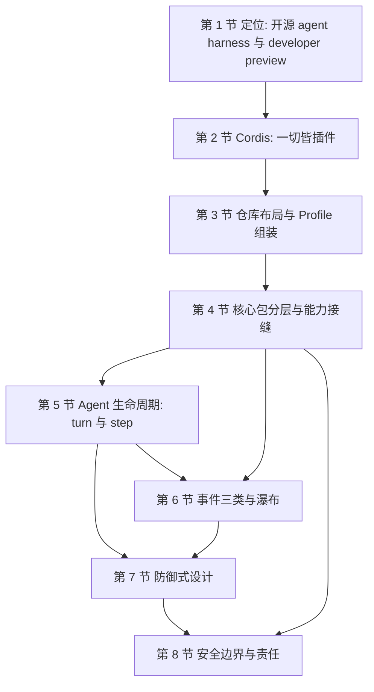
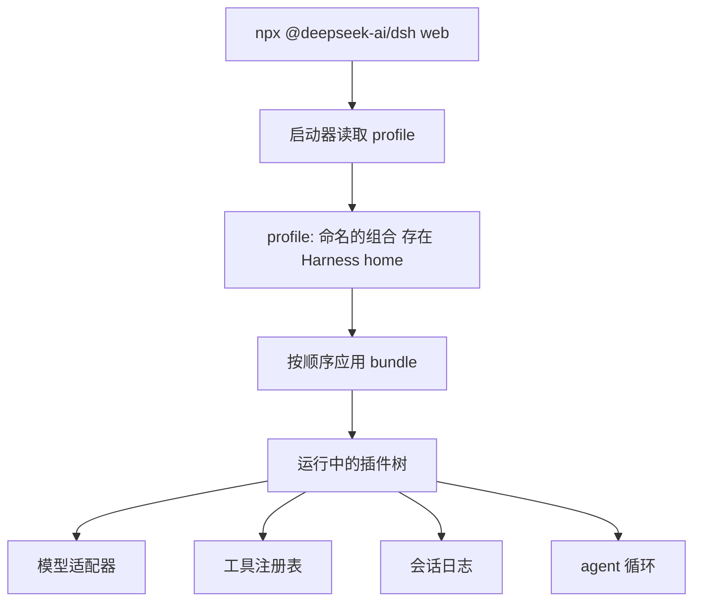
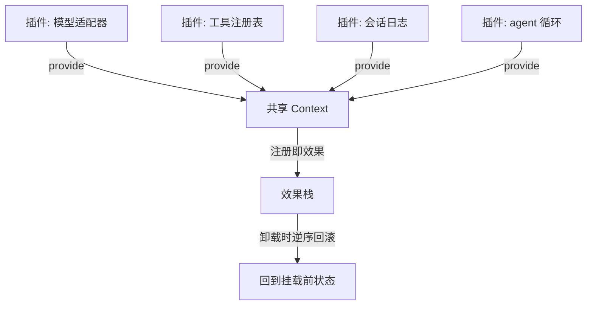
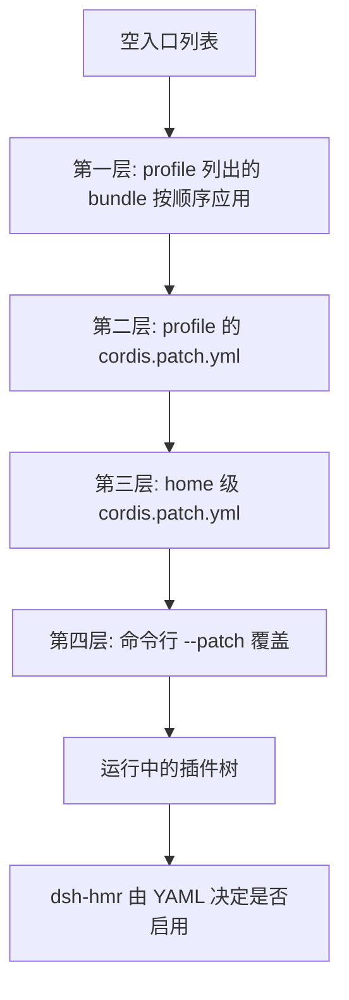
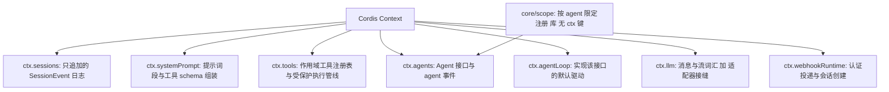
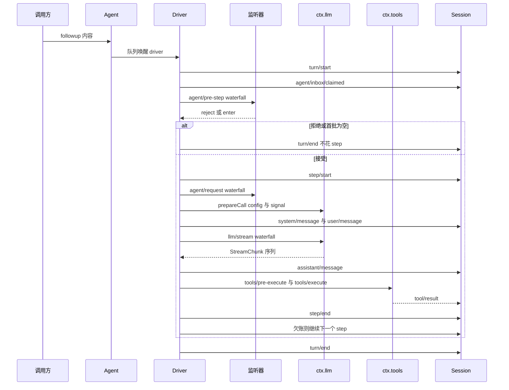
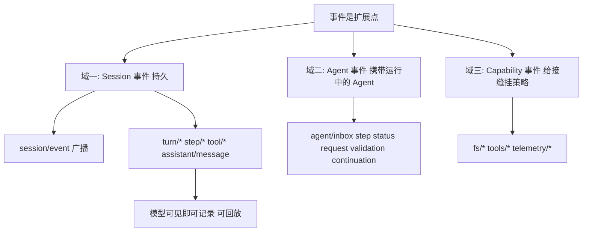
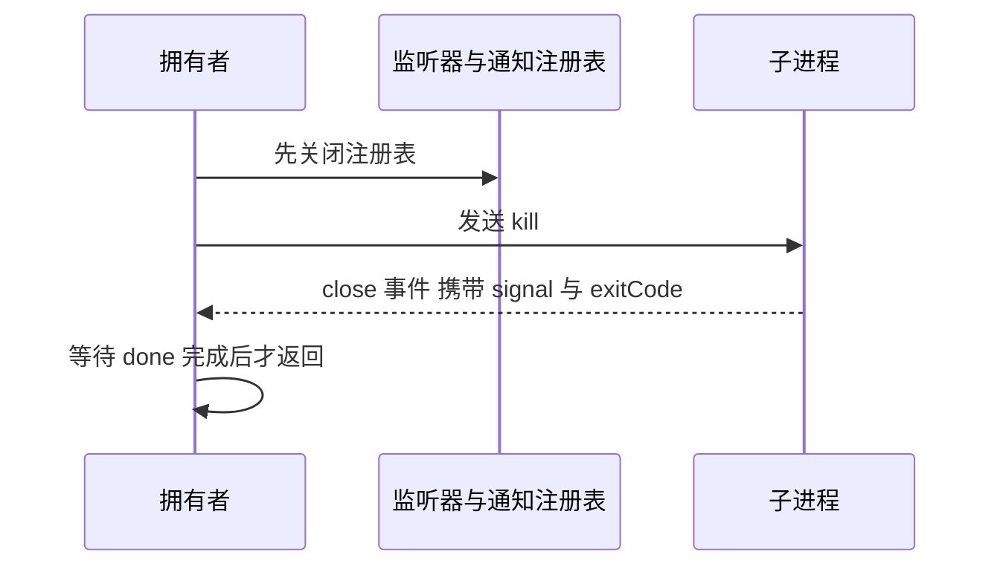
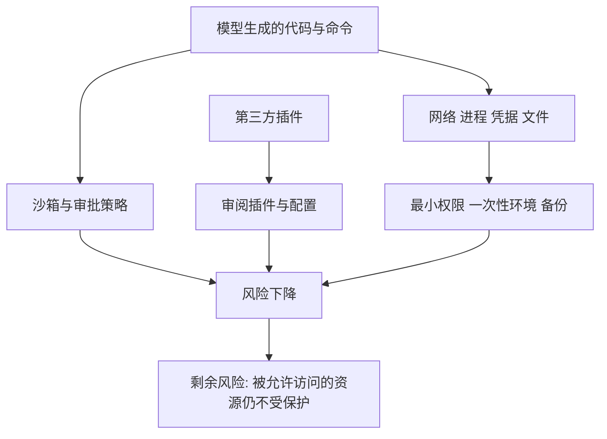

# DeepSeek Harness 架构：一切皆插件

!!! abstract "学完这一页你能"
    - 说出 dsh 的定位，并解释为什么模型适配器、工具注册表、会话日志、agent 循环都被做成插件。
    - 画出从 profile 到 bundle 再到运行中插件树的组装顺序，并说出 patch 在哪一层生效、如何命中一行。
    - 用 turn 与 step 两个词描述一条用户消息引发的完整流程，并指出哪些事件可以被回放。
    - 写出三段防御式代码：正交结果上报、dispose 等到静默、清洗环境变量后启动子进程。

## 0. 知识地图



建议先读第 1、2 节建立插件化直觉，再读第 3、4 节把直觉落到目录与包名。第 5、6 节是全页核心，建议对照时序图各读两遍。第 7、8 节写成检查清单，写代码时放在手边。

## 1. 定位：dsh 是什么

**先想一个问题**

你要给一个编程 agent 换模型厂商。打开代码，模型调用写死在主循环里，换一次要改核心源码。改完还要检查别人基于核心写的扩展有没有被破坏。dsh 把这件事变成挂一个插件。

**心智模型**

!!! tip "心智模型"
    一句话模型：dsh 是一个 agent harness，产品里每一部分都是可替换的插件。
    日常类比：一台台式机，主板只提供插槽，显卡、网卡、硬盘各自插在槽上。
    类比不成立的地方：拔掉显卡只是少一个功能，而 dsh 的插件卸载时，它注册的服务与事件会作为效果回滚，不留半截注册。

!!! note "术语：Agent Harness"
    Harness 指包裹模型的运行框架：模型只负责生成内容，框架负责提示词组装、工具调用、会话记录、权限与生命周期。例：dsh 把 `ctx.llm`、`ctx.tools`、`ctx.sessions` 拆成不同插件。

**图解**



1. 命令行的 `web` 是一个 profile 名，启动器按名字找到组合。
2. profile 存放在 Harness home 里，它记录要叠哪些 bundle。
3. bundle 是 Cordis 配置行与挂载代码的分发格式。
4. 逐层叠完后得到一棵插件树，没有需要打补丁的特权内核。
5. 模型适配器、工具注册表、会话日志、agent 循环都在这棵树里，各自可被配置替换。

**一步一步来**

第 1 步：把 dsh 跑起来。这一步要做什么：先确认它能启动，并知道本地启动与 SSH 启动的差别。

```sh
# 从 npm 运行，默认在 127.0.0.1:3080 起 Web UI
npx @deepseek-ai/dsh web
# 本地启动会打开默认浏览器；SSH 启动只打印主机 URL
# 只想起服务、不打开浏览器：
npx @deepseek-ai/dsh web --no-open
```

**这段代码在做什么**

- `npx` 拉取并执行 `@deepseek-ai/dsh` 这个包。
- `web` 选中 `web` profile，它是出厂模板之一。
- 默认监听 `127.0.0.1:3080`。
- `--no-open` 只影响是否打开浏览器，不影响服务。
- SSH 下不会自动打开浏览器，因为转发地址归 SSH 客户端或编辑器管。

运行结果：本地启动打印 `http://127.0.0.1:3080` 并打开浏览器；SSH 启动只打印主机 URL。

第 2 步：打印本机实际启动的插件树。这一步要做什么：把“树”从概念变成屏幕上可读的行。

```sh
# 打印 web profile 在这台机器上组装出的配置行
dsh --profile web --dump-config
# 输出的每一行都可以被你自己的 patch 替换或插入新行
```

**这段代码在做什么**

- `--profile web` 显式指定 profile，不依赖命令别名。
- `--dump-config` 打印组装后的配置行，位置在应用启动之前。
- 每一行有一个 id，patch 就是按 id 命中的。
- 看到某行不满意时，可以在 profile 或 home 层写 patch。

运行结果：终端输出若干配置行，每行带 id 与 config。

**动手验证**

依赖：无第三方依赖，只用 Node 20 内置模块。脚本把资料里写明的 profile 与 bundle 关系写成断言。

```js
// 依赖：无。运行：node profile-facts.mjs
import assert from 'node:assert/strict';

// 出厂的 profile 模板（architecture.md 列出五个）
const PROFILES = ['web', 'headless', 'sdk', 'sdk-minimal', 'acp'];
// dsh-base 是这四个 profile 共享的第一层
const SHARED_BASE = ['web', 'headless', 'sdk', 'acp'];
// 每个 profile 在 base 之外追加的 bundle
const EXTRA = {
  web: ['dsh-web-app'],
  headless: ['dsh-headless'],
  sdk: ['dsh-sdk-app'],
  acp: ['dsh-acp-app'],
  'sdk-minimal': ['dsh-sdk-minimal'], // 刻意的例外
};
// dsh-base 这一层负责的能力清单
const BASE_OWNS = ['model adapters', 'tools', 'persistence',
  'sandbox and approval policy', 'settings', 'credentials', 'telemetry'];

assert.equal(PROFILES.length, 5);
assert.ok(SHARED_BASE.every((p) => PROFILES.includes(p)));
assert.equal(BASE_OWNS.length, 7);

// 展开每个 profile 的 bundle 顺序
const tree = Object.fromEntries(PROFILES.map((p) => [p,
  SHARED_BASE.includes(p) ? ['dsh-base', ...EXTRA[p]] : [...EXTRA[p]]]));

assert.deepEqual(tree.web, ['dsh-base', 'dsh-web-app']);
assert.deepEqual(tree['sdk-minimal'], ['dsh-sdk-minimal']); // 不套 base
assert.equal(tree['sdk-minimal'].includes('dsh-base'), false);
console.log(JSON.stringify(tree, null, 2));
console.log('断言全部通过');
```

**这个脚本在做什么**

- 把出厂的五个 profile 与 base 的共享关系写成常量。
- 断言 `sdk-minimal` 不含 `dsh-base`，这是文档写明的例外。
- 断言 base 负责七项能力，数量对不上就立刻失败。

预期输出：

```text
{
  "web": ["dsh-base", "dsh-web-app"],
  "headless": ["dsh-base", "dsh-headless"],
  "sdk": ["dsh-base", "dsh-sdk-app"],
  "sdk-minimal": ["dsh-sdk-minimal"],
  "acp": ["dsh-base", "dsh-acp-app"]
}
断言全部通过
```

**常见坑**

| 现象 | 原因 | 怎么修 |
|---|---|---|
| 升级后插件报错 | 处在 developer preview，会有破坏性兼容变更 | 固定版本，升级前读安全提示并跑一遍自测 |
| 拿它跑不可信任务 | 项目可以执行模型生成的代码与命令、加载第三方插件 | 放进一次性虚拟机或容器，按最小权限运行 |
| SSH 下浏览器没弹出 | 转发地址归 SSH 客户端或编辑器管 | 手工转发端口，或用 `--no-open` 后自行访问 |

**小结**

- dsh 是 DeepSeek AI 的开源 agent harness，MIT 许可，处于 developer preview。
- 它建立在 everything-is-a-plugin 之上，由 Cordis 驱动。
- 没有需要打补丁的特权内核，扩展方式是挂一个插件。

## 2. Cordis：一切皆插件

**先想一个问题**

一个插件注册了服务、事件、定时器，卸载时忘了清其中一项。挂载卸载几十次后，旧监听器还在响应新请求。手工维护清理清单迟早会漏。

**心智模型**

!!! tip "心智模型"
    一句话模型：插件向共享 context 贡献服务、类型化事件与可逆效果，卸载时效果按登记逆序回滚。
    日常类比：办公室的共享白板，谁写谁擦，擦的时候按落笔的倒序擦。
    类比不成立的地方：白板不会自动擦，而 dsh 的注册是效果，插件卸载会触发回滚，不需要作者再写一遍清理代码。

!!! note "术语：Cordis"
    Cordis 是 dsh 底层的框架，设计思路见论文 A Programming Paradigm for Spatiotemporal Composability。例：dsh 里模型适配器是一个插件，它在 `ctx.llm` 上注册自己。

!!! note "术语：Context（上下文）"
    Context 是插件共享的容器，带着服务键与事件通道。例：工具注册表挂在 `ctx.tools`，会话日志挂在 `ctx.sessions`。

!!! note "术语：Effect（效果）"
    Effect 是注册动作留下的可撤销记录。例：`provide` 一个服务时同时登记一条“删除该服务”的效果。

**图解**



1. 每个插件把能力挂到共享 context 上，键名是约定好的服务名。
2. 注册动作同时登记一条效果，效果的职责是撤销这次注册。
3. 同一插件注册多项时，效果按登记顺序入栈。
4. 插件卸载时从栈顶开始弹，逆序执行撤销。
5. 全部弹完后，context 回到这个插件挂载之前的状态。

**一步一步来**

第 1 步：实现最小 context 的 provide 与 inject。这一步要做什么：让服务查找有明确失败，而不是静默拿到 undefined。

```js
// 依赖：无。运行：node mini-context.mjs
import assert from 'node:assert/strict';

function createContext() {
  const services = new Map(); // 服务名 -> 实现
  const effects = [];         // 可撤销效果，后进先出
  return {
    provide(name, impl) {     // 注册服务，同时登记撤销效果
      services.set(name, impl);
      effects.push(() => services.delete(name));
      return this;
    },
    inject(name) {            // 缺服务时抛错，避免静默 undefined
      if (!services.has(name)) throw new Error('missing service: ' + name);
      return services.get(name);
    },
    size() { return services.size; },
  };
}

const ctx = createContext();
ctx.provide('llm', { name: 'mock-adapter' });
assert.equal(ctx.size(), 1);
assert.equal(ctx.inject('llm').name, 'mock-adapter');
assert.throws(() => ctx.inject('tools'), /missing service/);
console.log('服务数 =', ctx.size());
```

**这段代码在做什么**

- `provide` 写入服务表，并往效果栈压一条撤销函数。
- `inject` 在缺失时抛错，让问题在挂载期就暴露。
- 断言先验证正常读取，再验证缺失路径。
- 此时还没有卸载逻辑，下一步补上。

运行结果：`服务数 = 1`。

第 2 步：补上卸载回滚。这一步要做什么：卸载时逆序执行效果，并返回回滚条数。

```js
// 接上一步的 createContext，新增 unload
unload() {
  let n = 0;
  while (effects.length) { effects.pop()(); n += 1; } // 逆序回滚
  return n;
},
```
放进 `createContext` 的返回对象后：

```js
// 依赖：无。运行：node mini-context.mjs
const rolled = ctx.unload();
assert.equal(rolled, 1);        // 一条效果被回滚
assert.equal(ctx.size(), 0);    // 服务表清空
assert.throws(() => ctx.inject('llm'), /missing service/);
console.log('回滚条数 =', rolled, '剩余服务 =', ctx.size());
```

**这段代码在做什么**

- `pop()` 保证后登记的效果先回滚。
- 循环到栈空为止，回滚条数可以用于断言。
- 断言服务表清空，并且旧服务名不能再取到。
- 这段逻辑与 Cordis 的“注册是效果、卸载会 unwind”一致。

运行结果：`回滚条数 = 1 剩余服务 = 0`。

**动手验证**

依赖：无第三方依赖，只用 Node 20 内置模块。

```js
// 依赖：无。运行：node cordis-mini.mjs
import assert from 'node:assert/strict';

function createContext() {
  const services = new Map();  // 服务名 -> 实现
  const effects = [];          // 效果栈，后进先出
  return {
    provide(name, impl) {      // 注册服务并登记撤销效果
      services.set(name, impl);
      effects.push(() => services.delete(name));
      return this;
    },
    inject(name) {             // 缺服务时抛错
      if (!services.has(name)) throw new Error('missing service: ' + name);
      return services.get(name);
    },
    size() { return services.size; },
    unload() {                 // 逆序回滚这个插件留下的全部效果
      let n = 0;
      while (effects.length) { effects.pop()(); n += 1; }
      return n;
    },
  };
}

const ctx = createContext();
ctx.provide('llm', { name: 'mock-adapter' });
ctx.provide('tools', { register: () => {} });
assert.equal(ctx.size(), 2);
assert.equal(ctx.inject('llm').name, 'mock-adapter');

const rolled = ctx.unload();
assert.equal(rolled, 2);                    // 两条效果都回滚
assert.equal(ctx.size(), 0);                // 服务表清空
assert.throws(() => ctx.inject('llm'), /missing service/);
console.log('回滚条数 =', rolled, '剩余服务 =', ctx.size());
```

**这个脚本在做什么**

- 把两个服务注册进同一个 context，验证多条效果的入栈。
- 卸载时断言回滚条数是 2，不是 1。
- 卸载后再取服务，断言抛错而不是返回旧实现。

预期输出：

```text
回滚条数 = 2 剩余服务 = 0
```

**常见坑**

| 现象 | 原因 | 怎么修 |
|---|---|---|
| 热重载后旧监听器还在响应 | 注册没有登记为可撤销效果 | 把每次注册都包成效果，卸载时回滚 |
| 插件拿不到服务但不报错 | 读取失败返回 undefined，问题延后爆发 | 缺失服务时抛错，让挂载期失败 |
| 两个插件抢同一个服务键 | 没有把注册限定到作用域 | 用 per-agent 的作用域注册原语隔离 |

**小结**

- Cordis 的插件贡献三类东西：服务、类型化事件、可逆效果。
- 注册即效果，插件卸载时效果会 unwind，不是只发一个停止信号。
- 没有一个特权内核等着被打补丁，扩展就是并排挂插件。

## 3. 仓库布局与 Profile 组装

**先想一个问题**

同事的 dsh 和你的行为不一样，端口也不同。你不知道差异来自工厂 bundle、他的 profile patch，还是命令行覆盖。要定位差异，得先知道层序。

**心智模型**

!!! tip "心智模型"
    一句话模型：一次启动就是往空入口列表上按固定顺序叠层，后一层能改前一层的行。
    日常类比：装修时的灯带与贴纸，先铺底，再贴面层，最后一层在最上面。
    类比不成立的地方：贴纸只能盖住表面，而 patch 是按行 id 命中后整块替换该行的 config，不做字段级合并。

!!! note "术语：Profile"
    Profile 是存在 Harness home 里的命名组合，列出要叠的 bundle、安装的树外插件、以及用户自己的 `cordis.patch.yml`。例：出厂模板有 `web`、`headless`、`sdk`、`sdk-minimal`、`acp`。

!!! note "术语：Bundle"
    Bundle 是 Cordis 配置行与挂载代码的分发格式。例：`dsh-web-app` 在 `dsh-base` 之上加入浏览器应用。

!!! note "术语：Patch（补丁）"
    Patch 是按行 id 命中、替换整行 config 或插入新行的覆盖文件。例：把 `llm-default` 那一行的 provider 换掉。

**图解**



1. 组装从空入口列表开始，不预置任何行。
2. 先按 profile 里列出的顺序逐个应用 bundle，`dsh-base` 通常在第一位。
3. 然后应用 profile 自己的 `cordis.patch.yml`。
4. 再应用 home 级 patch，最后应用命令行 `--patch` 覆盖。
5. 结果是一棵插件树；HMR 是否启用由 YAML 决定，profile patch 可以改写这个默认值。

**一步一步来**

第 1 步：识别仓库分区。这一步要做什么：把资料里出现的路径按分区归类，避免在错误的目录里找代码。

```js
// 依赖：无。运行：node repo-layout.mjs
import assert from 'node:assert/strict';

// 资料中出现的包路径（完整目录树需核对官方文档 docs/architecture.md）
const KNOWN = [
  'packages/bundle/base', 'packages/bundle/web-app',
  'packages/bundle/headless', 'packages/bundle/sdk-app',
  'packages/bundle/acp-app', 'packages/bundle/sdk-minimal',
  'packages/boot/app-boot', 'packages/boot/plugin-manager',
  'packages/core/session', 'packages/core/system-prompt',
  'packages/core/tools', 'packages/core/agent',
  'packages/core/agent-loop', 'packages/core/scope',
  'packages/llm/llm', 'packages/webhook/webhook',
  'apps/desktop',
];

function zoneOf(p) {            // 按第二段目录名归类
  const parts = p.split('/');
  return parts[0] === 'apps' ? 'app' : parts[1];
}
const zones = new Set(KNOWN.map(zoneOf));
for (const z of ['bundle', 'boot', 'core', 'llm', 'webhook']) {
  assert.ok(zones.has(z), 'missing zone: ' + z);
}
assert.equal(zoneOf('apps/desktop'), 'app');
console.log('目录分区 =', [...zones].join(', '));
```

**这段代码在做什么**

- 用资料里出现的路径建立一份可断言的清单。
- `zoneOf` 把 `packages/<分区>/<包>` 的第二段当作分区名。
- 断言五个分区都存在，漏一个就失败。
- `apps/desktop` 走另一条分支，归到 `app`。

运行结果：`目录分区 = bundle, boot, core, llm, webhook, app`。

第 2 步：读 bundle 的自我声明。这一步要做什么：确认 bundle 与 profile 通过 `package.json` 的 `dsh` 字段声明自己。

```js
// 依赖：无。运行：node dsh-field.mjs
import assert from 'node:assert/strict';

// 资料说明: dsh.profile 列出 profile 的 bundle，dsh.bundle 指向 bundle 的 patch 文件
const profilePkg = { name: 'web', dsh: { profile: ['dsh-base', 'dsh-web-app'] } };
const bundlePkg = { name: 'dsh-web-app', dsh: { bundle: './cordis.patch.yml' } };

assert.deepEqual(profilePkg.dsh.profile, ['dsh-base', 'dsh-web-app']);
assert.equal(bundlePkg.dsh.bundle, './cordis.patch.yml');
// 两者字段不同，不要混用
assert.equal(profilePkg.dsh.bundle, undefined);
assert.equal(bundlePkg.dsh.profile, undefined);
console.log('profile 的 bundle 数 =', profilePkg.dsh.profile.length);
```

**这段代码在做什么**

- `dsh.profile` 只出现在 profile 这一侧，列的是 bundle 名单。
- `dsh.bundle` 只出现在 bundle 这一侧，指向它的 patch 文件。
- 断言两个字段不混用，混用会让启动器找不到输入。
- 名字与顺序都必须与 profile 文件一致，否则组装结果不同。

运行结果：`profile 的 bundle 数 = 2`。

**动手验证**

依赖：无第三方依赖，只用 Node 20 内置模块。

```js
// 依赖：无。运行：node layers.mjs
import assert from 'node:assert/strict';

function applyBundle(rows, bundle) {     // 追加 bundle 的行
  return [...rows, ...bundle.rows.map((r) => ({ ...r }))];
}
function applyPatch(rows, patch) {       // 按 id 整块替换 config
  return rows.map((row) => {
    const hit = patch.find((x) => x.id === row.id);
    return hit ? { id: row.id, config: { ...hit.config } } : row;
  });
}
function applyInsert(rows, inserts) {    // 插入新行
  return [...rows, ...inserts.map((r) => ({ ...r }))];
}

let rows = [];
rows = applyBundle(rows, { rows: [            // 第一层: 某个 bundle
  { id: 'llm-default', config: { provider: 'a' } },
  { id: 'tools', config: { enabled: true } },
] });
assert.deepEqual(rows.map((r) => r.id), ['llm-default', 'tools']);

rows = applyPatch(rows, [{ id: 'llm-default', config: { provider: 'b' } }]);
assert.equal(rows[0].config.provider, 'b');
assert.equal(rows[0].config.enabled, undefined); // 整块替换，旧字段不保留

rows = applyInsert(rows, [{ id: 'my-plugin', config: {} }]);
assert.equal(rows.at(-1).id, 'my-plugin');       // 新行插在末尾
console.log('最终行 =', rows.map((r) => r.id).join(' -> '));
```

**这个脚本在做什么**

- 把层序压成三个纯函数：追加 bundle、按 id 替换、插入新行。
- 断言替换是整块替换：旧 config 里的 `enabled` 不保留。
- 断言插入的行出现在列表末尾，顺序可复现。

预期输出：

```text
最终行 = llm-default -> tools -> my-plugin
```

**常见坑**

| 现象 | 原因 | 怎么修 |
|---|---|---|
| patch 写了但没生效 | id 与 `--dump-config` 打印的行 id 不一致 | 先跑 `dsh --profile web --dump-config`，用打印出的 id |
| 覆盖后丢掉字段 | 以为 patch 是字段级合并 | 记住 patch 替换整行 config，要保留就得写全 |
| 给 `sdk-minimal` 加 base 的插件 | 它是刻意例外，不套 `dsh-base` | 用 `sdk-minimal` 的显式 SDK 树，或换用 `sdk` profile |

**小结**

- 启动是把空入口列表按四层顺序叠加：bundle 顺序、profile patch、home patch、命令行 patch。
- patch 按行 id 命中，替换整行 config 或插入新行。
- HMR 默认值写在 YAML 里，base 启用 config-only 的 `dsh-hmr`，headless、SDK、ACP 关闭，`sdk-minimal` 不含。

## 4. 核心包分层与能力接缝

**先想一个问题**

你想把本地 Bash 换成远程沙箱执行。如果文件系统与子进程各写一套，你就要改两处，还可能与另一处行为不一致。接缝解决的是这个问题。

**心智模型**

!!! tip "心智模型"
    一句话模型：一个接缝由定义、实现、消费者三个角色组成，换掉实现时消费者代码不动。
    日常类比：墙上的插座，电器只认插孔形状，不认电从哪个电厂来。
    类比不成立的地方：插座只传电，接缝还带策略事件与共享的执行世界，文件系统与子进程指向同一个远程环境时，Bash、PTY、LSP 会一起搬过去。

!!! note "术语：Seam（能力接缝）"
    接缝是可替换的能力，含三个角色：声明接口的 Service Definition、实现接口的 Service Provider、使用接口的 Consumer。例：`ctx.fs` 的 Provider 换成远程实现，模型侧工具代码不变。

**图解**



1. `ctx.sessions` 拥有只追加的会话事件日志。
2. `ctx.systemPrompt` 负责提示词段与工具 schema 的组装。
3. `ctx.tools` 拥有作用域工具注册表与受保护执行管线。
4. `ctx.agentLoop` 是实现 `ctx.agents` 接口的默认驱动。
5. `ctx.llm` 放消息与流词汇，同时是适配器接缝。
6. `core/scope` 没有 ctx 键，它是按 agent 限定注册的库。

**一步一步来**

第 1 步：声明定义与实现。这一步要做什么：把接口与两份实现分开写，先不写消费者。

```js
// 依赖：无。运行：node seam.mjs
// Service Definition: 只声明接口，不放实现
export const fsContract = {
  readFile: 'required',   // 约定: Provider 必须提供 readFile
  writeFile: 'optional',  // 约定: 可选
};

// Provider A: 本地实现
export function makeLocalFs() {
  const files = { '/note.txt': 'hello' };
  return { readFile: async (p) => files[p] ?? '' };
}
// Provider B: 远程实现，形状相同、数据来源不同
export function makeRemoteFs() {
  return { readFile: async (p) => 'remote:' + p };
}
```

**这段代码在做什么**

- 定义只描述接口形状，不包含任何实现，避免定义与实现耦合。
- 两个 Provider 返回同一个方法名 `readFile`，参数与返回形状一致。
- 本地实现从内存表读，远程实现加前缀，便于断言区分。
- 到此还没有接缝，因为缺消费者，缺一个角色的不算接缝。

运行结果：无输出，模块被下一步导入。

第 2 步：写消费者并替换 Provider。这一步要做什么：证明消费者代码与 Provider 选择无关。

```js
// 依赖：无。运行：node seam-consumer.mjs
import assert from 'node:assert/strict';
import { makeLocalFs, makeRemoteFs } from './seam.mjs';

function makeCtx(provider) {                 // 最小 context
  const services = new Map([['fs', provider]]);
  return { inject: (key) => services.get(key) };
}
function makeReadTool(ctx) {                 // Consumer: 只认 ctx.fs
  return async (path) => {
    const text = await ctx.inject('fs').readFile(path);
    return { path, text };
  };
}

const local = await makeReadTool(makeCtx(makeLocalFs()))('/note.txt');
const remote = await makeReadTool(makeCtx(makeRemoteFs()))('/note.txt');
assert.equal(local.text, 'hello');
assert.equal(remote.text, 'remote:/note.txt');
console.log('local =', local.text, 'remote =', remote.text);
```

**这段代码在做什么**

- 消费者通过 `ctx.inject('fs')` 取实现，不 import 具体 Provider。
- 同一份消费者代码跑两次，只换 context 里的 Provider。
- 两次结果的差异只来自数据来源，来自接口的部分完全相同。
- 这就是“换一个 Provider 改变整个产品”的最小演示。

运行结果：`local = hello remote = remote:/note.txt`。

**动手验证**

依赖：无第三方依赖，只用 Node 20 内置模块。为方便单文件运行，把定义、两个 Provider、消费者放在一个文件里。

```js
// 依赖：无。运行：node seam-full.mjs
import assert from 'node:assert/strict';

const contract = { readFile: 'required' };    // Service Definition
const makeLocalFs = () => {                   // Provider A
  const files = { '/note.txt': 'hello' };
  return { readFile: async (p) => files[p] ?? '' };
};
const makeRemoteFs = () => ({                 // Provider B
  readFile: async (p) => 'remote:' + p,
});
const makeCtx = (provider) => ({              // 承载服务的上下文
  inject: (key) => (key === 'fs' ? provider : undefined),
});
const makeReadTool = (ctx) => async (path) => { // Consumer
  const text = await ctx.inject('fs').readFile(path);
  return { path, text };
};

assert.equal(contract.readFile, 'required');  // 定义里不放实现
const local = await makeReadTool(makeCtx(makeLocalFs()))('/note.txt');
const remote = await makeReadTool(makeCtx(makeRemoteFs()))('/note.txt');
assert.equal(local.text, 'hello');
assert.equal(remote.text, 'remote:/note.txt');

// 依赖与子进程指向同一个执行世界，因此一起搬家
const world = { fs: 'remote', subprocess: 'remote' };
assert.equal(world.fs, world.subprocess);
console.log('local =', local.text, '| remote =', remote.text);
```

**这个脚本在做什么**

- 一份定义、两份实现、一份消费者，三角色齐全。
- 断言换 Provider 后消费者输出按预期变化。
- 用一份 `world` 对象表达“文件系统与子进程共享执行世界”。

预期输出：

```text
local = hello | remote = remote:/note.txt
```

**常见坑**

| 现象 | 原因 | 怎么修 |
|---|---|---|
| 加了 Provider 但没有模型可见能力 | 只写了定义与实现，缺消费者 | 三个角色一起设计，消费者通常是面向模型的工具 |
| 一个预设里的服务泄漏到别的会话 | 单会话预设里的服务行没有隔离域 | 给该行加 `isolate` 域 |
| 换了 fs 实现但 Bash 还在本地跑 | 只换了文件系统，没换子进程 Provider | 让两者指向同一个执行世界，Bash、PTY、LSP 会一起迁移 |

**小结**

- 接缝三角色是定义、实现、消费者，缺一个角色就不构成接缝。
- 换 Provider 能整体改变产品行为，因为消费者只依赖接口。
- `core/scope` 提供按 agent 限定注册的能力，用来隔离会话级配置。

## 5. Agent 生命周期：turn 与 step

**先想一个问题**

用户只发了一条消息，会话日志里却出现两次模型请求。中间发生了什么，日志里为什么多出一条工具结果？答案在于 turn 与 step 是两个层级。

**心智模型**

!!! tip "心智模型"
    一句话模型：turn 从第一批输入被 claim 前打开，到没有欠账时关闭；step 是一次模型请求加上它调用的工具。
    日常类比：一次点菜是一个 turn，后厨每出一道菜加一次传菜是一个 step。
    类比不成立的地方：turn 的关闭不取决于用户再不再说话，而取决于“没有欠账”，工具欠下一次请求就会再开一个 step。

!!! note "术语：Turn（回合）"
    Turn 是零个或多个 step 的容器：它在第一批输入被 claim 之前打开，在没有欠账时关闭。例：一批输入被 `agent/pre-step` 拒绝时，turn 关闭且不花掉 step。

!!! note "术语：Step（步）"
    Step 是一次模型请求加上这次请求调用的工具。例：模型要求调用 Bash，工具返回后还欠一次请求，于是开启下一个 step。

**图解**



1. 调用方投递内容，inbox 收到消息，队列唤醒 driver。
2. driver 写 `turn/start`，然后 claim 待处理的 next-step 输入与一条排队消息。
3. 提示词组装与 `agent/pre-step` 是瀑布，监听器可以让这次 step 被拒绝。
4. 一旦接受，写 `step/start`，再走 `agent/request` 与 `prepareCall` 定下实际路由。
5. 提交 system 与 user 消息后开始流式请求，成功写 `assistant/message`。
6. 工具结果写回后，若欠下一次请求就再开一个 step；欠账清零后写 `turn/end`。

**一步一步来**

第 1 步：实现 claim 与 pre-step 的两条出口。这一步要做什么：先把“拒绝”这条路径写对，它是容易漏的分支。

```js
// 依赖：无。运行：node pre-step.mjs
import assert from 'node:assert/strict';

// 瀑布: 每个监听器必须调用 next() 才会交给下一个
async function waterfall(listeners, value) {
  let i = 0;
  const next = async () => (i >= listeners.length
    ? value
    : listeners[i++](value, next));
  return next();
}

async function preStep(claimed) {
  return waterfall([
    (v, next) => next(),                       // 观察者: 不改动
    (v, next) => (v.text === '' ? 'reject' : next()), // 拦截者
  ], { text: claimed });
}

assert.equal(await preStep('hi'), 'enter');    // 缺省放行
assert.equal(await preStep(''), 'reject');     // 空输入被拒
console.log('两条出口都通');
```

**这段代码在做什么**

- `waterfall` 只有被 `next()` 才继续，返回的是最终值。
- 第二个监听器把空文本判成 `reject`，非空则继续委派。
- 断言覆盖放行与拒绝两条路径。
- 被拒绝时，后面的状态机会关闭 turn 且不写 `step/start`。

运行结果：`两条出口都通`。

第 2 步：把 turn 与 step 串起来。这一步要做什么：让欠账驱动 step 循环，并区分拒绝路径的事件数。

```js
// 依赖：无。运行：node turn-loop.mjs
import assert from 'node:assert/strict';

function runTurn(inputs, decide, owedAfter) {
  const log = [];
  log.push('turn/start');
  inputs.shift();                          // claim 一批 next-step 输入
  if (decide() === 'reject') {             // 拒绝: 关闭 turn 且不花 step
    log.push('turn/end');
    return log;
  }
  let owed = owedAfter;                    // 工具欠下的请求数
  do {
    log.push('step/start', 'agent/request', 'assistant/message');
    owed -= 1;                             // 这一步还掉一次
    log.push('step/end');
  } while (owed > 0);                      // 还欠就开下一个 step
  log.push('turn/end');
  return log;
}

const accepted = runTurn(['hi'], () => 'enter', 2);
assert.equal(accepted.length, 10);         // 2 个 step，每个 4 条
assert.equal(accepted.filter((e) => e === 'step/start').length, 2);
const rejected = runTurn([''], () => 'reject', 0);
assert.deepEqual(rejected, ['turn/start', 'turn/end']);
console.log('接受路径事件数 =', accepted.length, '拒绝路径 =', rejected.length);
```

**这段代码在做什么**

- `owedAfter` 表示工具欠下的请求数，循环条件由它决定。
- 接受路径断言两个 step、共 10 条事件。
- 拒绝路径断言只有 `turn/start` 与 `turn/end`，一个 step 都不花。
- 与文档一致：被拒绝的空首批会关闭一个持久 turn 且不产生 step。

运行结果：`接受路径事件数 = 10 拒绝路径 = 2`。

**动手验证**

依赖：无第三方依赖，只用 Node 20 内置模块。

```js
// 依赖：无。运行：node turn-full.mjs
import assert from 'node:assert/strict';

const log = [];
const emit = (e) => log.push(e);

function runTurn(inputs, decidePreStep, owedAfter) {
  emit('turn/start');
  inputs.shift();                            // claim 一批 next-step 输入
  if (decidePreStep() === 'reject') {        // 拒绝或空首批
    emit('turn/end');                        // 关闭 turn，不花 step
    return 0;
  }
  let steps = 0;
  let owed = owedAfter;
  do {
    emit('step/start');
    emit('agent/request');                   // 瀑布: 可以改路由
    emit('assistant/message');               // 成功的一次提供方调用
    owed -= 1;                               // 还掉一次工具欠账
    emit('step/end');
    steps += 1;
  } while (owed > 0);
  emit('turn/end');
  return steps;
}

log.length = 0;
assert.equal(runTurn(['hi'], () => 'enter', 2), 2);
assert.deepEqual(log, ['turn/start', 'step/start', 'agent/request',
  'assistant/message', 'step/end', 'step/start', 'agent/request',
  'assistant/message', 'step/end', 'turn/end']);

log.length = 0;
assert.equal(runTurn([''], () => 'reject', 0), 0);
assert.deepEqual(log, ['turn/start', 'turn/end']);
console.log('接受路径 =', 10, '条事件', '| 拒绝路径 =', log.length, '条事件');
```

**这个脚本在做什么**

- 用数组记录事件顺序，把生命周期变成可断言的两条轨迹。
- 深比较保证顺序不漂移，改错顺序会立刻失败。
- 拒绝路径复用同一函数，断言它不产生任何 step 事件。

预期输出：

```text
接受路径 = 10 条事件 | 拒绝路径 = 2 条事件
```

**常见坑**

| 现象 | 原因 | 怎么修 |
|---|---|---|
| 以为重试会重复走 pre-step | 重试在已打开的 step 内，只重新 prepareCall 与对账 | 记住重试不重复组装、不重复 pre-step、不重复准入用户消息 |
| 失败 step 的工具结果对不齐 | 失败时少补了缺失的工具结果 | 失败 step 要记录缺失的工具结果，保持消息成对 |
| 把 `agent/status` 当单条消息的结果 | 多条排队消息与注入工作可能共用一个 running 区间 | 自己定义观测区间，例如从 inbox 回执到下一次整体 idle |

**小结**

- turn 是零到多个 step 的容器，step 是一次模型请求加它调用的工具。
- 第一批输入被拒绝或为空时，turn 关闭且不产生 step。
- 每个成功的提供方调用都会写 `assistant/message`，包括空内容和 max-tokens 结束。

## 6. 事件三类与瀑布

**先想一个问题**

你想拦截一次工具调用，加一条审计记录。你也想让这条记录在重开会话后还能看到。这两件事属于不同的事件域，选错了就得不到想要的效果。

**心智模型**

!!! tip "心智模型"
    一句话模型：事件分三个域，选域是大多数改动的第一个决定。
    日常类比：正式档案、过程影像、审批规则分别放在三个柜子里。
    类比不成立的地方：柜子是物理隔离，而三个域都挂在同一个 context 上，只是持久性、携带对象、消费方式不同。

!!! note "术语：Waterfall（瀑布事件）"
    Waterfall 是监听器必须调用 `next()` 才会把处理权交给下一个的扩展点。例：`agent/pre-step`、`agent/request`、`llm/stream`、三个 `tools/*` 事件都是瀑布。

!!! note "术语：Serial（串行事件）"
    Serial 是没有 `next()`、按顺序逐个执行完成的扩展点。例：`agent/turn-stopping` 是串行终止检查点。

**图解**



1. 选域的第一个判断是这件事要不要在重载后仍然存在。
2. 要持久就选 Session 事件，它会追加进日志并通过 `session/event` 广播。
3. 只观察或拦截在途工作就选 `agent/*`，它携带运行中的 Agent。
4. 要给接缝挂策略或适配器就选能力事件，例如 `fs/*`、`tools/*`、`telemetry/*`，这样不必 import 循环本身。
5. 持久事件让 fork、resume、转录、遥测、持久化都能从同一份结算推导。

**一步一步来**

第 1 步：实现瀑布调度与回调隔离。这一步要做什么：让一个抛错的监听器不影响它后面的监听器。

```js
// 依赖：无。运行：node waterfall.mjs
import assert from 'node:assert/strict';

const errors = [];
async function waterfall(listeners, value) {
  let i = 0;
  const next = async () => {
    if (i >= listeners.length) return value;
    const fn = listeners[i++];
    try { return await fn(value, next); }          // 委派给下一个
    catch (err) { errors.push(err.message); return value; } // 隔离异常
  };
  return next();
}

const out = await waterfall([
  (v, next) => { v.push('a'); return next(); },    // 正常改写
  () => { throw new Error('bad listener'); },      // 故意抛错
  (v, next) => { v.push('c'); return next(); },    // 必须仍然执行
], []);

assert.deepEqual(out, ['a', 'c']);
assert.deepEqual(errors, ['bad listener']);
console.log('结果 =', out, '隔离的异常 =', errors);
```

**这段代码在做什么**

- `next()` 是委派，只有调用它才会走到下一个监听器。
- 第二个监听器抛错，被 dispatcher 捕获并记录。
- 第三个监听器仍然执行，证明一个坏订阅者不会打断生命周期。
- 断言同时覆盖返回值与异常列表。

运行结果：`结果 = [ 'a', 'c' ] 隔离的异常 = [ 'bad listener' ]`。

第 2 步：区分瀑布与串行。这一步要做什么：串行没有委派参数，逐个 await 到结束。

```js
// 依赖：无。运行：node serial.mjs
import assert from 'node:assert/strict';

async function serial(listeners, value) {  // 没有 next 参数
  for (const fn of listeners) await fn(value); // 按序执行完一个再下一个
}
const seen = [];
await serial([async () => seen.push('first'),
              async () => seen.push('second')], null);
assert.deepEqual(seen, ['first', 'second']);
// agent/turn-stopping 是串行终止检查点，用它决定是否停下
console.log('串行顺序 =', seen.join(' -> '));
```

**这段代码在做什么**

- 串行没有 `next()`，顺序由数组顺序决定。
- 每个监听器被 await，前一个完成才执行下一个。
- 断言顺序固定，与瀑布的“可短路”形成对照。
- `agent/turn-stopping` 就是这种形状的终止检查点。

运行结果：`串行顺序 = first -> second`。

**动手验证**

依赖：无第三方依赖，只用 Node 20 内置模块。

```js
// 依赖：无。运行：node events-full.mjs
import assert from 'node:assert/strict';

const errors = [];
async function waterfall(listeners, value) {   // 必须 next 才委派
  let i = 0;
  const next = async () => {
    if (i >= listeners.length) return value;
    const fn = listeners[i++];
    try { return await fn(value, next); }
    catch (err) { errors.push(err.message); return value; }
  };
  return next();
}
async function serial(listeners, value) {      // 无 next，按序 await
  for (const fn of listeners) await fn(value);
}

// 一个统一的日志：持久事件进 durable，实时事件进 live
const durable = [];
const live = [];
const emitDurable = (name) => durable.push(name);
const emitLive = (name) => live.push(name);

const out = await waterfall([
  (v, next) => { emitLive('agent/pre-step'); return next(); },
  (v, next) => { v.push('rewritten'); return next(); },
], []);
assert.deepEqual(out, ['rewritten']);

emitDurable('turn/start');
emitDurable('assistant/message');
emitDurable('turn/end');
await serial([async () => emitLive('agent/turn-stopping')], null);

assert.deepEqual(durable, ['turn/start', 'assistant/message', 'turn/end']);
assert.deepEqual(live, ['agent/pre-step', 'agent/turn-stopping']);
console.log('durable =', durable.join(','), '| live =', live.join(','));
```

**这个脚本在做什么**

- 两个事件通道分别记录，模拟持久与实时的分工。
- 断言持久通道只收 `turn/*` 与 `assistant/message` 这类可回放事件。
- 断言实时通道收 `agent/*`，这类事件不进日志。
- 需要可回放数据的消费方读 `session/event`，`agent/*` 只做实时协调。

预期输出：

```text
durable = turn/start,assistant/message,turn/end | live = agent/pre-step,agent/turn-stopping
```

**常见坑**

| 现象 | 原因 | 怎么修 |
|---|---|---|
| 后面的监听器收不到 | 前一个监听器忘了调用 `next()` | 包装式监听器用 `{ ...decision, messages }` 保留声明并继续委派 |
| 从 `agent/*` 重建会话失败 | `agent/*` 是实时协调 API，不是回放来源 | 回放改读 `session/event` |
| 给串行事件传 `next` | `agent/turn-stopping` 没有 `next()` | 串行监听器直接完成，返回值不参与委派 |

**小结**

- 三个事件域分别是 Session、Agent、Capability，选域看持久性与作用对象。
- 瀑布事件必须调用 `next()`，串行事件没有 `next()`。
- `agent/assistant-stream` 只有进程内的 start、chunk、end 帧，进程在结算前丢失就没有可回放的尝试流。

## 7. 防御式设计

**先想一个问题**

一个子进程超时被杀了，但它的退出码是 0，因为它自己捕获了信号。调用方只看退出码，就会把一次被砍断的运行当成成功。

**心智模型**

!!! tip "心智模型"
    一句话模型：每一条独立事实单独上报，清理必须等到静默，而不是只发出请求。
    日常类比：体检报告每项指标各占一栏，不会把血压写进视力那一栏。
    类比不成立的地方：报告不会因为你没看就改结论，而嵌套分支的代码会把事实藏进另一个分支，调用方就永远读不到。

!!! note "术语：正交结果"
    正交结果指互相独立、可以同时成立的事实，例如 `timedOut`、`signal`、`exitCode` 三个字段。例：超时被 SIGKILL 的进程同时满足 `timedOut = true` 与 `signal = 'SIGKILL'`。

!!! note "术语：Quiescence（静默）"
    Quiescence 指清理动作已经等到被清理的工作真正停止。例：`kill` 之后还要 await 子进程的 `done`，不能发出信号就返回。

**图解**



1. 先关闭监听器与通知注册表，后到的完成事件保持静默。
2. 再对子进程发出终止信号。
3. `close` 事件带回 `signal` 与 `exitCode`，两者各自记录。
4. 拥有者 await 子进程结束，清理函数返回时已经没有孤儿。

**一步一步来**

第 1 步：让结果正交上报。这一步要做什么：三个字段各报各的，不做嵌套分支。

```js
// 依赖：无。运行：node orthogonal.mjs
import assert from 'node:assert/strict';
import { spawn } from 'node:child_process';

function run(cmd, args, timeoutMs) {
  return new Promise((resolve) => {
    const child = spawn(cmd, args, { stdio: 'ignore' });
    let timedOut = false;
    const timer = setTimeout(() => {
      timedOut = true;             // 事实一: 超时发生了
      child.kill('SIGKILL');       // 事实二: 发过信号
    }, timeoutMs);
    child.on('close', (exitCode, signal) => {
      clearTimeout(timer);
      resolve({ timedOut, signal, exitCode }); // 三个字段并列
    });
  });
}

const slow = await run(process.execPath,
  ['-e', 'setTimeout(() => {}, 5000)'], 100);
assert.equal(slow.timedOut, true);
assert.equal(slow.signal, 'SIGKILL');
console.log(JSON.stringify(slow));
```

**这段代码在做什么**

- `timedOut` 只表示是否超过等待时间，不表示进程行为。
- `signal` 与 `exitCode` 由 `close` 事件原样带回。
- 三个字段并列返回，调用方可以自行判断。
- 断言超时与信号同时成立，而不是二选一。

运行结果：`{"timedOut":true,"signal":"SIGKILL","exitCode":null}`。

第 2 步：统一公共契约。这一步要做什么：接缝实现可能抛错，也可能发出终止 finish，公共 API 要归一成一种形状。

```js
// 依赖：无。运行：node normalize.mjs
import assert from 'node:assert/strict';

// Adapter 侧允许两种形态: 抛错，或发出终止 finish
const throwingAdapter = { stream: async () => { throw new Error('provider down'); } };
const finishingAdapter = { stream: async () => ({ finish: { kind: 'aborted' } }) };

// 运行时侧只把模型请求失败归一成终止 finish chunk
async function runtimeStream(adapter) {
  try {
    const r = await adapter.stream();
    return r.finish ?? { finish: { kind: 'ok' } };
  } catch (err) {
    return { finish: { kind: 'error', message: err.message } };
  }
}

assert.equal((await runtimeStream(finishingAdapter)).finish.kind, 'aborted');
assert.equal((await runtimeStream(throwingAdapter)).finish.kind, 'error');
console.log('归一后的终止原因 =', 'aborted', 'error');
```

**这段代码在做什么**

- Adapter 允许抛错或发 `finish`，两种形态都合法。
- 运行时把模型请求失败统一转成终止 finish chunk。
- 中间件与消费方自身的缺陷仍然照常抛出，不吞掉。
- 断言两条来源都产生同一种形状，消费方不必猜异常来自哪里。

运行结果：`归一后的终止原因 = aborted error`。

**动手验证**

依赖：无第三方依赖，只用 Node 20 内置模块。

```js
// 依赖：无。运行：node defensive-full.mjs
import assert from 'node:assert/strict';
import { spawn } from 'node:child_process';
import { lstatSync, unlinkSync, existsSync, symlinkSync, writeFileSync, mkdtempSync } from 'node:fs';
import { tmpdir } from 'node:os';
import { join } from 'node:path';

// 1. 正交结果上报
function run(cmd, args, timeoutMs) {
  return new Promise((resolve) => {
    const child = spawn(cmd, args, { stdio: 'ignore' });
    let timedOut = false;
    const timer = setTimeout(() => { timedOut = true; child.kill('SIGKILL'); }, timeoutMs);
    child.on('close', (exitCode, signal) => {
      clearTimeout(timer);
      resolve({ timedOut, signal, exitCode });
    });
  });
}
const slow = await run(process.execPath, ['-e', 'setTimeout(() => {}, 5000)'], 100);
assert.equal(slow.timedOut, true);
assert.equal(slow.signal, 'SIGKILL');

// 2. 回调异常被 dispatcher 隔离
const errors = [];
async function waterfall(listeners, value) {
  let i = 0;
  const next = async () => {
    if (i >= listeners.length) return value;
    const fn = listeners[i++];
    try { return await fn(value, next); }
    catch (err) { errors.push(err.message); return value; }
  };
  return next();
}
const out = await waterfall([
  (v, next) => { v.push('a'); return next(); },
  () => { throw new Error('bad listener'); },
  (v, next) => { v.push('c'); return next(); },
], []);
assert.deepEqual(out, ['a', 'c']);
assert.deepEqual(errors, ['bad listener']);

// 3. 形状可能是链接的路径只 unlink 链接本身
const dir = mkdtempSync(join(tmpdir(), 'dsh-def-'));
const real = join(dir, 'real.txt');
const link = join(dir, 'link.txt');
writeFileSync(real, 'data');
symlinkSync(real, link);
assert.equal(lstatSync(link).isSymbolicLink(), true);
if (lstatSync(link).isSymbolicLink()) unlinkSync(link); // 只删链接
assert.equal(existsSync(link), false);
assert.equal(existsSync(real), true);                   // 目标还在
console.log('正交结果 =', JSON.stringify(slow), '| 隔离异常 =', errors.length);
```

**这个脚本在做什么**

- 第一部分验证超时与信号同时上报。
- 第二部分验证一个抛错的监听器不阻断后面的监听器。
- 第三部分验证删除链接形状的路径时只删链接，目标文件保留。

预期输出：

```text
正交结果 = {"timedOut":true,"signal":"SIGKILL","exitCode":null} | 隔离异常 = 1
```

**常见坑**

| 现象 | 原因 | 怎么修 |
|---|---|---|
| 超时被当成成功 | 把 `timedOut` 报告嵌进退出码分支 | 三个字段并列上报，各自判断 |
| 清理后仍留孤儿进程 | 只发了 kill，没有 await 子进程退出 | 清理改成异步，先关注册表，再 kill，再 await done |
| Windows 上递归删除删掉链接目标 | 对 junction 用了递归 `rmSync` | 链接形状的路径用 `lstatSync().isSymbolicLink()` 配合 `unlinkSync` |
| 等待永远不会发生的状态 | 等待的转换条件不可能成立 | 显式处理“没有可等待对象”的分支 |

**小结**

- 正交结果各报各的，标签不要把事实藏进另一个分支。
- 公共契约在两侧都要遵守，运行时把模型请求失败归一成终止 finish chunk。
- dispose 要到达静默：先关注册表，再 kill，再 await 结束。

## 8. 安全：边界与责任

**先想一个问题**

沙箱打开了，是不是就可以把不可信插件直接挂上去跑？官方安全说明给的答案是否定的。

**心智模型**

!!! tip "心智模型"
    一句话模型：沙箱与审批能减小风险，但不能保证隔离，也不能保护它被允许访问的资源。
    日常类比：安全带能减小受伤概率，但不是免撞承诺。
    类比不成立的地方：安全带只保护车内的人，而沙箱的边界由配置决定，配置允许访问的资源就在风险范围内。

!!! note "术语：沙箱"
    沙箱是限制进程可见文件、网络与权限的执行环境，由 `ctx.sandbox` 后端实现，消费方在启动前包装 argv。例：把文件系统与子进程一起指向远程沙箱。

!!! note "术语：最小权限"
    最小权限指只授予完成任务所需的访问范围。例：跑 dsh 的账号不持有生产凭据，工作目录放在一次性虚拟机里。

**图解**



1. 风险来源有两类：模型生成的代码与命令，以及第三方插件。
2. 前者用沙箱与审批策略限制，后者靠运行前审阅插件与配置。
3. 网络、进程、凭据、文件这四类资源用最小权限、一次性环境与备份来兜底。
4. 三类措施都只降低风险，不能消除风险。
5. 剩余风险写得很直接：项目被允许访问的资源，沙箱保护不了。

**一步一步来**

第 1 步：清洗子进程环境。这一步要做什么：不让凭据通过环境变量、`env` 输出或溢出文件泄漏。

```js
// 依赖：无。运行：node scrub-env.mjs
import assert from 'node:assert/strict';

function scrubEnv(env) {                 // 丢掉可能带凭据的键
  const out = {};
  for (const [k, v] of Object.entries(env)) {
    if (/KEY|SECRET|TOKEN|PASSWORD/i.test(k)) continue; // 四类关键词
    out[k] = v;
  }
  return out;
}
const dirty = { PATH: '/bin', LANG: 'zh_CN', API_KEY: 'x', DB_PASSWORD: 'y' };
const clean = scrubEnv(dirty);
assert.deepEqual(Object.keys(clean).sort(), ['LANG', 'PATH']);
// 清洗后的环境交给以不可信输出为输入的进程
console.log('保留的键 =', Object.keys(clean).join(','));
```

**这段代码在做什么**

- 按 `KEY`、`SECRET`、`TOKEN`、`PASSWORD` 四类关键词过滤。
- 断言只保留 `LANG` 与 `PATH`，凭据键全部消失。
- 清洗后的环境用于派生进程，凭据不会进入输出与溢出文件。
- 资料未覆盖完整的清洗白名单，具体要核对官方文档 defensive-patterns 一节。

运行结果：`保留的键 = LANG,PATH`。

第 2 步：私有临时目录与独占创建。这一步要做什么：避免可预测的全局可读路径带来符号链接竞争与信息泄露。

```js
// 依赖：无。运行：node private-tmp.mjs
import assert from 'node:assert/strict';
import { mkdtempSync, writeFileSync, existsSync } from 'node:fs';
import { tmpdir } from 'node:os';
import { join } from 'node:path';

const dir = mkdtempSync(join(tmpdir(), 'dsh-')); // 自动创建私有目录 0700
const spill = join(dir, 'spill.txt');
// 独占创建: 存在就失败，权限只给拥有者
writeFileSync(spill, 'output', { flag: 'wx', mode: 0o600 });
assert.equal(existsSync(spill), true);
console.log('目录 =', dir, '| 独占创建成功');
```

**这段代码在做什么**

- `mkdtempSync` 生成随机名目录，默认权限是私有。
- `flag: 'wx'` 让已存在的文件直接失败，避免覆盖。
- `mode: 0o600` 让文件只对拥有者可读写。
- 目录名随机，减少可预测路径被抢占的机会。

运行结果：打印类似 `目录 = /var/folders/.../dsh-XXXXXX | 独占创建成功`。

**动手验证**

依赖：无第三方依赖，只用 Node 20 内置模块。

```js
// 依赖：无。运行：node safety-full.mjs
import assert from 'node:assert/strict';
import { mkdtempSync, writeFileSync, existsSync, unlinkSync, lstatSync } from 'node:fs';
import { tmpdir } from 'node:os';
import { join } from 'node:path';

// 1. 清洗环境变量
function scrubEnv(env) {
  const out = {};
  for (const [k, v] of Object.entries(env)) {
    if (/KEY|SECRET|TOKEN|PASSWORD/i.test(k)) continue;
    out[k] = v;
  }
  return out;
}
const dirty = { PATH: '/bin', LANG: 'zh_CN', API_KEY: 'x', DB_PASSWORD: 'y', SESSION_TOKEN: 'z' };
assert.deepEqual(Object.keys(scrubEnv(dirty)).sort(), ['LANG', 'PATH']);

// 2. 私有目录 + 随机名 + 独占打开
const dir = mkdtempSync(join(tmpdir(), 'dsh-'));
const spill = join(dir, 'spill.txt');
writeFileSync(spill, 'output', { flag: 'wx', mode: 0o600 });
assert.equal(existsSync(spill), true);

// 3. 只删链接本身，再删文件
assert.equal(lstatSync(spill).isFile(), true);
unlinkSync(spill);
assert.equal(existsSync(spill), false);

// 4. 运行姿态：一次性环境、最小权限、保留备份
const posture = { disposable: true, leastPrivilege: true, backups: true };
assert.ok(Object.values(posture).every(Boolean)); // 三条都要为真
console.log('清洗后键 =', Object.keys(scrubEnv(dirty)).join(','), '| 临时目录 =', dir);
```

**这个脚本在做什么**

- 第一部分断言凭据键被全部过滤，包括 `SESSION_TOKEN`。
- 第二部分断言私有目录里能独占创建一个 0600 文件。
- 第三部分断言删除只作用于这个文件本身。
- 第四部分把运行姿态写成三项布尔值，便于在 CI 里断言。

预期输出（目录名随机）：

```text
清洗后键 = LANG,PATH | 临时目录 = /var/folders/.../dsh-XXXXXX
```

**常见坑**

| 现象 | 原因 | 怎么修 |
|---|---|---|
| 把沙箱当唯一安全控制 | 官方明确说沙箱不能保证隔离，且保护不了被允许访问的资源 | 不可信负载不要只靠沙箱，放进一次性虚拟机或容器 |
| 凭据进了日志 | 派生进程拿到了完整环境 | 先清洗环境，再派生进程，并把清洗逻辑写进测试 |
| 临时文件被别人预占 | 用了可预测的全局可读路径 | 私有目录加随机名加独占创建 |
| 直接审阅插件后在生产机器上跑 | 项目未做安全审计，处在 developer preview | 审阅插件与配置，用低权限账号，并保留备份 |

**小结**

- 项目是实验性的 developer preview，未经过安全审计，不能当成生产可用的安全边界。
- 沙箱、审批与权限控制只降低风险，不保证隔离，也不保护被允许访问的资源。
- 使用方式上做到三条：最小权限、一次性环境、保留备份，并在运行前审阅插件与命令。

## 综合对比

先看五个出厂 profile 的差异，维度都取自文档明写的字段。

| 维度 | web | headless | sdk | sdk-minimal | acp |
|---|---|---|---|---|---|
| 是否套 dsh-base | 是 | 是 | 是 | 否，自带完整显式 SDK 树 | 是 |
| 追加的 bundle | dsh-web-app | dsh-headless | dsh-sdk-app | dsh-sdk-minimal | dsh-acp-app |
| 追加的内容 | 浏览器应用 | 无服务器的单次运行器 | SDK JSON-RPC 服务器 | 一个 bundle 自有的完整树 | 仅自动化的 ACP 服务器 |
| dsh-hmr | 未被列入禁用名单，沿用 base 默认 | 关闭 | 关闭 | 不含 | 关闭 |

再看三个事件域的分工，它决定你改代码时该监听哪个通道。

| 维度 | Session 事件 | Agent 事件 | Capability 事件 |
|---|---|---|---|
| 是否持久 | 是，追加进日志 | 否 | 否 |
| 广播或携带 | 通过 session/event 广播 | 携带运行中的 Agent | 挂在接缝上 |
| 典型事件 | turn/*、step/*、tool/*、assistant/message | agent/inbox、step、status、request | fs/*、tools/*、telemetry/* |
| 适合做什么 | 重放、分叉、转录、遥测 | 观察或拦截在途工作 | 挂策略与适配器，不 import 循环 |

最后看核心包与 `ctx` 键，这是找代码入口的第一张表。

| 包 | 拥有什么 | ctx 键 |
|---|---|---|
| core/session | 只追加的 SessionEvent 日志与内存存储 | ctx.sessions |
| core/system-prompt | 提示词段与工具 schema 组装 | ctx.systemPrompt |
| core/tools | 作用域工具注册表与受保护执行管线 | ctx.tools |
| core/agent | Agent 接口、运行时注册表与 agent 事件 | ctx.agents |
| core/agent-loop | 实现该接口的默认驱动 | ctx.agentLoop |
| core/scope | 按 agent 限定注册的原语 | 库，没有 key |
| llm/llm | 消息与流词汇，加适配器接缝 | ctx.llm |
| webhook/webhook | 认证投递派发与工作区会话创建 | ctx.webhookRuntime |

## 应用与行业实践

dsh 把模型适配器、工具注册表、会话日志、agent 循环都做成插件，好处在真项目里才看得出。这一章把这些知识点落到具体场景。

### 应用场景地图

| 场景 | 用到本页哪个知识点 | 典型技术选型 | 注意事项 |
|---|---|---|---|
| 后台管理的万行表格 | 工具注册表、会话日志回放、正交结果上报 | 前端虚拟滚动加后端分页查询工具 | 工具只返回一页，游标由调用方传入 |
| 低端安卓的首屏加载 | profile 到 bundle 的组装、patch 命中一行 | 按机型分 profile，按行号打 patch | patch 目标写文件加行号，改错行会静默失效 |
| 多人协作白板 | turn 与 step、瀑布事件 | 操作日志按 step 落盘 | 回放要求 step 可重入，写操作带幂等键 |
| 客服工单的自动分类与草稿 | 模型适配器插件 | 小模型做分类，大模型起草稿 | 两套适配器共用同一份会话日志结构 |
| 代码仓库的批量重构 agent | agent 循环插件、工具注册表 | 文件读写与测试运行注册为工具 | 写操作要幂等，退出前对齐 dispose |
| 跨境团队的合规路由 | 模型适配器、安全边界 | 按 region 选 provider | 启动子进程前清洗环境变量 |
| 单机跑批的数据清洗 | step 级事件、dispose 等到静默 | 批处理注册为工具，日志落盘 | 中断时先等静默再退出进程 |
| 桌面 IDE 的补全侧栏 | 插件树与能力接缝 | 补全与 agent 循环共用工具注册表 | 补全路径不挂瀑布事件，避免拖慢按键响应 |

### 三个场景拆解

#### 场景 1：后台管理的万行表格

**业务背景**：运营要在一张十万行级别的订单表里按条件筛选，再把结果交给 agent 写摘要。表格本身能分页，但 agent 的上下文窗口装不下整表。

**怎么用本页知识解决**：把"查表"做成工具注册表里的一项，只返回一页；执行状态与业务数据分开上报，会话日志只记调用与游标。

```ts
// 示意伪代码：分页查询工具，结果正交上报
registry.register("table.query", async (args) => {
  const page = await db.query({
    table: args.table,
    cursor: args.cursor,        // 游标由上层传入，工具本身不保存状态
    limit: 50                   // 固定页大小，让上下文占用可预测
  });
  return {
    ok: true,                   // 只表示本次调用有没有失败
    data: { rows: page.rows, next: page.next },
    error: null                 // 与 ok 分开，便于日志按状态分类
  };
});
```

- 工具按名字注册，agent 循环只认注册表里的名字，换实现不用改循环。
- 游标随结果返回，会话日志存的是游标而不是整页数据，回放时能复现同一条查询。
- 业务数据放 data，执行状态放 ok；采集失败率时只读 ok，不用解析返回内容。
- 页大小固定，上下文占用可预测；要更大结果就让 agent 多调一次。

**怎么度量收益**：看首个可见行时间，用 Playwright trace 里的 mark 记从点击筛选到第一行渲染；看单次对话输入 token，读 provider 返回的 usage 字段并按天汇总；看工具失败率，把 ok=false 的条数记成 Prometheus counter 再除以总调用数。

**什么时候不该用**：

- 查询结果本来就小于一页、且只在同一次对话里用一次，加分页只是多一次往返。
- 需要跨全表聚合（求和、去重计数）时，别把原始行拉进上下文，在数据库侧算完再返回。

#### 场景 2：低端安卓的首屏加载

**业务背景**：同一套前端要在高端机和入门机上跑，入门机的可用内存与 CPU 核数都少。全量装齐 agent 相关插件会让冷启动拉长。

**怎么用本页知识解决**：按机型分 profile，profile 决定装哪些 bundle，再用 patch 精确改掉某一行参数。

```yaml
# 示意：profile 决定装哪些 bundle，patch 指向具体一行
profile: mobile-low-end            # 组装入口，按机型选择
bundles:
  - core-agent                     # agent 循环
  - model-adapter-small            # 小模型适配器
  - tools-readonly                 # 只放开只读工具
patches:
  - target: core-agent/loop.ts:42  # 命中一行：文件路径加行号
    replace: "maxSteps: 3"         # 限制单轮步数，缩短首屏等待
```

- 组装顺序是先 profile 再 bundle，最后得到运行时插件树；机型不同，树的节点数不同。
- patch 作用在组装这一层，不落进业务代码，所以两台机器共用同一份源码。
- 命中一行靠文件路径加行号；改动换行或格式会让 patch 失效，构建时要跑一次命中检查。
- 只读工具集在小屏场景够用；放开写工具前，先测一次冷启动耗时。

**怎么度量收益**：看首屏可交互时间，Android 侧用 Perfetto 抓 trace 取首帧与输入响应点，WebView 场景用 Chrome DevTools Performance 面板；看插件树节点数与初始化耗时，在组装完成回调里用 performance.now 打点求差；看冷启动峰值内存，用 Android Studio Profiler 抓时间线取峰值。

**什么时候不该用**：

- 只有一种机型、插件数量本来就少，分 profile 的维护成本高于收益。
- patch 指向的行频繁改动时，别用行号定位；改成插件读配置项，差异全放进 profile。

#### 场景 3：多人协作白板

**业务背景**：白板上多个人的画笔与便签操作要能被 agent 读取，还要事后回放复现当时画面。一次会话操作条数在千级，回放要求逐步可查。

**怎么用本页知识解决**：把一条用户消息拆成 turn，turn 内按 step 落事件；写操作走命令而不是直接改状态，退出前等 dispose 静默。

```ts
// 示意伪代码：一个 turn 拆成多个 step，退出前等静默
async function turn(msg) {
  await events.waterfall("turn:before", msg);   // 前置事件，插件可改写载荷
  for (const step of plan(msg)) {
    await events.emit("step:start", step);      // 每个 step 都进会话日志
    await step.run();
    await events.emit("step:end", step);        // step 结束同样落日志
  }
  await events.waterfall("turn:after", msg);    // 收尾走瀑布，可被拦截
}

async function shutdown() {
  await app.dispose();                          // 返回前必须等到任务静默
  process.exit(0);                              // 静默之后再退出进程
}
```

- turn 是用户消息的边界，step 是可观测的最小单元；回放读 step 事件，不读最终画面。
- 瀑布事件允许插件在前后插入逻辑，日志要记下哪个插件改写了载荷。
- step 必须可重入：同一条事件重放两次，白板状态不能变两次，所以要带幂等键。
- shutdown 先等 dispose 返回，避免最后几个 step 的事件没落盘。

**怎么度量收益**：看回放一致率，把同一条会话日志重跑，逐 step 比对状态快照，用 Vitest 或 JUnit 跑成用例；看 dispose 到进程退出的间隔，在 shutdown 前后打点取 P95，超阈值说明有任务在关闭时被漏掉；看 step 事件落盘成功率，用计数器统计 emit 次数与写入次数之比。

**什么时候不该用**：

- 单机单人、会话结束就丢的场景，每个 step 都落盘是浪费，只记 turn 边界就够。
- 指针移动这类高频输入不要一步一条事件；先在客户端合并，再按固定间隔落一条 step。

### 行业先进实践

- MCP 的工具发现（出处：Model Context Protocol 官方文档）
  MCP 由 server 在运行时声明可用工具，客户端拉取工具列表后再调用。这样工具实现换了，调用方不用改。借鉴：把工具名与参数结构交给注册表在启动期汇总，别在循环里硬编码。

- 配置外置（出处：《The Twelve-Factor App》官方站点）
  该文档主张配置放环境变量，代码里不写环境差异。子进程继承父进程环境时会把无关变量一起带过去。借鉴：启动子进程前按白名单清洗环境变量，只透传子进程真正需要的键。

- VS Code 扩展的贡献点（出处：Visual Studio Code 官方 Extension API 文档）
  扩展在清单里声明激活条件与贡献点，宿主按声明组装能力。扩展自己不需要改宿主。借鉴：profile 与 bundle 用声明式写法描述插件树，组装逻辑集中在宿主侧。

- Kubernetes 的终止宽限期（出处：Kubernetes 官方文档 Pod 生命周期）
  容器收到 SIGTERM 后有一段宽限期做收尾，超时才被强杀。借鉴：dispose 要等到任务静默再返回，退出流程留出收尾窗口。

- OpenTelemetry 的 GenAI 语义约定（出处：OpenTelemetry 官方文档）
  需核对官方文档：gen_ai 相关属性的当前名称、稳定级别，以及是否已从 experimental 转为 stable。核对完再决定会话日志字段与 trace 属性怎么对齐。

### 从学到用：落地路线

1. 试点：在一个只读场景接上插件式工具注册表，保留原调用路径作为回退。验收：新旧两条路径在 20 条固定输入上逐条输出一致。
2. 验证：把会话日志按 turn 与 step 落盘，跑一次回放。验收：同一条日志重放两遍，逐 step 状态快照相同。
3. 推广：把模型适配器与工具集按 profile 拆开，在两种机型或两种 provider 上各组装一次。验收：两份 profile 生成不同的插件树，业务代码零改动。
4. 防回退：把 dispose 静默、环境变量白名单、patch 命中检查做成 CI 门禁。验收：任一项失败就让流水线失败，而不是只在日志里告警。

### 动手作业

小项目：把本地一个查数脚本改造成插件式 agent 工具，并加上可回放的 step 日志。

**目标**：用 profile 组装出一个只装两个插件的运行时，一个是查询工具插件，一个是会话日志插件。

**步骤**：

1. 选一个查数据的脚本，把查询逻辑抽成函数，输入是表名与游标，输出是一页数据加下一页游标。
2. 写工具插件，在启动时把该函数注册进工具注册表，写清工具名与参数结构。
3. 写会话日志插件，订阅 step 开始与结束事件，把每个 step 的输入输出追加到本地文件。
4. 写第一份 profile，只装上面两个插件；再写第二份 profile，把查询工具换成返回固定数据的桩。
5. 用两份 profile 各跑一次相同输入，比对日志条数与工具调用次数。
6. 在退出流程里调用一次 dispose，确认它返回之后进程才结束。
7. 跑回放：读第一份 profile 产生的日志，按 step 顺序重放桩实现，比对每步输出。

**验收标准**：

- 两份 profile 生成的插件树节点名不同，业务代码文件完全相同。
- 日志里每个 step 一条记录，字段含 step 名、输入、输出、时间戳。
- 同一份日志回放两次，逐 step 输出一致。
- 某个插件的 dispose 里故意留一个未完成的定时任务，进程不退出；先清定时任务再 dispose，进程按时退出。

## 深入阅读与参考

!!! tip "怎么用这些资料"
    先读「官方文档与规范」建立准确的概念，再读「源码与示例」核对细节，最后用「教程、书籍与视频」换一种讲法加深理解。每条都写明了读哪一节、带着什么问题读。

### 官方文档与规范

| 资源 | 为什么读 | 怎么读 |
|---|---|---|
| [deepseek-harness](https://github.com/deepseek-ai/deepseek-harness) | 本页主题的一手材料，直接看“一切皆插件”的设计说明。 | 读 README 的插件与 Profile 章节，带着“能力如何挂载”的问题，画出插件注册链路。 |
| [A practical guide to building agents（OpenAI）](https://cdn.openai.com/business-guides-and-resources/a-practical-guide-to-building-agents.pdf) | 官方规范式指南，用三要素框定 Agent 的职责边界。 | 读模型、工具、指令三要素章节，回头检查 dsh 中每部分对应的包与插件。 |
| [Agent Client Protocol](https://agentclientprotocol.com/) | 编辑器与编码 Agent 的通信规范，解释能力接缝的约定方式。 | 读协议概览，带着“边界如何约定”的问题，对照 dsh 的接口分层。 |
| [Claude Agent SDK 概览](https://docs.claude.com/en/api/agent-sdk/overview) | 官方 SDK 概览，看清工具调用与生命周期钩子的对应关系。 | 读概览并跑最小示例，打印工具调用日志，对照本页事件三类。 |
| [Anthropic 论 SWE-bench 的 Agent 设计](https://www.anthropic.com/engineering/swe-bench-sonnet) | 讲最小工具集设计，直接对应工具接缝与安全边界。 | 读工具集裁剪部分，带着“哪些工具该拆成插件”的问题做笔记。 |
| [Claude 子 Agent 文档](https://docs.claude.com/en/docs/claude-code/sub-agents) | 官方文档讲子 Agent 工具权限限制，对应安全边界章节。 | 创建只读审查 subagent，限定工具后跑一次，记录越权被拒的日志。 |
| [Google ADK 文档](https://google.github.io/adk-docs/) | 另一套工具式 Agent 框架，适合与本页做横向对比。 | 用快速开始建一个多工具 Agent，对比其工具注册与 dsh 插件机制。 |

### 源码与示例

| 资源 | 为什么读 | 怎么读 |
|---|---|---|
| [smolagents 仓库](https://github.com/huggingface/smolagents) | 核心代码不到千行，是理解最小 Agent 循环的范本。 | 通读核心循环源码，对照 turn/step 概念，标注每步的终止条件。 |
| [pi 编码 Agent 工具集](https://github.com/earendil-works/pi) | 可读的 agent loop 实现，对照差异能看清生命周期取舍。 | 读 agent loop 与统一 LLM API 部分，比较与 dsh 事件瀑布的异同。 |
| [Google ADK（Python）仓库](https://github.com/google/adk-python) | 可读的 Agent 抽象示例，帮助理解分层与能力接缝。 | 读 samples 目录，挑一个多工具例子，对照 dsh 核心包分层。 |

### 教程、书籍与视频

| 资源 | 为什么读 | 怎么读 |
|---|---|---|
| [Effective context engineering for AI agents](https://www.anthropic.com/engineering/effective-context-engineering-for-ai-agents) | 上下文工程讲得透彻，对应事件与上下文装配环节。 | 读完后对照 dsh 的上下文拼装流程，列出可删掉的重复上下文。 |
| [How we built our multi-agent research system](https://www.anthropic.com/engineering/multi-agent-research-system) | 多 Agent 拆分的真实案例，服务于综合对比章节。 | 画出 lead agent 与 subagent 调用图，思考 dsh 中如何用插件实现。 |

## 自测题

??? question "题目 1：dsh 的定位是什么？为什么叫 everything-is-a-plugin？"
    dsh 是 DeepSeek AI 开发的开源 agent harness，用 MIT 许可发布，处在 developer preview。
    “一切皆插件”指模型适配器、工具注册表、会话日志、agent 循环本身都是插件。
    因此每一部分都能从配置替换，没有需要打补丁的特权内核。
    扩展方式是在别的插件旁边挂一个新插件，而不是修改核心。
    注册是效果，插件卸载时会 unwind。

??? question "题目 2：Cordis 的插件向共享 context 贡献哪三类东西？注册为什么可逆？"
    三类是服务、类型化事件、可逆效果。
    服务挂在约定的键上，例如 ctx.llm 与 ctx.tools。
    事件是扩展点，分 Session、Agent、Capability 三个域。
    注册动作本身被登记成效果，卸载时按登记逆序回滚。
    所以插件不需要额外写清理清单，回滚是框架行为。

??? question "题目 3：profile 与 bundle 的分工是什么？dsh-base 覆盖哪些能力？"
    profile 是存在 Harness home 里的命名组合，列出要叠的 bundle、树外插件与用户的 cordis.patch.yml。
    bundle 是 Cordis 配置行与挂载代码的分发格式，它插入的行仍可被上层 patch。
    两者都用 package.json 的 dsh 字段声明：dsh.profile 列 bundle，dsh.bundle 指向 patch 文件。
    dsh-base 是 web、headless、sdk、acp 共享的第一层。
    它覆盖模型适配器、工具、持久化、沙箱与审批策略、设置、凭据、遥测。

??? question "题目 4：启动时的层序是什么？patch 命中一行后是合并还是替换？"
    顺序是：profile 列出的每个 bundle 按序应用，然后是 profile 的 cordis.patch.yml，然后是 home 级 patch，最后是命令行 --patch 覆盖。
    起点是空入口列表。
    patch 按行 id 命中，替换该行的整块 config。
    它不是字段级合并，所以旧字段不会保留。
    要看清本机的行 id，先跑 dsh --profile web --dump-config。

??? question "题目 5：sdk-minimal 为什么是例外？"
    sdk-minimal 是一个仓库自有的独立 bundle，放在同一个启动器后面。
    它由单个 bundle 拥有完整的显式 SDK 树，不应用 dsh-base。
    它是文档写明的刻意例外，因此不共享 base 的模型适配器与工具等层。
    sdk-minimal 也不含 dsh-hmr。
    最小示例选择这个 profile，而不是自己拼一棵 Cordis 树。

??? question "题目 6：turn 与 step 的区别是什么？第一批输入被拒绝时会发生什么？"
    step 是一次模型请求加上这次请求调用的工具。
    turn 是零个或多个 step，它在第一批输入被 claim 之前打开，在没有欠账时关闭。
    第一批被拒绝或为空时，turn 关闭且不花掉任何 step。
    ｜agent/pre-step 的返回是权威决定，它可以拒绝，也可以改写被 claim 的消息。
    被拒绝时 claim 的消息仍然不再回到 inbox。

??? question "题目 7：三类事件怎么选？瀑布与串行有什么区别？"
    事实要在重载后仍然存在，选 Session 事件，它追加进日志并经 session/event 广播。
    只观察或拦截在途工作，选 agent/*，它携带运行中的 Agent。
    要给接缝挂策略或适配器，选能力事件，例如 fs/*、tools/*、telemetry/*。
    瀑布事件的监听器必须调用 next() 才委派，三个 tools 事件与 agent/request 都是瀑布。
    串行事件没有 next()，agent/turn-stopping 就是串行终止检查点。

??? question "题目 8：列出四条防御式规则各一句理由，并给出三条安全使用建议。"
    正交结果各报各的：超时与退出 0 可以同时为真，嵌套上报会把事实藏起来。
    公共契约两侧都遵守：Adapter 可以抛错或发终止 finish，运行时统一归一，消费方不必猜来源。
    异步状态不等于同步状态：followup 没有逐条消息的完成结果，要自己定义观测区间并处理无可等待对象的分支。
    dispose 要到达静默：先关注册表，再 kill，再 await 子进程退出，否则留下孤儿。
    安全建议三条：用一次性虚拟机或容器并按最小权限运行；保留可访问文件的备份；运行前审阅插件、配置与将要执行的命令。
    另外，沙箱与审批只降低风险，不能保证隔离。

## 延伸阅读

- README.md：DeepSeek Harness 定位、Developer preview、Run 小节、Community and support 小节、Citation 小节。
- README.zh.md：中文版 README 全文。
- docs/architecture.md：Cordis、Profiles and bundles、Application launch、Desktop application、Core packages、Events、Turn flow、Session log、Capability seams、Where new behavior goes。
- docs/agent-lifecycle.md：Agent Turn And Step Lifecycle（含官方时序图与配套说明）、Maintenance mode 小节。
- docs/defensive-patterns.md：Report orthogonal outcomes independently、Honor public contracts on BOTH sides、Async state is not synchronous state、Dispose must reach quiescence、Contain callback exceptions in the dispatcher、Never hand untrusted output the ambient environment or predictable paths、Unlink link-shaped paths。
- SAFETY.md：Experimental status、Sandbox limitations、Responsible use、No warranty or liability。
- docs/cordis-primer.md、docs/cordis-tutorial/index.md：Cordis 入门与教程。
- docs/config-catalog.md：生成出来的配置字段目录。
- docs/capability-seams.md、docs/event-producer-consumer.md、docs/tool-execution-pipeline.md：能力接缝、事件生产消费表、工具执行管线。
- docs/subsystems/ 下的 session.md、system-prompt.md、tools.md、core.md、scope.md、llm-streaming.md、webhook.md、subagent.md、agent-team.md、conversation.md 各子系统章节。
- docs/cookbook/ 下的 extension-cookbook.md、adding-a-package.md、adding-a-tool.md、adding-an-llm-adapter.md、adding-a-settings-card.md。
- docs/development.md、docs/testing.md、AGENTS.md、CONTRIBUTING.md、THIRD_PARTY_NOTICES.md。
- apps/desktop/README.md 与 packages 下各包的 README，例如 packages/bundle/base、packages/boot/app-boot、packages/boot/plugin-manager、packages/core/agent-loop。
- scripts/verify-application-entrypoints.ts：应用入口分类与拒绝规则，需核对官方文档确认最新实现。
