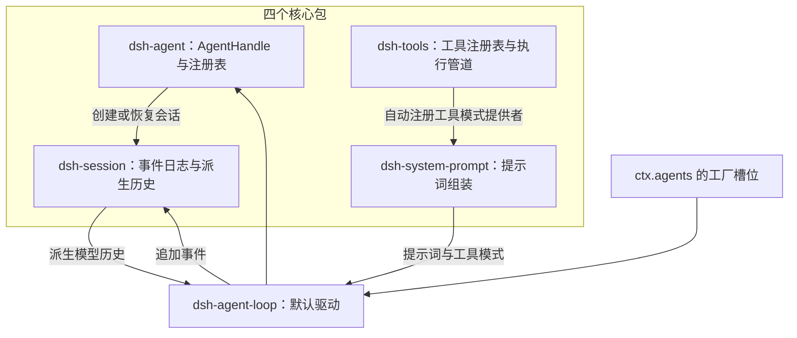
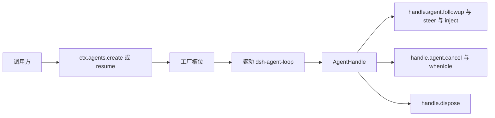
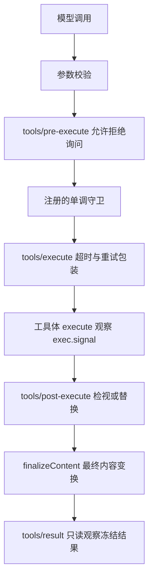
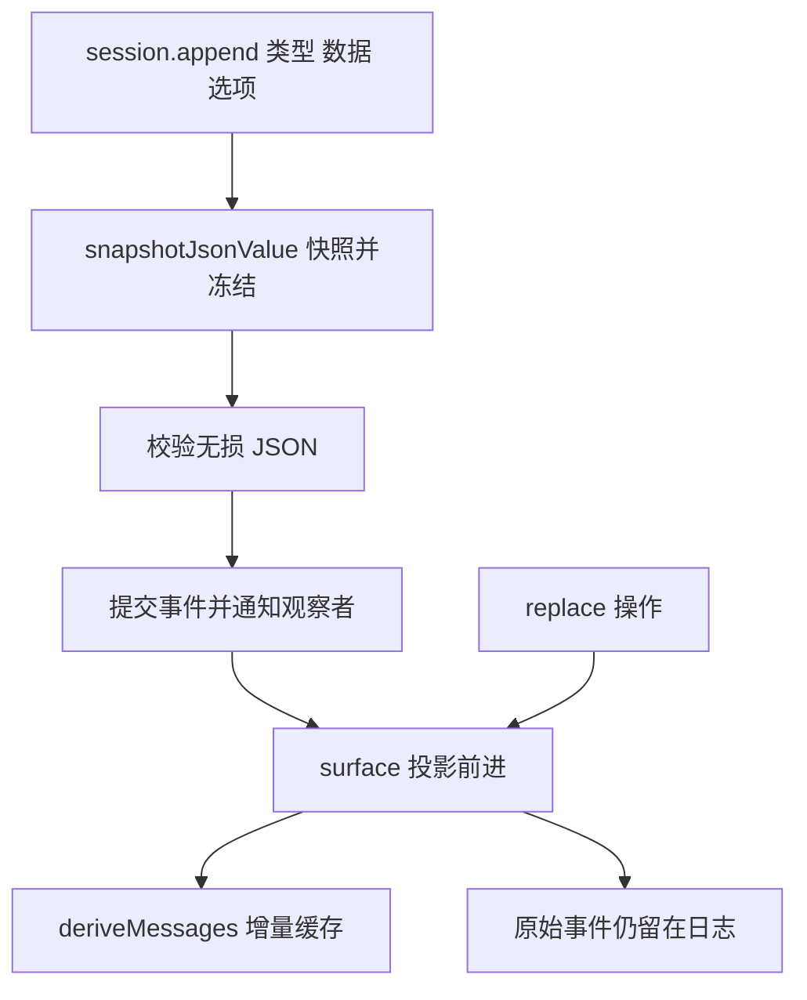
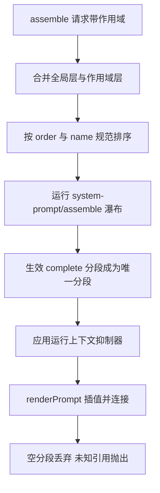
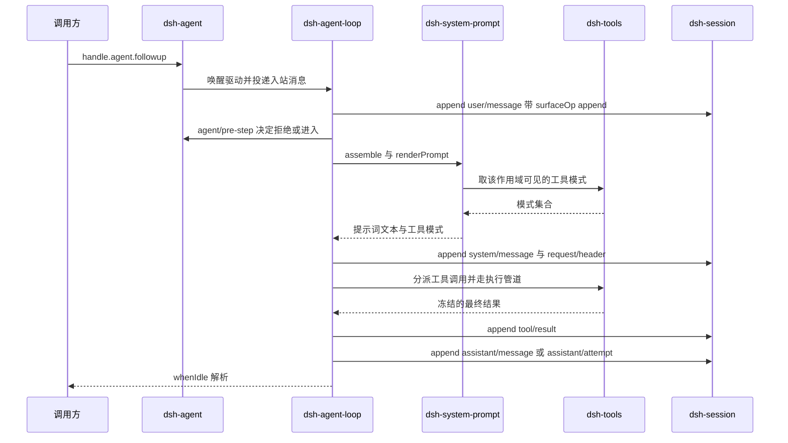
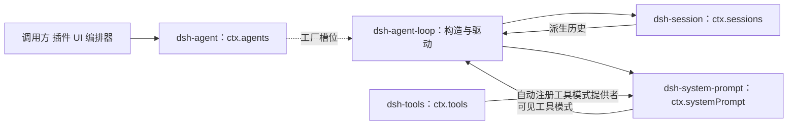

# DeepSeek Harness 核心包：agent、tools、session、system-prompt

!!! abstract "学完这一页你能"
    - 说清四个包各自提供哪个 `ctx` 服务，以及可变状态归谁持有。
    - 画出一张依赖图，并解释消费者为何只依赖 `dsh-agent`，不依赖 `dsh-agent-loop`。
    - 按资料写明的方法名写出最小调用代码，指出每个方法属于哪个包的表面。
    - 按事件顺序复述一次模型请求经过的四个包，说出每一步写入会话日志的事件类型。

## 0. 知识地图



建议这么读：第 1 到第 4 节，每节只回答一个包的问题。第 5 节把四个包连成一次完整请求，第 6 节回头确认依赖方向。

接口名不确定的位置，我都写了“需核对官方文档”。遇到这类标注，先跳过，读完流程再回头。

## 1. agent：句柄与注册表，构造交给驱动

**先想一个问题**

一个脚本要新建会话，分两次追加指令，再等它跑完。谁负责创建这个 agent？

谁有权把它拆掉？

**心智模型**

!!! tip "心智模型"
    一句话模型：agent 包只发“活的 agent 的把手”，构造与驱动由注册进来的驱动包完成。
    日常类比：医院挂号处给你一张就诊卡，看病的是医生。
    类比不成立处：挂号处不会因为医生没来就消失，而 `ctx.agents` 在没有驱动注册工厂之前不提供创建能力。

!!! note "术语：AgentHandle"
    `ctx.agents.create()` 与 `ctx.agents.resume()` 的返回值，是唯一能拆掉该 agent 的把手。例子：`handle.dispose()` 会停循环、反注册、移除会话并展开作用域。

!!! note "术语：惰性服务"
    插件挂载后服务已存在，但在驱动注册工厂前无法完成创建。证据：官方 README 写明服务在驱动注册工厂前是 inert 的。

**图解**



1. 调用方调用 `create` 或 `resume`，不直接接触驱动。
2. 请求落到工厂槽位；槽位里没有驱动时，创建无法完成。
3. 驱动构造 agent 与会话，把 `AgentHandle` 交回。
4. 通过 `handle.agent` 投递消息、取消、等待空闲。
5. `handle.dispose()` 由持有者调用，拆掉整个 agent。

**一步一步来**

第 1 步：把创建和恢复分开。
这一步要做的是：让调用方只拿把手，创建细节留给驱动。

```ts
// sessionId 与 agentOptions 由调用方给定
const handle = await ctx.agents.create({
  sessionId,
  agentOptions: { provider: 'deepseek', model: 'deepseek-chat' },
})
// resume 是加载已持久化的会话，并在其上重建 agent
const resumed = await ctx.agents.resume({ sessionId: 's-2' })
await handle.dispose()   // 停循环、反注册、移除会话、展开作用域
```

**这段代码在做什么**

1. `create` 在一个身份下同时建立新 agent 与新会话。
2. `resume` 读取持久化会话，并在其上重建 agent。
3. 两个操作都委托给已注册的工厂。
4. 返回值是 `AgentHandle`，只有它的持有者能 `dispose`。
5. `get(id)` 返回裸 `Agent`；把手只暴露给创建它的消费者。

第 2 步：区分三种输入。
这一步要做的是：让追加指令、插话、注入上下文走不同入口。

```ts
handle.agent.followup({
  content: [{ type: 'text', text: 'Summarize this workspace.' }],
  source: { kind: 'user' },
})
handle.agent.steer({
  content: [{ type: 'text', text: 'Focus on the tests.' }],
  source: { kind: 'my-plugin' },
})
await handle.agent.whenIdle()   // 等整个 agent 静止
await handle.agent.cancel({ kind: 'user' })   // 默认连队列一起清
await handle.agent.cancel({ kind: 'user' }, { keepInbox: true })
```

**这段代码在做什么**

1. `followup` 排一条普通下一轮提示，并唤醒驱动。
2. `steer` 提交下一步输入，并唤醒驱动。
3. 每种追加输入的 `source` 只带一个 `MessageSource`。
4. `cancel` 中止当前活动；不传 `keepInbox` 时清掉待处理输入。
5. `whenIdle` 在整个 agent 静止后才 resolve。

第 3 步：把工具和提示词限制到一个 agent。
这一步要做的是：让一个会话换一套能力，而不影响邻居。

```ts
// Agent.ctx 是该 agent 的作用域上下文
// 通过它注册的工具、提示词分段、变量、事件监听、限制只作用于这一个 agent
// 创建时可传 setup，在 agent 发布前完成组装
await ctx.agents.create({
  sessionId,
  setup: (agentCtx, agent) => {
    // agentCtx 拥有注册；agent 提供它的 Session
    // Context 上没有反向指向 Agent 的属性
  },
})
```

**这段代码在做什么**

1. `agent.ctx` 上的注册只对被作用域覆盖的那个 agent 生效。
2. 处置 agent 时这些注册会展开。
3. `setup` 在创建公告发出前运行，作用域工具与分段先就位。
4. `setup` 只做组装；驱动 agent 必须等 creation resolve 之后。
5. `agent.ctx` 上具体暴露哪些服务名，需核对官方文档。

第 4 步：理解发起者归属。
这一步要做的是：让驱动底层的 helper 不必层层传参就能归属。

```ts
// 每个驱动的完整生命周期运行在 ctx.agents.withInitiator(agent, ...) 内
ctx.agents.withInitiator(agent, async () => {
  await doWork()          // 继承到该 agent 的异步链
})
ctx.agents.withoutInitiator(async () => {
  await sharedTimer()     // 无关的进程内工作，隐藏归属
})
```

**这段代码在做什么**

1. `withInitiator` 把 agent 放进一条 `AsyncLocalStorage` 链。
2. 链上的 helper 通过继承完成归属。
3. `withoutInitiator` 为共享定时器等无关工作隐藏归属。
4. 该归属只在进程内成立；跨 worker、进程、队列、重启必须显式携带身份。
5. 环境里存在归属不等于存活证明，也不等于授权。

**动手验证**

下面这个脚本复刻注册表、把手能力、发起者作用域。依赖：无，Node 20+。

```js
// 依赖：无，仅 Node 20+ 内置模块
import assert from 'node:assert/strict'
import { AsyncLocalStorage } from 'node:async_hooks'

const initiator = new AsyncLocalStorage()

class Registry {
  constructor() { this.factory = null; this.live = new Map() }
  registerFactory(factory) { this.factory = factory }        // 驱动注册工厂前服务无法创建
  async create(id, options = {}) {
    assert.ok(this.factory, 'no factory registered')          // 惰性证据
    const handle = this.factory(id, options)                  // 委托给驱动
    if (options.setup) options.setup(handle.agent)            // 发布之前组装作用域
    const original = handle.dispose.bind(handle)
    handle.dispose = () => { this.live.delete(id); return original() }  // 处置时反注册
    this.live.set(id, handle)
    return handle
  }
  get(id) { return this.live.get(id) }
  list() { return [...this.live.keys()] }
  withInitiator(agent, fn) { return initiator.run(agent, fn) }
  currentInitiator() { return initiator.getStore() }
}

function makeDriver() {
  return (id, options) => {
    const inbox = { nextTurn: [], nextStep: [] }
    const agent = {
      id, options, status: 'idle', inbox,
      followup(m) { inbox.nextTurn.push(m); return 'woke' },
      steer(m) { inbox.nextStep.push(m); return 'woke' },
      inject(m) { inbox.nextTurn.push(m); return 'no-wake' },
      cancel(cause, opts = {}) { agent.cause = cause; if (!opts.keepInbox) inbox.nextStep.length = 0 },
      whenIdle() { return Promise.resolve('idle') },
    }
    return { agent, dispose() { agent.status = 'disposed' } }
  }
}

const ctx = { agents: new Registry() }
await assert.rejects(ctx.agents.create('s0'), /no factory/)

ctx.agents.registerFactory(makeDriver())
const scoped = []
const handle = await ctx.agents.create('s1', { setup: (agent) => scoped.push(agent.id) })
assert.deepEqual(scoped, ['s1'])
assert.equal(handle.agent.followup({ text: 'a' }), 'woke')
assert.equal(handle.agent.inject({ text: 'b' }), 'no-wake')
assert.equal(handle.agent.inbox.nextTurn.length, 2)

handle.agent.steer({ text: 'c' })
handle.agent.cancel({ kind: 'user' })
assert.equal(handle.agent.inbox.nextStep.length, 0)

const seen = await ctx.agents.withInitiator(handle.agent, async () => ctx.agents.currentInitiator())
assert.equal(seen, handle.agent)

handle.dispose()
assert.equal(handle.agent.status, 'disposed')
assert.deepEqual(ctx.agents.list(), [])
console.log('agent ok')
```

运行结果：

```text
agent ok
```

**常见坑**

| 现象 | 原因 | 怎么修 |
|---|---|---|
| 调用 `ctx.agents.create()` 一直失败 | 没有驱动注册工厂，服务处于惰性状态 | 同时加载 `dsh-agent` 与 `dsh-agent-loop` |
| 创建监听器里 `await agent.whenIdle()` 卡住 | 创建监听器与初始化共享生命周期 | 只等工具与提示词安装完成，不要在创建回调里等空闲 |
| `cancel()` 之后排队输入消失 | `cancel` 默认清空 inbox | 需要保留时传 `keepInbox: true` |
| 子进程里归属丢失 | initiator scope 只在进程内有效 | 在 worker、进程、队列、重启边界显式携带身份 |

**小结**

1. `dsh-agent` 提供 `ctx.agents` 与 `AgentHandle`，它自己不创建模型请求。
2. 构造与驱动在驱动包里，通过工厂槽位接入，消费者只依赖 `dsh-agent`。
3. `agent.ctx` 的作用域注册随处置展开；发起者归属只在进程内有效。

## 2. tools：注册、模式与执行管道

**先想一个问题**

模型请求删除工作区里的文件。谁校验参数？谁能一票否决？

**心智模型**

!!! tip "心智模型"
    一句话模型：工具是“一份声明加一条顺序固定的检查流水线”。
    日常类比：机场安检，证件核验、固定规则、托运、复查、贴标、留观依次发生。
    类比不成立处：安检规则由机场单方设定，这里允许、拒绝、询问由一个可重排的扩展点决定，守卫只是它之后的补充。

!!! note "术语：ToolSchema（工具模式）"
    模型看到的工具声明，包含 name、description 与参数 schema。例子：`read_file` 的 `path` 参数声明。`output`、`execute` 等不会进入线上传输。

!!! note "术语：单调守卫 monotonic guard"
    `ctx.tools.guard()` 注册的同步守卫，返回理由即拒绝，后续监听器不能把它改回允许。

!!! note "术语：PTC 模式"
    一种把可见工具折叠成 `run_code` 传输加生成 SDK 的呈现方式。PTC 的全称资料未覆盖，需核对官方文档。

**图解**



1. 参数先按声明校验，非法输入变成普通错误结果。
2. `tools/pre-execute` 决定允许、拒绝或询问。
3. 守卫在瀑布之后运行，返回理由就拒绝。
4. `tools/execute` 是包裹分发的环节，只有这个视图能替换必需信号。
5. 注册表在调用工具体前重新融合调用方信号。
6. `tools/post-execute` 可替换内容或值、附加有序上下文。
7. `finalizeContent` 是策略之后的最后一次内容变换。
8. `tools/result` 只观察冻结后的最终结果。

**一步一步来**

第 1 步：声明一个工具。
这一步要做的是：把参数、输出与执行体写在一个定义里。

```ts
import { readFile } from 'node:fs/promises'
import { defineTool } from '@deepseek-ai/dsh-tools'

ctx.tools.register(defineTool({
  name: 'read_file',
  description: 'Read a file from disk.',
  parameters: {
    path: { type: 'string', required: true, description: 'Absolute file path' },
  },
  output: {
    schema: { type: 'string' },
    render: (_args, value) => [{ type: 'text', text: value }],
  },
  async execute(args, exec) {
    // args 已按声明校验；exec.signal 由调用方持有
    return readFile(args.path, { encoding: 'utf8', signal: exec.signal })
  },
}))
```

**这段代码在做什么**

1. `defineTool` 产出带类型的工具定义。
2. `parameters` 使用统一 schema DSL，`InferArgs` 由此推出 `args` 的类型。
3. DSL 支持 string、number、integer、boolean、null、array、object、json 与 exact-one 的 oneOf。
4. `InferValue` 在加宽成 `JsonValue` 前保留 16 层容器类型。
5. `execute` 只能返回 `output.schema` 声明的 JSON 值。
6. 注册之后模式自动进入提示词组装，工具作者不用手工接线。

第 2 步：控制模型看到的集合。
这一步要做的是：让一个 agent 继承全局工具，但只能看见其中一部分。

```ts
ctx.tools.schemas(scope)     // 某作用域可见的模式集合，不含 execute
ctx.tools.restrict(filter)   // 给该 agent 继承的全局工具加允许或拒绝掩码
ctx.tools.get(name, scope)   // 按某个作用域的视角解析工具
// 展示层消费者需要匹配真正执行的定义时，要传入发起调用的 agent
```

**这段代码在做什么**

1. `schemas(scope)` 只返回可见模式，`execute` 不出现。
2. `restrict` 的掩码相交，作用域内的注册仍然可见。
3. 限制在处置时解除。
4. `mode` 决定呈现方式：`native` 给全部可见模式。
5. `ptc` 只给 `run_code` 与生成的 SDK；`both` 两种都给。
6. 非 native 模式需要一个已组合的 `ctx.ptcRuntime`，其语言要注册 SDK 渲染器。

第 3 步：把所有者策略放在管道里。
这一步要做的是：让拒绝无法被后面的监听器翻回来。

```ts
// guard 在可扩展的 pre-execute 瀑布之后运行
ctx.tools.guard((call) => {
  if (call.name === 'rm') return 'denied by owner policy'   // 返回理由即拒绝
})
```

**这段代码在做什么**

1. `guard` 是同步的，返回值是拒绝理由。
2. 拒绝一旦产生，之后的监听器无法把它改回允许。
3. `tools/execute` 可包裹分发，做超时、重试或指标。
4. `tools/post-execute` 可替换内容或值、附加上下文。
5. `tools/result` 观察不可变的最终结果。

第 4 步：区分取消与失败。
这一步要做的是：让普通工具失败不结束回合。

```ts
// 取消是协作式的：工具体必须观察 exec.signal
if (exec.signal.aborted) return
// 分发前取消 → ABORTED_BEFORE_DISPATCH
// 调用之后取消 → 只把成功结果替换为 ABORTED
// 超时归 TOOL_TIMEOUT；未知或抛错的工具归 UNKNOWN_TOOL
// 未知工具与抛错工具都变成结构化错误，调用失败但不结束回合
```

**这段代码在做什么**

1. 每次调用会物化并冻结解析后的参数，并分配一个不透明的关联令牌。
2. 取消要求静止；被拒绝、包装失败、工具失败、后置策略失败各有更具体的错误。
3. 超时归 `TOOL_TIMEOUT`。
4. 未知工具与抛错工具归 `UNKNOWN_TOOL`。
5. 结构化错误可以带 `ToolErrorInfo`，但不会把细节写进模型内容。

**动手验证**

下面这个脚本复刻固定顺序的管道、单调守卫与错误分类。依赖：无，Node 20+。

```js
// 依赖：无，仅 Node 20+ 内置模块
import assert from 'node:assert/strict'

function makeTools() {
  const defs = new Map()
  const guards = []
  const trace = []
  return {
    trace,
    register(def) { defs.set(def.name, def) },
    guard(g) { guards.push(g) },
    schemas() { return [...defs.keys()] },
    async call(name, args, { aborted = false } = {}) {
      const def = defs.get(name)
      if (!def) { trace.push('UNKNOWN_TOOL'); return { ok: false, error: 'UNKNOWN_TOOL' } }
      trace.push('pre-execute')
      for (const g of guards) {                    // 单调：先拒绝者生效
        const reason = g({ name, args })
        if (reason) { trace.push('guard-deny'); return { ok: false, error: reason } }
      }
      if (aborted) { trace.push('ABORTED_BEFORE_DISPATCH'); return { ok: false, error: 'ABORTED_BEFORE_DISPATCH' } }
      trace.push('execute')
      const value = await def.execute(args, { signal: { aborted } })
      trace.push('post-execute')
      trace.push('result')
      return { ok: true, value }
    },
  }
}

const tools = makeTools()
tools.register({ name: 'read_file', execute: (a) => `content of ${a.path}` })
tools.guard(() => null)                            // 前面允许
tools.guard((c) => (c.name === 'rm' ? 'owner denies rm' : null))
tools.register({ name: 'rm', execute: () => 'deleted' })

assert.deepEqual(tools.schemas().sort(), ['read_file', 'rm'])
assert.equal((await tools.call('read_file', { path: '/tmp/a' })).value, 'content of /tmp/a')
assert.deepEqual(tools.trace.splice(0), ['pre-execute', 'execute', 'post-execute', 'result'])

const denied = await tools.call('rm', {})
assert.equal(denied.error, 'owner denies rm')
const unknown = await tools.call('nope', {})
assert.equal(unknown.error, 'UNKNOWN_TOOL')
const early = await tools.call('read_file', {}, { aborted: true })
assert.equal(early.error, 'ABORTED_BEFORE_DISPATCH')
console.log('tools ok')
```

运行结果：

```text
tools ok
```

**常见坑**

| 现象 | 原因 | 怎么修 |
|---|---|---|
| 工具注册了，模型却看不到 | 该 agent 的限制掩码或呈现模式把它挡在外面 | 用 `schemas(scope)` 确认可见集合，检查 `mode` 配置 |
| 守卫返回理由后仍被执行 | 把 `guard` 当成可被覆盖的监听器 | 记住守卫是单调的，返回理由就是终局 |
| 取消后工具还在跑 | 工具体没有观察 `exec.signal` | 把信号传进底层操作，并在关键点检查 |
| 直接调用模式之外的工具名却被拒绝 | `ptc` 模式下模型直调其他工具会解析为 `UNKNOWN_TOOL` | 让 SDK 绑定在 `run_code` 内调用 |

**小结**

1. `dsh-tools` 提供 `ctx.tools`，注册声明就自动进入提示词组装。
2. 每次调用走固定顺序：前置策略、守卫、分发、后置策略、最终内容变换、只读观察。
3. 普通失败与超时都变成结构化错误，调用失败但不结束回合。

## 3. session：只追加的日志与派生历史

**先想一个问题**

模型下一步看到的历史，是内存里攒的数组，还是可重建的记录？

**心智模型**

!!! tip "心智模型"
    一句话模型：session 是只追加的账本，模型历史是账本的投影。
    日常类比：银行流水与余额，余额可以重算，流水不删。
    类比不成立处：余额只需保存一份，而这里替换之后原始事件仍然留在日志里，回放与派生都能各自使用。

!!! note "术语：事件溯源 event sourcing"
    把状态存成只追加的事件序列，其他一切都由序列推导。例子：`deriveMessages()` 从日志投影出模型看到的消息。

!!! note "术语：Surface（表面投影）"
    决定模型能看到哪些消息的有序投影。带 `surfaceOp` 的事件才能改变它。

!!! note "术语：request header（请求头快照）"
    `request/header` 事件存下非历史请求信封的完整规范快照，理由取 `initial`、`resume`、`change`、`series` 之一。

**图解**



1. `append` 先快照并冻结负载，读取、校验、复制每个嵌套值各一次。
2. 无损 JSON 校验失败就在 append 现场抛出。
3. 被拒的 append 不改变日志、派生状态与事件流。
4. surface 事件必须提供 `surfaceOp`。
5. `replace` 把被遮蔽条目从后续输入移除，原始记录保留。
6. `deriveMessages` 返回深冻结投影，每次调用给一个新数组。

**一步一步来**

第 1 步：创建会话并追加一条消息。
这一步要做的是：看清 surface 事件的额外要求。

```ts
const session = ctx.sessions.create(sessionId, { meta: { cwd: '/workspace' } })
session.append(
  'user/message',
  { role: 'user', content: [{ type: 'text', text: 'hello' }], source: { kind: 'user' } },
  { surfaceOp: 'append' },   // surface 事件必须带 surfaceOp
)
session.deriveMessages()     // 派生出的模型历史
```

**这段代码在做什么**

1. `create` 把会话绑定到调用它的 fiber。
2. surface 事件在类型化事件与 append 输入里都要求 `surfaceOp`。
3. 助手消息内嵌它那段紧凑的 provider 流，并禁止 `sourceEventSeqs`。
4. 只写日志的事件禁止这两个元数据字段，永远不产生消息。
5. `deriveMessages` 是增量的，且带缓存。

第 2 步：用替换遮蔽旧内容。
这一步要做的是：改历史而不删记录。

```ts
session.append('user/message', { /* 新内容 */ }, {
  surfaceOp: { op: 'replace', startSeq, endSeq },   // 闭区间，按当前 surface 顺序
})
```

**这段代码在做什么**

1. 替换只接受 `{ op: 'replace', startSeq, endSeq }` 这一种形状。
2. 端点是闭区间，按当前 surface 顺序解释。
3. 被遮蔽条目从后续输入移除，原始日志记录保留。
4. 替换会使派生缓存失效，也会让复用从第一条被遮蔽消息处失效。
5. surface 折返会拒绝覆盖节点 0 的替换，除非替换事件本身就是恰好覆盖该节点的 `system/message`。

第 3 步：分支一个会话。
这一步要做的是：从稳定前缀得到子会话，并保留可核对的位置信息。

```ts
const child = ctx.sessions.fork(source, boundary, childSessionId)
child.header.isSeeded        // 是否继承了历史，不暴露位置整数
child.inheritedEventCount    // 精确的 SessionLogOffset
child.isOwnSeq(seq)          // 只接受子会话自己拥有的位置
```

**这段代码在做什么**

1. `fork` 复制一段精确的闭区间事件前缀，默认取最后一个事件。
2. `buildForkSeed` 把继承标记放在复制的事件之后。
3. 它只为开放中的那一步补上缺失的错误工具结果。
4. 它用 `forked` 原因关闭那一步与那一轮；已关闭的步骤与轮次保持不变。
5. 标记与关闭事件属于子会话，`inheritedEventCount` 只数被复制的前缀。

第 4 步：给持久化加屏障。
这一步要做的是：需要立刻落盘时，不要假设写后缓存已经排空。

```ts
await ctx.sessions.flush(session)   // 每个持久化监听器都 flush，全部结束后才 settle
```

**这段代码在做什么**

1. 会话默认留在内存里，除非加了持久化后端。
2. 持久化插件通过订阅 `session/event` 提要接入。
3. `flush` 分发一次等待式持久化检查点。
4. 所有监听器都 flush 之后，这次调用才结算。
5. `eventAt`、`snapshotEvents`、`ownEvents` 已弃用；新生产代码不允许调用，需要长度时读 `seq`。

**动手验证**

下面这个脚本复刻只追加日志、surface 折返、替换遮蔽与缓存失效。依赖：无，Node 20+。

```js
// 依赖：无，仅 Node 20+ 内置模块
import assert from 'node:assert/strict'

class Session {
  constructor() { this.events = []; this.surface = []; this.cache = null }
  append(type, data, opts = {}) {
    JSON.stringify(data)                                  // 无损 JSON 失败会抛出
    const seq = this.events.length
    this.events.push({ seq, type, data, opts })
    if (opts.surfaceOp) this.#applySurface(seq, type, data, opts.surfaceOp)
    this.cache = null
    return seq
  }
  #applySurface(seq, type, data, op) {
    if (op === 'append') { this.surface.push({ seq, type, data }); return }
    const { startSeq, endSeq } = op                     // 闭区间遮蔽
    this.surface = this.surface.filter((n) => n.seq < startSeq || n.seq > endSeq)
    this.surface.push({ seq, type, data })
  }
  deriveMessages() { return this.cache ?? (this.cache = this.surface.map((n) => n.data)) }
  get seq() { return this.events.length }
}

const s = new Session()
s.append('system/message', { role: 'system', content: 'SYSTEM' }, { surfaceOp: 'append' })
const first = s.append('user/message', { role: 'user', content: 'hello' }, { surfaceOp: 'append' })
assert.equal(s.deriveMessages().length, 2)
assert.equal(s.cache !== null, true)                    // 缓存已建立

s.append('user/message', { role: 'user', content: 'hello v2' },
  { surfaceOp: { op: 'replace', startSeq: first, endSeq: first } })
assert.equal(s.deriveMessages().length, 2)              // 旧节点被遮蔽
assert.equal(s.deriveMessages().at(-1).content, 'hello v2')
assert.equal(s.events.length, 3)                        // 原始事件仍在日志里
assert.equal(s.cache, null)                             // 替换让缓存失效

assert.throws(() => s.append('user/message', { content: 1n }), TypeError)
assert.equal(s.seq, 3)                                  // 被拒的 append 不改变日志
console.log('session ok')
```

运行结果：

```text
session ok
```

**常见坑**

| 现象 | 原因 | 怎么修 |
|---|---|---|
| append 抛错后继续用旧数据 | 以为部分写入已生效 | 被拒的 append 不改日志、派生状态与事件流，重试即可 |
| surface 事件没有 `surfaceOp` | 类型与输入都要求它 | 在 append 输入里补上 `surfaceOp` |
| 以为 `replace` 删掉了记录 | 混淆遮蔽与删除 | 原始记录保留，替换只影响后续输入与派生缓存 |
| 重启后历史对不上 | 没有持久化后端，或没等屏障 | 加持久化插件订阅 `session/event`，需要屏障时 `await flush` |

**小结**

1. `dsh-session` 记录每个模型可见事实，模型历史由日志投影得到。
2. surface 事件必须带 `surfaceOp`；替换只遮蔽，不删除。
3. 会话默认在内存里；持久化与屏障由持久化插件承担。

## 4. system-prompt：分段、变量与工具模式

**先想一个问题**

两个 agent 共用一份配置。其中一个要多一句 bash 指引，怎么只影响它？

**心智模型**

!!! tip "心智模型"
    一句话模型：一个按 order 拼接的注册表，加上变量插值，并和可见工具模式一起产出。
    日常类比：按页码把多份手稿装订成一本手册。
    类比不成立处：手册通常只有一个作者，这里是多个插件各写一节，order 相同时还要按 name 的代码单元顺序排。

!!! note "术语：prompt section（提示词分段）"
    带 name、order、text 的注册项。例子：`tool:bash` 分段给 bash 相关指引。按 order 升序拼接，order 相同按 name 的代码单元顺序。

!!! note "术语：waterfall（瀑布式钩子）"
    `system-prompt/assemble` 事件，监听器按顺序改写组装结果。一个生效的 `complete` 分段会取代整个提示词。

!!! note "术语：compaction（压缩）"
    把被取代的条目从活动会话里隐藏起来，而不删除它们。

**图解**



1. 一次 `assemble()` 合并全局层与请求作用域的那一层。
2. 分段按 order 排序，order 相同按 name 的代码单元顺序。
3. 运行作用域过滤的 `system-prompt/assemble` 瀑布。
4. 生效的 complete 分段成为唯一的提示词分段。
5. 多个生效 complete 分段会让组装失败。
6. 运行上下文抑制器在最后应用。
7. `renderPrompt` 负责插值、丢弃空分段、用空行连接。
8. 未知引用、注册但无值的引用、畸形 complete 组都会抛出。

**一步一步来**

第 1 步：注册分段并确定位置。
这一步要做的是：让多个插件写出的章节有确定的先后。

```ts
ctx.systemPrompt.section({
  name: 'tool:bash',
  order: 100,
  text: 'Prefer bash for file and process operations.',
})
// 仓库自带的贡献者通过分配器取中心分配的序号
ctx.systemPrompt.getSectionOrder('tool:bash')
ctx.systemPrompt.getContextOrder('cwd')
// 外部贡献可以使用任意有限 order
```

**这段代码在做什么**

1. 分段文本可以是静态文本，也可以是按上下文解析的文本。
2. 拼接按 order 升序进行。
3. order 相同则按 name 的代码单元顺序。
4. 仓库内贡献者用两个分配器取序号：分段与运行上下文各一套。
5. 通过 `agent.ctx` 注册的同名分段会遮蔽全局分段，只对该 agent 生效。

第 2 步：注册变量并控制插值。
这一步要做的是：让动态事实在每次组装时刷新，同时让生成的文档保持字面文本。

```ts
ctx.systemPrompt.variable('cwd', ({ agent }) => agent?.session.header.cwd)
// 分段文本里写 {{cwd}}，每次组装时解析
ctx.systemPrompt.section({
  name: 'tools:sdk',
  order: 5000,
  text: 'literal {{braces}}',
  interpolate: false,   // 保留字面花括号
})
```

**这段代码在做什么**

1. 变量在每次组装时解析，作用域变量遮蔽同名全局变量。
2. 循环包提供 `model` 与 `cwd` 两个变量；任何插件都能注册自己拥有的事实。
3. `interpolate: false` 让整段文本原样保留，生成的工具文档用它。
4. 未知引用、已注册但无值的引用、畸形 complete 组都会抛错，而不是发出畸形提示词。
5. 这样做是因为畸形提示词比一次响亮失败代价更高。

第 3 步：把工具模式接进组装。
这一步要做的是：让“模型被告知能做什么”与“模型实际能调用什么”保持一致。

```ts
// ToolRuntime 自动注册为工具模式提供者，绝大多数工具无需在这里手工接线
// toolOrder 必须恰好包含一个 '<unlisted-tools>' 兜底项，且不能有重复名
// assemble() 的返回字段名需核对官方文档
ctx.systemPrompt.suppressRuntimeContext()   // 只移除调用作用域的动态运行上下文
```

**这段代码在做什么**

1. 工具模式提供者在每次组装时被求值，产出模型可见的模式集合。
2. 提供者返回限制之后的可见集合，以及限制之前的名字全集，供 `toolOrder` 使用。
3. `toolOrder` 在瀑布之前规范化收集到的工具，注册顺序只是插件加载的副产物。
4. 形状违规在配置加载时抛错；列出的名字找不到注册工具则在每次组装时拒绝。
5. `suppressRuntimeContext()` 只移除动态运行上下文，不关闭拥有事实的服务，多个抑制器叠加，全部移除时恢复。

第 4 步：分开解析与渲染两阶段。
这一步要做的是：让组装结果可以被监听器改写，再统一插值。

```ts
const assembled = ctx.systemPrompt.assemble(scope)   // 解析但不插值
ctx.systemPrompt.renderPrompt(assembled)             // 插值并连接
```

**这段代码在做什么**

1. `assemble()` 返回已解析但未插值的分段、有序工具模式与已解析变量。
2. `renderPrompt()` 做 `{{variable}}` 插值，除非分段设置了 `interpolate: false`。
3. 空分段被丢弃，分段之间用空行连接。
4. 渲染出的提示词以 system 角色消息进入派生历史，成为 surface 节点 0。
5. 循环请求与 `request/header` 都不再单独携带 `system` 字段。

**动手验证**

下面这个脚本复刻排序、遮蔽、插值抛错与 complete 规则。依赖：无，Node 20+。

```js
// 依赖：无，仅 Node 20+ 内置模块
import assert from 'node:assert/strict'

function makePrompt() {
  const sections = new Map()
  const vars = new Map()
  return {
    sections,
    section(s) { sections.set(s.name, s) },              // 同名后者覆盖前者
    variable(n, fn) { vars.set(n, fn) },
    assemble({ scoped = {} } = {}) {
      const merged = new Map(sections)
      for (const [k, v] of Object.entries(scoped)) merged.set(k, v)   // 作用域遮蔽全局
      const ordered = [...merged.values()]
        .filter((s) => s.text !== '')
        .sort((a, b) => a.order - b.order || (a.name < b.name ? -1 : a.name > b.name ? 1 : 0))
      const complete = ordered.filter((s) => s.complete === true)
      assert.ok(complete.length <= 1, 'multiple complete sections')
      return { list: complete.length === 1 ? complete : ordered, vars }
    },
    render(asm) {
      return asm.list.map((s) => {
        if (s.interpolate === false) return s.text       // 字面保留
        return s.text.replace(/\{\{(\w+)\}\}/g, (_m, n) => {
          assert.ok(asm.vars.has(n), `unknown variable ${n}`)
          return asm.vars.get(n)
        })
      }).join('\n\n')
    },
  }
}

const sp = makePrompt()
sp.variable('cwd', () => '/workspace')
sp.section({ name: 'b', order: 200, text: 'B {{cwd}}' })
sp.section({ name: 'a', order: 100, text: 'A' })
assert.equal(sp.render(sp.assemble()), 'A\n\nB /workspace')

sp.section({ name: 'a', order: 100, text: 'literal {{x}}', interpolate: false })
assert.equal(sp.render(sp.assemble()), 'literal {{x}}\n\nB /workspace')

const shadowed = sp.assemble({ scoped: { a: { name: 'a', order: 100, text: 'SCOPED A' } } })
assert.equal(shadowed.list.find((s) => s.name === 'a').text, 'SCOPED A')

sp.section({ name: 'c', order: 50, text: '{{missing}}' })
assert.throws(() => sp.render(sp.assemble()), /unknown variable missing/)

sp.section({ name: 'c', order: 50, text: 'C' })
sp.section({ name: 'only', order: 900, text: 'ONLY', complete: true })
assert.equal(sp.render(sp.assemble()), 'ONLY')
console.log('system-prompt ok')
```

运行结果：

```text
system-prompt ok
```

**常见坑**

| 现象 | 原因 | 怎么修 |
|---|---|---|
| 启动时不报错，第一轮才报 `toolOrder` | 形状违规在加载时抛错，名字找不到注册工具在组装时拒绝 | 组装前确认那个工具已经注册 |
| 生成的工具文档里 `{{...}}` 被替换 | 分段默认插值 | 给该分段设置 `interpolate: false` |
| 两个分段都想成为完整提示词 | 生效的 complete 分段最多一个 | 只留一个 complete，或改成普通分段 |
| 一个 agent 的提示词改了别人 | 注册落在全局层，而不是 `agent.ctx` | 通过 `agent.ctx` 注册，作用域贡献在处置时展开 |

**小结**

1. `dsh-system-prompt` 提供 `ctx.systemPrompt`，分段按 order 与 name 排序拼接。
2. 变量每次组装时解析；`interpolate: false` 保留字面花括号文本。
3. 组装失败就抛错，不发出畸形提示词；生效 complete 分段最多一个。

## 5. 协作：一次模型请求的完整生命周期

**先想一个问题**

用户发一句“跑一下测试”。从这一刻到模型看到提示词，中间经过哪些包？

**心智模型**

!!! tip "心智模型"
    一句话模型：一次请求是一条单向流水，四个包分别负责记录、组装、提供手段、驱动。
    日常类比：编辑部流程，资料库留存、排版成稿、记者提供手段、主编推进。
    类比不成立处：编辑部里人可以随时直接沟通，这里的包只能通过注册表与事件对接。

**图解**



1. `followup` 把带身份的 user 角色消息送进 inbox，并唤醒驱动。
2. 驱动把用户消息作为 surface 事件写进会话。
3. `agent/pre-step` 可以拒绝这一步，或替换进入这一步的消息。
4. 组装阶段向 system-prompt 要提示词，并向 tools 要可见模式。
5. 循环写入 `system/message`，并在循环实例边界记录 `request/header` 快照。
6. 工具调用经 tools 的执行管道，结果冻结后写 `tool/result`。
7. 每次到达结算的模型尝试提交一个事件：成功是 `assistant/message`，失败、重试、取消或流错误是 `assistant/attempt`。
8. 整个 agent 静止后 `whenIdle` 解析。

**一步一步来**

第 1 步：组合最小可用集合。
这一步要做的是：让惰性的 agent 服务真正可用。

```ts
// 最小可用组合：agent 服务在没有驱动时是惰性的，所以驱动要一起加载
// 需要持久化时再叠加持久化插件；具体插件清单资料未覆盖，需核对官方文档
const handle = await ctx.agents.create({
  sessionId,
  agentOptions: { provider: 'deepseek', model: 'deepseek-chat' },
})
```

**这段代码在做什么**

1. `dsh-agent` 提供 `ctx.agents` 与 `Agent` 把手。
2. 出货的驱动是 `dsh-agent-loop`，它负责创建、驱动、处置。
3. 挂载 agent 包的位置就是有活跃 agent 的地方。
4. 工厂未注册前，服务不提供创建能力。

第 2 步：决定这一步是否进入。
这一步要做的是：在组装之前给插件一次拒绝或替换的机会。

```ts
// PreStepDecision 只有两种形状
// { kind: 'reject' }
// { kind: 'enter', messages, startsRequestSeries? }
// enter 分支携带完整的、已标识、已冻结的消息批次
// 接受不等于提交：assembly 与 step/start 之后，路由才被解析并提交
// 两个异步阶段中发生取消，两个阶段都不提交
```

**这段代码在做什么**

1. `reject` 表示这一步不进入。
2. `enter` 携带完整批次，可声明 `startsRequestSeries` 表示一条独立的模型消息序列。
3. 包装型监听器会保留那个声明与批次，除非它有意替换其中之一。
4. 认领会把已提供的消息从 inbox 移除；之后插入的消息留到后面的边界。
5. 精确签名、调度模式与负载契约在生成的服务 API 区域，需核对官方文档。

第 3 步：让模型看到的都是日志里有的。
这一步要做的是：把“模型可见”与“已记录”对齐。

```ts
session.deriveMessages()   // 模型收到的完整消息集合
// 模型看不到：内嵌的助手流、assistant/attempt、边界事件等只写日志的事实
```

**这段代码在做什么**

1. 模型收到 surface 条目投影后的完整消息，系统提示词排在最前。
2. 内嵌的助手流与 `assistant/attempt` 只是回放与诊断数据。
3. 直接提示与注入上下文各自是独立的 `user/message` 事件，来源保留归属。
4. 每次到达结算的尝试只提交一个事件。
5. 结算前发生硬进程丢失，不会留下可持久的尝试流。

第 4 步：处理错误与重试。
这一步要做的是：让失败有可追溯的落点。

```ts
// 请求失败：agent/request-error 允许监听器重试这次模型请求
// 轮次收尾：agent/turn-stopping 在本来已完成的轮次关闭前运行，可以 steer 保持它打开
// 记录丢失时：没有持久记录的开始记为 TOOL_NOT_STARTED
// 有持久记录但没有结果记为 TOOL_OUTCOME_UNKNOWN
```

**这段代码在做什么**

1. 请求级失败可以由监听器重试。
2. 轮次收尾事件可以在关闭前把轮次留开。
3. 没有持久记录的开始与有开始但无结果，得到两种不同的合成结果。
4. `TOOL_OUTCOME_UNKNOWN` 提示只重试只读或幂等操作，有副作用时先核对状态。
5. 分支产生的结果只描述被继承的记录，父会话可能在所选事件之后才开始或完成调用。

**动手验证**

下面这个脚本按顺序断言一次请求写入的事件与阶段轨迹。依赖：无，Node 20+。

```js
// 依赖：无，仅 Node 20+ 内置模块
import assert from 'node:assert/strict'

const trace = []
const log = []
const tools = { schemas: () => ['read_file'] }                 // 可见工具模式
const prompt = { assemble: () => 'system text', renderPrompt: () => 'system text' }
const session = { append: (t) => { log.push(t); trace.push(`append:${t}`) } }

const driver = {
  async step(msg) {
    trace.push('followup')
    session.append('user/message')                             // surface 事件带 surfaceOp
    trace.push('pre-step')
    prompt.renderPrompt(prompt.assemble())                      // 组装提示词
    trace.push('assemble')
    session.append('system/message')
    session.append('request/header')                           // 循环实例边界快照
    assert.deepEqual(tools.schemas(), ['read_file'])            // 工具模式参与组装
    trace.push('tool-call')
    session.append('tool/result')
    session.append('assistant/message')
    trace.push('whenIdle')
  },
}

await driver.step({ role: 'user', content: 'run tests' })
assert.deepEqual(log, [
  'user/message', 'system/message', 'request/header', 'tool/result', 'assistant/message',
])
assert.deepEqual(trace, ['followup', 'pre-step', 'assemble', 'tool-call', 'whenIdle'])
console.log('collaboration ok')
```

运行结果：

```text
collaboration ok
```

**常见坑**

| 现象 | 原因 | 怎么修 |
|---|---|---|
| 界面显示了流式分片，回放时找不到 | 内嵌助手流是呈现数据，不是回放来源 | 回放以 `assistant/message` 或 `assistant/attempt` 为准 |
| 模型说没看到某条注入上下文 | `inject` 不唤醒驱动，它落到下一个被接纳的步骤 | 需要立刻处理时改用 `steer` |
| 同一进程里两个 agent 工具集不同 | `agent.ctx` 的作用域注册与限制生效 | 确认注册是全局层还是作用域层 |
| 请求无法从日志重建 | 缺少 `request/header` 快照 | 在每次循环实例边界与变化时记录完整快照 |

**小结**

1. 一次请求是一条单向流水：入站、接纳、组装、分派、记录、收尾。
2. 提示词与工具模式一起组装；模型可见的一切都能从日志重建。
3. 失败、重试、取消都各有一个事件落点，不结束会话。

## 6. 依赖方向与最小接口草图

**先想一个问题**

如果一个 UI 直接 import 驱动包的内部类型，换掉驱动会发生什么？

**心智模型**

!!! tip "心智模型"
    一句话模型：消费者依赖端口，驱动是端口后面的适配器。
    日常类比：电器只认插头形状，不认发电厂。
    类比不成立处：插头标准由第三方制定，这里的端口就是 `dsh-agent` 公开的那部分表面，超出它的细节不在契约内。

**图解**



1. 顶部一层只依赖 `dsh-agent` 暴露的 `Agent` 表面。
2. `dsh-agent` 与驱动之间是工厂槽位，驱动可替换。
3. 驱动使用 session、system-prompt、tools 三个服务。
4. tools 把工具模式提供者注册进 system-prompt。
5. system-prompt 产出提示词与模式，供驱动组装请求。
6. session 把派生历史交回驱动，供下一步使用。
7. 包之间精确的 import 边需核对官方文档：具体要核对每个包的依赖清单与 peer 声明。

**一步一步来**

第 1 步：写下 agent 的最小表面。
这一步要做的是：分清谁能销毁、谁只能观察。

```ts
// 创建与查找
ctx.agents.create(options)          // 新 agent 与新会话，同一身份
ctx.agents.resume(options)          // 在持久化会话上重建
ctx.agents.get(id)                  // 返回裸 Agent；把手只给创建它的消费者
ctx.agents.list() / ctx.agents.roots()
ctx.agents.isOwnedBy(id, parent)    // 精确的存活父子关系
// 把手
handle.agent.followup(m) / steer(m) / inject(m)
handle.agent.cancel(cause, opts) / whenIdle()
handle.agent.ctx / handle.agent.inbox / handle.agent.status
handle.dispose()                    // 唯一能拆掉该 agent 的把手
```

**这段代码在做什么**

1. 查找类方法返回裸 `Agent`，不含销毁能力。
2. `inbox` 只暴露结构接口，投影词汇留在 agent 包里。
3. `parentAgent` 决定结果是运行时子节点还是根节点。
4. `isOwnedBy` 检验的是精确的存活关系。
5. 工厂提供者是结构性共同所有者：它卸载时会停并排空自己创建的所有把手。

第 2 步：写下 tools 的最小表面。
这一步要做的是：把注册、限制与策略分清。

```ts
ctx.tools.register(def)        // defineTool 产出工具定义
ctx.tools.restrict(filter)     // 允许或拒绝掩码，相交，作用域注册仍可见
ctx.tools.get(name, scope)     // 按某作用域的视角解析工具
ctx.tools.schemas(scope)       // 可见模式集合，不含 execute
ctx.tools.guard(fn)            // 单调同步守卫
defineTool({ name, description, parameters, output, execute })
```

**这段代码在做什么**

1. `register` 之后模式自动进入组装，不必手工接线。
2. 限制是掩码，可叠加，处置时解除。
3. `guard` 是同步的；返回理由即拒绝。
4. 原样 JSON Schema 是与子 agent、工作流、MCP 共用的线上对应物。
5. 各方法的精确签名需核对官方文档：具体要核对 `get` 与 `schemas` 的 scope 参数形状。

第 3 步：写下 session 的最小表面。
这一步要做的是：把读日志与改视图分清。

```ts
ctx.sessions.create(id, opts) / get(id) / list()
ctx.sessions.fork(source, boundary, childId)
ctx.sessions.flush(session)                     // 持久化屏障
session.append(type, data, opts)                // surface 事件必须带 surfaceOp
session.deriveMessages()                        // 派生模型历史
session.seq                                     // 日志长度，不物化数组
ctx.sessions.registerMessageProjection(def)      // 插件声明内容变化
```

**这段代码在做什么**

1. `seq` 返回日志长度，不物化数组。
2. 插件用 `@messageProjection` 声明内容变化事件，并注册纯定义。
3. Session 在接受事件前调用该定义，并缓存不可变的消息更新。
4. 缺少定义会拒绝 append 与恢复；卸载已使用的定义也会挡住缓存读取。
5. `eventAt`、`snapshotEvents`、`ownEvents` 已弃用，新生产代码不允许调用。

第 4 步：写下 system-prompt 的最小表面。
这一步要做的是：把贡献、排序与失败边界分清。

```ts
ctx.systemPrompt.section({ name, order, text, interpolate })
ctx.systemPrompt.variable(name, resolver)
ctx.systemPrompt.getSectionOrder(name) / getContextOrder(name)
ctx.systemPrompt.assemble(scope) / renderPrompt(assembled)
ctx.systemPrompt.suppressRuntimeContext()
// assemble 返回字段名与事件负载契约需核对官方文档
```

**这段代码在做什么**

1. `section` 与 `variable` 是两个独立注册口。
2. 两个分配器分别给分段与运行上下文发序号。
3. `assemble` 与 `renderPrompt` 分开，使监听器能在插值前改写。
4. 注册表变化通知 `system-prompt/change` 不做作用域过滤，因为全局变化影响每个作用域。
5. 组装失败就抛错，包括未知变量、无值变量与多个 complete 分段。

**动手验证**

下面这个脚本用同一个消费者函数跑两个驱动，并断言消费者没有引用驱动内部。依赖：无，Node 20+。

```js
// 依赖：无，仅 Node 20+ 内置模块
import assert from 'node:assert/strict'

// 消费者只依赖 ctx.agents 暴露的表面
async function consumer(ctx, sessionId) {
  const handle = await ctx.agents.create({ sessionId })
  handle.agent.followup({ text: 'hi' })
  await handle.agent.whenIdle()
  return handle.agent.id
}

function makeCtx(driver) {
  const live = new Map()
  return {
    agents: {
      create: ({ sessionId }) => { const h = driver(sessionId); live.set(sessionId, h); return h },
      get: (id) => live.get(id),
      list: () => [...live.keys()],
    },
  }
}

function driverA(id) {
  const seen = []
  return { agent: { id, seen, followup: (m) => seen.push(m), whenIdle: async () => {} }, dispose() {} }
}
function driverB(id) {
  const seen = []
  return { agent: { id, seen, followup: (m) => seen.push(m), whenIdle: async () => {} }, dispose() {} }
}

assert.equal(await consumer(makeCtx(driverA), 's1'), 's1')
assert.equal(await consumer(makeCtx(driverB), 's1'), 's1')   // 换驱动，消费者代码不变

const src = consumer.toString()
assert.equal(src.includes('driverA'), false)                 // 消费者不引用具体驱动
assert.equal(src.includes('driverB'), false)

const ctx = makeCtx(driverA)
const handle = await ctx.agents.create({ sessionId: 's9' })
assert.equal(typeof handle.dispose, 'function')              // 销毁能力在把手持有者手里
assert.equal(ctx.agents.get('s9'), handle)                    // 查找拿到的是同一个对象
console.log('dependency ok')
```

运行结果：

```text
dependency ok
```

**常见坑**

| 现象 | 原因 | 怎么修 |
|---|---|---|
| 换驱动后消费者报错 | 消费者用了驱动包的内部类型 | 只依赖 `dsh-agent` 的公开表面 |
| 拿到 `get(id)` 的结果却拆不掉 agent | 查找返回裸 `Agent`，把手只给创建者 | 需要销毁能力时保存 `create` 返回的 handle |
| 子进程里归属为 null | initiator scope 进程内有效 | 跨边界显式携带身份 |
| 驱动卸载后仍有活的 agent | 工厂提供者是结构性共同所有者，卸载会停并排空它创建的把手 | 正常卸载提供者，并等它排空 |

**小结**

1. 消费者依赖 `dsh-agent` 公开表面，驱动通过工厂槽位接入并可替换。
2. 四个包各有自己的注册表：agent、tools、session、system-prompt 各管一层状态。
3. 精确签名与负载契约在生成的服务 API 区域，实现前要核对官方文档。

## 综合对比

| 维度 | dsh-agent | dsh-tools | dsh-session | dsh-system-prompt |
|---|---|---|---|---|
| 提供的服务 | `ctx.agents` | `ctx.tools` | `ctx.sessions` | `ctx.systemPrompt` |
| 是否自己发模型请求 | 否，它配对的驱动是 `dsh-agent-loop` | 否，调用由循环分派 | 否，明确写明不调用模型 | 否，只产出提示词与工具模式 |
| 主要可变状态 | 活跃 agent 注册表、结构性 inbox | 工具定义作用域层、限制掩码 | 事件日志、surface 投影、派生缓存 | 分段、变量、工具模式提供者注册 |
| 主要扩展点 | `agent.ctx` 注册、`agent/*` 事件、`setup` | `register`、`guard`、四个管道事件 | `append`、`registerMessageProjection` | `section`、`variable`、组装瀑布 |
| 卸载时撤销什么 | 停并排空循环、反注册、移除会话、展开作用域 | 该作用域的工具与限制 | 由 store 生命周期持有，持久化由后端插件承担 | 该作用域的贡献 |
| 跨重启需要什么 | 显式携带身份 | 插件重新加载定义 | 持久化后端加 `flush` 屏障 | 配置与注册重建 |
| 资料未覆盖处 | 工厂注册方法名、精确事件签名 | `mode` 字段全集、PTC 全称 | 具体持久化插件清单 | `assemble` 返回字段名 |

## 应用与行业实践

### 应用场景地图

| 场景 | 用到本页哪个知识点 | 典型技术选型 | 注意事项 |
| --- | --- | --- | --- |
| 客服工单自动分诊 | tools 的注册与执行管道；agent 句柄由注册表管理 | dsh-tools 注册分诊工具，dsh-agent 持有句柄 | 工具要有幂等键，重复工单不能重复发通知 |
| 后台管理的万行表格问答 | session 只追加日志与派生历史 | dsh-session 存事件，历史按窗口派生 | 表格明细不入日志，只写查询与结果摘要 |
| 低端安卓首屏的提示词组装 | system-prompt 分段与变量注入 | dsh-system-prompt 分段渲染，稳定段前置 | 工具模式一变，前缀缓存就失效 |
| 多人协作白板的对话式操作代理 | 可变状态归谁持有 | dsh-agent 持句柄，会话状态放 dsh-session | 同一会话的写入要串行，避免事件交错 |
| 支付风控审批链助手 | 工具执行管道里的校验与拒绝分支 | dsh-tools 注册只读查询，写操作走审批 | 拒绝与失败是两类事件，不能合并记录 |
| 代码仓库的 PR 审查机器人 | system-prompt 变量注入 diff 摘要 | 分段提示词加工具输出截断 | diff 超限要截断并标注，别静默丢内容 |
| 医院排班的自然语言改班 | 会话日志作为审计来源 | dsh-session 只追加事件加派生视图 | 日志含个人信息，脱敏要在写入前完成 |
| 跨境电商多语言文案生成 | 分段复用与变量替换 | 同一分段模板换语言变量 | 语言变量放末尾，稳定段保持逐字节一致 |

### 三个场景拆解

#### 场景 1：客服工单自动分诊

**业务背景**：工单高峰挤在少数时段，坐席要在几分钟内判断类别、优先级和转派组。规模量级用「单队列每天的工单条数乘以单条平均处理秒数」来量，先测一周得到基线。

**怎么用本页知识解决**：把分诊规则做成工具，agent 只负责选工具和填参数；每次调用与结果都追加进会话日志，历史由日志派生。

```js
// 方法名以教程各章正文的签名为准，这里只标出每个调用属于哪个包的表面
const agent = ctx.agent.create({ id: "triage" });        // dsh-agent：拿句柄，构造交给驱动
ctx.tools.register("classify_ticket", {                  // dsh-tools：注册工具与参数模式
  schema: { body: "string" },
  run: ({ body }) => model.classify(body),
});
ctx.session.append({ type: "user_message", body });      // dsh-session：追加原始输入
const prompt = ctx.systemPrompt.render({                 // dsh-system-prompt：分段渲染
  agent, tools: ctx.tools.list(),
});
const step = await driver.step({ agent, prompt });       // 驱动只在入口层出现
ctx.session.append(step.event);                          // 循环产出写回只追加日志
```

- `ctx.agent.create` 只登记句柄，不启动循环，构造参数由入口层传入。
- `ctx.tools.register` 同时给出参数模式与执行函数，管道在校验通过后才调用它。
- `ctx.session.append` 是唯一写入路径，写入顺序就是事件顺序。
- `driver.step` 属于入口层组装，业务模块不 import 驱动包。
- 每个循环事件都要落盘，否则派生历史缺少中间步骤。

**怎么度量收益**：给 `classify_ticket` 的 handler 打 OpenTelemetry span，看 `tool.duration` 直方图的 p50 与 p95。用上一周的工单做固定回放集，比较分诊一致率与人工复核不一致条数。

**什么时候不该用**：

- 分诊规则一天改三次且没有版本记录时，工具模式会跟着抖动，先固定规则再接入。
- 工具带对外副作用（发短信、退款）又没有幂等键时，不要放进自动执行管道。

#### 场景 2：后台管理的万行表格问答

**业务背景**：运营要在上万行订单表上问「上周退款率排名靠前的渠道」，导出再算要等几分钟。规模量级用「行数乘以单次查询字段数」量，先用真实表结构测一次基线。

**怎么用本页知识解决**：历史只追加，模型看到的是从日志派生的窗口；表数据不进日志，只写查询语句与结果摘要。

```js
// 查询明细留在数据库，日志只留摘要
ctx.session.append({ type: "user_message", text });      // dsh-session：追加问题
const plan = await driver.step({ agent, prompt });       // 驱动一次请求，得到工具调用意图
if (plan.toolCall && plan.toolCall.name === "run_sql") { // 管道拿到调用意图
  const rows = await ctx.tools.execute(plan.toolCall);   // dsh-tools：执行 SQL 返回行集
  ctx.session.append({
    type: "tool_result",                                 // 只追加摘要，不写整表
    summary: summarize(rows),
    rowCount: rows.length,
  });
}
const history = ctx.session.derive({ maxEvents: 40 });   // 派生历史：只取最近窗口
```

- 日志里没有整表数据，派生历史的成本与表行数无关，只与窗口大小有关。
- `ctx.tools.execute` 的返回值要先摘要再入日志，避免日志体积随查询结果膨胀。
- 派生窗口用事件条数控制，不用字符数控制，回放时更好复现。
- 同一份日志派生两次必须得到相同结果，这条要写成测试。
- 驱动调用只出现在入口层，业务模块只依赖 agent、tools、session 三个表面。

**怎么度量收益**：用 `performance.mark` 与 `performance.measure` 给一次问答交互打点，看总耗时与主线程忙碌时间。服务端用 Prometheus histogram 记录派生历史的条数与耗时。

**什么时候不该用**：

- 答案是精确到分位的数值且不允许模型生成 SQL 时，先把查询模板固化成表单，再加自然语言入口。
- 表格每天全量重建、字段频繁改名时，工具定义会跟着改，先稳定表结构。

#### 场景 3：低端安卓首屏的端侧提示词组装

**业务背景**：低端安卓设备 CPU 弱，首屏要少做字符串拼接与网络往返。规模量级用「首屏组装提示词的字符数乘以每次渲染耗时」量，在 DevTools 里开 4 倍 CPU 节流就能复现。

**怎么用本页知识解决**：把提示词拆成分段，稳定段放前面、变量段放后面，工具模式固定下来让前缀缓存能命中。

```js
// 端侧只做变量替换，分段顺序固定不变
const segments = ctx.systemPrompt.segments();       // dsh-system-prompt：读取分段顺序
const stable = segments.filter((s) => !s.variable); // 稳定段：不含变量，逐字节稳定
const prompt = ctx.systemPrompt.render({            // 渲染：稳定段在前，变量段在后
  order: [...stable, "locale", "user_query"],
  vars: { locale: "zh-CN", user_query: input },     // 变量只出现在尾部
});
ctx.tools.registerMode("read_only");                // 工具模式固定，避免前缀失效
```

- 稳定段与变量段的切分决定了缓存能否命中，切分点一旦定下就不要随请求变化。
- 变量集中放在尾部，改一个变量不会影响前面所有分段的字节内容。
- 工具模式变化会重写提示词的工具部分，属于一次缓存失效，要单独计数。
- 端侧只做变量替换，分段模板随包发布，不在首屏做拼接。
- 首屏只渲染当前需要的一段，其余分段按需展开。

**怎么度量收益**：用 Lighthouse 移动端预设跑一次首屏，记录 LCP 与 TBT。再用 DevTools 的 Performance 面板在 4 倍 CPU 节流下录制一次，比较渲染耗时。

**什么时候不该用**：

- 首屏文案完全静态、没有变量时，直接打包成固定字符串，不需要分段渲染。
- 提示词要按用户实时改写工具集时，缓存帮不上忙，反而多出渲染开销。

### 行业先进实践

提示词前缀缓存排序（出处：Anthropic 官方文档 Prompt caching）
官方文档说明可缓存前缀需要逐字节一致，稳定内容放前面、易变内容放后面。有效的原因是前缀命中后这部分处理可以跳过。你的项目可以把 system-prompt 的分段按「稳定段到变量段」排序，并把工具模式变更单独计为一次缓存失效。

事件溯源式只追加日志（出处：Martin Fowler bliki 条目 Event Sourcing）
做法是保存状态变化的事件序列，读取时再派生视图。有效的原因是写入只有追加，冲突面小，历史可以回放。你的项目让 dsh-session 只负责追加，历史窗口写成派生函数，并给每个派生函数配回放测试。

依赖倒置到自定接口（出处：Alistair Cockburn 文章 Hexagonal Architecture）
核心逻辑只依赖自己定义的接口，外部实现通过适配器接入。有效的原因是替换驱动或存储时不必改动核心。你的项目让业务模块只依赖 dsh-agent 的表面，把 dsh-agent-loop 的组装收进入口层。

检查点式会话持久化（出处：LangGraph 官方文档 Persistence）
通过 checkpointer 把执行状态存下来，按会话标识恢复。有效的原因是中断后能从最近状态继续，不必重放全部历史。你的项目可以在会话日志里加一类 checkpoint 事件，恢复时从最近一次 checkpoint 起派生。

工具入参用模式描述（出处：Model Context Protocol 规范 Tools 章节）
工具的入参用 JSON Schema 描述，调用方按模式校验后再执行。有效的原因是参数错误在执行前就被拦住，错误信息可读。你的项目把校验放在 dsh-tools 执行管道的入口，校验失败写 tool_error 事件，不触发 handler。

需核对官方文档：核对 dsh-tools 当前版本执行管道里校验失败的默认事件类型，是否与你的日志解析代码一致。

### 从学到用：落地路线

第 1 步：在一个只读场景试点，比如后台表格问答，只接 agent、tools、session、system-prompt 四个包。验收标准：跑通一次完整请求，日志里出现 user_message、tool_call、tool_result 三类事件。

第 2 步：用固定回放集验证，把同一批输入跑两遍，比对事件序列与工具入参。验收标准：两次运行的派生历史一致，工具入参哈希一致。

第 3 步：推广到写操作场景，先加幂等键与审批分支，再把驱动层组装收进入口文件。验收标准：重复提交同一请求不会产生两条副作用记录。

第 4 步：防止回退，把事件类型与依赖方向写进 CI 检查。验收标准：CI 中有一条规则拦住业务模块 import dsh-agent-loop 的提交。

### 动手作业

**目标**：做一个「工单分诊助手」，只用本页讲的四个包的表面，把一次模型请求串起来，并留下可回放的事件日志。

**步骤**：

1. 定义三个工具：查工单、查历史工单、写分诊结果，写清各自的参数模式，写操作工具带幂等键。
2. 用 dsh-agent 注册一个 agent 句柄，构造参数从配置文件读取，不写进注册表。
3. 用 dsh-system-prompt 写三段内容：角色说明、工具使用规则、变量段，变量段放最后。
4. 用 dsh-session 追加 user_message，调用驱动，等循环产出事件，按顺序写回日志。
5. 写一个 derive 函数，从日志算出最近 N 条历史，并写回放测试。
6. 把驱动层组装放进单独入口文件，业务模块只 import dsh-agent 与 dsh-tools。
7. 跑 20 条固定工单，记录事件类型序列并落盘保存。

**验收标准**：

- 一次请求的事件序列里能看到 user_message、tool_call、tool_result 或 tool_error，顺序与循环步骤一致。
- 同一份输入跑两遍，工具入参哈希一致，派生历史一致。
- 业务模块的 import 列表里没有 dsh-agent-loop。
- 写操作工具在重复调用时只产生一条副作用记录。
- 回放测试在 CI 中通过，失败时能打印出错的事件序号。

## 深入阅读与参考

!!! tip "怎么用这些资料"
    先读「官方文档与规范」建立准确的概念，再读「源码与示例」核对细节，最后用「教程、书籍与视频」换一种讲法加深理解。每条都写明了读哪一节、带着什么问题读。

### 官方文档与规范

| 资源 | 为什么读 | 怎么读 |
|---|---|---|
| [Langfuse 文档](https://langfuse.com/docs) | 可看到一次 Agent 调用从请求到工具执行的完整链路。 | 本地接入后抓一条 trace，逐段对应本页一次模型请求生命周期的各阶段。 |
| [Claude Agent SDK（TypeScript）](https://github.com/anthropics/claude-agent-sdk-typescript) | 官方 SDK 展示会话、工具注册与驱动构造的接口约定。 | 跑通 README 示例，再把自定义函数注册为工具，留意 session 与提示参数。 |
| [A practical guide to building agents（OpenAI）](https://cdn.openai.com/business-guides-and-resources/a-practical-guide-to-building-agents.pdf) | 官方模型、工具、指令三要素，可校验包的职责划分。 | 读完用三要素检查本页 agent、tools、system-prompt 边界是否清晰。 |
| [Effective context engineering for AI agents](https://www.anthropic.com/engineering/effective-context-engineering-for-ai-agents) | 官方讲上下文分段与精简，正对 system-prompt 分段与派生历史。 | 读完检查自己的提示，删掉重复上下文并记录 token 变化。 |
| [Agent Skills 概览](https://docs.anthropic.com/en/docs/agents-and-tools/agent-skills/overview) | 按需加载的提示分段实践，对应 system-prompt 变量与工具模式。 | 为常做任务写一个 SKILL.md，观察 Agent 是否按需加载及上下文增量。 |
| [MCP 架构概念](https://modelcontextprotocol.io/docs/learn/architecture) | tools、resources、prompts 三类能力的规范划分，界定 tools 包边界。 | 读架构概念页，为你的场景各列一例，判断哪些该进工具注册表。 |

### 源码与示例

| 资源 | 为什么读 | 怎么读 |
|---|---|---|
| [smolagents 仓库](https://github.com/huggingface/smolagents) | 不到千行核心代码，最小 Agent 循环与注册表的直观范本。 | 读 agent 主循环与工具注册部分，对照本页句柄/注册表设计，手写一版最小循环。 |
| [pi 编码 Agent 工具集](https://github.com/earendil-works/pi) | 其 agent loop 与统一 LLM API 可对照本页依赖方向。 | 读 agent loop 与 LLM 抽象层，画出依赖箭头，与最小接口草图对比。 |

### 教程、书籍与视频

| 资源 | 为什么读 | 怎么读 |
|---|---|---|
| [Writing tools for agents](https://www.anthropic.com/engineering/writing-tools-for-agents) | 讲工具描述如何影响调用成功率，直接指导工具模式设计。 | 按文中原则改写自己一个工具的名称与描述，重跑对比调用成功率。 |
| [Anthropic 论 SWE-bench 的 Agent 设计](https://www.anthropic.com/engineering/swe-bench-sonnet) | 最小工具集设计说明工具越多越差，支撑注册表取舍。 | 读其工具精简理由，删掉自己 Agent 的冗余工具并复测表现。 |
| [LLM Powered Autonomous Agents（Lilian Weng）](https://lilianweng.github.io/posts/2023-06-23-agent/) | 规划、记忆、工具三分法，为 session 与 tools 提供概念框架。 | 精读三部分，各写一段理解，映射到本页 session 与 tools 两节。 |
| [Agents（Chip Huyen）](https://huyenchip.com/2025/01/07/agents.html) | 从工程视角讲工具与规划，可反查本页设计的缺失环节。 | 读工具与规划章节，列出自己 Agent 的缺失项，回填到知识地图。 |
| [How we built our multi-agent research system](https://www.anthropic.com/engineering/multi-agent-research-system) | 展示 lead 与 subagent 协作及拆分时机，呼应协作生命周期。 | 画出其调用关系图，思考本页单驱动模型何时值得拆分多 Agent。 |

## 自测题

??? question "1. 为什么 `dsh-agent` 在没有驱动时不能创建 agent？"
    因为 `dsh-agent` 只持有公开的 `Agent` 表面与注册表，构造与驱动在驱动包后面。

    工厂槽位为空时，`create` 与 `resume` 没有可委托的对象。

    官方 README 把这种状态写成服务在驱动注册工厂之前是惰性的。

    最小可用组合同时加载 `dsh-agent` 与出货驱动 `dsh-agent-loop`。

??? question "2. 谁有权销毁一个 agent？`ctx.agents.get(id)` 返回什么？"
    只有 `AgentHandle` 的持有者能销毁，销毁是一次能力，不是权限检查。

    `handle.dispose()` 会停循环、反注册、移除会话、展开作用域。

    `ctx.agents.get(id)` 返回裸 `Agent`，不含销毁能力。

    所以需要销毁能力时，要保存 `create` 或 `resume` 的返回值。

??? question "3. `followup`、`steer`、`inject` 的差别是什么？"
    三者都往自己的会话投递带身份的 user 角色消息。

    `followup` 排一条普通下一轮提示，并唤醒驱动。

    `steer` 提交下一步输入，并唤醒驱动。

    `inject` 只加面向模型的上下文，不唤醒驱动，它落到下一个被接纳的步骤。

    取消时如果传 `keepInbox: true`，只中止当前活动，保留待处理项。

??? question "4. tools 的执行管道顺序是什么？守卫为什么叫单调？"
    顺序是 `tools/pre-execute`、注册的单调守卫、`tools/execute`、`tools/post-execute`、工具自有的 `finalizeContent`、只读的 `tools/result`。

    只有 `tools/execute` 视图可以替换必需信号，注册表在调用工具体前重新融合调用方信号。

    守卫是同步的，返回理由即拒绝。

    单调的意思是：拒绝一旦产生，之后的监听器不能把它改回允许。

??? question "5. 普通工具失败会不会结束回合？取消在分发前后各得到什么？"
    未知工具与抛错工具都变成结构化错误，调用失败但不结束回合。

    分发前发生取消，得到 `ABORTED_BEFORE_DISPATCH`。

    工具体已经调用后发生取消，只把成功结果替换为 `ABORTED`。

    超时归 `TOOL_TIMEOUT`；拒绝、包装失败、工具失败、后置策略失败保留各自更具体的错误。

??? question "6. 为什么说模型历史可以从会话日志重建？替换对原始记录做了什么？"
    `Session` 是指追加的类型化事件日志，模型历史、转录、遥测、标题、持久化都从这条流推导。

    模型可见就意味着已记录：任何到达模型请求的内容都必须能从日志重建。

    替换只把被遮蔽条目从后续输入移除，原始事件记录保留。

    压缩同样隐藏被取代的条目而不删除；替换会让派生缓存与缓存复用失效。

??? question "7. `assemble` 与 `renderPrompt` 各做什么？complete 分段最多几个？"
    `assemble` 合并全局层与作用域层，规范排序，运行组装瀑布，返回已解析但未插值的分段、有序工具模式与已解析变量。

    `renderPrompt` 做 `{{variable}}` 插值，保留 `interpolate: false` 的分段，丢弃空分段，用空行连接。

    未知引用、注册但无值的引用、畸形 complete 组都会抛错。

    生效的 complete 分段最多一个；超过一个就让组装失败。

??? question "8. 消费者为什么不直接依赖 `dsh-agent-loop`？跨进程时归属怎么办？"
    因为公开的 `Agent` 表面与注册表在 `dsh-agent`，构造与驱动在驱动包后面，消费者依赖端口就能换驱动。

    如果消费者 import 驱动的内部类型，换驱动时消费者代码要改。

    发起者归属基于 `AsyncLocalStorage`，只在进程内成立。

    跨 worker、子进程、HTTP、持久队列、重启时，必须显式携带身份。

## 延伸阅读

- `@deepseek-ai/dsh-agent` README：Use this package 章节；Understand the implementation 章节；Known Limitations and Deferred Work 章节。
- `@deepseek-ai/dsh-tools` README：Use this package 章节；Execution and cancellation 小节；PTC mode 小节；Extension points 小节。
- `@deepseek-ai/dsh-session` README：Create and inspect sessions 小节；Append and derive 小节；Fork a session 小节；Flush durable state 小节。
- `@deepseek-ai/dsh-system-prompt` README：Configure the prompt 章节；Contribute a prompt section 小节；Contribute a prompt variable 小节；Contribute tool schemas 小节；Known Limitations and Deferred Work 章节。
- Core subsystem 文档：loop map、Agent handle、interception decisions、generated service API 章节。
- Session subsystem 文档：event vocabulary、surface types、generated service API 章节。
- Tools subsystem 文档：full pipeline types、schema DSL、generated service API 章节。
- Tool execution pipeline 文档；Adding a tool cookbook；Cooperative cancellation Agent Note。
- Persistence subsystem 文档；Generated persistence catalog；Generated tool catalog；Generated configuration catalog。
- Core group map 文档；Prompt variables Agent Note；First-party prompt order Agent Note；Initiator-scope Agent Note。
