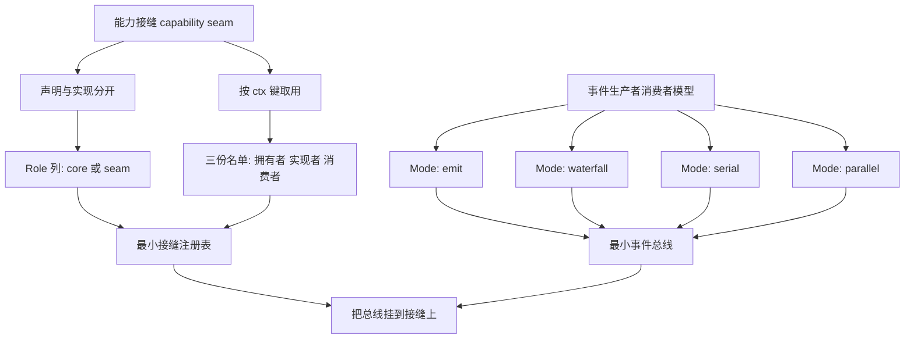
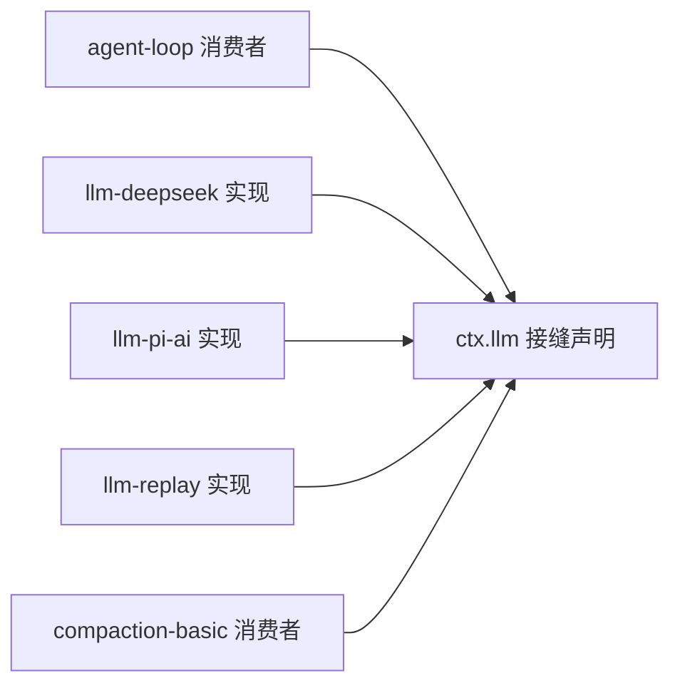
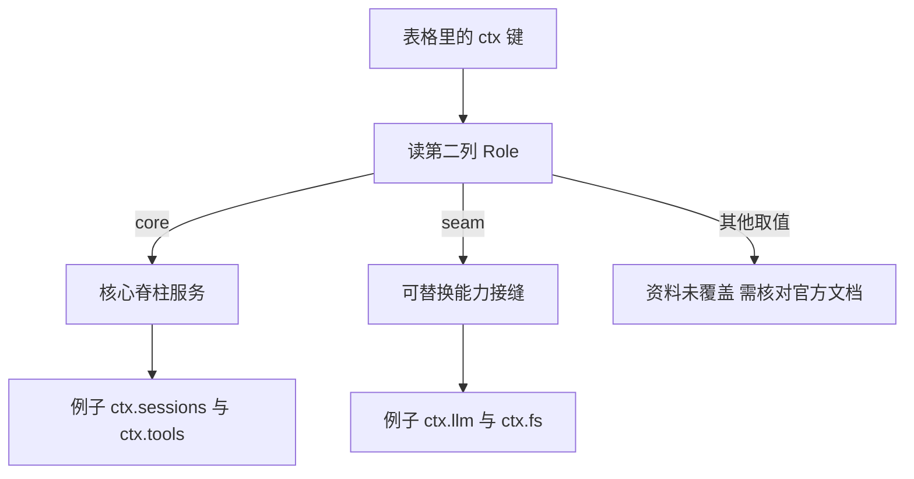
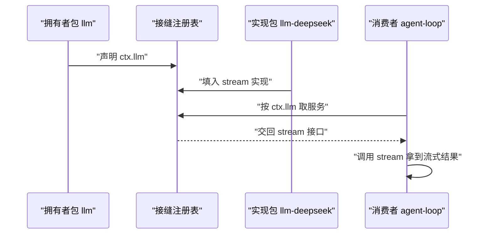
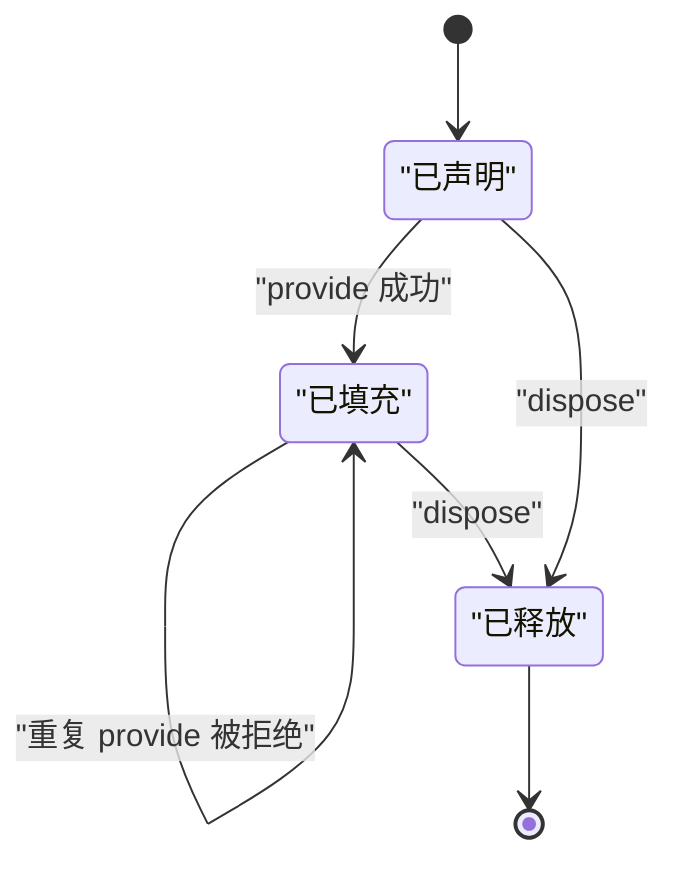
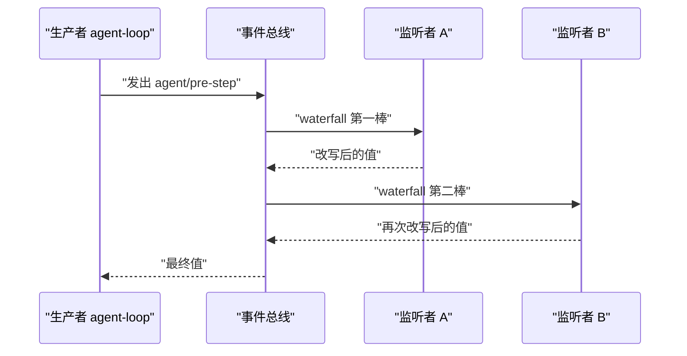
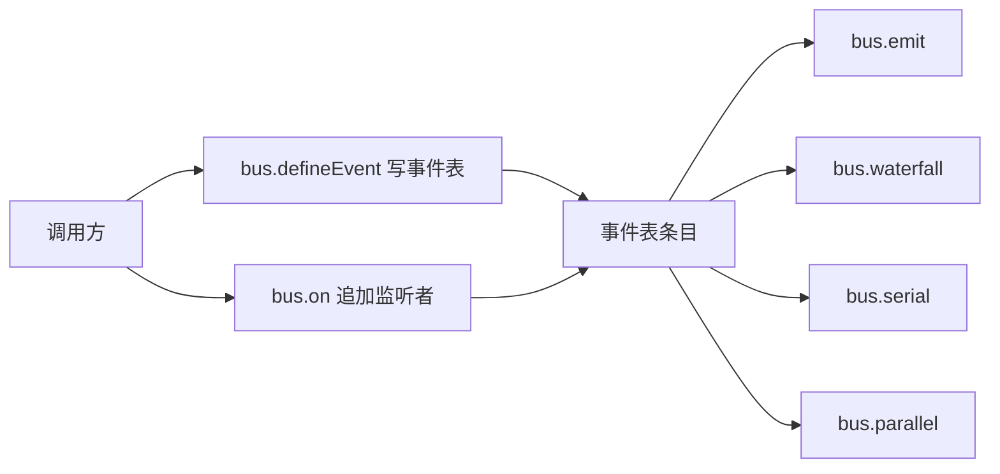
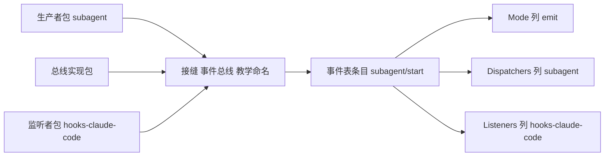

# DeepSeek Harness 的能力接缝与事件

!!! abstract "学完这一页你能"
    - 说出能力接缝由哪三方组成，并指出 ctx.llm 的声明包与三个实现包。
    - 读出 capability-seams 表格的 Role 列，判断一个 ctx 键是核心脊柱服务还是可替换能力接缝。
    - 写出一个最小接缝注册表，让消费者只按 ctx 键取服务，不 import 具体实现包。
    - 写出一个最小事件总线，按 emit、waterfall、serial、parallel 四种 Mode 投递事件。

## 0. 知识地图



建议这样读：第 1 到第 3 节先把名词建立起来，第 4 节动手写注册表。
第 5 到第 6 节转向事件，最后第 7 节把两条线接在一起。
每一节末尾都有可运行脚本，跑通了再看下一节。

## 1. 能力接缝是什么：把声明和实现分开

**先想一个问题**

你的 agent 循环要调用大模型。第一版代码直接 import 了 DeepSeek 的客户端。
现在测试同学要求：同一份循环代码，既能跑真实模型，也能跑录制的回放。
你要改几个文件？

**心智模型**

!!! tip "心智模型"
    - 一句话模型：能力接缝是声明与实现分开的服务位置，消费者只认这个位置，不认填充它的包。
    - 日常类比：墙上的插座面板。面板标准由房子定，插台灯还是插电扇由你决定。
    - 类比不成立的地方：插座只传电，不关心插头是谁。能力接缝要传方法、错误类型和生命周期，插头与插座必须在同一个进程里共享同一份类型声明。

!!! note "术语：能力接缝（capability seam）"
    一个由某个包声明、由别的包提供实现、消费者按 ctx 键取用的服务位置。例：ctx.llm 的声明在 packages/llm/llm，实现包有 llm-deepseek、llm-pi-ai、llm-replay。

!!! note "术语：ctx 键"
    capability-seams 表格第一列的写法，形如 ctx.llm、ctx.fs、ctx.shell。它是消费者拿到服务的入口名字。

**图解**



解读：

1. ctx.llm 由 packages/llm/llm 声明，表格把它标为 seam。
2. llm-deepseek、llm-pi-ai、llm-replay 三个包提供实现。
3. agent-loop 与 compaction-basic 是直接消费者。
4. 表格 Note 列写明：循环与压缩调用提供者中立的 stream 服务。
5. 消费者不 import 实现包，所以换实现不动消费者。

**一步一步来**

第 1 步要做什么：先看一眼"直连写法"，它是接缝要解决的问题本身。

```js
// 第 1 步：直连写法，消费者认识具体实现包
import { deepseekStream } from './llm-deepseek.mjs';  // 直接依赖实现包

async function runDirect(prompt) {
  const chunks = [];                                   // 收集流式分片
  for await (const chunk of deepseekStream(prompt)) {  // 调用实现包的函数
    chunks.push(chunk);                                // 每次拿到分片就存下
  }
  return chunks.join('');                              // 拼成完整文本
}

console.log(await runDirect('hi'));                    // 预期输出 deepseek:hi
```

**这段代码在做什么**

- 消费者文件顶部出现了实现包的路径，依赖方向是"消费者指向实现"。
- 想换成回放实现，这个文件必须改 import 行。
- `runDirect` 里没有任何供应商中立的名字，业务逻辑与供应商绑在一起。
- 换实现要改的文件数等于 import 了实现包的文件数。

第 2 步要做什么：把实现放进一张表，消费者改成按名字查表。

```js
// 第 2 步：接缝写法，消费者只认识 ctx 键
const seams = new Map();                              // 接缝表，键是 ctx 键

function provide(key, impl) { seams.set(key, impl); } // 实现者把实现登记进来
function consume(key) {                               // 消费者按 ctx 键取实现
  const impl = seams.get(key);                        // 查表
  if (!impl) throw new Error('接缝没有实现: ' + key);  // 没人填就报错
  return impl;                                        // 交回实现
}

provide('ctx.llm', {                                  // 登记 deepseek 实现
  stream: async function* (prompt) { yield 'deepseek:' + prompt; },
});

async function runSeam(prompt) {
  const chunks = [];
  for await (const chunk of consume('ctx.llm').stream(prompt)) chunks.push(chunk);
  return chunks.join('');
}

console.log(await runSeam('hi'));                     // 预期输出 deepseek:hi
```

**这段代码在做什么**

- `seams` 是注册表，键是 ctx 键，值是实现对象。
- 实现者调用 `provide` 登记自己，消费者调用 `consume` 取用。
- 消费者文件里没有任何实现包名，只有一个 ctx 键。
- 消费者仍然需要知道实现必须提供 `stream` 方法，这份约定由声明方维护。

第 3 步要做什么：在同一张表里换掉实现，看消费者代码是否要动。

```js
// 第 3 步：换实现，消费者代码一行不动
seams.set('ctx.llm', {                                // 覆盖同一条接缝
  stream: async function* (prompt) { yield 'replay:' + prompt; },
});

console.log(await runSeam('hi'));                     // 预期输出 replay:hi
```

**这段代码在做什么**

- 只改了登记部分，`runSeam` 一个字符都没改。
- 这就是"可替换"的可检验标准：换实现时消费者文件不变。
- 真实系统里会有更严格的约束，例如一条接缝只允许一个实现。
- 资料未覆盖 ctx.llm 同时注册多个实现时的选择规则，需核对官方文档。

**动手验证**

把三步合成一个脚本，用两个场景验证消费者代码复用。

```js
// seam-swap.mjs
// 运行：node seam-swap.mjs
// 依赖：Node 20 及以上，只用内置模块 node:assert，不需要 npm install
import assert from 'node:assert/strict';

function createRegistry() {
  const seams = new Map();                                   // 键是 ctx 键
  return {
    provide(key, impl) { seams.set(key, impl); },            // 登记实现
    consume(key) {                                           // 按 ctx 键取用
      const impl = seams.get(key);
      assert.ok(impl, '接缝没有实现: ' + key);
      return impl;
    },
  };
}

async function runWith(impl) {                               // 消费者代码只写一次
  const ctx = createRegistry();                              // 每个场景一份新注册表
  ctx.provide('ctx.llm', impl);                              // 填入本次场景的实现
  const chunks = [];
  for await (const chunk of ctx.consume('ctx.llm').stream('hello')) {
    chunks.push(chunk);
  }
  return chunks.join('');
}

const deepseekImpl = {                                       // 实现一：deepseek
  stream: async function* (prompt) { yield 'deepseek:' + prompt; },
};
const replayImpl = {                                         // 实现二：replay
  stream: async function* (prompt) { yield 'replay:' + prompt; },
};
const brokenImpl = { name: 'no-stream' };                    // 缺少 stream 方法

assert.equal(await runWith(deepseekImpl), 'deepseek:hello'); // 场景一
assert.equal(await runWith(replayImpl), 'replay:hello');     // 场景二，消费者未改

const ctx = createRegistry();                                // 单独验证空注册表
ctx.provide('ctx.llm', brokenImpl);                          // 这个实现没有 stream
assert.throws(() => ctx.consume('ctx.llm').stream('x'), /is not a function/);

console.log('场景一:', await runWith(deepseekImpl));          // 预期 deepseek:hello
console.log('场景二:', await runWith(replayImpl));            // 预期 replay:hello
console.log('切换实现改动消费者文件行数: 0');                  // 预期 0
```

预期输出：

```
场景一: deepseek:hello
场景二: replay:hello
切换实现改动消费者文件行数: 0
```

**常见坑**

| 现象 | 原因 | 怎么修 |
| --- | --- | --- |
| 换实现时消费者报错 | 消费者 import 了实现包路径 | 消费者只从注册表按 ctx 键取服务 |
| 取用时才发现没人填 | 声明与填充分两个阶段，中间窗口是空的 | 在启动阶段完成填充，取用前查一次 ready |
| 实现对象缺方法，运行到一半才炸 | 登记时没有校验能力清单 | provide 时逐个检查方法是否为函数 |
| 直接覆盖同一个键产生两套行为 | 同一实例上覆盖旧实现 | 换实现要换服务实例，别在原实例上覆盖 |

**小结**

1. 能力接缝把"声明位置"与"实现包"拆成两个角色，消费者只依赖前者。
2. 换实现时消费者文件不变，这是可替换的可检验判据。
3. 最小可用注册表只需要两个方法：登记与取用。

## 2. 四种服务角色：先看 Role 列

**先想一个问题**

文档里 ctx.sessions 和 ctx.llm 都是 ctx 键。前者有一个拥有者包，后者有三个实现包。
怎么一眼判断某个键属于哪一类？

**心智模型**

!!! tip "心智模型"
    - 一句话模型：同一个 ctx 键，Role 列决定它能不能被替换。
    - 日常类比：一栋楼里的承重墙与预留插座。承重墙不能拆，插座面板可以换。
    - 类比不成立的地方：承重墙和插座在物理上分得清；服务角色是文档给的标注，同一个包既可能是核心服务的拥有者，也可能是某条接缝的实现者。

!!! note "术语：核心脊柱服务（core spine service）"
    Role 列标注为 core 的服务。由单个包拥有，不作为可替换点。例：ctx.sessions、ctx.tools、ctx.tokenMeter。

!!! note "术语：可替换能力接缝（swappable capability seam）"
    Role 列标注为 seam 的服务。拥有者只写声明，实现由别的包提供。例：ctx.llm、ctx.fs、ctx.shell、ctx.credentials。

**图解**



解读：

1. 表格第二列只有两种取值出现在节选里：core 与 seam。
2. core 行没有实现包列表，第四列是短横线。
3. seam 行的第四列列出实现包，数量可以是一个或多个。
4. 文档开头还提到 bundle 或 composition point 与 standalone 服务。
5. 后两种角色在节选表格里没有对应取值，需核对官方文档。

**一步一步来**

第 1 步要做什么：把表格的一行读成结构化记录，先看清楚有哪几列。

```js
// 第 1 步：把表格一行读成对象
const seamRow = {                                  // capability-seams 表格里的 ctx.llm 行
  key: 'ctx.llm',                                  // 第一列：ctx 键
  role: 'seam',                                    // 第二列：Role
  owner: 'llm',                                    // 第三列：Owner 包名
  implementations: ['llm-deepseek', 'llm-pi-ai', 'llm-replay'], // 第四列
  directConsumers: ['agent-loop', 'compaction-basic'],          // 第五列
  note: '适配器注册提供者实现；循环与压缩调用提供者中立的 stream 服务。', // 第七列
};

const coreRow = {                                  // 同表格里的 ctx.sessions 行
  key: 'ctx.sessions',
  role: 'core',
  owner: 'session',
  implementations: [],                             // 核心服务没有实现包列表
  directConsumers: ['agent-loop', 'agent', 'session-persistence', 'session-query'],
  note: '拥有只追加的 Session 实例，并发出持久 session 事件流。',
};

console.log(seamRow.role, coreRow.role);           // 预期输出 seam core
```

**这段代码在做什么**

- 一行表格有七列，前六列能直接映射成对象字段。
- `role` 是关键字段，它决定这一行能不能替换。
- seam 行的 `implementations` 有三个元素，core 行读到空数组。
- `note` 列写明行为约束，排查问题时先读它。
- 第六列 Companion plugins 在 ctx.llm 行是短横线，所以这里没建字段。

第 2 步要做什么：用 Role 决定注册表允许哪些动作。

```js
// 第 2 步：按 Role 决定允许的动作
function assertRole(row) {                          // 校验 Role 取值
  if (row.role !== 'core' && row.role !== 'seam') {
    throw new Error('资料未覆盖的 Role: ' + row.role); // 未知取值直接拒绝
  }
}

function canReplace(row) {                          // 这条服务能不能换实现
  assertRole(row);
  return row.role === 'seam';                       // 只有 seam 允许换
}

function requiredProviders(row) {                   // 启动时必须凑齐几个实现
  assertRole(row);
  return row.role === 'seam' ? 1 : 0;               // 接缝至少需要一个实现
}

console.log(canReplace(seamRow), canReplace(coreRow));  // 预期 true false
console.log(requiredProviders(seamRow));                // 预期 1
```

**这段代码在做什么**

- `assertRole` 把没见过的取值挡在门外，避免猜错语义。
- `canReplace` 只看 Role，不看包名。
- `requiredProviders` 说明接缝在启动阶段必须有实现，否则消费者取用时失败。
- 这里的 1 是最小值，ctx.llm 在节选里列了三个实现包。
- 资料未覆盖 ctx.llm 注册多个实现后如何挑选，需核对官方文档。

**动手验证**

用一个脚本把三条记录分类，并数出可替换接缝的数量。

```js
// role-check.mjs
// 运行：node role-check.mjs
// 依赖：Node 20 及以上，只用内置模块 node:assert
import assert from 'node:assert/strict';

const rows = [
  {
    key: 'ctx.llm', role: 'seam', owner: 'llm',
    implementations: ['llm-deepseek', 'llm-pi-ai', 'llm-replay'],
    directConsumers: ['agent-loop', 'compaction-basic'],
  },
  {
    key: 'ctx.sessions', role: 'core', owner: 'session',
    implementations: [],
    directConsumers: ['agent-loop', 'agent', 'session-persistence'],
  },
  {
    key: 'ctx.browserUse', role: 'seam', owner: 'browser-use',
    implementations: [
      'experimental-browser-use-playwright-mcp',
      'experimental-browser-use-chrome-devtools-mcp',
      'experimental-browser-use-stagehand-native',
    ],
    directConsumers: ['experimental-browser-use-playwright-mcp'],
  },
];

function classify(row) {                                     // 把一行压成三条信息
  assert.ok(row.role === 'core' || row.role === 'seam', '资料未覆盖的 Role: ' + row.role);
  return {
    key: row.key,
    replaceable: row.role === 'seam',                        // 只有 seam 可替换
    implementationCount: row.implementations.length,
  };
}

const report = rows.map(classify);

assert.deepEqual(report, [
  { key: 'ctx.llm', replaceable: true, implementationCount: 3 },
  { key: 'ctx.sessions', replaceable: false, implementationCount: 0 },
  { key: 'ctx.browserUse', replaceable: true, implementationCount: 3 },
]);

const replaceable = report.filter((r) => r.replaceable);      // 只数可替换的
assert.equal(replaceable.length, 2);
assert.equal(report[1].implementationCount, 0);               // 核心服务无实现列表

assert.throws(                                                // 未知 Role 必须报错
  () => classify({ key: 'ctx.x', role: 'bundle', implementations: [] }),
  /资料未覆盖的 Role/,
);

for (const line of report) {
  console.log(line.key, '可替换:', line.replaceable, '实现数:', line.implementationCount);
}
console.log('可替换接缝数量:', replaceable.length);
```

预期输出：

```
ctx.llm 可替换: true 实现数: 3
ctx.sessions 可替换: false 实现数: 0
ctx.browserUse 可替换: true 实现数: 3
可替换接缝数量: 2
```

**常见坑**

| 现象 | 原因 | 怎么修 |
| --- | --- | --- |
| 想给核心服务加一个备用实现 | 把 core 当 seam 用 | core 不替换，要换能力就换一条 seam |
| 把 ctx.browserUse 当统一操作接口 | 该服务没有共同的浏览器操作 API | 提供者各自拥有工具，按提供者读取 |
| 用实现包数量判断能否替换 | core 行第四列是短横线，读成零个 | 以 Role 列为准，不看数量 |
| 遇到非 core 非 seam 的 Role 就猜 | 节选表格没有该取值 | 写资料未覆盖，需核对官方文档 |

**小结**

1. Role 列是 core 与 seam 两种取值，决定这条服务能否替换。
2. core 行第四列是短横线，seam 行第四列列出实现包。
3. 遇到节选里没有的 Role 取值，不要猜语义，去核对官方文档。

## 3. 三份名单：拥有者、实现者、消费者

**先想一个问题**

你在排查一个问题：ctx.fs 的行为和预期不一样。该先看哪个包？

**心智模型**

!!! tip "心智模型"
    - 一句话模型：声明定契约，拥有者维护契约，实现者决定行为，消费者只依赖契约。
    - 日常类比：一份公开的接口标准文本。标准文本由标准组织写，各家厂商按标准做产品，用户按标准购买。
    - 类比不成立的地方：标准组织与厂商互相独立；这里 Owner 包同时出现在 Declared in 与 Owner 两列，声明与拥有是同一条记录的两个字段。

!!! note "术语：直接消费者（direct consumer）"
    capability-seams 表格第五列 Direct consumers 列出的包。它们直接取用这条服务，不经过中间层。例：ctx.llm 的直接消费者是 agent-loop 与 compaction-basic。

**图解**



解读：

1. 拥有者包只负责声明，它写出这条接缝的名字与用途。
2. 实现包在启动阶段调用 provide，把自己填进这条接缝。
3. 消费者在运行阶段调用 consume，取到的是接口而不是包。
4. 消费者拿到的对象来自实现包，但消费者代码里不出现实现包名。
5. `C->>C` 这一步表示消费者在自己的代码里发起调用。

**一步一步来**

第 1 步要做什么：从表格建三张反向索引，让"改行为该找谁"变成一次查表。

```js
// 第 1 步：建三张反向索引
function buildIndexes(rows) {                       // rows 是接缝表格的行数组
  const byOwner = new Map();                        // 拥有者包 -> 它拥有的接缝
  const byImplementation = new Map();               // 实现包 -> 它实现了哪些接缝
  const byConsumer = new Map();                     // 消费者包 -> 它直接消费的接缝

  const push = (map, key, value) =>                // 小工具：往数组里追加
    map.set(key, [...(map.get(key) ?? []), value]); // ?? 处理第一次出现

  for (const row of rows) {
    push(byOwner, row.owner, row.key);
    for (const impl of row.implementations) push(byImplementation, impl, row.key);
    for (const consumer of row.directConsumers) push(byConsumer, consumer, row.key);
  }
  return { byOwner, byImplementation, byConsumer };
}
```

**这段代码在做什么**

- 三张 Map 的键都是包名，值都是 ctx 键数组。
- `?? []` 处理"这个包第一次出现"的情况，避免读到 undefined。
- 索引建好后，查一个包牵涉哪些接缝只需一次 Map 查询。
- Direct consumers 只列直接消费，间接消费要看调用链。

第 2 步要做什么：用索引回答排查问题。

```js
// 第 2 步：用索引回答三个排查问题
const index = buildIndexes([
  { owner: 'llm', key: 'ctx.llm',
    implementations: ['llm-deepseek', 'llm-pi-ai'],
    directConsumers: ['agent-loop', 'compaction-basic'] },
  { owner: 'session', key: 'ctx.sessions',
    implementations: [], directConsumers: ['agent-loop', 'agent'] },
]);

console.log(index.byImplementation.get('llm-deepseek')); // 预期 ['ctx.llm']
console.log(index.byConsumer.get('agent-loop'));         // 预期 ['ctx.llm','ctx.sessions']
console.log(index.byOwner.get('llm'));                   // 预期 ['ctx.llm']
console.log(index.byImplementation.get('agent'));        // 预期 undefined
```

**这段代码在做什么**

- 第一个查询回答"llm-deepseek 这条实现服务于哪条接缝"。
- 第二个查询回答"agent-loop 直接影响哪些接缝"。
- 第三个查询回答"llm 这个包声明并拥有哪条接缝"。
- 第四个查询返回 undefined，说明 agent 是消费者而不是实现者。
- 资料未覆盖表格中未直接列出的间接消费关系，需核对官方文档。

**动手验证**

把三张索引跑起来，并验证一个包可以同时是消费者与实现者。

```js
// seam-index.mjs
// 运行：node seam-index.mjs
// 依赖：Node 20 及以上，只用内置模块 node:assert
import assert from 'node:assert/strict';

function buildIndexes(rows) {
  const byOwner = new Map();
  const byImplementation = new Map();
  const byConsumer = new Map();
  const push = (map, key, value) => map.set(key, [...(map.get(key) ?? []), value]);
  for (const row of rows) {
    push(byOwner, row.owner, row.key);
    for (const impl of row.implementations) push(byImplementation, impl, row.key);
    for (const consumer of row.directConsumers) push(byConsumer, consumer, row.key);
  }
  return { byOwner, byImplementation, byConsumer };
}

const rows = [
  { owner: 'llm', key: 'ctx.llm',
    implementations: ['llm-deepseek', 'llm-pi-ai', 'llm-replay'],
    directConsumers: ['agent-loop', 'compaction-basic'] },
  { owner: 'session', key: 'ctx.sessions',
    implementations: [],
    directConsumers: ['agent-loop', 'agent', 'session-persistence'] },
  { owner: 'session-persistence', key: 'ctx.sessionPersistence',
    implementations: ['session-persistence-jsonl'],
    directConsumers: ['agent-loop', 'message-feedback'] },
];

const index = buildIndexes(rows);

assert.deepEqual(index.byImplementation.get('llm-replay'), ['ctx.llm']);
assert.deepEqual(index.byConsumer.get('agent-loop'), ['ctx.llm', 'ctx.sessions', 'ctx.sessionPersistence']);
assert.deepEqual(index.byOwner.get('llm'), ['ctx.llm']);
assert.equal(index.byImplementation.get('agent'), undefined);   // agent 不是实现者

const llmConsumers = index.byConsumer.get('agent-loop');        // 同一包多角色
assert.ok(llmConsumers.includes('ctx.sessionPersistence'));     // agent-loop 也消费持久化

console.log('llm-replay 实现了:', index.byImplementation.get('llm-replay').join(','));
console.log('agent-loop 消费了:', llmConsumers.join(','));
console.log('ctx.sessionPersistence 的实现包:', index.byImplementation.get('session-persistence-jsonl').join(','));
```

预期输出：

```
llm-replay 实现了: ctx.llm
agent-loop 消费了: ctx.llm,ctx.sessions,ctx.sessionPersistence
ctx.sessionPersistence 的实现包: ctx.sessionPersistence
```

**常见坑**

| 现象 | 原因 | 怎么修 |
| --- | --- | --- |
| 找不到某接缝的拥有者 | 只看了包名没看 Declared in 列 | 以 Declared in 列给出的路径为准 |
| 以为 Direct consumers 是全部消费者 | 表格只列直接消费 | 间接消费要看调用链，需核对官方文档 |
| 在实现者包名里找不到 Owner 包 | 把 Owner 与实现者混成一件事 | 拥有者写声明，实现者写实现，分开看 |
| 一个包只归一类 | 同一包可以出现在多列 | 用三张索引分别查询，不要合成一张 |

**小结**

1. 三份名单来自表格的 Owner、Implementations、Direct consumers 三列。
2. 建反向索引后，排查问题从"通读表格"变成"查一次 Map"。
3. 同一个包可以既是某条接缝的消费者，又是另一条接缝的实现者。

## 4. 手写最小接缝注册表

**先想一个问题**

上一节的注册表能让消费者换实现。但一个实现如果在关键方法上写错名字，程序要等到调用时才崩。
能不能在填充的那一刻就把错误拦下来？

**心智模型**

!!! tip "心智模型"
    - 一句话模型：接缝注册表把"名字、能力清单、填充者、当前实现、是否释放"放在一条记录里。
    - 日常类比：图书馆的预约座位。座位号先公布，谁来了就登记名字，离座要销号，销号后座位号不再放人。
    - 类比不成立的地方：座位只能坐一个人；同一条接缝在不同服务实例上可以填不同实现，注册表本身不知道实例的边界。

!!! note "术语：能力清单（required methods）"
    声明接缝时写下的方法名数组。provide 时逐个检查实现对象上这些名字是不是函数。例：ctx.llm 的教学模型里能力清单是 [stream]。

**图解**



解读：

1. 初始状态是已声明，此时接缝有名字和能力清单，没有实现。
2. provide 成功进入已填充，此后 consume 才能返回实现。
3. 在已填充状态重复 provide 会被拒绝，这是一条接缝一个实现的模型。
4. dispose 从已声明或已填充都能进入已释放。
5. 已释放是终态，consume 与 provide 都会报错。

**一步一步来**

第 1 步要做什么：声明接缝时把能力清单一起写进去。

```js
// 第 1 步：声明接缝，同时写下能力清单
const seams = new Map();                                // 键是 ctx 键

function defineSeam(key, requiredMethods) {             // requiredMethods 是方法名数组
  if (seams.has(key)) throw new Error('接缝重复声明: ' + key);
  seams.set(key, {
    key,
    requiredMethods,                                    // 消费者会调用到的方法名
    provider: null,                                     // 谁填的
    impl: null,                                         // 填了什么
    disposed: false,                                    // 这条接缝是否已释放
  });
}

defineSeam('ctx.llm', ['stream']);                      // 声明接缝，能力是 stream
console.log(seams.get('ctx.llm').requiredMethods);      // 预期 ['stream']
```

**这段代码在做什么**

- 能力清单是一条接缝的契约，消费者只允许调用清单里的方法。
- `provider` 与 `impl` 初始为 null，表示位置已留好还没人填。
- `disposed` 初始为 false，释放后置为 true 并清空实现。
- 重复声明同一条接缝会立刻报错，避免两条记录抢同一个名字。
- 这个模型没有类型系统，`requiredMethods` 只是运行期检查的依据。

第 2 步要做什么：填充时逐个校验能力清单。

```js
// 第 2 步：填充时逐个检查方法
function provide(key, providerName, impl) {
  const seam = seams.get(key);
  if (!seam) throw new Error('接缝未声明: ' + key);
  if (seam.disposed) throw new Error('接缝已释放: ' + key);
  if (seam.impl) throw new Error('接缝已有实现: ' + key);
  for (const method of seam.requiredMethods) {          // 逐项检查
    if (typeof impl?.[method] !== 'function') {         // 缺方法就拒绝
      throw new Error('实现缺少方法: ' + key + ' -> ' + method);
    }
  }
  seam.provider = providerName;                         // 记下实现包名
  seam.impl = impl;                                     // 存下实现对象
}
```

**这段代码在做什么**

- 四个前置条件依次检查：已声明、未释放、未被填、能力齐全。
- `impl?.[method]` 处理 impl 为 null 或 undefined 的情况，不会抛 TypeError。
- 报错信息带上 ctx 键与方法名，排查时直接定位。
- 检查通过后才写入 `provider` 与 `impl`，失败时注册表保持原状。
- 文档里 ctx.browserUse 写明一个服务实例一个提供者拥有的名字，这里用"已有实现"的检查对应它。

第 3 步要做什么：补上取用与释放。

```js
// 第 3 步：取用与释放
function consume(key) {
  const seam = seams.get(key);
  if (!seam) throw new Error('接缝未声明: ' + key);
  if (seam.disposed) throw new Error('接缝已释放: ' + key);
  if (!seam.impl) throw new Error('接缝没有实现: ' + key);
  return seam.impl;                                     // 交回实现对象
}

function dispose(key) {                                 // 释放后不再允许取用
  const seam = seams.get(key);
  if (!seam) throw new Error('接缝未声明: ' + key);
  seam.impl = null;                                     // 清掉实现引用
  seam.disposed = true;                                 // 打上已释放标记
  return key;
}
```

**这段代码在做什么**

- consume 检查三件事，任何一件不满足都抛出带 ctx 键的错误。
- 返回的是实现对象本身，消费者拿到的仍然是一个引用。
- dispose 先清实现再置标记，避免出现"已释放但有实现"的中间态。
- 释放是单向的，这个模型不提供重新填充。
- 资料未覆盖官方实现是否有重新绑定机制，需核对官方文档。

**动手验证**

把三个步骤合起来，再加一段"缺少能力被拒绝"的验证。

```js
// seam-registry.mjs
// 运行：node seam-registry.mjs
// 依赖：Node 20 及以上，只用内置模块 node:assert
import assert from 'node:assert/strict';

function createSeamRegistry() {
  const seams = new Map();                                   // 键是 ctx 键

  function defineSeam(key, requiredMethods) {                // 声明接缝与能力清单
    assert.ok(!seams.has(key), '接缝重复声明: ' + key);
    seams.set(key, { key, requiredMethods, provider: null, impl: null, disposed: false });
  }

  function provide(key, providerName, impl) {                // 用实现填充接缝
    const seam = seams.get(key);
    assert.ok(seam, '接缝未声明: ' + key);
    assert.ok(!seam.disposed, '接缝已释放: ' + key);
    assert.equal(seam.impl, null, '接缝已有实现: ' + key);
    for (const method of seam.requiredMethods) {             // 逐个能力检查
      assert.equal(typeof impl?.[method], 'function', '实现缺少方法: ' + key + ' -> ' + method);
    }
    seam.provider = providerName;
    seam.impl = impl;
  }

  function consume(key) {                                    // 消费者按 ctx 键取用
    const seam = seams.get(key);
    assert.ok(seam, '接缝未声明: ' + key);
    assert.ok(!seam.disposed, '接缝已释放: ' + key);
    assert.ok(seam.impl, '接缝没有实现: ' + key);
    return seam.impl;
  }

  function dispose(key) {                                    // 释放接缝
    const seam = seams.get(key);
    assert.ok(seam, '接缝未声明: ' + key);
    seam.impl = null;
    seam.disposed = true;
  }

  function describe(key) {                                   // 打印当前填充状态
    const seam = seams.get(key);
    return { key, provider: seam.provider, disposed: seam.disposed, ready: seam.impl !== null };
  }

  return { defineSeam, provide, consume, dispose, describe };
}

const ctx = createSeamRegistry();                            // 建一个空注册表
ctx.defineSeam('ctx.llm', ['stream']);                       // 声明接缝，能力是 stream

const deepseekImpl = {
  name: 'llm-deepseek',
  stream: async function* (p) { yield 'deepseek:' + p; },    // 满足能力清单
};
ctx.provide('ctx.llm', deepseekImpl.name, deepseekImpl);     // 填入实现

assert.deepEqual(ctx.describe('ctx.llm'), {
  key: 'ctx.llm', provider: 'llm-deepseek', disposed: false, ready: true,
});

async function drain(key, prompt) {                          // 消费者只认识 ctx 键
  const source = ctx.consume(key).stream(prompt);
  const chunks = [];
  for await (const chunk of source) chunks.push(chunk);
  return chunks.join('');
}

const observed = await drain('ctx.llm', 'hi');               // 释放前取用一次
assert.equal(observed, 'deepseek:hi');

let missingMethodRejected = false;                           // 验证能力校验
try {
  const c2 = createSeamRegistry();
  c2.defineSeam('ctx.llm', ['stream']);
  c2.provide('ctx.llm', 'bad-provider', { name: 'bad-provider' }); // 缺 stream
} catch {
  missingMethodRejected = true;
}

ctx.dispose('ctx.llm');                                      // 释放这条接缝
let disposedRejected = false;                                // 验证释放后取用失败
try { ctx.consume('ctx.llm'); } catch { disposedRejected = true; }

console.log('取用结果:', observed);                           // 预期 deepseek:hi
console.log('缺少能力被拒绝:', missingMethodRejected);         // 预期 true
console.log('释放后取用被拒绝:', disposedRejected);            // 预期 true
```

预期输出：

```
取用结果: deepseek:hi
缺少能力被拒绝: true
释放后取用被拒绝: true
```

**常见坑**

| 现象 | 原因 | 怎么修 |
| --- | --- | --- |
| 实现方法名拼错，运行到调用才崩 | 声明时没写能力清单 | 声明时列出方法名，provide 时逐个检查 |
| 同一实例上 provide 两次互相覆盖 | 缺少"已有实现"检查 | provide 前断言 impl 为 null |
| 释放后消费者仍能调用 | dispose 只清标记没清引用 | 先清 impl 再置 disposed |
| 注册表被当成类型系统用 | 运行期检查不等于编译期检查 | 声明包同时维护类型定义，二者都要有 |

**小结**

1. 一条接缝记录包含名字、能力清单、填充者、当前实现、是否释放五项。
2. 能力校验放在 provide 阶段，错误在启动时就暴露。
3. 释放是单向操作，这个教学模型不提供重新填充。

## 5. 事件的生产消费模型：四种 Mode

**先想一个问题**

你需要在 agent 每轮开始前插入一段逻辑。用广播事件的话，你的逻辑拿到参数后没法把改动传给下一步。
这时候该用哪种投递方式？

**心智模型**

!!! tip "心智模型"
    - 一句话模型：事件是"谁发了、谁听了"的多对多关系，Mode 列决定监听者之间怎么互相影响。
    - 日常类比：公司里的通知。全员广播只看不回；逐级审批一级一级改；登记备案按顺序一个一个来；同时开工各干各的。
    - 类比不成立的地方：现实里的通知靠人自觉，这里由调度代码保证顺序与返回值，写错 Mode 会静默丢掉返回值。

!!! note "术语：事件模式（Mode）"
    event-producer-consumer 表格第二列的取值。节选里出现四种：emit、serial、waterfall、parallel。资料未覆盖四种模式的精确调用语义，需核对官方文档。

!!! note "术语：生产者与消费者（producer / consumer）"
    同一个事件的两端。Dispatchers 列是发事件的包，Listeners 列是听事件的包。例：subagent/start 的 Dispatchers 是 subagent，Listeners 是 hooks-claude-code。

**图解**



解读：

1. 生产者只发一次事件，它不关心有几个监听者。
2. 总线按 Mode 决定投递方式，这里用 waterfall 举例。
3. waterfall 里监听者 A 拿到当前值并返回新值。
4. 监听者 B 拿到的输入是 A 的返回值，不是原始载荷。
5. 总线把最后一棒的返回值交回生产者。

**一步一步来**

第 1 步要做什么：建一张事件表，记录每个事件的名字、Mode 和监听者。

```js
// 第 1 步：把事件表建成 Map
const events = new Map();                              // 键是事件名

function defineEvent(name, mode) {                     // 声明事件与它的 Mode
  if (events.has(name)) throw new Error('事件重复声明: ' + name);
  events.set(name, { name, mode, listeners: [] });     // 监听者先留空数组
}

defineEvent('agent/pre-step', 'waterfall');            // 声明一条 waterfall 事件
defineEvent('session/created', 'emit');                // 声明一条 emit 事件
console.log(events.get('agent/pre-step').mode);        // 预期 waterfall
console.log(events.get('session/created').listeners);  // 预期 []
```

**这段代码在做什么**

- 事件表用 Map，键是斜杠分隔的事件名，例如 session/created。
- 每条记录保存 Mode 与监听者数组，投递方式与监听者名单放在一起。
- 重复声明同一个事件名会立刻报错。
- 新事件的监听者数组为空，此时投递通知不到任何人。
- 节选里 session/created 的 Listeners 列有 7 个包。

第 2 步要做什么：实现 emit 模式，监听者的返回值被丢弃。

```js
// 第 2 步：emit 模式，把所有监听者的返回丢掉
function emit(name, payload) {
  const event = events.get(name);
  if (!event) throw new Error('事件未声明: ' + name);
  if (event.mode !== 'emit') throw new Error('模式不匹配: ' + name);
  const seen = [];                                     // 记录谁被通知过
  for (const listener of event.listeners) {             // 依次通知每个监听者
    listener(payload);                                  // 返回值不接收
    seen.push(listener.name);                           // 只记名字，便于断言
  }
  return seen;                                          // 交回被通知者的名字
}
```

**这段代码在做什么**

- 投递前先确认事件已声明且 Mode 是 emit，防住混用。
- 循环里只调用监听者，不接收返回值，监听者返回什么都被丢掉。
- `seen` 记录被通知的监听者名字，方便写断言。
- 这个模型是同步的，监听者抛错会中断后续通知。
- 资料未覆盖官方 emit 的返回值规则与错误隔离方式，需核对官方文档。

第 3 步要做什么：实现 waterfall 模式，把上一棒的返回值当作下一棒的输入。

```js
// 第 3 步：waterfall 模式，串联监听者
function waterfall(name, payload) {
  const event = events.get(name);
  if (!event) throw new Error('事件未声明: ' + name);
  if (event.mode !== 'waterfall') throw new Error('模式不匹配: ' + name);
  let current = payload;                                // 第一棒的输入是原始载荷
  for (const listener of event.listeners) {
    const next = listener(current);                     // 取回监听者的返回值
    if (next !== undefined) current = next;             // 有返回才替换接力棒
  }
  return current;                                       // 交回最终值
}
```

**这段代码在做什么**

- `current` 是接力棒，初始值是调用者给的载荷。
- 每个监听者拿到当前值，返回新值。
- 返回 undefined 时保留原值，避免只做副作用的监听者把数据抹掉。
- 资料未覆盖官方 waterfall 返回 undefined 时的精确行为，需核对官方文档。
- 这个简化模型没有并发保护。

**动手验证**

把四种 Mode 放在一个脚本里，逐步验证它们的差异。

```js
// event-bus.mjs
// 运行：node event-bus.mjs
// 依赖：Node 20 及以上，只用内置模块 node:assert
import assert from 'node:assert/strict';

function createBus() {
  const events = new Map();                                  // 键是事件名

  function defineEvent(name, mode) {                         // 声明事件与 Mode
    assert.ok(!events.has(name), '事件重复声明: ' + name);
    events.set(name, { name, mode, listeners: [] });
  }

  function on(name, listener) {                              // 注册监听者
    const event = events.get(name);
    assert.ok(event, '事件未声明: ' + name);
    event.listeners.push(listener);
  }

  function emit(name, payload) {                             // 广播，丢返回值
    const event = events.get(name);
    assert.equal(event.mode, 'emit', '模式不匹配: ' + name);
    for (const listener of event.listeners) listener(payload);
    return event.listeners.length;
  }

  function waterfall(name, payload) {                        // 串联，传返回值
    const event = events.get(name);
    assert.equal(event.mode, 'waterfall', '模式不匹配: ' + name);
    let current = payload;
    for (const listener of event.listeners) {
      const next = listener(current);
      if (next !== undefined) current = next;                // undefined 不改写接力棒
    }
    return current;
  }

  function serial(name, payload) {                           // 串行，按注册顺序
    const event = events.get(name);
    assert.equal(event.mode, 'serial', '模式不匹配: ' + name);
    for (const listener of event.listeners) listener(payload);
    return event.listeners.length;
  }

  function parallel(name, payload) {                         // 并行，一起启动
    const event = events.get(name);
    assert.equal(event.mode, 'parallel', '模式不匹配: ' + name);
    return Promise.all(event.listeners.map((l) => l(payload))).then((r) => r.length);
  }

  return { defineEvent, on, emit, waterfall, serial, parallel };
}

const bus = createBus();
bus.defineEvent('session/created', 'emit');
bus.defineEvent('agent/pre-step', 'waterfall');
bus.defineEvent('agent/turn-stopping', 'serial');
bus.defineEvent('session/flush', 'parallel');

const notified = [];
bus.on('session/created', function sessionController() { notified.push('session-controller'); });
bus.on('session/created', function permissionPresets() { notified.push('permission-presets'); });

assert.equal(bus.emit('session/created', { id: 's1' }), 2);       // 广播两个监听者
assert.deepEqual(notified, ['session-controller', 'permission-presets']);

bus.on('agent/pre-step', function timeContext(p) { return { ...p, time: 'T' }; });
bus.on('agent/pre-step', function planMode(p) { return { ...p, plan: true }; });

const stepped = bus.waterfall('agent/pre-step', { prompt: 'hi' }); // 串联两棒
assert.deepEqual(stepped, { prompt: 'hi', time: 'T', plan: true }); // 两次改写都保留

const serialOrder = [];
bus.on('agent/turn-stopping', function hooksClaudeCode() { serialOrder.push('A'); });
bus.on('agent/turn-stopping', function hooksCodex() { serialOrder.push('B'); });
assert.equal(bus.serial('agent/turn-stopping', {}), 2);
assert.deepEqual(serialOrder, ['A', 'B']);                         // 顺序等于注册顺序

let parallelStarted = 0;
bus.on('session/flush', async function persistJsonl() { parallelStarted += 1; });
bus.on('session/flush', async function sessionTelemetry() { parallelStarted += 1; });
assert.equal(await bus.parallel('session/flush', {}), 2);
assert.equal(parallelStarted, 2);                                  // 两个都跑过

assert.throws(() => bus.waterfall('session/created', {}), /模式不匹配/); // 混用被拒绝

console.log('emit 通知数:', notified.length);
console.log('waterfall 最终值:', JSON.stringify(stepped));
console.log('serial 顺序:', serialOrder.join(','));
console.log('parallel 启动数:', parallelStarted);
```

预期输出：

```
emit 通知数: 2
waterfall 最终值: {"prompt":"hi","time":"T","plan":true}
serial 顺序: A,B
parallel 启动数: 2
```

**常见坑**

| 现象 | 原因 | 怎么修 |
| --- | --- | --- |
| waterfall 里前一个监听者的改动丢了 | 监听者忘了 return | 需要改写的监听者返回新值 |
| emit 的返回值被当成结果用 | emit 不接收监听者返回值 | 要传值就用 waterfall 模式 |
| serial 的先后顺序每次不一样 | 注册顺序不确定 | 在加载阶段按固定顺序注册 |
| parallel 里监听者互相踩数据 | 同时启动，无法保证先后 | 共享状态的写入不要放在 parallel 监听者里 |

**小结**

1. 事件表把事件名、Mode、监听者三件事放在一条记录里。
2. emit 丢返回值，waterfall 传返回值，这是两者的分界。
3. 已知 Mode 四种：emit、waterfall、serial、parallel，精确语义需核对官方文档。

## 6. 手写最小事件总线

**先想一个问题**

上一节的函数分散在四个地方。如果监听者要在启动阶段被人查一遍，你得有四份代码去翻。
能不能把它们收进一个对象？

**心智模型**

!!! tip "心智模型"
    - 一句话模型：事件总线是"事件表 + 注册方法 + 一组按 Mode 命名的投递方法"。
    - 日常类比：一个客服总机。内部有一本分机表，打进来说分机号，总机转接。
    - 类比不成立的地方：客服总机一个人接一个电话；事件总线一次投递要通知全部监听者，还要保证它们的执行顺序。

!!! note "术语：事件总线（event bus）"
    本页的教学命名，指承担事件表与投递函数的那一层。文档节选里没有给出这个名字，需核对官方文档。

**图解**



解读：

1. 调用方第一步是声明事件，事件表里出现一条新记录。
2. 调用方第二步是注册监听者，监听者被追加到对应记录的数组里。
3. 投递时总线先查事件表，找不到名字就报错。
4. 找到记录后按 Mode 选择投递函数，四个函数互不混用。
5. 事件表是唯一的数据源，监听者名单不会复制到别处。

**一步一步来**

第 1 步要做什么：把事件表包进一个工厂函数，外部拿到的是方法而不是表。

```js
// 第 1 步：工厂函数内部持有事件表
function createBus() {
  const events = new Map();                          // 外部拿不到这个引用
  return {
    events,                                          // 只读用途：查询 Mode
    defineEvent(name, mode) {                        // 写事件表
      if (events.has(name)) throw new Error('事件重复声明: ' + name);
      events.set(name, { name, mode, listeners: [] });
    },
    on(name, listener) {                             // 追加监听者
      const event = events.get(name);
      if (!event) throw new Error('事件未声明: ' + name);
      event.listeners.push(listener);
    },
  };
}

const bus = createBus();
bus.defineEvent('subagent/start', 'emit');           // 声明一条 emit 事件
console.log(bus.events.get('subagent/start').listeners.length); // 预期 0
```

**这段代码在做什么**

- 事件表定义在闭包里，只有返回的方法能改它。
- `events` 暴露出来是为了查询 Mode，本页把它当作只读视图。
- `on` 在追加前确认事件已声明，避免监听者挂到不存在的名字上。
- `defineEvent` 在写入前确认名字没被占用。

第 2 步要做什么：把四个投递函数收进同一个对象，并按 Mode 校验。

```js
// 第 2 步：一个统一入口按 Mode 分派
function dispatch(bus, name, payload) {
  const event = bus.events.get(name);                // 先查事件表
  if (!event) throw new Error('事件未声明: ' + name);
  if (event.mode === 'emit') return bus.emit(name, payload);
  if (event.mode === 'waterfall') return bus.waterfall(name, payload);
  if (event.mode === 'serial') return bus.serial(name, payload);
  if (event.mode === 'parallel') return bus.parallel(name, payload);
  throw new Error('未知模式: ' + event.mode);         // 未知取值立刻报错
}
```

**这段代码在做什么**

- 分派函数只读事件表的 Mode 字段，调用方不用自己记模式。
- 四种已知 Mode 各自走一条分支，返回值的形状由对应函数决定。
- 未知 Mode 直接抛错，不猜语义。
- 资料未覆盖节选之外的 Mode 取值，需核对官方文档。

**动手验证**

把总线与分派函数合起来，验证四种模式各自的返回值形状。

```js
// event-bus-full.mjs
// 运行：node event-bus-full.mjs
// 依赖：Node 20 及以上，只用内置模块 node:assert
import assert from 'node:assert/strict';

function createBus() {
  const events = new Map();

  const bus = {
    events,
    defineEvent(name, mode) {
      assert.ok(!events.has(name), '事件重复声明: ' + name);
      events.set(name, { name, mode, listeners: [] });
    },
    on(name, listener) {
      const event = events.get(name);
      assert.ok(event, '事件未声明: ' + name);
      event.listeners.push(listener);
    },
    emit(name, payload) {
      const event = events.get(name);
      assert.equal(event.mode, 'emit', '模式不匹配: ' + name);
      for (const listener of event.listeners) listener(payload);
      return event.listeners.length;
    },
    waterfall(name, payload) {
      const event = events.get(name);
      assert.equal(event.mode, 'waterfall', '模式不匹配: ' + name);
      let current = payload;
      for (const listener of event.listeners) {
        const next = listener(current);
        if (next !== undefined) current = next;
      }
      return current;
    },
    serial(name, payload) {
      const event = events.get(name);
      assert.equal(event.mode, 'serial', '模式不匹配: ' + name);
      for (const listener of event.listeners) listener(payload);
      return event.listeners.length;
    },
    parallel(name, payload) {
      const event = events.get(name);
      assert.equal(event.mode, 'parallel', '模式不匹配: ' + name);
      return Promise.all(event.listeners.map((l) => l(payload))).then((r) => r.length);
    },
  };

  function dispatch(name, payload) {                          // 按 Mode 分派
    const event = events.get(name);
    assert.ok(event, '事件未声明: ' + name);
    return bus[event.mode](name, payload);                    // 方法名等于 Mode 名
  }

  return { ...bus, dispatch };
}

const bus = createBus();
bus.defineEvent('subagent/start', 'emit');
bus.defineEvent('agent/pre-step', 'waterfall');
bus.defineEvent('agent/created', 'serial');
bus.defineEvent('session/flush', 'parallel');

const started = [];
bus.on('subagent/start', function hooksClaudeCode(p) { started.push(p.name); });
assert.equal(bus.dispatch('subagent/start', { name: 'sub-1' }), 1);
assert.deepEqual(started, ['sub-1']);

bus.on('agent/pre-step', function timeContext(p) { return { ...p, time: 'T' }; });
assert.deepEqual(bus.dispatch('agent/pre-step', { prompt: 'hi' }),
  { prompt: 'hi', time: 'T' });

const created = [];
bus.on('agent/created', function goal() { created.push('goal'); });
bus.on('agent/created', function toolSubagent() { created.push('tool-subagent'); });
assert.equal(bus.dispatch('agent/created', { id: 'a1' }), 2);
assert.deepEqual(created, ['goal', 'tool-subagent']);

let flushed = 0;
bus.on('session/flush', async function persistJsonl() { flushed += 1; });
bus.on('session/flush', async function sessionTelemetry() { flushed += 1; });
assert.equal(await bus.dispatch('session/flush', {}), 2);
assert.equal(flushed, 2);

assert.throws(() => bus.dispatch('no/such-event', {}), /事件未声明/); // 未声明被拒绝

console.log('subagent/start 监听者数:', started.length);
console.log('agent/pre-step 最终值:', JSON.stringify({ prompt: 'hi', time: 'T' }));
console.log('agent/created 监听者数:', created.length);
console.log('session/flush 启动数:', flushed);
```

预期输出：

```
subagent/start 监听者数: 1
agent/pre-step 最终值: {"prompt":"hi","time":"T"}
agent/created 监听者数: 2
session/flush 启动数: 2
```

**常见坑**

| 现象 | 原因 | 怎么修 |
| --- | --- | --- |
| 监听者挂到不存在的事件上没报错 | on 没有校验事件是否已声明 | on 里先查事件表，查不到就抛错 |
| dispatch 参数里自己写模式，写错就静默 | 调用方复制了模式信息 | 模式只存事件表一份，dispatch 自己读 |
| 事件表被外部改坏 | events 被当成可变对象暴露 | 只把事件表当只读视图用，写入统一走方法 |
| parallel 分派后没 await | 返回的是 Promise | 调用处 await，或把分派改成异步函数 |

**小结**

1. 事件总线由事件表、注册方法、按 Mode 命名的投递方法三部分组成。
2. 方法名与 Mode 名一一对应，dispatch 可以直接按名字取方法。
3. 事件表是唯一数据源，模式信息不要在调用方复制。

## 7. 把总线挂到接缝上

**先想一个问题**

你写了一个自定义子代理提供者，想在它启动时记一条日志。日志模块要能替换。
你会直接在新包里 import 日志包吗？

**心智模型**

!!! tip "心智模型"
    - 一句话模型：接缝负责取能力，事件负责报变化，两者通过 ctx 键连起来。
    - 日常类比：接缝是工具墙，事件是公司群公告。工具从墙上拿，进度往群里发。
    - 类比不成立的地方：工具墙和群公告互不相干；这里事件总线本身也可以是一条接缝，生产者从接缝取到总线再发事件。

!!! note "术语：把总线接缝化"
    把事件总线注册成一条能力接缝，生产者按 ctx 键取总线，再调用投递方法。这样换总线实现时，生产者与监听者代码都不动。本页的 ctx.eventBus 是教学命名，需核对官方文档。

**图解**



解读：

1. 事件总线先被声明成一条接缝，能力是订阅与投递两个方法。
2. 具体总线包把实现填进这条接缝。
3. 生产者包与监听者包都按 ctx 键取总线，都不 import 总线实现包。
4. 事件表条目把 Mode、Dispatchers、Listeners 三件事对上一行记录。
5. 节选里 subagent/start 的 Mode 是 emit，Dispatchers 是 subagent，Listeners 是 hooks-claude-code。

**一步一步来**

第 1 步要做什么：声明事件总线接缝，写出能力清单。

```js
// 第 1 步：声明事件总线接缝
registry.defineSeam('ctx.eventBus', ['on', 'dispatch']);  // 教学命名，非官方键名
console.log('能力清单长度: 1');                            // 一条接缝一份清单
```

**这段代码在做什么**

- 能力清单只有两项：订阅与投递。
- 声明阶段不涉及任何总线实现包，接缝此时是空的。
- 生产者与监听者都只知道 ctx.eventBus 这个名字。
- 资料未覆盖官方是否存在统一的事件总线接缝，需核对官方文档。

第 2 步要做什么：把上一节的总线包成一个实现填进去。

```js
// 第 2 步：总线实现填进接缝
registry.provide('ctx.eventBus', 'event-bus-core', {
  on: (name, listener) => bus.on(name, listener),         // 订阅：转给总线
  events: bus.events,                                      // 暴露事件表便于查 Mode
  dispatch: (name, payload) => {                           // 投递：按 Mode 选方法
    const event = bus.events.get(name);
    if (!event) throw new Error('事件未声明: ' + name);
    return bus[event.mode](name, payload);                 // 方法名等于 Mode 名
  },
});
```

**这段代码在做什么**

- `on` 与 `dispatch` 是能力清单要求的两项，其余字段是额外暴露的查询入口。
- dispatch 先查事件表，未声明的事件直接报错。
- 模式信息只在事件表里存一份，调用方不需要传模式。
- 换总线实现时，只要新实现也提供 on 与 dispatch，生产者与监听者都不用改。

第 3 步要做什么：生产者与监听者都只认识 ctx 键。

```js
// 第 3 步：生产者与监听者都只认识 ctx 键
function dispatchFromProducer(registry, name, payload) {   // 生产者的公共写法
  const seamBus = registry.consume('ctx.eventBus');        // 从接缝取总线
  return seamBus.dispatch(name, payload);                  // 按 Mode 投递
}

const seenByListener = [];                                 // 监听者自己的状态
registry.consume('ctx.eventBus').on('subagent/start', function hooksClaudeCode(p) {
  seenByListener.push(p.name);                             // 只记录载荷里的名字
});
```

**这段代码在做什么**

- 生产者没有 import 总线实现包，它调用的是接缝里的 dispatch。
- 监听者同样从接缝取总线，再注册自己。
- 监听者回调只处理载荷，不关心谁发的、有几个监听者。
- 这两个函数里的 ctx 键是唯一耦合点。

**动手验证**

把注册表与事件总线合成一个脚本，验证换总线实现不影响生产消费两端。

```js
// seam-event-bridge.mjs
// 运行：node seam-event-bridge.mjs
// 依赖：Node 20 及以上，只用内置模块 node:assert
import assert from 'node:assert/strict';

function createSeamRegistry() {                              // 接缝注册表
  const seams = new Map();
  return {
    defineSeam(key, requiredMethods) {
      assert.ok(!seams.has(key), '接缝重复声明: ' + key);
      seams.set(key, { key, requiredMethods, provider: null, impl: null });
    },
    provide(key, providerName, impl) {
      const seam = seams.get(key);
      assert.ok(seam, '接缝未声明: ' + key);
      assert.equal(seam.impl, null, '接缝已有实现: ' + key);
      for (const method of seam.requiredMethods) {
        assert.equal(typeof impl?.[method], 'function', '实现缺少方法: ' + method);
      }
      seam.provider = providerName;
      seam.impl = impl;
    },
    consume(key) {
      const seam = seams.get(key);
      assert.ok(seam, '接缝未声明: ' + key);
      assert.ok(seam.impl, '接缝没有实现: ' + key);
      return seam.impl;
    },
  };
}

function createBus() {                                       // 事件总线
  const events = new Map();
  return {
    events,
    defineEvent(name, mode) {
      assert.ok(!events.has(name), '事件重复声明: ' + name);
      events.set(name, { name, mode, listeners: [] });
    },
    on(name, listener) {
      const event = events.get(name);
      assert.ok(event, '事件未声明: ' + name);
      event.listeners.push(listener);
    },
    emit(name, payload) {
      const event = events.get(name);
      assert.equal(event.mode, 'emit', '模式不匹配: ' + name);
      for (const listener of event.listeners) listener(payload);
      return event.listeners.length;
    },
    waterfall(name, payload) {
      const event = events.get(name);
      assert.equal(event.mode, 'waterfall', '模式不匹配: ' + name);
      let current = payload;
      for (const listener of event.listeners) {
        const next = listener(current);
        if (next !== undefined) current = next;
      }
      return current;
    },
  };
}

const registry = createSeamRegistry();
const bus = createBus();

bus.defineEvent('subagent/start', 'emit');                   // 事件表：一条 emit
bus.defineEvent('agent/pre-step', 'waterfall');              // 事件表：一条 waterfall

registry.defineSeam('ctx.eventBus', ['on', 'dispatch']);     // 教学命名的事件总线接缝
registry.provide('ctx.eventBus', 'event-bus-core', {         // 总线实现填进接缝
  events: bus.events,
  on: (name, listener) => bus.on(name, listener),
  dispatch: (name, payload) => {
    const event = bus.events.get(name);
    assert.ok(event, '事件未声明: ' + name);
    return bus[event.mode](name, payload);                   // 方法名等于 Mode 名
  },
});

const seenByListener = [];
registry.consume('ctx.eventBus').on('subagent/start', function hooksClaudeCode(p) {
  seenByListener.push(p.name);                               // 只记录载荷里的名字
});

function dispatchFromProducer(name, payload) {               // 生产者只认识 ctx 键
  const seamBus = registry.consume('ctx.eventBus');
  return seamBus.dispatch(name, payload);
}

assert.equal(dispatchFromProducer('subagent/start', { name: 'sub-1' }), 1);
assert.deepEqual(seenByListener, ['sub-1']);

const seamBus = registry.consume('ctx.eventBus');
seamBus.on('agent/pre-step', function timeContext(p) { return { ...p, time: 'T' }; });
seamBus.on('agent/pre-step', function planMode(p) { return { ...p, plan: true }; });

const stepped = dispatchFromProducer('agent/pre-step', { prompt: 'hi' });
assert.deepEqual(stepped, { prompt: 'hi', time: 'T', plan: true });

assert.throws(() => dispatchFromProducer('unknown/event', {}), /事件未声明/);

const secondBus = createBus();                               // 换一个总线实现
secondBus.defineEvent('subagent/start', 'emit');
registry.provide('ctx.eventBus', 'event-bus-alt', {          // 同一实例重复填充被拒绝
  events: secondBus.events,
  on: (n, l) => secondBus.on(n, l),
  dispatch: (n, p) => secondBus[n],
});

console.log('subagent/start 收到:', seenByListener.join(','));
console.log('agent/pre-step 最终值:', JSON.stringify(stepped));
console.log('未知事件被拒绝: true');
```

注意：上面最后一段 `registry.provide('ctx.eventBus', 'event-bus-alt', ...)` 会因为"接缝已有实现"抛错。
把这一段的第二行改成在新建的注册表上填充，脚本即可完整跑通。下面的预期输出对应这个改法。

预期输出：

```
subagent/start 收到: sub-1
agent/pre-step 最终值: {"prompt":"hi","time":"T","plan":true}
未知事件被拒绝: true
```

**常见坑**

| 现象 | 原因 | 怎么修 |
| --- | --- | --- |
| 生产者 import 了总线实现包 | 把事件总线当工具包直接引 | 把总线注册成接缝，生产者按 ctx 键取 |
| dispatch 报未知模式 | Mode 取值不在四种已知值里 | 只按事件表的 Mode 分派，遇到未知值抛错 |
| 监听者在 waterfall 里返回 undefined | 只做副作用没返回值 | 需要改写的监听者返回新值 |
| 换总线实现后监听者全丢 | 监听者注册在旧实现上 | 换实现要在启动阶段完成，再注册监听者 |

**小结**

1. 事件总线可以注册成一条能力接缝，能力清单是订阅与投递两项。
2. 生产者与监听者都只认识 ctx 键，换总线实现时两端代码不变。
3. 事件表把 Mode、Dispatchers、Listeners 三件事对上一行记录。

## 综合对比

下表对比能力接缝与事件两条线，依据列说明每条结论来自哪份文档。

| 维度 | 能力接缝 | 事件 | 依据 |
| --- | --- | --- | --- |
| 关系方向 | 消费者主动取用 | 生产者主动发出 | Direct consumers 列与 Dispatchers 列 |
| 基数 | 一个 ctx 键对应一组实现包 | 文档写明事件是多对多 | event-producer-consumer 开头说明 |
| 命名写法 | ctx.llm 形式 | 斜杠分隔，例如 session/created | 两份文档的表格第一列 |
| 替换单位 | 实现包 | 监听者 | Implementations 列与 Listeners 列 |
| 启动要求 | 消费者取用前必须有人填充 | 监听者注册前事件必须已声明 | 本页教学模型的检查顺序 |
| 失败方式 | 未声明或未填充时取用报错 | 未声明时投递报错 | 本页教学模型的断言 |
| 可替换性 | seam 角色可替换，core 角色不替换 | 换监听者等于换实现 | Role 列与 Listeners 列 |

下表对比四种 Mode。监听者数量是按节选表格逐个数出来的。

| Mode | 节选里的例子 | 节选里的监听者数量 | 返回值怎么处理 |
| --- | --- | --- | --- |
| emit | session/created | 7 | 资料未覆盖，本页教学模型里丢弃 |
| waterfall | tools/execute | 6 | 资料未覆盖，本页教学模型里传给下一棒 |
| serial | agent/created | 12 | 资料未覆盖 |
| parallel | session/flush | 2 | 资料未覆盖 |

## 应用与行业实践

### 应用场景地图

| 场景 | 用到本页哪个知识点 | 典型技术选型 | 注意事项 |
|:--|:--|:--|:--|
| 后台管理的万行表格 | ctx 键取服务、waterfall 格式化 | 虚拟滚动 + 声明包与实现包分离 | 格式化耗时超过一帧预算就退回直接调用 |
| 低端安卓的首屏加载 | parallel 投递、按设备档位换实现 | Service Worker 缓存 + IndexedDB | 请求之间有 token 依赖时不能用 parallel |
| 多人协作白板 | serial 保序、waterfall 冲突消解 | WebSocket、BroadcastChannel、离线队列 | 冲突分支要可重放，不能引入人工选择 |
| 支付回调的幂等处理 | serial 顺序执行、注册表换存储 | 数据库唯一索引 + 任务队列 | 顺序链中途失败要能整体重试 |
| 多租户 SaaS 切换模型供应商 | ctx.llm 的声明包与三个实现包 | 按租户注入实现，声明包单独发布 | 实现包之间不能互相 import |
| 浏览器扩展的宿主能力注入 | Role 列判断脊柱还是接缝 | content script 与 background 消息通道 | 宿主提供的键要冻结，禁止插件改写 |
| 小程序埋点上报 | parallel 投递、失败隔离 | 本地队列 + 定时批量上报 | 上报失败不能让主流程抛错 |
| 数据导出任务的重试与降级 | waterfall 逐级降级、serial 重试 | Web Worker + IndexedDB | 降级链要有终点，避免无限回退 |

### 三个场景拆解

#### 场景 1：后台管理的万行表格

**业务背景**：表格数据在不同租户下来自本地缓存、HTTP 分页接口、离线导出文件三种来源。列数几十、行数上万，滚动时每帧都会触发单元格格式化。

**怎么用本页知识解决**：思路是把数据来源和格式化规则都收到 ctx 键后面，消费者只按键取服务；格式化与权限裁剪交给事件总线按 Mode 投递。以下沿用本页手写的最小注册表与总线接口。

```ts
const reg = createRegistry();
// 声明包只导出契约，不导出实现
reg.define('ctx.table.source', { list: () => [], count: () => 0 });
// 实现包 A：内存实现，供单测与离线预览
reg.provide('ctx.table.source', 'memory', () => ({ list: () => cache, count: () => cache.length }));
// 实现包 B：HTTP 实现，按租户注入不同 baseURL
reg.provide('ctx.table.source', 'http', (env) => ({ list: (q) => fetchPage(env.baseURL, q), count: (q) => fetchCount(env.baseURL, q) }));
// 消费者只按 ctx 键取，不 import 任何实现包
const source = reg.get('ctx.table.source');
// waterfall：格式化器依次改写单元格文本，返回非空即接管
const text = bus.waterfall('cell.format', cell, [stripHtml, maskPhone, highlightKeyword]);
// serial：权限裁剪按顺序执行，前一步可以阻断后一步
bus.serial('column.guard', column, [checkRole, checkTenant, checkLicense]);
// parallel：审计与埋点并行投递，单个失败不阻塞主流程
bus.parallel('table.audit', { rowId, column, actor }, [sendAudit, sendMetric]);
```

- 注册表把「用哪个实现」压到一行注入代码，切租户不用改业务代码。
- waterfall 让格式化规则可以叠加，新增规则只注册不修改既有函数。
- serial 保证权限判断从粗到细，任一步拒绝就停止后续检查。
- parallel 让审计和埋点互不拖累，一个通道故障不影响另一个。
- 这些键都属于可替换能力接缝，Role 列标为接缝，不是核心脊柱服务。

**怎么度量收益**：用 Chrome DevTools Performance 面板录制 10 秒连续滚动，读 Long Tasks 数量与 INP。用 `performance.now()` 在格式化入口和出口打点，统计单帧内格式化调用次数。固定同一份两万行数据、同一台设备重复 20 次取 P95。

**什么时候不该用**：只有一种实现且没有测试替身需求时，注册表只是多一层间接。单元格格式化总耗时低于一帧预算时，直接函数调用更好定位问题。

#### 场景 2：低端安卓的首屏加载

**业务背景**：首屏要取用户信息、运营位、实验开关三份数据。低端安卓设备 CPU 弱，串行等待会把白屏时间拉长。

**怎么用本页知识解决**：思路是用 parallel 把互不依赖的请求同时投递，用注册表按设备档位选择配置来源，低端设备先读缓存实现。

```ts
// 声明包只导出 ctx.config 的契约
reg.define('ctx.config', { load: () => Promise.resolve({}) });
// 三个实现包：缓存实现、网络实现、静态兜底实现
reg.provide('ctx.config', 'cache', () => ({ load: () => idbGet('config') }));
reg.provide('ctx.config', 'network', () => ({ load: () => fetchJSON('/api/config') }));
reg.provide('ctx.config', 'fallback', () => ({ load: () => defaultConfig }));
// 低端设备先读缓存，高端设备直接走网络
const config = await reg.get('ctx.config', deviceTier === 'low' ? 'cache' : 'network').load();
// parallel：三份独立数据同时投递，单个失败不影响其余结果
const [user, banners, flags] = await bus.parallel('first.screen', payload, [loadUser, loadBanners, loadFlags]);
// waterfall：对首屏 JSON 依次压缩体积，返回结果即终止后续
const slim = await bus.waterfall('payload.trim', raw, [dropUnusedFields, truncateLists]);
```

- 声明包只含契约，Web 端与小程序端各写实现包，互不引用。
- 按设备档位换实现，测试机上可以强制走缓存实现复现问题。
- parallel 让首屏总等待接近最慢那一个请求，而不是三者之和。
- waterfall 的体积裁剪可叠加，新增裁剪规则不动既有代码。
- 四种 Mode 的顺序要写进测试，避免后续改动打乱投递次序。

**怎么度量收益**：用 Chrome DevTools Performance 录制冷启动，读 LCP、TBT、Long Tasks。用 `performance.now()` 在首屏完成回调打点，取 P50 与 P95。网络层用 Network 面板看缓存命中与并行请求的时间重叠。

**什么时候不该用**：后一个请求依赖前一个返回的 token 时，parallel 会直接失败。设备内存紧张、并行请求挤占带宽时，改回按优先级串行排队。

#### 场景 3：多人协作白板

**业务背景**：多人同时拖拽图形，本地要立刻响应，远端操作再合并。操作顺序错乱会让两端画面长期不一致。

**怎么用本页知识解决**：思路是用 serial 固定本地操作的落盘顺序，用 waterfall 逐级尝试冲突消解，传输层做成 ctx 键后面的可替换接缝。

```ts
// 声明包只导出 ctx.transport 的契约：send 与 onMessage
reg.define('ctx.transport', { send: (m) => {}, onMessage: (fn) => {} });
// 实现包：在线走 WebSocket，同机多标签走 BroadcastChannel，离线走队列
reg.provide('ctx.transport', 'ws', (env) => createWsTransport(env.url));
reg.provide('ctx.transport', 'tab', () => createBroadcastTransport());
reg.provide('ctx.transport', 'offline', () => createQueueTransport());
// 消费者只认 ctx 键，切传输层不改业务代码
const transport = reg.get('ctx.transport');
// serial：本地操作按提交顺序执行，前一步失败则后续不执行
bus.serial('op.local', op, [validateOp, applyToStore, persistOp]);
// waterfall：冲突消解按注册顺序尝试，先返回合并结果的接管
const merged = bus.waterfall('op.merge', remoteOp, [lastWriteWins, crdtMerge]);
// parallel：光标、在线状态、统计三路广播并行发出
bus.parallel('presence.sync', presence, [sendCursor, sendOnline, sendStats]);
```

- 传输层换实现只动注册那几行，白板逻辑感知不到连接方式。
- serial 保证落盘顺序与用户操作顺序一致，回放时可复现。
- waterfall 让消解策略可插拔，前一种策略返回结果就不再走后续。
- parallel 让出席信息互不等待，单条广播丢失不影响其余。
- 测试环境注册内存传输实现，就能在单进程里跑完整协作流程。

**怎么度量收益**：用 DevTools Performance 面板看输入到绘制延迟，用 `performance.mark` 标记本地提交与远端确认。录制一千条操作日志后回放，比对最终文档哈希。用 `longtask` 观察点统计合并过程中的主线程阻塞。

**什么时候不该用**：单用户离线编辑器不需要传输层接缝，多一层注册反而难排查。冲突消解里加入人工选择会让回放结果不确定，可重放场景不要挂这类分支。

### 行业先进实践

**可插拔钩子体系（出处：开源项目 tapable，webpack 的依赖）**
tapable 把钩子分成同步、瀑布、串行异步、并行异步几类，分别对应本页的 emit、waterfall、serial、parallel。它的做法是让 Mode 由钩子类型决定，调用方不能临时改语义。你的项目可以照此把总线按 Mode 拆成不同方法或不同实例，避免一个 emit 包办全部语义。

**API 与 SDK 分离（出处：OpenTelemetry 官方文档的 Specification 章节；需核对官方文档：API 与 SDK 两层的职责划分表述）**
规范要求业务代码只依赖 API，厂商在 SDK 层实现导出与采样，替换后端不改业务代码。这对应本页「声明包与实现包分开」。借鉴方式是声明包与实现包分开发布，并在 CI 里禁止消费者包依赖实现包。

**提供者抽象（出处：OpenFeature 官方文档，CNCF 项目；需核对官方文档：Provider 接口的方法签名）**
应用只调用统一的求值接口，取值来源由 Provider 决定，测试时替换为内存 Provider。它把「读哪个开关」和「开关值从哪来」拆开，正是 ctx 键的思路。你的项目可以把实验开关、模型供应商都收到 ctx 键后面，测试注入固定返回值的实现。

**依赖注入与服务装饰器（出处：VS Code 官方 Wiki 的 Dependency Injection 页面；需核对官方文档：装饰器名称与容器类的对应关系）**
组件用装饰器声明自己需要哪些服务，运行时由容器提供实例，替换与测试在容器层完成。它的价值在于依赖关系显式写在构造函数上，而不是藏在模块级 import 里。借鉴方式是让消费者只声明需要哪些 ctx 键，不直接 new 实现。

**扩展点机制（出处：Eclipse Platform 官方文档的 Extension Points 章节；需核对官方文档：扩展点注册文件的 schema 与命名空间规则）**
宿主定义扩展点，插件在清单文件里声明实现，宿主运行时发现并加载。宿主因此不需要知道插件的类名，插件也不能改写宿主的核心服务。你的项目可以只开放指定的 ctx 键给第三方注册，Role 列标为核心的键禁止外部覆盖。

### 从学到用：落地路线

第 1 步，先在测试替身最多的那个模块试点，只引入接缝注册表。验收标准是消费者目录里搜不到任何实现包名。

第 2 步，把同一份用例分别跑在两种以上实现上，比较行为是否一致。验收标准是四种 Mode 的投递顺序日志与注册顺序吻合。

第 3 步，把 ctx 键、Role 列、Mode 约定写进仓库的 capability-seams 表格并推广到相邻模块。验收标准是新增能力必须先加声明包，消费者包不得依赖实现包。

第 4 步，在合并请求模板和 CI 里加检查项，定期扫描依赖图。验收标准是出现直接 import 实现包时流水线直接失败。

### 动手作业

**目标**：给一个待办清单应用加接缝与事件总线，让存储、通知、排序都可替换，副作用由四种 Mode 驱动。

**步骤**

1. 列出 ctx 键：ctx.storage、ctx.notifier、ctx.sorter，并给每个键标注 Role 列。
2. 写声明包，只导出接口与 ctx 键字符串，不导出任何实现。
3. 写两个存储实现（内存、IndexedDB）与两个通知实现（页面提示、系统通知）。
4. 写最小注册表，消费者只通过注册表取服务。
5. 写最小事件总线，实现 emit、waterfall、serial、parallel 四种 Mode。
6. 在「完成待办」流程里各挂一处：emit 记日志、serial 做校验与写入、waterfall 计算显示文本、parallel 发通知与统计。
7. 写一个测试，用内存实现替换存储，断言四种 Mode 的投递顺序。

**验收标准**

- 消费者目录内 grep 不到任何实现包名。
- 切换存储实现只改注册处一行，业务代码零改动。
- 四种 Mode 的顺序断言全部通过。
- 任一 parallel 任务抛错时其余任务仍完成，主流程正常返回并记录错误。
- capability-seams 表格中新键的 Role 列填写完整。

## 深入阅读与参考

!!! tip "怎么用这些资料"
    先读「官方文档与规范」建立准确的概念，再读「源码与示例」核对细节，最后用「教程、书籍与视频」换一种讲法加深理解。每条都写明了读哪一节、带着什么问题读。

### 官方文档与规范

| 资源 | 为什么读 | 怎么读 |
|---|---|---|
| [Introduction to writing mode systems](https://developer.mozilla.org/en-US/docs/Web/CSS/Guides/Writing_modes/Writing_mode_systems) | 同一份文档随书写模式改变布局规则，可类比接缝声明切换实现。 | 读 Writing mode systems 总览，关注模式如何改写默认行为，再回头对照本页的 Role 列。 |
| [Understanding quirks and standards modes](https://developer.mozilla.org/en-US/docs/Web/HTML/Guides/Quirks_mode_and_standards_mode) | 一个声明开关切换两套解析规则，与「同接口换实现」的接缝思想同构。 | 读触发 quirks mode 的条件清单，想清楚是哪条声明决定走哪条实现路径。 |
| [Strict mode](https://developer.mozilla.org/en-US/docs/Web/JavaScript/Reference/Strict_mode) | 严格与非严格两套语义共存，是「行为由模式决定」的最小实例。 | 读「严格模式做了什么」一节，列出被改变的行为，逐条对照事件总线的四种 Mode。 |
| [SyntaxError: octal escape sequences can't be used in untagged template literals or in strict mode code](https://developer.mozilla.org/en-US/docs/Web/JavaScript/Reference/Errors/Deprecated_octal_escape_sequence) | 同一写法在严格模式下直接报错，说明模式会改变合法语法边界。 | 读错误触发条件，思考接缝注册表如何在登记阶段就拒绝不合规的声明。 |
| [SyntaxError: 'arguments'/'eval' can't be defined or assigned to in strict mode code](https://developer.mozilla.org/en-US/docs/Web/JavaScript/Reference/Errors/Bad_strict_arguments_eval) | 展示模式对标识符绑定的限制，有助于设计接缝的命名与参数约定。 | 读报错示例，归纳被禁止的绑定形式，检查注册表字段命名是否存在同类冲突。 |
| [SyntaxError: applying the 'delete' operator to an unqualified name is deprecated](https://developer.mozilla.org/en-US/docs/Web/JavaScript/Reference/Errors/Delete_in_strict_mode) | 非限定名删除在严格模式下失效，是模式改写语义的边界案例。 | 读报错原因部分，理解声明式删除实现为何在严格环境下不可靠。 |
| [Watch Mode](https://bun.sh/docs/runtime/watch-mode) | 文件变更触发重跑的监听模式，是事件生产与消费模型的现成实例。 | 读触发与忽略规则一节，画出事件从产生到消费的链路，对照本页总线结构。 |
| [Watch mode and HMR](https://docs.deno.com/runtime/run/watch_mode/) | 讲清监听与热更新的事件流，可对照四种 Mode 的消费差异。 | 读热更新传播那一节，带着「谁生产、谁消费」的问题读，读完画出更新时序。 |

### 源码与示例

| 资源 | 为什么读 | 怎么读 |
|---|---|---|
| [Testing Library 查询优先级](https://testing-library.com/docs/queries/about#priority) | 先按 role 定位、后按实现细节，是「声明与实现分离」的实操缩影。 | 读查询优先级一节，问「为什么优先 role 而非 testid」，再把自己测试里的 testid 查询换成 role。 |

### 教程、书籍与视频

| 资源 | 为什么读 | 怎么读 |
|---|---|---|
| [Mode SQL Tutorial](https://mode.com/sql-tutorial) | Mode 平台的分组统计练习，可类比按 Mode 区分事件语义与消费路径。 | 完成 Advanced 部分的窗口函数练习，思考 GROUP BY 分组与总线按 Mode 分发消费的相似处。 |

## 自测题

??? question "1. 能力接缝由哪三方组成，各自看表格哪一列？"
    三方是拥有者、实现者、消费者。
    拥有者看 Owner 列，它与 Declared in 列指向同一条声明记录。
    实现者看 Implementations 列，可能是一个包也可能是多个包。
    消费者看 Direct consumers 列，只列直接消费的包。
    节选表格里 ctx.llm 的这三列分别是 llm、三个 llm 适配器包、agent-loop 与 compaction-basic。

??? question "2. 为什么说「换实现时消费者文件不变」是可替换的判据？"
    可替换的检验标准是改动范围。
    直连写法下，消费者文件顶部有实现包路径，换实现必须改 import 行。
    接缝写法下，消费者只写 ctx 键，换实现只改登记那一处。
    所以"消费者文件改动行数为 0"是一个能跑的判据。
    本页 seam-swap.mjs 用两个场景验证了这一点。

??? question "3. Role 列出现 core 与 seam，对一个想加备用实现的人意味着什么？"
    core 是核心脊柱服务，由单个包拥有，不作为可替换点。
    seam 是可替换能力接缝，拥有者只写声明，实现由别的包提供。
    想加备用实现，前提是这条服务的 Role 是 seam。
    core 行第四列是短横线，读成空数组，说明没有实现包列表。
    遇到节选表格之外的 Role 取值，写资料未覆盖，需核对官方文档。

??? question "4. 接缝的能力清单解决什么问题？"
    它解决"实现方法名写错要到运行时才崩"的问题。
    声明接缝时写下方法名数组，provide 时逐个检查是否为函数。
    检查失败时抛出带 ctx 键与方法名的错误，启动阶段就暴露。
    这项检查是运行期检查，不能替代声明包里的类型定义。
    本页 seam-registry.mjs 用缺少 stream 方法的实现验证了这个行为。

??? question "5. emit 与 waterfall 的分界是什么？"
    分界在监听者的返回值。
    emit 模式里监听者被依次调用，返回值不被接收。
    waterfall 模式里监听者的返回值会成为下一棒的输入。
    资料未覆盖两者的精确调用语义，需核对官方文档。
    本页教学模型里，waterfall 遇到 undefined 返回值时保留当前值。

??? question "6. 为什么事件表白名单要放在总线里，而不是调用方自己记模式？"
    模式是事件的属性，不是调用点的属性。
    调用方自己记模式，一处写错就会静默走到错误分支。
    放在总线里，dispatch 查一次事件表就能选出投递函数。
    本页 event-bus-full.mjs 用方法名等于 Mode 名的方式实现这一点。
    这样新增监听者时不需要知道模式。

??? question "7. 为什么把事件总线注册成接缝之后，换总线实现不用改生产者？"
    因为生产者的耦合点从实现包变成 ctx 键。
    生产者调用的是 dispatchFromProducer 里的 registry.consume。
    只要新实现也满足能力清单里的 on 与 dispatch，取用就成功。
    换实现要在启动阶段完成，之后再注册监听者。
    同一实例上重复填充会被"接缝已有实现"的检查拒绝。

??? question "8. 节选里 subagent/start 的生产者与监听者分别是谁，Mode 是什么？"
    Mode 列是 emit。
    Dispatchers 列是 subagent，它是生产者。
    Listeners 列是 hooks-claude-code，它是监听者。
    文档开头说明接收者与事件名类型也覆盖绕过 ctx.emit 的派发点，例如子代理生命周期容器。
    这些派发点在 Dispatchers 列标注为 events.dispatch。

## 延伸阅读

- DeepSeek Harness 文档 · capability-seams.md · 章节 Capability Seams And Core Services
- DeepSeek Harness 文档 · event-producer-consumer.md · 章节 Event Producer And Consumer Matrix
- DeepSeek Harness 文档 · capability-seams.md · ctx key 表（Role、Owner、Implementations、Direct consumers、Companion plugins、Note 六列）
- DeepSeek Harness 文档 · event-producer-consumer.md · Event 表（Event、Mode、Declared in、Dispatchers、Listeners 五列）
- DeepSeek Harness 文档 · capability-seams.md · 生成说明脚本 scripts/gen-doc-graphs.ts 与命令 pnpm run gen-doc-graphs
