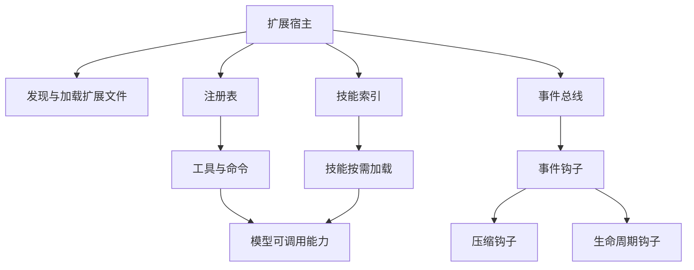
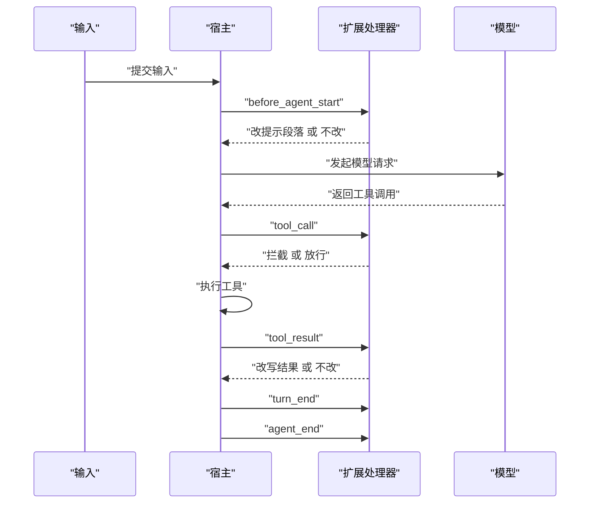
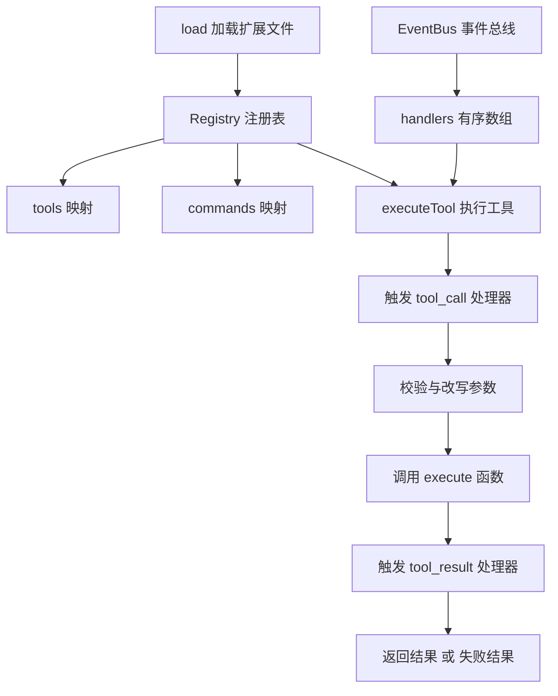
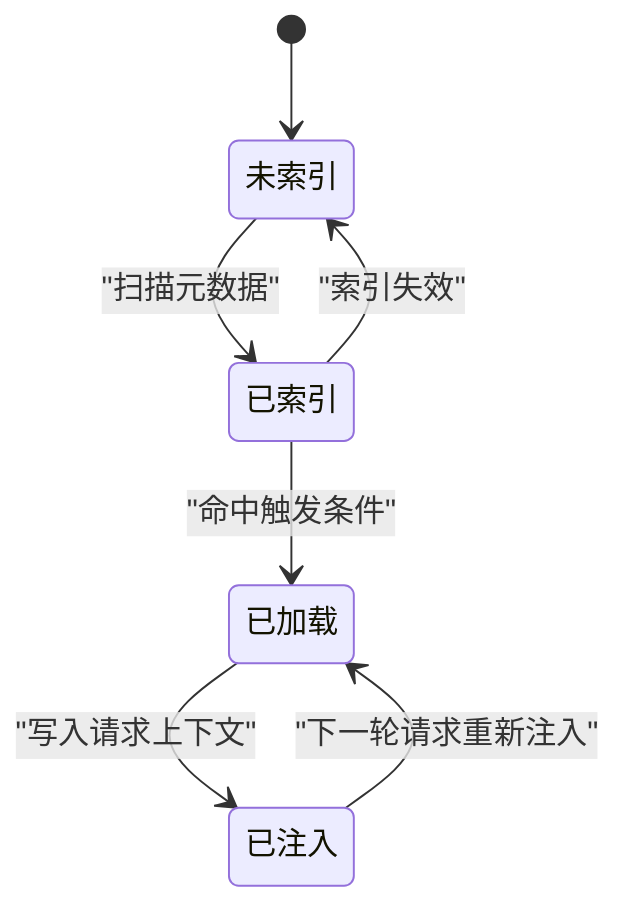
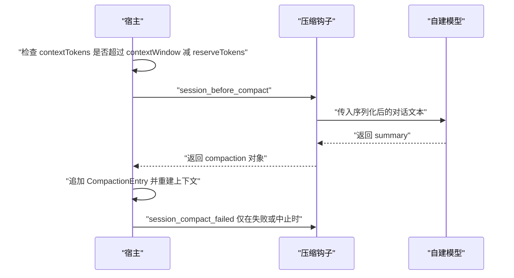
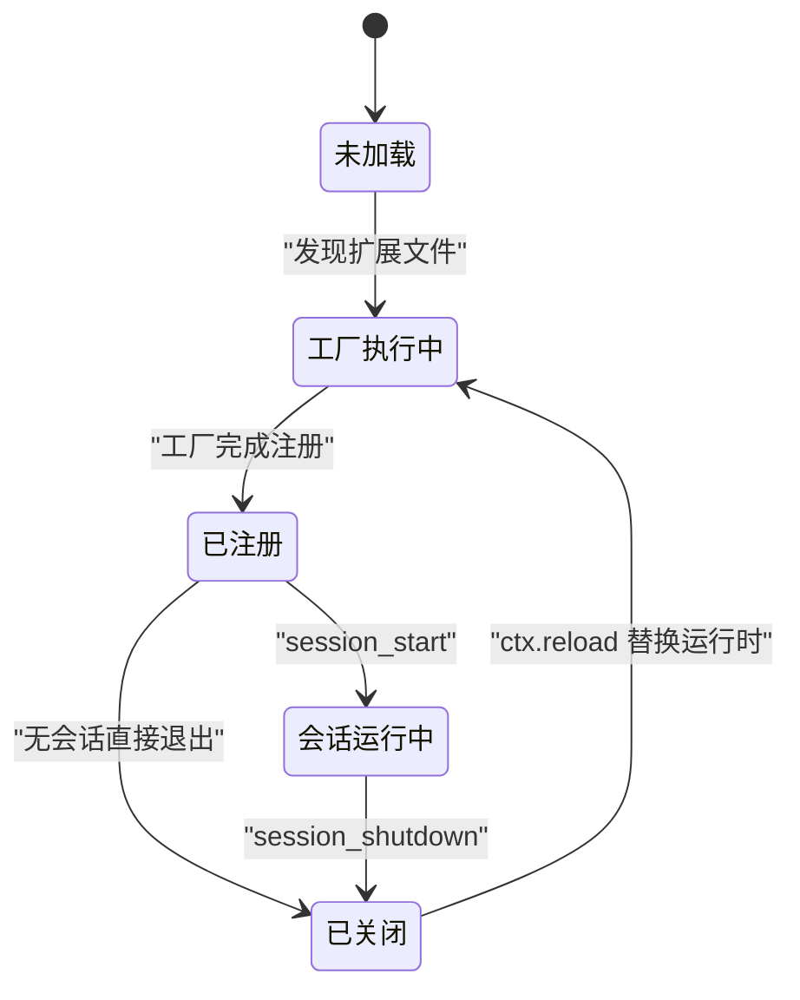

# 可扩展性：Extensions、Skills 与 Hooks

!!! abstract "学完这一页你能"
    - 说清扩展宿主的四个职责：发现扩展文件、调用扩展工厂、保存注册结果、分发生命周期事件。
    - 按事件声明的结果类型写钩子，分清哪些事件只通知、哪些能改写数据、哪些能取消操作。
    - 手写一个能跑注册、订阅、工具调用与错误转换的迷你扩展宿主，并用断言验证行为。
    - 用技能索引与按需读取，把大段指令推迟到真正命中时再装进请求上下文。

## 0. 知识地图



建议先读 1 与 2，把宿主与钩子的分工建立起来。再读 3，把两者合进一个可运行的最小实现。4 到 6 是三个具体接入点：技能加载、上下文压缩、资源回收，可以按手上的任务挑着读。

## 1. 扩展宿主：谁负责加载插件

**先想一个问题**
你把 `hello.ts` 放进扩展目录，运行 `/hello` 就看到了提示。是谁读了文件、调用你的函数、决定调用时机？你没有写任何 import 语句。

**心智模型**
!!! tip "心智模型"
    一句话：宿主是插线板，扩展是用电器，扩展只声明要插哪个孔。
    日常类比：电脑的 USB 口不追问 U 盘内部实现，只负责识别与供电。
    类比不成立的地方：Pi 按扩展加载与注册顺序调用处理器，分发开始后再注册的处理器不参与本次分发。

!!! note "术语：扩展宿主（Extension Host）"
    定义：在同一个进程内发现扩展文件、调用扩展工厂、保存注册结果、按固定顺序分发生命周期事件的运行时。
    例子：执行 `pi --extension ./hello.ts` 时，Pi 进程就是宿主。

**图解**


图里每一步：
1. 宿主扫描用户或项目扩展目录，找到直接放置的 `.ts`、`.js` 文件。
2. 含 `index.ts` 或 `index.js` 的子目录同样被当作扩展入口。
3. 宿主调用默认导出的工厂，把 `ExtensionAPI` 传进去。
4. 工厂用 `pi.registerCommand`、`pi.registerTool`、`pi.on` 登记能力。
5. 宿主把登记结果写进注册表，事件触发时按顺序调用处理器。
6. 扩展与宿主同进程、同操作系统权限，因此只加载可信来源。

**一步一步来**

第一步要做什么：写一个最小扩展，只登记一个 `/hello` 命令。

```typescript
// 只引入类型，运行时会被擦除
import type { ExtensionAPI } from "@earendil-works/pi-coding-agent";

// 默认导出工厂，宿主调用它时把 pi 传进来
export default function (pi: ExtensionAPI) {
  // 登记命令 hello，调用方式是 /hello
  pi.registerCommand("hello", {
    description: "Show a greeting",
    // handler 收到命令参数与上下文 ctx
    handler: async (name, ctx) => {
      // 通过 ctx.ui.notify 在终端显示一条提示
      ctx.ui.notify(`Hello, ${name || "world"}!`, "info");
    },
  });
}
```

**这段代码在做什么**
- `export default` 提供唯一入口，宿主只认这个工厂。
- 工厂签名是 `(pi: ExtensionAPI)`，`pi` 是宿主给的接口。
- 工厂只做登记，不启动进程、Socket、watcher、定时器。
- `registerCommand` 的第一个参数是命令名，触发方式是 `/hello`。
- `ctx.ui.notify` 由宿主提供，扩展不直接操作终端。
- 文件放在 `~/.pi/agent/extensions/hello.ts`，或用 `pi --extension ./hello.ts` 加载。

第二步要做什么：让宿主能调用工厂并触发命令。演示用 `.mjs`，因为 Node 20 能直接 import；Pi 用 `jiti`，所以本地 TypeScript 扩展不需要单独编译步骤。

```javascript
// mini-host.mjs：教学用迷你宿主，不是 pi 的 API
export function createHost() {
  const commands = new Map(); // 名称到命令定义的映射
  const api = {
    registerCommand(name, def) {
      commands.set(name, def); // 只登记，不执行
    },
  };
  return {
    api,
    // 宿主负责调用工厂并保存结果
    async load(factory) {
      await factory(api); // 工厂可以是同步或异步
    },
    async run(name, arg) {
      const def = commands.get(name);
      if (!def) throw new Error(`unknown command: ${name}`);
      // 迷你 ctx 只保留演示需要的方法
      const ctx = { ui: { notify: (text) => console.log(text) } };
      return def.handler(arg, ctx);
    },
  };
}
```

**这段代码在做什么**
- `commands` 是注册表，键是命令名，值是命令定义。
- `api` 是传给工厂的接口，只暴露 `registerCommand`。
- `load` 负责调用工厂，`await` 兼容异步工厂。
- `run` 先查注册表，找不到就抛错。
- `ctx` 由宿主构造，扩展拿不到宿主内部状态。

运行结果：
```
$ node host-demo.mjs
Hello, world!
```

**动手验证**

下面把宿主、工厂与断言放进一个文件。

```javascript
// 运行：node host-demo.mjs   依赖：Node 20+ 内置模块 node:assert
import assert from "node:assert/strict";

// 1. 迷你宿主：登记命令、调用工厂、执行命令
function createHost() {
  const commands = new Map();
  const logs = [];
  const api = {
    registerCommand(name, def) {
      commands.set(name, def);
    },
  };
  return {
    api,
    logs,
    async load(factory) {
      await factory(api); // 工厂允许异步
    },
    async run(name, arg) {
      const def = commands.get(name);
      if (!def) throw new Error(`unknown command: ${name}`);
      const ctx = { ui: { notify: (t) => logs.push(t) } };
      return def.handler(arg, ctx);
    },
  };
}

// 2. 扩展工厂：只登记，不启动资源
const helloExtension = (pi) => {
  pi.registerCommand("hello", {
    description: "Show a greeting",
    handler: async (name, ctx) => {
      ctx.ui.notify(`Hello, ${name || "world"}!`);
    },
  });
};

// 3. 组装并断言
const host = createHost();
await host.load(helloExtension);
await host.run("hello", "");
await host.run("hello", "Pi");
assert.deepEqual(host.logs, ["Hello, world!", "Hello, Pi!"]);
await assert.rejects(() => host.run("missing", ""), /unknown command/);

// 4. 打印结果
console.log("host logs:", host.logs);
console.log("all assertions passed");
```

运行结果：
```
host logs: [ 'Hello, world!', 'Hello, Pi!' ]
all assertions passed
```

**常见坑**

| 现象 | 原因 | 怎么修 |
|---|---|---|
| 放进目录后 `/hello` 没反应 | 文件名或入口不符合约定 | 直接放单文件，或把入口命名为 index.ts、index.js |
| TypeScript 扩展报语法错误 | 直接用 node 运行了 .ts 文件 | 用 pi --extension 加载，Pi 用 jiti 处理本地 TypeScript |
| 修改代码后行为没变 | reload 替换运行时，旧状态仍被引用 | reload 之后重新读取状态，不复用旧对象 |

**小结**
- 宿主负责发现文件、调用工厂、保存注册、分发事件四件事。
- 扩展工厂只登记能力，长连接与定时器放到 `session_start`。
- 扩展与宿主同进程同权限，只加载可信来源。

## 2. 事件钩子：生命周期上的插槽

**先想一个问题**
安全同学要求：所有删除类命令执行前必须确认。你改模型提示词，还是找地方卡住这次调用？

**心智模型**
!!! tip "心智模型"
    一句话：事件钩子是传送带上的工位，数据按固定顺序经过每个工位。
    日常类比：质检工位可以只看、可以贴标签，也可以按下停机按钮。
    类比不成立的地方：不同事件返回值的语义不同，返回一个普通对象可能完全没有效果。

!!! note "术语：事件钩子（Event Hook）"
    定义：宿主在生命周期固定位置调用的一批处理器，处理器可以观察、转换或取消该操作。
    例子：`pi.on("tool_call", ...)` 返回 `{ block: true, reason }` 阻止一次工具执行。

**图解**



图里每一步：
1. 输入进入后先触发 `before_agent_start`，钩子可以改提示段落、所选工具或指引。
2. 模型返回内容与工具调用，宿主为每个工具调用触发 `tool_call`。
3. `tool_call` 处理器可以改输入，也可以返回 `{ block: true, reason }` 拦截。
4. 工具执行后触发 `tool_result`，多个处理器按顺序叠加，每个看到前一个的修改。
5. 消息定稿触发 `message_end`，可以替换消息但必须保留角色。
6. 一轮结束触发 `turn_end`，运行收尾触发 `agent_end`；`agent_before_settle` 是最后一个可行动边界。

**一步一步来**

第一步要做什么：注册钩子并保存退订函数。

```typescript
// 注册一个 tool_call 钩子
const off = pi.on("tool_call", async (event, ctx) => {
  // event.toolName 是本次调用的工具名
  if (event.toolName === "bash") {
    // ctx.ui.confirm 返回布尔值
    const ok = await ctx.ui.confirm("Allow bash?", event.toolName);
    if (!ok) {
      // 返回 block 拦截执行，并说明原因
      return { block: true, reason: "bash was not approved" };
    }
  }
  // 返回 undefined 表示不改动、不拦截
});

// 不再需要时退订，避免同一处理器重复生效
off();
```

**这段代码在做什么**
- `pi.on` 的第一个参数是事件名，第二个参数是处理器。
- 处理器收到 `event` 与 `ctx`，`ctx` 提供 `ui` 与 `signal` 能力。
- 返回 `{ block: true, reason }` 阻止这次工具执行。
- 返回 `undefined` 表示放行，不产生副作用。
- `pi.on` 返回退订函数；退订不影响已经开始的这次分发。

第二步要做什么：用工具自带的 annotations 决定要不要确认。

```typescript
// 读取全部工具，找到这次调用的注解
pi.on("tool_call", async (event, ctx) => {
  const hints = pi.getAllTools().find((tool) => tool.name === event.toolName)?.annotations;
  // 缺失注解按 MCP 默认值处理：非只读，可能破坏性，可能接触外部世界
  const needsApproval =
    hints?.destructiveHint === true ||
    (!hints?.readOnlyHint && ((hints?.destructiveHint ?? true) || (hints?.openWorldHint ?? true)));
  // 需要确认时让用户拍板，拒绝就拦截
  if (needsApproval && !(await ctx.ui.confirm("Allow tool call?", event.toolName))) {
    return { block: true, reason: `${event.toolName} was not approved` };
  }
});
```

**这段代码在做什么**
- `pi.getAllTools()` 返回已注册工具的列表，含 `exposure`、`namespace`、`annotations`。
- annotations 是 MCP 语义的提示位：`readOnlyHint`、`destructiveHint`、`idempotentHint`、`openWorldHint`。
- 缺失注解按 MCP 默认值补：非只读，可能破坏性，可能接触外部世界。
- 判断条件把破坏性与非只读且可能接触外部的调用都算作需要确认。
- 确认失败返回 block，模型看到的是被拒的这次调用。
- 注解只是提示，不是验证结果，拦截逻辑仍由扩展决定。

第三步要做什么：处理分发顺序与并发。

```javascript
// 演示分发顺序：注册顺序就是调用顺序，分发用快照
const handlers = [];
function on(fn) {
  handlers.push(fn); // 注册顺序即调用顺序
  return () => {
    const i = handlers.indexOf(fn);
    if (i >= 0) handlers.splice(i, 1); // 退订
  };
}
function dispatch(value) {
  const snapshot = [...handlers]; // 快照：分发中不改动列表
  let current = value;
  for (const fn of snapshot) {
    const out = fn(current);
    if (out !== undefined) current = out; // 转换型处理器用返回值替换
  }
  return current;
}
```

**这段代码在做什么**
- 处理器按注册顺序执行，顺序由扩展加载与注册顺序决定。
- `dispatch` 先复制快照，分发过程中新增或退订的处理器不影响这一轮。
- 返回值不为 `undefined` 时替换当前值，模拟转换型事件。
- 并发场景下不要假设同一条助手消息的兄弟工具调用存在。
- 属于当前轮次的嵌套工作要用 `ctx.signal`，命令与空闲会话事件常常没有操作信号。

**动手验证**

下面把有序分发、拦截、退订合到一个脚本。

```javascript
// 运行：node hooks-demo.mjs   依赖：Node 20+ 内置模块 node:assert
import assert from "node:assert/strict";

function createBus() {
  const handlers = new Map(); // 事件名到处理器数组
  return {
    on(name, fn) {
      if (!handlers.has(name)) handlers.set(name, []);
      handlers.get(name).push(fn);
      return () => {
        const list = handlers.get(name);
        const i = list.indexOf(fn);
        if (i >= 0) list.splice(i, 1); // 退订
      };
    },
    async emit(name, value) {
      const snapshot = [...(handlers.get(name) || [])]; // 分发快照
      let current = value;
      for (const fn of snapshot) {
        const out = await fn(current);
        if (out?.block) return { blocked: true, reason: out.reason };
        if (out !== undefined) current = out; // 转换
      }
      return { blocked: false, value: current };
    },
  };
}

const bus = createBus();
const order = [];
const offA = bus.on("tool_call", async (v) => {
  order.push("A");
  return v;
});
bus.on("tool_call", async () => {
  order.push("B");
  return { block: true, reason: "B blocked" };
});
bus.on("tool_call", async () => {
  order.push("C"); // B 拦截后 C 不再运行
});

const first = await bus.emit("tool_call", { toolName: "bash" });
assert.equal(first.blocked, true);
assert.equal(first.reason, "B blocked");
assert.deepEqual(order, ["A", "B"]);

offA(); // 退掉第一个处理器
order.length = 0;
const second = await bus.emit("tool_call", { toolName: "read" });
assert.equal(second.blocked, true); // B 仍然拦截
assert.deepEqual(order, ["B"]);

console.log("order after unsubscribe:", order.join(" "));
console.log("reason:", second.reason);
console.log("all assertions passed");
```

运行结果：
```
order after unsubscribe: B
reason: B blocked
all assertions passed
```

**常见坑**

| 现象 | 原因 | 怎么修 |
|---|---|---|
| 处理器加了却没生效 | 事件名拼错，或事件类型不支持这种返回值 | 查事件声明的结果类型，通知型事件只能观察 |
| 拦截后模型继续调用工具 | 返回值不是该事件的拦截结构 | 返回事件声明的拦截字段，例如 tool_call 用 block 与 reason |
| 分发中注册的处理器立刻执行 | 误以为注册会改变进行中的分发 | 依赖下一轮分发，或注册后主动触发一次 |
| 并发工具调用读到不存在的兄弟结果 | 同一条助手消息的工具调用可以并行 | 用 ctx.signal 绑定当前轮次，不假设兄弟调用存在 |

**小结**
- 钩子是宿主在固定位置调用的处理器，顺序由加载与注册顺序决定。
- 每个事件的结果类型不同：通知型只观察，转换型看返回值，取消型用声明字段。
- 退订函数只影响后续分发，不影响已经开始的那一轮。

## 3. 手写扩展宿主：注册表与执行管线

**先想一个问题**
团队要一个 CLI，既能插工具、插命令，也能插钩子。三天时间，最小可用版本需要哪些部件？

**心智模型**
!!! tip "心智模型"
    一句话：宿主是餐厅前台，登记菜单、接单、按顺序通知后厨、把菜端回去。
    日常类比：前台不关心每道菜怎么做，只保证订单按顺序送到正确的窗口。
    类比不成立的地方：事件处理器可以改写订单内容，也可以取消整张订单。

!!! note "术语：注册表（Registry）"
    定义：以名称为键保存工具、命令与处理器的数据结构，决定可调用集合与调用顺序。
    例子：`pi.getAllTools()` 报告的每个工具都带 `exposure`、`namespace`、`annotations`。

**图解**



图里每一步：
1. `load` 调用扩展工厂，工厂把工具与处理器登记进注册表。
2. 注册表用名称做主键，同名工具再次注册会覆盖旧定义。
3. 事件总线按事件名保存有序处理器数组。
4. `executeTool` 先查注册表，未注册的名称直接报错。
5. 执行前触发 `tool_call` 处理器，参数可以被改写或被拦截。
6. 执行后触发 `tool_result` 处理器，返回值可以叠加改写。
7. `execute` 抛出的错误转成失败结果，宿主不崩溃。

**一步一步来**

第一步要做什么：写注册表，保存工具定义与可见性信息。

```javascript
// 注册表：名称到工具定义的映射
function createRegistry() {
  const tools = new Map();
  return {
    registerTool(def) {
      // direct 是文档给出的默认 exposure
      const entry = { exposure: "direct", annotations: {}, ...def };
      tools.set(entry.name, entry); // 同名再次注册会覆盖
      return entry;
    },
    getTool(name) {
      return tools.get(name); // 未注册返回 undefined
    },
    listTools() {
      return [...tools.values()]; // 返回副本，避免外部改到内部 Map
    },
  };
}
```

**这段代码在做什么**
- `tools` 用名称做键，保证按名称查找。
- `exposure` 默认 `direct`，与文档中的默认值一致。
- `annotations` 默认空对象，缺少注解时宿主按 MCP 默认值处理。
- 同名注册会覆盖；文档提到工具不能注销，撤回时用 `hidden` 重新注册。
- `listTools` 返回数组副本，调用方修改副本不影响注册表。

第二步要做什么：写事件总线，保证注册顺序与退订语义。

```javascript
// 事件总线：按事件名保存有序处理器
function createBus() {
  const handlers = new Map();
  return {
    on(name, fn) {
      if (!handlers.has(name)) handlers.set(name, []);
      handlers.get(name).push(fn);
      return () => {
        const list = handlers.get(name);
        const i = list.indexOf(fn);
        if (i >= 0) list.splice(i, 1); // 退订只影响后续分发
      };
    },
    handlersOf(name) {
      return [...(handlers.get(name) || [])]; // 分发用快照
    },
  };
}
```

**这段代码在做什么**
- 一个事件名对应一个数组，数组顺序就是调用顺序。
- `on` 返回退订函数，调用后从数组移除该处理器。
- `handlersOf` 返回快照，分发过程中注册的处理器不进入本次分发。
- 处理器可以是异步函数，宿主用 await 依次等待。
- 慢处理器会拖慢整条链，文档用这种顺序描述 provider 流事件的消费。

第三步要做什么：写工具执行管线，把拦截、错误转换、结果形状接起来。

```javascript
// 工具执行管线：拦截、执行、错误转换
async function executeTool(host, name, args) {
  const tool = host.registry.getTool(name);
  if (!tool) return { isError: true, content: `unknown tool: ${name}` };
  let finalArgs = args;
  for (const fn of host.bus.handlersOf("tool_call")) {
    const out = await fn({ toolName: name, args: finalArgs });
    if (out?.block) return { isError: true, content: out.reason };
    if (out?.args) finalArgs = out.args; // 允许改写参数
  }
  try {
    const result = await tool.execute(finalArgs);
    return { isError: false, ...result }; // 结果需要 content 与 details
  } catch (err) {
    // execute 抛错要转成失败结果，而不是让宿主退出
    return { isError: true, content: err.message };
  }
}
```

**这段代码在做什么**
- 未注册的工具直接返回失败结果，不抛到调用方。
- `tool_call` 处理器按顺序运行，可以改写参数或拦截。
- `execute` 正常返回时，结果展开成 `content` 与 `details` 两个字段。
- 返回对象本身不表示失败，失败要靠 `isError` 或抛错产生。
- `execute` 抛错时转成失败结果，模型看到一条错误内容而不是进程退出。
- 文件读改写要用 `withFileMutationQueue()` 包住完整操作，避免并发交错。

**动手验证**

把注册表、总线与执行管线装进一个可运行脚本。

```javascript
// 运行：node mini-host-demo.mjs   依赖：Node 20+ 内置模块 node:assert
import assert from "node:assert/strict";

function createHost() {
  const tools = new Map();
  const handlers = new Map();
  const bus = {
    on(name, fn) {
      if (!handlers.has(name)) handlers.set(name, []);
      handlers.get(name).push(fn);
      const list = handlers.get(name);
      return () => list.splice(list.indexOf(fn), 1);
    },
    handlersOf(name) {
      return [...(handlers.get(name) || [])];
    },
  };
  const host = {
    bus,
    registerTool(def) {
      tools.set(def.name, { exposure: "direct", annotations: {}, ...def });
      return host;
    },
    getTool: (name) => tools.get(name),
    async executeTool(name, args) {
      const tool = tools.get(name);
      if (!tool) return { isError: true, content: `unknown tool: ${name}` };
      let finalArgs = args;
      for (const fn of bus.handlersOf("tool_call")) {
        const out = await fn({ toolName: name, args: finalArgs });
        if (out?.block) return { isError: true, content: out.reason };
        if (out?.args) finalArgs = out.args;
      }
      try {
        const result = await tool.execute(finalArgs);
        return { isError: false, ...result };
      } catch (err) {
        return { isError: true, content: err.message };
      }
    },
  };
  return host;
}

const host = createHost();
const audit = [];
host.bus.on("tool_call", async (e) => audit.push(`call:${e.toolName}`));
host.registerTool({
  name: "read",
  description: "Read a file",
  execute: async ({ path }) => ({ content: `contents of ${path}`, details: undefined }),
});
host.registerTool({
  name: "remove",
  description: "Delete a file",
  annotations: { readOnlyHint: false, destructiveHint: true },
  execute: async () => ({ content: "removed", details: undefined }),
});
host.bus.on("tool_call", async (e) => {
  if (e.toolName === "remove") return { block: true, reason: "destructive tool blocked" };
});
host.registerTool({
  name: "boom",
  description: "Always throws",
  execute: async () => { throw new Error("boom"); },
});

const read = await host.executeTool("read", { path: "a.txt" });
assert.equal(read.isError, false);
assert.equal(read.content, "contents of a.txt");

const blocked = await host.executeTool("remove", {});
assert.equal(blocked.isError, true);
assert.equal(blocked.content, "destructive tool blocked");

const failed = await host.executeTool("boom", {});
assert.equal(failed.isError, true);
assert.equal(failed.content, "boom");

const unknown = await host.executeTool("nope", {});
assert.equal(unknown.isError, true);
assert.match(unknown.content, /unknown tool/);

// 未注册工具在处理器之前返回，所以审计里没有它
assert.deepEqual(audit, ["call:read", "call:remove", "call:boom"]);
console.log("audit:", audit.join(" "));
console.log("blocked reason:", blocked.content);
console.log("all assertions passed");
```

运行结果：
```
audit: call:read call:remove call:boom
blocked reason: destructive tool blocked
all assertions passed
```

**常见坑**

| 现象 | 原因 | 怎么修 |
|---|---|---|
| 工具注册后模型看不到 | exposure 是 codemode、deferred 或 hidden，注册不等于激活 | 用 pi.setActiveTools() 激活，或改成 direct |
| 同名工具行为被替换 | 注册表以名称为键，同名注册覆盖旧定义 | 工具名加前缀，或用 namespace 分组 |
| 工具抛错导致整轮失败 | execute 的异常没有转成失败结果 | 在 execute 内转换，或让宿主统一捕获并返回 isError |
| 并发写同一文件内容错乱 | 读改写没有串行化 | 把完整读改写包进 withFileMutationQueue() |

**小结**
- 注册表决定有什么，事件总线决定按什么顺序通知，执行管线把两者接起来。
- 工具结果需要模型可读的 content 与用于渲染的 details。
- 拦截、改写、报错是三条独立路径，写代码时分开处理。

## 4. 技能按需加载：把大段指令推迟到命中时

**先想一个问题**
你有 30 条团队规范，全部塞进系统提示会一直占用上下文。用户只问数据库时，SQL 规范也跟着进。

**心智模型**
!!! tip "心智模型"
    一句话：技能是抽屉里的说明书，目录只贴标签，用到哪本才抽出来读。
    日常类比：先看目录决定翻哪一本，不必把整排书都搬上桌。
    类比不成立的地方：本页没有资料说明 pi 技能的实际目录结构、字段名与装载时机，需核对官方文档。

!!! note "术语：按需加载（Lazy Loading）"
    定义：只让元数据常驻内存，把体积大的正文推迟到真正命中时再读取。
    例子：宿主启动时只保存技能名称与一句话描述，命中后再读正文文件。

**图解**



图里每一步：
1. 启动时处于未索引状态，只有扩展目录里的文件。
2. 宿主读取元数据后进入已索引状态，正文仍在磁盘上。
3. 查询命中某个技能的触发条件，进入已加载状态。
4. 命中时读取正文文件，并把内容缓存在宿主内。
5. 把选中的正文写进请求上下文，进入已注入状态。
6. 下一个请求重新决定注入哪些技能，磁盘不会重复读。

**一步一步来**

第一步要做什么：建立技能索引，只保存元数据。

```javascript
// 技能索引：启动时只保存名称、描述与文件路径
function indexSkills(files) {
  return files.map((file) => ({
    name: file.name,
    description: file.description, // 一句话描述常驻内存
    path: file.path,               // 正文推迟到命中后再读
    loaded: false,
    body: undefined,
  }));
}
```

**这段代码在做什么**
- 索引项只有名称、描述、路径三个常驻字段。
- 正文不在索引里，因此启动阶段不读大文件。
- `loaded` 标记用来避免重复读盘。
- `description` 供匹配使用，写法要能区分技能。
- 索引本身是数组，便于按顺序遍历。

第二步要做什么：命中时读取正文，并缓存结果。

```javascript
// 按需读取正文，并在宿主内缓存
async function loadSkill(skill, readFile) {
  if (skill.loaded) return skill.body; // 已加载直接复用
  skill.body = await readFile(skill.path); // 第一次命中才读文件
  skill.loaded = true; // 标记，避免重复 I/O
  return skill.body;
}
```

**这段代码在做什么**
- 第一次调用才触发 `readFile`，之后走缓存。
- `readFile` 由调用方注入，便于测试与替换实现。
- `loaded` 与 `body` 一起更新，避免半完成状态。
- 读取失败时不会设置 `loaded`，下次可以重试。
- 缓存放在宿主侧，扩展只通过宿主拿正文。

第三步要做什么：挑选技能并拼进请求上下文。

```javascript
// 演示用的触发规则：查询词里出现技能名就选中
function selectSkills(index, query) {
  return index.filter((s) => query.includes(s.name));
}
// 只把选中的正文拼成一段上下文块
function buildContextBlock(skills) {
  return skills.map((s) => s.body).join("\n\n"); // 用空行分隔，避免粘连
}
```

**这段代码在做什么**
- `selectSkills` 返回索引项数组，不是正文数组。
- 触发规则只是演示，pi 的真实匹配规则需核对官方文档。
- `buildContextBlock` 只拼选中的技能，未命中技能不进上下文。
- 多个技能正文之间用空行分隔，防止段落粘在一起。
- 注入内容属于请求级状态，下一轮重新计算。

**动手验证**

下面用内存文件表模拟磁盘，统计每个文件的读取次数。

```javascript
// 运行：node skills-demo.mjs   依赖：Node 20+ 内置模块 node:assert
import assert from "node:assert/strict";

const disk = new Map([
  ["/skills/sql.md", "SQL 规范：禁止 select 星号"],
  ["/skills/css.md", "CSS 规范：禁止行内样式"],
]);
const readCount = new Map();
async function readFile(path) {
  readCount.set(path, (readCount.get(path) || 0) + 1);
  if (!disk.has(path)) throw new Error(`missing: ${path}`);
  return disk.get(path);
}

function indexSkills(files) {
  return files.map((f) => ({ ...f, loaded: false, body: undefined }));
}
async function loadSkill(skill) {
  if (skill.loaded) return skill.body;
  skill.body = await readFile(skill.path);
  skill.loaded = true;
  return skill.body;
}
function selectSkills(index, query) {
  return index.filter((s) => query.includes(s.name));
}

const index = indexSkills([
  { name: "sql", description: "SQL 规范", path: "/skills/sql.md" },
  { name: "css", description: "CSS 规范", path: "/skills/css.md" },
]);

// 第一次查询没有命中任何技能，正文读取次数为 0
const none = selectSkills(index, "cookie 怎么设置");
assert.equal(none.length, 0);
assert.equal(readCount.size, 0);

// 第二次查询命中 sql，只读 sql 的正文
const picked = selectSkills(index, "sql 索引怎么建");
assert.deepEqual(picked.map((s) => s.name), ["sql"]);
assert.match(await loadSkill(picked[0]), /SQL 规范/);
assert.equal(readCount.get("/skills/sql.md"), 1);

// 再次命中同一个技能，不再读盘
await loadSkill(picked[0]);
assert.equal(readCount.get("/skills/sql.md"), 1);

console.log("read count:", [...readCount.entries()]);
console.log("loaded:", index.filter((s) => s.loaded).map((s) => s.name));
console.log("all assertions passed");
```

运行结果：
```
read count: [ [ '/skills/sql.md', 1 ] ]
loaded: [ 'sql' ]
all assertions passed
```

**常见坑**

| 现象 | 原因 | 怎么修 |
|---|---|---|
| 启动变慢 | 工厂阶段就把全部技能正文读进内存 | 索引阶段只读元数据，正文命中后再读 |
| 同一技能重复注入 | 没有记录本轮已注入的技能 | 每轮请求前清空注入集合，注入时去重 |
| 命中率低 | 描述字段太笼统，无法区分触发场景 | 描述写清触发条件与不适用场景 |
| 资料对不上 | 本页的技能实现是教学模型，不是 pi 的公开 API | 核对官方文档：目录约定、元数据字段名、激活方式 |

**小结**
- 按需加载把常驻内容压到元数据，正文只在命中时读。
- 缓存放在宿主侧，是否加载过要显式记录。
- 技能的具体目录与字段需核对官方文档，本页代码只演示机制。

## 5. 压缩与分支钩子：介入上下文管理

**先想一个问题**
上下文快满了，团队想用自建小模型做摘要，而不是默认模型。这个替换点在哪里？

**心智模型**
!!! tip "心智模型"
    一句话：压缩像交接班记录，换班前写一份交接单，新同事从交接单和最近记录继续。
    日常类比：夜班把未完成事项写在纸上，白班不用重读整晚监控。
    类比不成立的地方：压缩是追加一条记录，原始消息仍留在会话里，导出与历史检索仍能看到。

!!! note "术语：压缩（Compaction）"
    定义：上下文超过阈值或执行 `/compact` 时，把旧消息汇总成一条 `CompactionEntry` 以释放上下文的机制。
    例子：默认 `reserveTokens` 为 16384，`keepRecentTokens` 为 20000。

!!! note "术语：分支摘要（Branch Summarization）"
    定义：用 `/tree` 切换分支时，把被放弃分支的工作汇总成 `BranchSummaryEntry` 并注入新分支。
    例子：从旧叶节点回退到共同祖先，再走到目标节点时，摘要被追加在新分支上。

**图解**



图里每一步：
1. 自动压缩在 `contextTokens` 超过 `contextWindow` 减 `reserveTokens` 时触发。
2. 触发前发出 `session_before_compact`，`preparation` 带上要汇总的消息与边界信息。
3. 钩子把消息转成文本，交给自建模型生成摘要。
4. 钩子返回 `compaction` 对象，包含 `summary`、`firstKeptEntryId`、`tokensBefore`。
5. 宿主追加 `CompactionEntry`，按 `firstKeptEntryId` 重建下一次请求的上下文。
6. 失败或中止时发出 `session_compact_failed`，用于把尝试与结果配对。

**一步一步来**

第一步要做什么：先写触发判断，理解阈值公式。

```javascript
// 判断是否需要自动压缩：沿用文档给出的阈值公式
function shouldCompact(contextTokens, contextWindow, reserveTokens) {
  // 默认 reserveTokens 为 16384，给模型回复留空间
  return contextTokens > contextWindow - reserveTokens;
}
// 窗口 200000，预留 16384
console.log(shouldCompact(190000, 200000, 16384)); // true
console.log(shouldCompact(180000, 200000, 16384)); // false
```

**这段代码在做什么**
- 阈值是 `contextWindow` 减去 `reserveTokens`，不是固定的消息条数。
- 默认 `reserveTokens` 为 16384，可在用户或项目设置里改。
- 默认 `keepRecentTokens` 为 20000，决定保留多少近期 token 不汇总。
- `enabled` 为 false 时关闭自动压缩，仍可用 `/compact` 手动触发。
- `compaction.modelOverrides` 可以按 `provider/modelId` 单独调这两个数值。

运行结果：
```
true
false
```

第二步要做什么：在 `session_before_compact` 里用自建模型生成摘要。

```typescript
// 序列化与转换函数来自 @earendil-works/pi-coding-agent
pi.on("session_before_compact", async (event, ctx) => {
  const { preparation } = event;
  // 把消息转成 LLM 消息，再序列化成纯文本
  const conversationText = serializeConversation(
    convertToLlm(preparation.messagesToSummarize)
  );
  // myModel.summarize 是自建服务的封装
  const { summary } = await myModel.summarize(conversationText);
  // 返回 compaction 对象，宿主会追加 CompactionEntry
  return {
    compaction: {
      summary,
      firstKeptEntryId: preparation.firstKeptEntryId,
      tokensBefore: preparation.tokensBefore,
    },
  };
});
```

**这段代码在做什么**
- `preparation.messagesToSummarize` 是要汇总的消息集合。
- `preparation.turnPrefixMessages` 在切分用户消息跨度时才出现。
- `convertToLlm` 把 AgentMessage 转成 LLM 消息，`serializeConversation` 再转成文本。
- 序列化会把工具结果截断到 2000 字符，超出部分替换为截断标记。
- `firstKeptEntryId` 与 `tokensBefore` 必须回传，宿主据此重建上下文。
- `usage` 可选，传入后会算进会话总量；具体形状需核对官方文档。

第三步要做什么：用 `session_compact_failed` 记录失败与中止。

```typescript
// 失败或中止时记录，用于把尝试与结果配对
pi.on("session_compact_failed", async (event) => {
  const { reason, errorMessage, aborted, willRetry, fromExtension } = event;
  // aborted 为 true 时没有 errorMessage
  telemetry.record({ reason, errorMessage, aborted, willRetry, fromExtension });
});
```

**这段代码在做什么**
- `reason` 取值为 `manual`、`threshold`、`overflow`。
- `errorMessage` 只在非中止失败时出现。
- `aborted` 表示压缩被取消或中止。
- `willRetry` 说明被中止的这一轮是否会在压缩后重试。
- `fromExtension` 表示当时使用的是扩展提供的压缩内容。
- 记录这些字段后，尝试与结果才能成对统计。

**动手验证**

下面模拟阈值判断、取消路径、自定义摘要路径与失败配对。

```javascript
// 运行：node compact-demo.mjs   依赖：Node 20+ 内置模块 node:assert
import assert from "node:assert/strict";

function shouldCompact(contextTokens, contextWindow, reserveTokens) {
  return contextTokens > contextWindow - reserveTokens;
}

async function beforeCompact({ hooks, preparation, reason }) {
  for (const hook of hooks) {
    const out = await hook({ preparation, reason });
    if (out?.cancel) return { compacted: false, cancelled: true };
    if (out?.compaction) return { compacted: true, ...out.compaction };
  }
  return { compacted: false, cancelled: false };
}

const prep = {
  messagesToSummarize: [{ role: "user", content: "hello" }],
  firstKeptEntryId: "e4",
  tokensBefore: 190000,
};
const failed = [];
const recordFailed = async (e) => failed.push(e);

// 路径一：钩子取消本次压缩
const cancelled = await beforeCompact({
  hooks: [async () => ({ cancel: true })],
  preparation: prep,
  reason: "manual",
});
assert.equal(cancelled.cancelled, true);

// 路径二：钩子返回自定义摘要
const custom = await beforeCompact({
  hooks: [async () => ({
    compaction: {
      summary: "自建模型摘要",
      firstKeptEntryId: prep.firstKeptEntryId,
      tokensBefore: prep.tokensBefore,
    },
  })],
  preparation: prep,
  reason: "threshold",
});
assert.equal(custom.compacted, true);
assert.equal(custom.summary, "自建模型摘要");
assert.equal(custom.firstKeptEntryId, "e4");

// 路径三：失败事件与尝试配对
await recordFailed({
  reason: "overflow",
  errorMessage: "model timeout",
  aborted: false,
  willRetry: true,
  fromExtension: false,
});
assert.equal(failed.length, 1);
assert.equal(failed[0].willRetry, true);

// 阈值公式边界
assert.equal(shouldCompact(190000, 200000, 16384), true);
assert.equal(shouldCompact(180000, 200000, 16384), false);

console.log("cancelled:", cancelled.cancelled);
console.log("custom summary:", custom.summary);
console.log("failed records:", failed.length);
console.log("all assertions passed");
```

运行结果：
```
cancelled: true
custom summary: 自建模型摘要
failed records: 1
all assertions passed
```

**常见坑**

| 现象 | 原因 | 怎么修 |
|---|---|---|
| 自定义摘要后上下文对不上 | 没有回传 firstKeptEntryId 或 tokensBefore | 从 preparation 原样回传这两个字段 |
| 压缩失败没有记录 | 只监听 session_before_compact，没监听 session_compact_failed | 两个事件配对监听 |
| 摘要占用过多 token | 工具结果没有截断 | 依赖 serializeConversation 的 2000 字符截断，别自己拼原始结果 |
| 模型切换后阈值没变 | 手动压缩、阈值检查、溢出恢复都使用解析后的设置 | 用 compaction.modelOverrides 按 provider/modelId 调数值 |

**小结**
- 自动压缩的触发条件是 token 超过窗口减预留值。
- `session_before_compact` 可以取消或替换摘要，失败由 `session_compact_failed` 配对记录。
- 分支切换有独立的 `session_before_tree` 钩子，字段与压缩不同。

## 6. 生命周期与资源回收

**先想一个问题**
扩展工厂里建立了一个长连接。Pi 有时只加载扩展用于一次性调用，不启动会话，连接就没人关闭。

**心智模型**
!!! tip "心智模型"
    一句话：工厂是登记入住，session_start 是搬进去住，session_shutdown 是退租清场。
    日常类比：签合同时只留信息，真正入住才买家具，退租必须把东西搬走。
    类比不成立的地方：工厂可以是异步的，Pi 会等工厂完成后继续启动，但等待期间不启动会话。

!!! note "术语：幂等（Idempotent）"
    定义：同一操作执行一次与执行多次，系统最终状态相同。
    例子：`session_shutdown` 处理器先判断资源是否存在，第二次调用不做任何事。

**图解**



图里每一步：
1. 扩展文件被发现后进入工厂执行阶段。
2. 工厂完成注册后进入已注册状态，此时还没有长连接。
3. `session_start` 触发后进入会话运行中，长连接在这一步建立。
4. 没有会话的调用从已注册直接到已关闭，工厂不留下资源。
5. `session_shutdown` 触发后关闭资源，处理器要写成幂等。
6. `ctx.reload` 替换运行时，回到工厂执行阶段，旧运行时的状态不能复用。

**一步一步来**

第一步要做什么：工厂只登记，长连接交给 `session_start`。

```typescript
// 工厂只登记能力，不启动进程、Socket、watcher、定时器
export default function (pi: ExtensionAPI) {
  const state = { socket: null }; // 资源句柄先留空
  pi.on("session_start", async () => {
    // 会话真正开始后才建立长连接
    state.socket = await connect();
  });
  pi.on("session_shutdown", async () => {
    if (!state.socket) return; // 幂等：没有连接就返回
    await state.socket.close();
    state.socket = null; // 清空句柄，再次调用不再关闭
  });
}
```

**这段代码在做什么**
- 工厂只调用 `pi.on`，不启动任何外部资源。
- `state` 是扩展自己的内存，不写进会话记录。
- 需要长期保存非上下文数据时用 `pi.appendEntry()`。
- `session_start` 之后才建立连接，避免一次性调用留下孤儿连接。
- `session_shutdown` 先判空再关闭，保证多次调用安全。

第二步要做什么：给继续一次加条件，避免死循环。

```typescript
// agent_before_settle 是最后一个可行动边界
pi.on("agent_before_settle", async (event, ctx) => {
  // 条件不满足就直接返回，避免每轮都触发新请求
  if (ctx.needRetry !== true) return undefined;
  // 追加条目并请求一次继续，条目字段名需核对官方文档
  return { continue: true };
});
```

**这段代码在做什么**
- `agent_before_settle` 可以追加条目并请求一次继续。
- `agent_settled` 是最终状态，只能通知，不能继续。
- `continue: true` 没有条件时会一直触发，形成循环。
- 条件要基于本轮实际状态，不用固定值判断。
- 追加条目的字段形状需核对官方文档。

第三步要做什么：正确处理 `ctx.reload`。

```typescript
// reload 会替换扩展运行时
pi.registerCommand("reload-me", {
  handler: async (name, ctx) => {
    // reload 之后旧运行时的对象不能再使用
    await ctx.reload();
    // 不要访问 reload 之前创建的变量、连接或缓存
  },
});
```

**这段代码在做什么**
- `ctx.reload` 替换扩展运行时，代码会重新走工厂。
- `await ctx.reload()` 之后的语句仍属于旧函数的调用栈。
- 旧运行时的连接、缓存与定时器不能在新运行时继续使用。
- 需要跨 reload 保留的数据要写进持久位置，而不是内存变量。
- 只有个人扩展与命令行扩展参与 `project_trust`，该事件在项目扩展加载前触发。

**动手验证**

下面用计数器验证工厂不建立连接、关闭幂等、条件继续。

```javascript
// 运行：node lifecycle-demo.mjs   依赖：Node 20+ 内置模块 node:assert
import assert from "node:assert/strict";

function createRuntime() {
  const state = { socket: null, opened: 0, closed: 0, entries: [] };
  const handlers = new Map();
  const on = (name, fn) => handlers.set(name, [...(handlers.get(name) || []), fn]);
  const emit = async (name, payload) => {
    for (const fn of handlers.get(name) || []) await fn(payload);
  };
  on("session_start", async () => {
    state.socket = { id: "socket-1" }; // 只有会话开始才建立连接
    state.opened += 1;
  });
  on("session_shutdown", async () => {
    if (!state.socket) return; // 幂等：没有连接就返回
    state.socket = null;
    state.closed += 1;
  });
  on("agent_before_settle", async (payload) => {
    if (payload.needRetry !== true) return; // 条件不满足不继续
    state.entries.push("retry-once");
  });
  return { state, emit };
}

const runtime = createRuntime();
// 工厂阶段结束后，会话未开始，不应建立连接
assert.equal(runtime.state.opened, 0);
assert.equal(runtime.state.socket, null);

await runtime.emit("agent_before_settle", { needRetry: false });
assert.deepEqual(runtime.state.entries, []);

await runtime.emit("session_start");
assert.equal(runtime.state.opened, 1);

await runtime.emit("agent_before_settle", { needRetry: true });
assert.deepEqual(runtime.state.entries, ["retry-once"]);

await runtime.emit("session_shutdown");
await runtime.emit("session_shutdown"); // 第二次关闭是空操作
assert.equal(runtime.state.closed, 1);

console.log("opened:", runtime.state.opened, "closed:", runtime.state.closed);
console.log("entries:", runtime.state.entries);
console.log("all assertions passed");
```

运行结果：
```
opened: 1 closed: 1
entries: [ 'retry-once' ]
all assertions passed
```

**常见坑**

| 现象 | 原因 | 怎么修 |
|---|---|---|
| 一次性调用后进程挂着 | 工厂里启动了定时器、Socket 或 watcher | 移到 session_start 或命令与工具内部 |
| 关闭执行两次报错 | 关闭函数不是幂等 | 先判空再关闭，关闭后把句柄置空 |
| 每轮都追加一次继续 | continue 条件写成常量 | 把条件绑定到本轮状态 |
| reload 后行为异常 | 继续使用旧运行时的对象 | reload 后重新获取资源，不复用旧缓存 |

**小结**
- 工厂只登记，长生命周期资源从 `session_start` 开始。
- `session_shutdown` 要幂等，关闭后把句柄清空。
- `agent_before_settle` 可以继续一次，`agent_settled` 只能观察。

## 综合对比

| 维度 | Extensions | Skills | Hooks |
|---|---|---|---|
| 形态 | TypeScript 模块，默认导出工厂 | 资料未覆盖，需核对官方文档 | 扩展内用 pi.on 注册的处理器 |
| 运行位置 | Pi 进程内，权限与 Pi 相同 | 资料未覆盖 | 与扩展同一进程 |
| 加载时机 | 启动时发现扩展目录并调用工厂 | 资料未覆盖 | 随扩展加载时注册 |
| 能否执行代码 | 能，可加工具、命令、提供器、终端 UI | 资料未覆盖 | 能，可改数据、拦截、取消 |
| 典型用途 | 加工具、保护路径、确认危险命令、会话状态 | 把大段指令按需装进上下文 | 生命周期观察与改写 |
| 顺序规则 | 按加载与注册顺序 | 资料未覆盖 | 处理器按扩展加载与注册顺序执行 |
| 出错方式 | 与宿主同权限，读得到提示、工具调用、文件、凭据、会话历史 | 资料未覆盖 | 通知型事件报错不改变提供器响应；user_bash 处理器失败会阻止命令 |

## 应用与行业实践

### 应用场景地图

| 场景 | 用到本页哪个知识点 | 典型技术选型 | 注意事项 |
| --- | --- | --- | --- |
| 后台管理的万行表格 | 技能按需加载、注册表保存注册结果 | React 加 TanStack Table 虚拟滚动 | 行渲染钩子里不要做同步 IO |
| 低端安卓机型的首屏加载 | 分发生命周期事件、资源回收 | Android App Startup、按需初始化 | 首屏钩子只注册，不执行耗时任务 |
| 多人协作白板 | 按事件声明的结果类型写钩子 | Yjs、CRDT 的 awareness 通道 | 钩子要幂等，重放不能重复改写 |
| 持续集成的构建插件目录 | 宿主四职责：发现、调用、保存、分发 | Node ESM 动态 import、monorepo | 单个扩展失败必须隔离 |
| 代码编辑器的插件市场 | 扩展工厂加激活事件 | VS Code Extension API | 用声明式清单元数据控制加载时机 |
| 边缘网关的请求改写 | 可改写数据的钩子 | Envoy HTTP filter、OpenResty | 改写要有失败回滚路径 |
| 长对话客服机器人 | 压缩钩子介入上下文管理 | LLM 应用加摘要节点 | 摘要会丢事实，需保留关键字段 |
| 日志采集代理的解析规则 | 命中才加载的索引 | Vector、Fluent Bit | 命中判定成本要低于解析本身 |

### 三个场景拆解

#### 场景 1：持续集成的构建插件宿主

**业务背景**

一个 monorepo 里有几十个包，每个包自带构建入口，写在自己的配置文件里。主流水线不认识这些入口，每加一个包就往主脚本里添一个 if 分支，分支数量随包数量线性上涨。

**怎么用本页知识解决**

思路是把主流水线改成宿主：它只负责发现扩展文件、调用工厂、保存注册结果、分发事件，构建逻辑全部由包自己注册。宿主代码不出现任何包名。

```js
// host.mjs：把四个职责拆成四段，互不嵌套
const registry = new Map();                            // 保存注册结果
async function discover(dir) {                         // 职责一：发现扩展文件
  return (await readdir(dir)).filter((f) => f.endsWith('.ext.mjs'));
}
async function loadOne(file) {                         // 职责二：调用扩展工厂
  const factory = (await import(file)).default;
  factory({ register: (name, fn) => registry.set(name, fn) }); // 职责三：工厂把能力写进注册表
}
export async function boot(dir) {
  for (const f of await discover(dir)) {
    try { await loadOne(f); }
    catch (err) { console.error('扩展加载失败', f, err); } // 单点失败不拖垮宿主
  }
}
export function emit(event, payload) {                 // 职责四：分发生命周期事件
  for (const fn of registry.values()) fn(event, payload);
}
```

- 运行 `node --test` 断言 `registry.size`，验证工厂被调用、注册结果被保存。
- 删掉一个扩展文件再启动，验证其余扩展照常分发，失败扩展只打印错误。
- 宿主新增扩展时改动行数为 0，这是四职责分离是否做到的判据。
- 事件名写在常量文件里，扩展作者只依赖事件名与注册函数签名。
- 工厂函数不要读环境变量以外的外部状态，否则测试无法复现。

**怎么度量收益**

指标是"新增一个构建目标需要改动宿主文件的行数"，预期为 0。指标还有扩展加载占总构建时长的比例，用 `node --cpu-prof` 采集后看火焰图。宿主启动失败次数按天统计，对比改造前后的数值。

**什么时候不该用**

- 包的数量在 10 个以内、构建命令半年不变时，在流水线里写死命令的维护成本低于宿主机制。
- 扩展需要读取宿主内部状态、而接口还没稳定时，先把接口抽出来，再谈插件化。

#### 场景 2：多人协作白板

**业务背景**

一块白板同时有几十人在线，每一笔都是一次远端更新。痛点有两类：误删整页需要能拦截，粘贴到画布外的坐标需要能修正。

**怎么用本页知识解决**

思路是按事件声明的结果类型写钩子：通知型只广播，返回值被忽略；改写型返回新数据替换原数据；取消型返回 `cancel` 才拦下操作。三类钩子分开声明，调用方按类型决定是否读取返回值。

```ts
// hooks.ts：三类事件分别声明结果类型
type CancelResult = { cancel: true } | void;

// 通知型：只广播，返回值被忽略
bus.on('stroke:added', (s) => presence.ping(s.author));

// 改写型：返回值替换数据，必须返回同结构
bus.on('clipboard:paste', (data) => {
  return { ...data, x: clamp(data.x), y: clamp(data.y) }; // 把粘贴坐标夹回画布
});

// 取消型：返回 cancel 才拦截，其余返回值放行
bus.on('page:delete', (p): CancelResult => {
  if (p.lockedBy.length > 0) return { cancel: true };     // 有人锁定页面，拦截删除
  audit.write(p);                                         // 放行前留审计记录
});
```

- 事件类型写进类型定义，改写型钩子的返回值结构由编译器检查。
- 取消型钩子只允许返回 `cancel`，不要用 `null` 表示放行，避免二义。
- 钩子要幂等：同一笔更新重放两次，`clamp` 的结果不变。
- 审计写在放行分支里，被拦截的操作不落审计，避免污染统计。
- 钩子内不做网络请求，坐标夹取是纯函数。

**怎么度量收益**

指标是误删后从审计表恢复的次数，以及粘贴越界导致的视图跳转次数。测量方法是在 `bus.on` 外层包一层计数器和 `performance.mark`，用 DevTools Performance 面板看钩子耗时的 p95。

**什么时候不该用**

- 钩子只在一处调用、调用方就在同一函数里时，直接写 if 判断，省掉事件总线的间接层。
- 事件在渲染帧内触发、而钩子需要等网络时，改成队列放到帧外处理，不要阻塞绘制。

#### 场景 3：长对话客服机器人

**业务背景**

单个会话的轮次可达上百轮，系统提示里固定塞着十几篇业务技能说明，每轮请求都带上。固定开销把上下文窗口占掉大半，用户真正的问题只剩很小一块空间。

**怎么用本页知识解决**

思路分两层：技能只放索引（名字、触发关键词、文件路径），命中关键词才读取全文；轮次超过阈值时用压缩钩子把早期对话替换成摘要，最近若干轮保留原文。

```python
# skills.py：技能索引与按需读取
from pathlib import Path
INDEX = [{"name": "refund", "when": ["退款", "退货"], "path": "skills/refund.md"}]

def pick(prompt):
    hits = [s for s in INDEX if any(w in prompt for w in s["when"])]  # 关键词命中判定
    return hits[:2]                                                    # 每轮最多装 2 个技能

def load(skill):
    return Path(skill["path"]).read_text(encoding="utf-8")  # 命中后才把全文读进上下文

# compact.py：压缩钩子在轮次阈值处改写上下文
def on_before_request(msgs, turn):
    if turn > 20:                                    # 达到阈值触发压缩
        head, tail = msgs[:-10], msgs[-10:]          # 保留最近 10 轮原文
        return [{"role": "system", "content": summarize(head)}] + tail
    return msgs
```

- 索引常驻，全文按需读，未命中时不发生文件读取。
- 压缩钩子属于改写型事件，返回值替换原消息列表，结构必须与入参一致。
- 摘要前先把订单号、金额这类字段抽出来单独保留，摘要丢掉的字段无法挽回。
- 阈值与保留轮数写成配置项，便于用实验对照。
- 摘要失败时返回原消息列表，不要返回空列表。

**怎么度量收益**

指标是每轮请求的提示 token 数、首 token 延迟、技能命中准确率。测量方法是记录每次请求体的 token 计数分布，对比开关前后的 p50 与 p95；准确率用人工标注的一批问句离线跑。

**什么时候不该用**

- 技能总数在 3 个以内、说明都很短时，全量放进系统提示，省掉索引与读取两条路径。
- 会话很少超过 10 轮时，压缩带来的摘要误差大于它省下的窗口。

### 行业先进实践

- **扩展激活事件（出处：Visual Studio Code 官方文档，Activation Events）**：扩展在清单里声明 `onCommand`、`onLanguage` 这类激活条件，宿主只在条件命中时加载扩展。做法有效的原因是加载时机由数据决定，宿主不用认识每个扩展。你的项目可以照此把技能的触发条件写成清单字段，而不是写进宿主分支。
- **插件钩子类型（出处：webpack 官方文档 Plugin API 与 Tapable 开源项目）**：钩子按同步、异步串行、异步并行分类型，插件通过 `tap` 或 `tapPromise` 注册。做法有效的原因是返回值语义由钩子类型固定，调用方不必猜。你可以把"通知、改写、取消"三类钩子映射成三种注册方法。
- **插件声明与规则启用分离（出处：ESLint 官方文档，Working with Plugins）**：插件导出规则集合，配置文件里按名字启用，未启用的规则不参与检查。做法有效的原因是注册与启用是两件事，宿主只保存注册结果。你的宿主可以照此把"加载"与"启用"拆成两次调用。
- **过滤器链与本地响应（出处：Envoy 官方文档，HTTP filters）**：请求按顺序穿过过滤器链，过滤器可以改 header 与 body，也可以直接返回响应结束链路。做法有效的原因是改写与短路被显式建模。你可以在事件定义里把"能改写""能取消"标成字段。
- **effect 清理函数（出处：React 官方文档，Synchronizing with Effects）**：effect 返回清理函数，卸载时由框架调用。做法有效的原因是资源释放与注册成对出现，不依赖调用方记忆。你的生命周期事件应保证注册与释放走同一个钩子名。

### 从学到用：落地路线

1. **试点**：在一个模块数量在 10 到 30 之间的子系统里先接宿主，只接两个扩展。验收标准：宿主文件里不出现具体扩展的名字。
2. **验证**：为四职责各写一条断言，跑一次故意删文件、故意抛错的用例。验收标准：删一个扩展后宿主仍启动，钩子抛错后主流程仍返回结果。
3. **推广**：把事件名与注册函数签名写成文档，其余子系统按同一份接口接进来。验收标准：新接入的扩展不改宿主代码，只加文件。
4. **防回退**：把断言挂进持续集成，并在宿主里加一条"注册表为空则报警"。验收标准：流水线上断言失败即阻断合并。

### 动手作业

**目标**：手写一个能跑注册、订阅、工具调用与错误转换的迷你扩展宿主，并用断言验证行为。

**步骤**

1. 建 `plugins/` 目录，放两个 `.ext.mjs` 文件，各导出默认工厂函数。
2. 实现宿主，含发现扩展文件、调用工厂、保存注册结果、分发事件四个函数。
3. 定义三个事件：`tool:before` 可改写参数，`tool:after` 只通知，`tool:error` 可转换错误。
4. 写 `runTool` 函数，依次经过三个事件，把抛出的错误转成统一结构返回。
5. 写一个技能索引文件，按关键词只加载命中的技能全文。
6. 用 `node:test` 与 `node:assert` 写断言，覆盖四个职责各至少一条。

**验收标准**

- `node --test` 全部通过，四条职责各有对应断言。
- 删掉一个插件文件后宿主仍能启动，另一个插件照常收到事件。
- 让一个钩子抛错，工具调用仍返回结果，错误从 `tool:error` 通道返回。
- 关键词未命中时不发生技能文件读取，可用计数桩验证。
- 用 `performance.mark` 记录钩子耗时，输出每个钩子的 p95。

## 深入阅读与参考

!!! tip "怎么用这些资料"
    先读「官方文档与规范」建立准确的概念，再读「源码与示例」核对细节，最后用「教程、书籍与视频」换一种讲法加深理解。每条都写明了读哪一节、带着什么问题读。

### 官方文档与规范

| 资源 | 为什么读 | 怎么读 |
|---|---|---|
| [Agent Skills 概览](https://docs.anthropic.com/en/docs/agents-and-tools/agent-skills/overview) | 官方 Skills 说明，先弄清按需加载的触发条件与目录约定。 | 读概览中加载与触发一节，边读边为自己常做的任务写一个 SKILL.md 验证是否命中。 |
| [Claude Code 文档](https://code.claude.com/docs/en/overview) | 扩展宿主与配置项的权威来源，覆盖命令、钩子、子代理。 | 依次读 slash commands、hooks、subagents 三章示例，跑通后再改动参数观察差异。 |
| [Claude Code Hooks](https://docs.anthropic.com/en/docs/claude-code/hooks) | 把钩子讲成可执行规则，正好对应本页的生命周期插槽。 | 边读边写一个提交前跑 lint 的 hook，故意让 lint 失败，确认它能否阻断操作。 |
| [Loader hooks](https://docs.deno.com/runtime/reference/loader_hooks/) | Node 加载钩子规范，说明宿主如何在加载阶段接管模块解析。 | 读 resolve 与 load 钩子两节，画出扩展宿主注册解析管线的等价实现草图。 |
| [Built-in React Hooks](https://react.dev/reference/react/hooks) | Hooks 清单与调用约束，可对照理解插槽顺序与生命周期限制。 | 只看调用顺序与生命周期部分，画一张 React 与扩展宿主的钩子时序对照表。 |
| ['Custom Hooks'](https://yew.rs/docs/concepts/function-components/hooks/custom-hooks) | 自定义 Hooks 的抽取思路，可类比技能如何封装可复用指令。 | 按文档步骤把一段重复逻辑抽成自定义单元，再迁移到技能注册流程上。 |
| [React Working Group 与 RFC](https://github.com/reactjs/rfcs) | RFC 的写法示范如何界定扩展边界与副作用，值得借鉴。 | 只读一份 RFC 的 Motivation 与 Drawbacks 两节，写两百字摘要对照本页设计。 |

### 源码与示例

| 资源 | 为什么读 | 怎么读 |
|---|---|---|
| [anthropics/skills 仓库](https://github.com/anthropics/skills) | 官方 skill 仓库，能看到最小可用扩展的真实结构与字段。 | 逐个文件看两个官方 skill 的目录与 frontmatter，仿写一个放进项目验证加载。 |

### 教程、书籍与视频

| 资源 | 为什么读 | 怎么读 |
|---|---|---|
| [patterns.dev：React 模式](https://www.patterns.dev/react/) | patterns.dev 用图示讲扩展点模式，便于设计注册表与插件边界。 | 挑 HOC 与 Compound 两节，读完各写一个最小示例，再画宿主-插件接口草图。 |

## 自测题

??? question "扩展宿主最少承担哪四件事？"
    发现扩展文件、调用扩展工厂、把注册结果保存到注册表、按固定顺序分发生命周期事件。
    宿主与扩展同进程、同操作系统权限。
    扩展能读到提示、工具调用、文件、凭据与会话历史。
    因此只从可信来源加载扩展。

??? question "pi.on 的返回值有什么用？分发进行中注册处理器会怎样？"
    返回退订函数，调用后该注册不再参与后续分发。
    分发使用快照，进行中新增或退订不影响本次分发。
    处理器按扩展加载与注册顺序执行。
    慢处理器会拖慢整条链。

??? question "tool_call 与 tool_result 分别能做什么？"
    tool_call 可以改写输入，或返回拦截字段阻止执行。
    tool_result 的多个处理器依次组合，每个看到前一个的修改。
    若 tool_result 替换了 content，需要同时替换 structuredContent，否则结构化数据会丢。
    工具抛错会转成失败的工具结果，返回对象本身不表示失败。

??? question "五种 exposure 的区别？"
    direct 默认，声明给模型且可被其他工具调用。
    model-only 只声明给模型，不能被工具调用。
    codemode 只要注册就可被 codemode 调用，除非显式激活否则不声明给模型。
    deferred 与 codemode 类似，但 codemode 不列出它，tool_search 可以找到并激活。
    hidden 注册但不可达，用来撤回工具。

??? question "为什么不要在扩展工厂里建立长连接？"
    部分调用加载扩展但不启动会话，工厂阶段的资源没人负责关闭。
    Pi 会等待异步工厂完成后继续启动，但等待期间不启动会话。
    长生命周期资源从 session_start 或命令与工具内部开始。
    关闭放在幂等的 session_shutdown 处理器里。

??? question "自动压缩的触发条件与两个默认值？"
    条件为 contextTokens 大于 contextWindow 减 reserveTokens。
    默认 reserveTokens 为 16384，默认 keepRecentTokens 为 20000。
    两个值可在用户或项目设置里改。
    也可用 compaction.modelOverrides 按 provider/modelId 覆盖这两个数值。

??? question "session_before_compact 返回 cancel 与返回 compaction 分别有什么效果？"
    返回 cancel 为 true 取消这次压缩。
    返回 compaction 对象提供自定义摘要，需要带 summary、firstKeptEntryId、tokensBefore。
    失败或中止时发出 session_compact_failed。
    该事件字段包含 reason、errorMessage、aborted、willRetry、fromExtension。

??? question "技能按需加载的两条收益与一个风险？"
    收益一是常驻内存只放元数据，启动阶段不读正文。
    收益二是只有命中的技能进入请求上下文，省下 token。
    风险是 pi 技能的目录约定、元数据字段名、激活 API 在本页资料中没有覆盖，需核对官方文档。
    触发规则与缓存失效策略要自己定义。

## 延伸阅读

- Pi 文档 Extensions 的 "Create and load an extension"
- Pi 文档 Extensions 的 "Add it to Pi"
- Pi 文档 Extensions 的 "Respect the runtime lifecycle"
- Pi 文档 Extensions 的 "Choose an integration point"
- Pi 文档 Extensions 的 "Events and concurrency"
- Pi 文档 Extensions 的 "Tools"
- Pi 文档 Extensions 的 "Tool exposure"
- Pi 文档 Extensions 的 "Activate tools dynamically"
- Pi 文档 Compaction Reference 的 "Custom Summarization via Extensions"
- Pi 文档 Compaction Reference 的 "session_before_compact"
- Pi 文档 Compaction Reference 的 "session_compact_failed"
- Pi 文档 Compaction Reference 的 "session_before_tree"
- Pi 文档 Sessions and Context 的 "Manage conversation context"
- Pi 文档 Skills：章节名需核对官方文档，本页资料未覆盖
