# Harness 横向对比：pi、DeepSeek Harness 与最简实现

!!! abstract "学完这一页你能"
    - 画出 pi 与 DeepSeek Harness 共享的 turn 循环，各用一句话点破实现差异。
    - 按 8 个设计决策点，把任意一份 harness 文档拆成有取舍的架构选择。
    - 写出并运行一个约 40 行的最小 harness，覆盖请求、工具、日志、终止。
    - 按"公共内核、8 个决策点、三个横切话题"完成一道 harness 系统设计题。

## 0. 知识地图

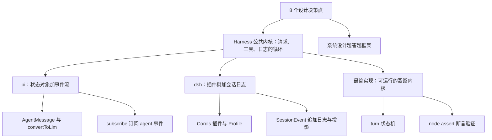

建议先读第 1 节，把公共内核抓在手里。再按第 2 到第 9 节逐个过 8 个决策点，每个决策点只看"两家的不同选择"。最后第 10 节写最小实现，第 11 节把这 8 个点收束成答题框架。

## 1. Harness 的两个官方样本：先对齐术语

**先想一个问题**：面试官问"pi 和 DeepSeek Harness 架构差在哪"，你不能只说一个是状态机、一个是插件化。你得先说出两者共享的那层循环，再谈差异。

!!! note "术语：harness"
    harness 指"管理模型请求、工具执行、上下文组装、会话存储"的那层驱动代码。例子：pi-agent-core 的 Agent 类、dsh-agent-loop 的 ReactLoopAgent 都是 harness 实现。

**心智模型**：

!!! tip "心智模型"
    一句话模型：harness 是一个"接单厨房"——输入是单、模型是厨师、工具是跑腿、日志是账本。日常类比：餐厅把下单、做菜、送菜、记账编排成固定流程。类比不成立处：真实餐厅不会把旧账压缩成摘要再喂给厨师，而 harness 会做上下文裁剪（pi 的 transformContext、dsh 的 compaction）。

**图解**：

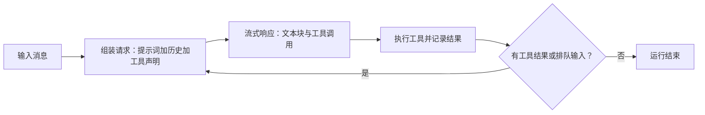

1. 核心循环只有四个阶段：组装、流式响应、工具执行、判断是否再转一圈。
2. 两个产品的差异在于这四段由谁实现：pi 用 Agent 类与钩子，dsh 用插件服务与持久事件。
3. 循环右下角的判断就是 turn 的边界，它单独占第 6 节。

**一步一步来**：

第一步，这一步要做什么：把四个阶段压进一个最小控制流，确认你能读这类代码。

```js
// step1.mjs 依赖：无
function commonKernel(store, hasNext) {
  store.appendUser(input);                             // 阶段一：输入落库
  const reply = store.chat(store.derive());            // 阶段二：投影历史并请求
  store.appendAssistant(reply);                        // 阶段三：记录回复
  for (const call of reply.toolCalls) {
    store.appendToolResult(call, store.runTool(call)); // 阶段四：执行并记录工具
  }
  return hasNext(store) ? 'next-turn' : 'end';         // 终止判断
}
```

**这段代码在做什么**
- store 是状态容器：pi 里是 agent.state，dsh 里是会话语义日志。
- 四条语句对应四个阶段，任何一行都可以在真实实现中单独替换。
- hasNext 对应后续第 6 节的循环终止决策点。

**动手验证**：

```js
// verify1.mjs 依赖：仅 Node 20+ 内置 node:assert
import assert from 'node:assert';

// 用内存数组模拟日志，chat 与 runTool 都是桩
const store = {
  log: [],
  derive() { return this.log.join(' | '); },
  runTool(call) { return 'R:' + call.name; },
  appendUser(t) { this.log.push('U:' + t); },
  appendAssistant(a) { this.log.push('A:' + a.text); },
  appendToolResult(c, r) { this.log.push('T:' + r); },
  chat() { return { text: 'hi', toolCalls: [] }; },
};

store.appendUser('hello');                 // 阶段一
const reply = store.chat(store.derive());  // 阶段二
store.appendAssistant(reply);              // 阶段三
for (const c of reply.toolCalls) {         // 阶段四
  store.appendToolResult(c, store.runTool(c));
}

assert.deepEqual(store.log, ['U:hello', 'A:hi']);
console.log('预期输出：', JSON.stringify(store.log));
```

**常见坑**：

| 现象 | 原因 | 怎么修 |
|---|---|---|
| 把事件订阅当成持久化存储，刷新后状态没了 | pi 的事件流是给 UI 用的，不是存储层 | pi 里状态读 agent.state；dsh 里读会话日志 |
| 以为 harness 只管调模型 | 工具执行、上下文组装、会话存储都在内核循环里 | 按第 0 节知识地图把四段对号入座 |
| 面试只背架构图，不讲数据怎么流 | 缺四阶段的具体数据流 | 按本节 run 函数的四条语句复述一遍 |

**小结**：
- 两个产品共享同一个 turn 循环，差异在实现与扩展方式。
- 桩对象 store 就是最小 harness 的雏形。
- 后面 8 个决策点都挂在这个循环的某一环上。

## 2. 决策一：内外部消息之间要不要转换层

**先想一个问题**：你的应用有"文件高亮""系统通知"这类内部消息，但模型只认识 user、assistant、toolResult。直接全塞进去会报错，要不要加一层转换？

!!! note "术语：convertToLlm 与 deriveMessages"
    两者都是"把内部历史投影成模型可见消息"的函数。例子：pi 的 convertToLlm 过滤非模型类型并转换自定义类型；dsh 的 deriveMessages 从会话日志投影出 user、assistant、tool-result。

**心智模型**：

!!! tip "心智模型"
    一句话模型：内部消息是原账本，模型消息是对账单。日常类比：公司记账有内部科目，报税走另一套口径。类比不成立处：报税口径半年不变，而模型口径会随工具声明、上下文裁剪实时变化。

**图解**：

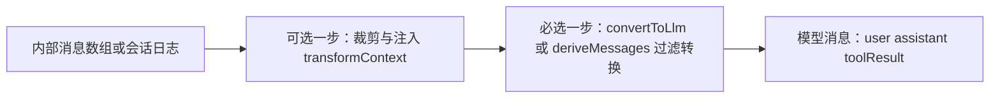

1. pi 把流程显式拆成两步：transformContext 可选，convertToLlm 必选。
2. dsh 不另命名这两步，但"模型可见意味着已落日志"是同一道分界。
3. 两家的共同决定是：库内形态与请求形态分离，请求前才投影。

**一步一步来**：

第一步，这一步要做什么：定义内部消息数组，故意混入一条模型不认识的类型。

```js
// step1.mjs 依赖：无
const messages = [
  { role: 'user', content: '读配置' },        // 模型可见
  { role: 'ui_notice', content: '文件高亮' },  // 自定义内部类型
  { role: 'assistant', content: 'r1', toolCalls: [] }, // 模型可见
];
```

**这段代码在做什么**
- ui_notice 是应用自己声明的角色，模型不认识它。
- 这三条是内部账本，不能原样发送。
- 转换层要能识别并处理后两种而保留第一种。

第二步，这一步要做什么：写一个过滤函数，只放行模型认识的三种角色。

```js
// step2.mjs 依赖：无
function convertToLlm(msgs) {                  // 投影语义
  const allowed = new Set(['user', 'assistant', 'toolResult']);
  return msgs.filter((m) => allowed.has(m.role)); // 过滤 ui_notice
}
```

**这段代码在做什么**
- allowed 集合固定了模型只认识的三种角色。
- filter 做投影，不深拷贝内容，保持消息字段原样。
- dsh 的 deriveMessages 做同类投影，输入是持久日志而非内存数组。

**动手验证**：

```js
// verify2.mjs 依赖：仅 Node 20+ 内置 node:assert
import assert from 'node:assert';

const messages = [
  { role: 'user', content: '读配置' },
  { role: 'ui_notice', content: '文件高亮' },
  { role: 'assistant', content: 'r1', toolCalls: [] },
];
function convertToLlm(msgs) {
  const allowed = new Set(['user', 'assistant', 'toolResult']);
  return msgs.filter((m) => allowed.has(m.role));
}

assert.deepStrictEqual(
  convertToLlm(messages).map((m) => m.role),
  ['user', 'assistant'],
);
console.log('预期输出：只剩 user 与 assistant 两条');
```

**常见坑**：

| 现象 | 原因 | 怎么修 |
|---|---|---|
| 自定义消息直接发给模型报错 | 模型只认三种角色 | 在请求前统一过 convertToLlm 或 deriveMessages |
| 转换后模型丢失上下文 | 裁剪发生在必选转换之前，裁错了范围 | 先做可选裁剪，再做必选转换，顺序别反 |
| 落库数组与请求数组混用一个 | 状态源和请求口径耦合 | 保持内部账本独立，请求前才投影 |

**小结**：
- 内外部消息分口径是 pi 和 dsh 的共同决定。
- 转换层让自定义类型只活在应用侧，不污染模型。
- dsh 的"模型可见意味着已落日志"是额外一层约束：先落盘，再投影。

## 3. 决策二：状态放对象还是放日志

**先想一个问题**：用户说"回到第三条消息重新聊"。如果状态只是一个可变数组，旧历史就被覆盖了。要不要把状态改成只追加日志加一个当前指针？

!!! note "术语：只追加日志与投影"
    只追加日志指"只新增事件、不改写旧记录"的存储；投影是从日志折叠出当前视图的函数。例子：dsh 的 SessionEvent 是日志，sessionProjections 的 stateOf() 是读投影。

**心智模型**：

!!! tip "心智模型"
    一句话模型：对象状态是黑板的当前快照，日志是手术记录。日常类比：银行流水对应存款余额，流水不可改，余额是算出来的。类比不成立处：银行流水不会被压缩，而 dsh 会插入 summary 条目遮蔽更早的消息。

**图解**：

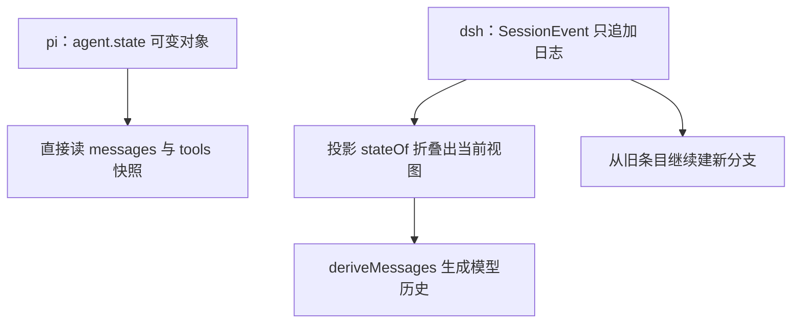

1. pi 的 agent.state 是对象：赋值时拷贝顶层数组，读的是当前快照。
2. dsh 的会话是树：每个条目有 id 与 parent，当前条目决定 active branch。
3. 分叉来自日志形态：从旧条目继续就是新分支；对象快照做不到回到过去而不覆盖。

**一步一步来**：

第一步，这一步要做什么：写一个可变对象，演示快照读取与顶层数组拷贝。

```js
// step1.mjs 依赖：无
const state = { messages: [], tools: [] };
state.messages = [...state.messages, { role: 'user', content: 'a' }]; // 顶层数组拷贝
console.log(state.messages.length); // 1
```

**这段代码在做什么**
- 赋值时先展开旧数组再拼新元素，这就是 pi 材料的"拷贝顶层数组"。
- 读 state.messages 拿到的只是当前快照，没有历史分支。

第二步，这一步要做什么：写一个带父引用的树日志，演示两条分支并存。

```js
// step2.mjs 依赖：无
const tree = [{ id: 1, pid: null, msg: 'root' }];
function add(pid, msg) { tree.push({ id: tree.length + 1, pid, msg }); }
add(1, 'b1');
add(1, 'b2');                     // 从同一父节点长出两条分支
function pathOf(id) {
  const out = [];
  for (let n = tree.find((t) => t.id === id); n; n = tree.find((t) => t.id === n.pid)) {
    out.unshift(n.msg);
  }
  return out;
}
console.log(pathOf(2), pathOf(3)); // ['root','b1'] ['root','b2']
```

**这段代码在做什么**
- pid 是父引用，对应 dsh 条目"refers to its parent"的字段。
- 两个 add 从节点 1 分叉，日志天然支持树形历史。
- pathOf 就是投影：输入节点 id，折叠出该路径的历史。

**动手验证**：

```js
// verify3.mjs 依赖：仅 Node 20+ 内置 node:assert
import assert from 'node:assert';

const tree = [{ id: 1, pid: null, msg: 'root' }];
function add(pid, msg) { tree.push({ id: tree.length + 1, pid, msg }); }
function pathOf(id) {
  const out = [];
  for (let n = tree.find((t) => t.id === id); n; n = tree.find((t) => t.id === n.pid)) {
    out.unshift(n.msg);
  }
  return out;
}
add(1, 'b1');
add(1, 'b2');

assert.deepStrictEqual(pathOf(2), ['root', 'b1']);
assert.deepStrictEqual(pathOf(3), ['root', 'b2']);
console.log('预期输出：两条分支共享 root、各自延伸一条消息');
```

**常见坑**：

| 现象 | 原因 | 怎么修 |
|---|---|---|
| 给 state.messages 赋值后想回旧历史 | 对象快照没有分支 | 改用带父引用的树日志 |
| 从旧条目继续却丢了后续消息 | 没有按 parent 链回溯 | 用当前条目推导 active branch |
| 把摘要写回日志覆盖原文 | 没有区分遮蔽与原样保留 | dsh 的 compaction 插入 summary，原文仍在树中 |

**小结**：
- pi 选对象状态：同步读快照直接，代价是分支能力弱。
- dsh 选追加日志：换来分叉、回放、持久化，代价是每个视图都要投影。
- 面试要点：只要讲"可回放"，必然导向日志或树结构。

## 4. 决策三：事件按作用域分几层

**先想一个问题**：界面要流式打字、插件要拦请求、审计要看持久记录。三类消费者能共用一套事件吗？

!!! note "术语：事件域"
    事件域是按"存活范围与用途"给事件分组的方式。例子：dsh 把会话事件标为 durable 可回放，agent 事件标为 live 进程内观察。

**心智模型**：

!!! tip "心智模型"
    一句话模型：事件分层等于把账本、对讲机、审批流三样东西分开。日常类比：公司分存档邮件、走廊喊话、盖章审批。类比不成立处：真实喊话不能像 waterfall 事件那样通过不调用 next() 来中止传递。

**图解**：

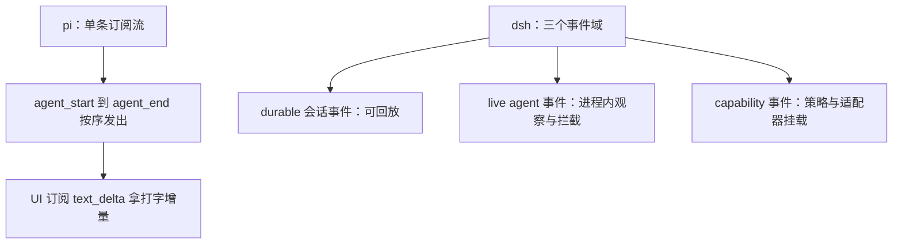

1. pi 只有一条生命周期流，事件顺序固定，从 agent_start 排到 agent_end。
2. dsh 先按"是否落日志"分层：durable 落日志，live 是扩展点。
3. dsh 的 waterfall 事件要求监听器调用 next() 才能继续透传；pi 材料没有写订阅者可否阻断事件流，需核对官方文档。

**一步一步来**：

第一步，这一步要做什么：实现 pi 风格的单流订阅，按注册顺序 await 监听器。

```js
// step1.mjs 依赖：无
const listeners = [];
const agent = {
  subscribe(fn) { listeners.push(fn); },
  async emit(ev) { for (const fn of listeners) await fn(ev); }, // 注册顺序等待
};
```

**这段代码在做什么**
- subscribe 只是往数组里推函数，对应 pi 的 Agent.subscribe。
- emit 按注册顺序逐个 await，对应"listeners are awaited in registration order"。

第二步，这一步要做什么：实现 dsh 风格的 waterfall，监听器不调用 next() 就中断。

```js
// step2.mjs 依赖：无
function waterfall(middlewares) {
  return (req) => {
    let i = 0;
    function next() {
      const m = middlewares[i++];
      return m ? m(req, next) : Promise.resolve(); // next 是显式放行
    }
    return next();
  };
}
```

**这段代码在做什么**
- 每个中间件收到 req 和 next，这对应 dsh 的 waterfalls。
- 不调用 next() 就停在中途，这正是 tools/pre-execute 等瀑布的语义。
- 与第一步的单流相比，waterfall 多了一个"可否决"的能力。

**动手验证**：

```js
// verify4.mjs 依赖：仅 Node 20+ 内置 node:assert
import assert from 'node:assert';

const order = [];
const listeners = [];
const agent = {
  subscribe(fn) { listeners.push(fn); },
  async emit(ev) { for (const fn of listeners) await fn(ev); },
};
agent.subscribe(async (e) => { order.push('a:' + e); });
agent.subscribe(async (e) => { order.push('b:' + e); });
await agent.emit('x');

assert.deepStrictEqual(order, ['a:x', 'b:x']);
console.log('预期输出：两个监听器按注册顺序执行');
```

**常见坑**：

| 现象 | 原因 | 怎么修 |
|---|---|---|
| UI 拿不到流式增量 | 订阅了持久事件而非 live 流 | dsh 里打字增量走 agent/assistant-stream |
| 监听器里执行重活拖慢订阅方 | pi 的 emit 会逐个 await 监听器 | 重活拆到独立任务，不阻塞主链 |
| 想从 live 增量推断已发送内容 | live 块是进程内增量，未落日志 | dsh 的 assistant/message 内嵌完整 compact 流 |

**小结**：
- pi 用单流：顺序固定、上手直接；dsh 用三域：durable、live、capability。
- 持久事件负责回放，live 事件负责增量，职责分离。
- 面试分开答两问：能不能回放，能不能拦截。

## 5. 决策四：工具执行用什么模式

**先想一个问题**：模型一次调了三个工具：读文件、查库、发通知。串行执行慢，并行又可能互相踩。你按什么规则排程？

!!! note "术语：并行安全与排他调用"
    并行安全指多路工具可同时执行而不冲突；排他调用指必须单独执行、作为顺序屏障的工具。例子：dsh 里 exclusive 调用单独跑，parallel-safe 调用受 maxParallelToolCalls 限制并发数。

**心智模型**：

!!! tip "心智模型"
    一句话模型：工具执行是咖啡店出单排程：美式可并行，手冲须独占吧台。日常类比：并行订单提吞吐，排他订单防串味。类比不成立处：咖啡店吧台不产生持久日志，而每次工具结果都要落库，成为下一轮模型历史。

**图解**：

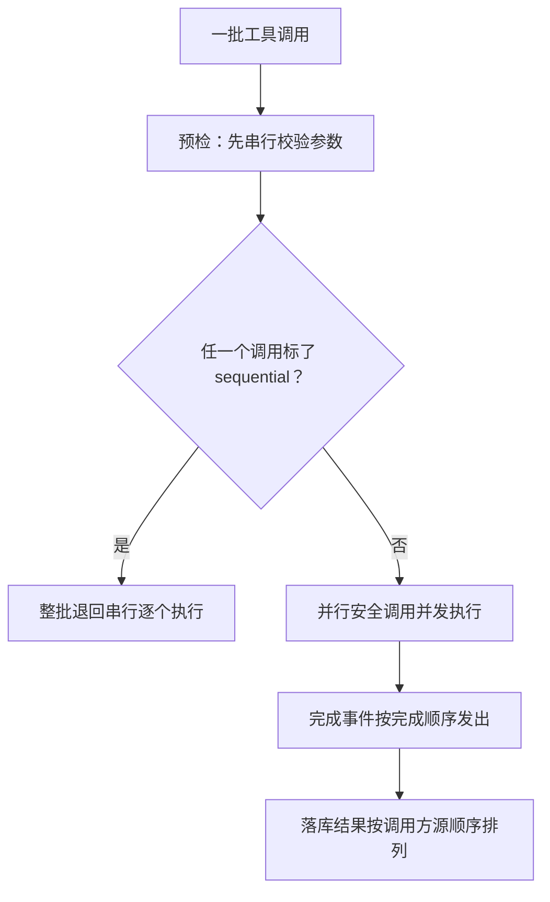

1. pi 并行模式：预检串行、执行并发、事件按完成顺序发、落库按 assistant 源顺序排。
2. 批次里任一调用带 executionMode: sequential，整批都串行。
3. dsh 用 maxParallelToolCalls（默认 10）限制并发，exclusive 调用作为顺序屏障。

**一步一步来**：

第一步，这一步要做什么：实现一个带并发上限的简化池。

```js
// step1.mjs 依赖：无
function pool(limit) {
  let active = 0;
  const queue = [];
  const run = async () => {
    if (active >= limit || queue.length === 0) return;
    active += 1;                 // 占一个并发位
    const job = queue.shift();
    await job();                 // 简化：忽略返回值
    active -= 1;
    run();                       // 释放后补下一个
  };
  return (job) => { queue.push(job); run(); };
}
```

**这段代码在做什么**
- limit 对应 maxParallelToolCalls，限制同时在跑的调用数。
- 任务完成后释放位置并补跑，是最小并发池模式。

第二步，这一步要做什么：用排他谓词把调用切成批次，排他调用单独一批。

```js
// step2.mjs 依赖：无
function plan(calls, isExclusive) {
  const groups = [];
  for (const c of calls) {
    if (isExclusive(c)) {          // 排他：自己一批
      groups.push([c]);
      groups.push([]);             // 后续调用另开新批
    } else {
      if (groups.length === 0) groups.push([]);
      groups[groups.length - 1].push(c); // 并行安全：并入当前批
    }
  }
  return groups.filter((g) => g.length > 0);
}
```

**这段代码在做什么**
- 批内可并行，批间必须串行。
- 排他调用单独成批，正是 dsh 的 exclusive 顺序屏障语义。
- 每批再交给第一步的 pool 控制并发数。

**动手验证**：

```js
// verify5.mjs 依赖：仅 Node 20+ 内置 node:assert
import assert from 'node:assert';

function plan(calls, isExclusive) {
  const groups = [];
  for (const c of calls) {
    if (isExclusive(c)) {
      groups.push([c]);
      groups.push([]);
    } else {
      if (groups.length === 0) groups.push([]);
      groups[groups.length - 1].push(c);
    }
  }
  return groups.filter((g) => g.length > 0);
}
const calls = [
  { name: 'readA' }, { name: 'readB' }, { name: 'notify' }, { name: 'readC' },
];
const groups = plan(calls, (c) => c.name === 'notify');

assert.deepStrictEqual(groups.map((g) => g.map((c) => c.name)),
  [['readA', 'readB'], ['notify'], ['readC']]);
console.log('预期输出：三个批次，notify 单独一批');
```

**常见坑**：

| 现象 | 原因 | 怎么修 |
|---|---|---|
| 并行批内两个工具互相踩文件 | 有冲突却标了并行安全 | 冲突工具改 per-tool executionMode 或 exclusive |
| 结果落库顺序和执行顺序不同，模型读乱 | 完成事件按完成顺序，落库另有顺序规则 | 落库按 assistant 源顺序，事件按完成顺序 |
| 全局并行但某工具总被串行 | 批次中含一个 sequential 就会整批串行 | 检查批内是否夹带着 sequential 调用 |

**小结**：
- pi 默认 parallel，dsh 默认 maxParallelToolCalls 为 10。
- 两家都有"排他、串行"作为批次屏障。
- 拦截钩子：pi 提供 beforeToolCall、afterToolCall；dsh 提供 tools 的 pre-execute、execute、post-execute 瀑布。

## 6. 决策五：循环终止谁说了算

**先想一个问题**：模型回复完没调工具，但业务要求再确认一句。你怎么让循环多转一圈，或者立刻停？

!!! note "术语：finishTurn 与 turn-stopping"
    finishTurn 是 pi 中"一轮结束、turn_end 前"的决策钩子；turn-stopping 是 dsh 中允许监听器停止一轮的串行事件。两者回答同一问题：下一轮还要不要发起。

**心智模型**：

!!! tip "心智模型"
    一句话模型：终止决策是电梯关门键：默认到了就关，有人再按就再开一次。日常类比：自动门感应到人就多开一轮，没人就落锁。类比不成立处：真实自动门不会因为无条件开而卡死，代码里无条件返回 continue 会死循环。

**图解**：

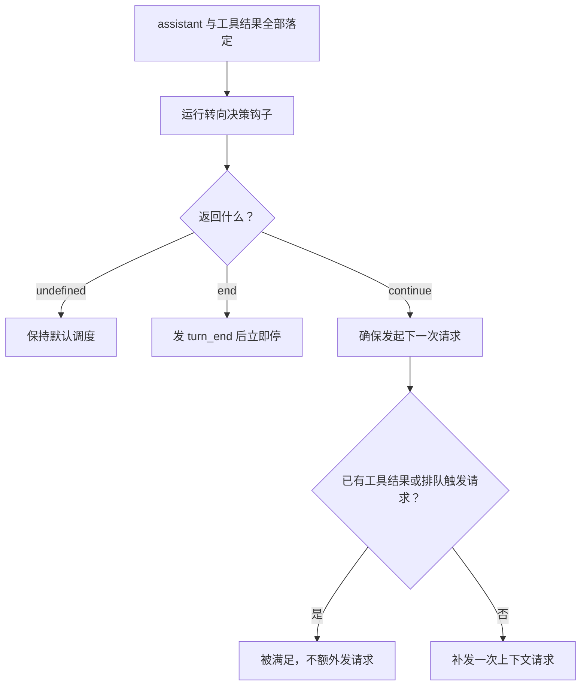

1. 返回 undefined 表示不做任何覆盖，交给默认调度。
2. 返回 end 表示本轮收尾后立即停，不再轮询队列。
3. 返回 continue 表示确保恰好还有一次请求；若其他来源已触发则满足它，不补发。
4. 无条件返回 continue 会死循环，pi 材料明确点名这一点。

**一步一步来**：

第一步，这一步要做什么：把三种返回值翻译成调度行为。

```js
// step1.mjs 依赖：无
function schedule(finishTurn, alreadyHasNext) {
  const decision = finishTurn();               // undefined 或 end 或 continue
  if (decision === 'end') return 'stop-now';
  if (decision === 'continue' && !alreadyHasNext) return 'one-more';
  return 'default';                            // 含 continue 且已有下次触发源
}
```

**这段代码在做什么**
- end 走立即停路径，continue 先检查是否已有触发源。
- undefined 与"已满足的 continue"都落回 default。
- alreadyHasNext 对应工具结果、steering、follow-up 已触发的既有调度。

第二步，这一步要做什么：加入错误与中止的硬退出短路。

```js
// step2.mjs 依赖：无
function scheduleWithExit(stopReason, finishTurn, alreadyHasNext) {
  if (stopReason === 'error' || stopReason === 'aborted') return 'hard-exit'; // 硬退出
  return schedule(finishTurn, alreadyHasNext);
}
```

**这段代码在做什么**
- 错误与中止直接硬退出，不看决策返回值。
- 这对应 pi 材料"错误与中止响应保持硬退出，其决策被忽略"。

**动手验证**：

```js
// verify6.mjs 依赖：仅 Node 20+ 内置 node:assert
import assert from 'node:assert';

function schedule(finishTurn, alreadyHasNext) {
  const d = finishTurn();
  if (d === 'end') return 'stop-now';
  if (d === 'continue' && !alreadyHasNext) return 'one-more';
  return 'default';
}
assert.strictEqual(schedule(() => undefined, false), 'default');
assert.strictEqual(schedule(() => 'end', false), 'stop-now');
assert.strictEqual(schedule(() => 'continue', true), 'default');
assert.strictEqual(schedule(() => 'continue', false), 'one-more');
console.log('预期输出：四种组合的断言全部通过');
```

**常见坑**：

| 现象 | 原因 | 怎么修 |
|---|---|---|
| 循环停不下来 | finishTurn 无条件返回 continue | 加一个会落到 undefined 的谓词 |
| 错误后还在发请求 | 没先判断 stopReason | 先短路 error 与 aborted，再进决策 |
| 想停但排队消息仍被处理 | 用了别的机制阻止调度 | 用 end，它在 turn_end 后立即收束 |

**小结**：
- 终止必须是一个可观测的决策点，不藏在循环深处。
- 错误与中止是硬退出，continue 拉不回来。
- dsh 的等价规则是：turn 在不再欠任何请求时关闭，turn-stopping 可提前停。

## 7. 决策六：扩展用钩子还是插件

**先想一个问题**：你想加一个"请求前审计"。pi 给你一个钩子函数，dsh 要你注册一个插件服务。两者都能做，面试怎么讲清差异？

!!! note "术语：钩子与插件"
    钩子是宿主预留的、由使用者填写的函数字段；插件是注册进共享容器、可连同副作用一起卸载的模块。例子：pi 的 prepareRequest 是钩子；dsh 在 Cordis ctx 上注册的工具与事件是插件服务。

**心智模型**：

!!! tip "心智模型"
    一句话模型：钩子是表上的空白签名，插件是插座上的模块。日常类比：表格留空由你填写，插排扩展由你插入。类比不成立处：插排模块拔出后真能收走所有线，钩子的副作用不会自动回滚。

**图解**：

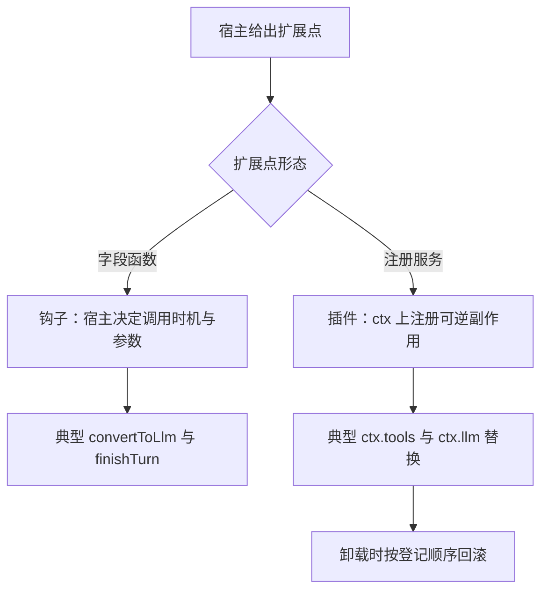

1. pi 把扩展点写成 Agent 配置里的函数字段，调用时机由 Agent 负责。
2. dsh 的每个部件都是插件，包括模型适配器、工具表、循环本身。
3. dsh 的注册是 effect，插件卸载时 unwind，这是钩子不提供的回滚能力。

**一步一步来**：

第一步，这一步要做什么：实现钩子形态，宿主决定何时调用。

```js
// step1.mjs 依赖：无
function createAgent(hooks) {
  return async function run(input) {
    const ctx = { input };
    return hooks.prepareRequest ? await hooks.prepareRequest(ctx) : ctx; // 有则调用
  };
}
```

**这段代码在做什么**
- hooks 只是配置字段，宿主在固定时机调用指定字段。
- 没写钩子就走默认路径，不加额外分支。

第二步，这一步要做什么：实现插件形态，注册必须返回清理函数。

```js
// step2.mjs 依赖：无
const registry = new Map();
function mount(key, install) {
  const cleanup = install();       // install 返回注销函数
  registry.set(key, cleanup);
}
function unmount(key) {
  const cleanup = registry.get(key);
  if (cleanup) { cleanup(); registry.delete(key); } // 可逆副作用
}
```

**这段代码在做什么**
- 每个注册都有配对的清理函数，对应 Cordis 的可逆 effect。
- unmount 调用清理并从注册表移除，防止二次注销。
- 两类形态的差异落在"生命周期归谁"：钩子归宿主，插件归注册表。

**动手验证**：

```js
// verify7.mjs 依赖：仅 Node 20+ 内置 node:assert
import assert from 'node:assert';

const registry = new Map();
let installed = 0;
let cleaned = 0;
function mount(key, install) { registry.set(key, install()); }
function unmount(key) { registry.get(key)(); registry.delete(key); }
mount('a', () => { installed += 1; return () => { cleaned += 1; }; });
unmount('a');

assert.strictEqual(installed, 1);
assert.strictEqual(cleaned, 1);
console.log('预期输出：安装一次、清理一次');
```

**常见坑**：

| 现象 | 原因 | 怎么修 |
|---|---|---|
| 插件卸载后残留事件监听 | 注册时没有返回清理函数 | 每个 install 都返回 cleanup |
| 钩子里做了副作用却无法回滚 | 钩子是函数位，不携带生命周期 | 副作用改造成可卸载的插件效果 |
| 热更新后旧配置仍生效 | 旧 effect 未 unwind | 用注册表保证按登记逆序回滚 |

**小结**：
- pi 面向明确的定制点：钩子数量固定，宿主统一编排。
- dsh 面向可组合产品：全部能力都是插件，一行配置可换掉一个模型适配器。
- 面试落到一句判断：生命周期由宿主还是由注册表持有。

## 8. 决策七：排队输入怎么派发

**先想一个问题**：模型还在流式回复，用户又发来两条新消息。直接插历史会打断当前轮的组装；排队又有顺序和合并问题。怎么派发？

!!! note "术语：steering 与 follow-up"
    steering 是当前轮结束后进入的驾驶消息；follow-up 是 agent 忙完后进入的跟进消息。例子：pi 用 steeringMode 与 followUpMode 控制一次取一条还是取全部；dsh 用 inbox 投影做 insert、claim、cancel。

**心智模型**：

!!! tip "心智模型"
    一句话模型：排队输入是候诊叫号：驾驶消息是护士台插话，跟进消息是医生看完后进诊室。日常类比：分诊台区分先后与轻重。类比不成立处：真实叫号不改病历顺序，而这里的取号规则决定模型下一轮看到什么。

**图解**：

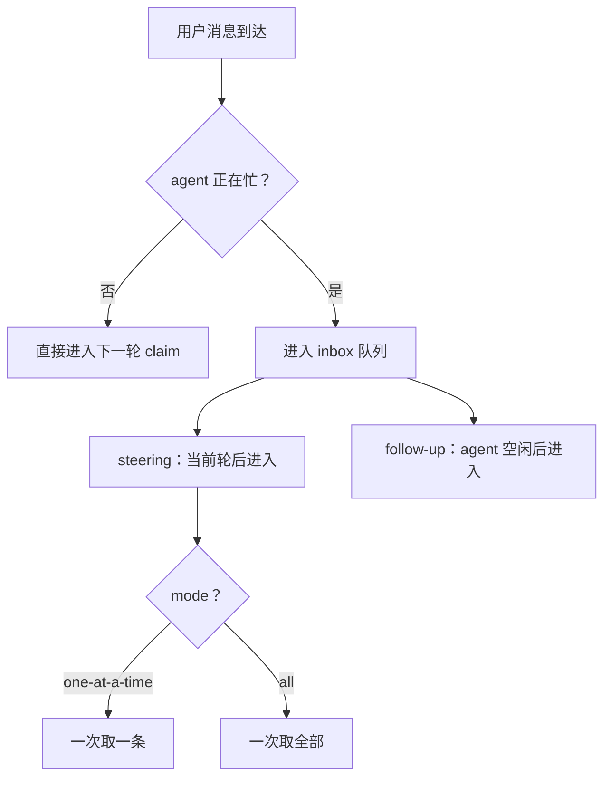

1. pi 把排队分两条轨道：steering 与 follow-up，模式分别配置，默认都是 one-at-a-time。
2. dsh 把所有 inbox 变更折叠成 agent/inbox/spliced 事件，投影同步更新。
3. dsh 里普通删除带 outcome canceled 并给 message，认领是纯删除并给 claimed。

**一步一步来**：

第一步，这一步要做什么：实现最小 inbox，认领时纯删除返回消息。

```js
// step1.mjs 依赖：无
const inbox = [];
function insert(msg) { const id = inbox.length + 1; inbox.push({ id, ...msg }); return id; }
function claim(id) {
  const i = inbox.findIndex((m) => m.id === id);
  return inbox.splice(i, 1)[0];    // 认领是纯删除
}
```

**这段代码在做什么**
- 插入给 id 并同步入数组，对应 inbox/spliced 的插入坐标。
- claim 是纯删除，对应 dsh 的 agent/inbox/claimed。

第二步，这一步要做什么：普通删除区别于认领，带 outcome 结果。

```js
// step2.mjs 依赖：无
function cancel(id) {
  const i = inbox.findIndex((m) => m.id === id);
  const [msg] = inbox.splice(i, 1);
  return { outcome: 'canceled', message: msg }; // 带结果的通知
}
```

**这段代码在做什么**
- cancel 返回 outcome 与消息体，对应 agent/inbox/discarded。
- 两种删除都走 splice 坐标，所以投影可以同步折叠同一套事件。

**动手验证**：

```js
// verify8.mjs 依赖：仅 Node 20+ 内置 node:assert
import assert from 'node:assert';

const inbox = [];
function insert(msg) { const id = inbox.length + 1; inbox.push({ id, ...msg }); return id; }
function claim(id) { const i = inbox.findIndex((m) => m.id === id); return inbox.splice(i, 1)[0]; }
function cancel(id) {
  const i = inbox.findIndex((m) => m.id === id);
  return { outcome: 'canceled', message: inbox.splice(i, 1)[0] };
}
insert({ text: 'a' });
const claimed = claim(1);
insert({ text: 'b' });
const destroyed = cancel(2);

assert.strictEqual(claimed.text, 'a');
assert.strictEqual(destroyed.outcome, 'canceled');
assert.deepStrictEqual(inbox, []);
console.log('预期输出：认领与取消都从 inbox 删除，事件不同');
```

**常见坑**：

| 现象 | 原因 | 怎么修 |
|---|---|---|
| 拿到删除通知却拿不到消息内容 | 把删除当纯 splice 却还要渲染 | 用 discarded 事件携带 message |
| 一次取太多导致上下文暴涨 | 把 all 设为默认模式 | 默认用 one-at-a-time |
| 投影里的 inbox 总慢半拍 | 没有在 append 返回前同步折叠 splice | 在 splice 事件提交时立即折叠投影 |

**小结**：
- 排队输入要有轨道与模式两层设计。
- 认领用纯删除，普通删除带 outcome，两类事件分开。
- 投影一致性靠事件提交即折叠，不靠定时刷新。

## 9. 决策八：请求准备与取消语义

**先想一个问题**：请求发出前要刷新 OAuth token，请求发出后用户按了停止。哪些状态必须落库，哪些必须当没发生？

!!! note "术语：prepareRequest 与 prepareCall"
    prepareRequest 是 pi 中每次模型请求前必跑的钩子；prepareCall 是 dsh 中解析路由与校验收到的准备环节。协作取消指"主动响应中止信号、保留已交付内容"的取消方式。

**心智模型**：

!!! tip "心智模型"
    一句话模型：准备请求是发车前安检，取消是刹车后对账。日常类比：安检不过不发车，刹车后票已核销的路段要给乘客。类比不成立处：真实对账不要求"模型可见必落日志"，而这正是 dsh 的硬约束。

**图解**：

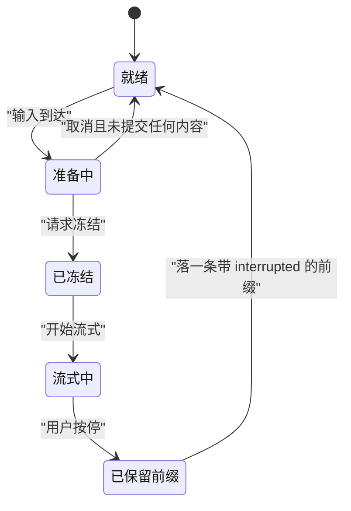

1. 准备阶段取消，系统提示与用户消息都未提交，这是 dsh 的承诺。
2. 流式中取消，已交付前缀以 interrupted 锚点落日志，下一轮仍能看到。
3. 未派发的工具调用得到合成的 ABORTED_BEFORE_DISPATCH 结果对。

**一步一步来**：

第一步，这一步要做什么：实现请求冻结，深拷贝并冻结请求头。

```js
// step1.mjs 依赖：无
function freezeRequest(head) {
  const frozen = JSON.parse(JSON.stringify(head)); // 深拷贝一份
  return Object.freeze(frozen);                    // 之后不可改动
}
```

**这段代码在做什么**
- 深拷贝切断与原对象的引用，对应 dsh 冻结请求身份。
- Object.freeze 让后续修改报错，强制请求不可变。

第二步，这一步要做什么：实现取消对账，保留前缀并补未派发结果。

```js
// step2.mjs 依赖：无
function onCancel(stream, toolCalls) {
  const prefix = stream.delivered;            // 已交付的文本前缀
  const synthesized = toolCalls.map((tc) => ({
    call: tc,
    outcome: 'ABORTED_BEFORE_DISPATCH',       // 未派发工具补合成结果
  }));
  return { prefix, synthesized };
}
```

**这段代码在做什么**
- 前缀保留用户已经看到的文本。
- 未派发的工具调用补一个结果，防止后续请求缺配对历史。

**动手验证**：

```js
// verify9.mjs 依赖：仅 Node 20+ 内置 node:assert
import assert from 'node:assert';

function onCancel(stream, toolCalls) {
  return {
    prefix: stream.delivered,
    synthesized: toolCalls.map((tc) => ({ call: tc, outcome: 'ABORTED_BEFORE_DISPATCH' })),
  };
}
const r = onCancel({ delivered: '你好' }, [{ name: 'run' }]);

assert.strictEqual(r.prefix, '你好');
assert.strictEqual(r.synthesized[0].outcome, 'ABORTED_BEFORE_DISPATCH');
console.log('预期输出：保留已交付前缀，补一个未派发结果');
```

**常见坑**：

| 现象 | 原因 | 怎么修 |
|---|---|---|
| 取消后下一轮看不到用户读过的文本 | 没有把 delivered 前缀落日志 | 用 interrupted 锚点保存前缀 |
| 取消时系统提示被写了一半 | 两个异步阶段之间不原子 | 未冻结前取消则两端都不提交 |
| 工具历史缺配对使模型困惑 | 未派发调用没有结果 | 补 ABORTED_BEFORE_DISPATCH 合成对 |

**小结**：
- 请求准备是每次请求的必经点：pi 用 prepareRequest，dsh 用 prepareCall。
- 取消是协作式：已交付保留，未提交丢弃。
- 未派发工具调用必须补合成结果，维持工具历史配对。

## 10. 最简实现：40 行蒸馏出公共内核

**先想一个问题**：读完两份官方实现，你能不能用约 40 行代码写出一个能跑、能断言、能换真模型的最小 harness？

!!! note "术语：蒸馏内核"
    蒸馏内核指从两份官方架构里提炼出的最小可运行子集。例子：把 turn 循环、消息投影、工具分派、落库压成一个 run 函数。这个内核是教学构造，不对应任何官方产品版本。

**心智模型**：

!!! tip "心智模型"
    一句话模型：最简实现是把复杂餐厅拆成一辆餐车。日常类比：保留下单、出餐、收银三件事，去掉大堂与排班。类比不成立处：餐车简化是删功能，蒸馏是保留决策点结构、只删外部部件。

**图解**：

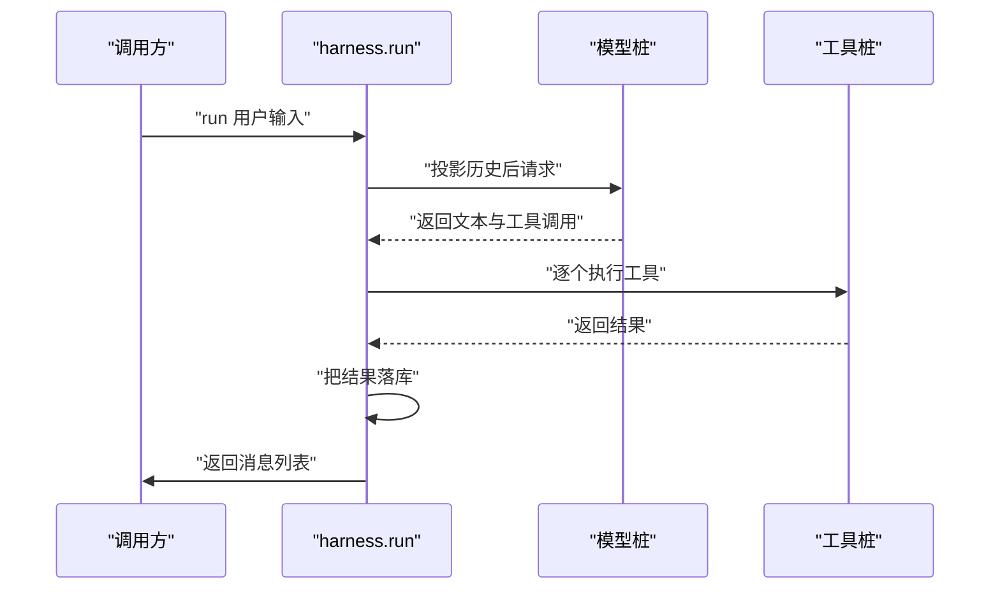

1. run 是唯一入口，内部只有四条主要语句。
2. 模型与工具都是注入的桩，签名固定后可替换。
3. 落库在每次模型回复与工具结果后立即发生，对应 dsh 的 model-visible means logged。

**一步一步来**：

第一步，这一步要做什么：定义最小状态 store，内部历史加投影。

```js
// step1.mjs 依赖：无
function createStore(model, tools) {
  const messages = [];                    // 内部历史
  return {
    append(m) { messages.push(m); },
    derive() { return messages.filter((m) => m.role !== 'internal'); }, // 过滤内部消息
    model,
    tools,
    messages,
  };
}
```

**这段代码在做什么**
- messages 是内存账本，对应 pi 的 agent.state.messages。
- derive 投影掉 internal 角色，对应 convertToLlm 的过滤语义。
- model 与 tools 都是构造时注入，符合依赖注入。

第二步，这一步要做什么：实现 run 循环，把四段拼起来。

```js
// step2.mjs 依赖：无
async function run(store, input) {
  store.append({ role: 'user', content: input });           // 输入落库
  const reply = await store.model(store.derive());          // 投影并请求
  store.append({ role: 'assistant', content: reply.text }); // 回复落库
  for (const call of reply.toolCalls || []) {
    const out = await store.tools[call.name](call.args);    // 工具分派
    store.append({ role: 'toolResult', content: out });     // 结果落库
  }
  return store.messages;
}
```

**这段代码在做什么**
- 用户消息先落库，再投影出模型可读历史。
- 每次工具结果执行完就 append，下一轮模型一定看得到。
- 这是 pi 与 dsh 共享的循环内核，不含任何产品专用扩展。

**动手验证**：

```js
// verify10.mjs 依赖：仅 Node 20+ 内置 node:assert
import assert from 'node:assert';

function createStore(model, tools) {
  const messages = [];
  return {
    append(m) { messages.push(m); },
    derive() { return messages; },
    model,
    tools,
    messages,
  };
}
async function run(store, input) {
  store.append({ role: 'user', content: input });
  const reply = await store.model(store.derive());
  store.append({ role: 'assistant', content: reply.text });
  for (const call of reply.toolCalls || []) {
    const out = await store.tools[call.name](call.args);
    store.append({ role: 'toolResult', content: out });
  }
  return store.messages;
}
const tools = { echo: async (args) => ({ echo: args }) };
const model = async (history) =>
  history[0].content === 'hi'
    ? { text: 'echoing', toolCalls: [{ name: 'echo', args: { a: 1 } }] }
    : { text: 'idle' };
const store = createStore(model, tools);
const msgs = await run(store, 'hi');

assert.strictEqual(msgs.length, 3);
assert.strictEqual(msgs[1].text, 'echoing');
assert.deepStrictEqual(msgs[2].content, { echo: { a: 1 } });
console.log('预期输出：用户、助手、工具结果三条消息依次落库');
```

**常见坑**：

| 现象 | 原因 | 怎么修 |
|---|---|---|
| 工具结果没进历史，模型下一轮看不到 | run 里漏了 append toolResult | 执行后立刻落库 |
| 内部消息直通模型 | 投影层没过滤 | derive 加角色过滤 |
| 拿桩模型当成品用 | 桩不校验任何 API 契约 | 换真实模型时保持 store.model 签名不变 |

**小结**：
- 约 40 行装得下 turn 循环、投影、工具分派、落库。
- 这个子集与 pi、dsh 的关系是公共分母，不是替代品。
- 面试可把它当白板起点，再逐个叠加 8 个决策点。

## 11. 系统设计题答题框架

**先想一个问题**：题目给一句"设计一个企业级 agent harness"。你不先画架构图，第一句说什么、定什么？

!!! note "术语：系统设计题答题框架"
    答题框架指把开放题拆成固定维度的检查清单。例子：本页把 harness 设计题拆为 8 个决策点加 3 个横切话题，按序作答避免遗漏。

**心智模型**：

!!! tip "心智模型"
    一句话模型：答题框架是采访提纲，每个决策点是一个问题，答案来自取舍。日常类比：记者采访前准备问题列表。类比不成立处：采访可以跳题，系统设计跳过任何一个决策点就等于埋一个生产事故。

**图解**：

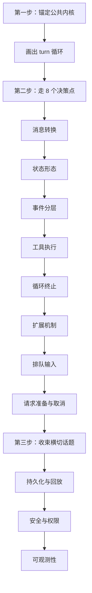

1. 答题起点不是画大架构，是先写公共内核：请求、响应、工具、日志、继续判断。
2. 8 个决策点按数据流排序：消息怎么转换，存哪里，再到执行，最后是终止。
3. 收尾用三个横切话题：持久化、安全、可观测。

**一步一步来**：

第一步，这一步要做什么：搭出答题骨架的前半部分。

```js
// step1.mjs 依赖：无
const outline = {
  kernel: ['request', 'response', 'tools', 'log', 'continue'], // 公共内核五要素
  decisions: [
    'message conversion', // 内外部消息转换
    'state shape',        // 对象态或日志态
  ],
};
```

**这段代码在做什么**
- kernel 五个词就是白板上先画的循环。
- decisions 前两项先引出数据流起点。

第二步，这一步要做什么：补齐决策点与横切话题，断言数量准确。

```js
// step2.mjs 依赖：无
outline.decisions = [
  'message conversion', 'state shape', 'events', 'tools',
  'termination', 'extension', 'queue', 'request-cancel',
];
outline.crosscutting = ['persistence', 'security', 'observability'];
```

**这段代码在做什么**
- 8 个决策点对应第 2 到第 9 节。
- 三个横切话题让答案落到工程落地上。
- 每个决策点都用"两方案一取舍"回答，不背名词。

**动手验证**：

```js
// verify11.mjs 依赖：仅 Node 20+ 内置 node:assert
import assert from 'node:assert';

const decisions = [
  'message conversion', 'state shape', 'events', 'tools',
  'termination', 'extension', 'queue', 'request-cancel',
];
assert.strictEqual(decisions.length, 8);
assert.strictEqual(new Set(decisions).size, 8);
console.log('预期输出：八个决策点不重不漏');
```

**常见坑**：

| 现象 | 原因 | 怎么修 |
|---|---|---|
| 一上来讲模型适配器细节 | 没先锚定公共内核 | 第一句先画 turn 循环 |
| 8 个决策点漏掉扩展机制 | 只聊功能不聊扩展 | 按本页决策点清单逐条过 |
| 只给方案不给选型理由 | 没有具体维度的对比 | 按综合对比表的行给维度 |

**小结**：
- 框架顺序：公共内核、8 个决策点、三个横切话题。
- 8 个决策点与本页第 2 到第 9 节一一对应。
- 每个决策点用两方案加一个取舍回答，不背名次。

## 综合对比

| 维度 | pi | DeepSeek Harness | 最简实现 |
|---|---|---|---|
| 状态形态 | agent.state 可变对象，顶层数组赋值时拷贝 | SessionEvent 只追加日志，投影折叠出视图 | 内存数组 |
| 消息口径 | AgentMessage 经 transformContext、convertToLlm | 模型可见必先落日志，deriveMessages 投影 | derive 过滤 |
| 工具并发 | 默认 parallel，同一批含 sequential 则整批串行 | maxParallelToolCalls 默认 10，exclusive 为顺序屏障 | 按名分派 |
| 执行管线拦截 | beforeToolCall、afterToolCall | tools 的 pre-execute、execute、post-execute 瀑布 | 无管线 |
| 循环终止 | finishTurn 返回 end、continue、undefined | turn 不再欠请求即关闭，turn-stopping 可提前停 | hasNext 谓词 |
| 扩展方式 | 配置字段钩子加 subscribe | Cordis 插件注册 ctx 服务，卸载时 unwind | 构造时注入函数 |
| 事件体系 | 单条 agent 键事件序列，订阅可 wait | durable、live、capability 三个域 | 无事件 |
| 排队输入 | steering 与 follow-up 双轨，one-at-a-time 或 all | inbox 投影加 splice 坐标，claimed、discarded | 未覆盖 |
| 取消语义 | abort 停止当前 run，排队消息退回编辑器 | 冻结请求、interrupted 前缀、未派发工具补合成结果 | 未覆盖 |
| 持久化 | 会话树、JSONL、继续旧条目即分叉 | 会话日志 JSONL、分叉与 resume、摘要遮蔽旧消息 | 未实现 |

选型建议：要在进程内做事件流驱动 UI、定制点固定，优先 pi 的 Agent 与钩子。要可组合的多 profile 产品、要日志回放与分叉，优先 dsh 的插件树与会话日志。面试与教学从最简内核开始，把每个决策点替换成对应官方方案再讲取舍。

## 应用与行业实践

### 应用场景地图

| 场景 | 用到本页哪个知识点 | 典型技术选型 | 注意事项 |
| --- | --- | --- | --- |
| 后台管理的万行表格批量改数 | 决策四 工具执行模式；决策五 循环终止 | 串行工具调用加人工确认钩子 | 单次 turn 只改一行，越权改动必须暂停 |
| 低端安卓首屏的语音指令入口 | 决策八 请求准备与取消语义；决策三 事件分层 | 请求级超时加取消标志位 | 取消也要落一条终态事件，否则日志断档 |
| 多人协作白板的 AI 纪要 | 决策二 状态放对象还是放日志 | 日志作唯一事实源，前端按事件重放 | 重放要幂等，重复事件不能二次插入 |
| 客服工单自动分类与回填 | 决策一 内外部消息转换层 | 内部日志结构加外部协议适配器 | 转换层要显式，别把工单字段混进消息体 |
| CI 流水线里的代码审查机器人 | 决策四 工具执行模式；决策六 钩子还是插件 | 只读工具并行加写操作串行 | 没有写权限时，不把写工具的描述塞进请求 |
| 车载离线语音导航指令 | 决策五 循环终止谁说了算 | 步数上限加本地超时 | 断网时终止权归 harness，不归模型 |
| 跨境电商订单轨迹咨询机器人 | 决策七 排队输入怎么派发 | 单飞队列加按会话分桶 | 用户连发的追问要合并进同一个 turn |
| 医院导诊台的自助问答机 | 最简实现 40 行蒸馏 | 单文件循环加只读知识库工具 | 先跑通终止与日志，再接语音前端 |

### 三个场景拆解

#### 场景 1：后台管理的万行表格批量改数助手

**业务背景**：运营要按筛选条件改上万行数据，逐行点确认，一天只能做完几批。
规模量级用可复现方法量：造一份一万行的 CSV，在本地整批改完，用 `time.perf_counter` 记总耗时与人工确认次数。

**怎么用本页知识解决**：思路是把"改数"做成一个工具，循环一次只调一次工具，改完立即把参数与结果写进日志。
终止权留给 harness：模型给出终答就正常退出，步数到上限就带原因退出，越权改动就写 `wait_human` 停下等人工。

```python
# 表格批量改数：一次 turn 改一行，改完立刻落日志
def run_turn(state, tools, max_steps=20):
    for step in range(max_steps):          # 步数上限由 harness 决定
        req = build_request(state.log)     # 请求只依赖日志，不依赖内存对象
        reply = call_model(req)
        if reply.tool_call is None:
            state.log.append({"type": "final", "text": reply.text})
            return state                   # 模型给出终答，正常终止
        name, args = reply.tool_call
        result = tools[name](**args)       # 串行执行，一次只动一行
        state.log.append({"type": "tool", "name": name,
                          "args": args, "result": result})
        if result["need_confirm"]:         # 越权改动交回人工
            state.log.append({"type": "wait_human"})
            return state
    state.log.append({"type": "abort", "reason": "max_steps"})
    return state                           # 超限终止也要留痕
```

- 请求由日志生成，重跑时把日志喂回去就能复现同一次决策。
- 工具串行执行，出错时停在哪一行看日志就知道。
- 三种终态各写各的事件，事后统计中止原因不用猜。
- `max_steps` 放在 harness 里，模型改不了这个数。

**怎么度量收益**：看 `harness.turn.step_count`、`harness.tool.error_rate`、`wait_human` 占比。
用 pytest 驱动，固定输入跑 20 次，经 OpenTelemetry 导出到 Prometheus，在 Grafana 看 P50 与 P95。
对照实验：同一批数据用纯脚本改一遍，比总耗时与人工确认次数。

**什么时候不该用**：只改一行且人就在屏幕前的场景，加确认钩子只是多一步。
改动跨多张表、要求事务一致时，逐行串行会留下半成品，该走数据库事务而不是 harness。

#### 场景 2：低端安卓首屏的语音指令入口

**业务背景**：用户在首屏说一句话，超过一秒没出字就划走，低端机上这个窗口只有几百毫秒。
规模量级用可复现方法量：在低端真机上用 Perfetto 抓一次首屏 trace，记从按下说话到第一行文字渲染的时长。

**怎么用本页知识解决**：思路是把"取消"做成标志位，在每个 step 边界检查一次，取消时写一条终态事件。
事件按 turn 与 step 两层记，前端只订阅 turn 级事件出字，调试时再展开 step 级事件。

```python
def run_first_screen(session, text, budget_ms=800):
    if session["cancelled"]:
        emit(session, "turn", "aborted", "cancelled")
        return None                      # 取消也要留终态事件
    emit(session, "turn", "start", text)
    req = {"messages": session["history"], "timeout_ms": budget_ms}
    for step in range(2):                # 首屏只给两步预算
        if session["cancelled"]:         # 在每个 step 边界查取消
            emit(session, "step", "aborted", step)
            return None
        reply = call_model(req)          # 超时写进请求，不靠外层抢跑
        emit(session, "step", "reply", reply.text)
        if reply.tool_call is None:
            emit(session, "turn", "final", reply.text)
            return reply.text
    emit(session, "turn", "aborted", "budget")
    return None

def cancel(s): s["cancelled"] = True     # 只标记，不中断连接
def emit(s, scope, name, p=None): s["events"].append([scope, name, p])
```

- 取消不打断在跑的连接，避免半截响应写进日志。
- 超时写进请求体，由请求侧统一处理，不靠外层 race。
- 两层事件让前端只处理它关心的那一层。
- 两步预算是首屏约束，不是模型的能力上限。

**怎么度量收益**：看 `harness.turn.duration_ms` 的 P95、`harness.cancel.ratio`、`abort.reason` 分布。
测量方法：低端真机跑 50 次首屏，Perfetto 抓 trace；harness 侧用 `perf_counter` 打点，按 JSON 行输出后聚合。

**什么时候不该用**：离线命令词（比如"打开空调"）用本地关键词匹配就够，上模型循环只是多一跳。
需要多轮澄清的指令（"改到后天下午，但那天有会就顺延"）不适合首屏两步预算。

#### 场景 3：CI 流水线里的代码审查机器人

**业务背景**：一次 PR 动几十个文件，人工审完容易漏掉跨文件的调用点。
规模量级用可复现方法量：取一个改动 30 个文件的 PR，统计审查耗时与人工抽样查出的漏检数。

**怎么用本页知识解决**：思路是按工具性质分流，只读工具并行跑，写操作串行且必须过钩子。
钩子返回 False 就拦下，并往日志写一条 blocked 记录，供事后审计。

```python
# CI 审查机器人：只读工具并行，写操作串行且必须过钩子
READ_TOOLS = {"read_file", "grep", "list_diff"}

def dispatch(tool_calls, ctx):
    reads = [c for c in tool_calls if c.name in READ_TOOLS]
    writes = [c for c in tool_calls if c.name not in READ_TOOLS]
    out = parallel_map(lambda c: run_tool(c, ctx), reads)   # 只读可并行
    for c in writes:
        if not ctx.hooks.before_tool(c):   # 钩子返回 False 就拦下
            out.append({"name": c.name, "blocked": True})
            continue
        out.append(run_tool(c, ctx))       # 写操作串行，便于审计
    ctx.log.append({"type": "tool_batch", "count": len(out)})
    return out
```

- 分流规则写在 harness 里，模型无法把写工具塞进只读批次。
- 钩子是普通函数，策略改动不动循环代码。
- blocked 记录进日志，能统计"谁想写但被拦"。
- 批次结果整体写一条日志，减少日志条数。

**怎么度量收益**：看单 PR 审查耗时、工具调用次数、blocked 次数、人工抽样误报率。
测量方法：在 CI 里跑固定 10 个历史 PR，用 CI 自带耗时统计或 hyperfine 量耗时；blocked 次数从日志里数。

**什么时候不该用**：仓库不允许代码出内网时，先把模型部署位置定下来再谈 harness。
只做缩进、行宽这类格式检查，用 lint 就够，不需要模型循环。

### 行业先进实践

**工具与宿主解耦的协议（出处：Model Context Protocol 官方文档）**
做法是把工具、资源、提示词按统一协议描述，宿主只实现一次客户端就能接不同来源的工具。
有效的原因是工具描述与调用格式收敛到一份契约，换工具来源不改循环代码。
借鉴方式：先把工具的入参、出参、错误码写成 JSON Schema，再写循环。
需核对官方文档：当前协议版本、传输方式与鉴权约定。

**Checkpoint 恢复（出处：LangGraph 开源项目）**
做法是把每一步状态写进 checkpointer，重跑时从最近的检查点继续。
有效的原因是长流程中断后不必从头跑，人工确认点可以停在磁盘上。
借鉴方式：把日志落盘，恢复时按日志重放，终态事件只允许写一次。
需核对官方文档：接口名与支持的后端列表。

**从最简循环起步（出处：Anthropic 工程博客 Building effective agents）**
做法是先写"模型、工具、结果"的循环，只在需要确定性拆分时才加编排层。
有效的原因是每加一层编排就多一份状态与失败点。
借鉴方式：先跑通本页的 40 行实现，再按 8 个决策点逐个替换。
需核对该文：对 workflow 与 agent 的划分原文。

**工具执行前后插钩子（出处：Claude Code 官方文档 hooks 一节）**
做法是在工具执行前后运行外部命令，用退出码决定放行还是拦截。
有效的原因是策略检查放在 harness 外部，改策略不用改循环。
借鉴方式：把"是否允许写"做成 `before_tool` 函数，返回布尔值。
需核对官方文档：事件名、配置文件名与退出码语义。

**模型与工具的遥测语义约定（出处：OpenTelemetry 官方文档）**
做法是用统一的 span 与属性名记录模型请求、工具调用、用量。
有效的原因是换后端不用换看板，指标名可以跨实现对齐。
借鉴方式：先按约定埋点，再补自定义字段。
需核对官方文档：该约定当前的稳定性等级与属性名。

### 从学到用：落地路线

1. 第 1 步：在一个内部工具的批量操作里试点，只接只读工具与单行写工具。
验收标准：用 40 行循环跑通一次真实任务，日志里能看到完整的 turn 与 step。
2. 第 2 步：验证行为。固定输入跑 20 次，对照 `harness.tool.error_rate` 与人工确认次数。
验收标准：没有一次越权写，所有终止都能在日志里找到原因。
3. 第 3 步：推广到第二个团队。只改工具注册表与钩子函数，循环代码不动。
验收标准：第二个团队接入时，循环文件的 diff 为空。
4. 第 4 步：防回退。把"终止必须留痕""写操作必须过钩子""取消必须落终态"写成测试用例，进 CI。
验收标准：任一用例失败则阻断合并。

### 动手作业

**目标**：写一个能查本地文件并回答问题的 harness，覆盖请求、工具、日志、终止、取消。

**步骤**
1. 定工具接口：写出 `read_file` 与 `list_dir` 的名称、入参、出参、错误码。
2. 定日志结构：写出 turn 级与 step 级事件的字段，含时间戳与序号。
3. 写循环：请求由日志生成，工具串行执行，步数上限设为 10。
4. 加取消：在每个 step 边界检查取消标志，取消时写 `aborted` 事件。
5. 加钩子：写操作前调用 `before_tool`，返回 False 则拦下并写 blocked。
6. 埋点：用 `time.perf_counter` 记每个 turn 的耗时，按 JSON 行输出。
7. 跑三组输入：正常提问、工具报错、中途取消，各跑一遍并存档日志。

**验收标准**
1. 每份日志里有且只有一条终态事件（final、abort、wait_human 三者之一）。
2. 工具报错时循环不崩，错误进日志且最终仍有终态事件。
3. 取消后最后一条事件是 `aborted`，且没有后续模型调用。
4. 写操作未过钩子时不执行，日志里有 blocked 记录。
5. 用 pytest 把上面 4 条写成用例，全部通过。

## 自测题

??? question "pi 的 convertToLlm 与 dsh 的 deriveMessages 各解决什么问题？"
    - 两者都负责把库内历史投影成模型可见消息。
    - pi 的前置可选步骤是 transformContext，dsh 的强约束是"模型可见意味着已落日志"。
    - 答出"分口径"与"请求前才投影"即可。

??? question "为什么 dsh 的会话是树而不是数组？"
    - 每个条目有 id 和 parent，从旧条目继续会生成新分支。
    - 数组只有一条线性历史，无法回到过去而不覆盖。
    - pi 的 state.messages 在赋值时拷贝顶层数组，同样没有分支能力。

??? question "pi 并行工具模式有哪几个顺序保证？"
    - 预检串行执行，放行的工具并发执行。
    - 完成事件按完成顺序发出。
    - 落库的 toolResult 与 turn_end.toolResults 按 assistant 源顺序排列。

??? question "finishTurn 返回 continue 一定多发一次请求吗？"
    - 不一定。continue 只确保一次请求被满足。
    - 若工具结果、steering、follow-up 已触发该请求，则满足它不补发。
    - 无条件返回 continue 才会死循环。

??? question "dsh 的三个事件域是什么，各自用途？"
    - durable 会话事件可回放，live agent 事件活在进程内。
    - capability 事件给策略与适配器挂载能力。
    - 流式打字走 agent/assistant-stream，回放走 assistant/message 内嵌的 compact 流。

??? question "dsh 的 inbox 里，普通删除与认领的事件有何不同？"
    - 普通删除带 outcome canceled 并携带 message，发 discarded。
    - 认领是纯删除，发 claimed。
    - 两类操作都走 splice 坐标，投影同步折叠。

??? question "取消正在流的回复时，dsh 怎么保护已交付内容？"
    - 已交付文本以 interrupted 为锚点落日志。
    - 下一轮请求仍能看到用户读过的前缀。
    - 未派发的工具调用补 ABORTED_BEFORE_DISPATCH 合成结果。

??? question "设计一个 agent harness，你会先讲什么？"
    - 先给公共内核：请求、响应、工具、日志、继续判断。
    - 沿 8 个决策点给出两方案加取舍。
    - 用持久化、安全、可观测三个横切话题收尾。

## 延伸阅读

- pi-agent-core README：Core Concepts、Message Flow、Event Flow、Agent Options、Agent State、Methods。
- Pi how-pi-works.md：Agent loop、Context、Sessions、Interfaces、Extensions and resources。
- DeepSeek Harness architecture.md：Cordis、Profiles and bundles、Events、Turn flow、Session log、Capability seams、Where new behavior goes。
- dsh-agent-loop README：Use this package、What a step does、Understand the implementation、Model Experience。
