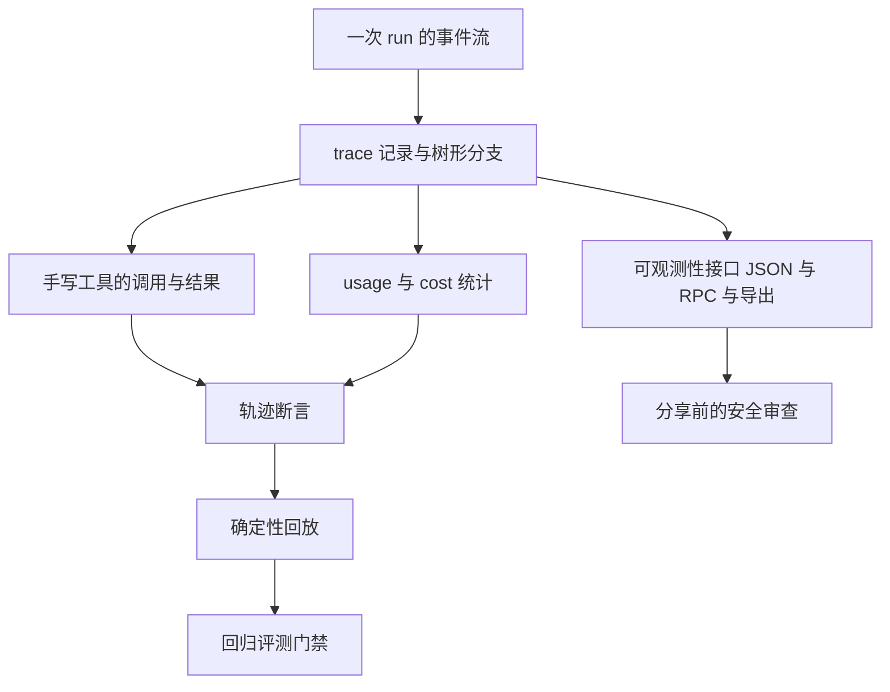
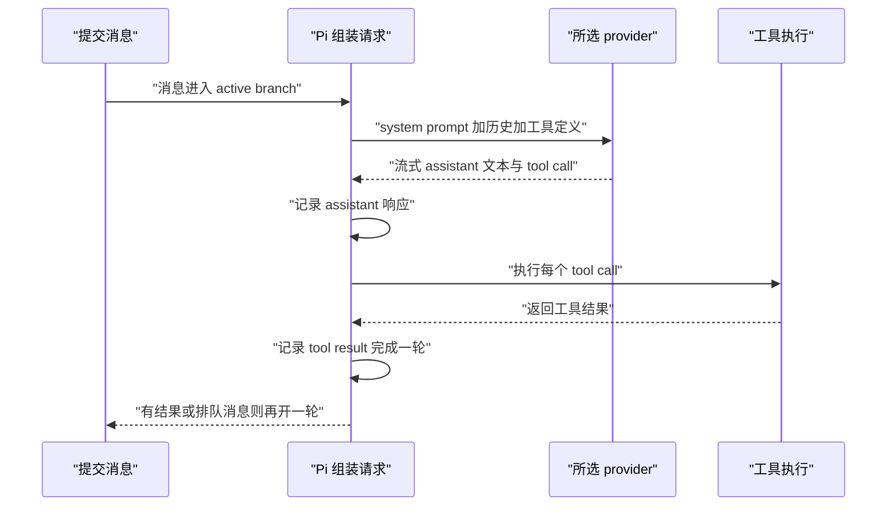
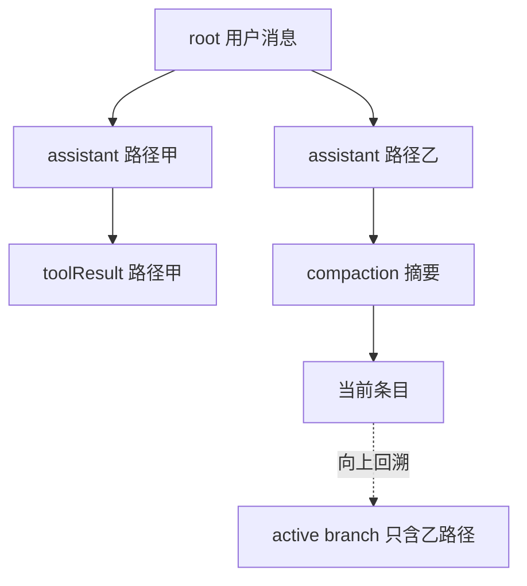
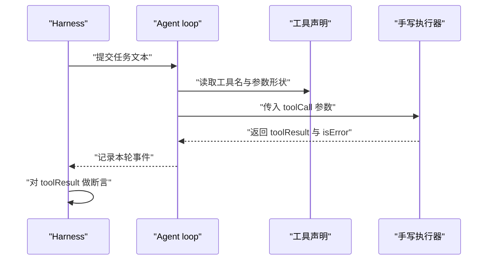
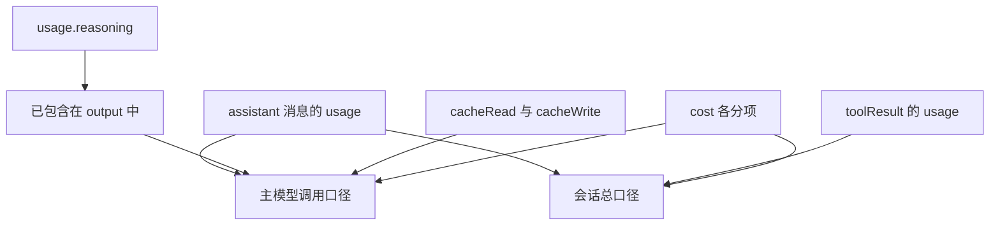
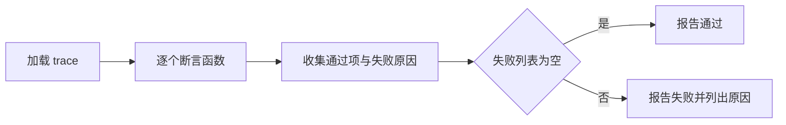
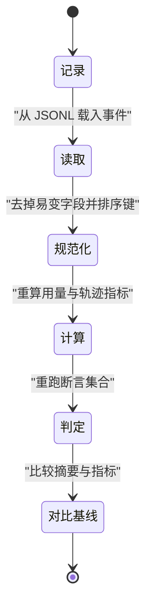
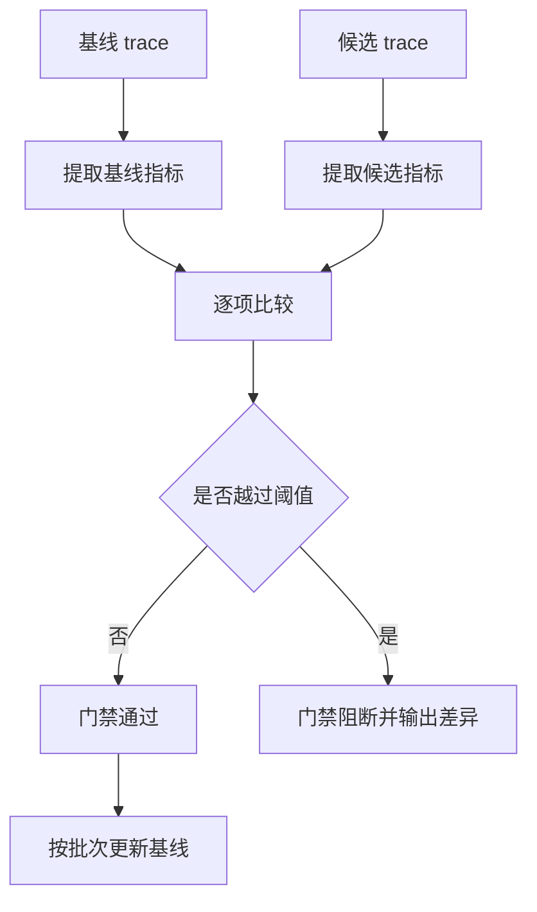
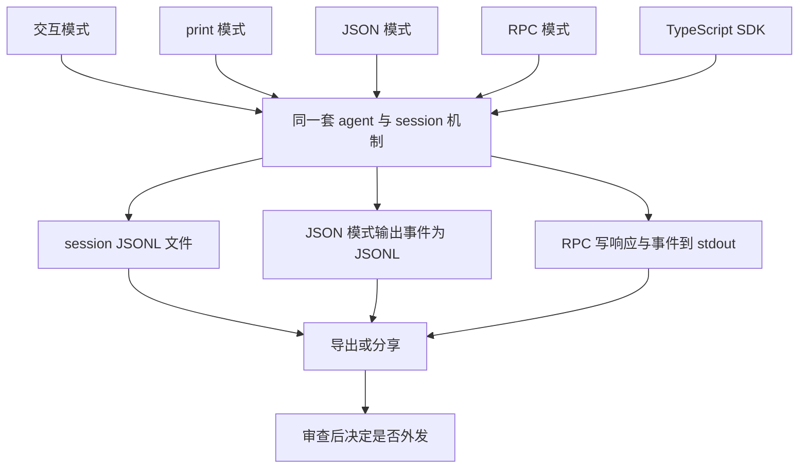

# Harness 评测与可观测性

!!! abstract "学完这一页你能"
    - 复述 pi 的 agent loop，并给一次 run 写出带父指针的事件流记录。
    - 从 session 树里还原 active branch，说明下一次模型请求的历史从哪里来。
    - 按 Usage 字段口径算出主模型调用与会话总成本，不重复计 reasoning。
    - 手写一个可控工具，围绕它的调用结果写轨迹断言，再做确定性回放与回归门禁。

## 0. 知识地图



建议读法：先读第 1 节和第 2 节，把事件流与 trace 结构对齐，这是后面全部内容的地基。第 3 节到第 5 节把 trace 变成可断言的实验。第 6 节到第 8 节把实验变成可重复的门禁，并补上输出接口与安全边界。

!!! note "术语：Harness"
    Harness 指包在被测对象外面、负责准备输入、驱动运行、收集记录、判定成败的那层代码。例：你写一个脚本启动一次 agent run，把 JSONL 事件存下来再断言，这个脚本就是 harness。

## 1. 事件流：一次 run 里发生了什么

**先想一个问题**

你跑完一次 agent，想知道它一共几轮、第几轮调了哪个工具、哪一轮报错。这些信息不在最终回答里。你从哪里拿？

**心智模型**

!!! tip "心智模型"
    一句话模型：事件流是按发生顺序追加、每条都带父指针的记录序列。日常类比：行车记录仪按时间写文件，回看能定位到具体秒。类比不成立的地方：记录里没有画面，只有结构化字段，而且分叉后的记录会长成一棵树。

**图解**



解读：

1. 提交的消息先进入 active branch，它成为下一轮请求历史的一部分。
2. 组装请求的输入是 system prompt、active branch、可用工具与模型设置。
3. provider 流式返回 assistant 内容，内容可以是文本、tool call，或两者都有。
4. Pi 先记录这条响应，再执行其中的 tool call。
5. 每个 tool call 的结果都记录下来，一轮到此结束。
6. 只要还有 tool result 或排队消息要模型处理，就再开一轮；否则 run 结束。

**一步一步来**

第 1 步：给事件定最小字段。这一步要做什么：确定字段名与父链规则，让后续统计都建立在同一套记录上。

!!! note "术语：JSONL"
    JSONL 指每行一个完整 JSON 对象的文本格式。例：pi 的 session 文件就是 JSONL，每行是一个树条目。

!!! note "提醒"
    pi 的 session 条目基类字段（父引用的确切字段名、ISO 8601 时间戳格式）资料只给出结论，具体形状资料未覆盖，需核对官方文档：Session Format 的 entry base 一节。下面字段是本页为教学自建的简化版。

```js
// 本页自建字段: 只保留做断言必需的项
function makeEvent(parent, type, payload) {
  return {
    id: payload.id,               // 本条记录的唯一标识
    parentId: parent?.id ?? null, // 指向上一条, null 表示分支起点
    type,                         // user 或 assistant 或 toolResult
    timestamp: payload.timestamp, // 毫秒时间戳, 便于排序
    ...payload.extra,             // 类型专属字段, 例如 toolName
  };
}
```

**这段代码在做什么**

- 每条记录只有一个父指针，从任一条记录向上走能唯一还原出一条路径。
- 起点记录的 parentId 是 null，对应分支起点。
- type 决定这条记录后续按哪种消息类型解析。
- timestamp 用毫秒数，排序与差值计算都不需要额外解析文本。
- 类型专属字段用展开合并，避免为每种事件单独写结构。

第 2 步：实现追加与父链校验。

```js
// 追加: 不传父节点时接到当前最后一条后面
function append(events, type, extra = {}) {
  const parent = events.at(-1) ?? null;   // 取当前末尾作为父节点
  const event = makeEvent(parent, type, {  // 复用上一步的构造器
    id: `e${events.length + 1}`,           // 递增编号, 便于阅读
    timestamp: 1000 + events.length,       // 演示用固定步长
    extra,
  });
  events.push(event);                      // 追加到序列末尾
  return event;
}

// 校验: 除根节点外, parentId 必须指向已出现的 id
function checkParents(events) {
  const ids = new Set(events.map((e) => e.id)); // 收集全部 id
  return events.every((e) => e.parentId === null || ids.has(e.parentId));
}
```

**这段代码在做什么**

- append 只做两件事：找父节点、追加记录。
- id 用序号生成，让日志便于阅读；真实实现可用 UUID，需核对官方文档：session 条目的 id 生成规则。
- checkParents 用 Set 做 O(n) 校验，一次找出所有悬空父指针。
- 父链一旦断裂，后续按分支还原历史的步骤会静默丢记录，所以先做这一步。

第 3 步：把一次 turn 写成事件。

```js
const events = [];                                    // 空事件流
append(events, "user", { text: "统计 src 目录行数" });   // 用户提交消息
append(events, "assistant", {                          // assistant 响应
  stopReason: "toolUse",                               // 本条以调用工具结束
  toolName: "countLines",                              // 一次 tool call
});
append(events, "toolResult", {                         // 工具结果
  toolName: "countLines",                              // 对应哪个工具
  isError: false,                                      // 是否出错
});
console.log(events.map((e) => e.type).join(" -> "));
```

**这段代码在做什么**

- 第一条记录是用户消息，parentId 为 null，它是分支起点。
- assistant 记录带上 stopReason，取值来自官方文档列出的 pending、stop、length、toolUse、error、aborted、deferred。
- toolUse 表示这一轮以工具调用结束，后面必须跟一条工具结果。
- isError 是布尔值，失败也要记录成一条结果，而不是抛异常。

**运行结果**

```text
user -> assistant -> toolResult
```

**动手验证**

目的：把三步合成一个脚本，验证父链完整、首条是用户消息、toolUse 后面跟着工具结果。

```js
import assert from "node:assert/strict"; // 只用 Node 内置断言, 无第三方依赖

function makeEvent(parent, type, payload) {
  return { id: payload.id, parentId: parent?.id ?? null, type, timestamp: payload.timestamp, ...payload.extra };
}
function append(events, type, extra = {}) {
  const parent = events.at(-1) ?? null;
  const event = makeEvent(parent, type, { id: `e${events.length + 1}`, timestamp: 1000 + events.length, extra });
  events.push(event);
  return event;
}

const events = [];
append(events, "user", { text: "统计 src 目录行数" });
append(events, "assistant", { stopReason: "toolUse", toolName: "countLines" });
append(events, "toolResult", { toolName: "countLines", isError: false });

const ids = new Set(events.map((e) => e.id));
assert.equal(events[0].type, "user");                                      // 首条是用户消息
assert.ok(events.every((e) => e.parentId === null || ids.has(e.parentId))); // 父链完整
const next = events[events.findIndex((e) => e.stopReason === "toolUse") + 1];
assert.equal(next.type, "toolResult");                                     // toolUse 后必有结果
assert.deepEqual(events.map((e) => e.type), ["user", "assistant", "toolResult"]);

console.log("事件数", events.length);
console.log("类型序列", events.map((e) => e.type).join(" -> "));
console.log("父链完整 ok");
```

**运行结果**

```text
事件数 3
类型序列 user -> assistant -> toolResult
父链完整 ok
```

**常见坑**

| 现象 | 原因 | 怎么修 |
|---|---|---|
| 还原历史时少了几条 | 父链断裂，向上走提前终止 | 落盘前跑一次父链校验，发现悬空就报错 |
| 断言时拿不到工具名 | 只记了 assistant 文本，没记 tool call | 把 toolName 与 stopReason 一起写进记录 |
| 时间戳差值算出负数 | 混用 ISO 字符串与毫秒数 | 记录统一存毫秒，展示层再格式化 |

**小结**

- 事件流是追加序列，每条一个父指针，这是后面所有能力的地基。
- 一轮 turn 的形状是：assistant 响应，然后每个 tool call 对应一条结果。
- 先写校验再写统计，否则错数据会一路传到判定环节。

## 2. trace 结构：树、分支与 active branch

**先想一个问题**

你从某条用户消息重新编辑提交，生成了另一条路径。旧的记录被删了吗？下一次请求会把两条路径都发给模型吗？

**心智模型**

!!! tip "心智模型"
    一句话模型：trace 是一棵树，active branch 是从根到当前节点的一条路径，只有这条路径构成模型历史。日常类比：版本控制里的提交图，当前指针决定工作区内容。类比不成立的地方：这棵树没有合并操作，分支是并列的路径，切换只改当前指针。

**图解**



解读：

1. 根节点是分支起点，两条路径共享它。
2. 路径甲停在 toolResult，路径乙继续往下走。
3. 当前条目是树的末端指针，它指向路径乙的最后一条。
4. 从当前条目沿父指针向上走，得到 active branch，也就是路径乙。
5. 路径甲仍然留在同一个文件里，切换不删除任何条目。
6. 模型只接收 active branch 转换出的历史，路径甲不参与这次请求。

**一步一步来**

第 1 步：把 JSONL 文本读成条目，并建立 id 到条目的索引。这一步要做什么：让"按 id 找父节点"变成常数时间查找。

```js
import assert from "node:assert/strict";

const jsonl = [
  '{"id":"a1","parentId":null,"type":"user"}',        // 根, 两条路径共享
  '{"id":"a2","parentId":"a1","type":"assistant"}',   // 路径甲
  '{"id":"b2","parentId":"a1","type":"assistant"}',   // 路径乙
  '{"id":"b3","parentId":"b2","type":"compaction"}',  // 路径乙上的压缩摘要
].join("\n");

const entries = jsonl.split("\n").filter(Boolean).map((line) => JSON.parse(line));
const byId = new Map(entries.map((e) => [e.id, e])); // id 到条目的索引
```

**这段代码在做什么**

- 过滤空行，避免 JSON.parse 抛错。
- 每行解析成一个对象，字段只有 id、parentId、type。
- byId 用 Map 建索引，向上回溯时不做线性搜索。
- 索引建立后，树的形状完全由 parentId 决定。

第 2 步：从当前条目回溯出 active branch。这一步要做什么：把"当前指针"翻译成从根到当前的有序路径。

```js
function activeBranch(currentId) {
  const path = [];
  let node = byId.get(currentId);   // 从当前条目开始
  while (node) {                    // 沿父指针向上走
    path.unshift(node);             // 头插, 得到从根到当前的顺序
    node = node.parentId === null ? null : byId.get(node.parentId);
  }
  return path;
}
```

**这段代码在做什么**

- 循环条件是 node 存在，走到根时 parentId 为 null，循环结束。
- unshift 让结果顺序为根到当前，与模型历史的顺序一致。
- 如果某个 parentId 找不到，byId.get 返回 undefined，循环结束，路径会比预期短，这属于要报错的异常情况。

第 3 步：只用 active branch 组装历史，并确认其他分支还在。

```js
const branch = activeBranch("b3");   // 当前条目是 b3
assert.deepEqual(branch.map((e) => e.id), ["a1", "b2", "b3"]); // 历史只含乙路径
```

**这段代码在做什么**

- 断言路径首元素是根 a1。
- 断言 a2 不在路径里，说明历史来自 active branch。
- 断言 entries 长度仍为 4，路径甲的条目还在文件里。

**动手验证**

目的：合成完整脚本，验证 active branch 只含一条路径，同时树里保留另一条路径。

```js
import assert from "node:assert/strict"; // 无第三方依赖

const jsonl = [
  '{"id":"a1","parentId":null,"type":"user"}',
  '{"id":"a2","parentId":"a1","type":"assistant"}',
  '{"id":"b2","parentId":"a1","type":"assistant"}',
  '{"id":"b3","parentId":"b2","type":"compaction"}',
].join("\n");

const entries = jsonl.split("\n").filter(Boolean).map((line) => JSON.parse(line));
const byId = new Map(entries.map((e) => [e.id, e]));

function activeBranch(currentId) {
  const path = [];
  let node = byId.get(currentId);
  while (node) {
    path.unshift(node);
    node = node.parentId === null ? null : byId.get(node.parentId);
  }
  return path;
}

const branch = activeBranch("b3");
assert.deepEqual(branch.map((e) => e.id), ["a1", "b2", "b3"]);
assert.equal(entries.length, 4);   // 树里仍保留路径甲的 a2
assert.equal(branch.length, 3);    // 但请求历史只用 active branch
assert.ok(!branch.some((e) => e.id === "a2"));

console.log("树条目", entries.length);
console.log("active branch", branch.map((e) => e.id).join(" -> "));
```

**运行结果**

```text
树条目 4
active branch a1 -> b2 -> b3
```

**常见坑**

| 现象 | 原因 | 怎么修 |
|---|---|---|
| 请求历史里混进别的分支 | 直接遍历 JSONL 全部条目 | 先算 active branch，再转换历史 |
| 压缩后老内容又出现 | 把 compaction 摘要当成删除标记 | 摘要替换后续请求里的老消息，原条目仍在树里 |
| 排序结果不稳定 | 混用 ISO 8601 与 Unix 毫秒时间戳 | session 条目按 ISO 8601，消息按毫秒，转换时显式标明单位 |

**小结**

- session 是树，active branch 是其中一条路径，当前条目决定用哪条。
- 继续、分叉、克隆都会保留原有条目，切换不会丢记录。
- 统计与断言要先落到具体一条路径上，否则口径不清。

## 3. 手写工具：给评测一个可控的抓手

**先想一个问题**

你想断言"模型确实调用了统计行数的工具，参数是 src"。等模型自己说，你拿到的是自然语言，不是可判定的事实。谁能提供这个事实？

**心智模型**

!!! tip "心智模型"
    一句话模型：手写工具是你完全掌控输入输出的那部分执行代码，它把不确定的模型行为落成确定的结构化结果。日常类比：考试时把不透明的计算器换成你自己写的查表函数。类比不成立的地方：工具执行在 Pi 进程里，用的是该进程的操作系统权限，你能控制返回值，但控制不了它对文件系统的真实改动。

**图解**



解读：

1. harness 只提供任务文本，不提供答案。
2. agent loop 从工具声明里读到名字与参数形状，决定要不要调用。
3. 调用发生时，参数进入你自己的执行器，这是确定性的入口。
4. 执行器返回工具结果，成功与失败都用一个布尔标记。
5. agent loop 把这一轮事件追加进记录。
6. harness 对记录做断言，判断轨迹是否符合预期。

**一步一步来**

第 1 步：把工具声明与执行器分开。这一步要做什么：声明只描述对外契约，执行器只负责计算。

```js
// 工具声明: 只描述名字与参数形状, 不含实现
const tools = [
  { name: "countLines", description: "统计文本行数", parameters: { text: "string" } },
  { name: "countLinesBroken", description: "参数缺失时报错", parameters: { text: "string" } },
];
```

**这段代码在做什么**

- name 是断言里要匹配的稳定字符串。
- description 供模型理解用途，会被写进请求。
- parameters 描述参数形状，不含业务逻辑。
- 声明与执行器分开后，替换执行器不影响对外契约。

!!! note "提醒"
    内置工具的声明字段名与注册方式，资料未覆盖，需核对官方文档：Extensions 一节里工具注册的相关章节。

第 2 步：写执行器，返回 ToolResultMessage 形状。这一步要做什么：把参数映射到结果对象，字段名与官方消息定义对齐。

```js
// 执行器: 输入 toolCall, 返回消息形状的结果对象
function execute(toolCall) {
  const base = {
    role: "toolResult",             // 官方定义的消息角色
    toolCallId: toolCall.id,        // 指回对应的 tool call
    toolName: toolCall.name,        // 工具名, 断言会用到
    timestamp: 1,                   // 演示用固定毫秒值
  };
  if (toolCall.name === "countLines") {
    const text = String(toolCall.arguments.text ?? "");
    return { ...base, content: [{ type: "text", text: String(text.split("\n").length) }], isError: false };
  }
  return { ...base, content: [{ type: "text", text: "缺少 text 参数" }], isError: true };
}
```

**这段代码在做什么**

- role 是 toolResult，与官方定义的工具结果消息角色一致。
- toolCallId 把结果与调用配对，多工具并发时靠它对齐。
- content 是内容块数组，这里用一条文本块。
- 失败路径返回 isError 为 true，而不是抛异常。
- timestamp 演示用固定值，真实记录用毫秒时间戳。

第 3 步：跑两种调用，观察结果差异。

```js
const ok = execute({ id: "t1", name: "countLines", arguments: { text: "a\nb\nc" } });
const bad = execute({ id: "t2", name: "countLinesBroken", arguments: {} });
console.log("成功", ok.isError, ok.content[0].text);
console.log("失败", bad.isError, bad.content[0].text);
```

**运行结果**

```text
成功 false 3
失败 true 缺少 text 参数
```

**动手验证**

目的：合成完整脚本，断言成功调用与失败调用都能被记录下来。

```js
import assert from "node:assert/strict"; // 无第三方依赖

function execute(toolCall) {
  const base = { role: "toolResult", toolCallId: toolCall.id, toolName: toolCall.name, timestamp: 1 };
  if (toolCall.name === "countLines") {
    const text = String(toolCall.arguments.text ?? "");
    return { ...base, content: [{ type: "text", text: String(text.split("\n").length) }], isError: false };
  }
  return { ...base, content: [{ type: "text", text: "缺少 text 参数" }], isError: true };
}

const ok = execute({ id: "t1", name: "countLines", arguments: { text: "a\nb\nc" } });
const bad = execute({ id: "t2", name: "countLinesBroken", arguments: {} });

assert.equal(ok.role, "toolResult");       // 消息角色对齐官方定义
assert.equal(ok.toolCallId, "t1");         // 结果能配回调用
assert.equal(ok.isError, false);           // 成功路径
assert.equal(ok.content[0].text, "3");     // 三行文本
assert.equal(bad.isError, true);           // 失败也落成一条记录
assert.equal(bad.toolCallId, "t2");        // 失败结果的配对关系仍在

console.log("成功结果", ok.content[0].text, "成功标记", ok.isError);
console.log("失败结果", bad.content[0].text, "失败标记", bad.isError);
```

**运行结果**

```text
成功结果 3 成功标记 false
失败结果 缺少 text 参数 失败标记 true
```

**常见坑**

| 现象 | 原因 | 怎么修 |
|---|---|---|
| 一轮结束后事件流断掉 | 执行器抛异常，调用方没收到结果 | 把可预期失败改成 isError 为 true 的结果 |
| 断言配不上调用 | 结果的 toolCallId 与调用的 id 不一致 | 生成结果时强制复制调用里的 id |
| 本地与 CI 结果不同 | 工具读了真实文件系统或网络 | 评测用版本里只读传入参数，不碰外部状态 |

**小结**

- 手写工具的价值是把不确定的模型输出落成结构化结果。
- 声明与执行器分开，契约稳定，实现对换。
- 失败也是一种结果，必须记录下来，不要中断事件流。

## 4. 成本统计：从 usage 到会话口径

**先想一个问题**

一次会话跑了 40 轮，还夹着工具内部的嵌套模型调用。你的成本数字从哪里来？为什么总数会和某一轮相加的结果不一致？

**心智模型**

!!! tip "心智模型"
    一句话模型：usage 是计量表读数，cost 是按单价折算出的金额，两者都随每条 assistant 消息一起记录。日常类比：水表与账单，水表记用量，账单记金额。类比不成立的地方：单价不在 usage 里，usage 只带折算后的 cost 数字，单价规则需核对官方文档：Message Types 的 Usage 一节。

**图解**



解读：

1. assistant 消息始终带 usage，这是主模型调用口径的唯一来源。
2. toolResult 可以带 usage，前提是工具内部做了嵌套模型调用。
3. 工具结果的 usage 计入整个会话的统计，不算进主模型调用。
4. reasoning 出现在 usage 里时，已经包含在 output 中，再加一次就重复。
5. cacheRead 与 cacheWrite 是独立的字段，漏加会让总数偏小。
6. cost 有 input、output、cacheRead、cacheWrite、total 五个分项，total 单独累加。

**一步一步来**

第 1 步：写一个累加器，字段与官方 Usage 对齐。这一步要做什么：把"逐条相加"写成一处代码，避免各处口径不同。

```js
// 空累加器: 字段与官方 Usage 的分项逐一对应
function emptyUsage() {
  return {
    input: 0, output: 0, cacheRead: 0, cacheWrite: 0, totalTokens: 0,
    cost: { input: 0, output: 0, cacheRead: 0, cacheWrite: 0, total: 0 },
  };
}
```

**这段代码在做什么**

- 字段名直接采用官方定义，后续对账不需要翻译。
- cost 是嵌套对象，因为官方定义里 cost 自带五个分项。
- cacheWrite1h 是可选的子集字段，按需扩展，不放进默认累加器。

第 2 步：把单条 usage 加进累加器。这一步要做什么：明确哪些字段加、哪些不加。

```js
function addUsage(sum, usage) {
  sum.input += usage.input;          // 输入 token
  sum.output += usage.output;        // 输出 token, 已含 reasoning
  sum.cacheRead += usage.cacheRead;  // 缓存读取
  sum.cacheWrite += usage.cacheWrite;// 缓存写入
  sum.totalTokens += usage.totalTokens;
  sum.cost.input += usage.cost.input;
  sum.cost.output += usage.cost.output;
  sum.cost.cacheRead += usage.cost.cacheRead;
  sum.cost.cacheWrite += usage.cost.cacheWrite;
  sum.cost.total += usage.cost.total;
  return sum;
}
```

**这段代码在做什么**

- reasoning 不出现在这里，因为官方定义说它已经包含在 output 中。
- 缓存两项单独累加，不能靠 totalTokens 推出来。
- cost 分项逐个加，便于后续按分项对账。
- 返回 sum 方便链式调用。

第 3 步：分两个口径统计。

```js
const main = addUsage(emptyUsage(), assistant1);   // 主模型调用口径
const session = addUsage(emptyUsage(), assistant1); // 会话口径从同一份起步
addUsage(session, toolNested);                      // 只往会话口径加工具用量
```

**这段代码在做什么**

- 主模型调用口径只吃 assistant 消息的 usage。
- 会话口径吃 assistant 与 toolResult 两类 usage。
- 两个口径都从空累加器起步，互不污染。
- 口径差异写成代码，比写在文档里更难出错。

**动手验证**

目的：合成完整脚本，验证 reasoning 不被重复计算，工具用量只进入会话口径。

```js
import assert from "node:assert/strict"; // 无第三方依赖

function emptyUsage() {
  return { input: 0, output: 0, cacheRead: 0, cacheWrite: 0, totalTokens: 0,
    cost: { input: 0, output: 0, cacheRead: 0, cacheWrite: 0, total: 0 } };
}
function addUsage(sum, usage) {
  sum.input += usage.input;
  sum.output += usage.output;          // 已含 reasoning, 不再叠加
  sum.cacheRead += usage.cacheRead;
  sum.cacheWrite += usage.cacheWrite;
  sum.totalTokens += usage.totalTokens;
  sum.cost.input += usage.cost.input;
  sum.cost.output += usage.cost.output;
  sum.cost.cacheRead += usage.cost.cacheRead;
  sum.cost.cacheWrite += usage.cost.cacheWrite;
  sum.cost.total += usage.cost.total;
  return sum;
}

const assistant1 = { input: 100, output: 40, cacheRead: 10, cacheWrite: 5, reasoning: 12,
  totalTokens: 155, cost: { input: 0.01, output: 0.02, cacheRead: 0.001, cacheWrite: 0.002, total: 0.033 } };
const toolNested = { input: 20, output: 8, cacheRead: 0, cacheWrite: 0,
  totalTokens: 28, cost: { input: 0.002, output: 0.004, cacheRead: 0, cacheWrite: 0, total: 0.006 } };

const main = addUsage(emptyUsage(), assistant1);
const session = addUsage(emptyUsage(), assistant1);
addUsage(session, toolNested);

assert.equal(main.output, 40);            // reasoning 只算一次
assert.equal(main.totalTokens, 155);      // 主模型调用口径
assert.equal(session.totalTokens, 183);   // 会话口径含嵌套用量
assert.ok(Math.abs(session.cost.total - 0.039) < 1e-9); // 浮点比较留误差

console.log("主调用 tokens", main.totalTokens, "会话 tokens", session.totalTokens);
console.log("会话 cost total", session.cost.total);
```

**运行结果**

```text
主调用 tokens 155 会话 tokens 183
会话 cost total 0.039
```

**常见坑**

| 现象 | 原因 | 怎么修 |
|---|---|---|
| 输出用量偏大 | 把 reasoning 又加到 output 上 | 只累加 output，reasoning 只用于展示 |
| 总数与分项不符 | 漏加 cacheRead 或 cacheWrite | 每个分项各写一行累加，加法与字段数量一致 |
| 主调用成本虚高 | 把工具嵌套用量算进主口径 | 两个累加器分开，工具用量只进会话口径 |

**小结**

- assistant 消息始终带 usage，主模型口径只看它。
- toolResult 的 usage 反映工具内部嵌套模型调用，只进会话口径。
- 写法上把口径固定成函数，比每次手算稳。

## 5. 轨迹断言：把观察写成可执行条件

**先想一个问题**

你改了 system prompt，一条工具调用从两次变成五次。靠眼睛看日志，改一次要重看一小时。怎么让机器替你看？

**心智模型**

!!! tip "心智模型"
    一句话模型：断言把"我期望观察到什么"写成返回通过或失败原因的函数。日常类比：质检清单，逐项打勾并写明不通过的理由。类比不成立的地方：清单能判定形状与口径，判定不了回答质量，质量判断要另设标准，需核对官方文档：是否有官方评测章节。

**图解**



解读：

1. 加载 trace，先固定它是哪条路径、哪个口径。
2. 每条断言是一个函数，输入 trace，输出 null 或失败原因字符串。
3. 所有断言都跑完，失败原因进入同一个列表。
4. 列表为空说明全部通过。
5. 列表非空时报告里带上断言名字与原因，便于定位。

**一步一步来**

第 1 步：定义断言集合。这一步要做什么：把期望写成函数，函数返回 null 表示通过。

```js
// 断言集合: 每条是 名字 加 判定函数
const checks = [
  ["首个事件是用户消息", (t) => (t[0]?.type === "user" ? null : "首条不是用户消息")],
  ["存在工具调用", (t) => (t.some((e) => e.type === "assistant" && e.stopReason === "toolUse") ? null : "没有工具调用")],
  ["没有工具错误", (t) => (t.filter((e) => e.type === "toolResult" && e.isError).length === 0 ? null : "存在错误结果")],
  ["终态是 stop", (t) => (t.at(-1)?.stopReason === "stop" ? null : "最后一条不是 stop")],
];
```

**这段代码在做什么**

- 名字会出现在报告里，断言失败时人看到的是这句中文。
- 返回 null 表示通过，返回字符串表示失败原因。
- 第一条检查事件顺序，第二条检查发生过工具调用。
- 第三条检查错误数量，第四条检查终态。

第 2 步：跑全部断言并收集失败。这一步要做什么：不要在第一处失败就停下，否则一轮改不完。

```js
function run(trace) {
  const failures = [];
  for (const [name, check] of checks) {
    const reason = check(trace);   // 判定函数不抛异常
    if (reason) failures.push(`${name}: ${reason}`); // 记录原因
  }
  return failures;                 // 返回全部失败, 空数组表示通过
}
```

**这段代码在做什么**

- failures 一次收集全部问题，改一轮就能看到所有待修项。
- 原因字符串带断言名，报告可直接用。
- 若某个断言内部真的抛异常，应在外层捕获，另行设计，需核对官方文档：是否有推荐写法。

第 3 步：用变异验证断言真的会失败。

```js
const mutated = trace.map((e) => ({ ...e })); // 浅拷贝一份
mutated[2].isError = true;                    // 手工把工具结果改成失败
console.log("基线失败数", run(trace).length, "变异失败数", run(mutated).length);
```

**这段代码在做什么**

- 如果断言不会对变异报警，说明断言写得太松，等于没有。
- 浅拷贝避免改到基线数据。
- 变异只改一个字段，失败数应为 1。

**动手验证**

目的：合成完整脚本，验证基线通过、变异被捕获。

```js
import assert from "node:assert/strict"; // 无第三方依赖

const trace = [
  { type: "user", text: "跑测试" },
  { type: "assistant", stopReason: "toolUse", toolName: "runTests" },
  { type: "toolResult", toolName: "runTests", isError: false,
    usage: { totalTokens: 10, cost: { total: 0.001 } } },
  { type: "assistant", stopReason: "stop",
    usage: { totalTokens: 50, cost: { total: 0.01 } } },
];

const checks = [
  ["首个事件是用户消息", (t) => (t[0]?.type === "user" ? null : "首条不是用户消息")],
  ["存在工具调用", (t) => (t.some((e) => e.type === "assistant" && e.stopReason === "toolUse") ? null : "没有工具调用")],
  ["没有工具错误", (t) => (t.filter((e) => e.type === "toolResult" && e.isError).length === 0 ? null : "存在错误结果")],
  ["终态是 stop", (t) => (t.at(-1)?.stopReason === "stop" ? null : "最后一条不是 stop")],
];

function run(t) {
  const failures = [];
  for (const [name, check] of checks) {
    const reason = check(t);
    if (reason) failures.push(`${name}: ${reason}`);
  }
  return failures;
}

assert.deepEqual(run(trace), []);                 // 基线全部通过
const mutated = trace.map((e) => ({ ...e }));     // 拷贝一份做变异
mutated[2].isError = true;                        // 只改一个字段
assert.equal(run(mutated).length, 1);             // 恰好触发一条断言
assert.match(run(mutated)[0], /没有工具错误/);      // 失败原因指向正确断言

console.log("基线失败数", run(trace).length);
console.log("变异失败数", run(mutated).length, run(mutated)[0]);
```

**运行结果**

```text
基线失败数 0
变异失败数 1 没有工具错误: 存在错误结果
```

**常见坑**

| 现象 | 原因 | 怎么修 |
|---|---|---|
| 报告只显示一个问题 | 断言内部直接抛异常 | 判定函数返回原因字符串，外层统一收集 |
| 断言偶尔失败 | 断言依赖时间戳或随机顺序 | 断言只看类型序列、终态与统计口径 |
| 断言通过但结果不对 | 只断言事件条数，没有断言内容 | 增加对 toolName 与结果文本的断言 |

**小结**

- 断言是可执行条件，返回 null 或原因字符串。
- 一次收集全部失败，改一轮看全部问题。
- 写完全部断言后，用变异验证断言真的会报警。

## 6. 确定性回放：忽略易变字段再比较

**先想一个问题**

同样的输入再跑一次，模型输出不会一样。那么"回放"到底回放什么？如果每次结果都不同，回归还怎么做？

**心智模型**

!!! tip "心智模型"
    一句话模型：回放是把已记录的事件重新解释一遍，用它重新算出统计与判定，不重新请求模型。日常类比：把录像重播一遍算出行车时长。类比不成立的地方：录像不含未来，回放也产生不了新的模型输出；要产生新输出就得真跑一次。

!!! note "术语：确定性回放"
    确定性回放指对同一份记录做同样的处理，得到同样的结果。例：同一份 trace 两次算出的摘要哈希一致，就说明回放路径是确定的。

**图解**



解读：

1. 记录阶段把事件写进 session 的 JSONL 文件，这一步只发生一次。
2. 读取阶段把每行解析成对象，丢弃空行。
3. 规范化阶段去掉时间戳这类易变字段，并把对象的键排序。
4. 计算阶段重新累加用量，重新数轮次与工具调用。
5. 判定阶段重跑同一组断言。
6. 对比基线时比较摘要与指标，两者都一致才算通过。

**一步一步来**

第 1 步：列出易变字段。这一步要做什么：区分"会随运行环境变"的字段与"反映内容"的字段。

```js
// 回放时应忽略的字段: 它们随运行时刻或 provider 变化
const VOLATILE = ["timestamp", "responseId", "rawStopReason", "providerThinkingLevel"];
```

**这段代码在做什么**

- timestamp 是记录时刻，两次运行一定不同。
- responseId 是 provider 侧的响应标识，每次请求都新生成。
- rawStopReason 保留 provider 原始细节，可能带运行时信息。
- providerThinkingLevel 是运行时设置，不是内容。

第 2 步：写规范化函数。这一步要做什么：递归处理对象与数组，去掉易变字段，并按字典序排键。

```js
function normalize(value) {
  if (Array.isArray(value)) return value.map(normalize);   // 数组逐项处理
  if (value && typeof value === "object") {
    const out = {};
    for (const key of Object.keys(value).sort()) {         // 键排序消除插入顺序影响
      if (VOLATILE.includes(key)) continue;                // 跳过易变字段
      out[key] = normalize(value[key]);
    }
    return out;
  }
  return value;                                            // 基本类型原样返回
}
```

**这段代码在做什么**

- 数组保序处理，因为事件顺序本身是信息。
- 对象按键排序，让两个内容相同、写入顺序不同的对象规范化后一致。
- 易变字段直接跳过，不进入摘要计算。
- 基本类型原样返回，函数对任意深度的结构都能用。

!!! note "提醒"
    AssistantMessage 里 stopReason 为 pending 的条目是流式过程中的部分消息，官方说明它不会持久化到 session JSONL。因此回放时不需要处理 pending，终态只有 stop、length、toolUse、error、aborted、deferred。

第 3 步：生成摘要并比较。

```js
import { createHash } from "node:crypto";

function digest(trace) {
  const text = JSON.stringify(normalize(trace));            // 规范化后序列化
  return createHash("sha256").update(text).digest("hex").slice(0, 12); // 取前 12 位
}
```

**这段代码在做什么**

- JSON.stringify 前必须先规范化，否则键顺序会影响结果。
- sha256 输出十六进制串，取前 12 位足够区分内容差异。
- 摘要相同说明规范化后的内容相同，回放路径一致。

**动手验证**

目的：合成完整脚本，验证易变字段不同而摘要相同，内容不同则摘要不同。

```js
import assert from "node:assert/strict";
import { createHash } from "node:crypto"; // 只用 Node 内置模块

const VOLATILE = ["timestamp", "responseId", "rawStopReason", "providerThinkingLevel"];

function normalize(value) {
  if (Array.isArray(value)) return value.map(normalize);
  if (value && typeof value === "object") {
    const out = {};
    for (const key of Object.keys(value).sort()) {
      if (VOLATILE.includes(key)) continue;
      out[key] = normalize(value[key]);
    }
    return out;
  }
  return value;
}
function digest(trace) {
  return createHash("sha256").update(JSON.stringify(normalize(trace))).digest("hex").slice(0, 12);
}

const recorded = [
  { type: "assistant", stopReason: "stop", timestamp: 1700000000000, responseId: "r-1",
    usage: { totalTokens: 50, cost: { total: 0.01 } } },
];
const again = [
  { type: "assistant", stopReason: "stop", timestamp: 1800000000000, responseId: "r-2",
    usage: { totalTokens: 50, cost: { total: 0.01 } } },
];
assert.equal(digest(recorded), digest(again));  // 易变字段不同, 摘要仍相同

const changed = [{ ...recorded[0], usage: { totalTokens: 51, cost: { total: 0.01 } } }];
assert.notEqual(digest(recorded), digest(changed)); // 内容变化, 摘要变化

console.log("回放摘要", digest(recorded));
console.log("变异后摘要", digest(changed));
```

**运行结果**

```text
回放摘要 十二位十六进制字符
变异后摘要 另一个十二位十六进制字符
```

两个值都是定长十六进制字符串，因为 sha256 是确定算法；只要两次摘要不相等，说明回放路径对内容变化敏感。具体字符值本页不预置，请以你本机运行为准。

**常见坑**

| 现象 | 原因 | 怎么修 |
|---|---|---|
| 同一份记录摘要不同 | 键顺序或时间戳进入摘要 | 规范化时去掉易变字段并排序键 |
| 回放时找不到终态 | 把 pending 当成了需要处理的记录 | 官方说明 pending 不持久化，按终态字段判定 |
| 回放结果不可复现 | 回放过程中重新请求了模型 | 回放只读记录，重新请求属于另一次 run |

**小结**

- 回放只重新解释记录，不重新请求模型。
- 规范化先去掉易变字段，再排序键，摘要才有可比性。
- pending 不入库，回放只需要处理终态。

## 7. 回归评测：把断言组织成门禁

**先想一个问题**

你改了 system prompt，想知道有没有变差。只跑一次看结果无法说明问题。你需要一份基线，和一套阻断规则。

**心智模型**

!!! tip "心智模型"
    一句话模型：门禁等于基线指标加阈值加阻断规则。日常类比：体检报告与上次对比。类比不成立的地方：体检指标是绝对值，agent 指标依赖输入集合，换了输入集合就不能直接比。

**图解**



解读：

1. 基线 trace 是上一次被认可的记录，候选 trace 是这次改动后的记录。
2. 两个 trace 用同一个指标函数提取，保证口径一致。
3. 逐项比较轮次、工具调用数、错误结果数、token 数、成本。
4. 任一项越过阈值就阻断。
5. 全部在阈值内则通过。
6. 通过后按批次更新基线，不要每跑一次就覆盖。

**一步一步来**

第 1 步：写指标提取函数。这一步要做什么：把 trace 压成几个可以比较的数字。

```js
function metrics(trace) {
  const assistant = trace.filter((e) => e.type === "assistant");   // 模型响应条数
  const results = trace.filter((e) => e.type === "toolResult");    // 工具结果条数
  const cost = [...assistant, ...results].reduce((n, e) => n + (e.usage?.cost?.total ?? 0), 0);
  const tokens = [...assistant, ...results].reduce((n, e) => n + (e.usage?.totalTokens ?? 0), 0);
  return {
    turns: assistant.length,                                        // 轮次
    toolCalls: assistant.filter((e) => e.stopReason === "toolUse").length, // 工具调用次数
    errorResults: results.filter((e) => e.isError).length,          // 错误结果数
    tokens,
    cost: Number(cost.toFixed(6)),                                  // 收敛小数位, 便于比较
  };
}
```

**这段代码在做什么**

- 指标只用事件类型与 usage 字段算出来，不依赖文本。
- 工具调用次数按 stopReason 为 toolUse 的 assistant 消息统计。
- cost 用 toFixed 收敛到六位小数，避免浮点尾差造成假失败。
- 同一个函数同时用于基线与候选，口径不可能写歪。

第 2 步：写门禁规则。这一步要做什么：把"什么算变差"写成可读的代码。

```js
const COST_LIMIT = 1.2;   // 本页约定: 候选成本不得超过基线的 1.2 倍
function gate(base, cand) {
  const failures = [];
  if (cand.errorResults > base.errorResults) failures.push("错误结果增加");
  if (cand.cost > base.cost * COST_LIMIT) {
    failures.push(`成本 ${cand.cost} 超过基线 ${base.cost} 的 1.2 倍`);
  }
  return failures;
}
```

**这段代码在做什么**

- 阈值 1.2 是本页约定的举例，真实阈值按项目要求定。
- 错误结果数是硬条件，超过基线一条就阻断。
- 成本是软条件的硬表达，用一个倍数上限。
- 返回失败原因数组，与其他断言保持同一形状。

!!! note "提醒"
    官方 SESSIONS 文档里 /session 显示当前会话文件、ID、消息条数、token 用量与成本，这些可以人工核对。自动门禁的指标选择与阈值没有官方规定，资料未覆盖，需核对官方文档：是否有评测相关章节。

**动手验证**

目的：合成完整脚本，验证基线通过与候选阻断。

```js
import assert from "node:assert/strict"; // 无第三方依赖

function metrics(trace) {
  const assistant = trace.filter((e) => e.type === "assistant");
  const results = trace.filter((e) => e.type === "toolResult");
  const cost = [...assistant, ...results].reduce((n, e) => n + (e.usage?.cost?.total ?? 0), 0);
  const tokens = [...assistant, ...results].reduce((n, e) => n + (e.usage?.totalTokens ?? 0), 0);
  return { turns: assistant.length,
    toolCalls: assistant.filter((e) => e.stopReason === "toolUse").length,
    errorResults: results.filter((e) => e.isError).length,
    tokens, cost: Number(cost.toFixed(6)) };
}

const baselineTrace = [
  { type: "assistant", stopReason: "toolUse", usage: { totalTokens: 100, cost: { total: 0.01 } } },
  { type: "toolResult", isError: false },
  { type: "assistant", stopReason: "stop", usage: { totalTokens: 50, cost: { total: 0.005 } } },
];
const candidateTrace = [
  { type: "assistant", stopReason: "toolUse", usage: { totalTokens: 100, cost: { total: 0.01 } } },
  { type: "toolResult", isError: false },
  { type: "assistant", stopReason: "toolUse", usage: { totalTokens: 80, cost: { total: 0.008 } } },
  { type: "toolResult", isError: false },
  { type: "assistant", stopReason: "stop", usage: { totalTokens: 60, cost: { total: 0.006 } } },
];

const COST_LIMIT = 1.2;   // 本页约定: 候选成本不得超过基线的 1.2 倍
function gate(base, cand) {
  const failures = [];
  if (cand.errorResults > base.errorResults) failures.push("错误结果增加");
  if (cand.cost > base.cost * COST_LIMIT) failures.push("成本越过基线的一点二倍");
  return failures;
}

const baseline = metrics(baselineTrace);
const candidate = metrics(candidateTrace);

assert.equal(baseline.tokens, 150);            // 100 加 50
assert.equal(baseline.cost, 0.015);            // 0.01 加 0.005
assert.deepEqual(gate(baseline, baseline), []); // 自比一定通过
assert.equal(gate(baseline, candidate).length, 1);
assert.match(gate(baseline, candidate)[0], /成本/);
assert.equal(candidate.turns, 3);              // 轮次从 2 变成 3

console.log("基线指标", JSON.stringify(baseline));
console.log("候选指标", JSON.stringify(candidate));
console.log("门禁结果", JSON.stringify(gate(baseline, candidate)));
```

**运行结果**

```text
基线指标 {"turns":2,"toolCalls":1,"errorResults":0,"tokens":150,"cost":0.015}
候选指标 {"turns":3,"toolCalls":2,"errorResults":0,"tokens":240,"cost":0.024}
门禁结果 ["成本越过基线的一点二倍"]
```

**常见坑**

| 现象 | 原因 | 怎么修 |
|---|---|---|
| 门禁忽通过忽阻断 | 浮点尾差直接比较 | 统计值时收敛小数位 |
| 指标不可比 | 基线与候选来自不同输入集 | 固定评测输入集，基线绑定输入集版本 |
| 通过后立刻又失败 | 每次运行都覆盖基线 | 按批次更新基线，并保留上一份 |

**小结**

- 门禁由基线、指标函数、阈值三部分组成。
- 基线与候选必须共用同一个指标函数，否则口径会漂。
- 错误数是硬门槛，成本与轮次按项目设定倍数上限。

## 8. 可观测性接口与安全边界

**先想一个问题**

你在 CI 里跑，没有终端可以看。事件从哪里读？把事件导出来之后，谁可以看？

**心智模型**

!!! tip "心智模型"
    一句话模型：几种接口用的是同一套 agent 与 session 机制，差别只在进出口。日常类比：同一台服务器对外开不同的监控端口。类比不成立的地方：不同接口暴露的字段集合不同，字段对照需核对官方文档：JSON 模式事件类型清单。

**图解**



解读：

1. 交互模式在终端渲染 session 与 agent 事件。
2. print 模式跑一次提示词并写出最终响应。
3. JSON 模式把 agent 事件按 JSONL 写出。
4. RPC 模式从标准输入读 JSONL 命令，把响应与事件写到标准输出。
5. TypeScript SDK 在进程内创建并控制 agent session。
6. 所有这些都落到同一套 agent 与 session 机制，因此导出与分享必须当成敏感数据来处理。

**一步一步来**

第 1 步：解析 JSONL 事件流。这一步要做什么：逐行解析，遇到非 JSON 行只计数不中断。

```js
const events = [];
let skipped = 0;
for (const line of raw.split("\n")) {
  if (!line.trim()) continue;      // 跳过空行
  try {
    events.push(JSON.parse(line)); // 每行一个 JSON 对象
  } catch {
    skipped += 1;                  // 解析失败只计数, 不中断
  }
}
```

**这段代码在做什么**

- 空行先跳过，避免把结构性空白当成坏数据。
- 逐行解析，是因为 JSONL 的契约就是一行一个对象。
- 解析失败只计数，重复行或日志混入不会让整次采集失败。
- skipped 大于 0 时要在报告里提示，说明输出被混入了非 JSON 内容。

第 2 步：按事件类型计数。这一步要做什么：先拿到事件类型分布，再决定对齐哪些字段。

```js
const counted = events.reduce((acc, e) => {
  acc[e.type] = (acc[e.type] ?? 0) + 1; // 按 type 累加
  return acc;
}, {});
```

**这段代码在做什么**

- 用一次遍历完成计数，不需要嵌套循环。
- 输出是类型到次数的映射，便于快速看一版事件构成。
- 若某类型计数为 0，说明这次运行没有产生该类事件。

!!! note "提醒"
    资料未覆盖 JSON 模式事件与 session 条目的一一对应关系，需核对官方文档：可观测性相关章节列出的 JSON 模式事件类型，以及 Session Format 里的 entry 类型清单。在那之前，不要把接口输出与 session 文件当成同一份数据。

第 3 步：外发前审查。这一步要做什么：导出或分享前明确这份内容里有什么。

```js
const SENSITIVE_KEYS = ["content", "command", "output", "arguments"]; // 逐项审查的字段示例
const hit = events.filter((e) => Object.keys(e).some((k) => SENSITIVE_KEYS.includes(k)));
console.log("含敏感字段的事件数", hit.length);
```

**这段代码在做什么**

- 审查的目标是找出可能带提示词、命令、输出、工具参数的事件。
- 字段名列表按项目实际情况扩展。
- 打印数量只是提示，最终判断仍要人来做。

!!! note "术语：可观测性边界"
    可观测性指的是你能看到哪些记录。它不等于安全边界：官方文档说明，观察 transcript、使用项目信任、审查改动都不构成安全边界。

**动手验证**

目的：合成完整脚本，验证 JSONL 解析能容错，并能按类型计数。

```js
import assert from "node:assert/strict"; // 无第三方依赖

// 模拟一份带一行非 JSON 日志的输出
const raw = [
  '{"type":"run_start"}',
  'starting provider request',
  '{"type":"message_end","role":"assistant","usage":{"totalTokens":50}}',
  '{"type":"run_end"}',
].join("\n");

const events = [];
let skipped = 0;
for (const line of raw.split("\n")) {
  if (!line.trim()) continue;
  try {
    events.push(JSON.parse(line));
  } catch {
    skipped += 1;
  }
}

const counted = events.reduce((acc, e) => {
  acc[e.type] = (acc[e.type] ?? 0) + 1;
  return acc;
}, {});

assert.equal(events.length, 3);                 // 三个合法事件
assert.equal(skipped, 1);                       // 一行被跳过
assert.equal(counted["message_end"], 1);        // 类型计数正确
assert.equal(events.at(-1).type, "run_end");    // 顺序保持

console.log("事件数", events.length, "跳过行", skipped);
console.log("类型计数", JSON.stringify(counted));
```

**运行结果**

```text
事件数 3 跳过行 1
类型计数 {"run_start":1,"message_end":1,"run_end":1}
```

事件名只作示例；JSON 模式的实际事件名与字段需核对官方文档。

**常见坑**

| 现象 | 原因 | 怎么修 |
|---|---|---|
| 解析整批失败 | 标准输出里混进了启动日志 | 逐行 try 解析，跳过行计数并提示 |
| 导出后泄露凭据 | 直接分享未审查的会话 | 分享前逐项审查提示词、命令输出与工具参数 |
| 把终端展示当隔离 | 以为看了记录就安全了 | 官方说明观察记录不构成安全边界，隔离要靠容器或虚拟机 |

**小结**

- 五种接口共用同一套 agent 与 session 机制，差别在进出口。
- 解析事件流要逐行容错，跳过行必须计数上报。
- 导出与分享属于敏感操作，先审查再外发。

## 综合对比

| 维度 | 交互模式 | print 模式 | JSON 模式 | RPC 模式 | TypeScript SDK | session JSONL 文件 |
|---|---|---|---|---|---|---|
| 输入通道 | 终端交互 | 一个提示词 | 一个提示词 | 标准输入读 JSONL 命令 | 进程内调用 | 无，只读 |
| 输出内容 | 终端渲染 session 与 agent 事件 | 最终响应 | agent 事件按 JSONL 写出 | 响应与事件写到标准输出 | 进程内对象 | 树形条目 |
| 是否带事件流 | 带，渲染给人看 | 不带 | 带 | 带 | 带 | 带，持久化 |
| 适合的评测用途 | 人工观察 | 端到端结果采集 | 机器解析事件、轨迹断言 | 外部驱动、自动化 | 进程内控制与断言 | 回放与离线分析 |
| 主要安全注意 | 终端可见内容含提示词与输出 | 同一进程权限 | 输出可能含工具参数 | 命令通道需限定来源 | 代码在 Pi 进程内执行 | 导出分享前必须审查 |

## 应用与行业实践

### 应用场景地图

| 场景 | 用到本页哪个知识点 | 典型技术选型 | 注意事项 |
| --- | --- | --- | --- |
| 后台管理的万行表格导出助手 | 事件流与父指针、手写工具 | 自研 agent loop + JSONL 事件落盘 | 工具结果先截断再写事件，防止单条事件撑爆存储 |
| 低端安卓的首屏加载调优代理 | 回归评测、确定性回放 | pytest + 录制回放 | 回放要屏蔽耗时字段，只比事件结构 |
| 多人协作白板的指令代理 | session 树、active branch | 会话树存 JSON，客户端只传当前分支 | 切换分支后历史必须重算，不能复用旧前缀 |
| CI 里自动修 lint 的 agent | 轨迹断言、回归门禁 | 声明式断言文件 + CI 流水线 | 断言只压工具调用顺序，不压自然语言措辞 |
| 客服机器人多轮对话 | 从 session 树还原历史 | 自研 session 树 + 短期缓存 | 人工接管前先 fork，旧节点保持不可变 |
| 代码仓库问答 bot | 手写工具、确定性回放 | 把文件检索包成受控工具 + VCR.py | 工具入参要归一化路径，否则回放对不上 |
| 数据看板自然语言取数 | 成本统计、usage 口径 | OpenTelemetry gen_ai 属性 + 汇总脚本 | reasoning 已并入 output 时不得再加一次 |
| 灰度发布新提示词 | 回归评测与门禁 | CI 门禁 + 基线快照 | 基线先跑、候选后跑，两组必须同环境 |

### 三个场景拆解

#### 场景 1：CI 里自动修 lint 的 agent

**业务背景**：一个仓库每天合并几十个 PR，lint 失败要人工回改一轮。规模随 PR 数量线性增长，用一周的 lint 失败次数就能复现。

**怎么用本页知识解决**：把 lint 修复收敛成一个受控工具，只允许改指定文件。每次 run 落一份带父指针的事件流，断言写成"第几步调用了哪个工具"，回放时屏蔽耗时字段。

```python
# 一次 run 的事件流：每条事件带 parent_id 指向父事件
events = []

def emit(kind, payload, parent_id):
    ev = {"id": f"e{len(events)}", "kind": kind}   # 事件类型：run/model/tool
    ev["parent_id"] = parent_id                    # 父指针，把事件串成树
    ev["payload"] = payload                        # 业务数据单独放，便于脱敏
    events.append(ev)
    return ev["id"]                                # 返回 id，供子事件引用

root = emit("run_start", {"prompt": prompt}, None)         # 根事件没有父
call = emit("model_call", {"tools": ["edit_lint"]}, root)  # 模型请求挂在根下
tool = emit("tool_call", {"name": "edit_lint",
                          "path": "src/a.ts"}, call)       # 工具调用挂在模型事件下
done = emit("tool_result", {"changed_lines": 12}, tool)    # 结果挂在工具调用下
emit("run_end", {"status": "ok"}, done)                    # 结束事件挂在最后一步下
```

- 父指针让"失败发生在哪一步"变成一次向上回溯，不必比对日志时间戳。
- 工具只暴露 edit_lint 一个动作，参数限定路径，评测输入因此可控。
- 断言写成"第 2 条事件是 tool_call 且 name 为 edit_lint"，不校验自然语言。
- 回放前把 payload 里的耗时与随机 id 置空，再逐条比对事件类型。

**怎么度量收益**：看 lint 失败到修复的 PR 轮次，数 CI 构建记录；看工具调用成功率，用事件流 JSONL 统计 tool_call 与 tool_result 的配对比例；看门禁拦截数，用 pytest 的 --junitxml 报告里失败用例数；看单次 run 成本，用 gen_ai.usage.input_tokens 与 gen_ai.usage.output_tokens 汇总。

**什么时候不该用**：

- 仓库没有可复现的 lint 配置，本地与 CI 结果不一致时，回放对不上。
- 修复动作需要跨仓库写权限，工具边界无法收敛时不适用。
- 团队还没跑通一次完整 run，先补采集再接门禁。

#### 场景 2：多人协作白板的指令代理

**业务背景**：白板支持多人同时编辑，用户用自然语言下指令，例如"把左侧三个便签归成一组"。会话会分叉，同一用户常回退到上一版本重试。

**怎么用本页知识解决**：把每条消息存成 session 树节点，节点带 parent_id。下一次请求的历史从 active 叶子沿父指针回溯到根，再反转。切分支只移动指针，不改写旧节点。

```python
# session 树：节点是消息，active 指针决定下一次请求的历史
nodes = {}                     # id -> {"parent_id", "role", "content"}
active = None                  # 当前叶子节点 id

def append(role, content):     # 追加一条消息
    global active
    nid = f"n{len(nodes)}"
    nodes[nid] = {"parent_id": active, "role": role, "content": content}
    active = nid               # 新节点成为当前叶子
    return nid

def history():                 # 从叶子回溯到根，得到 active branch
    out, cur = [], active
    while cur is not None:     # 沿父指针一路向上
        out.append(nodes[cur])
        cur = nodes[cur]["parent_id"]
    return list(reversed(out)) # 反转成时间正序，作为模型输入历史

def fork(nid):                 # 回到历史节点，从那里再分支
    global active
    active = nid               # 只移动指针，旧分支保留
```

- history() 的返回值就是下一次请求的 messages，来源可逐跳追溯。
- fork 之后旧分支不删除，便于对比两条分支的评测结果。
- 人工接管前先 fork 再追加，已发出的旧节点不修改。
- 节点只存角色与内容，令牌用量另表记录，避免树体膨胀。

**怎么度量收益**：看回退后首个请求的历史条数，用 history() 返回值统计；看分支复用率，用 session 树里被 fork 的节点数除以总节点数；看单轮响应时长，用 OpenTelemetry span 的 duration 记录。

**什么时候不该用**：

- 会话是一次性问答、不支持回退，维护 session 树的成本高于收益。
- 消息里带大附件，全量回溯会撑爆上下文，需要先插摘要节点。
- 多人同时改同一分支且要强一致，session 树要加并发控制才可用。

#### 场景 3：数据看板的自然语言取数

**业务背景**：看板有几百个指标，业务同学用自然语言问数。一次问答触发多轮工具调用，查表加算指标，成本需要在会话维度对上账。

**怎么用本页知识解决**：把取数收敛成受控工具，只允许访问白名单表。每次模型调用记录 usage，reasoning 已并入 output_tokens 时不重复相加。会话总成本等于该会话全部主模型调用之和。

```python
# 成本口径：只累加主模型调用，reasoning 已并入 output 时不重复计
P_IN, P_OUT = 0.0, 0.0         # 单价按模型名从配置表加载

def cost_of(call):
    u = call["usage"]          # usage 来自模型响应里的计费字段
    # 先核对文档：reasoning 若已并入 output_tokens，这里就不再单列
    return u["input_tokens"] * P_IN + u["output_tokens"] * P_OUT

def session_cost(events, session_id):
    total = 0
    for ev in events:
        if ev["kind"] != "model_call":     # 工具调用不计费，跳过
            continue
        if ev["session_id"] != session_id: # 只算本次会话
            continue
        total += cost_of(ev["payload"])    # 逐次累加，不乘轮次
    return total                           # 会话总成本
```

- 只统计 kind 为 model_call 的事件，工具调用本身不产生模型费用。
- 单价放配置表，按模型名取，调价时只改表不改代码。
- 按 session_id 过滤后再累加，避免跨会话串账。
- 缓存命中的输入令牌口径，要按厂商计费文档单独确认后再入表。

**怎么度量收益**：看单会话金额，用汇总脚本对事件流按 session_id 求和；看单次问答的模型调用次数，用事件流计数；看工具白名单命中比例，用工具调用日志统计；看超阈值次数，用定时任务跑阈值比较。

**什么时候不该用**：

- 需求只有单轮问答，会话边界等于单次请求，建会话维度没有增量信息。
- 模型响应不含 usage 字段，只能靠 tokenizer 估算，误差不可控。
- 计费含阶梯价或包月额度，按次累加的金额与账单口径对不上。

### 行业先进实践

**GenAI 语义约定（出处：OpenTelemetry 官方文档 Semantic Conventions for Generative AI）**
这套约定用 gen_ai.* 属性统一记录模型名、输入与输出令牌数等字段。它的价值在于后端能直接聚合，不必为每个框架写适配层。你的项目可以把事件流字段名先对齐这套约定，再补自研字段。需核对官方文档：该约定的稳定级别与属性名是否变更。

**evals 仓库（出处：openai/evals 开源项目）**
它用 YAML 描述评测样本与打分器，把样本和打分逻辑分开。样本可版本化，也就能被 CI 直接调用。借鉴方式是把轨迹断言写成同样结构的声明文件，而不是散落在测试代码里。需核对官方文档：打分器类型清单与运行命令。

**Building Effective Agents（出处：Anthropic 官方工程博客）**
文章主张先用最简流程，把工具定义和边界写清楚，再考虑多智能体。流程短则失败点少，观测数据也容易读懂。借鉴方式是手写工具先只暴露一个动作，断言只压这个动作。需核对官方文档：文中模式的命名与示例代码。

**Langfuse 的 trace 与 dataset（出处：Langfuse 开源项目官方文档）**
trace 记录一次请求的嵌套调用，dataset 用于回归比较。观测数据与评测数据同源，省掉一次格式转换。借鉴方式是事件流直接落成 trace，评测时用同一份数据跑基线与候选。需核对官方文档：自托管部署的存储与采样配置。

**VCR.py 与 pytest-recording 的录制回放（出处：VCR.py 与 pytest-recording 开源项目）**
它把 HTTP 交互录成文件，测试时读文件回放。外部依赖抖动时，用例结果依然可复现。借鉴方式是把模型调用录成 fixture，回放前用过滤规则去掉时间戳与随机 id。需核对官方文档：过滤配置项名称与录制文件格式。

### 从学到用：落地路线

第 1 步试点：在一个 agent 项目里，把一次 run 的事件流写成带 parent_id 的 JSONL。验收标准：随机抽一条事件，能沿父指针走到根且无环。

第 2 步验证：手写一个受控工具，围绕它写 3 条轨迹断言，跑通确定性回放。验收标准：连续两次回放，断言结果一致。

第 3 步推广：把断言接进 CI 门禁，同时接入成本汇总脚本。验收标准：门禁在 PR 上给出通过或失败，成本脚本输出单会话金额。

第 4 步防回退：锁定回放数据版本，门禁设为合并必需，失败样本人工归因。验收标准：流水线被跳过时判为失败。

### 动手作业

**目标**：给一个带工具调用的 agent 建立"事件流 + 轨迹断言 + 回放 + 门禁"的最小闭环。

**步骤**：

1. 选一个只读工具，例如读取仓库文件，把入参收敛为路径与查询串。
2. 让 agent 跑一次任务，把每次模型调用与工具调用写成带 parent_id 的 JSONL。
3. 从 JSONL 读出事件顺序，画出这棵树，标出 active branch。
4. 写 3 条断言：目标工具被调用、入参命中白名单、结果非空。
5. 把模型与工具的原始响应录成文件，回放时过滤掉时间戳与随机 id。
6. 把断言接进 CI，提交一个必然失败的改动，确认门禁拦住。
7. 用 usage 字段算这次 run 的输入与输出令牌成本，与工具调用次数分开记。

**验收标准**：

- 任意一条事件都能沿 parent_id 走到根，且不存在环。
- 3 条断言在回放模式下连续两次结果相同。
- 事件流里 tool_call 与 tool_result 一一配对，没有落单。
- 成本脚本对同一份事件流两次输出同一个值。
- 门禁在失败提交上返回非零退出码。

## 深入阅读与参考

!!! tip "怎么用这些资料"
    先读「官方文档与规范」建立准确的概念，再读「源码与示例」核对细节，最后用「教程、书籍与视频」换一种讲法加深理解。每条都写明了读哪一节、带着什么问题读。

### 官方文档与规范

| 资源 | 为什么读 | 怎么读 |
|---|---|---|
| [Playwright Trace Viewer](https://playwright.dev/docs/trace-viewer-intro) | trace 树、步骤快照与失败定位的现成范例，可对照自建 trace。 | 故意让用例失败，看 Trace 面板的时间线与快照，再据此设计自家 trace 字段。 |
| [TRACE request method](https://developer.mozilla.org/en-US/docs/Web/HTTP/Reference/Methods/TRACE) | TRACE 是典型诊断回路，也说明可观测接口为何要设安全边界。 | 读规范中的安全与幂等说明，回头检查自家 trace 端点的鉴权、脱敏与开关。 |
| [TypeError: 'caller', 'callee', and 'arguments' properties may not be accessed](https://developer.mozilla.org/en-US/docs/Web/JavaScript/Reference/Errors/Deprecated_caller_or_arguments_usage) | 提醒手写工具不要依赖 caller 这类隐式反射，应改为显式埋点。 | 读废弃原因，检查插桩代码是否读取调用栈或 arguments，改成显式传参上报。 |
| [Run code](https://docs.deno.com/runtime/run/) | 说明一次 run 的入口、参数与退出语义，是事件流讨论的基础。 | 读运行入口与参数章节，边读边列出自家 harness 的 run 生命周期事件清单。 |
| [Watch mode and HMR](https://docs.deno.com/runtime/run/watch_mode/) | watch 模式给出改动即重跑的循环，正是回归门禁的日常形态。 | 读触发条件与缓存章节，设计本地改动后自动执行断言集的回归流程。 |
| [deno run](https://docs.deno.com/runtime/reference/cli/run/) | 命令行运行参数与退出码，决定评测脚本如何判定成败。 | 读参数与退出码部分，把非零退出码接入 CI，作为门禁的判据。 |

### 源码与示例

| 资源 | 为什么读 | 怎么读 |
|---|---|---|
| [OpenAI Agents SDK（JS）](https://github.com/openai/openai-agents-js) | 真实 harness 如何抽象 run、handoff、guardrail 与事件流。 | 读 README 与 packages 目录，重点看事件与 tracing 模块，再照它的接口重写自己的循环。 |

### 教程、书籍与视频

| 资源 | 为什么读 | 怎么读 |
|---|---|---|
| [How DNS Works](https://howdns.works/) | dig +trace 展开的递归树，可直观类比 trace 的父子 span 结构。 | 读完漫画后手动跑一次 dig +trace，画出解析树，思考哪一层对应一次工具调用。 |
| [Oxlint 使用](https://oxc.rs/docs/guide/usage/linter.html) | 实测两套 linter 耗时，练习区分墙钟耗时与工具自报耗时。 | 在同一仓库分别跑两者并记录耗时差异，把口径区分的经验搬到 run 成本统计上。 |

## 自测题

??? question "事件流和 trace 的关系是什么？"
    事件流是按时间追加的记录序列，每条带一个父指针。
    把这些记录按父指针组织起来就是 trace，形状是一棵树。
    时间顺序用于展示，父指针用于还原路径。
    session 文件就是落盘后的 trace。

??? question "active branch 如何决定下一次请求的历史？"
    当前条目指向树的某个末端节点。
    从它沿父指针向上走到根，得到的路径就是 active branch。
    Pi 把这条路径上的 session 条目转换成模型可用的 user、assistant、tool-result 消息。
    其他分支的条目留在文件里，但不进入这次请求。

??? question "Usage 里的 reasoning 要不要加到 output 上？"
    不要。官方定义说明 reasoning 已经包含在 output 中。
    再加一次会让输出用量偏大。
    累加器里只写 output 的累加，reasoning 只用于展示。
    cacheWrite1h 是 cacheWrite 的子集，也不要再加一次。

??? question "toolResult 的 usage 算进哪一档？"
    它反映工具内部执行的嵌套模型工作。
    它计入整个会话的统计。
    它不算进主模型调用口径。
    因此要维护两个累加器，分别对应两种口径。

??? question "为什么轨迹断言要收集全部失败而不是遇到第一条就抛？"
    一条 trace 上通常有多处期望，抛出会让后续期望不再被评估。
    收集全部失败后，一轮修改就能看到所有待修项。
    判定函数返回原因字符串，外层统一汇总。
    报告里带上断言名，定位成本下降。

??? question "确定性回放要忽略哪些字段？"
    忽略随运行时刻或 provider 变化且不反映内容的字段。
    例：timestamp、responseId、rawStopReason、providerThinkingLevel。
    同时把对象的键排序，消除写入顺序差异。
    忽略之后再做摘要，同一份记录才会得到同一个摘要。

??? question "为什么回放不需要处理 pending 状态的 assistant 消息？"
    pending 用于流式过程中尚未完成的部分 assistant 消息。
    官方说明带终态的完整消息出现在 message_end，pending 不会持久化到 session JSONL。
    回放只读文件里的记录，因此只会遇到终态。
    终态取值包括 stop、length、toolUse、error、aborted、deferred。

??? question "分享会话前为什么要审查？"
    会话可以包含提示词、模型响应、工具参数、命令输出、文件内容与扩展消息。
    这些内容可能带凭据或内部路径。
    /export 可写出 HTML 或 JSONL，/share 会上传并给出查看链接。
    官方说明观察记录不构成安全边界，审查是必要动作。

## 延伸阅读

- How Pi Works：Agent loop、Context、Sessions、Interfaces、Extensions and resources
- Sessions and Context：Continue or switch sessions、Choose how to branch、Manage conversation context、Control session storage、Export or share a session、Report a bug
- Message Types：Content blocks、Usage、Base messages、Coding-agent messages、AgentMessage union
- Session Format：entry base 一节（需核对，本页未展开该节内容）
- Run Pi safely：Choose how to run Pi、Understand project trust、Reduce impact and improve recovery、Report a security issue
