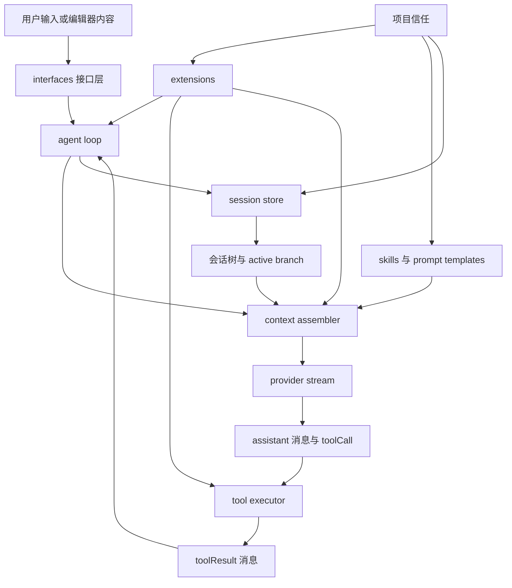
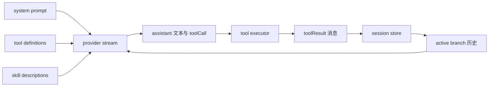
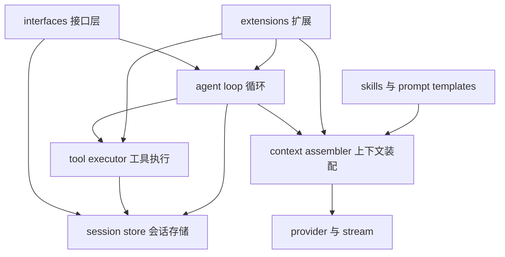
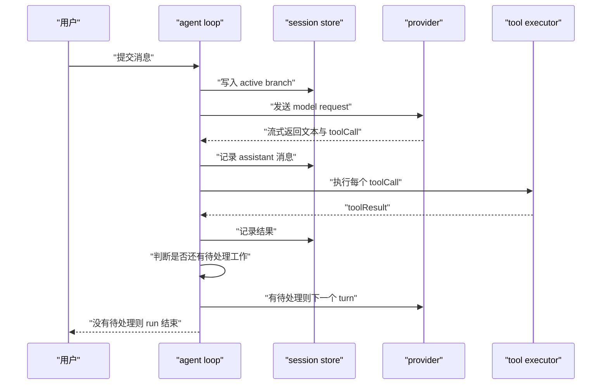
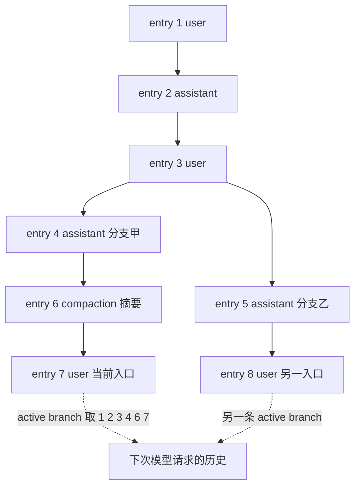
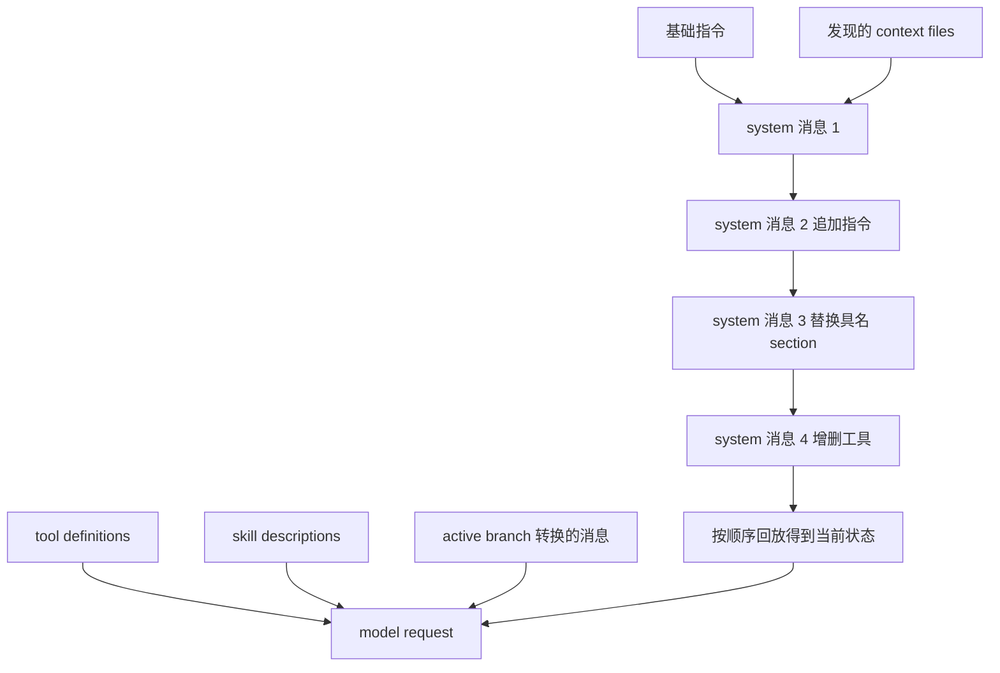
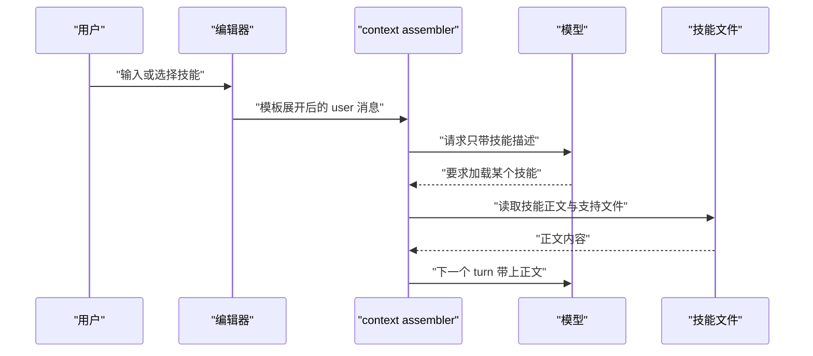
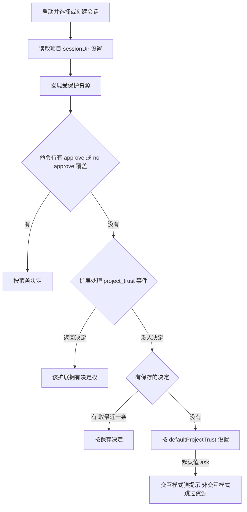
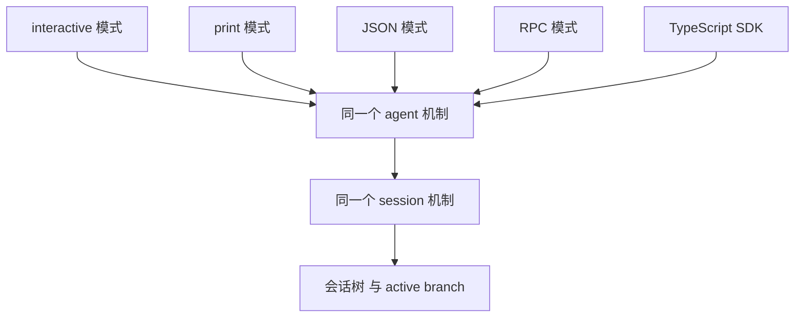

# Agent Harness 全景：模型之外的一切

!!! abstract "学完这一页你能"

    - 说出 harness 的 7 个部件，并为每个部件写出它负责的输入与输出。
    - 按顺序复述一次 run 里 turn 的推进条件，并指出 abort 时排队消息的去向。
    - 用 id 与 parent 手工重建一条 active branch，并说明 compaction 改了什么、没改什么。
    - 判断一个项目资源在启动时会不会加载，并说出项目信任覆盖与不覆盖的范围。

## 0. 知识地图



建议这样读这几节。先读第 1 节和第 2 节，把 harness 的边界与 7 个部件装进脑子。再按第 3、4、5 节走一遍数据流，因为 loop、存储、上下文装配是互相传数据的。最后读第 6、7、8 节，它们回答资源什么时候加载、入口有几个。

## 1. Harness 是什么，为什么它决定 agent 上限

**先想一个问题**

同一个模型，两个团队做出两种产品。一个能读文件、改文件、跑测试；另一个只能回一段文字。

差别不在模型权重，在模型之外那层程序。

!!! note "术语：Harness"

    定义：围绕模型的一层程序，负责组织请求、驱动循环、执行工具、保存记录。

    例子：pi 里负责这些工作的部分是 agent loop 加工具执行加 session store。

!!! tip "心智模型"

    一句话模型：模型是发动机，harness 是底盘、变速箱和油路。

    日常类比：同一台发动机装进不同的车，能走的路不同。

    类比不成立的地方：换车要拆装，换 harness 只要改代码，模型权重不动。

**图解**



解读：

1. 请求里放四样输入：系统提示、active branch 历史、工具定义、技能描述。
2. provider 把请求发出去，把响应以流的形式回传。
3. 响应里可能有文本，也可能有 toolCall。
4. tool executor 执行每个 toolCall，得到 toolResult。
5. toolResult 写进 session store。
6. 下一轮请求重新取 active branch，回到第 1 步。

**一步一步来**

第 1 步：把发起一次请求需要什么列全。

```js
// 模型请求里能出现的东西，只有这四类
const modelRequest = {
  systemPrompt: "基础指令加发现的 context files", // 系统提示构建器产出
  messages: [],                                  // active branch 转换而来
  tools: [],                                     // 工具注册表产出
  modelSettings: { model: "example-model" },     // 设置层产出
};
// 模型看不到 session id、分支指针、磁盘路径
console.log(Object.keys(modelRequest).join(","));
```

**这段代码在做什么**

- 用一个普通对象标出请求的四个字段。
- 四个字段分别由四个部件产出，模型不关心谁产出的。
- 没有 session id 字段，说明模型无法感知会话树结构。
- 没有磁盘路径字段，说明文件读写要靠工具执行。
- 运行结果：`systemPrompt,messages,tools,modelSettings`。

第 2 步：写一个没有 harness 的调用，看缺哪几步。

```js
// 只把用户消息交给模型函数，不做别的
async function bareCall(modelFn, userText) {
  return modelFn([{ role: "user", content: userText }]); // 只有文本返回
}
// 假模型只回字符串
const fakeModel = async () => "这段回答没有工具结果，也没有落到会话文件";
bareCall(fakeModel, "帮我改 bug").then((r) => console.log(r));
```

**这段代码在做什么**

- `bareCall` 只做一次请求，不判断是否需要第二个 turn。
- 返回值没有写进 session store，进程退出就丢。
- 模型回文本时无法触发工具，能力被限制在文字层。
- 运行结果：`这段回答没有工具结果，也没有落到会话文件`。

**动手验证**

下面这个脚本并排跑两条路：一条只有消息，一条把工具结果回灌。

```js
// 依赖：Node 20+，只用 node:assert，无第三方包
import assert from "node:assert";

// 假 provider：按 script 数组依次返回，模拟流式结束后的完整响应
function makeProvider(script) {
  let i = 0;
  return async () => script[i++];
}

// 没有工具回灌：历史里只有 user 和 assistant
const bare = makeProvider([{ content: [{ type: "text", text: "我先看看" }], stopReason: "stop" }]);
const bareHistory = [{ role: "user", content: "改 bug" }];
bareHistory.push(await bare(bareHistory));
assert.equal(bareHistory.length, 2);

// 有工具回灌：assistant 要工具，结果作为 toolResult 再发一轮
const withTools = makeProvider([
  { content: [{ type: "toolCall", id: "c1", name: "read", arguments: {} }], stopReason: "toolUse" },
  { content: [{ type: "text", text: "读完了" }], stopReason: "stop" },
]);
const history = [{ role: "user", content: "改 bug" }];
for (let turn = 0; turn < 2; turn++) {
  const res = await withTools();
  history.push({ role: "assistant", content: res.content });
  if (res.stopReason !== "toolUse") break;
  history.push({ role: "toolResult", toolCallId: "c1", content: [{ type: "text", text: "文件内容" }] });
}
assert.equal(history.length, 4); // user + assistant + toolResult + assistant
console.log("bare 历史条数:", bareHistory.length);
console.log("withTools 历史条数:", history.length);
console.log("断言通过");
```

预期输出：

```text
bare 历史条数: 2
withTools 历史条数: 4
断言通过
```

**常见坑**

| 现象 | 原因 | 怎么修 |
| --- | --- | --- |
| 换模型后 agent 行为差别大 | 把 harness 能力当成模型能力 | 先固定 harness，再单独比较模型输出 |
| 回答里出现文件内容却没人执行命令 | 工具结果没有落盘 | 检查 toolResult 是否写入 session |
| 脚本跑完什么记录都没有 | 用了临时会话 | 去掉 `--no-session`，或自己落盘 |

**小结**

- harness 负责模型不做的四件事：组织请求、驱动循环、执行工具、保存记录。
- 上限由这四件事的完成度决定，不只由模型权重决定。
- 判断一个功能属于哪一层，先问它产出的是请求、响应、结果还是记录。

## 2. 分层：七个部件各管什么

**先想一个问题**

报错日志里同时出现 provider error 和 tool error。它们是一类问题吗？

不是一类。前者在 provider 层，后者在工具执行层，两层的排错方法不同。

!!! note "术语：Provider"

    定义：把模型请求发出并接收响应的封装，负责选择后端与解析响应。

    例子：同一份历史发给不同 provider，得到的流式事件格式不同。

!!! note "术语：流式响应"

    定义：provider 按事件陆续返回文本与工具调用，而不是等整段生成完再返回。

    例子：assistant 消息在流式过程中 stopReason 是 `pending`。

**心智模型**

!!! tip "心智模型"

    一句话模型：harness 是一条传送带，七个工位各管一段，工件按顺序经过。

    日常类比：分拣中心里，收件、分拣、装车、扫描、入库由不同工位完成。

    类比不成立的地方：传送带顺序固定，扩展层可以在多个工位前后挂钩子。

**图解**



解读：

1. interfaces 接收用户输入或脚本命令，是唯一入口。
2. session store 保存 entry，并向 context assembler 提供 active branch。
3. context assembler 把系统提示、历史、工具定义、技能描述拼成请求。
4. provider 发送请求并回传流式响应。
5. agent loop 判断响应里有没有 toolCall，决定是否进入工具执行。
6. tool executor 执行工具，把结果交给 session store。
7. extensions 不占独立一层，它向循环、工具执行、上下文装配挂事件处理。

**一步一步来**

第 1 步：按数据流顺序定义几个函数签名。

```js
// 每一层的输入输出都不同，签名就是层边界
const assemble = (branch, tools, skills) => ({ messages: branch, tools, skills });
const callProvider = async (request) => ({ content: [], stopReason: "stop" });
const executeTools = async (calls) => calls.map((c) => ({ toolCallId: c.id, content: [] }));
const record = (session, entry) => session.entries.push(entry);
// 接口层不做业务判断，只把输入转成调用
const interfaces = async (text, deps) => deps.assemble([{ role: "user", content: text }], [], []);
```

**这段代码在做什么**

- 几个函数对应几层，参数就是这一层需要的全部输入。
- `assemble` 只负责拼装，不发送请求。
- `callProvider` 返回 stopReason，供上层决定是否继续。
- `record` 只负责追加 entry，不做压缩与分支判断。
- `interfaces` 是最薄的一层，只把用户文本转成调用。

第 2 步：确认层边界不被打破。

```js
// 反例：工具执行层里做历史裁剪，越界了
function badExecuteTools(calls, session) {
  if (session.entries.length > 100) session.entries = session.entries.slice(-10);
  return calls.map((c) => ({ toolCallId: c.id, content: [] }));
}
// 判断依据：这段逻辑改的是历史，历史归 session 与 compaction 管
console.log(typeof badExecuteTools, badExecuteTools([], { entries: [] }).length);
```

**这段代码在做什么**

- 函数名说明它是工具执行，但函数体改了会话历史。
- 历史裁剪属于 compaction，由 session 层负责。
- 越界会让工具结果与历史不一致，排查时误导方向。
- 运行结果：`function 0`。

**动手验证**

用 stub 记录每层收到的字段，断言没有多余数据跨层。

```js
// 依赖：Node 20+，只用 node:assert
import assert from "node:assert";

const seen = {};
const assemble = (branch) => { seen.assemble = Object.keys({ branch }); return { messages: branch }; };
const callProvider = async (req) => { seen.provider = Object.keys(req); return { content: [{ type: "text", text: "ok" }], stopReason: "stop" }; };
const record = (session, entry) => { session.push(entry); return session; };

const session = [];
const branch = [{ role: "user", content: "你好" }];
const req = assemble(branch);
const res = await callProvider(req);
record(session, { role: "assistant", content: res.content });

assert.deepEqual(seen.assemble, ["branch"]);   // 装配层只看到分支
assert.deepEqual(seen.provider, ["messages"]); // provider 只看到请求
assert.equal(session.length, 1);               // 只落了一条记录
console.log("层边界检查通过", JSON.stringify(session[0].content));
```

预期输出：

```text
层边界检查通过 [{"type":"text","text":"ok"}]
```

**常见坑**

| 现象 | 原因 | 怎么修 |
| --- | --- | --- |
| provider 报错被显示成工具失败 | 两层异常没有分开标记 | 在 provider 调用处单独 catch 并标记来源 |
| 工具结果和历史顺序错位 | 工具层直接改历史 | 只让 session store 追加 entry |
| 扩展改了上下文却没留痕 | 变换上下文没有记录 | 把变换写成系统消息，回放时得到当前状态 |

**小结**

- 七个部件：接口、循环、装配、provider、工具、存储、扩展。
- 层边界看函数签名，越界最常见的是工具层改历史。
- 扩展不占独立层，它挂事件处理到循环、工具、装配。

## 3. Agent loop：一次 run 里的 turn 怎么推进

**先想一个问题**

模型回了一个 toolCall，接下来谁决定再问一次模型？

是 agent loop。它看工具结果和排队消息，判断要不要开下一个 turn。

!!! note "术语：Turn"

    定义：一次模型请求，加上它引发的一轮工具执行，构成一个 turn。

    例子：模型要求读两个文件，执行完拿到结果，这一个 turn 结束。

!!! note "术语：Steering 与 follow-up 消息"

    定义：steering 消息在当前 assistant turn 之后进入；follow-up 消息在 agent 完成待处理工作之后进入。

    例子：任务还在跑时先发 steering 改方向，再让 follow-up 排队等收尾。

**心智模型**

!!! tip "心智模型"

    一句话模型：一个 run 由多个 turn 串成，turn 的结束条件是待处理工作为空。

    日常类比：点单、做菜、上菜三个动作合起来算一轮，客人加单就再来一轮。

    类比不成立的地方：上菜后点单结束，agent 可以在同一 run 里连续要三类工具结果。

**图解**



解读：

1. 用户提交的消息先进入 active branch，成为历史的一部分。
2. loop 用系统提示、历史、工具、模型设置拼出请求，交给 provider。
3. provider 流式返回，文本与 toolCall 都记进 session。
4. loop 逐个执行 toolCall，把 toolResult 记进 session。
5. turn 结束，loop 判断工具结果或排队消息是否要求再请求一次。
6. 需要就回到第 2 步开新 turn，不需要就结束这个 run。

**一步一步来**

第 1 步：把继续条件写成一个纯函数。

```js
// 依据资料：工具结果或排队消息需要新请求时，再开一个 turn
function shouldContinue(lastResult, queue) {
  if (lastResult.stopReason === "toolUse") return true; // 有工具要跑
  if (queue.length > 0) return true;                    // 有排队消息
  return false;                                         // 否则结束 run
}
console.log(shouldContinue({ stopReason: "toolUse" }, []), shouldContinue({ stopReason: "stop" }, []));
```

**这段代码在做什么**

- 输入是上一轮响应与排队消息，输出是布尔值。
- `toolUse` 表示这一轮还牵出工具执行，需要回灌结果。
- 排队消息非空时也要再请求一次。
- 两个条件都不满足，run 结束。
- 运行结果：`true false`。

第 2 步：实现带中断的循环骨架。

```js
// 简化骨架：只演示 turn 推进与中断
async function run(seed, provider, executeTools) {
  const session = [{ role: "user", content: seed }];
  let queue = ["后续补充的消息"];            // 模拟排队消息
  for (let turn = 0; turn < 8; turn++) {
    const last = await provider(session);   // 发起一次请求
    session.push({ role: "assistant", content: last.content });
    if (last.stopReason === "toolUse") {
      const results = await executeTools(last.content);
      results.forEach((r) => session.push({ role: "toolResult", ...r }));
    }
    if (!shouldContinue(last, queue)) break;
    queue = [];                             // 排队消息只消费一次
  }
  return session;
}
```

**这段代码在做什么**

- `for` 循环上限 8，防止 stopReason 异常导致死循环。
- 每轮都把 assistant 响应写入 session。
- stopReason 为 `toolUse` 时执行工具并写回结果。
- 排队消息消费一次后清空，避免重复请求。
- 中断场景按资料处理：停止当前 run，把排队消息退回编辑器，这里用 `queue` 归还表示。

第 3 步：跑一次，看条目数。

```js
const provider = (() => {
  const script = [
    { content: [{ type: "toolCall", id: "c1", name: "read", arguments: {} }], stopReason: "toolUse" },
    { content: [{ type: "text", text: "完成" }], stopReason: "stop" },
  ];
  let i = 0;
  return async () => script[i++];
})();
const executeTools = async () => [{ toolCallId: "c1", toolName: "read", content: [{ type: "text", text: "文件内容" }], isError: false }];
run("帮我读文件", provider, executeTools).then((s) => console.log(s.length));
```

**这段代码在做什么**

- provider 用脚本数组模拟两次响应。
- 第一次响应要求工具，触发工具执行分支。
- 第二次响应 stopReason 为 `stop`，循环退出。
- 运行结果：`4`，也就是 user、assistant、toolResult、assistant 四条。

**动手验证**

完整脚本统计 turn 数，并验证中断时排队消息被退回。

```js
// 依赖：Node 20+，只用 node:assert
import assert from "node:assert";

function shouldContinue(last, queue) {
  return last.stopReason === "toolUse" || queue.length > 0;
}

async function run({ provider, executeTools, queue, abortAt }) {
  const session = [{ role: "user", content: "开始" }];
  let pending = [...queue];
  let turns = 0;
  for (let i = 1; i <= 8; i++) {
    if (abortAt === i) return { session, turns, returned: pending }; // 中断：排队消息退回
    const last = await provider(i);
    turns++;
    session.push({ role: "assistant", content: last.content });
    if (last.stopReason === "toolUse") {
      for (const r of await executeTools(last.content)) session.push({ role: "toolResult", ...r });
    }
    if (!shouldContinue(last, pending)) break;
    pending = [];
  }
  return { session, turns, returned: [] };
}

const provider = async (i) =>
  i === 1
    ? { content: [{ type: "toolCall", id: "c1", name: "read", arguments: {} }], stopReason: "toolUse" }
    : { content: [{ type: "text", text: "完成" }], stopReason: "stop" };
const executeTools = async () => [{ toolCallId: "c1", content: [{ type: "text", text: "内容" }] }];

const ok = await run({ provider, executeTools, queue: [], abortAt: null });
assert.equal(ok.turns, 2);                              // 两个 turn
assert.equal(ok.session.length, 4);                     // user + assistant + toolResult + assistant
assert.equal(ok.session.at(-1).role, "assistant");

const aborted = await run({ provider, executeTools, queue: ["补充"], abortAt: 1 });
assert.deepEqual(aborted.returned, ["补充"]);           // 中断后排队消息退回
console.log("turn 数:", ok.turns, "中断退回:", aborted.returned.join(","));
```

预期输出：

```text
turn 数: 2 中断退回: 补充
```

**常见坑**

| 现象 | 原因 | 怎么修 |
| --- | --- | --- |
| 循环停不下来 | 继续条件只看消息队列 | 加 turn 上限并把 stopReason 纳入判断 |
| 会话文件里出现 pending 的 assistant 消息 | 把流式中间态落盘 | 只持久化带终止 stopReason 的消息 |
| steering 消息被插到当前 assistant 之前 | 入队时机搞错 | steering 在当前 assistant turn 之后进入 |

**小结**

- 一个 turn 等于一次模型请求加它引发的工具执行。
- 继续条件是工具结果或排队消息要求新请求。
- 中断停 run，排队消息退回编辑器。

## 4. Session store：会话树、分支与压缩

**先想一个问题**

你在 `/tree` 里回到一条旧消息、改了措辞再提交，之前那条支线还在吗？

还在。session 以树保存，回到早期 entry 只是再长出一条分支。

!!! note "术语：会话树"

    定义：session 里每条 entry 有 id 并指回 parent，所有 entry 连成树。

    例子：从同一条 user 消息出发提交两次，就得到两条分支。

!!! note "术语：Active branch"

    定义：以当前 entry 结尾的那条路径，它提供下一次模型请求用到的历史。

    例子：切到另一条分支后，请求里的历史随之改变。

!!! note "术语：JSONL"

    定义：每行一个 JSON 对象的文本格式，持久会话按这个格式存文件。

    例子：扫描会话文件时逐行解析，单行损坏不影响读取其它行。

!!! note "术语：Compaction"

    定义：插入一条摘要 entry，在后续模型请求里替换它覆盖的较早消息。

    例子：原始 entry 仍留在会话树里，只是不再进入请求。

**心智模型**

!!! tip "心智模型"

    一句话模型：会话是一棵树，模型只看到当前入口到根的那条路径。

    日常类比：游戏存档列表，读旧档继续玩，不覆盖后来存的档。

    类比不成立的地方：存档互不相干，会话允许把离开分支的摘要挂到进入的分支上。

**图解**



解读：

1. entry 1 是根，entry 2 指回 entry 1，依次成链。
2. entry 4 与 entry 5 的 parent 都是 entry 3，树在这里分叉。
3. entry 7 是当前 entry，它的 active branch 是 1、2、3、4、6、7。
4. compaction 插入 entry 6，它在后续请求里替换它覆盖的消息。
5. 原始 entry 仍然留在树里，只是不再进入请求。
6. `/tree` 在同一个 session 文件里移动，`/fork` 换到新 session 文件，`/clone` 复制当前分支。

**一步一步来**

第 1 步：用 id 与 parent 建树并回溯。

```js
// 每条 entry 有 id 与 parent，current 指向当前入口
const entries = [
  { id: "e1", parent: null, role: "user", text: "起个头" },
  { id: "e2", parent: "e1", role: "assistant", text: "回一" },
  { id: "e3", parent: "e2", role: "user", text: "改这条" },
  { id: "e4", parent: "e3", role: "assistant", text: "分支甲" },
  { id: "e5", parent: "e3", role: "assistant", text: "分支乙" },
];
function activeBranch(list, current) {
  const byId = new Map(list.map((e) => [e.id, e]));
  const path = [];
  for (let id = current; id; id = byId.get(id).parent) path.unshift(byId.get(id));
  return path;
}
console.log(activeBranch(entries, "e5").map((e) => e.id).join("->"));
```

**这段代码在做什么**

- `parent` 为 null 的 entry 是根，回溯的终止条件就是它。
- `Map` 让按 id 取 entry 不必每次遍历数组。
- `unshift` 保证路径顺序从根到当前入口。
- 运行结果：`e1->e2->e3->e5`。

第 2 步：加 compaction entry。

```js
// compaction 插入一条摘要 entry，原始 entry 保留
const summary = { id: "e6", parent: "e3", role: "compactionSummary", summary: "前面聊了起头与改措辞", tokensBefore: 1200 };
entries.push(summary);
const path = activeBranch(entries, "e6");
// 转换请求时：压缩节点替换它之前的历史，原始 entry 仍在 entries 里
console.log(path.map((e) => e.id).join("->"), "总条目:", entries.length);
```

**这段代码在做什么**

- 摘要作为普通 entry 追加，位置在它要替换的历史之后。
- 原始 entry 数量不减，只是不进入后续请求。
- 标记为 `compactionSummary` 的 entry 会转成上下文消息。
- 运行结果：`e1->e2->e3->e6 总条目: 6`。

**动手验证**

完整脚本验证分支回溯与压缩后条目不减。

```js
// 依赖：Node 20+，只用 node:assert
import assert from "node:assert";

const entries = [
  { id: "e1", parent: null, role: "user", text: "起个头" },
  { id: "e2", parent: "e1", role: "assistant", text: "回一" },
  { id: "e3", parent: "e2", role: "user", text: "改这条" },
  { id: "e4", parent: "e3", role: "assistant", text: "分支甲" },
  { id: "e5", parent: "e3", role: "assistant", text: "分支乙" },
];

const branchOf = (list, current) => {
  const byId = new Map(list.map((e) => [e.id, e]));
  const path = [];
  for (let id = current; id; id = byId.get(id)?.parent) path.unshift(byId.get(id));
  return path;
};

assert.equal(branchOf(entries, "e4").map((e) => e.id).join(","), "e1,e2,e3,e4");
assert.equal(branchOf(entries, "e5").map((e) => e.id).join(","), "e1,e2,e3,e5");
assert.equal(branchOf(entries, "e3").length, 3);        // 两条分支共享前缀

const before = entries.length;
entries.push({ id: "e6", parent: "e3", role: "compactionSummary", summary: "摘要", tokensBefore: 1200 });
assert.equal(entries.length, before + 1);               // 只多一条，原始条目未删
assert.equal(branchOf(entries, "e6").at(-1).role, "compactionSummary");
console.log("active branch:", branchOf(entries, "e6").map((e) => e.id).join("->"));
console.log("断言通过");
```

预期输出：

```text
active branch: e1->e2->e3->e6
断言通过
```

**常见坑**

| 现象 | 原因 | 怎么修 |
| --- | --- | --- |
| 以为 `/tree` 会丢掉另一分支 | 把切分支当成删除 | 要产生新文件用 `/fork` 或 `/clone` |
| 压缩后历史里出现重复内容 | 摘要与前面的消息同时进入请求 | 请求里用摘要替换它覆盖的范围 |
| 网络断了以后压缩失败 | provider 不可用，无法生成摘要 | 修好 provider 后重跑手动压缩 |

**小结**

- entry 的 id 与 parent 构成树，current 决定 active branch。
- 回到早期 entry 再提交，得到的是新分支。
- compaction 只影响后续请求，不改动树里的原始 entry。

## 5. Context assembler：系统提示与上下文装配

**先想一个问题**

同一个仓库里开两个会话，为什么一个会话知道项目规则，另一个不知道？

系统提示由基础指令与发现的 context files 拼成，不同工作目录发现到的东西不同。

!!! note "术语：系统提示"

    定义：请求最前面的 system 消息，包含基础指令与发现的 context files。

    例子：`.pi/SYSTEM.md` 与 `.pi/APPEND_SYSTEM.md` 属于受项目信任保护的系统提示文件。

**心智模型**

!!! tip "心智模型"

    一句话模型：按顺序回放 system 消息，最后得到当前状态。

    日常类比：手册先发总则，后续通知只能加一条、替换某节或换整本。

    类比不成立的地方：手册改了要重发，system 消息靠追加记录就能重建状态。

**图解**



解读：

1. 第一条 system 消息声明初始提示与工具。
2. 后续 system 消息可以追加指令。
3. 带 `sections` 的消息替换或移除具名 section，值为 null 表示移除。
4. 带 `toolsAdded` 与 `toolsRemoved` 的消息增删工具。
5. 带 `replace: true` 的消息丢弃之前状态，建立新的基线。
6. 请求最后还带工具定义、技能描述、active branch 转换出的消息。

**一步一步来**

第 1 步：回放 system 消息，得到当前 sections。

```js
// 按资料：按顺序回放 system 消息即得到当前状态
function replay(messages) {
  let state = { sections: {}, tools: [] };
  for (const m of messages) {
    if (m.replace) state = { sections: {}, tools: [] };   // 重新建立基线
    for (const [k, v] of Object.entries(m.sections ?? {})) {
      if (v === null) delete state.sections[k];            // null 表示移除
      else state.sections[k] = v;
    }
    state.tools = state.tools.filter((t) => !(m.toolsRemoved ?? []).some((r) => r.name === t.name));
    state.tools.push(...(m.toolsAdded ?? []));
  }
  return state;
}
```

**这段代码在做什么**

- `replace: true` 先把已有状态清空，再应用本条消息。
- `sections` 里值为 null 的键会被删除。
- 工具按名字移除，再追加本条消息声明的工具。
- 函数是纯函数，同一串消息回放多次结果一致。

第 2 步：跑一遍看状态。

```js
const messages = [
  { role: "system", content: "基础指令", sections: { 规则: "用中文回答" }, toolsAdded: [{ name: "read" }] },
  { role: "system", content: "补一条", sections: { 额外: "先跑测试" } },
  { role: "system", content: "移除规则", sections: { 规则: null }, toolsRemoved: [{ name: "read" }] },
];
console.log(JSON.stringify(replay(messages)));
```

**这段代码在做什么**

- 第一条消息建立基线，带一个 section 和一个工具。
- 第二条消息只做追加，不动已有键。
- 第三条消息把 规则 置 null 删除，并移除 read 工具。
- 运行结果：`{"sections":{"额外":"先跑测试"},"tools":[]}`。

**动手验证**

脚本回放消息，并检查 request 里各类内容都在。

```js
// 依赖：Node 20+，只用 node:assert
import assert from "node:assert";

function replay(messages) {
  let state = { sections: {}, tools: [] };
  for (const m of messages) {
    if (m.replace) state = { sections: {}, tools: [] };
    for (const [k, v] of Object.entries(m.sections ?? {})) {
      if (v === null) delete state.sections[k];
      else state.sections[k] = v;
    }
    state.tools = state.tools.filter((t) => !(m.toolsRemoved ?? []).some((r) => r.name === t.name));
    state.tools.push(...(m.toolsAdded ?? []));
  }
  return state;
}

function buildRequest({ messages, branch, skills }) {
  const state = replay(messages);
  return {
    systemPrompt: state.sections,
    tools: state.tools,
    skillDescriptions: skills.map((s) => s.description), // 只带描述，正文按需加载
    messages: branch.map((e) => ({ role: e.role, content: e.text })),
  };
}

const req = buildRequest({
  messages: [
    { role: "system", content: "基础", sections: { 规则: "用中文" }, toolsAdded: [{ name: "read" }] },
    { role: "system", content: "追加", sections: { 规则: null, 测试: "先跑测试" } },
  ],
  branch: [{ role: "user", text: "你好" }],
  skills: [{ name: "review", description: "代码评审清单" }],
});

assert.deepEqual(req.systemPrompt, { 测试: "先跑测试" });
assert.deepEqual(req.tools, [{ name: "read" }]);
assert.equal(req.skillDescriptions.length, 1);
assert.equal(req.messages[0].role, "user");
console.log(JSON.stringify(req));
```

预期输出：

```text
{"systemPrompt":{"测试":"先跑测试"},"tools":[{"name":"read"}],"skillDescriptions":["代码评审清单"],"messages":[{"role":"user","content":"你好"}]}
```

**常见坑**

| 现象 | 原因 | 怎么修 |
| --- | --- | --- |
| 两个会话规则不一致 | 工作目录不同，发现的 context files 不同 | 用 `/session` 核对当前目录与文件 |
| 想删一条规则却还在 | 用了空字符串而不是 null | sections 里用 null 表示移除 |
| 直接执行的命令输出被当成工具结果 | 它的角色是 bashExecution | 需要排除时设置 excludeFromContext |

**小结**

- 系统提示由基础指令与发现的 context files 拼出。
- 后续 system 消息能追加、替换 section、增删工具、重建基线。
- 按顺序回放 system 消息，就能得到当前状态。

## 6. Skills 与 prompt templates：按需加载

**先想一个问题**

你装了 30 个技能。模型每轮请求都要读 30 份正文吗？

不用。请求里只带技能描述，正文在命中后才加载。

!!! note "术语：Skill"

    定义：按需加载的指令与支持文件，描述常驻在请求里，正文等命中再读。

    例子：一个技能可以带清单文件和脚本，只在被选中时进入上下文。

!!! note "术语：Prompt template"

    定义：在编辑器输入变成 user 消息之前展开的可复用文本。

    例子：输入一个模板名，展开成一段固定格式的提问。

**心智模型**

!!! tip "心智模型"

    一句话模型：技能是工具书，目录常年摆在桌上，正文用到才翻。

    日常类比：查字典先看索引，再翻到词条那一页。

    类比不成立的地方：字典词条固定，技能正文可以是文件加多个支持脚本。

**图解**



解读：

1. 用户在编辑器里输入，prompt template 先展开。
2. 展开后的文本成为 user 消息，进入 active branch。
3. 请求里带技能描述，不带全部正文。
4. 模型要求加载某个技能时，才读它的正文与支持文件。
5. 正文在下一个 turn 的请求里生效。

**一步一步来**

第 1 步：先只注册描述。

```js
// 注册表只保留描述，正文用 loader 延迟读取
const skills = [
  { name: "review", description: "代码评审清单", load: () => "评审正文：先看测试覆盖" },
  { name: "release", description: "发版检查步骤", load: () => "发版正文：先跑构建" },
];
function describe(registry) {
  return registry.map((s) => s.description); // 只把描述放进请求
}
console.log(describe(skills).join(" / "));
```

**这段代码在做什么**

- 每条技能记录带 name、description 与一个 load 函数。
- `describe` 只取描述，正文没有被调用。
- load 函数把读取时机推迟到命中之后。
- 运行结果：`代码评审清单 / 发版检查步骤`。

第 2 步：命中后再加载正文。

```js
// 模型要求加载 review，此时才读正文
function loadByName(registry, name) {
  const hit = registry.find((s) => s.name === name);
  if (!hit) return null;             // 未注册就返回 null，不报错
  return { name: hit.name, body: hit.load() };
}
const loaded = loadByName(skills, "review");
console.log(loaded.name, "=>", loaded.body);
```

**这段代码在做什么**

- 按名字查表，命中才调用 load。
- 未命中返回 null，让上层决定是提示模型还是忽略。
- 返回值带上正文，供下一个 turn 拼进上下文。
- 运行结果：`review => 评审正文：先看测试覆盖`。

第 3 步：模板展开在消息创建之前。

```js
// 模板在编辑器输入转成 user 消息之前展开
const templates = { pr: (arg) => `请评审这个改动：${arg}` };
const expand = (input) => {
  const [head, ...rest] = input.split(" ");
  return templates[head] ? templates[head](rest.join(" ")) : input;
};
console.log(expand("pr 登录模块"));
console.log(expand("普通提问"));
```

**这段代码在做什么**

- 输入第一个词是模板名时，交给对应函数处理。
- 不是模板名就原样返回，普通提问不受影响。
- 展开结果之后才成为 user 消息。
- 运行结果两行：`请评审这个改动：登录模块` 与 `普通提问`。

**动手验证**

脚本验证请求里只有描述，加载后正文出现。

```js
// 依赖：Node 20+，只用 node:assert
import assert from "node:assert";

const skills = [
  { name: "review", description: "代码评审清单", load: () => "评审正文" },
  { name: "release", description: "发版检查步骤", load: () => "发版正文" },
];
let loadCalls = 0;
skills.forEach((s) => {
  const inner = s.load;
  s.load = () => { loadCalls++; return inner(); };
});

const buildRequest = (registry) => ({
  skillDescriptions: registry.map((s) => s.description),
  messages: [{ role: "user", content: "开始" }],
});

const req1 = buildRequest(skills);
assert.equal(loadCalls, 0);                                  // 请求阶段不读正文
assert.equal(req1.skillDescriptions.length, 2);
assert.equal(Object.hasOwn(req1, "skillBodies"), false);

const hit = skills.find((s) => s.name === "review");
const body = hit.load();                                     // 命中后才读
assert.equal(loadCalls, 1);
assert.equal(body, "评审正文");

const req2 = buildRequest(skills);
req2.messages.push({ role: "user", content: body });         // 正文在下一个 turn 生效
assert.equal(req2.messages.at(-1).content, "评审正文");
console.log("描述条数:", req1.skillDescriptions.length, "加载次数:", loadCalls);
```

预期输出：

```text
描述条数: 2 加载次数: 1
```

**常见坑**

| 现象 | 原因 | 怎么修 |
| --- | --- | --- |
| 请求体积随技能数增长 | 把正文全部写进系统提示 | 请求里只放描述，正文延迟加载 |
| 技能装了却不生效 | 项目 `.pi/skills` 未授信 | 用 `/trust` 保存信任决定或启动时批准 |
| 模板名被当普通文本发给模型 | 展开发生在消息创建之后 | 让展开早于 user 消息生成 |

**小结**

- 技能描述常驻请求，正文与支持文件按需加载。
- 这个顺序控制请求体积，也控制模型看到的指令量。
- prompt template 在编辑器输入变成 user 消息之前展开。

## 7. Extensions 与信任模型：谁决定加载与执行

**先想一个问题**

克隆一个陌生仓库，直接在里面运行 pi，会发生什么？

Pi 发现受保护资源时要求信任决定；拒绝后跳过这些资源，但会先读取项目的 sessionDir 设置。

!!! note "术语：项目信任"

    定义：决定是否加载工作目录提供的设置与资源的启动决策。

    例子：`.pi/extensions` 与 `.pi/skills` 属于受保护资源。

!!! note "术语：Extension"

    定义：加载进 Pi 进程的 TypeScript 模块，工厂函数注册工具、命令、快捷键、provider、事件处理、渲染器与终端 UI。

    例子：扩展可以处理 project_trust 事件并返回 yes 或 no。

**心智模型**

!!! tip "心智模型"

    一句话模型：信任只决定进门时装哪些东西，不限制进门后能碰什么。

    日常类比：门禁决定能不能带访客进楼，进门后能开哪个房间由工牌决定。

    类比不成立的地方：这里工牌就是 Pi 进程的操作系统权限，没有额外一层限制。

**图解**



解读：

1. 启动选择会话时先读项目 sessionDir 设置，这一步在信任决定之前。
2. 发现受保护资源后，需要有信任决定。
3. 命令行 `--approve` 或 `--no-approve` 覆盖优先，直接定结果。
4. 没有覆盖时，扩展可以处理 project_trust 事件，第一个返回 yes 或 no 的扩展拥有决定权。
5. 没有扩展决定时，查保存的决定，当前目录或其父目录里最近的一条适用。
6. 都没有就落到全局 `defaultProjectTrust`，默认值是 `ask`；非交互模式取不到提示，`ask` 与 `never` 都跳过受保护资源。

**一步一步来**

第 1 步：检查受保护资源。

```js
// 资料列出的受保护资源，任意一个存在就需要信任决定
const protectedPaths = [
  ".pi/settings.json", ".pi/mcp.json", ".pi/extensions", ".pi/skills",
  ".pi/prompts", ".pi/themes", ".pi/SYSTEM.md", ".pi/APPEND_SYSTEM.md",
];
function needsTrust(find) {
  return protectedPaths.some((p) => find(p)) || find("project .agents/skills");
}
console.log(needsTrust((p) => p === ".pi/extensions"));
console.log(needsTrust(() => false));
```

**这段代码在做什么**

- 数组来自资料列出的受保护资源清单。
- 任意一项存在就返回 true，不要求全部存在。
- 项目级 `.agents/skills` 也在检查范围内。
- 运行结果：`true` 与 `false`。

第 2 步：按顺序决定信任。

```js
// 顺序来自资料：命令行覆盖 扩展事件 保存决定 全局默认
function decideTrust({ cliOverride, extensions, saved, globalDefault }) {
  if (cliOverride) return { by: "cli", value: cliOverride === "--approve" };
  for (const ext of extensions) {
    const answer = ext.onProjectTrust();      // 第一个返回 yes 或 no 的扩展拥有决定权
    if (answer === "yes" || answer === "no") return { by: "extension", value: answer === "yes" };
  }
  if (saved) return { by: "saved", value: saved.value };  // 最近的保存决定生效
  return { by: "default", value: globalDefault === "always" };
}
console.log(decideTrust({ extensions: [], saved: null, globalDefault: "ask" }));
```

**这段代码在做什么**

- 命令行覆盖优先级最高，直接短路。
- 扩展按顺序询问，第一个给出 yes 或 no 的扩展决定结果。
- 没有扩展决定时查保存的决定，最近的目录决定适用。
- 都没有就落到全局默认，默认值是 `ask`。
- 运行结果：`{ by: 'default', value: false }`。

**动手验证**

完整脚本验证四种决定来源与非交互模式行为。

```js
// 依赖：Node 20+，只用 node:assert
import assert from "node:assert";

const PROTECTED = [".pi/settings.json", ".pi/mcp.json", ".pi/extensions", ".pi/skills",
  ".pi/prompts", ".pi/themes", ".pi/SYSTEM.md", ".pi/APPEND_SYSTEM.md"];

const needsTrust = (list) => PROTECTED.some((p) => list.includes(p));

function decideTrust({ cliOverride = null, extensions = [], saved = null, globalDefault = "ask" }) {
  if (cliOverride) return { by: "cli", value: cliOverride === "--approve" };
  for (const ext of extensions) {
    const answer = ext();
    if (answer === "yes" || answer === "no") return { by: "extension", value: answer === "yes" };
  }
  if (saved) return { by: "saved", value: saved.value };
  return { by: "default", value: globalDefault === "always" };
}

// 非交互模式没有提示，ask 与 never 都跳过受保护资源
function resolveNonInteractive({ globalDefault, cliOverride = null }) {
  if (cliOverride) return cliOverride === "--approve";
  return globalDefault === "always";
}

assert.equal(needsTrust([".pi/skills"]), true);
assert.equal(needsTrust(["src"]), false);
assert.deepEqual(decideTrust({ cliOverride: "--no-approve" }), { by: "cli", value: false });
assert.deepEqual(decideTrust({ extensions: [() => "maybe", () => "yes"] }), { by: "extension", value: true });
assert.deepEqual(decideTrust({ saved: { value: false } }), { by: "saved", value: false });
assert.deepEqual(decideTrust({}), { by: "default", value: false });
assert.equal(resolveNonInteractive({ globalDefault: "ask" }), false);
assert.equal(resolveNonInteractive({ globalDefault: "always" }), true);
console.log("信任决策断言通过");
```

预期输出：

```text
信任决策断言通过
```

**常见坑**

| 现象 | 原因 | 怎么修 |
| --- | --- | --- |
| 拒绝了信任还是读到项目设置 | sessionDir 在信任决定之前读取 | 把项目目录本身也当成不可信输入 |
| 自动化任务弹不出信任提示 | print、JSON、RPC 模式没有提示 | 用 `--approve` 或 `--no-approve` 明确决定 |
| 以为批准一次就隔离了风险 | 信任不限制工具能访问的路径 | 用容器或虚拟环境做隔离 |

**小结**

- 信任决定影响启动时加载哪些项目资源。
- 决定顺序是命令行覆盖、扩展事件、保存决定、全局默认。
- 信任不构成安全边界，工具与扩展沿用进程的操作系统权限。

## 8. Interfaces：四种接口与同一套机制

**先想一个问题**

同一条会话，既要在终端里交互，又要被脚本调用。要写两套 agent 吗？

不用。四种接口共用同一个 agent 与 session 机制。

!!! note "术语：RPC 模式"

    定义：在标准输入接收 JSONL 命令，在标准输出写响应与事件的运行方式。

    例子：RPC 的 bash 命令产生 BashExecutionMessage，它不是模型工具结果。

**心智模型**

!!! tip "心智模型"

    一句话模型：接口只换外壳，agent 与 session 机制是共用内核。

    日常类比：一栋楼有四道门，进哪道门，里面的房间布置一样。

    类比不成立的地方：门只影响进出方式，接口还会影响输出格式与信任提示能否出现。

**图解**



解读：

1. interactive 模式在终端渲染会话与 agent 事件。
2. print 模式跑一个 prompt，写出最终响应。
3. JSON 模式把 agent 事件按 JSONL 写出。
4. RPC 模式读 JSONL 命令，写响应与事件。
5. TypeScript SDK 在进程内创建并控制 agent session。
6. 五条入口最终都落到同一套 agent 与 session 机制。

**一步一步来**

第 1 步：把事件输出抽象成一个写函数。

```js
// 接口差异集中在 write：终端渲染、最终响应、JSONL 各写各的
function makeEmitter(write) {
  const events = [];
  return {
    emit(type, payload) {
      const event = { type, payload };   // 统一事件结构
      events.push(event);
      write(event);                      // 由具体接口决定怎么写
      return event;
    },
    events,
  };
}
const jsonl = makeEmitter((e) => console.log(JSON.stringify(e)));
jsonl.emit("message_end", { role: "assistant" });
```

**这段代码在做什么**

- 事件结构固定为 type 加 payload。
- `write` 是唯一被接口替换的部分。
- 事件同时进内存数组，便于测试断言。
- 运行结果：`{"type":"message_end","payload":{"role":"assistant"}}`。

第 2 步：同一个循环跑两种模式。

```js
// 同一个 agent 函数，只换输出方式
async function agentOnce(prompt, emit) {
  emit("agent_start", { prompt });
  const reply = { role: "assistant", content: [{ type: "text", text: "完成" }] };
  emit("message_end", reply);
  return reply;
}
const printMode = async (p) => (await agentOnce(p, () => {})).content[0].text;
const jsonMode = async (p) => agentOnce(p, (e) => console.log(JSON.stringify(e)));
printMode("写个脚本").then((t) => console.log("print:", t));
jsonMode("写个脚本");
```

**这段代码在做什么**

- `agentOnce` 是两种模式共用的主体。
- print 模式忽略事件，只取最终文本。
- JSON 模式把每个事件按 JSONL 写出。
- 运行结果：JSONL 两行加最后一行 `print: 完成`。

**动手验证**

脚本验证两种模式的输出可被解析，且事件序列一致。

```js
// 依赖：Node 20+，只用 node:assert
import assert from "node:assert";

async function runAgent(prompt, emit) {
  emit({ type: "agent_start", payload: { prompt } });
  emit({ type: "message_end", payload: { role: "assistant", content: [{ type: "text", text: "完成" }] } });
  emit({ type: "agent_end", payload: {} });
  return "完成";
}

const lines = [];
const events = [];
const jsonMode = async (prompt) => {
  await runAgent(prompt, (e) => { events.push(e); lines.push(JSON.stringify(e)); });
  return lines;
};

const out = await jsonMode("写个脚本");
const parsed = out.map((l) => JSON.parse(l));            // 每行都是合法 JSON
assert.equal(parsed.length, 3);
assert.deepEqual(parsed.map((e) => e.type), ["agent_start", "message_end", "agent_end"]);
assert.equal(parsed[1].payload.role, "assistant");

let printed = null;
const printMode = async (prompt) => { printed = await runAgent(prompt, () => {}); return printed; };
await printMode("写个脚本");
assert.equal(printed, "完成");
assert.equal(events.length, 6);                          // 两次运行共用同一个 agent 函数
console.log("事件类型:", parsed.map((e) => e.type).join(","));
console.log("print 输出:", printed);
```

预期输出：

```text
事件类型: agent_start,message_end,agent_end
print 输出: 完成
```

**常见坑**

| 现象 | 原因 | 怎么修 |
| --- | --- | --- |
| 无人值守运行加载了项目扩展 | 非交互模式没有提示，默认值决定 | 用 `--no-approve` 明确拒绝 |
| 把 bash 命令输出当成工具结果 | 两种消息的角色不同 | 需要时用 BashExecutionMessage 的字段区分 |
| 自己拼事件格式，脚本解析失败 | 每个接口各写一套 | 统一事件结构，只替换写出方式 |

**小结**

- interactive、print、JSON、RPC 与 SDK 共用同一套 agent 与 session 机制。
- 接口之间的差异主要是输入来源与输出格式。
- 事件结构统一后，脚本解析与终端渲染可以共用同一条数据流。

## 综合对比

下表按维度列出 pi 的做法与资料依据。最后一列的其它 harness 情况不在本次资料范围内。

| 维度 | pi 的做法 | 资料依据 | 其它 harness |
| --- | --- | --- | --- |
| 推进单位 | turn，由工具结果或排队消息决定是否继续 | How Pi Works 的 Agent loop | 资料未覆盖，需核对官方文档 |
| 历史来源 | active branch | How Pi Works 的 Sessions | 资料未覆盖 |
| 存储结构 | entry 带 id 与 parent 的树，持久化为 JSONL | How Pi Works 的 Sessions | 资料未覆盖 |
| 分支动作 | tree 在同一文件内移动，fork 产生新 session，clone 复制当前分支 | Sessions and Context 的 Choose how to branch | 资料未覆盖 |
| 历史裁剪 | compaction 插入 summary entry，原始 entry 保留 | How Pi Works 的 Sessions | 资料未覆盖 |
| 系统提示 | 基础指令加发现的 context files，可按 section 追加替换 | How Pi Works 的 Context | 资料未覆盖 |
| 技能 | 描述常驻请求，正文按需加载 | How Pi Works 的 Context | 资料未覆盖 |
| 扩展 | TypeScript 模块，进程内执行，可挂事件处理 | How Pi Works 的 Extensions and resources | 资料未覆盖 |
| 启动资源控制 | 项目信任决定加载哪些项目资源 | Run Pi safely 的 Understand project trust | 资料未覆盖 |
| 工具权限 | 使用 Pi 进程的操作系统权限，无逐次审批 | Run Pi safely 的开篇 | 资料未覆盖 |
| 隔离方式 | 资料说明没有内置沙箱，靠容器或虚拟机 | Run Pi safely 的 Choose how to run Pi | 资料未覆盖 |
| 接口 | interactive、print、JSON、RPC、TypeScript SDK | How Pi Works 的 Interfaces | 资料未覆盖 |

## 应用与行业实践

前面几节把 harness 拆成了 7 个部件。这一节回答另一件事：这些部件在真实项目里怎么落地，怎么量，什么时候不用。

### 应用场景地图

| 场景 | 用到本页哪个知识点 | 典型技术选型 | 注意事项 |
| --- | --- | --- | --- |
| 后台管理的万行表格导出、跨月差异核对 | Agent loop、工具执行层 | 本地 CLI harness + 表格读取工具 | 每 turn 只喂行列统计与差异片段，不喂全表 |
| 低端安卓机首屏加载排查 | Context assembler | 端上日志上报 + 远程 harness | 上下文放日志片段与设备参数，别放全量 trace |
| 多人协作白板的冲突回放与归因 | Session store 分支 | 会话树 + 操作日志回放脚本 | 用 id 与 parent 重建 active branch，不回写历史 turn |
| 大促前商品标题合规批量改写 | Skills 与 prompt templates | 模板按需加载 + 审核工具 | 模板改动必须过回归用例再上线 |
| 客服退款政策问答 | Skills 按需加载、Context assembler | 政策检索工具 + 工单系统只读接口 | 压缩不能删掉用户身份与订单 id |
| 单仓库 30 万行代码的接口迁移 | Agent loop、Session store | 代码检索工具 + git 分支 | abort 后排队消息要落盘，不能丢 |
| 内网 SaaS 接入第三方扩展 | Extensions 与信任模型 | 签名清单 + 项目信任文件 | 全局用户配置不随项目覆盖 |
| 每日构建失败的自动归因 | Interfaces（CI 接口） | CI webhook + 无头 harness | 一次 run 只查一个失败目标 |
| 财务月结对账差异排查 | Session store、Context assembler | 只读数据库账号 + 表格工具 | 压缩保留金额与凭证号原文 |

### 三个场景拆解

#### 场景 1：单仓库 30 万行代码的接口迁移

**业务背景**：仓库要把 v1 接口调用迁到 v2，散落在 200 个文件里。人工改一处要看上下文几分钟，上线窗口只有两周，改动量按文件数可直接数出来。

**怎么用本页知识解决**：先拉一条干净分支，把"改哪些文件"和"怎么改"分开推进。改动只落在分支会话里，主干不动；压缩只压上下文，不重写 turn 的 id 与 parent。

```python
# 伪代码：一次批量迁移 run 的会话推进
s = store.fork(session_id, from_turn=0)      # 从基线拉分支，主干不动
s = loop.run(s, task="把 v1 调用改成 v2")     # 进入 agent loop
for turn in s.turns:                          # 逐 turn 检查推进条件
    if turn.tool_ok and turn.new_info:        # 有新信息才继续下一 turn
        continue
    loop.abort(s)                             # 无新信息则终止
    queue.persist(turn.pending)               # 排队消息落盘，不丢
compact(s, keep=["决策", "文件清单"])          # 压缩：改上下文，不改 id/parent
merge_note(back=s)                            # 只把结果摘要带回主干
```

- `fork` 保证迁移失败时主干可用，比对时只看分支的 diff。
- 推进条件只认"工具有结果且带来新信息"，避免空转烧 token。
- `abort` 与 `queue.persist` 成对出现，这是排队消息去向的落点。
- `compact` 的入参是保留清单，压缩改的是装配结果，不是会话树结构。
- 结果回主干只带摘要与文件清单，不带整段对话。

**怎么度量收益**：看三个指标。一，`git diff --stat` 的分支改动行数与人工预估行数之比；二，每 turn 输入 token 的 p50 与 p95，在 assemble 处打 span 导出到 OpenTelemetry Collector；三，abort 后队列消息条数，期望与 abort 前一致，用一条 pytest 用例断言。

**什么时候不该用**：改动要跨服务联调、本地编译无法验证时，分支会话给不出可信结果。只改 3 个文件时，写脚本或手工都比配 harness 省事。

#### 场景 2：客服退款政策问答

**业务背景**：退款政策按品类和下单时间分档，客服每单都要查两到三处政策。会话长度随工单走，一个工单常超过 20 轮，历史全量塞进上下文会顶到上限。

**怎么用本页知识解决**：每 turn 重新装配上下文，而不是把历史不断追加。技能只在命中意图时挂载，旧 turn 压缩成结论，用户身份与订单 id 始终保留原文。

```python
# 伪代码：每 turn 重新装配上下文
msgs = assemble(
    system=load_template("客服-退款"),         # 系统提示：模板按需加载
    skills=match_skills(intent),              # 命中退款意图才挂载该技能
    history=compact(history, budget=8000),    # 压缩旧 turn，保留 id/parent 链
    tools=["订单查询", "退款提交"],             # 只暴露本 turn 用到的工具
    pin=["user_id", "order_id"],              # 压缩时强制保留的字段
)
reply = loop.turn(msgs)                       # 推进一个 turn
if human_takeover:
    loop.abort(); queue.persist(reply)        # 人工接管，排队消息入队
```

- 装配是每 turn 的动作，历史不是只增不减的数组。
- `match_skills` 决定这一 turn 挂几个技能，挂多了会挤掉历史预算。
- `pin` 解决压缩误删关键字段的问题，这些字段按原文保留。
- 人工接管触发 abort，排队消息进队列而不是直接丢弃。

**怎么度量收益**：指标取 `turn_input_tokens` 的 p95 与压缩前后 token 比，方法同上导出到 OpenTelemetry。业务侧看一次工单的平均 turn 数与转人工率，用客服系统的会话日志按周聚合。压缩是否误删，用一个固定工单集跑回归，断言 `pin` 字段在装配结果中按原文出现。

**什么时候不该用**：政策只有一页且不变时，把政策全文放进系统提示即可，不必做技能匹配。工单需要完整对话作为合规证据时，压缩会破坏证据链，改成只归档不压缩。

#### 场景 3：内网 SaaS 接入第三方扩展

**业务背景**：不同项目组往同一套 harness 里放各自的提示模板与扩展，扩展来源包括外部供应商。启动时全量加载会让未审代码直接获得执行权。

**怎么用本页知识解决**：把"发现资源"和"决定执行"拆成两步。启动时先判项目信任，再按资源类型决定加载还是登记待批。

```python
# 伪代码：启动时的扩展加载判定
trust = trust_model(project_root)             # 读项目信任覆盖范围
for res in discover(project_root):            # 扫描项目内资源
    if res.kind == "template":                # 提示模板：受信任覆盖
        load(res)
    elif res.kind == "extension":             # 扩展：需显式授权
        load(res) if trust.allows(res) else defer(res)
    if res.scope == "user_global":            # 全局用户配置：项目不覆盖
        skip_override(res)
```

- 扫描只产出清单，不执行，执行权由信任判定单独给出。
- 模板与扩展走两条分支，模板改动风险低于可执行代码。
- `defer` 把未授权扩展登记下来，等审批后下一 turn 加载。
- 全局用户配置不随项目覆盖，避免仓库改掉用户级设置。

**怎么度量收益**：看两个数。启动时执行的扩展条目数，期望等于已授权条目数，用启动日志按日统计。未授权扩展的登记条数与审批时长，从审计日志取。判定是否正确，写一组用例覆盖"受信任项目 + 未签名扩展""未受信任项目 + 已签名扩展"两类输入。

**什么时候不该用**：单人本地项目、扩展全部由本人编写时，信任判定只会增加登录步骤。CI 里的无头运行如果没有交互界面，别用弹窗式授权，改为预置清单文件。

### 行业先进实践

工作区信任（出处：VS Code 官方文档 Workspace Trust）
打开仓库时先问是否信任，未信任则不自动执行工作区内的任务与扩展。它把"扫描到什么"和"是否执行"分成两步，判定点落在打开仓库那一刻。借鉴：把项目信任放在资源扫描之前，未授权的扩展只登记不执行。

模型与工具调用各自成 span（出处：OpenTelemetry 语义约定 / OpenInference 开源项目）
把每 turn 拆成模型调用与工具调用两个 span，属性里带 turn id 与 parent id。压缩前后可以按同一 id 对齐比较。借鉴：先定 span 名与属性字段，再写 agent loop。

子任务分给独立上下文的子 agent（出处：Anthropic 工程博客 "How we built our multi-agent research system"）
子 agent 有自己的上下文窗口，主 agent 只收结构化摘要。主上下文不被原始检索结果填满。借鉴：把 session store 的分支当成子 agent 的边界，回传结论与文件清单。

能力以服务器为单位组织并按需调用（出处：Model Context Protocol 官方规范）
客户端连接服务器后用 tools/list 获取工具清单，模型按需调用，工具描述随会话变化。它把工具集合从启动时固定改成会话内可见。借鉴：技能与模板的加载挂在 turn 上，不放在启动流程里。

上下文压缩与记忆的接口设计（出处：需核对官方文档：核对上下文编辑与记忆工具的当前接口名、支持的模型、是否计费）
这类接口的做法是把旧 turn 替换成摘要或外部存储句柄。核对时重点看三点：压缩后保留哪些字段、能否按 id 引用原文、失败时能否回滚。

### 从学到用：落地路线

第 1 步：在一条只读任务上试点，比如构建失败归因。验收标准：harness 能跑完一次 run 并留下可回放的会话树。
第 2 步：验证行为是否可控，构造 abort、压缩、重建分支三类用例。验收标准：abort 后排队消息条数与入队前一致，压缩后 pin 字段按原文存在，重建出的 active branch 与原始一致。
第 3 步：推广到写入类任务，先接一个仓库、一个环境。验收标准：改动全部落在分支会话，主干只收摘要，审计日志能查到每次扩展加载的判定结果。
第 4 步：防止回退，把第 2 步的用例接进 CI。验收标准：用例失败即阻断合并，指标看板能看到 turn token、压缩比、扩展加载条目数三条曲线。

### 动手作业

**目标**：给一个 200 行以内的 mock harness 加上会话树、压缩与信任判定，并用用例证明三者不互相破坏。

**步骤**：

1. 定义 turn 结构，字段包含 id、parent、tool_result、pending，用 JSONL 落盘。
2. 实现 `fork` 与 `active_branch`，从 JSONL 重建一条分支。
3. 实现 `assemble`，入参含 system、skills、history、pin，输出一次调用的消息列表。
4. 实现 `compact`，只改装配结果，不改 JSONL 里的 id 与 parent。
5. 实现 `abort`，把 pending 写成队列文件，并支持下一个 run 读取。
6. 实现信任判定，输入为项目根目录与资源清单，输出为 load / defer 两类。
7. 写 3 个用例分别覆盖分支重建、压缩保字段、abort 不丢消息，接进 CI。

**验收标准**：

1. 从 JSONL 重建的 active branch，turn 顺序与 id、parent 关系同原始 run 一致。
2. 压缩前后，pin 中的字段在装配结果里按原文出现，字符完全一致。
3. abort 后队列文件条数等于 abort 前 pending 条数，差值为 0。
4. 未授权扩展的启动日志里没有执行记录，只有登记记录。
5. 三个用例在 CI 中运行，任一条失败则合并被阻断。

## 深入阅读与参考

!!! tip "怎么用这些资料"
    先读「官方文档与规范」建立准确的概念，再读「源码与示例」核对细节，最后用「教程、书籍与视频」换一种讲法加深理解。每条都写明了读哪一节、带着什么问题读。

### 官方文档与规范

| 资源 | 为什么读 | 怎么读 |
|---|---|---|
| [Agent Skills 概览](https://docs.anthropic.com/en/docs/agents-and-tools/agent-skills/overview) | 对应 Skills 按需加载一节，讲清 SKILL.md 的发现与加载时机。 | 先读工作原理小节，带着“何时加载、何时不加载”的问题，再为自己写一个 SKILL.md 实测。 |
| [Claude 子 Agent 文档](https://docs.claude.com/en/docs/claude-code/sub-agents) | 官方说明子 agent 的工具权限与隔离，对应信任模型一节。 | 读工具权限与配置部分，建一个只读审查 subagent，跑一次并观察边界。 |
| [A practical guide to building agents（OpenAI）](https://cdn.openai.com/business-guides-and-resources/a-practical-guide-to-building-agents.pdf) | 官方指南用模型、工具、指令三要素拆解 agent 设计。 | 通读后把三要素套到自己的 Agent 上，标出缺失或模糊的一环并补全。 |
| [Anthropic Prompt Engineering 指南](https://docs.anthropic.com/en/docs/build-with-claude/prompt-engineering/overview) | 系统提示与模板写法的官方参考，直接影响装配质量。 | 按文中顺序改写一个现有系统提示，记录每一步改动对输出的影响。 |

### 源码与示例

| 资源 | 为什么读 | 怎么读 |
|---|---|---|
| [pi 编码 Agent 工具集](https://github.com/earendil-works/pi) | 可读源码，展示 agent loop 与统一 LLM 接口的真实实现。 | 读 agent loop 与 LLM API 两层实现，对照自己写的循环，列出两三处差异。 |
| [Inspect AI 仓库](https://github.com/UKGovernmentBEIS/inspect_ai) | 示例展示工具调用与沙箱执行的评测写法，补上验证一环。 | 读 examples 中的 agent 评测，带着“如何验证工具行为”的问题仿写一个最小评测。 |
| [anthropics/skills 仓库](https://github.com/anthropics/skills) | 官方 skill 的目录结构与写法可直接对照仿写。 | 读两个官方 skill 的结构与说明文字，仿写一个自己的 skill 并本地加载。 |
| [Google ADK（Python）仓库](https://github.com/google/adk-python) | 另一套 agent 抽象，帮助理解七个部件如何落地。 | 读 samples 目录中的两个示例，对比其 Agent 抽象与你熟悉框架的差异。 |
| [smolagents 仓库](https://github.com/huggingface/smolagents) | 千行内的核心代码，是理解最小 agent 循环的最短路径。 | 读核心循环代码，画出一次 run 的 turn 流程，与本站 Agent loop 一节对照。 |

### 教程、书籍与视频

| 资源 | 为什么读 | 怎么读 |
|---|---|---|
| [Effective context engineering for AI agents](https://www.anthropic.com/engineering/effective-context-engineering-for-ai-agents) | 从工程视角讲上下文取舍，直接对应 Context assembler。 | 读长上下文与压缩部分，清点自己 Agent 的上下文来源，删重复并记录 token 变化。 |
| [Context Engineering（Philipp Schmid）](https://www.philschmid.de/context-engineering) | 把上下文来源分类讲清，可当装配器的检查清单用。 | 按文中分类清点自己应用的上下文来源，逐类判断取舍并做一次删减。 |

## 自测题

??? question "1. harness 由哪些部分组成，它为什么影响 agent 上限？"

    - 部件：provider 与流、agent loop、tool executor、context assembler、session store、extensions、interfaces。
    - 它负责模型不做的四件事：组织请求、驱动循环、执行工具、保存记录。
    - 上限取决于这四件事的完成度，例如工具执行与历史裁剪是否到位。
    - 对照实验：固定模型，只换 harness，观察同一任务的完成程度。

??? question "2. 描述一次 turn 的完整生命周期，run 什么时候结束？"

    - 提交消息写入 active branch。
    - loop 拼出请求并交给 provider，provider 流式返回文本与 toolCall。
    - assistant 消息与每个 toolResult 都记进 session。
    - loop 判断工具结果或排队消息是否要求新请求。
    - 需要就开下一个 turn，不需要就结束这个 run。

??? question "3. active branch 是什么，它如何决定送进模型的历史？"

    - active branch 是以当前 entry 结尾的那条路径。
    - 它由 entry 的 id 与 parent 回溯得到，顺序从根到当前入口。
    - session 里其它分支的记录不进入请求。
    - 切换当前 entry，请求里的历史随之改变。

??? question "4. 在 tree 里编辑一条旧 user 消息后提交会发生什么？fork 与 clone 有何不同？"

    - 选中 user 消息会把文本放回编辑器，编辑后提交产生另一条分支。
    - 原来的分支保留在同一个会话文件里。
    - fork 从较早的 user 消息创建新会话文件。
    - clone 把当前分支复制到一个新会话文件。

??? question "5. compaction 对会话树和后续请求分别做了什么？"

    - 对后续请求：插入摘要 entry，替换它覆盖的较早消息。
    - 对会话树：原始 entry 仍然保留，数量不减。
    - 触发方式：接近模型上限时自动执行，也可以用 `/compact` 手动执行。
    - 失败条件：provider 不可用或无法接受摘要请求。

??? question "6. 系统提示如何构建，后续 system 消息能改哪些内容？"

    - 由基础指令与发现的 context files 组成。
    - 后续 system 消息可以追加指令。
    - 可以用 sections 替换或移除具名 section，null 表示移除。
    - 可以用 toolsAdded 与 toolsRemoved 增删工具。
    - replace 为 true 时丢弃之前状态，建立新基线；按顺序回放得到当前状态。

??? question "7. 技能正文什么时候进上下文，prompt template 在哪一步展开？"

    - 请求阶段只带技能描述。
    - 模型要求加载某个技能时，才读它的正文与支持文件。
    - 正文在下一个 turn 的请求里生效。
    - prompt template 在编辑器输入变成 user 消息之前展开。

??? question "8. 项目信任的决定顺序是什么，它为什么不是安全边界？"

    - 顺序：命令行覆盖、扩展的 project_trust 事件、保存的决定、全局默认。
    - 保存的决定按目录取最近一条，全局默认值默认是 ask。
    - 非交互模式无法弹提示，ask 与 never 都跳过受保护资源。
    - 它不限制工具能访问的路径，工具与扩展沿用进程的操作系统权限。
    - sessionDir 设置在选择会话时读取，早于信任决定。

## 延伸阅读

- How Pi Works：Agent loop、Context、Sessions、Interfaces、Extensions and resources、Trust and permissions
- Sessions and Context：Continue or switch sessions、Choose how to branch、Manage conversation context、Control session storage、Export or share a session、Report a bug
- Message Types：Content blocks、Usage、Base messages、Coding-agent messages、AgentMessage union
- Run Pi safely：Choose how to run Pi、Understand project trust、Reduce impact and improve recovery、Report a security issue
- Session Format：Entry base
- Compaction Reference
- Settings：Compaction
- Keybindings：Sessions
- Run Pi in an isolated environment
- RPC commands：bash
- Security Policy
