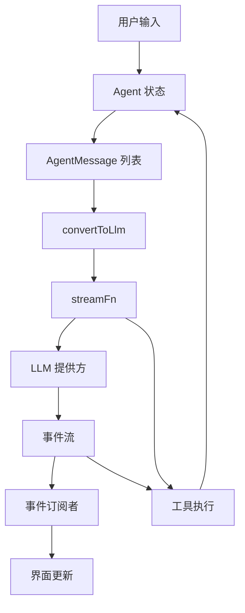
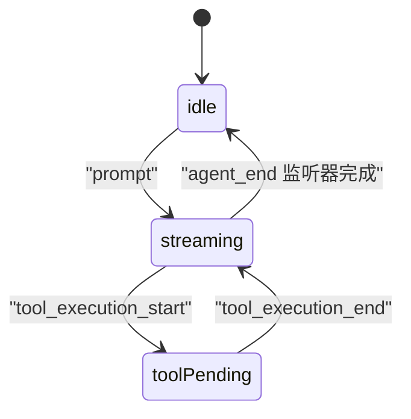
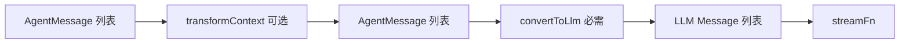
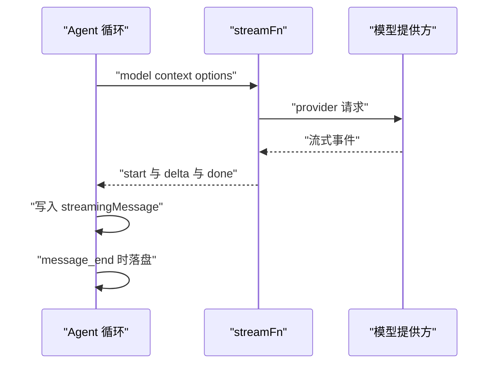
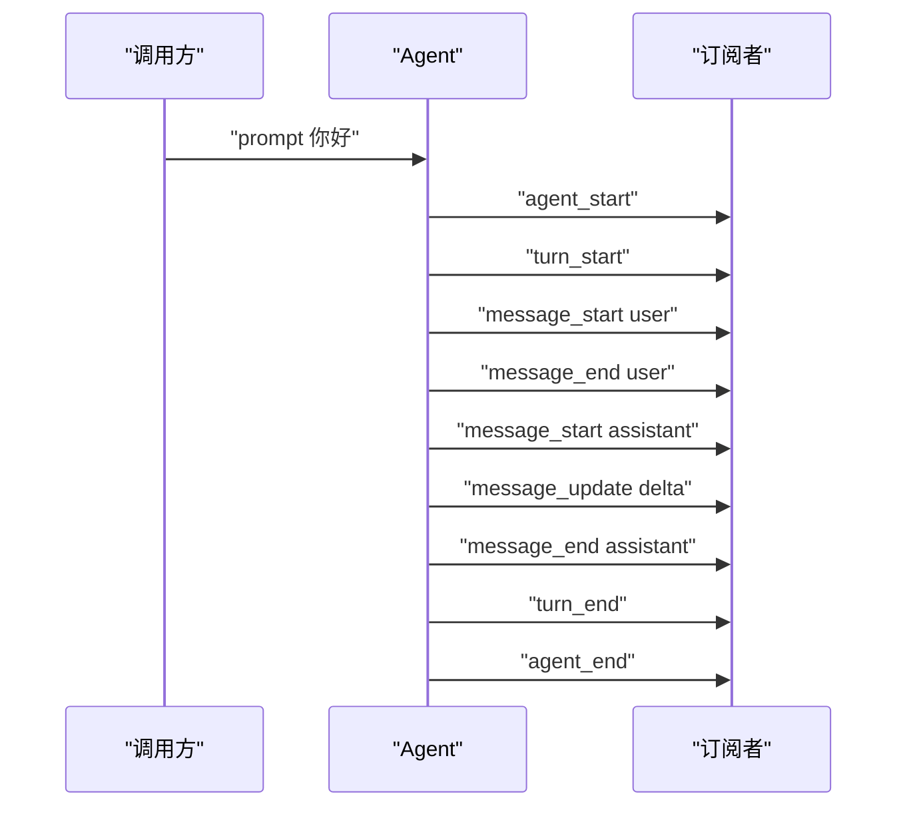
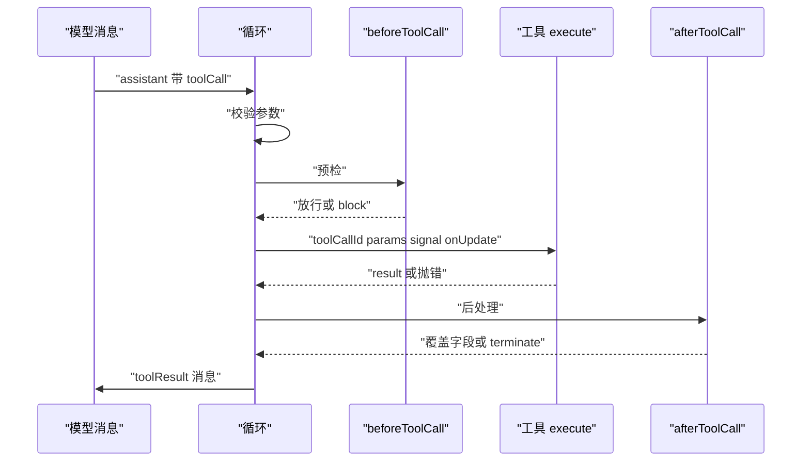
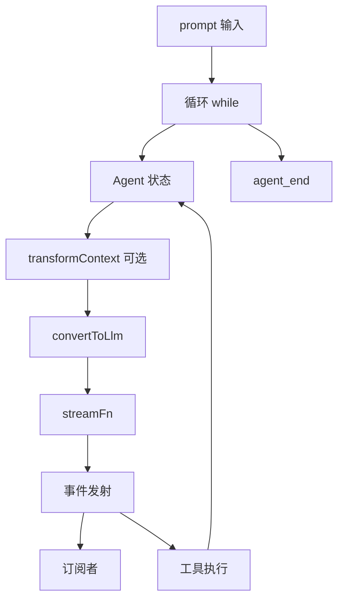

# 最简 Harness 架构：五个概念就够

!!! abstract "学完这一页你能"
    - 说出 Agent 状态里每个字段在哪个事件到达时被写入。
    - 写出一个 streamFn 注入点，把模型调用替换成自建函数。
    - 写出 convertToLlm，并说明它在每次 LLM 调用前的哪一步执行。
    - 订阅事件并复述一次 prompt 的事件到达顺序。
    - 定义 AgentTool，让工具抛出的错误进入 toolResult。

## 0. 知识地图

先看五个概念的连接方式。读图时先找到中间的状态块，再往两侧看输入与输出。



建议按这个顺序读：先读第 1 节理解状态，再读第 2 节理解消息边界。

第 3 节解释 streamFn 为什么单独抽出来。第 4 节解释事件如何回到订阅者。

第 5 节解释工具如何改变状态。第 6 节把五块拼成一个可以运行的最小 harness。

!!! note "术语：harness"
    harness 指把模型、状态、工具、事件串起来的那层外壳代码。例：本页最后的 Harness 类只做四件事，发事件、存消息、调 streamFn、跑工具。

## 1. Agent 状态

**先想一个问题**

你在终端里逐字打印模型回答。用户问“现在有几条消息”。你需要一个位置读取当前消息列表。

这个位置还要记录正在流式的半截消息。你可以把它当成循环读写的公共账本。

**心智模型**

!!! tip "心智模型"
    一句话模型：Agent 状态是循环每次迭代读写的公共账本。
    日常类比：厨房出餐口的订单夹，厨师和传菜员都看它。
    类比不成立：订单夹通常持久保存，Agent 状态默认只活在进程内存里。

!!! note "术语：Agent 状态"
    定义：Agent 在任意时刻暴露给外部的可变数据集合。
    例：model、thinkingLevel、tools、messages、isStreaming、streamingMessage、pendingToolCalls、errorMessage。

**图解**

下面这张 stateDiagram-v2 展示一次运行里状态的三个停留点。



1. 初始为 idle，isStreaming 为 false。
2. 调用 prompt 后进入 streaming，isStreaming 变为 true。
3. 工具开始执行时 pendingToolCalls 加入 toolCallId。
4. 工具结束时 pendingToolCalls 删除该 id。
5. agent_end 发出后仍要等监听器完成，之后才回到 idle。
6. 回到 idle 时 isStreaming 才变回 false。

**一步一步来**

第 1 步要做的事：创建状态，并让 messages 的赋值复制顶层数组。

```js
class AgentState {
  #messages = [];
  constructor(systemPrompt) {
    if (systemPrompt) {
      this.#messages.push({ role: "system", content: systemPrompt, timestamp: Date.now() });
    }
  }
  get messages() { return this.#messages; }
  set messages(next) { this.#messages = next.slice(); } // 复制顶层数组
  get systemPrompt() {
    return this.#messages.find((m) => m.role === "system")?.content ?? ""; // 只读回放
  }
}
const state = new AgentState("You are helpful.");
const incoming = [{ role: "user", content: "hi", timestamp: 1 }];
state.messages = incoming;
incoming.push({ role: "user", content: "外部追加", timestamp: 2 }); // 不应影响 state
console.log(state.messages.length); // 1
```

**这段代码在做什么**

- `messages` 的 getter 返回内部数组，外部 push 会改到内部。
- setter 用 `next.slice()` 复制顶层数组，外部后续 push 不再影响状态。
- `systemPrompt` 只有 getter，来源是消息列表里的 system 消息。
- 构造函数会补一条 system 消息，和 pi 的 initialState 行为对齐。
- 输出为 `1`。

第 2 步要做的事：用一个 reducer 把事件写进状态。

```js
function reduce(state, event) {
  if (event.type === "message_start") state.streamingMessage = event.message;
  if (event.type === "message_update") state.streamingMessage = event.message;
  if (event.type === "message_end") {
    state.streamingMessage = undefined;
    state.messages.push(event.message);
  }
  if (event.type === "tool_execution_start") state.pendingToolCalls.add(event.toolCallId);
  if (event.type === "tool_execution_end") state.pendingToolCalls.delete(event.toolCallId);
  if (event.type === "turn_end" && event.message.errorMessage) state.errorMessage = event.message.errorMessage;
}
```

**这段代码在做什么**

- `message_start` 与 `message_update` 都把事件里的 message 放到 streamingMessage。
- `message_end` 先清空 streamingMessage，再把消息推进 messages。
- `tool_execution_start` 把 toolCallId 加进 pendingToolCalls 集合。
- `tool_execution_end` 从集合删除该 id。
- `turn_end` 只在 assistant 消息带 errorMessage 时写 errorMessage。

**动手验证**

下面脚本无第三方依赖，用 Node 20+ 运行。

```js
// state-demo.mjs
import assert from "node:assert/strict";

const state = {
  messages: [{ role: "system", content: "You are helpful.", timestamp: 1 }],
  isStreaming: false,
  streamingMessage: undefined,
  pendingToolCalls: new Set(),
  errorMessage: undefined,
};

function reduce(state, event) {
  if (event.type === "message_start") state.streamingMessage = event.message;
  if (event.type === "message_end") {
    state.streamingMessage = undefined;
    state.messages.push(event.message);
  }
  if (event.type === "tool_execution_start") state.pendingToolCalls.add(event.toolCallId);
  if (event.type === "tool_execution_end") state.pendingToolCalls.delete(event.toolCallId);
  if (event.type === "turn_end" && event.message.errorMessage) state.errorMessage = event.message.errorMessage;
}

state.isStreaming = true;
reduce(state, { type: "message_start", message: { role: "assistant", content: [], timestamp: 2 } });
assert.equal(state.streamingMessage.timestamp, 2);
reduce(state, { type: "message_end", message: { role: "assistant", content: [], timestamp: 2 } });
assert.equal(state.streamingMessage, undefined);
assert.equal(state.messages.length, 2);
reduce(state, { type: "tool_execution_start", toolCallId: "call_1" });
assert.equal(state.pendingToolCalls.has("call_1"), true);
reduce(state, { type: "tool_execution_end", toolCallId: "call_1" });
assert.equal(state.pendingToolCalls.has("call_1"), false);
reduce(state, { type: "turn_end", message: { role: "assistant", errorMessage: "boom" }, toolResults: [] });
assert.equal(state.errorMessage, "boom");
state.isStreaming = false;
console.log("ok");
```

运行：`node state-demo.mjs`。预期输出：`ok`。

**常见坑**

| 现象 | 原因 | 怎么修 |
| --- | --- | --- |
| 外部数组改动后状态也变 | 直接把入参数组赋给内部字段 | 赋值时调用 slice 复制顶层数组 |
| 流式结束后 streamingMessage 还在 | 没有监听 message_end | 在 message_end 分支把 streamingMessage 置为 undefined |
| 工具执行完 pendingToolCalls 未清空 | 只写了 tool_execution_start | 在 tool_execution_end 分支删除对应 toolCallId |
| 误以为 isStreaming 在 agent_end 立即变 false | agent_end 之后还要等 awaited 监听器 | 等监听器全部 settle 后再收尾 |

**小结**

- Agent 状态是循环每次迭代读写的账本，不是持久化存储。
- messages 的 setter 复制顶层数组，getter 返回内部数组。
- isStreaming 要等 agent_end 监听器完成后才回到 false。

## 2. AgentMessage 与 LLM Message

**先想一个问题**

界面想显示一条“已保存”通知。这条通知属于界面，不属于对话。

模型只认识三种角色。你需要在调用前把通知挡掉。这个挡板就是 convertToLlm。

**心智模型**

!!! tip "心智模型"
    一句话模型：AgentMessage 是内部信封，LLM Message 是寄出的明信片。
    日常类比：前台收各类单据，寄给外部前只转抄允许的内容。
    类比不成立：前台可以自行决定丢单据，convertToLlm 的规则由你写在代码里。

!!! note "术语：AgentMessage"
    定义：Agent 内部使用的宽松消息类型。
    例：标准 user、assistant、toolResult，加上应用自定义的 notification 角色。

!!! note "术语：LLM Message"
    定义：模型提供方接受的消息集合，角色只有 user、assistant、toolResult 与 system。
    例：convertToLlm 过滤后的 messages 数组。

**图解**

消息从内部信封到提供方的四步转换。



1. 起点是 AgentMessage 列表。
2. transformContext 可选，用来剪枝或注入外部上下文。
3. 传出的仍是 AgentMessage 列表。
4. convertToLlm 必需，把自定义类型过滤或转成标准角色。
5. 输出 LLM Message 列表，交给 streamFn。
6. 每一轮 LLM 调用前都走这条链。

**一步一步来**

第 1 步要做的事：用 declaration merging 声明一个自定义消息类型。

```ts
declare module "@earendil-works/pi-agent-core" {
  interface CustomAgentMessages {
    notification: { role: "notification"; text: string; timestamp: number };
  }
}
const msg: AgentMessage = { role: "notification", text: "已保存", timestamp: Date.now() };
```

**这段代码在做什么**

- `declare module` 扩展包内的 CustomAgentMessages 接口。
- 新角色 notification 带 text 与 timestamp 两个字段。
- 扩展后 AgentMessage 联合类型接受 notification 对象。
- 这段声明只在 TypeScript 编译期生效，运行时对象照常创建。
- 资料未覆盖编译配置细节，需核对官方文档：tsconfig 的 module 设置。

第 2 步要做的事：写 convertToLlm，把通知转成 user 文本并过滤无法转换的角色。

```js
function convertToLlm(messages) {
  return messages.flatMap((message) => {
    if (message.role === "system") return [message];
    if (message.role === "user" || message.role === "assistant" || message.role === "toolResult") {
      return [message];
    }
    if (message.role === "notification") {
      return [{ role: "user", content: "[通知] " + message.text, timestamp: message.timestamp }];
    }
    return [];
  });
}
```

**这段代码在做什么**

- flatMap 让每条输入映射到零条或一条输出。
- system、user、assistant、toolResult 原样保留。
- notification 被转成 user 角色，文本前缀为 [通知]。
- 其他未知角色返回空数组，等于丢弃。
- 返回值就是 LLM Message 列表，不再含 notification 角色。

**动手验证**

脚本无第三方依赖。它验证自定义类型被转换，未知类型被丢弃。

```js
// convert-demo.mjs
import assert from "node:assert/strict";

function convertToLlm(messages) {
  return messages.flatMap((message) => {
    if (["system", "user", "assistant", "toolResult"].includes(message.role)) return [message];
    if (message.role === "notification") {
      return [{ role: "user", content: "[通知] " + message.text, timestamp: message.timestamp }];
    }
    return [];
  });
}

const input = [
  { role: "system", content: "You are helpful.", timestamp: 1 },
  { role: "notification", text: "已保存", timestamp: 2 },
  { role: "user", content: "继续", timestamp: 3 },
  { role: "debug", value: 1, timestamp: 4 },
];
const output = convertToLlm(input);
assert.equal(output.length, 3);
assert.equal(output[0].role, "system");
assert.equal(output[1].role, "user");
assert.equal(output[1].content, "[通知] 已保存");
assert.equal(output[2].content, "继续");
assert.equal(output.some((m) => m.role === "debug"), false);
console.log(JSON.stringify(output.map((m) => m.role)));
```

运行：`node convert-demo.mjs`。预期输出：`["system","user","user"]`。

**常见坑**

| 现象 | 原因 | 怎么修 |
| --- | --- | --- |
| 提供方报未知角色 | 自定义角色直接进入 LLM 调用 | 在 convertToLlm 里转成 user 或过滤 |
| 通知在历史里消失 | convertToLlm 返回空数组后没有别处保存 | 原始 AgentMessage 仍在 agent.state.messages 里 |
| 工具结果丢失 | convertToLlm 只保留了 user 与 assistant | 把 toolResult 加入保留列表 |
| 转换函数每轮被调用多次 | 以为只调用一次 | 资料写明每轮 LLM 调用前执行一次 |

**小结**

- AgentMessage 可以带应用自定义角色，LLM Message 只有固定角色。
- convertToLlm 是必需的桥，资料里 defaultConvertToLlm 保留 system、user、assistant、toolResult。
- transformContext 在 convertToLlm 之前执行，输入与输出都是 AgentMessage 列表。

## 3. streamFn 注入点：为什么把模型调用抽成函数

**先想一个问题**

同一段循环要服务 Anthropic 直连，也要服务浏览器经后端代理。测试时你还要一个返回固定文本的替身。

如果模型调用写死在循环里，每换一种就要改循环。抽成函数后，循环只认参数与返回流。

**心智模型**

!!! tip "心智模型"
    一句话模型：streamFn 是循环上的插座，换插座不改墙内电线。
    日常类比：打印机驱动，软件只调用打印接口。
    类比不成立：驱动常同步返回句柄，streamFn 返回异步可迭代流并带 result 方法。

!!! note "术语：streamFn"
    定义：一个接收 model、context、options，返回流式响应对象的函数。
    例：资料里把 `models.streamSimple` 绑定后传给 Agent 的 streamFn。

**图解**

一次调用里 streamFn 位于循环与提供方之间。



1. 循环准备好 model、LLM context 与 options。
2. 循环调用 streamFn。
3. streamFn 向提供方发起请求。
4. 提供方回传流式事件。
5. streamFn 把事件逐个交给循环。
6. 循环把 message_update 写给订阅者，把最终消息写入状态。

**一步一步来**

第 1 步要做的事：写出 streamFn 的签名与返回形状。

```js
async function* streamFn(model, context, options) {
  yield { type: "start", partial: { role: "assistant", content: [], timestamp: Date.now() } };
  yield { type: "text_delta", delta: "你好", partial: { role: "assistant", content: [{ type: "text", text: "你好" }], timestamp: Date.now() } };
  yield { type: "done", message: { role: "assistant", content: [{ type: "text", text: "你好" }], timestamp: Date.now() } };
}
```

**这段代码在做什么**

- 第一个参数 model 在资料里来自 config.model。
- 第二个参数 context 在资料里经过 normalizeContext 包装。
- 第三个参数 options 合并了 config 与解析后的 apiKey、signal。
- start 事件带 partial 消息，循环据此发出 message_start。
- text_delta 事件被循环转成 message_update。
- done 事件带最终消息，循环据此发出 message_end。

第 2 步要做的事：资料里的两种注入写法。

```js
import { Agent } from "@earendil-works/pi-agent-core";
import { createModels } from "@earendil-works/pi-ai";
import { anthropicProvider } from "@earendil-works/pi-ai/providers/anthropic";

const models = createModels();
models.setProvider(anthropicProvider());
const agent = new Agent({
  initialState: { systemPrompt: "You are a helpful assistant.", model: models.getModel("anthropic", "claude-sonnet-4-6") },
  streamFn: models.streamSimple.bind(models), // 直连提供方
});
```

**这段代码在做什么**

- createModels 创建模型注册表，setProvider 注册 anthropic 提供方。
- getModel 取出一个模型对象，放入 initialState.model。
- streamFn 用 bind 绑定 models，保持 this 指向。
- 资料里的 Agent 选项要求 streamFn，构造函数的注释称其为 required。
- 代理场景改用 `streamProxy(model, context, { ...options, authToken, proxyUrl })`。

第 3 步要做的事：低层 API 直接把 streamFn 作为参数传入。

```js
import { agentLoop } from "@earendil-works/pi-agent-core";

const streamFn = models.streamSimple.bind(models);
const context = { messages: [{ role: "system", content: "You are helpful.", timestamp: Date.now() }], tools: [] };
const config = { model: getModel("openai", "gpt-4o"), convertToLlm: (msgs) => msgs };
for await (const event of agentLoop([userMessage], context, config, undefined, streamFn)) {
  console.log(event.type);
}
```

**这段代码在做什么**

- agentLoop 的第五个参数就是 streamFn。
- context 携带 messages 与 tools，不携带 prompt 文本。
- config 携带 model 与 convertToLlm 等循环选项。
- 循环是异步可迭代的，逐个产出事件。
- 资料提醒低层流是观察性的，不等待异步事件处理完成。

**动手验证**

脚本无第三方依赖，用自建小循环验证 streamFn 收到的参数。

```js
// streamfn-demo.mjs
import assert from "node:assert/strict";

let received = null;
const fakeStreamFn = async (model, context, options) => {
  received = { model, context, options };
  return [{ type: "done", message: { role: "assistant", content: [{ type: "text", text: "你好" }], timestamp: 3 } }];
};

async function runLoop({ model, context, streamFn }) {
  const response = await streamFn(model, context, { apiKey: "test-key", signal: undefined });
  return response[0].message;
}

const message = await runLoop({
  model: { provider: "test", id: "m1" },
  context: { messages: [{ role: "user", content: "hi", timestamp: 1 }] },
  streamFn: fakeStreamFn,
});
assert.equal(received.model.id, "m1");
assert.equal(received.context.messages.length, 1);
assert.equal(received.options.apiKey, "test-key");
assert.equal(message.content[0].text, "你好");
console.log(message.content[0].text);
```

运行：`node streamfn-demo.mjs`。预期输出：`你好`。

**常见坑**

| 现象 | 原因 | 怎么修 |
| --- | --- | --- |
| streamFn 内 this 指向丢失 | 直接传方法引用 | 用 bind 绑定 models |
| 以为 prompt 在 context 上 | 资料写明 prompt 与工具在 transcript 的 system 消息里 | 从 transcript 读取，而不是从 context 字段读 |
| 代理场景直连提供方 | 浏览器暴露密钥 | 改用 streamProxy 并把 authToken 放后端 |
| 低层循环与 Agent 类混用后事件顺序错乱 | 低层流不等待异步监听器 | 需要屏障语义时用 Agent 类 |

**小结**

- streamFn 是注入点，循环只依赖签名，不依赖具体提供方。
- 资料中的 Agent 选项把 streamFn 标为必需。
- apiKey 由循环解析后经 options 传给 streamFn，适合会过期的令牌。

## 4. 事件订阅

**先想一个问题**

终端要逐字打印，同时要记录每个工具的开始时间。你不想让循环知道终端与计时器。

订阅把“发生什么”和“看到后做什么”分开。循环只发事件，界面与日志各自订阅。

**心智模型**

!!! tip "心智模型"
    一句话模型：事件订阅是广播接收机，循环是发射塔。
    日常类比：电台播音，收音机自己决定录不录。
    类比不成立：电台不等听众，pi 的监听器按注册顺序被 await。

!!! note "术语：事件订阅"
    定义：向 Agent 注册一个异步回调，在事件发生时被调用。
    例：`agent.subscribe(listener)` 返回一个取消订阅的函数。

**图解**

一次带工具调用的 prompt 会发出这些事件。



1. agent_start 标记本次运行开始。
2. turn_start 标记一轮开始，一轮包含一次 LLM 调用与工具执行。
3. 用户消息先发 message_start，再发 message_end。
4. assistant 消息在流式期间发多条 message_update，只对 assistant 生效。
5. assistant 消息结束时发 message_end。
6. turn_end 带 assistant 消息与 toolResults 数组。
7. agent_end 是本次运行最后一个循环事件。

**一步一步来**

第 1 步要做的事：写一个订阅器，并按事件类型分支。

```js
const unsubscribe = agent.subscribe(async (event, signal) => {
  if (event.type === "message_update" && event.assistantMessageEvent.type === "text_delta") {
    process.stdout.write(event.assistantMessageEvent.delta); // 只打印新增片段
  }
  if (event.type === "agent_end") {
    await flushSessionState(signal); // agent_end 监听器也算入结算
  }
});
unsubscribe();
```

**这段代码在做什么**

- subscribe 的回调可以接收 event 与 signal 两个参数。
- message_update 只在 assistant 消息期间出现。
- assistantMessageEvent.type 为 text_delta 时，delta 是本片段文本。
- agent_end 的异步监听器会被等待，影响运行结算时间。
- 调用 unsubscribe 可以移除该监听器。

第 2 步要做的事：在事件里归约状态与做副作用。

```js
agent.subscribe((event) => {
  if (event.type === "tool_execution_start") {
    console.log("start", event.toolName, event.toolCallId); // 副作用
  }
  if (event.type === "turn_end") {
    console.log("turn done", event.toolResults.length); // 读取结果数量
  }
});
```

**这段代码在做什么**

- tool_execution_start 携带 toolCallId、toolName、args。
- 这里只写日志，不修改 agent 内部状态。
- turn_end 携带 message 与 toolResults。
- 一个 turn 可以包含多条工具结果。
- 订阅顺序影响 await 顺序，先注册的先被等待。

**动手验证**

脚本无第三方依赖，验证监听器按注册顺序被 await。

```js
// events-demo.mjs
import assert from "node:assert/strict";

class Emitter {
  #listeners = [];
  subscribe(listener) {
    this.#listeners.push(listener);
    return () => { this.#listeners = this.#listeners.filter((l) => l !== listener); };
  }
  async emit(event) {
    for (const listener of this.#listeners) await listener(event);
  }
}

const emitter = new Emitter();
const order = [];
const off = emitter.subscribe(async () => { await new Promise((r) => setTimeout(r, 5)); order.push("first"); });
emitter.subscribe(() => { order.push("second"); });

await emitter.emit({ type: "agent_start" });
assert.deepEqual(order, ["first", "second"]);
off();
await emitter.emit({ type: "agent_end" });
assert.deepEqual(order, ["first", "second"]);
console.log(order.join(","));
```

运行：`node events-demo.mjs`。预期输出：`first,second`。

**常见坑**

| 现象 | 原因 | 怎么修 |
| --- | --- | --- |
| 界面等很久才结束 | agent_end 监听器里有耗时任务 | 把收尾工作移出监听器，或在监听器里自己做超时 |
| 取消订阅后仍有日志 | 忘记调用 subscribe 返回的函数 | 保存返回值并在适当时机调用 |
| 以为 message_update 对所有消息都发 | 资料写明只对 assistant 消息 | 用 event.message.role 判断，不要只看 type |
| 事件处理未完成就进入工具预检 | 用了低层 agentLoop 流 | 需要屏障时改用 Agent 类 |

**小结**

- 订阅把副作用与循环分离，回调按注册顺序被 await。
- message_update 只针对 assistant，delta 在 assistantMessageEvent 里。
- agent_end 是最后一个循环事件，但运行结算要等其 awaited 监听器。

## 5. 工具

**先想一个问题**

模型回复里带了 read_file 调用与 path 参数。循环要校验参数、执行、把结果写成 toolResult 消息。

如果工具直接返回错误文本，模型分不清“工具坏了”和“工具正常工作但内容是错误提示”。所以资料要求抛错。

**心智模型**

!!! tip "心智模型"
    一句话模型：AgentTool 是带参数表的可调用单元，错误用抛错表达。
    日常类比：外包窗口，填单后交件，出问题走异常通道。
    类比不成立：窗口可能只拒单不报错，AgentTool 抛出的错误会被循环转成 isError 的 toolResult。

!!! note "术语：AgentTool"
    定义：带 name、description、parameters 与 execute 的工具对象。
    例：read_file 工具用 Type.Object 描述 path 参数。

**图解**

一次工具调用在循环里的完整路径。



1. 模型消息里出现 toolCall 内容块。
2. 循环按工具的参数表校验参数。
3. beforeToolCall 可以拦截，返回 block 与 reason。
4. 放行后调用工具的 execute。
5. 工具可以抛错；抛出的错误被循环转成 isError 为 true 的 toolResult。
6. afterToolCall 可以覆盖 content、details、isError 或加 terminate。
7. 最终 toolResult 消息进入下一轮。

**一步一步来**

第 1 步要做的事：定义一个 AgentTool。

```ts
import { Type } from "typebox";

const readFileTool: AgentTool = {
  name: "read_file",
  label: "Read File",
  description: "Read a file's contents",
  parameters: Type.Object({ path: Type.String({ description: "File path" }) }),
  executionMode: "sequential", // 该工具强制整批顺序执行
  execute: async (toolCallId, params, signal, onUpdate) => {
    const content = await fs.readFile(params.path, "utf-8");
    onUpdate?.({ content: [{ type: "text", text: "Reading..." }], details: {} });
    return { content: [{ type: "text", text: content }], details: { path: params.path, size: content.length } };
  },
};
agent.state.tools = [readFileTool];
```

**这段代码在做什么**

- name 是模型调用时使用的标识，label 给界面显示。
- parameters 用 Type.Object 描述，循环用 validateToolArguments 校验。
- executionMode 为 sequential 时整批工具顺序执行。
- execute 接收 toolCallId、校验后的 params、signal 与 onUpdate。
- onUpdate 可多次调用，循环把它转成 tool_execution_update 事件。
- 返回值里 content 是消息内容，details 随 toolResult 保存。

第 2 步要做的事：用抛错表达失败。

```js
execute: async (toolCallId, params, signal, onUpdate) => {
  if (!fs.existsSync(params.path)) {
    throw new Error(`File not found: ${params.path}`); // 抛错而不是返回错误文本
  }
  const content = await fs.readFile(params.path, "utf-8");
  return { content: [{ type: "text", text: content }] };
}
```

**这段代码在做什么**

- 文件不存在时抛出 Error。
- 循环捕获异常，生成 isError 为 true 的 toolResult。
- 模型在下一轮看到 isError 标记与错误文本。
- 成功路径只返回正常 content。
- 资料要求不要在成功路径里塞错误提示文本。

**动手验证**

脚本无第三方依赖，模拟工具执行与错误转换。

```js
// tools-demo.mjs
import assert from "node:assert/strict";

async function runTool(tool, toolCall, signal) {
  try {
    const result = await tool.execute(toolCall.id, toolCall.arguments, signal, () => {});
    return { role: "toolResult", toolCallId: toolCall.id, toolName: toolCall.name, content: result.content ?? [], isError: false, timestamp: Date.now() };
  } catch (error) {
    return { role: "toolResult", toolCallId: toolCall.id, toolName: toolCall.name, content: [{ type: "text", text: error.message }], isError: true, timestamp: Date.now() };
  }
}

const okTool = { execute: async (id, params) => ({ content: [{ type: "text", text: "hello " + params.name }] }) };
const badTool = { execute: async () => { throw new Error("File not found"); } };

const ok = await runTool(okTool, { id: "c1", name: "greet", arguments: { name: "Ada" } });
assert.equal(ok.isError, false);
assert.equal(ok.content[0].text, "hello Ada");

const bad = await runTool(badTool, { id: "c2", name: "read_file", arguments: {} });
assert.equal(bad.isError, true);
assert.equal(bad.content[0].text, "File not found");
console.log(ok.isError, bad.isError);
```

运行：`node tools-demo.mjs`。预期输出：`false true`。

**常见坑**

| 现象 | 原因 | 怎么修 |
| --- | --- | --- |
| 模型继续执行坏参数 | 工具返回了错误文本而不是抛错 | 失败时 throw，让循环标记 isError |
| 并行批次里某个工具改共享文件 | 该工具没有设置 sequential | 给工具设置 executionMode 为 sequential，整批会顺序执行 |
| toolResult 消息顺序与完成顺序不一致 | 并行模式下事件按完成顺序发，消息按 assistant 源顺序落盘 | 读取消息时按数组顺序，读取事件时按到达顺序 |
| terminate 只想让一个工具停止就生效 | 资料要求同批所有工具结果都为 terminate | 让整批都返回 terminate，或不要依赖提前停止 |

**小结**

- AgentTool 由参数表与 execute 组成，参数由循环校验。
- 工具失败要抛错，循环把它转成 isError 为 true 的 toolResult。
- 并行是默认模式，事件顺序与 toolResult 消息顺序可能不同。

## 6. 最小架构图与与完整产品的差距清单

**先想一个问题**

五个概念都单独看过一遍，合起来是什么形状。你还要知道这套最小结构离完整产品缺哪些部分。

先看最小结构能做什么。再看它没有做什么，避免把教程代码当成产品。

**心智模型**

!!! tip "心智模型"
    一句话模型：最小 harness 是一个循环加四条边界，边界是状态、转换、模型调用、事件。
    日常类比：一台手摇咖啡机，磨豆、压粉、出液都在手边完成。
    类比不成立：咖啡机有物理上限，harness 的边界可以逐个替换成持久化与远程服务。

**图解**

下面是最小架构的整体连接。



1. prompt 输入进入循环。
2. 循环从 Agent 状态取 messages 与 tools。
3. transformContext 可选，做剪枝或注入。
4. convertToLlm 把 AgentMessage 转成 LLM Message。
5. streamFn 调提供方并在流式期间发 message_update。
6. 事件发射给订阅者，同时把最终消息写回状态。
7. 如果 assistant 消息带工具调用，执行工具并把 toolResult 写回状态。
8. 没有工具也没有后续输入时发 agent_end。

**一步一步来**

第 1 步要做的事：组装最小循环的骨架。

```js
async function runOnce(harness, text) {
  await harness.emit({ type: "agent_start" });
  await harness.emit({ type: "turn_start" });
  const userMessage = { role: "user", content: [{ type: "text", text }], timestamp: Date.now() };
  await harness.emit({ type: "message_start", message: userMessage });
  await harness.emit({ type: "message_end", message: userMessage });
  harness.state.messages.push(userMessage);
  const llmMessages = harness.convertToLlm(harness.state.messages);
  const assistantMessage = await harness.streamFn(harness.model, { messages: llmMessages }, {});
  await harness.emit({ type: "message_start", message: assistantMessage });
  await harness.emit({ type: "message_end", message: assistantMessage });
  harness.state.messages.push(assistantMessage);
  await harness.emit({ type: "turn_end", message: assistantMessage, toolResults: [] });
  await harness.emit({ type: "agent_end", messages: harness.state.messages });
}
```

**这段代码在做什么**

- agent_start 与 turn_start 先发出。
- 用户消息发出 start 与 end 两个事件，再推入状态。
- convertToLlm 在 streamFn 之前调用。
- streamFn 返回的 assistant 消息也发出 start 与 end。
- turn_end 的 toolResults 为空数组，表示这一轮没有工具。
- agent_end 携带全部消息。

第 2 步要做的事：在循环里加入工具分支。

```js
const toolCalls = assistantMessage.content.filter((c) => c.type === "toolCall");
const toolResults = [];
if (toolCalls.length > 0) {
  for (const call of toolCalls) {
    await harness.emit({ type: "tool_execution_start", toolCallId: call.id, toolName: call.name, args: call.arguments });
    const result = await runTool(harness.tools.find((t) => t.name === call.name), call, undefined);
    await harness.emit({ type: "tool_execution_end", toolCallId: call.id, toolName: call.name, result: result.content, isError: result.isError });
    await harness.emit({ type: "message_start", message: result });
    await harness.emit({ type: "message_end", message: result });
    harness.state.messages.push(result);
    toolResults.push(result);
  }
}
await harness.emit({ type: "turn_end", message: assistantMessage, toolResults });
```

**这段代码在做什么**

- 从 assistant 消息里筛出 type 为 toolCall 的内容块。
- 每个调用先发 tool_execution_start。
- 执行后发 tool_execution_end，带 result 与 isError。
- toolResult 消息也走 message_start 与 message_end。
- 所有结果放进 toolResults，随 turn_end 发出。
- 资料里的循环在这之后会再开一轮，让模型看到工具结果。

**动手验证**

下面脚本无第三方依赖，组装一个最小 harness 并断言事件顺序。

```js
// minimal-harness.mjs
import assert from "node:assert/strict";

class Harness {
  constructor({ systemPrompt, streamFn }) {
    this.systemPrompt = systemPrompt;
    this.model = { provider: "test", id: "m1" };
    this.streamFn = streamFn;
    this.state = { messages: [{ role: "system", content: systemPrompt, timestamp: 1 }], isStreaming: false };
    this.listeners = [];
  }
  subscribe(listener) { this.listeners.push(listener); return () => { this.listeners = this.listeners.filter((l) => l !== listener); }; }
  async emit(event) { for (const listener of this.listeners) await listener(event); }
  convertToLlm(messages) {
    return messages.filter((m) => ["system", "user", "assistant", "toolResult"].includes(m.role));
  }
  async prompt(text) {
    this.state.isStreaming = true;
    const seen = [];
    const off = this.subscribe(async (event) => { seen.push(event.type); });
    await this.emit({ type: "agent_start" });
    await this.emit({ type: "turn_start" });
    const userMessage = { role: "user", content: [{ type: "text", text }], timestamp: 2 };
    await this.emit({ type: "message_start", message: userMessage });
    await this.emit({ type: "message_end", message: userMessage });
    this.state.messages.push(userMessage);
    const llmMessages = this.convertToLlm(this.state.messages);
    const assistantMessage = await this.streamFn(this.model, { messages: llmMessages });
    await this.emit({ type: "message_start", message: assistantMessage });
    await this.emit({ type: "message_update", message: assistantMessage, assistantMessageEvent: { type: "text_delta", delta: "ok" } });
    await this.emit({ type: "message_end", message: assistantMessage });
    this.state.messages.push(assistantMessage);
    await this.emit({ type: "turn_end", message: assistantMessage, toolResults: [] });
    this.state.isStreaming = false;
    await this.emit({ type: "agent_end", messages: this.state.messages });
    off();
    return seen;
  }
}

const fakeStreamFn = async () => ({ role: "assistant", content: [{ type: "text", text: "ok" }], stopReason: "stop", timestamp: 3 });
const harness = new Harness({ systemPrompt: "You are helpful.", streamFn: fakeStreamFn });
const seen = await harness.prompt("hi");
assert.deepEqual(seen, ["agent_start", "turn_start", "message_start", "message_end", "message_start", "message_update", "message_end", "turn_end", "agent_end"]);
assert.equal(harness.state.messages.length, 3);
assert.equal(harness.state.isStreaming, false);
console.log(seen.length, seen[seen.length - 1]);
```

运行：`node minimal-harness.mjs`。预期输出：`9 agent_end`。

**与完整产品的差距清单**

| 能力 | 最小 harness | 完整产品需要 |
| --- | --- | --- |
| 模型注册与鉴权 | 只接一个 streamFn | 用 createModels 与 setProvider 管理多家提供方，接 getApiKey 刷新令牌 |
| 上下文管理 | 不剪枝，全部消息发出 | transformContext 做剪枝与压缩，prepareRequest 在每次请求前重建上下文 |
| 队列输入 | 没有 | steering 与 follow-up 队列，steeringMode 与 followUpMode 控制每次取几条 |
| 工具并发 | 逐个执行 | toolExecution 选 parallel 或 sequential，按 per-tool executionMode 覆盖 |
| 工具前后钩子 | 没有 | beforeToolCall 拦截，afterToolCall 覆盖结果并支持 terminate |
| 事件面 | 九种事件中的一部分 | 九种循环事件，外加 message_update 的多类 assistantMessageEvent |
| 会话持久化 | 内存数组 | prepareRequest 里从会话存储加载规范消息，agent_end 监听器里落盘 |
| MCP 与 codemode | 没有 | 用 @earendil-works/pi-mcp 与 @earendil-works/pi-codemode 包，按示例包装成 AgentTool |
| 界面渲染 | 无 | 订阅事件并渲染，text_delta 负责逐字输出 |
| 中断 | 无 | abort 取消当前运行，waitForIdle 等运行与监听器结算 |

资料未覆盖的部分：会话存储格式、UI 渲染框架、MCP 服务器清单。这些需核对官方文档。

**常见坑**

| 现象 | 原因 | 怎么修 |
| --- | --- | --- |
| 把教程循环当产品直接上线 | 教程没有持久化、鉴权刷新与中断 | 按差距清单逐项接入，或直接用 Agent 类 |
| 以为最小 harness 有重试 | 教程循环不包含重试 | 用 Agent 选项里的 maxRetryDelayMs，并核对官方文档的重试语义 |
| 工具结果后循环不继续 | 教程示例没有写下一轮 | 在 turn_end 后判断 toolResults 非空则再跑一轮 |
| 事件顺序与资料不同 | 教程省略了 prepareRequest 与 finishTurn | 需要这些阶段时用 Agent 类，或按资料补上钩子 |

**小结**

- 最小 harness 是循环加四条边界：状态、转换、streamFn、事件。
- 工具分支只是在循环里插入工具执行与 toolResult 消息。
- 完整产品在鉴权、持久化、队列、中断、MCP 与界面上都有额外工作。

## 综合对比

| 维度 | Agent 类 | 低层 agentLoop |
| --- | --- | --- |
| 事件与异步监听器 | 等待监听器结算后才 idle | 观察性流，不等异步处理 |
| 状态归约 | 内部 processEvents 写入状态 | 由调用方自行维护 |
| 工具预检屏障 | assistant message_end 处理完成后才开始工具预检 | 资料未覆盖等价屏障 |
| 队列输入 | steer、followUp、clearAllQueues | 需自行实现 |
| 使用场景 | 应用主路径 | 需要直接控制事件顺序 |

| 维度 | AgentMessage | LLM Message |
| --- | --- | --- |
| 角色范围 | 标准三种加自定义角色 | system、user、assistant、toolResult |
| 转换时机 | convertToLlm 之前 | convertToLlm 之后 |
| 是否需要转换 | 作为输入 | 作为输出交给 streamFn |

| 维度 | parallel 工具模式 | sequential 工具模式 |
| --- | --- | --- |
| 默认值 | 是 | 否 |
| 事件顺序 | 按工具完成顺序 | 按调用顺序 |
| toolResult 消息顺序 | 按 assistant 源顺序 | 按调用顺序 |
| 触发顺序模式 | 全局或任一工具声明 sequential | 全局设为 sequential 或工具声明 |

## 应用与行业实践

这一节把五个概念放回真实产品里。读的时候盯住一件事：状态字段、事件、工具返回值三者谁先谁后。

### 应用场景地图

| 场景 | 用到本页哪个知识点 | 典型技术选型 | 注意事项 |
| --- | --- | --- | --- |
| 后台管理的万行表格 | Agent 状态、事件订阅、AgentTool | TypeScript Harness + Postgres + 虚拟滚动 | 导出工具失败要进 toolResult，不要抛异常打断回合 |
| 低端安卓机的首屏加载 | streamFn 注入点、convertToLlm | 自建 streamFn + 本地缓存 + 上下文裁剪 | 首帧先渲染骨架，不要把首屏绑在首个 token 上 |
| 多人协作白板 | Agent 状态、事件订阅 | WebSocket + 事件日志 + 序号合并 | 事件带递增序号，重复投递要幂等 |
| 客服工单自动分类 | AgentMessage 与 LLM Message、convertToLlm | 工单系统 + 分类工具 + 人工审核队列 | 内部字段不能进 LLM Message，转换层用白名单 |
| 电商大促库存问答 | AgentTool、streamFn 注入点 | 库存服务 API + 超时降级 | 工具超时要转成可读的 toolResult 文案 |
| 代码仓库巡检机器人 | AgentTool、事件订阅 | CI 流水线 + 静态检查 + 评论回写 | 工具输出要截断，别把整份日志塞回上下文 |
| 会议纪要实时转写 | 事件订阅、streamFn | 流式 ASR + 增量摘要 | 字幕与摘要分两条流，互不阻塞 |
| IoT 设备告警降噪 | Agent 状态、convertToLlm | 规则引擎 + 聚合窗口 | 历史告警按时间窗裁剪后再转 LLM Message |

### 三个场景拆解

#### 场景 1：后台管理的万行表格

**业务背景**

运营要在一张万行订单表上做筛选、排序、导出，筛选条件还带自然语言描述。表格数据来自内部 API，单次全量拉取会让页面卡住两三秒。

**怎么用本页知识解决**

思路：让工具负责取数，事件负责驱动视图，模型调用走自建函数以便审计。

```ts
// 示意代码：接口名沿用本页概念，按你自己的 Harness 命名替换
const tableTool: AgentTool = {
  name: "queryRows",
  run: async (args) => {
    try {
      return { ok: true, rows: await db.query(args) }; // 成功返回结构化数据
    } catch (err) {
      return { ok: false, message: String(err) }; // 失败也返回，交给 toolResult
    }
  },
};

agent.subscribe("toolResult", (e) => {
  if (e.name === "queryRows") tableSource.set(e.result.rows); // 事件到达才写视图
});

agent.streamFn = async (input) => gateway.chat(input); // 换内部网关，便于埋点与限流
```

- `run` 内部用 try/catch 包住，任何异常都变成 `{ ok: false }`。
- 视图只订阅 `toolResult`，不直接读工具返回值，写入时机统一。
- `streamFn` 换成内部网关后，请求头里能带 traceId。
- 工具返回 `ok` 标志，UI 用它决定显示表格还是错误条。

**怎么度量收益**

用 `performance.now()` 在"点击筛选"和"首行渲染"各打一个点，上报 p50 与 p95。后端用 OpenTelemetry 记录工具 span 时长，看取数占整个回合的比例。渲染卡顿看 Chrome DevTools Performance 面板的长任务数量。

**什么时候不该用**

- 表格是静态且行数固定，直接一次性渲染加前端过滤就行，引入 Agent 只会增加延迟。
- 筛选条件是纯字段枚举，SQL 拼好即可，模型判断反而引入不确定性。

#### 场景 2：低端安卓机的首屏加载

**业务背景**

低端安卓机上首屏要等模型返回第一个 token 才渲染，用户看到白屏就会退出。网络抖动的环境下，这个等待时间会翻倍。

**怎么用本页知识解决**

思路：把模型调用抽成函数后，缓存命中走本地，未命中走远端；进 LLM 的消息先裁剪。

```ts
// 示意代码：首屏先出骨架，模型结果后到
agent.streamFn = async (input, signal) => {
  const key = hash(input.messages);
  const cached = cache.get(key); // 命中本地缓存直接返回
  if (cached) return cached;
  return remoteStream(input, signal); // 未命中才走远端
};

function convertToLlm(messages: AgentMessage[]) {
  return messages
    .slice(-6) // 只带最近 6 条，控制首包体积
    .map(({ role, content }) => ({ role, content })); // 丢掉 Harness 专有字段
}

agent.subscribe("messageDelta", () => keepSkeleton()); // 增量到达时维持骨架状态
```

- 缓存键由消息内容算出，同一问题重复进入直接命中。
- `convertToLlm` 只保留 `role` 和 `content`，工具元数据不进请求体。
- 裁剪规则写死在函数里，读代码就能知道带了历史。
- 骨架由事件驱动更新，首帧不依赖网络。

**怎么度量收益**

用 Chrome DevTools Performance 面板看 LCP 与 TBT，用 WebPageTest 在低速网络档位复测。缓存命中率从自建 metrics 计数器读取，按天对比。

**什么时候不该用**

- 页面本身是静态说明页，没有模型调用，做缓存层是多余开销。
- 业务要求每次都取最新数据，缓存会导致用户看到过期内容。

#### 场景 3：多人协作白板

**业务背景**

白板上一次操作要广播给其他协作者，网络中断时操作会丢。断线重连后，历史操作需要按序号补齐。

**怎么用本页知识解决**

思路：把白板操作定义成工具，错误不抛出而是回填，订阅事件做重试队列。

```ts
// 示意代码：白板操作走工具，错误进 toolResult
const drawTool: AgentTool = {
  name: "applyStroke",
  run: async (stroke) => {
    const seq = state.boardSeq + 1; // 状态里维护单调递增序号
    try {
      await ws.send({ seq, stroke }); // 广播给其他协作者
      return { ok: true, seq };
    } catch (err) {
      return { ok: false, seq, message: "网络中断，已排队重试" }; // 错误进 toolResult
    }
  },
};

agent.subscribe("toolResult", (e) => {
  if (!e.result.ok) retryQueue.push(e.result.seq); // 失败序号进入重试队列
});
```

- 序号存在 Agent 状态里，断线重连后从状态恢复。
- 工具返回 `ok: false` 也走 `toolResult`，主流程不中断。
- 重试队列只记序号，数据本身仍在工具入参里。
- 收到重复序号时按幂等处理，不重复绘制。

**怎么度量收益**

用 OpenTelemetry 记录从本地操作到服务端确认的 span 时长，看 p95。断线重连后比对本地序号与服务端序号的最大差值。丢帧看白板渲染循环的帧间隔。

**什么时候不该用**

- 单人使用的白板，不需要序号与重试队列，直接调接口即可。
- 延迟敏感且允许丢帧的涂鸦场景，重试队列会让画面回跳。

### 行业先进实践

**模型调用封装成可替换的流式函数（出处：Vercel AI SDK 官方文档）**

该 SDK 把流式生成和一次性生成分成独立入口，模型提供商在调用处替换。这样做让上层代码不绑定某家模型。你的项目可照此把 `streamFn` 定义成接口，把网关、缓存、重试都放在实现里。

**工具错误回填为工具结果而不是中断对话（出处：Anthropic 官方文档 Tool use）**

文档说明工具执行结果以 tool result 形式回给模型，并可用标记表示这次调用失败。模型因此能读到失败原因并调整下一步。你的 `AgentTool` 应返回结构化成败，而不是抛异常。

**流式响应里累积工具调用分片（出处：OpenAI 官方文档 Streaming 与 Function calling）**

流式返回中，工具调用的参数会分多个分片到达，需要按索引拼接后再解析。忽略这点会拿到残缺的 JSON。你的 `streamFn` 解析层要有拼接缓冲，拼接完成才发 `toolCall` 事件。

**用标准协议暴露工具（出处：Model Context Protocol 官方规范）**

该规范用 JSON-RPC 定义工具列举与调用，工具描述和调用结果都有固定字段。借这个结构，工具可以跨进程复用。你的项目可先对齐字段命名，再考虑换传输层。

**统一消息表示后按提供商转换（出处：LangChain 官方文档 Messages）**

文档区分了统一消息对象与各提供商的原生格式，中间有转换步骤。需核对官方文档：转换函数的确切名称与当前推荐用法。你的 `convertToLlm` 就是这个位置，先定内部格式再写映射。

### 从学到用：落地路线

1. **试点**：挑一个只读、失败不影响主流程的功能接上 Harness，比如报表查询助手。验收标准：该功能的事件顺序能在日志里完整复现。
2. **验证**：给这个功能加上 `streamFn` 替换与工具错误回填，跑一周。验收标准：工具失败全部以 `toolResult` 形式出现，没有异常中断记录。
3. **推广**：把消息转换层抽成公共模块，其他功能按同一份 `convertToLlm` 写映射。验收标准：新增功能不需要改 Harness 核心代码。
4. **防回退**：为事件顺序和转换输出各写一组回归用例，接进 CI。验收标准：改动核心代码时用例必须全绿才允许合并。

### 动手作业

**目标**：实现一个只读的"订单查询助手"，包含状态、事件、工具、`streamFn` 注入点和 `convertToLlm`。

**步骤**

1. 定义 Agent 状态，至少包含 `messages`、`isStreaming`、`lastToolResult` 三个字段。
2. 实现 `AgentTool`，名为 `queryOrders`，入参是时间区间，返回 `{ ok, rows }`。
3. 写 `convertToLlm`，把 `AgentMessage` 数组映射成只含 `role` 与 `content` 的数组。
4. 写一个 `streamFn`，先查本地缓存，未命中再调用你选的模型接口。
5. 订阅 `toolCall`、`toolResult`、`messageDelta` 三个事件，各自打印一行带时间戳的日志。
6. 触发一次提问，把日志按到达顺序整理成一份事件序列表。
7. 人为让 `queryOrders` 抛错一次，确认错误进入 `toolResult` 且日志不断流。

**验收标准**

- 事件日志能显示出 `toolCall` 在 `toolResult` 之前，`messageDelta` 在两者之后。
- `convertToLlm` 的输出里不存在工具元数据字段。
- 工具抛错时，回合继续执行并产生一条 `ok: false` 的结果。
- 相同消息第二次提问时，缓存命中记录出现在日志中。
- 事件序列表与实际日志逐行对上，没有缺项。

## 深入阅读与参考

!!! tip "怎么用这些资料"
    先读「官方文档与规范」建立准确的概念，再读「源码与示例」核对细节，最后用「教程、书籍与视频」换一种讲法加深理解。每条都写明了读哪一节、带着什么问题读。

### 官方文档与规范

| 资源 | 为什么读 | 怎么读 |
|---|---|---|
| [Claude Agent SDK 概览](https://docs.claude.com/en/api/agent-sdk/overview) | 官方 SDK 文档，展示真实产品里 agent loop 与工具调用的组织方式。 | 按快速开始写一个读目录并总结的小 Agent，观察每轮消息与工具调用日志。 |
| [A practical guide to building agents（OpenAI）](https://cdn.openai.com/business-guides-and-resources/a-practical-guide-to-building-agents.pdf) | 官方指南给出模型、工具、指令三要素，可当架构最小集校验表。 | 读单 Agent 章节，用三要素逐条检查自己的设计，列出缺项并补齐。 |
| [Vercel AI SDK Agents](https://ai-sdk.dev/docs/agents/overview) | SDK 的 agent 抽象展示多步循环与终止条件，和 streamFn 注入思路相近。 | 跑通多步工具调用示例，设 maxSteps 观察循环何时终止、事件如何抛出。 |
| [OpenTelemetry GenAI 语义约定](https://opentelemetry.io/docs/specs/semconv/gen-ai/) | 官方规范定义 LLM 调用的标准属性，是事件订阅与可观测性的依据。 | 查 span 与 token 相关属性，给自己的调用补三项指标并验证是否上报成功。 |

### 源码与示例

| 资源 | 为什么读 | 怎么读 |
|---|---|---|
| [pi 编码 Agent 工具集](https://github.com/earendil-works/pi) | 含完整 agent loop 与统一 LLM API 封装，可直接对照本页五个概念。 | 读 agent loop 与模型调用两处，追问 streamFn 如何注入；再比对自己循环并记录差异。 |
| [Claude Agent SDK（TypeScript）](https://github.com/anthropics/claude-agent-sdk-typescript) | 可运行示例代码，自定义工具注册与循环控制写法一目了然。 | 克隆运行 README 示例，再把一个本地函数注册成工具，看参数如何传入与返回。 |
| [smolagents 仓库](https://github.com/huggingface/smolagents) | 核心循环不到千行，是理解最小 Harness 结构最省力的源码。 | 只读主循环与模型调用两个文件，边读边按本页五概念画一张流程图。 |
| [Google ADK（Python）仓库](https://github.com/google/adk-python) | samples 目录覆盖多种 Agent 抽象，便于横向比较循环与事件设计。 | 挑最小一个 sample 跑通，对照其事件回调与你的订阅机制之间的差异。 |

### 教程、书籍与视频

| 资源 | 为什么读 | 怎么读 |
|---|---|---|
| [LLM Powered Autonomous Agents（Lilian Weng）](https://lilianweng.github.io/posts/2023-06-23-agent/) | 系统梳理规划、记忆、工具三类组件，补全极简 Harness 之外的认知框架。 | 精读工具与记忆两节，带着“状态存在哪里”的问题读，读完列出自己的状态清单。 |
| [Anthropic 论 SWE-bench 的 Agent 设计](https://www.anthropic.com/engineering/swe-bench-sonnet) | 最小工具集与循环设计的一手经验，正面回应“工具该给几个”。 | 读工具设计与提示部分，列出自己 Agent 可删的工具并写明理由。 |
| [Agents（Chip Huyen）](https://huyenchip.com/2025/01/07/agents.html) | 成体系地梳理工具与规划，能暴露极简架构之外被忽略的环节。 | 读工具与规划两章，逐条对照自己的 Harness，列出暂不实现的三项。 |
| [Effective context engineering for AI agents](https://www.anthropic.com/engineering/effective-context-engineering-for-ai-agents) | 讲清上下文与消息组织，直接关系 AgentMessage 到 LLM Message 的转换。 | 读上下文组装部分，检查提示中的重复内容，删改后记录 token 变化。 |

## 自测题

??? question "Agent 状态里 messages 的 setter 为什么调用 slice"
    setter 复制顶层数组，避免外部数组后续 push 改到内部状态。

    getter 返回内部数组，直接修改返回值会改到当前状态。

    资料原文写明“Assigning agent.state.tools = [...] or agent.state.messages = [...] copies the top-level array”。

    只复制顶层，元素对象仍是同一引用。

??? question "为什么 convertToLlm 是必需步骤"
    模型只理解 user、assistant、toolResult 与 system。

    AgentMessage 可以带应用自定义角色，资料用 declaration merging 扩展。

    convertToLlm 在每次 LLM 调用前过滤与转换。

    资料里的 defaultConvertToLlm 保留四种角色，丢弃其余。

??? question "streamFn 为什么不在循环里写死提供方"
    循环只依赖签名与返回流，换提供方不改循环。

    资料给出直连写法 models.streamSimple.bind(models) 与代理写法 streamProxy。

    测试时可以注入返回固定文本的函数。

    apiKey 由循环解析后经 options 传入。

??? question "agent_end 发出后运行就结束了吗"
    资料写明 agent_end 是最后一个循环事件。

    运行结算还要等 agent_end 的 awaited 监听器完成。

    waitForIdle 与 prompt 在这之后才 settle。

    isStreaming 也在收尾时才回到 false。

??? question "工具执行失败应该抛错还是返回错误文本"
    资料要求工具失败时 throw。

    抛出的错误被循环捕获，生成 isError 为 true 的 toolResult。

    返回错误文本会让模型分不清工具故障与正常内容。

    成功路径只返回正常 content。

??? question "parallel 模式下事件顺序和消息顺序有什么不同"
    资料写明事件按工具完成顺序发出。

    toolResult 消息按 assistant 源顺序生成与落盘。

    每个工具 finalized 后立即发 tool_execution_end。

    turn_end 的 toolResults 仍按 assistant 源顺序。

??? question "terminate 为 true 时循环什么时候提前停止"
    资料要求同一批里每个 finalized 工具结果都为 terminate。

    混合批次照常继续下一轮。

    来源可以是 execute、被 block 的 beforeToolCall 或 afterToolCall。

    提前停止只是运行时提示，落盘的 toolResult 消息仍是标准 LLM 工具结果。

??? question "低层 agentLoop 与 Agent 类在事件处理上的区别"
    资料写明低层流是观察性的，保留事件顺序。

    低层流不等待异步事件处理完成就继续后续生产者阶段。

    需要消息处理作为工具预检前的屏障时用 Agent 类。

    Agent 类的 assistant message_end 处理是工具预检前的屏障。

## 延伸阅读

- @earendil-works/pi-agent-core README：Quick Start
- @earendil-works/pi-agent-core README：Core Concepts
- @earendil-works/pi-agent-core README：Event Flow
- @earendil-works/pi-agent-core README：Agent Options
- @earendil-works/pi-agent-core README：Agent State
- @earendil-works/pi-agent-core README：Methods
- @earendil-works/pi-agent-core README：Steering and Follow-up
- @earendil-works/pi-agent-core README：Custom Message Types
- @earendil-works/pi-agent-core README：Tools
- @earendil-works/pi-agent-core README：MCP and Codemode
- @earendil-works/pi-agent-core README：Low-Level API
- @earendil-works/pi-ai README：需核对官方文档，核对 createModels、streamSimple、normalizeContext、getCurrentSystemMessage 的章节名
