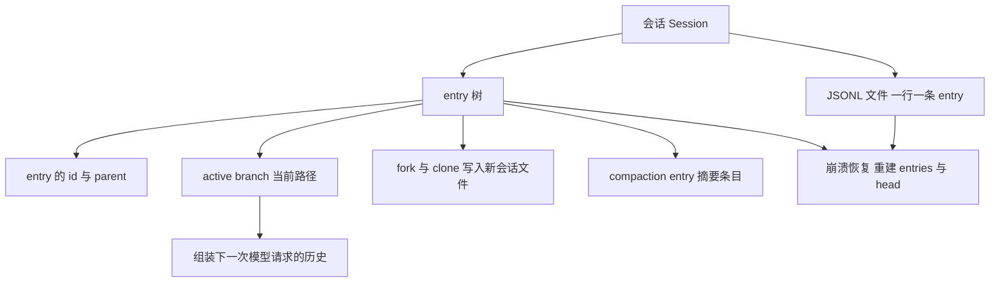
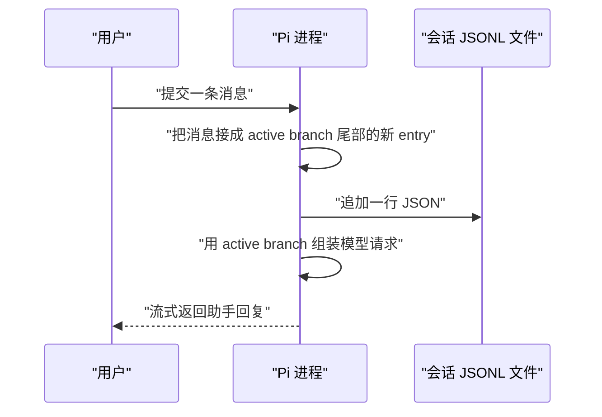
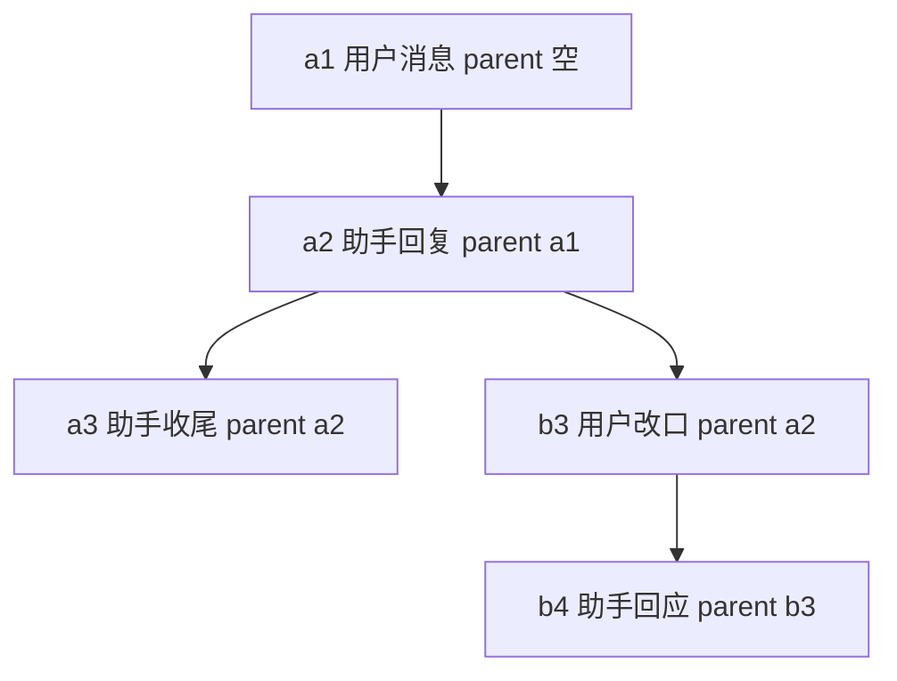
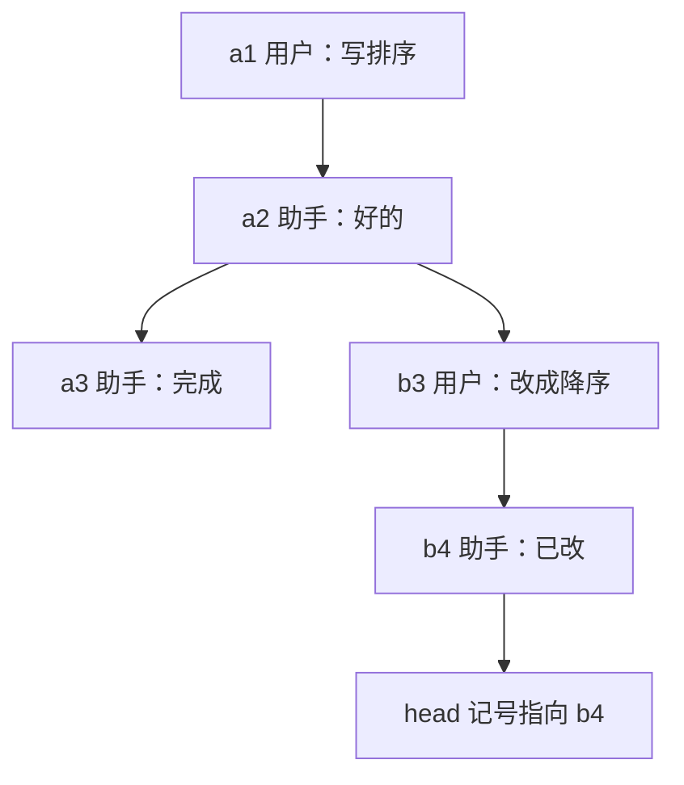
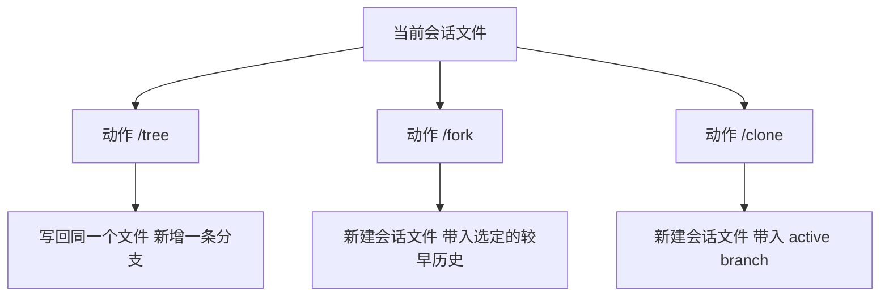
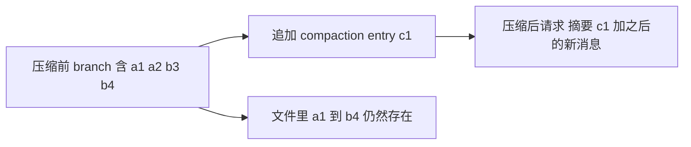
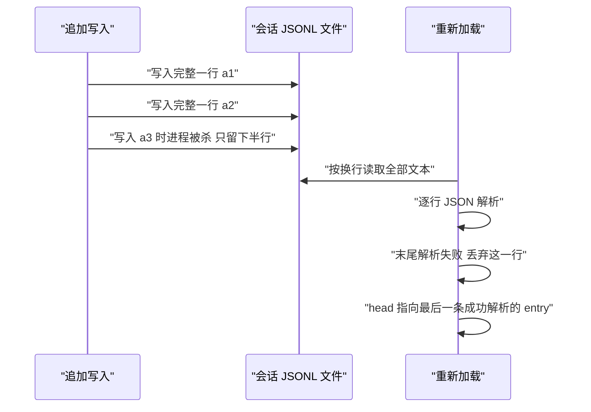
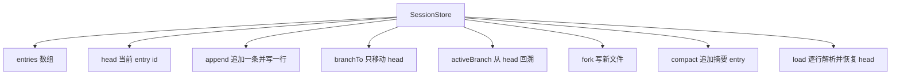

# 会话持久化：把对话存成一棵树

!!! abstract "学完这一页你能"
    - 说出会话 JSONL 文件里 entry 的 id 与 parent 各指向什么，并手写这两个字段。
    - 给出一个当前 entry，算出 active branch，并按顺序列出模型会收到的历史。
    - 讲清 `/tree`、`/fork`、`/clone` 三个动作分别写哪个文件，各举一个使用场景。
    - 写出一个 SessionStore 类，支持 append、branchTo、activeBranch、fork、compact、load 与崩溃截断恢复。

## 0. 知识地图



建议按顺序读：§1 与 §2 打地基，先弄清一行 entry 长什么样、树靠什么指针拼起来。§3 到 §6 是四个使用场景，每一个都只依赖前面两节。§7 把前六节的机制合成一个可运行的 SessionStore，读代码时随时回看 §2 的树图与 §3 的路径图。

## 1. 会话与 JSONL：对话怎么落到磁盘

**先想一个问题**

你关掉终端，第二天运行 `pi --continue`，昨天的对话又回来了。这段历史存在哪个文件里，用的是什么格式？

**心智模型**

!!! tip "心智模型"
    一句话模型：一个会话就是一个只追加写的 JSONL 文件，一行是一条 entry。
    日常类比：超市小票，机器写一行、撕一行，写完的纸不再回头改。
    类比不成立的地方：小票只能从头读到尾，会话文件允许你从中间任意一行重新出发，旧行照样留着。

!!! note "术语：JSONL"
    JSONL 是 JSON Lines 的缩写，每行一个独立 JSON 对象，行与行用换行符分隔。
    例：`{"id":"a1"}` 单独占一行，下一行写 `{"id":"a2"}`，两行各自合法。

!!! note "术语：会话 Session"
    Pi 对一段对话的完整记录，包括消息、工具调用与结果、模型切换、compaction 以及其它事件。
    例：今天上午你和 Pi 的一整段交互，对应磁盘上一个会话文件。

**图解**



1. 你提交一条消息，Pi 先把它放进当前会话。
2. 这条消息成为 active branch 尾部的新 entry，`parent` 指向原来的尾部。
3. Pi 把新 entry 作为一行追加写入会话文件，不重写已有行。
4. Pi 从 active branch 组装模型请求，连同 system prompt、可用工具、模型设置一起发给 provider。
5. provider 流式返回助手回复，Pi 记录响应、执行工具调用、记录结果，一个 turn 结束。

!!! note "术语：turn"
    Pi 记录一条助手响应，执行其中每个工具调用，并记录工具结果，这构成一个 turn。
    例：助手发出 2 个工具调用，Pi 执行并记录结果，这算一个 turn。

**一步一步来**

这一步要做什么：把一条记录按 JSONL 格式追加到文件尾部，再用换行符把它读回来。

```js
// 依赖：node:fs、node:path、node:os（均为 Node 20+ 内置）
import { appendFileSync, readFileSync, mkdtempSync } from "node:fs";
import { join } from "node:path";
import { tmpdir } from "node:os";

const dir = mkdtempSync(join(tmpdir(), "session-")); // 建临时目录，跑完不污染项目
const file = join(dir, "session.jsonl"); // 会话文件路径

function appendEntry(f, entry) {
  appendFileSync(f, JSON.stringify(entry) + "\n", "utf8"); // 一行一条，只追加不重写
}

// session entry 的时间戳用 ISO 8601 字符串
appendEntry(file, { id: "a1", parent: null, ts: new Date().toISOString(), text: "你好" });
appendEntry(file, { id: "a2", parent: "a1", ts: new Date().toISOString(), text: "在的" });
```

**这段代码在做什么**

- `mkdtempSync` 建一个临时目录，脚本重复运行不会互相覆盖。
- `JSON.stringify` 把 entry 对象压成一行文本，后面拼一个 `\n` 作为行界。
- `appendFileSync` 以追加模式打开文件，已有内容不动。
- `parent: null` 表示这是树的根，没有上一条。
- 会话 entry 的时间戳是 ISO 8601 字符串；消息时间戳是 Unix 毫秒，两者不是一回事。

这一步要做什么：把文件按换行切开，逐行 JSON 解析回对象数组。

```js
const lines = readFileSync(file, "utf8").split("\n").filter((l) => l.trim() !== ""); // 去掉末尾空行
const entries = lines.map((line) => JSON.parse(line)); // 每行独立解析成对象
const head = entries.at(-1).id; // 最后一条就是当前 entry
console.log("entries:", entries.length, "head:", head);
```

**这段代码在做什么**

- `split("\n")` 把文件切成行数组，`.filter` 去掉空行。
- 每行单独 `JSON.parse`，某一行坏掉不会连累前面的行。
- `entries.at(-1)` 取最后一条 entry，它的 id 就是当前 entry。
- 这一步只做了「读回对象」，还没有处理树关系。

运行结果：

```text
entries: 2 head: a2
```

**动手验证**

```js
// 依赖：node:fs、node:path、node:os、node:assert（Node 20+ 内置，无第三方包）
import { appendFileSync, readFileSync, mkdtempSync } from "node:fs";
import { join } from "node:path";
import { tmpdir } from "node:os";
import assert from "node:assert/strict";

const dir = mkdtempSync(join(tmpdir(), "session-"));
const file = join(dir, "session.jsonl");

function appendEntry(f, entry) {
  appendFileSync(f, JSON.stringify(entry) + "\n", "utf8"); // 追加一行
}

appendEntry(file, { id: "a1", parent: null, ts: new Date().toISOString(), text: "你好" });
appendEntry(file, { id: "a2", parent: "a1", ts: new Date().toISOString(), text: "在的" });

const lines = readFileSync(file, "utf8").split("\n").filter((l) => l.trim() !== "");
const entries = lines.map((line) => JSON.parse(line));

assert.equal(entries.length, 2);              // 写了 2 条
assert.equal(entries[1].parent, "a1");        // 第二条挂在第一条下面
assert.equal(entries.at(-1).id, "a2");        // 当前 entry 是 a2
assert.ok(!Number.isNaN(Date.parse(entries[0].ts))); // entry 时间戳能按日期解析

console.log("entries:", entries.length, "head:", entries.at(-1).id);
// 预期输出：entries: 2 head: a2
```

**常见坑**

| 现象 | 原因 | 怎么修 |
| --- | --- | --- |
| 读回时 JSON.parse 抛异常 | 文件末尾有一行只写了一半 | 解析失败时丢弃末尾那一行，见 §6 |
| 追加后文件里出现两条一样的记录 | 用了 `writeFileSync` 覆盖整个文件后又追加一次 | 追加用 `appendFileSync`，覆盖与追加不要混用 |
| 时间比较出错 | 把 entry 的 ISO 8601 字符串当成毫秒数用 | entry 时间戳是 ISO 8601，消息时间戳是 Unix 毫秒 |
| 重跑脚本读到旧数据 | 复用了固定路径的测试文件 | 用 `mkdtempSync` 生成临时目录 |

**小结**

- 一个会话对应磁盘上一个 JSONL 文件，一行一条 entry。
- 文件只追加，不重写历史行，这是后面崩溃恢复能成立的前提。
- entry 用 ISO 8601 时间戳，消息用 Unix 毫秒时间戳。

## 2. entry 与 parent：把对话存成一棵树

**先想一个问题**

你想改三天前的一句提问，又不想丢掉后来那几轮回答。磁盘上该怎么存，才能让两段历史同时活着？

**心智模型**

!!! tip "心智模型"
    一句话模型：每条 entry 记住自己的 id 与上一条的 id，散行就拼成了一棵树。
    日常类比：家谱，每个人记下自己的编号和父辈编号。
    类比不成立的地方：文件行序与树关系可以不一致，某条 entry 写在文件末尾，它的 parent 可能在文件开头。

!!! note "术语：entry"
    会话文件里的一条记录，对应树上的一個节点。
    例：一条用户消息、一条助手回复、一次 compaction，都各自是一条 entry。

!!! note "术语：parent"
    entry 里指向上一条记录的 id。根 entry 的 parent 为空。
    例：`{"id":"a2","parent":"a1"}` 表示 a2 接在 a1 之后。

**图解**



1. a1 是根，`parent` 为空，代表对话的第一条。
2. a2 的 `parent` 是 a1，说明它接在 a1 后面。
3. a3 的 `parent` 是 a2，这是一条「原路线」。
4. b3 的 `parent` 还是 a2，注意：a3 与 b3 共用同一个父亲。
5. b4 的 `parent` 是 b3，继续延伸第二条路线。
6. 文件里可能依次写入 a1、a2、a3、b3、b4，但树形状由 `parent` 决定，不由行序决定。

**一步一步来**

这一步要做什么：追加一条新 entry 时，把它的 `parent` 设为当前 entry 的 id，然后把当前 entry 换成新 id。

```js
const entries = [];
let head = null; // 当前 entry 的 id，初始为空

function append(input) {
  const entry = { id: `e${entries.length + 1}`, parent: head, ...input }; // parent 指向旧的 head
  entries.push(entry);
  head = entry.id; // 新 entry 成为当前 entry
  return entry;
}

append({ text: "写个排序" });   // e1
append({ text: "好的" });       // e2，parent 为 e1
append({ text: "再加测试" });   // e3，parent 为 e2
console.log(entries.map((e) => `${e.id}->${e.parent}`).join(" "));
```

**这段代码在做什么**

- `entries.length + 1` 生成递增 id，便于阅读。
- `parent: head` 是整段逻辑的核心：新节点接在当前节点后面。
- 写入后立刻更新 `head`，下一条 entry 才会接在新节点后面。
- `...input` 放在后面，允许调用方覆盖字段，演示时只传文本。

运行结果：

```text
e1->null e2->e1 e3->e2
```

这一步要做什么：从任意一个 id 出发，沿 `parent` 一直回溯到根，得到一条路径。

```js
const byId = new Map(entries.map((e) => [e.id, e])); // id 到 entry 的索引

function pathTo(id) {
  const out = [];
  for (let cur = id; cur !== null; cur = byId.get(cur)?.parent ?? null) {
    out.push(byId.get(cur)); // 先收集，此时顺序是从尾到头
  }
  return out.reverse(); // 反转后得到从根到 id 的顺序
}
console.log(pathTo("e3").map((e) => e.id).join(" -> "));
```

**这段代码在做什么**

- `Map` 让按 id 查 entry 的时间不随条目数线性增长。
- 循环条件用 `?? null` 兜底，根节点的 `parent` 为空时自然退出。
- 收集出来的数组是尾到头顺序，`reverse()` 之后才是自然阅读顺序。
- `pathTo` 就是下一节 active branch 的计算函数。

运行结果：

```text
e1 -> e2 -> e3
```

**动手验证**

```js
// 依赖：node:assert（Node 20+ 内置）
import assert from "node:assert/strict";

const entries = [
  { id: "a1", parent: null },
  { id: "a2", parent: "a1" },
  { id: "a3", parent: "a2" }, // 原路线
  { id: "b3", parent: "a2" }, // 从 a2 重新出发的第二条路线
];
const byId = new Map(entries.map((e) => [e.id, e]));

function pathTo(id) {
  const out = [];
  for (let cur = id; cur !== null; cur = byId.get(cur)?.parent ?? null) {
    out.push(cur); // 这里只收 id，够用
  }
  return out.reverse();
}

assert.deepEqual(pathTo("a3"), ["a1", "a2", "a3"]); // 原路线
assert.deepEqual(pathTo("b3"), ["a1", "a2", "b3"]); // 新路线共享前缀 a1 a2
assert.equal(byId.get("a3").parent, byId.get("b3").parent); // a3 与 b3 同父

console.log("a3 路径:", pathTo("a3").join(" -> "));
console.log("b3 路径:", pathTo("b3").join(" -> "));
// 预期输出：
// a3 路径: a1 -> a2 -> a3
// b3 路径: a1 -> a2 -> b3
```

**常见坑**

| 现象 | 原因 | 怎么修 |
| --- | --- | --- |
| 回溯路径死循环 | parent 指针成环，通常是手写数据时写反了 | 遍历时记录已访问 id，遇到重复立刻报错 |
| 路径顺序反了 | 收集时从尾到头，忘了 `reverse()` | 回溯结束后统一反转一次 |
| 读不出树 | 直接按文件行序当兄弟关系用 | 只用 `parent` 判父子，行序只表示写入时间 |
| 字段名对不上 | pi 的 entry 字段名与教学演示未必相同 | 需核对官方文档：Session Format 的 Entry base 一节列出的字段名 |

**小结**

- 树关系由 `parent` 决定，文件行序只记录写入先后。
- 一个 parent 可以有多个孩子，这就是分支的来源。
- `pathTo` 是后续所有遍历的基础函数。

## 3. active branch：当前路径决定模型看到什么

**先想一个问题**

树里同时有 a3 和 b4 两条尾巴，下一次模型请求到底该带哪几条消息？

**心智模型**

!!! tip "心智模型"
    一句话模型：当前 entry 指向哪里，active branch 就是那条从根到当前 entry 的路径，模型只收到这条路径。
    日常类比：一本折了很多角的书，你只读当前打开的那条折痕走到的那几页。
    类比不成立的地方：书页顺序固定，树的路径可以随时换，换完旧路径还在文件里。

!!! note "术语：active branch"
    以当前 entry 结尾的那条路径。它提供下一次模型请求所需的对话历史。
    例：当前 entry 是 b4，active branch 就是 a1、a2、b3、b4。

**图解**



1. a1 是根，用户提出需求。
2. a2 是助手回复，接在 a1 后面。
3. a3 是原路线的收尾。
4. b3 也接在 a2 后面，用户在这里改口。
5. b4 接在 b3 后面，第二条路线再往前走一步。
6. `head` 指向 b4，所以 active branch 是 a1、a2、b3、b4，a3 不参与本次请求。
7. 图上最后的 `head` 节点是一个记号，不是子节点，用来标出当前 entry 的位置。

**一步一步来**

这一步要做什么：算出 active branch，并把 entry 数组按角色转成模型可用的消息数组。

```js
let head = "b4";
const byId = new Map(entries.map((e) => [e.id, e]));

function activeBranch() {
  const out = [];
  for (let cur = head; cur !== null; cur = byId.get(cur)?.parent ?? null) {
    out.push(byId.get(cur));
  }
  return out.reverse(); // 根在前，当前 entry 在最后
}
console.log(activeBranch().map((e) => e.id).join(" -> "));
```

**这段代码在做什么**

- 起点是 `head`，不是文件最后一行，这一点和 §1 的例子不同。
- 沿 `parent` 回溯，遇到根就停。
- 反转之后，最后一条就是当前 entry，顺序与对话发生顺序一致。
- 函数不读取文件，只依赖内存里的 `entries` 与 `head`。

运行结果：

```text
a1 -> a2 -> b3 -> b4
```

这一步要做什么：把 active branch 里的 entry 转成带 role 的消息，供下一次请求使用。

```js
function toRequestMessages(branch) {
  return branch.map((e) => ({
    role: e.role,      // user 或 assistant
    content: e.text,   // 教学演示里文本直接当内容
  }));
}
const messages = toRequestMessages(activeBranch());
console.log("条数:", messages.length, "首条:", JSON.stringify(messages[0]));
```

**这段代码在做什么**

- 模型请求需要的是消息，不是会话 entry，中间要做一次转换。
- 教学演示把文本当内容；真实系统还要处理内容块、工具结果、usage 等字段。
- 工具结果会以对应角色进入消息序列，Pi 记录的工具结果也会按顺序参与。
- 转换只作用于 active branch，其它分支的 entry 不进入请求。

运行结果：

```text
条数: 4 首条: {"role":"user","content":"写排序"}
```

**动手验证**

```js
// 依赖：node:assert（Node 20+ 内置）
import assert from "node:assert/strict";

const entries = [
  { id: "a1", parent: null, role: "user", text: "写个排序" },
  { id: "a2", parent: "a1", role: "assistant", text: "好的" },
  { id: "a3", parent: "a2", role: "assistant", text: "完成" },
  { id: "b3", parent: "a2", role: "user", text: "改成降序" },
  { id: "b4", parent: "b3", role: "assistant", text: "已改" },
];
let head = "b4";
const byId = new Map(entries.map((e) => [e.id, e]));

function activeBranch() {
  const out = [];
  for (let cur = head; cur !== null; cur = byId.get(cur)?.parent ?? null) {
    out.push(byId.get(cur));
  }
  return out.reverse();
}

const branch = activeBranch();
assert.deepEqual(branch.map((e) => e.id), ["a1", "a2", "b3", "b4"]); // a3 被排除
assert.equal(branch.at(-1).id, head);                                // 末条就是当前 entry
assert.equal(branch.filter((e) => e.id === "a3").length, 0);          // 另一条分支不参与

head = "a3";                                   // 只改 head，路径就换了一条
assert.deepEqual(activeBranch().map((e) => e.id), ["a1", "a2", "a3"]);

console.log("b4 路径:", branch.map((e) => e.id).join(" -> "));
console.log("a3 路径:", activeBranch().map((e) => e.id).join(" -> "));
// 预期输出：
// b4 路径: a1 -> a2 -> b3 -> b4
// a3 路径: a1 -> a2 -> a3
```

**常见坑**

| 现象 | 原因 | 怎么修 |
| --- | --- | --- |
| 模型看到了不该看的内容 | 把整个文件的 entry 都塞进请求 | 只遍历 active branch，从 head 回溯 |
| 改了 head 但请求没变 | 请求组装结果被缓存了 | 组装放在遍历之后，head 变化时重算 |
| 顺序颠倒 | 回溯结果忘记反转 | 统一在函数返回前 `reverse()` |
| 工具结果丢失 | 转换时只过滤了 user 与 assistant | 按 Pi 的转换规则处理工具结果角色，需核对官方文档：How Pi Works 的 Context 一节 |

**小结**

- active branch 由当前 entry 决定，与文件行序无关。
- 模型只收到 active branch，其它分支只存在文件里。
- 换一个 head 就换一条路径，旧路径不会消失。

## 4. fork 与 clone：分支的开与合

**先想一个问题**

你有两套方案想分别推进：一套继续留在当前会话里做对比，另一套要单独拿走。这两种需求该怎么落到文件上？

**心智模型**

!!! tip "心智模型"
    一句话模型：`/tree` 在同一个会话文件里换分支，`/fork` 与 `/clone` 把选中的历史复制进新会话文件。
    日常类比：在同一个笔记本上翻到另一页继续写，对比把几页复印下来装订成新本子。
    类比不成立的地方：复印本和原本之后不再互相同步，各自追加各自的 entry。

!!! note "术语：fork"
    从一条较早的用户消息创建一个新会话文件，新文件带选定历史。
    例：你想让方案 B 成为独立工作线，用 `/fork` 从那条用户消息分出去。

!!! note "术语：clone"
    把 active branch 复制进一个新会话文件。
    例：你想在不动当前会话的前提下另存一份现状，用 `/clone`。

**图解**



1. 起点都是当前会话文件与它的树。
2. `/tree` 只在当前会话文件内移动当前 entry，之后继续对话就在同一文件里多出一条分支。
3. `/fork` 从一条较早的用户消息创建新会话，选定的历史被复制到新文件。
4. `/clone` 把当前 active branch 复制到新会话文件。
5. 两条新文件各自独立追加，之后和原文件不再有同步关系。
6. 原文件的历史不因这三个动作被删除，只可能被追加。

**一步一步来**

这一步要做什么：把从根到某个 entry 的路径复制出来，重写 `parent` 使其成为一份自洽的历史。

```js
import { writeFileSync } from "node:fs";

function copyPathTo(entries, toId, newFilePath) {
  const byId = new Map(entries.map((e) => [e.id, e]));
  const path = [];
  for (let cur = toId; cur !== null; cur = byId.get(cur)?.parent ?? null) {
    path.push(byId.get(cur));
  }
  path.reverse();
  const copy = path.map((e, i) => ({ ...e, parent: i === 0 ? null : path[i - 1].id })); // 根重新封顶
  writeFileSync(newFilePath, copy.map((e) => JSON.stringify(e)).join("\n") + "\n", "utf8");
  return copy;
}
```

**这段代码在做什么**

- 复用 §2 的回溯逻辑，先拿到从根到目标 entry 的路径。
- `parent: i === 0 ? null : path[i-1].id` 把根重新封闭，新文件自成一体。
- `writeFileSync` 一次写完整份历史，新文件从零开始。
- 返回值便于调用方断言与继续追加。
- 这个函数对应 `/clone` 的行为：复制 active branch 到新会话文件。

运行结果：

```text
复制 4 条，根为 a1，末条为 b4
```

这一步要做什么：在新文件上继续追加，验证新会话可以独立生长。

```js
function appendAt(newFilePath, copy, text) {
  const entry = { id: `n${copy.length + 1}`, parent: copy.at(-1).id, text };
  writeFileSync(newFilePath, JSON.stringify(entry) + "\n", { flag: "a" }); // 追加模式
  copy.push(entry);
  return entry;
}
appendAt("fork.jsonl", copy, "继续做方案 B");
console.log("新文件条数:", copy.length, "末条:", copy.at(-1).id);
```

**这段代码在做什么**

- `flag: "a"` 表示追加写，新文件已有的历史不动。
- 新 entry 的 `parent` 指向复制出来的末条。
- 内存里的 `copy` 同步 push，便于断言。
- 新会话从此只追加自己的 entry，和原文件没有指针相连。

运行结果：

```text
新文件条数: 5 末条: n5
```

**动手验证**

```js
// 依赖：node:fs、node:path、node:os、node:assert（Node 20+ 内置）
import { writeFileSync, readFileSync, mkdtempSync } from "node:fs";
import { join } from "node:path";
import { tmpdir } from "node:os";
import assert from "node:assert/strict";

const dir = mkdtempSync(join(tmpdir(), "fork-"));
const forked = join(dir, "fork.jsonl");

const entries = [
  { id: "a1", parent: null, text: "写个排序" },
  { id: "a2", parent: "a1", text: "好的" },
  { id: "a3", parent: "a2", text: "完成" },
  { id: "b3", parent: "a2", text: "改成降序" },
  { id: "b4", parent: "b3", text: "已改" },
];
const byId = new Map(entries.map((e) => [e.id, e]));

function copyPathTo(list, toId, newFilePath) {
  const index = new Map(list.map((e) => [e.id, e]));
  const path = [];
  for (let cur = toId; cur !== null; cur = (index.get(cur) ?? { parent: null }).parent) {
    path.push(index.get(cur));
  }
  path.reverse();
  const copy = path.map((e, i) => ({ ...e, parent: i === 0 ? null : path[i - 1].id }));
  writeFileSync(newFilePath, copy.map((e) => JSON.stringify(e)).join("\n") + "\n", "utf8");
  return copy;
}

const copy = copyPathTo(entries, "b4", forked);
assert.deepEqual(copy.map((e) => e.id), ["a1", "a2", "b3", "b4"]); // a3 没被复制
assert.equal(copy[0].parent, null);                                 // 新文件根重新封顶
assert.equal(byId.get("a3").parent, "a2");                          // 原文件的历史没动
assert.equal(readFileSync(forked, "utf8").trim().split("\n").length, 4);

console.log("复制条数:", copy.length, "末条:", copy.at(-1).id);
// 预期输出：复制条数: 4 末条: b4
```

**常见坑**

| 现象 | 原因 | 怎么修 |
| --- | --- | --- |
| 新会话开头接不上 | 复制时忘了把根 entry 的 parent 置空 | 复制后重写第一条的 parent 为空 |
| 复制完两个文件互相影响 | 追加时用了默认覆盖模式 | 追加写用 `flag: "a"` 或 `appendFileSync` |
| 复制到不该带的历史 | 用 `/fork` 时选错了起点 entry | 起点选那条较早的用户消息，或者改用 `/clone` |
| 想合并两条线却找不到入口 | 两个会话文件之间没有指针 | 各文件独立，需要人工对照，或回到 `/tree` 在同一文件内分叉 |

**小结**

- `/tree` 只移动当前 entry，写回同一个会话文件。
- `/fork` 与 `/clone` 把选定历史复制进新会话文件，之后各自独立。
- 三个动作都不删除原文件里的历史。

## 5. compaction entry：旧消息怎样退出上下文

**先想一个问题**

对话长了，上下文接近模型上限。删掉旧 entry 会永久丢历史，不删又会把请求撑爆。有没有第三条路？

**心智模型**

!!! tip "心智模型"
    一句话模型：compaction 往树上追加一条摘要 entry，后续请求用摘要替换更早的消息，原始 entry 留在文件里。
    日常类比：会议纪要替代逐字稿发给没参会的人，逐字稿仍存在档案柜里。
    类比不成立的地方：纪要和逐字稿都在同一个文件里，逐字稿没有被销毁，还能回放。

!!! note "术语：compaction"
    插入一条摘要 entry，在后续模型请求中替代更早的消息。原 entry 保留在会话树里。
    例：`/compact` 手动压缩，或上下文接近上限时 Pi 自动压缩。

!!! note "术语：tokensBefore"
    摘要生成前该位置上下文的 token 数，记录在 compaction 摘要消息上。
    例：`tokensBefore: 4800` 表示摘要覆盖了约 4800 个 token 的历史。

**图解**



1. 压缩前，active branch 是 a1、a2、b3、b4。
2. Pi 追加一条 compaction entry，摘要覆盖更早的消息。
3. 新的 active branch 变成 a1、a2、b3、b4、c1。
4. 后续请求越过 c1 之前的消息，先放摘要，再放 c1 之后的新消息。
5. 原 entry 一行都没删，仍能回放与导出。
6. 摘要失败时，原 entry 依然完好，可以再试一次。

**一步一步来**

这一步要做什么：往 active branch 尾部追加一条 compaction entry。

```js
function compact(summary, tokensBefore) {
  const entry = {
    id: `e${entries.length + 1}`,
    parent: head,              // 接在当前 entry 后面
    type: "compaction",        // 标记这条 entry 是压缩摘要
    summary,
    tokensBefore,
    ts: new Date().toISOString(),
  };
  entries.push(entry);
  head = entry.id;
  return entry;
}
compact("用户要求写排序并改成降序", 4800);
console.log("entry 总数:", entries.length, "head:", head);
```

**这段代码在做什么**

- compaction entry 仍然走追加路径，`parent` 指向当时的 head。
- `type` 字段把它与普通消息区分开，构建请求时要分流。
- `tokensBefore` 记录压缩前上下文的 token 数。
- 原 entry 一条没删，`entries.length` 只会增加。
- 字段命名是教学演示用法，pi 的实际字段名需核对官方文档：Session Format 的压缩条目一节。

运行结果：

```text
entry 总数: 5 head: e5
```

这一步要做什么：构建请求时，找到最后一条 compaction entry，用它替换更早的消息。

```js
function toRequestMessages(branch) {
  const last = branch.findLastIndex((e) => e.type === "compaction");
  const out = [];
  if (last >= 0) {
    const c = branch[last];
    out.push({ role: "compactionSummary", summary: c.summary, tokensBefore: c.tokensBefore });
  }
  for (const e of branch.slice(last + 1)) {
    if (e.type !== "compaction") out.push({ role: e.role, content: e.text });
  }
  return out;
}
```

**这段代码在做什么**

- `findLastIndex` 找最后一条压缩 entry，一次压缩只看最近的一条。
- `last < 0` 时说明没有压缩，行为退化成遍历整条 branch。
- 摘要作为一条特殊角色的消息放在请求最前面。
- 压缩 entry 之后的普通消息照常加入。
- 压缩 entry 本身不重复作为消息放入。

运行结果：

```text
摘要 1 条 + 后续消息 1 条 = 2 条
```

**动手验证**

```js
// 依赖：node:assert（Node 20+ 内置）
import assert from "node:assert/strict";

const entries = [
  { id: "a1", parent: null, type: "message", role: "user", text: "写个排序" },
  { id: "a2", parent: "a1", type: "message", role: "assistant", text: "好的" },
  { id: "b3", parent: "a2", type: "message", role: "user", text: "改成降序" },
  { id: "b4", parent: "b3", type: "message", role: "assistant", text: "已改" },
  { id: "c1", parent: "b4", type: "compaction", summary: "排序并改为降序", tokensBefore: 4800 },
  { id: "d1", parent: "c1", type: "message", role: "user", text: "再加测试" },
];
const before = entries.length;

function toRequestMessages(branch) {
  const last = branch.findLastIndex((e) => e.type === "compaction");
  const out = [];
  if (last >= 0) {
    out.push({ role: "compactionSummary", summary: branch[last].summary, tokensBefore: branch[last].tokensBefore });
  }
  for (const e of branch.slice(last + 1)) {
    if (e.type !== "compaction") out.push({ role: e.role, content: e.text });
  }
  return out;
}

const messages = toRequestMessages(entries); // 这里 branch 就等于整份教学数据
assert.equal(entries.length, before);                          // 原始 entry 没被删除
assert.equal(messages.length, 2);                               // 摘要 1 条加 d1 一条
assert.equal(messages[0].role, "compactionSummary");            // 摘要排在首位
assert.equal(messages[1].content, "再加测试");                  // 压缩后的新消息保留
assert.equal(messages.find((m) => m.content === "写个排序"), undefined); // 早期消息退出请求

console.log("entry 总数:", entries.length, "请求消息数:", messages.length);
// 预期输出：entry 总数: 6 请求消息数: 2
```

**常见坑**

| 现象 | 原因 | 怎么修 |
| --- | --- | --- |
| 压缩后请求里还带着全部旧消息 | 只在文件里写了摘要，构建请求时没分流 | 构建请求时先找最后一条 compaction entry |
| 压缩失败后历史坏了 | 压缩实现里原地删了旧 entry | 压缩只追加，不删除、不原地改 |
| 压缩后模型丢了关键决定 | 摘要指令没强调要保留的内容 | `/compact` 时附加指令说明要保留的主题或决定 |
| 压缩直接报错 | provider 不可用或拒绝摘要请求 | 修好 provider 问题后重新执行 `/compact`，原 entry 仍在 |

**小结**

- compaction 只追加一条摘要 entry，原始 entry 全部保留。
- 后续请求用摘要替换更早的消息，压缩点之后的消息照常带上。
- 压缩可以失败，失败不会破坏已有历史。

## 6. 崩溃恢复：文件写到一半怎么办

**先想一个问题**

追加最后一行时进程被强杀，文件末尾留下半行 JSON。下次启动读文件，这一行该怎么处理？

**心智模型**

!!! tip "心智模型"
    一句话模型：JSONL 按行追加，能完整解析的行就是已提交的事实，末尾不完整的行丢弃。
    日常类比：账本上最后一行写了一半就停电，会计把这半行划掉重写。
    类比不成立的地方：被丢弃的那半行不是「写错」，它只是没写完，重跑同一操作可以补齐。

!!! note "术语：崩溃恢复"
    Pi 退出或进程被杀后，重新加载会话文件，恢复出 entries 与当前 entry 的过程。
    例：重开终端执行 `pi --continue`，Pi 读回最近的会话文件继续。

**图解**



1. 写入阶段每次追加完整一行，写成功的行以换行符收尾。
2. 最后一行写到一半时崩溃，文件末尾缺少换行符或 JSON 不完整。
3. 加载时按换行把文本切成行。
4. 逐行 `JSON.parse`，前面的行都能成功。
5. 遇到解析失败的行就停止，把它当作未提交内容丢弃。
6. `head` 指向最后一条成功解析的 entry，会话从这里继续。

**一步一步来**

这一步要做什么：写一个容错的加载函数，遇到解析失败就停止。

```js
import { readFileSync } from "node:fs";

function loadEntries(filePath) {
  const out = [];
  const lines = readFileSync(filePath, "utf8").split("\n");
  for (const line of lines) {
    if (line.trim() === "") continue;      // 跳过空行
    try {
      out.push(JSON.parse(line));          // 能解析就收下
    } catch {
      break;                               // 追加文件里，坏行只会出现在末尾
    }
  }
  return out;
}
```

**这段代码在做什么**

- `split("\n")` 之后逐行处理，坏行不影响前面的行。
- `try` 里解析失败就 `break`，不再往后读。
- 之所以能 `break`，前提是文件只追加，中间行不会损坏。
- 返回的数组顺序与写入顺序一致。

运行结果：

```text
读到 2 条，head 为 a2
```

这一步要做什么：从解析结果恢复 entries 与 head，并让后续追加的 id 不撞车。

```js
function restore(filePath) {
  const entries = loadEntries(filePath);
  const head = entries.length > 0 ? entries.at(-1).id : null;
  const seq = entries.reduce((max, e) => {
    const n = Number(String(e.id).replace(/^e/, "")); // 教学演示的 id 形如 e1
    return Number.isInteger(n) && n > max ? n : max;
  }, 0);
  return { entries, head, seq };
}
console.log(restore(filePath));
```

**这段代码在做什么**

- `head` 取最后一条成功解析的 entry。
- 文件为空时 `head` 为 `null`，等价于全新会话。
- `seq` 取已有 id 的最大编号，避免新 entry 复用旧 id。
- id 解析规则依赖教学演示的命名，实际格式需核对官方文档：Session Format 的 Entry base 一节。

运行结果：

```text
{ head: 'a2', seq: 2, entries: [ 2 项 ] }
```

**动手验证**

```js
// 依赖：node:fs、node:path、node:os、node:assert（Node 20+ 内置）
import { writeFileSync, readFileSync, mkdtempSync } from "node:fs";
import { join } from "node:path";
import { tmpdir } from "node:os";
import assert from "node:assert/strict";

const dir = mkdtempSync(join(tmpdir(), "crash-"));
const file = join(dir, "session.jsonl");

// 模拟：a1、a2 完整写入，写 a3 时断电，末尾留下半行
const raw =
  JSON.stringify({ id: "e1", parent: null, text: "第一句" }) + "\n" +
  JSON.stringify({ id: "e2", parent: "e1", text: "第二句" }) + "\n" +
  '{"id":"e3","parent":"e2"'; // 缺少右花括号，JSON 不完整
writeFileSync(file, raw, "utf8");

function loadEntries(filePath) {
  const out = [];
  for (const line of readFileSync(filePath, "utf8").split("\n")) {
    if (line.trim() === "") continue;
    try { out.push(JSON.parse(line)); } catch { break; }
  }
  return out;
}

const entries = loadEntries(file);
assert.equal(entries.length, 2);            // 半行被丢弃
assert.equal(entries.at(-1).id, "e2");      // head 回到最后一条完整 entry
assert.equal(entries[0].parent, null);      // 根 entry 完好

let recovered = entries.length > 0 ? entries.at(-1).id : null;
assert.equal(recovered, "e2");
console.log("读到:", entries.length, "head:", recovered);
// 预期输出：读到: 2 head: e2
```

**常见坑**

| 现象 | 原因 | 怎么修 |
| --- | --- | --- |
| 加载直接抛异常，整个会话打不开 | 用一次 `JSON.parse` 解析整个文件 | 按行解析，坏行只影响它自己 |
| 恢复后新 entry 覆盖旧 id | 恢复时没重算编号 | 扫描已有 id，取最大编号继续 |
| 中间某行坏了却后续全丢 | 坏行不在末尾，说明文件被外部改写 | 检查是否有别的程序改过这个文件 |
| 助手回复丢了一句 | 把流式中间态也当成已提交内容 | 未完成的助手消息不写入会话文件，只有带终止停止原因的完整消息才持久化 |

**小结**

- 逐行解析是崩溃恢复能成立的关键，坏行只影响它自己。
- 文件只追加，所以坏行通常出现在末尾，遇到坏行可以直接停止。
- 未完成的助手消息不进入会话文件，恢复时不会读到半截回复。

## 7. 手写 SessionStore：把六个机制合成一个类

**先想一个问题**

前面每一节都是零散函数，能不能收成一个类，让追加、换分支、复制、压缩、恢复都有统一入口？

**心智模型**

!!! tip "心智模型"
    一句话模型：SessionStore 是内存里的 entries 列表加一个 head 指针，每个写操作都往同一个文件追加一行。
    日常类比：一个记事本加一支只写不擦的笔，每次操作都是新写一行。
    类比不成立的地方：类里可以随意移动 head，文件里却看不出 head 的位置，head 需要你显式记下来。

!!! note "术语：SessionStore"
    本页手写的会话存储类，封装 append、branchTo、activeBranch、fork、compact、load 六个方法。
    例：新增一条消息调用 `store.append`，切换当前 entry 调用 `store.branchTo`。

**图解**



1. `entries` 与 `head` 是全部内存状态，其余都是方法。
2. `append` 负责生成 id、接上 parent、写文件、移动 head。
3. `branchTo` 只改 head，不动文件，这就是「回到较早位置继续写」。
4. `activeBranch` 从 head 回溯，得到模型请求要用的 histories。
5. `fork` 把指定路径复制到新文件，新类实例可在此基础上继续。
6. `compact` 复用 append 写一条摘要 entry。
7. `load` 逐行解析文件，恢复 entries、head 与 id 编号。

**一步一步来**

第一步要做什么：写构造函数、`append` 与 `branchTo`。

```js
import { appendFileSync, readFileSync, writeFileSync } from "node:fs";

class SessionStore {
  constructor(filePath) {
    this.filePath = filePath;
    this.entries = [];
    this.head = null;  // 当前 entry，空表示还没有内容
    this.seq = 0;      // id 自增序号
  }
  append(input) {
    const entry = { id: `e${++this.seq}`, parent: this.head, ts: new Date().toISOString(), ...input };
    this.entries.push(entry);
    appendFileSync(this.filePath, JSON.stringify(entry) + "\n", "utf8"); // 一行一条
    this.head = entry.id;
    return entry;
  }
  branchTo(id) {
    if (!this.entries.some((e) => e.id === id)) throw new Error(`未知 entry ${id}`);
    this.head = id; // 只移动指针，不写文件
  }
}
```

**这段代码在做什么**

- `this.head` 同时决定新 entry 的 parent 和 active branch 的终点。
- `++this.seq` 先自增再使用，id 从 e1 开始。
- `appendFileSync` 与 §1 一致，只追加不覆盖。
- `branchTo` 不写文件，移动 head 这个动作本身不产生 entry。
- 传入不存在的 id 直接报错，避免 head 变成悬空指针。

运行结果：

```text
e1->null e2->e1
```

第二步要做什么：实现 `activeBranch` 与 `compact`。

```js
  activeBranch() {
    const byId = new Map(this.entries.map((e) => [e.id, e]));
    const out = [];
    for (let cur = this.head; cur !== null; cur = byId.get(cur)?.parent ?? null) {
      out.push(byId.get(cur));
    }
    return out.reverse(); // 根在前
  }
  compact(summary, tokensBefore) {
    return this.append({ type: "compaction", summary, tokensBefore });
  }
```

**这段代码在做什么**

- `activeBranch` 与 §3 的实现一致，每次调用重新计算。
- `compact` 不写新逻辑，它复用 `append` 的追加路径。
- 压缩 entry 走同一条 parent 链，因此天然进入 active branch。
- 返回值让调用方拿到新 entry 的 id。

运行结果：

```text
activeBranch: e1 -> e2
compact 后 head: e3
```

第三步要做什么：实现 `fork`，把指定路径复制到新文件。

```js
  fork(newFilePath, toId = this.head) {
    const byId = new Map(this.entries.map((e) => [e.id, e]));
    const path = [];
    for (let cur = toId; cur !== null; cur = byId.get(cur)?.parent ?? null) {
      path.push(byId.get(cur));
    }
    path.reverse();
    const copy = path.map((e, i) => ({ ...e, parent: i === 0 ? null : path[i - 1].id })); // 根封顶
    writeFileSync(newFilePath, copy.map((e) => JSON.stringify(e)).join("\n") + "\n", "utf8");
    return copy;
  }
```

**这段代码在做什么**

- 默认从当前 head 复制，等价于 `/clone` 的语义。
- 传入较早的 id 就等价于从那条消息分出去。
- 复制出的第一条例外处理，`parent` 置为空。
- 新文件用 `writeFileSync` 一次写完，之后交给新的 store 实例追加。

运行结果：

```text
复制 2 条到 fork 文件
```

第四步要做什么：实现 `load`，逐行解析并恢复状态。

```js
  static load(filePath) {
    const store = new SessionStore(filePath);
    for (const line of readFileSync(filePath, "utf8").split("\n")) {
      if (line.trim() === "") continue;
      try { store.entries.push(JSON.parse(line)); } catch { break; } // 丢弃末尾半行
    }
    store.head = store.entries.length > 0 ? store.entries.at(-1).id : null;
    store.seq = store.entries.reduce((max, e) => {
      const n = Number(String(e.id).replace(/^e/, ""));
      return Number.isInteger(n) && n > max ? n : max;
    }, 0);
    return store;
  }
```

**这段代码在做什么**

- 先构造空实例，再把解析出的 entry 逐个放入。
- 坏行出现即停止，与 §6 的策略一致。
- `head` 取最后一条成功解析的 entry。
- `seq` 取最大编号，保证后续 `append` 不复用 id。
- id 解析规则是本页约定，pi 的真实格式需核对官方文档：Session Format 的 Entry base 一节。

运行结果：

```text
载入 3 条，head 为 e3，seq 为 3
```

**动手验证**

```js
// 依赖：node:fs、node:path、node:os、node:assert（Node 20+ 内置，无第三方包）
import { appendFileSync, readFileSync, writeFileSync, mkdtempSync } from "node:fs";
import { join } from "node:path";
import { tmpdir } from "node:os";
import assert from "node:assert/strict";

class SessionStore {
  constructor(filePath) {
    this.filePath = filePath;
    this.entries = [];
    this.head = null;
    this.seq = 0;
  }
  append(input) {
    const entry = { id: `e${++this.seq}`, parent: this.head, ts: new Date().toISOString(), ...input };
    this.entries.push(entry);
    appendFileSync(this.filePath, JSON.stringify(entry) + "\n", "utf8");
    this.head = entry.id;
    return entry;
  }
  branchTo(id) {
    if (!this.entries.some((e) => e.id === id)) throw new Error(`未知 entry ${id}`);
    this.head = id;
  }
  activeBranch() {
    const byId = new Map(this.entries.map((e) => [e.id, e]));
    const out = [];
    for (let cur = this.head; cur !== null; cur = byId.get(cur)?.parent ?? null) out.push(byId.get(cur));
    return out.reverse();
  }
  compact(summary, tokensBefore) {
    return this.append({ type: "compaction", summary, tokensBefore });
  }
  fork(newFilePath, toId = this.head) {
    const byId = new Map(this.entries.map((e) => [e.id, e]));
    const path = [];
    for (let cur = toId; cur !== null; cur = byId.get(cur)?.parent ?? null) path.push(byId.get(cur));
    path.reverse();
    const copy = path.map((e, i) => ({ ...e, parent: i === 0 ? null : path[i - 1].id }));
    writeFileSync(newFilePath, copy.map((e) => JSON.stringify(e)).join("\n") + "\n", "utf8");
    return copy;
  }
  static load(filePath) {
    const store = new SessionStore(filePath);
    for (const line of readFileSync(filePath, "utf8").split("\n")) {
      if (line.trim() === "") continue;
      try { store.entries.push(JSON.parse(line)); } catch { break; }
    }
    store.head = store.entries.length > 0 ? store.entries.at(-1).id : null;
    store.seq = store.entries.reduce((max, e) => {
      const n = Number(String(e.id).replace(/^e/, ""));
      return Number.isInteger(n) && n > max ? n : max;
    }, 0);
    return store;
  }
}

const dir = mkdtempSync(join(tmpdir(), "store-"));
const main = join(dir, "main.jsonl");
const forked = join(dir, "fork.jsonl");

const s = new SessionStore(main);
s.append({ type: "message", role: "user", text: "写个排序" });     // e1
s.append({ type: "message", role: "assistant", text: "好的" });    // e2
s.branchTo(s.entries[0].id);                                        // 回到 e1
s.append({ type: "message", role: "user", text: "改成降序" });     // e3，parent 为 e1

assert.deepEqual(s.activeBranch().map((e) => e.id), ["e1", "e3"]); // e2 不在当前路径
assert.equal(readFileSync(main, "utf8").trim().split("\n").length, 3); // 同一文件里两条分支

const copy = s.fork(forked);                                        // 复制当前路径到新文件
assert.deepEqual(copy.map((e) => e.id), ["e1", "e3"]);
assert.equal(copy[0].parent, null);                                 // 新文件根封顶

const restored = SessionStore.load(forked);
assert.equal(restored.head, "e3");
assert.equal(restored.entries.length, 2);

restored.compact("用户要求排序并改为降序", 1200);                    // 追加摘要 entry
assert.equal(restored.activeBranch().at(-1).type, "compaction");
assert.equal(restored.entries.length, 3);

console.log("main 行数:", 3, "当前路径:", s.activeBranch().map((e) => e.id).join(" -> "));
console.log("fork 条数:", restored.entries.length, "head:", restored.head);
// 预期输出：
// main 行数: 3 当前路径: e1 -> e3
// fork 条数: 3 head: e4
```

**常见坑**

| 现象 | 原因 | 怎么修 |
| --- | --- | --- |
| 恢复后新 entry 与旧 entry 撞 id | `load` 没恢复 `seq` | 扫描已有 id 取最大值赋给 `seq` |
| `branchTo` 之后 active branch 没变 | 传的 id 拼错，被当成合法字符串接受 | 校验 id 是否存在，不存在直接抛错 |
| 同一条 entry 被写两次 | `append` 里写文件后又手工补写一次 | 写文件只保留 `append` 一处 |
| 复制出的会话打不开 | `fork` 把 `seq` 带成旧值 | 新文件用 `load` 重新构造实例，重新算 `seq` |

**小结**

- SessionStore 的全部状态只有 `entries`、`head`、`seq` 三个字段与一个文件路径。
- 换分支只动 head，写文件只发生在 `append` 与 `fork`。
- `load` 把崩溃恢复策略收进一个入口，坏行只丢末尾那一行。

## 综合对比

| 动作 | 落在哪个文件 | 对历史的影响 | 原文件里的历史 | 典型场景 |
| --- | --- | --- | --- | --- |
| `/tree` | 当前会话文件 | 移动当前 entry，之后继续对话就多一条分支 | 全部保留 | 相关备选方案想放在一起对比 |
| `/fork` | 新建会话文件 | 从一条较早的用户消息创建新会话 | 全部保留 | 备选方案要成为独立工作线 |
| `/clone` | 新建会话文件 | 复制 active branch 到新会话 | 全部保留 | 想另存一份当前状态 |
| `/compact` | 当前会话文件 | 追加摘要 entry，后续请求用它替换更早的消息 | 全部保留 | 上下文接近模型上限 |
| `/continue` | 不新建文件 | 打开当前工作目录最近的一个会话 | 全部保留 | 接着上次的工作继续 |
| `/resume` | 不新建文件 | 打开会话选择器，可搜索、重命名、删除 | 全部保留 | 在多个会话之间挑选 |
| `--no-session` | 不写文件 | 运行结束后无法恢复 | 无 | 临时的一次性运行 |
| `/export` | 写出 HTML 或 JSONL | 不改动会话本身 | 全部保留 | 归档、分享、离线查看 |

## 应用与行业实践

### 应用场景地图

| 场景 | 用到本页哪个知识点 | 典型技术选型 | 注意事项 |
|:--|:--|:--|:--|
| 客服工单里的多轮追问与坐席改派 | entry 的 id/parent、active branch、branchTo | 服务端 JSONL 文件 + 追加写，目录按工单号命名 | 改派后要让新坐席看到完整分支，先 branchTo 再算 activeBranch |
| 代码助手对同一个失败测试试两条修法 | fork、clone、active branch | 每分支一个会话文件，文件名带会话 id | fork 写入新文件，旧文件保持只读，避免两条路线互相污染 |
| 多人协作白板里每人一个 AI 助手 | entry/parent 树、active branch 按人区分 | 每人一条分支写在同一个 JSONL，或每人一个文件 | 并发追加要加文件锁或走单一写入进程 |
| 后台管理的万行表格加 AI 取数助手 | compaction entry、active branch | 服务端会话 + 上下文窗口预算 | 压缩要保留最近若干轮原文，只压中间历史 |
| 低端安卓首屏接上次对话 | 崩溃截断恢复、load | 本地 JSONL 文件，按行解析 | 写盘慢的机型要在后台线程落盘，主线程只读缓存 |
| 教学平台的作业批改留痕 | clone、entry 树 | 一次提交一个 clone 文件，外键指回原会话 | clone 会放大存储，需要按学期归档删除 |
| 弱网下的会话增量同步 | append-only 写入、parent 链 | 客户端先写本地 JSONL，联网后补传缺行 | 补传要带 id 去重，重复行按 id 覆盖 |
| 合规审计的历史回放 | load、activeBranch、id/parent | 只读快照 + 回放脚本 | 回放必须固定到某个 entry id，不能取"最新" |

### 三个场景拆解

#### 场景 1：客服工单的多轮追问与坐席改派

**业务背景**

一个工单里客户来回追问，坐席按班次交接，接手的人常看到互相矛盾的上下文。会话轮数比普通问答多一个数量级，用 `wc -l` 数 JSONL 行数就能复现这个差距。

**怎么用本页知识解决**

思路是每次追问只追加一条 entry，parent 指向当前活跃 entry；改派时用 branchTo 把活跃指针挪回分叉点，再追加新的一条。

```python
# 示意代码，字段名沿用本页 SessionStore 的约定
store = SessionStore.load("ticket-4821.jsonl")  # 崩溃后先读盘，截断到最后一个完整行
branch = store.activeBranch()                   # 取当前路径，得到 entry 列表
last = branch[-1]                               # 当前 entry 的 id 就是新节点的 parent
store.append({
    "id": "e9",                                 # 本条 entry 的唯一 id
    "parent": last["id"],                       # 指向上一个节点，形成链
    "role": "agent",
    "text": "已转二线，请补充日志"
})
store.branchTo("e4")                            # 活跃指针移回 e4，客户重新追问
store.append({
    "id": "e10",                                # 新 id 不能复用旧 id
    "parent": "e4",                             # parent 指向分叉点，不是 e9
    "role": "user",
    "text": "补充日志如下"
})
```

- id 只增不改，任何一条 entry 一旦落盘就不再改写，追加写天然幂等。
- parent 是树结构的唯一连接点，缺了它这一行就是孤儿，load 时要报错而不是静默跳过。
- branchTo 只改活跃指针，不删任何 entry，所以旧分支仍可回放。
- activeBranch 从当前 entry 沿 parent 向上回溯再反转，模型收到的顺序就是反转后的结果。
- 每次 append 前先算一次 activeBranch，避免把 parent 指向一个已被压缩掉的 id。

**怎么度量收益**

看三个指标：模型实际收到的 entry 条数、首字延迟、改派后客户重复描述问题的次数。测量方法是在 activeBranch 返回处打一条结构化日志，用 OpenTelemetry 收集条数与耗时；重复描述次数用客服系统的标签字段统计。

**什么时候不该用**

- 只有单轮问答、不存在分叉需求的场景，用一个数组顺序 push 就够，引入树结构只会增加回溯成本。
- 会话要求整段事务写入、不允许中间态可见的场景，单文件追加写无法提供事务边界，应改用关系库表。
- 同一工单不允许坐席看到前一位坐席的推理过程时，branchTo 会暴露旧分支，需要在读取层做权限过滤。

#### 场景 2：代码助手对同一个失败测试试两条修法

**业务背景**

用户让助手修一个失败的测试，想先看两种改法再选。痛点是两条路线混在一条历史里，模型会同时看到互相矛盾的中间结论。

**怎么用本页知识解决**

先用 /tree 看清分叉点在哪一条 entry，再对同一个 entry 做两次 /fork，各自写入新的会话文件；如果只是想留存当前这条路线做对照，用 /clone 复制。

```python
store = SessionStore.load("repo-fix.jsonl")
tree = store.renderTree()                       # /tree：只读，不改文件，用于挑分叉点
head = store.activeBranch()[-1]["id"]           # 分叉点就是当前活跃 entry
a = store.fork(head)                            # /fork：写一个新会话文件，历史复制到 head 为止
store.append({"id": "a1", "parent": head, "role": "assistant", "text": "改缓存层"})
b = store.fork(head)                            # 从同一个 head 再开一条，互不干扰
store.append({"id": "b1", "parent": head, "role": "assistant", "text": "改查询语句"})
c = store.clone()                               # /clone：复制当前分支整段历史，作为独立记录
```

- /tree 不写文件，只读 entry 树，所以可以随时调用。
- /fork 写一个新会话文件，新文件的头是分叉点之前的历史，两条路线各自追加。
- /clone 写一个新文件，内容是当前 active branch 的完整副本，适合做留档而不是做试验。
- 三个动作都会改变"下一个新 entry 写进哪个文件"，所以要在动作之后重新取一次会话文件句柄。
- fork 出来的两条分支共享同一段历史字符串，落盘时可以按 entry id 引用，减少重复存储。

**怎么度量收益**

指标是每条分支的测试通过数、传给模型的 token 数、分支切换耗时。测量用 pytest 的 `--json-report` 拿通过数，用模型返回的 usage 字段拿 token 数，分支切换耗时在 fork 调用前后打点。

**什么时候不该用**

- 两条路线共享大量前置步骤、差异只在最后一步时，fork 会复制整段历史，改用 branchTo 在同一文件里分叉。
- 一次只走一条路线、不做对比时，多出来的文件只会让检索和归档变复杂。
- 多人需要对同一份历史并行批注时，多文件会带来合并难题，应先 clone 再建外部映射表。

#### 场景 3：低端安卓首屏接上次对话

**业务背景**

应用被系统杀掉后重启，用户希望接着上次的话题继续。低端机型写盘慢，进程被杀时最后一行常常只写了一半。

**怎么用本页知识解决**

加载时逐行解析，遇到第一行坏数据就把文件截断到它之前，而不是整文件丢弃。

```python
# 示意代码：崩溃恢复用，按行读，不整体反序列化
def load(path):
    entries = []
    bad_at = None
    with open(path, "rb") as f:            # 用二进制读，避免半行被解码成乱码
        for i, raw in enumerate(f):
            try:
                e = json.loads(raw)         # 半行会在这里抛异常
                if "id" not in e or "parent" not in e:
                    raise ValueError("缺字段")
            except Exception:
                bad_at = i                  # 记下第一个坏行
                break
            entries.append(e)
    if bad_at is not None:
        truncate(path, bad_at)              # 把文件截到坏行之前，丢掉半行
    return entries
```

- 判断"完整"的标准是这一行能解析成 JSON，并且 id、parent 两个字段都在。
- 截断只丢最后一段，前面的历史照常可用，比整文件作废的损失小。
- 写新 entry 时先写临时文件再 rename，可以让 rename 的原子性替你承担一半的一致性责任。
- 截断动作只在加载路径做一次，运行期不再重扫文件。
- 首条 entry 的 parent 约定为 null，回溯到这里停止，不要写成空字符串。

**怎么度量收益**

指标是冷启动耗时和恢复失败率。测量用 Android Macrobenchmark 跑冷启动并读 `timeToInitialDisplay` 指标；恢复失败率在解析异常处计数并上报。用 `adb shell` 把文件拉到本机，用 `wc -l` 对比行数与截断后的行数。

**什么时候不该用**

- 会话内容只有几个字节的偏好设置时，直接写键值对存储，逐行解析反而是负担。
- 多个进程会同时写同一个会话文件时，追加写需要文件锁，改用 SQLite 的 WAL 模式更合适。
- 会话必须落在加密容器里、不允许明文中间态时，rename 前需要额外一轮加密，先评估写放大的代价。

### 行业先进实践

Git 的对象模型与引用（出处：Git 官方文档 `gitrepository-layout`、Pro Git 书籍）

每个 commit 记录父提交，形成一张有向无环图；分支只是一个指向某个 commit 的引用文件。这个结构和本页的 entry/parent 是同一套思路：内容只追加，指针可移动。借鉴方式是照搬"内容不动、指针动"的分工，branchTo 只改指针，不清删 entry。

只追加日志加日志压缩（出处：Apache Kafka 官方文档的 Log Compaction 章节）

Kafka 用只追加的 segment 文件承载消息，再按 key 做压缩，保留每个 key 的最新值。映射到本页，就是 JSONL 追加写加 compaction entry：旧 entry 不删，只标记为已退出上下文。借鉴方式是给压缩加一条明确规则，写清"按什么键保留最新"。

预写日志与检查点（出处：SQLite 官方文档的 Write-Ahead Logging 章节）

SQLite 先把改动写进 WAL 文件，再在检查点把数据合并回主库，崩溃后靠 WAL 重放恢复到一致状态。本页的"截断到最后一个完整行"是同一目标的简化版。借鉴方式是给截断动作留一条日志，记录截掉了多少行、发生在哪个时刻。

事件溯源与快照（出处：Martin Fowler 的 Event Sourcing 与 Snapshot 文章）

系统只存事件序列，需要当前状态时从头重放；为了不让重放变慢，定期存一份快照。本页的 activeBranch 就是一次重放，compaction entry 就是快照的载体。借鉴方式是快照要带一个明确的起始 entry id，回放从它开始而不是从头。

会话恢复与分叉的官方行为说明（出处：需核对官方文档：核对 Claude Code 的会话文件存放路径，以及 `/resume`、`/continue`、`--fork-session` 三个入口各自写哪个文件、是否复制历史）

这条做法涉及具体命令行行为，我没有把握逐条复述准确。落地前请以官方文档为准，重点核对三点：会话文件的位置、分叉时新文件的命名规则、旧文件是否保持只读。

### 从学到用：落地路线

第 1 步，在单个团队的客服工单或代码助手里试点，只接入 append、activeBranch、load 三个方法。验收标准：能对真实会话跑通一次完整追问，且 activeBranch 的输出顺序与人工核对一致。

第 2 步，用可复现的脚本验证树结构与崩溃恢复，脚本里固定一组 entry 并断言回溯结果。验收标准：手工构造一条半行 JSONL，load 之后行数等于坏行之前的行数，且不抛异常。

第 3 步，把 branchTo、fork、compact 推广到第二条业务线，并统一文件命名与目录规范。验收标准：两条业务线的会话文件能互相解析，压缩后的 active branch 不再包含已退出的 entry。

第 4 步，给每个机制加回归测试与上线检查项，防止有人在后续改动里绕过截断逻辑。验收标准：CI 中存在覆盖坏行截断、parent 缺失、id 重复三类输入的用例，且全部通过。

### 动手作业

**目标**

实现一个可跑的 SessionStore，用 6 个方法支撑一棵会话树，并能从被截断的 JSONL 文件里恢复。

**步骤**

1. 定义 entry 的最小字段：id、parent、role、text，并写清首条 entry 的 parent 取值约定。
2. 实现 append：先算 activeBranch 取当前节点，再写入 parent 指向它的新 entry。
3. 实现 activeBranch：从当前 entry 沿 parent 回溯，反转后返回列表。
4. 实现 branchTo：把活跃指针移到指定 entry id，找不到时报错。
5. 实现 fork 与 clone：fork 从指定 entry 复制历史到新文件，clone 复制当前分支全部历史。
6. 实现 compact：写入一条 compaction entry，说明从哪条 entry 起旧消息退出上下文。
7. 实现 load：逐行解析，遇到坏行截断文件，并写一条测试覆盖截断后的行数。

**验收标准**

- 手工构造一份含半行 JSONL 的文件，load 后行数等于坏行之前的行数，且不抛异常。
- 对同一分叉点调用两次 fork，两条分支的 activeBranch 前段完全相同，末段互不包含对方的 entry。
- 对一份 10 条 entry 的会话执行一次 compact，activeBranch 里不再出现被压缩区间的 entry，且文件行数增加而不是减少。
- branchTo 传入不存在的 id 时抛出明确异常，不静默回退到根节点。
- 三条业务场景的样例数据都能被同一个 load 读入，无需按场景改解析代码。

## 深入阅读与参考

!!! tip "怎么用这些资料"
    先读「官方文档与规范」建立准确的概念，再读「源码与示例」核对细节，最后用「教程、书籍与视频」换一种讲法加深理解。每条都写明了读哪一节、带着什么问题读。

### 官方文档与规范

| 资源 | 为什么读 | 怎么读 |
|---|---|---|
| [Entry](https://rolldown.rs/glossary/entry) | entry 是会话树的节点定义，先明确它才能理解父子链。 | 读 entry 术语表的定义与字段说明，带着“一条 entry 至少存什么”做笔记，再回去看 JSONL 行结构。 |
| [Entry Name](https://rolldown.rs/glossary/entry-name) | 命名条目给出稳定标识，是 active branch 定位与恢复锚点。 | 读 entry-name 一节，思考标识冲突与改名如何影响引用，读完列出命名规则清单。 |
| [User-defined Entry](https://rolldown.rs/glossary/user-defined-entry) | 自定义 entry 说明节点类型可扩展，对应消息、压缩等不同类型。 | 读 user-defined-entry 的扩展示例，问“压缩条目算不算 entry”，再设计自己的类型枚举。 |
| [Entry Chunk](https://rolldown.rs/glossary/entry-chunk) | 分块概念解释大对象为何不整条塞进一行，直接影响落盘策略。 | 读 entry-chunk 的切分与引用方式，思考长工具输出是否该外置存储，画出存储示意。 |
| [JSONL](https://bun.sh/docs/runtime/jsonl) | JSONL 一行一记录的格式是追加写与崩溃恢复的基础。 | 读 runtime/jsonl 的读写与错误处理小节，带“半行怎么丢弃”的问题读，然后写出解析伪代码。 |
| [Parent-Child Communication](https://book.leptos.dev/view/08_parent_child.html) | 父子通信文档把 parent 与 child 的职责边界讲得最清楚。 | 读父子传参与事件传递部分，对比会话树的 parent 指针，读完画出数据双向流向图。 |
| [The structured clone algorithm](https://developer.mozilla.org/en-US/docs/Web/API/Web_Workers_API/Structured_clone_algorithm) | 结构化克隆是 fork/clone 深拷贝语义的规范依据。 | 读算法概要与不可克隆类型列表，问“clone 会话时哪些字段会丢”，据此定拷贝策略。 |

### 教程、书籍与视频

| 资源 | 为什么读 | 怎么读 |
|---|---|---|
| [Coding Interview University](https://github.com/jwasham/coding-interview-university) | 以 fork 打勾的方式练习分支隔离，体会分支不污染主线。 | 用它规划三个月的任务清单，每完成一项在 fork 里打勾，感受主干与分支的差异。 |

## 自测题

??? question "会话文件里 entry 的 id 与 parent 各解决什么问题？"
    - id 让每条 entry 可以被别的 entry 指向。
    - parent 记录「上一条是谁」，散行靠它拼成树。
    - 只有 parent 链能决定路径，文件行序只表示写入先后。
    - 根 entry 的 parent 为空。
    - 字段命名以官方文档为准，需核对 Session Format 的 Entry base 一节。

??? question "给定 head 为 b4，怎么得到 active branch？"
    - 从 b4 出发，反复取当前 entry 的 parent。
    - 直到 parent 为空为止，收集途经的所有 entry。
    - 把收集结果反转，得到从根到 b4 的顺序。
    - 这条路径就是下一次模型请求的对话历史。
    - 其它分支的 entry 不进入这次请求。

??? question "为什么换一个 head 不会破坏原来那条分支？"
    - head 只是内存里的一个指针，移动它不写文件。
    - 原 entry 都在文件里，parent 链完整保留。
    - 新提交的内容追加为新行，与旧行并存。
    - 想回到旧路径，再把 head 移回去即可。

??? question "`/tree`、`/fork`、`/clone` 写文件的方式有什么不同？"
    - `/tree` 只移动当前 entry，写回同一个会话文件。
    - `/fork` 从一条较早的用户消息创建新会话文件。
    - `/clone` 把 active branch 复制到新会话文件。
    - 三者都不删除原文件里的历史。
    - 两个新文件之后各自独立追加，互不同步。

??? question "compaction 之后，原始 entry 去哪了？"
    - 原 entry 仍然留在会话树里，一条都没删。
    - 新增的是一条摘要 entry，接在当时的当前 entry 后面。
    - 后续模型请求用摘要替换更早的消息。
    - 摘要 entry 之后产生的新消息照常进入请求。
    - 需要核对官方文档：Compaction Reference 里的保留边界与扩展钩子。

??? question "加载时最后一行 JSON 解析失败，为什么会选择丢弃？"
    - 会话文件只追加，坏行通常来自写到一半的崩溃。
    - 前面已成功解析的行就是已提交的事实。
    - 丢弃末尾半行不会破坏任何完整记录。
    - 如果坏行出现在中间，说明文件被别的程序改过，需要人工检查。
    - 未完成的助手消息本来就不写入会话文件。

??? question "恢复会话时为什么必须重算 id 编号？"
    - 新 entry 的 id 若与旧 entry 重复，parent 链会指向错误节点。
    - 恢复时扫描已有 id 取最大值，后续追加从这里继续。
    - 编号规则依赖具体实现，需核对官方文档：Session Format 的 Entry base 一节。
    - 恢复后立刻追加一条并断言 id 不重复，是最省事的检查方式。

??? question "为什么模型请求只带 active branch，而不是整个会话文件？"
    - 会话文件里可能同时存在多条互斥的分支。
    - 模型需要的是一条连贯的历史，active branch 正好提供这条历史。
    - Pi 把 active branch 的 entry 转成模型兼容的消息。
    - 请求还带上 system prompt、可用工具与模型设置。
    - 完整输入拼装方式需核对官方文档：How Pi Works 的 Context 一节。

## 延伸阅读

- How Pi Works：Agent loop、Context、Sessions 三节
- Sessions and Context：Continue or switch sessions、Choose how to branch、Manage conversation context、Control session storage、Export or share a session 五节
- Message Types：Content blocks、Usage、Base messages、Coding-agent messages、AgentMessage union 五节
- Session Format：Entry base 一节，以及该页列出的全部条目类型
- Compaction Reference：阈值、保留边界、branch-summary 行为、扩展钩子
- Run Pi safely：Review sessions before exporting or sharing them 一节
