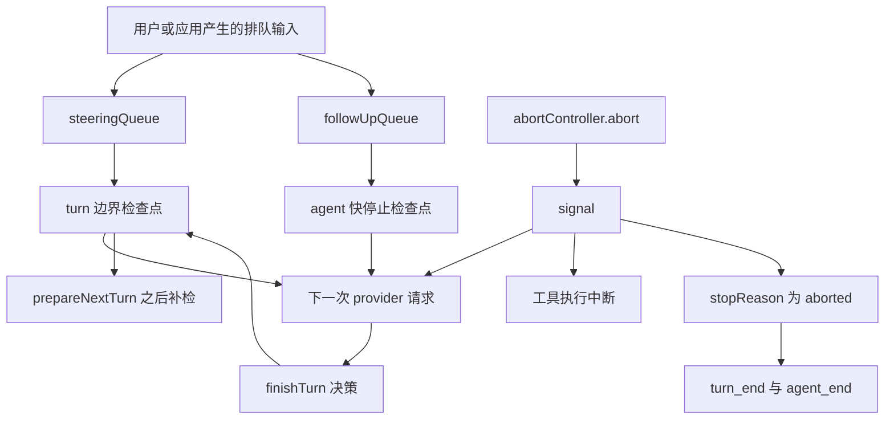
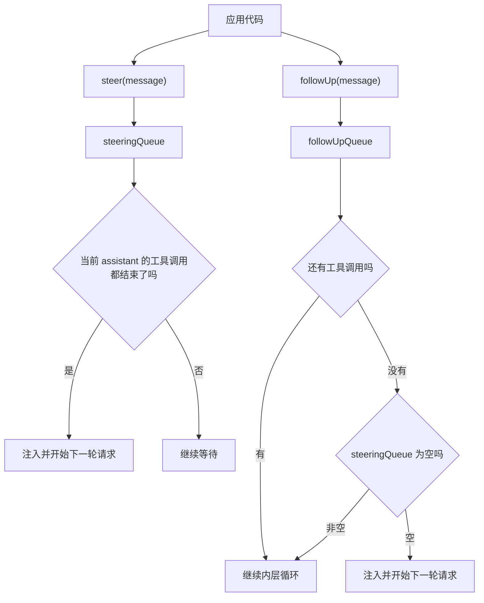
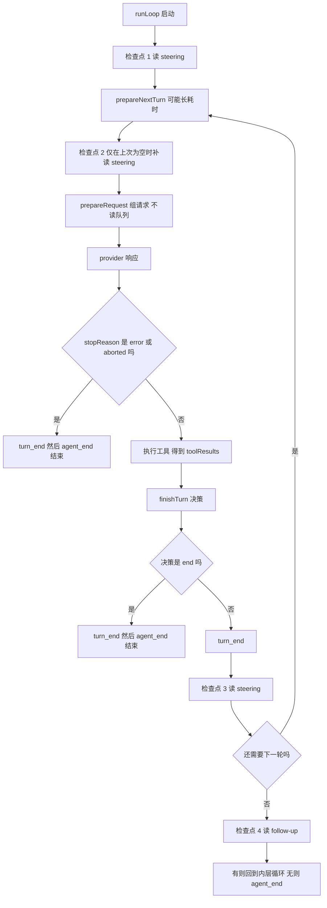
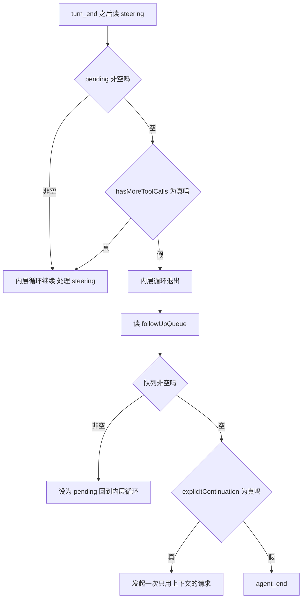
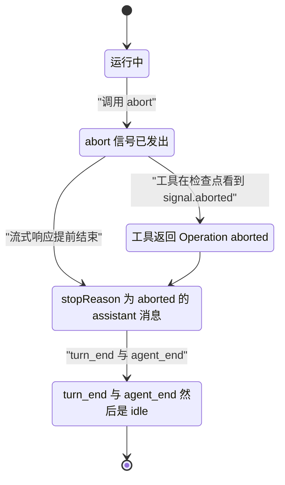
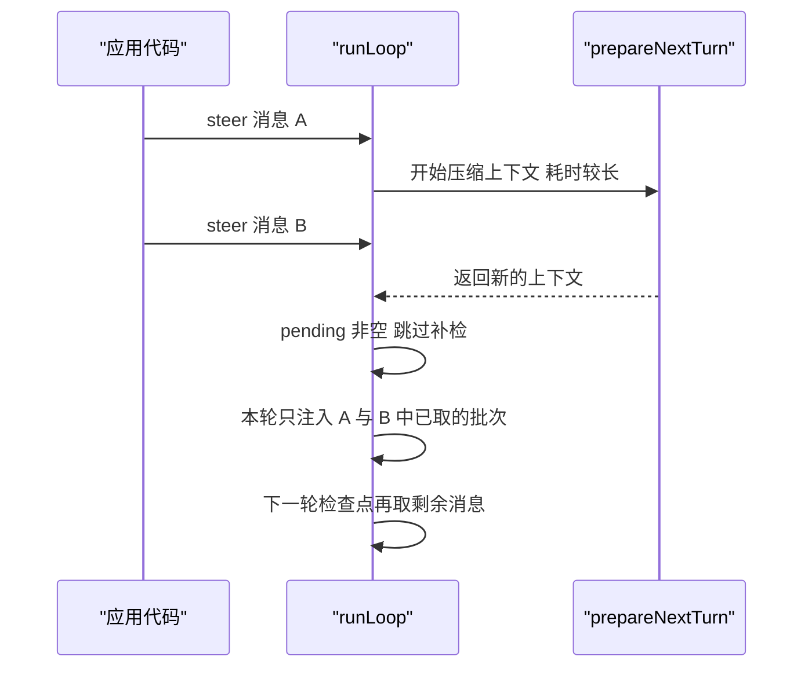
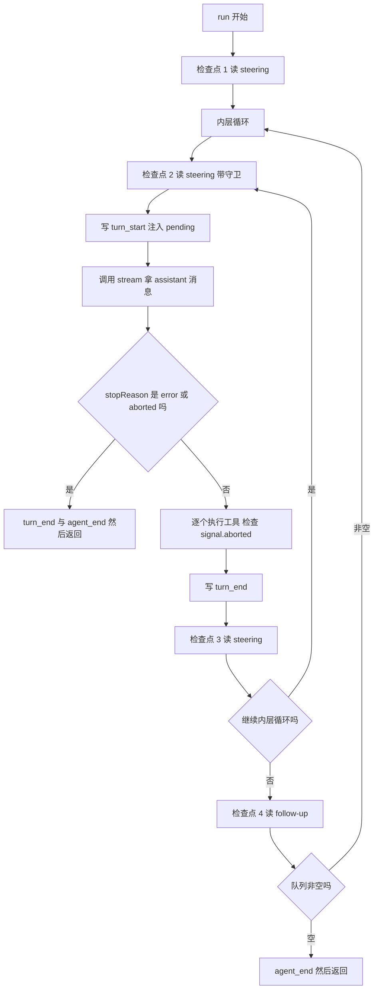
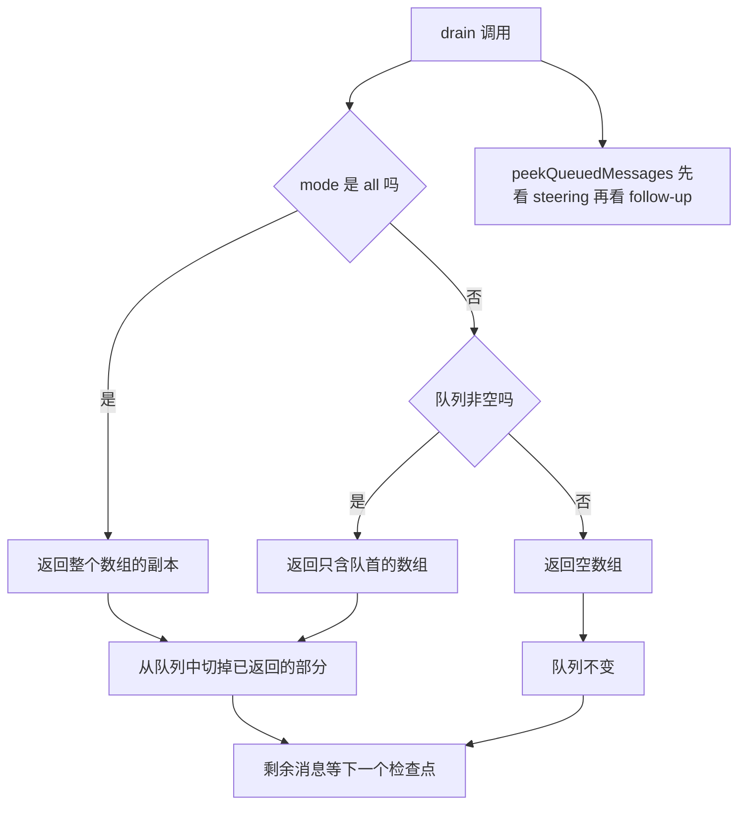

```mermaid
sequenceDiagram
  participant U as "应用代码"
  participant L as "runLoop"
  participant T as "工具执行"
  participant M as "模型"
  M-->>L: assistant 消息 带两个工具调用
  L->>T: executeToolCalls
  U->>L: steer 修正路径
  Note over L: 消息只入队 不打断工具
  T-->>L: 两个工具结果 finalize
  L->>L: turn_end 之后 drain steeringQueue
  L->>M: 下一次请求已带上修正路径
  M-->>L: 新回复
```

# 运行中打断：steering、follow-up 与 abort

!!! abstract "学完这一页你能"

1. 说清 steering 与 follow-up 两条队列为什么必须分开，并为各自举出一个使用场景。
2. 报出一次运行里 steering 与 follow-up 分别被检查的位置，并写出对应的事件顺序。
3. 解释 abort 之后 transcript 会多出哪条消息，工具调用又会返回什么内容。
4. 用 Node 20+ 写一个带两条队列、检查点与 AbortController 的最小调度器，并用 node:assert 校验顺序。

## 0. 知识地图



建议按顺序读。

第 1 到第 4 节建立"两条队列加检查点"的模型，第 5 节单独讲 abort，第 6 节讲这些机制放到一起时出现的竞态。

第 7 节把前面的机制压成一个能运行的调度器，第 8 节讲队列模式与清理接口。

## 1. 两条队列：为什么 steering 与 follow-up 不能合并

**先想一个问题**

你让 agent 跑一个会读十个文件的工具批次。读到第三个文件时，你发现目录名写错了，想立刻纠正。

如果只有一条队列，这条纠正要么插进工具批次中间，要么被推到最后。两种时机都不是你要的。

**心智模型**

!!! tip "心智模型"

    **一句话模型**：steering 是插队，插在"当前 turn 收尾之后、下一次请求之前"；follow-up 是排队等下一单，只在 agent 没有别的事可做时才开工。

    **日常类比**：医生正在缝合，你说"先停一下，换这里"属于 steering；医生说"这台做完了"之后你说"顺便看看隔壁床"属于 follow-up。

    **类比不成立的地方**：真实手术可以中途改刀，而 agent 的工具批次不会在半途插入 steering。源码只在当前 assistant 消息的全部工具调用 finalize 之后才检查 steering 队列。

**图解**



逐条解读：

1. 应用代码调用 `steer()` 或 `followUp()`，消息分别进入两条队列。
2. `steeringQueue` 的放行条件只有一个：当前 assistant 消息的所有工具调用已经 finalize。
3. 条件不满足时，steering 消息留在队列里，等到 turn 边界再被取出。
4. `followUpQueue` 的放行条件更严格，它先要求没有工具调用，再要求 steering 队列为空。
5. 两个条件都满足，follow-up 才被当作 pending 消息放回内层循环，触发一次新的请求。

!!! note "术语：排队消息"

    排队消息（queued message）指通过 `steer()` 或 `followUp()` 放进队列、等待被注入 transcript 的 `AgentMessage`。例：`agent.steer({ role: "user", content: "换目录", timestamp: Date.now() })`。

!!! note "术语：turn（回合）"

    turn 指一次 LLM 调用加上随之产生的工具执行，`turn_start` 与 `turn_end` 是它的边界事件。例：模型请求读文件是一次 turn，读完文件后模型总结是下一次 turn。

**一步一步来**

第一步，先看清队列本身的数据结构。它与源码里的 `PendingMessageQueue` 一致。

```js
class PendingMessageQueue {
  messages = [];          // 队列里等待的 AgentMessage
  mode;                   // "one-at-a-time" 或 "all"
  constructor(mode) {
    this.mode = mode;     // 默认由 steeringMode 或 followUpMode 传入
  }
  enqueue(message) {
    this.messages.push(message);   // 只追加，不做去重
  }
  hasItems() {
    return this.messages.length > 0;
  }
  peek() {
    if (this.mode === "all") return this.messages.slice();  // all 模式取全量副本
    const first = this.messages[0];
    return first ? [first] : [];    // 默认模式只取队首
  }
  drain() {
    const drained = this.peek();                 // 先看要取哪几条
    this.messages = this.messages.slice(drained.length);  // 再把这部分切掉
    return drained;
  }
  clear() {
    this.messages = [];   // 丢弃全部，不返回内容
  }
}
```

**这段代码在做什么**

- `messages` 是一个先进先出的数组，注入顺序与入队顺序一致。
- `mode` 决定 `peek()` 返回一条还是全部，默认值是 `"one-at-a-time"`。
- `drain()` 是"取出并删除"，`peek()` 是"只看不删"，两者都受 `mode` 影响。
- `clear()` 只是清空数组，队列对象本身仍然存在，后续还能继续入队。
- 源码里 `peek()` 先看 steering，只有 steering 为空时才看 follow-up，这个方法对应 `peekQueuedMessages()`。

第二步，把两条队列挂到 agent 上，并加上入队、清理与预览接口。

```js
class MiniQueues {
  constructor(steeringMode = "one-at-a-time", followUpMode = "one-at-a-time") {
    this.steeringQueue = new PendingMessageQueue(steeringMode);
    this.followUpQueue = new PendingMessageQueue(followUpMode);
  }
  steer(message) { this.steeringQueue.enqueue(message); }
  followUp(message) { this.followUpQueue.enqueue(message); }
  clearSteeringQueue() { this.steeringQueue.clear(); }
  clearFollowUpQueue() { this.followUpQueue.clear(); }
  clearAllQueues() {                       // 一次清掉两条队列
    this.clearSteeringQueue();
    this.clearFollowUpQueue();
  }
  hasQueuedMessages() {                    // 任意一条非空即为 true
    return this.steeringQueue.hasItems() || this.followUpQueue.hasItems();
  }
  peekQueuedMessages() {                   // 预览，不消耗
    const steering = this.steeringQueue.peek();
    return steering.length > 0 ? steering : this.followUpQueue.peek();
  }
}
```

**这段代码在做什么**

- `steer()` 与 `followUp()` 是两个独立入口，各自只碰自己那条队列。
- `clearAllQueues()` 由两个 clear 组成，不会抛出异常。
- `hasQueuedMessages()` 用或运算合并两条队列的状态。
- `peekQueuedMessages()` 的返回顺序是"先 steering、后 follow-up"，且不删除任何消息。
- 预览与实际注入之间存在时间差，预览结果可能被随后的 `clear` 作废。

第三步，注意被预览与实际取走的关系：`drain()` 才是真正的消费动作。

**运行结果**

```text
steering 队列长度 1，follow-up 队列长度 1
peekQueuedMessages 返回 1 条（来自 steering）
drain 之后 steering 为空，follow-up 仍有 1 条
```

**动手验证**

复制下面的脚本，用 `node queues.mjs` 运行。依赖：无，只用 Node 20+ 内置的 `node:assert`。

```js
// queues.mjs  依赖：无。Node 20+ 运行 node queues.mjs
import assert from "node:assert/strict";

class PendingMessageQueue {
  constructor(mode) { this.messages = []; this.mode = mode; }
  enqueue(message) { this.messages.push(message); }
  hasItems() { return this.messages.length > 0; }
  peek() {
    if (this.mode === "all") return this.messages.slice();
    const first = this.messages[0];
    return first ? [first] : [];
  }
  drain() {
    const drained = this.peek();
    this.messages = this.messages.slice(drained.length);
    return drained;
  }
  clear() { this.messages = []; }
}

const steeringQueue = new PendingMessageQueue("one-at-a-time");
const followUpQueue = new PendingMessageQueue("one-at-a-time");

steeringQueue.enqueue("换目录");      // 插队消息
followUpQueue.enqueue("写总结");      // 收尾消息

assert.equal(steeringQueue.hasItems(), true);
assert.equal(followUpQueue.hasItems(), true);

const preview = steeringQueue.peek().length > 0 ? steeringQueue.peek() : followUpQueue.peek();
assert.deepEqual(preview, ["换目录"]); // 预览优先返回 steering
assert.equal(steeringQueue.hasItems(), true); // 预览不消耗

const first = steeringQueue.drain();   // 真正的消费
assert.deepEqual(first, ["换目录"]);
assert.equal(steeringQueue.hasItems(), false);
assert.equal(followUpQueue.hasItems(), true); // 另一条队列不受影响

followUpQueue.clear();
assert.equal(followUpQueue.hasItems(), false);

console.log("通过：两条队列各自独立，peek 不消耗，drain 才消费");
```

预期输出一行：`通过：两条队列各自独立，peek 不消耗，drain 才消费`。

**常见坑**

| 现象 | 原因 | 怎么修 |
| --- | --- | --- |
| 调用 `steer()` 后模型立刻收到消息 | 把 steering 当成立即注入 | 等 `turn_end` 之后的检查点，或改用 `followUp()` |
| `peekQueuedMessages()` 之后队列变空 | 误以为 peek 会消费 | 用 `peekQueuedMessages()` 预览，用运行流程消费 |
| 一条队列里的消息顺序错乱 | 自己重新排序了队列数组 | 保持先进先出，只调用 `enqueue()` 与 `drain()` |

**小结**

- steering 的语义是"当前 turn 收尾后插话"，follow-up 的语义是"agent 快停止时补活"。
- 两种语义对应两个检查点，合并成一条队列就无法表达这两种时机。
- `PendingMessageQueue` 只有四个动作：入队、预览、取出、清空。

## 2. 检查点：队列在什么位置被读

**先想一个问题**

你把消息放进队列之后，它在第几次模型请求里出现？

如果你答不出来，就无法预测 agent 的行为。这一节把每次读取的位置固定下来。

**心智模型**

!!! tip "心智模型"

    **一句话模型**：队列不是事件监听器，没有推送；它只在固定的检查点被主动读取。

    **日常类比**：检查点像流水线上的质检工位，产品只有经过工位才会被检查，放在仓库里不会自动被看到。

    **类比不成立的地方**：质检工位数量和顺序是固定的，而这里的检查点数量取决于分支。走到 `error` 或 `aborted` 分支时，后面的检查点不会执行。

**图解**



逐条解读：

1. 内层循环开始前，先读一次 steering 队列，对应"用户在你等待时就敲了字"的场景。
2. `prepareNextTurn` 可能包含压缩上下文这类长耗时工作，做完之后再补读一次 steering。
3. 补读有个前提：上一次读到的结果为空。这个前提防止一轮里取出两次消息。
4. `prepareRequest` 在每次 provider 请求前运行，它不读队列。它运行期间入队的消息要等下一个正常检查点。
5. 正常回复进入工具执行，随后 `finishTurn` 给出决策，`turn_end` 是事件，决策决定是否继续。
6. `turn_end` 之后读 steering；如果非空，内层循环继续，这些消息成为下一轮的输入。
7. 内层循环退出后才读 follow-up。它没有工具调用和 steering 作为竞争者。

!!! note "术语：检查点（checkpoint）"

    检查点指调度循环里主动调用 `getSteeringMessages()` 或 `getFollowUpMessages()` 的位置。例：`turn_end` 之后的那次读取就是 steering 的检查点。

**一步一步来**

第一步，把"检查点"抽成函数，先只做 steering，不涉及工具。

```js
function makeQueueReader(mode) {
  const queue = new PendingMessageQueue(mode);
  return {
    enqueue: (m) => queue.enqueue(m),          // 入队接口
    read: () => queue.drain(),                 // 检查点使用的读取动作
    size: () => queue.messages.length,         // 观察用
  };
}

function runSimpleTurn(steering, trace) {
  let pending = steering.read();               // 检查点 1：启动时
  trace.push(["startup", pending.length]);
  if (pending.length === 0) pending = steering.read();  // 检查点 2：准备后补读
  trace.push(["afterPrepare", pending.length]);
  return pending;                              // 交给下一次请求使用
}
```

**这段代码在做什么**

- `read()` 内部就是 `drain()`，所以调用一次就会改变队列状态。
- 检查点 2 包了一层条件：只有上一次为空才读，避免一轮取两次。
- `trace` 记录每个检查点看到的条数，方便后面断言顺序。
- 这个简化版没有 `prepareRequest`，因为 `prepareRequest` 不影响队列。

**运行结果**

```text
[ [ 'startup', 0 ], [ 'afterPrepare', 1 ] ]
```

第二步，把检查点 3 与检查点 4 按源码顺序补齐。顺序是：turn_end、steering、follow-up。

```js
function runCheckpoints(trace, steering, followUp) {
  let hasMoreToolCalls = true;                 // 本轮是否还要继续
  let pending = [];
  let round = 0;
  while (hasMoreToolCalls || pending.length > 0) {
    round += 1;
    if (pending.length === 0) pending = steering.read();   // 检查点 2
    trace.push("turn_start " + round);
    trace.push("inject " + pending.length);
    pending = [];
    hasMoreToolCalls = round === 1;            // 第 1 轮模拟还有工具调用
    trace.push("turn_end " + round);
    pending = steering.read();                 // 检查点 3
  }
  const queued = followUp.read();              // 检查点 4：内层循环退出后
  trace.push("followUp " + queued.length);
  trace.push("agent_end");
  return queued;
}
```

**这段代码在做什么**

- 内层循环的两个退出条件是"没有工具调用"和"没有 pending 消息"。
- 检查点 3 放在每次 `turn_end` 之后，它的结果直接决定内层循环是否继续。
- 检查点 4 位于内层循环之外，只有内层循环停下来才会执行。
- `agent_end` 是收尾，它的位置排在 follow-up 检查之后。
- 这份实现只演示顺序，没有实现 `finishTurn` 的 `end` 分支。

第三步，用脚本把检查点顺序打印出来，确认 steering 一定早于 follow-up。

**运行结果**

```text
turn_start 1 / inject 0 / turn_end 1
turn_start 2 / inject 1 / turn_end 2
followUp 1
agent_end
```

**动手验证**

依赖：无。`node checkpoints.mjs` 直接运行。

```js
// checkpoints.mjs  依赖：无。Node 20+ 运行 node checkpoints.mjs
import assert from "node:assert/strict";

const trace = [];
const steering = [];
const followUp = [];

function readSteering() { const out = steering.slice(); steering.length = 0; return out; }
function readFollowUp() { const out = followUp.slice(); followUp.length = 0; return out; }

function run() {
  let hasMoreToolCalls = true;
  let pending = readSteering();          // 检查点 1
  let round = 0;
  while (hasMoreToolCalls || pending.length > 0) {
    round += 1;
    if (pending.length === 0) pending = readSteering();  // 检查点 2
    trace.push("turn_start " + round);
    trace.push("inject " + pending.length);
    pending = [];
    hasMoreToolCalls = round === 1;       // 第 1 轮有工具调用
    trace.push("turn_end " + round);
    pending = readSteering();             // 检查点 3
  }
  trace.push("followUp " + readFollowUp().length);       // 检查点 4
  trace.push("agent_end");
}

steering.push("修正路径");                // 模拟运行时插话
followUp.push("写总结");                  // 模拟收尾任务
run();

assert.deepEqual(trace, [
  "turn_start 1", "inject 0", "turn_end 1",
  "turn_start 2", "inject 1", "turn_end 2",
  "followUp 1", "agent_end",
]);
console.log(trace.join(" | "));
```

预期输出一行：`turn_start 1 | inject 0 | turn_end 1 | turn_start 2 | inject 1 | turn_end 2 | followUp 1 | agent_end`。

**常见坑**

| 现象 | 原因 | 怎么修 |
| --- | --- | --- |
| follow-up 消息插到了工具批次中间 | 把 follow-up 检查点放进了内层循环 | 移到内层循环退出之后 |
| steering 一轮里注入了两条 | 检查点 2 在 pending 非空时又读了一次 | 补读前判断上次结果为空 |
| `prepareRequest` 里的入队消息当轮生效 | 以为 `prepareRequest` 会读队列 | 等下一个正常 steering 检查点 |

**小结**

- steering 有四个读取位置：启动时、准备后补读、`turn_end` 之后、`continue()` 的尾部回退路径。
- follow-up 只有一个读取位置：内层循环退出之后。
- `prepareRequest` 每次请求前运行，但它不读任何队列。

## 3. steering 的注入时机

**先想一个问题**

你在 agent 调用工具时按下回车，写下"停，先看 README"。这行字会在第几次模型请求里出现？

如果它出现在工具批次中间，工具就会用错误的参数继续跑。源码不允许这种结果。

**心智模型**

!!! tip "心智模型"

    **一句话模型**：steering 在"当前 assistant 消息触发的工具全部 finalize"之后注入，模型下一次请求就能看到它。

    **日常类比**：公交司机不会在路口中间开门，只有到站停稳才开门上客，站台就是 turn 边界。

    **类比不成立的地方**：公交到站时间固定，而 turn 的时长取决于工具和模型。工具跑得久，steering 等待的时间就长。

**图解**



逐条解读：

1. 模型先返回一条带工具调用的 assistant 消息。
2. 循环调用 `executeToolCalls`，工具开始执行。
3. 应用代码此时调用 `steer()`，消息进入 `steeringQueue`，工具不受影响。
4. 工具逐个 finalize，产出 `toolResult` 消息。
5. `turn_end` 之后循环才 `drain()` steering 队列。
6. 取到的消息作为下一次请求的输入，模型在新的上下文里作答。

!!! note "术语：finalize（定稿）"

    finalize 指工具结果经过 `afterToolCall` 处理、`tool_execution_end` 已发出、`toolResult` 消息可以写进 transcript 的状态。例：工具已经返回内容并完成审计，这条结果就算 finalize。

**一步一步来**

第一步，先把工具批次模拟出来，并记录每个工具完成的时间点。

```js
async function runToolBatch(calls, trace) {
  const results = [];
  for (const call of calls) {                 // 顺序模式下的逐个执行
    trace.push("tool_start " + call.name);
    await new Promise((resolve) => setTimeout(resolve, 1));  // 模拟耗时
    trace.push("tool_end " + call.name);
    results.push({ name: call.name, ok: true });
  }
  return results;                             // 全部 finalize 之后才返回
}
```

**这段代码在做什么**

- 工具在一个 `for` 循环里逐个执行，`await` 让每次执行都会让出事件循环。
- `trace` 记录开始与结束两个时刻，用来观察 steering 能否插在中间。
- 函数返回时所有工具都已完成，符合"批次全部 finalize"这一条件。
- 这里没有实现并行模式；并行模式的结束事件按完成顺序发出，但 `toolResult` 消息仍按 assistant 源码顺序排列。

第二步，把 steering 检查点接到 `turn_end` 之后，观察它落在哪个位置。

```js
async function runTurn(steering, trace) {
  const calls = [{ name: "read" }, { name: "read" }];
  const results = await runToolBatch(calls, trace);   // 工具阶段
  trace.push("turn_end");
  const pending = steering.read();                     // 检查点：turn_end 之后
  trace.push("steering " + pending.length);
  return { results, pending };
}

steering.enqueue("先看 README");   // 在工具执行期间入队
```

**这段代码在做什么**

- 入队动作发生在 `runTurn` 之前，等价于"工具跑的时候用户敲了字"。
- 工具阶段完全不受 steering 影响，两次 `tool_start` 与 `tool_end` 都会出现。
- `turn_end` 之后才读取队列，此时读到的消息数量为 1。
- 读到的消息会随返回值交给下一轮请求。

**运行结果**

```text
tool_start read / tool_end read / tool_start read / tool_end read
turn_end / steering 1
```

第三步，用事件名复现官方文档里给出的顺序：工具全部结束，然后 `turn_end`，然后新的 turn。

**运行结果**

```text
tool_execution_start read / tool_execution_end read
tool_execution_start read / tool_execution_end read
turn_end
turn_start  下一次请求带着 steering 消息
```

**动手验证**

依赖：无。`node steering.mjs` 直接运行。

```js
// steering.mjs  依赖：无。Node 20+ 运行 node steering.mjs
import assert from "node:assert/strict";

const steering = [];
const trace = [];

function steer(message) { steering.push(message); }
function readSteering() { const out = steering.slice(); steering.length = 0; return out; }

async function runToolBatch(calls) {
  const results = [];
  for (const call of calls) {
    trace.push("tool_start " + call.name);
    await new Promise((resolve) => setTimeout(resolve, 1));
    trace.push("tool_end " + call.name);
    results.push({ name: call.name, ok: true });
  }
  return results;
}

async function runTurn() {
  const results = await runToolBatch([{ name: "read" }, { name: "read" }]);
  trace.push("turn_end");
  const pending = readSteering();     // 检查点：steering 只在 turn_end 之后读
  trace.push("steering " + pending.length);
  if (pending.length > 0) {
    trace.push("turn_start");
    trace.push("inject " + pending[0]);
  }
  return { results, pending };
}

steer("先看 README");                 // 工具执行期间插话
const { results, pending } = await runTurn();

assert.equal(results.length, 2);
assert.deepEqual(pending, ["先看 README"]);
assert.equal(trace.indexOf("steering 1") > trace.indexOf("turn_end"), true);
assert.equal(trace.indexOf("tool_end read"), trace.filter((t) => t === "tool_end read").length - 1 < trace.indexOf("turn_end"), true);
console.log(trace.join(" | "));
```

预期输出一行：`tool_start read | tool_end read | tool_start read | tool_end read | turn_end | steering 1 | turn_start | inject 先看 README`。

**常见坑**

| 现象 | 原因 | 怎么修 |
| --- | --- | --- |
| 工具收到新参数 | 在工具执行中直接改了 `toolCall.arguments` | 让 steering 等到 `turn_end` 之后注入 |
| steering 被推迟到 follow-up 之后 | 把两个检查点顺序写反了 | steering 检查点在前，follow-up 在后 |
| 注入的 steering 没进模型请求 | 只读队列没写进上下文 | 把读到的消息 push 进消息数组再发请求 |

**小结**

- steering 的注入前提是当前 assistant 消息的全部工具调用已经 finalize。
- 注入点在 `turn_end` 之后，模型在下一次请求里看到这条消息。
- steering 不会中断正在跑的工具，只会改变下一次请求的输入。

## 4. follow-up 的注入时机

**先想一个问题**

你说"做完顺手写个总结"，而这一轮还有工具调用没结束。

这条消息应该抢在工具前面吗？源码给出的答案是不抢，它等到内层循环彻底停下来。

**心智模型**

!!! tip "心智模型"

    **一句话模型**：follow-up 是"没有工具调用、也没有 steering"之后的补充任务，它是内层循环退出的唯一续命来源。

    **日常类比**：餐厅打烊前的最后点单，服务员只在你吃完所有在上的菜、也没有加菜需求时才问"还要点什么"。

    **类比不成立的地方**：打烊时间固定，而内层循环退出的时间取决于工具和 steering。follow-up 可能等很久。

**图解**



逐条解读：

1. 内层循环的继续条件有两个：`hasMoreToolCalls` 为真，或 `pending` 非空。
2. 两个条件都不成立时，内层循环退出，代码走到 follow-up 检查。
3. follow-up 队列非空，就把这批消息设为 `pending`，用 `continue` 回到外层循环开头。
4. 回到内层循环后，先写 `turn_start`，再把消息写进上下文，然后发起请求。
5. follow-up 队列为空时，代码检查 `explicitContinuation`，它来自 `finishTurn` 的 `{ action: "continue" }`。
6. `explicitContinuation` 为真时，循环再走一次，发起一次只用上下文的请求。
7. 两个分支都不命中，循环跳出，发出 `agent_end`。

!!! note "术语：explicitContinuation（显式续跑）"

    `explicitContinuation` 表示 `finishTurn` 明确要求再发一次请求。例：`finishTurn` 返回 `{ action: "continue" }` 且没有工具结果或队列消息满足它，循环就补一次只用上下文的请求。

**一步一步来**

第一步，把 follow-up 检查接到内层循环之后，先只看成功路径。

```js
async function runWithFollowUp(followUp, trace) {
  let pending = [];
  let hasMoreToolCalls = true;
  while (hasMoreToolCalls || pending.length > 0) {
    hasMoreToolCalls = false;               // 模拟工具已经跑完
    trace.push("turn_end");
    pending = [];
  }
  const queued = followUp.read();           // 检查点：内层循环退出之后
  if (queued.length > 0) {
    pending = queued;                       // 下一轮输入
    trace.push("followUp " + queued.length);
    trace.push("turn_start");
    trace.push("inject " + pending[0]);
  }
  trace.push("agent_end");
}
```

**这段代码在做什么**

- `hasMoreToolCalls` 与 `pending` 同时为空时，内层循环结束。
- follow-up 的读取发生在内层循环之外，所以它永远排在 steering 之后。
- 读到消息之后立刻写 `turn_start`，这条 follow-up 就变成了一次新请求的输入。
- `agent_end` 排在最后，无论是否注入过 follow-up，它都是收尾事件。

第二步，加上 `finishTurn` 的决策分支，说明 `end` 会让 follow-up 永远读不到。

```js
function decide(decision, followUp, trace) {
  if (decision?.action === "end") {
    trace.push("turn_end");
    trace.push("agent_end");     // 直接结束，跳过队列读取
    return false;                // 返回 false 表示不再继续
  }
  return followUp.size() >= 0;   // 否则按正常路径继续检查队列
}
```

**这段代码在做什么**

- `end` 分支在 `turn_end` 之后直接发出 `agent_end`，队列检查被跳过。
- 跳过的原因写在文档里：`end` 要在 `turn_end` 之后、读队列或准备下一次请求之前停下。
- 非 `end` 分支返回真，表示继续按正常调度检查 follow-up。
- `finishTurn` 的决策在 error 与 aborted 响应上会被忽略，那两条路径是硬退出。

第三步，用脚本确认 follow-up 一定排在 steering 检查之后。

**运行结果**

```text
turn_end / followUp 1 / turn_start / inject 写总结 / agent_end
```

**动手验证**

依赖：无。`node followup.mjs` 直接运行。

```js
// followup.mjs  依赖：无。Node 20+ 运行 node followup.mjs
import assert from "node:assert/strict";

const trace = [];
const steering = [];
const followUp = [];

function readSteering() { const out = steering.slice(); steering.length = 0; return out; }
function readFollowUp() { const out = followUp.slice(); followUp.length = 0; return out; }

function run(decision) {
  let hasMoreToolCalls = false;      // 没有工具调用
  let pending = [];
  while (hasMoreToolCalls || pending.length > 0) {
    trace.push("turn_end");
    pending = [];
  }
  if (decision?.action === "end") {  // finishTurn 要求立刻结束
    trace.push("agent_end");
    return;
  }
  const queued = readFollowUp();     // 检查点：内层循环退出之后
  if (queued.length > 0) {
    pending = queued;
    trace.push("followUp " + queued.length);
    trace.push("turn_start");
    trace.push("inject " + pending[0]);
  }
  trace.push("agent_end");
}

steering.push("看完这个再继续");     // 记录用：steering 在本轮为空
followUp.push("写总结");
run(undefined);

assert.deepEqual(trace, ["followUp 1", "turn_start", "inject 写总结", "agent_end"]);
assert.equal(readSteering().length, 1);   // steering 未被 follow-up 消费

const trace2 = [];
function runEnd() {
  hasMoreToolCalls = false;
  trace2.push("turn_end");
  trace2.push("agent_end");
}
runEnd();
assert.deepEqual(trace2, ["turn_end", "agent_end"]);
console.log(trace.join(" | "));
```

预期输出一行：`followUp 1 | turn_start | inject 写总结 | agent_end`。

**常见坑**

| 现象 | 原因 | 怎么修 |
| --- | --- | --- |
| follow-up 与 steering 同时被消费 | 两个检查点写在同一个位置 | follow-up 只在内层循环退出后读 |
| 返回 `end` 后 follow-up 仍被执行 | 在 `end` 分支之前读了队列 | `end` 分支要在读队列之前返回 |
| follow-up 触发无限循环 | `finishTurn` 无条件返回 `continue` | 加上结束条件，否则每次请求后都会再发起一次 |

**小结**

- follow-up 的读取条件比 steering 更严格：没有工具调用，也没有 steering。
- 它是独立于 `finishTurn` 之外的续跑来源，`finishTurn` 的 `continue` 是另一条路径。
- `finishTurn` 返回 `end` 时，follow-up 队列在本次运行内不会被读取。

## 5. abort 语义

**先想一个问题**

用户点了"停止"，但某个工具正在网络请求中。

这次运行会留下什么痕迹？`await agent.prompt()` 会抛出异常吗？

**心智模型**

!!! tip "心智模型"

    **一句话模型**：abort 是给当前运行绑定的 `AbortController` 发信号，循环和工具各自在检查点读取 `signal.aborted`，然后走一条硬退出路径。

    **日常类比**：厨房收到"停止出单"，正在做的菜会做完或直接丢弃并记录原因，但不会凭空消失，账上一定留下记录。

    **类比不成立的地方**：菜不会自己写记录，而 agent 一定会把一条 `stopReason` 为 `aborted` 的 assistant 消息写进 transcript。

**图解**



逐条解读：

1. 初始状态是运行中，`activeRun` 里有一个 `AbortController`。
2. 调用 `agent.abort()`，它执行 `activeRun.abortController.abort()`。
3. 工具的 `execute` 收到 `signal`，`signal.aborted` 变为真。
4. 顺序模式下，循环在每次执行工具之前检查 `signal.aborted`，为真就跳出工具循环。
5. 并行的工具调用在真正执行前也检查一次，为真就直接产出错误结果，内容为 `Operation aborted`。
6. 流式响应以 `stopReason` 为 `aborted` 的消息结束，循环走硬退出分支。
7. 硬退出分支先调用 `finishTurn`，再发 `turn_end` 与 `agent_end`，然后返回。

!!! note "术语：AbortSignal"

    `AbortSignal` 是 `AbortController` 暴露的信号对象，带有只读属性 `aborted` 与事件 `abort`。例：`const c = new AbortController(); c.signal.aborted` 初始为 `false`，调用 `c.abort()` 后为 `true`。

**一步一步来**

第一步，看 `Agent` 里 abort 与 idle 的接口。这两个方法一前一后。

```js
// Agent 类中的关键片段
get signal() {
  return this.activeRun?.abortController.signal;   // 没有运行时返回 undefined
}
abort() {
  this.activeRun?.abortController.abort();         // 没有运行时是空操作
}
waitForIdle() {
  return this.activeRun?.promise ?? Promise.resolve();  // 已空闲时立刻解决
}
subscribe(listener) {
  this.listeners.add(listener);                    // 监听器按注册顺序被 await
  return () => this.listeners.delete(listener);
}
```

**这段代码在做什么**

- `agent.signal` 返回当前运行的信号，没有活动运行时返回 `undefined`。
- `abort()` 在空闲时不会报错，它只是没有控制器可发信号。
- `waitForIdle()` 返回当前运行的 promise，空闲时返回一个已解决的 promise。
- 监听器的 promise 被 await，因此它们也算进本次运行的结算过程。
- `agent_end` 不是结束点，等 `agent_end` 的监听器都完成后，运行才算 idle。

第二步，看工具执行里怎么读 `signal`。这里分顺序模式与并行模式。

```js
async function executeToolCallsSequential(toolCalls, signal, trace) {
  const finalizedCalls = [];
  for (const toolCall of toolCalls) {
    trace.push("tool_execution_start " + toolCall.name);
    if (signal?.aborted) {                          // 执行前检查
      trace.push("blocked " + toolCall.name);
      break;                                        // 跳出工具循环
    }
    const result = await runTool(toolCall, signal);  // 真正执行
    trace.push("tool_execution_end " + toolCall.name);
    finalizedCalls.push(result);
    if (signal?.aborted) break;                     // 每个工具结束后再检查一次
  }
  return finalizedCalls;
}
```

**这段代码在做什么**

- 每次执行工具前检查 `signal.aborted`，为真就停止这一批。
- 每个工具结束后再检查一次，保证中断发生在工具边界。
- 被跳过的工具不会执行，也不会产生 `tool_execution_end` 事件。
- 并行模式里，每个待执行的闭包开头也做同样的检查，产出 `Operation aborted` 的错误结果。
- 已发出的 `tool_execution_start` 事件不会被撤回，事件顺序仍然可观测。

!!! note "术语：硬退出（hard exit）"

    硬退出指 error 与 aborted 两条分支，它们调用 `finishTurn` 之后立刻 `turn_end` 与 `agent_end`，不检查队列，也不准备下一次请求。

第三步，确认 abort 不会清空队列，并且 `finishTurn` 的决策会被忽略。

```js
if (message.stopReason === "error" || message.stopReason === "aborted") {
  lastCompletedTurn = { message, toolResults: [], context: currentContext, newMessages };
  await config.finishTurn?.(lastCompletedTurn, signal);  // 仍会调用
  await emit({ type: "turn_end", message, toolResults: [] });
  await emit({ type: "agent_end", messages: newMessages });
  return;                                                // 决策结果被丢弃
}
```

**这段代码在做什么**

- `finishTurn` 在 error 与 aborted 响应上仍会被调用，方便做清理。
- 调用之后直接返回，所以它返回的 `{ action: "end" }` 或 `{ action: "continue" }` 都不起作用。
- 队列没有被动过，steering 与 follow-up 里的消息仍然留到下一次运行。
- 如果异常是从 `runWithLifecycle` 抛出的，`handleRunFailure` 会补一条 assistant 失败消息。
- 那条失败消息的 `stopReason` 依据 `abortController.signal.aborted` 决定是 `aborted` 还是 `error`。

**运行结果**

```text
tool_execution_start read
aborted 检查命中 工具被跳过
turn_end
agent_end
队列中仍有 1 条 steering 消息
```

**动手验证**

依赖：无。`node abort.mjs` 直接运行。

```js
// abort.mjs  依赖：无。Node 20+ 运行 node abort.mjs
import assert from "node:assert/strict";

const controller = new AbortController();
const steering = ["稍后再说"];     // 模拟队列里的待处理消息
const trace = [];

async function runTool(name, signal) {
  if (signal?.aborted) return { name, error: "Operation aborted" };
  return { name, ok: true };
}

async function runToolBatch(calls, signal) {
  const finalized = [];
  for (const call of calls) {
    trace.push("tool_execution_start " + call.name);
    if (signal?.aborted) {                 // 执行前检查
      trace.push("blocked " + call.name);
      break;
    }
    const result = await runTool(call.name, signal);
    trace.push("tool_execution_end " + call.name);
    finalized.push(result);
    if (signal?.aborted) break;            // 每个工具结束后再检查
  }
  return finalized;
}

controller.abort();                        // 运行中途发信号
const results = await runToolBatch([{ name: "read" }, { name: "write" }], controller.signal);

assert.deepEqual(results, []);
assert.deepEqual(trace, ["tool_execution_start read", "blocked read"]);
assert.equal(controller.signal.aborted, true);
assert.equal(steering.length, 1);          // abort 不清队列

if (controller.signal.aborted) {           // 循环里的硬退出分支
  trace.push("turn_end");
  trace.push("agent_end");
}
assert.deepEqual(trace.slice(-2), ["turn_end", "agent_end"]);
console.log(trace.join(" | "), "| 队列剩余", steering.length);
```

预期输出一行：`tool_execution_start read | blocked read | turn_end | agent_end | 队列剩余 1`。

**常见坑**

| 现象 | 原因 | 怎么修 |
| --- | --- | --- |
| `abort()` 之后工具继续跑完 | 工具没有接收或检查 `signal` | 把 `signal` 传给 `execute`，在里面检查 `signal.aborted` |
| `abort()` 后队列变空 | 把 abort 与 `clearAllQueues()` 混用 | 需要丢弃队列时显式调用清理接口 |
| `agent_end` 监听器没跑完就以为结束 | 把 `agent_end` 当成 idle | 用 `await agent.waitForIdle()` 等待结算完成 |
| 失败消息的 `stopReason` 是 error | 异常不是由 abort 引起的 | 只有 `signal.aborted` 为真时才是 `aborted` |

**小结**

- `abort()` 通过 `AbortController` 发信号，工具与循环在检查点读取 `signal.aborted`。
- 中断后的 transcript 里会有一条 `stopReason` 为 `aborted` 的 assistant 消息。
- abort 不清理队列，`finishTurn` 的决策在中断路径上被忽略。

## 6. 竞态：检查点之间的时间窗

**先想一个问题**

`prepareNextTurn` 正在压缩上下文，用了三秒。这三秒里用户敲字进了 steering 队列。

如果启动检查点和准备后的补检都执行，一轮就会注入两条消息。源码怎么处理？

**心智模型**

!!! tip "心智模型"

    **一句话模型**：每个检查点之间都是时间窗，窗口内的入队消息只能被读取一次，因此补检必须先确认上次结果为空。

    **日常类比**：取号机一次只吐一张号，你手里已经有号了就不再吐第二张。

    **类比不成立的地方**：取号机靠机械结构防重，这里靠一行 `if (pending.length === 0)` 判断，逻辑出错就会重复注入。

**图解**



逐条解读：

1. 消息 A 在准备阶段之前入队。
2. `prepareNextTurn` 开始执行，它可能包含压缩这类长耗时工作。
3. 消息 B 在准备阶段之中入队。
4. 准备返回后，循环发现 `pending` 已经非空，于是不执行补检。
5. 于是这一轮注入的是检查点 1 取到的批次，另一个检查点不会重复取。
6. 剩下的消息留到下一次检查点，一轮只消费一个批次。

!!! note "术语：竞态（race condition）"

    竞态指两个动作的先后顺序会改变结果，而顺序不由代码显式控制。例：检查点 1 与检查点 2 都能读到刚入队的消息，谁先读决定了注入次数。

**一步一步来**

第一步，把重复读取的后果写成可观察的断言。先看错误写法。

```js
// 错误写法：两个检查点都无条件读取
function readTwiceBad(queue, trace) {
  let pending = queue.drain();            // 检查点 1
  trace.push("first " + pending.length);
  pending = pending.concat(queue.drain()); // 检查点 2 无条件再读一次
  trace.push("second " + pending.length);
  return pending;
}
```

**这段代码在做什么**

- 两次读取之间没有条件，队列里排着的第二条消息会在同一次准备流程里被取走。
- 在 `one-at-a-time` 模式下，两次 `drain()` 一共取走两条消息。
- 结果是本轮注入了两批消息，而它们本应分属两轮。
- 队列模式为 `all` 时，一次 `drain()` 就会取走全部，问题形态不同但同样发生在时序上。

第二步，改成带守卫的补检，并断言同一轮只消费一个批次。

```js
function readWithGuard(queue, trace) {
  let pending = queue.drain();                       // 检查点 1
  trace.push("first " + pending.length);
  if (pending.length === 0) {                        // 守卫：上次为空才补读
    pending = queue.drain();                         // 检查点 2
  }
  trace.push("second " + pending.length);
  return pending;
}
```

**这段代码在做什么**

- 守卫条件只有一条：`pending.length === 0`。
- 检查点 1 取到消息时，检查点 2 整个跳过。
- 检查点 1 为空时，补检才有机会取到准备阶段入队的消息。
- 这个守卫就是源码注释里提到的"否则一次性模式会在本轮投递两条消息"。

第三步，验证剩余消息会在下一轮被取走，而不是丢失。

**运行结果**

```text
first 1 / second 1   （同一轮只取 1 条）
next 1                （下一条留到下一轮）
```

**动手验证**

依赖：无。`node race.mjs` 直接运行。

```js
// race.mjs  依赖：无。Node 20+ 运行 node race.mjs
import assert from "node:assert/strict";

class PendingMessageQueue {
  constructor(mode) { this.messages = []; this.mode = mode; }
  enqueue(message) { this.messages.push(message); }
  hasItems() { return this.messages.length > 0; }
  peek() {
    if (this.mode === "all") return this.messages.slice();
    const first = this.messages[0];
    return first ? [first] : [];
  }
  drain() {
    const drained = this.peek();
    this.messages = this.messages.slice(drained.length);
    return drained;
  }
}

function readWithGuard(queue) {
  let pending = queue.drain();          // 检查点 1
  if (pending.length === 0) pending = queue.drain();  // 检查点 2 带守卫
  return pending;
}

const oneAtATime = new PendingMessageQueue("one-at-a-time");
oneAtATime.enqueue("A");
oneAtATime.enqueue("B");

const round1 = readWithGuard(oneAtATime);
assert.deepEqual(round1, ["A"]);                    // 本轮只注入 A
assert.equal(oneAtATime.hasItems(), true);          // B 仍在队列

const round2 = readWithGuard(oneAtATime);
assert.deepEqual(round2, ["B"]);                    // 下一轮注入 B
assert.equal(oneAtATime.hasItems(), false);

const allMode = new PendingMessageQueue("all");
allMode.enqueue("A");
allMode.enqueue("B");
assert.deepEqual(readWithGuard(allMode), ["A", "B"]); // all 模式一次取全量
console.log("通过：一轮只消费一个批次，剩余消息留到下一轮");
```

预期输出一行：`通过：一轮只消费一个批次，剩余消息留到下一轮`。

**常见坑**

| 现象 | 原因 | 怎么修 |
| --- | --- | --- |
| 一轮里注入两条 steering | 补检没有守卫条件 | 补检前判断上次读取结果为空 |
| `finishTurn` 返回 `continue` 后无限循环 | 无条件续跑 | 给出结束条件，并注意请求本身已满足续跑时不会再补发 |
| 工具声明与可执行工具不一致 | 直接把工具列表塞进上下文 | 先声明工具变更，让 replay 结果等于当前可执行集合 |
| `agent_end` 之后状态仍是 streaming | 结算包含被 await 的 `agent_end` 监听器 | 用 `await agent.waitForIdle()` 确认 idle |

**小结**

- 检查点之间的时间窗会让后一个检查点看到前一个检查点之后入队的消息。
- 守卫条件让同一轮只消费一个批次，其余消息留到下一轮。
- `finishTurn` 返回 `continue` 时必须给结束条件，否则每次请求都会再触发一次请求。

## 7. 手写一个最小调度器

**先想一个问题**

前面六节讲的是机制。能不能把它们压成一段 80 行左右、可以直接跑的代码？

自己写一遍，才能真正记住检查点的位置。

**心智模型**

!!! tip "心智模型"

    **一句话模型**：调度器就是两层循环加一个 abort 检查——外层管 follow-up，内层管工具与 steering。

    **日常类比**：像洗衣机的两层循环：外层决定要不要再洗一桶，内层决定这一桶里每件衣服洗几遍。

    **类比不成立的地方**：洗衣机不会因为用户说了一句"轻点洗"就换程序，而这里 steering 会改变下一轮的输入内容。

**图解**



逐条解读：

1. `run` 启动时先读一次 steering，对应"等待期间用户输入"。
2. 进入内层循环，检查点 2 带守卫条件，避免同一轮取两次。
3. 写 `turn_start`，把 pending 消息写进上下文，然后调用 `stream` 取回复。
4. `stopReason` 为 error 或 aborted 时直接跳到 `turn_end` 与 `agent_end`，不再看队列。
5. 有工具调用就逐个执行，每次执行前检查 `signal.aborted`。
6. `turn_end` 之后读 steering，非空或还有工具调用就继续内层循环。
7. 内层循环退出后读 follow-up，非空就回到内层循环，为空就收尾。

**一步一步来**

第一步，先写队列与剧本式模型。模型用固定脚本代替真实 provider。

```js
class PendingMessageQueue {
  constructor(mode) { this.messages = []; this.mode = mode; }
  enqueue(message) { this.messages.push(message); }
  hasItems() { return this.messages.length > 0; }
  peek() {
    if (this.mode === "all") return this.messages.slice();
    const first = this.messages[0];
    return first ? [first] : [];
  }
  drain() {
    const drained = this.peek();
    this.messages = this.messages.slice(drained.length);
    return drained;
  }
}

function createScriptedStream(script, onRequest) {
  let index = 0;
  return async (_context, { signal }) => {
    if (signal?.aborted) return { stopReason: "aborted", toolCalls: [] };
    const step = script[index];
    index += 1;
    if (step?.onRequest) step.onRequest();
    return step ?? { stopReason: "stop", toolCalls: [] };
  };
}
```

**这段代码在做什么**

- 剧本 `script` 是一个数组，每次请求按顺序取一条。
- `signal.aborted` 为真时，模型直接返回 `stopReason` 为 `aborted` 的消息。
- `onRequest` 回调让脚本在请求发生时触发副作用，例如入队或 abort。
- 取完剧本后返回一条普通的 `stop` 消息，保证循环能收尾。

第二步，写两层循环，把四个检查点与 abort 检查放进去。

```js
async function run(initialInput, { stream, steering, followUp, trace, signal }) {
  const messages = [...initialInput];
  let pending = steering.drain();                    // 检查点 1
  while (true) {
    let hasMoreToolCalls = true;
    while (hasMoreToolCalls || pending.length > 0) {
      if (pending.length === 0) pending = steering.drain();   // 检查点 2
      trace.push("turn_start");
      for (const message of pending) { trace.push("inject:" + message); messages.push(message); }
      pending = [];
      const assistant = await stream({ messages }, { signal });
      trace.push("assistant");
      messages.push(assistant);
      if (assistant.stopReason === "aborted" || assistant.stopReason === "error") {
        trace.push("turn_end"); trace.push("agent_end");
        return messages;                              // 硬退出
      }
      const calls = assistant.toolCalls ?? [];
      for (const call of calls) {
        if (signal?.aborted) { trace.push("tool:" + call.name + ":aborted"); break; }
        trace.push("tool:" + call.name + ":ok");      // 工具检查点
      }
      hasMoreToolCalls = calls.length > 0;
      trace.push("turn_end");
      pending = steering.drain();                    // 检查点 3
    }
    const queued = followUp.drain();                 // 检查点 4
    if (queued.length > 0) { pending = queued; continue; }
    break;
  }
  trace.push("agent_end");
  return messages;
}
```

**这段代码在做什么**

- 外层循环只为 follow-up 服务，内层循环为工具与 steering 服务。
- 检查点 2 的守卫保证 `one-at-a-time` 模式下同一轮不取两条。
- 工具循环在每个工具前读 `signal.aborted`，命中就记录并跳出。
- 硬退出分支先写 `turn_end` 再写 `agent_end`，顺序与源码一致。
- `agent_end` 只写一次，位于两层循环之外。

第三步，用两条场景校验顺序：steering 加 follow-up 的正常路径，以及 abort 路径。

**运行结果**

```text
场景 1：turn_start | assistant | tool:read:ok | turn_end | turn_start | inject:修正路径 | assistant | turn_end | turn_start | inject:总结结果 | assistant | turn_end | agent_end
场景 2：turn_start | assistant | tool:read:aborted | turn_end | turn_start | assistant | turn_end | agent_end
```

**动手验证**

依赖：无。`node scheduler.mjs` 直接运行。完整脚本如下。

```js
// scheduler.mjs  依赖：无。Node 20+ 运行 node scheduler.mjs
import assert from "node:assert/strict";

class PendingMessageQueue {
  constructor(mode) { this.messages = []; this.mode = mode; }
  enqueue(message) { this.messages.push(message); }
  hasItems() { return this.messages.length > 0; }
  peek() {
    if (this.mode === "all") return this.messages.slice();
    const first = this.messages[0];
    return first ? [first] : [];
  }
  drain() {
    const drained = this.peek();
    this.messages = this.messages.slice(drained.length);
    return drained;
  }
}

function createScheduler() {
  const steering = new PendingMessageQueue("one-at-a-time");
  const followUp = new PendingMessageQueue("one-at-a-time");
  const trace = [];
  const script = [];
  let index = 0;

  async function stream(_context, { signal }) {
    if (signal?.aborted) return { stopReason: "aborted", toolCalls: [] };
    const step = script[index];
    index += 1;
    if (step?.onRequest) step.onRequest();
    return step ?? { stopReason: "stop", toolCalls: [] };
  }

  async function run(input, signal) {
    const messages = [...input];
    let pending = steering.drain();                  // 检查点 1
    while (true) {
      let hasMoreToolCalls = true;
      while (hasMoreToolCalls || pending.length > 0) {
        if (pending.length === 0) pending = steering.drain();  // 检查点 2
        trace.push("turn_start");
        for (const message of pending) { trace.push("inject:" + message); messages.push(message); }
        pending = [];
        const assistant = await stream({ messages }, { signal });
        trace.push("assistant");
        messages.push(assistant);
        if (assistant.stopReason === "aborted" || assistant.stopReason === "error") {
          trace.push("turn_end"); trace.push("agent_end");
          return messages;                           // 硬退出
        }
        const calls = assistant.toolCalls ?? [];
        for (const call of calls) {
          if (signal?.aborted) { trace.push("tool:" + call.name + ":aborted"); break; }
          trace.push("tool:" + call.name + ":ok");   // 工具检查点
        }
        hasMoreToolCalls = calls.length > 0;
        trace.push("turn_end");
        pending = steering.drain();                  // 检查点 3
      }
      const queued = followUp.drain();               // 检查点 4
      if (queued.length > 0) { pending = queued; continue; }
      break;
    }
    trace.push("agent_end");
    return messages;
  }

  return { steering, followUp, trace, script, run };
}

const s1 = createScheduler();
s1.script.push(
  { stopReason: "toolUse", toolCalls: [{ name: "read" }], onRequest: () => s1.steering.enqueue("修正路径") },
  { stopReason: "stop", toolCalls: [], onRequest: () => s1.followUp.enqueue("总结结果") },
  { stopReason: "stop", toolCalls: [] },
);
await s1.run(["go"], undefined);
assert.deepEqual(s1.trace, [
  "turn_start", "assistant", "tool:read:ok", "turn_end",
  "turn_start", "inject:修正路径", "assistant", "turn_end",
  "turn_start", "inject:总结结果", "assistant", "turn_end",
  "agent_end",
]);
console.log("场景 1：", s1.trace.join(" | "));

const s2 = createScheduler();
const controller = new AbortController();
s2.script.push({
  stopReason: "toolUse",
  toolCalls: [{ name: "read" }, { name: "read" }],
  onRequest: () => controller.abort(),
});
await s2.run(["go"], controller.signal);
assert.deepEqual(s2.trace, [
  "turn_start", "assistant", "tool:read:aborted", "turn_end",
  "turn_start", "assistant", "turn_end", "agent_end",
]);
console.log("场景 2：", s2.trace.join(" | "));
```

预期输出两行：

```text
场景 1： turn_start | assistant | tool:read:ok | turn_end | turn_start | inject:修正路径 | assistant | turn_end | turn_start | inject:总结结果 | assistant | turn_end | agent_end
场景 2： turn_start | assistant | tool:read:aborted | turn_end | turn_start | assistant | turn_end | agent_end
```

**常见坑**

| 现象 | 原因 | 插修办法 |
| --- | --- | --- |
| 场景 1 的 inject 出现在第一次 `turn_start` 之后 | 在 `run` 之前就入队了 steering | 把入队放进 `onRequest` 回调，模拟运行中插话 |
| 场景 2 没有 `tool:read:aborted` | 工具循环没有读 `signal.aborted` | 每个工具执行前检查一次信号 |
| 场景 2 少了最后的 `turn_end` | 硬退出分支只写了 `agent_end` | 硬退出要先写 `turn_end` 再写 `agent_end` |
| 场景 1 出现两条 `inject:修正路径` | 检查点 2 缺少守卫 | 保留 `if (pending.length === 0)` |

**小结**

- 调度器由两层循环组成：内层管工具与 steering，外层管 follow-up。
- 四个检查点的位置决定了注入时机，守卫条件决定了同一轮消费几个批次。
- abort 检查放在工具执行前，命中后走硬退出，先 `turn_end` 再 `agent_end`。

## 8. 队列模式、清理与 continue 的边界

**先想一个问题**

队列里排了三条消息，你只想注入一条慢慢来，或者一次全给模型。

这个选择由谁决定？答案是队列模式，而不是检查点。

**心智模型**

!!! tip "心智模型"

    **一句话模型**：队列模式只改变 `peek()` 与 `drain()` 返回的条数，不改变检查点的位置。

    **日常类比**：取号机一次吐一张还是一把全吐，取决于设置，站台位置不变。

    **类比不成立的地方**：取号机不会把没取的号留到下一站，而这里的剩余消息确实会留到下一个检查点。

**图解**



逐条解读：

1. 一次 `drain()` 调用先看模式。
2. 模式为 `all` 时返回整个数组的副本，`one-at-a-time` 时只返回队首。
3. 队列为空时返回空数组，调用方拿到空结果。
4. 返回之后，队列里被返回的部分被切掉，其余保留。
5. 保留的消息不会被丢掉，它们在下一个检查点被读取。
6. `peekQueuedMessages()` 的顺序与 `drain()` 不同：它先看 steering，再看 follow-up。
7. 预览不改变队列，所以调用方可以用它做界面提示。

!!! note "术语：队列模式（queue mode）"

    队列模式是 `steeringMode` 与 `followUpMode` 的取值，只有 `"one-at-a-time"` 与 `"all"` 两种。例：`agent.steeringMode = "all"` 会让一次 `drain()` 返回队列里的全部消息。

**一步一步来**

第一步，写一个函数比较两种模式下 `drain()` 的返回条数。

```js
function compareModes(messages) {
  const one = new PendingMessageQueue("one-at-a-time");
  const all = new PendingMessageQueue("all");
  for (const message of messages) {
    one.enqueue(message);
    all.enqueue(message);
  }
  const first = one.drain();     // 只取队首
  const every = all.drain();     // 一次取全量
  return { first, every, remaining: one.messages.length };
}
```

**这段代码在做什么**

- 两条队列放入同一批消息，唯一差别是构造时传入的模式。
- `one.drain()` 返回一条，`all.drain()` 返回同样一批的全部。
- `remaining` 用来确认剩余消息会保留，而不是被丢弃。
- 这个比较与检查点无关，只影响单次读取的粒度。

**运行结果**

```text
first: [ 甲 ]  every: [ 甲, 乙, 丙 ]  remaining: 2
```

第二步，看 `continue()` 在 transcript 尾部是 assistant 时的回退规则。

```js
async function continueFallback(state, steeringQueue, followUpQueue) {
  const last = state.messages[state.messages.length - 1];
  if (!last || state.messages.every((m) => m.role === "system")) {
    throw new Error("No messages to continue from");   // 空或纯 system 直接拒绝
  }
  if (last.role === "assistant") {                     // assistant 尾部不能直接发
    const steering = steeringQueue.drain();            // 先试一个 steering 批次
    if (steering.length > 0) return { mode: "steering", messages: steering };
    const queued = followUpQueue.drain();              // 再试一个 follow-up 批次
    if (queued.length > 0) return { mode: "followUp", messages: queued };
    throw new Error("Cannot continue from message role: assistant");
  }
  return { mode: "existingContext" };                  // 尾部是 user 或 toolResult
}
```

**这段代码在做什么**

- 空 transcript 与纯 system transcript 在拒绝之前不会消耗任何队列。
- 尾部是 assistant 时，assistant 消息本身不能直接发给 provider。
- 于是先取一个 steering 批次；这种情况下启动检查点会被跳过，避免取两次。
- steering 为空时再取一个 follow-up 批次。
- 两条队列都为空且尾部是 assistant，就抛出错误。

第三步，确认清理接口不会影响运行中的 abort 状态，并注意 `reset()` 的限制。

```js
function resetQueues(state) {
  if (state.activeRun) {
    throw new Error("Agent is already processing. Wait for completion before resetting.");
  }
  state.messages = [];          // 清空会话
  state.followUpQueue.clear();  // 清 follow-up
  state.steeringQueue.clear();  // 清 steering
  return state;
}
```

**这段代码在做什么**

- 运行中调用 `reset()` 会抛出错误，要求先等运行结束。
- `reset()` 会同时清空两条队列，比分开放弃消息更彻底。
- 只想丢掉排队消息时，用 `clearSteeringQueue()`、`clearFollowUpQueue()` 或 `clearAllQueues()`。
- 清理只改变队列内容，不改变 abort 信号的状态。

**运行结果**

```text
one-at-a-time 取 1 条，剩余 2 条
all 取 3 条，剩余 0 条
```

**动手验证**

依赖：无。`node modes.mjs` 直接运行。

```js
// modes.mjs  依赖：无。Node 20+ 运行 node modes.mjs
import assert from "node:assert/strict";

class PendingMessageQueue {
  constructor(mode) { this.messages = []; this.mode = mode; }
  enqueue(message) { this.messages.push(message); }
  hasItems() { return this.messages.length > 0; }
  peek() {
    if (this.mode === "all") return this.messages.slice();
    const first = this.messages[0];
    return first ? [first] : [];
  }
  drain() {
    const drained = this.peek();
    this.messages = this.messages.slice(drained.length);
    return drained;
  }
  clear() { this.messages = []; }
}

const messages = ["甲", "乙", "丙"];

const one = new PendingMessageQueue("one-at-a-time");
for (const m of messages) one.enqueue(m);
assert.deepEqual(one.peek(), ["甲"]);        // 预览也不消耗
assert.deepEqual(one.drain(), ["甲"]);
assert.equal(one.messages.length, 2);        // 剩余消息保留

const all = new PendingMessageQueue("all");
for (const m of messages) all.enqueue(m);
assert.deepEqual(all.drain(), ["甲", "乙", "丙"]);
assert.equal(all.messages.length, 0);

const preview = new PendingMessageQueue("one-at-a-time");
preview.clear();                             // 清空之后仍可继续入队
preview.enqueue("丁");
assert.deepEqual(preview.drain(), ["丁"]);
assert.equal(preview.hasItems(), false);

console.log("通过：one-at-a-time 取 1 条，all 取全量，clear 后可复用");
```

预期输出一行：`通过：one-at-a-time 取 1 条，all 取全量，clear 后可复用`。

**常见坑**

| 现象 | 原因 | 怎么修 |
| --- | --- | --- |
| 运行中调用 `reset()` 抛错 | `reset()` 要求没有活动运行 | 先 `await agent.waitForIdle()` 再重置 |
| 空 transcript 上的 `continue()` 消费了队列 | 拒绝发生在取队列之后 | 先判断 transcript 为空或纯 system 并直接拒绝 |
| 尾部 assistant 的 `continue()` 取了两批 | 没有跳过启动时的 steering 检查 | 走 `skipInitialSteeringPoll` 这类路径，只取一个批次 |
| 切模式之后行为没变 | 改的是局部对象而非队列 | 直接给 `agent.steeringMode` 或 `agent.followUpMode` 赋值 |

**小结**

- 模式只影响单次读取的条数，两种取值分别是 `"one-at-a-time"` 与 `"all"`。
- `clearSteeringQueue()`、`clearFollowUpQueue()`、`clearAllQueues()` 是三种清理粒度。
- `continue()` 在 assistant 尾部会按 steering、follow-up 的顺序回退消费，两处都空则报错。

## 综合对比

| 维度 | steering | follow-up | abort |
| --- | --- | --- | --- |
| 触发接口 | `agent.steer(message)` | `agent.followUp(message)` | `agent.abort()` |
| 存放位置 | `steeringQueue` | `followUpQueue` | 不排队，作用于 `activeRun.abortController` |
| 注入条件 | 当前 assistant 的工具调用全部 finalize，且到 turn 边界 | 没有工具调用且 steering 为空 | 不作为输入注入 |
| 读取位置 | 启动时、准备后补读、`turn_end` 之后 | 内层循环退出之后 | 工具执行前、循环分支判断、流式响应结束判断 |
| 默认模式 | `"one-at-a-time"` | `"one-at-a-time"` | 无模式概念 |
| 清空接口 | `clearSteeringQueue()` | `clearFollowUpQueue()` | 无对应接口，abort 不清队列 |
| `peekQueuedMessages()` 顺序 | 第一优先 | steering 为空时第二优先 | 不参与 |
| `continue()` 中的消费 | assistant 尾部时先尝试 | steering 为空时再尝试 | 不参与 |
| transcript 痕迹 | 作为普通 `AgentMessage` 写入 | 作为普通 `AgentMessage` 写入 | 一条 `stopReason` 为 `aborted` 的 assistant 消息 |
| 与 `finishTurn` 的关系 | 在 `finishTurn` 决策为 `end` 时不会被读取 | 同样被 `end` 跳过 | `finishTurn` 仍会调用，但决策被忽略 |

## 应用与行业实践

### 应用场景地图

| 场景 | 用到本页哪个知识点 | 典型技术选型 | 注意事项 |
| --- | --- | --- | --- |
| 后台管理的万行表格 | steering 的注入时机、检查点位置 | Web Worker + 分块渲染 | 检查点放在批次边界，不要放在递归调用里 |
| 低端安卓的首屏加载 | abort 语义、transcript 补记 | fetch + AbortController | abort 后必须补记一条系统消息，否则埋点缺一截 |
| 多人协作白板 | follow-up 的注入时机 | CRDT（如 Yjs）+ WebSocket | 远端变更走独立通道，不要塞进 follow-up |
| 在线 IDE 的代码补全 | steering 覆盖旧意图 | LSP + 流式响应 | 用户继续输入时改写本轮意图，不要新开一轮 |
| 客服工单批量分类 | 两条队列分离、清理边界 | Node 20 worker_threads | 每批结束断言两条队列都为空，避免串批 |
| 整库数据迁移脚本 | 竞态：检查点之间的时间窗 | Node 20 + 分批事务 | 检查点落在事务提交后，中断后按批次续跑 |
| 车载语音助手 | abort 与 steering 的执行次序 | 端侧唤醒 + 流式 ASR | 先 abort 再入 steering，避免两条队列同一帧触发 |
| 直播弹幕审核 | 队列模式与 continue 的边界 | 流处理 + 规则引擎 | steering 只改阈值，follow-up 用于补一轮人工复核 |

### 三个场景拆解

#### 场景 1：后台管理的万行表格

**业务背景**：运营点击排序后紧接着改筛选条件，旧查询还在跑，界面出现两次结果覆盖。行数在几千到几万之间时，一次全量重排会占满主线程。

**怎么用本页知识解决**：把一轮渲染当成一次 run，每 1000 行是一个检查点；排序请求进入 steering，导出请求进入 follow-up。

```js
// 一轮渲染 = 一次 run；检查点放在每 1000 行的边界
function createTableRun(rows) {
  const steer = [];     // 运行中改方向：换排序键、换筛选条件
  const followUp = [];  // 本轮结束后再跑：导出、二次统计
  const ac = new AbortController();

  async function run() {
    let task = { sortKey: null, filter: null };              // 本轮当前意图
    for (let i = 0; i < rows.length; i += 1000) {
      if (steer.length) task = { ...task, ...steer.shift() }; // 检查点读 steering
      if (ac.signal.aborted) return { aborted: true };        // 检查点读 abort 标志
      await renderChunk(rows.slice(i, i + 1000), task, ac.signal);
    }
    return { task, pending: followUp.splice(0) };             // 收尾后一次性读 follow-up
  }
  return { run, steer, followUp, abort: () => ac.abort() };
}
```

- `steer.shift()` 只在批次边界执行，同一批次内不会中途换排序键，结果不会撕裂。
- `ac.signal.aborted` 读的是快照值，检查点之间新触发的 abort 在下一个检查点生效，这就是本页讲的时间窗。
- 收尾用 `splice(0)` 取走全部 follow-up，取走后队列为空，符合清理边界。
- 导出这类动作不在本轮执行，因此不会和渲染抢主线程。

**怎么度量收益**：用 Chrome DevTools Performance 面板统计 Long Task 条数，看 Interaction to Next Paint 指标。打 `performance.mark('steer-in')` 与 `performance.mark('paint-done')`，再用 `performance.measure` 得到注入到可见的间隔。服务端记 `aborted_chunks_total` 计数器。

**什么时候不该用**：行数在 200 以内且排序在内存一次算完时，双队列只增加状态，表整体耗时不变。排序与筛选由服务端一次返回时，前端没有可插入的检查点，应把取消放在请求层。

#### 场景 2：低端安卓的首屏加载

**业务背景**：首屏并发发 3 个读取请求，用户可能在 1 秒内点返回键。若不取消，请求继续占用连接，返回后的页面仍在写状态。

**怎么用本页知识解决**：一个 AbortController 管整轮，signal 逐层透传到 fetch；abort 命中后 transcript 补一条系统消息，工具返回结构化取消结果。

```js
// 首屏加载：一轮里并发 3 个请求，用户返回上一页时整轮取消
async function loadFirstScreen(signal, transcript) {
  const calls = [loadConfig, loadBanner, loadList];          // 3 个工具调用
  try {
    const data = await Promise.all(
      calls.map((fn) => fn({ signal })),                     // signal 透传，取消沿调用链向下走
    );
    return { status: 'ok', data };
  } catch (err) {
    if (err.name === 'AbortError') {                         // abort 是独立分支，不是普通失败
      transcript.push({ role: 'system', text: 'user aborted loadFirstScreen' }); // 补记这条
      return { status: 'aborted', tool: 'loadFirstScreen' }; // 工具返回结构化取消结果
    }
    throw err;                                               // 其他错误照常上抛
  }
}
```

- `Promise.all` 任一分支 reject 就整体结束，符合整轮取消语义。
- signal 写成参数而不是全局变量，便于在测试里注入假 signal。
- transcript 补记放在 catch 里，保证每条取消路径都留痕。
- 返回值带 `status` 字段，调用方可据此跳过后续状态写入。

**怎么度量收益**：读 PerformanceResourceTiming 的 `duration`，对比取消前后同一请求的占用时长。算取消率 = AbortError 次数 / 首屏发起次数。用 Lighthouse 看 Largest Contentful Paint。

**什么时候不该用**：首屏只有 1 个请求时，直接给 fetch 配 `AbortSignal.timeout`，不需要整轮调度器。请求带写操作且服务端不做幂等键时，abort 会留下半完成状态，应改为幂等键加重试。

#### 场景 3：客服工单批量分类

**业务背景**：每批 500 条工单过一遍分类模型，运营看到结果后常提出「再按情绪分一版」。这类诉求属于下一轮，不属于当前批次的中途改向。

**怎么用本页知识解决**：批内只读 steering 改分类口径，批结束后才把 follow-up 交给下一轮。

```js
// 批量分类：follow-up 只在当前批次跑完后被读取
async function runBatch(tickets, queue, rules) {
  const out = [];
  for (const t of tickets) {                        // 每条工单之间是检查点
    if (queue.steer.length) {                       // steering 改本轮口径
      Object.assign(rules, queue.steer.shift());
    }
    out.push(await classify(t, rules));             // classify 接收 AbortSignal
  }
  return { out, next: queue.followUp.splice(0) };   // 收尾才读 follow-up
}

// 调度外层：把 follow-up 变成下一轮的输入，不插入本轮
let batch = await fetchBatch();
while (true) {
  const r = await runBatch(batch, queue, rules);
  if (r.next.length === 0) break;                   // 没有 follow-up 就结束
  batch = refetch(r.next);                          // follow-up 开新一轮
}
```

- 批次内 `Object.assign` 只改本轮规则对象，历史结果不受影响。
- follow-up 通过 `next` 传出去，由外层开新 run，避免同一轮里出现两套口径。
- 外层 `while` 的退出条件明确，队列空即结束，不会空转。
- 每批结束后断言 `queue.steer.length === 0 && queue.followUp.length === 0`，可挡住串批。

**怎么度量收益**：用 `process.hrtime.bigint()` 记单批耗时，导出为直方图指标 `batch_duration_seconds`。用 `queue_depth` 观察两条队列的堆积。统计人工复核的返工条数占比。

**什么时候不该用**：批大小为 10 且人工逐条确认时，直接改输入重跑一次即可。把 follow-up 语义和 steering 语义混在同一队列时，会出现规则改到一半就开始新一轮，应在设计阶段拆开。

### 行业先进实践

`interrupt 加 checkpointer 的人机协同（出处：LangGraph 官方文档 Human-in-the-loop）`
做法是图执行到中断点暂停，状态由 checkpointer 落盘，外部用恢复命令送回新输入继续。暂停点即检查点，恢复时不必重放已完成节点。借鉴方式是把本页的检查点落到持久层，进程重启后仍能从检查点读队列。

`取消通知沿协议向下传播（出处：Model Context Protocol 规范 notifications/cancelled）`
做法是请求方发出取消通知并指明要取消的请求 id，服务端据此停止进行中的工作。取消是显式消息而不是断开连接，双方对谁先停有共同记录。借鉴方式是 abort 时先发一条带 id 的取消记录，再关闭连接。

`AbortSignal 贯穿 I/O（出处：WHATWG DOM 规范 AbortController 与 AbortSignal）`
做法是把 signal 作为参数逐层传递，fetch、定时器、事件监听都接受它。同一信号在任意层触发，所有下游观察到同一状态。借鉴方式是让每个工具函数签名的第一个参数固定为 `{ signal }`。

`工作流级取消作用域（出处：Temporal 官方文档 Cancellation）`
做法是父作用域取消后，子作用域按策略决定是否连带取消，活动通过心跳上报进度。取消从单次调用提升为树形结构，可表达「这一批停、上一批留」。借鉴方式是把 abort 分成整轮与单批两级。

`回合结束 hook（出处：Claude Code 官方文档 Hooks）`
做法是 Stop hook 在助手准备结束回合时执行，可返回阻断结果并把新指令交回模型继续。注入点固定在回合边界，不塞进流式输出中间。需核对官方文档：Stop hook 输入输出 JSON 的字段名与阻断字段取值。

### 从学到用：落地路线

第 1 步，在一个入口单一、可回滚的功能上试点双队列，比如后台表格的排序与导出。验收标准：该功能上线后线上无新增未捕获异常，两条队列在日志里可见。

第 2 步，给这个功能补顺序测试，用 node:assert 断言 steer 在检查点生效、follow-up 在收尾后生效、abort 后 transcript 恰好多一条。验收标准：测试在 CI 每次提交都跑，失败即阻断合并。

第 3 步，把调度器抽成包内共享模块，按功能逐个替换旧的手写取消逻辑。验收标准：调用方只依赖 `steer`、`followUp`、`abort` 三个方法，不再各自持有布尔标志。

第 4 步，加静态检查与埋点看板防止回退。验收标准：新代码里出现裸 `setTimeout` 轮询队列即告警；`aborted_chunks_total` 与 `queue_depth` 有图表，取消率突增会触发告警。

### 动手作业

目标：用 Node 20+ 写一个带 steering、follow-up、检查点与 AbortController 的最小调度器，并用 node:assert 校验事件顺序。

步骤：

1. 新建 `scheduler.mjs`，导出 `createRun()`，返回 `steer()`、`followUp()`、`abort()` 与 `run()`。
2. 在 `run()` 里用异步生成器模拟工具，每一步 `await new Promise((r) => setTimeout(r, 10))`，模拟耗时。
3. 把检查点写在每步开头，先读 steering，再读 `signal.aborted`，被中断时 `break`。
4. 中断分支里向 transcript 追加一条 `{ role: 'system', text: 'aborted' }`，并让工具返回 `{ status: 'aborted' }`。
5. 收尾处用 `followUp.splice(0)` 取走待办，作为 `run()` 返回值的一部分。
6. 新建 `test.mjs`，把所有事件推进数组，用 node:assert 比对顺序。
7. 加一个竞态用例：在检查点前 1 毫秒调用 `abort()`，断言 transcript 仍然多出那一条。

验收标准：

- `node test.mjs` 退出码为 0，断言覆盖 steering、follow-up、abort 三类顺序。
- 事件数组里 `steer` 的下标小于本轮最后一个工具结果的下标，`followUp` 的下标大于它。
- abort 之后 transcript 恰好新增 1 条记录，工具返回值等于 `{ status: 'aborted' }`。
- 单次 `run()` 结束后，`steer.length === 0` 且 `followUp.length === 0`。
- 竞态用例在连续运行 100 次时结果一致，不出现漏记 transcript 的情况。

## 深入阅读与参考

!!! tip "怎么用这些资料"
    先读「官方文档与规范」建立准确的概念，再读「源码与示例」核对细节，最后用「教程、书籍与视频」换一种讲法加深理解。每条都写明了读哪一节、带着什么问题读。

### 官方文档与规范

| 资源 | 为什么读 | 怎么读 |
|---|---|---|
| [Deno.serve request abort behavior](https://docs.deno.com/runtime/reference/deno_serve_legacy_abort/) | 运行时对请求中断的官方说明，直接对应本页 abort 语义。 | 读 abort 触发条件与回调一节；问：中断后队列与资源如何收尾；列出 abort 后的清理清单。 |
| [continue](https://developer.mozilla.org/en-US/docs/Web/JavaScript/Reference/Statements/continue) | continue 的语言级语义，帮助界定本页 continue 的边界。 | 读语法与在 switch、标签下的限制；问：continue 是跳过本次还是终止整体；对照队列的跳过逻辑。 |
| [SyntaxError: continue must be inside loop](https://developer.mozilla.org/en-US/docs/Web/JavaScript/Reference/Errors/Bad_continue) | continue 必须位于循环内，对应检查点的位置约束。 | 读报错成因与修正示例；问：脱离上下文调用会怎样；给调度器补一条执行位置校验。 |
| [100 Continue](https://developer.mozilla.org/en-US/docs/Web/HTTP/Reference/Status/100) | 协议层的 100 Continue，可类比先协商再继续的注入时机。 | 读客户端与服务器交互流程；问：谁决定继续、何时能中断；画出一次 continue 协商的时序图。 |

### 源码与示例

| 资源 | 为什么读 | 怎么读 |
|---|---|---|
| [Kent：到底什么是 Mock](https://kentcdodds.com/blog/but-really-what-is-a-javascript-mock) | 手写最小实现的方法示范，可迁移到最小调度器一节。 | 读最小 mock 函数的实现思路；问：如何只留必要抽象；用同样手法写出最小调度器。 |
| [OpenAI Evals 仓库](https://github.com/openai/evals) | 最小评测注册示例，示范可复用的最小实现写法。 | 读注册方式与最小分类评测；问：入口与回调如何解耦；仿写只跑一轮的最小循环调度器。 |
| [Solid](https://github.com/solidjs/solid) | 细粒度响应式调度实现，可对照检查点何时被读取。 | 读 README 与 packages/solid 的批处理与调度部分；问：更新何时同步或合并；仿写最小信号与批处理。 |

## 自测题

??? question "1. steering 与 follow-up 的注入条件分别是什么"

    steering：当前 assistant 消息触发的全部工具调用已经 finalize，循环走到 `turn_end` 之后的检查点。

    follow-up：没有工具调用需要继续，并且 steering 队列为空，内层循环已经退出。

    两者的共同点是都不打断正在执行的工具；差别是 follow-up 的前置条件更严格。

??? question "2. `prepareRequest` 会不会读取队列"

    不会。`prepareRequest` 在每次 provider 请求前运行，用于重建持久化上下文。

    在它运行期间入队的 steering 消息要等下一个正常的 steering 检查点。

    官方文档明确说明：`prepareRequest` 不轮询队列。

??? question "3. `finishTurn` 返回 `{ action: "end" }` 与 `{ action: "continue" }` 分别发生什么"

    返回 `end`：在 `turn_end` 之后立刻 `agent_end`，不读 steering，也不读 follow-up。

    返回 `continue`：确保再发一次请求。如果工具结果、steering 或 follow-up 已经触发请求，这个决定被它们满足，不再额外发请求。

    返回 `undefined` 保持正常调度。无条件返回 `continue` 会造成无限循环。

??? question "4. abort 之后工具调用会返回什么"

    顺序模式在每次工具执行前检查 `signal.aborted`，为真就跳出工具循环，被跳过的工具不产生结果。

    并行模式下，待执行闭包开头检查信号，命中时结果内容为 `Operation aborted`，`isError` 为真。

    `prepareToolCall` 在 `beforeToolCall` 返回之后也检查一次信号，命中时同样返回 `Operation aborted`。

??? question "5. 一轮里只会注入一个 steering 批次，这个保证来自哪里"

    来自补检的守卫条件：只有上一次读取结果为空时才执行第二次读取。

    源码注释写明，如果不加这个条件，`one-at-a-time` 模式会在同一轮投递两条消息。

    剩余消息不会被丢弃，它们留到下一个检查点。

??? question "6. `agent_end` 与 `waitForIdle()` 的关系是什么"

    `agent_end` 是本次运行最后发出的循环事件，表示不会再发出循环事件。

    被 await 的 `agent_end` 监听器仍算进本次运行的结算。

    `await agent.waitForIdle()` 在 `agent_end` 监听器全部完成、运行状态清空之后才解决。

??? question "7. abort 之后队列里的消息会怎样？运行中调用 `reset()` 呢"

    abort 只发信号，不清理队列，steering 与 follow-up 的消息保留到下一次运行。

    `reset()` 会清空两条队列并清空会话，但它在存在活动运行时抛出错误。

    只想丢弃排队消息时使用 `clearSteeringQueue()`、`clearFollowUpQueue()` 或 `clearAllQueues()`。

??? question "8. `continue()` 遇到 assistant 尾部和空 transcript 时怎么办"

    空 transcript 或纯 system transcript 直接拒绝，并且在拒绝之前不消耗任何队列。

    assistant 尾部不能直接发送，于是先取一个 steering 批次；为空时再取一个 follow-up 批次。

    两处都为空且尾部是 assistant 时抛出错误。

## 延伸阅读

- `@earendil-works/pi-agent-core` README 的 "Steering and Follow-up" 小节
- `@earendil-works/pi-agent-core` README 的 "continue() and queued input" 小节
- `@earendil-works/pi-agent-core` README 的 "Request preparation and turn finalization" 小节
- `@earendil-works/pi-agent-core` README 的 "Event Flow" 与 "prompt() Event Sequence" 小节
- `@earendil-works/pi-agent-core` README 的 "Agent Options" 与 "Methods → Control" 小节
- `@earendil-works/pi-agent-core` README 的 "Tools → Error Handling" 小节
- Node.js 官方文档的 "AbortController" 与 "AbortSignal" 章节，需核对 `abort` 事件触发时机与 `signal.reason` 的默认值
- `@earendil-works/pi-ai` README 中关于 `Message`、`getCurrentSystemMessage` 与工具声明的章节，需核对自定义消息类型在 `convertToLlm` 中的过滤要求
