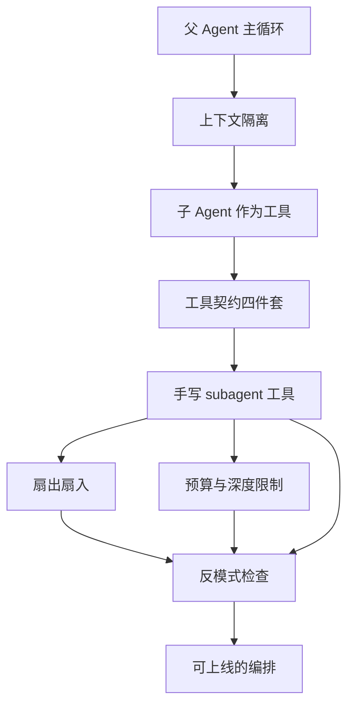
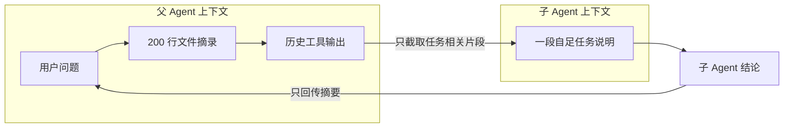
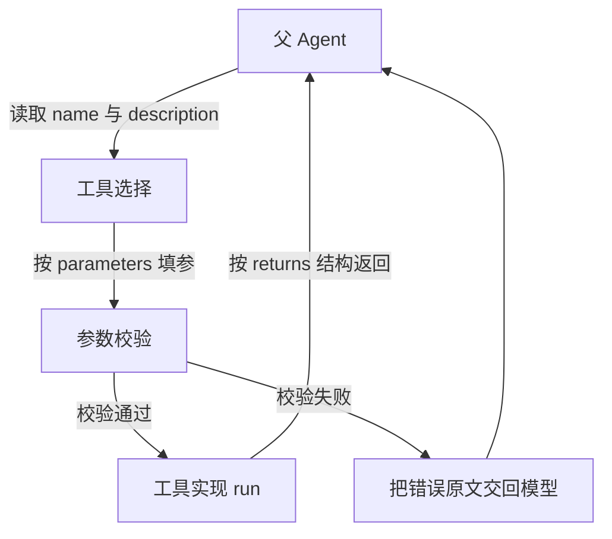
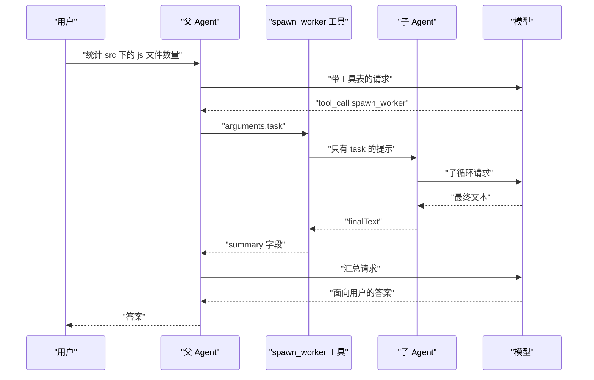
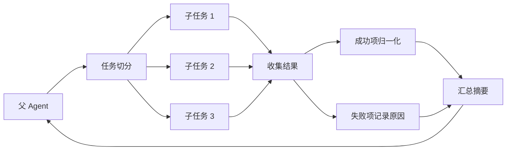
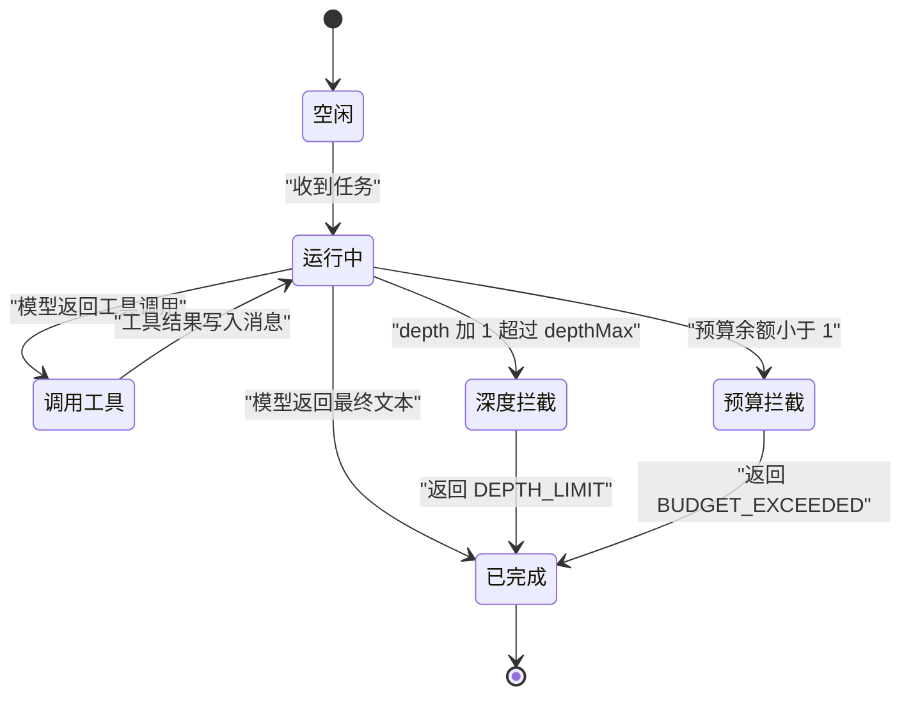
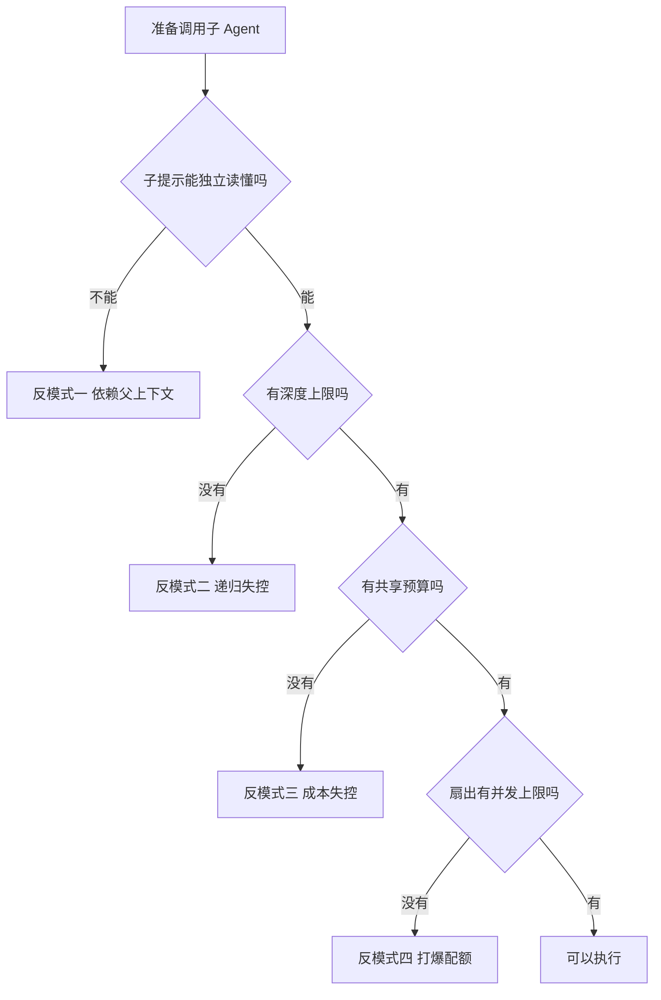

# 子 Agent 与编排

!!! abstract "学完这一页你能"

- 说出父 Agent 与子 Agent 在上下文上的三条区别，并解释隔离为什么能减少干扰。
- 写出一个子 Agent 工具契约的四个字段，并用校验函数拦住不合法的调用。
- 用 Promise 写一次带并发上限的扇出扇入，在部分子任务失败时仍能给出汇总结果。
- 给递归调用加上深度上限与共享预算，并用断言证明超限时会被拦截。

## 0. 知识地图



读法建议：先看第 1 节理解"为什么要拆"，再看第 2、3 节学会"怎么把子 Agent 装进工具表"。
第 4、5 节是编排的两个硬约束：并发怎么发、成本怎么停。
第 6 节把前面的坑整理成一张检查表，写代码前先过一遍。

## 1. 上下文隔离：子 Agent 存在的第一个理由

**先想一个问题**

用户在做一个代码问答助手。问的是"仓库里哪些文件用了过期 API"。
父 Agent 已经读完 200 行文件摘录，上下文里全是导入语句和函数名。
现在要它判断第 31 个文件，模型很容易被前面的内容带跑。

!!! note "术语：子 Agent"

    一段被独立启动的 Agent 循环。它有自己的消息数组，自己的工具调用过程，最后只把结论交给调用方。
    例：父 Agent 把"检查 src/legacy.js 是否用了 moment"交给子 Agent，子 Agent 返回两行结论。

**心智模型**

!!! tip "心智模型"

    一句话模型：子 Agent 是一个只看任务、不看历史的临时工。
    日常类比：把一项调研外包出去，你只给对方一页任务说明，不给全部会议记录。
    类比不成立的地方：外包顾问会自己补背景，子 Agent 不会。它的全部输入就是你写的那段提示。

**图解**



1. 用户问题进入父上下文的开头。
2. 文件摘录和历史工具输出堆积在父上下文里，体积持续增长。
3. 父 Agent 从这些内容中截取与子任务相关的一段，拼成自足的任务说明。
4. 子 Agent 只拿到这段说明，从零开始一条新消息数组。
5. 子 Agent 跑完，把结论写成短文本回传。
6. 父上下文只增加这一条短文本，不再增加子 Agent 过程中的几十条中间消息。

**一步一步来**

第一步要做什么：先把父上下文当前的体量量出来，知道问题有多大面积。

```js
// parentHistory 是父 Agent 的消息数组，每轮追加
const parentHistory = [
  { role: 'user', content: '看看仓库里哪些文件用了过期 API' },
  // 用 repeat 模拟读完大段文件摘录后的体积
  { role: 'system', content: '已读取文件正文。\n'.repeat(200) },
];

// 字符数不是 token 数，但能反映量级
const parentChars = parentHistory.reduce((n, m) => n + m.content.length, 0);
console.log('父上下文字符数:', parentChars);
```

**这段代码在做什么**

- parentHistory 是一个普通数组，父 Agent 每一轮都往里面 push。
- 第二条消息用 repeat 复制 200 次，模拟读文件后的体积膨胀。
- reduce 遍历数组，把每条消息的 content.length 累加。
- 这里统计的是字符数。要换算成 token 与费用，需核对官方文档：目标模型的 tokenizer 与计费口径。

运行结果：

```text
父上下文字符数: 1817
```

第二步要做什么：给子 Agent 写一段自足提示，再和父历史比体积。

```js
// 子提示必须自带全部前提：文件名、规则名、输出格式
function buildChildPrompt(file, rule) {
  return [
    `任务：检查文件 ${file} 是否违反规则 ${rule}`,
    '只回答三行：文件、是否违规、证据行号',
  ].join('\n');
}

const childPrompt = buildChildPrompt('src/legacy.js', 'no-moment');
console.log('子提示字符数:', childPrompt.length);
console.log('压缩倍数:', Math.round(1817 / childPrompt.length));
```

**这段代码在做什么**

- buildChildPrompt 把 fileName 和规则名直接写进提示，不依赖任何外部上下文。
- join 用换行拼成多行字符串，方便模型分点回答。
- 输出格式写死在第二行，父 Agent 拿到结果后不需要再解析自由文本。
- 提示里没有出现"上面提到的文件"这类指代，子 Agent 单独看也能读懂。

运行结果：

```text
子提示字符数: 57
压缩倍数: 32
```

**动手验证**

把前面两步合成一个文件。依赖：无，只用 Node 20 及以上的内置模块。

```js
// isolate.mjs  依赖：无
import assert from 'node:assert/strict';

// 父 Agent 的历史消息
const parentHistory = [
  { role: 'user', content: '看看仓库里哪些文件用了过期 API' },
  { role: 'system', content: '已读取文件正文。\n'.repeat(200) },
];

// 构造自足的子任务提示
function buildChildPrompt(file, rule) {
  return [
    `任务：检查文件 ${file} 是否违反规则 ${rule}`,
    '只回答三行：文件、是否违规、证据行号',
  ].join('\n');
}

const parentChars = parentHistory.reduce((n, m) => n + m.content.length, 0);
const childPrompt = buildChildPrompt('src/legacy.js', 'no-moment');
const childChars = childPrompt.length;

// 三条断言把结论钉死
assert.ok(parentChars > 1800, '父历史应当超过 1800 字符');
assert.equal(childChars, 57, '子提示长度应当是 57');
assert.ok(childChars * 10 < parentChars, '子提示应当比父历史小一个数量级');

console.log('父上下文字符数:', parentChars);
console.log('子提示字符数:', childChars);
console.log('压缩倍数:', Math.round(parentChars / childChars));
```

预期输出：

```text
父上下文字符数: 1817
子提示字符数: 57
压缩倍数: 32
```

**常见坑**

| 现象 | 原因 | 怎么修 |
| --- | --- | --- |
| 子 Agent 回答"我没有看到前面的文件" | 子提示里写了"按上面的分析继续" | 把文件名、规则、输出格式全部写进子提示 |
| 父上下文越跑越长 | 子 Agent 的中间工具输出被转发进父历史 | 只回传 summary 字段，丢弃 messages 数组 |
| 子 Agent 结论格式每次都不一样 | 提示里没写输出格式 | 在子提示末尾固定写"只回答三行" |
| 两个子 Agent 结论冲突 | 子提示里的判定标准不一致 | 把判定标准抽成变量，扇出时复用同一个字符串 |

**小结**

- 子 Agent 的价值来自输入收窄：只喂一段自足提示，不喂整段历史。
- 自足是硬要求，提示里出现指代词就说明任务没法独立跑。
- 回传要短，父上下文只增加一条摘要，不增加中间过程。

## 2. 把子 Agent 包装成一个工具

**先想一个问题**

你已经写好了子 Agent 的循环函数。可是模型怎么知道"现在该调用它"？
模型看不见你的函数，它只看得见一份工具描述。
描述写歪了，模型就永远不调用，或者调用时填错参数。

!!! note "术语：工具调用"

    模型输出一段结构化数据，声明"我要调用某个函数，参数是这些"，由你的代码去执行。
    例：模型输出 name 为 count_files、arguments 为 ext 等于 .js 的对象。

**心智模型**

!!! tip "心智模型"

    一句话模型：工具契约是模型和你之间的接口说明书，四个字段缺一不可。
    日常类比：给外包顾问的工单，必须写清做什么、什么时候用、要填哪几栏、交付什么格式。
    类比不成立的地方：顾问会打电话追问细节，模型不会。契约有歧义，它就按自己的猜法填参数。

**图解**



1. 父 Agent 收到用户请求，把工具表随请求一起发给模型。
2. 模型读 name 和 description，判断要不要调用这个工具。
3. 决定调用后，模型按 parameters 的 schema 填写参数对象。
4. 你的代码先跑参数校验，确认必填项齐全、类型正确。
5. 校验通过才执行 run。校验失败时，把错误原文回传，让模型重填。
6. run 的返回值按 returns 描述的结构回到父 Agent，模型据此继续。

**一步一步来**

第一步要做什么：写出工具契约的四个字段。

```js
// 子 Agent 工具的契约对象
const subagentTool = {
  // 1 名字：模型用这个名字发起调用
  name: 'spawn_researcher',
  // 2 描述：模型据此判断什么时候该用
  description: '把一段自足的子任务交给独立 Agent，返回不超过 200 字的结论',
  // 3 入参 schema：模型按它填参数
  parameters: {
    type: 'object',
    properties: {
      task: { type: 'string', minLength: 10, description: '自足任务描述，含判定标准' },
      maxSteps: { type: 'integer', minimum: 1, maximum: 8 },
    },
    required: ['task'],
    additionalProperties: false, // 关掉它，模型不会造出未定义字段
  },
  // 4 返回结构：父 Agent 按它解析
  returns: { type: 'object', properties: { summary: { type: 'string' } } },
};
```

**这段代码在做什么**

- name 只允许小写字母、数字、下划线，长度控制在 64 位以内。
- description 要写清"做什么"和"返回什么"，模型完全靠它做选择。
- parameters 用 JSON Schema 描述。required 列出必填项，additionalProperties 关掉越界字段。
- maxSteps 设上限，防止模型一次性要求子 Agent 跑上百步。
- returns 字段是给你自己看的约定，模型不会读它，但校验函数会读。

第二步要做什么：写一个校验函数，在调用真正发生前拦住错误参数。

```js
const NAME_RE = /^[a-z][a-z0-9_]{0,63}$/;

// 校验工具契约本身
function validateTool(tool) {
  const errors = [];
  if (!NAME_RE.test(tool.name)) errors.push('name 必须是 1 到 64 位小写字母数字下划线');
  if (tool.description.length < 20) errors.push('description 少于 20 字，模型难以判断调用时机');
  const required = tool.parameters.required ?? [];
  for (const key of required) {
    if (!tool.parameters.properties[key]) errors.push(`required 中的 ${key} 未在 properties 定义`);
  }
  if (tool.parameters.additionalProperties !== false) errors.push('未关闭 additionalProperties');
  return errors;
}

// 校验模型填出来的参数
function validateArgs(tool, args) {
  const { properties, required = [], additionalProperties } = tool.parameters;
  for (const key of required) if (!(key in args)) return `缺少必填参数 ${key}`;
  for (const [key, value] of Object.entries(args)) {
    const spec = properties[key];
    if (!spec) {
      if (additionalProperties === false) return `不允许的参数 ${key}`;
      continue;
    }
    if (spec.type === 'string' && typeof value !== 'string') return `${key} 应为字符串`;
    if (spec.type === 'integer' && !Number.isInteger(value)) return `${key} 应为整数`;
    if (spec.type === 'integer' && value > spec.maximum) return `${key} 超过上限 ${spec.maximum}`;
  }
  return null; // 返回 null 表示全部通过
}
```

**这段代码在做什么**

- validateTool 检查契约写对没有，在启动时就跑一次，属于开发者错误。
- validateArgs 检查模型这次填的参数，属于运行时错误。
- 缺字段、类型不符、超上限各返回一条可读的字符串。
- 返回 null 表示通过，调用方用一行 if 就能分支。
- 把错误原文回传模型，比回传"参数无效"更容易让它改对。

**动手验证**

把契约与两个校验函数合成一个文件。依赖：无。

```js
// tool-contract.mjs  依赖：无
import assert from 'node:assert/strict';

const subagentTool = {
  name: 'spawn_researcher',
  description: '把一段自足的子任务交给独立 Agent，返回不超过 200 字的结论',
  parameters: {
    type: 'object',
    properties: {
      task: { type: 'string', minLength: 10, description: '自足任务描述，含判定标准' },
      maxSteps: { type: 'integer', minimum: 1, maximum: 8 },
    },
    required: ['task'],
    additionalProperties: false,
  },
  returns: { type: 'object', properties: { summary: { type: 'string' } } },
};

const NAME_RE = /^[a-z][a-z0-9_]{0,63}$/;

function validateTool(tool) {
  const errors = [];
  if (!NAME_RE.test(tool.name)) errors.push('name 不合法');
  if (tool.description.length < 20) errors.push('description 过短');
  const required = tool.parameters.required ?? [];
  for (const key of required) {
    if (!tool.parameters.properties[key]) errors.push(`required 中的 ${key} 未定义`);
  }
  if (tool.parameters.additionalProperties !== false) errors.push('未关闭 additionalProperties');
  return errors;
}

function validateArgs(tool, args) {
  const { properties, required = [], additionalProperties } = tool.parameters;
  for (const key of required) if (!(key in args)) return `缺少必填参数 ${key}`;
  for (const [key, value] of Object.entries(args)) {
    const spec = properties[key];
    if (!spec) {
      if (additionalProperties === false) return `不允许的参数 ${key}`;
      continue;
    }
    if (spec.type === 'string' && typeof value !== 'string') return `${key} 应为字符串`;
    if (spec.type === 'integer' && !Number.isInteger(value)) return `${key} 应为整数`;
    if (spec.type === 'integer' && value > spec.maximum) return `${key} 超过上限 ${spec.maximum}`;
  }
  return null;
}

assert.deepEqual(validateTool(subagentTool), []);
assert.equal(validateArgs(subagentTool, { task: '统计 js 文件', maxSteps: 20 }), 'maxSteps 超过上限 8');
assert.equal(validateArgs(subagentTool, { task: '统计 js 文件', extra: 1 }), '不允许的参数 extra');
assert.equal(validateArgs(subagentTool, {}), '缺少必填参数 task');
assert.equal(validateArgs(subagentTool, { task: '统计 js 文件' }), null);

console.log('工具契约校验通过，共 5 条断言');
```

预期输出：

```text
工具契约校验通过，共 5 条断言
```

**常见坑**

| 现象 | 原因 | 怎么修 |
| --- | --- | --- |
| 模型从没调用过子 Agent 工具 | description 只写了名字，没写适用场景 | 在描述里写"当需要独立调研时使用" |
| 模型填出没定义的字段 | additionalProperties 没有设成 false | 显式写 additionalProperties 等于 false |
| 传进来的 task 只有两个字 | schema 上没写 minLength | 给字符串字段加 minLength |
| 错误信息回传后模型仍填错 | 只回了"参数无效" | 回传具体字段名与约束值 |

**小结**

- 四个字段各司其职：name 标识、description 选择、parameters 填参、returns 解析。
- 契约校验分两层：启动时校验开发者写的契约，运行时校验模型填的参数。
- 错误信息要具体，包含字段名与限制值，模型才有机会一次改对。

## 3. 手写一个 subagent 工具

**先想一个问题**

你有一个会调用工具的 Agent 循环。现在想让它能"派出一个子 Agent"。
子 Agent 自己也要跑循环、也要调工具。可是循环里又调循环，很容易写出死循环。
怎么让这两层循环各管各的消息，又能共享同一份预算？

!!! note "术语：上下文隔离"

    两层 Agent 各自持有一个消息数组，父数组里的内容不会自动出现在子数组中。
    例：父 Agent 讨论了 20 轮，子 Agent 的消息数组仍然只有一条 user 消息。

**心智模型**

!!! tip "心智模型"

    一句话模型：子 Agent 就是工具表里多出来的一个普通工具，只是它的实现里又开了一次循环。
    日常类比：你的团队接了个大项目，其中一块直接转包给另一个小组，你只收他们的交付物。
    类比不成立的地方：转包要签合同走流程，代码里只是给工具表加一个键，边界全靠你自己守。

**图解**



1. 用户请求进入父 Agent，父 Agent 把它写进自己的消息数组。
2. 父 Agent 带上工具表请求模型，模型返回一个工具调用。
3. 父 Agent 找到 spawn_worker，把 arguments.task 交给它。
4. spawn_worker 内部启动子 Agent，只把 task 当提示，父消息数组不传入。
5. 子 Agent 跑自己的循环，必要时调用叶子工具，最后得到 finalText。
6. finalText 封装成 summary 回到父 Agent 的工具消息里。
7. 父 Agent 把这条工具消息加进消息数组，再请求一次模型。
8. 模型输出面向用户的答案，父 Agent 返回给用户。

**一步一步来**

第一步要做什么：写 Agent 主循环，让 prompt 成为唯一的外部输入。

```js
// 共享预算对象，父子两层记账到同一份
const budget = { steps: 20, depthMax: 2 };

// 工具注册表：名字到实现的映射
const tools = new Map();
function defineTool(name, description, run) {
  tools.set(name, { name, description, run });
}

// Agent 主循环，prompt 是它唯一的外部输入
async function runAgent({ prompt, depth = 0, model }) {
  const messages = [{ role: 'user', content: prompt }]; // 每次调用都是新数组
  for (let i = 0; i < 4; i += 1) {
    budget.steps -= 1;                                   // 先扣预算再调模型
    if (budget.steps < 0) return { finalText: 'BUDGET_EXCEEDED', depth };
    const res = await model({ messages });
    if (res.toolCalls.length === 0) return { finalText: res.content, depth };
    for (const call of res.toolCalls) {
      const tool = tools.get(call.name);
      if (!tool) return { finalText: `UNKNOWN_TOOL ${call.name}`, depth };
      const out = await tool.run(call.arguments, { depth, prompt });
      messages.push({ role: 'tool', name: call.name, content: JSON.stringify(out) });
    }
  }
  return { finalText: 'STEP_LIMIT', depth };
}
```

**这段代码在做什么**

- runAgent 每次调用都新建一个 messages 数组，天然隔离。
- 循环次数写死 4，是这一层的步数上限。
- 每轮先扣预算再请求模型，超支立即返回错误码，不发出请求。
- 工具返回值序列化成字符串塞进 tool 消息，模型才能读到。
- depth 参数只记录层级，判断逻辑留给子 Agent 工具本身。

第二步要做什么：把子 Agent 包装成工具，并加上深度判断。

```js
// 把子 Agent 包装成工具：实现里又开了一次 runAgent
defineTool('spawn_worker', '把自足子任务交给独立 Agent，返回结论摘要', async (args, ctx) => {
  if (ctx.depth + 1 > budget.depthMax) {
    return { error: 'DEPTH_LIMIT', depth: ctx.depth };      // 超深度直接拒绝
  }
  const child = await runAgent({
    prompt: args.task,                                      // 只传任务，不传父历史
    depth: ctx.depth + 1,
    model: makeModel({ firstTool: null, answer: args.answer ?? '子任务完成' }),
  });
  return { summary: child.finalText, childDepth: child.depth };
});
```

**这段代码在做什么**

- 深度判断写成 depth 加 1 大于 depthMax，保证第 depthMax 层仍可运行。
- 拒绝时返回结构化错误对象，而不是抛异常，父 Agent 能据此改策略。
- prompt 只取 args.task 一个字段，父 Agent 的 messages 完全不传入。
- 返回值只保留 summary 和 childDepth，子 Agent 的中间消息全部丢弃。

第三步要做什么：接上"假模型"，让它可复现地跑通一次两层的调用。

```js
// 假模型：第一次返回工具调用，第二次返回最终文本
function makeModel({ firstTool, answer }) {
  return async ({ messages }) => {
    const toolMsgs = messages.filter((m) => m.role === 'tool');
    if (toolMsgs.length === 0 && firstTool) {
      return { content: '', toolCalls: [{ id: 'c1', ...firstTool }] };
    }
    return { content: answer, toolCalls: [] };             // 无工具调用表示收尾
  };
}

// 叶子工具：真的去数文件
defineTool('count_files', '统计目录下匹配后缀的文件数量', async ({ ext }) => {
  const fake = { '.js': 3, '.ts': 1 };
  return { ext, count: fake[ext] ?? 0 };
});
```

**这段代码在做什么**

- makeModel 用 tool 消息的条数判断走到了第几步，输出完全确定。
- firstTool 为 null 时直接返回最终文本，用来模拟不再派发的子任务。
- count_files 用一张假表代替真实文件系统，脚本跑在任何机器上结果一致。
- 返回对象会被 JSON 序列化后进入 tool 消息，所以只放可序列化的值。

**动手验证**

把三步合成一个文件。依赖：无。

```js
// subagent-tool.mjs  依赖：无
import assert from 'node:assert/strict';

// 共享预算：父 Agent 与所有子 Agent 记账到同一个对象
const budget = { steps: 20, depthMax: 2 };

const tools = new Map();
function defineTool(name, description, run) {
  tools.set(name, { name, description, run });
}

function makeModel({ firstTool, answer }) {
  return async ({ messages }) => {
    const toolMsgs = messages.filter((m) => m.role === 'tool');
    if (toolMsgs.length === 0 && firstTool) {
      return { content: '', toolCalls: [{ id: 'c1', ...firstTool }] };
    }
    return { content: answer, toolCalls: [] };
  };
}

async function runAgent({ prompt, depth = 0, model }) {
  const messages = [{ role: 'user', content: prompt }];
  for (let i = 0; i < 4; i += 1) {
    budget.steps -= 1;
    if (budget.steps < 0) return { finalText: 'BUDGET_EXCEEDED', depth };
    const res = await model({ messages });
    if (res.toolCalls.length === 0) return { finalText: res.content, depth };
    for (const call of res.toolCalls) {
      const tool = tools.get(call.name);
      if (!tool) return { finalText: `UNKNOWN_TOOL ${call.name}`, depth };
      const out = await tool.run(call.arguments, { depth, prompt });
      messages.push({ role: 'tool', name: call.name, content: JSON.stringify(out) });
    }
  }
  return { finalText: 'STEP_LIMIT', depth };
}

defineTool('count_files', '统计目录下匹配后缀的文件数量', async ({ ext }) => {
  const fake = { '.js': 3, '.ts': 1 };
  return { ext, count: fake[ext] ?? 0 };
});

const CHILD_ANSWER = 'src 下 .js 文件共 3 个';

defineTool('spawn_worker', '把自足子任务交给独立 Agent，返回结论摘要', async (args, ctx) => {
  if (ctx.depth + 1 > budget.depthMax) {
    return { error: 'DEPTH_LIMIT', depth: ctx.depth };
  }
  const child = await runAgent({
    prompt: args.task,
    depth: ctx.depth + 1,
    model: makeModel({ firstTool: { name: 'count_files', arguments: { ext: '.js' } }, answer: CHILD_ANSWER }),
  });
  return { summary: child.finalText, childDepth: child.depth };
});

const result = await runAgent({
  prompt: '统计 src 目录下的 js 文件数量',
  model: makeModel({
    firstTool: { name: 'spawn_worker', arguments: { task: '统计 src 目录下的 .js 文件数量' } },
    answer: CHILD_ANSWER,
  }),
});

assert.equal(result.finalText, CHILD_ANSWER);
assert.equal(result.depth, 0);
assert.equal(budget.steps, 16, '父 2 步加子 2 步，共扣 4 步');

console.log('父 Agent 结果:', result.finalText);
console.log('剩余预算步数:', budget.steps);
```

预期输出：

```text
父 Agent 结果: src 下 .js 文件共 3 个
剩余预算步数: 16
```

**常见坑**

| 现象 | 原因 | 怎么修 |
| --- | --- | --- |
| 子 Agent 复述了父对话 | runAgent 里传入了父 messages | prompt 只取 args.task 一个字段 |
| 父 Agent 认不出子 Agent 的返回 | 返回了对象但没序列化 | 用 JSON.stringify 包一层再进 tool 消息 |
| 递归停不下来 | 没有 depth 参数或没有 depthMax | 在包装工具里先判断 depth 加 1 |
| 工具名拼错后整个流程静默返回 | 查不到工具实现 | 查不到时返回 UNKNOWN_TOOL 而不是继续跑 |

**小结**

- 子 Agent 就是一个实现里再开循环的普通工具，工具表不用改结构。
- 隔离靠两件事：新数组装消息，prompt 只取 task 字段。
- 深度判断放在包装层，递归的护栏只有这一个位置。

## 4. 扇出扇入：并发派发与结果汇总

**先想一个问题**

有 12 个文件要检查。串行跑，每个子 Agent 花 8 秒，一共 96 秒。
你想并发跑，可是一口气发 12 个请求，可能触发上游的速率限制。
并发上限设成多少，失败一个子任务时整体又该怎么办？

!!! note "术语：扇出与扇入"

    扇出指把一个任务拆成多个子任务并同时派发。扇入指把多个子任务的结果收回并合并成一份。
    例：切出 12 个文件检查任务并行跑，最后合成一张违规清单。

**心智模型**

!!! tip "心智模型"

    一句话模型：扇出控制同时开工的数量，扇入负责把参差不齐的结果整理成一份。
    日常类比：餐厅后厨 3 个灶台同时出菜，前台按桌号把菜拼齐再上桌。
    类比不成立的地方：后厨少一道菜可以补做，扇入时某个子任务失败往往无法补做，只能标记未覆盖。

**图解**



1. 父 Agent 把大任务切成 3 个互不依赖的子任务。
2. 切分完成后同时派发，每个子任务拿到自己的那段提示。
3. 三个子任务各自跑循环，返回成功值或抛出错误。
4. 收集阶段把成功和失败分开，不因为一个失败就丢掉其余结果。
5. 成功项归一化成统一的字段结构。
6. 失败项记录原因，写进"未覆盖"清单。
7. 汇总摘要回到父 Agent，父 Agent 知道哪些结论可信、哪些需要补做。

**一步一步来**

第一步要做什么：写一个带并发上限的 map，替代裸的 Promise.all。

```js
// 最多同时跑 limit 个任务
async function mapWithLimit(items, limit, worker) {
  const results = new Array(items.length);                 // 按下标占位，保证顺序
  let cursor = 0;                                          // 共享游标，谁空闲谁取下一个
  const runners = Array.from({ length: Math.min(limit, items.length) }, async () => {
    while (cursor < items.length) {
      const index = cursor;
      cursor += 1;
      results[index] = await worker(items[index], index);   // 单点失败在 worker 内部处理
    }
  });
  await Promise.all(runners);
  return results;
}
```

**这段代码在做什么**

- results 先按长度占位，写回时用原下标，输出顺序与输入一致。
- cursor 是共享变量。JS 单线程执行，两次自增之间不会被打断。
- runners 的数量取 limit 与任务数的较小值，任务少时不会空跑。
- 每个 runner 一直取任务直到取完，实现"谁先空谁接下一个"。
- 单点失败不在这里处理，交给 worker 自己转成结构化结果。

第二步要做什么：把子任务的异常转成结果，避免一个失败终止整批。

```js
// 包一层，把成功与失败都变成同一种形状
function settle(runSubagent) {
  return (task) =>
    runSubagent(task).then(
      (value) => ({ status: 'fulfilled', value }),
      (reason) => ({ status: 'rejected', reason: reason.message }),
    );
}

const settled = await mapWithLimit(tasks, 2, settle(runSubagent));
```

**这段代码在做什么**

- then 的第二个回调接住异常，把 Error 转成普通对象。
- 两种结果字段名不同：成功放在 value，失败放在 reason。
- 转换之后 mapWithLimit 里永远不会抛错，Promise.all 必定全部完成。
- 这个形状和 Promise.allSettled 的返回一致，后面要换内置方法时可以平滑替换。

**动手验证**

把扇出、并发上限、扇入汇总合成一个文件。依赖：无。

```js
// fanout.mjs  依赖：无
import assert from 'node:assert/strict';

async function mapWithLimit(items, limit, worker) {
  const results = new Array(items.length);
  let cursor = 0;
  const runners = Array.from({ length: Math.min(limit, items.length) }, async () => {
    while (cursor < items.length) {
      const index = cursor;
      cursor += 1;
      results[index] = await worker(items[index], index);
    }
  });
  await Promise.all(runners);
  return results;
}

// 子任务：ok 为 false 时抛错，模拟读取失败
const tasks = [
  { file: 'a.js', ok: true },
  { file: 'b.js', ok: true },
  { file: 'c.js', ok: false },
  { file: 'd.js', ok: true },
];

async function runSubagent(task) {
  await new Promise((resolve) => setTimeout(resolve, 5));
  if (!task.ok) throw new Error(`${task.file} 读取失败`);
  return { file: task.file, verdict: '疑似过期 API', line: 12 };
}

const settled = await mapWithLimit(tasks, 2, (task) =>
  runSubagent(task).then(
    (value) => ({ status: 'fulfilled', value }),
    (reason) => ({ status: 'rejected', reason: reason.message }),
  ),
);

const ok = settled.filter((r) => r.status === 'fulfilled').map((r) => r.value);
const failed = settled.filter((r) => r.status === 'rejected').map((r) => r.reason);

assert.equal(settled.length, 4, '结果数量必须与任务数量一致');
assert.equal(ok.length, 3);
assert.deepEqual(failed, ['c.js 读取失败']);
assert.equal(settled[2].status, 'rejected', '第三个任务应当失败');

const summary = [
  `完成 ${ok.length} 个子任务，失败 ${failed.length} 个`,
  ...ok.map((r) => `${r.file} 第 ${r.line} 行`),
  ...failed.map((m) => `未覆盖：${m}`),
].join('\n');

console.log(summary);
```

预期输出：

```text
完成 3 个子任务，失败 1 个
a.js 第 12 行
b.js 第 12 行
d.js 第 12 行
未覆盖：c.js 读取失败
```

**常见坑**

| 现象 | 原因 | 怎么修 |
| --- | --- | --- |
| 一个子任务失败后整批中断 | 用了 Promise.all 且子任务会抛错 | 用 mapWithLimit 加 settle 转换 |
| 汇总结果顺序每次都不一样 | 按完成时间 push 结果 | 用下标写回数组，输出前不再排序 |
| 并发上限设了却仍打爆配额 | 上限加在了外层，内层子 Agent 又各自并发 | 让父子共享同一份并发计数 |
| 汇总里全是成功项，失败被吞掉 | filter 只留了 fulfilled | 把 rejected 的原因也拼进摘要 |

**小结**

- 扇出要有并发上限，否则任务越多越容易触发上游限制。
- 扇入要先分离成功与失败，再各自归一化成同一种结构。
- 结果数组按下标写回，顺序与输入一致，汇总时不用额外排序。

## 5. 预算与深度限制：让递归能被拦住

**先想一个问题**

你写了一个全能 Agent，遇到难题就派一个子 Agent 去解决。
子 Agent 遇到更难的题，又派一个。某个输入下它派了 40 层。
等发现的时候，账单已经出来了。怎么在代码层面拦住这件事？

!!! note "术语：预算"

    一次任务允许消耗的总量上限，例如总步数、总 token 数、总调用次数。
    例：本次任务最多 20 步，父 Agent 与所有子 Agent 加起来超过 20 步就返回错误码。

!!! note "术语：深度"

    子 Agent 相对最外层 Agent 的嵌套层数。最外层是 0，它派出的子 Agent 是 1。
    例：depth 等于 3 表示这是第四层。depthMax 等于 2 表示第三层不允许再往下派。

**心智模型**

!!! tip "心智模型"

    一句话模型：预算管"总共花多少"，深度管"最多套几层"，两个都必须有。
    日常类比：公司给项目一笔总预算，同时规定转包不能超过两级。
    类比不成立的地方：预算和深度是两把独立的锁，余额充足时深度仍然要拦，反之亦然。

**图解**



1. Agent 从空闲进入运行中，开始处理任务。
2. 模型返回工具调用时进入调用工具状态，工具结果写回消息后再回到运行中。
3. 准备派发子 Agent 时先检查深度，超过上限就走深度拦截分支。
4. 每一轮请求模型前先扣预算，扣成负数就走预算拦截分支。
5. 两个拦截分支都返回结构化错误码，然后进入已完成。
6. 模型直接在运行中返回最终文本时，跳过工具状态到达已完成。

**一步一步来**

第一步要做什么：把预算和深度判断抽成一个可复用的对象。

```js
function createBudget({ steps, depthMax }) {
  const state = { steps, depthMax, spent: 0, blocks: [] };
  return {
    state,
    // 每轮调用模型前记账
    charge(label) {
      state.steps -= 1;
      state.spent += 1;
      if (state.steps < 0) {
        state.blocks.push({ label, code: 'BUDGET_EXCEEDED' });
        return 'BUDGET_EXCEEDED';
      }
      return null;
    },
    // 派发子 Agent 前判断层级
    canDescend(depth) {
      if (depth + 1 > state.depthMax) {
        state.blocks.push({ depth, code: 'DEPTH_LIMIT' });
        return false;
      }
      return true;
    },
  };
}
```

**这段代码在做什么**

- state 保存余额、深度上限、已花步数和拦截记录。
- charge 先扣再加判断，扣成负数说明本轮越界，直接返回错误码。
- spent 单独累加，用来统计实际消耗，与剩余余额互相校验。
- canDescend 用 depth 加 1 与 depthMax 比较，第 depthMax 层仍能运行。
- blocks 数组记录每次拦截，事后能查出是被哪把锁拦下的。

第二步要做什么：写一段递归派发逻辑，验证两把锁分别会触发。

```js
async function recurse(budget, depth) {
  const over = budget.charge(`depth-${depth}`);
  if (over) return { depth, ok: false, code: over };        // 预算锁先拦
  if (!budget.canDescend(depth)) return { depth, ok: false, code: 'DEPTH_LIMIT' };
  const child = await recurse(budget, depth + 1);
  return { depth, ok: child.ok, code: child.code };         // 子层错误码向上冒泡
}
```

**这段代码在做什么**

- 每层进来先扣一次预算，所以"层数"和"步数"两个上限都会生效。
- 预算返回非空时立刻收工，不再往下递归。
- 深度判断放在预算之后，两个拦截的先后顺序固定，便于排查。
- 子层的错误码原样返回给上层，最外层拿到的是最深处的拦截原因。

**动手验证**

把预算对象与递归逻辑合成一个文件，跑两个场景。依赖：无。

```js
// budget.mjs  依赖：无
import assert from 'node:assert/strict';

function createBudget({ steps, depthMax }) {
  const state = { steps, depthMax, spent: 0, blocks: [] };
  return {
    state,
    charge(label) {
      state.steps -= 1;
      state.spent += 1;
      if (state.steps < 0) {
        state.blocks.push({ label, code: 'BUDGET_EXCEEDED' });
        return 'BUDGET_EXCEEDED';
      }
      return null;
    },
    canDescend(depth) {
      if (depth + 1 > state.depthMax) {
        state.blocks.push({ depth, code: 'DEPTH_LIMIT' });
        return false;
      }
      return true;
    },
  };
}

async function recurse(budget, depth) {
  const over = budget.charge(`depth-${depth}`);
  if (over) return { depth, ok: false, code: over };
  if (!budget.canDescend(depth)) return { depth, ok: false, code: 'DEPTH_LIMIT' };
  const child = await recurse(budget, depth + 1);
  return { depth, ok: child.ok, code: child.code };
}

// 场景一：预算充足，被深度锁拦下
const b1 = createBudget({ steps: 50, depthMax: 3 });
const r1 = await recurse(b1, 0);
assert.equal(r1.code, 'DEPTH_LIMIT');
assert.equal(b1.state.blocks[0].code, 'DEPTH_LIMIT');
assert.equal(b1.state.spent, 4, '第 0 到第 3 层各扣一步');

// 场景二：深度充足，被预算锁拦下
const b2 = createBudget({ steps: 2, depthMax: 10 });
const r2 = await recurse(b2, 0);
assert.equal(r2.code, 'BUDGET_EXCEEDED');
assert.equal(b2.state.spent, 3);
assert.equal(b2.state.blocks.at(-1).code, 'BUDGET_EXCEEDED');

console.log('场景一 消耗步数:', b1.state.spent, '拦截:', b1.state.blocks[0]);
console.log('场景二 消耗步数:', b2.state.spent, '拦截:', b2.state.blocks.at(-1).code);
```

预期输出：

```text
场景一 消耗步数: 4 拦截: { depth: 3, code: 'DEPTH_LIMIT' }
场景二 消耗步数: 3 拦截: BUDGET_EXCEEDED
```

**常见坑**

| 现象 | 原因 | 怎么修 |
| --- | --- | --- |
| 每个子 Agent 都有 20 步额度 | 每层各建了一个预算对象 | 在最外层建一次，通过参数往下传 |
| 到第 3 层就报错，但配置写的是 2 | 判断写成 depth 大于 depthMax | 改成 depth 加 1 大于 depthMax |
| 只加了深度锁，账单仍然失控 | 同一层扇出 30 个，层数没超 | 预算里再加并发计数与总调用数 |
| 拦截后看不到是谁触发的 | 只返回错误码 | 在 blocks 里记录 depth 与 label |

**小结**

- 预算与深度是两把独立的锁，任一缺失都会留下失控路径。
- 预算对象在最外层创建，通过参数传给所有子 Agent，不重新 new。
- 每次拦截都留下记录，包含层级和触发原因，排错时能直接定位。

## 6. 反模式：这几种编排不该写

**先想一个问题**

代码能跑通，结果也对，但上线后发现成本是预估的 8 倍。
翻代码发现子提示里写了"继续上面的分析"，子 Agent 读不到就自己瞎猜，父 Agent 又重试了三轮。
这类问题不是崩溃，而是慢慢烧钱。怎么在提交前就发现？

!!! note "术语：反模式"

    在某种场景下反复导致问题、但仍被普遍使用的写法。
    例：扇出时用裸 Promise.all 且不设并发上限，在任务数变大时会触发上游限流。

**心智模型**

!!! tip "心智模型"

    一句话模型：反模式检查表就是编排队列的体检项目，写的当下花两分钟，省下的是事后排查。
    日常类比：飞机起飞前的检查单，每一项都写着"确认过才放过"。
    类比不成立的地方：检查单能拦住已知项，新的反模式要等踩过一次才会被写进去。

**图解**



1. 先问子提示能不能独立读懂，不能就说明还在依赖父上下文。
2. 能读懂再看有没有深度上限，没有就存在无限递归的可能。
3. 有深度上限再看有没有共享预算，没有就只是把层数换成了扇出宽度。
4. 有预算再看扇出有没有并发上限，没有仍可能一瞬间打满上游配额。
5. 四项都通过才进入可执行分支。

**一步一步来**

第一步要做什么：把四条检查规则写成可执行的函数。

```js
// 规则数组，每条包含编号、说明和判定函数
const rules = [
  {
    id: 'AP1',
    message: '子提示引用了父上下文，子 Agent 读不到',
    test: (src) => /按上面|如上|前文|刚刚/.test(src),   // 指代词就是信号
  },
  {
    id: 'AP2',
    message: '扇出没有并发上限，会打爆配额',
    test: (src) => /Promise\.all\(/.test(src) && !/limit|concurrency/i.test(src),
  },
  {
    id: 'AP3',
    message: '缺少深度上限，递归会失控',
    test: (src) => /spawn_worker\(/.test(src) && !/maxDepth|depthMax/.test(src),
  },
  {
    id: 'AP4',
    message: '缺少预算记账，成本无法中断',
    test: (src) => /spawn_worker\(/.test(src) && !/budget/.test(src),
  },
];
```

**这段代码在做什么**

- 每条规则是一个对象，包含编号、可读信息和判定函数，便于扩展。
- test 接收源码字符串，返回布尔值，不做副作用。
- AP1 靠指代词匹配，命中说明子提示不自足。
- AP2 只在出现 Promise.all 且没有上限关键字时命中。
- AP3 与 AP4 都以 spawn_worker 出现为前提，避免误报无关文件。

第二步要做什么：跑规则并把命中项整理成报告。

```js
// 对源码跑全部规则
const hits = rules.filter((rule) => rule.test(source)).map((rule) => `${rule.id} ${rule.message}`);

console.log('命中反模式数量:', hits.length);
for (const hit of hits) console.log('-', hit);
```

**这段代码在做什么**

- filter 保留命中项，map 转成"编号加说明"的可读字符串。
- 循环输出每条命中项，一次提交就能看到全部问题。
- 命中数量为 0 时说明四项检查全部通过。

**动手验证**

把规则与检查流程合成一个文件，用一段问题代码试跑。依赖：无。

```js
// lint-orchestration.mjs  依赖：无
import assert from 'node:assert/strict';

// 被检查的编排脚本片段：故意踩了四条反模式
const source = `
spawn_worker({ task: '按上面的分析继续' });
await Promise.all(tasks.map(runSubagent));
`;

const rules = [
  {
    id: 'AP1',
    message: '子提示引用了父上下文，子 Agent 读不到',
    test: (src) => /按上面|如上|前文|刚刚/.test(src),
  },
  {
    id: 'AP2',
    message: '扇出没有并发上限，会打爆配额',
    test: (src) => /Promise\.all\(/.test(src) && !/limit|concurrency/i.test(src),
  },
  {
    id: 'AP3',
    message: '缺少深度上限，递归会失控',
    test: (src) => /spawn_worker\(/.test(src) && !/maxDepth|depthMax/.test(src),
  },
  {
    id: 'AP4',
    message: '缺少预算记账，成本无法中断',
    test: (src) => /spawn_worker\(/.test(src) && !/budget/.test(src),
  },
];

const hits = rules.filter((rule) => rule.test(source)).map((rule) => `${rule.id} ${rule.message}`);

assert.equal(hits.length, 4, '问题片段应当命中全部四条规则');
assert.equal(hits[0].startsWith('AP1'), true);

// 修正后的片段，应当零命中
const fixed = `
const budget = { steps: 40, depthMax: 2 };
spawn_worker({ task: '检查 src/legacy.js 是否违反 no-moment 规则' });
await mapWithLimit(tasks, 3, runSubagent);
`;
const clean = rules.filter((rule) => rule.test(fixed));
assert.equal(clean.length, 0, '修正后的片段不应命中任何规则');

console.log('命中反模式数量:', hits.length);
for (const hit of hits) console.log('-', hit);
console.log('修正后命中数量:', clean.length);
```

预期输出：

```text
命中反模式数量: 4
- AP1 子提示引用了父上下文，子 Agent 读不到
- AP2 扇出没有并发上限，会打爆配额
- AP3 缺少深度上限，递归会失控
- AP4 缺少预算记账，成本无法中断
修正后命中数量: 0
```

**常见坑**

| 现象 | 原因 | 怎么修 |
| --- | --- | --- |
| 检查通过但线上仍超支 | 规则只做关键字匹配，判断不了语义 | 把规则当提醒，真正的护栏放在运行时的预算对象里 |
| 误报大量无关文件 | 规则没有前置条件 | 给每条规则加上下文前提，例如必须先出现 spawn_worker |
| 同一个问题报四条 | 多条规则的匹配范围重叠 | 命中后按编号排序，人工确认主因 |
| 修完一代又有新问题 | 规则表是静态的 | 每次线上事故后补一条规则加一条断言 |

**小结**

- 四条反模式都指向同一件事：边界没写进代码，只写在脑子里。
- 静态检查能提前发现关键字级别的信号，运行时护栏才是最终防线。
- 每修一次线上问题就补一条规则，检查表才会随项目一起长大。

## 综合对比

| 维度 | 单 Agent 直跑 | 串行子 Agent | 扇出扇入 | 递归子 Agent |
| --- | --- | --- | --- | --- |
| 父上下文增长 | 每条工具结果都进父历史 | 只增加一条摘要 | 只增加一条汇总 | 每层各留一份摘要 |
| 隔离程度 | 无隔离 | 子任务之间隔离 | 子任务之间隔离 | 每层之间隔离 |
| 延迟构成 | 一次模型往返 | 等于各子任务耗时之和 | 受并发上限约束 | 等于层数乘以每层往返 |
| 失败影响面 | 一次工具失败污染整条历史 | 单点失败可跳过 | 逐条收集，可标记未覆盖 | 底层失败向上冒泡 |
| 成本控制手段 | 截断历史 | 单条子预算 | 并发上限加共享预算 | 深度上限加共享预算 |
| 可观测性 | 只有一条轨迹 | 子轨迹彼此独立 | 子轨迹并行产生 | 轨迹成树形 |

## 应用与行业实践

原理讲完了，接下来看它落在哪里。下面按场景、拆解、行业做法、落地路线四段走完，最后留一个动手作业。

### 应用场景地图

| 场景 | 用到本页哪个知识点 | 典型技术选型 | 注意事项 |
|---|---|---|---|
| 后台管理的万行订单表格问答 | 扇出扇入：按行分片并发派发 | 父 Agent + 分片子 Agent，并发上限 4 | 按行边界切，别把一行订单切成两半 |
| 低端安卓机上的端侧助手首屏 | 预算与深度限制、上下文隔离 | 端侧小模型 + 工具白名单 | 首屏只允许一层子 Agent，深度上限设 1 |
| 多人协作白板的会议纪要生成 | 扇出扇入：部分失败仍要汇总 | 按时间切片，并发 3 | 失败段必须标缺口，不能静默丢弃 |
| 20 万行单仓库的"改哪里"问答 | 把子 Agent 包装成一个工具 | 代码检索工具 + 只读子 Agent | 子 Agent 只回文件路径与行号，别回整仓库 |
| 客服工单的批量归类 | 子 Agent 工具契约四字段 | 任务队列 + 并发 worker | 标签表随任务下发，禁止子 Agent 自造标签 |
| 跨 50 个页面的比价抓取 | 扇出扇入 + 单任务超时预算 | 抓取子 Agent + 共享 token 预算 | 单页超时后返回缺口，别让父 Agent 卡死 |
| 300 页财报 PDF 的字段抽取 | 上下文隔离 + 深度上限 | 按章节切片，页段子 Agent | 跨页表格要带上上一页表头 |
| CI 里失败用例的定位助手 | 反模式清单 + 深度限制 | 只读子 Agent，深度上限 2 | 禁止子 Agent 再派子 Agent 去改代码 |

### 三个场景拆解

#### 场景 1：后台管理的万行订单表格问答

**业务背景**：运营要在一张 10 万行订单表里问"哪些单子卡在支付中超过两小时"，一次问答要等几十秒。把全表塞进父 Agent 上下文会超长，答案还会被无关行带偏。

**怎么用本页知识解决**：思路是父 Agent 只拿题面和分片编号，每块 200 行交给一个子 Agent，子 Agent 只回结论不回原始行。

```js
// 把万行表格按 200 行切块，每块一个子 Agent，最多 4 个并发
async function askTable(question, shards, concurrency = 4) {
  const results = [];
  let cursor = 0;                              // 共享游标，控制派发进度
  async function worker() {
    while (cursor < shards.length) {
      const idx = cursor++;                    // 先取号再 await，避免重复派发
      try {
        results[idx] = await callSubAgent({    // 子 Agent 只拿到本块 200 行
          role: "table-miner", task: question,
          inputs: { rows: shards[idx] }, budget: { tokens: 3000 },
        });
      } catch (e) {
        results[idx] = { ok: false, reason: String(e) };  // 单块失败不中断整体
      }
    }
  }
  await Promise.all(Array.from({ length: concurrency }, worker)); // 跑满即返回
  return results.filter(r => r.ok).concat(results.filter(r => !r.ok)); // 成功在前
}
```

- `cursor` 是并发安全的取号点，四个 worker 不会拿到同一块。
- 子 Agent 的入参只有本块行，上下文隔离在这里变成实际收益。
- `try/catch` 写在 worker 内部，单块失败不会让整轮 Promise 提前 reject。
- 成功结果排在前、失败结果排在后，汇总逻辑可以直接分两段处理。

**怎么度量收益**：要看的指标是整轮耗时、单次 token 数、分片失败率、首字节等待。测量方法：父 Agent 主循环里打 OpenTelemetry span，用 Collector 导出到 Prometheus，看 `agent_turn_seconds` 直方图与 `agent_tokens_total` 计数器。

**什么时候不该用**：表格只有几百行时，一次全塞进上下文，分片加汇总的开销反而更大。问题只要命中某一行时，直接走主键查询工具，不必派子 Agent。

#### 场景 2：低端安卓机上的端侧助手首屏

**业务背景**：端侧小模型要在首屏内给出可用回复，可用内存与算力都紧张。子 Agent 不受限地递归，会把首屏拖到几秒以上，用户直接划走。

**怎么用本页知识解决**：思路是把子 Agent 包成一个受校验的工具，调用前先查深度和共享预算，不合法就直接拒绝。

```js
// 子 Agent 工具契约：四个字段必须齐全，缺一个就拒绝调用
function validateSubAgentCall(call, ctx) {
  const need = ["role", "task", "inputs", "budget"];        // 契约四字段
  const missing = need.filter(k => call?.[k] == null);      // 找出缺失字段
  if (missing.length) return { ok: false, why: `缺少 ${missing.join(",")}` };
  if (ctx.depth >= ctx.maxDepth) return { ok: false, why: "深度超限" }; // 拦住递归
  if (ctx.tokensUsed + call.budget.tokens > ctx.tokenCap) {
    return { ok: false, why: "共享预算不足" };               // 预算不足直接拒绝
  }
  return { ok: true };
}
```

- 校验发生在派发之前，超限的调用不会产生任何网络或模型开销。
- 深度与预算是两个独立闸门，任何一个先到顶都会拒绝。
- 拒绝原因是可读字符串，端侧日志可以直接上报而不需要额外映射表。
- 这套校验同时服务本地子 Agent 与远端子 Agent，切换实现不影响调用方。

**怎么度量收益**：指标是首屏可见时间、单次会话 token 数、被拒调用占比。测量方法：Android Studio Macrobenchmark 取 `timeToInitialDisplayMs`，Perfetto 抓每段耗时；token 侧按 `agent_tokens_total` 上报后看按版本分组的曲线。

**什么时候不该用**：任务一步就能答完时（例如"现在几点"），起子 Agent 只是多一层开销。子任务必须拿到完整对话历史才能做对时，隔离会裁掉关键上下文，应改为同上下文续写。

#### 场景 3：多人协作白板的会议纪要生成

**业务背景**：一场 60 分钟的白板会议，语音、涂鸦、文字块混在一起，串行处理容易漏掉决策。参会者散场后要的是负责人和待办，不是逐句转写。

**怎么用本页知识解决**：思路是按 5 分钟切片并发处理，每片只领术语表和本段数据，失败片标成缺口后与成功片一起汇总。

```js
// 把 60 分钟白板录制按 5 分钟切段，每段一个子 Agent 出要点
const segs = splitByMinutes(recording, 5);
const outs = await fanOut(segs, (seg) => callSubAgent({
  role: "meeting-miner",                   // 子 Agent 角色
  task: "提取决策、待办、负责人",            // 只做这一件事
  inputs: { seg, glossary },               // 术语表随段下发，隔离上下文
  budget: { tokens: 4000 },                // 每段预算封顶
}), { concurrency: 3 });                   // 并发 3，避免打满本地模型
const ok = outs.filter(o => o.ok);         // 成功段先隔离出来
const failed = outs.filter(o => !o.ok);
const merged = mergeMinutes(ok.map(o => o.data));        // 成功段合并去重
if (failed.length) merged.gaps = failed.map(f => f.segId); // 缺口显式标给人看
```

- 切片粒度按时间走，段与段之间没有共享状态，天然可并发。
- 术语表随每段下发，保证子 Agent 对同一专有名词理解一致。
- 失败段不进合并，但 `gaps` 字段会把缺口位置暴露给下游。
- 汇总函数只做去重与排序，不做二次推理，避免引入新的幻觉来源。

**怎么度量收益**：指标是纪要首版产出时长、决策条目召回率、缺口段数、每场 token 花费。测量方法：OpenTelemetry span 统计时长，召回率用人工抽检表核对，每场随机抽 20 条决策回放比对。

**什么时候不该用**：结论强依赖前 40 分钟铺垫时，切片会割裂因果链，应改回长上下文单 Agent。短会只有几分钟时，切片加合并的开销超过串行处理。

### 行业先进实践

编排者-工作者模式（出处：Anthropic 工程博客 Building effective agents）。做法是主 Agent 拆任务，工作者子 Agent 各自完成，主 Agent 汇总结果。有效原因是把长上下文需求压到每个工作者的局部任务里，主 Agent 上下文保持干净。借鉴时先把工作者契约字段定死，再谈并发度。

子 Agent 写成带元数据的配置文件（出处：Claude Code 官方文档 Subagents）。做法是把 name、description、tools、model 等写在独立 Markdown 的前置元数据里，父 Agent 按 description 挑选。有效原因是选择逻辑与实现解耦，作者可以各自维护自己的子 Agent。借鉴时把契约四字段落成文件模板，版本走配置仓库评审。

交接作为工具调用（出处：OpenAI Agents SDK 官方文档 Handoffs）。做法是把"转给谁"表达成一次函数调用，由运行时完成执行者切换。有效原因是路由与控制流共用同一套参数校验和日志。借鉴时在交接参数里带上预算与深度，防止绕过父级限制。

扇出用动态分支原语（出处：LangGraph 官方文档，Send API 与 map-reduce 说明）。做法是用 Send 在运行时按图状态生成同构分支，再统一归并。有效原因是分支数由数据决定，不必预先写死节点。借鉴时注意该框架的 `recursion_limit`，让它与自己的深度上限对齐，别出现两套数字。

递归与轮次硬上限（出处：LangGraph 官方文档 recursion_limit；AutoGen 官方文档终止条件）。做法是框架层设死递归或轮次上限，超限直接抛错。有效原因是把"停不下来"从静默超时变成可观测异常。需核对官方文档：终止条件的具体参数名与默认值随版本变化，接入前先确认当前版本的字段名。

### 从学到用：落地路线

第 1 步，试点：挑一个只读、可回滚的场景（例如订单表问答），先只做扇出扇入。验收标准是并发上限生效，失败分片在日志里有明确标记。

第 2 步，验证：给子 Agent 加契约校验、深度上限、共享预算，用断言覆盖超限分支。验收标准是超限用例全部被拒，且拒绝原因可读。

第 3 步，推广：把契约四字段固化成模板仓库，其他团队按模板接入。验收标准是新场景只改配置不改运行时即可接入。

第 4 步，防回退：把深度、预算、并发上限写进 CI 断言和线上告警。验收标准是任一上限被绕过时，CI 失败或告警触发。

### 动手作业

目标：给一个本地 CSV（不少于 2 万行）做"分片问答 + 汇总"的子 Agent 编排，并证明超限会被拦住。

步骤：

1. 准备或生成一个 2 万行以上的 CSV，按 500 行切片，打印每片行数核对。
2. 实现 `validateSubAgentCall`，校验 role、task、inputs、budget 四个字段。
3. 实现带并发上限的 `fanOut`，上限设为 3，用一个计数器记录同时在跑的任务数。
4. 人为让第 2 个分片抛错，确认汇总结果仍然返回，且失败片被单独列出。
5. 加深度上限 2 与共享 token 预算，写断言测试超限调用被拒。
6. 打 OpenTelemetry span，导出整轮耗时与 token 总数。
7. 写一页结论：这份数据里哪些问题适合分片，哪些必须整表处理。

验收标准：

- 分片数、成功数、失败数在日志里逐条可查。
- 同时在跑的任务数始终不超过 3，由计数器断言证明。
- 深度或预算超限时调用被拒绝，对应断言全部通过。
- 汇总结果里失败分片以缺口字段显式列出，不参与合并。
- 整轮 token 总数不超过设定预算，超出时任务以拒绝收尾。

## 深入阅读与参考

!!! tip "怎么用这些资料"
    先读「官方文档与规范」建立准确的概念，再读「源码与示例」核对细节，最后用「教程、书籍与视频」换一种讲法加深理解。每条都写明了读哪一节、带着什么问题读。

### 官方文档与规范

| 资源 | 为什么读 | 怎么读 |
|---|---|---|
| [Claude 子 Agent 文档](https://docs.claude.com/en/docs/claude-code/sub-agents) | 官方定义 subagent 的配置与工具权限，是本章一切的根基。 | 重点读 subagent 配置与工具限制一节，照它建一个只读审查 subagent 跑通。 |
| [Claude Agent SDK 概览](https://docs.claude.com/en/api/agent-sdk/overview) | SDK 概览帮你搭起一个可跑的最小 Agent，便于对照手写循环。 | 按概览写一个能读目录并总结的 Agent，观察其工具调用日志。 |
| [Effective context engineering for AI agents](https://www.anthropic.com/engineering/effective-context-engineering-for-ai-agents) | 从上下文工程角度解释隔离为何必要，支撑本章第一个理由。 | 读上下文退化与压缩部分，回头清理自己 Agent 的重复提示并记 token 变化。 |
| [OpenAI Agents SDK（Python）](https://openai.github.io/openai-agents-python/) | 官方 handoff 与多 Agent 范式，可直接对照扇出扇入写法。 | 跑通 Quickstart，再加一个 handoff，观察两个 Agent 的委派与结果汇总。 |
| [Vercel AI SDK Agents](https://ai-sdk.dev/docs/agents/overview) | 演示多步工具调用与最大步数终止，对应预算限制一节。 | 读 agent 抽象与 maxSteps 配置，自己设上限跑一次，看超限如何中断。 |

### 源码与示例

| 资源 | 为什么读 | 怎么读 |
|---|---|---|
| [pi 编码 Agent 工具集](https://github.com/earendil-works/pi) | 真实 agent loop 与统一模型接口实现，适合与手写版本对照。 | 读主循环与工具分发代码，和自写的 subagent 工具逐段比较差异。 |
| [Google ADK（Python）仓库](https://github.com/google/adk-python) | 官方 samples 展示多 Agent 抽象与组合方式，可横向比较。 | 挑一个多 Agent 示例通读，画出编排结构图，再与自己设计对比。 |
| [smolagents 仓库](https://github.com/huggingface/smolagents) | 不到千行的最小实现，最容易看清 Agent 循环的本质。 | 读核心循环与工具调用部分，照着写一个最小 subagent 工具。 |

### 教程、书籍与视频

| 资源 | 为什么读 | 怎么读 |
|---|---|---|
| [How we built our multi-agent research system](https://www.anthropic.com/engineering/multi-agent-research-system) | 一手多 Agent 系统经验，讲清 lead 与 subagent 的分工边界。 | 读架构与并行派发部分，画出调用关系图，总结何时值得拆分。 |
| [LLM Powered Autonomous Agents（Lilian Weng）](https://lilianweng.github.io/posts/2023-06-23-agent/) | 经典综述，规划、记忆、工具三视角补齐编排整体认知。 | 精读工具与规划两节，各写一段笔记，标出可迁移到子 Agent 的点。 |
| [A practical guide to building agents（OpenAI）](https://cdn.openai.com/business-guides-and-resources/a-practical-guide-to-building-agents.pdf) | 用模型、工具、指令三要素快速校验你的编排设计。 | 读完拿三要素逐条检查自己的子 Agent 设计，列出缺口并补齐。 |
| [Agents（Chip Huyen）](https://huyenchip.com/2025/01/07/agents.html) | 系统讲 Agent 的工具与规划，便于对照找出缺失环节。 | 读工具与规划章节，对照本章反模式清单标注自己踩过的坑。 |
| [Anthropic 论 SWE-bench 的 Agent 设计](https://www.anthropic.com/engineering/swe-bench-sonnet) | 讲最小工具集与跨文件修改，直接支撑反模式一节。 | 读工具集设计部分，给自己的编码 Agent 删掉冗余工具后重跑任务。 |

## 自测题

??? question "1. 子 Agent 的提示为什么必须自足？"

    因为父 Agent 的消息数组不会自动进入子 Agent。
    子提示里出现"上面的文件""前文提到的规则"时，子 Agent 读不到这些内容。
    模型遇到缺失信息会自己补一个猜测，结论就不可信。
    自足的判定方法：把提示单独贴给一个不了解项目的人，他能否照着做。

??? question "2. 一个子 Agent 工具契约至少要写哪四个字段？"

    name：模型用来发起调用的标识，只允许小写字母、数字、下划线。
    description：模型据此判断什么时候该调用，要写清做什么和返回什么。
    parameters：JSON Schema，描述入参类型、必填项与取值上限。
    returns：返回结构说明，供调用方解析。

??? question "3. 为什么参数校验要分契约校验和参数校验两层？"

    契约校验检查的是开发者写的东西，在启动时跑一次就够。
    参数校验检查的是模型这一次填的内容，每次调用都要跑。
    两层混在一起时，契约错误会在每次请求时重复报出，掩盖真正的问题。
    契约错误应当直接让进程启动失败。

??? question "4. 扇出时为什么不该直接用 Promise.all？"

    任意一个子任务抛错，Promise.all 会立刻 reject，其余已完成的结果拿不到。
    子任务数量大时会同时发出全部请求，容易触发上游限流。
    可行做法是加并发上限，并在 worker 里把异常转成结构化结果。
    转换后的形状与 Promise.allSettled 的返回一致，便于替换。

??? question "5. 扇入阶段需要做哪两件事？"

    第一件是分离：把成功项与失败项分开，失败项保留原因文本。
    第二件是归一化：把成功项转成统一字段结构，便于拼成一份摘要。
    摘要里要同时写出完成数量、失败数量和未覆盖清单。
    只汇报成功项会让父 Agent 误以为任务全部完成。

??? question "6. 预算和深度分别拦什么情况？"

    预算拦总量：总步数、总调用次数、总 token 数超出上限。
    深度拦层数：子 Agent 嵌套超过 depthMax 层。
    只有深度锁时，同一层扇出 30 个仍然能把配额打满。
    只有预算锁时，层数可能很深，排查问题时轨迹难以阅读。

??? question "7. 预算对象为什么不能在每层重新创建？"

    每层新建一份预算，等于每层都拿到完整额度。
    实际消耗是各层额度之和，总成本随层数成倍增长。
    正确做法是在最外层创建一次，通过参数传给所有子 Agent。
    校验方法：跑完后检查 spent 是否等于各层实际调用数之和。

??? question "8. 静态检查能替代运行时护栏吗？"

    不能。静态检查靠关键字匹配，判断不了运行时的真实参数。
    例如"并发上限设为 3"这行代码存在，但实际传进去的是变量，值可能很大。
    运行时护栏是预算对象与并发计数器，它们在每次调用前实际判断。
    两者配合：静态检查在提交前提醒，运行时护栏在越界时中断。

## 延伸阅读

- Anthropic 官方文档：Building Effective Agents，章节 Orchestrator-workers、Parallelization、Prompt chaining。
- OpenAI 官方文档：Function calling，章节 Defining functions、Handling function calls、Structured outputs。
- Model Context Protocol 官方文档：Server Features，章节 Tools、Resources、Sampling。
- Node.js 官方文档：node:assert，章节 assert.ok、assert.deepEqual、assert.rejects。
- Node.js 官方文档：JavaScript 参考，章节 Promise.allSettled、Promise.all、Microtask 与任务队列。
