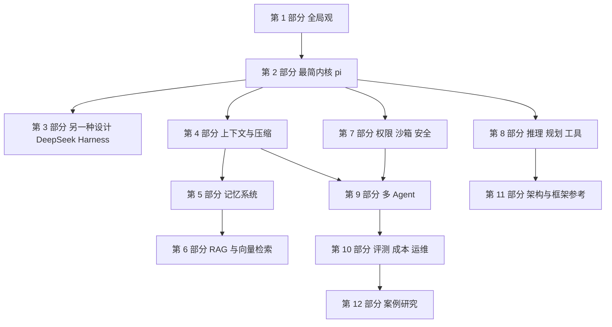

# AI Agent 概览

这一篇把 Agent 当成一个**工程系统**来讲，而不是一组提示词技巧。主线只有一条：从 pi 那样只有几百行的最小内核出发，逐级补上生产环境真正会遇到的能力，直到企业级应用。

!!! abstract "学完这一篇你能"
    - 画出一个 agent 系统的七个层次，并说出自己的项目目前处在哪一级、下一级要补什么。
    - 手写一个能跑通工具调用的最小 harness，并解释它和 pi、DeepSeek Harness 的差异。
    - 解释上下文为什么会膨胀、几种压缩方案各自的代价，以及什么时候该让小模型来做这件事。
    - 在“文件记忆、向量检索、知识图”之间做选型，并用 pgvector 搭出一个可评测的检索系统。
    - 设计一套从“零权限”到“沙箱加审批加审计”的权限体系，并说明提示注入为什么没有银弹。
    - 判断一个任务该用单 Agent 还是多 Agent，并说出多 Agent 最常见的失败方式。

## 0. 学习路径图

**怎么读这张图**：

- 先走最左边一条：第 1、2、4、7 部分，是所有 agent 系统都绕不开的主干。
- 第 5、6 部分（记忆与 RAG）在你的 agent 需要“记住很多东西”时再读。
- 第 9 部分（多 Agent）放在后面，是因为它依赖前面所有内容，而且很多场景根本不需要它。
- 第 11、12 部分是参考资料，需要时查阅。

## 1. 十二个部分分别解决什么问题

| 部分 | 解决的问题 | 起点页面 |
|---|---|---|
| 1. 先建立全局观 | agent 系统由哪些层组成，成熟度怎么分级 | [Agent 工程体系总览](system/agent-engineering-map.md) |
| 2. 最简内核：从 pi 开始 | 一个 agent loop 最少需要什么，怎么手写 | [Agent Harness 全景](harness/harness-overview.md) |
| 3. 另一种设计：DeepSeek Harness | 同样的问题，插件化的设计怎么做 | [DeepSeek Harness 架构](harness/deepseek-harness-architecture.md) |
| 4. 上下文工程与压缩 | 窗口有限、越长越笨，怎么办 | [上下文膨胀](context/context-bloat-and-rot.md) |
| 5. 记忆系统 | 跨会话怎么记住该记住的 | [Agent 记忆全景](memory/memory-taxonomy.md) |
| 6. RAG 与向量检索 | 知识太多放不进上下文，怎么检索 | [pgvector 从零开始](rag/pgvector-from-zero.md) |
| 7. 权限、沙箱与安全 | agent 能做事，就能做坏事 | [权限模型光谱](security/permission-models-spectrum.md) |
| 8. 推理、规划与工具 | 怎么让 agent 想得清楚、用得对工具 | [ReAct 模式](reasoning/react-pattern.md) |
| 9. 多 Agent | 什么时候值得拆，拆了会出什么问题 | [单 Agent 还是多 Agent](multi/single-vs-multi-agent.md) |
| 10. 评测、成本与运维 | 怎么知道它变好了，花了多少钱 | [Agent 评测从零搭建](ops/agent-evals-from-scratch.md) |
| 11. 架构与框架参考 | 分层架构、LangChain、LangGraph 等怎么选 | [分层架构总览](architecture/layered-architecture.md) |
| 12. 案例研究 | 真实产品的架构怎么做的 | [Claude Code 源码剖析](case-studies/claude-code-analysis.md) |

## 2. 每一页的固定结构

每个新页面都按同样的顺序组织，读起来不会迷路：

1. **学完能做什么**：4 条可检验的能力。
2. **知识地图**：一张图说明本页概念之间的关系。
3. **每一节**：先想一个问题，再给心智模型、图解、分步讲解、可运行的完整脚本与验证用例、常见坑。
4. **用在哪里**与**行业实践**：真实场景、怎么度量收益、什么时候不该用，以及公开可查的做法。
5. **应用地图与动手作业**，**自测题**，以及**深入阅读与参考**。

## 3. 关于数据与来源的说明

!!! warning "数字请以原文为准"
    调研类页面引用了公开文章、论文和官方文档里的数字（例如压缩阈值、成本倍数、失败模式占比）。
    每个数字旁都标明了来源名称，并注明“以原文为准”。
    凡是没能在一手来源核对到的说法，会写成“有说法认为，需核对”，不会当作事实陈述。
    产品行为会随版本变化，落地前请对照对应官方文档。

## 4. 页面一览

按上面的 12 个部分，左侧导航里的分组与之一一对应。每个部分里的页面顺序就是推荐的阅读顺序。

## 深入阅读与参考

!!! tip "怎么用这些资料"
    先读「官方文档与规范」建立准确的概念，再读「源码与示例」核对细节，最后用「教程、书籍与视频」换一种讲法加深理解。每条都写明了读哪一节、带着什么问题读。

### 官方文档与规范

| 资源 | 为什么读 | 怎么读 |
|---|---|---|
| [Claude Agent SDK 概览](https://docs.claude.com/en/api/agent-sdk/overview) | SDK 官方入口，快速了解 Agent 开发核心概念与最小闭环。 | 读概览与快速开始，带着“如何注册工具”问题，跑通后记录日志。 |
| [Claude 子 Agent 文档](https://docs.claude.com/en/docs/claude-code/sub-agents) | 子 Agent 是复杂系统基础，官方说明工具权限与协作方式。 | 读创建与权限章节，做一个只读审查子 Agent，跑一次代码审查。 |
| [OpenAI Agents SDK（Python）](https://openai.github.io/openai-agents-python/) | Python 版 Agents SDK 官方文档，含 handoff 等核心抽象。 | 复现 Quickstart，再加两个 Agent 的 handoff，观察任务如何转交。 |
| [Google ADK 文档](https://google.github.io/adk-docs/) | ADK 官方文档覆盖多工具 Agent、编排与评测，体系完整。 | 跟快速开始建多工具 Agent，重点看评测章节并跑示例。 |

### 源码与示例

| 资源 | 为什么读 | 怎么读 |
|---|---|---|
| [Claude Agent SDK（TypeScript）](https://github.com/anthropics/claude-agent-sdk-typescript) | TypeScript SDK 源码与示例，能看清工具调用和消息循环实现。 | 克隆后跑 README，再把自定义函数注册成工具并调试。 |
| [smolagents 仓库](https://github.com/huggingface/smolagents) | 核心代码不到千行，是理解最小 Agent 循环的极佳范本。 | 精读 agent loop 与工具调用部分，手写一个简化版循环。 |
| [pi 编码 Agent 工具集](https://github.com/earendil-works/pi) | 编码 Agent 的 loop 与 LLM API 实现，适合对照自己的循环。 | 读 agent loop 和统一 LLM API，列出与你实现的差异。 |

### 教程、书籍与视频

| 资源 | 为什么读 | 怎么读 |
|---|---|---|
| [Effective context engineering for AI agents](https://www.anthropic.com/engineering/effective-context-engineering-for-ai-agents) | 系统讲解上下文工程，直接决定 Agent 的稳定性与成本。 | 读完检查现有提示，删重复上下文，记录 token 与效果变化。 |
| [How we built our multi-agent research system](https://www.anthropic.com/engineering/multi-agent-research-system) | 真实多 Agent 研究系统复盘，讲清何时拆分与如何编排。 | 画出 lead 与 subagent 调用图，判断你的任务是否需要多 Agent。 |
| [A practical guide to building agents（OpenAI）](https://cdn.openai.com/business-guides-and-resources/a-practical-guide-to-building-agents.pdf) | OpenAI 的实践指南，用模型、工具、指令三要素拆解 Agent。 | 读后按三要素检查自己的设计，补齐缺失的工具或指令。 |
| [LLM Powered Autonomous Agents（Lilian Weng）](https://lilianweng.github.io/posts/2023-06-23-agent/) | 经典长文，规划、记忆、工具三部分讲得透彻。 | 精读三部分，各写一段理解，并对照自己的 Agent 找差距。 |
| [Agents（Chip Huyen）](https://huyenchip.com/2025/01/07/agents.html) | Chip Huyen 从工程视角讲 Agent 的工具与规划，接地气。 | 读工具与规划章节，列出你 Agent 缺失的环节并排优先级。 |
| [Hugging Face Agents Course](https://huggingface.co/learn/agents-course/unit0/introduction) | 免费动手课程，从零搭 Agent 并提交 Space，反馈快。 | 完成 Unit 1，边做边改参数，最后提交一个小 Agent 到 Space。 |

