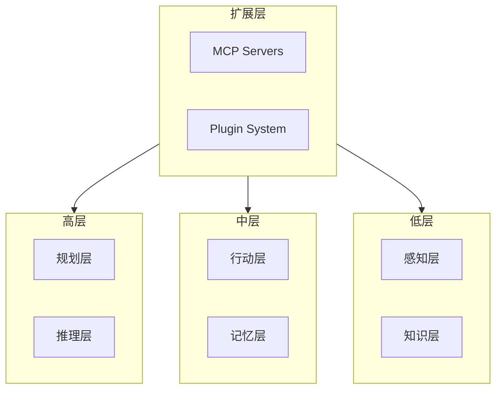
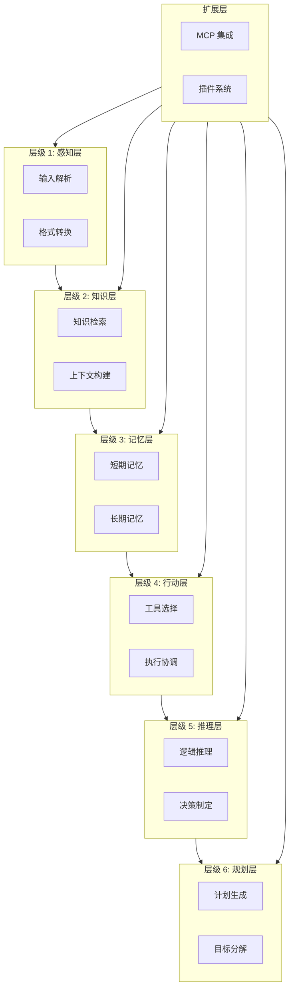

# AI Agent 分层架构详解

## 概述

AI Agent 的分层架构是构建智能系统的核心设计模式。这种架构将复杂的智能行为分解为多个层次，每层专注于特定职责，通过标准化接口实现层间通信。这种设计既保证了系统的可维护性和可扩展性，又为不同复杂度的任务提供了灵活的解决路径。



---

## 1. 感知层 (Perception Layer)

感知层是 AI Agent 的"感官系统"，负责将各种输入源（文本、语音、代码等）转换为系统可处理的标准化格式。这一层决定了 Agent 理解世界的基础能力。

### 1.1 输入解析器 (Input Parser)

输入解析器是多模态输入的处理核心，它统一处理来自不同渠道的原始数据。

```typescript
// 输入类型定义
interface InputSource {
  type: 'text' | 'voice' | 'code' | 'image' | 'file';
  raw: string | ArrayBuffer;
  metadata: {
    timestamp: number;
    source: string;
    userId?: string;
    sessionId: string;
  };
}

interface ParsedInput {
  normalizedText: string;
  language?: string;
  format?: 'markdown' | 'json' | 'xml' | 'plain';
  entities: ExtractedEntity[];
  embeddings?: number[];
}

// 核心解析器类
class InputParser {
  private parsers: Map<string, Parser> = new Map();
  private preprocessors: Preprocessor[] = [];

  constructor() {
    this.registerDefaultParsers();
  }

  private registerDefaultParsers(): void {
    // 文本解析器
    this.parsers.set('text', new TextParser());

    // 代码解析器
    this.parsers.set('code', new CodeParser());

    // 语音解析器（ASR输出）
    this.parsers.set('voice', new VoiceParser());

    // 图像解析器（OCR输出）
    this.parsers.set('image', new ImageParser());

    // 文件解析器
    this.parsers.set('file', new FileParser());
  }

  async parse(input: InputSource): Promise<ParsedInput> {
    // 预处理
    let normalized = await this.preprocess(input.raw);

    // 选择对应解析器
    const parser = this.parsers.get(input.type);
    if (!parser) {
      throw new UnsupportedInputTypeError(input.type);
    }

    // 解析
    const parsed = await parser.parse(normalized, input.metadata);

    // 后处理
    return this.postprocess(parsed);
  }

  private async preprocess(raw: string | ArrayBuffer): Promise<string> {
    for (const preprocessor of this.preprocessors) {
      raw = await preprocessor.process(raw);
    }
    return raw as string;
  }

  private async postprocess(parsed: ParsedInput): Promise<ParsedInput> {
    // 规范化处理
    parsed.normalizedText = this.normalizeWhitespace(parsed.normalizedText);
    parsed.normalizedText = this.removeHiddenCharacters(parsed.normalizedText);

    // 实体提取
    parsed.entities = await this.extractEntities(parsed.normalizedText);

    return parsed;
  }

  private normalizeWhitespace(text: string): string {
    return text
      .replace(/\r\n/g, '\n')
      .replace(/[ \t]+/g, ' ')
      .replace(/\n{3,}/g, '\n\n');
  }

  private removeHiddenCharacters(text: string): string {
    return text.replace(/[\x00-\x08\x0B\x0C\x0E-\x1F\x7F]/g, '');
  }
}

// 文本解析器实现
class TextParser implements Parser {
  async parse(raw: string, metadata: InputSource['metadata']): Promise<ParsedInput> {
    return {
      normalizedText: raw.trim(),
      format: this.detectFormat(raw),
      language: this.detectLanguage(raw),
      entities: []
    };
  }

  private detectFormat(text: string): 'markdown' | 'json' | 'xml' | 'plain' {
    const trimmed = text.trim();

    if (/^\s*[{[]/.test(trimmed)) return 'json';
    if (/^\s*<[a-zA-Z]/.test(trimmed)) return 'xml';
    if (/^#{1,6}\s/m.test(trimmed) || /\*\*[^*]+\*\*/.test(trimmed)) return 'markdown';

    return 'plain';
  }

  private detectLanguage(text: string): string {
    // 基于字符集和模式检测语言
    const chineseChars = (text.match(/[一-鿿]/g) || []).length;
    const totalChars = text.replace(/\s/g, '').length;

    return chineseChars / totalChars > 0.3 ? 'zh' : 'en';
  }
}

// 代码解析器实现
class CodeParser implements Parser {
  private languageDetectors: Map<string, RegExp> = new Map([
    ['typescript', /:\s*(string|number|boolean|any)\b|interface\s+\w+|<\w+>/],
    ['python', /def\s+\w+|import\s+\w+|:\s*$/m],
    ['rust', /fn\s+\w+|let\s+mut|impl\s+\w+/],
    ['go', /func\s+\w+|package\s+\w+|:\s*\w+\s*{/],
    ['java', /public\s+(class|static)|void\s+\w+\(/],
  ]);

  async parse(raw: string, metadata: InputSource['metadata']): Promise<ParsedInput> {
    const language = this.detectLanguage(raw);
    const codeBlocks = this.extractCodeBlocks(raw);

    return {
      normalizedText: this.normalizeCode(raw),
      language,
      entities: codeBlocks
    };
  }

  private detectLanguage(code: string): string {
    for (const [lang, pattern] of this.languageDetectors) {
      if (pattern.test(code)) return lang;
    }
    return 'unknown';
  }

  private extractCodeBlocks(text: string): ExtractedEntity[] {
    const blocks: ExtractedEntity[] = [];
    const codeBlockRegex = /```(\w+)?\n([\s\S]*?)```/g;

    let match;
    while ((match = codeBlockRegex.exec(text)) !== null) {
      blocks.push({
        type: 'code_block',
        language: match[1] || 'plain',
        content: match[2],
        position: { start: match.index, end: match.index + match[0].length }
      });
    }

    return blocks;
  }

  private normalizeCode(code: string): string {
    return code
      .replace(/```\w*\n?/g, '')  // 移除代码块标记
      .replace(/^\s+$/gm, '')      // 移除空行
      .trim();
  }
}
```

### 1.2 上下文提取器 (Context Extractor)

上下文提取器负责从输入中识别和提取关键信息，为后续处理提供结构化的上下文数据。

```typescript
interface Context {
  session: SessionContext;
  user: UserContext;
  task: TaskContext;
  entities: Map<string, EntityValue>;
  references: Reference[];
}

interface SessionContext {
  id: string;
  history: Message[];
  turnCount: number;
  lastIntent?: string;
  lastTopic?: string;
}

interface UserContext {
  id: string;
  preferences: UserPreferences;
  permissions: Permission[];
  characteristics: UserCharacteristics;
}

interface TaskContext {
  type: TaskType;
  requirements: Requirement[];
  constraints: Constraint[];
  deadline?: number;
}

// 上下文提取器
class ContextExtractor {
  private entityExtractors: EntityExtractor[] = [];
  private referenceResolvers: ReferenceResolver[] = [];

  async extract(input: ParsedInput, session: SessionContext): Promise<Context> {
    const context: Context = {
      session,
      user: await this.extractUserContext(session.userId),
      task: await this.extractTaskContext(input),
      entities: new Map(),
      references: []
    };

    // 实体提取
    context.entities = await this.extractEntities(input, context);

    // 引用解析
    context.references = await this.resolveReferences(input, context);

    return context;
  }

  private async extractUserContext(userId: string): Promise<UserContext> {
    // 从用户画像系统获取
    const userProfile = await this.userProfileService.getProfile(userId);

    return {
      id: userId,
      preferences: userProfile.preferences,
      permissions: userProfile.permissions,
      characteristics: userProfile.characteristics
    };
  }

  private async extractTaskContext(input: ParsedInput): Promise<TaskContext> {
    const intent = this.classifyIntent(input);
    const requirements = this.extractRequirements(input);
    const constraints = this.extractConstraints(input);

    return {
      type: this.mapIntentToTaskType(intent),
      requirements,
      constraints
    };
  }

  private classifyIntent(input: ParsedInput): Intent {
    // 基于规则的意图分类
    const intentPatterns: Array<{ pattern: RegExp; intent: Intent }> = [
      { pattern: /^(搜索|查找|找)/, intent: 'search' },
      { pattern: /^(创建|新增|添加)/, intent: 'create' },
      { pattern: /^(修改|更新|编辑)/, intent: 'update' },
      { pattern: /^(删除|移除)/, intent: 'delete' },
      { pattern: /^(解释|说明|什么是)/, intent: 'explain' },
      { pattern: /^(比较|对比)/, intent: 'compare' },
      { pattern: /^(执行|运行|运行)/, intent: 'execute' },
    ];

    for (const { pattern, intent } of intentPatterns) {
      if (pattern.test(input.normalizedText)) {
        return intent;
      }
    }

    return 'general';
  }

  private extractRequirements(input: ParsedInput): Requirement[] {
    const requirements: Requirement[] = [];

    // 提取数量要求
    const quantityPatterns = [
      { pattern: /(\d+)\s*个?/g, type: 'quantity' },
      { pattern: /前\s*(\d+)/g, type: 'limit' },
      { pattern: /至少\s*(\d+)/g, type: 'minimum' },
    ];

    for (const { pattern, type } of quantityPatterns) {
      const matches = input.normalizedText.matchAll(pattern);
      for (const match of matches) {
        requirements.push({
          type,
          value: parseInt(match[1]),
          position: match.index
        });
      }
    }

    // 提取格式要求
    const formatPatterns = [
      { pattern: /以\s*(JSON|XML|Markdown|表格)/gi, format: 'json' },
      { pattern: /输出\s*(列表|树形|层级)/gi, format: 'list' },
    ];

    for (const { pattern, format } of formatPatterns) {
      if (pattern.test(input.normalizedText)) {
        requirements.push({
          type: 'format',
          value: format,
          position: input.normalizedText.search(pattern)
        });
      }
    }

    return requirements;
  }
}
```

### 1.3 意图识别器 (Intent Recognizer)

意图识别是感知层的核心功能，决定了系统如何理解和响应用户请求。

```typescript
// 意图定义
interface Intent {
  type: IntentType;
  confidence: number;
  parameters: Map<string, any>;
  slots: IntentSlot[];
  alternatives?: Intent[];
}

type IntentType =
  | 'search'
  | 'create'
  | 'update'
  | 'delete'
  | 'explain'
  | 'execute'
  | 'compare'
  | 'summarize'
  | 'translate'
  | 'analyze'
  | 'general';

interface IntentSlot {
  name: string;
  type: SlotType;
  value: any;
  source: 'extracted' | 'default' | 'inferred';
  confidence: number;
}

// 意图识别器
class IntentRecognizer {
  private model: IntentModel;
  private slotExtractors: Map<SlotType, SlotExtractor> = new Map();
  private confidenceThresholds = {
    high: 0.85,
    medium: 0.60,
    low: 0.40
  };

  constructor(config: IntentRecognizerConfig) {
    this.model = this.loadModel(config.modelPath);
    this.initializeSlotExtractors();
  }

  async recognize(input: ParsedInput, context: Context): Promise<Intent> {
    // 1. 初步意图分类
    const preliminaryIntent = await this.classify(input, context);

    // 2. 槽位填充
    const slots = await this.extractSlots(input, preliminaryIntent.type, context);

    // 3. 置信度校准
    const confidence = this.calibrateConfidence(preliminaryIntent, slots);

    // 4. 备选意图生成
    const alternatives = await this.generateAlternatives(input, context);

    return {
      type: preliminaryIntent.type,
      confidence,
      parameters: this.buildParameters(slots),
      slots,
      alternatives
    };
  }

  private async classify(input: ParsedInput, context: Context): Promise<{ type: IntentType; confidence: number }> {
    // 使用模型进行分类
    const embedding = await this.model.embed(input.normalizedText);

    // 上下文增强
    const contextEmbedding = this.enhanceWithContext(embedding, context);

    // 最近邻分类
    const predictions = await this.model.predict(contextEmbedding);

    // 解析预测结果
    const topPrediction = predictions[0];

    return {
      type: topPrediction.label as IntentType,
      confidence: topPrediction.score
    };
  }

  private async extractSlots(
    input: ParsedInput,
    intentType: IntentType,
    context: Context
  ): Promise<IntentSlot[]> {
    const slots: IntentSlot[] = [];

    // 根据意图类型确定需要的槽位
    const requiredSlots = this.getRequiredSlots(intentType);

    for (const slotDef of requiredSlots) {
      const extractor = this.slotExtractors.get(slotDef.type);
      if (!extractor) continue;

      const result = await extractor.extract(input, context);

      slots.push({
        name: slotDef.name,
        type: slotDef.type,
        value: result.value,
        source: result.source,
        confidence: result.confidence
      });
    }

    return slots;
  }

  private calibrateConfidence(
    preliminaryIntent: { type: IntentType; confidence: number },
    slots: IntentSlot[]
  ): number {
    let confidence = preliminaryIntent.confidence;

    // 槽位填充度调整
    const filledRatio = slots.filter(s => s.value !== null).length / slots.length;
    confidence *= 0.7 + (filledRatio * 0.3);

    // 槽位平均置信度调整
    const avgSlotConfidence = slots.reduce((sum, s) => sum + s.confidence, 0) / slots.length;
    confidence *= 0.8 + (avgSlotConfidence * 0.2);

    return Math.min(confidence, 1);
  }

  private getRequiredSlots(intentType: IntentType): SlotDefinition[] {
    const slotTemplates: Record<IntentType, SlotDefinition[]> = {
      search: [
        { name: 'query', type: 'text' },
        { name: 'target', type: 'entity' },
        { name: 'limit', type: 'number' },
        { name: 'filters', type: 'collection' }
      ],
      create: [
        { name: 'entity_type', type: 'category' },
        { name: 'properties', type: 'object' },
        { name: 'name', type: 'text' }
      ],
      update: [
        { name: 'target', type: 'entity' },
        { name: 'changes', type: 'object' }
      ],
      delete: [
        { name: 'target', type: 'entity' },
        { name: 'cascade', type: 'boolean' }
      ],
      explain: [
        { name: 'concept', type: 'entity' },
        { name: 'depth', type: 'enum' },
        { name: 'audience', type: 'category' }
      ],
      execute: [
        { name: 'action', type: 'text' },
        { name: 'params', type: 'object' }
      ],
      general: []
    };

    return slotTemplates[intentType] || [];
  }

  private initializeSlotExtractors(): void {
    this.slotExtractors.set('text', new TextSlotExtractor());
    this.slotExtractors.set('entity', new EntitySlotExtractor());
    this.slotExtractors.set('number', new NumberSlotExtractor());
    this.slotExtractors.set('boolean', new BooleanSlotExtractor());
    this.slotExtractors.set('category', new CategorySlotExtractor());
    this.slotExtractors.set('object', new ObjectSlotExtractor());
  }

  private buildParameters(slots: IntentSlot[]): Map<string, any> {
    const params = new Map<string, any>();

    for (const slot of slots) {
      if (slot.value !== null && slot.value !== undefined) {
        params.set(slot.name, slot.value);
      }
    }

    return params;
  }

  private async generateAlternatives(
    input: ParsedInput,
    context: Context
  ): Promise<Intent[]> {
    // 生成top-3备选意图
    const embedding = await this.model.embed(input.normalizedText);
    const predictions = await this.model.predict(embedding, { topK: 4 });

    return predictions
      .slice(1) // 排除主意图
      .filter(p => p.score > this.confidenceThresholds.low)
      .map(p => ({
        type: p.label as IntentType,
        confidence: p.score,
        parameters: new Map(),
        slots: []
      }));
  }
}

// 槽位提取器接口
interface SlotExtractor {
  extract(input: ParsedInput, context: Context): Promise<SlotExtractionResult>;
}

interface SlotExtractionResult {
  value: any;
  source: 'extracted' | 'default' | 'inferred';
  confidence: number;
}

// 文本槽位提取器
class TextSlotExtractor implements SlotExtractor {
  async extract(input: ParsedInput, context: Context): Promise<SlotExtractionResult> {
    // 提取主要文本内容作为值
    const textValue = input.normalizedText.replace(/\s+/g, ' ').trim();

    return {
      value: textValue,
      source: 'extracted',
      confidence: 0.9
    };
  }
}

// 实体槽位提取器
class EntitySlotExtractor implements SlotExtractor {
  async extract(input: ParsedInput, context: Context): Promise<SlotExtractionResult> {
    // 从已提取的实体中查找
    const targetEntity = input.entities.find(e => e.type === 'entity');

    if (targetEntity) {
      return {
        value: targetEntity.value,
        source: 'extracted',
        confidence: targetEntity.confidence
      };
    }

    // 尝试从上下文推断
    const inferredEntity = this.inferFromContext(input, context);

    return {
      value: inferredEntity?.value || null,
      source: inferredEntity ? 'inferred' : 'default',
      confidence: inferredEntity?.confidence || 0
    };
  }

  private inferFromContext(input: ParsedInput, context: Context): EntityValue | null {
    // 基于会话历史推断实体
    const recentEntities = context.session.history
      .flatMap(msg => msg.entities || [])
      .filter(e => e.type === 'entity');

    // 返回最近的实体作为推断值
    return recentEntities[0] || null;
  }
}
```

### 1.4 敏感信息检测器 (Sensitive Information Detector)

敏感信息检测是安全架构的重要组成部分，防止敏感数据泄露到不安全的通道。

```typescript
// 敏感信息类型定义
type SensitiveType =
  | 'password'
  | 'api_key'
  | 'token'
  | 'credit_card'
  | 'phone_number'
  | 'id_number'
  | 'email'
  | 'address'
  | 'medical_record'
  | 'social_security';

interface SensitiveInfo {
  type: SensitiveType;
  value: string;
  maskedValue: string;
  position: { start: number; end: number };
  confidence: number;
  action: 'mask' | 'block' | 'warn';
}

// 敏感信息检测器
class SensitiveInfoDetector {
  private detectors: Map<SensitiveType, PatternDetector> = new Map();
  private actions: Map<SensitiveType, SensitiveAction> = new Map();

  constructor(config: DetectorConfig) {
    this.initializeDetectors(config);
    this.setDefaultActions();
  }

  private initializeDetectors(config: DetectorConfig): void {
    // 密码检测
    this.detectors.set('password', {
      patterns: [
        /password\s*[=:]\s*\S+/i,
        /pwd\s*[=:]\s*\S+/i,
        /passwd\s*[=:]\s*\S+/i
      ],
      context: ['password', 'pwd', 'pass', '口令']
    });

    // API密钥检测
    this.detectors.set('api_key', {
      patterns: [
        /(?:api[_-]?key|apikey|api[_-]?secret)\s*[=:]\s*["']?([a-zA-Z0-9_\-]{20,})/i,
        /sk-[a-zA-Z0-9]{48}/,  // OpenAI
        /AI[a-zA-Z0-9]{32,}/,   // Anthropic
        /ghp_[a-zA-Z0-9]{36}/,  // GitHub
      ],
      context: ['api', 'key', 'secret', 'token']
    });

    // 手机号检测（中国大陆）
    this.detectors.set('phone_number', {
      patterns: [
        /1[3-9]\d{9}/g,
        /\+86\s*1[3-9]\d{9}/g,
        /\d{3,4}[-\s]?\d{7,8}/g
      ],
      context: ['电话', '手机', '号码']
    });

    // 身份证号检测
    this.detectors.set('id_number', {
      patterns: [
        /[1-9]\d{5}(?:19|20)\d{2}(?:0[1-9]|1[0-2])(?:0[1-9]|[12]\d|3[01])\d{3}[\dXx]/g
      ],
      context: ['身份证', 'ID', '证件']
    });

    // 邮箱检测
    this.detectors.set('email', {
      patterns: [
        /[a-zA-Z0-9._%+-]+@[a-zA-Z0-9.-]+\.[a-zA-Z]{2,}/g
      ],
      context: ['邮箱', 'email', '邮件']
    });

    // 信用卡检测
    this.detectors.set('credit_card', {
      patterns: [
        /\b(?:\d{4}[-\s]?){3}\d{4}\b/,
        /\b(?:4[0-9]{12}(?:[0-9]{3})?|5[1-5][0-9]{14}|3[47][0-9]{13})\b/
      ],
      context: ['信用卡', 'card', '卡号']
    });
  }

  private setDefaultActions(): void {
    this.actions.set('password', { action: 'block', severity: 'high' });
    this.actions.set('api_key', { action: 'block', severity: 'high' });
    this.actions.set('token', { action: 'block', severity: 'high' });
    this.actions.set('credit_card', { action: 'mask', severity: 'high' });
    this.actions.set('phone_number', { action: 'mask', severity: 'medium' });
    this.actions.set('id_number', { action: 'mask', severity: 'high' });
    this.actions.set('email', { action: 'mask', severity: 'low' });
  }

  async detect(text: string): Promise<SensitiveInfo[]> {
    const results: SensitiveInfo[] = [];

    for (const [type, detector] of this.detectors) {
      const detected = await this.detectType(text, type, detector);
      results.push(...detected);
    }

    // 按位置排序
    return results.sort((a, b) => a.position.start - b.position.start);
  }

  private async detectType(
    text: string,
    type: SensitiveType,
    detector: PatternDetector
  ): Promise<SensitiveInfo[]> {
    const results: SensitiveInfo[] = [];
    const action = this.actions.get(type)!;

    for (const pattern of detector.patterns) {
      const matches = text.matchAll(new RegExp(pattern, 'g'));

      for (const match of matches) {
        const maskedValue = this.mask(type, match[0]);

        results.push({
          type,
          value: match[0],
          maskedValue,
          position: {
            start: match.index!,
            end: match.index! + match[0].length
          },
          confidence: this.calculateConfidence(type, match[0], detector.context),
          action: action.action
        });
      }
    }

    return results;
  }

  private mask(type: SensitiveType, value: string): string {
    switch (type) {
      case 'phone_number':
        return value.replace(/(\d{3})\d{4}(\d{4})/, '$1****$2');

      case 'email':
        return value.replace(/([a-zA-Z0-9._%+-]+)@/, '***@');

      case 'id_number':
        return value.replace(/(\d{6})\d{8}(\d{3}[\dXx])/, '$1********$2');

      case 'credit_card':
        return value.replace(/\d{4}[-\s]?(\d{4})/, '****-****-$1');

      case 'api_key':
      case 'token':
      case 'password':
        return '***MASKED***';

      default:
        return '***';
    }
  }

  private calculateConfidence(
    type: SensitiveType,
    value: string,
    context: string[]
  ): number {
    // 基础置信度
    let confidence = 0.9;

    // 模式匹配质量调整
    const hasContext = context.some(ctx => {
      const searchRange = 50;
      // 检查周围上下文
      return true; // 简化实现
    });

    if (!hasContext) {
      confidence *= 0.7;
    }

    // 格式验证
    if (this.validateFormat(type, value)) {
      confidence *= 1.1;
    }

    return Math.min(confidence, 1);
  }

  private validateFormat(type: SensitiveType, value: string): boolean {
    switch (type) {
      case 'phone_number':
        return /^1[3-9]\d{9}$/.test(value.replace(/\D/g, ''));

      case 'id_number':
        return /^[1-9]\d{5}(?:19|20)\d{2}(?:0[1-9]|1[0-2])(?:0[1-9]|[12]\d|3[01])\d{3}[\dXx]$/.test(value);

      case 'credit_card':
        return this.luhnCheck(value.replace(/\D/g, ''));

      default:
        return true;
    }
  }

  private luhnCheck(number: string): boolean {
    let sum = 0;
    let isEven = false;

    for (let i = number.length - 1; i >= 0; i--) {
      let digit = parseInt(number[i], 10);

      if (isEven) {
        digit *= 2;
        if (digit > 9) digit -= 9;
      }

      sum += digit;
      isEven = !isEven;
    }

    return sum % 10 === 0;
  }

  async process(input: ParsedInput): Promise<ProcessedInput> {
    const sensitiveInfos = await this.detect(input.normalizedText);

    let processedText = input.normalizedText;

    for (const info of sensitiveInfos) {
      switch (info.action) {
        case 'mask':
          processedText = processedText.replace(info.value, info.maskedValue);
          break;

        case 'block':
          throw new SensitiveDataBlockedError(info.type, info.position);

        case 'warn':
          // 记录但不替换
          this.logWarning(info);
          break;
      }
    }

    return {
      ...input,
      normalizedText: processedText,
      sensitiveInfos
    };
  }
}
```

---

## 2. 认知层 (Cognition Layer)

认知层是 AI Agent 的"大脑"，负责推理、规划、记忆和知识管理。这一层决定了 Agent 的智能水平。

### 2.1 推理引擎 (Reasoner Engine)

推理引擎负责对输入进行深度分析，生成推理链和结论。

```typescript
// 推理类型
type ReasoningType = 'deductive' | 'inductive' | 'abductive' | 'causal' | 'analogical';

interface ReasoningResult {
  type: ReasoningType;
  conclusion: string;
  confidence: number;
  chain: ReasoningStep[];
  evidence: Evidence[];
  alternatives: AlternativeReasoning[];
}

interface ReasoningStep {
  index: number;
  premise: string;
  inference: string;
  conclusion: string;
  rule: InferenceRule;
}

interface InferenceRule {
  id: string;
  name: string;
  type: string;
  premises: string[];
  conclusion: string;
}

// 推理引擎
class ReasonerEngine {
  private rules: Map<string, InferenceRule> = new Map();
  private reasoningStrategies: Map<ReasoningType, ReasoningStrategy> = new Map();
  private knowledgeBase: KnowledgeBase;
  private contextCache: Map<string, any> = new Map();

  constructor(config: ReasonerConfig) {
    this.initializeRules();
    this.initializeStrategies();
    this.knowledgeBase = new KnowledgeBase(config.knowledgeBasePath);
  }

  private initializeRules(): void {
    // 添加常见的推理规则

    // 肯定前件 (Modus Ponens)
    this.rules.set('modus_ponens', {
      id: 'modus_ponens',
      name: 'Modus Ponens',
      type: 'deductive',
      premises: ['If P then Q', 'P'],
      conclusion: 'Q'
    });

    // 否定后件 (Modus Tollens)
    this.rules.set('modus_tollens', {
      id: 'modus_tollens',
      name: 'Modus Tollens',
      type: 'deductive',
      premises: ['If P then Q', 'Not Q'],
      conclusion: 'Not P'
    });

    // 假言三段论 (Hypothetical Syllogism)
    this.rules.set('hypothetical_syllogism', {
      id: 'hypothetical_syllogism',
      name: 'Hypothetical Syllogism',
      type: 'deductive',
      premises: ['If P then Q', 'If Q then R'],
      conclusion: 'If P then R'
    });

    // 选言三段论 (Disjunctive Syllogism)
    this.rules.set('disjunctive_syllogism', {
      id: 'disjunctive_syllogism',
      name: 'Disjunctive Syllogism',
      type: 'deductive',
      premises: ['P or Q', 'Not P'],
      conclusion: 'Q'
    });
  }

  private initializeStrategies(): void {
    this.reasoningStrategies.set('deductive', new DeductiveStrategy());
    this.reasoningStrategies.set('inductive', new InductiveStrategy());
    this.reasoningStrategies.set('abductive', new AbductiveStrategy());
    this.reasoningStrategies.set('causal', new CausalReasoningStrategy());
    this.reasoningStrategies.set('analogical', new AnalogicalReasoningStrategy());
  }

  async reason(input: ParsedInput, context: Context, options: ReasoningOptions = {}): Promise<ReasoningResult> {
    // 选择推理策略
    const strategy = this.selectStrategy(input, context, options);

    // 执行推理
    const result = await strategy.execute(input, context, this);

    // 补充证据
    result.evidence = await this.gatherEvidence(result.chain, context);

    // 生成备选推理
    result.alternatives = await this.generateAlternatives(input, context, result);

    return result;
  }

  private selectStrategy(
    input: ParsedInput,
    context: Context,
    options: ReasoningOptions
  ): ReasoningStrategy {
    // 基于输入特征选择策略
    const inputType = this.classifyInput(input);

    switch (inputType) {
      case 'rule_based':
        return this.reasoningStrategies.get('deductive')!;

      case 'observation_based':
        return this.reasoningStrategies.get('inductive')!;

      case 'explanation_based':
        return this.reasoningStrategies.get('abductive')!;

      case 'cause_effect':
        return this.reasoningStrategies.get('causal')!;

      case 'similarity_based':
        return this.reasoningStrategies.get('analogical')!;

      default:
        // 组合使用多种策略
        return new CompositeStrategy(Array.from(this.reasoningStrategies.values()));
    }
  }

  private classifyInput(input: ParsedInput): string {
    // 检测输入类型
    const text = input.normalizedText;

    if (/如果.*那么/.test(text) || /假设.*则/.test(text)) {
      return 'rule_based';
    }

    if (/所有.*都是/.test(text) || /一般.*/.test(text)) {
      return 'observation_based';
    }

    if (/为什么/.test(text) || /原因/.test(text)) {
      return 'cause_effect';
    }

    if (/类似/.test(text) || /如同/.test(text)) {
      return 'similarity_based';
    }

    return 'general';
  }

  async applyRule(
    rule: InferenceRule,
    premises: string[],
    context: Context
  ): Promise<ReasoningStep> {
    // 应用推理规则
    const matchedPremises = this.matchPremises(rule.premises, premises, context);

    if (matchedPremises.length !== rule.premises.length) {
      throw new RuleApplicationError(rule.id, 'Premises not fully matched');
    }

    // 生成结论
    const conclusion = this.deriveConclusion(rule.conclusion, matchedPremises);

    return {
      index: context.session.turnCount,
      premise: matchedPremises.join('; '),
      inference: `Applied rule: ${rule.name}`,
      conclusion,
      rule
    };
  }

  private matchPremises(
    rulePremises: string[],
    facts: string[],
    context: Context
  ): string[] {
    const matched: string[] = [];

    for (const premise of rulePremises) {
      const match = facts.find(f => this.unify(premise, f, context)) ||
        this.inferFromKnowledge(premise, context);

      if (match) {
        matched.push(match);
      }
    }

    return matched;
  }

  private unify(pattern: string, fact: string, context: Context): boolean {
    // 简单的模式匹配统一
    const patternParts = pattern.split(/\s+/);
    const factParts = fact.split(/\s+/);

    if (patternParts.length !== factParts.length) {
      return false;
    }

    return patternParts.every((part, i) => {
      if (part.startsWith('?')) return true;
      return part === factParts[i];
    });
  }

  private async inferFromKnowledge(premise: string, context: Context): Promise<string | null> {
    // 从知识库推断
    const query = this.parseQuery(premise);
    const results = await this.knowledgeBase.query(query);

    return results[0]?.statement || null;
  }

  private deriveConclusion(ruleConclusion: string, premises: string[]): string {
    // 简单结论推导
    // 实际实现需要更复杂的变量替换逻辑
    return ruleConclusion;
  }

  private async gatherEvidence(chain: ReasoningStep[], context: Context): Promise<Evidence[]> {
    const evidence: Evidence[] = [];

    for (const step of chain) {
      const stepEvidence = await this.collectEvidenceForStep(step, context);
      evidence.push(...stepEvidence);
    }

    return evidence;
  }

  private async collectEvidenceForStep(step: ReasoningStep, context: Context): Promise<Evidence[]> {
    const evidence: Evidence[] = [];

    // 从记忆中收集证据
    const relevantMemories = await this.knowledgeBase.search(step.conclusion, { limit: 3 });

    for (const memory of relevantMemories) {
      evidence.push({
        source: 'knowledge_base',
        content: memory.content,
        relevance: memory.score,
        timestamp: memory.timestamp
      });
    }

    return evidence;
  }

  private async generateAlternatives(
    input: ParsedInput,
    context: Context,
    primary: ReasoningResult
  ): Promise<AlternativeReasoning[]> {
    const alternatives: AlternativeReasoning[] = [];

    for (const [type, strategy] of this.reasoningStrategies) {
      if (type === primary.type) continue;

      try {
        const alt = await strategy.execute(input, context, this);

        if (alt.confidence > 0.5) {
          alternatives.push({
            type,
            conclusion: alt.conclusion,
            confidence: alt.confidence,
            explanation: `Alternative ${type} reasoning path`
          });
        }
      } catch {
        // 忽略失败的其他策略
      }
    }

    return alternatives.sort((a, b) => b.confidence - a.confidence).slice(0, 3);
  }
}

// 推理策略基类
abstract class ReasoningStrategy {
  abstract execute(
    input: ParsedInput,
    context: Context,
    engine: ReasonerEngine
  ): Promise<ReasoningResult>;

  protected buildChain(steps: ReasoningStep[]): ReasoningChain {
    return {
      steps,
      isComplete: steps.length > 0 && steps.every(s => s.conclusion),
      hasLoop: this.detectLoop(steps)
    };
  }

  private detectLoop(steps: ReasoningStep[]): boolean {
    const seen = new Set<string>();
    for (const step of steps) {
      if (seen.has(step.conclusion)) return true;
      seen.add(step.conclusion);
    }
    return false;
  }
}

// 演绎推理策略
class DeductiveStrategy extends ReasoningStrategy {
  async execute(
    input: ParsedInput,
    context: Context,
    engine: ReasonerEngine
  ): Promise<ReasoningResult> {
    const steps: ReasoningStep[] = [];

    // 解析输入中的条件语句
    const conditionals = this.extractConditionals(input.normalizedText);

    for (const conditional of conditionals) {
      const rule = engine.getRule('modus_ponens');

      if (conditional.hasAntecedent) {
        const step = await engine.applyRule(rule, [
          conditional.condition,
          conditional.antecedent
        ], context);
        steps.push(step);
      }
    }

    const conclusion = steps[steps.length - 1]?.conclusion || input.normalizedText;

    return {
      type: 'deductive',
      conclusion,
      confidence: this.calculateConfidence(steps),
      chain: steps,
      evidence: [],
      alternatives: []
    };
  }

  private extractConditionals(text: string): Conditional[] {
    const conditionals: Conditional[] = [];

    // 匹配"如果...那么..."模式
    const pattern = /如果(.+)，那么(.+)/g;
    let match;

    while ((match = pattern.exec(text)) !== null) {
      conditionals.push({
        condition: match[1],
        consequent: match[2],
        antecedent: null,
        hasAntecedent: false
      });
    }

    return conditionals;
  }

  private calculateConfidence(steps: ReasoningStep[]): number {
    if (steps.length === 0) return 0.5;

    // 每个有效步骤增加置信度
    const baseConfidence = 0.8;
    const stepBonus = 0.05 * steps.length;

    return Math.min(baseConfidence + stepBonus, 0.99);
  }
}

// 归纳推理策略
class InductiveStrategy extends ReasoningStrategy {
  async execute(
    input: ParsedInput,
    context: Context,
    engine: ReasonerEngine
  ): Promise<ReasoningResult> {
    const observations = this.extractObservations(input.normalizedText);
    const patterns = this.findPatterns(observations);
    const generalization = this.generalize(patterns);

    return {
      type: 'inductive',
      conclusion: generalization,
      confidence: this.calculateInductiveConfidence(patterns, observations.length),
      chain: [{
        index: 0,
        premise: observations.join('; '),
        inference: 'Induction: Generalizing from observations',
        conclusion: generalization,
        rule: { id: 'induction', name: 'Induction', type: 'inductive', premises: [], conclusion: '' }
      }],
      evidence: observations.map(o => ({
        source: 'input',
        content: o,
        relevance: 1
      })),
      alternatives: []
    };
  }

  private extractObservations(text: string): string[] {
    // 提取观察陈述
    const observations: string[] = [];

    // 匹配"X是Y"模式
    const pattern = /(.+?)是(.+?)[。.]/g;
    let match;

    while ((match = pattern.exec(text)) !== null) {
      observations.push(match[0]);
    }

    return observations;
  }

  private findPatterns(observations: string[]): Pattern[] {
    // 简化模式检测
    return observations.map(obs => ({
      subject: obs.split('是')[0],
      predicate: obs.split('是')[1]
    }));
  }

  private generalize(patterns: Pattern[]): string {
    if (patterns.length === 0) return '无法归纳';

    // 提取共性
    const subjects = patterns.map(p => p.subject);
    const predicates = patterns.map(p => p.predicate);

    // 检查是否所有主体相同
    const allSameSubject = subjects.every(s => s === subjects[0]);

    // 检查是否所有谓词相同
    const allSamePredicate = predicates.every(p => p === predicates[0]);

    if (allSameSubject) {
      return `所有观察的${subjects[0]}都共享相同的特征`;
    }

    return `基于${patterns.length}个观察的归纳结论`;
  }

  private calculateInductiveConfidence(patterns: Pattern[], count: number): number {
    // 归纳置信度与观察数量正相关
    const base = 0.5;
    const countBonus = Math.min(count * 0.05, 0.4);

    return Math.min(base + countBonus, 0.95);
  }
}
```

### 2.2 规划器 (Planner)

规划器负责将高层目标分解为可执行的行动计划。

```typescript
// 行动计划
interface ActionPlan {
  id: string;
  goal: string;
  steps: PlanStep[];
  estimatedCost: Cost;
  estimatedDuration: number;
  prerequisites: string[];
  risks: Risk[];
  status: PlanStatus;
}

interface PlanStep {
  id: string;
  action: Action;
  preconditions: Condition[];
  effects: Effect[];
  dependencies: string[];
  estimatedDuration: number;
  retryPolicy?: RetryPolicy;
}

interface Action {
  type: ActionType;
  target?: string;
  parameters: Map<string, any>;
  tool?: string;
}

type ActionType = 'invoke' | 'query' | 'transform' | 'create' | 'update' | 'delete' | 'wait' | 'branch';

// 规划器
class Planner {
  private planners: Map<string, PlanningAlgorithm> = new Map();
  private planCache: LRUCache<string, ActionPlan>;
  private costEstimator: CostEstimator;

  constructor(config: PlannerConfig) {
    this.initializePlanners();
    this.planCache = new LRUCache(config.cacheSize || 100);
    this.costEstimator = new CostEstimator(config.costModel);
  }

  private initializePlanners(): void {
    this.planners.set('hierarchical', new HierarchicalTaskNetwork());
    this.planners.set('linear', new LinearPlanner());
    this.planners.set('reactive', new ReactivePlanner());
    this.planners.set('goalGraph', new GoalGraphPlanner());
  }

  async plan(goal: string, context: Context, options: PlanningOptions = {}): Promise<ActionPlan> {
    // 检查缓存
    const cacheKey = this.generateCacheKey(goal, context);
    const cached = this.planCache.get(cacheKey);

    if (cached && !options.forceRefresh) {
      return cached;
    }

    // 选择规划算法
    const algorithm = this.selectAlgorithm(goal, context, options);

    // 生成计划
    const plan = await algorithm.generate(goal, context, this);

    // 验证计划
    const validated = await this.validate(plan, context);

    // 缓存计划
    this.planCache.set(cacheKey, validated);

    return validated;
  }

  private selectAlgorithm(
    goal: string,
    context: Context,
    options: PlanningOptions
  ): PlanningAlgorithm {
    // 根据目标特征选择算法
    if (options.algorithm) {
      const algorithm = this.planners.get(options.algorithm);
      if (algorithm) return algorithm;
    }

    // 自动选择
    const goalType = this.classifyGoal(goal);

    switch (goalType) {
      case 'sequential':
        return this.planners.get('linear')!;

      case 'hierarchical':
        return this.planners.get('hierarchical')!;

      case 'reactive':
        return this.planners.get('reactive')!;

      case 'goal_network':
        return this.planners.get('goalGraph')!;

      default:
        return this.planners.get('hierarchical')!;
    }
  }

  private classifyGoal(goal: string): string {
    if (/首先|然后|接着|最后/.test(goal)) return 'sequential';
    if (/分解|分为|包括/.test(goal)) return 'hierarchical';
    if (/当|如果|条件/.test(goal)) return 'reactive';

    return 'goal_network';
  }

  private generateCacheKey(goal: string, context: Context): string {
    return `${goal}:${context.user.id}:${context.session.id}`;
  }

  private async validate(plan: ActionPlan, context: Context): Promise<ActionPlan> {
    // 检查前置条件
    for (const step of plan.steps) {
      const satisfied = await this.checkPreconditions(step.preconditions, context);

      if (!satisfied.all) {
        // 添加修复步骤
        const repairSteps = await this.generateRepairSteps(step, satisfied.unsatisfied, context);
        plan.steps.unshift(...repairSteps);
      }
    }

    // 估算成本
    plan.estimatedCost = await this.costEstimator.estimate(plan);

    // 检测风险
    plan.risks = await this.assessRisks(plan, context);

    return plan;
  }

  private async checkPreconditions(
    preconditions: Condition[],
    context: Context
  ): Promise<{ all: boolean; unsatisfied: Condition[] }> {
    const unsatisfied: Condition[] = [];

    for (const condition of preconditions) {
      const satisfied = await this.evaluateCondition(condition, context);
      if (!satisfied) {
        unsatisfied.push(condition);
      }
    }

    return {
      all: unsatisfied.length === 0,
      unsatisfied
    };
  }

  private async evaluateCondition(condition: Condition, context: Context): Promise<boolean> {
    // 评估条件是否满足
    switch (condition.type) {
      case 'exists':
        return await this.checkExistence(condition.target!, context);

      case 'equals':
        return await this.checkEquality(condition.left!, condition.right!, context);

      case 'greaterThan':
        return await this.compareValues(condition.left!, condition.right!, context) > 0;

      case 'hasCapability':
        return await this.checkCapability(condition.target!, context);

      default:
        return true;
    }
  }

  private async checkExistence(target: string, context: Context): Promise<boolean> {
    // 检查目标是否存在
    return context.entities.has(target) || await this.knowledgeBase.exists(target);
  }

  private async checkEquality(left: string, right: string, context: Context): Promise<boolean> {
    return left === right;
  }

  private async compareValues(left: string, right: string, context: Context): Promise<number> {
    return parseFloat(left) - parseFloat(right);
  }

  private async checkCapability(target: string, context: Context): Promise<boolean> {
    const capabilities = await this.getCapabilities(context);
    return capabilities.includes(target);
  }

  private async getCapabilities(context: Context): Promise<string[]> {
    // 获取当前可用的能力列表
    return ['web_search', 'code_execution', 'file_read', 'api_call'];
  }

  private async generateRepairSteps(
    step: PlanStep,
    unsatisfied: Condition[],
    context: Context
  ): Promise<PlanStep[]> {
    const repairSteps: PlanStep[] = [];

    for (const condition of unsatisfied) {
      const repairAction = this.createRepairAction(condition);
      if (repairAction) {
        repairSteps.push({
          id: `repair_${step.id}_${condition.type}`,
          action: repairAction,
          preconditions: [],
          effects: [condition],
          dependencies: []
        });
      }
    }

    return repairSteps;
  }

  private createRepairAction(condition: Condition): Action | null {
    switch (condition.type) {
      case 'exists':
        return { type: 'create', target: condition.target };

      case 'hasCapability':
        return { type: 'invoke', tool: `setup_${condition.target}` };

      default:
        return null;
    }
  }

  private async assessRisks(plan: ActionPlan, context: Context): Promise<Risk[]> {
    const risks: Risk[] = [];

    for (let i = 0; i < plan.steps.length; i++) {
      const step = plan.steps[i];

      // 检查依赖风险
      if (step.dependencies.length > 0) {
        const failedDeps = await this.checkDependencyHealth(step.dependencies, plan.steps);
        if (failedDeps.length > 0) {
          risks.push({
            type: 'dependency_failure',
            severity: 'high',
            affectedSteps: [step.id, ...failedDeps],
            mitigation: 'Add redundant paths or checkpoints'
          });
        }
      }

      // 检查成本风险
      const stepCost = await this.costEstimator.estimateStep(step);
      if (stepCost > context.user.preferences.maxCostPerStep) {
        risks.push({
          type: 'cost_exceed',
          severity: 'medium',
          affectedSteps: [step.id],
          mitigation: 'Consider alternative approaches'
        });
      }

      // 检查时间风险
      const totalDuration = plan.steps.slice(i).reduce((sum, s) => sum + s.estimatedDuration, 0);
      if (totalDuration > context.task.deadline) {
        risks.push({
          type: 'deadline_miss',
          severity: 'high',
          affectedSteps: plan.steps.slice(i).map(s => s.id),
          mitigation: 'Parallelize steps or reduce scope'
        });
      }
    }

    return risks;
  }

  async replan(plan: ActionPlan, failedStep: string, error: Error, context: Context): Promise<ActionPlan> {
    // 找到失败步骤
    const stepIndex = plan.steps.findIndex(s => s.id === failedStep);

    if (stepIndex === -1) {
      throw new Error(`Step ${failedStep} not found in plan`);
    }

    // 生成替代方案
    const alternatives = await this.generateAlternatives(plan.steps[stepIndex], context);

    if (alternatives.length > 0) {
      // 替换失败的步骤
      plan.steps[stepIndex] = alternatives[0];
    } else {
      // 回退到上一个检查点
      const checkpoint = this.findNearestCheckpoint(plan, stepIndex);
      plan.steps = plan.steps.slice(0, checkpoint + 1);
    }

    // 重新验证
    return this.validate(plan, context);
  }

  private async generateAlternatives(step: PlanStep, context: Context): Promise<PlanStep[]> {
    const alternatives: PlanStep[] = [];

    // 尝试不同的工具
    const availableTools = await this.getAvailableTools(step.action.type);

    for (const tool of availableTools) {
      if (tool !== step.action.tool) {
        alternatives.push({
          ...step,
          id: `${step.id}_alt_${tool}`,
          action: { ...step.action, tool }
        });
      }
    }

    return alternatives;
  }

  private async getAvailableTools(actionType: ActionType): Promise<string[]> {
    // 返回可用的工具列表
    return ['default_tool', 'backup_tool_1', 'backup_tool_2'];
  }

  private findNearestCheckpoint(plan: ActionPlan, currentIndex: number): number {
    for (let i = currentIndex - 1; i >= 0; i--) {
      if (plan.steps[i].effects.some(e => e.type === 'checkpoint')) {
        return i;
      }
    }
    return 0;
  }
}

// HTN规划器
class HierarchicalTaskNetwork implements PlanningAlgorithm {
  async generate(
    goal: string,
    context: Context,
    planner: Planner
  ): Promise<ActionPlan> {
    const steps: PlanStep[] = [];

    // 分解目标
    const tasks = this.decomposeGoal(goal);

    for (const task of tasks) {
      if (task.isPrimitive) {
        steps.push(this.createStep(task));
      } else {
        // 递归分解
        const subSteps = await this.decomposeTask(task, context, planner);
        steps.push(...subSteps);
      }
    }

    return {
      id: this.generateId(),
      goal,
      steps,
      estimatedCost: { tokens: 0, money: 0, time: 0 },
      estimatedDuration: steps.reduce((sum, s) => sum + s.estimatedDuration, 0),
      prerequisites: [],
      risks: [],
      status: 'pending'
    };
  }

  private decomposeGoal(goal: string): Task[] {
    // 简化的目标分解
    const tasks: Task[] = [];

    // 检测并列任务
    const parallelPattern = /以及|和|并/;
    if (parallelPattern.test(goal)) {
      const parts = goal.split(parallelPattern);
      for (const part of parts) {
        tasks.push({
          id: this.generateId(),
          name: part.trim(),
          isPrimitive: this.isPrimitiveTask(part),
          subtasks: []
        });
      }
    } else {
      tasks.push({
        id: this.generateId(),
        name: goal,
        isPrimitive: this.isPrimitiveTask(goal),
        subtasks: []
      });
    }

    return tasks;
  }

  private isPrimitiveTask(task: string): boolean {
    // 判断是否为原子任务
    const primitiveIndicators = ['搜索', '查询', '获取', '读取', '返回'];
    return primitiveIndicators.some(indicator => task.includes(indicator));
  }

  private async decomposeTask(
    task: Task,
    context: Context,
    planner: Planner
  ): Promise<PlanStep[]> {
    // 递归分解复杂任务
    const steps: PlanStep[] = [];

    // 示例分解逻辑
    if (task.name.includes('搜索并分析')) {
      steps.push(
        { id: this.generateId(), action: { type: 'query', parameters: new Map() }, preconditions: [], effects: [], dependencies: [] },
        { id: this.generateId(), action: { type: 'transform', parameters: new Map() }, preconditions: [{ type: 'exists', target: 'search_result' }], effects: [], dependencies: [steps[0]?.id || ''] }
      );
    }

    return steps;
  }

  private createStep(task: Task): PlanStep {
    return {
      id: task.id,
      action: { type: 'invoke', parameters: new Map([['task', task.name]]) },
      preconditions: [],
      effects: [{ type: 'complete', target: task.id }],
      dependencies: [],
      estimatedDuration: 1000
    };
  }

  private generateId(): string {
    return `step_${Date.now()}_${Math.random().toString(36).substr(2, 9)}`;
  }
}
```

### 2.3 记忆系统 (Memory System)

记忆系统管理 Agent 的所有历史信息和知识。

```typescript
// 记忆类型
type MemoryType = 'episodic' | 'semantic' | 'procedural' | 'working';

interface Memory {
  id: string;
  type: MemoryType;
  content: string;
  embedding?: number[];
  metadata: MemoryMetadata;
  importance: number;
  accessCount: number;
  lastAccessed: number;
}

interface MemoryMetadata {
  createdAt: number;
  source: 'user' | 'agent' | 'system';
  context?: string;
  tags: string[];
  expiresAt?: number;
}

// 记忆系统
class MemorySystem {
  private stores: Map<MemoryType, MemoryStore> = new Map();
  private indexer: MemoryIndexer;
  private importanceCalculator: ImportanceCalculator;
  private retentionPolicy: RetentionPolicy;

  constructor(config: MemoryConfig) {
    this.initializeStores(config);
    this.indexer = new MemoryIndexer();
    this.importanceCalculator = new ImportanceCalculator(config.importanceModel);
    this.retentionPolicy = new RetentionPolicy(config.retention);
  }

  private initializeStores(config: MemoryConfig): void {
    // 情景记忆 - 短期事件
    this.stores.set('episodic', new VectorStore({
      dimension: 1536,
      maxSize: config.episodicLimit || 1000
    }));

    // 语义记忆 - 事实知识
    this.stores.set('semantic', new GraphStore({
      maxSize: config.semanticLimit || 10000
    }));

    // 程序记忆 - 技能和流程
    this.stores.set('procedural', new KeyValueStore({
      ttl: Infinity
    }));

    // 工作记忆 - 当前上下文
    this.stores.set('working', new WorkingMemory({
      capacity: config.workingCapacity || 10
    }));
  }

  async store(memory: Memory): Promise<void> {
    // 计算重要性
    memory.importance = await this.importanceCalculator.calculate(memory);

    // 存储到对应类型
    const store = this.stores.get(memory.type);
    await store.add(memory);

    // 更新索引
    await this.indexer.index(memory);

    // 检查保留策略
    await this.retentionPolicy.check(memory, this.stores);
  }

  async retrieve(query: string, options: RetrievalOptions = {}): Promise<Memory[]> {
    const { type, limit, threshold } = options;

    // 确定查询的记忆类型
    const typesToSearch = type ? [type] : Array.from(this.stores.keys());

    const results: Memory[] = [];

    for (const memType of typesToSearch) {
      const store = this.stores.get(memType)!;
      const memories = await store.search(query, {
        limit: limit || 10,
        threshold: threshold || 0.7
      });
      results.push(...memories);
    }

    // 更新访问统计
    for (const memory of results) {
      memory.accessCount++;
      memory.lastAccessed = Date.now();
    }

    // 按相关性排序
    return results.sort((a, b) => b.importance - a.importance);
  }

  async retrieveContext(window: number = 5): Promise<Memory[]> {
    const workingStore = this.stores.get('working') as WorkingMemory;
    return workingStore.getRecent(window);
  }

  async update(id: string, updates: Partial<Memory>): Promise<void> {
    for (const store of this.stores.values()) {
      const exists = await store.exists(id);
      if (exists) {
        await store.update(id, updates);
        break;
      }
    }
  }

  async consolidate(): Promise<void> {
    // 记忆整合 - 将工作记忆中的信息整合到长期记忆
    const workingStore = this.stores.get('working') as WorkingMemory;
    const episodicStore = this.stores.get('episodic') as VectorStore;

    const recentMemories = await workingStore.getAll();

    for (const memory of recentMemories) {
      if (memory.importance > 0.7) {
        await episodicStore.add({
          ...memory,
          type: 'episodic'
        });
      }
    }

    // 清空工作记忆
    await workingStore.clear();
  }

  async getSummary(timeRange?: TimeRange): Promise<MemorySummary> {
    const episodicStore = this.stores.get('episodic') as VectorStore;
    const semanticStore = this.stores.get('semantic') as GraphStore;

    return {
      episodicCount: await episodicStore.count(timeRange),
      semanticCount: await semanticStore.count(),
      mostAccessed: await this.getMostAccessed(10),
      recentTopics: await this.extractTopics(timeRange)
    };
  }

  private async getMostAccessed(limit: number): Promise<Memory[]> {
    const allMemories: Memory[] = [];

    for (const store of this.stores.values()) {
      allMemories.push(...await store.getAll());
    }

    return allMemories
      .sort((a, b) => b.accessCount - a.accessCount)
      .slice(0, limit);
  }

  private async extractTopics(timeRange?: TimeRange): Promise<string[]> {
    const episodicStore = this.stores.get('episodic') as VectorStore;
    const memories = await episodicStore.getAll(timeRange);

    // 简单的主题提取
    const topicCounts = new Map<string, number>();

    for (const memory of memories) {
      const tags = memory.metadata.tags;
      for (const tag of tags) {
        topicCounts.set(tag, (topicCounts.get(tag) || 0) + 1);
      }
    }

    return Array.from(topicCounts.entries())
      .sort((a, b) => b[1] - a[1])
      .slice(0, 10)
      .map(([topic]) => topic);
  }
}

// 向量存储
class VectorStore implements MemoryStore {
  private vectors: Map<string, { memory: Memory; vector: number[] }> = new Map();
  private dimension: number;
  private maxSize: number;

  constructor(config: { dimension: number; maxSize: number }) {
    this.dimension = config.dimension;
    this.maxSize = config.maxSize;
  }

  async add(memory: Memory): Promise<void> {
    if (this.vectors.size >= this.maxSize) {
      await this.evict();
    }

    const vector = await this.embed(memory.content);
    this.vectors.set(memory.id, { memory, vector });
  }

  async search(query: string, options: { limit: number; threshold: number }): Promise<Memory[]> {
    const queryVector = await this.embed(query);
    const results: Array<{ memory: Memory; similarity: number }> = [];

    for (const { memory, vector } of this.vectors.values()) {
      const similarity = this.cosineSimilarity(queryVector, vector);
      if (similarity >= options.threshold) {
        results.push({ memory, similarity });
      }
    }

    return results
      .sort((a, b) => b.similarity - a.similarity)
      .slice(0, options.limit)
      .map(r => r.memory);
  }

  private async embed(text: string): Promise<number[]> {
    // 实际实现应调用嵌入模型
    return new Array(this.dimension).fill(0).map(() => Math.random());
  }

  private cosineSimilarity(a: number[], b: number[]): number {
    let dotProduct = 0;
    let normA = 0;
    let normB = 0;

    for (let i = 0; i < a.length; i++) {
      dotProduct += a[i] * b[i];
      normA += a[i] * a[i];
      normB += b[i] * b[i];
    }

    return dotProduct / (Math.sqrt(normA) * Math.sqrt(normB));
  }

  private async evict(): Promise<void> {
    // 驱逐最少访问的记忆
    let oldest: Memory | null = null;

    for (const { memory } of this.vectors.values()) {
      if (!oldest || memory.lastAccessed < oldest.lastAccessed) {
        oldest = memory;
      }
    }

    if (oldest) {
      this.vectors.delete(oldest.id);
    }
  }

  async getAll(): Promise<Memory[]> {
    return Array.from(this.vectors.values()).map(v => v.memory);
  }

  async exists(id: string): Promise<boolean> {
    return this.vectors.has(id);
  }

  async update(id: string, updates: Partial<Memory>): Promise<void> {
    const entry = this.vectors.get(id);
    if (entry) {
      entry.memory = { ...entry.memory, ...updates };
    }
  }

  async count(): Promise<number> {
    return this.vectors.size;
  }
}

// 工作记忆
class WorkingMemory implements MemoryStore {
  private memories: Memory[] = [];
  private capacity: number;

  constructor(config: { capacity: number }) {
    this.capacity = config.capacity;
  }

  async add(memory: Memory): Promise<void> {
    this.memories.push(memory);

    if (this.memories.length > this.capacity) {
      // 遗忘最旧的记忆
      this.memories.shift();
    }
  }

  async getRecent(count: number): Promise<Memory[]> {
    return this.memories.slice(-count);
  }

  async getAll(): Promise<Memory[]> {
    return [...this.memories];
  }

  async clear(): Promise<void> {
    this.memories = [];
  }

  async exists(): Promise<boolean> {
    return this.memories.length > 0;
  }

  async update(): Promise<void> {}
}

// 重要性计算器
class ImportanceCalculator {
  private model: ImportanceModel;

  constructor(config: ImportanceConfig) {
    this.model = this.loadModel(config.modelPath);
  }

  async calculate(memory: Memory): Promise<number> {
    let score = 0.5; // 基础分数

    // 来源权重
    switch (memory.metadata.source) {
      case 'user':
        score += 0.2;
        break;
      case 'agent':
        score += 0.1;
        break;
      default:
        break;
    }

    // 标签权重
    const priorityTags = ['important', 'decision', 'error', 'success'];
    const hasPriorityTag = memory.metadata.tags.some(tag =>
      priorityTags.includes(tag.toLowerCase())
    );
    if (hasPriorityTag) score += 0.15;

    // 访问频率
    score += Math.min(memory.accessCount * 0.02, 0.15);

    return Math.min(score, 1);
  }
}
```

### 2.4 知识图谱 (Knowledge Graph)

知识图谱存储和管理结构化的知识关系。

```typescript
// 知识图谱节点
interface KGNode {
  id: string;
  type: NodeType;
  label: string;
  properties: Map<string, any>;
  embeddings?: number[];
}

type NodeType = 'entity' | 'concept' | 'event' | 'document';

// 知识图谱边
interface KGEdge {
  id: string;
  source: string;
  target: string;
  relation: RelationType;
  weight: number;
  properties: Map<string, any>;
}

type RelationType =
  | 'is_a'
  | 'part_of'
  | 'has_property'
  | 'causes'
  | 'depends_on'
  | 'similar_to'
  | 'precedes'
  | 'references';

// 知识图谱
class KnowledgeGraph {
  private nodes: Map<string, KGNode> = new Map();
  private edges: Map<string, KGEdge> = new Map();
  private adjacencyList: Map<string, Set<string>> = new Map();
  private indexer: GraphIndexer;

  constructor() {
    this.indexer = new GraphIndexer();
  }

  async addNode(node: KGNode): Promise<void> {
    this.nodes.set(node.id, node);
    this.adjacencyList.set(node.id, new Set());

    await this.indexer.indexNode(node);
  }

  async addEdge(edge: KGEdge): Promise<void> {
    // 验证节点存在
    if (!this.nodes.has(edge.source) || !this.nodes.has(edge.target)) {
      throw new NodeNotFoundError(edge.source, edge.target);
    }

    this.edges.set(edge.id, edge);

    // 更新邻接表
    this.adjacencyList.get(edge.source)!.add(edge.target);
    this.adjacencyList.get(edge.target)!.add(edge.source); // 无向图

    await this.indexer.indexEdge(edge);
  }

  async query(query: KGQuery): Promise<KGQueryResult> {
    switch (query.type) {
      case 'path':
        return this.findPath(query.from, query.to, query.maxLength);

      case 'neighbors':
        return this.findNeighbors(query.node, query.depth);

      case 'pattern':
        return this.findPattern(query.pattern);

      case 'semantic':
        return this.semanticSearch(query.text, query.limit);

      default:
        return { nodes: [], edges: [] };
    }
  }

  private async findPath(
    from: string,
    to: string,
    maxLength: number
  ): Promise<KGQueryResult> {
    const visited = new Set<string>();
    const path: string[] = [];
    const edges: KGEdge[] = [];

    const found = this.dfs(from, to, maxLength, visited, path, edges);

    if (found) {
      return {
        nodes: path.map(id => this.nodes.get(id)!),
        edges
      };
    }

    return { nodes: [], edges: [] };
  }

  private dfs(
    current: string,
    target: string,
    remaining: number,
    visited: Set<string>,
    path: string[],
    edges: KGEdge[]
  ): boolean {
    if (remaining < 0) return false;

    visited.add(current);
    path.push(current);

    if (current === target) return true;

    const neighbors = this.adjacencyList.get(current) || new Set();

    for (const neighbor of neighbors) {
      if (!visited.has(neighbor)) {
        // 找到连接边
        const edge = this.findEdge(current, neighbor);
        if (edge) edges.push(edge);

        if (this.dfs(neighbor, target, remaining - 1, visited, path, edges)) {
          return true;
        }

        edges.pop(); // 回溯
      }
    }

    path.pop();
    return false;
  }

  private findEdge(source: string, target: string): KGEdge | null {
    for (const edge of this.edges.values()) {
      if (edge.source === source && edge.target === target) {
        return edge;
      }
    }
    return null;
  }

  private async findNeighbors(nodeId: string, depth: number): Promise<KGQueryResult> {
    const resultNodes = new Set<KGNode>();
    const resultEdges: KGEdge[] = [];

    const queue: Array<{ id: string; level: number }> = [{ id: nodeId, level: 0 }];
    const visited = new Set<string>();

    while (queue.length > 0) {
      const { id, level } = queue.shift()!;

      if (visited.has(id) || level > depth) continue;
      visited.add(id);

      const node = this.nodes.get(id);
      if (node) resultNodes.add(node);

      const neighbors = this.adjacencyList.get(id) || new Set();

      for (const neighborId of neighbors) {
        const edge = this.findEdge(id, neighborId);
        if (edge) resultEdges.push(edge);

        queue.push({ id: neighborId, level: level + 1 });
      }
    }

    return {
      nodes: Array.from(resultNodes),
      edges: resultEdges
    };
  }

  private async findPattern(pattern: GraphPattern): Promise<KGQueryResult> {
    const matchingNodes = new Set<KGNode>();

    // 简单的模式匹配
    for (const node of this.nodes.values()) {
      if (this.matchNodePattern(node, pattern.nodePattern)) {
        matchingNodes.add(node);
      }
    }

    return {
      nodes: Array.from(matchingNodes),
      edges: []
    };
  }

  private matchNodePattern(node: KGNode, pattern: NodePattern): boolean {
    if (pattern.type && node.type !== pattern.type) return false;
    if (pattern.label && !node.label.includes(pattern.label)) return false;

    if (pattern.properties) {
      for (const [key, value] of Object.entries(pattern.properties)) {
        if (node.properties.get(key) !== value) return false;
      }
    }

    return true;
  }

  private async semanticSearch(text: string, limit: number): Promise<KGQueryResult> {
    const queryEmbedding = await this.embed(text);
    const results: Array<{ node: KGNode; similarity: number }> = [];

    for (const node of this.nodes.values()) {
      if (node.embeddings) {
        const similarity = this.cosineSimilarity(queryEmbedding, node.embeddings);
        results.push({ node, similarity });
      }
    }

    return {
      nodes: results
        .sort((a, b) => b.similarity - a.similarity)
        .slice(0, limit)
        .map(r => r.node),
      edges: []
    };
  }

  private async embed(text: string): Promise<number[]> {
    // 嵌入实现
    return new Array(1536).fill(0).map(() => Math.random());
  }

  private cosineSimilarity(a: number[], b: number[]): number {
    let dotProduct = 0;
    let normA = 0;
    let normB = 0;

    for (let i = 0; i < a.length; i++) {
      dotProduct += a[i] * b[i];
      normA += a[i] * a[i];
      normB += b[i] * b[i];
    }

    return dotProduct / (Math.sqrt(normA) * Math.sqrt(normB) || 1);
  }

  async expand(nodeId: string, depth: number = 1): Promise<KGNode[]> {
    const neighbors = await this.findNeighbors(nodeId, depth);
    return neighbors.nodes;
  }

  async infer(type: RelationType, from: string): Promise<KGNode[]> {
    // 关系推理
    const inferred: KGNode[] = [];

    // 传递闭包
    const visited = new Set<string>();
    const queue = [from];

    while (queue.length > 0) {
      const current = queue.shift()!;

      if (visited.has(current)) continue;
      visited.add(current);

      const edges = this.getOutgoingEdges(current);

      for (const edge of edges) {
        if (edge.relation === type) {
          const targetNode = this.nodes.get(edge.target);
          if (targetNode) inferred.push(targetNode);
        }

        queue.push(edge.target);
      }
    }

    return inferred;
  }

  private getOutgoingEdges(nodeId: string): KGEdge[] {
    return Array.from(this.edges.values()).filter(e => e.source === nodeId);
  }

  async export(format: 'json' | 'rdf' | 'owl'): Promise<string> {
    switch (format) {
      case 'json':
        return JSON.stringify({
          nodes: Array.from(this.nodes.values()),
          edges: Array.from(this.edges.values())
        }, null, 2);

      default:
        throw new UnsupportedFormatError(format);
    }
  }
}
```

---

## 3. 决策层 (Decision Layer)

决策层根据认知层的结果做出最优的行动决策。

### 3.1 模型选择器 (Model Selector)

模型选择器负责为不同任务选择最合适的 AI 模型。

```typescript
// 模型定义
interface AIModel {
  id: string;
  name: string;
  provider: string;
  capability: ModelCapability;
  cost: ModelCost;
  latency: LatencyProfile;
  contextWindow: number;
  strengths: string[];
  weaknesses: string[];
}

interface ModelCapability {
  reasoning: number;
  creativity: number;
  speed: number;
  accuracy: number;
  codeGeneration: number;
  language: string[];
}

interface ModelCost {
  input: number;  // per 1M tokens
  output: number;
  currency: string;
}

// 模型选择器
class ModelSelector {
  private models: Map<string, AIModel> = new Map();
  private selector: SelectionStrategy;

  constructor(config: ModelSelectorConfig) {
    this.loadModels(config.models);
    this.selector = new CompositeSelector([
      new CapabilityMatcher(),
      new CostOptimizer(),
      new LatencyMinimizer()
    ]);
  }

  async select(context: DecisionContext): Promise<SelectedModel> {
    // 候选模型筛选
    const candidates = this.filterCandidates(context);

    if (candidates.length === 0) {
      throw new NoAvailableModelError();
    }

    // 多维度评分
    const scores = await this.scoreModels(candidates, context);

    // 综合排名
    const ranked = this.rankModels(scores, context);

    // 选择最佳模型
    const selected = ranked[0];

    return {
      model: selected.model,
      confidence: selected.score,
      alternatives: ranked.slice(1, 4).map(r => r.model)
    };
  }

  private filterCandidates(context: DecisionContext): AIModel[] {
    return Array.from(this.models.values()).filter(model => {
      // 上下文窗口检查
      if (context.inputLength > model.contextWindow) {
        return false;
      }

      // 能力要求检查
      if (context.requiredCapabilities) {
        for (const [cap, minLevel] of Object.entries(context.requiredCapabilities)) {
          const capability = model.capability[cap as keyof ModelCapability];
          if (capability < (minLevel as number)) {
            return false;
          }
        }
      }

      // 预算检查
      const estimatedCost = this.estimateCost(model, context);
      if (estimatedCost > context.maxBudget) {
        return false;
      }

      return true;
    });
  }

  private async scoreModels(
    candidates: AIModel[],
    context: DecisionContext
  ): Promise<ModelScore[]> {
    const scores: ModelScore[] = [];

    for (const model of candidates) {
      const score = await this.selector.calculate(model, context, this);

      scores.push({
        model,
        totalScore: score.total,
        breakdown: score.dimensions
      });
    }

    return scores;
  }

  private rankModels(scores: ModelScore[], context: DecisionContext): RankedModel[] {
    const weights = context.priorities || {
      capability: 0.4,
      cost: 0.3,
      latency: 0.3
    };

    return scores
      .map(s => ({
        model: s.model,
        score: s.totalScore,
        weightedScore:
          s.breakdown.capability * weights.capability +
          s.breakdown.cost * weights.cost +
          s.breakdown.latency * weights.latency
      }))
      .sort((a, b) => b.weightedScore - a.weightedScore);
  }

  private estimateCost(model: AIModel, context: DecisionContext): number {
    const inputTokens = Math.ceil(context.inputLength / 1000);
    const outputTokens = Math.ceil(context.expectedOutputLength / 1000);

    return (inputTokens * model.cost.input) + (outputTokens * model.cost.output);
  }

  private loadModels(models: AIModelConfig[]): void {
    for (const config of models) {
      this.models.set(config.id, {
        id: config.id,
        name: config.name,
        provider: config.provider,
        capability: config.capability,
        cost: config.cost,
        latency: config.latency,
        contextWindow: config.contextWindow,
        strengths: config.strengths || [],
        weaknesses: config.weaknesses || []
      });
    }
  }

  async selectWithFallback(
    context: DecisionContext,
    maxAttempts: number = 3
  ): Promise<ModelWithFallback> {
    const attempts: Attempt[] = [];

    for (let i = 0; i < maxAttempts; i++) {
      try {
        const selected = await this.select(context);

        return {
          primary: selected,
          attempts: attempts.length,
          success: true
        };
      } catch (error) {
        attempts.push({
          attempt: i + 1,
          error: error as Error
        });

        // 调整上下文后重试
        context = this.adjustContext(context, error as Error);
      }
    }

    throw new AllModelsFailedError(attempts);
  }

  private adjustContext(context: DecisionContext, error: Error): DecisionContext {
    // 简化重试调整
    return {
      ...context,
      maxBudget: context.maxBudget * 1.5,
      requiredCapabilities: context.requiredCapabilities
    };
  }
}

// 选择策略接口
interface SelectionStrategy {
  calculate(model: AIModel, context: DecisionContext, selector: ModelSelector): Promise<ScoreResult>;
}

interface ScoreResult {
  total: number;
  dimensions: {
    capability: number;
    cost: number;
    latency: number;
  };
}

// 能力匹配策略
class CapabilityMatcher implements SelectionStrategy {
  async calculate(model: AIModel, context: DecisionContext, selector: ModelSelector): Promise<ScoreResult> {
    let capabilityScore = 0;

    if (context.taskType) {
      capabilityScore = this.scoreForTaskType(model, context.taskType);
    }

    return {
      total: capabilityScore,
      dimensions: {
        capability: capabilityScore,
        cost: 0,
        latency: 0
      }
    };
  }

  private scoreForTaskType(model: AIModel, taskType: string): number {
    const taskScores: Record<string, keyof ModelCapability> = {
      'reasoning': 'reasoning',
      'coding': 'codeGeneration',
      'creative': 'creativity',
      'analysis': 'accuracy'
    };

    const capabilityKey = taskScores[taskType];
    if (capabilityKey) {
      return model.capability[capabilityKey];
    }

    return 0.7; // 默认分数
  }
}

// 成本优化策略
class CostOptimizer implements SelectionStrategy {
  async calculate(model: AIModel, context: DecisionContext, selector: ModelSelector): Promise<ScoreResult> {
    const normalizedCost = this.normalizeCost(model, context);

    return {
      total: normalizedCost,
      dimensions: {
        capability: 0,
        cost: normalizedCost,
        latency: 0
      }
    };
  }

  private normalizeCost(model: AIModel, context: DecisionContext): number {
    const estimatedCost = (model.cost.input + model.cost.output) / 2;
    const maxCost = Math.max(...Array.from(selector['models'].values()).map(m =>
      (m.cost.input + m.cost.output) / 2
    ));

    return 1 - (estimatedCost / maxCost);
  }
}

// 延迟最小化策略
class LatencyMinimizer implements SelectionStrategy {
  async calculate(model: AIModel, context: DecisionContext, selector: ModelSelector): Promise<ScoreResult> {
    const latencyScore = this.scoreLatency(model.latency);

    return {
      total: latencyScore,
      dimensions: {
        capability: 0,
        cost: 0,
        latency: latencyScore
      }
    };
  }

  private scoreLatency(latency: LatencyProfile): number {
    const avgLatency = (latency.p50 + latency.p95) / 2;
    return Math.max(0, 1 - (avgLatency / 10000)); // 10秒为基准
  }
}

// 复合选择器
class CompositeSelector implements SelectionStrategy {
  private strategies: SelectionStrategy[];
  private weights: number[];

  constructor(strategies: SelectionStrategy[]) {
    this.strategies = strategies;
    this.weights = strategies.map(() => 1 / strategies.length);
  }

  async calculate(model: AIModel, context: DecisionContext, selector: ModelSelector): Promise<ScoreResult> {
    const results = await Promise.all(
      this.strategies.map(s => s.calculate(model, context, selector))
    );

    const combined: ScoreResult = {
      total: 0,
      dimensions: { capability: 0, cost: 0, latency: 0 }
    };

    for (const result of results) {
      combined.dimensions.capability += result.dimensions.capability;
      combined.dimensions.cost += result.dimensions.cost;
      combined.dimensions.latency += result.dimensions.latency;
    }

    combined.total = (combined.dimensions.capability + combined.dimensions.cost + combined.dimensions.latency) / 3;

    return combined;
  }
}
```

### 3.2 策略引擎 (Strategy Engine)

策略引擎根据当前状态选择最优行动策略。

```typescript
// 策略定义
interface Strategy {
  id: string;
  name: string;
  type: StrategyType;
  conditions: StrategyCondition[];
  actions: StrategyAction[];
  priority: number;
  timeout?: number;
}

type StrategyType = 'deterministic' | 'probabilistic' | 'adaptive' | 'reactive';

interface StrategyCondition {
  field: string;
  operator: 'eq' | 'ne' | 'gt' | 'lt' | 'contains' | 'in';
  value: any;
}

interface StrategyAction {
  type: ActionType;
  parameters: Map<string, any>;
  expectedOutcome?: string;
}

// 策略引擎
class StrategyEngine {
  private strategies: Map<string, Strategy> = new Map();
  private activeStrategy: Strategy | null = null;
  private history: StrategyExecution[] = [];

  constructor(config: StrategyConfig) {
    this.loadStrategies(config.strategies);
  }

  async select(context: DecisionContext): Promise<SelectedStrategy> {
    const applicable = this.findApplicableStrategies(context);

    if (applicable.length === 0) {
      // 使用默认策略
      return this.getDefaultStrategy();
    }

    // 按优先级排序
    const ranked = applicable.sort((a, b) => b.priority - a.priority);

    // 选择最佳策略
    const selected = await this.evaluateStrategy(ranked[0], context);

    this.activeStrategy = selected;

    return {
      strategy: selected,
      reasoning: this.explainSelection(selected, context),
      alternatives: ranked.slice(1, 3).map(s => s)
    };
  }

  private findApplicableStrategies(context: DecisionContext): Strategy[] {
    const applicable: Strategy[] = [];

    for (const strategy of this.strategies.values()) {
      if (this.evaluateConditions(strategy.conditions, context)) {
        applicable.push(strategy);
      }
    }

    return applicable;
  }

  private evaluateConditions(conditions: StrategyCondition[], context: DecisionContext): boolean {
    return conditions.every(condition => {
      const value = this.getFieldValue(condition.field, context);

      switch (condition.operator) {
        case 'eq':
          return value === condition.value;
        case 'ne':
          return value !== condition.value;
        case 'gt':
          return (value as number) > (condition.value as number);
        case 'lt':
          return (value as number) < (condition.value as number);
        case 'contains':
          return String(value).includes(String(condition.value));
        case 'in':
          return (condition.value as any[]).includes(value);
        default:
          return true;
      }
    });
  }

  private getFieldValue(field: string, context: DecisionContext): any {
    const parts = field.split('.');
    let value: any = context;

    for (const part of parts) {
      value = value?.[part];
    }

    return value;
  }

  private async evaluateStrategy(strategy: Strategy, context: DecisionContext): Promise<Strategy> {
    // 可以在这里添加策略评估逻辑
    return strategy;
  }

  private explainSelection(strategy: Strategy, context: DecisionContext): string {
    return `Selected strategy "${strategy.name}" based on matching conditions: ${strategy.conditions.map(c => c.field).join(', ')}`;
  }

  private getDefaultStrategy(): SelectedStrategy {
    const defaultStrategy = this.strategies.get('default');
    if (!defaultStrategy) {
      throw new NoApplicableStrategyError();
    }

    return {
      strategy: defaultStrategy,
      reasoning: 'No specific strategy matched, using default',
      alternatives: []
    };
  }

  async execute(strategy: Strategy, context: DecisionContext): Promise<ExecutionResult> {
    const startTime = Date.now();
    const execution: StrategyExecution = {
      id: this.generateId(),
      strategyId: strategy.id,
      startTime,
      status: 'running'
    };

    this.history.push(execution);

    try {
      const results: ActionResult[] = [];

      for (const action of strategy.actions) {
        const result = await this.executeAction(action, context);
        results.push(result);

        // 检查超时
        if (strategy.timeout && Date.now() - startTime > strategy.timeout) {
          throw new StrategyTimeoutError(strategy.id);
        }
      }

      execution.status = 'completed';
      execution.endTime = Date.now();
      execution.results = results;

      return {
        success: true,
        results,
        duration: execution.endTime - execution.startTime
      };
    } catch (error) {
      execution.status = 'failed';
      execution.endTime = Date.now();
      execution.error = error as Error;

      return {
        success: false,
        error: error as Error,
        results: execution.results || []
      };
    }
  }

  private async executeAction(action: StrategyAction, context: DecisionContext): Promise<ActionResult> {
    // 动作执行逻辑
    return {
      type: action.type,
      parameters: action.parameters,
      success: true,
      output: {}
    };
  }

  async adapt(strategy: Strategy, feedback: ExecutionFeedback): Promise<Strategy> {
    // 策略自适应
    const adapted = { ...strategy };

    // 调整优先级
    if (feedback.success && feedback.score > 0.8) {
      adapted.priority = Math.min(adapted.priority + 1, 10);
    } else if (!feedback.success || feedback.score < 0.5) {
      adapted.priority = Math.max(adapted.priority - 1, 1);
    }

    return adapted;
  }

  private loadStrategies(strategyConfigs: StrategyConfig[]): void {
    for (const config of strategyConfigs) {
      this.strategies.set(config.id, {
        id: config.id,
        name: config.name,
        type: config.type,
        conditions: config.conditions,
        actions: config.actions,
        priority: config.priority,
        timeout: config.timeout
      });
    }
  }

  private generateId(): string {
    return `strategy_${Date.now()}_${Math.random().toString(36).substr(2, 9)}`;
  }
}
```

### 3.3 风险评估器 (Risk Assessor)

风险评估器评估行动方案的潜在风险。

```typescript
// 风险定义
interface Risk {
  id: string;
  type: RiskType;
  severity: RiskSeverity;
  probability: number;
  impact: RiskImpact;
  mitigation: string[];
  affectedComponents: string[];
}

type RiskType = 'technical' | 'operational' | 'financial' | 'compliance' | 'reputational';
type RiskSeverity = 'critical' | 'high' | 'medium' | 'low';

interface RiskImpact {
  cost: number;
  time: number;
  quality: number;
  userTrust: number;
}

// 风险评估器
class RiskAssessor {
  private riskModels: Map<RiskType, RiskModel> = new Map();
  private thresholds: RiskThresholds;

  constructor(config: RiskConfig) {
    this.loadRiskModels(config.models);
    this.thresholds = config.thresholds;
  }

  async assess(action: Action, context: DecisionContext): Promise<RiskAssessment> {
    const risks: Risk[] = [];

    // 技术风险
    const technicalRisks = await this.assessTechnicalRisks(action, context);
    risks.push(...technicalRisks);

    // 操作风险
    const operationalRisks = await this.assessOperationalRisks(action, context);
    risks.push(...operationalRisks);

    // 合规风险
    const complianceRisks = await this.assessComplianceRisks(action, context);
    risks.push(...complianceRisks);

    // 计算总体风险评分
    const overallScore = this.calculateOverallRisk(risks);

    // 生成建议
    const recommendations = this.generateRecommendations(risks);

    return {
      overallScore,
      risks,
      isAcceptable: overallScore <= this.thresholds.acceptable,
      recommendations
    };
  }

  private async assessTechnicalRisks(action: Action, context: DecisionContext): Promise<Risk[]> {
    const risks: Risk[] = [];

    // 检查系统可用性
    if (action.type === 'invoke' && action.tool) {
      const toolAvailable = await this.checkToolAvailability(action.tool);
      if (!toolAvailable) {
        risks.push({
          id: this.generateId(),
          type: 'technical',
          severity: 'high',
          probability: 0.8,
          impact: { cost: 0, time: 10, quality: 0.5, userTrust: 0.3 },
          mitigation: ['Use alternative tool', 'Queue request'],
          affectedComponents: [action.tool]
        });
      }
    }

    // 检查资源限制
    if (context.resourceUsage?.memory > 0.9) {
      risks.push({
        id: this.generateId(),
        type: 'technical',
        severity: 'medium',
        probability: 0.6,
        impact: { cost: 0, time: 5, quality: 0.3, userTrust: 0.1 },
        mitigation: ['Reduce batch size', 'Clear cache'],
        affectedComponents: ['memory']
      });
    }

    return risks;
  }

  private async assessOperationalRisks(action: Action, context: DecisionContext): Promise<Risk[]> {
    const risks: Risk[] = [];

    // 检查超时风险
    if (action.parameters.get('timeout') < 1000) {
      risks.push({
        id: this.generateId(),
        type: 'operational',
        severity: 'medium',
        probability: 0.5,
        impact: { cost: 0, time: 3, quality: 0.2, userTrust: 0.1 },
        mitigation: ['Increase timeout', 'Add retry logic'],
        affectedComponents: ['timeout_handler']
      });
    }

    return risks;
  }

  private async assessComplianceRisks(action: Action, context: DecisionContext): Promise<Risk[]> {
    const risks: Risk[] = [];

    // 数据隐私检查
    if (action.type === 'create' && context.containsPII) {
      risks.push({
        id: this.generateId(),
        type: 'compliance',
        severity: 'critical',
        probability: 1.0,
        impact: { cost: 10000, time: 0, quality: 0, userTrust: 0.8 },
        mitigation: ['Encrypt data', 'Apply access control', 'Audit logging'],
        affectedComponents: ['data_storage', 'access_control']
      });
    }

    return risks;
  }

  private calculateOverallRisk(risks: Risk[]): number {
    if (risks.length === 0) return 0;

    // 加权风险评分
    let totalRisk = 0;
    let maxSeverity = 0;

    for (const risk of risks) {
      const severityWeight = this.getSeverityWeight(risk.severity);
      totalRisk += risk.probability * severityWeight;
      maxSeverity = Math.max(maxSeverity, severityWeight);
    }

    // 综合评分
    const avgRisk = totalRisk / risks.length;
    const maxFactor = maxSeverity / 5;

    return Math.min(avgRisk * (1 + maxFactor), 1);
  }

  private getSeverityWeight(severity: RiskSeverity): number {
    switch (severity) {
      case 'critical': return 1.0;
      case 'high': return 0.75;
      case 'medium': return 0.5;
      case 'low': return 0.25;
    }
  }

  private generateRecommendations(risks: Risk[]): Recommendation[] {
    const recommendations: Recommendation[] = [];

    for (const risk of risks) {
      if (risk.severity === 'critical' || risk.severity === 'high') {
        for (const mitigation of risk.mitigation) {
          recommendations.push({
            riskId: risk.id,
            action: mitigation,
            priority: risk.severity === 'critical' ? 'immediate' : 'soon'
          });
        }
      }
    }

    return recommendations;
  }

  private async checkToolAvailability(tool: string): Promise<boolean> {
    // 模拟工具可用性检查
    return Math.random() > 0.1;
  }

  private loadRiskModels(models: RiskModelConfig[]): void {
    for (const config of models) {
      this.riskModels.set(config.type, {
        type: config.type,
        factors: config.factors,
        weights: config.weights
      });
    }
  }

  private generateId(): string {
    return `risk_${Date.now()}_${Math.random().toString(36).substr(2, 9)}`;
  }
}
```

### 3.4 成本优化器 (Cost Optimizer)

成本优化器在保证质量的前提下最小化资源消耗。

```typescript
// 成本模型
interface CostModel {
  tokenCost: number;
  computeCost: number;
  apiCallCost: number;
  storageCost: number;
  timeCost: number;
}

// 成本项
interface CostItem {
  type: CostType;
  amount: number;
  unitCost: number;
  total: number;
}

type CostType = 'tokens' | 'compute' | 'api' | 'storage' | 'time';

// 成本优化器
class CostOptimizer {
  private costModel: CostModel;
  private budgetLimit: number;
  private optimizationTargets: CostType[];

  constructor(config: CostOptimizerConfig) {
    this.costModel = config.costModel;
    this.budgetLimit = config.budgetLimit;
    this.optimizationTargets = config.targets || ['tokens', 'time'];
  }

  async optimize(context: OptimizationContext): Promise<OptimizationResult> {
    const baseline = await this.calculateBaseline(context);

    // 检查是否超出预算
    if (baseline.total > this.budgetLimit) {
      return this.applyOptimizations(context, baseline);
    }

    return {
      accepted: true,
      baseline,
      savings: { total: 0, breakdown: {} },
      recommendations: []
    };
  }

  private async calculateBaseline(context: OptimizationContext): Promise<CostItem[]> {
    const items: CostItem[] = [];

    // Token 成本
    const tokenCost = this.calculateTokenCost(context);
    items.push(tokenCost);

    // 计算成本
    const computeCost = this.calculateComputeCost(context);
    items.push(computeCost);

    // API 调用成本
    const apiCost = this.calculateAPICost(context);
    items.push(apiCost);

    // 存储成本
    const storageCost = this.calculateStorageCost(context);
    items.push(storageCost);

    // 时间成本
    const timeCost = this.calculateTimeCost(context);
    items.push(timeCost);

    return items;
  }

  private calculateTokenCost(context: OptimizationContext): CostItem {
    const inputTokens = context.inputTokens || 0;
    const outputTokens = context.outputTokens || 0;

    const total = (inputTokens * this.costModel.tokenCost) +
      (outputTokens * this.costModel.tokenCost * 2);

    return {
      type: 'tokens',
      amount: inputTokens + outputTokens,
      unitCost: this.costModel.tokenCost,
      total
    };
  }

  private calculateComputeCost(context: OptimizationContext): CostItem {
    const computeUnits = context.computeUnits || 1;
    const duration = context.estimatedDuration || 1;

    const total = computeUnits * duration * this.costModel.computeCost;

    return {
      type: 'compute',
      amount: computeUnits * duration,
      unitCost: this.costModel.computeCost,
      total
    };
  }

  private calculateAPICost(context: OptimizationContext): CostItem {
    const apiCalls = context.apiCalls || 0;

    return {
      type: 'api',
      amount: apiCalls,
      unitCost: this.costModel.apiCallCost,
      total: apiCalls * this.costModel.apiCallCost
    };
  }

  private calculateStorageCost(context: OptimizationContext): CostItem {
    const storageUnits = context.storageUsage || 0;

    return {
      type: 'storage',
      amount: storageUnits,
      unitCost: this.costModel.storageCost,
      total: storageUnits * this.costModel.storageCost
    };
  }

  private calculateTimeCost(context: OptimizationContext): CostItem {
    const duration = context.estimatedDuration || 0;

    return {
      type: 'time',
      amount: duration,
      unitCost: this.costModel.timeCost,
      total: duration * this.costModel.timeCost
    };
  }

  private async applyOptimizations(
    context: OptimizationContext,
    baseline: CostItem[]
  ): Promise<OptimizationResult> {
    const optimizations: Optimization[] = [];
    let totalSavings = 0;
    const breakdown: Record<CostType, number> = {
      tokens: 0,
      compute: 0,
      api: 0,
      storage: 0,
      time: 0
    };

    // Token 优化
    if (this.optimizationTargets.includes('tokens')) {
      const tokenOpt = this.optimizeTokens(context);
      optimizations.push(tokenOpt);
      breakdown.tokens = tokenOpt.savings;
      totalSavings += tokenOpt.savings;
    }

    // 时间优化
    if (this.optimizationTargets.includes('time')) {
      const timeOpt = this.optimizeTime(context);
      optimizations.push(timeOpt);
      breakdown.time = timeOpt.savings;
      totalSavings += timeOpt.savings;
    }

    // API 调用优化
    if (this.optimizationTargets.includes('api')) {
      const apiOpt = this.optimizeAPICalls(context);
      optimizations.push(apiOpt);
      breakdown.api = apiOpt.savings;
      totalSavings += apiOpt.savings;
    }

    const baselineTotal = baseline.reduce((sum, item) => sum + item.total, 0);
    const newTotal = baselineTotal - totalSavings;

    return {
      accepted: newTotal <= this.budgetLimit,
      baseline: baseline,
      savings: { total: totalSavings, breakdown },
      recommendations: optimizations.map(o => o.recommendation)
    };
  }

  private optimizeTokens(context: OptimizationContext): Optimization {
    const currentTokens = (context.inputTokens || 0) + (context.outputTokens || 0);
    let savings = 0;
    let recommendation = '';

    // 检查是否可以压缩
    if (currentTokens > 1000) {
      const compressionRatio = 0.7; // 假设可以压缩30%
      savings = currentTokens * (1 - compressionRatio) * this.costModel.tokenCost;
      recommendation = 'Apply context compression to reduce token usage by ~30%';
    }

    return {
      type: 'token_compression',
      savings,
      recommendation
    };
  }

  private optimizeTime(context: OptimizationContext): Optimization {
    const currentDuration = context.estimatedDuration || 0;
    let savings = 0;
    let recommendation = '';

    if (currentDuration > 5000) {
      const speedupRatio = 0.8; // 假设可以提速20%
      savings = currentDuration * (1 - speedupRatio) * this.costModel.timeCost;
      recommendation = 'Enable parallel execution to reduce duration by ~20%';
    }

    return {
      type: 'parallel_execution',
      savings,
      recommendation
    };
  }

  private optimizeAPICalls(context: OptimizationContext): Optimization {
    const currentCalls = context.apiCalls || 0;
    let savings = 0;
    let recommendation = '';

    if (currentCalls > 5) {
      const batchRatio = 0.5; // 假设可以批量减少50%调用
      const reducedCalls = currentCalls * (1 - batchRatio);
      savings = reducedCalls * this.costModel.apiCallCost;
      recommendation = 'Batch API calls to reduce call count by ~50%';
    }

    return {
      type: 'api_batching',
      savings,
      recommendation
    };
  }

  async estimateCost(action: Action, context: DecisionContext): Promise<number> {
    // 快速成本估算
    let estimate = 0;

    if (action.type === 'invoke') {
      estimate += this.costModel.apiCallCost;
    }

    if (action.parameters.get('model')) {
      // 添加模型相关成本
      estimate += this.costModel.tokenCost * 1000;
    }

    return estimate;
  }
}
```

---

## 4. 执行层 (Execution Layer)

执行层负责实际执行决策层产生的行动计划。

### 4.1 工具编排器 (Tool Orchestrator)

工具编排器管理和协调各种工具的调用。

```typescript
// 工具定义
interface Tool {
  id: string;
  name: string;
  description: string;
  category: ToolCategory;
  parameters: ToolParameter[];
  returns: ReturnSchema;
  capabilities: string[];
  limitations?: string[];
  cost?: number;
  latency?: LatencyProfile;
}

type ToolCategory = 'web' | 'code' | 'data' | 'communication' | 'system';

// 工具执行结果
interface ToolExecution {
  toolId: string;
  success: boolean;
  result?: any;
  error?: Error;
  duration: number;
  tokensUsed?: number;
}

// 工具编排器
class ToolOrchestrator {
  private tools: Map<string, Tool> = new Map();
  private executors: Map<string, ToolExecutor> = new Map();
  private retryPolicy: RetryPolicy;

  constructor(config: OrchestratorConfig) {
    this.loadTools(config.tools);
    this.initializeExecutors(config.executors);
    this.retryPolicy = config.retryPolicy;
  }

  async execute(action: Action, context: ExecutionContext): Promise<ToolExecution> {
    const tool = this.getTool(action.tool!);

    // 参数验证
    this.validateParameters(tool, action.parameters);

    // 选择执行器
    const executor = this.selectExecutor(tool);

    // 执行
    const startTime = Date.now();

    try {
      const result = await executor.execute(tool, action.parameters, context);

      return {
        toolId: tool.id,
        success: true,
        result,
        duration: Date.now() - startTime
      };
    } catch (error) {
      // 重试逻辑
      const retryResult = await this.handleRetry(tool, action.parameters, context, error as Error);

      if (retryResult) {
        return retryResult;
      }

      return {
        toolId: tool.id,
        success: false,
        error: error as Error,
        duration: Date.now() - startTime
      };
    }
  }

  async orchestrate(actions: Action[], context: ExecutionContext): Promise<ToolExecution[]> {
    const results: ToolExecution[] = [];

    for (const action of actions) {
      const result = await this.execute(action, context);
      results.push(result);

      // 传播错误处理
      if (!result.success && context.stopOnError) {
        break;
      }
    }

    return results;
  }

  private getTool(toolId: string): Tool {
    const tool = this.tools.get(toolId);
    if (!tool) {
      throw new ToolNotFoundError(toolId);
    }
    return tool;
  }

  private validateParameters(tool: Tool, params: Map<string, any>): void {
    for (const param of tool.parameters) {
      const value = params.get(param.name);

      if (param.required && (value === undefined || value === null)) {
        throw new MissingParameterError(tool.id, param.name);
      }

      if (value !== undefined) {
        this.validateType(param, value);
      }
    }
  }

  private validateType(param: ToolParameter, value: any): void {
    const expectedType = param.type;

    switch (expectedType) {
      case 'string':
        if (typeof value !== 'string') {
          throw new TypeMismatchError(param.name, expectedType, typeof value);
        }
        break;

      case 'number':
        if (typeof value !== 'number') {
          throw new TypeMismatchError(param.name, expectedType, typeof value);
        }
        break;

      case 'boolean':
        if (typeof value !== 'boolean') {
          throw new TypeMismatchError(param.name, expectedType, typeof value);
        }
        break;

      case 'array':
        if (!Array.isArray(value)) {
          throw new TypeMismatchError(param.name, expectedType, typeof value);
        }
        break;

      case 'object':
        if (typeof value !== 'object' || Array.isArray(value)) {
          throw new TypeMismatchError(param.name, expectedType, typeof value);
        }
        break;

      case 'enum':
        if (!param.enum?.includes(value)) {
          throw new InvalidEnumValueError(param.name, value, param.enum!);
        }
        break;
    }
  }

  private selectExecutor(tool: Tool): ToolExecutor {
    const executor = this.executors.get(tool.category);
    if (!executor) {
      throw new NoExecutorError(tool.category);
    }
    return executor;
  }

  private async handleRetry(
    tool: Tool,
    params: Map<string, any>,
    context: ExecutionContext,
    error: Error
  ): Promise<ToolExecution | null> {
    if (!this.retryPolicy.enabled) {
      return null;
    }

    const maxRetries = this.retryPolicy.maxRetries || 3;
    const baseDelay = this.retryPolicy.baseDelay || 1000;

    for (let attempt = 1; attempt <= maxRetries; attempt++) {
      // 指数退避
      const delay = baseDelay * Math.pow(2, attempt - 1);

      await this.sleep(delay);

      try {
        const executor = this.selectExecutor(tool);
        const result = await executor.execute(tool, params, context);

        return {
          toolId: tool.id,
          success: true,
          result,
          duration: 0
        };
      } catch {
        if (attempt === maxRetries) {
          return null;
        }
      }
    }

    return null;
  }

  private sleep(ms: number): Promise<void> {
    return new Promise(resolve => setTimeout(resolve, ms));
  }

  private loadTools(toolConfigs: ToolConfig[]): void {
    for (const config of toolConfigs) {
      this.tools.set(config.id, {
        id: config.id,
        name: config.name,
        description: config.description,
        category: config.category,
        parameters: config.parameters,
        returns: config.returns,
        capabilities: config.capabilities,
        limitations: config.limitations,
        cost: config.cost,
        latency: config.latency
      });
    }

    // 注册内置工具
    this.registerBuiltinTools();
  }

  private registerBuiltinTools(): void {
    // 注册默认执行器
    this.executors.set('web', new WebToolExecutor());
    this.executors.set('code', new CodeToolExecutor());
    this.executors.set('data', new DataToolExecutor());
    this.executors.set('communication', new CommunicationExecutor());
    this.executors.set('system', new SystemExecutor());
  }

  private initializeExecutors(executorConfigs?: ExecutorConfig[]): void {
    if (!executorConfigs) return;

    for (const config of executorConfigs) {
      this.executors.set(config.category, this.createExecutor(config));
    }
  }

  private createExecutor(config: ExecutorConfig): ToolExecutor {
    switch (config.type) {
      case 'http':
        return new HTTPExecutor(config.options);

      case 'process':
        return new ProcessExecutor(config.options);

      case 'function':
        return new FunctionExecutor(config.options);

      default:
        throw new UnknownExecutorTypeError(config.type);
    }
  }

  async getToolCapabilities(): Promise<Map<string, string[]>> {
    const capabilities = new Map<string, string[]>();

    for (const [id, tool] of this.tools) {
      capabilities.set(id, tool.capabilities);
    }

    return capabilities;
  }
}

// Web 工具执行器
class WebToolExecutor implements ToolExecutor {
  async execute(tool: Tool, params: Map<string, any>, context: ExecutionContext): Promise<any> {
    const url = params.get('url');
    const method = params.get('method') || 'GET';
    const headers = params.get('headers') || {};

    // 模拟 HTTP 请求
    return { status: 200, data: 'Response data' };
  }
}

// 代码执行器
class CodeToolExecutor implements ToolExecutor {
  async execute(tool: Tool, params: Map<string, any>, context: ExecutionContext): Promise<any> {
    const code = params.get('code');
    const language = params.get('language') || 'javascript';

    // 模拟代码执行
    return { output: 'Executed successfully', language };
  }
}
```

### 4.2 并行/串行执行器 (Parallel/Sequential Executor)

并行和串行执行控制器管理任务的执行模式。

```typescript
// 执行计划
interface ExecutionPlan {
  id: string;
  steps: ExecutionStep[];
  mode: ExecutionMode;
  dependencies: DependencyGraph;
}

type ExecutionMode = 'parallel' | 'sequential' | 'hybrid';

interface ExecutionStep {
  id: string;
  action: Action;
  dependencies: string[];
  parallelGroup?: string;
  estimatedDuration: number;
}

interface DependencyGraph {
  nodes: string[];
  edges: Array<{ from: string; to: string }>;
}

// 混合执行引擎
class ExecutionEngine {
  private maxConcurrency: number;
  private executionQueue: ExecutionStep[];
  private runningTasks: Map<string, Promise<any>> = new Map();
  private results: Map<string, any> = new Map();

  constructor(config: ExecutionConfig) {
    this.maxConcurrency = config.maxConcurrency || 5;
  }

  async execute(plan: ExecutionPlan): Promise<ExecutionResult> {
    const startTime = Date.now();

    switch (plan.mode) {
      case 'parallel':
        return this.executeParallel(plan);

      case 'sequential':
        return this.executeSequential(plan);

      case 'hybrid':
        return this.executeHybrid(plan);

      default:
        throw new UnknownExecutionModeError(plan.mode);
    }
  }

  private async executeParallel(plan: ExecutionPlan): Promise<ExecutionResult> {
    const results: Map<string, any> = new Map();
    const errors: Map<string, Error> = new Map();

    // 按并行组分组
    const groups = this.groupByParallel(plan.steps);

    for (const group of groups) {
      const tasks = group.map(step => this.executeStep(step));
      const groupResults = await Promise.allSettled(tasks);

      groupResults.forEach((result, index) => {
        const stepId = group[index].id;

        if (result.status === 'fulfilled') {
          results.set(stepId, result.value);
        } else {
          errors.set(stepId, result.reason);
        }
      });
    }

    return {
      results: Object.fromEntries(results),
      errors: Object.fromEntries(errors),
      duration: Date.now() - startTime
    };
  }

  private async executeSequential(plan: ExecutionPlan): Promise<ExecutionResult> {
    const results: Map<string, any> = new Map();
    const errors: Map<string, Error> = new Map();

    for (const step of plan.steps) {
      // 检查依赖
      const depsSatisfied = this.checkDependencies(step, results);

      if (!depsSatisfied) {
        errors.set(step.id, new DependencyNotSatisfiedError(step.id));
        continue;
      }

      try {
        const result = await this.executeStep(step);
        results.set(step.id, result);
      } catch (error) {
        errors.set(step.id, error as Error);
      }
    }

    return {
      results: Object.fromEntries(results),
      errors: Object.fromEntries(errors),
      duration: Date.now() - startTime
    };
  }

  private async executeHybrid(plan: ExecutionPlan): Promise<ExecutionResult> {
    const results: Map<string, any> = new Map();
    const errors: Map<string, Error> = new Map();

    // 构建执行图
    const executionGraph = this.buildExecutionGraph(plan);

    // 拓扑排序
    const sortedSteps = this.topologicalSort(executionGraph);

    // 按层级执行
    let currentLevel = 0;

    while (sortedSteps.length > 0) {
      const levelSteps = sortedSteps.filter(step =>
        this.getLevel(step, executionGraph) === currentLevel
      );

      if (levelSteps.length === 0) {
        break;
      }

      // 并行执行同层步骤
      const tasks = levelSteps.map(step => this.executeStep(step));
      const levelResults = await Promise.allSettled(tasks);

      levelResults.forEach((result, index) => {
        const stepId = levelSteps[index].id;

        if (result.status === 'fulfilled') {
          results.set(stepId, result.value);
        } else {
          errors.set(stepId, result.reason);
        }
      });

      // 移除已执行的步骤
      for (const step of levelSteps) {
        const idx = sortedSteps.indexOf(step);
        if (idx > -1) sortedSteps.splice(idx, 1);
      }

      currentLevel++;
    }

    return {
      results: Object.fromEntries(results),
      errors: Object.fromEntries(errors),
      duration: Date.now() - startTime
    };
  }

  private groupByParallel(steps: ExecutionStep[]): ExecutionStep[][] {
    const groups: Map<string, ExecutionStep[]> = new Map();

    for (const step of steps) {
      const groupId = step.parallelGroup || `standalone_${step.id}`;

      if (!groups.has(groupId)) {
        groups.set(groupId, []);
      }

      groups.get(groupId)!.push(step);
    }

    return Array.from(groups.values());
  }

  private checkDependencies(step: ExecutionStep, results: Map<string, any>): boolean {
    for (const depId of step.dependencies) {
      if (!results.has(depId)) {
        return false;
      }
    }
    return true;
  }

  private async executeStep(step: ExecutionStep): Promise<any> {
    // 模拟步骤执行
    return { stepId: step.id, status: 'completed' };
  }

  private buildExecutionGraph(plan: ExecutionPlan): DependencyGraph {
    const nodes = plan.steps.map(s => s.id);
    const edges: Array<{ from: string; to: string }> = [];

    for (const step of plan.steps) {
      for (const depId of step.dependencies) {
        edges.push({ from: depId, to: step.id });
      }
    }

    return { nodes, edges };
  }

  private topologicalSort(graph: DependencyGraph): ExecutionStep[] {
    const inDegree = new Map<string, number>();
    const adjacency = new Map<string, string[]>();

    // 初始化
    for (const node of graph.nodes) {
      inDegree.set(node, 0);
      adjacency.set(node, []);
    }

    // 构建邻接表和入度
    for (const edge of graph.edges) {
      adjacency.get(edge.from)!.push(edge.to);
      inDegree.set(edge.to, (inDegree.get(edge.to) || 0) + 1);
    }

    // 拓扑排序
    const queue: string[] = [];
    const result: ExecutionStep[] = [];

    for (const [node, degree] of inDegree) {
      if (degree === 0) {
        queue.push(node);
      }
    }

    while (queue.length > 0) {
      const node = queue.shift()!;
      result.push({ id: node } as ExecutionStep);

      for (const neighbor of adjacency.get(node) || []) {
        inDegree.set(neighbor, (inDegree.get(neighbor) || 0) - 1);
        if (inDegree.get(neighbor) === 0) {
          queue.push(neighbor);
        }
      }
    }

    return result;
  }

  private getLevel(stepId: string, graph: DependencyGraph): number {
    // 简化的层级计算
    let level = 0;

    for (const edge of graph.edges) {
      if (edge.to === stepId) {
        level = Math.max(level, 1);
      }
    }

    return level;
  }
}
```

### 4.3 状态机 (State Machine)

状态机管理执行过程中的状态转换。

```typescript
// 状态定义
interface State {
  id: string;
  type: StateType;
  data: Map<string, any>;
  timestamp: number;
  transitions: Transition[];
}

type StateType =
  | 'idle'
  | 'running'
  | 'waiting'
  | 'paused'
  | 'completed'
  | 'failed'
  | 'cancelled';

interface Transition {
  from: StateType;
  to: StateType;
  trigger: string;
  condition?: (state: State) => boolean;
  guard?: () => boolean;
}

// 状态机
class StateMachine {
  private states: Map<string, State> = new Map();
  private currentState: State | null = null;
  private transitions: Map<string, Transition> = new Map();
  private listeners: Map<string, StateListener[]> = new Map();
  private history: StateHistoryEntry[] = [];

  constructor(config: StateMachineConfig) {
    this.initializeTransitions(config.transitions);
    this.setInitialState(config.initialState);
  }

  private initializeTransitions(transitions: TransitionConfig[]): void {
    for (const config of transitions) {
      const transition: Transition = {
        from: config.from,
        to: config.to,
        trigger: config.trigger,
        condition: config.condition,
        guard: config.guard
      };

      this.transitions.set(`${config.from}:${config.trigger}`, transition);
    }
  }

  private setInitialState(stateType: StateType): void {
    const state: State = {
      id: this.generateId(),
      type: stateType,
      data: new Map(),
      timestamp: Date.now(),
      transitions: []
    };

    this.states.set(state.id, state);
    this.currentState = state;

    this.recordTransition(null, state);
  }

  async transition(trigger: string, data?: Map<string, any>): Promise<State> {
    if (!this.currentState) {
      throw new NoCurrentStateError();
    }

    const key = `${this.currentState.type}:${trigger}`;
    const transition = this.transitions.get(key);

    if (!transition) {
      throw new InvalidTransitionError(this.currentState.type, trigger);
    }

    // 检查条件
    if (transition.condition && !transition.condition(this.currentState)) {
      throw new TransitionConditionFailedError(this.currentState.type, trigger);
    }

    // 检查守卫
    if (transition.guard && !transition.guard()) {
      throw new TransitionGuardFailedError(this.currentState.type, trigger);
    }

    // 执行转换
    const previousState = this.currentState;

    const newState: State = {
      id: this.generateId(),
      type: transition.to,
      data: data || new Map(),
      timestamp: Date.now(),
      transitions: []
    };

    this.states.set(newState.id, newState);
    this.currentState = newState;

    // 记录历史
    this.recordTransition(previousState, newState);

    // 通知监听器
    this.notifyListeners('transition', {
      from: previousState,
      to: newState,
      trigger
    });

    return newState;
  }

  private recordTransition(from: State | null, to: State): void {
    this.history.push({
      id: this.generateId(),
      timestamp: Date.now(),
      fromState: from?.type || null,
      toState: to.type,
      data: to.data
    });
  }

  getCurrentState(): State {
    if (!this.currentState) {
      throw new NoCurrentStateError();
    }
    return this.currentState;
  }

  getStateHistory(): StateHistoryEntry[] {
    return [...this.history];
  }

  async run(action: () => Promise<any>): Promise<void> {
    await this.transition('run');

    try {
      await action();
      await this.transition('complete');
    } catch (error) {
      await this.transition('fail', new Map([['error', error]]));
    }
  }

  async pause(): Promise<void> {
    await this.transition('pause');
  }

  async resume(): Promise<void> {
    await this.transition('resume');
  }

  async cancel(): Promise<void> {
    await this.transition('cancel');
  }

  on(event: string, listener: StateListener): void {
    if (!this.listeners.has(event)) {
      this.listeners.set(event, []);
    }
    this.listeners.get(event)!.push(listener);
  }

  private notifyListeners(event: string, data: any): void {
    const eventListeners = this.listeners.get(event) || [];

    for (const listener of eventListeners) {
      listener(event, data);
    }
  }

  private generateId(): string {
    return `state_${Date.now()}_${Math.random().toString(36).substr(2, 9)}`;
  }

  // 状态验证
  isValidState(stateType: StateType): boolean {
    return ['idle', 'running', 'waiting', 'paused', 'completed', 'failed', 'cancelled']
      .includes(stateType);
  }

  // 检查是否可以转换
  canTransition(trigger: string): boolean {
    if (!this.currentState) return false;

    const key = `${this.currentState.type}:${trigger}`;
    return this.transitions.has(key);
  }
}

// 状态历史条目
interface StateHistoryEntry {
  id: string;
  timestamp: number;
  fromState: StateType | null;
  toState: StateType;
  data: Map<string, any>;
}

// 状态监听器
type StateListener = (event: string, data: any) => void;
```

### 4.4 回调系统 (Callback System)

回调系统处理异步执行结果和事件通知。

```typescript
// 回调定义
interface Callback {
  id: string;
  type: CallbackType;
  handler: CallbackHandler;
  trigger: CallbackTrigger;
  priority: number;
  timeout?: number;
}

type CallbackType = 'success' | 'error' | 'timeout' | 'progress' | 'custom';
type CallbackHandler = (data: any) => Promise<void> | void;

interface CallbackTrigger {
  type: 'event' | 'condition' | 'time';
  config: any;
}

// 回调管理器
class CallbackManager {
  private callbacks: Map<string, Callback> = new Map();
  private eventQueue: Event[] = [];
  private processing: boolean = false;

  constructor() {
    this.startProcessing();
  }

  register(callback: Callback): void {
    this.callbacks.set(callback.id, callback);
  }

  unregister(callbackId: string): void {
    this.callbacks.delete(callbackId);
  }

  async emit(event: Event): Promise<void> {
    this.eventQueue.push(event);

    // 通知所有匹配的回调
    const matching = this.findMatchingCallbacks(event);

    for (const callback of matching) {
      this.executeCallback(callback, event);
    }
  }

  private findMatchingCallbacks(event: Event): Callback[] {
    const matching: Callback[] = [];

    for (const callback of this.callbacks.values()) {
      if (callback.trigger.type === 'event' && callback.trigger.config.eventType === event.type) {
        matching.push(callback);
      }
    }

    return matching.sort((a, b) => b.priority - a.priority);
  }

  private async executeCallback(callback: Callback, event: Event): Promise<void> {
    const timeout = callback.timeout || 30000;

    try {
      await Promise.race([
        callback.handler(event.data),
        this.timeoutPromise(timeout)
      ]);
    } catch (error) {
      console.error(`Callback ${callback.id} failed:`, error);
    }
  }

  private timeoutPromise(ms: number): Promise<void> {
    return new Promise((_, reject) =>
      setTimeout(() => reject(new Error('Callback timeout')), ms)
    );
  }

  private startProcessing(): void {
    setInterval(async () => {
      if (this.processing || this.eventQueue.length === 0) return;

      this.processing = true;

      while (this.eventQueue.length > 0) {
        const event = this.eventQueue.shift()!;

        try {
          await this.processEvent(event);
        } catch (error) {
          console.error('Event processing failed:', error);
        }
      }

      this.processing = false;
    }, 100);
  }

  private async processEvent(event: Event): Promise<void> {
    // 事件处理逻辑
  }

  // 条件回调
  async waitForCondition(
    condition: () => Promise<boolean>,
    timeout: number = 30000
  ): Promise<boolean> {
    const startTime = Date.now();

    while (Date.now() - startTime < timeout) {
      if (await condition()) {
        return true;
      }
      await this.sleep(100);
    }

    return false;
  }

  private sleep(ms: number): Promise<void> {
    return new Promise(resolve => setTimeout(resolve, ms));
  }

  // 进度回调
  onProgress(callback: (progress: Progress) => void): void {
    this.register({
      id: this.generateId(),
      type: 'progress',
      handler: async (data) => callback(data as Progress),
      trigger: { type: 'event', config: { eventType: 'progress' } },
      priority: 1
    });
  }

  private generateId(): string {
    return `cb_${Date.now()}_${Math.random().toString(36).substr(2, 9)}`;
  }
}

// 事件
interface Event {
  type: string;
  data: any;
  timestamp: number;
  source?: string;
}

// 进度
interface Progress {
  current: number;
  total: number;
  message?: string;
}
```

---

## 5. 通信层 (Communication Layer)

通信层处理 Agent 与外部系统的实时通信。

### 5.1 SSE/WebSocket 连接

实时双向通信支持。

```typescript
// 连接配置
interface ConnectionConfig {
  type: 'sse' | 'websocket';
  url: string;
  headers?: Record<string, string>;
  protocols?: string[];
  reconnect?: ReconnectConfig;
}

interface ReconnectConfig {
  enabled: boolean;
  maxAttempts: number;
  baseDelay: number;
  maxDelay: number;
}

// 连接状态
interface ConnectionState {
  status: 'connecting' | 'connected' | 'reconnecting' | 'disconnected' | 'error';
  lastConnected?: number;
  reconnectAttempts: number;
  error?: Error;
}

// SSE 客户端
class SSEClient {
  private eventSource: EventSource | null = null;
  private state: ConnectionState;
  private listeners: Map<string, EventListener[]> = new Map();
  private reconnectTimer?: NodeJS.Timeout;

  constructor(private config: ConnectionConfig) {
    this.state = {
      status: 'disconnected',
      reconnectAttempts: 0
    };
  }

  async connect(): Promise<void> {
    return new Promise((resolve, reject) => {
      try {
        this.state.status = 'connecting';

        this.eventSource = new EventSource(this.config.url, {
          withCredentials: true
        });

        this.eventSource.onopen = () => {
          this.state.status = 'connected';
          this.state.lastConnected = Date.now();
          this.state.reconnectAttempts = 0;
          resolve();
        };

        this.eventSource.onerror = (error) => {
          this.handleError(error);
          reject(error);
        };

        this.eventSource.onmessage = (event) => {
          this.handleMessage(event);
        };

        // 自定义事件
        this.setupCustomEvents();
      } catch (error) {
        this.state.status = 'error';
        reject(error);
      }
    });
  }

  private setupCustomEvents(): void {
    if (!this.eventSource) return;

    // 支持自定义事件类型
    const customEventTypes = ['delta', 'complete', 'error', 'info'];

    for (const type of customEventTypes) {
      this.eventSource.addEventListener(type, (event: MessageEvent) => {
        this.emit(type, JSON.parse(event.data));
      });
    }
  }

  private handleMessage(event: MessageEvent): void {
    try {
      const data = JSON.parse(event.data);
      this.emit('message', data);
    } catch {
      this.emit('message', event.data);
    }
  }

  private handleError(error: Event): void {
    this.state.status = 'error';
    this.state.error = new Error('SSE connection error');

    this.emit('error', error);

    // 自动重连
    if (this.config.reconnect?.enabled) {
      this.scheduleReconnect();
    }
  }

  private scheduleReconnect(): void {
    if (this.reconnectTimer) {
      clearTimeout(this.reconnectTimer);
    }

    const config = this.config.reconnect!;
    const delay = Math.min(
      config.baseDelay * Math.pow(2, this.state.reconnectAttempts),
      config.maxDelay
    );

    this.reconnectTimer = setTimeout(async () => {
      if (this.state.reconnectAttempts < config.maxAttempts) {
        this.state.status = 'reconnecting';
        this.state.reconnectAttempts++;

        try {
          await this.connect();
        } catch {
          // 继续等待下一次重连
        }
      }
    }, delay);
  }

  on(event: string, listener: EventListener): void {
    if (!this.listeners.has(event)) {
      this.listeners.set(event, []);
    }
    this.listeners.get(event)!.push(listener);
  }

  private emit(event: string, data: any): void {
    const listeners = this.listeners.get(event) || [];

    for (const listener of listeners) {
      try {
        listener(data);
      } catch (error) {
        console.error(`Listener error for ${event}:`, error);
      }
    }
  }

  disconnect(): void {
    if (this.reconnectTimer) {
      clearTimeout(this.reconnectTimer);
    }

    if (this.eventSource) {
      this.eventSource.close();
      this.eventSource = null;
    }

    this.state.status = 'disconnected';
  }

  getState(): ConnectionState {
    return { ...this.state };
  }
}

// WebSocket 客户端
class WebSocketClient {
  private ws: WebSocket | null = null;
  private state: ConnectionState;
  private listeners: Map<string, EventListener[]> = new Map();
  private messageQueue: string[] = [];
  private reconnectTimer?: NodeJS.Timeout;

  constructor(private config: ConnectionConfig) {
    this.state = {
      status: 'disconnected',
      reconnectAttempts: 0
    };
  }

  async connect(): Promise<void> {
    return new Promise((resolve, reject) => {
      try {
        this.state.status = 'connecting';

        this.ws = new WebSocket(this.config.url, this.config.protocols);

        this.ws.onopen = () => {
          this.state.status = 'connected';
          this.state.lastConnected = Date.now();
          this.state.reconnectAttempts = 0;

          // 发送队列中的消息
          this.flushQueue();

          resolve();
        };

        this.ws.onerror = (error) => {
          this.state.status = 'error';
          this.state.error = new Error('WebSocket error');
          reject(error);
        };

        this.ws.onmessage = (event) => {
          this.handleMessage(event);
        };

        this.ws.onclose = (event) => {
          this.handleClose(event);
        };
      } catch (error) {
        this.state.status = 'error';
        reject(error);
      }
    });
  }

  private handleMessage(event: MessageEvent): void {
    try {
      const data = JSON.parse(event.data);
      this.emit('message', data);
    } catch {
      this.emit('message', event.data);
    }
  }

  private handleClose(event: CloseEvent): void {
    this.state.status = 'disconnected';

    this.emit('close', {
      code: event.code,
      reason: event.reason,
      wasClean: event.wasClean
    });

    // 自动重连
    if (this.config.reconnect?.enabled && event.code !== 1000) {
      this.scheduleReconnect();
    }
  }

  private scheduleReconnect(): void {
    if (this.reconnectTimer) {
      clearTimeout(this.reconnectTimer);
    }

    const config = this.config.reconnect!;
    const delay = Math.min(
      config.baseDelay * Math.pow(2, this.state.reconnectAttempts),
      config.maxDelay
    );

    this.reconnectTimer = setTimeout(async () => {
      if (this.state.reconnectAttempts < config.maxAttempts) {
        this.state.status = 'reconnecting';
        this.state.reconnectAttempts++;

        try {
          await this.connect();
        } catch {
          // 继续等待下一次重连
        }
      }
    }, delay);
  }

  send(data: any): void {
    if (this.ws?.readyState === WebSocket.OPEN) {
      const message = typeof data === 'string' ? data : JSON.stringify(data);
      this.ws.send(message);
    } else {
      // 队列消息直到连接恢复
      this.messageQueue.push(typeof data === 'string' ? data : JSON.stringify(data));
    }
  }

  private flushQueue(): void {
    while (this.messageQueue.length > 0) {
      const message = this.messageQueue.shift()!;
      this.ws?.send(message);
    }
  }

  on(event: string, listener: EventListener): void {
    if (!this.listeners.has(event)) {
      this.listeners.set(event, []);
    }
    this.listeners.get(event)!.push(listener);
  }

  private emit(event: string, data: any): void {
    const listeners = this.listeners.get(event) || [];

    for (const listener of listeners) {
      try {
        listener(data);
      } catch (error) {
        console.error(`Listener error for ${event}:`, error);
      }
    }
  }

  disconnect(code: number = 1000, reason: string = 'Normal closure'): void {
    if (this.reconnectTimer) {
      clearTimeout(this.reconnectTimer);
    }

    if (this.ws) {
      this.ws.close(code, reason);
      this.ws = null;
    }

    this.state.status = 'disconnected';
  }

  getState(): ConnectionState {
    return { ...this.state };
  }
}

type EventListener = (data: any) => void;
```

### 5.2 流式处理 (Streaming)

流式数据处理支持实时响应。

```typescript
// 流式处理器
class StreamProcessor {
  private buffer: Chunk[] = [];
  private maxBufferSize: number;
  private flushInterval: number;
  private flushTimer?: NodeJS.Timeout;

  constructor(config: StreamConfig) {
    this.maxBufferSize = config.maxBufferSize || 100;
    this.flushInterval = config.flushInterval || 100;

    this.startFlushTimer();
  }

  async process(chunk: Chunk): Promise<void> {
    this.buffer.push(chunk);

    if (chunk.type === 'complete' || chunk.type === 'error') {
      await this.flush();
    } else if (this.buffer.length >= this.maxBufferSize) {
      await this.flush();
    }
  }

  private async flush(): Promise<void> {
    if (this.buffer.length === 0) return;

    const batch = [...this.buffer];
    this.buffer = [];

    // 处理批量数据
    await this.processBatch(batch);
  }

  private async processBatch(chunks: Chunk[]): Promise<void> {
    // 批量处理逻辑
  }

  private startFlushTimer(): void {
    this.flushTimer = setInterval(async () => {
      if (this.buffer.length > 0) {
        await this.flush();
      }
    }, this.flushInterval);
  }

  destroy(): void {
    if (this.flushTimer) {
      clearInterval(this.flushTimer);
    }
  }
}

// Chunk 定义
interface Chunk {
  type: 'text' | 'delta' | 'complete' | 'error';
  data: any;
  timestamp: number;
  metadata?: Record<string, any>;
}

// 流式解析器
class StreamParser {
  async parse(stream: ReadableStream<Uint8Array>): Promise<AsyncIterable<Chunk>> {
    const reader = stream.getReader();
    let buffer = '';

    return {
      async *[Symbol.asyncIterator]() {
        while (true) {
          const { done, value } = await reader.read();

          if (done) {
            if (buffer.length > 0) {
              yield* this.parseBuffer(buffer);
            }
            break;
          }

          buffer += new TextDecoder().decode(value);
          const lines = buffer.split('\n');

          for (let i = 0; i < lines.length - 1; i++) {
            yield* this.parseLine(lines[i]);
          }

          buffer = lines[lines.length - 1];
        }
      }
    };
  }

  private async *parseLine(line: string): AsyncIterable<Chunk> {
    if (!line.trim()) return;

    try {
      const data = JSON.parse(line);

      yield {
        type: data.type || 'text',
        data: data.content || data,
        timestamp: Date.now(),
        metadata: data.metadata
      };
    } catch {
      yield {
        type: 'text',
        data: line,
        timestamp: Date.now()
      };
    }
  }

  private async *parseBuffer(buffer: string): AsyncIterable<Chunk> {
    const chunks = buffer.split('\n');

    for (const chunk of chunks) {
      if (chunk.trim()) {
        yield* this.parseLine(chunk);
      }
    }
  }
}
```

### 5.3 错误恢复 (Error Recovery)

错误恢复机制确保通信的可靠性。

```typescript
// 错误恢复器
class ErrorRecovery {
  private strategies: Map<string, RecoveryStrategy> = new Map();
  private maxRetries: number;
  private circuitBreaker: CircuitBreaker;

  constructor(config: RecoveryConfig) {
    this.maxRetries = config.maxRetries || 3;
    this.circuitBreaker = new CircuitBreaker(config.circuitBreaker);

    this.initializeStrategies();
  }

  private initializeStrategies(): void {
    this.strategies.set('network', new NetworkErrorStrategy(this.maxRetries));
    this.strategies.set('timeout', new TimeoutStrategy(this.maxRetries));
    this.strategies.set('server', new ServerErrorStrategy(this.maxRetries));
    this.strategies.set('auth', new AuthErrorStrategy());
  }

  async recover(error: Error, context: RecoveryContext): Promise<RecoveryResult> {
    // 检查断路器
    if (this.circuitBreaker.isOpen()) {
      return {
        success: false,
        action: 'circuit_open',
        message: 'Circuit breaker is open, not retrying'
      };
    }

    const errorType = this.classifyError(error);
    const strategy = this.strategies.get(errorType);

    if (!strategy) {
      return {
        success: false,
        action: 'none',
        message: `No recovery strategy for ${errorType}`
      };
    }

    try {
      const result = await strategy.execute(context);

      if (!result.success) {
        this.circuitBreaker.recordFailure();
      } else {
        this.circuitBreaker.recordSuccess();
      }

      return result;
    } catch (recoveryError) {
      this.circuitBreaker.recordFailure();

      return {
        success: false,
        action: 'failed',
        message: (recoveryError as Error).message
      };
    }
  }

  private classifyError(error: Error): string {
    if (error.message.includes('timeout')) return 'timeout';
    if (error.message.includes('network')) return 'network';
    if (error.message.includes('401') || error.message.includes('403')) return 'auth';
    if (error.message.includes('500') || error.message.includes('502')) return 'server';

    return 'unknown';
  }
}

// 恢复策略接口
interface RecoveryStrategy {
  execute(context: RecoveryContext): Promise<RecoveryResult>;
}

// 网络错误策略
class NetworkErrorStrategy implements RecoveryStrategy {
  constructor(private maxRetries: number) {}

  async execute(context: RecoveryContext): Promise<RecoveryResult> {
    for (let attempt = 1; attempt <= this.maxRetries; attempt++) {
      try {
        // 等待后重试（指数退避）
        await this.delay(Math.pow(2, attempt) * 100);

        // 重试请求
        const response = await context.retryFn();

        return {
          success: true,
          action: 'retry_success',
          message: `Recovered on attempt ${attempt}`
        };
      } catch {
        if (attempt === this.maxRetries) {
          return {
            success: false,
            action: 'max_retries_exceeded',
            message: `Failed after ${this.maxRetries} attempts`
          };
        }
      }
    }

    return {
      success: false,
      action: 'failed',
      message: 'Max retries exceeded'
    };
  }

  private delay(ms: number): Promise<void> {
    return new Promise(resolve => setTimeout(resolve, ms));
  }
}

// 断路器
class CircuitBreaker {
  private failures: number = 0;
  private lastFailureTime: number = 0;
  private state: 'closed' | 'open' | 'half_open' = 'closed';
  private threshold: number;
  private timeout: number;

  constructor(config: { threshold: number; timeout: number }) {
    this.threshold = config.threshold;
    this.timeout = config.timeout;
  }

  recordFailure(): void {
    this.failures++;
    this.lastFailureTime = Date.now();

    if (this.failures >= this.threshold) {
      this.state = 'open';
    }
  }

  recordSuccess(): void {
    this.failures = 0;
    this.state = 'closed';
  }

  isOpen(): boolean {
    if (this.state === 'open') {
      if (Date.now() - this.lastFailureTime > this.timeout) {
        this.state = 'half_open';
        return false;
      }
      return true;
    }
    return false;
  }
}
```

### 5.4 背压控制 (Backpressure Control)

背压控制防止系统过载。

```typescript
// 背压控制器
class BackpressureController {
  private queue: Request[] = [];
  private processing: number = 0;
  private maxConcurrent: number;
  private maxQueueSize: number;
  private dropPolicy: DropPolicy;

  constructor(config: BackpressureConfig) {
    this.maxConcurrent = config.maxConcurrent || 10;
    this.maxQueueSize = config.maxQueueSize || 100;
    this.dropPolicy = config.dropPolicy || 'tail_drop';
  }

  async enqueue(request: Request): Promise<boolean> {
    // 检查是否超出队列容量
    if (this.queue.length >= this.maxQueueSize) {
      return this.handleOverflow(request);
    }

    // 检查是否超出并发限制
    if (this.processing >= this.maxConcurrent) {
      this.queue.push(request);
      return true;
    }

    // 直接处理
    return this.process(request);
  }

  private async handleOverflow(request: Request): Promise<boolean> {
    switch (this.dropPolicy) {
      case 'tail_drop':
        // 丢弃新请求
        return false;

      case 'head_drop':
        // 丢弃队首请求，添加新请求
        this.queue.shift();
        this.queue.push(request);
        return true;

      case 'random_drop':
        // 随机丢弃
        if (Math.random() < 0.1) {
          return false;
        }
        this.queue.push(request);
        return true;

      case 'priority_drop':
        // 基于优先级丢弃
        const lowPriority = this.queue.filter(r => r.priority < request.priority);
        if (lowPriority.length > 0) {
          this.queue.splice(this.queue.indexOf(lowPriority[0]), 1);
          this.queue.push(request);
          return true;
        }
        return false;

      default:
        return false;
    }
  }

  private async process(request: Request): Promise<boolean> {
    this.processing++;

    try {
      await request.handler();
      return true;
    } catch {
      return false;
    } finally {
      this.processing--;
      this.processNext();
    }
  }

  private processNext(): void {
    if (this.queue.length > 0 && this.processing < this.maxConcurrent) {
      const next = this.queue.shift()!;
      this.process(next);
    }
  }

  getStats(): BackpressureStats {
    return {
      queueLength: this.queue.length,
      processing: this.processing,
      utilization: this.processing / this.maxConcurrent
    };
  }
}

interface Request {
  id: string;
  handler: () => Promise<void>;
  priority: number;
  timestamp: number;
}

interface BackpressureStats {
  queueLength: number;
  processing: number;
  utilization: number;
}

type DropPolicy = 'tail_drop' | 'head_drop' | 'random_drop' | 'priority_drop';
```

---

## 6. 扩展层 (Extension Layer)

扩展层提供 Agent 的可扩展性和集成能力。

### 6.1 MCP 协议 (Model Context Protocol)

MCP 是标准化 Agent 与外部工具/资源交互的协议。

```typescript
// MCP 协议定义
interface MCPMessage {
  jsonrpc: '2.0';
  id: string | number | null;
  method?: string;
  params?: any;
  result?: any;
  error?: MCPError;
}

interface MCPError {
  code: number;
  message: string;
  data?: any;
}

// MCP 客户端
class MCPClient {
  private transport: MCPTransport;
  private handlers: Map<string, MethodHandler> = new Map();
  private pendingRequests: Map<string, PendingRequest> = new Map();

  constructor(config: MCPClientConfig) {
    this.transport = this.createTransport(config);
  }

  async connect(): Promise<void> {
    await this.transport.connect();

    this.transport.onmessage = (message: MCPMessage) => {
      this.handleMessage(message);
    };
  }

  async request<T>(method: string, params?: any): Promise<T> {
    const id = this.generateId();

    return new Promise((resolve, reject) => {
      this.pendingRequests.set(id, { resolve, reject });

      const message: MCPMessage = {
        jsonrpc: '2.0',
        id,
        method,
        params
      };

      this.transport.send(message);

      // 超时处理
      setTimeout(() => {
        if (this.pendingRequests.has(id)) {
          this.pendingRequests.delete(id);
          reject(new Error('Request timeout'));
        }
      }, 30000);
    });
  }

  async notify(method: string, params?: any): Promise<void> {
    const message: MCPMessage = {
      jsonrpc: '2.0',
      id: null,
      method,
      params
    };

    this.transport.send(message);
  }

  private handleMessage(message: MCPMessage): void {
    if (message.id === null) {
      // 通知消息
      this.handleNotification(message);
    } else if (message.result !== undefined) {
      // 响应
      const pending = this.pendingRequests.get(String(message.id));
      if (pending) {
        pending.resolve(message.result);
        this.pendingRequests.delete(String(message.id));
      }
    } else if (message.error) {
      // 错误响应
      const pending = this.pendingRequests.get(String(message.id));
      if (pending) {
        pending.reject(new Error(message.error.message));
        this.pendingRequests.delete(String(message.id));
      }
    } else if (message.method) {
      // 请求
      this.handleRequest(message);
    }
  }

  private async handleRequest(message: MCPMessage): Promise<void> {
    const handler = this.handlers.get(message.method!);

    if (!handler) {
      this.transport.send({
        jsonrpc: '2.0',
        id: message.id,
        error: { code: -32601, message: 'Method not found' }
      } as MCPMessage);
      return;
    }

    try {
      const result = await handler(message.params);
      this.transport.send({
        jsonrpc: '2.0',
        id: message.id,
        result
      } as MCPMessage);
    } catch (error) {
      this.transport.send({
        jsonrpc: '2.0',
        id: message.id,
        error: { code: -32603, message: (error as Error).message }
      } as MCPMessage);
    }
  }

  private handleNotification(message: MCPMessage): void {
    const handler = this.handlers.get(message.method!);
    if (handler) {
      handler(message.params);
    }
  }

  registerHandler(method: string, handler: MethodHandler): void {
    this.handlers.set(method, handler);
  }

  private createTransport(config: MCPClientConfig): MCPTransport {
    switch (config.transport) {
      case 'stdio':
        return new StdioTransport(config);

      case 'http':
        return new HTTPTransport(config);

      case 'websocket':
        return new WebSocketTransport(config);

      default:
        throw new UnsupportedTransportError(config.transport);
    }
  }

  private generateId(): string {
    return `${Date.now()}_${Math.random().toString(36).substr(2, 9)}`;
  }
}

// MCP 传输层接口
interface MCPTransport {
  connect(): Promise<void>;
  send(message: MCPMessage): void;
  onmessage: (message: MCPMessage) => void;
  disconnect(): void;
}

// MCP 工具定义
interface MCPTool {
  name: string;
  description: string;
  inputSchema: JSONSchema;
  outputSchema?: JSONSchema;
}

// MCP 资源定义
interface MCPResource {
  uri: string;
  name: string;
  description?: string;
  mimeType?: string;
}

// MCP 服务器
class MCPServer {
  private tools: Map<string, MCPTool> = new Map();
  private resources: Map<string, MCPResource> = new Map();
  private handlers: Map<string, RequestHandler> = new Map();

  constructor(private name: string) {}

  registerTool(tool: MCPTool): void {
    this.tools.set(tool.name, tool);
  }

  registerResource(resource: MCPResource): void {
    this.resources.set(resource.uri, resource);
  }

  registerHandler(method: string, handler: RequestHandler): void {
    this.handlers.set(method, handler);
  }

  async handleRequest(message: MCPMessage): Promise<MCPMessage> {
    const handler = this.handlers.get(message.method!);

    if (!handler) {
      return {
        jsonrpc: '2.0',
        id: message.id,
        error: { code: -32601, message: 'Method not found' }
      };
    }

    try {
      const result = await handler(message.params);
      return {
        jsonrpc: '2.0',
        id: message.id,
        result
      };
    } catch (error) {
      return {
        jsonrpc: '2.0',
        id: message.id,
        error: { code: -32603, message: (error as Error).message }
      };
    }
  }

  getTools(): MCPTool[] {
    return Array.from(this.tools.values());
  }

  getResources(): MCPResource[] {
    return Array.from(this.resources.values());
  }

  getManifest(): ServerManifest {
    return {
      name: this.name,
      tools: this.getTools().map(t => ({
        name: t.name,
        description: t.description,
        inputSchema: t.inputSchema
      })),
      resources: this.getResources().map(r => ({
        uri: r.uri,
        name: r.name,
        description: r.description
      }))
    };
  }
}

interface MethodHandler {
  (params?: any): Promise<any>;
}

interface PendingRequest {
  resolve: (value: any) => void;
  reject: (error: Error) => void;
}

interface JSONSchema {
  type: string;
  properties?: Record<string, any>;
  required?: string[];
}

interface RequestHandler {
  (params?: any): Promise<any>;
}

interface ServerManifest {
  name: string;
  tools: Array<{ name: string; description: string; inputSchema: JSONSchema }>;
  resources: Array<{ uri: string; name: string; description?: string }>;
}
```

### 6.2 插件系统 (Plugin System)

插件系统允许动态扩展 Agent 功能。

```typescript
// 插件定义
interface Plugin {
  id: string;
  name: string;
  version: string;
  description: string;
  author: string;
  dependencies: string[];
  permissions: Permission[];
  hooks: PluginHooks;
  lifecycle: PluginLifecycle;
}

interface PluginHooks {
  beforeRequest?: HookHandler;
  afterRequest?: HookHandler;
  onError?: ErrorHandler;
  onMessage?: MessageHandler;
}

type HookHandler = (context: HookContext) => Promise<HookContext>;
type ErrorHandler = (error: Error, context: HookContext) => Promise<void>;
type MessageHandler = (message: any, context: HookContext) => Promise<any>;

interface PluginLifecycle {
  onLoad: () => Promise<void>;
  onUnload: () => Promise<void>;
  onEnable: () => Promise<void>;
  onDisable: () => Promise<void>;
}

// 插件管理器
class PluginManager {
  private plugins: Map<string, Plugin> = new Map();
  private enabledPlugins: Set<string> = new Set();
  private hooks: Map<string, HookHandler[]> = new Map();

  constructor(private config: PluginManagerConfig) {
    this.initializeHookMap();
  }

  private initializeHookMap(): void {
    this.hooks.set('beforeRequest', []);
    this.hooks.set('afterRequest', []);
    this.hooks.set('onError', []);
    this.hooks.set('onMessage', []);
  }

  async load(plugin: Plugin): Promise<void> {
    // 检查依赖
    await this.checkDependencies(plugin);

    // 检查权限
    await this.checkPermissions(plugin);

    // 注册钩子
    this.registerHooks(plugin);

    // 存储插件
    this.plugins.set(plugin.id, plugin);

    // 调用生命周期
    await plugin.lifecycle.onLoad();
  }

  async unload(pluginId: string): Promise<void> {
    const plugin = this.plugins.get(pluginId);

    if (!plugin) {
      throw new PluginNotFoundError(pluginId);
    }

    // 调用生命周期
    await plugin.lifecycle.onUnload();

    // 移除钩子
    this.unregisterHooks(plugin);

    // 移除插件
    this.plugins.delete(pluginId);
    this.enabledPlugins.delete(pluginId);
  }

  async enable(pluginId: string): Promise<void> {
    const plugin = this.plugins.get(pluginId);

    if (!plugin) {
      throw new PluginNotFoundError(pluginId);
    }

    await plugin.lifecycle.onEnable();
    this.enabledPlugins.add(pluginId);
  }

  async disable(pluginId: string): Promise<void> {
    const plugin = this.plugins.get(pluginId);

    if (!plugin) {
      throw new PluginNotFoundError(pluginId);
    }

    await plugin.lifecycle.onDisable();
    this.enabledPlugins.delete(pluginId);
  }

  private registerHooks(plugin: Plugin): void {
    for (const [hookName, handler] of Object.entries(plugin.hooks)) {
      if (handler && this.hooks.has(hookName)) {
        this.hooks.get(hookName)!.push(handler);
      }
    }
  }

  private unregisterHooks(plugin: Plugin): void {
    for (const hookName of Object.keys(plugin.hooks)) {
      const handlers = this.hooks.get(hookName);
      if (handlers) {
        const index = handlers.findIndex(h =>
          plugin.hooks[hookName as keyof PluginHooks] === h
        );
        if (index > -1) {
          handlers.splice(index, 1);
        }
      }
    }
  }

  async executeHooks(hookName: string, context: HookContext): Promise<HookContext> {
    const handlers = this.hooks.get(hookName) || [];
    let currentContext = context;

    for (const handler of handlers) {
      if (this.enabledPlugins.has(handler.pluginId)) {
        currentContext = await handler(currentContext);
      }
    }

    return currentContext;
  }

  private async checkDependencies(plugin: Plugin): Promise<void> {
    for (const depId of plugin.dependencies) {
      if (!this.plugins.has(depId)) {
        throw new MissingDependencyError(plugin.id, depId);
      }
    }
  }

  private async checkPermissions(plugin: Plugin): Promise<void> {
    const allowed = this.config.allowedPermissions || [];
    const requested = plugin.permissions.map(p => p.name);

    for (const permission of requested) {
      if (!allowed.includes(permission)) {
        throw new UnauthorizedPermissionError(plugin.id, permission);
      }
    }
  }

  getPlugin(pluginId: string): Plugin | undefined {
    return this.plugins.get(pluginId);
  }

  getEnabledPlugins(): Plugin[] {
    return Array.from(this.enabledPlugins).map(id => this.plugins.get(id)!);
  }

  getAllPlugins(): Plugin[] {
    return Array.from(this.plugins.values());
  }
}

interface HookContext {
  [key: string]: any;
}

interface Permission {
  name: string;
  description?: string;
}
```

### 6.3 技能系统 (Skill System)

技能系统管理和执行 Agent 的技能。

```typescript
// 技能定义
interface Skill {
  id: string;
  name: string;
  description: string;
  category: SkillCategory;
  trigger: SkillTrigger;
  steps: SkillStep[];
  parameters: SkillParameter[];
  returns: SkillReturn;
  examples?: SkillExample[];
}

type SkillCategory = 'web' | 'code' | 'data' | 'communication' | 'system' | 'custom';

interface SkillTrigger {
  type: 'keyword' | 'pattern' | 'intent' | 'event';
  config: any;
}

interface SkillStep {
  id: string;
  action: SkillAction;
  condition?: StepCondition;
  retry?: StepRetry;
}

interface SkillAction {
  type: 'tool' | 'http' | 'transform' | 'condition';
  config: any;
}

interface StepCondition {
  field: string;
  operator: string;
  value: any;
}

interface StepRetry {
  maxAttempts: number;
  delay: number;
  backoff: 'linear' | 'exponential';
}

// 技能执行器
class SkillExecutor {
  private skills: Map<string, Skill> = new Map();
  private skillMatcher: SkillMatcher;
  private contextBuilder: ContextBuilder;

  constructor(config: SkillConfig) {
    this.skillMatcher = new SkillMatcher();
    this.contextBuilder = new ContextBuilder();
  }

  async execute(skillId: string, input: any, context: SkillContext): Promise<SkillResult> {
    const skill = this.skills.get(skillId);

    if (!skill) {
      throw new SkillNotFoundError(skillId);
    }

    const startTime = Date.now();
    const results: StepResult[] = [];

    for (const step of skill.steps) {
      // 检查条件
      if (step.condition && !this.evaluateCondition(step.condition, context)) {
        results.push({
          stepId: step.id,
          success: false,
          skipped: true
        });
        continue;
      }

      // 执行步骤
      const stepResult = await this.executeStep(step, input, context);
      results.push(stepResult);

      if (!stepResult.success && !step.retry) {
        break;
      }
    }

    return {
      skillId,
      success: results.every(r => r.success),
      results,
      duration: Date.now() - startTime
    };
  }

  private async executeStep(
    step: SkillStep,
    input: any,
    context: SkillContext
  ): Promise<StepResult> {
    let attempts = 0;
    const maxAttempts = step.retry?.maxAttempts || 1;

    while (attempts < maxAttempts) {
      try {
        const result = await this.executeAction(step.action, input, context);

        return {
          stepId: step.id,
          success: true,
          output: result
        };
      } catch (error) {
        attempts++;

        if (attempts >= maxAttempts) {
          return {
            stepId: step.id,
            success: false,
            error: error as Error
          };
        }

        // 等待重试
        const delay = this.calculateRetryDelay(step.retry!, attempts);
        await this.sleep(delay);
      }
    }

    return {
      stepId: step.id,
      success: false
    };
  }

  private async executeAction(
    action: SkillAction,
    input: any,
    context: SkillContext
  ): Promise<any> {
    switch (action.type) {
      case 'tool':
        return this.executeTool(action.config, input, context);

      case 'http':
        return this.executeHTTP(action.config, input, context);

      case 'transform':
        return this.transformData(action.config, input);

      case 'condition':
        return this.evaluateCondition(action.config, context);

      default:
        throw new UnknownActionTypeError(action.type);
    }
  }

  private async executeTool(
    config: any,
    input: any,
    context: SkillContext
  ): Promise<any> {
    // 调用工具
    return {};
  }

  private async executeHTTP(
    config: any,
    input: any,
    context: SkillContext
  ): Promise<any> {
    // HTTP 请求
    return {};
  }

  private transformData(config: any, input: any): any {
    // 数据转换
    return input;
  }

  private evaluateCondition(condition: any, context: SkillContext): boolean {
    // 条件评估
    return true;
  }

  private calculateRetryDelay(retry: StepRetry, attempt: number): number {
    if (retry.backoff === 'exponential') {
      return retry.delay * Math.pow(2, attempt - 1);
    }
    return retry.delay * attempt;
  }

  private sleep(ms: number): Promise<void> {
    return new Promise(resolve => setTimeout(resolve, ms));
  }

  registerSkill(skill: Skill): void {
    this.skills.set(skill.id, skill);
  }

  async match(input: any, context: SkillContext): Promise<Skill[]> {
    return this.skillMatcher.match(input, context, this.skills);
  }

  getSkill(skillId: string): Skill | undefined {
    return this.skills.get(skillId);
  }

  getSkillsByCategory(category: SkillCategory): Skill[] {
    return Array.from(this.skills.values()).filter(s => s.category === category);
  }
}

// 技能匹配器
class SkillMatcher {
  async match(
    input: any,
    context: SkillContext,
    skills: Map<string, Skill>
  ): Promise<Skill[]> {
    const matches: Array<{ skill: Skill; score: number }> = [];

    for (const skill of skills.values()) {
      const score = await this.calculateMatchScore(skill, input, context);
      if (score > 0.5) {
        matches.push({ skill, score });
      }
    }

    return matches.sort((a, b) => b.score - a.score).map(m => m.skill);
  }

  private async calculateMatchScore(
    skill: Skill,
    input: any,
    context: SkillContext
  ): Promise<number> {
    switch (skill.trigger.type) {
      case 'keyword':
        return this.matchKeyword(skill.trigger.config, input);

      case 'pattern':
        return this.matchPattern(skill.trigger.config, input);

      case 'intent':
        return this.matchIntent(skill.trigger.config, context);

      default:
        return 0;
    }
  }

  private matchKeyword(config: any, input: any): number {
    const keywords = config.keywords || [];
    const text = typeof input === 'string' ? input : JSON.stringify(input);

    let matches = 0;
    for (const keyword of keywords) {
      if (text.includes(keyword)) matches++;
    }

    return matches / keywords.length;
  }

  private matchPattern(config: any, input: any): number {
    const pattern = new RegExp(config.pattern);
    return pattern.test(input.toString()) ? 1 : 0;
  }

  private async matchIntent(config: any, context: SkillContext): Promise<number> {
    // 基于意图匹配
    return context.intent === config.intent ? 1 : 0;
  }
}

interface SkillContext {
  [key: string]: any;
}

interface SkillResult {
  skillId: string;
  success: boolean;
  results: StepResult[];
  duration: number;
}

interface StepResult {
  stepId: string;
  success: boolean;
  output?: any;
  error?: Error;
  skipped?: boolean;
}
```

### 6.4 API 网关 (API Gateway)

API 网关管理外部 API 的访问。

```typescript
// API 端点
interface APIEndpoint {
  path: string;
  method: string;
  handler: RequestHandler;
  middleware: Middleware[];
  rateLimit?: RateLimitConfig;
  auth?: AuthConfig;
}

// API 网关
class APIGateway {
  private endpoints: Map<string, APIEndpoint> = new Map();
  private middleware: Middleware[] = [];
  private rateLimiter: RateLimiter;
  private authenticator: Authenticator;

  constructor(config: GatewayConfig) {
    this.rateLimiter = new RateLimiter(config.rateLimit);
    this.authenticator = new Authenticator(config.auth);
  }

  register(endpoint: APIEndpoint): void {
    const key = `${endpoint.method}:${endpoint.path}`;
    this.endpoints.set(key, endpoint);
  }

  use(middleware: Middleware): void {
    this.middleware.push(middleware);
  }

  async handle(request: Request): Promise<Response> {
    const key = `${request.method}:${request.path}`;
    const endpoint = this.endpoints.get(key);

    if (!endpoint) {
      return this.notFound();
    }

    // 认证检查
    if (endpoint.auth) {
      const authResult = await this.authenticator.authenticate(request, endpoint.auth);
      if (!authResult.success) {
        return this.unauthorized(authResult.message);
      }
    }

    // 速率限制
    if (endpoint.rateLimit) {
      const limitResult = await this.rateLimiter.check(request, endpoint.rateLimit);
      if (!limitResult.allowed) {
        return this.rateLimitExceeded(limitResult);
      }
    }

    // 中间件链
    const context = await this.executeMiddleware(request);

    // 端点处理器
    try {
      const result = await endpoint.handler(context);
      return this.ok(result);
    } catch (error) {
      return this.internalError(error as Error);
    }
  }

  private async executeMiddleware(request: Request): Promise<RequestContext> {
    let context: RequestContext = { request };

    for (const mw of this.middleware) {
      context = await mw.execute(context);
    }

    return context;
  }

  private ok(data: any): Response {
    return {
      status: 200,
      body: JSON.stringify(data),
      headers: { 'Content-Type': 'application/json' }
    };
  }

  private notFound(): Response {
    return {
      status: 404,
      body: JSON.stringify({ error: 'Not found' }),
      headers: { 'Content-Type': 'application/json' }
    };
  }

  private unauthorized(message: string): Response {
    return {
      status: 401,
      body: JSON.stringify({ error: message }),
      headers: { 'Content-Type': 'application/json' }
    };
  }

  private rateLimitExceeded(info: LimitResult): Response {
    return {
      status: 429,
      body: JSON.stringify({
        error: 'Rate limit exceeded',
        retryAfter: info.retryAfter
      }),
      headers: {
        'Content-Type': 'application/json',
        'Retry-After': String(info.retryAfter)
      }
    };
  }

  private internalError(error: Error): Response {
    return {
      status: 500,
      body: JSON.stringify({ error: error.message }),
      headers: { 'Content-Type': 'application/json' }
    };
  }
}

// 速率限制器
class RateLimiter {
  private limits: Map<string, number> = new Map();
  private timestamps: Map<string, number[]> = new Map();

  constructor(private config: RateLimitConfig) {}

  async check(request: Request, limit: RateLimitConfig): Promise<LimitResult> {
    const key = this.getKey(request);

    const now = Date.now();
    const windowMs = limit.windowMs || 60000;
    const maxRequests = limit.maxRequests || 100;

    // 获取时间窗口内的请求
    const times = this.timestamps.get(key) || [];
    const validTimes = times.filter(t => now - t < windowMs);

    if (validTimes.length >= maxRequests) {
      const oldestTime = validTimes[0];
      const retryAfter = Math.ceil((oldestTime + windowMs - now) / 1000);

      return {
        allowed: false,
        remaining: 0,
        retryAfter
      };
    }

    // 记录新请求
    validTimes.push(now);
    this.timestamps.set(key, validTimes);

    return {
      allowed: true,
      remaining: maxRequests - validTimes.length,
      retryAfter: 0
    };
  }

  private getKey(request: Request): string {
    return request.ip || request.headers['x-api-key'] || 'anonymous';
  }
}

// 认证器
class Authenticator {
  async authenticate(request: Request, config: AuthConfig): Promise<AuthResult> {
    const token = this.extractToken(request);

    if (!token) {
      return { success: false, message: 'No token provided' };
    }

    // 验证令牌
    const valid = await this.verifyToken(token, config);

    if (!valid) {
      return { success: false, message: 'Invalid token' };
    }

    return { success: true };
  }

  private extractToken(request: Request): string | null {
    const authHeader = request.headers['authorization'];
    if (authHeader?.startsWith('Bearer ')) {
      return authHeader.slice(7);
    }

    return request.headers['x-api-key'] || null;
  }

  private async verifyToken(token: string, config: AuthConfig): Promise<boolean> {
    // 令牌验证逻辑
    return true;
  }
}

interface Middleware {
  execute(context: RequestContext): Promise<RequestContext>;
}

interface RequestContext {
  request: Request;
  [key: string]: any;
}

interface RateLimitConfig {
  windowMs: number;
  maxRequests: number;
}

interface AuthConfig {
  type: 'bearer' | 'apikey' | 'oauth';
  // 其他配置
}

interface Request {
  method: string;
  path: string;
  headers: Record<string, string>;
  body?: any;
  ip?: string;
}

interface Response {
  status: number;
  body: string;
  headers: Record<string, string>;
}

interface LimitResult {
  allowed: boolean;
  remaining: number;
  retryAfter: number;
}

interface AuthResult {
  success: boolean;
  message?: string;
}
```

---

## 总结

AI Agent 的分层架构通过清晰的责任分离，实现了系统的模块化、可扩展和可维护性。每一层都有明确的职责，通过标准化接口进行通信，使得系统可以灵活地应对各种复杂场景。

### 关键设计原则

1. **单一职责**：每层只关注自己的职责，便于理解和维护
2. **松耦合**：层间通过接口通信，减少依赖
3. **可扩展性**：每层都可以独立扩展，不影响其他层
4. **容错性**：各层都有错误处理和恢复机制
5. **可观测性**：内置日志和监控，支持问题诊断

### 层级关系



扩展层横向贯穿所有层级，提供跨层的扩展能力。