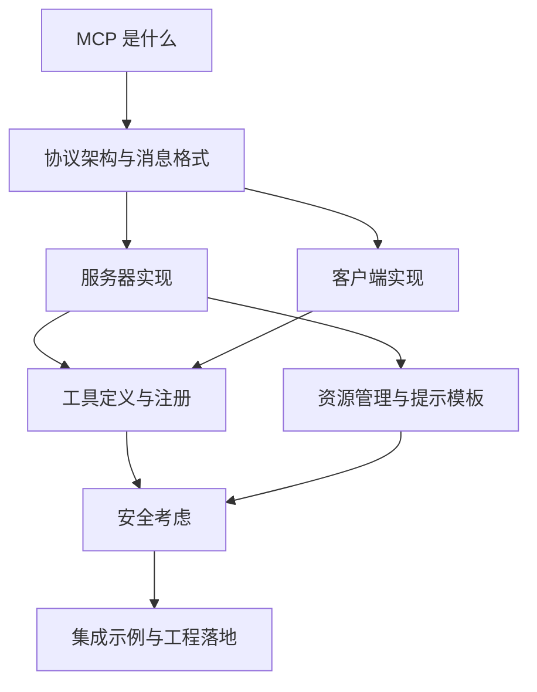
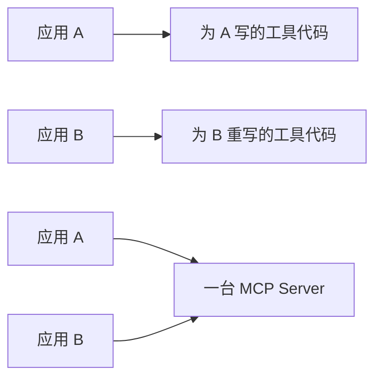
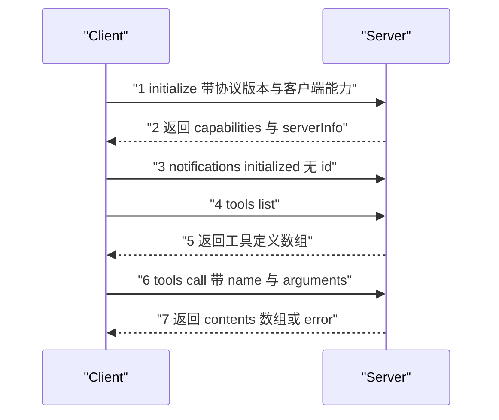
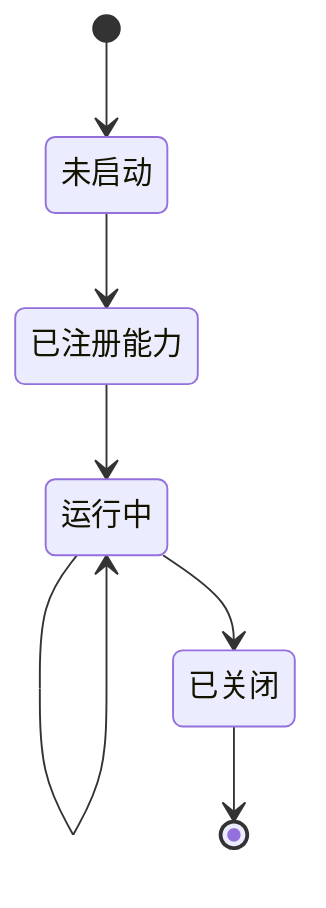
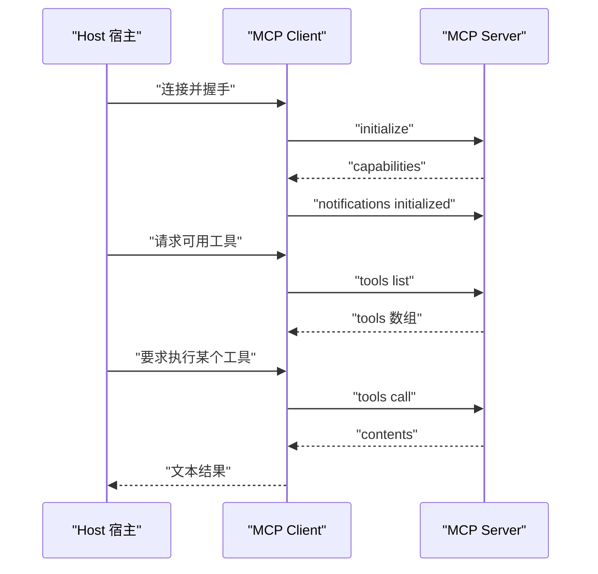
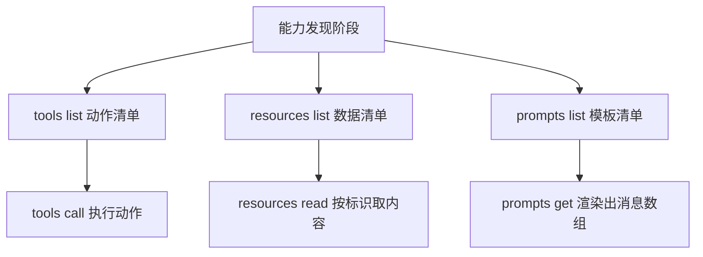
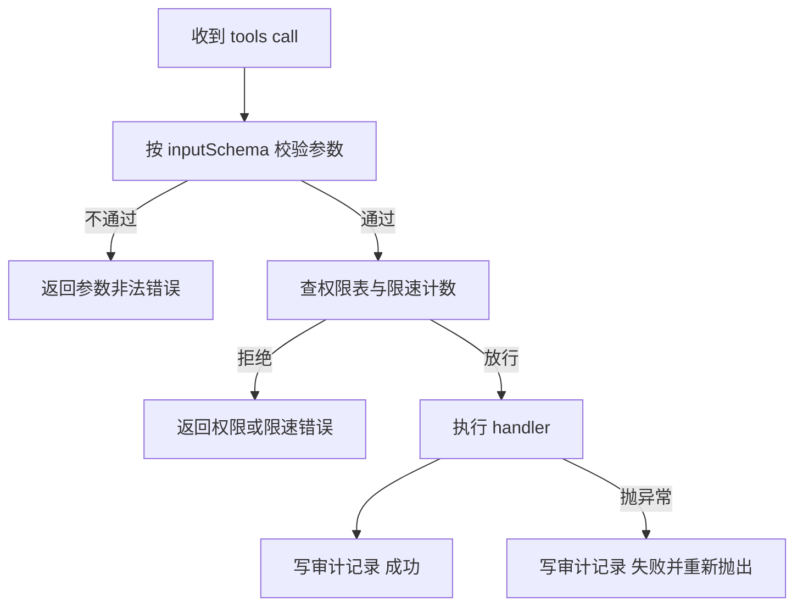

# MCP 协议集成

!!! abstract "学完这一页你能"

    - 说出 MCP 中 Host、Client、Server 三者的职责边界，并解释厂商私有工具调用在换宿主时为什么要重写代码。
    - 手写 JSON-RPC 的请求、响应、通知三种消息，并断言通知因为缺少 id 因而不等待回复。
    - 用装饰器或显式注册表，让一个进程对外暴露工具、资源、提示模板三类能力，并让客户端完成发现与调用。
    - 给工具调用加上输入校验、路径白名单、滑动窗口限速与审计记录，并说出每道闸拦住的失败类型。

## 0. 知识地图



建议按图中箭头顺序读。先读第 1 节弄明白 MCP 替代掉的是哪一段胶水代码，再读第 2 节掌握三种消息形状，然后分头读服务端与客户端两节。工具与资源两节是日常写代码打交道最多的地方；安全一节放到最后读，因为你需要先有一条能跑通的调用链，才看得懂每道闸拦下的是什么。

## 1. 从私有工具调用到 MCP

**先想一个问题**

你在编辑器插件里写好了「读取项目文件」函数，交给自研助手用。三个月后产品要求同时支持外部助手，你发现这套代码要重写一遍。

问题不在函数本身，而在函数外那层描述：参数怎么声明、结果怎么返回、宿主怎么找到它。

!!! note "术语：MCP"

    MCP（Model Context Protocol，模型上下文协议）是一套开放协议，用统一的消息格式描述模型与外部工具、数据源之间的通信。例子：同一个读取文件的工具，用 MCP 描述一次，客户端 A 与客户端 B 都能按相同的字段名调用它。

**心智模型**

!!! tip "心智模型"

    - 一句话模型：MCP 把工具能力从应用进程里搬出来，做成一台按固定字段对话的外部服务。
    - 日常类比：把工具想成墙上统一规格的插座，谁家的电器都能插上去取电。
    - 类比不成立的地方：插座不挑电器也不记账，MCP 服务端要按自己的权限表决定放不放行，还要留下调用记录。

**图解**



1. 上半部分画出私有方式：应用 A 与应用 B 各带一份工具代码，函数签名与返回结构由各厂商自行规定。
2. 应用 B 接入时，你要把参数声明、结果包装、错误码全部改写成 B 的格式。
3. 下半部分画出 MCP 方式：工具代码只写一份，放进 MCP Server 进程。
4. 应用 A 与应用 B 各自带一个 MCP Client，用协议字段与服务端对话。
5. 新增宿主时，改的是宿主侧的配置声明，不是工具实现。

**一步一步来**

**第 1 步：看清私有定义的耦合点在哪**

先看一份典型的厂商私有工具定义，注意字段名由厂商规定。

```js
// 某厂商私有的工具描述：字段名 parameters 由该厂商规定
const vendorTool = {
  name: "read_file",
  parameters: { path: "string" }, // 自定义结构，换一家厂商要改字段名与嵌套层级
  run: async (args) => readFile(args.path), // 执行体与描述写在一起
};
```

**这段代码在做什么**

- `name` 与 `parameters` 这对字段名是厂商私有的，协议层不认识它们。
- 描述与执行体写在同一个对象里，工具实现与宿主运行环境强绑定。
- 换宿主时，`parameters` 要改成新宿主的字段名，`run` 要改成新宿主的调用约定。
- 客户端无法在不读文档的前提下推断这份定义，只能靠人工适配。

**第 2 步：把同一份能力改写成协议字段**

MCP 把「描述」和「执行」拆开：描述走 `tools/list`，执行走 `tools/call`。

```js
// MCP 的 tools/list 响应形状：协议字段固定，客户端按字段名读取
const mcpTool = {
  name: "read_file",
  description: "读取 UTF-8 文本文件", // 给模型看的语义说明，写得具体模型才选得准
  inputSchema: {                      // JSON Schema 描述入参
    type: "object",
    properties: { path: { type: "string", description: "文件路径" } },
    required: ["path"],               // 必填项由协议字段声明，客户端可提前校验
  },
};
```

**这段代码在做什么**

- `name` 是工具的唯一标识，客户端按它查找与调用。
- `description` 会进入模型上下文，模型据此判断这个工具能不能解决当前任务。
- `inputSchema` 用 JSON Schema 描述入参类型、必填项与默认值。
- 执行体不出现在列表里，它由服务端在收到 `tools/call` 时调用。
- 任何按协议字段实现的客户端都能读懂这份定义，不需要读厂商文档。

!!! note "术语：JSON Schema"

    JSON Schema 是一套用 JSON 描述 JSON 结构的规范。例子：`{ "type": "object", "required": ["path"] }` 表示传入值必须是对象，且必须带 path 字段。

**动手验证**

```js
// 依赖：无，仅用 Node 20+ 内置模块
// 运行：node --input-type=module verify.mjs
import assert from "node:assert/strict";

// 私有定义：结构与含义由厂商规定
const vendorTool = { name: "read_file", parameters: { path: "string" } };

// 协议定义：字段名由协议规定，客户端不需要读厂商文档
const mcpTool = {
  name: "read_file",
  description: "读取 UTF-8 文本文件",
  inputSchema: {
    type: "object",
    properties: { path: { type: "string" } },
    required: ["path"],
  },
};

assert.ok(vendorTool.parameters, "私有定义使用 parameters 字段");
assert.equal("inputSchema" in vendorTool, false, "私有定义没有协议字段");

// 通用客户端只依赖协议字段，因此可以直接消费 mcpTool
const readFirstRequired = (t) =>
  t.inputSchema.properties[t.inputSchema.required[0]].type;

assert.equal(readFirstRequired(mcpTool), "string");
assert.throws(() => readFirstRequired(vendorTool), "私有定义会让通用客户端抛错");

console.log("ok: 协议定义可被不认识的客户端读取");
```

**运行结果**

```text
ok: 协议定义可被不认识的客户端读取
```

**常见坑**

| 现象 | 原因 | 怎么修 |
| --- | --- | --- |
| 换宿主后模型选错工具 | `description` 只写了工具名，没写用途边界 | 在描述里写清输入是什么、输出是什么、什么时候不该用 |
| 客户端拿不到必填信息 | 只写了 `properties`，漏写 `required` | 把必填字段名填进 `required` 数组，并在 handler 里再兜底一次 |
| 同一工具在两台服务端行为不同 | 工具名重复且描述不一致 | 给工具名加业务前缀，并让两台服务端共用同一份定义文件 |

**用在哪里**

- 场景一：多宿主 IDE 插件
    - 业务背景：编辑器插件要同时接自研助手与外部助手，两边工具接口字段不同。
    - 这一节的知识怎么用：把文件读取、符号查找写成一台 MCP Server，插件侧只做配置声明。
    - 用什么指标衡量收益：新增一个宿主时需要改动的文件数，以及工具从开发完成到在宿主可用的日历天数。
    - 什么时候不该用：插件只服务单一宿主，且该宿主的私有接口已经稳定运行，改动成本高于收益。
- 场景二：客服后台的订单查询能力
    - 业务背景：订单查询工具要同时暴露给自研 Agent 与第三方工单系统的助手。
    - 这一节的知识怎么用：把订单查询封装成 `order_query` 工具，`inputSchema` 里用 `enum` 约束查询维度。
    - 用什么指标衡量收益：接入第二套宿主时的接口适配代码行数，以及因参数格式错误导致的失败调用占比。
    - 什么时候不该用：查询逻辑只在一个内网系统内使用，且不允许任何跨进程通信。

**行业实践**

- MCP 官方文档的介绍章节把 MCP 定义为开放协议，用于标准化模型与外部工具、数据源之间的通信。怎么借鉴到你的项目：先按协议字段整理现有工具清单，再动手写适配层。
- `modelcontextprotocol/servers` 仓库维护一组参考服务器实现，覆盖文件系统、代码托管、搜索等能力。怎么借鉴到你的项目：找与自己业务形态接近的那一个，比对它的工具描述写法与资源划分方式。
- Claude Code 文档中的 MCP 配置章节用 `mcpServers` 字段声明启动命令、参数与环境变量。怎么借鉴到你的项目：把密钥放进 `env` 字段并引用环境变量，不要把密钥写进仓库。

**小结**

- MCP 解决的是描述层的重复劳动，不是执行层的算法问题。
- 描述（`tools/list`）与执行（`tools/call`）拆开，是协议能跨宿主复用的前提。
- 工具描述是给模型读的文档，写清楚它的收益直接体现在模型选对工具的比例上。

## 2. 协议架构与消息格式

**先想一个问题**

客户端第一次连上服务端，怎么知道对方支不支持资源读取？不能靠猜，也不能靠试错发请求。

握手阶段双方各报一次能力清单，后续只调用对方声明过的能力。

**心智模型**

!!! tip "心智模型"

    - 一句话模型：一次调用由「消息信封 + 能力协商 + 方法名」三段组成。
    - 日常类比：像寄挂号信，信封上写明寄件编号，对方回信时必须抄上同一个编号。
    - 类比不成立的地方：挂号信没有「不用回信」的类别，而 MCP 的通知类消息就是故意不回。

!!! note "术语：JSON-RPC 2.0"

    JSON-RPC 2.0 是一种用 JSON 承载远程调用的消息规范。例子：`{ "jsonrpc": "2.0", "id": 1, "method": "tools/list", "params": {} }` 就是一条请求。

**图解**



1. 第 1 步客户端发 `initialize`，带上自己支持的协议版本与能力清单。
2. 第 2 步服务端返回 `capabilities`，客户端据此知道后面能调用哪些方法组。
3. 第 3 步客户端发 `notifications/initialized`，这是通知，不带 id，服务端不回复。
4. 第 4 步客户端请求 `tools/list`，拿到工具定义数组。
5. 第 5 步服务端返回工具名、描述、`inputSchema`，执行体不出现在返回里。
6. 第 6 步客户端发 `tools/call`，带工具名与参数对象。
7. 第 7 步服务端返回 `contents` 数组，或者返回带错误码的 `error` 对象。

**一步一步来**

**第 1 步：构造请求消息**

请求三要素是 `id`、`method`、`params`，`id` 用来把响应配回请求。

```js
// 一次工具调用的请求：id 由客户端生成，服务端原样抄回
const request = {
  jsonrpc: "2.0",                                  // 协议版本标记，固定字符串
  id: 7,                                           // 请求编号，数字或字符串都可以
  method: "tools/call",                            // 方法名，斜杠分隔的两级命名
  params: {                                        // 方法参数，字段名由方法决定
    name: "read_file",
    arguments: { path: "/tmp/a.txt" },             // 注意字段名是 arguments 不是 args
  },
};
```

**这段代码在做什么**

- `jsonrpc` 固定为字符串 `"2.0"`，服务端据此拒绝其它版本的报文。
- `id` 是关联键，服务端的响应必须带同一个值。
- `method` 决定走哪条处理分支，写错会收到方法不存在错误。
- `params` 是方法级参数，`tools/call` 要求里面必须有 `name` 与 `arguments`。
- 客户端可以并发发送多个请求，靠 `id` 区分各自的响应。

**第 2 步：区分响应、错误与通知**

三类消息的差别只在字段有无，用 `id` 的有无区分是否要等回复。

```js
// 成功响应：必须带请求里的同一个 id
const ok = { jsonrpc: "2.0", id: 7, result: { contents: [{ type: "text", text: "hello" }] } };

// 失败响应：带 error 而不是 result，两者不能同时出现
const bad = { jsonrpc: "2.0", id: 7, error: { code: -32602, message: "Invalid params" } };

// 通知：没有 id，服务端不回复，收发双方都不能等它
const note = { jsonrpc: "2.0", method: "notifications/initialized", params: {} };
```

**这段代码在做什么**

- 成功响应把数据放进 `result`，`contents` 数组里每项带 `type` 字段。
- 失败响应把信息放进 `error`，`code` 是数字错误码，`message` 是给人读的字符串。
- 通知没有 `id`，因此接收方不需要也无法返回结果。
- `notifications/initialized` 是协议规定的通知，握手后必须补发。
- 把通知当请求去等回复，会让客户端卡在超时上。

**动手验证**

```js
// 依赖：无，仅用 Node 20+ 内置模块
// 运行：node --input-type=module verify.mjs
import assert from "node:assert/strict";

// 编码：把对象变成一行，换行符是 stdio 传输的消息边界
const encode = (msg) => JSON.stringify(msg) + "\n";
const decode = (line) => JSON.parse(line);

const req = { jsonrpc: "2.0", id: 7, method: "tools/list", params: {} };
const line = encode(req);

assert.equal(line.endsWith("\n"), true, "每条消息以换行结尾");
assert.deepEqual(decode(line), req, "编解码可往返");

// 响应必须复用请求的 id，否则客户端无法配对
const res = { jsonrpc: "2.0", id: req.id, result: { tools: [] } };
assert.equal(res.id, req.id);

// 通知没有 id，因此不会被任何请求等待
const note = { jsonrpc: "2.0", method: "notifications/initialized", params: {} };
assert.equal("id" in note, false);
assert.equal("result" in note || "error" in note, false);

console.log("ok: 请求 响应 通知 三种消息形状可区分");
```

**运行结果**

```text
ok: 请求 响应 通知 三种消息形状可区分
```

**常见坑**

| 现象 | 原因 | 怎么修 |
| --- | --- | --- |
| 客户端一直等到超时 | 把通知当成请求发出去后又等响应 | 通知走不等待的发送路径，不发 `id` |
| 响应串台，结果对不上调用 | 并发请求复用了同一个 `id` | 用自增计数器或随机数生成 `id`，保证在途唯一 |
| 解析报 JSON 语法错误 | 服务端日志混进了标准输出 | 日志一律写标准错误，标准输出只放协议报文 |

**用在哪里**

- 场景一：本地开发工具与编辑器的通信
    - 业务背景：编辑器需要调用本机的代码格式化、依赖检查能力。
    - 这一节的知识怎么用：用 stdio 传输承载 JSON-RPC，报文以换行分帧。
    - 用什么指标衡量收益：解析失败的调用次数占总调用次数的比例。
    - 什么时候不该用：调用方与服务端在同一进程内，函数调用比序列化更直接。
- 场景二：跨机房的内部工具网关
    - 业务背景：多个团队的服务要把内部查询能力暴露给统一 Agent 平台。
    - 这一节的知识怎么用：用 HTTP 承载同一套消息格式，`id` 生成改为带实例前缀避免跨实例冲突。
    - 用什么指标衡量收益：错误码分布，尤其是参数错误与方法不存在的占比。
    - 什么时候不该用：目标能力已经有一份成熟的内部 RPC 契约，重写协议层的收益低于维护两套的开销。

**行业实践**

- MCP 官方文档的架构与传输章节区分了 stdio 与 HTTP 两类传输，并说明消息格式在两类传输上一致。怎么借鉴到你的项目：把传输层封装成一个只负责收发字符串的函数，业务代码不感知传输方式。
- MCP TypeScript SDK 仓库的 README 给出了客户端与服务端的最小示例，展示了先握手再调用方法的顺序。怎么借鉴到你的项目：把「握手必须最先执行」写进连接封装的构造函数，让业务代码拿不到未握手的连接。
- MCP Python SDK 仓库的 README 展示了用装饰器注册能力的用法。怎么借鉴到你的项目：把注册动作集中在服务启动阶段，避免运行中动态注册导致能力清单前后不一致。

**小结**

- 消息只有三种形状，靠 `id` 和 `result`、`error` 字段区分。
- 握手是顺序约束，不是可选步骤。
- 通知不等待回复，凡是把它当请求用的实现都会卡住。

## 3. MCP 服务器实现

**先想一个问题**

如果每加一个工具都要手写一遍 JSON Schema，改参数名时容易漏改描述。有没有把函数直接变成工具的办法？

装饰器方案让函数签名与类型注解自动生成入参描述，你只管写函数体。

**心智模型**

!!! tip "心智模型"

    - 一句话模型：服务端就是「一张能力注册表 + 一条消息分发通道」。
    - 日常类比：像公司前台登记访客，进门先登记能力和权限，之后按登记表放行。
    - 类比不成立的地方：前台按人放行，服务端按方法名放行，同一个人换个方法名结果就不同。

!!! note "术语：FastMCP"

    FastMCP 是 MCP Python SDK 中的高层封装，用装饰器把普通函数登记为协议能力。例子：给函数加上 `@mcp.tool()` 后，函数参数名与类型注解会被用来生成该工具的入参描述。

**图解**



1. `未启动` 是进程刚起来的阶段，此时还没有任何能力可用。
2. 进入 `已注册能力`：装饰器或显式注册语句把工具、资源、提示写进注册表。
3. 进入 `运行中`：调用启动方法后开始监听传输通道。
4. `运行中` 的自环表示反复处理请求，每次请求触发一次查表与执行。
5. 进入 `已关闭`：传输关闭，进程退出；注册表随进程一起消失。

**一步一步来**

**第 1 步：用装饰器注册三类能力**

一个函数加上装饰器就进了注册表，函数签名被用来推导入参描述。

```python
# 依赖：fastmcp（Python 包，安装命令需核对官方文档）
from fastmcp import FastMCP

mcp = FastMCP("Demo Server")  # 服务名会出现在握手信息里

@mcp.tool()
def read_file(path: str, limit: int = 1000) -> str:
    """读取文件内容

    Args:
        path: 文件路径
        limit: 最大读取字符数
    """
    # read(limit) 在文本模式下按字符截断，UTF-8 多字节字符不会被劈开
    with open(path, "r", encoding="utf-8") as f:
        return f.read(limit)  # 上下文管理器保证句柄及时释放

@mcp.resource("file://config")
def get_config() -> str:
    """返回配置文件内容"""
    return '{"setting": "value"}'  # 返回值保持简单可序列化

@mcp.prompt()
def code_review(file_path: str) -> str:
    """生成代码审查提示"""
    return f"请审查以下文件：{file_path}"

if __name__ == "__main__":
    mcp.run()  # 默认 stdio 传输
```

**这段代码在做什么**

- `FastMCP("Demo Server")` 创建服务实例，名字进入握手返回的 `serverInfo`。
- `@mcp.tool()` 把 `read_file` 登记为工具，参数名与类型注解生成入参描述。
- 函数的 docstring 会进入工具的 `description`，不写会让模型难以判断用途。
- `@mcp.resource` 登记只读数据端点，`file://config` 是这个资源的唯一标识。
- `@mcp.prompt()` 登记的只负责渲染文本，不做实际业务处理。
- `mcp.run()` 启动后进程阻塞在传输循环上，标准输入输出承载协议报文。

**第 2 步：用 TypeScript SDK 显式声明工具**

显式声明把「描述」和「执行」分成两个字段，便于按环境过滤工具。

```ts
// 依赖：@modelcontextprotocol/sdk（具体导入路径需核对官方文档）
const readFileTool = {
  name: "read_file",
  description: "读取 UTF-8 文本文件", // 会进入模型上下文
  inputSchema: {                      // 模型据此生成合法参数
    type: "object",
    properties: { path: { type: "string" } },
    required: ["path"],
  },
  handler: async (params) => {
    const fs = await import("node:fs/promises"); // 延迟加载，启动时不引入文件系统依赖
    const text = await fs.readFile(params.path, "utf-8");
    // MCP 只承载文本与二进制块，结构化数据要自己序列化
    return { contents: [{ type: "text", text }] };
  },
};
```

**这段代码在做什么**

- `inputSchema` 与 `handler` 必须一一对应，少写一边模型就会传错类型。
- `await import` 把模块加载推迟到首次调用，缩短服务启动时间。
- `handler` 返回 `contents` 数组，每项声明 `type` 表示内容形态。
- 执行体里的路径参数未做越权校验，生产环境要收敛到允许目录内。
- 这份定义对象可以直接放进 `tools/list` 的返回数组。

**第 3 步：用注册表做常数级查找**

工具数量增长后线性扫描会变慢，用 Map 按名字查找。

```ts
// 依赖：NestJS（具体装饰器导入路径需核对官方文档）
@Injectable()
export class MCPService {
  private tools = new Map<string, Tool>(); // Map 保证按名查找是常数级

  async listTools() {
    // Map 不能直接序列化，会变成空对象，必须先摊平成数组
    return { tools: Array.from(this.tools.values()) };
  }

  async callTool(name: string, args: Record<string, unknown>) {
    const tool = this.tools.get(name);
    if (!tool) throw new NotFoundException(`未知工具 ${name}`); // 未知工具要显式报错
    return tool.handler(args); // 返回 Promise，由调用方等待
  }
}
```

**这段代码在做什么**

- 用 Map 而不是数组，把查找复杂度从线性降到与工具数量无关。
- `Array.from(this.tools.values())` 把迭代器摊平成数组，这是能正确序列化的前提。
- 找不到工具时抛异常而不是返回空对象，模型能据此理解失败原因。
- 未知方法用 404 语义表达，交由统一异常过滤器转换成错误响应。
- `handler` 的 Promise 不在此处等待，异常沿调用链向上冒泡。

**动手验证**

```js
// 依赖：无，仅用 Node 20+ 内置模块
// 运行：node --input-type=module verify.mjs
import assert from "node:assert/strict";

const registry = new Map();
const registerTool = (tool) => registry.set(tool.name, tool);

function handle(method, params) {
  if (method === "tools/list") {
    // 列表只暴露描述字段，handler 留在服务端
    return { tools: Array.from(registry.values(), ({ handler, ...meta }) => meta) };
  }
  if (method === "tools/call") {
    const tool = registry.get(params.name);
    if (!tool) throw new Error(`未知工具 ${params.name}`);
    return tool.handler(params.arguments);
  }
  throw new Error(`未知方法 ${method}`);
}

registerTool({
  name: "read_file",
  description: "读取 UTF-8 文本文件",
  inputSchema: { type: "object", properties: { path: { type: "string" } }, required: ["path"] },
  handler: async ({ path }) => ({ contents: [{ type: "text", text: `read ${path}` }] }),
});

const listed = handle("tools/list", {});
assert.equal(listed.tools.length, 1, "注册表里有一个工具");
assert.equal("handler" in listed.tools[0], false, "列表不暴露执行体");

const called = await handle("tools/call", { name: "read_file", arguments: { path: "a.txt" } });
assert.equal(called.contents[0].text, "read a.txt");

assert.throws(() => handle("tools/call", { name: "no_such", arguments: {} }), /未知工具/);

console.log("ok: 注册表可列举 可调用 可拒绝未知工具");
```

**运行结果**

```text
ok: 注册表可列举 可调用 可拒绝未知工具
```

**常见坑**

| 现象 | 原因 | 怎么修 |
| --- | --- | --- |
| `tools/list` 返回空对象 | 直接把 Map 序列化成 JSON | 先 `Array.from` 摊平成数组再放进返回体 |
| 模型调用时参数类型错误 | `inputSchema` 与 `handler` 的字段名不一致 | 让两者共用同一份字段常量，改一处即改全局 |
| 服务启动即报模块找不到 | 顶层 import 了只有运行时才需要的模块 | 在 `handler` 内部用动态 `import` 延迟加载 |

**用在哪里**

- 场景一：后台管理的批量导入校验服务
    - 业务背景：运营要上传表格，Agent 需要在校验失败时解释每一行的原因。
    - 这一节的知识怎么用：把列名校验、类型校验分别登记为工具，`inputSchema` 用 `enum` 约束表格类型。
    - 用什么指标衡量收益：导入失败后运营需要人工排查的行数占比。
    - 什么时候不该用：导入流程已经固化在后台表单里，模型没有介入的入口。
- 场景二：电商商品列表的数据准备服务
    - 业务背景：Agent 要在回答商品问题时读取库存与价格字段。
    - 这一节的知识怎么用：把库存查询登记为工具，把商品字段表登记为资源，前者执行后者只读。
    - 用什么指标衡量收益：模型回答商品问题时的字段引用错误次数。
    - 什么时候不该用：数据需要在浏览器端就地渲染，跨进程取数会拖慢首屏。

**行业实践**

- MCP Python SDK 仓库的 README 用装饰器示例展示工具、资源、提示的注册方式。怎么借鉴到你的项目：把注册集中在启动文件里，让能力清单一眼可见。
- MCP TypeScript SDK 仓库的 README 展示了 `setRequestHandler` 按方法名绑定处理函数。怎么借鉴到你的项目：把方法名写成常量，避免拼写错误导致首次请求就失败。
- `modelcontextprotocol/servers` 仓库中文件系统相关参考服务器把可访问目录限制在启动参数指定的范围内。怎么借鉴到你的项目：把允许目录作为启动参数，不要写死在代码里。

**小结**

- 服务端等于注册表加分发通道，注册在启动阶段完成。
- 描述字段与执行体必须成对维护，改一边就要改另一边。
- 工具数量增长后，注册表的数据结构决定查找开销。

## 4. MCP 客户端实现

**先想一个问题**

客户端调一次工具，要经过哪几个动作？连接、握手、发现、调用，缺一步都会失败。

连接方式不止一种，客户端要把协议编解码与传输方式分开写。

**心智模型**

!!! tip "心智模型"

    - 一句话模型：客户端是「协议编解码层」加一个可替换的「传输适配器」。
    - 日常类比：像快递柜，柜子只负责按编号存取，包裹怎么送来的与它无关。
    - 类比不成立的地方：快递柜不关心包裹顺序，协议要求握手必须排在所有业务请求之前。

!!! note "术语：stdio 传输"

    stdio 传输指客户端与服务端通过标准输入输出流交换报文。例子：客户端把一行 JSON 写进子进程的标准输入，从子进程的标准输出按行读出响应。

**图解**



1. 宿主发起连接，客户端负责建通道。
2. 客户端发 `initialize`，服务端返回 `capabilities`。
3. 客户端补发 `notifications/initialized`，握手结束。
4. 宿主问有哪些工具，客户端转发 `tools/list`。
5. 服务端返回工具数组，客户端缓存这份清单。
6. 宿主选中某个工具，客户端发 `tools/call` 并透传参数。
7. 服务端返回 `contents`，客户端把它交回宿主。

**一步一步来**

**第 1 步：完成握手并保存能力快照**

握手结果决定后面哪些方法组能用，因此要存下来。

```js
// 握手请求：声明协议版本、自身能力、身份信息
const initRequest = {
  jsonrpc: "2.0",
  id: 1,
  method: "initialize",
  params: {
    protocolVersion: "2024-11-05", // 旧页示例值，最新版本号需核对官方文档
    capabilities: {
      roots: { listChanged: true }, // 声明自己会在根目录变更时发通知
      sampling: {},                 // 空对象表示支持该能力
    },
    clientInfo: { name: "example-client", version: "1.0.0" },
  },
};

// 服务端的 capabilities 决定后续可用的方法组
const serverCapabilities = { tools: {}, resources: {} };
if (!("tools" in serverCapabilities)) {
  throw new Error("服务端未声明 tools 能力，不应调用 tools/list");
}
```

**这段代码在做什么**

- `protocolVersion` 是协商基准，值不匹配时服务端可能拒绝或降级。
- `capabilities` 里放客户端支持的能力，服务端据此决定要不要主动发通知。
- `clientInfo` 用于服务端日志与问题定位。
- 握手返回的 `capabilities` 是权威依据，判断能否调用某方法组要先查它。
- 跳过握手直接发业务请求，服务端行为未定义。

**第 2 步：按行分帧读取标准输出**

字节流会被拆成多段到达，需要自己按换行符切分并处理粘包。

```js
import { spawn } from "node:child_process";

// 传输适配器：发一行，收多行
const child = spawn(process.execPath, ["--input-type=module", "-e", "process.stdin.pipe(process.stdout)"], {
  stdio: ["pipe", "pipe", "inherit"],
});

child.stdin.write(JSON.stringify(request) + "\n"); // 换行符是消息边界
child.stdin.end(); // 关闭写入端，避免示例进程挂起

let buffer = "";
child.stdout.on("data", async (chunk) => {
  buffer += chunk.toString(); // 先累积，再切分
  let index;
  while ((index = buffer.indexOf("\n")) !== -1) {
    const line = buffer.slice(0, index); // 取出一条完整消息
    buffer = buffer.slice(index + 1);    // 剩余部分留到下一轮
    if (line.trim()) {
      const message = JSON.parse(line);
      await handle(message.method, message.params);
    }
  }
});
```

**这段代码在做什么**

- 写入时补 `"\n"`，这是 stdio 传输约定的消息终止符。
- `buffer` 累积未处理完的字节，因为一次 `data` 事件可能只到半条消息。
- `while` 循环处理一次到达多条消息的情况，避免后续响应被丢弃。
- `line.trim()` 过滤空行，防止 `JSON.parse` 抛异常。
- 标准错误流只收集不解析，它承载的是服务端日志。

**动手验证**

```js
// 依赖：无，仅用 Node 20+ 内置模块
// 运行：node --input-type=module verify.mjs
import assert from "node:assert/strict";
import { spawnSync } from "node:child_process";

// 子进程脚本：读一行 JSON，回一行 JSON，然后退出
const childCode = [
  "let buf = '';",
  "process.stdin.on('data', (d) => {",
  "  buf += d;",
  "  const i = buf.indexOf('\\n');",
  "  if (i === -1) return;",
  "  const req = JSON.parse(buf.slice(0, i));",
  "  const res = { jsonrpc: '2.0', id: req.id, result: { tools: [{ name: 'read_file' }] } };",
  "  process.stdout.write(JSON.stringify(res) + '\\n');",
  "  process.exit(0);",
  "});",
].join("\n");

// 用参数数组传代码，避免 shell 转义问题
const out = spawnSync(process.execPath, ["-e", childCode], {
  input: JSON.stringify({ jsonrpc: "2.0", id: 1, method: "tools/list", params: {} }) + "\n",
  encoding: "utf8",
});

assert.equal(out.status, 0, "子进程正常退出");
const res = JSON.parse(out.stdout.trim());
assert.equal(res.id, 1, "响应复用请求 id");
assert.equal(res.result.tools[0].name, "read_file");
assert.equal(out.stderr, "", "标准错误不承载协议报文");

console.log("ok: stdio 一问一答完成，响应按 id 配对");
```

**运行结果**

```text
ok: stdio 一问一答完成，响应按 id 配对
```

**常见坑**

| 现象 | 原因 | 怎么修 |
| --- | --- | --- |
| 第二条响应被丢掉 | 一次数据事件里有多条消息，只解析了第一条 | 用循环按换行符切分，处理完缓冲区里所有完整行 |
| 后续请求全部失败 | 漏发 `notifications/initialized` | 握手后立即补发这条通知 |
| 进程句柄泄漏 | 每次请求都新建子进程却没有回收 | 改用长驻进程加请求队列，并监听退出事件做重连 |

**用在哪里**

- 场景一：桌面客户端的本地能力接入
    - 业务背景：桌面应用要接本机命令行工具，用户安装后即可使用。
    - 这一节的知识怎么用：用 stdio 传输启动子进程，握手后缓存工具清单，卸载时关闭子进程。
    - 用什么指标衡量收益：应用启动到工具可用的耗时，以及子进程残留数量。
    - 什么时候不该用：能力已经作为库直接链接进应用，再加一层进程通信是多余开销。
- 场景二：多租户 SaaS 的工具网关
    - 业务背景：一个平台要为不同租户连接各自的内部数据服务。
    - 这一节的知识怎么用：每个租户一个客户端实例，能力快照随实例保存，避免跨租户串用。
    - 用什么指标衡量收益：跨租户越权调用的拦截次数，以及连接建立失败的占比。
    - 什么时候不该用：租户之间共享同一套数据服务且权限由服务端统一判定，多实例管理成本高于收益。

**行业实践**

- MCP TypeScript SDK 仓库的客户端示例展示了构造、握手、列工具、调用工具的完整顺序。怎么借鉴到你的项目：把这段顺序封装成一个连接对象，让业务代码拿不到未握手的连接。
- MCP 官方文档的传输章节说明 stdio 与 HTTP 两类传输共用同一套消息格式。怎么借鉴到你的项目：把传输实现抽成一个只暴露「发一行、收一行」的函数，替换传输不影响业务代码。
- Claude Code 文档的 MCP 配置章节把每个服务端的启动命令与参数写在配置文件里。怎么借鉴到你的项目：让客户端从配置读取服务端路径，不要硬编码在代码中。

**小结**

- 客户端的两半是协议编解码与传输适配，两者可以分别替换。
- 握手必须先于所有业务请求，能力快照要保存下来。
- 按行分帧要处理半条消息与多条消息两种情况。

## 5. 工具定义与注册

**先想一个问题**

同一个工具，模型有时传对参数有时传错。问题常常不在模型，而在描述写得含糊。

`inputSchema` 是给模型的合同，字段名、类型、取值范围写清楚，传错的比例会下降。

**心智模型**

!!! tip "心智模型"

    - 一句话模型：一份工具定义由「给模型看的描述」与「给运行时看的执行体」两半组成。
    - 日常类比：像点餐单，菜单上写清楚配料与份量，后厨按单子做菜。
    - 类比不成立的地方：菜单不会拒绝客人，工具定义要在运行时再校验一次参数，因为模型可能不按描述传值。

!!! note "术语：annotations"

    工具定义里的可选元数据字段，用来提示这个工具会不会改动数据。例子：`readOnlyHint` 表示该工具只读取数据，不产生副作用。

**图解**


1. 服务端把工具定义放进注册表，执行体留在服务端。
2. `tools/list` 只返回描述字段，客户端拿到不含执行体的清单。
3. 客户端把清单缓存起来，每次对话开始时注入模型上下文。
4. 模型判断当前任务适合哪个工具，按 `inputSchema` 生成参数。
5. 客户端发 `tools/call`，带上工具名与参数对象。
6. 服务端按名字查表，执行对应的 `handler`。
7. 执行结果包装成 `contents` 数组返回。

**一步一步来**

**第 1 步：写一份带约束的工具定义**

约束写得越具体，模型生成非法参数的机会越少。

```js
// 完整工具定义：约束写在 properties 里，必填写在 required 里
const executeSqlTool = {
  name: "execute_sql",
  description: "对指定数据库执行只读 SQL 查询", // 说明用途与边界
  inputSchema: {
    type: "object",
    properties: {
      query: { type: "string", minLength: 1, maxLength: 5000 },
      database: { type: "string", enum: ["users", "orders", "analytics"] }, // 限定取值范围
      limit: { type: "number", default: 100, minimum: 1, maximum: 1000 },
    },
    required: ["query", "database"],
  },
  annotations: {
    readOnlyHint: true, // 提示模型这是只读操作，不修改数据
  },
};
```

**这段代码在做什么**

- `description` 写清了数据库范围与只读性质，模型据此排除写操作意图。
- `enum` 把 `database` 限定在三个值内，越界值在协议层就被挡住。
- `default` 是给客户端的提示，运行时仍需在 handler 里兜底。
- `minLength`、`maximum` 这类数值约束让校验规则可被客户端提前读取。
- `annotations.readOnlyHint` 是元数据，是否采纳由客户端决定。

**第 2 步：服务端分发与客户端缓存**

服务端按名字查表，客户端把清单缓存下来供多次对话复用。

```js
// 服务端：查表 校验 执行 三步
function dispatch(method, params, registry) {
  if (method === "tools/call") {
    const tool = registry.get(params.name);
    if (!tool) throw new Error(`未知工具 ${params.name}`); // 未知工具必须显式报错
    const errors = validate(tool.inputSchema, params.arguments || {}); // 运行时再校验一次
    if (errors.length) throw new Error(errors.join("; "));
    return tool.handler(params.arguments);
  }
  throw new Error(`未知方法 ${method}`);
}

// 客户端：把清单装进 Map，按名字取用
class ToolRegistry {
  #tools = new Map();
  async discover(client) {
    for (const tool of await client.listTools()) this.#tools.set(tool.name, tool);
  }
  getTool(name) { return this.#tools.get(name); }
  getAllTools() { return Array.from(this.#tools.values()); }
}
```

**这段代码在做什么**

- 服务端按名字查表，查不到就抛错，避免静默返回让人误判成功。
- 运行时再校验一次参数，因为客户端的校验可以被绕过。
- 执行体只在服务端出现，客户端拿到的定义里没有它。
- 客户端用 Map 缓存清单，重复对话不需要重复请求 `tools/list`。
- `#tools` 是私有字段，外部只能通过方法读取，避免注册表被就地改写。

**动手验证**

```js
// 依赖：无，仅用 Node 20+ 内置模块
// 运行：node --input-type=module verify.mjs
import assert from "node:assert/strict";

// 最小校验器：只查必填与类型，够验证拦截效果
function validate(schema, args) {
  const errors = [];
  for (const key of schema.required ?? []) {
    if (args[key] === undefined) errors.push(`缺少必填参数 ${key}`);
  }
  for (const [key, rule] of Object.entries(schema.properties)) {
    if (args[key] === undefined) continue;
    if (typeof args[key] !== rule.type) errors.push(`${key} 类型应为 ${rule.type}`);
  }
  return errors;
}

const schema = {
  type: "object",
  properties: { query: { type: "string" }, limit: { type: "number" } },
  required: ["query"],
};

assert.deepEqual(validate(schema, { query: "mcp" }), [], "合法参数通过");
assert.deepEqual(validate(schema, { query: "mcp", limit: "5" }), ["limit 类型应为 number"]);
assert.deepEqual(validate(schema, {}), ["缺少必填参数 query"]);
assert.equal(validate(schema, { query: "mcp" }).length, 0);

console.log("ok: 校验器拦住了缺参与类型错误");
```

**运行结果**

```text
ok: 校验器拦住了缺参与类型错误
```

**常见坑**

| 现象 | 原因 | 怎么修 |
| --- | --- | --- |
| 模型传入不存在的枚举值 | 描述里没写取值范围 | 在 `properties` 里加 `enum`，并在 handler 里再判断一次 |
| 同名工具互相覆盖 | 注册表用普通对象且没检查重复 | 注册时先判断名字是否存在，重复则报错退出 |
| 客户端缓存与线上不一致 | 服务端更新了工具但客户端不刷新 | 服务端支持能力变更通知，客户端收到后清空缓存重新发现 |

**用在哪里**

- 场景一：数据分析平台的查询入口
    - 业务背景：业务人员用自然语言问指标，Agent 需要把问题转成只读 SQL。
    - 这一节的知识怎么用：`database` 用 `enum` 限定库范围，`limit` 用 `maximum` 限制返回行数。
    - 用什么指标衡量收益：生成的 SQL 被数据库拒绝的比例。
    - 什么时候不该用：查询需要写操作或长事务，只读约束无法表达业务语义。
- 场景二：代码审查机器人
    - 业务背景：机器人要读取改动文件、查历史提交、给出行级评论。
    - 这一节的知识怎么用：把读取文件、查询提交历史拆成两个工具，各自描述清楚输入边界。
    - 用什么指标衡量收益：评审意见中被开发者标记为无效的条数占比。
    - 什么时候不该用：评审规则完全确定，用静态检查工具比让模型判断更稳定。

**行业实践**

- MCP 官方文档的工具章节描述了工具的 `name`、`description`、`inputSchema` 字段。怎么借鉴到你的项目：把这三个字段做成注册函数的必填参数，漏填就编译期报错。
- MCP 官方文档提到工具可以带 `annotations` 元数据提示只读或破坏性。怎么借鉴到你的项目：给所有写操作工具标注破坏性提示，让客户端有机会弹确认。
- `modelcontextprotocol/servers` 仓库中的参考服务器把工具数量控制在可枚举范围内，并用统一前缀区分来源。怎么借鉴到你的项目：多服务来源的场景给工具名加服务前缀，避免命名冲突。

**小结**

- 工具定义是合同，描述写清边界能直接减少参数错误。
- 客户端与服务端各校验一次，客户端校验为了体验，服务端校验为了安全。
- 注册表要检查重名，覆盖式注册会让排查变得困难。

## 6. 资源管理与提示模板

**先想一个问题**

商品字段表、配置项、日志文件这类数据，没有「执行」的语义，只有「读取」。把它们也做成工具合适吗？

协议把这类只读数据单独归为资源，执行动作归为工具，两类能力分开列举。

**心智模型**

!!! tip "心智模型"

    - 一句话模型：工具是手，资源是书架，提示模板是便签纸。
    - 日常类比：去图书馆，你可以借书（读资源）、请管理员代查（调工具）、拿一张写好的检索清单（取提示模板）。
    - 类比不成立的地方：图书馆的书是实体，资源可以是在读取时才生成的动态内容，比如按日期算出来的日志切片。

!!! note "术语：资源模板"

    资源模板是带占位符的资源标识，客户端填写占位符后得到具体资源的标识。例子：模板 `file://logs/2024-01-15` 中的日期部分可变，客户端传入具体日期后读取对应日志。

**图解**



1. 能力发现阶段分别请求三类清单，三者返回结构不同。
2. `tools/list` 返回可执行的动作，带 `inputSchema`。
3. `resources/list` 返回可读的数据，带标识、名称、内容类型。
4. `prompts/list` 返回可用的提示模板，带参数说明。
5. 读取资源走 `resources/read`，只传标识，不传其它定位参数。
6. 取提示走 `prompts/get`，返回 `messages` 数组。
7. 执行动作走 `tools/call`，会可能产生副作用。

**一步一步来**

**第 1 步：定义固定资源与模板资源**

固定资源的标识里没有占位符，模板资源的标识里有。

```js
// 固定资源：标识里无占位符，内容在读取时才生成
const configResource = {
  uri: "config://app",
  name: "Application Config",
  mimeType: "application/json",
  async load() {
    // 列表阶段只返回元数据，真正内容在这里才读取，避免一次性把大文件读进内存
    return { contents: [{ type: "resource", mimeType: "application/json", text: '{"setting":"value"}' }] };
  },
};

// 模板资源：标识里带日期占位符，客户端填值后读取具体资源
const logTemplate = {
  uriTemplate: "file://logs/2024-01-15",
  name: "Daily Logs",
  description: "指定日期的应用日志",
  mimeType: "text/plain",
};
```

**这段代码在做什么**

- `uri` 是资源的唯一标识，客户端按它读取，不携带其它定位信息。
- `mimeType` 告诉客户端怎么渲染内容，是 JSON 还是纯文本。
- `load()` 是惰性执行，列表阶段只返回元数据，避免启动即读大文件。
- 模板资源的 `uriTemplate` 里含可变片段，客户端负责填值。
- 固定资源与模板资源在 `resources/list` 里都能出现，客户端按是否含占位符区分。

**第 2 步：注册提示模板并返回消息数组**

提示模板只负责渲染文本，业务逻辑交给工具。

```js
import { readFile } from "node:fs/promises";

// 最小服务端对象：保存方法处理器，替代外部 SDK，避免 server 未定义
const server = {
  handlers: new Map(),
  setRequestHandler(method, handler) {
    this.handlers.set(method, handler);
  },
};

// prompts/get 的处理函数：按名字分支，返回 messages 数组
server.setRequestHandler("prompts/get", async (request) => {
  const { name, arguments: args } = request.params; // arguments 是保留字，必须重命名

  if (name === "code_review") {
    const { file_path } = args;
    const content = await readFile(file_path); // 读取文件是异步操作

    return {
      messages: [{
        role: "user",
        content: `请审查以下文件：\n${content}\n考虑：代码风格、潜在 bug、安全、性能`, // 模板文本
      }],
    };
  }

  throw new Error(`未知提示 ${name}`); // 未知名字显式报错，避免客户端拿到非法结构
});
```

**这段代码在做什么**

- `arguments` 是语言保留字，解构时重命名为 `args` 才能使用。
- 模板函数只做文本拼装，不做代码分析，分析应由工具承担。
- 返回结构是 `messages` 数组，每项带 `role` 与 `content`。
- 未知提示名抛异常，把「名字写错」这条线索交回调用方。
- 文件内容被内联进消息，模型在同一轮里同时拿到要求与待审代码。

**动手验证**

```js
// 依赖：无，仅用 Node 20+ 内置模块
// 运行：node --input-type=module verify.mjs
import assert from "node:assert/strict";

// 展开资源模板：把占位符替换成实际值并做编码
function expand(template, vars) {
  return template.replace(/\{(\w+)\}/g, (whole, key) => {
    if (vars[key] === undefined) throw new Error(`缺少模板变量 ${key}`);
    return encodeURIComponent(vars[key]);
  });
}

const tpl = "file://logs/{date}/{level}";
assert.equal(expand(tpl, { date: "2024-01-15", level: "error" }), "file://logs/2024-01-15/error");
assert.throws(() => expand(tpl, { date: "2024-01-15" }), /缺少模板变量 level/);

// 提示模板的返回形状：messages 数组里每项带 role 与 content
const promptResult = { messages: [{ role: "user", content: "请审查 src/main.ts" }] };
assert.equal(promptResult.messages[0].role, "user");
assert.equal(typeof promptResult.messages[0].content, "string");

// 资源返回形状：contents 数组里每项带 type
const readResult = { contents: [{ type: "resource", mimeType: "text/plain", text: "log line" }] };
assert.equal(readResult.contents[0].type, "resource");

console.log("ok: 资源模板可展开，提示与资源返回形状正确");
```

**运行结果**

```text
ok: 资源模板可展开，提示与资源返回形状正确
```

**常见坑**

| 现象 | 原因 | 怎么修 |
| --- | --- | --- |
| 服务启动内存占用高 | `resources/list` 阶段就把所有资源内容读进内存 | 列表只返回元数据，内容留到 `resources/read` 时再读 |
| 客户端拿到非法的提示结构 | 未知提示名时返回了空对象而不是抛错 | 未知名字一律抛异常，让错误在协议层可见 |
| 模板占位符没被替换 | 客户端与服务端对占位符写法理解不一致 | 把模板字符串与占位符格式写进服务端返回的参数说明里 |

**用在哪里**

- 场景一：企业内部知识库助手
    - 业务背景：员工提问要引用内部规范文档与最新公告。
    - 这一节的知识怎么用：把规范文档登记为固定资源，把按部门检索登记为模板资源，提示模板负责拼装引用格式。
    - 用什么指标衡量收益：回答里引用过期文档的次数，以及用户追问「出处在哪里」的比例。
    - 什么时候不该用：文档更新频率高到资源清单维护不过来，此时应按查询动态生成内容。
- 场景二：客服话术辅助
    - 业务背景：客服要在对话中插入符合规范的话术，规范随活动变化。
    - 这一节的知识怎么用：把话术模板登记为提示模板，运营改动模板不需要发版。
    - 用什么指标衡量收益：话术模板从运营提交到线上生效的时间。
    - 什么时候不该用：话术需要按用户身份做复杂分支，模板参数表达不了这种逻辑。

**行业实践**

- MCP 官方文档的资源章节描述了资源标识、名称、内容类型字段，以及带参数模板的存在。怎么借鉴到你的项目：把只读数据统一登记为资源，别都做成工具。
- MCP 官方文档的提示章节描述了提示模板返回消息数组的结构。怎么借鉴到你的项目：把常用指令写成模板，改文案不用改代码。
- `modelcontextprotocol/servers` 仓库中文件系统参考服务器把目录列举做成资源、把文件读写做成工具。怎么借鉴到你的项目：按「读数据还是改数据」这条线划分资源与工具。

**小结**

- 资源是只读数据端点，工具是可执行动作，两者在协议层分开列举。
- 资源模板的占位符由客户端填值，服务端负责校验填值后的标识是否存在。
- 提示模板只渲染文本，业务判断交给工具。

## 7. 安全考虑与集成示例

**先想一个问题**

模型让工具去读一个项目目录之外的文件，服务端该不该执行？

协议不替你回答这个问题。服务端要自己加校验、权限与记录三道闸。

**心智模型**

!!! tip "心智模型"

    - 一句话模型：每次工具调用都要过三道闸，校验参数、判断权限、留下记录。
    - 日常类比：像公司门禁，刷卡（权限）、登记访客（审计）、核对证件（校验）三步都走完才放行。
    - 类比不成立的地方：门禁拦不住已经进门的人，工具调用的三道闸必须在同一次请求内全部生效，缺一道就等于没有。

!!! note "术语：审计日志"

    审计日志是记录每一次工具调用的时间、调用方、参数与结果的持久化记录。例子：一条记录写明某会话在某个时刻调用了 `read_file`，参数是某个路径，结果是成功还是失败。

**图解**



1. 请求进来后先做参数校验，缺参或类型不符直接拒绝。
2. 通过校验后查权限表，判断这个工具是否在允许清单内。
3. 同时检查限速计数，超过窗口内的次数上限就拒绝。
4. 两道闸都放行后执行 `handler`。
5. 执行成功时写一条成功记录，包含工具名、参数与结果。
6. 执行抛异常时写一条失败记录，并把异常重新抛出，不能吞掉。
7. 写记录失败不应该改变调用结果的语义，因此记录放在旁路。

**一步一步来**

**第 1 步：参数校验与路径收敛**

路径类参数要做归一化后判断是否落在允许目录内。

```js
// 依赖：node:path（Node 20+ 内置）
import path from "node:path";

const ALLOWED_ROOT = "/srv/data";

function safePath(input) {
  // resolve 把相对路径与 .. 段全部展开成绝对路径
  const abs = path.resolve(ALLOWED_ROOT, input);
  // 加分隔符再比较，避免 /srv/data-other 被误判为在 /srv/data 内
  if (abs !== ALLOWED_ROOT && !abs.startsWith(ALLOWED_ROOT + path.sep)) {
    throw new Error("路径越界");
  }
  return abs;
}

// 参数校验：先查必填，再查类型，最后查业务规则
function validateParams(schema, args) {
  const errors = [];
  for (const key of schema.required ?? []) {
    if (args[key] === undefined) errors.push(`缺少必填参数 ${key}`);
  }
  for (const [key, rule] of Object.entries(schema.properties ?? {})) {
    if (args[key] !== undefined && typeof args[key] !== rule.type) {
      errors.push(`${key} 类型应为 ${rule.type}`);
    }
  }
  return errors;
}
```

**这段代码在做什么**

- `path.resolve` 把 `..` 与相对段展开，越过目录的尝试会暴露在结果里。
- 拼接分隔符再比较前缀，避免前缀相同的兄弟目录被误放行。
- 先校验必填再校验类型，错误信息能指出具体是哪一个字段。
- 业务规则校验放在类型校验之后，因为要先保证类型正确才能做范围判断。
- 校验函数只返回错误数组，不抛异常，便于一次报出全部问题。

**第 2 步：权限、限速与审计**

三道闸按顺序执行，审计放在最后但成功与失败都要记。

```js
// 滑动窗口限速：窗口内的命中时间戳超过上限就拒绝
function makeLimiter(max, windowMs) {
  const hits = [];
  return (now) => {
    while (hits.length && now - hits[0] > windowMs) hits.shift(); // 移除过期命中
    if (hits.length >= max) return false;
    hits.push(now);
    return true;
  };
}

// 审计：先把当前批次取走再清空，避免等待落盘期间新记录被一起清掉
class AuditLogger {
  #entries = [];
  log(entry) {
    this.#entries.push({ ...entry, timestamp: new Date().toISOString() });
  }
  async flush(persist) {
    const batch = this.#entries; // 先取快照
    this.#entries = [];          // 再换新数组，切断引用
    await persist(batch);
  }
}

// 调用入口：执行 后 记账 的顺序不能反
async function handleCall(name, args, deps) {
  if (!deps.allowed.has(name)) throw new Error(`工具 ${name} 不在允许清单内`);
  if (!deps.limiter(Date.now())) throw new Error(`工具 ${name} 触发限速`);
  try {
    const result = await deps.execute(name, args);
    deps.audit.log({ tool: name, args, result }); // 先拿到结果再写成功记录
    return result;
  } catch (error) {
    deps.audit.log({ tool: name, args, error: error.message });
    throw error; // 必须重新抛出，否则上游会误判成功
  }
}
```

**这段代码在做什么**

- `while` 循环移除窗口外的时间戳，让计数只保留窗口内的调用。
- 达到上限直接返回 `false`，调用方据此拒绝请求。
- 审计先取快照再清空，避免 `await` 期间新记录被一并清掉。
- 先执行后记账，反过来会留下一条并未真正成功的记录。
- 失败路径同样记账，保留参数便于复现问题现场。
- `catch` 里必须重新抛出，吞掉异常会让调用方拿到 `undefined` 并误判成功。

**动手验证**

```js
// 依赖：无，仅用 Node 20+ 内置模块
// 运行：node --input-type=module verify.mjs
import assert from "node:assert/strict";
import path from "node:path";

const ROOT = "/srv/data";
function safePath(input) {
  const abs = path.resolve(ROOT, input);
  if (abs !== ROOT && !abs.startsWith(ROOT + path.sep)) throw new Error("路径越界");
  return abs;
}

assert.equal(safePath("reports/a.csv"), "/srv/data/reports/a.csv");
assert.throws(() => safePath("../../etc/passwd"), /路径越界/);
assert.throws(() => safePath("../data-other/x"), /路径越界/);

// 滑动窗口限速：窗口内最多 5 次
function makeLimiter(max, windowMs) {
  const hits = [];
  return (now) => {
    while (hits.length && now - hits[0] > windowMs) hits.shift();
    if (hits.length >= max) return false;
    hits.push(now);
    return true;
  };
}

const allow = makeLimiter(5, 60_000);
assert.deepEqual([0, 1, 2, 3, 4, 5].map((i) => allow(i)), [true, true, true, true, true, false]);
assert.equal(allow(61_000), true, "窗口滑过后重新放行");

// 审计：先取快照再清空，等待期间的新记录不会丢
const entries = [];
const flush = async () => {
  const batch = entries.slice();
  entries.length = 0;
  await new Promise((r) => setImmediate(r));
  return batch;
};
entries.push({ tool: "read_file" });
const batch = await flush();
assert.equal(batch.length, 1, "批次里只有快照中的记录");

console.log("ok: 路径白名单 限速 审计快照 三项都生效");
```

**运行结果**

```text
ok: 路径白名单 限速 审计快照 三项都生效
```

**常见坑**

| 现象 | 原因 | 怎么修 |
| --- | --- | --- |
| 兄弟目录被误放行 | 只比较字符串前缀，没加路径分隔符 | 比较时拼接 `path.sep`，或先判断是否等于根目录本身 |
| 日志里出现假成功记录 | 先记账再执行，执行失败也留下了成功记录 | 先拿到执行结果再写成功记录，失败走独立分支 |
| 上游收到 `undefined` 却以为成功 | `catch` 里没有重新抛出异常 | 记账后 `throw error`，保持原有错误语义 |
| 审计记录整批消失 | `await` 落盘期间新记录被同一个数组清空 | 先取数组快照，再把实例字段换成新数组 |

**用在哪里**

- 场景一：企业内网知识库助手
    - 业务背景：助手要读内部文档，文档分级授权，不同员工可见范围不同。
    - 这一节的知识怎么用：按用户角色过滤资源清单，工具调用前查权限表，全程写审计。
    - 用什么指标衡量收益：越权读取被拦截的次数，以及审计记录覆盖的调用占比。
    - 什么时候不该用：数据本身对所有内部员工公开，权限判定只会增加延迟。
- 场景二：代码托管平台的评审机器人
    - 业务背景：机器人要读仓库文件、写行级评论，写操作有副作用。
    - 这一节的知识怎么用：仓库路径收敛到工作目录内，写操作单独限速，写评论记审计。
    - 用什么指标衡量收益：误写评论被撤回的条数，以及写入操作触发的限速次数。
    - 什么时候不该用：仓库内容本身不适合交给模型处理时，应先在流程上阻止。

**行业实践**

- MCP 官方文档中关于安全与授权模型的章节讨论了信任边界与用户同意，具体章节名需核对官方文档。怎么借鉴到你的项目：把「用户是否知情并同意」写成设计评审的一项必查内容。
- `modelcontextprotocol/servers` 仓库中文件系统参考服务器把可访问目录限制在启动参数给定的范围内。怎么借鉴到你的项目：允许目录通过启动参数传入，不要写在代码常量里。
- Claude Code 文档的 MCP 配置章节把密钥放在 `env` 字段并引用环境变量。怎么借鉴到你的项目：仓库里只放变量名，实际值由运行环境注入。

**小结**

- 三道闸的顺序是校验、权限、执行，审计旁路记录成功与失败。
- 路径类参数必须归一化后再判断，字符串前缀比较容易漏。
- 审计不能改变调用语义，也不能吞掉异常。

## 应用地图

| 场景 | 用到本页哪个知识点 | 典型技术选型 | 注意事项 |
| --- | --- | --- | --- |
| 编辑器插件接入本地代码能力 | 第 1 节的协议描述、第 3 节的注册表 | TypeScript 加 stdio 传输 | 允许目录要作为启动参数，不要写死 |
| 后台管理批量导入校验 | 第 5 节的 `inputSchema` 与 `enum` | Python 服务端加表单前端 | 校验失败要能指到具体行与列 |
| 客服话术与知识引用 | 第 6 节的资源与提示模板 | 资源登记文档，提示登记话术 | 文档更新频率高时改为动态生成 |
| 数据分析只读查询 | 第 5 节的只读标注、第 7 节的限速 | SQL 工具加滑动窗口限速 | `limit` 上限要在 schema 与实现里同时限制 |
| 多租户工具网关 | 第 4 节的客户端实例隔离 | 每租户一个客户端实例 | 能力快照必须随实例保存，不能全局共享 |
| 代码评审机器人 | 第 7 节的路径收敛与审计 | 写操作单独限速并记录 | 写评论失败要重试，重试前先查是否已写入 |
| 内部系统能力开放给 Agent | 第 2 节的消息格式、第 3 节的分发 | HTTP 承载同一套消息 | 错误码要稳定，客户端按码做分支 |

## 动手作业

**目标**：写一个可运行的最小 MCP 服务端与客户端配对程序，服务端只从允许目录读文件，客户端能完成握手、发现、调用三步。

**步骤**

1. 写服务端脚本 `server.mjs`，用标准输入输出按行收发 JSON。支持 `initialize`、`tools/list`、`tools/call` 三个方法。
2. 在服务端注册一个 `read_file` 工具，`inputSchema` 要求 `path` 为字符串且必填。
3. 服务端对 `path` 做归一化，落在允许目录之外时返回错误响应，错误码自定但要固定。
4. 写客户端脚本 `client.mjs`，用 `child_process.spawn` 启动服务端。
5. 客户端依次发送握手请求、初始化通知、`tools/list` 请求。
6. 客户端调用 `read_file` 两次，一次传允许目录内的路径，一次传越界路径。
7. 客户端打印两次调用的结果，用 `node:assert` 断言第二次返回错误。

**验收标准**

- 运行 `node client.mjs` 后进程正常退出，退出码为 0。
- 标准输出里能看到工具清单包含 `read_file` 一项。
- 越界调用的返回里含 `error` 字段，且不含 `result` 字段。
- 服务端标准输出中只有协议报文，日志全部写到标准错误。
- 客户端把服务端子进程在程序结束时关闭，无残留进程。
- 断言全部通过，无未捕获异常。

## 综合对比

| 维度 | 厂商私有工具调用 | MCP |
| --- | --- | --- |
| 描述字段名 | 由各厂商规定，换宿主需改写 | 由协议规定，`name`、`description`、`inputSchema` 固定 |
| 能力发现 | 多为静态定义，写在宿主配置里 | 通过 `tools/list` 等方法在运行时获取 |
| 消息格式 | HTTP 加自定义结构为主 | JSON-RPC 2.0，请求、响应、通知三类 |
| 会话状态 | 由应用自行维护 | 协议有握手阶段，双方交换能力清单 |
| 传输方式 | HTTP 或自定义 | stdio 与 HTTP 两类，消息格式一致 |
| 只读数据 | 通常也做成一次调用 | 单独归为资源，与工具分开列举 |
| 提示复用 | 写在应用代码里 | 登记为提示模板，改文案不用发版 |
| 安全边界 | 由各宿主各自实现 | 协议规定信任边界，具体闸口仍由服务端实现 |

## 深入阅读与参考

!!! tip "怎么用这些资料"
    先读「官方文档与规范」建立准确的概念，再读「源码与示例」核对细节，最后用「教程、书籍与视频」换一种讲法加深理解。每条都写明了读哪一节、带着什么问题读。

### 官方文档与规范

| 资源 | 为什么读 | 怎么读 |
|---|---|---|
| [MCP 规范](https://modelcontextprotocol.io/specification) | 协议权威文本，transport 与 lifecycle 是服务器合规的底线。 | 写服务器前通读这两章，列出初始化握手与消息格式清单，对照自己的实现逐项核对。 |
| [MCP 规范（最新版本）](https://modelcontextprotocol.io/specification/latest) | 协议有版本演进，避免按过期特性开发或与客户端不兼容。 | 查看变更日志，确认所用 SDK 支持的协议版本，把版本号写进项目配置与 README。 |
| [MCP 架构概念](https://modelcontextprotocol.io/docs/learn/architecture) | 用一页把 tools、resources、prompts 三类能力讲清楚，决定集成方案。 | 读完为自己场景各列一个例子，判断哪些能力该由服务器暴露、哪些交给客户端。 |
| [MCP Tools 概念](https://modelcontextprotocol.io/docs/concepts/tools) | 工具定义质量直接决定模型能否正确调用，概念页给出描述与 schema 要点。 | 边读边为一个真实 API 写 tool schema，补全描述与输入校验后交给模型试调用。 |
| [Claude Code MCP](https://docs.anthropic.com/en/docs/claude-code/mcp) | 官方客户端接入示例，看真实产品如何消费 MCP 服务器。 | 接入 filesystem 或 GitHub 服务器，让它完成一次读写任务，观察授权与工具暴露过程。 |
| [MCP 入门介绍](https://modelcontextprotocol.io/docs/getting-started/intro) | 入门介绍最省时，先建立 host–client–server 的整体心智模型。 | 读完立刻手绘 host、client、server 关系图，标注消息流向再进入架构与代码章节。 |

### 源码与示例

| 资源 | 为什么读 | 怎么读 |
|---|---|---|
| [MCP TypeScript SDK](https://github.com/modelcontextprotocol/typescript-sdk) | 官方 TypeScript SDK，README 即最小可跑服务器，最贴近本页实现章节。 | 按 README 用 stdio 搭一个服务器，注册一个工具，接入本地客户端跑通后再读源码。 |
| [MCP Python SDK](https://github.com/modelcontextprotocol/python-sdk) | Python 侧最常用的 SDK，FastMCP 装饰器写法极简，适合讲工具注册。 | 用 FastMCP 写一个数据库查询工具，对比 TS 版本理解跨语言实现的共性。 |
| [MCP Inspector](https://github.com/modelcontextprotocol/inspector) | 调试利器，能直接看到工具调用的原始请求与响应消息。 | 连上自己的服务器逐个调用工具，检查返回结构与错误处理，再把问题回填到代码。 |
| [MCP 官方服务器集合](https://github.com/modelcontextprotocol/servers) | 官方服务器集合是最佳实践范本，源码可直接对照学习。 | 精读 filesystem 服务器源码，关注资源与工具如何划分，然后仿写一个自己的服务器。 |

### 教程、书籍与视频

| 资源 | 为什么读 | 怎么读 |
|---|---|---|
| [Hugging Face MCP Course](https://huggingface.co/learn/mcp-course) | 体系化课程，从零实现一个服务器与客户端，覆盖完整开发闭环。 | 按单元跟做，实现一个服务器加一个客户端并互通，遇到不懂处回查规范对应章节。 |

## 自测题

??? question "MCP 相比厂商私有工具调用，主要减少了哪一类重复劳动？"

    - 减少的是能力描述层的重复劳动，不是执行算法本身。
    - 私有方式下，每换一个宿主就要改写参数声明与结果包装。
    - MCP 把描述字段固定下来，同一份工具实现可被多个客户端读取。
    - 注意：安全校验、权限判断这些工作仍然要自己做，协议不代劳。

??? question "请求、响应、通知三种消息靠什么区分？"

    - 请求带 `id`、`method`、`params`，等待响应。
    - 成功响应带同一个 `id` 与 `result`，失败响应带同一个 `id` 与 `error`。
    - `result` 与 `error` 不能同时出现在一条响应里。
    - 通知没有 `id`，收发双方都不能等它回复。

??? question "为什么握手必须排在所有业务请求之前？"

    - 握手阶段双方交换 `capabilities`，这是判断能否调用某方法组的依据。
    - 服务端返回的能力清单决定客户端后续可用哪些方法组。
    - 跳过握手直接发业务请求，服务端行为未定义。
    - 握手后还要补发一条初始化完成通知，协议规定这一步不可省略。

??? question "服务端的注册表为什么用 Map 而不是普通对象？"

    - Map 按名字查找的耗时与工具数量无关，普通数组扫描是线性增长。
    - Map 不能直接 `JSON.stringify`，会得到空对象，必须先摊平成数组。
    - Map 天然保证键唯一，同名注册会覆盖，因此注册前要检查重名。
    - 用私有字段保存注册表，可以避免外部就地改写。

??? question "资源与工具在设计上怎么划分？"

    - 工具是可执行动作，可能产生副作用，通过 `tools/call` 调用。
    - 资源是只读数据端点，按标识读取，通过 `resources/read` 读取。
    - 列表阶段资源只返回元数据，内容留到读取时再加载。
    - 带占位符的资源标识是资源模板，客户端填值后读取具体资源。

??? question "提示模板的函数里为什么不该写业务判断？"

    - 提示模板只负责渲染文本，返回 `messages` 数组给客户端。
    - 业务判断需要读取数据或产生副作用，那属于工具职责。
    - 把业务逻辑写进模板，会让同一段逻辑在两个地方维护。
    - 未知模板名要抛异常，不要返回空结构让客户端误判。

??? question "审计记录为什么要先取快照再清空数组？"

    - 落盘是异步操作，`await` 期间执行权会交出去。
    - 若直接清空原数组，等待期间新增的记录会被一起清掉且从未落盘。
    - 正确顺序是先取数组快照，再把字段换成新数组，切断引用。
    - 执行成功与失败都要记录，失败路径要保留参数便于复现。

??? question "路径类参数的安全校验容易漏掉哪一步？"

    - 只用字符串前缀比较会被同前缀的兄弟目录绕过。
    - 必须先做路径归一化，把相对段与上级段展开成绝对路径。
    - 比较时要拼接路径分隔符，或先判断是否等于根目录本身。
    - 允许目录从启动参数传入，不要写成代码里的固定常量。

## 延伸阅读

- MCP 官方文档：介绍章节、架构章节、传输章节、工具章节、资源章节、提示章节、安全与授权模型章节（具体章节名需核对官方文档）。
- MCP Python SDK 仓库 README：快速开始与 FastMCP 装饰器用法部分。
- MCP TypeScript SDK 仓库 README：服务端与客户端最小示例部分。
- MCP Servers 仓库：参考服务器列表与各服务器 README。
- Claude Code 文档：MCP 配置章节中 `mcpServers` 字段的说明与环境变量注入方式（字段细节需核对官方文档）。
