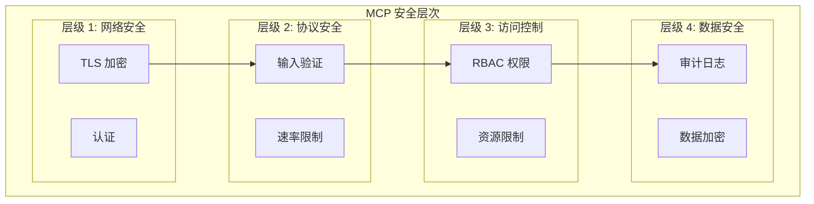

# MCP 安全与配置示例

> 本文是「MCP 服务器」系列第 2 篇（共 2 篇）。上一篇：[MCP 服务器生态与开发](mcp-servers-ecosystem.md)

## 1. 安全与权限

### 1.1 权限模型概述



### 1.2 输入验证

**参数验证装饰器：**

```python
# security/validators.py
from typing import Any, Dict, List
import re
from functools import wraps

def validate_path(path: str, allowed_dirs: List[str]) -> bool:
    """验证文件路径安全性"""
    import os
    real_path = os.path.realpath(path)

    for allowed in allowed_dirs:
        if real_path.startswith(os.path.realpath(allowed)):
            return True
    return False

def validate_sql(query: str) -> bool:
    """验证 SQL 安全性"""
    # 只允许 SELECT 语句
    dangerous_patterns = [
        r'\bDROP\b', r'\bDELETE\b', r'\bINSERT\b',
        r'\bUPDATE\b', r'\bTRUNCATE\b', r'\bALTER\b',
        r';', r'--', r'/\*', r'\*/',
    ]

    for pattern in dangerous_patterns:
        if re.search(pattern, query, re.IGNORECASE):
            return False
    return True

def validate_email(email: str) -> bool:
    """验证邮箱格式"""
    pattern = r'^[a-zA-Z0-9._%+-]+@[a-zA-Z0-9.-]+\.[a-zA-Z]{2,}$'
    return bool(re.match(pattern, email))

def sanitize_filename(filename: str) -> str:
    """清理文件名"""
    # 移除路径遍历字符
    filename = filename.replace('..', '').replace('/', '').replace('\\', '')
    # 限制长度
    return filename[:255]

class InputValidator:
    """输入验证器"""

    def __init__(self):
        self.allowed_dirs = []
        self.max_length = 10000

    def validate_tool_input(
        self,
        tool_name: str,
        args: Dict[str, Any]
    ) -> tuple[bool, List[str]]:
        """验证工具输入"""
        errors = []

        # 类型检查
        for key, value in args.items():
            if isinstance(value, str) and len(value) > self.max_length:
                errors.append(f"Parameter {key} exceeds max length")

        # 路径验证
        if 'path' in args:
            if not validate_path(args['path'], self.allowed_dirs):
                errors.append(f"Path not in allowed directories")

        # SQL 验证
        if 'query' in args and tool_name == 'execute_sql':
            if not validate_sql(args['query']):
                errors.append("SQL query contains dangerous operations")

        return len(errors) == 0, errors
```

### 1.3 访问控制

**基于角色的访问控制：**

```typescript
// security/rbac.ts

interface Role {
  name: string;
  permissions: Set<Permission>;
}

interface Permission {
  resource: string;
  actions: ('read' | 'write' | 'delete')[];
}

class AccessControl {
  private roles: Map<string, Role> = new Map();
  private userRoles: Map<string, string> = new Map();

  constructor() {
    this.initializeRoles();
  }

  private initializeRoles() {
    // 管理员角色
    this.roles.set('admin', {
      name: 'admin',
      permissions: new Set([
        { resource: '*', actions: ['read', 'write', 'delete'] },
      ]),
    });

    // 只读角色
    this.roles.set('readonly', {
      name: 'readonly',
      permissions: new Set([
        { resource: 'files', actions: ['read'] },
        { resource: 'database', actions: ['read'] },
      ]),
    });

    // 开发角色
    this.roles.set('developer', {
      name: 'developer',
      permissions: new Set([
        { resource: 'files', actions: ['read', 'write'] },
        { resource: 'database', actions: ['read'] },
        { resource: 'git', actions: ['read', 'write'] },
      ]),
    });
  }

  assignRole(userId: string, roleName: string) {
    this.userRoles.set(userId, roleName);
  }

  hasPermission(
    userId: string,
    resource: string,
    action: 'read' | 'write' | 'delete'
  ): boolean {
    const roleName = this.userRoles.get(userId);
    if (!roleName) return false;

    const role = this.roles.get(roleName);
    if (!role) return false;

    for (const permission of role.permissions) {
      if (permission.resource === '*' || permission.resource === resource) {
        if (permission.actions.includes(action)) {
          return true;
        }
      }
    }

    return false;
  }
}

// MCP 服务器集成
const accessControl = new AccessControl();

server.setRequestHandler('tools/call', async (request) => {
  const { name, arguments: args } = request.params;
  const userId = request.context?.userId;

  // 检查写权限
  if (['write_file', 'delete_file', 'update_database'].includes(name)) {
    if (!accessControl.hasPermission(userId, 'files', 'write')) {
      throw new Error('Permission denied: write access required');
    }
  }

  // 检查读权限
  if (['read_file', 'query_database'].includes(name)) {
    if (!accessControl.hasPermission(userId, 'files', 'read')) {
      throw new Error('Permission denied: read access required');
    }
  }

  // 执行工具...
});
```

### 1.4 速率限制

**速率限制实现：**

```typescript
// security/rate-limiter.ts

interface RateLimitConfig {
  windowMs: number;      // 时间窗口（毫秒）
  maxRequests: number;   // 最大请求数
}

class RateLimiter {
  private limits: Map<string, RateLimitConfig> = new Map();
  private requests: Map<string, number[]> = new Map();

  constructor() {
    // 默认限制：每分钟 60 次
    this.setLimit('default', { windowMs: 60000, maxRequests: 60 });

    // 写操作限制：每分钟 10 次
    this.setLimit('write', { windowMs: 60000, maxRequests: 10 });

    // 搜索限制：每分钟 30 次
    this.setLimit('search', { windowMs: 60000, maxRequests: 30 });
  }

  setLimit(category: string, config: RateLimitConfig) {
    this.limits.set(category, config);
  }

  checkLimit(userId: string, category: string = 'default'): boolean {
    const config = this.limits.get(category) || this.limits.get('default')!;
    const now = Date.now();

    // 获取用户请求历史
    if (!this.requests.has(userId)) {
      this.requests.set(userId, []);
    }

    const userRequests = this.requests.get(userId)!;

    // 清理过期请求
    const validRequests = userRequests.filter(
      timestamp => now - timestamp < config.windowMs
    );
    this.requests.set(userId, validRequests);

    // 检查限制
    if (validRequests.length >= config.maxRequests) {
      return false;
    }

    // 记录新请求
    validRequests.push(now);
    return true;
  }

  getRemainingRequests(userId: string, category: string = 'default'): number {
    const config = this.limits.get(category) || this.limits.get('default')!;
    const now = Date.now();

    const userRequests = this.requests.get(userId) || [];
    const validRequests = userRequests.filter(
      timestamp => now - timestamp < config.windowMs
    );

    return Math.max(0, config.maxRequests - validRequests.length);
  }
}

const rateLimiter = new RateLimiter();

server.setRequestHandler('tools/call', async (request) => {
  const { name } = request.params;

  // 确定操作类别
  let category = 'default';
  if (['write_file', 'delete_file'].includes(name)) {
    category = 'write';
  } else if (['search', 'web_search'].includes(name)) {
    category = 'search';
  }

  // 检查速率限制
  const userId = request.context?.userId;
  if (!rateLimiter.checkLimit(userId, category)) {
    throw new Error('Rate limit exceeded. Please try again later.');
  }

  // 继续执行...
});
```

### 1.5 审计日志

**审计日志实现：**

```typescript
// security/audit.ts

// 第 1 段：审计条目数据结构（记录"谁在何时对什么做了什么、结果如何"）
// 这是整条审计链路的"事实载体"：id/timestamp 由日志器统一生成，调用方只提供业务字段，
// 因此 result 与 error 互斥——一次工具调用要么成功留 result，要么失败留 error。
interface AuditEntry {
  id: string;
  timestamp: string;
  userId: string;
  action: string;
  resource: string;
  parameters: Record<string, unknown>;
  result?: unknown;
  error?: string;
  ipAddress?: string;
  userAgent?: string;
}

// 第 2 段：审计器抽象接口（面向接口编程，便于替换内存实现/远端实现）
// log 的入参用 Omit 剔除 id 和 timestamp：把"生成唯一标识与时间"的职责收归实现类，
// 避免调用方伪造或传入不一致的时间戳（审计场景下时间可信度很关键）。
interface AuditLogger {
  log(entry: Omit<AuditEntry, 'id' | 'timestamp'>): void;
  query(filter: AuditFilter): Promise<AuditEntry[]>;
  export(format: 'json' | 'csv'): Promise<string>;
}

// 第 3 段：查询过滤器（全部字段可选，多条件之间是"与"关系）
// 日期用 string 而非 Date：ISO 8601 字符串可按字典序直接比较大小，省去解析开销。
interface AuditFilter {
  userId?: string;
  action?: string;
  startDate?: string;
  endDate?: string;
  resource?: string;
}

// 第 4 段：本文件已开始隐含依赖 AuditStorage / FileAuditStorage（未在本文件定义）
class MCPAuditLogger implements AuditLogger {
  // 第 5 段：内存缓存 + 持久化后端（双写策略）
  // entries 作为查询用的热数据缓存，storage 作为落盘/远端的事实存储；
  // 注意两者并非强一致：persist 是异步的，写入失败不会回滚内存条目。
  private entries: AuditEntry[] = [];
  private storage: AuditStorage;

  constructor(storage: AuditStorage) {
    this.storage = storage;
  }

  // 第 6 段：生成审计条目 ID
  // 时间戳前缀保证大致有序，随机后缀降低同一毫秒内的碰撞概率；
  // 但 Math.random 非加密安全，仅作展示用标识，绝不能当作权限/幂等依据。
  private generateId(): string {
    return `${Date.now()}-${Math.random().toString(36).substr(2, 9)}`;
  }

  // 第 7 段：写入一条审计日志
  // 数据流：业务字段 + 生成的 id/timestamp → 完整条目 → 先入内存（保证 query 立即可见）→ 再异步持久化。
  // 易错点：persist 未被 await，若存储写入抛错会变成 unhandled rejection，且落盘顺序不保证。
  log(entry: Omit<AuditEntry, 'id' | 'timestamp'>) {
    const fullEntry: AuditEntry = {
      ...entry,
      id: this.generateId(),
      timestamp: new Date().toISOString(),
    };

    this.entries.push(fullEntry);
    this.persist(fullEntry);
  }

  private async persist(entry: AuditEntry) {
    // 写入持久化存储
    await this.storage.write(entry);
  }

  // 第 8 段：按过滤器检索内存中的条目
  // 逐个条件"短路否决"：任一条件不匹配立即返回 false，全部通过才保留。
  // 复杂度 O(n)；时间过滤依赖 ISO 字符串的字典序，任何非 ISO 格式的 timestamp 都会导致比较失真。
  async query(filter: AuditFilter): Promise<AuditEntry[]> {
    return this.entries.filter(entry => {
      if (filter.userId && entry.userId !== filter.userId) return false;
      if (filter.action && entry.action !== filter.action) return false;
      if (filter.resource && entry.resource !== filter.resource) return false;
      if (filter.startDate && entry.timestamp < filter.startDate) return false;
      if (filter.endDate && entry.timestamp > filter.endDate) return false;
      return true;
    });
  }

  // 第 9 段：导出全部条目为 JSON 或 CSV
  // JSON 用缩进 2 空格便于人工审阅；CSV 需自行处理转义——这里用 JSON.stringify 给每个单元格加引号。
  // 易错点：`|| ''` 会把 0、false 等合法假值也当作空处理；且嵌套对象会被 stringify 后内嵌引号，
  // 未做 RFC 4180 的引号翻倍转义，字段含逗号/换行时 CSV 结构可能被破坏。
  async export(format: 'json' | 'csv'): Promise<string> {
    if (format === 'json') {
      return JSON.stringify(this.entries, null, 2);
    }

    const headers = ['id', 'timestamp', 'userId', 'action', 'resource', 'result', 'error'];
    const rows = this.entries.map(e =>
      headers.map(h => JSON.stringify(e[h as keyof AuditEntry] || '')).join(',')
    );
    return [headers.join(','), ...rows].join('\n');
  }
}

// 第 10 段：集成到 MCP 服务器——用审计器包裹工具调用
// 这里采用"横切关注点"思路：在 tools/call 的统一入口处记录成功与失败两条路径，
// 使任何被注册的工具都自动获得审计能力，无需各自埋点。
// 注意：userId 等敏感上下文被原样写入 parameters/result，日志存储需同步做脱敏与访问控制。
const auditLogger = new MCPAuditLogger(new FileAuditStorage('/var/log/mcp-audit.jsonl'));

server.setRequestHandler('tools/call', async (request) => {
  const { name, arguments: args } = request.params;
  const startTime = Date.now();

  // 第 11 段：成功路径——执行工具后落审计，再把结果透传给调用方
  // 审计与业务解耦：日志写入不影响返回值；但 result 可能很大，直接入日志会放大存储开销（startTime 此处暂未使用）。
  try {
    const result = await executeTool(name, args);

    auditLogger.log({
      userId: request.context?.userId,
      action: name,
      resource: extractResource(args),
      parameters: args,
      result,
      ipAddress: request.context?.ipAddress,
    });

    return result;
  } catch (error) {
    // 第 12 段：失败路径——记录错误后原样 rethrow
    // 关键意图：审计失败不等于吞掉异常，必须继续向上抛出以保持原有错误语义。
    // 易错点：error 在 TS 中是 unknown，直接取 error.message 仅在开启宽松配置时编译通过；
    // 同时 result 与 error 不会同时存在，保证条目语义清晰。
    auditLogger.log({
      userId: request.context?.userId,
      action: name,
      resource: extractResource(args),
      parameters: args,
      error: error.message,
      ipAddress: request.context?.ipAddress,
    });

    throw error;
  }
});
```
### 1.6 安全检查清单

- 验证所有用户输入
- 使用白名单而非黑名单
- 限制文件访问路径
- 实现速率限制
- 记录所有操作
- 加密敏感数据
- 定期更新依赖
- 使用最小权限原则

## 2. 服务器配置代码示例

### 2.1 完整的 Python 服务器示例

````python
# complete_server.py
"""
完整的 MCP 服务器示例，包含工具、资源和提示
"""

from fastmcp import FastMCP
from typing import Optional
import json

# 初始化服务器
mcp = FastMCP(
    name="complete-demo-server",
    version="1.0.0",
    description="演示完整功能的 MCP 服务器"
)


# ==================== 工具定义 ====================

@mcp.tool()
def calculator(expression: str) -> dict:
    """
    安全计算器

    Args:
        expression: 数学表达式

    Returns:
        计算结果
    """
    try:
        # 安全评估（仅允许数字和运算符）
        allowed_chars = set('0123456789+-*/.() ')
        if not all(c in allowed_chars for c in expression):
            raise ValueError("Invalid characters in expression")

        result = eval(expression)
        return {
            "expression": expression,
            "result": result,
            "success": True,
        }
    except Exception as e:
        return {
            "expression": expression,
            "error": str(e),
            "success": False,
        }


@mcp.tool()
def text_process(text: str, operation: str = "upper") -> str:
    """
    文本处理工具

    Args:
        text: 输入文本
        operation: 操作类型（upper/lower/reverse）

    Returns:
        处理后的文本
    """
    if operation == "upper":
        return text.upper()
    elif operation == "lower":
        return text.lower()
    elif operation == "reverse":
        return text[::-1]
    else:
        raise ValueError(f"Unknown operation: {operation}")


@mcp.tool()
def fetch_url(url: str) -> dict:
    """
    获取 URL 内容

    Args:
        url: 目标 URL

    Returns:
        响应内容
    """
    import urllib.request

    try:
        with urllib.request.urlopen(url, timeout=10) as response:
            content = response.read().decode('utf-8')
            return {
                "url": url,
                "status": response.status,
                "content_length": len(content),
                "content": content[:1000],  # 限制返回长度
            }
    except Exception as e:
        return {
            "url": url,
            "error": str(e),
            "success": False,
        }


# ==================== 资源定义 ====================

@mcp.resource("config://app")
def get_app_config() -> str:
    """返回应用配置"""
    return json.dumps({
        "app_name": "Demo Server",
        "version": "1.0.0",
        "features": ["calculator", "text_process", "fetch_url"],
    })


@mcp.resource("file://{filename}")
def read_project_file(filename: str) -> str:
    """
    读取项目文件

    Args:
        filename: 文件名
    """
    # 安全路径检查
    import os
    base_dir = os.path.dirname(os.path.abspath(__file__))
    safe_path = os.path.join(base_dir, "data", filename)

    # 验证路径
    if not safe_path.startswith(base_dir):
        raise ValueError("Invalid file path")

    try:
        with open(safe_path, 'r', encoding='utf-8') as f:
            return f.read()
    except FileNotFoundError:
        return f"File not found: {filename}"


@mcp.resource("stats://daily")
def get_daily_stats() -> str:
    """返回每日统计"""
    return json.dumps({
        "date": "2024-01-15",
        "requests": 1234,
        "errors": 5,
        "avg_response_time_ms": 45,
    })


# ==================== 提示模板定义 ====================

@mcp.prompt()
def analyze_data(data: str, format: str = "json") -> str:
    """
    数据分析提示

    Args:
        data: 要分析的数据
        format: 数据格式（json/csv/plain）
    """
    return f"""请分析以下{format}格式的数据：

```
{data}
```

分析要点：
1. 数据结构和完整性
2. 潜在的模式和趋势
3. 异常值和错误
4. 改进建议"""


@mcp.prompt()
def code_explanation(code: str, language: str = "python") -> str:
    """
    代码解释提示

    Args:
        code: 代码片段
        language: 编程语言
    """
    return f"""请解释以下{language}代码的功能：

```{language}
{code}
```

提供：
1. 代码功能概述
2. 关键组件说明
3. 可能的改进建议
4. 相关最佳实践"""


# ==================== 主函数 ====================

if __name__ == "__main__":
    print("Starting Complete Demo MCP Server...")
    print("Available tools: calculator, text_process, fetch_url")
    print("Available resources: config://app, file://{filename}, stats://daily")
    print("Available prompts: analyze_data, code_explanation")

    # 启动服务器
    mcp.run()
````

### 2.2 完整的 TypeScript 服务器示例

```typescript
// complete-server.ts
/**
 * 完整的 TypeScript MCP 服务器示例
 */

import { MCPServer, Tool, Resource, Prompt } from '@modelcontextprotocol/sdk';
import { StdioServerTransport } from '@modelcontextprotocol/sdk/server/stdio';

// 创建服务器
const server = new MCPServer({
  name: 'complete-typescript-server',
  version: '1.0.0',
  description: '演示完整功能的 TypeScript MCP 服务器',
});

// ==================== 类型定义 ====================

interface CalculatorResult {
  expression: string;
  result?: number;
  error?: string;
  success: boolean;
}

interface FetchResult {
  url: string;
  status?: number;
  content_length?: number;
  content?: string;
  error?: string;
  success: boolean;
}

// ==================== 工具定义 ====================

const tools: Tool[] = [
  {
    name: 'calculator',
    description: '安全计算器 - 仅支持基本数学运算',
    inputSchema: {
      type: 'object',
      properties: {
        expression: {
          type: 'string',
          description: '数学表达式（如 2+2*3）',
        },
      },
      required: ['expression'],
    },
  },
  {
    name: 'text_process',
    description: '文本处理工具',
    inputSchema: {
      type: 'object',
      properties: {
        text: {
          type: 'string',
          description: '输入文本',
        },
        operation: {
          type: 'string',
          enum: ['upper', 'lower', 'reverse'],
          default: 'upper',
          description: '操作类型',
        },
      },
      required: ['text'],
    },
  },
  {
    name: 'fetch_url',
    description: '获取 URL 内容',
    inputSchema: {
      type: 'object',
      properties: {
        url: {
          type: 'string',
          description: '目标 URL',
          format: 'uri',
        },
      },
      required: ['url'],
    },
  },
];

// ==================== 资源定义 ====================

const resources: Resource[] = [
  {
    uri: 'config://app',
    name: 'Application Config',
    description: '应用配置信息',
    mimeType: 'application/json',
  },
  {
    uri: 'stats://daily',
    name: 'Daily Statistics',
    description: '每日统计数据',
    mimeType: 'application/json',
  },
];

// ==================== 提示模板定义 ====================

const prompts: Prompt[] = [
  {
    name: 'analyze_data',
    description: '数据分析提示',
    arguments: [
      { name: 'data', description: '要分析的数据', required: true },
      { name: 'format', description: '数据格式', required: false },
    ],
  },
  {
    name: 'code_explanation',
    description: '代码解释提示',
    arguments: [
      { name: 'code', description: '代码片段', required: true },
      { name: 'language', description: '编程语言', required: false },
    ],
  },
];

// ==================== 请求处理器 ====================

// 工具列表
server.setRequestHandler('tools/list', async () => ({ tools }));

// 工具调用
server.setRequestHandler('tools/call', async (request) => {
  const { name, arguments: args } = request.params;

  switch (name) {
    case 'calculator':
      return handleCalculator(args.expression as string);

    case 'text_process':
      return handleTextProcess(
        args.text as string,
        args.operation as string
      );

    case 'fetch_url':
      return await handleFetchUrl(args.url as string);

    default:
      throw new Error(`Unknown tool: ${name}`);
  }
});

// 资源列表
server.setRequestHandler('resources/list', async () => ({
  resources,
}));

// 资源读取
server.setRequestHandler('resources/read', async (request) => {
  const { uri } = request.params;

  if (uri === 'config://app') {
    return {
      contents: [{
        type: 'resource',
        mimeType: 'application/json',
        text: JSON.stringify({
          app_name: 'Complete TypeScript Server',
          version: '1.0.0',
          features: ['calculator', 'text_process', 'fetch_url'],
        }),
      }],
    };
  }

  if (uri === 'stats://daily') {
    return {
      contents: [{
        type: 'resource',
        mimeType: 'application/json',
        text: JSON.stringify({
          date: new Date().toISOString().split('T')[0],
          requests: 1234,
          errors: 5,
        }),
      }],
    };
  }

  throw new Error(`Unknown resource: ${uri}`);
});

// 提示列表
server.setRequestHandler('prompts/list', async () => ({ prompts }));

// 提示获取
server.setRequestHandler('prompts/get', async (request) => {
  const { name, arguments: args } = request.params;

  if (name === 'analyze_data') {
    return {
      messages: [{
        role: 'user',
        content: `请分析以下数据：\n\n\`\`\`\n${args.data}\n\`\`\``,
      }],
    };
  }

  if (name === 'code_explanation') {
    const lang = (args.language as string) || 'typescript';
    return {
      messages: [{
        role: 'user',
        content: `请解释以下${lang}代码：\n\n\`\`\`${lang}\n${args.code}\n\`\`\``,
      }],
    };
  }

  throw new Error(`Unknown prompt: ${name}`);
});

// ==================== 工具处理器 ====================

function handleCalculator(expression: string): { contents: Array<{type: string; text: string}> } {
  try {
    // 安全验证
    if (!/^[\d\s+\-*/().]+$/.test(expression)) {
      throw new Error('Invalid characters in expression');
    }

    const result = Function(`"use strict"; return (${expression})`)();

    return {
      contents: [{
        type: 'text',
        text: JSON.stringify({
          expression,
          result,
          success: true,
        }),
      }],
    };
  } catch (error) {
    return {
      contents: [{
        type: 'text',
        text: JSON.stringify({
          expression,
          error: (error as Error).message,
          success: false,
        }),
      }],
    };
  }
}

function handleTextProcess(text: string, operation: string): { contents: Array<{type: string; text: string}> } {
  let result: string;

  switch (operation) {
    case 'upper':
      result = text.toUpperCase();
      break;
    case 'lower':
      result = text.toLowerCase();
      break;
    case 'reverse':
      result = text.split('').reverse().join('');
      break;
    default:
      throw new Error(`Unknown operation: ${operation}`);
  }

  return {
    contents: [{
      type: 'text',
      text: result,
    }],
  };
}

async function handleFetchUrl(url: string): Promise<{ contents: Array<{type: string; text: string}> }> {
  try {
    const response = await fetch(url);
    const content = await response.text();

    return {
      contents: [{
        type: 'text',
        text: JSON.stringify({
          url,
          status: response.status,
          content_length: content.length,
          content: content.slice(0, 1000),
          success: true,
        }),
      }],
    };
  } catch (error) {
    return {
      contents: [{
        type: 'text',
        text: JSON.stringify({
          url,
          error: (error as Error).message,
          success: false,
        }),
      }],
    };
  }
}

// ==================== 启动 ====================

async function main() {
  console.log('Starting Complete TypeScript MCP Server...');
  console.log('Available tools:', tools.map(t => t.name).join(', '));
  console.log('Available resources:', resources.map(r => r.uri).join(', '));
  console.log('Available prompts:', prompts.map(p => p.name).join(', '));

  const transport = new StdioServerTransport();
  await server.connect(transport);
}

main().catch(console.error);
```

### 2.3 Docker 化 MCP 服务器

**Dockerfile：**

```dockerfile
# Dockerfile
FROM python:3.11-slim

WORKDIR /app

# 安装依赖
COPY requirements.txt .
RUN pip install --no-cache-dir -r requirements.txt

# 复制代码
COPY src/ ./src/

# 设置入口点
ENV PYTHONPATH=/app
CMD ["python", "-m", "src.server"]
```

**docker-compose.yml：**

```yaml
# docker-compose.yml
version: '3.8'

services:
  mcp-server:
    build: .
    environment:
      - DATABASE_URL=${DATABASE_URL}
      - API_KEY=${API_KEY}
    volumes:
      - ./data:/app/data
      - ./logs:/app/logs

  mcp-client:
    image: node:20
    depends_on:
      - mcp-server
    environment:
      - MCP_SERVER_URL=http://mcp-server:8080
```

### 2.4 服务器健康检查

```typescript
// health-check.ts

// 第 1 段：定义健康状态的数据契约（接口）
// 该接口是"对外暴露"的稳定契约：调用方（监控系统、负载均衡、k8s 探针）只需依赖它，
// 不必知道 HealthMonitor 内部如何统计。注意 tools 使用索引签名，允许多个工具动态注册，
// 而 requests 是固定字段，保证统计口径不可被随意扩展。
interface HealthStatus {
  status: 'healthy' | 'degraded' | 'unhealthy';
  uptime: number;
  requests: {
    total: number;
    success: number;
    failed: number;
  };
  tools: {
    [name: string]: {
      available: boolean;
      lastUsed?: string;
    };
  };
  timestamp: string;
}

// 第 2 段：HealthMonitor 类的实例状态初始化
// startTime 在"对象构造时"就固定下来，作为 uptime 的零点；stats 用可变对象累积计数，
// 让 recordRequest 保持 O(1) 的写入成本，避免每次请求都做聚合计算。
class HealthMonitor {
  private startTime = Date.now();
  private stats = {
    total: 0,
    success: 0,
    failed: 0,
  };

  // 第 3 段：请求计数（热路径）
  // 这是每次请求都会调用的高频方法，所以只做自增，不做 IO、不做时间戳记录。
  // 不变式：total === success + failed 始终成立，后续计算错误率时依赖这一点。
  recordRequest(success: boolean) {
    this.stats.total++;
    if (success) {
      this.stats.success++;
    } else {
      this.stats.failed++;
    }
  }

  // 第 4 段：把内部统计"快照"成对外的 HealthStatus
  // 这里是一个纯读取 + 组装的过程：先算出 uptime 与错误率，再按阈值映射成三档状态。
  // 边界条件：total 为 0 时不能做除法，否则得到 NaN，会让后续所有比较都为 false，
  // 进而错误地落进 unhealthy 分支，因此显式把错误率兜底为 0。
  getStatus(): HealthStatus {
    const uptime = Date.now() - this.startTime;
    const errorRate = this.stats.total > 0
      ? this.stats.failed / this.stats.total
      : 0;

    // 第 5 段：错误率 -> 健康档位的阈值判定
    // 阈值语义是"上界不含"：1% 以下算 healthy，1%~10% 算 degraded，10% 及以上算 unhealthy。
    // 顺序敏感的 if/else if 链保证了区间互斥且覆盖全集，不会出现未赋值的情况。
    let status: 'healthy' | 'degraded' | 'unhealthy';
    if (errorRate < 0.01) {
      status = 'healthy';
    } else if (errorRate < 0.1) {
      status = 'degraded';
    } else {
      status = 'unhealthy';
    }

    // 第 6 段：组装返回体
    // requests 直接引用 this.stats，等于把可变内部状态"裸露"给调用方，
    // 调用方若修改返回对象会污染监控计数——这是此处为性能牺牲封装性的取舍点。
    // timestamp 每次实时生成 ISO 字符串，用于下游判断数据新鲜度。
    return {
      status,
      uptime,
      requests: this.stats,
      tools: this.getToolStatus(),
      timestamp: new Date().toISOString(),
    };
  }

  // 第 7 段：工具可用性探测（当前为静态桩实现）
  // 注意 calculator 的 lastUsed 每次调用都被刷成"现在"，会让它看起来总是刚被用过；
  // 真实实现应替换为从工具注册表/心跳中读取，这里是用于演示的占位逻辑。
  // text_process 与 fetch_url 未提供 lastUsed，正好对应接口中的可选字段。
  private getToolStatus() {
    return {
      calculator: { available: true, lastUsed: new Date().toISOString() },
      text_process: { available: true },
      fetch_url: { available: true },
    };
  }
}

// 第 8 段：注册健康检查端点
// 把协议层（server）与业务层（HealthMonitor）解耦：handler 只负责取值转发，
// 不包含任何判定逻辑，便于单测直接针对 HealthMonitor，也便于替换传输实现。
// 注意这里假设 healthMonitor 是模块级单例，否则每次调用会拿到不同的计数状态。
server.setRequestHandler('health/check', async () => {
  return healthMonitor.getStatus();
});
```
## 3. 参考资源

- [MCP Official Documentation](https://modelcontextprotocol.io)
- [MCP Python SDK](https://github.com/modelcontextprotocol/python-sdk)
- [MCP TypeScript SDK](https://github.com/modelcontextprotocol/typescript-sdk)
- [Official MCP Servers](https://github.com/modelcontextprotocol/servers)
- [awesome-mcp-servers](https://github.com/punkpeye/awesome-mcp-servers)
- [FastMCP Documentation](https://fastmcp.readthedocs.io/)

## 深入阅读与参考

!!! tip "怎么用这些资料"
    先读「官方文档与规范」建立准确的概念，再读「源码与示例」核对细节，最后用「教程、书籍与视频」换一种讲法加深理解。每条都写明了读哪一节、带着什么问题读。

### 官方文档与规范

| 资源 | 为什么读 | 怎么读 |
|---|---|---|
| [MCP 规范](https://modelcontextprotocol.io/specification) | transport 与 lifecycle 是连接与权限安全的基础，必须逐条核对。 | 读 transport 与 lifecycle 两章，带着“我的服务器是否合规”列差异清单。 |
| [MCP 规范（最新版本）](https://modelcontextprotocol.io/specification/latest) | 最新规范含版本变更，避免 SDK 与协议版本错配带来的风险。 | 查版本变更一节，确认 SDK 对应协议版本，再回看安全相关条目。 |
| [MCP 架构概念](https://modelcontextprotocol.io/docs/learn/architecture) | 搞清 host/client/server 与三类能力，才能划清权限边界。 | 对照 tools、resources、prompts 为你的场景各举一例，标注权限需求。 |
| [MCP Tools 概念](https://modelcontextprotocol.io/docs/concepts/tools) | tool schema 是输入校验与权限拦截的第一道门。 | 为一个 API 设计 schema，写明描述与校验规则，再实现拒绝非法输入。 |
| [MCP 入门介绍](https://modelcontextprotocol.io/docs/getting-started/intro) | 先建立整体心智模型，后面的安全讨论才有落点。 | 读完后画出 host、client、server 关系图，标出信任边界与凭据位置。 |

### 源码与示例

| 资源 | 为什么读 | 怎么读 |
|---|---|---|
| [MCP 官方服务器集合](https://github.com/modelcontextprotocol/servers) | 官方实现是安全写法的参照，可直接对照仿写。 | 精读 filesystem 服务器源码，重点看路径校验，再仿写一个自己的服务器。 |
| [MCP TypeScript SDK](https://github.com/modelcontextprotocol/typescript-sdk) | README 即最小可用示例，能快速跑通自己的服务器。 | 按 README 搭一个 stdio 服务器接入本地客户端，跑通后再加权限校验。 |
| [MCP Inspector](https://github.com/modelcontextprotocol/inspector) | 能直观看到原始消息，便于排查越权与参数异常。 | 连上你的服务器逐个调用工具，观察原始请求响应并记录异常参数处理。 |
| [MCP Python SDK](https://github.com/modelcontextprotocol/python-sdk) | FastMCP 代码量小，适合练手并补上权限控制。 | 用 FastMCP 写数据库查询工具，只开放只读查询并加参数白名单。 |

### 教程、书籍与视频

| 资源 | 为什么读 | 怎么读 |
|---|---|---|
| [Claude Code MCP](https://docs.anthropic.com/en/docs/claude-code/mcp) | 真实客户端接入流程，能看清权限确认的每一步。 | 接入文件系统或 GitHub 服务器完成读写任务，留意每步权限提示。 |
| [Hugging Face MCP 课程](https://huggingface.co/learn/mcp-course/unit0/introduction) | 系统课程，从零到跑通服务器，覆盖配置细节。 | 完成第一单元并构建一个 MCP 服务器，重点记录配置与权限设置。 |
| [Hugging Face MCP Course](https://huggingface.co/learn/mcp-course) | 含客户端实现，便于理解双向交互与信任关系。 | 跟着实现服务器与客户端，跑通后思考客户端该信任哪些返回值。 |

## 应用与行业实践

### 应用场景地图

| 场景 | 用到本页哪个知识点 | 典型技术选型 | 注意事项 |
|---|---|---|---|
| 后台管理的万行表格批量改价 | 作用域检查、写工具人工确认、审计日志 | stdio 或内网 HTTP MCP、幂等键、数据库唯一索引 | 单次行数上限、预览后一致性检查、拒绝无审计存储 |
| 多人协作白板的画布元素批注 | 逐用户令牌、元素级 ACL、会话隔离 | 远程 HTTP MCP、OAuth 2.1、网关速率限制 | 令牌不写仓库、超时设 5 秒内、元素 ID 必须稳定 |
| 低端安卓的首屏加载未读工单摘要 | 客户端超时、缓存降级、结果脱敏 | 远程 MCP、AbortController、本地 JSON 缓存 | 首屏预算内调用、缓存加密、令牌短期有效 |
| 数据分析师的自然语言 SQL 查询 | 只读账号、行级安全、输入校验 | 远程 MCP、PostgreSQL RLS、查询超时 | 禁止多语句、限制返回行数、脱敏字段 |
| IDE 内助手读取本地仓库文件 | stdio 传输、根目录白名单、环境变量密钥 | 本地 MCP 服务器、`docs/` 目录、`.gitignore` | 根目录不指向家目录、禁止写工具、密钥不落盘 |
| 客服坐席查询订单与退款状态 | 工具级作用域、租户隔离、审计 | 远程 MCP、逐用户令牌、租户字段过滤 | 按租户过滤、退款写操作走独立审批、日志含订单号 |
| CI/CD 流水线里的构建失败归因 | 最小权限服务账号、只读日志、超时 | stdio MCP、服务账号令牌、OpenTelemetry | 令牌仅限读日志、不触发重跑、失败不阻塞流水线 |
| 企业内部知识库的权限过滤检索 | 检索结果 ACL、令牌作用域、审计 | 远程 MCP、文档 ACL、向量库过滤 | 先过滤再排序、禁止返回无权限文档、记录查询人 |

### 三个场景拆解

#### 场景 1：后台管理的万行表格批量改价

**业务背景**：运营需要在后台表格里选 500 到 2000 行商品改价，人工逐行提交耗时，误操作会直接影响线上价格。痛点是一次写操作影响面大，权限与审计必须可追溯。规模量级：单次选中行数从几十到几千，日改价批次从个位数到几十。

**怎么用本页知识解决**：思路是读写分离，先让助手预览改动，再让有写权限的人确认。服务端只接受幂等写请求，并把每次调用写入审计日志。

```python
# 伪代码：MCP 工具服务端的写操作防护
def apply_price_change(rows, idempotency_key, user):
    require_scope(user, "pricing:write")          # 检查令牌作用域
    if len(rows) > 200:                           # 限制单次批量行数
        raise ValueError("单次最多 200 行")
    if not rows_unchanged_since_preview(rows):    # 预览后数据未被他人改动
        raise ConflictError("价格已变化，请重新预览")
    return db.execute_idempotent(                 # 幂等键防重复提交
        "update price", rows, idempotency_key
    )
```

- `require_scope` 先判断调用者有没有写权限，无权限立即拒绝。
- `len(rows) > 200` 把爆炸半径压到可人工复核的范围。
- `rows_unchanged_since_preview` 防止预览后他人改价，避免覆盖写。
- `execute_idempotent` 用幂等键保证重试不会重复扣减或重复改价。

**怎么度量收益**：
- 越权写失败次数：查审计日志字段 `authz_denied`，按天分组。
- 重复提交率：查数据库唯一索引冲突计数，用 SQL `count(*)` 统计。
- 人工确认覆盖率：前端埋点 `confirm_shown` 与 `apply_clicked` 的比值。
- 审计完整率：用脚本检查每条写操作是否含 `user_id`、`idempotency_key`、`before`、`after`。

**什么时候不该用**：
- 如果价格表没有 `updated_at` 或版本号，无法做预览后一致性检查，不要开放批量写工具。
- 如果业务要求一次改 1 万行以上且不允许分批，不要用 MCP 工具同步调用，改用异步任务队列。
- 如果没有独立审计存储，不要开放写工具。

#### 场景 2：多人协作白板的画布元素批注

**业务背景**：多人同时编辑白板，AI 助手需要读取选中元素并生成批注，但不能看到其他租户或私有画板内容。规模量级：单个画板元素从几十到上千，同时在线人数从 2 到 20。

**怎么用本页知识解决**：用远程 MCP 加逐用户令牌，服务端按元素 ACL 过滤。会话隔离和速率限制放在网关，超时避免阻塞画布交互。

```jsonc
{
  "mcpServers": {
    "whiteboard": {
      "type": "http",                                  // 远程传输
      "url": "https://<内网域名>/mcp/whiteboard",       // 内网入口
      "headers": {
        "Authorization": "Bearer ${WHITEBOARD_TOKEN}"   // 从密钥管理器注入
      },
      "timeout": 5000
    }
  }
}
```

- 字段名按所选客户端核对，不要把令牌明文写进仓库。
- `type` 选远程传输，白板服务不暴露到公网，只走内网入口。
- `timeout` 设 5 秒以内，超时后前端显示重试，不卡住画布。
- 服务端按元素 ACL 过滤，只返回当前用户有权限的元素。
- 令牌绑定用户与会话，换用户或换画板时重新签发。

**怎么度量收益**：
- 越权读取拦截数：服务端日志 `acl_denied_total`，用 Prometheus 计数。
- 批注响应耗时：OpenTelemetry span `mcp.tool.annotate` 的 P95。
- 令牌复用异常：按 `session_id` 分组，统计同一令牌来自不同用户 IP 的次数。
- 速率限制触发数：网关 429 响应计数，按用户分组查看。

**什么时候不该用**：
- 如果白板元素没有稳定 ID 和 ACL 字段，不要做元素级过滤，先补数据模型。
- 如果用户离线协作且网络不稳定，不要依赖远程 MCP 同步批注，改用本地合并。
- 如果画板内容属于高敏感且无法做端到端加密，不要经过远程 MCP。

#### 场景 3：低端安卓的首屏加载未读工单摘要

**业务背景**：低端安卓设备在弱网下打开客服 App，首屏需要显示未读工单摘要，AI 助手根据摘要生成建议回复。规模量级：首屏预算通常在 1 秒内，弱网 RTT 从 200ms 到 2s。

**怎么用本页知识解决**：MCP 工具调用设超时，失败读本地缓存。令牌短期有效并绑定用户，返回前做脱敏。

```js
async function loadUnreadTickets(mcp, userId) {
  const controller = new AbortController();
  const timer = setTimeout(() => controller.abort(), 800); // 首屏预算 800ms
  try {
    const res = await mcp.callTool("list_unread_tickets", { userId },
      { signal: controller.signal });                      // 超时即中止
    return maskPII(res);                                   // 返回前脱敏
  } catch (e) {
    return localCache.get(userId);                         // 降级读缓存
  } finally {
    clearTimeout(timer);
  }
}
```

- 方法名按所用 SDK 调整，核心是给调用加可取消的超时。
- `AbortController` 在超时后取消请求，避免占用首屏线程。
- `maskPII` 在结果进入 UI 前去掉手机号、地址等字段。
- `localCache` 只在网络失败时使用，缓存内容加密并设过期时间。
- 令牌按用户短期签发，服务端校验 `userId` 与令牌 subject 一致。

**怎么度量收益**：
- 首屏可交互时间：用 Perfetto 看 `first_frame`，或用 Android Studio Profiler 看冷启动。
- MCP 调用 P95 与超时率：OpenTelemetry `mcp.client.call` span，按设备分桶。
- 缓存命中率：客户端事件 `cache_hit` 与 `cache_miss` 的比值。
- 脱敏违规数：日志扫描 `pii_leak` 标记，按周统计。

**什么时候不该用**：
- 如果设备没有本地缓存且网络不可用，不要阻塞首屏等待 MCP。
- 如果工单摘要包含高敏感字段且无法在客户端脱敏，不要缓存在本地。
- 如果令牌无法按用户短期签发，不要放在移动端。

### 行业先进实践

**OAuth 2.1 与资源指示器（出处：MCP 官方规范文档 "Authorization"）**。MCP 授权流程基于 OAuth 2.1，客户端拿到的令牌要绑定目标资源服务器。这样跨服务器复用令牌会被拒绝。项目里给每个 MCP 服务器注册独立 audience，网关校验 audience 后再放行。

**工具输入 JSON Schema 校验（出处：MCP 官方规范文档 "Tools"）**。工具声明 inputSchema，服务端在调用前按 schema 校验参数。项目里对字符串设最大长度，对枚举只放允许值，拒绝额外字段。

**细粒度个人访问令牌（出处：GitHub 官方文档 "Fine-grained personal access tokens"）**。令牌按仓库与权限粒度签发，权限范围可逐项勾选。项目里把 MCP 令牌按工具与数据范围拆分，不发放全库写权限。

**行级安全策略（出处：PostgreSQL 官方文档 "Row Security Policies"）**。数据库按当前角色过滤行，应用层漏写条件时仍不越权。项目里让数据分析 MCP 使用只读账号，并在表上启用行级安全策略。

**结构化追踪语义约定（出处：OpenTelemetry 官方文档 "Semantic Conventions"）**。用统一属性记录服务名、操作名、状态码，追踪数据可跨系统查询。项目里为每次 MCP 工具调用生成 span，敏感参数写哈希值。

### 从学到用：落地路线

**第 1 步：只读试点**。选一个只读 MCP 服务器，例如本地仓库文件读取，在单个团队内启用。验收标准：该服务器只暴露读工具，令牌作用域列表不含写权限。

**第 2 步：验证防护**。加入输入校验、超时、审计日志，跑越权与异常输入用例。验收标准：越权调用返回拒绝，异常输入不触发下游写操作，日志含 `user_id` 与 `tool_name`。

**第 3 步：推广模板**。把作用域、审计、超时模板复制到第二个服务器，先内部用户再扩大。验收标准：新服务器接入后审计字段齐全率 100%，P95 延迟在预算内。

**第 4 步：防止回退**。把配置检查放进 CI，合并前扫描令牌、根目录、工具白名单。验收标准：CI 阻止明文密钥与全权限令牌合并，每月复核一次作用域清单。

### 动手作业

**目标**：给一个本地文件读取 MCP 服务器加权限与审计，只允许读取指定目录，所有工具调用写入本地审计日志，越权返回明确错误。

**步骤**：
1. 选一个支持 stdio 的 MCP 客户端与一个文件系统 MCP 服务器，确认能列出文件。
2. 在客户端配置里把服务器根目录限制到项目下的 `docs/`。
3. 给服务器加环境变量 `MCP_READONLY=1`，启动时检查，未设置则拒绝启动。
4. 为工具调用加 `user_id` 与 `tool_name` 字段，写入本地 JSONL 审计文件。
5. 写测试脚本，尝试读取 `docs/` 外的文件，确认返回错误。
6. 写第二个测试脚本，发送超长路径与空参数，确认被输入校验拒绝。
7. 把配置与测试脚本放进仓库，在 CI 中运行。

**验收标准**：
- 读取 `docs/` 外文件时返回权限错误，`docs/` 内文件可正常读取。
- 审计文件每行包含时间、工具名、参数摘要、结果状态。
- 未设置 `MCP_READONLY=1` 时服务器拒绝启动。
- 超长路径与空参数测试返回校验错误，不产生文件读取。
- CI 运行时测试全部通过，仓库中不出现明文令牌。

