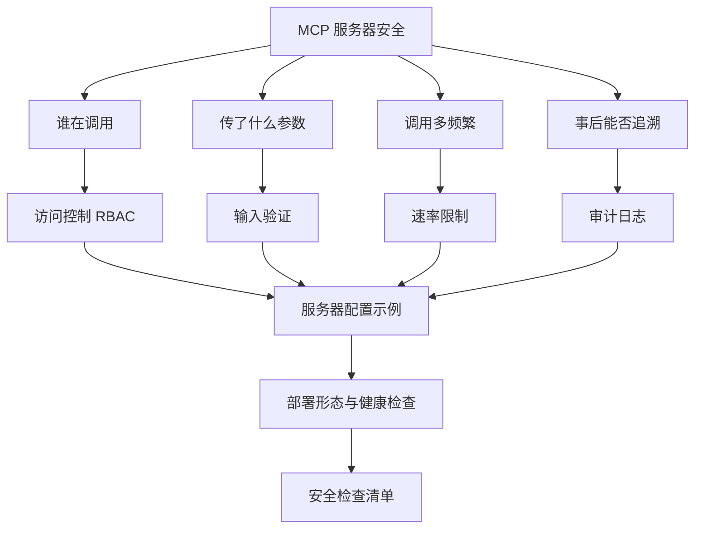
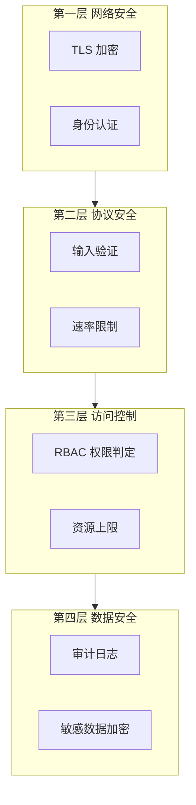
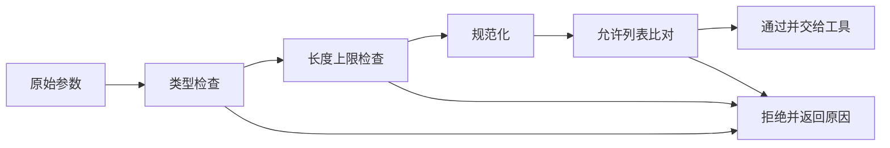
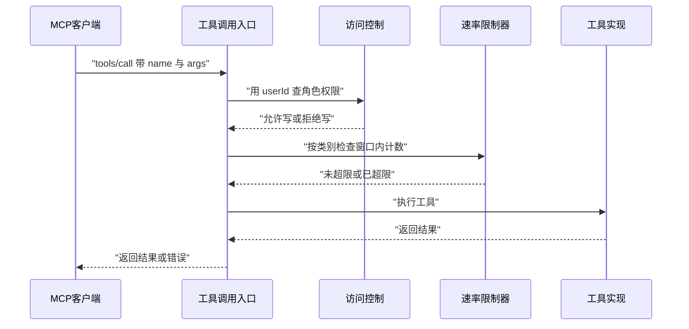
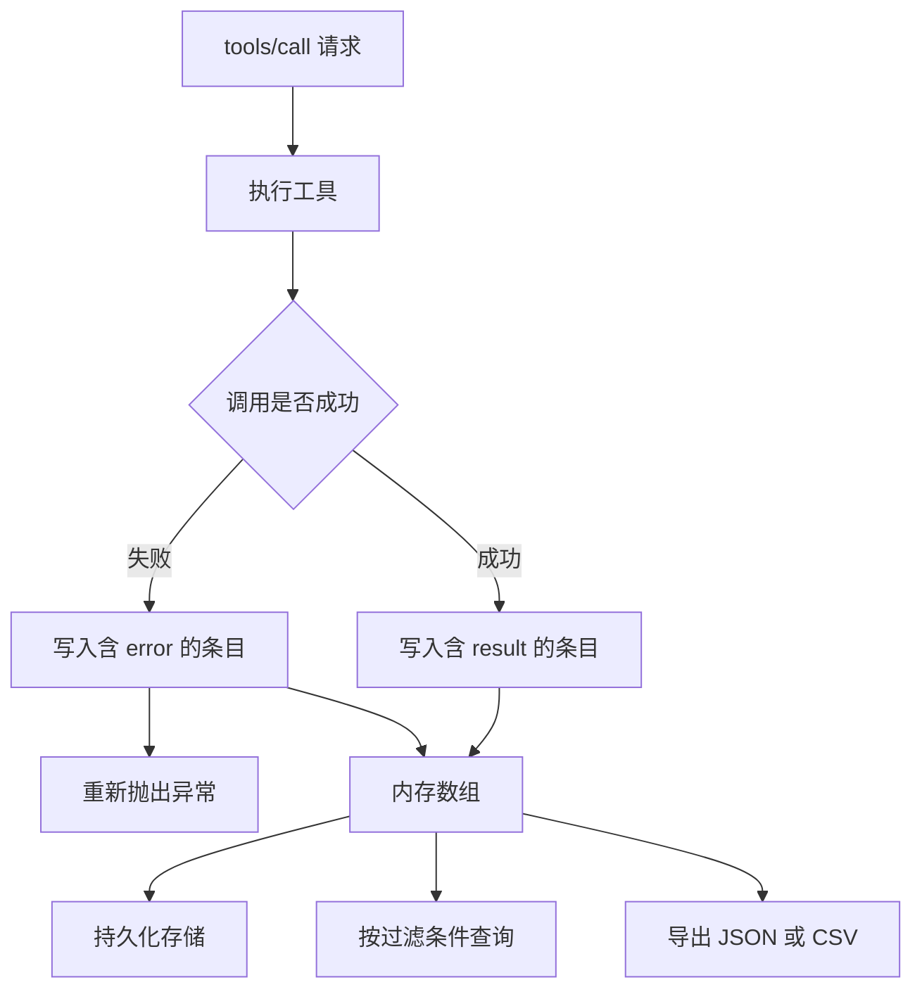
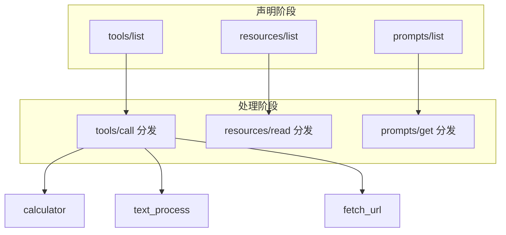
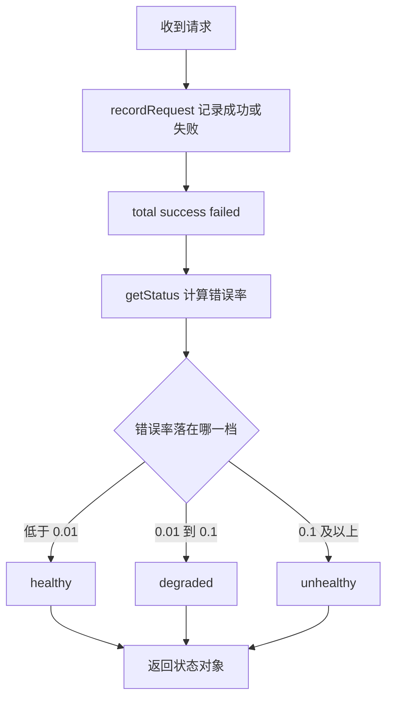

# MCP 安全与配置示例

!!! abstract "学完这一页你能"

    - 说出 MCP 服务器的四层防护各自拦什么，以及每一层被绕过后会出什么事。
    - 写出带路径边界检查的输入验证函数，并用测试用例证明它挡住了路径遍历。
    - 用「角色到权限」的映射实现 RBAC 判定，并解释通配符权限要单独处理的原因。
    - 用滑动窗口计数器实现速率限制，并写出一份不依赖第三方库的可运行验证脚本。

!!! note "术语：MCP"

    MCP 是 Model Context Protocol（模型上下文协议）的缩写，它规定客户端与服务器之间如何用 JSON-RPC 交换工具、资源、提示三类能力。例子：客户端发出 tools/call 请求，服务器执行对应工具后把结果返回给模型。

## 0. 知识地图



建议的读法如下。

- 第 1 节先建立「四层依次生效」的整体框架，后面每一节都是给其中一层填实现。
- 第 2 到第 4 节按「参数、身份、频率、事后记录」四条线索展开，彼此独立，可以跳读。
- 第 5、6 节把前面的检查装进一台能跑起来的服务器，再落到部署和清单。

## 1. 四层防护模型与权限分层

**先想一个问题**

你写了一个能读写项目文件的 MCP 服务器，同事在本地接上客户端，只说了一句「帮我清理临时文件」。模型据此决定调用 delete_file。这一刻，你的代码里谁在拦它？

**心智模型**

!!! tip "心智模型"

    一句话模型：安全不是单个开关，而是四道依次生效的关卡，前一道没过就不进下一道。

    日常类比：进机房要先过门禁、再登记、再领权限卡、进操作间后留下录像。

    类比不成立的地方：机房的门是物理串联，关上一道后面的门就摸不到；软件的四层各自独立生效，TLS 配好了不会替你做输入验证。

**图解**



按图里的顺序逐步解读。

1. 第一层处理「连接是不是可信的」：TLS 加密防止传输过程被读取，身份认证确认调用方是谁。
2. 第二层处理「请求本身是不是合法的」：输入验证过滤参数内容，速率限制控制单位时间内的调用次数。
3. 第三层处理「这个人有没有资格做这件事」：RBAC 判定角色权限，资源上限限制单次操作的影响范围。
4. 第四层处理「做完之后能不能查」：审计日志记录每次调用，敏感数据加密降低日志泄露后的损失。

**一步一步来**

**第一步：把四层写成四个独立判定函数**

这一步要做什么：给每一层定义一个只回答「过或不过」的函数，让调用方按顺序执行。

```ts
// layers.ts —— 四层防护的判定骨架
type Decision = { ok: true } | { ok: false; layer: string; reason: string };

// 第一层：传输与认证
function checkNetwork(ctx: { encrypted: boolean; userId?: string }): Decision {
  if (!ctx.encrypted) return { ok: false, layer: 'network', reason: 'TLS required' };
  if (!ctx.userId) return { ok: false, layer: 'network', reason: 'unauthenticated' };
  return { ok: true };
}

// 第二层：输入验证，细节见第 2 节
function checkProtocol(ctx: { args: Record<string, unknown> }): Decision {
  const keys = Object.keys(ctx.args);
  if (keys.length === 0) return { ok: false, layer: 'protocol', reason: 'empty args' };
  return { ok: true };
}

// 第三层：权限判定，细节见第 3 节
const WRITE_TOOLS = new Set(['write_file', 'delete_file']);
function checkAccess(ctx: { tool: string; canWrite: boolean }): Decision {
  if (WRITE_TOOLS.has(ctx.tool) && !ctx.canWrite) {
    return { ok: false, layer: 'access', reason: 'write permission denied' };
  }
  return { ok: true };
}
```

**这段代码在做什么**

- Decision 是可辨识联合类型，ok 为 true 时没有额外字段，为 false 时带上是哪一层拒绝的。
- checkNetwork 同时检查加密状态与身份，未认证的请求在这里就被挡住。
- checkProtocol 只做入口级的粗筛，字段级校验留给第 2 节的验证器。
- WRITE_TOOLS 用 Set 而不是数组，判断复杂度为 O(1)，与工具数量无关。
- 三个函数都不抛异常，返回值交给上层决定是否中断，便于记录拒绝原因。

**第二步：按顺序执行并在第一个失败处停下**

这一步要做什么：写一个执行器串起四层，任何一层返回失败就立刻返回，不再执行后面的层。

```ts
// pipeline.ts —— 顺序执行，遇错短路
const LAYERS = ['network', 'protocol', 'access'] as const;

function runPipeline(ctx: any): { allowed: boolean; blockedAt: string | null } {
  // 遍历层名，任一层的判定失败直接返回
  for (const layer of LAYERS) {
    const decision =
      layer === 'network' ? checkNetwork(ctx)
      : layer === 'protocol' ? checkProtocol(ctx)
      : checkAccess(ctx);
    // 短路点：返回失败时不再执行后续层
    if (!decision.ok) return { allowed: false, blockedAt: layer };
  }
  return { allowed: true, blockedAt: null };
}
```

**这段代码在做什么**

- LAYERS 用 as const 固定顺序，避免后面有人随意调整层的先后。
- 循环里按层名分派到对应函数，层与函数一一对应。
- 短路是这段代码的核心：一旦某层返回失败就立刻 return，后续层不会执行。
- 返回值只暴露 allowed 与 blockedAt，调用方不需要知道每层内部细节。
- 这个函数不写日志，日志由第 4 节的审计器统一负责，职责分离。

**动手验证**

下面这份脚本把上面的判定合成一个文件，用 node:assert 断言短路行为。环境要求：Node 20 以上，无第三方依赖。

```js
// verify-layers.mjs —— 运行：node verify-layers.mjs
import assert from 'node:assert/strict';

const WRITE_TOOLS = new Set(['write_file', 'delete_file']);

function runPipeline(ctx) {
  const trace = [];
  const steps = [
    ['network', () => (ctx.encrypted && ctx.userId ? null : 'TLS or auth missing')],
    ['protocol', () => (Object.keys(ctx.args ?? {}).length > 0 ? null : 'empty args')],
    ['access', () => (WRITE_TOOLS.has(ctx.tool) && !ctx.canWrite ? 'no write permission' : null)],
  ];
  // 逐层执行，任一层返回原因字符串就记录并中断
  for (const [name, fn] of steps) {
    trace.push(name);
    const reason = fn();
    if (reason) return { allowed: false, blockedAt: name, reason, trace };
  }
  return { allowed: true, blockedAt: null, reason: null, trace };
}

// 用例 1：未加密，第一层就拒绝
const r1 = runPipeline({ encrypted: false, userId: 'u1', tool: 'read_file', args: { path: 'a' }, canWrite: false });
assert.equal(r1.blockedAt, 'network');
assert.deepEqual(r1.trace, ['network']);

// 用例 2：参数为空，第二层拒绝
const r2 = runPipeline({ encrypted: true, userId: 'u1', tool: 'read_file', args: {}, canWrite: false });
assert.equal(r2.blockedAt, 'protocol');
assert.deepEqual(r2.trace, ['network', 'protocol']);

// 用例 3：写权限不足，第三层拒绝
const r3 = runPipeline({ encrypted: true, userId: 'u1', tool: 'delete_file', args: { path: 'a' }, canWrite: false });
assert.equal(r3.blockedAt, 'access');

// 用例 4：四层全过
const r4 = runPipeline({ encrypted: true, userId: 'u1', tool: 'read_file', args: { path: 'a' }, canWrite: false });
assert.deepEqual({ allowed: r4.allowed, trace: r4.trace }, { allowed: true, trace: ['network', 'protocol', 'access'] });

console.log('layers ok');
```

运行结果：

```text
layers ok
```

**常见坑**

| 现象 | 原因 | 怎么修 |
| --- | --- | --- |
| 请求被拒绝但日志里看不到原因 | 判定函数直接抛异常，异常被上层吞掉 | 改成返回 Decision 对象，把 layer 与 reason 往上带 |
| 只配了 TLS 就以为安全 | 把四层当成一个开关 | 给每层单独写测试用例，逐层断言 blockedAt |
| 顺序写成权限在前、验证在后 | 未验证的参数先参与了权限判定 | 固定 LAYERS 顺序，验证永远早于权限 |
| 同一请求被记录两次失败 | 每层各自写日志 | 日志只写在执行器出口，层内不落盘 |

**用在哪里**

- 企业内部代码助手的 MCP 服务器。业务背景：员工在 IDE 里连上公司自建的服务器读写仓库文件。这一节的知识怎么用：把 network 层接上公司 SSO，access 层接上仓库的读写角色。衡量指标：被拒绝的调用里，能在审计日志中定位到具体层级的比例。什么时候不该用：纯本地单用户的实验服务器，套四层会让调试变得困难。
- SaaS 产品的开放平台。业务背景：第三方开发者接入你的 MCP 服务器调用计费接口。这一节的知识怎么用：network 层校验 API Key，protocol 层限制参数结构。衡量指标：因参数非法导致的 5xx 错误占比。什么时候不该用：接口只对内部一个服务开放且走内网，认证层可以省掉。

**行业实践**

- 出处名称：MCP 官方文档的授权相关章节。做法是把 MCP 服务器当作 OAuth 资源服务器，客户端先拿访问令牌再调用工具。怎么借鉴到你的项目：先在 network 层预留读取 Authorization 头的分支，再逐步接上真实令牌校验。需核对官方文档：协议当前版本的授权流程、令牌受众校验的字段名、受保护资源元数据端点的路径。
- 出处名称：OWASP Cheat Sheet Series。做法是在做安全检查时按「认证、授权、输入验证、日志」分类落地，而不是凭记忆零散补。怎么借鉴到你的项目：把这一页的四层直接映射成四组检查项，写进代码评审清单。需核对官方文档确认各 Cheat Sheet 的最新条目表述。
- 出处名称：MCP 官方 servers 仓库中的文件系统服务器。做法是把允许访问的目录作为启动参数传入，而不是在代码里写死。怎么借鉴到你的项目：把允许目录、最大返回长度这类边界值全部做成启动配置，便于按环境调整。需核对仓库说明确认参数名与默认值。

**小结**

- 四层防护是顺序执行的关卡，任一层的失败原因都要能被定位。
- 判定函数只回答过或不过，记录与上报交给执行器统一处理。
- 层的顺序固定为网络、协议、访问、数据，验证必须早于权限判定。

## 2. 输入验证：把不受信任的数据挡在工具入口

**先想一个问题**

工具叫 read_file，参数是 path。用户传进来的值来自模型生成的文本，不是你的表单。如果它传的是 ../../etc/passwd，你的代码会读到哪个文件？

**心智模型**

!!! tip "心智模型"

    一句话模型：先把参数规范化成最终形态，再和允许范围比较，比较通过才使用。

    日常类比：快递柜先扫码换算出具体格口号，只允许打开属于你的那几个格子。

    类比不成立的地方：快递柜的格口号是整数，天生没有别名；文件路径有软链接、大小写、相对路径三种变形，必须先用 realpath 归一。

!!! note "术语：路径遍历"

    路径遍历（Path Traversal）指攻击者在参数里塞入 ../ 这类片段，让程序访问到预期目录之外的文件。例子：参数本来是 data/report.txt，被改成 ../../../etc/passwd。

!!! note "术语：允许列表与拒绝列表"

    允许列表（allow list）先声明合法的取值集合，不在集合内的全部拒绝；拒绝列表（deny list）先声明非法特征，命中才拒绝。例子：校验文件名时，允许列表是「只含字母数字和点」，拒绝列表是「不能含 ..」。

**图解**



按图里的顺序逐步解读。

1. 类型检查最先做：参数不是期望的类型就不必继续，字符串方法在数字上会报错。
2. 长度上限检查放在规范化之前，避免超长输入拖慢后面的路径换算。
3. 规范化把相对路径、软链接、多余的斜杠统一成绝对真实路径。
4. 允许列表比对是最终关卡：规范化后的路径必须落在允许目录之下。
5. 任何一步不通过都走同一条拒绝分支，把原因带回给调用方。

**一步一步来**

**第一步：写路径检查与文件名清理**

这一步要做什么：把「路径是否在允许目录内」和「文件名是否只含安全字符」拆成两个函数。

```python
# security/validators.py
import os
import re

def validate_path(path: str, allowed_dirs: list[str]) -> bool:
    """路径必须落在允许目录内"""
    # realpath 会把相对路径、软链接、多余斜杠一次性归一
    real_path = os.path.realpath(path)
    for allowed in allowed_dirs:
        # 归一后的允许目录也要比对，避免允许目录本身含软链接
        if real_path.startswith(os.path.realpath(allowed) + os.sep):
            return True
    return False

def sanitize_filename(filename: str) -> str:
    """清理文件名，去掉路径分隔符与上级目录片段"""
    # 先删掉 .. 再删分隔符，顺序不能反
    cleaned = filename.replace('..', '').replace('/', '').replace('\\', '')
    # 限制长度，避免超出文件系统上限
    return cleaned[:255]
```

**这段代码在做什么**

- validate_path 用 os.path.realpath 归一，处理相对路径与软链接两种变形。
- 比对时给允许目录补上 os.sep，避免 /data/app2 被 /data/app 误判为子目录。
- sanitize_filename 先删 .. 再删分隔符，顺序反了会留下可拼接的片段。
- 函数只返回布尔值或清理后的字符串，不抛异常，方便上层统一处理。
- 两处都用允许列表思路：不在允许集合内的内容一律不接受。

**第二步：把校验组织成一个校验器类**

这一步要做什么：把参数级的规则集中到一处，按工具名分派不同的检查项。

```python
class InputValidator:
    """按工具名分派参数校验规则"""

    def __init__(self, allowed_dirs: list[str], max_length: int = 10000):
        self.allowed_dirs = allowed_dirs
        self.max_length = max_length  # 单参数长度上限，示例值

    def validate_tool_input(self, tool_name: str, args: dict) -> tuple[bool, list[str]]:
        errors: list[str] = []
        for key, value in args.items():
            # 字符串统一卡长度上限
            if isinstance(value, str) and len(value) > self.max_length:
                errors.append(f"Parameter {key} exceeds max length")
        if 'path' in args and not validate_path(args['path'], self.allowed_dirs):
            errors.append("Path not in allowed directories")
        return len(errors) == 0, errors
```

**这段代码在做什么**

- 构造函数接收允许目录与长度上限，两者都由部署环境决定，不写死在函数里。
- 长度检查对所有字符串参数生效，不区分工具名，属于通用规则。
- 路径检查只在参数里出现 path 时才执行，属于工具相关规则。
- 返回值是「是否通过」加上错误列表，调用方可以一次看到全部问题。
- 错误信息里带上参数名，便于定位到具体是哪个字段不合法。

**动手验证**

下面这份脚本只用 Python 标准库，验证路径边界与文件名清理。运行环境：Python 3.10 以上。

```python
# verify_validators.py —— 运行：python verify_validators.py
import os
import tempfile

def validate_path(path: str, allowed_dirs: list[str]) -> bool:
    real_path = os.path.realpath(path)
    for allowed in allowed_dirs:
        if real_path.startswith(os.path.realpath(allowed) + os.sep):
            return True
    return False

def sanitize_filename(filename: str) -> str:
    cleaned = filename.replace('..', '').replace('/', '').replace('\\', '')
    return cleaned[:255]

with tempfile.TemporaryDirectory() as base:
    allowed = os.path.join(base, 'data')
    os.makedirs(allowed, exist_ok=True)
    # 用例 1：允许目录内的文件通过
    assert validate_path(os.path.join(allowed, 'a.txt'), [allowed]) is True
    # 用例 2：用 .. 跳出允许目录被拒绝
    assert validate_path(os.path.join(allowed, '..', 'secret.txt'), [allowed]) is False
    # 用例 3：前缀相同但不同目录被拒绝
    sibling = os.path.join(base, 'data2')
    os.makedirs(sibling, exist_ok=True)
    assert validate_path(os.path.join(sibling, 'a.txt'), [allowed]) is False
    # 用例 4：文件名清理掉路径片段
    assert sanitize_filename('../../etc/passwd') == 'etcpasswd'
    print('validators ok')
```

运行结果：

```text
validators ok
```

**常见坑**

| 现象 | 原因 | 怎么修 |
| --- | --- | --- |
| 用 .. 跳出了允许目录仍被放行 | 直接比较原始字符串，没有归一 | 先 os.path.realpath 再比对 |
| /data2 被当成 /data 的子目录 | 比对时没补目录分隔符 | 允许目录后补上 os.sep 再判断前缀 |
| 文件名清理后仍含 .. | 先删分隔符再删 .. | 先删 .. 再删分隔符 |
| 超长参数拖慢服务 | 长度检查放在归一之后 | 长度上限检查提到最前面 |

**用在哪里**

- 在线代码编辑器的文件树接口。业务背景：用户点开文件树请求文件内容，文件名来自前端。这一节的知识怎么用：把工作区根目录作为允许目录，所有读取都过 validate_path。衡量指标：越权读取尝试被拦截的计数。什么时候不该用：文件内容已经全部在前端缓存，读取不经过服务器。
- 数据平台的批量导入。业务背景：运营上传 CSV，服务器解析后按文件名写入归档目录。这一节的知识怎么用：用 sanitize_filename 清理上传文件名，再用长度上限挡住超大字段。衡量指标：导入失败中因文件名非法导致的比例。什么时候不该用：文件名由系统生成、用户无法控制时可以不清理。

**行业实践**

- 出处名称：OWASP Cheat Sheet Series 的输入验证相关条目。做法是先定义允许的字符集合再执行校验，并在校验前完成规范化。怎么借鉴到你的项目：把所有参数校验写成「先归一、再比对允许集合」的两段式结构。需核对官方文档确认最新表述。
- 出处名称：MCP 官方文档的工具定义章节。做法是在工具的 inputSchema 里声明参数类型与必填项，让客户端在调用前就能发现格式问题。怎么借鉴到你的项目：schema 做第一道提示，服务端仍然保留自己的验证代码。需核对官方文档确认 schema 支持的字段子集。
- 出处名称：MCP 官方 servers 仓库的文件系统服务器。做法是启动时传入允许目录列表，运行时只在该范围内解析路径。怎么借鉴到你的项目：把允许目录做成命令行参数或环境变量，交付时按环境配置。需核对仓库说明确认参数名。

**小结**

- 路径校验的关键是先归一后比对，比较时补上目录分隔符。
- 允许列表比拒绝列表可靠，因为未列出的写法默认被拒绝。
- schema 声明不能替代服务端校验，两者职责不同。

## 3. 访问控制与速率限制：调用前的两道闸门

**先想一个问题**

同一个 MCP 服务器，实习生账号调用的是 read_file，管理员账号调用的是 write_file。某天实习生账号在十分钟内发起了几百次写请求。权限判定和频率控制，应该谁先执行？

!!! note "术语：RBAC"

    RBAC 是 Role-Based Access Control（基于角色的访问控制）的缩写，指把权限先打包成角色，再把角色分配给用户。例子：readonly 角色只含读权限，用户 u1 被分配该角色后就没有写权限。

**心智模型**

!!! tip "心智模型"

    一句话模型：权限闸门看「你能不能做」，频率闸门看「你这一刻还能不能做」。

    日常类比：图书馆借书先查你的借阅证类型，再看你今天是否已经借满了额度。

    类比不成立的地方：图书馆的额度按天清零；滑动窗口的额度按秒滚动，同一秒内的旧请求会逐渐失效。

**图解**



按图里的顺序逐步解读。

1. 客户端发出 tools/call，请求里带有工具名、参数和调用者上下文。
2. 入口先用 userId 找到角色，再判断该角色对目标资源是否有对应动作的权限。
3. 权限不通过就直接返回错误，不再消耗频率配额。
4. 权限通过后进入速率限制器，按操作类别取当前窗口内的调用记录。
5. 计数未达上限则记录本次调用并执行工具，达到上限则返回超限错误。

**一步一步来**

**第一步：用角色到权限的映射做判定**

这一步要做什么：定义角色、权限、用户到角色的绑定三层结构，并写一个判定方法。

```ts
// security/rbac.ts
type Action = 'read' | 'write' | 'delete';
interface Permission { resource: string; actions: Action[] }
interface Role { name: string; permissions: Permission[] }

const roles: Record<string, Role> = {
  // 管理员用通配符资源表示全部资源
  admin: { name: 'admin', permissions: [{ resource: '*', actions: ['read', 'write', 'delete'] }] },
  readonly: { name: 'readonly', permissions: [
    { resource: 'files', actions: ['read'] },
    { resource: 'database', actions: ['read'] },
  ] },
  developer: { name: 'developer', permissions: [
    { resource: 'files', actions: ['read', 'write'] },
    { resource: 'database', actions: ['read'] },
  ] },
};

const userRoles = new Map<string, string>();

function hasPermission(userId: string, resource: string, action: Action): boolean {
  const roleName = userRoles.get(userId);
  if (!roleName) return false; // 未绑定角色的用户一律拒绝
  const role = roles[roleName];
  if (!role) return false; // 角色名写错时也拒绝，不静默放行
  // 通配符资源单独判断，普通资源做全等比较
  return role.permissions.some(p =>
    (p.resource === '*' || p.resource === resource) && p.actions.includes(action));
}
```

**这段代码在做什么**

- roles 用对象保存，键是角色名，值是角色对象，新增角色只需加一条记录。
- userRoles 用 Map 保存用户到角色的绑定，查找复杂度为 O(1)。
- 未绑定角色与角色名不存在这两种情况都返回 false，采取默认拒绝。
- 通配符 `*` 只在资源维度生效，动作仍然要逐个比对，避免 `*` 顺带放开删除。
- some 在第一个匹配的权限上就返回，不必遍历全部权限。

**第二步：用滑动窗口计数器做频率限制**

这一步要做什么：按用户和操作类别各维护一个时间戳数组，每次调用先清理过期记录再判断。

```ts
// security/rate-limiter.ts
interface RateLimitConfig { windowMs: number; maxRequests: number }

class RateLimiter {
  // 键是 userId 与类别的组合，值是窗口内的调用时间戳
  private history = new Map<string, number[]>();
  private limits: Record<string, RateLimitConfig> = {
    default: { windowMs: 60000, maxRequests: 60 },
    write: { windowMs: 60000, maxRequests: 10 },
    search: { windowMs: 60000, maxRequests: 30 },
  };

  checkLimit(userId: string, category: string = 'default'): boolean {
    const config = this.limits[category] ?? this.limits.default;
    const now = Date.now();
    const key = `${userId}:${category}`;
    // 先过滤掉窗口之外的旧时间戳
    const valid = (this.history.get(key) ?? []).filter(ts => now - ts < config.windowMs);
    if (valid.length >= config.maxRequests) {
      this.history.set(key, valid); // 超限也要写回清理后的结果
      return false;
    }
    valid.push(now);
    this.history.set(key, valid);
    return true;
  }
}
```

**这段代码在做什么**

- history 的键由用户与类别拼成，写操作和搜索各占一个独立窗口。
- 每次检查先清理过期时间戳，这是滑动窗口与固定窗口的核心差别。
- 计数达到上限时仍然把清理后的数组写回，避免过期数据长期堆积。
- limits 里的三组数值取自旧页示例（来源：本站旧版内容，以原文为准），实际部署要按负载重新定。
- 类别不存在时回退到 default，避免调用方传错类别导致不限流。

**动手验证**

下面这份脚本把 RBAC 与限流合成一个文件，用 node:assert 断言顺序与边界。环境要求：Node 20 以上，无第三方依赖。

```js
// verify-gates.mjs —— 运行：node verify-gates.mjs
import assert from 'node:assert/strict';

const roles = {
  admin: [{ resource: '*', actions: ['read', 'write', 'delete'] }],
  readonly: [{ resource: 'files', actions: ['read'] }],
};
const userRoles = new Map([['u1', 'readonly'], ['u2', 'admin']]);

function hasPermission(userId, resource, action) {
  const role = roles[userRoles.get(userId)];
  if (!role) return false;
  return role.some(p => (p.resource === '*' || p.resource === resource) && p.actions.includes(action));
}

class RateLimiter {
  constructor(windowMs = 60000, maxRequests = 10) {
    this.windowMs = windowMs;
    this.maxRequests = maxRequests;
    this.history = new Map();
  }
  checkLimit(userId, now = Date.now()) {
    const key = userId;
    const valid = (this.history.get(key) ?? []).filter(ts => now - ts < this.windowMs);
    if (valid.length >= this.maxRequests) { this.history.set(key, valid); return false; }
    valid.push(now);
    this.history.set(key, valid);
    return true;
  }
}

// 用例 1：readonly 不能写
assert.equal(hasPermission('u1', 'files', 'write'), false);
// 用例 2：readonly 可以读
assert.equal(hasPermission('u1', 'files', 'read'), true);
// 用例 3：通配符资源对 admin 生效
assert.equal(hasPermission('u2', 'database', 'delete'), true);
// 用例 4：未绑定角色的用户一律拒绝
assert.equal(hasPermission('u3', 'files', 'read'), false);

const limiter = new RateLimiter(60000, 3);
const t0 = 1_000_000;
assert.equal(limiter.checkLimit('u1', t0), true);
assert.equal(limiter.checkLimit('u1', t0 + 1), true);
assert.equal(limiter.checkLimit('u1', t0 + 2), true);
// 用例 5：第四次在同一窗口内被拒绝
assert.equal(limiter.checkLimit('u1', t0 + 3), false);
// 用例 6：窗口滑出后重新放行
assert.equal(limiter.checkLimit('u1', t0 + 60001), true);

console.log('gates ok');
```

运行结果：

```text
gates ok
```

**常见坑**

| 现象 | 原因 | 怎么修 |
| --- | --- | --- |
| 拒绝写操作也消耗了配额 | 先限流后查权限 | 权限判定放在限流之前 |
| 角色名拼错时请求被放行 | 查不到角色时返回了 true | 查不到角色统一返回 false |
| 通配符角色顺手放开了删除 | 只比对了资源没比对动作 | 资源与动作两个维度都要判断 |
| 内存里的时间戳数组一直增长 | 超限分支没有写回清理结果 | 超限时也把过滤后的数组写回 |

**用在哪里**

- 后台管理的批量导入。业务背景：运营账号上传数据文件并触发写入，管理员账号才允许修改映射规则。这一节的知识怎么用：把写操作归到 write 类别，配额单独设置。衡量指标：单位时间内被限流的写请求数量。什么时候不该用：导入任务是离线批处理，本来就不走实时调用通道。
- 面向外部开发者的工具市场。业务背景：不同套餐的开发者调用同一套 MCP 工具，免费套餐调用频率低。这一节的知识怎么用：把套餐映射成角色，配额按套餐配置。衡量指标：各套餐调用量分布与超限比例。什么时候不该用：调用量极小、没有共享资源的内部工具。

**行业实践**

- 出处名称：OWASP Cheat Sheet Series 的授权相关条目。做法是每次访问资源时都执行权限判定，不依赖前一次判定的结果。怎么借鉴到你的项目：把 hasPermission 放在每次工具调用的入口，不做跨请求缓存。需核对官方文档确认最新条目表述。
- 出处名称：MCP 官方文档。做法是在工具描述里写明该工具属于读操作还是写操作，便于客户端向用户提示影响范围。怎么借鉴到你的项目：给每个工具加一个只读标记，写操作在客户端侧要求二次确认。需核对官方文档确认工具注解字段的名称。
- 出处名称：MCP 官方 servers 仓库。做法是把需要凭据的服务器拆成独立进程，用配置而不是代码传递密钥。怎么借鉴到你的项目：限流与权限状态放在服务器进程内，密钥通过环境变量注入。需核对仓库说明确认配置字段。

**小结**

- 权限判定在限流之前，被拒绝的请求不消耗配额。
- 默认拒绝是安全基线：查不到角色、角色名写错都返回 false。
- 滑动窗口每次先清理过期时间戳，内存占用与窗口内调用量成正比。

## 4. 审计日志：谁在何时对什么做了什么

**先想一个问题**

线上反馈说某份文件被改错了，但没人记得是谁在什么时候改的。你的服务器日志里只有一行「tools/call ok」。这条记录能帮你还原什么？

!!! note "术语：审计日志"

    审计日志（Audit Log）是按时间顺序记录操作主体、操作对象、操作结果的结构化记录。例子：一条记录包含 userId、action、resource、result 与时间戳。

!!! note "术语：横切关注点"

    横切关注点（Cross-Cutting Concern）指会横穿多个模块的功能，无法只写在某一个模块里。例子：日志、鉴权、限流都要作用在全部工具上，写在每个工具内部就会重复。

**心智模型**

!!! tip "心智模型"

    一句话模型：审计日志把每次调用变成一条自带身份、动作、对象、结果的结构化记录。

    日常类比：医院的手术记录写清主刀医生、患者、术式、时间与结果。

    类比不成立的地方：手术记录由人书写，格式各不相同；审计日志由代码生成，字段和格式必须固定，否则无法查询和导出。

**图解**



按图里的顺序逐步解读。

1. 请求进入统一的 tools/call 入口，所有注册的工具都从这里经过。
2. 入口先执行工具，再根据结果分叉，成功与失败走不同的记录分支。
3. 成功条目带 result 字段，失败条目带 error 字段，两者互斥。
4. 失败分支记录完成后必须重新抛出异常，保持原有的错误语义。
5. 条目先进入内存数组保证查询立即可见，再异步写入持久化存储。
6. 查询与导出都基于内存数组提供的统一接口，便于替换存储实现。

**一步一步来**

**第一步：定义条目结构与日志器接口**

这一步要做什么：把条目字段固定下来，并用接口把「记录、查询、导出」三件事与具体存储解耦。

```ts
// security/audit.ts
interface AuditEntry {
  id: string;
  timestamp: string; // ISO 8601 字符串，可按字典序比较
  userId: string;
  action: string;
  resource: string;
  parameters: Record<string, unknown>;
  result?: unknown;
  error?: string;
}

// 调用方不提供 id 与 timestamp，由实现类统一生成
type AuditInput = Omit<AuditEntry, 'id' | 'timestamp'>;

interface AuditFilter {
  userId?: string;
  action?: string;
  startDate?: string;
  endDate?: string;
}

interface AuditStorage { write(entry: AuditEntry): Promise<void> }

interface AuditLogger {
  log(entry: AuditInput): void;
  query(filter: AuditFilter): Promise<AuditEntry[]>;
  export(format: 'json' | 'csv'): Promise<string>;
}
```

**这段代码在做什么**

- AuditEntry 里 result 与 error 都是可选字段，一次调用只会出现其中一个。
- timestamp 用 ISO 8601 字符串，字典序与时间顺序一致，可以省去解析开销。
- AuditInput 用 Omit 剔除 id 与 timestamp，调用方无法伪造时间戳。
- AuditFilter 的字段全部可选，多条件之间是并且关系。
- AuditStorage 只声明写入方法，内存实现与文件实现都满足这个接口。

**第二步：实现日志器并接入工具调用入口**

这一步要做什么：实现 log、query、export 三个方法，然后在 tools/call 处包裹工具执行。

```ts
class MCPAuditLogger implements AuditLogger {
  private entries: AuditEntry[] = [];
  constructor(private storage: AuditStorage) {}

  private generateId(): string {
    // 时间戳前缀保证有序，随机后缀降低同毫秒碰撞概率
    return `${Date.now()}-${Math.random().toString(36).slice(2, 11)}`;
  }

  log(entry: AuditInput) {
    const full: AuditEntry = { ...entry, id: this.generateId(), timestamp: new Date().toISOString() };
    this.entries.push(full); // 先入内存，保证查询立刻可见
    this.storage.write(full).catch(err => console.error('audit persist failed', err));
  }

  async query(filter: AuditFilter): Promise<AuditEntry[]> {
    return this.entries.filter(e => {
      if (filter.userId && e.userId !== filter.userId) return false;
      if (filter.action && e.action !== filter.action) return false;
      // ISO 字符串可直接按字典序比较
      if (filter.startDate && e.timestamp < filter.startDate) return false;
      if (filter.endDate && e.timestamp > filter.endDate) return false;
      return true;
    });
  }

  async export(format: 'json' | 'csv'): Promise<string> {
    if (format === 'json') return JSON.stringify(this.entries, null, 2);
    const headers = ['id', 'timestamp', 'userId', 'action', 'resource'];
    const rows = this.entries.map(e => headers.map(h => JSON.stringify(e[h as keyof AuditEntry] ?? '')).join(','));
    return [headers.join(','), ...rows].join('\n');
  }
}
```

**这段代码在做什么**

- generateId 用时间戳加随机后缀，仅作标识使用，不能当作权限依据。
- log 先写内存再落盘，落盘失败只打印错误，不影响工具返回值。
- query 逐个条件做短路否决，复杂度与条目总数成正比。
- 时间过滤依赖 ISO 字符串的字典序，任何非 ISO 格式都会让比较失真。
- CSV 导出用 JSON.stringify 给每个单元格加引号，字段值含 0 或 false 时用空值合并保留原值。

**动手验证**

下面这份脚本验证成功与失败两条记录路径，以及查询过滤。环境要求：Node 20 以上，无第三方依赖。

```js
// verify-audit.mjs —— 运行：node verify-audit.mjs
import assert from 'node:assert/strict';

class MemoryAuditLogger {
  constructor() { this.entries = []; this.seq = 0; }
  log(entry) {
    // id 与时间戳由日志器生成，调用方只提供业务字段
    this.entries.push({ id: `e${++this.seq}`, timestamp: new Date().toISOString(), ...entry });
  }
  query(filter) {
    return this.entries.filter(e => {
      if (filter.userId && e.userId !== filter.userId) return false;
      if (filter.action && e.action !== filter.action) return false;
      return true;
    });
  }
}

const logger = new MemoryAuditLogger();

// 模拟统一入口：成功写 result，失败写 error 后重新抛出
function callTool(name, args, impl) {
  try {
    const result = impl(args);
    logger.log({ userId: args.userId, action: name, resource: args.resource, parameters: args, result });
    return result;
  } catch (err) {
    logger.log({ userId: args.userId, action: name, resource: args.resource, parameters: args, error: err.message });
    throw err;
  }
}

callTool('read_file', { userId: 'u1', resource: 'data/a.txt' }, () => 'content-a');
assert.throws(() => callTool('write_file', { userId: 'u1', resource: 'data/a.txt' }, () => { throw new Error('disk full'); }), /disk full/);
// 用例 1：两条记录都写入，成功条带 result
assert.equal(logger.entries.length, 2);
assert.equal(logger.entries[0].result, 'content-a');
// 用例 2：失败条带 error 且没有 result
assert.equal(logger.entries[1].error, 'disk full');
assert.equal('result' in logger.entries[1], false);
// 用例 3：按动作过滤只返回一条
assert.equal(logger.query({ action: 'write_file' }).length, 1);

console.log('audit ok');
```

运行结果：

```text
audit ok
```

**常见坑**

| 现象 | 原因 | 怎么修 |
| --- | --- | --- |
| 失败调用没有记录 | 只在成功分支写日志 | 用 try catch 包住工具执行，两个分支各写一条 |
| 审计记录里的时间不可信 | 时间戳由调用方传入 | 由日志器统一生成 id 与时间戳 |
| CSV 导出后列错位 | 字段值含逗号未做转义 | 按 RFC 4180 规则给引号做翻倍处理 |
| 落盘失败导致服务崩溃 | 未处理异步写入的拒绝 | 给写入的 Promise 加 catch 分支 |

**用在哪里**

- 金融对账系统的数据修改工具。业务背景：内部工具允许修改对账差异标记，改动需要留痕。这一节的知识怎么用：把所有写操作经过统一入口记录，导出 JSON 交给合规存档。衡量指标：任意一次数据变更都能在日志中按时间定位。什么时候不该用：只读工具且数据不含个人信息时，记录全部参数会放大存储开销。
- 电商商品列表的批量上下架。业务背景：运营通过 MCP 工具批量调整商品状态。这一节的知识怎么用：记录 operatorId、商品 ID 集合与执行结果，出问题时可回滚到具体批次。衡量指标：异常批次从发现到定位的耗时。什么时候不该用：批量规模极大且每条都写日志会拖慢主流程时，改为只记录批次级摘要。

**行业实践**

- 出处名称：OWASP Cheat Sheet Series 的日志相关条目。做法是日志中不写入明文密码、令牌等高敏感字段，写入前做脱敏。怎么借鉴到你的项目：在 log 方法里对 parameters 做一次字段白名单过滤。需核对官方文档确认脱敏条目的具体要求。
- 出处名称：MCP 官方文档。做法是把工具调用的结果结构固定为内容数组，便于统一记录与转发。怎么借鉴到你的项目：审计里保存结果摘要而不是完整内容，避免日志体积失控。需核对官方文档确认结果结构的字段名。
- 出处名称：MCP 官方 servers 仓库。做法是把需要高权限的服务器与普通服务器分开部署，各自持有最小集合的凭据。怎么借鉴到你的项目：审计存储的写权限只授予服务器进程，业务代码无权修改历史记录。需核对仓库说明确认部署方式。

**小结**

- 成功与失败都要记录，失败之后必须重新抛出异常。
- id 与时间戳由日志器生成，调用方无法伪造。
- 内存与持久化双写时，内存写入保持同步，落盘失败只降级不阻断。

## 5. 服务器配置示例：工具、资源、提示

**先想一个问题**

你要交付一个 MCP 服务器，它同时提供三个工具、两个资源、两个提示模板。客户端第一次连接时怎么知道有哪些能力？调用时服务器又怎么知道该走哪个分支？

**心智模型**

!!! tip "心智模型"

    一句话模型：服务器先声明一张能力清单，再为每一种能力实现对应的请求处理器。

    日常类比：餐厅先给菜单，客人点菜后厨房按菜名分派到对应灶台。

    类比不成立的地方：菜单上的菜名是给人看的；能力清单里的名字是给程序匹配的，拼写必须与调用时的 name 完全一致。

**图解**



按图里的顺序逐步解读。

1. 客户端连接后先请求三张清单，得到工具、资源、提示的名称与描述。
2. 清单里每个工具都带 inputSchema，声明参数类型与必填项。
3. 用户或模型决定调用某个工具时，走 tools/call，参数里带 name 与 arguments。
4. 服务器按 name 分发到对应处理函数，未知 name 直接返回错误。
5. 资源与提示各有独立的读取入口，三者互不干扰。

**一步一步来**

**第一步：声明工具清单与参数结构**

这一步要做什么：用数组描述每个工具的名称、说明与参数结构，作为 tools/list 的返回值。

```ts
// complete-server.ts
interface ToolDef {
  name: string;
  description: string;
  inputSchema: {
    type: 'object';
    properties: Record<string, { type: string; description: string; enum?: string[] }>;
    required: string[];
  };
}

const tools: ToolDef[] = [
  {
    name: 'calculator',
    description: '安全计算器，仅支持基本数学运算',
    inputSchema: {
      type: 'object',
      properties: { expression: { type: 'string', description: '数学表达式，例如 2 加 2 乘 3' } },
      required: ['expression'],
    },
  },
  {
    name: 'text_process',
    description: '文本处理工具',
    inputSchema: {
      type: 'object',
      properties: {
        text: { type: 'string', description: '输入文本' },
        // enum 让客户端只能提交列出的取值
        operation: { type: 'string', enum: ['upper', 'lower', 'reverse'], description: '操作类型' },
      },
      required: ['text'],
    },
  },
];
```

**这段代码在做什么**

- ToolDef 把工具的必备字段固定下来，缺少 description 或 inputSchema 会在类型检查阶段报错。
- properties 描述每个参数的用途，客户端据此生成调用界面。
- required 声明必填参数，服务端仍要再校验一次。
- operation 用 enum 限定取值，减少非法值进入工具实现的机会。
- calculator 的说明里避免直接写符号示例，改用文字描述，便于客户端展示。

**第二步：实现 tools/call 的分发**

这一步要做什么：按 name 分派到处理函数，并让所有返回值保持同一种结构。

```ts
type ToolResult = { contents: Array<{ type: 'text'; text: string }> };

function ok(payload: unknown): ToolResult {
  // 所有成功结果统一序列化成文本内容
  return { contents: [{ type: 'text', text: JSON.stringify(payload) }] };
}

function handleCalculator(expression: string): ToolResult {
  // 只允许数字、运算符、括号和空格
  if (!/^[\d\s+\-*/().]+$/.test(expression)) {
    return ok({ expression, error: 'invalid characters', success: false });
  }
  try {
    // 允许列表过滤后仍然会执行表达式，生产环境建议改用解析器
    const result = Function(`"use strict"; return (${expression})`)();
    return ok({ expression, result, success: true });
  } catch (err) {
    return ok({ expression, error: (err as Error).message, success: false });
  }
}

async function dispatch(name: string, args: Record<string, unknown>): Promise<ToolResult> {
  switch (name) {
    case 'calculator': return handleCalculator(String(args.expression));
    case 'text_process': return ok(processText(String(args.text), String(args.operation ?? 'upper')));
    // 未知工具名返回错误，不静默返回空结果
    default: throw new Error(`Unknown tool: ${name}`);
  }
}
```

**这段代码在做什么**

- ok 把任意结果包装成统一结构，客户端不需要按工具名判断返回格式。
- handleCalculator 先做允许列表过滤，只保留数字与四则运算符。
- 代码注释里点明一个取舍：过滤后仍走表达式求值，生产环境应替换为解析器。
- dispatch 用 switch 分派，未知工具名抛错而不是返回空结果。
- 参数取值用 String 转换后再传入，避免 undefined 进入字符串方法。

**第三步：声明资源与提示，并写出 Python 等价实现**

这一步要做什么：把资源与提示的清单补上，同时给出 Python SDK 的等价写法。

```python
# complete_server.py
from fastmcp import FastMCP
import json

mcp = FastMCP(name="complete-demo-server", version="1.0.0")

@mcp.tool()
def text_process(text: str, operation: str = "upper") -> str:
    """文本处理工具"""
    # 三个分支覆盖 upper、lower、reverse
    if operation == "upper":
        return text.upper()
    if operation == "lower":
        return text.lower()
    if operation == "reverse":
        return text[::-1]
    # 未知操作直接抛错，不返回原文
    raise ValueError(f"Unknown operation: {operation}")

@mcp.resource("config://app")
def get_app_config() -> str:
    """返回应用配置"""
    return json.dumps({"app_name": "Demo Server", "version": "1.0.0"})

@mcp.prompt()
def analyze_data(data: str, format: str = "json") -> str:
    """数据分析提示模板"""
    return f"请分析以下 {format} 格式的数据：\n\n{data}\n\n请说明结构、趋势与异常值。"

if __name__ == "__main__":
    # 传输方式与启动参数需核对官方文档确认默认值
    mcp.run()
```

**这段代码在做什么**

- FastMCP 用装饰器注册能力，函数名默认作为工具名或提示名。
- text_process 用三个 if 覆盖可选操作，未知操作抛 ValueError。
- resource 装饰器的字符串是资源 URI，客户端按 URI 请求内容。
- prompt 函数返回的字符串会作为提示模板内容发给模型。
- FastMCP 的装饰器名称、参数与启动方法在不同版本间存在差异，需核对官方文档确认。

**动手验证**

下面这份脚本把工具清单、分派与校验合成一个文件。环境要求：Node 20 以上，无第三方依赖。

```js
// verify-server.mjs —— 运行：node verify-server.mjs
import assert from 'node:assert/strict';

const tools = [
  { name: 'calculator', required: ['expression'] },
  { name: 'text_process', required: ['text'] },
  { name: 'fetch_url', required: ['url'] },
];

const names = new Set(tools.map(t => t.name));

function validateArgs(name, args) {
  const spec = tools.find(t => t.name === name);
  if (!spec) return { ok: false, error: `Unknown tool: ${name}` };
  // 必填参数逐个检查，缺失就报错
  for (const key of spec.required) {
    if (args[key] === undefined || args[key] === null || args[key] === '') {
      return { ok: false, error: `Missing required argument: ${key}` };
    }
  }
  return { ok: true };
}

function ok(payload) { return { contents: [{ type: 'text', text: JSON.stringify(payload) }] }; }

function handleCalculator(expression) {
  if (!/^[\d\s+\-*/().]+$/.test(expression)) return ok({ error: 'invalid characters', success: false });
  try { return ok({ result: Function(`"use strict"; return (${expression})`)(), success: true }); }
  catch (err) { return ok({ error: err.message, success: false }); }
}

async function dispatch(name, args) {
  const check = validateArgs(name, args);
  if (!check.ok) throw new Error(check.error);
  if (name === 'calculator') return handleCalculator(String(args.expression));
  if (name === 'text_process') return ok({ result: String(args.text).toUpperCase() });
  return ok({ url: args.url, note: 'network call omitted in test' });
}

// 用例 1：清单里包含三个工具名
assert.deepEqual([...names], ['calculator', 'text_process', 'fetch_url']);
// 用例 2：缺必填参数时报错
await assert.rejects(() => dispatch('calculator', {}), /Missing required argument: expression/);
// 用例 3：未知工具名报错
await assert.rejects(() => dispatch('unknown_tool', {}), /Unknown tool/);
// 用例 4：非法表达式被允许列表挡住
const r4 = JSON.parse((await dispatch('calculator', { expression: '2+alert' })).contents[0].text);
assert.equal(r4.success, false);
// 用例 5：合法表达式算出结果
const r5 = JSON.parse((await dispatch('calculator', { expression: '2+3' })).contents[0].text);
assert.equal(r5.result, 5);

console.log('server ok');
```

运行结果：

```text
server ok
```

**常见坑**

| 现象 | 原因 | 怎么修 |
| --- | --- | --- |
| 客户端列不出工具 | 未处理 tools/list 请求 | 补上清单处理器并返回完整数组 |
| 调用后返回结构不一致 | 每个工具各写一种返回格式 | 用统一的包装函数生成 contents 数组 |
| 参数缺失时服务器报栈溢出 | 直接对 undefined 调用字符串方法 | 入口先做必填参数校验 |
| 未知工具名被静默忽略 | switch 缺少 default 分支 | default 分支抛出明确错误 |

**用在哪里**

- 低代码平台的连接器市场。业务背景：平台把外部系统包装成 MCP 工具供业务人员拖拽使用。这一节的知识怎么用：用 inputSchema 生成配置表单，用统一返回结构渲染结果。衡量指标：因参数格式错误导致的配置失败率。什么时候不该用：工具只有一个且参数固定时，完整清单机制属于多余开销。
- 团队内部的运维工具箱。业务背景：值班同学通过客户端调用查日志、翻部署状态等工具。这一节的知识怎么用：把每个运维动作做成一个工具，写操作要求二次确认。衡量指标：常见运维操作的平均完成时间。什么时候不该用：脚本化程度高的场景，直接用命令行更便于编排。

**行业实践**

- 出处名称：MCP 官方文档的服务器能力章节。做法是服务器在初始化阶段声明自己支持哪些能力，未声明的不响应。怎么借鉴到你的项目：把能力声明与处理器注册写成同一处配置，避免清单与实际实现脱节。需核对官方文档确认初始化握手的能力字段名。
- 出处名称：MCP 官方 TypeScript SDK 仓库。做法是用 SDK 提供的服务器类与传输类，把协议细节交给库处理。怎么借鉴到你的项目：先用示例服务器跑通一条调用链，再逐项替换成自己的工具。需核对仓库 README 确认服务器类与传输类的最新导入路径。
- 出处名称：MCP 官方 Python SDK 仓库与 FastMCP 文档。做法是用装饰器注册工具、资源、提示，函数签名与文档字符串同时作为元信息来源。怎么借鉴到你的项目：把参数说明写在函数文档字符串里，保持代码与清单一致。需核对文档确认装饰器的参数名称与行为。

**小结**

- 服务器先声明能力清单，再为每种能力实现处理器，两处名称必须一致。
- 工具返回值统一成同一种结构，客户端不必按工具名分支处理。
- 参数校验要同时存在于 schema 声明与服务端实现，schema 只做提示。

## 6. 部署形态与健康检查

**先想一个问题**

服务器在本地跑得好好的，一上测试环境就出现工具偶尔不可用。你需要在客户端之外有一个地方，能回答「这台服务器现在能不能接请求」。

**心智模型**

!!! tip "心智模型"

    一句话模型：健康检查把内部的请求统计映射成三档状态，对外只暴露一档结论。

    日常类比：体检报告上不会给原始化验值，而是给出正常、复查、就医三个结论。

    类比不成立的地方：体检由医生判断；健康状态由固定的错误率阈值判定，阈值本身需要按服务特性调整。

**图解**



按图里的顺序逐步解读。

1. 每次请求结束调用 recordRequest，只做计数自增，不写磁盘。
2. 计数维持一个不变式：total 永远等于 success 加 failed。
3. getStatus 计算错误率，total 为 0 时先把错误率设为 0，避免出现非数值。
4. 错误率按两档阈值映射成三档状态，阈值取自旧页示例（来源：本站旧版内容，以原文为准）。
5. 状态对象里同时返回运行时长、请求统计与工具可用性，供监控系统读取。

**一步一步来**

**第一步：实现健康监控与状态映射**

这一步要做什么：把请求计数与状态判定分开，让计数保持常数时间开销。

```ts
// health-check.ts
type Health = 'healthy' | 'degraded' | 'unhealthy';

class HealthMonitor {
  private startTime = Date.now();
  private stats = { total: 0, success: 0, failed: 0 };

  recordRequest(success: boolean) {
    // 热路径只做自增，不做任何 IO
    this.stats.total++;
    if (success) this.stats.success++;
    else this.stats.failed++;
  }

  getStatus() {
    const uptime = Date.now() - this.startTime;
    // total 为 0 时兜底为 0，避免除零得到非数值
    const errorRate = this.stats.total > 0 ? this.stats.failed / this.stats.total : 0;
    let status: Health;
    if (errorRate < 0.01) status = 'healthy';
    else if (errorRate < 0.1) status = 'degraded';
    else status = 'unhealthy';
    // 返回计数对象的副本，避免调用方修改内部状态
    return { status, uptime, requests: { ...this.stats }, timestamp: new Date().toISOString() };
  }
}
```

**这段代码在做什么**

- recordRequest 只有三条自增语句，可以安全地放在每次请求的必经路径上。
- total 与 success 加 failed 保持一致，错误率计算依赖这个不变式。
- total 为 0 时把错误率兜底为 0，否则后续所有比较都会得到否定结果。
- 阈值判断用上界不含语义：0.01 以下算健康，0.01 到 0.1 算降级，0.1 及以上算不可用。
- 返回时复制统计对象，避免调用方改到内部计数。

**第二步：把 Docker 部署与安全检查清单落到文件**

这一步要做什么：写出容器编排文件，并把清单转成可以逐条勾选的检查项。

```dockerfile
# Dockerfile
FROM python:3.11-slim
WORKDIR /app
# 先复制依赖清单，利用镜像层缓存
COPY requirements.txt .
RUN pip install --no-cache-dir -r requirements.txt
COPY src/ ./src/
ENV PYTHONPATH=/app
CMD ["python", "-m", "src.server"]
```

```yaml
# docker-compose.yml
version: '3.8'
services:
  mcp-server:
    build: .
    environment:
      # 密钥从宿主机环境注入，不写进镜像
      - DATABASE_URL=${DATABASE_URL}
      - API_KEY=${API_KEY}
    volumes:
      - ./data:/app/data
      - ./logs:/app/logs
```

**这段代码在做什么**

- Dockerfile 先复制依赖清单再执行安装，代码改动不会让依赖层缓存失效。
- PYTHONPATH 指向工作目录，模块导入路径与本地开发保持一致。
- compose 里数据库地址与密钥通过环境变量注入，镜像本身不含凭据。
- 数据与日志目录挂载到宿主机，容器重建后记录仍然保留。
- 镜像基础版本与 compose 文件版本取自旧页示例（来源：本站旧版内容，以原文为准），升级前需核对官方文档。

安全检查清单可以逐条转成检查项。

1. 验证所有用户输入，对应第 2 节的校验器。
2. 使用允许列表而非拒绝列表。
3. 限制文件访问路径到允许目录。
4. 实现速率限制，对应第 3 节的计数器。
5. 记录所有操作，对应第 4 节的审计日志。
6. 加密敏感数据，密钥通过环境变量注入。
7. 定期更新依赖，在 CI 中执行依赖审计。
8. 按最小权限原则分配角色，写权限默认不开。

**动手验证**

下面这份脚本验证健康状态的三档映射与不变式。环境要求：Node 20 以上，无第三方依赖。

```js
// verify-health.mjs —— 运行：node verify-health.mjs
import assert from 'node:assert/strict';

class HealthMonitor {
  constructor() { this.stats = { total: 0, success: 0, failed: 0 }; }
  recordRequest(success) {
    this.stats.total++;
    // 不变式：total 始终等于 success 加 failed
    if (success) this.stats.success++; else this.stats.failed++;
    assert.equal(this.stats.total, this.stats.success + this.stats.failed);
  }
  getStatus() {
    const errorRate = this.stats.total > 0 ? this.stats.failed / this.stats.total : 0;
    const status = errorRate < 0.01 ? 'healthy' : errorRate < 0.1 ? 'degraded' : 'unhealthy';
    return { status, requests: { ...this.stats } };
  }
}

// 用例 1：没有请求时错误率按 0 处理，状态为 healthy
const m0 = new HealthMonitor();
assert.equal(m0.getStatus().status, 'healthy');

// 用例 2：错误率为 0.005 时仍为 healthy
const m1 = new HealthMonitor();
for (let i = 0; i < 1000; i++) m1.recordRequest(i === 0 ? false : true);
assert.equal(m1.getStatus().status, 'healthy');

// 用例 3：错误率为 0.05 时为 degraded
const m2 = new HealthMonitor();
for (let i = 0; i < 100; i++) m2.recordRequest(i >= 5);
assert.equal(m2.getStatus().status, 'degraded');

// 用例 4：错误率为 0.5 时为 unhealthy
const m3 = new HealthMonitor();
for (let i = 0; i < 10; i++) m3.recordRequest(i % 2 === 0);
assert.equal(m3.getStatus().status, 'unhealthy');

// 用例 5：返回的统计是副本，改动不会污染内部状态
const snap = m3.getStatus();
snap.requests.total = 999;
assert.equal(m3.getStatus().requests.total, 10);

console.log('health ok');
```

运行结果：

```text
health ok
```

**常见坑**

| 现象 | 原因 | 怎么修 |
| --- | --- | --- |
| 状态一直是 unhealthy | total 为 0 时计算除法得到非数值 | 除零时把错误率兜底为 0 |
| 监控改坏了内部计数 | 直接返回内部统计对象 | 返回统计对象的副本 |
| 容器里有明文密钥 | 密钥写进镜像或代码 | 通过环境变量注入，镜像只含代码 |
| 健康检查本身很慢 | 在检查里做磁盘或网络探测 | 检查只读内存计数，副作用单独探测 |

**用在哪里**

- 多租户 SaaS 的 MCP 网关。业务背景：网关后面挂着多个租户各自的工具服务器。这一节的知识怎么用：用健康状态决定是否把流量摘除该实例。衡量指标：故障实例被摘除前收到的失败请求数。什么时候不该用：单实例部署时摘除流量没有意义，直接告警即可。
- 桌面端 AI 助手的本地服务器。业务背景：用户机器上运行的本地 MCP 服务器随应用启动。这一节的知识怎么用：启动后先检查健康端点再让客户端连接，失败时提示用户重装依赖。衡量指标：首次连接成功率。什么时候不该用：服务器进程与客户端同生共死时，健康检查的价值有限。

**行业实践**

- 出处名称：OWASP Cheat Sheet Series。做法是把安全检查拆成可勾选的清单，在代码评审与发布流程中逐条确认。怎么借鉴到你的项目：把这一节的八条清单写进合并请求模板。需核对官方文档确认清单条目的最新表述。
- 出处名称：MCP 官方 servers 仓库。做法是用容器镜像分发服务器，把配置通过环境变量传入。怎么借鉴到你的项目：本地开发用源码运行，测试与生产统一走镜像。需核对仓库说明确认镜像标签的命名规则。
- 出处名称：MCP 官方文档的调试与排查章节。做法是保留结构化日志与健康端点，便于定位连接失败的具体环节。怎么借鉴到你的项目：把工具调用失败原因分类计数，接到监控面板上。需核对官方文档确认章节名称与建议做法。

**小结**

- 健康检查只读内存计数，不引入额外的磁盘或网络开销。
- 错误率阈值需要按服务特性调整，示例值只是起点。
- 检查清单要落到流程里，写在文档里不会自动生效。

## 应用地图

| 场景 | 用到本页哪个知识点 | 典型技术选型 | 注意事项 |
| --- | --- | --- | --- |
| IDE 内的代码助手读写仓库文件 | 第 2 节路径验证 | Node 内置 path 与 fs.realpath | 允许目录由用户配置，不写死 |
| 后台管理批量导入 | 第 3 节 RBAC 与写操作配额 | 角色表加滑动窗口计数器 | 权限判定放在限流之前 |
| 低代码平台连接器市场 | 第 5 节工具清单与 inputSchema | TypeScript SDK 或 FastMCP | 清单名称与实现名称保持一致 |
| 合规要求的数据变更留痕 | 第 4 节审计日志 | 结构化日志加对象存储归档 | 记录前对敏感字段脱敏 |
| 多实例网关的流量调度 | 第 6 节健康检查 | 容器加 HTTP 探针 | 探针只读内存计数 |
| 面向外部开发者的开放平台 | 第 1 节四层防护 | 令牌校验加参数 schema | 每层单独写失败用例 |
| 本地桌面助手的文件访问 | 第 2 节文件名清理 | 标准库字符串处理 | 上传文件名与展示文件名分开处理 |

## 动手作业

目标：写出一个可运行的单文件 MCP 风格工具网关，把本页的四类检查串起来，并用测试证明它们生效。

步骤：

1. 建立 tools 数组，声明 calculator 与 write_file 两个工具及其必填参数。
2. 实现 validatePath，把读取限定在通过参数传入的允许目录内。
3. 实现 hasPermission，用至少两个角色区分读写权限。
4. 实现 RateLimiter，写操作窗口内最多三次。
5. 实现统一入口 callTool，按验证、权限、限流、执行、审计的顺序处理。
6. 写至少八个断言，覆盖四类检查的通过与失败，以及审计条目的字段。

验收标准：

- 运行脚本时退出码为 0，且最后打印一行固定文本。
- 用带 .. 的路径调用读取工具时返回错误，错误信息里包含参数名。
- 无写权限的角色调用 write_file 时被拒绝，且该次调用不消耗写配额。
- 同一用户第四次写调用被拒绝，等待窗口时间后再次调用被放行。
- 每次调用无论成功或失败，审计条目数量都加一，且失败条目不含 result 字段。

## 综合对比

| 维度 | 输入验证 | 访问控制 | 速率限制 | 审计日志 |
| --- | --- | --- | --- | --- |
| 拦的是什么 | 参数内容 | 调用者身份 | 调用频率 | 不拦，只记录 |
| 判定依据 | 允许列表与归一后的路径 | 角色到权限的映射 | 窗口内时间戳数量 | 不适用 |
| 失败时的返回 | 参数错误与字段名 | 权限不足 | 超出配额 | 不适用 |
| 状态保存在哪 | 无状态，逐次计算 | 角色表与绑定表 | 内存时间戳数组 | 内存数组加持久化存储 |
| 主要开销 | 路径归一与字符串比较 | 一次映射查找 | 一次数组过滤 | 一次序列化与写入 |
| 漏掉的后果 | 越权读取或注入 | 越权修改数据 | 资源被单个调用方占满 | 出问题无法定位 |
| 是否可省略 | 不可省略 | 不可省略 | 单用户本地可省 | 只读工具可只记摘要 |

## 深入阅读与参考

!!! tip "怎么用这些资料"
    先读「官方文档与规范」建立准确的概念，再读「源码与示例」核对细节，最后用「教程、书籍与视频」换一种讲法加深理解。每条都写明了读哪一节、带着什么问题读。

### 官方文档与规范

| 资源 | 为什么读 | 怎么读 |
|---|---|---|
| [MCP 规范](https://modelcontextprotocol.io/specification) | transport 与 lifecycle 是连接与权限安全的基础，必须逐条核对。 | 读 transport 与 lifecycle 两章，带着“我的服务器是否合规”列差异清单。 |
| [MCP 规范（最新版本）](https://modelcontextprotocol.io/specification/latest) | 最新规范含版本变更，避免 SDK 与协议版本错配带来的风险。 | 查版本变更一节，确认 SDK 对应协议版本，再回看安全相关条目。 |
| [MCP 架构概念](https://modelcontextprotocol.io/docs/learn/architecture) | 搞清 host/client/server 与三类能力，才能划清权限边界。 | 对照 tools、resources、prompts 为你的场景各举一例，标注权限需求。 |
| [MCP Tools 概念](https://modelcontextprotocol.io/docs/concepts/tools) | tool schema 是输入校验与权限拦截的第一道门。 | 为一个 API 设计 schema，写明描述与校验规则，再实现拒绝非法输入。 |
| [MCP 入门介绍](https://modelcontextprotocol.io/docs/getting-started/intro) | 先建立整体心智模型，后面的安全讨论才有落点。 | 读完后画出 host、client、server 关系图，标出信任边界与凭据位置。 |

### 源码与示例

| 资源 | 为什么读 | 怎么读 |
|---|---|---|
| [MCP 官方服务器集合](https://github.com/modelcontextprotocol/servers) | 官方实现是安全写法的参照，可直接对照仿写。 | 精读 filesystem 服务器源码，重点看路径校验，再仿写一个自己的服务器。 |
| [MCP TypeScript SDK](https://github.com/modelcontextprotocol/typescript-sdk) | README 即最小可用示例，能快速跑通自己的服务器。 | 按 README 搭一个 stdio 服务器接入本地客户端，跑通后再加权限校验。 |
| [MCP Inspector](https://github.com/modelcontextprotocol/inspector) | 能直观看到原始消息，便于排查越权与参数异常。 | 连上你的服务器逐个调用工具，观察原始请求响应并记录异常参数处理。 |
| [MCP Python SDK](https://github.com/modelcontextprotocol/python-sdk) | FastMCP 代码量小，适合练手并补上权限控制。 | 用 FastMCP 写数据库查询工具，只开放只读查询并加参数白名单。 |

### 教程、书籍与视频

| 资源 | 为什么读 | 怎么读 |
|---|---|---|
| [Claude Code MCP](https://docs.anthropic.com/en/docs/claude-code/mcp) | 真实客户端接入流程，能看清权限确认的每一步。 | 接入文件系统或 GitHub 服务器完成读写任务，留意每步权限提示。 |
| [Hugging Face MCP 课程](https://huggingface.co/learn/mcp-course/unit0/introduction) | 系统课程，从零到跑通服务器，覆盖配置细节。 | 完成第一单元并构建一个 MCP 服务器，重点记录配置与权限设置。 |
| [Hugging Face MCP Course](https://huggingface.co/learn/mcp-course) | 含客户端实现，便于理解双向交互与信任关系。 | 跟着实现服务器与客户端，跑通后思考客户端该信任哪些返回值。 |

## 自测题

??? question "四层防护里，哪一层负责判断调用者有没有资格执行某个工具"

    - 属于第三层访问控制，由 RBAC 判定负责。
    - 第一层只确认连接是否加密、调用者是否已认证。
    - 第二层只判断参数本身是否合法，不涉及身份。
    - 权限判定必须放在输入验证之后，避免用未验证的参数做判定。

??? question "为什么路径校验要先 realpath 再比较前缀"

    - 原始字符串里可能有相对路径、软链接、多余的斜杠。
    - 不归一的话，data/../secret 与 data/secret 会被当作不同字符串。
    - 归一之后得到的绝对路径才能和允许目录做前缀比较。
    - 比较时还要给允许目录补上目录分隔符，避免同级目录误判。

??? question "通配符资源的权限为什么不能只判断资源维度"

    - 如果只判断资源是否匹配，actions 里的删除权限也会被一并放开。
    - 正确的做法是资源与动作两个维度都要匹配。
    - 通配符只应作用于资源维度，动作仍然逐项比对。
    - 判定失败时返回 false，采取默认拒绝。

??? question "滑动窗口计数器与固定窗口计数器的差别在哪"

    - 固定窗口按整段时间切分，窗口边界处可能出现流量翻倍。
    - 滑动窗口在每次检查时先过滤掉窗口之外的旧时间戳。
    - 超限分支也要把过滤后的数组写回，否则过期数据会持续占用内存。
    - 内存占用与窗口内的调用次数成正比，与用户总数无关。

??? question "审计日志为什么在失败路径上也要写入"

    - 失败调用往往比成功调用更需要排查线索。
    - 记录失败原因可以帮助区分是参数错误还是内部故障。
    - 写入之后必须重新抛出异常，保持原有错误语义。
    - 成功与失败两条路径的条目共用同一套字段，只有 result 与 error 互斥。

??? question "日志器为什么要自己生成 id 与时间戳"

    - 调用方传入的时间戳无法保证可信与单调。
    - 由实现类统一生成，可以避免同一调用在不同位置记录出不同时间。
    - 生成的 id 仅作标识使用，不能当作权限校验或幂等键。
    - 使用非加密安全的随机数时，要明确它只用于展示与检索。

??? question "健康状态里的错误率为什么要在 total 为 0 时兜底"

    - 除零会得到非数值，后续所有比较都会得到否定结果。
    - 结果会让状态错误地落进最差的一档。
    - 兜底为 0 之后，无请求的服务状态为健康。
    - 阈值判定用上界不含语义，三档覆盖全部取值区间。

??? question "Docker 部署时密钥应该从哪里进入进程"

    - 通过环境变量或密钥管理服务注入，不写进镜像。
    - 镜像层会被缓存与分发，写进镜像等于长期留存明文。
    - 数据与日志目录挂载到宿主机，容器重建后记录仍然保留。
    - 基础镜像版本升级前需要核对官方文档确认兼容范围。

## 延伸阅读

- MCP 官方文档：服务器能力与工具定义章节（需核对官方文档确认章节名称）。
- MCP 官方文档：授权与安全相关章节（需核对官方文档确认当前版本与字段）。
- MCP TypeScript SDK 仓库 README：Server 与 Transport 章节（需核对仓库确认最新导入路径）。
- MCP Python SDK 仓库 README：Server 章节（需核对仓库确认装饰器与启动方法）。
- FastMCP 文档：Tools、Resources、Prompts 章节（需核对文档确认参数名称）。
- OWASP Cheat Sheet Series：Input Validation、Authorization、Logging 相关的 Cheat Sheet（需核对官方文档确认条目表述）。
