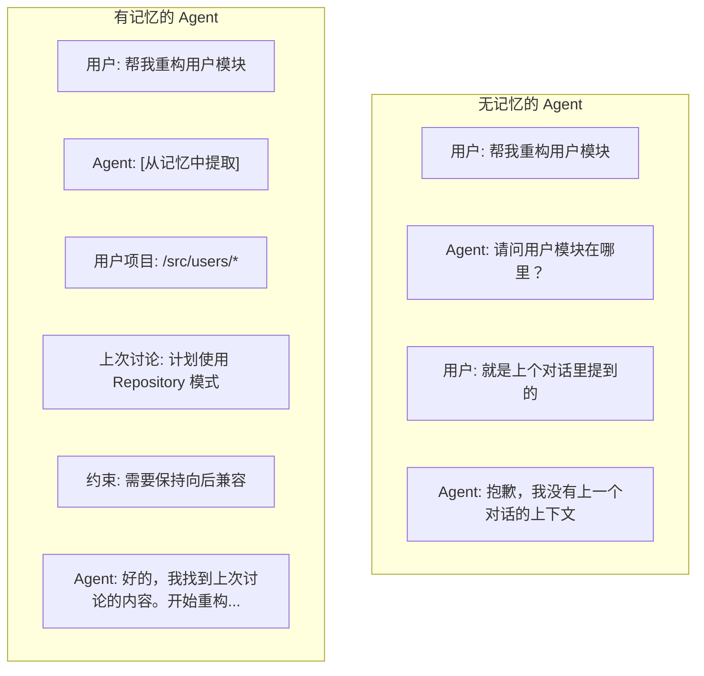

# AI Agent 记忆系统深度剖析

> 本文档详细介绍 AI Agent 的记忆系统架构、实现模式和最佳实践。

---

## 目录

1. [记忆系统概述](#1-记忆系统概述)
2. [短期记忆](#2-短期记忆)
3. [长期记忆](#3-长期记忆)
4. [记忆实现模式](#4-记忆实现模式)
5. [上下文管理](#5-上下文管理)
6. [高级记忆模式](#6-高级记忆模式)
7. [代码实现](#7-代码实现)

---

## 1. 记忆系统概述

### 1.1 为什么 Agent 需要记忆



### 1.2 记忆类型分类

| 类型 | 容量 | 持续时间 | 用途 |
|------|------|---------|------|
| **工作记忆** | 5-9 项 | 当前会话 | 信息暂存、推理中间结果 |
| **对话记忆** | 上下文窗口 | 会话期间 | 保持对话连贯性 |
| **会话记忆** | 数千条消息 | 可配置 | 长期对话上下文 |
| **向量记忆** | 无限制 | 持久化 | 语义检索、经验复用 |
| **图谱记忆** | 结构化 | 持久化 | 实体关系、推理 |
| **程序记忆** | 技能/模式 | 持久化 | 如何做事的知识 |

### 1.3 记忆层次结构


---

## 2. 短期记忆

### 2.1 工作记忆设计

```typescript
// core/working-memory.ts

interface WorkingMemoryItem {
  id: string;
  content: any;
  type: 'fact' | 'task' | 'constraint' | 'context';
  importance: number;        // 0-1, 重要性评分
  activationLevel: number; // 0-1, 当前激活程度
  createdAt: number;
  accessedAt: number;
  accessCount: number;
}

export class WorkingMemory {
  private items: Map<string, WorkingMemoryItem> = new Map();
  private maxCapacity: number = 7;  // Miller's Law

  add(item: Omit<WorkingMemoryItem, 'id' | 'createdAt' | 'accessedAt' | 'accessCount'>): string {
    const id = generateId();
    const fullItem: WorkingMemoryItem = {
      ...item,
      id,
      createdAt: Date.now(),
      accessedAt: Date.now(),
      accessCount: 0,
    };

    // 如果容量已满，移除最低优先级项
    if (this.items.size >= this.maxCapacity) {
      this.evictLowestPriority();
    }

    this.items.set(id, fullItem);
    return id;
  }

  get(id: string): WorkingMemoryItem | undefined {
    const item = this.items.get(id);
    if (item) {
      item.accessCount++;
      item.accessedAt = Date.now();
      item.activationLevel = Math.min(1, item.activationLevel + 0.1);
    }
    return item;
  }

  recall(query: string): WorkingMemoryItem[] {
    // 基于激活程度和相关性召回
    return Array.from(this.items.values())
      .filter(item => item.activationLevel > 0.3)
      .sort((a, b) => b.activationLevel - a.activationLevel);
  }

  private evictLowestPriority(): void {
    let minPriority = Infinity;
    let evictId: string | null = null;

    for (const [id, item] of this.items) {
      const priority = item.importance * item.activationLevel;
      if (priority < minPriority) {
        minPriority = priority;
        evictId = id;
      }
    }

    if (evictId) this.items.delete(evictId);
  }

  decay(): void {
    // 衰减激活水平，模拟遗忘
    for (const item of this.items.values()) {
      item.activationLevel *= 0.9;
      if (item.activationLevel < 0.1) {
        // 即将遗忘，考虑转移到长期记忆
        this.promoteToLongTerm(item);
      }
    }
  }

  private promoteToLongTerm(item: WorkingMemoryItem): void {
    // 子类实现：将重要项转移到长期记忆
  }
}
```

### 2.2 对话上下文管理

```typescript
// context/dialogue-context.ts

interface DialogueMessage {
  id: string;
  role: 'user' | 'assistant' | 'system' | 'tool';
  content: string;
  timestamp: number;
  tokenCount: number;
  metadata?: Record<string, any>;
}

export class DialogueContext {
  private messages: DialogueMessage[] = [];
  private maxTokens: number = 100000;  // Claude 上下文窗口
  private currentBudget: number;

  constructor(maxTokens: number = 100000) {
    this.maxTokens = maxTokens;
    this.currentBudget = maxTokens;
  }

  addMessage(message: Omit<DialogueMessage, 'id' | 'timestamp' | 'tokenCount'>): string {
    const tokenCount = this.estimateTokens(message.content);
    const id = generateId();

    const fullMessage: DialogueMessage = {
      ...message,
      id,
      timestamp: Date.now(),
      tokenCount,
    };

    this.messages.push(fullMessage);
    this.currentBudget -= tokenCount;

    // 如果超过预算，压缩历史
    if (this.currentBudget < 0) {
      this.compress();
    }

    return id;
  }

  getMessages(): DialogueMessage[] {
    return [...this.messages];
  }

  getRecentMessages(count: number): DialogueMessage[] {
    return this.messages.slice(-count);
  }

  private estimateTokens(text: string): number {
    // 粗略估算：中文约 2 字符/token，英文约 4 字符/token
    return Math.ceil(text.length / 3);
  }

  private compress(): void {
    // 保留最近的消息和系统提示，压缩中间部分
    const systemMessages = this.messages.filter(m => m.role === 'system');
    const recentMessages = this.messages.slice(-10); // 保留最近 10 条

    // 压缩中间消息为摘要
    const middleMessages = this.messages.slice(0, -10);
    const summary = this.summarize(middleMessages);

    this.messages = [
      ...systemMessages,
      { role: 'system' as const, content: `[ Earlier conversation summary: ${summary} ]`, id: 'summary', timestamp: Date.now(), tokenCount: this.estimateTokens(summary) },
      ...recentMessages,
    ];

    this.currentBudget = this.maxTokens - this.messages.reduce((sum, m) => sum + m.tokenCount, 0);
  }

  private summarize(messages: DialogueMessage[]): string {
    if (messages.length === 0) return '';
    // 简化：返回消息计数和主题
    return `${messages.length} messages discussing ${messages[0]?.content.slice(0, 50)}...`;
  }
}
```

---

## 3. 长期记忆

### 3.1 向量记忆系统

```typescript
// memory/vector-memory.ts

interface MemoryEntry {
  id: string;
  content: string;
  embedding: number[];
  metadata: {
    type: 'experience' | 'knowledge' | 'preference' | 'fact';
    createdAt: number;
    accessedAt: number;
    accessCount: number;
    importance: number;
    tags: string[];
    source?: string;
  };
}

export class VectorMemory {
  private entries: Map<string, MemoryEntry> = new Map();
  private index: Map<string, Set<string>> = new Map();  // 标签索引

  async add(content: string, metadata: MemoryEntry['metadata']): Promise<string> {
    const id = generateId();
    const embedding = await this.embed(content);

    const entry: MemoryEntry = {
      id,
      content,
      embedding,
      metadata: {
        ...metadata,
        createdAt: Date.now(),
        accessedAt: Date.now(),
        accessCount: 0,
      },
    };

    this.entries.set(id, entry);

    // 更新标签索引
    for (const tag of metadata.tags) {
      if (!this.index.has(tag)) {
        this.index.set(tag, new Set());
      }
      this.index.get(tag).add(id);
    }

    return id;
  }

  async search(query: string, topK: number = 5): Promise<MemoryEntry[]> {
    const queryEmbedding = await this.embed(query);
    const entries = Array.from(this.entries.values());

    // 计算余弦相似度
    const scored = entries.map(entry => ({
      entry,
      score: this.cosineSimilarity(queryEmbedding, entry.embedding),
    }));

    // 按相似度排序
    scored.sort((a, b) => b.score - a.score);

    // 更新访问统计
    for (const item of scored.slice(0, topK)) {
      item.entry.metadata.accessedAt = Date.now();
      item.entry.metadata.accessCount++;
    }

    return scored.slice(0, topK).map(s => s.entry);
  }

  private async embed(text: string): Promise<number[]> {
    // 调用 embedding API
    // 简化实现
    return Array(1536).fill(0).map(() => Math.random());
  }

  private cosineSimilarity(a: number[], b: number[]): number {
    let dotProduct = 0;
    let normA = 0;
    let normB = 0;

    for (let i = 0; i < a.length; i++) {
      dotProduct += a[i] * b[i];
      normA += a[i] * a[i];
      normB += b[i] * b[i];
    }

    return dotProduct / (Math.sqrt(normA) * Math.sqrt(normB));
  }

  // 按标签搜索
  searchByTag(tag: string): MemoryEntry[] {
    const ids = this.index.get(tag);
    if (!ids) return [];
    return Array.from(ids).map(id => this.entries.get(id)).filter(Boolean) as MemoryEntry[];
  }

  // 删除记忆
  forget(id: string): void {
    const entry = this.entries.get(id);
    if (!entry) return;

    // 清理标签索引
    for (const tag of entry.metadata.tags) {
      this.index.get(tag)?.delete(id);
    }

    this.entries.delete(id);
  }

  // 更新记忆
  update(id: string, content: string): void {
    const entry = this.entries.get(id);
    if (!entry) return;

    entry.content = content;
    entry.embedding = this.embed(content);
  }
}
```

### 3.2 知识图谱记忆

```typescript
// memory/knowledge-graph.ts

interface KnowledgeNode {
  id: string;
  type: 'entity' | 'concept' | 'event' | 'action';
  name: string;
  properties: Record<string, any>;
  embeddings: number[];
}

interface KnowledgeEdge {
  id: string;
  source: string;
  target: string;
  relation: string;  // 如 "works_for", "located_in", "part_of"
  weight: number;
  metadata?: Record<string, any>;
}

export class KnowledgeGraph {
  private nodes: Map<string, KnowledgeNode> = new Map();
  private edges: Map<string, KnowledgeEdge> = new Map();
  private adjacencyList: Map<string, Set<string>> = new Map();

  // 添加实体
  addNode(node: Omit<KnowledgeNode, 'id' | 'embeddings'>): string {
    const id = generateId();
    const fullNode: KnowledgeNode = {
      ...node,
      id,
      embeddings: this.embed(node.name + ' ' + JSON.stringify(node.properties)),
    };

    this.nodes.set(id, fullNode);
    this.adjacencyList.set(id, new Set());

    return id;
  }

  // 添加关系
  addEdge(sourceId: string, targetId: string, relation: string, weight: number = 1): string {
    const id = generateId();
    const edge: KnowledgeEdge = {
      id,
      source: sourceId,
      target: targetId,
      relation,
      weight,
    };

    this.edges.set(id, edge);
    this.adjacencyList.get(sourceId).add(targetId);
    this.adjacencyList.get(targetId).add(sourceId);

    return id;
  }

  // 查询：找到实体的所有邻居
  getNeighbors(nodeId: string, maxDepth: number = 1): KnowledgeNode[] {
    const visited = new Set<string>();
    const result: KnowledgeNode[] = [];
    const queue: Array<{ id: string; depth: number }> = [{ id: nodeId, depth: 0 }];

    while (queue.length > 0) {
      const { id, depth } = queue.shift();

      if (visited.has(id)) continue;
      visited.add(id);

      if (depth > 0 && this.nodes.has(id)) {
        result.push(this.nodes.get(id));
      }

      if (depth < maxDepth) {
        for (const neighborId of this.adjacencyList.get(id) || []) {
          if (!visited.has(neighborId)) {
            queue.push({ id: neighborId, depth: depth + 1 });
          }
        }
      }
    }

    return result;
  }

  // 推理：基于路径的关系查询
  queryPath(startId: string, endId: string, maxDepth: number = 3): Array<{ node: KnowledgeNode; relation: string }[]> {
    const paths: Array<{ node: KnowledgeNode; relation: string }[]> = [];
    const dfs = (current: string, target: string, path: Array<{ node: KnowledgeNode; relation: string }>, visited: Set<string>) => {
      if (current === target) {
        paths.push([...path]);
        return;
      }

      if (path.length >= maxDepth) return;

      for (const [edgeId, neighborId] of this.traverse(current, visited)) {
        visited.add(neighborId);
        const node = this.nodes.get(neighborId);
        const edge = this.edges.get(edgeId);
        if (node && edge) {
          path.push({ node, relation: edge.relation });
          dfs(neighborId, target, path, visited);
          path.pop();
          visited.delete(neighborId);
        }
      }
    };

    dfs(startId, endId, [], new Set([startId]));
    return paths;
  }

  private* traverse(nodeId: string, visited: Set<string>): Generator<[string, string]> {
    for (const edgeId of this.edges.values()) {
      if (edgeId.source === nodeId && !visited.has(edgeId.target)) {
        yield [edgeId.id, edgeId.target];
      }
      if (edgeId.target === nodeId && !visited.has(edgeId.source)) {
        yield [edgeId.id, edgeId.source];
      }
    }
  }

  private embed(text: string): number[] {
    // Embedding 实现
    return Array(1536).fill(0).map(() => Math.random());
  }
}
```

---

## 4. 记忆实现模式

### 4.1 LangChain Memory API

```python
# langchain/memory-examples.py

from langchain.memory import (
    ConversationBufferMemory,
    ConversationBufferWindowMemory,
    ConversationSummaryMemory,
    VectorStoreRetrieverMemory,
    CombinedMemory,
)
from langchain.chat_models import ChatOpenAI
from langchain.chains import ConversationChain

# 1. Buffer Memory - 保留完整对话历史
memory = ConversationBufferMemory(
    memory_key="history",
    return_messages=True,
    output_key="response"
)

# 2. Window Memory - 只保留最近 N 条
memory = ConversationBufferWindowMemory(
    k=5,  # 只保留最近 5 条对话
    memory_key="history",
    return_messages=True
)

# 3. Summary Memory - 对话摘要
memory = ConversationSummaryMemory(
    llm=ChatOpenAI(temperature=0),
    memory_key="history",
    return_messages=True
)

# 4. Vector Memory - 语义检索
memory = VectorStoreRetrieverMemory(
    retriever=vectorstore.as_retriever(search_kwargs={"k": 5}),
    memory_key="history",
    input_key="input"
)

# 5. Combined Memory - 组合多种记忆
memory = CombinedMemory(
    memories=[
        ConversationBufferWindowMemory(k=3),
        VectorStoreRetrieverMemory(retriever=vectorstore.as_retriever()),
    ]
)

# 使用
chain = ConversationChain(
    llm=ChatOpenAI(),
    memory=memory,
    prompt=custom_prompt
)

response = chain.run("你好")
```

### 4.2 TypeScript 实现

```typescript
// memory/implementations.ts

// Buffer Memory 实现
export class BufferMemory {
  private buffer: Array<{ role: string; content: string }> = [];
  private maxMessages: number;

  constructor(maxMessages: number = 100) {
    this.maxMessages = maxMessages;
  }

  add(role: string, content: string): void {
    this.buffer.push({ role, content });
    if (this.buffer.length > this.maxMessages) {
      this.buffer.shift();
    }
  }

  getMessages(): Array<{ role: string; content: string }> {
    return [...this.buffer];
  }

  clear(): void {
    this.buffer = [];
  }

  toString(): string {
    return this.buffer
      .map(m => `${m.role}: ${m.content}`)
      .join('\n');
  }
}

// Summary Memory 实现
export class SummaryMemory {
  private summary: string = '';
  private recentMessages: Array<{ role: string; content: string }> = [];
  private llm: LLMAdapter;
  private maxRecentMessages: number = 10;

  constructor(llm: LLMAdapter) {
    this.llm = llm;
  }

  async update(newMessage: { role: string; content: string }): Promise<void> {
    this.recentMessages.push(newMessage);

    if (this.recentMessages.length >= this.maxRecentMessages) {
      await this.summarize();
    }
  }

  private async summarize(): Promise<void> {
    const messages = this.recentMessages.map(m => `${m.role}: ${m.content}`).join('\n');

    const response = await this.llm.complete({
      messages: [
        { role: 'system', content: '请将以下对话总结为一个简洁的摘要，保留关键信息和结论。' },
        { role: 'user', content: messages },
      ],
      model: 'claude-3-5-haiku-20241022',  // 使用便宜的模型
    });

    this.summary = response.content;
    this.recentMessages = [];
  }

  getContext(): string {
    return this.summary + '\n\n' + this.recentMessages.map(m => `${m.role}: ${m.content}`).join('\n');
  }
}
```

---

## 5. 上下文管理

### 5.1 上下文窗口限制

```typescript
// context/token-manager.ts

interface TokenBudget {
  maxTokens: number;
  systemPrompt: number;
  context: number;
  reserved: number;
}

export class TokenManager {
  private budgets: TokenBudget;

  constructor(maxTokens: number = 100000) {
    this.budgets = {
      maxTokens,
      systemPrompt: 5000,   // 系统提示预留
      context: maxTokens - 10000,  // 上下文空间
      reserved: 5000,        // 输出预留
    };
  }

  allocate(messages: Array<{ content: string; role: string }>): {
    included: Array<{ content: string; role: string }>;
    overflow: Array<{ content: string; role: string }>;
  } {
    const included: Array<{ content: string; role: string }> = [];
    let usedTokens = this.budgets.systemPrompt + this.budgets.reserved;

    // 从新到旧添加消息
    const sorted = [...messages].reverse();

    for (const msg of sorted) {
      const msgTokens = this.estimateTokens(msg.content);

      if (usedTokens + msgTokens <= this.budgets.context + this.budgets.systemPrompt) {
        included.unshift(msg);
        usedTokens += msgTokens;
      } else {
        // 需要截断或总结
        included.unshift(this.truncateMessage(msg, this.budgets.context - usedTokens));
        break;
      }
    }

    const overflow = messages.filter(m => !included.includes(m));
    return { included, overflow };
  }

  private estimateTokens(text: string): number {
    return Math.ceil(text.length / 3);
  }

  private truncateMessage(msg: { content: string; role: string }, maxTokens: number): { content: string; role: string } {
    const maxChars = maxTokens * 3;
    const truncated = msg.content.slice(0, maxChars);
    return { ...msg, content: '[...] ' + truncated };
  }
}
```

### 5.2 记忆压缩策略

```typescript
// context/compression-strategies.ts

export class CompressionStrategies {
  // 1. 滑动窗口
  static slidingWindow(messages: any[], windowSize: number): any[] {
    if (messages.length <= windowSize) return messages;
    return messages.slice(-windowSize);
  }

  // 2. 摘要压缩
  static async summarize(messages: any[], llm: LLMAdapter): Promise<string> {
    const content = messages.map(m => `${m.role}: ${m.content}`).join('\n');
    const response = await llm.complete({
      messages: [
        { role: 'system', content: '将以下对话压缩为关键点摘要。' },
        { role: 'user', content },
      ],
      model: 'claude-3-5-haiku-20241022',
    });
    return response.content;
  }

  // 3. 重要性过滤
  static importanceFilter(messages: any[], threshold: number = 0.5): any[] {
    return messages.filter(msg => {
      const importance = this.calculateImportance(msg);
      return importance >= threshold;
    });
  }

  private static calculateImportance(message: any): number {
    // 基于关键词、角色、长度等计算重要性
    let score = 0.5;

    if (message.role === 'user') score += 0.2;
    if (message.content.length > 100) score += 0.1;

    const keywords = ['重要', '关键', '必须', '不要', '记得'];
    for (const kw of keywords) {
      if (message.content.includes(kw)) score += 0.1;
    }

    return Math.min(1, score);
  }

  // 4. 分层压缩
  static hierarchical(messages: any[], levels: number = 3): Map<number, any[]> {
    const result = new Map<number, any[]>();

    for (let i = 0; i < levels; i++) {
      result.set(i, []);
    }

    // 近期的消息保留详细
    const recentCount = Math.ceil(messages.length * 0.3);
    result.set(0, messages.slice(-recentCount));

    // 中期的消息摘要
    const midCount = Math.ceil(messages.length * 0.3);
    result.set(1, messages.slice(-recentCount - midCount, -recentCount));

    // 早期的大量压缩
    result.set(2, messages.slice(0, -recentCount - midCount));

    return result;
  }
}
```

---

## 6. 高级记忆模式

### 6.1 情景记忆

```typescript
// memory/episodic-memory.ts

interface Episode {
  id: string;
  title: string;
  description: string;
  startTime: number;
  endTime?: number;
  context: {
    task?: string;
    goal?: string;
    outcome?: string;
  };
  events: Array<{
    timestamp: number;
    type: 'action' | 'observation' | 'decision' | 'result';
    content: string;
    importance: number;
  }>;
  lessons: string[];
  tags: string[];
}

export class EpisodicMemory {
  private episodes: Map<string, Episode> = new Map();
  private vectorIndex: VectorMemory;

  constructor(vectorIndex: VectorMemory) {
    this.vectorIndex = vectorIndex;
  }

  async createEpisode(context: Partial<Episode>): Promise<string> {
    const id = generateId();
    const episode: Episode = {
      id,
      title: context.title || 'Untitled Episode',
      description: context.description || '',
      startTime: Date.now(),
      context: context.context || {},
      events: context.events || [],
      lessons: context.lessons || [],
      tags: context.tags || [],
    };

    this.episodes.set(id, episode);

    // 索引到向量存储
    await this.vectorIndex.add(
      `Episode: ${episode.title}. ${episode.description}. ${episode.context.task || ''}`,
      {
        type: 'episode',
        tags: episode.tags,
        importance: 0.8,
      }
    );

    return id;
  }

  async addEvent(episodeId: string, event: Episode['events'][0]): Promise<void> {
    const episode = this.episodes.get(episodeId);
    if (!episode) throw new Error('Episode not found');

    episode.events.push(event);
  }

  async endEpisode(episodeId: string, outcome: string): Promise<void> {
    const episode = this.episodes.get(episodeId);
    if (!episode) throw new Error('Episode not found');

    episode.endTime = Date.now();
    episode.context.outcome = outcome;

    // 提取教训
    await this.extractLessons(episode);
  }

  private async extractLessons(episode: Episode): Promise<void> {
    // 使用 LLM 从事件中提取教训
    const eventText = episode.events.map(e => e.content).join('\n');
    // ... LLM 调用提取教训
  }

  async retrieveSimilar(query: string, limit: number = 5): Promise<Episode[]> {
    const results = await this.vectorIndex.search(query, limit);
    return results
      .filter(r => r.metadata.type === 'episode')
      .map(r => this.episodes.get(r.id))
      .filter(Boolean) as Episode[];
  }
}
```

### 6.2 程序记忆

```typescript
// memory/procedural-memory.ts

interface Skill {
  id: string;
  name: string;
  description: string;
  triggerConditions: string[];
  steps: Array<{
    action: string;
    parameters?: Record<string, any>;
    expectedOutcome?: string;
  }>;
  prerequisites: string[];
  successCriteria: string[];
  examples: Array<{
    input: string;
    output: string;
  }>;
  lastUsed?: number;
  usageCount: number;
}

export class ProceduralMemory {
  private skills: Map<string, Skill> = new Map();
  private triggerIndex: Map<string, Set<string>> = new Map();

  register(skill: Skill): void {
    this.skills.set(skill.id, skill);

    for (const trigger of skill.triggerConditions) {
      if (!this.triggerIndex.has(trigger)) {
        this.triggerIndex.set(trigger, new Set());
      }
      this.triggerIndex.get(trigger).add(skill.id);
    }
  }

  match(query: string): Skill[] {
    const matched: Skill[] = [];

    for (const [trigger, skillIds] of this.triggerIndex) {
      if (query.toLowerCase().includes(trigger.toLowerCase())) {
        for (const id of skillIds) {
          const skill = this.skills.get(id);
          if (skill) matched.push(skill);
        }
      }
    }

    return matched.sort((a, b) => b.usageCount - a.usageCount);
  }

  execute(skillId: string, context: any): Promise<any> {
    const skill = this.skills.get(skillId);
    if (!skill) throw new Error('Skill not found');

    skill.usageCount++;
    skill.lastUsed = Date.now();

    return this.executeSteps(skill.steps, context);
  }

  private async executeSteps(steps: Skill['steps'], context: any): Promise<any> {
    let result = context;

    for (const step of steps) {
      // 执行步骤
      result = await this.executeAction(step.action, step.parameters, result);
    }

    return result;
  }

  private async executeAction(action: string, params: any, context: any): Promise<any> {
    // 根据 action 类型执行不同操作
    // ...
    return { success: true, result: context };
  }

  // 从经验中学习新技能
  async learnFromExperience(description: string, steps: any[]): Promise<string> {
    const skillId = generateId();
    const skill: Skill = {
      id: skillId,
      name: description.slice(0, 50),
      description,
      triggerConditions: this.extractTriggers(description),
      steps,
      prerequisites: [],
      successCriteria: [],
      examples: [],
      usageCount: 0,
    };

    this.register(skill);
    return skillId;
  }

  private extractTriggers(description: string): string[] {
    // 简单提取关键词作为触发条件
    const words = description.split(/\s+/).filter(w => w.length > 4);
    return words.slice(0, 5);
  }
}
```

---

## 7. 代码实现

### 7.1 完整 Agent 记忆系统

```typescript
// agent/memory-system.ts

export interface AgentMemoryConfig {
  workingMemorySize: number;
  maxContextTokens: number;
  enableLongTermMemory: boolean;
  enableKnowledgeGraph: boolean;
  compressionThreshold: number;
}

export class AgentMemorySystem {
  private workingMemory: WorkingMemory;
  private dialogueContext: DialogueContext;
  private vectorMemory: VectorMemory;
  private knowledgeGraph: KnowledgeGraph;
  private episodicMemory: EpisodicMemory;
  private proceduralMemory: ProceduralMemory;
  private config: AgentMemoryConfig;

  constructor(config: AgentMemoryConfig) {
    this.config = config;
    this.workingMemory = new WorkingMemory();
    this.dialogueContext = new DialogueContext(config.maxContextTokens);
    this.vectorMemory = new VectorMemory();
    this.knowledgeGraph = new KnowledgeGraph();
  }

  // 添加用户消息到记忆
  addUserMessage(content: string): void {
    this.dialogueContext.addMessage({ role: 'user', content });

    // 提取关键信息到工作记忆
    const keyInfo = this.extractKeyInfo(content);
    for (const info of keyInfo) {
      this.workingMemory.add({
        content: info,
        type: 'context',
        importance: 0.8,
        activationLevel: 1,
      });
    }
  }

  // 添加助手回复到记忆
  addAssistantMessage(content: string): void {
    this.dialogueContext.addMessage({ role: 'assistant', content });
  }

  // 获取当前上下文
  getContext(): { messages: any[]; workingItems: any[] } {
    return {
      messages: this.dialogueContext.getMessages(),
      workingItems: this.workingMemory.recall(''),
    };
  }

  // 搜索长期记忆
  async searchMemory(query: string): Promise<any[]> {
    return this.vectorMemory.search(query);
  }

  // 存储重要经验
  async storeExperience(content: string, metadata: any): Promise<void> {
    await this.vectorMemory.add(content, {
      type: 'experience',
      importance: metadata.importance || 0.7,
      tags: metadata.tags || [],
    });
  }

  // 更新知识图谱
  addKnowledge(entity: string, relations: Array<{ target: string; relation: string }>): void {
    const entityId = this.knowledgeGraph.addNode({
      type: 'entity',
      name: entity,
      properties: {},
    });

    for (const rel of relations) {
      let targetId = this.findNode(rel.target);
      if (!targetId) {
        targetId = this.knowledgeGraph.addNode({
          type: 'entity',
          name: rel.target,
          properties: {},
        });
      }
      this.knowledgeGraph.addEdge(entityId, targetId, rel.relation);
    }
  }

  private findNode(name: string): string | undefined {
    // 简化实现
    return undefined;
  }

  private extractKeyInfo(content: string): string[] {
    // 简单提取关键信息
    const patterns = [
      /文件.*?(\S+\.\w+)/g,  // 文件名
      /模块.*?(\S+)/g,        // 模块名
      /问题.*?(.+?)(?:\。|$)/g, // 问题描述
    ];

    const info: string[] = [];
    for (const pattern of patterns) {
      const matches = content.matchAll(pattern);
      for (const match of matches) {
        info.push(match[1] || match[0]);
      }
    }
    return info;
  }

  // 压缩和清理
  compress(): void {
    // 触发对话压缩
    this.dialogueContext.compress();
    // 衰减工作记忆
    this.workingMemory.decay();
  }
}
```

### 7.2 使用示例

```typescript
// example/usage.ts

const memory = new AgentMemorySystem({
  workingMemorySize: 7,
  maxContextTokens: 100000,
  enableLongTermMemory: true,
  enableKnowledgeGraph: true,
  compressionThreshold: 0.8,
});

// 添加对话
memory.addUserMessage("我正在开发一个电商系统，需要实现用户认证模块");
memory.addAssistantMessage("好的，我可以帮你实现用户认证模块。你想使用 JWT 还是 Session?");

// 搜索相关经验
const pastExperience = await memory.searchMemory("用户认证 JWT");
console.log("相关经验:", pastExperience);

// 添加知识
memory.addKnowledge("用户认证模块", [
  { target: "JWT", relation: "使用" },
  { target: "OAuth2", relation: "支持" },
]);

// 获取当前上下文
const context = memory.getContext();
console.log("当前上下文:", context);
```

---

## 总结

记忆系统是 AI Agent 的核心组成部分，决定了 Agent 的长期智能能力。

| 记忆类型 | 实现难度 | 适用场景 |
|---------|---------|---------|
| 工作记忆 | 低 | 短期任务、即时处理 |
| 对话记忆 | 中 | 会话连续性 |
| 向量记忆 | 中 | 语义检索、经验复用 |
| 知识图谱 | 高 | 关系推理、结构化知识 |
| 情景记忆 | 高 | 经验学习、教训提取 |
| 程序记忆 | 高 | 技能学习、模式复用 |

**最佳实践**：
1. 根据场景选择合适的记忆组合
2. 实现有效的上下文压缩机制
3. 定期整理和遗忘不重要记忆
4. 建立记忆索引支持快速检索

---

## 参考资源

- [LangChain Memory](https://python.langchain.com/docs/modules/memory/)
- [MemGPT](https://github.com/ahmetozlu93/MemGPT)
- [Agent Memory Systems](https://arxiv.org/abs/2309.00127)

---

文档版本：v1.0 | 更新日期：2026-05-15