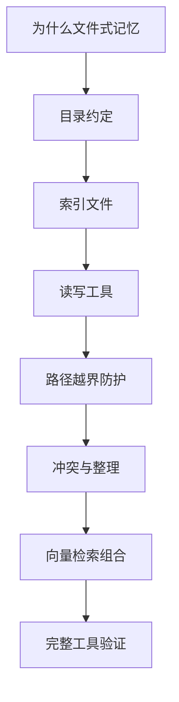
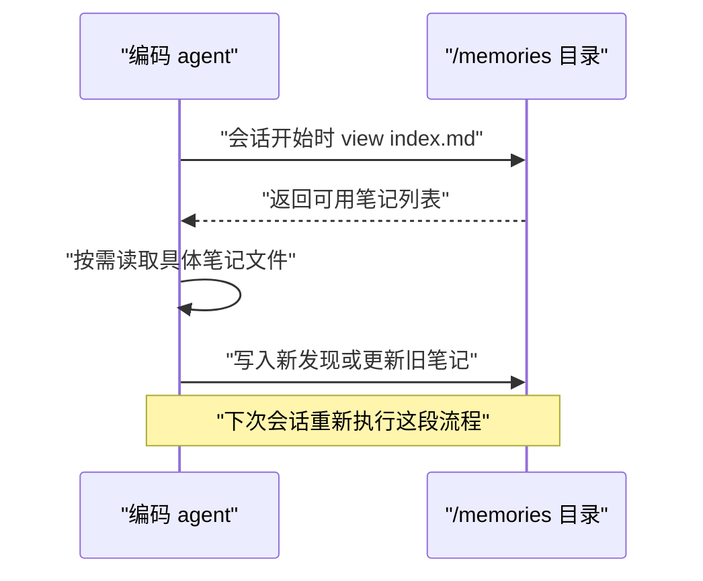
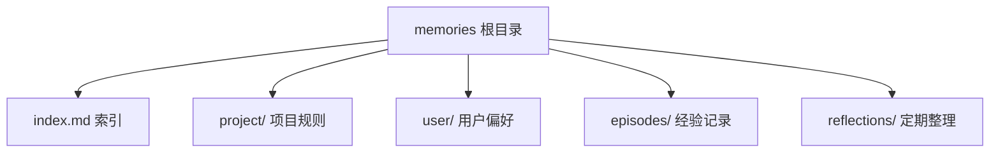
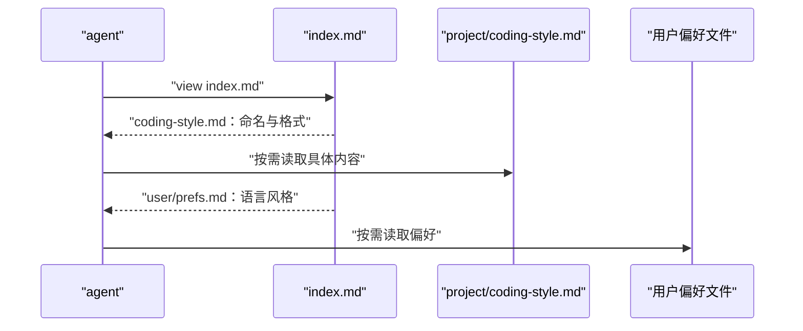
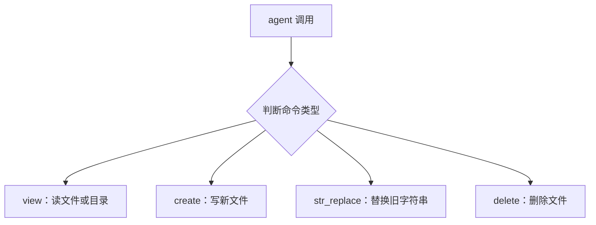
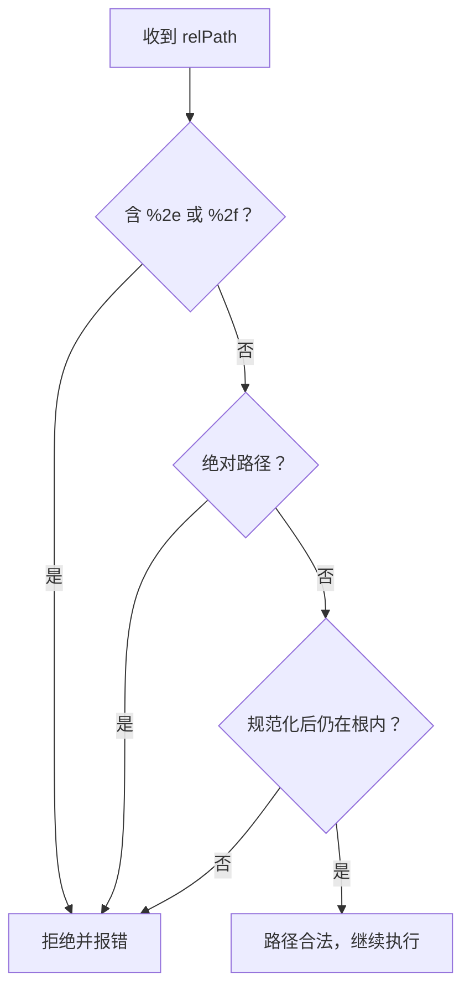
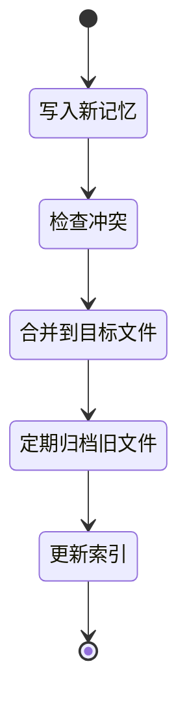
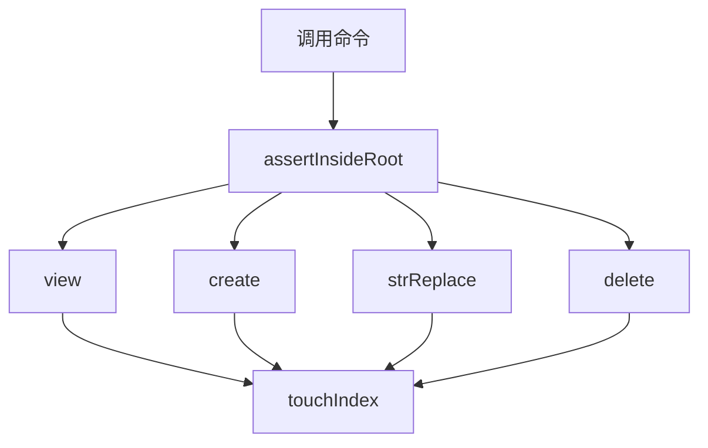

# 手写文件式记忆：最简单也最稳的长期记忆

!!! abstract "学完这一页你能"
    - 用 `view / create / str_replace / delete` 四个命令，写一个可运行的 Markdown 文件记忆工具。
    - 设计 `index.md` 作为目录索引，让 agent 先看地图再找笔记。
    - 实现路径越界防护，拦住 `../` 和 URL 编码绕过。
    - 用 Node 内置断言写出可复现的验证用例，并说明何时需要加向量检索。

## 0. 知识地图



建议按“动机 → 结构 → 工具 → 安全 → 维护 → 扩展”这条线读。前四节会让你获得能跑的代码骨架，后四节让骨架变成可在工程里安全使用的工具。每节末尾的“动手验证”都独立可运行，最后第八节会把全部能力收口成一个带断言的完整实现。

## 1. 为什么编码 agent 偏爱文件式记忆

**先想一个问题**
你的 coding agent 正在改一个前端项目，你和它约定了组件命名规则。十分钟后上下文窗口被重置，它不记得这条约定了。你不想每次会话都重复一遍，怎么办？

!!! note "术语：长期记忆"
    长期记忆是跨会话持久保存的信息，与当前上下文里的工作记忆相对。例如“项目组件统一用 PascalCase 命名”是长期记忆，而“刚才那个报错信息”只是工作记忆。

**心智模型**

!!! tip "心智模型"
    文件式记忆是把长期记忆存成普通 Markdown 文件，让 agent 像程序员读文档一样读写。日常类比是“工作台上的便利贴”与“抽屉里的文件夹”——便利贴会随着会话清空，文件夹会一直留着。类比不成立的地方是：一个文件夹可能被多个 agent 同时读写，便利贴没有这个并发问题。

**图解**



1. 会话开始，agent 先查看 `index.md`，了解哪些记忆文件可用。
2. 根据当前任务，按需打开一个或多个具体文件。
3. 在结束前，把新发现写入文件，保证跨会话存在。
4. 下次会话重复该流程，记忆得以延续。

**一步一步来**

第一步：在项目目录里放一个固定文件夹，把所有长期记忆集中在那里。

```javascript
// 记忆目录约定：所有长期记忆只放在 ./memories 下
import { mkdir } from 'node:fs/promises';

const MEMORY_ROOT = './memories'; // 根目录，注意与后面安全防护呼应

await mkdir(MEMORY_ROOT, { recursive: true }); // 首次使用自动创建
```

**这段代码在做什么**

- 只定义一个目录根，后续所有读写都从这里出发。
- `mkdir` 的 `recursive: true` 保证不存在时自动创建。
- 集中存储让 agent 知道去哪里找记忆，减少扫描成本。

运行结果：项目根出现一个空文件夹 `memories`，无其他输出。

第二步：演示最简单的写入与跨会话恢复。

```javascript
import { writeFile, readFile } from 'node:fs/promises';

const path = './memories/component-note.md'; // 具体记忆文件
const content = '# 组件命名\n统一使用 PascalCase。\n';

await writeFile(path, content, 'utf8'); // 第一次会话写入
const restored = await readFile(path, 'utf8'); // 模拟下次会话读取
console.log(restored);
```

**这段代码在做什么**

- `writeFile` 把一条长期记忆写进磁盘。
- `readFile` 模拟新会话重新读取，证明内容是持久的。
- 文件是按路径访问的，不需要额外服务。

运行结果：

```
# 组件命名
统一使用 PascalCase。
```

**动手验证**

```javascript
// 验证写入后重新加载能完整恢复，依赖：无（Node 20+）
import { mkdir, writeFile, readFile } from 'node:fs/promises';
import assert from 'node:assert/strict';

const ROOT = './_verify-1';
await mkdir(ROOT, { recursive: true });
const file = `${ROOT}/note.md`;
const text = '持久化的长期记忆';

await writeFile(file, text, 'utf8');
const loaded = await readFile(file, 'utf8');
assert.equal(loaded, text);
console.log('验证通过：写入后重读一致');
```

预期输出：

```
验证通过：写入后重读一致
```

**常见坑**

| 现象 | 原因 | 怎么修 |
| --- | --- | --- |
| 记忆散落在项目各处，很难找 | 没有固定根目录 | 统一收到 `./memories`，只从根目录读写 |
| 新会话不知道已有记忆 | 没有索引 | 先写 `index.md` 做目录入口 |
| 每次加载整个目录 | 文件太多 | 用索引文件先过滤，按需读取 |

**用在哪里**

- 前端脚手架开发：团队维护一套 `memories` 存组件规范，agent 每次会话先读，规则不再靠口头传递。
- 多会话 bug 修复：第一个会话定位问题，第二个会话继续修复，用任务进度文件防止重复提问。
- 个人笔记助手：把零散的编码偏好存成一个 Markdown 文件，换会话也能恢复上下文。

**行业实践**

- Anthropic memory tool 官方文档要求写一条系统提示：“ALWAYS VIEW YOUR MEMORY DIRECTORY BEFORE DOING ANYTHING ELSE”，把读取目录从“建议”变成“协议”。出处：Anthropic 官方文档《Memory tool》。怎么借鉴：在你的 agent system prompt 里同样要求先 view 索引。
- Claude Code 文档明确说明每次会话从新上下文开始，跨会话知识靠 CLAUDE.md 与自动记忆文件承接。出处：Claude Code 官方文档《Memory》。怎么借鉴：把规则拆成“人手写”与“agent 自写”两类文件。
- Letta 官方文档提到其 Agent SDK 引入 MemFS，采用 git 可追踪的文件式记忆。出处：Letta 官方文档。怎么借鉴：把 `memories` 目录纳入版本控制，任何变更可 diff 可回滚。

**小结**

1. 文件式记忆的核心优势是透明、可 diff、零基础设施。
2. 必须固定根目录，否则记忆会散落，检索变难。
3. 索引文件是跨会话的第一入口，不是可选优化。

## 2. 目录约定：给记忆一个稳定地址

**先想一个问题**
记忆文件多了以后，你要在 30 个 Markdown 文件里找到“用户偏好”这一条。如果命名没有规则，agent 只能全量扫描，费 token 还容易漏。

**心智模型**

!!! tip "心智模型"
    目录约定是给每类记忆一个稳定路径，让 agent 不需要猜测文件在哪。日常类比是“家里的抽屉标签”：药品、证件、发票各放一格。类比不成立的地方是，抽屉标签由人一眼看懂，agent 需要明确的路径字符串，不能依赖含糊的“大概在右边那格”。

**图解**



1. 根目录下只有索引文件加若干分类子目录。
2. `project/` 放项目特有约定，例如组件命名、构建顺序。
3. `user/` 放个人偏好，例如语言风格、工具选择。
4. `episodes/` 放任务过程，`reflections/` 放经过提炼的规律。

**一步一步来**

第一步：定义目录分类，并把分类写入一个常量。

```javascript
// 目录分类：给每类记忆固定一个子目录
const DIRS = {
  project: './memories/project', // 项目规则
  user: './memories/user', // 用户偏好
  episodes: './memories/episodes', // 单次任务经验
  reflections: './memories/reflections', // 定期整理出的结论
};
```

**这段代码在做什么**

- 用对象把分类名与路径一一对应。
- agent 想写“用户偏好”时，直接找 `DIRS.user`。
- 分类少而清晰，避免以后出现几十个平铺文件。

第二步：用 `mkdir` 一次性建好所有分类目录。

```javascript
import { mkdir } from 'node:fs/promises';

for (const dir of Object.values(DIRS)) {
  await mkdir(dir, { recursive: true }); // 确保每个分类目录存在
}
```

**这段代码在做什么**

- 遍历 `DIRS`，每个分类目录都创建。
- 幂等：重复执行不会报错，因为 `recursive: true`。
- 目录结构就位后，后续写文件不会因父目录缺失失败。

第三步：把目录约定写进一份 `conventions.md`，让 agent 也读得到。

```javascript
import { writeFile } from 'node:fs/promises';

const doc = `# 记忆目录约定\n- project/：项目规则\n- user/：用户偏好\n- episodes/：单次任务经验\n- reflections/：定期整理\n`;

await writeFile('./memories/conventions.md', doc, 'utf8'); // 把约定写下来
```

**这段代码在做什么**

- 把分类说明作为长期记忆本身保存。
- 新会话读取 `conventions.md` 就能理解目录布局。
- 约定本身可被 diff，修改后团队可审查。

运行结果：`memories` 下出现 `project`、`user`、`episodes`、`reflections` 四个目录和一个 `conventions.md` 文件。

**动手验证**

```javascript
// 验证四类目录已创建，且约定文件可读，依赖：无
import { mkdir, writeFile, access, readFile } from 'node:fs/promises';
import assert from 'node:assert/strict';

const root = './_verify-2';
const dirs = ['project', 'user', 'episodes', 'reflections'].map(d => `${root}/${d}`);
await mkdir(root, { recursive: true });
for (const d of dirs) await mkdir(d, { recursive: true });
const doc = `${root}/conventions.md`;
await writeFile(doc, '# 约定\n四个分类。\n', 'utf8');
for (const d of dirs) {
  await access(d); // 目录存在才继续
}
const text = await readFile(doc, 'utf8');
assert.ok(text.includes('四个分类'));
console.log('验证通过：目录结构符合约定');
```

预期输出：

```
验证通过：目录结构符合约定
```

**常见坑**

| 现象 | 原因 | 怎么修 |
| --- | --- | --- |
| 文件名同义不同名 | 没有统一分类 | 只用 `DIRS` 里的固定分类 |
| 新分类没人知道 | 约定在聊天里说过了 | 更新 `conventions.md` 并提交版本控制 |
| 根目录混乱 | 文件直接放根目录 | 索引文件放根目录，其他一律进分类子目录 |

**用在哪里**

- 电商后台中台：把“促销规则”“库存规则”“支付规则”分目录，agent 处理不同业务时按目录读取。
- 前端 monorepo：包 A、包 B 的规范分目录，分包 agent 只读本包目录。
- 客服 agent：把“用户偏好”“产品信息”“会话经验”三类分目录，减少无关记忆进入上下文。

**行业实践**

- Anthropic memory tool 官方文档的 `view` 命令能列出目录两层深度的文件树，依赖的是清晰的目录结构。出处：Anthropic 官方文档《Memory tool》。怎么借鉴：实现 `view` 时不要平铺所有文件，按目录分组返回。
- Claude Code 文档把 CLAUDE.md 分成 managed、user、project、local 四种作用域，本质是目录与作用域分层。出处：Claude Code 官方文档《Memory》。怎么借鉴：至少区分 `user` 与 `project` 两个作用域文件。
- LangMem 官方文档强调用层级命名空间隔离 org、user、app。出处：LangChain 官方文档《LangMem conceptual guide》。怎么借鉴：目录模拟命名空间，路径字符串就是命名空间。

**小结**

1. 目录约定减少了 agent 的寻址成本。
2. 分类要用固定常量，避免同义文件名。
3. 约定本身要写进文件，不能只存在于对话里。

## 3. 索引文件：先看地图再找笔记

**先想一个问题**
你有 40 个记忆文件，每次会话都要让 agent 逐个读吗？太费 token。有没有一种方式，让 agent 读一个文件就知道该打开哪个笔记？

**心智模型**

!!! tip "心智模型"
    索引文件是 `index.md`，它像书店进门处的分类指引，只写“哪个文件存了什么”，不写完整内容。日常类比是“菜单”，你看完菜单才决定点哪道菜，但菜单不包含菜的完整配方。类比不成立的地方是，菜单可以很长，而索引文件必须控制行数，否则自己先变成上下文负担。

**图解**



1. agent 先读 `index.md`，看到文件名与一句说明。
2. 只打开与当前任务相关的文件，不读全部。
3. 新增或改名后更新 `index.md`，保持索引新鲜。
4. 无用文件从索引中移除，减少误导。

**一步一步来**

第一步：先有一个简单索引文件。

```javascript
import { writeFile } from 'node:fs/promises';

const index = `# 记忆索引\n- project/coding-style.md：命名、缩进、注释规则\n- user/prefs.md：回复语言、代码风格偏好\n`;

await writeFile('./memories/index.md', index, 'utf8'); // 索引只在根目录
```

**这段代码在做什么**

- 索引只放在记忆根目录，路径稳定。
- 每一项写“文件路径：一句话说明”。
- 说明短，不展开正文，控制 token。

第二步：每次新写文件后，更新索引行。

```javascript
import { readFile, writeFile } from 'node:fs/promises';

const idxPath = './memories/index.md';
let idx = await readFile(idxPath, 'utf8');
if (!idx.includes('project/coding-style.md')) {
  idx += '- project/coding-style.md：命名、缩进、注释规则\n'; // 追加新条目
  await writeFile(idxPath, idx, 'utf8');
}
```

**这段代码在做什么**

- 先检查是否已有该条目，避免重复。
- 没有才追加，避免索引膨胀。
- 任何新增文件都应同步更新索引，否则等于没有索引。

**动手验证**

```javascript
// 验证索引包含新增条目，依赖：无
import { mkdir, writeFile, readFile } from 'node:fs/promises';
import assert from 'node:assert/strict';

const root = './_verify-3';
await mkdir(root, { recursive: true });
const idx = `${root}/index.md`;
await writeFile(idx, '# 索引\n', 'utf8');
let text = await readFile(idx, 'utf8');
text += '- a.md：示例\n';
await writeFile(idx, text, 'utf8');
const loaded = await readFile(idx, 'utf8');
assert.ok(loaded.includes('a.md：示例'));
console.log('验证通过：索引读写正常');
```

预期输出：

```
验证通过：索引读写正常
```

**常见坑**

| 现象 | 原因 | 怎么修 |
| --- | --- | --- |
| 索引有但内容过期 | 写文件不更新索引 | 封装成 `create` 时自动更新 |
| 索引行太长导致上下文浪费 | 说明写得像正文 | 每条说明一句话，不超过 30 字 |
| agent 只读索引不读正文 | 索引信息不足 | 索引只做导航，关键细节必须进正文 |

**用在哪里**

- 电商商品列表虚拟滚动：`index.md` 列出所有页签文件，agent 按需读对应版本。
- 后台管理批量导入：索引列出导入规则文件，不同数据源点不同条目。
- 代码评审 agent：索引按模块列出评审规范，避免同时读取全部模块说明。

**行业实践**

- Anthropic memory tool 的 `view` 命令列出目录树，让模型只选择打开需要的文件，索引思想直接服务按需加载。出处：Anthropic 官方文档《Memory tool》。
- Claude Code 文档提到 CLAUDE.md 建议不超过 200 行，太长会降低指令遵循度。出处：Claude Code 官方文档《Memory》。怎么借鉴：索引文件也一样要限行长。
- 很多个人笔记系统用 `index.md` 做 MOC（Map of Content），把主题聚合成入口页。出处：资料未覆盖具体官方文档，需核对官方文档。

**小结**

1. 索引文件让“读一个文件”替代“读所有文件”。
2. 索引项必须短，说明一句话。
3. 写文件和更新索引要封装在一起，否则容易过期。

## 4. 读写工具：view/create/str_replace/delete 风格

**先想一个问题**
你现在有了目录和索引，但 agent 仍然需要直接写文件操作。如果每次都要自己拼路径、读文件、替换、删除，很容易写出重复且易错的代码。

**心智模型**

!!! tip "心智模型"
    把 memory 操作封装成四个命令，像编辑器给用户提供固定按钮。日常类比是“遥控器上的四个按键”：查看、新建、替换、删除，而不需要你自己拆机器。类比不成立的地方是，遥控器不会遇到恶意输入，而 memory 命令会收到 `../../secrets.env` 这类路径。

**图解**



1. agent 只发出一个命令名和参数。
2. 工具根据命令名分派到对应实现。
3. 每个实现统一先做路径校验。
4. 工具内部处理文件读写细节，agent 不直接触碰路径拼接。

**一步一步来**

第一步：实现 `view`，支持读文件与列目录。

```javascript
import { readFile, readdir } from 'node:fs/promises';
import path from 'node:path';

const MEMORY_ROOT = './memories';

async function view(relPath = '.') {
  const full = path.resolve(MEMORY_ROOT, relPath); // 解析绝对路径
  if (!full.startsWith(path.resolve(MEMORY_ROOT))) {
    throw new Error('路径越界'); // 防 ../ 逃逸
  }
  const stat = await import('node:fs/promises').then(fs => fs.stat(full));
  if (stat.isDirectory()) return await readdir(full); // 目录就列名
  return await readFile(full, 'utf8'); // 文件就读内容
}
```

**这段代码在做什么**

- `path.resolve` 把相对路径变成绝对路径。
- `startsWith` 只守卫根目录前缀，这只是第一层基础防护。
- 目录返回文件名数组，文件返回文本内容。

第二步：实现 `create`，自动创建父目录并写文件。

```javascript
import { mkdir, writeFile } from 'node:fs/promises';

async function create(relPath, content) {
  const full = path.resolve(MEMORY_ROOT, relPath);
  if (!full.startsWith(path.resolve(MEMORY_ROOT))) {
    throw new Error('路径越界');
  }
  await mkdir(path.dirname(full), { recursive: true }); // 父目录自动建
  await writeFile(full, content, 'utf8'); // 覆盖写
}
```

**这段代码在做什么**

- `mkdir` 确保父目录存在。
- `writeFile` 默认覆盖，适合 agent 初始化新的记忆文件。
- 若文件已存在，这里会直接覆盖；生产环境通常要先检查或走更新逻辑。

第三步：实现 `str_replace`，替换文件中唯一出现的字符串。

```javascript
async function strReplace(relPath, oldStr, newStr) {
  const full = path.resolve(MEMORY_ROOT, relPath);
  if (!full.startsWith(path.resolve(MEMORY_ROOT))) {
    throw new Error('路径越界');
  }
  const text = await readFile(full, 'utf8');
  if (!text.includes(oldStr)) {
    throw new Error('旧字符串不存在'); // 明确失败，避免静默
  }
  if (text.split(oldStr).length - 1 > 1) {
    throw new Error('旧字符串出现多次，需要更长的上下文'); // 避免误替换
  }
  await writeFile(full, text.replace(oldStr, newStr), 'utf8');
}
```

**这段代码在做什么**

- 替换前检查旧串是否存在。
- 检查出现次数，只允许唯一出现。
- 保证替换可预期，避免改错位置。

第四步：实现 `delete`，删除文件。

```javascript
import { unlink } from 'node:fs/promises';

async function deleteFile(relPath) {
  const full = path.resolve(MEMORY_ROOT, relPath);
  if (!full.startsWith(path.resolve(MEMORY_ROOT))) {
    throw new Error('路径越界');
  }
  await unlink(full); // 只删文件，不递归删目录
}
```

**这段代码在做什么**

- `unlink` 只删文件。
- 若路径是目录，会抛出异常。
- 删除后索引也要同步更新，否则索引残留无效条目。

**动手验证**

```javascript
// 验证四个命令串起来能读写替换删除，依赖：无
import { mkdir, readFile } from 'node:fs/promises';
import path from 'node:path';
import assert from 'node:assert/strict';

const root = './_verify-4';
await mkdir(root, { recursive: true });
const MEM = root;

async function view(relPath = '.') {
  const full = path.resolve(MEM, relPath);
  if (!full.startsWith(path.resolve(MEM))) throw new Error('越界');
  const fs = await import('node:fs/promises');
  const stat = await fs.stat(full);
  if (stat.isDirectory()) return await fs.readdir(full);
  return await fs.readFile(full, 'utf8');
}
async function create(relPath, content) {
  const full = path.resolve(MEM, relPath);
  if (!full.startsWith(path.resolve(MEM))) throw new Error('越界');
  const fs = await import('node:fs/promises');
  await fs.mkdir(path.dirname(full), { recursive: true });
  await fs.writeFile(full, content, 'utf8');
}

await create('a.md', 'hello');
assert.equal(await view('a.md'), 'hello');
console.log('验证通过：create 与 view 正常');
```

预期输出：

```
验证通过：create 与 view 正常
```

**常见坑**

| 现象 | 原因 | 怎么修 |
| --- | --- | --- |
| 替换了错误位置 | 相同字符串出现多次 | 限制旧串必须唯一出现 |
| 写文件后索引没变 | 创建与索引更新分离 | 把更新索引放进 `create` 包装层 |
| 删除目录时报错不明确 | `unlink` 不删目录 | 明确捕获并把错误信息写清楚 |

**用在哪里**

- 在线文档编辑器：把 save/load 对应到 `create` 与 `view`，编辑动作走 `str_replace`。
- 数据标注平台：标注员对同一文件做局部更新，必须唯一匹配才能保证安全。
- 日志归档工具：按日期创建文件，用完定期删除。

**行业实践**

- Anthropic memory tool 官方文档列出的命令是 `view/create/str_replace/insert/delete/rename` 六个，本页做了前四个核心命令。出处：Anthropic 官方文档《Memory tool》。
- Letta 官方文档列出 `memory_replace` 等自我编辑工具，思路同样是把模型驱动编辑封装成无歧义命令。出处：Letta 官方文档《MemGPT architecture》。
- 很多代码编辑器使用“替换选中文本”来保证唯一性，类似于 `str_replace` 要求唯一匹配。出处：资料未覆盖具体编辑器文档，需核对官方文档。

**小结**

1. 四个命令覆盖日常记忆操作，接口简洁。
2. `str_replace` 的唯一匹配限制是防错关键。
3. 基础路径校验只够入门，下一节会补全攻击向量。

## 5. 路径越界防护：守住 /memories 边界

**先想一个问题**
前面用的 `path.resolve(MEMORY_ROOT, relPath)` 加 `startsWith` 能拦住 `../` 吗？能拦住部分，但攻击还有编码绕过、绝对路径覆盖、空字节等变体。

**心智模型**

!!! tip "心智模型"
    路径防护是把不可信的文件路径当成攻击输入来校验，而不是信任 agent 给的参数。日常类比是“小区门禁”：访客说要去哪一栋，你得核实他不能去小区外面的楼。类比不成立的地方是，真实门禁看人脸，而路径校验必须处理“看起来像好人”的编码变体。

**图解**



1. 先检查 URL 编码变体，例如 `%2e%2e%2f`。
2. 再检查传入的是不是绝对路径，绝对路径不属于根内。
3. 然后做规范化，得到真实路径。
4. 最后验证规范化路径仍然在根内。

**一步一步来**

第一步：写一个严格校验函数，拒绝 URL 编码与绝对路径。

```javascript
import path from 'node:path';

function assertInsideRoot(memRoot, relPath) {
  if (/%2e|%2f/i.test(relPath)) {
    throw new Error('拒绝 URL 编码的路径分隔符'); // 拦截 %2e%2e%2f 这类
  }
  if (path.isAbsolute(relPath)) {
    throw new Error('拒绝绝对路径'); // 必须传相对路径
  }
  const full = path.resolve(memRoot, relPath); // 规范化
  const rel = path.relative(memRoot, full);
  if (rel.startsWith('..') || path.isAbsolute(rel)) {
    throw new Error('路径越界'); // 规范后越界
  }
  return full;
}
```

**这段代码在做什么**

- 正则拦截 `%2e`、`%2f`，因为 Node 文件系统不会自动解码这些。
- `path.isAbsolute` 阻止外部绝对路径注入。
- `path.relative` 得到规范后相对根目录的路径，起点最重要。
- 若结果以 `..` 开头，说明越界。

第二步：把校验函数替换进 view 和 create。

```javascript
import { readFile, mkdir, writeFile } from 'node:fs/promises';

async function view(relPath = '.') {
  const full = assertInsideRoot(MEMORY_ROOT, relPath); // 用严格校验
  const fs = await import('node:fs/promises');
  const stat = await fs.stat(full);
  if (stat.isDirectory()) return await fs.readdir(full);
  return await fs.readFile(full, 'utf8');
}

async function create(relPath, content) {
  const full = assertInsideRoot(MEMORY_ROOT, relPath);
  await mkdir(path.dirname(full), { recursive: true });
  await writeFile(full, content, 'utf8');
}
```

**这段代码在做什么**

- 所有读写入口先经过 `assertInsideRoot`。
- 与前面基础版本不同，这里处理了绝对路径与 URL 编码。
- 函数复用，后续 `strReplace`、`delete` 同样调用。

第三步：验证常见攻击输入会被拒绝。

```javascript
const badPaths = [
  '../secrets.env',
  '/etc/passwd',
  '..%2fsecrets.env',
  '%2e%2e%2fsecrets.env',
];
for (const p of badPaths) {
  try {
    assertInsideRoot(MEMORY_ROOT, p);
    console.log('未拦截', p);
  } catch (e) {
    console.log('已拦截', p, '-', e.message);
  }
}
```

**这段代码在做什么**

- 四个样例覆盖最典型的逃逸攻击。
- `%2f` 和 `%2e` 代表编码后的 `/` 和 `.`。
- 每个都会抛出明确错误。

运行结果：

```
已拦截 ../secrets.env - 路径越界
已拦截 /etc/passwd - 拒绝绝对路径
已拦截 ..%2fsecrets.env - 拒绝 URL 编码的路径分隔符
已拦截 %2e%2e%2fsecrets.env - 拒绝 URL 编码的路径分隔符
```

**动手验证**

```javascript
// 验证路径防护，依赖：无
import path from 'node:path';
import assert from 'node:assert/strict';

const root = './_verify-5-根目录';
function safe(relPath) {
  if (/%2e|%2f/i.test(relPath)) throw new Error('url 编码');
  if (path.isAbsolute(relPath)) throw new Error('绝对路径');
  const full = path.resolve(root, relPath);
  const rel = path.relative(root, full);
  if (rel.startsWith('..') || path.isAbsolute(rel)) throw new Error('越界');
  return full;
}
assert.throws(() => safe('../x'), /越界/);
assert.throws(() => safe('/etc/x'), /绝对路径/);
assert.throws(() => safe('%2e%2e%2fx'), /url 编码/);
assert.equal(safe('note.md'), path.resolve(root, 'note.md'));
console.log('验证通过：四种情况均按预期处理');
```

预期输出：

```
验证通过：四种情况均按预期处理
```

**常见坑**

| 现象 | 原因 | 怎么修 |
| --- | --- | --- |
| 校验通过但文件被写到了软链接外 | 目录存在软链接 | 文件或父目录不得是符号链接，需额外检查 |
| 只测 `../` 漏掉编码绕过 | 只关注人类可读路径 | 增加 `%2e`、`%2f` 正则测试 |
| 相对根目录本身是正斜杠但代码误判 | 用 `startsWith` 有前缀歧义 | 改用 `path.relative` 比较 `..` |

**用在哪里**

- MCP 文件服务器：提供给模型读写文件的工具，必须做同样的根目录限制。
- 在线编程沙箱：用户代码通过 API 读写文件，路径校验是唯一防线之一。
- 本地知识库插件：任何外部输入的路径都必须视为不可信。

**行业实践**

- Anthropic memory tool 官方文档明确写要校验路径以 `/memories` 开头、规范化并拒绝 `%2e%2e%2f`。出处：Anthropic 官方文档《Memory tool》。怎么借鉴：照搬四个词——开头、规范化、拒绝、编码。
- MCP 官方工具规范要求 server 校验全部输入，并在 client 侧再做结果校验。出处：MCP 官方工具规范。怎么借鉴：校验放在服务端，客户端信任但不默认。
- Claude Code 权限文档指出 regex 过滤 Bash 参数是脆弱的，应配合 OS 级隔离。出处：Claude Code 官方文档《Permissions》。怎么借鉴：路径校验加 OS 文件系统权限，双层。

**小结**

1. 不止防 `../`，还要防编码与绝对路径。
2. `path.relative` 判断 `..` 是可靠的收口点。
3. 软链接仍是额外风险，需要额外处理或禁止。

## 6. 冲突与整理：定期合并防止熵增

**先想一个问题**
一周后，你的 `memories` 目录里塞了 60 个文件，有的互相矛盾，有的只写了一半。agent 再读索引，会被冗余信息拉低效率。

**心智模型**

!!! tip "心智模型"
    整理是把零散笔记定期合并成更少、更精炼的文件，冲突则要在覆盖前比较语义。日常类比是“每周整理桌面”：把散纸收进档案盒，重复的撕掉。类比不成立的地方是，撕掉纸是物理不可逆，但文件可以进归档目录，不是直接删除。

**图解**



1. 新记忆写入前，先看目标文件是否已有相关内容。
2. 有冲突就择一写清楚，不写两份。
3. 把多次写入合并成一个文件，减少文件数。
4. 合并后更新索引，保持准确。

**一步一步来**

第一步：写一个合并函数，把多个来源集中到一个文件。

```javascript
import { readFile, writeFile } from 'node:fs/promises';

async function mergeFiles(target, sources) {
  let out = '';
  for (const s of sources) {
    out += await readFile(s, 'utf8') + '\n'; // 顺序拼接
  }
  await writeFile(target, out, 'utf8'); // 目标文件覆盖
}
```

**这段代码在做什么**

- 顺序读取所有来源文件。
- 写入一个目标文件，减少零散文件数量。
- 合并前应先确认来源文件内容互不矛盾。

第二步：用“边界分隔”标记不同来源，防止内容混淆。

```javascript
async function mergeWithMarkers(target, sources) {
  let out = '';
  for (const s of sources) {
    out += `\n--- entry: ${s} ---\n`; // 每段加来源标记
    out += await readFile(s, 'utf8');
  }
  await writeFile(target, out, 'utf8');
}
```

**这段代码在做什么**

- 每个来源前加一行标记。
- 冲突时能看出哪段来自哪个文件。
- 便于日后追责或回滚。

第三步：整理完毕后更新索引。

```javascript
async function touchIndex(idxPath, entryLine) {
  let idx = await readFile(idxPath, 'utf8');
  if (!idx.includes(entryLine)) {
    idx += entryLine + '\n';
    await writeFile(idxPath, idx, 'utf8');
  }
}
```

**这段代码在做什么**

- 与第 3 节一致，保证索引不过期。
- 合并后的目标文件必须体现在索引里。
- 来源文件若已删除，索引行也要去掉。

**动手验证**

```javascript
// 验证合并后目标文件包含来源标记，依赖：无
import { mkdir, writeFile, readFile } from 'node:fs/promises';
import assert from 'node:assert/strict';

const root = './_verify-6';
await mkdir(root, { recursive: true });
await writeFile(`${root}/a.md`, '规则A', 'utf8');
await writeFile(`${root}/b.md`, '规则B', 'utf8');
let out = '';
for (const name of ['a.md', 'b.md']) {
  out += `\n--- entry: ${root}/${name} ---\n`;
  out += await readFile(`${root}/${name}`, 'utf8');
}
await writeFile(`${root}/merged.md`, out, 'utf8');
const merged = await readFile(`${root}/merged.md`, 'utf8');
assert.ok(merged.includes('规则A') && merged.includes('规则B'));
console.log('验证通过：两个来源已合并');
```

预期输出：

```
验证通过：两个来源已合并
```

**常见坑**

| 现象 | 原因 | 怎么修 |
| --- | --- | --- |
| 合并后内容互相矛盾 | 没有冲突检测 | 合并前先读新旧内容，冲突时保留新版本并标注 |
| 索引指向旧文件 | 合并后未更新索引 | 合并函数内自动调 `touchIndex` |
| 归档丢了历史 | 直接删除旧文件 | 移到 `archive/` 而非删除 |

**用在哪里**

- 用户偏好整理：把三个会话的偏好笔记合并成一个 `user/preferences.md`。
- 项目规则合并：将多名开发者的规则碎片合成一份项目规范。
- 会话经验压缩：把多条单次经验提炼成一条反思，存入 `reflections/`。

**行业实践**

- Mem0 论文中的更新阶段会用 LLM 决定 ADD、UPDATE、DELETE、NOOP 来处理冲突。出处：Mem0 论文 arXiv 2504.19413。怎么借鉴：在合并前加一个判断步骤。
- Graphiti 对旧事实不删除，而是标记有效时间窗口，保留历史可查。出处：Graphiti 项目文档。怎么借鉴：把旧文件移入 `archive/`，保留溯源。
- Claude Code 文档建议把不需要的自动记忆清理掉。出处：Claude Code 官方文档《Memory》。怎么借鉴：把整理安排成固定维护任务。

**小结**

1. 冲突比冗余更危险，合并前必须比较。
2. 用来源标记保持可回溯。
3. 归档保留历史，直接删除破坏审计。

## 7. 与向量检索的组合：文件做真相，向量做召回

**先想一个问题**
当记忆文件超过 100 个，agent 靠 `index.md` 也不容易找到最相关的那条。有没有办法先模糊召回，再让 agent 用文件核对？

**心智模型**

!!! tip "心智模型"
    文件和向量检索各管一段：向量负责模糊找到候选文件，文件负责提供可读真相。日常类比是“图书馆检索系统找书架，书本身提供内容”。类比不成立的地方是，检索系统可能返回过期卡片，你得打开书确认。

**图解**


1. 用户问题先转化为向量，查询向量索引。
2. 返回最相近的若干文件路径。
3. 读文件原文，不直接相信向量召回的片段。
4. 用文件中的完整内容组织最终答案。

**一步一步来**

第一步：用文件内容生成向量并存入内存索引。

```javascript
// 示意：实际工程换成持久化向量库
const memoryIndex = [];
function addToIndex(filePath, content) {
  memoryIndex.push({ filePath, content }); // 用内容文本模拟向量
}
```

**这段代码在做什么**

- 内存数组是简化的向量索引。
- 真实场景需要 embedding 模型与向量数据库。
- `filePath` 指向文件的真相源。

第二步：根据查询做粗糙过滤，返回候选文件路径。

```javascript
function roughSearch(query, index, topK = 3) {
  return index
    .map(item => ({ filePath: item.filePath, score: item.content.includes(query) ? 1 : 0 }))
    .sort((a, b) => b.score - a.score)
    .slice(0, topK)
    .map(i => i.filePath);
}
```

**这段代码在做什么**

- `includes` 是演示用的粗召回，真实系统应使用向量相似度。
- 返回路径，不返回片段，避免断章取义。
- 候选数限 `topK`，控制后续读取成本。

第三步：读取候选文件原文验证。

```javascript
async function readCandidates(paths) {
  const results = [];
  for (const p of paths) {
    results.push({ filePath: p, text: await readFile(p, 'utf8') });
  }
  return results;
}
```

**这段代码在做什么**

- 逐个读取候选文件全文。
- 让文件成为最终答案的来源。
- 与向量召回形成“文件验证”闭环。

**动手验证**

```javascript
// 验证粗召回加原文验证能返回正确文件，依赖：无
import assert from 'node:assert/strict';

const index = [
  { filePath: '/mem/project/rules.md', content: '组件命名 PascalCase' },
  { filePath: '/mem/user/prefs.md', content: '语言偏好 中文' },
  { filePath: '/mem/episodes/log.md', content: '后台导入超时修复' },
];
const query = '组件命名';
const candidates = index
  .map(i => ({ filePath: i.filePath, score: i.content.includes(query) ? 1 : 0 }))
  .sort((a, b) => b.score - a.score)
  .slice(0, 1)
  .map(i => i.filePath);
assert.equal(candidates[0], '/mem/project/rules.md');
console.log('验证通过：粗召回定位到正确文件');
```

预期输出：

```
验证通过：粗召回定位到正确文件
```

**常见坑**

| 现象 | 原因 | 怎么修 |
| --- | --- | --- |
| 向量返回过期片段 | 向量库没有时间维度 | 文件里保存更新时间戳，召回时用时间加权 |
| 只信向量结果出错 | 丢弃文件原文 | 设计上要求“召回文件路径后再读全文” |
| 向量库内容与文件不同步 | 写入文件不更新向量 | 把 update 向量放进写文件的事务 |

**用在哪里**

- 电商商品列表的虚拟滚动：先向量召回候选商品数据文件，再按文件读详情。
- 后台管理的批量导入：根据用户描述粗召回对应格式说明文件，再按文件校验数据。
- 智能知识库问答：先向量召回 markdown 文档范围，再用文档原文组织答案。

**行业实践**

- Graphiti 用向量、BM25 与图遍历混合召回，兼顾语义与关键词。出处：Graphiti 项目文档。怎么借鉴：在候选文件中优先选择包含关键词的。
- generative agents 的检索分数包含相关性、新颖度与重要性，避免只依赖相似度。出处：arXiv 2304.03442。怎么借鉴：给文件加访问时间戳，访问越频繁越优先。
- Anthropic memory tool 不依赖向量，而是模型按目录主动查看文件，文件即真相。出处：Anthropic 官方文档《Memory tool》。怎么借鉴：即使有向量召回，也不跳过文件读取。

**小结**

1. 向量解决模糊找回，文件解决准确还原。
2. 召回返路径，读取看原文。
3. 文件与向量库要同步更新，否则召回旧数据。

## 8. 完整实现与验证：一个带防护的 memory 工具

**先想一个问题**
前七节分别实现了目录、索引、读写、防护、整理和向量组合。现在把核心部分合成一个能真跑起来的工具，并用 Node 断言验证每个命令。

**心智模型**

!!! tip "心智模型"
    完整工具只做四件事：按根目录定位文件、校验路径、执行一个命令、回写索引。日常类比是“自助收银机”：你输入商品码，机器检查它合法，更新数据库，最后打印小票。类比不成立的地方是，收银机有物理限制，代码还得自己守路径边界。

**图解**



1. 所有命令先走 `assertInsideRoot`。
2. 四个命令实现独立，互不干扰。
3. 写类命令后面接 `touchIndex`，索引同步。
4. 出错抛出明确异常，测试可断言。

**一步一步来**

第一步：把根目录常量和路径校验函数组合起来。

```javascript
import path from 'node:path';

const MEMORY_ROOT = path.resolve('./memories');

function assertInsideRoot(relPath) {
  if (/%2e|%2f/i.test(relPath)) {
    throw new Error('拒绝 URL 编码路径分隔符');
  }
  if (path.isAbsolute(relPath)) {
    throw new Error('拒绝绝对路径');
  }
  const full = path.resolve(MEMORY_ROOT, relPath);
  const rel = path.relative(MEMORY_ROOT, full);
  if (rel.startsWith('..') || path.isAbsolute(rel)) {
    throw new Error('路径越界');
  }
  return full;
}
```

**这段代码在做什么**

- `MEMORY_ROOT` 固定为绝对路径，避免运行目录变化。
- 三步校验覆盖编码、绝对路径、规范化越界。
- 后续四个命令共同依赖这个函数。

第二步：实现带索引更新的 `create`。

```javascript
import { mkdir, writeFile, readFile } from 'node:fs/promises';

const indexPath = path.join(MEMORY_ROOT, 'index.md');

async function touchIndex(entryLine) {
  let idx = '';
  try {
    idx = await readFile(indexPath, 'utf8');
  } catch (e) {
    idx = '# 记忆索引\n';
  }
  if (!idx.includes(entryLine)) {
    idx += entryLine + '\n';
    await writeFile(indexPath, idx, 'utf8');
  }
}

async function create(relPath, content) {
  const full = assertInsideRoot(relPath);
  await mkdir(path.dirname(full), { recursive: true });
  await writeFile(full, content, 'utf8');
  await touchIndex(`${relPath}：${content.slice(0, 20)}`); // 摘要截断到 20 字
}
```

**这段代码在做什么**

- `touchIndex` 自动处理索引文件不存在的情况。
- 摘要只取前 20 个字符，防止索引膨胀。
- `create` 内部完成文件与索引的一致更新。

第三步：实现 `view` 与 `strReplace`。

```javascript
import { readdir, stat } from 'node:fs/promises';

async function view(relPath = '.') {
  const full = assertInsideRoot(relPath);
  const info = await stat(full);
  if (info.isDirectory()) return await readdir(full);
  return await readFile(full, 'utf8');
}

async function strReplace(relPath, oldStr, newStr) {
  const full = assertInsideRoot(relPath);
  const text = await readFile(full, 'utf8');
  if (!text.includes(oldStr)) throw new Error('旧字符串不存在');
  if (text.split(oldStr).length - 1 > 1) throw new Error('旧字符串出现多次');
  await writeFile(full, text.replace(oldStr, newStr), 'utf8');
}
```

**这段代码在做什么**

- `view` 支持目录与文件两种形态。
- `strReplace` 用唯一匹配保证安全。
- 所有读取都经过同一文件系统层。

第四步：用 node:assert 写完整验证用例。

```javascript
import assert from 'node:assert/strict';

await create('project/rules.md', '组件命名 PascalCase');
assert.equal(await view('project/rules.md'), '组件命名 PascalCase');
await strReplace('project/rules.md', 'PascalCase', 'kebab-case');
assert.equal(await view('project/rules.md'), '组件命名 kebab-case');
assert.throws(() => assertInsideRoot('../secret'), /越界/);
console.log('全部通过：view、create、str_replace、路径防护');
```

**这段代码在做什么**

- 依次验证创建、读取、替换。
- 路径防护用 `assert.throws` 明确验证。
- 断言失败会抛异常，输出固定成功消息。

**动手验证**

```javascript
// 完整脚本：把前四步合成一个可运行文件，依赖：无
import { mkdir, writeFile, readFile, readdir } from 'node:fs/promises';
import path from 'node:path';
import assert from 'node:assert/strict';

const MEMORY_ROOT = path.resolve('./_verify-8-mem');
await mkdir(MEMORY_ROOT, { recursive: true });
const indexPath = path.join(MEMORY_ROOT, 'index.md');
await writeFile(indexPath, '# 记忆索引\n', 'utf8');

function assertInsideRoot(relPath) {
  if (/%2e|%2f/i.test(relPath)) throw new Error('拒绝编码');
  if (path.isAbsolute(relPath)) throw new Error('拒绝绝对路径');
  const full = path.resolve(MEMORY_ROOT, relPath);
  const rel = path.relative(MEMORY_ROOT, full);
  if (rel.startsWith('..') || path.isAbsolute(rel)) throw new Error('越界');
  return full;
}
async function view(relPath = '.') {
  const full = assertInsideRoot(relPath);
  const info = await import('node:fs/promises').then(fs => fs.stat(full));
  if (info.isDirectory()) return await readdir(full);
  return await readFile(full, 'utf8');
}
async function create(relPath, content) {
  const full = assertInsideRoot(relPath);
  await mkdir(path.dirname(full), { recursive: true });
  await writeFile(full, content, 'utf8');
}
async function strReplace(relPath, oldStr, newStr) {
  const full = assertInsideRoot(relPath);
  const text = await readFile(full, 'utf8');
  if (!text.includes(oldStr)) throw new Error('旧串不存在');
  if (text.split(oldStr).length - 1 > 1) throw new Error('旧串多次出现');
  await writeFile(full, text.replace(oldStr, newStr), 'utf8');
}

await create('a.md', 'hello memory');
assert.equal(await view('a.md'), 'hello memory');
await strReplace('a.md', 'hello', '你好');
assert.equal(await view('a.md'), '你好 memory');
assert.throws(() => assertInsideRoot('%2e%2e%2fa.md'), /编码/);
assert.throws(() => assertInsideRoot('../a.md'), /越界/);
console.log('验证通过：完整工具四命令与防护符合预期');
```

预期输出：

```
验证通过：完整工具四命令与防护符合预期
```

**常见坑**

| 现象 | 原因 | 怎么修 |
| --- | --- | --- |
| 索引与文件内容不匹配 | 只更新一个 | 写类命令统一走 `create` 并更新索引 |
| 运行目录改变后路径失效 | `MEMORY_ROOT` 用相对路径 | 初始化时 `path.resolve` 一次定死 |
| 目录列表包含索引本身 | `view('.')` 不过滤 | 返回目录时排除 `index.md` |

**用在哪里**

- 批量化生成前端组件：agent 先读 memory 规范再写代码，所有记忆操作走这套工具。
- 游戏 NPC 记忆系统：用文件存角色状态，向量层粗召回，工具负责准确读写。
- 知识库自动化维护：定期运行整理任务，用工具删除旧记忆并更新索引。

**行业实践**

- Anthropic memory tool 文档写六命令，本实现做四核心。出处：Anthropic 官方文档《Memory tool》。怎么借鉴：按需补充 `insert` 与 `rename`。
- Claude Code 文档建议定期清理 CLAUDE.md，内容控制在 200 行内。出处：Claude Code 官方文档《Memory》。怎么借鉴：给 `create` 设定文件大小上限。
- Mem0 论文中的更新阶段使用 ADD/UPDATE/DELETE/NOOP 决策。出处：Mem0 论文 arXiv 2504.19413。怎么借鉴：把编辑策略做成显式判断，不在写文件前盲目覆盖。

**小结**

1. 完整工具用根目录校验、四命令、索引同步三块组成。
2. 断言覆盖了正常读写与攻击输入。
3. 实际部署还需加软链接检测、文件大小上限与敏感数据过滤。

## 应用地图

| 场景 | 用到本页哪个知识点 | 典型技术选型 | 注意事项 |
| --- | --- | --- | --- |
| 个人编码助理 | 目录约定、索引、四命令 | 本地 Markdown 文件 + 记忆目录 | 控制单文件行数，防止上下文膨胀 |
| 多 agent 协作开发 | 目录分作用域、冲突整理 | 分支控制 Markdown + git diff | 合并前比较，归档保留历史 |
| 在线客户支持 | view 读偏好、向量召回 | 文件做真相 + 向量数据库 | 敏感信息先脱敏再写文件 |
| 前端脚手架生成 | 项目目录规则 | `project/` + `conventions.md` | 规则要小、可执行、可 diff |
| 游戏 NPC 长期状态 | 四命令 + 路径防护 | 本地 JSON/Markdown 快照 | 写入前做时间戳标记 |
| 知识库维护 | 定期整理合并 | `archive/` 目录 + 索引 | 旧文件不删除，移动归档 |

## 动手作业

**目标**：在你的项目里搭建一个 `file-memory` 目录，提供 `view/create/str_replace/delete` 四个命令的 API，并用断言自测。

**步骤**

1. 在项目根目录建立 `memories/`，并在其中创建 `conventions.md` 与 `index.md`。
2. 用 Node 20 写一个 `memory-tool.js`，导出四个函数。所有函数先调 `assertInsideRoot`。
3. 增加路径防护测试：`../`、绝对路径、`%2e%2e%2f` 都要拒绝。
4. 增加 `touchIndex`，写类命令自动更新索引。
5. 用 `node:assert/strict` 写五条断言，验证创建、读取、替换、删除、路径防护。

**验收标准**

- 运行 `node memory-tool.js` 输出 `全部通过`。
- 索引文件包含新创建条目。
- 传入 `../secret` 时，函数抛出错误且不产生任何文件写入。

## 综合对比

| 维度 | 手写文件记忆 | 向量检索记忆 | 关系图记忆 | 纯上下文记忆 |
| --- | --- | --- | --- | --- |
| 可读性 | 人类直接读 diff | 片段近似 | 节点与边 | 对话中可读 |
| 基础设施 | 零，单文件 | 需要 embedding 与向量库 | 需要图库 | 零 |
| 跨会话保留 | 文件持久 | 向量库持久 | 图库持久 | 不保留 |
| 安全防护 | 实现路径校验 | 要加命名空间隔离 | 要加权限控制 | 无 |
| 维护成本 | 定期整理文件 | 清理与快照 | 更新有效期 | 无 |
| 适合规模 | 几十到几百文件 | 几万条记录 | 强实体关系 | 一个会话内 |

## 深入阅读与参考

!!! tip "怎么用这些资料"
    先读「官方文档与规范」建立准确的概念，再读「源码与示例」核对细节，最后用「教程、书籍与视频」换一种讲法加深理解。每条都写明了读哪一节、带着什么问题读。

### 官方文档与规范

| 资源 | 为什么读 | 怎么读 |
|---|---|---|
| [Memory tool lets Claude "create, read, update, and delete files that p (platform.claude.com)](https://platform.claude.com/docs/en/agents-and-tools/tool-use/memory-tool) | 官方 memory 工具 CRUD 设计，是本页接口的直接依据。 | 读命令列表与路径参数，对照自己实现的 view/create/str_replace/delete。 |
| [In an LLM agent, "working / short-term memory" is what sits in the con (code.claude.com)](https://code.claude.com/docs/en/memory) | 区分工作记忆与长期记忆，帮你定位文件式记忆的位置。 | 读短期与长期记忆定义，写下你自己 agent 的记忆分层草图。 |
| [LLM summarization / compaction: replace old turns with a model-written (platform.claude.com)](https://platform.claude.com/docs/en/build-with-claude/compaction) | 官方压缩方案，为索引文件定期合并提供触发与保留策略。 | 读压缩触发条件与保留规则，据此设计记忆合并的阈值与时机。 |
| [LangGraph/LangMem frame it the same way: short-term memory is thread/s (langchain-ai.github.io)](https://langchain-ai.github.io/langmem/concepts/conceptual_guide/) | 官方框架对短期/长期记忆的划分，帮你给文件式记忆定位。 | 读短期与长期记忆章节，判断文件式记忆属于哪一类并记录理由。 |
| [Cursor "Memories" (auto-generated from chats, project-scoped, user app (docs.windsurf.com)](https://docs.windsurf.com/windsurf/cascade/memories) | 商业编码 agent 的项目级记忆实现，看文件式记忆的落地形态。 | 读记忆生成、作用域与开关，思考索引文件如何按项目分区。 |

### 源码与示例

| 资源 | 为什么读 | 怎么读 |
|---|---|---|
| [smolagents 仓库](https://github.com/huggingface/smolagents) | 不到千行的最小 agent 循环，看清工具调用与状态保存位置。 | 读核心循环与工具调度，标出可插入 memory 工具的钩子。 |
| [Claude Agent SDK（TypeScript）](https://github.com/anthropics/claude-agent-sdk-typescript) | 官方 SDK 示例，演示如何注册自定义工具并追踪调用。 | 跑通 README 示例，再把 memory 工具注册进去观察调用日志。 |
| [pi 编码 Agent 工具集](https://github.com/earendil-works/pi) | 编码 agent 工具集与 agent loop 的完整实现，可逐行对照。 | 读 agent loop 与工具定义，对比自己的读写工具实现找差异。 |

### 教程、书籍与视频

| 资源 | 为什么读 | 怎么读 |
|---|---|---|
| [LLM Powered Autonomous Agents（Lilian Weng）](https://lilianweng.github.io/posts/2023-06-23-agent/) | 经典综述的记忆章节，把文件式与向量式记忆的取舍讲透。 | 精读记忆与检索部分，各写一段你的理解并列出选型理由。 |
| [Generative Agents](https://arxiv.org/abs/2304.03442) | memory stream 的检索与打分设计，可迁移到索引文件排序。 | 读记忆流的写入、检索与反思，思考索引文件如何打分排序。 |
| [MemGPT's core framing: the context window is a scarce "fast memory", e (arxiv.org)](https://arxiv.org/abs/2310.08560) | 把上下文当稀缺快存、外部存储当慢存的经典框架。 | 读虚拟上下文与分页机制，理解文件为何适合做外部记忆。 |
| ["Agentic Memory": Zettelkasten-inspired. On each new memory it generat (arxiv.org)](https://arxiv.org/abs/2502.12110) | Zettelkasten 式记忆生成，为索引文件与笔记链接提供思路。 | 读记忆生成与链接方式，设计你的索引条目与引用格式。 |

## 自测题

??? question "1. 文件式记忆和纯上下文记忆最大的区别是什么？"
    文件式记忆跨会话持久存在，数据写在磁盘文件里；纯上下文记忆只在当前上下文窗口内，会话结束后消失。文件记忆适合长期规则，上下文记忆适合当前任务的临时状态。

??? question "2. 为什么索引文件的第一行应该写“读取记忆目录先看索引”，而不是直接打开所有文件？"
    因为全部读取导致 token 成本线性增长。索引让 agent 先获取文件列表与摘要，再按需读取具体文件，减少上下文占用。

??? question "3. `path.resolve('/memories', '../a.md')` 会得到什么？为什么这是风险？"
    会得到 `/a.md`，即逃出记忆根目录。攻击者可以用 `../` 读取或覆盖根目录外的文件，因此必须用 `path.relative` 判断结果是否以 `..` 开头。

??? question "4. 为什么 `str_replace` 要求旧字符串在文件中只能出现一次？"
    因为若旧串出现两次，替换只改第一处，可能导致内容错误。唯一匹配保证替换目标无歧义。若需要替换所有出现，应使用 `replaceAll` 并明确声明。

??? question "5. 在本页实现中，`%2e%2e%2f` 代表什么攻击？如何防御？"
    `%2e` 是点的 URL 编码，`%2f` 是斜杠的编码。组合起来等价于 `../`。Node 文件 API 不自动解码，所以要在路径校验前拦截 `%2e` 和 `%2f`。

??? question "6. 合并多个记忆文件时，直接删除旧文件有什么风险？"
    丢失历史，无法审计或回滚。安全做法是移到 `archive/` 子目录并保留来源标记，索引指向新目标文件，旧文件保留可回溯记录。

??? question "7. 向量召回与文件真相组合使用时，为什么不能只返回向量召回的文本片段？"
    因为片段可能过期或断章取义。应当先召回候选文件路径，再读取完整文件内容来回答问题。这样文件是可核对的真相源。

??? question "8. 编写 memory 工具时，除了路径越界，至少还要处理哪两种风险？"
    一是软链接绕过，目录或文件本身是符号链接时可能指向根外；二是文件过大导致上下文膨胀，需要单文件大小上限。敏感信息过滤属于更高层的数据治理，不是路径校验本身。

## 延伸阅读

- Anthropic 官方文档《Memory tool》：重点阅读六个命令、路径防护与系统提示部分。
- Claude Code 官方文档《Memory》：查看 CLAUDE.md 与自动记忆的加载与截断规则。
- Anthropic 工程博客《Claude Code Auto Mode》：了解权限分类器如何做推理不透明控制。
- Letta 官方文档《MemGPT architecture》：阅读记忆块、回忆记忆、档案记忆三层模型。
- Mem0 论文（arXiv 2504.19413）：查看 ADD/UPDATE/DELETE/NOOP 更新管线与评测表。
- Simon Willison 博客《The Lethal Trifecta》：了解私有数据、不可信内容与外部通信为何不能同时满足。
