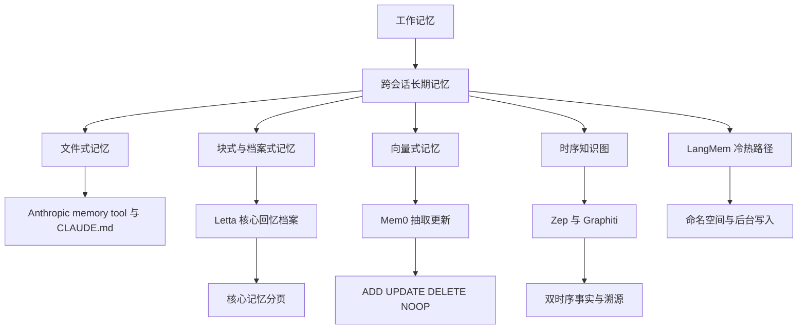
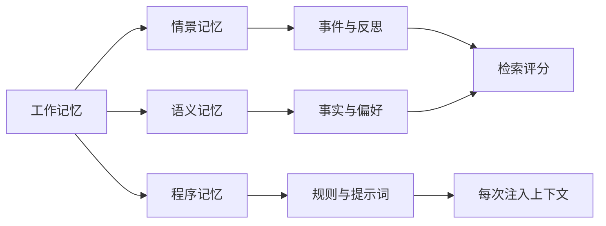
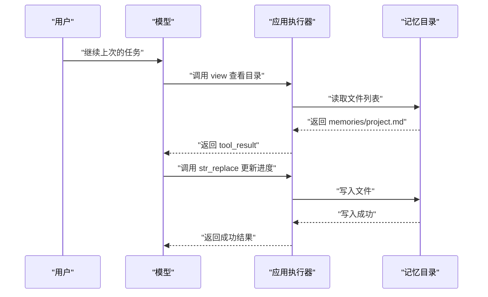
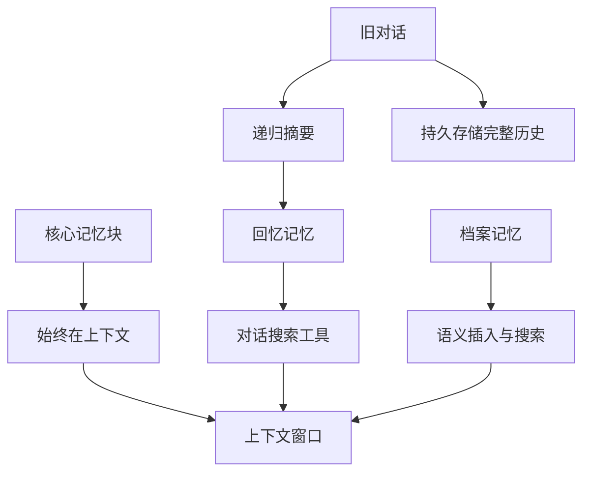
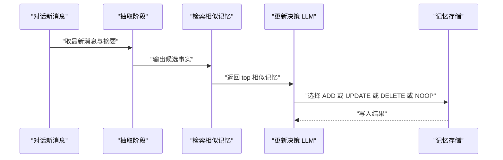
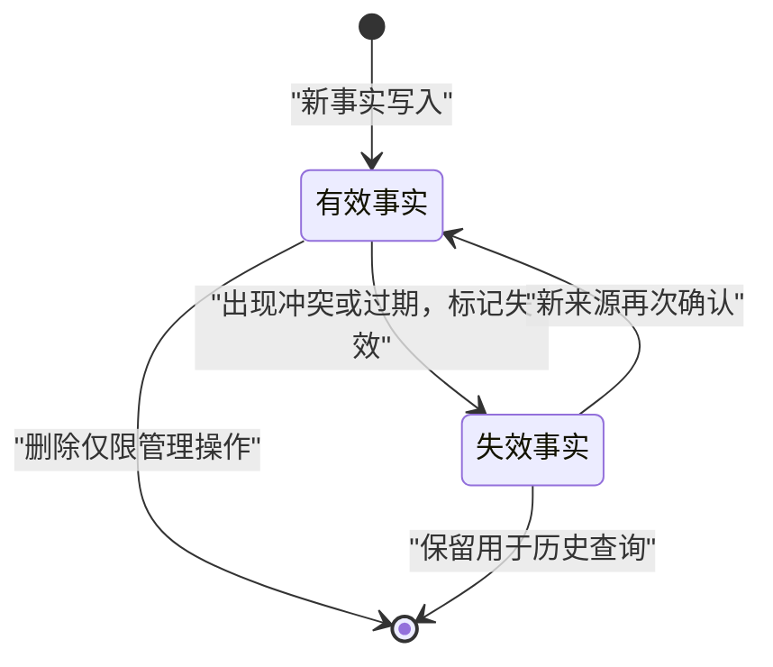
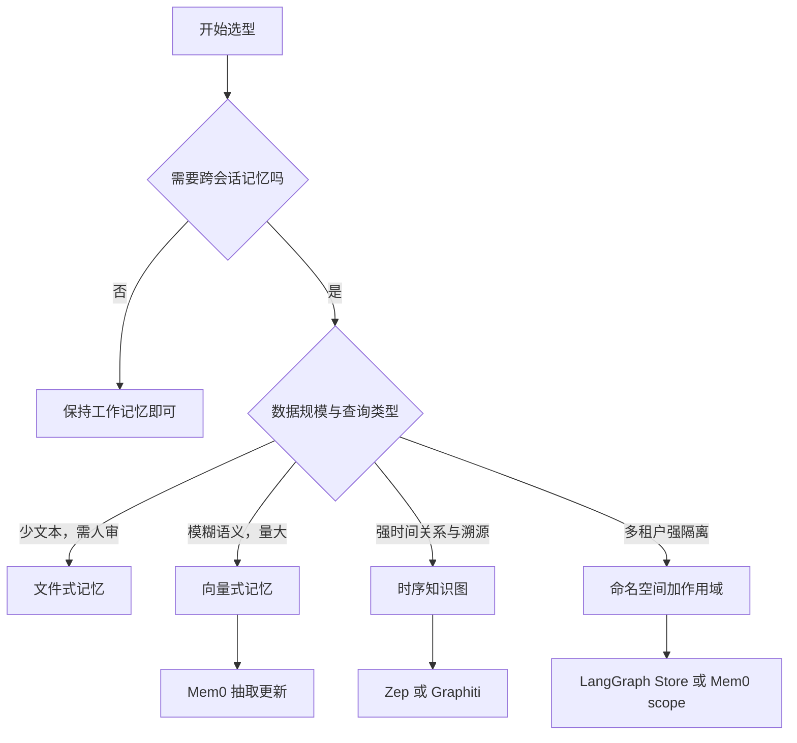

# 记忆系统对比：MemGPT/Letta、Mem0、Zep 与文件式记忆

!!! abstract "学完这一页你能"
    - 能区分工作记忆与三种长期记忆，并说出 CoALA 认知架构对工程系统的映射。
    - 能写出 Mem0 的“抽取候选事实、检索相似记忆、LLM 决定 ADD/UPDATE/DELETE/NOOP”流水线。
    - 能说清 Letta 的核心记忆、回忆记忆、档案记忆分别如何读取与写入。
    - 能依据延迟、数据规模、时间推理、审计要求四个维度，在文件式、向量式、图式记忆间做选型。

## 0. 知识地图



建议先读第 1 节建立记忆分层心智模型。  
再按文件式、Letta、Mem0、Zep、LangMem 的顺序看清写入与读取差异。  
最后读第 6 节的选型决策树与安全防御，回到业务场景做判断。

## 1. 记忆分层与 CoALA 心智模型

**先想一个问题**  
用户上周说“下个月要取消自动续费”。  
今天打开会话，系统如果只保留当前窗口，就不知道这件事。  
你需要把“当前上下文”和“跨会话长期记忆”分开处理。

**心智模型**

!!! tip "心智模型"
    - 一句话模型：工作记忆是当前任务的工作台；长期记忆是档案柜。
    - 日常类比：你正在写的便签是工作记忆，合同存档、客户偏好笔记是长期记忆。
    - 类比不成立处：人类会遗忘、会联想，LLM 的工作记忆受 token 窗口硬限制，长期记忆必须靠检索或程序注入。

!!! note "术语：工作记忆"
    - 工作记忆指当前决策周期内可见的消息、工具结果、中间草稿。
    - 例子：一次客服对话里的近 10 轮聊天记录。

!!! note "术语：情景记忆"
    - 情景记忆记录“发生过的事件”，通常带时间与情境。
    - 例子：2025-06-12 用户反馈过登录页 500 错误。

**图解**



1. 工作记忆是本轮可见信息。
2. 情景记忆保存过去会话经验。
3. 语义记忆保存事实、偏好、用户资料。
4. 程序记忆保存行为规则，常见形式是系统提示词或项目规范。
5. 检索评分从情景与语义记忆中选东西，程序记忆则通常固定注入。

**一步一步来**

这一步要做什么：用最小 Node 脚本模拟“当前窗口 + 长期记忆库”。

```javascript
// 当前窗口：只保留最近 2 条消息
const working = [];
function pushMessage(msg) {
  working.push(msg);
  if (working.length > 2) working.shift();
}
pushMessage("用户说想取消续费");
pushMessage("助手回复已记录");
console.log(working); // 当前窗口只有最近 2 条

// 长期记忆：跨会话保存
const longTerm = new Map();
longTerm.set("subscription", "用户计划下月取消自动续费");
console.log(longTerm.get("subscription"));
```

**这段代码在做什么**
- `working` 模拟上下文窗口，长度上限为 2。
- `longTerm` 模拟跨会话存储，不随窗口清除。
- 当前窗口溢出时，最旧消息被丢弃。
- 后续检索应从 `longTerm` 找回 `subscription`。

运行结果：

```text
[ '用户说想取消续费', '助手回复已记录' ]
用户计划下月取消自动续费
```

**动手验证**

```javascript
// 需要 Node 20+
import assert from "node:assert/strict";

const working = [];
const longTerm = new Map();

function resolveMemory(query) {
  if (query === "续费") return longTerm.get("subscription");
  return null;
}

working.push("用户问续费");
assert.deepEqual(working, ["用户问续费"]);
longTerm.set("subscription", "用户计划下月取消自动续费");
assert.equal(resolveMemory("续费"), "用户计划下月取消自动续费");
console.log("记忆分层验证通过");
```

运行结果：

```text
记忆分层验证通过
```

**常见坑**

| 现象 | 原因 | 怎么修 |
|------|------|--------|
| 新会话完全不记得用户偏好 | 只有工作记忆，没有长期记忆写入 | 增加长期存储，并在开头注入相关记忆 |
| 历史事实混在对话里干扰回答 | 长期记忆未做结构化 | 将事实、事件、规则分 namespace |
| 检索回一堆过期信息 | 长期记忆只按相似度取，不按时间衰减 | 加时间戳与 recency 评分 |

**用在哪里**

- 业务背景：SaaS 客服机器人需要跨会话识别同一用户。
- 这一节的知识怎么用：把续费、套餐、故障等写入长期记忆，按用户 ID 隔离。
- 用什么指标衡量收益：跨会话问题一次解决率、平均人工转接次数。
- 什么时候不该用：纯单轮问答且用户不重访时，长期记忆成本大于收益。

- 业务背景：编程助手需要记住项目的构建命令和测试入口。
- 这一节的知识怎么用：把项目规则放进程序记忆，每次启动注入。
- 用什么指标衡量收益：首次运行成功率、重复解释次数下降量。
- 什么时候不该用：仓库已通过脚本约定自动推导时，不应再写程序记忆。

**行业实践**

- CoALA 论文将智能体记忆拆为工作记忆与情景、语义、程序三种长期记忆。来源：CoALA 论文 arXiv 2309.02427。以原文为准。
- Generative Agents 论文提出记忆流、反思与检索评分，检索时把 recency、importance、relevance 线性加权。来源：Generative Agents 论文 arXiv 2304.03442。以原文为准。
- 怎么借鉴到你的项目：先按“当前窗口 + 用户事实 + 行为规则”三层落库；再用评分函数替代纯相似度检索。

**小结**
- 工作记忆是稀缺窗口，长期记忆解决跨会话问题。
- 长期记忆要细分情景、语义、程序，否则检索与注入会混乱。
- CoALA 与 Generative Agents 是多数现代记忆系统的共同上游框架。

## 2. 文件式记忆：Anthropic memory tool 与 CLAUDE.md

**先想一个问题**  
Claude Code 每次新会话开始时，怎么知道你要求“不要在没有测试时改生产代码”？  
答案是加载项目里的 CLAUDE.md。  
如果 Claude 要自己记住某个排查结论，就会用到 memory tool 写文件。

**心智模型**

!!! tip "心智模型"
    - 一句话模型：文件就是提示词，工具调用就是编辑器。
    - 日常类比：新同事入职先读团队 Wiki，再在 Wiki 里补充自己的排查笔记。
    - 类比不成立处：人类读 Wiki 有跳跃与联想，LLM 只能按目录查看、按行替换，不会自动跨文件关联。

!!! note "术语：memory tool"
    - Anthropic memory tool 是客户端执行的文件操作工具，模型通过 `tool_use` 请求创建、读取、更新、删除持久文件。
    - 例子：模型调用 `view` 看 `/memories/project.md`，再调用 `str_replace` 更新某行。

**图解**



1. 模型先查询目录，这是官方注入提示词要求的“先看记忆目录”。
2. 应用执行器负责真正读写文件，模型只发 `tool_use` 请求。
3. 文件内容是普通文本，应用可以校验路径与大小。
4. 更新后返回 `tool_result`，模型继续回答用户。

**一步一步来**

这一步要做什么：实现一个受控的 `memoryTool`，只允许在 `/memories` 下读写。

```javascript
import path from "node:path";

function safeJoin(base, target) {
  const absBase = path.resolve(base);
  const absTarget = path.resolve(base, target);
  if (!absTarget.startsWith(absBase + path.sep)) {
    throw new Error("路径越界");
  }
  return absTarget;
}

function memoryTool(action, args) {
  const base = "/memories";
  const target = safeJoin(base, args.path);
  if (action === "create") {
    return { ok: true, file: target, action };
  }
  throw new Error("未知 action");
}

console.log(memoryTool("create", { path: "project.md" }));
```

**这段代码在做什么**
- `safeJoin` 防止 `../` 路径穿越。
- 官方文档明确列出 `/memories/../../secrets.env` 这类攻击。
- `memoryTool` 只返回要操作的目标路径，实际写盘由应用控制。
- 未知动作直接抛错，避免模型滥用文件操作。

运行结果：

```text
{ ok: true, file: '/memories/project.md', action: 'create' }
```

**动手验证**

```javascript
import assert from "node:assert/strict";
import path from "node:path";
import fs from "node:fs";

const tmp = fs.mkdtempSync("/tmp/memories-");
function safeJoin(base, target) {
  const absTarget = path.resolve(base, target);
  if (!absTarget.startsWith(path.resolve(base) + path.sep)) throw new Error("越界");
  return absTarget;
}
const created = safeJoin(tmp, "project.md");
assert.ok(created.startsWith(tmp));
fs.writeFileSync(created, "第一行\n");
assert.equal(fs.readFileSync(created, "utf8"), "第一行\n");
assert.throws(() => safeJoin(tmp, "../secret.md"), /越界/);
console.log("文件式记忆验证通过");
```

运行结果：

```text
文件式记忆验证通过
```

**常见坑**

| 现象 | 原因 | 怎么修 |
|------|------|--------|
| 模型读到目录外文件 | 路径校验缺失 | 解析绝对路径，拒绝 `../` 与编码绕过 |
| 单文件太大导致 token 超限 | 无大小限制 | 每次写入前限制字节数 |
| 多会话同时写同一文件 | 无锁或版本控制 | 用 git 跟踪或加写入队列 |

**用在哪里**

- 业务背景：编程代理需要跨会话记住“哪些功能已完成、哪些待验证”。
- 这一节的知识怎么用：开工会话先读 `progress.md`，收工前更新其中的进度清单。
- 用什么指标衡量收益：重复检查减少次数、任务恢复时间。
- 什么时候不该用：数据量达到数万条、需要语义模糊检索时，文件式会变慢且难扩展。

- 业务背景：企业希望员工与 AI 共享项目规范。
- 这一节的知识怎么用：把规范写成 `CLAUDE.md`，版本管理并随仓库分发给所有会话。
- 用什么指标衡量收益：违规操作告警次数、返工次数。
- 什么时候不该用：规则需要强制执行时，应配合 PreToolUse 钩子，文件只是提示词。

**行业实践**

- Anthropic memory tool 官方文档注入系统提示：“ALWAYS VIEW YOUR MEMORY DIRECTORY BEFORE DOING ANYTHING ELSE”和“ASSUME INTERRUPTION”。来源：Anthropic memory tool 官方文档。以原文为准。
- Claude Code 官方文档建议 CLAUDE.md 控制在 200 行以内，自动记忆加载前 200 行或 25KB。来源：Claude Code 官方 Memory 文档。以原文为准。
- 怎么借鉴到你的项目：为文件记忆增加“先查看目录、假设可能中断”的强制提示；对常驻文件设置行数与字节上限。

**小结**
- 文件式记忆的核心优势是透明、可 diff、易审计。
- 读取方式是模型驱动，不是向量搜索。
- 路径校验、大小限制、并发控制是工程上必须补齐的三件事。

## 3. Letta/MemGPT：核心记忆、回忆记忆与档案记忆

**先想一个问题**  
一个客服代理要处理 300 轮对话，还要记住订单、退货政策与用户偏好。  
全部塞进上下文会爆掉 token。  
MemGPT 的答案是：像操作系统一样分页，把上下文当内存，把外部存储当磁盘。

**心智模型**

!!! tip "心智模型"
    - 一句话模型：上下文是内存页，外部存储是磁盘，代理用工具在两层间换页。
    - 日常类比：你在书桌上只放当前要用的文件，其他放档案柜，需要时再取。
    - 类比不成立处：操作系统的页替换由内核自动完成，MemGPT 的换页依赖模型自己调用工具。

!!! note "术语：虚拟上下文管理"
    - MemGPT 用中断与工具在快速记忆和慢速记忆之间搬动数据，让模型看起来拥有很大记忆。
    - 例子：旧消息从上下文移出，写入持久存储，需要时通过搜索再取回。

**图解**



1. 核心记忆块始终占用上下文。
2. 对话历史进入持久存储，移出上下文前会递归摘要。
3. 回忆记忆通过搜索工具按需取回。
4. 档案记忆用关键词或语义搜索取回，适合低频访问的大资料。
5. 三类数据最终都按需回到上下文窗口。

**一步一步来**

这一步要做什么：模拟核心记忆块与档案记忆的读路径。

```javascript
const coreMemory = new Map([
  ["user_name", "张三"],
  ["plan", "家庭版"],
]);
const archival = new Map([
  ["退款政策", "30 天内可全额退款"],
  ["发票", "支持企业增值税专用发票"],
]);

function recall(query) {
  if (archival.has(query)) return archival.get(query);
  return null;
}

console.log(coreMemory.get("user_name"));
console.log(recall("退款政策"));
```

**这段代码在做什么**
- `coreMemory` 模拟始终注入上下文的记忆块。
- `archival` 模拟低频语义库，需要查询才取回。
- `recall` 用精确 key 模拟搜索；真实系统会用向量或全文检索。

运行结果：

```text
张三
30 天内可全额退款
```

**动手验证**

```javascript
import assert from "node:assert/strict";

const core = new Map();
const archival = new Map();

function archiveInsert(key, value) {
  archival.set(key, value);
}
function archiveSearch(query) {
  return archival.get(query) ?? null;
}

core.set("user_name", "张三");
archiveInsert("退款政策", "30 天内可全额退款");

assert.equal(core.get("user_name"), "张三");
assert.equal(archiveSearch("退款政策"), "30 天内可全额退款");
assert.equal(archiveSearch("不存在的条款"), null);
console.log("Letta 分层记忆验证通过");
```

运行结果：

```text
Letta 分层记忆验证通过
```

**常见坑**

| 现象 | 原因 | 怎么修 |
|------|------|--------|
| 上下文费用越来越高 | 核心记忆块太多或太长 | 给每个块设字符上限，定期精简 |
| 旧的对话细节消失 | 递归摘要丢失具体数字 | 保留完整历史，摘要只做索引 |
| 档案检索不生效 | 只用精确 key 而非语义搜索 | 接入向量检索或全文索引 |

**用在哪里**

- 业务背景：多会话客服代理要跨天处理同一工单。
- 这一节的知识怎么用：工单号与用户诉求放核心块，历史排查结论放档案库。
- 用什么指标衡量收益：首次响应时间、工单解决率。
- 什么时候不该用：单次短会话且没有后续接触，分层记忆增加复杂度。

- 业务背景：长文档分析助手需要阅读超过上下文长度的合同或报告。
- 这一节的知识怎么用：将文档切块写入档案记忆，需要时按问题检索。
- 用什么指标衡量收益：召回覆盖率、答案引用准确率。
- 什么时候不该用：文档能一次放进上下文时，直接全文传入更准确。

**行业实践**

- MemGPT 论文提出“LLM 作为操作系统”，用虚拟上下文管理在快速与慢速记忆间交换数据。来源：MemGPT 论文 arXiv 2310.08560。以原文为准。
- Letta 文档说明 Agent SDK 已转向 MemFS 文件式记忆，并增加 dreaming 后台记忆整理。来源：Letta 官方文档。以原文为准。
- 怎么借鉴到你的项目：把高频小记存核心块，把低频大文档存档案库；不要把所有东西都放上下文。

**小结**
- Letta 的核心价值是分层：核心、回忆、档案各走不同读写路径。
- 旧消息会递归摘要，但完整历史仍保留在持久存储。
- 记忆块可被模型自编辑，工程上要限制字符数并允许审计。

## 4. Mem0：抽取、更新与作用域

**先想一个问题**  
用户先说“我住在上海”，三个月后说“我搬到杭州了”。  
如果只知道插入新地址，系统会同时保留两个冲突答案。  
Mem0 的答案是用“抽取 + 更新”流水线，用 LLM 决策修改或删除旧记忆。

**心智模型**

!!! tip "心智模型"
    - 一句话模型：先抽取候选事实，再检索相似旧记忆，最后决定新增、更新、删除或保持不动。
    - 日常类比：编辑客户档案时先找旧记录，发现地址变了就更新，发现旧信息冲突就删除。
    - 类比不成立处：人类编辑有责任审核，LLM 的 DELETE 是破坏性操作，错误决策会直接覆盖正确记忆。

!!! note "术语：作用域"
    - Mem0 用 `user_id`、`agent_id`、`app_id`、`run_id` 给记忆分片，避免不同主体记忆混在一起。
    - 例子：只拿 `user_id` 搜索时，会排掉绑了 `agent_id` 的其他记录。

**图解**



1. 抽取阶段从最新消息对与近期摘要中提取候选事实。
2. 检索阶段为每个候选事实找 top 相似记忆。
3. 更新决策 LLM 用 tool call 选 ADD、UPDATE、DELETE、NOOP。
4. UPDATE 会扩展或覆盖旧记忆，DELETE 会移除冲突旧记忆。
5. 最终写入存储并保留作用域字段。

**一步一步来**

这一步要做什么：实现一个简化版的更新决策函数，遇到冲突地址时选择 UPDATE。

```javascript
const existing = [
  { id: 1, key: "address", value: "上海", user_id: "u1" },
];

function decideUpdate(candidate, related) {
  const found = related.find(r => r.key === candidate.key && r.value !== candidate.value);
  if (found) return { action: "UPDATE", id: found.id, newValue: candidate.value };
  return { action: "ADD", value: candidate.value };
}

const decision = decideUpdate(
  { key: "address", value: "杭州" },
  existing.filter(m => m.user_id === "u1")
);
console.log(decision);
```

**这段代码在做什么**
- `existing` 保存旧地址“上海”。
- `decideUpdate` 找到同 key 不同 value，返回 UPDATE。
- 真实 Mem0 用 LLM tool call 做这个决策，这里用规则模拟。

运行结果：

```text
{ action: 'UPDATE', id: 1, newValue: '杭州' }
```

**动手验证**

```javascript
import assert from "node:assert/strict";

const memory = new Map();
function applyDecision(decision) {
  if (decision.action === "ADD") {
    const id = memory.size + 1;
    memory.set(id, { id, key: "address", value: decision.value, user_id: "u1" });
    return memory.get(id);
  }
  if (decision.action === "UPDATE") {
    const record = memory.get(decision.id);
    record.value = decision.newValue;
    return record;
  }
  if (decision.action === "NOOP") return null;
  if (decision.action === "DELETE") memory.delete(decision.id);
}

memory.set(1, { id: 1, key: "address", value: "上海", user_id: "u1" });
const decision = { action: "UPDATE", id: 1, newValue: "杭州" };
applyDecision(decision);
assert.equal(memory.get(1).value, "杭州");
assert.equal(memory.size, 1);
console.log("Mem0 更新决策验证通过");
```

运行结果：

```text
Mem0 更新决策验证通过
```

**常见坑**

| 现象 | 原因 | 怎么修 |
|------|------|--------|
| 新地址与旧地址同时被检索到 | 向量库不删除旧记忆 | 用 UPDATE 或 DELETE 而非重复 ADD |
| 用户 A 读到了用户 B 的偏好 | 作用域过滤写错 | 查询时显式传入 `user_id` 等过滤字段 |
| 更新被错误触发 | 抽取阶段把噪声当成事实 | 抽取阶段保留来源并让决策 LLM 可 NOOP |

**用在哪里**

- 业务背景：电商客服需要记住用户的收货地址、收件人、发票抬头。
- 这一节的知识怎么用：每次地址变更用 Mem0 抽取更新，不让旧地址继续参与检索。
- 用什么指标衡量收益：错误地址出库次数、地址更正的人工介入量。
- 什么时候不该用：用户每次都是新对话且不重复出现，更新机制收益很小。

- 业务背景：多租户 SaaS 产品希望每个租户的记忆相互隔离。
- 这一节的知识怎么用：按 `app_id` 或 `user_id` 分 scope，搜索时强制过滤。
- 用什么指标衡量收益：跨租户数据泄漏告警数量、审计通过率。
- 什么时候不该用：所有用户属于同一组织且无隔离需求时，作用域会增加配置复杂度。

**行业实践**

- Mem0 论文在 LoCoMo 上报告：Mem0 66.88，Mem0g 68.44，完整上下文 72.90，p95 延迟 Mem0 1.44 秒、完整上下文 17.117 秒。来源：Mem0 论文 arXiv 2504.19413。以原文为准。
- Mem0 官方文档说明作用域搜索会排除绑定 `agent_id` 的其他记录。来源：Mem0 官方文档 Entity Scoped Memory。以原文为准。
- 怎么借鉴到你的项目：用 NOOP 防过度写入，用作用域做租户隔离，评测时保留完整上下文基线。

**小结**
- Mem0 的写入路径是抽取、检索、决策、应用四步。
- DELETE 是破坏性的，应保留审计日志或软删除。
- 作用域不是可选项，凡是多用户或多租户系统必须显式隔离。

## 5. Zep 与 Graphiti：时序知识图

**先想一个问题**  
候选人 2020 年在 A 公司，2023 年跳到 B 公司。  
招聘助手回答“现在在哪家公司”要用 B，但问“2021 年在哪家公司”要用 A。  
向量存储很难同时满足这两个时间问题。

**心智模型**

!!! tip "心智模型"
    - 一句话模型：实体是节点，关系是带有效期的边，所有派生事实都可溯源到原始消息。
    - 日常类比：组织架构图每个岗位都标了起止日期，换过岗的人能查到历史任职。
    - 类比不成立处：真实公司 HR 系统有审批流，Graphiti 的事实更新由 LLM 自动决定，可能误标时间。

!!! note "术语：双时序"
    - Graphiti 同时记录事实发生在真实世界的时间（event time）和系统写入时间（ingestion time）。
    - 例子：事实“李四在 A 公司”有 event time 2020-2023，ingestion time 2025-06-01。

**图解**



1. 新事实写入后进入有效状态。
2. 出现冲突或超出有效期时，旧边被标记为失效，而不是删除。
3. 若新事件证明旧事实再次成立，可重新标记有效。
4. 管理操作才真正删除数据，常规更新只改状态。
5. 失效事实仍可用于“过去某时间是什么”的查询。

**一步一步来**

这一步要做什么：用 Node 实现带有效期的关系存储。

```javascript
const graph = [];

function addFact(from, to, role, start, end) {
  graph.push({ from, to, role, start, end, valid: true });
}

function invalidateConflicts(from, to, role, start, end) {
  for (const fact of graph) {
    if (fact.from === from && fact.to === to && fact.role === role) {
      fact.valid = false;
      fact.supersededAt = start;
    }
  }
  addFact(from, to, role, start, end);
}

addFact("李四", "A公司", "任职", "2020", "2023");
invalidateConflicts("李四", "B公司", "任职", "2023", null);
console.log(graph);
```

**这段代码在做什么**
- `addFact` 写入一条带起止时间的任职关系。
- `invalidateConflicts` 先找到同一个人同一角色的旧关系，标记失效。
- 新事实仍作为有效边写入。
- 历史关系仍然保留，可用于追溯。

运行结果：

```text
[
  { from: '李四', to: 'A公司', role: '任职', start: '2020', end: '2023', valid: false, supersededAt: '2023' },
  { from: '李四', to: 'B公司', role: '任职', start: '2023', end: null, valid: true }
]
```

**动手验证**

```javascript
import assert from "node:assert/strict";

const facts = [];
function addFact(from, to, role, start, end) {
  facts.push({ from, to, role, start, end, valid: true });
}
function invalidateConflicts(from, to, role, start) {
  for (const f of facts) {
    if (f.from === from && f.to === to && f.role === role) f.valid = false;
  }
  addFact(from, to, role, start, null);
}
function currentEmployer(person) {
  const active = facts.filter(f => f.from === person && f.role === "任职" && f.valid);
  return active.at(-1)?.to;
}
function employerAt(person, time) {
  return facts.find(f => f.from === person && f.role === "任职" && f.start <= time && (f.end === null || f.end >= time))?.to;
}

addFact("李四", "A公司", "任职", "2020", "2023");
invalidateConflicts("李四", "B公司", "任职", "2023");
assert.equal(currentEmployer("李四"), "B公司");
assert.equal(employerAt("李四", "2021"), "A公司");
assert.equal(employerAt("李四", "2024"), "B公司");
console.log("时序图验证通过");
```

运行结果：

```text
时序图验证通过
```

**常见坑**

| 现象 | 原因 | 怎么修 |
|------|------|--------|
| 旧公司出现在当前检索结果中 | 只用向量相似度，没有时间过滤 | 查询时加上 `valid=true` 或时间区间 |
| 历史时间问题答错 | 只保留当前有效边，删除了旧边 | 失效而非删除，保留 event time |
| 图数据库与向量库重复建设 | 没有清晰拆分目的 | 图管关系与时间，向量管模糊语义召回 |

**用在哪里**

- 业务背景：招聘助手需要回答候选人历史经历与当前状态。
- 这一节的知识怎么用：任职关系存成带时间区间的边，查询时按当前或历史时间过滤。
- 用什么指标衡量收益：时间类问题准确率、人工复核下降量。
- 什么时候不该用：业务没有“过去 vs 现在”的时间依赖性，引入图会增加复杂度。

- 业务背景：金融合规审计需要追踪客户身份变更历史。
- 这一节的知识怎么用：用 Graphiti 的 episode 溯源保留原始材料，便于回答“依据什么修改”。
- 用什么指标衡量收益：审计溯源耗时、监管抽查通过率。
- 什么时候不该用：数据规模很小，且审计可用变更日志替代时，无需知识图。

**行业实践**

- Graphiti 采用双时序设计，事实可被标记失效而非删除，并记录原始 episode 作为溯源。来源：Graphiti 官方 README。以原文为准。
- Zep 论文报告 LongMemEval 准确率最高提升 18.5%，并给出约 90% 更低响应延迟。来源：Zep 论文 arXiv 2501.13956。以原文为准。
- 怎么借鉴到你的项目：先让关键关系带有效起止时间，再补 episode 溯源，不急于上完整本体。

**小结**
- 时序知识图的核心是把“删除”变成“标记失效”。
- 历史事实保留后，才能回答时间敏感问题。
- 图存储的查询和写入门槛较高，需要明确业务是否需要时间推理。

## 6. LangMem、评测与选型决策树

**先想一个问题**  
线上对话里每一步都写记忆会拖慢响应。  
想做到“提问时很快，后台再把重要信息沉淀为记忆”应该怎么做？  
LangMem 提供了热路径与冷路径两种模式。

**心智模型**

!!! tip "心智模型"
    - 一句话模型：热路径是前台收银，马上处理；冷路径是夜间记账，不影响白天客流。
    - 日常类比：服务员先服务顾客，打烊后再整理库存与账本。
    - 类比不成立处：夜间记账若漏记，第二天库存不准；后台记忆若失败，用户下一次对话仍会缺记忆。

!!! note "术语：热路径与冷路径"
    - 热路径在对话中同步更新记忆，立即可用但增加响应延迟。
    - 冷路径在对话结束后异步写入，不增加响应延迟，但存在短暂不一致窗口。

**图解**



1. 先判断是否需要跨会话记忆。
2. 若只为了人可读与 git 审计，选文件式。
3. 若需模糊语义检索，选向量式。
4. 若需时间推理与来源追溯，选时序图。
5. 多租户系统必须在任何选择上补命名空间与作用域。

**一步一步来**

这一步要做什么：实现热路径写入与后台队列写入的最小模拟。

```javascript
const memory = new Map();
const backgroundQueue = [];

function hotWrite(key, value) {
  memory.set(key, value); // 同步写入，立刻可读
  return memory.get(key);
}

function coldWrite(key, value) {
  backgroundQueue.push({ key, value }); // 异步写入，不阻塞当前返回
  return "已放入后台队列";
}

function flushBackground() {
  for (const item of backgroundQueue) memory.set(item.key, item.value);
  backgroundQueue.length = 0;
}

hotWrite("theme", "dark");
coldWrite("last_query", "续费规则");
console.log([...memory.entries()]);
flushBackground();
console.log([...memory.entries()]);
```

**这段代码在做什么**
- `hotWrite` 同步写，热路径马上可用。
- `coldWrite` 只入队，响应先返回，降低延迟。
- `flushBackground` 模拟后台任务把队列写回记忆。
- 如果在 flush 前查询 `last_query`，会缺该值。

运行结果：

```text
[ [ 'theme', 'dark' ] ]
[ [ 'theme', 'dark' ], [ 'last_query', '续费规则' ] ]
```

**动手验证**

```javascript
import assert from "node:assert/strict";

const store = new Map();
const queue = [];

function hotWrite(k, v) {
  store.set(k, v);
}
function coldWrite(k, v) {
  queue.push([k, v]);
}
function flush() {
  while (queue.length) {
    const [k, v] = queue.shift();
    store.set(k, v);
  }
}

hotWrite("a", 1);
coldWrite("b", 2);
assert.equal(store.get("a"), 1);
assert.equal(store.get("b"), undefined); // 冷路径尚未 flush
flush();
assert.equal(store.get("b"), 2);
console.log("冷热路径验证通过");
```

运行结果：

```text
冷热路径验证通过
```

**常见坑**

| 现象 | 原因 | 怎么修 |
|------|------|--------|
| 响应慢但记忆很完整 | 所有写入都走热路径 | 把非立即需要的写入转冷路径 |
| 下一次对话缺新记忆 | 冷路径尚未 flush 或失败 | 记录 flush 失败并补偿重试 |
| 只看厂商自报评测就选型 | 各厂商用自己基准比较 | 重跑自己的数据，并加入完整上下文和简单 RAG 基线 |

**用在哪里**

- 业务背景：推荐系统需要根据用户浏览行为更新画像，但不能让推荐接口等待写入。
- 这一节的知识怎么用：浏览事件走冷路径，付费意图与投诉走热路径。
- 用什么指标衡量收益：接口 p95 延迟、画像更新时延。
- 什么时候不该用：所有记忆必须立即可用，且延迟预算充足，可全走热路径。

- 业务背景：企业内部 AI 助手需要记录项目归档与知识沉淀。
- 这一节的知识怎么用：会话结束后由后台任务整理记忆，不打断会议或问答。
- 用什么指标衡量收益：会议响应中断次数、知识条目产出量。
- 什么时候不该用：实时任务如股票下单助手，记忆延迟会带来业务风险。

**行业实践**

- LangMem 官方概念指南把热路径称为 active hot path，冷路径称为 subconscious，并指出冷路径不增加延迟且提取召回更高。来源：LangMem 官方概念指南。以原文为准。
- LongMemEval 论文指出商业助手与长上下文模型在超长交互中回忆准确率约下降 30%。来源：LongMemEval 论文 arXiv 2410.10813。以原文为准。
- 怎么借鉴到你的项目：把“写记忆”拆成同步与异步两类接口，异步写失败要有重试队列。

**小结**
- 冷热路径能平衡延迟与记忆完整性。
- 评测不要只看厂商自报数字，要有自己的数据与基线。
- 选型要按时间推理、审计、规模、租户隔离四个维度做决策树判断。

## 应用地图

| 场景 | 用到本页哪个知识点 | 典型技术选型 | 注意事项 |
|------|------|------|------|
| 编程代理跨会话项目规范 | 文件式记忆与 CLAUDE.md | Claude Code + git | 文件控制在 200 行内，用 PreToolUse 强制执行 |
| 客服工单恢复 | 工作记忆与核心记忆块 | Letta 核心块 + 档案检索 | 核心块别放长文档，按需检索补充 |
| 用户地址与偏好更新 | Mem0 抽取更新与作用域 | Mem0 + user_id scope | 禁止重复 ADD，DELETE 要审计 |
| 候选人履历时间问答 | Zep/Graphiti 时序知识图 | Graphiti + Neo4j | 查询必须带时间过滤，旧事实只失效不删除 |
| 推荐系统用户画像异步更新 | LangMem 冷热路径 | LangGraph Store + 异步队列 | 冷路径失败要有重试，短暂不一致可接受 |
| 金融合规审计溯源 | Graphiti episode 溯源 | Graphiti + FalkorDB 或 Neptune | 保留原始材料，满足 GDPR 删除要求 |

## 动手作业

**目标**  
给一个命令行提醒工具增加跨会话记忆：用户说过“下次聊续费政策”，重启后询问“我下次要聊什么”能正确回答。

**步骤**
1. 用一个 Markdown 文件保存记忆，每行一条。
2. 启动时读取文件，注入到当前提示。
3. 每次用户输入里出现“下次”“记住”“别忘了”时，追加一条记忆。
4. 退出时保存并做路径校验。

**验收标准**
- 重启两次后，问“我要聊什么”能返回保存的事项。
- 尝试用 `../` 路径写文件会抛错。
- 单文件可运行，`node assert` 至少验证保存、读取、路径校验三个点。

## 综合对比

| 维度 | 文件式记忆 | Letta/MemGPT | Mem0 | Zep/Graphiti | LangMem |
|------|------|------|------|------|------|
| 数据模型 | Markdown 文本 | 记忆块、对话历史、档案库 | 向量化事实 + 作用域 | 时序知识图 + episode | 命名空间文档或 profile |
| 写入方式 | 模型工具调用或人工编辑 | 模型自编辑工具 | 抽取、检索、ADD/UPDATE/DELETE/NOOP | 事实抽取、边更新、旧边失效 | 热路径或后台冷路径 |
| 读取方式 | 目录查看与文件读取 | 核心块常驻、搜索工具 | 向量检索 + scope 过滤 | 混合检索：向量、BM25、图遍历 | 直接 get、语义检索、元数据过滤 |
| 时间处理 | 无内置时间推理 | 摘要与历史可保留 | 时间戳与排序可加 | 双时序有效期，强时间推理 | 取决于文档 schema |
| 延迟与成本 | 文件读取低，整文件常驻有 token 成本 | 常驻核心块持续耗 token | 论文 p95 1.44 秒，每会话约 7k token | 单次写入与存储较重，图内存大 | 热路径加延迟，冷路径不阻塞 |
| 评测结果 | 长期记忆评测尚无公开统一数字，资料未覆盖，需核对官方文档 | 在 DMR 上 Zep 报 MemGPT 为 93.4%，来源：Zep 论文，以原文为准 | LoCoMo 上 Mem0 为 66.88，完整上下文为 72.90，来源：Mem0 论文，以原文为准 | LongMemEval 最高提升 18.5%，来源：Zep 论文，以原文为准 | LoCoMo 上 LangMem 为 58.10，来源：Mem0 论文，以原文为准 |
| 适用场景 | 项目规范、个人备忘、审计友好 | 多轮客服、长文档分析 | 用户画像、动态偏好更新 | 时间敏感问答、合规审计 | 多租户平台、异步画像 |
| 局限 | 无模糊检索、并发合并难 | 依赖模型自编辑纪律 | DELETE 破坏性、基准自报 | 图复杂度高、写入重 | 冷路径有短暂不一致 |

注意：表中数字来自各系统作者自己的评测，不是独立复现。

## 深入阅读与参考

!!! tip "怎么用这些资料"
    先读「官方文档与规范」建立准确的概念，再读「源码与示例」核对细节，最后用「教程、书籍与视频」换一种讲法加深理解。每条都写明了读哪一节、带着什么问题读。

### 官方文档与规范

| 资源 | 为什么读 | 怎么读 |
|---|---|---|
| [MemGPT's core framing: the context window is a scarce "fast memory", e (arxiv.org)](https://arxiv.org/abs/2310.08560) | MemGPT 原论文，上下文即稀缺快速内存的核心类比。 | 读 introduction 与分页机制，理解核心/回忆/档案三层如何换入换出。 |
| [Letta (the productized MemGPT) docs, as summarized from the Letta docs (docs.letta.com)](https://docs.letta.com/guides/agents/architectures/memgpt) | Letta 官方文档，MemGPT 的产品化实现与 API。 | 读 memory blocks 与 archival memory 章节，跑一个最小 agent 示例。 |
| [Memory tool lets Claude "create, read, update, and delete files that p (platform.claude.com)](https://platform.claude.com/docs/en/agents-and-tools/tool-use/memory-tool) | Anthropic memory tool 官方说明，文件式记忆的接口定义。 | 读 create/read/update/delete 命令约定，注意目录与路径约束。 |
| [Title/claim: "Mem0: Building Production-Ready AI Agents with Scalable  (arxiv.org)](https://arxiv.org/abs/2504.19413) | Mem0 原论文，讲抽取、更新与可扩展记忆架构。 | 读架构与评测部分，记录它如何做增删改与作用域隔离。 |
| [Mem0 scoping dimensions: `user_id` (persistent persona/account), `agen (docs.mem0.ai)](https://docs.mem0.ai/platform/features/entity-scoped-memory) | Mem0 官方作用域文档，user/agent/run 维度定义。 | 对照多租户需求，设计记忆读写时应传的 scope 参数。 |
| [Zep is a memory layer built on Graphiti, "a temporally-aware knowledge (arxiv.org)](https://arxiv.org/abs/2501.13956) | Zep/Graphiti 论文，讲清时序知识图的动机与设计。 | 重点读事实失效与时序边一节，思考时间维度如何建模。 |
| [LangGraph/LangMem frame it the same way: short-term memory is thread/s (langchain-ai.github.io)](https://langchain-ai.github.io/langmem/concepts/conceptual_guide/) | LangGraph/LangMem 官方记忆分层说明，与 CoALA 对应。 | 读 short-term 与 long-term 两节，画出线程级与跨线程边界。 |

### 源码与示例

| 资源 | 为什么读 | 怎么读 |
|---|---|---|
| [CLAUDE.md](https://github.com/facebook/react/blob/main/CLAUDE.md) | CLAUDE.md 实例，文件式记忆的真实写法与结构。 | 逐条对照自己项目的规则，删改出一份属于你的 CLAUDE.md。 |
| [Graphiti (open source): entities = nodes, facts/relationships = edges, (github.com)](https://github.com/getzep/graphiti) | Graphiti 开源仓库，节点-边-时序事实的可读实现。 | 看 schema 与查询接口，理解事实有效期和实体消解的实现。 |
| [Anthropic Cookbook](https://github.com/anthropics/anthropic-cookbook) | Anthropic Cookbook，可运行的 tool_use 与 RAG 示例代码。 | 跑通 tool_use 目录 notebook，改成自己数据并观察上下文增长。 |

### 教程、书籍与视频

| 资源 | 为什么读 | 怎么读 |
|---|---|---|
| [Claude Code 最佳实践](https://www.anthropic.com/engineering/claude-code-best-practices) | Claude Code 最佳实践，含 CLAUDE.md 的实战用法。 | 在自己的仓库落地 CLAUDE.md 与计划先行，一周后复盘效果。 |
| [Anthropic Courses](https://github.com/anthropics/courses) | Anthropic Courses，系统补齐 prompt 与 tool use 基础。 | 按顺序做完 Tool Use 课程，再回看记忆工具的调用形态。 |
| [Generative Agents](https://arxiv.org/abs/2304.03442) | Generative Agents，记忆流与检索打分的经典设计。 | 读 memory stream 与 retrieval 一节，设计带权重的检索实验。 |

## 自测题

??? question "1. 工作记忆和长期记忆的根本区别是什么？"
    - 工作记忆只在当前上下文窗口存活，窗口重置后消失。
    - 长期记忆跨会话保存，需要主动读写或注入。
    - 工程上长期记忆可再分为语义、情景、程序三类。

??? question "2. 文件式记忆为什么不等于向量检索记忆？"
    - 文件式读取靠模型调用工具查看目录与文件，不是相似度搜索。
    - 文件式强在透明、可 diff、可审计。
    - 文件式弱在数据量变大后无法模糊语义检索。

??? question "3. Letta 的三个记忆层分别如何读写？"
    - 核心记忆块常驻上下文，模型可编辑。
    - 回忆记忆保存对话历史，通过搜索工具取回。
    - 档案记忆是低频语义库，通过插入与搜索工具读写。

??? question "4. Mem0 抽取、检索、决策三个步骤各解决什么问题？"
    - 抽取把自然语言消息变成候选事实。
    - 检索找到可能与候选冲突或重复的旧记忆。
    - 决策用 LLM 选 ADD、UPDATE、DELETE、NOOP。

??? question "5. 为什么 Graphiti 处理冲突时不删除旧事实？"
    - 旧事实保留后可回答“过去某时间是什么”的时间问题。
    - 双时序记录 event time 与 ingestion time。
    - 删除会让审计与溯源无法恢复历史。

??? question "6. Anthropic memory tool 的安全责任为什么在应用层？"
    - 模型只发 `tool_use` 请求，真正读写由应用完成。
    - 应用必须校验路径、大小、有效期。
    - 示例攻击是 `/memories/../../secrets.env`。

??? question "7. 选型时为什么不能只看厂商评测？"
    - 各厂商用自己的基准和设置，数字不能直接横向比较。
    - 应加入完整上下文与简单 RAG 基线。
    - 应在自己业务数据上重跑准确率、p95 延迟、token 成本。

??? question "8. 热路径与冷路径各有什么代价？"
    - 热路径写入立即可读，但增加本次响应延迟。
    - 冷路径不阻塞响应，但 flush 前存在不一致窗口。
    - 生产环境应给冷路径加重试与失败补偿。

## 延伸阅读

- Anthropic memory tool 官方文档：Memory tool 章节。
- Claude Code 官方文档：Memory 章节。
- Letta 官方文档：Memory Management 与 MemGPT 架构章节。
- Mem0 官方文档：How it works 与 Entity Scoped Memory 章节。
- Graphiti 官方 README：Temporal Knowledge Graph 与 Hybrid Retrieval 章节。
- LangMem 官方概念指南：Conceptual Guide 章节。
- MemGPT 论文 arXiv 2310.08560：Virtual Context Management 章节。
- Mem0 论文 arXiv 2504.19413：LoCoMo 评测与 Pipeline 章节。
- Zep/Graphiti 论文 arXiv 2501.13956：Deep Memory Retrieval 与 LongMemEval 章节。
