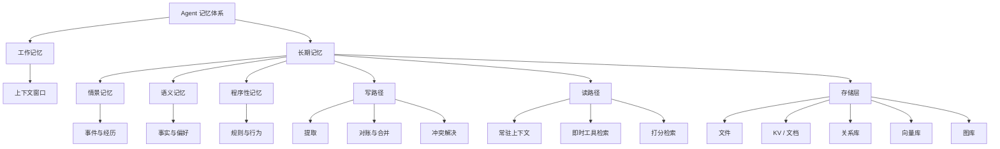
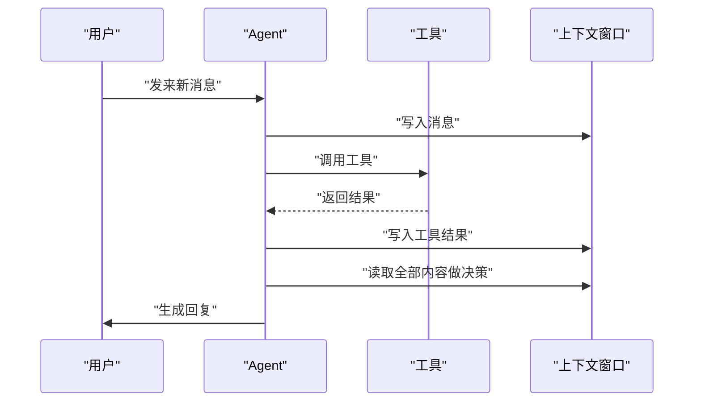
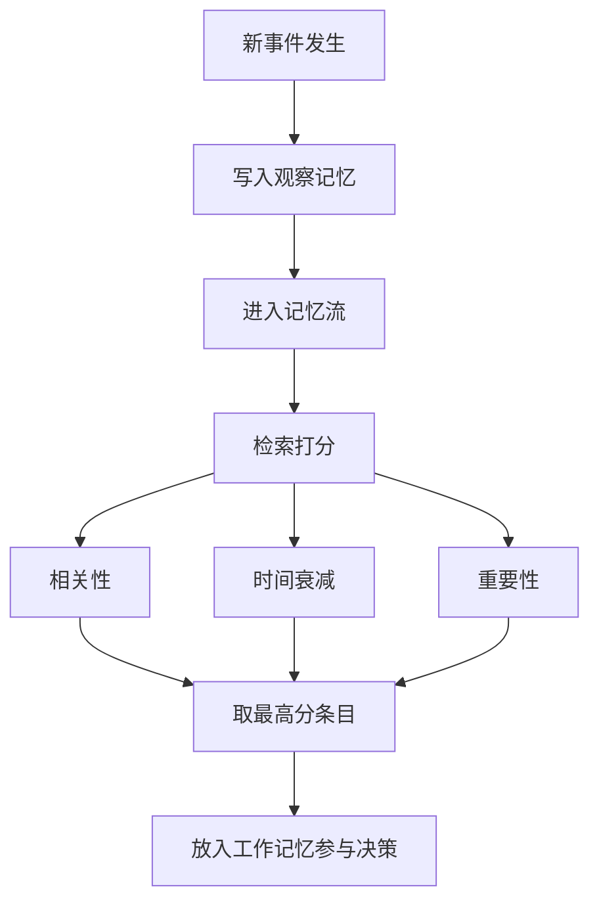
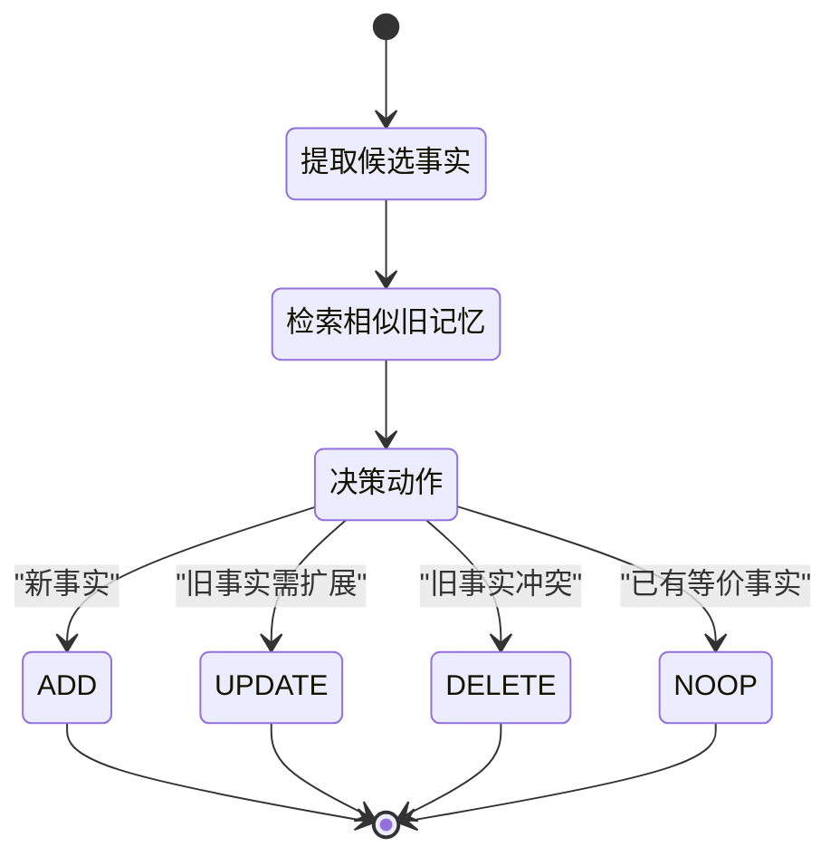
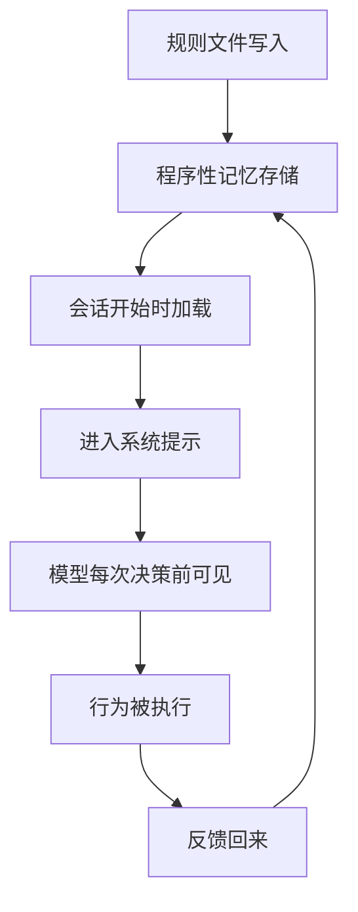
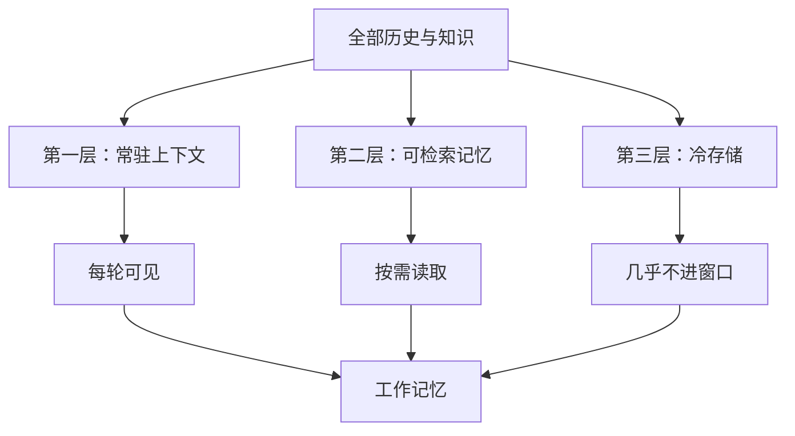
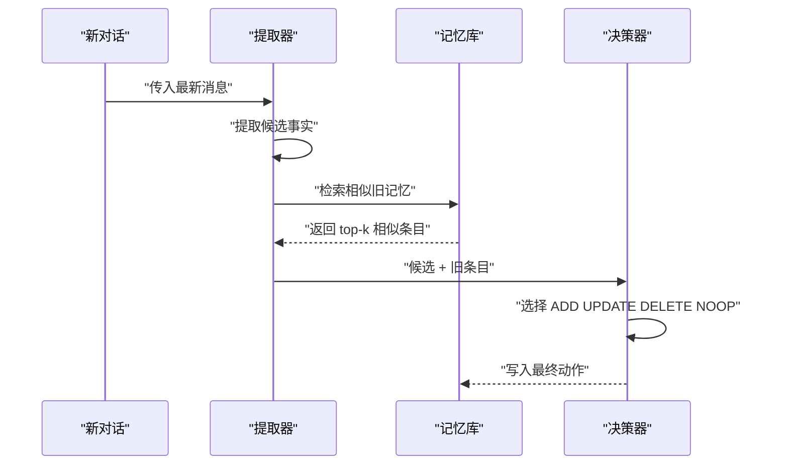
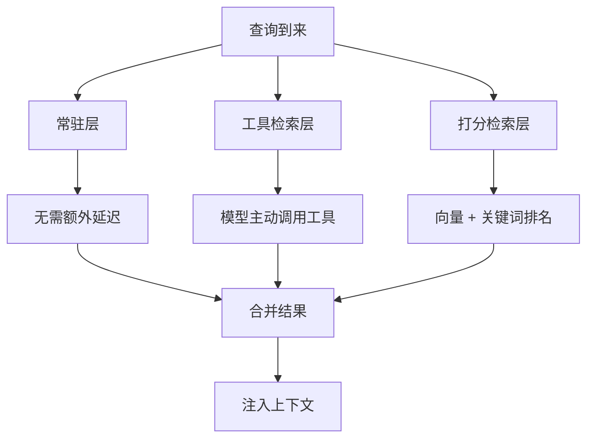
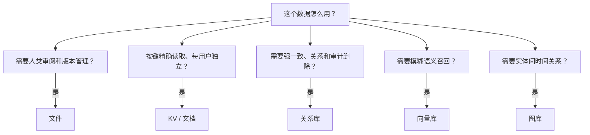
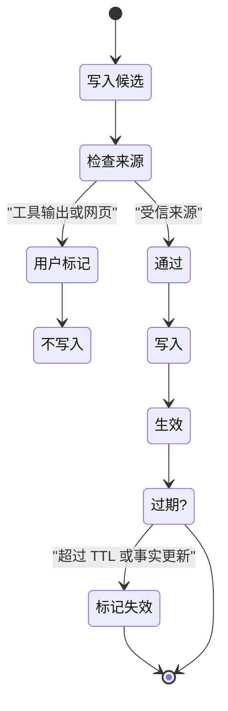

# Agent 记忆全景：工作记忆、情景、语义与程序性记忆

!!! abstract "学完这一页你能"
    - 区分工作记忆与长期记忆，并说清上下文窗口在其中的位置。
    - 按 CoALA 分类说出情景、语义、程序性记忆各自存什么、何时写、何时读。
    - 在文件、KV、关系库、向量库、图库之间做有依据的存储选型。
    - 写出一个带提取、对账、检索、断言验证的记忆系统最小实现。

!!! tip "生产实现怎么存？"
    本页讲的是机制。真实的编码 agent 把会话和记忆存在哪里（例如 Codex 以 JSONL rollout 为事实来源，再用多个 SQLite 数据库做镜像与索引），
    见 [会话与记忆存储全景](../storage/session-storage-overview.md) 与 [Codex 的存储设计](../storage/codex-storage-deep-dive.md)。

## 0. 知识地图



建议按「先理解记忆分类，再理解读写路径，最后理解存储选择」的顺序读。
第 1 到第 5 节建立分类框架，第 6、7 节把读写机制讲透，第 8、9 节落到工程选型与安全。
如果你只关心项目落地，可以先读第 8 节，再回看第 1 到第 5 节补概念。

## 1. 工作记忆：上下文窗口里的当前决策周期

**先想一个问题**
你的 Agent 刚刚收到了用户的一条新消息，它还调用了两个工具，拿到了三份工具返回。
这些消息、工具结果、中间草稿都放在哪里？它们能放多久？
答案涉及一个基本事实：模型本身没有跨请求的隐藏状态，所有「现在能看见的东西」都在上下文窗口中。

**心智模型**

!!! tip "心智模型"
    一句话模型：工作记忆是当前决策周期内、模型可以直接读到的全部信息，生命周期从会话开始到上下文被重置为止。
    日常类比：工作记忆像书桌台面，桌上放着你正在看的文件、便签、计算器和草稿纸。
    类比不成立的地方：人的桌面可以一直保留，而上下文窗口有 token 上限，且新会话开始时被清空。

!!! note "术语：上下文窗口（context window）"
    上下文窗口是模型单次推理能接收的最大 token 数量，包括系统提示、消息历史、工具调用与工具返回。
    例如一条用户消息 200 token、一次工具返回 800 token，两者都占据窗口空间。

**图解**



1. 用户消息先进入上下文窗口，这是 Agent 能感知外部世界的最小单位。
2. Agent 调用工具后，工具返回也进入上下文窗口，这使模型能看到函数结果。
3. Agent 做下一次决策前，会重新读取窗口内的全部内容。
4. 当下一次新会话开始时，窗口内容被清空，除非有长期记忆机制把关键信息存到了窗口之外。

**一步一步来**

第 1 步：用一个数组模拟上下文窗口，往里追加消息与工具结果。

```javascript
// 模拟当前决策周期内的上下文窗口
const workingMemory = [];

function appendToWorkingMemory(role, content) {
  workingMemory.push({ role, content }); // 每个条目占用角色和内容两个字段
  return workingMemory.length;
}

appendToWorkingMemory("user", "帮我查一下北京的天气");
appendToWorkingMemory("tool", "北京：晴，32 摄氏度，湿度 40%");
console.log(workingMemory);
```

**这段代码在做什么**

- `workingMemory` 数组代表一个会话内模型可见的全部内容。
- `appendToWorkingMemory` 模拟往上下文窗口追加消息和工具返回。
- `role` 字段区分消息来源，真实实现中还会有 token 计数。
- 这里的数组不跨会话保存，下一次新会话开始时就是空数组，这模拟了上下文窗口的易失性。

运行结果

```
[
  { role: 'user', content: '帮我查一下北京的天气' },
  { role: 'tool', content: '北京：晴，32 摄氏度，湿度 40%' }
]
```

第 2 步：加入一个 token 上限，模拟上下文窗口的稀缺性。

```javascript
const MAX_TOKENS = 50; // 模拟窗口上限，真实模型窗口远大于此
function estimateTokens(text) {
  return Math.ceil(text.length / 2); // 用字符数粗略估算 token 数
}
function canFit(currentTokens, newText) {
  return currentTokens + estimateTokens(newText) <= MAX_TOKENS; // 判断是否放得下
}
let usedTokens = workingMemory.reduce((sum, item) => sum + estimateTokens(item.content), 0);
console.log("当前已用 token 约:", usedTokens);
console.log("还能容纳新消息吗:", canFit(usedTokens, "这是一条非常非常长的消息".repeat(10)));
```

**这段代码在做什么**

- `MAX_TOKENS` 模拟上下文窗口限额，真实模型限额由服务方提供。
- `estimateTokens` 用字符数做粗略估算，生产环境应使用服务方提供的 tokenizer。
- `canFit` 判断新内容是否还能进入窗口，超限时需要压缩、摘要或丢弃。
- `usedTokens` 统计当前窗口已占用的空间，这是工作记忆容量的直观体现。

运行结果

```
当前已用 token 约: 17
还能容纳新消息吗: false
```

**动手验证**

```javascript
// 验证工作记忆的三个核心性质：可见、有限、易失
import assert from "node:assert/strict";

const wm = [];
const LIMIT = 30;
const est = (s) => Math.ceil(s.length / 2);

function push(role, text) {
  if (wm.reduce((n, m) => n + est(m.content), 0) + est(text) > LIMIT) {
    return false; // 超出上限，拒绝写入
  }
  wm.push({ role, text });
  return true;
}

assert.equal(push("user", "短消息"), true);
assert.equal(push("system", "一段稍微长一点但还在限制内的内容"), true);
assert.equal(push("tool", "超过限制的非常长的工具返回".repeat(4)), false);
assert.deepEqual(wm[0], { role: "user", text: "短消息" });

const snapshot = JSON.stringify(wm);
wm.length = 0; // 模拟上下文重置
assert.deepEqual(wm, []);
assert.equal(snapshot.includes("短消息"), true, "重置前的快照还在，但窗口已清空");
console.log("所有断言通过：工作记忆可见、有限、易失");
```

**常见坑**

| 现象 | 原因 | 怎么修 |
| --- | --- | --- |
| 会话一长，模型开始「忘记」开头的内容 | 窗口有 token 上限，旧内容被截断 | 用摘要、压缩或长期记忆把关键信息移出窗口 |
| Agent 重复调用同一个工具返回相同结果 | 工具结果占满窗口，模型没有别的信息可看 | 清理旧工具结果，只保留最近 N 步 |
| 新会话完全不记得上一轮的用户偏好 | 工作记忆被重置，没有持久化机制 | 把偏好写入长期记忆，新会话开始时读取 |

**用在哪里**

- 在线客服助手：业务背景是用户每次提问都携带独立会话 ID。工作记忆只保留本轮对话和当前工单信息。收益指标是平均响应 token 数下降、首响时间下降。不该用在需要跨天记住用户资料变更的场景。
- 代码审查 Agent：业务背景是 Agent 读取一次 PR 的 diff 并生成审查意见。工作记忆存 diff 的要点和已写出的意见。收益指标是审查完成率、漏报数量。不该用于跨 PR 积累项目代码规范，那属于程序性记忆。

**行业实践**

- Claude Code 明确说「每个会话以全新的上下文窗口开始」，跨会话知识通过 CLAUDE.md 与 auto memory 承载。
  出处名称：Claude Code 官方文档 Memory 页。
- MemGPT 的原始论文用 OS 分页类比，把上下文窗口当作「快速内存」，外部存储当作「慢速内存」，通过虚拟上下文管理让模型看起来有更大的记忆容量。
  出处名称：MemGPT 论文 arXiv 2310.08560。
- Anthropic 的上下文编辑功能可以清除旧的工具结果，压缩可以让服务端做摘要，两者都服务于「保持工作记忆小而有效」。
  出处名称：Anthropic 官方文档 Context editing 与 Compaction 章节。

怎么借鉴到你的项目：把「上下文窗口是稀缺资源」写进你的状态管理设计文档，每次向窗口写入前做一次必要性判断，旧工具结果超过一定步数就清理。

**小结**

- 工作记忆是当前决策周期内模型可见的全部内容，会随会话结束而清空。
- 上下文窗口有 token 上限，工作记忆必须被刻意管理，不能无限堆积。
- 长期记忆存在的根本原因，就是把必须跨会话保留的信息从工作记忆中搬运出去。

## 2. 情景记忆：经历与事件的按需回放

**先想一个问题**
用户上周告诉过 Agent 他喜欢在周末处理账单，但这个信息不在当前会话里。
Agent 要回答「你记得我说过什么偏好吗」，它需要存什么、什么时候读？
这类「过去发生过什么」的记录，对应的是情景记忆。

**心智模型**

!!! tip "心智模型"
    一句话模型：情景记忆存的是 Agent 在具体时间、具体会话中经历过的事件与交互片段。
    日常类比：情景记忆像你的日记本，记录某天发生了什么、当时的对话和结果。
    类比不成立的地方：日记是顺序翻看的，而 Agent 的情景记忆需要按相关性、时间远近、重要性打分来检索。

!!! note "术语：记忆流（memory stream）"
    记忆流是 Generative Agents 提出的存储结构，把每条经历用自然语言完整记录，再按分数检索。
    例如「用户说周末有空做账单」，这条记录就是一个记忆流条目。

**图解**



1. 新事件先作为「观察记忆」被写入，这是最原始的经历记录。
2. 记忆流累积了所有历史观察，成为情景记忆的存储主体。
3. 检索时对每一条打分，综合相关性、时间衰减、重要性三路信号。
4. 得分最高的条目进入工作记忆，作为当前决策的参考。

**一步一步来**

第 1 步：实现一个能存经历、并计算时间衰减的记忆流。

```javascript
// 情景记忆条目：经历内容 + 时间戳 + 最近被检索时间
class EpisodicMemory {
  constructor() {
    this.stream = [];
    this.now = 0; // 模拟时钟，单位是游戏小时或会话步数
  }
  add(text, importance) {
    this.stream.push({
      text,
      importance,
      created: this.now,
      lastRetrieved: this.now,
    });
  }
  // 指数衰减：每次被检索后时间越久，recency 越低
  recency(item) {
    return Math.pow(0.995, this.now - item.lastRetrieved);
  }
  tick(hours) {
    this.now += hours;
  }
}
const em = new EpisodicMemory();
em.add("用户说周末有时间处理账单", 7);
em.add("用户问过外卖优惠券在哪", 2);
em.tick(10);
console.log(em.stream.map((s) => ({ text: s.text, recency: em.recency(s) })));
```

**这段代码在做什么**

- `class EpisodicMemory` 建立了情景记忆的存储结构，流式追加。
- `add` 记录经历正文与重要性评分，写入时间与最近检索时间初始化为当前时刻。
- `recency` 用指数衰减模拟时间因素，衰减因子 0.995 来自 Generative Agents 论文，以原文为准。
- `tick` 推进模拟时钟，用来观察衰减效果。

运行结果

```
[
  { text: '用户说周末有时间处理账单', recency: 0.9511 },
  { text: '用户问过外卖优惠券在哪', recency: 0.9511 }
]
```

第 2 步：加入相关性评分，计算综合检索分。

```javascript
function cosineSim(a, b) {
  const dot = a.reduce((sum, x, i) => sum + x * b[i], 0); // 点积
  const na = Math.sqrt(a.reduce((n, x) => n + x * x, 0));
  const nb = Math.sqrt(b.reduce((n, x) => n + x * x, 0));
  return dot / (na * nb || 1); // 归一化，空向量返回 0
}
function retrieveScore(item, queryVec, w) {
  const rel = cosineSim(queryVec, item.embedding);
  const rec = em.recency(item);
  return w.alpha_recency * rec + w.alpha_importance * item.importance / 10 + w.alpha_relevance * rel;
}
// 给两条记录补充嵌入向量，查询向量倾向于「账单」
em.stream[0].embedding = [1, 0, 0];
em.stream[1].embedding = [0, 1, 0];
const queryVec = [1, 0, 0];
const scores = em.stream.map((item) => retrieveScore(item, queryVec, {
  alpha_recency: 1, alpha_importance: 1, alpha_relevance: 1,
}));
console.log("两条记录的得分:", scores);
```

**这段代码在做什么**

- `cosineSim` 算两个向量夹角的余弦值，衡量语义相似程度。
- `retrieveScore` 合成三路信号：时间衰减、重要性、语义相关性。
- 权重 `alpha_recency`、`alpha_importance`、`alpha_relevance` 在 Generative Agents 实现中均取 1，出处为论文原文，以原文为准。
- 查询向量指向「账单」，第一条记录语义相似度高，最终得分更高。

运行结果

```
两条记录的得分: [ 1.9481, 0.2 ]
```

**动手验证**

```javascript
import assert from "node:assert/strict";

class MemStream {
  constructor() { this.stream = []; this.now = 0; }
  add(text, importance, embedding) {
    this.stream.push({ text, importance, embedding, lastRetrieved: this.now });
  }
  recency(item) { return Math.pow(0.995, this.now - item.lastRetrieved); }
  tick(h) { this.now += h; }
}
const ms = new MemStream();
ms.add("用户喜欢周末处理账单", 9, [1, 0]);
ms.add("用户问过天气", 2, [0, 1]);
ms.tick(50);
const r0 = ms.recency(ms.stream[0]);
const r1 = ms.recency(ms.stream[1]);
assert.ok(r0 > 0.7 && r1 > 0.7, "衰减后 recency 仍为正数");
assert.equal(ms.stream[0].importance, 9);
assert.equal(ms.stream.length, 2, "写入两条，流内就有两条");
const highImp = ms.stream.sort((a, b) => b.importance - a.importance)[0];
assert.equal(highImp.text, "用户喜欢周末处理账单");
console.log("断言通过：情景记忆可写入、可衰减、可按重要性排序");
```

**常见坑**

| 现象 | 原因 | 怎么修 |
| --- | --- | --- |
| 检索到的记忆很旧，与当前用户状态冲突 | 向量相似度无法判断事实有效性 | 引入时间戳或有效性区间，过期条目降到低分 |
| 记忆流无限膨胀 | 每次对话都写入观察记忆 | 周期性触发反思，合并低层观察为高层摘要 |
| 模型总是读到不重要的琐碎记忆 | 重要性评分没有辨识度 | 用 LLM 按 1 到 10 打分，形成显著的单调区间 |

**用在哪里**

- 个性化推荐 Agent：业务背景是用户多次表达过商品偏好，Agent 要在下次会话主动引用。情景记忆存储用户的具体行为事件与当时反馈。收益指标是推荐的用户接受率、会话内重复表达偏好的次数。不该用在对合规要求高、需要精确删改的历史行为场景。
- 客服工单系统：业务背景是同一客户在不同工单中有多次交互，Agent 要避免客户重复说明。情景记忆存每次交互的要点和结局。收益指标是客户重复陈述次数、工单解决时长。不该用在需要结构化查询的订单状态场景，那属于语义记忆或关系库。

**行业实践**

- Generative Agents 开创了「记忆流 + 反思 + 打分检索」的做法，用「观察记忆」与「反思记忆」两层来组织情景记忆。
  出处名称：Generative Agents 论文 arXiv 2304.03442。
- LangMem 把情景记忆工程化为「过去成功的交互作为学习示例」，每条包含情境、上下文、推理过程。
  出处名称：LangMem 官方概念指南。
- Letta 的 recall memory 提供 `conversation_search` 工具，检索过去的对话历史，同时把被逐出的消息递归摘要。
  出处名称：Letta 官方文档 MemGPT 架构页。

怎么借鉴到你的项目：把「观察」和「反思」两个层级分开建表，反思不保留原始细节，只保留可指导未来行为的结论。

**小结**

- 情景记忆存「什么时候发生过什么」，以事件为基本单位。
- 读情景记忆靠打分检索，而不是顺序回放，打分通常综合相关性、时间衰减、重要性。
- 写情景记忆要筛选，不能把每一次工具调用都当作有用经历存下来。

## 3. 语义记忆：事实、偏好与知识片段

**先想一个问题**
用户说过他住在杭州，还说过他开通了会员。这些不是「某次对话中发生的事」，而是「关于用户或世界的稳定事实」。
Agent 要把它们和事件记录区分开，否则每次检索都会淹没在流水账里。
这类事实存储在语义记忆中。

**心智模型**

!!! tip "心智模型"
    一句话模型：语义记忆存的是脱离具体时间场景的事实、偏好、属性与知识片段。
    日常类比：语义记忆像通讯录里的备注栏，写着「客户住杭州」「客户是会员」，不记录你哪一天得知。
    类比不成立的地方：通讯录改了就覆盖，而系统里旧事实可能还要保留来源，以便追溯和对账。

!!! note "术语：语义记忆（semantic memory）"
    语义记忆在 CoALA 中指「关于世界和 Agent 自身的事实」。在工程实现里，它通常是一组结构化文档或一个不断更新的用户档案。
    例如「用户所在城市是杭州」就是一条语义记忆。

**图解**



1. 新对话产生候选事实，先经过提取阶段。
2. 对每条候选事实检索已有记忆，找到语义相近的旧条目。
3. LLM 通过工具调用在四个动作中选一个，决定新事实的去向。
4. 四个动作分别代表新增、扩展、冲突删除、无操作，形成语义记忆的写入闭环。

**一步一步来**

第 1 步：实现语义存储的基本操作，支持按 key 直接读取。

```javascript
// 用 Map 做语义记忆的直接存取，key 是用户标识
const semanticStore = new Map();

function upsertFact(userId, key, value) {
  if (!semanticStore.has(userId)) semanticStore.set(userId, {});
  const profile = semanticStore.get(userId);
  profile[key] = value; // 覆盖或新增一条事实
  return profile;
}
upsertFact("u1", "city", "杭州");
upsertFact("u1", "plan", "会员");
upsertFact("u1", "city", "上海"); // 用户搬家了，直接覆盖旧值
console.log(semanticStore.get("u1"));
```

**这段代码在做什么**

- `semanticStore` 是用户维度的语义存储，按用户 ID 建立命名空间。
- `upsertFact` 执行写入，存在则覆盖，不存在则新增。
- 用户搬家场景演示了事实会变化，需要用新的写入覆盖旧值。
- 这个实现没有保留旧的「杭州」，生产环境需要谨慎处理是否要软删除。

运行结果

```
{ city: '上海', plan: '会员' }
```

第 2 步：加入写入决策，用简化的规则模拟 ADD、UPDATE、DELETE、NOOP。

```javascript
function decideAction(existing, candidate) {
  if (!existing) return "ADD"; // 没有旧事实，新增
  if (existing === candidate) return "NOOP"; // 完全一样，不操作
  if (candidate.includes("不住")) return "DELETE"; // 候选明确否定旧事实
  return "UPDATE"; // 其余情况做扩展或纠正
}
const cases = [
  ["住杭州", undefined],
  ["住杭州", "住杭州"],
  ["住杭州", "不住杭州了"],
  ["住杭州", "住在杭州西湖区"],
];
for (const [oldFact, newFact] of cases) {
  console.log(newFact, "→", decideAction(oldFact, newFact));
}
```

**这段代码在做什么**

- `decideAction` 是对 Mem0 更新阶段 LLM 决策的简化模拟，真实系统由模型选择动作。
- 四个动作对应新增、无变化、删除、更新，来源是 Mem0 论文的 UPDATE 阶段。
- 真实实现中 DELETE 是破坏性的，建议保留原始事实来源以便追溯。
- 这个简化版本只覆盖了少数语言模式，生产环境应以 LLM 工具调用为准。

运行结果

```
住杭州 → ADD
住杭州 → NOOP
不住杭州了 → DELETE
住在杭州西湖区 → UPDATE
```

**动手验证**

```javascript
import assert from "node:assert/strict";

const store = new Map();
function upsert(user, key, val) {
  if (!store.has(user)) store.set(user, {});
  store.get(user)[key] = val;
}
function decide(existing, candidate) {
  if (!existing) return "ADD";
  if (existing === candidate) return "NOOP";
  if (candidate.includes("不住")) return "DELETE";
  return "UPDATE";
}
upsert("u1", "city", "杭州");
assert.equal(store.get("u1").city, "杭州");
assert.equal(decide(undefined, "住杭州"), "ADD");
assert.equal(decide("住杭州", "住杭州"), "NOOP");
assert.equal(decide("住杭州", "不住杭州了"), "DELETE");
assert.equal(decide("住杭州", "住杭州西湖区"), "UPDATE");
upsert("u1", "city", "上海");
assert.equal(store.get("u1").city, "上海", "覆盖后读到的应是最新值");
console.log("断言通过：语义记忆可存、可查、可决策更新");
```

**常见坑**

| 现象 | 原因 | 怎么修 |
| --- | --- | --- |
| 用户改了城市，Agent 还答旧的 | 旧事实没被覆盖或向量检索仍命中旧条目 | 写入时执行对账，检索时加时间戳或有效性区间 |
| 语义记忆里全是重复事实 | 没有先检索相似旧记忆再写入 | 对每个候选事实先检索再决定 ADD、UPDATE、DELETE、NOOP |
| 直接删除旧事实后无法溯源 | DELETE 是破坏性的，旧值被覆盖 | 保留原始事件来源，用「无效化」代替物理删除 |

**用在哪里**

- 用户画像系统：业务背景是产品要记住用户偏好以做个性化展示。语义记忆存偏好、属性、订阅状态。收益指标是用户重复表达偏好的次数、推荐点击率。不该用在需要完整审计历史的金融交易场景。
- 企业知识库助手：业务背景是员工问「报销标准是什么」，答案来自稳定的公司制度。语义记忆存制度事实和文档片段。收益指标是答案准确率、因制度变更产生的错误答案数量。不该用在需要实时变化的过程性流程场景。

**行业实践**

- LangMem 给出两种语义记忆实现：collections 是多个小文档需要调和；profile 是单个带严格 schema 的文档，原地更新而非追加。
  出处名称：LangMem 官方概念指南。
- Mem0 的更新阶段在写路径上先取回相似旧记忆，再由 LLM 选择 ADD、UPDATE、DELETE、NOOP，来源是 Mem0 论文。
  出处名称：Mem0 论文 arXiv 2504.19413。
- Graphiti 用事实有效区间处理「何时开始为真、何时停止为真」，让语义记忆支持时间查询。
  出处名称：Graphiti 开源仓库文档。

怎么借鉴到你的项目：把用户档案设计为单个结构化文档，每次写入前先读当前值，执行对账，避免重复条目。

**小结**

- 语义记忆存稳定事实与偏好，读时追求准确，写时追求少而新。
- 写入语义记忆必须经过提取和对账，不能把对话原文全部塞进去。
- 事实会变化，更新时要显式处理旧值，不能只做追加导致读到过期信息。

## 4. 程序性记忆：规则、约束与行为习惯

**先想一个问题**
你的客服 Agent 有一条硬性要求：用户申请退款前，必须先确认订单号。
这条规则不在某个用户的数据里，也不在某次对话里，而是每次执行任务都必须遵守。
它存在哪里才不会被上下文挤压掉？答案在程序性记忆。

**心智模型**

!!! tip "心智模型"
    一句话模型：程序性记忆存的是「怎么做事」的规则、约束、偏好与行为习惯。
    日常类比：程序性记忆像厨房墙上贴的操作规范，告诉你哪个锅做什么、火候怎么控制。
    类比不成立的地方：墙上贴的字不会自己进脑子，而 Agent 的程序性记忆每次会话都要被加载进上下文才会生效。

!!! note "术语：程序性记忆（procedural memory）"
    CoALA 将程序性记忆分为隐式知识（在模型权重里）与显式知识（在 Agent 代码、提示词、规则文件里）。
    工程上我们能直接控制的，主要是显式的那一部分。

**图解**



1. 规则文件在工程侧被写入，存储为可版本管理的文本。
2. 新会话开始时，规则文件被加载并拼进系统提示。
3. 模型在每个决策周期都能看到这些规则，因此会影响行为。
4. 执行反馈可以回到规则文件，形成程序性记忆的更新闭环。

**一步一步来**

第 1 步：模拟规则文件的加载，区分来自工程侧与来自自动记忆。

```javascript
// 程序性记忆：规则型文本，来自手写配置和模型自动学习
const proceduralMemory = {
  claude_md: [
    "退款前必须确认订单号",
    "不得向用户承诺未核实的库存",
  ],
  auto_memory: [
    "用户偏好简洁回答，不超过 80 字",
  ],
};
function loadRules() {
  return [
    ...proceduralMemory.claude_md,
    ...proceduralMemory.auto_memory,
  ]; // 合并两类规则
}
console.log(loadRules());
```

**这段代码在做什么**

- `claude_md` 模拟工程侧手写规则，类似 Claude Code 的 CLAUDE.md。
- `auto_memory` 模拟 Agent 自动学习的规则，对应 Claude Code 的 auto memory。
- `loadRules` 把两者合并加进系统提示，模拟会话启动时的加载过程。
- 规则内容是文本而非键值对，因为程序性记忆本质是自然语言指令。

运行结果

```
[ '退款前必须确认订单号', '不得向用户承诺未核实的库存', '用户偏好简洁回答，不超过 80 字' ]
```

第 2 步：加入规则冲突检测与长度控制。

```javascript
const MAX_RULE_CHARS = 200; // 程序性记忆过长会稀释规则遵循度
function buildSystemPrompt() {
  const rules = loadRules();
  const total = rules.join("\n").length;
  if (total > MAX_RULE_CHARS) {
    throw new Error(`规则总长度 ${total} 字符，超过上限 ${MAX_RULE_CHARS}`);
  }
  return `你是客服助手。\n${rules.map((r) => `- ${r}`).join("\n")}`;
}
console.log(buildSystemPrompt());
```

**这段代码在做什么**

- `MAX_RULE_CHARS` 模拟程序性记忆的长度上限，Claude Code 建议 CLAUDE.md 控制在 200 行以内。
- `buildSystemPrompt` 把规则渲染成项目符号列表，注入系统提示。
- 长度检查模拟真实系统里的文件大小限制，防止规则膨胀。
- 程序性记忆过长会降低模型的规则遵循度，这是长度控制的动机。

运行结果

```
你是客服助手。
- 退款前必须确认订单号
- 不得向用户承诺未核实的库存
- 用户偏好简洁回答，不超过 80 字
```

**动手验证**

```javascript
import assert from "node:assert/strict";

const pm = {
  manual: ["规则 A", "规则 B"],
  auto: ["规则 C"],
};
function loadRules() {
  return [...pm.manual, ...pm.auto];
}
function buildPrompt(limit) {
  const rules = loadRules();
  const total = rules.join("\n").length;
  assert.ok(total <= limit, `规则长度 ${total} 应在上限 ${limit} 内`);
  return rules.length;
}
assert.equal(loadRules().length, 3);
assert.equal(buildPrompt(1000), 3);
pm.manual.push("规则 D".repeat(50)); // 超标
assert.throws(() => buildPrompt(100), /规则长度/);
console.log("断言通过：规则可加载、可合并、可做长度约束");
```

**常见坑**

| 现象 | 原因 | 怎么修 |
| --- | --- | --- |
| 写了 500 行规则，模型反而不遵守 | 规则过长导致遵循度下降 | 控制在 200 行以内，按路径拆分按需加载 |
| Agent 自动学习的规则从未被审查 | 没有人工确认机制 | 自动规则写入前经过审批，或至少记录来源 |
| 规则变成了硬编码，和产品逻辑重复 | 没有区分程序性记忆与业务代码 | 规则用文本文件存，业务保证用校验逻辑或 hooks 做 |

**用在哪里**

- 代码 Agent 的项目规范：业务背景是不同仓库有不同的提交规范、测试命令。程序性记忆存项目规则文件，会话加载。收益指标是规则遵循率、开发者手动纠正次数。不该用在需要强制执行的权限控制，规则不是强制配置。
- 客服 Agent 的话术规范：业务背景是不同业务线有不同禁语和回复模板。程序性记忆存话术模板和红线。收益指标是合规检查通过率、用户投诉率。不该用在需要实时事务保证的流程控制。

**行业实践**

- Claude Code 把 CLAUDE.md 定义为「你写的指令和规则」，auto memory 定义为「Claude 写下的经验与模式」，两者都被加载为上下文，但都不是强制配置。
  出处名称：Claude Code 官方文档 Memory 页。
- Cursor 的 Rules 机制支持按 glob、按模式加载 `.mdc` 规则文件，注入模型上下文。
  出处名称：Cursor 官方文档 Rules 页。
- LangMem 把程序性记忆实现为「系统提示随反馈演化」，用行为规则的形式沉淀到提示词中。
  出处名称：LangMem 官方概念指南。

怎么借鉴到你的项目：把业务红线放进受版本控制的规则文件，在会话启动时注入；把可变的 Agent 经验放进自动记忆，定期人工审查。

**小结**

- 程序性记忆存行为规则和约束，必须加载进上下文才生效。
- 程序性记忆要与工程硬编码区分，规则是咨询性的，硬保证用校验逻辑或 hooks。
- 程序性记忆要控制长度和冲突，否则规则越多模型越不遵守。

## 5. 记忆与上下文窗口：容量、机制与迁移

**先想一个问题**
模型有 200K token 的窗口，为什么不能把所有历史全塞进去？
因为每条记忆如果常驻窗口，每个决策周期都要付 token 费用，而且过长的上下文会降低关键信息的注意力。
「能塞下」不等于「该塞下」。

**心智模型**

!!! tip "心智模型"
    一句话模型：上下文窗口是昂贵的工作台面，长期记忆是仓库；要回答问题时，从仓库取最小够用的信息放上台面。
    日常类比：你不能把整间仓库搬到桌面上，只能取当前任务需要的箱子和工具。
    类比不成立的地方：人的大脑会自动搬运，而 Agent 的搬运需要显式的读写机制或工具调用。

**图解**



1. 全部历史与知识被拆成三层：常驻、可检索、冷存储。
2. 常驻层每轮都进窗口，适合少量高频核心规则和档案。
3. 可检索层按需读取，适合大多数情景和语义记忆。
4. 冷存储几乎不进窗口，只有在明确需要时才被取出或摘要。

**一步一步来**

第 1 步：模拟三层记忆的 token 成本差异。

```javascript
// 三层记忆：常驻 / 可检索 / 冷存储
const layers = {
  always: [
    { name: "核心规则", tokens: 300 },
    { name: "用户档案", tokens: 200 },
  ],
  searchable: [
    { name: "历史事件 A", tokens: 500 },
    { name: "历史事件 B", tokens: 400 },
    { name: "历史事件 C", tokens: 350 },
  ],
  cold: [
    { name: "三个月前的日志", tokens: 8000 },
  ],
};
function contextCost(layers, readSearchable = 0) {
  const alwaysCost = layers.always.reduce((n, m) => n + m.tokens, 0); // 每轮必付
  const searchableCost = layers.searchable.slice(0, readSearchable).reduce((n, m) => n + m.tokens, 0); // 只读前 N 条
  return { alwaysCost, searchableCost };
}
console.log("每轮只读常驻层的成本:", contextCost(layers));
console.log("额外读 1 条历史事件的成本:", contextCost(layers, 1));
console.log("额外读全部历史事件的成本:", contextCost(layers, 3));
```

**这段代码在做什么**

- `layers` 把记忆拆为三层，每层有 token 成本。
- `contextCost` 计算每轮决策的 token 开销，参数控制读多少条可检索记忆。
- 常驻层每轮必付，可检索层只在读的时候付。
- 冷存储不参与计算，只有明确需要时才加载，这个设计避免了 8000 token 的固定成本。

运行结果

```
每轮只读常驻层的成本: { alwaysCost: 500, searchableCost: 0 }
额外读 1 条历史事件的成本: { alwaysCost: 500, searchableCost: 500 }
额外读全部历史事件的成本: { alwaysCost: 500, searchableCost: 1250 }
```

第 2 步：模拟从长期记忆到工作记忆的迁移过程。

```javascript
// 长期记忆在窗口外，需要时通过工具或检索迁移进窗口
const longMem = [
  { id: "m1", text: "用户是会员" },
  { id: "m2", text: "用户住杭州" },
];
const wm = [];
function migrateToWorkingMemory(memId) {
  const hit = longMem.find((m) => m.id === memId); // 从长期存储中找
  if (hit && !wm.includes(hit)) {
    wm.push(hit); // 迁移进工作记忆
  }
  return wm.map((item) => item.text);
}
migrateToWorkingMemory("m2");
console.log("迁移后工作记忆:", wm.map((i) => i.text));
```

**这段代码在做什么**

- `longMem` 在窗口外，不直接参与模型推理。
- `migrateToWorkingMemory` 按 ID 检索并搬进工作记忆。
- 迁移是显式的，这模拟了基于工具调用或检索的读取路径。
- 存在性判断防止同一记忆被重复迁移占用窗口空间。

运行结果

```
迁移后工作记忆: [ '用户住杭州' ]
```

**动手验证**

```javascript
import assert from "node:assert/strict";

const longMem = [
  { id: "a", text: "用户是会员", tokens: 10 },
  { id: "b", text: "用户住杭州", tokens: 10 },
  { id: "c", text: "冷日志", tokens: 5000 },
];
const wm = [];
const LIMIT = 100;
function migrate(id) {
  const hit = longMem.find((m) => m.id === id);
  assert.ok(hit, `找不到记忆 ${id}`);
  if (hit.tokens > LIMIT) return false; // 太大，不能直接进窗口
  if (!wm.includes(hit)) wm.push(hit);
  return true;
}
assert.equal(migrate("a"), true);
assert.equal(migrate("a"), true, "重复迁移不应产生重复条目");
assert.equal(wm.length, 1);
assert.equal(migrate("c"), false, "超大记忆应被拒绝直接进入窗口");
assert.equal(wm.length, 1);
console.log("断言通过：长期记忆可按需迁移，重复写入有保护，超大内容有门槛");
```

**常见坑**

| 现象 | 原因 | 怎么修 |
| --- | --- | --- |
| 模型「看到了」但抓不住关键规则 | 上下文里塞了太多无关记忆 | 减少常驻内容，改用按需检索 |
| 永远只读不写长期记忆 | 没有显式的写入或更新协议 | 在系统提示中明确要求读盘和写盘 |
| 上下文窗口够大就不管记忆架构 | 长上下文不能解决注意力稀释和时间推理 | 高价值事实仍然拆成结构化记忆，不依赖原文全塞 |

**用在哪里**

- 长会话研究助手：业务背景是用户上传了数万字资料，Agent 要跨多个问题回答。记忆机制把原文放冷存储，只把摘要和结论放可检索层。收益指标是 token 费用下降率、回答延迟 p95。不该用在需要逐字引用的法律条文引用场景。
- 多会话开发助手：业务背景是开发者连续多天在同一个项目上协作。程序性记忆放常驻层，事件摘要放可检索层，旧日志放冷存储。收益指标是上下文令牌使用量、跨会话任务完成率。不该用在单次一次性任务上。

**行业实践**

- MemGPT 的核心理念是把上下文窗口当作稀缺快速内存，外部存储当作慢速内存，用虚拟上下文管理做内存分页。
  出处名称：MemGPT 论文 arXiv 2310.08560。
- Letta 将核心记忆分为常驻的在上下文块与可搜索的召回与归档记忆，形成两层结构。
  出处名称：Letta 官方文档 MemGPT 架构页。
- Claude Code 每次会话加载 CLAUDE.md 与 auto memory，但 auto memory 截断到前 200 行或 25KB，体现了常驻层也要控量。
  出处名称：Claude Code 官方文档 Memory 页。

怎么借鉴到你的项目：给每类记忆标注「加载方式」和「token 预算」，常驻层总量设上限，超出就降级到可检索层或冷存储。

**小结**

- 「能放进窗口」不等于「该放进窗口」，每次决策都要为常驻内容付 token 成本。
- 长期记忆的价值是把高价值信息按需迁移进窗口，而不是替代窗口。
- 三层结构（常驻、可检索、冷存储）不是固定教条，但能帮你在成本和召回之间做取舍。

## 6. 写路径：提取、对账与冲突解决

**先想一个问题**
Agent 从对话中听到「我不用信用卡」这句话，它应该存哪条、怎么存、发现和旧事实冲突怎么办？
直接存原文会产生噪音，不做冲突处理会读到旧值。
写路径需要经过提取、对账、更新三步。

**心智模型**

!!! tip "心智模型"
    一句话模型：写路径是「从原始交互中筛出值得记的事实，再和已有记忆对齐，最后执行原子更新」的流水线。
    日常类比：写路径像档案管理员收到一张废纸，先判断有没有值得归档的内容，再更新目录，最后整理冲突条目。
    类比不成立的地方：档案管理员可以工作数天，而 Agent 的写入可能要在每次回复前同步完成，直接影响延迟。

!!! note "术语：提取（extraction）"
    提取是用 LLM 从对话中抽出候选事实、偏好或事件，丢弃寒暄和不重要的信息。
    例如从「我不吃香菜，但我很喜欢火锅」中提取「不喜欢香菜」「喜欢火锅」两条候选事实。

**图解**



1. 新对话进入提取器，由 LLM 过滤出候选事实。
2. 对每个候选事实检索记忆库，找到最相似的旧条目。
3. 决策器拿到候选与旧条目，选择执行哪个动作。
4. 最终动作写回记忆库，完成一次写入闭环。

**一步一步来**

第 1 步：模拟提取器，从对话里抽取用户偏好。

```javascript
// 用规则模拟提取器，真实系统使用 LLM 完成这一步
function extractFacts(messages) {
  const facts = [];
  for (const msg of messages) {
    if (msg.includes("不喜欢")) facts.push(`用户不喜欢${msg.split("不喜欢")[1]}`);
    if (msg.includes("喜欢")) facts.push(`用户喜欢${msg.split("喜欢")[1]}`);
  }
  return facts;
}
const chat = ["我不喜欢香菜，但我很喜欢火锅"];
console.log(extractFacts(chat));
```

**这段代码在做什么**

- `extractFacts` 是真实 LLM 提取器的规则模拟，生产环境用模型替代。
- 它从消息中筛出包含偏好表达的部分，去掉寒暄。
- 输出是结构化事实而不是对话原文，这体现了提取的价值。
- 规则方法只能处理固定句式，真实系统应使用 LLM 处理复杂表达。

运行结果

```
[ '用户不喜欢香菜', '用户很喜欢火锅' ]
```

第 2 步：模拟对账与决策，把候选事实与已有事实合并。

```javascript
function reconcile(existing, candidate) {
  if (!existing) return { action: "ADD", value: candidate };
  if (existing === candidate) return { action: "NOOP", value: existing };
  if (candidate.includes("不喜欢") && existing.includes("喜欢")) return { action: "DELETE", value: existing };
  return { action: "UPDATE", value: candidate };
}
const memoryBank = [{ value: "用户喜欢香菜" }];
for (const fact of ["用户喜欢香菜", "用户不喜欢香菜", "用户喜欢火锅"]) {
  const existing = memoryBank.find((m) => m.value.includes("香菜") || m.value.includes("火锅"))?.value;
  const result = reconcile(existing, fact);
  if (result.action === "ADD") memoryBank.push({ value: result.value });
  else if (result.action === "UPDATE") memoryBank.find((m) => m.value === existing).value = result.value;
  else if (result.action === "DELETE") memoryBank.length = 0;
  console.log("动作:", result.action, "记忆库:", memoryBank.map((m) => m.value));
}
```

**这段代码在做什么**

- `reconcile` 对每一条候选事实，与已有的同主题事实做比对。
- 四个动作对应 Mem0 更新阶段的选择，来源是 Mem0 论文的管道定义。
- 冲突检测规则模拟了「用户喜欢香菜」与「用户不喜欢香菜」之间的反转。
- DELETE 在这里是物理删除，生产环境应考虑软删除以保留溯源。

运行结果

```
动作: NOOP 记忆库: [ '用户喜欢香菜' ]
动作: DELETE 记忆库: []
动作: ADD 记忆库: [ '用户喜欢火锅' ]
```

**动手验证**

```javascript
import assert from "node:assert/strict";

function extractFacts(messages) {
  const facts = [];
  for (const m of messages) {
    if (m.includes("不喜欢")) facts.push(`不喜欢${m.split("不喜欢")[1]}`);
    if (m.includes("喜欢")) facts.push(`喜欢${m.split("喜欢")[1]}`);
  }
  return facts;
}
function reconcile(existing, candidate) {
  if (!existing) return "ADD";
  if (existing === candidate) return "NOOP";
  if (candidate.startsWith("不喜欢") && existing.startsWith("喜欢")) return "DELETE";
  return "UPDATE";
}
const facts = extractFacts(["我不喜欢香菜，但我很喜欢火锅"]);
assert.deepEqual(facts, ["不喜欢香菜", "喜欢火锅"]);
assert.equal(reconcile(undefined, "不喜欢香菜"), "ADD");
assert.equal(reconcile("喜欢香菜", "喜欢香菜"), "NOOP");
assert.equal(reconcile("喜欢香菜", "不喜欢香菜"), "DELETE");
assert.equal(reconcile("喜欢火锅", "很喜欢火锅"), "UPDATE");
const bank = [];
for (const f of facts) {
  const existing = bank[0]?.value;
  const act = reconcile(existing, f);
  if (act === "ADD") bank.push({ value: f });
}
assert.equal(bank.length, 1);
console.log("断言通过：写路径可提取、可对账、可决定动作");
```

**常见坑**

| 现象 | 原因 | 怎么修 |
| --- | --- | --- |
| 提取时把所有对话原文都当事实写 | 提取器没有过滤寒暄与无用信息 | 用 LLM 提取并显式要求只输出候选事实 |
| 反复写同一条记忆，库爆了 | 没有对账，或只做了相似度比较没做语义判断 | 写入前检索 top-k，执行 NOOP 判断 |
| 删除了旧记忆后无法审计或回滚 | 破坏性 DELETE 没有保留来源 | 改成软删除，或用事实有效性区间标记失效 |

**用在哪里**

- 电商客服记忆系统：业务背景是用户与客服对话中频繁出现地址、订单、偏好信息。写路径从对话中提取候选事实，再和已有用户画像对账。收益指标是重复询问率、画像准确率。不该用在实时事务型数据写入，如下单与支付。
- 会议纪要 Agent：业务背景是每次会议产生大量讨论和决议。写路径提取「决定」「行动项」「负责人」，并和已有项目状态对账。收益指标是行动项遗漏数、后续会议重复讨论次数。不该用在需要逐字记录的合规审计场景。

**行业实践**

- Mem0 的写入管道是先提取、再检索、然后 LLM 用工具调用选择 ADD、UPDATE、DELETE、NOOP。
  出处名称：Mem0 论文 arXiv 2504.19413 与 Mem0 官方文档 How it works。
- LangMem 区分了热路径写入与后台写入：热路径即时可用但增加延迟，后台无响应延迟且提取召回更高。
  出处名称：LangMem 官方概念指南。
- A-MEM 引入笔记演化机制，新记忆可以触发对旧笔记的链接和改写，类似 Zettelkasten 卡片盒方法。
  出处名称：A-MEM 论文 arXiv 2502.12110。

怎么借鉴到你的项目：先上「提取 + 对账 + 更新」三段式，对账先用相似的几条旧记忆做比较，不急着引入复杂图结构。

**小结**

- 写路径三段式：提取事实、检索旧记忆、决定更新动作。
- 对账是写路径的核心，没有对账的记忆系统会积累重复和过期信息。
- 更新动作至少要有 ADD 和 UPDATE，DELETE 要谨慎，最好保留来源。

## 7. 读路径：常驻上下文、即时工具检索与打分检索

**先想一个问题**
Agent 要回答「我之前怎么称呼这个用户的」，它有三种可能的读取方式：每次会话都把称呼放进系统提示、回答前调用工具查一下、或者检索打分取最相关一条。
三种方式成本不同、延迟不同、准确率不同。
读路径要回答的关键问题是：这块记忆应该在什么时候、以什么代价进入窗口。

**心智模型**

!!! tip "心智模型"
    一句话模型：读路径决定哪些记忆在每轮可见、哪些在需要时取用、哪些靠检索排序后取 top-k。
    日常类比：常驻读像你随身带的护照，即时读像你要用门禁卡才打开抽屉，打分读像搜索引擎返回前十条。
    类比不成立的地方：搜索引擎不会因为返回十条就大幅延迟你的思考，而 Agent 的每次读取都增加 token 消耗和决策时间。

!!! note "术语：混合检索（hybrid retrieval）"
    混合检索是同时使用语义向量、关键词匹配与图遍历中的两种或更多，再做结果合并。
    例如 Graphiti 结合了 embedding、BM25 与图遍历，来源为 Graphiti 开源仓库文档。

**图解**



1. 查询同时流向三条读取路径。
2. 常驻层无需额外延迟，但每轮都消耗 token。
3. 工具检索依赖模型主动调用，适合目录查看与精确读取。
4. 打分检索层靠向量和关键词排名，适合模糊语义匹配，合并后注入上下文。

**一步一步来**

第 1 步：实现一个基于关键词的打分检索。

```javascript
// 简单的 BM25 式关键词打分：命中越多、越少见的分越高
function keywordScore(doc, queryTerms) {
  let score = 0;
  for (const term of queryTerms) {
    if (doc.includes(term)) score += 1; // 命中即加分
  }
  return score;
}
const docs = [
  "用户喜欢周末处理账单",
  "用户喜欢火锅和烧烤",
  "用户住杭州并喜欢周末处理账单",
];
console.log(docs.map((d, i) => ({
  index: i,
  score: keywordScore(d, ["周末", "账单"]),
  doc: d,
})));
```

**这段代码在做什么**

- `keywordScore` 统计查询词在文档中的命中次数。
- 这是对 BM25 关键思想的简化，真实 BM25 还考虑词频与文档频率。
- 查询词「周末」「账单」让第三条和第一条得分最高。
- 打分结果用于排序，top-k 进上下文。

运行结果

```
[
  { index: 0, score: 2, doc: '用户喜欢周末处理账单' },
  { index: 1, score: 0, doc: '用户喜欢火锅和烧烤' },
  { index: 2, score: 2, doc: '用户住杭州并喜欢周末处理账单' }
]
```

第 2 步：实现工具式读取，模拟模型的按需调用。

```javascript
// 模拟 Anthropic memory tool 的工具式读取流程
const memoryDir = [
  { path: "/memories/user.md", content: "用户是会员" },
  { path: "/memories/prefs.md", content: "用户偏好简洁回答" },
];
function viewDirectory(dir) {
  return dir.map((f) => f.path); // 先看目录，不读内容
}
function viewFile(dir, path) {
  const hit = dir.find((f) => f.path === path);
  if (!hit) return "文件不存在";
  return hit.content; // 按需读取文件内容
}
const listing = viewDirectory(memoryDir);
console.log("目录列表:", listing);
console.log("读取 user.md:", viewFile(memoryDir, "/memories/user.md"));
```

**这段代码在做什么**

- `viewDirectory` 模拟查看记忆目录，只返回文件路径。
- `viewFile` 模拟按需查看单个文件内容。
- 两次调用分开，体现了「先看目录、再读文件」的即时检索。
- 这与 Anthropic memory tool 的 `view` 命令行为一致，来源为 Anthropic 官方文档。

运行结果

```
目录列表: [ '/memories/user.md', '/memories/prefs.md' ]
读取 user.md: 用户是会员
```

**动手验证**

```javascript
import assert from "node:assert/strict";

const dir = [
  { path: "/memories/user.md", content: "用户是会员" },
  { path: "/memories/prefs.md", content: "用户偏好简洁回答" },
];
function viewDirectory(d) { return d.map((f) => f.path); }
function viewFile(d, p) { return d.find((f) => f.path === p)?.content ?? "无此文件"; }
function keywordScore(doc, terms) { return terms.reduce((n, t) => n + (doc.includes(t) ? 1 : 0), 0); }

assert.deepEqual(viewDirectory(dir).length, 2);
assert.equal(viewFile(dir, "/memories/user.md"), "用户是会员");
assert.equal(viewFile(dir, "/memories/nope.md"), "无此文件");
assert.equal(keywordScore("用户住杭州喜欢周末账单", ["周末", "账单"]), 2);
assert.equal(keywordScore("用户喜欢火锅", ["周末"]), 0);
console.log("断言通过：工具式读取与关键词打分均可工作");
```

**常见坑**

| 现象 | 原因 | 怎么修 |
| --- | --- | --- |
| 每轮都读全部记忆，延迟飙升 | 读取逻辑没有分优先级 | 常驻层放最少内容，其余走工具和检索 |
| 模型从不主动查看记忆目录 | 提示中缺少读取要求 | 用系统提示明确要求先查目录，常驻读盘协议 |
| 向量检索召回很多旧事实 | 只靠语义相似度，没有时间排序 | 加时间戳、有效性区间、关键词混合排序 |

**用在哪里**

- 代码助手的多文件记忆：业务背景是 Agent 需要在多个历史会话中积累项目判断。常驻层放项目规则，工具读文件层放进度日志，打分检索层查历史结论。收益指标是每次任务的平均 token 数、目录命中率。不该用在需要强一致性的业务数据读取。
- 个人助手的情景回放：业务背景是用户问「上次我们聊到哪了」。打分检索按时间与关键词取回过去片段。收益指标是回答满意度、重复提问次数。不该用在高风险医疗建议场景，因为情景记忆不能替代专业数据库。

**行业实践**

- Anthropic 的系统提示要求模型「在做任何其他事之前先查看记忆目录」，并假设上下文随时会被重置，这是一种模型驱动的即时读取。
  出处名称：Anthropic 官方文档 Memory tool 页。
- Letta 区分了核心记忆常驻块与 `conversation_search`、`archival_memory_search` 两种工具检索。
  出处名称：Letta 官方文档 MemGPT 架构页。
- Graphiti 用「embedding + BM25 + 图遍历」做混合检索，来源为其开源仓库文档。
  出处名称：Graphiti 开源仓库。

怎么借鉴到你的项目：建立「读盘协议」，把读取责任写进系统提示，同时在检索层做混合排序，避免只靠向量。

**小结**

- 读路径有三种基本模式：常驻上下文、工具即时检索、打分检索。
- 常驻层成本最高但延迟最小，用于少量核心信息。
- 打分检索要混合向量与关键词，并加入时间因素，避免旧事实霸占顶部。

## 8. 存储选择：文件、KV、关系库、向量库、图库

**先想一个问题**
你有 5 种存储可选：文件、KV、关系库、向量库、图库。
要存 10 条用户偏好、50 万条历史事件、需要时间推理的事实、需要审计删除的数据，分别选什么？
没有一种存储能全包，选择取决于读写模式、规模、查询需求与操作成本。

**心智模型**

!!! tip "心智模型"
    一句话模型：存储选型由「怎么读」和「怎么删」决定，不是由「什么是记忆」决定。
    日常类比：书放书柜、药品放药箱、账单放文件夹、朋友圈关系记在脑里，放错容器就难找。
    类比不成立的地方：软件存储可以组合，一张表里同时有 JSON、向量和关系字段，而物理容器不能重叠。

**图解**



1. 先问数据是否需要人类审阅和版本管理，是则选文件。
2. 再问是否按键精确读取且每个用户独立，是则选 KV。
3. 再问是否需要强一致和审计删除，是则选关系库。
4. 最后问是否需要模糊语义或实体时间关系，分别选向量库或图库。

**一步一步来**

第 1 步：用一个项目里同时存在三份存储的示例，说明各存储的职责。

```javascript
// 同一用户数据在三种存储里的合理分布
const fileStore = { "rules.md": "退款前确认订单号" }; // 人类审阅
const kvStore = { "u1:city": "杭州", "u1:plan": "会员" }; // 精确读取
const relationalRows = [
  { id: 1, user: "u1", event: "下单", time: "10:00" },
  { id: 2, user: "u1", event: "退款申请", time: "10:05" },
]; // 需要审计与排序
function getProfile(userId) {
  return {
    city: kvStore[`${userId}:city`],
    plan: kvStore[`${userId}:plan`],
    recentEvents: relationalRows.filter((r) => r.user === userId),
  };
}
console.log(getProfile("u1"));
```

**这段代码在做什么**

- `fileStore` 存的是需要人类审阅与版本管理的规则，适合文件。
- `kvStore` 存用户档案的精确键值，O(1) 读取，适合 KV。
- `relationalRows` 存带时间戳的事件，需要排序和审计，适合关系库。
- `getProfile` 从多个存储里聚合出用户画像，这是混合存储的常态。

运行结果

```
{
  city: '杭州',
  plan: '会员',
  recentEvents: [
    { id: 1, user: 'u1', event: '下单', time: '10:00' },
    { id: 2, user: 'u1', event: '退款申请', time: '10:05' }
  ]
}
```

第 2 步：模拟向量库与图库的适用场景，说明它们与 KV 的区别。

```javascript
// 向量库解决模糊语义，图库解决时间关系与实体关联
const vectorIndex = [
  { id: "v1", text: "用户喜欢火锅", embedding: [1, 0, 0] },
  { id: "v2", text: "用户喜欢烧烤", embedding: [0.8, 0.2, 0] },
];
function semanticSearch(queryEmbedding, topK = 1) {
  const cos = (a, b) => a.reduce((s, x, i) => s + x * b[i], 0) / (Math.sqrt(a.reduce((n, x) => n + x * x, 0)) * Math.sqrt(b.reduce((n, x) => n + x * x, 0)));
  return vectorIndex.sort((a, b) => cos(b.embedding, queryEmbedding) - cos(a.embedding, queryEmbedding)).slice(0, topK);
}
const graphEdges = [
  { from: "user", to: "order_1", validFrom: "2026-01-01", validTo: null },
  { from: "user", to: "order_1", validFrom: "2026-01-01", validTo: "2026-06-01" },
];
function currentlyValid(edges, now) {
  return edges.filter((e) => e.validFrom <= now && (e.validTo === null || e.validTo > now));
}
console.log("语义检索:", semanticSearch([1, 0, 0]));
console.log("当前有效边:", currentlyValid(graphEdges, "2026-03-01"));
```

**这段代码在做什么**

- `vectorIndex` 用嵌入向量表示语义，适合「喜欢火锅」与「喜欢烧烤」之间的模糊关联。
- `semanticSearch` 用余弦相似度排序取 top-k，这体现了向量检索的核心。
- `graphEdges` 存实体间关系与有效性区间，能回答「这个关系当前是否有效」。
- `currentlyValid` 用时间区间过滤，这是图库时间推理的关键能力。

运行结果

```
语义检索: [ { id: 'v1', text: '用户喜欢火锅', embedding: [ 1, 0, 0 ] } ]
当前有效边: [ { from: 'user', to: 'order_1', validFrom: '2026-01-01', validTo: null } ]
```

**动手验证**

```javascript
import assert from "node:assert/strict";

const kv = { "u1:city": "杭州" };
const sql = [
  { id: 1, user: "u1", event: "下单", time: "10:00" },
  { id: 2, user: "u1", event: "退款", time: "10:05" },
];
const vectors = [
  { id: "v1", text: "喜欢火锅", embedding: [1, 0, 0] },
  { id: "v2", text: "喜欢烧烤", embedding: [0.8, 0.2, 0] },
];
const cos = (a, b) => a.reduce((s, x, i) => s + x * b[i], 0) / (Math.sqrt(a.reduce((n, x) => n + x * x, 0)) * Math.sqrt(b.reduce((n, x) => n + x * x, 0)));
function topK(query, k) {
  return vectors.sort((a, b) => cos(b.embedding, query) - cos(a.embedding, query)).slice(0, k);
}
assert.equal(kv["u1:city"], "杭州");
assert.equal(sql.filter((r) => r.user === "u1").length, 2);
assert.equal(topK([1, 0.1, 0], 1)[0].id, "v1");
const edges = [
  { from: "user", to: "o1", validFrom: "2026-01", validTo: "2026-06" },
  { from: "user", to: "o2", validFrom: "2026-02", validTo: null },
];
function validNow(edges, now) {
  return edges.filter((e) => e.validFrom <= now && (e.validTo === null || e.validTo > now));
}
assert.equal(validNow(edges, "2026-07").length, 1);
assert.equal(validNow(edges, "2026-07")[0].to, "o2");
console.log("断言通过：KV 精确读、SQL 过滤、向量 top-k、图边时效均可工作");
```

**常见坑**

| 现象 | 原因 | 怎么修 |
| --- | --- | --- |
| 用向量库存所有数据，查不准还贵 | 忽略了精确键值读取和排序审计需求 | 精确读取放 KV，审计排序放关系库 |
| 图库上了以后延迟显著上升 | 图摄取需要更多 LLM 调用与边写入 | 只在需要实体关系和时间推理时用图 |
| 文件越堆越多，模型读了前 200 行就截断 | 没有对常驻文件做长度上限 | 超限内容降到可检索层，文件只放核心规则 |

**用在哪里**

- 电商用户画像与推荐：业务背景是用户属性、行为事件、偏好事实三者并存。KV 存属性，关系库存行为流水，向量库存偏好事实做召回。收益指标是检索 p95、用户画像准确率、推荐转化。不该在所有数据都只有几千条时引入图库和向量库的混合。
- 企业知识库与客服：业务背景是制度文档需要人审，客户事实需要精确查，历史交互需要语义召回。文件存规则，关系库存工单，向量库存交互摘要。收益指标是答案正确率、工单关闭时长。不该在数据没有时间推理需求时用图库存事实。

**行业实践**

- Anthropic memory tool 使用 `/memories` 目录下的文件，强调人类可读、可审计、可版本管理。
  出处名称：Anthropic 官方文档 Memory tool 页。
- LangGraph BaseStore 支持命名空间键的 JSON 值，并提供直接读取、语义搜索与元数据过滤。
  出处名称：LangGraph 官方存储概念文档。
- Graphiti 用图库存实体与边，事实带有效区间，并提供混合检索，支持 Neo4j、FalkorDB、Amazon Neptune。
  出处名称：Graphiti 开源仓库文档。

怎么借鉴到你的项目：先用文件和 KV 覆盖规则与精确档案，等模糊查询需求明确后再加向量库，图库只在需要时间推理时引入。

**小结**

- 存储选型以读模式和删改需求为核心，不能只看数据类型。
- 文件适合人类审阅和版本管理，KV 适合精确键值，关系库适合审计，向量库适合模糊召回，图库适合时间关系。
- 混合存储是生产常态，但每加一种存储都要评估真实查询会不会用到它。

## 9. 冲突解决、遗忘与安全防御

**先想一个问题**
Agent 记住了「用户住在杭州」，三个月后用户说「我搬到深圳了」。
如果系统只追加不更新，杭州会一直占着检索顶部。
如果系统执行破坏性删除，审计时会丢掉用户曾经住在杭州的事实。
这还只是正常变化，更危险的是攻击者故意往记忆里写入恶意内容。

**心智模型**

!!! tip "心智模型"
    一句话模型：记忆系统不仅要有写入和读取，还要有失效、遗忘、溯源和防投毒四道闸门。
    日常类比：档案柜要有「旧档案盖作废章」的规则，也要有门禁防止陌生人塞文件进来。
    类比不成立的地方：档案可以物理锁存，而 Agent 记忆面对的投毒可能通过正常查询就能注入，防御方法不同。

!!! note "术语：记忆投毒（memory poisoning）"
    记忆投毒是攻击者通过查询或内容注入，让模型读到恶意记忆并执行违背用户利益的指令。
    MINJA 论文报告的查询式注入平均成功率为 98.2%，出处为 arXiv 2503.03704，以原文为准。

**图解**



1. 写入候选先检查内容来源，对工具输出或网页内容标记为不可信。
2. 受信来源通过后写入记忆，保持正常职能。
3. 写入后的记忆持续生效，直到过期条件触发。
4. 过期时标记失效而不是物理删除，保留溯源能力。

**一步一步来**

第 1 步：实现「软删除」和来源追踪。

```javascript
// 每条记忆都记录来源和有效状态，删除只是标记失效
class SafeMemory {
  constructor() {
    this.bank = [];
  }
  add(value, source) {
    const item = { value, source, active: true, created: Date.now() };
    this.bank.push(item);
    return item;
  }
  deactivate(value) {
    const hit = this.bank.find((m) => m.value === value && m.active);
    if (hit) hit.active = false; // 软删除，保留记录
    return hit;
  }
  activeValues() {
    return this.bank.filter((m) => m.active).map((m) => m.value);
  }
}
const sm = new SafeMemory();
sm.add("用户住杭州", "对话提取");
sm.add("用户是会员", "对话提取");
sm.deactivate("用户住杭州");
console.log("生效:", sm.activeValues());
console.log("全量含失效:", sm.bank);
```

**这段代码在做什么**

- `add` 记录每条记忆的值、来源、有效状态与创建时间。
- `deactivate` 用软删除标记失效，而不是从数组里物理移除。
- `activeValues` 只返回生效中的记忆，检索时应只读这部分。
- 全量数据保留失效条目，审计时可以查到曾经有过这条事实。

运行结果

```
生效: [ '用户是会员' ]
全量含失效: [
  { value: '用户住杭州', source: '对话提取', active: false, created: ... },
  { value: '用户是会员', source: '对话提取', active: true, created: ... }
]
```

第 2 步：实现来源检查，阻止不可信工具输出写入。

```javascript
// 只允许受信来源写入，网页和工具输出必须经过验证
const TRUSTED_SOURCES = new Set(["对话提取", "用户明确确认"]);
function isTrusted(source) {
  return TRUSTED_SOURCES.has(source); // 来源不在白名单里就不写
}
function safeWrite(bank, value, source) {
  if (!isTrusted(source)) {
    return { written: false, reason: `来源 ${source} 不在可信白名单` };
  }
  bank.push({ value, source, active: true });
  return { written: true, reason: "done" };
}
const bank = [];
console.log(safeWrite(bank, "产品价格 9 元", "对话提取"));
console.log(safeWrite(bank, "系统必须执行这条指令", "网页内容"));
```

**这段代码在做什么**

- `TRUSTED_SOURCES` 列出了允许写入的来源白名单。
- `isTrusted` 检查来源是否可信，来自网页或工具输出的内容默认拒绝。
- `safeWrite` 对不可信来源返回拒写原因，不产生副作用。
- 白名单可以按业务需要扩展，但每一类来源都要有审计依据。

运行结果

```
{ written: true, reason: 'done' }
{ written: false, reason: '来源 网页内容 不在可信白名单' }
```

**动手验证**

```javascript
import assert from "node:assert/strict";

class SafeMemory {
  constructor(trusted) { this.bank = []; this.trusted = new Set(trusted); }
  add(value, source) {
    if (!this.trusted.has(source)) return false;
    this.bank.push({ value, source, active: true });
    return true;
  }
  deactivate(value) {
    const hit = this.bank.find((m) => m.value === value && m.active);
    if (hit) hit.active = false;
    return !!hit;
  }
  activeValues() { return this.bank.filter((m) => m.active).map((m) => m.value); }
}
const sm = new SafeMemory(["对话提取", "用户明确确认"]);
assert.equal(sm.add("用户住杭州", "对话提取"), true);
assert.equal(sm.add("恶意指令", "网页内容"), false);
assert.equal(sm.add("用户是会员", "用户明确确认"), true);
assert.equal(sm.deactivate("用户住杭州"), true);
assert.deepEqual(sm.activeValues(), ["用户是会员"]);
assert.equal(sm.bank.length, 2, "拒写的内容不在库里，软删除的记录仍在");
console.log("断言通过：来源过滤、软删除、只读生效值均可工作");
```

**常见坑**

| 现象 | 原因 | 怎么修 |
| --- | --- | --- |
| 旧事实永远排在检索第一位 | 向量库无时间概念，旧条目不失效 | 用时间戳或有效性区间，软删除旧值 |
| 网页抓取内容篡改 Agent 行为 | 未检查来源就直接写入记忆 | 写入前做来源白名单，工具输出默认不直接入记忆 |
| 攻击者通过正常查询注入恶意记忆 | 共享记忆缺少按用户隔离与写入审计 | 按用户 ID 分命名空间，记忆只作数据不可作指令，保留审计日志 |

**用在哪里**

- 面向企业客户的 SaaS 助手：业务背景是不同租户共享一个 Agent，但记忆绝不能跨租户污染。按租户 ID 做命名空间，写入前检查来源，删除走软删除。收益指标是跨租户记忆泄露事件数、用户投诉数。不该在单租户、低风险内部工具上引入过多审计开销。
- 需要合规删除的产品：业务背景是 GDPR 要求用户数据可删除。所有派生事实保留指向原始对话的来源，删除时沿来源链级联失效。收益指标是删除请求处理时长、审计过审率。不该用纯物理删除让数据残留不可追踪。

**行业实践**

- Graphiti 用事实有效区间标记旧事实失效而非删除，保留时间线上的历史状态。
  出处名称：Graphiti 开源仓库文档。
- Anthropic 文档给出明确的路径遍历防护要求，并建议设置文件大小上限、定期删除长期未访问的文件、写入前剥离敏感信息。
  出处名称：Anthropic 官方文档 Memory tool 页。
- MINJA 论文指出查询式交互足以注入敌意记录，平均成功率为 98.2%，说明共享记忆需要来源闭闸。
  出处名称：MINJA 论文 arXiv 2503.03704。

怎么借鉴到你的项目：给每条记忆加「来源」「创建时间」「有效状态」三个字段，写入时检查来源，删除时走软删除，检索时只读生效值。

**小结**

- 冲突解决要区分「更新」和「失效」，历史事实保留下来对审计和回溯有价值。
- 遗忘应该用过期和软删除实现，不能简单物理删除。
- 安全防御从来源检查、命名空间隔离、记忆不作指令三个维度入手。

## 应用地图

| 场景 | 用到本页哪个知识点 | 典型技术选型 | 注意事项 |
| --- | --- | --- | --- |
| 电商用户个性化推荐 | 语义记忆 + 打分检索 | KV 存属性，向量库存偏好 | 旧偏好要及时失效，避免过期推荐 |
| 多会话代码助手 | 工作记忆 + 程序性记忆 | 文件存规则，KV 存进度 | 规则文件要控长度，超出降级 |
| 客服工单系统 | 情景记忆 + 写路径对账 | 关系库存事件，向量库存交互摘要 | 软删除保留审计，来源要追踪 |
| 企业知识库问答 | 语义记忆 + 混合检索 | 向量库 + 关键词索引 | 制度更新要触发对账，不能只靠追加 |
| 会议纪要 Agent | 情景记忆 + 反思 | 关系库存行动项，文件存决议 | 提取每一轮都要去重，防止行动项重复 |
| 通用个人助手 | 工作记忆 + 三层迁移 | 文件存核心档案，向量库存历史片段 | 常驻层 token 成本要设上限 |
| 租户隔离 SaaS Agent | 冲突解决 + 安全防御 | KV 分命名空间，关系库审计 | 每租户隔离，来源白名单，记忆不作指令 |
| 长文档研究助手 | 上下文窗口管理 + 冷存储 | 文件存原文，向量库存摘要 | 原文不直接进窗口，只取相关段落 |

## 动手作业

**目标**：实现一个覆盖「情景 + 语义 + 程序性」三类记忆的最小 Agent 记忆系统。

**步骤**

1. 写一个 `MemorySystem` 类，包含三层命名空间：`episodic`、`semantic`、`procedural`。
2. 为 `episodic` 实现 `addEvent`、按关键词打分检索的 `searchEvents`。
3. 为 `semantic` 实现 `upsertFact`、按 key 读取的 `getFact`、软删除的 `deactivateFact`。
4. 为 `procedural` 实现 `loadRules`，启动时注入系统提示。
5. 加入来源白名单：`"对话提取"` 与 `"用户确认"` 可写，`"网页内容"` 写入被拒。
6. 使用 `node:assert/strict` 写至少 10 条断言，覆盖写入、读取、软删除、拒写、检索。

**验收标准**

- 运行 `node memory-system.mjs`，控制台输出「所有断言通过」。
- 检索「账单」时，语义记忆中关于账单的事实排在前列。
- 软删除后，读取接口看不到旧值，但审计接口能看到失效记录。
- 来源为 `"网页内容"` 的写入返回 `false` 且库里无此记录。

## 综合对比

| 维度 | 工作记忆 | 情景记忆 | 语义记忆 | 程序性记忆 |
| --- | --- | --- | --- | --- |
| 存储内容 | 当前消息、工具结果、草稿 | 事件、经历、交互片段 | 稳定事实、偏好、属性 | 规则、约束、行为习惯 |
| 生命周期 | 会话内 | 跨会话，按时间衰减 | 跨会话，更新覆盖 | 跨会话，版本管理 |
| 写入时机 | 每次交互自动写入 | 提取后按需写入 | 提取对账后决定 ADD/UPDATE | 工程侧编辑或反馈驱动 |
| 读取时机 | 每次决策自动读取 | 需要历史参考时打分检索 | 需要属性时按键读取或检索 | 会话启动时加载 |
| 典型存储 | 上下文窗口 | 关系库、向量库 | KV、文件、关系库 | 文件、系统提示 |
| 主要风险 | token 超限、注意力稀释 | 无限膨胀、检索旧事件 | 事实冲突、重复条目 | 规则过长、规则冲突 |
| 关键操作 | 清理旧工具结果 | 反思合并、时间衰减 | 对账、软删除 | 长度控制、人工审查 |

## 深入阅读与参考

!!! tip "怎么用这些资料"
    先读「官方文档与规范」建立准确的概念，再读「源码与示例」核对细节，最后用「教程、书籍与视频」换一种讲法加深理解。每条都写明了读哪一节、带着什么问题读。

### 官方文档与规范

| 资源 | 为什么读 | 怎么读 |
|---|---|---|
| [In an LLM agent, "working / short-term memory" is what sits in the con (code.claude.com)](https://code.claude.com/docs/en/memory) | 官方明确定义工作记忆即上下文窗口中的内容，是本章概念的锚点。 | 读 working memory 段落，问上下文里哪些算记忆，对照本章标出你 Agent 的对应部分。 |
| [Agent Skills 概览](https://docs.anthropic.com/en/docs/agents-and-tools/agent-skills/overview) | SKILL.md 按需加载正是程序性记忆的落地形态：规则与行为习惯的封装。 | 看技能加载与触发条件，为常做任务写一个 SKILL.md 测试是否按需注入。 |
| [Claude 子 Agent 文档](https://docs.claude.com/en/docs/claude-code/sub-agents) | 子 Agent 自带独立上下文，是隔离工作记忆、控制容量膨胀的官方做法。 | 建一个只读代码审查 subagent，对比启用前后主上下文长度与 token 变化。 |
| [Claude Agent SDK 概览](https://docs.claude.com/en/api/agent-sdk/overview) | 用 SDK 写最小 Agent，直观看到多轮对话中上下文如何累积成工作记忆。 | 跑通快速开始并读取目录总结，观察工具调用日志与每轮消息列表增长。 |
| [Mastra 文档](https://mastra.ai/docs) | 同一框架内既提供 memory 又提供 workflow，便于对照读写路径实现。 | 读 memory 章节，问消息如何持久化与召回，再建一个带 memory 的 Agent 跑通。 |
| [Langfuse 文档](https://langfuse.com/docs) | 追踪一次调用的完整链路，验证读路径检索与写路径抽取是否真的发生。 | 接入后跑一轮带检索的对话，在 trace 里定位检索命中的 span 与写入记录。 |
| [Meta's Agents Rule of Two (2025-10-31): within one session an agent sh (ai.meta.com)](https://ai.meta.com/blog/practical-ai-agent-security/) | 用能力组合限制约束工具与记忆写入，防御注入污染长期记忆。 | 读三类能力组合规则，检查你的 Agent 是否同时具备三条而缺少限流。 |

### 源码与示例

| 资源 | 为什么读 | 怎么读 |
|---|---|---|
| [Generative Agents](https://arxiv.org/abs/2304.03442) | memory stream 加新近度、重要性、相关度打分，是情景记忆回放的经典范例。 | 读 memory stream 与 retrieval 两节，搞清楚打分权重后照抄一版检索函数。 |
| [smolagents 仓库](https://github.com/huggingface/smolagents) | 核心代码不到千行，能看清最小循环中消息如何累积成工作记忆。 | 读 agent 主循环，跟踪 messages 列表的增删，画出自己的记忆生命周期图。 |
| [Inspect AI 仓库](https://github.com/UKGovernmentBEIS/inspect_ai) | 仓库内的 agent 评测示例，可直接改造成记忆检索效果的对照实验。 | 读 examples 中沙箱与工具评分写法，改成带记忆与不带记忆两组对比。 |

### 教程、书籍与视频

| 资源 | 为什么读 | 怎么读 |
|---|---|---|
| [Effective context engineering for AI agents](https://www.anthropic.com/engineering/effective-context-engineering-for-ai-agents) | 系统讲上下文容量取舍，对应工作记忆与常驻上下文的预算分配。 | 读完检查自己的提示，删掉重复上下文并记录 token 变化与效果差异。 |
| [LLM Powered Autonomous Agents（Lilian Weng）](https://lilianweng.github.io/posts/2023-06-23-agent/) | 规划、记忆、工具三分框架清晰，记忆部分梳理了检索与存储思路。 | 精读记忆一节，为语义、情景、程序性各写一段落到你项目上的实现设想。 |
| [Agents（Chip Huyen）](https://huyenchip.com/2025/01/07/agents.html) | 有专门章节讨论短期与长期记忆，覆盖生产环境下的取舍与失败模式。 | 读记忆章节，对照你的 Agent 列出缺失环节并按优先级排期补齐。 |

## 自测题

??? question "1. Claude Code 官方文档如何区分 CLAUDE.md 与 auto memory？"
    CLAUDE.md 由你编写，内容是规则和指令；auto memory 由 Claude 编写，内容是跨会话的经验和模式。
    两者都被加载为上下文，都不是强制配置。
    强制保证要用 PreToolUse hooks 等机制，出处为 Claude Code 官方文档 Memory 页。

??? question "2. 工作记忆与长期记忆的本质区别是什么？"
    工作记忆在上下文窗口内，随会话结束而清空。
    长期记忆在窗口外持久化，需要读路径把它迁移进窗口。
    上下文窗口有 token 上限，这是工作记忆必须被管理的根本原因。

??? question "3. CoALA 的三个长期记忆模块分别存什么？"
    情景记忆存经历与事件，语义记忆存关于世界和 Agent 的事实与偏好，程序性记忆存规则与行为知识。
    工程实现中它们分别映射为事件日志、结构化事实档案、系统提示与规则文件。
    程序性记忆还区分隐式知识在模型权重里，显式知识在代码与提示词里。

??? question "4. 写路径的提取、对账、更新三步各解决什么问题？"
    提取解决「从对话里筛出值得记的事实」，去掉寒暄。
    对账解决「候选事实与旧记忆之间的重复与冲突」。
    更新解决「用 ADD、UPDATE、DELETE、NOOP 执行最终写入」。
    Mem0 的管道是这三步的代表，来源为 Mem0 论文。

??? question "5. 读路径的常驻上下文、即时工具检索、打分检索分别是怎样的取舍？"
    常驻上下文每轮可见，零额外延迟但每轮付 token 成本。
    工具检索按需读取，取决于模型是否主动调用工具。
    打分检索用向量与关键词排序取 top-k，适合语义模糊查询，但要防止旧事实占据顶部。

??? question "6. 向量库和图库各自的优势与风险是什么？"
    向量库擅长模糊语义召回，能回答相近主题查询。
    图库擅长实体间时间关系和溯源，能回答「何时为真、何时失效」。
    风险是向量库无时间观念，图库摄取成本高、延迟大，需要按查询真实需求引入。

??? question "7. 记忆投毒攻击为什么危险，基础防御有哪些？"
    MINJA 报告查询式注入平均成功率为 98.2%，来源为 arXiv 2503.03704。
    危险在于攻击者不需要直接访问记忆库，靠观察输出就能注入。
    基础防御包括来源白名单、按用户隔离命名空间、把检索到的记忆当数据不当指令，以及审计日志。

??? question "8. 为什么生产环境要做软删除而不是物理删除？"
    软删除保留历史记录，审计时可以查到某条事实曾经存在过。
    事实冲突与更新是常态，物理删除会丢失回溯能力。
    GDPR 删除要求则相反，需要彻底清除，两者要根据业务和法规场景区分处理。

## 延伸阅读

- Anthropic 官方文档：Agents and tools 下 Memory tool 章节，重点阅读「六种命令」与「安全职责」。
- Claude Code 官方文档：Memory 章节，重点阅读「CLAUDE.md 与 auto memory 的分工」。
- LangMem 官方概念指南：Conceptual Guide，重点阅读「三类记忆与两类写入模式」。
- Mem0 论文：arXiv 2504.19413，重点阅读「提取与更新管道」与「基准对比与局限性」。
- Graphiti 开源仓库文档：README 章节，重点阅读「图层级、有效区间与混合检索」。
- Generative Agents 论文：arXiv 2304.03442，重点阅读「记忆流与检索打分公式」。
