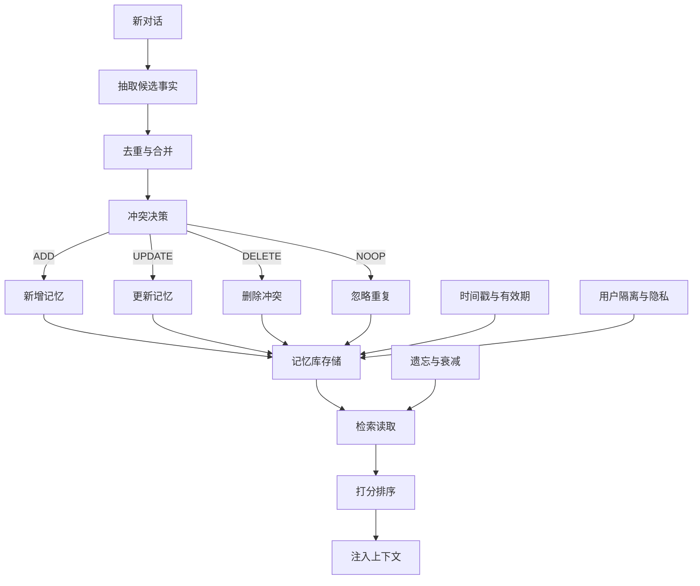
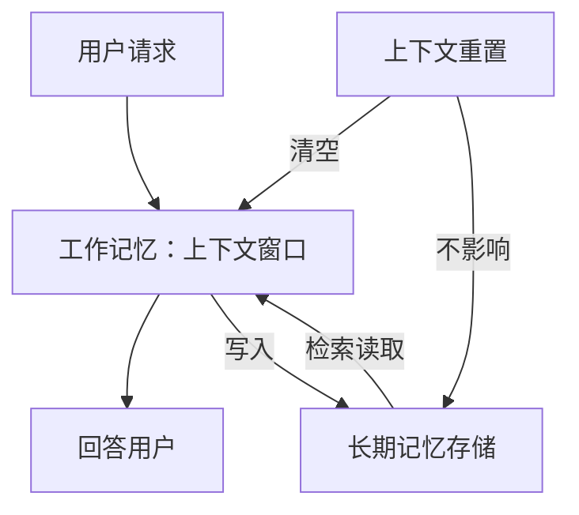
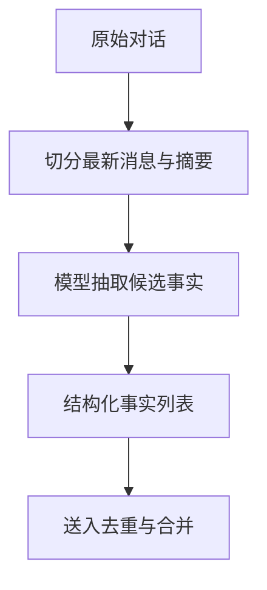
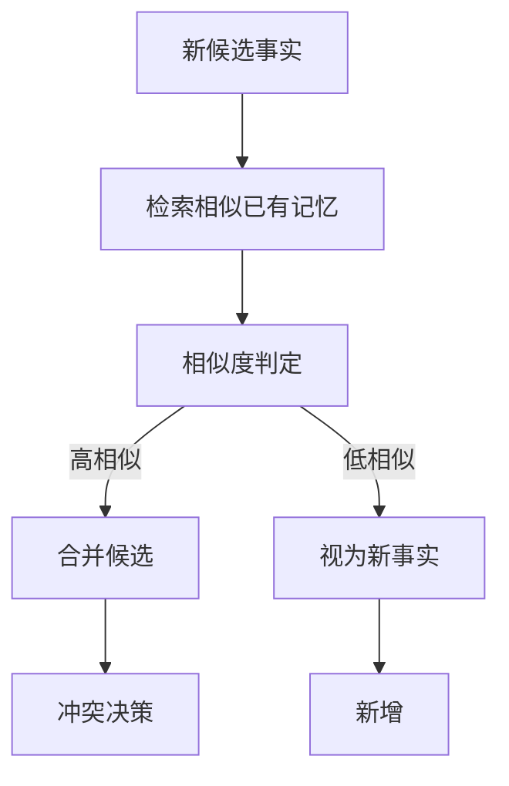
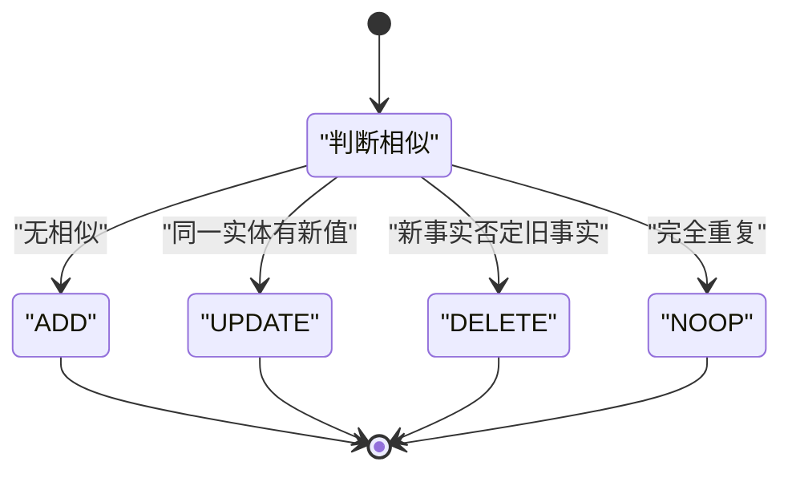
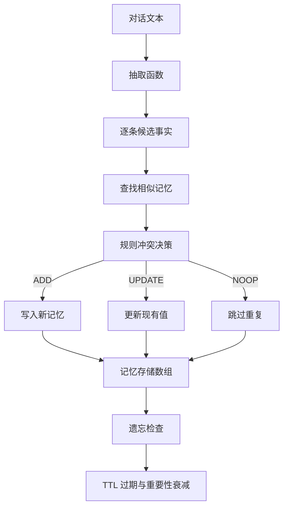
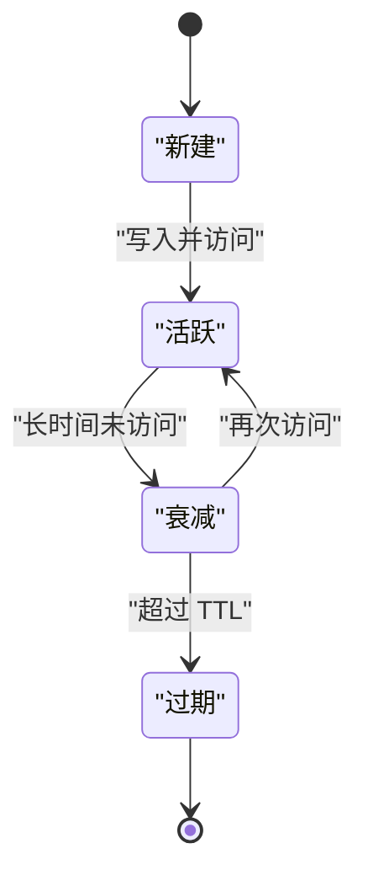
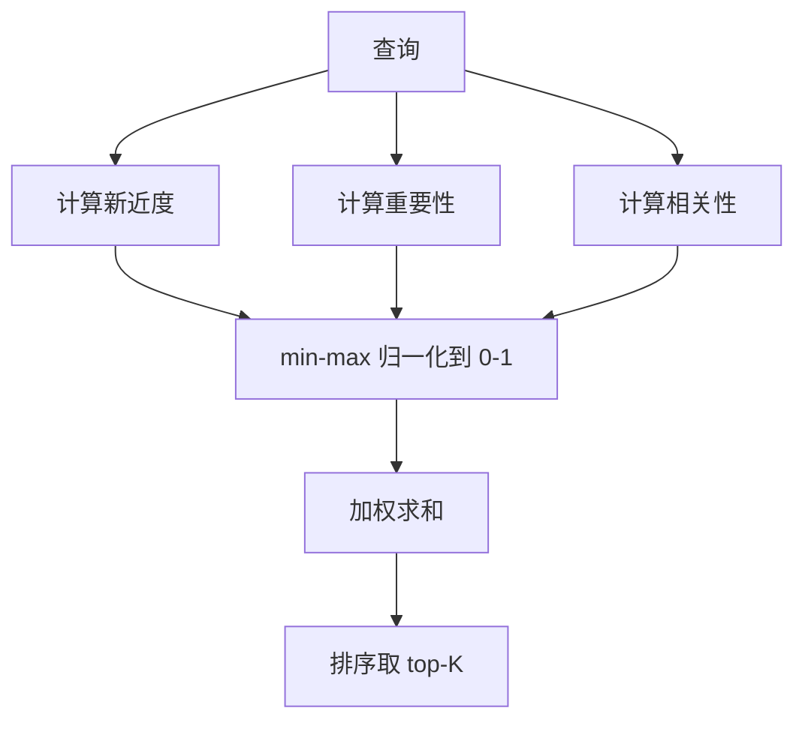
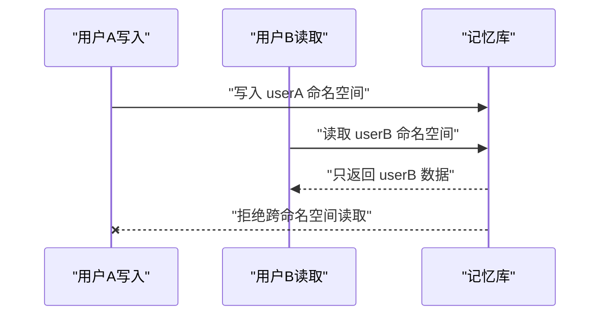

# 记忆的写入与读取流水线：抽取、去重、更新与遗忘

!!! abstract "学完这一页你能"
    - 用箭头画出长期记忆的写入流水线：抽取、去重、合并、冲突决策（新增、更新、删除、忽略）。
    - 手写一个带时间戳、有效期与指数衰减的内存记忆库，并给出 `node:assert` 验证用例。
    - 写出 Generative Agents 检索打分公式的三个因子及各自归一化方法。
    - 说出用户隔离的三个落地手段：命名空间、读写桶校验、敏感字段白名单。

## 0. 知识地图



写入流水线在左半区自上而下，读取流水线在右下角。时间戳、遗忘、隔离是横切关注点，它们同时影响写入和读取。

建议先读第 1 节建立分层概念，再按第 2、3、4、5 节顺着写入流水线写代码。第 6、7、8 节分别补齐过期、打分和隐私，最后回到应用地图做整合。

## 1. 工作记忆与长期记忆：上下文窗口是一次性草稿纸

**先想一个问题**：用户跟客服机器人聊了 20 分钟，上下文窗口一重置，机器人连用户刚报的手机号都忘了。你要把哪部分留在“当前”，哪部分放进“以后也能读”？

**心智模型**

!!! tip "心智模型"
    一句话模型：工作记忆是当前运行的上下文窗口，长期记忆是跨会话的持久存储。
    日常类比：工作记忆像桌面的草稿纸，长期记忆像文件柜里的档案。
    类比不成立处：文件柜不会自动总结归档，而长期记忆需要抽取、更新和衰减。

!!! note "术语：工作记忆"
    工作记忆（working memory）是当前决策周期内可用的上下文，包含消息、工具结果和草稿。重置后清空。
    例如：当前对话的 `messages` 数组。

!!! note "术语：长期记忆"
    长期记忆（long-term memory）是跨会话保存、需要写入和检索的事实或经验。
    例如：用户说过“我住上海”。

**图解**



1. 用户请求先进入工作记忆。
2. 当前回答只读工作记忆中的内容。
3. 有长期价值的信息写入长期记忆存储。
4. 上下文重置只清空工作记忆，长期记忆存储保持不变。

**一步一步来**

第 1 步：定义两个生命周期不同的内存容器。

```javascript
// 第 1 步：定义两个内存容器
const workingMemory = []; // 工作记忆：只在当前会话存在
const longTermStore = new Map(); // 长期记忆：跨会话保留

workingMemory.push({ role: "user", content: "我住上海" });
longTermStore.set("city", "上海"); // 把长期价值写入长期存储
```

**这段代码在做什么**

- `workingMemory` 用数组暂存当前消息。
- `longTermStore` 用 Map 存跨会话事实。
- 两者都是进程内变量，但 `longTermStore` 不随上下文重置而清空。
- 写入长期存储是显式动作，不是自动发生。

运行结果：无输出，内存中有两个容器。

第 2 步：模拟上下文重置，验证长期记忆保留。

```javascript
// 第 2 步：模拟上下文重置
workingMemory.length = 0; // 清空工作记忆
console.log(workingMemory.length); // 0
console.log(longTermStore.get("city")); // 上海
```

**这段代码在做什么**

- `length = 0` 模拟上下文窗口被清空。
- 长期 Map 没有被清空。
- 读取 `city` 键仍得到“上海”。

运行结果：

```
0
上海
```

**动手验证**

```javascript
import assert from "node:assert";

const workingMemory = [];
const longTermStore = new Map();

workingMemory.push({ role: "user", content: "我住上海" });
longTermStore.set("city", "上海");

workingMemory.length = 0; // 模拟上下文重置
assert.equal(workingMemory.length, 0, "工作记忆应清空");
assert.equal(longTermStore.get("city"), "上海", "长期记忆应保留");
console.log("通过：上下文重置后长期记忆仍可读取");
// 预期输出：通过：上下文重置后长期记忆仍可读取
```

零第三方依赖。保存为 `.mjs` 文件，用 `node file.mjs` 运行。

**常见坑**

| 现象 | 原因 | 怎么修 |
|---|---|---|
| 把整段历史放回上下文导致 token 超限 | 读取时未筛选 | 只读当前任务需要的键 |
| 重置后用户信息丢失 | 没在关键节点写入长期库 | 会话结束前调用写入 |
| 长期库无限膨胀 | 没有过期机制 | 加 TTL 或衰减，见第 6 节 |

**用在哪里**

场景 1：个人客服机器人多轮对话

- 业务背景：用户多轮里提供手机号、地址，隔天再回来继续问。
- 怎么用：对话期间留在工作记忆，结束前抽取到长期记忆。
- 衡量指标：下次会话避免重复询问的轮次占比。
- 不该用：单轮问答，用户不会回来。

场景 2：代码助手跨会话记住项目约束

- 业务背景：开发者多次要求遵循某个 lint 规则。
- 怎么用：当前会话放在上下文，跨会话写进项目级记忆文件。
- 衡量指标：同类问题被用户重复纠正的次数。
- 不该用：约束只对当前分支或当前任务有效。

**行业实践**

1. Claude Code 官方文档说明每个会话从新上下文开始，跨会话靠 CLAUDE.md 和自动记忆。来源：Claude Code 官方文档 memory 页，以原文为准。
   怎么借鉴：项目级长期规则写入版本化文件，启动时加载。
2. MemGPT 论文把上下文当作快速内存，外部存储当作慢速内存，用虚拟上下文管理在两层间搬运。来源：MemGPT 论文 arXiv 2310.08560，以原文为准。
   怎么借鉴：不常用的记忆移出上下文，用到时再取回。
3. LangMem 概念指南把短期记忆定义为线程级状态，长期记忆放进命名空间 store。来源：LangMem 概念指南，以原文为准。
   怎么借鉴：长期记忆按命名空间分级，避免所有内容都堆在全局。

**小结**

- 上下文重置是常规行为，不等于故障。
- 长期记忆必须有独立的写入和读取接口。
- 长期库不是终点，后面还要抽取、去重、过期。

## 2. 抽取：把对话变成事实卡

**先想一个问题**：用户说“我换了新地址，现在住杭州西湖区”。系统怎么知道要把“地址”更新成新值，而不是把整句话原样存起来？

**心智模型**

!!! tip "心智模型"
    一句话模型：抽取是把非结构对话转成结构化事实。
    日常类比：读邮件后把联系人电话抄进通讯录。
    类比不成立处：通讯录通常人工且精准，LLM 抽取可能漏抽或抽错。

!!! note "术语：抽取"
    抽取（extraction）指用模型把自然语言转成结构化数据，如 JSON 或对象列表。
    例如：“我住上海”转成 `{ type: "city", value: "上海" }`。

**图解**



1. 先取最新轮次，必要时带上对话摘要。
2. 模型输出候选事实列表，每条带类型和值。
3. 事实列表是结构化对象，不保留原始长文本。
4. 抽取是写入流水线的第一站，输出质量直接影响后续决策。

**一步一步来**

第 1 步：写一个启发式抽取函数，真实系统中这一层用 LLM。

```javascript
// 第 1 步：模拟抽取。真实系统用 LLM，这里用规则替身便于本地运行
function extractFacts(text) {
  const facts = [];
  if (text.includes("上海")) facts.push({ type: "city", value: "上海" });
  if (text.includes("杭州")) facts.push({ type: "city", value: "杭州" });
  return facts; // 返回结构化事实数组
}
```

**这段代码在做什么**

- 用字符串包含判断模拟关键词抽取。
- 每个事实是带 `type` 和 `value` 的对象。
- 返回数组，方便后续逐条去重。
- 真实系统会调用 LLM 并给 JSON schema 约束输出。

第 2 步：从一条对话中抽取并打印。

```javascript
// 第 2 步：从对话文本抽取事实
const turn = "我搬到杭州了";
const facts = extractFacts(turn);
console.log(facts);
```

**这段代码在做什么**

- 输入一句用户消息。
- 输出结构化事实数组。
- 后续步骤只处理数组，不处理原始句子。

运行结果：

```
[ { type: 'city', value: '杭州' } ]
```

**动手验证**

```javascript
import assert from "node:assert";

function extractFacts(text) {
  const facts = [];
  if (text.includes("上海")) facts.push({ type: "city", value: "上海" });
  if (text.includes("杭州")) facts.push({ type: "city", value: "杭州" });
  return facts;
}

const result = extractFacts("我搬到杭州了");
assert.deepEqual(result, [{ type: "city", value: "杭州" }]);
console.log("通过：抽取得到杭州");
// 预期输出：通过：抽取得到杭州
```

零第三方依赖。保存为 `.mjs` 文件，用 `node file.mjs` 运行。

**常见坑**

| 现象 | 原因 | 怎么修 |
|---|---|---|
| 抽取结果为空 | 关键词漏抽或模型输出无事实 | 用 LLM few-shot 并校准 |
| 同一事实拆成多条 | 抽取粒度太细 | 按类型加实体合并 |
| 抽到敏感字段 | 没有过滤白名单 | 写入前校验字段类型 |

**用在哪里**

场景 1：客服工单自动填单

- 业务背景：用户说“订单号是 123，地址是杭州”。
- 怎么用：抽取订单号、地址、问题类型，填入工单表单。
- 衡量指标：人工补填字段的比例。
- 不该用：自由文本有歧义且无人工复核通道。

场景 2：日记应用自动打标签

- 业务背景：用户写“今天在杭州见了产品经理”。
- 怎么用：抽取地点、人物、事件类型作为标签。
- 衡量指标：标签点击率和检索命中率。
- 不该用：内容本身就是要原样保存的隐私内容。

**行业实践**

1. Mem0 论文描述抽取阶段由 LLM 从最新消息对和摘要中提取突出事实。来源：Mem0 论文 arXiv 2504.19413，以原文为准。
   怎么借鉴：抽取输入带摘要，减少窗口截断带来的上下文丢失。
2. A-MEM 论文提到每条新记忆生成带描述、关键词和标签的结构化笔记。来源：A-MEM 论文 arXiv 2502.12110，以原文为准。
   怎么借鉴：给每条记忆加关键词和标签字段，不只有键值。
3. LangMem 概念指南把语义记忆分成多条小文档的 collections 和单条 schema 严格文档的 profile。来源：LangMem 概念指南，以原文为准。
   怎么借鉴：偏好类用 schema 文档，事实集合用 collection。

**小结**

- 抽取输出必须是结构化的，不保留原始长文本。
- 每条事实带类型和值，避免字段混用。
- 真实系统用 LLM，本地替身用规则函数可以先行验证流水线。

## 3. 去重与合并：新事实进来先找亲戚

**先想一个问题**：用户上周说住上海，今天说住杭州。记忆库里出现两条 city 记录，读取时该信哪一条？先把相似记忆找出来，才能做下一步决策。

**心智模型**

!!! tip "心智模型"
    一句话模型：去重是避免同一事实多条记录，合并是把同一主体的多个属性拼装。
    日常类比：通讯录里同一人出现两张重复名片，先识别再合并。
    类比不成立处：名片是精确字段匹配，自然语言记忆需要相似度计算。

!!! note "术语：去重"
    去重（deduplication）是阻止语义相同或高度重叠的记忆重复存在。
    例如：旧值“上海市”和新值“上海”可能指向同一地点。

**图解**



1. 每个新候选先检索已有记忆。
2. 计算相似度得到数值。
3. 高于阈值走合并候选，进入冲突决策。
4. 低于阈值走新增，不进入冲突决策。

**一步一步来**

第 1 步：用字符重叠计算相似度，值域 0 到 1。

```javascript
// 第 1 步：字符集合重叠率，输出 0-1
function overlapScore(a, b) {
  const ta = new Set(a.split(""));
  const tb = new Set(b.split(""));
  let same = 0;
  for (const c of ta) if (tb.has(c)) same += 1;
  return same / Math.max(ta.size, tb.size);
}
console.log(overlapScore("上海", "上海市"));
```

**这段代码在做什么**

- 把两个字符串转成字符集合。
- 统计两个集合的交集大小。
- 除以较大的集合大小归一化到 0-1。
- 值越大表示字符重叠越多。

运行结果：约 `0.666...`

第 2 步：在已有记忆中查找最相似的一条。

```javascript
// 第 2 步：从已有记忆中找最相似的一条
function findSimilar(candidate, store, threshold = 0.5) {
  let best = null;
  let bestScore = 0;
  for (const item of store) {
    const s = overlapScore(candidate.value, item.value);
    if (s > bestScore) { bestScore = s; best = item; }
  }
  return bestScore >= threshold ? { best, bestScore } : null;
}
const store = [{ type: "city", value: "上海市" }];
console.log(findSimilar({ type: "city", value: "上海" }, store));
```

**这段代码在做什么**

- 遍历已有记忆，计算每条与新值的相似度。
- 记录最高分的记忆。
- 低于阈值返回 null，表示无相似记忆。
- 返回对象包含命中的旧记忆和分数。

运行结果：

```
{ best: { type: 'city', value: '上海市' }, bestScore: 0.666... }
```

**动手验证**

```javascript
import assert from "node:assert";

function overlapScore(a, b) {
  const ta = new Set(a.split(""));
  const tb = new Set(b.split(""));
  let same = 0;
  for (const c of ta) if (tb.has(c)) same += 1;
  return same / Math.max(ta.size, tb.size);
}

const result = overlapScore("上海", "上海市");
assert.ok(result > 0.5, "相似度应大于 0.5");
console.log("通过：相似度计算可用");
// 预期输出：通过：相似度计算可用
```

零第三方依赖。保存为 `.mjs` 文件，用 `node file.mjs` 运行。

**常见坑**

| 现象 | 原因 | 怎么修 |
|---|---|---|
| 阈值过高导致重复 | 阈值常数选大 | 用带标签的验证集标定 |
| 字符重叠误判上海与海上 | 集合忽略顺序 | 用 n-gram 或嵌入向量 |
| 只比 value 不比 type | 类型不同被合并 | 先比类型再比值 |

**用在哪里**

场景 1：电商商品列表去重

- 业务背景：同一个商品被不同店铺写成“手机壳 黑色”“黑色手机壳”。
- 怎么用：用名称相似度把相同商品聚到一条。
- 衡量指标：重复商品展示率。
- 不该用：价格和店铺不同且用户需要横向对比。

场景 2：CRM 联系人合并

- 业务背景：同一联系人有两条记录，名字拼写不同。
- 怎么用：相似度识别后合并，保留最新字段值。
- 衡量指标：重复联系人数量。
- 不该用：两个确实同名同姓但不同人。

**行业实践**

1. Mem0 论文描述更新阶段会检索相似已有记忆再决策。来源：Mem0 论文 arXiv 2504.19413，以原文为准。
   怎么借鉴：先检索再决策，决策输入包含相似度分数。
2. Graphiti 使用语义嵌入加 BM25 加图遍历的混合检索。来源：getzep/graphiti GitHub 仓库，以原文为准。
   怎么借鉴：单一相似度不够时加入关键词检索。
3. Letta 官方文档描述 archival memory 用 `archival_memory_search` 做语义检索。来源：Letta 官方文档 MemGPT 架构页，以原文为准。
   怎么借鉴：把大块低频记忆放进可检索存档，不放进核心上下文。

**小结**

- 去重必须先检索再比较。
- 相似度是给冲突决策用的输入，不是最终决定。
- 测试时要用标注数据调阈值，不能拍脑袋定。

## 4. 冲突决策：新增、更新、删除、忽略四选一

**先想一个问题**：新事实和旧事实冲突，比如旧地址是上海，新地址是杭州。直接覆盖会丢历史，全保留会出现两条矛盾记录。决策层要选哪个动作？

**心智模型**

!!! tip "心智模型"
    一句话模型：冲突决策是写入流水线的仲裁器，每次只在 ADD、UPDATE、DELETE、NOOP 里选一个。
    日常类比：编辑合著文档时，对一段有冲突的修改选择接受新版本或保留旧版本。
    类比不成立处：文档修订通常人工确认，记忆库决策可以自动执行，但会误判。

!!! note "术语：ADD"
    ADD 是新增动作，旧库中没有相似记忆时使用。

!!! note "术语：DELETE"
    DELETE 是删除动作，新事实否定旧事实时使用。破坏性最强。

**图解**



1. 输入是相似度检索的结果。
2. 无相似记忆走 ADD。
3. 同一类型不同值走 UPDATE。
4. 新事实否定旧事实走 DELETE。
5. 完全重复走 NOOP。

**一步一步来**

第 1 步：写规则决策函数，真实系统用 LLM tool-call 选择动作。

```javascript
// 第 1 步：规则决策。真实系统用 LLM tool-call 选择 ADD 或 UPDATE 等
function decide(candidate, existing) {
  if (!existing) return "ADD";
  if (candidate.value === existing.value) return "NOOP";
  if (candidate.type === existing.type) return "UPDATE";
  return "NOOP"; // 默认不动，避免破坏
}
console.log(decide({ type: "city", value: "杭州" }, { type: "city", value: "上海" }));
```

**这段代码在做什么**

- 旧记忆不存在选 ADD。
- 值相同选 NOOP，避免无意义写入。
- 类型相同值不同选 UPDATE。
- 其他情况默认 NOOP，保证破坏性最小。

运行结果：

```
UPDATE
```

第 2 步：执行决策并返回新的记忆列表。

```javascript
// 第 2 步：执行决策
function applyDecision(candidate, store) {
  const existing = store.find((m) => m.type === candidate.type);
  const action = decide(candidate, existing);
  if (action === "ADD") store.push(candidate);
  if (action === "UPDATE") existing.value = candidate.value;
  if (action === "DELETE") store = store.filter((m) => m !== existing);
  return { action, store };
}
let store = [{ type: "city", value: "上海" }];
console.log(applyDecision({ type: "city", value: "杭州" }, store));
```

**这段代码在做什么**

- 先按类型找旧记忆。
- 根据动作更新 store。
- UPDATE 原地改值，保留对象。
- 返回动作和新 store，可观测执行结果。

运行结果：

```
{ action: 'UPDATE', store: [{ type: 'city', value: '杭州' }] }
```

**动手验证**

```javascript
import assert from "node:assert";

function decide(candidate, existing) {
  if (!existing) return "ADD";
  if (candidate.value === existing.value) return "NOOP";
  if (candidate.type === existing.type) return "UPDATE";
  return "NOOP";
}

let store = [{ type: "city", value: "上海" }];
const existing = store.find((m) => m.type === "city");
const action = decide({ type: "city", value: "杭州" }, existing);
assert.equal(action, "UPDATE");
if (action === "UPDATE") existing.value = "杭州";
assert.equal(store[0].value, "杭州");
console.log("通过：冲突更新为杭州");
// 预期输出：通过：冲突更新为杭州
```

零第三方依赖。保存为 `.mjs` 文件，用 `node file.mjs` 运行。

**常见坑**

| 现象 | 原因 | 怎么修 |
|---|---|---|
| DELETE 误删正确记忆 | 新事实本身有误 | 软删除并标记无效 |
| 同类型不同实体被误判 | 只按类型找旧记忆 | 加实体 ID 再比较 |
| NOOP 漏掉有效更新 | 值不完全相同但语义相同 | 用相似度阈值判断 NOOP |

**用在哪里**

场景 1：用户地址变更

- 业务背景：用户搬家，新地址要替换旧地址。
- 怎么用：同类型不同值选 UPDATE，保留一条地址记录。
- 衡量指标：地址查询返回过期地址的次数。
- 不该用：需要保留历史地址做合规审计。

场景 2：职位信息更新

- 业务背景：用户从“前端工程师”升为“资深前端工程师”。
- 怎么用：同类型职位选 UPDATE。
- 衡量指标：职位推荐使用旧职位的占比。
- 不该用：需要保留职业履历而不是只留当前职位。

**行业实践**

1. Mem0 论文描述 LLM 通过 tool-call 选择 ADD、UPDATE、DELETE、NOOP。来源：Mem0 论文 arXiv 2504.19413，以原文为准。
   怎么借鉴：用结构化工具让决策动作可枚举，避免自由文本写库。
2. Graphiti 把被新事实取代的旧事实标记为不再有效，而不是物理删除。来源：getzep/graphiti GitHub 仓库，以原文为准。
   怎么借鉴：DELETE 换成软删除，保留历史供时间查询。
3. OpenAI 帮助文章说明聊天派生记忆会随时间变化，但用户主动保存的记忆会保留直到删除。来源：OpenAI 帮助文章，以原文为准。
   怎么借鉴：区分用户保存和系统推断两类记忆，更新规则不同。

**小结**

- 冲突决策必须输出可枚举动作。
- DELETE 的破坏性最大，优先软删除。
- 需要历史追溯时不要用物理覆盖。

## 5. 手写：带更新与遗忘决策的内存版记忆库

**先想一个问题**：能不能不用任何第三方库，写一个能处理抽取、去重、冲突更新和过期的记忆库，跑通写入读出的全流水线？

**心智模型**

!!! tip "心智模型"
    一句话模型：记忆库就是把前四节拼成一个类，对外暴露 process 写入和 expire 过期两个口。
    日常类比：自己组装一台咖啡机，每个零件都拆开看，拼起来能出一杯咖啡。
    类比不成立处：咖啡机各零件没有语义判断错误，记忆库每一步都可能判断失误。

**图解**



1. 对话进入抽取函数，得到候选列表。
2. 每条候选走相似查找和冲突决策。
3. 决策动作落到同一存储数组。
4. 存储数组定期执行遗忘检查。

**一步一步来**

第 1 步：写 MemoryStore 类骨架，每条记忆带时间戳。

```javascript
// 第 1 步：记忆库骨架
class MemoryStore {
  constructor() { this.items = []; }
  add(candidate) {
    const memory = {
      type: candidate.type,
      value: candidate.value,
      createdAt: Date.now(),
      lastAccessed: Date.now(),
      importance: 5,
    };
    this.items.push(memory);
    return memory;
  }
  update(memory, newValue) {
    memory.value = newValue;
    memory.lastAccessed = Date.now();
  }
}
```

**这段代码在做什么**

- `items` 是记忆的主存储数组。
- `add` 创建带时间戳的记忆对象。
- `update` 改值并刷新访问时间。
- `importance` 默认 5，给第 7 节打分和衰减使用。

第 2 步：加入冲突决策 process 方法。

```javascript
// 第 2 步：加入冲突决策
class MemoryStoreWriter extends MemoryStore {
  process(candidate) {
    const existing = this.items.find((m) => m.type === candidate.type);
    if (!existing) { this.add(candidate); return "ADD"; }
    if (existing.value === candidate.value) {
      existing.lastAccessed = Date.now();
      return "NOOP";
    }
    this.update(existing, candidate.value);
    return "UPDATE";
  }
}
```

**这段代码在做什么**

- 按类型找旧记忆。
- 旧记忆不存在走 ADD。
- 值相同走 NOOP 并刷新访问时间。
- 类型相同值不同走 UPDATE。

第 3 步：加入遗忘检查 expire 和衰减 decay。

```javascript
// 第 3 步：TTL 过期与重要性衰减
class MemoryStoreWithForgetting extends MemoryStoreWriter {
  expire(ttlMs = 5000) {
    const now = Date.now();
    this.items = this.items.filter((m) => now - m.lastAccessed < ttlMs);
  }
  decay(lambda = 0.001, now = Date.now()) {
    for (const m of this.items) {
      const ageSeconds = (now - m.lastAccessed) / 1000;
      m.importance = Math.max(0, m.importance * Math.exp(-lambda * ageSeconds));
    }
  }
}
```

**这段代码在做什么**

- `expire` 过滤超过 TTL 未访问的记忆。
- `decay` 按指数衰减重要性，值不低于 0。
- 参数 lambda 控制衰减速度。
- 访问时间越早，衰减越多。

**动手验证**

```javascript
import assert from "node:assert";

class MemoryStore {
  constructor() { this.items = []; }
  add(candidate) {
    const memory = { type: candidate.type, value: candidate.value, createdAt: Date.now(), lastAccessed: Date.now(), importance: 5 };
    this.items.push(memory);
    return memory;
  }
  update(memory, newValue) { memory.value = newValue; memory.lastAccessed = Date.now(); }
  process(candidate) {
    const existing = this.items.find((m) => m.type === candidate.type);
    if (!existing) { this.add(candidate); return "ADD"; }
    if (existing.value === candidate.value) { existing.lastAccessed = Date.now(); return "NOOP"; }
    this.update(existing, candidate.value);
    return "UPDATE";
  }
  expire(ttlMs = 5000) {
    const now = Date.now();
    this.items = this.items.filter((m) => now - m.lastAccessed < ttlMs);
  }
}

const store = new MemoryStore();
assert.equal(store.process({ type: "city", value: "上海" }), "ADD");
assert.equal(store.process({ type: "city", value: "上海" }), "NOOP");
assert.equal(store.process({ type: "city", value: "杭州" }), "UPDATE");
assert.equal(store.items[0].value, "杭州");
store.items[0].lastAccessed = Date.now() - 6000;
store.expire(5000);
assert.equal(store.items.length, 0);
console.log("通过：写入、冲突更新、TTL 过期全部符合预期");
// 预期输出：通过：写入、冲突更新、TTL 过期全部符合预期
```

零第三方依赖。保存为 `.mjs` 文件，用 `node file.mjs` 运行。

**常见坑**

| 现象 | 原因 | 怎么修 |
|---|---|---|
| 过期误删刚用过的记忆 | TTL 判定用 createdAt | 用 lastAccessed 做过期判定 |
| 更新后重要性没有刷新 | 遗忘只调 decay 不刷新 | 访问或更新时重置时间 |
| 类型相同但实体不同被合并 | 没有实体 ID | 增加 entityId 维度 |

**用在哪里**

场景 1：本地演示用的个人助理

- 业务背景：需要一个零依赖的教学原型，演示记忆流水线。
- 怎么用：把类实例作为单例，写入用户事实，定期遗忘。
- 衡量指标：写入后立即读取的正确率。
- 不该用：生产环境需要持久化和并发控制。

场景 2：内存优先的聊天机器人缓存层

- 业务背景：先查内存，未命中再查数据库。
- 怎么用：热数据留在类实例，冷数据过期移除。
- 衡量指标：缓存命中率和过期误删率。
- 不该用：多进程部署需要共享缓存。

**行业实践**

1. Mem0 论文描述写入流水线为抽取、检索相似记忆、LLM 决策 ADD、UPDATE、DELETE、NOOP。来源：Mem0 论文 arXiv 2504.19413，以原文为准。
   怎么借鉴：把决策做成类方法，动作可测试和审计。
2. Generative Agents 论文用指数衰减处理新近度。来源：Generative Agents 论文 arXiv 2304.03442，以原文为准。
   怎么借鉴：用数学衰减代替硬删除，保留可恢复的排序分数。
3. Anthropic 平台文档推荐定期删除长时间未访问的记忆文件并给文件设大小上限。来源：Anthropic 平台文档 memory tool 参考页，以原文为准。
   怎么借鉴：给记忆库加总量限制，防止无限增长。

**小结**

- 时间戳和重要性是记忆库的基础字段。
- process 和 expire 是流水线两个关键口。
- 手写类足够验证逻辑，生产再替换存储层。

## 6. 时间戳与有效期：记忆会过期

**先想一个问题**：用户说“我目前是前端工程师”，一年后没有更新。检索时还优先推荐他前端岗位，可能已经不准。系统怎么判断这条记忆还有没有效？

**心智模型**

!!! tip "心智模型"
    一句话模型：时间戳记录事实产生和访问时间，有效期决定是否信任。
    日常类比：牛奶包装上印保质期，过了保质期就不再上架。
    类比不成立处：记忆过期不是变质，多数情况是越来越不确定。

!!! note "术语：有效期"
    有效期（validity window）是事实在时间轴上为真的区间。
    例如：职位前端工程师从 2025 年 1 月到 2025 年 6 月为真。

**图解**



1. 新建后进入活跃。
2. 长时间未访问转衰减。
3. 再次访问可从衰减回到活跃。
4. 超过 TTL 后进入过期，被清理。

**一步一步来**

第 1 步：用指数衰减模拟重要性随时间下降。

```javascript
// 第 1 步：指数衰减，访问时间越旧分数越低
function decayImportance(memory, now = Date.now(), lambda = 0.001) {
  const ageSeconds = (now - memory.lastAccessed) / 1000;
  memory.importance = Math.max(0, memory.importance * Math.exp(-lambda * ageSeconds));
  return memory.importance;
}
const mem = { value: "前端工程师", lastAccessed: Date.now() - 3600_000, importance: 8 };
console.log(decayImportance(mem));
```

**这段代码在做什么**

- 计算距上次访问的秒数。
- 用负指数衰减旧分数。
- `Math.max(0, ...)` 防止负值。
- lambda 越大衰减越快。

运行结果：约 `7.97`

第 2 步：TTL 过期检查，删除超时未访问的记忆。

```javascript
// 第 2 步：TTL 过期，过滤超时记忆
function expireStore(store, ttlMs) {
  const now = Date.now();
  const before = store.length;
  const next = store.filter((m) => now - m.lastAccessed < ttlMs);
  return { removed: before - next.length, store: next };
}
const store = [{ value: "前端工程师", lastAccessed: Date.now() - 6000 }];
console.log(expireStore(store, 5000));
```

**这段代码在做什么**

- 计算当前时间与访问时间的差。
- 保留差值小于 TTL 项。
- 返回删除条数和新数组。
- 过滤不修改原对象。

运行结果：`{ removed: 1, store: [] }`

**动手验证**

```javascript
import assert from "node:assert";

function expireStore(store, ttlMs) {
  const now = Date.now();
  const before = store.length;
  const next = store.filter((m) => now - m.lastAccessed < ttlMs);
  return { removed: before - next.length, store: next };
}

const store = [{ value: "前端工程师", lastAccessed: Date.now() - 6000 }];
const result = expireStore(store, 5000);
assert.equal(result.removed, 1);
assert.equal(result.store.length, 0);
console.log("通过：TTL 过期正确移除");
// 预期输出：通过：TTL 过期正确移除
```

零第三方依赖。保存为 `.mjs` 文件，用 `node file.mjs` 运行。

**常见坑**

| 现象 | 原因 | 怎么修 |
|---|---|---|
| 测试结果不稳定 | 直接用 Date.now | 注入时钟函数 |
| 过期记忆被物理删除无法追溯 | 硬删除 | 标记 expired 或软删除 |
| 所有记忆共用同一 TTL | 未按重要性分级 | 高重要性用更长 TTL |

**用在哪里**

场景 1：招聘推荐中的技能时效

- 业务背景：候选人三年前写的技能可能已经生疏。
- 怎么用：给技能记录加有效期，过期降低权重。
- 衡量指标：推荐岗位与候选人当前技能的匹配度。
- 不该用：技能是硬资质且不需要时效判断。

场景 2：会议待办事项过期

- 业务背景：上周的会议行动项过了截止时间还没完成。
- 怎么用：待办状态按时间衰减提醒权重。
- 衡量指标：逾期未关闭行动项占比。
- 不该用：所有待办必须永久保留审计。

**行业实践**

1. Graphiti 使用事实有效性窗口，记录事实从何时开始到何时不再为真。来源：getzep/graphiti GitHub 仓库，以原文为准。
   怎么借鉴：给每条记忆加 from 和 to 两个时间字段。
2. Anthropic 平台文档建议定期删除长时间未访问的记忆文件。来源：Anthropic 平台文档 memory tool 参考页，以原文为准。
   怎么借鉴：未访问时间作为过期判断，不用创建时间。
3. Generative Agents 使用每次沙盒小时 0.995 的指数衰减。来源：Generative Agents 论文 arXiv 2304.03442，以原文为准。
   怎么借鉴：读取时做衰减打分，写入时做 TTL 清理。

**小结**

- 时间戳是打分和遗忘的基础。
- 不同记忆类型需要不同 TTL。
- 软删除优先于物理删除。

## 7. 检索打分：新近度、重要性、相关性怎么算

**先想一个问题**：检索“用户住哪”，库里有 10 条 city 相关记忆。怎么排序，才不会让三年前的旧地址排在最新地址前面？

**心智模型**

!!! tip "心智模型"
    一句话模型：检索打分是给每条候选记忆算一个加权总分。
    日常类比：招聘简历排序，要综合最近工作经历、岗位相关度和经历重要度。
    类比不成立处：简历排序有招聘者主观判断，系统里必须归一化成可复现数字。

!!! note "术语：新近度、重要性、相关性"
    新近度（recency）表示记忆多近被访问过。重要性（importance）表示长期价值。
    相关性（relevance）表示记忆与查询的语义匹配程度。

**图解**



1. 三个因子并行计算。
2. 每个因子独立归一化。
3. 加权求和得到每条总分。
4. 按分降序取若干条。

**一步一步来**

第 1 步：min-max 归一化，把值压到 0 到 1。

```javascript
// 第 1 步：min-max 归一化
function minMaxNormalize(values) {
  const min = Math.min(...values);
  const max = Math.max(...values);
  if (max === min) return values.map(() => 0.5);
  return values.map((v) => (v - min) / (max - min));
}
console.log(minMaxNormalize([10, 20, 30]));
```

**这段代码在做什么**

- 找数组最小值和最大值。
- 每个值减最小值再除以范围。
- 最大值和最小值相等时给 0.5 避免除零。
- 归一化让三个因子可加权求和。

运行结果：

```
[0, 0.5, 1]
```

第 2 步：Generative Agents 加权求和公式。

```javascript
// 第 2 步：加权求和，实现中 alpha 均取 1
function retrieveScore(recency, importance, relevance, alpha = [1, 1, 1]) {
  return alpha[0] * recency + alpha[1] * importance + alpha[2] * relevance;
}
console.log(retrieveScore(0.8, 0.6, 0.9));
```

**这段代码在做什么**

- 三因子分别乘以 alpha。
- 求和得到总分。
- alpha 是可调超参，默认都是 1。
- 生产环境可以根据业务调整权重。

运行结果：

```
2.3
```

**动手验证**

```javascript
import assert from "node:assert";

function minMaxNormalize(values) {
  const min = Math.min(...values);
  const max = Math.max(...values);
  if (max === min) return values.map(() => 0.5);
  return values.map((v) => (v - min) / (max - min));
}

function retrieveScore(recency, importance, relevance, alpha = [1, 1, 1]) {
  return alpha[0] * recency + alpha[1] * importance + alpha[2] * relevance;
}

const normalized = minMaxNormalize([10, 20, 30]);
assert.deepEqual(normalized, [0, 0.5, 1]);
const score = retrieveScore(0.8, 0.6, 0.9);
assert.ok(score > 2.2 && score < 2.4);
console.log("通过：归一化与加权求和正确");
// 预期输出：通过：归一化与加权求和正确
```

零第三方依赖。保存为 `.mjs` 文件，用 `node file.mjs` 运行。

**常见坑**

| 现象 | 原因 | 怎么修 |
|---|---|---|
| 三个因子数值范围不同 | 未归一化直接求和 | 每个因子先 min-max |
| 除零返回 NaN | 数组所有值相等 | 相等时返回固定值 |
| 旧记忆恒排第一 | 相关性未考虑 | 加上新近度衰减 |

**用在哪里**

场景 1：对话记录的语义检索

- 业务背景：用户问“我之前说的地址”，库里有多条地址。
- 怎么用：相关性用嵌入相似度，新近度按访问时间。
- 衡量指标：前 3 条命中正确答案的比例。
- 不该用：只有一条记忆，排序无意义。

场景 2：推荐系统的用户偏好召回

- 业务背景：用户偏好里有运动和美食，查询上下文偏运动。
- 怎么用：相关性给运动类更高分，再叠加重要性。
- 衡量指标：点击率。
- 不该用：需要透明可解释的排序原因。

**行业实践**

1. Generative Agents 论文报告检索得分为 alpha 新近度加 alpha 重要度加 alpha 相关性，实现中 alpha 均取 1。来源：Generative Agents 论文 arXiv 2304.03442，以原文为准。
   怎么借鉴：先把三因子归一化，再直接等权相加。
2. Generative Agents 新近度采用 0.995 每小时指数衰减。来源：Generative Agents 论文 arXiv 2304.03442，以原文为准。
   怎么借鉴：用乘法衰减而不是线性衰减，让最近记忆占优。
3. Graphiti 混合语义嵌入、BM25 和图遍历检索。来源：getzep/graphiti GitHub 仓库，以原文为准。
   怎么借鉴：相关性和关键词检索两类召回后融合排序。

**小结**

- 打分是三因子各自归一化再加权。
- alpha 是可以调的超参。
- 衰减用指数函数比线性更平滑。

## 8. 用户隔离与隐私：谁写的记忆谁读

**先想一个问题**：A 用户的地址被抽取进记忆库，B 用户查询时会不会读到？如果读到，就是隐私事故。怎么从结构上防止？

**心智模型**

!!! tip "心智模型"
    一句话模型：命名空间把每个用户的数据分桶，读写前都先校验桶。
    日常类比：商场储物柜钥匙只能开自己的箱门。
    类比不成立处：软件系统还要防路径穿越等攻击，不只是分箱锁门。

!!! note "术语：命名空间"
    命名空间（namespace）是一组逻辑隔离的键集合。
    例如：`user:alice:address` 的键与 `user:bob:address` 不共享。

**图解**



1. 写入时带用户标识。
2. 读取时限定自己的命名空间。
3. 只返回当前用户的数据。
4. 跨命名空间读取被拒绝。

**一步一步来**

第 1 步：用 Map 按用户分桶。

```javascript
// 第 1 步：按用户命名空间分桶
const memoryByUser = new Map();
function write(userId, fact) {
  if (!memoryByUser.has(userId)) memoryByUser.set(userId, []);
  memoryByUser.get(userId).push(fact);
}
function read(userId) {
  return memoryByUser.get(userId) || [];
}
write("alice", { type: "city", value: "上海" });
console.log(read("alice"));
console.log(read("bob"));
```

**这段代码在做什么**

- 每个 userId 对应一个数组。
- write 先建桶再追加。
- read 返回该用户数组或空数组。
- bob 无法读到 alice 的数据。

运行结果：

```
[ { type: 'city', value: '上海' } ]
[]
```

第 2 步：写入前做字段白名单和截断。

```javascript
// 第 2 步：敏感字段白名单与长度截断
const ALLOWED_TYPES = new Set(["city", "product", "preference"]);
function sanitize(fact) {
  if (!ALLOWED_TYPES.has(fact.type)) return null;
  return { ...fact, value: String(fact.value).slice(0, 200) };
}
console.log(sanitize({ type: "phone", value: "13800000000" }));
```

**这段代码在做什么**

- 只允许白名单类型。
- 手机号不在白名单，返回 null。
- 超长值截断到 200 字符。
- 写入前调用 sanitize 减少敏感信息落库。

运行结果：

```
null
```

**动手验证**

```javascript
import assert from "node:assert";

const memoryByUser = new Map();
const ALLOWED_TYPES = new Set(["city", "product", "preference"]);

function write(userId, fact) {
  if (!ALLOWED_TYPES.has(fact.type)) return false;
  if (!memoryByUser.has(userId)) memoryByUser.set(userId, []);
  memoryByUser.get(userId).push({ ...fact, value: String(fact.value).slice(0, 200) });
  return true;
}
function read(userId) {
  return memoryByUser.get(userId) || [];
}

write("alice", { type: "city", value: "上海" });
assert.equal(write("alice", { type: "phone", value: "13800000000" }), false);
assert.equal(read("alice").length, 1);
assert.equal(read("bob").length, 0);
console.log("通过：用户隔离与敏感字段拒绝写入");
// 预期输出：通过：用户隔离与敏感字段拒绝写入
```

零第三方依赖。保存为 `.mjs` 文件，用 `node file.mjs` 运行。

**常见坑**

| 现象 | 原因 | 怎么修 |
|---|---|---|
| 跨用户读到记忆 | 命名空间未强制 | 读写都按 userId 分桶 |
| 把用户输入当指令 | 记忆内容被注入提示 | 写入前转义或隔离 |
| 删除用户后数据残留 | 没有级联删除 | 按用户级联清理 |

**用在哪里**

场景 1：多租户 SaaS 客服机器人

- 业务背景：同一系统服务多个企业，租户之间数据要硬隔离。
- 怎么用：每个租户 ID 一个命名空间，查询时强制带租户 ID。
- 衡量指标：跨租户数据泄露次数，目标 0。
- 不该用：只有一个租户的内部工具可简化。

场景 2：医疗问诊记录

- 业务背景：患者问诊内容属于敏感数据，法律要求删除能力。
- 怎么用：按患者 ID 隔离，提供按 ID 级联删除。
- 衡量指标：删除后检索返回空。
- 不该用：匿名的公共健康咨询可弱化。

**行业实践**

1. Mem0 官方文档用 user_id、agent_id、app_id、run_id 四维度隔离，只用 user_id 会限制到其他 id 为 null 的记录。来源：Mem0 官方文档 entity-scoped memory 页，以原文为准。
   怎么借鉴：多租户至少用 user_id 和 app_id 两个维度。
2. LangMem 概念指南用层级命名空间做多级数据分段。来源：LangMem 概念指南，以原文为准。
   怎么借鉴：命名空间设计成层级键，如 org 到 user 到 app。
3. Anthropic memory tool 把 /memories 目录当作前缀，文件映射和隔离由开发者实现。来源：Anthropic 平台文档 memory tool 参考页，以原文为准。
   怎么借鉴：工具只给文件操作，业务层自己定义映射和安全边界。

**小结**

- 用户隔离在写入和读取两处都要做。
- 字段白名单是隐私保护第一道关。
- 删除能力是合规要求，不能只靠软删除。

## 应用地图

| 场景 | 用到本页哪个知识点 | 典型技术选型 | 注意事项 |
|---|---|---|---|
| 个人助手跨会话记忆 | 抽取、去重、冲突决策 | LLM 抽取加内存库 | 抽取可能丢事实，需加人工复核 |
| 电商商品去重 | 去重与合并 | 向量嵌入加 BM25 | 阈值需要标注集调优 |
| 客服工单自动填单 | 抽取、用户隔离 | LLM 工具调用加字段白名单 | 敏感字段写入前拒绝 |
| 知识库问答时间感知 | 时间戳、检索打分 | 时间权重加语义检索 | 旧文档降权但要可追溯 |
| 多租户用户偏好 | 命名空间、用户隔离 | 层级命名空间 store | 查询必须带租户 ID |
| 代码助手项目约束 | 长期记忆、冲突决策 | 文件记忆如 CLAUDE.md | 保持文件在 200 行以内 |
| 职位推荐新近度排序 | 检索打分、衰减 | 三因子加权 | 重要性分要定期重算 |
| 聊天机器人遗忘 | TTL、软删除 | 时间戳过滤 | 过期优先软删除 |

## 动手作业

目标：写一个命令行“个人记事员”，支持 `add city=上海`、`get city`、`expire` 三个命令，并把记忆持久化到本地 JSON 文件。

步骤：

1. 扩展第 5 节的内存库，读写 JSON 文件。
2. 支持 `add key=value`，冲突时按类型更新。
3. 支持 `get key`，读取当前用户命名空间。
4. 支持 `expire`，删除超过 TTL 的记录。
5. 用 Node 内置 `fs/promises` 持久化，不引入第三方包。

验收标准：

- 写入后重启进程，`get` 仍能读到。
- 连续两次 `add city=上海` 后 `add city=杭州`，`get city` 返回杭州。
- 把记录访问时间手动改为 2 小时前，执行 `expire` 后 `get` 返回空。
- `node:assert` 用例全通过，退出码为 0。

## 综合对比

| 维度 | 文件记忆 | 文档 store | 向量记忆 | 时间知识图谱 |
|---|---|---|---|---|
| 写入策略 | 模型自编辑 | 应用写入 | LLM 抽取加决策 | 抽取实体与边 |
| 读取策略 | 先看目录再读文件 | 已知键直接读 | 语义相似检索 | 图遍历加混合检索 |
| 遗忘机制 | 删除过期文件 | TTL 删除 | 衰减降权 | 标记无效窗口 |
| 用户隔离 | 目录前缀映射 | 命名空间 | user_id 过滤 | 追溯来源 episode |
| 冲突处理 | 人工查看 | 覆盖或版本 | ADD/UPDATE/DELETE/NOOP | 旧边无效保留历史 |
| 适用规模 | 几十个文件 | 结构化偏好 | 大量语料 | 关系密集场景 |

## 自测题

??? question "1. 工作记忆和长期记忆的区别是什么"
    工作记忆是当前上下文窗口，会话结束清空。长期记忆是跨会话持久存储，需要显式写入和检索。两者用不同生命周期管理。

??? question "2. 抽取为什么容易失败"
    LLM 可能漏抽事实或抽错字段。抽取输入窗口截断会丢上下文。抽取结果过细会产生重复记录。

??? question "3. ADD、UPDATE、DELETE、NOOP 分别什么时候用"
    没有相似记忆用 ADD。同类型不同值用 UPDATE。新事实否定旧事实用 DELETE。完全重复用 NOOP。

??? question "4. Generative Agents 打分公式怎么写"
    总分等于 alpha 新近度加 alpha 重要度加 alpha 相关性。每个因子先 min-max 归一化到 0 到 1。实现中 alpha 都取 1。新近度用指数衰减。

??? question "5. 为什么 Graphiti 不物理删除旧事实"
    旧事实保留成无效窗口，可回答时间类查询。物理删除会丢失审计和历史。软删除降低误删损失。

??? question "6. TTL 和衰减有什么区别"
    TTL 是硬过期，超时移除。衰减是软降权，分数逐渐下降。TTL 用于清理，衰减用于排序。

??? question "7. 用户隔离怎么做"
    写入和读取都按用户命名空间分桶。查询必须带用户标识。敏感字段写前白名单校验。删除按用户级联。

??? question "8. 记忆库什么时候不该引入"
    对话内容能完整放进上下文且成本低时不必引入。一次性问答无跨会话需求时不必引入。需要人工确认的重要事实不应自动写库。

## 延伸阅读

- Anthropic Platform Docs：Memory tool 参考页，目录 commands 与 security responsibilities 章节。
- Claude Code Docs：Memory 页，CLAUDE.md 与 auto memory 章节。
- Letta Docs：Agents 与 Architectures 下的 MemGPT 章节。
- LangChain LangMem：Conceptual Guide 章节。
- Mem0 Docs：Core Concepts 下的 How it works 章节。
- Generative Agents：arXiv 2304.03442，Memory stream 与 retrieval 章节。
- Graphiti：GitHub 仓库 README 与 docs 目录。
