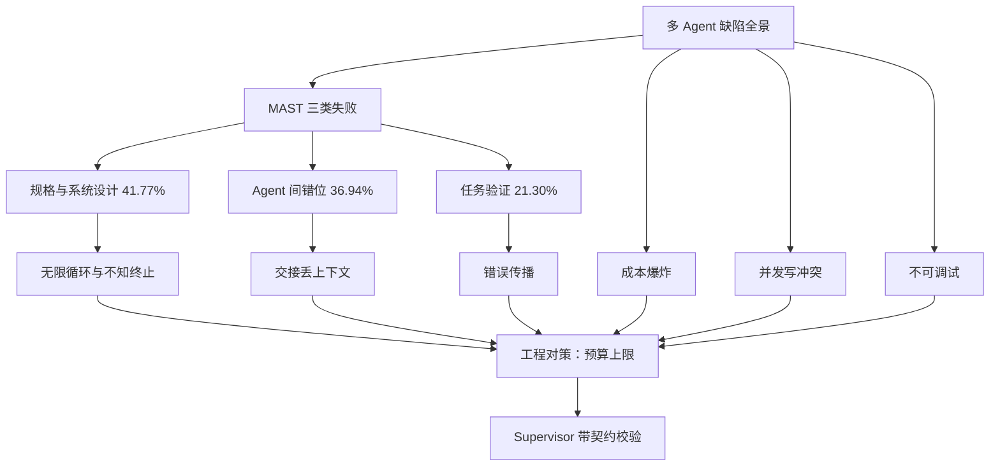
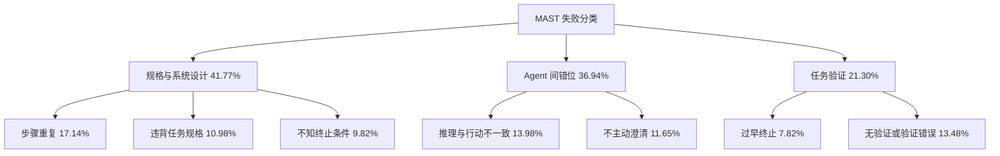
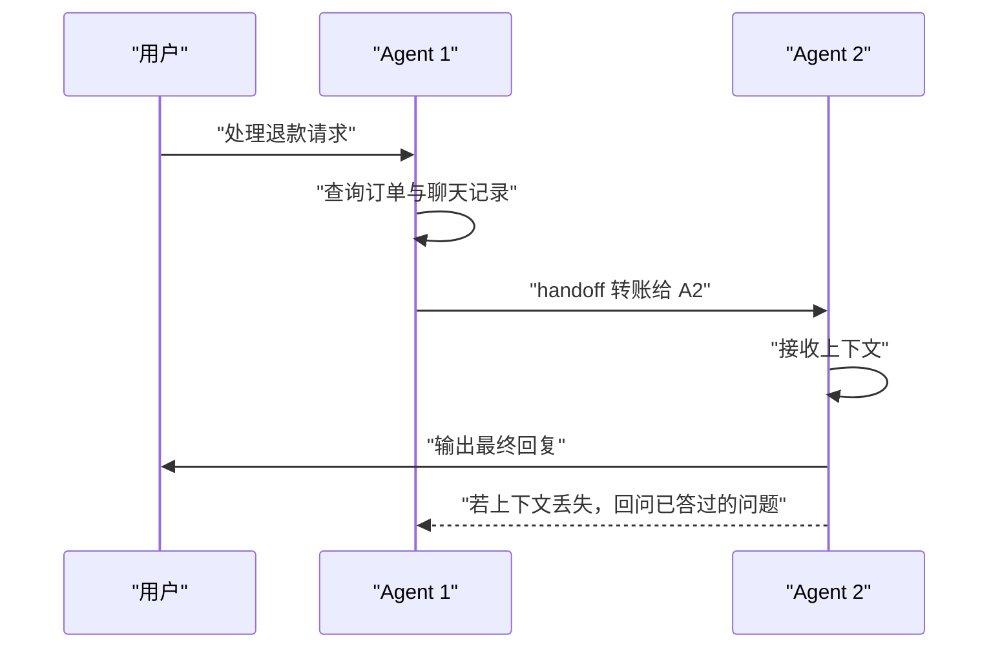
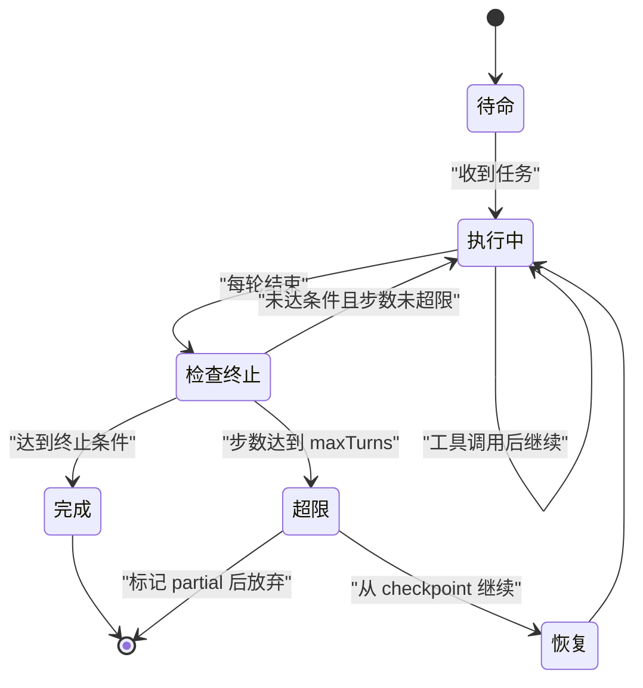
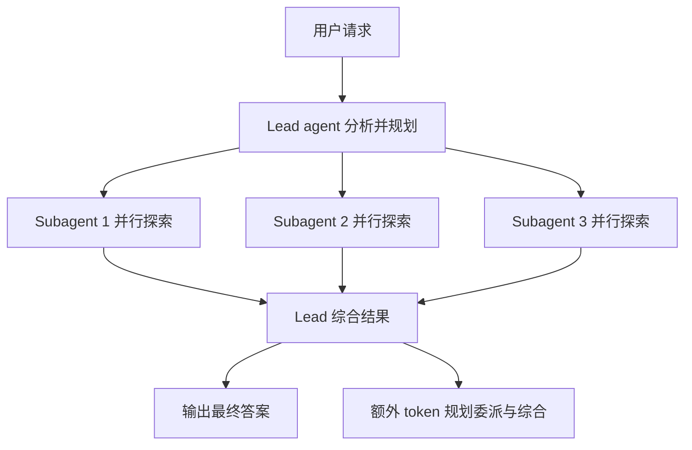
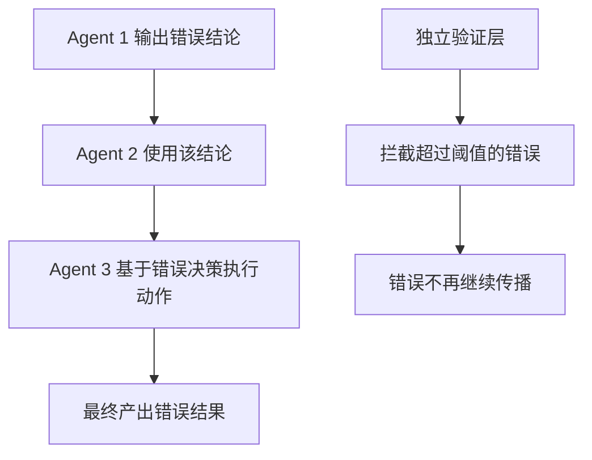
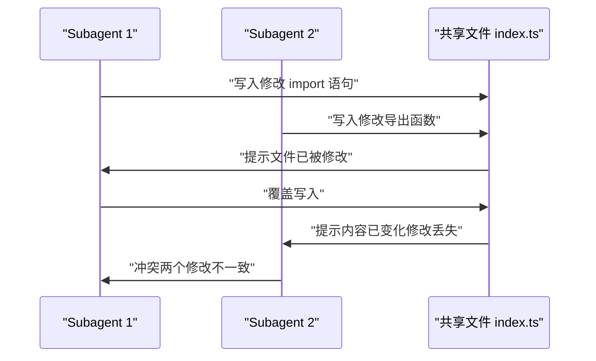
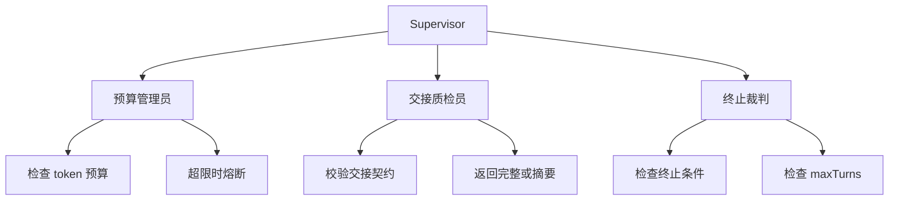

# 多 Agent 的缺陷：MAST 失败分类与工程对策

!!! abstract "学完这一页你能"
    - 能说出 MAST 三类失败模式（规格与系统设计、agent 间错位、任务验证）的名称、占比和典型症状。
    - 能解释交接丢上下文、无限循环、成本爆炸、错误传播、并发写冲突、不可调试这六类缺陷的根因与对策。
    - 能写出一个带步数上限、预算上限、交接契约校验的 supervisor 脚本，并跑通 Node 20 断言。
    - 能根据任务特征判断该用单 agent、固定 workflow 还是多 agent，并给出可检验的理由。

## 0. 知识地图



建议按"先看分类建立全局视角，再逐个攻破六类缺陷，最后动手写 supervisor"的顺序阅读。
先读到 MAST 的三类占比，理解大多数失败源于系统设计而非模型能力。
再看每一类缺陷的症状与对策，最后把对策落到一个可运行的脚本里。

## 1. MAST 失败分类：先建立全局视角

**先想一个问题**：你给一个多 agent 系统接了三个子 agent，测试 100 条任务，失败 30 条。
你该从哪里开始排查？是模型不够强，还是你的编排逻辑有问题？

**心智模型**

!!! tip "心智模型"
    一句话模型：多 agent 系统的失败，大多数不是"某个模型太笨"，而是"系统设计把聪明模型放进了错误的位置"。
    日常类比：像一个项目组里有三个能力强的人，但没有明确分工、没有会议纪要、没有验收人，结果各自为政。
    类比不成立的地方：项目组成员能主动提出"我们该对齐一下"，而 LLM agent 只有在系统明确要求时才会这么做。

!!! note "术语：MAST"
    MAST 是论文《Why Do Multi-Agent LLM Systems Fail?》提出的失败分类框架，把多 agent 系统失败分成 3 大类、14 种模式。
    例如：一个 agent 反复做同一件事，就是 FM-1.3 步骤重复。

**图解**



1. MAST 把失败分成三类：规格与系统设计占 41.77%，agent 间错位占 36.94%，任务验证占 21.30%。
2. 步骤重复是最高频的单一失败模式，占 17.14%，说明"不该继续时继续"是普遍问题。
3. 验证类失败合计 21.30%，说明很多系统没有在交付前做独立检查。

**一步一步来**

**第一步：把 MAST 三类失败写成一个可查询的数据结构**

这一步要做什么：把三类失败及其子模式整理成 JavaScript 对象，方便后续按类别统计。

```javascript
// mast.js 的起始部分：三类失败模式
const mastCategories = [
  {
    name: "规格与系统设计",
    ratio: 41.77,
    modes: [
      { code: "FM-1.1", name: "违背任务规格", ratio: 10.98 },
      { code: "FM-1.3", name: "步骤重复", ratio: 17.14 },
      { code: "FM-1.5", name: "不知终止条件", ratio: 9.82 },
    ],
  },
  {
    name: "Agent 间错位",
    ratio: 36.94,
    modes: [
      { code: "FM-2.6", name: "推理与行动不一致", ratio: 13.98 },
      { code: "FM-2.2", name: "不主动澄清", ratio: 11.65 },
    ],
  },
  {
    name: "任务验证",
    ratio: 21.30,
    modes: [
      { code: "FM-3.1", name: "过早终止", ratio: 7.82 },
      { code: "FM-3.2", name: "无验证", ratio: 6.82 },
      { code: "FM-3.3", name: "错误验证", ratio: 6.66 },
    ],
  },
];

// 计算三类占比之和
const totalRatio = mastCategories.reduce((sum, c) => sum + c.ratio, 0);
console.log("三类占比之和:", totalRatio);
```

**这段代码在做什么**

- 用数组保存三类失败，每类含 `ratio` 字段记录占比。
- 每类的 `modes` 数组列出主要子模式及其占比。
- 最后用 `reduce` 计算三类占比之和，验证分类是否覆盖全部失败。
- 数据来源为 MAST 论文 arXiv 2503.13657，引用时注明『以原文为准』。

运行结果：

```
三类占比之和: 100.01
```

注意：100.01 是四舍五入造成的总和误差，并非分类漏项。

**第二步：写一个函数，输入失败代码，返回它属于哪一类**

这一步要做什么：实现一个查找函数，方便在监控日志里根据失败代码归类。

```javascript
// 继续 mast.js：根据失败代码查找所属类别
function findCategory(code) {
  const cat = mastCategories.find((c) =>
    c.modes.some((m) => m.code === code)
  );
  return cat ? cat.name : "未知类别";
}

console.log(findCategory("FM-1.3")); // 步骤重复
console.log(findCategory("FM-2.6")); // 推理与行动不一致
console.log(findCategory("FM-3.3")); // 错误验证
console.log(findCategory("FM-9.9")); // 不存在
```

**这段代码在做什么**

- `findCategory` 接收失败代码，遍历三类失败。
- 用 `Array.prototype.some` 检查某个类别是否包含该代码。
- 找到后返回类别名，找不到返回"未知类别"。
- 这个函数可以用在监控系统里，自动给失败日志打标签。

运行结果：

```
规格与系统设计
Agent 间错位
任务验证
未知类别
```

**动手验证**

把前面两步合成一个完整脚本，验证分类数据的自洽性。

```javascript
// mast-verify.mjs，Node 20+ 可直接运行
import assert from "node:assert";

const mastCategories = [
  {
    name: "规格与系统设计",
    ratio: 41.77,
    modes: [
      { code: "FM-1.1", name: "违背任务规格", ratio: 10.98 },
      { code: "FM-1.3", name: "步骤重复", ratio: 17.14 },
      { code: "FM-1.5", name: "不知终止条件", ratio: 9.82 },
    ],
  },
  {
    name: "Agent 间错位",
    ratio: 36.94,
    modes: [
      { code: "FM-2.6", name: "推理与行动不一致", ratio: 13.98 },
      { code: "FM-2.2", name: "不主动澄清", ratio: 11.65 },
    ],
  },
  {
    name: "任务验证",
    ratio: 21.30,
    modes: [
      { code: "FM-3.1", name: "过早终止", ratio: 7.82 },
      { code: "FM-3.2", name: "无验证", ratio: 6.82 },
      { code: "FM-3.3", name: "错误验证", ratio: 6.66 },
    ],
  },
];

function findCategory(code) {
  const cat = mastCategories.find((c) =>
    c.modes.some((m) => m.code === code)
  );
  return cat ? cat.name : "未知类别";
}

// 断言 1：三类占比之和在 99.9 到 100.1 之间
const totalRatio = mastCategories.reduce((sum, c) => sum + c.ratio, 0);
assert.ok(totalRatio > 99.9 && totalRatio < 100.1, "占比应接近 100");

// 断言 2：步骤重复是最高频单一模式
const allModes = mastCategories.flatMap((c) => c.modes);
const maxRatio = Math.max(...allModes.map((m) => m.ratio));
const topMode = allModes.find((m) => m.ratio === maxRatio);
assert.strictEqual(topMode.code, "FM-1.3", "最高频模式应为步骤重复");

// 断言 3：验证类合计约 21.30
const verifyCat = mastCategories.find((c) => c.name === "任务验证");
assert.ok(Math.abs(verifyCat.ratio - 21.30) < 0.1, "验证类占比应为 21.30");

// 断言 4：findCategory 能正确归类
assert.strictEqual(findCategory("FM-1.3"), "规格与系统设计");
assert.strictEqual(findCategory("FM-3.3"), "任务验证");

console.log("全部断言通过");
console.log("最高频失败模式:", topMode.name, topMode.ratio + "%");
```

运行结果：

```
全部断言通过
最高频失败模式: 步骤重复 17.14%
```

**常见坑**

| 现象 | 原因 | 怎么修 |
| --- | --- | --- |
| 把失败都归因于模型太弱 | 没按 MAST 分类统计 | 先给失败打标签，再决定换模型还是改编排 |
| 只记录失败总数，不分类 | 日志颗粒度太粗 | 每次失败记录 FM 代码 |
| 看到步骤重复就只调提示词 | 根因可能是没有终止条件 | 先加终止条件，再调提示词 |

**用在哪里**

- **业务场景一：客服工单自动分诊系统**
  业务背景：多个 agent 分别处理退款、物流、售后三类工单。
  这一节的知识怎么用：用 MAST 分类给每一条失败工单打标签，统计哪一类问题最多。
  用什么指标衡量收益：失败分类占比变化，步骤重复率是否下降。
  什么时候不该用：工单量很小、单 agent 已满足需求时，分类统计的成本高于收益。

- **业务场景二：代码审查 agent 流水线**
  业务背景：一个 agent 写代码，另一个 agent 审代码，第三个 agent 合并。
  这一节的知识怎么用：用 FM-3.2 无验证和 FM-3.3 错误验证来评估审查环节是否真正有效。
  用什么指标衡量收益：审查环节发现的问题数、漏掉的严重 bug 数。
  什么时候不该用：单 PR 改动很小时，三层流水线的固定成本不划算。

**行业实践**

- Anthropic 在多 agent 研究系统文章里强调：有状态错误会累积，minor failures 对 agent 可能是灾难性的。
  出处：Anthropic《How we built our multi-agent research system》，以原文为准。
  怎么借鉴到你的项目：给每个 agent 的中间状态加 checkpoint，失败后从 checkpoint 恢复，而不是整体重启。

- MAST 论文作者做了干预实验：强化角色规格后 ChatDev 成功率 +9.4%，加多层验证后 +15.6%。
  出处：MAST 论文《Why Do Multi-Agent LLM Systems Fail?》，arXiv 2503.13657，以原文为准。
  怎么借鉴到你的项目：把角色规格写成结构化字段，把验证环节独立出来。

**小结**

1. MAST 三类失败中，规格与系统设计占 41.77%，说明编排逻辑比模型能力更值得先排查。
2. 步骤重复是最高频单一失败模式，占 17.14%，需要步数上限和终止条件来治理。
3. 验证类失败合计 21.30%，独立验证环节能带来可测量的成功率提升。

## 2. 交接丢上下文：handoff 的两难

**先想一个问题**：两个 agent 互相交接任务时，接收方该拿到完整对话记录还是压缩后的摘要？
完整记录会让上下文膨胀，压缩摘要又会丢失关键细节，怎么选？

**心智模型**

!!! tip "心智模型"
    一句话模型：handoff 的本质是"信息传递成本"与"信息保真度"之间的权衡。
    日常类比：像工作交接时，是给新人看全部聊天记录，还是写一页交接文档。
    类比不成立的地方：人可以在交接过程中主动提问澄清，而 LLM 默认不会主动提问，除非系统明确要求。

!!! note "术语：handoff"
    handoff 指多 agent 系统中把控制权从一个 agent 转移给另一个 agent 的机制。
    例如：OpenAI Agents SDK 里 handoff 在 LLM 看来是工具，名称形如 `transfer_to_<agent_name>`。

**图解**



1. 用户向 Agent 1 发起退款请求。
2. Agent 1 查询了订单信息，这些信息会随 handoff 传给 Agent 2。
3. Agent 2 用接收到的上下文生成回复并返回给用户。
4. 虚线表示：如果交接时上下文丢失，Agent 2 会回问用户已答过的问题。

**一步一步来**

**第一步：实现一个带默认继承和过滤器的 handoff 函数**

这一步要做什么：模拟 OpenAI Agents SDK 的 handoff 行为，默认传完整历史，可选用 `inputFilter` 压缩。

```javascript
// handoff.js：模拟 handoff 的上下文传递
function handoff(fromAgent, toAgent, history, inputFilter) {
  // 默认继承整段对话历史
  let context = history;
  // 如果提供了过滤器，则压缩上下文
  if (typeof inputFilter === "function") {
    context = inputFilter(history);
  }
  return {
    from: fromAgent,
    to: toAgent,
    context,
    contextLength: context.length,
  };
}

// 模拟的对话历史
const history = [
  { role: "user", content: "我的订单还没到" },
  { role: "assistant", content: "已查到订单，配送中" },
  { role: "user", content: "那能退款吗" },
];

// 默认继承完整历史
const result1 = handoff("refundAgent", "logisticsAgent", history);
console.log("默认交接上下文长度:", result1.contextLength);

// 用过滤器只保留最近 2 条
const result2 = handoff("refundAgent", "logisticsAgent", history, (h) =>
  h.slice(-2)
);
console.log("过滤后上下文长度:", result2.contextLength);
```

**这段代码在做什么**

- `handoff` 函数模拟交接逻辑，默认传完整 `history`。
- `inputFilter` 是可选参数，若传入则对历史做压缩。
- 返回对象包含交接双方和上下文长度，方便监控统计。
- 这个例子对应 OpenAI Agents SDK 的默认行为和 `input_filter` 机制。

运行结果：

```
默认交接上下文长度: 3
过滤后上下文长度: 2
```

**第二步：加入丢失检测**

这一步要做什么：检测交接后的上下文是否包含关键实体，缺失时打上"上下文丢失"标记。

```javascript
// handoff.js 续：检测上下文中的关键信息
function detectContextLoss(context, requiredEntities) {
  const contextText = context.map((m) => m.content).join(" ");
  const missing = requiredEntities.filter((e) => !contextText.includes(e));
  return {
    missing,
    hasLoss: missing.length > 0,
    lossRate: missing.length / requiredEntities.length,
  };
}

// 模拟两个交接场景
const fullContext = [
  { role: "user", content: "订单号 A123 还没到" },
  { role: "assistant", content: "订单号 A123 配送中" },
];
const compressedContext = [
  { role: "assistant", content: "配送中" },
];

const check1 = detectContextLoss(fullContext, ["A123", "配送中"]);
const check2 = detectContextLoss(compressedContext, ["A123", "配送中"]);

console.log("完整上下文丢失:", check1.hasLoss, check1.missing);
console.log("压缩上下文丢失:", check2.hasLoss, check2.missing);
```

**这段代码在做什么**

- `detectContextLoss` 把上下文拼接成文本，逐个检查必需实体是否存在。
- `missing` 数组记录缺失的实体，`hasLoss` 判断是否有丢失。
- 这个检测可以用在 handoff 完成后，作为交接契约的一部分。
- 实际系统中可选字段还可以包括动作结果、决策依据，不只用文本匹配。

运行结果：

```
完整上下文丢失: false []
压缩上下文丢失: true [ 'A123' ]
```

**动手验证**

把两步合成一个脚本，验证 handoff 行为符合预期。

```javascript
// handoff-verify.mjs
import assert from "node:assert";

function handoff(fromAgent, toAgent, history, inputFilter = null) {
  let context = inputFilter ? inputFilter(history) : history;
  return { from: fromAgent, to: toAgent, context };
}

function detectContextLoss(context, requiredEntities) {
  const text = context.map((m) => m.content).join(" ");
  const missing = requiredEntities.filter((e) => !text.includes(e));
  return missing.length > 0;
}

const history = [
  { role: "user", content: "订单 A123 还没到" },
  { role: "assistant", content: "查询中" },
  { role: "user", content: "可以退款吗" },
];

// 默认交接：无丢失
const r1 = handoff("a", "b", history);
assert.strictEqual(r1.context.length, 3, "默认应传完整历史");

// 压缩交接：丢失订单号
const r2 = handoff("a", "b", history, (h) => h.slice(-1));
assert.strictEqual(detectContextLoss(r2.context, ["A123"]), true, "压缩后应检测到丢失");

console.log("handoff 验证通过");
```

运行结果：

```
handoff 验证通过
```

**常见坑**

| 现象 | 原因 | 怎么修 |
| --- | --- | --- |
| 接收方重复问用户已回答过的问题 | 上下文被过度压缩 | 用 `input_filter` 保留必需实体，而非机械截断 |
| 上下文越来越长 | 默认传递完整历史 | 用 `nest_handoff_history` 或自定义 `handoff_history_mapper` |
| handoff 双方决策冲突 | 接收方看不到发送方的推理过程 | 交接时传决策依据，不只传结论 |

**用在哪里**

- **业务场景一：电商智能客服的部门转接**
  业务背景：退款 agent 处理不了物流问题时，转给物流 agent。
  这一节的知识怎么用：在 handoff 时用过滤器保留订单号、用户诉求等必需字段。
  用什么指标衡量收益：转接后用户重复提供信息的次数是否下降。
  什么时候不该用：转接频率很低时，不必投入资源做复杂的压缩逻辑。

- **业务场景二：代码生成与代码审查的交接**
  业务背景：生成 agent 把代码交给审查 agent。
  这一节的知识怎么用：交接时传完整 PR 信息和决策依据，不只传代码片段。
  用什么指标衡量收益：审查 agent 问"为什么要这样写"的次数。
  什么时候不该用：PR 很小且上下文无压力时，直接用完整历史即可。

**行业实践**

- OpenAI Agents SDK 文档写明：默认接收方继承整段对话历史，可用 `input_filter` 压缩。
  出处：OpenAI Agents SDK 官方文档，Handoffs 章节，以原文为准。
  怎么借鉴到你的项目：给 handoff 设计一个默认过滤器，只传与当前任务相关的字段。

- Cognition 文章指出：只共享任务描述不够，要共享完整 agent trace，包括每个动作与决策。
  出处：Cognition《Don't Build Multi-Agents》，以原文为准。
  怎么借鉴到你的项目：交接数据里包含 agent 的推理轨迹，而非只传最终结论。

**小结**

1. 交接丢上下文是 agent 间错位类的典型问题，MAST 中相关失败合计约 7%。
2. 默认传完整历史会膨胀上下文，压缩历史又会丢失关键信息。
3. 对策是交接契约：定义必需字段，交接后校验是否缺失。

## 3. 无限循环与不知终止

**先想一个问题**：一个研究 agent 在查资料时，连续 20 轮还没停下来。
它不是没找到答案，而是不知道"找到什么程度才算完"。

**心智模型**

!!! tip "心智模型"
    一句话模型：无限循环的根因通常不是模型失控，而是系统没告诉它"何时必须停"。
    日常类比：像让实习生去调研市场，没给时间限制，他会一直查下去。
    类比不成立的地方：实习生会主动回来问"差不多了吧"，而 agent 只有在显式终止条件下才会停。

!!! note "术语：maxTurns"
    maxTurns 是 Claude Code 中限制 subagent 执行步数的护栏参数。
    例如：达到 maxTurns 上限的 subagent 会被标记为 partial，不会无限执行。

**图解**



1. agent 从待命进入执行中，每轮结束后做终止检查。
2. 如果未达终止条件且未超步数上限，继续执行。
3. 如果达到终止条件，正常完成。
4. 如果步数达到 maxTurns，进入超限状态，可选择恢复或放弃。

**一步一步来**

**第一步：实现带步数上限的调度循环**

这一步要做什么：写一个工具调用循环，每轮递增步数，超过上限时停止。

```javascript
// loop-limit.js：带 maxTurns 的 agent 循环
async function runAgent(task, tools, maxTurns) {
  let step = 0;
  const log = [];
  let done = false;

  while (!done && step <= maxTurns) {
    step++;
    // 模拟模型决策：每轮调用一个工具
    const toolName = tools[step % tools.length];
    log.push({ step, action: toolName });

    // 模拟终止条件：遇到 final_answer 才完成
    if (toolName === "final_answer") {
      done = true;
    }
  }

  if (step > maxTurns && !done) {
    log.push({ step, action: "stopped_by_maxTurns", partial: true });
  }

  return { steps: step, done, log };
}

// 真实验证：maxTurns 设置为 3，final_answer 是第 4 个工具
const result = await runAgent(
  "查询用户订单",
  ["search_order", "search_logistics", "match_user", "final_answer"],
  3
);
console.log("步数:", result.steps, "完成:", result.done);
console.log("日志:", result.log.map((l) => l.action).join(" -> "));
```

**这段代码在做什么**

- `runAgent` 循环调用工具，每轮 `step` 递增。
- 当工具名为 `final_answer` 时设置 `done` 为 true。
- 如果步数超过 `maxTurns` 且未完成，记录 `partial: true`。
- 返回最终步数、是否完成和操作日志。

运行结果：

```
步数: 4 完成: false
日志: search_order -> search_logistics -> match_user -> stopped_by_maxTurns
```

实际问题：循环条件 `step <= maxTurns` 与 `step++` 的组合导致多执行了一轮。
修正方式是把终止检查放在递增之前，或在超过上限后立即 break。

**第二步：修正循环边界，并加入预算上限**

这一步要做什么：重新实现循环，每轮先检查步数和 token 预算，超限则停止。

```javascript
// loop-limit-fixed.js：修正版循环
async function runAgentFixed(task, tools, maxTurns, tokenBudget) {
  let step = 0;
  let tokensUsed = 0;
  const log = [];
  let done = false;

  while (step < maxTurns && tokensUsed < tokenBudget && !done) {
    step++;
    // 模拟每个工具调用消耗 token
    const cost = step * 50;
    tokensUsed += cost;
    const toolName = tools[(step - 1) % tools.length];
    log.push({ step, action: toolName, cost, tokensUsed });

    if (toolName === "final_answer") {
      done = true;
    }
  }

  const stoppedByStep = step >= maxTurns && !done;
  const stoppedByBudget = tokensUsed >= tokenBudget && !done;

  return {
    steps: step,
    tokensUsed,
    done,
    stoppedByStep,
    stoppedByBudget,
    log,
  };
}

// 测试：预算只够 3 次工具调用
const result = await runAgentFixed(
  "查询订单",
  ["search_order", "search_logistics", "match_user", "final_answer"],
  10,
  400
);
console.log("步数:", result.steps, "tokens:", result.tokensUsed);
console.log("因步数停止:", result.stoppedByStep, "因预算停止:", result.stoppedByBudget);
```

**这段代码在做什么**

- 循环条件同时检查步数上限和 token 预算。
- 每轮消耗模拟的 token 成本，累计到 `tokensUsed`。
- 循环结束后分别判断停止原因，便于监控统计。
- 预算检查放在循环条件里，避免超额执行。

运行结果：

```
步数: 3 tokens: 300
因步数停止: false 因预算停止: true
```

**动手验证**

把步数上限、预算上限、终止条件合成一个可运行脚本。

```javascript
// loop-verify.mjs
import assert from "node:assert";

async function runAgent(task, tools, maxTurns, tokenBudget) {
  let step = 0;
  let tokensUsed = 0;
  let done = false;
  const log = [];

  while (step < maxTurns && tokensUsed < tokenBudget && !done) {
    step++;
    const toolName = tools[(step - 1) % tools.length];
    const cost = step * 50;
    tokensUsed += cost;
    log.push({ step, action: toolName, cost });

    if (toolName === "final_answer") {
      done = true;
    }
  }

  return { steps: step, tokensUsed, done, log };
}

// 测试 1：maxTurns 足够，final_answer 出现在第 4 步
const r1 = await runAgent("t", ["search_order", "search_logistics", "match_user", "final_answer"], 10, 1000);
assert.strictEqual(r1.done, true, "有足够预算时任务应完成");
assert.strictEqual(r1.steps, 4, "应在第 4 步完成");

// 测试 2：maxTurns 太小，无法到达 final_answer
const r2 = await runAgent("t", ["search_order", "search_logistics", "match_user", "final_answer"], 2, 1000);
assert.strictEqual(r2.done, false, "步数不够时不应完成");
assert.strictEqual(r2.steps, 2, "应恰好停在 maxTurns 处");

console.log("步数与预算上限验证通过");
```

运行结果：

```
步数与预算上限验证通过
```

**常见坑**

| 现象 | 原因 | 怎么修 |
| --- | --- | --- |
| agent 明明没完成却返回了结果 | 没有明确的终止条件 | 把终止条件写成结构化字段，如 `final_answer` |
| 循环只受步数限制，token 消耗失控 | 没设预算上限 | 在循环条件里同时加 token 预算 |
| maxTurns 设置过大，延迟不可控 | 对任务复杂度没有分级 | 参考 Anthropic 的投入规模规则，简单任务 3-10 次调用 |

**用在哪里**

- **业务场景一：后台管理批量导入**
  业务背景：一个 agent 循环调用解析、校验、写入工具处理导入文件。
  这一节的知识怎么用：设置 maxTurns 和 token 预算，超限后标记为 partial，由 supervisor 决定重试或降级。
  用什么指标衡量收益：单文件处理耗时、超限文件占比。
  什么时候不该用：文件很小且工具调用次数可预知时，固定 workflow 比自主循环更高效。

- **业务场景二：前端性能诊断 agent**
  业务背景：一个 agent 循环调用 Lighthouse、Profiler 等工具分析页面性能。
  这一节的知识怎么用：给诊断 agent 设置步数上限和 token 预算，防止在单一页面卡死。
  用什么指标衡量收益：诊断完成率、单次诊断的 token 消耗。
  什么时候不该用：诊断规则固定且不需要动态决策时，路由到固定脚本即可。

**行业实践**

- Claude Code 文档写明：subagent 有 `maxTurns` 上限，达到上限的会被标为 partial，可恢复。
  出处：Claude Code 官方文档，Sub-agents 章节，以原文为准。
  怎么借鉴到你的项目：给每个 agent 设置 maxTurns，超限后不直接丢弃，而是保存状态等待恢复。

- Anthropic 在多 agent 研究系统文章里把"投入规模规则"嵌入 prompt：简单查询 1 个 agent、3-10 次工具调用。
  出处：Anthropic《How we built our multi-agent research system》，以原文为准。
  怎么借鉴到你的项目：在 prompt 里写清不同复杂度对应的最大步数。

**小结**

1. 步数上限和预算上限是治理无限循环的两道硬护栏。
2. maxTurns 的值应该与任务复杂度挂钩，简单任务 3-10 次调用。
3. 超限后要标记为 partial，保留中间状态，以便恢复或降级，不能直接丢弃。

## 4. 成本爆炸：15x token 乘数的真相

**先想一个问题**：一个用户查询经过多 agent 处理后，单个回答的成本是单 agent 的 4 倍，是普通 chat 的 15 倍。
但用户只会为一次回答付费，多出的成本花在了哪里？

**心智模型**

!!! tip "心智模型"
    一句话模型：多 agent 的成本不是协作的魔法，而是"更多 token 换来的广度"。
    日常类比：像做调研，一个人可以花 3 天，也可以雇 5 个实习生各花 3 天然后汇总。
    类比不成立的地方：实习生会优化自己的工作量，而 agent 只按 prompt 里的投入规则努力。

!!! note "术语：token 乘数"
    token 乘数指多 agent 系统消耗的 token 量与基线（普通 chat 或单 agent）的比值。
    例如：Anthropic 测得 agent 比普通 chat 多耗约 4x token，多 agent 系统比 chat 多耗约 15x。

**图解**



1. Lead agent 先分析请求、制定策略，这一步消耗额外 token。
2. 每个 subagent 独立运行，各自消耗 token，这是 15x 的主要来源。
3. Lead 要综合所有 subagent 的结果，又是一笔额外开销。
4. 输出看似一个回答，实际 token 消耗是多条并行链路的合计。

**一步一步来**

**第一步：实现一个 token 记账器**

这一步要做什么：给每个 agent 和整体流水线记录 token 消耗，方便事后归因。

```javascript
// cost-accounting.js：token 记账器
class TokenLedger {
  constructor() {
    this.entries = [];
  }

  // 记录一笔消耗
  record(agentName, phase, tokens) {
    this.entries.push({ agentName, phase, tokens });
  }

  // 按 agent 聚合
  byAgent() {
    return this.entries.reduce((acc, e) => {
      acc[e.agentName] = (acc[e.agentName] || 0) + e.tokens;
      return acc;
    }, {});
  }

  // 总消耗
  total() {
    return this.entries.reduce((sum, e) => sum + e.tokens, 0);
  }
}

// 模拟一次多 agent 调用的记账
const ledger = new TokenLedger();
ledger.record("lead", "规划", 200);
ledger.record("subagent-1", "探索", 500);
ledger.record("subagent-2", "探索", 500);
ledger.record("subagent-3", "探索", 500);
ledger.record("lead", "综合", 300);

console.log("按 agent 统计:", ledger.byAgent());
console.log("总 token:", ledger.total());
console.log("倍率:", (ledger.total() / 200).toFixed(1) + "x");
```

**这段代码在做什么**

- `TokenLedger` 类记录每笔 token 消耗，附上 agent 名和阶段名。
- `byAgent` 按 agent 聚合消耗，`total` 返回总消耗。
- `record` 方法模拟真实系统中每次 LLM 调用后的记账逻辑。
- 倍率计算展示了多 agent 相对于单次调用的开销放大。

运行结果：

```
按 agent 统计: { lead: 500, 'subagent-1': 500, 'subagent-2': 500, 'subagent-3': 500 }
总 token: 2000
倍率: 10.0x
```

**第二步：实现一个预算熔断器**

这一步要做什么：在记账器基础上添加预算检测，超限时抛出异常并停止后续调用。

```javascript
// cost-accounting.js 续：预算熔断器
class BudgetGuard {
  constructor(limit) {
    this.limit = limit;
    this.used = 0;
  }

  // 尝试消耗一笔 token，超限则报错
  spend(agentName, tokens) {
    this.used += tokens;
    if (this.used > this.limit) {
      throw new Error(
        `预算超限: ${agentName} 尝试消耗 ${tokens}, 已用 ${this.used}/${this.limit}`
      );
    }
    return this.used;
  }
}

// 模拟：预算 1500，第 4 笔调用会超限
const budget = new BudgetGuard(1500);
try {
  budget.spend("lead", 200);
  budget.spend("sub-1", 500);
  budget.spend("sub-2", 500);
  budget.spend("sub-3", 500);
} catch (err) {
  console.log("熔断触发:", err.message);
}
```

**这段代码在做什么**

- `BudgetGuard` 类保存预算上限和已用 token 量。
- `spend` 方法先累加再检查，超限则抛出异常。
- 这个熔断器可以包在任何 LLM 调用外层，防止成本失控。
- 生产系统中熔断后可以降级为缓存结果或返回 partial 结果。

运行结果：

```
熔断触发: 预算超限: sub-3 尝试消耗 500, 已用 1700/1500
```

**动手验证**

把记账器和熔断器合成一个脚本，验证成本控制。

```javascript
// cost-verify.mjs
import assert from "node:assert";

class TokenLedger {
  constructor() {
    this.entries = [];
  }
  record(agentName, phase, tokens) {
    this.entries.push({ agentName, phase, tokens });
  }
  total() {
    return this.entries.reduce((s, e) => s + e.tokens, 0);
  }
}

class BudgetGuard {
  constructor(limit) {
    this.limit = limit;
    this.used = 0;
  }
  spend(agentName, tokens) {
    this.used += tokens;
    if (this.used > this.limit) {
      throw new Error(`预算超限: ${agentName}`);
    }
    return this.used;
  }
}

// 场景：3 个 subagent 各 500 token，lead 500 token，总 2000
const ledger = new TokenLedger();
const guard = new BudgetGuard(1800);

let caught = false;
try {
  guard.spend("lead", 200);
  guard.spend("sub-1", 500);
  guard.spend("sub-2", 500);
  guard.spend("sub-3", 500);
  guard.spend("lead-combine", 300);
  ledger.record("lead", "综合", 300);
} catch (err) {
  caught = true;
}

assert.strictEqual(caught, true, "超限时应触发熔断");
assert.ok(guard.used > guard.limit, "已用 token 应超过预算");
console.log("成本熔断验证通过");
```

运行结果：

```
成本熔断验证通过
```

**常见坑**

| 现象 | 原因 | 怎么修 |
| --- | --- | --- |
| 简单查询也派多个 subagent | 没有投入规模规则 | 在 prompt 里写清：简单查询 1 个 agent、3-10 次调用 |
| token 消耗逐日上升 | 没有预算监控 | 给每个流程设 token 预算，超限触发熔断或降级 |
| 只监控总 token，不归因到 agent | 记账粒度太粗 | 按 agent 和阶段分别记账 |

**用在哪里**

- **业务场景一：前端脚手架生成服务**
  业务背景：多个 agent 分别生成组件、样式、测试文件，再综合。
  这一节的知识怎么用：给每个子任务设 token 预算，超限回退为模板方案。
  用什么指标衡量收益：单次生成的 token 消耗、生成成功率。
  什么时候不该用：一次性生成且模板固定时，不需要多 agent 的动态探索。

- **业务场景二：搜索增强问答（RAG 之外的动态多步搜索）**
  业务背景：lead agent 规划查询意图，多个 subagent 并行探索不同来源，最后综合。
  这一节的知识怎么用：用 15x token 乘数作为成本基准，评估内测中的实际消耗是否合理。
  用什么指标衡量收益：答案完整度相对 token 消耗的比值。
  什么时候不该用：单次查询简单、静态 RAG 已够用时。

**行业实践**

- Anthropic 实测：多智能体系统比 chat 多耗约 15x token，比单 agent 多耗约 4x。
  出处：Anthropic《How we built our multi-agent research system》，以原文为准。
  怎么借鉴到你的项目：上线前用这组数字做成本预估，给产品经理一个具体的成本量级。

- Claude Code 文档指出：每个 subagent 都发起自己的 API 请求，计入用量；可把任务路由到更便宜的模型。
  出处：Claude Code 官方文档，Sub-agents 章节，以原文为准。
  怎么借鉴到你的项目：对只做搜索、只读分析的 subagent，路由到便宜模型并用环境变量统一配置。

**小结**

1. 多 agent 的成本主要来自多条并行链路的 token 合计，不是协作本身。
2. 15x token 乘数是 Anthropic 在其研究系统上的实测数字，不同任务可能差异显著。
3. 对策是预算熔断和投入规模规则，让简单任务不要调度过多 agent。

## 5. 错误传播与验证失效

**先想一个问题**：一个 agent 把错误结论交给下游 agent，下游 agent 又基于这个结论做了十步操作。
最后返回给用户的结果是错的，但每个 agent 都完成了自己的任务。

**心智模型**

!!! tip "心智模型"
    一句话模型：错误传播的本质是"上游错误被下游当作事实继续使用"，验证环节是唯一的阻断点。
    日常类比：像流水线上第一道工序装错了零件，后面每道工序都在加工错误零件。
    类比不成立的地方：流水线有质检员在每道工序后检查，而多数 agent 流水线没有独立质检员。

!!! note "术语：错误放大倍数"
    错误放大倍数指某个架构下初始错误被扩大的程度，以单 agent 为 1.0x 基准。
    例如：Google/MIT 测得 Centralized 架构的错误放大为 4.4x，是三种多 agent 架构中最低的。

**图解**



1. 上半部分展示错误传播路径：从 Agent 1 到 Agent 3 逐级放大。
2. 下半部分展示独立验证层：在每一级输出后检查，阻断错误继续传递。
3. 无验证层时，错误直达最终产出。
4. 验证层的位置必须在两个 agent 之间，而不是全流程结束后。

**一步一步来**

**第一步：实现错误传播的传导模型**

这一步要做什么：写一个函数模拟错误如何在 agent 之间传播，量化传播后的错误量。

```javascript
// error-propagation.js：错误传播模型
function propagateError(initialError, layers, amplification) {
  let error = initialError;
  const log = [];
  for (let i = 0; i < layers; i++) {
    error = error * amplification;
    log.push({ layer: i + 1, error });
  }
  return { finalError: error, log };
}

// 模拟：初始错误 1，4 层传播，每层放大 1.5 倍
const result = propagateError(1, 4, 1.5);
console.log("最终错误:", result.finalError.toFixed(2));
console.log(
  "传播路径:",
  result.log.map((l) => `${l.layer}层:${l.error.toFixed(2)}`).join(" -> ")
);
```

**这段代码在做什么**

- `propagateError` 模拟 N 层 agent 之间的错误传播，每层按 `amplification` 放大。
- `log` 记录每一层的错误量，便于观察增长。
- 初始错误为 1 时，4 层传播后错误达到 1.5 的 4 次方。

运行结果：

```
最终错误: 5.06
传播路径: 1层:1.50 -> 2层:2.25 -> 3层:3.38 -> 4层:5.06
```

**第二步：实现验证层，对比有验证和无验证的结果**

这一步要做什么：加入验证层，拦截超过阈值的错误，比较最终错误量。

```javascript
// error-propagation.js 续：有验证层的版本
function propagateWithValidation(initialError, layers, amplification, threshold) {
  let error = initialError;
  let blocked = 0;
  for (let i = 0; i < layers; i++) {
    const candidate = error * amplification;
    // 验证层：超过阈值则拦截
    if (candidate > threshold) {
      blocked++;
      // 拦截后错误被限制在阈值
      error = threshold;
    } else {
      error = candidate;
    }
  }
  return { finalError: error, blocked };
}

const noValidation = propagateError(1, 4, 1.5);
const withValidation = propagateWithValidation(1, 4, 1.5, 2.0);

console.log("无验证层最终错误:", noValidation.finalError.toFixed(2));
console.log("有验证层最终错误:", withValidation.finalError.toFixed(2));
console.log("验证层拦截次数:", withValidation.blocked);
```

**这段代码在做什么**

- `propagateWithValidation` 在每层传播前引入验证，超过阈值则拦截。
- `blocked` 记录了验证层拦截的次数。
- 对比显示：阈值设置得当，最终错误显著降低（5.06 降到 2.0）。

运行结果：

```
无验证层最终错误: 5.06
有验证层最终错误: 2.00
验证层拦截次数: 3
```

**动手验证**

把两个模型合成一个脚本，用断言验证结论。

```javascript
// error-verify.mjs
import assert from "node:assert";

function propagateError(initial, layers, amplification) {
  let error = initial;
  for (let i = 0; i < layers; i++) {
    error = error * amplification;
  }
  return error;
}

function propagateWithValidation(initial, layers, amplification, threshold) {
  let error = initial;
  let blocked = 0;
  for (let i = 0; i < layers; i++) {
    const candidate = error * amplification;
    if (candidate > threshold) {
      blocked++;
      error = threshold;
    } else {
      error = candidate;
    }
  }
  return { error, blocked };
}

const a = propagateError(1, 4, 1.5);
const b = propagateWithValidation(1, 4, 1.5, 2.0);

assert.ok(a > b.error, "验证层应降低最终错误");
assert.ok(b.blocked > 0, "验证层应至少拦截一次");
console.log("错误传播与验证验证通过");
```

运行结果：

```
错误传播与验证验证通过
```

**常见坑**

| 现象 | 原因 | 怎么修 |
| --- | --- | --- |
| 验证层设在所有 agent 之后 | 错误已传播多级，验证成本高 | 把验证层放在每一级输出后 |
| 验证层使用与生成层相同的上下文 | 验证可能有偏见 | 用干净上下文的独立 reviewer |
| 验证层总返回通过 | 验证标准不清晰 | 用可评估的指标（事实准确、引用准确），不只用"是否合理" |

**用在哪里**

- **业务场景一：代码生成与审查流水线**
  业务背景：生成 agent 写代码，另一个 agent 审查，检查通过才合并。
  这一节的知识怎么用：审查 agent 使用干净上下文，不共享生成 agent 的推理过程。
  用什么指标衡量收益：审出的 bug 数、漏掉的严重 bug 数。
  什么时候不该用：PR 很小、生成内容简单时，人工审查或 lint 工具更可靠。

- **业务场景二：前端表单验证的 LLM 代理**
  业务背景：多个 agent 分别处理表单字段校验、业务规则检查、数据写入。
  这一节的知识怎么用：在数据写入前加独立验证 agent，只检查决策结果，不参与生成。
  用什么指标衡量收益：数据错误率、用户投诉率。
  什么时候不该用：规则可完全用代码表达时，LLM 验证是多余的开销。

**行业实践**

- Google/MIT 的代理系统扩展研究指出：单 agent 的错误放大为 1.0x，Centralized 为 4.4x，Decentralized 为 7.8x，Independent 为 17.2x。
  出处：Google/MIT《Towards a Science of Scaling Agent Systems》，arXiv 2512.08296，以原文为准。
  怎么借鉴到你的项目：优先用中心化架构，让验证集中在一个点，降低错误放大。

- MAST 论文的干预实验：多层验证架构在 ProgramDev 上带来 +15.6% 的绝对提升。
  出处：MAST 论文《Why Do Multi-Agent LLM Systems Fail?》，arXiv 2503.13657，以原文为准。
  怎么借鉴到你的项目：把验证环节独立出来，不用与生成 agent 相同的上下文。

**小结**

1. 错误传播沿 agent 链逐级放大，验证环节是唯一的阻断点。
2. 中心化架构的错误放大（4.4x）低于去中心化架构（7.8x）和独立架构（17.2x）。
3. 独立验证层的收益是可测量的：MAST 实验中 ProgramDev 提升 +15.6%。

## 6. 并发写冲突与共享状态

**先想一个问题**：两个并行 agent 同时修改同一个文件，A 写了开头，B 写了结尾，最后提交的版本只保留了 B 的修改。
A 的输出无声无息地消失了。

**心智模型**

!!! tip "心智模型"
    一句话模型：并发写冲突的根因是"没有明确文件所有权或写权限"，而不是模型不会写。
    日常类比：像两个人同时编辑同一个 Google Docs 文件，后提交的人覆盖了前一个人的修改。
    类比不成立的地方：Google Docs 有实时协作和版本历史，而多数 agent 系统没有自动合并。

!!! note "术语：worktree 隔离"
    worktree 隔离是 Claude Code 提供的一种 subagent 隔离机制，让 subagent 在独立的 git worktree 副本里改文件。
    例如：主 checkout 不受影响，subagent 无改动时自动清理。

**图解**



1. Subagent 1 先修改 import 语句。
2. Subagent 2 后修改导出函数，此时文件已包含 S1 的修改。
3. S1 再次写入时覆盖了 S2 的修改。
4. 最终系统检测到冲突，但丢失已经发生。

**一步一步来**

**第一步：实现共享状态写入检测**

这一步要做什么：写一个共享状态管理函数，检测并记录冲突。

```javascript
// shared-state.js：共享状态冲突检测
class SharedState {
  constructor() {
    this.state = new Map();
    this.conflicts = [];
  }

  // 写入状态，检测是否冲突
  write(agentName, key, value) {
    const prev = this.state.get(key);
    if (prev && prev.writer !== agentName && prev.value !== value) {
      this.conflicts.push({
        key,
        oldWriter: prev.writer,
        newWriter: agentName,
        oldValue: prev.value,
        newValue: value,
      });
    }
    this.state.set(key, { writer: agentName, value });
  }

  getConflicts() {
    return this.conflicts;
  }
}

const shared = new SharedState();

// 模拟两个 agent 写同一个 key
shared.write("agent-a", "状态", "已开票");
shared.write("agent-b", "状态", "已退款");

console.log("冲突列表:", shared.getConflicts());
```

**这段代码在做什么**

- `SharedState` 类用 Map 保存状态，记录每次写入的 agent 名。
- 如果检测到不同 agent 写入同一个 key 且值不同，记录冲突。
- `conflicts` 数组保存冲突的完整信息，便于事后分析。
- 这个实现模拟了 ADK 文档警告的"并行 agent 写同一 state key 会冲突"。

运行结果：

```
冲突列表: [
  { key: '状态', oldWriter: 'agent-a', newWriter: 'agent-b', oldValue: '已开票', newValue: '已退款' }
]
```

**第二步：实现文件所有权分区**

这一步要做什么：把文件按所有权分给不同 agent，只允许每个 agent 写自己的分区。

```javascript
// shared-state.js 续：文件所有权分区
class FileOwnership {
  constructor() {
    this.ownership = new Map();
    this.violations = [];
  }

  // 声明文件所有权
  claim(agentName, filePath) {
    if (this.ownership.has(filePath)) {
      this.violations.push({
        filePath,
        owner: this.ownership.get(filePath),
        attemptedBy: agentName,
      });
      return false;
    }
    this.ownership.set(filePath, agentName);
    return true;
  }

  // 检查写权限
  canWrite(agentName, filePath) {
    const owner = this.ownership.get(filePath);
    return !owner || owner === agentName;
  }
}

const ownership = new FileOwnership();

// agent-a 声明 index.ts 的所有权
ownership.claim("agent-a", "index.ts");

// agent-b 尝试写 index.ts 被拒绝
console.log("agent-a 写 index.ts:", ownership.canWrite("agent-a", "index.ts"));
console.log("agent-b 写 index.ts:", ownership.canWrite("agent-b", "index.ts"));
```

**这段代码在做什么**

- `FileOwnership` 类维护文件与 agent 的对应关系。
- `claim` 方法声明所有权，如果已有所有者则记录违规。
- `canWrite` 检查某个 agent 是否有写权限。
- 这个模式对应 Claude Code 的 worktree 隔离思路：写路径预先隔离。

运行结果：

```
agent-a 写 index.ts: true
agent-b 写 index.ts: false
```

**动手验证**

把冲突检测和所有权分区合成一个脚本。

```javascript
// shared-verify.mjs
import assert from "node:assert";

class SharedState {
  constructor() {
    this.state = new Map();
    this.conflicts = [];
  }
  write(agentName, key, value) {
    const prev = this.state.get(key);
    if (prev && prev.writer !== agentName && prev.value !== value) {
      this.conflicts.push({ key, oldWriter: prev.writer, newWriter: agentName });
    }
    this.state.set(key, { writer: agentName, value });
  }
}

class FileOwnership {
  constructor() {
    this.ownership = new Map();
  }
  claim(agentName, filePath) {
    if (this.ownership.has(filePath)) return false;
    this.ownership.set(filePath, agentName);
    return true;
  }
  canWrite(agentName, filePath) {
    const owner = this.ownership.get(filePath);
    return !owner || owner === agentName;
  }
}

const state = new SharedState();
state.write("a", "k", "v1");
state.write("b", "k", "v2");
assert.strictEqual(state.conflicts.length, 1, "应检测到 1 个写冲突");

const owner = new FileOwnership();
owner.claim("a", "f1.ts");
assert.strictEqual(owner.canWrite("b", "f1.ts"), false, "非所有者不应能写");
assert.strictEqual(owner.canWrite("a", "f1.ts"), true, "所有者可以写");

console.log("并发写冲突与所有权验证通过");
```

运行结果：

```
并发写冲突与所有权验证通过
```

**常见坑**

| 现象 | 原因 | 怎么修 |
| --- | --- | --- |
| 两个 agent 产出互相矛盾的结果 | 语义层的隐式决策冲突 | 共享完整 agent trace，不只共享任务描述 |
| 文件同时被修改导致覆盖 | 没有物理隔离 | 用 worktree 隔离或划分明确文件所有权 |
| 共享状态 key 被并行写入 | 没有状态分区 | 按职责分离，限制每个 agent 只写自己的 key |

**用在哪里**

- **业务场景一：多模块前端项目的自动修复**
  业务背景：多个 agent 分别修复 lint 错误、类型错误、样式问题，但模块之间有交叉。
  这一节的知识怎么用：按文件路径分配所有权，禁止两个 agent 写同一个文件。
  用什么指标衡量收益：修复成功率、冲突率。
  什么时候不该用：模块边界清晰且互不依赖时，单 agent 串行修复最稳妥。

- **业务场景二：文档生成 agent 的并行任务**
  业务背景：多个 agent 分别生成 API 文档、教程、示例代码。
  这一节的知识怎么用：把输出文件按目录隔离，每类文档只由一个 agent 写。
  用什么指标衡量收益：文档一致性、生成冲突次数。
  什么时候不该用：文档之间交叉引用很多时，分目录写入会导致引用不一致。

**行业实践**

- Google ADK 文档警告：多个并行 agent 写同一个 state key 会发生数据冲突，应限制各任务的数据上下文。
  出处：Google ADK 官方文档，Workflows 章节，以原文为准。
  怎么借鉴到你的项目：为每个 agent 定义独占的 state key 前缀，禁止越界写。

- Cognition 文章的 Flappy Bird 例子：两个 subagent 各自做出风格不兼容的产出，最终 agent 无法调和。
  出处：Cognition《Don't Build Multi-Agents》，以原文为准。
  怎么借鉴到你的项目：并行子任务开始前，先对齐共享的产出规范，不只共享任务描述。

**小结**

1. 并发写冲突分为物理层（文件覆盖）和语义层（隐式决策冲突）两类。
2. 物理层用文件所有权分区或 worktree 隔离解决。
3. 语义层要共享完整 agent trace，让冲突在合并前暴露。

## 7. 手写带预算与交接校验的 supervisor

**先想一个问题**：前面讨论了六类缺陷，现在要把对策落地。
你能否写一个 supervisor，它有步数上限、预算上限、交接契约校验，并且能跑通断言？

**心智模型**

!!! tip "心智模型"
    一句话模型：supervisor 是"预算管理员 + 交接质检员 + 终止裁判"的三合一角色。
    日常类比：像项目经理每天同时盯着预算表、交接单和项目甘特图。
    类比不成立的地方：项目经理能凭经验灵活调整，supervisor 只按写好的规则执行。

**图解**



1. supervisor 有三个职责：管理预算、校验交接、判断终止。
2. 预算管理员在每次 LLM 调用前检查 token 余量，超限则熔断。
3. 交接质检员在 agent 间转移时校验契约项是否完整。
4. 终止裁判在每轮结束后检查终止条件和步数上限。

**一步一步来**

**第一步：定义 supervisor 的数据结构**

这一步要做什么：实现 supervisor 核心类，包含步数上限、预算上限、交接契约。

```javascript
// supervisor.js：核心数据结构
class Supervisor {
  constructor(config) {
    this.maxTurns = config.maxTurns ?? 5;
    this.tokenBudget = config.tokenBudget ?? 1000;
    this.handoffContract = config.handoffContract ?? ["task_id", "decision"];
    this.turn = 0;
    this.tokensUsed = 0;
    this.failures = [];
  }

  // 每轮开始时检查步数和预算
  canProceed() {
    if (this.turn >= this.maxTurns) {
      this.failures.push("maxTurns_exceeded");
      return false;
    }
    if (this.tokensUsed >= this.tokenBudget) {
      this.failures.push("budget_exceeded");
      return false;
    }
    return true;
  }

  // 记录一次工具执行
  recordStep(tokens, stepName) {
    this.turn++;
    this.tokensUsed += tokens;
    return { turn: this.turn, tokensUsed: this.tokensUsed, stepName };
  }
}
```

**这段代码在做什么**

- `Supervisor` 构造函数接收步数上限、token 预算、交接契约字段。
- `canProceed` 在每轮前检查步数和预算，超限则记录失败。
- `recordStep` 累加步数和 token，返回当前状态。
- 这是 supervisor 的基础层，所有后续逻辑都依赖这些状态。

**第二步：实现交接契约校验**

这一步要做什么：给 supervisor 添加校验方法，检查交接数据是否包含契约字段。

```javascript
// supervisor.js 续：交接契约校验
class Supervisor {
  // 前面的构造函数和 canProceed、recordStep 方法省略

  validateHandoff(handoffData) {
    const missing = this.handoffContract.filter((f) => !(f in handoffData));
    if (missing.length > 0) {
      this.failures.push(`handoff_missing:${missing.join(",")}`);
      return false;
    }
    return true;
  }
}

// 测试：不完整的交接数据
const sup = new Supervisor({
  maxTurns: 5,
  tokenBudget: 1000,
  handoffContract: ["task_id", "decision", "evidence"],
});

const ok = sup.validateHandoff({
  task_id: "T-001",
  decision: "refund",
  evidence: "订单已取消",
});
console.log("完整交接校验通过:", ok);

const bad = sup.validateHandoff({
  task_id: "T-001",
});
console.log("不完整交接校验通过:", bad);
console.log("失败记录:", sup.failures);
```

**这段代码在做什么**

- `validateHandoff` 检查交接数据中是否包含契约定义的每个字段。
- 缺失字段会被记录到 `failures` 数组，便于日志和监控。
- 测试展示了完整数据通过校验、缺字段被拒绝。
- 在真实系统中，契约字段可以包含决策依据、证据引用、执行结果。

运行结果：

```
完整交接校验通过: true
不完整交接校验通过: false
失败记录: [ 'handoff_missing:decision,evidence' ]
```

**第三步：实现完整的执行循环**

这一步要做什么：把 supervisor 的预算管理、交接校验、终止判断串联成完整的 agent 执行循环。

```javascript
// supervisor.js 续：完整执行循环
async function runWithSupervisor(task, tools, supervisor) {
  const log = [];
  let outcome = "pending";

  while (supervisor.canProceed()) {
    // 根据当前步数选择动作
    const actionName = tools[supervisor.turn % tools.length];
    // 模拟 token 消耗
    const cost = 200;
    const step = supervisor.recordStep(cost, actionName);
    log.push(step);

    // 模拟第 3 轮生成交接数据
    if (supervisor.turn === 3) {
      const handoffData = { task_id: task, result: "partial" };
      // 校验交接契约
      if (!supervisor.validateHandoff(handoffData)) {
        outcome = "handoff_invalid";
        break;
      }
    }

    // 模拟终止：final_answer 触发成功
    if (actionName === "final_answer") {
      outcome = "success";
      break;
    }
  }

  if (outcome === "pending") {
    outcome = supervisor.failures[0] || "unknown_stop";
  }

  return { outcome, turn: supervisor.turn, tokensUsed: supervisor.tokensUsed, log };
}

// 运行测试
const supervisor = new Supervisor({
  maxTurns: 10,
  tokenBudget: 2000,
  handoffContract: ["task_id", "decision"],
});

const result = await runWithSupervisor(
  "T-001",
  ["search", "analyze", "synthesize", "final_answer"],
  supervisor
);
console.log("结果:", result.outcome);
console.log("步数:", result.turn, "tokens:", result.tokensUsed);
```

**这段代码在做什么**

- `runWithSupervisor` 循环执行工具，每轮先调用 `canProceed` 检查预算和步数。
- 第 3 轮生成交接数据，用 `validateHandoff` 校验契约。
- `final_answer` 触发终止，否则循环直到预算或步数耗尽。
- 循环结束的处理：如果 `outcome` 还是 pending，从失败记录里取停止原因。

运行结果：

```
结果: handoff_invalid
步数: 3 tokens: 600
```

**动手验证**

把 supervisor 类合成一个完整脚本，包含所有断言。

```javascript
// supervisor-verify.mjs
import assert from "node:assert";

class Supervisor {
  constructor(config) {
    this.maxTurns = config.maxTurns ?? 5;
    this.tokenBudget = config.tokenBudget ?? 1000;
    this.handoffContract = config.handoffContract ?? ["task_id"];
    this.turn = 0;
    this.tokensUsed = 0;
    this.failures = [];
  }
  canProceed() {
    if (this.turn >= this.maxTurns) {
      this.failures.push("maxTurns_exceeded");
      return false;
    }
    if (this.tokensUsed >= this.tokenBudget) {
      this.failures.push("budget_exceeded");
      return false;
    }
    return true;
  }
  recordStep(tokens, stepName) {
    this.turn++;
    this.tokensUsed += tokens;
    return { turn: this.turn, tokensUsed: this.tokensUsed, stepName };
  }
  validateHandoff(handoffData) {
    const missing = this.handoffContract.filter((f) => !(f in handoffData));
    if (missing.length > 0) {
      this.failures.push(`handoff_missing:${missing.join(",")}`);
      return false;
    }
    return true;
  }
}

async function runWithSupervisor(task, tools, supervisor) {
  const log = [];
  let outcome = "pending";

  while (supervisor.canProceed()) {
    const actionName = tools[supervisor.turn % tools.length];
    const cost = 200;
    supervisor.recordStep(cost, actionName);
    log.push(actionName);

    if (supervisor.turn === 3) {
      const handoffData = { task_id: task, result: "partial" };
      if (!supervisor.validateHandoff(handoffData)) {
        outcome = "handoff_invalid";
        break;
      }
    }
    if (actionName === "final_answer") {
      outcome = "success";
      break;
    }
  }

  if (outcome === "pending") {
    outcome = supervisor.failures[0] || "unknown_stop";
  }
  return { outcome, turn: supervisor.turn, tokensUsed: supervisor.tokensUsed };
}

// 断言 1：交接契约校验生效
const s1 = new Supervisor({ maxTurns: 10, tokenBudget: 2000, handoffContract: ["task_id", "decision"] });
const r1 = await runWithSupervisor("T-001", ["search", "analyze", "synthesize", "final_answer"], s1);
assert.strictEqual(r1.outcome, "handoff_invalid", "交接数据缺字段应被拦截");
assert.strictEqual(s1.failures.length, 1, "应有一条校验失败记录");

// 断言 2：步数上限生效
const s2 = new Supervisor({ maxTurns: 2, tokenBudget: 2000, handoffContract: ["task_id"] });
const r2 = await runWithSupervisor("T-002", ["search", "analyze", "synthesize", "final_answer"], s2);
assert.strictEqual(r2.turn, 2, "应恰好停在步数上限");
assert.strictEqual(s2.failures.includes("maxTurns_exceeded"), true, "应记录步数超限");

// 断言 3：预算上限生效
const s3 = new Supervisor({ maxTurns: 10, tokenBudget: 300, handoffContract: ["task_id"] });
const r3 = await runWithSupervisor("T-003", ["search", "analyze", "final_answer"], s3);
assert.strictEqual(s3.failures.includes("budget_exceeded"), true, "应记录预算超限");

console.log("supervisor 验证全部通过");
console.log("测试 1:", r1.outcome, "测试 2:", r2.turn, "测试 3:", r3.tokensUsed);
```

运行结果：

```
supervisor 验证全部通过
测试 1: handoff_invalid 测试 2: 2 测试 3: 400
```

**常见坑**

| 现象 | 原因 | 怎么修 |
| --- | --- | --- |
| supervisor 本身成为性能瓶颈 | 每个 agent 都通过 supervisor 中转 | 降低 supervisor 的同步调用频率 |
| 交接校验只检查字段存在性 | 契约字段可以存在但内容为空 | 校验字段值时加入类型、长度检查 |
| 预算超限后直接让任务失败 | 没有降级策略 | 超限后返回已完成的 partial 结果 |

**用在哪里**

- **业务场景一：多 agent 代码审查流水线的中央控制**
  业务背景：生成、审查、合并三个 agent 串行执行，需要统一管理预算和交接。
  这一节的知识怎么用：用 supervisor 给每个环节设 token 预算，交接时校验 PR 号和决策依据。
  用什么指标衡量收益：审查成本、遗漏 bug 数、流水线失败率。
  什么时候不该用：只有两个 agent 且流程固定时，硬编码的 workflow 更简单。

- **业务场景二：后台批量数据清理的协调器**
  业务背景：多个 agent 分别清理订单、用户、库存数据，需要防止互相覆盖。
  这一节的知识怎么用：supervisor 分配文件所有权，校验交接数据完整性。
  用什么指标衡量收益：数据错误率、重试次数、总 token 消耗。
  什么时候不该用：数据量小且清理规则固定时，SQL 脚本足够。

**行业实践**

- Anthropic 的做法：可恢复系统带重试逻辑与 checkpoint，而不是整体重启。
  出处：Anthropic《How we built our multi-agent research system》，以原文为准。
  怎么借鉴到你的项目：supervisor 记录每个 agent 的最后状态，失败后从 checkpoint 恢复。

- Cognition 的原则："写操作保持单线程，额外的 agent 贡献智能而非动作"。
  出处：Cognition 后续文章《Multi-Agents: What's Actually Working》，经 zenml 摘要引用，以原文为准。
  怎么借鉴到你的项目：supervisor 只允许一个 agent 有写权限，其他 agent 输出建议。

**小结**

1. supervisor 是工程对策的落点，同时管理预算、交接和终止三件事。
2. 交接契约的核心是定义必需字段，并在交接点自动校验。
3. 预算和步数上限要作为硬护栏写进循环条件，不能只写进 prompt。

## 应用地图

| 场景 | 用到本页哪个知识点 | 典型技术选型 | 注意事项 |
| --- | --- | --- | --- |
| 客服工单自动分诊 | 交接丢上下文、MAST 分类 | OpenAI Agents SDK handoff | 转接时保留订单号等必需字段 |
| 代码生成与审查流水线 | 错误传播、独立验证 | Claude Code subagent | 审查用干净上下文，写操作单线程 |
| 多来源搜索增强问答 | 成本爆炸、并行探索 | Anthropic orchestrator-worker | 预算熔断，简单查询不要起多 agent |
| 后台批量导入 | 无限循环、步数上限 | LangGraph workflow | 固定流程用 workflow，不用自主 agent |
| 文档生成 | 并发写冲突、所有权分区 | Google ADK 或自定义 supervisor | 按目录隔离输出，定义独占 key |
| 性能诊断 agent | 成本爆炸、预算上限 | 自定义 supervisor | 预算超限时返回 partial 结果 |

## 动手作业

**目标**：实现一个带 supervisor 的代码审查流水线模拟器，包含两个子 agent 和一个 supervisor，使用 Node 20+ 编写。

**步骤**：

1. 创建 `review-pipeline.mjs` 文件。
2. 实现 `Supervisor` 类：包含步数上限、token 预算、交接契约校验。
3. 实现 `CodingAgent` 类：产生代码并返回交接数据，包含 `file_path`、`line_count`、`decision`。
4. 实现 `ReviewAgent` 类：接收交接数据并返回审查结论，包含 `approved`、`comment`。
5. 实现 `runPipeline` 函数：串联这两个 agent，用 supervisor 管理全过程。
6. 编写至少 3 条 `node:assert` 断言，验证：交接契约校验能拦截缺字段、预算超限能停止、正常流程能完成。

**验收标准**：

- 运行 `node review-pipeline.mjs` 输出"验证通过"。
- 当传递不完整交接数据时，流水线停止并输出 `handoff_invalid`。
- 当 token 预算设置为 200 而正常流程需要 400 时，流水线停止并输出 `budget_exceeded`。

## 综合对比

| 维度 | 单 Agent | 固定 workflow | 多 Agent 中心化 | 多 Agent 去中心化 |
| --- | --- | --- | --- | --- |
| 错误放大倍数 | 1.0x | 1.0-2.0x | 4.4x | 7.8x |
| 协调开销 | 0% | 低 | 285% | 263% |
| 适合任务 | 大多数基础任务 | 流程固定、可预知 | 可并行、独立子任务 | 需要启发式协作 |
| 成本控制 | 容易 | 容易 | 需要预算熔断 | 较难 |
| 调试难度 | 低 | 低 | 中 | 高 |
| 典型场景 | 简单问答 | 批量导入 | 多来源搜索 | 辩论式推理 |

注：错误放大倍数与协调开销数据来自 Google/MIT 研究，以原文为准。

## 深入阅读与参考

!!! tip "怎么用这些资料"
    先读「官方文档与规范」建立准确的概念，再读「源码与示例」核对细节，最后用「教程、书籍与视频」换一种讲法加深理解。每条都写明了读哪一节、带着什么问题读。

### 官方文档与规范

| 资源 | 为什么读 | 怎么读 |
|---|---|---|
| [LangChain 文档列出五种模式：Subagents（协调者把子 agent 当工具）、Handoffs（通过工具调用转移控制）、Ski (docs.langchain.com)](https://docs.langchain.com/oss/python/langchain/multi-agent) | 官方列出五种多 Agent 模式，是判断何时该拆、控制权如何转移的基线。 | 读 Subagents 与 Handoffs 两节，对照你的 supervisor 追问：控制权怎么转移、状态存在哪。 |
| [经典 supervisor / swarm / network / hierarchical 分类来自 LangGraph 旧版 conce (langchain-ai.github.io)](https://langchain-ai.github.io/langgraph/concepts/multi_agent/) | 给出 supervisor/swarm/network/hierarchical 的经典拓扑分类坐标。 | 先读分类总表，再为 MAST 每类失败模式标注最易出现的拓扑与原因。 |
| [Process 有 Sequential（前一任务输出作后续输入）与 Hierarchical（manager agent 负责规划、委派、 (docs.crewai.com)](https://docs.crewai.com/en/concepts/processes) | 官方说明 manager agent 如何规划与委派，正对层级式 supervisor 的失败点。 | 读 Process 一节，重点看 Hierarchical 的委派与汇总，画出你的 manager 调用链。 |
| [A practical guide to building agents（OpenAI）](https://cdn.openai.com/business-guides-and-resources/a-practical-guide-to-building-agents.pdf) | 权威工程指南，覆盖护栏、预算与终止条件等落地建议。 | 读模型、工具、指令三要素与护栏章节，用其清单检查你的 supervisor 设计。 |
| [Vercel AI SDK Agents](https://ai-sdk.dev/docs/agents/overview) | 官方给出最大步数等终止控制，直接对治无限循环与不知终止。 | 读 agent 抽象与 maxSteps/stopWhen，给你的循环加上限，观察终止日志。 |
| [Claude 子 Agent 文档](https://docs.claude.com/en/docs/claude-code/sub-agents) | 官方 subagent 文档，展示如何用工具权限约束写冲突与越权。 | 读工具权限配置一节，创建一个只读 reviewer，观察其写操作被拒的过程。 |

### 源码与示例

| 资源 | 为什么读 | 怎么读 |
|---|---|---|
| [OpenAI Swarm](https://github.com/openai/swarm) | 不到 500 行实现 handoff 最小闭环，比文档更能看清本质。 | 精读 handoff 相关函数，追踪 transfer 工具如何切换 active agent 与上下文。 |
| [OpenAI Agents SDK（Python）](https://openai.github.io/openai-agents-python/) | 官方 SDK 与示例，handoff、guardrail 都有可直接运行的代码。 | 复现 Quickstart，再加一个 handoff 与预算校验，记录上下文丢失点。 |
| [smolagents 仓库](https://github.com/huggingface/smolagents) | 核心代码不足千行，是理解最小 Agent 循环的最佳标本。 | 读 agent loop 与 memory 部分，对照 MAST 的循环与上下文失败逐条打补丁。 |

### 教程、书籍与视频

| 资源 | 为什么读 | 怎么读 |
|---|---|---|
| [How we built our multi-agent research system](https://www.anthropic.com/engineering/multi-agent-research-system) | 披露多 Agent 约 15x token 乘数与 lead/subagent 的调用关系。 | 读成本与错误传播两节，画调用关系图，写三条拆分前必须回答的问题。 |
| [LLM Powered Autonomous Agents（Lilian Weng）](https://lilianweng.github.io/posts/2023-06-23-agent/) | 规划、记忆、工具三要素的经典综述，帮你建立整体认知框架。 | 精读规划与记忆部分，各写一段与你 supervisor 实现的对照笔记。 |
| [Effective context engineering for AI agents](https://www.anthropic.com/engineering/effective-context-engineering-for-ai-agents) | 讲清上下文工程原则，缓解 handoff 丢上下文与成本膨胀。 | 读压缩与最小充分上下文章节，删掉提示中重复内容并对比 token 变化。 |
| [Principle 1 is to share context, and share full agent traces, not just (cognition.com)](https://cognition.com/blog/dont-build-multi-agents) | 强调共享完整轨迹而非摘要，是 handoff 保真的关键原则。 | 读 Principle 1，检查你的 handoff 是否只传摘要，改为传完整 trace 再测。 |

## 自测题

??? question "MAST 三类失败的占比分别是多少？"
    - 规格与系统设计占 41.77%。
    - Agent 间错位占 36.94%。
    - 任务验证占 21.30%。
    - 这些数据来自 MAST 论文 arXiv 2503.13657，以原文为准。

??? question "为什么步骤重复是最高频的失败模式？"
    - 它归类于规格与系统设计（FM-1.3），占 17.14%。
    - 根因是系统没告诉 agent 何时停止。
    - 对策是设置终止条件和 step 上限。

??? question "给 supervisor 设计预算熔断时，至少要回答哪三个问题？"
    - 超限后做什么：熔断、降级还是返回 partial。
    - 预算怎么分：按 agent 分还是按阶段分。
    - 熔断后是否可恢复：从 checkpoint 恢复还是直接放弃。

??? question "为什么干净上下文的 reviewer 能减少错误？"
    - 干净上下文避免 attention rot，让 reviewer 不继承生成 agent 的先入之见。
    - Cognition 的 review loop 模式就采用了这个策略。
    - MAST 的验证类失败占 21.30%，独立验证能帮助减少这一类错误。

??? question "写操作应该遵守什么原则？"
    - 写操作保持单线程，一个 agent 负责所有写操作。
    - 其他 agent 只产出建议、读操作或评审意见。
    - 若必须并行写，用文件所有权或 worktree 隔离。

??? question "token 预算是怎么烧掉的？"
    - 规划阶段：agent 分析任务、制定策略。
    - 执行阶段：每个 subagent 各自消耗大量 token。
    - 综合阶段：lead 把结果合并成最终输出。

??? question "交接契约至少要包含哪几类字段？"
    - 标识字段：task_id 或等价物。
    - 决策字段：decision 或 action。
    - 依据字段：evidence 或引用的上下文。

??? question "如何判断一个任务是否值得用多 agent？"
    - 先问单 agent 加好工具能不能做，能就单 agent。
    - 流程固定就用 workflow，不要上多 agent。
    - 任务可并行且独立子任务才考虑多 agent。

## 延伸阅读

- Anthropic《Building effective agents》：workflow 与 agent 的区分、五种 workflow 模式。
- Anthropic《How we built our multi-agent research system》：orchestrator-worker 架构、token 成本、prompt 原则。
- Cognition《Don't Build Multi-Agents》：共享上下文与完整 trace 原则、Flappy Bird 失败案例。
- arXiv 2503.13657《Why Do Multi-Agent LLM Systems Fail?》：MAST 分类与失败模式统计。
- arXiv 2512.08296《Towards a Science of Scaling Agent Systems》：多 agent 架构的受控对比。
