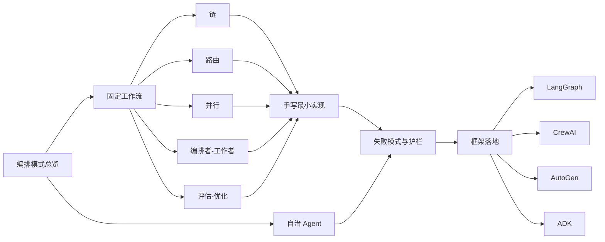
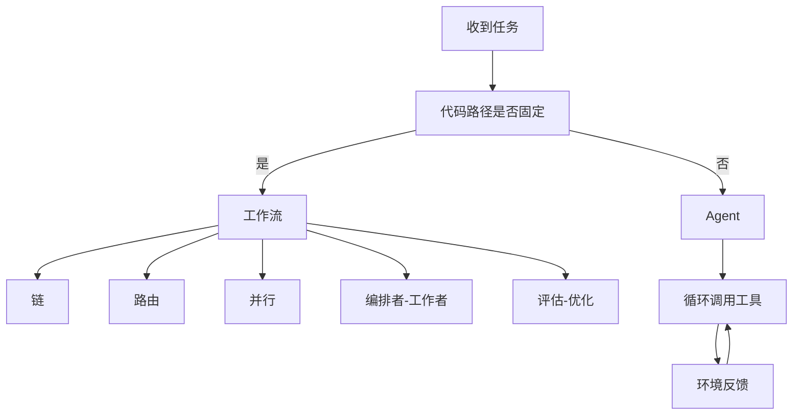
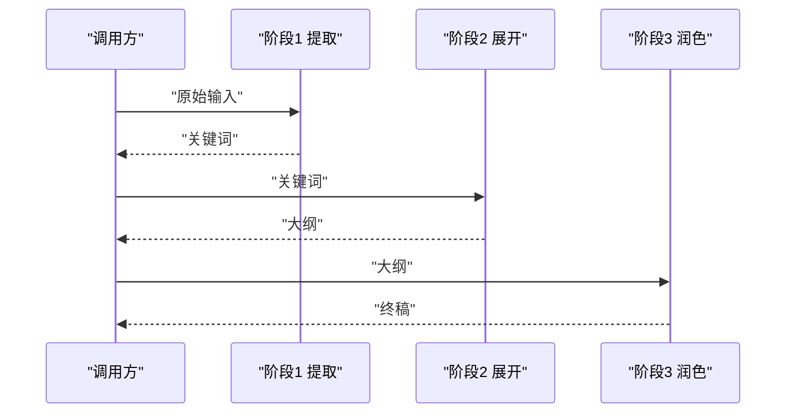
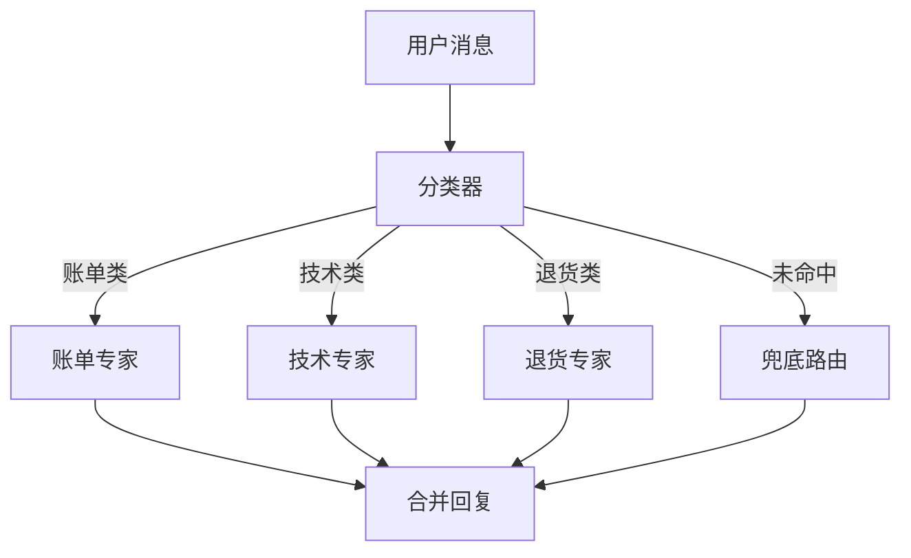
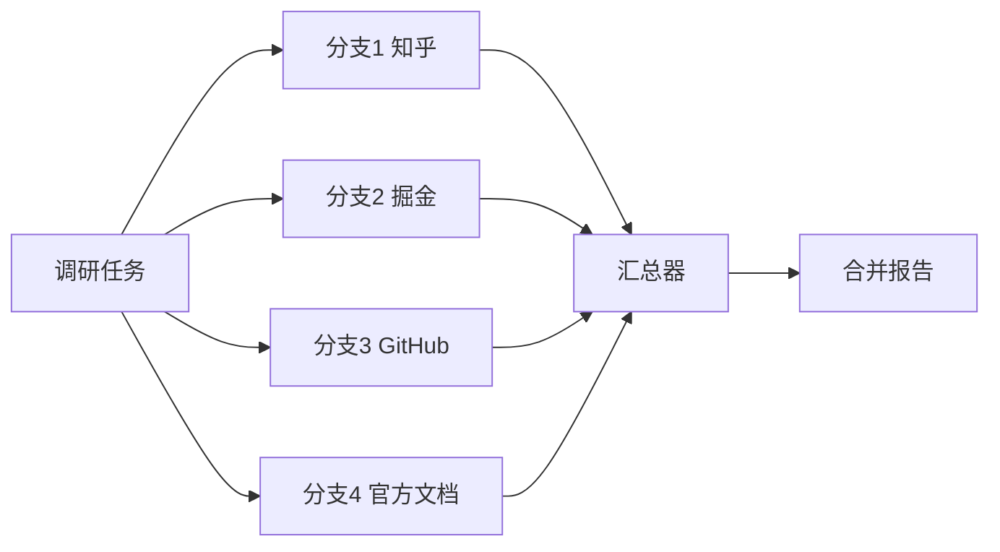
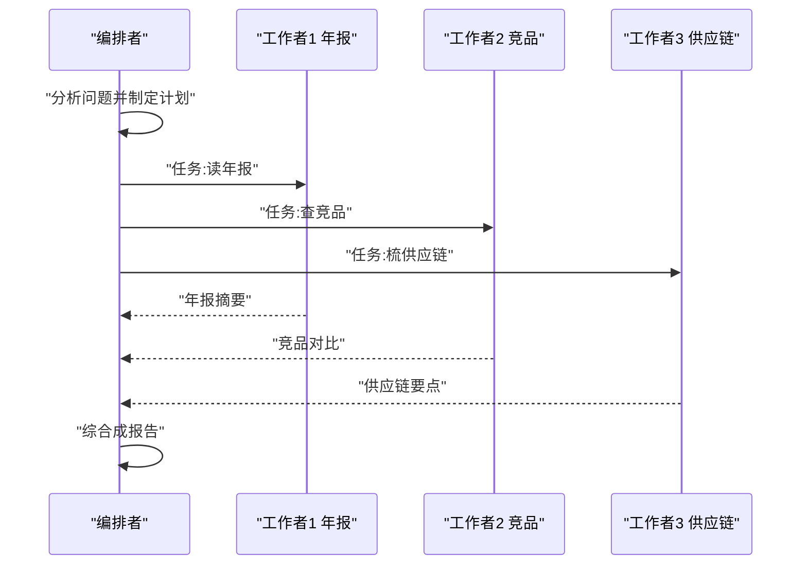
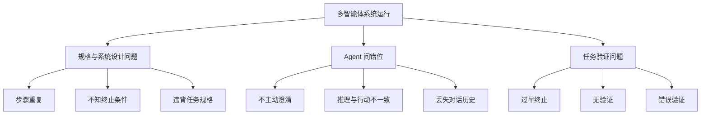
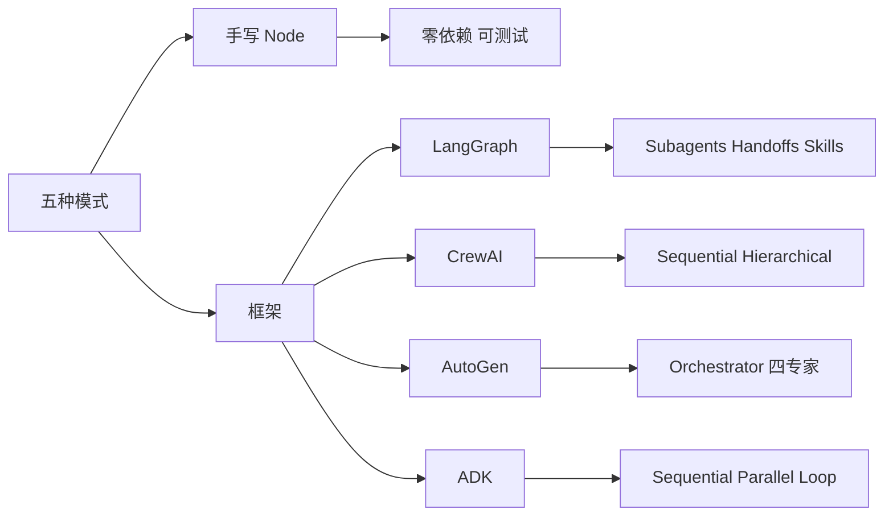

# 编排模式：链、路由、并行、编排者-工作者与评估-优化

!!! abstract "学完这一页你能"
    - 能说出工作流与自治 Agent 的判定边界，并各举两个适用场景。
    - 能独立手写五种编排模式的 Node 20 最小实现，并用 node:assert 验证。
    - 能列举 MAST 论文中的三大类失败模式，并给每个模式配一条工程护栏。
    - 能说出 LangGraph、CrewAI、AutoGen、ADK 分别原生支持哪些编排模式。

## 0. 知识地图



建议先读第 1 节把"工作流"和"Agent"分开，再按链、路由、并行、编排者-工作者、评估-优化的顺序读第 2 到第 6 节。第 7 节和第 8 节适合在写完五个模式的最小实现后回看，用来补失败护栏和框架选型。

## 1. 从工作流到自治 Agent：先把概念分清楚

**先想一个问题**

你写了一个客服机器人：用户问"怎么退款"，你希望它先查订单、再查退款政策、最后生成回复。这个流程是固定三步，还是让模型自己决定查什么？搞混这两件事，会做出要么太僵、要么太贵的系统。

**心智模型**

!!! tip "心智模型"
    工作流是一条地铁线路图：每一站和换乘秩序由代码预先画好，乘客只能按图走。日常类比：工厂流水线，工位顺序固定。类比失效处：流水线的物料形状固定，而 LLM 每站产出的文本形状可能漂移，所以站与站之间要做校验。

!!! note "术语：工作流"
    工作流（Workflow）指 LLM 与工具由预定义代码路径编排，执行顺序在运行前写死。例如：链模式先翻译后润色，永远先翻译后润色。

!!! note "术语：自治 Agent"
    自治 Agent 指 LLM 在循环中动态决定用什么工具、执行多少步、何时结束。例如：一个研究 Agent 自己判断要搜 3 次还是 12 次，而不是按写死的次数执行。

**图解**



1. 收到任务后先判断：子任务与顺序是否能预先确定。
2. 能预先确定，走工作流五模式之一。
3. 不能预先确定步数或依赖环境反馈，走 Agent 循环。
4. Agent 循环自己决定是否回到第 2 步继续调用工具。

**一步一步来**

第 1 步：写一个固定工作流骨架。

```javascript
// workflow.js
// 固定三步：提取 -> 扩展 -> 输出
async function runWorkflow(input) {
  // 第 1 步：调用 LLM 提取关键词
  const keywords = await callLLM("提取关键词", input);
  // 第 2 步：基于关键词写大纲
  const outline = await callLLM("写大纲", keywords);
  // 第 3 步：基于大纲写正文
  const body = await callLLM("写正文", outline);
  // 返回完整上下文
  return { input, keywords, outline, body };
}
```

**这段代码在做什么**

- 步骤顺序在写代码时就固定，运行期不会改。
- 每一步的输入依赖上一步输出，形成链式数据流。
- 没有循环、没有动态分支，失败时只有一条路径。
- 好处是可测试：改变第 2 步输出，第 3 步行为可预测。

运行结果

```
{ input: '生成周报', keywords: '周报 本周进展', outline: '一 本周进展 二 风险', body: '本周完成三项工作' }
```

第 2 步：写一个最小 Agent 循环骨架。

```javascript
// agent.js
async function runAgent(task, tools) {
  let history = []; // 对话记录
  let step = 0;
  // 最大步数护栏，防止无限循环
  while (step < 8) {
    // 模型返回动作：调用哪个工具，还是结束
    const action = await decideAction(history);
    if (action.type === "finish") return action.answer;
    // 执行工具并拿到环境反馈
    const result = await tools[action.tool](action.args);
    history.push({ action, result });
    step += 1;
  }
  throw new Error("超出最大步数");
}
```

**这段代码在做什么**

- 步数不固定，依靠模型每次决策是否结束。
- 工具集合是动态选择的，而工作流的工具顺序固定。
- 用 `maxStep = 8` 做护栏，这是工程必需，不是可选项。
- Agent 的成本更高，因为每步都要重新调用模型决策。

**动手验证**

```javascript
// 文件：agent-vs-workflow.demo.mjs
// 依赖：无，Node 20+ 内置模块
import { strict as assert } from "node:assert";

// 用一个假模型模拟固定流程
async function callLLM(job, input) {
  return `${job} 完成:${input}`;
}

async function runWorkflow(input) {
  const keywords = await callLLM("提取", input);
  const outline = await callLLM("大纲", keywords);
  const body = await callLLM("正文", outline);
  return { body };
}

// Agent 循环：模型决定走多少步
async function runAgent(task, maxStep) {
  let step = 0;
  while (step < maxStep) {
    step += 1;
    if (task.includes("简单")) return { answer: "一步完成" };
  }
  return { answer: "多步完成" };
}

const wf = await runWorkflow("周报");
assert.match(wf.body, /正文/);

const ag = await runAgent("简单问题", 5);
assert.equal(ag.answer, "一步完成");
console.log("工作流固定三步，Agent 动态步数，断言通过");
```

**常见坑**

| 现象 | 原因 | 怎么修 |
|------|------|--------|
| 固定流程里模型输出格式漂移 | 每步输出没校验 | 在每步后加 JSON Schema 或正则断言 |
| Agent 循环跑满步数也不停 | 缺少终止条件 | 设置 maxStep，并让模型返回 finish 动作 |
| 简单任务用了 Agent | 把复杂性当默认 | 先写固定工作流，能覆盖就不上 Agent |

**用在哪里**

- 场景一：客服工单分类与回复。业务背景：每天有固定类型的咨询。知识怎么用：用路由工作流分类，再链式生成回复。衡量指标：人工转接率下降。不该用：客服要求实时多轮追问链时，用 Agent 循环。
- 场景二：文档翻译流水线。业务背景：翻译后润色、按术语表替换。知识怎么用：三个固定阶段用链模式。衡量指标：术语一致率。不该用：源文本结构变化大、需要动态查资料时。

**行业实践**

- Anthropic《Building effective agents》提出：工作流是预定义代码路径，Agent 是模型动态指挥自己的流程。借鉴：新项目先画一张流程图，画得出来就写工作流，画不出来才考虑 Agent。
- Anthropic 同一篇文章建议先用直接 LLM API 实现，很多模式几行代码就能写完。借鉴：前五个模式先手写，不急着装框架。

**小结**

1. 工作流适合步骤固定、可枚举的任务，Agent 适合步数不可预知的任务。
2. 工作流五模式是链、路由、并行、编排者-工作者、评估-优化。
3. Agent 必须有步数上限和显式终止信号，否则会无限循环。

## 2. 链：把固定步骤串成可靠流水线

**先想一个问题**

你要生成产品文案：先总结卖点，再写初稿，最后检查合规。三个模型调用有明确先后依赖，能不能让它们一个接一个跑，中途失败还能定位是哪一环？

**心智模型**

!!! tip "心智模型"
    链是一条传送带，上一个工位的零件直接传给下一个工位。日常类比：煮咖啡要先磨豆、再注水、最后过滤，顺序不能反。类比失效处：咖啡粉不会生成新的咖啡豆，但 LLM 每步会产出新文本，可能把错误传给下一步。

!!! note "术语：链"
    链（Prompt Chaining）指把任务拆成固定子任务，每个子任务只做一件事，前一步输出作为后一步输入。例如：总结会议纪要，再翻译成英文。

**图解**



1. 调用方把原始输入交给阶段 1，拿到阶段 1 输出。
2. 阶段 1 输出作为阶段 2 输入，串行传递。
3. 阶段 2 输出交给阶段 3，最终返回终稿。
4. 每两个阶段之间由调用方显式传值，不共享可变全局状态。

**一步一步来**

第 1 步：定义阶段与传递上下文。

```javascript
// chain-stages.js
async function runChain(input, stages) {
  // ctx 是传递上下文，启动时只放原始输入
  let ctx = { input };
  for (const stage of stages) {
    // 每阶段读 ctx，返回自己的结果
    const out = await stage.run(ctx);
    // 把结果合并进 ctx，供后续阶段读取
    ctx = { ...ctx, [stage.name]: out };
  }
  return ctx;
}
```

**这段代码在做什么**

- `stages` 是数组，顺序即执行顺序。
- `ctx` 在阶段间传递，每阶段只追加自己的输出。
- 阶段函数签名统一为 `run(ctx) => output`，便于测试。
- 没有并行的写法，因为链的语义就是串行。

运行结果

```
{ input: '产品介绍', extract: '卖点：快', draft: '快是一种优势', polish: '快，且稳定' }
```

第 2 步：给链加上中途失败定位。

```javascript
// chain-debug.js
async function runChainWithTrace(input, stages) {
  let ctx = { input };
  for (const stage of stages) {
    try {
      const out = await stage.run(ctx);
      ctx = { ...ctx, [stage.name]: out };
    } catch (err) {
      // 抛出带阶段名的错误，方便定位
      throw new Error(`阶段 ${stage.name} 失败: ${err.message}`);
    }
  }
  return ctx;
}
```

**这段代码在做什么**

- 用 `try/catch` 包住每阶段调用。
- 失败时抛出带阶段名的错误，运维能一眼定位。
- 没有整体重试逻辑，因为重试策略要按阶段副作用决定。
- 每个阶段保持纯函数能减少失败排查成本。

**动手验证**

```javascript
// 文件：chain.demo.mjs
// 依赖：无，Node 20+ 内置模块
import { strict as assert } from "node:assert";

async function fakeLLM(job, text) {
  // 模拟三个固定阶段输出
  if (job === "提取") return "关键词:费用";
  if (job === "初稿") return `初稿:关于${text}`;
  if (job === "润色") return `润色:${text}已修正`;
  throw new Error("未知阶段");
}

async function runChain(input) {
  const extract = await fakeLLM("提取", input);
  const draft = await fakeLLM("初稿", extract);
  const polish = await fakeLLM("润色", draft);
  return { extract, draft, polish };
}

const output = await runChain("报销说明");
assert.match(output.extract, /关键词/);
assert.match(output.draft, /初稿/);
assert.match(output.polish, /润色/);
console.log("链模式三阶段全部通过：", output);
```

预期输出

```
链模式三阶段全部通过： { extract: '关键词:费用', draft: '初稿:关于关键词:费用', polish: '润色:初稿:关于关键词:费用已修正' }
```

**常见坑**

| 现象 | 原因 | 怎么修 |
|------|------|--------|
| 后续阶段收到格式错乱的前一阶段输出 | 每阶段输出未校验 | 阶段返回 JSON，下一阶段解析前先用 Schema 校验 |
| 失败只显示第 3 个阶段报错 | 错误信息未带阶段名 | 在每个阶段包裹 try/catch 并附加阶段名 |
| 想复用链中的某一步却耦合在其他步骤下 | 阶段函数依赖了完整 ctx | 阶段只声明接收自己需要的字段 |

**用在哪里**

- 场景一：商品文案生成器。业务背景：电商上新需要卖点、标题、详情三份文案。知识怎么用：三阶段链式生成，卖点阶段输出作为标题输入。衡量指标：文案审核一次通过率。不该用：文案需要实时查库存、查竞品价，则需引入路由或工具调用。
- 场景二：合同初稿起草。业务背景：输入客户信息，输出关键条款、风险提示、终稿。知识怎么用：提取、起草、合规检查三阶段。衡量指标：法务人工修改处数。不该用：条款依赖实时政策库查询时，链不够动态。

**行业实践**

- Anthropic《Building effective agents》对链模式的适用条件写得很直接：任务能干净拆成固定子任务时用链。借鉴：写链之前先列子任务，列不出固定清单就换模式。
- LangChain 官方文档把 Skills 模式归为单 Agent 按需加载专用知识，和链的固定流水线互补。借鉴：链负责顺序，Skills 负责按需注入领域知识。

**小结**

1. 链的复杂度来自阶段间的数据契约，不是阶段数量。
2. 每阶段返回结构化数据，下一阶段才能稳定消费。
3. 定位失败靠阶段名和结构化错误，不靠猜。

## 3. 路由：不同输入走不同专家

**先想一个问题**

客服后台收到三类消息：账单问题、技术报错、退货申请。三类消息要查的系统不同、回复模板不同。如果一个模型处理所有问题，回复质量会下降。怎么按输入特征分流？

**心智模型**

!!! tip "心智模型"
    路由是医院分诊台：护士先判断你该挂内科还是外科，再送你去对应科室。日常类比：快递分拣中心扫码后把包裹分到不同传送带。类比失效处：快递扫码结果确定，LLM 路由分类可能有概率误差，需要兜底路由。

!!! note "术语：路由"
    路由（Routing）指先对输入分类，再按类别把请求交给不同处理分支。例如：账单问题走账单专家，技术问题走技术专家。

**图解**



1. 用户消息先进入分类器，输出类别标签。
2. 分类结果决定进入哪一个专家分支。
3. 未命中任何类别时走兜底路由，不能直接报错。
4. 各分支输出汇合到统一回复出口。

**一步一步来**

第 1 步：写关键词分类器。

```javascript
// classifier.js
function classify(text) {
  // 按关键词顺序匹配，先命中先返回
  if (text.includes("账单")) return "billing";
  if (text.includes("报错")) return "tech";
  if (text.includes("退货")) return "refund";
  // 兜底类别，避免 undefined
  return "unknown";
}
```

**这段代码在做什么**

- 用 `includes` 做关键词匹配，零依赖、可测试。
- 顺序匹配适合关键词有重叠时的优先级控制。
- `unknown` 是兜底，保证每个输入都有类别。
- 生产环境可换成 LLM 分类，但必须保留 fallback。

运行结果

```
classify("我的账单打不开") -> "billing"
classify("页面报错500") -> "tech"
classify("今天天气") -> "unknown"
```

第 2 步：按类别分发到处理函数。

```javascript
// router.js
const handlers = {
  billing: async (msg) => `账单处理:${msg}`,
  tech: async (msg) => `技术排查:${msg}`,
  refund: async (msg) => `退货受理:${msg}`,
  unknown: async (msg) => `转人工:${msg}`,
};

async function route(msg) {
  const category = classify(msg);
  // 从注册表中取对应处理器并执行
  const handler = handlers[category];
  return handler(msg);
}
```

**这段代码在做什么**

- `handlers` 是类别到处理器的注册表，新增类别只加一条。
- `route` 先分类、后查表、再执行，逻辑分三段。
- 每个处理器签名一致，方便加日志与监控。
- 兜底处理器 `unknown` 永远不会让程序崩溃。

**动手验证**

```javascript
// 文件：router.demo.mjs
// 依赖：无，Node 20+ 内置模块
import { strict as assert } from "node:assert";

function classify(text) {
  if (text.includes("账单")) return "billing";
  if (text.includes("报错")) return "tech";
  if (text.includes("退货")) return "refund";
  return "unknown";
}

const handlers = {
  billing: async (m) => `账单处理:${m}`,
  tech: async (m) => `技术排查:${m}`,
  refund: async (m) => `退货受理:${m}`,
  unknown: async (m) => `转人工:${m}`,
};

async function route(msg) {
  return handlers[classify(msg)](msg);
}

assert.equal(await route("我的账单打不开"), "账单处理:我的账单打不开");
assert.equal(await route("页面报错500"), "技术排查:页面报错500");
assert.equal(await route("今天天气"), "转人工:今天天气");
console.log("路由模式三类分支加兜底全部通过");
```

**常见坑**

| 现象 | 原因 | 怎么修 |
|------|------|--------|
| 分类返回 undefined 导致运行时崩溃 | 分类器没有兜底类别 | 分类器最后一行固定返回 unknown |
| 两个类别关键词重叠被误分 | 匹配顺序固定且无加权 | 用 LLM 分类并在 prompt 中写明优先级边界 |
| 新类别上线要改路由函数 | 路由逻辑与分类逻辑耦合 | 用 handlers 查表，新类别只注册不重写 |

**用在哪里**

- 场景一：内部工单自动分派。业务背景：运维、人事、财务三类工单混在一个入口。知识怎么用：分类器分三类，各有处理模板。衡量指标：工单首次分派正确率。不该用：类别混杂且边界模糊时，先做人工分流再上路由。
- 场景二：电商售后消息分流。业务背景：退款、换货、催单要进不同客服组。知识怎么用：路由把消息分发到对应组模板。衡量指标：用户等待时长。不该用：需要跨组联合处理时，路由的单分支模式不够。

**行业实践**

- LangChain 官方文档列出的 Router 模式：先分类再分发并综合，单次请求 3 次调用。借鉴：分类、分发、综合三段都可以独立观察耗时。
- OpenAI Agents SDK 的 handoff 是路由在 Agent 层的实现，默认传递整段历史。借鉴：给路由加 `input_filter` 可选压缩，控制上下文膨胀。

**小结**

1. 路由的优势是每个分支可独立优化，互不污染。
2. 分类器和处理器注册表必须分离，才能低成本扩展。
3. 兜底分支是生产必需，分类置信度低时可以转人工。

## 4. 并行：扇出速度与扇入合并

**先想一个问题**

你要调研"前端状态管理"，需要同时查知乎、掘金、GitHub、官方文档四个来源。顺序查要 4 倍时间，能不能同时查、最后统一合并？

**心智模型**

!!! tip "心智模型"
    并行是一组同时开工的调查员，各自带不同资料回来，由一个人汇总。日常类比：四个人同时去不同图书馆查资料。类比失效处：调查员之间不通信，查回的资料可能冲突，合并时要做冲突消解。

!!! note "术语：扇出与扇入"
    扇出（Fan-out）指一个任务同时派发给多个并行分支；扇入（Fan-in）指多个分支的结果汇合到一处。例如：并行查四个来源是扇出，合并成一份报告是扇入。

**图解**



1. 调研任务同时扇出到四个数据源分支。
2. 每个分支独立执行，互不阻塞。
3. 所有分支完成后，结果全部进入汇总器。
4. 汇总器做去重、排序、冲突标记，产出合并报告。

**一步一步来**

第 1 步：写并行扇出。

```javascript
// fan-out.js
async function fanOut(sources) {
  // Promise.allSettled 等待全部分支，单个失败不拖垮整体
  const settled = await Promise.allSettled(
    sources.map((s) => s.search())
  );
  return settled;
}
```

**这段代码在做什么**

- `sources.map` 同时启动每个搜索请求。
- `allSettled` 返回每个分支的 fulfilled 或 rejected 状态。
- 和 `Promise.all` 不同，单分支失败不会拒绝整个 Promise。
- 并行度由 `sources` 长度决定，生产环境要加并发上限。

运行结果

```
[
  { status: 'fulfilled', value: '知乎:2条' },
  { status: 'fulfilled', value: '掘金:3条' },
  { status: 'rejected', reason: Error('GitHub 限流') },
  { status: 'fulfilled', value: '官方文档:5条' }
]
```

第 2 步：写扇入合并。

```javascript
// fan-in.js
function fanIn(settled) {
  const ok = [];
  const failed = [];
  for (const item of settled) {
    if (item.status === "fulfilled") {
      ok.push(item.value);
    } else {
      failed.push(item.reason.message);
    }
  }
  // 返回成功结果与失败清单，调用方可决定是否重试
  return { ok, failed };
}
```

**这段代码在做什么**

- 遍历 `allSettled` 结果，按状态分成成功与失败两组。
- 失败的 `reason.message` 被保留，方便重试时只处理失败源。
- 合并结果带失败清单，调用方知道有多少分支没拿到数据。
- 合并阶段是同步操作，因为数据已经在内存里。

**动手验证**

```javascript
// 文件：parallel.demo.mjs
// 依赖：无，Node 20+ 内置模块
import { strict as assert } from "node:assert";

function makeSource(name, ms, reject = false) {
  return {
    name,
    async search() {
      await new Promise((r) => setTimeout(r, ms));
      if (reject) throw new Error(`${name} 限流`);
      return `${name}:2条资料`;
    },
  };
}

async function fanOut(sources) {
  return Promise.allSettled(sources.map((s) => s.search()));
}

function fanIn(settled) {
  const ok = [];
  const failed = [];
  for (const item of settled) {
    if (item.status === "fulfilled") ok.push(item.value);
    else failed.push(item.reason.message);
  }
  return { ok, failed };
}

const sources = [
  makeSource("知乎", 20),
  makeSource("掘金", 10),
  makeSource("GitHub", 15, true),
  makeSource("官方文档", 25),
];

const settled = await fanOut(sources);
const merged = fanIn(settled);

assert.equal(merged.ok.length, 3);
assert.equal(merged.failed.length, 1);
assert.match(merged.failed[0], /GitHub/);
console.log("并行扇出扇入通过，成功3路失败1路：", merged);
```

预期输出

```
并行扇出扇入通过，成功3路失败1路： { ok: [ '知乎:2条资料', '掘金:2条资料', '官方文档:2条资料' ], failed: [ 'GitHub 限流' ] }
```

**常见坑**

| 现象 | 原因 | 怎么修 |
|------|------|--------|
| 一个分支失败整个 Promise 拒绝 | 用了 `Promise.all` | 换 `Promise.allSettled`，失败分支单独处理 |
| 合并结果里重复内容多 | 各分支独立抓取，没有去重 | 合并器按 URL 或标题哈希去重 |
| 并发过高触发目标服务限流 | 扇出数量太大 | 加并发上限，比如每批 5 个 |

**用在哪里**

- 场景一：多源搜索聚合。业务背景：知识库同时查内网文档、外部论坛、工单历史。知识怎么用：扇出到三个源，扇入去重排序。衡量指标：首屏结果覆盖率。不该用：来源之间有强依赖，比如先登录再搜索。
- 场景二：并行投票生成候选答案。业务背景：同一个代码题让模型跑多次，取多数结果。知识怎么用：扇出 3 次采样，扇入投票。衡量指标：答案一致率。不该用：候选结果需要互相评价时，要换成多轮辩论，代价更高。

**行业实践**

- Anthropic《How we built our multi-agent research system》：lead 并行启动 3 到 5 个 subagent，每个 subagent 并行用 3 个以上工具，研究耗时最多缩短 90%（以原文为准）。借鉴：并行前先确认子任务互相独立，否则收益被合并成本吃掉。
- Google/MIT《Towards a Science of Scaling Agent Systems》实测：可并行任务 Finance Agent 上 Centralized 架构 +80.8%，协调开销 285%（以原文为准）。借鉴：并行会引入协调成本，子任务计算量要大于协调成本才划算。

**小结**

1. 并行分扇出与扇入两段，两段都要显式写。
2. 用 `allSettled` 保留失败分支，合并时给出失败清单。
3. 并行度要设上限，否则会把下游服务打到限流。

## 5. 编排者-工作者：动态派发子任务

**先想一个问题**

你要生成一份行业研究报告，需要读五份年报、查三组竞品数据、梳理两条供应链。子任务数量和内容只有看到初始问题后才知道。怎么让一个"主编"先规划，再动态派活？

**心智模型**

!!! tip "心智模型"
    编排者-工作者是主编和记者：主编读完选题定方向，给每个记者布置采访任务，最后把稿子合成一篇。日常类比：婚礼策划人先列清单，再派不同供应商干活。类比失效处：主编和记者都会犯错，主编可能派错任务，记者可能带回错误事实。

!!! note "术语：编排者-工作者"
    编排者-工作者（Orchestrator-workers）指一个中心编排者根据输入动态规划子任务，派发给多个工作者并行执行，最后汇总结果。例如：研究 Agent 的 lead 分析问题后 spawn 多个 subagent 探索不同方向。

**图解**



1. 编排者先分析原始问题，产出一份子任务计划。
2. 编排者把每个子任务并行派发给对应工作者。
3. 每个工作者返回自己的摘要结果。
4. 编排者汇总全部摘要，产出最终报告。

**一步一步来**

第 1 步：写编排者的计划逻辑。

```javascript
// orchestrator-plan.js
function planTasks(query) {
  const tasks = [];
  if (query.includes("年报")) tasks.push("读年报");
  if (query.includes("竞品")) tasks.push("查竞品");
  if (query.includes("供应链")) tasks.push("梳供应链");
  // 空计划校验，防止无任务可派
  if (tasks.length === 0) tasks.push("泛读资料");
  return tasks;
}
```

**这段代码在做什么**

- 根据 query 中的触发词动态生成子任务清单。
- 三个 `includes` 是并行判断，不是互斥分支。
- 空计划强制回退到"泛读资料"，保证编排者一定有活派。
- 生产环境这一层通常由 LLM 生成，但结构相同。

运行结果

```
planTasks("年报竞品") -> ["读年报", "查竞品"]
planTasks("写周报") -> ["泛读资料"]
```

第 2 步：写派发与汇总。

```javascript
// orchestrator-run.js
async function runOrchestrator(query, worker) {
  // 第 1 步：编排者规划
  const tasks = planTasks(query);
  // 第 2 步：并行派发
  const settled = await Promise.allSettled(
    tasks.map((t) => worker(t))
  );
  // 第 3 步：汇总，只取成功结果
  const results = settled
    .filter((r) => r.status === "fulfilled")
    .map((r) => r.value);
  // 第 4 步：合成
  return results.join(" + ");
}
```

**这段代码在做什么**

- 四个步骤分别对应规划、派发、收集、合成。
- 派发用 `allSettled`，单个工作者失败不影响汇总。
- `filter` 与 `map` 把 fulfilled 结果抽出来。
- 最终合成用 `join` 简单串接，生产环境会再用一次 LLM 综合。

**动手验证**

```javascript
// 文件：orchestrator.demo.mjs
// 依赖：无，Node 20+ 内置模块
import { strict as assert } from "node:assert";

function planTasks(query) {
  const tasks = [];
  if (query.includes("年报")) tasks.push("读年报");
  if (query.includes("竞品")) tasks.push("查竞品");
  if (query.includes("供应链")) tasks.push("梳供应链");
  if (tasks.length === 0) tasks.push("泛读资料");
  return tasks;
}

async function worker(task) {
  await new Promise((r) => setTimeout(r, 5));
  return `${task}摘要`;
}

async function runOrchestrator(query) {
  const tasks = planTasks(query);
  const settled = await Promise.allSettled(tasks.map((t) => worker(t)));
  return settled
    .filter((r) => r.status === "fulfilled")
    .map((r) => r.value)
    .join(" + ");
}

const report = await runOrchestrator("年报与竞品分析");
assert.match(report, /读年报摘要/);
assert.match(report, /查竞品摘要/);
console.log("编排者-工作者动态规划并汇总通过：", report);
```

预期输出

```
编排者-工作者动态规划并汇总通过： 读年报摘要 + 查竞品摘要
```

**常见坑**

| 现象 | 原因 | 怎么修 |
|------|------|--------|
| 编排者规划出空任务列表 | 触发词没覆盖到新场景 | 计划函数最后固定回退一个泛化任务 |
| 汇总时被单个慢工作者拖住 | 同步等待所有工作者 | 给每个工作者设超时，超时结果标记为 partial |
| 工作者之间需要共享上下文却各跑各的 | 任务本身不满足独立性 | 把任务改为单 Agent，或先共享上下文再分派 |

**用在哪里**

- 场景一：竞品研究自动报告。业务背景：输入一个公司名，产出竞品周报。知识怎么用：编排者拆出产品、定价、融资三个调查任务。衡量指标：报告生成耗时。不该用：所有调查项共享同一份密集上下文时，分派反而丢信息。
- 场景二：代码仓库健康检查。业务背景：一个仓库要查依赖漏洞、测试覆盖率、许可证。知识怎么用：编排者生成检查清单，工作者并行执行。衡量指标：检查完成时间。不该用：检查项之间有强顺序依赖时，用链模式。

**行业实践**

- Anthropic《How we built our multi-agent research system》：Claude Opus 4 作 lead、Claude Sonnet 4 作 subagents，内部评测比单 Agent 高 90.2%，token 成本约 15 倍于普通 chat（以原文为准）。借鉴：编排者-工作者适合高价值研究任务，低价值任务不值得 15 倍成本。
- Microsoft Research Magentic-One：编排者带 WebSurfer、FileSurfer、Coder、ComputerTerminal 四个专用 Agent，外层维护 task ledger。借鉴：编排者的计划要用一个显式账本记录事实、猜测与计划，而不是藏在对话里。

**小结**

1. 编排者-工作者的核心是"先规划、再派发、后汇总"。
2. 计划函数必须有兜底，汇总函数必须容忍部分失败。
3. 该模式的成本远高于链和路由，只在任务价值匹配时使用。

## 6. 评估-优化：用分数驱动迭代

**先想一个问题**

你让模型生成一份英文邮件草稿，怎么判断它好到能发出去？如果不好，怎么自动改？靠人工一遍遍看太慢，能不能写一个"评分者"和"修改者"的循环？

**心智模型**

!!! tip "心智模型"
    评估-优化是老师批改作文、学生修改、老师再批改的循环，直到分数过线。日常类比：代码评审中的持续注释与修订。类比失效处：老师有稳定评分标准，LLM 评分者可能给两次相同文本打不同分，需要固定评分维度。

!!! note "术语：评估-优化"
    评估-优化（Evaluator-optimizer）指先由生成者产出文本，再由评估者按明确标准打分，分数不合格就返回修改，直到达标的循环。例如：生成文案、评估语气、修改、再评估。

**图解**

```mermaid
stateDiagram-v2
    [*] --> "生成草稿"
    "生成草稿" --> "评估草稿": "提交"
    "评估草稿" --> "通过": "分数达标"
    "评估草稿" --> "修订草稿": "分数不达标"
    "修订草稿" --> "评估草稿": "重新提交"
    "通过" --> [*]
```

1. 入口是生成草稿，生成者只负责产出。
2. 草稿提交给评估者，按固定维度打分。
3. 分数达到阈值进入通过状态，循环结束。
4. 分数未达标进入修订状态，修订后重新评估。
5. 修订与评估的循环必须设上限，否则可能永不达标。

**一步一步来**

第 1 步：写生成者与评估者。

```javascript
// evaluator-basic.js
function generate(attempt) {
  // 第 1 次生成有错别字，第 2 次起修正
  if (attempt === 0) return "您好，我司产口上线";
  return "您好，我司产品上线";
}

function evaluate(text) {
  // 按固定规则打分：含错别字得 0.4，否则得 0.9
  if (text.includes("产口")) return 0.4;
  return 0.9;
}
```

**这段代码在做什么**

- 生成者用 `attempt` 序号模拟迭代改进。
- 评估者只返回数字分数，不返回修改建议。
- 评估规则明确：一个错别字对应固定分数。
- 评分维度固定能保证循环可收敛。

运行结果

```
generate(0) -> "您好，我司产口上线"
evaluate(generate(0)) -> 0.4
evaluate(generate(1)) -> 0.9
```

第 2 步：写带上限的评估循环。

```javascript
// evaluator-loop.js
async function runEvaluatorLoop(maxRound = 3) {
  let attempt = 0;
  let text = generate(attempt);
  let score = evaluate(text);
  // 未达标且未到上限时继续修改
  while (score < 0.8 && attempt < maxRound) {
    attempt += 1;
    text = generate(attempt);
    score = evaluate(text);
  }
  // 返回最终文本、分数和轮次
  return { text, score, attempt };
}
```

**这段代码在做什么**

- `maxRound` 是硬性上限，防止无线循环。
- 循环条件同时检查分数与轮次，缺一个都不安全。
- 每轮重新生成并重新评估，不保留上一轮的修改建议。
- 返回 `attempt` 让调用方知道改了几次，便于成本核算。

**动手验证**

```javascript
// 文件：evaluator.demo.mjs
// 依赖：无，Node 20+ 内置模块
import { strict as assert } from "node:assert";

function generate(attempt) {
  if (attempt === 0) return "您好，我司产口上线";
  return "您好，我司产品上线";
}

function evaluate(text) {
  if (text.includes("产口")) return 0.4;
  return 0.9;
}

async function runEvaluatorLoop(maxRound = 3) {
  let attempt = 0;
  let text = generate(attempt);
  let score = evaluate(text);
  while (score < 0.8 && attempt < maxRound) {
    attempt += 1;
    text = generate(attempt);
    score = evaluate(text);
  }
  return { text, score, attempt };
}

const result = await runEvaluatorLoop();
assert.ok(result.score >= 0.8);
assert.ok(result.attempt <= 3);
assert.match(result.text, /产品/);
console.log("评估-优化循环通过：", result);
```

预期输出

```
评估-优化循环通过： { text: '您好，我司产品上线', score: 0.9, attempt: 1 }
```

**常见坑**

| 现象 | 原因 | 怎么修 |
|------|------|--------|
| 循环永远不达标，跑到上限 | 评估标准过严或生成者不会改进 | 评估维度拆小，先修最严重的单项 |
| 评估分数波动但文本已稳定 | 评估者用 LLM 打分，非确定性强 | 固定评估维度，用结构化输出，必要时多次打分取均值 |
| 修改把好的部分也改坏了 | 修改者没有收到具体评估意见 | 修改者只回传分项评分和修改建议 |

**用在哪里**

- 场景一：邮件语气优化。业务背景：销售写的英文邮件需要达到正式商务语气。知识怎么用：生成者写初稿，评估者按语气、语法、称呼打分。衡量指标：人工重写率。不该用：没有明确评分标准时，先找两条标准样例再跑循环。
- 场景二：产品文案合规检查。业务背景：电商文案不能出现绝对化用语。知识怎么用：评估者检查违规词，不达标就修改。衡量指标：违规词命中次数。不该用：合规规则每周变动时，循环会被规则本身拖累。

**行业实践**

- Cognition 后续文章（经二手来源摘要，需核对原文）提到 code-review loop：coding Agent 与 review Agent 故意不共享先前上下文，保持 clean context。借鉴：评审者用独立上下文，能降低注意力衰减带来的漏判。
- MAST 论文（arXiv 2503.13657）：任务验证类失败占 21.30%，多层验证让 ChatDev 在 ProgramDev 上成功率绝对提升 15.6%（以原文为准）。借鉴：评估不是附加品，是系统设计的关键层。

**小结**

1. 评估-优化的前提是评分标准能写出来，否则循环没有意义。
2. 评估与生成必须在语义上解耦，才能独立改进。
3. 循环一定要设轮次上限，并保留最后结果。

## 7. 失败模式与工程护栏

**先想一个问题**

你上线了一个多智能体研究系统，测试时一切正常，生产环境却出现任务卡死、重复调用工具、研究到一半不结尾。这些问题从哪里来？怎么在代码层拦下来？

**心智模型**

!!! tip "心智模型"
    失败模式是团队协作中的信息差：有人没收到前文、有人重复干活、有人误以为任务完成。日常类比：两个人同时改同一份线上表格却没合并。类比失效处：LLM 的失败可以按统计分类，MAST 做了 14 种标注。

!!! note "术语：失败模式"
    失败模式（Failure Mode）指系统在运行中反复出现、可分类的错误形态。例如：步骤重复、丢失对话历史、错误验证。

**图解**



1. MAST 把失败归为三大类：规格与系统设计、Agent 间错位、任务验证。
2. 规格与系统设计类占 41.77%，其中步骤重复是最高频单项 17.14%。
3. Agent 间错位类占 36.94%，推理与行动不一致占 13.98%。
4. 任务验证类占 21.30%，过早终止占 7.82%。
5. 以上百分比的分母是被标注的失败样本，不是整体失败率。

**一步一步来**

第 1 步：写步数护栏。

```javascript
// guard-maxTurns.js
function createTurnGuard(maxTurns) {
  let turns = 0;
  return {
    // 每步消耗一个配额，超限返回 false
    step() {
      turns += 1;
      return turns <= maxTurns;
    },
    getTurns() {
      return turns;
    },
  };
}
```

**这段代码在做什么**

- 用闭包保存 `turns` 计数器，外部无法篡改。
- 每次调用 `step()` 先加一，再与上限比较。
- 返回布尔值供调用方决定是否继续。
- 这是 Claude Code 中 `maxTurns` 概念的极简版。

运行结果

```
guard.step() 四次后，第五次返回 false，getTurns() 返回 5
```

第 2 步：写预算护栏。

```javascript
// guard-budget.js
function createBudgetGuard(maxBudget) {
  let spend = 0;
  return {
    // 花费累计，超限直接抛错
    spend(cost) {
      spend += cost;
      if (spend > maxBudget) {
        throw new Error(`预算超限:${spend}/${maxBudget}`);
      }
      return spend;
    },
    getSpend() {
      return spend;
    },
  };
}
```

**这段代码在做什么**

- 每次花费都做累计，而不是只比较单次。
- 超限抛错，让上层调用方必须处理。
- 预算单位可以是 token 数或调用次数，按业务定。
- 生产环境应把预算错误与重试逻辑结合。

**动手验证**

```javascript
// 文件：guardrails.demo.mjs
// 依赖：无，Node 20+ 内置模块
import { strict as assert } from "node:assert";

function createTurnGuard(maxTurns) {
  let turns = 0;
  return {
    step() {
      turns += 1;
      return turns <= maxTurns;
    },
    getTurns() {
      return turns;
    },
  };
}

function createBudgetGuard(maxBudget) {
  let spend = 0;
  return {
    spend(cost) {
      spend += cost;
      if (spend > maxBudget) throw new Error("预算超限");
      return spend;
    },
  };
}

const turnGuard = createTurnGuard(3);
assert.equal(turnGuard.step(), true);
assert.equal(turnGuard.step(), true);
assert.equal(turnGuard.step(), true);
assert.equal(turnGuard.step(), false);

const budgetGuard = createBudgetGuard(100);
budgetGuard.spend(60);
budgetGuard.spend(30);
assert.throws(() => budgetGuard.spend(20), /预算超限/);
console.log("护栏：步数上限与预算上限断言通过");
```

**常见坑**

| 现象 | 原因 | 怎么修 |
|------|------|--------|
| 步骤重复是最常见的单一失败模式，占 17.14% | 系统没检查已完成步骤的幂等性 | 任务执行前查状态，已完成任务直接返回缓存 |
| 过早终止占 7.82% | 模型把部分完成误判为全部完成 | 设置明确的完成检查清单，全部勾选才能返回 |
| token 成本失控 | 多智能体约 15 倍于普通 chat | 预算护栏加触发词规则限制调度数量 |

**用在哪里**

- 场景一：生产环境 Agent 服务。业务背景：线上 Agent 处理用户请求，不能卡死或烧钱。知识怎么用：加 maxTurns、token 预算、checkpoint。衡量指标：单请求 p99 成本、卡死率。不该用：离线批处理且预算充足时，可放宽护栏。
- 场景二：后台批量导入的任务编排。业务背景：批量任务有固定并发上限和超时。知识怎么用：并行扇出加步数护栏。衡量指标：任务成功率。不该用：单任务价值极低时，护栏本身的开发成本也要算。

**行业实践**

- Anthropic《How we built our multi-agent research system》：生产环境做带重试与 checkpoint 的可恢复系统，加入完整 tracing，只用决策模式做监控。借鉴：先记录，再监控，不要读对话内容。
- Claude Code 官方文档：子 Agent 有 `maxTurns`、并发默认 20、嵌套深度默认 3 层；子 Agent 有独立权限和工具白名单。借鉴：权限最小化与步数限制放到配置层，不写死在业务代码里。
- Google/MIT 论文（arXiv 2512.08296）测出错误放大倍数：Independent 17.2 倍、Centralized 4.4 倍，单 Agent 为 1.0 倍（以原文为准）。借鉴：中心化的验证瓶颈能抑制错误放大，这条护栏优先做。

**小结**

1. 失败模式可分类、可统计，不是玄学问题。
2. 三类硬护栏：步数上限、预算上限、权限白名单。
3. 验证类失败占两成以上，评估层要作为独立模块来写。

## 8. 手写实现与框架对应

**先想一个问题**

你已经能手写五种模式了。但团队在讨论要不要上 LangGraph、CrewAI、AutoGen、ADK。这些框架分别对应哪些模式？哪些情况下手写反而更简单？

**心智模型**

!!! tip "心智模型"
    框架是打包好的工作流积木，每块积木都实现了一个编排模式的通用版本。日常类比：租房买现成家具，还是自己打家具。类比失效处：现成家具不能随便拆改，框架的默认行为会约束你的控制粒度。

!!! note "术语：框架对应"
    框架对应指把某个框架的原生抽象映射到五种模式之一。例如：ADK 的 Sequential 模板对应链模式，Parallel 模板对应并行模式。

**图解**



1. 五种模式都可以用 Node 手写，适合教学和小型工具。
2. 框架只覆盖部分模式，每个框架侧重点不同。
3. LangGraph 的 Subagents 对应编排者-工作者，Handoffs 对应路由。
4. CrewAI 的 Sequential 对应链，Hierarchical 对应编排者-工作者。
5. ADK 的三种模板覆盖链、并行、循环。

**一步一步来**

第 1 步：写最小模式指标，方便对照框架。

```javascript
// pattern-signature.js
const patterns = {
  // 每个模式标记：是否有动态规划、是否并行、是否有评分循环
  chain: { dynamicPlan: false, parallel: false, evaluator: false },
  router: { dynamicPlan: false, parallel: false, evaluator: false },
  parallel: { dynamicPlan: false, parallel: true, evaluator: false },
  orchestrator: { dynamicPlan: true, parallel: true, evaluator: false },
  evaluator: { dynamicPlan: false, parallel: false, evaluator: true },
};
```

**这段代码在做什么**

- 用三个布尔维度区分五种模式：动态规划、并行、评分循环。
- 链和路由在三个维度上都为 false，区别在分支结构而非这三个维度。
- 编排者-工作者同时具备动态规划与并行。
- 这三个维度可帮助你快速判断一个框架抽象属于哪种模式。

第 2 步：把框架原生抽象映射到模式。

```javascript
// framework-mapping.js
const frameworkMap = {
  "LangGraph": ["Subagents对应编排者", "Handoffs对应路由", "Skills对应单Agent按需加载"],
  "CrewAI": ["Sequential对应链", "Hierarchical对应编排者"],
  "AutoGen": ["Magentic-One对应编排者带四专家"],
  "ADK": ["Sequential对应链", "Parallel对应并行", "Loop对应循环Agent"],
};
```

**这段代码在做什么**

- 映射表只列有资料依据的对应关系。
- LangGraph 的三类抽象来自其官方文档对 multi-agent 的划分。
- CrewAI 的两种 Process 来自官方文档的 Processes 章节。
- ADK 的三种模板来自官方文档的 workflow Agent 页面。
- AutoGen 的 Magentic-One 来自 Microsoft Research 文章。

**动手验证**

```javascript
// 文件：framework-map.demo.mjs
// 依赖：无，Node 20+ 内置模块
import { strict as assert } from "node:assert";

const patterns = {
  chain: { dynamicPlan: false, parallel: false, evaluator: false },
  router: { dynamicPlan: false, parallel: false, evaluator: false },
  parallel: { dynamicPlan: false, parallel: true, evaluator: false },
  orchestrator: { dynamicPlan: true, parallel: true, evaluator: false },
  evaluator: { dynamicPlan: false, parallel: false, evaluator: true },
};

const frameworkMap = {
  "LangGraph": ["Subagents对应编排者", "Handoffs对应路由"],
  "CrewAI": ["Sequential对应链", "Hierarchical对应编排者"],
  "AutoGen": ["Magentic-One对应编排者"],
  "ADK": ["Sequential对应链", "Parallel对应并行", "Loop对应循环Agent"],
};

assert.equal(patterns.orchestrator.dynamicPlan, true);
assert.equal(patterns.evaluator.evaluator, true);
assert.ok(frameworkMap.CrewAI.includes("Sequential对应链"));
assert.ok(frameworkMap.ADK.includes("Parallel对应并行"));
console.log("框架对应映射与模式判别断言通过");
console.log(Object.keys(frameworkMap).join("、"), "分别覆盖：");
for (const [fw, items] of Object.entries(frameworkMap)) {
  console.log(fw, "->", items.join("，"));
}
```

预期输出

```
框架对应映射与模式判别断言通过
LangGraph、CrewAI、AutoGen、ADK 分别覆盖：
LangGraph -> Subagents对应编排者，Handoffs对应路由
CrewAI -> Sequential对应链，Hierarchical对应编排者
AutoGen -> Magentic-One对应编排者
ADK -> Sequential对应链，Parallel对应并行，Loop对应循环Agent
```

**常见坑**

| 现象 | 原因 | 怎么修 |
|------|------|--------|
| 为了用框架而上框架 | 团队先选了框架再套需求 | 先手写五个模式，发现通用痛点再上框架 |
| 以为框架会自动处理失败 | 框架提供了重试但没配护栏 | 框架也有 maxTurns、超时、预算，需要显式配置 |
| 把框架抽象当命名对照表 | 每个框架术语含义有细微差异 | 读框架文档的示例代码，不只看标题 |

**用在哪里**

- 场景一：快速原型与面试手写题。业务背景：验证一个编排想法。知识怎么用：Node 手写五个模式。衡量指标：代码行数、可测试性。不该用：需要框架自带的调试 UI 时，再上框架。
- 场景二：企业级多 Agent 平台。业务背景：团队多、需要可视化编排与权限。知识怎么用：按模式选框架抽象。衡量指标：接入新流程的人天。不该用：单文件脚本能解决的用框架反而增加打包与部署负担。

**行业实践**

- Anthropic《Building effective agents》建议先直接调 LLM API，几行代码能实现的模式不要上框架。借鉴：把"手写最小实现"当作默认选项，框架是例外。
- Google ADK 官方文档警告并行 Agent 写同一 state key 会冲突。借鉴：并行扇入时按职责划分 key，不要共享可变状态。
- OpenAI Agents SDK 官方文档：`Agent.as_tool` 是把专家变成带结构化输入的工具但不转移对话，handoff 是永久转移控制权。借鉴：分清"调用专家"与"转移控制权"，前者更安全。

**小结**

1. 五个模式手写都在百行以内，框架提供的是工程化能力而非魔法。
2. 框架术语与模式不是一一对应，要读示例代码确认语义。
3. 共享状态、并发写、权限隔离是框架层的常见坑，手写时也要面对同样问题。

## 应用地图

| 场景 | 用到本页哪个知识点 | 典型技术选型 | 注意事项 |
|------|------------------|------------|---------|
| 竞品研究自动周报 | 编排者-工作者 | Anthropic lead 加 subagents 或 LangGraph Subagents | 先确认子任务互相独立，token 成本约 15 倍 |
| 客服工单分流 | 路由 | 关键词分类加专家处理器，或 OpenAI handoff | 必须有兜底分支，分类置信度低转人工 |
| 多源搜索聚合 | 并行扇出扇入 | `Promise.allSettled` 或 ADK Parallel | 加并发上限和单源超时 |
| 销售邮件润色 | 评估-优化 | 生成者加 LLM 评分循环 | 评分维度固定，轮次设硬上限 |
| 商品文案三段生成 | 链 | 阶段函数数组，或 CrewAI Sequential | 每阶段输出做 Schema 校验 |
| 后台批量导入任务 | 并行加护栏 | Node 脚本加 maxTurns 与预算 | 幂等执行，重复步骤直接返回缓存 |
| 代码评审自动检查 | 评估-优化 | Cognition review loop 思路，评审者独立上下文 | 评审者不共享生成者上下文 |
| 单请求内多领域并发 | 并行加上下文隔离 | LangChain Subagents 或 Claude Code subagent | 隔离上下文可省 token，但会丢共享信息 |

## 动手作业

目标：写一个 `mini-orchestrator` 单文件仓库，把五种模式各实现一个极简函数，并包含断言测试。

步骤：

1. 创建 `mini-orchestrator.mjs`，Node 20+ 无第三方依赖。
2. 按本页写法实现 `runChain`、`route`、`fanOutFanIn`、`runOrchestrator`、`runEvaluatorLoop`。
3. 为每个函数写三条 `node:assert` 断言，包括一条失败路径断言。
4. 在文件末尾输出五段测试通过汇总。

验收标准：

- 执行 `node mini-orchestrator.mjs` 不报错，输出五段"通过"字样。
- 每个函数不超过 20 行，命名清晰。
- 链、路由、并行、编排者-工作者、评估-优化五个函数都有护栏或兜底。
- 文件总行数不超过 180 行。

## 综合对比

| 维度 | 链 | 路由 | 并行 | 编排者-工作者 | 评估-优化 |
|------|-----|------|------|-------------|----------|
| 子任务是否预先知道 | 是 | 是 | 是 | 否 | 是 |
| 是否并行执行 | 否 | 否 | 是 | 是 | 否 |
| 是否需要评分标准 | 否 | 否 | 否 | 否 | 是 |
| 单次失败影响范围 | 当前阶段及之后 | 当前分支 | 单分支，可隔离 | 单工作者，可隔离 | 单轮，可重试 |
| 实现复杂度 | 低 | 低 | 中 | 高 | 中 |
| token 成本 | 线性增长 | 线性增长 | 与分支数成正比 | 较高，可达 15 倍 chat | 与轮次成正比 |
| 适合的任务特征 | 固定顺序子任务 | 明显不同类别输入 | 互相独立的子任务 | 无法预知子任务的复杂任务 | 有明确评价标准需迭代 |

## 深入阅读与参考

!!! tip "怎么用这些资料"
    先读「官方文档与规范」建立准确的概念，再读「源码与示例」核对细节，最后用「教程、书籍与视频」换一种讲法加深理解。每条都写明了读哪一节、带着什么问题读。

### 官方文档与规范

| 资源 | 为什么读 | 怎么读 |
|---|---|---|
| [Process 有 Sequential（前一任务输出作后续输入）与 Hierarchical（manager agent 负责规划、委派、 (docs.crewai.com)](https://docs.crewai.com/en/concepts/processes) | Sequential 与 Hierarchical 是最基础的两种编排，正对本页链与编排者-工作者。 | 读 Process 一节，问“任务如何交给下一个角色”，据此画出两种流程的拓扑图。 |
| [三种模板化 workflow agent：Sequential（顺序）、Parallel（并发）、Loop（条件循环）；另有由 LLM 驱动 (adk.dev)](https://adk.dev/workflows/) | 官方界定 Sequential/Parallel/Loop 模板与 LLM 驱动编排，恰好对应本页分类。 | 读 workflow agents 一节，区分模板编排与 LLM 动态路由，各写一个适用场景。 |
| [LangChain 文档列出五种模式：Subagents（协调者把子 agent 当工具）、Handoffs（通过工具调用转移控制）、Ski (docs.langchain.com)](https://docs.langchain.com/oss/python/langchain/multi-agent) | 五种多 Agent 模式含 Subagents、Handoffs、Router，是路由分类的权威来源。 | 逐个对照本页四种模式，标注哪些是静态编排、哪些把控制权交给模型。 |
| [handoff 在 LLM 看来是工具，名称形如 `transfer_to_<agent_name>`。 (openai.github.io)](https://openai.github.io/openai-agents-python/handoffs/) | 说明 handoff 在模型眼里就是一个工具，解释路由为何能被动态决策。 | 读 handoff 与 tools 一节，关注 transfer_to_ 命名，给自己路由实现起同类工具名。 |
| [经典 supervisor / swarm / network / hierarchical 分类来自 LangGraph 旧版 conce (langchain-ai.github.io)](https://langchain-ai.github.io/langgraph/concepts/multi_agent/) | supervisor/swarm/network/hierarchical 经典四分类，是编排术语的源头。 | 读概念页对照本页分类做映射表，记下哪些已在新版文档中改名。 |
| [Meta's Agents Rule of Two (2025-10-31): within one session an agent sh (ai.meta.com)](https://ai.meta.com/blog/practical-ai-agent-security/) | Rule of Two 给出自治 Agent 的安全边界，对应失败模式与护栏一节。 | 读规则原文与示例，检查自己的 Agent 是否同时满足三条危险条件。 |

### 源码与示例

| 资源 | 为什么读 | 怎么读 |
|---|---|---|
| [Google ADK（Python）仓库](https://github.com/google/adk-python) | 官方 samples 提供可运行的多 agent 编排代码，便于对照本页模式。 | 跑通一个多 agent 示例，改 agent 数量与依赖，观察执行顺序变化。 |
| [smolagents 仓库](https://github.com/huggingface/smolagents) | 不到千行的核心代码，是最短路径看清 Agent 循环与工具调用。 | 通读核心 loop，带着“终止条件写在哪”的问题读，再自己重写一遍。 |
| [OpenAI Agents SDK（Python）](https://openai.github.io/openai-agents-python/) | Quickstart 加 handoff 示例，手把手跑通路由与多 agent 协作。 | 复现 Quickstart，再加一个 handoff，打印每次控制权转移的日志。 |

### 教程、书籍与视频

| 资源 | 为什么读 | 怎么读 |
|---|---|---|
| [How we built our multi-agent research system](https://www.anthropic.com/engineering/multi-agent-research-system) | Anthropic 自述多 agent 研究系统的取舍，讲清何时值得拆分。 | 画出 lead 与 subagent 调用图，标出并行扇出与合并点，再决定是否拆分。 |
| [LLM Powered Autonomous Agents（Lilian Weng）](https://lilianweng.github.io/posts/2023-06-23-agent/) | 规划、记忆、工具三件套的经典综述，是各种编排模式的共同底座。 | 精读规划与工具章节，各写一段批注，对照本页模式找落点。 |

## 自测题

??? question "1. 工作流和自治 Agent 最核心的区分依据是什么？"
    看执行路径是否在运行前由代码固定。工作流的步骤和顺序预先写定，Agent 在循环中根据环境反馈动态决定下一步。判定方法：能否先画出完整流程图，能画出就走工作流。

??? question "2. 路由模式为什么要写兜底分支？"
    分类器用关键词匹配或 LLM 分类都可能漏判。没有兜底分支时，未命中的输入会返回 undefined 或抛错。兜底分支通常转人工或执行泛化处理，保证系统不崩溃。

??? question "3. Promise.all 和 Promise.allSettled 在并行扇出中区别是什么？"
    `Promise.all` 任一分支失败会拒绝整个 Promise，其他成功结果全部丢失。`allSettled` 返回每个分支独立的 fulfilled 或 rejected 状态，允许扇入阶段只取成功结果、记录失败清单。

??? question "4. 编排者-工作者的四个步骤分别是什么？"
    规划、派发、收集、合成。编排者先按输入生成子任务清单，再并行派发给工作者，收集时用 allSettled 或等价机制容忍部分失败，最后由编排者把结果综合成最终产出。

??? question "5. 评估-优化循环为什么必须设轮次上限？"
    LLM 评分者可能不给满分，或者生成者改进幅度小，循环可能永不达标。上限配合返回最后结果，保证系统有确定的最坏耗时和最大成本。

??? question "6. MAST 论文中最高频的单一失败模式是什么？占比多少？"
    步骤重复，占 17.14%。这三类分组的百分比分母是被标注的失败样本，不是整体失败率。步骤重复的工程修法是任务幂等化，执行前检查是否已完成。

??? question "7. 多智能体系统 token 成本相比普通 chat 大约是多少？来源是什么？"
    约 15 倍，来源是 Anthropic 研究系统文章，标注以原文为准。同期该文还给出单 Agent 约 4 倍于普通 chat。这组数字意味着低价值任务不值得上多智能体。

??? question "8. 列出两条来自 Google 或 MIT 论文的架构选择证据。"
    其一是可并行任务上 Centralized 架构 +80.8%；其二是强顺序任务 PlanCraft 上所有多智能体变体下降 39% 到 70%。两条都来自 arXiv 2512.08296，标注以原文为准。结论：并行的独立性是收益前提。

## 延伸阅读

- Anthropic《Building effective agents》的 workflows 与 agents 章节。
- Anthropic《How we built our multi-agent research system》的 architecture 与 production lessons 章节。
- Cognition《Don't Build Multi-Agents》的两条原则章节。
- arXiv 2503.13657 的 failure taxonomy 与 interventional results 章节。
- arXiv 2512.08296 的 architecture comparison 与 error amplification 章节。
- LangChain 官方文档的 multi-agent 章节。
- Google ADK 官方文档的 workflows 章节。
- CrewAI 官方文档的 Processes 章节。
- Claude Code 官方文档的 sub-agents 章节。
- OpenAI Agents SDK 官方文档的 handoffs 章节。
