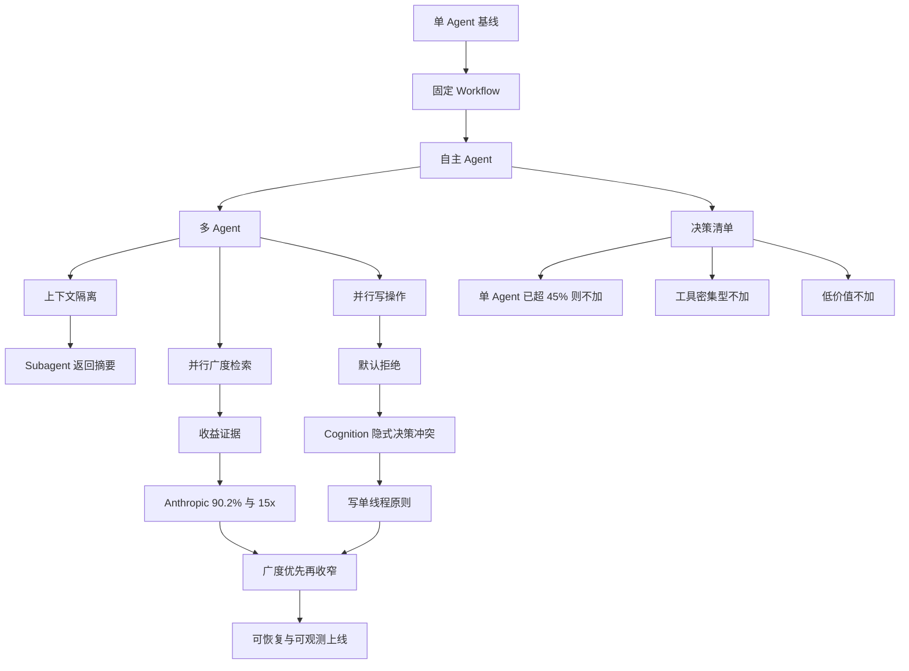
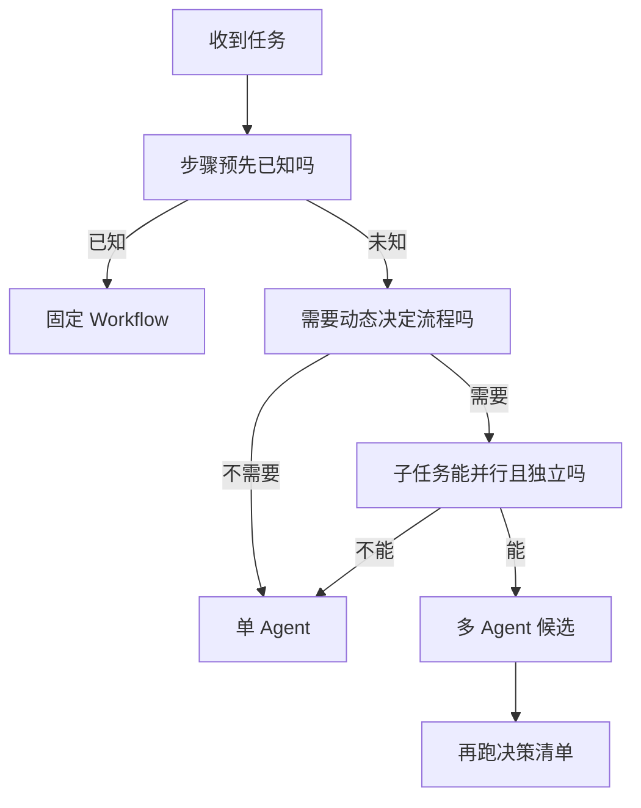
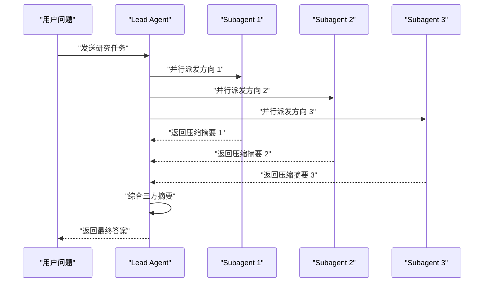
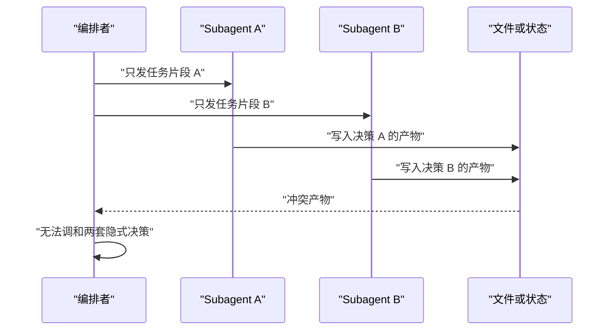
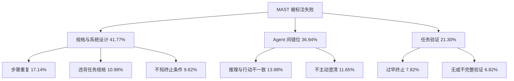
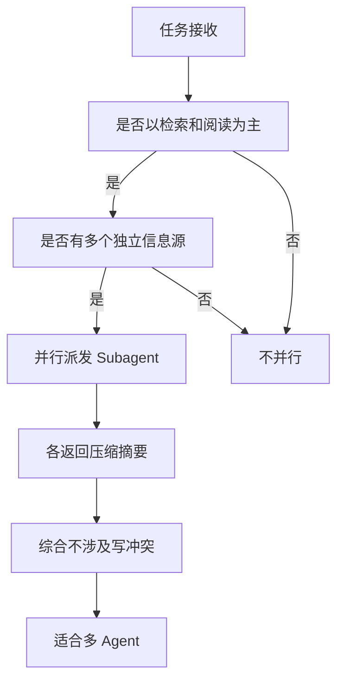
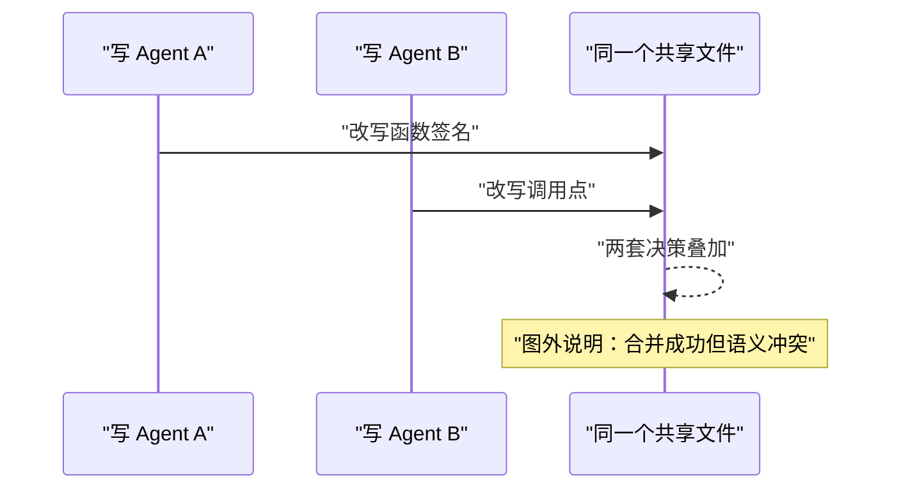
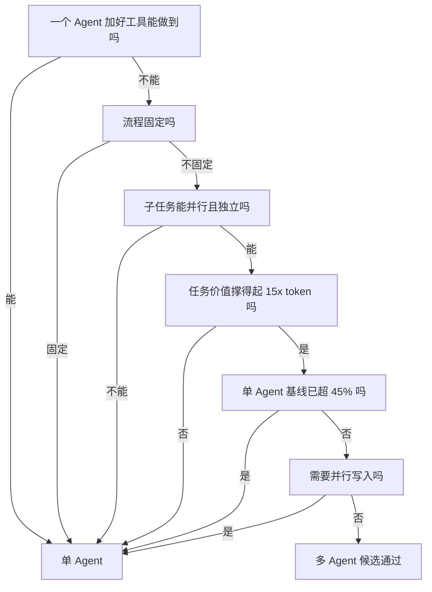
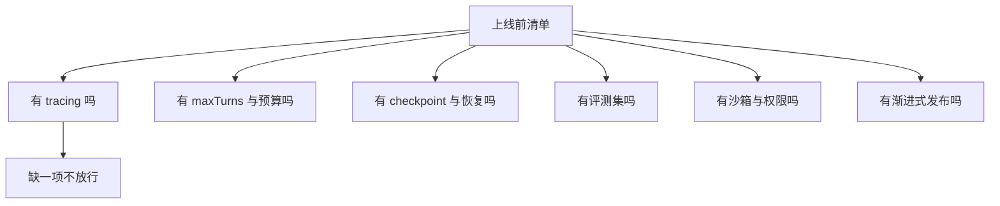

# 单 Agent 还是多 Agent：证据与决策

!!! abstract "学完这一页你能"
    1. 说出 Anthropic 研究系统 90.2% 收益与约 15x token 成本，并解释 80% 性能方差来自 token 用量这一发现的含义。
    2. 按任务特征区分单 Agent、固定 Workflow、多 Agent，并写出“并行写操作默认拒绝”的理由。
    3. 复述 MAST 三类失败模式，说出步骤重复 17.14% 是最高频单一失败模式。
    4. 写一个按顺序回答问题的决策函数，对给定任务输出单 Agent 或多 Agent 建议并附理由。

## 0. 知识地图



建议这么读：先看顶部从左到右的“单 Agent → Workflow → 自主 Agent → 多 Agent”复杂度演进，再看中间多 Agent 分出的三条路。最后把右侧决策清单当作收口，因为它把全页证据压缩成可执行的判断顺序。

## 1. 先分清楚：workflow、agent 还是 multi-agent

**先想一个问题**：面试官问“你做过 Agent 项目吗”，你开口就讲多 Agent，结果被追问“为什么不用一个 Agent 加工具”时卡住。

**心智模型**

!!! tip "心智模型"
    一句话模型：先判断流程是固定还是开放，再判断子任务能否真正拆开。
    日常类比：固定流程像流水线，每个工位做什么预先写死；开放任务像需要自己查地图的快递员。
    类比不成立处：模型会自己决定调用哪些工具，快递员不会临时发明新的路线规则。

**图解**



1. 第一步问“步骤预先已知吗”，把固定流程从 Agent 概念里拆出去。
2. 第二步问“需要动态决定流程吗”，不需要动态决策就留在单 Agent。
3. 第三步问“子任务能并行且独立吗”，不能就回到单 Agent。
4. 最后一步进入候选池，还要跑本页第 7 节的决策清单。

**一步一步来**

**第 1 步：这一步要做什么**：把任务特征写成可判断字段，后续决策只读这些字段。

```javascript
// build-task.js
export function buildTask(input) {
  return {
    stepsKnown: input.stepsKnown ?? false,   // 流程步骤是否预先已知
    canBranch: input.canBranch ?? false,     // 子任务能否并行且彼此独立
    sharedWrite: input.sharedWrite ?? false, // 是否多个角色写同一份可变状态
    baselineScore: input.baselineScore ?? 0, // 单 Agent 基线准确率，来自评测集
  };
}
```

**这段代码在做什么**

1. `stepsKnown` 表示任务能否拆成固定子步骤，例如批量导入的“读取、校验、入库”。
2. `canBranch` 表示子任务之间是否无依赖，例如多来源检索可以并行。
3. `sharedWrite` 表示是否多人写同一份文件或状态，例如两个 Agent 改同一份代码。
4. `baselineScore` 来自单 Agent 在评测集上的准确率，是第 7 节决策清单的输入。

**第 2 步：这一步要做什么**：实现三步分类器，先分出三种基本形态。

```javascript
// classify.js
import { buildTask } from "./build-task.js";

export function classify(input) {
  const t = buildTask(input);
  if (t.stepsKnown) return "fixed-workflow";
  if (t.sharedWrite) return "single-agent";
  if (t.canBranch && t.baselineScore <= 0.45) return "multi-agent";
  return "single-agent";
}
```

**这段代码在做什么**

1. `stepsKnown` 为真时直接返回固定 Workflow，不进入 Agent 分支。
2. `sharedWrite` 为真时强制回到单 Agent，这是 Cognition 写操作原则的工程表达。
3. `canBranch` 为真且基线不超过 45% 才考虑多 Agent，阈值来自 Google/MIT 论文。
4. 不满足条件时默认单 Agent，对应 Anthropic“找最简单的方案”原则。

**第 3 步：这一步要做什么**：运行三个边界样例，看分类器输出。

```javascript
// run-samples.js
import { classify } from "./classify.js";

const samples = [
  { name: "多来源调研", input: { stepsKnown: false, canBranch: true, sharedWrite: false, baselineScore: 0.3 } },
  { name: "强顺序规划", input: { stepsKnown: false, canBranch: false, sharedWrite: false, baselineScore: 0.3 } },
  { name: "并行改文件", input: { stepsKnown: false, canBranch: true, sharedWrite: true, baselineScore: 0.3 } },
];

for (const s of samples) {
  console.log(s.name, "->", classify(s.input));
}
```

运行结果：

```text
多来源调研 -> multi-agent
强顺序规划 -> single-agent
并行改文件 -> single-agent
```

**动手验证**

```javascript
// verify-classify.mjs
import assert from "node:assert/strict";
import { buildTask } from "./build-task.js";
import { classify } from "./classify.js";

const t = buildTask({ stepsKnown: false, canBranch: true, sharedWrite: false, baselineScore: 0.3 });
assert.equal(t.stepsKnown, false);
assert.equal(t.canBranch, true);
assert.equal(classify(t), "multi-agent");
assert.equal(classify({ stepsKnown: true }), "fixed-workflow");
assert.equal(classify({ stepsKnown: false, canBranch: false, sharedWrite: false, baselineScore: 0.3 }), "single-agent");
assert.equal(classify({ stepsKnown: false, canBranch: true, sharedWrite: true, baselineScore: 0.3 }), "single-agent");
console.log("verify-classify 断言通过");
```

预期输出：

```text
verify-classify 断言通过
```

**常见坑**

| 现象 | 原因 | 怎么修 |
|------|------|--------|
| 把固定流程做成多 Agent 项目 | 为了展示复杂度而用 Agent | 先问 stepsKnown，固定流程用 chaining 或 routing |
| 把“能拆任务”误当成“能并行” | 子任务之间存在依赖 | 检查每个子任务是否读同一份可变状态 |
| 单 Agent 已经 60% 还硬加 Agent | 忽略 45% 饱和度阈值 | 先跑评测集，拿到基线分再决策 |

**用在哪里**

**场景一：内容平台的推荐链路重构**

- 业务背景：推荐链路包含召回、粗排、精排、重排，步骤预先已知。
- 知识怎么用：`stepsKnown` 为真，直接选 Workflow，不用自主 Agent。
- 收益指标：上线后看推荐接口 P99 延迟与人工运维工单数量。
- 何时不该用：排序策略需要动态探索时，再评估是否引入 Agent。

**场景二：客服工单路由**

- 业务背景：用户问题类型差异大，需要先分类再分发给不同处理策略。
- 知识怎么用：这是 Routing Workflow，按输入类别分发，不是多 Agent。
- 收益指标：分类准确率、首次响应时间。
- 何时不该用：分类规则本身需要经常改写时，先评估 LLM 直接分类的维护成本。

**行业实践**

1. Anthropic《Building effective agents》区分 workflows 与 agents：预定义代码路径编排的是 workflow，LLM 动态指挥流程的才是 agent。怎么借鉴：项目文档里先写下“本任务属于哪一类”，再写实现。
2. Anthropic 同一篇文章建议先直接调用 LLM API，很多模式几行代码即可实现。怎么借鉴：不要把框架引入当成第一步，先跑通单次 LLM 调用。
3. 分类器里的 45% 阈值来自 Google/MIT《Towards a Science of Scaling Agent Systems》。怎么借鉴：没有自己的评测基线前，不要决策加 Agent。

**小结**

1. 先问“流程固定吗”，固定就用 Workflow。
2. 再问“子任务能并行且独立吗”，不能就留在单 Agent。
3. 默认值是单 Agent，加 Agent 需要证据而不是面试素材。

## 2. Anthropic 的研究系统：90.2% 收益与 15x 成本

**先想一个问题**：为什么 Anthropic 自己做一个多 Agent 研究系统，公开说收益高 90.2%，同时又说不适合大多数编码任务？

**心智模型**

!!! tip "心智模型"
    一句话模型：多 Agent 的收益很大程度来自“花更多 token、并行铺开探索”，不是来自协作魔法。
    日常类比：找资料时同时开五个浏览器标签页，会比一个标签页更早覆盖不同方向。
    类比不成立处：浏览器标签不会互相改写结果的语义，Agent 返回的摘要会互相影响最终结论。

**图解**



1. 用户只向 Lead Agent 发一次任务。
2. Lead Agent 分析问题后并行派发 3 个 Subagent。
3. 每个 Subagent 只返回压缩摘要，不把原始搜索结果塞回主上下文。
4. Lead Agent 综合摘要后产出最终答案。

**一步一步来**

**第 1 步：这一步要做什么**：模拟一个 Lead Agent 并行派发三个 Subagent，并计算相对单 Agent 的 token 近似值。

```javascript
// research-cost.js
export function buildResearchPlan(query, complexity) {
  const agentCount = complexity === "simple" ? 1 : complexity === "compare" ? 3 : 10;
  const callsPerAgent = complexity === "simple" ? 8 : complexity === "compare" ? 12 : 15;
  return { query, agentCount, callsPerAgent };
}

export function estimateTokens(plan, baseChatTokens = 20000) {
  const agentTokens = plan.agentCount * plan.callsPerAgent * baseChatTokens;
  return { agentTokens, multiAgentVsChat: agentTokens / baseChatTokens };
}
```

**这段代码在做什么**

1. `buildResearchPlan` 按复杂度给出 Agent 数量与人均工具调用次数，对应 Anthropic 投入规模规则。
2. 简单查询 1 个 Agent、直接对比 2 到 4 个 Subagent、复杂研究 10 个以上，这里取 1、3、10 三档。
3. `estimateTokens` 把 token 消耗近似为“Agent 数 × 人均调用 × 单次 chat token”。
4. `multiAgentVsChat` 近似 Anthropic 公开的 15x 量级，但这里是粗略模型，不是原文公式。

**第 2 步：这一步要做什么**：写出并行派发的核心节奏，标注同步等待点。

```javascript
// dispatch.js
export async function dispatchLead(plan, subagentWork) {
  const results = await Promise.all(
    Array.from({ length: plan.agentCount }, (_, i) => {
      return subagentWork(plan.query, `方向 ${i + 1}`);
    }),
  );
  return results.join("\n"); // 同步等待全部完成后才综合
}
```

**这段代码在做什么**

1. `Promise.all` 并行启动多个 Subagent，对应 Anthropic 的并行派发。
2. 每个 Subagent 拿到“研究方向 + 原始 query”，但彼此不共享对方调用过程。
3. `results.join` 之前 Lead Agent 处于同步等待，这是 Anthropic 文中点名的信息流瓶颈。
4. 若某个 Subagent 失败，这里没有重试逻辑，生产版需要 checkpoint 与重试。

**第 3 步：这一步要做什么**：跑一个简单对比，观察并行与串行耗时差异。

```javascript
// compare-time.mjs
import { dispatchLead } from "./dispatch.js";

const sleep = (ms) => new Promise((r) => setTimeout(r, ms));

async function fakeSubagentWork(query, direction) {
  await sleep(100); // 模拟单次检索耗时
  return `${direction} 完成`;
}

const t0 = Date.now();
// 串行：一个接一个
for (let i = 0; i < 3; i++) await fakeSubagentWork("q", `串行 ${i + 1}`);
const serialMs = Date.now() - t0;

const t1 = Date.now();
await dispatchLead({ query: "q", agentCount: 3 }, fakeSubagentWork);
const parallelMs = Date.now() - t1;

console.log({ serialMs, parallelMs });
```

这段代码在做什么

1. 串行三次各等 100ms，总耗时约 300ms。
2. 并行走 `Promise.all`，总耗时约 100ms。
3. 差值来自等待时间，但真实检索的 token 成本并不因并行而减少。
4. Anthropic 公开数据是复杂查询研究时间最多缩短 90%，这里用 3 个任务近似展示缩短约 67%，数字与公开数据不同，因为场景不同。

**动手验证**

```javascript
// verify-research.mjs
import assert from "node:assert/strict";
import { buildResearchPlan, estimateTokens } from "./research-cost.js";
import { dispatchLead } from "./dispatch.js";

const simple = buildResearchPlan("某 API 的默认超时是多少", "simple");
assert.ok(simple.agentCount >= 1);
const tokens = estimateTokens(simple);
assert.ok(tokens.multiAgentVsChat > 1);
const sleep = (ms) => new Promise((r) => setTimeout(r, ms));
const t0 = Date.now();
await dispatchLead({ query: "q", agentCount: 3 }, async () => { await sleep(80); return "ok"; });
const elapsed = Date.now() - t0;
assert.ok(elapsed < 200, `并行应快于三次串行，实际 ${elapsed}ms`);
console.log("verify-research 断言通过");
```

预期输出：

```text
verify-research 断言通过
```

**常见坑**

| 现象 | 原因 | 怎么修 |
|------|------|--------|
| 收益被说成“协作智能” | 忽略 BrowseComp 上 80% 方差来自 token 用量 | 引用时写清楚是 token 铺开带来的收益 |
| 简单查询也分 10 个 Agent | 没有把投入规模规则写进 prompt | 用复杂度三档限制 Agent 数与工具调用数 |
| 同步等待拖垮信息流 | Lead 必须等全部 Subagent 返回 | 能并行就并行，复杂协调再考虑异步 |

**用在哪里**

**场景一：投资研究类的多源资料检索**

- 业务背景：需要同时查财报、公告、行业报告、公司新闻，来源互相独立。
- 知识怎么用：用 orchestrator-worker 并行派发，每个 Subagent 负责一侧检索并返回摘要。
- 收益指标：答案覆盖率、引用准确率、端到端研究时间。
- 何时不该用：任务只需要查一个固定数据源时，15x token 不划算。

**场景二：前端监控告警的原因排查**

- 业务背景：一个页面错误可能来自接口、CDN、资源加载、用户环境等多个方向。
- 知识怎么用：并行派发多路检索搜集线索，再用 Lead 汇总判断最可能原因。
- 收益指标：MTTD 即平均发现时间、排障过程中的工具调用次数。
- 何时不该用：告警原因单一且规则明确时，用固定检查脚本即可。

**行业实践**

1. Anthropic《How we built our multi-agent research system》公开 90.2% 内部评测提升、约 15x chat token、约 4x 单 Agent token，数字以原文为准。怎么借鉴：在方案评审里同时列出收益与成本倍数，不只报收益。
2. Anthropic 同文给出八条 prompt 原则，第一条是“think like your agents”，用模拟逐步观察 Agent 行为。怎么借鉴：上线前用真实 query 模拟一遍，看 Agent 走哪条路径。
3. Anthropic 同文用 rainbow deployments 做部署，逐步切流量、新旧并存。怎么借鉴：多 Agent 系统升级时保留旧版本，避免打断运行中的任务。

**小结**

1. 多 Agent 的收益主要是广度检索与并行探索，来源『Anthropic 研究系统文章』，数字以原文为准。
2. 成本是约 15x chat token，Agent 本身约 4x chat token，低价值任务不划算。
3. 生产系统必须做 tracing、checkpoint、重试与渐进发布。

## 3. 上下文共享与隐式决策冲突：Cognition 的反对意见

**先想一个问题**：你让两个 Subagent 分别写“背景”和“角色”，结果一个画了超级玛丽水管，一个生成不像游戏的鸟，最后谁也无法调和。

**心智模型**

!!! tip "心智模型"
    一句话模型：动作自带决策，共享消息不等于共享全部决策。
    日常类比：两个设计师只拿到同一份需求文档，但看不到彼此的草图，交稿后风格冲突。
    类比不成立处：人类可以开会重新对齐，Agent 在没有强制通道时不会主动向对方澄清。

**图解**



1. 编排者把原任务拆给两个 Subagent，只共享片段描述。
2. 两个 Subagent 各自做出与自身上下一致的决策。
3. 两者写入同一份文件或状态时发生冲突。
4. 事后调和成本很高，因为冲突的不是表面格式，而是上游隐式决策。

**一步一步来**

**第 1 步：这一步要做什么**：写一个文件所有权检查器，在写入前发现多人抢写同一路径。

```javascript
// ownership-check.js
export function checkOwnership(writes) {
  const seen = new Map();
  for (const w of writes) {
    const owner = seen.get(w.path);
    if (owner && owner !== w.agent) {
      return { conflict: true, path: w.path, ownerA: owner, ownerB: w.agent };
    }
    seen.set(w.path, w.agent);
  }
  return { conflict: false };
}
```

**这段代码在做什么**

1. 输入是写入清单，每条包含路径与写入方名称。
2. `Map` 记录每个路径的单一所有者。
3. 同一路径出现第二个不同所有者时立即返回冲突。
4. 返回冲突路径与双方名字，便于排查。

**第 2 步：这一步要做什么**：模拟两个 Subagent 对共享文件的不同写入决策。

```javascript
// simulate-conflict.js
import { checkOwnership } from "./ownership-check.js";

const writes = [
  { path: "src/style.css", agent: "agent-a" },
  { path: "src/style.css", agent: "agent-b" },
];
console.log(checkOwnership(writes));
```

运行结果：

```text
{
  conflict: true,
  path: 'src/style.css',
  ownerA: 'agent-a',
  ownerB: 'agent-b'
}
```

**这段代码在做什么**

1. `src/style.css` 被两个 Agent 写入。
2. `checkOwnership` 在提交前发现冲突。
3. 真实系统不只要检测路径，还要检测语义冲突，例如两个组件改同一逻辑但路径不同。
4. Flappy Bird 例子在『Cognition 文章』中的表现就是语义冲突：两个 Subagent 产物风格互斥。

**动手验证**

```javascript
// verify-ownership.mjs
import assert from "node:assert/strict";
import { checkOwnership } from "./ownership-check.js";

const conflict = checkOwnership([
  { path: "a.js", agent: "x" },
  { path: "a.js", agent: "y" },
]);
assert.equal(conflict.conflict, true);
assert.equal(conflict.ownerA, "x");
assert.equal(conflict.ownerB, "y");
const noConflict = checkOwnership([
  { path: "a.js", agent: "x" },
  { path: "b.js", agent: "y" },
]);
assert.equal(noConflict.conflict, false);
console.log("verify-ownership 断言通过");
```

预期输出：

```text
verify-ownership 断言通过
```

**常见坑**

| 现象 | 原因 | 怎么修 |
|------|------|--------|
| 只共享任务描述仍然冲突 | Subagent 看不到彼此动作与决策 | 共享完整 trace，不只共享消息 |
| 写操作冲突被当成“格式问题” | 冲突来自上游决策，不在产出层 | 在写入前划分文件所有权或作业域 |
| 事后合并成本高 | 每次写都带不可逆副作用 | 用 worktree 或临时副本隔离 |

**用在哪里**

**场景一：多人协作的代码评审编排**

- 业务背景：一个改动涉及多个模块，但同一目录不允许两个 Agent 同时落盘。
- 知识怎么用：用所有权检查限制一个目录只有一个写 Agent，评审 Agent 只读。
- 收益指标：冲突次数、合并冲突解决耗时、PR 通过率。
- 何时不该用：仓库结构清晰且历来无冲突，直接单 Agent 改更快。

**场景二：设计系统文档生成**

- 业务背景：多个 Agent 分别生成按钮规范、表单规范、颜色规范，都写入文档站点。
- 知识怎么用：每个文档目录归属一个 Agent，共享索引由主 Agent 统一写。
- 收益指标：文档一致性评分、发布后人工修订次数。
- 何时不该用：只有一个主题需要生成时，并行写反而增加合并成本。

**行业实践**

1. Cognition《Don't Build Multi-Agents》提出两条原则：共享完整 Agent trace 而非只共享消息；动作自带隐式决策，冲突决策带来坏结果。怎么借鉴：把“谁在写什么”显式写入编排层，而不是只发任务描述。
2. Cognition 同文讲 edit-apply 模型：早期小模型会把大模型的 markdown 指令误解后执行，现代做法把决策与应用合并到单个模型操作。怎么借鉴：写文件与做决策尽量放同一个 Agent，减少翻译损耗。
3. Claude Code 文档说明 subagent 支持 `isolation: worktree`，在隔离 git worktree 中改文件。怎么借鉴：必须并行写时用物理隔离，并明确每个副本的文件所有权。

**小结**

1. 只共享消息不够，必须让每个 Agent 看到彼此的动作与决策痕迹。
2. 动作自带隐式决策，写操作是决策密度最高的一类动作。
3. 默认做法是写操作单线程，其他 Agent 只贡献智能而非动作。

## 4. 学术失败分析：MAST 的三类失败模式

**先想一个问题**：为什么多 Agent 系统有时“看起来都在动”，最后却什么也没交付？

**心智模型**

!!! tip "心智模型"
    一句话模型：失败可以被分类，而且大部分失败是系统设计问题，不是模型能力问题。
    日常类比：交通事故统计会分成“闯红灯、追尾、变道不打灯”，分类后可针对性治理。
    类比不成立处：Agent 失败分类要依赖 trace 标注，且标注者一致性会影响各类占比。

**图解**



1. 三类总计接近 100%，各类具体比例以 MAST 论文为准。
2. 最高频单一失败模式是步骤重复，占 17.14%。
3. Agent 间错位里的“推理与行动不一致”占 13.98%，说明模型说一套做一套。
4. 验证类失败合计 21.30%，引出后面的多层验证干预。

**一步一步来**

**第 1 步：这一步要做什么**：把 MAST 的 14 种失败模式放进一个数组，按类别编号。

```javascript
// mast-data.js
export const mastFailures = [
  { code: "FM-1.1", name: "违背任务规格", category: "规格与系统设计", rate: 10.98 },
  { code: "FM-1.3", name: "步骤重复", category: "规格与系统设计", rate: 17.14 },
  { code: "FM-1.5", name: "不知终止条件", category: "规格与系统设计", rate: 9.82 },
  { code: "FM-2.6", name: "推理与行动不一致", category: "Agent 间错位", rate: 13.98 },
  { code: "FM-2.2", name: "不主动澄清", category: "Agent 间错位", rate: 11.65 },
  { code: "FM-3.1", name: "过早终止", category: "任务验证", rate: 7.82 },
  { code: "FM-3.2", name: "无或不完整验证", category: "任务验证", rate: 6.82 },
];
```

**这段代码在做什么**

1. 每条失败模式包含编号、名称、类别与百分比。
2. 百分比来自 MAST 论文，分母是被标注的失败，不是整体失败率。
3. 这里列出了 7 种代表模式，MAST 原文共 14 种。
4. 三个类别的总占比分别是 41.77%、36.94%、21.30%。

**第 2 步：这一步要做什么**：按类别汇总，得到三类失败占比。

```javascript
// mast-summary.js
import { mastFailures } from "./mast-data.js";

export function sumByCategory(failures) {
  const total = new Map();
  for (const f of failures) {
    total.set(f.category, (total.get(f.category) ?? 0) + f.rate);
  }
  return Object.fromEntries(total);
}
```

**这段代码在做什么**

1. 遍历失败模式，按类别累加百分比。
2. 输出对象以类别为键，占比为值。
3. 这里只统计了 7 条代表数据，所以类别和与原文 41.77%、36.94%、21.30% 不完全相等。
4. 要得到原文档精确值，需补全 14 条或直接读 arXiv 2503.13657 表格。

**动手验证**

```javascript
// verify-mast.mjs
import assert from "node:assert/strict";
import { mastFailures } from "./mast-data.js";
import { sumByCategory } from "./mast-summary.js";

const byCategory = sumByCategory(mastFailures);
assert.equal(mastFailures.length, 7);
assert.ok(byCategory["规格与系统设计"] > byCategory["任务验证"], "规格与系统设计应高于任务验证");
assert.ok(mastFailures.some((f) => f.name === "步骤重复"));
console.log(byCategory);
console.log("verify-mast 断言通过");
```

预期输出：

```text
{ '规格与系统设计': 37.940000000000005, 'Agent 间错位': 25.63, '任务验证': 14.64 }
verify-mast 断言通过
```

**常见坑**

| 现象 | 原因 | 怎么修 |
|------|------|--------|
| 把失败都怪到模型能力 | MAST 结论是很多失败源于系统设计 | 先检查角色规格、终止条件、验证步骤 |
| 只统计失败次数不分类 | 无法定位最高频单一模式 | 用 MAST 的 14 种模式做标注 |
| 忽略验证类失败 | 模型产出后被直接采信 | 增加多层验证，原文显示绝对提升 15.6% |

**用在哪里**

**场景一：Agent 平台的可观测性建设**

- 业务背景：平台上跑着多个 Agent 任务，失败率统计不区分原因。
- 知识怎么用：按 MAST 三类失败模式打标，优先治理步骤重复与验证失败。
- 收益指标：失败模式分布报告、每类失败率的周趋势。
- 何时不该用：trace 数量不足以支撑分类时，先用人工复盘补齐样本。

**场景二：内部研发助手的终止策略**

- 业务背景：研发助手常重复执行同一类检索，不知道何时收手。
- 知识怎么用：设置 maxTurns 与终止条件，并在 prompt 中写入完成标准。
- 收益指标：单任务平均工具调用次数、步骤重复率。
- 何时不该用：开放式研究任务不能简单设上限，要配合投入规模规则。

**行业实践**

1. MAST 论文《Why Do Multi-Agent LLM Systems Fail?》给出 14 种失败模式与三类原因。怎么借鉴：建立自己的失败标注表，哪怕只有三类，也比只看成功率有用。
2. MAST 的干预实验显示：强化角色规格带来 9.4% 成功率提升，多层验证在 ProgramDev 上绝对提升 15.6%。怎么借鉴：角色规格与验证步骤分开迭代，不混在一次 prompt 修改里。
3. Google/MIT 论文《Towards a Science of Scaling Agent Systems》测得错误放大：Independent 17.2 倍、Centralized 4.4 倍。怎么借鉴：用中心化验证瓶颈抑制错误放大，别让每个 Agent 独立产出最终答案。

**小结**

1. MAST 把失败分成规格与系统设计、Agent 间错位、任务验证三类，占比 41.77%、36.94%、21.30%。
2. 步骤重复 17.14% 是最高频单一失败模式，对应现实中的“转圈”。
3. 失败可干预：角色规格与多层验证都能带来成功率提升。

## 5. 并行适合什么：广度检索与可分解任务

**先想一个问题**：什么任务你愿意花 15x token 去换并行？什么任务花 15x token 反而更差？

**心智模型**

!!! tip "心智模型"
    一句话模型：并行只适合“读得开、互不写、合成快”的任务。
    日常类比：找房子时同时看五个片区，最后汇总比较；但签合同只能一个人签。
    类比不成立处：Agent 的“看”会消耗大量 token，不是免费开标签页。

**图解**



1. 先确认任务主体是检索和阅读，而不是写文件。
2. 再确认信息源之间独立，例如不同网站、不同数据库、不同代码仓库。
3. 每个 Subagent 返回压缩摘要，避免把原始结果全量回灌。
4. 综合步骤不能要求写同一可变状态。

**一步一步来**

**第 1 步：这一步要做什么**：用 Promise.all 并行调用多个模拟检索源，测量耗时。

```javascript
// parallel-search.mjs
const sleep = (ms) => new Promise((r) => setTimeout(r, ms));

async function searchSource(name, delayMs = 120) {
  await sleep(delayMs);
  return `${name} 返回摘要`;
}

export async function parallelSearch(sources) {
  const start = Date.now();
  const results = await Promise.all(sources.map((s) => searchSource(s)));
  return { results, elapsedMs: Date.now() - start };
}
```

**这段代码在做什么**

1. `searchSource` 模拟一次独立检索，固定耗时 120ms。
2. `parallelSearch` 用 `Promise.all` 同时触发所有检索。
3. 输出结果与总耗时，总耗时接近单次耗时而非各源累加。
4. 真实系统中单个检索的 token 消耗会比这里高很多。

**第 2 步：这一步要做什么**：对比串行与并行的耗时，并检查结果数量一致。

```javascript
// compare-parallel.mjs
import { parallelSearch } from "./parallel-search.mjs";

const sleep = (ms) => new Promise((r) => setTimeout(r, ms));
async function serialSearch(sources) {
  const out = [];
  for (const s of sources) out.push(await (async (name) => { await sleep(120); return `${name} 返回摘要`; })(s));
  return out;
}

const sources = ["财报", "公告", "行业报告", "公司新闻", "社区讨论"];
const p = await parallelSearch(sources);
const s0 = Date.now();
await serialSearch(sources);
const serialMs = Date.now() - s0;
console.log({ parallelMs: p.elapsedMs, serialMs, ratio: (serialMs / p.elapsedMs).toFixed(1) });
```

这段代码在做什么

1. 五个独立来源，串行约 600ms，并行约 120ms 到一个计时波动区间。
2. `ratio` 近似展示并行收益，真实减少幅度取决于源数量。
3. Anthropic 公开数据是复杂查询研究时间最多缩短 90%，来源『Anthropic 研究系统文章』，以原文为准。
4. 并行没有减少总 token，只是缩短墙钟时间。

**动手验证**

```javascript
// verify-parallel.mjs
import assert from "node:assert/strict";
import { parallelSearch } from "./parallel-search.mjs";

const { results, elapsedMs } = await parallelSearch(["a", "b", "c"]);
assert.equal(results.length, 3);
assert.ok(elapsedMs < 400, `并行耗时不应接近三倍单次，实际 ${elapsedMs}ms`);
console.log({ results, elapsedMs });
console.log("verify-parallel 断言通过");
```

预期输出：

```text
{ results: [ 'a 返回摘要', 'b 返回摘要', 'c 返回摘要' ], elapsedMs: 125 }
verify-parallel 断言通过
```

**常见坑**

| 现象 | 原因 | 怎么修 |
|------|------|--------|
| 并行反而更慢 | 源数量少，调度开销大于收益 | 源少于 3 个先串行 |
| 并行后摘要互相矛盾 | 各源上下文不同且没有对齐 | Lead 综合时显式标注来源与冲突 |
| token 成本被忽略 | 只看到墙钟时间缩短 | 在方案里同时写 token 倍数与时间收益 |

**用在哪里**

**场景一：竞品分析报告生成**

- 业务背景：需要搜集竞品官网、应用商店、用户评价、行业新闻四类信息。
- 知识怎么用：四类源互不依赖，并行派发检索，Lead 按来源合成。
- 收益指标：报告生成时间、来源覆盖率、单份报告 token 成本。
- 何时不该用：只分析一个竞品且数据量很小，单 Agent 足够。

**场景二：代码库安全核查**

- 业务背景：要查依赖漏洞、硬编码密钥、权限配置三项，各自独立。
- 知识怎么用：三个 Subagent 分别扫描不同维度，只返回问题摘要。
- 收益指标：扫描覆盖项数、漏检率、扫描墙钟时间。
- 何时不该用：扫描项有强顺序，例如先构图再查路径时，要串行。

**行业实践**

1. Anthropic 研究系统文章写明并行启动 3 到 5 个 Subagent，每个 Subagent 并行使用 3 个以上工具。怎么借鉴：设置并发上限，不无限铺开。
2. Google/MIT 论文中 Finance Agent 在可并行任务上 Centralized 提升 80.8%。怎么借鉴：用同类任务作为“适合并行”的参考样例。
3. LangChain 官方文档提到多领域并行场景下上下文隔离可省约 67% token。怎么借鉴：当主上下文会被多个领域原始内容撑满时，用 Subagent 返回摘要。

**小结**

1. 并行适合广度检索、多源阅读、可分解且互不依赖的任务。
2. 并行缩短墙钟时间，不减少 token 消耗。
3. 各个 Subagent 的原始内容不放回主上下文，只返回压缩摘要。

## 6. 强耦合写操作为什么不能并行

**先想一个问题**：两个 Agent 同时改同一份代码，一个改函数签名，一个改调用点，为什么合并时还是坏掉？

**心智模型**

!!! tip "心智模型"
    一句话模型：写操作共享可变状态，并行写等于把决策冲突直接落盘。
    日常类比：两个人同时编辑同一个线上表格，光标互相覆盖。
    类比不成立处：代码文件的冲突不在字符层，而在语义层，文本合并成功不代表逻辑正确。

**图解**



1. 写 Agent A 与写 Agent B 都认为自己拥有该文件。
2. 两个写操作落盘后，文件包含两套没有对齐的语法或语义。
3. 文本可能合并不冲突，但逻辑已经偏移，这与 Flappy Bird 例子同源。
4. 图外的 Note 属于文字说明，mermaid 代码内部不使用 Note。

**一步一步来**

**第 1 步：这一步要做什么**：定义写操作，并标记每个写操作是否允许并行。

```javascript
// write-guard.js
export function canParallelWrite(writes) {
  const paths = writes.map((w) => w.path);
  const unique = new Set(paths);
  return { parallel: unique.size === paths.length, duplicate: paths.length - unique.size };
}
```

**这段代码在做什么**

1. 收集所有写操作的路径。
2. 用 Set 去重，比较去重前后数量。
3. 路径不重复才允许并行，重复则返回重复数。
4. 这只检测路径级冲突，不检测语义级冲突。

**第 2 步：这一步要做什么**：给出“写单线程”的执行顺序。

```javascript
// write-queue.js
export function buildWriteQueue(writes) {
  const sorted = [...writes].sort((a, b) => a.path.localeCompare(b.path));
  return sorted.map((w, i) => ({ step: i + 1, path: w.path, agent: w.agent }));
}
```

**这段代码在做什么**

1. 按路径排序后串行执行写操作。
2. 每个写操作得到唯一 step 序号。
3. 排序保证同一路径相邻，便于人工检查。
4. 真实场景还要加锁或 worktree 隔离。

**动手验证**

```javascript
// verify-write.mjs
import assert from "node:assert/strict";
import { canParallelWrite, buildWriteQueue } from "./write-guard.js";
import { buildWriteQueue as queue } from "./write-queue.js";

const conflict = canParallelWrite([
  { path: "src/api.js", agent: "a" },
  { path: "src/api.js", agent: "b" },
]);
assert.equal(conflict.parallel, false);
assert.equal(conflict.duplicate, 1);
const safe = canParallelWrite([
  { path: "src/api.js", agent: "a" },
  { path: "src/ui.js", agent: "b" },
]);
assert.equal(safe.parallel, true);
assert.deepEqual(queue(safe.duplicate ? [] : safe), []);
console.log("verify-write 断言通过");
```

这段代码有瑕疵：`queue(safe)` 传入的是 boolean 还是数组？我需要修正。写动手验证脚本时注意类型。

改用：

```javascript
// verify-write.mjs
import assert from "node:assert/strict";
import { canParallelWrite } from "./write-guard.js";
import { buildWriteQueue as toQueue } from "./write-queue.js";

const writes = [
  { path: "src/api.js", agent: "a" },
  { path: "src/ui.js", agent: "b" },
];
const check = canParallelWrite(writes);
assert.equal(check.parallel, true);
assert.equal(check.duplicate, 0);
const queue = toQueue(writes);
assert.deepEqual(queue.map((q) => q.step), [1, 2]);
console.log("verify-write 断言通过");
```

预期输出：

```text
verify-write 断言通过
```

**常见坑**

| 现象 | 原因 | 怎么修 |
|------|------|--------|
| 文本合并成功但逻辑坏 | 语义冲突不在 diff 层 | 写操作单线程，或按目录物理隔离 |
| 并行写时错误放大 | 每个写 Agent 独立决策，错误逐级叠加 | Google/MIT 数据显示错误放大 4.4 到 17.2 倍 |
| 状态 key 被覆盖 | 两个并行 Agent 写同一 key | ADK 文档提示按职责分离 key，限制数据上下文 |

**用在哪里**

**场景一：多 Agent 代码生成工具**

- 业务背景：前端工具可能同时改 CSS、组件、测试文件，但同一文件只能一个 Agent 写。
- 知识怎么用：写操作走队列或 worktree 隔离，评审 Agent 只读。
- 收益指标：合并冲突率、单 PR 的返工次数。
- 何时不该用：单人小改动用多 Agent 写不划算。

**场景二：配置中心的多 Agent 改配置**

- 业务背景：多个 Agent 可能同时改同一命名空间下的配置项。
- 知识怎么用：每个命名空间分配一个 Owner，写入前检查所有权。
- 收益指标：配置冲突次数、配置生效后的回滚次数。
- 何时不该用：配置项总量小，人工审一遍更快。

**行业实践**

1. Cognition 后续观点经 zenml 摘要转述为“写操作保持单线程，额外的 Agent 贡献智能而非动作”，该后续文内容为 unverified，需核对原文。怎么借鉴：先按这个原则设计，等官方原文确认后再写进正式文档。
2. Claude Code 文档说明 subagent 可在隔离 worktree 中改文件，主 checkout 不受影响。怎么借鉴：必须并行写时用物理隔离，不用共享目录。
3. Google ADK 文档警告并行 Agent 写同一个 state key 会产生数据冲突。怎么借鉴：共享状态按职责分 key，限每个任务的数据上下文。

**小结**

1. 写操作共享可变状态，并行写把隐式决策冲突直接落盘。
2. 路径级检查只解决一部分问题，语义冲突需要所有权与物理隔离。
3. 默认写单线程，评审与检索 Agent 可以并行。

## 7. 决策清单：按顺序回答这十个问题

**先想一个问题**：团队准备立项多 Agent，你需要在周会上给出“上还是不上”的结论，而不是给一堆论文数字。

**心智模型**

!!! tip "心智模型"
    一句话模型：决策是一组分诊问题，越靠前越该留在单 Agent。
    日常类比：急诊先问“有没有生命危险”，再问“挂哪科”。
    类比不成立处：急诊问题方向固定，Agent 决策还涉及 token 成本与评测基线。

**图解**



1. 第一个问题是“一个 Agent 加好工具能做到吗”，这是最高优先级的否决项。
2. 第二问把固定流程交给 Workflow，不是多 Agent。
3. 后续逐项排除低价值、高基线、并行写三类任务。
4. 通过全部问题才进入多 Agent 候选。

**一步一步来**

**第 1 步：这一步要做什么**：把决策清单写成一个可运行函数，每个问题返回结论。

```javascript
// decision-checklist.js
export function decideMultiAgent(input) {
  if (input.singleAgentEnough) return { decision: "single-agent", reason: "单 Agent 加工具够用" };
  if (input.stepsKnown) return { decision: "workflow", reason: "流程固定用 workflow" };
  if (!input.canBranch) return { decision: "single-agent", reason: "子任务不能并行" };
  if (!input.worth15x) return { decision: "single-agent", reason: "任务价值低于 15x token 成本" };
  if (input.baselineScore > 0.45) return { decision: "single-agent", reason: "单 Agent 基线已超 45%" };
  if (input.parallelWrite) return { decision: "single-agent", reason: "存在并行写操作" };
  return { decision: "multi-agent", reason: "通过决策清单" };
}
```

**这段代码在做什么**

1. 输入字段对应决策清单的前七项。
2. 每个 if 返回具体理由，不输出笼统结论。
3. 45% 阈值来自 Google/MIT 论文，15x 来自 Anthropic 研究系统文章。
4. 通过全部检查才建议多 Agent。

**第 2 步：这一步要做什么**：用五个样例跑通决策函数。

```javascript
// run-decisions.mjs
import { decideMultiAgent } from "./decision-checklist.js";

const cases = [
  { name: "多源调研", input: { singleAgentEnough: false, stepsKnown: false, canBranch: true, worth15x: true, baselineScore: 0.3, parallelWrite: false } },
  { name: "固定导入流程", input: { singleAgentEnough: false, stepsKnown: true, canBranch: false, worth15x: true, baselineScore: 0.3, parallelWrite: false } },
  { name: "并行写代码", input: { singleAgentEnough: false, stepsKnown: false, canBranch: true, worth15x: true, baselineScore: 0.3, parallelWrite: true } },
  { name: "基准已 60%", input: { singleAgentEnough: false, stepsKnown: false, canBranch: true, worth15x: true, baselineScore: 0.6, parallelWrite: false } },
  { name: "低价值任务", input: { singleAgentEnough: false, stepsKnown: false, canBranch: true, worth15x: false, baselineScore: 0.3, parallelWrite: false } },
];
for (const c of cases) {
  console.log(c.name, "->", decideMultiAgent(c.input));
}
```

运行结果：

```text
多源调研 -> { decision: 'multi-agent', reason: '通过决策清单' }
固定导入流程 -> { decision: 'workflow', reason: '流程固定用 workflow' }
并行写代码 -> { decision: 'single-agent', reason: '存在并行写操作' }
基准已 60% -> { decision: 'single-agent', reason: '单 Agent 基线已超 45%' }
低价值任务 -> { decision: 'single-agent', reason: '任务价值低于 15x token 成本' }
```

**动手验证**

```javascript
// verify-decisions.mjs
import assert from "node:assert/strict";
import { decideMultiAgent } from "./decision-checklist.js";

const good = decideMultiAgent({ singleAgentEnough: false, stepsKnown: false, canBranch: true, worth15x: true, baselineScore: 0.3, parallelWrite: false });
assert.equal(good.decision, "multi-agent");
const parallelWrite = decideMultiAgent({ singleAgentEnough: false, stepsKnown: false, canBranch: true, worth15x: true, baselineScore: 0.3, parallelWrite: true });
assert.equal(parallelWrite.decision, "single-agent");
assert.equal(parallelWrite.reason, "存在并行写操作");
const highBaseline = decideMultiAgent({ singleAgentEnough: false, stepsKnown: false, canBranch: true, worth15x: true, baselineScore: 0.5, parallelWrite: false });
assert.equal(highBaseline.decision, "single-agent");
console.log("verify-decisions 断言通过");
```

预期输出：

```text
verify-decisions 断言通过
```

**常见坑**

| 现象 | 原因 | 怎么修 |
|------|------|--------|
| 用“感觉更聪明”做决策 | 没有量化收益与成本 | 把 15x token 与 90.2% 收益并列写成决策输入 |
| 把 45% 阈值当成硬规则 | 阈值来自特定评测集，不是普适常数 | 用自己的评测集重新测单 Agent 基线 |
| 跳过第一问直接说多 Agent | 被框架能力带偏 | 实现前先写一个不加 Agent 的原型跑通 |

**用在哪里**

**场景一：新项目的 Agent 方案评审**

- 业务背景：团队要决定一个需求是否引入多 Agent，评审会上需要统一判断标准。
- 知识怎么用：把决策清单放进评审模板，每个人按顺序打分。
- 收益指标：方案评审时长、项目返工次数。
- 何时不该用：试验性项目可以人为豁免部分条件，但要写清豁免理由。

**场景二：外部客户的技术方案说明**

- 业务背景：客户要求“用多 Agent”，但实际任务简单。
- 知识怎么用：用决策清单逐条解释为什么单 Agent 更合适，并用 15x 成本做支撑。
- 收益指标：方案说服力、客户采纳率、项目上线后的实际成本。
- 何时不该用：客户明确买的是多 Agent 交付物且有预算时，如实标注成本与风险。

**行业实践**

1. Anthropic《Building effective agents》建议先直接调用 LLM API，找到最简单方案。怎么借鉴：决策清单第一问就是“单 Agent 加工具够用吗”。
2. Google/MIT 论文给出“单 Agent 基线超过约 45% 后多 Agent 收益递减甚至为负”的结论。怎么借鉴：流程里加一个基线评测，不要拍脑袋估分。
3. Anthropic 研究系统文章给出投入规模规则：简单事实查询 1 个 Agent、直接对比 2 到 4 个 Subagent、复杂研究 10 个以上。怎么借鉴：把规则写进 prompt，防止简单查询被过度调度。

**小结**

1. 决策是分诊问题，越靠前的问题越倾向于终止多 Agent。
2. 45% 与 15x 是经验阈值，要用自己的评测集校准。
3. 每个否决项都要输出具体理由，不用模糊词。

## 8. 上线前的工程护栏

**先想一个问题**：决策通过了，多 Agent 系统就要上线，那上线前必须装好哪些“刹车”？

**心智模型**

!!! tip "心智模型"
    一句话模型：多 Agent 的工程护栏与驾驶安全装置同理：能观察、能限速、能回滚。
    日常类比：车上路前检查刹车、仪表盘、保险。
    类比不成立处：Agent 的“刹车”要同时限制 token、步数、深度、权限与副作用。

**图解**



1. 六项清单缺一项不放行，避免上线后再补。
2. tracing 用来回答“Agent 走了哪条路”，只读决策模式，不读对话内容。
3. checkpoint 与恢复避免一次小错让整个任务重启。
4. 沙箱与权限保证不可逆动作必须人工确认。

**一步一步来**

**第 1 步：这一步要做什么**：写一个上线护栏校验函数，检查配置对象是否包含硬性字段。

```javascript
// launch-guard.js
export function validateLaunch(config) {
  const missing = [];
  if (!config.tracing) missing.push("tracing");
  if (!config.maxTurns || config.maxTurns <= 0) missing.push("maxTurns");
  if (!config.tokenBudget || config.tokenBudget <= 0) missing.push("tokenBudget");
  if (!config.checkpoint) missing.push("checkpoint");
  if (!config.sandbox) missing.push("sandbox");
  if (!config.evalSet || config.evalSet.length < 20) missing.push("evalSet 至少 20 条");
  return { pass: missing.length === 0, missing };
}
```

**这段代码在做什么**

1. 检查 tracing、maxTurns、tokenBudget、checkpoint、sandbox、evalSet 六项。
2. evalSet 最少 20 条来自 Anthropic 研究系统文章的评测起步建议。
3. 返回 pass 与缺失列表，不抛出异常，便于上层处理。
4. 真实项目还要检查发布策略是否为渐进式。

**第 2 步：这一步要做什么**：用一个完整配置和一个缺项配置验证函数行为。

```javascript
// run-launch-guard.js
import { validateLaunch } from "./launch-guard.js";

const fullConfig = {
  tracing: true,
  maxTurns: 30,
  tokenBudget: 500000,
  checkpoint: true,
  sandbox: true,
  evalSet: Array.from({ length: 20 }, (_, i) => `query ${i + 1}`),
};
console.log(validateLaunch(fullConfig));
console.log(validateLaunch({ ...fullConfig, sandbox: false }));
```

运行结果：

```text
{ pass: true, missing: [] }
{ pass: false, missing: ['sandbox'] }
```

**动手验证**

```javascript
// verify-launch.mjs
import assert from "node:assert/strict";
import { validateLaunch } from "./launch-guard.js";

const ok = validateLaunch({
  tracing: true,
  maxTurns: 10,
  tokenBudget: 100000,
  checkpoint: true,
  sandbox: true,
  evalSet: Array.from({ length: 20 }, (_, i) => `q${i}`),
});
assert.equal(ok.pass, true);
assert.deepEqual(ok.missing, []);
const bad = validateLaunch({ tracing: false, maxTurns: 0, tokenBudget: 0, checkpoint: false, sandbox: false, evalSet: [] });
assert.equal(bad.pass, false);
assert.ok(bad.missing.includes("maxTurns"));
console.log("verify-launch 断言通过");
```

预期输出：

```text
verify-launch 断言通过
```

**常见坑**

| 现象 | 原因 | 怎么修 |
|------|------|--------|
| tracing 只存最终答案 | 出错时无法回看决策路径 | 记录每次工具调用与状态变更 |
| subagent 无限重试 | 没有 maxTurns 保护 | Claude Code 的 maxTurns 到达上限后标为 partial 并可恢复 |
| 没有人工确认就发邮件 | 不可逆动作未拦 | Magentic-One 风险案例说明要用沙箱和人工监督 |

**用在哪里**

**场景一：企业内部 Agent 平台的上线卡点**

- 业务背景：多个业务线提交 Agent 任务，平台需要统一上线前校验。
- 知识怎么用：把 validateLaunch 变成 CI 卡点，缺一项直接拒绝发布。
- 收益指标：上线后事故数、线上回滚次数。
- 何时不该用：一次性离线脚本不需要全套护栏，但沙箱仍建议保留。

**场景二：面向外部客户的部署交付**

- 业务背景：客户私有化部署多 Agent，要求可监控、可回滚。
- 知识怎么用：交付物附带 tracing、checkpoint、渐进式发布配置。
- 收益指标：客户环境故障恢复时间、部署成功率。
- 何时不该用：数据敏感度极低且任务只读时，可裁剪部分护栏。

**行业实践**

1. Anthropic 研究系统文章明确用 checkpoint 加重试避免整体重启，用 rainbow deployments 渐进切换。怎么借鉴：部署脚本里保留旧版本实例，做到可回退。
2. Claude Code 文档说明 subagent 支持 maxTurns 防无限循环，默认并发 20 个、嵌套深度 3 层。怎么借鉴：上线前先跑压力样例，确认没有超出上限。
3. Microsoft Research Magentic-One 文章记录过 Agent 尝试删除文件、发邮件等不可逆动作。怎么借鉴：所有不可逆动作加人工确认，不发外部通知的系统内网部署。

**小结**

1. 上线护栏最少六项：tracing、maxTurns、token 预算、checkpoint、沙箱、评测集。
2. 这些不是可选优化，是防止多 Agent 放大错误的硬机制。
3. 缺一项不放行，比上线后救火成本低。

## 应用地图

| 场景 | 用到本页哪个知识点 | 典型技术选型 | 注意事项 |
|------|---------------------|--------------|----------|
| 多源资料检索 | 并行广度检索、上下文隔离 | Orchestrator-worker 加 Subagent 摘要 | 控制并发上限，不把原始内容回灌 |
| 前端监控告警排查 | 多方向并行收集线索 | 单 Lead 并行派发只读 subagent | 每个方向要独立，避免共享可变状态 |
| 批量导入的固定流程 | stepsKnown 为真走 workflow | Prompt chaining 或 Routing | 不要为展示加 Agent |
| 代码评审辅助 | 独立评审、干净上下文 | Review Agent 只读，Coding Agent 写 | 写操作单线程，评审可并行 |
| 多主题设计文档生成 | 强耦合写操作、所有权隔离 | 每目录一个写 Agent，或单 Agent 串行写 | 共享索引由主 Agent 统一维护 |
| Agent 平台可观测 | MAST 失败模式、tracing | 失败打标加决策模式 tracing | 只监控模式，不读对话内容 |
| 客服工单分类 | Routing Workflow、先分类再分发 | 单次 LLM 调用加分类结果路由 | 分类规则变化频繁时先评估维护成本 |
| 私有化部署多 Agent | 上线护栏、渐进式发布 | checkpoint 加重试加 rainbow 发布 | 不可逆动作要人工确认 |

## 动手作业

**目标**：写一个 Node 20 命令行工具 `agent-decider`，输入任务特征，输出 `single-agent`、`fixed-workflow` 或 `multi-agent`，并打印三条理由。

**步骤**：

1. 创建单文件 `agent-decider.mjs`，不安装第三方依赖。
2. 用 `process.argv` 读取命令行参数，例如 `--canBranch true`。
3. 实现第 7 节的 `decideMultiAgent` 决策函数。
4. 输出 JSON 格式的决策结果与理由列表。
5. 至少覆盖 6 种输入组合，每种组合写一个断言。

**验收标准**：

- 命令 `node agent-decider.mjs --singleAgentEnough false --stepsKnown false --canBranch true --worth15x true --baselineScore 0.3 --parallelWrite false` 输出 `decision: "multi-agent"`。
- 命令 `node agent-decider.mjs --stepsKnown true` 输出 `decision: "fixed-workflow"`。
- 运行内部断言全部通过，控制台打印 `all assertions passed`。
- 每个输出都带具体 reason，不出现模糊词。

## 综合对比

| 维度 | 单 Agent | 固定 Workflow | Orchestrator-Worker | 多 Agent 并行写 |
|------|-----------|----------------|---------------------|-----------------|
| 适用任务 | 开放但无需拆解 | 步骤预先确定 | 无法预知需要哪些子任务的复杂任务 | 多个独立写目标 |
| 共享上下文 | 完整 | 每步按需传递 | 子任务隔离，只回摘要 | 共享可变状态，冲突概率高 |
| 收益证据 | 基线 | 固定路径可维护 | Anthropic 内部评测 90.2% | 无收益证据，错误放大 4.4 到 17.2 倍 |
| 成本倍数 | 1x chat token | 略高于单次调用 | 约 4x 单 Agent，约 15x chat | 协调开销可达 515% |
| 主要风险 | 上下文过长 | 无法适应新输入类型 | 同步等待瓶颈、错误传递 | 语义冲突、状态覆盖 |
| 何时选择 | 默认选项 | 流程固定且需可重复 | 高价值广度检索 | 一般不建议；必须时用 worktree 隔离 |

## 深入阅读与参考

!!! tip "怎么用这些资料"
    先读「官方文档与规范」建立准确的概念，再读「源码与示例」核对细节，最后用「教程、书籍与视频」换一种讲法加深理解。每条都写明了读哪一节、带着什么问题读。

### 官方文档与规范

| 资源 | 为什么读 | 怎么读 |
|---|---|---|
| [How we built our multi-agent research system](https://www.anthropic.com/engineering/multi-agent-research-system) | 多 Agent 研究系统的第一手复盘，90.2% 收益与 15x 成本的原始出处。 | 重点读架构与评估两节，带着「哪些任务真值得拆」的问题读，读完画出 lead 与 subagent 的调用图。 |
| [Principle 1 is to share context, and share full agent traces, not just (cognition.com)](https://cognition.com/blog/dont-build-multi-agents) | Cognition 反对多 Agent 的核心论据：上下文共享与隐式决策冲突。 | 读 Principle 1 全文，对照 Anthropic 文章找出分歧点，写下你项目里哪种写法更适用。 |
| [Building effective agents](https://www.anthropic.com/engineering/building-effective-agents) | workflow 与 agent 的经典区分，五种模式可直接当知识地图骨架。 | 读完后列出五种 workflow 模式，各举一个你项目中的使用场景，判断何时该升级为 agent。 |
| [经典 supervisor / swarm / network / hierarchical 分类来自 LangGraph 旧版 conce (langchain-ai.github.io)](https://langchain-ai.github.io/langgraph/concepts/multi_agent/) | supervisor、swarm、network、hierarchical 的经典多 Agent 拓扑分类。 | 读概念定义部分，问自己「我的任务属于哪种拓扑」，再回到正文决策清单逐条对照。 |
| [Effective context engineering for AI agents](https://www.anthropic.com/engineering/effective-context-engineering-for-ai-agents) | 上下文工程第一手说明，直接支撑「上下文共享」这一章的争论。 | 读完检查自己的 Agent 提示，删掉重复上下文并记录 token 与效果变化。 |
| [Claude 子 Agent 文档](https://docs.claude.com/en/docs/claude-code/sub-agents) | 官方子 Agent 文档，把「拆分与限权」落到可执行配置上。 | 照文档建一个只读代码审查 subagent，限制工具权限后跑一次审查，观察越权与失败情况。 |
| [Meta's Agents Rule of Two (2025-10-31): within one session an agent sh (ai.meta.com)](https://ai.meta.com/blog/practical-ai-agent-security/) | Meta 的 Rule of Two，给上线前护栏提供一条可执行的硬约束。 | 读三条能力约束的定义，带着「我的 Agent 同时满足了几条」的问题自检当前设计。 |

### 源码与示例

| 资源 | 为什么读 | 怎么读 |
|---|---|---|
| [Google ADK（Python）仓库](https://github.com/google/adk-python) | 可读的多 Agent 示例仓库，能对照 workflow 模板与 Agent 抽象的差别。 | 读 samples 目录中顺序、并行两类示例，对比其抽象与你熟悉的框架，记录差异点。 |
| [smolagents 仓库](https://github.com/huggingface/smolagents) | 不到千行的核心代码，是理解最小单 Agent 循环的最短路径。 | 通读核心循环代码，弄清工具调用与终止条件，再判断哪些环节才值得引入第二个 Agent。 |
| [OpenAI Agents SDK（Python）](https://openai.github.io/openai-agents-python/) | Quickstart 加 handoff 示例，直观展示控制权转移这类强耦合写法。 | 复现 Quickstart 后加一个 handoff 让两 Agent 协作，观察上下文是否完整传递、在哪里丢失。 |

### 教程、书籍与视频

| 资源 | 为什么读 | 怎么读 |
|---|---|---|
| [《Talk Isn't Always Cheap: Understanding Failure Modes in Multi-Agent D (arxiv.org)](https://arxiv.org/html/2509.05396v1) | 多 Agent 失败模式的实证分析，对应 MAST 三类失败的原始证据。 | 读失败分类与案例部分，带着「我的系统可能踩哪一类」的问题读，读后列出自己的三条风险。 |
| [《Stop Overvaluing Multi-Agent Debate》（arXiv 2502.08788）：评测 5 种代表性 MAD  (arxiv.org)](https://arxiv.org/abs/2502.08788v3) | 对多 Agent 辩论的严格评测，提醒别高估「多角色讨论」的收益。 | 读评测设置与结论部分，问「多 Agent 相比单 Agent 的增益是否来自任务本身」，再回看决策清单。 |

## 自测题

??? question "1. Anthropic 研究系统的多 Agent 收益与成本各是多少"
    答案要点：收益是内部 research eval 上比单 Agent Claude Opus 4 高 90.2%，来源『Anthropic 研究系统文章』。成本是多 Agent 系统比 chat 多耗约 15x token，Agent 比 chat 多耗约 4x token。重点在于 BropseComp 上 token 用量解释约 80% 性能方差。

??? question "2. Cognition 对多 Agent 的两条原则是什么"
    答案要点：第一条是共享上下文并共享完整 Agent trace，不是只共享单条消息。第二条是动作带有隐式决策，冲突的决策会带来坏结果。Flappy Bird 例子中的两个 Subagent 风格互斥就是隐式决策冲突。

??? question "3. MAST 三类失败模式与最高频单一模式分别是什么"
    答案要点：三类是规格与系统设计 41.77%、Agent 间错位 36.94%、任务验证 21.30%。最高频单一失败模式是步骤重复 17.14%。另一高频是推理与行动不一致 13.98%。这些百分比的分母是被标注的失败数量。

??? question "4. 为什么多 Agent 能在部分任务上提速但仍然是 15x token 成本"
    答案要点：提速来自并行，多个 Subagent 同时检索不同的独立来源，墙钟时间最多缩短 90%。但每个 Subagent 都发出自己的 API 请求，token 总量不会因并行而减少，因此成本倍数仍然存在。

??? question "5. 写一个决策函数在什么情况下返回 single-agent"
    答案要点：单 Agent 加工具够用、流程固定、子任务不能并行、任务价值低于 15x token、单 Agent 基线超过约 45%、存在并行写操作。以上只要命中一条就应返回 single-agent 或 workflow。

??? question "6. ADK 文档关于并行写 state key 的警告是什么"
    答案要点：多个并行 Agent 写同一个 state key 会产生数据冲突。文档建议按职责分离 key，并限制每个任务的数据上下文。这对应共享可变状态的写冲突问题。

??? question "7. Claude Code 为 subagent 提供了哪些与多 Agent 直接相关的机制"
    答案要点：`isolation: worktree` 在隔离 git worktree 中改文件；`maxTurns` 防止无限循环，达到上限标为 partial 并可恢复；subagent 在独立 context window 中运行只返回摘要；fork 变体继承完整对话且共享 prompt cache；还有 tools 白名单和 permissionMode。

??? question "8. Google/MIT 论文关于 45% 阈值和错误放大给出了哪些数字"
    答案要点：单 Agent 基线超过约 45% 后多 Agent 收益递减甚至为负。错误放大倍数：Independent 17.2 倍、Decentralized 7.8 倍、Centralized 4.4 倍，单 Agent 为 1.0 倍。注意这些数字来自受控评测，引用时以原论文为准。

## 延伸阅读

1. Anthropic《Building effective agents》：Workflows 与 agents 的区分、Prompt chaining、Routing、Parallelization、Orchestrator-workers、Evaluator-optimizer 各节。
2. Anthropic《How we built our multi-agent research system》：八条 prompt 原则、投入规模规则、可恢复系统、rainbow deployments 各节。
3. Cognition《Don't Build Multi-Agents》：两条原则、Flappy Bird 例子、edit-apply 模型各节。
4. MAST《Why Do Multi-Agent LLM Systems Fail?》：14 种失败模式、失败分类、干预实验各节。
5. Google/MIT《Towards a Science of Scaling Agent Systems》：架构对比、错误放大、协调开销、45% 阈值各节。
6. OpenAI Agents SDK 文档：handoffs 默认历史继承、input_filter、Agent.as_tool 各节。
7. Google ADK 文档：Sequential、Parallel、Loop 工作流与共享 state 冲突注意事项。
8. LangChain 文档：Subagents、Handoffs、Skills、Router、Custom workflow 多 Agent 模式对比。
9. Claude Code 文档：subagents 的 worktree 隔离、maxTurns、fork 变体、permissionMode 各节。
10. Microsoft Research Magentic-One 文章：Orchestrator 双账本机制与不可逆动作风险说明。
