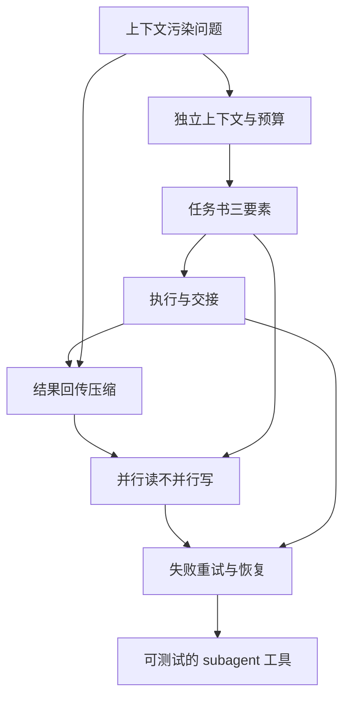
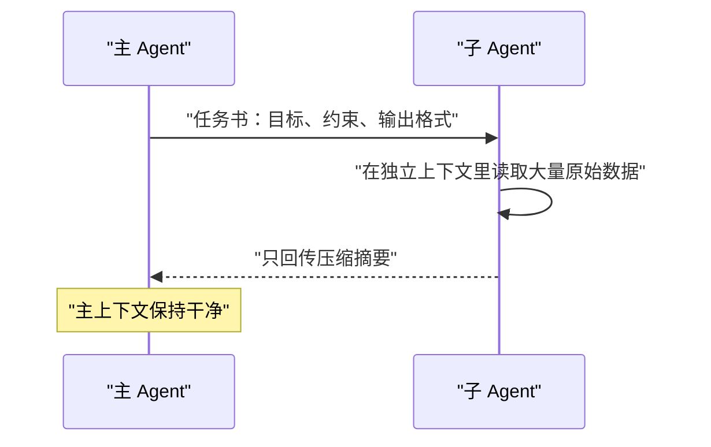
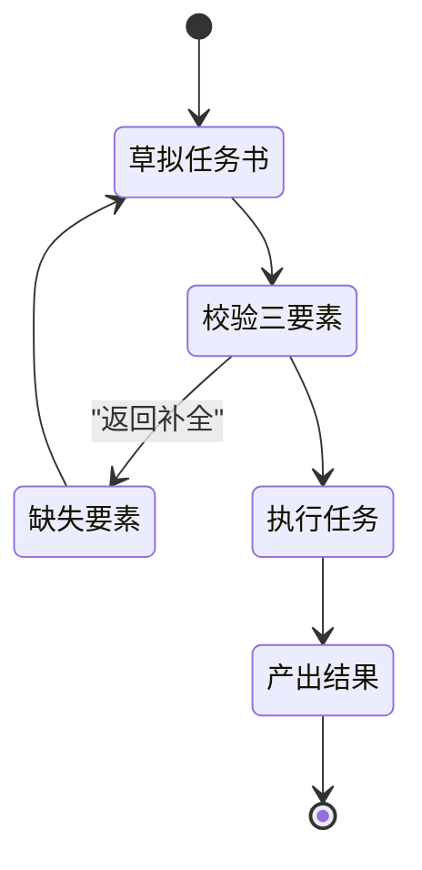
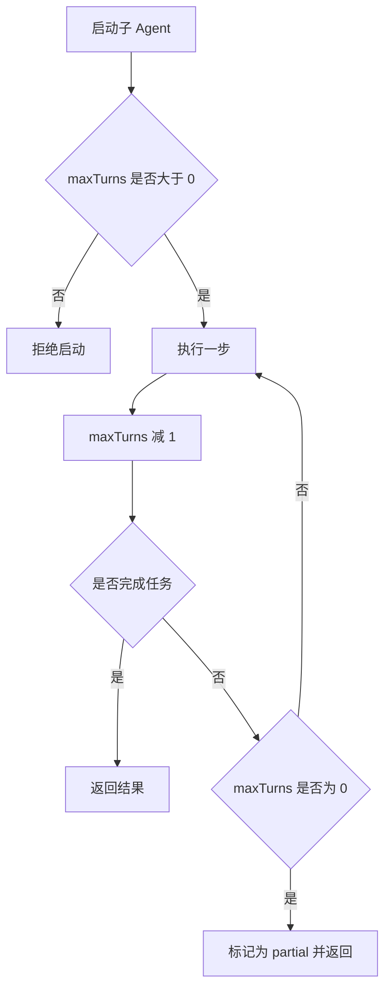
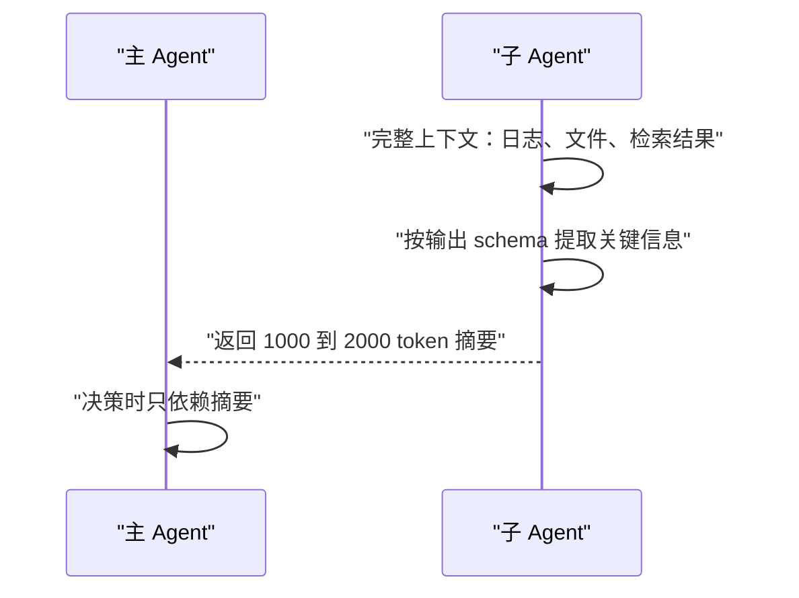
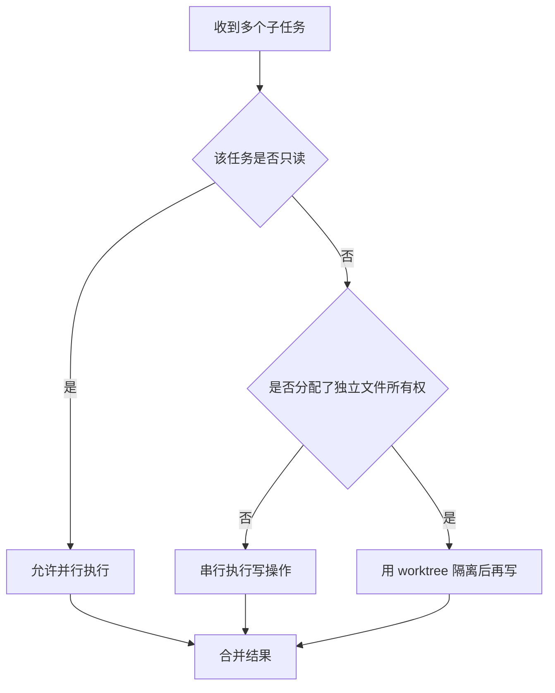
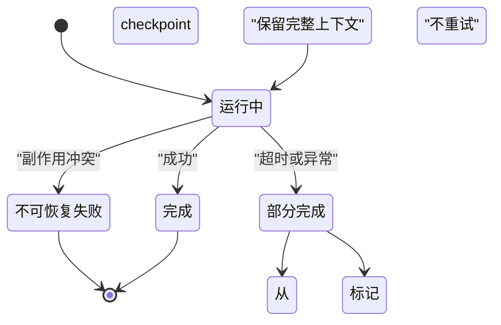
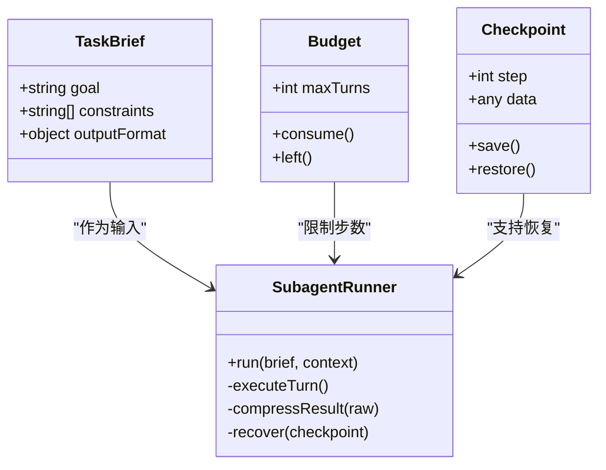

# 子 Agent 作为上下文隔离：怎么交接、怎么回传

!!! abstract "学完这一页你能"
    - 写出包含目标、约束、输出格式三要素的子 Agent 任务书。
    - 用独立上下文与预算上限控制子 Agent 的 token 消耗与步数。
    - 实现子 Agent 结果回传压缩，把冗长输出压成 1000 到 2000 token 的摘要。
    - 解释并行读不并行写的原则，并写出带重试的 subagent 工具与测试。

## 0. 知识地图



先读第 1 节理解为什么需要隔离，再按第 2 到第 6 节的顺序掌握交接、预算、回传、并发与重试。第 7 节把前面的机制合成一个可以运行和测试的工具。第 8 节之后用于查缺补漏与自测。

## 1. 为什么需要子 Agent：上下文污染与隔离

**先想一个问题**

假设你在一个长对话里让主 Agent 分析 5 个仓库的依赖冲突。第一个仓库输出了 8000 行构建日志，第二个仓库输出 12000 行。当第三个仓库的结果进来时，主 Agent 已经忘了最初的排查目标。

**心智模型**

!!! tip "心智模型"
    子 Agent 像一间独立办公室：你把任务书从门缝递进去，它在里面翻资料、做笔记，最后只把一页结论递出来。类比不成立的地方在于：办公室不共享墙壁，而子 Agent 与主 Agent 共享同一个模型服务，只是上下文窗口不同。

**图解**



1. 主 Agent 只发送任务书，不发送原始数据。
2. 子 Agent 在自己的上下文窗口里读取大段日志、文件或检索结果。
3. 子 Agent 回传压缩摘要，主 Agent 的上下文不会被原始数据撑大。

**一步一步来**

用一个小实验感受上下文污染：同一个问题，放在干净上下文和污染上下文里，看模型回应的差别。

```js
// 步骤 1：模拟上下文污染
const baseInstruction = "回答用户的问题";
const cleanContext = [baseInstruction, "用户：今天星期几？"];
const pollutedContext = [
  baseInstruction,
  // 模拟无关长文本：重复噪声占位
  "噪声数据".repeat(2000),
  "用户：今天星期几？",
];
console.log("干净上下文字符数:", cleanContext.join("").length);
console.log("污染上下文字符数:", pollutedContext.join("").length);
```

**这段代码在做什么**

- `cleanContext` 只包含系统指令和用户问题。
- `pollutedContext` 在问题之前插入 8000 个字符的重复噪声。
- 两个上下文的差异只有噪声长度，问题本身完全相同。
- 在真实模型里，污染上下文的召回准确率会下降，这正是 Chroma 实验观察到的趋势。

**动手验证**

```js
// 运行：node context-pollution-demo.mjs
import assert from "node:assert/strict";

const makeContext = (noiseCount) => [
  "回答用户的问题",
  "噪声数据".repeat(noiseCount),
  "用户：今天星期几？",
];

const clean = makeContext(0);
const polluted = makeContext(2000);

assert.equal(clean[1], "用户：今天星期几？");
assert.ok(polluted[1].startsWith("噪声数据"));
assert.ok(polluted.join("").length > clean.join("").length);
console.log("干净上下文长度:", clean.join("").length);
console.log("污染上下文长度:", polluted.join("").length);
console.log("预期：两个上下文的问题相同，但污染版本更长");
```

**常见坑**

| 现象 | 原因 | 怎么修 |
|---|---|---|
| 主 Agent 越聊越糊涂 | 长上下文导致上下文腐烂 context rot | 把重读多、输出少的任务外包给子 Agent |
| 日志塞爆上下文 | 工具结果不清理 | 子 Agent 内读取，压缩后回传 |
| 无关信息把关键指示挤到中间 | 注意力在长上下文中被摊薄 | 保持主上下文只放高信号内容 |

**用在哪里**

- 业务背景：前端监控平台的错误日志分析，单条链路可能产生几万行堆栈。这一节的知识用于把日志读取放进子 Agent，主 Agent 只拿根因摘要。用摘要 token 数衡量收益。当日志小于 500 行时不该用子 Agent，直接读更快。
- 业务背景：多仓库代码调研，比如要改一个跨 8 个包的 API 签名。主 Agent 派多个只读子 Agent 分别调研各包的使用点，各自返回影响面摘要。用主上下文 token 节省量衡量。当只需查一个包时不该用。

**行业实践**

- Anthropic《Effective context engineering for AI agents》指出：子 Agent 各自在干净窗口工作，返回约 1000 到 2000 token 的浓缩摘要。来源：Anthropic 工程博客，以原文为准。
- Claude Code 文档写明子 Agent 在独立 context window 中运行，冗长搜索结果、日志、文件内容不会污染主对话。来源：Claude Code sub-agents 文档。
- Cognition 在《Don't Build Multi-Agents》中主张共享完整 trace，但 Claude Code 用 fork 变体继承完整对话并共享 prompt cache，是对这一主张的工程回应。来源：Claude Code 文档与 Cognition 博客。

怎么借鉴到你的项目：先找出主 Agent 上下文中重复出现的"读多、输出少"任务，把它们改造成只读子 Agent，并规定摘要输出格式。

**小结**

- 子 Agent 的核心价值是上下文隔离，不是让多个 Agent 协作写同一份文件。
- 隔离的代价是主 Agent 看不到子 Agent 的完整推理过程，所以摘要格式必须提前约定。
- 只在"读多、输出少"的判断标准满足时启用子 Agent。

## 2. 任务书：目标、约束、输出格式怎么定

**先想一个问题**

你让子 Agent 去"查一下那个报错"。它带回 3 页闲聊式的内容，没有行号、没有复现步骤、没有文件路径。你才意识到：没有任务书，子 Agent 就在猜你想要什么。

**心智模型**

!!! tip "心智模型"
    任务书像一份外包合同：甲方写清要交付什么、不能碰什么、交付物长什么样。类比不成立处：合同可以慢慢审，而子 Agent 第一次理解错误就会把错误带入整个后续执行。

**图解**



1. 草拟任务书时写下目标、约束、输出格式。
2. 校验三要素是否齐全，缺失就退回补全。
3. 三要素齐全后才执行任务。
4. 子 Agent 按输出格式产出结果，主 Agent 才能直接消费。

**一步一步来**

第一步：定义任务书的数据结构。

```js
// 步骤 1：用 schema 强制任务书包含三要素
const taskBriefSchema = {
  goal: "string",        // 目标：一句话说明要交付什么
  constraints: "array",  // 约束：不能做什么、权限边界
  outputFormat: "object" // 输出格式：字段级结构
};

function isValidBrief(brief) {
  const hasGoal = typeof brief.goal === "string" && brief.goal.length > 0;
  const hasConstraints = Array.isArray(brief.constraints) && brief.constraints.length > 0;
  const hasOutput = brief.outputFormat && Object.keys(brief.outputFormat).length > 0;
  return hasGoal && hasConstraints && hasOutput;
}
```

**这段代码在做什么**

- `taskBriefSchema` 声明任务书的三个必需部分。
- `isValidBrief` 检查三要素是否存在且非空。
- 任何一份任务书在执行前都必须通过这个校验。
- 这个校验不是可选的格式检查，而是防止子 Agent 自由发挥的护栏。

第二步：写一份具体的任务书示例。

```js
// 步骤 2：一份可执行的任务书
const investigativeBrief = {
  goal: "定位 checkout 页面 500 错误的触发条件",
  constraints: [
    "只读，不修改任何文件",
    "最多进行 4 次工具调用",
    "不要访问 payment 目录"
  ],
  outputFormat: {
    rootCause: "string",     // 根因判断
    filePaths: "string[]",   // 相关文件列表
    reproSteps: "string[]",  // 复现步骤
    confidence: "number"     // 置信度 0 到 1
  }
};

console.log(isValidBrief(investigativeBrief)); // true
```

**这段代码在做什么**

- `goal` 只描述要交付的结果，不描述实现路径。
- `constraints` 明确只读、步数上限和禁止访问的目录。
- `outputFormat` 规定四个字段，子 Agent 不能返回自由文本。
- `confidence` 字段把不确定性显式化，避免子 Agent 用肯定语气掩盖猜测。

**动手验证**

```js
// 运行：node task-brief.mjs
import assert from "node:assert/strict";

const brief = {
  goal: "列出所有包含 TODO 的文件",
  constraints: ["只读", "最多 3 次工具调用"],
  outputFormat: { files: "string[]", count: "number" }
};

assert.equal(isValidBrief(brief), true);
assert.deepEqual(Object.keys(brief.outputFormat), ["files", "count"]);

const incomplete = { goal: "查一下" };
assert.equal(isValidBrief(incomplete), false);
console.log("完整任务书通过校验，缺要素任务书被拒绝");
```

**常见坑**

| 现象 | 原因 | 怎么修 |
|---|---|---|
| 子 Agent 返回自由文本 | 输出格式未定义 | 把输出格式写成字段级 schema |
| 子 Agent 越权改文件 | 约束未写权限边界 | 约束里写明只读或工具白名单 |
| 目标写太长 | 目标变成实现步骤 | 目标只写交付物，步骤让子 Agent 规划 |

**用在哪里**

- 业务背景：后台管理的批量导入错误报告。任务书目标写成"找出 CSV 第 3 列格式错误的所有行号"，输出格式规定行号数组与错误类型枚举。用返回字段的解析成功率衡量。当错误数量很少且肉眼可数时不该用。
- 业务背景：代码库健康检查。任务书目标为"统计每个包的循环依赖数量"，约束为只读与步数上限，输出格式为包名到数量的映射。用主 Agent 消费结果所需的修正次数衡量。当仓库小于 3 个包时不该用。

**行业实践**

- Anthropic 八条 prompt 原则第 2 条：教会 orchestrator 如何委派，任务描述要有目标、输出格式、工具指引和边界。来源：Anthropic《How we built our multi-agent research system》。
- Anthropic 还把投入规模规则写进 prompt：简单查询 1 个 agent、3 到 10 次工具调用；直接对比 2 到 4 个 subagent；复杂研究 10 个以上。来源：同上，以原文为准。
- MAST 论文指出违背任务规格占失败原因 10.98%，强化角色规格可提升 9.4% 成功率。来源：arXiv 2503.13657。

怎么借鉴到你的项目：为每类子 Agent 准备一份任务书模板，模板里预填约束和输出 schema，使用者只改目标。

**小结**

- 任务书必须包含目标、约束、输出格式三要素。
- 输出格式要字段级定义，禁止自由文本回传。
- 约束要写清权限边界和资源上限。

## 3. 独立上下文与预算：不让子 Agent 失控

**先想一个问题**

你给子 Agent 5 次工具调用的额度，它用了 43 次。你给主 Agent 128k 的上下文窗口，它被 5 个子 Agent 的完整报告撑到了 200k。没有预算，隔离只是一个口号。

**心智模型**

!!! tip "心智模型"
    预算像给孩子零花钱：额度花完就停下来交账。类比不成立处：孩子的零花钱可以借，子 Agent 的 maxTurns 到了就是硬停止，不会自动续期。

**图解**



1. 启动前检查 maxTurns，非正数直接拒绝。
2. 每执行一步消耗一个 turn。
3. 任务完成就正常返回。
4. turn 用尽未完成，标记为 partial 返回。

**一步一步来**

第一步：实现 turn 预算计数器。

```js
// 步骤 1：turn 预算器
function createTurnBudget(maxTurns) {
  if (!Number.isInteger(maxTurns) || maxTurns <= 0) {
    throw new Error("maxTurns 必须是正整数");
  }
  let remaining = maxTurns;
  return {
    consume() {
      if (remaining <= 0) return false; // 预算耗尽
      remaining -= 1;
      return true;
    },
    left() {
      return remaining;
    }
  };
}
```

**这段代码在做什么**

- `createTurnBudget` 返回一个闭包，封装剩余 turn 数。
- `consume` 在预算耗尽时返回 false，否则消耗一个 turn。
- `left` 暴露剩余额度，用于日志和恢复判断。
- 正整数校验防止误传 0 或负数导致无限循环。

第二步：模拟子 Agent 执行循环。

```js
// 步骤 2：带预算的执行循环
function runWithBudget(budget, taskDone) {
  const steps = [];
  while (!taskDone(steps)) {
    if (!budget.consume()) {
      return { status: "partial", steps }; // 用完预算仍未完成
    }
    steps.push({ step: steps.length + 1 });
  }
  return { status: "done", steps };
}

const budget = createTurnBudget(3);
const done = (steps) => steps.length >= 5; // 模拟需要 5 步的任务
const result = runWithBudget(budget, done);
console.log(result.status); // partial
console.log("已执行步数:", result.steps.length); // 3
```

**这段代码在做什么**

- `runWithBudget` 在每一步执行前消耗预算。
- `taskDone` 模拟任务完成条件，这里需要 5 步。
- 预算只有 3，循环在第 3 步后退出。
- 返回 `partial` 状态，调用方可以决定是否恢复。

**动手验证**

```js
// 运行：node turn-budget.mjs
import assert from "node:assert/strict";

const budget = createTurnBudget(2);
assert.equal(budget.left(), 2);
assert.equal(budget.consume(), true);
assert.equal(budget.left(), 1);
assert.equal(budget.consume(), true);
assert.equal(budget.left(), 0);
assert.equal(budget.consume(), false);

assert.throws(() => createTurnBudget(0));
const partial = runWithBudget(createTurnBudget(1), () => false);
assert.equal(partial.status, "partial");
console.log("预算消耗与耗尽逻辑通过断言");
```

**常见坑**

| 现象 | 原因 | 怎么修 |
|---|---|---|
| 子 Agent 无限循环 | 不知道终止条件 | 设置 maxTurns 并在 prompt 中写明终止条件 |
| 预算太紧任务完不成 | 没按任务复杂度分配额度 | 简单任务 3 到 10 步，复杂任务 10 步以上 |
| 并发预算没限制 | 只限制了单 agent 没限制总量 | 设置并发上限，如 Claude Code 默认 20 个 |

**用在哪里**

- 业务背景：前端依赖升级影响分析，一次扫描可能触碰几十个目录。为每个只读子 Agent 设置 maxTurns=10，并限制并发为 5，防止 API 费用失控。用单次任务 token 总量衡量。当扫描范围小于 5 个目录时不该用。
- 业务背景：SEO 批量诊断，每个页面一个子任务。按页面数设置并发上限和每个子任务的步数上限，超出则标记 partial 稍后恢复。用每小时完成页面数衡量。当页面数小于 10 时不该用。

**行业实践**

- Claude Code 为 subagent 设置 maxTurns，达到上限的 subagent 被标记为 partial，可以恢复。来源：Claude Code sub-agents 文档。
- Claude Code 限制嵌套深度默认 3 层、并发默认 20 个，均可通过环境变量配置。来源：同上。
- Anthropic 把投入规模规则写进 prompt，让 orchestrator 根据查询复杂度决定派多少个 subagent。来源：Anthropic 工程博客。

怎么借鉴到你的项目：把 maxTurns、并发数、嵌套深度做成配置文件，不同任务类型用不同默认值。

**小结**

- 每个子 Agent 必须有独立的 turn 预算和上下文预算。
- 预算耗尽的子 Agent 要标记为 partial，而不是当成失败。
- 并发的总预算要单独限制，防止费用失控。

## 4. 结果回传压缩：只带摘要回来

**先想一个问题**

子 Agent 调研了 12 个文件，带回了 3 万字完整内容。主 Agent 读完这些内容后，上下文已经快满了，后续决策开始漏掉关键约束。回传的原始数据越多，隔离越没意义。

**心智模型**

!!! tip "心智模型"
    结果回传像出差汇报：下属带回来的是结论、证据清单和风险点，而不是一整箱原始单据。类比不成立处：下属可以当场翻单据回答追问，而子 Agent 返回摘要后，主 Agent 看不到被压缩掉的细节。

**图解**



1. 子 Agent 在独立上下文里积累完整记录。
2. 执行结束前，子 Agent 按任务书的输出格式提取关键信息。
3. 回传的是结构化摘要，不是完整记录。
4. 主 Agent 只用摘要做决策，需要细节时再派新子 Agent。

**一步一步来**

第一步：实现摘要压缩函数。

```js
// 步骤 1：把长输出压缩为结构化摘要
function compressReport(rawReport, brief) {
  const { outputFormat } = brief;
  const summary = {};
  for (const [key, type] of Object.entries(outputFormat)) {
    if (type === "string") {
      // 截断字符串字段，保留前 100 字符
      summary[key] = String(rawReport[key] ?? "").slice(0, 100);
    } else if (type === "string[]") {
      // 数组字段只保留前 3 项
      summary[key] = Array.isArray(rawReport[key])
        ? rawReport[key].slice(0, 3)
        : [];
    } else {
      summary[key] = rawReport[key];
    }
  }
  return summary;
}
```

**这段代码在做什么**

- `compressReport` 按任务书的 `outputFormat` 逐字段压缩。
- 字符串字段截断到 100 字符，避免长文回传。
- 数组字段只保留前 3 项，防止列表撑大上下文。
- 压缩动作发生在子 Agent 返回之前，而不是主 Agent 收到之后。

第二步：模拟一个产出长报告的流程。

```js
// 步骤 2：模拟子 Agent 回传压缩结果
const brief = {
  goal: "调研 a11y 问题",
  constraints: ["只读"],
  outputFormat: {
    summary: "string",
    files: "string[]",
    severity: "string"
  }
};

const raw = {
  summary: "表单缺少 label 标签".repeat(50), // 长文本
  files: Array.from({ length: 20 }, (_, i) => `src/a${i}.tsx`), // 20 个文件
  severity: "high"
};

const compressed = compressReport(raw, brief);
console.log(compressed.summary.length); // 100
console.log(compressed.files.length);   // 3
```

**这段代码在做什么**

- `raw.summary` 是 600 字符的重复文本，压缩后为 100 字符。
- `raw.files` 有 20 项，压缩后为 3 项。
- 压缩规则由 `outputFormat` 驱动，不需要额外配置。
- 真实场景中压缩由模型生成摘要，这里是确定性的截断实现。

**动手验证**

```js
// 运行：node compress-report.mjs
import assert from "node:assert/strict";

const brief = {
  goal: "x",
  constraints: ["只读"],
  outputFormat: { note: "string", paths: "string[]", score: "number" }
};

const raw = {
  note: "a".repeat(500),
  paths: ["1", "2", "3", "4", "5"],
  score: 0.9
};

const out = compressReport(raw, brief);
assert.equal(out.note.length, 100);
assert.deepEqual(out.paths, ["1", "2", "3"]);
assert.equal(out.score, 0.9);
console.log("压缩结果:", out);
```

**常见坑**

| 现象 | 原因 | 怎么修 |
|---|---|---|
| 摘要丢失关键细节 | 压缩规则太激进 | 在输出格式中标记不可截断的关键字段 |
| 主 Agent 追问细节无门 | 没有保留子 Agent 引用 | 摘要附上 task id，可恢复子 Agent 追问 |
| 压缩本身消耗过多 token | 摘要生成调用计入成本 | 用确定性截断处理结构化字段，模型摘要只用于自由文本 |

**用在哪里**

- 业务背景：电商商品列表的虚拟滚动性能分析。子 Agent 读取 20 个组件的渲染耗时数据，回传 top 3 慢组件与共性问题摘要。用主 Agent 收到结果的 token 数衡量。当组件数小于 5 时不该用。
- 业务背景：后台管理的批量导入错误归类。子 Agent 扫描错误日志，回传错误类型分布与样例行号前三项。用错误归类的准确率衡量。当错误数小于 20 且类型单一时不该用。

**行业实践**

- Anthropic 上下文工程文章写明子 Agent 返回约 1000 到 2000 token 的浓缩摘要。来源：Anthropic《Effective context engineering for AI agents》。
- LangChain 官方对比显示，隔离上下文的模式在多领域并行场景可省约 67% token。来源：LangChain multi-agent 文档。
- JetBrains 研究发现 observation masking 比 LLM 摘要更便宜且效果相当，但该结论限于 SWE-bench 场景。来源：arXiv 2508.21433。

怎么借鉴到你的项目：先做确定性截断，把结构化字段压缩掉，再用模型摘要处理自由文本，测量两者各自的 token 节省比例。

**小结**

- 回传压缩是子 Agent 隔离价值兑现的关键一步。
- 压缩规则应该由任务书的输出格式驱动。
- 摘要要保留 task id，方便后续恢复追问。

## 5. 并行读不并行写：文件所有权与 worktree

**先想一个问题**

两个子 Agent 同时给同一个配置文件打补丁。一个更新了端口号，另一个删掉了代理配置。合并时两个修改互相覆盖，最后一个写盘的结果决定一切。Cognition 用 Flappy Bird 案例描述了同类问题。

**心智模型**

!!! tip "心智模型"
    并行读像多个人轮流看同一本档案，互不干扰；并行写像多个人同时在一张纸上改字，最后只有一个人的笔迹留下。类比不成立处：纸上的笔迹可以擦掉重来，而代码文件一旦写坏，恢复成本可能远高于重写。

**图解**



1. 区分任务是否只读，只读任务允许并行。
2. 写操作默认串行执行。
3. 必须并行写时，给每个写者物理隔离的 worktree。
4. 所有结果在最后统一合并，不在执行过程中互相覆盖。

**一步一步来**

第一步：实现文件所有权检查。

```js
// 步骤 1：检测两个子任务是否操作同一批文件
function hasFileOverlap(taskA, taskB) {
  const setA = new Set(taskA.writeFiles ?? []);
  const setB = new Set(taskB.writeFiles ?? []);
  for (const file of setA) {
    if (setB.has(file)) return true; // 有交集
  }
  return false;
}

const taskA = { writeFiles: ["config.json", "proxy.js"] };
const taskB = { writeFiles: ["proxy.js", "router.ts"] };
console.log(hasFileOverlap(taskA, taskB)); // true
```

**这段代码在做什么**

- `writeFiles` 记录每个子任务计划写入的文件。
- `hasFileOverlap` 用集合判断两个任务是否有写入交集。
- 有交集就返回 true，调用方应把这两个任务串行执行。
- 这是写单线程原则在文件所有权上的最小实现。

第二步：演示无冲突时允许并行。

```js
// 步骤 2：无冲突时允许并行读，有冲突时强制串行写
function schedule(tasks) {
  const readers = tasks.filter((t) => !t.writeFiles);
  const writers = tasks.filter((t) => t.writeFiles);
  // 只读任务全并行
  const plan = { parallel: readers, serial: [] };
  for (const writer of writers) {
    // 有文件冲突的写入者放串行队列
    if (writers.some((other) => other !== writer && hasFileOverlap(writer, other))) {
      plan.serial.push(writer);
    } else {
      plan.parallel.push(writer);
    }
  }
  return plan;
}
```

**这段代码在做什么**

- 先按是否有 `writeFiles` 区分读者和写者。
- 读者全部进入并行队列。
- 写者如果与任何其他写者有文件交集，就进入串行队列。
- 没有冲突的写者可以与读者一起并行。

**动手验证**

```js
// 运行：node file-ownership.mjs
import assert from "node:assert/strict";

const readers = [{ name: "r1" }, { name: "r2" }];
const writerA = { name: "w1", writeFiles: ["a.ts"] };
const writerB = { name: "w2", writeFiles: ["a.ts"] };
const writerC = { name: "w3", writeFiles: ["b.ts"] };

const plan = schedule([...readers, writerA, writerB, writerC]);
assert.equal(plan.parallel.length, 4); // r1 r2 w1 w3
assert.equal(plan.serial.length, 1);   // w2 与 w1 冲突
console.log("并行任务:", plan.parallel.map((t) => t.name));
console.log("串行任务:", plan.serial.map((t) => t.name));
```

**常见坑**

| 现象 | 原因 | 怎么修 |
|---|---|---|
| 两个子 Agent 写入互相覆盖 | 未检查文件所有权 | 启动前用 `writeFiles` 声明冲突检测 |
| 写者与读者并发导致读到半成品 | 读者依赖的文件正在被改写 | 读任务统一在写任务结束后执行 |
| 冲突检测遗漏隐式写入 | 子 Agent 未声明动态生成的文件 | 用 worktree 或沙箱隔离文件系统 |

**用在哪里**

- 业务背景：前端 monorepo 的批量重构，比如一次改 30 个文件的 API 签名。主 Agent 把文件按目录划分所有权，读任务并行调研，写任务按目录串行执行。用文件冲突率衡量。当改动文件少于 3 个时不该用。
- 业务背景：代码审查系统。reviewer 子 Agent 只读代码并返回问题列表，writer 子 Agent 按列表串行修改，两者不共享写入权。用严重 bug 抓取数衡量。当 PR 小于 50 行时不该用。

**行业实践**

- Cognition 后续文章的核心观点：写操作保持单线程，额外的 agent 贡献智能而非动作。来源：Cognition 经 ZenML 摘要，以原文为准。
- Claude Code 提供 `isolation: worktree`，让 subagent 在隔离的 git worktree 副本里改文件，主 checkout 不受影响。来源：Claude Code sub-agents 文档。
- Google ADK 文档警告：多个并行 agent 写同一个 state key 会冲突，需按职责分离。来源：Google ADK workflows 文档。

怎么借鉴到你的项目：把写操作集中到一个 owner，其他 subagent 返回修改建议供 owner 执行，从结构上消除并行写。

**小结**

- 只读任务可以放心并行，写操作必须串行或物理隔离。
- 文件所有权声明是检测写冲突的最小手段。
- 必须并行写时用 worktree 隔离，主工作区保持干净。

## 6. 失败重试与恢复：checkpoint、partial、幂等

**先想一个问题**

子 Agent 在第 7 步拿到了关键信息，第 8 步网络超时。如果整体重启，前面 7 步都白做。如果盲目重试，有副作用的工具调用可能被执行两次。

**心智模型**

!!! tip "心智模型"
    重试像从断点续传下载：已经拿到的分块不重新下，只补缺失的部分。类比不成立处：下载的每个分块有校验和保证一致，而子 Agent 的中间步骤不保证可复现，需要 checkpoint 显式记录才能恢复。

**图解**



1. 正常完成是终止状态。
2. 失败时先区分是否 partial。
3. partial 状态可保留完整上下文，从 checkpoint 恢复。
4. 有副作用冲突时标记为不可恢复，避免重复执行。

**一步一步来**

第一步：实现带重试的执行器。

```js
// 步骤 1：带最大重试次数的执行器
async function runWithRetry(fn, { maxRetries = 2, delayMs = 100 } = {}) {
  let lastError;
  for (let attempt = 0; attempt <= maxRetries; attempt++) {
    try {
      return await fn(attempt); // 把尝试序号传给任务函数
    } catch (err) {
      lastError = err;
      if (attempt < maxRetries) {
        await new Promise((r) => setTimeout(r, delayMs * (attempt + 1))); // 退避
      }
    }
  }
  throw lastError;
}
```

**这段代码在做什么**

- `runWithRetry` 最多执行 `maxRetries + 1` 次。
- 每次尝试把序号传给 `fn`，任务函数可以据此记录 checkpoint。
- 失败后按线性退避等待，避免立即重试打爆服务。
- 用尽重试次数后抛出最后一次错误。

第二步：模拟带 checkpoint 的子任务。

```js
// 步骤 2：模拟子 Agent 失败后从 checkpoint 恢复
let checkpoint = 0; // 模拟持久化 checkpoint
async function unstableTask(attempt) {
  if (checkpoint > 0 && attempt > 0) {
    return `从第 ${checkpoint} 步恢复`; // 恢复路径不需要重新执行前段
  }
  if (attempt === 0) {
    checkpoint = 7; // 模拟执行到第 7 步后失败
    throw new Error("第 8 步网络超时");
  }
  return "无需 checkpoint 时正常完成";
}

const output = await runWithRetry(unstableTask);
console.log(output); // 从第 7 步恢复
```

**这段代码在做什么**

- `checkpoint` 模拟持久化的进度记录。
- 第一次尝试执行到第 7 步后抛出网络超时。
- 第二次尝试发现 checkpoint 存在，走恢复路径。
- 实际系统中 checkpoint 不是全局变量，而是写入磁盘或状态存储。

**动手验证**

```js
// 运行：node retry-recovery.mjs
import assert from "node:assert/strict";

let attempts = 0;
const flaky = async (attempt) => {
  attempts += 1;
  if (attempt === 0) throw new Error("first fail");
  return "ok";
};

const result = await runWithRetry(flaky, { maxRetries: 1, delayMs: 1 });
assert.equal(result, "ok");
assert.equal(attempts, 2);
console.log("执行次数:", attempts, "结果:", result);
```

**常见坑**

| 现象 | 原因 | 怎么修 |
|---|---|---|
| 重试导致副作用重复执行 | 没有区分可重试与不可重试操作 | 副作用操作加幂等键，不可重试操作不放在重试块内 |
| 重试无限循环 | 没设最大重试次数 | 默认 maxRetries=2 并记录每次失败原因 |
| checkpoint 破坏数据一致性 | checkpoint 在操作完成前写入 | 只在步骤完成后写 checkpoint |

**用在哪里**

- 业务背景：后端数据迁移的预估脚本。子 Agent 分阶段扫描数据库，每阶段完成写 checkpoint，网络中断后从 checkpoint 恢复。用恢复后节省的重扫时间衡量。当扫描快于 30 秒完成时不该用。
- 业务背景：前端构建失败归因。子 Agent 复现构建步骤，某个依赖下载失败时重试，但构建命令本身有副作用，重试前先擦除输出目录。用一次归因的 wall clock 时间衡量。当构建稳定复现时不该用。

**行业实践**

- Anthropic 研究系统做的是可恢复系统：带重试逻辑与 checkpoint，而不是整体重启。来源：Anthropic《How we built our multi-agent research system》。
- Claude Code 支持用 `SendMessage` 恢复已结束或中断的 subagent，并保留完整上下文。来源：Claude Code sub-agents 文档。
- MAST 论文中步骤重复是最高频单一失败模式，占 17.14%。来源：arXiv 2503.13657。

怎么借鉴到你的项目：重试逻辑放在执行器层，任务函数只负责声明 checkpoint 和幂等键，不要在业务逻辑里散落重试代码。

**小结**

- 失败分为 partial 与不可恢复两类，partial 优先恢复。
- 恢复依赖 checkpoint，checkpoint 只能在步骤完成后写入。
- 有副作用的操作必须声明幂等键，否则不进入重试块。

## 7. 手写一个 Claude Code 式子 Agent 工具并测试

**先想一个问题**

你已经理解了任务书、预算、压缩、重试的每个概念。现在要把它们拼成一个可以运行的 subagent 工具。每个部分单独看都简单，合起来最容易在边界处出问题。

**心智模型**

!!! tip "心智模型"
    subagent 工具像一台自动化咖啡机：任务书是按钮说明，预算是水箱容量，压缩是滤网，重试是断电保护。类比不成立处：咖啡机的每个部件保修期内稳定工作，而 subagent 的每一步都可能因为模型随机性产生新问题。

**图解**



1. `TaskBrief` 是输入，定义目标、约束和输出格式。
2. `Budget` 在每次执行 turn 前消耗。
3. `Checkpoint` 记录进度，供失败后恢复。
4. `SubagentRunner` 把三者组合成一次可恢复的执行。

**一步一步来**

第一步：定义任务书校验与预算器。

```js
// 步骤 1：复用前面实现的任务书校验与预算器
function isValidBrief(brief) {
  return typeof brief.goal === "string"
    && Array.isArray(brief.constraints)
    && brief.outputFormat && Object.keys(brief.outputFormat).length > 0;
}

function createTurnBudget(maxTurns) {
  let remaining = maxTurns;
  return {
    consume() { if (remaining <= 0) return false; remaining -= 1; return true; },
    left() { return remaining; }
  };
}
```

**这段代码在做什么**

- `isValidBrief` 确认三要素齐全，这是执行前的输入校验。
- `createTurnBudget` 封装剩余步数，防止无限循环。
- 两个函数都已在前面章节实现，这里组合进完整工具。
- 工具的其他部分会在后续步骤中补充。

第二步：实现压缩器与子 Agent 执行器。

```js
// 步骤 2：压缩器与执行器
function compressReport(raw, brief) {
  const summary = {};
  for (const [key, type] of Object.entries(brief.outputFormat)) {
    summary[key] = type === "string[]"
      ? (raw[key] ?? []).slice(0, 3)
      : String(raw[key] ?? "").slice(0, 120);
  }
  return summary;
}

async function runSubagent(brief, context, { maxTurns = 4, maxRetries = 1 } = {}) {
  if (!isValidBrief(brief)) throw new Error("任务书缺少三要素");
  let checkpoint = { step: 0, raw: null };
  for (let attempt = 0; attempt <= maxRetries; attempt++) {
    const budget = createTurnBudget(maxTurns - checkpoint.step);
    try {
      // 模拟：在独立上下文中执行，checkpoint.step 是已经完成的步数
      const raw = await context.execute(brief, checkpoint.step, budget);
      checkpoint.raw = raw;
      return { status: "done", summary: compressReport(raw, brief) };
    } catch (err) {
      if (attempt >= maxRetries) throw err;
      checkpoint.step += Math.min(2, maxTurns - checkpoint.step); // 模拟推进
    }
  }
}
```

**这段代码在做什么**

- `runSubagent` 先校验任务书，避免无效输入进入执行。
- 每次重试用剩余预算创建新的 `Budget`。
- 成功后压缩结果并返回摘要，原始数据只存在 `checkpoint.raw`。
- 失败时推进 checkpoint 步数，模拟部分执行后的恢复入口。

**动手验证**

```js
// 运行：node subagent-tool.mjs
import assert from "node:assert/strict";

const brief = {
  goal: "列出慢接口",
  constraints: ["只读"],
  outputFormat: { slowPaths: "string[]", total: "number" }
};

const context = {
  async execute(brief, fromStep, budget) {
    if (fromStep < 2) throw new Error("模拟前 2 步后失败");
    return { slowPaths: ["/api/a", "/api/b", "/api/c", "/api/d"], total: 4 };
  }
};

const result = await runSubagent(brief, context);
assert.equal(result.status, "done");
assert.deepEqual(result.summary.slowPaths, ["/api/a", "/api/b", "/api/c"]);
assert.equal(result.summary.total, 4);
console.log("子 Agent 工具返回:", JSON.stringify(result, null, 2));
console.log("预期：slowPaths 被压缩到 3 项，total 保持原值");
```

**常见坑**

| 现象 | 原因 | 怎么修 |
|---|---|---|
| 测试通过但真实环境失败 | 模拟 context 缺少真实工具调用 | 把 context.execute 替换为真实 API 调用再跑一次 |
| 重试后预算计算错误 | checkpoint 步数与新预算叠加错误 | 预算按剩余步数创建，不以原 maxTurns 重置 |
| 摘要字段类型不对 | compressReport 与 outputFormat 不匹配 | 在压缩前用 schema 校验原始输出字段类型 |

**用在哪里**

- 业务背景：前端代码库的只读调研工具。主 Agent 调用 `runSubagent` 查询"哪些组件依赖了已废弃的 token 系统"，子 Agent 返回组件列表前三项与总数。用查询响应时间衡量。当查询范围是一个文件时不该用。
- 业务背景：日志归因服务。子 Agent 分析一次部署后的错误集群，返回根因摘要，原始日志留在子 Agent 侧。用根因准确率衡量。当错误数小于 5 且类型单一时不该用。

**行业实践**

- Claude Code subagent 在独立 context window 中运行，启动时加载系统 prompt、任务消息、CLAUDE.md、git status 快照等。来源：Claude Code sub-agents 文档。
- Claude Code 的 fork 变体继承完整对话上下文、共享 prompt cache、不能再 fork、默认后台运行。来源：同上。
- 每个 subagent 都发起自己的 API 请求，计入用量；可把任务路由到 Haiku 并用 `CLAUDE_CODE_SUBAGENT_MODEL` 强制统一模型。来源：同上。

怎么借鉴到你的项目：把真实模型调用做成 `context.execute` 的适配器，让同一套测试逻辑在模拟与真实环境都能运行。

**小结**

- 手写 subagent 工具时，任务书校验放在执行前，压缩放在返回前。
- checkpoint 只记录步骤号与最小状态，不保存完整上下文。
- 测试时先模拟 context，再替换为真实模型调用。

## 应用地图

| 场景 | 用到本页哪个知识点 | 典型技术选型 | 注意事项 |
|---|---|---|---|
| 多仓库依赖调研 | 任务书、并行读 | 只读 subagent 加摘要回传 | 写操作必须串行 |
| 错误日志归因 | 独立上下文、压缩回传 | 子 Agent 读日志，回传根因摘要 | 日志小于 500 行不必用 |
| PR 代码审查 | 干净上下文 reviewer | 审查子 Agent 与修复子 Agent 分离 | 小 PR 直接主 Agent 审 |
| 批量导入错误归类 | 输出格式、预算 | 结构化摘要加重试 | 副作用操作加幂等键 |
| monorepo 重构 | 文件所有权、worktree | 目录级 owner 串行写 | 改动少于 3 文件不必用 |
| 依赖升级影响分析 | 预算、checkpoint | maxTurns、并发上限 | 扫描快于 30 秒不必用 |

## 动手作业

目标：写一个只读 subagent 工具，用来扫描一个小型前端项目，返回三步以内的慢接口清单。

步骤：

1. 定义任务书：目标是"找出超过 500ms 的接口路径"，约束为"只读、最多 6 步"，输出格式为 `slowPaths` 数组与 `total` 数字。
2. 实现 `createTurnBudget` 与 `compressReport`，压缩规则为数组保留前 5 项。
3. 实现 `runSubagent`，带一次重试，首次失败后从 checkpoint 恢复。
4. 写 3 个测试：任务书缺字段时抛错、重试路径产生正确摘要、预算耗尽标记 partial。

验收标准：测试全部通过，且 `runSubagent` 的返回值不包含任何超过 120 字符的字符串字段。

## 综合对比

| 对比维度 | 单 Agent | 固定 workflow | 子 Agent 上下文隔离 |
|---|---|---|---|
| 上下文膨胀风险 | 高，所有工具输出进主上下文 | 中，按路径分流 | 低，原始数据留在子 Agent |
| token 消耗量 | 基线，约 1x | 通常高于单 Agent | Anthropic 测得约 4x 单 Agent，15x chat |
| 并行能力 | 无 | 有，但路径固定 | 有，只读可并行 |
| 写操作安全性 | 高，单线程 | 取决于编排 | 默认串行写，worktree 隔离 |
| 失败恢复成本 | 低，整体重试 | 取决于 checkpoint | checkpoint 分段恢复 |
| 适合任务 | 简单查询、单步修改 | 流程稳定可视的子任务 | 读多输出少、高价值调研 |
| 不适合任务 | 长流程易丢上下文 | 开放型探索 | 强顺序依赖、低价值任务 |

## 深入阅读与参考

!!! tip "怎么用这些资料"
    先读「官方文档与规范」建立准确的概念，再读「源码与示例」核对细节，最后用「教程、书籍与视频」换一种讲法加深理解。每条都写明了读哪一节、带着什么问题读。

### 官方文档与规范

| 资源 | 为什么读 | 怎么读 |
|---|---|---|
| [Claude 子 Agent 文档](https://docs.claude.com/en/docs/claude-code/sub-agents) | 子 Agent 的定义、工具限制与结果返回机制都在这里。 | 先读创建与工具权限部分，动手做只读审查 subagent，再回看文档补漏。 |
| [并行 subagent 写同一批文件**：Claude Code 提供 `isolation: worktree`，让 subagent 在 (code.claude.com)](https://code.claude.com/docs/en/sub-agents) | worktree 是官方给出的并行子 Agent 写文件隔离手段。 | 读 isolation: worktree 一节，问并行写冲突怎么避免，给自己的并行任务加隔离。 |
| [When context fills, Claude Code "clears older tool outputs first, then (code.claude.com)](https://code.claude.com/docs/en/how-claude-code-works) | 上下文将满时先清旧工具输出，直接对应回传压缩。 | 读该段，问哪些输出可丢，照着给子 Agent 结果定压缩规则。 |
| [handoff 在 LLM 看来是工具，名称形如 `transfer_to_<agent_name>`。 (openai.github.io)](https://openai.github.io/openai-agents-python/handoffs/) | handoff 被建模成工具，解释控制权如何转移。 | 读 handoff 工具命名一节，问控制权怎么转，画出自己的交接流程。 |
| [LangChain 文档列出五种模式：Subagents（协调者把子 agent 当工具）、Handoffs（通过工具调用转移控制）、Ski (docs.langchain.com)](https://docs.langchain.com/oss/python/langchain/multi-agent) | 五种多 Agent 模式帮你在动手前选对结构。 | 对照 subagents 与 handoffs 两节，判断本页方案属于哪种模式。 |
| [Claude Agent SDK 概览](https://docs.claude.com/en/api/agent-sdk/overview) | SDK 概览是手写子 Agent 工具最直接的官方起点。 | 按示例跑通最小 Agent，观察工具调用日志，再改造成子 Agent 调用。 |
| [Scopes: user `~/.claude/settings.json`, project `.claude/settings.json (code.claude.com)](https://code.claude.com/docs/en/hooks) | settings.json 作用域决定子 Agent 实际拿到哪些权限。 | 读 scopes 说明，问权限该放哪层，给子 Agent 配最小权限并验证。 |

### 源码与示例

| 资源 | 为什么读 | 怎么读 |
|---|---|---|
| [Claude Agent SDK（TypeScript）](https://github.com/anthropics/claude-agent-sdk-typescript) | TS 版 SDK 示例可直接改成子 Agent 工具骨架。 | 跑 README 示例，再注册自定义工具，对照自己的循环找差异。 |
| [OpenAI Agents SDK（Python）](https://openai.github.io/openai-agents-python/) | Python 版 Quickstart 加 handoff，动手吃透交接。 | 复现 Quickstart，再加一个 handoff 让两 Agent 协作并记录传参。 |
| [smolagents 仓库](https://github.com/huggingface/smolagents) | 不到千行核心代码，最小 Agent 循环的最佳范本。 | 读核心循环，边读边手写自己的 loop，再逐项对比差异。 |

### 教程、书籍与视频

| 资源 | 为什么读 | 怎么读 |
|---|---|---|
| [Principle 1 is to share context, and share full agent traces, not just (cognition.com)](https://cognition.com/blog/dont-build-multi-agents) | Cognition 的共享上下文原则，是隔离路线的反方观点。 | 读 Principle 1，问该不该共享完整 trace，写下自己的取舍结论。 |
| [How we built our multi-agent research system](https://www.anthropic.com/engineering/multi-agent-research-system) | Anthropic 亲述 lead agent 与 subagent 的拆分与回传。 | 读后画出调用关系图，标出摘要回传点，对照自己的实现。 |
| [Effective context engineering for AI agents](https://www.anthropic.com/engineering/effective-context-engineering-for-ai-agents) | 上下文工程方法，决定子 Agent 该带什么回来。 | 读完后检查子 Agent 任务书，删掉重复上下文并记录 token 变化。 |
| [规模：MAST-Data 含 1,600+ 条标注 trace，覆盖 7 个流行 MAS 框架，模型含 GPT-4、Claude 3、Qwe (arxiv.org)](https://arxiv.org/abs/2503.13657) | 1600+ 条多 Agent 失败 trace 标注，重试设计参考。 | 浏览失败分类，挑两类做成自己子 Agent 的失败清单与重试策略。 |

## 自测题

??? question "1. 子 Agent 任务书必须包含哪三要素？为什么缺一个就会出问题？"
    答案要点：目标、约束、输出格式。目标缺失则方向不清，约束缺失则可能越权或无限循环，输出格式缺失则回传自由文本，主 Agent 无法结构化消费。

??? question "2. 为什么子 Agent 要在独立上下文中运行，而不是把原始数据都放进主上下文？"
    答案要点：避免上下文膨胀与 context rot；Chroma 实验显示输入增长时 18 个 LLM 的准确率均下降；独立上下文把原始数据隔离在子 Agent 侧，只回传 1000 到 2000 token 摘要。

??? question "3. 什么是并行读不并行写？在代码里怎么落地？"
    答案要点：只读任务可以并行执行；写操作必须串行，或通过 worktree 物理隔离避免互相覆盖。落地方式是用 `writeFiles` 声明做冲突检测，无冲突才允许并行。

??? question "4. maxTurns 到顶与任务失败有什么区别？为什么这个区别重要？"
    答案要点：maxTurns 到顶是 partial，表示任务未完成但可恢复；任务失败是不可恢复错误。区别在于 partial 可以保留完整上下文，用 SendMessage 或 checkpoint 恢复，而不是整体重启。

??? question "5. 为什么重试不能盲目做？有副作用的工具调用怎么处理？"
    答案要点：盲目重试会重复执行副作用操作，如发送请求、写文件。有副作用的工具必须加幂等键，或用擦除输出目录等准备动作保证重试安全。不可重试操作不要放进重试块。

??? question "6. Claude Code 的 worktree 隔离解决了什么具体问题？"
    答案要点：解决并行写同一文件互相覆盖的问题。subagent 在隔离的 git worktree 副本里改文件，主 checkout 不受影响，无改动时自动清理，保证写操作不污染主工作区。

??? question "7. Anthropic 研究系统的多智能体架构为什么比单 agent 强，但成本高出多少？"
    答案要点：orchestrator-worker 架构并行铺开搜索，内部 eval 比单 agent 高 90.2%；但 token 成本是 chat 的约 15 倍、单 agent 的约 4 倍。收益很大程度来自花了更多 token 并行探索。

??? question "8. 哪些任务不应该用子 Agent？"
    答案要点：强顺序依赖任务、单 agent 基线已超过约 45% 的任务、工具密集型任务、低价值任务、需要所有 Agent 共享同一上下文的任务、需要并行写入的任务，都不应该用子 Agent。

## 延伸阅读

- Anthropic《How we built our multi-agent research system》：orchestrator-worker、投入规模规则、评测与部署。
- Anthropic《Building effective agents》：workflow 与 agent 的区分、五类 workflow 模式的选择。
- Anthropic《Effective context engineering for AI agents》：compaction、子 Agent 摘要、工具结果清理。
- Claude Code sub-agents 文档：maxTurns、worktree、fork、SendMessage、权限与并发配置。
- Cognition《Don't Build Multi-Agents》：共享完整 trace、隐式决策冲突、写单线程原则。
- LangChain multi-agent 文档：Subagents、Handoffs、Skills、Router 的选型与 token 对比。
- arXiv 2503.13657（MAST）：14 种失败模式三类分解，规格与验证问题的干预实验。
