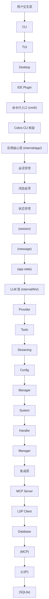
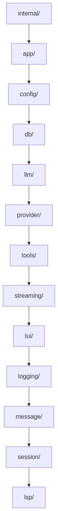
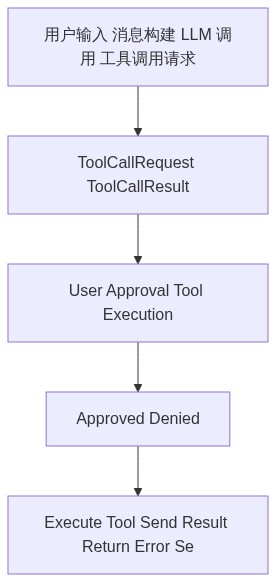
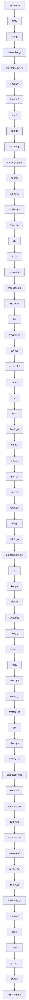
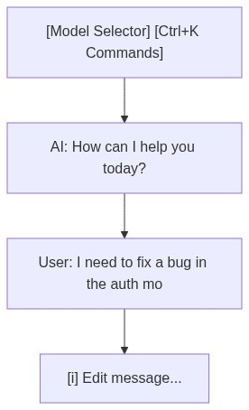
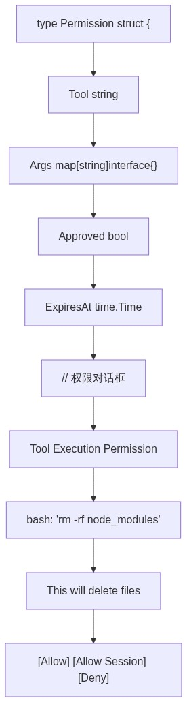

# OpenCode 源码架构分析

> 本文档基于 [opencode-ai/opencode](https://github.com/opencode-ai/opencode) GitHub 仓库分析编写，仓库已迁移至 [Crush](https://github.com/charmbracelet/crush)。

---

## 1. 项目概述

### 1.1 项目定位和目标

OpenCode 是一个开源的 AI 编程代理（AI Coding Agent），帮助开发者在终端、IDE 或桌面端编写代码。项目具有以下核心定位：

- **开源透明**: 完整的源代码开放，社区驱动开发
- **多平台支持**: 终端 CLI、桌面应用、IDE 插件多端覆盖
- **模型无关**: 支持 75+ LLM 提供商，用户可自由选择
- **隐私优先**: 不存储用户代码和上下文数据，可在本地运行

### 1.2 核心功能

| 功能类别 | 具体特性 |
|---------|---------|
| **交互界面** | TUI (Terminal User Interface) 交互界面，基于 Bubble Tea 框架 |
| **AI 模型支持** | OpenAI GPT、Anthropic Claude、Google Gemini、GitHub Copilot、Groq、Azure OpenAI、AWS Bedrock、OpenRouter 等 |
| **会话管理** | SQLite 持久化存储、多会话并行、上下文自动压缩 |
| **文件操作** | glob 模式匹配、grep 搜索、ls 目录浏览、view/write/edit/patch 文件编辑 |
| **终端执行** | bash 命令执行、超时控制、权限管理 |
| **工具集成** | MCP (Model Context Protocol) 扩展、LSP (Language Server Protocol) 语言服务 |
| **网络获取** | URL fetch、Sourcegraph 代码搜索 |

### 1.3 与 Claude Code 的区别

| 维度 | OpenCode | Claude Code |
|------|----------|-------------|
| **开源程度** | 完整开源 (MIT License) | 闭源 |
| **模型选择** | 75+ 提供商，用户自主选择 | 主要使用 Anthropic Claude |
| **部署方式** | 本地运行，无云服务依赖 | CLI 工具，可本地使用 |
| **技术栈** | Go 语言实现 | Rust 语言实现 |
| **扩展机制** | MCP 原生支持 | 插件系统 |
| **数据隐私** | 完全本地化，无数据上传 | 依配置可能涉及云端 |
| **社区生态** | 15万+ GitHub Stars，活跃开源社区 | Anthropic 官方维护 |

---

## 2. 架构设计

### 2.1 整体架构图



### 2.2 核心模块划分



### 2.3 技术栈

| 层级 | 技术选型 | 说明 |
|------|---------|------|
| **语言** | Go 1.24+ | 主要开发语言 |
| **CLI 框架** | Cobra | 命令行参数解析 |
| **TUI 框架** | Bubble Tea | Charm 系列终端 UI 库 |
| **数据库** | SQLite | 会话和消息持久化 |
| **AI 模型** | 多提供商 SDK | OpenAI, Anthropic, Google 等 |
| **协议集成** | MCP, LSP | 扩展和语言服务 |

---

## 3. Agent 实现

### 3.1 模型交互层

#### Provider 架构

OpenCode 采用 Provider 模式支持多 AI 提供商：

```go
// 核心接口定义
type Provider interface {
    Complete(ctx context.Context, req Request) (*Response, error)
    Stream(ctx context.Context, req Request) (*StreamReader, error)
    GetModels() []Model
}
```

**支持的 Provider 类型**:

| Provider | 支持模型 | 认证方式 |
|----------|---------|---------|
| `openai` | GPT-4.1, GPT-4o, O1/O3, O4 Mini | API Key |
| `anthropic` | Claude 3.5-4.7 全系列 | API Key |
| `copilot` | GPT-4, Claude 3.5/3.7 | GitHub Token |
| `gemini` | Gemini 2.0/2.5 系列 | API Key |
| `groq` | Llama 4, QWQ-32b, DeepSeek R1 | API Key |
| `azure` | GPT-4 系列 | Azure OpenAI Endpoint |
| `bedrock` | Claude on AWS | AWS Credentials |
| `openrouter` | 聚合多模型 | API Key |
| `local` | 自托管模型 | LOCAL_ENDPOINT |

#### 请求构建

```go
type Request struct {
    Model     string
    Messages  []Message
    Tools     []Tool
    MaxTokens int
    // ... 其他参数
}
```

### 3.2 工具系统

#### 内置工具列表

| 工具名 | 功能描述 | 参数 |
|--------|---------|------|
| `glob` | 模式匹配查找文件 | pattern, path |
| `grep` | 搜索文件内容 | pattern, path, include, literal_text |
| `ls` | 列出目录内容 | path, ignore |
| `view` | 查看文件内容 | file_path, offset, limit |
| `write` | 写入文件 | file_path, content |
| `edit` | 编辑文件 | 多种编辑参数 |
| `patch` | 应用 diff 补丁 | file_path, diff |
| `diagnostics` | 获取诊断信息 | file_path |
| `bash` | 执行 shell 命令 | command, timeout |
| `fetch` | 获取 URL 内容 | url, format, timeout |
| `sourcegraph` | Sourcegraph 搜索 | query, count, context_window |
| `agent` | 运行子任务代理 | prompt |

#### 工具调用流程



### 3.3 状态管理

#### 应用状态结构

```go
type AppState struct {
    Session     *Session
    Messages    []Message
    Config      *Config
    LLMProvider *LLMProvider
    MCPServers  map[string]*MCPServer
    LSPClients  map[string]*LSPClient
    // ...
}
```

#### 会话管理

OpenCode 使用 SQLite 存储会话：

```sql
CREATE TABLE sessions (
    id TEXT PRIMARY KEY,
    title TEXT,
    summary TEXT,
    created_at DATETIME,
    updated_at DATETIME,
    model TEXT,
    metadata JSON
);
```

**会话特性**:
- **自动压缩 (Auto Compact)**: 上下文达到 95% 时自动摘要
- **历史记录**: 完整保留对话历史
- **元数据**: 存储模型、配置等会话信息

---

## 4. 源码目录结构分析

### 4.1 目录树



### 4.2 各模块职责

#### cmd/ - 命令行入口

| 文件 | 职责 |
|------|------|
| `root.go` | 根命令定义，全局 flag 定义 |
| `interactive.go` | 交互模式启动，加载 TUI |
| `noninteractive.go` | `-p` 参数模式，单次 prompt 执行 |
| `flags.go` | 命令行参数定义 |

#### internal/app/ - 应用核心

| 文件 | 职责 |
|------|------|
| `app.go` | 应用主循环，状态初始化 |
| `session.go` | 会话生命周期管理 |
| `messaging.go` | 消息队列和分发 |

#### internal/llm/ - 模型交互

| 文件 | 职责 |
|------|------|
| `provider.go` | Provider 接口定义，工厂方法 |
| `openai/*.go` | OpenAI API 实现 |
| `anthropic/*.go` | Anthropic Claude API 实现 |
| `gemini/*.go` | Google Gemini API 实现 |

#### internal/tools/ - 工具实现

每个工具独立文件，遵循统一接口：

```go
type Tool interface {
    Name() string
    Description() string
    Parameters() map[string]Parameter
    Execute(ctx context.Context, params map[string]interface{}) (*Result, error)
}
```

#### internal/tui/ - 终端界面

基于 Bubble Tea 的组件化 UI：



---

## 5. 关键实现细节

### 5.1 流式处理

OpenCode 使用 Go 的 channel 和 goroutine 实现流式响应：

```go
type StreamReader struct {
    Ch  <-chan string
    Err <-chan error
}

func (p *Provider) Stream(ctx context.Context, req Request) (*StreamReader, error) {
    ch := make(chan string)
    errCh := make(chan error)

    go func() {
        defer close(ch)
        defer close(errCh)
        // 流式读取响应
        reader, err := p.client.Stream(req)
        if err != nil {
            errCh <- err
            return
        }
        for {
            chunk, err := reader.Next()
            if err == io.EOF {
                return
            }
            ch <- chunk.Content
        }
    }()

    return &StreamReader{Ch: ch, Err: errCh}, nil
}
```

**TUI 流式渲染**:

```go
func (m Model) Update(msg tea.Msg) (tea.Model, tea.Cmd) {
    switch msg := msg.(type) {
    case llm.StreamChunk:
        // 增量更新消息内容
        m.CurrentMessage.Content += msg.Content
        return m, nil
    case llm.StreamEnd:
        // 流式结束，保存完整消息
        m.Messages = append(m.Messages, m.CurrentMessage)
        return m, nil
    }
}
```

### 5.2 上下文管理

#### 消息构建

```go
func BuildMessages(session *Session, newMessage string) []Message {
    messages := []Message{}

    // 添加系统提示
    messages = append(messages, Message{
        Role:    "system",
        Content: session.SystemPrompt,
    })

    // 添加历史消息
    for _, msg := range session.History {
        messages = append(messages, Message{
            Role:    msg.Role,
            Content: msg.Content,
        })
    }

    // 添加新消息
    messages = append(messages, Message{
        Role:    "user",
        Content: newMessage,
    })

    return messages
}
```

#### 自动压缩 (Auto Compact)

当上下文接近限制时自动摘要：

```go
func ShouldCompact(session *Session, config *LLMConfig) bool {
    if !config.AutoCompact {
        return false
    }

    // 计算 token 使用量
    usedTokens := CountTokens(session.Messages)
    maxTokens := config.MaxContextTokens

    // 超过 95% 时触发压缩
    return float64(usedTokens) / float64(maxTokens) > 0.95
}

func CompactSession(session *Session) *Session {
    summary := SummarizeMessages(session.Messages)

    return &Session{
        ID:        GenerateID(),
        Summary:   summary,
        Messages: []Message{
            {Role: "system", Content: "以下是会话摘要: " + summary},
        },
    }
}
```

### 5.3 错误处理

#### 分层错误处理

```go
// 工具执行错误
type ToolError struct {
    Tool     string
    Message  string
    ExitCode int
    stderr   string
}

// LLM 调用错误
type LLMError struct {
    Provider string
    Code     string
    Message  string
    Retryable bool
}

// 用户操作取消
type UserCancelledError struct{}
```

#### 重试机制

```go
func (p *Provider) CompleteWithRetry(ctx context.Context, req Request) (*Response, error) {
    maxRetries := 3
    backoff := time.Second

    for i := 0; i < maxRetries; i++ {
        resp, err := p.Complete(ctx, req)
        if err == nil {
            return resp, nil
        }

        if !IsRetryable(err) {
            return nil, err
        }

        select {
        case <-ctx.Done():
            return nil, ctx.Err()
        case <-time.After(backoff):
            backoff *= 2
        }
    }

    return nil, fmt.Errorf("max retries exceeded")
}
```

---

## 6. 扩展机制

### 6.1 MCP 支持

#### MCP 协议实现

Model Context Protocol 允许连接外部工具服务器：

```go
type MCPServer struct {
    Name    string
    Type    string  // "stdio" 或 "sse"
    Command []string
    Env     map[string]string
    URL     string
}

type MCPTool struct {
    Name        string
    Description string
    InputSchema map[string]interface{}
}
```

#### 配置示例

```json
{
  "mcpServers": {
    "filesystem": {
      "type": "stdio",
      "command": "npx",
      "args": ["-y", "@modelcontextprotocol/server-filesystem"],
      "env": {},
      "workingDirectory": "/tmp"
    },
    "github": {
      "type": "sse",
      "url": "https://api.example.com/mcp",
      "headers": {
        "Authorization": "Bearer token"
      }
    }
  }
}
```

#### 工具调用流程

```
OpenCode → MCP Client → JSON-RPC Request
                            ↓
                      MCP Server
                            ↓
                      Tool Execution
                            ↓
                      JSON-RPC Response
                            ↓
OpenCode ← MCP Client ← Tool Result
```

### 6.2 MCP 工具系统

#### 内置工具

| 工具 | 实现位置 | 功能 |
|------|---------|------|
| `glob` | `tools/glob.go` | 文件模式搜索 |
| `grep` | `tools/grep.go` | 正则/字符串搜索 |
| `ls` | `tools/ls.go` | 目录列表 |
| `view` | `tools/view.go` | 文件内容查看 |
| `write` | `tools/write.go` | 文件写入 |
| `edit` | `tools/edit.go` | 精确文本替换 |
| `patch` | `tools/patch.go` | Git-style diff |
| `bash` | `tools/bash.go` | Shell 命令执行 |
| `fetch` | `tools/fetch.go` | HTTP 请求 |
| `sourcegraph` | `tools/sourcegraph.go` | 代码库搜索 |

#### 工具执行权限



### 6.3 LSP 集成

#### LSP Client 实现

基于 `langserver.org` 协议实现：

```go
type LSPClient struct {
    Name    string
    Command []string
    conn    *jsonrpc2.Conn
    drafts  *lsp.CallHierarchy
}

func (c *LSPClient) Initialize(rootPath string) error {
    params := &lsp.InitializeParams{
        RootURI:      uri.File(rootPath),
        capabilities: c.getCapabilities(),
    }
    // ... 初始化握手
}
```

#### 诊断功能

```go
func (c *LSPClient) GetDiagnostics(file string) ([]Diagnostic, error) {
    params := &lsp.TextDocumentIdentifier{
        URI: uri.File(file),
    }

    resp, err := c.Call("textDocument/diagnostic", params)
    if err != nil {
        return nil, err
    }

    return parseDiagnostics(resp)
}
```

#### 配置示例

```json
{
  "lsp": {
    "go": {
      "disabled": false,
      "command": "gopls"
    },
    "typescript": {
      "disabled": false,
      "command": "typescript-language-server",
      "args": ["--stdio"]
    },
    "python": {
      "disabled": false,
      "command": "pyright-langserver",
      "args": ["--stdio"]
    }
  }
}
```

---

## 7. 配置系统

### 7.1 配置文件位置

按优先级搜索：

1. `./.opencode.json` (项目本地)
2. `$XDG_CONFIG_HOME/opencode/.opencode.json`
3. `$HOME/.opencode.json`

### 7.2 配置结构

```go
type Config struct {
    Data     DataConfig     `json:"data"`
    Providers ProvidersConfig `json:"providers"`
    Agents   AgentsConfig    `json:"agents"`
    Shell    ShellConfig     `json:"shell"`
    MCPServers map[string]MCPServer `json:"mcpServers"`
    LSP      map[string]LSPConfig  `json:"lsp"`
    Debug    bool            `json:"debug"`
    DebugLSP bool            `json:"debugLSP"`
    AutoCompact bool         `json:"autoCompact"`
}
```

### 7.3 环境变量支持

| 变量 | 对应配置 | 说明 |
|------|---------|------|
| `ANTHROPIC_API_KEY` | providers.anthropic.apiKey | Claude API |
| `OPENAI_API_KEY` | providers.openai.apiKey | OpenAI API |
| `GEMINI_API_KEY` | providers.gemini.apiKey | Gemini API |
| `GITHUB_TOKEN` | providers.copilot.apiKey | GitHub Copilot |
| `LOCAL_ENDPOINT` | providers.local.endpoint | 自托管模型 |
| `AWS_*` | providers.bedrock.* | AWS Bedrock |

---

## 8. 与 Claude Code 对比总结

### 8.1 架构差异

| 方面 | OpenCode | Claude Code |
|------|----------|-------------|
| **语言** | Go | Rust |
| **框架** | Bubble Tea (TUI) | 自定义 TUI |
| **存储** | SQLite | 文件系统 |
| **扩展** | MCP 原生 | 插件系统 |

### 8.2 功能对比

| 功能 | OpenCode | Claude Code |
|------|----------|-------------|
| 模型支持 | 75+ 提供商 | 主要 Claude |
| MCP 支持 | 是 | 有限 |
| LSP 集成 | 是 | 是 |
| 会话压缩 | 自动 | 手动触发 |
| 多会话 | 是 | 是 |
| 自托管 | 支持 | 企业版 |

### 8.3 适用场景

**选择 OpenCode**:
- 需要使用非 Claude 模型
- 重视开源和隐私
- 需要 MCP 扩展
- 喜欢 Go 技术栈

**选择 Claude Code**:
- 深度使用 Claude 模型
- 需要 Claude 官方支持
- 企业级需求
- 偏好 Rust 技术栈

---

## 9. 参考资源

- GitHub 仓库: https://github.com/opencode-ai/opencode
- 官方文档: https://opencode.ai/zh
- 迁移项目: https://github.com/charmbracelet/crush
- MCP 协议: https://modelcontextprotocol.io
- LSP 协议: https://microsoft.github.io/language-server-protocol

---

*文档版本: 2026-05-15*
*数据来源: GitHub README, 源码分析, 官方文档*