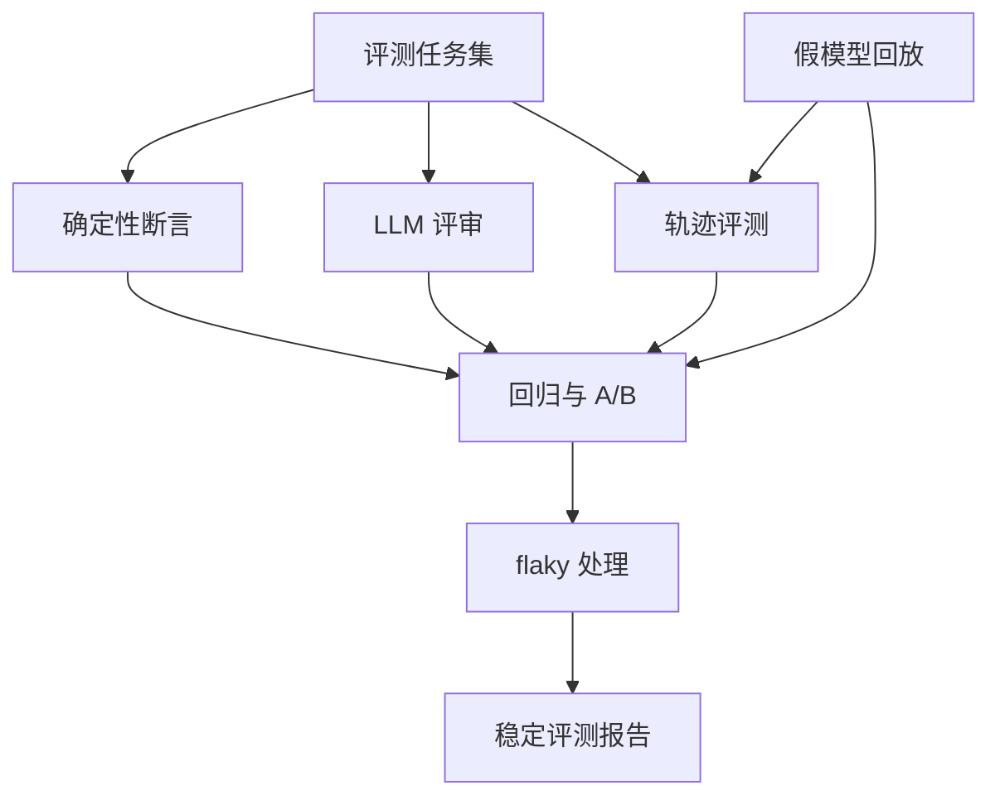
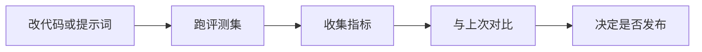
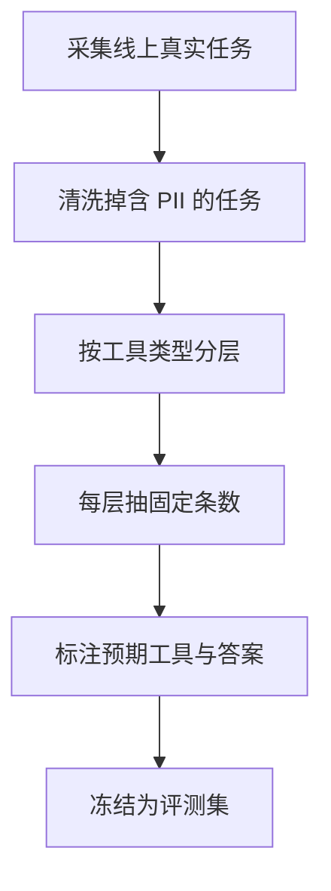
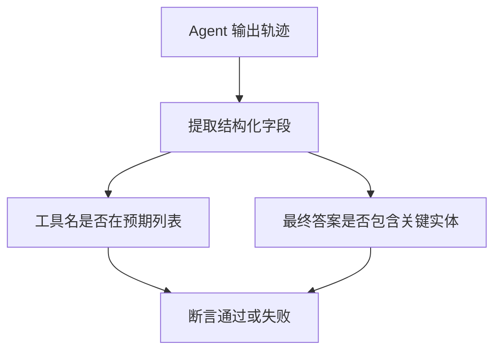
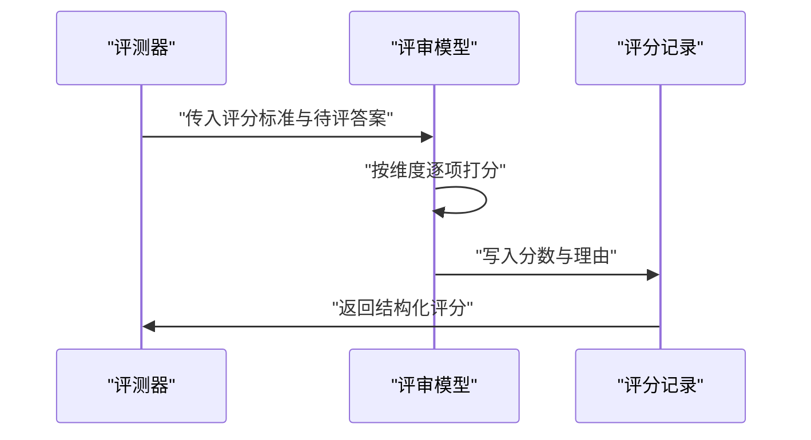
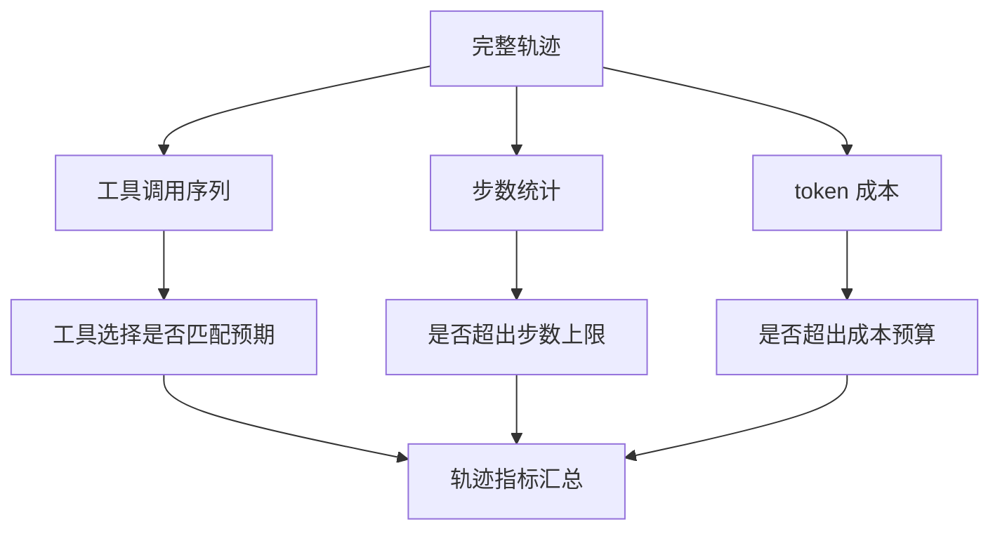
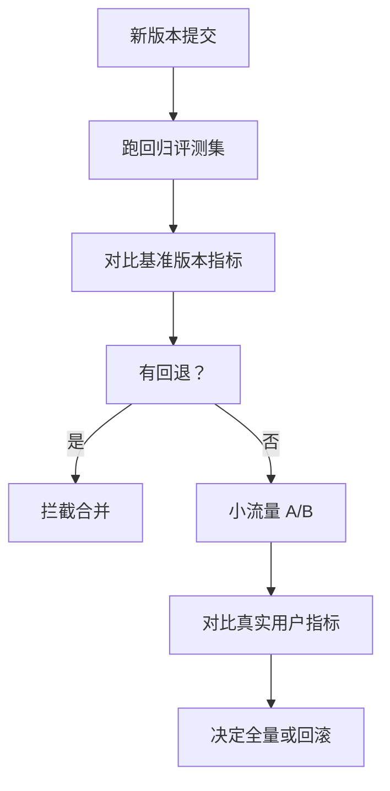
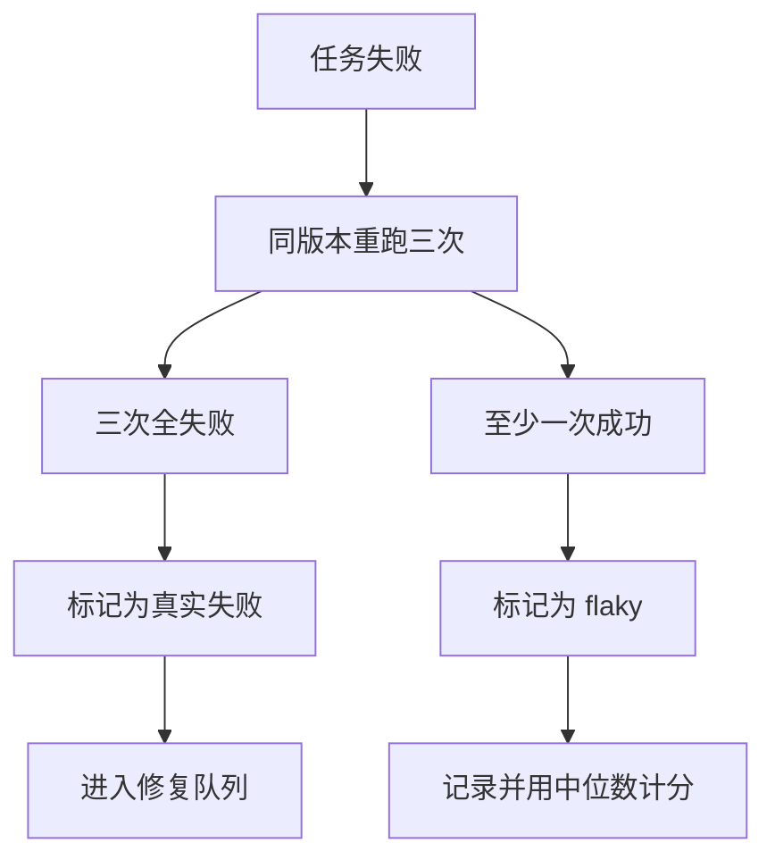
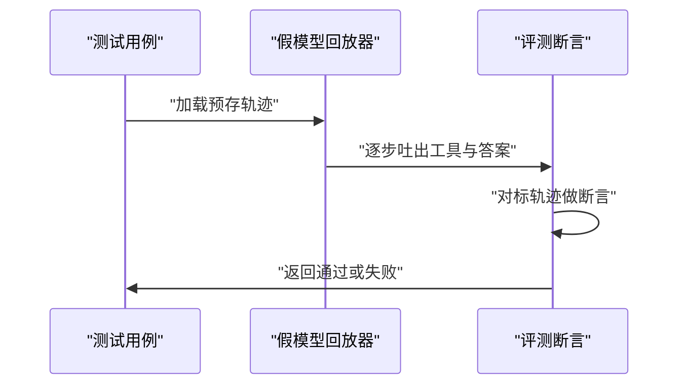

# Agent 评测从零搭建：任务集、轨迹与回归

!!! abstract "学完这一页你能"
    - 能定义一个可复现的 Agent 评测任务集，区分评测集与训练集。
    - 能为工具调用与最终答案写确定性断言，不依赖模型打分。
    - 能把工具选择、步数、成本这些轨迹指标拆成可以上报的数字。
    - 能用假模型回放器重跑历史轨迹，写一个毫秒级回归测试。

## 0. 知识地图



建议这样读：先看任务集怎么造，再看三种评测手段（确定性断言、LLM 评审、轨迹评测），最后看回归、A/B 和 flaky 处理如何把手段串成持续可用的系统。假模型回放是贯穿全页的调试工具，读到回归部分时回头看它。

## 1. 为什么评测是第一件事

**先想一个问题**：你改了 Agent 的提示词，想让它在客服场景里少调用一次查询工具。改完后怎么知道它真的变好了？

!!! note "术语：Agent 评测"
    Agent 评测是让 Agent 在固定任务上运行并采集可比较指标的过程。例如让客服 Agent 回答 20 条固定用户问题，记录每条回答的正确率和工具调用次数。

**心智模型**

!!! tip "心智模型"
    一句话模型：评测就是给 Agent 行为装上一把可重复的尺子。
    日常类比：像学生做同一套试卷，分数才能相互比较。
    类比哪里不成立：Agent 的输出不是单选，可能包含轨迹、工具调用、成本、延迟多个维度。

**图解**



1. 改代码或提示词后，先跑一批固定的评测样本。
2. 评测样本产出多个指标：正确率、工具调用次数、token 成本。
3. 把指标和上次发布版本做对比，有回退就拦截。
4. 通过对比再决定是否发布，而不是凭感觉。

**一步一步来**

这一步要做什么：搭一个最小的评测入口，让 Agent 在固定任务上跑完并输出结果。

```javascript
// 最小评测入口：一条任务、一个 Agent、一个计分函数
const tasks = [
  { id: "t1", question: "用户要退单，给出处理步骤", expectTools: ["refund_policy"] }
];

async function runEval(agent, task) {
  const trace = await agent.run(task.question); // trace 记录工具与答案
  return { taskId: task.id, trace, score: scoreTask(task, trace) };
}
```

**这段代码在做什么**

- `tasks` 是固定任务集，每条任务带一个预期工具名。
- `runEval` 调用 Agent，保留整条轨迹 `trace`。
- `scoreTask` 是计分函数，返回一个数字或布尔值。
- 保持入口简单，后续所有评测都围绕 `trace` 展开。

**动手验证**

```javascript
// 验证最小评测入口能跑通（依赖：无）
import assert from "node:assert";

const tasks = [
  { id: "t1", question: "用户要退单", expectTools: ["refund_policy"] }
];

function fakeAgent(question) {
  return { answer: "先查退单政策", tools: ["refund_policy"] };
}

function scoreTask(task, trace) {
  return task.expectTools.every(t => trace.tools.includes(t));
}

async function runEval(agent, task) {
  const trace = await agent(task.question);
  return { taskId: task.id, score: scoreTask(task, trace) };
}

const result = await runEval(fakeAgent, tasks[0]);
assert.equal(result.score, true);
console.log(JSON.stringify(result));
```

预期输出：`{"taskId":"t1","score":true}`

**常见坑**

| 现象 | 原因 | 怎么修 |
|---|---|---|
| 评测结果每次不同 | Agent 输出有随机性 | 固定 temperature 或多次采样取中位数 |
| 只测了一条任务 | 覆盖不够 | 从真实日志中抽 20 条起步 |
| 只看最终答案 | 忽略中间轨迹 | 把 `trace` 完整保存后再计分 |

**用在哪里**

- 客服 Agent 上线前的质量门禁：业务背景是每次改提示词都需要确认不破坏已有能力；这一节的知识提供最小评测入口；衡量指标是评测通过率；当任务集少于 20 条时不宜用作门禁。
- 代码助手的功能回归：业务背景是修复一个 bug 可能引入另一种行为变化；用固定任务集跑回归；衡量指标是回归失败数；当变化只影响与 Agent 逻辑无关的 UI 时不需要跑全量评测。

**行业实践**

- Anthropic 在构建多智能体研究系统时，先用约 20 条代表真实使用的 query 起步，再用 LLM-as-judge 打分，同时保留人工测试补盲（来源：Anthropic 研究系统文章，以原文为准）。
- 该团队把投入规模规则写进 prompt，例如简单查询 1 个 agent、3-10 次工具调用，直接对比 2-4 个 subagent（来源：Anthropic 研究系统文章，以原文为准）。
- 可以借鉴：把评测集按难度分层，每层约定工具调用次数上限，超出即视为失败。

**小结**

1. 评测是给 Agent 行为装一把可重复的尺子。
2. 评测入口要保留完整轨迹，不能只看最终答案。
3. 从少量真实任务起步，逐步扩展到能拦截回归。

## 2. 评测集构造：从真实任务到可复现样本

**先想一个问题**：你的 Agent 每周处理 1000 条用户请求，其中 30 条失败了。你只把这 30 条拿来当评测集，够不够？

!!! note "术语：评测集"
    评测集是从真实流量中抽取并冻结的一组任务，每条包含输入、预期工具与预期答案。例如从 1000 条客服日志中按工具类型分层抽 60 条，标注预期退款步骤后冻结。

**心智模型**

!!! tip "心智模型"
    一句话模型：评测集是固定下来的真实任务快照，不是失败案例合集。
    日常类比：像考试卷要覆盖容易、中等、难三档，而不是只出学生做错的题。
    类比哪里不成立：Agent 任务的难度和取值空间比考试题复杂得多，需要按工具类型和流程长度分层。

**图解**



1. 从线上日志中取真实任务，而不是人工编造。
2. 清洗掉包含个人数据、身份证号、邮箱等敏感信息的任务。
3. 按工具类型分层，如查询类、写入类、多步推理类。
4. 每层抽固定条数，避免某一类任务过多。
5. 标注预期工具与答案后冻结，不再随意修改。

**一步一步来**

这一步要做什么：写一个分层抽样函数，把真实任务按工具类型分层后抽固定数量。

```javascript
// 按工具类型分层抽样
function sampleTasks(logs, sizePerLayer) {
  const byTool = new Map(); // 工具类型 -> 任务列表
  for (const log of logs) {
    const key = log.toolType; // toolType 来自日志标注
    if (!byTool.has(key)) byTool.set(key, []);
    byTool.get(key).push(log);
  }
  const sampled = [];
  for (const [key, items] of byTool) {
    const pick = items.slice(0, sizePerLayer); // 每层取前 N 条
    sampled.push(...pick);
  }
  return sampled;
}
```

**这段代码在做什么**

- `byTool` 把日志按 `toolType` 分组。
- `sizePerLayer` 控制每层抽取数量。
- 使用 `slice` 做简单抽样，生产环境可换成随机抽样。
- 返回的 `sampled` 可以标注后冻结为评测集。

**动手验证**

```javascript
// 验证分层抽样不偏向某一种工具
import assert from "node:assert";

function sampleTasks(logs, sizePerLayer) {
  const byTool = new Map();
  for (const log of logs) {
    const key = log.toolType;
    if (!byTool.has(key)) byTool.set(key, []);
    byTool.get(key).push(log);
  }
  const sampled = [];
  for (const [key, items] of byTool) {
    const pick = items.slice(0, sizePerLayer);
    sampled.push(...pick);
  }
  return sampled;
}

const logs = [
  { id: 1, toolType: "query" },
  { id: 2, toolType: "query" },
  { id: 3, toolType: "write" },
  { id: 4, toolType: "write" },
  { id: 5, toolType: "query" },
];

const result = sampleTasks(logs, 2);
const counts = result.reduce((acc, r) => {
  acc[r.toolType] = (acc[r.toolType] || 0) + 1;
  return acc;
}, {});
assert.deepEqual(counts, { query: 2, write: 2 });
console.log(JSON.stringify(counts));
```

预期输出：`{"query":2,"write":2}`

**常见坑**

| 现象 | 原因 | 怎么修 |
|---|---|---|
| 评测集只含失败案例 | 从事故复盘里选材 | 从线上全量日志抽样 |
| 样本含有隐私数据 | 未做脱敏 | 清洗 PII 后再入库 |
| 每层样本数不固定 | 使用的是简单随机抽样 | 改用分层抽样 |

**用在哪里**

- 客服 Agent 周迭代评测：业务背景是每周要确认新版本不退化；按工具类型分层后每层固定抽 20 条；衡量指标是各层通过率；当线上任务分布变化快时需要重新采样。
- 金融分析 Agent 回归集维护：业务背景是监管要求每次发布可回溯；把高质量标注样本冻结为固定评测集；衡量指标是冻结集上的准确率；当业务规则变化时需要同步更新预期答案。

**行业实践**

- Anthropic 在构建研究系统时，评测集从约 20 条代表真实使用的 query 起步，覆盖简单、对比、复杂研究三类任务（来源：Anthropic 研究系统文章，以原文为准）。
- 这些 query 按投入规模规则分档：简单查询 1 个 agent、复杂研究 10+ subagent（来源：Anthropic 研究系统文章，以原文为准）。
- 可以借鉴：给每条评测样本标注期望投入档位，超出档位即判定为低效。

**小结**

1. 评测集是固定任务快照，不是失败案例合集。
2. 用分层抽样保证每种工具类型都有覆盖。
3. 样本冻结后，预期答案改动要走变更流程。

## 3. 确定性断言：能确定的先确定

**先想一个问题**：Agent 回答"用户要退单"时调用了 `refund_policy` 工具，但最后答案里漏了退款金额。你怎么在自动化测试里抓住这个错？

!!! note "术语：确定性断言"
    确定性断言是对可验证事实直接判断真伪的检查，不经过模型打分。例如检查答案文本中是否包含"退款金额"这个必须出现的实体。

**心智模型**

!!! tip "心智模型"
    一句话模型：确定性断言是对可验证事实直接判真伪，不经过模型打分。
    日常类比：像检查发票金额是否等于商品价格加税费。
    类比哪里不成立：Agent 的自然语言答案中有很多语义等价表达，不能只用字符串比较。

**图解**



1. 先把 Agent 轨迹中的工具名、答案文本、关键实体提取成结构化字段。
2. 工具名检查：调用过的工具是否覆盖了预期工具。
3. 答案实体检查：最终答案里是否出现了必须包含的关键信息。
4. 两项都通过才算断言通过，失败则记录具体缺失项。

**一步一步来**

这一步要做什么：写一个组合断言，检查工具调用和答案中的关键实体。

```javascript
// 确定性断言：检查工具与关键实体
function assertTools(trace, expectTools) {
  const called = new Set(trace.tools);
  return expectTools.every(t => called.has(t));
}

function assertEntities(answer, expectEntities) {
  return expectEntities.every(e => answer.includes(e));
}

function runDeterministic(task, trace) {
  return {
    taskId: task.id,
    toolsPass: assertTools(trace, task.expectTools),
    entitiesPass: assertEntities(trace.answer, task.expectEntities),
  };
}
```

**这段代码在做什么**

- `assertTools` 把工具调用列表转成 Set，检查每个预期工具是否被调用。
- `assertEntities` 检查答案文本中是否包含每个关键实体。
- `runDeterministic` 返回每个检查项的独立通过状态。
- 这种细粒度结果是写回归报告的基础，失败时能直接看到缺哪一项。

**动手验证**

```javascript
// 验证确定性断言能抓住漏掉实体的错误
import assert from "node:assert";

function assertTools(trace, expectTools) {
  const called = new Set(trace.tools);
  return expectTools.every(t => called.has(t));
}

function assertEntities(answer, expectEntities) {
  return expectEntities.every(e => answer.includes(e));
}

function runDeterministic(task, trace) {
  return {
    taskId: task.id,
    toolsPass: assertTools(trace, task.expectTools),
    entitiesPass: assertEntities(trace.answer, task.expectEntities),
  };
}

const task = { id: "t1", expectTools: ["refund_policy"], expectEntities: ["退款金额"] };
const trace = { tools: ["refund_policy"], answer: "请先查看退款政策。" }; // 漏掉退款金额
const result = runDeterministic(task, trace);
assert.equal(result.toolsPass, true);
assert.equal(result.entitiesPass, false);
console.log(JSON.stringify(result));
```

预期输出：`{"taskId":"t1","toolsPass":true,"entitiesPass":false}`

**常见坑**

| 现象 | 原因 | 怎么修 |
|---|---|---|
| 断言总假 | 关键实体用了同义词 | 预期实体写多个同义表达 |
| 断言总真 | 只检查工具名 | 同时检查实体和数字 |
| 失败信息不明确 | 只返回布尔值 | 返回每项检查的独立结果 |

**用在哪里**

- 客服退款流程回归：业务背景是退款答案必须包含退款金额与到账时间；用确定性断言检查这两个实体；衡量指标是实体覆盖率；当退款规则本身变化时需更新预期实体。
- 数据查询 Agent 工具约束：业务背景是某些任务禁止调用写工具；用断言确保调用工具在允许列表内；衡量指标是违规调用数；当新增工具时需要同步更新允许列表。

**行业实践**

- Anthropic 的 LLM-as-judge 单次 prompt 按 0.0-1.0 打分，维度包括事实准确、引用准确、完整性、来源质量、工具效率，但该团队仍保留人工测试补盲（来源：Anthropic 研究系统文章，以原文为准）。
- 这里强调的是：先做确定性断言，再做模型打分，能减少评审成本。
- 可以借鉴：在评测流水线里，确定性断言先跑，全部通过后才进入 LLM 评审环节。

**小结**

1. 确定性断言针对可验证事实，不需要调用模型。
2. 工具名和关键实体是最常见的确定性检查项。
3. 失败结果要细分到具体检查项，才能快速定位。

## 4. LLM 评审：用模型打分要小心

**先想一个问题**：Agent 回答"可以退款"，说得没错但没提运费。人一眼能看出来，但规则写不全。这类语义合格但信息不完整的答案怎么自动打分？

!!! note "术语：LLM 评审"
    LLM 评审是用一个模型给另一个模型的输出打分，评测语义质量。例如把 Agent 答案和评分维度传给评审模型，让它对完整性打 0.7 分并说明理由。

**心智模型**

!!! tip "心智模型"
    一句话模型：LLM 评审是用一个模型给另一个模型的输出打分，评测的是语义质量。
    日常类比：像请一位老师给作文打分，分数有主观空间，所以要给点评分标准。
    类比哪里不成立：模型打分会随 prompt 和顺序波动，不能当作精确测量。

**图解**



1. 评测器把评分维度和待评答案一起传给评审模型。
2. 评审模型按维度逐项打分，而不是给一个笼统总分。
3. 每个维度要同时产出分数和一句理由。
4. 评分记录结构化保存，方便后续做一致性质检。

**一步一步来**

这一步要做什么：写一个按维度打分的 LLM 评审 prompt 模板，并解析评审输出。

```javascript
// LLM 评审模板：要求按维度打分并给出理由
function buildJudgePrompt(answer, context) {
  return [
    "你是评测员。请按以下维度给答案打分，每项 0-1 分：",
    "1. 事实准确 2. 完整性 3. 来源质量",
    '输出 JSON：{"fact": 0.5, "completeness": 0.5, "source": 0.5, "reason": "..."}',
    `背景：${context}`,
    `答案：${answer}`,
  ].join("\n");
}

// 解析评审输出并做范围检查
function parseJudgeOutput(raw) {
  const parsed = JSON.parse(raw); // 假设模型返回合法 JSON
  for (const key of ["fact", "completeness", "source"]) {
    if (parsed[key] < 0 || parsed[key] > 1) throw new Error(`分数越界: ${key}`);
  }
  return parsed;
}
```

**这段代码在做什么**

- `buildJudgePrompt` 生成评分 prompt，维度固定为三个，要求输出 JSON。
- 三个维度借鉴了 Anthropic 在实际评测中使用的维度（来源：Anthropic 研究系统文章，以原文为准）。
- `parseJudgeOutput` 对每个维度做 0-1 范围检查。
- 越界时直接抛错，使评测失败可见，而不是静默通过。
- 这种防御式检查是 LLM 评审中的必要步骤。

**动手验证**

```javascript
// 验证评审解析能捕获越界分数
import assert from "node:assert";

function parseJudgeOutput(raw) {
  const parsed = JSON.parse(raw);
  for (const key of ["fact", "completeness", "source"]) {
    if (parsed[key] < 0 || parsed[key] > 1) throw new Error(`分数越界: ${key}`);
  }
  return parsed;
}

const good = '{"fact":0.8,"completeness":0.7,"source":0.6,"reason":"基本准确"}';
const parsed = parseJudgeOutput(good);
assert.equal(parsed.fact, 0.8);
console.log(JSON.stringify(parsed));

const bad = '{"fact":1.5,"completeness":0.7,"source":0.6,"reason":"异常"}';
assert.throws(() => parseJudgeOutput(bad), /分数越界/);
console.log("越界分数被拒绝");
```

预期输出：先输出 parsed 对象，再输出"越界分数被拒绝"。

**常见坑**

| 现象 | 原因 | 怎么修 |
|---|---|---|
| 分数随顺序变化 | 评审模型有位置偏好 | 固定答案顺序或多次采样 |
| 输出不是 JSON | 模型没遵守格式约束 | 用结构化输出能力或加解析失败重试 |
| 分数虚高 | 评审标准宽松 | 在 prompt 里给具体扣分规则 |

**用在哪里**

- 内容审核 Agent 质量抽检：业务背景是人工审核成本高，需要模型做初筛；用 LLM 评审给每个维度打分；衡量指标是人工抽检一致率；当评审模型与业务规则不一致时需重新校准。
- 搜索 Agent 来源质量评估：业务背景是回答要附带可信来源；评审时对来源质量单独打分；衡量指标是来源质量分数；当来源范围扩大时需要更新评分标准。

**行业实践**

- Anthropic 在设计 LLM-as-judge 时，单次 prompt 按 0.0-1.0 打分，覆盖事实准确、引用准确、完整性、来源质量、工具效率五个维度（来源：Anthropic 研究系统文章，以原文为准）。
- 该团队把 LLM 评审作为辅助手段，而不是唯一依据，同时进行人工测试补盲（来源：Anthropic 研究系统文章，以原文为准）。
- 可以借鉴：每个维度输出独立分数，而不是一个总分，方便追踪具体是哪一类质量退化。

**小结**

1. LLM 评审是评语义质量，不是精确测量。
2. 按维度打分并输出理由，比给总分更可定位问题。
3. 解析评审输出要做范围检查，防止越界分数静默通过。

## 5. 轨迹评测：工具选择、步数与成本

**先想一个问题**：Agent 最终答对了，但它调用了 3 次无关工具，浪费了 2 倍 token。正确率看不出来这个问题。你怎么把轨迹效率也纳入评测？

!!! note "术语：轨迹"
    轨迹是 Agent 从开始到结束的完整步骤记录，包含思考步、工具调用和最终答案。例如一条轨迹有 2 个工具调用步和 1 个答案步，总计 3 步。

**心智模型**

!!! tip "心智模型"
    一句话模型：轨迹评测把过程拆成可比较的指标，不只评结果正确。
    日常类比：像开车上班，既关心准时到达，也关心油耗、路线是否绕路。
    类比哪里不成立：Agent 的轨迹指标之间会互相制约，不能只看单个指标。

**图解**



1. 从轨迹中分别提取工具序列、步数、token 成本三个指标。
2. 工具选择与预期工具列表做匹配。
3. 步数与预设上限比较。
4. token 成本与预算比较。
5. 三个指标汇总后作为轨迹评测结果。

**一步一步来**

这一步要做什么：从轨迹中提取三个可比较的指标，并用阈值做断言。

```javascript
// 从轨迹提取工具选择、步数、成本指标
function extractMetrics(trace) {
  const toolCalls = trace.steps.filter(s => s.type === "tool_call");
  return {
    toolSequence: toolCalls.map(s => s.toolName),
    stepCount: trace.steps.length,
    tokenUsed: trace.steps.reduce((sum, s) => sum + (s.tokenCount || 0), 0),
  };
}

// 轨迹断言：工具序列匹配 + 步数和成本不超限
function assertTrajectory(trace, expected) {
  const m = extractMetrics(trace);
  const toolOk = JSON.stringify(m.toolSequence) === JSON.stringify(expected.toolSequence);
  const stepOk = m.stepCount <= expected.maxSteps;
  const costOk = m.tokenUsed <= expected.maxTokens;
  return { toolOk, stepOk, costOk, metrics: m };
}
```

**这段代码在做什么**

- `extractMetrics` 只取工具调用步，统计步数和 token 总数。
- `toolSequence` 输出工具名序列，便于与预期比较。
- `assertTrajectory` 中工具序列用精确匹配，适合固定流程任务。
- 步数和成本用上限做断言，允许小幅波动。
- 返回三个布尔结果和原始指标，方便写报告。

**动手验证**

```javascript
// 验证轨迹断言能抓住多余的工具调用
import assert from "node:assert";

function extractMetrics(trace) {
  const toolCalls = trace.steps.filter(s => s.type === "tool_call");
  return {
    toolSequence: toolCalls.map(s => s.toolName),
    stepCount: trace.steps.length,
    tokenUsed: trace.steps.reduce((sum, s) => sum + (s.tokenCount || 0), 0),
  };
}

function assertTrajectory(trace, expected) {
  const m = extractMetrics(trace);
  const toolOk = JSON.stringify(m.toolSequence) === JSON.stringify(expected.toolSequence);
  const stepOk = m.stepCount <= expected.maxSteps;
  const costOk = m.tokenUsed <= expected.maxTokens;
  return { toolOk, stepOk, costOk, metrics: m };
}

const trace = { steps: [
  { type: "tool_call", toolName: "search", tokenCount: 100 },
  { type: "tool_call", toolName: "extra_tool", tokenCount: 50 },
  { type: "answer", tokenCount: 30 },
] };
const expected = { toolSequence: ["search"], maxSteps: 2, maxTokens: 200 };
const result = assertTrajectory(trace, expected);
assert.equal(result.toolOk, false);
assert.equal(result.stepOk, false);
assert.equal(result.costOk, true);
console.log(JSON.stringify(result.metrics));
```

预期输出：`{"toolSequence":["search","extra_tool"],"stepCount":3,"tokenUsed":180}`

**常见坑**

| 现象 | 原因 | 怎么修 |
|---|---|---|
| 轨迹断言总有波动 | 工具调用顺序随机 | 对顺序敏感的任务用精确匹配，其他用集合匹配 |
| token 成本不稳定 | 模型输出长度不同 | 设置一个宽松的上限而非精确值 |
| 只统计工具步 | 漏掉思考步的开销 | 把思考步也纳入 stepCount |

**用在哪里**

- 客服 Agent 响应耗时优化：业务背景是用户等太久会流失；用轨迹评测跟踪步数和 token；衡量指标是 P50 步数和 token；当硬件或模型改变时需重新校准阈值。
- 搜索 Agent 路由质量监控：业务背景是选错工具会给用户错误结果；用工具序列与预期对比；衡量指标是工具序列匹配率；当新增工具时需更新预期序列。

**行业实践**

- Anthropic 在 token 维度上给出明确数据：多智能体系统比普通 chat 多耗约 15 倍 token，agent 比 chat 多耗约 4 倍（来源：Anthropic 研究系统文章，以原文为准）。
- 该团队还观察到，在 BrowseComp 评测中，仅 token 用量就解释了约 80% 的性能方差（来源：Anthropic 研究系统文章，以原文为准）。
- 可以借鉴：在评测报告中，把 token 用量作为独立维度上报，并与性能分数并列展示。

**小结**

1. 轨迹评测把过程纳入指标，而不只评结果。
2. 工具序列、步数、token 成本是三个可比较的轨迹指标。
3. 用阈值做断言，允许小幅波动但拦住明显退化。

## 6. 回归与 A/B：改代码不改行为

**先想一个问题**：你优化了提示词，让 Agent 少调用一次工具，结果原本能答对的 3 条任务现在错了 1 条。你怎么在合并前发现这个回退？

**心智模型**

!!! tip "心智模型"
    一句话模型：回归测试是在每个版本上跑同一评测集，A/B 是把新旧版本放一起比。
    日常类比：像发版前在测试环境跑一遍旧用例，再在灰度环境对比新旧版本。
    类比哪里不成立：Agent 评测不是全绿了就安全，指标可能都改进了但成本翻了 3 倍。

**图解**



1. 新版本提交后，先在固定评测集上跑回归。
2. 把结果与基准版本的指标逐项对比。
3. 有任何一项回退就拦截合并。
4. 评测通过后再做小流量 A/B。
5. A/B 在真实用户上观察指标，再决定全量还是回滚。

**一步一步来**

这一步要做什么：写一个对比函数，判断新版本是否在任一指标上回退。

```javascript
// 回归对比：任一关键指标回退则返回 false
function isNotRegression(newMetrics, baseline, tolerance = 0.05) {
  return {
    score: newMetrics.score >= baseline.score * (1 - tolerance),
    stepCount: newMetrics.stepCount <= baseline.stepCount * (1 + tolerance),
    tokenUsed: newMetrics.tokenUsed <= baseline.tokenUsed * (1 + tolerance),
  };
}
```

**这段代码在做什么**

- `tolerance` 控制容忍度，避免小波动触发误报。
- 分数允许下降 5% 以内，步数和成本允许上升 5% 以内。
- 三个指标独立判断，方便定位是哪个指标回退。
- 这种带容忍度的对比比"全绿才过"更接近工程实践。

**动手验证**

```javascript
// 验证回归对比能拦住成本翻倍
import assert from "node:assert";

function isNotRegression(newMetrics, baseline, tolerance = 0.05) {
  return {
    score: newMetrics.score >= baseline.score * (1 - tolerance),
    stepCount: newMetrics.stepCount <= baseline.stepCount * (1 + tolerance),
    tokenUsed: newMetrics.tokenUsed <= baseline.tokenUsed * (1 + tolerance),
  };
}

const baseline = { score: 0.8, stepCount: 4, tokenUsed: 1000 };
const newMetrics = { score: 0.82, stepCount: 5, tokenUsed: 3000 };
const result = isNotRegression(newMetrics, baseline);
assert.equal(result.score, true);
assert.equal(result.stepCount, true);
assert.equal(result.tokenUsed, false);
console.log(JSON.stringify(result));
```

预期输出：`{"score":true,"stepCount":true,"tokenUsed":false}`

**常见坑**

| 现象 | 原因 | 怎么修 |
|---|---|---|
| 指标都在容差内但体验变差 | 只看聚合均值 | 分层看分布，如 P90 数据 |
| 回归基准本身有 flaky | 基准分数来自一次运行 | 用多次运行的中位数做基准 |
| 拦截太严导致不敢发版 | 容差为 0 | 根据业务可接受范围设置容忍度 |

**用在哪里**

- 电商客服 Agent 发版门禁：业务背景是每次发版都要确认不破坏已有能力；用回归评测集加带容忍度的对比；衡量指标是回退拦截率；当任务集覆盖不足时不宜作为唯一门禁。
- 代码生成助手 A/B 实验：业务背景是改进 prompt 后不确定真实效果；小流量 A/B 对比用户采纳率；衡量指标是采纳率和工具调用成功率；当流量太小无法达到统计显著时不宜下结论。

**行业实践**

- Anthropic 部署多智能体系统时使用 rainbow deployments，逐步切流量、新旧版本并存，避免升级打断正在运行的 agent（来源：Anthropic 研究系统文章，以原文为准）。
- 这相当于 A/B 的工程化版本：新旧版本同时在线，逐步切换流量。
- 可以借鉴：在 Agent 评测中保留旧版本作为基准，新版本合并后继续在线对比，直到稳定后再全量。

**小结**

1. 回归测试用固定评测集和基准对比，拦截行为回退。
2. A/B 测试在真实流量上对比新旧版本，补充离线评测盲区。
3. 容差要根据业务可接受范围设置，太严和太松都不行。

## 7. flaky 处理与 SWE-bench 类基准的读法

**先想一个问题**：同一个 Agent 跑同一条任务，第一次失败第二次成功。你报告的是通过还是失败？如果这条任务来自一个公开基准，你能直接引用那个基准的分数吗？

!!! note "术语：flaky"
    flaky 指同一条任务在同一个版本上反复运行，结果时好时坏的现象。例如同一条退款任务跑 5 次有 2 次答对、3 次漏实体，这条任务就是 flaky。

!!! note "术语：基准污染"
    基准污染指模型在训练阶段见过测试集中的样本，导致测试分数虚高。例如把 SWE-bench 里的某个仓库 issue 放进训练语料，模型测试时就已有答案。

**心智模型**

!!! tip "心智模型"
    一句话模型：flaky 处理就是把随机波动从信号里分离出来；基准读法是把公开数字放回它的评测协议里看。
    日常类比：像量体温，一次高一次正常，需要复量确认；看别人报告的成绩单，要先问考试范围和评分规则。
    类比哪里不成立：Agent 轨迹的随机波动不能靠简单重跑消除，有时要控制变量。

**图解**



1. 任务失败后，在同一版本上重跑三次。
2. 三次全失败才标记为真实失败。
3. 至少一次成功则标记为 flaky。
4. 真实失败进入修复，flaky 记录后用中位数计分。
5. 这种处理能减少随机性对报告的干扰。

**一步一步来**

这一步要做什么：写一个 flaky 检测器，失败后重跑并判定。

```javascript
// flaky 检测：失败后重跑，至少一次成功则视为 flaky
async function runWithFlakyCheck(runTask, maxRetry = 3) {
  let firstResult = await runTask();
  if (firstResult.ok) return { status: "pass", attempts: 1 };
  for (let i = 0; i < maxRetry; i++) {
    const retryResult = await runTask();
    if (retryResult.ok) return { status: "flaky", attempts: i + 2 };
  }
  return { status: "fail", attempts: maxRetry + 1 };
}
```

**这段代码在做什么**

- 第一次运行失败后进入重试循环。
- 任意一次重试成功，整体判定为 flaky。
- 重试全部失败才判定为 fail。
- `attempts` 记录总尝试次数，方便统计 flaky 率。

**动手验证**

```javascript
// 验证 flaky 检测能区分真实失败和随机波动
import assert from "node:assert";

async function runWithFlakyCheck(runTask, maxRetry = 3) {
  let firstResult = await runTask();
  if (firstResult.ok) return { status: "pass", attempts: 1 };
  for (let i = 0; i < maxRetry; i++) {
    const retryResult = await runTask();
    if (retryResult.ok) return { status: "flaky", attempts: i + 2 };
  }
  return { status: "fail", attempts: maxRetry + 1 };
}

let flakyCount = 0;
const flakyTask = async () => { flakyCount++; return { ok: flakyCount >= 2 }; };
const result1 = await runWithFlakyCheck(flakyTask);
assert.equal(result1.status, "flaky");

let failCount = 0;
const failTask = async () => { failCount++; return { ok: false }; };
const result2 = await runWithFlakyCheck(failTask);
assert.equal(result2.status, "fail");
console.log(JSON.stringify({ result1, result2 }));
```

预期输出：两个结果分别为 `status: "flaky"` 和 `status: "fail"`。

**常见坑**

| 现象 | 原因 | 怎么修 |
|---|---|---|
| flaky 率持续过高 | 评测本身的随机性太大 | 固定 temperature 或增加采样次数 |
| 用公开基准分数直接比较 | 评测协议不同 | 读原论文的评测协议，确认是否可比 |
| 基准集污染 | 训练数据碰过测试集 | 用留出集或重新构造评测集 |

**用在哪里**

- CI 流水线稳定性治理：业务背景是评测失败时工程师无法判断是否真回退；用 flaky 检测减少误报；衡量指标是 flaky 率，目标低于 5%；当重跑成本过高时需要改用固定 seed。
- 公开基准选型评估：业务背景是团队想引用 SWE-bench 类基准比较模型；读原论文的评测协议，确认任务集范围、评分方式和污染控制；衡量指标是该基准在你场景下的覆盖度；当基准任务与你的实际任务分布差距大时不直接引用。

**行业实践**

- Anthropic 在处理随机性时保留完整生产 tracing，并只监控决策模式而不读取对话内容（来源：Anthropic 研究系统文章，以原文为准）。
- 该团队还说明，Agent 即使同样的 prompt 也会走不同路径，因此评测必须处理非确定性（来源：Anthropic 研究系统文章，以原文为准）。
- 可以借鉴：在 CI 中固定采样参数，在报告中标注 flaky 率。

**小结**

1. flaky 处理把随机波动从信号中分离出来。
2. 公开基准的分数要放回评测协议里看，不可直接横向比较。
3. 训练数据碰到测试集是基准污染的常见形式，要用留出集规避。

## 8. 手写评测框架：假模型回放与轨迹断言

**先想一个问题**：你改了一个工具描述，想快速验证 Agent 不会再多调一次无关工具。但每次跑真实 Agent 要花 2 分钟和几千 token。你怎么在 100 毫秒内验证这种回归？

!!! note "术语：假模型回放"
    假模型回放是把历史轨迹按顺序逐步吐出的测试替身，不调用真实模型。例如把一条含 2 次工具调用的轨迹存成文件，回放器每次 `run()` 返回一个步骤。

**心智模型**

!!! tip "心智模型"
    一句话模型：假模型回放是把历史轨迹塞给评测代码，不经过真实模型运行。
    日常类比：像用录音回放来调试录音机，而不是每次请歌手重新唱。
    类比哪里不成立：回放只能验证给定轨迹下的代码逻辑，不能发现轨迹本身在模型变动后会怎样变化。

**图解**



1. 测试用例启动假模型回放器，传入预存的轨迹文件。
2. 回放器按顺序逐步吐出工具调用与答案。
3. 评测断言对标轨迹做检查，不产生真实 API 费用。
4. 返回通过或失败，耗时通常小于 100 毫秒。

**一步一步来**

这一步要做什么：写一个假模型，从预存轨迹中逐步回放工具调用和答案。

```javascript
// 假模型回放器：按预存轨迹逐步输出
function createReplayModel(trace) {
  let index = 0;
  return async function run() {
    if (index >= trace.steps.length) return null;
    const step = trace.steps[index];
    index += 1;
    return step; // 按顺序返回工具调用或答案
  };
}
```

**这段代码在做什么**

- `createReplayModel` 接收一条预存轨迹。
- 内部用 `index` 记录播放位置。
- 每次调用返回下一个步骤，直到轨迹播完。
- 返回 `null` 表示回放结束，与真实 Agent 的空返回一致。

这一步要做什么：用回放器重构一个稳定且快速的回归测试。

```javascript
// 用回放器做回归断言，不调真实模型
async function replayRegression(trace, expected) {
  const model = createReplayModel(trace);
  const steps = [];
  let step;
  while ((step = await model())) {
    steps.push(step);
  }
  const toolCount = steps.filter(s => s.type === "tool_call").length;
  return { toolCount, toolOk: toolCount === expected.toolCount };
}
```

**这段代码在做什么**

- 循环调用回放器直到 `null`，收集所有步骤。
- 统计工具调用数量，与预期数量比较。
- 这种测试不产生 API 费用，可以放进 CI 快速运行。
- 轨迹文件本身来自真实运行，所以有代表性。

**动手验证**

```javascript
// 验证回放回归能快速断言轨迹
import assert from "node:assert";

function createReplayModel(trace) {
  let index = 0;
  return async function run() {
    if (index >= trace.steps.length) return null;
    const step = trace.steps[index];
    index += 1;
    return step;
  };
}

async function replayRegression(trace, expected) {
  const model = createReplayModel(trace);
  const steps = [];
  let step;
  while ((step = await model())) {
    steps.push(step);
  }
  const toolCount = steps.filter(s => s.type === "tool_call").length;
  return { toolCount, toolOk: toolCount === expected.toolCount };
}

const trace = { steps: [
  { type: "tool_call", toolName: "search" },
  { type: "tool_call", toolName: "refund_policy" },
  { type: "answer", text: "可以退款" },
] };

const result = await replayRegression(trace, { toolCount: 2 });
assert.equal(result.toolOk, true);
assert.equal(result.toolCount, 2);
console.log(JSON.stringify(result));
```

预期输出：`{"toolCount":2,"toolOk":true}`

**常见坑**

| 现象 | 原因 | 怎么修 |
|---|---|---|
| 回放测试全通过但真实跑失败 | 轨迹太旧 | 定期从最新版本更新回放轨迹 |
| 回放器状态混乱 | 多线程同时操作 index | 每个测试实例独占一个回放器 |
| 只回放成功轨迹 | 失败案例没有覆盖 | 同时回放失败轨迹确认错误被捕获 |

**用在哪里**

- CI 流水线快速回归：业务背景是每次合并要快速反馈，不能等真实 Agent 跑完；用回放器在 100 毫秒内跑完轨迹断言；衡量指标是 CI 耗时和回归覆盖；当轨迹文件更新不及时则失去代表性。
- 工具描述变更验证：业务背景是工具描述改了，担心 Agent 选错工具；回放旧轨迹确认工具序列不变化；衡量指标是工具序列匹配率；当工具本身增加参数时，旧轨迹可能不包含新字段。

**行业实践**

- Anthropic 建议"think like your agents"，用模拟逐步观察 agent 行为（来源：Anthropic 研究系统文章，以原文为准）。
- 这相当于把回放当作理解 Agent 的工具，而不仅是测试工具。
- 可以借鉴：在调试时先回放轨迹定位是哪个步骤走错，再修改真实提示词。

**小结**

1. 假模型回放用历史轨迹替代真实模型，让回归测试在毫秒级完成。
2. 回放器每次只前进一步，状态由每个测试实例独占。
3. 回放覆盖成功和失败轨迹，才能验证断言真的能抓住错误。

## 应用地图

| 场景 | 用到本页哪个知识点 | 典型技术选型 | 注意事项 |
|---|---|---|---|
| 客服 Agent 发版门禁 | 评测集构造、确定性断言、回归 | Node.js 脚本 + JSON 评测集 | 评测集每季度更新 |
| 代码助手工具选择回归 | 轨迹评测、假模型回放 | 回放器 + 轨迹文件 | 轨迹文件需与代码同步更新 |
| LLM 评审中转站 | LLM 评审、flaky 处理 | 结构化输出 + 重试 | 评审 prompt 变更要重新校准 |
| 搜索 Agent 成本监控 | 轨迹评测中的 token 指标 | 轨迹日志 + 阈值告警 | 成本阈值按模型版本调整 |
| 公开基准选型 | SWE-bench 类基准的读法 | 阅读评测协议 + 留出集 | 不做横向对比 |
| CI 快速回归 | 假模型回放、回归与 A/B | 回放器 + 断言 | 回放轨迹需定期更新 |
| 内容审核质量抽检 | LLM 评审、确定性断言 | 双阶段：规则先跑，模型后评 | 模型评审需人工抽检 |

## 动手作业

**目标**：为一个简单的客服退款 Agent 搭建一个可运行的评测框架，包含 5 条任务、确定性断言、轨迹断言和假模型回放回归。

**步骤**

1. 定义 5 条客服退款任务，每条含 `expectTools` 和 `expectEntities`。
2. 写 `runDeterministic` 做工具和实体的确定性断言。
3. 写 `extractMetrics` 提取轨迹指标，做步数和 token 成本断言。
4. 写 `createReplayModel`，从历史轨迹中回放，断言工具序列。
5. 把所有断言放进一个 CI 脚本，输出通过、失败和 flaky 报告。

**验收标准**

- 跑 5 条任务，确定性断言和轨迹断言能全部通过。
- 把其中一条任务的 `expectTools` 改成不存在的工具名，CI 脚本能捕获失败并输出具体缺失项。
- 假模型回放器能在 1 秒内跑完全部轨迹，且没有调用任何真实模型 API。

## 综合对比

| 维度 | 确定性断言 | LLM 评审 | 轨迹评测 | 假模型回放 |
|---|---|---|---|---|
| 评测对象 | 工具名、实体、数字 | 语义质量、完整性 | 工具选择、步数、成本 | 给定轨迹下的代码逻辑 |
| 速度 | 毫秒级 | 秒级 | 秒级 | 毫秒级 |
| 成本 | 无 API 费用 | 模型调用费用 | 需要真实运行 | 无 API 费用 |
| 稳定性 | 高 | 中，受 prompt 顺序影响 | 中，受模型随机性影响 | 高 |
| 发现的问题 | 可验证事实缺失 | 语义缺陷 | 过程低效 | 代码逻辑错误 |
| 不能发现的问题 | 语义等价表达 | 精确数字错误 | 轨迹未知时的变化 | 模型行为变化 |
| 典型使用场景 | 退款金额、工具白名单 | 内容质量抽检 | 成本优化、工具效率 | CI 快速回归测试 |

## 深入阅读与参考

!!! tip "怎么用这些资料"
    先读「官方文档与规范」建立准确的概念，再读「源码与示例」核对细节，最后用「教程、书籍与视频」换一种讲法加深理解。每条都写明了读哪一节、带着什么问题读。

### 官方文档与规范

| 资源 | 为什么读 | 怎么读 |
|---|---|---|
| [SWE-bench](https://swe-bench.github.io/) | 官方基准，任务格式与榜单是回归对照的锚点 | 先读任务格式与评测脚本，再挑两条可复现任务做回归样本 |
| [A practical guide to building agents（OpenAI）](https://cdn.openai.com/business-guides-and-resources/a-practical-guide-to-building-agents.pdf) | 官方实践指南，模型工具指令三要素可转为检查项 | 读工具与护栏章节，把每个要素改写为一条评测断言 |
| [Google ADK 文档](https://google.github.io/adk-docs/) | 官方文档含内置评测功能，可直接跑基准 | 按快速开始建多工具 Agent，跑评测并读结果字段含义 |
| [Langfuse 文档](https://langfuse.com/docs) | 追踪链路完整，是轨迹与成本评测的数据来源 | 接入一次调用，看 trace 中每步输入输出与 token 用量 |
| [OpenTelemetry GenAI 语义约定](https://opentelemetry.io/docs/specs/semconv/gen-ai/) | GenAI 语义约定，统一记录模型、工具与用量指标 | 对照属性表补标准化 span，再据此做聚合回归 |
| [Vercel AI SDK Agents](https://ai-sdk.dev/docs/agents/overview) | 官方文档演示多步工具调用与最大步数终止 | 实现多步调用并设 maxSteps，记录步数与终止原因 |

### 源码与示例

| 资源 | 为什么读 | 怎么读 |
|---|---|---|
| [Inspect AI 仓库](https://github.com/UKGovernmentBEIS/inspect_ai) | 现成的 Agent 评测框架，含沙箱与工具评分示例 | 读 examples 里的 agent 评测，抄其断言与打分结构到自研框架 |
| [smolagents 仓库](https://github.com/huggingface/smolagents) | 千行内最小 Agent 循环，便于看清轨迹结构 | 读核心循环与工具调用，逐步记录产物，作为轨迹断言字段 |
| [pi 编码 Agent 工具集](https://github.com/earendil-works/pi) | 编码 Agent 的工具集与循环实现，可对照自研 | 读 agent loop 与统一 LLM API，找出可断言的中间步骤 |

### 教程、书籍与视频

| 资源 | 为什么读 | 怎么读 |
|---|---|---|
| [Google Testing Blog](https://testing.googleblog.com/) | Google 测试博客，flaky 测试治理的实战经验 | 搜 flaky 相关文章，读隔离与重试策略，写进评测脚本 |
| [Anthropic 论 SWE-bench 的 Agent 设计](https://www.anthropic.com/engineering/swe-bench-sonnet) | 官方视角讲 SWE-bench 上的最小工具集设计 | 读工具取舍部分，裁剪工具后对比通过率变化 |
| [Agents（Chip Huyen）](https://huyenchip.com/2025/01/07/agents.html) | 书章讲工具与规划，可对照找评测盲点 | 读工具与规划两节，逐条对照自己的 Agent 列缺失项 |

## 自测题

??? question "1. 确定性断言和 LLM 评审分别解决什么问题？"
    确定性断言解决可验证事实的检查，如工具名、实体、数字，不调用模型，速度快。LLM 评审解决语义质量检查，如完整性、来源质量，调用模型打分，速度慢。两者互补，通常规则先跑，模型后评。

??? question "2. 为什么评测集不能只收集失败案例？"
    只收集失败案例会导致评测集偏向困难任务，不能代表真实流量分布。分层抽样从线上全量日志中按工具类型抽取，每层固定条数，这样评测结果能反映整体质量。Anthropic 从约 20 条真实 query 起步（来源：Anthropic 研究系统文章，以原文为准）。

??? question "3. 轨迹评测中的三个核心指标是什么？"
    三个核心指标是工具选择序列、步数、token 成本。工具序列检查过程是否符合预期，步数检查是否陷入循环或多余步骤，token 成本检查是否超出预算。三者独立上报，避免只看正确率。

??? question "4. 什么是 flaky 测试，如何处理？"
    flaky 是指同一任务同版本有时通过有时失败。处理方法是失败后在同一版本重跑三次，至少一次成功则标记为 flaky，三次全失败才标记为真实失败。报告中同时展示 flaky 率。

??? question "5. SWE-bench 类基准的污染问题指什么？"
    污染问题指基准中的测试样本出现在训练数据中，导致模型分数虚高。读这类基准时要确认其评测协议是否说明污染控制方法，以及在你的任务分布下是否可比。不直接引用分数做横向对比。

??? question "6. 假模型回放为什么不能替代全部真实评测？"
    回放只能验证给定轨迹下的代码逻辑，不能发现轨迹本身在模型变动后会怎样变化。它适用于快速回归，不适用于评估新模型或新提示词的能力。两者要配合使用。

??? question "7. LLM 评审输出为什么要做范围检查？"
    LLM 评审可能输出越界分数或非 JSON 格式，如果不检查，越界分数会静默通过。解析后应对每个维度做 0-1 范围检查，越界时抛错，使评测失败可见而不是悄悄计入总分。

??? question "8. 回归测试中的容差有什么作用？"
    容差为指标对比设定可接受范围，避免小波动导致误拦截。例如分数允许下降 5%，步数和成本允许上升 5%。容差过严会导致不敢发版，过松则拦不住真实回退。

## 延伸阅读

- Anthropic：《How we built our multi-agent research system》，章节：Evaluation、Prompt 原则、Deployment（以原文为准）。
- Anthropic：《Building effective agents》，章节：Workflows vs Agents、Tool design。
- arXiv 2503.13657 MAST：《Why Do Multi-Agent LLM Systems Fail?》，章节：Failure Taxonomy、Intervention Experiments。
- arXiv 2512.08296：《Towards a Science of Scaling Agent Systems》，章节：Error Amplification、Coordination Overhead。
- Claude Code 文档：《Sub-agents》，章节：Isolation、Recovery、maxTurns。
- OpenAI Agents SDK 文档：《Handoffs》，章节：Input Filter、History Mapper。
