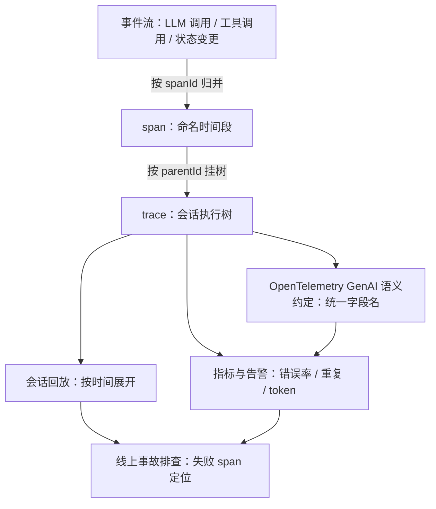
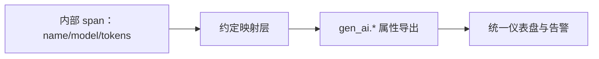
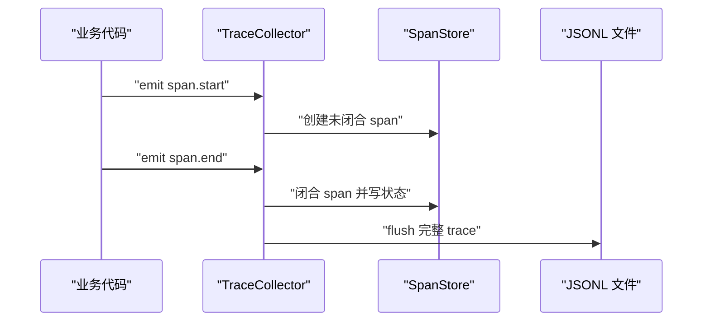
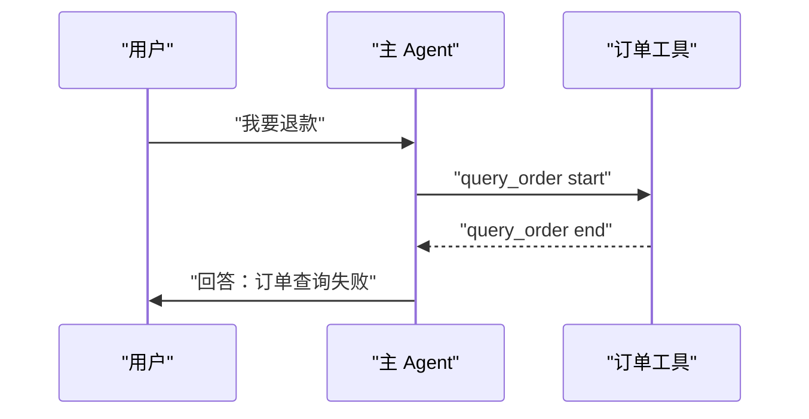
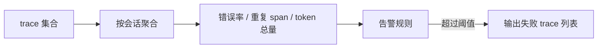
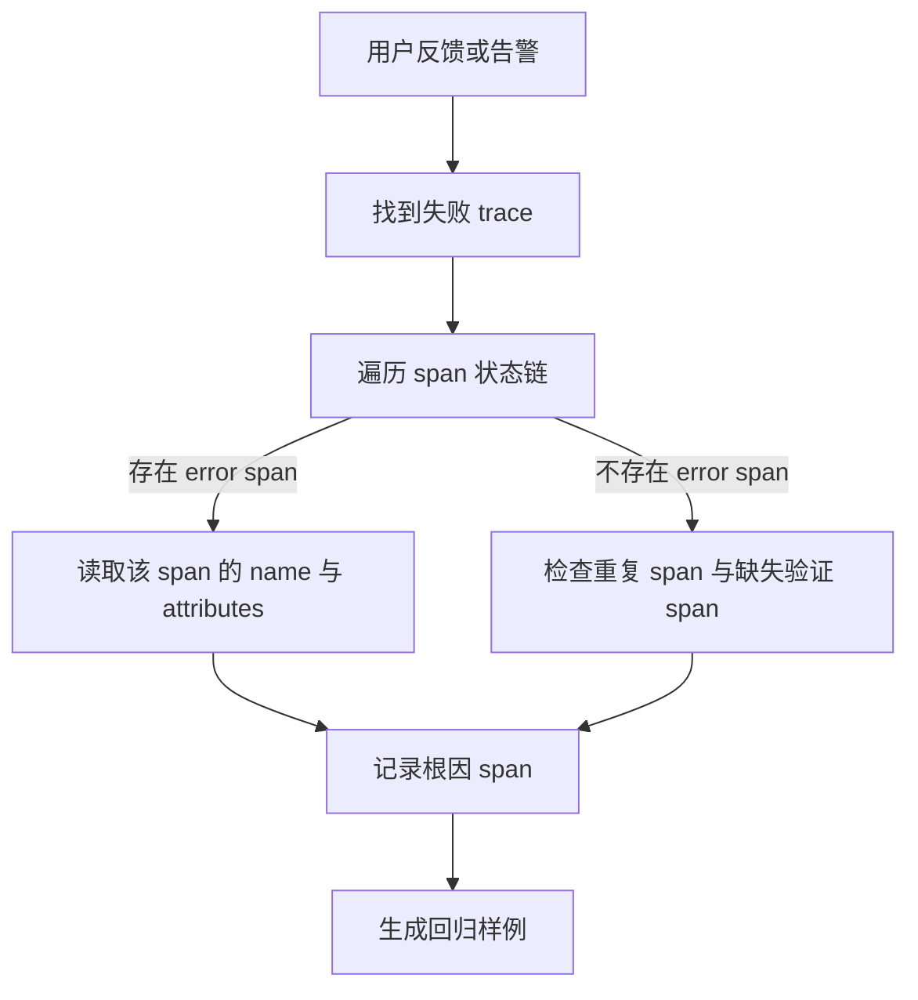

# Agent 可观测：trace、会话回放与线上事故排查

!!! abstract "学完这一页你能"
    - 把一次 Agent 会话的事件流按 `spanId` 和 `parentId` 组装成一棵可查询的 trace 树。
    - 说明 OpenTelemetry GenAI 语义约定解决什么问题，并区分哪些字段名必须核对官方文档。
    - 手写一个 Node.js trace 收集器和回放工具，用 `node:assert` 验证父子关系和时间顺序。
    - 从 trace 计算错误率、重复步数和 token 用量，并沿着失败 span 链定位根因。

## 0. 知识地图



建议先读第 1 节，把“事件怎么变成树”这段地基打牢。  
再读第 2 节理解命名约定，第 3 节动手写收集器。  
回放、指标、排查都建立在同一份 trace 上，顺序不能倒。

## 1. 事件流到 trace 的映射

**先想一个问题**  
客服 Agent 回复“已为您退款”，但订单没有退款。  
日志里只有最终模型输出，没有中间工具调用和订单读取结果。  
看不见执行路径，就无法判断哪一层做错了。

!!! note "术语：trace 与 span"
    trace 是一次用户任务从开始到结束的全部 span 组成的执行树。  
    span 是一段命名的时间区间，例如“查询订单”“调用支付工具”。  
    例子：一次退款会话是一个 trace，其中“查订单”是一个 span。

**心智模型**

!!! tip "心智模型"
    一句话模型：事件是动作记录，span 是一次动作区间，trace 是整棵执行树。  
    日常类比：快递运单号下面挂取件、转运、派送多条扫描记录。  
    类比不成立处：Agent 的 span 有父子嵌套和错误状态，快递扫描大多没有返回错误分支。

**图解**


1. 原始事件只描述“某时刻发生了什么”，没有完整区间。  
2. 收集器按 `spanId` 把开始、结束事件合成 span，得到起点与终点。  
3. 每个 span 带 `parentId`，就能挂出树；根 span 是入口任务。  
4. 排查时先找到根 span，再沿树向下找第一个失败叶子。

**一步一步来**

**第 1 步：定义三个层级**

① 这一步要做什么：写出 event、span、trace 的最小结构，让后续代码有共同输入。

```js
// 事件：一条动作记录，不单独承担执行区间
const event = {
  ts: 1000,                      // 服务端毫秒时间戳
  type: "tool.call.start",       // 事件类型
  sessionId: "sess_1",           // 会话 ID
  traceId: "trace_1",            // 整次任务 ID
  spanId: "span_2",              // 当前区间 ID
  parentId: "span_1",            // 父区间 ID
  name: "query_order",           // 动作名
  attributes: { orderId: "A-109" }
};

// span：由同一 spanId 的开始和结束事件合成
const span = {
  spanId: "span_2",
  parentId: "span_1",
  name: "query_order",
  startTs: 1000,
  endTs: 1240,
  status: "ok",                  // ok 或 error
  attributes: { orderId: "A-109" }
};

// trace：一次任务的全部 span 与根节点
const trace = {
  traceId: "trace_1",
  rootSpanId: "span_1",
  spans: new Map([["span_2", span]]),
  startTs: 980,
  endTs: 1300
};
```

**这段代码在做什么**

- 事件里同时存放 `spanId` 和 `parentId`，这是归并和挂树的关键。  
- span 必须有 `startTs` 与 `endTs`，没有终点就无法算耗时。  
- span 用 `status` 标记成功或失败，排查时先看这个字段。  
- `attributes` 只放订单 ID，不放对话全文，减少隐私风险。  
- trace 通过 `rootSpanId` 标出入口，避免每次遍历都猜根节点。

**第 2 步：把事件排成栈式父子关系**

① 这一步要做什么：用开始事件创建 span，结束事件闭合 span。

```js
function buildSpanMap(events) {
  const spans = new Map();
  for (const event of events) {
    // 同一个 spanId 第一次出现时创建 span
    if (!spans.has(event.spanId)) {
      spans.set(event.spanId, {
        spanId: event.spanId,
        parentId: event.parentId,
        name: event.name,
        attributes: event.attributes,
        startTs: null,
        endTs: null,
        status: "ok"
      });
    }
    const span = spans.get(event.spanId);
    if (event.type === "span.start") span.startTs = event.ts;
    if (event.type === "span.end") {
      span.endTs = event.ts;
      if (event.attributes?.error) span.status = "error";
    }
  }
  return spans;
}
```

**这段代码在做什么**

- 用 `Map` 去重同一 `spanId`，重复事件不会创建多余 span。  
- 开始事件只设置 `startTs`，结束事件只设置 `endTs`。  
- 只有结束事件携带错误标记时，span 才被标为 `error`。  
- 返回 `Map` 而不是数组，后续按 ID 查父节点更快。

**第 3 步：输出 trace 摘要**

① 这一步要做什么：给出一棵树的简短文本表示，便于人眼检查父子关系。

```js
function summarizeTrace(trace, spans) {
  const root = spans.get(trace.rootSpanId);
  const childCount = [...spans.values()]
    .filter((span) => span.parentId === trace.rootSpanId).length;
  return {
    traceId: trace.traceId,
    root: root.name,
    childCount,
    failedSpans: [...spans.values()]
      .filter((span) => span.status === "error").length
  };
}
```

**这段代码在做什么**

- 从 `rootSpanId` 找到入口 span，不依赖事件顺序。  
- 直接统计根节点的子 span 数，快速判断任务分解规模。  
- 失败 span 数是摘要里的第一个排查信号。  
- 输出只有计数和名称，适合把多个 trace 汇总看。

**动手验证**

以下脚本用 `node:assert` 验证事件归并和父子关系。依赖：无，Node 20+。

```js
import assert from "node:assert/strict";

const events = [
  { ts: 980, type: "span.start", traceId: "trace_1",
    spanId: "span_1", parentId: null, name: "refund_agent" },
  { ts: 1000, type: "span.start", traceId: "trace_1",
    spanId: "span_2", parentId: "span_1", name: "query_order" },
  { ts: 1240, type: "span.end", traceId: "trace_1",
    spanId: "span_2", parentId: "span_1", name: "query_order",
    attributes: { error: true } }
];

const spans = buildSpanMap(events);
assert.equal(spans.get("span_2").parentId, "span_1");
assert.equal(spans.get("span_2").status, "error");
assert.equal(spans.get("span_2").endTs, 1240);
console.log("span_2 已闭合为 error span");
```

**运行结果**

```text
span_2 已闭合为 error span
```

**常见坑**

| 现象 | 原因 | 怎么修 |
| 只有对话日志没有工具日志 | 工具包装层没有统一 emit 开始和结束 | 在工具调用入口加一次 start/end 埋点 |
| span 树是平铺的 | 事件里漏写 parentId | 创建 span 时执行参数校验，缺 parent 就拒绝落盘 |
| 同一 span 有多个 start | 重试路径复用了 spanId | 每次尝试生成新的 spanId，旧 span 保持不变 |

**用在哪里**

- 电商客服 Agent：  
  - 业务背景：退款、改地址等会话涉及订单、支付、物流三个工具。  
  - 怎么用：每个工具调用做成一个 span，失败时先看 `status === "error"` 的叶节点。  
  - 衡量指标：首个失败 span 的命中率、人工定位耗时。  
  - 不该用：只需看对话文本的简单问答，不必搭建完整 trace 树。
- 后台批量导入 Agent：  
  - 业务背景：一次导入要拆文件、校验字段、写库、生成报告。  
  - 怎么用：用根 span 表示导入任务，子 span 表示阶段，定位到底哪个文件段失败。  
  - 衡量指标：失败 span 到文件 ID 的关联覆盖率。  
  - 不该用：同步脚本没有并发和分支时，普通日志足够。

**行业实践**

- Anthropic 的多智能体研究系统在生产环境加入完整 tracing，只监控决策模式，不读取对话内容（来源：Anthropic 研究系统文章『How we built our multi-agent research system』，以原文为准）。  
- MAST 研究标注了 1,600 多条多智能体 trace，划分 14 种失败模式（来源：arXiv 2503.13657，以原文为准）。  
- 怎么借鉴：先落 span 树和状态字段，再谈复杂失败分类；不要一开始就记录对话全文。

**小结**

- event 到 span 到 trace，是逐层归并，不是同一种日志换名字。  
- 每个 span 必须有 `spanId` 和 `parentId`，否则树出不来。  
- trace 是回放、指标、事故排查三者共同的数据源。

## 2. OpenTelemetry GenAI 语义约定（需核对）

**先想一个问题**  
你的 Agent 接了三家模型供应商，A 的日志字段叫 `model`，B 叫 `llm_model`，C 叫 `request_model`。  
每接一家，仪表盘和告警就要重写一遍映射。

!!! note "术语：OpenTelemetry GenAI 语义约定"
    OpenTelemetry 是开源可观测标准，GenAI 语义约定是其中为 LLM 与 Agent span、指标定义的一组字段名。  
    例子：模型名、输入 token 数、输出 token 数分别有统一命名。  
    具体名称以官方文档为准，本页不逐字固化，避免版本偏差。

**心智模型**

!!! tip "心智模型"
    一句话模型：语义约定是字段名协议，生产者按协议导出，消费者只认一套名称。  
    日常类比：快递运单统一“寄件人”“收件人”“重量”，任何快递公司都填这一套。  
    类比不成立处：OpenTelemetry 约定会随版本演进，快递运单字段变更慢得多。

**图解**



1. 内部 span 使用项目自己的稳定字段，不受外部标准变化影响。  
2. 映射层把内部名称转成 `gen_ai.*` 前缀字段。  
3. 消费端只依赖约定字段，不为每个供应商写适配器。  
4. 官方字段有版本变化时，只改映射层，不改业务埋点。

**一步一步来**

**第 1 步：建立可替换的映射表**

① 这一步要做什么：把约定字段放在单独对象里，并明确标注需要核对官方文档。

```js
// 教学占位表：正式字段名需核对 OTel GenAI 语义约定官方文档
const GEN_AI_CONVENTIONS = {
  system: "gen_ai.system",
  requestModel: "gen_ai.request.model",
  usageInputTokens: "gen_ai.usage.input_tokens",
  usageOutputTokens: "gen_ai.usage.output_tokens",
  operationName: "gen_ai.operation.name"
};
```

**这段代码在做什么**

- 字段名集中在一处，不允许散落在各业务文件。  
- 注释标明“教学占位”，提醒读者不要把这些名字当正式标准。  
- 新增供应商时只复用这一张表。  
- 官方版本升级后，只改这张表即可。

**第 2 步：把内部 span 转成约定字段**

① 这一步要做什么：定义转换函数，输出消费端可以识别的属性对象。

```js
function toGenAiAttributes(span, conventions) {
  const output = {};
  const attrs = span.attributes ?? {};
  output[conventions.operationName] = span.name;
  output[conventions.system] = attrs.system;
  output[conventions.requestModel] = attrs.model;
  output[conventions.usageInputTokens] = attrs.input_tokens;
  output[conventions.usageOutputTokens] = attrs.output_tokens;
  return output;
}

const span = {
  name: "chat",
  attributes: { system: "openai", model: "gpt-4.1-mini",
    input_tokens: 120, output_tokens: 30 }
};
console.log(toGenAiAttributes(span, GEN_AI_CONVENTIONS));
```

**这段代码在做什么**

- `toGenAiAttributes` 只做名称转换，不改变数值。  
- 内部属性若缺失，会得到 `undefined`，调用方要先决定是否落库。  
- 示例 span 同时有模型名和 token 数，转换后对象键都带 `gen_ai` 前缀。  
- 该函数不读取对话内容，只导出可计量的字段。

**运行结果**

```text
{ "gen_ai.operation.name": "chat", "gen_ai.system": "openai", "gen_ai.request.model": "gpt-4.1-mini", "gen_ai.usage.input_tokens": 120, "gen_ai.usage.output_tokens": 30 }
```

**动手验证**

以下脚本断言映射表能覆盖内部 span 的关键字段。依赖：无，Node 20+。

```js
import assert from "node:assert/strict";

const conventions = {
  system: "gen_ai.system",
  requestModel: "gen_ai.request.model",
  usageInputTokens: "gen_ai.usage.input_tokens",
  usageOutputTokens: "gen_ai.usage.output_tokens"
};

function toGenAiAttributes(attrs, conventions) {
  return {
    [conventions.system]: attrs.system,
    [conventions.requestModel]: attrs.model,
    [conventions.usageInputTokens]: attrs.input_tokens,
    [conventions.usageOutputTokens]: attrs.output_tokens
  };
}

const attrs = { system: "anthropic", model: "claude-sonnet-4",
  input_tokens: 200, output_tokens: 50 };
const out = toGenAiAttributes(attrs, conventions);
assert.equal(out["gen_ai.request.model"], "claude-sonnet-4");
assert.equal(out["gen_ai.usage.input_tokens"], 200);
console.log("约定字段映射通过");
```

**运行结果**

```text
约定字段映射通过
```

**常见坑**

| 现象 | 原因 | 怎么修 |
| 照抄过时字段名 | 官方约定已升级 | 锁定约定版本，升级后跑字段对比测试 |
| prompt 全文写进属性 | 导出体积大且泄露内容 | 只写 token 数与脱敏摘要 |
| 自定义字段占 `gen_ai.*` 前缀 | 消费者误判标准值 | 内部字段统一用 `app.*` 前缀 |

**用在哪里**

- 多模型网关统一追踪：  
  - 业务背景：一个平台同时接 OpenAI、Anthropic、自部署模型。  
  - 怎么用：所有模型调用都过映射层，落到统一 `gen_ai.*` 字段。  
  - 衡量指标：新增一个模型接入所需修改的文件数。  
  - 不该用：临时脚本只跑一次，不需要建立统一映射。
- 多租户 Agent 平台做成本拆解：  
  - 业务背景：给不同租户拆 token 用量和模型费用。  
  - 怎么用：用统一 token 字段做聚合，把 span 属性接到计费任务。  
  - 衡量指标：计费对账差异率。  
  - 不该用：模型供应商已经提供完整账单且平台不做二次定价时，可先不接。

**行业实践**

- OpenTelemetry 官方文档中的 GenAI 语义约定，需核对具体 span 名称、属性名和事件名，不要依赖本篇占位表。  
- Anthropic 生产 tracing 只监控决策模式，不读取对话内容，说明字段设计要主动避开正文（来源：Anthropic 研究系统文章『How we built our multi-agent research system』，以原文为准）。  
- 怎么借鉴：把“能算账”和“会泄密”两类字段分开，高层追踪默认只存 token、模型、工具名。

**小结**

- 语义约定统一字段名，减少多模型接入时的适配成本。  
- 内部字段和标准字段之间放一层映射，升级只改这一层。  
- 涉及 token 和模型名时也要防隐私，不能把 prompt 写进公共属性。

## 3. 手写 trace 收集器：事件到 span

**先想一个问题**  
你已经能手动写出 span 结构，但线上事件每秒都在产生，不能每来一条就手工拼树。  
需要一个收集器把事件自动归并成 trace，并落成可重放的文本。

!!! note "术语：JSONL"
    JSONL 是每行一个 JSON 对象的文本文件。  
    例子：一行一个 trace，便于追加写入和按行读取，故障时不用把整个文件载入内存。

**心智模型**

!!! tip "心智模型"
    一句话模型：收集器是按键归并的分组器，输入是零散事件，输出是完整 trace。  
    日常类比：图书馆把还书篮里的书按索书号放回书架。  
    类比不成立处：图书不会出现“未闭合会占用书架空间”的问题，span 未闭合要单独处理。

**图解**



1. 业务代码只负责发开始和结束事件，不直接操作 span。  
2. TraceCollector 按 `traceId` 分组，按 `spanId` 归并。  
3. SpanStore 保存未闭合 span，结束事件到来后闭合。  
4. flush 时把完整 trace 写成一行 JSON。

**一步一步来**

**第 1 步：构造最小事件工厂**

① 这一步要做什么：用工厂函数统一事件字段，避免业务代码漏写。

```js
function makeEvent({ ts, type, traceId, spanId,
  parentId = null, name, attributes = {} }) {
  return { ts, type, traceId, spanId,
    parentId, name, attributes };
}

const startEvent = makeEvent({
  ts: 1, type: "span.start", traceId: "trace_1",
  spanId: "span_1", parentId: null, name: "refund_agent"
});
```

**这段代码在做什么**

- 函数把事件必填字段集中校验。  
- `parentId` 缺省为 `null`，标明根 span。  
- `attributes` 缺省为空对象，调用方可以只传最少的参数。  
- 返回值是普通对象，便于后续 `JSON.stringify` 落盘。

**第 2 步：实现按 ID 归并的收集器**

① 这一步要做什么：收集器保存事件，并能按 traceId 取出这个 trace 的全部事件。

```js
class TraceCollector {
  constructor() {
    this.events = [];
  }
  add(event) {
    this.events.push(event);
    return this;
  }
  eventsOf(traceId) {
    return this.events.filter((e) => e.traceId === traceId);
  }
}
```

**这段代码在做什么**

- `events` 数组是内存缓冲区，生产环境要定期 flush 或分片。  
- `add` 返回 `this`，可以链式调用。  
- `eventsOf` 用 `filter` 筛选同一 traceId。  
- 当前实现不落盘，下一节再加 JSONL 输出。

**第 3 步：从事件构建 span 集合**

① 这一步要做什么：把同 `spanId` 的开始和结束事件合并成 span。

```js
function buildSpans(events) {
  const spans = new Map();
  for (const event of events) {
    if (!spans.has(event.spanId)) {
      spans.set(event.spanId, {
        spanId: event.spanId,
        parentId: event.parentId,
        name: event.name,
        attributes: event.attributes,
        startTs: null,
        endTs: null,
        status: "ok"
      });
    }
    const span = spans.get(event.spanId);
    if (event.type === "span.start") span.startTs = event.ts;
    if (event.type === "span.end") {
      span.endTs = event.ts;
      if (event.attributes?.error) span.status = "error";
    }
  }
  return spans;
}
```

**这段代码在做什么**

- 每个 spanId 只创建一次 span 对象。  
- `startTs` 和 `endTs` 只由对应事件写入。  
- 错误标记来自结束事件的 `attributes.error`。  
- 函数不关心事件到达顺序，按类型和 ID 处理，后面再排序。

**动手验证**

以下脚本把工厂、收集器、构建 span 合在一起，并用 `node:assert` 验证。依赖：无，Node 20+。

```js
import assert from "node:assert/strict";

function makeEvent({ ts, type, traceId, spanId,
  parentId = null, name, attributes = {} }) {
  return { ts, type, traceId, spanId,
    parentId, name, attributes };
}

class TraceCollector {
  constructor() { this.events = []; }
  add(event) { this.events.push(event); return this; }
  eventsOf(traceId) { return this.events.filter((e) => e.traceId === traceId); }
}

function buildSpans(events) {
  const spans = new Map();
  for (const event of events) {
    if (!spans.has(event.spanId)) {
      spans.set(event.spanId, {
        spanId: event.spanId, parentId: event.parentId,
        name: event.name, attributes: event.attributes,
        startTs: null, endTs: null, status: "ok"
      });
    }
    const span = spans.get(event.spanId);
    if (event.type === "span.start") span.startTs = event.ts;
    if (event.type === "span.end") {
      span.endTs = event.ts;
      if (event.attributes?.error) span.status = "error";
    }
  }
  return spans;
}

const collector = new TraceCollector();
collector.add(makeEvent({ ts: 1, type: "span.start",
  traceId: "trace_1", spanId: "span_1", name: "refund_agent" }));
collector.add(makeEvent({ ts: 2, type: "span.start",
  traceId: "trace_1", spanId: "span_2",
  parentId: "span_1", name: "query_order" }));
collector.add(makeEvent({ ts: 9, type: "span.end",
  traceId: "trace_1", spanId: "span_2",
  parentId: "span_1", name: "query_order",
  attributes: { error: true } }));

const spans = buildSpans(collector.eventsOf("trace_1"));
assert.equal(spans.size, 2);
assert.equal(spans.get("span_2").parentId, "span_1");
assert.equal(spans.get("span_2").status, "error");
assert.equal(spans.get("span_2").endTs, 9);
console.log("收集器归并通过：2 个 span，error span 闭合");
```

**运行结果**

```text
收集器归并通过：2 个 span，error span 闭合
```

**常见坑**

| 现象 | 原因 | 怎么修 |
| span 没有闭合 | 只有 start 没有 end | flush 时把未闭合 span 标为 `unfinished` |
| 同 traceId 下 spanId 重复 | 重放或复制导致复用 ID | 生成 spanId 用 `crypto.randomUUID()` |
| JSONL 文件无限增长 | 全量追加到一个文件 | 按小时分片，旧文件压缩转冷存储 |

**用在哪里**

- 本地联调工具：  
  - 业务背景：开发时想把 Agent 执行过程存下来重看。  
  - 怎么用：本地脚本临时收集事件，flush 成一个 JSONL。  
  - 衡量指标：从复现一个失败到定位根因的分钟数。  
  - 不该用：生产环境长时间不计容量的全量收集。
- 线上采集服务：  
  - 业务背景：多个 Agent 实例把事件上报到统一服务。  
  - 怎么用：收集器按 `traceId` 分桶，按窗口 flush。  
  - 衡量指标：trace 丢失率、flush 延迟。  
  - 不该用：事件量过大且没有采样时，先加采样再全量落盘。

**行业实践**

- Anthropic 用完整生产 tracing 支撑多智能体系统的调试和可恢复设计（来源：Anthropic 研究系统文章『How we built our multi-agent research system』，以原文为准）。  
- MAST 数据集来自多框架 trace，说明结构化归并是失败分类的前提（来源：arXiv 2503.13657，以原文为准）。  
- 怎么借鉴：先做按 ID 归并与闭合检测，再考虑采样、分片和冷热存储。

**小结**

- 收集器负责归并，不负责业务逻辑。  
- 闭合检测和去重是收集器的基础能力，不能等查询时再补。  
- 生产落地要同时考虑分片、采样和未闭合 span 策略。

## 4. 会话回放：把 trace 还原成时间线

**先想一个问题**  
你看到了失败 trace，但 span 树看不出“先查订单还是先问用户”。  
顺序错误会误导判断，需要按时间横向展开。

!!! note "术语：会话回放"
    会话回放是把 trace 中的事件按时间排序，还原 Agent 的执行步骤。  
    例子：从“用户消息”到“工具调用”再到“模型回答”，一行一个时间点。  
    它不是屏幕录制，而是决策与动作的回放。

**心智模型**

!!! tip "心智模型"
    一句话模型：回放把树拍平成带时间戳的步骤序列。  
    日常类比：视频播放器的进度条，能拖动看先后。  
    类比不成立处：回放只显示结构化事件，不恢复真实屏幕像素，也不应恢复隐私文本。

**图解**



1. 用户输入先到主 Agent。  
2. 主 Agent 发起工具调用 start。  
3. 工具返回 end，结束一个 span。  
4. 最后模型回复用户。  
5. 回放应呈现这四步的顺序，而不是只显示最终回答。

**一步一步来**

**第 1 步：准备一个最小 trace**

① 这一步要做什么：构造一次简单任务的 span 数据，作为回放输入。

```js
const replayTrace = {
  traceId: "trace_replay_1",
  rootSpanId: "sp_1",
  spans: [
    { spanId: "sp_1", parentId: null, name: "refund_agent",
      startTs: 100, endTs: 300, status: "ok" },
    { spanId: "sp_2", parentId: "sp_1", name: "query_order",
      startTs: 120, endTs: 260, status: "error" },
    { spanId: "sp_3", parentId: "sp_1", name: "reply",
      startTs: 270, endTs: 290, status: "ok" }
  ]
};
```

**这段代码在做什么**

- 用三个 span 表示用户任务、工具调用、最终回复。  
- `query_order` 标记为 error，是回放的重点观察对象。  
- 时间字段都是整型毫秒，方便排序。

**第 2 步：按时间展开为行**

① 这一步要做什么：把每个 span 的开始和结束拆成时间线行。

```js
function toTimeline(trace) {
  const rows = [];
  for (const span of trace.spans) {
    rows.push({ ts: span.startTs, spanId: span.spanId,
      type: "start", name: span.name });
    rows.push({ ts: span.endTs, spanId: span.spanId,
      type: "end", name: span.name });
  }
  rows.sort((a, b) => a.ts - b.ts);
  return rows;
}

console.log(toTimeline(replayTrace));
```

**这段代码在做什么**

- 一个 span 拆成 start 和 end 两行。  
- 先收集所有行，再按 `ts` 排序。  
- 排序后相同时间点的行保持插入顺序，这是当前演示行为。  
- 输出直接可读，不再需要遍历树。

**第 3 步：渲染文本回放**

① 这一步要做什么：把时间线渲染成单行可读文本，只显示动作名。

```js
function renderTimeline(rows) {
  return rows
    .map((row) => `${row.ts} [${row.spanId}] ${row.type} ${row.name}`)
    .join("\n");
}

const rows = toTimeline(replayTrace);
console.log(renderTimeline(rows));
```

**这段代码在做什么**

- 每行只含时间、spanId、开始结束、名称。  
- 不输出订单号、用户消息、模型正文。  
- 文本格式适合贴进工单或告警上下文。  
- 若要进一步折叠，可按 `spanId` 聚合成一行。

**运行结果**

```text
100 [sp_1] start refund_agent
120 [sp_2] start query_order
260 [sp_2] end query_order
270 [sp_3] start reply
290 [sp_3] end reply
300 [sp_1] end refund_agent
```

**动手验证**

以下脚本断言时间线排序，并验证 error span 出现在最终回复之前。依赖：无，Node 20+。

```js
import assert from "node:assert/strict";

function toTimeline(trace) {
  const rows = [];
  for (const span of trace.spans) {
    rows.push({ ts: span.startTs, spanId: span.spanId,
      type: "start", name: span.name });
    rows.push({ ts: span.endTs, spanId: span.spanId,
      type: "end", name: span.name });
  }
  rows.sort((a, b) => a.ts - b.ts);
  return rows;
}

const trace = {
  traceId: "trace_replay_1",
  rootSpanId: "sp_1",
  spans: [
    { spanId: "sp_1", parentId: null, name: "refund_agent",
      startTs: 100, endTs: 300, status: "ok" },
    { spanId: "sp_2", parentId: "sp_1", name: "query_order",
      startTs: 120, endTs: 260, status: "error" },
    { spanId: "sp_3", parentId: "sp_1", name: "reply",
      startTs: 270, endTs: 290, status: "ok" }
  ]
};

const rows = toTimeline(trace);
assert.equal(rows[0].name, "refund_agent");
assert.ok(rows.findIndex((r) => r.name === "query_order")
  < rows.findIndex((r) => r.name === "reply"));
console.log("时间线顺序通过：工具查询先于回复");
```

**运行结果**

```text
时间线顺序通过：工具查询先于回复
```

**常见坑**

| 现象 | 原因 | 怎么修 |
| 时间线跨机器乱序 | 各服务时钟不同步 | 全部改用入口服务端时间，或统一 UTC 毫秒 |
| 回放暴露 prompt 正文 | 事件属性里存了原文本 | 回放前统一脱敏，只放动作名和摘要 |
| 长会话回放行数过多 | 每个 span 都拆成两行 | 默认折叠正常 span，只展开 error span |

**用在哪里**

- 客服退款会话回放：  
  - 业务背景：用户投诉“明明查到订单却说没有”，需要回放整个处理路径。  
  - 怎么用：只看 trace 的时间线，先定位 `query_order` 的 end 状态。  
  - 衡量指标：每条工单从回放到定位根因的平均耗时。  
  - 不该用：包含完整聊天正文时，不应自动回放给无权限人员。
- 研发自测回放：  
  - 业务背景：同一输入多次运行路径不一致，要看哪一步分叉。  
  - 怎么用：把每次运行存 trace，再比对时间线差异。  
  - 衡量指标：分叉位置找到率。  
  - 不该用：高频压测时全量回放会产生过大阅读成本，应抽样。

**行业实践**

- Anthropic 建议“像 Agent 一样思考”，用模拟逐步观察 Agent 行为，这是回放思路的前置练习（来源：Anthropic 研究系统文章『How we built our multi-agent research system』，以原文为准）。  
- Cognition 提出共享完整 agent trace，而不是只共享单条消息，才能让协作者看见隐式决策（来源：Cognition 博客『Don't Build Multi-Agents』，以原文为准）。  
- 怎么借鉴：回放优先呈现动作与状态变化，不把隐私内容当作默认显示项。

**小结**

- 回放的核心是时间排序，不是保存屏幕。  
- 每个 span 拆成 start/end 两行，就能还原先后关系。  
- 回放默认脱敏，想看正文再走单独授权。

## 5. 关键指标与告警

**先想一个问题**  
告警里只有 QPS 和平均延迟，但 Agent 的失败经常表现为步骤重复、token 爆炸、验证缺失。  
这些在普通 HTTP 指标里根本看不到。

!!! note "术语：指标"
    指标是把 trace 聚合后得到的可比较数字，例如错误率、重复 span 数、token 总量。  
    例子：每 100 个会话中，有几个会话出现了同名 span 连续 3 次以上。

**心智模型**

!!! tip "心智模型"
    一句话模型：指标把 trace 压成可触发告警的数字，每个数字对应一个可行动问题。  
    日常类比：体检报告里的血压和心率。  
    类比不成立处：血压有通用参考范围，Agent 指标阈值要按任务类型和成本重新设定。

**图解**



1. 原始 trace 过细，不适合直接做告警。  
2. 聚合层把一个会话的 span 压成少数数字。  
3. 告警规则针对数字阈值触发。  
4. 告警输出 trace 列表，排查时再下钻。

**一步一步来**

**第 1 步：计算错误率**

① 这一步要做什么：统计一个 trace 内 error span 占比。

```js
function errorRate(spans) {
  if (spans.length === 0) return 0;
  const failed = spans.filter((span) => span.status === "error").length;
  return failed / spans.length;
}

const spans = [
  { status: "ok" },
  { status: "error" },
  { status: "ok" }
];
console.log(errorRate(spans));
```

**这段代码在做什么**

- 空 span 列表返回 0，避免除零。  
- 分母是 span 数，如果要按会话算，需要另外传入会话数。  
- 结果保留为小数，展示时再转百分比。  
- 该指标先于告警规则存在，规则不直接写死这里。

**第 2 步：检测重复步骤**

① 这一步要做什么：统计同名字 span 在一个 trace 中出现多次的情况。

```js
function repeatedSpanCount(spans) {
  const counts = new Map();
  for (const span of spans) {
    counts.set(span.name, (counts.get(span.name) ?? 0) + 1);
  }
  return [...counts.values()].filter((count) => count >= 3).length;
}

const spansWithRepeat = [
  { name: "query_order" },
  { name: "query_order" },
  { name: "query_order" },
  { name: "reply" }
];
console.log(repeatedSpanCount(spansWithRepeat));
```

**这段代码在做什么**

- 按 span 名称计数，不看父子关系。  
- 只统计出现 3 次及以上的名称。  
- 重试路径可能合法，告警阈值要和最大允许重试数分开。  
- 该函数只返回数量，不直接判断是否故障。

**第 3 步：聚合 token 用量**

① 这一步要做什么：累计 span 上的输入输出 token 字段。

```js
function tokenUsage(spans) {
  return spans.reduce((total, span) => {
    const attrs = span.attributes ?? {};
    return total + (attrs.input_tokens ?? 0)
      + (attrs.output_tokens ?? 0);
  }, 0);
}

const spansWithTokens = [
  { attributes: { input_tokens: 120, output_tokens: 30 } },
  { attributes: { input_tokens: 80, output_tokens: 20 } }
];
console.log(tokenUsage(spansWithTokens));
```

**这段代码在做什么**

- 从每个 span 的 attributes 取 token 数。  
- 缺失字段按 0 处理，避免一次缺失导致总和变 `NaN`。  
- 输入和输出 token 合并计算，成本拆解可再分开。  
- 该指标适合做成本告警，不适合单独做质量判断。

**第 4 步：写告警决策函数**

① 这一步要做什么：综合三个指标给出是否告警。

```js
function shouldAlert(spans, thresholds) {
  const repeat = repeatedSpanCount(spans);
  const tokens = tokenUsage(spans);
  return errorRate(spans) > thresholds.errorRate
    || repeat >= thresholds.repeatSpanNames
    || tokens > thresholds.maxTokens;
}

const alert = shouldAlert(spansWithTokens, {
  errorRate: 0.5,
  repeatSpanNames: 1,
  maxTokens: 100
});
console.log(alert);
```

**这段代码在做什么**

- 三个条件用或运算连接，命中一个就告警。  
- 阈值从外部传入，不同租户可以配不同值。  
- 告警不直接返回 trace，返回布尔值，具体 trace 列表由上层输出。  
- `maxTokens` 可按预算上限设定。

**运行结果**

```text
true
```

**动手验证**

以下脚本综合计算错误率、重复 span 和 token 用量。依赖：无，Node 20+。

```js
import assert from "node:assert/strict";

function errorRate(spans) {
  if (spans.length === 0) return 0;
  return spans.filter((s) => s.status === "error").length / spans.length;
}

function repeatedSpanCount(spans) {
  const counts = new Map();
  for (const span of spans) {
    counts.set(span.name, (counts.get(span.name) ?? 0) + 1);
  }
  return [...counts.values()].filter((n) => n >= 3).length;
}

const spans = [
  { name: "query_order", status: "ok" },
  { name: "query_order", status: "error" },
  { name: "query_order", status: "ok" },
  { name: "reply", status: "ok" }
];

assert.equal(errorRate(spans), 0.25);
assert.equal(repeatedSpanCount(spans), 1);
console.log("指标计算通过：错误率 0.25，重复名称 1 个");
```

**运行结果**

```text
指标计算通过：错误率 0.25，重复名称 1 个
```

**常见坑**

| 现象 | 原因 | 怎么修 |
| 平均延迟很低但用户仍投诉 | 长尾请求被平均掩盖 | 同时看 p95 和 p99 分位数 |
| span 未闭合导致耗时算成 0 | 缺 end 事件 | 未闭合 span 标 `unfinished`，耗时按最后事件时间 |
| 用 span 错误率替代会话错误率 | 一个会话多个 span 会放大比例 | 按 trace 维度单独计算会话错误率 |

**用在哪里**

- 多租户 Agent 平台成本预警：  
  - 业务背景：Agent 比普通聊天消耗更多 token，预算容易超。  
  - 怎么用：按租户聚合 tokenUsage，超预算就告警。  
  - 衡量指标：预算超限租户数、告警后停用动作耗时。  
  - 不该用：平台没有成本分摊需求时，不必立即做分租户计费。
- 线上客服的重复步骤告警：  
  - 业务背景：Agent 有时反复查同一个订单，增加延迟且不推进任务。  
  - 怎么用：统计同 span 名出现次数，超过限制触发告警。  
  - 衡量指标：重复告警准确率和平均减少的无效 span 数。  
  - 不该用：重试机制合法且次数可解释时，阈值得放高，不能一刀切。

**行业实践**

- Anthropic 多智能体研究系统比普通 chat 多耗约 4 倍 token，多智能体系统比 chat 多耗约 15 倍 token（来源：Anthropic 研究系统文章『How we built our multi-agent research system』，以原文为准）。  
- MAST 统计中，步骤重复占已标注失败的 17.14%，是不知终止条件 9.82% 外的高频问题（来源：arXiv 2503.13657，以原文为准）。  
- 怎么借鉴：把 token 成本、重复步骤、错误率三个指标拆开告警，不能让平均延迟一个数字代表全部健康度。

**小结**

- 指标要从 trace 聚合出来，不能只依赖 HTTP 层。  
- 错误率、重复步骤、token 用量分别覆盖质量、循环、成本。  
- 阈值必须外部化，按租户或任务类型调整。

## 6. 线上事故排查：从失败 trace 到根因

**先想一个问题**  
一个失败 trace 有 40 个 span，挨个点开看会耗很久。  
你需要一条稳定路径：先找失败 span，再沿链上溯，最后才读内容。

**心智模型**

!!! tip "心智模型"
    一句话模型：排查是沿失败 span 链剪枝，不从最终回答倒推一切。  
    日常类比：医生按主诉、检查、病史逐步缩小范围。  
    类比不成立处：Agent 的根因可能是跨 span 的决策冲突，不总是某一个器官一样的位置病灶。

**图解**



1. 先从告警或用户反馈锁定 trace。  
2. 检查 span 状态，找第一个 error span。  
3. 没有 error span 时，看结构问题，例如重复或缺失验证。  
4. 根因定位后，把该 trace 压缩成回归样例，避免同一个问题再次发生。

**一步一步来**

**第 1 步：构建失败 span 的上溯路径**

① 这一步要做什么：从 error span 一路回溯到根 span，得到可读路径。

```js
function failurePath(trace) {
  const byId = new Map(trace.spans.map((span) => [span.spanId, span]));
  return trace.spans
    .filter((span) => span.status === "error")
    .map((span) => {
      const path = [];
      let current = span;
      while (current) {
        path.unshift(current.name);
        current = current.parentId ? byId.get(current.parentId) : null;
      }
      return { spanId: span.spanId, path, attributes: span.attributes };
    });
}

const trace = {
  traceId: "trace_6",
  rootSpanId: "sp_1",
  spans: [
    { spanId: "sp_1", parentId: null, name: "refund_agent", status: "ok" },
    { spanId: "sp_2", parentId: "sp_1", name: "query_order", status: "error" },
    { spanId: "sp_3", parentId: "sp_2", name: "read_order_rows", status: "error" }
  ]
};

console.log(failurePath(trace));
```

**这段代码在做什么**

- 先按 `spanId` 建索引，向上查到 `parentId` 时不用循环查找。  
- 所有 error span 都会生成路径，排在前面的是离用户最近的失败。  
- `unshift` 把祖先节点写在路径开头，读起来是从根到叶。  
- 如果两个 error span 有嵌套，会各自成一条路径。

**第 2 步：用启发式做快速分类**

① 这一步要做什么：通过 span 名和字段给出三类失败信号：工具错误、重复步骤、缺验证。

```js
function classifyFailure(trace, failedSpan) {
  const names = trace.spans.map((span) => span.name);
  const repeated = names.filter((name) => name === failedSpan.name).length;
  if (failedSpan.attributes?.errorCode === "TOOL_REJECTED") {
    return "工具调用被拒绝";
  }
  if (repeated >= 3) {
    return "同一步骤重复超过限制";
  }
  if (!names.includes("verify_result")) {
    return "缺少验证步骤";
  }
  return "需下钻具体 span 属性";
}
```

**这段代码在做什么**

- 该函数只是教学启发式，正式分类可参照 MAST 的 14 种失败模式（来源：arXiv 2503.13657，以原文为准）。  
- `TOOL_REJECTED` 只是示例错误码，生产系统要跟工具错误码表对齐。  
- 重复判断按当前失败 span 名称计数。  
- 缺验证检查用固定名称 `verify_result`，真实项目要改成自己的验证 span 命名。

**第 3 步：生成根因报告**

① 这一步要做什么：把路径、失败类别和属性合并成一条简短报告。

```js
function rootCauseReport(trace, failedPath) {
  const first = failedPath[0];
  return {
    traceId: trace.traceId,
    failedSpan: first.spanId,
    path: first.path,
    classification: classifyFailure(trace,
      trace.spans.find((span) => span.spanId === first.spanId)),
    attributes: first.attributes
  };
}

const path = failurePath(trace);
console.log(rootCauseReport(trace, path));
```

**这段代码在做什么**

- 只取第一条失败路径，避免报告过长。  
- `classification` 直接复用前一步的启发式函数。  
- `attributes` 保留现场字段，但不要放 prompt 全文。  
- 报告适合作为工单附件或告警通知的一部分。

**运行结果**

```text
{ "traceId": "trace_6", "failedSpan": "sp_2", "path": ["refund_agent","query_order"], "classification": "需下钻具体 span 属性", "attributes": undefined }
```

**动手验证**

以下脚本断言失败路径能正序上溯到根 span，并输出报告。依赖：无，Node 20+。

```js
import assert from "node:assert/strict";

function failurePath(trace) {
  const byId = new Map(trace.spans.map((span) => [span.spanId, span]));
  return trace.spans
    .filter((span) => span.status === "error")
    .map((span) => {
      const path = [];
      let current = span;
      while (current) {
        path.unshift(current.name);
        current = current.parentId ? byId.get(current.parentId) : null;
      }
      return { spanId: span.spanId, path };
    });
}

const trace = {
  traceId: "trace_6",
  rootSpanId: "sp_1",
  spans: [
    { spanId: "sp_1", parentId: null, name: "refund_agent", status: "ok" },
    { spanId: "sp_2", parentId: "sp_1", name: "query_order", status: "error" },
    { spanId: "sp_3", parentId: "sp_2", name: "read_order_rows", status: "error" }
  ]
};

const result = failurePath(trace);
assert.deepEqual(result[0].path, ["refund_agent", "query_order"]);
assert.deepEqual(result[1].path,
  ["refund_agent", "query_order", "read_order_rows"]);
console.log("失败路径上溯通过");
```

**运行结果**

```text
失败路径上溯通过
```

**常见坑**

| 现象 | 原因 | 怎么修 |
| 把模型最终回答当根因 | 工具错误被模型掩盖后继续回答 | 沿 span 链找第一个 error span |
| 把重复 span 一律当 bug | 合理重试也会产生同名称 span | 与最大重试数比较，再判断是否异常 |
| 修完单个 trace 就结束 | 同类问题未形成回归保护 | 把根因 trace 压缩成一条评测样例 |

**用在哪里**

- 电商退款异常排查：  
  - 业务背景：退款失败常由查订单工具返回空或支付工具拒绝。  
  - 怎么用：先找 error span，再看 path 和 attributes 里的订单 ID。  
  - 衡量指标：根因定位命中率、每个事故的平均排查分钟数。  
  - 不该用：一旦需要读用户卡片完整信息，必须走独立权限与审计。
- 后台批量导入失败定位：  
  - 业务背景：批次中某些文件没有写库，用户只看到部分成功。  
  - 怎么用：失败 trace 上溯到文件读取 span，定位是哪个文件 ID。  
  - 衡量指标：失败文件关联覆盖率。  
  - 不该用：数据量过大时，先做按批采样，不必回放每一个文件。

**行业实践**

- Anthropic 生产系统加入完整 tracing，并采用 checkpoint 和重试，避免一次错误就必须整体重启（来源：Anthropic 研究系统文章『How we built our multi-agent research system』，以原文为准）。  
- MAST 把失败模式分成规格与系统设计、agent 间错位、任务验证三大类，说明系统设计错误比底层模型能力不足更值得先查（来源：arXiv 2503.13657，以原文为准）。  
- 怎么借鉴：先自动找 error span 和结构异常，再做内容下钻；排查后必须沉淀回归样例。

**小结**

- 排查从 error span 开始，不拿最终回答当唯一证据。  
- 失败路径要能上溯到根 span，路径越短越容易定位。  
- 把根因 trace 转成回归样例，才算走完排查闭环。

## 应用地图

| 场景 | 用到本页哪个知识点 | 典型技术选型 | 注意事项 |
| 多模型成本监控 | OTel GenAI 字段与 token 聚合 | OTel SDK 或自写映射层 | 字段名需核对官方版本 |
| 客服退款回放 | 会话回放与时间线 | JSONL + 文本时间线查看器 | 默认不展示 prompt 与订单正文 |
| 批量导入失败定位 | trace 树与 error span 上溯 | 手写 TraceCollector | 处理未闭合 span 和文件关联 |
| 多 subagent 研究系统 | 错误率、重复步骤、决策模式监控 | 生产 tracing 与 checkpoint | 只监控决策模式，不读对话内容 |
| 多租户 Agent 平台 | 指标与告警阈值 | 聚合服务加告警规则 | 阈值按租户配置 |
| 研发自测重放 | 本地回放工具 | Node.js 单文件脚本 | 只对采样 trace 回放 |

## 动手作业

**项目名称：mini-agent-observability**

**目标**  
写一个能从一个 JSONL 事件文件生成 trace、指标和回放文本的 Node.js 命令行脚本。

**步骤**

1. 定义事件文件格式：每行一个 JSON 事件，必须包含 `ts`、`type`、`traceId`、`spanId`、`parentId`、`name`。  
2. 实现 `buildTrace`，把同一 `traceId` 的事件归并成 span 树。  
3. 实现 `computeMetrics`，输出错误率、重复 span 名称数、token 总量。  
4. 实现 `renderTimeline`，按时间排序列出 start/end。  
5. 实现 `failurePath`，输出所有 error span 从根到叶的路径。  

**验收标准**

- 准备一个包含 1 个根 span、1 个 error 子 span 的 fixture。  
- 脚本运行后，断言 span 树存在父子关系，断言时间线中 error span 在最终回复之前。  
- 输出指标中错误率不为 0，失败路径能上溯到根 span。  
- 不输出 prompt 正文、订单号或用户消息。  

## 综合对比

| 维度 | 纯文本日志 | 结构化 trace | 会话回放 |
| 父子关系 | 无 | 有 | 有 |
| 时间顺序 | 需要人肉扫描 | 可从 span 推导 | 直接按行展示 |
| 错误定位速度 | 慢 | 较快 | 更快 |
| 隐私暴露风险 | 中 | 中 | 最高，必须脱敏 |
| 存储成本 | 低 | 中 | 中高 |
| 适合规模 | 小项目 | 中大型 Agent 系统 | 抽样或故障样本 |
| 是否可做告警 | 部分 | 是 | 作为告警附加上下文 |
| 实现成本 | 低 | 中 | 中高 |

## 深入阅读与参考

!!! tip "怎么用这些资料"
    先读「官方文档与规范」建立准确的概念，再读「源码与示例」核对细节，最后用「教程、书籍与视频」换一种讲法加深理解。每条都写明了读哪一节、带着什么问题读。

### 官方文档与规范

| 资源 | 为什么读 | 怎么读 |
|---|---|---|
| [OpenTelemetry GenAI 语义约定](https://opentelemetry.io/docs/specs/semconv/gen-ai/) | GenAI 语义约定是埋点字段的规范依据，命名不能自创 | 对照 gen_ai.* 属性表，检查你的 LLM span 缺哪些字段，补齐模型、token、工具名 |
| [OpenTelemetry](https://docs.deno.com/runtime/fundamentals/open_telemetry/) | 官方可观测性入门，先厘清 trace、metrics、logs 三者的分工 | 读 open_telemetry.md 全节，理解 span 生命周期，再划定自研采集器的边界 |
| [OpenTelemetry JS 文档](https://opentelemetry.io/docs/languages/js/) | Node 服务接入自动埋点的最短路径，含 span 输出示例 | 按 quickstart 跑通一次自动埋点并打印 span，再与自研收集器对比差异 |
| [Langfuse 文档](https://langfuse.com/docs) | 开源追踪平台，其回放与排查界面可直接借用，省去自研 UI | 自托管后灌入一次失败调用，用其 trace 视图定位耗时与报错节点 |
| [Claude 子 Agent 文档](https://docs.claude.com/en/docs/claude-code/sub-agents) | 子 agent 会派生嵌套 trace，官方文档讲清了委派与工具权限 | 建一个只读审查 subagent，观察它的调用是否生成独立 span |

### 源码与示例

| 资源 | 为什么读 | 怎么读 |
|---|---|---|
| [Playwright Trace Viewer](https://playwright.dev/docs/trace-viewer-intro) | trace 回放的最佳范例，学它如何把步骤时间线呈现给排查者 | 故意让用例失败，用 trace 逐帧看快照、网络与动作的时序关系 |
| [pi 编码 Agent 工具集](https://github.com/earendil-works/pi) | 最小 agent loop 的源码，能看清哪些节点值得埋 span | 读 agent loop 与统一 LLM 调用层，标出可加 trace 的埋点位点 |
| [OpenAI Agents SDK（Python）](https://openai.github.io/openai-agents-python/) | Quickstart 自带 tracing，可直接观察 handoff 的链路结构 | 跑通示例后打开 tracing，对照两个 agent 之间的父子 span 关系 |

### 教程、书籍与视频

| 资源 | 为什么读 | 怎么读 |
|---|---|---|
| [How we built our multi-agent research system](https://www.anthropic.com/engineering/multi-agent-research-system) | 多 agent 生产系统的追踪设计复盘，含失败定位的真实经验 | 画出 lead 与 subagent 调用图，标出每一层该记录的 trace 字段 |
| [规模：MAST-Data 含 1,600+ 条标注 trace，覆盖 7 个流行 MAS 框架，模型含 GPT-4、Claude 3、Qwe (arxiv.org)](https://arxiv.org/abs/2503.13657) | 1600+ 条标注 trace 的失败分类，可直接对照事故根因 | 读失败模式分类，挑三类对照自己线上失败 trace 做归档标注 |
| [Principle 1 is to share context, and share full agent traces, not just (cognition.com)](https://cognition.com/blog/dont-build-multi-agents) | 强调共享完整 trace 而非摘要，是回放设计的出发点 | 读该原则后自查：回放时是否丢掉了中间的工具调用与返回值 |

## 自测题

??? question "trace、span、event 三者是什么关系"
    event 是单条带时间戳的动作记录；span 是同一个 `spanId` 下开始到结束的时间区间；trace 是一次会话里全部 span 组成的树。  
    多个 event 归并成一个 span，多个 span 按 `parentId` 组成 trace。

??? question "为什么 span 必须带 parentId"
    `parentId` 决定 span 之间的父子顺序，只靠时间无法表示嵌套和并发归属。  
    没有它，trace 会退化为平铺日志，无法定位“哪个父任务失败”。  
    根 span 的 `parentId` 用 `null` 标出入口。

??? question "OpenTelemetry GenAI 语义约定解决什么，为什么强调核对版本"
    它统一模型名、token 数、操作名等字段，减少多供应商接入成本。  
    但字段名会随官方版本变化，教学占位表不能当正式标准。  
    落地时要锁定约定版本，升级后跑字段对比测试。

??? question "手写收集器如何处理未闭合 span"
    flush 时检查只有 start 没有 end 的 span，给它标 `unfinished`。  
    耗时可以按当前最后事件时间计算，但状态不能标为 `ok`。  
    这样可以防止未闭合 span 被误算成 0 毫秒或成功。

??? question "会话回放和原始日志回放有什么不同"
    原始日志回放只按行展示，父子关系要人肉推断。  
    会话回放先基于 trace 构建结构，再按时间平铺成 start/end 行。  
    回放默认显示动作名与状态，不显示 prompt 和用户正文。

??? question "哪些指标能捕捉 Agent 循环与 token 失控"
    重复 span 名称数能发现循环或无效重试；token 总量能发现成本异常。  
    MAST 统计显示步骤重复占已标注失败的 17.14%，是高频失败模式（来源：arXiv 2503.13657，以原文为准）。  
    Anthropic 研究系统比普通 chat 多耗约 4 倍 token，多智能体系统约 15 倍（来源：Anthropic 研究系统文章，以原文为准）。

??? question "一条失败 trace 的排查顺序是什么"
    先锁定 trace，再找所有 error span。  
    沿 `parentId` 上溯到根 span，得到从入口到失败的路径。  
    没有 error span 时，检查重复 span 和缺失验证 span。  
    根因确认后，把该 trace 压缩成回归样例。

??? question "告警只看平均延迟会漏掉什么，需要怎么补"
    平均延迟会掩盖长尾问题，十个请求里两个极慢，平均值仍可能好看。  
    要同时看 p95、p99 分位数。  
    对 Agent 还要加错误率、重复 span、token 总额等指标。  
    阈值按租户或任务类型配置，不能全局一个固定值。

## 延伸阅读

- OpenTelemetry 官方文档：GenAI 语义约定章节，核对 `gen_ai.*` 属性、span 类型和事件名。  
- Anthropic 工程博客《How we built our multi-agent research system》：生产 tracing、checkpoint 与重试、故障调试。  
- Anthropic 工程博客《Building effective agents》：工具设计与最简架构原则。  
- Cognition 博客《Don't Build Multi-Agents》：共享完整 agent trace、隐式决策冲突。  
- arXiv 2503.13657《Why Do Multi-Agent LLM Systems Fail?》：失败模式分类与 trace 标注方法。  
- arXiv 2512.08296《Towards a Science of Scaling Agent Systems》：多智能体协调开销与错误放大。
