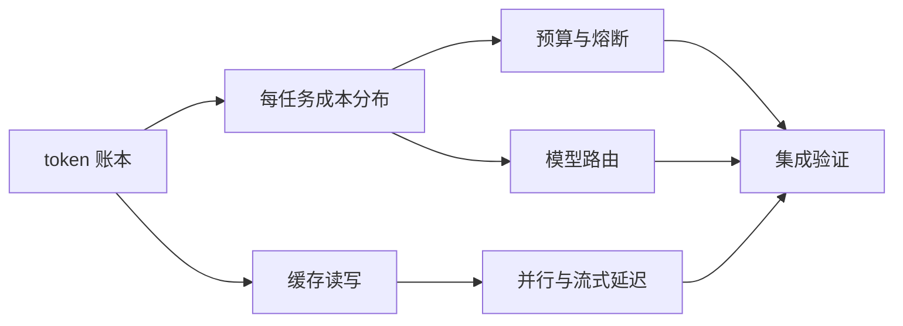
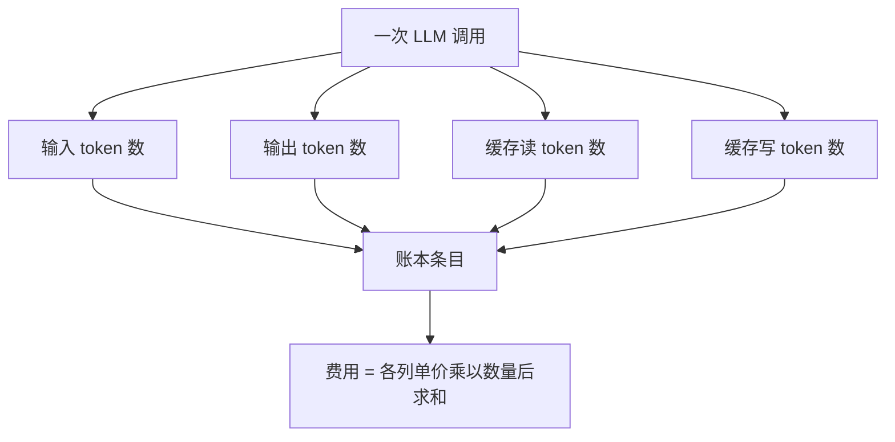
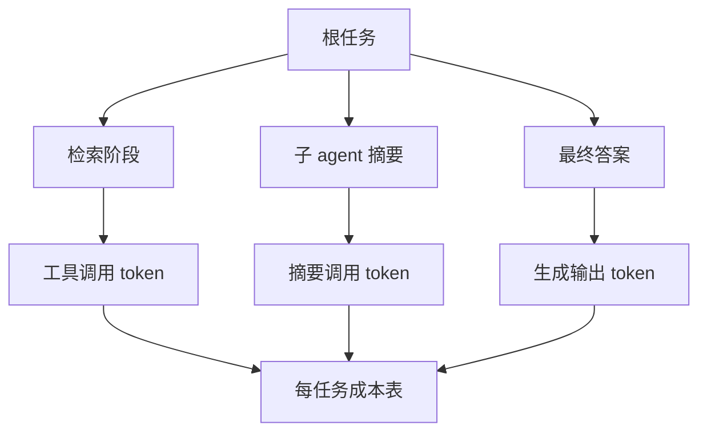
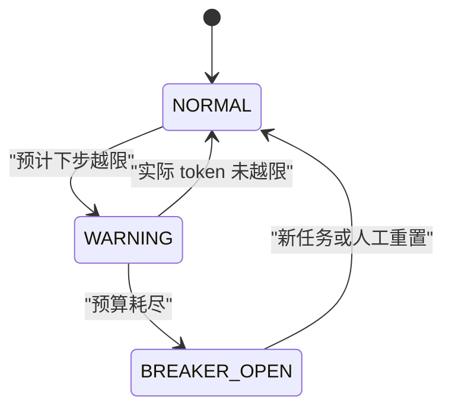
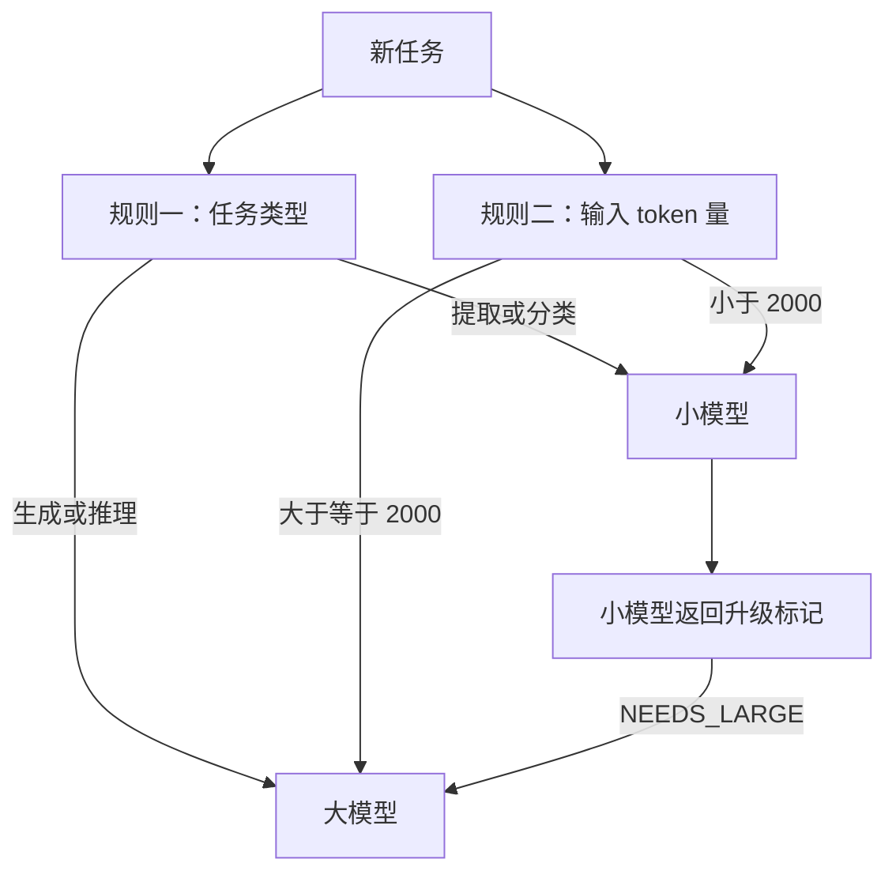
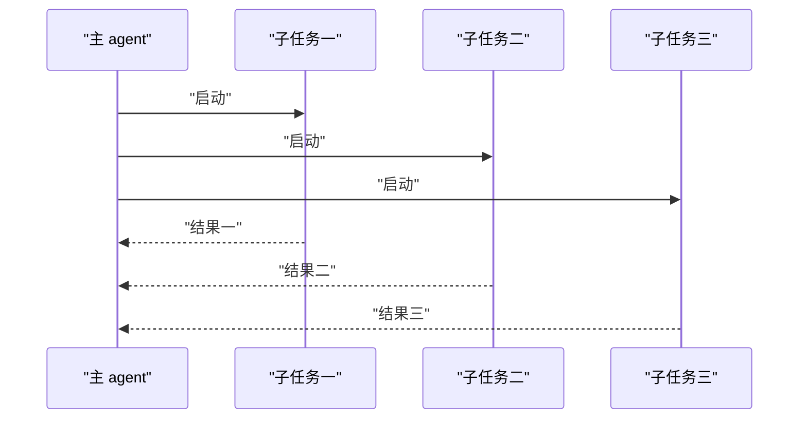
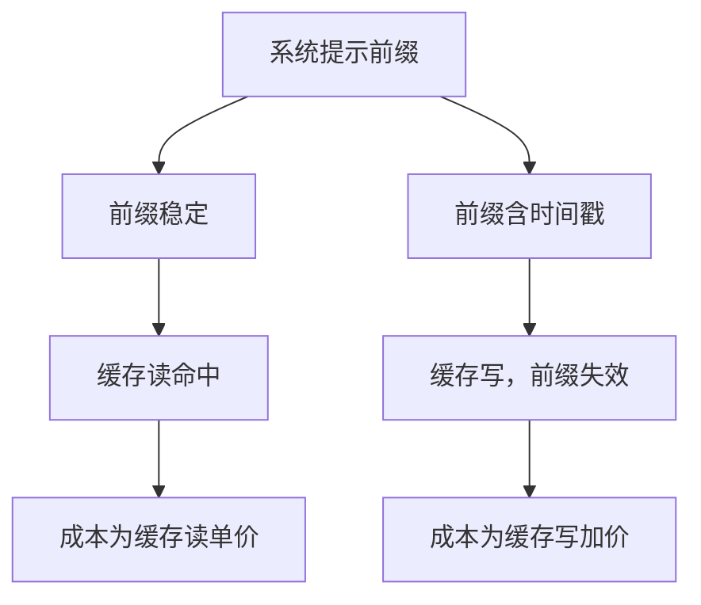
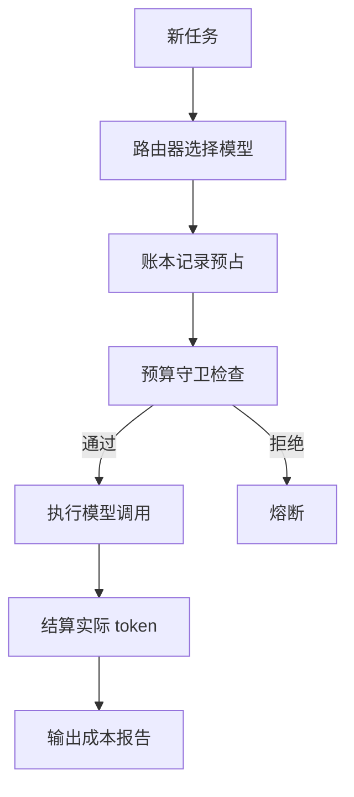

# 成本与延迟：token 账本、预算与模型路由

!!! abstract "学完这一页你能"
    1. 能独立写出一个 token 账本，分四类记录输入、输出、缓存读、缓存写，并按单价算出一次调用的成本。
    2. 能按任务维度聚合成本，定位一次 agent 运行里哪个阶段占总成本最高。
    3. 能实现预算守卫与熔断器，在预计成本或步数越界时停止请求或触发降级。
    4. 能写一个模型路由器，把小任务分给小模型，并给出升级到大模型的明确条件。

## 0. 知识地图



先读第一节的账本与缓存读写，这是后面一切成本决策的数据来源。
再读每任务成本分布和预算熔断，建立“先记账、后限流”的顺序。
模型路由、并行与流式延迟可以结合你自己的系统按需阅读。

!!! note "术语：token 账本"
    每次 LLM 调用都留下一条四列记录：输入 token、输出 token、缓存读 token、缓存写 token。费用等于每列数量乘以对应单价。例如一次调用输入 5000、缓存读 4000，就写成 `{input: 5000, cacheRead: 4000}` 再计价。

## 1. token 账本：先把每一笔调用拆成四列

**先想一个问题**：你写了一个客服 agent，每轮要读 20 条历史消息、调用 3 个工具、输出 200 token。老板问每千次对话多少钱。你报了单价，却报不出总账，因为你没把缓存命中和未命中输入分开记账。

**心智模型**

!!! tip "心智模型"
    一句话模型：token 账本是一次调用的流水账，费用等于四类 token 各自乘以单价后求和。日常类比：像打车发票，不同时段里程单价不同。类比在哪里不成立：出租车里程由计价器统一给出，token 数量来自接口返回或本地估算；缓存命中与否由服务端前缀匹配决定，你只能通过稳定前缀提高命中，不能直接指定命中。

**图解**



1. 一次调用进入账本前，先拆成四列，而不是一个总数。
2. 输入与缓存读的单价差可达 10 倍，混在一起会算错成本。该 10 倍差来自 Manus 官方博客，以原文为准。
3. 缓存写不是免费，它有 1.25 倍或 2 倍加价，因此要单列。该加价规则来自 Anthropic 官方文档，以原文为准。

**一步一步来**

第一步：定义价格表，只放本教程有依据的数字。

```js
const PRICING_PER_MTok = {
  demo: {
    input: 3.0,
    cacheRead: 0.30,
    cacheWrite5m: 3.75,
    cacheWrite1h: 6.0,
    output: null,
  },
};
```

**这段代码在做什么**

- `input` 与 `cacheRead` 的 10 倍差来自 Manus 官方博客：Claude Sonnet 未缓存输入约 3 美元/百万 token，缓存读约 0.30 美元/百万 token，以原文为准。
- `cacheWrite5m` 是输入的 1.25 倍、`cacheWrite1h` 是 2 倍，来自 Anthropic 官方文档 prompt caching 定价，以原文为准。
- `output` 设为 `null`，因为本页资料未覆盖输出单价，需核对官方文档后填入。
- 单位是“每百万 token 的美元价”，后续计算要先除以 1,000,000。

第二步：建立账本条目，让四列强制显式出现。

```js
class TokenEntry {
  constructor({ input, output, cacheRead, cacheWrite }) {
    this.input = input;
    this.output = output;
    this.cacheRead = cacheRead;
    this.cacheWrite = cacheWrite;
  }
  totalTokens() {
    return this.input + this.output + this.cacheRead + this.cacheWrite;
  }
}
```

**这段代码在做什么**

- 构造函数要求调用方一次传四列，少传就会得到 `undefined`，便于尽早发现漏记。
- `totalTokens` 只做数量求和，不做费用计算。
- 把列切开后，后面换算费用时才能应用不同单价。

第三步：写费用函数，按列计价。

```js
function costOf(entry, price) {
  const million = 1_000_000;
  let cost = 0;
  cost += (entry.input / million) * price.input;
  cost += (entry.cacheRead / million) * price.cacheRead;
  if (entry.cacheWrite > 0) {
    cost += (entry.cacheWrite / million) * price.cacheWrite5m;
  }
  if (price.output !== null && entry.output > 0) {
    cost += (entry.output / million) * price.output;
  }
  return cost;
}
```

**这段代码在做什么**

- 输入和缓存读各自乘以对应单价。
- 缓存写只写了一个 5 分钟档位；1 小时档位可按同样方式加进去。
- 输出单价为 `null` 时不计入成本，这是防止用假价格误导计算。

**动手验证**

依赖：无，使用 Node 20 内置 `node:assert/strict`。文件名可叫 `token-ledger.test.mjs`。

```js
import assert from 'node:assert/strict';

const PRICING_PER_MTok = {
  demo: {
    input: 3.0,
    cacheRead: 0.30,
    cacheWrite5m: 3.75,
    output: null,
  },
};

class TokenEntry {
  constructor({ input, output, cacheRead, cacheWrite }) {
    this.input = input;
    this.output = output;
    this.cacheRead = cacheRead;
    this.cacheWrite = cacheWrite;
  }
  totalTokens() {
    return this.input + this.output + this.cacheRead + this.cacheWrite;
  }
}

function costOf(entry, price) {
  const million = 1_000_000;
  let cost = 0;
  cost += (entry.input / million) * price.input;
  cost += (entry.cacheRead / million) * price.cacheRead;
  if (entry.cacheWrite > 0) {
    cost += (entry.cacheWrite / million) * price.cacheWrite5m;
  }
  if (price.output !== null && entry.output > 0) {
    cost += (entry.output / million) * price.output;
  }
  return cost;
}

const uncached = new TokenEntry({
  input: 1_000_000, output: 0, cacheRead: 0, cacheWrite: 0,
});
const cached = new TokenEntry({
  input: 0, output: 0, cacheRead: 1_000_000, cacheWrite: 0,
});

assert.equal(uncached.totalTokens(), 1_000_000);
assert.equal(cached.totalTokens(), 1_000_000);
assert.ok(Math.abs(costOf(uncached, PRICING_PER_MTok.demo) - 3.0) < 1e-9);
assert.ok(Math.abs(costOf(cached, PRICING_PER_MTok.demo) - 0.30) < 1e-9);
const ratio = costOf(uncached, PRICING_PER_MTok.demo) / costOf(cached, PRICING_PER_MTok.demo);
assert.ok(Math.abs(ratio - 10) < 1e-9);

console.log('未缓存输入成本：', costOf(uncached, PRICING_PER_MTok.demo).toFixed(2), '美元');
console.log('缓存读成本：', costOf(cached, PRICING_PER_MTok.demo).toFixed(2), '美元');
console.log('成本比：', ratio);
```

运行结果预期输出：

```
未缓存输入成本： 3.00 美元
缓存读成本： 0.30 美元
成本比： 10
```

**常见坑**

| 现象 | 原因 | 怎么修 |
|---|---|---|
| 账本成本比账单低很多 | 输出 token 没计费 | 从官方文档核对输出单价后填入价格表 |
| 缓存读被当成普通输入计费 | 四列没有分开 | 把 `cacheRead` 单列并应用缓存读单价 |
| 缓存写费用是 0 | 漏记缓存写 | 每次请求后从接口返回读取缓存创建 token 数 |

**用在哪里**

1. 客服系统成本核算
   - 业务背景：每千次对话的模型费用决定客单价。
   - 这一节用：每次对话按四类 token 记账，再折算成本。
   - 衡量指标：每千次对话成本、缓存命中率。
   - 何时不该用：只做原型验证、没有计费压力时，可先只记总数。

2. 代码 agent 每任务成本
   - 业务背景：一次修 bug 可能触发几十次模型调用。
   - 这一节用：每个任务建一条账本，按阶段归集。
   - 衡量指标：单任务成本中位数、缓存读占比。
   - 何时不该用：任务价值低于成本核算本身投入时，可暂不摊薄到任务粒度。

3. 内容审核管道
   - 业务背景：大批量短文本分类，单条便宜但条数巨大。
   - 这一节用：重点看输入 token 与缓存读分布。
   - 衡量指标：每千条成本、缓存读命中比例。
   - 何时不该用：条数少且输入短时，直接看总账单即可。

**行业实践**

- Manus 官方博客把 KV-cache 命中率称为生产级 AI agent 最关键的指标。出处：Manus 官方博客《Context Engineering for AI Agents》。
- Anthropic 官方文档提供 `count_tokens` 预览，并说明计费时要对各 `usage.iterations` 求和。出处：Anthropic 官方文档 context editing 与 compaction。
- Claude Code 官方文档显示 `/usage` 汇报缓存命中、未命中和预期重建。出处：Claude Code 官方文档 costs。

怎么借鉴到你的项目：先用最少的四列结构记录真实调用数据，再逐步接入官方 API 返回的 token 数字，最后对比你的估算与账单。

**小结**

1. 把一次调用拆成输入、输出、缓存读、缓存写，是后面所有成本判断的前提。
2. 缓存读与未缓存输入的单价差可达 10 倍，不能用一个总数代替。
3. 输出与缓存写都必须单列，少一列都会让账本失真。

## 2. 每任务成本分布：别拿单价当总账

**先想一个问题**：你的调研 agent 跑一次任务发了 12 次模型调用，总账单 0.87 美元。你想知道是并行检索最烧钱，还是最后的总结最烧钱。只会在控制台打印总费用，定位不到阶段。

**心智模型**

!!! tip "心智模型"
    一句话模型：每任务成本分布等于按任务 ID 和阶段对 token 账本做透视表。日常类比：像项目报销单按差旅、设备、外包分列。类比在哪里不成立：项目报销的事由是人预先填好的，agent 的阶段要在代码里埋点才能自动归集。

**图解**



1. 根任务下挂多个阶段，每个阶段产生不同调用的 token。
2. 每阶段的 token 聚合到同一张按任务分组的成本表里。
3. 有了分布，才能知道该优化检索、摘要，还是最终生成。

**一步一步来**

第一步：定义按任务聚合的结构。

```js
class TaskCostTracker {
  constructor() {
    this.byTask = new Map();
  }
  add(taskId, stage, entry, price) {
    const cost = costOf(entry, price);
    if (!this.byTask.has(taskId)) {
      this.byTask.set(taskId, { stages: new Map(), totalCost: 0 });
    }
    const task = this.byTask.get(taskId);
    const stageCost = task.stages.get(stage) || 0;
    task.stages.set(stage, stageCost + cost);
    task.totalCost += cost;
  }
  report() {
    return this.byTask;
  }
}
```

**这段代码在做什么**

- `byTask` 按任务 ID 归集，每个任务再按阶段归集成本。
- 每加一条账本条目，就按 `costOf` 计算费用。
- `report` 返回带阶段细分的原始数据，方便后续排序和定位。

第二步：模拟一个三阶段任务并断言分布。

```js
const tracker = new TaskCostTracker();
const price = PRICING_PER_MTok.demo;
tracker.add('task-1', 'retrieval',
  new TokenEntry({ input: 300_000, output: 0, cacheRead: 200_000, cacheWrite: 0 }), price);
tracker.add('task-1', 'summary',
  new TokenEntry({ input: 100_000, output: 0, cacheRead: 50_000, cacheWrite: 0 }), price);
tracker.add('task-1', 'final',
  new TokenEntry({ input: 80_000, output: 0, cacheRead: 0, cacheWrite: 0 }), price);

const task = tracker.report().get('task-1');
console.log('task-1 总成本：', task.totalCost.toFixed(4));
console.log('阶段成本：', Object.fromEntries(task.stages));
```

**这段代码在做什么**

- 三次调用分别归到检索、摘要、最终答案三个阶段。
- 检索阶段成本最高，因为输入 token 最大。
- 输出结果展示按阶段拆开的成本，而不是一个总数。

**动手验证**

依赖：无。需要沿用第一节的 `TokenEntry` 和 `costOf`。

```js
import assert from 'node:assert/strict';

const PRICING_PER_MTok = {
  demo: { input: 3.0, cacheRead: 0.30 },
};

class TokenEntry {
  constructor({ input, cacheRead }) {
    this.input = input;
    this.cacheRead = cacheRead;
    this.output = 0;
    this.cacheWrite = 0;
  }
}

function costOf(entry, price) {
  const million = 1_000_000;
  let cost = (entry.input / million) * price.input;
  cost += (entry.cacheRead / million) * price.cacheRead;
  return cost;
}

class TaskCostTracker {
  constructor() { this.byTask = new Map(); }
  add(taskId, stage, entry, price) {
    const cost = costOf(entry, price);
    if (!this.byTask.has(taskId)) {
      this.byTask.set(taskId, { stages: new Map(), totalCost: 0 });
    }
    const task = this.byTask.get(taskId);
    const oldCost = task.stages.get(stage) || 0;
    task.stages.set(stage, oldCost + cost);
    task.totalCost += cost;
  }
}

const tracker = new TaskCostTracker();
const price = PRICING_PER_MTok.demo;
tracker.add('task-1', 'retrieval',
  new TokenEntry({ input: 300_000, cacheRead: 200_000 }), price);
tracker.add('task-1', 'summary',
  new TokenEntry({ input: 100_000, cacheRead: 50_000 }), price);
tracker.add('task-1', 'final',
  new TokenEntry({ input: 80_000, cacheRead: 0 }), price);

const task = tracker.report().get('task-1');
assert.equal(task.stages.size, 3);
assert.ok(task.stages.get('retrieval') > task.stages.get('summary'));
assert.ok(task.stages.get('summary') > task.stages.get('final'));
assert.ok(task.totalCost > 1.0 && task.totalCost < 2.0);

console.log('task-1 总成本：', task.totalCost.toFixed(4));
console.log('阶段成本：', Object.fromEntries(task.stages));
```

运行结果预期输出：

```
task-1 总成本： 1.4400
阶段成本： { retrieval: 0.96, summary: 0.315, final: 0.24 }
```

（以上金额由本教程演示价格计算，实际价格需查官方文档。）

**常见坑**

| 现象 | 原因 | 怎么修 |
|---|---|---|
| 阶段成本之和小于总账单 | 漏记并行子 agent 的调用 | 每个子 agent 调用都走同一 `add` 入口 |
| 报告里阶段数量过多 | 阶段名拼写不一致 | 用枚举常量定义阶段名 |
| 成本分布集中在最终答案 | 检索结果过短 | 检查工具是否真的返回完整数据 |

**用在哪里**

1. 调研 agent 的每任务审账
   - 业务背景：并行检索会产生很多子调用。
   - 这一节用：把检索、摘要、综合三个阶段的成本分开统计。
   - 衡量指标：各阶段占总成本比例。
   - 何时不该用：单次任务只有一次调用时，不需要再分阶段。

2. 长流程代码 agent
   - 业务背景：读文件、跑测试、改代码三个阶段成本差异大。
   - 这一节用：给每个阶段打标签再入账。
   - 衡量指标：每个阶段的单任务平均 token 和成本。
   - 何时不该用：阶段边界不清晰时，先按工具名归集即可。

3. 批量文档处理管道
   - 业务背景：每批几千篇文档，要拆多条任务。
   - 这一节用：按任务 ID 和文档类型双重分组。
   - 衡量指标：每类文档的单位成本、缓存读占比。
   - 何时不该用：任务间高度同质时，只算总量就够。

**行业实践**

- Anthropic 官方工程博客提到，多 agent 系统比普通 chat 多耗约 15 倍 token，单 agent 约 4 倍；出处：Anthropic 工程博客 Multi-Agent Research System，以原文为准。
- JetBrains 研究发现，摘要调用自身占单实例成本超过 7%；出处：JetBrains 研究博客 The Complexity Trap，以原文为准。
- LangChain 官方文档给出 Router、Subagents 等模式在多领域并行场景的 token 对比；出处：LangChain 官方多 agent 文档，以原文为准。

怎么借鉴到你的项目：先固定任务和阶段命名，再每次调用写入账本；连续跑 5 个真实任务后，你就能看到哪个阶段最值得优化。

**小结**

1. 单价只能做预算表，总账才做决策。
2. 成本分布需要任务 ID 和阶段两个维度。
3. 埋点要覆盖子 agent 调用，否则分布会漏大头。

## 3. 预算与熔断：用硬限制阻止失控

**先想一个问题**：你的 agent 在循环里反复调用模型，单步成本不高，但一次任务能跑几十轮。你设了“最多 10 步”，却挡不住 12 个并行子任务各自消耗。你担心一个死循环烧光当天额度。

**心智模型**

!!! tip "心智模型"
    一句话模型：预算是一条水位线，熔断器是水位传感器，预计下一步超线就停止或降级。日常类比：像家庭电表的余额预警和自动断电。类比在哪里不成立：电表测的是已经发生的消费，agent 的精确 token 只有调用后才从接口返回，所以熔断必须同时看“已用值与下一步估算值”。

**图解**



1. 正常状态下，每次调用前估算并预留 token。
2. 预计下一步越过任务预算或每日预算时，进入警告状态。
3. 实际结算发现未越限，可以回落到正常状态；预算真正耗尽则熔断。
4. 熔断只在新任务开始或人工重置后恢复，同一任务内不自动放行。

**一步一步来**

第一步：实现估算器和预算守卫。

```js
function estimateTokens(text) {
  return Math.ceil(text.length / 4);
}

class BudgetGuard {
  constructor({ perTaskLimit, dailyLimit }) {
    this.perTaskUsed = 0;
    this.dailyUsed = 0;
    this.perTaskLimit = perTaskLimit;
    this.dailyLimit = dailyLimit;
    this.lastReserved = 0;
    this.tripped = false;
  }
  reserve(estimatedTokens) {
    if (this.perTaskUsed + estimatedTokens > this.perTaskLimit ||
        this.dailyUsed + estimatedTokens > this.dailyLimit) {
      this.tripped = true;
      return false;
    }
    this.perTaskUsed += estimatedTokens;
    this.dailyUsed += estimatedTokens;
    this.lastReserved = estimatedTokens;
    return true;
  }
  settle(actualTokens) {
    this.perTaskUsed += actualTokens - this.lastReserved;
    this.dailyUsed += actualTokens - this.lastReserved;
  }
}
```

**这段代码在做什么**

- `estimateTokens` 用每 4 个字符 1 token 做保守估算；生产环境应调用官方 `count_tokens` 接口，资料见 Anthropic 官方文档。
- `reserve` 在调用前预占 token，超限立即返回 `false` 并置 `tripped`。
- `settle` 在接口返回精确 token 后调整实际消耗。

第二步：接入一个模拟调用并断言熔断行为。

```js
const guard = new BudgetGuard({ perTaskLimit: 120, dailyLimit: 500 });
const firstReserved = guard.reserve(estimateTokens('hello world '.repeat(6)));
const replay = 'agent step repeated '.repeat(20);
const secondReserved = guard.reserve(estimateTokens(replay));

console.log('第一次预留成功：', firstReserved);
console.log('第二次预留成功：', secondReserved);
console.log('是否熔断：', guard.tripped);
```

**这段代码在做什么**

- 字符串较长时，估算 token 会超过 120 的任务预算。
- 第二次预留被拒绝，说明熔断器挡住了后续调用。
- `tripped` 变成 `true`，后续逻辑可以据此停止循环或走降级分支。

**动手验证**

依赖：无。

```js
import assert from 'node:assert/strict';

function estimateTokens(text) {
  return Math.ceil(text.length / 4);
}

class BudgetGuard {
  constructor({ perTaskLimit, dailyLimit }) {
    this.perTaskUsed = 0;
    this.dailyUsed = 0;
    this.perTaskLimit = perTaskLimit;
    this.dailyLimit = dailyLimit;
    this.lastReserved = 0;
    this.tripped = false;
  }
  reserve(estimatedTokens) {
    if (this.perTaskUsed + estimatedTokens > this.perTaskLimit ||
        this.dailyUsed + estimatedTokens > this.dailyLimit) {
      this.tripped = true;
      return false;
    }
    this.perTaskUsed += estimatedTokens;
    this.dailyUsed += estimatedTokens;
    this.lastReserved = estimatedTokens;
    return true;
  }
  settle(actualTokens) {
    this.perTaskUsed += actualTokens - this.lastReserved;
    this.dailyUsed += actualTokens - this.lastReserved;
  }
}

const guard = new BudgetGuard({ perTaskLimit: 120, dailyLimit: 500 });
assert.equal(guard.reserve(estimateTokens('hello world '.repeat(6))), true);
assert.equal(guard.reserve(estimateTokens('agent step repeated '.repeat(20))), false);
assert.equal(guard.tripped, true);

console.log('perTaskUsed：', guard.perTaskUsed);
console.log('熔断状态：', guard.tripped);
```

运行结果预期输出：

```
perTaskUsed： 108
熔断状态： true
```

**常见坑**

| 现象 | 原因 | 怎么修 |
|---|---|---|
| 熔断了依然扣费 | 循环没检查 `reserve` 返回值 | 在任何调用前先做 `reserve` 判断 |
| 每日预算形同虚设 | 多实例各自计数 | 把预算守卫放进程级单例 |
| 估算偏差导致误杀 | 中文字符按 4 字符估算偏低 | 生产环境改用官方 `count_tokens` |

**用在哪里**

1. 长流程代码 agent
   - 业务背景：一次修 bug 可能跑 20 到 60 步，且循环不可预测。
   - 这一节用：每步调用前 `reserve`，超限即停止。
   - 衡量指标：单任务成本是否越界、熔断次数。
   - 何时不该用：任务价值高到愿意人工确认续跑时，可只告警不自动停止。

2. 调研 agent 的并行扩展
   - 业务背景：根任务会派生子任务，子任务各自消耗 token。
   - 这一节用：把预算传给每个子任务，全局共享每日预算。
   - 衡量指标：根任务总消耗、子任务数量。
   - 何时不该用：子任务独立性极强且预算可预先分配时，可按子任务单独设预算。

3. 批量数据处理任务
   - 业务背景：夜间批处理容易跑飞。
   - 这一节用：按批设任务预算，按天设总预算。
   - 衡量指标：批量任务失败率、日度总成本。
   - 何时不该用：批量任务价值低到失败直接重跑时，熔断可以简化成上限参数。

**行业实践**

- MAST 失败分析中，步骤重复占失败模式 17.14%，是最高频单一点；出处：MAST arXiv 2503.13657，以原文为准。
- Google 与 MIT 的论文发现 turn 数随 agent 数按幂律增长，协调开销从 58% 到 515%；出处：arXiv 2512.08296，以原文为准。
- Claude Code 用 `maxTurns` 限制 subagent 步数，达到上限会被标记为 partial 并可恢复；出处：Claude Code 官方文档 sub-agents。

怎么借鉴到你的项目：至少同时设两个阈值：单任务 token 预算与每日 token 预算；预估超限就 `reserve` 拒绝，不能只靠事后统计。

**小结**

1. 熔断要在调用前发生，不能只做事后账单。
2. 预算守卫要同时管任务级和天级两个括号。
3. 精确 token 来自接口返回，估算只用于预占。

## 4. 模型路由：小模型分流与升级路径

**先想一个问题**：你的系统里既有“请把这段话改成英文”的简单任务，也有“分析这份财报并给投资建议”的难任务。全部用大模型，费用高；全部用小模型，复杂任务会失败。

**心智模型**

!!! tip "心智模型"
    一句话模型：模型路由等于一个分流器，先看任务类型和输入规模，把小任务派给小模型，小模型答不出再升级。日常类比：像医院分诊台，挂普通号还是专家号。类比在哪里不成立：分诊台有挂号标准，路由器的升级标记要你在小模型输出里预留，否则它不会自己说“我不行”。

**图解**



1. 先用确定性的规则判断任务类型和输入规模，不调用模型。
2. 提取、分类、摘要这类有明确输出的任务优先小模型。
3. 生成、多步推理、长输入优先大模型。
4. 小模型输出里带升级标记时，重复请求大模型。

**一步一步来**

第一步：写规则路由。

```js
function route(task) {
  const simpleTypes = new Set(['extract', 'classify', 'summary']);
  if (simpleTypes.has(task.type)) {
    return { model: 'small', escalated: false };
  }
  if (task.inputTokens < 2000) {
    return { model: 'small', escalated: false };
  }
  return { model: 'large', escalated: false };
}
```

**这段代码在做什么**

- 用 `Set` 判断简单任务类型。
- 输入 token 小于 2000 的任务走小模型，这是可调阈值。
- 一切不命中规则的默认走大模型，避免漏到小模型造成失败。

第二步：加入升级路径。

```js
function resolveAfterSmall(reply) {
  if (reply === 'NEEDS_LARGE') {
    return { model: 'large', escalated: true };
  }
  return { model: 'small', escalated: false };
}
```

**这段代码在做什么**

- 小模型返回特定标记时，原任务转到大型模型。
- 升级后的请求建议携带原任务和小模型失败标记，便于大模型理解。
- 若小模型直接给出结果，就不需要再花一次大模型费用。

**动手验证**

依赖：无。

```js
import assert from 'node:assert/strict';

function route(task) {
  const simpleTypes = new Set(['extract', 'classify', 'summary']);
  if (simpleTypes.has(task.type)) {
    return { model: 'small', escalated: false };
  }
  if (task.inputTokens < 2000) {
    return { model: 'small', escalated: false };
  }
  return { model: 'large', escalated: false };
}

function resolveAfterSmall(reply) {
  if (reply === 'NEEDS_LARGE') {
    return { model: 'large', escalated: true };
  }
  return { model: 'small', escalated: false };
}

assert.deepEqual(route({ type: 'extract', inputTokens: 5000 }),
  { model: 'small', escalated: false });
assert.deepEqual(route({ type: 'generate', inputTokens: 300 }),
  { model: 'small', escalated: false });
assert.deepEqual(route({ type: 'generate', inputTokens: 3000 }),
  { model: 'large', escalated: false });
assert.deepEqual(resolveAfterSmall('NEEDS_LARGE'),
  { model: 'large', escalated: true });

console.log('路由规则与升级路径断言通过');
```

运行结果预期输出：

```
路由规则与升级路径断言通过
```

**常见坑**

| 现象 | 原因 | 怎么修 |
|---|---|---|
| 小模型总答错却一直返回小模型 | 小模型没有升级标记 | 在提示词中写明失败时返回 `NEEDS_LARGE` |
| 路由到小模型的任务成功率高但成本没降 | 大模型任务占比过高 | 分析任务分布，调整简单类型白名单 |
| 长输入简单任务也被留给大模型 | 只用输入长度判断 | 把任务类型判断放在长度判断之前 |

**用在哪里**

1. 内容分类与提取管道
   - 业务背景：每天几万条短文本要分类、提取字段。
   - 这一节用：先按 `classify` 或 `extract` 类型分流到小模型。
   - 衡量指标：小模型分流率、分类准确率、单位成本。
   - 何时不该用：分类准确率要求极高且错一类损失大时，保留大模型。

2. 客服机器人
   - 业务背景：一部分是 FAQ 问法改写，一部分是复杂投诉处理。
   - 这一节用：改写、分类走小模型，复杂投诉走大模型。
   - 衡量指标：平均每通对话成本、高价值投诉解决率。
   - 何时不该用：客诉涉及合规风险时，不让小模型独立处理。

3. 代码 agent 的日志分析
   - 业务背景：测试输出几万行，只需从中找错误段。
   - 这一节用：先过滤日志，再把摘要任务给小模型。
   - 衡量指标：日志过滤后 token 数、错误定位准确率。
   - 何时不该用：错误段不能丢失时，先用工具按行过滤，不让模型做唯一判断。

**行业实践**

- Claude Code 官方文档把 Haiku 用作后台功能和简单子任务模型，并让 verbose 操作在子 agent 中只返回摘要。出处：Claude Code 官方文档 costs 与 model-config。
- LangChain 官方多 agent 文档列出 Router 模式：先分类再分发并综合。出处：LangChain 官方 multi-agent 文档。
- 有说法认为，Cognition 描述过“小模型主跑，难题升级大模型”的 smart friend 模式，但原文链接未被本页资料核实，需核对原文。

怎么借鉴到你的项目：先写规则路由，不引入任何模型判断；稳定运行一批任务后，再把升级标记放进小模型输出，逐步替换手工规则。

**小结**

1. 模型路由的第一道闸门是确定性规则，不是模型自我判断。
2. 小模型输出要预留升级标记，否则没有降级到失败后的补救通道。
3. 默认策略要偏向大模型，避免小模型误处理高风险任务。

## 5. 并行、流式与延迟账

**先想一个问题**：一个调研 agent 要查 5 个数据源，串行一次 5 秒，总耗时 25 秒。产品要求 3 秒内看到第一个字。你发现串行无法满足，必须并行启动和流式输出前几个 chunk。

**心智模型**

!!! tip "心智模型"
    一句话模型：并行是把墙钟时间从“各步之和”压到“最长一步加协调开销”；流式是把可感知延迟从“全生成完”压到“前几个 token 出来”。日常类比：像三个人同时查三个资料，再汇总；查第一个资料前先口头说“我开始了”。类比在哪里不成立：三个人的协调本身也耗时间，agent 的并行还有 token 预算与共享状态的额外成本。

**图解**



1. 主 agent 同时启动三个子任务，不再串行等待。
2. 结果按各子任务完成顺序返回，墙钟时间取决于最慢子任务。
3. 主 agent 收集三个结果后继续，增加了汇总成本。

**一步一步来**

第一步：算串行与并行的墙钟时间。

```js
function serialWallTime(latencies) {
  return latencies.reduce((sum, item) => sum + item, 0);
}

function parallelWallTime(latencies, coordinationOverhead) {
  return Math.max(...latencies) + coordinationOverhead;
}
```

**这段代码在做什么**

- 串行总时长是所有子任务时长之和。
- 并行总时长是最长子任务时长加协调开销。
- 协调开销可以来自结果合并、状态同步或错误检查。

第二步：模拟流式首字延迟。

```js
async function* streamChunks(totalTokens, tokensPerChunk, delayPerChunkMs) {
  const chunks = Math.ceil(totalTokens / tokensPerChunk);
  for (let index = 0; index < chunks; index += 1) {
    await new Promise((resolve) => setTimeout(resolve, delayPerChunkMs));
    yield tokensPerChunk;
  }
}
```

**这段代码在做什么**

- 把总 token 拆成多个 chunk，每 chunk 单独产出。
- 第一个 chunk 到达后，界面就可以渲染首字。
- 用户可感知的等待是首 chunk 延迟，不等到全部生成完。

**动手验证**

依赖：无。

```js
import assert from 'node:assert/strict';

function serialWallTime(latencies) {
  return latencies.reduce((sum, item) => sum + item, 0);
}

function parallelWallTime(latencies, coordinationOverhead) {
  return Math.max(...latencies) + coordinationOverhead;
}

async function* streamChunks(totalTokens, tokensPerChunk, delayPerChunkMs) {
  const chunks = Math.ceil(totalTokens / tokensPerChunk);
  for (let index = 0; index < chunks; index += 1) {
    await new Promise((resolve) => setTimeout(resolve, delayPerChunkMs));
    yield tokensPerChunk;
  }
}

const latencies = [3, 5, 4];
assert.equal(serialWallTime(latencies), 12);
assert.equal(parallelWallTime(latencies, 1), 6);

const stream = streamChunks(10, 4, 10);
const first = await stream.next();
assert.equal(first.value, 4);

console.log('串行墙钟：', serialWallTime(latencies));
console.log('并行墙钟：', parallelWallTime(latencies, 1));
console.log('流式首 chunk token：', first.value);
```

运行结果预期输出：

```
串行墙钟： 12
并行墙钟： 6
流式首 chunk token： 4
```

**常见坑**

| 现象 | 原因 | 怎么修 |
|---|---|---|
| 并行后墙钟没有下降 | 子任务之间共享同一状态锁 | 隔离状态或改只读子任务 |
| 并行后总成本上升 | 协调调用增加 | 限制并发数，统计协调开销 |
| 流式首字慢 | 每个 chunk 前都有较长预处理 | 把预处理移出首 chunk 路径 |

**用在哪里**

1. 多来源调研 agent
   - 业务背景：查多个数据源，用户等待时间直接影响体验。
   - 这一节用：独立数据源并行启动，结果流式回传。
   - 衡量指标：墙钟时间、首 token 延迟、总 token。
   - 何时不该用：多个数据源结果互相依赖时，串行更稳。

2. 后端补全 API
   - 业务背景：前端需要逐字渲染，不能等最终结果。
   - 这一节用：流式返回分块输出。
   - 衡量指标：首字节时间、完整生成时间。
   - 何时不该用：下游接口要求一次性 JSON 完整输出时，流式需要缓冲适配。

3. 并行子任务失败的诊断流程
   - 业务背景：并行启动多个子任务，哪个失败要看协调结果。
   - 这一节用：并行墙钟公式里加入协调开销。
   - 衡量指标：子任务失败率、汇总耗时。
   - 何时不该用：子任务没有独立性时，并行只会增加错误传播。

**行业实践**

- Anthropic 官方工程博客记录，lead 并行启动 3 到 5 个 subagent，复杂查询研究时间最多缩短 90%；出处：Anthropic 工程博客 Multi-Agent Research System，以原文为准。
- Google 与 MIT 论文给出协调开销区间 58% 到 515%；出处：arXiv 2512.08296，以原文为准。
- 流式输出接口的具体 token 计费应按实际返回 chunk 累计，具体需核对所选平台的官方文档。

怎么借鉴到你的项目：先确认子任务是否独立，再决定并行；并行为延迟服务，不是为省 token 服务，账本上要额外记一笔协调开销。

**小结**

1. 并行压墙钟，不压总 token，还会增加协调开销。
2. 流式压首字延迟，不压完整生成时间。
3. 并行和流式都要进成本账，不能只算单一调用。

## 6. 缓存写策略：稳定前缀与失效代价

**先想一个问题**：你写了一个 `system prompt`，里面带 `当前时间：${new Date()}`。每次调用只差一个字符，却让整条消息从该 token 开始缓存全部失效。账单里缓存写越来越多，缓存读几乎为零。

**心智模型**

!!! tip "心智模型"
    一句话模型：稳定前缀是缓存命中的前提，前缀一字节不同，服务端只能从该位置重建缓存。日常类比：像文件地址前面的目录名变了，后面所有相对路径都要重算。类比在哪里不成立：文件目录可以全量重算一次就稳定，LLM 前缀缓存会随时间过期，默认 5 分钟、可选 1 小时。

**图解**



1. 同一前缀重复请求，服务端返回缓存读 token。
2. 前缀含时间戳时，每个请求都触发缓存写。
3. 缓存读单价约为未缓存输入的 0.1 倍，缓存写是 1.25 倍或 2 倍输入价。

**一步一步来**

第一步：写一个渲染前缀的函数，对比稳定版和带时间戳版。

```js
function renderSystemPrompt(stable, now) {
  if (stable) {
    return 'system: you are an agent';
  }
  return `system: you are an agent, now=${now}`;
}
```

**这段代码在做什么**

- 稳定版只返回固定字符串。
- 时间戳版把当前时间拼进去，每个请求都不同。
- 凡是为调试拼时间去 system prompt 的地方，都会破坏前缀稳定性。

第二步：估算两次调用的缓存成本差异。

```js
function estimateCacheCost(matchPrefix, prefixTokens) {
  if (matchPrefix) {
    return { cacheRead: 0.1 * prefixTokens, cacheWrite: 0 };
  }
  return { cacheRead: 0, cacheWrite: prefixTokens };
}
```

**这段代码在做什么**

- 命中缓存时按缓存读计，这里用 0.1 倍输入做演示，来自 Anthropic 定价规则。
- 未命中时按缓存写计，后续单价还需在价格表里处理。
- 返回对象让调用方看到“命中读、未命中写”的差异。

**动手验证**

依赖：无。

```js
import assert from 'node:assert/strict';

function renderSystemPrompt(stable, now) {
  if (stable) {
    return 'system: you are an agent';
  }
  return `system: you are an agent, now=${now}`;
}

function estimateCacheCost(matchPrefix, prefixTokens) {
  if (matchPrefix) {
    return { cacheRead: 0.1 * prefixTokens, cacheWrite: 0 };
  }
  return { cacheRead: 0, cacheWrite: prefixTokens };
}

const stableA = renderSystemPrompt(true, '2026-01-01');
const stableB = renderSystemPrompt(true, '2026-01-02');
assert.equal(stableA, stableB);

const movingA = renderSystemPrompt(false, '2026-01-01');
const movingB = renderSystemPrompt(false, '2026-01-02');
assert.notEqual(movingA, movingB);

assert.deepEqual(estimateCacheCost(true, 500),
  { cacheRead: 50, cacheWrite: 0 });
assert.deepEqual(estimateCacheCost(false, 500),
  { cacheRead: 0, cacheWrite: 500 });

console.log('稳定前缀：', stableA);
console.log('移动前缀：', movingA);
console.log('缓存读估算：', estimateCacheCost(true, 500).cacheRead);
```

运行结果预期输出：

```
稳定前缀： system: you are an agent
移动前缀： system: you are an agent, now=2026-01-01
缓存读估算： 50
```

**常见坑**

| 现象 | 原因 | 怎么修 |
|---|---|---|
| 缓存读几乎为零 | 系统提示里有时间戳或随机数 | 把所有动态值移出前缀 |
| 缓存写增加 | 工具定义中途变化 | 工具定义尽量在会话开始固定 |
| 缓存读单价未知 | 价格表没区分缓存读 | 从官方定价表补 `cacheRead` 单价 |

**用在哪里**

1. 客服系统会话前缀
   - 业务背景：同一客服知识库被大量会话复用。
   - 这一节用：把知识库放稳定前缀，用户消息放后面。
   - 衡量指标：缓存读取 token 占比、缓存写次数。
   - 何时不该用：每条会话上下文都完全不同时，稳定前缀价值有限。

2. 多轮 agent 历史
   - 业务背景：多轮对话中历史被重复传入。
   - 这一节用：保持 append-only，不修改历史。
   - 衡量指标：读历史缓存命中率、每次新增 token 数。
   - 何时不该用：历史必须被清空时才接受缓存重建。

3. 工具定义加载
   - 业务背景：挂载几十个工具，每次请求都重新传入定义。
   - 这一节用：工具定义固定成稳定前缀的一部分。
   - 衡量指标：工具定义部分缓存写次数、每千次调用成本。
   - 何时不该用：工具定义随任务动态变化时，先做工具小组分段缓存。

**行业实践**

- Manus 官方博客要求 prompt 前缀稳定，不要把时间戳放进系统提示，因为单个 token 差异会让缓存从该 token 起失效；出处：Manus 官方博客。
- Anthropic 官方文档写明缓存顺序为 tools → system → messages，某层变会失效该层及之后；出处：Anthropic 官方文档 prompt caching。
- Claude Code 官方文档列出会失效缓存的开关，包括切换模型、改 effort、切换 fast mode、改工具集；出处：Claude Code 官方文档 prompt caching。

怎么借鉴到你的项目：把系统提示和工具定义作为第一段静态前缀，把变化的内容全部追加在后面；如果你必须改前缀，先预估一次缓存写成本。

**小结**

1. 稳定前缀决定缓存读命中率。
2. 中断前缀的缓存写成本比缓存读高一个量级。
3. 动态值要去前缀，追加内容不要回改历史。

## 7. 集成验证：手写成本记账器与模型路由器

**先想一个问题**：你已经写了账本、预算守卫、路由器和缓存估算，现在要在一个循环里把它们串起来。你担心串得不对：路由了模型，却忘了记账；记账了，却漏了预算拦截。

**心智模型**

!!! tip "心智模型"
    一句话模型：集成系统是“路由决定派谁做、账本记录花多少、预算决定能不能继续、缓存决定花哪种价”。日常类比：像采购流程：询价、记账、预审批、结账。类比在哪里不成立：采购的每一步有人工确认，agent 集成要在每次模型调用前自动连过四个环节。

**图解**



1. 任务先过路由器，得到应该用哪个模型。
2. 账本记录预估值，再交给预算守卫。
3. 通过则执行，拒绝则熔断。
4. 执行后把实际 token 结算回账本与预算守卫。

**一步一步来**

第一步：实现一个集成执行器，把路由器、预算、账本串起来。

```js
class AgentCostSystem {
  constructor({ price, guard }) {
    this.price = price;
    this.guard = guard;
    this.ledger = [];
  }
  run(task, estimatedTokens) {
    const decision = route(task);
    if (!this.guard.reserve(estimatedTokens)) {
      return { decision, status: 'BREAKER_OPEN' };
    }
    const entry = new TokenEntry({
      input: estimatedTokens, output: 0, cacheRead: 0, cacheWrite: 0,
    });
    this.ledger.push({ decision, entry });
    this.guard.settle(estimatedTokens);
    return { decision, status: 'OK' };
  }
}
```

**这段代码在做什么**

- 先执行路由得到模型选择。
- 用预算守卫预占 token，拒绝时立即返回。
- 执行后把条目写进账本，并结算回预算守卫。

第二步：模拟三个任务，断言成本和路由结果。

```js
const guard = new BudgetGuard({ perTaskLimit: 500, dailyLimit: 1000 });
const system = new AgentCostSystem({ price: undefined, guard });
const t1 = system.run({ type: 'extract', inputTokens: 200 }, 200);
const t2 = system.run({ type: 'summary', inputTokens: 300 }, 300);
const t3 = system.run({ type: 'generate', inputTokens: 400 }, 400);

console.log('t1 状态：', t1.status, t1.decision.model);
console.log('t2 状态：', t2.status, t2.decision.model);
console.log('t3 状态：', t3.status, t3.decision.model);
```

**这段代码在做什么**

- 三个任务的预估 token 都在预算内，都返回 `OK`。
- 路由结果分别应是 small、small、small，因为输入都小于 2000。
- 第四个任务若超过预算，会得到 `BREAKER_OPEN`。

**动手验证**

依赖：无。

```js
import assert from 'node:assert/strict';

class TokenEntry {
  constructor({ input }) {
    this.input = input;
    this.output = 0;
    this.cacheRead = 0;
    this.cacheWrite = 0;
  }
}

function route(task) {
  const simpleTypes = new Set(['extract', 'classify', 'summary']);
  if (simpleTypes.has(task.type)) {
    return { model: 'small', escalated: false };
  }
  return { model: 'large', escalated: false };
}

class BudgetGuard {
  constructor({ perTaskLimit, dailyLimit }) {
    this.perTaskUsed = 0;
    this.dailyUsed = 0;
    this.perTaskLimit = perTaskLimit;
    this.dailyLimit = dailyLimit;
    this.lastReserved = 0;
  }
  reserve(estimatedTokens) {
    if (this.perTaskUsed + estimatedTokens > this.perTaskLimit ||
        this.dailyUsed + estimatedTokens > this.dailyLimit) {
      return false;
    }
    this.perTaskUsed += estimatedTokens;
    this.dailyUsed += estimatedTokens;
    this.lastReserved = estimatedTokens;
    return true;
  }
  settle(actualTokens) {
    this.perTaskUsed += actualTokens - this.lastReserved;
    this.dailyUsed += actualTokens - this.lastReserved;
  }
}

class AgentCostSystem {
  constructor({ guard }) {
    this.guard = guard;
    this.ledger = [];
  }
  run(task, estimatedTokens) {
    const decision = route(task);
    if (!this.guard.reserve(estimatedTokens)) {
      return { decision, status: 'BREAKER_OPEN' };
    }
    this.ledger.push({ decision, input: estimatedTokens });
    this.guard.settle(estimatedTokens);
    return { decision, status: 'OK' };
  }
}

const guard = new BudgetGuard({ perTaskLimit: 500, dailyLimit: 1000 });
const system = new AgentCostSystem({ guard });
const t1 = system.run({ type: 'extract', inputTokens: 200 }, 200);
const t2 = system.run({ type: 'generate', inputTokens: 800 }, 800);
const t3 = system.run({ type: 'summary', inputTokens: 100 }, 100);

assert.equal(t1.status, 'OK');
assert.equal(t2.status, 'BREAKER_OPEN');
assert.equal(t3.status, 'OK');
assert.equal(system.ledger.length, 2);

console.log('t1：', JSON.stringify(t1));
console.log('t2：', JSON.stringify(t2));
console.log('账本条数：', system.ledger.length);
```

运行结果预期输出：

```
t1： {"decision":{"model":"small","escalated":false},"status":"OK"}
t2： {"decision":{"model":"large","escalated":false},"status":"BREAKER_OPEN"}
账本条数： 2
```

**常见坑**

| 现象 | 原因 | 怎么修 |
|---|---|---|
| 熔断后账本仍新增条目 | 在 `reserve` 之后才判断状态 | 先判断返回，拒绝时不入账 |
| 路由决策与真实模型不符 | 路由只判断任务类型，没看后续升级 | 记录升级标记并覆盖决策 |
| 预占 token 没结算 | 调用异常后跳过 `settle` | 用 `try/finally` 保证结算 |

**用在哪里**

1. 小型 agent 框架的成本层
   - 业务背景：自研 agent 框架需要统一成本入口。
   - 这一节用：把账本、预算、路由合成一个执行器外壳。
   - 衡量指标：账本覆盖率、熔断准确率。
   - 何时不该用：直接使用已内置成本模块的框架时，不重复造。

2. 批处理任务成本护栏
   - 业务背景：夜间批处理任务要控制总费用。
   - 这一节用：每天零点初始化新的预算守卫，任务级共享。
   - 衡量指标：日度越限次数、误杀率。
   - 何时不该用：费用上限可以事后报表满足时，不必前置熔断。

3. 自建 API 网关的模型层路由
   - 业务背景：前端统一走网关，按任务分配模型。
   - 这一节用：网关里维护账本和路由，业务方无感。
   - 衡量指标：小模型分流率、网关单均成本。
   - 何时不该用：只有一个模型可用时，路由没有意义。

**行业实践**

- Anthropic 官方工程博客把投入规模规则写进 prompt，防止简单查询调度过多 subagent；出处：Anthropic 工程博客 Multi-Agent Research System。
- Claude Code 官方文档给 subagent 设 `maxTurns`、并发上限、嵌套深度、模型路由参数；出处：Claude Code 官方文档 sub-agents。
- Manus 官方博客把文件系统当作 agent 可操作记忆，并保持上下文 append-only；出处：Manus 官方博客。

怎么借鉴到你的项目：先跑通“路由 → 预占 → 执行 → 结算”的 4 步链，再逐步把真实 API 返回的 token 数接进 `settle`。

**小结**

1. 集成系统要按路由、记账、预算、结算四步执行。
2. 拒绝入账和结算兜底必须用明确分支处理。
3. 小系统先跑 5 到 10 个真实任务，再决定是否补缓存和流式细节。

## 应用地图

| 场景 | 用到本页哪个知识点 | 典型技术选型 | 注意事项 |
|---|---|---|---|
| 客服对话成本核算 | token 账本与缓存读计费 | 稳定前缀 + append-only 会话历史 | 不要把时间戳放进系统提示 |
| 调研 agent 并行检索 | 并行延迟与小模型分流 | 只读 subagent + 低配模型 | 子任务必须互相独立 |
| 代码 agent 长任务 | 预算熔断与任务成本分布 | `maxTurns` + token 预算守卫 | 熔断后要 checkpoint 恢复 |
| 内容分类与字段提取 | 模型路由 | 规则路由先派小模型 | 小模型输出要预留升级标记 |
| 流式聊天补全 | 流式延迟与输出 token 计数 | 分块生成 + TTFT 监控 | 输出 token 按实际流返回累计 |
| 日志分析子 agent | 缓存写与上下文隔离 | 先过滤日志再只返回摘要 | 错误行不能只靠模型找 |

## 动手作业

目标：写一个带成本核算的简单 agent 模拟器，完成三阶段任务并输出成本报告、路由决策和熔断状态。

步骤：

1. 定义演示价格表，区分输入、缓存读、缓存写。
2. 复用本页的 `TokenEntry`、`TaskCostTracker`、`BudgetGuard`、`route`。
3. 模拟 5 个任务：2 个 `extract`、2 个 `summary`、1 个超过每日预算的 `generate`。
4. 每个任务先路由，再预留、执行、结算、入账。
5. 运行后打印每个任务的状态和按任务聚合的成本报告。

验收标准：

- 脚本一次运行通过，无依赖。
- 5 个任务中，4 个状态为 `OK`，1 个为 `BREAKER_OPEN`。
- 报告里能按任务 ID 看到成本，且成本总和大于 0。
- 每个 `extract` 任务都被路由到 `small`。
- 代码中至少有一个 `node:assert` 断言覆盖熔断行为。

## 综合对比

| 维度 | token 账本 | 成本分布 | 预算熔断 | 模型路由 | 并行 | 流式 |
|---|---|---|---|---|---|---|
| 主要目标 | 精确记录单次成本 | 定位成本来源 | 阻止失控 | 降低单均成本 | 降低墙钟时间 | 降低首字延迟 |
| 对总 token 影响 | 不变 | 不变 | 降低越界任务 | 小模型可能略增重试 | 增加协调开销 | 不变 |
| 延迟影响 | 无 | 无 | 拒绝后续调用 | 小模型所需时间更短 | 子任务并行等待 | 首字提前 |
| 失败风险 | 漏记输出 token | 阶段埋点缺失 | 估算误杀 | 小模型答错 | 并发写冲突 | 下游不支持分块 |
| 依赖接口 | token 返回字段 | 任务 ID 与阶段 | `count_tokens` | 多模型接口 | 并发工具 | 流式接口 |
| 适用规模 | 所有生产 agent | 多阶段任务 | 长循环任务 | 简单任务占比高 | 独立子任务 | 前端逐字渲染 |

## 深入阅读与参考

!!! tip "怎么用这些资料"
    先读「官方文档与规范」建立准确的概念，再读「源码与示例」核对细节，最后用「教程、书籍与视频」换一种讲法加深理解。每条都写明了读哪一节、带着什么问题读。

### 官方文档与规范

| 资源 | 为什么读 | 怎么读 |
|---|---|---|
| [OpenAI: automatic caching with a 1,024-token minimum (GPT-5.6 and late (developers.openai.com)](https://developers.openai.com/api/docs/guides/prompt-caching) | 自动缓存的官方口径，直接决定稳定前缀能省多少 token 钱 | 读缓存生效条件与 1,024 token 门槛，对照自己的系统提示词前缀，估算命中率与降本幅度 |
| [OpenAI text-embedding-3: small 默认 1536 维,large 3072 维,最长输入 8192 token; (developers.openai.com)](https://developers.openai.com/api/docs/guides/embeddings) | 嵌入模型的维度与输入上限，是嵌入侧成本账本的计量基准 | 看维度与最长输入两节，按语料规模算出一次性与增量嵌入的 token 账 |
| [Token passthrough is explicitly forbidden: servers MUST NOT accept or  (modelcontextprotocol.io)](https://modelcontextprotocol.io/specification/2025-06-18/basic/security_best_practices) | 明确禁止凭据透传，是账本归属与调用方识别的安全底线 | 精读 MUST NOT 那段，检查自己的网关是否透传密钥，改为边缘侧按调用方记账 |
| [Actions 安全加固](https://docs.github.com/en/actions/security-for-github-actions/security-guides/security-hardening-for-github-actions) | 最小权限与版本固定思路，可迁移为预算硬上限与配额设计 | 读权限最小化与版本固定两节，把最小权限原则改写成本项目的预算熔断规则 |
| [oauth.net OAuth 2.0](https://oauth.net/2/) | Token Exchange 与 DPoP 可作为多供应商密钥轮换与租户隔离参考 | 浏览扩展规范列表，挑 Token Exchange 一节，设计按租户隔离的预算账户与密钥轮换 |

### 源码与示例

| 资源 | 为什么读 | 怎么读 |
|---|---|---|
| [BGE-M3(BAAI): 1024 维,最长 8192 token,100+ 语言,同时支持稠密、稀疏(类 BM25 词权重)和多向量(C (huggingface.co)](https://huggingface.co/BAAI/bge-m3) | 可自托管的嵌入方案，用于和闭源 API 做单价与延迟对比 | 读模型卡的多向量与 8,192 上限，列出显存、吞吐与每百万 token 成本对比表 |
| [path-to-regexp](https://github.com/pillarjs/path-to-regexp) | 路由匹配的源码实现，可借来写模型路由器的规则优先级 | 读 src/index.ts 的匹配与优先级逻辑，照着实现一套模型分流规则及命中测试 |

### 教程、书籍与视频

| 资源 | 为什么读 | 怎么读 |
|---|---|---|
| [Effective context engineering for AI agents](https://www.anthropic.com/engineering/effective-context-engineering-for-ai-agents) | 上下文工程实操，直接压缩 token 账本里最大的一笔开销 | 读上下文精简章节，删掉 Agent 提示中的重复片段，前后各记一次 token 用量 |

## 自测题

??? question "1. 为什么缓存读 token 必须单列记账？"
    缓存读单价约为未缓存输入的 0.1 倍，把它混入普通输入会高估成本。缓存写还有 1.25 倍或 2 倍加价，同样需要单列。四列分开后，单次调用费用才能被准确算出。

??? question "2. 输入 token 和输出 token 为什么不能相加成一个总数？"
    两者单价不同，且输出单价通常高于输入单价。账本的目标是费用，不是 token 数量。输出 token 还和流式返回的 chunk 数量有关，需要单独累计。

??? question "3. 预算熔断为什么不能只在月底看账单？"
    月结报表能告诉你超了，但止不住已经开始的任务。熔断要在调用前用预估值 `reserve`，超限即拒绝。调用后的精确数字再通过 `settle` 修正，但拦截只能在扣费前发生。

??? question "4. 什么任务适合优先路由到小模型？"
    任务类型是提取、分类、摘要，或输入 token 小于设定阈值。小模型用升级标记处理失败：返回 `NEEDS_LARGE` 时再转大模型。生成、多步推理、高合规风险任务默认走大模型。

??? question "5. 并行子任务为什么不是越多越好？"
    并行最多把墙钟压到最长子任务时间，但协调开销会随数量上升。Google 与 MIT 论文记录协调开销从 58% 到 515%，以原文为准。子任务不独立时，还要承担共享状态冲突风险。

??? question "6. 流式输出改善了哪个延迟指标？"
    改善首字或首 chunk 延迟，让用户在第一个 chunk 到达时开始看到内容。完整生成时间不变。计费时按实际返回的 chunk 累计输出 token，不能只记最终汇总数字。

??? question "7. 稳定前缀为什么直接影响成本？"
    前缀每字节改变，服务端都要从该位置起重建缓存，触发缓存写加价。稳定前缀命中缓存读，读出价格约为输入的 0.1 倍。系统提示和工具定义通常放在静态前缀，动态值追加到后面。

??? question "8. 一个 agent 循环重复步骤时，哪两个机制能止损？"
    预算守卫在调用前拒绝超限请求，可阻止同轮续跑。步数上限类似 `maxTurns`，达到上限就把任务标记为 partial。两个机制配合，不能只靠模型自发停止。

## 延伸阅读

- Anthropic 官方文档：prompt caching、context editing、compaction、count tokens。
- OpenAI 官方文档：prompt caching、compaction。
- Claude Code 官方文档：costs、sub-agents、model-config、prompt-caching。
- Manus 官方博客：Context Engineering for AI Agents。
- JetBrains 研究博客：The Complexity Trap。
- Anthropic 工程博客：Multi-Agent Research System、Building effective agents。
- Google 与 MIT arXiv 2512.08296：Towards a Science of Scaling Agent Systems。
