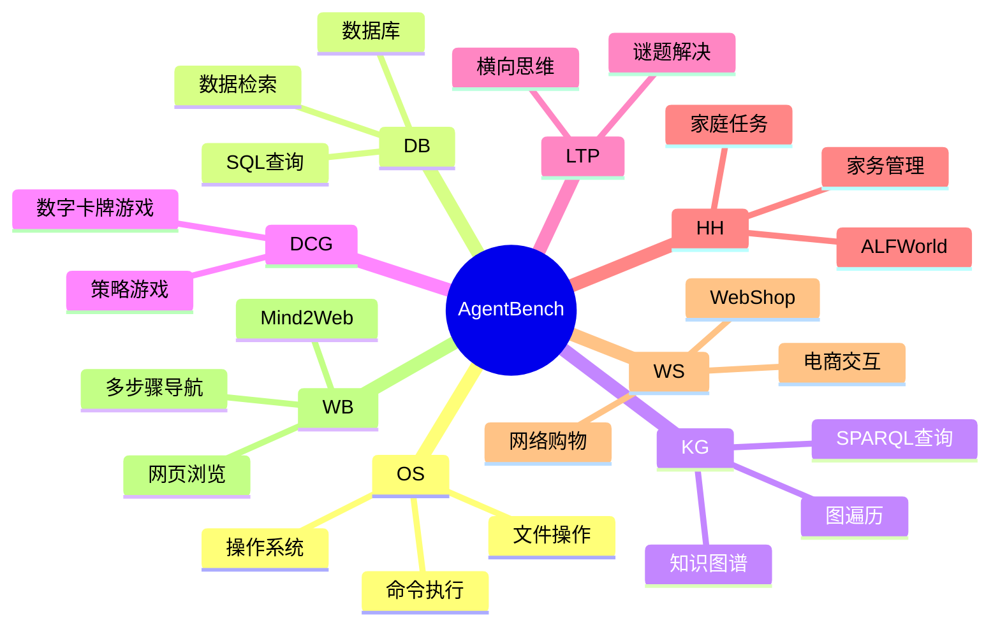
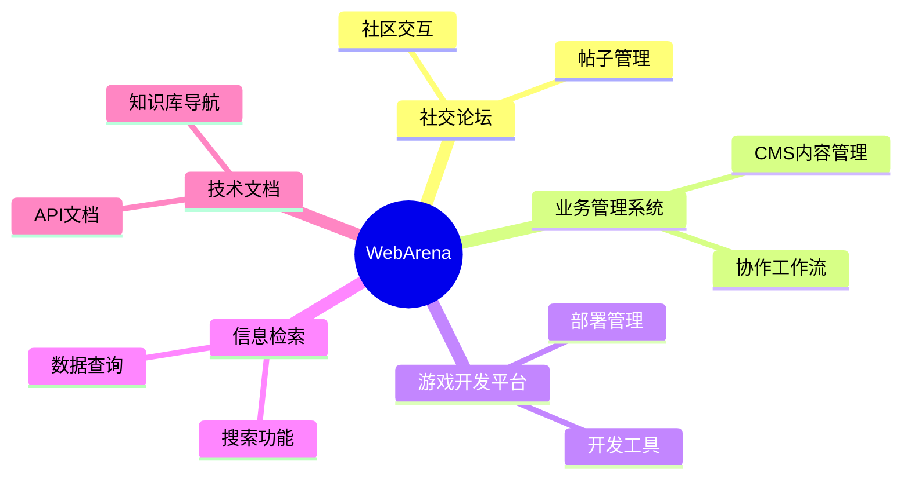
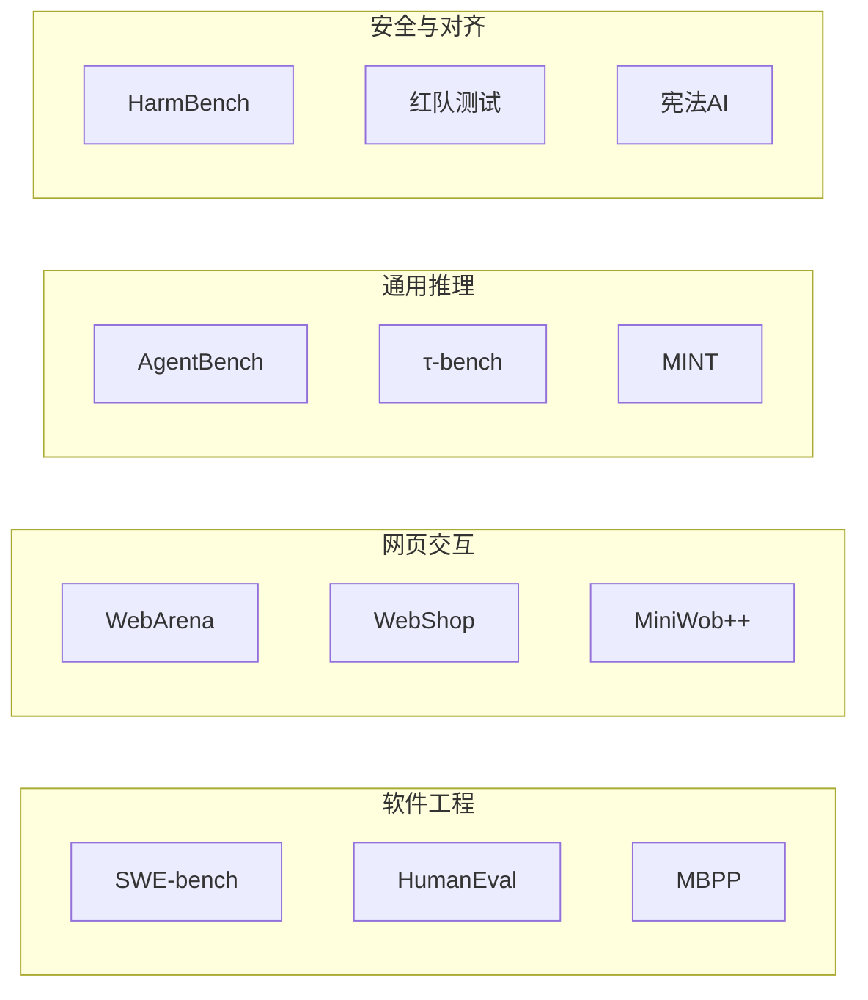

# Agent 评测与基准

全面指导 AI Agent 的评测、基准测试和优化。本文档涵盖评测框架、指标、测试策略以及构建生产级 AI Agent 的最佳实践。

## 1. 评测框架

### 1.1 AgentBench（清华大学/知识工程实验室）

**概述**：全面的多维基准测试，用于在 8 个不同环境中评估 LLM 作为 Agent 的表现。

**仓库**：[THUDM/AgentBench](https://github.com/THUDM/AgentBench)

**覆盖的环境**：



**快速开始**：

```bash
# 克隆并设置
git clone https://github.com/THUDM/AgentBench.git
cd AgentBench
conda create -n agent-bench python=3.9
conda activate agent-bench
pip install -r requirements.txt

# 配置 API 密钥
# 编辑 configs/agents/openai-chat.yaml 填入你的 API 密钥

# 运行评测
python -m src.start_task -a
python -m src.assigner
```

**关键特性**：

- 多轮交互评测（LLM 生成约 4k-13k tokens）
- 基于 Docker 的环境隔离
- 自动化任务执行器部署
- 模型对比排行榜

---

### 1.2 SWE-bench（普林斯顿 NLP）

**概述**：基于真实 GitHub 流行仓库 issue 的评测基准。

**仓库**：[SWE-bench/SWE-bench](https://github.com/swe-bench/SWE-bench)

**数据集**：

| 数据集 | 说明 |
|--------|------|
| **SWE-bench Full** | 来自 12 个仓库的 2,294 个实例 |
| **SWE-bench Verified** | 500 个手动验证的问题（与 OpenAI 合作创建） |
| **SWE-bench Lite** | 300 个具有挑战性的实例 |
| **SWE-bench Multimodal** | 视觉软件工程任务 |

**使用方式**：

```python
from datasets import load_dataset

# 加载 SWE-bench
swebench = load_dataset('princeton-nlp/SWE-bench', split='test')

# 运行评测
python -m swebench.harness.run_evaluation \
    --dataset_name princeton-nlp/SWE-bench_Lite \
    --predictions_path <预测结果路径> \
    --max_workers 8 \
    --run_id <运行ID>
```

**关键特性**：

- 真实软件工程挑战
- 基于 Docker 的可复现评测
- 支持通过 Modal 或 sb-cli 进行云端评测
- SWE-agent 取得最佳性能

---

### 1.3 WebArena（卡内基梅隆大学）

**概述**：用于评估自主 Agent 在多标签网页任务上的真实感 Web 环境。

**仓库**：[web-arena-x/webarena](https://github.com/web-arena-x/webarena)

**特性**：

- 可自托管的 Web 环境（Reddit、GitLab、CMS）
- 基于地图的导航，实现真实的多页面工作流
- 5 大类评测：



**资源**：

- [WebArena](https://webarena.dev/)
- [WebArena-Infinity](https://webarena.dev/)：在演进环境中进行可扩展评测

---

### 1.4 DeepEval（Confident AI）

**概述**：开源 LLM 评测框架，包含 50+ 指标，用于测试 AI Agent、RAG 和聊天机器人。

**仓库**：[confident-ai/deepeval](https://github.com/confident-ai/deepeval)

**网站**：[deepeval.com](https://deepeval.com/)

**关键特性**：

- 原生 Pytest 评测，集成 CI/CD
- 50+ 基于研究的指标
- 多模态支持（文本、图像、音频）
- G-Eval 用于基于标准的思维链评分
- Agent 追踪可视化，便于调试

---

### 1.5 RAG 评测框架

**RAGAS**（RAG 评估）：

- 忠实度、答案相关性、上下文精确率/召回率
- 自动化指标计算

**TruLens**：

-  groundedness（ grounding）、答案正确性、上下文相关性
- 反馈驱动的评测

**LangSmith**（LangChain）：

- 端到端追踪和评测
- A/B 测试能力

## 2. 指标与基准测试

### 2.1 核心性能指标

| 指标 | 描述 | 使用场景 |
|------|------|----------|
| **成功率** | 成功完成任务的比例 | 通用能力评估 |
| **任务完成度** | Agent 是否达成目标 | 二值成功/失败 |
| **步骤准确率** | 单个动作的正确性 | 调试 Agent 行为 |
| **响应时间** | 从输入到输出的延迟 | 性能优化 |
| **Token 使用量** | 每个任务消耗的 Token | 成本效率 |
| **错误率** | 失败或崩溃的频率 | 可靠性评估 |

### 2.2 质量指标

| 指标 | 计算公式 | 目标值 |
|------|----------|--------|
| **忠实度** | 正确事实数 / 响应中总事实数 | > 0.90 |
| **答案相关性** | 相关内容 / 总内容 | > 0.85 |
| **上下文精确率** | 相关块排名靠前 | > 0.80 |
| **幻觉率** | 错误陈述 / 总陈述 | < 0.05 |
| **有用性** | 用户满意度评分 | > 4/5 |

### 2.3 基准测试分类



## 3. 测试策略

### 3.1 Agent 单元测试

```python
# test_agent_unit.py
import pytest
from deepeval import assert_test
from deepeval.metrics import TaskCompletenessMetric, FaithfulnessMetric
from deepeval.test_case import LLMTestCase

# 参数化测试用例
@pytest.mark.parametrize("input,expected", [
    ("什么是退款政策？", "policy_info"),
    ("显示我的订单", "order_list"),
    ("取消订单 #123", "confirmation"),
])
def test_agent_response(input, expected):
    test_case = LLMTestCase(input=input)
    result = my_agent(test_case.input)
    assert expected in result.lower()

@pytest.mark.parametrize("test_case", [
    LLMTestCase(input="解释退款流程", expected_output="30天窗口期"),
    LLMTestCase(input="帮助处理订单 #9281", expected_output="订单详情"),
])
def test_agent_quality(test_case: LLMTestCase):
    response = my_agent(test_case.input)
    test_case.actual_output = response
    assert_test(
        metrics=[
            TaskCompletenessMetric(threshold=0.7),
            FaithfulnessMetric(threshold=0.9),
        ],
        test_case=test_case
    )
```

### 3.2 集成测试

```python
# test_agent_integration.py
import pytest
from deepeval.tracking import AgentTrace

def test_checkout_flow():
    trace = AgentTrace()
    with trace:
        # 步骤 1：用户添加商品到购物车
        response = agent.chat("添加商品 #123 到购物车")

        # 步骤 2：用户进行结算
        response = agent.chat("使用标准配送进行结算")

        # 步骤 3：用户确认支付
        response = agent.chat("确认支付")

    # 验证追踪得分良好
    assert trace.score > 0.85
    assert trace.passed_metrics >= 4

@pytest.mark.parametrize("user_persona", [
    "首次购物者",
    "回头客",
    "高级会员",
])
def test_persona_journey(user_persona):
    agent = create_agent(persona=user_persona)
    trace = run_journey(agent, user_persona)
    assert trace.completion_rate > 0.9
```

### 3.3 回归测试

```bash
# 运行回归测试套件
deepeval test run tests/test_agent.py -n 4

# 与基线对比
deepeval compare --baseline ./baseline_results.json --current ./current_results.json
```

## 4. 优化技术

### 4.1 成本优化

```python
# cost_optimizer.py
class AgentCostOptimizer:
    def __init__(self, agent, budget_per_task=0.50):
        self.agent = agent
        self.budget = budget_per_task

    def run_with_budget(self, task):
        start_cost = get_api_cost()
        result = self.agent.run(task, max_tokens=4000)
        actual_cost = get_api_cost() - start_cost

        if actual_cost > self.budget:
            # 切换到更快的模型处理类似任务
            self.agent.model = "gpt-3.5-turbo"
        return result

    def batch_optimize(self, tasks, batch_size=10):
        results = []
        for i in range(0, len(tasks), batch_size):
            batch = tasks[i:i+batch_size]
            batch_results = self.run_batch_cached(batch)
            results.extend(batch_results)
        return results
```

### 4.2 延迟优化

```python
# latency_optimizer.py
# 第 1 段：模块头与依赖导入
# asyncio 是本文件全部延迟优化手段的底层支撑：gather 提供并发扇出，
# 异步迭代协议（async for）提供流式产出。除此之外不引入任何第三方库，
# 保证该优化层可以零成本嵌入现有 agent 框架。
import asyncio

# 第 2 段：优化器类与依赖注入
# 采用组合而非继承：LatencyOptimizer 只持有 agent 引用，不关心 agent 的具体实现，
# 只要它暴露 call_tool / retrieve / stream 三个方法即可；这样同一套优化策略
# 可以套在任意后端（本地模型、远端 API、mock）上，也便于单元测试时替换假 agent。
class LatencyOptimizer:
    def __init__(self, agent):
        self.agent = agent

    # 第 3 段：并行工具调用（把串行等待压成一次等待）
    # 串行执行 n 个工具的总耗时是各工具耗时之和，并行后约等于最慢的那个（max），
    # 因此这一段的收益在工具数量多、单个工具耗时长时最明显。
    # 前提是这些工具之间没有数据依赖，否则并行会读到未就绪的中间状态。
    async def parallel_tool_calls(self, tools):
        """并行执行独立的工具调用"""
        tasks = [self.agent.call_tool(t) for t in tools]  # 此处只创建协程对象，真正的调度发生在 gather 内部，协程并不会提前跑起来
        return await asyncio.gather(*tasks)  # 返回值顺序与 tools 顺序严格一致，而非按完成先后排列；任一任务抛异常会向上传播，其余任务默认不被取消

    # 第 4 段：带缓存的检索（用空间换时间，避免重复的昂贵检索）
    # 检索通常是整条链路里最贵的一步，命中缓存时直接返回可以把延迟降到 O(1)。
    # 易错点：hash(query) 依赖进程内的哈希随机化（PYTHONHASHSEED），跨进程不可复现，
    # 且不同 query 理论上可能哈希碰撞，从而命中错误结果；生产环境应换成摘要（如 sha256）。
    # 另外 cache 是调用方传入的可变对象，本方法会就地写入，属于显式副作用；
    # 目前没有 TTL 与容量上限，长期运行需外部负责淘汰，否则内存会持续增长。
    def cached_retrieval(self, query, cache):
        """有缓存时使用缓存结果"""
        cache_key = hash(query)  # 只有可哈希对象才能作 key，query 若是 list/dict 会在此处直接抛 TypeError
        if cache_key in cache:
            return cache[cache_key]  # 命中路径不触碰 agent，这是延迟收益的来源
        result = self.agent.retrieve(query)  # 未命中才做真实检索，注意这是同步调用，会阻塞当前事件循环
        cache[cache_key] = result  # 先取结果再写缓存，保证缓存里不会出现半成品
        return result

    # 第 5 段：流式响应（优化感知延迟而非总延迟）
    # 总耗时并没有变短，但首字节时间（TTFT）大幅提前，用户能立刻看到输出在增长，
    # 这是把"等待 3 秒"变成"等待 0.2 秒然后持续有反馈"的关键。
    # 该函数是异步生成器：调用它不会执行函数体，只有被 async for 或 anext() 驱动时
    # 才会真正开始消费 agent.stream，因此不能对它直接 await。
    # 下游消费速度慢时会通过异步生成器的背压机制向上游传导，避免无限缓冲。
    async def streaming_response(self, prompt):
        """流式响应以改善感知延迟"""
        async for chunk in self.agent.stream(prompt):
            yield chunk  # 逐个 chunk 向上游透传，不做聚合或改写，保证最早可用信息第一时间抵达调用方
```
### 4.3 质量优化

```python
# quality_optimizer.py
class QualityOptimizer:
    def __init__(self, agent, metrics):
        self.agent = agent
        self.metrics = metrics

    def self_correct(self, task, max_attempts=3):
        """Agent 自我纠错循环"""
        for attempt in range(max_attempts):
            result = self.agent.run(task)

            scores = [m.measure(result) for m in self.metrics]
            if all(s >= m.threshold for s, m in zip(scores, self.metrics)):
                return result

            # 生成纠正提示
            correction = self.generate_feedback(scores, self.metrics)
            task = f"{task}\n\n反馈：{correction}"

        return result

    def ensemble_vote(self, tasks, n_agents=3):
        """运行多个 Agent 并投票选出最佳结果"""
        results = [agent.run(task) for agent in self.agents[:n_agents]]
        return self.vote(results)
```

## 5. 代码示例

### 5.1 使用 DeepEval 进行基础 Agent 评测

```python
# agent_eval_example.py
from deepeval import assert_test
from deepeval.metrics import (
    TaskCompletenessMetric,
    FaithfulnessMetric,
    AnswerRelevancyMetric,
)
from deepeval.test_case import LLMTestCase

# 定义测试用例
test_cases = [
    LLMTestCase(
        input="一月订单的退款政策是什么？",
        expected_output="适用30天退换窗口",
    ),
    LLMTestCase(
        input="显示上个月的订单",
        expected_output="历史订单列表",
    ),
    LLMTestCase(
        input="我需要更改我的收货地址",
        expected_output="地址更新确认",
    ),
]

# 定义指标
metrics = [
    TaskCompletenessMetric(threshold=0.8),
    FaithfulnessMetric(threshold=0.9),
    AnswerRelevancyMetric(threshold=0.85),
]

# 运行评测
for test_case in test_cases:
    response = checkout_agent(test_case.input)
    test_case.actual_output = response

    assert_test(metrics=metrics, test_case=test_case)
```

### 5.2 使用 AgentBench 进行 Agent 基准测试

```python
# agentbench_example.py
import os
import yaml

# 配置 Agent
agent_config = {
    "model": "gpt-4",
    "temperature": 0.7,
    "max_tokens": 2048,
    "api_key": os.getenv("OPENAI_API_KEY"),
}

# 运行特定任务
task = "dbbench-std"
config = load_config(f"configs/tasks/{task}.yaml")

results = evaluate_agent(
    agent=agent_config,
    task=task,
    num_samples=100,
    max_workers=4,
)

print(f"成功率：{results.success_rate:.2%}")
print(f"平均步数：{results.avg_steps:.1f}")
```

### 5.3 SWE-bench 评测

```python
# swebench_example.py
from swebench.harness.run_evaluation import run_evaluation
from datasets import load_dataset

# 加载测试实例
dataset = load_dataset("princeton-nlp/SWE-bench_Lite", split="test")

# 在每个实例上运行 Agent
predictions = []
for instance in dataset:
    prediction = swe_agent.resolve(instance)
    predictions.append({
        "instance_id": instance["instance_id"],
        "prediction": prediction["patch"],
    })

# 评测预测结果
results = run_evaluation(
    predictions_path=predictions,
    max_workers=8,
    run_id="my-agent-eval",
)

print(f"已解决：{results.resolved_count}/{len(dataset)}")
print(f"得分：{results.resolved_count / len(dataset):.2%}")
```

### 5.4 多指标 Agent 测试

```python
# multi_metric_test.py
from deepeval.metrics import GEval
from deepeval.test_case import LLMTestCase
from deepeval import assert_test

# 定义自定义 G-Eval 指标
response_quality_metric = GEval(
    name="Response Quality",
    criteria="评估回复是否："
             "1. 完整回答用户问题"
             "2. 提供准确信息"
             "3. 使用适当的语气和格式",
    evaluation_params=[
        SingleTurnParams.ACTUAL_OUTPUT,
        SingleTurnParams.EXPECTED_OUTPUT,
    ],
)

# 自定义确定性指标
def tool_call_accuracy(prediction: str, expected: str) -> float:
    """检查是否调用了正确的工具"""
    predicted_tools = extract_tool_names(prediction)
    expected_tools = extract_tool_names(expected)
    return len(set(predicted_tools) & set(expected_tools)) / len(expected_tools)

# 运行综合测试
@pytest.mark.parametrize("test_case", load_test_cases("agent_test_cases.json"))
def test_agent_comprehensive(test_case: LLMTestCase):
    result = my_agent.run(test_case.input)
    test_case.actual_output = result.output
    test_case.tools_called = result.tool_calls

    assert_test(
        metrics=[
            response_quality_metric,
            TaskCompletenessMetric(),
            FaithfulnessMetric(),
            AnswerRelevancyMetric(),
        ],
        test_case=test_case
    )
```

### 5.5 CI/CD 集成

```yaml
# .github/workflows/agent-eval.yml
# 第 1 段：工作流元信息（文件名 + 名称）
# 文件名决定 GitHub 识别的工作流标识；name 只作用于 UI 展示，改它不影响触发逻辑。
# 注意：工作流必须放在仓库根目录的 .github/workflows/ 下，否则 GitHub 根本不会加载。
name: Agent 评测

# 第 2 段：触发条件（on）
# 采用"双保险"策略：push 守护 main 的最终真相，pull_request 在合入前做拦截，
# 这样评测失败既能阻止坏代码进主干，也能在 PR 阶段给出最早的反馈。
on:
  push:
    branches: [main]
  pull_request:
    branches: [main]

# 第 3 段：任务声明（jobs / 执行环境）
# 每个 job 默认运行在独立的全新虚拟机上，因此必须在 job 内部重新准备工具链，
# 无法复用上一次运行的 Python 环境或缓存（除非显式配置 cache）。
jobs:
  evaluate:
    # ubuntu-latest 由 GitHub 滚动升级，追求极致复现性的项目应锁成 ubuntu-22.04 之类。
    runs-on: ubuntu-latest

    # 第 4 段：步骤流水线（steps，按顺序串行执行）
    # 关键数据流：checkout 取出源码 → setup-python 备好解释器 → 装依赖 → 跑评测 → 上传产物。
    # 任一步非零退出即中断整个 job 并标记失败，这正是评测门禁（gate）想要的效果。
    steps:
      # 必须先 checkout：否则后续步骤的工作目录是空的，找不到 tests/ 与 requirements.txt。
      - uses: actions/checkout@v4

      # 第 5 段：准备 Python 运行时
      # 显式指定 3.9 而非依赖系统默认版本，是为了让 CI 与本地/生产版本对齐，
      # 避免"本地能过、CI 挂掉"这类由解释器差异（如 f-string、typing 行为）引发的幽灵问题。
      - name: 设置 Python
        uses: actions/setup-python@v5
        with:
          python-version: '3.9'

      # 第 6 段：安装依赖
      # 先装 deepeval（评测框架本身，提供 CLI），再装业务依赖，顺序上先框架后项目。
      # 易错点：两条命令写在同一个 run 里，只有最后一条决定退出码，
      # 若 pip install deepeval 失败但第二条成功，这一步可能被误判为通过。
      - name: 安装依赖
        run: |
          pip install deepeval
          pip install -r requirements.txt

      # 第 7 段：执行 Agent 评测（本工作流的核心动作）
      # 反斜杠续行把一条命令拆成多行，提升可读性；参数含义：
      #   --model gpt-4    ：指定评判/被测所用模型，需确保已配置对应 API Key（通常走 secrets）。
      #   --threshold 0.85 ：0.85 是质量红线，低于它 deepeval 返回非零码，进而让 job 失败，实现自动卡点。
      # 复杂度提示：真实评测会多次调用外部大模型，属于高延迟、高费用步骤，
      # 因此阈值与模型的选择直接决定 CI 的耗时、成本与误报率。
      - name: 运行 Agent 测试
        run: |
          deepeval test run tests/agent_tests.py \
            --model gpt-4 \
            --threshold 0.85

      # 第 8 段：归档评测产物
      # 上传 ./results/ 让测试报告在 job 结束后仍可下载查看——CI 虚拟机会被销毁，
      # 不落盘上传就等于数据永久丢失，失败时的排查将无从下手。
      # 边界条件：upload-artifact 默认 path 不存在会告警（非硬失败），
      # 所以只有确保上一步真的生成了 results/ 目录，产物才会被可靠保留。
      - name: 上传结果
        uses: actions/upload-artifact@v4
        with:
          name: eval-results
          path: ./results/
```
## 6. 最佳实践总结

1. **从成熟的基准测试开始**（AgentBench、SWE-bench、WebArena）进行基线对比
2. **结合多个指标** - 单一指标无法完全捕获 Agent 质量
3. **在真实环境中测试** - 使用容器化评测以确保可复现性
4. **迭代分析失败** - 分析追踪数据以了解 Agent 的弱点
5. **迭代优化** - 根据使用场景平衡成本、延迟和质量
6. **集成到 CI/CD** - 在部署前捕获回归问题
7. **使用自我纠错循环** - 使 Agent 能够改进自己的输出
8. **监控生产质量** - 用真实使用数据追踪长期指标

## 7. 参考资源

- [AgentBench GitHub](https://github.com/THUDM/AgentBench)
- [SWE-bench](https://github.com/swe-bench/SWE-bench)
- [WebArena](https://github.com/web-arena-x/webarena)
- [DeepEval](https://github.com/confident-ai/deepeval)
- [斯坦福 AI 指数报告 2026](https://hai.stanford.edu/ai-index-report)

## 深入阅读与参考

!!! tip "怎么用这些资料"
    先读「官方文档与规范」建立准确的概念，再读「源码与示例」核对细节，最后用「教程、书籍与视频」换一种讲法加深理解。每条都写明了读哪一节、带着什么问题读。

### 官方文档与规范

| 资源 | 为什么读 | 怎么读 |
|---|---|---|
| [SWE-bench](https://swe-bench.github.io/) | 编码 Agent 最常用基准，排行榜与任务格式是评测指标设计的参照。 | 浏览任务格式与排行榜，思考评测集如何构造，再为自己的 Agent 设计一个小型编码基准。 |
| [Google ADK 文档](https://google.github.io/adk-docs/) | 官方文档含 Agent 评测功能，可快速搭建带评测的多工具 Agent。 | 跟快速开始建多工具 Agent，重点看评测章节，运行一次评测并查看指标输出。 |
| [OpenAI Agents SDK（Python）](https://openai.github.io/openai-agents-python/) | 官方 SDK 文档，Quickstart 与 handoff 可作多 Agent 评测的代码基础。 | 复现 Quickstart 并加一个 handoff，记录运行轨迹，为后续评测准备可观测输出。 |
| [Claude 子 Agent 文档](https://docs.claude.com/en/docs/claude-code/sub-agents) | 官方说明如何限制子 Agent 工具权限，是子 Agent 评测与安全测试的规范。 | 创建一个只读代码审查 subagent，限制工具后运行，记录越权或失败案例用于测试。 |

### 源码与示例

| 资源 | 为什么读 | 怎么读 |
|---|---|---|
| [Inspect AI 仓库](https://github.com/UKGovernmentBEIS/inspect_ai) | 评测框架源码，示例展示沙箱运行与工具评分，直接对应评测实现。 | 读 examples 中 agent 评测示例，带着“如何隔离并给工具调用打分”读，复现一个最小评测。 |
| [Google ADK（Python）仓库](https://github.com/google/adk-python) | samples 目录提供可运行 Agent 抽象，便于对照评测代码结构。 | 读 samples 中 Agent 定义与评测入口，对比自己框架，摘录可复用的评测代码。 |
| [Claude Agent SDK（TypeScript）](https://github.com/anthropics/claude-agent-sdk-typescript) | 可运行 TypeScript 示例，展示工具注册与调用日志，便于评测采集。 | 跑 README 示例，注册自定义工具，观察日志格式，思考评测如何采集工具调用。 |
| [smolagents 仓库](https://github.com/huggingface/smolagents) | 不到千行核心代码，最小 Agent 循环是理解评测对象的基础。 | 精读核心循环代码，画出执行步骤，再写单测验证循环终止与工具调用。 |
| [pi 编码 Agent 工具集](https://github.com/earendil-works/pi) | 真实编码 Agent 的 agent loop 与统一 LLM API，对照可发现评测盲点。 | 读 agent loop 实现，与自己的循环对比，列出可评测的关键状态与边界条件。 |

### 教程、书籍与视频

| 资源 | 为什么读 | 怎么读 |
|---|---|---|
| [LLM Powered Autonomous Agents（Lilian Weng）](https://lilianweng.github.io/posts/2023-06-23-agent/) | 经典长文，规划、记忆、工具三部分清晰，是理解评测维度的教程。 | 精读规划、记忆、工具三节，各写一段理解，列出对应的可评测指标。 |
| [A practical guide to building agents（OpenAI）](https://cdn.openai.com/business-guides-and-resources/a-practical-guide-to-building-agents.pdf) | OpenAI 实践指南，模型、工具、指令三要素可作评测检查清单。 | 读完后用三要素检查自己的 Agent，标出缺失项并转化为测试用例。 |
| [Effective context engineering for AI agents](https://www.anthropic.com/engineering/effective-context-engineering-for-ai-agents) | 讲上下文工程优化，直接影响 Agent 效果评测与 token 指标。 | 读完检查 Agent 提示，删重复上下文，记录 token 变化并对比任务成功率。 |
| [How we built our multi-agent research system](https://www.anthropic.com/engineering/multi-agent-research-system) | Anthropic 多 Agent 系统复盘，含评测与迭代方法，实战性强。 | 读评测与提示工程部分，画出 lead/subagent 调用图，思考何时值得多 Agent。 |

## 应用与行业实践

原理讲完，接下来看它落在哪里。下面按场景地图、三个拆解、行业做法、落地路线、动手作业五段展开。

### 应用场景地图

| 场景 | 用到本页哪个知识点 | 典型技术选型 | 注意事项 |
|:--|:--|:--|:--|
| 客服工单自动分级与回复草稿 | 离线评测集、判分模型、回归测试 | 数据集工具（如 LangSmith）+ 自定义打分器 | 判分口径要与业务对齐，靠人工抽检校准 |
| 内部知识库 RAG 问答 | 检索指标与生成指标分开测 | Ragas + 自建金标问答对 | 先固定检索再评生成，混测无法定位问题 |
| CI 失败自动修复 Agent | 轨迹评测、pass@k、测试作为判定 | SWE-bench 风格容器 + pytest | 测试通过不等于补丁可合，要加复核 |
| Text-to-SQL 数据问答 | 结果集比对、执行成功率 | 执行后比结果集 + 语义等价判定 | 只比字符串会误判等价写法 |
| 浏览器 Agent 填报后台表单 | 端到端任务成功率、步骤级断言 | Playwright 脚本 + 轨迹日志 | 页面改版会让用例失效，需定期维护 |
| 外呼语音 Agent | 延迟指标、转人工与打断指标 | 流式 ASR/TTS + 分阶段时延埋点 | 只测端到端总延迟，无法定位卡在哪一段 |
| 多轮订票改签 Agent | 状态正确性、工具调用成功率 | 状态机断言 + 会话回放 | 要覆盖失败重试与用户中途改口 |
| 代码评审助手 | 采纳率、误报率、盲评 | 双盲人工评审 + 埋点 | 采纳率受团队习惯影响，需与盲评同看 |

### 三个场景拆解

#### 场景 1：客服工单自动分级与回复草稿

**业务背景**：工单量随业务线性增长，分级口径靠老员工口述，新人判断不一致。可让两人独立标注同一批历史工单，先测标注一致率，它决定评测集质量的上限。

**怎么用本页知识解决**：思路是把口径固化成金标集，再把输出拆成"分级"和"草稿"两段分别打分，分级用确定性指标，草稿才用判分模型。

```python
# 1. 金标集：同一批历史工单，两人独立标注，只留一致的样本
gold = load_golden_set(min_agreement=0.8)  # 一致率低于阈值的不入库

# 2. 分级用确定性指标，不交给模型判分
grade_acc = exact_match(agent.grade(t), t.gold_grade)

# 3. 草稿用判分模型，固定 rubric 与温度，要求给出理由
score = judge(t, draft, rubric=RUBRIC, temperature=0)

# 4. 记录工具调用轨迹，失败步骤单独统计
for step in trace.steps:
    record(step.name, step.ok, step.latency_ms)

# 5. 每次改提示词都重跑同一套用例，与上次结果对比
run_eval(dataset=gold, tags=["prompt-v3"])
```

- 分级与草稿分开打分，因为分级的正确答案唯一，草稿没有唯一解。
- 判分模型的温度设为 0，是为了让同一输入两次跑分接近。
- 轨迹里每个步骤单独记录成败，失败集中在哪一步可以直接看出来。
- 用例集带上标签，改提示词后能按标签筛出变化的那一批。

**怎么度量收益**：看分级准确率（与金标一致的比例）、草稿采纳率（客服点击采纳数除以草稿总数）、轨迹中工具调用成功率、P95 延迟。用 LangSmith 或 MLflow 记录每次 run，另抽 30 条做人工校准。

**什么时候不该用**：工单每天只有几十条，且分级口径随客户变化，建评测集的成本高于人工处理。判分模型与业务口径对不齐，又没人做人工抽检，此时分数不可信，不能据此上线。

#### 场景 2：CI 失败自动修复 Agent

**业务背景**：主干上每天出现多次 CI 失败，多数由依赖升级或小改动引起。修复请求排队等人处理，等待时间随团队规模增长。

**怎么用本页知识解决**：用仓库已有的测试作为判定标准，把补丁放进隔离容器执行，用 pass@k 观察稳定性，同时限制改动面。

```python
# 1. 从历史修复提交里挖用例：失败测试 + 真实修复补丁
cases = mine_from_git(repo, label="ci-fix")

# 2. 每个用例在隔离容器里跑，避免污染宿主环境
with sandbox(image="repo-ci:latest") as box:
    box.apply(base_commit)

# 3. pass@k：同一任务跑 k 次，统计至少一次通过的比例
passed = any(run_agent(case, box) for _ in range(k))
record("pass@k", passed, k=k)

# 4. 通过测试后还要看改动面，防止删测试换绿灯
assert diff_lines(patch) < MAX_DIFF   # 限制单次改动规模
assert not touches_tests(patch)       # 默认不允许改测试文件

# 5. 结果写回评测库，按失败原因聚类看退化
store(case_id, patch, result, failure_reason)
```

- 用例来自真实提交，题目难度与线上分布一致，避免自造玩具题。
- 容器隔离让评测可重复，同一用例两次执行的环境相同。
- pass@k 反映的是稳定性，pass@1 高但 pass@k 不高，说明结果靠运气。
- 限制改动行数并禁止改测试，堵住"删掉断言"这条捷径。
- 按失败原因聚类，可以看出是依赖问题变多，还是某类改动变难。

**怎么度量收益**：看 pass@1 与 pass@k、单任务 token 成本、人工复核通过率、从 CI 失败到补丁合并的时长。数据来自 CI 日志与评测库（如 MLflow）里的 run 记录，评测脚本用容器化方式固定镜像版本。

**什么时候不该用**：测试覆盖不到改动的仓库，测试通过说明不了补丁正确。只在主干上直接试跑并合并，失败会影响其他人，应先做影子模式，只评不合并。

#### 场景 3：内部知识库 RAG 问答

**业务背景**：制度与流程文档分散在多个系统，员工在群里提问，答案靠资深同事口述。文档更新频繁，答案过期后没人发现。

**怎么用本页知识解决**：把检索与生成拆成两段各自评测。先测正确片段是否被召回，再测答案是否被召回内容支持，同时统计该拒答的问题有没有拒答。

```python
# 1. 金标：问题 + 正确文档片段位置，由文档负责人标注
for q in gold_questions:
    # 2. 只评检索：看正确片段是否进入 top-k
    hits = retriever.search(q.text, k=5)
    record("recall@5", q.gold_chunk in hits)

    # 3. 只评生成：答案是否被检索到的内容支持
    answer = llm.answer(q.text, context=hits)
    record("grounded", judge_supported(answer, hits))  # 判分模型指认依据句

    # 4. 无答案的问题要能拒答，单独统计拒答正确率
    record("refusal", judge_refusal(answer, q.answerable))

# 5. 文档更新后重跑同一套问题，看哪几条从通过变失败
diff_runs(tag="docs-2024-06", tag="docs-2024-07")
```

- 检索与生成分开记录，检索没召回时生成再强也答不对。
- recall@k 只看位置，不看措辞，因此结果稳定、可复跑。
- grounded 指标要求判分模型指出依据句，减少凭印象给分。
- 拒答单独统计，因为"什么都说不知道"和"什么都敢答"是两类错误。
- 文档更新后跑差分，能把过期答案定位到具体文档。

**怎么度量收益**：看 recall@k、答案被支持率、拒答正确率、文档更新后的回归条数。用 Ragas 计算检索与生成指标，用 LangSmith 存数据集并做 run 对比，更新文档后固定重跑一次。

**什么时候不该用**：没有文档负责人愿意标注金标问题，评测集只能由模型自己生成，分数会自我循环。问题本身有歧义或需要跨多份文档推理，单条指标判不了对错，应先建人工评审流程。

### 行业先进实践

判分模型与人工校准（出处：OpenAI Evals 开源项目）：该项目提供了评测注册表与判分模型的使用范式，把打分过程标准化。它有效的原因是消除了每个人手写脚本的口径差。你的项目可以先写 rubric，固定温度，再抽检校准。

数据集、追踪、评估三段式（出处：LangSmith 官方文档）：做法是把线上 trace 沉淀成数据集，改提示词后按同一数据集重跑并对比。它有效是因为评测对象与线上输入同源。你可以从影子流量里挑失败样本入集。

检索与生成分开评（出处：Ragas 开源项目）：项目给出 faithfulness、answer relevancy、context recall 这类指标，分别对应生成与检索。它有效是因为把出错环节拆开了。你的项目可以先修检索指标，再修生成指标。

以真实仓库任务为基准（出处：SWE-bench 开源项目）：用真实 issue 与仓库测试作为判定，避免自造题目偏离分布。它有效是因为题目来自实际缺陷。你可以从自己仓库的历史修复提交里挖用例。

多指标、多场景的基准报告（出处：Stanford HELM 官方文档）：该项目强调按场景与多指标横向对比，而不是用一个分数排序。它有效是因为单分数会掩盖成本与延迟的差异。你的报告里应同时给出质量、成本、时延三列。

### 从学到用：落地路线

1. 试点：选一个有金标数据、失败代价低的内�部 Agent 建评测集。验收标准是同一批用例能一键复跑并输出报告。
2. 验证：用该评测集做一次提示词改动的前后对比。验收标准是同输入两次跑分差异落在判分噪声范围内。
3. 推广：把评测接进 CI，改动 Agent 相关代码必须跑评测。验收标准是失败时报告能定位到具体用例。
4. 防回退：把线上失败样本定期回灌评测集。验收标准是每条样本带来源标记，且集合条数只增不减。

### 动手作业

目标：给你手上一个小型 Agent 搭一套可复跑的评测，并证明它能发现一次提示词退化。

步骤：

1. 选一个你能拿到真实输入的任务，例如从工单文本判断类别。
2. 手工标注 30 条金标，两人独立标，只保留一致的样本。
3. 写评测脚本，输出逐条结果与汇总指标，写到本地文件。
4. 加一个判分模型打分环节，固定 rubric 与温度，要求给出理由。
5. 改一次提示词并重跑，用同一脚本输出前后对比表。
6. 把脚本接进 CI，评测失败时返回非零退出码。
7. 加一条回灌流程，把线上失败样本追加进数据集并标来源。

验收标准：

- 同一条用例连续跑两次，确定性指标结果完全一致。
- 判分模型部分两次跑分的差异不超过你事先声明的阈值。
- 数据集里每条样本带标注人与来源标记。
- 报告能列出每条失败用例的输入、期望输出、实际输出。
- CI 中评测失败会阻断合并，且能定位到具体用例。

