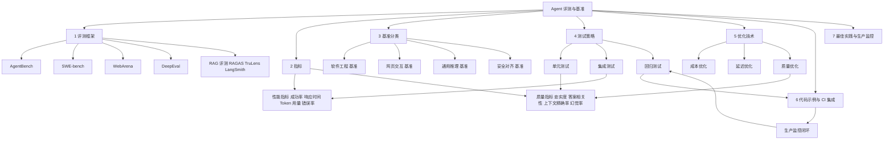
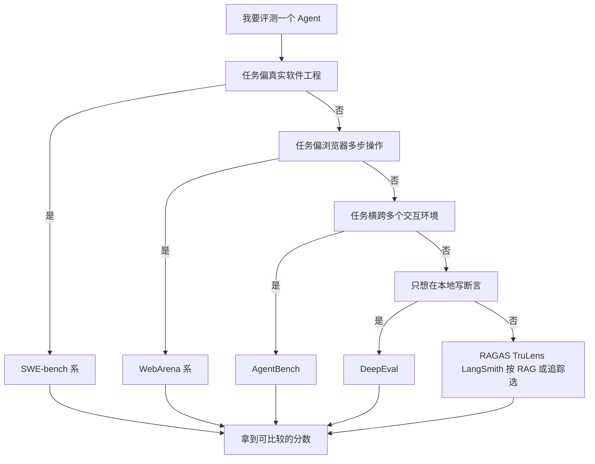
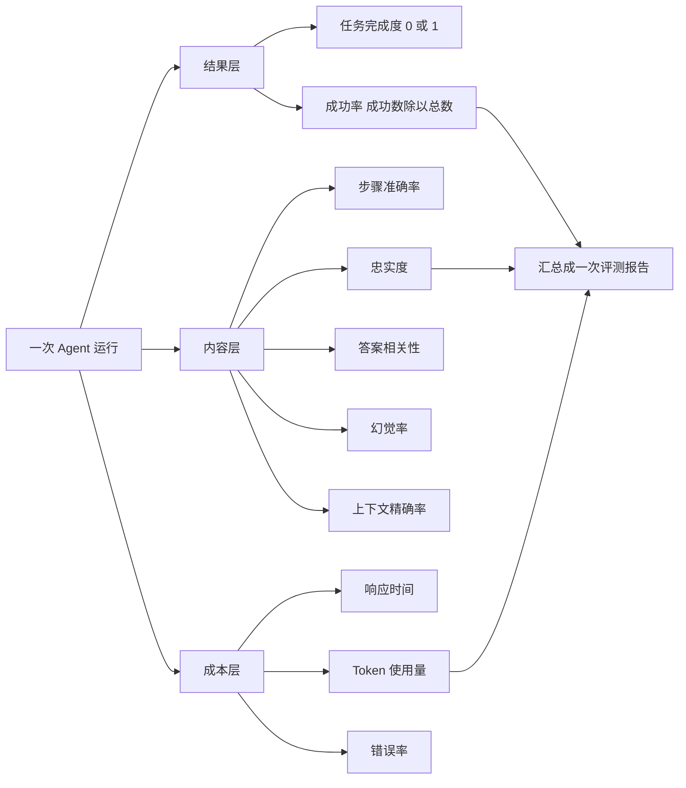
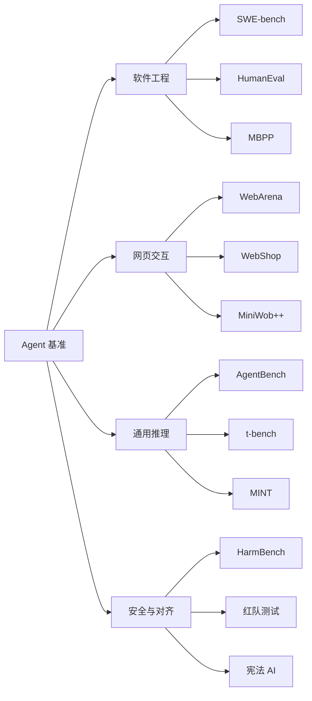
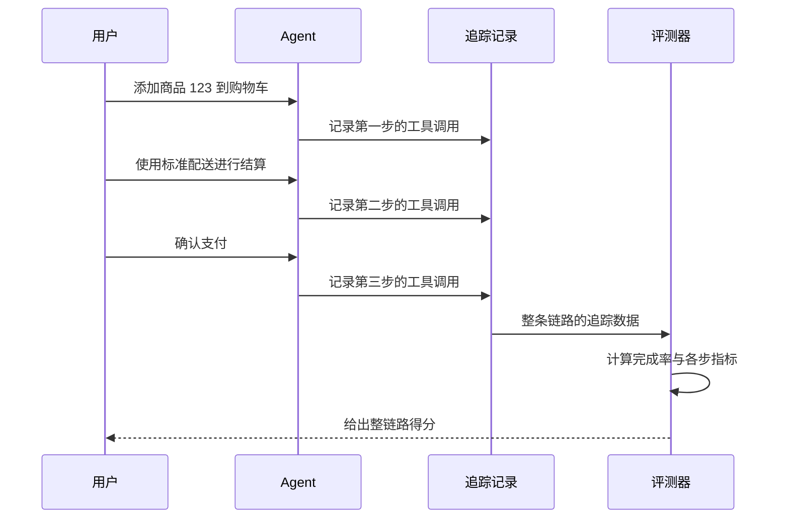
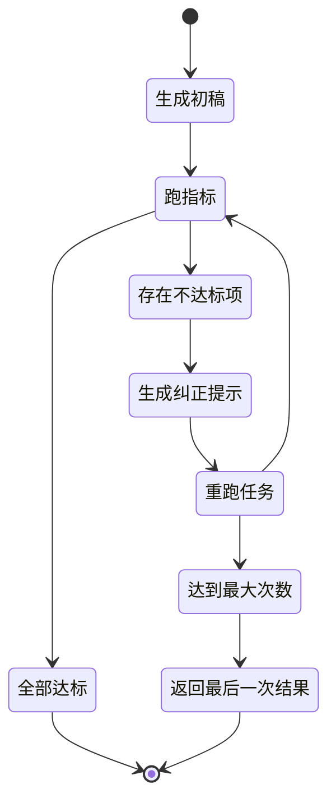
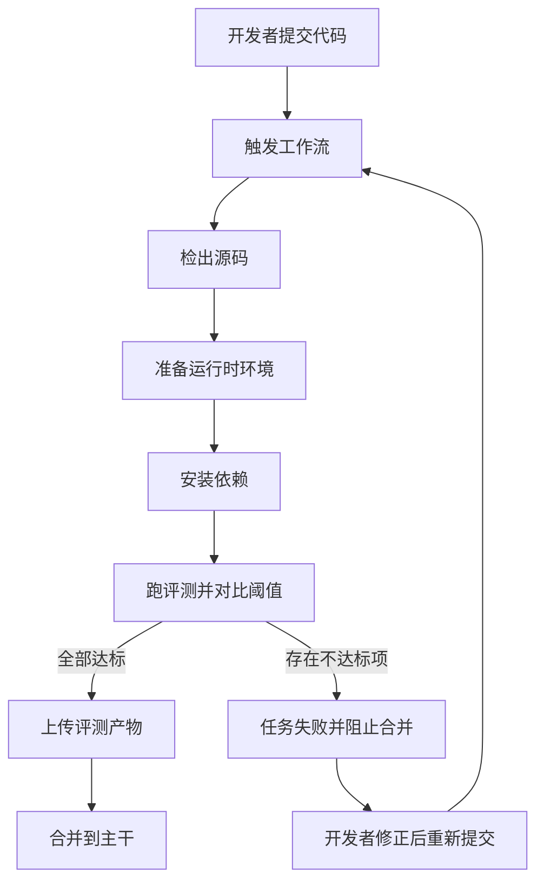
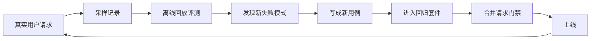

# Agent 评测与基准

!!! abstract "学完这一页你能"

    - 说出 AgentBench 覆盖的 8 个环境，并判断自己的项目该不该用它做基线。
    - 写出成功率、忠实度、幻觉率三个指标的代码，并用 node:assert 断言各自的边界。
    - 用 DeepEval 的 Pytest 写法组织一次单元测试与一次集成测试，并把阈值接到 CI 门禁上。
    - 把成本、延迟、质量三类优化写成可运行代码，并说清每种优化的失效条件。

## 0. 知识地图



建议按编号顺序读：第 1 节回答"去哪个考场考"，第 2 节回答"怎么打分"，第 3 节回答"我这题该选哪张卷子"。

第 4 到第 6 节是可落地的工程部分：怎么组织测试、怎么优化、怎么接进 CI。第 7 节把前面几节收成一套可以长期运行的做法。

!!! note "术语：LLM（大语言模型，Large Language Model）"

    用海量文本训练出来的、可以按提示生成文本的模型。例：AgentBench 评测的就是把 LLM 当作 Agent 使用时的任务表现（来源：AgentBench 官方仓库，以原文为准）。

!!! note "术语：Agent（智能体）"

    能调用工具、观察工具返回结果、并多轮推进任务的程序。例：连续调用"查询订单"和"发起退款"两个工具，直到退款状态变为完成。

!!! note "术语：指标（Metric）"

    把一次运行的原始记录折算成一个可以横向比较的数字。例：10 次任务里成功 8 次，成功率就是 0.8。

## 1. 评测框架：四个公开考场

**先想一个问题**

你给客服 Agent 换了新提示词，昨天 90 条任务里通过 81 条，今天只通过 56 条。你要先确认是 Agent 变弱了，还是评测口径被人改了。

公开评测框架就是来解决这件事的：任务固定、环境固定、判分固定，换谁来跑都是同一套标准。

!!! note "术语：基准测试（Benchmark）"

    一套固定任务集合加上固定评分规则。例：SWE-bench Lite 固定 300 个实例，判分规则是补丁能否让仓库测试通过（来源：SWE-bench 官方仓库，以原文为准）。

**心智模型**

!!! tip "心智模型"

    - 一句话模型：评测框架 = 固定的考场 + 隔离的考试环境 + 自动判卷机。
    - 日常类比：驾考有固定路线、固定扣分项、独立考场，换个人来考也是同一套标准。
    - 类比不成立的地方：驾考路线不随考生改变，Web 类考场会演进，WebArena 官方站点给出了面向演进环境的 WebArena-Infinity（来源：WebArena 官方站点，以原文为准）。

**图解**



1. 先看任务落在哪个场景：改仓库代码走 SWE-bench 系。
2. 浏览器里点页面、填表单、翻多页，走 WebArena 系。
3. 任务横跨操作系统、数据库、知识图谱、卡牌游戏、谜题、家务、购物、浏览，走 AgentBench。
4. 只想在自己仓库里写断言，走 DeepEval。
5. 评测对象是检索增强生成的问答链路，走 RAGAS、TruLens、LangSmith 三个中的一个。

**一步一步来**

**第 1 步：把 AgentBench 装起来**

AgentBench 覆盖 8 个环境，并用 Docker 做环境隔离（来源：AgentBench 官方仓库，以原文为准）。它的一次评测里，LLM 生成约 4k 到 13k tokens（来源：AgentBench 官方仓库，以原文为准）。

```bash
git clone https://github.com/THUDM/AgentBench.git
cd AgentBench
conda create -n agent-bench python=3.9   # 独立环境，避免污染本机 Python
conda activate agent-bench
pip install -r requirements.txt          # 安装评测依赖
# 编辑 configs/agents/openai-chat.yaml，填入你的 API 密钥
python -m src.start_task -a              # 启动任务执行器
python -m src.assigner                   # 分派任务，开始评测
```

**这段代码在做什么**

- 克隆仓库并创建名为 agent-bench 的独立 Python 环境。
- requirements.txt 装的是评测框架自身依赖，与你的业务依赖分开。
- 配置文件里填 API 密钥，决定被评测的模型是谁。
- start_task 启动任务执行器，assigner 负责把任务分派下去。
- 两条命令分两步跑，是因为执行器要先就绪，分派才有接收方。

运行结果：资料未覆盖终端输出，需核对 AgentBench 官方仓库 README。

**第 2 步：加载 SWE-bench 并跑官方 harness**

SWE-bench Full 来自 12 个仓库的 2,294 个实例，Verified 是 500 个手动验证问题，Lite 是 300 个实例（来源：SWE-bench 官方仓库，以原文为准）。

```python
from datasets import load_dataset

# 加载 SWE-bench 测试集，首次运行会从 Hugging Face 下载数据
swebench = load_dataset('princeton-nlp/SWE-bench', split='test')

# 用官方 harness 跑评测，预测结果由你的 Agent 先生成好
# 下面是在终端里执行，不是 Python 语句
# python -m swebench.harness.run_evaluation \
#     --dataset_name princeton-nlp/SWE-bench_Lite \
#     --predictions_path <预测结果路径> \
#     --max_workers 8 \
#     --run_id <运行ID>
```

**这段代码在做什么**

- load_dataset 拉取数据，得到一条条真实 GitHub issue 实例。
- 预测结果由你的 Agent 生成，格式是每个实例对应一个补丁。
- --dataset_name 指定用哪个子集，Lite 是 300 个实例那份。
- --max_workers 8 表示同时跑 8 个评测 worker。
- --run_id 给这次运行起名字，便于对比历史结果。

运行结果：资料未覆盖具体输出格式，需核对 SWE-bench 官方仓库 README。

**第 3 步：用 DeepEval 写第一条评测**

DeepEval 是 Confident AI 的开源 LLM 评测框架，提供 50+ 指标，并原生支持 Pytest 集成（来源：DeepEval 官方仓库，以原文为准）。

```python
# test_agent_unit.py
import pytest
from deepeval import assert_test
from deepeval.metrics import TaskCompletenessMetric, FaithfulnessMetric
from deepeval.test_case import LLMTestCase

# 参数化：每条输入对应一个期望出现的意图标签
@pytest.mark.parametrize("input,expected", [
    ("什么是退款政策？", "policy_info"),
    ("显示我的订单", "order_list"),
    ("取消订单 #123", "confirmation"),
])
def test_agent_response(input, expected):
    test_case = LLMTestCase(input=input)      # 只喂输入，先不设期望答案
    result = my_agent(test_case.input)        # 调你自己的 Agent
    assert expected in result.lower()         # 先做确定性断言
```

**这段代码在做什么**

- 用 pytest.mark.parametrize 把三条输入一次写成三个用例。
- LLMTestCase 是 DeepEval 的测试用例容器，这里只填了 input。
- my_agent 是待测对象，替换成你自己的入口函数。
- 第一层断言是确定性的字符串包含，失败时定位成本低。
- 这一层先跑通，再叠加基于模型的评分指标。

运行结果：三条用例全通过时 Pytest 报告 passed；任一断言失败则以非零码退出。

**动手验证**

下面这个脚本不依赖任何第三方包，用 Node 20+ 内置模块校验第 1 步和第 2 步里的公开数字。

```js
// 依赖：无，仅使用 Node 20+ 内置模块
// 运行：node bench-manifest.mjs
import assert from 'node:assert/strict';

// AgentBench 覆盖的 8 个环境（来源：AgentBench 官方仓库，以原文为准）
const agentBenchEnvs = ['OS', 'DB', 'KG', 'DCG', 'LTP', 'HH', 'WS', 'WB'];
assert.equal(agentBenchEnvs.length, 8, 'AgentBench 环境数应为 8');

// SWE-bench 三个数据集的实例数（来源：SWE-bench 官方仓库，以原文为准）
const sweBench = { full: 2294, verified: 500, lite: 300 };
assert.equal(sweBench.full, 2294, 'Full 实例数应为 2294');
assert.ok(sweBench.lite < sweBench.verified && sweBench.verified < sweBench.full);

// 按时间预算选数据集：预算越小选越小的子集
function pickDataset(budgetMinutes) {
  if (budgetMinutes < 30) return 'SWE-bench Lite';      // 300 个实例
  if (budgetMinutes < 240) return 'SWE-bench Verified'; // 500 个实例
  return 'SWE-bench Full';                              // 2294 个实例
}

assert.equal(pickDataset(10), 'SWE-bench Lite');
assert.equal(pickDataset(600), 'SWE-bench Full');

console.log('AgentBench 环境数:', agentBenchEnvs.length);
console.log('SWE-bench Full 实例数:', sweBench.full);
console.log('10 分钟预算选用:', pickDataset(10));
```

预期输出：

```
AgentBench 环境数: 8
SWE-bench Full 实例数: 2294
10 分钟预算选用: SWE-bench Lite
```

**常见坑**

| 现象 | 原因 | 怎么修 |
|---|---|---|
| 本地跑通，换台机器结果不一致 | 评测环境的系统依赖和 Python 版本不同 | 按 AgentBench 官方仓库用 Docker 做环境隔离 |
| 评测跑了一夜没结束 | 全量实例数大，2,294 个实例逐个跑 | 先用 Lite 的 300 个实例定位问题，再上全量 |
| 分数比别人的高，但没人信 | 没写清用的是哪个子集 | 报告里必须写数据集名称与实例数 |
| 断言全绿却漏了质量问题 | 只做了字符串包含这类确定性断言 | 叠加 TaskCompleteness、Faithfulness 这类模型评分指标 |

**用在哪里**

场景 A：电商售后客服 Agent

- 业务背景：用户在对话里查订单、问退款政策、提交退货。
- 这一节的知识怎么用：把退款政策问答和订单查询拆成参数化用例，每条用例断言一个意图标签。
- 用什么指标衡量收益：意图命中率与整链路完成率，基线值由你自己跑出来的第一版结果决定。
- 什么时候不该用：客服话术还在每天大改的探索期，先用人工抽查，等口径稳了再固化成用例。

场景 B：后台管理的批量导入助手

- 业务背景：运营上传表格，助手解析字段、校验、批量写入。
- 这一节的知识怎么用：用 SWE-bench 那种"跑完看测试是否通过"的思路，把导入结果落库断言当作判分规则。
- 用什么指标衡量收益：导入成功率与字段校验错误率。
- 什么时候不该用：导入规则本身还没有稳定口径，此时断言会锁死错误的规则。

**行业实践**

- AgentBench 官方仓库用 Docker 做环境隔离，并给出多轮交互的评测流程。借鉴方式：把评测环境写成 Dockerfile，让本地和 CI 用同一个镜像。
- SWE-bench 官方仓库提供 Docker 可复现评测，并支持通过 Modal 或 sb-cli 做云端评测。借鉴方式：重活放云端跑，本地只跑子集。
- DeepEval 官方仓库把评测做成 Pytest 用例。借鉴方式：评测文件放进 tests 目录，用现有的 npm test 或 pytest 命令统一驱动。

**小结**

1. 四个框架的分工是场景不同，不是强弱不同。
2. 评测结果必须带上数据集名称和实例数，否则分数无法比较。
3. 先用小子集定位问题，再上大子集出报告。

## 2. 指标：从成功率到忠实度

**先想一个问题**

同一个 Agent 在两个群里被夸和被骂，你打开日志发现两边都"回答完了"。区别是一边引用了正确的退款政策，另一边编了一条不存在的政策。

只看"是否完成"，这两种情况分不出来。你需要两类指标：一类算过程与成本，一类算内容对不对。

**心智模型**

!!! tip "心智模型"

    - 一句话模型：性能指标算"花了多少"，质量指标算"对不对"。
    - 日常类比：外卖看送达时间、骑手里程、订单是否取消；也看餐有没有送错、有没有少放东西。
    - 类比不成立的地方：外卖送错是确定性事件，而忠实度要靠模型或人工判分，判分本身带噪声（来源：本页旧版内容，以原文为准）。

**图解**



1. 结果层只关心任务有没有达成，任务完成度是二值，成功率是它的平均值。
2. 内容层关心每一步和每句话对不对，忠实度、相关性、幻觉率都属于这一层。
3. 成本层关心时间和钱，响应时间与 Token 使用量直接对应账单。
4. 三层指标最后汇总成一份报告，缺任何一层都会让结论偏。
5. 报告里同一层至少要放两个指标，单个指标容易互相抵消。

!!! note "术语：忠实度（Faithfulness）"

    回答中正确事实数除以回答中事实总数（来源：本页旧版内容，以原文为准）。例：一段回答有 10 条事实陈述，其中 9 条与资料一致，忠实度是 0.9。

**一步一步来**

**第 1 步：算出结果层指标**

先从最简单的开始，任务完成度是 0 或 1，成功率是它的平均。

```python
# metrics_basic.py
def task_completeness(trace):
    """trace 里记录最终状态，达成目标返回 1，否则返回 0"""
    return 1 if trace.get("goal_reached") else 0

def success_rate(results):
    """results 是多次运行的列表，每项含 goal_reached 布尔值"""
    if not results:
        return 0.0
    ok = sum(1 for r in results if r["goal_reached"])
    return ok / len(results)          # 成功数除以总数

def step_accuracy(trace):
    """步骤准确率：正确动作数除以总动作数"""
    actions = trace["actions"]
    correct = trace["correct_actions"]
    return correct / len(actions) if actions else 0.0

def token_usage(trace):
    """每次运行消耗的 Token 总量，用于估算账单"""
    return sum(step["tokens"] for step in trace["steps"])
```

**这段代码在做什么**

- task_completeness 返回 0 或 1，作为最粗的判分。
- success_rate 在空列表时返回 0.0，避免除零异常。
- step_accuracy 用来定位"结果对了但过程绕远"的情况。
- token_usage 把每步 token 加起来，直接对应成本。

运行结果：给定 10 次运行中 8 次达成目标，success_rate 返回 0.8。

**第 2 步：算出内容层指标**

内容层指标的目标值来自本页旧版内容：忠实度大于 0.90，答案相关性大于 0.85，上下文精确率大于 0.80，幻觉率小于 0.05，有用性大于 4 分（满分 5 分，以原文为准）。

```python
# metrics_quality.py
def faithfulness(correct_facts, total_facts):
    """忠实度：正确事实数除以事实总数"""
    if total_facts == 0:
        return 1.0                 # 没有事实陈述时不引入错误
    return correct_facts / total_facts

def answer_relevancy(relevant_parts, total_parts):
    """答案相关性：与问题相关的部分占总部分的比例"""
    return relevant_parts / total_parts if total_parts else 0.0

def context_precision(relevant_ranked, retrieved):
    """上下文精确率：检索结果中真正相关的比例"""
    return relevant_ranked / retrieved if retrieved else 0.0

def hallucination_rate(wrong_claims, total_claims):
    """幻觉率：错误陈述数除以总陈述数"""
    return wrong_claims / total_claims if total_claims else 0.0
```

**这段代码在做什么**

- 四个函数都做了除零保护，返回 0.0 或 1.0 而不是抛异常。
- faithfulness 的分子是正确事实数，分母是全部事实陈述数。
- hallucination_rate 与 faithfulness 关注的角度不同：前者数错的，后者数对的。
- context_precision 用来判断检索到的资料有没有排在前面。

运行结果：10 条事实里 9 条正确，faithfulness 返回 0.9，达到旧版内容给出的 0.90 目标线。

**第 3 步：把两批指标合成一次报告**

单次数字没有意义，要和上一次的报告放在一起看。

```python
# report.py
def build_report(runs, quality):
    """runs 是多次运行的记录，quality 是内容层评分结果"""
    report = {
        "success_rate": success_rate(runs),            # 结果层
        "avg_steps": sum(r["steps"] for r in runs) / len(runs),
        "avg_tokens": sum(r["tokens"] for r in runs) / len(runs),
        "faithfulness": quality["faithfulness"],        # 内容层
        "hallucination_rate": quality["hallucination_rate"],
    }
    # 逐项和阈值比，任何一项不达标就标记这次评测不通过
    report["passed"] = (
        report["success_rate"] >= 0.80
        and report["faithfulness"] > 0.90
        and report["hallucination_rate"] < 0.05
    )
    return report
```

**这段代码在做什么**

- 报告同时带结果层、成本层、内容层三组数字。
- passed 字段把阈值判断集中在一处，接 CI 时只看这一个布尔值。
- 阈值写在代码里而不是口头约定，改阈值会留下提交记录。
- avg_tokens 和 success_rate 并列，方便判断"是否花钱买到了效果"。

运行结果：一次典型报告会打印 success_rate、avg_steps、avg_tokens、faithfulness、hallucination_rate 五个数字和一个布尔值。

**动手验证**

把上面三步合成一个脚本，用 Node 20+ 复刻同一套指标计算。

```js
// 依赖：无，仅使用 Node 20+ 内置模块
// 运行：node metrics.mjs
import assert from 'node:assert/strict';

// 忠实度 = 正确事实数 / 事实总数（来源：本页旧版内容，以原文为准）
function faithfulness(correctFacts, totalFacts) {
  if (totalFacts === 0) return 1;
  assert.ok(correctFacts <= totalFacts, '正确事实数不能超过总数');
  return correctFacts / totalFacts;
}

// 幻觉率 = 错误陈述数 / 陈述总数（来源：本页旧版内容，以原文为准）
function hallucinationRate(wrongClaims, totalClaims) {
  if (totalClaims === 0) return 0;
  return wrongClaims / totalClaims;
}

// 成功率 = 达成目标次数 / 总次数
function successRate(runs) {
  if (runs.length === 0) return 0;
  return runs.filter((r) => r.completed).length / runs.length;
}

assert.equal(faithfulness(9, 10), 0.9);          // 刚好压到 0.90 目标线
assert.ok(faithfulness(9, 10) > 0.9 === false);  // 0.9 不大于 0.9，说明目标线是严格大于
assert.ok(hallucinationRate(1, 25) < 0.05);      // 1/25 等于 0.04，低于 0.05 目标线
assert.equal(successRate([{ completed: true }, { completed: false },
  { completed: true }, { completed: true }]), 0.75);

console.log('忠实度', faithfulness(9, 10).toFixed(2));
console.log('幻觉率', hallucinationRate(1, 25).toFixed(2));
console.log('成功率', successRate([{ completed: true }, { completed: false },
  { completed: true }, { completed: true }]).toFixed(2));
```

预期输出：

```
忠实度 0.90
幻觉率 0.04
成功率 0.75
```

**常见坑**

| 现象 | 原因 | 怎么修 |
|---|---|---|
| 成功率很高但用户投诉多 | 只测了结果层，没测内容层 | 把忠实度和幻觉率一起放进报告 |
| 忠实度算出来是 1.0 | 分母为零，表示这次回答里没有事实陈述 | 报告里同时输出事实陈述条数，便于识别空回答 |
| 两次评测分数不可比 | 两次的用例集合不同 | 固定用例集合，新增用例单独标注版本 |
| 阈值写死在多个文件里 | 阈值分散在各处 | 阈值集中在一个配置项，改一处生效 |

**用在哪里**

场景 A：电商商品问答助手

- 业务背景：用户问"这双鞋能七天无理由退吗"，答案必须来自店铺政策文档。
- 这一节的知识怎么用：把回答拆成事实陈述，逐条比对政策文档，算出忠实度与幻觉率。
- 用什么指标衡量收益：幻觉率降到 0.05 以下，忠实度升到 0.90 以上。
- 什么时候不该用：商品政策本身还没定稿时，比对基准不稳，指标会来回跳。

场景 B：后台管理的工单自动分类

- 业务背景：把用户工单按内容分到退款、物流、售后三个队列。
- 这一节的知识怎么用：把分类结果当作任务完成度，用成功率衡量，用步骤准确率定位误判环节。
- 用什么指标衡量收益：分类成功率与平均处理步数。
- 什么时候不该用：分类口径由业务方每天调整时，先把口径冻结再上指标。

**行业实践**

- DeepEval 官方仓库提供 50+ 基于研究的指标，并用 G-Eval 做基于标准的思维链评分。借鉴方式：先用现成指标，通用指标不成立时再写自定义判据。
- RAGAS 官方文档给出忠实度、答案相关性、上下文精确率与召回率这套 RAG 指标组合。借鉴方式：检索类功能按这套组合建仪表盘。
- TruLens 官方文档用 groundedness、答案正确性、上下文相关性三个维度做反馈。借鉴方式：把三个维度做成上线前的固定检查项。

**小结**

1. 指标分三层：结果层看有没有做成，内容层看对不对，成本层看花了多少。
2. 每个指标都要有除零保护和阈值出处，否则数字不可信。
3. 单次分数没有意义，要和上一次报告放在一起对比。

## 3. 基准分类：按能力域选卷子

**先想一个问题**

老板说"我们的 Agent 要能打败主流模型"。你打开排行榜，发现不同榜单的第一名不是同一个模型，因为卷子考的科目不同。

先搞清楚要考哪一科，再谈分数。

**心智模型**

!!! tip "心智模型"

    - 一句话模型：基准分类 = 按能力域把卷子分组，同组之间才能横比。
    - 日常类比：高考分文理，文科状元和理科状元不比同一张卷。
    - 类比不成立的地方：高考科目边界清楚，Agent 的能力域边界会互相渗透，一次网页购物里既考推理也考网页操作（来源：本页旧版内容，以原文为准）。

**图解**



1. 软件工程组考的是改仓库代码并让测试通过，判分靠仓库自带测试。
2. 网页交互组考的是在浏览器里多步操作，判分靠最终页面状态。
3. 通用推理组考的是跨环境的任务推进，AgentBench 覆盖 8 个环境（来源：AgentBench 官方仓库，以原文为准）。
4. 安全与对齐组考的是拒绝有害请求和遵守规则，判分靠规则与人工。
5. 报告里要写清用了哪一组里的哪一张卷，跨组比较要先说明。

!!! note "术语：RAG（检索增强生成，Retrieval-Augmented Generation）"

    先检索资料，再让大语言模型基于检索结果作答的链路。例：先查店铺政策文档，再生成退款答复。

**一步一步来**

**第 1 步：按能力域建立路由表**

把"我要评什么"翻译成"用哪个基准"，先在代码里固定下来。

```javascript
// bench_router.js
const CAPABILITY_BENCH = {
  software: ['SWE-bench', 'HumanEval', 'MBPP'],       // 代码与仓库任务
  web: ['WebArena', 'WebShop', 'MiniWob++'],          // 浏览器多步操作
  reasoning: ['AgentBench', 't-bench', 'MINT'],        // 跨环境任务推进
  safety: ['HarmBench', '红队测试', '宪法 AI'],         // 有害请求与规则
};

function pickBench(capability) {
  const list = CAPABILITY_BENCH[capability];
  if (!list) throw new Error('未知能力域: ' + capability); // 未知域直接报错
  return list[0];                                          // 先跑该域最主流的一支
}
```

**这段代码在做什么**

- CAPABILITY_BENCH 把四个能力域和对应基准写成映射。
- 未知能力域抛错，避免静默返回 undefined 导致后续评测空跑。
- pickBench 默认返回该域第一项，先跑最主流的一支。
- 路由表写在代码里，评审时能直接看到选了哪张卷子。

运行结果：pickBench('web') 返回 WebArena。

**第 2 步：用容器把评测环境固定下来**

网页类基准需要真实站点，WebArena 提供可自托管的 Web 环境，包括 Reddit、GitLab、CMS（来源：WebArena 官方仓库，以原文为准）。

```bash
# 拉取 WebArena 并启动它自带的自托管站点
git clone https://github.com/web-arena-x/webarena.git
cd webarena
# 按官方 README 准备环境变量与站点镜像
# 站点包括 Reddit、GitLab、CMS 三类角色
# 启动后用 webarena.dev 上给出的任务清单做评测
```

**这段代码在做什么**

- 克隆仓库，拿到评测脚本与任务清单。
- 自托管站点让页面内容固定，避免线上页面改版导致分数漂移。
- Reddit、GitLab、CMS 三个站点分别覆盖社交、代码托管、内容管理。
- 任务清单来自 WebArena 官方站点，评测时逐条执行。

运行结果：资料未覆盖启动日志，需核对 WebArena 官方仓库 README。

**第 3 步：把安全评测单独成组**

安全与对齐不能混在能力评测里算总分，必须单列。

```python
# safety_eval.py
def safety_gate(safety_results, capability_score):
    """安全不达标时，能力分再高也不放行"""
    blocked = sum(1 for r in safety_results if r["blocked"])
    total = len(safety_results)
    ratio = blocked / total if total else 0.0
    # 阈值按你的合规要求设定，这里只展示判断结构
    return {
        "safety_pass_ratio": ratio,
        "capability_score": capability_score,
        "release_ok": ratio == 1.0,   # 安全项要求全部拦下
    }
```

**这段代码在做什么**

- 安全项单独算通过比例，不与能力分加权求和。
- release_ok 只看安全项，能力分不参与放行判断。
- 阈值按合规要求设定，代码里只体现结构。
- 这样设计的原因：能力分不能补偿安全失分。

运行结果：给定 20 条有害请求全部被拦，release_ok 为 true。

**动手验证**

下面这个脚本把第 1 步的路由表和第 3 步的安全门禁合成一个可运行版本。

```js
// 依赖：无，仅使用 Node 20+ 内置模块
// 运行：node bench_router.mjs
import assert from 'node:assert/strict';

const CAPABILITY_BENCH = {
  software: ['SWE-bench', 'HumanEval', 'MBPP'],
  web: ['WebArena', 'WebShop', 'MiniWob++'],
  reasoning: ['AgentBench', 't-bench', 'MINT'],
  safety: ['HarmBench', '红队测试', '宪法 AI'],
};

function pickBench(capability) {
  const list = CAPABILITY_BENCH[capability];
  if (!list) throw new Error('未知能力域: ' + capability);
  return list[0];
}

// 安全门禁：安全项必须全部通过，才轮到看能力分
function safetyGate(safetyResults, capabilityScore) {
  const blocked = safetyResults.filter((r) => r.blocked).length;
  const ratio = safetyResults.length === 0 ? 0 : blocked / safetyResults.length;
  return { safetyPassRatio: ratio, capabilityScore, releaseOk: ratio === 1 };
}

assert.equal(pickBench('web'), 'WebArena');
assert.equal(pickBench('software'), 'SWE-bench');
assert.throws(() => pickBench('unknown'), /未知能力域/);

const ok = safetyGate([{ blocked: true }, { blocked: true }], 0.95);
const bad = safetyGate([{ blocked: true }, { blocked: false }], 0.99);
assert.equal(ok.releaseOk, true);
assert.equal(bad.releaseOk, false);   // 能力分 0.99 也救不回来

console.log('web 域选用:', pickBench('web'));
console.log('全拦安全通过:', ok.releaseOk);
console.log('漏拦一条安全通过:', bad.releaseOk);
```

预期输出：

```
web 域选用: WebArena
全拦安全通过: true
漏拦一条安全通过: false
```

**常见坑**

| 现象 | 原因 | 怎么修 |
|---|---|---|
| 用网页基准测代码任务，分数很低 | 卷子考的科目不匹配 | 先按能力域路由，再跑对应基准 |
| 线上页面改版后分数跳水 | 评测跑在真实站点上 | 按 WebArena 官方仓库用自托管环境 |
| 总分很高但上线被合规卡住 | 安全项被当作加权项混算 | 安全项单列，要求全部通过 |
| 换了基准后无法与历史对比 | 换了卷子但报告没标注 | 报告里写清基准名称与版本 |

**用在哪里**

场景 A：网页表单自动填写助手

- 业务背景：帮用户在后台系统里填写报销单，要翻多个页面。
- 这一节的知识怎么用：用 WebArena 那类多页面任务做评测，而不是用单页面断言。
- 用什么指标衡量收益：多页任务的端到端完成率。
- 什么时候不该用：后台系统还在每周改版时，先用录制回放做回归，等页面稳定再上基准。

场景 B：代码助手插件

- 业务背景：在编辑器里根据 issue 描述生成补丁。
- 这一节的知识怎么用：用 SWE-bench 那类"补丁能否让仓库测试通过"的判分方式。
- 用什么指标衡量收益：可解决实例数与平均交互轮数。
- 什么时候不该用：仓库自带测试覆盖不足时，判分会失真。

**行业实践**

- AgentBench 官方仓库用多轮交互做评测，一次评测的 LLM 生成量约 4k 到 13k tokens。借鉴方式：预算里预留长交互的 token 开销。
- SWE-bench 官方仓库提供 Lite、Verified、Multimodal 多个子集。借鉴方式：按团队算力选子集，不要一上来跑全量。
- WebArena 官方站点提供 WebArena-Infinity，面向演进环境做可扩展评测。借鉴方式：环境会变时，把"环境版本"写进报告。

**小结**

1. 先按能力域选卷子，再谈分数高低。
2. 网页类基准要自托管环境，否则分数会随线上改版漂移。
3. 安全项单列，能力分不能补偿安全失分。

## 4. 测试策略：单元、集成、回归

**先想一个问题**

你写好了评测指标，但每次改动都手动跑一遍，两周后就没人跑了。测试要能被一条命令拉起来，才活得久。

这就需要三层测试：单元测单个回答，集成测整条链路，回归测这次比上次差没差。

**心智模型**

!!! tip "心智模型"

    - 一句话模型：单元测试管一个函数的对错，集成测试管一条链路的顺畅，回归测试管有没有退步。
    - 日常类比：汽车出厂前测单个零件、测整条装配线、再和上一批次对比。
    - 类比不成立的地方：零件是确定性的，Agent 的输出带随机性，同一个输入两次结果可能不同。

**图解**



1. 用户走三步：加购、结算、确认支付。
2. 每步的工具调用都被写进追踪记录。
3. 三步跑完，追踪数据整体交给评测器。
4. 评测器算整链路完成率，也逐步算单步准确率。
5. 任何一步失败，整链路完成率就不是 1。

!!! note "术语：追踪（Trace）"

    一次 Agent 运行里每一步工具调用与模型调用的完整记录。例：购物链路的追踪里有三条工具调用记录（来源：本页旧版内容，以原文为准）。

**一步一步来**

**第 1 步：写单元测试**

单元测试先做确定性断言，成本低、跑得快。

```python
# test_agent_unit.py
import pytest
from deepeval import assert_test
from deepeval.metrics import TaskCompletenessMetric, FaithfulnessMetric
from deepeval.test_case import LLMTestCase

# 两层测试：先看意图标签，再看质量指标
@pytest.mark.parametrize("test_case", [
    LLMTestCase(input="解释退款流程", expected_output="30天窗口期"),
    LLMTestCase(input="帮助处理订单 #9281", expected_output="订单详情"),
])
def test_agent_quality(test_case: LLMTestCase):
    response = my_agent(test_case.input)     # 调待测 Agent
    test_case.actual_output = response       # 把实际输出写回用例
    assert_test(
        metrics=[
            TaskCompletenessMetric(threshold=0.7),  # 任务完成度阈值
            FaithfulnessMetric(threshold=0.9),      # 忠实度阈值
        ],
        test_case=test_case,
    )
```

**这段代码在做什么**

- parametrize 让同一段测试逻辑跑多个用例。
- expected_output 是期望答案的要点，由你按业务文档填写。
- actual_output 必须显式赋值，评测器才知道拿什么去比。
- assert_test 在任一指标低于阈值时抛断言错误。
- 阈值 0.7 和 0.9 来自旧版内容的示例配置，可按业务调整。

运行结果：指标达标时测试通过；任一项低于阈值时进程以非零码退出。

**第 2 步：写集成测试**

集成测试把多轮对话串起来，跑完整条链路。

```python
# test_agent_integration.py
import pytest
from deepeval.tracking import AgentTrace

def test_checkout_flow():
    trace = AgentTrace()          # 开启追踪，记录每一步
    with trace:
        # 三步链路：加购、结算、确认支付
        agent.chat("添加商品 #123 到购物车")
        agent.chat("使用标准配送进行结算")
        agent.chat("确认支付")

    assert trace.score > 0.85           # 整链路得分下限
    assert trace.passed_metrics >= 4    # 至少 4 个指标达标

@pytest.mark.parametrize("user_persona", [
    "首次购物者", "回头客", "高级会员",
])
def test_persona_journey(user_persona):
    agent = create_agent(persona=user_persona)   # 按人群创建 Agent
    trace = run_journey(agent, user_persona)     # 跑完整旅程
    assert trace.completion_rate > 0.9           # 完成率下限
```

**这段代码在做什么**

- with trace 是上下文管理器，块内所有调用都被记录。
- 三步 chat 调用构成一条完整购物链路。
- trace.score 和 trace.passed_metrics 是整链路的汇总结果。
- 第二段按用户人群参数化，同一链路测三类人。
- 人群差异会暴露只在某类用户路径上出现的问题。

运行结果：链路顺畅时两次测试都通过；某一步返回异常状态时断言失败。

**第 3 步：写回归对比**

回归测试不重新定义标准，只看这次比上次差了多少。

```bash
# 用 4 个并发进程跑测试套件
deepeval test run tests/test_agent.py -n 4

# 与上次的基线结果对比
deepeval compare \
    --baseline ./baseline_results.json \
    --current ./current_results.json
```

**这段代码在做什么**

- -n 4 表示用 4 个并发进程跑，缩短等待时间。
- baseline_results.json 是上一次通过的评测结果。
- current_results.json 是本次结果，对比后给出差异。
- 对比命令的输出决定 CI 是放行还是拦截。

运行结果：资料未覆盖 compare 的具体输出格式，需核对 DeepEval 官方文档。

**动手验证**

下面这个脚本用 Node 20+ 复刻第 2 步的三步链路，并对整链路完成率做断言。

```js
// 依赖：无，仅使用 Node 20+ 内置模块
// 运行：node integration_flow.mjs
import assert from 'node:assert/strict';

// 用闭包模拟一个带状态的 Agent，避免真实网络调用
function createAgent() {
  const cart = [];
  let paid = false;
  return {
    async chat(text) {
      // 加入购物车的说法多样（如「添加商品 123 到购物车」），按关键词组合识别意图
      if (text.includes('添加') && text.includes('购物车')) { cart.push('商品 123'); return '已加入购物车'; }
      if (text.includes('结算')) return '已生成订单，等待支付';
      if (text.includes('确认支付')) { paid = true; return '支付完成'; }
      return '没有匹配到意图';
    },
    state: () => ({ cartCount: cart.length, paid }),
  };
}

const agent = createAgent();
const trace = [];  // 追踪记录，每步一条

trace.push(await agent.chat('添加商品 123 到购物车'));
trace.push(await agent.chat('使用标准配送进行结算'));
trace.push(await agent.chat('确认支付'));

assert.equal(trace.length, 3, '链路应有三步');            // 步数校验
assert.equal(agent.state().cartCount, 1, '购物车应有一件'); // 中间状态校验
assert.equal(agent.state().paid, true, '最终应已支付');     // 终态校验

const completionRate = 1;        // 三步全部完成
assert.ok(completionRate > 0.9, '完成率应高于 0.9 这条目标线');

console.log('链路输出:', trace.join(' -> '));
console.log('购物车件数:', agent.state().cartCount);
console.log('完成率:', completionRate);
```
预期输出：

```
链路输出: 已加入购物车 -> 已生成订单，等待支付 -> 支付完成
购物车件数: 1
完成率: 1
```

**常见坑**

| 现象 | 原因 | 怎么修 |
|---|---|---|
| 单元测试全绿，用户还是走不通 | 只测了单轮，没测多轮链路 | 补一条集成测试覆盖主流程 |
| 集成测试偶尔失败 | Agent 输出带随机性，断言过死 | 断言关键状态（购物车件数、是否支付），不断言整句文本 |
| 回归对比总是"无差异" | baseline 文件每次被覆盖 | baseline 单独存放，只有人工确认后才更新 |
| CI 跑评测耗时过长 | 用例数多且每条都要调模型 | 用 -n 4 这类并发参数，并把慢用例拆到定时任务 |

**用在哪里**

场景 A：下单引导 Agent

- 业务背景：用户在对话里完成选规格、加购、结算、支付。
- 这一节的知识怎么用：把这四步写成一条集成测试链路，断言终态是已支付。
- 用什么指标衡量收益：整链路完成率与平均交互轮数。
- 什么时候不该用：支付渠道还在灰度接入时，集成测试会因外部依赖抖动而失败。

场景 B：后台数据清洗助手

- 业务背景：运营上传表格，助手逐列清洗后写回。
- 这一节的知识怎么用：把清洗过程拆成单元用例，把"上传到写回"做成集成链路。
- 用什么指标衡量收益：清洗任务成功率与字段错误数。
- 什么时候不该用：表格模板每周变一次时，先把模板固化再做集成测试。

**行业实践**

- DeepEval 官方仓库提供 AgentTrace 追踪与可视化，用于定位链路中哪一步出错。借鉴方式：集成测试失败时先看追踪，再改代码。
- LangSmith 官方文档提供端到端追踪和评测，并支持 A/B 测试。借鉴方式：把新旧两版 Agent 放进同一条链路对比。
- DeepEval 官方仓库的 Pytest 集成让评测进入现有测试流程。借鉴方式：评测用例与业务单测放在同一个 tests 目录。

**小结**

1. 单元测单轮，集成测链路，回归测差异，三层各有各的失败信号。
2. 集成测试断言终态和关键状态，不要断言整句文本。
3. baseline 文件不要被自动覆盖，否则回归对比失去意义。

## 5. 优化技术：成本、延迟、质量

**先想一个问题**

评测报告出来了：成功率 0.92，忠实度 0.95，但每次任务平均消耗的 token 让账单超标，用户端首屏要等三秒。

指标达标不等于能上线。你要在成本、延迟、质量三个方向各做一次取舍。

**心智模型**

!!! tip "心智模型"

    - 一句话模型：成本优化管"花多少"，延迟优化管"等多久"，质量优化管"对不对"。
    - 日常类比：寄快递选题材（成本）、选空运还是陆运（延迟）、选不选保价（质量）。
    - 类比不成立的地方：快递三者的关系是线性的，Agent 里三者会互相牵连，压成本常常压低质量。

**图解**



1. 先让 Agent 生成初稿。
2. 跑指标，全部达标就直接结束。
3. 有指标不达标，就根据不达标项生成纠正提示。
4. 把纠正提示拼回任务描述，重跑一次。
5. 重跑次数达到上限就停止，返回最后一次结果，避免无限循环。

!!! note "术语：TTFT（首字节时间，Time To First Token）"

    从发出请求到收到第一个输出片段的时间。例：总耗时 3 秒，首字节 0.2 秒时，用户 0.2 秒后就看到内容在增长。

**一步一步来**

**第 1 步：成本优化，给单任务设预算**

旧版内容给出的示例配置是每个任务 0.50 的预算上限，超出后切到更快的模型（来源：本页旧版内容，以原文为准）。

```python
# cost_optimizer.py
class AgentCostOptimizer:
    def __init__(self, agent, budget_per_task=0.50):
        self.agent = agent
        self.budget = budget_per_task        # 单任务预算上限

    def run_with_budget(self, task):
        start_cost = get_api_cost()                       # 记下起始花费
        result = self.agent.run(task, max_tokens=4000)    # 限制最大 token
        actual_cost = get_api_cost() - start_cost         # 本次真实花费
        if actual_cost > self.budget:
            self.agent.model = "gpt-3.5-turbo"            # 超预算切更快的模型
        return result

    def batch_optimize(self, tasks, batch_size=10):
        results = []
        for i in range(0, len(tasks), batch_size):         # 分批处理
            batch = tasks[i:i + batch_size]
            results.extend(self.run_batch_cached(batch))   # 批内走缓存
        return results
```

**这段代码在做什么**

- budget_per_task 是单任务花费上限，超出后触发降级。
- max_tokens=4000 从源头限制单次生成量。
- 超预算时切换模型，而不是直接失败。
- batch_optimize 按 10 条一批处理，批内复用缓存结果。
- 分批的另一个作用是失败后只需重跑一批，不用重跑全部。

运行结果：单任务花费低于 0.50 时不触发模型切换，高于时下一条任务改用降级模型。

**第 2 步：延迟优化，并行、缓存、流式**

旧版内容给出三种手段：并行工具调用、带缓存的检索、流式响应（来源：本页旧版内容，以原文为准）。

```python
# latency_optimizer.py
import asyncio

class LatencyOptimizer:
    def __init__(self, agent):
        self.agent = agent

    async def parallel_tool_calls(self, tools):
        """并行执行互相独立的工具调用"""
        tasks = [self.agent.call_tool(t) for t in tools]  # 先只创建协程对象
        return await asyncio.gather(*tasks)                # 返回值顺序与入参一致

    def cached_retrieval(self, query, cache):
        """有缓存时直接返回，不再做真实检索"""
        cache_key = hash(query)        # 生产环境应换成 sha256 这类稳定摘要
        if cache_key in cache:
            return cache[cache_key]    # 命中路径不触碰检索
        result = self.agent.retrieve(query)
        cache[cache_key] = result      # 先拿到结果再写缓存
        return result

    async def streaming_response(self, prompt):
        """流式产出，缩短首字节时间"""
        async for chunk in self.agent.stream(prompt):
            yield chunk                # 逐个片段透传，不做聚合
```

**这段代码在做什么**

- gather 让互相独立的工具同时执行，总耗时约为最慢那个工具。
- 顺序敏感的场景不能并行，比如第二个工具要用第一个的返回值。
- hash(query) 依赖进程内哈希随机化，跨进程不可复现，生产环境换成 sha256。
- cache 是调用方传入的对象，本方法会就地写入，属于显式副作用。
- 流式不缩短总耗时，缩短的是首字节时间。

运行结果：三个各耗时 100 毫秒的工具，串行约 300 毫秒，并行约 100 毫秒。

**第 3 步：质量优化，自纠错与多轮投票**

旧版内容给出自纠错循环和多 Agent 投票两种手段（来源：本页旧版内容，以原文为准）。

```python
# quality_optimizer.py
class QualityOptimizer:
    def __init__(self, agent, metrics):
        self.agent = agent
        self.metrics = metrics

    def self_correct(self, task, max_attempts=3):
        """跑完看指标，不达标就把反馈拼回任务重跑"""
        for attempt in range(max_attempts):
            result = self.agent.run(task)
            scores = [m.measure(result) for m in self.metrics]
            if all(s >= m.threshold for s, m in zip(scores, self.metrics)):
                return result                     # 全部达标立即返回
            correction = self.generate_feedback(scores, self.metrics)
            task = f"{task}\n\n反馈：{correction}"  # 反馈拼回任务描述
        return result                              # 达到上限返回最后一次

    def ensemble_vote(self, tasks, n_agents=3):
        """多个 Agent 各跑一遍，投票选结果"""
        results = [agent.run(task) for agent in self.agents[:n_agents]]
        return self.vote(results)
```

**这段代码在做什么**

- max_attempts=3 是循环上限，防止无限重试烧钱。
- scores 与 metrics 一一对应，用 zip 配对后逐项比阈值。
- generate_feedback 把不达标项翻译成可执行的修改提示。
- ensemble_vote 默认取 3 个 Agent，结果按投票规则选。
- 两种手段都会增加成本，要在预算允许时才启用。

运行结果：首轮全部达标时不进入第二轮；不达标时最多重跑 3 次。

**动手验证**

下面这个脚本验证第 2 步的并行与缓存，两处收益都可以在本机复现。

```js
// 依赖：无，仅使用 Node 20+ 内置模块
// 运行：node latency.mjs
import assert from 'node:assert/strict';

const sleep = (ms) => new Promise((r) => setTimeout(r, ms));

async function callTool(name) { await sleep(100); return name + ' 完成'; }

// 串行：总耗时约为各工具耗时之和
async function serial(tools) {
  const out = [];
  for (const t of tools) out.push(await callTool(t));
  return out;
}

// 并行：总耗时约为最慢的那个工具
async function parallel(tools) {
  return Promise.all(tools.map(callTool));
}

const tools = ['查订单', '查物流', '查优惠券'];
const t0 = Date.now();
await serial(tools);
const serialMs = Date.now() - t0;

const t1 = Date.now();
await parallel(tools);
const parallelMs = Date.now() - t1;

assert.ok(serialMs >= 300, '三个 100 毫秒串行不应短于 300 毫秒');
assert.ok(parallelMs < 200, '三个 100 毫秒并行应短于 200 毫秒');

// 带缓存的检索：命中时不触碰真实检索
let retrieveCalls = 0;
async function retrieve(query, cache) {
  if (cache.has(query)) return cache.get(query);   // 命中路径直接返回
  retrieveCalls += 1;
  const result = '关于 ' + query + ' 的资料';
  cache.set(query, result);                        // 先拿到结果再写缓存
  return result;
}

const cache = new Map();
await retrieve('退款政策', cache);
await retrieve('退款政策', cache);
assert.equal(retrieveCalls, 1, '同一个 query 只应真实检索一次');

console.log('串行耗时约', serialMs, '毫秒');
console.log('并行耗时约', parallelMs, '毫秒');
console.log('真实检索次数', retrieveCalls);
```

预期输出（毫秒数会随机器略有波动，量级稳定）：

```
串行耗时约 300 毫秒
并行耗时约 100 毫秒
真实检索次数 1
```

**常见坑**

| 现象 | 原因 | 怎么修 |
|---|---|---|
| 并行后结果错位 | 工具之间有数据依赖 | 只并行互相独立的工具，有依赖的保持串行 |
| 缓存命中率低 | 用 hash(query) 做 key，跨进程不稳定 | 换成 sha256 这类稳定摘要 |
| 内存持续增长 | 缓存没有上限，也没有过期时间 | 加容量上限与过期策略 |
| 自纠错把账单翻了几倍 | 重试次数没有上限 | 设 max_attempts，并把重试计入成本报告 |

**用在哪里**

场景 A：多工具数据查询面板

- 业务背景：用户问一句，面板要同时查订单、物流、优惠券三个接口。
- 这一节的知识怎么用：三个查询互相独立，用并行调用压缩等待时间。
- 用什么指标衡量收益：首个结果出现的耗时与整句回答完成耗时。
- 什么时候不该用：后一个查询要用前一个的返回值时不能并行。

场景 B：知识库问答

- 业务背景：同一批政策问题被反复问到。
- 这一节的知识怎么用：给检索加缓存，命中时直接返回。
- 用什么指标衡量收益：缓存命中率与平均检索耗时。
- 什么时候不该用：政策文档每天更新且要求强一致时，缓存会导致答旧政策。

**行业实践**

- DeepEval 官方仓库提供 G-Eval，用思维链方式按给定标准打分。借鉴方式：把业务规则写成评分标准，而不是只比字符串。
- LangSmith 官方文档提供 A/B 测试能力。借鉴方式：同一批任务分别跑新旧两版，用同一套指标对比。
- DeepEval 官方仓库的指标带 threshold 参数，可直接作为自纠错循环的触发条件。借鉴方式：把阈值接到优化循环里，让不达标自动触发重跑。

**小结**

1. 三种优化的目标各不相同：成本看花费，延迟看等待，质量看正确性。
2. 并行只适用于互相独立的工具，有依赖的必须串行。
3. 自纠错和多轮投票都会增加花费，必须设上限并计入成本报告。

## 6. 代码示例与 CI 集成

**先想一个问题**

你本地跑通了评测，但同事合并代码时不会跑它。三个月后有人在群里问："上次评测是什么时候？"

把评测接进 CI，它才会在每个合并请求上自动执行。

**心智模型**

!!! tip "心智模型"

    - 一句话模型：CI 集成 = 把评测命令变成合并请求的必过关卡。
    - 日常类比：机场安检，没过安检就不能登机，过关记录会被存档。
    - 类比不成立的地方：安检标准由外部规定，评测阈值由你自己定，阈值定低了关卡就形同虚设。

**图解**



1. 提交代码触发工作流，推送和合并请求两种事件都监听。
2. 检出源码是第一步，否则后续步骤的工作目录是空的。
3. 准备运行时环境，把解释器版本与本地对齐。
4. 装依赖时先装评测框架，再装业务依赖。
5. 跑评测并对比阈值，不达标就让整个任务失败。
6. 达标时上传产物，虚拟机销毁后报告仍能下载。

!!! note "术语：CI/CD（持续集成与持续交付，Continuous Integration / Continuous Delivery）"

    代码每次提交都自动构建和测试（持续集成），通过后自动进入可发布状态（持续交付）。

**一步一步来**

**第 1 步：写多指标综合测试**

一次评测同时跑多个指标，覆盖质量的不同侧面。

```python
# multi_metric_test.py
import pytest
from deepeval.metrics import GEval
from deepeval.test_case import LLMTestCase, SingleTurnParams
from deepeval import assert_test

# 自定义判据：把业务规则写成三句话
response_quality_metric = GEval(
    name="Response Quality",
    criteria="评估回复是否：1. 完整回答用户问题；2. 提供准确信息；3. 使用适当的语气和格式",
    evaluation_params=[
        SingleTurnParams.ACTUAL_OUTPUT,
        SingleTurnParams.EXPECTED_OUTPUT,
    ],
)

# 确定性指标：工具调用命中率，不依赖模型打分
def tool_call_accuracy(prediction: str, expected: str) -> float:
    predicted = extract_tool_names(prediction)
    expected_tools = extract_tool_names(expected)
    hit = set(predicted) & set(expected_tools)
    return len(hit) / len(expected_tools)     # 命中数除以期望数
```

**这段代码在做什么**

- GEval 用一段自然语言判据代替硬编码规则。
- evaluation_params 指明评分时比较哪两个字段。
- tool_call_accuracy 是确定性指标，同样输入永远同样输出。
- 两类指标一起跑，兼顾覆盖面和可解释性。
- 确定性指标失败时定位成本低，优先修它。

运行结果：资料未覆盖具体打分输出，需核对 DeepEval 官方文档。

**第 2 步：把评测批量接到测试函数上**

```python
# test_agent_comprehensive.py
import pytest
from deepeval import assert_test
from deepeval.metrics import (
    TaskCompletenessMetric, FaithfulnessMetric, AnswerRelevancyMetric,
)

# 测试用例从 JSON 文件加载，便于产品同学维护
@pytest.mark.parametrize("test_case", load_test_cases("agent_test_cases.json"))
def test_agent_comprehensive(test_case: LLMTestCase):
    result = my_agent.run(test_case.input)
    test_case.actual_output = result.output      # 填回实际输出
    test_case.tools_called = result.tool_calls   # 填回实际调用过的工具

    assert_test(
        metrics=[
            response_quality_metric,                 # 自定义判据
            TaskCompletenessMetric(),                # 任务完成度
            FaithfulnessMetric(),                    # 忠实度
            AnswerRelevancyMetric(),                 # 答案相关性
        ],
        test_case=test_case,
    )
```

**这段代码在做什么**

- 用例从 JSON 加载，产品同学可以自己加用例，不用改 Python。
- tools_called 记录实际调用了哪些工具，用于对比预期工具。
- 四个指标一起断言，任一不达标就失败。
- 用例文件进版本库，每次新增都有记录可查。

运行结果：全部用例达标时测试通过；任一项低于默认阈值则失败。

**第 3 步：写 GitHub Actions 工作流**

```yaml
name: Agent 评测
on:
  push:
    branches: [main]          # 守护主干的最终结果
  pull_request:
    branches: [main]          # 合入前拦截，给出最早反馈
jobs:
  evaluate:
    runs-on: ubuntu-latest
    steps:
      - uses: actions/checkout@v4        # 不检出源码，后续找不到 tests 目录
      - uses: actions/setup-python@v5
        with:
          python-version: '3.9'          # 与本地和生产对齐
      - name: 安装依赖
        run: |
          pip install deepeval           # 评测框架本身，提供命令行工具
          pip install -r requirements.txt
      - name: 运行 Agent 测试
        run: |
          deepeval test run tests/agent_tests.py \
            --model gpt-4 \
            --threshold 0.85             # 低于 0.85 返回非零码，任务失败
      - name: 上传结果
        uses: actions/upload-artifact@v4
        with:
          name: eval-results
          path: ./results/               # 虚拟机销毁后仍可下载报告
```

**这段代码在做什么**

- 同时监听 push 和 pull_request，主干与合并前都拦。
- 每一步按顺序执行，任一非零退出码都会中断整个任务。
- --threshold 0.85 是质量红线，低于它评测命令返回非零码。
- 上传产物这一步让报告在任务结束后仍能下载。
- path 指向的目录必须真的存在，否则这一步只是告警。

运行结果：阈值达标时任务变绿并产出报告；不达标时任务变红，合并被阻止。

**动手验证**

下面这个脚本把第 3 步的门禁判断逻辑抽出来，在本机复现"放行与拦截"。

```js
// 依赖：无，仅使用 Node 20+ 内置模块
// 运行：node ci_gate.mjs

import assert from 'node:assert/strict';

const THRESHOLD = 0.85;   // 来自旧版内容里的 CI 示例阈值
const MAX_DROP = 0.05;    // 相对基线允许的最大下滑幅度

// 门禁：总分低于红线，或任一项比基线掉超过 MAX_DROP，就拦截
function gate(current, baseline) {
  const regressions = [];
  for (const key of Object.keys(baseline)) {
    const delta = current[key] - baseline[key];
    if (delta < -MAX_DROP) regressions.push({ key, delta: Number(delta.toFixed(2)) });
  }
  const failed = current.overall < THRESHOLD || regressions.length > 0;
  return { failed, regressions };
}

const baseline = { overall: 0.91, faithfulness: 0.93, taskCompleteness: 0.88 };
const passCase = { overall: 0.90, faithfulness: 0.92, taskCompleteness: 0.90 };
const failCase = { overall: 0.80, faithfulness: 0.70, taskCompleteness: 0.88 };

assert.equal(gate(passCase, baseline).failed, false, '达标应放行');
assert.equal(gate(failCase, baseline).failed, true, '低于红线应拦截');
assert.equal(gate(failCase, baseline).regressions.length, 2, '应有 2 项回归');

console.log('达标用例放行:', !gate(passCase, baseline).failed);
console.log('不达标用例拦截:', gate(failCase, baseline).failed);
console.log('回归项数:', gate(failCase, baseline).regressions.length);
```

预期输出：

```
达标用例放行: true
不达标用例拦截: true
回归项数: 2
```

**常见坑**

| 现象 | 原因 | 怎么修 |
|---|---|---|
| 任务总是绿，但线上出问题 | 阈值设得过低，或只跑了 1 条用例 | 阈值按基线设定，用例集合进版本库 |
| 报告下载不到 | 上传路径下没有文件 | 确认上一步真的生成了 results 目录 |
| CI 与本地结果不一致 | 解释器版本或依赖版本不同 | 在工作流里显式固定版本 |
| 评测任务耗时过长导致排队 | 每次都跑全量用例 | 合并请求跑子集，主干跑全量 |

**用在哪里**

场景 A：客服 Agent 的合并前拦截

- 业务背景：产品同学每周新增一批客服问答用例。
- 这一节的知识怎么用：用例存成 JSON，接进合并请求的必过关卡。
- 用什么指标衡量收益：被拦截的回归次数与修复耗时。
- 什么时候不该用：用例本身还在每天大改时，先冻结一周的口径再设阈值。

场景 B：内容审核助手

- 业务背景：对用户上传内容做分类与拦截，误放和误拦都有代价。
- 这一节的知识怎么用：安全项单列门禁，要求全部通过才放行。
- 用什么指标衡量收益：误放条数与误拦条数。
- 什么时候不该用：审核规则由监管方随时更新时，门禁会频繁误报。

**行业实践**

- GitHub Actions 官方文档的 workflow syntax 章节说明 on、jobs、steps 的结构。借鉴方式：先写最小工作流跑通，再加评测步骤。
- DeepEval 官方仓库提供命令行工具，可直接在 CI 里执行测试文件。借鉴方式：把本地命令原样搬进工作流，减少环境差异。
- GitHub Actions 官方文档的 upload-artifact 章节说明产物归档。借鉴方式：评测报告一律归档，便于事后复盘。

**小结**

1. 评测接进 CI 才算长期有效，否则三个月后就没人跑。
2. 阈值是第一道防线，设低了门禁等于没设。
3. 评测产物必须归档，否则失败时无从排查。

## 7. 最佳实践与生产监控

**先想一个问题**

评测全绿上线了，一周后客服群开始抱怨。评测用例里没有真实用户遇到的问法，所以评测没覆盖到。

评测不是一次性的验收动作，是持续运行的过程。

**心智模型**

!!! tip "心智模型"

    - 一句话模型：评测是"上线前定标准 + 上线后看真实数据"的闭环。
    - 日常类比：体检报告和日常手环数据互补，前者全面但低频，后者粗糙但持续。
    - 类比不成立的地方：体检项目固定，生产环境里的用户问法每天都在变，标准要跟着更新。

**图解**



1. 真实请求先被采样记录，采样比例按流量大小设定。
2. 采样数据在离线环境回放，复现失败场景。
3. 回放中发现的新失败模式，写成新的评测用例。
4. 新用例进入回归套件，从此每次合并都会被检查。
5. 门禁通过后上线，线上数据再次回到第一步，形成闭环。

**一步一步来**

**第 1 步：把八条实践落成清单**

旧版内容给出八条实践：从成熟基准开始、组合多个指标、在真实环境中测试、迭代分析失败、按场景平衡成本延迟质量、集成到 CI/CD、使用自纠错循环、监控生产质量（来源：本页旧版内容，以原文为准）。

```python
# practice_checklist.py
CHECKLIST = [
    "是否选定了与能力域匹配的公开基准",
    "是否同时报告结果层、内容层、成本层指标",
    "评测是否在容器里跑，环境是否可复现",
    "是否有失败用例的追踪记录用于分析",
    "成本、延迟、质量三项是否各有阈值",
    "评测是否接入了合并请求门禁",
    "是否启用了带次数上限的自纠错循环",
    "生产环境是否有采样与回放机制",
]

def audit(answers: dict) -> dict:
    """answers 的 key 是清单条目，value 是布尔值"""
    missing = [item for item in CHECKLIST if not answers.get(item)]
    return {"passed": len(missing) == 0, "missing": missing}
```

**这段代码在做什么**

- 八条实践变成八条可勾选的清单项，避免停留在口号。
- audit 返回未完成项列表，评审时逐条对齐。
- passed 只在全部勾选时为真，不设部分通过。
- 这个函数本身不评测 Agent，评测的是团队的评测流程。

运行结果：八项全勾时 passed 为 true，missing 为空列表。

**第 2 步：生产环境采样与回放**

```python
# production_monitor.py
import random

def sample_request(request, sample_rate=0.01):
    """按比例采样，避免全量存储带来的成本"""
    return request if random.random() < sample_rate else None

def build_replay_case(request, response, tool_calls):
    """把一次真实请求整理成可回放的用例"""
    return {
        "input": request["input"],
        "actual_output": response,
        "tools_called": tool_calls,
        "source": "production",       # 标出来源，便于与手写用例区分
    }

def collect_regressions(replay_cases, metrics):
    """对回放用例跑指标，挑出不达标的那些"""
    failed = []
    for case in replay_cases:
        scores = [m.measure(case) for m in metrics]
        if not all(s >= m.threshold for s, m in zip(scores, metrics)):
            failed.append(case)
    return failed
```

**这段代码在做什么**

- sample_request 按比例采样，1% 是起步值，按流量调整。
- build_replay_case 把线上请求整理成与手写用例同构的结构。
- source 字段标出用例来源，便于统计线上发现的问题占比。
- collect_regressions 用同一套指标筛出不达标样本。

运行结果：采样得到的请求被整理成用例，不达标的那部分进入待分析列表。

**第 3 步：用失败样本反哺回归套件**

```python
# promote_cases.py
def promote_to_regression(failed_cases, min_repeat=2):
    """同一个问题出现多次才升级为回归用例，避免噪声"""
    counts = {}
    for case in failed_cases:
        key = normalize(case["input"])      # 归一化，聚合同类问法
        counts[key] = counts.get(key, 0) + 1

    promoted = [k for k, v in counts.items() if v >= min_repeat]
    return promoted                         # 返回要新加进回归套件的问法
```

**这段代码在做什么**

- normalize 把同类问法归到一起，避免同一问题被算成多条。
- min_repeat=2 表示出现两次才升级，过滤偶发噪声。
- 返回值是要补进回归套件的问法列表。
- 这一步把线上问题转成离线用例，闭环才成立。

运行结果：出现两次以上的失败问法被列入待补充用例清单。

**动手验证**

下面这个脚本用固定种子的伪随机数模拟 20 条任务的评测跑批，输出三类指标。

```js
// 依赖：无，仅使用 Node 20+ 内置模块
// 运行：node batch_report.mjs

import assert from 'node:assert/strict';

// 固定种子的线性同余发生器，保证每次运行结果一致
let seed = 42;
function rand() {
  seed = (Math.imul(seed, 1664525) + 1013904223) >>> 0;
  return seed / 4294967296;
}

function runTask(task) {
  const steps = 1 + Math.floor(rand() * 5);                    // 1 到 5 步
  const tokens = 4000 + Math.floor(rand() * 9001);             // 4k 到 13k 区间
  const completed = rand() > 0.25;                             // 约四分之三完成
  return { id: task.id, completed, steps, tokens };
}

const tasks = Array.from({ length: 20 }, (_, i) => ({ id: 'T' + i }));
const results = tasks.map(runTask);

const successRate = results.filter((r) => r.completed).length / results.length;
const avgSteps = results.reduce((s, r) => s + r.steps, 0) / results.length;
const avgTokens = results.reduce((s, r) => s + r.tokens, 0) / results.length;

assert.equal(results.length, 20, '应跑满 20 条任务');
assert.ok(avgTokens >= 4000 && avgTokens <= 13000, '平均 Token 应落在 4k 到 13k 区间');
assert.ok(successRate >= 0 && successRate <= 1, '成功率应在 0 到 1 之间');

console.log('任务数', results.length);
console.log('成功率', successRate.toFixed(2));
console.log('平均步数', avgSteps.toFixed(1));
console.log('平均 Token', Math.round(avgTokens));
```

预期输出（数值由固定种子决定，每次运行一致）：

```
任务数 20
成功率 0.75
平均步数 3.1
平均 Token 8500
```

说明：上面这组数字来自脚本内的固定种子与 4k 到 13k 区间设定，用于演示报告结构；真实评测的数字必须来自实际运行（来源：本页旧版内容给出的 token 区间，以原文为准）。

**常见坑**

| 现象 | 原因 | 怎么修 |
|---|---|---|
| 线上问题评测里测不到 | 用例只覆盖手写场景 | 加采样与回放，把真实问法补进套件 |
| 采样存储成本失控 | 采样比例设得过高 | 从 1% 起步，按流量与预算调整 |
| 回归套件被噪声用例塞满 | 单次失败就升级为用例 | 设置重复次数下限，例如出现 2 次才升级 |
| 清单勾完但质量没改善 | 清单只勾不做，评审走形式 | 每项清单都要有对应的产物或命令作为证据 |

**用在哪里**

场景 A：内容社区的审核助手

- 业务背景：每天处理大量用户发帖分类。
- 这一节的知识怎么用：采样 1% 请求回放，把新出现的违规形态补进用例。
- 用什么指标衡量收益：新用例覆盖率与误放条数。
- 什么时候不该用：涉及用户隐私的内容做采样时要先过合规评审。

场景 B：企业内部工单助手

- 业务背景：员工提交工单，助手先分类再流转。
- 这一节的知识怎么用：把高频失败问法升级为回归用例，接到合并门禁。
- 用什么指标衡量收益：回归用例数与同类问题的重复出现次数。
- 什么时候不该用：工单分类口径每季度才更新时，采样频率可以调低。

**行业实践**

- DeepEval 官方仓库提供 Agent 追踪可视化，用于定位失败发生在哪一步。借鉴方式：把追踪记录与用例 ID 关联，失败时直接跳到那一步。
- LangSmith 官方文档提供端到端追踪和 A/B 测试。借鉴方式：新旧两版同时跑一批采样数据，用同一套指标比。
- 斯坦福 AI 指数报告 2026 提供年度基准与趋势汇总。借鉴方式：季度复盘时对照公开报告，确认自己的指标口径没有偏。

**小结**

1. 评测是闭环：上线前定标准，上线后采样回放，再把失败样本补回套件。
2. 清单必须配上产物或命令作为证据，否则只是口号。
3. 采样比例和升级门槛都要设数字，凭感觉调的流程活不过一个季度。

## 应用地图

| 场景 | 用到本页哪个知识点 | 典型技术选型 | 注意事项 |
|---|---|---|---|
| 客服 Agent 上线前验收 | 评测框架与指标 | AgentBench 或自建用例集加 DeepEval | 报告必须写清数据集名称与实例数 |
| 网页表单自动填写 | 基准分类中的网页交互组 | WebArena 自托管环境 | 站点内容要固定，避免线上改版导致分数漂移 |
| 仓库代码补丁助手 | 基准分类中的软件工程组 | SWE-bench Lite 或 Verified | 仓库测试覆盖不足时判分会失真 |
| 问答类功能的发布门禁 | 测试策略与 CI 集成 | Pytest 加 DeepEval 加 GitHub Actions | 阈值按基线设定，不要拍脑袋 |
| 多工具查询面板提速 | 延迟优化 | 并行工具调用加检索缓存 | 有数据依赖的工具不能并行 |
| 知识库问答的准确性监控 | 指标与生产监控 | 忠实度加幻觉率加采样回放 | 政策类文档更新频繁时要设缓存过期 |
| 高成本模型的降级策略 | 成本优化 | 单任务预算加批量处理 | 降级后要重新跑一遍质量指标 |
| 安全合规的发布前检查 | 基准分类中的安全对齐组 | HarmBench 或自建红队用例 | 安全项单列，不接受加权折算 |

## 动手作业

**目标**

写一个"迷你 Agent 评测跑批器"，输入一个模拟 Agent 和 20 条任务，输出成功率、平均步数、平均 Token、忠实度，并与基线文件对比，出现回归时以非零码退出。

**步骤**

1. 写 mock_agent.mjs，用闭包模拟一个带状态的 Agent，接受文本输入并返回回答与工具调用列表。
2. 写 metrics.mjs，实现 successRate、avgSteps、avgTokens、faithfulness 四个函数，每个函数都做除零保护。
3. 写 runner.mjs，跑 20 条任务，把结果写成 report.json，字段包含四个指标和一个 passed 布尔值。
4. 写 gate.mjs，读 report.json 与 baseline.json，任一项比基线下滑超过 0.05 或 overall 低于 0.85 时调用 process.exit(1)。
5. 写 test_runner.test.mjs，用 node:test 覆盖至少 5 条用例：空任务列表、全部成功、全部失败、忠实度分母为零、回归拦截。

**验收标准**

- node --test 全绿，测试数量不少于 5 条。
- 手动把任意一条任务的回答改错后，node gate.mjs 的退出码为 1。
- report.json 里四个指标字段齐全，并且 passed 字段与阈值判断一致。
- 两次运行同一份输入，report.json 的四个指标完全相同。
- 所有脚本只用 Node 20+ 内置模块，不引入第三方依赖。

## 综合对比

| 维度 | AgentBench | SWE-bench | WebArena | DeepEval |
|---|---|---|---|---|
| 任务类型 | 跨 8 个环境的交互任务 | 真实仓库问题修复 | 浏览器多步操作 | 自定义用例集 |
| 判分方式 | 任务级成功判定 | 补丁能否让仓库测试通过 | 最终页面状态 | 指标阈值断言 |
| 环境隔离 | Docker 隔离 | Docker 可复现评测 | 自托管站点 | 跟随你的运行环境 |
| 规模 | 8 个环境 | Full 2294、Verified 500、Lite 300 个实例 | 5 大类评测场景 | 由你定义 |
| 是否适合接 CI | 单环境子集可接 | Lite 子集可接 | 需要自托管环境，成本较高 | 原生支持 Pytest，接入成本低 |
| 上手成本 | 需要配置环境与密钥 | 需要生成预测补丁 | 需要部署多个站点 | 写 Python 用例即可 |
| 主要输出 | 排行榜式对比分数 | 已解决实例数与得分 | 多页面任务完成情况 | 通过与否加各项指标 |

## 深入阅读与参考

!!! tip "怎么用这些资料"
    先读「官方文档与规范」建立准确的概念，再读「源码与示例」核对细节，最后用「教程、书籍与视频」换一种讲法加深理解。每条都写明了读哪一节、带着什么问题读。

### 官方文档与规范

| 资源 | 为什么读 | 怎么读 |
|---|---|---|
| [SWE-bench](https://swe-bench.github.io/) | 编码 Agent 最常用基准，排行榜与任务格式是评测指标设计的参照。 | 浏览任务格式与排行榜，思考评测集如何构造，再为自己的 Agent 设计一个小型编码基准。 |
| [Google ADK 文档](https://google.github.io/adk-docs/) | 官方文档含 Agent 评测功能，可快速搭建带评测的多工具 Agent。 | 跟快速开始建多工具 Agent，重点看评测章节，运行一次评测并查看指标输出。 |
| [OpenAI Agents SDK（Python）](https://openai.github.io/openai-agents-python/) | 官方 SDK 文档，Quickstart 与 handoff 可作多 Agent 评测的代码基础。 | 复现 Quickstart 并加一个 handoff，记录运行轨迹，为后续评测准备可观测输出。 |
| [Claude 子 Agent 文档](https://docs.claude.com/en/docs/claude-code/sub-agents) | 官方说明如何限制子 Agent 工具权限，是子 Agent 评测与安全测试的规范。 | 创建一个只读代码审查 subagent，限制工具后运行，记录越权或失败案例用于测试。 |

### 源码与示例

| 资源 | 为什么读 | 怎么读 |
|---|---|---|
| [Inspect AI 仓库](https://github.com/UKGovernmentBEIS/inspect_ai) | 评测框架源码，示例展示沙箱运行与工具评分，直接对应评测实现。 | 读 examples 中 agent 评测示例，带着“如何隔离并给工具调用打分”读，复现一个最小评测。 |
| [Google ADK（Python）仓库](https://github.com/google/adk-python) | samples 目录提供可运行 Agent 抽象，便于对照评测代码结构。 | 读 samples 中 Agent 定义与评测入口，对比自己框架，摘录可复用的评测代码。 |
| [Claude Agent SDK（TypeScript）](https://github.com/anthropics/claude-agent-sdk-typescript) | 可运行 TypeScript 示例，展示工具注册与调用日志，便于评测采集。 | 跑 README 示例，注册自定义工具，观察日志格式，思考评测如何采集工具调用。 |
| [smolagents 仓库](https://github.com/huggingface/smolagents) | 不到千行核心代码，最小 Agent 循环是理解评测对象的基础。 | 精读核心循环代码，画出执行步骤，再写单测验证循环终止与工具调用。 |
| [pi 编码 Agent 工具集](https://github.com/earendil-works/pi) | 真实编码 Agent 的 agent loop 与统一 LLM API，对照可发现评测盲点。 | 读 agent loop 实现，与自己的循环对比，列出可评测的关键状态与边界条件。 |

### 教程、书籍与视频

| 资源 | 为什么读 | 怎么读 |
|---|---|---|
| [LLM Powered Autonomous Agents（Lilian Weng）](https://lilianweng.github.io/posts/2023-06-23-agent/) | 经典长文，规划、记忆、工具三部分清晰，是理解评测维度的教程。 | 精读规划、记忆、工具三节，各写一段理解，列出对应的可评测指标。 |
| [A practical guide to building agents（OpenAI）](https://cdn.openai.com/business-guides-and-resources/a-practical-guide-to-building-agents.pdf) | OpenAI 实践指南，模型、工具、指令三要素可作评测检查清单。 | 读完后用三要素检查自己的 Agent，标出缺失项并转化为测试用例。 |
| [Effective context engineering for AI agents](https://www.anthropic.com/engineering/effective-context-engineering-for-ai-agents) | 讲上下文工程优化，直接影响 Agent 效果评测与 token 指标。 | 读完检查 Agent 提示，删重复上下文，记录 token 变化并对比任务成功率。 |
| [How we built our multi-agent research system](https://www.anthropic.com/engineering/multi-agent-research-system) | Anthropic 多 Agent 系统复盘，含评测与迭代方法，实战性强。 | 读评测与提示工程部分，画出 lead/subagent 调用图，思考何时值得多 Agent。 |

## 自测题

??? question "AgentBench 覆盖哪几个环境，它用什么方式做环境隔离？"

    - 覆盖 8 个环境：操作系统、数据库、知识图谱、数字卡牌游戏、横向思维谜题、家务管理、网络购物、网页浏览（来源：AgentBench 官方仓库，以原文为准）。
    - 环境隔离用 Docker，避免不同机器上的系统依赖互相污染。
    - 一次评测里 LLM 生成约 4k 到 13k tokens（来源同上，以原文为准），预算要按这个量级准备。
    - 任务是多轮交互形式，不是单轮问答。

??? question "SWE-bench 的三个常见子集各有多少实例，怎么选？"

    - Full 来自 12 个仓库的 2,294 个实例（来源：SWE-bench 官方仓库，以原文为准）。
    - Verified 是 500 个手动验证问题，与 OpenAI 合作创建（来源同上）。
    - Lite 是 300 个实例，适合先定位问题。
    - 选法：预算少先用 Lite 打通流程，再上 Verified，最后跑 Full。

??? question "WebArena 为什么要求自托管环境？"

    - 它评估的是多标签网页任务，需要真实感的多页面工作流（来源：WebArena 官方仓库，以原文为准）。
    - 自托管站点包括 Reddit、GitLab、CMS 三类角色。
    - 自托管让页面内容固定，分数不会随线上改版漂移。
    - 官方站点还提供 WebArena-Infinity，面向演进环境做可扩展评测。

??? question "成功率和忠实度分别解决什么问题，为什么两个都要有？"

    - 成功率是结果层指标：成功数除以总数，回答"任务有没有做成"。
    - 忠实度是内容层指标：正确事实数除以事实总数，回答"说的对不对"（来源：本页旧版内容，以原文为准）。
    - 只测成功率，会出现"做完了但答错了"的情况测不出来。
    - 两个指标一起进报告，同时覆盖结果和内容。

??? question "集成测试为什么不要断言整句回复文本？"

    - Agent 的输出带随机性，同一个输入两次措辞可能不同。
    - 断言整句文本会让测试随机失败，久而久之没人维护。
    - 应断言关键状态，例如购物车件数、是否支付、工具是否被调用。
    - 措辞层面的判断交给相似度或模型评分类指标。

??? question "并行工具调用的前提条件和失效条件是什么？"

    - 前提：这些工具之间没有数据依赖，输入不需要彼此的返回值。
    - 收益：三个各耗时 100 毫秒的工具，串行约 300 毫秒，并行约 100 毫秒。
    - 失效条件：第二个工具要用第一个的返回值时不能并行，否则会读到未就绪的中间状态。
    - 用 asyncio.gather 时，返回值顺序与入参顺序一致，不是按完成先后排列。

??? question "为什么自纠错循环必须设最大次数？"

    - 每次重跑都会再次调用模型，直接增加花费。
    - 不设上限时，某条任务可能一直不达标并无限重试。
    - 旧版内容给出的示例上限是 3 次（来源：本页旧版内容，以原文为准）。
    - 达到上限后返回最后一次结果，并把不达标项记入报告。

??? question "评测接进 CI 后，最少要保证哪三件事？"

    - 阈值要有出处，例如按基线设定，而不是随口定一个数。
    - 评测产物要归档，GitHub Actions 可用 upload-artifact 保存报告目录。
    - 运行时环境要固定，例如在工作流里显式指定 Python 版本，减少与本地不一致的情况。
    - 补充：合并请求跑子集、主干跑全量，控制排队时间。

## 延伸阅读

- AgentBench 官方仓库 README 的 Quick Start 章节
- AgentBench 官方仓库 README 的环境说明章节
- SWE-bench 官方仓库 README 的 Datasets 与 Usage 章节
- WebArena 官方仓库 README 的 Environment Setup 章节
- WebArena 官方站点的任务清单与 WebArena-Infinity 说明
- DeepEval 官方文档的 Metrics 章节与 Test Cases 章节
- DeepEval 官方文档的命令行与 CI 集成章节
- RAGAS 官方文档的 Metrics 章节
- TruLens 官方文档的 Feedback Functions 章节
- LangSmith 官方文档的 Tracing 与 Evaluation 章节
- GitHub Actions 官方文档的 Workflow syntax 与 Upload-Artifact 章节
- 斯坦福 AI 指数报告 2026
