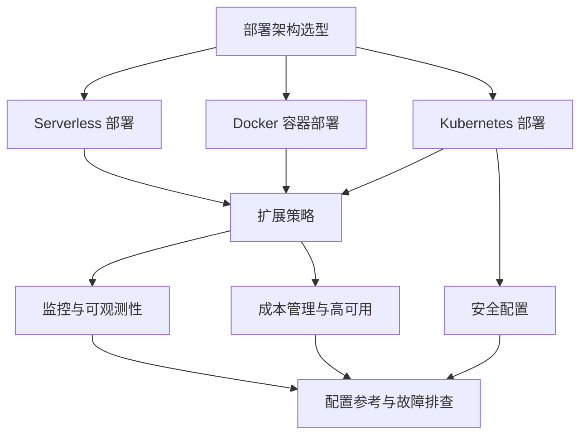
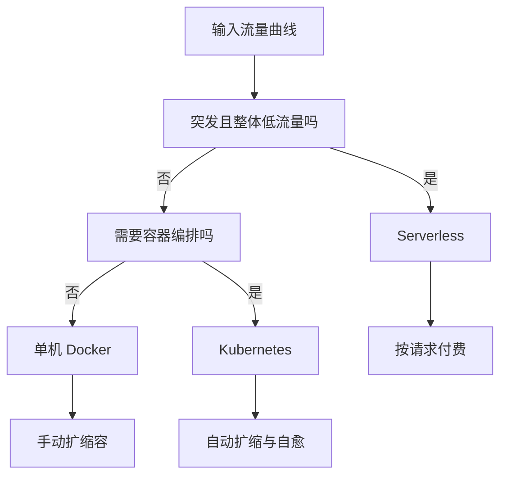
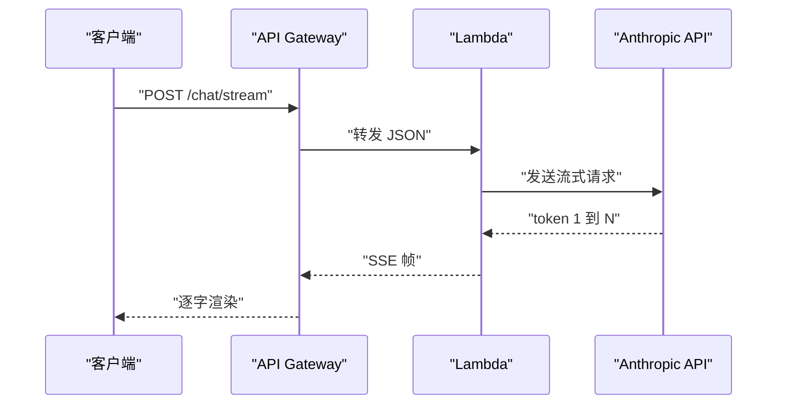
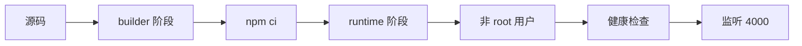
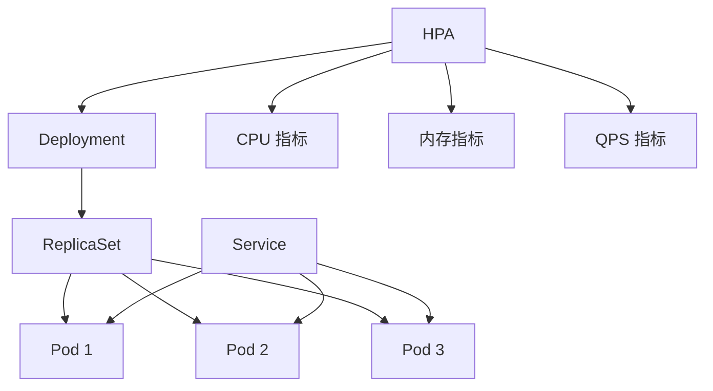
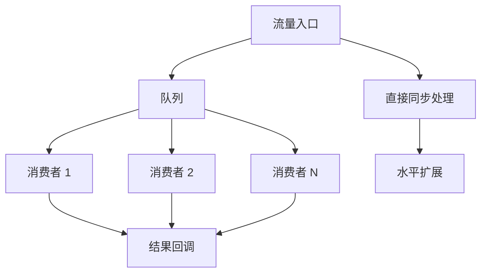
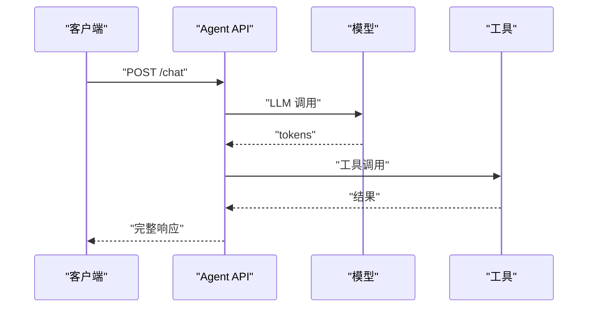
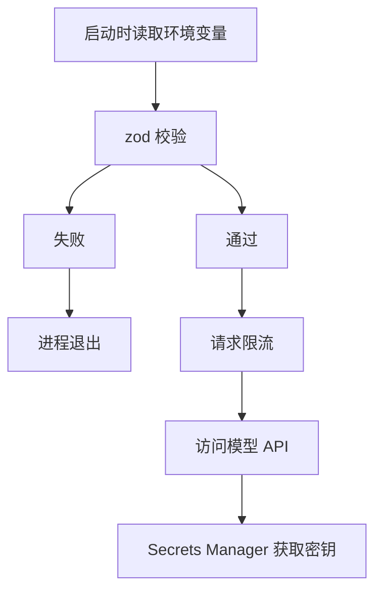
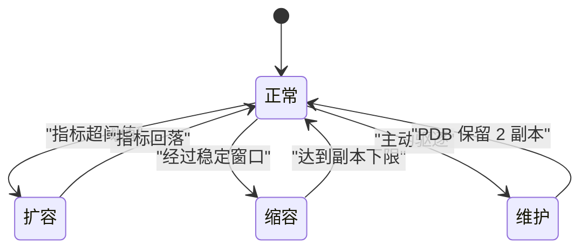
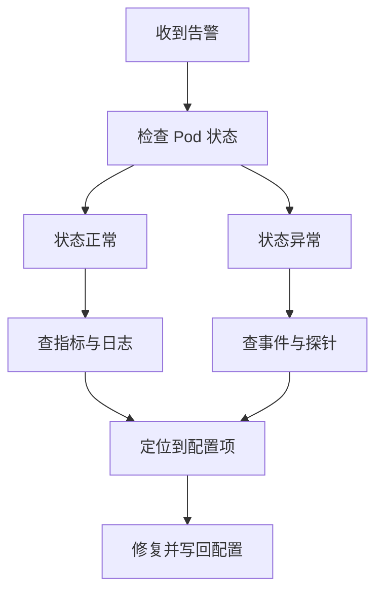

# 生产部署

!!! abstract "学完这一页你能"
    - 根据流量曲线、团队人数和可用性要求，在 Serverless、容器、Kubernetes 之间选出可解释的方案。
    - 写出带健康检查、非 root 用户、多阶段构建的 Docker 镜像。
    - 配置 Prometheus 指标、OpenTelemetry 链路和 HPA 自动扩缩容。
    - 用密钥管理、限流、资源配额和故障排查表做上线前检查。

## 0. 知识地图



建议先读第 1 节建立选型判断，再按 Serverless、容器、Kubernetes 三条路径各读一节。  
之后把扩展、监控、安全、成本四节当作上线前检查清单。  
最后用第 9 节的配置参考和故障排查表做收尾。

## 1. 部署架构选型

**先想一个问题**  
你有一个 AI Agent 问答接口，预估白天 100 请求每秒，凌晨 2 请求每秒。团队只有两个人。应该先选 Serverless、Docker，还是 Kubernetes？

!!! note "术语：Serverless"
    Serverless 指云平台按请求分配函数实例，开发者不管理服务器。例子：AWS Lambda 只在请求到达时创建函数容器。

!!! note "术语：Kubernetes"
    Kubernetes 是容器编排平台，负责把容器调度到多台机器并维持期望副本数。例子：一个 Deployment 声明 3 个副本，某个副本退出后控制器会自动补齐。

**心智模型**  
!!! tip "心智模型"
    一句话模型：部署架构是流量形状、团队人数、可用性要求三个变量的匹配。  
    日常类比：租共享工位、租固定办公室、租整层楼。共享工位按小时付费但有使用时间上限；固定办公室可控但要自己管水电；整层楼能抗大流量但要配专门运维。  
    类比不成立的地方：云平台可以在分钟级切换方案，而物理办公室搬迁需要数周。

**图解**  


1. 先判断流量是否突发且整体低流量，若为是，Serverless 更贴合。
2. 如果流量持续中高，再判断是否需要容器编排。
3. 单机可承载时选 Docker；需要多副本调度时选 Kubernetes。
4. 三条路径的付费方式不同：Serverless 按请求，Docker 按单机，Kubernetes 按集群容量。

**一步一步来**  
第 1 步：把选型条件写成可测试的函数。

```typescript
// deployment-select.ts
type Profile = { peakQps: number; teamSize: number };

export function selectDeployment(p: Profile): 'serverless' | 'container' | 'kubernetes' {
  // 峰值低且人少，走 Serverless，减少运维
  if (p.peakQps < 200 && p.teamSize <= 3) return 'serverless';
  // 中等流量且人少，单机容器可以承载
  if (p.peakQps >= 200 && p.peakQps < 2000 && p.teamSize <= 5) return 'container';
  // 流量高或需要多副本自动扩缩，走 Kubernetes
  return 'kubernetes';
}
```

**这段代码在做什么**  

- 用 `peakQps` 表示业务量，`teamSize` 表示团队人数。
- 峰值低于 200 且团队不超过 3 人时返回 `serverless`。
- 峰值在 200 到 2000 之间且团队不超过 5 人时返回 `container`。
- 其余情况返回 `kubernetes`。
- 这是示例阈值，不是平台固定数值。

第 2 步：为选型函数补充可用性约束。

```typescript
// availability-check.ts
export function needsKubernetes(availability: { uptimeSla: number; maxDowntimeMin: number }): boolean {
  // 可用性要求高于 99.9% 时，单机重启难以满足，需要多副本
  return availability.uptimeSla >= 0.999 && availability.maxDowntimeMin < 5;
}
```

**这段代码在做什么**  

- `uptimeSla` 表示服务可用性目标。
- 当可用性要求达到 99.9% 且最大停机时间小于 5 分钟时，返回 `true`。
- 这个条件可以作为选型函数的补充判断。
- 多副本与自动恢复是 Kubernetes 提供的主要能力。

**动手验证**  
运行下面的 Node 20 脚本，验证选型逻辑。

```typescript
// verify-deployment.mjs
import assert from 'node:assert/strict';

const selectDeployment = (p) => {
  if (p.peakQps < 200 && p.teamSize <= 3) return 'serverless';
  if (p.peakQps >= 200 && p.peakQps < 2000 && p.teamSize <= 5) return 'container';
  return 'kubernetes';
};

assert.equal(selectDeployment({ peakQps: 50, teamSize: 2 }), 'serverless');
assert.equal(selectDeployment({ peakQps: 500, teamSize: 4 }), 'container');
assert.equal(selectDeployment({ peakQps: 3000, teamSize: 6 }), 'kubernetes');
console.log('所有部署选型断言通过');
```

运行结果：  
```
所有部署选型断言通过
```

**常见坑**  

| 现象 | 原因 | 怎么修 |
|------|------|--------|
| 选了 Serverless 但流式回答被截断 | API Gateway 同步超时 29 秒 | 改用 Function URL、WebSocket 或响应流式模式 |
| Docker 容器运行正常但无法横向扩展 | 单机只跑了固定端口，没有负载均衡 | 接入反向代理或迁移到编排平台 |
| Kubernetes 副本数设为 3 但流量仍打到一个节点 | 没有配置 Pod 反亲和 | 增加 `podAntiAffinity` 打散副本 |

**用在哪里**  

- 业务背景：电商促销期间的客服机器人，峰值流量是日常的 8 倍。  
  这一节知识怎么用：用流量曲线判断峰值是否超过固定阈值，选择 Serverless 吸峰。  
  衡量收益：对比常驻机器的账单金额。  
  什么时候不该用：如果请求需要访问内部数据库且函数执行超过 29 秒，不要用同步 Gateway。

- 业务背景：企业内部知识库问答，工作日白天使用。  
  这一节知识怎么用：按团队人数和可停工期选择 Docker 单机部署。  
  衡量收益：部署到可用即可的时间。  
  什么时候不该用：如果后续需要多团队共享同一集群，不应长期停在单机 Docker。

**行业实践**  

- AWS Lambda 官方文档说明预留并发可以控制函数并发并减少冷启动。  
  怎么借鉴到你的项目：对延迟敏感的函数设置预留并发，并观察账单变化。  
- Google Cloud 官方文档建议用队列对突发任务做背压。  
  怎么借鉴到你的项目：长任务先入队，由消费者按容量拉取。  
- Vercel AI SDK 文档提供 `streamText` 与 `toDataStreamResponse` 的流式响应范式。  
  怎么借鉴到你的项目：流式接口返回 SSE，前端用 SDK 自动解析。

**小结**  

1. Serverless 适合突发且低频的接口，但要注意平台超时上限。  
2. 容器适合中等流量和需要自定义环境的服务。  
3. Kubernetes 适合高可用、多副本、自动扩缩容的场景。

## 2. Serverless 部署

**先想一个问题**  
你有一个对话接口，前端需要逐字显示模型输出。请求会持续 10 到 40 秒。API Gateway 默认 29 秒超时，怎么办？

!!! note "术语：SSE"
    SSE 是 Server-Sent Events 的缩写，服务端通过一条 HTTP 连接持续向客户端推文本。例子：`Content-Type: text/event-stream` 响应中的 `data:` 行。

**心智模型**  
!!! tip "心智模型"
    一句话模型：Serverless 部署就是给云平台一份函数代码和触发规则，平台负责创建与回收实例。  
    日常类比：把行李放进共享储物柜，每次打开按时间付费，柜子会在闲置时回收。  
    类比不成立的地方：函数实例回收后，内存里的会话历史会消失，需要外部存储保存状态。

**图解**  


1. 客户端把完整历史放进 POST 体。
2. API Gateway 把请求转发给 Lambda。
3. Lambda 调用模型并获取流式句柄。
4. Lambda 把流包装成 SSE 返回给客户端。

**一步一步来**  
第 1 步：声明服务与 provider 基础配置。

```yaml
# serverless.yml 片段：服务身份与运行环境
service: ai-agent-serverless
frameworkVersion: '3'
provider:
  name: aws
  runtime: nodejs18.x
  stage: production
  region: us-east-1
  timeout: 30
  memorySize: 1024
  environment:
    ANTHROPIC_API_KEY: ${env:ANTHROPIC_API_KEY}
    REDIS_URL: ${env:REDIS_URL}
```

**这段代码在做什么**  

- `service` 成为 CloudFormation 栈名前缀。
- `frameworkVersion: '3'` 锁死框架主版本，防止 CI 某天部署失败。
- `stage` 与 `region` 决定资源部署到哪个环境。
- `timeout` 是函数运行默认上限。
- 环境变量在部署期从 CI 的 shell 注入，缺失时部署直接失败。

第 2 步：定义同步与流式两个函数入口。

```yaml
functions:
  chat:
    handler: handler.chat
    events:
      - http:
          path: /chat
          method: post
          cors: true
    reservedConcurrency: 100
  streamChat:
    handler: handler.streamChat
    events:
      - http:
          path: /chat/stream
          method: post
          cors: true
    timeout: 60
```

**这段代码在做什么**  

- `chat` 处理非流式请求，`streamChat` 处理流式请求。
- `reservedConcurrency: 100` 预留 100 个并发额度。
- `streamChat` 的 `timeout: 60` 是函数内部时限。
- 经过 API Gateway 同步代理时，29 秒网关超时仍是上限。

第 3 步：用原生 SDK 实现流式响应。

```typescript
// handler.ts 片段：流式对话入口
import { Anthropic } from '@anthropic-ai/sdk';

const anthropic = new Anthropic({ apiKey: process.env.ANTHROPIC_API_KEY });

export const streamChat = async (event: { body: string }) => {
  const { messages } = JSON.parse(event.body);
  const stream = await anthropic.messages.stream({
    model: 'claude-3-5-sonnet-20241022',
    max_tokens: 4096,
    messages,
    stream: true,
  });
  return {
    statusCode: 200,
    body: stream.toReadableStream(),
    isBase64Encoded: false,
    headers: {
      'Content-Type': 'text/event-stream',
      'Cache-Control': 'no-cache',
      'Connection': 'keep-alive',
    },
  };
};
```

**这段代码在做什么**  

- 客户端每次请求都要携带完整历史。
- `messages.stream` 返回流句柄，`await` 等待连接建立而非生成完毕。
- `toReadableStream` 把 SDK 流包装成 Web 流。
- 三个响应头是 SSE 长连接的必要配置。
- `isBase64Encoded: false` 防止流内容被 base64 二次编码。

**动手验证**  
在本地运行一个 SSE 响应构造脚本，验证响应头。

```typescript
// verify-sse.mjs
import assert from 'node:assert/strict';

const buildSseResponse = (stream) => ({
  statusCode: 200,
  body: stream,
  headers: {
    'Content-Type': 'text/event-stream',
    'Cache-Control': 'no-cache',
    'Connection': 'keep-alive',
  },
});

const res = buildSseResponse('mock-readable-stream');
assert.equal(res.statusCode, 200);
assert.equal(res.headers['Content-Type'], 'text/event-stream');
assert.equal(res.headers['Cache-Control'], 'no-cache');
console.log('SSE 响应构建断言通过');
```

运行结果：  
```
SSE 响应构建断言通过
```

**常见坑**  

| 现象 | 原因 | 怎么修 |
|------|------|--------|
| 流式响应到 29 秒被切断 | API Gateway 同步代理硬超时 | 使用 Function URL 或响应流式传输 |
| 环境变量值为 undefined 且运行时 500 | 部署时未注入变量 | 在 CI 中快速失败 |
| 插件名拼写错误导致部署失败 | 找不到对应 npm 包 | 核对包名并锁版本 |

**用在哪里**  

- 业务背景：聊天机器人 Web 端逐字输出。  
  这一节知识怎么用：把路由返回 `text/event-stream`，前端用 SSE 客户端读取。  
  衡量收益：首字延迟和完整回答到达时间。  
  什么时候不该用：如果客户端只支持普通 JSON，不要强行使用 SSE。

- 业务背景：移动端多轮对话。  
  这一节知识怎么用：把会话历史存入 Redis，由 Lambda 按 `sessionId` 读取。  
  衡量收益：切换实例后的上下文准确率。  
  什么时候不该用：如果会话历史很长且没有摘要，不要依赖单次请求携带全部历史。

**行业实践**  

- AWS Lambda 官方文档说明函数内存与 CPU 配额正相关。  
  怎么借鉴到你的项目：实测模型流式响应在 1024MB 与 2048MB 下的耗时差，再决定是否调大。  
- Vercel AI SDK 文档提供 `toDataStreamResponse` 方法。  
  怎么借鉴到你的项目：前端用 `useChat` 时可自动解析该响应。  
- Serverless Framework 文档说明 `cors: true` 会生成 OPTIONS 预检集成。  
  怎么借鉴到你的项目：生产环境改写成对象形式限制来源域。

**小结**  

1. Serverless 函数要区分同步超时与流式超时。  
2. 流式响应必须同时设置 SSE 响应头和正确的流编码。  
3. 环境变量与插件包名都要在部署期校验，避免延迟到运行时才失败。

## 3. 容器化部署

**先想一个问题**  
你本机开发时的 Node 版本是 20，但测试机是 18，依赖的 native 模块行为不一样。怎么保证每次构建和线上一致？

!!! note "术语：多阶段构建"
    多阶段构建指在一个 Dockerfile 中使用多个 `FROM` 阶段，前一个阶段编译，后一个阶段只复制运行所需产物。例子：`builder` 阶段安装依赖，`runtime` 阶段只复制 `node_modules` 和源码。

**心智模型**  
!!! tip "心智模型"
    一句话模型：Docker 镜像是把代码、依赖、运行环境打成一个可复现的包。  
    日常类比：把整个工作台装进一个标准集装箱，任何码头都能原样打开。  
    类比不成立的地方：镜像构建成功后不会自动更新，代码变更需要重新构建镜像。

**图解**  


1. 源码进入 builder 阶段安装生产依赖。
2. builder 把 `node_modules` 复制到 runtime 阶段。
3. runtime 创建非 root 用户并部署源码。
4. 容器启动后运行健康检查再接入流量。

**一步一步来**  
第 1 步：写多阶段 Dockerfile。

```dockerfile
# Dockerfile
FROM node:20-alpine AS builder
WORKDIR /app
COPY package*.json ./
RUN npm ci --only=production && npm cache clean --force

FROM node:20-alpine AS runtime
WORKDIR /app
RUN addgroup -g 1001 -S nodejs && adduser -S nodejs -u 1001
HEALTHCHECK --interval=30s --timeout=10s --start-period=5s --retries=3 \
  CMD node -e "require('http').get('http://localhost:4000/health', (r) => process.exit(r.statusCode === 200 ? 0 : 1))"
COPY --from=builder --chown=nodejs:nodejs /app/node_modules ./node_modules
COPY --chown=nodejs:nodejs . .
USER nodejs
EXPOSE 4000
CMD ["node", "dist/main.js"]
```

**这段代码在做什么**  

- builder 阶段安装生产依赖并清理 npm 缓存。
- runtime 阶段创建 UID 1001 的非 root 用户。
- `HEALTHCHECK` 每 30 秒请求 `/health`，连续 3 次非 200 才判定不健康。
- `--chown=nodejs:nodejs` 让文件归属运行用户。
- `USER nodejs` 限制容器主进程权限。

第 2 步：用 Compose 拉起 Agent 和 Redis。

```yaml
# docker-compose.yml 片段
services:
  agent-api:
    build:
      context: .
      target: runtime
    ports:
      - "4000:4000"
    environment:
      - REDIS_URL=redis://redis:6379
      - NODE_ENV=production
    depends_on:
      redis:
        condition: service_healthy
    restart: unless-stopped
    deploy:
      resources:
        limits:
          cpus: '2'
          memory: 2G
  redis:
    image: redis:7-alpine
    ports:
      - "6379:6379"
    volumes:
      - redis_data:/data
    command: redis-server --appendonly yes --maxmemory 512mb --maxmemory-policy allkeys-lru
    healthcheck:
      test: ["CMD", "redis-cli", "ping"]
      interval: 10s
      timeout: 5s
      retries: 3
volumes:
  redis_data:
```

**这段代码在做什么**  

- `target: runtime` 指定构建到运行阶段。
- `depends_on.condition: service_healthy` 等待 Redis 健康后才启动 Agent。
- `restart: unless-stopped` 允许人工停止后不自动拉起。
- `deploy.resources.limits` 限制 CPU 和内存，但需 Compose V2 CLI 才生效。
- Redis 使用 AOF 持久化和 512MB 内存上限。

**动手验证**  
运行一个脚本，验证健康检查路径会被正确请求。

```typescript
// verify-health.mjs
import assert from 'node:assert/strict';
import http from 'node:http';

const server = http.createServer((req, res) => {
  if (req.url === '/health') {
    res.writeHead(200);
    res.end(JSON.stringify({ status: 'healthy' }));
    return;
  }
  res.writeHead(404);
  res.end();
});

server.listen(0, async () => {
  const port = server.address().port;
  const res = await new Promise((resolve) => {
    http.get(`http://localhost:${port}/health`, resolve);
  });
  assert.equal(res.statusCode, 200);
  console.log('本机健康检查返回 200，断言通过');
  server.close();
});
```

运行结果：  
```
本机健康检查返回 200，断言通过
```

**常见坑**  

| 现象 | 原因 | 怎么修 |
|------|------|--------|
| 容器反复重启 | `restart: unless-stopped` 与内存超限 OOM Kill 叠加 | 监控内存，降低限制或修内存泄漏 |
| Compose 资源限制不生效 | 旧版 v3 非 Swarm 下 `deploy.resources.limits` 被忽略 | 使用 Compose V2 CLI |
| Redis 数据丢失 | `docker compose down -v` 删除命名卷 | 下线前备份命名卷 |

**用在哪里**  

- 业务背景：内部知识库问答服务需要每天运行 10 小时。  
  这一节知识怎么用：用 Dockerfile 固定 Node 版本与依赖环境。  
  衡量收益：开发与线上环境一致度。  
  什么时候不该用：如果团队没有容器运行时，不要引入 Docker 额外运维成本。

- 业务背景：Agent 需要同时访问 Redis 和模型 API。  
  这一节知识怎么用：用 Compose 编排 Agent 与 Redis 并设置健康检查。  
  衡量收益：启动后连接拒绝次数。  
  什么时候不该用：如果 Redis 已在云平台托管，不要把本地 Redis 容器推到生产。

**行业实践**  

- Docker 官方文档推荐多阶段构建以缩小镜像体积。  
  怎么借鉴到你的项目：builder 阶段用完即弃，runtime 阶段只带运行依赖。  
- Redis 官方文档说明 `appendonly yes` 会开启 AOF。  
  怎么借鉴到你的项目：对会话状态敏感时开启 AOF，并定期备份。  
- Docker Compose 文档说明 `condition: service_healthy` 需要 Compose V2。  
  怎么借鉴到你的项目：升级 CLI 后再依赖该门控。

**小结**  

1. Dockerfile 要区分构建阶段和运行阶段。  
2. 健康检查是接入流量的前置条件。  
3. Compose 只解决启动期依赖，运行期断连仍需应用层重试。

## 4. Kubernetes 部署

**先想一个问题**  
你有 3 个 Agent 副本，其中一个挂了。怎么让集群自动杀掉异常副本，同时不让流量进入未就绪的副本？

!!! note "术语：探针"
    探针是 kubelet 对容器执行的周期检查。例子：`livenessProbe` 失败会重启容器；`readinessProbe` 失败只把 Pod 从 Service 摘掉，不重启。

**心智模型**  
!!! tip "心智模型"
    一句话模型：Kubernetes 用期望状态驱动，用户声明副本数和资源，控制器持续对账。  
    日常类比：物业后台记录每个店铺应有 3 名店员，缺人时自动从备用人员补上。  
    类比不成立的地方：Kubernetes 的调度还要考虑资源配额和节点分布，人力备用通常不这样计算。

**图解**  


1. Deployment 声明 3 个副本。
2. ReplicaSet 维持三个 Pod 的实际数量。
3. Service 根据 `readinessProbe` 决定哪些 Pod 接入流量。
4. HPA 读取指标后调整 Deployment 的副本数。

**一步一步来**  
第 1 步：声明 Deployment 与滚动更新策略。

```yaml
# k8s/deployment.yaml 片段
apiVersion: apps/v1
kind: Deployment
metadata:
  name: ai-agent
spec:
  replicas: 3
  selector:
    matchLabels:
      app: ai-agent
  strategy:
    type: RollingUpdate
    rollingUpdate:
      maxSurge: 1
      maxUnavailable: 0
  template:
    metadata:
      labels:
        app: ai-agent
    spec:
      serviceAccountName: ai-agent-sa
      securityContext:
        runAsNonRoot: true
        runAsUser: 1001
        fsGroup: 1001
      containers:
        - name: agent
          image: your-registry.com/ai-agent:v1.2.0
          ports:
            - containerPort: 4000
              name: http
          env:
            - name: ANTHROPIC_API_KEY
              valueFrom:
                secretKeyRef:
                  name: ai-agent-secrets
                  key: anthropic-api-key
          resources:
            requests:
              cpu: 500m
              memory: 512Mi
            limits:
              cpu: 2000m
              memory: 2Gi
          livenessProbe:
            httpGet:
              path: /health
              port: 4000
            initialDelaySeconds: 30
            periodSeconds: 10
            failureThreshold: 3
          readinessProbe:
            httpGet:
              path: /ready
              port: 4000
            initialDelaySeconds: 5
            periodSeconds: 5
            failureThreshold: 2
```

**这段代码在做什么**  

- `replicas: 3` 期望同时运行 3 个副本。
- 滚动更新 `maxSurge: 1` 与 `maxUnavailable: 0` 保证任何时刻可用副本数不少于 3。
- `runAsNonRoot` 与 `runAsUser: 1001` 让 kubelet 拒绝 root 容器。
- 资源请求与上限相差 4 倍，给扩容留出突发空间。
- 探针区分“快摘慢杀”，就绪检测 5 秒一次更灵敏，存活检测 10 秒一次更保守。

第 2 步：配置 HPA 多指标扩缩。

```yaml
# k8s/hpa.yaml 片段
apiVersion: autoscaling/v2
kind: HorizontalPodAutoscaler
metadata:
  name: ai-agent-hpa
spec:
  scaleTargetRef:
    apiVersion: apps/v1
    kind: Deployment
    name: ai-agent
  minReplicas: 2
  maxReplicas: 20
  metrics:
    - type: Resource
      resource:
        name: cpu
        target:
          type: Utilization
          averageUtilization: 70
    - type: Resource
      resource:
        name: memory
        target:
          type: Utilization
          averageUtilization: 80
    - type: Pods
      pods:
        metric:
          name: http_requests_per_second
        target:
          type: AverageValue
          averageValue: "100"
  behavior:
    scaleDown:
      stabilizationWindowSeconds: 300
      policies:
        - type: Percent
          value: 10
          periodSeconds: 60
    scaleUp:
      stabilizationWindowSeconds: 0
      policies:
        - type: Percent
          value: 100
          periodSeconds: 15
        - type: Pods
          value: 4
          periodSeconds: 15
      selectPolicy: Max
```

**这段代码在做什么**  

- HPA 为每个指标计算期望副本数，取最大值作为最终期望。
- CPU 目标为平均 70%，内存目标为平均 80%。
- 自定义指标 `http_requests_per_second` 按每副本 100 QPS 计算。
- 缩容看过去 5 分钟的建议并取最大，防止脉冲后立即缩容。
- 扩容每 15 秒最多翻倍或加 4 个副本，取更激进的一条。

第 3 步：定义 Service 与 PodDisruptionBudget。

```yaml
# k8s/service.yaml 片段
apiVersion: v1
kind: Service
metadata:
  name: ai-agent-service
spec:
  type: ClusterIP
  ports:
    - port: 80
      targetPort: 4000
      protocol: TCP
      name: http
  selector:
    app: ai-agent

apiVersion: policy/v1
kind: PodDisruptionBudget
metadata:
  name: ai-agent-pdb
spec:
  selector:
    matchLabels:
      app: ai-agent
  minAvailable: 2
```

**这段代码在做什么**  

- Service 把端口 80 映射到 Pod 的 4000。
- `selector` 决定哪些 Pod 接入流量。
- PDB 的 `minAvailable: 2` 保证主动驱逐时至少保留 2 个副本。
- 主动驱逐包括节点维护和集群升级，不包括硬宕机。

**动手验证**  
运行一个脚本，验证 HPA 的期望副本计算。

```typescript
// verify-hpa.mjs
import assert from 'node:assert/strict';

const hpaDesired = (currentReplicas, metricValues, targets) => {
  const ratios = metricValues.map((v, i) => v / targets[i]);
  const maxRatio = Math.max(...ratios);
  return Math.ceil(currentReplicas * maxRatio);
};

const current = 4;
const values = [70, 90, 150];
const targets = [70, 80, 100];
const desired = hpaDesired(current, values, targets);
assert.equal(desired, 6);
console.log(`当前 4 副本，三个指标比例最大为 1.5，期望副本为 ${desired}`);
```

运行结果：  
```
当前 4 副本，三个指标比例最大为 1.5，期望副本为 6
```

**常见坑**  

| 现象 | 原因 | 怎么修 |
|------|------|--------|
| Pod 一直 Pending | 反亲和用 `requiredDuringScheduling` 且节点数少于副本数 | 改为 `preferredDuringScheduling` |
| 自定义指标拿不到数 | Prometheus Adapter 未暴露该指标名 | 检查 Adapter 配置与 metric name |
| HPA 不生效 | 容器未配置 `resources.requests.cpu` | 补上 CPU 请求，否则利用率无法计算 |

**用在哪里**  

- 业务背景：多租户 Agent API，要求滚动发布零中断。  
  这一节知识怎么用：设置 `maxUnavailable: 0` 与就绪探针。  
  衡量收益：发布期间可成功处理的请求比例。  
  什么时候不该用：如果副本数少且发布频繁，集群容量不足时不要用 `maxSurge: 1` 挤压资源。

- 业务背景：知识库问答流量随工作时间波动。  
  这一节知识怎么用：HPA 同时读取 CPU 和 QPS 指标。  
  衡量收益：扩容延迟与缩容回收时间。  
  什么时候不该用：如果流量变化是分钟级脉冲，HPA 默认周期可能跟不上，需要事件源。

**行业实践**  

- Kubernetes 官方文档说明 `autoscaling/v2` 支持多指标与行为控制。  
  怎么借鉴到你的项目：把缩容稳定窗口设为 5 分钟以上。  
- Prometheus Adapter 社区文档说明自定义指标需要暴露在 metrics API。  
  怎么借鉴到你的项目：先验证 `kubectl get --raw /apis/custom.metrics.k8s.io/v1beta1` 返回指标。  
- PodDisruptionBudget 官方文档建议主动维护前预留可用副本。  
  怎么借鉴到你的项目：把 `minAvailable` 设为 `replicas - 1` 作为基础值。

**小结**  

1. Deployment 的滚动更新策略直接决定发布期间的可用性。  
2. HPA 用短板原则取多个指标中的最大期望副本数。  
3. Service 只认就绪探针，PDB 只约束主动驱逐。

## 5. 扩展策略

**先想一个问题**  
你的 Agent 会调用一个慢工具，有时 30 秒才返回。如果请求都同步进入模型，突然来一波流量会把服务拖垮。怎么让系统自己消化峰值？

!!! note "术语：背压"
    背压是下游处理不过来时，上游放慢生产速度的机制。例子：SQS 队列堆积时，消费者按最大并发 10 条拉取，而不是一次拉 100 条。

**心智模型**  
!!! tip "心智模型"
    一句话模型：扩展策略决定系统在流量增加时，是增加实例、增加单实例资源，还是用队列缓存等待。  
    日常类比：餐厅客流高峰时，可以加临时服务员、让现有服务员跑更快，或者让客人排队等号。  
    类比不成立的地方：机器扩容可以分钟级完成，餐厅加人需要招聘和培训。

**图解**  


1. 流量入口可以同步处理，也可以先入队。
2. 同步处理路径用水平扩展接住更多请求。
3. 队列路径由多个消费者按容量拉取任务。
4. 处理完成后把结果写入回调队列或通知客户端。

**一步一步来**  
第 1 步：用 SQS 做长任务背压。

```typescript
// queue-consumer.ts
import { SQSClient, ReceiveMessageCommand, DeleteMessageCommand } from '@aws-sdk/client-sqs';

const sqs = new SQSClient({ region: 'us-east-1' });
const queueUrl = process.env.AGENT_QUEUE_URL;

export const processQueue = async () => {
  const command = new ReceiveMessageCommand({
    QueueUrl: queueUrl,
    MaxNumberOfMessages: 10,
    WaitTimeSeconds: 20,
    VisibilityTimeout: 60,
  });
  const { Messages } = await sqs.send(command);
  for (const message of Messages ?? []) {
    const { messages, sessionId, traceId } = JSON.parse(message.Body);
    const result = await agent.process(messages);
    await sqs.send(new DeleteMessageCommand({
      QueueUrl: queueUrl,
      ReceiptHandle: message.ReceiptHandle,
    }));
    await sendToCallbackQueue({ sessionId, result, traceId });
  }
};
```

**这段代码在做什么**  

- `MaxNumberOfMessages: 10` 限制单次拉取数量，实现消费端背压。
- `WaitTimeSeconds: 20` 是长轮询等待，减少空请求。
- `VisibilityTimeout: 60` 防止同一条消息被其他消费者重复处理。
- 处理成功后删除消息，再发送结果到回调队列。
- 处理失败时不删除消息，超时后消息会重新可见。

第 2 步：定义健康端点，作为负载均衡与探针的依据。

```typescript
// health.ts
app.get('/health', (req, res) => {
  res.json({ status: 'healthy', uptime: process.uptime() });
});

app.get('/ready', async (req, res) => {
  try {
    await redis.ping();
    await checkApiKey();
    res.json({ status: 'ready' });
  } catch (error) {
    res.status(503).json({ status: 'not_ready', error: error.message });
  }
});
```

**这段代码在做什么**  

- `/health` 只描述进程还活着，不检查依赖。
- `/ready` 检查 Redis 连接和 API Key 有效性。
- 就绪失败时返回 503，负载均衡器会摘掉该实例。
- 存活失败时 kubelet 会重启容器，两者语义不同。

**动手验证**  
运行一个脚本，验证队列消费数量计算。

```typescript
// verify-queue.mjs
import assert from 'node:assert/strict';

const batchSize = (currentVolume, maxPerBatch, minVol) => Math.min(maxPerBatch, Math.max(minVol, currentVolume));

assert.equal(batchSize(3, 10, 1), 3);
assert.equal(batchSize(15, 10, 1), 10);
assert.equal(batchSize(0, 10, 1), 1);
console.log('队列批次计算断言通过');
```

运行结果：  
```
队列批次计算断言通过
```

**常见坑**  

| 现象 | 原因 | 怎么修 |
|------|------|--------|
| 同一消息被处理两次 | `VisibilityTimeout` 短于处理耗时 | 把超时设为处理耗时的 2 倍以上 |
| 健康检查通过但请求仍失败 | `/health` 不检查依赖 | 把依赖检查放进 `/ready` |
| 队列堆积但消费者空闲 | 单次拉取数量太少或长轮询时间不足 | 提高 `MaxNumberOfMessages` 或 `WaitTimeSeconds` |

**用在哪里**  

- 业务背景：批量文档摘要，单个任务耗时 30 秒以上。  
  这一节知识怎么用：用 SQS 承载任务，消费者按 10 个一批处理。  
  衡量收益：任务完成时间与重复处理率。  
  什么时候不该用：如果客户端必须在 HTTP 请求内拿到结果，不要用异步队列。

- 业务背景：地理分布部署，欧洲和北美用户各自由最近区域响应。  
  这一节知识怎么用：用全局负载均衡把流量分到区域，再在区域内水平扩展。  
  衡量收益：用户到服务器的往返时间。  
  什么时候不该用：如果用户只在一个区域内，多区域部署增加成本和复杂度。

**行业实践**  

- AWS 官方文档说明 SQS 长轮询可以减少空响应和成本。  
  怎么借鉴到你的项目：消费者 `WaitTimeSeconds` 设为 20，而非 0。  
- Google Cloud 官方博客建议对长任务使用推送队列加手动伸缩。  
  怎么借鉴到你的项目：把任务队列与同步 API 拆开，分别做容量规划。  
- Kubernetes HPA 文档描述基于自定义指标的扩缩。  
  怎么借鉴到你的项目：把 QPS 指标作为扩容信号，比 CPU 更早发现流量上涨。

**小结**  

1. 健康检查要区分存活与就绪，依赖检查不能放进存活探测。  
2. 队列驱动扩展的核心是限制消费者拉取速率。  
3. 水平扩展增加实例，垂直扩展提高单实例资源，地理分布减少网络距离。

## 6. 监控与可观测性

**先想一个问题**  
你的 Agent 有时候 2 秒返回，有时候 30 秒返回。你只能看到失败日志，不知道是模型慢、工具慢，还是 Redis 连接慢。怎么定位？

!!! note "术语：Span"
    Span 是一次操作的时间区间，包含开始时间、结束时间、属性和父子关系。例子：一次 `agent.process` 调用是根 Span，内部模型调用是子 Span。

**心智模型**  
!!! tip "心智模型"
    一句话模型：监控告诉你系统是否正常，追踪告诉你一次请求经过了哪些环节、各环节耗时多少。  
    日常类比：监控像大楼的总电表，追踪像每个插座的电费清单。  
    类比不成立的地方：追踪需要业务代码主动埋点，电表不需要。

**图解**  


1. 客户端进入一次请求。
2. Agent API 调用模型并产生 Span。
3. 模型返回后再调用工具。
4. 工具耗时被记录为子 Span。
5. 整条调用链被导出到追踪后端。

**一步一步来**  
第 1 步：用 Prometheus 客户端采集指标。

```typescript
// metrics.ts
import client from 'prom-client';

const register = new client.Registry();
const httpRequestsTotal = new client.Counter({
  name: 'http_requests_total',
  help: 'Total HTTP requests',
  labelNames: ['method', 'path', 'status'],
  registers: [register],
});
const httpRequestDuration = new client.Histogram({
  name: 'http_request_duration_seconds',
  help: 'HTTP request duration in seconds',
  buckets: [0.01, 0.05, 0.1, 0.5, 1, 2, 5, 10],
  registers: [register],
});
const tokensUsedTotal = new client.Counter({
  name: 'tokens_used_total',
  help: 'Total tokens used',
  labelNames: ['type'],
  registers: [register],
});
```

**这段代码在做什么**  

- `Counter` 只增不减，适合请求数和 token 数。
- `Histogram` 记录延迟分布，桶边界覆盖 10ms 到 10s。
- `labelNames` 用来区分不同路径、状态和 token 类型。
- 所有指标注册到自定义寄存器，由 `/metrics` 端点暴露。

第 2 步：用 OpenTelemetry 创建手动 Span。

```typescript
// tracing.ts
import { NodeSDK } from '@opentelemetry/sdk-node';
import { OTLPTraceExporter } from '@opentelemetry/exporter-trace-otlp-http';
import { Resource } from '@opentelemetry/resources';
import { trace, SpanStatusCode } from '@opentelemetry/api';

const sdk = new NodeSDK({
  resource: new Resource({ 'service.name': 'ai-agent' }),
  traceExporter: new OTLPTraceExporter({
    url: process.env.OTEL_EXPORTER_OTLP_ENDPOINT,
  }),
});
sdk.start();

const tracer = trace.getTracer('ai-agent');

export const tracedAgentCall = async (messages) => {
  return tracer.startActiveSpan('agent.process', async (span) => {
    try {
      span.setAttributes({ 'conversation.length': messages.length });
      const result = await agent.process(messages);
      span.setStatus({ code: SpanStatusCode.OK });
      return result;
    } catch (error) {
      span.setStatus({ code: SpanStatusCode.ERROR, message: error.message });
      span.recordException(error);
      throw error;
    } finally {
      span.end();
    }
  });
};
```

**这段代码在做什么**  

- `service.name` 是追踪后端区分服务的依据。
- `startActiveSpan` 把 Span 写入当前异步上下文。
- `span.setAttributes` 只记录低基数元数据，不记录完整对话文本。
- 失败路径同时写状态和异常，保证错误详情不丢。
- `finally` 里的 `span.end` 防止分支提前返回导致 Span 泄漏。

**动手验证**  
运行一个脚本，验证 Prometheus 直方图桶计算。

```typescript
// verify-histogram.mjs
import assert from 'node:assert/strict';

const buckets = [0.01, 0.05, 0.1, 0.5, 1, 2, 5, 10];
const findBucket = (duration) => buckets.find((b) => duration <= b) ?? Infinity;

assert.equal(findBucket(0.03), 0.05);
assert.equal(findBucket(1.2), 2);
assert.equal(findBucket(12), Infinity);
console.log('直方图桶查找断言通过');
```

运行结果：  
```
直方图桶查找断言通过
```

**常见坑**  

| 现象 | 原因 | 怎么修 |
|------|------|--------|
| 追踪后端没数据 | 容器内 `OTEL_EXPORTER_OTLP_ENDPOINT` 未设置，SDK 回退到 localhost | 显式设置 OTLP 端点 |
| Span 有父无子 | 自动插桩文件在业务模块之后加载 | 把 tracing 初始化移到入口第一行 |
| 指标标签顺序错乱 | 标签每次调用顺序不同 | 固定调用顺序或使用对象传参 |

**用在哪里**  

- 业务背景：多租户 Agent API 需要按客户查看错误率和延迟。  
  这一节知识怎么用：在自定义 Span 里加租户 ID 作为属性。  
  衡量收益：单租户问题定位时间。  
  什么时候不该用：如果租户 ID 基数极大且查询平台按标签索引，不要放大文本做标签。

- 业务背景：模型 token 用量需要按日统计。  
  这一节知识怎么用：`tokens_used_total` 按 `type` 计数。  
  衡量收益：每日 token 账单与预算偏差。  
  什么时候不该用：如果输入文本包含个人数据，不要写入日志或第三方平台。

**行业实践**  

- OpenTelemetry 官方文档要求先启动 SDK，再导入业务模块。  
  怎么借鉴到你的项目：把 `sdk.start()` 作为进程第一行执行。  
- Prometheus 官方文档建议 Histogram 桶按观测范围设置。  
  怎么借鉴到你的项目：为模型调用单独设置 1 到 300 秒的桶。  
- LangSmith 官方文档说明回调能记录 LLM、Tool、Chain 的调用。  
  怎么借鉴到你的项目：在 `ChatAnthropic` 的 `callbacks` 传入追踪处理器。

**小结**  

1. 监控关注聚合指标，追踪关注单次请求链路。  
2. Span 属性只存低基数元数据，不放大文本。  
3. 追踪 SDK 必须早于业务模块加载。

## 7. 安全配置

**先想一个问题**  
你的 API Key 写在容器环境变量里，有一天发现有人拿到了 Lambda 环境变量。怎么让敏感配置不再以明文暴露？

!!! note "术语：最小权限"
    最小权限是只给一个身份完成当前任务所需的权限。例子：Lambda 只被允许 `ssm:GetParameter`，不允许 `PutParameter`。

**心智模型**  
!!! tip "心智模型"
    一句话模型：安全配置要同时解决密钥怎么存、配置怎么校验、接口怎么限速。  
    日常类比：保险箱钥匙不放在门口地垫下，而是放进银行保管箱，并且每次取用都要登记。  
    类比不成立的地方：云上密钥可以在运行时按需拉取，而银行保管箱通常不能实时到账。

**图解**  


1. 进程启动时先读环境变量。
2. zod 校验不通过就快速退出。
3. 通过后进入请求限流。
4. 访问模型 API 时再从密钥管理服务取回敏感值。

**一步一步来**  
第 1 步：用 zod 校验环境变量。

```typescript
// config.ts
import { z } from 'zod';

const configSchema = z.object({
  anthropicApiKey: z.string().min(1),
  redisUrl: z.string().url(),
  nodeEnv: z.enum(['development', 'production']).default('production'),
});

const config = configSchema.parse({
  anthropicApiKey: process.env.ANTHROPIC_API_KEY,
  redisUrl: process.env.REDIS_URL,
  nodeEnv: process.env.NODE_ENV,
});
```

**这段代码在做什么**  

- `anthropicApiKey` 不能为空。
- `redisUrl` 必须是合法 URL。
- `nodeEnv` 只能是开发或生产。
- 校验失败时 `parse` 抛异常，进程快速退出。
- 这样避免部署成功后请求时才报 500。

第 2 步：用 Redis 实现分布式限流。

```typescript
// rate-limiter.ts
import Redis from 'ioredis';

const redis = new Redis(process.env.REDIS_URL);

export const distributedRateLimit = async (
  userId: string,
  limit: number,
  windowSeconds: number,
) => {
  const key = `ratelimit:${userId}`;
  const now = Date.now();
  const windowStart = now - windowSeconds * 1000;
  const multi = redis.multi();
  multi.zremrangebyscore(key, 0, windowStart);
  multi.zadd(key, now, `${now}-${Math.random()}`);
  multi.zcard(key);
  multi.expire(key, windowSeconds);
  const replies = await multi.exec();
  const count = Number(replies[2][1]);
  return { allowed: count <= limit, remaining: Math.max(limit - count, 0), resetAt: now + windowSeconds * 1000 };
};
```

**这段代码在做什么**  

- 用有序集合存每个请求的时间戳。
- `zremrangebyscore` 删除窗口外的记录。
- `zadd` 写入当前请求，成员用随机数避免时间戳冲突。
- `zcard` 统计窗口内请求数，与 `limit` 比较。
- `expire` 防止键长期占用内存。

第 3 步：从 AWS Secrets Manager 读取密钥。

```typescript
// secrets.ts
import { SecretsManagerClient, GetSecretValueCommand } from '@aws-sdk/client-secrets-manager';

const secretsClient = new SecretsManagerClient({ region: 'us-east-1' });

export const getSecret = async (secretName: string): Promise<string> => {
  const command = new GetSecretValueCommand({ SecretId: secretName });
  const response = await secretsClient.send(command);
  return response.SecretString;
};
```

**这段代码在做什么**  

- `SecretId` 是密钥名称，不是明文值。
- `GetSecretValueCommand` 只获取当前版本。
- 调用方拿到的是 JSON 字符串，需要自行解析。
- 密钥不适合再写入环境变量，否则仍会暴露。

**动手验证**  
运行一个脚本，验证限流窗口计数。

```typescript
// verify-limiter.mjs
import assert from 'node:assert/strict';

const shouldAllow = (count, limit) => count <= limit;

assert.equal(shouldAllow(5, 10), true);
assert.equal(shouldAllow(11, 10), false);
console.log('限流判断断言通过');
```

运行结果：  
```
限流判断断言通过
```

**常见坑**  

| 现象 | 原因 | 怎么修 |
|------|------|--------|
| 配置校验通过但运行时仍然失败 | 只校验了变量存在，没校验值是否可用 | 启动时调用一次密钥获取接口 |
| 限流窗口内请求数计数偏多 | 时间戳相同的成员被覆盖 | 成员追加随机串 |
| 密钥管理服务访问延迟拖慢首字节 | 每次请求都拉取密钥 | 冷启动加 TTL 缓存 |

**用在哪里**  

- 业务背景：不同等级用户有不同限流额度。  
  这一节知识怎么用：从 Redis 读用户等级，再返回动态 `limit`。  
  衡量收益：429 响应比例与用户投诉量。  
  什么时候不该用：如果所有用户共享一个限额，不需要动态读取用户等级。

- 业务背景：生产环境密钥轮换。  
  这一节知识怎么用：把密钥放入 Secrets Manager，应用运行时读取。  
  衡量收益：密钥轮换时修改服务实例的次数。  
  什么时候不该用：如果密钥必须放在本地文件且网络不可用，不要强制远程读取。

**行业实践**  

- AWS Secrets Manager 官方文档支持自动轮换密钥。  
  怎么借鉴到你的项目：为模型 API Key 创建轮换策略，减少手工改配置。  
- zod 官方文档说明 `parse` 会收集所有校验错误。  
  怎么借鉴到你的项目：用 `safeParse` 处理错误并打印分组信息。  
- Express Rate Limit 文档说明标准头可以告诉客户端限流状态。  
  怎么借鉴到你的项目：开启 `standardHeaders: true` 并关闭 `legacyHeaders`。

**小结**  

1. 环境变量只应存非敏感配置，敏感值改用密钥管理服务。  
2. 配置校验要在启动期做，不能推迟到每次请求。  
3. 分布式限流要用 Redis 等共享存储，不能只靠进程内计数。

## 8. 成本管理与高可用

**先想一个问题**  
你的服务偶尔半夜来一波请求，HPA 扩容很快，等流量过去了缩容量又太快。结果实例频繁启停，账单和抖动都升高。怎么控制缩容速度？

!!! note "术语：缩容抖动"
    缩容抖动指指标短暂回落后立即缩容，随后又快速扩容，造成实例数量来回变动。例子：流量低谷只持续 2 分钟，但缩容策略在 1 分钟内把副本数从 10 降到 6。

**心智模型**  
!!! tip "心智模型"
    一句话模型：成本管理控制资源的上下限与回收速度，高可用保证主动维护时不丢服务。  
    日常类比：电采暖设回差，温度略低于目标时不立即加热，避免开关频繁。  
    类比不成立的地方：云资源的增减会影响计费，而回差的代价只是微小的温度波动。

**图解**  


1. 指标超阈值触发扩容。
2. 指标回落后必须经过稳定窗口才能缩容。
3. 缩容不能低于 `minReplicas`。
4. 主动维护时 PDB 保留至少 2 个副本。

**一步一步来**  
第 1 步：用 HPA behavior 控制缩容速度。

```yaml
# hpa-behavior.yaml 片段
behavior:
  scaleDown:
    stabilizationWindowSeconds: 300
    policies:
      - type: Percent
        value: 10
        periodSeconds: 60
  scaleUp:
    stabilizationWindowSeconds: 0
    policies:
      - type: Percent
        value: 100
        periodSeconds: 15
      - type: Pods
        value: 4
        periodSeconds: 15
    selectPolicy: Max
```

**这段代码在做什么**  

- 缩容回看过去 5 分钟的期望副本建议，取最大值执行。
- 每 60 秒最多缩掉当前副本数的 10%。
- 扩容不做滞后平滑，指标超阈值立即扩。
- 每 15 秒最多翻倍或加 4 个副本，取更激进的一条。

第 2 步：用 ResourceQuota 约束集群成本。

```yaml
# resource-quota.yaml
apiVersion: v1
kind: ResourceQuota
metadata:
  name: ai-agent-quota
spec:
  hard:
    requests.cpu: "8"
    requests.memory: 16Gi
    limits.cpu: "16"
    limits.memory: 32Gi
    pods: "10"
```

**这段代码在做什么**  

- 限制命名空间总 CPU 请求为 8 核。
- 总内存请求为 16Gi。
- CPU 上限为 16 核，内存上限为 32Gi。
- Pod 数量最多 10 个。
- 超过限制的资源无法创建。

第 3 步：用 PDB 保证主动驱逐时可用。

```yaml
# pdb.yaml
apiVersion: policy/v1
kind: PodDisruptionBudget
metadata:
  name: ai-agent-pdb
spec:
  minAvailable: 2
  selector:
    matchLabels:
      app: ai-agent
```

**这段代码在做什么**  

- `minAvailable: 2` 表示任意主动驱逐发生时，可用副本数不能少于 2。
- `selector` 选择受约束的 Pod。
- 节点维护和集群升级会先检查 PDB。
- 如果驱逐会导致可用副本低于 2，维护会被阻塞。

**动手验证**  
运行一个脚本，验证缩容稳定窗口的取值逻辑。

```typescript
// verify-downscale.mjs
import assert from 'node:assert/strict';

const recommended = (history) => Math.max(...history);
const allowedDownscale = (current, maxHistory) => Math.max(current - Math.ceil(current * 0.1), maxHistory);

assert.equal(recommended([4, 6, 2]), 6);
assert.equal(allowedDownscale(10, 8), 9);
console.log('缩容稳定窗口逻辑断言通过');
```

运行结果：  
```
缩容稳定窗口逻辑断言通过
```

**常见坑**  

| 现象 | 原因 | 怎么修 |
|------|------|--------|
| 副本数频繁抖动 | 缩容稳定窗口太短 | 设置为 300 秒以上 |
| 新副本创建失败 | 命名空间超过 ResourceQuota | 提前评估峰值容量 |
| 节点维护被阻塞 | PDB 要求过高 | 把 `minAvailable` 设为副本数减一 |

**用在哪里**  

- 业务背景：夜间低流量但偶尔有定时任务。  
  这一节知识怎么用：缩容窗口设为 5 分钟，避免定时任务触发的短暂低谷缩容。  
  衡量收益：实例启停次数与缩容后扩容延迟。  
  什么时候不该用：如果流量是恒定不变的，不必花时间调缩容窗口。

- 业务背景：多区域部署需要单区域故障时仍可用。  
  这一节知识怎么用：把两个区域各常驻 3 个副本，全局负载均衡分流。  
  衡量收益：单区域失败时的成功率。  
  什么时候不该用：如果用户只有一个区域，多区域只会增加成本。

**行业实践**  

- Kubernetes HPA 文档提供 `stabilizationWindowSeconds` 控制扩缩速。  
  怎么借鉴到你的项目：为缩容设置 300 秒，扩容保留 0 秒。  
- Kubernetes 官方文档建议用 ResourceQuota 限制命名空间资源总量。  
  怎么借鉴到你的项目：在非生产命名空间先设 `pods: "20"` 作为护栏。  
- AWS Lambda 官方文档说明预留并发会持续计费。  
  怎么借鉴到你的项目：只对延迟敏感的函数启用预留并发，避免所有函数都开启。

**小结**  

1. 成本管理通过限制副本上限和缩容速度体现。  
2. 高可用通过 PDB 和跨区域副本保障主动维护不中断。  
3. 非对称扩缩策略比对称策略更适合突发流量。

## 9. 配置参考与故障排查

**先想一个问题**  
部署成功后第二天遇到三个告警：模型有响应但用户收不到、容器偶尔重启、HPA 不扩容。你怎样在 5 分钟内定位到配置来源？

!!! note "术语：故障清单"
    故障清单是把常见故障、表现、原因和修复步骤列成表。例子：Pod 一直 Pending 时检查资源优先而非反复重编镜像。

**心智模型**  
!!! tip "心智模型"
    一句话模型：配置参考是“期望状态”的集合，故障排查是从“实际状态”反推哪一项配置偏离。  
    日常类比：体检前先记住标准血压范围，测量后再看差值。  
    类比不成立的地方：系统故障可能由多个配置叠加造成，需要按依赖顺序逐项验证。

**图解**  


1. 告警后先检查 Pod 实际状态。
2. 状态正常时查指标和日志。
3. 状态异常时查事件和探针。
4. 两种路径最终都定位到配置项。

**一步一步来**  
第 1 步：建立一个最小配置检查函数。

```typescript
// config-check.ts
const requiredConfig = ['ANTHROPIC_API_KEY', 'REDIS_URL', 'OTEL_EXPORTER_OTLP_ENDPOINT'];

export const checkConfig = () => {
  const missing = requiredConfig.filter((k) => !process.env[k]);
  if (missing.length > 0) {
    throw new Error(`缺少配置: ${missing.join(', ')}`);
  }
  return true;
};
```

**这段代码在做什么**  

- 列出生产必需的环境变量。
- 逐个检查是否为空。
- 返回所有缺失项，一次定位而非逐个报错。
- 启动时执行能快速阻断错误配置。

第 2 步：用 K8s 事件排查 Pod 失败原因。

```bash
# 查看 Pod 状态与事件
kubectl get pods -l app=ai-agent
kubectl describe pod ai-agent-7c9d5f8b-abcde
```

**这段代码在做什么**  

- `get pods` 看 Pod 是否 Running、Pending、CrashLoopBackOff。
- `describe pod` 返回 Events 区域，记录拉镜像、挂载、探针失败等信息。
- 事件是故障排查第一步，不用先查应用日志。

第 3 步：查看缩放与探针事件。

```bash
# 查看 HPA 状态
kubectl describe hpa ai-agent-hpa
# 查看 Pod 事件里的探针失败
kubectl get events | grep -E "Liveness|Readiness"
```

**这段代码在做什么**  

- `describe hpa` 会显示当前副本、期望副本和指标值。
- 如果 HPA 处于 TargetNotFound，说明指标没有暴露。
- 探针事件会记录重启和摘除原因。
- 通过这三个命令能区分参数错误、指标缺失、容器异常。

**动手验证**  
运行一个脚本，验证配置检查能列出缺失项。

```typescript
// verify-config.mjs
import assert from 'node:assert/strict';

const required = ['ANTHROPIC_API_KEY', 'REDIS_URL'];
const check = (env) => {
  const missing = required.filter((k) => !env[k]);
  if (missing.length > 0) throw new Error(`缺少配置: ${missing.join(', ')}`);
  return true;
};

try {
  check({ ANTHROPIC_API_KEY: 'x' });
  assert.fail('应抛出缺少配置异常');
} catch (e) {
  assert.match(e.message, /REDIS_URL/);
}
console.log('缺失配置检查断言通过');
```

运行结果：  
```
缺失配置检查断言通过
```

**常见坑**  

| 现象 | 原因 | 怎么修 |
|------|------|--------|
| HPA 显示 TargetNotFound | 目标 Deployment 名写错 | `kubectl describe hpa` 核对 `scaleTargetRef` |
| Pod 不停重启 | 存活探针路径返回非 200 | 检查服务监听端口和 `/health` 路径 |
| 流式回答无输出 | 响应头缺失 `Content-Type: text/event-stream` | 核对 API 返回头部 |

**用在哪里**  

- 业务背景：新环境部署后跑通冒烟测试。  
  这一节知识怎么用：把配置检查脚本作为部署后第一步执行。  
  衡量收益：首次请求成功率。  
  什么时候不该用：如果配置检查脚本本身没有覆盖本次新增变量，不要把它当作唯一门禁。

- 业务背景：线上故障需要快速定位。  
  这一节知识怎么用：团队共享故障排查表，按先 Kubernetes 后应用日志的顺序排查。  
  衡量收益：平均定位时间。  
  什么时候不该用：如果日志平台没接入，先查日志会拖慢定位。

**行业实践**  

- Kubernetes 官方文档建议用 `kubectl describe` 查看事件。  
  怎么借鉴到你的项目：排障第一命令是 `describe pod`，而不是直接翻应用日志。  
- OpenTelemetry 官方文档说明导出端点缺失会回退到 localhost。  
  怎么借鉴到你的项目：生产环境显式设置 `OTEL_EXPORTER_OTLP_ENDPOINT`。  
- Serverless Framework 文档说明 `stage` 可被命令行覆盖。  
  怎么借鉴到你的项目：CI 中禁止意外传入 `--stage dev`，使用固定化命令。

**小结**  

1. 配置参考要列出必填项，并区分敏感与非敏感值。  
2. 故障排查先看 Kubernetes 事件，再查应用日志和追踪。  
3. 修复后写回配置，避免手工改运行态。

## 应用地图

| 场景 | 用到本页哪个知识点 | 典型技术选型 | 注意事项 |
|------|---------------------|--------------|----------|
| 对话流式机器人 | Serverless 部署、SSE 响应 | AWS Lambda + Function URL，或 Next.js Route Handler | 避免经过 API Gateway 同步 29 秒超时 |
| 企业内部知识库问答 | 容器化部署、健康检查 | Docker + Express + Redis | 必须区分存活与就绪探针 |
| 多租户 Agent API | Kubernetes 部署、HPA、限流 | K8s Deployment + HPA + Redis Limiter | 标签不能放大文本，限流要分布式 |
| 批量文档处理 | 队列驱动扩展、背压 | SQS + Lambda 或 Worker | 结果走回调队列，不在同步请求内完成 |
| 模型调用追踪 | OpenTelemetry 手动 Span | OTLP + Jaeger 或 Tempo | SDK 早于业务模块加载 |
| 密钥统一管理 | Secrets Manager、zod 校验 | AWS Secrets Manager + zod | 敏感值不要落环境变量 |
| 成本预算控制 | ResourceQuota、HPA 缩容窗口 | K8s ResourceQuota | 缩容窗口至少 300 秒 |
| 高可用升级 | PDB、滚动更新 | Deployment + PDB | 升级期间保留 2 个可用副本 |

## 动手作业

目标：把一个对话接口从本地运行推进到带监控和限流的生产形态。  

步骤：  

1. 用 Express 写一个 `/chat` 和 `/health` 接口，返回模拟模型回复。  
2. 加入 Prometheus 指标，暴露 `/metrics`。  
3. 加入 Redis 分布式限流，限制每个用户 20 次/分钟。  
4. 写 Dockerfile 和 Compose，使 Agent、Redis 一起运行。  
5. 用 `curl` 模拟请求，观察 `/metrics` 和限流行为。  

验收标准：  

- `/health` 返回 200，`/metrics` 返回有效 Prometheus 文本。  
- 同一用户第 21 次请求返回 429 或错误响应。  
- 容器内服务以非 root 用户运行，`id -u` 输出 1001。  
- 停掉 Redis 后 `/ready` 返回 503，`/health` 仍返回 200。

## 综合对比

| 维度 | Serverless | Docker 容器 | Kubernetes |
|------|------------|-------------|------------|
| 实例管理 | 云平台自动 | 自己管理 | 控制器对账 |
| 扩缩方式 | 按请求或并发 | 手动 | HPA 自动 |
| 状态保持 | 需要外部存储 | 可本地保持 | 需要外部存储 |
| 运维复杂度 | 低 | 中 | 高 |
| 适合流量 | 低频突发 | 持续中低流量 | 持续高流量或多副本 |
| 成本颗粒度 | 单次请求 | 整机 | 集群容量 |

## 自测题

??? question "第 1 题：API Gateway 同步代理的函数，为什么 `timeout: 30` 与 `timeout: 60` 都可能用不满？"
    答案要点：  

    - 同步 REST API 超时硬上限为 29 秒。  
    - 函数内部 30 秒只对内部调用有意义。  
    - 60 秒需要 Function URL、WebSocket 或响应流式传输模式才能真正跑满。  
    - 排查方法是先确认入口类型。

??? question "第 2 题：`livenessProbe` 和 `readinessProbe` 失败分别发生什么？"
    答案要点：  

    - 存活失败会重启容器，`restartCount` 增长。  
    - 就绪失败只把 Pod 从 Service 摘掉，不重启。  
    - 存活探针用于防止死锁进程占用副本。  
    - 就绪探针用于控制流量接入。  
    - 两者阈值可不同，常见是“快摘慢杀”。

??? question "第 3 题：为什么 Dockerfile 要用多阶段构建和非 root 用户？"
    答案要点：  

    - builder 阶段可以保留编译器和开发依赖。  
    - runtime 阶段只复制生产依赖，缩小体积。  
    - 非 root 用户减少容器被攻破后的权限。  
    - `runAsNonRoot: true` 在 K8s 层还能拒绝 root 容器。

??? question "第 4 题：HPA 用多指标时，为什么说它是短板原则？"
    答案要点：  

    - HPA 对每个指标单独算期望副本数。  
    - 最终期望取所有结果的最大值。  
    - 任一指标吃紧就扩容。  
    - 避免只满足 CPU 而内存已接近 OOM。  
    - 如果某个指标拿不到数，HPA 会报错或不动作。

??? question "第 5 题：为什么分布式限流要用 Redis，而不是进程内计数？"
    答案要点：  

    - 多副本部署时请求可能落在不同进程。  
    - 进程内计数无法共享。  
    - Redis 有序集合可以按窗口删除过期记录。  
    - 用 `zadd` 当前时间戳和 `zcard` 计算窗口内请求数。  
    - 成员追加随机串避免时间戳冲突。

??? question "第 6 题：为什么流式响应必须设置 `Cache-Control: no-cache` 和 `Connection: keep-alive`？"
    答案要点：  

    - `no-cache` 防止中间层缓存增量帧。  
    - `keep-alive` 防止代理在 token 间隔期断开长连接。  
    - 缺少任一头部会导致前端不能连续接收。  
    - `isBase64Encoded: false` 防止 SSE 帧被 base64 二次编码破坏。

??? question "第 7 题：为什么 OpenTelemetry 的 `sdk.start()` 必须早于业务模块加载？"
    答案要点：  

    - 它注册全局 TracerProvider 和 ContextManager。  
    - 早于业务模块执行才能让自动插桩产生记录。  
    - 晚于业务模块会拿到 no-op tracer。  
    - 表现为代码全对但一条 Span 都没有。  
    - 应把 tracing 初始化放在入口文件第一行。

??? question "第 8 题：什么是 PDB，它与存活探针的区别是什么？"
    答案要点：  

    - PDB 是 PodDisruptionBudget，约束主动驱逐的可用副本数。  
    - 存活探针处理单容器异常，由 kubelet 执行。  
    - PDB 不处理硬宕机。  
    - 主动维护会先检查 PDB。  
    - 如果驱逐会导致副本低于 `minAvailable`，维护被阻塞。

## 延伸阅读

- 《AWS Lambda Developer Guide》的“Using AWS Lambda with API Gateway”章节  
- 《Kubernetes Documentation》的“HorizontalPodAutoscaler Walkthrough”章节  
- 《OpenTelemetry JavaScript Docs》的“Getting Started with the OpenTelemetry JS SDK”章节  
- 《Prometheus Client Node.js》的“Histogram and Counter”章节  
- 《Docker Docs》的“Multi-stage builds”章节  
- 《Serverless Framework Docs》的“AWS Guide”章节  
- 《Verce AI SDK Documentation》的“Streaming Responses”章节  
- 《zod Documentation》的“Basic usage and parsing”章节
