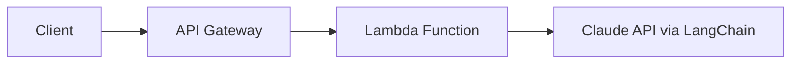
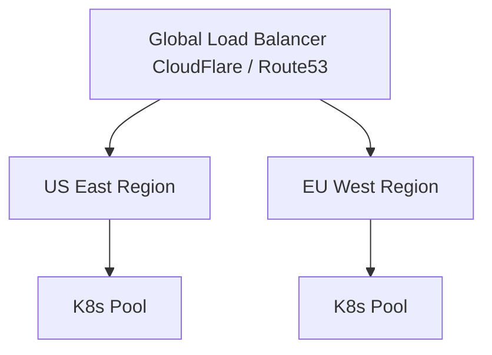

# 生产部署

> 本文档涵盖 AI Agent 系统的生产环境部署架构、扩展策略、监控方案、安全配置和成本优化。

## 1. 部署架构概述

### 1.1 架构选型对比

| 部署方式 | 适用场景 | 优点 | 缺点 |
|----------|----------|------|------|
| **Serverless** | 低流量、突发性负载 | 自动扩缩容、按需付费、冷启动快 | 超时限制、状态管理复杂 |
| **容器化 (Docker)** | 中等流量、需要状态持久化 | 可移植性强、环境一致 | 需要手动扩缩容管理 |
| **Kubernetes** | 大规模、高可用要求 | 自动扩缩容、自愈能力、滚动更新 | 运维复杂度高 |

### 1.2 Serverless 架构

#### 1.2.1 AWS Lambda + API Gateway



**配置示例 (serverless.yml)**:

```yaml
# 第 1 段：服务身份与框架版本（声明"这套 Serverless 应用叫什么、跑在哪个框架代际"）
# service 会成为 CloudFormation 栈名前缀（<service>-<stage>），改名等价于新建一整套资源，
# 线上改名会一次性销毁重建全部函数与触发器，属于高危操作。
service: ai-agent-serverless
# 锁死主版本：Serverless v3 -> v4 对 events/cors/变量解析有破坏性变更，不锁会在 CI 里"某天突然部署失败"。
frameworkVersion: '3'

# 第 2 段：provider 基础层（云厂商、运行时、部署环境、区域）
# 这一层的值会被所有 function 继承，是"默认值集中营"。
provider:
  name: aws
  # Node 18 是 Lambda 的托管运行时；升级大版本必须回归测试冷启动与依赖的 native 模块。
  runtime: nodejs18.x
  # 注意：provider.stage 只是默认值，命令行 --stage 仍可覆盖它。
  # 也就是说这里写 production 并非硬保险，误加 --stage dev 会让资源名/变量按 dev 解析，
  # 而函数却指向同一份密钥，是典型的"跨环境串号"事故来源。
  stage: production
  # 函数与 Lambda Layer、SSM 参数都必须同区域；跨区引用 ARN 会在部署校验阶段直接报错。
  region: us-east-1

  # 第 3 段：环境变量（部署期注入的配置面）
  # ${env:XXX} 在 deploy 时从 CI 的 shell 环境解析，缺失即部署失败——这是有意为之的快速失败，
  # 避免"部署成功但运行时才 500"。
  environment:
    ANTHROPIC_API_KEY: ${env:ANTHROPIC_API_KEY}
    REDIS_URL: ${env:REDIS_URL}
  # 以上两个值会以明文写入 Lambda 环境变量：任何持有 lambda:GetFunctionConfiguration
  # 的人都能读到明文。所以下面 IAM 段特意保留了 SSM 只读权限，供更敏感的配置走
  # "运行时按需拉取"路径（成本是每次冷启动多一次 API 调用，可用 TTL 缓存抵消）。

  # 第 4 段：运行时限（provider 级默认值，可被单个函数覆盖）
  # 30s 是"默认超时"，不是全局上限；API Gateway 的硬上限是 29s，
  # 所以同步 HTTP 调用实际永远用不满这 30s，多出的 1s 纯属冗余。
  timeout: 30
  # 内存与 CPU 份额正相关：1024MB 大致对应 1 个 vCPU 的一半配额。
  # 调小省不了多少钱却会拉长 LLM 流式响应时间，调大通常更快也更贵，属于需要实测的旋钮。
  memorySize: 1024

  # 第 5 段：IAM 权限（最小权限原则的落点）
  # 默认情况下 Serverless 会给函数一份写 CloudWatch Logs 的基础角色，这里在其之上追加语句。
  iam:
    role:
      statements:
        # 只给"读参数"这一种动作，不给 Put/Delete，防止函数被注入后反向篡改配置持久化。
        - Effect: Allow
          Action:
            - ssm:GetParameter
          # 资源收窄到 /ai-agent/ 前缀，但 region 与 account 用了通配符 * ，
          # 严格来说应写成 arn:aws:ssm:us-east-1:<ACCOUNT_ID>:parameter/ai-agent/*，
          # 否则该函数理论上可读取任意区域/账号边界内可用凭证访问的同类参数。
          Resource: 'arn:aws:ssm:*:*:parameter/ai-agent/*'

# 第 6 段：业务函数定义（每个 key 对应一个 Lambda + 触发器）
functions:
  # 第 6.1 段：同步对话入口（一次性返回完整回答）
  chat:
    handler: handler.chat
    events:
      # http 事件会隐式创建 API Gateway（REST + stage + 权限），无需手写 CFN。
      - http:
          path: /chat
          method: post
          # cors: true 是简写，框架会自动生成 OPTIONS 预检的 MOCK 集成与对应响应头；
          # 若要限制来源/凭据，必须改写为对象形式，否则等于对外开放任意域名。
          cors: true
    # Layer 用 ARN 引用，且带版本号 :1 —— 版本号是不可变的，这正是锁依赖、保证可复现的手段；
    # 但 ARN 里写死了 us-east-1 与账号 123456789012，跨区/跨账号部署时会静默指向错误依赖。
    layers:
      - arn:aws:lambda:us-east-1:123456789012:layer:langchain-layer:1
    # 预留并发是"同时预扣配额"：既是性能上限也是成本开关。
    # 代价是账号总并发不足时会造成其他函数/该函数的 Throttling，
    # 同时它让已置备的容器不会被回收，是变相的抗冷启动手段。
    reservedConcurrency: 100

  # 第 6.2 段：流式对话入口（LLM 逐 token 下发，依赖长连接）
  streamChat:
    handler: handler.streamChat
    events:
      - http:
          path: /chat/stream
          method: post
          cors: true
    # 覆盖 provider 的 30s：但如第 4 段所述，经 API Gateway 同步代理时
    # 29s 的网关超时才是真正的天花板；要真正跑到 60s，得换 Function URL
    # 或 API Gateway WebSocket / 响应流式传输模式，否则这个 60 只是"给内部调用留的余量"。
    timeout: 60

# 第 7 段：插件链（部署期钩子，本质是往 Serverless 生命周期里插脚本）
# warmup 负责给函数"定时喂流量"防冷启动；插件顺序即执行顺序，有依赖时必须人肉排序。
plugins:
  - serverless-plugin-warmup
  # 疑似无效/打字错误的插件名（"不谈"不是任何公开包），部署时会因找不到该 npm 包而直接失败；
  # 更危险的是"抢注型"插件名——一旦有人发布同名包，CI 就会自动安装并执行任意代码，
  # 属于典型的供应链风险点，应核对包名与来源后再上锁版本。
  - serverless-不谈-plugin

# 第 8 段：插件配置（custom 是插件的专属配置空间，框架本体不解释其内容）
custom:
  warmup:
    # default 是 warmup 的"配置剖面名"，多个函数可用不同剖面；
    # enabled: true 意味着所有函数默认被预热——包括 streamChat 这种长连接函数，
    # 预热的短请求无法命中流式代码路径，收益有限却持续产生调用费用。
    default:
      enabled: true
      events:
        # EventBridge 的 cron 表达式共 6 段：分 时 日 月 星期 年。
        # 这里 = 周一至周五，UTC 08:00–20:00，每 5 分钟一次。
        # 易错点：EventBridge 按 UTC 计时，需换算本地时区，否则预热窗口会整体偏移；
        # 另外 ? 只能出现在"日"或"星期"其中一段（这里用在日字段），两处都给 * 或都给 ? 会被拒。
        - schedule: cron(0/5 8-20 ? * MON-FRI *)
```
**LangChain Lambda Handler**:

```typescript
// handler.ts
// 第 1 段：依赖导入与全局客户端单例（模块加载期只执行一次）
// 同时引入两套调用路径：LangChain 封装（chat）与 Anthropic 原生 SDK（streamChat），
// 后者用于拿到真正的 SSE 流，前者用于多轮记忆编排；二者共用同一个 API Key 环境变量。
import { Anthropic } from '@anthropic-ai/sdk';
import { ConversationChain } from 'langchain/chains';
import { ChatAnthropic } from 'langchain/chat_models/anthropic';
import { BufferMemory } from 'langchain/memory';
import { CallbackManager } from 'langchain/callbacks';

// 关键：客户端放在模块作用域而非 handler 内部，可被 Lambda 热容器复用；
// 若放进 handler，每次冷/热调用都会重建连接池，白白增加 TLS 握手开销。
// 注意：此处直接读取 env，缺失时为 undefined——SDK 会在首次请求而非此处抛错（延迟失败，易误判）。
const anthropic = new Anthropic({ apiKey: process.env.ANTHROPIC_API_KEY });

// 第 2 段：chat —— 非流式对话入口（记忆 + ConversationChain）
// 设计意图：把「历史管理」交给 LangChain，用一行 invoke 完成"拼接历史 → 调模型 → 回写历史"。
// 易错点：APIGatewayEvent 未在本文件 import（依赖全局类型声明或 tsconfig 的 types 注入），
// 本地编译若报 "Cannot find name" 属类型环境问题，而非运行时逻辑问题。
export const chat = async (event: APIGatewayEvent) => {
  // 从 body 解析入参：messages 为 Anthropic 格式的消息数组，sessionId 用于会话隔离。
  // 边界条件：event.body 可能为 null（GET/空体）或非法 JSON，JSON.parse 会直接抛异常，
  // 生产代码应包 try/catch 并返回 4xx，这里为保持示例简洁未做防御。
  const { messages, sessionId } = JSON.parse(event.body);

  // 记忆对象：returnMessages=true 表示以 Message 对象数组（而非纯字符串）保存，
  // 这样才能保留 role 信息、正确还原多轮对话结构；memoryKey='history' 是模板占位符名。
  // 重点易错：memory 在每次请求内新建，生命周期仅限本次调用——它无法跨请求保存历史，
  // 因此下面把完整历史（messages 数组）只取了最后一条，等于"每次都从零开始"。
  // sessionId 被解构却未被使用，说明按会话持久化（如 Redis/DynamoDB）的意图尚未实现。
  const memory = new BufferMemory({
    returnMessages: true,
    memoryKey: 'history',
  });

  // 模型配置：temperature=0.7 偏向有创造性但不至于发散；
  // maxTokens=4096 是输出上限，与上下文窗口是两个概念，超长输入仍需自行裁剪。
  const model = new ChatAnthropic({
    anthropicApiKey: process.env.ANTHROPIC_API_KEY,
    model: 'claude-3-5-sonnet-20241022',
    temperature: 0.7,
    maxTokens: 4096,
  });

  // 组装链：ConversationChain = 默认对话提示模板 + LLM + Memory，
  // 它会在内部读取 memory 变量并注入到 prompt，调用后再把本轮问答写回 memory。
  const chain = new ConversationChain({ llm: model, memory });

  // 数据流：messages[last].content —— 只把用户最新一句作为 input 传入，
  // 更早的轮次被丢弃；若想支持完整多轮，应把 messages 全量灌入 memory 或改用 ChatPromptTemplate。
  // 复杂度：一次网络往返，耗时主要由模型推理决定（秒级），不适合放在 API Gateway 30 秒硬超时边缘。
  const response = await chain.invoke({ input: messages[messages.length - 1].content });
  // 返回值统一走 JSON 文本，前端需二次 parse；泛型 response.response 是模型输出的字符串字段。
  return {
    statusCode: 200,
    body: JSON.stringify({ response: response.response }),
  };
};

// 第 3 段：streamChat —— 流式对话入口（原生 SDK，绕过 LangChain）
// 为什么不用 chain：LangChain 的 Chain 抽象不直接暴露 token 级流对象，
// 而 Web 端要逐字渲染必须拿到 ReadableStream，所以这里降级到 anthropic.messages.stream。
// 代价：此路径没有 memory，天然无状态；上下文完全依赖调用方每次传入的 messages 全量。
export const streamChat = async (event: APIGatewayEvent) => {
  // 仅取 messages：流式场景要求客户端每次携带完整历史，服务端不做拼接。
  // 同样存在 body 为空/非法 JSON 的风险（见第 2 段说明）。
  const { messages } = JSON.parse(event.body);

  // 发起流式请求：stream:true 时 SDK 返回的是流句柄而非最终结果，
  // 真正的数据在随后被消费时才逐步到达；await 等待的是"连接建立+响应头就绪"，不是"生成完毕"。
  // 边界：messages 必须严格符合 Anthropic 规范（role 只能是 user/assistant、user/assistant 需交替），
  // 直接把前端数组透传会把格式校验责任外推，非法结构会得到 400。
  const stream = await anthropic.messages.stream({
    model: 'claude-3-5-sonnet-20241022',
    max_tokens: 4096,
    messages,
    stream: true,
  });

  // 返回 SSE 响应：toReadableStream() 把 SDK 的流包装成 Web ReadableStream，
  // 由运行时边读边写回客户端（Lambda 需开启响应流式/Function URL，普通 REST 代理会缓冲整包）。
  // 以下三个响应头缺一不可：text/event-stream 声明协议；no-cache 防中间层缓存增量帧；
  // keep-alive 防止代理在 token 间隔期提前断开长连接。
  // isBase64Encoded=false 很关键：若置 true，二进制/流内容会被 base64 二次编码而破坏 SSE 分帧。
  return {
    statusCode: 200,
    body: stream.toReadableStream(),
    isBase64Encoded: false,
    headers: {
      'Content-Type': 'text/event-stream',
      'Cache-Control': 'no-cache',
      'Connection': 'keep-alive',
    },
  };
};
```
#### 1.2.2 Vercel AI SDK 部署

```typescript
// app/api/chat/route.ts
// 第 1 段：模块依赖与运行时配置（声明这段函数"跑在哪里、能跑多久"）
// Next.js 的 App Router 约定：route.ts 导出的 POST 即为 /api/chat 的 POST 处理器。
// runtime/maxDuration 是路由级配置，必须在模块顶层导出，Next.js 构建时静态读取它们。
import { anthropic } from '@ai-sdk/anthropic';
import { streamText } from 'ai';

// 指定 Edge Runtime：V8 isolate 冷启动快、贴近用户，适合流式响应的首字延迟。
// 代价是没有 Node.js API、也没有原生模块可用，所以下面只能用 Web 标准 API。
export const runtime = 'edge';
// 平台级超时上限（单位秒）。长回答 + 慢模型很容易撞到这个边界，改小会截断流。
export const maxDuration = 60;

// 第 2 段：请求入口与入参解析（把前端发来的 JSON 还原成消息数组）
// 任意请求体格式错误都会在这里抛异常，最终由框架转成 500；生产环境建议包一层
// try/catch 手动返回 400，避免把内部堆栈暴露给调用方。
export async function POST(req: Request) {
  const { messages } = await req.json();
  // messages 是 UIMessage 数组（含 role/content，可能还有 id 与 tool 调用记录），
  // 此处不做 schema 校验：结构不符合预期时，错误会推迟到 streamText 内部才暴露。

  // 第 3 段：调用模型并生成流（streamText 返回"惰性句柄"，而非最终文本）
  // 关键数据流：请求 → streamText 打开与 Anthropic 的 SSE 连接 → 结果句柄 → 序列化为响应流。
  // await 在这里得到的不是完整答案，而是一个可在流式过程中逐步消费的包装对象。
  const result = await streamText({
    // 硬编码模型 ID：要换模型或用别家供应商，只改这一行即可。
    model: anthropic('claude-3-5-sonnet-20241022'),
    // system 设定全局人设，不占用 messages；每轮请求都会重新注入，因此是稳定的指令层。
    system: 'You are a helpful assistant.',
    // messages 原样透传：完整历史保证了多轮上下文，但也意味着 token 数随对话线性增长，
    // 长会话需要自行做截断或摘要，否则会先撞上下文窗口，再撞 maxDuration。
    messages,
  });

  // 第 4 段：把流编码成前端可消费的响应（不落库、不缓存）
  // toDataStreamResponse() 输出带 data: 前缀的 SSE 流，会被 AI SDK 的 useChat 自动解析；
  // 若返回 result.toTextStreamResponse() 则只吐纯文本，前端解析方式要相应改变。
  return result.toDataStreamResponse();
}
```
### 1.3 容器化部署 (Docker)

#### 1.3.1 Dockerfile 最佳实践

```dockerfile
# 多阶段构建
FROM node:20-alpine AS builder
WORKDIR /app
COPY package*.json ./
RUN npm ci --only=production && npm cache clean --force

FROM node:20-alpine AS runtime
WORKDIR /app

# 安全：使用非 root 用户
RUN addgroup -g 1001 -S nodejs && adduser -S nodejs -u 1001

# 健康检查
HEALTHCHECK --interval=30s --timeout=10s --start-period=5s --retries=3 \
  CMD node -e "require('http').get('http://localhost:4000/health', (r) => process.exit(r.statusCode === 200 ? 0 : 1))"

COPY --from=builder --chown=nodejs:nodejs /app/node_modules ./node_modules
COPY --chown=nodejs:nodejs . .

USER nodejs

EXPOSE 4000

CMD ["node", "dist/main.js"]
```

#### 1.3.2 Docker Compose 本地开发

```yaml
# docker-compose.yml
# 第 1 段：文件头与 Compose 语法版本声明
# 这一行决定解析器按哪套规范解释后面的键：3.8 属于旧版 v3 家族，deploy 键的语义与
# Swarm 强相关，且不支持 v2 的 depends_on.condition 长写法（需 Compose V2 CLI 才补回）。
# 易错点：升级到 Compose Spec（省略 version）后行为会变，改动前先确认 docker compose 版本。
version: '3.8'

# 第 2 段：顶层服务清单入口
# services 下每个键就是一个容器编排单元，服务名即容器在网络中的 DNS 名，
# 所以下面 agent-api 里可以直接用主机名 redis 建连，无需硬编码 IP。
services:
  # 第 3 段：agent-api 服务的构建定义
  # context 把整个仓库作为构建上下文传给 daemon；target: builder 表示只构建到多阶段
  # Dockerfile 中名为 builder 的中间阶段即停止。数据流：源码 → builder 镜像 → 直接作为运行镜像。
  # 易错点：停在 builder 往往意味着镜像里带着编译器与 devDependencies，镜像体积和攻击面都偏大，
  # 生产环境通常应改指运行阶段（如 target: runner）。
  agent-api:
    build:
      context: .
      target: builder
    # 第 4 段：端口暴露与服务间寻址
    # "4000:4000" 是 宿主端口:容器端口 的映射，左侧对外、右侧需与容器内进程实际监听一致。
    # 注意这是发布到宿主所有网卡，若只想本机访问应写 "127.0.0.1:4000:4000"。
    ports:
      - "4000:4000"
    # 第 5 段：运行时环境变量注入
    # ${ANTHROPIC_API_KEY} 由 Compose 在解析阶段从宿主环境或同目录 .env 文件插值填充，
    # 属于"渲染期"替换，因此密钥不会落地到镜像层，但仍会出现在 docker inspect 输出里。
    # REDIS_URL 里的 redis 就是本文件中的服务名，走 Compose 默认网络解析，端口用容器内部 6379。
    environment:
      - ANTHROPIC_API_KEY=${ANTHROPIC_API_KEY}
      - REDIS_URL=redis://redis:6379
      - NODE_ENV=production
    # 第 6 段：启动依赖与健康门控
    # depends_on 只保证"启动顺序"，不保证"服务就绪"；这里用 condition: service_healthy 把
    # 门控提升为真正的就绪等待——redis 健康检查不通过，agent-api 根本不会被拉起，从而避免
    # 冷启动期连接被拒。复杂度上这只解决启动期，运行期断连仍需应用层重试兜底。
    depends_on:
      redis:
        condition: service_healthy
    # 第 7 段：进程生命周期与资源治理
    # restart: unless-stopped 表示除非人工 stop，否则退出后自动拉起，且宿主重启后仍恢复；
    # 与 always 的差别就在于"被手动停掉后不再自动起"，便于运维介入排查。
    # deploy.resources.limits 在旧版 v3 + 非 Swarm 场景会被静默忽略，只有 Compose V2 CLI
    # 才真正把 cpus/memory 落到容器上；用老工具链请改用 cpus/mem_limit 顶层键。
    # 边界条件：内存超 2G 会触发 OOM Kill，配合上面的 restart 会形成"反复重启"循环，需监控。
    restart: unless-stopped
    deploy:
      resources:
        limits:
          cpus: '2'
          memory: 2G

  # 第 8 段：redis 缓存/状态服务
  # 用 alpine 变体换取更小的镜像与更少的 CVE 面；6379 同样映射到宿主，便于本地用
  # redis-cli 直连调试，生产可考虑去掉该映射只保留容器内网访问。
  redis:
    image: redis:7-alpine
    ports:
      - "6379:6379"
    # 第 9 段：数据持久化挂载
    # 命名卷 redis_data 由 Docker 管理实际存储路径，比 bind mount 更可移植；
    # 但纯命名卷的备份需走 docker volume 或临时容器，不能直接在宿主目录里 cp。
    # 边界条件：卷删除（docker compose down -v）即数据全失，AOF 也救不回来。
    volumes:
      - redis_data:/data
    # 第 10 段：Redis 启动参数调优
    # appendonly yes 开启 AOF，牺牲写吞吐换取重启后可恢复（默认 RDB 快照会丢最近窗口数据）；
    # maxmemory 512mb + allkeys-lru 组成"内存上限 + 淘汰策略"：一旦触顶就按 LRU 淘汰任意键，
    # 保证 Redis 不因 OOM 被内核杀死。易错点：allkeys-lru 可能淘汰掉本应长期驻留的键，
    # 若存在不可丢数据应改用 volatile-lru 或不做缓存用途。
    command: redis-server --appendonly yes --maxmemory 512mb --maxmemory-policy allkeys-lru
    # 第 11 段：健康检查（供上面 depends_on 消费）
    # 用 redis-cli ping 探测，成功返回 PONG 即视为健康。interval 10s 是探测周期，
    # timeout 5s 是单次超时，retries 3 表示连续 3 次失败才判 unhealthy。
    # 关键数据流：健康状态 → depends_on 门控 → agent-api 启动时机。
    # 调参注意：首次启动的最坏等待约为 interval + retries×(interval+timeout)，过小会误判、过大拖慢编排。
    healthcheck:
      test: ["CMD", "redis-cli", "ping"]
      interval: 10s
      timeout: 5s
      retries: 3

  # 第 12 段：prometheus 监控采集
  # 镜像 tag 用 latest 便于快速起步，但会带来不可复现的构建结果，生产建议钉死版本号。
  # 配置文件以 bind mount 只读方式（此处未加 :ro，可考虑补上）注入容器内的默认加载路径，
  # 改动 prometheus.yml 只需重启容器，无需重建镜像。
  prometheus:
    image: prom/prometheus:latest
    ports:
      - "9090:9090"
    volumes:
      - ./prometheus.yml:/etc/prometheus/prometheus.yml

# 第 13 段：命名卷集中声明
# 只有在此登记的卷才会被 Compose 创建并纳入生命周期管理（down -v 时一并删除）；
# 不声明而直接使用，Compose 会报错或按匿名卷处理，导致数据难以定位与备份。
volumes:
  redis_data:
```
### 1.4 Kubernetes 部署

#### 1.4.1 Deployment 配置

```yaml
# k8s/deployment.yaml
# 第 1 段：资源身份声明 —— 确定这个对象由哪个 API 组管理、叫什么名字
# 为什么：apiVersion + kind 共同决定 kubectl 请求发往哪个 REST 端点，apps/v1 是 Deployment 的稳定版；
# metadata.name 会成为 Pod 实际名字 <name>-<podTemplateHash>-<random> 的前缀，改名等于开一段全新的发布历史。
apiVersion: apps/v1
kind: Deployment
metadata:
  name: ai-agent
  labels:
    app: ai-agent   # 部署对象自身的标签，供 kubectl -l app=ai-agent 批量检索；它不参与 Pod 选择，选 Pod 的是 spec.selector
# 第 2 段：副本期望值与 Pod 选择器 —— 声明"要几个、认哪些"
# 为什么：replicas 是期望状态而非命令，控制器会持续对账（有 Pod 挂了就补，多了就删）；
# 易错点：selector.matchLabels 必须被 template.metadata.labels 覆盖，否则 API Server 直接拒绝创建；且 selector 创建后不可变。
spec:
  replicas: 3
  selector:
    matchLabels:
      app: ai-agent
# 第 3 段：滚动更新策略 —— 决定发布期间可用性下限与资源峰值
# 为什么：maxSurge: 1 允许先多起 1 个新 Pod（峰值 4 个），maxUnavailable: 0 保证旧 Pod 必须等新 Pod Ready 后才下线，
# 因此任何时刻可用副本数不低于 3，实现零中断升级；代价是发布期间集群要多挤出 1 份 request/limit 的容量。
  strategy:
    type: RollingUpdate
    rollingUpdate:
      maxSurge: 1
      maxUnavailable: 0
# 第 4 段：Pod 模板的标签与监控注解 —— 影响 Service 选流和 Prometheus 抓取
# 关键：这里的 labels 是给 Pod 打的，必须包含第 2 段 selector 的值，否则滚动更新时新 Pod 不会被纳入；
# 易错点：注解值一律是字符串，"true" 必须带引号，写成裸 true 会变布尔值导致部分抓取器解析失败。
  template:
    metadata:
      labels:
        app: ai-agent
      annotations:
        prometheus.io/scrape: "true"
        prometheus.io/port: "4000"
        prometheus.io/path: "/metrics"
# 第 5 段：Pod 级安全与身份 —— 最小权限运行与 UID 固化
# 为什么：runAsNonRoot 让 kubelet 在启动前校验镜像里的 USER，若是 root 会直接拒绝启动（快速失败而非带病上线）；
# runAsUser 固定运行身份，fsGroup 让挂载卷的文件属组归 1001，避免应用写盘报 EACCES；注意它只做校验/声明，不会帮你改镜像。
    spec:
      serviceAccountName: ai-agent-sa
      securityContext:
        runAsNonRoot: true
        runAsUser: 1001
        fsGroup: 1001
# 第 6 段：容器定义与端口 —— 单容器形态，镜像用不可变 tag
# 关键：固定 tag v1.2.0 而非 latest，保证同一份 YAML 可复现、回滚有据；containerPort 只是声明（便于 Service 按名字引用端口 http），
# 并不限制真实监听端口，写错也不会报错，只会在排查时误导人。
      containers:
        - name: agent
          image: your-registry.com/ai-agent:v1.2.0
          ports:
            - containerPort: 4000
              name: http
# 第 7 段：显式环境变量注入 —— 敏感值与配置分离
# 数据流：kubelet 起容器前先从 Secret 取 key=anthropic-api-key、从 ConfigMap 取 key=redis-url，再落成容器环境变量；
# 易错点：Secret/ConfigMap 必须已存在于同一 namespace，否则 Pod 会卡在 CreateContainerConfigError 而不进入 Running。
          env:
            - name: ANTHROPIC_API_KEY
              valueFrom:
                secretKeyRef:
                  name: ai-agent-secrets
                  key: anthropic-api-key
            - name: REDIS_URL
              valueFrom:
                configMapKeyRef:
                  name: ai-agent-config
                  key: redis-url
# 第 8 段：资源请求与上限 —— 调度依据 + 限流/杀进程阈值
# 关键：requests 参与调度决策（决定 Pod 落到哪个节点，节点按 requests 之和判满），limits 决定运行时行为：
# CPU 超 limit 被 CFS throttle（变慢但不死），内存超 limit 直接 OOMKill（重启）；
# 500m = 半个核，requests 与 limits 差 4 倍是故意留突发空间，但也意味着节点存在超卖，容量规划要按 limits 的峰值算。
          resources:
            requests:
              cpu: 500m
              memory: 512Mi
            limits:
              cpu: 2000m
              memory: 2Gi
# 第 9 段：存活与就绪探针 —— 两件事，别混用
# 语义差异：liveness 失败会重启容器（restartCount 增长），readiness 失败只把 Pod 从 Service Endpoints 摘掉、不重启；
# initialDelaySeconds: 30 是给进程启动与预热留窗口，设太小会让慢启动应用陷入反复重启的死循环；
# readiness 用 5s×2 次（更灵敏）是为了新副本尽快加入或快速摘除异常副本，两者阈值不同正是"快摘慢杀"的常见取舍。
          livenessProbe:
            httpGet:
              path: /health
              port: 4000
            initialDelaySeconds: 30
            periodSeconds: 10
            failureThreshold: 3
          readinessProbe:
            httpGet:
              path: /ready
              port: 4000
            initialDelaySeconds: 5
            periodSeconds: 5
            failureThreshold: 2
# 第 10 段：ConfigMap 批量注入
# 作用：把 ai-agent-config 里所有键值一次性变成环境变量，省去逐个 env 声明；
# 易错点：带连字符等非法变量名（如 redis-url）会被跳过并把事件写进 Pod 日志；环境变量在容器创建时固化，
# ConfigMap 后续改键值不会热更新到已运行的容器，必须重建 Pod；同名变量下第 7 段的显式 env 优先级高于 envFrom。
          envFrom:
            - configMapRef:
                name: ai-agent-config
# 第 11 段：软反亲和打散 —— 用调度约束换取故障域隔离
# 为什么：topologyKey 取 hostname，让 3 个副本尽量落在不同节点，单节点宕机不会全量不可用；weight 100 表示最高优先但仍可在
# 无可选节点时退让（preferred 而非 required），这是关键：用 required 的话，节点数少于副本数就会有 Pod 永久 Pending。
      affinity:
        podAntiAffinity:
          preferredDuringSchedulingIgnoredDuringExecution:
            - weight: 100
              podAffinityTerm:
                labelSelector:
                  matchLabels:
                    app: ai-agent
                topologyKey: kubernetes.io/hostname
```
#### 1.4.2 HPA 自动扩缩容

```yaml
# k8s/hpa.yaml

# 第 1 段：API 版本与资源类型声明
# 这里必须用 autoscaling/v2 而不是 v1：v1 只能按 CPU 单一指标扩缩，
# v2 才支持多指标、自定义指标(Pods/Object/External)以及 behavior 精细控速。
# 前置依赖：资源类指标靠 metrics-server 供数，自定义指标靠 Prometheus Adapter 暴露，
# 任一组件缺失都会让对应指标报 "unable to get metrics" 而扩缩失效。
apiVersion: autoscaling/v2
kind: HorizontalPodAutoscaler

# 第 2 段：元数据
# HPA 是命名空间级对象，只能扩缩同 namespace 下的工作负载；
# 名字在命名空间内需唯一，通常与目标 Deployment 同名加 -hpa 便于排查时对应。
metadata:
  name: ai-agent-hpa

# 第 3 段：扩缩目标与副本数上下限
# scaleTargetRef 用 apiVersion/kind/name 三元组定位被控对象，
# 必须精确指向 Deployment/ai-agent；写错名字 HPA 会长期处于 TargetNotFound 而不动作。
spec:
  scaleTargetRef:
    apiVersion: apps/v1
    kind: Deployment
    name: ai-agent
  # minReplicas 省略时默认 1；设为 2 是为保证基础可用性，滚动发布或单节点故障时仍有实例扛流量。
  minReplicas: 2
  # maxReplicas 是硬顶：防止指标毛刺或失真导致无限扩容，打爆节点资源与云账单。
  maxReplicas: 20

# 第 4 段：多指标扩缩策略
# HPA 会为每个指标各算一个"期望副本数"，再取其中的最大值作为最终期望值——即"短板原则"：
# 任一指标吃紧就扩容，避免只满足 CPU 而内存已逼近 OOM 的情况。
  metrics:
    # 指标 1：CPU 利用率
    # Utilization 是相对值，分母是 Pod 的 requests.cpu；因此必须先给容器配好 requests，
    # 否则该指标无法计算，HPA 会报错或直接不生效。
    - type: Resource
      resource:
        name: cpu
        target:
          type: Utilization
          averageUtilization: 70    # 目标：所有副本平均 CPU 维持在 70%，留 30% 余量吸收流量尖峰
    # 指标 2：内存利用率
    # 与 CPU 不同，内存一般不会主动释放（GC 类语言例外），阈值定得更高（80%）可减少抖动式扩容；
    # 若应用存在内存泄漏，HPA 只是分摊流量，无法根治，需配合 OOMKilled 告警排查。
    - type: Resource
      resource:
        name: memory
        target:
          type: Utilization
          averageUtilization: 80
    # 指标 3：每秒请求数（自定义指标）
    # type: Pods 表示按"单副本的指标均值"扩缩，期望副本数 = ceil(当前指标总量 / averageValue)。
    # 该指标最贴近业务真实负载，通常比 CPU/内存更早感知流量上涨，是扩容的前置信号。
    - type: Pods
      pods:
        metric:
          name: http_requests_per_second   # 该名字需由 Prometheus Adapter 等自定义指标 API 暴露，否则拿不到数
        target:
          type: AverageValue
          averageValue: "100"   # 目标：每副本平均承担 100 QPS；注意此处是字符串，YAML 中必须加引号，否则可能被解析成数字或引发歧义

# 第 5 段：扩缩行为 behavior——抑制抖振的核心
# 默认 HPA 扩缩都可能过于激进，behavior 用来限制速率、抑制"扩缩震荡"(flapping)，
# 生产环境几乎必配；下面刻意做成"快扩慢缩"的非对称设计。
  behavior:
    # 缩容：偏保守
    # stabilizationWindowSeconds 表示回看过去 5 分钟内所有期望副本数建议，取其中"最大"的一条执行，
    # 即流量回落后要持续 5 分钟确认才会真正缩容，避免脉冲流量刚走就缩、下一波又扩的来回拉扯。
    scaleDown:
      stabilizationWindowSeconds: 300
      policies:
        # 每 60 秒最多缩掉当前副本数的 10%，缩容速度远慢于扩容，防止误判造成容量不足。
        - type: Percent
          value: 10
          periodSeconds: 60
    # 扩容：偏激进
    # stabilizationWindowSeconds: 0 表示不做滞后平滑，指标一超阈值立即扩，
    # 这是有意的非对称：扛不住流量会直接丢请求甚至雪崩，多开几个 Pod 的代价可以接受。
    scaleUp:
      stabilizationWindowSeconds: 0
      policies:
        # 每 15 秒最多翻倍（100%），快速抹平流量陡增。
        - type: Percent
          value: 100
          periodSeconds: 15
        # 每 15 秒最多加 4 个 Pod：副本基数较小时(如 10 个)翻倍增量有限，这条提供固定的加速度兜底。
        - type: Pods
          value: 4
          periodSeconds: 15
      # 多条 policy 同时存在时按 selectPolicy 裁决：Max 取"最激进"的一条执行，保证扩容速度优先；
      # 若配 Min 则取最保守的一条（常见于需要极力避免缩过头的场景）。
      selectPolicy: Max
```
#### 1.4.3 Service 配置

```yaml
# k8s/service.yaml
apiVersion: v1
kind: Service
metadata:
  name: ai-agent-service
  labels:
    app: ai-agent
spec:
  type: ClusterIP
  ports:
    - port: 80
      targetPort: 4000
      protocol: TCP
      name: http
  selector:
    app: ai-agent
---
apiVersion: v1
kind: Service
metadata:
  name: ai-agent-pdb
spec:
  selector:
    app: ai-agent
  minAvailable: 2
```

## 2. 扩展策略

### 2.1 水平扩展

```typescript
// 负载均衡器健康检查
app.get('/health', (req, res) => {
  res.json({ status: 'healthy', uptime: process.uptime() });
});

app.get('/ready', async (req, res) => {
  try {
    // 检查 Redis 连接
    await redis.ping();
    // 检查 API key 有效性
    await checkApiKey();
    res.json({ status: 'ready' });
  } catch (error) {
    res.status(503).json({ status: 'not_ready', error: error.message });
  }
});
```

### 2.2 垂直扩展配置

```yaml
# Kubernetes 资源配额
apiVersion: v1
kind: ResourceQuota
metadata:
  name: ai-agent-quota
spec:
  hard:
    requests.cpu: "8"
    requests.memory: 16Gi
    limits.cpu: "16"
    limits.memory: 32Gi
    pods: "10"
```

### 2.3 地理分布扩展



### 2.4 队列驱动的扩展模式

```typescript
// 使用 SQS + Lambda 实现背压处理
import { SQSClient, ReceiveMessageCommand } from '@aws-sdk/client-sqs';

const sqs = new SQSClient({ region: 'us-east-1' });
const queueUrl = process.env.AGENT_QUEUE_URL;

export const processQueue = async () => {
  const command = new ReceiveMessageCommand({
    QueueUrl: queueUrl,
    MaxNumberOfMessages: 10,
    WaitTimeSeconds: 20,
    VisibilityTimeout: 60,
  });

  const { Messages } = await sqs.send(command);

  for (const message of Messages ?? []) {
    try {
      const { messages, sessionId, traceId } = JSON.parse(message.Body);

      const result = await agent.process(messages);

      // 处理成功，删除消息
      await sqs.send(new DeleteMessageCommand({
        QueueUrl: queueUrl,
        ReceiptHandle: message.ReceiptHandle,
      }));

      // 发送结果到回调队列
      await sendToCallbackQueue({ sessionId, result, traceId });
    } catch (error) {
      // 处理失败，增加 VisibilityTimeout 重试
      console.error('Processing failed:', error);
    }
  }
};
```

## 3. 监控与可观测性

### 3.1 LangSmith 集成

```typescript
// tracing.ts
import { Client } from '@langchain/langsmith';

const langsmithClient = new Client({
  apiUrl: process.env.LANGSMITH_API_URL,
  apiKey: process.env.LANGSMITH_API_KEY,
});

// LangChain 回调处理器
import { CallbackManager } from 'langchain/callbacks';

export const getTracingHandler = () => {
  return CallbackManager.fromHandlers({
    async handleLLMStart(llm, prompts) {
      console.log('LLM Start:', prompts);
    },
    async handleLLMEnd(output) {
      console.log('LLM End:', output);
    },
    async handleToolStart(tool, input) {
      console.log('Tool Start:', tool.name, input);
    },
    async handleToolEnd(output) {
      console.log('Tool End:', output);
    },
  });
};

// 使用示例
const model = new ChatAnthropic({
  anthropicApiKey: process.env.ANTHROPIC_API_KEY,
  model: 'claude-3-5-sonnet-20241022',
  callbacks: getTracingHandler(),
});
```

### 3.2 Weights & Biases (W&B) 集成

```typescript
// wandb_integration.ts
// 第 1 段：引入 W&B 客户端
// 只用默认导入即可拿到 `init` 等入口；W&B 的 JS 版本不随包提供强类型，
// 因此后续 `run` 只能标注为 any，类型安全要靠团队约定而非编译器兜底。
import wandb from 'wandb';

// 第 2 段：指标上报器的类骨架
// 把"一次训练/推理会话"封装成对象，是为了让 run 的生命周期与 Agent 实例一一对应，
// 避免全局散落的 wandb.init 造成重复建 run、数据割裂。
class AgentMetrics {
  // run 是 W&B 的会话句柄（类似文件描述符），所有 log 都挂在它上面；
  // 这里用 any 是因为 SDK 未导出该类型，换成具体类型反而要维护脆弱的 d.ts。
  private run: any;

  // 第 3 段：初始化一次 run 并冻结本次实验的配置
  // init 应当"一次初始化、长期复用"：每 new 一次就新建一个 run，会产生大量碎片化实验。
  // 超参放进 config 而非每条日志里，是因为 config 只在 run 级记录一次，
  // 后续可用它做筛选/分组对比，重复上报会浪费配额且污染图表。
  constructor() {
    this.run = wandb.init({
      project: 'ai-agent-production',
      // 用 HOSTNAME 拼名字，是为了让多副本/多容器部署时每个实例的 run 可区分；
      // 若宿主无该环境变量会退化成字面量 'agent-undefined'，属于需要留意的边界。
      name: `agent-${process.env.HOSTNAME}`,
      config: {
        model: 'claude-3-5-sonnet-20241022',
        temperature: 0.7,
        max_tokens: 4096,
      },
    });
  }

  // 第 4 段：记录一轮对话的端到端指标
  // 数据流：入参 messages/response 只被用来取长度等标量，正文本身不上传，
  // 这样既控制了上报体积，也避免了把用户对话原文写入第三方平台。
  // 键名必须保持稳定：W&B 靠 key 名把多次 log 归并成同一条曲线，改名等于断线。
  logConversation(messages: Message[], response: string, metadata: {
    duration: number;
    tokens_used: number;
    success: boolean;
  }) {
    this.run.log({
      'conversation_length': messages.length,
      'response_length': response.length,
      // duration 单位由调用方决定，这里显式取名 duration_ms 是给读者一个"毫秒"的约定。
      'duration_ms': metadata.duration,
      'tokens_used': metadata.tokens_used,
      'success': metadata.success,
      // 手动塞 ISO 时间戳，方便在 W&B 之外（如导出 CSV）按真实发生时刻排序，
      // 而不是依赖 SDK 隐式记录的墙钟时间。
      'timestamp': new Date().toISOString(),
    });
  }

  // 第 5 段：按工具名记录调用耗时与成功率
  // 用模板字符串动态拼 key，是为了让每个工具（search、code_exec…）各自成为独立指标列，
  // 无需改代码即可自动扩展；代价是工具名基数越大，W&B 里的 series 越多、面板越难读。
  logToolUsage(toolName: string, duration: number, success: boolean) {
    this.run.log({
      [`tool_${toolName}_duration`]: duration,
      // 布尔转 0/1 是常见做法：多数指标后端对 bool 支持不佳，
      // 转成数值后可直接求平均得到"成功率"，也便于做求和/阈值告警。
      [`tool_${toolName}_success`]: success ? 1 : 0,
    });
  }

  // 第 6 段：收尾与落盘
  // finish 会 flush 缓冲并结束 run；进程若是被 kill 或忘记调用，
  // 末尾若干条日志可能丢失，所以它通常要放进 finally / 优雅退出钩子里。
  finish() {
    this.run.finish();
  }
}

// 第 7 段：导出模块级单例
// 在导入时即建 run（副作用式初始化），好处是各处 import 拿到的就是同一个 run，
// 无需手动传参；代价是模块被加载就会真的联网上报，单元测试时需要用 mock 或延迟导入来规避。
export const metrics = new AgentMetrics();
```
### 3.3 Prometheus 指标

```typescript
// metrics.ts
import client, { Counter, Histogram, Gauge } from 'prom-client';

const register = new client.Registry();
client.collectDefaultMetrics({ register });

// 请求计数器
export const httpRequestsTotal = new Counter({
  name: 'http_requests_total',
  help: 'Total HTTP requests',
  labelNames: ['method', 'path', 'status'],
  registers: [register],
});

// 请求延迟直方图
export const httpRequestDuration = new Histogram({
  name: 'http_request_duration_seconds',
  help: 'HTTP request duration in seconds',
  labelNames: ['method', 'path'],
  buckets: [0.01, 0.05, 0.1, 0.5, 1, 2, 5, 10],
  registers: [register],
});

// Agent 指标
export const agentConversationsTotal = new Counter({
  name: 'agent_conversations_total',
  help: 'Total number of agent conversations',
  labelNames: ['status'],
  registers: [register],
});

export const agentConversationDuration = new Histogram({
  name: 'agent_conversation_duration_seconds',
  help: 'Agent conversation duration in seconds',
  buckets: [1, 5, 10, 30, 60, 120, 300],
  registers: [register],
});

// Token 使用量
export const tokensUsedTotal = new Counter({
  name: 'tokens_used_total',
  help: 'Total tokens used',
  labelNames: ['type'], // 'input' | 'output'
  registers: [register],
});

// 活跃会话数
export const activeSessions = new Gauge({
  name: 'active_sessions',
  help: 'Number of active conversations',
  registers: [register],
});

// 中间件
export const metricsMiddleware = async (req, res, next) => {
  const start = Date.now();

  res.on('finish', () => {
    const duration = (Date.now() - start) / 1000;
    httpRequestsTotal.inc({ method: req.method, path: req.path, status: res.statusCode });
    httpRequestDuration.observe({ method: req.method, path: req.path }, duration);
  });

  next();
};

// /metrics 端点
app.get('/metrics', async (req, res) => {
  res.set('Content-Type', register.contentType);
  res.send(await register.metrics());
});
```

### 3.4 分布式追踪 (OpenTelemetry)

```typescript
// tracing.ts
// 第 1 段：导入可观测性栈的四类构件，为后续一次性装配做准备
// OpenTelemetry 的装配是"声明式"的：SDK 负责编排，Exporter 负责把数据送出去，
// Resource 负责描述"我是谁"，Instrumentation 负责自动产生 span。
import { NodeSDK } from '@opentelemetry/sdk-node';
import { OTLPTraceExporter } from '@opentelemetry/exporter-trace-otlp-http';
import { Resource } from '@opentelemetry/resources';
import { SemanticResourceAttributes } from '@opentelemetry/semantic-conventions';
import { LangChainInstrumentation } from '@opentelemetry/instrumentation-langchain';

// 第 2 段：装配全局 SDK 实例（进程级单例，只做一次）
// Resource 上的 service.name 是后端（Jaeger/Tempo/Datadog）区分服务的唯一依据，
// 不设置就会退化成 "unknown_service"，多个进程的 trace 会混在一起无法区分。
const sdk = new NodeSDK({
  resource: new Resource({
    [SemanticResourceAttributes.SERVICE_NAME]: 'ai-agent',
    // 版本号用于灰度对比：同一功能发布后可按 version 切片观察错误率与延迟。
    [SemanticResourceAttributes.SERVICE_VERSION]: '1.0.0',
  }),
  // 第 3 段：配置导出通道（OTLP over HTTP）
  // 注意：这里直接把环境变量透传给 url。若 OTLP_EXPORTER_OTLP_ENDPOINT 未设置，
  // 值为 undefined，SDK 会回退到默认端点（通常 localhost:4318），
  // 在容器里没起 Collector 时会静默丢数据——这是最常见的"埋点没生效"根因。
  traceExporter: new OTLPTraceExporter({
    url: process.env.OTEL_EXPORTER_OTLP_ENDPOINT,
  }),
  // 第 4 段：开启自动埋点
  // LangChainInstrumentation 会通过 monkey-patch 拦截 LangChain 的调用链
  //（LLM 调用、Chain、Retriever、Tool 等），无需改业务代码即可得到层级 span；
  // 它能生效的前提是：本文件必须在业务模块之前被 import 执行。
  instrumentations: [
    new LangChainInstrumentation(),
  ],
});

// 第 5 段：启动 SDK
// 这一步会注册全局 TracerProvider 与 ContextManager（基于 AsyncLocalStorage）。
// 必须早于任何 trace.getTracer() / 业务代码执行，否则会拿到 no-op tracer，
// 表现为"代码全对但一条 span 都没有"。
sdk.start();

// 手动创建 span
// 第 6 段：导入运行时 API 并获取 Tracer
// 分为两套包：@opentelemetry/sdk-* 是装配侧，@opentelemetry/api 是业务侧；
// 业务代码只依赖 api，未来替换 SDK 实现（如换成 OTLP/gRPC）无需改动这里。
// getTracer 的入参是 instrumentation scope 名，会出现在后端的 "library" 维度上。
import { trace, SpanStatusCode } from '@opentelemetry/api';

const tracer = trace.getTracer('ai-agent');

// 第 7 段：把一次 Agent 调用包装成可观测的边界
// 自动埋点只能覆盖被插桩的库内部，而"整个请求的成败/耗时"需要业务自建根 span，
// 因此这里用装饰器式函数包一层：对外保持签名不变，对内补上 span 生命周期管理。
// 边界条件：Message 与 agent 在本文件中并未导入/定义，属于外部上下文（模块级变量或全局），
// 编译期会报 TS2304，需要在使用方补齐导入或依赖全局声明。
export const tracedAgentCall = async (messages: Message[]) => {
  // 第 8 段：以回调形式创建并激活 span
  // startActiveSpan 会把该 span 写入当前异步上下文，回调内部（含 await 之后的代码）
  // 及下游被插桩库产生的子 span 都会自动挂到它下面，形成完整调用树。
  // 易错点：直接返回，不要用 await 包一层再手动 span.end()，否则可能提前结束 span、
  // 或重复 end（OTEL 对重复 end 是幂等的，但会掩盖真实的结束时机）。
  return tracer.startActiveSpan('agent.process', async (span) => {
    try {
      // 第 9 段：写入输入侧属性（span attribute）
      // 属性用于后端的过滤/聚合，不要塞大文本：messages 全量内容会让 span 体积爆炸
      // 并可能触发后端截断，因此这里只记录长度这类低基数、易聚合的元数据。
      span.setAttributes({
        'conversation.length': messages.length,
        'model': 'claude-3-5-sonnet-20241022',
      });

      // 第 10 段：执行真正的业务逻辑
      // 用 await 让 span 的时长覆盖真实 I/O 等待（LLM 往返通常是秒级），
      // 这一步产生的下游 span 会自动成为当前 span 的子节点。
      const result = await agent.process(messages);

      // 第 11 段：显式标记成功
      // 不设置状态时 span 默认是 UNSET，在部分后端不会被计为成功，
      // 会影响成功率面板与告警规则，所以成功路径也要显式声明。
      span.setStatus({ code: SpanStatusCode.OK });
      span.setAttributes({ 'response.length': result.length });

      return result;
    } catch (error) {
      // 第 12 段：失败路径的两步记录，缺一不可
      // setStatus 只写状态码/消息，用于告警与错误率统计；
      // recordException 会把异常的 type、message、stacktrace 作为 span event 落盘，
      // 两者互补，只做其中一个都会丢失排查所需信息。
      // 易错点：error.message 直接访问依赖 catch 变量为 any；若开启
      // useUnknownInCatchVariables（tsconfig 默认），需先做 error instanceof Error 收窄。
      span.setStatus({ code: SpanStatusCode.ERROR, message: error.message });
      span.recordException(error);
      // 继续向上抛，保证可观测性不改变原有的错误传播语义（调用方仍能 catch 到）。
      throw error;
    } finally {
      // 第 13 段：兜底释放 span
      // 放在 finally 而不是两条返回路径中，是为了保证任何分支（含 return 提前退出、
      // 未捕获异常）都恰好 end 一次；span 不 end 会一直占内存且永不上报，即 span 泄漏。
      span.end();
    }
  });
};
```
## 4. 安全考虑

### 4.1 API Key 管理

#### 4.1.1 AWS Secrets Manager

```typescript
// secrets.ts
import { SecretsManagerClient, GetSecretValueCommand } from '@aws-sdk/client-secrets-manager';

const secretsClient = new SecretsManagerClient({ region: 'us-east-1' });

export const getSecret = async (secretName: string): Promise<string> => {
  const command = new GetSecretValueCommand({ SecretId: secretName });
  const response = await secretsClient.send(command);
  return response.SecretString;
};

// Kubernetes Secret
// k8s/secret.yaml
apiVersion: v1
kind: Secret
metadata:
  name: ai-agent-secrets
type: Opaque
stringData:
  anthropic-api-key: "${ANTHROPIC_API_KEY}"
---
apiVersion: v1
kind: ConfigMap
metadata:
  name: ai-agent-config
data:
  model: "claude-3-5-sonnet-20241022"
  max-tokens: "4096"
  temperature: "0.7"
```

#### 4.1.2 环境变量注入

```typescript
// 安全加载配置
import { z } from 'zod';

const configSchema = z.object({
  anthropicApiKey: z.string().min(1),
  redisUrl: z.string().url(),
  nodeEnv: z.enum(['development', 'production']).default('production'),
});

const config = configSchema.parse({
  anthropicApiKey: process.env.ANTHROPIC_API_KEY,
  redisUrl: process.env.REDIS_URL,
  nodeEnv: process.env.NODE_ENV,
});
```

### 4.2 速率限制

```typescript
// rate_limiter.ts
import Redis from 'ioredis';
import rateLimit from 'express-rate-limit';

const redis = new Redis(process.env.REDIS_URL);

// Sliding Window 限流
export const slidingWindowLimiter = rateLimit({
  windowMs: 60 * 1000, // 1 分钟窗口
  max: async (req) => {
    // 根据用户等级动态限制
    const userId = req.headers['x-user-id'];
    const tier = await redis.hget(`user:${userId}`, 'tier') || 'free';
    const limits = { free: 20, pro: 100, enterprise: 1000 };
    return limits[tier] || 20;
  },
  keyGenerator: (req) => req.headers['x-api-key'] || req.ip,
  handler: (req, res) => {
    res.status(429).json({
      error: 'Too many requests',
      retryAfter: Math.ceil(req.rateLimit.resetTime / 1000),
    });
  },
  standardHeaders: true,
  legacyHeaders: false,
});

// Token Bucket 算法（更平滑的限流）
class TokenBucket {
  private tokens: number;
  private lastRefill: number;

  constructor(
    private capacity: number,
    private refillRate: number // tokens per second
  ) {
    this.tokens = capacity;
    this.lastRefill = Date.now();
  }

  consume(tokens: number): boolean {
    this.refill();
    if (this.tokens >= tokens) {
      this.tokens -= tokens;
      return true;
    }
    return false;
  }

  private refill() {
    const now = Date.now();
    const elapsed = (now - this.lastRefill) / 1000;
    this.tokens = Math.min(this.capacity, this.tokens + elapsed * this.refillRate);
    this.lastRefill = now;
  }
}

// Redis 分布式限流
export const distributedRateLimit = async (
  userId: string,
  limit: number,
  windowSeconds: number
): Promise<{ allowed: boolean; remaining: number; resetAt: number }> => {
  const key = `ratelimit:${userId}`;
  const now = Date.now();
  const windowStart = now - windowSeconds * 1000;

  const multi = redis.multi();
  multi.zremrangebyscore(key, 0, windowStart);
  multi.zadd(key, now, `${now}-${Math.random()}`);
  multi.zcard(key);
  multi.expire(key, windowSeconds);
  const results = await multi.exec();

  const count = results[2][1];
  const allowed = count <= limit;
  const remaining = Math.max(0, limit - count);

  return {
    allowed,
    remaining,
    resetAt: now + windowSeconds * 1000,
  };
};
```

### 4.3 输入验证与净化

```typescript
// validation.ts
import { z } from 'zod';

export const messageSchema = z.object({
  role: z.enum(['user', 'assistant', 'system']),
  content: z.string()
    .min(1)
    .max(100000) // 限制消息长度
    .transform(s => s.trim())
    .refine(s => !s.match(/[<>]/), 'HTML tags not allowed'),
});

export const chatRequestSchema = z.object({
  messages: z.array(messageSchema).min(1).max(100),
  stream: z.boolean().default(false),
  sessionId: z.string().uuid().optional(),
  model: z.string().default('claude-3-5-sonnet-20241022'),
});

// 内容安全检查
export const contentFilter = (text: string): { safe: boolean; categories: string[] } => {
  const sensitivePatterns = [
    { pattern: /\b\d{3}-\d{2}-\d{4}\b/, category: 'ssn' }, // SSN
    { pattern: /\b\d{16}\b/, category: 'credit_card' }, // Credit card
    { pattern: /password\s*[=:]\s*\S+/gi, category: 'password' },
  ];

  const detected = sensitivePatterns
    .filter(p => p.pattern.test(text))
    .map(p => p.category);

  return {
    safe: detected.length === 0,
    categories: detected,
  };
};
```

### 4.4 认证与授权

```typescript
// auth.ts
// 第 1 段：依赖导入与密钥初始化（建立 JWT 校验与 Express 类型的基础）
import jwt from 'jsonwebtoken';
import { Request, Response, NextFunction } from 'express';

// 第 2 段：从环境变量读取签名密钥（不硬编码是为了避免密钥随源码泄露）
// 易错点：若 process.env.JWT_SECRET 未设置，这里是 undefined，jwt.verify 会直接抛错，
// 表现为"所有 token 都无效"而非启动即失败；生产环境应在启动时做存在性断言。
const JWT_SECRET = process.env.JWT_SECRET;

// 第 3 段：声明 token 载荷的形状（AuthUser 同时充当 jwt.verify 的返回类型断言目标）
// tier 用字面量联合而非 string，让 authorize 的层级判断在编译期就能被发现拼写错误。
export interface AuthUser {
  id: string;
  tier: 'free' | 'pro' | 'enterprise';
  organizationId?: string;
}

// 第 4 段：authenticate 中间件——只负责"你是谁"（身份认证），不负责"你能做什么"
// 数据流：Authorization 头 -> 去前缀取 token -> 验签解码 -> 挂到 req.user -> next()
// 注意：Express 中间件里 `return res.status(...)` 是为了提前终止链路，
// 否则函数会继续往下走到 next()，导致响应已发送后再次调用 next 而报错。
export const authenticate = (req: Request, res: Response, next: NextFunction) => {
  const token = req.headers.authorization?.replace('Bearer ', '');

  // 边界条件：没有 Authorization 头时 replace 得到 undefined，同样走 401；
  // 这里把"缺 token"与"token 非法"分开返回，便于前端区分重新登录还是提示异常。
  if (!token) {
    return res.status(401).json({ error: 'No token provided' });
  }

  try {
    // jwt.verify 同时完成签名校验（防篡改）与过期时间 exp 校验，任一失败都会抛异常；
    // as AuthUser 只是类型断言，运行时并不会校验载荷字段，越权字段需另行防御。
    const decoded = jwt.verify(token, JWT_SECRET) as AuthUser;
    // 把解码结果挂到 req 上，后续中间件/路由通过 req.user 读取，实现跨中间件传递上下文。
    req.user = decoded;
    next();
  } catch (error) {
    // 统一把过期、签名错误、格式错误都归为 401，避免向攻击者泄露具体失败原因。
    return res.status(401).json({ error: 'Invalid token' });
  }
};

// 第 5 段：authorize 高阶工厂——按"允许的层级"生成鉴权中间件（授权）
// 设计意图：用闭包把 allowedTiers 固化进返回的中间件，使路由上可写成 authorize('pro','enterprise')，
// 既声明式又便于复用；复杂度 O(n) 的 includes 判断，n 为允许层级数量（通常是个位数）。
// 前提：必须挂在 authenticate 之后，否则 req.user 为 undefined，访问 .tier 会抛 TypeError 变成 500。
export const authorize = (...allowedTiers: string[]) => {
  return (req: Request, res: Response, next: NextFunction) => {
    // 403 而非 401：身份已确认，只是权限不足，语义上不可混淆。
    if (!allowedTiers.includes(req.user.tier)) {
      return res.status(403).json({ error: 'Insufficient permissions' });
    }
    next();
  };
};

// 第 6 段：路由装配示例（中间件按数组顺序串行执行，顺序即安全边界）
// 执行顺序：authenticate（验身份）-> authorize（查权限）-> rateLimiter（限流）-> 业务处理。
// 易错点：若把 rateLimiter 放到 authenticate 之前，未认证流量也能打到限流器，浪费计数与开销；
// 若把 authorize 放在 authenticate 之前，则会读到 undefined 的 req.user。
app.post('/api/chat',
  authenticate,
  authorize('pro', 'enterprise'),
  rateLimiter,
  async (req, res) => {
    // 处理请求
  }
);
```
### 4.5 TLS 与传输安全

```nginx
# nginx.conf
server {
    listen 443 ssl http2;
    server_name api.example.com;

    ssl_certificate /etc/nginx/certs/server.crt;
    ssl_certificate_key /etc/nginx/certs/server.key;
    ssl_protocols TLSv1.2 TLSv1.3;
    ssl_ciphers ECDHE-ECDSA-AES128-GCM-SHA256:ECDHE-RSA-AES128-GCM-SHA256;
    ssl_prefer_server_ciphers off;
    ssl_session_cache shared:SSL:10m;

    # HSTS
    add_header Strict-Transport-Security "max-age=31536000; includeSubDomains" always;

    location / {
        proxy_pass http://ai-agent;
        proxy_http_version 1.1;
        proxy_set_header Upgrade $http_upgrade;
        proxy_set_header Connection 'upgrade';
        proxy_set_header Host $host;
        proxy_set_header X-Real-IP $remote_addr;
        proxy_set_header X-Forwarded-For $proxy_add_x_forwarded_for;
        proxy_cache_bypass $http_upgrade;
    }
}
```

## 5. 成本管理

### 5.1 Token 使用追踪

```typescript
// cost_tracking.ts
// 第 1 段：模块依赖与数据契约
// 引入 ioredis 的具名导出 Redis；注意这里用的是 { Redis } 而非默认导入，
// 因为在 v5 的 TS 类型定义下默认导入在某些 moduleResolution 下拿不到构造函数类型。
import { Redis } from 'ioredis';

// TokenUsage 是对外暴露的传参结构：调用方（如 LLM 代理层）负责把上游响应里的
// prompt_tokens / completion_tokens / 计算好的 cost 归一化成这三个字段。
// 把 cost 作为入参而非在此处计算，是为了让"计费规则"与"存储逻辑"解耦——改价目表不用动这里。
interface TokenUsage {
  inputTokens: number;
  outputTokens: number;
  cost: number;
}

// 第 2 段：连接初始化
// 在模块顶层建立单例连接，利用 Node 模块缓存保证全进程复用同一条 TCP 长连接；
// 这样每个请求不必重新握手。易错点：若在 Serverless（Lambda/Edge）里运行，
// 顶层连接会在冷启动时才建立，且实例被回收前的连接不会优雅关闭。
// 未传 REDIS_URL 时 ioredis 会回退到 127.0.0.1:6379，生产环境务必通过环境变量注入。
const redis = new Redis(process.env.REDIS_URL);

// 第 3 段：写入用量（聚合到"用户 + 日期"维度）
// 设计意图：把 key 设计成 usage:{userId}:{date} 的哈希，使"单日查询"是 O(1) 的 HGETALL，
// 而"按月查询"退化成最多 30 次点查。用日期做分片而不是维护一个永不过期的大哈希，
// 是为了让过期回收（TTL）天然地清理历史数据，避免单 key 无限膨胀导致内存与迁移成本失控。
export const trackTokenUsage = async (
  userId: string,
  usage: TokenUsage,
  model: string
) => {
  // 取 UTC 日期而非本地日期：服务可能跨时区/多副本部署，用 UTC 才能保证同一时刻
  // 所有实例写入同一分片，否则跨时区的副本会写出两个不同的 key，统计随之错乱。
  // 注意 toISOString() 恒为 UTC，split 后得到 YYYY-MM-DD，可直接做字典序比较。
  const date = new Date().toISOString().split('T')[0];
  const key = `usage:${userId}:${date}`;

  // 用 multi 把 4 条命令打包成一次 pipeline，把 4 次 RTT 压缩为 1 次。
  // 这里用 multi（事务）而不是 pipeline，是为了保证 INCR 与 EXPIRE 之间不被其它命令插入，
  // 避免出现"字段已累加但 TTL 未设置"的中间态。
  const multi = redis.multi();
  multi.hincrby(key, 'input_tokens', usage.inputTokens);   // 整数用 HINCRBY，原子累加，天然并发安全
  multi.hincrby(key, 'output_tokens', usage.outputTokens);
  multi.hincrbyfloat(key, 'cost', usage.cost);             // 金额用 HINCRBYFLOAT，规避 JS 浮点累加误差，但结果是字符串，读取时需 parseFloat
  multi.expire(key, 90 * 24 * 60 * 60); // 保留 90 天
  // 每次写入都重置 TTL：活跃用户的 key 会一直续期，只有彻底不活跃满 90 天才被淘汰。
  // 若业务要求"按自然日硬过期"，应改为 EXPIREAT 到当日 23:59:59，否则 TTL 会漂移。

  await multi.exec();  // 必须 await，否则返回的 Promise 未消费会变成 unhandled rejection 且丢失写失败信号
};

// 第 4 段：读取单日用量
// 读路径不做任何计算，只做"反序列化 + 兜底"，把 null/缺失统一映射为 0，
// 让调用方不必处理 undefined 分支。复杂度 O(字段数) = O(1)。
export const getUserUsage = async (userId: string, date: string) => {
  const key = `usage:${userId}:${date}`;
  // HGETALL 在 key 不存在时返回空对象 {} 而不是 null，所以下面用的是 || 兜底而不是判空。
  const usage = await redis.hgetall(key);
  return {
    // Redis 里所有值都是字符串，必须显式解析；HINCRBYFLOAT 的结果也可能是 "0.30000000000000004" 这类表示。
    // parseInt / parseFloat 均为 NaN 安全的最后一道防线之外的兜底：'0' 保证空值路径不产生 NaN。
    inputTokens: parseInt(usage.input_tokens || '0'),
    outputTokens: parseInt(usage.output_tokens || '0'),
    cost: parseFloat(usage.cost || '0'),
  };
};

// 第 5 段：聚合最近 30 天成本
// 采用"逐日串行读取再累加"的实现，逻辑最直观，但代价是 30 次 RTT 且完全串行，
// 高频调用时延迟约等于 30 × 单次往返。可优化点为：用 Promise.all 并发拉取，
// 或用 Lua/单条 MGET 批量取，甚至改为按月维护一个汇总 key 做预聚合。
export const getMonthlyCost = async (userId: string) => {
  // getLast30Days() 在本文档中未定义，属于外部/待实现的工具函数：
  // 它应返回按时间升序的 'YYYY-MM-DD' 字符串数组，长度最多 30。
  // 注意它是同步调用而非 await，说明其内部不涉及 I/O。
  const dates = getLast30Days();
  // 三个累加器用 number 初始化为 0：JS 的 number 是双精度浮点，
  // 30 次小额累加在此量级下精度可接受；若做长周期统计应改用整数分（以"分"为单位）累加。
  let totalCost = 0;
  let totalInput = 0;
  let totalOutput = 0;

  for (const date of dates) {
    // 逐日复用 getUserUsage，保证读路径与写入端的解析兜底行为完全一致。
    // 边界条件：无数据的日期会返回全 0 对象，因此累加不会产生 NaN，但会把 30 天里的"空白天"也算进循环开销。
    const usage = await getUserUsage(userId, date);
    totalInput += usage.inputTokens;
    totalOutput += usage.outputTokens;
    totalCost += usage.cost;
  }

  return { totalInput, totalOutput, totalCost };
};
```
### 5.2 成本优化策略

```typescript
// 智能模型选择
const MODEL_COSTS = {
  'claude-opus-4-20250514': { input: 0.015, output: 0.075, per1k: true },
  'claude-sonnet-4-20250514': { input: 0.003, output: 0.015, per1k: true },
  'claude-3-5-haiku-20241022': { input: 0.0008, output: 0.004, per1k: true },
};

export const selectOptimalModel = (
  taskComplexity: 'simple' | 'medium' | 'complex',
  userTier: string
): string => {
  const modelMap = {
    simple: 'claude-3-5-haiku-20241022',
    medium: 'claude-sonnet-4-20250514',
    complex: 'claude-opus-4-20250514',
  };

  // Enterprise 用户可以使用更强大的模型
  if (userTier === 'enterprise' && taskComplexity === 'medium') {
    return 'claude-opus-4-20250514';
  }

  return modelMap[taskComplexity];
};

// 缓存重复查询
export const createResponseCache = (ttlSeconds = 3600) => {
  const cache = new Map<string, { response: string; timestamp: number }>();

  return {
    get: (key: string): string | null => {
      const entry = cache.get(key);
      if (!entry) return null;
      if (Date.now() - entry.timestamp > ttlSeconds * 1000) {
        cache.delete(key);
        return null;
      }
      return entry.response;
    },
    set: (key: string, response: string) => {
      cache.set(key, { response, timestamp: Date.now() });
    },
    clear: () => cache.clear(),
  };
};

// 上下文窗口优化
export const summarizeHistory = async (
  messages: Message[],
  maxMessages: number = 20
): Promise<Message[]> => {
  if (messages.length <= maxMessages) return messages;

  // 保留系统消息和最近的消息
  const systemMessages = messages.filter(m => m.role === 'system');
  const recentMessages = messages.slice(-(maxMessages - systemMessages.length));

  const summaryPrompt = `请总结以下对话的主要内容和关键信息（不超过100字）：\n${recentMessages.map(m => `${m.role}: ${m.content}`).join('\n')}`;

  const summary = await llm.invoke(summaryPrompt);

  return [
    ...systemMessages,
    { role: 'system', content: `对话摘要：${summary}` },
    ...recentMessages.slice(-3), // 保留最近3条
  ];
};
```

### 5.3 预算告警

```typescript
// alerting.ts
interface BudgetAlert {
  userId: string;
  threshold: number; // 百分比
  email: string;
}

export const checkBudgetAndAlert = async (
  userId: string,
  monthlyLimit: number
): Promise<void> => {
  const usage = await getMonthlyCost(userId);
  const percentage = (usage.totalCost / monthlyLimit) * 100;

  if (percentage >= 80) {
    await sendAlert({
      type: 'budget_warning',
      userId,
      threshold: percentage,
      email: await getUserEmail(userId),
    });
  }

  if (percentage >= 100) {
    // 禁用用户或切换到免费配额
    await setUserTier(userId, 'frozen');
  }
};
```

## 6. 高可用模式

### 6.1 多区域部署

```yaml
# k8s/kustomization.yaml
# 第 1 段：声明本文件的身份（Kustomize 的入口契约）
# apiVersion 与 kind 必须成对出现且版本正确：kustomize.config.k8s.io/v1beta1 才对应 Kustomization 结构。
# 一旦版本写错（例如写成 v1），kustomize build 会在解析入口时直接失败，而不是给你一个"部分生效"的结果——
# 这类错误是快速失败的，排查时优先看这里能省掉大量猜疑。
apiVersion: kustomize.config.k8s.io/v1beta1
kind: Kustomization

# 第 2 段：纳入渲染的基础资源列表
# 路径一律相对于本 kustomization.yaml 所在目录解析，而不是相对于执行命令时的 cwd，
# 所以把 kustomization.yaml 挪到别的目录会让这两行同时失效；反过来说，它也让整套配置可以整体搬迁。
# 资源之间若有引用（如 Service 的 selector 指向 Deployment 的 label），kustomize 不做校验，
# 最终是否匹配由集群在实际运行时判定，这是排查"改完没生效"时最容易被忽略的一环。
resources:
  - deployment.yaml
  - service.yaml

# 第 3 段：批量调整副本数 / 此处字段存在 schema 错配，是重点易错点
# replicas 的设计意图是"按资源名一次性改多个工作负载的副本数"，合法字段只有 name 与 count（v1beta1 中 count 为整数）。
# name 必须与目标资源 metadata.name 完全一致（大小写敏感、命名空间无关），否则该条目静默不匹配，不会报错。
# newName 是 images 转换器的字段，用在 replicas 下属于把"镜像替换"和"副本调整"两种能力混淆：
# 结果通常是 unknown field 报错或该条目被忽略，副本数其实没被改动——上线前务必用 kustomize build 校验产物。
replicas:
  - name: us-east
    newName: us-east-1
  - name: eu-west
    newName: eu-west-1
  - name: ap-south
    newName: ap-southeast-1
```
### 6.2 断路器模式

```typescript
// circuit_breaker.ts
// 第 1 段：熔断器状态建模——用三个字段描述"断路器"的全部记忆
// 熔断器本质是一个有限状态机（closed / open / half-open）加两个计数器：
// failures 记录"连续"失败次数（一旦成功就清零），lastFailureTime 是判断冷却期是否结束的唯一时间锚点。
// state 收敛成字面量联合类型，是为了让 TS 在编译期穷尽检查分支，杜绝非法的状态字符串。
class CircuitBreaker {
  private failures = 0;
  private lastFailureTime = 0;
  private state: 'closed' | 'open' | 'half-open' = 'closed';

  // 第 2 段：可调参数注入——threshold 决定"多脆弱"，timeout 决定"冷却多久"
  // 用构造函数参数属性（private 修饰）省去显式赋值；默认 5 次 / 60 秒是最保守的起点。
  // 关键设计：把"策略参数"与上面的"运行状态"分开，同一套逻辑可复用到不同下游服务。
  constructor(
    private threshold: number = 5,
    private timeout: number = 60000 // 1 minute
  ) {}

  // 第 3 段：统一入口 execute——所有对下游的调用都必须穿过这道门
  // 泛型 <T> 保证包裹后返回类型不被擦除：调用方拿到的仍是 fn 的原返回值，而不是 any。
  async execute<T>(fn: () => Promise<T>): Promise<T> {
    // 第 4 段：开门状态的前置闸门——冷却未到直接快速失败（fail-fast），不再触达下游
    // 这里用"读时间差"而非定时器：无需后台任务，判断推迟到下次调用时才做，零空闲成本。
    // 冷却期一过就滑入 half-open，放一个"探针请求"过去；探针成功则闭合，失败则重新计时。
    if (this.state === 'open') {
      if (Date.now() - this.lastFailureTime > this.timeout) {
        this.state = 'half-open';
      } else {
        throw new Error('Circuit breaker is open');
      }
    }

    // 第 5 段：真正执行 + 结果上报——成功失败都走回调，让状态机自我修正
    // 关键点：先 await 拿到结果/异常，再更新状态；并且 catch 里必须 rethrow，
    // 否则熔断器会"吞掉"业务错误，调用方拿到 undefined，排查时极其痛苦。
    try {
      const result = await fn();
      this.onSuccess();
      return result;
    } catch (error) {
      this.onFailure();
      throw error;
    }
  }

  // 第 6 段：成功路径——一次成功即证明下游恢复，计数清零并立即回到 closed
  // 即使当前处于 half-open，这次成功也等价于"探针通过"，无需额外分支判断。
  private onSuccess() {
    this.failures = 0;
    this.state = 'closed';
  }

  // 第 7 段：失败路径——累计失败并刷新时间戳，达到阈值就跳闸
  // 边界语义：失败计数是"连续"的，任何一次成功都会把它归零（见 onSuccess）。
  // 用 >= 而非 >，保证第 threshold 次失败即刻开门；时间戳必须与计数同批更新，
  // 否则冷却期会以旧时间为基准，可能过早放行探针。
  private onFailure() {
    this.failures++;
    this.lastFailureTime = Date.now();

    if (this.failures >= this.threshold) {
      this.state = 'open';
      console.log('Circuit breaker opened');
    }
  }
}

// 第 8 段：全局单例——熔断器必须"跨请求共享"才有意义
// 如果每次调用都 new 一个，失败计数永远停在 0/1，熔断形同虚设。
// 因此导出唯一实例，参数 5/60000 与 Anthropic SDK 自身的重试节奏配合使用。
export const anthropicBreaker = new CircuitBreaker(5, 60000);

// 第 9 段：使用示例——把原始调用包成 thunk（惰性函数）再交给熔断器
// 注意传的是 () => anthropic.messages.create(...)，而不是先调用再传结果：
// 这样熔断器才能在真正发起请求之前先做开门判断，实现"被熔断时不消耗任何网络流量"。
const result = await anthropicBreaker.execute(() =>
  anthropic.messages.create({ messages, model })
);
```
### 6.3 重试策略

```typescript
// retry.ts
import { retry } from 'async-retry';

export const withRetry = async <T>(
  fn: () => Promise<T>,
  options: {
    maxAttempts?: number;
    delay?: number;
    backoff?: 'linear' | 'exponential';
  } = {}
): Promise<T> => {
  const { maxAttempts = 3, delay = 1000, backoff = 'exponential' } = options;

  return retry(
    async () => {
      try {
        return await fn();
      } catch (error) {
        // 只对可重试的错误重试
        if (!isRetryableError(error)) {
          throw error;
        }
        throw error;
      }
    },
    {
      retries: maxAttempts,
      minTimeout: delay,
      maxTimeout: 30000,
      factor: backoff === 'exponential' ? 2 : 1,
      onRetry: (error, attempt) => {
        console.log(`Retry attempt ${attempt}: ${error.message}`);
      },
    }
  );
};

const isRetryableError = (error: any): boolean => {
  // 网络错误、限流错误可以重试
  const retryableCodes = ['ECONNRESET', 'ETIMEDOUT', '429', '503'];
  return retryableCodes.includes(error.code) ||
         retryableCodes.some(c => error.message?.includes(c));
};
```

### 6.4 健康检查与自愈

```typescript
// health.ts
// 第 1 段：定义健康检查的返回契约（HealthStatus 接口）
// 为什么这样写：用字面量联合类型约束 status，调用方在编译期就能穷举三种状态，避免拼写错误；
// checks 用固定的三个布尔字段而非数组，是为了让每种依赖的探测结果可被按名索引、便于前端逐项展示。
interface HealthStatus {
  status: 'healthy' | 'degraded' | 'unhealthy';
  checks: {
    redis: boolean;
    anthropic: boolean;
    memory: boolean;
  };
  uptime: number; // 进程启动至今的秒数，用于判断"刚重启"还是"长期运行"
}

// 第 2 段：聚合式健康检查主入口
// 数据流：分别探测 redis / anthropic / memory，把三个独立结果收进 checks，
// 再由 allHealthy 与 anyHealthy 两个布尔量归纳出整体 status（全通=healthy，全挂=unhealthy，其余=degraded）。
// 易错点：三个探测写在同一个对象字面量里且都带 await，会按书写顺序串行执行，
// 最坏耗时是三者之和；若追求低延迟应改用 Promise.all 并行，但需注意同步的 checkMemory() 无需 await。
export const comprehensiveHealthCheck = async (): Promise<HealthStatus> => {
  const checks = {
    redis: await checkRedis(),
    anthropic: await checkAnthropicApi(),
    memory: checkMemory(), // 纯内存读取是同步的，直接取值即可
  };

  // every 要求全部为 true，some 只要有任意一个 true 即可，二者共同把三态压缩成两级判断
  const allHealthy = Object.values(checks).every(Boolean);
  const anyHealthy = Object.values(checks).some(Boolean);

  // 三元表达式按优先级链式判断：先看是否全好，否则看是否部分可用，兜底为完全不可用
  return {
    status: allHealthy ? 'healthy' : anyHealthy ? 'degraded' : 'unhealthy',
    checks,
    uptime: process.uptime(), // 取进程运行时长，与探测结果一起快照返回
  };
};

// 第 3 段：探测 Anthropic API 是否可达
// 原理：发一次最小成本的请求（max_tokens: 1 的 "ping"）当作心跳；
// 只要请求成功返回就认为依赖可用，任何异常都吞掉并降级为 false，
// 从而保证健康检查本身不会因为下游报错而抛出、拖垮整个探针。
// 边界条件：这里把网络错误、鉴权失败、限流等一律视为 unhealthy，如需区分可细分 catch 分支；
// 另外该请求会计费/占用配额，高频探活时建议加缓存或更轻量的探测手段。
const checkAnthropicApi = async (): Promise<boolean> => {
  try {
    await anthropic.messages.create({
      messages: [{ role: 'user', content: 'ping' }],
      max_tokens: 1,
    });
    return true;
  } catch {
    return false; // 捕获但不记录，避免探针本身产生噪声日志或再次失败
  }
};
```
### 6.5 数据持久化策略

```typescript
// persistence.ts
// 第 1 段：模块入口与依赖注入（在构造时固定"存储后端 + 过期策略"）
// ConversationStore 只依赖一个 Redis 客户端和一个 TTL 秒数，二者都由外部传入：
// 测试时可以换成内存假实现，不同环境也能用不同过期时长，避免把配置写死在业务类里。
export class ConversationStore {
  constructor(
    private redis: Redis, // 参数属性写法：等价于声明字段 + 在构造器里赋值，省掉样板代码
    private ttlSeconds: number = 86400 // 24 hours
    // 默认 24 小时：会话属于热数据，必须有生命周期，否则 Redis 会被只会话不清理的 key 撑爆
  ) {}

  // 第 2 段：save —— 全量覆盖写（写一份完整快照，并顺手刷新存活期）
  // 用 setex 而不是"先 set 再 expire"，是为了让写值和设过期在一次往返内完成；
  // 拆成两步时若中间进程崩溃，会留下一个永不过期的 key，造成隐性内存泄漏。
  async save(sessionId: string, messages: Message[]): Promise<void> {
    const key = `conversation:${sessionId}`; // 统一前缀，便于用 SCAN 通配扫描、排查和批量清理
    await this.redis.setex(key, this.ttlSeconds, JSON.stringify(messages));
    // 每次 save 都重置 TTL，效果是"活跃会话自动续期，空闲会话自然过期"，无需定时任务
  }

  // 第 3 段：load —— 读取并反序列化（把"不存在"归一化为空数组）
  // 关键数据流：Redis 只会返回 string 或 null，这里把 null 折叠成 []，
  // 上层就永远只处理数组，省掉大量判空分支；代价是"从未创建"和"已过期"无法区分。
  async load(sessionId: string): Promise<Message[]> {
    const key = `conversation:${sessionId}`;
    const data = await this.redis.get(key);
    return data ? JSON.parse(data) : []; // 若 Redis 里混入了非 JSON 脏数据，parse 会抛错，需调用方兜底
  }

  // 第 4 段：append —— 读-改-写（read-modify-write）
  // 语义上只是"追加一条消息"，实现上却要先 load 全量、push、再 save 全量，
  // 时间与网络开销都是 O(n)（n 为消息条数），会话越长越慢。
  // ⚠️ 易错点：这段不是原子的。两个并发 append 可能读到同一份旧数组，
  // 后写的一方会覆盖先写的，导致消息丢失（lost update）。
  // 高并发下应改用 Redis List（RPUSH/LRANGE）或 Lua 脚本把它变成原子操作。
  async append(sessionId: string, message: Message): Promise<void> {
    const messages = await this.load(sessionId);
    messages.push(message); // 原地追加：load 每次返回的是新解析出的数组，不会污染共享状态
    await this.save(sessionId, messages);
  }

  // 第 5 段：归档冷数据（先落永久副本，再删热数据）
  // 顺序至关重要：必须先写 archive 再 del conversation。
  // 若先 del，一旦随后的写入失败，这段会话就彻底不可恢复；当前顺序最坏也只是留下冗余副本。
  // 另外这里用 set 而非 setex —— 归档刻意不带 TTL，属于永久保留的数据。
  async archive(sessionId: string): Promise<void> {
    const messages = await this.load(sessionId);
    const date = new Date().toISOString(); // 形如 2024-05-01T09:30:00.000Z，按字典序即时间序，便于列举
    await this.redis.set(`archive:${sessionId}:${date}`, JSON.stringify(messages));
    // 时间戳嵌进 key，使同一会话能保留多份归档；但同一毫秒内重复归档仍会互相覆盖（边界条件）
    await this.redis.del(`conversation:${sessionId}`); // 清掉热数据，后续 TTL 机制不必再为它操心
  }
}
```
## 7. 配置参考

### 7.1 环境变量模板

```bash
# .env.production
# API 配置
NODE_ENV=production
PORT=4000
LOG_LEVEL=info

# LLM 配置
ANTHROPIC_API_KEY=sk-ant-xxxxx
MODEL=claude-3-5-sonnet-20241022
MAX_TOKENS=4096
TEMPERATURE=0.7

# Redis
REDIS_URL=redis://localhost:6379

# 认证
JWT_SECRET=your-secret-key-min-32-chars
JWT_EXPIRES_IN=7d

# 速率限制
RATE_LIMIT_WINDOW_MS=60000
RATE_LIMIT_MAX_REQUESTS=100

# 监控
LANGSMITH_API_KEY=ls-xxxxx
LANGSMITH_PROJECT=ai-agent
WANDB_API_KEY=xxxxx

# OpenTelemetry
OTEL_EXPORTER_OTLP_ENDPOINT=http://otel-collector:4318
OTEL_SERVICE_NAME=ai-agent
```

### 7.2 Kubernetes 完整配置

```yaml
# k8s/full-deployment.yaml
# 第 1 段：命名空间（为整套应用圈出独立的作用域）
apiVersion: v1
kind: Namespace
metadata:
  name: ai-agent
  # labels 与 name 保持一致，便于后续用 kubectl -l name=ai-agent 批量筛选/清理，
  # 也是集群中常见的约定：Namespace 自身打 label 以支持租户或环境维度的选择器。
  labels:
    name: ai-agent
---
# 第 2 段：ConfigMap（存放"非敏感"的运行期配置，与镜像解耦）
# 把这些值抽离成 ConfigMap 而非写死进镜像，是为了让同一镜像能在多环境下复用；
# 注意 data 的值必须是字符串，数字/布尔会被 k8s 拒绝（所以 4096 和 0.7 都加了引号）。
apiVersion: v1
kind: ConfigMap
metadata:
  name: ai-agent-config
  # 必须显式指定 namespace，否则对象会落到当前 kubeconfig 的默认命名空间，
  # 导致 Deployment 按名引用时找不到配置。
  namespace: ai-agent
data:
  MODEL: "claude-3-5-sonnet-20241022"
  MAX_TOKENS: "4096"
  # TEMPERATURE 用字符串承载浮点，消费方读取后需自行 parseFloat，这是易错点。
  TEMPERATURE: "0.7"
  LOG_LEVEL: "info"
  # 生产环境标记，常被应用用于开启更严格的安全/校验分支。
  NODE_ENV: "production"
---
# 第 3 段：Secret（存放敏感凭据，与 ConfigMap 同构但用途不同）
# 关键差异：Secret 以 base64（并非加密）存储，只提供"访问控制 + 不与镜像混杂"的隔离，
# 真正静态加密需依赖 etcd encryption at rest 或外部 KMS，切勿误以为它天生安全。
apiVersion: v1
kind: Secret
metadata:
  name: ai-agent-secrets
  namespace: ai-agent
# Opaque 是通用类型；k8s 仅对 kubernetes.io/* 内建类型做额外校验（如 TLS），
# 这里凭据无固定 schema，用 Opaque 最合适。
type: Opaque
# 用 stringData 而非 data：这里写明文，apiserver 会在写入时自动转成 base64，
# 避免手动 base64 编码出错。${ANTHROPIC_API_KEY} 是部署时的占位符，
# 需由 CI/模板引擎（如 envsubst、helm）在 apply 前替换，否则 k8s 不会解析它。
stringData:
  ANTHROPIC_API_KEY: "${ANTHROPIC_API_KEY}"
  JWT_SECRET: "${JWT_SECRET}"
---
# 第 4 段：NetworkPolicy（默认"拒绝一切"，再按需放行）
# 这段是整个清单中安全约束最强的一环：一旦 podSelector 命中某 Pod，
# 且 policyTypes 声明了 Ingress/Egress，则该方向的流量会变成白名单模式——
# 未被任何规则匹配的连接一律被丢包。边界条件：若集群 CNI 不支持网络策略
# （如未装 Calico/Cilium），该对象会被静默忽略，流量不会被拦截。
apiVersion: networking.k8s.io/v1
kind: NetworkPolicy
metadata:
  name: ai-agent-network-policy
  namespace: ai-agent
spec:
  # 只选中带 app=ai-agent 的 Pod；选错标签会导致策略形同虚设，是最常见的坑。
  podSelector:
    matchLabels:
      app: ai-agent
  # 同时管控入站和出站；只写一个类型则另一方向保持全通，容易被忽视而留下后门。
  policyTypes:
    - Ingress
    - Egress
  ingress:
    # 入站仅允许来自 ingress-nginx 组件的流量，落在应用端口 4000 上，
    # 从数据流看：外部请求 -> Nginx Ingress -> 本 Pod:4000，其余来源全部拒绝。
    - from:
        - podSelector:
            matchLabels:
              app: nginx-ingress
      ports:
        - protocol: TCP
          port: 4000
  egress:
    # 出站第一条：允许访问 Redis 做缓存/会话存储，端口 6379。
    # 只放行这一个端口，意味着即便 Redis 换端口也会被切断，改动时需同步此处。
    - to:
        - podSelector:
            matchLabels:
              app: redis
      ports:
        - protocol: TCP
          port: 6379
    # 出站第二条：放行到"任意命名空间"的 443，用于访问模型 API 等外部 HTTPS 端点。
    # namespaceSelector: {} 表示匹配所有命名空间（区别于 podSelector 只匹配本空间），
    # 这是本策略中范围最广的一条，安全上属于权衡：为调用外部 LLM 网关必须开口，
    # 但也让 Pod 具备了访问集群内任意 https 服务的能力，需结合审计评估。
    - to:
        - namespaceSelector: {}
      ports:
        - protocol: TCP
          port: 443
```
### 7.3 CI/CD 部署流水线

```yaml
# .github/workflows/deploy.yml
# 第 1 段：流水线元信息与触发条件（决定"什么时候跑"）
# 这段是整条流水线的总开关：只有 push 到 main 才自动发版，避免任意分支污染生产；
# workflow_dispatch 留一条手动触发的后路（回滚、紧急热修时用），无需改动代码即可重跑。
name: Deploy to Production   # 显示在 Actions 页面左侧的流水线名称

on:                  # 事件声明：以下列出所有能唤醒本 workflow 的触发源
  push:
    branches: [main]   # 只监听 main；若写成 '**' 则任意分支都会触发生产部署，是常见事故点
  workflow_dispatch:   # 空值即代表允许在 UI / API 手动触发（可配合 inputs 传入版本号）

# 第 2 段：test（质量门禁，先测逻辑再查风格；失败即短路，后面的 build/deploy 根本不会被调度）
# 拆成独立 job 的收益：它跑在全新 runner 上，安装副作用与脏缓存不会污染构建环境；
# 代价是 job 之间不共享文件系统，所以后续每个 job 都要自己 checkout。
jobs:
  test:
    runs-on: ubuntu-latest   # GitHub 托管 runner，Node 生态兼容性最好
    steps:
      - uses: actions/checkout@v4   # 必须最先执行，否则后续命令都在空工作目录里跑
      - uses: actions/setup-node@v4
        with:
          node-version: '20'   # 对齐生产运行时，避免"本地能过、线上挂"的行为漂移
          cache: 'npm'         # 按 lockfile 哈希缓存 ~/.npm，能显著缩短依赖安装耗时
      - run: npm ci            # 严格按 package-lock.json 还原依赖，比 npm install 更可复现
      - run: npm test          # 任一测试失败即终止 job，天然的依赖短路，挡住不合格代码
      - run: npm run lint      # 放在测试之后：先确认逻辑正确再看风格，报错归因更清晰

# 第 3 段：build（构建并推送镜像；用 needs 形成 DAG，实现"测试不绿不构建"）
# 关键设计：同一镜像打两个 tag。sha 是不可变锚点，供部署精确引用；
# latest 只是给人看的便利标签，生产环境绝不能依赖它，否则回滚会失去确定性。
  build:
    needs: test              # 声明前置依赖：只有 test 成功，本 job 才会被调度
    runs-on: ubuntu-latest
    steps:
      - uses: actions/checkout@v4
      - uses: docker/build-push-action@v5
        with:
          context: .         # 构建上下文为仓库根目录；过大将拖慢上传，可用 .dockerignore 裁剪
          push: true         # 构建完成后直接推送到 registry（ghcr.io）
          tags: |            # block 列表：为同一镜像同时打两个 tag
            ghcr.io/${{ github.repository }}/ai-agent:${{ github.sha }}
            ghcr.io/${{ github.repository }}/ai-agent:latest
          cache-from: type=gha           # 从 Actions 缓存读取镜像层，命中即免重编译
          cache-to: type=gha,mode=max    # mode=max 连中间层一并缓存，命中率最高但更占缓存配额

# 第 4 段：deploy（真正触碰生产；由 environment 保护，可挂人工审批与生产级 secrets）
# 为什么单独成 job：只有这里需要生产凭证与保护规则，前两段完全不接触生产密钥，
# 把"需要特权的部分"收敛到最后一段，是缩小泄露面的关键。
  deploy:
    needs: build             # 镜像已推送成功，才允许进入部署阶段
    runs-on: ubuntu-latest
    environment: production  # 绑定 GitHub Environment：支持 required reviewers、环境级 secrets
    steps:
      - uses: actions/checkout@v4   # 部署工具要读取仓内的 k8s 清单，故此处需再次 checkout
      - uses: azure/k8s-deploy@v4
        with:
          namespace: ai-agent
          manifests: |       # 显式列出清单并按顺序 apply；namespace 必须在最前，后续资源才有所属
            k8s/namespace.yaml
            k8s/configmap.yaml
            k8s/deployment.yaml
            k8s/service.yaml
            k8s/hpa.yaml
          images: |          # 用本次构建的 sha 镜像替换清单中的占位镜像，确保"部署的就是刚构建的产物"
            ghcr.io/${{ github.repository }}/ai-agent:${{ github.sha }}
      - name: Verify deployment   # apply 成功 ≠ Pod 真的就绪，必须回读集群真实状态
        run: |
          kubectl rollout status deployment/ai-agent -n ai-agent  # 阻塞等待滚动更新收敛，超时即判定失败
          kubectl get pods -n ai-agent   # 输出 Pod 列表，便于在 CI 日志里快速排障
```
## 8. 故障排查清单

### 8.1 常见问题

| 问题 | 可能原因 | 解决方案 |
|------|----------|----------|
| 响应超时 | API 限流/网络问题 | 增加超时配置，启用断路器 |
| 内存溢出 | 会话未清理 | 检查 TTL 配置，增加内存限制 |
| 连接失败 | Redis 不可用 | 检查网络策略，启用熔断 |
| 认证失败 | Token 过期 | 刷新 token，检查时钟同步 |
| 部署失败 | 镜像拉取失败 | 检查 imagePullSecrets 配置 |

### 8.2 监控仪表板关键指标

1. **延迟**: P50/P95/P99 响应时间
2. **吞吐量**: QPS、会话数
3. **错误率**: 5xx、API 错误
4. **资源**: CPU、内存、连接池
5. **成本**: Token 消耗、日费用

---

*文档版本: 1.0.0 | 最后更新: 2026-05-15*

## 应用与行业实践

原理章节回答"是什么"，这一章回答"在哪用、怎么验证"。下面按场景给出选型、拆解和测量方法。

### 应用场景地图

| 场景 | 用到本页哪个知识点 | 典型技术选型 | 注意事项 |
| --- | --- | --- | --- |
| 促销日客服 Agent 的流量尖峰 | 扩展策略、高可用模式 | HPA 自定义指标、KEDA、预热副本 | 冷启动会拉长首字延迟，最小副本数要能扛住基线 |
| 多租户 SaaS 按租户结算 token 成本 | 成本管理 | 网关中间件、时序库标签、明细账 | 流式响应下用量常在最后一块返回，需在连接结束补记 |
| Agent 工具访问内部数据库 | 安全考虑 | 工具白名单、参数校验、只读账号 | 提示词里的"只读"不是访问控制，校验必须在执行点 |
| 批量文档处理的长任务 | 故障排查清单、高可用模式 | 幂等键、队列重投、指数退避加抖动 | 重试会放大下游压力，要设重试预算和并发上限 |
| 内部知识库 Agent 的灰度发布 | 部署架构概述、监控与可观测性 | 按用户分桶、影子流量、固定评测集 | 没有固定评测集就无法判断回答质量是否变化 |
| 高峰期第三方工具接口被限流 | 扩展策略、安全考虑 | 令牌桶限流、断路器、降级回复 | 降级路径要提前演练，触发时才知道返回什么 |
| 夜间离线评测回归 | 监控与可观测性、成本管理 | 定时任务、评测集、追踪回放 | 评测集分布要与线上对齐，否则指标没有参考价值 |
| 会话变长导致单实例内存上涨 | 配置参考、故障排查清单 | 上下文裁剪、内存告警、定时重启 | 直接上调内存上限会掩盖上下文泄漏 |

### 三个场景拆解

#### 场景 1：促销日的客服 Agent 扩容

**业务背景**：客服 Agent 平时并发平稳，促销开始后几分钟内请求量抬到平峰的数倍，可用压测复现：按历史峰值 QPS 的 3 倍打到预发环境。扩容慢一步，用户看到的就是排队和超时。

**怎么用本页知识解决**：先按在途请求数扩容，把回答耗时长、CPU 占不满的问题绕开。队列长度作为二级指标兜底。

```yaml
apiVersion: autoscaling/v2          # HPA 稳定版 API
kind: HorizontalPodAutoscaler
metadata: { name: agent-gateway }
spec:
  scaleTargetRef: { apiVersion: apps/v1, kind: Deployment, name: agent-gateway }
  minReplicas: 4                    # 预热副本，压掉冷启动对首字延迟的影响
  maxReplicas: 40                   # 上限对齐下游模型服务的配额
  metrics:
    - type: Pods
      pods:
        metric: { name: agent_inflight_requests }        # 网关埋点上报的在途请求数
        target: { type: AverageValue, averageValue: "8" } # 每副本 8 个在途就扩
  behavior:
    scaleUp: { stabilizationWindowSeconds: 0 }           # 尖峰不等冷却
    scaleDown: { stabilizationWindowSeconds: 300 }       # 缩容等 5 分钟防抖动
```

- 用自定义指标而不是 CPU：Agent 进程大部分时间在等模型返回，CPU 低但请求已经堆积。
- minReplicas 设成 4，是让预热副本常驻，扩容时新副本不必再建连接池。
- maxReplicas 与下游模型服务配额对齐，超过配额只是把超时从本层推到下游。
- 缩容窗口设 300 秒，避免流量锯齿时反复创建销毁副本。
- 队列长度用 KEDA 的列表或堆积触发器接入，补上在途指标覆盖不到的排队请求。

**怎么度量收益**：

- 扩容生效时间：用 kube-state-metrics 暴露的 `kube_horizontalpodautoscaler_status_desired_replicas` 与 `..._status_current_replicas` 做差，看差值持续时间，具体指标名以实际暴露为准。
- 排队时长：网关记录入队到出队的时间，导出直方图 `agent_queue_wait_seconds`，看 P95。
- 首字延迟：压测工具 k6 记录 time_to_first_byte，对比扩容前后。
- 副本利用率：Grafana 面板看每副本在途请求数的分布，判断阈值 8 是否合适。

**什么时候不该用**：

- 请求量全天平稳、峰值不超过 minReplicas 承载能力时，扩缩策略只增加调度复杂度。
- 模型服务是固定配额且无法临时提升时，扩网关副本只会把排队推到下游，应先做准入控制。
- 单次请求耗时以分钟计的长任务，按在途数扩容会把副本推向 maxReplicas，应改用队列加固定工作池。

#### 场景 2：多租户 Agent 的成本归因

**业务背景**：SaaS 形态的 Agent 按席位收费，模型开销按 token 计。没有按租户的用量账本，月底只能看到总账单，无法判断哪个租户在亏钱。

**怎么用本页知识解决**：在网关层统一记录用量，业务代码不重复实现。流式响应要把最后一块里的用量字段汇总后再记账。

```python
def record_usage(tenant_id, model, usage, request_id):
    # usage 字段名以所用模型服务商文档为准，这里只做归一化
    METRICS.labels(tenant=tenant_id, model=model).observe(
        usage.get("input_tokens", 0) + usage.get("output_tokens", 0)
    )                                   # 打标签写时序库，供按租户聚合
    LEDGER.write({                      # 落明细账，用于对账和差异排查
        "request_id": request_id,       # 与追踪 ID 同源，可反查整条链路
        "tenant": tenant_id,
        "input_tokens": usage.get("input_tokens", 0),
        "output_tokens": usage.get("output_tokens", 0),
    })

final_usage = None
for chunk in upstream_stream:           # 流式转发，边转发边缓存用量
    if chunk.usage is not None:         # 字段名以所用 SDK 文档为准
        final_usage = chunk.usage
    yield chunk
if final_usage is not None:
    record_usage(tenant_id, model, final_usage, request_id)   # 流结束后补记
```

- 标签放在网关而不是业务代码里，业务侧改动不用重复实现统计。
- request_id 与追踪 ID 一致，账目对不上时可以直接跳到那条 trace。
- input 与 output 归一化后再相加，避免服务商字段命名差异污染账本。
- 流式场景必须在连接结束时补记，否则中断的请求会漏账。
- 预算告警按租户设置，超阈值时降级到小模型或排队，而不是直接拒绝。

**怎么度量收益**：

- 单位成本：Prometheus 按租户聚合 token 总量，除以该租户的结算金额，得到每元收入的 token 消耗。
- 账实差异：用脚本把账本按月汇总，与模型服务商账单比对，差异率记入固定报表。
- 漏记率：用 PromQL 算网关请求总数与账本条数的比值，低于 1 就说明有漏记。
- 归因覆盖率：抽查明细账，核对每条都带租户标签和 request_id。

**什么时候不该用**：

- 单租户自建部署、账单只有一个归属时，按租户打标签没有收益，看总量即可。
- 调用量低到账本存储开销高于模型开销时，先保留总账，等量级上来再拆分。

#### 场景 3：工具调用的越权防护

**业务背景**：Agent 通过工具访问内部数据库和运维接口。提示词里写了"只读"，但模型可能被诱导构造写操作。一次越权写入的影响面远大于一次错误回答。

**怎么用本页知识解决**：把校验放在工具执行之前，用白名单、参数校验、最小权限账号三层收口。

```python
ALLOWED = {"query_orders": "readonly"}   # 工具白名单：名称映射到所需权限

def run_tool(name, args, principal):
    if name not in ALLOWED:              # 白名单外的工具一律拒绝
        raise PermissionError(f"tool not allowed: {name}")
    if principal.role not in ("analyst", "admin"):    # 调用者角色校验
        raise PermissionError("role not permitted")
    if name == "query_orders":
        tenant = args.get("tenant_id")   # 参数必须显式带租户，防跨租户查询
        if tenant != principal.tenant_id:
            raise PermissionError("cross-tenant access")
        sql = str(args.get("sql", "")).strip().lower()
        if not sql.startswith("select"):
            raise PermissionError("only select allowed")   # 语句级兜底
    # 连接使用只读账号，即使前面的校验被绕过，写操作也会被数据库拒绝
    return DB_READONLY.execute(name, args)
```

- 校验放在执行点，不放在提示词里：提示词是模型输入，不是访问控制。
- 租户参数显式传入并比对，避免模型用自然语言拼出跨租户条件。
- 语句级前缀检查只是兜底，真正的边界是数据库只读账号。
- 拒绝要记日志并带上 request_id，方便回溯是哪次对话触发的。
- 白名单按用途拆细，一个工具只做一件事。

**怎么度量收益**：

- 拒绝次数：Prometheus 计数器 `agent_tool_denied_total`，按工具名和原因打标签。
- 越权尝试分布：在追踪系统里过滤 `tool.denied` 事件，看集中在哪些工具和租户。
- 审计覆盖率：抽查一段时间内的工具调用日志，核对每条都有 principal 与参数记录。

**什么时候不该用**：

- 工具本身只读、数据已脱敏且没有租户隔离需求时，三层校验会拖慢调用，保留白名单即可。
- 本地开发或单人使用的脚本没有多角色概念，按生产策略配置会挡住正常的调试。

### 行业先进实践

用错误预算驱动发布节奏（出处：Google SRE 官方在线书籍）。做法是给服务定 SLO，用错误预算的消耗速度决定继续发版还是冻结。它把"要不要发"变成数据判断，减少争论。借鉴方式：给 Agent 定一个"回答成功且工具无报错"的 SLI，作为灰度放量的闸门。

按队列长度做扩缩容（出处：KEDA 官方文档）。KEDA 的 scaler 支持按 Redis 列表长度、Kafka 堆积等外部指标伸缩，不依赖 CPU。Agent 的瓶颈通常在等待上游，CPU 反应滞后。借鉴方式：把网关排队请求数接成扩缩触发器，与在途请求数指标配合使用。

生成式 AI 应用的风险清单（出处：OWASP Top 10 for LLM Applications）。清单覆盖提示注入、过度授权、敏感信息泄露等条目，可用于工具接入评审。它把安全问题从"感觉"变成可逐条勾选的检查项。借鉴方式：把清单转成工具上线的评审表，逐条给出结论。

统一追踪格式（出处：OpenTelemetry 官方文档）。做法是用同一套语义约定记录模型调用与工具调用，让链路可以在不同后端之间迁移。需核对官方文档：GenAI 语义约定的属性名与稳定性等级，该部分仍在演进，落地前确认版本状态。

带抖动的重试与超时预算（出处：Amazon Builders' Library）。做法是给重试加指数退避和随机抖动，并限制总重试次数，避免下游恢复瞬间被重试流量打垮。借鉴方式：给模型调用和工具调用分别设超时与重试预算，重试前先判断幂等键。

### 从学到用：落地路线

第 1 步：在一个内部试点服务上接入追踪与用量记录，不改线上调用路径。验收标准：能按 request_id 还原一次完整调用，账本里能看到 token 用量。

第 2 步：在预发环境用压测验证扩缩容阈值和限流参数。验收标准：加压到设定峰值后，副本数在团队约定的窗口内达到期望值，排队 P95 不超过约定阈值。

第 3 步：把试点验证过的配置推广到同类服务，先按用户或租户灰度一组。验收标准：灰度组与对照组的错误率、P95 延迟差异落在约定容差内。

第 4 步：把关键指标、阈值和回滚步骤写进值班手册，配置改动走评审。验收标准：回滚演练能在约定时间内完成，回滚后指标回到基线。

### 动手作业

**目标**：给一个本地运行的多租户问答 Agent 加上用量账本与工具白名单，并用阶梯压测确定扩缩容阈值。

**步骤**：

1. 用本地容器编排启动 Agent 服务和一个模拟模型服务，模拟服务返回固定的 token 用量字段。
2. 在网关中间件里按租户记录请求数、token 用量和延迟，分别写入时序库与明细账。
3. 写脚本把账本汇总与模拟模型服务的返回总量比对，输出差异率。
4. 在工具执行点加白名单与参数校验，构造三次越权调用，确认被拒绝且留下日志。
5. 用 k6 或 Locust 施加阶梯压力，观察副本数与排队时长的时间序列。
6. 调整扩缩阈值与缩容窗口，重复第 5 步，记录两次结果的差异。
7. 写一页复盘，列出采用的阈值、测量方法和仍未覆盖的风险。

**验收标准**：

- 账本每条记录都带 request_id、租户、输入与输出 token 数，随机抽 10 条能在追踪系统里找到对应链路。
- 三次越权调用全部被拒绝，拒绝日志里有工具名、拒绝原因和 request_id。
- 压测报告给出副本数随时间变化的曲线，以及排队时长的 P50 与 P95。
- 两次压测结果的差异能用阈值改动解释，不能只交单次数据。
- 复盘文档写明未覆盖的场景和下一步验证计划。

