# RAG 深入解析：检索增强生成在 AI Agent 中的应用

> 本文档全面解析 RAG（Retrieval Augmented Generation）的核心原理、系统架构、实践方法和前沿进展，适用于希望构建知识增强型 AI Agent 的开发者。

---

## 目录

1. [RAG 核心原理](#1-rag-核心原理)
2. [检索系统](#2-检索系统)
3. [知识库构建](#3-知识库构建)
4. [Agent + RAG 集成](#4-agent-rag-集成)
5. [高级 RAG](#5-高级-rag)
6. [代码实现](#6-代码实现)
7. [总结与展望](#7-总结与展望)

---

## 1. RAG 核心原理

### 1.1 为什么需要 RAG

大型语言模型（LLM）虽然具备强大的语言理解和生成能力，但存在以下固有局限：

| 问题类型 | 具体表现 | RAG 解决方案 |
|---------|---------|-------------|
| **知识时效性** | 训练数据有截止日期，无法获取实时信息 | 实时检索最新文档 |
| **知识边界** | 垂直领域知识不足或缺失 | 接入领域知识库 |
| **幻觉问题** | 生成内容与事实不符 | 基于检索结果生成，减少虚构 |
| **信息透明度** | 无法追溯答案来源 | 返回检索来源，增强可信度 |
| **私有知识** | 企业内部数据无法用于训练 | 私有知识库检索 |

**RAG 的核心价值**：在不修改模型权重的情况下，通过检索外部知识来增强模型的回答质量和准确性。

### 1.2 RAG vs 微调（Fine-tuning）

选择 RAG 还是微调是工程实践中的常见决策点：

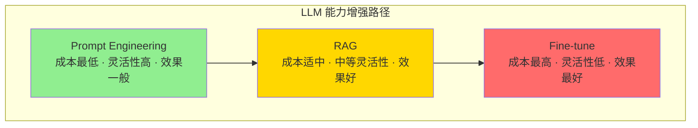

#### 详细对比

| 维度 | RAG | 微调 |
|------|-----|------|
| **数据需求** | 文档级数据，无需标注 | 需要高质量标注数据 |
| **更新频率** | 高（实时更新知识库） | 低（需重新训练） |
| **成本** | 索引 + 检索基础设施 | 训练算力 + 调参成本 |
| **可解释性** | 高（可追溯文档来源） | 低（隐含在模型权重中） |
| **幻觉抑制** | 强（基于检索内容生成） | 中等（依赖训练数据质量） |
| **适用场景** | 知识问答、实时信息 | 风格迁移、任务特定优化 |
| **延迟** | 增加检索延迟 | 无额外延迟 |

**决策建议**：
- 需要频繁更新知识 → 选择 RAG
- 需要特定输出风格 → 选择微调
- 两者结合 → 最佳实践（先用 RAG 提供知识，再用微调优化响应）

### 1.3 RAG 工作流程

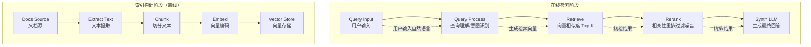

#### 各阶段详解

**1. 查询处理（Query Processing）**
```python
class QueryProcessor:
    """查询处理：理解用户意图，生成检索向量"""
    
    def __init__(self, embedding_model):
        self.embedding_model = embedding_model
        self.intent_classifier = load_intent_model()
    
    def process(self, query: str, conversation_history: list = None) -> dict:
        """
        处理查询输入
        
        Args:
            query: 用户当前查询
            conversation_history: 对话历史上下文
        
        Returns:
            处理后的检索向量和元信息
        """
        # 1. 意图分类
        intent = self.intent_classifier.predict(query)
        
        # 2. 查询扩展：融入对话历史
        expanded_query = self._expand_query(query, conversation_history)
        
        # 3. 查询改写：处理模糊/口语化表达
        rewritten_query = self._rewrite_query(expanded_query)
        
        # 4. 生成检索向量
        embedding = self.embedding_model.encode(rewritten_query)
        
        return {
            "original_query": query,
            "expanded_query": expanded_query,
            "rewritten_query": rewritten_query,
            "embedding": embedding,
            "intent": intent
        }
    
    def _expand_query(self, query: str, history: list) -> str:
        """基于对话历史扩展查询"""
        if not history:
            return query
        
        # 提取历史关键信息
        context = " ".join([
            f"用户说：{h['user']}，助手答：{h['assistant']}"
            for h in history[-3:]
        ])
        
        return f"上下文：{context}。当前问题：{query}"
    
    def _rewrite_query(self, query: str) -> str:
        """查询改写：同义词替换、问题补全"""
        # 简化的查询改写示例
        rewrites = [
            ("怎么做", "如何实现"),
            ("啥是", "什么是"),
            ("咋整", "怎么处理"),
        ]
        
        result = query
        for old, new in rewrites:
            result = result.replace(old, new)
        
        return result
```

**2. 检索（Retrieval）**
```python
class RetrievalEngine:
    """检索引擎：向量相似度搜索"""
    
    def __init__(self, vector_store, top_k: int = 10):
        self.vector_store = vector_store
        self.top_k = top_k
    
    def search(self, embedding: np.ndarray, filters: dict = None) -> list[dict]:
        """
        执行向量检索
        
        Args:
            embedding: 查询向量
            filters: 元数据过滤条件
        
        Returns:
            相关文档片段列表
        """
        results = self.vector_store.similarity_search(
            embedding,
            k=self.top_k,
            filter=filters
        )
        
        return [
            {
                "content": doc.text,
                "metadata": doc.metadata,
                "distance": doc.distance,
                "score": self._distance_to_score(doc.distance)
            }
            for doc in results
        ]
    
    def _distance_to_score(self, distance: float) -> float:
        """将距离转换为相似度分数（0-1）"""
        # 余弦距离转换为相似度
        return 1 - distance
```

**3. 重排序（Rerank）**
```python
class Reranker:
    """检索结果重排序：提升相关性"""
    
    def __init__(self, model_name: str = "cross-encoder/ms-marco-MiniLM-L-12-v2"):
        self.model = load_cross_encoder(model_name)
    
    def rerank(self, query: str, documents: list[str]) -> list[dict]:
        """
        使用交叉编码器重排序
        
        Args:
            query: 原始查询
            documents: 检索到的文档列表
        
        Returns:
            重排序后的文档列表（含相关性分数）
        """
        # 批量预测相关性分数
        pairs = [(query, doc) for doc in documents]
        scores = self.model.predict(pairs)
        
        # 按分数降序排列
        ranked_indices = np.argsort(scores)[::-1]
        
        return [
            {
                "text": documents[idx],
                "rerank_score": float(scores[idx]),
                "original_index": idx
            }
            for idx in ranked_indices
        ]
```

**4. 合成（Synthesis）**
```python
class RAGSynthesizer:
    """RAG 合成器：结合检索内容生成回答"""
    
    def __init__(self, llm, max_context_tokens: int = 4000):
        self.llm = llm
        self.max_context_tokens = max_context_tokens
    
    def synthesize(
        self,
        query: str,
        retrieved_docs: list[dict],
        conversation_history: list = None
    ) -> dict:
        """
        综合检索结果生成回答
        
        Args:
            query: 用户查询
            retrieved_docs: 检索到的文档
            conversation_history: 对话历史
        
        Returns:
            生成的回答和引用信息
        """
        # 1. 选择上下文窗口
        context = self._select_context(query, retrieved_docs)
        
        # 2. 构建提示词
        prompt = self._build_prompt(query, context, conversation_history)
        
        # 3. 生成回答
        response = self.llm.generate(prompt)
        
        return {
            "answer": response.text,
            "sources": self._extract_sources(context),
            "prompt_used": prompt  # 可用于调试
        }
    
    def _select_context(self, query: str, docs: list[dict]) -> str:
        """选择最相关的上下文（token 限制内）"""
        context_parts = []
        total_tokens = 0
        
        for doc in docs:
            doc_tokens = self._estimate_tokens(doc["content"])
            
            if total_tokens + doc_tokens > self.max_context_tokens:
                break
            
            context_parts.append(doc["content"])
            total_tokens += doc_tokens
        
        return "\n\n---\n\n".join(context_parts)
    
    def _build_prompt(
        self,
        query: str,
        context: str,
        history: list = None
    ) -> str:
        """构建 RAG 提示词"""
        
        system_prompt = """你是一个知识助手，基于提供的参考资料回答用户问题。

要求：
1. 只使用参考资料中的信息回答，不要添加外部知识
2. 如果参考资料中没有相关信息，明确指出这一点
3. 回答时注明信息来源
4. 保持回答简洁、有条理

参考材料：
{context}"""
        
        user_message = f"问题：{query}"
        
        if history:
            history_text = "\n".join([
                f"用户：{h['user']}\n助手：{h['assistant']}"
                for h in history
            ])
            user_message = f"对话历史：\n{history_text}\n\n当前问题：{query}"
        
        return system_prompt.format(context=context) + "\n\n" + user_message
    
    def _extract_sources(self, context: str) -> list[dict]:
        """从上下文中提取来源信息"""
        # 从 metadata 中提取来源
        sources = []
        # 实现来源提取逻辑
        return sources
    
    def _estimate_tokens(self, text: str) -> int:
        """估算 token 数量（简单估计：中文约 1.5 tokens/字）"""
        return int(len(text) * 1.5)
```

---

## 2. 检索系统

### 2.1 Embedding 模型

Embedding 模型是将文本转换为向量的核心组件：

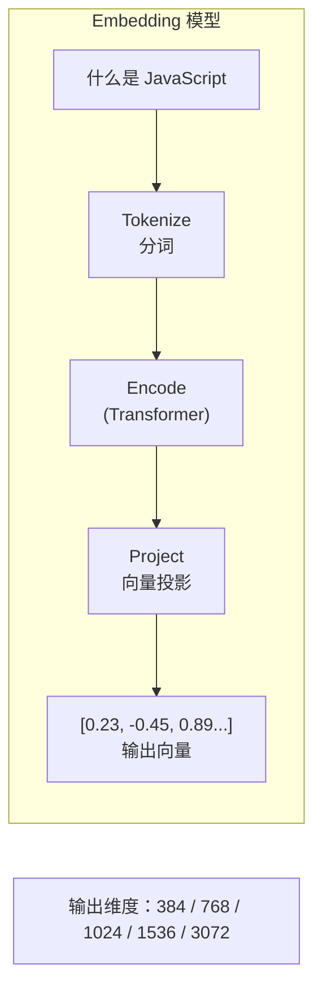

#### 主流 Embedding 模型对比

| 模型 | 维度 | 上下文 | 特点 | 适用场景 |
|------|------|--------|------|----------|
| **text-embedding-ada-002** | 1536 | 8192 | OpenAI 官方，稳定 | 通用场景 |
| **text-embedding-3-small** | 256-3072 | 8192 | 轻量高性能 | 成本敏感 |
| **text-embedding-3-large** | 256-3072 | 8192 | 高性能 | 精度优先 |
| **BGE-large-zh** | 1024 | 512 | 中文优化 | 中文场景 |
| **BAAI/bge-m3** | 1024 | 8192 | 多语言+稀疏 | 多语言场景 |
| **E5-mistral-7b** | 1024 | 4096 | 高性能 | 精度优先 |
| **GTE-large-zh** | 1024 | 512 | 阿里中文 | 中文场景 |
| **NV-Embed-QA** | 4096 | 32K | 长上下文 | 长文档 |

#### Embedding 实现

```python
from sentence_transformers import SentenceTransformer
import torch

class EmbeddingModel:
    """Embedding 模型封装"""
    
    # 模型配置
    MODEL_CONFIGS = {
        "bge-large-zh": {
            "path": "BAAI/bge-large-zh-v1.5",
            "dimension": 1024,
            "max_length": 512,
            "normalize": True
        },
        "bge-m3": {
            "path": "BAAI/bge-m3",
            "dimension": 1024,
            "max_length": 8192,
            "normalize": True
        },
        "e5-base": {
            "path": "intfloat/e5-base-v2",
            "dimension": 768,
            "max_length": 512,
            "normalize": True
        }
    }
    
    def __init__(
        self,
        model_name: str = "bge-large-zh",
        device: str = None,
        batch_size: int = 32
    ):
        """
        初始化 Embedding 模型
        
        Args:
            model_name: 模型名称或本地路径
            device: 运行设备（auto/cuda/cpu）
            batch_size: 批处理大小
        """
        self.model_name = model_name
        self.batch_size = batch_size
        
        # 自动设备选择
        if device is None:
            device = "cuda" if torch.cuda.is_available() else "cpu"
        self.device = device
        
        # 加载模型
        self.model = SentenceTransformer(
            self.MODEL_CONFIGS.get(model_name, {}).get("path", model_name),
            device=device
        )
        
        # 模型配置
        config = self.MODEL_CONFIGS.get(model_name, {})
        self.dimension = config.get("dimension", self.model.get_sentence_embedding_dimension())
        self.normalize = config.get("normalize", True)
    
    def encode(
        self,
        texts: str | list[str],
        batch_size: int = None,
        show_progress: bool = False
    ) -> np.ndarray:
        """
        将文本编码为向量
        
        Args:
            texts: 单个文本或文本列表
            batch_size: 批大小（覆盖默认值）
            show_progress: 是否显示进度
        
        Returns:
            归一化的嵌入向量
        """
        if isinstance(texts, str):
            texts = [texts]
        
        embeddings = self.model.encode(
            texts,
            batch_size=batch_size or self.batch_size,
            show_progress_bar=show_progress,
            normalize_embeddings=self.normalize,
            convert_to_numpy=True
        )
        
        return embeddings
    
    def encode_query(self, query: str) -> np.ndarray:
        """
        专门编码查询（某些模型需要特殊前缀）
        
        Args:
            query: 查询文本
        
        Returns:
            查询向量
        """
        # E5 系列模型需要 query 前缀
        if "e5" in self.model_name.lower():
            query = f"query: {query}"
        
        return self.encode(query)[0]
    
    def encode_corpus(
        self,
        corpus: list[str],
        show_progress: bool = True
    ) -> np.ndarray:
        """
        批量编码文档语料
        
        Args:
            corpus: 文档列表
            show_progress: 是否显示进度
        
        Returns:
            文档向量矩阵
        """
        # E5 系列模型需要 passage 前缀
        if "e5" in self.model_name.lower():
            corpus = [f"passage: {doc}" for doc in corpus]
        
        return self.encode(corpus, show_progress=show_progress)
    
    def similarity(
        self,
        query_embedding: np.ndarray,
        doc_embeddings: np.ndarray
    ) -> np.ndarray:
        """
        计算查询与文档的相似度
        
        Args:
            query_embedding: 查询向量 (d,)
            doc_embeddings: 文档向量矩阵 (n, d)
        
        Returns:
            相似度分数 (n,)
        """
        if self.normalize:
            # 余弦相似度（已归一化，点积即相似度）
            return np.dot(doc_embeddings, query_embedding)
        else:
            # 余弦相似度（未归一化）
            from sklearn.metrics.pairwise import cosine_similarity
            return cosine_similarity(
                query_embedding.reshape(1, -1),
                doc_embeddings
            )[0]
```

### 2.2 向量数据库

向量数据库是存储和检索高维向量的基础设施：

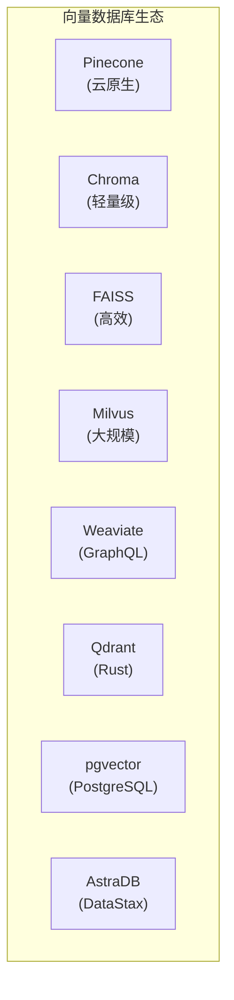

#### 各向量数据库对比

| 数据库 | 类型 | 优势 | 劣势 | 适用规模 |
|--------|------|------|------|----------|
| **Pinecone** | 云服务 | 全托管、易用、免运维 | 付费、成本高 | 中大型项目 |
| **Chroma** | 本地/云 | 轻量、API 简洁 | 功能有限 | 原型/小规模 |
| **FAISS** | 本地库 | 高性能、GPU 加速 | 无分布式 | 中型项目 |
| **Milvus** | 开源/云 | 功能全面、可扩展 | 运维复杂 | 大规模项目 |
| **Qdrant** | 开源/云 | Rust 性能高、Filter 强 | 社区较小 | 中大型项目 |
| **pgvector** | PostgreSQL 扩展 | 与现有 DB 集成 | 性能一般 | 已有 PG 环境 |

#### Pinecone 实现

```python
import pinecone
from pinecone import ServerlessSpec

class PineconeVectorStore:
    """Pinecone 向量数据库封装"""
    
    def __init__(
        self,
        api_key: str,
        environment: str = "us-east-1",
        index_name: str = "rag-index"
    ):
        """
        初始化 Pinecone
        
        Args:
            api_key: Pinecone API Key
            environment: 环境区域
            index_name: 索引名称
        """
        pinecone.init(api_key=api_key, environment=environment)
        self.index_name = index_name
    
    def create_index(
        self,
        dimension: int,
        metric: str = "cosine",
        spec: dict = None
    ):
        """
        创建索引
        
        Args:
            dimension: 向量维度
            metric: 距离度量（cosine/euclidean/dotproduct）
            spec: 索引规格配置
        """
        if spec is None:
            spec = ServerlessSpec(
                cloud="aws",
                region="us-east-1"
            )
        
        if self.index_name not in pinecone.list_indexes():
            pinecone.create_index(
                self.index_name,
                dimension=dimension,
                metric=metric,
                spec=spec
            )
    
    def upsert(self, vectors: list[dict], namespace: str = ""):
        """
        批量插入向量
        
        Args:
            vectors: [{id, values, metadata}, ...]
            namespace: 命名空间（用于数据隔离）
        """
        index = pinecone.Index(self.index_name)
        index.upsert(vectors, namespace=namespace)
    
    def search(
        self,
        query_vector: list[float],
        top_k: int = 10,
        filter: dict = None,
        namespace: str = ""
    ) -> list[dict]:
        """
        向量相似度搜索
        
        Args:
            query_vector: 查询向量
            top_k: 返回数量
            filter: 元数据过滤条件
            namespace: 命名空间
        
        Returns:
            检索结果
        """
        index = pinecone.Index(self.index_name)
        
        results = index.query(
            vector=query_vector,
            top_k=top_k,
            filter=filter,
            namespace=namespace,
            include_metadata=True
        )
        
        return [
            {
                "id": match["id"],
                "score": match["score"],
                "metadata": match["metadata"]
            }
            for match in results["matches"]
        ]
    
    def delete(self, ids: list[str], namespace: str = ""):
        """删除向量"""
        index = pinecone.Index(self.index_name)
        index.delete(ids=ids, namespace=namespace)
    
    def describe_index(self) -> dict:
        """获取索引统计信息"""
        index = pinecone.Index(self.index_name)
        return index.describe_index_stats()
```

#### Chroma 实现

```python
import chromadb
from chromadb.config import Settings
from typing import list

class ChromaVectorStore:
    """Chroma 向量数据库封装"""
    
    def __init__(
        self,
        persist_directory: str = "./chroma_db",
        collection_name: str = "documents"
    ):
        """
        初始化 Chroma
        
        Args:
            persist_directory: 持久化目录
            collection_name: 集合名称
        """
        self.client = chromadb.PersistentClient(
            path=persist_directory,
            settings=Settings(anonymized_telemetry=False)
        )
        self.collection_name = collection_name
        self.collection = self._get_or_create_collection()
    
    def _get_or_create_collection(self):
        """获取或创建集合"""
        return self.client.get_or_create_collection(
            name=self.collection_name,
            metadata={"hnsw:space": "cosine"}  # cosine 余弦距离
        )
    
    def add(
        self,
        documents: list[str],
        ids: list[str],
        embeddings: list[list[float]] = None,
        metadatas: list[dict] = None
    ):
        """
        添加文档
        
        Args:
            documents: 文档内容列表
            ids: 文档 ID 列表
            embeddings: 向量列表（可选，自动生成）
            metadatas: 元数据列表
        """
        self.collection.add(
            documents=documents,
            ids=ids,
            embeddings=embeddings,
            metadatas=metadatas
        )
    
    def query(
        self,
        query_embeddings: list[list[float]],
        n_results: int = 10,
        where: dict = None,
        where_document: dict = None
    ) -> dict:
        """
        查询相似文档
        
        Args:
            query_embeddings: 查询向量
            n_results: 返回数量
            where: 元数据过滤条件
            where_document: 文档内容过滤
        
        Returns:
            查询结果
        """
        return self.collection.query(
            query_embeddings=query_embeddings,
            n_results=n_results,
            where=where,
            where_document=where_document
        )
    
    def update(
        self,
        ids: list[str],
        documents: list[str] = None,
        embeddings: list[list[float]] = None,
        metadatas: list[dict] = None
    ):
        """更新文档"""
        self.collection.update(
            ids=ids,
            documents=documents,
            embeddings=embeddings,
            metadatas=metadatas
        )
    
    def delete(self, ids: list[str] = None, where: dict = None):
        """删除文档"""
        self.collection.delete(ids=ids, where=where)
    
    def get(self, ids: list[str] = None, where: dict = None) -> dict:
        """获取文档"""
        return self.collection.get(ids=ids, where=where)
```

#### FAISS 实现

```python
import faiss
import numpy as np

class FAISSVectorStore:
    """FAISS 向量数据库封装"""
    
    def __init__(
        self,
        dimension: int,
        index_type: str = "IVFFlat",
        nlist: int = 100
    ):
        """
        初始化 FAISS
        
        Args:
            dimension: 向量维度
            index_type: 索引类型
                - "Flat": 精确检索（小规模）
                - "IVFFlat": 倒排索引（中等规模）
                - "HNSW": 图索引（高性能）
                - "IVFPQ": 量化为索引（大规模）
            nlist: IVF 聚类中心数
        """
        self.dimension = dimension
        self.index_type = index_type
        self.nlist = nlist
        
        # 存储原始向量和元数据
        self.id_to_text = {}
        self.id_to_metadata = {}
        self.current_id = 0
        
        # 构建索引
        self.index = self._build_index()
    
    def _build_index(self):
        """构建索引"""
        if self.index_type == "Flat":
            # 精确检索（暴力搜索）
            return faiss.IndexFlatIP(self.dimension)  # 内积（需要归一化向量）
        
        elif self.index_type == "IVFFlat":
            # 倒排文件索引
            quantizer = faiss.IndexFlatIP(self.dimension)
            index = faiss.IndexIVFFlat(quantizer, self.dimension, self.nlist)
            return index
        
        elif self.index_type == "HNSW":
            # 分层可导航小世界图
            index = faiss.IndexHNSWFlat(self.dimension, 32)  # 32 为 M 参数
            return index
        
        elif self.index_type == "IVFPQ":
            # 乘积量化
            quantizer = faiss.IndexFlatIP(self.dimension)
            m = 16  # 子向量数
            nbits = 8  # 每子向量位数
            index = faiss.IndexIVFPQ(quantizer, self.dimension, self.nlist, m, nbits)
            return index
        
        else:
            raise ValueError(f"Unsupported index type: {self.index_type}")
    
    def train(self, vectors: np.ndarray):
        """训练索引（IVF/PQ 索引需要训练）"""
        if not self.index.is_trained:
            vectors = vectors.astype('float32')
            self.index.train(vectors)
    
    def add(
        self,
        vectors: np.ndarray,
        texts: list[str],
        metadatas: list[dict] = None
    ):
        """
        添加向量
        
        Args:
            vectors: numpy 向量数组 (n, d)
            texts: 文本列表
            metadatas: 元数据列表
        """
        vectors = vectors.astype('float32')
        
        # 训练索引
        if not self.index.is_trained:
            self.train(vectors)
        
        # 添加到索引
        self.index.add(vectors)
        
        # 存储元数据
        for i, text in enumerate(texts):
            doc_id = str(self.current_id)
            self.id_to_text[doc_id] = text
            self.id_to_metadata[doc_id] = metadatas[i] if metadatas else {}
            self.current_id += 1
    
    def search(
        self,
        query_vector: np.ndarray,
        k: int = 10
    ) -> list[dict]:
        """
        搜索相似向量
        
        Args:
            query_vector: 查询向量
            k: 返回数量
        
        Returns:
            搜索结果
        """
        query_vector = query_vector.astype('float32').reshape(1, -1)
        
        if self.index_type == "IVFFlat" and not self.index.is_trained:
            self.index.nprobe = 10  # 搜索的聚类中心数
        
        distances, indices = self.index.search(query_vector, k)
        
        results = []
        for dist, idx in zip(distances[0], indices[0]):
            if idx >= 0:  # FAISS 返回 -1 表示无效
                doc_id = str(idx)
                results.append({
                    "id": doc_id,
                    "text": self.id_to_text.get(doc_id, ""),
                    "metadata": self.id_to_metadata.get(doc_id, {}),
                    "distance": float(dist),
                    "score": float(1 / (1 + dist))  # 转换为相似度
                })
        
        return results
    
    def save(self, path: str):
        """保存索引到磁盘"""
        faiss.write_index(self.index, path)
        
        # 保存元数据
        import json
        metadata = {
            "id_to_text": self.id_to_text,
            "id_to_metadata": self.id_to_metadata,
            "current_id": self.current_id,
            "dimension": self.dimension,
            "index_type": self.index_type
        }
        with open(f"{path}.meta", "w", encoding="utf-8") as f:
            json.dump(metadata, f, ensure_ascii=False)
    
    @classmethod
    def load(cls, path: str) -> "FAISSVectorStore":
        """从磁盘加载索引"""
        index = faiss.read_index(path)
        
        # 加载元数据
        import json
        with open(f"{path}.meta", "r", encoding="utf-8") as f:
            metadata = json.load(f)
        
        store = cls(
            dimension=metadata["dimension"],
            index_type=metadata["index_type"]
        )
        store.index = index
        store.id_to_text = metadata["id_to_text"]
        store.id_to_metadata = metadata["id_to_metadata"]
        store.current_id = metadata["current_id"]
        
        return store
```

### 2.3 混合检索

混合检索结合多种检索方式以获得更好的效果：

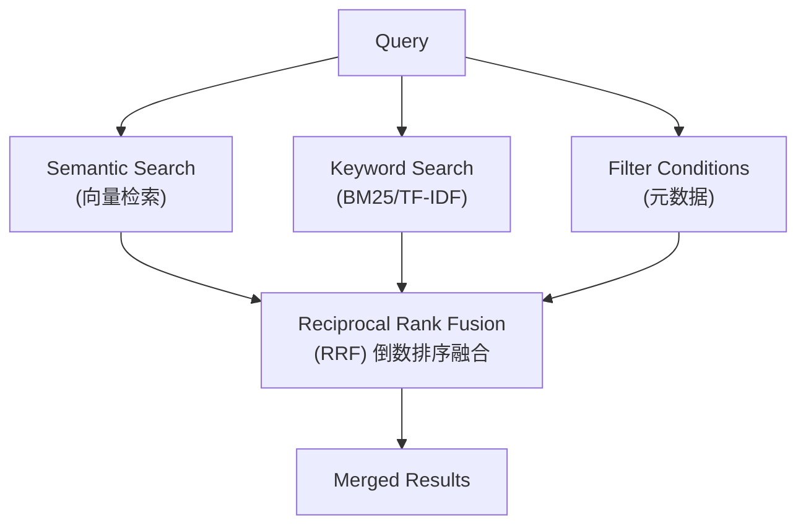

#### Reciprocal Rank Fusion (RRF)

```python
import numpy as np
from rank_bm25 import BM25Okapi
from sklearn.feature_extraction.text import TfidfVectorizer

class HybridRetriever:
    """混合检索器：结合语义检索和关键词检索"""
    
    def __init__(
        self,
        vector_store,
        embedding_model,
        k1: float = 1.2,  # BM25 参数
        b: float = 0.75,  # BM25 长度归一化
        rrf_k: int = 60   # RRF 参数
    ):
        """
        初始化混合检索器
        
        Args:
            vector_store: 向量数据库
            embedding_model: Embedding 模型
            k1, b: BM25 参数
            rrf_k: RRF 融合参数
        """
        self.vector_store = vector_store
        self.embedding_model = embedding_model
        self.k1 = k1
        self.b = b
        self.rrf_k = rrf_k
        
        # BM25 组件
        self.bm25: BM25Okapi = None
        self.corpus_tokenized: list[list[str]] = None
        self.corpus_texts: list[str] = None
        self.corpus_ids: list[str] = None
    
    def index(self, documents: list[dict]):
        """
        索引文档
        
        Args:
            documents: [{id, text, metadata}, ...]
        """
        # 1. 向量索引
        texts = [doc["text"] for doc in documents]
        embeddings = self.embedding_model.encode_corpus(texts)
        
        vectors = [
            {"id": doc["id"], "values": emb.tolist(), "metadata": doc.get("metadata", {})}
            for doc, emb in zip(documents, embeddings)
        ]
        self.vector_store.upsert(vectors)
        
        # 2. BM25 索引
        self.corpus_ids = [doc["id"] for doc in documents]
        self.corpus_texts = texts
        self.corpus_tokenized = [self._tokenize(text) for text in texts]
        self.bm25 = BM25Okapi(self.corpus_tokenized)
    
    def search(
        self,
        query: str,
        top_k: int = 10,
        filters: dict = None,
        semantic_weight: float = 0.5,
        keyword_weight: float = 0.5
    ) -> list[dict]:
        """
        混合搜索
        
        Args:
            query: 查询文本
            top_k: 返回数量
            filters: 元数据过滤
            semantic_weight: 语义检索权重
            keyword_weight: 关键词检索权重
        
        Returns:
            融合后的结果
        """
        # 1. 语义检索
        query_embedding = self.embedding_model.encode_query(query)
        semantic_results = self.vector_store.search(
            query_vector=query_embedding.tolist(),
            top_k=top_k * 2,  # 多检索一些用于融合
            filter=filters
        )
        
        # 2. 关键词检索
        keyword_results = self._bm25_search(query, top_k * 2)
        
        # 3. RRF 融合
        fused_results = self._rrf_fusion(
            semantic_results,
            keyword_results,
            top_k,
            semantic_weight,
            keyword_weight
        )
        
        return fused_results
    
    def _bm25_search(self, query: str, top_k: int) -> list[dict]:
        """BM25 关键词检索"""
        if self.bm25 is None:
            return []
        
        query_tokens = self._tokenize(query)
        scores = self.bm25.get_scores(query_tokens)
        
        # 获取 Top-K
        top_indices = np.argsort(scores)[::-1][:top_k]
        
        return [
            {
                "id": self.corpus_ids[idx],
                "text": self.corpus_texts[idx],
                "score": float(scores[idx])
            }
            for idx in top_indices if scores[idx] > 0
        ]
    
    def _rrf_fusion(
        self,
        semantic_results: list[dict],
        keyword_results: list[dict],
        top_k: int,
        semantic_weight: float,
        keyword_weight: float
    ) -> list[dict]:
        """
        倒数排序融合 (RRF)
        
        RRF 公式: RRF(d) = Σ 1/(k + rank(d))
        
        Args:
            semantic_results: 语义检索结果
            keyword_results: 关键词检索结果
            top_k: 返回数量
            semantic_weight: 语义权重
            keyword_weight: 关键词权重
        
        Returns:
            融合后的结果
        """
        # 构建排名字典
        semantic_ranks = {
            r["id"]: (i + 1) for i, r in enumerate(semantic_results)
        }
        keyword_ranks = {
            r["id"]: (i + 1) for i, r in enumerate(keyword_results)
        }
        
        # 获取所有文档 ID
        all_ids = set(semantic_ranks.keys()) | set(keyword_ranks.keys())
        
        # 计算 RRF 分数
        rrf_scores = {}
        for doc_id in all_ids:
            s_rank = semantic_ranks.get(doc_id, float('inf'))
            k_rank = keyword_ranks.get(doc_id, float('inf'))
            
            s_rrf = semantic_weight / (self.rrf_k + s_rank) if s_rank != float('inf') else 0
            k_rrf = keyword_weight / (self.rrf_k + k_rank) if k_rank != float('inf') else 0
            
            rrf_scores[doc_id] = s_rrf + k_rrf
        
        # 排序并返回结果
        sorted_ids = sorted(rrf_scores.keys(), key=lambda x: rrf_scores[x], reverse=True)
        
        # 构建结果（保留原始文本）
        id_to_text = {}
        for r in semantic_results:
            id_to_text[r["id"]] = r.get("text", "")
        for r in keyword_results:
            if r["id"] not in id_to_text:
                id_to_text[r["id"]] = r.get("text", "")
        
        return [
            {
                "id": doc_id,
                "text": id_to_text.get(doc_id, ""),
                "rrf_score": rrf_scores[doc_id],
                "semantic_rank": semantic_ranks.get(doc_id),
                "keyword_rank": keyword_ranks.get(doc_id)
            }
            for doc_id in sorted_ids[:top_k]
        ]
    
    def _tokenize(self, text: str) -> list[str]:
        """简单分词（中文按字符，英文按空格）"""
        import re
        # 简单处理：中文按字符，英文按空格和标点
        tokens = re.findall(r'[一-鿿]|[a-zA-Z]+', text)
        return tokens
```

### 2.4 重排序

重排序（Rerank）是在初检基础上进一步提升结果相关性的关键步骤：

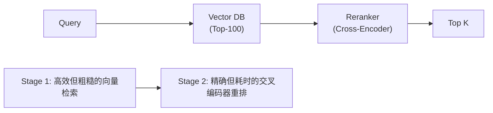

#### Cross-Encoder 重排序实现

```python
from sentence_transformers import CrossEncoder
import numpy as np

class Reranker:
    """交叉编码器重排序"""
    
    # 常用重排模型
    RERANK_MODELS = {
        "ms-marco": "cross-encoder/ms-marco-MiniLM-L-12-v2",
        "ms-marco-large": "cross-encoder/ms-marco-MiniLM-L-12-v2",
        "ms-marco-deberta": "cross-encoder/ms-marco-MiniLM-L-12-v2",
        "bge-reranker": "BAAI/bge-reranker-large",
        "bge-reranker-base": "BAAI/bge-reranker-base"
    }
    
    def __init__(
        self,
        model_name: str = "ms-marco",
        device: str = None
    ):
        """
        初始化重排序模型
        
        Args:
            model_name: 模型名称或路径
            device: 运行设备
        """
        model_path = self.RERANK_MODELS.get(model_name, model_name)
        
        if device is None:
            device = "cuda" if CrossEncoder._model_has_device() else "cpu"
        
        self.model = CrossEncoder(
            model_path,
            device=device,
            max_length=512
        )
    
    def rerank(
        self,
        query: str,
        documents: list[str],
        top_k: int = 10,
        return_scores: bool = True
    ) -> list[dict]:
        """
        重排序检索结果
        
        Args:
            query: 查询文本
            documents: 文档列表
            top_k: 返回数量
            return_scores: 是否返回分数
        
        Returns:
            重排序后的结果
        """
        # 构建查询-文档对
        pairs = [(query, doc) for doc in documents]
        
        # 批量预测相关性分数
        scores = self.model.predict(pairs)
        
        # 转换为列表（如果是单个结果）
        if isinstance(scores, np.ndarray) and len(scores.shape) == 1:
            scores = scores.tolist()
        elif not isinstance(scores, list):
            scores = [scores]
        
        # 按分数降序排列
        ranked_indices = np.argsort(scores)[::-1]
        
        results = []
        for idx in ranked_indices[:top_k]:
            result = {
                "text": documents[idx],
                "rank": len(results) + 1
            }
            if return_scores:
                result["score"] = float(scores[idx])
            results.append(result)
        
        return results
    
    def rerank_with_scores(
        self,
        query: str,
        documents: list[str]
    ) -> tuple[list[str], list[float]]:
        """
        重排序，返回文档和分数
        
        Returns:
            (重排序后的文档列表, 对应分数列表)
        """
        results = self.rerank(query, documents, top_k=len(documents))
        return [r["text"] for r in results], [r["score"] for r in results]
```

---

## 3. 知识库构建

### 3.1 文档预处理

文档预处理是构建高质量知识库的基础：

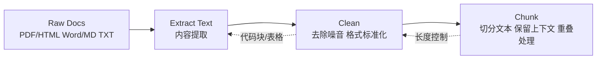

#### 文档解析实现

```python
import re
from pathlib import Path
from typing import Iterator

class Document:
    """文档数据结构"""
    
    def __init__(
        self,
        content: str,
        metadata: dict = None,
        doc_id: str = None
    ):
        self.content = content
        self.metadata = metadata or {}
        self.doc_id = doc_id or self._generate_id()
    
    def _generate_id(self) -> str:
        import hashlib
        content_hash = hashlib.md5(self.content[:100].encode()).hexdigest()[:8]
        return f"doc_{content_hash}"
    
    def __repr__(self):
        return f"Document(id={self.doc_id}, chars={len(self.content)})"


class DocumentLoader:
    """多格式文档加载器"""
    
    LOADERS = {
        ".txt": "_load_txt",
        ".md": "_load_md",
        ".pdf": "_load_pdf",
        ".docx": "_load_docx",
        ".html": "_load_html",
    }
    
    def __init__(self):
        self.loaders = {
            ext: getattr(self, method)
            for ext, method in self.LOADERS.items()
        }
    
    def load(self, file_path: str) -> list[Document]:
        """加载单个文档"""
        path = Path(file_path)
        ext = path.suffix.lower()
        
        loader = self.loaders.get(ext)
        if loader is None:
            raise ValueError(f"Unsupported file type: {ext}")
        
        return loader(path)
    
    def load_directory(
        self,
        directory: str,
        glob_pattern: str = "**/*.*",
        recursive: bool = True
    ) -> Iterator[Document]:
        """批量加载目录中的文档"""
        path = Path(directory)
        
        pattern = glob_pattern if recursive else "*.*"
        for file_path in path.glob(pattern):
            if file_path.suffix.lower() in self.loaders:
                try:
                    for doc in self.load(file_path):
                        doc.metadata["source"] = str(file_path)
                        yield doc
                except Exception as e:
                    print(f"Error loading {file_path}: {e}")
    
    def _load_txt(self, path: Path) -> list[Document]:
        """加载纯文本文件"""
        with open(path, "r", encoding="utf-8") as f:
            content = f.read()
        return [Document(content=content, metadata={"source": str(path)})]
    
    def _load_md(self, path: Path) -> list[Document]:
        """加载 Markdown 文件"""
        with open(path, "r", encoding="utf-8") as f:
            content = f.read()
        
        # 提取标题作为元数据
        title_match = re.match(r'^#\s+(.+)$', content, re.MULTILINE)
        metadata = {
            "source": str(path),
            "title": title_match.group(1) if title_match else path.stem
        }
        
        return [Document(content=content, metadata=metadata)]
    
    def _load_pdf(self, path: Path) -> list[Document]:
        """加载 PDF 文件（需要 pip install pypdf）"""
        from pypdf import PdfReader
        
        documents = []
        reader = PdfReader(path)
        
        for i, page in enumerate(reader.pages):
            text = page.extract_text()
            if text.strip():
                documents.append(Document(
                    content=text,
                    metadata={
                        "source": str(path),
                        "page": i + 1,
                        "total_pages": len(reader.pages)
                    }
                ))
        
        return documents
    
    def _load_docx(self, path: Path) -> list[Document]:
        """加载 Word 文档（需要 pip install python-docx）"""
        from docx import Document as DocxReader
        
        doc = DocxReader(str(path))
        content = "\n".join([para.text for para in doc.paragraphs if para.text.strip()])
        
        return [Document(content=content, metadata={"source": str(path)})]
    
    def _load_html(self, path: Path) -> list[Document]:
        """加载 HTML 文件"""
        from bs4 import BeautifulSoup
        
        with open(path, "r", encoding="utf-8") as f:
            soup = BeautifulSoup(f.read(), "html.parser")
        
        # 提取标题
        title = soup.find("title")
        title = title.text if title else path.stem
        
        # 移除脚本和样式
        for tag in soup(["script", "style", "nav", "header", "footer"]):
            tag.decompose()
        
        # 提取正文
        text = soup.get_text(separator="\n", strip=True)
        
        return [Document(
            content=text,
            metadata={"source": str(path), "title": title}
        )]
```

#### 文档清洗实现

```python
import re
from typing import Callable

class TextCleaner:
    """文本清洗器"""
    
    def __init__(self):
        self.pipelines: list[Callable[[str], str]] = []
    
    def add_step(self, func: Callable[[str], str]) -> "TextCleaner":
        """添加清洗步骤"""
        self.pipelines.append(func)
        return self
    
    def clean(self, text: str) -> str:
        """执行清洗"""
        for func in self.pipelines:
            text = func(text)
        return text
    
    @staticmethod
    def remove_extra_whitespace(text: str) -> str:
        """移除多余空白"""
        text = re.sub(r'\n\s*\n\s*\n', '\n\n', text)  # 多个换行合并
        text = re.sub(r' +\n', '\n', text)  # 行尾空格
        text = re.sub(r'\s{2,}', ' ', text)  # 多个空格合并
        return text.strip()
    
    @staticmethod
    def remove_special_chars(text: str, keep_patterns: str = None) -> str:
        """移除特殊字符"""
        if keep_patterns:
            # 保留指定模式的字符
            pattern = f"[^a-zA-Z0-9\\u4e00-\\u9fff{keep_patterns}]"
        else:
            pattern = r"[^a-zA-Z0-9一-鿿\s.,!?;:'\"-]"
        
        return re.sub(pattern, "", text)
    
    @staticmethod
    def normalize_code_blocks(text: str) -> str:
        """规范化代码块"""
        # 保留代码块内容，但简化格式
        code_pattern = r'```(\w+)?\n(.*?)```'
        
        def process_code(match):
            lang = match.group(1) or ""
            code = match.group(2)
            # 移除多余缩进
            lines = code.split('\n')
            min_indent = min(len(line) - len(line.lstrip()) for line in lines if line.strip())
            code = '\n'.join(line[min_indent:] if len(line) >= min_indent else line for line in lines)
            return f"[代码片段 {lang}]"
        
        return re.sub(code_pattern, process_code, text, flags=re.DOTALL)
    
    @staticmethod
    def normalize_tables(text: str) -> str:
        """规范化表格为文本"""
        table_pattern = r'(\|.+\|\n)+'
        
        def process_table(match):
            lines = match.group().strip().split('\n')
            # 转换为制表符分隔
            return "【表格内容】" + " | ".join(lines[0].split('|')[1:-1])
        
        return re.sub(table_pattern, process_table, text)
    
    @staticmethod
    def remove_urls(text: str) -> str:
        """移除 URL"""
        return re.sub(r'https?://\S+', '[链接]', text)
    
    @staticmethod
    def remove_emails(text: str) -> str:
        """移除邮箱"""
        return re.sub(r'\S+@\S+\.\S+', '[邮箱]', text)
    
    @staticmethod
    def fix_chinese_punctuation(text: str) -> str:
        """规范化中文标点"""
        # 全角转半角（排除中文特有字符）
        # 中文冒号 -> 英文冒号
        text = text.replace('：', ':')
        # 中文顿号 -> 逗号
        text = text.replace('、', ',')
        return text


# 预配置清洗器
def get_default_cleaner() -> TextCleaner:
    """获取默认文本清洗器"""
    return (TextCleaner()
        .add_step(TextCleaner.remove_extra_whitespace)
        .add_step(TextCleaner.remove_urls)
        .add_step(TextCleaner.remove_emails)
        .add_step(TextCleaner.normalize_code_blocks)
        .add_step(TextCleaner.normalize_tables)
        .add_step(TextCleaner.fix_chinese_punctuation))
```

### 3.2 分块策略

分块（Chunking）策略直接影响检索效果：

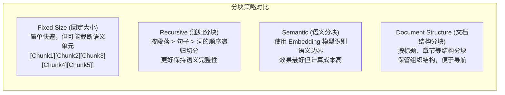

#### 分块实现

```python
import re
from typing import Iterator, NamedTuple

class Chunk(NamedTuple):
    """文本块"""
    content: str
    metadata: dict
    chunk_id: str
    token_count: int

class ChunkingStrategy:
    """分块策略基类"""
    
    def __init__(
        self,
        chunk_size: int = 500,
        chunk_overlap: int = 50,
        tokenizer = None
    ):
        """
        初始化分块器
        
        Args:
            chunk_size: 目标块大小（token 数）
            chunk_overlap: 块重叠大小（token 数）
            tokenizer: 分词器（用于准确计算 token）
        """
        self.chunk_size = chunk_size
        self.chunk_overlap = chunk_overlap
        self.tokenizer = tokenizer or self._default_tokenizer()
    
    def _default_tokenizer(self):
        """默认分词器"""
        import tiktoken
        return tiktoken.get_encoding("cl100k_base")
    
    def count_tokens(self, text: str) -> int:
        """计算 token 数"""
        return len(self.tokenizer.encode(text))
    
    def chunk(self, document: Document) -> list[Chunk]:
        """分块接口"""
        raise NotImplementedError


class RecursiveChunker(ChunkingStrategy):
    """递归分块器"""
    
    # 分隔符优先级
    SEPARATORS = [
        "\n\n",  # 段落
        "\n",    # 换行
        "。",    # 中文句号
        "！",    # 中文感叹号
        "？",    # 中文问号
        ". ",    # 英文句号+空格
        "! ",
        "? ",
        "; ",
        ", ",    # 英文逗号
        " ",     # 空格
        "",
    ]
    
    def chunk(self, document: Document) -> list[Chunk]:
        """递归分块"""
        chunks = []
        texts = self._split_text(document.content)
        
        current_chunk = []
        current_tokens = 0
        
        for text in texts:
            text_tokens = self.count_tokens(text)
            
            # 如果单个文本超过块大小，递归处理
            if text_tokens > self.chunk_size:
                if current_chunk:
                    chunks.append(self._create_chunk(current_chunk, document, len(chunks)))
                    current_chunk = []
                    current_tokens = 0
                
                sub_chunks = self._split_overflow(text, document)
                chunks.extend(sub_chunks)
                continue
            
            # 检查是否需要切换块
            if current_tokens + text_tokens > self.chunk_size:
                if current_chunk:
                    chunks.append(self._create_chunk(current_chunk, document, len(chunks)))
                
                # 处理重叠
                if self.chunk_overlap > 0:
                    # 取最后部分块作为重叠
                    overlap_tokens = 0
                    overlap_texts = []
                    for t in reversed(current_chunk):
                        t_tokens = self.count_tokens(t)
                        if overlap_tokens + t_tokens <= self.chunk_overlap:
                            overlap_texts.insert(0, t)
                            overlap_tokens += t_tokens
                        else:
                            break
                    current_chunk = overlap_texts
                    current_tokens = overlap_tokens
                else:
                    current_chunk = []
                    current_tokens = 0
            
            current_chunk.append(text)
            current_tokens += text_tokens
        
        # 添加最后一块
        if current_chunk:
            chunks.append(self._create_chunk(current_chunk, document, len(chunks)))
        
        return chunks
    
    def _split_text(self, text: str) -> list[str]:
        """按分隔符分割文本"""
        result = [text]
        
        for separator in self.SEPARATORS:
            new_result = []
            for piece in result:
                if piece:
                    splits = piece.split(separator)
                    new_result.extend(splits)
            result = new_result
        
        return [s for s in result if s.strip()]
    
    def _split_overflow(self, text: str, document: Document) -> list[Chunk]:
        """处理超出块大小的文本"""
        if self.count_tokens(text) <= self.chunk_size:
            return [self._create_chunk([text], document, 0)]
        
        # 继续递归分割
        chunks = []
        parts = self._split_text(text)
        current = []
        
        for part in parts:
            if self.count_tokens("\n".join(current + [part])) > self.chunk_size:
                if current:
                    chunks.append(self._create_chunk(current, document, len(chunks)))
                current = [part]
            else:
                current.append(part)
        
        if current:
            chunks.append(self._create_chunk(current, document, len(chunks)))
        
        return chunks
    
    def _create_chunk(
        self,
        texts: list[str],
        document: Document,
        index: int
    ) -> Chunk:
        """创建块"""
        content = "\n".join(texts)
        return Chunk(
            content=content,
            metadata={**document.metadata},
            chunk_id=f"{document.doc_id}_chunk_{index}",
            token_count=self.count_tokens(content)
        )


class SemanticChunker(ChunkingStrategy):
    """语义分块器：使用 Embedding 识别语义边界"""
    
    def __init__(
        self,
        embedding_model,
        threshold: float = 0.7,
        min_chunk_size: int = 100,
        max_chunk_size: int = 1000,
        **kwargs
    ):
        """
        Args:
            embedding_model: Embedding 模型
            threshold: 语义相似度阈值（用于判断边界）
            min_chunk_size: 最小块大小
            max_chunk_size: 最大块大小
        """
        super().__init__(**kwargs)
        self.embedding_model = embedding_model
        self.threshold = threshold
        self.min_chunk_size = min_chunk_size
        self.max_chunk_size = max_chunk_size
    
    def chunk(self, document: Document) -> list[Chunk]:
        """语义分块"""
        # 1. 将文档分成句子
        sentences = self._split_sentences(document.content)
        if not sentences:
            return []
        
        # 2. 计算每个句子的向量
        embeddings = self.embedding_model.encode(sentences)
        
        # 3. 识别语义边界（相邻句子相似度骤降处）
        boundaries = [0]  # 起始位置
        
        for i in range(1, len(sentences)):
            similarity = self._cosine_similarity(embeddings[i-1], embeddings[i])
            if similarity < self.threshold:
                boundaries.append(i)
        
        boundaries.append(len(sentences))  # 结束位置
        
        # 4. 根据边界创建块
        chunks = []
        for i in range(len(boundaries) - 1):
            start, end = boundaries[i], boundaries[i + 1]
            chunk_sentences = sentences[start:end]
            content = "".join(chunk_sentences)
            
            # 检查块大小约束
            token_count = self.count_tokens(content)
            if token_count < self.min_chunk_size and i > 0:
                # 合并到前一块
                pass
            elif token_count > self.max_chunk_size:
                # 需要进一步分割
                sub_chunks = self._split_large_chunk(chunk_sentences, document, i)
                chunks.extend(sub_chunks)
            else:
                chunks.append(Chunk(
                    content=content,
                    metadata={**document.metadata},
                    chunk_id=f"{document.doc_id}_chunk_{i}",
                    token_count=token_count
                ))
        
        return chunks
    
    def _split_sentences(self, text: str) -> list[str]:
        """句子分割"""
        # 简单的句子分割（中文 + 英文）
        pattern = r'(?<=[。！？.!?])\s*(?=[A-Z一-鿿])|(?<=[；;])\s*'
        parts = re.split(pattern, text)
        return [p.strip() for p in parts if p.strip()]
    
    def _cosine_similarity(self, a: np.ndarray, b: np.ndarray) -> float:
        """计算余弦相似度"""
        return np.dot(a, b) / (np.linalg.norm(a) * np.linalg.norm(b))
    
    def _split_large_chunk(
        self,
        sentences: list[str],
        document: Document,
        index: int
    ) -> list[Chunk]:
        """分割过大的块"""
        chunks = []
        current = []
        current_tokens = 0
        
        for sentence in sentences:
            tokens = self.count_tokens(sentence)
            if current_tokens + tokens > self.max_chunk_size and current:
                chunks.append(Chunk(
                    content="".join(current),
                    metadata={**document.metadata},
                    chunk_id=f"{document.doc_id}_chunk_{index}_{len(chunks)}",
                    token_count=current_tokens
                ))
                current = [sentence]
                current_tokens = tokens
            else:
                current.append(sentence)
                current_tokens += tokens
        
        if current:
            chunks.append(Chunk(
                content="".join(current),
                metadata={**document.metadata},
                chunk_id=f"{document.doc_id}_chunk_{index}_{len(chunks)}",
                token_count=current_tokens
            ))
        
        return chunks


class HierarchicalChunker(ChunkingStrategy):
    """层级分块器：保留文档结构"""
    
    def chunk(self, document: Document) -> list[Chunk]:
        """层级分块"""
        chunks = []
        
        # 解析文档结构
        sections = self._parse_structure(document.content)
        
        # 按层级处理
        current_h1 = ""
        current_h2 = ""
        current_content = []
        current_tokens = 0
        
        for section in sections:
            level = section["level"]
            title = section.get("title", "")
            content = section.get("content", "")
            
            if level == 1:
                # 保存之前的 H1
                if current_content:
                    chunks.append(self._create_chunk(
                        current_content, document, current_h1, current_h2, len(chunks)
                    ))
                current_h1 = title
                current_h2 = ""
                current_content = []
                current_tokens = 0
            
            elif level == 2:
                # 保存之前的 H2
                if current_content:
                    chunks.append(self._create_chunk(
                        current_content, document, current_h1, current_h2, len(chunks)
                    ))
                current_h2 = title
                current_content = []
                current_tokens = 0
            
            # 添加内容
            if content:
                current_content.append(content)
                current_tokens += self.count_tokens(content)
        
        # 保存最后一块
        if current_content:
            chunks.append(self._create_chunk(
                current_content, document, current_h1, current_h2, len(chunks)
            ))
        
        return chunks
    
    def _parse_structure(self, content: str) -> list[dict]:
        """解析文档结构"""
        # Markdown 标题识别
        lines = content.split("\n")
        sections = []
        
        current_level = 0
        current_title = ""
        current_content = []
        
        for line in lines:
            # 检测标题
            match = re.match(r'^(#{1,6})\s+(.+)$', line)
            if match:
                level = len(match.group(1))
                title = match.group(2)
                
                if current_content:
                    sections.append({
                        "level": current_level,
                        "title": current_title,
                        "content": "\n".join(current_content)
                    })
                    current_content = []
                
                current_level = level
                current_title = title
            else:
                current_content.append(line)
        
        # 最后一个 section
        if current_content:
            sections.append({
                "level": current_level,
                "title": current_title,
                "content": "\n".join(current_content)
            })
        
        return sections
    
    def _create_chunk(
        self,
        contents: list[str],
        document: Document,
        h1: str,
        h2: str,
        index: int
    ) -> Chunk:
        """创建层级块"""
        content = "\n".join(contents)
        return Chunk(
            content=content,
            metadata={
                **document.metadata,
                "section_h1": h1,
                "section_h2": h2
            },
            chunk_id=f"{document.doc_id}_chunk_{index}",
            token_count=self.count_tokens(content)
        )
```

### 3.3 元数据提取

元数据增强检索的精确性和可解释性：

```python
from datetime import datetime
import re

class MetadataExtractor:
    """元数据提取器"""
    
    def extract(self, document: Document, chunk: Chunk = None) -> dict:
        """
        提取元数据
        
        Args:
            document: 原始文档
            chunk: 分块（可选）
        
        Returns:
            元数据字典
        """
        metadata = {**document.metadata}
        
        # 基础信息
        metadata.update(self._extract_basic_info(document))
        
        # 内容特征
        metadata.update(self._extract_content_features(chunk or document))
        
        # 领域标签
        metadata.update(self._extract_domain_tags(chunk or document))
        
        return metadata
    
    def _extract_basic_info(self, document: Document) -> dict:
        """提取基础信息"""
        return {
            "created_at": datetime.now().isoformat(),
            "doc_id": document.doc_id,
        }
    
    def _extract_content_features(self, chunk) -> dict:
        """提取内容特征"""
        content = chunk.content
        
        # 字数统计
        char_count = len(content)
        word_count = len(re.findall(r'\w+', content))
        
        # 行数统计
        line_count = content.count('\n') + 1
        
        # 代码检测
        has_code = '```' in content or 'function' in content or 'def ' in content
        
        # 表格检测
        has_table = '|' in content and ('---' in content or '|' in content.split('\n')[0])
        
        # 列表检测
        has_list = bool(re.search(r'^[\s]*[-*\d]+\.?\s', content, re.MULTILINE))
        
        return {
            "char_count": char_count,
            "word_count": word_count,
            "line_count": line_count,
            "has_code": has_code,
            "has_table": has_table,
            "has_list": has_list
        }
    
    def _extract_domain_tags(self, chunk) -> dict:
        """提取领域标签"""
        content = chunk.content
        
        # 关键词匹配
        tags = []
        tag_keywords = {
            "前端": ["HTML", "CSS", "JavaScript", "React", "Vue", "TypeScript"],
            "后端": ["Python", "Java", "Node.js", "API", "数据库", "服务器"],
            "数据库": ["SQL", "MongoDB", "Redis", "索引", "查询"],
            "DevOps": ["Docker", "Kubernetes", "CI/CD", "部署", "容器"],
            "AI/ML": ["模型", "训练", "深度学习", "神经网络", "TensorFlow"],
            "安全": ["加密", "认证", "授权", "XSS", "CSRF", "SQL注入"],
        }
        
        for tag, keywords in tag_keywords.items():
            if any(kw in content for kw in keywords):
                tags.append(tag)
        
        return {
            "tags": tags,
            "tag_count": len(tags)
        }


class HierarchicalMetadataExtractor(MetadataExtractor):
    """层级元数据提取器"""
    
    def _extract_content_features(self, chunk) -> dict:
        """提取层级内容特征"""
        features = super()._extract_content_features(chunk)
        
        content = chunk.content
        
        # 检测标题层级
        h1_match = re.search(r'^#\s+(.+)$', content, re.MULTILINE)
        h2_match = re.search(r'^##\s+(.+)$', content, re.MULTILINE)
        
        features["has_h1"] = bool(h1_match)
        features["has_h2"] = bool(h2_match)
        features["h1_title"] = h1_match.group(1) if h1_match else None
        features["h2_section"] = h2_match.group(1) if h2_match else None
        
        return features


class LLMBasedMetadataExtractor(MetadataExtractor):
    """基于 LLM 的元数据提取器"""
    
    def __init__(self, llm):
        self.llm = llm
    
    def extract(self, document: Document, chunk: Chunk = None) -> dict:
        """使用 LLM 提取高级元数据"""
        metadata = super().extract(document, chunk)
        
        # LLM 提取摘要和关键词
        content = (chunk or document).content
        
        # 摘要
        summary = self._extract_summary(content)
        metadata["summary"] = summary
        
        # 关键词
        keywords = self._extract_keywords(content)
        metadata["keywords"] = keywords
        
        # 问题类型
        question_type = self._classify_question_type(content)
        metadata["question_type"] = question_type
        
        return metadata
    
    def _extract_summary(self, content: str, max_length: int = 200) -> str:
        """提取摘要"""
        prompt = f"""请为以下内容生成一句话摘要（不超过{max_length}字）：

{content[:2000]}

摘要："""
        
        response = self.llm.generate(prompt)
        return response.text.strip()
    
    def _extract_keywords(self, content: str, top_k: int = 5) -> list[str]:
        """提取关键词"""
        prompt = f"""请从以下内容中提取{top_k}个最重要的关键词，以逗号分隔：

{content[:2000]}

关键词："""
        
        response = self.llm.generate(prompt)
        keywords = [k.strip() for k in response.text.split(",")]
        return keywords[:top_k]
    
    def _classify_question_type(self, content: str) -> str:
        """分类问题类型"""
        prompt = f"""请判断以下内容最适合回答什么类型的问题：

{content[:1000]}

问题类型（选择最合适的）：
1. 概念解释类
2. 实现方法类
3. 比较分析类
4. 故障排查类
5. 最佳实践类
6. 工具使用类

类型："""
        
        response = self.llm.generate(prompt)
        return response.text.strip()
```

### 3.4 增量更新

知识库的增量更新机制：

```python
from datetime import datetime
from typing import Iterator, Callable

class KnowledgeBase:
    """知识库管理器"""
    
    def __init__(
        self,
        vector_store,
        embedding_model,
        chunker: ChunkingStrategy,
        metadata_extractor: MetadataExtractor = None
    ):
        """
        初始化知识库
        
        Args:
            vector_store: 向量数据库
            embedding_model: Embedding 模型
            chunker: 分块策略
            metadata_extractor: 元数据提取器
        """
        self.vector_store = vector_store
        self.embedding_model = embedding_model
        self.chunker = chunker
        self.metadata_extractor = metadata_extractor or MetadataExtractor()
        
        # 文档追踪
        self.documents: dict[str, dict] = {}  # doc_id -> doc info
    
    def build_from_directory(
        self,
        directory: str,
        glob_pattern: str = "**/*.*",
        batch_size: int = 100,
        show_progress: bool = True
    ):
        """
        从目录构建知识库
        
        Args:
            directory: 文档目录
            glob_pattern: 文件匹配模式
            batch_size: 批处理大小
            show_progress: 显示进度
        """
        loader = DocumentLoader()
        documents = list(loader.load_directory(directory, glob_pattern))
        
        if show_progress:
            print(f"Loaded {len(documents)} documents")
        
        self.add_documents(documents, batch_size=batch_size, show_progress=show_progress)
    
    def add_documents(
        self,
        documents: list[Document],
        batch_size: int = 100,
        show_progress: bool = True
    ):
        """添加文档到知识库"""
        all_chunks = []
        
        for document in documents:
            # 分块
            chunks = self.chunker.chunk(document)
            
            # 提取元数据
            for chunk in chunks:
                metadata = self.metadata_extractor.extract(document, chunk)
                chunk = chunk._replace(metadata={**chunk.metadata, **metadata})
                all_chunks.append(chunk)
            
            # 记录文档
            self.documents[document.doc_id] = {
                "added_at": datetime.now().isoformat(),
                "chunk_count": len(chunks),
                "source": document.metadata.get("source", "")
            }
        
        # 批量索引
        self._index_chunks(all_chunks, batch_size=batch_size, show_progress=show_progress)
    
    def _index_chunks(
        self,
        chunks: list[Chunk],
        batch_size: int = 100,
        show_progress: bool = True
    ):
        """索引分块"""
        for i in range(0, len(chunks), batch_size):
            batch = chunks[i:i + batch_size]
            
            # 批量编码
            contents = [c.content for c in batch]
            embeddings = self.embedding_model.encode_corpus(contents)
            
            # 批量插入
            vectors = [
                {
                    "id": c.chunk_id,
                    "values": emb.tolist(),
                    "metadata": {
                        **c.metadata,
                        "content": c.content[:500],  # 保留部分原文用于展示
                        "token_count": c.token_count
                    }
                }
                for c, emb in zip(batch, embeddings)
            ]
            
            self.vector_store.upsert(vectors)
            
            if show_progress:
                print(f"Indexed {min(i + batch_size, len(chunks))}/{len(chunks)} chunks")
    
    def update_document(
        self,
        doc_id: str,
        new_document: Document,
        batch_size: int = 100
    ):
        """更新文档（先删后加）"""
        # 删除旧版本
        self.delete_document(doc_id)
        
        # 添加新版本
        new_document = Document(
            content=new_document.content,
            metadata={**new_document.metadata, "updated_from": doc_id}
        )
        self.add_documents([new_document], batch_size=batch_size)
    
    def delete_document(self, doc_id: str):
        """删除文档"""
        # 找到相关 chunks
        chunk_ids = [
            chunk_id for chunk_id in self.vector_store.doc_ids
            if chunk_id.startswith(f"{doc_id}_chunk_")
        ]
        
        if chunk_ids:
            self.vector_store.delete(chunk_ids)
        
        # 更新追踪
        if doc_id in self.documents:
            del self.documents[doc_id]
    
    def incremental_update(
        self,
        directory: str,
        check_modified: Callable[[str], datetime] = None,
        glob_pattern: str = "**/*.*"
    ):
        """
        增量更新
        
        Args:
            directory: 文档目录
            check_modified: 检查文件修改时间的函数
            glob_pattern: 文件匹配模式
        """
        loader = DocumentLoader()
        
        for file_path in Path(directory).glob(glob_pattern):
            doc_id = self._generate_doc_id(str(file_path))
            
            # 检查是否是新文档或已修改
            if doc_id not in self.documents:
                # 新文档
                documents = list(loader.load(str(file_path)))
                for doc in documents:
                    doc.metadata["source"] = str(file_path)
                self.add_documents(documents)
            
            elif check_modified:
                modified_time = check_modified(str(file_path))
                existing_time = datetime.fromisoformat(
                    self.documents[doc_id]["added_at"]
                )
                
                if modified_time > existing_time:
                    # 文档已修改，更新
                    documents = list(loader.load(str(file_path)))
                    for doc in documents:
                        doc.metadata["source"] = str(file_path)
                    self.update_document(doc_id, documents[0])
    
    def _generate_doc_id(self, file_path: str) -> str:
        """生成文档 ID"""
        import hashlib
        return hashlib.md5(file_path.encode()).hexdigest()[:12]
    
    def get_stats(self) -> dict:
        """获取知识库统计"""
        return {
            "document_count": len(self.documents),
            "chunk_count": len(self.vector_store.doc_ids),
            "documents": self.documents
        }
```

---

## 4. Agent + RAG 集成

### 4.1 检索增强的 Agent

Agent 与 RAG 的深度集成：

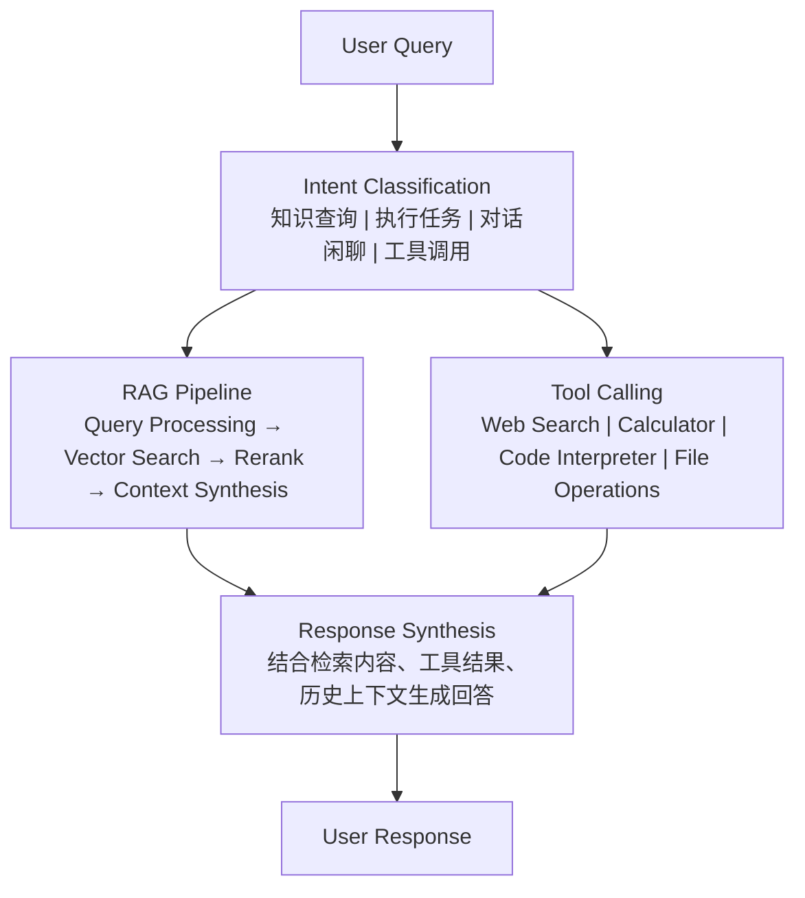

#### Agent 实现

```python
from enum import Enum
from dataclasses import dataclass
from typing import Optional, Callable

class Intent(Enum):
    """意图类型"""
    KNOWLEDGE_QUERY = "knowledge_query"      # 知识查询
    TASK_EXECUTION = "task_execution"        # 任务执行
    CONVERSATION = "conversation"            # 对话闲聊
    TOOL_CALLING = "tool_calling"           # 工具调用

@dataclass
class AgentMessage:
    """Agent 消息"""
    role: str  # user / assistant / system
    content: str
    intent: Optional[Intent] = None
    retrieved_docs: Optional[list[dict]] = None
    tool_calls: Optional[list[dict]] = None
    metadata: Optional[dict] = None

class RAGAgent:
    """检索增强型 Agent"""
    
    def __init__(
        self,
        llm,
        intent_classifier,
        retriever,
        reranker,
        tools: list[Callable] = None,
        system_prompt: str = None
    ):
        """
        初始化 Agent
        
        Args:
            llm: 大语言模型
            intent_classifier: 意图分类器
            retriever: 检索器
            reranker: 重排序器
            tools: 可用工具列表
            system_prompt: 系统提示词
        """
        self.llm = llm
        self.intent_classifier = intent_classifier
        self.retriever = retriever
        self.reranker = reranker
        self.tools = tools or {}
        self.messages: list[AgentMessage] = []
        
        # 默认系统提示词
        self.default_system_prompt = system_prompt or self._get_default_system_prompt()
    
    def _get_default_system_prompt(self) -> str:
        """获取默认系统提示词"""
        return """你是一个智能助手，具备以下能力：

1. 知识问答：当用户询问问题时，你会检索相关知识库来回答
2. 任务执行：你可以帮助用户执行各种任务
3. 工具使用：当需要时，你可以调用各种工具来完成任务

回答要求：
- 准确、专业、有条理
- 注明信息来源（基于检索内容回答时）
- 如果不确定或找不到相关信息，明确告知用户"""
    
    def chat(
        self,
        query: str,
        conversation_history: list[AgentMessage] = None,
        return_sources: bool = False
    ) -> dict:
        """
        对话接口
        
        Args:
            query: 用户输入
            conversation_history: 对话历史
            return_sources: 是否返回来源信息
        
        Returns:
            回答结果
        """
        # 1. 意图分类
        intent = self._classify_intent(query)
        
        # 2. 根据意图处理
        if intent == Intent.KNOWLEDGE_QUERY:
            result = self._handle_knowledge_query(
                query, conversation_history, return_sources
            )
        elif intent == Intent.TOOL_CALLING:
            result = self._handle_tool_calling(query, conversation_history)
        elif intent == Intent.TASK_EXECUTION:
            result = self._handle_task_execution(query, conversation_history)
        else:
            result = self._handle_conversation(query, conversation_history)
        
        # 3. 记录消息
        self.messages.append(AgentMessage(
            role="user",
            content=query
        ))
        self.messages.append(AgentMessage(
            role="assistant",
            content=result["answer"],
            intent=intent,
            retrieved_docs=result.get("retrieved_docs"),
            metadata=result.get("metadata")
        ))
        
        return result
    
    def _classify_intent(self, query: str) -> Intent:
        """意图分类"""
        if self.intent_classifier:
            return self.intent_classifier.classify(query)
        
        # 默认：检测是否需要检索
        retrieval_indicators = ["什么", "怎么", "如何", "为什么", "哪个", "请问", "解释"]
        if any(word in query for word in retrieval_indicators):
            return Intent.KNOWLEDGE_QUERY
        
        # 检测工具调用关键词
        tool_indicators = ["搜索", "计算", "运行", "执行"]
        if any(word in query for word in tool_indicators):
            return Intent.TOOL_CALLING
        
        return Intent.CONVERSATION
    
    def _handle_knowledge_query(
        self,
        query: str,
        history: list[AgentMessage] = None,
        return_sources: bool = False
    ) -> dict:
        """处理知识查询"""
        # 1. 检索相关文档
        retrieved = self.retriever.search(query, top_k=20)
        
        # 2. 重排序
        if self.reranker and retrieved:
            doc_texts = [doc["content"] for doc in retrieved]
            reranked = self.reranker.rerank(query, doc_texts, top_k=10)
            
            # 合并结果
            for i, result in enumerate(reranked):
                retrieved[i]["rerank_score"] = result["score"]
                retrieved[i]["text"] = result["text"]
        
        # 3. 构建上下文
        context = self._build_context(retrieved[:5])
        
        # 4. 生成回答
        prompt = self._build_rag_prompt(query, context, history)
        response = self.llm.generate(prompt)
        
        result = {
            "answer": response.text,
            "intent": Intent.KNOWLEDGE_QUERY,
            "retrieved_docs": retrieved if return_sources else None
        }
        
        return result
    
    def _handle_tool_calling(
        self,
        query: str,
        history: list[AgentMessage] = None
    ) -> dict:
        """处理工具调用"""
        # 解析工具调用
        tool_name, tool_args = self._parse_tool_call(query)
        
        if tool_name not in self.tools:
            return {
                "answer": f"未找到工具：{tool_name}",
                "intent": Intent.TOOL_CALLING
            }
        
        # 执行工具
        tool = self.tools[tool_name]
        try:
            tool_result = tool(**tool_args)
            response = self._format_tool_result(tool_name, tool_result)
        except Exception as e:
            response = f"工具执行出错：{str(e)}"
        
        return {
            "answer": response,
            "intent": Intent.TOOL_CALLING,
            "tool_used": tool_name
        }
    
    def _handle_task_execution(
        self,
        query: str,
        history: list[AgentMessage] = None
    ) -> dict:
        """处理任务执行"""
        # 可结合 RAG 和工具
        prompt = self._build_task_prompt(query, history)
        response = self.llm.generate(prompt)
        
        return {
            "answer": response.text,
            "intent": Intent.TASK_EXECUTION
        }
    
    def _handle_conversation(
        self,
        query: str,
        history: list[AgentMessage] = None
    ) -> dict:
        """处理一般对话"""
        prompt = self._build_conversation_prompt(query, history)
        response = self.llm.generate(prompt)
        
        return {
            "answer": response.text,
            "intent": Intent.CONVERSATION
        }
    
    def _build_context(self, documents: list[dict]) -> str:
        """构建检索上下文"""
        if not documents:
            return "无相关知识库内容"
        
        context_parts = []
        for i, doc in enumerate(documents, 1):
            # 从 metadata 提取内容
            content = doc.get("metadata", {}).get("content", doc.get("content", ""))
            
            source = doc.get("metadata", {}).get("source", "")
            title = doc.get("metadata", {}).get("title", "")
            
            context_parts.append(
                f"【文档 {i}】\n标题：{title}\n来源：{source}\n内容：{content[:300]}..."
            )
        
        return "\n\n".join(context_parts)
    
    def _build_rag_prompt(
        self,
        query: str,
        context: str,
        history: list[AgentMessage] = None
    ) -> str:
        """构建 RAG 提示词"""
        system = self.default_system_prompt + "\n\n" + """你具备检索增强能力。

当用户提供问题时，你应该：
1. 基于以下参考内容回答问题
2. 只使用参考内容中的信息，不要添加外部知识
3. 如果参考内容中没有相关信息，明确指出
4. 回答时注明信息来源
5. 保持回答简洁、有条理

参考内容：
{context}"""
        
        prompt = system.format(context=context)
        
        if history:
            history_text = "\n".join([
                f"用户：{m.content}" if m.role == "user" else f"助手：{m.content}"
                for m in history[-6:]
            ])
            prompt += f"\n\n对话历史：\n{history_text}\n\n当前问题：{query}"
        else:
            prompt += f"\n\n问题：{query}"
        
        return prompt
    
    def _build_task_prompt(
        self,
        query: str,
        history: list[AgentMessage] = None
    ) -> str:
        """构建任务执行提示词"""
        prompt = self.default_system_prompt + f"\n\n任务：{query}"
        return prompt
    
    def _build_conversation_prompt(
        self,
        query: str,
        history: list[AgentMessage] = None
    ) -> str:
        """构建对话提示词"""
        prompt = self.default_system_prompt
        
        if history:
            history_text = "\n".join([
                f"用户：{m.content}" if m.role == "user" else f"助手：{m.content}"
                for m in history[-6:]
            ])
            prompt += f"\n\n对话历史：\n{history_text}"
        
        prompt += f"\n\n用户：{query}"
        
        return prompt
    
    def _parse_tool_call(self, query: str) -> tuple[str, dict]:
        """解析工具调用（简化实现）"""
        # 简化：实际应使用 LLM 解析
        return "unknown", {}
    
    def _format_tool_result(self, tool_name: str, result: any) -> str:
        """格式化工具结果"""
        if isinstance(result, (dict, list)):
            import json
            return f"工具 {tool_name} 执行结果：\n{json.dumps(result, ensure_ascii=False, indent=2)}"
        return f"工具 {tool_name} 执行结果：{result}"
```

### 4.2 动态知识更新

实时更新知识库以保持时效性：

```python
import asyncio
from datetime import datetime, timedelta
from typing import Optional

class DynamicKnowledgeManager:
    """动态知识管理器"""
    
    def __init__(
        self,
        knowledge_base: KnowledgeBase,
        update_interval: int = 3600  # 更新间隔（秒）
    ):
        """
        Args:
            knowledge_base: 知识库实例
            update_interval: 自动更新间隔
        """
        self.knowledge_base = knowledge_base
        self.update_interval = update_interval
        
        # 更新追踪
        self.last_update: Optional[datetime] = None
        self.update_stats: dict = {}
    
    def trigger_update(
        self,
        source: str,
        documents: list[Document] = None
    ):
        """
        触发增量更新
        
        Args:
            source: 更新来源（文件路径、API、数据库等）
            documents: 新文档（如果为 None 则从 source 加载）
        """
        if documents is None:
            # 从来源加载
            documents = self._load_from_source(source)
        
        # 识别变更
        changes = self._detect_changes(documents)
        
        if not changes["added"] and not changes["modified"] and not changes["deleted"]:
            print("No changes detected")
            return
        
        # 应用变更
        for doc_id in changes["deleted"]:
            self.knowledge_base.delete_document(doc_id)
        
        for doc_id in changes["modified"]:
            new_doc = next(d for d in documents if d.doc_id == doc_id)
            self.knowledge_base.update_document(doc_id, new_doc)
        
        for doc in changes["added"]:
            self.knowledge_base.add_documents([doc])
        
        # 更新统计
        self.last_update = datetime.now()
        self.update_stats = {
            "added": len(changes["added"]),
            "modified": len(changes["modified"]),
            "deleted": len(changes["deleted"]),
            "timestamp": self.last_update.isoformat()
        }
        
        print(f"Update complete: {self.update_stats}")
    
    def _load_from_source(self, source: str) -> list[Document]:
        """从来源加载文档"""
        loader = DocumentLoader()
        return list(loader.load(source))
    
    def _detect_changes(self, new_documents: list[Document]) -> dict:
        """检测文档变更"""
        existing_docs = self.knowledge_base.documents
        
        new_ids = {doc.doc_id for doc in new_documents}
        existing_ids = set(existing_docs.keys())
        
        added = [d for d in new_documents if d.doc_id not in existing_ids]
        modified = []
        deleted = list(existing_ids - new_ids)
        
        for doc in new_documents:
            if doc.doc_id in existing_ids:
                # 检查是否修改（比较内容哈希）
                if self._is_modified(doc):
                    modified.append(doc)
        
        return {"added": added, "modified": modified, "deleted": deleted}
    
    def _is_modified(self, document: Document) -> bool:
        """检查文档是否已修改"""
        existing = self.knowledge_base.documents.get(document.doc_id, {})
        # 简化实现：实际应比较内容哈希
        return existing.get("content_hash") != hash(document.content)
    
    async def start_auto_update(self):
        """启动自动更新"""
        while True:
            await asyncio.sleep(self.update_interval)
            try:
                self.trigger_update(None)  # 使用默认来源
            except Exception as e:
                print(f"Auto update failed: {e}")
    
    def get_update_status(self) -> dict:
        """获取更新状态"""
        return {
            "last_update": self.last_update.isoformat() if self.last_update else None,
            "update_stats": self.update_stats,
            "document_count": len(self.knowledge_base.documents)
        }


class WebKnowledgeUpdater:
    """网页知识更新器"""
    
    def __init__(
        self,
        knowledge_base: KnowledgeBase,
        web_scraper = None
    ):
        self.knowledge_base = knowledge_base
        self.web_scraper = web_scraper
    
    async def update_from_urls(self, urls: list[str]):
        """从 URL 更新知识"""
        for url in urls:
            try:
                # 抓取网页
                if self.web_scraper:
                    content = await self.web_scraper.scrape(url)
                else:
                    content = await self._default_scrape(url)
                
                # 创建文档
                document = Document(
                    content=content["text"],
                    metadata={
                        "source": url,
                        "title": content.get("title", ""),
                        "scraped_at": datetime.now().isoformat()
                    }
                )
                
                # 更新知识库
                self.knowledge_base.add_documents([document])
                
            except Exception as e:
                print(f"Failed to scrape {url}: {e}")
    
    async def _default_scrape(self, url: str) -> dict:
        """默认抓取实现"""
        import aiohttp
        
        async with aiohttp.ClientSession() as session:
            async with session.get(url) as response:
                html = await response.text()
                # 简单解析（实际应使用 BeautifulSoup）
                return {"text": html, "title": url}
```

### 4.3 上下文窗口管理

管理 LLM 上下文窗口以优化长对话：

```python
from collections import deque

class ContextWindowManager:
    """上下文窗口管理器"""
    
    def __init__(
        self,
        max_tokens: int = 4000,
        reserved_tokens: int = 500,
        strategy: str = "sliding"
    ):
        """
        Args:
            max_tokens: 最大 token 数
            reserved_tokens: 保留 token 数（系统提示等）
            strategy: 管理策略
                - "sliding": 滑动窗口
                - "summary": 摘要压缩
                - "priority": 优先级截断
        """
        self.max_tokens = max_tokens
        self.reserved_tokens = reserved_tokens
        self.available_tokens = max_tokens - reserved_tokens
        self.strategy = strategy
        
        # 消息存储
        self.messages: deque[AgentMessage] = deque()
    
    def add_message(self, message: AgentMessage):
        """添加消息"""
        self.messages.append(message)
        self._trim_if_needed()
    
    def get_context(
        self,
        current_query: str = None,
        system_prompt: str = None
    ) -> str:
        """
        获取上下文
        
        Args:
            current_query: 当前查询（保留在最后）
            system_prompt: 系统提示词
        
        Returns:
            格式化的上下文字符串
        """
        if self.strategy == "sliding":
            return self._get_sliding_context(current_query, system_prompt)
        elif self.strategy == "summary":
            return self._get_summary_context(current_query, system_prompt)
        elif self.strategy == "priority":
            return self._get_priority_context(current_query, system_prompt)
        else:
            return self._get_sliding_context(current_query, system_prompt)
    
    def _trim_if_needed(self):
        """必要时截断"""
        while self._total_tokens() > self.available_tokens and len(self.messages) > 1:
            self.messages.popleft()
    
    def _total_tokens(self) -> int:
        """计算总 token 数"""
        return sum(self._estimate_tokens(str(m.content)) for m in self.messages)
    
    def _estimate_tokens(self, text: str) -> int:
        """估算 token 数"""
        # 简单估算
        return int(len(text) * 1.5)
    
    def _get_sliding_context(
        self,
        current_query: str,
        system_prompt: str
    ) -> str:
        """滑动窗口上下文"""
        parts = []
        
        # 系统提示
        if system_prompt:
            parts.append(f"系统：{system_prompt}")
        
        # 历史消息
        history = []
        for msg in self.messages:
            if msg.role == "user":
                history.append(f"用户：{msg.content}")
            else:
                history.append(f"助手：{msg.content}")
        
        # 从最近的开始添加直到超过限制
        for i in range(len(history) - 1, -1, -1):
            test_text = "\n".join(history[i:] + [f"用户：{current_query}"] if current_query else history[i:])
            if self._estimate_tokens(test_text) > self.available_tokens:
                break
            history = history[i:]
        
        parts.extend(history)
        
        # 当前查询
        if current_query:
            parts.append(f"用户：{current_query}")
        
        return "\n".join(parts)
    
    def _get_summary_context(
        self,
        current_query: str,
        system_prompt: str
    ) -> str:
        """摘要压缩上下文"""
        # 如果消息较少，直接返回
        if len(self.messages) <= 6:
            return self._get_sliding_context(current_query, system_prompt)
        
        # 压缩旧消息
        old_messages = list(self.messages)[:-6]
        summary = self._summarize_messages(old_messages)
        
        parts = []
        if system_prompt:
            parts.append(f"系统：{system_prompt}")
        
        parts.append(f"【之前对话摘要】{summary}")
        
        # 最近消息
        for msg in list(self.messages)[-6:]:
            if msg.role == "user":
                parts.append(f"用户：{msg.content}")
            else:
                parts.append(f"助手：{msg.content}")
        
        if current_query:
            parts.append(f"用户：{current_query}")
        
        return "\n".join(parts)
    
    def _get_priority_context(
        self,
        current_query: str,
        system_prompt: str
    ) -> str:
        """优先级上下文"""
        # 优先保留检索相关和最近的消息
        prioritized = []
        current_tokens = self._estimate_tokens(system_prompt or "")
        
        for msg in reversed(self.messages):
            msg_tokens = self._estimate_tokens(msg.content)
            if current_tokens + msg_tokens > self.available_tokens:
                continue
            
            # 检查相关性
            if self._is_relevant(msg, current_query):
                prioritized.insert(0, msg)
                current_tokens += msg_tokens
        
        parts = []
        if system_prompt:
            parts.append(f"系统：{system_prompt}")
        
        for msg in prioritized:
            if msg.role == "user":
                parts.append(f"用户：{msg.content}")
            else:
                parts.append(f"助手：{msg.content}")
        
        if current_query:
            parts.append(f"用户：{current_query}")
        
        return "\n".join(parts)
    
    def _is_relevant(self, message: AgentMessage, query: str) -> bool:
        """判断消息相关性"""
        if not query:
            return True
        
        # 简单的关键词匹配
        query_words = set(query.lower().split())
        message_words = set(message.content.lower().split())
        
        return bool(query_words & message_words)
    
    def _summarize_messages(self, messages: list[AgentMessage]) -> str:
        """总结消息"""
        # 简化实现：实际应使用 LLM 总结
        summaries = []
        for msg in messages:
            if msg.role == "user":
                summaries.append(f"用户询问：{msg.content[:50]}...")
            else:
                summaries.append(f"助手回答：{msg.content[:50]}...")
        
        return " | ".join(summaries[-3:])
```

---

## 5. 高级 RAG

### 5.1 Self-RAG

Self-RAG 是一种自我反思的 RAG 框架：

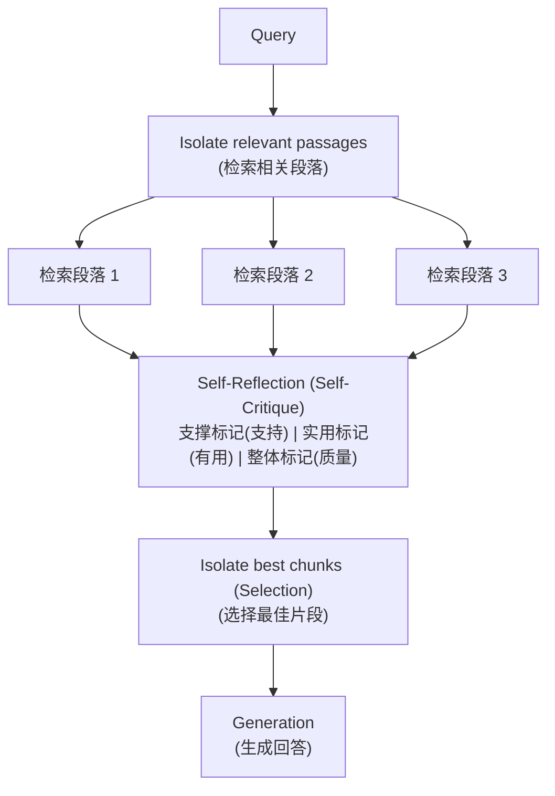

#### Self-RAG 实现

```python
class SelfRAG:
    """Self-RAG 实现"""
    
    # 反思标记定义
    IS_SUPPORTED = "Is Supported"      # 是否被检索内容支撑
    IS_USEFUL = "Is Useful"           # 回答是否有帮助
    IS_RELEVANT = "Is Relevant"       # 检索内容是否相关
    
    def __init__(self, llm, retriever):
        self.llm = llm
        self.retriever = retriever
    
    def rag_with_reflection(self, query: str) -> dict:
        """
        带自我反思的 RAG
        
        Args:
            query: 用户查询
        
        Returns:
            回答和反思结果
        """
        # 1. 检索
        retrieved_docs = self.retriever.search(query, top_k=5)
        
        # 2. 自我反思
        reflection_results = []
        for doc in retrieved_docs:
            reflection = self._reflect_on_doc(query, doc)
            reflection_results.append({
                "doc": doc,
                "reflection": reflection
            })
        
        # 3. 选择最佳片段
        selected_docs = self._select_best_chunks(reflection_results)
        
        # 4. 生成回答
        answer = self._generate_with_grounding(query, selected_docs)
        
        # 5. 最终反思
        final_reflection = self._reflect_on_answer(query, answer)
        
        return {
            "answer": answer,
            "retrieved_docs": retrieved_docs,
            "reflection": final_reflection,
            "selected_docs": selected_docs
        }
    
    def _reflect_on_doc(self, query: str, doc: dict) -> dict:
        """反思单个检索文档"""
        reflection_prompt = f"""判断以下检索内容是否相关且有帮助。

查询：{query}

检索内容：
{doc.get('content', '')[:500]}

请判断：
1. 是否支撑回答查询？（是/否）
2. 是否与查询相关？（是/否）
3. 相关程度评分（1-5）

并给出简短理由："""
        
        response = self.llm.generate(reflection_prompt)
        
        # 解析响应（简化实现）
        return {
            "is_supported": "是" in response.text[:100],
            "is_relevant": "是" in response.text[100:200],
            "reason": response.text
        }
    
    def _select_best_chunks(
        self,
        reflection_results: list[dict]
    ) -> list[dict]:
        """选择最佳片段"""
        # 根据反思结果过滤和排序
        scored = []
        for result in reflection_results:
            doc = result["doc"]
            reflection = result["reflection"]
            
            # 计算综合分数
            score = 0
            if reflection.get("is_supported"):
                score += 2
            if reflection.get("is_relevant"):
                score += 1
            
            scored.append((doc, score))
        
        # 选择高分组
        scored.sort(key=lambda x: x[1], reverse=True)
        return [doc for doc, score in scored[:3] if score > 0]
    
    def _generate_with_grounding(
        self,
        query: str,
        selected_docs: list[dict]
    ) -> str:
        """基于选中的片段生成回答"""
        context = "\n\n".join([
            f"【参考 {i+1}】\n{doc.get('content', '')[:300]}"
            for i, doc in enumerate(selected_docs)
        ])
        
        prompt = f"""基于以下参考内容回答问题。如有引用，请注明。

参考内容：
{context}

问题：{query}

回答（引用参考编号）："""
        
        response = self.llm.generate(prompt)
        return response.text
    
    def _reflect_on_answer(self, query: str, answer: str) -> dict:
        """反思最终回答"""
        reflection_prompt = f"""评估以下回答的质量。

问题：{query}
回答：{answer}

请评估：
1. 回答是否准确（是/否）
2. 是否完整回答了问题（是/否）
3. 是否有帮助（1-5分）
4. 是否有幻觉或错误（是/否）

并给出改进建议（如需要）："""
        
        response = self.llm.generate(reflection_prompt)
        
        return {
            "assessment": response.text,
            "quality": "good" if "是" in response.text[:50] else "needs_improvement"
        }
```

### 5.2 Corrective-RAG

CRAG（Corrective RAG）用于纠正低质量的检索：

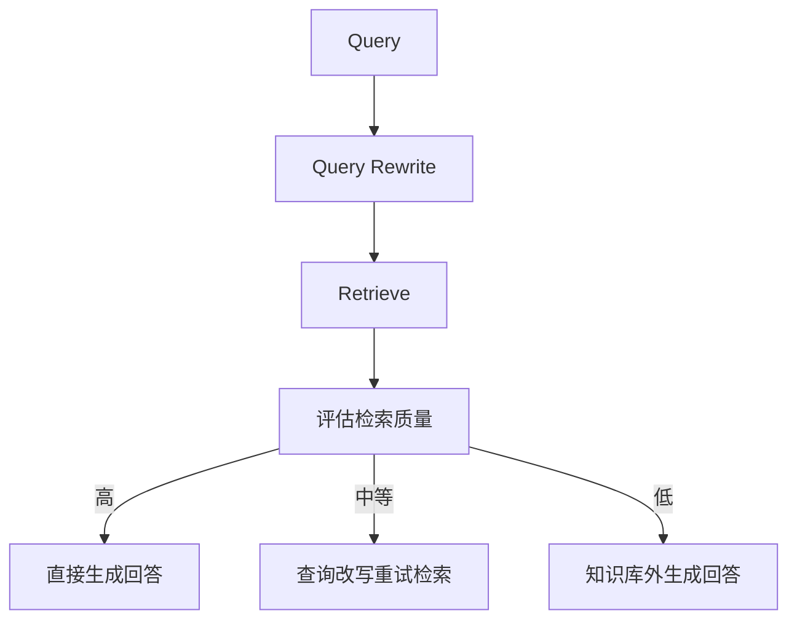

#### CRAG 实现

```python
class CorrectiveRAG:
    """Corrective RAG 实现"""
    
    def __init__(self, llm, retriever, reranker, web_searcher=None):
        self.llm = llm
        self.retriever = retriever
        self.reranker = reranker
        self.web_searcher = web_searcher  # 用于检索质量低时的补充
    
    def corrective_retrieve(self, query: str) -> dict:
        """
        带纠正的检索
        
        Args:
            query: 用户查询
        
        Returns:
            检索结果和处理信息
        """
        # 1. 查询改写
        rewritten_queries = self._rewrite_query(query)
        
        # 2. 多轮检索
        all_results = []
        for q in rewritten_queries:
            results = self.retriever.search(q, top_k=10)
            all_results.extend(results)
        
        # 3. 去重和合并
        unique_results = self._deduplicate(all_results)
        
        # 4. 重排序
        if self.reranker and unique_results:
            reranked = self.reranker.rerank(
                query,
                [r.get("content", r.get("text", "")) for r in unique_results],
                top_k=10
            )
            # 合并分数
            for i, result in enumerate(reranked):
                unique_results[i]["rerank_score"] = result["score"]
        
        # 5. 评估检索质量
        quality = self._evaluate_retrieval_quality(query, unique_results)
        
        return {
            "results": unique_results,
            "quality": quality,
            "rewritten_queries": rewritten_queries
        }
    
    def _rewrite_query(self, query: str) -> list[str]:
        """查询改写"""
        rewrite_prompt = f"""请为以下查询生成 3 种不同的改写版本，以提升检索效果。

原始查询：{query}

改写要求：
1. 保持原意
2. 使用不同表达方式（正式/口语化/学术化）
3. 可以拆分复杂问题

输出格式：
1. [改写1]
2. [改写2]
3. [改写3]"""
        
        response = self.llm.generate(rewrite_prompt)
        
        # 解析改写结果
        rewrites = []
        for line in response.text.split('\n'):
            match = re.search(r'\d+\.\s+(.+)', line)
            if match:
                rewrites.append(match.group(1).strip())
        
        if len(rewrites) < 3:
            rewrites = [query] + rewrites[:2]
        
        return rewrites if rewrites else [query]
    
    def _deduplicate(self, results: list[dict]) -> list[dict]:
        """去重"""
        seen = set()
        unique = []
        
        for result in results:
            # 使用内容哈希去重
            content = result.get("content", result.get("text", ""))
            content_hash = hashlib.md5(content[:200].encode()).hexdigest()
            
            if content_hash not in seen:
                seen.add(content_hash)
                unique.append(result)
        
        return unique
    
    def _evaluate_retrieval_quality(
        self,
        query: str,
        results: list[dict]
    ) -> str:
        """评估检索质量"""
        if not results:
            return "low"
        
        # 使用 LLM 评估
        evaluation_prompt = f"""评估以下检索结果与查询的相关性。

查询：{query}

检索结果（前3个）：
{chr(10).join([
    f'{i+1}. {r.get("content", r.get("text", ""))[:200]}...'
    for i, r in enumerate(results[:3])
])}

请评估：
1. 检索结果是否回答了查询？（完全相关/部分相关/不相关）
2. 质量评分（高/中/低）

评分理由："""
        
        response = self.llm.generate(evaluation_prompt)
        
        if "完全相关" in response.text or "高" in response.text[:20]:
            return "high"
        elif "部分相关" in response.text or "中" in response.text[:20]:
            return "medium"
        else:
            return "low"
    
    def handle_low_quality(
        self,
        query: str,
        results: list[dict],
        use_web_search: bool = True
    ) -> dict:
        """处理低质量检索"""
        if use_web_search and self.web_searcher:
            # 补充 Web 搜索
            web_results = self.web_searcher.search(query)
            
            return {
                "primary_results": results,
                "supplementary_results": web_results,
                "source": "web_search"
            }
        else:
            # 直接生成，但明确说明局限性
            return {
                "primary_results": results,
                "supplementary_results": [],
                "source": "knowledge_base_low_quality",
                "warning": "知识库检索结果可能不完整"
            }
    
    def generate_answer(
        self,
        query: str,
        retrieval_result: dict
    ) -> str:
        """生成回答"""
        quality = retrieval_result["quality"]
        results = retrieval_result["results"]
        
        if quality == "high":
            # 直接使用检索结果
            context = self._build_context(results[:3])
            prompt = f"""基于以下检索内容回答问题。

{context}

问题：{query}

回答："""
        
        elif quality == "medium":
            # 结合检索结果和推理
            context = self._build_context(results[:5])
            prompt = f"""以下检索内容与问题部分相关，请结合常识和检索内容给出回答。

{context}

问题：{query}

请谨慎回答，明确说明不确定的部分："""
        
        else:
            # 低质量，尝试补充
            handle_result = self.handle_low_quality(
                query,
                results,
                use_web_search=True
            )
            
            context = self._build_context(handle_result["primary_results"])
            
            if handle_result["supplementary_results"]:
                web_context = self._build_context(
                    handle_result["supplementary_results"]
                )
                context += "\n\n【Web 补充】\n" + web_context
            
            prompt = f"""注意：知识库检索结果质量较低，以下内容仅供参考。

{context}

问题：{query}

请基于以上内容回答，如信息不足请明确说明："""
        
        return self.llm.generate(prompt).text
    
    def _build_context(self, results: list[dict]) -> str:
        """构建上下文"""
        if not results:
            return "（无相关检索内容）"
        
        parts = []
        for i, r in enumerate(results, 1):
            content = r.get("content", r.get("text", ""))
            source = r.get("metadata", {}).get("source", "")
            parts.append(f"【参考{i}】{content[:300]}...\n来源：{source}")
        
        return "\n\n".join(parts)
```

### 5.3 路由检索

智能路由将查询分发到不同检索通道：

```python
from enum import Enum

class RetrievalRoute(Enum):
    """检索路由类型"""
    SEMANTIC = "semantic"           # 语义检索
    KEYWORD = "keyword"            # 关键词检索
    HYBRID = "hybrid"              # 混合检索
    KNOWLEDGE_GRAPH = "kg"         # 知识图谱
    WEB = "web"                    # 网页搜索

class QueryRouter:
    """查询路由器"""
    
    def __init__(self, llm, routes: dict):
        """
        Args:
            llm: 大语言模型
            routes: 可用路由配置
        """
        self.llm = llm
        self.routes = routes  # {route_name: route_config}
    
    def route(self, query: str) -> list[tuple[RetrievalRoute, float]]:
        """
        路由查询
        
        Args:
            query: 用户查询
        
        Returns:
            路由列表及对应权重 [(route, weight), ...]
        """
        # 1. 意图分类
        intent = self._classify_intent(query)
        
        # 2. 选择路由
        routes = self._select_routes(query, intent)
        
        # 3. 计算权重
        weights = self._calculate_weights(query, routes)
        
        return list(zip(routes, weights))
    
    def _classify_intent(self, query: str) -> str:
        """意图分类"""
        classification_prompt = f"""判断以下查询最适合的检索类型。

查询：{query}

类型选项：
- semantic：需要语义理解的查询（如解释概念、描述性查询）
- keyword：需要精确匹配的查询（如术语、技术名词）
- hybrid：综合查询
- knowledge_graph：涉及实体关系的查询
- web：需要最新信息或外部资源的查询

最适合的类型："""
        
        response = self.llm.generate(classification_prompt)
        
        # 解析响应
        for route_type in ["semantic", "keyword", "hybrid", "knowledge_graph", "web"]:
            if route_type.lower() in response.text.lower():
                return route_type
        
        return "hybrid"
    
    def _select_routes(self, query: str, intent: str) -> list[RetrievalRoute]:
        """选择路由"""
        if intent == "semantic":
            return [RetrievalRoute.SEMANTIC]
        elif intent == "keyword":
            return [RetrievalRoute.KEYWORD]
        elif intent == "web":
            return [RetrievalRoute.WEB]
        elif intent == "knowledge_graph":
            return [RetrievalRoute.KNOWLEDGE_GRAPH, RetrievalRoute.SEMANTIC]
        else:
            return [RetrievalRoute.HYBRID]
    
    def _calculate_weights(
        self,
        query: str,
        routes: list[RetrievalRoute]
    ) -> list[float]:
        """计算路由权重"""
        if len(routes) == 1:
            return [1.0]
        
        # 动态调整权重
        weights = []
        for route in routes:
            weight = self._evaluate_route_suitability(query, route)
            weights.append(weight)
        
        # 归一化
        total = sum(weights)
        return [w / total for w in weights]
    
    def _evaluate_route_suitability(
        self,
        query: str,
        route: RetrievalRoute
    ) -> float:
        """评估路由适合度"""
        evaluation_prompt = f"""评估以下查询是否适合使用 {route.value} 检索。

查询：{query}

适合度评分（0-1）："""
        
        response = self.llm.generate(evaluation_prompt)
        
        # 提取分数
        match = re.search(r'[0-1]\.?[0-9]*', response.text)
        if match:
            return float(match.group())
        
        return 0.5


class RouterRAG:
    """路由 RAG"""
    
    def __init__(
        self,
        llm,
        retrievers: dict[RetrievalRoute, any],
        router: QueryRouter
    ):
        self.llm = llm
        self.retrievers = retrievers
        self.router = router
    
    def retrieve(self, query: str, top_k: int = 10) -> list[dict]:
        """
        路由检索
        
        Args:
            query: 查询
            top_k: 返回总数
        
        Returns:
            合并后的检索结果
        """
        # 1. 路由决策
        route_weights = self.router.route(query)
        
        # 2. 分路由检索
        all_results = {}
        for route, weight in route_weights:
            retriever = self.retrievers.get(route)
            if retriever:
                results = retriever.search(query, top_k=int(top_k * weight) + 1)
                
                for result in results:
                    doc_id = result.get("id", hash(result.get("content", "")))
                    if doc_id not in all_results:
                        all_results[doc_id] = {
                            **result,
                            "weighted_score": result.get("score", 0) * weight,
                            "routes": [route]
                        }
                    else:
                        all_results[doc_id]["weighted_score"] += result.get("score", 0) * weight
                        all_results[doc_id]["routes"].append(route)
        
        # 3. 合并排序
        sorted_results = sorted(
            all_results.values(),
            key=lambda x: x["weighted_score"],
            reverse=True
        )
        
        return sorted_results[:top_k]
```

### 5.4 查询转换

查询转换提升检索效果：

```python
class QueryTransformer:
    """查询转换器"""
    
    def __init__(self, llm):
        self.llm = llm
    
    def transform(self, query: str) -> dict:
        """
        转换查询
        
        Args:
            query: 原始查询
        
        Returns:
            转换结果
        """
        return {
            "original": query,
            "expanded": self.expand_query(query),
            "rewritten": self.rewrite_query(query),
            "decomposed": self.decompose_query(query)
        }
    
    def expand_query(self, query: str) -> list[str]:
        """查询扩展：添加同义词和相关概念"""
        expand_prompt = f"""为以下查询生成扩展查询，包括同义词、相关概念和可能的拼写变体。

查询：{query}

扩展查询（3-5个）："""
        
        response = self.llm.generate(expand_prompt)
        
        # 解析扩展查询
        expanded = []
        for line in response.text.split('\n'):
            if line.strip() and not line.startswith('查询') and not line.startswith('扩展'):
                # 清理格式
                cleaned = re.sub(r'^\d+[\.\)]\s*', '', line.strip())
                if cleaned:
                    expanded.append(cleaned)
        
        return expanded if expanded else [query]
    
    def rewrite_query(self, query: str) -> list[str]:
        """查询改写：不同表述方式"""
        rewrite_prompt = f"""为以下查询生成 3 种不同表述方式的改写。

查询：{query}

改写要求：
1. 正式化版本
2. 口语化版本
3. 专业术语版本

改写："""
        
        response = self.llm.generate(rewrite_prompt)
        
        rewrites = []
        for line in response.text.split('\n'):
            match = re.search(r'[\d\.\)]\s*(.+)', line)
            if match:
                rewrites.append(match.group(1).strip())
        
        return rewrites if rewrites else [query]
    
    def decompose_query(self, query: str) -> list[str]:
        """查询分解：将复杂问题拆分为子问题"""
        decompose_prompt = f"""将以下复杂查询拆分为简单的子问题。

查询：{query}

拆分要求：
1. 每个子问题应该单一、具体
2. 子问题之间逻辑连贯
3. 按顺序解决可以回答原问题

子问题列表："""
        
        response = self.llm.generate(decompose_prompt)
        
        sub_queries = []
        for line in response.text.split('\n'):
            match = re.search(r'[\d\.\)]\s*(.+)', line)
            if match:
                sub_queries.append(match.group(1).strip())
        
        return sub_queries if sub_queries else [query]
    
    def generate_hypothetical_answer(self, query: str) -> str:
        """生成假设回答（HyDE 方法）"""
        hyde_prompt = f"""根据你的理解，生成一个可能回答以下问题的示例答案。

问题：{query}

要求：
1. 生成一个合理但可能不完美的回答
2. 这个回答用于帮助检索相关文档
3. 不要胡编乱造，基于常识生成

示例回答："""
        
        response = self.llm.generate(hyde_prompt)
        return response.text


class MultiQueryRetriever:
    """多查询检索器"""
    
    def __init__(
        self,
        retriever,
        query_transformer: QueryTransformer,
        reranker = None
    ):
        self.retriever = retriever
        self.query_transformer = query_transformer
        self.reranker = reranker
    
    def retrieve(self, query: str, top_k: int = 10) -> list[dict]:
        """
        使用多查询检索
        
        Args:
            query: 原始查询
            top_k: 返回数量
        
        Returns:
            检索结果
        """
        # 1. 查询扩展
        expanded_queries = self.query_transformer.expand_query(query)
        
        # 2. 查询改写
        rewritten_queries = self.query_transformer.rewrite_query(query)
        
        # 3. 合并所有查询
        all_queries = [query] + expanded_queries + rewritten_queries
        all_queries = list(set(all_queries))  # 去重
        
        # 4. 批量检索
        all_results = {}
        for q in all_queries:
            results = self.retriever.search(q, top_k=top_k)
            
            for result in results:
                doc_id = result.get("id", hash(result.get("content", "")))
                if doc_id not in all_results:
                    all_results[doc_id] = result
                    all_results[doc_id]["query_sources"] = [q]
                else:
                    all_results[doc_id]["query_sources"].append(q)
        
        # 5. 转换为列表
        results = list(all_results.values())
        
        # 6. 重排序（如有）
        if self.reranker:
            doc_texts = [r.get("content", r.get("text", "")) for r in results]
            reranked = self.reranker.rerank(query, doc_texts, top_k=len(results))
            
            # 合并重排分数
            for i, result in enumerate(reranked):
                results[i]["rerank_score"] = result["score"]
            
            results.sort(key=lambda x: x.get("rerank_score", 0), reverse=True)
        
        return results[:top_k]
```

---

## 6. 代码实现

### 6.1 Embedding 实现

完整的 Embedding pipeline：

```python
import numpy as np
from typing import Optional

class EmbeddingPipeline:
    """完整的 Embedding 处理流水线"""
    
    def __init__(
        self,
        model_name: str = "bge-large-zh",
        device: str = None,
        batch_size: int = 32,
        normalize: bool = True
    ):
        """
        Args:
            model_name: 模型名称
            device: 运行设备
            batch_size: 批处理大小
            normalize: 是否归一化向量
        """
        from sentence_transformers import SentenceTransformer
        
        if device is None:
            device = "cuda" if np.random.random() > 0.5 else "cpu"
        
        self.model = SentenceTransformer(model_name, device=device)
        self.batch_size = batch_size
        self.normalize = normalize
        self.dimension = self.model.get_sentence_embedding_dimension()
    
    def encode(
        self,
        texts: str | list[str],
        batch_size: int = None,
        show_progress: bool = False,
        task: str = "semantic_search"
    ) -> np.ndarray:
        """
        编码文本
        
        Args:
            texts: 文本或文本列表
            batch_size: 批大小
            show_progress: 显示进度
            task: 任务类型（semantic_search / retrieval_task / similarity）
        
        Returns:
            嵌入向量
        """
        if isinstance(texts, str):
            texts = [texts]
        
        # 任务特定前缀（某些模型需要）
        if "e5" in self.model.model_name.lower():
            texts = [
                f"query: {t}" if task == "semantic_search" else f"passage: {t}"
                for t in texts
            ]
        
        embeddings = self.model.encode(
            texts,
            batch_size=batch_size or self.batch_size,
            show_progress_bar=show_progress,
            normalize_embeddings=self.normalize,
            convert_to_numpy=True
        )
        
        return embeddings
    
    def encode_query(self, query: str) -> np.ndarray:
        """编码查询"""
        return self.encode(query, task="semantic_search")[0]
    
    def encode_corpus(
        self,
        corpus: list[str],
        show_progress: bool = True
    ) -> np.ndarray:
        """编码语料库"""
        return self.encode(corpus, task="retrieval_task", show_progress=show_progress)
    
    def compute_similarity(
        self,
        query_embedding: np.ndarray,
        doc_embeddings: np.ndarray
    ) -> np.ndarray:
        """计算余弦相似度"""
        if self.normalize:
            return np.dot(doc_embeddings, query_embedding)
        else:
            norm_q = np.linalg.norm(query_embedding)
            norm_d = np.linalg.norm(doc_embeddings, axis=1)
            return np.dot(doc_embeddings, query_embedding) / (norm_d * norm_q)
    
    def find_similar(
        self,
        query: str,
        documents: list[str],
        top_k: int = 5
    ) -> list[dict]:
        """查找最相似的文档"""
        query_emb = self.encode_query(query)
        doc_embs = self.encode_corpus(documents, show_progress=False)
        
        similarities = self.compute_similarity(query_emb, doc_embs)
        
        # 排序
        indices = np.argsort(similarities)[::-1][:top_k]
        
        return [
            {
                "index": int(idx),
                "document": documents[idx],
                "similarity": float(similarities[idx])
            }
            for idx in indices
        ]


# OpenAI Embedding
class OpenAIEmbedding:
    """OpenAI Embedding 封装"""
    
    def __init__(
        self,
        api_key: str,
        model: str = "text-embedding-3-small",
        dimensions: int = 1536
    ):
        """
        Args:
            api_key: OpenAI API Key
            model: 嵌入模型
            dimensions: 向量维度（支持缩减）
        """
        import openai
        
        self.client = openai.OpenAI(api_key=api_key)
        self.model = model
        self.dimensions = dimensions
    
    def encode(self, texts: str | list[str]) -> np.ndarray:
        """编码文本"""
        if isinstance(texts, str):
            texts = [texts]
        
        response = self.client.embeddings.create(
            model=self.model,
            input=texts,
            encoding_format="float",
            dimensions=self.dimensions
        )
        
        return np.array([item.embedding for item in response.data])
    
    def encode_query(self, query: str) -> np.ndarray:
        """编码查询"""
        return self.encode(query)[0]
    
    def encode_corpus(self, corpus: list[str]) -> np.ndarray:
        """编码语料库"""
        return self.encode(corpus)
```

### 6.2 Vector Store 实现

完整向量存储实现：

```python
import json
import hashlib
from pathlib import Path
from typing import Optional, Iterator
import numpy as np

class VectorStore:
    """向量存储基类"""
    
    def __init__(self, dimension: int):
        self.dimension = dimension
    
    def add(self, id: str, embedding: np.ndarray, metadata: dict = None):
        """添加向量"""
        raise NotImplementedError
    
    def search(
        self,
        query_embedding: np.ndarray,
        k: int = 10,
        filter: dict = None
    ) -> list[dict]:
        """搜索相似向量"""
        raise NotImplementedError
    
    def delete(self, ids: list[str]):
        """删除向量"""
        raise NotImplementedError
    
    def save(self, path: str):
        """保存到磁盘"""
        raise NotImplementedError
    
    @classmethod
    def load(cls, path: str) -> "VectorStore":
        """从磁盘加载"""
        raise NotImplementedError


class InMemoryVectorStore(VectorStore):
    """内存向量存储"""
    
    def __init__(self, dimension: int):
        super().__init__(dimension)
        self.vectors: dict[str, np.ndarray] = {}
        self.metadatas: dict[str, dict] = {}
    
    def add(self, id: str, embedding: np.ndarray, metadata: dict = None):
        """添加向量"""
        assert len(embedding) == self.dimension, f"Dimension mismatch: {len(embedding)} vs {self.dimension}"
        
        self.vectors[id] = embedding
        self.metadatas[id] = metadata or {}
    
    def search(
        self,
        query_embedding: np.ndarray,
        k: int = 10,
        filter: dict = None
    ) -> list[dict]:
        """搜索"""
        if not self.vectors:
            return []
        
        # 计算所有相似度
        ids = list(self.vectors.keys())
        vectors = np.array([self.vectors[id] for id in ids])
        
        # 余弦相似度
        similarities = np.dot(vectors, query_embedding) / (
            np.linalg.norm(vectors, axis=1) * np.linalg.norm(query_embedding)
        )
        
        # 排序
        sorted_indices = np.argsort(similarities)[::-1][:k]
        
        results = []
        for idx in sorted_indices:
            doc_id = ids[idx]
            metadata = self.metadatas[doc_id]
            
            # 应用过滤
            if filter and not self._match_filter(metadata, filter):
                continue
            
            results.append({
                "id": doc_id,
                "score": float(similarities[idx]),
                "metadata": metadata,
                "embedding": self.vectors[doc_id]
            })
            
            if len(results) >= k:
                break
        
        return results
    
    def _match_filter(self, metadata: dict, filter: dict) -> bool:
        """匹配过滤条件"""
        for key, value in filter.items():
            if key not in metadata:
                return False
            if isinstance(value, list):
                if metadata[key] not in value:
                    return False
            elif metadata[key] != value:
                return False
        return True
    
    def delete(self, ids: list[str]):
        """删除"""
        for id in ids:
            if id in self.vectors:
                del self.vectors[id]
                del self.metadatas[id]
    
    def save(self, path: str):
        """保存"""
        data = {
            "dimension": self.dimension,
            "vectors": {k: v.tolist() for k, v in self.vectors.items()},
            "metadatas": self.metadatas
        }
        
        path = Path(path)
        path.parent.mkdir(parents=True, exist_ok=True)
        
        with open(path, "w", encoding="utf-8") as f:
            json.dump(data, f, ensure_ascii=False)
    
    @classmethod
    def load(cls, path: str) -> "InMemoryVectorStore":
        """加载"""
        with open(path, "r", encoding="utf-8") as f:
            data = json.load(f)
        
        store = cls(dimension=data["dimension"])
        store.vectors = {k: np.array(v) for k, v in data["vectors"].items()}
        store.metadatas = data["metadatas"]
        
        return store


class PersistentVectorStore(InMemoryVectorStore):
    """持久化向量存储"""
    
    def __init__(self, path: str, dimension: int = None):
        """
        Args:
            path: 存储路径
            dimension: 向量维度（首次创建时需要）
        """
        self.path = Path(path)
        
        if self.path.exists():
            # 加载已有存储
            store = self.load(str(self.path))
            super().__init__(store.dimension)
            self.vectors = store.vectors
            self.metadatas = store.metadatas
        else:
            # 新建
            if dimension is None:
                raise ValueError("dimension required for new store")
            super().__init__(dimension)
            self.path.parent.mkdir(parents=True, exist_ok=True)
    
    def add(self, id: str, embedding: np.ndarray, metadata: dict = None):
        """添加并自动保存"""
        super().add(id, embedding, metadata)
        self.save()
    
    def delete(self, ids: list[str]):
        """删除并自动保存"""
        super().delete(ids)
        self.save()
    
    def save(self, path: str = None):
        """保存"""
        path = path or str(self.path)
        super().save(path)
```

### 6.3 RAG Chain 实现

完整的 RAG Chain 实现：

```python
from dataclasses import dataclass
from typing import Optional, Callable
import numpy as np

@dataclass
class RAGConfig:
    """RAG 配置"""
    # 检索配置
    retrieval_top_k: int = 10
    rerank_top_k: int = 5
    
    # 检索器配置
    embedding_model: str = "bge-large-zh"
    vector_store_type: str = "memory"  # memory / pinecone / chroma
    
    # 生成配置
    llm_model: str = "gpt-4"
    max_tokens: int = 4000
    temperature: float = 0.7
    
    # 高级配置
    use_reranker: bool = True
    use_query_rewrite: bool = True
    usehyde: bool = False


class RAGChain:
    """完整的 RAG Chain"""
    
    def __init__(
        self,
        config: RAGConfig,
        embedding_pipeline,
        vector_store: VectorStore,
        llm,
        reranker = None
    ):
        """
        Args:
            config: RAG 配置
            embedding_pipeline: Embedding 处理流水线
            vector_store: 向量存储
            llm: 大语言模型
            reranker: 重排序器（可选）
        """
        self.config = config
        self.embedding = embedding_pipeline
        self.vector_store = vector_store
        self.llm = llm
        self.reranker = reranker
        
        # 缓存
        self._query_cache: dict[str, list[dict]] = {}
    
    def invoke(self, query: str, **kwargs) -> dict:
        """
        执行 RAG 查询
        
        Args:
            query: 用户查询
            **kwargs: 额外参数
        
        Returns:
            RAG 结果
        """
        # 1. 查询处理
        processed_query = self._process_query(query)
        
        # 2. 检索
        retrieved_docs = self._retrieve(processed_query)
        
        # 3. 重排序
        if self.config.use_reranker and self.reranker:
            reranked = self._rerank(query, retrieved_docs)
        else:
            reranked = retrieved_docs[:self.config.rerank_top_k]
        
        # 4. 上下文构建
        context = self._build_context(reranked)
        
        # 5. 生成回答
        answer = self._generate(query, context)
        
        return {
            "answer": answer,
            "retrieved_docs": reranked,
            "query": query,
            "processed_query": processed_query
        }
    
    def _process_query(self, query: str) -> str:
        """查询处理"""
        # 可扩展：查询改写、扩展等
        if self.config.use_query_rewrite:
            # 简单的查询清理
            return query.strip()
        return query
    
    def _retrieve(self, query: str) -> list[dict]:
        """检索"""
        # 编码查询
        query_embedding = self.embedding.encode_query(query)
        
        # 搜索
        results = self.vector_store.search(
            query_embedding=query_embedding,
            k=self.config.retrieval_top_k
        )
        
        return results
    
    def _rerank(self, query: str, documents: list[dict]) -> list[dict]:
        """重排序"""
        if not documents:
            return documents
        
        doc_texts = [d.get("metadata", {}).get("content", d.get("content", "")) for d in documents]
        
        reranked = self.reranker.rerank(query, doc_texts, top_k=self.config.rerank_top_k)
        
        # 合并结果
        for i, result in enumerate(reranked):
            documents[i]["rerank_score"] = result["score"]
        
        return documents[:self.config.rerank_top_k]
    
    def _build_context(self, documents: list[dict]) -> str:
        """构建上下文"""
        if not documents:
            return "（无相关检索内容）"
        
        parts = []
        for i, doc in enumerate(documents, 1):
            content = doc.get("metadata", {}).get("content", doc.get("content", ""))
            source = doc.get("metadata", {}).get("source", "")
            
            parts.append(f"【参考 {i}】\n{content}\n来源：{source}")
        
        return "\n\n".join(parts)
    
    def _generate(self, query: str, context: str) -> str:
        """生成回答"""
        prompt = f"""基于以下参考内容回答用户问题。

要求：
1. 只使用参考内容回答，不要添加外部知识
2. 如果参考内容中没有相关信息，明确指出
3. 引用参考内容时标注编号
4. 回答简洁、有条理

参考内容：
{context}

问题：{query}

回答："""
        
        response = self.llm.generate(
            prompt,
            max_tokens=self.config.max_tokens,
            temperature=self.config.temperature
        )
        
        return response.text
    
    def add_documents(self, documents: list[dict]):
        """
        添加文档到知识库
        
        Args:
            documents: [{content, metadata}, ...]
        """
        for doc in documents:
            content = doc["content"]
            metadata = doc.get("metadata", {})
            
            # 生成 ID
            doc_id = hashlib.md5(content[:100].encode()).hexdigest()[:12]
            
            # 编码
            embedding = self.embedding.encode_corpus([content])[0]
            
            # 添加
            self.vector_store.add(doc_id, embedding, metadata)
    
    def clear_cache(self):
        """清除缓存"""
        self._query_cache.clear()


# LangChain 集成
class LangChainRAGChain:
    """LangChain 风格 RAG Chain"""
    
    def __init__(self, retriever, llm, chain_type: str = "stuff"):
        """
        Args:
            retriever: LangChain retriever
            llm: LangChain LLM
            chain_type: chain 类型 (stuff / map_rerank / refine)
        """
        self.retriever = retriever
        self.llm = llm
        self.chain_type = chain_type
    
    def _create_chain(self):
        """创建 LangChain 链"""
        try:
            from langchain.chains import RetrievalQA
            
            return RetrievalQA.from_chain_type(
                llm=self.llm,
                chain_type=self.chain_type,
                retriever=self.retriever,
                return_source_documents=True
            )
        except ImportError:
            raise ImportError("LangChain not installed")
    
    def invoke(self, query: str) -> dict:
        """执行查询"""
        chain = self._create_chain()
        result = chain.invoke(query)
        
        return {
            "answer": result["result"],
            "source_documents": result.get("source_documents", [])
        }
```

---

## 7. 总结与展望

### 7.1 RAG 技术要点总结

| 环节 | 关键点 | 最佳实践 |
|------|--------|----------|
| **文档处理** | 格式解析、内容清洗 | 针对不同格式使用专用解析器 |
| **分块策略** | 块大小、重叠度 | 根据内容类型选择策略 |
| **Embedding** | 模型选择、维度 | 中文场景推荐 BGE 系列 |
| **向量存储** | 索引类型、过滤 | 根据规模选择合适的数据库 |
| **检索策略** | 混合检索、重排序 | 语义 + 关键词混合效果好 |
| **生成优化** | 提示词工程、引用标注 | 明确要求引用来源 |
| **评估优化** | 离线评估、在线 A/B | 多维度评估系统效果 |

### 7.2 未来发展方向

1. **多模态 RAG**：支持图像、音频、视频等非文本内容的检索
2. **知识图谱增强**：结合知识图谱的结构化信息
3. **Agent + RAG 深度融合**：更智能的自主检索和验证
4. **实时更新机制**：流式数据接入和增量更新
5. **可解释性增强**：更透明的检索和生成过程

### 7.3 参考资源

- **论文**：
  - [Retrieval-Augmented Generation for Knowledge-Intensive NLP Tasks](https://arxiv.org/abs/2005.11401)
  - [Self-RAG: Learning to Retrieve, Generate, and Critique through Self-Reflection](https://arxiv.org/abs/2310.11511)
  - [Corrective Retrieval Augmented Generation](https://arxiv.org/abs/2401.13284)

- **工具**：
  - LangChain / LlamaIndex：RAG 应用框架
  - Haystack：端到端 RAG 框架
  - RAGAS：RAG 评估框架

---

*文档版本：1.0*
*更新时间：2024*