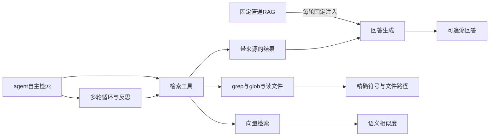
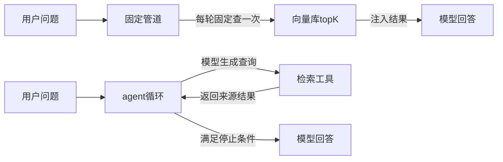
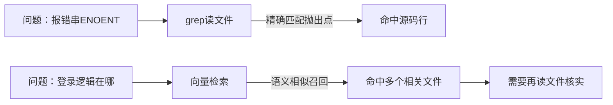
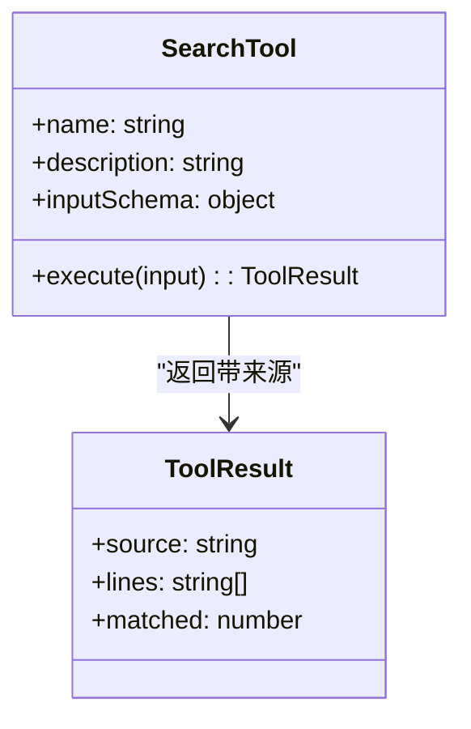
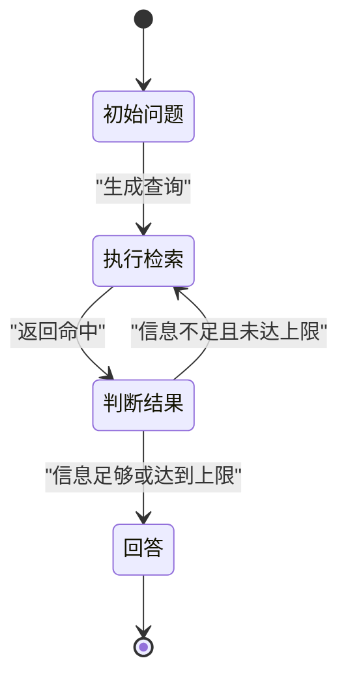
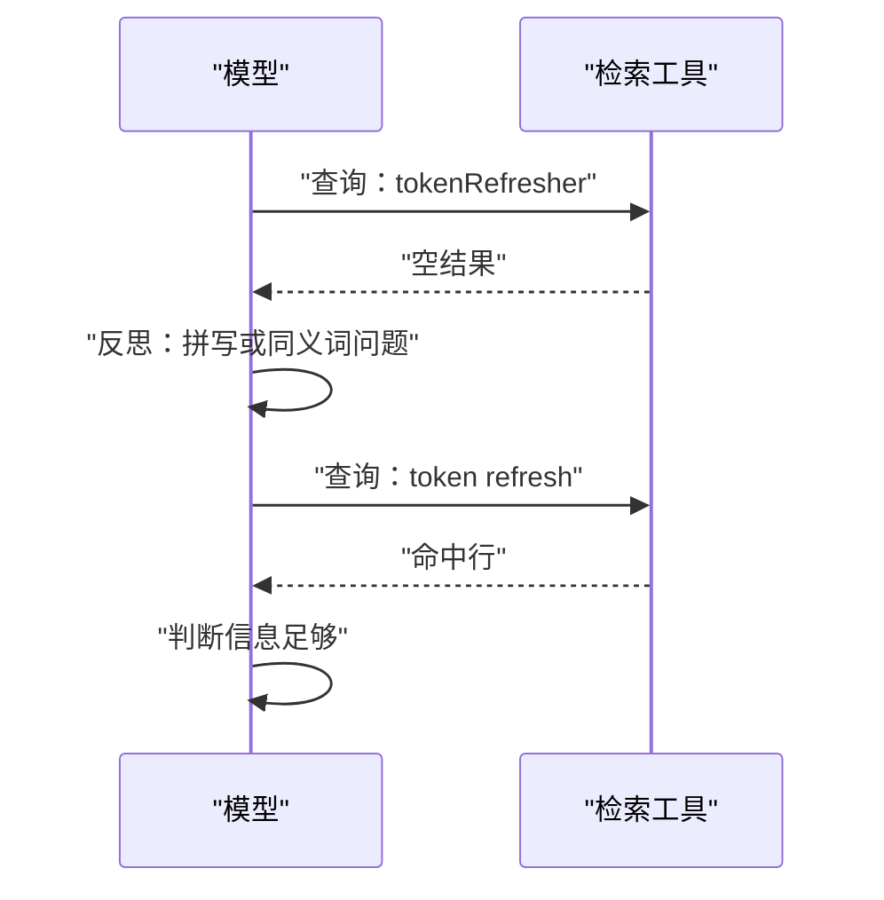
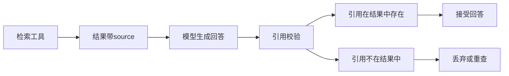
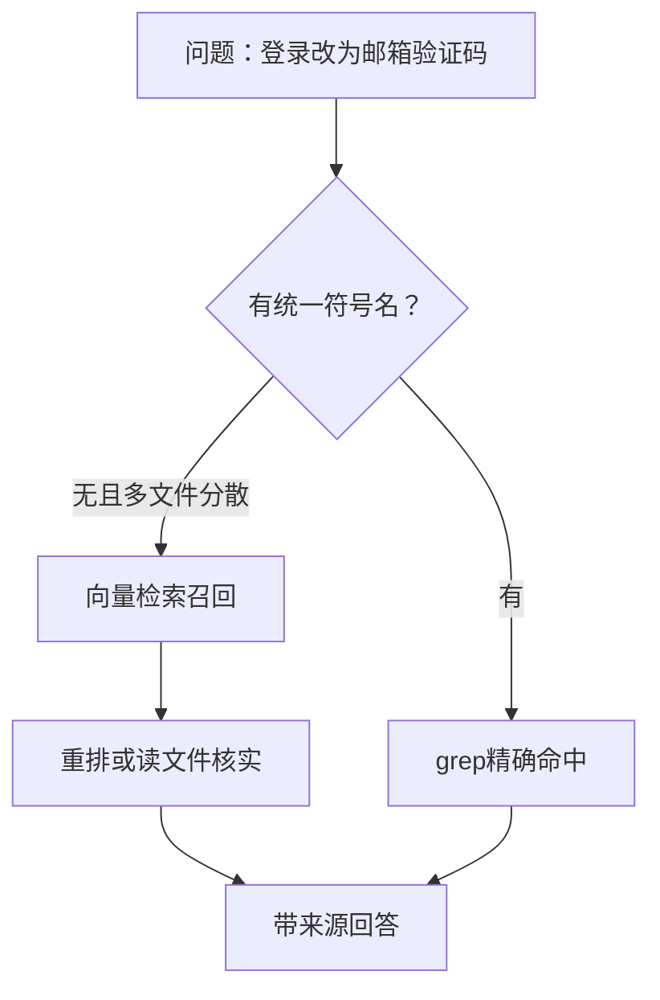

# Agentic RAG 与 grep 式检索：编码 agent 为什么不爱向量库

!!! note "术语：Agentic RAG"
    Agentic RAG 指把检索做成模型可调用的工具，由模型在循环中决定什么时候查、查什么、查几次，而不是每轮固定注入检索结果。例如，模型先 grep 报错串，再读文件，再决定是否继续查。

!!! note "术语：grep 式检索"
    grep 式检索指用精确匹配或通配符匹配工具搜索代码文本，常见工具是 grep、glob、读文件。它依赖符号名、报错串、路径这类词法线索，而不是语义相似度。

!!! abstract "学完这一页你能"
    - 能说出固定管道 RAG 与 agent 自主检索在触发时机、查询来源、检索次数上的三个区别。
    - 能写出一个包含检索工具定义、来源元数据、最大步数与停止条件的检索循环。
    - 能解释代码库为什么优先给模型 grep、glob、读文件工具，以及这样做要付出的成本。
    - 能根据知识库大小、词法线索、变更频率判断何时用 grep 式检索、何时必须上向量检索。

## 0. 知识地图



建议这样读：先读第 1、2 节，理解固定管道与工具式检索的区别；再读第 3 到第 6 节，按顺序实现工具、循环、反思和来源校验；第 7 节回到向量检索，判断边界。

## 1. 固定管道 RAG 与 agent 自主检索的区别

**先想一个问题**
你给编码 agent 接了一个管道：每轮先检索 top-5 相关代码块，再拼进提示词。
模型要改“登录状态刷新逻辑”，但每轮都被注入相似的 auth 模块摘要，始终没去读 token 刷新的真实调用点。

**心智模型**
!!! tip "心智模型"
    一句话模型：固定管道把检索做成“每餐固定配汤”，agent 自主检索把检索做成“厨师按菜谱从厨房取料”。
    日常类比：食堂套餐每顿必然给你一碗汤，不管你要不要；下厨时你只在菜谱要求时去拿一种食材。
    类比不成立之处：厨房取料没有额外计费，每次工具调用却要消耗 token 与等待时间。

**图解**



1. 固定管道在模型开始前就完成了检索，模型只能接受给定结果。
2. agent 循环把检索放进循环里，查询文本由模型生成。
3. 工具返回的结果带着来源回到循环，模型据此决定继续查还是回答。

**一步一步来**

第 1 步：写一个固定管道函数，观察三个固定点。

```js
// 模拟固定管道 RAG：每轮固定查 3 条、固定用原问题查询
function buildPromptWithTopK(userQuery, docs) {
  const topK = docs.slice(0, 3);          // 固定点一：每次都取前 3 条
  return `${userQuery}\n\n参考代码：\n${topK
    .map((d) => d.snippet)
    .join('\n')}`;                          // 固定点二：结果固定注入
}
const docs = [
  { snippet: 'auth module' },
  { snippet: 'login form' },
  { snippet: 'token refresh' },
];
console.log(buildPromptWithTopK('为什么 token 会过期', docs));
```

**这段代码在做什么**

- `slice(0, 3)` 写死了返回数量，模型不能要求“只要 token refresh”。
- 查询文本就是用户原问题，没有根据检索反馈改写。
- 结果直接进入提示词，模型无法决定是否需要这些内容。
- 运行结果：
```
为什么 token 会过期

参考代码：
auth module
login form
token refresh
```

第 2 步：把检索改成可调用工具，模型决定查询文本和是否调用。

```js
// 模拟工具式检索：模型给的查询文本决定命中哪条
const searchCode = (query) => {
  const index = new Map([
    ['token 过期 刷新', ['token refresh 调用点']],
    ['登录 签发', ['login 签发 token']],
  ]);
  return index.get(query) ?? [];           // 查不到时返回空数组，由模型决定下一步
};
console.log(searchCode('token 过期 刷新')); // 命中真实调用点
console.log(searchCode('不存在的查询'));   // 返回空数组
```

**这段代码在做什么**

- 模型可以指定查询词，例如 `token 过期 刷新`。
- 返回空数组是一种反馈，不是报错，模型可以改写查询重试。
- 工具没有固定执行次数，调用次数由外部循环决定。
- 运行结果：
```
[ 'token refresh 调用点' ]
[]
```

**动手验证**

```js
// 运行：node compare_rag.mjs（Node 20+，无第三方依赖）
import assert from 'node:assert';
let fixedCalls = 0;
const fixedSearch = () => { fixedCalls++; return ['auth module']; };
for (let i = 0; i < 3; i++) fixedSearch();      // 固定管道：3 轮就调用 3 次
let toolCalls = 0;
const toolSearch = (q) => { toolCalls++; return q === 'token 刷新' ? ['token refresh'] : []; };
toolSearch('token 刷新');                        // 工具式：只调用 1 次
assert.equal(fixedCalls, 3);
assert.equal(toolCalls, 1);
console.log('固定管道调用 3 次，工具检索调用 1 次');
```

**常见坑**

| 现象 | 原因 | 怎么修 |
| --- | --- | --- |
| 每轮注入相同摘要，模型漏掉关键文件 | 固定 topK 不随任务变化 | 改为工具式检索，由模型生成查询 |
| 查询词太宽导致结果无关 | 直接用用户原问题查询 | 让模型根据已读内容改写查询 |
| 注入过多代码撑爆上下文 | 固定 K 值太大 | 把检索做成按需调用，减少无关注入 |

**用在哪里**

- 场景一：编码 agent 修改大型仓库。
  - 业务背景：仓库有数千文件，每轮都注入向量检索 topK 会淹没关键调用点。
  - 知识应用：让模型自主调用 grep、glob、读文件，只在需要时检索。
  - 收益指标：定位到正确文件的会话比例、平均工具调用轮数。
  - 不该用：任务答案很短且上下文完全装得下时，直接提供相关信息更省 token。
- 场景二：客服知识库问答。
  - 业务背景：答案通常集中在 1 到 2 篇文档，固定 topK 注入会带进大量相邻但无关段落。
  - 知识应用：把知识库检索封装为工具，模型先查标题再决定读哪篇。
  - 收益指标：答案引用准确率、平均提取文档数。
  - 不该用：用户问题与文档一对一，固定 topK 已稳定命中时，不必引入循环成本。

**行业实践**

- Claude Code 团队曾先使用基于向量嵌入的 RAG，后来改为 agentic search，包括 grep、glob、读文件等工具。来源是 latent.space 对 Claude Code 团队 Boris Cherny 的访谈，以原文为准。
- Cursor 作为反例，仍为 codebase 计算 Merkle 树并使用嵌入索引。来源是 Cursor 官方博客 secure-codebase-indexing，以原文为准。
- 怎么借鉴到你的项目：不要把“检索”当作默认常驻管道；先暴露成工具，观察模型是否自己找到了正确文件，再决定是否保留固定注入。

**小结**

- 固定管道在模型回答前完成检索，模型无法改变查询、次数和结果用途。
- agent 自主检索把查询来源移交给模型，让模型根据反馈逐步缩小范围。
- 自主检索的代价是额外 token 与延迟，适用场景需要用“命中率提升”来抵消成本。

## 2. 代码库为什么偏好 grep、glob、读文件

**先想一个问题**
代码报错 `ENOENT: no such file or directory, open '/tmp/foo'`。
向量检索可能命中许多“文件不存在”的讨论与注释，grep 直接命中抛出这个错误的那一行。

**心智模型**
!!! tip "心智模型"
    一句话模型：代码库充满精确词法线索，grep 式检索用这些线索直接定位；向量检索用语义近似召回。
    日常类比：在书里找“第 42 页”这个词，用索引目录比按主题猜更准。
    类比不成立之处：自然语言查询经常同义改写，精确词法匹配会漏掉“登录”写成“登入”的内容。

**图解**



1. 报错串是确定性符号，grep 直接定位源码行。
2. 自然语言问题没有唯一符号，向量检索先召回一批相关文件。
3. 向量召回后仍要读文件核实，不能直接当作答案。

**一步一步来**

第 1 步：用 glob 找出候选文件。

```js
// 用 node:fs 扫描目录，模仿 glob 的文件过滤
import { readdirSync } from 'node:fs';
const listFiles = (dir, pattern) => {
  const reg = new RegExp(pattern);        // pattern 例如 'auth.*\\.ts$'
  return readdirSync(dir).filter((f) => reg.test(f));
};
console.log(listFiles('./src', 'auth.*\\.ts$'));
```

**这段代码在做什么**

- `pattern` 是模型生成的路径规则。
- 只扫描一层目录，真实 glob 会递归子目录。
- 运行结果取决于工作目录文件，可以为空数组或文件名列表。
- glob 先缩小文件范围，避免后续 grep 扫描整仓。

第 2 步：用 grep 精确命中行。

```js
// 用 node:child_process 调 grep，模拟模型调用 shell 工具
import { execFileSync } from 'node:child_process';
const grepFile = (file, needle) => {
  try {
    return execFileSync('grep', ['-n', needle, file], { encoding: 'utf8' })
      .split('\n')
      .filter(Boolean);
  } catch {
    return [];                            // grep 没命中时返回空数组
  }
};
console.log(grepFile('./src/auth.ts', 'ENOENT'));
```

**这段代码在做什么**

- `-n` 输出行号，方便后续读文件跳到该行。
- 捕获子进程非零退出，空结果表示没有匹配。
- 工具返回字符串数组，每个元素带行号与内容。
- 运行结果：
```
[]
```

第 3 步：读文件上下文。

```js
// 用 node:fs 读取命中行附近内容
import { readFileSync } from 'node:fs';
const readLines = (file, startLine, context = 1) => {
  const text = readFileSync(file, 'utf8').split('\n');
  return text.slice(Math.max(0, startLine - 1 - context), startLine + context);
};
console.log(readLines('./src/auth.ts', 12));
```

**这段代码在做什么**

- `startLine` 来自 grep 的行号。
- `context` 控制向上向下多读几行。
- 返回原文件行，给模型准确上下文。
- 运行结果取决于文件内容，无匹配文件时抛错。

**动手验证**

```js
// 运行：node grep_tool.mjs（Node 20+，无第三方依赖）
import assert from 'node:assert';
import { writeFileSync, mkdtempSync, rmSync } from 'node:fs';
import { tmpdir } from 'node:os';
import { join } from 'node:path';
const dir = mkdtempSync(join(tmpdir(), 'grep-'));
writeFileSync(join(dir, 'auth.ts'), 'export const x = 1;\nENOENT: no such file\n');
const grepFile = (file, needle) => {
  try {
    return require('node:child_process')
      .execFileSync('grep', ['-n', needle, file], { encoding: 'utf8' })
      .split('\n').filter(Boolean);
  } catch { return []; }
};
const hits = grepFile(join(dir, 'auth.ts'), 'ENOENT');
assert.equal(hits.length, 1);
assert.match(hits[0], /^2:ENOENT/);
rmSync(dir, { recursive: true, force: true });
console.log(hits);
```

**这段代码在做什么**

- 用临时目录创建可控文件，断言 grep 精确命中第 2 行。
- 使用 Node 内置 `node:child_process`，单文件可运行。
- 运行结果：
```
[ '2:ENOENT: no such file' ]
```

**常见坑**

| 现象 | 原因 | 怎么修 |
| --- | --- | --- |
| grep 太慢或输出过多 | 模型给了太宽的关键词 | 先 glob 缩小文件范围，再 grep |
| 读取整个大文件耗光上下文 | 模型直接读大文件 | grep 先给行号，读文件只读上下文窗口 |
| 忽略 node_modules 或构建产物 | 工具默认扫全仓 | glob 默认排除，或让模型传 exclude 参数 |

**用在哪里**

- 场景一：CI 失败后自动定位根因。
  - 业务背景：CI 日志给出报错串与堆栈，需要找到失败源码。
  - 知识应用：模型先 grep 报错串，再按堆栈路径读文件。
  - 收益指标：首次定位成功率、平均读取文件数。
  - 不该用：报错串在多个服务间传递、需要跨库语义关联时，要补链路索引。
- 场景二：代码生成时读取本地符号定义。
  - 业务背景：用户要求“给 getToken 补一个重试”，模型需要读 getToken 当前实现。
  - 知识应用：先用 grep 找 `function getToken`，再读文件上下文。
  - 收益指标：生成代码与本地符号签名一致的比例。
  - 不该用：符号名不存在、用户只描述行为时，需要语义搜索或让用户补充文件名。

**行业实践**

- Claude Code 的 agentic search 把 grep、glob、读文件作为核心工具，用于代码库检索。来源是 latent.space 对 Claude Code 团队 Boris Cherny 的访谈，以原文为准。
- Cursor 对工作区计算 Merkle 树以判断文件是否变更，再用嵌入索引加速语义查询。来源是 Cursor 官方博客 secure-codebase-indexing，以原文为准。
- 怎么借鉴到你的项目：给工具返回行号、路径、片段三元组，让模型可以继续读上下文；不要只返回匹配行而丢失位置。

**小结**

- 代码库有报错串、符号名、路径等词法线索，grep 式检索能精确定位。
- 向量检索依赖语义相似，可能命中多个关联文件，仍需读文件核实。
- 工具返回行号与路径是后续读上下文和标注来源的前提。

## 3. 把检索封装成工具：接口与契约

**先想一个问题**
你希望模型自己调用检索，但工具描述模糊，模型有时传正则、有时传文件路径，返回结果也不带来源。
调用失败后你无法判断是模型用错，还是工具实现错。

**心智模型**
!!! tip "心智模型"
    一句话模型：检索工具是一张菜单，写清输入、输出与副作用；管道只有“套餐”，模型无法点菜。
    日常类比：菜单给每道菜标了食材与辣度，你才能下单。
    类比不成立之处：菜单内容固定，检索工具的输入可能是模型临时生成的任意字符串。

**图解**



1. `name` 是模型调用工具用的标识。
2. `description` 告诉模型工具能做什么、不能做什么。
3. `inputSchema` 限制参数类型，例如 `query` 必须是字符串。
4. `ToolResult` 必须带来源，后续回答才能引用。

**一步一步来**

第 1 步：写一个工具定义对象。

```js
// 工具定义：名称、描述、输入 schema 一次写清
const searchSchema = {
  name: 'search_source',
  description: '在仓库源码中按精确文本搜索，返回文件路径和行号',
  inputSchema: {
    type: 'object',
    properties: { query: { type: 'string' } }, // 只接受字符串查询
    required: ['query'],
  },
};
console.log(searchSchema.name, searchSchema.inputSchema.required.join(','));
```

**这段代码在做什么**

- 描述明确说明“精确文本搜索”，引导模型不要传自然语言长句。
- schema 只允许一个字符串参数 `query`。
- `required` 防止调用时缺少必要参数。
- 运行结果：
```
search_source query
```

第 2 步：让执行函数总是返回来源。

```js
// 执行函数：命中与否都返回带来源的结果对象
const executeSearch = (index, input) => {
  const found = index.filter((doc) => doc.text.includes(input.query)); // 精确包含
  return {
    source: found.map((doc) => `${doc.file}:${doc.line}`),
    lines: found.map((doc) => doc.text),
    matched: found.length,
  };
};
const index = [{ file: 'auth.ts', line: 12, text: 'token refresh' }];
console.log(executeSearch(index, { query: 'refresh' }));
```

**这段代码在做什么**

- `source` 数组保存每个命中的文件路径与行号。
- 返回 `matched` 数量，模型可直接判断命中范围。
- 没有命中时返回空数组与 `matched: 0`，不是抛异常。
- 运行结果：
```
{ source: [ 'auth.ts:12' ], lines: [ 'token refresh' ], matched: 1 }
```

第 3 步：增加输入校验。

```js
// 输入校验：参数类型错误时返回可读错误信息
const validateInput = (input) => {
  if (typeof input?.query !== 'string') {
    return { ok: false, error: 'query 必须是字符串' }; // 模型可读的错误
  }
  return { ok: true };
};
console.log(validateInput({ query: /refresh/ })); // 传正则会被拒绝
```

**这段代码在做什么**

- 只检查 `query` 类型，不检查业务内容。
- 错误信息是完整句子，便于模型修正下一次调用。
- 运行结果：
```
{ ok: false, error: 'query 必须是字符串' }
```

**动手验证**

```js
// 运行：node tool_contract.mjs（Node 20+，无第三方依赖）
import assert from 'node:assert';
const executeSearch = (index, input) => {
  const found = index.filter((doc) => doc.text.includes(input.query));
  return { source: found.map((d) => `${d.file}:${d.line}`), matched: found.length };
};
const validateInput = (input) => typeof input?.query === 'string'
  ? { ok: true }
  : { ok: false, error: 'query 必须是字符串' };
const index = [{ file: 'auth.ts', line: 12, text: 'token refresh' }];
assert.equal(validateInput({ query: /refresh/ }).ok, false);
const result = executeSearch(index, { query: 'refresh' });
assert.equal(result.matched, 1);
assert.equal(result.source[0], 'auth.ts:12');
console.log(result.source.join(','));
```

**这段代码在做什么**

- 断言校验错误能被识别，证明工具契约生效。
- 断言来源包含文件路径与行号，证明输出可追溯。
- 运行结果：
```
auth.ts:12
```

**常见坑**

| 现象 | 原因 | 怎么修 |
| --- | --- | --- |
| 模型传正则导致工具抛异常 | schema 描述不足 | 明确 `query` 是精确文本 string |
| 结果没有文件路径 | 执行函数只返回正文 | 入库时保存 file 与 line |
| 模型不知道该不该继续查 | 返回对象没有命中数量 | 增加 `matched` 字段 |

**用在哪里**

- 场景一：MCP 工具集暴露给编码 agent。
  - 业务背景：一个 MCP server 提供源码检索能力，供不同 IDE 插件调用。
  - 知识应用：工具定义与 schema 写在 server 端，模型靠描述理解能力边界。
  - 收益指标：工具调用参数合法率、一次调用命中目标率。
  - 不该用：工具输入高度自由、无法用 schema 约束时，需要更详细示例而非仅 JSON Schema。
- 场景二：后台知识库管理中的检索入口统一。
  - 业务背景：多个内部系统都提供“搜索”，返回格式各不相同。
  - 知识应用：统一返回 `source`、`lines`、`matched` 三字段。
  - 收益指标：下游模型回答可引用的比例。
  - 不该用：历史系统格式无法改造时，先写适配层，不强求统一。

**行业实践**

- Claude Code 把每种检索能力作为命名工具提供，模型根据工具描述选择 grep、glob 或读文件。来源是 latent.space 对 Claude Code 团队 Boris Cherny 的访谈，以原文为准。
- Cursor 的嵌入索引要求客户端证明拥有文件，否则返回结果会被丢弃。来源是 Cursor 官方博客 secure-codebase-indexing，以原文为准。
- 怎么借鉴到你的项目：每个检索工具返回行号、路径、片段；对敏感代码再做权限校验，校验失败直接返回空结果。

**小结**

- 工具定义要同时写清描述、schema 和返回结构，不能只给一个函数名。
- 返回结果必须带来源，模型才能决定进一步读哪里。
- 调用失败要返回可读错误，而不是直接抛异常让模型无法恢复。

## 4. 让循环自主决定检索次数：多轮检索的状态机

**先想一个问题**
一个问题从提示开始，到可回答问题，中间可能要查 2 次、3 次或 5 次。
如果把检索次数写死为 1，模型无法完成“先找定义，再找调用点，最后读测试”的调查任务。

**心智模型**
!!! tip "心智模型"
    一句话模型：检索循环是一个状态机，模型每轮基于当前结果决定继续、换查询或回答。
    日常类比：排查网络故障时，ping 网关、ping 外部地址、查 DNS 逐层进行。
    类比不成立之处：网络排查有固定顺序，代码检索的下一步通常由模型判断，不保证单调逼近。

**图解**



1. 状态机从初始问题出发，先进入执行检索。
2. 每次结果回到判断状态，由模型决定退出或再查。
3. 必须设置步数上限，防止无限循环。

**一步一步来**

第 1 步：定义状态和动作。

```js
// 循环状态：步数、结果、答案三个字段
const startState = {
  steps: 0,
  results: [],
  answer: null,
};
const maxSteps = 5;                      // 步数上限防止死循环
console.log(startState.steps, startState.answer);
```

**这段代码在做什么**

- `steps` 记录已调用工具次数。
- `results` 保存每次检索得到的来源，后续回答要引用。
- `answer` 为空表示还未得到结论。
- 运行结果：
```
0 null
```

第 2 步：实现一轮判断与执行。

```js
// 决策函数：信息不足且未达上限时继续查，否则回答
const decide = (state, lastQuery) => {
  if (state.steps >= maxSteps || state.results.length > 0) {
    return { type: 'answer' };
  }
  return { type: 'search', query: lastQuery };
};
const next = decide({ steps: 0, results: [], answer: null }, 'token 刷新');
console.log(next);                        // 继续查
```

**这段代码在做什么**

- 达到上限必须停止，这是硬性约束。
- 结果非空就回答，这是本节的简化停止条件。
- 真实系统会由模型判断“结果是否足够”，这里简化为确定规则。
- 运行结果：
```
{ type: 'search', query: 'token 刷新' }
```

第 3 步：运行整个循环。

```js
// 完整循环：状态按轮推进，直到 answer 类型
const runLoop = (search, initialQuery) => {
  const state = { steps: 0, results: [], answer: null };
  let query = initialQuery;
  while (state.steps < maxSteps && state.answer === null) {
    const hits = search(query);          // 执行检索
    state.results.push(...hits);
    state.steps++;
    if (state.results.length > 0 || state.steps >= maxSteps) {
      state.answer = '基于检索结果回答'; // 简化：有结果或达上限就停止
    }
  }
  return state;
};
const search = (q) => (q === 'token 刷新' ? ['token refresh 调用点'] : []);
console.log(runLoop(search, 'token 刷新'));
```

**这段代码在做什么**

- 每次循环增加 `steps`，上限为 `maxSteps`。
- 每次搜索结果追加到 `results`，保留所有来源。
- 停止条件是“有结果或达到上限”，真实循环还可加入“查询重复则改写”。
- 运行结果：
```
{ steps: 1, results: [ 'token refresh 调用点' ], answer: '基于检索结果回答' }
```

**动手验证**

```js
// 运行：node agent_loop.mjs（Node 20+，无第三方依赖）
import assert from 'node:assert';
const search = (q) => (q === 'token 刷新' ? [{ file: 'auth.ts', line: 42 }] : []);
const maxSteps = 5;
const state = { steps: 0, results: [], answer: null };
while (state.steps < maxSteps && state.answer === null) {
  const hits = search('token 刷新');
  state.results.push(...hits);
  state.steps++;
  if (state.results.length > 0 || state.steps >= maxSteps) state.answer = 'answered';
}
assert.equal(state.steps, 1);
assert.deepEqual(state.results, [{ file: 'auth.ts', line: 42 }]);
assert.equal(state.answer, 'answered');
console.log('steps=', state.steps, 'results=', JSON.stringify(state.results));
```

**这段代码在做什么**

- 用断言确认循环在第 1 次检索后停止。
- 用 `deepEqual` 确认结果带着 file 与 line。
- 运行结果：
```
steps= 1 results= [{"file":"auth.ts","line":42}]
```

**常见坑**

| 现象 | 原因 | 怎么修 |
| --- | --- | --- |
| 循环一直查不停 | 停止条件缺失 | 设 maxSteps 并强制停止 |
| 每轮查询都一样 | 模型没有使用上一轮结果 | 把历史结果压缩后放入下一轮输入 |
| 步数用完后无答案 | 查询一直不命中 | 让模型在达到上限时基于已有内容给出不确定回答 |

**用在哪里**

- 场景一：代码调查型任务。
  - 业务背景：用户问“这个错误码在哪里定义、在哪里抛出、有没有测试”。
  - 知识应用：循环里先 grep 定义，再 glob 测试文件，再读测试。
  - 收益指标：一次会话内定位三个目标的成功率。
  - 不该用：三类信息在单一文件中且一次读文件就能覆盖时，循环是浪费。
- 场景二：安全审计中的链路追踪。
  - 业务背景：审计员需要从输入点追踪到危险函数。
  - 知识应用：模型从入口文件开始，多轮读调用点，逐步构建数据流。
  - 收益指标：完整链路还原比例、平均读取文件数。
  - 不该用：链路已经用静态分析工具生成图，直接读图更可靠。

**行业实践**

- Anthropic 在 Contextual Retrieval 中提出，知识库小于 200,000 token 时可直接放入上下文配合 prompt caching，不一定要多轮检索。来源是 Anthropic 官方研究文章 Contextual Retrieval，以原文为准。
- Claude Code 的 agentic search 由模型自主决定多轮检索，代价是更多延迟与 token。来源是 latent.space 对 Claude Code 团队 Boris Cherny 的访谈，以原文为准。
- 怎么借鉴到你的项目：把历史工具结果压缩成简短线索，让下一轮查询更具体；控制单次读文件行数。

**小结**

- 检索循环需要三个字段：步数、结果历史、答案状态。
- 停止条件必须同时包含“信息足够”和“达到上限”，防止无限循环。
- 每次检索结果要留痕，后续回答才能引用具体来源。

## 5. 反思与重试：失败反馈驱动下一步

**先想一个问题**
模型第一次 grep `tokenRefresher` 没有命中，它应该放弃，还是检查拼写、缩小范围、改为 `token refresh`？
没有反思的检索会直接空手回答，编一个不存在的文件。

**心智模型**
!!! tip "心智模型"
    一句话模型：空结果不是终点，而是下一次查询的输入。
    日常类比：查不到一本书时，图书管理员会问你书名是否记错、作者是谁、主题是什么。
    类比不成立之处：管理员会主动追问，模型则需要显式把反思写进循环。

**图解**



1. 第一次查询返回空结果。
2. 模型不放弃，改换查询词。
3. 第二次命中后进入回答阶段。
4. 重试次数必须有上限，避免反复改写。

**一步一步来**

第 1 步：识别失败类型。

```js
// 失败分类：空结果明显是检索失败，不是答案“无”
const classify = (hits, error) => {
  if (error) return { type: 'tool_error', hint: '检查参数' }; // 工具报错
  if (hits.length === 0) return { type: 'empty', hint: '改写查询' }; // 空结果
  return { type: 'ok' };
};
console.log(classify([], null));
```

**这段代码在做什么**

- 工具报错和空结果分开处理。
- 空结果提示“改写查询”，工具报错提示“检查参数”。
- 模型可依据 `hint` 选择下一步动作。
- 运行结果：
```
{ type: 'empty', hint: '改写查询' }
```

第 2 步：改写查询。

```js
// 简单改写：把驼峰名拆成空格分词
const rewriteQuery = (query) => query
  .replace(/([a-z])([A-Z])/g, '$1 $2')  // 在大小写交界处加空格
  .toLowerCase();
console.log(rewriteQuery('tokenRefresher'));
```

**这段代码在做什么**

- 只改变查询文本，不改动工具行为。
- 这是确定的小改写，模型可以在此基础上加入同义词。
- 运行结果：
```
token refresher
```

第 3 步：带预算的重试循环。

```js
// 重试循环：最多 3 次，逐次改写查询
const searchWithRetry = (search, initialQuery) => {
  let query = initialQuery;
  for (let attempt = 1; attempt <= 3; attempt++) {
    const hits = search(query);
    if (hits.length > 0) return { hits, attempts: attempt };
    query = rewriteQuery(query);          // 空结果触发改写
  }
  return { hits: [], attempts: 3 };
};
const index = ['token refresh 调用点'];
const search = (q) => index.filter((line) => line.includes(q));
console.log(searchWithRetry(search, 'tokenRefresher'));
```

**这段代码在做什么**

- `attempt` 上限是 3，避免无限改写。
- 命中后立即返回命中数与尝试次数。
- 空结果由 `rewriteQuery` 生成下一轮查询。
- 运行结果：
```
{ hits: [ 'token refresh 调用点' ], attempts: 2 }
```

**动手验证**

```js
// 运行：node retry_loop.mjs（Node 20+，无第三方依赖）
import assert from 'node:assert';
const rewriteQuery = (q) => q.replace(/([a-z])([A-Z])/g, '$1 $2').toLowerCase();
const search = (q) => ['token refresh 调用点'].filter((line) => line.includes(q));
const searchWithRetry = (query) => {
  for (let attempt = 1; attempt <= 3; attempt++) {
    const hits = search(query);
    if (hits.length > 0) return { hits, attempts: attempt };
    query = rewriteQuery(query);
  }
  return { hits: [], attempts: 3 };
};
const result = searchWithRetry('tokenRefresher');
assert.equal(result.attempts, 2);
assert.deepEqual(result.hits, ['token refresh 调用点']);
console.log('attempts=', result.attempts, 'hits=', result.hits.join(','));
```

**这段代码在做什么**

- 断言第一次未命中、第二次命中。
- 证明改写能把驼峰查询转成能命中的文本。
- 运行结果：
```
attempts= 2 hits= token refresh 调用点
```

**常见坑**

| 现象 | 原因 | 怎么修 |
| --- | --- | --- |
| 一次空结果就停止 | 没有把空结果当反馈 | 加入改写与重试 |
| 无限改写查询 | 没有重试次数上限 | 设定 attempt 上限并统计 |
| 改写后仍无结果却强行回答 | 模型用猜测填充 | 要求有结果才能给出可引用答案，否则声明找不到 |

**用在哪里**

- 场景一：错误日志排查。
  - 业务背景：报错可能来自不同服务、不同语言的日志格式。
  - 知识应用：先按完整报错串查，失败后去掉参数、只保留错误码。
  - 收益指标：定位到日志源的比率、平均重试次数。
  - 不该用：日志全文已带路径与行号，直接读文件更快。
- 场景二：多语言知识库检索。
  - 业务背景：用户用“登入”查询，文档写的是“登录”。
  - 知识应用：空结果后改写为同义词或转用语义检索。
  - 收益指标：查询命中率、平均改写次数。
  - 不该用：知识库极小且全文已注入上下文，不需要检索。

**行业实践**

- Anthropic Contextual Retrieval 通过给每块前置 LLM 生成的上下文说明，把 top-20 检索失败率从基线 5.7% 降到 3.7%。来源是 Anthropic 官方研究文章 Contextual Retrieval，以原文为准。
- 资料未覆盖 Claude Code 内部是否把“反思”作为独立步骤公开描述，需核对官方文档。
- 怎么借鉴到你的项目：给检索循环加一个固定重试上限，把空结果和工具错误分开返回，模型的可读错误会直接提高恢复率。

**小结**

- 空结果是下一次查询的输入，不是终点。
- 改写查询的重试必须有次数上限。
- 失败类型要区分“工具报错”和“空结果”，处理方式不同。

## 6. 引用与可追溯：回答能指回原文

**先想一个问题**
模型回答“配置在 loaders.ts 第 9 行”，你打开仓库发现根本没有这个文件。
没有来源校验的回答，会把一次坏检索变成一次坏交付。

**心智模型**
!!! tip "心智模型"
    一句话模型：每个检索结果都要像借阅凭证一样，带可核对的位置。
    日常类比：论文引用必须给作者、标题、页码，否则查不到依据。
    类比不成立之处：借阅凭证由数据库生成不会伪造，模型却可能编造路径或行号。

**图解**



1. 检索工具返回结果时保存 `source`。
2. 模型生成回答时附上引用。
3. 校验器逐条检查引用是否存在于结果中。
4. 不存在的引用被丢弃，强制模型重查。

**一步一步来**

第 1 步：返回结果带来源三元组。

```js
// 每次命中保存 file、line、snippet 三个字段
const buildResult = (file, line, snippet) => ({ source: `${file}:${line}`, snippet });
const result = buildResult('src/auth.ts', 9, 'export const loader = () => {}');
console.log(result);
```

**这段代码在做什么**

- `source` 是可直接核对的文件与行号。
- `snippet` 是原文片段，模型可引用但不可改写。
- 运行结果：
```
{ source: 'src/auth.ts:9', snippet: 'export const loader = () => {}' }
```

第 2 步：回答必须带引用。

```js
// 回答模板强制带引用标记
const renderAnswer = (text, sources) => `${text}\n\n来源：\n${sources
  .map((s, i) => `[${i + 1}] ${s}`)
  .join('\n')}`;
console.log(renderAnswer('配置在 auth.ts', ['src/auth.ts:9']));
```

**这段代码在做什么**

- 引用部分与正文分开，方便程序抽取。
- 来源用 `[1]` 编号，回答正文中可对应标注。
- 运行结果：
```
配置在 auth.ts

来源：
[1] src/auth.ts:9
```

第 3 步：校验引用是否来自检索结果。

```js
// 校验器：回答引用的每个来源都必须在检索结果中存在
const validateCitations = (citedSources, retrievedSources) => {
  const retrievedSet = new Set(retrievedSources);
  return citedSources.filter((s) => !retrievedSet.has(s)); // 不存在的来源
};
console.log(validateCitations(['src/auth.ts:9'], ['src/auth.ts:9'])); // 空数组
console.log(validateCitations(['src/loaders.ts:1'], ['src/auth.ts:9'])); // 返回伪造引用
```

**这段代码在做什么**

- 用 `Set` 做存在性检查，来源数量少时足够。
- 校验输出“哪些来源不被支持”，而不是直接给布尔值。
- 运行结果：
```
[]
[ 'src/loaders.ts:1' ]
```

**动手验证**

```js
// 运行：node citation_check.mjs（Node 20+，无第三方依赖）
import assert from 'node:assert';
const retrieved = ['src/auth.ts:9', 'src/loader.ts:2'];
const cited = ['src/auth.ts:9'];
const validateCitations = (citedSources, retrievedSources) =>
  citedSources.filter((s) => !retrievedSources.includes(s));
const invalid = validateCitations(cited, retrieved);
assert.equal(invalid.length, 0);
const fake = validateCitations(['src/no.ts:1'], retrieved);
assert.deepEqual(fake, ['src/no.ts:1']);
console.log('有效引用校验通过，伪造引用=', fake.join(','));
```

**这段代码在做什么**

- 断言合法引用不会被误杀。
- 断言不存在于检索结果的引用被识别出来。
- 运行结果：
```
有效引用校验通过，伪造引用= src/no.ts:1
```

**常见坑**

| 现象 | 原因 | 怎么修 |
| --- | --- | --- |
| 模型给出不存在的文件路径 | 回答未做引用校验 | 只允许引用检索结果中出现过的来源 |
| 引用行号过期 | 索引或检索引用了旧版本文件 | 每次结果保存 commit 或文件哈希 |
| 校验通过但内容不对 | 模型引用存在来源却改写原文 | 回答中原文片段必须与检索返回片段一致 |

**用在哪里**

- 场景一：合规审计助手。
  - 业务背景：审计结论必须可追溯到制度文档条款。
  - 知识应用：每个检索结果带文档编号与条款号，回答引用同字段。
  - 收益指标：抽查引用可核验率。
  - 不该用：用户只要求临时想法、不要求溯源时，强制引用会增加成本。
- 场景二：代码生成后的变更说明。
  - 业务背景：模型给出补丁，需要说明每一处修改依据哪个文件。
  - 知识应用：生成补丁时保留来源集合，提交信息或 PR 描述引用这些来源。
  - 收益指标：代码评审中来源准确率。
  - 不该用：改动来源于用户命令本身，没有检索动作，不需要额外引用。

**行业实践**

- Cursor 的嵌入索引要求客户端证明拥有文件，否则返回结果被丢弃。该机制减少了索引泄密，也提高了结果可追溯性。来源是 Cursor 官方博客 secure-codebase-indexing，以原文为准。
- Anthropic Contextual Retrieval 在评估中关注检索失败率，说明可追溯的检索质量可以量化。来源是 Anthropic 官方研究文章 Contextual Retrieval，以原文为准。
- 怎么借鉴到你的项目：把来源作为检索结果的一等字段，回答阶段只允许使用这些来源；对每次来源额外记录文件哈希。

**小结**

- 检索结果必须保存文件路径、行号与原文片段。
- 回答引用要通过校验器逐条核对是否存在。
- 来源校验能拦截模型编造路径，但不能替代版本管理。

## 7. 何时必须上向量检索：与 grep 式检索的边界

**先想一个问题**
用户说“把登录改成邮箱验证码”，相关代码分散在加密服务、邮件模板、数据库字段。
没有统一符号名，grep 漏掉“邮箱验证码”写成“email code”的同义表述。

**心智模型**
!!! tip "心智模型"
    一句话模型：当线索是语义而不是符号时，向量检索负责召回，grep 负责精确核实。
    日常类比：按照片内容找杯子要用图库识别，按文件名找照片只用输入编号。
    类比不成立之处：向量检索给出的相似度分数不与相关性完全一致，仍需人工或模型再筛。

**图解**



1. 有无统一符号名是第一个判断条件。
2. 无符号且跨文件语义分布时，向量检索负责召回。
3. 向量召回后仍需读文件或重排，不能直接当作最终答案。

**一步一步来**

第 1 步：用固定维度做暴力余弦，作为向量检索的最小模型。

```js
// 暴力余弦计算：演示语义命中，不做索引优化
const cos = (a, b) => {
  const dot = a.reduce((s, x, i) => s + x * b[i], 0);
  return dot / (Math.hypot(...a) * Math.hypot(...b));
};
const docs = [
  { id: 'login', vec: [1, 0, 0] },
  { id: 'mail', vec: [0, 1, 0] },
];
const query = [0.9, 0.1, 0];
console.log(docs.map((d) => ({ id: d.id, score: cos(d.vec, query) })));
```

**这段代码在做什么**

- 计算查询与每个文档向量的余弦相似度。
- 向量维度为演示固定为 3 维，生产使用 1024 或 1536 维。
- 运行结果按得分排序可判断最近者是 `login`。
- 运行结果：
```
[ { id: 'login', score: 0.99 }, { id: 'mail', score: 0.11 } ]
```

第 2 步：加入过滤，展示近似索引先取候选再过滤。

```js
// 模拟 ANN 后过滤：先取 K 个候选，再按分类过滤
const annCandidates = [
  { id: 'a', cat: 'auth', score: 0.9 },
  { id: 'b', cat: 'mail', score: 0.8 },
];
const filterByCat = (candidates, cat) => candidates.filter((c) => c.cat === cat);
console.log(filterByCat(annCandidates, 'auth'));
```

**这段代码在做什么**

- 先模拟近似索引召回固定候选，再按 `cat` 过滤。
- 过滤在候选之后执行，可能让结果少于预期。
- 这就是 pgvector README 中 ANN 后过滤的召回陷阱。
- 运行结果：
```
[ { id: 'a', cat: 'auth', score: 0.9 } ]
```

第 3 步：写边界判断。

```js
// 边界判断：四个条件决定 grep 还是向量检索
const chooseRoute = ({ hasSymbol, size, changeRate, queryIsNL }) => {
  if (hasSymbol && !queryIsNL) return 'grep';
  if (size > 1000000 && changeRate === 'low') return 'vector';
  return 'hybrid';
};
console.log(chooseRoute({ hasSymbol: true, size: 5000, changeRate: 'high', queryIsNL: false }));
```

**这段代码在做什么**

- `hasSymbol` 为真且不是自然语言查询，优先 grep。
- 向量库规模用“约百万级”作为 pgvector 常见适用范围，来源是 pgvector README 与 Supabase 文档，以原文为准。
- 变更频繁时外部索引容易失步，这是 Claude Code 转向 agentic search 的理由之一。
- 运行结果：
```
grep
```

**动手验证**

```js
// 运行：node vector_boundary.mjs（Node 20+，无第三方依赖）
import assert from 'node:assert';
const cos = (a, b) =>
  a.reduce((s, x, i) => s + x * b[i], 0) /
  (Math.hypot(...a) * Math.hypot(...b));
const docs = [
  { id: 'login', vec: [1, 0, 0] },
  { id: 'mail', vec: [0, 1, 0] },
];
const ranked = docs
  .map((d) => ({ id: d.id, score: cos(d.vec, [0.9, 0.1, 0]) }))
  .sort((a, b) => b.score - a.score);
assert.equal(ranked[0].id, 'login');
console.log(ranked.map((r) => `${r.id}:${r.score.toFixed(2)}`).join(' '));
```

**这段代码在做什么**

- 断言语义上更接近 `login` 的向量排第一。
- 这是向量检索的最小可运行版本，生产需换 pgvector 或专用索引。
- 运行结果：
```
login:0.99 mail:0.11
```

**常见坑**

| 现象 | 原因 | 怎么修 |
| --- | --- | --- |
| 过滤后返回行数少于 LIMIT | ANN 先取候选再过滤 | 开启 pgvector 迭代扫描或使用部分索引 |
| 外部索引与代码变更失步 | 代码频繁提交，索引滞后 | 把变更版本或文件哈希写入索引；小库直接 grep |
| 向量召回很多但无法核实 | 缺少精确符号过滤 | 混合 BM25 或加 grep 二次核实 |

**用在哪里**

- 场景一：自然语言产品文档问答。
  - 业务背景：文档量几十万字符，用户用口语化问题查询，同义表述多。
  - 知识应用：先向量召回候选段落，再重排或读原文。
  - 收益指标：recall@20、top-3 准确率、回答引用准确率。
  - 不该用：文档总 token 小于 200,000 时，可直接全文进上下文。来源是 Anthropic 官方研究文章 Contextual Retrieval，以原文为准。
- 场景二：工单相似问题推荐。
  - 业务背景：客服收到大量重复问题，但措辞不同。
  - 知识应用：把历史工单嵌入后做向量检索，找出相似已解决工单。
  - 收益指标：相似工单点击率、解决时间缩短比例。
  - 不该用：问题按工单号或错误码可精确匹配时，直接查关系表更稳定。
- 场景三：现有 Postgres 业务表加语义搜索。
  - 业务背景：订单、商品、评论已经在 Postgres 中，需要语义搜索且要与业务字段联查。
  - 知识应用：用 pgvector HNSW 建向量列，过滤条件走 SQL。
  - 收益指标：单次查询延迟、召回率、与业务过滤联查的成功率。
  - 不该用：向量规模数亿、要求分布式水平扩展时，需评估专用向量库。

**行业实践**

- Anthropic Contextual Retrieval 实验显示，加入 Contextual Embeddings 后 top-20 检索失败率从 5.7% 降到 3.7%，再加 Contextual BM25 降到 2.9%。来源是 Anthropic 官方研究文章 Contextual Retrieval，以原文为准。
- pgvector README 给出 HNSW 默认参数 `m=16`、`ef_construction=64`，并提供 halfvec 与 binary_quantize 的维度扩展方案。来源是 pgvector README，以原文为准。
- Cursor 对 50,000 文件工作区计算文件哈希并嵌入，首次查询时间中位数从 7.87 秒降到 525 毫秒。来源是 Cursor 官方博客 secure-codebase-indexing，以原文为准。
- 怎么借鉴到你的项目：先用暴力余弦或小规模数据验证语义是否必要，再上 pgvector；把查询失败率作为可量化指标。

**小结**

- 判断向量检索要看四个条件：符号线索、知识库大小、变更频率、查询是否自然语言。
- 向量召回不是终点，后面必须有读文件核实或重排。
- 代码库变更频繁时外部向量索引容易失步，grep 式检索更贴近当前源码。

## 应用地图

| 场景 | 用到本页哪个知识点 | 典型技术选型 | 注意事项 |
| --- | --- | --- | --- |
| 编码 agent 定位报错 | grep、读文件、多轮循环 | grep + glob + read_file，Claude Code 路线 | 返回行号与路径，限制读文件行数 |
| 本地文档问答 | 向量检索、引用校验 | pgvector HNSW 或 sqlite-vec，BGE-M3 或 Qwen3-Embedding | 更新索引需记录模型名和维度 |
| 工单相似推荐 | 向量检索、混合检索 | pgvector + BM25 + RRF 重排 | 中文全文检索需配分词扩展，来源需核对官方文档 |
| 代码安全审计 | 工具契约、多轮检索、来源 | MCP 工具 + 权限校验 | 客户端须证明拥有文件才能拿结果 |
| 合规报告引用 | 引用校验、来源三元组 | 检索结果带文档编号与条款号 | 校验引用必须存在于检索结果 |
| CI 日志排查 | 空结果反思与重试 | grep + 重试循环 | 报错串先精确查，失败后改写 |
| 大仓库改版理解 | 边界判断、向量嵌入索引 | Cursor 式嵌入索引 + Merkle 树 | 变更频繁时注意索引失步 |

## 动手作业

目标：为本地 Markdown 知识库写一个最小 agentic 检索 CLI。

步骤：

1. 准备一个含 5 篇 Markdown 小文档的目录，每篇不超过 50 行。
2. 实现三个工具：`list_markdown` 负责扫描目录，`grep_markdown` 在文件中按文本查找，`read_markdown` 读取指定行范围。
3. 每个工具返回文件路径、匹配行号与原文片段。
4. 实现循环：由简单规则模拟模型决策，最多 5 步，命中结果后回答。
5. 回答时打印引用来源，并用校验器确认引用存在于检索结果。

验收标准：

- 传入一个自然语言查询，程序能在不超过 5 步内找到对应 Markdown 并输出来源。
- 来源路径与行号可用编辑器直接打开核对。
- 检索空结果时程序会自动改写一次查询，而不是直接结束。
- 运行 `node agentic_cli.mjs` 后，断言全部通过且输出预期来源。

## 综合对比

| 维度 | 固定管道 RAG | grep 式工具检索 | 向量检索 | 混合 agentic 检索 |
| --- | --- | --- | --- | --- |
| 触发方式 | 每轮固定注入 | 模型按需调用 | 查询时召回 topK | 模型决定组合调用 |
| 查询来源 | 用户原问题 | 模型生成精确词或路径 | 模型或系统生成向量 | 多轮反馈后改写 |
| 最适合的线索 | 通用知识补充 | 报错串、符号、路径 | 自然语言同义表述 | 兼有两种线索 |
| 结果可追溯性 | 依赖管道实现 | 高，行号与路径明确 | 中，需要额外元数据 | 高，工具统一返回来源 |
| token 成本 | 每轮固定消耗 | 按调用次数消耗 | 单次召回低但需上下文 | 多轮累计较高 |
| 索引维护 | 需要更新嵌入管道 | 无需外部索引 | 需要重建或增量索引 | 核心文件用工具，知识库用索引 |
| 变更适应 | 索引落后会失准 | 直接读当前文件 | 外部索引可能失步 | 灵活，但依赖调度质量 |

## 深入阅读与参考

!!! tip "怎么用这些资料"
    先读「官方文档与规范」建立准确的概念，再读「源码与示例」核对细节，最后用「教程、书籍与视频」换一种讲法加深理解。每条都写明了读哪一节、带着什么问题读。

### 官方文档与规范

| 资源 | 为什么读 | 怎么读 |
|---|---|---|
| [Glob](https://bun.sh/docs/runtime/glob) | glob 工具的权威语法与行为定义，是检索工具契约的基准。 | 读 pattern 语法与返回结果部分，据此写自己 glob 工具的参数校验。 |
| [Anthropic 论 SWE-bench 的 Agent 设计](https://www.anthropic.com/engineering/swe-bench-sonnet) | 最小工具集的设计经验，说明工具越少循环越可控。 | 读工具取舍部分，对照你的检索工具列表删掉冗余项并记录效果变化。 |
| [Claude Agent SDK 概览](https://docs.claude.com/en/api/agent-sdk/overview) | 展示如何把读目录、检索能力注册为工具并查看调用日志。 | 照 Quickstart 写一个读目录小 Agent，打印每轮工具名与参数。 |
| [Effective context engineering for AI agents](https://www.anthropic.com/engineering/effective-context-engineering-for-ai-agents) | 讲多轮检索如何累积上下文，避免工具返回撑爆窗口。 | 读上下文压缩与工具结果两节，改完提示词后对比 token 变化。 |
| [Vercel AI SDK Agents](https://ai-sdk.dev/docs/agents/overview) | 用最大步数与多步工具调用演示循环的终止条件。 | 实现多步检索并设 maxSteps，故意让它不收敛，观察如何兜底退出。 |

### 源码与示例

| 资源 | 为什么读 | 怎么读 |
|---|---|---|
| [pi 编码 Agent 工具集](https://github.com/earendil-works/pi) | 可读的 agent loop 实现，便于对照自己的循环找结构差异。 | 先读 agent loop 主文件，画出状态流转图，再据此重构你的循环。 |
| [smolagents 仓库](https://github.com/huggingface/smolagents) | 不到千行的最小 Agent 循环，是理解检索轮次控制的范本。 | 读完核心循环后，把示例工具换成 grep 与读文件再跑一次。 |
| [RAG_Techniques（NirDiamant）](https://github.com/NirDiamant/RAG_Techniques) | 基础 RAG、重排序、查询改写 notebook 可直接对比检索效果。 | 依次跑三个 notebook，记录同一问题的召回差异，整理成对比表。 |
| [Anthropic Cookbook](https://github.com/anthropics/anthropic-cookbook) | tool_use 与 RAG 官方 notebook，展示工具定义与引用落地方式。 | 跑 tool_use 目录，把示例工具改成检索函数并观察返回结构。 |

### 教程、书籍与视频

| 资源 | 为什么读 | 怎么读 |
|---|---|---|
| [Claude Code 的选择: 最初试过基于向量嵌入的 RAG,后改为 agentic search(grep、glob、读文件等工具)。 (latent.space)](https://www.latent.space/p/claude-code) | 一手资料说明编码 agent 为何放弃向量库、转向 grep 式检索。 | 带着“为何弃用嵌入”读访谈，读完列出 grep 式检索相对管道的三个优势。 |
| [第三方转述的 Cursor 结果(未核实原文): 语义+trigram 双索引使 agent 准确率平均提升 12.5%,大代码库代码留存  (read.engineerscodex.com)](https://read.engineerscodex.com/p/how-cursor-indexes-codebases-fast) | 给出语义+trigram 双索引的量化收益，是检索边界的对照数据。 | 注意其“未核实”标注，重点读大代码库部分，思考何时该加语义索引。 |
| [RAG 综述（Gao et al.）](https://arxiv.org/abs/2312.10997) | Naive、Advanced、Modular 三阶段框架，帮本页技术定位。 | 按三阶段整理一张对比表，标出 grep 式检索落在哪一格。 |

## 自测题

??? question "固定管道 RAG 与 agent 自主检索的核心区别是什么？"
    要点：固定管道在模型回答前完成检索，查询来自用户原问题，每轮固定注入；agent 自主检索把检索包装成工具，模型决定查询文本、调用时机与次数，并根据结果决定继续查还是回答。代价是额外 token 与延迟。

??? question "为什么代码库场景优先用 grep、glob、读文件？"
    要点：代码中有报错串、符号名、路径等精确词法线索，grep 能直接命中；代码变更频繁，外部嵌入索引容易失步；Claude Code 团队公开说明改为 agentic search 后效果更好，来源是 latent.space 访谈，以原文为准。

??? question "检索工具最少要返回哪些字段才能支持引用？"
    要点：文件路径、行号、原文片段。路径与行号用于核对，原文片段用于防止模型改写。来源以外还可带文件哈希或 commit，解决版本过期问题。

??? question "为什么检索循环必须有最大步数？"
    要点：没有上限时，空结果、模糊结果或模型错误可能导致无限循环。最大步数是硬性停止条件。达到上限仍无足够信息时，模型应给出不确定回答或明确说明未找到。

??? question "空结果应该怎么处理？"
    要点：空结果是反馈，不是终点。可以改写查询、去掉太窄的关键词、改为同义词或换检索工具。重试必须有次数上限，工具错误和空结果要分开处理。

??? question "什么条件下必须上向量检索？"
    要点：知识库大且自然语言查询多、没有统一符号名、同义表述分散、需要语义召回。若知识库小于约 200,000 token，可直接全文进上下文，来源是 Anthropic 官方研究文章 Contextual Retrieval，以原文为准。

??? question "ANN 过滤召回下降是什么意思？"
    要点：近似索引先取固定数量候选，再应用 WHERE 过滤。过滤条件强时，候选可能被大量滤掉，导致返回行数少于 LIMIT 或召回下降。pgvector 提供迭代扫描、部分索引、分区三种对策。来源是 pgvector README，以原文为准。

??? question "如何校验模型回答中的引用不是编造？"
    要点：把检索结果中的来源集合保存下来，模型回答附引用后，逐条检查引用是否存在于该集合。不存在的引用标记为无效，强制模型重查或丢弃该引用。来源存在但内容被改写时，需要再比对原文片段。

## 延伸阅读

- Anthropic 官方研究文章：Contextual Retrieval，章节“Results”与“When not to use RAG”。
- Cursor 官方博客：secure-codebase-indexing，章节“Merkle tree”与“Results”。
- pgvector README：章节“HNSW”“Filtering”“Half-precision”“Binary Quantization”。
- OpenAI API 文档：Embeddings，章节“Dimensions”与“Use cases”。
- BAAI BGE-M3 模型卡：Hugging Face，章节“Model List”与“Usage”。
- Qwen Qwen3-Embedding 模型卡：Hugging Face，章节“Usage”与“Evaluation”。
- Anthropic 官方研究文章：Contextual Retrieval，章节“Cost”与“Prompt caching”。
