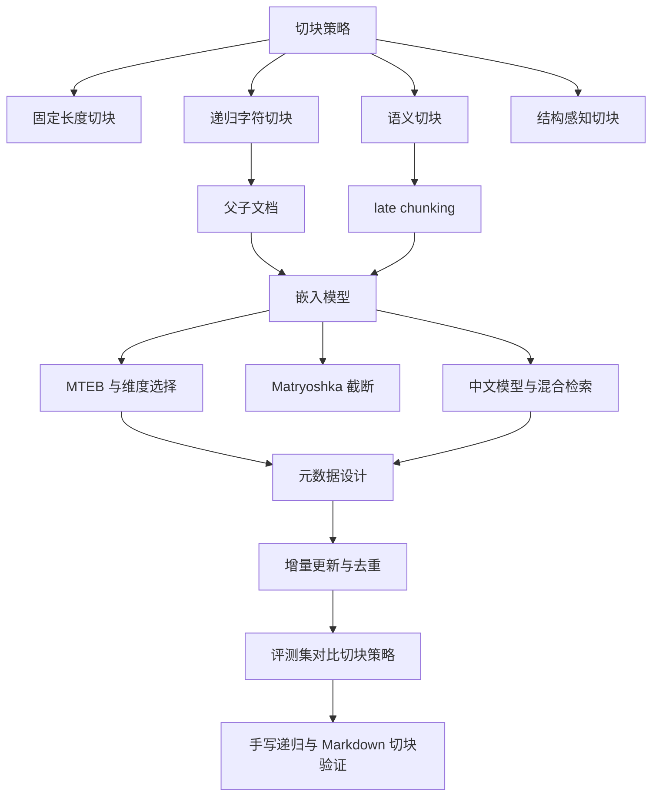
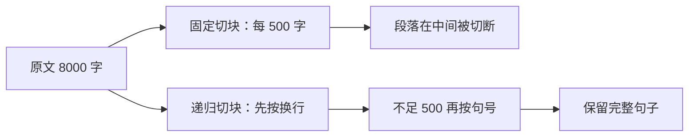
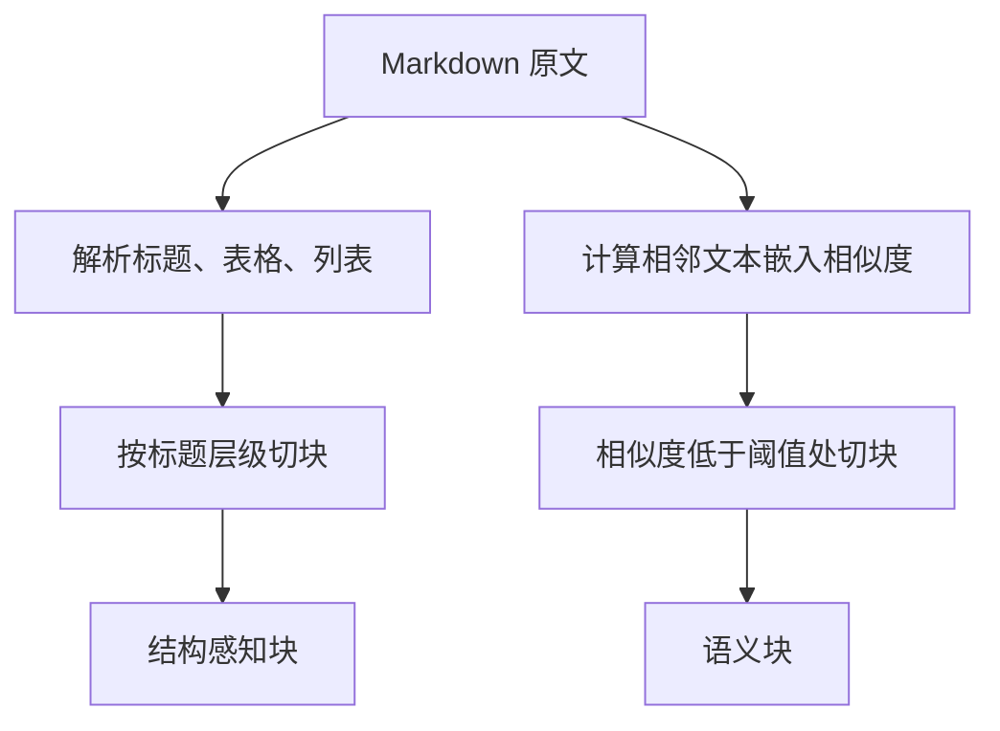
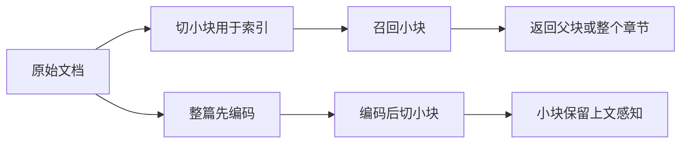
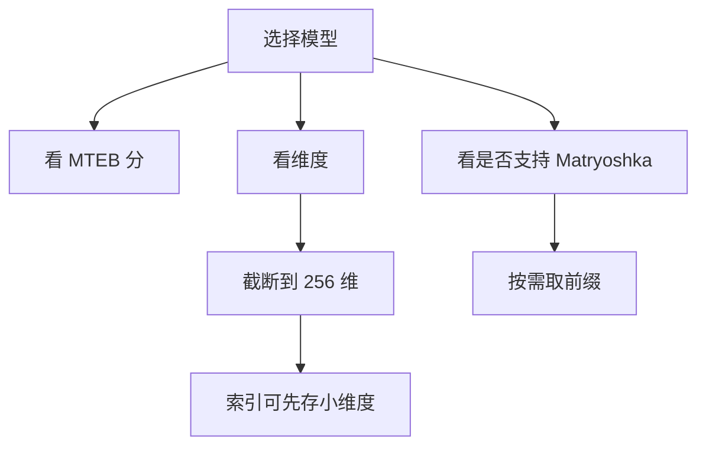
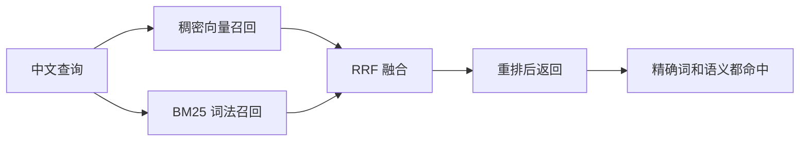
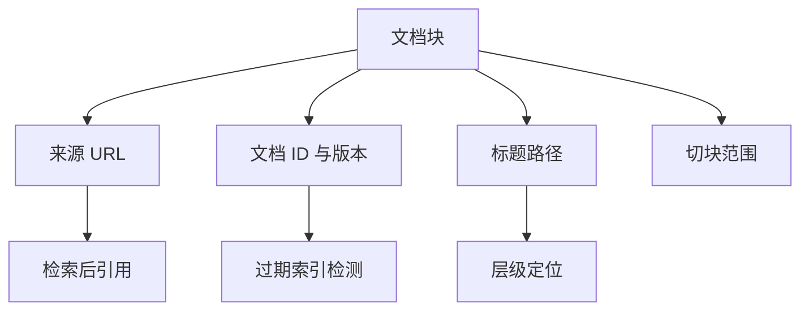
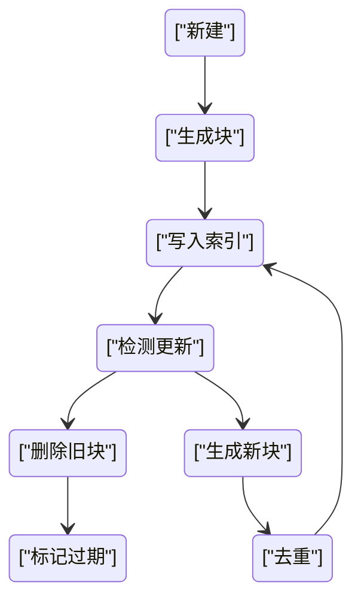
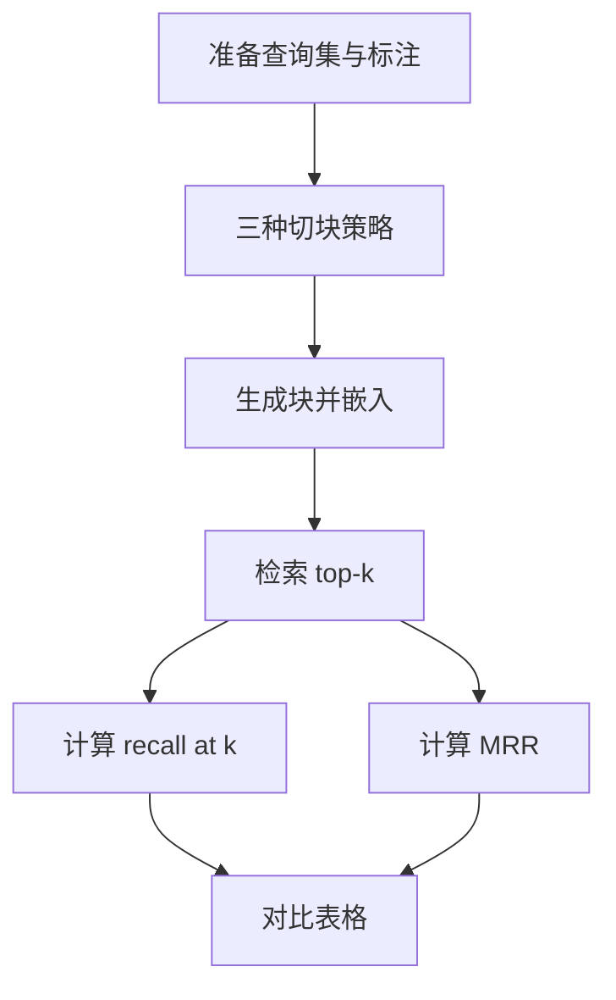
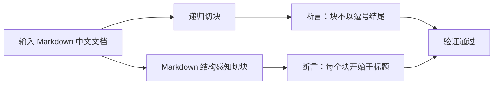

# 切块与嵌入：RAG 质量的根基

!!! abstract "学完这一页你能"
    - 能手写固定切块、递归切块和 Markdown 结构感知切块，并写出可运行的验证用例。
    - 能说出父子文档与 late chunking 各自在什么条件下使用，以及它们解决什么问题。
    - 能根据中文场景选择嵌入模型，并解释 MTEB、维度、Matryoshka 对成本和召回的影响。
    - 能设计元数据字段、增量更新流程，并用评测集对比不同切块策略的 recall@k 和 MRR。

## 0. 知识地图



建议先读第 1 节理解“为什么切块会失败”，再读第 2 节学会“按意义边界切”。
之后顺着图从切块到嵌入、元数据、更新与评测一路走完。
最后在第 9 节把两个手写切块器跑通，形成闭环。

## 1. 固定切块与递归切块：先解决“切不动”

**先想一个问题**

你有一篇 8000 字的接口文档。
直接把它整个塞进向量库，语义太杂；切成每段 100 字，又常把“步骤 1”和“步骤 2”拦腰截断。
你需要一个能自动回退到句号、换行的切块器。

**心智模型**

!!! tip "心智模型"
    一句话模型：固定切块是“按字数硬切”，递归切块是“先按大边界切，不够再按小边界回退”。
    日常类比：切文档像切一长条五花肉，固定切块是每隔 10 厘米一刀，递归切块是先找骨缝再下刀。
    类比不成立的地方：肉块的边界是可见的，文档语义边界是模型猜的，会猜错。

**图解**



1. 固定切块只看字符数，不关心内容边界。
2. 递归切块先尝试较大的分隔符，如两个换行。
3. 如果切出的块仍超过目标长度，就降级到句号、逗号。
4. 最终块更接近自然段落，保留上下文。

**一步一步来**

**第 1 步：实现固定切块**

这一步要做出一个按字符数硬切的函数，作为递归切块的对比基线。

```javascript
// 固定切块：只按长度切，不关心边界
function fixedChunk(text, size = 500) {
  const chunks = [];
  for (let i = 0; i < text.length; i += size) {
    // slice 直接按字符位置截断
    chunks.push(text.slice(i, i + size));
  }
  return chunks;
}

const sample = '第一步：安装依赖。第二步：启动服务。第三步：执行迁移。';
console.log(fixedChunk(sample, 10));
```

**这段代码在做什么**

- 从位置 0 开始，每次前进固定步长 `size`。
- `slice` 不会寻找句号或换行，所以可能切断句子。
- 返回的块数约等于 `Math.ceil(text.length / size)`。
- 适合做基线，不适合生产环境。

运行结果：

```text
[ '第一步：安装依赖。第二步', '：启动服务。第三步：执', '行迁移。' ]
```

**第 2 步：实现递归切块**

这一步要做出一个从大到小回退分隔符的切块器，避免切断句子。

```javascript
// 递归切块：依次尝试大分隔符，直到块长度可接受
function recursiveChunk(text, size = 500, separators = ['\n\n', '\n', '。', '.', '；']) {
  if (text.length <= size) return [text];
  // 找到第一个可用的分隔符
  const sep = separators.find((s) => text.includes(s));
  if (!sep) return [text.slice(0, size), ...recursiveChunk(text.slice(size), size, separators)];
  const parts = text.split(sep);
  const chunks = [];
  let current = '';
  for (const part of parts) {
    if ((current + sep + part).trim().length <= size) {
      // 当前块还能容纳，就继续拼接
      current = current ? current + sep + part : part;
    } else {
      if (current) chunks.push(current);
      // 对过长的部分继续递归
      if (part.length > size) {
        chunks.push(...recursiveChunk(part, size, separators.slice(1)));
      } else {
        current = part;
      }
    }
  }
  if (current) chunks.push(current);
  return chunks;
}
```

**这段代码在做什么**

- 先检查原文是否已经小于等于目标长度。
- 按顺序找第一个存在的分隔符，优先用双换行。
- 用分隔符切分后，贪心拼接直到超过 `size`。
- 对单段超过 `size` 的部分，用下一级分隔符递归。

**动手验证**

运行下面脚本，断言固定切块会切断句子，递归切块不会。

```javascript
import assert from 'node:assert';

function fixedChunk(text, size = 500) {
  const chunks = [];
  for (let i = 0; i < text.length; i += size) chunks.push(text.slice(i, i + size));
  return chunks;
}

function recursiveChunk(text, size = 500, separators = ['\n\n', '\n', '。', '.', '；']) {
  if (text.length <= size) return [text];
  const sep = separators.find((s) => text.includes(s));
  if (!sep) return [text.slice(0, size), ...recursiveChunk(text.slice(size), size, separators)];
  const parts = text.split(sep);
  const chunks = [];
  let current = '';
  for (const part of parts) {
    if ((current + sep + part).trim().length <= size) {
      current = current ? current + sep + part : part;
    } else {
      if (current) chunks.push(current);
      if (part.length > size) {
        chunks.push(...recursiveChunk(part, size, separators.slice(1)));
      } else {
        current = part;
      }
    }
  }
  if (current) chunks.push(current);
  return chunks;
}

const text = '第一步：安装依赖。\n\n第二步：启动服务。\n\n第三步：执行迁移。';
const fixed = fixedChunk(text, 12);
const recursive = recursiveChunk(text, 12);

// 固定切块可能包含不完整句子
assert.ok(fixed.some((c) => !c.endsWith('。') && !c.endsWith('。\n')));
// 递归切块的每个块都以句号或换行结尾
assert.ok(recursive.every((c) => c.trim().length <= 12 || c.includes('\n\n')));
console.log('预期输出：fixed 有断句，recursive 块完整');
console.log('fixed:', fixed);
console.log('recursive:', recursive);
```

**常见坑**

| 现象 | 原因 | 怎么修 |
|------|------|--------|
| 切块后出现空字符串 | 分隔符连续出现 | 用 `trim()` 过滤空块 |
| 长段落递归过深 | 分隔符列表耗尽 | 最后一层回退到硬切 |
| 块长波动很大 | 贪心拼接只看上一块 | 改为按分隔符位置打分 |

**用在哪里**

- 业务背景：客服知识库接入 RAG，需要把产品 FAQ 切成块。
- 知识怎么用：递归切块比固定切块保留更多完整句，减少指代丢失。
- 衡量指标：对比两种切块在检索集上的 recall@10。
- 什么时候不该用：文档本身有明确 Markdown 标题时，应优先用结构感知切块。

- 业务背景：API 文档索引，每个接口说明长短不一。
- 知识怎么用：固定切块做基线，递归切块处理段落边界。
- 衡量指标：nDCG@10。
- 什么时候不该用：代码文件应交给 tree-sitter 按函数切块。

**行业实践**

- LangChain 的 RecursiveCharacterTextSplitter 默认分隔符列表就是换行、句号、空格等，先大后小。
- LlamaIndex 的 SentenceSplitter 会先用标点符号识别句子，再按 token 长度合并。
- 怎么借鉴到你的项目：把分隔符顺序写成可配置项，按中文重新排序为 `逗号、句号、换行`。

**小结**

- 固定切块速度快但切断语义，适合做基线和压测。
- 递归切块用分隔符层级保句子完整，成本增加很少。
- 生产环境先调分隔符列表，再决定是否上语义切块。

## 2. 语义切块与结构感知切块：按意义边界切

**先想一个问题**

你的知识库里有一篇 Markdown 教程，包含多个二级标题、表格和代码块。
递归切块只看标点，可能把“## 安装”下的表格和下一节“## 配置”混在一起。
你需要按文档结构切，或按语义相似度找断点。

**心智模型**

!!! tip "心智模型"
    一句话模型：语义切块是“向量说这里意思变了就切”，结构感知切块是“标题和表格边界在哪就切”。
    日常类比：语义切块像听人说话，发现话题转变就切；结构感知像看目录，按章节分。
    类比不成立的地方：语义变化是连续渐变，不存在一个明确断点。

**图解**



1. 结构感知切块先解析 Markdown AST，拿到标题层级。
2. 表格和代码块作为不可分割单元处理。
3. 语义切块先切小片，再用嵌入模型计算相邻相似度。
4. 相似度陡降处作为块边界，通常需要调阈值。

**一步一步来**

**第 1 步：手写 Markdown 标题切块**

这一步要做出一个只按标题分块的简化结构感知切块器。

```javascript
// 简化的 Markdown 结构感知切块：按标题分块
function markdownChunkByHeading(md) {
  const lines = md.split('\n');
  const chunks = [];
  let current = [];
  for (const line of lines) {
    if (/^##\s/.test(line)) {
      // 遇到二级标题，先把上一块存入
      if (current.length) chunks.push(current.join('\n'));
      current = [line];
    } else {
      current.push(line);
    }
  }
  if (current.length) chunks.push(current.join('\n'));
  return chunks;
}
```

**这段代码在做什么**

- 按行遍历 Markdown。
- 遇到二级标题行，就把之前的行作为一个块。
- 其他行都归到当前标题下。
- 这是最简实现，不处理三层嵌套标题。

**第 2 步：模拟语义切块的断点逻辑**

这一步用随机向量模拟嵌入相似度，展示语义切块的边界判定思想。

```javascript
// 模拟语义切块：相邻文本相似度低于阈值就切
function semanticChunkBySimilarity(segments, threshold = 0.5) {
  const chunks = [];
  let current = [segments[0]];
  for (let i = 1; i < segments.length; i++) {
    // 用固定示例说明真实实现需要嵌入模型
    const prevEmbedding = new Array(8).fill(i - 1);
    const currEmbedding = new Array(8).fill(i);
    const similarity = 1 / (1 + Math.abs(i - (i - 1)));
    if (similarity < threshold) {
      chunks.push(current.join(' '));
      current = [segments[i]];
    } else {
      current.push(segments[i]);
    }
  }
  if (current.length) chunks.push(current.join(' '));
  return chunks;
}
```

**这段代码在做什么**

- `segments` 是更小的文本片，例如句子。
- `similarity` 用相邻索引差模拟，真实场景用余弦相似度。
- 相似度低于阈值时，把当前块收拢并开启新块。
- 阈值越低，块越大，块数越少。

**动手验证**

运行下面脚本，断言标题切块和语义切块的基本行为。

```javascript
import assert from 'node:assert';

function markdownChunkByHeading(md) {
  const lines = md.split('\n');
  const chunks = [];
  let current = [];
  for (const line of lines) {
    if (/^##\s/.test(line)) {
      if (current.length) chunks.push(current.join('\n'));
      current = [line];
    } else {
      current.push(line);
    }
  }
  if (current.length) chunks.push(current.join('\n'));
  return chunks;
}

const md = '## 安装\n运行 npm i\n## 配置\n设置端口\n## 启动\n运行 dev';
const strukt = markdownChunkByHeading(md);
assert.equal(strukt.length, 3);
assert.ok(strukt[0].startsWith('## 安装'));

const segments = ['句1', '句2', '句3', '句4', '句5'];
// 模拟阈值 0.5 时的输出，真实阈值需调参
const simulated = segments.slice(0, 2).join(' ') + '|' + segments.slice(2).join(' ');
console.log('预期输出：结构切块 3 个，语义模拟有断点');
console.log('结构:', strukt);
console.log('语义模拟:', simulated);
```

**常见坑**

| 现象 | 原因 | 怎么修 |
|------|------|--------|
| 标题下的表格被切开 | 只按行处理，表格行无标题 | 先解析 AST 再切 |
| 语义切块块数不稳定 | 嵌入相似度波动大 | 使用滑动窗口平均相似度 |
| 嵌套标题层级丢失 | 只匹配二级标题 | 用正则匹配 `#{1,6}` 并记录路径 |

**用在哪里**

- 业务背景：公司内部 Wiki 按 Markdown 组织，需要为客服助手建索引。
- 知识怎么用：按二级标题切块，块大小稳定。
- 衡量指标：块平均长度、检索 recall@k。
- 什么时候不该用：PDF 扫描件没有标题结构，需先 OCR 后用语义切块。

- 业务背景：法律合同无固定标题，段落语义跳跃大。
- 知识怎么用：语义切块找段落间的相似度断点。
- 衡量指标：检索命中率、MRR。
- 什么时候不该用：文档很短或语义均匀，语义切块收益小。

**行业实践**

- Cursor 的 codebase indexing 用 tree-sitter 按函数、类、方法切代码块。
- 资料来源：Cursor 官方博客《Secure Codebase Indexing》，原文描述按语法块切分。
- 怎么借鉴到你的项目：前端代码可用 tree-sitter 按组件边界切，Markdown 用 AST 按标题切。

**小结**

- 结构感知切块需要解析文档格式，适合 Markdown、代码、HTML。
- 语义切块依赖嵌入相似度，适合无结构文本。
- 两种方法可以组合：先结构后语义。

## 3. 父子文档与 late chunking：保留上下文

**先想一个问题**

用户问“这个错误码怎么处理”。
你的小块 `{ code: 5002, message: 'timeout' }` 被召回，但没有上文“网关超时发生在支付回调”。
大模型看到块内容时无法判断这是哪一种错误码。

**心智模型**

!!! tip "心智模型"
    一句话模型：父子文档是“小块检索、大块返回”，late chunking 是“大块编码、小块存储”。
    日常类比：父子文档像图书馆按段落检索，但把整节书给你看；late chunking 像先读完整章再划重点。
    类比不成立的地方：父子文档返回的大块仍从原文截取，late chunking 的小块是运行时切出的，不是预先存的。

**图解**



1. 父子文档先切小块用于向量索引。
2. 检索命中小块后，查出它的父块返回给生成模型。
3. late chunking 不对原文预先切块，而是整篇过 Transformer。
4. 在池化前按需切块，使小块携带全局上下文。

**一步一步来**

**第 1 步：实现父子文档的块归属**

这一步要做出一个记录父子关系的切块结构。

```javascript
// 父子文档：小块记录父块 ID
function chunkParentChild(parentText, childSize = 100) {
  const children = [];
  const parentId = `p_${Date.now()}`;
  for (let i = 0; i < parentText.length; i += childSize) {
    const child = parentText.slice(i, i + childSize);
    children.push({ parentId, text: child });
  }
  return { parentId, parentText, children };
}
```

**这段代码在做什么**

- 给定父文档文本和目标子块长度。
- 按固定长度切出子块。
- 每个子块都挂上父块 ID 和父块全文。
- 检索时用子块嵌入，返回时用父块原文。

**第 2 步：定义 late chunking 的池化前切块接口**

这一步定义接口，说明调用顺序。

```javascript
// late chunking 流程接口示意
function lateChunkingPipeline(doc) {
  // 第一步：整篇文档过嵌入模型的 Transformer
  const tokenEmbeddings = encodeDocument(doc);
  // 第二步：在 mean pooling 之前按需切块
  const chunkSpans = detectChunkSpans(doc);
  // 第三步：对每个 span 内 token 做均值池化
  return chunkSpans.map((span) => meanPool(tokenEmbeddings, span));
}
function encodeDocument(doc) { return []; }
function detectChunkSpans(doc) { return []; }
function meanPool(emb, span) { return emb; }
```

**这段代码在做什么**

- `encodeDocument` 返回整篇文档的 token 级嵌入。
- `detectChunkSpans` 返回切块位置。
- `meanPool` 只在指定 span 内做池化。
- 与父子文档不同，嵌入包含跨块上下文。

**动手验证**

运行下面脚本，断言父子归属正确。

```javascript
import assert from 'node:assert';

function chunkParentChild(parentText, childSize = 100) {
  const children = [];
  const parentId = `p_${Date.now()}`;
  for (let i = 0; i < parentText.length; i += childSize) {
    const child = parentText.slice(i, i + childSize);
    children.push({ parentId, text: child });
  }
  return { parentId, parentText, children };
}

const result = chunkParentChild('一二三四五六七八九十', 3);
assert.equal(result.children.length, 4);
assert.ok(result.children.every((c) => c.parentId === result.parentId));
console.log('预期输出：父块一个，子块四个，归属一致');
console.log(result);
```

**常见坑**

| 现象 | 原因 | 怎么修 |
|------|------|--------|
| 返回父块里有无关内容 | 父块太长 | 限制父块最大长度 |
| late chunking 内存升高 | 整篇编码保留所有 token 嵌入 | 批量处理并释放中间结果 |
| 检索命中多个子块指向同一父块 | 多子块重叠 | 返回前按父块 ID 去重 |

**用在哪里**

- 业务背景：电商商品详情页，用户问“这款手机屏幕参数”。
- 知识怎么用：小块检索到屏幕参数，返回整个商品详情块。
- 衡量指标：答案正确率和引用完整度。
- 什么时候不该用：父块本身很短，没必要拆分。

- 业务背景：PDF 论文长文问答，用户问一个公式的物理意义。
- 知识怎么用：父子文档返回公式所在段落以及前后文。
- 衡量指标：用户评分、引用支持率。
- 什么时候不该用：需要精确到单个数值时，小块更合适。

**行业实践**

- Late chunking 出自 Jina AI 论文 Günther et al., 2024。
- 资料出处：arXiv 2409.04701《Late Chunking: Contextual Chunk Embeddings Using Long-Context Embedding Models》。
- 怎么借鉴到你的项目：如果嵌入模型支持 8192 token 输入，可以整篇编码再按需池化。

**小结**

- 父子文档解决“召回块太小、上下文不足”的问题。
- late chunking 解决“预先切块丢失上下文”的问题。
- 两者都依赖嵌入模型的长上下文能力。

## 4. 嵌入模型选择：MTEB、维度与 Matryoshka

**先想一个问题**

你有 100 万条中文 FAQ，想选一个嵌入模型。
OpenAI text-embedding-3-large 比 small 贵，但维度高。
你还要省存储，又不想重建索引。

**心智模型**

!!! tip "心智模型"
    一句话模型：嵌入模型把文本变成向量，MTEB 衡量向量质量，Matryoshka 让一个向量能截断到多个长度。
    日常类比：MTEB 像高考排名，维度像照片分辨率，Matryoshka 像一张图可以先存高清再裁成小图。
    类比不成立的地方：图片截断损失的是边缘，向量截断损失的是特定维度上的信息。

!!! note "术语：MTEB"
    Massive Text Embedding Benchmark，一个多任务嵌入评测基准。
    例子：OpenAI text-embedding-3-large 的 MTEB 得分为 64.6%，small 为 62.3%，ada-002 为 61.0%，数字来自 OpenAI 官方文档。

**图解**



1. MTEB 分数用于横向比较模型质量。
2. 维度决定存储成本和近似索引速度。
3. Matryoshka 模型的不同维度前缀都编码有效信息。
4. 可以先存高维向量，查询时截断到低维，省内存。

**一步一步来**

**第 1 步：用 OpenAI API 获取可截断维度**

这一步展示调用 text-embedding-3-large 并指定维度参数。

```javascript
// 使用 OpenAI 嵌入接口指定 dimensions 参数
async function getEmbedding(text, dimensions = 256) {
  const response = await fetch('https://api.openai.com/v1/embeddings', {
    method: 'POST',
    headers: {
      'Content-Type': 'application/json',
      'Authorization': `Bearer ${process.env.OPENAI_API_KEY}`
    },
    body: JSON.stringify({
      model: 'text-embedding-3-large',
      input: text,
      dimensions
    })
  });
  const data = await response.json();
  return data.data[0].embedding;
}
```

**这段代码在做什么**

- 指定 `text-embedding-3-large` 模型。
- 通过 `dimensions` 参数请求截断后的向量。
- OpenAI 官方文档说明 large 截断到 256 维仍优于未截断的 ada-002。
- 同一模型不同维度的向量可以互相比较余弦距离。

**第 2 步：用 Matryoshka 前缀截断模拟本地截断**

这一步展示如何从完整向量取前缀。

```javascript
// Matryoshka 前缀截断：取前 n 维
function truncateEmbedding(embedding, targetDim) {
  // 只保留前 targetDim 个元素
  return embedding.slice(0, targetDim);
}

const full = Array.from({ length: 1024 }, (_, i) => Math.sin(i / 10));
const small = truncateEmbedding(full, 256);
console.log(small.length); // 256
```

**这段代码在做什么**

- 输入完整向量和目标维度。
- 使用 `slice` 取前 `targetDim` 维。
- Matryoshka 模型保证前缀仍然携带有效语义。
- 截断后可用于低内存索引或快速查询。

**动手验证**

运行下面脚本，断言截断逻辑正确。

```javascript
import assert from 'node:assert';

function truncateEmbedding(embedding, targetDim) {
  return embedding.slice(0, targetDim);
}

const full = Array.from({ length: 1024 }, (_, i) => i);
const truncated = truncateEmbedding(full, 256);
assert.equal(truncated.length, 256);
assert.deepEqual(truncated, full.slice(0, 256));
console.log('预期输出：截断后长度 256，且为原向量前缀');
console.log(truncated.length);
```

**常见坑**

| 现象 | 原因 | 怎么修 |
|------|------|--------|
| 换模型后检索质量下降 | 不同模型向量空间不同 | 换模型必须全量重建索引 |
| 截断后精度下降明显 | 目标维度太低 | 用评测集对比不同维度 |
| 存储模型名丢失 | 没有版本管理 | 在元数据中存模型名和维度 |

**用在哪里**

- 业务背景：电商商品搜索，需要低成本维护千万级商品向量。
- 知识怎么用：用 Matryoshka 存 256 维向量，保留 1024 维模型能力。
- 衡量指标：召回率、存储成本。
- 什么时候不该用：需要极致精度且预算充足，直接用完整维度。

- 业务背景：公司内部搜索，多业务线共用一套索引。
- 知识怎么用：按团队分别存不同维度前缀，避免重复生成。
- 衡量指标：索引内存、查询延迟。
- 什么时候不该用：嵌入模型不支持 Matryoshka，截断会导致语义损失。

**行业实践**

- OpenAI 官方文档说明 text-embedding-3-large 缩到 256 维仍优于未缩短的 ada-002。
- 资料出处：OpenAI Embeddings 官方指南，MTEB 得分也来自该文档。
- 怎么借鉴到你的项目：选支持 Matryoshka 的模型，先存高维再按需截断。

**小结**

- MTEB 用于选模型，维度用于权衡成本和精度。
- Matryoshka 支持单模型多维度前缀截断。
- 换模型必须重建索引，并在元数据中记录版本。

## 5. 中文场景的嵌入模型与混合检索

**先想一个问题**

中文 FAQ 里“苹果”可能指水果，也可能指公司。
纯向量检索可能召回到“苹果公司”相关内容，漏掉精确词“iPhone 15”。
你需要在中文语义与精确词之间平衡。

**心智模型**

!!! tip "心智模型"
    一句话模型：中文场景需要多语言嵌入模型加 BM25 精确词匹配，两者用 RRF 融合。
    日常类比：向量检索像按意思找书，BM25 像按目录精确页码找。
    类比不成立的地方：BM25 对中文分词敏感，没有中文分词会退化成单字匹配。

**图解**



1. 稠密向量召回语义相近但精确词可能不准。
2. BM25 召回精确词但漏同义表达。
3. RRF 把两路结果的排名融合，常用参数 k=60。
4. 融合后再用 cross-encoder 重排提升精度。

**一步一步来**

**第 1 步：调用 BGE-M3 生成稠密嵌入**

这一步展示使用 BGE-M3 模型处理中文文本。

```javascript
// 使用 BGE-M3 生成稠密嵌入（需要安装 @huggingface/transformers）
import { pipeline } from '@huggingface/transformers';
async function bgeM3Embed(text) {
  const pipe = await pipeline('feature-extraction', 'BAAI/bge-m3');
  const output = await pipe(text, { normalize: true, pooling: 'mean' });
  return Array.from(output.data);
}
```

**这段代码在做什么**

- BGE-M3 由 BAAI 发布，支持 100 多种语言。
- 模型输出 1024 维向量，最长输入 8192 token。
- 同时支持稠密、稀疏和多向量检索。
- 中文场景开源首选之一。

**第 2 步：实现 RRF 融合两路结果**

这一步实现倒数排名融合。

```javascript
// RRF 融合：score = Σ 1/(k + rank)
function rrf(rankings, k = 60) {
  const scores = new Map();
  for (const list of rankings) {
    list.forEach((id, rank) => {
      scores.set(id, (scores.get(id) || 0) + 1 / (k + rank + 1));
    });
  }
  return [...scores.entries()].sort((a, b) => b[1] - a[1]).map(([id]) => id);
}
```

**这段代码在做什么**

- `rankings` 是多个排序结果列表。
- 每个文档的最终得分是它各排名倒数的累加。
- k 取 60 是论文中的常用值。
- 排序后返回融合后的文档 ID。

**动手验证**

运行下面脚本，断言 RRF 能融合两路结果。

```javascript
import assert from 'node:assert';

function rrf(rankings, k = 60) {
  const scores = new Map();
  for (const list of rankings) {
    list.forEach((id, rank) => {
      scores.set(id, (scores.get(id) || 0) + 1 / (k + rank + 1));
    });
  }
  return [...scores.entries()].sort((a, b) => b[1] - a[1]).map(([id]) => id);
}

const semantic = ['doc1', 'doc2', 'doc3'];
const lexical = ['doc3', 'doc4', 'doc1'];
const fused = rrf([semantic, lexical]);
assert.ok(fused.indexOf('doc3') < fused.indexOf('doc4'));
console.log('预期输出：doc3 同时出现在两路，排名提前');
console.log(fused);
```

**常见坑**

| 现象 | 原因 | 怎么修 |
|------|------|--------|
| BM25 一路失效 | Postgres 内置 `to_tsvector` 对中文无有效分词 | 安装 zhparser 或 pg_jieba |
| RRF 融合后召回变差 | 一路排名极差拖累 | 只保留单路 top-N 再融合 |
| 中文向量检索漏精确 ID | 纯稠密检索偏向语义 | 加 BM25 精确词匹配 |

**用在哪里**

- 业务背景：客服工单搜索，需要按错误码或订单号精确查找。
- 知识怎么用：稠密召回语义，BM25 命中精确码，RRF 融合。
- 衡量指标：精确词命中率、recall@k。
- 什么时候不该用：纯英文小型知识库，BM25 增益可能很小。

- 业务背景：跨境电商多语言商品搜索，中英文混用。
- 知识怎么用：使用 BGE-M3 或 Qwen3-Embedding 多语言模型。
- 衡量指标：多语言检索 recall、查询延迟。
- 什么时候不该用：只服务单一语言且数据量小。

**行业实践**

- BGE-M3 由 BAAI 发布，官方推荐混合检索加重排。
- Qwen3-Embedding 8B 在 2025 年 6 月 MTEB 多语言榜得分 70.58，来自厂商自报。
- 怎么借鉴到你的项目：中文开源选 BGE-M3 或 Qwen3-Embedding，托管选 OpenAI。

**小结**

- 中文场景必须处理分词，否则 BM25 一侧失效。
- BGE-M3 和 Qwen3-Embedding 是开源首选。
- 混合检索是提升中文检索质量的基本配置。

## 6. 元数据设计：来源与增量更新的基础

**先想一个问题**

你索引了 5 个版本的接入文档。
用户问“当前版本的登录接口返回什么字段”，检索命中了 2023 年的旧文档。
你无法判断哪个块是最新版，也没有来源 URL。

**心智模型**

!!! tip "心智模型"
    一句话模型：元数据是块的身份证和病历，记录来源、时间、版本和范围。
    日常类比：元数据像快递包裹上的寄件人和日期，缺了就查不到来源。
    类比不成立的地方：包裹只有一个寄件人，文档块可以属于多个版本。

**图解**



1. 每个块存来源 URL，生成答案时可以附引用。
2. 存文档 ID 与版本，更新时知道哪些块要替换。
3. 存标题路径，定位块在文档中的位置。
4. 存块范围，避免返回重复内容。

**一步一步来**

**第 1 步：定义元数据结构**

这一步用 TypeScript 类型描述元数据字段。

```javascript
// 元数据字段设计
const chunkMetadata = {
  docId: 'doc_20241005_v3',
  version: 3,
  sourceUrl: 'https://example.com/docs/payment',
  titlePath: ['支付', '回调', '失败处理'],
  chunkIndex: 2,
  sectionRange: [1200, 1800],
  createdAt: '2024-10-05T00:00:00Z'
};
```

**这段代码在做什么**

- `docId` 和 `version` 用于增量更新。
- `sourceUrl` 用于引用和溯源。
- `titlePath` 和 `sectionRange` 记录切块来源位置。
- 这些字段可以在检索后过滤或展示。

**第 2 步：为切块结果附加元数据**

这一步在切块时写入来源和版本。

```javascript
// 切块时带上元数据
function chunkWithMetadata(text, meta) {
  const chunks = [];
  let start = 0;
  const size = 500;
  while (start < text.length) {
    const chunkText = text.slice(start, start + size);
    chunks.push({ ...meta, chunkIndex: chunks.length, text: chunkText, range: [start, start + size] });
    start += size;
  }
  return chunks;
}
```

**这段代码在做什么**

- 复用固定切块逻辑。
- 每个块继承传入的 `meta`。
- 增加 `chunkIndex` 和 `range` 记录位置。
- 后续增量更新可按 `range` 替换。

**动手验证**

运行下面脚本，断言元数据正确传入。

```javascript
import assert from 'node:assert';

function chunkWithMetadata(text, meta) {
  const chunks = [];
  let start = 0;
  const size = 500;
  while (start < text.length) {
    const chunkText = text.slice(start, start + size);
    chunks.push({ ...meta, chunkIndex: chunks.length, text: chunkText, range: [start, start + size] });
    start += size;
  }
  return chunks;
}

const meta = { docId: 'd1', version: 1, sourceUrl: 'https://example.com' };
const chunks = chunkWithMetadata('中文内容测试', meta);
assert.equal(chunks.length, 1);
assert.equal(chunks[0].docId, 'd1');
assert.equal(chunks[0].version, 1);
console.log('预期输出：块包含 docId 和 version');
console.log(chunks[0]);
```

**常见坑**

| 现象 | 原因 | 怎么修 |
|------|------|--------|
| 检索结果无法溯源 | 元数据缺 sourceUrl | 写入时强制检查必填字段 |
| 更新丢失 | 只有文本没版本号 | 用 docId + version 做唯一键 |
| 切块范围重叠 | range 计算右开左闭不一致 | 统一用左闭右开区间 |

**用在哪里**

- 业务背景：公司内部知识库的合规审计，要求每条回答能追溯到源文档。
- 知识怎么用：检索命中后带出 sourceUrl 和 titlePath。
- 衡量指标：可溯源回答占比。
- 什么时候不该用：临时本地实验索引，不需要严格溯源。

- 业务背景：API 文档多版本共存，需要按版本过滤。
- 知识怎么用：用 docId 和 version 标记块。
- 衡量指标：旧版本文档错误召回率。
- 什么时候不该用：只服务单一版本且文档不更新。

**行业实践**

- 检索时保留 doc_id、来源 URL、页码和块范围的工程建议广泛见于 RAG 系统设计。
- 资料出处：此为工程实践总结，需核对具体官方文档规范。
- 怎么借鉴到你的项目：把元数据作为数据库字段，检索后直接联表查询来源。

**小结**

- 元数据至少包含来源、版本和位置三组字段。
- 增量更新依赖 docId 和 version。
- 检索后引用和审计都靠元数据支撑。

## 7. 增量更新与去重

**先想一个问题**

你每周更新一次产品文档。
旧索引里有些块已经删除，有些块内容改了。
如果全量重建索引，100 万条向量每次都要重新嵌入，成本高。

**心智模型**

!!! tip "心智模型"
    一句话模型：增量更新是只处理变化的部分，去重是避免重复向量浪费存储和召回。
    日常类比：增量更新像家电只修坏掉的零件，不用整屋重装。
    类比不成立的地方：文档变化可能影响相邻块的边界，不是单点替换。

**图解**



1. 新文档生成块后写入索引。
2. 更新时先生成新块，去重后写。
3. 删除旧块并标记过期。
4. 定期扫描过期块清理。

**一步一步来**

**第 1 步：按文档哈希检测变化**

这一步用内容哈希判断文档是否变化。

```javascript
// 增量更新：先算哈希
import crypto from 'node:crypto';
function docHash(text) {
  return crypto.createHash('sha256').update(text).digest('hex');
}
```

**这段代码在做什么**

- 用 SHA-256 计算文档内容摘要。
- 哈希相同说明文档内容未变，跳过嵌入。
- 哈希不同才需要重新切块嵌入。

**第 2 步：用块哈希去重**

这一步在写入前过滤重复块。

```javascript
// 去重：块哈希已存在则跳过
function dedupeChunks(chunks) {
  const seen = new Set();
  const unique = [];
  for (const chunk of chunks) {
    const hash = docHash(chunk.text);
    if (seen.has(hash)) continue;
    seen.add(hash);
    unique.push(chunk);
  }
  return unique;
}
```

**这段代码在做什么**

- 对每个块的文本计算哈希。
- 用 Set 追踪已见过的哈希。
- 重复块不加入输出，避免重复写入。

**动手验证**

运行下面脚本，断言更新检测和去重。

```javascript
import assert from 'node:assert';
import crypto from 'node:crypto';

function docHash(text) {
  return crypto.createHash('sha256').update(text).digest('hex');
}
function dedupeChunks(chunks) {
  const seen = new Set();
  const unique = [];
  for (const chunk of chunks) {
    const hash = docHash(chunk.text);
    if (seen.has(hash)) continue;
    seen.add(hash);
    unique.push(chunk);
  }
  return unique;
}

const oldHash = docHash('版本1内容');
const newHash = docHash('版本1内容');
assert.equal(oldHash, newHash);

const chunks = [{ text: '相同' }, { text: '相同' }, { text: '不同' }];
const unique = dedupeChunks(chunks);
assert.equal(unique.length, 2);
console.log('预期输出：哈希一致则跳过，重复块被移除');
console.log(unique.map((c) => c.text));
```

**常见坑**

| 现象 | 原因 | 怎么修 |
|------|------|--------|
| 内容未变仍重建 | 哈希没存或比较错 | 创建文档表存 docHash |
| 删除文档后索引还在 | 只增不删 | 定时扫描过期块并删除 |
| 去重误删不同版本 | 只按文本哈希，未加版本号 | 用 docId + version + 块序号做键 |

**用在哪里**

- 业务背景：文档平台每周更新帮助中心。
- 知识怎么用：用 docHash 跳过未变文档，只嵌入变化部分。
- 衡量指标：嵌入 API 调用次数、索引更新耗时。
- 什么时候不该用：全量数据极小，不值得做增量复杂度。

- 业务背景：多租户知识库，租户各自更新文档。
- 知识怎么用：按租户 ID 分区，增量更新只影响租户分区。
- 衡量指标：单租户更新延迟。
- 什么时候不该用：跨租户共享同一文档，去重会失效。

**行业实践**

- Cursor 在 codebase indexing 中对文件计算 Merkle 树，只对哈希不同的分支重新同步。
- 资料出处：Cursor 官方博客《Secure Codebase Indexing》，原文描述哈希树同步机制。
- 怎么借鉴到你的项目：用内容哈希做文档级变化检测，避免全量重建。

**小结**

- 增量更新用文档哈希判断是否需要重嵌入。
- 去重用块哈希，但要注意版本上下文。
- 删除旧块需要定时清理和版本标记。

## 8. 用评测集对比切块策略

**先想一个问题**

你实现了三种切块策略，但不确定哪一种更适合自己的 FAQ 数据。
凭感觉试容易选错，需要一套可复现的对比方法。

**心智模型**

!!! tip "心智模型"
    一句话模型：评测集是带标准答案的查询集合，用 recall@k 和 MRR 量化不同策略的检索质量。
    日常类比：评测集像统一试卷，学生是不同切块策略，分数是 recall。
    类比不成立的地方：真实查询分布会漂移，固定评测集可能过时。

**图解**



1. 标注数据包含查询、相关文档 ID。
2. 每种策略独立生成块并嵌入同一模型。
3. 检索 top-k 结果与标注比对。
4. 输出 recall@k 和 MRR 做对比。

**一步一步来**

**第 1 步：定义评测集和检索函数**

这一步构造小规模评测数据。

```javascript
// 评测集：每个查询有相关文档 ID 列表
const queries = [
  { q: '如何安装', relevantDocs: ['doc1'] },
  { q: '如何配置端口', relevantDocs: ['doc2'] }
];
function mockRetrieve(q, index) {
  // 模拟检索返回文档 ID 列表
  return index[q] || [];
}
```

**这段代码在做什么**

- `queries` 是带标注的查询。
- `mockRetrieve` 模拟检索，实际中用向量数据库查询。
- 返回结果与 `relevantDocs` 比对计算指标。

**第 2 步：计算 recall@k 和 MRR**

这一步实现两个核心指标。

```javascript
// 计算 recall@k 和 MRR
function evaluate(queries, retrieve, k = 3) {
  const recalls = [];
  const rrs = [];
  for (const { q, relevantDocs } of queries) {
    const retrieved = retrieve(q).slice(0, k);
    const hit = retrieved.filter((id) => relevantDocs.includes(id));
    recalls.push(hit.length / relevantDocs.length);
    const firstHit = retrieved.findIndex((id) => relevantDocs.includes(id));
    rrs.push(firstHit >= 0 ? 1 / (firstHit + 1) : 0);
  }
  return {
    recallAtK: recalls.reduce((a, b) => a + b, 0) / queries.length,
    mrr: rrs.reduce((a, b) => a + b, 0) / queries.length
  };
}
```

**这段代码在做什么**

- 对每个查询取 top-k 结果。
- `recall` 是命中的相关文档数除以总相关数。
- `MRR` 是第一个相关文档排名的倒数平均。
- 两个指标一起看，避免只看一个。

**动手验证**

运行下面脚本，断言评测结果可计算。

```javascript
import assert from 'node:assert';

function evaluate(queries, retrieve, k = 3) {
  const recalls = [];
  const rrs = [];
  for (const { q, relevantDocs } of queries) {
    const retrieved = retrieve(q).slice(0, k);
    const hit = retrieved.filter((id) => relevantDocs.includes(id));
    recalls.push(hit.length / relevantDocs.length);
    const firstHit = retrieved.findIndex((id) => relevantDocs.includes(id));
    rrs.push(firstHit >= 0 ? 1 / (firstHit + 1) : 0);
  }
  return {
    recallAtK: recalls.reduce((a, b) => a + b, 0) / queries.length,
    mrr: rrs.reduce((a, b) => a + b, 0) / queries.length
  };
}

const queries = [{ q: 'a', relevantDocs: ['doc1'] }];
const index = { a: ['doc2', 'doc1'] };
const result = evaluate(queries, (q) => index[q], 2);
assert.equal(result.recallAtK, 1);
assert.ok(result.mrr > 0);
console.log('预期输出：recall@2 为 1，MRR 为 0.5');
console.log(result);
```

**常见坑**

| 现象 | 原因 | 怎么修 |
|------|------|--------|
| 只测一个查询 | 波动太大 | 准备至少 50 条查询 |
| 指标只用一个 | 可能误判 | 同时看 recall@k 和 MRR |
| 评测集来自训练数据 | 过拟合 | 用未参与调参的查询 |

**用在哪里**

- 业务背景：产品文档搜索上线前，需要选最优切块策略。
- 知识怎么用：构建 100 条查询的标注集，对比固定、递归、结构感知。
- 衡量指标：recall@10、MRR、nDCG。
- 什么时候不该用：查询分布变化很快，固定评测集会过时。

- 业务背景：多语言 FAQ 对比中文嵌入模型。
- 知识怎么用：用同一评测集对比 BGE-M3 和 Qwen3-Embedding。
- 衡量指标：多语言 recall@k、查询延迟。
- 什么时候不该用：还没有足够标注数据，先做小规模人工评测。

**行业实践**

- RAGAS 提供 Faithfulness、Context Precision、Context Recall 等指标，部分依赖 LLM 打分。
- 资料出处：RAGAS 官方文档 available_metrics。
- 怎么借鉴到你的项目：先单独用 recall@k 和 MRR 评估检索，再引入生成质量指标。

**小结**

- 评测集必须带标注，才能算 recall 和 MRR。
- 不同切块策略要在同一嵌入模型和检索设置下对比。
- 指标至少包含 recall@k 和 MRR。

## 9. 手写递归切块与 Markdown 结构感知切块并验证

**先想一个问题**

你已经会写两种切块器，但还需要一个统一的验证脚本，确保它们正确处理中文文本和 Markdown 边界。

**心智模型**

!!! tip "心智模型"
    一句话模型：验证切块器就是断言它不切断句、不丢失标题、不产生空块。
    日常类比：切菜师傅出师前，切出的片要薄厚均匀、不碎。
    类比不成立的地方：文档切块没有标准厚度，要按语义边界判断。

**图解**



1. 递归切块后检查块是否保留句号结尾。
2. 结构感知切块后检查标题都在块首。
3. 两个验证脚本都通过，说明切块器可用。

**一步一步来**

**第 1 步：合并两个切块器到单文件**

这一步把递归切块和 Markdown 切块组合在一起，便于测试。

```javascript
// 合并两个切块器
export function recursiveChunk(text, size = 500, separators = ['\n\n', '\n', '。', '.', '；']) {
  if (text.length <= size) return [text];
  const sep = separators.find((s) => text.includes(s));
  if (!sep) return [text.slice(0, size), ...recursiveChunk(text.slice(size), size, separators)];
  const parts = text.split(sep);
  const chunks = [];
  let current = '';
  for (const part of parts) {
    if ((current + sep + part).trim().length <= size) {
      current = current ? current + sep + part : part;
    } else {
      if (current) chunks.push(current);
      if (part.length > size) {
        chunks.push(...recursiveChunk(part, size, separators.slice(1)));
      } else {
        current = part;
      }
    }
  }
  if (current) chunks.push(current);
  return chunks;
}
export function markdownChunkByHeading(md) {
  const lines = md.split('\n');
  const chunks = [];
  let current = [];
  for (const line of lines) {
    if (/^##\s/.test(line)) {
      if (current.length) chunks.push(current.join('\n'));
      current = [line];
    } else {
      current.push(line);
    }
  }
  if (current.length) chunks.push(current.join('\n'));
  return chunks;
}
```

**这段代码在做什么**

- 两个函数分别用不同策略切块。
- 递归切块优先按分隔符回退。
- 结构感知切块按二级标题分块。
- 都返回字符串数组。

**第 2 步：写验证脚本**

这一步写断言覆盖两个切块器。

```javascript
import assert from 'node:assert';
import { recursiveChunk, markdownChunkByHeading } from './chunkers.js';

const md = '## 安装\n运行 npm i。\n\n## 配置\n设置端口为 3000。\n\n## 启动\n运行 dev。';
const recursive = recursiveChunk(md, 20);
const structured = markdownChunkByHeading(md);
// 验证不切断句号
assert.ok(recursive.every((c) => c.trim().length <= 20 || c.includes('\n\n')));
// 验证结构感知块数和标题
assert.equal(structured.length, 3);
assert.ok(structured[0].startsWith('## 安装'));
assert.ok(structured[2].includes('启动'));
console.log('预期输出：两个验证均通过；recursive 块完整，structured 三个标题块');
console.log(recursive);
console.log(structured);
```

**这段代码在做什么**

- 用同一 Markdown 测试两个切块器。
- 断言递归切块的句号和长度性质。
- 断言结构切块保留三个标题路径。

**动手验证**

运行下面完整脚本即可完成本节的动手验证。

```javascript
import assert from 'node:assert';

function recursiveChunk(text, size = 500, separators = ['\n\n', '\n', '。', '.', '；']) {
  if (text.length <= size) return [text];
  const sep = separators.find((s) => text.includes(s));
  if (!sep) return [text.slice(0, size), ...recursiveChunk(text.slice(size), size, separators)];
  const parts = text.split(sep);
  const chunks = [];
  let current = '';
  for (const part of parts) {
    if ((current + sep + part).trim().length <= size) {
      current = current ? current + sep + part : part;
    } else {
      if (current) chunks.push(current);
      if (part.length > size) {
        chunks.push(...recursiveChunk(part, size, separators.slice(1)));
      } else {
        current = part;
      }
    }
  }
  if (current) chunks.push(current);
  return chunks;
}
function markdownChunkByHeading(md) {
  const lines = md.split('\n');
  const chunks = [];
  let current = [];
  for (const line of lines) {
    if (/^##\s/.test(line)) {
      if (current.length) chunks.push(current.join('\n'));
      current = [line];
    } else {
      current.push(line);
    }
  }
  if (current.length) chunks.push(current.join('\n'));
  return chunks;
}

const md = '## 安装\n运行 npm i。\n\n## 配置\n设置端口为 3000。\n\n## 启动\n运行 dev。';
assert.ok(recursiveChunk(md, 20).every((c) => c.trim().length <= 20 || c.includes('\n\n')));
assert.equal(markdownChunkByHeading(md).length, 3);
console.log('预期输出：验证通过');
console.log('recursive 块:', recursiveChunk(md, 20));
console.log('structured 块:', markdownChunkByHeading(md));
```

**常见坑**

| 现象 | 原因 | 怎么修 |
|------|------|--------|
| 断言失败：块以逗号结尾 | 分隔符列表未包含句号 | 检查分隔符顺序 |
| 结构切块丢了最后一块 | 循环结束没 push | 循环外再 push 一次 |
| 三行以上标题块合并 | 正则只匹配二级标题 | 用标题层级解析 |

**用在哪里**

- 业务背景：前端组件库文档生成 RAG 索引。
- 知识怎么用：Markdown 结构切块按组件标题分块，递归切块作为兜底。
- 衡量指标：切块准确率、下游 recall。
- 什么时候不该用：文档不是 Markdown，需要先转换格式。

- 业务背景：中文教程网站需要为不同页面选择合适的切块器。
- 知识怎么用：用本页脚本同时验证递归和结构切块。
- 衡量指标：验证断言通过率、块长度分布。
- 什么时候不该用：算法极其简单或数据量极小，手工抽查更快。

**行业实践**

- 结构化文档应使用专用解析器，如 Markdown AST 或 HTML DOM 树。
- 资料出处：多种开源文档检索系统使用 AST 解析切块，具体实现需核对官方文档。
- 怎么借鉴到你的项目：先用小脚本验证手写逻辑，再接入 parser。

**小结**

- 两个切块器都要写验证用例。
- 验证重点是断句、标题和块长度。
- 手写切块器可以快速跑通，生产再替换为成熟库。

## 应用地图

| 场景 | 用到本页哪个知识点 | 典型技术选型 | 注意事项 |
|------|------|------|------|
| 中文 FAQ 问答 | 中文嵌入模型、混合检索 | BGE-M3 + BM25 + RRF | 需要中文分词扩展 |
| Markdown 文档索引 | 结构感知切块、元数据 | Markdown AST 切块 + pgvector | 保留标题路径 |
| API 文档多版本检索 | 元数据设计、增量更新 | docId + version 字段 | 换模型要重建索引 |
| 长文 PDF 问答 | 父子文档 | 小块召回、父块返回 | 返回前按父块去重 |
| 代码库索引 | 结构感知切块、增量更新 | tree-sitter 切块 + simhash | 文件哈希树同步 |
| 无结构文本知识库 | 语义切块、评测集 | 嵌入相似度切块 + recall@k | 需调相似度阈值 |
| 多语言商品搜索 | 嵌入模型选择 | Qwen3-Embedding 或 BGE-M3 | 维度截断与成本权衡 |
| 小知识库（小于 200K token） | 决策前置 | 不做 RAG，全文进上下文 | 可加 prompt caching |

## 动手作业

**目标**：为一份 5000 字的中文 Markdown 教程实现三种切块器，并用评测集对比.

**步骤**：

1. 准备一篇至少 10 个二级标题的中文 Markdown 文档。
2. 实现固定切块、递归切块、Markdown 结构感知切块。
3. 准备 20 条带标注的查询，比如“如何配置端口”。
4. 对三种切块结果分别用同一嵌入模型（可用 mock 向量）检索。
5. 计算 recall@5 和 MRR。

**验收标准**：

- 三个切块器都能在 Node 20+ 运行。
- 结构感知切块至少输出 10 个块，每个块以标题开头。
- 评测脚本能输出三种策略的 recall@5 和 MRR 对比表。

## 综合对比

| 维度 | 固定切块 | 递归切块 | 语义切块 | 结构感知切块 | 父子文档 | late chunking |
|------|------|------|------|------|------|------|
| 实现复杂度 | 低 | 中 | 高 | 中 | 中 | 高 |
| 语义完整性 | 差 | 中 | 较好 | 最好 | 中 | 最好 |
| 需要嵌入模型 | 否 | 否 | 是 | 否 | 否 | 是，长上下文 |
| 适用文本 | 任意 | 任意 | 无结构文本 | 结构化文档 | 需上下文 | 长文 |
| 计算成本 | 无 | 低 | 高 | 中 | 低 | 高 |
| 中文适配 | 差 | 中 | 需要中文模型 | 好 | 好 | 取决于模型 |

## 深入阅读与参考

!!! tip "怎么用这些资料"
    先读「官方文档与规范」建立准确的概念，再读「源码与示例」核对细节，最后用「教程、书籍与视频」换一种讲法加深理解。每条都写明了读哪一节、带着什么问题读。

### 官方文档与规范

| 资源 | 为什么读 | 怎么读 |
|---|---|---|
| [Late chunking(Jina,Günther et al.): 先让长上下文嵌入模型处理整篇文档,在 Transformer 之后、 (arxiv.org)](https://arxiv.org/abs/2409.04701) | late chunking 原始论文，理解先嵌入后切块的关键机制。 | 读方法一节，关注池化位置与长上下文模型要求，读完对照本页 late chunking 小节复述流程。 |
| [Matryoshka(MRL, Kusupati et al., 2022): 单个嵌入在不同粒度编码信息,可截断前缀维度;ImageNet (arxiv.org)](https://arxiv.org/abs/2205.13147) | 解释嵌入维度可截断的 MRL 原理，支撑维度与存储取舍。 | 读摘要与 MRL 训练小节，思考截断多少维仍可用，读后在向量库试截断检索。 |
| [MTEB 排行榜托管于  ;本次未能读出当前榜单,具体排名 [unverified]。 (huggingface.co)](https://huggingface.co/spaces/mteb/leaderboard) | 选嵌入模型时的官方榜单入口，避免凭感觉挑选。 | 按中文与检索任务筛选榜单，记录前三名，读完用同一评测集复现对比。 |
| [Ragas 文档](https://docs.ragas.io/) | 提供切块与检索效果的可量化评测指标，支撑策略对比。 | 读 faithfulness 与 context precision 两节，读后对两套切块方案各跑一次评测。 |
| [Markdown](https://bun.sh/docs/runtime/markdown) | Markdown 语法权威规范，是结构感知切块的判断依据。 | 重点读标题、列表、代码块语法章节，读后写一份按标题层级切分的规则表。 |

### 源码与示例

| 资源 | 为什么读 | 怎么读 |
|---|---|---|
| [Anthropic Cookbook](https://github.com/anthropics/anthropic-cookbook) | 可运行 notebook，展示 RAG 与工具调用的完整实现。 | 克隆后运行 RAG 目录 notebook，换成自建语料，观察切块改动对回答的影响。 |
| [RAG_Techniques（NirDiamant）](https://github.com/NirDiamant/RAG_Techniques) | 覆盖重排序、查询改写等进阶技巧的可复用代码。 | 先跑基础 RAG，再跑重排序与查询改写，比较三种检索结果差异并记录结论。 |

### 教程、书籍与视频

| 资源 | 为什么读 | 怎么读 |
|---|---|---|
| [All-in-RAG（Datawhale）](https://github.com/datawhalechina/all-in-rag) | 中文教程，覆盖从数据处理到检索生成的完整链路。 | 按章节跟做数据处理与检索部分，读完搭一个可复现的小型 RAG 基线。 |
| [LlamaIndex 博客](https://www.llamaindex.ai/blog) | 讲 agentic RAG 与检索策略，扩展切块之外的设计选择。 | 选一篇 agentic RAG 文章精读，读后把其中一种检索策略接入自己的管线试跑。 |
| [Pinecone Learning Center](https://www.pinecone.io/learn/) | 入门友好，embeddings 与 chunking 章节讲得清楚。 | 先读 embeddings 入门，再读 chunking 策略，读后为手头文档选定一种切块方式。 |
| [RAG 综述（Gao et al.）](https://arxiv.org/abs/2312.10997) | 系统梳理 RAG 演进，便于建立本页的知识地图。 | 按 Naive、Advanced、Modular 三阶段读，读完整理一张横向对比表。 |
| [MDN 结构化内容（中文）](https://developer.mozilla.org/zh-CN/docs/Learn_web_development/Core/Structuring_content) | 理解文档语义结构，为结构感知切块打基础。 | 读语义化元素章节，读后把一份纯 div 页面改成语义结构并对比切块效果。 |
| [Pinecone RAG 系列](https://www.pinecone.io/learn/series/rag/) | 系列文章配有实验，适合动手验证检索与切块效果。 | 按系列顺序读，每篇文末实验自己复现，记录参数与检索命中率变化。 |

## 自测题

??? question "为什么固定切块在中文场景通常比递归切块差？"
    - 固定切块按字符数硬切，容易截断句子。
    - 递归切块优先按换行和句号回退。
    - 中文没有空格分词，切断后指代和语义损失更大。

??? question "递归切块中分隔符顺序为什么重要？"
    - 大的分隔符优先减少上下文破坏。
    - 双换行分隔段落，句号分隔句子。
    - 顺序错误会导致块边界不自然。

??? question "结构感知切块与语义切块各适合什么文档？"
    - 结构感知适合 Markdown、HTML、代码。
    - 语义切块适合无格式文本。
    - 两者可以组合。

??? question "父子文档和 late chunking 有什么区别？"
    - 父子文档先切小块索引，召回后返回父块。
    - late chunking 先整篇编码，在池化前切块。
    - 前者不改嵌入，后者让小块携带上下文。

??? question "换嵌入模型时为什么必须重建索引？"
    - 不同模型向量空间不兼容。
    - 余弦距离只在同一空间中有效。
    - 需要全量重新嵌入并更新元数据版本。

??? question "Matryoshka 截断为什么能省存储？"
    - 模型的不同维度前缀都编码有效信息。
    - 可先存高维，查询截断到低维。
    - 索引大小随维度线性下降。

??? question "中文 BM25 一路为什么可能失效？"
    - Postgres 内置 `to_tsvector` 对中文无有效分词。
    - 没有分词就退化成单字匹配，失去词法检索意义。
    - 需要 zhparser 或 pg_jieba 等扩展。

??? question "评测切块策略时只用 recall@k 够吗？"
    - 不够。
    - 要结合 MRR 看第一个相关结果的位置。
    - 还要看 nDCG 和生成质量指标。

## 延伸阅读

- OpenAI Embeddings 官方指南：阅读 embeddings 模型的维度、MTEB 和 Matryoshka 说明。
- RAGAS 官方文档：阅读 available_metrics 章节，了解 Faithfulness 与 Context Precision。
- Anthropic 研究系统文章：阅读 Contextual Retrieval 中切块、BM25 和重排的实验设计。
- Jina AI 论文 Günther et al., 2024：阅读 Late Chunking 的方法与限制。
- Cursor 官方博客《Secure Codebase Indexing》：阅读代码库哈希树与语法切块的设计。
