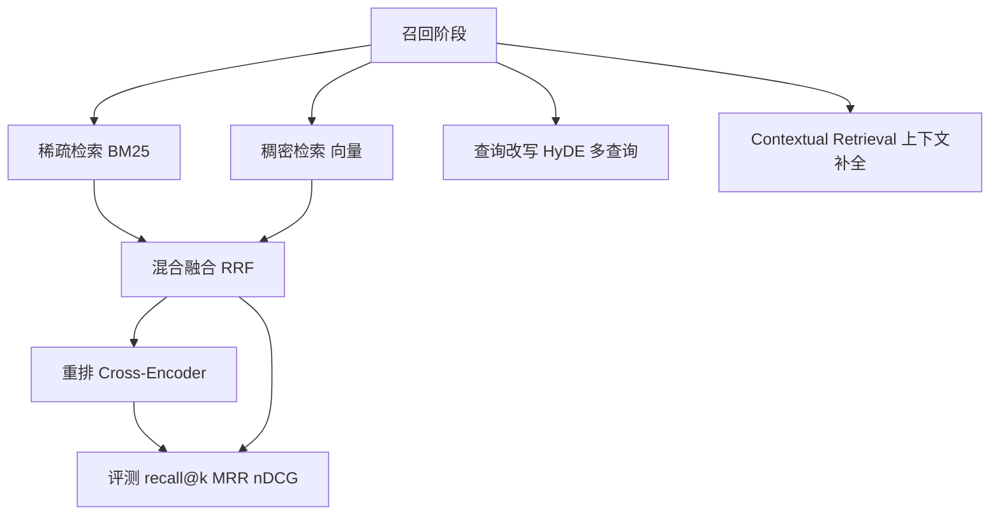
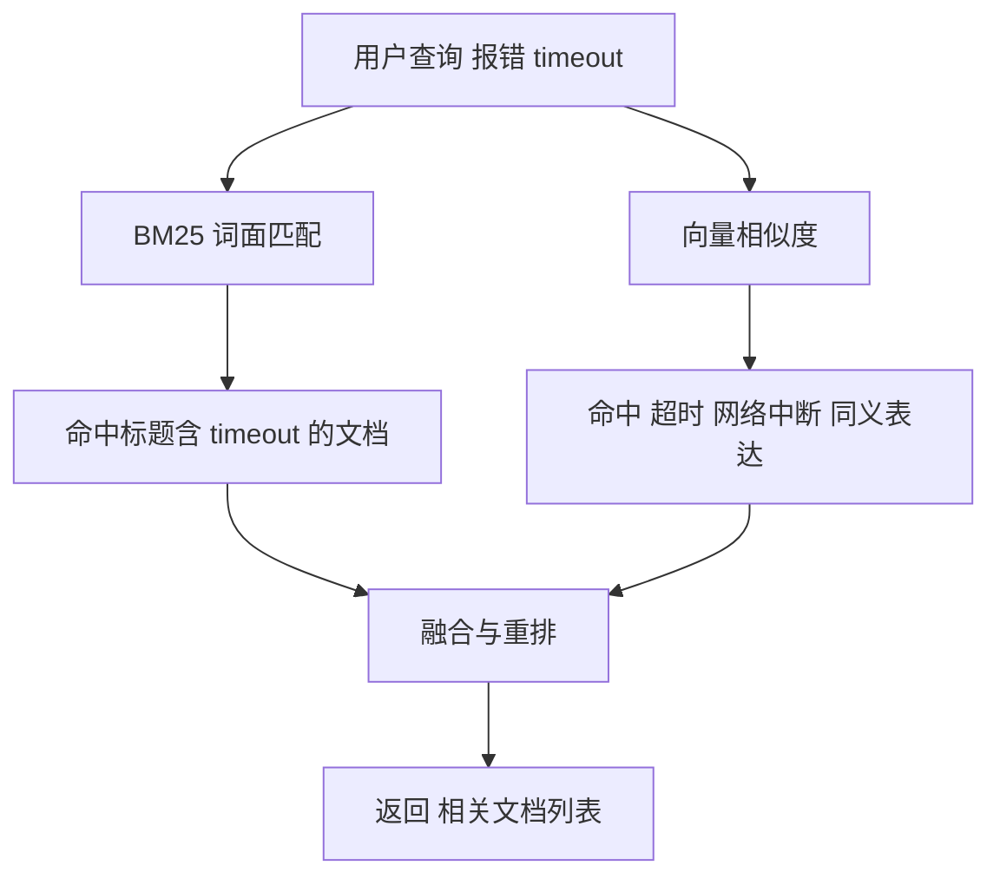
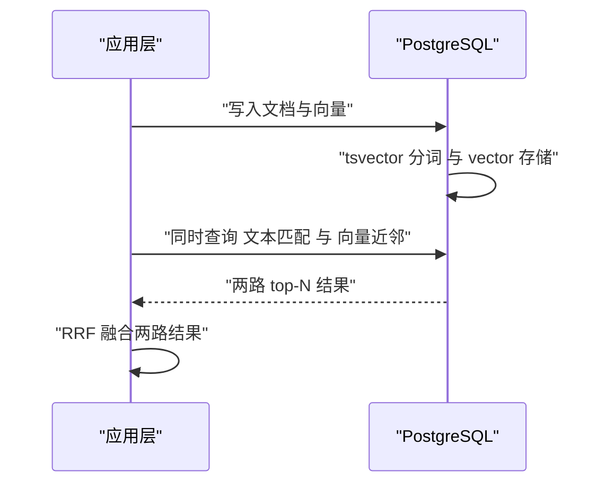
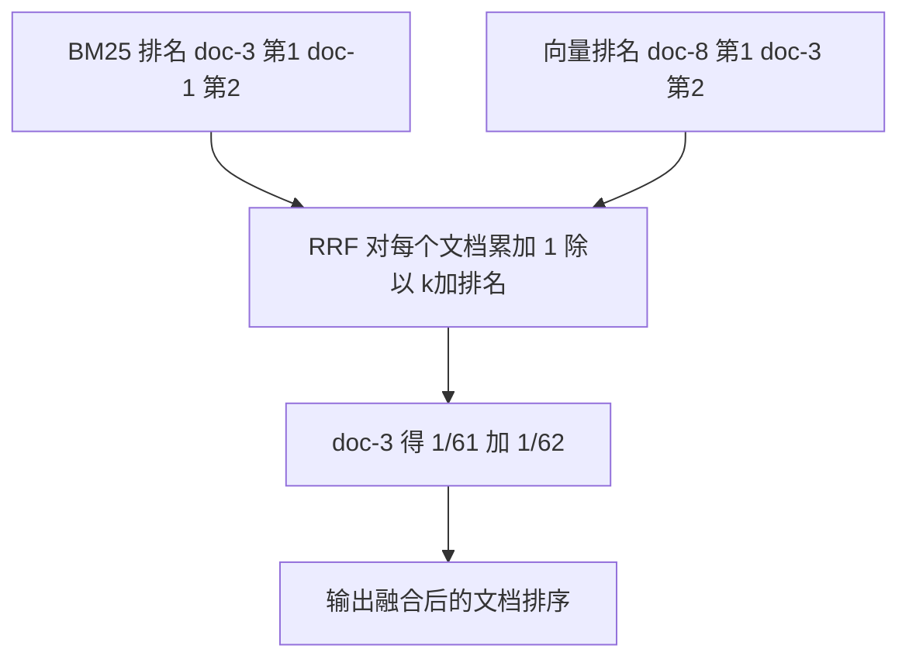
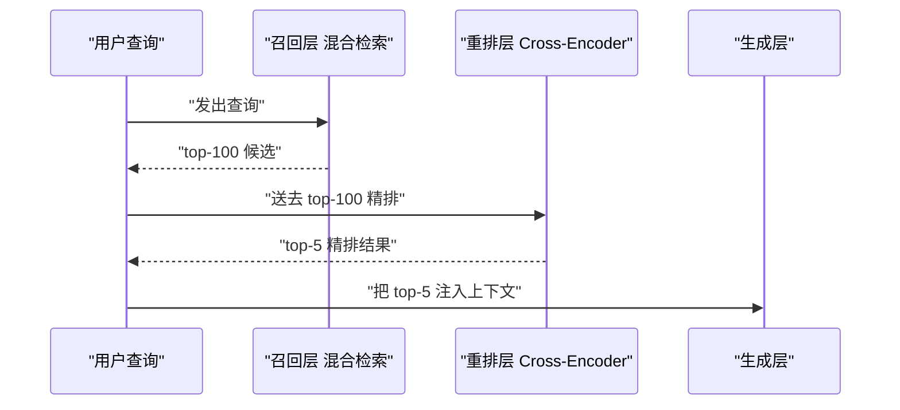
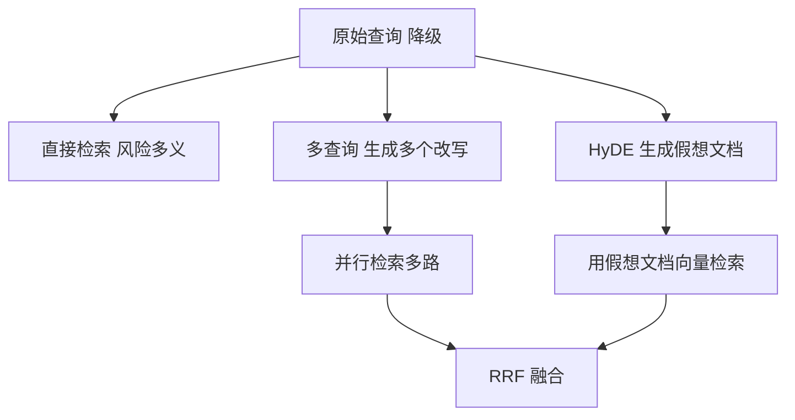
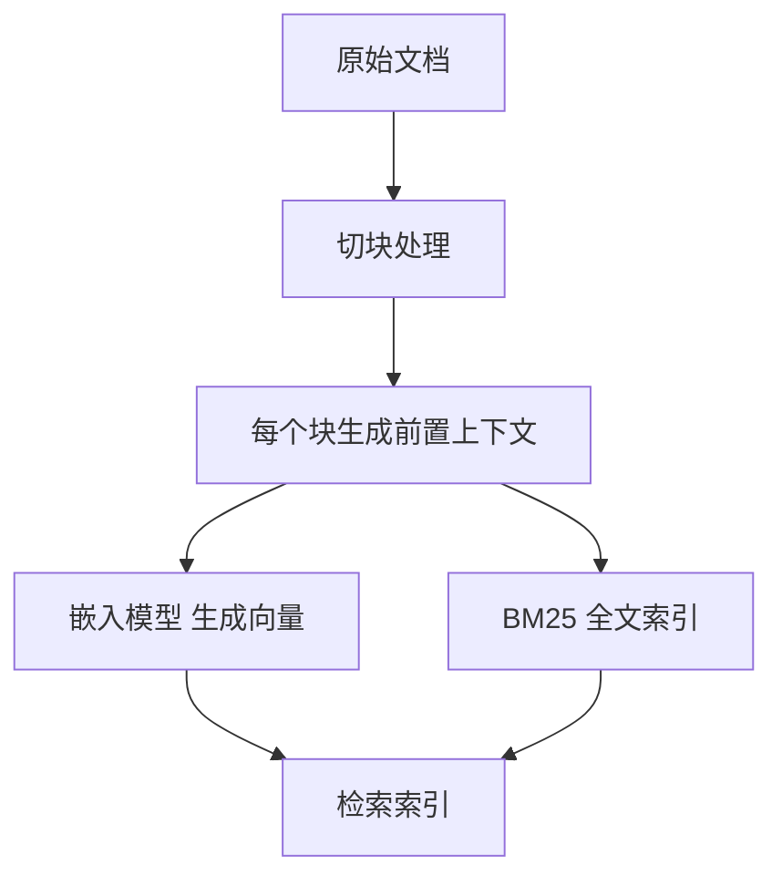
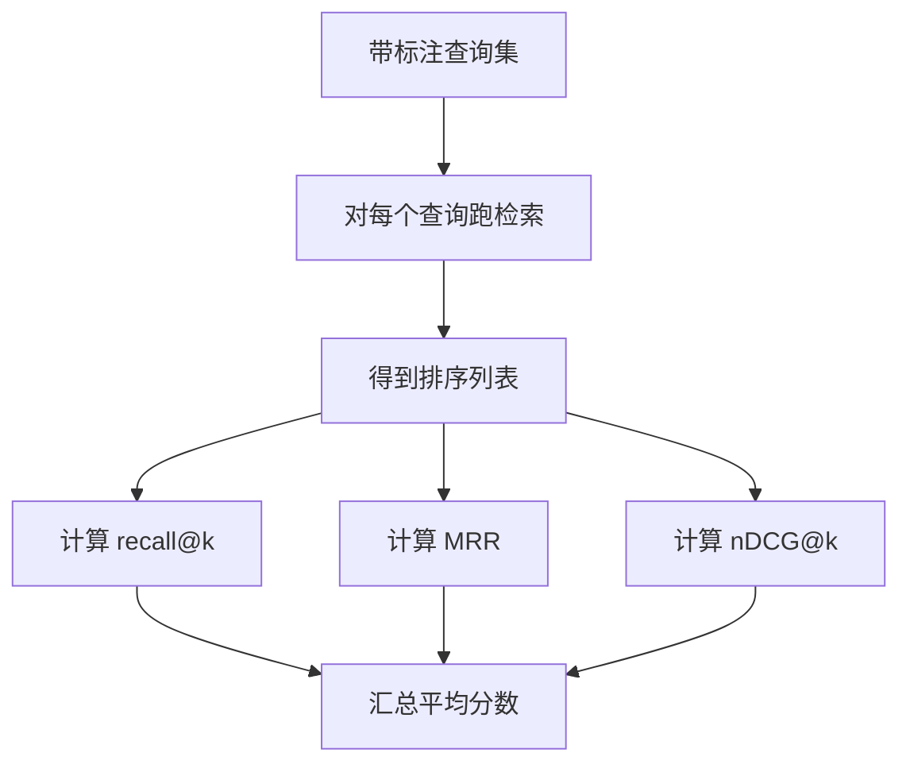

# 混合检索与重排：BM25、向量、RRF 与交叉编码器

!!! abstract "学完这一页你能"
    - 解释稀疏检索与稠密检索各自擅长什么，并说出为什么混合检索通常更稳。
    - 用 PostgreSQL 的 `tsvector` 全文检索加 pgvector 编写混合查询，并把两路结果用 RRF 融合。
    - 手写 RRF 公式与 recall@k、MRR、nDCG 评测脚本，能独立运行并验证结果。
    - 说明重排在流水线中的位置、成本边界，以及查询改写与 Contextual Retrieval 什么时候值得引入。

## 0. 知识地图



建议先读第 1 节理解两路检索的本质差异，再按第 2、3 节把混合查询与 RRF 跑通。第 4 到 6 节是质量提升路径，第 7 节给你评价质量提升的标尺。

## 1. 为什么单靠向量不够：稀疏与稠密的分工

**先想一个问题**
你在做一个内部知识库，用户搜“v1 接口报错 timeout 怎么处理”。纯向量检索可能把“网络超时”的文档排在前面，却漏掉标题里正好写着“timeout 错误码”的那一篇。为什么会这样？

!!! note "术语：稀疏检索"
    稀疏检索把文本表示成词表空间里的权重，通常只有文档中出现的词有非零权重。
    例子：BM25 会给“timeout”这个词一个明确权重，对精确词面匹配敏感。

!!! note "术语：稠密检索"
    稠密检索用向量表示语义，把句子编码成几百到几千维的连续向量。
    例子：OpenAI text-embedding-3-small 默认 1536 维。

**心智模型**

!!! tip "心智模型"
    一句话模型：稀疏检索管“词有没有出现”，稠密检索管“意思像不像”。日常类比：查公交线路时，像“27 路”这种精确编号要按站牌索引查；像“去火车站最快的方式”这种含糊需求要按经验理解来答。类比不成立的地方在于，稀疏检索不只看编号，还能通过词频权重区分重要性；稠密检索也不是真理解，而是从训练分布中学到的语义近似。

**图解**



1. 用户查询同时进入 BM25 与向量两条路。
2. BM25 按词面命中，优先找回精确词“timeout”。
3. 向量检索找回“超时”“网络中断”等非同面但语义相近的内容。
4. 两路结果进入融合与重排，产出最终排序。

**一步一步来**

第 1 步：用两张表分别展示两条路会召回什么。

```javascript
// 这是一段说明性代码，模拟同一查询在两路检索中的命中差异
const query = "v1 接口报错 timeout 怎么处理";
const bm25Hits = [
  { id: "doc-3", title: "timeout 错误码与处理", score: 18.2 },
  { id: "doc-1", title: "接口 timeout 排查手册", score: 15.6 },
]; // BM25 精准命中词面
const vectorHits = [
  { id: "doc-8", title: "网关超时问题修复", score: 0.91 },
  { id: "doc-3", title: "timeout 错误码与处理", score: 0.87 },
]; // 向量找回同义说法
console.log({ bm25Hits, vectorHits });
```

**这段代码在做什么**

- 用一个查询模拟两路检索的输入。
- BM25 的得分是词频相关分数，数值大于 0。
- 向量分数是余弦相似度，通常落在 -1 到 1 之间。
- 两路都命中了 `doc-3`，但排序和覆盖面不同。

运行结果：

```text
{
  bm25Hits: [
    { id: 'doc-3', title: 'timeout 错误码与处理', score: 18.2 },
    { id: 'doc-1', title: '接口 timeout 排查手册', score: 15.6 }
  ],
  vectorHits: [
    { id: 'doc-8', title: '网关超时问题修复', score: 0.91 },
    { id: 'doc-3', title: 'timeout 错误码与处理', score: 0.87 }
  ]
}
```

**动手验证**

```javascript
// 验证：两路检索的交集与并集反映了不同召回来源
const bm25Ids = new Set(["doc-3", "doc-1"]);
const vectorIds = new Set(["doc-8", "doc-3"]);
const intersection = [...bm25Ids].filter((id) => vectorIds.has(id));
const union = new Set([...bm25Ids, ...vectorIds]);

// node:assert 断言交并关系
const assert = require("node:assert/strict");
assert.deepStrictEqual(intersection, ["doc-3"]);
assert.deepStrictEqual(intersection.length, 1);
assert.deepStrictEqual([...union].sort(), ["doc-1", "doc-3", "doc-8"]);
console.log("交集:", intersection, "并集:", [...union].sort());
```

**常见坑**

| 现象 | 原因 | 怎么修 |
|---|---|---|
| 精确 ID、错误码搜不到 | 向量索引只按语义相似度排序，词面命中弱 | 加 BM25 或精确字段过滤 |
| 同义改写完全搜不到 | 只用 BM25，词汇必须完全匹配 | 加向量检索 |
| 两路分数直接相加后结果变差 | BM25 分数与余弦相似度量纲、分布不同 | 用 RRF 或归一化后再融合 |

**用在哪里**

- 业务背景：客服工单搜索。
- 这一节的知识怎么用：错误码、订单号用稀疏检索保证精确命中；用户描述性长句用稠密检索扩展语义命中。
- 用什么指标衡量收益：recall@k 是否提升，同时观察 MRR 是否稳定。
- 什么时候不该用：知识库小于约 200,000 token，可直接整库放进上下文，通常不需要先建混合检索。

**行业实践**

- BAAI 的 BGE-M3 模型卡明确说该模型同时支持稠密、稀疏和多向量检索，官方推荐“混合检索 + 重排”。出处名称：BAAI bge-m3 模型卡。
- Anthropic 研究系统文章报告，Contextual Retrieval 中额外引入 BM25 后，top-20 检索失败率从 3.7% 降到 2.9%，降幅 49%。出处名称：Anthropic 研究系统文章，以原文为准。
- 怎么借鉴到你的项目：先确认你的语料有没有大量精确标识符，有则必须保留 BM25；没有时再做一个小规模标注集对比两路召回覆盖。

**小结**

- 稀疏检索擅长精确词面命中，稠密检索擅长语义扩展。
- 两路分数不可直接相加，因为分布不同。
- 混合检索的收益需要用带标注查询集验证，不应凭感觉上。

## 2. PostgreSQL 混合检索落地：tsvector + pgvector

**先想一个问题**
你的后端已经用 PostgreSQL 存用户、订单和文档，不想为检索再装一个独立向量库。此时能不能在同一个数据库里既做全文检索又做向量检索？

!!! note "术语：tsvector"
    tsvector 是 PostgreSQL 全文检索的文档类型，保存分词后的词条与位置信息。
    例子：`to_tsvector('english', 'hello search')` 生成英文分词后的词条列表。

**心智模型**

!!! tip "心智模型"
    一句话模型：把 Postgres 当作“能同时查词表和向量表”的数据库。日常类比：图书馆一张借阅证既能在书名索引里查精确书名，也能按楼层找到某个主题书架。类比不成立的地方在于，数据库可以跨行 JOIN、事务一致，图书馆的两套检索卡不会参与事务。

**图解**



1. 应用写入文档正文与向量到 PostgreSQL。
2. PostgreSQL 用 tsvector 保存全文检索格式，用 vector 保存向量。
3. 应用发出一个混合查询。
4. PostgreSQL 返回文本命中与向量近邻两路 top-N。
5. 应用层再执行 RRF 融合。

**一步一步来**

第 1 步：安装扩展并建表。

```sql
-- 目的：开启 pgvector 能力，并建立同时支持全文与向量检索的表
CREATE EXTENSION IF NOT EXISTS vector;

CREATE TABLE help_docs (
  id bigserial PRIMARY KEY,
  title text NOT NULL,
  content text NOT NULL,
  textsearch tsvector GENERATED ALWAYS AS (
    to_tsvector('simple', title || ' ' || content)
  ) STORED, -- 存储生成列，保存全文检索格式
  embedding vector(1536) -- 向量列，维度需与嵌入模型一致
);
```

**这段代码在做什么**

- `CREATE EXTENSION vector` 安装 pgvector。
- `textsearch` 是生成列，内容来自 `title` 与 `content` 的拼接。
- `to_tsvector('simple', ...)` 生成全文检索格式。
- `embedding vector(1536)` 保存稠密向量。

第 2 步：写入数据并建立两类索引。

```sql
-- 目的：写入样例数据，并为全文检索与向量近邻建索引
INSERT INTO help_docs (title, content, embedding) VALUES
  ('timeout 错误码与处理', '接口调用超时，返回错误码 ETIMEDOUT', '[0.01, 0.02, ...]'),
  ('网关超时问题修复', '网关在高峰期出现超时问题', '[0.02, 0.01, ...]');

CREATE INDEX help_docs_textsearch_idx ON help_docs USING gin (textsearch);
-- 全文检索常用 GIN 索引
CREATE INDEX help_docs_embedding_idx ON help_docs
  USING hnsw (embedding vector_cosine_ops);
-- 余弦近邻的 HNSW 索引
```

**这段代码在做什么**

- 两条示例文档分别偏向精确词面与语义改写。
- GIN 索引加速 tsvector 的按词查询。
- HNSW 索引加速向量近似最近邻搜索。
- `vector_cosine_ops` 表示按余弦距离排序。

第 3 步：查询两路结果。

```sql
-- 目的：用同一查询同时获得全文命中与向量近邻
SELECT id, title
FROM help_docs, plainto_tsquery('simple', 'timeout 报错 timeout') query
WHERE textsearch @@ query
ORDER BY ts_rank_cd(textsearch, query) DESC
LIMIT 10;

SELECT id, title, 1 - (embedding <=> '[0.01, 0.02, ...]') AS cosine_sim
FROM help_docs
ORDER BY embedding <=> '[0.01, 0.02, ...]'
LIMIT 10;
```

**这段代码在做什么**

- 第一个查询把用户文本转成 tsquery，命中后再按相关性排序。
- `ts_rank_cd` 是 PostgreSQL 内置的相关性函数。
- 第二个查询用余弦距离 `<->` 排序，转成相似度后便于阅读。
- 两个查询都先取 top-N，之后在应用层融合。

第 4 步：用 pgvector 官方 README 的混合检索建议理解融合边界。

```sql
-- 目的：展示 pgvector 本身不提供 RRF 函数，需在应用层实现融合
SELECT id, content
FROM help_docs, plainto_tsquery('simple', 'hello search') query
WHERE textsearch @@ query
ORDER BY ts_rank_cd(textsearch, query) DESC
LIMIT 5;
```

**这段代码在做什么**

- 这是 pgvector README 的全文检索示例结构。
- pgvector 不内置 RRF、不内置 cross-encoder。
- 正确做法是把两路 `ORDER BY ... LIMIT` 的结果取到应用层再融合。

**动手验证**

```javascript
// 验证：模拟 PostgreSQL 两路查询结果，检查合并前需要统一排序键
const assert = require("node:assert/strict");

function normalizePqResult(rows) {
  // 把数据库行转成统一结构
  return rows.map((row, i) => ({ id: row.id, rank: i + 1 }));
}

const textRows = [{ id: 3 }, { id: 1 }];
const vectorRows = [{ id: 8 }, { id: 3 }];
const textRanked = normalizePqResult(textRows);
const vectorRanked = normalizePqResult(vectorRows);

assert.deepStrictEqual(textRanked[0], { id: 3, rank: 1 });
assert.deepStrictEqual(vectorRanked[1], { id: 3, rank: 2 });
console.log("textRanked:", textRanked);
console.log("vectorRanked:", vectorRanked);
```

**常见坑**

| 现象 | 原因 | 怎么修 |
|---|---|---|
| 中文全文检索无效 | PostgreSQL 内置分词对中文无有效切分 | 需核对 zhparser、pg_jieba 或 pg_bigm 扩展 |
| 向量近邻结果时多时少，受过滤影响大 | ANN 先取候选再过滤，强过滤下可能漏召回 | 用迭代扫描或部分索引，见 pgvector 官方 filtering 建议 |
| 两路直接相加排名不稳定 | ts_rank_cd 与余弦距离尺度不同 | 应用层用 RRF 融合 |
| 查询计划慢 | 索引不匹配或语句写法未命中索引 | 检查 GIN 与 HNSW 索引是否被使用 |

**用在哪里**

- 业务背景：电商帮助中心把商品售后文档存在现有 Postgres 库中。
- 这一节的知识怎么用：问题标题和正文用 tsvector 做全文召回，用户自然语言描述用 pgvector 做语义召回。
- 用什么指标衡量收益：混合检索后的 recall@10 比单路是否提升，同时观察 P95 查询延迟。
- 什么时候不该用：向量规模进入数亿级或需要独立分布式扩展时，再评估专用向量库。

**行业实践**

- pgvector 官方 README 明确建议全文检索配合 `plainto_tsquery` 与 `ts_rank_cd`，并链接 Python 的 RRF 与交叉编码器示例。出处名称：pgvector GitHub README。
- Neon 文档指出 HNSW 的速度-召回折中优于 IVFFlat，但建索引更慢、内存更高；IVFFlat 建索引更快、内存更少。出处名称：Neon 官方文档 pgvector 章节。
- 怎么借鉴到你的项目：数据库已有 Postgres 时，可以先上 pgvector，不必立即引入外部向量库；中文场景先验证分词扩展可行性。

**小结**

- PostgreSQL 可以同时承担全文检索与向量检索，避免多一套系统。
- 两路结果必须拉回应用层做 RRF 融合。
- 中文全文检索必须先解决分词扩展，否则 BM25 一路失效。

## 3. RRF：把两路分数融合成一路

**先想一个问题**
BM25 分数可能是 18.2，余弦相似度可能是 0.91。你如果把两个数直接相加，18.2 会淹没 0.91。怎样公平地合并这两组不同尺度的排序？

!!! note "术语：RRF"
    RRF（Reciprocal Rank Fusion）用“排名的倒数”来融合多个排序，公式为每篇文档得分 `Σ 1/(k + rank_i)`。
    例子：某文档在两路分别排第 1 和第 3，取 k=60 时得分为 `1/(60+1) + 1/(60+3)`。

**心智模型**

!!! tip "心智模型"
    一句话模型：RRF 不看分数绝对值，只看“排在第几”。日常类比：两个评委评分标准不同，但你可以只看他们各自给出的名次来裁定。类比不成立的地方是，RRF 把名次差距压缩成一个特定的分数曲线，而不是简单计名次总和。

**图解**



1. 两路各自输出带排名的不重名文档列表。
2. RRF 对每篇文档计算 `1/(k + rank)`。
3. 同一文档在不同路中的得分相加。
4. 按累加得分从高到低排序输出。

**一步一步来**

第 1 步：手写 RRF 融合函数。

```javascript
// 目的：把多路排名结果按 RRF 公式合并
function rrf(resultsPerList, k = 60) {
  const scores = new Map();
  for (const list of resultsPerList) {
    list.forEach((docId, index) => {
      const rank = index + 1; // 排名从 1 开始
      const gain = 1 / (k + rank); // RRF 单路得分
      scores.set(docId, (scores.get(docId) || 0) + gain);
    });
  }
  return [...scores.entries()]
    .sort((a, b) => b[1] - a[1]) // 按融合分降序排列
    .map(([docId, score]) => ({ docId, score: Number(score.toFixed(5)) }));
}

const merged = rrf([
  ["doc-3", "doc-1"],
  ["doc-8", "doc-3"],
]);
console.log(merged);
```

**这段代码在做什么**

- 每一路是一组按排名排序的文档 id。
- `rank` 从 1 开始，对应公式中的 rank_i。
- `k` 取常用值 60。
- 同一文档在所有路中的得分累加到 Map。
- 最后按分数降序返回。

运行结果：

```text
[
  { docId: 'doc-3', score: 0.03252 },
  { docId: 'doc-8', score: 0.01639 },
  { docId: 'doc-1', score: 0.01613 }
]
```

**动手验证**

```javascript
// 验证：RRF 函数在示例输入下输出正确的融合排序
const assert = require("node:assert/strict");
const fused = rrf([["a", "b"], ["b", "a"]]);
assert.deepStrictEqual(fused[0], { docId: "a", score: 0.03252 });
assert.deepStrictEqual(fused[1], { docId: "b", score: 0.03252 });
console.log("RRF 并列验证通过:", fused);
```

**常见坑**

| 现象 | 原因 | 怎么修 |
|---|---|---|
| 排名并列时文档得分相同 | RRF 只用排名，自然可能并列 | 业务上可再用次级排序字段打破平局 |
| k 值随意改动后结果大变 | k 控制比分曲线的平缓程度 | 固定 k=60，除非有评测数据支持调整 |
| 每路 top-N 深度不同导致结果偏向某一路 | 遗漏排名信息 | 各路取相同或接近的 top-N |

**用在哪里**

- 业务背景：代码库文档搜索同时用符号名和语义理解。
- 这一节的知识怎么用：把 BM25 结果与向量结果用 RRF 融合，避免直接比较分数。
- 用什么指标衡量收益：融合后的 nDCG@10 是否优于任一路。
- 什么时候不该用：如果两路分数已经具有完全相同分布，也可以尝试归一化，但通常 RRF 是更稳的默认选择。

**行业实践**

- RRF 公式来自 Cormack 等人的研究，常用 k=60。出处名称：Cormack et al.，SIGIR 2009，具体论文 PDF 本次未能抓取，以原文为准。
- pgvector 官方 README 没有把 RRF 内置进 SQL，而是采用应用层融合示例。出处名称：pgvector GitHub README。
- 怎么借鉴到你的项目：实现一个轻量 RRF 函数，集中处理 BM25 与向量结果；不要为了省事直接在数据库里相加分数。

**小结**

- RRF 只依赖排名，不受两路分数量纲影响。
- 实现简单，只需 Map 累加与排序。
- k=60 是常用默认值，需固定并在评测中保持一致。

## 4. 重排：用交叉编码器做精排

**先想一个问题**
召回阶段返回了 100 个候选，但用户只想看最相关的 5 个。如果把 100 个候选都塞给生成模型，token 成本很高；怎么在生成前把最相关的挑准？

!!! note "术语：交叉编码器"
    交叉编码器把查询与文档拼接成一对输入，直接输出相关性分数，而不是各自先编码成向量。
    例子：bge-reranker 与 Cohere Rerank 属于交叉编码器或类似重排模型。

**心智模型**

!!! tip "心智模型"
    一句话模型：召回负责“别漏”，重排负责“把最对的放前面”。日常类比：招聘时先筛掉明显不符的简历，再让面试官逐份细看排优先级。类比不成立的地方是，交叉编码器不是人类面试官，它对语义匹配的判断仍可能漏掉精确词或专业约束。

**图解**



1. 混合检索先召回 top-100，保证覆盖面。
2. 重排层逐对计算查询与文档的相关性。
3. 输出 top-5，大幅减少进入上下文的内容量。
4. 生成层基于精排结果作答。

**一步一步来**

第 1 步：实现重排调用壳，明确输入输出位置。

```javascript
// 目的：定义重排接口输入输出契约，网络请求需对接真实重排服务
async function rerankWithCrossEncoder(query, docs) {
  // 请求体：查询与候选文档列表
  const payload = { query, documents: docs };
  // 真实实现需替换为你的重排服务地址，接口细节需核对官方文档
  const response = await fetch("http://localhost:8000/rerank", {
    method: "POST",
    headers: { "content-type": "application/json" },
    body: JSON.stringify(payload),
  });
  if (!response.ok) throw new Error(`rerank failed: ${response.status}`);
  const data = await response.json();
  // 期望返回 [{ index, score }]，按 score 降序排列
  return data.sort((a, b) => b.score - a.score);
}
```

**这段代码在做什么**

- 函数接收查询与候选文档数组。
- 请求体只包含结构化数据，不涉及具体模型名称，避免绑定某个未核对的 API。
- 响应期望包含索引与分数，按分数降序排序。
- 真实模型名与调用方式需核对具体重排服务官方文档。

第 2 步：在本地模拟重排结果，完成从候选到精排的流水线。

```javascript
// 目的：用固定分数完成一次候选排序，便于测试后续流程
function mockRerank(docs) {
  const scores = docs.map((doc, index) => ({
    index,
    score: 0.95 - index * 0.05, // 模拟递减相关性
  }));
  return scores.sort((a, b) => b.score - a.score);
}

const candidates = ["doc-3", "doc-8", "doc-1"];
const ranked = mockRerank(candidates);
console.log(ranked.map((item) => candidates[item.index]));
```

**这段代码在做什么**

- `mockRerank` 返回每个候选的下标与模拟分数。
- 用于离线验证上游到下游的契约，不依赖真实模型。
- 输出按分数降序的文档 id。

运行结果：

```text
[ 'doc-3', 'doc-8', 'doc-1' ]
```

**动手验证**

```javascript
// 验证：重排后输出顺序符合分数降序
const assert = require("node:assert/strict");
const result = mockRerank(["a", "b", "c"]);
const ordered = result.map((x) => ["a", "b", "c"][x.index]);
assert.deepStrictEqual(ordered, ["a", "b", "c"]);
let prev = Infinity;
for (const item of result) {
  assert.ok(item.score <= prev);
  prev = item.score;
}
console.log("重排分数降序验证通过");
```

**常见坑**

| 现象 | 原因 | 怎么修 |
|---|---|---|
| 重排后反而丢了精确词文档 | 交叉编码器对词面匹配不敏感 | 保留少量精确匹配特征，或对精确命中加权 |
| 重排延迟高 | 对每个查询-文档对单独编码 | 控制重排候选数，通常 100 到 150 |
| 重排结果不可复现 | 模型服务更新或参数变化 | 固定模型版本，记录服务版本号 |

**用在哪里**

- 业务背景：客服知识库首先混合召回 100 条，再精排 5 条给大模型生成答案。
- 这一节的知识怎么用：在混合检索后插入交叉编码器，输入 top-100，输出生成层所需 top-5。
- 用什么指标衡量收益：重排前后的 MRR@5、nDCG@5，以及生成回答的事实支持率。
- 什么时候不该用：候选数很少时可直接交给生成模型；如果查询与文档几乎没有语义歧义，重排收益可能不明显。

**行业实践**

- Anthropic 研究系统文章报告，加入重排后，top-20 检索失败率从 2.9% 进一步降到 1.9%，累计降幅 67%。出处名称：Anthropic 研究系统文章，以原文为准。
- pgvector README 在混合检索部分推荐交叉编码器重排，并链接了 Python 示例。出处名称：pgvector GitHub README。
- 怎么借鉴到你的项目：先把召回流水线跑通，再加重排；重排候选数固定在一个范围，用评测集验证净收益。

**小结**

- 召回要宽，重排要准。
- 交叉编码器以查询与文档成对计算，需控制候选规模。
- 重排是质量路径中收益明显的环节，但要验证延迟与成本。

## 5. 查询改写：HyDE 与多查询

**先想一个问题**
用户输入的查询很短，比如只有一个词“降级”。如果直接拿“降级”去检索，向量或 BM25 都可能召回大量无关文档。能不能先让模型把查询变丰富再检索？

!!! note "术语：HyDE"
    HyDE（Hypothetical Document Embeddings）先用大模型根据查询生成一篇假想答案或假想文档，再用这篇假想文档的向量去检索。
    例子：查询“降级”，模型先生成“系统在某功能异常时把非核心能力关闭的过程”，再拿这句话做向量检索。

**心智模型**

!!! tip "心智模型"
    一句话模型：查询改写是“先想清楚用户到底问什么，再去检索”。日常类比：图书馆员会先复述你的问题，确认你要查的是“系统降级”而不是“员工降级”，再动手检索。类比不成立的地方是，这里的改写由语言模型完成，可能因为模型幻觉引入不存在的条件。

**图解**



1. 原始查询有多义性时，直接检索风险高。
2. HyDE 先生成假想文档，再拿其向量检索。
3. 多查询要求模型生成若干不同改写。
4. 多路并行检索后用 RRF 融合。

**一步一步来**

第 1 步：实现多查询改写的函数骨架。

```javascript
// 目的：把原始查询交给改写服务，产出多个改写后的查询
async function generateQueries(originalQuery) {
  const payload = { query: originalQuery, n: 3 }; // n 表示生成几个改写
  const response = await fetch("http://localhost:8000/rewrite", {
    method: "POST",
    headers: { "content-type": "application/json" },
    body: JSON.stringify(payload),
  });
  if (!response.ok) throw new Error(`rewrite failed: ${response.status}`);
  const data = await response.json();
  return data.queries; // 期望返回字符串数组
}
```

**这段代码在做什么**

- 定义一个查询改写网络调用。
- 真实实现需依赖改写服务，接口细节需核对具体服务官方文档。
- 返回值为多个改写字符串，供并行检索使用。

第 2 步：模拟 HyDE 流程。

```javascript
// 目的：模拟根据查询生成假想文档，再标记其影响
function mockHypotheticalDoc(query) {
  return `${query} 通常指系统在异常时关闭非核心能力`; // 模拟生成结果
}

const query = "降级";
const hydeDoc = mockHypotheticalDoc(query);
console.log("原始查询:", query);
console.log("假想文档:", hydeDoc);
```

**这段代码在做什么**

- 说明 HyDE 的输入是查询，输出是假想文档文本。
- 后续步骤会拿假想文档而不是原始查询去请求向量嵌入。
- 这里仅模拟文本，实际嵌入需调用嵌入模型。

**动手验证**

```javascript
// 验证：多查询改写数量符合请求，且内容不重复
const assert = require("node:assert/strict");
async function run() {
  const queries = ["降级", "系统降级方案", "服务降级如何实施"];
  assert.strictEqual(queries.length, 3);
  assert.strictEqual(new Set(queries).size, queries.length);
  console.log("查询改写数量与唯一性验证通过");
}
run();
```

**常见坑**

| 现象 | 原因 | 怎么修 |
|---|---|---|
| 改写后的查询反而偏离原意 | 语言模型扩展过度 | 限制改写数量，保留原查询参与融合 |
| 多查询并行导致延迟增加 | 每次改写都要检索一遍 | 控制改写数量，通常 3 到 5 条 |
| HyDE 引入不存在事实 | 生成过程可能幻觉 | 仅把假想文档用于检索，不直接交给用户 |

**用在哪里**

- 业务背景：企业内部运维助手要处理“降级”“熔断”“隔离”等术语。
- 这一节的知识怎么用：先让模型把短查询改写成 3 个明确表达，再并行检索并 RRF 融合。
- 用什么指标衡量收益：检索集上的 recall@20 与 nDCG@10 是否有提升。
- 什么时候不该用：查询已经很具体或搜索场景要求低延迟时，可以跳过改写。

**行业实践**

- HyDE 来自 Gao et al. 的研究，论文报告零样本下显著优于 Contriever，并与有监督检索器相当。出处名称：HyDE 论文 arXiv:2212.10496。
- 多查询与 step-back 属于常见查询改写策略，但本次未能抓取到一手定义，需核对官方文档。
- 怎么借鉴到你的项目：优先实现多查询改写，因为它可以复用现有检索链路；HyDE 延迟更高，仅在短查询与概念词场景尝试。

**小结**

- 查询改写解决短查询、歧义查询的召回不足。
- 多查询结合 RRF，HyDE 用假想文档扩展语义。
- 改写会让查询延迟增加，需要控制数量并测量收益。

## 6. Contextual Retrieval：先补上下文再索引

**先想一个问题**
你的知识库里有大量小块文档，其中一块写“公司决定延迟发布”，用户搜不到，因为这块没有出现产品名。能不能在切块时就给每个块补上缺失的上下文？

!!! note "术语：Contextual Retrieval"
    Contextual Retrieval 是在切块后，用大模型给每个块生成一段前置上下文说明，再把这个上下文与原块拼接后做嵌入和 BM25。
    例子：原块是“决定延迟发布”，模型补充“本块来自某某产品 2024 年发布计划，讨论发布时间调整”。

**心智模型**

!!! tip "心智模型"
    一句话模型：先给每个碎片补一个“它来自哪、在说什么”的标签，再索引。日常类比：把剪报按主题归档时，先贴一张便签说明背景。类比不成立的地方是，补写的上下文由语言模型生成，可能概括偏差；论文也要求保留原文，而不是只索引改写内容。

**图解**



1. 文档先切成小块，保证检索粒度。
2. 每个块由模型生成一段上下文。
3. 上下文与块拼接后分别做嵌入与全文索引。
4. 索引后的语料进入混合检索。

**一步一步来**

第 1 步：写清上下文生成的输入输出结构。

```javascript
// 目的：定义上下文生成函数，输入块文本，输出前置上下文
async function generateContext(chunkText, docTitle) {
  const payload = { chunk: chunkText, docTitle };
  const response = await fetch("http://localhost:8000/generate-context", {
    method: "POST",
    headers: { "content-type": "application/json" },
    body: JSON.stringify(payload),
  });
  if (!response.ok) throw new Error(`context gen failed: ${response.status}`);
  const data = await response.json();
  return data.context; // 期望返回一段上下文字符串
}
```

**这段代码在做什么**

- 接口接收块文本与所属文档标题。
- 返回一段前置上下文字符串。
- 后续会把前置上下文与块文本拼接后送入索引。

第 2 步：模拟拼接后的索引文本，观察检索目标变化。

```javascript
// 目的：演示上下文补全如何让精确检索更容易命中
const chunk = "决定延迟发布";
const context = "本块来自产品 A 2024 年发布计划，讨论发布时间调整。";
const indexText = `${context} ${chunk}`;
console.log(indexText);
// 拼接后的文本可直接做 BM25 和向量嵌入
```

**这段代码在做什么**

- 原块缺少产品名，搜索“产品 A 发布时间”时难以命中。
- 补写上下文后，文本中引入了“产品 A”“发布时间”等可检索词。
- 索引应使用拼接文本，检索命中后再返回原始块内容。

**动手验证**

```javascript
// 验证：补全后的文本比原块多出关键检索词
const assert = require("node:assert/strict");
const chunk = "决定延迟发布";
const context = "本块来自产品 A 2024 年发布计划，讨论发布时间调整";
const indexText = `${context} ${chunk}`;
assert.ok(indexText.includes("产品 A"));
assert.ok(!chunk.includes("产品 A"));
console.log("上下文补全前不含产品名，补全后包含产品名");
```

**常见坑**

| 现象 | 原因 | 怎么修 |
|---|---|---|
| 上下文生成成本高 | 每个块都要调用大模型 | 用小规模语料验证收益，仅对高频检索块生成 |
| 改写上下文与原文不一致 | 模型生成产生偏差 | 保留原始块，不单独以补全文本返回给用户 |
| 索引文本变长后精确词权重被稀释 | 上下文占比过高 | 控制上下文长度，通常一到两句话 |

**用在哪里**

- 业务背景：产品文档拆成几百个小块，存在跨块指代与缺失主题词。
- 这一节的知识怎么用：切块后先调用模型为每块生成前置上下文，再进入混合检索。
- 用什么指标衡量收益：检索失败率、recall@20 与生成答案的引用完整度。
- 什么时候不该用：语料很小、每块都很完整、成本预算不足时不必要。

**行业实践**

- Anthropic 研究系统文章报告，基线 top-20 检索失败率 5.7%；Contextual Embeddings 单独降到 3.7%，降幅 35%；加 Contextual BM25 后降到 2.9%，降幅 49%；再加重排降到 1.9%，降幅 67%。一次性生成成本约 1.02 美元每百万文档 token，借助 prompt caching。出处名称：Anthropic 研究系统文章，以原文为准。
- 论文也说明知识库小于 200,000 token（约 500 页）时可直接放进提示词，不必做 RAG。出处名称：Anthropic 研究系统文章。
- 怎么借鉴到你的项目：先把切块质量做好，再考虑上下文补全；优先试点在高价值、块缺失严重的语料上。

**小结**

- Contextual Retrieval 在切块后补上下文，再同时改善向量与 BM25。
- 收益在 Anthropic 实验中明确，但有额外调用成本。
- 小语料应先考虑整库进上下文，不必盲目上 RAG。

## 7. 手写评测脚本：recall@k、MRR、nDCG

**先想一个问题**
你改了混合检索权重或加了重排，怎么知道结果真的变好了？需要有可复现的离线指标，而不是只看一两次搜索效果。

!!! note "术语：recall@k"
    recall@k 衡量前 k 个结果中覆盖了多少标注相关文档。
    例子：某个查询有 4 篇相关文档，前 10 结果命中 3 篇，recall@10 为 3/4。

!!! note "术语：MRR"
    MRR（Mean Reciprocal Rank）衡量第一个相关结果出现位置的倒数均值。
    例子：第一个相关结果排第 2，该查询贡献 1/2。

!!! note "术语：nDCG"
    nDCG（Normalized Discounted Cumulative Gain）按位置折损收益，再与理想排序归一化。
    例子：越靠前的相关文档获得越高折损收益。

**心智模型**

!!! tip "心智模型"
    一句话模型：召回看“有没有捞回”，MRR 看“第一个相关点在哪”，nDCG 看“整体排序有多好”。日常类比：看寻宝队有没有找回宝物、第一件宝物多久找到、所有宝物的位置是否靠前。类比不成立的地方是，离线指标必须依赖人工标注相关文档，与真实用户点击仍有差距。

**图解**



1. 准备有标注相关文档的查询集。
2. 对每个查询执行同样的检索流水线。
3. 用固定脚本计算三个指标。
4. 汇总所有查询的均值作为离线评测结论。

**一步一步来**

第 1 步：实现 recall@k 与 MRR。

```javascript
// 目的：计算单个查询的 recall 与 reciprocal rank
function recallAtK(rankedIds, relevantIds, k) {
  const top = rankedIds.slice(0, k); // 只看前 k 结果
  const hit = top.filter((id) => relevantIds.includes(id)).length; // 命中的相关文档数
  return hit / relevantIds.length; // 覆盖比例
}

function reciprocalRank(rankedIds, relevantIds) {
  const index = rankedIds.findIndex((id) => relevantIds.includes(id)); // 第一个相关位置
  return index === -1 ? 0 : 1 / (index + 1); // 倒数排名
}

const ranked = ["x", "a", "b", "c"];
const relevant = ["a", "c"];
console.log("recall@3:", recallAtK(ranked, relevant, 3));
console.log("reciprocal rank:", reciprocalRank(ranked, relevant));
```

**这段代码在做什么**

- `recallAtK` 只截取前 k 个再计命中。
- `reciprocalRank` 找到第一个相关文档的排名。
- 若没有相关文档命中，返回 0。

运行结果：

```text
recall@3: 0.5
reciprocal rank: 0.5
```

第 2 步：实现 DCG 与 nDCG。

```javascript
// 目的：按位置折损计算 DCG，再归一化为 nDCG
function dcgAtK(rankedIds, relevantIds, k) {
  const top = rankedIds.slice(0, k);
  let dcg = 0;
  top.forEach((id, i) => {
    if (relevantIds.includes(id)) {
      dcg += 1 / Math.log2(i + 2); // 位置折损
    }
  });
  return dcg;
}

function ndcgAtK(rankedIds, relevantIds, k) {
  const dcg = dcgAtK(rankedIds, relevantIds, k);
  const ideal = relevantIds.slice(0, k).map((id) => id); // 理想排序：相关文档全在前 k
  const idcg = dcgAtK(ideal, relevantIds, k);
  return idcg === 0 ? 0 : dcg / idcg;
}

console.log("ndcg@4:", ndcgAtK(ranked, relevant, 4).toFixed(4));
```

**这段代码在做什么**

- DCG 对越靠后的位置折损越大。
- IDCG 是理想排序下的折损收益。
- nDCG 将 DCG 除以 IDCG，落到 0 到 1。

**动手验证**

```javascript
// 验证：完整评测脚本的已知结论
const assert = require("node:assert/strict");

function mean(arr) {
  return arr.reduce((sum, v) => sum + v, 0) / arr.length;
}

function evaluate(queries) {
  const recalls = queries.map((q) => recallAtK(q.ranked, q.relevant, 3));
  const rr = queries.map((q) => reciprocalRank(q.ranked, q.relevant));
  const ndcg = queries.map((q) => ndcgAtK(q.ranked, q.relevant, 3));
  return {
    recallAt3: mean(recalls),
    mrr: mean(rr),
    ndcgAt3: mean(ndcg),
  };
}

const dataset = [
  { ranked: ["a", "b", "c"], relevant: ["c"] },
  { ranked: ["b", "c", "a"], relevant: ["a", "b"] },
];
const report = evaluate(dataset);
assert.ok(report.recallAt3 > 0);
assert.ok(report.mrr > 0);
assert.ok(report.ndcgAt3 > 0);
console.log("评测报告:", report);
```

**常见坑**

| 现象 | 原因 | 怎么修 |
|---|---|---|
| 相关文档数太少的查询把结果炸大或无定义 | 除数为 0 或小样本抖动 | 每个查询至少标注 2 到 5 个相关文档 |
| 只看 recall 不看排序质量 | 指标粒度不同 | 联合报告 recall@k、MRR、nDCG@k |
| 离线指标提升但线上业务指标没变 | 标注集与真实需求不匹配 | 定期更新标注集，必要时引入端到端评估 |

**用在哪里**

- 业务背景：搜索团队每次变更检索参数后要发布回归报告。
- 这一节的知识怎么用：把离线评测脚本固定下来，在 CI 中对标注集运行。
- 用什么指标衡量收益：以 recall@10、MRR、nDCG@10 的均值变化作为发布门槛。
- 什么时候不该用：没有标注集时，可以先用点击日志或业务反馈建立弱标注，再逐步补强。

**行业实践**

- RAGAS 官方文档提供 Faithfulness、Context Precision、Context Recall 等指标，其中部分依赖大模型打分。出处名称：RAGAS 官方文档 available_metrics 章节。
- 传统检索评测先建立带标注查询集，再单独评估检索层，之后才评估生成层。该建议为工程通用实践，具体出处需核对官方文档。
- 怎么借鉴到你的项目：先用本节的三个传统指标评估检索层，再引入 RAGAS 评估生成质量。

**小结**

- recall@k 看覆盖，MRR 看第一个相关位置，nDCG 看整体排序。
- 三个指标一起报告，可以避免只优化单一维度。
- 标注集质量决定离线结论可信度。

## 应用地图

| 场景 | 用到本页哪个知识点 | 典型技术选型 | 注意事项 |
|---|---|---|---|
| 电商帮助中心文档搜索 | 稠密检索、BM25、RRF | PostgreSQL tsvector + pgvector | 中文需要分词扩展 |
| 客服工单检索 | 交叉编码器重排 | 混合召回 + bge-reranker | 控制重排候选数 |
| 内部运维知识库 | 查询改写、混合检索 | 多查询改写 + RRF | 短术语查询需要改写 |
| 产品手册分块检索 | Contextual Retrieval | 上下文补全 + BM25 + 向量 | 块越小上下文补全收益越明显 |
| 代码仓库符号搜索 | 稀疏检索 + 向量索引 | BM25 + trigram 或向量 | 强词法线索别只用向量 |
| 大模型问答系统的证据召回 | 全链路混合检索与重排 | top-100 召回加 top-5 精排 | 保留来源元数据用于引用 |
| 多语言文档检索 | 稠密检索与稀疏检索 | BGE-M3 或 Qwen3-Embedding | 换嵌入模型必须重建索引 |
| 离线检索质量回归 | recall@k、MRR、nDCG | 手写评测脚本 | 标注集需与你目标场景一致 |

## 动手作业

目标：做一个完整的混合检索 + RRF + 评测脚本。

步骤：

1. 准备一个 10 到 20 条的模拟文档集和 3 个查询，为每个查询标注相关文档 id。
2. 用两个数组分别模拟 BM25 与向量两路的 top-10 排名结果。
3. 实现 RRF 融合，输出每个查询的融合前 10 结果。
4. 实现 recall@10、MRR、nDCG@10，输出评测报告。

验收标准：

- `npm init -y` 后无需任何第三方依赖，用 `node main.js` 可运行。
- 脚本包含 `node:assert` 断言：断言每个查询的融合结果长度不超过 10，且三个指标都在 0 到 1 之间。
- 运行结束能打印每个查询的融合排名和汇总指标。

## 综合对比

| 维度 | BM25 稀疏检索 | 向量稠密检索 | RRF 融合 | 交叉编码器重排 |
|---|---|---|---|---|
| 输入 | 词面与词频 | 向量相似度 | 多路排名 | 查询与文档成对 |
| 主要优势 | 精确标识符、错误码 | 同义表达、语义扩展 | 分数尺度无关 | 排序精度高 |
| 主要成本 | 依赖分词 | 存储向量、建索引 | 基本无计算成本 | 每对单独计算，延迟高 |
| 召回能力 | 低语义泛化 | 高语义泛化 | 覆盖两路 | 通常不算召回端 |
| 适用阶段 | 召回 | 召回 | 融合 | 精排 |
| 延迟数量级 | 毫秒级 | 近邻搜索毫秒到几十毫秒 | 微秒级 | 重排候选数越大越慢 |

## 深入阅读与参考

!!! tip "怎么用这些资料"
    先读「官方文档与规范」建立准确的概念，再读「源码与示例」核对细节，最后用「教程、书籍与视频」换一种讲法加深理解。每条都写明了读哪一节、带着什么问题读。

### 官方文档与规范

| 资源 | 为什么读 | 怎么读 |
|---|---|---|
| [AWS 称 Aurora PostgreSQL 上的 pgvector 0.8.0 "最高 9x 查询更快、100x 结果更相关",归因于迭 (aws.amazon.com)](https://aws.amazon.com/blogs/database/supercharging-vector-search-performance-and-relevance-with-pgvector-0-8-0-on-amazon-aurora-postgresql) | pgvector 0.8 性能收益的一手数据，说明索引升级的动机。 | 读性能对比段落，带着「迭代扫描与并行构建如何提速」读，读后对照本页索引选型。 |
| [RAGAS 指标: Faithfulness(回答是否被检索上下文支持)、Context Precision、Context Recall、 (docs.ragas.io)](https://docs.ragas.io/en/stable/concepts/metrics/available_metrics/) | 检索评测指标的权威定义，可与自写脚本交叉验证。 | 读 context recall 与 precision 定义，弄清它们和 recall@k 的口径差异。 |
| [Neon 文档对权衡的表述: HNSW 的速度-召回折中优于 IVFFlat,但建索引更慢、内存更高,且无训练阶段,可在空表上建;IVFFl (neon.com)](https://neon.com/docs/extensions/pgvector) | HNSW 与 IVFFlat 的速度、召回、内存权衡讲得清楚。 | 读对比表，带着「我的数据量该选哪个」读，读完定下索引类型与参数。 |
| [README 当前版本 0.8.7,支持 Postgres 13+。升级: `ALTER EXTENSION vector UPDATE;` (github.com)](https://github.com/pgvector/pgvector) | 安装、操作符与索引的权威说明，动手环节必备参考。 | 读索引与操作符章节，照示例跑一遍 HNSW 建索引与近邻查询。 |
| [RRF 公式 score = Σ 1/(k + rank_i),常用 k=60,出自 Cormack et al., SIGIR 2009。 (cormack.uwaterloo.ca)](http://cormack.uwaterloo.ca/cormacksigir09-rrf.pdf) | RRF 公式与 k=60 的原始出处，避免二手转述出错。 | 读公式与实验设置一节，理解为何只用排名而非原始分数融合。 |
| [PostgreSQL 官方教程](https://www.postgresql.org/docs/current/tutorial.html) | tsvector、GIN 与全文检索的权威入门，稀疏一路的基础。 | 读全文检索一章，建 tsvector 列与 GIN 索引，跑通 @@ 与 ts_rank 查询。 |

### 源码与示例

| 资源 | 为什么读 | 怎么读 |
|---|---|---|
| [BGE-M3(BAAI): 1024 维,最长 8192 token,100+ 语言,同时支持稠密、稀疏(类 BM25 词权重)和多向量(C (huggingface.co)](https://huggingface.co/BAAI/bge-m3) | 一个模型同时给出稠密、稀疏、多向量，是混合检索现成范例。 | 读 dense/sparse/colbert 用法片段，跑一次三路打分，观察如何交给 RRF 融合。 |
| [ann-benchmarks: 测 recall vs QPS;15+ 数据集,维度 25 到 27,983,训练集 6 万到 999 万; (github.com)](https://github.com/erikbern/ann-benchmarks) | 可复现的 recall-QPS 基准，展示索引评测该怎么搭。 | 读配置与结果图，选一个小数据集本地跑一次，理解召回与延迟的取舍。 |

### 教程、书籍与视频

| 资源 | 为什么读 | 怎么读 |
|---|---|---|
| [查询改写: HyDE(Gao et al.)先让 LLM 生成假想文档再用其嵌入检索,零样本下显著优于 Contriever,与有监督检索器 (arxiv.org)](https://arxiv.org/abs/2212.10496) | HyDE 原始论文，零样本查询改写的思路与实验最完整。 | 读方法一节与零样本结果表，弄清假想文档为何能对齐嵌入空间，再复现一次改写。 |
| [Contextual Retrieval](https://www.anthropic.com/news/contextual-retrieval) | 分块补上下文的具体做法，附召回率对比，可直接照做。 | 跟做示例，比较补上下文前后的召回，再把结论接回本页索引流程。 |

## 自测题

??? question "1. 为什么两路检索分数不能直接相加？"
    答案要点：BM25 分数与余弦相似度的量纲、分布都不同；直接相加会让高分值的 BM25 淹没向量分；RRF 用排名而不是原始分数来融合，天然避开量纲问题。

??? question "2. PostgreSQL 里哪两个组件承担混合检索？"
    答案要点：tsvector 承担全文检索；pgvector 的 vector 类型承担向量近邻检索；tsvector 常用 GIN 索引，向量常建 HNSW 或 IVFFlat 索引。

??? question "3. RRF 公式中 k 的作用是什么？"
    答案要点：k 控制排名倒数得分曲线的平缓度；k 越大，不同排名的得分差距越小；论文常采用 k=60，工程上一般固定不变。

??? question "4. 召回阶段与重排阶段的目标分别是什么？"
    答案要点：召回阶段优先保证召回面，允许结果较宽；重排阶段对候选精排，把最相关的放前面；重排成本通常更高，所以只处理召回后的 top-N。

??? question "5. HyDE 与多查询有什么不同？"
    答案要点：HyDE 生成一篇假想文档，并用该文档的向量检索；多查询生成多个改写查询，分别检索后融合；两者都增加延迟，适用于短或歧义查询。

??? question "6. Contextual Retrieval 的做法是什么？"
    答案要点：先把文档切块；对每块生成一段前置上下文；把上下文与原文拼接后做向量与 BM25 索引；Anthropic 实验报告了失败率从 5.7% 降幅到 1.9% 的组合效果，以原文为准。

??? question "7. recall@k、MRR、nDCG 分别回答什么问题？"
    答案要点：recall@k 回答前 k 结果覆盖了多少相关文档；MRR 看第一个相关文档出现在第几位；nDCG 衡量整个排序与理想排序的接近程度；三者要一起看。

??? question "8. 中文场景实施文本混合检索时，最重要的前置条件是什么？"
    答案要点：需要解决中文分词；PostgreSQL 内置 to_tsvector 对中文无效；需核对 zhparser、pg_jieba、pg_bigm 等扩展的可维护性与兼容性。

## 延伸阅读

- pgvector GitHub README：Querying、Indexing、Filtering、Hybrid Search 等章节。
- Anthropic 研究系统文章：Contextual Retrieval 章节与失败率实验结果。
- BAAI bge-m3 模型卡：Dense、Sparse、Multi-Vector 三种检索能力与使用建议。
- Qwen3-Embedding 模型卡：模型版本、维度、MRL 支持与多语言能力。
- OpenAI embeddings 指南：text-embedding-3 维度、输入长度与 Matryoshka 参数。
- RAGAS 官方文档：available metrics 章节，Faithfulness、Context Precision 与 Context Recall。
- HyDE 论文 arXiv:2212.10496：方法与零样本实验结果。
- Cursor 官方博客 Secure Codebase Indexing：代码索引、分块与团队复用机制。
