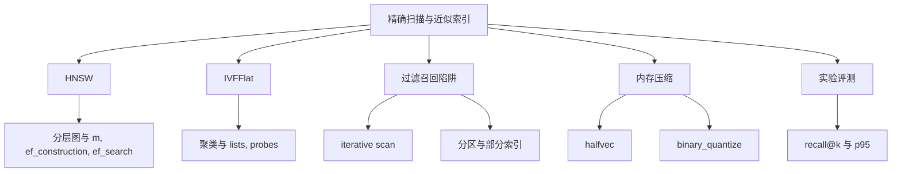
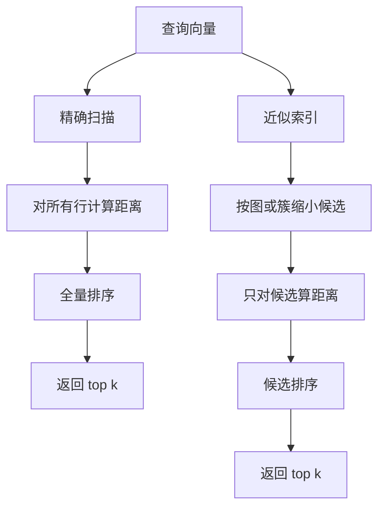
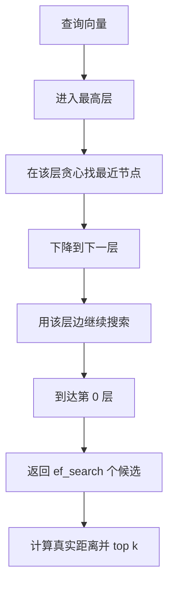
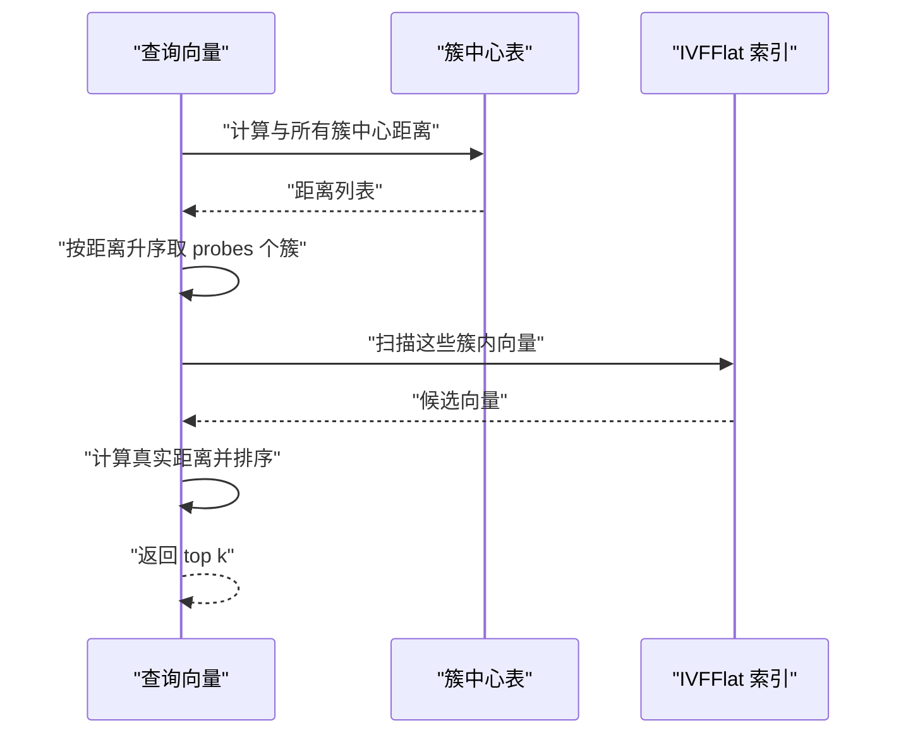
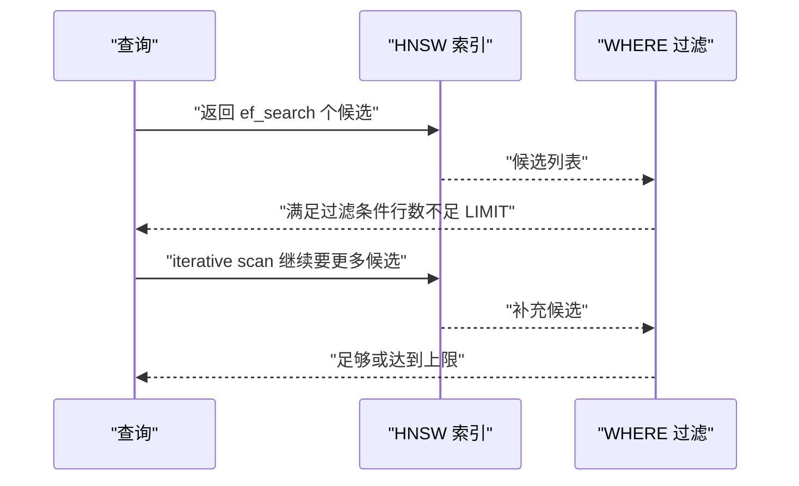
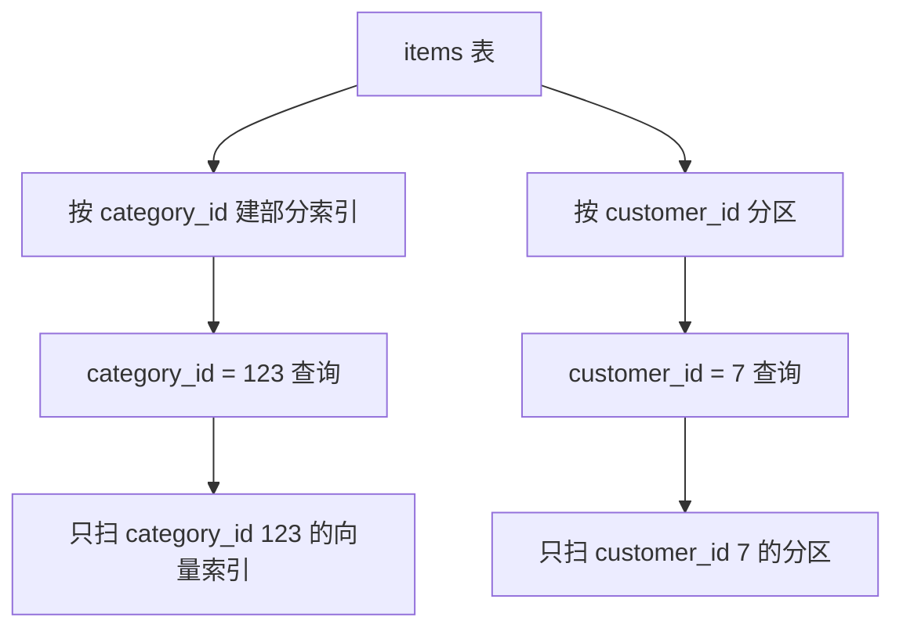
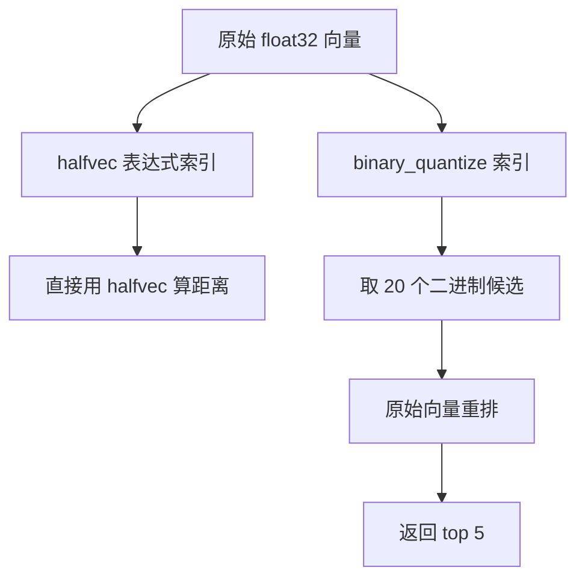
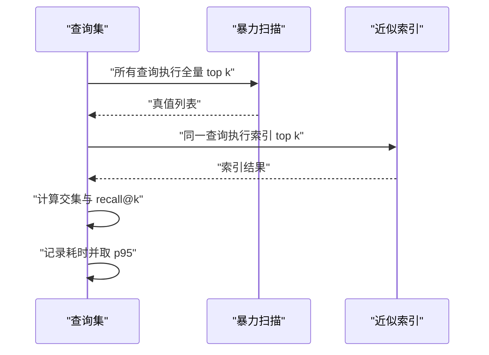
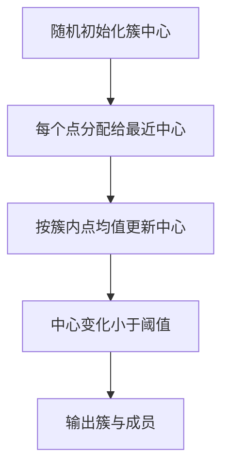

# pgvector 索引：HNSW 与 IVFFlat 的原理、参数与调优

!!! abstract "学完这一页你能"
    - 说出 HNSW 与 IVFFlat 在建索引速度、查询召回、内存占用三个维度上的取舍。
    - 在 pgvector 中创建 HNSW 与 IVFFlat 索引，并写出 m、ef_construction、ef_search、lists、probes 的默认配置。
    - 用 iterative scan、部分索引或分区解决过滤查询召回下降，并解释每种方案的适用边界。
    - 用 Node 20 单文件脚本与 SQL 测量 recall@k、p95 延迟，并选择 halfvec 或二值量化降低内存。

## 0. 知识地图



建议先读第 1 节建立精确扫描与近似索引的边界，再分别读第 2、3 节掌握 HNSW 与 IVFFlat。遇到过滤场景再读第 4、5 节，遇到内存压力读第 6 节。第 7、8 节用于验证直觉和面试复现。

## 1. 从暴力扫描到近似索引：先回答“为什么”

**先想一个问题**
一张表有 50 万条 1536 维 OpenAI embedding，每个查询都要对全表算 50 万次余弦距离再取 top 10。这个设计能否稳定跑在 100 ms 内？如果行数涨到 1 亿，SQL 会慢多少？

**心智模型**

!!! tip "心智模型"
    一句话模型：精确扫描是全量计算后排序，近似索引是先建好一组可跳过的图表，查询时只走其中一部分。
    日常类比：在图书馆找一本书，精确扫描是逐本翻书架，近似索引是先按分类牌缩小到某个书区。
    类比不成立：分类牌可能把部分目标书分错区，近似索引也会漏掉少量真实最近邻。

!!! note "术语：ANN"
    ANN 指近似最近邻检索（Approximate Nearest Neighbor）。它允许结果里缺少量真实近邻，换取更快查询；例如召回率 0.99 表示 100 个真实近邻中平均找到 99 个。

**图解**



1. 查询向量同时进入精确扫描与近似索引两条路径。
2. 精确扫描对所有行计算距离并排序，结果准确但候选集等于全表。
3. 近似索引先缩小候选，再只对少量候选算距离。
4. 近似索引返回的结果可能缺少数真实近邻，但查询行数减少数百倍。

**一步一步来**

这一步要做：在 Postgres 中建一张 50 万行的向量表，先看精确扫描的执行方式。

```sql
-- 创建扩展与表
CREATE EXTENSION IF NOT EXISTS vector;
CREATE TABLE items (
  id bigserial PRIMARY KEY,
  embedding vector(1536)
);
-- 插入 50 万条 1536 维向量后，执行精确 top 5
SELECT id
FROM items
ORDER BY embedding <=> '[0.1, 0.2, ...]'::vector
LIMIT 5;
```

**这段代码在做什么**

- `vector(1536)` 声明该列只能存 1536 维向量。
- `<=>` 是 pgvector 的余弦距离运算符；余弦距离越小，两个向量越接近。
- 未建索引时，SQL 走全表扫描，对每行计算余弦距离。
- 50 万行全部进入排序，即使只取 5 行，代价也接近 O(n log n)。

**动手验证**

```js
// 运行：node brute_top.js
import assert from 'node:assert';
const q = [0.1, 0.2, 0.3];
const db = [[1,0,0],[0,1,0],[0,0,1],[0.1,0.2,0.3]];
const dist = (a,b) => Math.sqrt(a.reduce((s,x,i)=>s+(x-b[i])**2,0));
const bruteTop = db
  .map((v,i)=>({i,d:dist(q,v)}))
  .sort((a,b)=>a.d-b.d)
  .slice(0,2)
  .map(x=>x.i);
assert.deepStrictEqual(bruteTop, [3,0]);
console.log('预期 [3,0]，实际', bruteTop);
```

**常见坑**

| 现象 | 原因 | 怎么修 |
| --- | --- | --- |
| 报错 `type vector does not exist` | 未执行 `CREATE EXTENSION vector` | 先执行 `CREATE EXTENSION vector` |
| 查询能跑但没走索引 | 建索引前没有数据或建错操作符类 | 按距离运算符选择 `vector_l2_ops`、`vector_cosine_ops` 或 `vector_ip_ops` |
| 维度不一致报错 | 查询向量长度与列维度不同 | 检查 embedding 模型版本，保持列维度一致 |

**用在哪里**

- **语义搜索**  
  - 业务背景：电商站内商品搜索，用户输入自然语言查询。  
  - 这一节知识怎么用：先建向量列，再用精确扫描验证结果，后续加索引。  
  - 衡量收益：recall@10 与 p95 查询延迟。  
  - 不该用时：商品目录只有 2 万条，精确扫描已满足延迟上限。
- **推荐召回**  
  - 业务背景：短视频 App 根据用户向量找相似内容。  
  - 这一节知识怎么用：在百万级内容表上比较精确扫描与索引的延迟。  
  - 衡量收益：单次查询耗时、召回 top 20 命中率。  
  - 不该用时：每日候选池固定且小于 5 万条。
- **RAG 知识库**  
  - 业务背景：企业文档问答需要从文档块中检索上下文。  
  - 这一节知识怎么用：先确认语料规模，决定是否必须引入 ANN。  
  - 衡量收益：检索失败率与首字延迟。  
  - 不该用时：知识库小于约 200K token，可直接全文进 prompt，见 Anthropic contextual retrieval 文章。
- **反欺诈相似用户**  
  - 业务背景：风控团队查找与黑名单用户相似的历史行为。  
  - 这一节知识怎么用：用暴力扫描获得基线召回结果。  
  - 衡量收益：相似度阈值下的命中数。  
  - 不该用时：样本量小于千级，且查询频率低于每分钟 1 次。

**行业实践**

- pgvector 官方 README 明确给出 `CREATE EXTENSION vector` 与基础查询示例，来源：pgvector GitHub。  
  可借鉴：先在迁移脚本中固定扩展版本与距离运算符。
- Neon 文档将 HNSW 与 IVFFlat 的建索引成本、查询折中做了对比，来源：Neon pgvector 文档。  
  可借鉴：选型前先抽出 10 万条真实数据做一次压测。
- Supabase 对 1M 向量的基准显示，1536 维 HNSW 在召回 0.99 时约 2,200 QPS，来源：Supabase docs，以原文为准。  
  可借鉴：同一硬件只和一个基线比较，不要跨厂商数字下结论。

**小结**

- 精确扫描在百万级向量下会全表计算距离，不适合高 QPS。
- 近似索引用少量召回损失换来候选集大幅缩小。
- 引入索引前先确认数据规模、查询负载与可接受的召回损失。

## 2. HNSW 的分层图与 m、ef_construction、ef_search

**先想一个问题**
pgvector 建 HNSW 索引时，`m=16` 与 `ef_construction=64` 是默认值。为什么查询时的 `ef_search` 默认是 40，而不是 64？

**心智模型**

!!! tip "心智模型"
    一句话模型：HNSW 是带多层的邻近图，顶层稀疏、底层稠密，查询从顶层逐步往下走。
    日常类比：地铁线路图先看大站快线确定区域，再换乘小站线路缩小到具体站点。
    类比不成立：地铁站位置固定，HNSW 的边根据向量距离动态建立，边的来源会影响后续查询路径。

!!! note "术语：ef_search"
    `ef_search` 是 HNSW 查询时维护的动态候选集上限。它越大，候选越多、召回越高，但查询时间越长。pgvector 默认 `hnsw.ef_search = 40`。

**图解**



1. 查询从允许的最高层进入，用入口点开始搜索。
2. 在高层沿边进行贪心移动，层内节点少、边跨越远。
3. 每下降一层，节点和边变多，搜索粒度变细。
4. 第 0 层保留最稠密图，最终给出 `ef_search` 个候选。
5. 对这些候选算真实距离后，再取 top k。

**一步一步来**

这一步要做：创建 HNSW 索引，并把查询参数改成 `hnsw.ef_search = 100`。

```sql
-- 创建余弦距离 HNSW 索引
CREATE INDEX ON items USING hnsw (embedding vector_cosine_ops)
  WITH (m = 16, ef_construction = 64);
-- 查询时提高 ef_search
SET hnsw.ef_search = 100;
SELECT id FROM items
ORDER BY embedding <=> '[0.1, 0.2, ...]'::vector
LIMIT 5;
```

**这段代码在做什么**

- `USING hnsw` 指定 HNSW 近似索引类型。
- `vector_cosine_ops` 对应 `<=>` 余弦距离运算符。
- `m = 16` 控制每个节点在第 0 层的最大邻居数。
- `ef_construction = 64` 控制建索引时插入新节点的候选集大小，影响图质量和建索引耗时。
- `hnsw.ef_search = 100` 仅在当前会话生效，查询候选集从默认 40 提到 100。

**动手验证**

```js
// 运行：node toy_hnsw_search.js
import assert from 'node:assert';
const graph = {0:[1,2],1:[0,2],2:[0,1,3],3:[2]}; // 第 0 层连通关系
const q = 2;
function search(start, ef) {
  const seen = new Set([start]);
  const candi = [start];
  while (candi.length < ef) {
    const next = graph[start].filter(n=>!seen.has(n));
    if (!next.length) break;
    candi.push(...next.slice(0, ef - candi.length));
    next.forEach(n=>seen.add(n));
  }
  return candi.slice(0, ef);
}
assert.deepStrictEqual(search(2, 3), [2,0,1]);
console.log('预期 [2,0,1]，实际', search(2, 3));
```

**常见坑**

| 现象 | 原因 | 怎么修 |
| --- | --- | --- |
| 召回很低 | `hnsw.ef_search` 小于建索引时的 `ef_construction` | 至少设 `ef_search >= ef_construction` 再测召回 |
| 建索引很慢 | `m` 或 `ef_construction` 过高 | 从默认 `m=16, ef_construction=64` 开始，逐步只调一个参数 |
| 查询报错或走全表扫 | 索引操作符类与查询距离不一致 | 用 `vector_cosine_ops` 配 `<=>`，`vector_l2_ops` 配 `<->`，`vector_ip_ops` 配 `<#>` |
| 内存增长明显 | 图结构常驻内存 | 查看索引大小 `SELECT pg_size_pretty(pg_relation_size('index_name'));` |

**用在哪里**

- **高 QPS 语义搜索**  
  - 业务背景：站内搜索需要 99% 召回且 p95 小于 20 ms。  
  - 这一节知识怎么用：先固定 `m=16, ef_construction=64`，再以 10 为步长提 `ef_search` 测召回。  
  - 衡量收益：recall@10 与 p95 延迟。  
  - 不该用时：内存预算低于索引大小的 1.5 倍。
- **对话式 RAG 检索**  
  - 业务背景：用户提问后从 100 万文档块召回 top 20。  
  - 这一节知识怎么用：按查询延迟与召回需求设 `ef_search`。  
  - 衡量收益：上下文命中率与首 token 延迟。  
  - 不该用时：单块平均 token 数过小，导致噪声块进入上下文。
- **代码库向量索引**  
  - 业务背景：内部代码库需要按函数语义检索相关代码。  
  - 这一节知识怎么用：用 HNSW 支持开发者 IDE 的自定义检索。  
  - 衡量收益：单次查询延迟与准确率。  
  - 不该用时：代码变更频繁，索引维护成本高于 grep 式搜索。
- **多语言嵌入检索**  
  - 业务背景：跨国团队的客服知识库包含中英文问答。  
  - 这一节知识怎么用：用 HNSW 在 BGE-M3 1024 维向量上建索引。  
  - 衡量收益：recall@20 与 QPS。  
  - 不该用时：文档总量级小，精确扫描已够。

**行业实践**

- pgvector 官方 README 给出 HNSW 默认参数 `m=16, ef_construction=64, hnsw.ef_search=40`，来源：pgvector GitHub。  
  可借鉴：把默认值写进项目配置并做好版本追踪。
- Neon 文档指出 HNSW 的速度与召回折中优于 IVFFlat，但建索引更慢、内存更高，来源：Neon pgvector 文档。  
  可借鉴：在共享 Postgres 实例上先做索引构建耗时评估。
- Supabase 的 1M 向量基准中，HNSW 在 1536 维召回 0.99 时约 2,200 QPS，来源：Supabase docs，以原文为准。  
  可借鉴：用同样召回要求做 A/B，不拿不同召回线下的 QPS 比较。

**小结**

- HNSW 用多层图完成从粗到细的搜索。
- `m` 与 `ef_construction` 影响图质量和建索引成本；`ef_search` 影响查询召回与延迟。
- 所有参数都要在自己的数据上测召回与延迟，不能只读默认值。

## 3. IVFFlat 的聚类与 lists、probes

**先想一个问题**
100 万条向量建 IVFFlat，pgvector 推荐 `lists = sqrt(rows)`，即约 1000。为什么不是 `lists = 10` 或 `lists = 100000`？

**心智模型**

!!! tip "心智模型"
    一句话模型：IVFFlat 先用 k-means 把向量分到多个簇，查询时只探测离查询向量最近的几个簇。
    日常类比：城市救护车先根据片区定位到最近几个消防站，再在对应片区内找具体地址。
    类比不成立：簇中心可能把真实近邻划到别的簇，导致边界召回损失。

!!! note "术语：probes"
    `probes` 是 IVFFlat 查询时探测的簇数量。默认从 `ivfflat.probes = 1` 起，pgvector 推荐起点为 `sqrt(lists)`。探测簇越多，召回越高，查询越慢。

**图解**



1. 查询向量先计算与所有簇中心点的距离。
2. 查询只选择距离最小的 `probes` 个簇。
3. 被选中簇内的向量成为候选。
4. 对候选计算真实距离，排序后返回 top k。

**一步一步来**

这一步要做：在已有数据上创建 IVFFlat 索引，并设置 `lists` 与 `probes`。

```sql
-- 先有数据再建 IVFFlat
CREATE INDEX ON items USING ivfflat (embedding vector_cosine_ops)
  WITH (lists = 1000);
-- 查询时探测 32 个簇
SET ivfflat.probes = 32;
SELECT id FROM items
ORDER BY embedding <=> '[0.1, 0.2, ...]'::vector
LIMIT 5;
```

**这段代码在做什么**

- `USING ivfflat` 指定倒排类聚簇索引。
- `WITH (lists = 1000)` 将 100 万行分成约 1000 个簇；pgvector README 推荐 1M 以上取 `sqrt(rows)`。
- 建 IVFFlat 前需要数据，因为它要跑 k-means 学习簇中心。
- `ivfflat.probes = 32` 每查询只扫描 32 个簇，而不是全表。

**动手验证**

```js
// 运行：node toy_ivf_search.js
import assert from 'node:assert';
const centers = [[0,0],[10,10]];      // 两个簇中心
const data = [[0.1,0.2],[9.8,10.1],[0.2,0.1],[10.2,9.9]];
const q = [0.15,0.25];
const dist = (a,b)=>Math.hypot(a[0]-b[0],a[1]-b[1]);
const probe = centers.map((c,i)=>({i,d:dist(q,c)})).sort((a,b)=>a.d-b.d)[0].i;
const candi = data.filter((_,idx)=>dist(data[idx],centers[probe]) <= dist(data[idx],centers[1-probe]));
const top = candi.map(v=>({v,d:dist(q,v)})).sort((a,b)=>a.d-b.d).slice(0,2).map(x=>x.v);
assert.deepStrictEqual(top, [[0.1,0.2],[0.2,0.1]]);
console.log('预期 [[0.1,0.2],[0.2,0.1]]，实际', top);
```

**常见坑**

| 现象 | 原因 | 怎么修 |
| --- | --- | --- |
| 建索引后查询召回低 | `probes` 太小 | 从 `sqrt(lists)` 起，逐步增加测 recall@k |
| 空表建索引后插入数据不更新簇 | IVFFlat 需要训练数据 | 先加载数据再建索引 |
| `lists` 设为 1 | 只分 1 个簇等同于全表扫候选 | 按数据量公式调整 lists |
| 建索引很快但查询比 HNSW 慢 | IVF 在相同召回下常需更多候选 | 若内存允许，可比较 HNSW 的总成本 |

**用在哪里**

- **百万级归档日志检索**  
  - 业务背景：按语义检索过去 3 年工单。  
  - 这一节知识怎么用：先建 IVFFlat，用 `lists = sqrt(rows)` 控制候选簇。  
  - 衡量收益：建索引耗时与单查询延迟。  
  - 不该用时：表更新频繁到簇中心快速失效。
- **内存受限的云数据库**  
  - 业务背景：小型 Postgres 实例只有 8 GB RAM。  
  - 这一节知识怎么用：用 IVFFlat 比 HNSW 占用更少内存。  
  - 衡量收益：索引关系大小 `pg_relation_size`。  
  - 不该用时：QPS 要求达到数千级别且召回要求 0.99。
- **批量导入后的首轮搜索**  
  - 业务背景：每周导入一次商品数据，导入后需要检索。  
  - 这一节知识怎么用：导入后重建 IVFFlat，避免实时插入导致簇退化。  
  - 衡量收益：载入窗口时长与查询 QPS。  
  - 不该用时：每天都有大量新行流入，训练成本高。
- **多候选粗排阶段**  
  - 业务背景：先召回 200 个候选再交给精排模型。  
  - 这一节知识怎么用：用较低的 `probes` 快速召回候选。  
  - 衡量收益：粗排覆盖率。  
  - 不该用时：需要 top 10 精确召回，粗排噪声不被精排接受。

**行业实践**

- pgvector 官方 README 给出 IVFFlat 的 `lists` 与 `probes` 推荐公式，来源：pgvector GitHub。  
  可借鉴：按表行数动态计算 `lists`，不要写死一个值。
- Neon 文档指出 IVFFlat 建索引更快、内存更少，但查询折中更差，来源：Neon pgvector 文档。  
  可借鉴：在内存紧张的预发环境先用 IVFFlat 建立基线。
- Supabase 基准显示 IVFFlat 在 1536 维 1M 数据、10 probes 时约 1,790 QPS，40 probes 时降至约 670 QPS，来源：Supabase docs，以原文为准。  
  可借鉴：增加 probes 前先量化 QPS 下降幅度，确认是否值得召回提升。

**小结**

- IVFFlat 通过聚类缩小查询候选簇。
- `lists` 决定聚类数量，`probes` 决定查询探测簇数。
- 建索引依赖已有数据，批量导入后再建更合适。

## 4. 过滤查询的召回陷阱与 iterative scan

**先想一个问题**
执行 `WHERE category_id = 123 ORDER BY embedding <=> ? LIMIT 10` 时，pgvector 既然默认先取 40 个候选再过滤，这是否可能只返回 3 行？为什么会发生？

**心智模型**

!!! tip "心智模型"
    一句话模型：pgvector 默认是“先取近似候选，再应用 WHERE”，过滤会导致目标行被提前丢掉。
    日常类比：先从地图抓 40 个点，再筛类别；如果类别很稀疏，40 个点里目标点不足。
    类比不成立：地图抓点没有距离排序的严格保证，HNSW 候选集还有内部检索顺序。

!!! note "术语：iterative scan"
    `iterative scan` 是 pgvector 0.8.0 起提供的迭代索引扫描机制。它会在过滤后继续向图中要更多候选，直到满足 LIMIT 或达到扫描上限。

**图解**



1. 查询先让索引返回固定 `ef_search` 个候选。
2. 过滤条件在候选之后应用，可能留下不足 LIMIT。
3. 开启迭代扫描后，索引继续补充候选。
4. 补充过程有上限，超过上限则返回不足行数。

**一步一步来**

这一步要做：开启 HNSW 或 IVFFlat 的 iterative scan，并设置扫描上限。

```sql
-- 开启后加载过滤下的迭代扫描
SET hnsw.iterative_scan = relaxed_order;
SET hnsw.max_scan_tuples = 20000;
-- IVFFlat 场景
SET ivfflat.iterative_scan = relaxed_order;
SET ivfflat.max_probes = 100;
```

**这段代码在做什么**

- `relaxed_order` 允许候选顺序略微偏离距离顺序，换取更高召回；`strict_order` 严格按距离排序，但可能更慢。
- `hnsw.max_scan_tuples` 是 HNSW 单次查询累计扫描行数的上限，默认约 20000。
- `ivfflat.max_probes` 控制 IVFFlat 在迭代扫描中最多探测的簇数。
- 开启后，过滤条件不再只作用于首批固定候选。

**动手验证**

```js
// 运行：node iterative_filter.js
import assert from 'node:assert';
const candi = [4,2,5,1,3];          // 首批距离排序候选
const filter = new Set([1,3,5]);    // 类别过滤条件
function firstBatch(c) { return c.filter(x=>filter.has(x)); }
const relaxed = [...candi];
while (relaxed.length < 10) relaxed.push(...[6,7,8]); // 模拟继续补充
function topAfterIter(c) { return c.filter(x=>filter.has(x)).slice(0,3); }
assert.deepStrictEqual(firstBatch(candi), [5,1,3]);
assert.deepStrictEqual(topAfterIter(relaxed), [5,1,3]);
console.log('首批过滤', firstBatch(candi));
console.log('迭代后过滤', topAfterIter(relaxed));
```

**常见坑**

| 现象 | 原因 | 怎么修 |
| --- | --- | --- |
| 过滤后返回 0 行 | 首批候选全被 WHERE 排除 | 开启 `iterative_scan` |
| 查询更慢 | `strict_order` 要求严格距离序 | 先试 `relaxed_order` |
| 结果行数仍不足 | `max_scan_tuples` 或 `max_probes` 达到上限 | 提高上限或改用部分索引 |
| 过滤字段没有 B-tree 索引 | 每次过滤扫数据页 | 为过滤列建常规索引，与向量索引分离 |

**用在哪里**

- **多租户 SaaS 文档检索**  
  - 业务背景：企业知识库必须按客户隔离。  
  - 这一节知识怎么用：开启 `iterative_scan = relaxed_order`，对 `customer_id` 过滤。  
  - 衡量收益：租户级 recall@10 与返回行数。  
  - 不该用时：租户数极大且每租户数据小，部分索引更合适。
- **带类目筛选的推荐**  
  - 业务背景：短视频按频道或类目检索相似内容。  
  - 这一节知识怎么用：把类目过滤放在向量排序之后，开启迭代扫描。  
  - 衡量收益：过滤后候选满足 LIMIT 的次数。  
  - 不该用时：类目全字段枚举很少，可直接用部分索引。
- **带时间窗口的语义搜索**  
  - 业务背景：只检索最近 30 天的文档。  
  - 这一节知识怎么用：在 `created_at` 过滤下使用 iterative scan。  
  - 衡量收益：时间窗口内召回率。  
  - 不该用时：历史数据永久过滤，分区收益更大。
- **权限过滤的企业搜索**  
  - 业务背景：员工只能搜索自己权限范围内的文档。  
  - 这一节知识怎么用：把权限过滤与向量索引放在同一查询，开启迭代扫描。  
  - 衡量收益：漏召回与越权结果数。  
  - 不该用时：权限模型复杂到需要外部搜索引擎的安全过滤功能。

**行业实践**

- pgvector 官方 README 的 filtering 一节给出先候选后过滤的机制与迭代扫描参数，来源：pgvector GitHub。  
  可借鉴：把过滤查询单独做回归测试，防止升级后默认行为变化。
- pgvector 0.8.0 引入 iterative scan，以改善过滤召回，来源：pgvector GitHub。  
  可借鉴：在低过滤率场景先开 `relaxed_order`，逐步观察召回。
- AWS 博客称 Aurora PostgreSQL 上 pgvector 0.8.0 某些场景查询快 9 倍、结果相关 100 倍，来源：AWS Database Blog，以原文限定条件为准。  
  可借鉴：不直接引用 9x、100x 作为自身指标，用自己数据复测。

**小结**

- 过滤召回下降的原因是“先取候选，再过滤”。
- iterative scan 通过补充候选缓解过滤稀疏问题。
- 过滤条件应有自己的索引，不能只依赖向量索引。

## 5. 分区与部分索引

**先想一个问题**
大客户 A 有 100 万向量，大客户 B 有 200 万向量。每次查询必须限定单个客户，难道为每个客户都建一个 HNSW 索引？

**心智模型**

!!! tip "心智模型"
    一句话模型：部分索引只收录满足 WHERE 条件的行；表分区按分区键把数据拆成物理子表。
    日常类比：公司档案按年份分柜，查某年只开对应柜。
    类比不成立：分区键固定后，跨分区查询需要扫描多个子表，不是零成本聚合。

!!! note "术语：部分索引"
    部分索引是带 `WHERE` 谓词的索引，只对满足该谓词的行建立索引。查询的 WHERE 必须与索引谓词匹配，Planner 才会使用该索引。

**图解**



1. 部分索引只包含指定的过滤值对应的行。
2. 查询过滤条件与索引谓词一致时，只扫该部分索引。
3. 分区表按分区键拆成独立子表。
4. 查询只包含一个分区键值时，Planner 只扫命中的分区。

**一步一步来**

这一步要做：创建一个按类别过滤的部分索引，并创建按客户分区的表。

```sql
-- 部分索引：只为 category_id = 123 的行建 HNSW
CREATE INDEX ON items USING hnsw (embedding vector_cosine_ops)
  WHERE (category_id = 123);

-- 分区表：按 customer_id 做 LIST 分区
CREATE TABLE items_part (
  id bigserial,
  customer_id int,
  embedding vector(1536)
) PARTITION BY LIST (customer_id);
CREATE TABLE items_part_customer_7 PARTITION OF items_part
  FOR VALUES IN (7);
```

**这段代码在做什么**

- 部分索引的 `WHERE` 只对 `category_id = 123` 的行建索引。
- 未来查询必须带同样条件，才可能走这个部分索引。
- `PARTITION BY LIST (customer_id)` 按客户 ID 列表创建分区表。
- 每个客户可有一个独立分区，某客户查询只进对应分区。

**动手验证**

```js
// 运行：node partition_hit.js
import assert from 'node:assert';
const partIndex = {7:'idx_customer_7', 9:'idx_customer_9'};
function hitPartition(customerId) {
  return partIndex[customerId] ?? 'full scan';
}
assert.strictEqual(hitPartition(7), 'idx_customer_7');
assert.strictEqual(hitPartition(3), 'full scan');
console.log('customer 7 命中', hitPartition(7));
console.log('customer 3 命中', hitPartition(3));
```

**常见坑**

| 现象 | 原因 | 怎么修 |
| --- | --- | --- |
| 查询没走部分索引 | WHERE 条件与索引谓词不同 | 保持两者统一，必要时用动态 SQL 生成条件 |
| 分区后跨客户查询变慢 | 需要扫描所有目标分区 | 限制查询必须带分区键 |
| 分区数量过多 | 每分区数据太少，索引开销大于收益 | 按数据量做分区合并，例如按客户地区而不是单客户 |
| 部分索引无法覆盖多值过滤 | 一个部分索引只有一个 WHERE 表达式 | 多值过滤考虑分区或多列复合过滤器 |

**用在哪里**

- **多租户向量搜索**  
  - 业务背景：SaaS 产品需要按客户严格隔离向量检索。  
  - 这一节知识怎么用：用 `customer_id` 分区，每个大客户一个分区。  
  - 衡量收益：单租户查询延迟与索引维护耗时。  
  - 不该用时：租户数量上万，分区数超过维护上限。
- **高卡片分类目检索**  
  - 业务背景：商品检索经常按一级类目过滤。  
  - 这一节知识怎么用：为高频类目建部分索引。  
  - 衡量收益：该类目 queries per second 与 recall。  
  - 不该用时：类目组合查询多到部分索引无法枚举。
- **按地域隔离的配送系统**  
  - 业务背景：骑手只看本城市订单。  
  - 这一节知识怎么用：按 city_id 分区订单表，再建向量索引。  
  - 衡量收益：城市分区的查询延迟。  
  - 不该用时：某城市订单量极少，分区优势消失。
- **文档库隔离**  
  - 业务背景：不同部门的文档权限不同。  
  - 这一节知识怎么用：为部门字段建分区或部分索引。  
  - 衡量收益：越权结果数和召回率。  
  - 不该用时：员工经常跨部门搜索，分区反而增加扫描成本。

**行业实践**

- pgvector 官方 README 给出按多租户过滤的部分索引和分区示例，来源：pgvector GitHub。  
  可借鉴：把租户隔离作为默认检索前提，不要只靠过滤后召回。
- Postgres 官方分区文档说明 LIST 分区与查询剪枝，来源：PostgreSQL documentation。  
  可借鉴：分区数量超过 1000 前先做性能复测。
- Neon pgvector 文档建议将大租户与小租户分开策略，来源：Neon pgvector 文档，以原文为准。  
  可借鉴：大租户独立分区，小租户用过滤加 iterative scan，避免分区表过碎。

**小结**

- 部分索引适合单一高频过滤值，分区适合按固定键做物理隔离。
- 查询条件必须与部分索引谓词或分区键对齐，才能命中优化路径。
- 分区数不是越多越好，需要按数据量和维护成本权衡。

## 6. 半精度与量化：用内存压缩换召回

**先想一个问题**
1536 维 OpenAI embedding，1 亿行用 float32 存储，仅向量列就要约 576 GB。这个数据还能放进单机 Postgres 吗？

**心智模型**

!!! tip "心智模型"
    一句话模型：半精度把 32 位浮点压到 16 位；二值量化把每一维压成 1 bit，再用原始向量重排。
    日常类比：先看模糊缩略图挑 20 个，再打开原图精挑 5 个。
    类比不成立：缩略图按固定阈值丢失信息，向量距离会失真，所以二值阶段不能作为最终排序。

!!! note "术语：halfvec"
    `halfvec` 是 pgvector 的 16 位浮点向量类型，存储只占 2×dim+8 字节。它支持表达式索引，可把原始 float32 向量转换成 halfvec 建 HNSW。

**图解**



1. `halfvec` 索引存储维度压缩一半。
2. 查询时使用同样的 `::halfvec` 表达式，能直接走索引。
3. 二值量化先按二进制 Hamming 距离取候选。
4. 候选再用原始向量计算余弦距离重排，得到最终 top k。

**一步一步来**

这一步要做：创建半精度表达式索引，并创建二值量化加重排查询。

```sql
-- 半精度表达式索引，可支持到 4000 维
CREATE INDEX ON items USING hnsw
  ((embedding::halfvec(1536)) halfvec_cosine_ops);

-- 二值量化索引加重排
CREATE INDEX ON items USING hnsw
  ((binary_quantize(embedding)::bit(1536)) bit_hamming_ops);
SELECT * FROM (
  SELECT * FROM items
  ORDER BY binary_quantize(embedding)::bit(1536)
    <~> binary_quantize('[0.1,-0.2,...]'::vector)::bit(1536)
  LIMIT 20
) sub
ORDER BY embedding <=> '[0.1,-0.2,...]'::vector
LIMIT 5;
```

**这段代码在做什么**

- 表达式索引把 `embedding` 转成 `halfvec`，索引维度上限放宽到 4000。
- `halfvec_cosine_ops` 对应半精度向量的余弦距离。
- `binary_quantize` 将每维正负转为 bit，适合 Hamming 距离过滤。
- 子查询先取 20 个二进制候选，外层用原始 `embedding` 做余弦排序。

**动手验证**

```js
// 运行：node half_quant.js
import assert from 'node:assert';
const f32 = [0.123456, -0.987654, 0.555555];
const half = f32.map(x=>Math.fround(x).toPrecision(4));
const binary = f32.map(x=>x>=0?1:0);
assert.deepStrictEqual(binary, [1,0,1]);
assert.ok(half[0].length <= 7);
console.log('半精度', half);
console.log('二值量化', binary);
```

**常见坑**

| 现象 | 原因 | 怎么修 |
| --- | --- | --- |
| 查询不走表达式索引 | 查询列没有与索引表达式完全一致 | 加上 `::halfvec` 或对应量化表达式 |
| 半精度召回下降 | float16 表示范围与精度有限 | 重要业务用原始向量重排兜底 |
| 二值量化结果波动 | 只靠 Hamming 距离排序 | 必须按 pgvector README 示例做外层重排 |
| 内存没降 | 索引之外还保留了原始 float32 列 | 评估是否需要删除原始列，或归档为 halfvec |

**用在哪里**

- **高维 embedding 存储压缩**  
  - 业务背景：大模型 embedding 以 3072 或 4096 维为主。  
  - 这一节知识怎么用：用 halfvec 索引降低约一半向量存储。  
  - 衡量收益：索引大小与单查询延迟。  
  - 不该用时：召回要求 0.99 且维度低于 2000，直接建 float32 索引。
- **历史日志语义检索**  
  - 业务背景：半年以前的日志只偶尔查询。  
  - 这一节知识怎么用：对旧分区用二值量化，节省存储。  
  - 衡量收益：存储成本与旧区召回。  
  - 不该用时：近期数据记录频繁，二值候选噪声影响体验。
- **云实例内存优化**  
  - 业务背景：DB 实例 RAM 固定，索引过大导致换页。  
  - 这一节知识怎么用：把低频索引改为 halfvec。  
  - 衡量收益：内存命中率与磁盘 IO。  
  - 不该用时：索引已经整体小于可用内存，压缩收益有限。
- **原型阶段快建索引**  
  - 业务背景：用二值量化在低配环境验证检索链路。  
  - 这一节知识怎么用：用 `binary_quantize` 索引跑通流程。  
  - 衡量收益：端到端链路可运行。  
  - 不该用时：上线评估需要真实召回比较，二值化不能单独作为最终结果。

**行业实践**

- pgvector 官方 README 给出 halfvec 表达式索引与 binary_quantize 加重排的完整 SQL，来源：pgvector GitHub。  
  可借鉴：将量化 SQL 写成视图，避免业务代码重复转换。
- pgvector README 说明 halfvec 索引可支持 4000 维，binary_quantize 的 bit 索引可支持 64000 维，来源：pgvector GitHub。  
  可借鉴：维数超高时先量化建索引，再做原始向量重排。
- pgvectorscale 提供 Statistical Binary Quantization 压缩，来源：Timescale pgvectorscale GitHub。  
  可借鉴：只在自建 Postgres 环境测试其效果，不与托管版混用。

**小结**

- 半精度和二值量化都是在存储、召回与速度之间做交换。
- 表达式索引要求查询与索引表达式严格一致。
- 二值量化必须配合原始向量重排，否则距离失真。

## 7. 用实验方法测 recall@k 与 p95 延迟

**先想一个问题**
把 `ef_search` 从 40 调到 100，召回率到底升了多少？只靠看返回行数够不够？

**心智模型**

!!! tip "心智模型"
    一句话模型：recall@k 测索引检索出的 top k 与暴力扫描真实 top k 的交集占比；p95 延迟测多次查询中第 95 百分位耗时。
    日常类比：考试不仅交卷快，还要答案对。
    类比不成立：试卷有标准答案，向量检索的标准答案需要带标注查询集来人工或程序确认。

!!! note "术语：recall@k"
    `recall@k` 表示在索引返回的 top k 结果中，包含的暴力扫描真实 top k 结果的比例。例如 k=10 时交集 9 个，则 recall@10 = 0.9。

**图解**



1. 先用暴力扫描为每个查询生成真实 top k。
2. 再用索引执行同样查询，记录返回 top k 与耗时。
3. 对每个查询计算索引结果与真值的交集占比。
4. 汇总所有查询的 recall 与耗时分布，取 p95。

**一步一步来**

这一步要做：在 Node 中生成带标注的小型查询集，计算 recall@k，并记录延迟分布。

```js
// 运行：node eval_recall.js
import assert from 'node:assert';
const db = [[1,0],[0,1],[0.1,0.2],[0.2,0.1]];
const qs = [[0.1,0.2],[0.2,0.2]];
const d = (a,b)=>Math.hypot(a[0]-b[0],a[1]-b[1]);
function topK(q, k) {
  return db.map((v,i)=>({i,d:d(q,v)})).sort((a,b)=>a.d-b.d).slice(0,k).map(x=>x.i);
}
function indexTop(q, k) {
  // 模拟近似索引：只在前 3 个里排序
  return db.slice(0,3).map((v,i)=>({i,d:d(q,v)})).sort((a,b)=>a.d-b.d).slice(0,k).map(x=>x.i);
}
const recall = qs.reduce((s,q)=>{
  const truth = topK(q,2);
  const pred = indexTop(q,2);
  const hit = pred.filter(x=>truth.includes(x)).length;
  return s + hit / truth.length;
},0) / qs.length;
assert.ok(recall >= 0.5);
console.log('小样本 recall@2 约', recall);
```

**这段代码在做什么**

- `topK` 是暴力扫描，生成真值。
- `indexTop` 模拟近似索引只在一个子集上排序，可能漏真实近邻。
- 两个查询的 recall 取平均，得到整体 recall@k。
- 真实项目中延迟应使用 `process.hrtime.bigint()` 或 SQL 侧 `EXPLAIN (ANALYZE, TIMING OFF)` 测量。

**动手验证**

```js
// 运行：node eval_p95.js
import assert from 'node:assert';
const lat = [1,2,3,4,5,6,7,8,9,10,11,12,13,14,15,16,17,18,19,20];
lat.sort((a,b)=>a-b);
const p95 = lat[Math.ceil(lat.length*0.95)-1];
assert.strictEqual(p95, 19);
console.log('20 个样本的第 95 百分位是', p95);
```

**常见坑**

| 现象 | 原因 | 怎么修 |
| --- | --- | --- |
| recall 计算无意义 | 真值集查询样本太少 | 至少 100 个查询，分层抽样 |
| 延迟只看平均值 | 平均延迟掩盖长尾 | 同时记录 p95、p99 |
| 不同参数下比较不公平 | 硬件、缓存、数据分布变化 | 固定数据集与冷热缓存策略 |
| 用 EXPLAIN 的 planning time 当查询延迟 | planning 与 execution 不一致 | 用 `EXPLAIN (ANALYZE)` 的 execution time 或应用侧计时 |

**用在哪里**

- **上线前调参**  
  - 业务背景：需要确定 `ef_search` 在 0.95 与 0.99 召回下的延迟。  
  - 这一节知识怎么用：按本节流程逐参数测量 recall@10 与 p95。  
  - 衡量收益：召回阈值达标的 QPS。  
  - 不该用时：数据集过小，测量无法外推生产。
- **容量评估**  
  - 业务背景：预计向量从 100 万涨到 500 万。  
  - 这一节知识怎么用：在 500 万真实数据上重跑基准。  
  - 衡量收益：延迟增长与资源需求。  
  - 不该用时：用 1 万数据推算 500 万，误差不可控。
- **迁移专用库评估**  
  - 业务背景：团队评估是否从 pgvector 迁到 Qdrant。  
  - 这一节知识怎么用：在相同 recall 线下比较 QPS 与 p95。  
  - 衡量收益：同召回下的吞吐与成本。  
  - 不该用时：拿不同召回线的性能数字对比。
- **回归测试性能**  
  - 业务背景：pgvector 升级到 0.8.7 后检查性能回退。  
  - 这一节知识怎么用：固定查询集，检测 recall 与 p95 是否超阈值。  
  - 衡量收益：升级后回归通过率。  
  - 不该用时：小版本升级未涉及查询路径。

**行业实践**

- ann-benchmarks 仓库用 recall vs QPS 作为核心指标，并说明默认单查询、仅 CPU，来源：ann-benchmarks GitHub。  
  可借鉴：测试时关闭并发查询，先得到单查询基线。
- Supabase 基准把召回 0.99 与 QPS 对应列出，来源：Supabase docs，以原文为准。  
  可借鉴：每个参数配置只报告一个召回线，不要混着写。
- RAGAS 文档定义 Context Recall，衡量检索上下文覆盖真实相关段，来源：Ragas docs。  
  可借鉴：先做纯检索 recall@k，再用 RAGAS 做端到端上下文召回。

**小结**

- recall@k 与 p95 是近似索引调参的两个基本指标。
- 真值必须由暴力扫描生成，或用标注查询集核验。
- 所有基准都要固定数据集、硬件与缓存策略，才能复现。

## 8. 手写玩具版 HNSW 与 IVF

**先想一个问题**
只读 SQL 很难理解 HNSW 图边怎么连、IVF 簇中心怎么选。能否用 40 行 JS 实现最小可运行的模型？

**心智模型**

!!! tip "心智模型"
    一句话模型：玩具版只保留算法的主循环：HNSW 从顶层贪心下降，IVF 用初始中心迭代分配。
    日常类比：用纸牌模拟排兵布阵，先理解规则再上真系统。
    类比不成立：玩具版忽略并发、磁盘布局和距离算子优化，不代表 pgvector 的真实性能。

**图解**



1. 先随机选 `lists` 个向量作为初始簇中心。
2. 将所有点分配给距离最近的中心。
3. 重新计算每个簇的向量均值作为新中心。
4. 若中心变化很小则停止，否则回到分配步骤。

**一步一步来**

这一步要做：写一个玩具 IVF 训练与查询函数，先看聚类怎么生成。

```js
// 运行：node toy_ivf.js
import assert from 'node:assert';
function trainIVF(data, k, rounds) {
  let centers = data.slice(0,k);
  for (let r=0; r<rounds; r++) {
    const cl = Array.from({length:k}, ()=>[]);
    for (const v of data) {
      let best=0, bd=Infinity;
      centers.forEach((c,i)=>{
        const dx=c[0]-v[0], dy=c[1]-v[1];
        const d=Math.hypot(dx,dy);
        if (d<bd) { bd=d; best=i; }
      });
      cl[best].push(v);
    }
    centers = cl.map(arr=>arr.reduce((s,v)=>[s[0]+v[0],s[1]+v[1]],[0,0]).map(x=>x/arr.length));
  }
  return centers;
}
const data = [[0,0],[1,1],[9,9],[10,10]];
const centers = trainIVF(data, 2, 3);
assert.strictEqual(centers.length, 2);
console.log('两个簇中心', centers);
```

**这段代码在做什么**

- `trainIVF` 做最简 k-means，随机取前 k 个点作为初始中心。
- 每轮把每个点分给最近中心。
- 每个簇按均值更新中心。
- 三轮后输出两个中心，体现聚类的基本收敛。

**一步一步来**

这一步要做：写一个玩具 HNSW 的贪心下降查询函数。

```js
// 运行：node toy_hnsw.js
import assert from 'node:assert';
const layer0 = {0:[1,2],1:[0,3],2:[0,3],3:[1,2]};
function greedySearch(q, entry, graph, steps) {
  let cur = entry;
  for (let s=0; s<steps; s++) {
    let best = cur, bestD = distance(q, cur);
    for (const nb of graph[cur]) {
      const d = distance(q, nb);
      if (d < bestD) { bestD = d; best = nb; }
    }
    if (best === cur) break;
    cur = best;
  }
  return cur;
}
function distance(a,b) { return Math.abs(a-b); }
assert.strictEqual(greedySearch(2, 0, layer0, 4), 2);
console.log('查询 2 的最近节点是', greedySearch(2, 0, layer0, 4));
```

**这段代码在做什么**

- `layer0` 表示第 0 层图邻接表。
- `greedySearch` 从入口节点出发，沿最近邻居移动。
- 如果邻居更近就跳过去，否则停止，返回当前节点。
- 这是 HNSW 单层贪心下降的最小近似。

**动手验证**

```js
// 运行：node toy_ann_combined.js
import assert from 'node:assert';
const data = [[0,0],[1,1],[9,9],[10,10]];
const centers = trainIVF(data, 2, 3); // 复用上面函数
assert.strictEqual(centers.length, 2);
assert.ok(Math.abs(centers[0][0] - centers[1][0]) > 1);
console.log('IVF 中心距离大于 1，符合聚类分离');
// 同时验证 HNSW 贪心查询
const layer0 = {0:[1,2],1:[0,3],2:[0,3],3:[1,2]};
assert.strictEqual(greedySearch(2, 0, layer0, 4), 2);
console.log('IVF 与 HNSW 玩具均通过断言');
```

**常见坑**

| 现象 | 原因 | 怎么修 |
| --- | --- | --- |
| 簇中心不再变化但结果差 | 初始中心离群点导致退化 | 多跑几次取最优，或不同初始化 |
| 贪心搜索停在局部最近 | 图边连接不足 | 增加每个节点的边数或多次重启入口 |
| 随机种子不同导致断言失败 | 每次运行初始点不同 | 固定伪随机序列或比较逻辑关系而非精确值 |
| 玩具代码不能反映真实性能 | 未实现多层、淘汰与候选集 | 只在面试与概念验证中使用 |

**用在哪里**

- **面试复习**  
  - 业务背景：前端或全栈面试需要解释 HNSW 与 IVF。  
  - 这一节知识怎么用：手写核心循环，能讲清下降与聚类。  
  - 衡量收益：能否在 10 分钟内复现关键逻辑。  
  - 不该用时：只背术语，不写代码。
- **内部实现检查**  
  - 业务背景：怀疑pgvector 参数调优方向错误。  
  - 这一节知识怎么用：用玩具模型验证参数变化对结构的影响。  
  - 衡量收益：参数直觉提升。  
  - 不该用时：替代真实系统压测。
- **新成员培训**  
  - 业务背景：让后端同学理解近似索引不是黑盒。  
  - 这一节知识怎么用：读玩具代码再上真实 SQL。  
  - 衡量收益：培训后能独立创建索引。  
  - 不该用时：培训中承诺性能数字。
- **调试查询行为**  
  - 业务背景：某条查询召回低，想定位候选来源。  
  - 这一节知识怎么用：用玩具模拟候选筛选与过滤。  
  - 衡量收益：缩小排查范围。  
  - 不该用时：直接改生产参数。

**行业实践**

- HNSW 论文 Malkov & Yashunin 描述多层图与指数衰减层级分配，来源：arXiv:1603.09320。  
  可借鉴：阅读第 3 节算法描述，对应 pgvector 实现。
- pgvector 官方 README 的索引参数表格来自实现层，来源：pgvector GitHub。  
  可借鉴：把 SQL 参数与论文概念对照，不混淆 m 与 ef_search。
- Microsoft DiskANN 研究提出磁盘友好图索引，pgvectorscale 借鉴其思路，来源：Timescale pgvectorscale GitHub。  
  可借鉴：遇到单机内存放不下图索引时，评估 DiskANN 类设计。

**小结**

- 玩具 HNSW 的核心是贪心下降与邻接图。
- 玩具 IVF 的核心是中心分配与质心更新。
- 玩具代码用于理解和面试，不能替代真实基准。

## 应用地图

| 场景 | 用到本页哪个知识点 | 典型技术选型 | 注意事项 |
| --- | --- | --- | --- |
| 100 万级商品语义搜索 | HNSW 参数 | HNSW + vector_cosine_ops | 先测 ef_search 对 recall 的影响 |
| 内存受限的归档检索 | IVFFlat | IVFFlat + lists=sqrt(rows) | 先导入再建索引 |
| 多租户文档问答 | 过滤召回与迭代扫描 | iterative_scan + 分区 | 过滤列要单独建索引 |
| 高维 embedding 存储 | 半精度与量化 | halfvec 索引 | 查询表达式必须一致 |
| 带类目筛选的推荐 | 部分索引 | HNSW WHERE 部分索引 | 查询条件固定时才有效 |
| 上线前调参验证 | recall@k 与 p95 | 暴力扫描真值 + 索引结果 | 至少 100 个查询样本 |
| 面试或内部培训 | 玩具 HNSW/IVF | 单文件 Node 模拟 | 不用于生产性能结论 |
| 极限维度 4000-64000 | 表达式索引与二值量化 | binary_quantize + 重排 | 必须外层重排 |

## 动手作业

目标：在本地 Postgres 中创建一个 10 万条 1536 维向量表，分别建 HNSW 与 IVFFlat 索引，并测量 recall@10 与 p95。

步骤：

1. 用 pgvector 建表，插入 10 万条随机向量。
2. 为同一个表分别建 HNSW 与 IVFFlat，使用默认参数。
3. 生成 100 条查询向量，先用暴力扫描得到真值 top 10。
4. 分别在 `hnsw.ef_search = 40/80/120` 与 `ivfflat.probes = 10/32/64` 下执行索引查询，记录 top 10 与耗时。
5. 计算每个参数下的 recall@10 与 p95，形成对比表。

验收标准：

- 能复现一个参数组合下 recall@10 大于 0.9。
- 能给出 HNSW 与 IVFFlat 在相同 recall 线下的 p95 数据。
- 能用 `pg_relation_size` 比较两个索引的存储大小。

## 综合对比

| 维度 | HNSW | IVFFlat | 半精度 HNSW | 二值量化 + 重排 |
| --- | --- | --- | --- | --- |
| 建索引速度 | 慢 | 快 | 慢于普通 HNSW | 较快 |
| 建索引内存 | 高 | 较低 | 中等 | 低 |
| 查询召回 | 同候选下通常更高 | 同候选下通常较低 | 略低于 float32 | 召回依赖重排候选数 |
| 查询延迟 | 低 | 更高，同召回时 | 低 | 先粗排再精排，总延迟可控 |
| 数据要求 | 可空表建 | 需已有数据训练 | 可空表建 | 可空表建 |
| 维度上限 | 2000（原文需核对官方文档） | 2000（原文需核对官方文档） | 4000 | 64000 |
| 查询过滤能力 | 需 iterative scan | 需 iterative scan | 同 HNSW | 过滤后再重排 |
| 推荐场景 | 高 QPS、内存足够 | 百万级、内存受限 | 高维低内存 | 超高维或历史归档 |

## 深入阅读与参考

!!! tip "怎么用这些资料"
    先读「官方文档与规范」建立准确的概念，再读「源码与示例」核对细节，最后用「教程、书籍与视频」换一种讲法加深理解。每条都写明了读哪一节、带着什么问题读。

### 官方文档与规范

| 资源 | 为什么读 | 怎么读 |
|---|---|---|
| [Neon 文档对权衡的表述: HNSW 的速度-召回折中优于 IVFFlat,但建索引更慢、内存更高,且无训练阶段,可在空表上建;IVFFl (neon.com)](https://neon.com/docs/extensions/pgvector) | 权威讲清 HNSW 与 IVFFlat 在建索引速度、内存占用和训练需求上的权衡。 | 读权衡对比段落，记下空表可建索引与内存代价两点，再对照本页参数表复述一遍。 |
| [AWS 称 Aurora PostgreSQL 上的 pgvector 0.8.0 "最高 9x 查询更快、100x 结果更相关",归因于迭 (aws.amazon.com)](https://aws.amazon.com/blogs/database/supercharging-vector-search-performance-and-relevance-with-pgvector-0-8-0-on-amazon-aurora-postgresql) | 给出 iterative scan 在过滤查询上的官方性能数据，印证召回陷阱这一节。 | 读性能数据部分，记下 9x/100x 的测试前提，判断自己场景能否复现。 |
| [HNSW: Malkov & Yashunin,多层邻近图,元素按指数衰减概率分配最高层,类似跳表;论文称搜索复杂度对数级伸缩 — (arxiv.org)](https://arxiv.org/abs/1603.09320) | HNSW 原始论文，讲透分层概率分配与 ef 对召回率的影响。 | 先读第 3 节伪码与第 4 节实验，重点看 ef 曲线，再回头解释 m 的作用。 |

### 源码与示例

| 资源 | 为什么读 | 怎么读 |
|---|---|---|
| [README 当前版本 0.8.7,支持 Postgres 13+。升级: `ALTER EXTENSION vector UPDATE;` (github.com)](https://github.com/pgvector/pgvector) | pgvector 官方仓库，建索引语法与参数默认值的第一手来源。 | 读 Indexing 一节，抄下建索引 SQL 与 m、ef_construction、lists 默认值并本地执行。 |
| [ann-benchmarks: 测 recall vs QPS;15+ 数据集,维度 25 到 27,983,训练集 6 万到 999 万; (github.com)](https://github.com/erikbern/ann-benchmarks) | 开源向量检索基准，展示 recall–QPS 曲线的标准画法与数据集设计。 | 看 plots 页的坐标与图例，选一个数据集，用本页实验脚本画自己的曲线做对比。 |

### 教程、书籍与视频

| 资源 | 为什么读 | 怎么读 |
|---|---|---|
| [RAGAS 指标: Faithfulness(回答是否被检索上下文支持)、Context Precision、Context Recall、 (docs.ragas.io)](https://docs.ragas.io/en/stable/concepts/metrics/available_metrics/) | 把检索质量落成 Context Recall/Precision 指标，便于端到端验证调优效果。 | 读指标定义，比较它与 recall@k 的差别，设计一个交叉验证的评测实验。 |
| [Claude Code 的选择: 最初试过基于向量嵌入的 RAG,后改为 agentic search(grep、glob、读文件等工具)。 (latent.space)](https://www.latent.space/p/claude-code) | 反例视角：说明何时该放弃向量索引，帮你判断调优是否值得投入。 | 读选型讨论，列出自己的查询类型，判断哪些更适合精确检索而非近似索引。 |
| [CP-Algorithms](https://cp-algorithms.com/) | 提供读证明、自己实现、对拍验证的练法，可迁移到手写 HNSW 与 IVF。 | 挑一个图或二分词条走完流程，再用同样的对拍方式校验你的玩具实现。 |

## 自测题

??? question "1. HNSW 的 m 控制什么？"
    `m` 控制每个节点在第 0 层保留的最大邻居数。pgvector 默认是 16。m 越大，图边越多，建索引越慢，查询召回可能提升。

??? question "2. ef_construction 和 ef_search 的区别是什么？"
    `ef_construction` 只在建索引时使用，控制插入节点时的候选集大小。`ef_search` 在查询时使用，控制查询动态候选集大小。两者都越大越慢、召回越可能高。

??? question "3. IVFFlat 为什么应该先有数据再建索引？"
    IVFFlat 要用 k-means 对已有向量聚类，得到簇中心。空表建索引后插入数据不会重新训练，簇中心与数据分布不匹配，召回会下降。

??? question "4. 过滤查询为什么会导致返回行数少于 LIMIT？"
    pgvector 默认先由近似索引取 `ef_search` 个候选，再应用 WHERE 过滤。如果目标类别的行在候选集中少于 LIMIT，过滤后就不足。开启 iterative scan 可以继续补充候选。

??? question "5. 部分索引和分区分别适合什么过滤场景？"
    部分索引适合单一固定过滤值，如 `category_id = 123`，查询条件必须一致。分区适合按固定键物理拆表，如 `customer_id`，大租户独立分区。

??? question "6. halfvec 索引相比 float32 索引有什么代价？"
    存储约省一半，维度上限可到 4000。但 float16 精度下降，会导致少量召回损失。必须用原始向量或更高精度重排关键候选。

??? question "7. 二值量化查询为什么必须重排？"
    二值量化把每维变成 1 bit，只保留正负信息，距离与真实余弦距离偏差大。需要先取 20 个二进制候选，再用原始向量计算余弦距离，取最终 top 5。

??? question "8. 测 recall@k 时如何避免错误比较？"
    先用暴力扫描生成同一查询集的真实 top k。固定查询集、硬件、缓存策略。比较不同参数时只改变一个参数，并同时报告同一 recall 线下的 p95 或 QPS。

## 延伸阅读

- pgvector GitHub 官方 README：Versioning、Querying、Indexing、Filtering、Half-precision、Binary Quantization 章节。
- Neon 官方文档：pgvector extension 的 HNSW 与 IVFFlat 对比章节。
- Supabase 官方文档：Choosing Compute Add-on 中 pgvector 基准说明。
- ann-benchmarks GitHub 仓库：README 的方法论与 recall vs QPS 图示说明。
- HNSW 论文：Malkov & Yashunin, Efficient and robust approximate nearest neighbor search using Hierarchical Navigable Small World graphs, arXiv:1603.09320。
