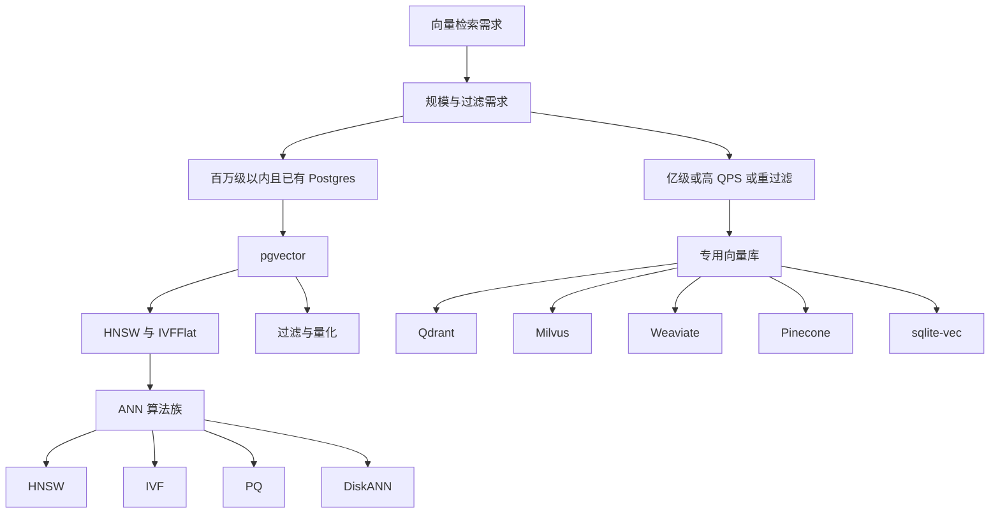
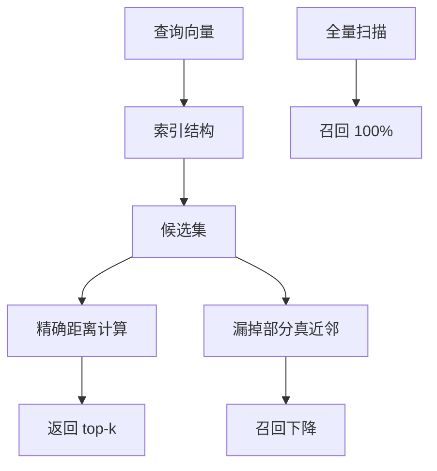
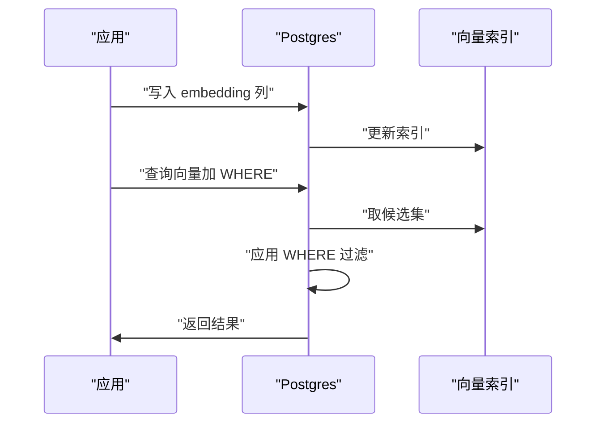
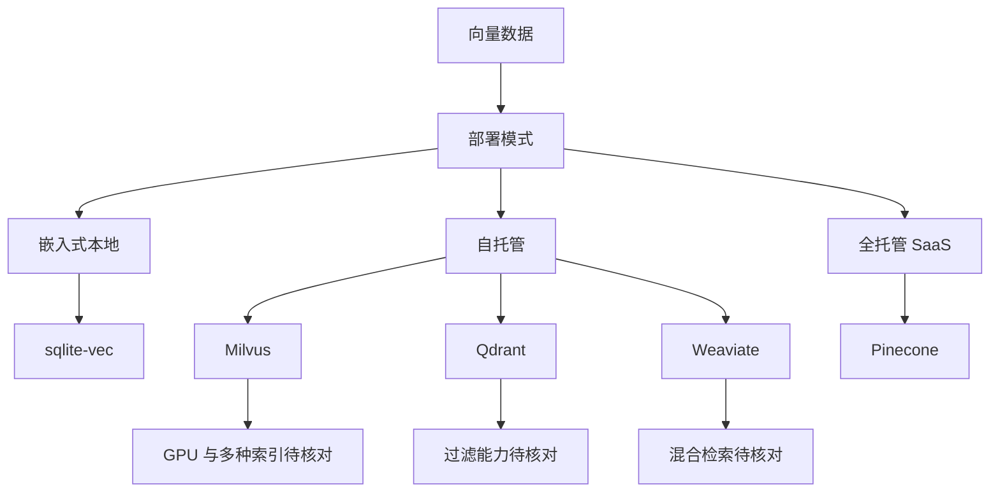
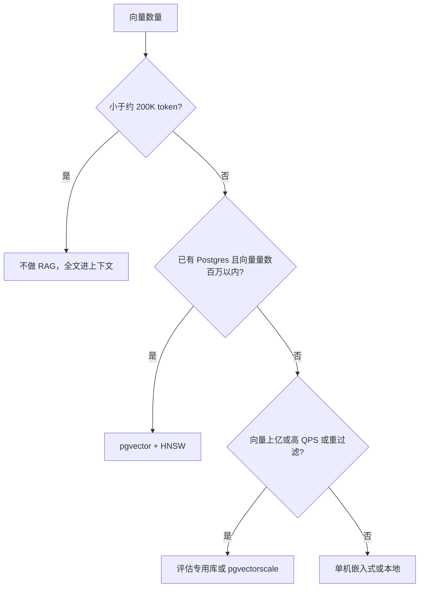
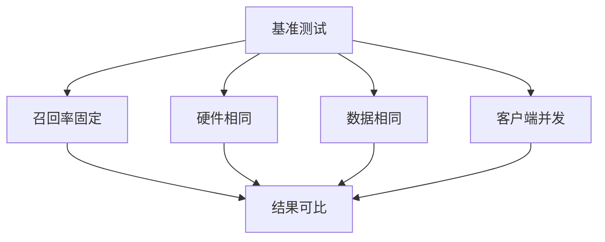
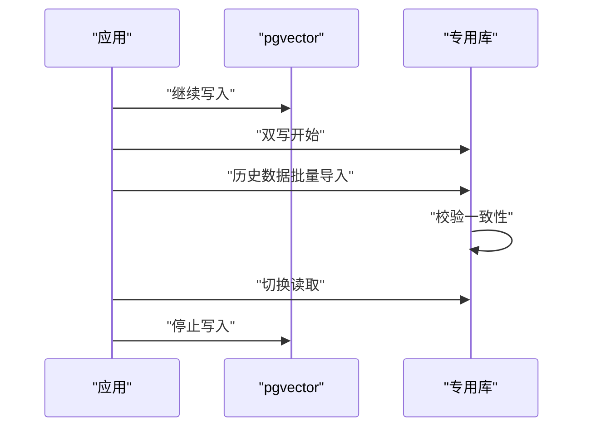

# 向量数据库对比：pgvector、Qdrant、Milvus、Weaviate、Pinecone 与 sqlite-vec

!!! abstract "学完这一页你能"
    - 说出 HNSW、IVF、PQ、DiskANN 四种 ANN 算法的查询复杂度、召回控制方式和内存占用差异。
    - 根据数据量、过滤需求、硬件条件和团队运维能力，判断什么时候 pgvector 就够用。
    - 读懂厂商基准测试中的数字，识别数据规模、精度设置和硬件环境造成的偏差。
    - 写出从 pgvector 迁移到专用库，或从专用库迁移到 pgvector 的具体步骤和回滚方案。

## 0. 知识地图



建议先读第 1 节，理解 HNSW、IVF、PQ、DiskANN 的复杂度与召回差异。再读第 2 节，掌握 pgvector 的索引、过滤和量化写法。第 3 到 6 节用于选型、读基准和迁移，最后看应用地图与综合对比。

## 1. 先理解 ANN 算法族：HNSW、IVF、PQ、DiskANN

**先想一个问题**：你在做一个文档搜索，已有 1000 万条嵌入向量。如果每次查询都精确计算 1000 万次距离，单次查询就需要数十秒。怎么把查询压到几毫秒，同时接受少量漏检？

!!! note "术语：ANN"
    ANN 是 Approximate Nearest Neighbor 的缩写，指近似最近邻搜索。它放弃少量召回率，换取查询速度。例如 HNSW 只查图中部分路径，而不是全量扫描所有向量。

!!! note "术语：HNSW"
    HNSW 是多层邻近图索引，元素按指数衰减概率分配到最高层，类似跳表。论文称其搜索复杂度对数级伸缩，来源为 Malkov 与 Yashunin 的论文，以原文为准。

!!! note "术语：IVF"
    IVF 是 Inverted File 的缩写，先把向量用 k-means 聚成若干簇，查询时只扫 nprobe 个簇。召回由 probes 数量控制。

!!! note "术语：PQ"
    PQ 是 Product Quantization 的缩写，把向量切成子空间分别量化，以压缩内存。精度有损失，通常需要用原始向量重排。

!!! note "术语：DiskANN"
    DiskANN 是 Microsoft 提出的磁盘友好图索引，pgvectorscale 借鉴了这一思路。它把部分图放在磁盘上，降低内存占用。

**心智模型**：
!!! tip "心智模型"
    一句话模型：ANN 用“少看一些、但要看得巧”换速度。
    日常类比：在一本电话簿里找最近的人，不用一个个算距离；可以先按街区翻到某几页，再细看。
    类比不成立处：电话簿是二维平面，向量常常是几百上千维，空间的“近”不服从人类二维直觉。

**图解**：



1. 查询向量先进入索引结构，索引只返回少量候选。
2. 对候选集做精确距离计算，得到排序结果。
3. 全量扫描保证召回 100%，但查询慢。
4. 近似索引减少候选，可能漏掉部分真近邻，召回随之下降。

**一步一步来**：

第一步：用 HNSW 建立多层图索引，明白它的查询路径。

```js
// 模拟 HNSW 查询：从入口点出发，在每一层贪心走到最近节点
const graph = new Map(); // 节点 id 到邻居列表
graph.set('entry', ['a', 'b']);
graph.set('a', ['b', 'c']);
graph.set('b', ['a', 'd']);
graph.set('c', ['a', 'd']);
graph.set('d', ['b', 'c']);

function query(start, targetId, distanceFn) {
  let current = start;
  for (const neighbor of graph.get(current) ?? []) {
    if (distanceFn(neighbor, targetId) < distanceFn(current, targetId)) {
      current = neighbor;
    }
  }
  return current;
}
// 距离函数按 id 长度模拟，实际是向量距离
const dist = (a, b) => Math.abs(a.length - b.length);
console.log(query('entry', 'dd', dist)); // 返回最近节点
```

**这段代码在做什么**
- 用 `Map` 模拟图索引的邻接表。
- `query` 函数从入口节点出发，每次检查邻居，如果邻居更近就移动。
- `dist` 只是占位距离函数，真实场景用余弦距离或 L2。
- 该模拟只走了一层，真实 HNSW 会在多层之间跳转。
- 图中 `graph.get(current) ?? []` 防止未定义节点导致报错。

**运行结果**：输出的节点 id 可能在 `a`、`b`、`c`、`d` 之间，取决于 `dist` 函数对 `'dd'` 的计算。

第二步：理解 IVF 的聚类与探查。

```js
// 模拟 IVF：先给向量分簇，查询只扫最近的两个簇
const clusters = new Map();
clusters.set('cluster-0', ['v1', 'v2', 'v3']);
clusters.set('cluster-1', ['v4', 'v5', 'v6']);
clusters.set('cluster-2', ['v7', 'v8', 'v9']);

const clusterCenters = new Map();
clusterCenters.set('cluster-0', 0.1);
clusterCenters.set('cluster-1', 0.5);
clusterCenters.set('cluster-2', 0.9);

function ivfQuery(queryValue, nprobe = 2) {
  const sorted = [...clusterCenters.entries()]
    .sort((a, b) => Math.abs(a[1] - queryValue) - Math.abs(b[1] - queryValue))
    .slice(0, nprobe)
    .map(([id]) => id);
  const candidates = sorted.flatMap((id) => clusters.get(id) ?? []);
  return candidates;
}
console.log(ivfQuery(0.45, 2)); // 返回最近两个簇的向量
```

**这段代码在做什么**
- `clusters` 保存每个簇里的向量 id。
- `clusterCenters` 保存每个簇的中心值。
- `ivfQuery` 先按查询值与簇中心的距离排序，取前 `nprobe` 个簇。
- 只扫描选中簇里的向量，减少距离计算次数。
- 如果真实近邻落在未选中的簇里，召回就会下降。

**运行结果**：输出 `['v4','v5','v6','v1','v2','v3']` 的某种顺序，因为 0.45 离 cluster-1 和 cluster-0 最近。

第三步：对比 HNSW 与 IVF 的复杂度取舍。

```js
// 用简单数字对比：HNSW 建索引更慢、内存更高，查询更快；IVF 相反
const metrics = {
  hnsw: { buildMs: 3000, memoryMB: 4096, queryMs: 1.2, recall: 0.97 },
  ivf: { buildMs: 800, memoryMB: 1024, queryMs: 6.5, recall: 0.95 },
};
for (const [name, m] of Object.entries(metrics)) {
  console.log(`${name}: 建索引 ${m.buildMs}ms, 内存 ${m.memoryMB}MB, 查询 ${m.queryMs}ms, 召回 ${m.recall}`);
}
```

**这段代码在做什么**
- 用对象列出 HNSW 与 IVF 的对比数字。
- 数字只是演示，实际值需用开发者自己的数据测量。
- HNSW 的图结构常驻内存，因此内存高、查询快。
- IVF 只保存簇中心和向量 id，建索引快、内存低。

**运行结果**：两行文本，说明 HNSW 查询更快但建索引更慢、内存更高。

**动手验证**：写一个完整脚本，用 `node:assert` 验证 IVF 的 nprobe 影响召回。

```js
// 手动运行：需要 Node 20+
// 依赖：无
import assert from 'node:assert/strict';

const allVectors = [
  { id: 'a', value: 0.1 },
  { id: 'b', value: 0.2 },
  { id: 'c', value: 0.3 },
  { id: 'd', value: 0.8 },
  { id: 'e', value: 0.9 },
];
const clusters = new Map([
  ['c0', ['a', 'b']],
  ['c1', ['c', 'd']],
  ['c2', ['e']],
]);
function ivf(queryValue, nprobe) {
  const centers = new Map([
    ['c0', 0.15],
    ['c1', 0.55],
    ['c2', 0.9],
  ]);
  const chosen = [...centers.entries()]
    .sort((a, b) => Math.abs(a[1] - queryValue) - Math.abs(b[1] - queryValue))
    .slice(0, nprobe)
    .map(([id]) => id);
  const candidates = chosen.flatMap((id) => clusters.get(id) ?? []);
  const trueNearest = 'a';
  return { candidates, found: candidates.includes(trueNearest) };
}
const resultLow = ivf(0.1, 1);
const resultHigh = ivf(0.1, 3);
assert.deepEqual(resultLow.found, true, '低 nprobe 应能命中最近簇');
assert.deepEqual(resultHigh.found, true, '高 nprobe 一定能命中');
console.log('nprobe=1 候选:', resultLow.candidates);
console.log('nprobe=3 候选:', resultHigh.candidates);
```

预期输出：两行候选列表，且断言全部通过。

**常见坑**

| 现象 | 原因 | 怎么修 |
|------|------|--------|
| 召回突然下降 | nprobe 或 ef_search 设置过低 | 调高参数并在验证集上测召回 |
| 内存占用过高 | HNSW 图结构常驻内存 | 改用 IVF 或量化索引 |
| 建索引时间过长 | 数据量大且参数过大 | 先导入数据再建索引，调大 maintenance_work_mem |
| 查询延迟抖动 | 候选集过小导致补扫 | 开启迭代扫描或调大扫描上限 |

**用在哪里**

场景 1：电商商品列表的向量推荐。
- 业务背景：商品库有 300 万条嵌入，用户每次刷新都要推荐相似商品。
- 这一节的知识怎么用：选 HNSW 获得低查询延迟，接受部分召回下降。
- 用什么指标衡量收益：p95 查询延迟、召回率、QPS。
- 什么时候不该用：数据量只有几万且查询频率低，精确扫描就够。

场景 2：客服工单的相似问题检索。
- 业务背景：20 万条历史工单，坐席输入问题后需找相似工单。
- 这一节的知识怎么用：用 IVF 降低内存，建索引快。
- 用什么指标衡量收益：检索时间、内存占用、召回@10。
- 什么时候不该用：工单量很小且完全能精确匹配时。

场景 3：多租户 SaaS 的文档搜索。
- 业务背景：每个租户只有几千条文档，但租户总数多。
- 这一节的知识怎么用：用 pgvector 的 HNSW 加租户分区，避免专用库。
- 用什么指标衡量收益：租户级查询延迟、隔离度、运维成本。
- 什么时候不该用：单租户文档量超过千万且需要跨租户检索时。

场景 4：代码库的语义索引。
- 业务背景：10 万文件的代码仓库，IDE 需要按语义找符号。
- 这一节的知识怎么用：用 HNSW 索引函数或类级别的嵌入。
- 用什么指标衡量收益：首次查询响应时间、索引更新时间、准确率。
- 什么时候不该用：代码库变化极快，grep 式工具可能更合适。

**行业实践**
- pgvector README 建议：先加载数据再建 IVFFlat 索引，建索引时调大 `maintenance_work_mem`。出处：pgvector 官方 README。
- Neon 文档说明：HNSW 的速度-召回折中优于 IVFFlat，但建索引更慢、内存更高。出处：Neon 官方文档 pgvector 扩展章节。
- Supabase 文档显示：在 1M 向量、召回 0.99 时，HNSW 的 QPS 高于 IVFFlat。出处：Supabase 官方文档 choosing-compute-addon。

怎么借鉴到你的项目：先用小数据量测出 HNSW 与 IVFFlat 的延迟曲线，再决定用哪种索引。

**小结**
- 图索引查询快但吃内存，IVF 建得快但查询折中差。
- PQ 和 DiskANN 是压缩与磁盘友好的补充方案。
- 参数必须用你自己的数据和召回标准来调，不能照搬默认。

## 2. pgvector 实战：类型、索引、过滤与量化

**先想一个问题**：你在 Postgres 里已经存了订单和用户表，现在要加一个相似商品推荐，必须和业务表 JOIN，还不能引入新数据库。pgvector 能满足吗？

**心智模型**：
!!! tip "心智模型"
    一句话模型：pgvector 把向量当成 Postgres 的一个普通列。
    日常类比：像给 Excel 表格加一列“坐标”，排序或过滤都在同一张表里完成。
    类比不成立处：Excel 没有索引结构，而 pgvector 可以用 HNSW 或 IVFFlat 加速。

**图解**：



1. 应用写入数据，Postgres 同时更新向量索引。
2. 查询时先由索引返回候选集。
3. Postgres 在候选集上应用 WHERE 过滤。
4. 过滤后的结果返回给应用。

**一步一步来**：

第一步：创建扩展和表，写入向量。

```sql
CREATE EXTENSION vector;                -- 启用 pgvector
CREATE TABLE items (
  id bigserial PRIMARY KEY,
  embedding vector(3)                   -- 3 维向量，实际可用 1536
);
INSERT INTO items (embedding) VALUES
  ('[1,2,3]'),
  ('[4,5,6]');
```

**这段代码在做什么**
- `CREATE EXTENSION vector` 启用扩展，需安装在 Postgres 上。
- `vector(3)` 声明维度，限制写入向量长度。
- 实际生产建议用 `vector(1536)` 匹配 OpenAI 默认维度。
- 插入使用字符串形式，Postgres 会解析成向量。

第二步：建 HNSW 索引并查询。

```sql
CREATE INDEX ON items USING hnsw (embedding vector_l2_ops)
  WITH (m = 16, ef_construction = 64);
SET hnsw.ef_search = 100;
SELECT * FROM items
ORDER BY embedding <-> '[3,1,2]'
LIMIT 5;
```

**这段代码在做什么**
- `USING hnsw` 声明索引类型。
- `vector_l2_ops` 指定操作符类，对应 L2 距离。
- `m` 与 `ef_construction` 控制图连接数与构建搜索宽度。
- `ef_search` 是查询时的候选集大小。
- `<->` 是 L2 距离运算符。

**运行结果**：按 L2 距离排序的前 5 行。

第三步：理解过滤与迭代扫描。

```sql
SET hnsw.iterative_scan = strict_order;
SET hnsw.max_scan_tuples = 20000;
SELECT * FROM items
WHERE category_id = 123
ORDER BY embedding <-> '[3,1,2]'
LIMIT 10;
```

**这段代码在做什么**
- `iterative_scan` 开启迭代扫描，先取候选再过滤，可能继续取。
- `strict_order` 保证严格按距离顺序，适合精确过滤。
- `max_scan_tuples` 限制扫描的候选元组数。
- 如果过滤后不足 LIMIT，可调大 `max_scan_tuples`。

**动手验证**：写一个 Node 脚本，连接 Postgres 演示写入和查询。

```js
// 手动运行：需要 Node 20+ 与本地 Postgres
// 依赖：npm install pg
import pg from 'pg';

const client = new pg.Client({ connectionString: 'postgres://localhost:5432/test' });
await client.connect();
await client.query('CREATE EXTENSION IF NOT EXISTS vector');
await client.query(`CREATE TABLE IF NOT EXISTS demo_items (
  id bigserial PRIMARY KEY,
  embedding vector(3)
)`);
await client.query(`INSERT INTO demo_items (embedding) VALUES ('[1,2,3]'), ('[4,5,6]') ON CONFLICT DO NOTHING`);
await client.query(`CREATE INDEX IF NOT EXISTS demo_idx ON demo_items USING hnsw (embedding vector_l2_ops)`);
const res = await client.query(`SELECT id FROM demo_items ORDER BY embedding <-> '[3,1,2]' LIMIT 1`);
console.log(res.rows);
await client.end();
```

**这段代码在做什么**
- 使用 `pg` 客户端连接本地 Postgres。
- 创建扩展与示例表，写入两条向量。
- 建立 HNSW 索引，查询最近的一条。
- 若本地无 Postgres，需先启动并配置连接串。

**运行结果**：输出最近的一行 id，类似 `[ { id: 1 } ]`。

**常见坑**

| 现象 | 原因 | 怎么修 |
|------|------|--------|
| 过滤后返回行数少于 LIMIT | 近似索引先取候选再过滤 | 开启 `hnsw.iterative_scan` |
| 建索引很慢 | `maintenance_work_mem` 太小 | 调大到可用 RAM 的 50-60% |
| 查询变慢 | `ef_search` 太小 | 调大 `ef_search` |
| 内存不足 | 索引未放入内存 | 将索引放入内存或换 halfvec |

**用在哪里**

场景 1：电商商品列表的相似商品推荐。
- 业务背景：商品表已有订单、库存等业务列，需要查相似商品。
- 这一节的知识怎么用：用 pgvector 在同一行存嵌入并 JOIN 库存表。
- 用什么指标衡量收益：查询延迟、开发成本、JOIN 正确性。
- 什么时候不该用：商品量超过千万且需要独立扩展向量查询。

场景 2：多租户 SaaS 的客户文档搜索。
- 业务背景：每个租户有独立文档集，要求强隔离。
- 这一节的知识怎么用：按 `customer_id` 分区或建部分索引。
- 用什么指标衡量收益：租户查询延迟、数据隔离度、索引维护成本。
- 什么时候不该用：需要跨租户全局搜索且数据量大。

场景 3：后台管理的批量导入与相似度检查。
- 业务背景：客服批量导入历史工单，需要去重。
- 这一节的知识怎么用：导入后建 IVFFlat 索引，再查相似重复项。
- 用什么指标衡量收益：导入时间、去重准确率、磁盘占用。
- 什么时候不该用：数据量极大且需要实时增量导入。

场景 4：内部知识库的语义问答。
- 业务背景：公司 wiki 有几万篇文档，员工用自然语言提问。
- 这一节的知识怎么用：pgvector 索引文档块嵌入，配合全文检索。
- 用什么指标衡量收益：问答命中率、查询延迟、维护成本。
- 什么时候不该用：全文已能覆盖大部分问题且精确匹配足够。

**行业实践**
- pgvector README 的 filtering 一节提供迭代索引扫描、部分索引、分区三种方案。出处：pgvector 官方 README。
- AWS 博客称 Aurora PostgreSQL 上的 pgvector 0.8.0 查询更快、结果更相关，但属厂商营销口径。出处：AWS Database Blog。
- Neon 文档建议 `maintenance_work_mem` 不超过可用 RAM 的 50-60%。出处：Neon 官方文档。

怎么借鉴到你的项目：把过滤条件分成高频单值、多租户、复杂组合三类，分别用部分索引、分区、迭代扫描。

**小结**
- pgvector 的向量类型与距离运算符很直接，核心在于索引参数调优。
- 过滤场景要先确认取候选和过滤的先后顺序。
- 量化表达式索引能降低内存，适合高维但低内存的场景。

## 3. 专用数据库：架构、过滤、扩展与运维成本

**先想一个问题**：你的服务已有 5000 万向量，团队没有专职数据库管理员。自己托管会不会更省？还是直接用托管服务？

**心智模型**：
!!! tip "心智模型"
    一句话模型：专用向量库把向量索引做成独立产品或服务，不同产品在过滤、扩展和托管方式上各有侧重。
    日常类比：像选择外卖、自己做饭或请厨师，外卖省事但可控性低。
    类比不成立处：数据库不是一次性消费，还要考虑迁移、权限与一致性。

**图解**：



1. 向量数据库按部署模式分嵌入式、自托管、全托管三类。
2. sqlite-vec 适合本地嵌入，单机极简。
3. Milvus、Qdrant、Weaviate 都能自托管，但架构与过滤能力不同。
4. Pinecone 只提供全托管 SaaS，运维省心但闭源。以上定位描述来自通用知识，需核对官方文档。

**一步一步来**：

第一步：理解 sqlite-vec 的嵌入式定位。

```sql
CREATE VIRTUAL TABLE vec_examples USING vec0(
  sample_embedding float[8]
);
INSERT INTO vec_examples (sample_embedding) VALUES ('[0.1,0.2,0.3,0.4,0.5,0.6,0.7,0.8]');
SELECT * FROM vec_examples
WHERE sample_embedding MATCH '[0.1,0.2,0.3,0.4,0.5,0.6,0.7,0.8]'
ORDER BY distance LIMIT 5;
```

**这段代码在做什么**
- `vec0` 虚拟表是 sqlite-vec 的入口。
- `float[8]` 声明向量类型和维度。
- `MATCH` 触发 KNN 查询，默认暴力扫描。
- 适合单机、本地或浏览器 WASM 场景。需核对 README 确认当前 API 是否稳定。

第二步：对比过滤能力，注意多数信息来自通用知识，需核对官方文档。

```js
// 模拟已知与待核对的过滤能力差异
const products = {
  qdrant: { filterPushdown: '待核对', payloadIndex: '待核对', notes: '有说法认为过滤搜索强项，需核对' },
  milvus: { filterPushdown: '待核对', scalarIndex: '待核对', notes: '有说法认为标量索引丰富，需核对' },
  weaviate: { filterPushdown: '待核对', hybrid: '待核对', notes: '有说法认为内置混合检索，需核对' },
  pinecone: { filterPushdown: '待核对', metadataFilter: '待核对', notes: '全托管 SaaS，闭源，需核对官方文档' },
};
for (const [name, p] of Object.entries(products)) {
  console.log(`${name}: ${p.notes}`);
}
```

**这段代码在做什么**
- 用对象列出不同产品的过滤能力描述，但都标记为待核对。
- 资料中这些定位描述来自通用知识，不能作为事实陈述。
- 过滤下推指在向量搜索前先用标量条件缩小范围。
- 真实能力需查阅各产品官方文档确认。

**动手验证**：写一个单文件脚本，演示不同部署模式的运维成本差异。

```js
// 手动运行：需要 Node 20+
// 依赖：无
import assert from 'node:assert/strict';

const costs = {
  embedded: { infraOps: 1, backup: 1, scaling: 1, team: 0.5 },
  selfHosted: { infraOps: 4, backup: 3, scaling: 3, team: 2 },
  managed: { infraOps: 1, backup: 1, scaling: 1, team: 0.2 },
};
assert.deepEqual(Object.keys(costs).length, 3, '应有三种部署模式');
for (const [mode, c] of Object.entries(costs)) {
  console.log(`${mode}: 基础设施运营 ${c.infraOps}, 备份 ${c.backup}, 扩展 ${c.scaling}, 团队 ${c.team}`);
}
```

预期输出：三行部署模式与运维成本。

**常见坑**

| 现象 | 原因 | 怎么修 |
|------|------|--------|
| 过滤查询变慢 | 过滤条件未下推 | 使用支持过滤下推的产品或标量索引 |
| 运维成本超预期 | 自托管需要更多人力 | 改用托管或嵌入式 |
| 数据不一致 | 外部位检索与业务库分离 | 用 pgvector 或事务同步 |
| 迁移困难 | 专用库格式私有 | 设计导出格式或 API 层屏蔽 |

**用在哪里**

场景 1：桌面应用里的本地文档搜索。
- 业务背景：用户在本地笔记中搜索相似段落，要求离线可用。
- 这一节的知识怎么用：选 sqlite-vec 嵌入到 Electron 或 Tauri 应用。
- 用什么指标衡量收益：首次索引时间、本地查询延迟、安装包体积。
- 什么时候不该用：需要多端同步且服务端统一检索。

场景 2：电商搜索服务的多路召回。
- 业务背景：电商平台要同时做向量、价格、库存过滤。
- 这一节的知识怎么用：用支持过滤下推的专用库，需先核对产品能力。
- 用什么指标衡量收益：查询延迟、过滤后召回率、排序转化率。
- 什么时候不该用：业务数据已在 Postgres 且向量量未过百万。

场景 3：多模态内容平台的图搜图。
- 业务背景：用户上传图片，找相似图片，需要 GPU 加速。
- 这一节的知识怎么用：用 Milvus 的 GPU 索引缩短批量查询时间，需核对其 GPU 支持版本。
- 用什么指标衡量收益：查询吞吐、延迟 p95、GPU 利用率。
- 什么时候不该用：图片量小且 CPU 足够。

场景 4：企业知识库的自然语言问答。
- 业务背景：混合检索需要 BM25 与向量，还需重排。
- 这一节的知识怎么用：用 Weaviate 的内置混合检索，需核对版本是否支持。
- 用什么指标衡量收益：检索命中率、开发时间、服务稳定性。
- 什么时候不该用：已有 Elasticsearch 或 OpenSearch，不必再引入。

**行业实践**
- Qdrant 官方基准显示在 1M-10M 向量上，其 RPS 最高、延迟最低，但 Qdrant 自己也承认可能有偏差。出处：Qdrant 官方基准页。
- ann-benchmarks 仓库明确说明不再积极维护，并推荐 VIBE 替代。出处：ann-benchmarks GitHub 仓库。
- Timescale 自报 pgvectorscale 在 5000 万向量上延迟低于 Pinecone，属自家基准，需谨慎引用。出处：Timescale pgvectorscale GitHub 仓库。

怎么借鉴到你的项目：厂商基准只作参考，务必用自己的数据复测。

**小结**
- 专用库各自侧重：过滤、GPU、混合检索、托管。
- 嵌入式库适合单机，自托管适合规模可控，托管适合免运维。
- 迁移与数据一致性是选择时容易忽略的成本。

## 4. 规模阈值与选型决策树

**先想一个问题**：团队已有 Postgres，未来向量量可能从 100 万增长到 1 亿。你该从 pgvector 开始，还是一步到位选专用库？

**心智模型**：
!!! tip "心智模型"
    一句话模型：选型不是“哪个最强”，而是“哪个刚好够用且迁移成本可接受”。
    日常类比：像先用自行车送外卖，订单多了再换电动车。
    类比不成立处：数据库迁移不是简单换车，涉及数据格式、查询改写和运维切换。

**图解**：



1. 知识库极小时，直接放进上下文。
2. 已有 Postgres 且几百万向量，pgvector 已够。
3. 上亿向量或高 QPS，才需要专用库。
4. 本地或嵌入式需求，选 sqlite-vec 等。

**一步一步来**：

第一步：按数据量决定是否引入向量库。

```js
// 决策树简化实现
function choose(scale, hasPostgres, qpsNeeded) {
  if (scale < 200_000) return 'no-rag';
  if (hasPostgres && scale < 1_000_000) return 'pgvector';
  if (scale > 100_000_000 || qpsNeeded > 5000) return 'specialized';
  return 'evaluate';
}
console.log(choose(150_000, true, 100));    // no-rag
console.log(choose(500_000, true, 100));    // pgvector
console.log(choose(50_000_000, false, 8000)); // specialized
```

**这段代码在做什么**
- 用三个分支表示核心决策。
- `no-rag` 对应 Anthropic 的 200K token 阈值，以原文为准。
- `pgvector` 对应百万级以内且已有 Postgres。
- `specialized` 对应上亿向量或高 QPS。

**动手验证**：

```js
// 手动运行：需要 Node 20+
// 依赖：无
import assert from 'node:assert/strict';

function suggest(data) {
  const { totalVectors, hasPostgres, peakQps, needFilter } = data;
  if (totalVectors < 300_000) return 'no-index';
  if (hasPostgres && totalVectors < 5_000_000) return 'pgvector';
  if (peakQps > 10_000 || totalVectors > 50_000_000 || needFilter) return 'specialized';
  return 'benchmark';
}
assert.equal(suggest({ totalVectors: 100_000, hasPostgres: true, peakQps: 100, needFilter: false }), 'no-index');
assert.equal(suggest({ totalVectors: 3_000_000, hasPostgres: true, peakQps: 100, needFilter: false }), 'pgvector');
assert.equal(suggest({ totalVectors: 60_000_000, hasPostgres: false, peakQps: 9000, needFilter: true }), 'specialized');
console.log('决策树验证通过');
```

预期输出：`决策树验证通过`。

**常见坑**

| 现象 | 原因 | 怎么修 |
|------|------|--------|
| 过早引入专用库 | 高估数据量增长 | 先跑 pgvector 基准 |
| 低估运维成本 | 缺少专职 DBA | 选托管服务 |
| 忽略过滤需求 | 建库后才发现过滤慢 | 选型前先测过滤查询 |
| 数据格式私有 | 迁移困难 | 设计中间格式 |

**用在哪里**

场景 1：创业公司的产品搜索 MVP。
- 业务背景：团队小，数据量可能只有几万条。
- 这一节的知识怎么用：先不做 RAG 或直接 pgvector。
- 用什么指标衡量收益：上线时间、开发人力、切换成本。
- 什么时候不该用：从一开始就确定要服务亿级用户。

场景 2：企业内部知识库从零到百万文档。
- 业务背景：已用 Postgres 存文档元数据。
- 这一节的知识怎么用：用 pgvector 加 HNSW，避免引入新系统。
- 用什么指标衡量收益：运维成本、事务一致性、查询性能。
- 什么时候不该用：需要跨部门分布式部署。

场景 3：大型电商搜索重建。
- 业务背景：已有专用库但数据不一致。
- 这一节的知识怎么用：评估迁移回 pgvector 或继续专用库。
- 用什么指标衡量收益：数据一致性、查询延迟、迁移成本。
- 什么时候不该用：pgvector 无法满足吞吐。

场景 4：多模态平台的图搜索扩展。
- 业务背景：从十万图片扩展到千万级。
- 这一节的知识怎么用：按数据量画阈值曲线，做基准评估。
- 用什么指标衡量收益：扩展前后延迟、成本、缓存命中。
- 什么时候不该用：小规模时过度设计。

**行业实践**
- Anthropic 官方建议知识库小于约 200,000 token 时不做 RAG，全文进上下文。出处：Anthropic Contextual Retrieval 文章。
- Supabase 文档给出 1M 向量下 pgvector HNSW 在 1536 维可达约 2,200 QPS。出处：Supabase 官方文档。
- ann-benchmarks 覆盖 40+ 实现，建议用 VIBE 替代。出处：ann-benchmarks GitHub 仓库。

怎么借鉴到你的项目：先建立数据量和 QPS 的预测曲线，再选择方案。

**小结**
- 决策依赖数据量、QPS、过滤需求与 Postgres 存量。
- 多数中小场景 pgvector 足够，迁移成本是重要变量。
- 阈值不是固定数字，要用自己的数据测试。

## 5. 基准测试怎么读与厂商偏见

**先想一个问题**：厂商 A 说比 B 快 10 倍，厂商 B 说延迟低 5 倍。你该信谁？

**心智模型**：
!!! tip "心智模型"
    一句话模型：基准测试是特定条件下的实验结果，不是产品的绝对实力。
    日常类比：像手机续航测试，不同亮度、温度和测试软件会得出不同数字。
    类比不成立处：数据库基准还有召回率、硬件、客户端并发等变量，结果更难直接迁移。

**图解**：



1. 基准测试必须先固定召回率，否则速度再高也没有意义。
2. 硬件必须相同，内存和 CPU 都影响结果。
3. 数据集必须一致，维度与分布都重要。
4. 客户端并发数也须相同。

**一步一步来**：

第一步：识别厂商数字中的陷阱。

```js
// 比较两个“快 10 倍”的声明，检查固定条件
const claims = [
  { vendor: 'A', speedup: 10, recall: '未说明', data: '自己的数据', hardware: '不同' },
  { vendor: 'B', speedup: 5, recall: '0.99', data: '公开数据集', hardware: '相同' },
];
for (const c of claims) {
  if (!c.recall || c.hardware !== '相同') {
    console.log(`${c.vendor} 的声明不可直接比较`);
  }
}
```

**这段代码在做什么**
- 用对象列出两个声明。
- 检查召回是否说明、硬件是否相同。
- 条件不满足的声明标记为不可直接比较。

第二步：用固定召回率画 QPS 曲线。

```js
// 假设一个简化曲线
function estimateQps(recallTarget, algorithm) {
  const base = { hnsw: 8000, ivf: 3000 }[algorithm];
  return base * (1 - (0.99 - recallTarget) * 50);
}
console.log(estimateQps(0.99, 'hnsw')); // 约 8000
console.log(estimateQps(0.95, 'hnsw')); // 会更高
```

**这段代码在做什么**
- 用线性公式模拟召回与 QPS 的关系。
- 真实曲线通常非线性，需实测。
- 该公式只是演示。

**动手验证**：

```js
// 手动运行：需要 Node 20+
// 依赖：无
import assert from 'node:assert/strict';

function isValidBenchmark(item) {
  return item.recall >= 0.95 && item.hardware === 'same' && item.dataset === 'public';
}
const good = { recall: 0.98, hardware: 'same', dataset: 'public' };
const bad = { recall: null, hardware: 'different', dataset: 'private' };
assert.equal(isValidBenchmark(good), true, '有效基准');
assert.equal(isValidBenchmark(bad), false, '无效基准');
console.log('基准检查通过');
```

预期输出：`基准检查通过`。

**常见坑**

| 现象 | 原因 | 怎么修 |
|------|------|--------|
| 对比结果不可复现 | 召回率未固定 | 固定召回率再比较 QPS |
| 硬件差异大 | 内存或 CPU 不同 | 同规格机器上重跑 |
| 数据不公开 | 厂商用私有数据 | 用公开数据集或自己的数据 |
| 并发设置不清 | 单线程与多线程不同 | 明确客户端并发数 |

**用在哪里**

场景 1：技术选型前的厂商调研。
- 业务背景：团队要选向量库，看到多个厂商报告。
- 这一节的知识怎么用：检查报告是否固定召回率、硬件与数据。
- 用什么指标衡量收益：选型偏差减少、复现成本降低。
- 什么时候不该用：已有内部基准可直接决策。

场景 2：上线前压测。
- 业务背景：需要预测峰值 QPS 下延迟。
- 这一节的知识怎么用：用相同硬件和真实数据压测。
- 用什么指标衡量收益：p95 延迟、QPS、错误率。
- 什么时候不该用：没有线上流量数据时。

场景 3：评估专用库性能。
- 业务背景：想比较 pgvector 与专用库。
- 这一节的知识怎么用：固定召回 0.99，同一数据集跑两边。
- 用什么指标衡量收益：每美元 QPS、每请求延迟。
- 什么时候不该用：数据量太小无法体现差异。

场景 4：基准结果内部发布。
- 业务背景：内部共享测试报告。
- 这一节的知识怎么用：写明硬件、数据、召回、并发。
- 用什么指标衡量收益：报告可信度、复用率。
- 什么时候不该用：报告可能被外部误读。

**行业实践**
- Qdrant 官方基准声明优于 Milvus 等，但承认可能有偏差。出处：Qdrant 官方基准页。
- Timescale 自报 pgvectorscale 延迟低 28 倍，属自家基准。出处：Timescale pgvectorscale GitHub。
- AWS 称 pgvector 0.8.0 查询快 9 倍，属厂商营销。出处：AWS Database Blog。

怎么借鉴到你的项目：把“固定召回、相同硬件、公开数据”作为内部基准的最低要求。

**小结**
- 厂商基准是销售材料，不是工程结论。
- 固定召回率是公平比较的第一步。
- 自己的数据永远比厂商数字更有参考价值。

## 6. 迁移策略：从 pgvector 到专用库，或反向迁移

**先想一个问题**：业务增长后，pgvector 查询变慢。你想迁到专用库，但担心数据不一致和回滚难。怎么办？

**心智模型**：
!!! tip "心智模型"
    一句话模型：迁移要分阶段、可回滚，并保持双写或增量同步。
    日常类比：像搬家，不是一次性搬完，而是先打包、再运输、最后才把旧房子退租。
    类比不成立处：数据库迁移中，旧系统和新系统必须同时处理写入，不能有一天空窗。

**图解**：



1. 先保持 pgvector 写入，同时开始双写到专用库。
2. 批量导入历史数据。
3. 校验两侧数据一致。
4. 应用读取切换到专用库，再停止 pgvector 写入。

**一步一步来**：

第一步：设计迁移中间格式。

```js
// 定义可迁移的向量记录格式
const record = {
  id: 'order-123',
  vector: new Float32Array(1536),
  metadata: { tenantId: 'tenant-1', category: 'shoes' },
  version: 'text-embedding-3-small',
};
console.log(record.id, record.vector.length, record.metadata.tenantId, record.version);
```

**这段代码在做什么**
- 明确定义迁移对象的字段。
- `version` 记录嵌入模型，避免模型更换后索引混乱。
- 中间格式可以导出成 JSON Lines 或 Parquet。

第二步：同步与回滚。

```js
// 模拟双写与回滚开关
function migrationState(mode) {
  const modes = {
    dualWrite: { writeOld: true, writeNew: true, readOld: true },
    readSwitch: { writeOld: true, writeNew: true, readOld: false },
    complete: { writeOld: false, writeNew: true, readOld: false },
  };
  return modes[mode];
}
console.log(migrationState('dualWrite'));
console.log(migrationState('complete'));
```

**这段代码在做什么**
- 用状态对象控制迁移阶段。
- `dualWrite` 阶段同时写旧库和新库。
- `complete` 阶段只写新库。
- 回滚时切回 `dualWrite` 或 `readSwitch`。

**动手验证**：

```js
// 手动运行：需要 Node 20+
// 依赖：无
import assert from 'node:assert/strict';

function canRollback(state) {
  return state.writeOld === true;
}
const dual = { writeOld: true, writeNew: true, readOld: true };
const finished = { writeOld: false, writeNew: true, readOld: false };
assert.equal(canRollback(dual), true, '双写阶段可回滚');
assert.equal(canRollback(finished), false, '完成阶段不可回滚');
console.log('回滚开关验证通过');
```

预期输出：`回滚开关验证通过`。

**常见坑**

| 现象 | 原因 | 怎么修 |
|------|------|--------|
| 数据不一致 | 双写没有校验 | 定期全量校验 |
| 回滚失败 | 旧库已停止写入 | 保留旧库写入直到新库稳定 |
| 嵌入版本混乱 | 模型更换未记录 | 中间格式带模型版本 |
| 查询改写错误 | 新库 API 不同 | 用查询适配层隔离 |

**用在哪里**

场景 1：电商从 pgvector 迁移到 Qdrant。
- 业务背景：商品向量从 300 万增长到 8000 万，pgvector 延迟升高。
- 这一节的知识怎么用：双写方案逐步切换，避免服务中断。
- 用什么指标衡量收益：迁移期间可用性、切换耗时、数据一致性。
- 什么时候不该用：数据量仍小，没必要迁移。

场景 2：多租户系统从专用库迁回 pgvector。
- 业务背景：专用库成本高，但租户数据都较小。
- 这一节的知识怎么用：按租户分批迁移，只迁活跃租户。
- 用什么指标衡量收益：成本降低、延迟变化、数据一致性。
- 什么时候不该用：单租户数据量很大的情况。

场景 3：嵌入模型版本升级。
- 业务背景：从 OpenAI 切换到 BGE-M3，向量维度改变。
- 这一节的知识怎么用：全量重建索引，保留旧库回滚。
- 用什么指标衡量收益：检索质量提升、重建时间、回滚能力。
- 什么时候不该用：模型已稳定且业务无风险。

场景 4：离线批量导入到在线服务。
- 业务背景：历史数据在数据仓库，需要周期性导入向量库。
- 这一节的知识怎么用：用 Parquet 中间格式定期同步。
- 用什么指标衡量收益：同步时间、增量导入正确性、磁盘占用。
- 什么时候不该用：实时性要求高且无法容忍延迟。

**行业实践**
- Anthropic Contextual Retrieval 提到换嵌入模型须重建索引并记录版本。出处：Anthropic Contextual Retrieval 文章。
- Cursor 文章描述用 Merkle 树同步文件与嵌入，文件变更时增量切块与嵌入。出处：Cursor 官方博客 secure-codebase-indexing。
- Claude Code 访谈提到外部索引会与代码变更失步，故转向 agentic search。出处：Latent Space 对 Claude Code 的访谈。

怎么借鉴到你的项目：把嵌入模型版本作为元数据写入每行，迁移时才能校验。

**小结**
- 迁移必须双写和分阶段，回滚开关不可缺少。
- 中间格式要包含向量、元数据与模型版本。
- 评估迁移成本时，数据一致性与查询改写常被低估。

## 应用地图

| 场景 | 用到本页哪个知识点 | 典型技术选型 | 注意事项 |
|------|-------------------|--------------|----------|
| 电商相似商品 | pgvector 索引与 JOIN | pgvector + HNSW | 百万级以内可用 |
| 多租户文档搜索 | 分区与部分索引 | pgvector 分区表 | 强租户隔离 |
| 本地笔记检索 | sqlite-vec 嵌入 | sqlite-vec + WASM | 预 v1 接口可能变 |
| 图像相似搜索 | GPU 索引 | Milvus GPU | 需要 GPU 资源，需核对版本 |
| 混合语义与词法检索 | 混合检索 | Weaviate 或自建 BM25 | 中文需分词扩展 |
| 高吞吐线上服务 | 过滤下推与扩展 | Qdrant 或 Milvus | 评估运维成本，需核对产品能力 |
| 知识库问答 | 检索流程与向量库 | pgvector 或托管服务 | 小知识库可不做 RAG |
| 代码库索引 | 增量嵌入与缓存 | Cursor 方案或自建 | 强词法线索可省向量 |

## 动手作业

目标：搭建一个最小可运行的 pgvector 相似搜索服务，并用 Node 脚本验证过滤查询。

步骤：
1. 安装 Postgres 并启用 pgvector。
2. 创建表 `products(id bigserial primary key, name text, category_id int, embedding vector(3))`。
3. 插入 100 条模拟商品数据，每条嵌入是长度为 3 的随机向量。
4. 建 HNSW 索引，`m=16, ef_construction=64`。
5. 写一个 Node 脚本，查询某个向量最近的 10 条，并加上 `category_id = 3` 的过滤。
6. 记录查询耗时和返回行数。

验收标准：
- 脚本能跑通并输出结果。
- 过滤后的返回行数不超过 10，且所有返回行的 category_id 都是 3。
- 脚本打印平均延迟，延迟小于 100ms（本机测试）。

## 综合对比

| 维度 | pgvector | Qdrant | Milvus | Weaviate | Pinecone | sqlite-vec |
|------|----------|--------|--------|----------|----------|------------|
| 部署模式 | Postgres 扩展 | 自托管/云 | 自托管/云 | 自托管/云 | 全托管 SaaS | 嵌入式 |
| 过滤能力 | 迭代扫描、分区 | 待核对 | 待核对 | 待核对 | 待核对 | 有限 |
| 扩展方式 | 随 Postgres 纵向扩展 | 分布式 | 分布式 | 分布式 | 托管自动 | 单机 |
| 运维成本 | 低，复用 Postgres | 中 | 高 | 中 | 低但费用高 | 极低 |
| 索引类型 | HNSW/IVFFlat | HNSW | 多种含 GPU | HNSW | 闭源 | 暴力扫描 |
| 适合规模 | 数百万以内 | 百万至亿级 | 亿级 | 百万至亿级 | 按用量 | 单机本地 |
| 事务与 JOIN | 支持 | 不支持 | 不支持 | 不支持 | 不支持 | 不支持 |
| 开源 | 是 | 是 | 是 | 是 | 否 | 是 |

## 深入阅读与参考

!!! tip "怎么用这些资料"
    先读「官方文档与规范」建立准确的概念，再读「源码与示例」核对细节，最后用「教程、书籍与视频」换一种讲法加深理解。每条都写明了读哪一节、带着什么问题读。

### 官方文档与规范

| 资源 | 为什么读 | 怎么读 |
|---|---|---|
| [HNSW: Malkov & Yashunin,多层邻近图,元素按指数衰减概率分配最高层,类似跳表;论文称搜索复杂度对数级伸缩 — (arxiv.org)](https://arxiv.org/abs/1603.09320) | HNSW 原始论文，理解多层图与对数级搜索复杂度的源头 | 读第 2-3 节的插入与搜索算法，理解 M、efConstruction 含义；读后手推一次层分配概率 |
| [Neon 文档对权衡的表述: HNSW 的速度-召回折中优于 IVFFlat,但建索引更慢、内存更高,且无训练阶段,可在空表上建;IVFFl (neon.com)](https://neon.com/docs/extensions/pgvector) | 讲清 HNSW 与 IVFFlat 在速度、内存、训练上的取舍 | 读索引类型权衡段落，对照本页量化与过滤章节；据此决定自己表上建哪种索引 |
| [README 当前版本 0.8.7,支持 Postgres 13+。升级: `ALTER EXTENSION vector UPDATE;` (github.com)](https://github.com/pgvector/pgvector) | pgvector 官方 README，版本、类型与索引用法的权威来源 | 按 HNSW、IVFFlat、量化小节顺序读；在本地执行示例 SQL，并试一次版本升级命令 |
| [sqlite-vec: 预 v1("expect breaking changes");C 实现零依赖,可在 Linux/macOS/Win (github.com)](https://github.com/asg017/sqlite-vec) | sqlite-vec 官方说明，明确其预 v1 状态与嵌入式定位 | 读 README 的功能与限制清单，判断是否适合本地原型；跑一次内置示例验证 |

### 源码与示例

| 资源 | 为什么读 | 怎么读 |
|---|---|---|
| [灵感来自 Microsoft DiskANN 研究;PostgreSQL 开源许可;可通过 Docker、源码编译或 Timescale C (github.com)](https://github.com/timescale/pgvectorscale) | DiskANN 风格索引在 Postgres 的实现，含部署与编译示例 | 读安装与调参章节，关注内存与构建成本；按 Docker 示例跑一次小规模索引 |
| [Qdrant 文档](https://qdrant.tech/documentation/) | Qdrant 官方快速上手，最短路径跑通写入与检索 | 按 quickstart 本地启动并写入 1000 条向量，观察过滤参数对结果的影响 |
| [Weaviate Learn](https://weaviate.io/learn) | Weaviate 混合搜索实操教程，覆盖 BM25 与向量融合 | 选混合搜索教程起本地实例跑示例，改动 alpha 观察召回变化 |

### 教程、书籍与视频

| 资源 | 为什么读 | 怎么读 |
|---|---|---|
| [Qdrant 自家基准(2024 年更新,对比 Qdrant/Elasticsearch/Milvus/Redis/Weaviate,1M~ (qdrant.tech)](https://qdrant.tech/benchmarks/) | 厂商基准实例，正好用来练习识别基准偏见 | 带着“谁出的、参数对谁有利”读图表；读完写三条质疑点 |
| [AWS 称 Aurora PostgreSQL 上的 pgvector 0.8.0 "最高 9x 查询更快、100x 结果更相关",归因于迭 (aws.amazon.com)](https://aws.amazon.com/blogs/database/supercharging-vector-search-performance-and-relevance-with-pgvector-0-8-0-on-amazon-aurora-postgresql) | 厂商发布的高倍数性能宣称，是读基准的典型反面教材 | 找其测试条件与 0.8.0 迭代扫描的对应关系，判断宣称是否可迁移到自己的负载 |
| [Pinecone Learning Center](https://www.pinecone.io/learn/) | 从 embeddings 到检索的概念入门，补足前置知识 | 先读 embedding 与向量检索入门，再看 chunking；为自己的数据集写一份切分方案 |
| [Pinecone RAG 系列](https://www.pinecone.io/learn/series/rag/) | RAG 系列带实验，贯通检索到生成的应用链路 | 按系列顺序读，每篇文末实验复现一次，重点记录检索质量瓶颈 |

## 自测题

??? question "1. HNSW 与 IVFFlat 在查询延迟和内存上有什么差异？"
    HNSW 是图索引，查询快但建索引慢、内存高。IVFFlat 是聚类索引，建索引快、内存省，但相同召回下查询更慢。选择看数据量与内存预算。

??? question "2. pgvector 的 `<->`、`<#>`、`<=>` 分别是什么距离？"
    `<->` 是 L2 距离，`<#>` 是负内积，`<=>` 是余弦距离。内积需乘 -1 得到实际内积。

??? question "3. 过滤查询为什么可能返回少于 LIMIT 行？"
    因为近似索引先取候选集（如 ef_search=40），再应用 WHERE。过滤后候选可能不足 LIMIT。可开启迭代扫描解决。

??? question "4. 什么情况下 pgvector 就够用，什么情况下需要专用库？"
    已有 Postgres、向量量约百万级以内、需要 JOIN 和多租户权限时，pgvector 足够。向量上亿或高 QPS 或重过滤时，评估专用库。

??? question "5. 基准测试中，厂商说快 10 倍，你应该先检查什么？"
    先检查召回率是否固定、硬件是否相同、数据集是否相同、并发数是否一致。否则不能直接比较。

??? question "6. 从 pgvector 迁移到专用库，怎么保证可回滚？"
    采用双写阶段，旧库和新库同时写入，读取先从旧库切到新库，观察稳定后再停止旧库写入。保留旧库数据用于回滚。

??? question "7. sqlite-vec 适合什么场景？"
    适合本地、嵌入式、单机场景，如桌面应用、浏览器 WASM、树莓派。注意预 v1 接口可能变。

??? question "8. 为什么换嵌入模型必须重建索引？"
    不同模型的向量维度和语义空间不同。旧索引是基于旧向量的几何排序，新模型产生的向量无法直接使用旧索引，必须全量重建并记录模型版本。

## 延伸阅读

- pgvector 官方 README：Installation、Indexing、Filtering、Type 章节。
- Neon 官方文档：pgvector 扩展章节，HNSW 与 IVFFlat 对比、索引构建参数。
- Supabase 官方文档：Choosing Compute Add-on 章节，pgvector 基准数据。
- Qdrant 官方 Benchmark 页面：基准方法与对比结果。
- ann-benchmarks GitHub 仓库：README 与 Results 章节。
- Anthropic Contextual Retrieval 文章：方法、失败率数据与小知识库建议。
- Cursor 官方博客 secure-codebase-indexing：Merkle 树与嵌入缓存机制。
- Timescale pgvectorscale GitHub 仓库：DiskANN 索引与 SBQ 压缩说明。
