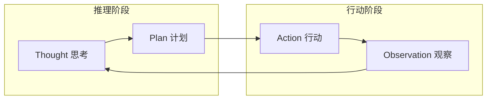
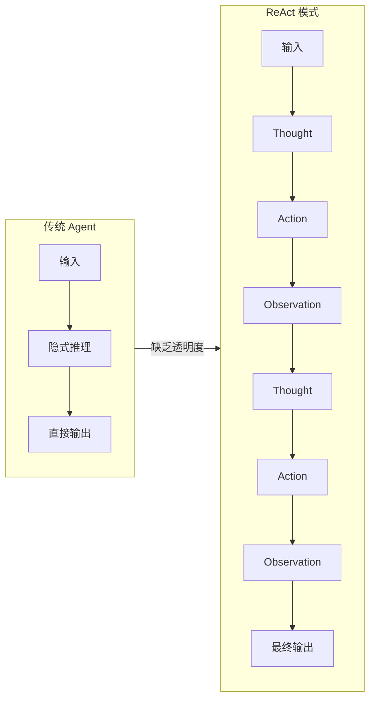
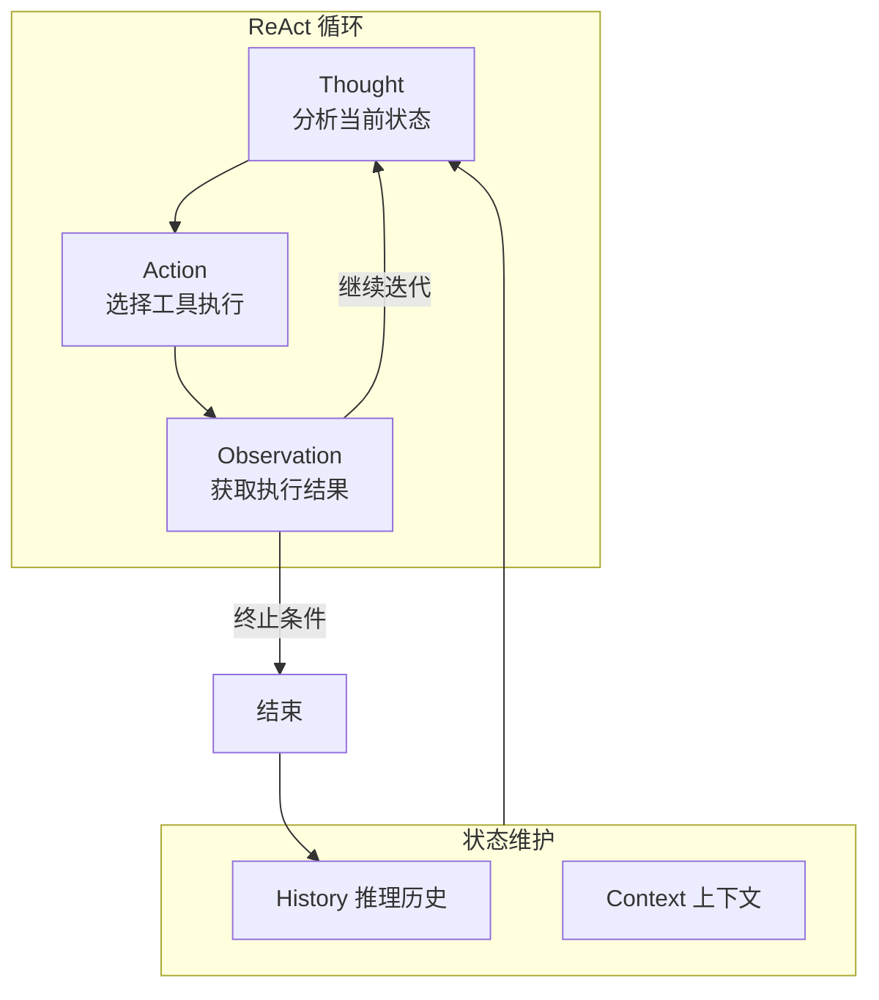
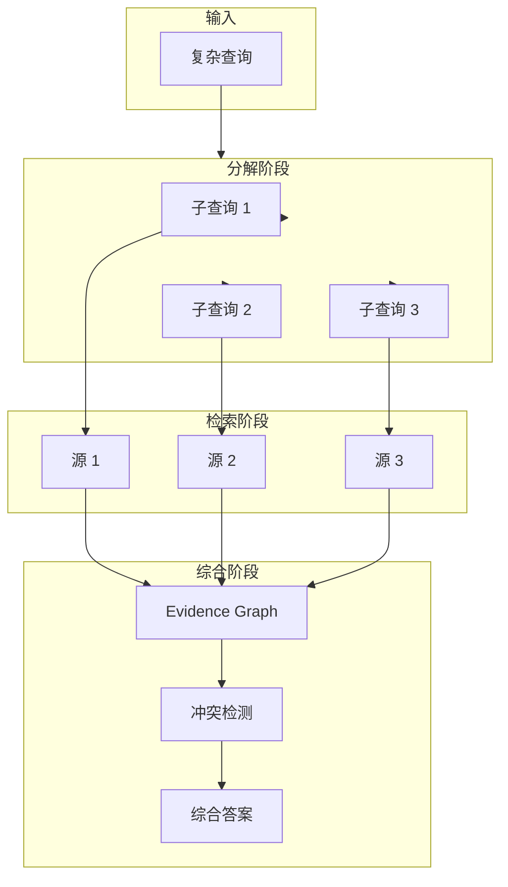
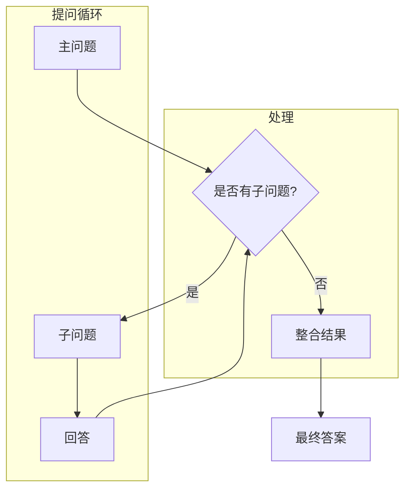

# ReAct 模式详解：Reasoning + Acting 驱动的大模型智能代理

## 概述

ReAct (Synergizing Reasoning and Acting in Language Models) 是一种让大语言模型 (LLM) 能够交替进行**推理**和**行动**的模式。它通过将推理过程中的中间步骤外显化，使模型能够动态地规划、追踪和调整行动策略，从而更好地处理复杂的多步骤任务。



---

## 1. ReAct 模式原理

### 1.1 理论基础

ReAct 的核心创新在于将 **Reasoning** (推理) 和 **Acting** (行动) 交替进行，而非分离处理。这一思想源于认知科学中的"双重过程理论"：

| 理论来源 | 核心观点 | 在 ReAct 中的体现 |
|---------|---------|------------------|
| 双过程理论 | 系统1(直觉)与系统2(审慎)协作 | 交替进行快速推理与谨慎行动 |
| 内部 monologue | 思维内言指导行为 | `Thought` 字段作为外显的内部对话 |
| 工具使用理论 | 认知延伸通过外部工具 | `Action` 调用外部工具扩展能力 |

**数学表达**：

```
给定任务 T，ReAct 通过以下迭代过程求解：

P(t) = f_reasoning(H(t-1), T)     // 推理阶段：基于历史生成计划
A(t) = f_acting(P(t), Tools)       // 行动阶段：选择并执行工具
O(t) = execute(A(t))               // 观察阶段：获取工具返回结果
H(t) = H(t-1) ∪ {P(t), A(t), O(t)} // 状态更新

其中 f_reasoning 是 LLM 的推理函数
终止条件：O(t) 包含最终答案 或 |H(t)| > max_steps
```

### 1.2 与传统 Agent 的区别

| 特性 | 传统 Agent (ReAct 之前) | ReAct 模式 |
|-----|------------------------|-----------|
| **推理方式** | 隐式推理，最终输出 | 外显 Thought 过程 |
| **决策透明** | 黑盒决策 | 白盒，可追踪每步推理 |
| **错误恢复** | 难以定位失败原因 | 可精确定位失败步骤 |
| **多跳推理** | 难以处理链式问题 | 自然处理多跳问题 |
| **上下文利用** | 可能遗忘关键信息 | 完整保留历史轨迹 |

### 1.2 工作流对比



### 1.3 适用场景分析

**ReAct 最适合的场景**：

1. **多跳问答 (Multi-hop QA)**
   - 需要组合多个事实才能回答的问题
   - 示例：`"特斯拉 CEO 母亲的出生地是哪里？"`
   - 需要：找特斯拉CEO → 找其母亲 → 找出生地

2. **复杂工具调用**
   - 需要根据中间结果选择下一步工具
   - 示例：数据分析、代码调试、多API编排

3. **需要可解释性的任务**
   - 决策过程需要向用户解释
   - 示例：医疗诊断、法律咨询、金融分析

4. **开放世界交互**
   - 搜索、浏览、信息提取组合任务

**ReAct 不适合的场景**：

| 场景 | 原因 | 替代方案 |
|-----|------|---------|
| 简单问答 | 开销不必要 | 零样本或少样本 |
| 实时性要求高 | 循环延迟 | batch 模式预计算 |
| 高度结构化任务 | 规则更高效 | 基于规则引擎 |

---

## 2. ReAct 执行流程

### 2.1 Thought → Action → Observation 循环



### 2.2 状态追踪

ReAct 的核心是维护一个完整的**推理轨迹 (Reasoning Trace)**：

```typescript
interface ReActState {
  // 任务描述
  task: string;

  // 推理历史 (完整的 Thought-Action-Observation 链)
  history: ReActStep[];

  // 当前上下文摘要 (用于控制 token 长度)
  contextSummary: string;

  // 已使用的工具集合 (防止重复调用)
  usedTools: Set<string>;

  // 置信度评估
  confidence: number;

  // 错误计数 (用于触发重试)
  errorCount: number;
}

interface ReActStep {
  stepNumber: number;
  thought: string;      // 推理过程
  action: Action;        // 采取的行动
  observation: string;   // 观察结果
  timestamp: Date;
  duration?: number;     // 执行耗时
  error?: string;       // 错误信息 (如果有)
}
```

**状态演进示例**：

```
任务: "查找 2024 年获得诺贝尔物理学奖的科学家及其贡献"

Step 1:
  Thought: "我需要先搜索 2024 年诺贝尔物理学奖得主"
  Action: Search[query="2024 Nobel Prize Physics winner"]
  Observation: "2024 年诺贝尔物理学奖授予了 AI 领域的两位先驱..."

Step 2:
  Thought: "观察结果提到 AI 领域，但诺贝尔物理学奖通常颁发给物理学研究。
           我需要更精确的搜索。"
  Action: Search[query="2024 Nobel Prize Physics awarded to"]
  Observation: "2024 年诺贝尔物理学奖授予给 Pedro Gross..."

Step 3:
  Thought: "看来搜索结果不准确。让我直接查询诺贝尔奖官方网站。"
  Action: Browse[url="https://www.nobelprize.org/prizes/physics/2024/summary/"]
  Observation: "2024 年诺贝尔物理学奖授予给 Pierre Agostini, Ferenc Krausz, Anne L'Huillier，
               获奖理由：产生阿秒光脉冲用于研究电子动力学。"

Step 4 (终止):
  Thought: "我现在有了完整的答案。2024 年诺贝尔物理学奖授予三位科学家..."
  Action: Finalize[answer="..."]
  Observation: "任务完成"
```

### 2.3 终止条件

ReAct 需要明确的终止条件来避免无限循环：

| 终止类型 | 条件 | 实现 |
|---------|------|------|
| **成功终止** | 获得明确答案 | `observation.contains("<answer>")` |
| **最大步数** | 超过迭代上限 | `step >= max_steps` (通常 5-15) |
| **置信度阈值** | 达到高置信度 | `confidence >= 0.95` |
| **资源限制** | token/time 耗尽 | 预算耗尽时返回最佳答案 |
| **循环检测** | 检测重复模式 | `history` 中出现相似状态 |
| **工具失败** | 连续错误过多 | `errorCount >= max_errors` |

```typescript
// 终止条件检查
function shouldTerminate(state: ReActState): TerminationReason | null {
  // 1. 检查是否已有答案
  if (state.history.at(-1)?.observation.includes('[FINAL ANSWER]')) {
    return 'SUCCESS';
  }

  // 2. 检查最大步数
  if (state.history.length >= state.maxSteps) {
    return 'MAX_STEPS_EXCEEDED';
  }

  // 3. 检查循环
  if (isLooping(state.history)) {
    return 'LOOP_DETECTED';
  }

  // 4. 检查错误率
  if (state.errorCount >= 3) {
    return 'TOO_MANY_ERRORS';
  }

  // 5. 检查 token 预算
  if (estimateTokens(state) > state.maxTokens) {
    return 'TOKEN_BUDGET_EXCEEDED';
  }

  return null; // 继续循环
}
```

---

## 3. ReAct 实现详解

### 3.1 提示词工程

提示词是 ReAct 的核心，它需要明确指定三个关键部分：

```typescript
// ReAct 提示词模板 (英文原版)
const REACT_PROMPT_EN = `
You are a helpful assistant that uses the ReAct pattern to solve tasks.

You have access to the following tools:
{tools_description}

To use a tool, respond with the exact format:

Thought: <your reasoning about what to do next>
Action: <tool_name>[<input>]
Observation: <result of the action>

Follow this format for each step. When you have the final answer, respond:

Thought: I now know the final answer
Action: Final[<your answer>]
Observation: Task completed

Begin!

Task: {task}
`;

// ReAct 提示词模板 (中文版)
const REACT_PROMPT_ZH = `
你是一个使用 ReAct 模式解决问题的智能助手。

你有以下工具可用：
{tools_description}

使用工具时，请严格按照以下格式回复：

Thought: <你对下一步行动的推理>
Action: <工具名称>[<输入参数>]
Observation: <行动的结果>

获得最终答案时，请按以下格式回复：

Thought: 我现在知道最终答案了
Action: Final[<你的答案>]
Observation: 任务完成

现在开始！

任务: {task}
`;
```

**高级提示词技巧**：

```typescript
// 包含Few-shot示例的增强提示词
const REACT_PROMPT_FEW_SHOT = `
你是一个使用 ReAct 模式解决问题的智能助手。

你有以下工具可用：
{tools_description}

使用工具时，请严格按照以下格式回复：
Thought: <你的推理>
Action: <工具名>[<参数>]
Observation: <结果>

示例对话：

Task: 苹果公司的 CEO 是谁？
Thought: 我需要搜索苹果公司 CEO 的信息。
Action: Search["苹果公司 CEO"]
Observation: 蒂姆·库克（Tim Cook）是苹果公司的 CEO。

Task: {current_task}
`;

// 带思维链约束的提示词
const REACT_PROMPT_CONSTRAINED = `
规则：
1. Thought 必须分析当前观察结果
2. Thought 必须解释为什么选择这个 Action
3. 不要重复相同的 Action
4. 如果三次搜索都没有找到信息，换一个搜索策略

可用工具：
{tools_description}

当前任务：{task}
`;
```

### 3.2 输出解析

ReAct 输出需要从 LLM 响应中精确提取 Thought、Action、Observation：

```typescript
// 正则表达式解析 ReAct 输出
const REACT_PATTERNS = {
  // 匹配 Thought 行
  thought: /Thought:\s*(.+?)(?=\nAction:|$)/is,

  // 匹配 Action 行
  action: /Action:\s*(\w+)\[(.+?)\]/,

  // 匹配 Observation 行
  observation: /Observation:\s*(.+?)(?=\n(?:Thought:|Action:)|$)/is,
};

interface ParsedReActOutput {
  thought: string;
  action: {
    name: string;
    args: string;
  };
  observation: string;
  isFinal: boolean;
}

function parseReActOutput(rawOutput: string): ParsedReActOutput {
  // 移除可能的 markdown 代码块
  const cleaned = rawOutput
    .replace(/^```(?:json|text)?\n?/gm, '')
    .replace(/```$/gm, '')
    .trim();

  const thoughtMatch = cleaned.match(REACT_PATTERNS.thought);
  const actionMatch = cleaned.match(REACT_PATTERNS.action);

  if (!thoughtMatch || !actionMatch) {
    throw new ParseError('Invalid ReAct format', cleaned);
  }

  const actionName = actionMatch[1];
  const actionArgs = actionMatch[2];

  return {
    thought: thoughtMatch[1].trim(),
    action: {
      name: actionName,
      args: actionArgs,
    },
    observation: extractObservation(cleaned, actionMatch.index! + actionMatch[0].length),
    isFinal: actionName === 'Final',
  };
}

function extractObservation(cleaned: string, startIndex: number): string {
  // 尝试从当前位置提取 Observation
  const remainder = cleaned.slice(startIndex);
  const obsMatch = remainder.match(/Observation:\s*(.+?)(?=\n(?:Thought:|Action:)|$)/is);

  if (obsMatch) {
    return obsMatch[1].trim();
  }

  // 如果没有找到显式的 Observation，假设 LLM 可能还没执行
  // 返回占位符，实际执行由外部处理
  return '[PENDING_EXECUTION]';
}
```

### 3.3 错误处理

```typescript
enum ReActErrorType {
  PARSE_ERROR = 'PARSE_ERROR',
  TOOL_NOT_FOUND = 'TOOL_NOT_FOUND',
  TOOL_EXECUTION_ERROR = 'TOOL_EXECUTION_ERROR',
  TIMEOUT = 'TIMEOUT',
  INVALID_RESPONSE = 'INVALID_RESPONSE',
  MAX_RETRIES_EXCEEDED = 'MAX_RETRIES_EXCEEDED',
}

class ReActError extends Error {
  constructor(
    public type: ReActErrorType,
    message: string,
    public context?: Partial<ReActState>
  ) {
    super(message);
    this.name = 'ReActError';
  }
}

// 错误处理策略
const ERROR_STRATEGIES: Record<ReActErrorType, ErrorHandler> = {
  [ReActErrorType.PARSE_ERROR]: {
    recovery: async (error, state) => {
      // 尝试更宽松的解析模式
      return tryFallbackParsing(error.context?.rawOutput);
    },
    maxRetries: 2,
  },

  [ReActErrorType.TOOL_NOT_FOUND]: {
    recovery: async (error, state) => {
      // 重新生成 Action，避开未知工具
      return regenerateAction(state, error.toolName);
    },
    maxRetries: 3,
  },

  [ReActErrorType.TOOL_EXECUTION_ERROR]: {
    recovery: async (error, state) => {
      // 重试或更换工具
      return retryOrFallback(state, error.toolName);
    },
    maxRetries: 2,
  },

  [ReActErrorType.TIMEOUT]: {
    recovery: async (error, state) => {
      // 缩短超时，增加重试
      return retryWithTimeout(state, 5000);
    },
    maxRetries: 1,
  },
};
```

### 3.4 重试机制

```typescript
class ReActExecutor {
  private maxRetries: number = 3;
  private baseDelay: number = 1000;

  async executeWithRetry(
    task: string,
    options: ReActOptions = {}
  ): Promise<ReActResult> {
    let attempt = 0;
    let lastError: Error | null = null;

    while (attempt < this.maxRetries) {
      try {
        return await this.execute(task, {
          ...options,
          onError: (error, state) => this.handleError(error, state, attempt),
        });
      } catch (error) {
        lastError = error as Error;
        attempt++;

        if (this.shouldRetry(error, attempt)) {
          await this.delay(this.baseDelay * Math.pow(2, attempt - 1));
          continue;
        }
        break;
      }
    }

    throw new ReActError(
      ReActErrorType.MAX_RETRIES_EXCEEDED,
      `Failed after ${attempt} attempts: ${lastError?.message}`,
      { task }
    );
  }

  private async handleError(
    error: ReActError,
    state: ReActState,
    attempt: number
  ): Promise<void> {
    const strategy = ERROR_STRATEGIES[error.type];
    if (!strategy) return;

    // 添加错误信息到历史
    state.history.push({
      stepNumber: state.history.length + 1,
      thought: `遇到错误：${error.message}，尝试恢复...`,
      action: { name: 'ErrorRecovery', args: '' },
      observation: `错误类型: ${error.type}`,
      error: error.message,
    });
  }

  private shouldRetry(error: Error, attempt: number): boolean {
    if (error instanceof ReActError) {
      const strategy = ERROR_STRATEGIES[error.type];
      return strategy && attempt < strategy.maxRetries;
    }
    return attempt < this.maxRetries;
  }

  private delay(ms: number): Promise<void> {
    return new Promise(resolve => setTimeout(resolve, ms));
  }
}
```

---

## 4. ReAct 变体

### 4.1 ReAct-Syntha (知识综合)

ReAct-Syntha 是 ReAct 的扩展，专门用于从多个信息源综合知识：



**关键特点**：

**关键特点**：
- 自动分解复杂查询为子查询
- 并行从多个源获取信息
- 使用证据图 (Evidence Graph) 关联信息
- 支持冲突检测和消解

### 4.2 ReAct-Web (网络交互)

ReAct-Web 专门优化了网络搜索和浏览场景：

```typescript
// ReAct-Web 的专用工具集
const REACT_WEB_TOOLS = {
  // 搜索引擎
  web_search: {
    description: 'Search the web for information',
    parameters: {
      query: { type: 'string', description: 'Search query' },
      num_results: { type: 'number', default: 5 },
    },
  },

  // 页面访问
  visit_page: {
    description: 'Visit a URL and extract relevant information',
    parameters: {
      url: { type: 'string' },
      query: { type: 'string', description: 'What to look for' },
    },
  },

  // 链接提取
  find_links: {
    description: 'Extract all links from a page',
    parameters: {
      url: { type: 'string' },
    },
  },

  // 事实核查
  fact_check: {
    description: 'Verify a claim against reliable sources',
    parameters: {
      claim: { type: 'string' },
    },
  },
};

// ReAct-Web 的 Thought 模板
const REACT_WEB_THOUGHT_TEMPLATE = `
Consider what information you need to answer: {query}

Current understanding: {current_knowledge}

Gaps in knowledge:
{gaps}

Next action should:
1. Fill the most critical gap
2. Use the most reliable source
3. Avoid redundant searches
`;
```

### 4.3 PlanReAct (计划驱动的 ReAct)

PlanReAct 在执行前先生成显式计划，然后按计划执行：

```typescript
// PlanReAct 两阶段执行

interface PlanReActState {
  // 阶段1：计划
  plan: Plan | null;
  planningComplete: boolean;

  // 阶段2：执行
  currentStep: number;
  executionHistory: ExecutionStep[];

  // 共享状态
  task: string;
  finalAnswer: string | null;
}

interface Plan {
  goal: string;
  steps: PlanStep[];
  dependencies: Map<string, string[]>;  // step -> depends_on
  estimatedSteps: number;
}

interface PlanStep {
  id: string;
  description: string;
  tool: string;
  expectedOutput: string;
  status: 'pending' | 'in_progress' | 'completed' | 'failed';
}

// PlanReAct 执行流程
async function planReactExecute(task: string): Promise<string> {
  const state: PlanReActState = {
    task,
    plan: null,
    planningComplete: false,
    currentStep: 0,
    executionHistory: [],
    finalAnswer: null,
  };

  // 阶段1：规划
  state.plan = await generatePlan(task);

  // 验证计划可行性
  if (!validatePlan(state.plan)) {
    // 如果计划不可行，重新规划
    state.plan = await refinePlan(state.plan, task);
  }

  state.planningComplete = true;

  // 阶段2：按依赖顺序执行
  const executionOrder = topologicalSort(state.plan);

  for (const step of executionOrder) {
    const result = await executePlanStep(step, state);
    state.executionHistory.push(result);

    if (result.failed) {
      // 失败处理：重试或调整计划
      const recovery = await handleStepFailure(step, result.error, state);
      if (!recovery.success) {
        throw new Error(`Plan execution failed: ${result.error}`);
      }
    }
  }

  return state.finalAnswer!;
}
```

### 4.4 Self-Ask (自我提问)

Self-Ask 是 ReAct 的简化变体，专注于通过自我提问来分解问题：



**与 ReAct 的对比**：

**与 ReAct 的对比**：

| 特性 | ReAct | Self-Ask |
|-----|-------|----------|
| 推理标记 | Thought | Are there follow-up questions? |
| 行动标记 | Action | Q: / A: |
| 工具调用 | 显式 | 隐式 (通过追问) |
| 复杂度 | 高 | 低 |
| 适用场景 | 工具编排 | 简单多跳问答 |

---

## 5. 代码实现示例

### 5.1 TypeScript 实现

```typescript
import OpenAI from 'openai';

// ============ 类型定义 ============

interface Tool {
  name: string;
  description: string;
  parameters: Record<string, ToolParameter>;
  execute: (args: Record<string, unknown>) => Promise<string>;
}

interface ToolParameter {
  type: 'string' | 'number' | 'boolean' | 'object';
  description?: string;
  required?: boolean;
  default?: unknown;
}

interface ReActStep {
  stepNumber: number;
  thought: string;
  action: string;
  actionArgs: string;
  observation: string;
  error?: string;
}

interface ReActState {
  task: string;
  history: ReActStep[];
  tools: Map<string, Tool>;
  maxSteps: number;
  maxTokens: number;
}

interface ReActOptions {
  maxSteps?: number;
  maxTokens?: number;
  temperature?: number;
  model?: string;
}

// ============ 核心 ReAct 类 ============

class ReActAgent {
  private client: OpenAI;
  private systemPrompt: string;

  constructor(
    apiKey: string,
    private tools: Tool[],
    private model: string = 'gpt-4-turbo'
  ) {
    this.client = new OpenAI({ apiKey });
    this.systemPrompt = this.buildSystemPrompt();
  }

  // 构建系统提示词
  private buildSystemPrompt(): string {
    const toolsDescription = this.tools
      .map(t => `- ${t.name}: ${t.description}`)
      .join('\n');

    return `You are a ReAct agent that solves tasks through reasoning and acting.

You have access to the following tools:
${toolsDescription}

Follow the ReAct format strictly:
Thought: <your reasoning about what to do next>
Action: <tool_name>[<arguments>]
Observation: <result of the action>

When you have the final answer, use:
Thought: I now have the answer
Action: Final[<your answer>]
Observation: Task completed`;
  }

  // 执行 ReAct 循环
  async execute(task: string, options: ReActOptions = {}): Promise<string> {
    const state: ReActState = {
      task,
      history: [],
      tools: new Map(this.tools.map(t => [t.name, t])),
      maxSteps: options.maxSteps ?? 10,
      maxTokens: options.maxTokens ?? 4000,
    };

    let iteration = 0;

    while (iteration < state.maxSteps) {
      try {
        // 生成下一步
        const response = await this.generateNextStep(state);

        // 解析响应
        const { thought, action, actionArgs, isFinal } = this.parseResponse(response);

        // 执行行动
        const observation = isFinal
          ? await this.handleFinal(state, actionArgs)
          : await this.executeAction(state, action, actionArgs);

        // 记录历史
        state.history.push({
          stepNumber: iteration + 1,
          thought,
          action,
          actionArgs,
          observation,
        });

        // 检查是否终止
        if (isFinal) {
          return actionArgs;
        }

        iteration++;
      } catch (error) {
        // 错误处理
        const errorMessage = error instanceof Error ? error.message : 'Unknown error';
        state.history.push({
          stepNumber: iteration + 1,
          thought: `Error occurred: ${errorMessage}`,
          action: 'ERROR',
          actionArgs: '',
          observation: errorMessage,
          error: errorMessage,
        });

        // 根据错误类型决定是否继续
        if (this.shouldTerminateOnError(error)) {
          return this.generateFallbackAnswer(state);
        }

        iteration++;
      }
    }

    // 达到最大步数，返回最佳答案
    return this.generateFallbackAnswer(state);
  }

  // 生成下一步推理
  private async generateNextStep(state: ReActState): Promise<string> {
    const messages = this.buildMessages(state);

    const response = await this.client.chat.completions.create({
      model: this.model,
      messages,
      temperature: 0.7,
      max_tokens: 1000,
    });

    return response.choices[0]?.message?.content ?? '';
  }

  // 构建消息上下文
  private buildMessages(state: ReActState): OpenAI.Chat.ChatCompletionMessageParam[] {
    const messages: OpenAI.Chat.ChatCompletionMessageParam[] = [
      { role: 'system', content: this.systemPrompt },
    ];

    // 添加任务
    messages.push({
      role: 'user',
      content: `Task: ${state.task}`,
    });

    // 添加历史
    for (const step of state.history) {
      messages.push({
        role: 'assistant',
        content: `Thought: ${step.thought}\nAction: ${step.action}[${step.actionArgs}]`,
      });

      messages.push({
        role: 'user',
        content: `Observation: ${step.observation}`,
      });
    }

    return messages;
  }

  // 解析 LLM 响应
  private parseResponse(response: string): {
    thought: string;
    action: string;
    actionArgs: string;
    isFinal: boolean;
  } {
    const thoughtMatch = response.match(/Thought:\s*(.+?)(?=\nAction:|$)/is);
    const actionMatch = response.match(/Action:\s*(\w+)\[(.+?)\]/);

    if (!thoughtMatch || !actionMatch) {
      throw new Error(`Failed to parse ReAct response: ${response}`);
    }

    return {
      thought: thoughtMatch[1].trim(),
      action: actionMatch[1],
      actionArgs: actionMatch[2].trim(),
      isFinal: actionMatch[1] === 'Final',
    };
  }

  // 执行工具
  private async executeAction(
    state: ReActState,
    toolName: string,
    args: string
  ): Promise<string> {
    const tool = state.tools.get(toolName);

    if (!tool) {
      throw new Error(`Tool not found: ${toolName}`);
    }

    // 解析参数 (假设是 JSON 字符串或简单字符串)
    let parsedArgs: Record<string, unknown>;
    try {
      parsedArgs = JSON.parse(args);
    } catch {
      // 如果不是 JSON，假设是单个字符串参数
      parsedArgs = { input: args };
    }

    try {
      return await tool.execute(parsedArgs);
    } catch (error) {
      throw new Error(`Tool execution failed: ${error}`);
    }
  }

  // 处理最终答案
  private async handleFinal(state: ReActState, answer: string): Promise<string> {
    state.history.push({
      stepNumber: state.history.length + 1,
      thought: 'Final answer obtained',
      action: 'Final',
      actionArgs: answer,
      observation: 'Task completed',
    });

    return answer;
  }

  // 错误处理
  private shouldTerminateOnError(error: unknown): boolean {
    if (error instanceof Error) {
      // 某些错误应该终止
      return error.message.includes('INVALID_API_KEY');
    }
    return false;
  }

  // 生成后备答案
  private generateFallbackAnswer(state: ReActState): string {
    // 从历史中提取最佳答案
    const lastStep = state.history[state.history.length - 1];
    return lastStep?.observation ?? 'Could not complete the task';
  }
}

// ============ 使用示例 ============

// 定义工具
const searchTool: Tool = {
  name: 'Search',
  description: 'Search for information on the web',
  parameters: {
    query: { type: 'string', description: 'Search query' },
  },
  execute: async (args) => {
    // 实现搜索逻辑
    const response = await fetch(
      `https://api.search.example.com?q=${encodeURIComponent(args.query as string)}`
    );
    const data = await response.json();
    return JSON.stringify(data.results);
  },
};

const calculatorTool: Tool = {
  name: 'Calculator',
  description: 'Perform calculations',
  parameters: {
    expression: { type: 'string', description: 'Mathematical expression' },
  },
  execute: async (args) => {
    // 安全计算
    const result = eval(args.expression as string);
    return String(result);
  },
};

// 创建 Agent
const agent = new ReActAgent('your-api-key', [searchTool, calculatorTool]);

// 执行任务
const result = await agent.execute(
  'Search for the population of Tokyo and calculate its density if the area is 2194 km²'
);

console.log(result);
```

### 5.2 Python/LangChain 实现

```python
from langchain.agents import AgentType, initialize_agent
from langchain.agents.agent import AgentExecutor
from langchain.agents.react.base import ReActChain
from langchain.callbacks.manager import CallbackManager
from langchain.chat_models import ChatOpenAI
from langchain.tools import Tool, BaseTool
from langchain.schema import SystemMessage, HumanMessage
from typing import List, Optional, Any
import re


class ReActAgentPy:
    """Python ReAct Agent 实现"""

    def __init__(
        self,
        api_key: str,
        tools: List[BaseTool],
        model: str = "gpt-4-turbo",
        max_iterations: int = 10,
        max_tokens: int = 2000,
    ):
        self.llm = ChatOpenAI(
            model=model,
            openai_api_key=api_key,
            temperature=0.7,
            max_tokens=max_tokens,
        )
        self.tools = {tool.name: tool for tool in tools}
        self.max_iterations = max_iterations
        self.history = []

    def build_prompt(self, task: str) -> List:
        """构建 ReAct 提示词"""
        tools_desc = "\n".join(
            f"- {name}: {tool.description}"
            for name, tool in self.tools.items()
        )

        return [
            SystemMessage(content=f"""You are a ReAct agent.

You have access to these tools:
{tools_desc}

Follow the ReAct format exactly:
Thought: <your reasoning>
Action: <tool_name>[<arguments>]
Observation: <result>

When you have the answer:
Thought: I now know the answer
Action: Final[<answer>]
Observation: Task completed"""),
            HumanMessage(content=f"Task: {task}"),
        ]

    def parse_response(self, response: str) -> dict:
        """解析 LLM 响应"""
        thought_match = re.search(r"Thought:\s*(.+?)(?=\nAction:|$)", response, re.DOTALL)
        action_match = re.search(r"Action:\s*(\w+)\[(.+?)\]", response)

        if not thought_match or not action_match:
            raise ValueError(f"Failed to parse: {response}")

        return {
            "thought": thought_match.group(1).strip(),
            "action": action_match.group(1),
            "args": action_match.group(2).strip(),
        }

    def execute(self, task: str) -> str:
        """执行 ReAct 循环"""
        messages = self.build_prompt(task)
        iteration = 0

        while iteration < self.max_iterations:
            # 调用 LLM
            response = self.llm(messages)
            content = response.content

            # 解析响应
            parsed = self.parse_response(content)
            thought = parsed["thought"]
            action = parsed["action"]
            args = parsed["args"]

            # 执行工具
            if action == "Final":
                return args

            if action not in self.tools:
                observation = f"Error: Tool {action} not found"
            else:
                try:
                    observation = self.tools[action].run(args)
                except Exception as e:
                    observation = f"Error executing tool: {str(e)}"

            # 记录历史
            self.history.append({
                "step": iteration + 1,
                "thought": thought,
                "action": action,
                "args": args,
                "observation": observation,
            })

            # 添加到消息历史
            messages.append(HumanMessage(content=content))
            messages.append(HumanMessage(content=f"Observation: {observation}"))

            iteration += 1

        return self._generate_fallback()

    def _generate_fallback(self) -> str:
        """生成后备答案"""
        if self.history:
            last_obs = self.history[-1]["observation"]
            if last_obs and "Error" not in last_obs:
                return last_obs
        return "Could not complete the task"


# ============ 使用 LangChain 内置 ReAct ============

from langchain.agents import load_tools, initialize_agent


def use_langchain_react():
    """使用 LangChain 内置的 ReAct 链"""

    # 初始化 LLM
    llm = ChatOpenAI(
        model="gpt-4-turbo",
        openai_api_key="your-api-key",
        temperature=0.7,
    )

    # 加载内置工具
    tools = load_tools(["serpapi", "llm-math"], llm=llm)

    # 初始化 ReAct 代理
    agent = initialize_agent(
        tools=tools,
        llm=llm,
        agent=AgentType.REACT_DOCSTORE,
        verbose=True,
        max_iterations=10,
    )

    # 执行任务
    result = agent.run(
        "Who is the current CEO of Apple? What is their age raised to the power of 2?"
    )

    return result


# ============ 自定义工具示例 ============

from langchain.tools import tool


@tool
def search_web(query: str) -> str:
    """Search the web for information."""
    # 实现搜索逻辑
    pass


@tool
def calculate(expression: str) -> str:
    """Perform a calculation."""
    try:
        result = eval(expression)
        return str(result)
    except Exception as e:
        return f"Error: {e}"


# 创建自定义工具集
custom_tools = [
    Tool(
        name="Search",
        func=search_web.run,
        description="Search the web for information about a topic",
    ),
    Tool(
        name="Calculator",
        func=calculate.run,
        description="Use for mathematical calculations",
    ),
]

# 创建 Agent
agent = ReActAgentPy(
    api_key="your-api-key",
    tools=custom_tools,
    max_iterations=10,
)

# 执行任务
result = agent.execute(
    "What is the population of Japan? Calculate how many times larger China is."
)
```

### 5.3 提示词模板

```typescript
// ReAct 提示词模板集合

// ============ 基础模板 ============
const reactPromptBase = `You are a helpful AI assistant that uses the ReAct (Reasoning + Acting) pattern.

The ReAct pattern involves:
1. Reasoning about the current state
2. Taking an action (using a tool)
3. Observing the result
4. Repeating until the task is complete

Available tools:
{tools}

Output format:
Thought: <your reasoning>
Action: <tool_name>[<arguments>]
Observation: <result from the tool>

When you have the final answer:
Thought: I now know the answer
Action: Final[<your complete answer>]
`;

// ============ 带少样本示例的模板 ============
const reactPromptFewShot = `You are an expert problem solver using the ReAct pattern.

## Format
Thought: <reasoning>
Action: <tool>[<args>]
Observation: <result>

## Tools
{tools}

## Examples

Task: What is 15 + 27?
Thought: I need to calculate the sum of 15 and 27.
Action: Calculator[15 + 27]
Observation: 42
Thought: I now know the answer
Action: Final[42]

Task: Who wrote the novel "1984"?
Thought: The user is asking about the author of a famous novel. I should search for this information.
Action: Search["author of novel 1984"]
Observation: George Orwell wrote the novel "1984".
Thought: I now know the answer
Action: Final[George Orwell]

Task: {task}
`;

// ============ 中文模板 ============
const reactPromptChinese = `你是一个使用 ReAct（推理+行动）模式的智能助手。

## 模式说明
1. Thought（思考）：分析当前情况，决定下一步行动
2. Action（行动）：调用工具执行操作
3. Observation（观察）：获取行动结果
4. 重复直到任务完成

## 可用工具
{tools}

## 输出格式
Thought: <你的推理过程>
Action: <工具名>[<参数>]
Observation: <工具返回结果>

获得最终答案时：
Thought: 我现在知道答案了
Action: Final[<完整答案>]

## 示例

任务：北京的面积是多少平方公里？
思考：用户想知道北京的面积，这是一个地理信息问题，我需要搜索。
行动：Search[北京面积 平方公里]
观察：北京的总面积约为16410平方公里。
思考：我现在知道答案了
行动：Final[约16410平方公里]

开始执行任务！
任务：{task}
`;

// ============ 代码调试专用模板 ============
const reactPromptDebug = `You are debugging the following code:

\`\`\`
{code}
\`\`\`

Error message:
{error}

Use the ReAct pattern to debug:

Thought: <analyze the error and code>
Action: <tool>[<args>]
Observation: <result>

Debug tools available:
{tools}

Common debugging strategies:
1. Check for syntax errors first
2. Verify variable types and values
3. Test individual functions
4. Add logging to trace execution
5. Check external dependencies

Begin debugging!
`;

// ============ 数据分析专用模板 ============
const reactPromptDataAnalysis = `You are a data analyst using the ReAct pattern.

## Task
Analyze the following dataset:
{data_description}

## Available Tools
{tools}

## Analysis Workflow
1. First, understand the data structure
2. Identify relevant columns for the analysis
3. Perform calculations or transformations
4. Generate insights

Follow ReAct format strictly:
Thought: <analysis step>
Action: <tool>[<parameters>]
Observation: <result>

Begin analysis!
`;
```

---

## 6. 最佳实践

### 6.1 提示词优化

#### 6.1.1 清晰的指令结构

```typescript
// 好的提示词结构
const optimizedPrompt = `
# 角色定义
你是一个专业的{domain}助手，使用 ReAct 模式解决问题。

# 模式说明
- Thought: 分析当前状态，决定下一步
- Action: 调用工具（格式：工具名[参数]）
- Observation: 获取结果
- Final: 输出最终答案

# 约束规则
1. {constraint_1}
2. {constraint_2}
3. {constraint_3}

# 示例
{examples}

# 任务
{task}
`.trim();

// 不好的提示词示例
const badPrompt = `
You are smart. Use tools. Think carefully. Be helpful.
`.trim();
```

#### 6.1.2 Few-shot 示例设计

```typescript
// 示例设计原则
const exampleDesign = {
  // 1. 选择代表性示例
  representative: [
    // 简单案例
    { task: "1+1=?", steps: [...] },
    // 中等复杂度
    { task: "查找 X 的 Y", steps: [...] },
    // 边界情况
    { task: "无解的问题", steps: [...] },
  ],

  // 2. 包含错误恢复示例
  errorRecovery: [
    {
      error: "工具未找到",
      thought: "工具 A 不可用，尝试工具 B",
      action: "ToolB[args]",
    },
  ],

  // 3. 覆盖不同工具组合
  toolCombinations: [
    { tools: ["Search"], task: "..." },
    { tools: ["Search", "Calculate"], task: "..." },
    { tools: ["Search", "Browse", "Extract"], task: "..." },
  ],
};
```

### 6.2 工具设计

#### 6.2.1 工具接口规范

```typescript
interface ToolDefinition {
  // 工具名称：小写+下划线，描述性
  name: string;

  // 详细描述：说明功能、参数、返回值
  description: string;

  // 参数模式：JSON Schema
  parameters: {
    type: 'object';
    properties: Record<string, ParameterSchema>;
    required: string[];
    additionalProperties?: boolean;
  };

  // 执行函数
  execute: (args: Record<string, unknown>) => Promise<ToolResult>;
}

interface ParameterSchema {
  type: 'string' | 'number' | 'boolean' | 'array' | 'object';
  description: string;
  enum?: unknown[];
  default?: unknown;
  minimum?: number;
  maximum?: number;
  pattern?: string;  // 正则表达式
}

// 工具命名规范
const toolNaming = {
  // 动宾结构：动词 + 名词
  good: [
    'search_web',
    'calculate_sum',
    'get_user_info',
    'send_email',
    'read_file',
  ],

  // 避免使用
  bad: [
    'search',           // 太笼统
    'do_something',     // 不明确
    'handle',           // 动词不清
    'process_data_x',   // 缩写不清晰
  ],
};
```

#### 6.2.2 工具错误处理

```typescript
class RobustTool implements Tool {
  name = 'robust_search';
  description = 'Search for information';

  async execute(args: { query: string }): Promise<string> {
    try {
      // 验证输入
      if (!args.query || args.query.trim().length === 0) {
        return JSON.stringify({
          success: false,
          error: 'Query cannot be empty',
          results: [],
        });
      }

      // 执行搜索
      const results = await this.performSearch(args.query);

      // 返回结构化结果
      return JSON.stringify({
        success: true,
        results,
        metadata: {
          query: args.query,
          count: results.length,
          timestamp: new Date().toISOString(),
        },
      });
    } catch (error) {
      // 错误规范化
      return JSON.stringify({
        success: false,
        error: error instanceof Error ? error.message : 'Unknown error',
        results: [],
      });
    }
  }

  private async performSearch(query: string): Promise<unknown[]> {
    // 实现搜索逻辑
  }
}
```

### 6.3 状态管理

#### 6.3.1 状态持久化

```typescript
interface ReActStateStore {
  // 保存状态
  save(state: ReActState): Promise<void>;

  // 加载状态
  load(sessionId: string): Promise<ReActState>;

  // 更新状态
  update(sessionId: string, updates: Partial<ReActState>): Promise<void>;

  // 删除状态
  delete(sessionId: string): Promise<void>;

  // 列出所有会话
  list(): Promise<SessionInfo[]>;
}

// 内存状态存储
class InMemoryStateStore implements ReActStateStore {
  private states: Map<string, ReActState> = new Map();

  async save(state: ReActState): Promise<void> {
    const key = state.sessionId ?? crypto.randomUUID();
    this.states.set(key, {
      ...state,
      sessionId: key,
      updatedAt: new Date(),
    });
  }

  async load(sessionId: string): Promise<ReActState> {
    const state = this.states.get(sessionId);
    if (!state) {
      throw new Error(`Session not found: ${sessionId}`);
    }
    return state;
  }

  async update(sessionId: string, updates: Partial<ReActState>): Promise<void> {
    const current = await this.load(sessionId);
    const updated = { ...current, ...updates, updatedAt: new Date() };
    this.states.set(sessionId, updated);
  }

  async delete(sessionId: string): Promise<void> {
    this.states.delete(sessionId);
  }

  async list(): Promise<SessionInfo[]> {
    return Array.from(this.states.entries()).map(([id, state]) => ({
      sessionId: id,
      task: state.task,
      createdAt: state.createdAt,
      updatedAt: state.updatedAt,
      steps: state.history.length,
    }));
  }
}
```

#### 6.3.2 状态压缩

当上下文过长时，需要压缩历史状态：

```typescript
function compressState(state: ReActState, maxSteps: number = 5): ReActState {
  if (state.history.length <= maxSteps) {
    return state;
  }

  // 保留最近的 N 步
  const recentSteps = state.history.slice(-maxSteps);

  // 总结早期步骤
  const summarizedHistory = summarizeHistory(
    state.history.slice(0, -maxSteps)
  );

  return {
    ...state,
    history: [summarizedHistory, ...recentSteps],
    contextSummary: generateContextSummary(state),
  };
}

function summarizeHistory(steps: ReActStep[]): ReActStep {
  return {
    stepNumber: 0,  // 标记为总结
    thought: `Completed ${steps.length} steps:` +
      steps.slice(0, 3).map(s => s.thought.substring(0, 50)).join('; ') +
      (steps.length > 3 ? '...' : ''),
    action: 'SUMMARIZED',
    actionArgs: '',
    observation: `Retrieved ${steps.length} pieces of information`,
  };
}
```

#### 6.3.3 状态可视化

```typescript
// 状态追踪日志格式
interface StateLog {
  timestamp: string;
  sessionId: string;
  event: 'START' | 'STEP' | 'ERROR' | 'COMPLETE' | 'ABORT';
  stepNumber?: number;
  thought?: string;
  action?: string;
  observation?: string;
  error?: string;
  metrics?: {
    tokenUsage: number;
    duration: number;
    memoryUsage: number;
  };
}

// 输出格式化日志
function formatStateLog(state: ReActState): StateLog[] {
  const logs: StateLog[] = [{
    timestamp: state.startedAt.toISOString(),
    sessionId: state.sessionId,
    event: 'START',
    metrics: { tokenUsage: 0, duration: 0, memoryUsage: 0 },
  }];

  for (const step of state.history) {
    logs.push({
      timestamp: step.timestamp.toISOString(),
      sessionId: state.sessionId,
      event: step.error ? 'ERROR' : 'STEP',
      stepNumber: step.stepNumber,
      thought: step.thought,
      action: `${step.action}[${step.actionArgs}]`,
      observation: step.observation,
      error: step.error,
    });
  }

  if (state.completedAt) {
    logs.push({
      timestamp: state.completedAt.toISOString(),
      sessionId: state.sessionId,
      event: 'COMPLETE',
    });
  }

  return logs;
}
```

### 6.4 性能优化

| 优化方向 | 策略 | 效果 |
|---------|------|------|
| Token 节省 | 历史压缩 | 减少 30-50% token |
| 并行执行 | 独立工具并行 | 减少 50% 等待时间 |
| 缓存 | 相同查询缓存结果 | 减少重复调用 |
| 早停 | 置信度阈值 | 减少不必要的步骤 |
| 模型选择 | 简单任务用小模型 | 成本降低 80% |

```typescript
// 自适应模型选择
async function selectModel(task: string): Promise<string> {
  // 简单任务
  if (isSimpleQuery(task)) {
    return 'gpt-3.5-turbo';
  }

  // 复杂推理任务
  if (requiresDeepReasoning(task)) {
    return 'gpt-4-turbo';
  }

  // 默认
  return 'gpt-4';
}

// 早停策略
function shouldStopEarly(state: ReActState): boolean {
  const lastStep = state.history.at(-1);

  // 检查是否已经找到明确答案
  if (lastStep?.observation.includes('[CONFIDENT]')) {
    return true;
  }

  // 检查置信度
  if (state.confidence >= 0.95) {
    return true;
  }

  // 检查是否陷入循环
  if (isLooping(state.history)) {
    return true;
  }

  return false;
}
```

---

## 附录

### A. 参考资源

- **原始论文**: Yao et al. "ReAct: Synergizing Reasoning and Acting in Language Models" (2022)
- **LangChain ReAct**: https://python.langchain.com/docs/modules/agents/agent_types/react
- **LangChain.js ReAct**: https://js.langchain.com/docs/modules/agents/how_to/reasoning_act

### B. 常见问题

| 问题 | 解决方案 |
|-----|---------|
| LLM 不遵循格式 | 强化 prompt 中的格式说明，添加更多示例 |
| 陷入无限循环 | 设置最大步数，检测重复模式 |
| 工具调用失败 | 添加重试机制和错误处理 |
| Token 超出限制 | 实现状态压缩，早期总结 |

### C. 版本历史

| 版本 | 日期 | 更新内容 |
|-----|------|---------|
| 1.0 | 2024-01 | 初始版本 |
| 1.1 | 2024-06 | 添加 PlanReAct、Self-Ask 变体 |
| 1.2 | 2024-09 | 增加 Python/LangChain 示例 |