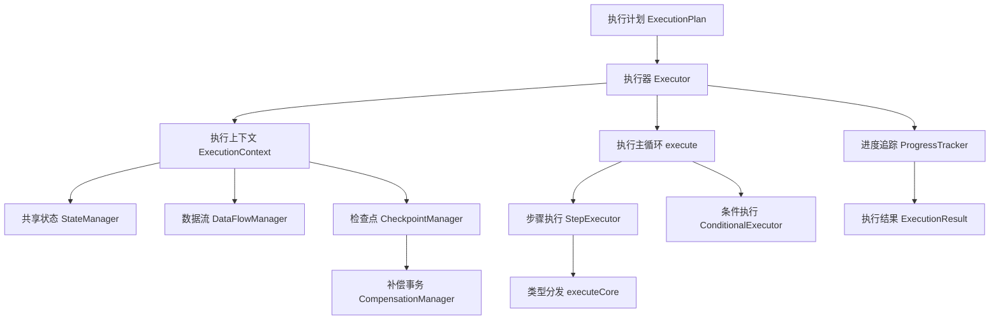
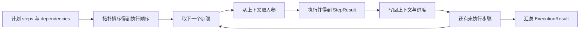
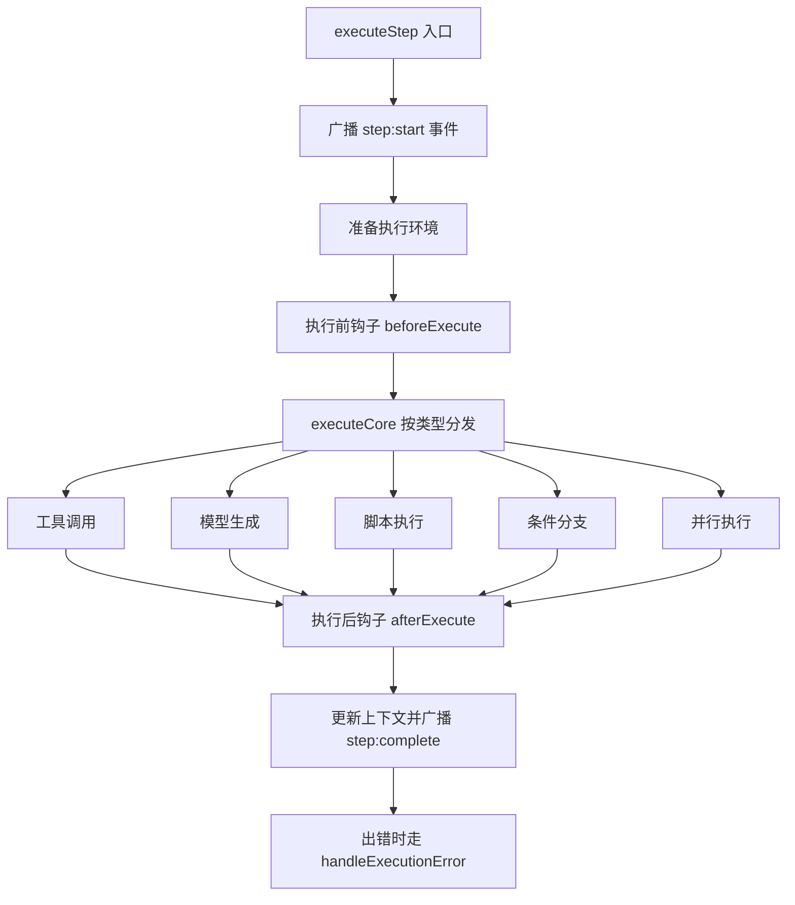
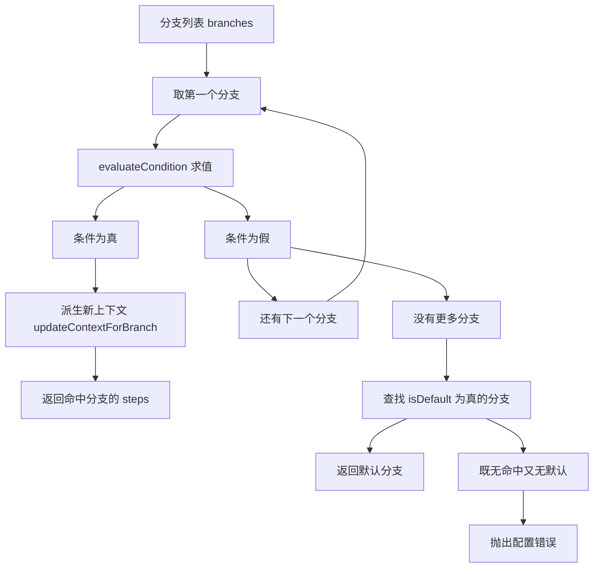
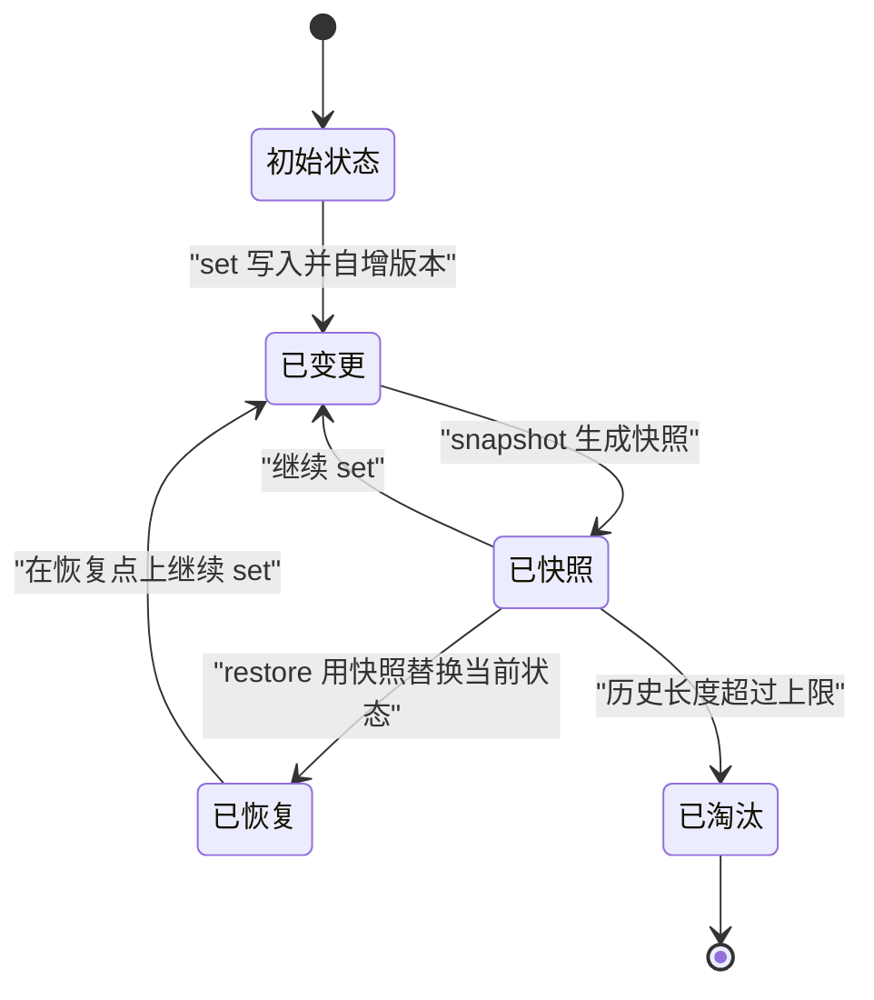
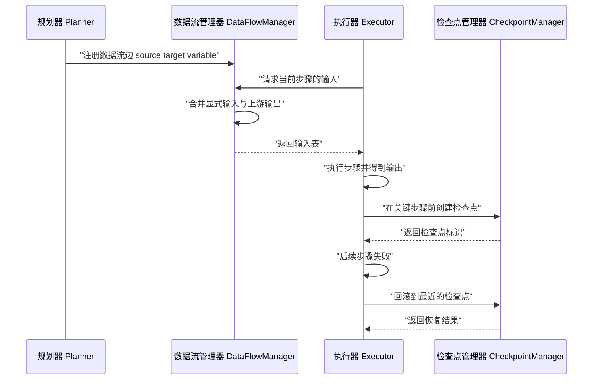
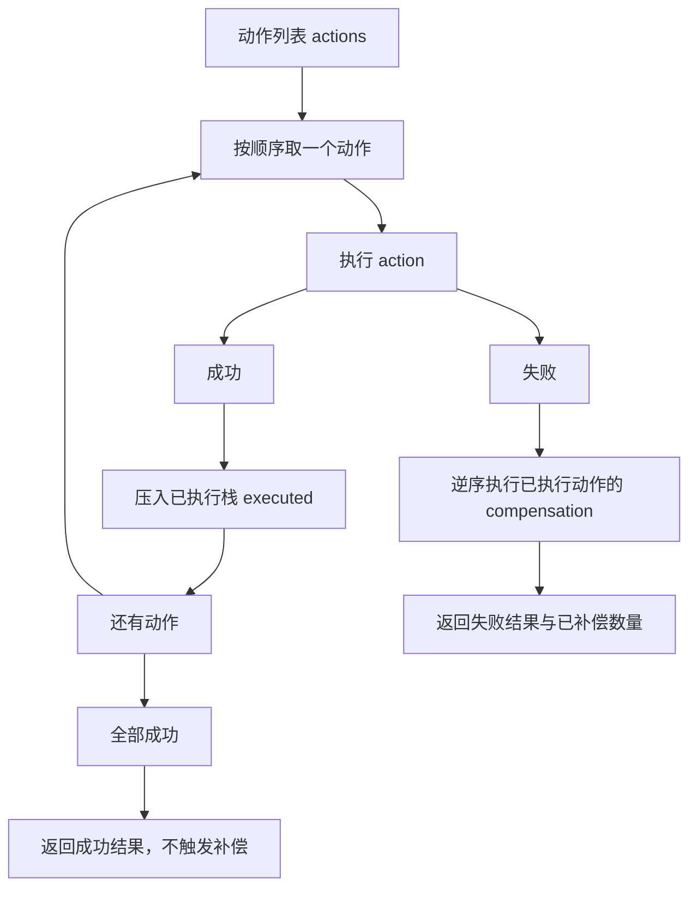
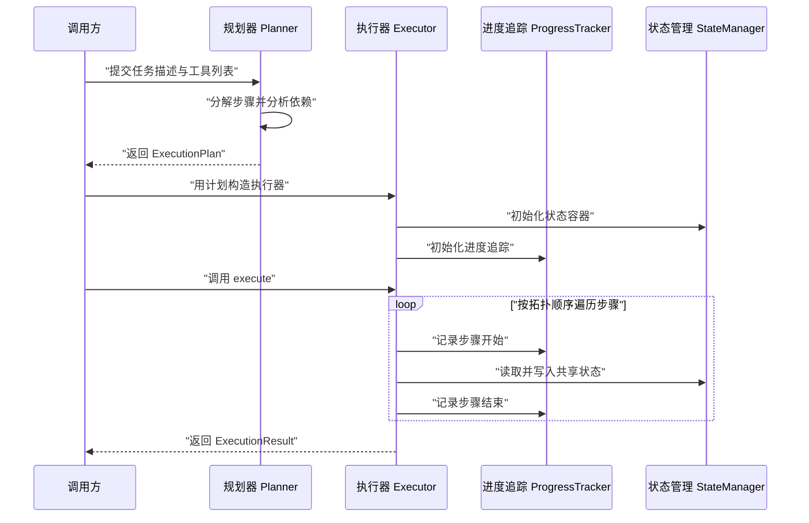

# 规划-执行：执行器与完整实现

!!! abstract "学完这一页你能"

- 说出执行器（Executor）在承接计划与产出结果之间，必须维护哪几类运行状态。
- 写出按步骤类型分发的执行核心，并在它前后挂上执行前、执行后两个钩子。
- 用快照、检查点、补偿事务完成一次可回滚的执行，并解释补偿为什么要逆序。
- 把规划器与执行器组装成一个能在 Node 20 上直接运行、带断言的最小系统。

!!! note "术语：执行器（Executor）"
    执行器把 `ExecutionPlan`（步骤清单与依赖边）变成真实动作，并记录每一步的成败与输出。例子：计划写着"查库存、算价、写订单"，执行器负责按依赖顺序调用它们。

## 0. 知识地图



建议的阅读顺序：先读第 1 节，把执行上下文这个公共载体建起来；再读第 2、3 节，掌握单个步骤怎么跑、怎么分支。第 4、5 节讲状态在步骤之间怎么流动、怎么回退，第 6 节补上失败恢复与进度，第 7 节把它们装成一台完整执行器。

## 1. 执行器与执行上下文

**先想一个问题**

你已经拿到一份步骤清单：查库存、算价格、写订单。谁负责按顺序调用它们？调用到一半进程崩了，下次从哪里接着跑？这两个问题都落在执行器身上。

**心智模型**

!!! tip "心智模型"
    一句话模型：执行器是一个带记事本的循环，按顺序取步骤、调用、把结果记进记事本。
    日常类比：像后厨的传菜口，订单条一张张递进来，做完一道就在条上划掉一道，出问题就翻看划到哪了。
    类比不成立的地方：厨师能凭经验跳过某道菜，执行器不能——每一步的成败都必须落进上下文字段，否则重试与回滚都失去依据。

**图解**



1. 计划里 `steps` 是平铺数组，依赖关系单独放在 `dependencies` 里，不能直接按下标顺序跑。
2. 拓扑排序把依赖边折成一条线性顺序，保证前驱先执行。
3. 每一步执行前从上下文取入参，执行后把输出写回上下文。
4. 循环到所有步骤都有结果，最后汇总成一份 `ExecutionResult`。

!!! note "术语：拓扑排序（Topological Sort）"
    把有向无环图的节点排成一条线，使每条边的起点都排在终点之前。例子：依赖边 s1 指向 s2，排序结果中 s1 必须出现在 s2 前面。

**一步一步来**

这一步要做什么：先把执行上下文的数据结构定下来，它是后面所有能力的公共载体。

```typescript
interface ExecutionContext {
  plan: ExecutionPlan;                  // 本次执行依据的计划快照
  currentStepIndex: number;             // 执行到第几步，用于断点续跑与日志定位
  sharedState: Map<string, any>;        // 跨步骤共享的变量表，键是变量名
  toolRegistry: ToolRegistry;           // 工具注册表，按名字取到可调用的工具
  checkpointManager: CheckpointManager; // 检查点管理器，负责拍快照与回滚
  eventEmitter: EventEmitter;           // 事件总线，把进度广播给外部观察者
}
```

**这段代码在做什么**

1. `plan` 存计划快照，执行期间不改计划本身，避免执行与规划互相污染。
2. `currentStepIndex` 让"进程重启后从第几步继续"有据可查。
3. `sharedState` 是跨步骤传值的唯一通道，工具不必知道上下游是谁。
4. `toolRegistry` 把"步骤里写工具名"与"运行时拿到工具函数"解耦。
5. `checkpointManager` 与 `eventEmitter` 是横切能力，被所有步骤共用。

这一步要做什么：写执行主循环的骨架，把"取步骤、执行、记账"三件事分清楚。

```typescript
async execute(): Promise<ExecutionResult> {
  const completed = new Set<string>();   // 已完成步骤 id，依赖判断只读它
  const failed = new Set<string>();      // 失败步骤 id，与 completed 分开计数
  const results = new Map<string, StepResult>();

  const order = this.topologicalSort();  // 把依赖边折成一条线性顺序

  for (const stepId of order) {
    const step = this.plan.steps.find(s => s.id === stepId)!;
    await this.waitForDependencies(step, completed); // 前驱全部成功才继续
    const result = await this.executeStep(step);
    results.set(step.id, result);

    if (result.success) {
      completed.add(step.id);            // 成功才计入完成集合
    } else {
      failed.add(step.id);
      const action = await this.handleStepFailure(step, result, completed);
      if (action.action === 'abort') break; // 终止但保留已完成记录
    }
  }

  return { success: failed.size === 0, completed: [...completed], failed: [...failed], results };
}
```

**这段代码在做什么**

1. `completed` 与 `failed` 分成两个集合，是因为失败步骤也算"已处理"，但语义不同。
2. `order` 来自拓扑排序，循环本身不关心依赖，依赖判断集中在 `waitForDependencies`。
3. 每次执行结果都落进 `results`，,即使失败也保留，便于事后归因。
4. 失败处理返回一个动作（中止、跳过、重试、回滚），循环只对 `abort` 做终止。
5. 返回值里 `success` 由 `failed.size` 决定，而不是由循环是否走完决定。

**动手验证**

下面把上述两步合成一个可运行脚本，验证拓扑顺序与上下文写入。

```js
// demo.mjs —— 依赖：无（Node 20+ 内置模块）
import assert from 'node:assert/strict';

const plan = {
  steps: [
    { id: 's1', name: '查库存', deps: [] },
    { id: 's2', name: '算价格', deps: ['s1'] },
    { id: 's3', name: '写订单', deps: ['s2'] },
  ],
};

function topoSort(plan) {
  const done = new Set();      // 已排入结果的步骤 id
  const order = [];
  let guard = 0;               // 依赖成环时用来跳出循环
  while (order.length < plan.steps.length && guard++ <= plan.steps.length) {
    for (const step of plan.steps) {
      if (done.has(step.id)) continue;
      if (step.deps.every((d) => done.has(d))) {
        order.push(step.id);
        done.add(step.id);
      }
    }
  }
  return order;
}

const order = topoSort(plan);
assert.deepEqual(order, ['s1', 's2', 's3']);

const sharedState = new Map();
const records = [];
for (const id of order) {
  const step = plan.steps.find((s) => s.id === id);
  records.push(step.name);
  sharedState.set(id, `${id}-done`);   // 模拟执行结果写回上下文
}

assert.equal(sharedState.get('s3'), 's3-done');
assert.equal(records.length, 3);
console.log('执行顺序：', records.join(' -> '));
console.log('全部断言通过');
```

运行结果：

```text
执行顺序： 查库存 -> 算价格 -> 写订单
全部断言通过
```

**常见坑**

| 现象 | 原因 | 怎么修 |
| --- | --- | --- |
| 拓扑排序结果为空 | 依赖成环，没有任何节点入度为 0 | 排序前先做环检测，发现环就把错误抛给规划器 |
| 执行到一半重启后从头跑 | 只记了内存里的 `completed` 集合 | 每步结束后把上下文写进检查点，重启时先恢复 |
| 前驱失败但后继照跑 | 依赖判断只看"步骤是否出现过" | 依赖判断改为读 `completed`，失败步骤不进这个集合 |
| 日志里看不出卡在哪一步 | 没有维护 `currentStepIndex` | 每步开始前更新索引并广播事件 |

**用在哪里**

- 后台管理的批量导入：业务背景是运营上传表格后逐行建档；本节知识用来把每行拆成"校验、入库、通知"三步并维护上下文；衡量指标是单批次的成功行数与平均耗时；当导入量只有几行且无外部调用时，直接同步处理，不必引入执行器。
- 电商订单的后台批处理：业务背景是每晚结算挂账订单；本节知识用来按依赖顺序串起"拉单、算账、出报表"；衡量指标是批次完成率与重跑次数；当结算逻辑只有一条 SQL 时，用定时任务即可。
- 数据同步管道：业务背景是把上游库的变更同步到搜索索引；本节知识用来记录每一步的中间状态；衡量指标是断点续跑的恢复步骤数与数据延迟；当上下游都是同一事务里的表时，不需要执行器。

**行业实践**

- Apache Airflow 官方文档的 DAG 与任务重试章节，把任务依赖描述成有向无环图，调度器按依赖推进。借鉴方式：把 `dependencies` 做成显式的边集合，而不是靠代码里的调用顺序隐含表达。
- Kubernetes 官方文档的 Job 章节用 `backoffLimit` 控制重试次数，并用 Pod 状态记录每个实例的结果。借鉴方式：把重试上限做成步骤级配置，默认值集中在配置层，别散落在每个工具里。
- Temporal 官方文档的工作流章节强调工作流代码要可重放，副作用通过活动（Activity）隔离。借鉴方式：把"调用外部系统"的部分做成可替换的工具，执行器本体保持纯调度。

**小结**

1. 执行器是循环加记事本：循环负责推进，记事本负责记住每步成败。
2. 执行上下文是公共载体，计划、共享状态、工具表、检查点、事件总线都挂在这里。
3. 依赖判断读的是"已完成集合"，不是"步骤是否存在"。

## 2. 步骤执行：类型分发、钩子与失败策略

**先想一个问题**

计划里的步骤不只一种：有的调工具，有的让模型生成文本，有的跑脚本，有的走分支。如果主循环里写一长串 `if` 判断类型，新增一种步骤就要改主循环。

**心智模型**

!!! tip "心智模型"
    一句话模型：步骤执行器是插线板，主循环只负责递插头，插头插到哪个孔由步骤类型决定。
    日常类比：像自助餐厅的取餐台，托盘递到哪个档口由餐票决定，出餐口的流程不变。
    类比不成立的地方：取餐台的档口互不影响，而步骤执行的前后钩子会读写同一份上下文，顺序不能打乱。

**图解**



1. 入口先广播 `step:start`，让外部观察者知道哪一步开始了。
2. 准备执行环境：解析入参、确认工具可用、记录起始时间。
3. 执行前钩子用来做鉴权、限流、日志埋点这类横切逻辑。
4. `executeCore` 按 `step.type` 分发到五个分支之一。
5. 执行后钩子拿到结果，用于校验输出、写审计日志。
6. 更新上下文，广播完成事件；抛错则交给错误处理函数转成失败的 `StepResult`。

**一步一步来**

这一步要做什么：把执行流程拆成五段，每段只做一件事，出错时统一兜底。

```typescript
async executeStep(step: TaskStep): Promise<StepResult> {
  this.context.eventEmitter.emit('step:start', { step });
  try {
    const env = await this.prepareEnvironment(step);      // 1 准备环境
    await this.executionPolicy.beforeExecute(this.context, step); // 2 前钩子
    const result = await this.executeCore(step, env);     // 3 核心执行
    await this.executionPolicy.afterExecute(this.context, step, result); // 4 后钩子
    this.updateContext(step, result);                     // 5 写回上下文
    this.context.eventEmitter.emit('step:complete', { step, result });
    return result;
  } catch (error) {
    const errorResult = this.handleExecutionError(step, error); // 兜底转成失败结果
    this.context.eventEmitter.emit('step:error', { step, error: errorResult });
    return errorResult;
  }
}
```

**这段代码在做什么**

1. 事件广播放在 `try` 之外，保证"开始"事件一定发得出去。
2. 五个段落顺序固定：环境、前钩子、核心、后钩子、写回。
3. 后钩子接收 `result` 作为参数，因此它能校验输出而不是只看成败。
4. `catch` 把异常转成 `StepResult`，让调用方只需处理一种返回形态。
5. 出错分支不吞异常原因，`errorResult` 里保留原始 `Error` 以便读取堆栈。

这一步要做什么：写分发函数，用 `switch` 让"步骤种类"成为可枚举的显式分支。

```typescript
private async executeCore(step: TaskStep, env: ExecutionEnvironment): Promise<StepResult> {
  const startTime = Date.now();
  switch (step.type) {
    case 'tool_invocation':
      return this.executeToolInvocation(step, env); // 调用注册表里的工具
    case 'llm_generation':
      return this.executeLLMGeneration(step, env);  // 走模型生成
    case 'script_execution':
      return this.executeScript(step, env);         // 跑本地脚本
    case 'conditional_branch':
      return this.executeConditionalBranch(step, env); // 求值后选分支
    case 'parallel_execution':
      return this.executeParallelSteps(step, env);  // 分批并发跑子步骤
    default:
      throw new Error(`Unknown step type: ${step.type}`); // 未知类型快速失败
  }
}
```

**这段代码在做什么**

1. `startTime` 在分发前采集，五个分支共用同一个起点。
2. `switch` 的分支与 `TaskStep.type` 的联合类型一一对应，漏写分支时类型检查会报错。
3. 未知类型走 `default` 抛错，而不是返回一个含糊的成功结果。
4. 每个分支都接收环境对象，环境里带着解析好的入参与起始时间。
5. 分发函数本身不含业务逻辑，只做路由。

这一步要做什么：给失败配策略，让"重试、跳过、中止、回滚"成为步骤级配置。

```typescript
private async handleStepFailure(step: TaskStep, result: StepResult, completed: Set<string>) {
  switch (step.onFailure ?? 'abort') {          // 未配置时默认中止
    case 'retry':
      return this.retryStep(step, result);      // 按 retryConfig 退避后重放
    case 'skip':
      return { action: 'skip' as const };       // 记失败但继续推进后续步骤
    case 'rollback':
      return this.rollbackToLastCheckpoint(step); // 回到最近检查点
    case 'abort':
    default:
      return { action: 'abort' as const, error: result.error };
  }
}
```

**这段代码在做什么**

1. `??` 给未配置 `onFailure` 的步骤一个默认值，避免出现未定义行为。
2. `retry` 分支读步骤自带的 `retryConfig`，退避参数跟着步骤走。
3. `skip` 只改变流程走向，不改写 `StepResult.success`，统计时仍然算失败。
4. `rollback` 依赖检查点管理器，因此执行器要持有它的引用。
5. 返回对象带 `as const`，让调用方在 `if` 里比较字符串时有字面量类型。

**动手验证**

下面脚本用重试加指数退避，验证失败步骤按配置恢复。

```js
// demo.mjs —— 依赖：无（Node 20+ 内置模块）
import assert from 'node:assert/strict';

function makeStep(id, onFailure, maxAttempts) {
  return { id, onFailure, retryConfig: { maxAttempts, baseDelayMs: 1 } };
}

// 前两次调用抛错，第三次返回成功，用来验证重试计数
function makeFlakyTool(failTimes) {
  let calls = 0;
  return async () => {
    calls += 1;
    if (calls <= failTimes) throw new Error(`第 ${calls} 次调用失败`);
    return `第 ${calls} 次调用成功`;
  };
}

async function executeWithRetry(step, tool) {
  const max = step.retryConfig.maxAttempts;
  let attempts = 0;
  let lastError = null;
  while (attempts < max) {
    attempts += 1;
    try {
      const output = await tool();
      return { success: true, output, attempts };
    } catch (error) {
      lastError = error;
      await new Promise((r) => setTimeout(r, step.retryConfig.baseDelayMs * 2 ** (attempts - 1)));
    }
  }
  return { success: false, error: lastError, attempts };
}

const step = makeStep('fetch-price', 'retry', 3);
const result = await executeWithRetry(step, makeFlakyTool(2));

assert.equal(result.success, true);
assert.equal(result.attempts, 3);
assert.match(result.output, /第 3 次调用成功/);

// 超过上限时应当失败，而不是无限重试
const alwaysFail = await executeWithRetry(makeStep('x', 'retry', 2), async () => {
  throw new Error('一直失败');
});
assert.equal(alwaysFail.success, false);
assert.equal(alwaysFail.attempts, 2);

console.log('重试后结果：', result.output, '，尝试次数：', result.attempts);
console.log('全部断言通过');
```

运行结果：

```text
重试后结果： 第 3 次调用成功 ，尝试次数： 3
全部断言通过
```

**常见坑**

| 现象 | 原因 | 怎么修 |
| --- | --- | --- |
| 后钩子拿不到输出 | 只在成功后调用后钩子 | 后钩子同时接收 `result`，失败结果也传进去 |
| 重试把已成功的副作用做重 | 重试整个步骤而不是幂等的那一段 | 把重试范围收到单个工具调用，并要求工具幂等 |
| 未知类型静默成功 | `switch` 没写 `default` | 补 `default` 抛错，同时给 `type` 用判别式联合 |
| 事件重复发送 | 事件广播同时写在 `try` 内外 | 只保留入口处一处 `step:start`，完成事件在写回上下文之后发 |

!!! note "术语：幂等（Idempotent）"
    同一个操作执行一次和执行多次，对外部系统产生的效果相同。例子：把订单状态设为"已支付"是幂等的，把账户余额加 100 元不是。

**用在哪里**

- 订单创建的支付回调：业务背景是第三方回调可能重复到达；本节知识用来把回调处理做成幂等工具并配置重试；衡量指标是重复回调下的订单状态一致率；当回调本身不带幂等键时，先补幂等键再谈重试。
- 报表导出：业务背景是导出任务在数据量大时会超时；本节知识用来区分"可重试的取数"与"不可重试的写文件"；衡量指标是导出成功率与平均重试次数；当导出结果需要人工确认时，跳过策略比自动重试合适。
- 短信批量下发：业务背景是通道偶发限流；本节知识用来按步骤配置退避参数；衡量指标是送达率与限流触发次数；当通道明确返回"号码无效"这类永久错误时，不该重试，应直接跳过。

**行业实践**

- AWS Step Functions 官方文档的状态机章节提供 Retry 与 Catch 字段，可以按错误类型配置重试与回退路径。借鉴方式：把"哪些错误可重试"写进配置，而不是在代码里 catch 所有异常后统一重试。

需核对官方文档：具体可重试的错误分类写法与字段层级。

- Google Cloud Workflows 官方文档的并行步骤与重试章节，支持把步骤分组并发执行并统一收集结果。借鉴方式：并发上限做成执行策略的一个字段，让同一个执行器适配不同下游限流。
- LangChain 官方文档的 Plan-and-Execute 智能体章节，把计划生成与步骤执行分成两个角色。借鉴方式：执行器不要内嵌规划逻辑，规划失败时把错误交回规划器重规划。

**小结**

1. 执行步骤拆成五段，钩子与核心执行分离，横切逻辑不污染调度。
2. 类型分发用 `switch` 加判别式联合，新增类型时靠编译报错兜底。
3. 失败策略是步骤级配置，默认值要显式写出来。

## 3. 条件执行与分支选择

**先想一个问题**

某一步要根据上一步的结果决定走"人工审核"还是"自动放行"。这个判断条件可能是规则，也可能是一句自然语言描述，比如"用户是否表达了明确购买意向"。

**心智模型**

!!! tip "心智模型"
    一句话模型：条件执行器是一排闸机，按顺序把条件交给闸机验票，第一个放行的分支被选中。
    日常类比：像机场的值机柜台分流，队伍按优先级排好，旅客走到第一个符合条件的分流口。
    类比不成立的地方：闸机判断是固定的，而这里的某个闸机可能要问模型，返回结果不稳定，所以必须处理"判断不出来"的情况。

**图解**



1. 分支数组的顺序就是优先级，靠前的分支先被求值。
2. 每个分支的条件走 `evaluateCondition`，按条件类型再分发一次。
3. 命中后派生一份新上下文，把分支级状态挂上去。
4. 全部为假时找默认分支兜底。
5. 默认分支也没有，属于配置错误，直接抛错而不是返回空结果。

**一步一步来**

这一步要做什么：把条件定义成判别式联合，让"条件种类"在类型层面可枚举。

```typescript
type ConditionalExpression =
  | { type: 'simple'; field: string; operator: string; value: unknown } // 字段比较
  | { type: 'compound'; logic: 'and' | 'or'; children: ConditionalExpression[] }
  | { type: 'llm_guided'; description: string }   // 自然语言描述交给模型判断
  | { type: 'tool_based'; toolName: string };     // 交给工具返回布尔值
```

**这段代码在做什么**

1. 四种条件共用一个字段名 `type`，构成判别式联合，`switch` 时能被穷尽检查。
2. `simple` 只做字段比较，不依赖外部调用，是成本最低的一类。
3. `compound` 通过 `children` 递归嵌套，表达与或组合。
4. `llm_guided` 用一句自然语言描述判定标准，适合规则难以穷举的场合。
5. `tool_based` 把判定交给已有工具，复用工具里的规则实现。

这一步要做什么：写求值分发，并为模型判定补上结构化输出的约定。

```typescript
async evaluateCondition(cond: ConditionalExpression, ctx: ExecutionContext): Promise<boolean> {
  switch (cond.type) {
    case 'simple':
      return this.evaluateSimpleCondition(cond);          // 纯内存比较
    case 'compound':
      return this.evaluateCompoundCondition(cond);        // 递归组合子条件
    case 'llm_guided':
      return this.evaluateLLMGuidedCondition(cond, ctx);  // 需要上下文文本
    case 'tool_based':
      return this.evaluateToolBasedCondition(cond);       // 调用工具拿布尔值
    default:
      throw new Error('未覆盖的条件类型');                 // 类型收窄失效时快速失败
  }
}
```

**这段代码在做什么**

1. 四种条件的求值成本差别很大：前两种是内存计算，后两种有外部调用。
2. 只有 `llm_guided` 需要上下文，所以上下文按需下传，其他分支不接收。
3. `default` 分支在类型收窄失效时兜底，避免返回 `undefined` 被当作假值。
4. 返回类型是 `Promise<boolean>`，让四种分支对调用方表现一致。

这一步要做什么：实现按顺序取首个满足者的分支选择，并处理默认分支。

```typescript
async executeBranch(branches: ConditionalBranch[], ctx: ExecutionContext): Promise<BranchResult> {
  for (const branch of branches) {
    const satisfied = await this.evaluateCondition(branch.condition, ctx);
    if (satisfied) {
      return {
        selectedBranch: branch.id,
        steps: branch.steps,
        context: this.updateContextForBranch(ctx, branch), // 命中时派生子上下文
      };
    }
  }
  const defaultBranch = branches.find(b => b.isDefault);  // 兜底分支
  if (defaultBranch) {
    return { selectedBranch: defaultBranch.id, steps: defaultBranch.steps, context: ctx };
  }
  throw new Error('No branch condition satisfied and no default branch provided');
}
```

**这段代码在做什么**

1. 循环求值等价于按数组顺序找第一个真值，命中即返回。
2. 命中分支会派生新上下文，默认分支原样返回旧上下文，这个不对称要留意。
3. `branches.find` 只取第一个 `isDefault`，配置多个默认分支时后面的被忽略。
4. 抛错而不是返回空，是因为"既无命中又无默认"属于计划配置错误。
5. 求值次数等于分支数，把命中率高的分支放前面能减少外部调用。

**动手验证**

下面脚本验证分支优先级、默认分支兜底与模型判定的解析方式。

```js
// demo.mjs —— 依赖：无（Node 20+ 内置模块）
import assert from 'node:assert/strict';

async function selectBranch(branches, evaluate) {
  for (const branch of branches) {
    if (await evaluate(branch.condition)) {
      return { selectedBranch: branch.id, kind: 'matched' };
    }
  }
  const fallback = branches.find((b) => b.isDefault);
  if (fallback) return { selectedBranch: fallback.id, kind: 'default' };
  throw new Error('No branch condition satisfied and no default branch provided');
}

const branches = [
  { id: 'vip', condition: { type: 'simple', field: 'level', value: 'vip' }, isDefault: false },
  { id: 'normal', condition: { type: 'simple', field: 'level', value: 'normal' }, isDefault: true },
];

// 命中靠前的分支
const hit = await selectBranch(branches, async (c) => c.value === 'vip');
assert.equal(hit.selectedBranch, 'vip');
assert.equal(hit.kind, 'matched');

// 全部不命中时回到默认分支
const fallback = await selectBranch(branches, async () => false);
assert.equal(fallback.selectedBranch, 'normal');
assert.equal(fallback.kind, 'default');

// 解析模型输出的稳妥做法：先去掉首尾空白再严格比较
function parseBoolean(text) {
  const normalized = text.trim().toLowerCase();
  if (normalized === 'true') return true;
  if (normalized === 'false') return false;
  throw new Error(`无法解析的判定结果: ${text}`);
}
assert.equal(parseBoolean('  TRUE '), true);
assert.throws(() => parseBoolean('not true'), /无法解析/);

console.log('命中分支：', hit.selectedBranch, '，兜底分支：', fallback.selectedBranch);
console.log('全部断言通过');
```

运行结果：

```text
命中分支： vip ，兜底分支： normal
全部断言通过
```

**常见坑**

| 现象 | 原因 | 怎么修 |
| --- | --- | --- |
| 模型回答"无法判断为 true"被判为真 | 用子串包含 `includes('true')` 解析 | 要求模型只输出 true 或 false，再严格比较；无法解析时抛错或降级 |
| 默认分支里读不到分支状态 | 默认分支返回的是旧上下文 | 需要时也给默认分支派生一份上下文 |
| 分支判定耗时很长 | 每个分支都调一次模型或工具 | 把命中率高的条件前置，并给判定加超时 |
| 求值返回 undefined | 条件类型被放宽成字符串，`switch` 落空 | 保留判别式联合，并在 `default` 抛错 |

**用在哪里**

- 客服工单的自动分流：业务背景是按工单内容决定派给哪个组；本节知识用来把规则条件放前面、模型判定放后面；衡量指标是分流准确率与人工改派率；当分流规则只有两三条时，用配置表即可。
- 风控审核流程：业务背景是高金额订单需要人工审核；本节知识用来在金额、历史行为等条件间做优先级排序；衡量指标是审核拦截率与误拦率；当监管要求所有订单都人工确认时，分支逻辑没有意义。
- 内容推荐的策略选择：业务背景是按用户状态选推荐策略；本节知识用来把简单条件与工具判定组合起来；衡量指标是策略命中分布与响应时间；当策略切换需要 AB 实验平台统一控制时，条件判定应交由实验平台。

**行业实践**

- Camunda 与 Zeebe 官方文档的 BPMN 补偿与网关章节，把条件分支建模成网关节点，条件与连线绑定。借鉴方式：把分支条件做成可配置数据，而不是写进代码。
- AWS Step Functions 官方文档的 Choice 状态章节，支持按输入字段做比较并选择下一状态。借鉴方式：给条件类型定义一套稳定的字段名，便于可视化展示。
- Google Cloud Workflows 官方文档的条件跳转章节，条件表达式在配置里声明。借鉴方式：把分支步骤列表与条件放在同一个对象里，避免条件与步骤分处两地。

**小结**

1. 条件执行器只做一件事：按顺序取第一个满足的分支。
2. 模型判定要结构化输出并严格解析，子串包含会误判。
3. 默认分支是兜底，不是可选项；没有默认分支时应当快速失败。

## 4. 共享状态：快照、恢复与差异

**先想一个问题**

执行到第七步发现数据被前面某一步改坏了。你想回到第五步之前的状态，可状态已经在内存里被就地覆盖，旧值取不回来了。

**心智模型**

!!! tip "心智模型"
    一句话模型：状态管理器维护一份当前状态，外加一串带版本号的快照，随时可以跳回某个快照。
    日常类比：像文档编辑器的历史版本，每次保存留一个版本，出问题就回退到某一版。
    类比不成立的地方：编辑器的版本回退会生成新版本，而这里的恢复会把版本号拉回过去，依赖版本单调递增的缓存要单独处理。

**图解**



1. 初始状态是一份空的 `Map`，版本号为 0。
2. 每次 `set` 都会自增版本号并广播变更事件，所以监听器读到的版本与本次变更严格对应。
3. `snapshot` 用浅拷贝生成快照，压入历史数组。
4. 历史长度超过上限时，最旧的快照被淘汰。
5. `restore` 把当前状态整体替换成快照内容，并把版本号拉回快照记录的版本。

!!! note "术语：快照（Snapshot）"
    某一时刻对状态做的一次拷贝，用来在之后恢复。例子：`new Map(this.currentState)` 生成的就是一份浅拷贝快照，新增或删除键互不影响。

**一步一步来**

这一步要做什么：写状态的写路径，注意旧值必须在覆盖前取出。

```typescript
set(key: string, value: any): void {
  const oldValue = this.currentState.get(key); // 先取旧值，set 之后旧值就没了
  this.currentState.set(key, value);
  this.version++;                              // 即使值相等也算一次变更
  this.notifyListeners({
    type: 'change', key, oldValue, newValue: value, version: this.version,
  });
}
```

**这段代码在做什么**

1. `oldValue` 必须在 `set` 之前读取，因为 `Map.set` 会就地覆盖。
2. `oldValue` 可能是 `undefined`，表示这个键是首次新增，监听器需要区分这两种情况。
3. 版本号在通知之前自增，保证监听器拿到的版本号与本次变更对应。
4. 值相等也推进版本，换来的是"变更次数"与"版本号差"始终一致。

这一步要做什么：生成快照并支持恢复，同时限制历史长度。

```typescript
snapshot(stepId: string): StateSnapshot {
  const snapshot = {
    timestamp: Date.now(),          // 采集墙钟时间，快照之间可排序
    stepId,                         // 语义化步骤名，便于日志检索
    data: new Map(this.currentState), // 浅拷贝：键的增删互不影响
    version: this.version,          // 记录版本号，恢复时要一并回滚
  };
  this.stateHistory.push(snapshot);
  if (this.stateHistory.length > MAX_HISTORY_SIZE) {
    this.stateHistory.shift();      // 只保留最近若干个快照
  }
  return snapshot;
}

restore(snapshot: StateSnapshot): void {
  this.currentState = new Map(snapshot.data); // 再拷一层，防止外部持有引用被间接改动
  this.version = snapshot.version;            // 版本号拉回过去
  this.notifyListeners({ type: 'restore', snapshot });
}
```

**这段代码在做什么**

1. 快照携带四个要素：时间戳、步骤名、数据副本、版本号，缺一不可。
2. `new Map(this.currentState)` 是浅拷贝，嵌套对象仍与外部共享，调用方若会原地改属性要自己深拷贝。
3. 历史长度上限的常量名来自旧版页面示例，具体取值资料未覆盖，需按内存预算自行核定（以原文为准）。
4. `restore` 再次拷贝一层，避免调用方后续改动快照时间接影响当前状态。
5. `restore` 不写入历史，所以回滚动作本身不能再被撤销。

这一步要做什么：做两个快照之间的差异对比，区分新增、删除、修改。

```typescript
diff(a: StateSnapshot, b: StateSnapshot): StateDiff {
  const changes: StateChange[] = [];
  for (const [key, valueA] of a.data) {         // 正向遍历 A：找删除与修改
    if (!b.data.has(key)) {
      changes.push({ key, type: 'removed', oldValue: valueA });
    } else if (!deepEqual(valueA, b.data.get(key))) {
      changes.push({ key, type: 'modified', oldValue: valueA, newValue: b.data.get(key) });
    }
  }
  for (const [key, valueB] of b.data) {         // 反向遍历 B：只补新增
    if (!a.data.has(key)) changes.push({ key, type: 'added', newValue: valueB });
  }
  return { changes };
}
```

**这段代码在做什么**

1. 先判断 `has` 再比较值，避免把"键存在但值为 undefined"误判成删除。
2. `deepEqual` 为真时不记变更，这样同一份数据重复写入不会产生噪音。
3. 第二轮只找 A 中不存在的键，删除与修改已在第一轮处理完。
4. 结果的顺序是先删除与修改、后新增，界面渲染时需要自行排序。
5. 复杂度是两次遍历加上比较成本，比较成本由 `deepEqual` 的实现决定。

**动手验证**

下面脚本验证写入、快照、恢复与差异对比。

```js
// demo.mjs —— 依赖：无（Node 20+ 内置模块）
import assert from 'node:assert/strict';

const MAX_HISTORY_SIZE = 3;

class StateManager {
  constructor() {
    this.current = new Map();
    this.history = [];
    this.version = 0;
  }
  set(key, value) {
    const oldValue = this.current.get(key); // 覆盖前先取旧值
    this.current.set(key, value);
    this.version += 1;
    return { key, oldValue, newValue: value, version: this.version };
  }
  snapshot(stepId) {
    const snap = { stepId, data: new Map(this.current), version: this.version, timestamp: Date.now() };
    this.history.push(snap);
    if (this.history.length > MAX_HISTORY_SIZE) this.history.shift();
    return snap;
  }
  restore(snap) {
    this.current = new Map(snap.data);
    this.version = snap.version;
  }
  diff(a, b) {
    const changes = [];
    for (const [key, valueA] of a.data) {
      if (!b.data.has(key)) changes.push({ key, type: 'removed' });
      else if (valueA !== b.data.get(key)) changes.push({ key, type: 'modified', newValue: b.data.get(key) });
    }
    for (const [key, valueB] of b.data) {
      if (!a.data.has(key)) changes.push({ key, type: 'added', newValue: valueB });
    }
    return changes;
  }
}

const sm = new StateManager();
sm.set('stock', 10);
const snapA = sm.snapshot('step-1-query');
sm.set('stock', 3);
sm.set('price', 99);
const snapB = sm.snapshot('step-2-calc');

assert.equal(sm.diff(snapA, snapB).length, 2);      // stock 被修改 + price 新增

sm.restore(snapA);
assert.equal(sm.current.get('stock'), 10);
assert.equal(sm.current.has('price'), false);       // 恢复后新增的键消失
assert.equal(sm.version, snapA.version);
assert.equal(sm.history.length, 2);

console.log('差异条数：', sm.diff(snapA, snapB).length);
console.log('恢复后库存：', sm.current.get('stock'));
console.log('全部断言通过');
```

运行结果：

```text
差异条数： 2
恢复后库存： 10
全部断言通过
```

**常见坑**

| 现象 | 原因 | 怎么修 |
| --- | --- | --- |
| 快照被后续修改污染 | 浅拷贝只复制了顶层键值引用 | 会原地改属性的状态要做深拷贝，或约定状态不可变 |
| 恢复后版本号跳变导致缓存失效 | `restore` 把版本号拉回过去 | 依赖单调版本的缓存要监听恢复事件并整体作废 |
| 快照之间对比结果为空 | 用的是同一份 `Map` 引用 | 快照生成时就拷贝，不要延后拷贝 |
| 历史无限增长 | 没有淘汰策略 | 设置历史上限，长跑场景改用环形索引 |

**用在哪里**

- 在线表格的协同编辑：业务背景是多人在同一张表上改动；本节知识用来在每次提交前拍快照，冲突时回退；衡量指标是冲突回滚成功率与回退耗时；当并发写入很密集时，逐次快照的内存成本过高，应改用操作日志。
- 配置中心的灰度发布：业务背景是配置改动需要可回退；本节知识用来在发布前记录配置快照；衡量指标是回退耗时与发布失败率；当配置项只有少数几个且改动可重放时，用版本控制即可。
- 流程引擎的调试回放：业务背景是排查"哪一步改坏了数据"；本节知识用差异对比定位变更键；衡量指标是定位问题所需的步骤数；当状态数据本身很大时，全量快照不划算，应只记录变更日志。

**行业实践**

- Kubernetes 官方文档的声明式配置与对象版本章节，用资源版本号支撑乐观并发。借鉴方式：状态写入带上版本号，冲突时可判断是覆盖还是拒绝。
- Redux 官方文档的状态快照与时间旅行调试章节，通过保存历史状态实现回放。借鉴方式：把快照与步骤 id 绑定，日志里既能看时间也能看步骤名。
- Temporal 官方文档的事件历史章节，用事件日志重建工作流状态。借鉴方式：当状态体量很大时，用"初始状态加变更日志"替代全量快照。

**小结**

1. 写路径的顺序是取旧值、落库、升版本、广播，顺序不能颠倒。
2. 快照要带时间戳、步骤名、数据副本、版本号四个要素。
3. 浅拷贝只隔离键的增删，嵌套对象的修改仍然共享引用。

## 5. 跨步骤数据流与检查点回滚

**先想一个问题**

第三步算出的价格要传给第五步下单。如果第五步直接去读第三步的返回值，两个步骤就绑死了；换成第三步改成"优惠价"，第五步要跟着改。

**心智模型**

!!! tip "心智模型"
    一句话模型：数据流是一张接线板，每一步的输出接到变量名上，下游按变量名取电。
    日常类比：像录音棚的跳线盘，设备之间不直连，全部经由跳线盘上的插孔。
    类比不成立的地方：跳线盘接错了声音会异常但系统照跑，这里的接线错了会让下游拿到缺参的输入，往往在执行到一半才暴露。

**图解**



1. 规划阶段把数据流边登记进数据流管理器，一条边描述上游、下游、变量名。
2. 执行某一步之前，执行器向数据流管理器索取输入表。
3. 输入表分两层合并：先铺显式输入，再叠加来自上游输出的数据流输入。
4. 关键步骤执行前创建检查点，把状态快照与资源状态一起存下来。
5. 后续失败时，按检查点回滚状态并清理它之后的检查点。

!!! note "术语：检查点（Checkpoint）"
    执行过程中保存的一个可恢复点，通常包含状态快照与外部资源状态。例子：调用支付接口之前先把订单状态存下来，支付失败时回到这个点。

**一步一步来**

这一步要做什么：定义数据流边，并实现输入表的两层合并。

```typescript
interface DataFlowEdge {
  sourceStep: string;      // 上游步骤 id
  targetStep: string;      // 下游步骤 id
  variableName: string;    // 下游输入表里的键名
  transformation?: DataTransformation; // 可选加工，不填则原样透传
}

async getStepInputs(step: TaskStep, completed: Map<string, StepResult>): Promise<Map<string, any>> {
  const inputs = new Map<string, any>();
  for (const [key, value] of step.explicitInputs) inputs.set(key, value); // 先铺显式输入
  for (const edge of this.edges) {
    if (edge.targetStep !== step.id) continue;
    const source = completed.get(edge.sourceStep);
    if (!source || !source.success) continue;   // 上游未完成或失败就跳过这条边
    let value = source.output;
    if (edge.transformation) value = this.applyTransformation(value, edge.transformation);
    inputs.set(edge.variableName, value);        // 键名取自边定义，不是上游输出的键
  }
  return inputs;
}
```

**这段代码在做什么**

1. 两层的顺序决定了覆盖关系：数据流输入会盖掉同名的显式输入。
2. 边只在下游步骤匹配时才处理，其他边直接跳过。
3. 上游失败时不注入任何值，下游可能因此缺参，由调用方决定兜底。
4. 变量名取自边定义，这样上游改字段名不会影响下游的取值方式。
5. 转换是可选环节，不填时上游输出原样进入输入表。

这一步要做什么：把数据流依赖的推断写成两两比对，并说清它的代价。

```typescript
async inferDataFlow(steps: TaskStep[]): Promise<DataFlowEdge[]> {
  const inferred: DataFlowEdge[] = [];
  for (let i = 0; i < steps.length; i++) {
    for (let j = i + 1; j < steps.length; j++) {   // 只枚举 i 小于 j 的组合
      const edge = await this.checkDataFlow(steps[i], steps[j]); // 可能走模型或静态分析
      if (edge) {
        inferred.push(edge);
        this.registerDataFlow(edge);               // 立即登记，后续推断能看到新边
      }
    }
  }
  return inferred;                                  // 只返回本轮新推断的边
}
```

**这段代码在做什么**

1. 只枚举 `i < j` 的组合，隐含"数据只能从较早步骤流向较晚步骤"的假设。
2. 两两组合的数量随步骤数平方增长，`checkDataFlow` 每调用一次可能产生一次外部请求。
3. 推断出的边立即登记，后面的组合在做判断时能看到刚建立的依赖。
4. 返回值只含本轮新推断的边，历史边不在其中。
5. 步骤数较多时推断本身会成为瓶颈，可以把 `checkDataFlow` 换成纯静态分析。

这一步要做什么：创建检查点并回滚，回滚时清理它之后的检查点。

```typescript
async createCheckpoint(step: TaskStep, ctx: ExecutionContext): Promise<Checkpoint> {
  const checkpoint = {
    id: generateId(),
    stepId: step.id,
    timestamp: Date.now(),
    stateSnapshot: this.stateManager.snapshot(step.id),      // 1 状态快照
    resourceState: await this.resourceManager.captureState(), // 2 外部资源状态
  };
  this.checkpoints.push(checkpoint);
  this.pruneOldCheckpoints();                                // 3 淘汰旧检查点
  return checkpoint;
}

async rollbackTo(checkpoint: Checkpoint): Promise<RollbackResult> {
  this.stateManager.restore(checkpoint.stateSnapshot);       // 先恢复内存状态
  const resourceResult = await this.resourceManager.restoreState(checkpoint.resourceState);
  const idx = this.checkpoints.findIndex(c => c.id === checkpoint.id);
  this.checkpoints = this.checkpoints.slice(0, idx + 1);     // 丢弃其后的检查点
  return { success: true, restoredCheckpoint: checkpoint, resourceResult };
}
```

**这段代码在做什么**

1. 检查点同时保存状态快照与资源状态，只存一份会导致恢复后内外不一致。
2. 创建后立即淘汰旧检查点，控制历史占用。
3. 回滚先恢复内存状态，再恢复外部资源，顺序便于失败时判断是哪一段出问题。
4. 回滚后把该检查点之后的记录全部丢弃，避免再次回滚到已被覆盖的状态。
5. 选择回滚点时，要跳过那些被后续步骤依赖的检查点。

**动手验证**

下面脚本验证输入表的两层合并与检查点回滚。

```js
// demo.mjs —— 依赖：无（Node 20+ 内置模块）
import assert from 'node:assert/strict';

const edges = [{ sourceStep: 's1', targetStep: 's3', variableName: 'price' }];

function getStepInputs(step, completed) {
  const inputs = new Map(Object.entries(step.explicitInputs ?? {}));
  for (const edge of edges) {
    if (edge.targetStep !== step.id) continue;
    const source = completed.get(edge.sourceStep);
    if (!source || !source.success) continue;
    inputs.set(edge.variableName, source.output); // 数据流输入覆盖同名显式输入
  }
  return inputs;
}

const completed = new Map([['s1', { success: true, output: 88 }]]);
const step = { id: 's3', explicitInputs: { price: 0, note: '下单' } };
const inputs = getStepInputs(step, completed);
assert.equal(inputs.get('price'), 88);   // 上游输出盖掉了默认值
assert.equal(inputs.get('note'), '下单');

// 上游失败时不注入
const failedUpstream = new Map([['s1', { success: false }]]);
assert.equal(getStepInputs(step, failedUpstream).get('price'), 0);

// 检查点回滚：只保留回滚点之前的检查点
let checkpoints = ['c1', 'c2', 'c3'];
function rollbackTo(id) {
  const idx = checkpoints.findIndex((c) => c === id);
  checkpoints = checkpoints.slice(0, idx + 1);
  return { success: true, restoredCheckpoint: id };
}
const rollback = rollbackTo('c1');
assert.equal(rollback.success, true);
assert.deepEqual(checkpoints, ['c1']);

console.log('注入后的价格：', inputs.get('price'));
console.log('回滚后剩余检查点：', checkpoints.join(','));
console.log('全部断言通过');
```

运行结果：

```text
注入后的价格： 88
回滚后剩余检查点： c1
全部断言通过
```

**常见坑**

| 现象 | 原因 | 怎么修 |
| --- | --- | --- |
| 下游拿到缺参的输入 | 上游失败时仍然注入了空值 | 上游成功才注入，缺参时由调用方给默认值 |
| 同名变量互相覆盖 | 多条边写同一个 `variableName` | 边注册时做去重，或让变量名带上上游前缀 |
| 回滚后资源没清干净 | 只恢复了内存状态 | 检查点里同时保存资源状态并执行恢复 |
| 数据流推断很慢 | 两两比对导致平方级外部调用 | 先用静态分析筛边，只对候选边走模型判断 |

**用在哪里**

- 电商商品列表的虚拟滚动：业务背景是滚动时要不断取数；本节知识用来把"取数结果"按变量名接到"渲染输入"上，避免组件之间直连；衡量指标是白屏时长与请求数；当列表只有首屏数据时，直连即可。
- 后台管理的批量导入：业务背景是导入前要先校验模板列；本节知识用来把校验结果接到入库步骤的输入上；衡量指标是导入成功率与失败行数；当模板列固定且校验在数据库完成时，不需要数据流层。
- 多步骤的报表生成：业务背景是取数、汇总、排版三步；本节知识用来在每步前创建检查点，失败时回到取数之后；衡量指标是重跑时跳过的步骤数；当每步都是无副作用的纯查询时，重跑整条链路成本不高，可以不做检查点。

**行业实践**

- Microsoft Azure 架构中心 Cloud Design Patterns 的 Saga 模式章节，用检查点与补偿动作把长事务拆成可恢复的小步。借鉴方式：把"要恢复什么"与"怎么恢复"分开，状态恢复与资源恢复各自成方法。
- Apache Airflow 官方文档的任务重试与任务状态章节，每个任务独立记录状态，失败后可从任一任务重跑。借鉴方式：检查点与步骤 id 绑定，重跑时按 id 定位。
- AWS Step Functions 官方文档的并行状态与错误处理章节，把并行分支的结果统一收集。借鉴方式：数据流边同时支持单值输出与列表输出，避免为并行结果单独写一套逻辑。

**小结**

1. 数据流用边描述，把上游与下游解耦，变量名是两边约定的接口。
2. 输入表分两层合并，数据流输入覆盖显式输入，失败的边不注入。
3. 检查点要同时保存内存状态与外部资源状态，回滚后丢弃其后的检查点。

## 6. 补偿事务与进度追踪

**先想一个问题**

流程里有三步：创建临时目录、克隆仓库、安装依赖。第三步失败时，前两步已经产生了磁盘占用，光把内存状态回滚掉并不能让磁盘恢复干净。

**心智模型**

!!! tip "心智模型"
    一句话模型：每做一件有副作用的事，就同时登记一件抵消它的事；失败时倒着把登记过的抵消动作执行一遍。
    日常类比：像搬家时每钉一颗钉子就记下怎么拔掉，最后按相反顺序拆。
    类比不成立的地方：拔钉子一定能拔干净，而补偿动作可能失败，比如远程接口已经下线，这时只能靠日志与人工介入。

**图解**



1. 动作必须串行执行，因为后面的动作通常依赖前面的产物。
2. 只有执行成功才压入已执行栈，保证补偿集合与实际副作用对齐。
3. 某个动作抛错时，立刻停止正向推进。
4. 把已执行栈逆序，逐个调用抵消动作。
5. 单个补偿失败只记录不中断，避免留下更难清理的中间状态。

!!! note "术语：补偿事务（Compensating Transaction）"
    对已经完成的动作执行一个语义上相反的操作，用来抵消它的副作用。例子：创建了临时目录，就删除这个目录；发起了预扣款，就发起解冻。

**一步一步来**

这一步要做什么：定义可补偿动作的契约。

```typescript
interface CompensableAction {
  action: () => Promise<void>;        // 正向操作，抛异常即视为该步失败
  compensation: () => Promise<void>;  // 反向操作，语义上抵消 action 的副作用
  description: string;                // 人类可读标识，用于日志与排查
}
```

**这段代码在做什么**

1. 正向与反向都用 `Promise<void>`，副作用通过闭包捕获，不靠返回值传递。
2. 约定补偿动作应尽量幂等，因为它可能在部分成功后再次被调用。
3. `description` 只用于日志，不参与流程控制。
4. 没有返回值意味着"撤销是否成功"只能靠是否抛错来判断。

这一步要做什么：写正向串行执行与逆序补偿。

```typescript
async executeWithCompensation(actions: CompensableAction[]): Promise<CompensationResult> {
  const executed: CompensableAction[] = [];   // 只记录真正成功的动作
  const errors: Error[] = [];

  for (const action of actions) {
    try {
      await action.action();                  // 串行，保证依赖顺序
      executed.push(action);                  // 成功后才入栈
    } catch (error) {
      errors.push(error as Error);
      await this.compensate(executed);        // 只补偿已成功的部分
      return { success: false, failedAction: action, errors, compensatedActions: executed.length };
    }
  }
  return { success: true, executedActions: executed.length }; // 全部成功时零补偿
}

private async compensate(actions: CompensableAction[]): Promise<void> {
  const reversed = [...actions].reverse();    // 先复制再反转，不改调用方数组
  for (const action of reversed) {
    try {
      await action.compensation();            // 补偿失败不中断整条链
    } catch (compensationError) {
      console.error(`补偿操作失败: ${action.description}`, compensationError);
    }
  }
}
```

**这段代码在做什么**

1. 只有成功执行的动作进 `executed`，补偿集合与实际副作用严格对齐。
2. 失败时只补偿已成功的动作，未执行的动作没有副作用，不需要补偿。
3. 逆序补偿是为了满足依赖关系：后执行的动作依赖先执行的动作，撤销时要反过来。
4. 复制再反转，避免改动调用方传入的数组。
5. 单个补偿失败只打印日志，因为中断会让后续补偿全部丢失。

这一步要做什么：把完成与失败的集合折算成进度指标。

```typescript
calculateProgress(completed: Set<string>, failed: Set<string>): ProgressState {
  const totalSteps = this.plan.steps.length;
  const completedCount = completed.size;
  const failedCount = failed.size;
  // 失败也算已处理，否则进度到不了 100%
  const percentComplete = ((completedCount + failedCount) / totalSteps) * 100;
  const avgStepTime = this.calculateAverageStepTime();
  const remainingSteps = totalSteps - completedCount - failedCount;
  const estimatedTimeRemaining = avgStepTime * remainingSteps;  // 历史均值线性外推
  return {
    totalSteps, completedSteps: completedCount, failedSteps: failedCount,
    currentStep: this.findCurrentStep(completed, failed),
    percentComplete,
    estimatedTimeRemaining,
    criticalPathProgress: this.calculateCriticalPathProgress(completed),
  };
}
```

**这段代码在做什么**

1. 百分比把失败步骤计入分子，否则进度条永远到不了 100%。
2. 剩余时间用已完成步骤的平均耗时乘以剩余步骤数，属于线性外推。
3. 外推不区分步骤权重，也不考虑重试与关键路径，所以字段允许为 `null` 表示估不准。
4. 关键路径进度单独统计，因为整体进度高不代表决定总工期的那条链已经走完。
5. `totalSteps` 为 0 时结果会是 `NaN` 或无穷大，调用方要保证计划非空。

**动手验证**

下面脚本验证补偿的逆序执行与进度计算。

```js
// demo.mjs —— 依赖：无（Node 20+ 内置模块）
import assert from 'node:assert/strict';

async function executeWithCompensation(actions) {
  const executed = [];
  const trace = [];
  for (const item of actions) {
    try {
      await item.action();
      executed.push(item);
      trace.push(`do:${item.description}`);
    } catch (error) {
      trace.push(`fail:${item.description}`);
      for (const done of [...executed].reverse()) {
        try {
          await done.compensation();
          trace.push(`undo:${done.description}`);
        } catch {
          trace.push(`undo-failed:${done.description}`);
        }
      }
      return { success: false, trace, compensated: executed.length };
    }
  }
  return { success: true, trace, compensated: 0 };
}

const actions = [
  { description: '建目录', action: async () => {}, compensation: async () => {} },
  { description: '拉代码', action: async () => {}, compensation: async () => {} },
  { description: '装依赖', action: async () => { throw new Error('网络超时'); }, compensation: async () => {} },
];

const result = await executeWithCompensation(actions);
assert.equal(result.success, false);
assert.equal(result.compensated, 2);
assert.deepEqual(result.trace, ['do:建目录', 'do:拉代码', 'fail:装依赖', 'undo:拉代码', 'undo:建目录']);

// 进度：失败也算已处理
function percent(completed, failed, total) {
  return ((completed + failed) / total) * 100;
}
assert.equal(percent(8, 2, 10), 100);

console.log('补偿轨迹：', result.trace.join(' -> '));
console.log('全部断言通过');
```

运行结果：

```text
补偿轨迹： do:建目录 -> do:拉代码 -> fail:装依赖 -> undo:拉代码 -> undo:建目录
全部断言通过
```

**常见坑**

| 现象 | 原因 | 怎么修 |
| --- | --- | --- |
| 补偿顺序与执行顺序一致 | 忘了反转已执行数组 | 补偿前先 `reverse`，并在测试里断言轨迹顺序 |
| 一个补偿失败导致其余补偿被跳过 | 补偿循环里没有 `try` 包裹 | 逐个补偿各自捕获，失败只记录 |
| 重复删除同一目录报错 | 补偿动作不幂等 | 约定补偿允许目标不存在，或先判断再操作 |
| 进度条停在 90% | 百分比只统计成功步骤 | 把失败步骤也计入分子 |

**用在哪里**

- 电商下单的预扣库存：业务背景是下单要预扣库存再支付；本节知识用来在支付失败时释放预扣；衡量指标是库存回补成功率与超卖订单数；当扣减与支付在同一个数据库事务里时，不需要补偿。
- 云资源的开通流程：业务背景是开通实例要申请网络、磁盘、公网地址；本节知识用来在某一步失败时释放已申请资源；衡量指标是资源泄漏数与补偿失败告警数；当各资源都由同一个编排服务统管且支持原子回滚时，可以用平台自带能力。
- 后台管理的批量导入：业务背景是导入要先建批次再逐行写入；本节知识用来在批次失败时删除已写入的行；衡量指标是脏数据行数与补偿耗时；当写入本身在事务内且支持回滚时，不必额外补偿。

**行业实践**

- Microsoft Azure 架构中心 Cloud Design Patterns 的 Compensating Transaction 模式章节，强调补偿动作要幂等并允许重试。借鉴方式：给每个补偿动作加幂等标记，并在补偿失败时投递到重试队列。
- Temporal 官方文档的 Saga 模式示例，用工作流代码顺序表达正向与补偿动作。借鉴方式：把动作与补偿配对写在同一个对象里，阅读时不必跨文件对照。
- Kubernetes 官方文档的 Job 与清理章节，任务完成后按策略清理关联对象。借鉴方式：给补偿动作设置超时，避免清理过程本身卡住整个流程。

**小结**

1. 补偿事务的基本单位是"正向动作加反向动作"的一对，成对登记才能成对撤销。
2. 补偿必须逆序执行，且单个补偿失败不能中断整条链。
3. 进度计算要把失败步骤计入已处理，剩余时间只是线性外推的估计值。

## 7. 端到端完整实现

**先想一个问题**

前面几节的类都是孤立的。要跑通一次完整执行，需要一个把计划、上下文、状态、检查点、进度串起来的组装过程。组装顺序错了，依赖就注入不进去。

**心智模型**

!!! tip "心智模型"
    一句话模型：执行器是一台装配线，进度追踪、状态管理、检查点、数据流是它的工位，启动前全部装好。
    日常类比：像组装一台电脑，主板、电源、硬盘装好之后才按开机键。
    类比不成立的地方：电脑装错了开不了机，而这里装错了往往还能跑一半，错误要到某个步骤才暴露。

**图解**



1. 调用方把任务与可用工具交给规划器，拿到一份计划。
2. 用计划构造执行器，执行器在构造阶段把状态容器与进度追踪装好。
3. `execute` 按拓扑顺序遍历步骤，循环体内记录开始、读写状态、记录结束。
4. 所有步骤处理完，执行器返回汇总结果。
5. 任何一步失败，按该步骤配置的策略决定重试、跳过、中止或回滚。

**一步一步来**

这一步要做什么：把计划里的步骤与依赖整理成执行顺序。

```typescript
topologicalSort(): string[] {
  const inDegree = new Map<string, number>();
  const adjacency = new Map<string, string[]>();
  for (const step of this.plan.steps) { inDegree.set(step.id, 0); adjacency.set(step.id, []); }
  for (const dep of this.plan.dependencies) {          // 统计每个节点的入度
    if (!inDegree.has(dep.target)) continue;
    inDegree.set(dep.target, inDegree.get(dep.target)! + 1);
    adjacency.get(dep.source)!.push(dep.target);
  }
  const queue = [...inDegree.entries()].filter(([, d]) => d === 0).map(([id]) => id);
  const order: string[] = [];
  while (queue.length > 0) {
    const id = queue.shift()!;                          // 入度为 0 的节点先出队
    order.push(id);
    for (const next of adjacency.get(id) ?? []) {
      inDegree.set(next, inDegree.get(next)! - 1);      // 前驱出队后入度减一
      if (inDegree.get(next) === 0) queue.push(next);
    }
  }
  if (order.length !== this.plan.steps.length) throw new Error('计划存在循环依赖'); // 环检测
  return order;
}
```

**这段代码在做什么**

1. 先用 `inDegree` 记录每个节点的入度，用 `adjacency` 记录出边。
2. 入度为 0 的节点是当前没有前置的步骤，先入队。
3. 每出一个节点，把它所有后继的入度减一，减到 0 就入队。
4. 结束后如果排序结果数量少于步骤总数，说明存在环，直接抛错。
5. 环检测放在执行器而不是规划器里，保证执行前的最后一道校验。

这一步要做什么：写执行器的组装与结果汇总。

```typescript
export class Executor extends EventEmitter {
  private plan: ExecutionPlan;
  private stateManager: StateManager;
  private checkpointManager: CheckpointManager;
  private progressTracker: ProgressTracker;

  constructor(plan: ExecutionPlan, config: ExecutorConfig) {
    super();
    this.plan = plan;
    this.stateManager = new StateManager();                              // 先建状态容器
    this.checkpointManager = new CheckpointManager(this.stateManager, config.resourceManager);
    this.progressTracker = new ProgressTracker(plan, this);              // 进度追踪依赖事件总线
  }

  async execute(): Promise<ExecutionResult> {
    this.emit('executor:start', { planId: this.plan.id });               // 组装完成后广播启动
    const order = this.topologicalSort();
    const completed = new Set<string>();
    const failed = new Set<string>();
    const stepResults = new Map<string, StepResult>();
    for (const stepId of order) {
      const step = this.plan.steps.find(s => s.id === stepId)!;
      await this.progressTracker.recordStepStart(stepId);                // 记录开始
      const inputs = await this.dataFlow.getStepInputs(step, stepResults);
      const result = await this.executeStep(step);
      stepResults.set(step.id, result);
      result.success ? completed.add(step.id) : failed.add(step.id);
      await this.progressTracker.recordStepComplete(step.id, result.success, result.metadata.duration);
    }
    return { success: failed.size === 0, completed: [...completed], failed: [...failed], stepResults };
  }
}
```

**这段代码在做什么**

1. 构造阶段先建状态容器，再建检查点管理器，因为它依赖前者。
2. 进度追踪拿到事件总线引用，因此它能在步骤开始与结束时广播事件。
3. `execute` 一开始广播启动事件，把 `planId` 带上便于串联日志。
4. 每一步执行前记录开始、取输入，执行后记录结果与完成状态。
5. 汇总结果同时返回成功与失败的步骤 id 列表，便于外部重跑失败部分。

**动手验证**

下面脚本把计划、执行、进度、失败重试串成一条完整链路。

```js
// demo.mjs —— 依赖：无（Node 20+ 内置模块）
import assert from 'node:assert/strict';

const plan = {
  id: 'plan-1',
  steps: [
    { id: 's1', name: '取数', deps: [], onFailure: 'abort' },
    { id: 's2', name: '计算', deps: ['s1'], onFailure: 'retry', retryConfig: { maxAttempts: 2 } },
    { id: 's3', name: '落库', deps: ['s2'], onFailure: 'abort' },
  ],
};

function topoSort(steps) {
  const done = new Set();
  const order = [];
  let guard = 0;
  while (order.length < steps.length && guard++ <= steps.length) {
    for (const s of steps) {
      if (done.has(s.id)) continue;
      if (s.deps.every((d) => done.has(d))) { order.push(s.id); done.add(s.id); }
    }
  }
  if (order.length !== steps.length) throw new Error('计划存在循环依赖');
  return order;
}

const order = topoSort(plan.steps);
assert.deepEqual(order, ['s1', 's2', 's3']);

const handlers = {
  s1: async () => 10,
  s2: async () => { if (!handlers.s2.tried) { handlers.s2.tried = true; throw new Error('偶发超时'); } return 20; },
  s3: async () => 'ok',
};
handlers.s2.tried = false;

const results = new Map();
const completed = new Set();
const failed = new Set();

for (const id of order) {
  const step = plan.steps.find((s) => s.id === id);
  const max = step.retryConfig?.maxAttempts ?? 1;
  let attempts = 0;
  let ok = false;
  let output;
  while (attempts < max && !ok) {
    attempts += 1;
    try { output = await handlers[id](); ok = true; }
    catch { if (step.onFailure !== 'retry') break; }
  }
  results.set(id, { id, ok, output, attempts });
  ok ? completed.add(id) : failed.add(id);
}

assert.equal(completed.size, 3);
assert.equal(failed.size, 0);
assert.equal(results.get('s2').attempts, 2);          // s2 重试一次后成功
assert.equal(results.get('s1').attempts, 1);          // s1 只执行一次
assert.equal(results.get('s3').output, 'ok');

const percent = ((completed.size + failed.size) / plan.steps.length) * 100;
assert.equal(percent, 100);

console.log('执行顺序：', order.join(' -> '));
console.log('s2 尝试次数：', results.get('s2').attempts);
console.log('进度：', percent, '%');
console.log('全部断言通过');
```

运行结果：

```text
执行顺序： s1 -> s2 -> s3
s2 尝试次数： 2
进度： 100 %
全部断言通过
```

**常见坑**

| 现象 | 原因 | 怎么修 |
| --- | --- | --- |
| 构造执行器时抛空指针 | 检查点管理器在状态容器之前初始化 | 按依赖顺序构造：状态、检查点、进度、执行器 |
| 循环依赖到运行很久才发现 | 只在规划阶段做环检测 | 执行器的拓扑排序里再判一次结果数量 |
| 汇总结果里缺少失败步骤 | 只把成功步骤写进结果表 | 结果表无论成败都写入 |
| 重跑时重复执行已成功的步骤 | 汇总信息里没有步骤级结果 | 返回每步的成败与耗时，重跑时按 id 过滤 |

**用在哪里**

- 数据仓库的每日调度：业务背景是任务之间存在依赖；本节知识用来做拓扑排序与失败重跑；衡量指标是当日任务完成率与人工介入次数；当单个任务本身就是幂等的整表覆盖时，依赖调度可以交给数据库的作业系统。
- 发布流水线：业务背景是构建、测试、部署按序执行；本节知识用来在测试失败时中止并保留已完成的构建产物；衡量指标是流水线成功率与平均恢复时间；当流水线步骤都由 CI 平台的 YAML 描述时，直接用平台能力。
- 保险理赔的自动化处理：业务背景是核保、核赔、打款多步串联；本节知识用来在打款失败时回滚前序状态；衡量指标是理赔单的异常挂起数；当打款渠道提供对账文件时，补偿可以改为对账后人工处理。

**行业实践**

- Apache Airflow 官方文档的 DAG 与调度器章节，把任务依赖与重试都写在 DAG 定义里，调度器负责推进。借鉴方式：执行顺序由数据推导，不要在代码里硬编码步骤下标。
- AWS Step Functions 官方文档的执行历史章节，每次执行都有可查询的历史记录。借鉴方式：把每步的耗时、尝试次数、输出摘要写进统一的结果表。
- LangChain 官方文档的 Plan-and-Execute 章节，规划与执行分成两个可替换组件。借鉴方式：执行器只依赖一个 `ExecutionPlan` 接口，方便替换规划实现做对照实验。

**小结**

1. 组装顺序是状态、检查点、进度、执行器，前面的被后面的依赖。
2. 拓扑排序在规划阶段与执行阶段各做一次，第二次是执行前的最后校验。
3. 汇总结果要覆盖失败步骤，重跑时才能只补跑缺的那部分。

## 应用地图

| 场景 | 用到本页哪个知识点 | 典型技术选型 | 注意事项 |
| --- | --- | --- | --- |
| 电商下单的预扣与回补 | 补偿事务、检查点 | 消息队列加本地事务表 | 补偿动作要幂等，避免重复释放库存 |
| 后台管理的批量导入 | 步骤分发、失败策略 | 任务队列加工作进程 | 逐行结果要落库，便于重跑失败行 |
| 发布流水线 | 拓扑排序、进度追踪 | CI 平台的流水线描述文件 | 构建产物要保留，回滚才能复用 |
| 客服工单自动分流 | 条件执行与分支选择 | 规则引擎加模型判定 | 模型判定结果要结构化并严格解析 |
| 数据同步管道 | 数据流管理、检查点 | 变更数据捕获加调度器 | 状态体量大时用变更日志替代全量快照 |
| 云资源开通 | 补偿事务、资源状态恢复 | 云厂商的资源编排服务 | 资源释放要处理"已不存在"的情况 |
| 报表批量导出 | 并行执行、并发上限 | 线程池或任务队列 | 并发上限跟随下游限流配置 |

## 动手作业

目标：写一个单文件执行器，能跑通步骤分发、失败重试、状态快照与补偿回滚四条链路。

步骤：

1. 定义 `ExecutionPlan`，包含三个步骤与它们的依赖边，其中第二步第一次执行必定失败。
2. 实现拓扑排序，并在存在环时抛错。
3. 实现状态管理器，支持 `set`、`snapshot`、`restore`，快照上限设为 3。
4. 实现补偿管理器，成功动作入栈，失败时逆序补偿。
5. 实现进度计算，把失败步骤计入已处理数量。
6. 用 `node:assert/strict` 给上述四件事各写至少一条断言。

验收标准：

- 脚本用 `node demo.mjs` 一次跑通，无未捕获异常。
- 重试断言通过：第二步的尝试次数等于配置的上限。
- 补偿断言通过：补偿轨迹与执行轨迹方向相反。
- 恢复断言通过：恢复后状态中不包含快照之后新增的键。
- 进度断言通过：全部步骤处理完毕时百分比为 100。
- 控制台按固定顺序打印四行摘要，每行标明模块名。

## 综合对比

| 维度 | 直接顺序执行 | 拓扑排序执行 | 带检查点执行 | 带补偿事务执行 |
| --- | --- | --- | --- | --- |
| 依赖处理 | 按数组下标 | 按入度出队 | 按入度出队 | 按入度出队 |
| 内存状态 | 不维护 | 一份共享状态 | 共享状态加快照列表 | 共享状态加快照列表 |
| 外部副作用 | 无法恢复 | 无法恢复 | 只恢复内存状态 | 内存与外部一起恢复 |
| 失败后动作 | 整体中断 | 按步骤配置重试或跳过 | 回到最近检查点 | 逆序执行已成功的补偿 |
| 额外成本 | 无 | 一次排序 | 每次快照的内存拷贝 | 每个动作多写一个补偿函数 |
| 适合的场景 | 步骤固定且无外部调用 | 步骤之间有依赖 | 状态可快照且外部调用少 | 外部副作用多且需要撤销 |
| 不适合的场景 | 步骤需要按结果调整 | 依赖关系频繁变化 | 状态体量很大 | 副作用本身不可逆 |

!!! note "术语：预计剩余时间（Estimated Time Remaining）"
    用已完成步骤的平均耗时乘以剩余步骤数得到的估计值。例子：平均每步 2 秒，还剩 3 步，估计剩余 6 秒。它不区分步骤权重，只作为展示参考。

## 自测题

??? question "执行上下文里为什么要放工具注册表，而不是让步骤直接引用工具函数？"
    - 步骤来自序列化后的计划，函数无法直接序列化，只能存名字。
    - 注册表在运行时把名字解析成函数，计划与实现解耦。
    - 测试时可以往注册表里塞假工具，覆盖失败路径。
    - 同一个执行器可以换一套注册表，适配不同环境。
    - 注册表本身要处理"名字找不到"的情况，返回明确错误。

??? question "为什么失败策略的默认值要显式写成中止？"
    - 未配置策略时如果默认重试，可能对不可重试的错误反复调用。
    - 默认中止让副作用最小，出错就停，人工介入可控。
    - 显式写出默认值后，配置里没写策略的步骤行为可预期。
    - 中止不代表丢弃结果，已完成的步骤记录仍然保留。
    - 需要重试的步骤应当单独配置并说明理由。

??? question "把模型输出用 includes 判断 true 会有什么问题？"
    - 模型回答"无法判断为 true"这类文本时也会被判为真。
    - 判断结果直接影响分支走向，误判会走错整条链路。
    - 稳妥做法是要求模型只输出 true 或 false，再严格比较。
    - 解析失败时应当抛错或走默认分支，不要静默当作假值。
    - 有条件时改用结构化输出并做字段校验。

??? question "快照用浅拷贝会带来什么隐患？"
    - 浅拷贝只复制顶层键值对的引用，嵌套对象仍与当前状态共享。
    - 调用方原地修改嵌套对象的属性时，历史快照会被一起改掉。
    - 表现为"回滚之后状态还是错的"，排查时很难联想到快照。
    - 修法是约定状态不可变，或者对会原地修改的部分做深拷贝。
    - 深拷贝有成本，是否使用取决于状态的体量与访问频率。

??? question "数据流输入为什么要覆盖同名的显式输入？"
    - 显式输入通常写的是默认值或占位值。
    - 上游产出的真实数据比占位值更贴近本次执行的实际结果。
    - 如果反过来让显式输入优先，上游结果就永远用不上。
    - 覆盖关系要在文档里写清楚，避免排查时找不到值从哪来。
    - 上游失败时不注入，此时显式输入的默认值仍然生效。

??? question "检查点为什么不能只保存内存状态？"
    - 执行过程会对外部系统产生副作用，比如创建目录或发起预扣款。
    - 只恢复内存状态，外部系统的实际状态与内存记录会不一致。
    - 检查点因此要同时保存内存快照与外部资源状态。
    - 回滚时先恢复内存，再恢复资源，便于定位是哪一段出错。
    - 资源恢复要处理"目标已不存在"的情况，避免补偿本身报错。

??? question "补偿为什么必须逆序执行？"
    - 后执行的动作通常依赖先执行的产物，比如先建目录再往里面写文件。
    - 正序撤销会出现"先删父目录再删子目录"这类无效或报错的操作。
    - 逆序保证撤销顺序与依赖方向相反，每一步的前提都还在。
    - 单个补偿失败只记录不中断，否则剩下的补偿会全部丢失。
    - 补偿动作要尽量幂等，因为它可能在部分成功后再次被调用。

??? question "进度百分比为什么把失败步骤也算作已处理？"
    - 失败步骤不会再被重跑，流程已经推进过它一次。
    - 只算成功步骤时，进度条永远到不了 100%。
    - 完成数与失败数分开统计，界面上仍能显示失败条数。
    - 剩余时间的估算只用剩余步骤数，不把失败步骤算进去。
    - 总数为零时结果为非法数值，调用方要先保证计划非空。

## 延伸阅读

- AWS Step Functions 官方文档：状态机中的 Retry 与 Catch 字段。
- AWS Step Functions 官方文档：执行历史与执行状态查询。
- Temporal 官方文档：Saga 模式与补偿动作示例。
- Microsoft Azure 架构中心 Cloud Design Patterns：Saga 模式。
- Microsoft Azure 架构中心 Cloud Design Patterns：Compensating Transaction 模式。
- Google Cloud Workflows 官方文档：并行步骤与重试策略。
- LangChain 官方文档：Plan-and-Execute 智能体章节。
- Apache Airflow 官方文档：DAG 与任务重试章节。
- Kubernetes 官方文档：Job 的 backoffLimit 与 Pod 生命周期。
- Camunda 与 Zeebe 官方文档：BPMN 补偿事件与网关节点。
