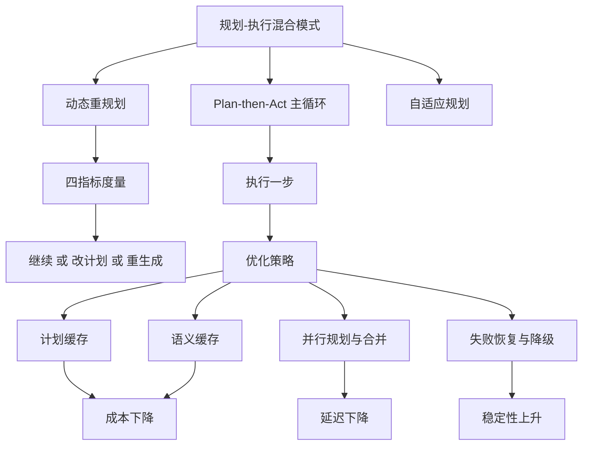
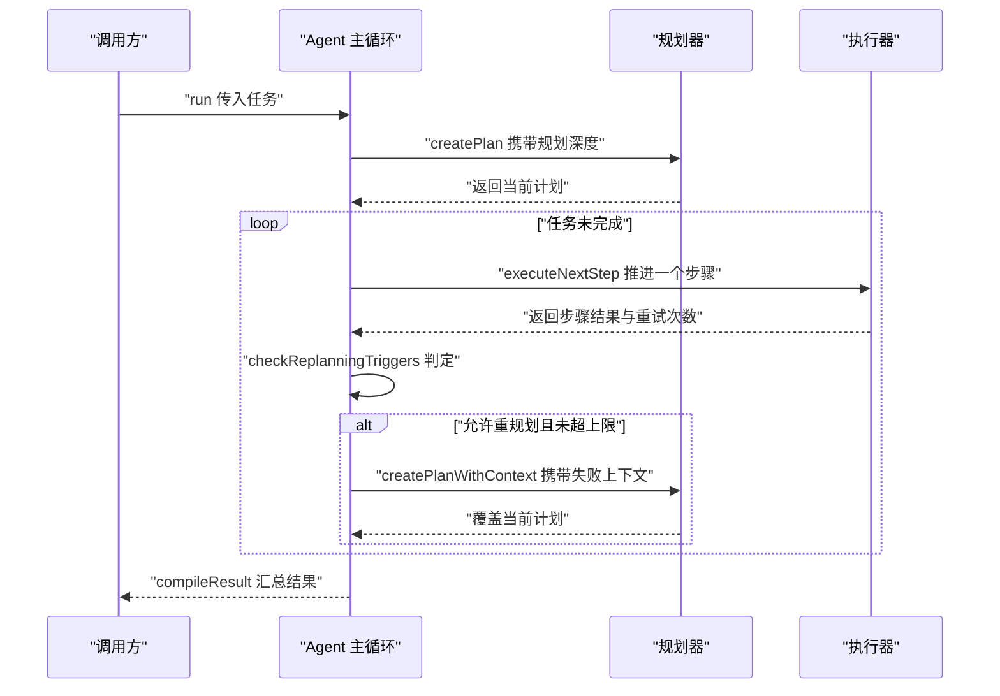
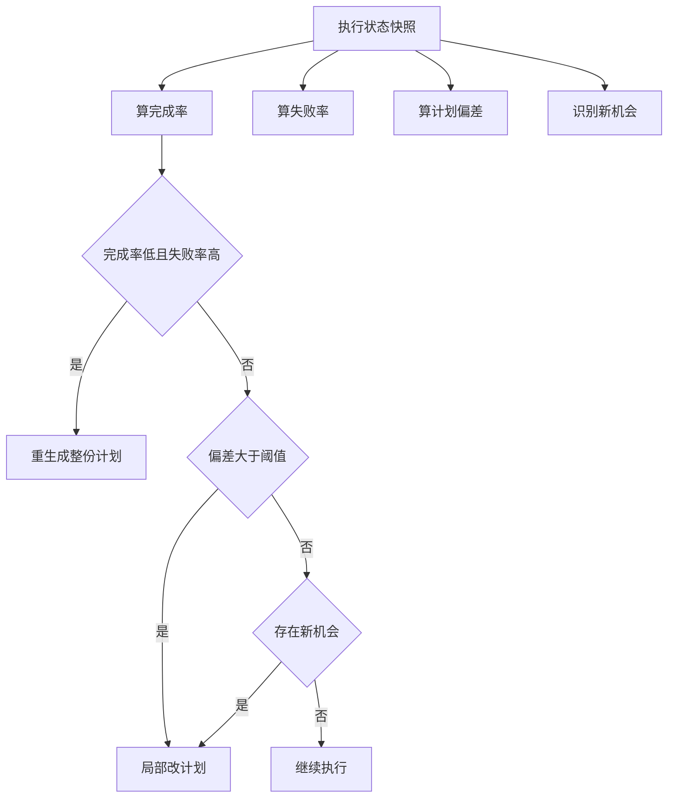
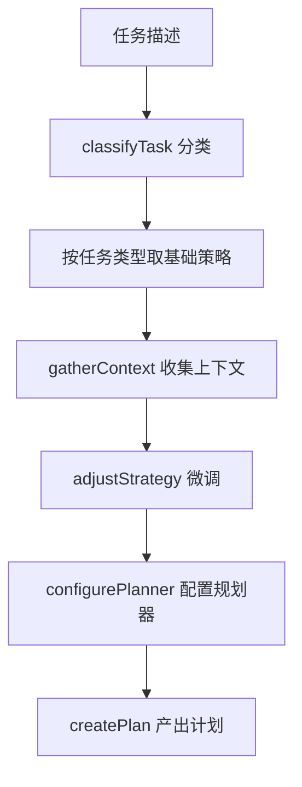
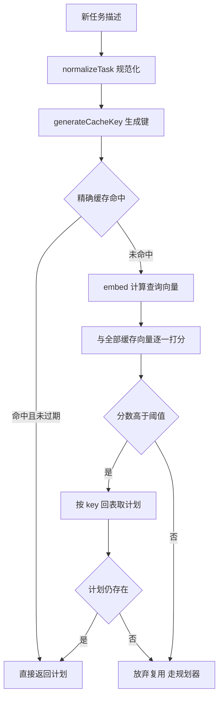
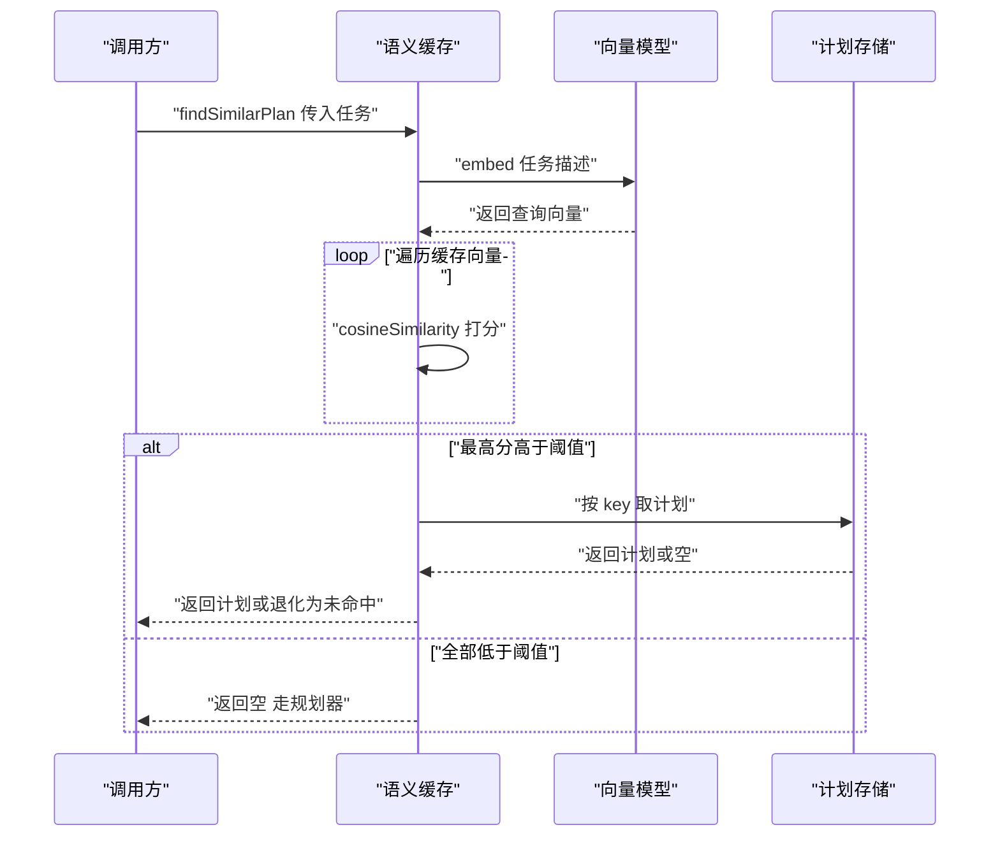
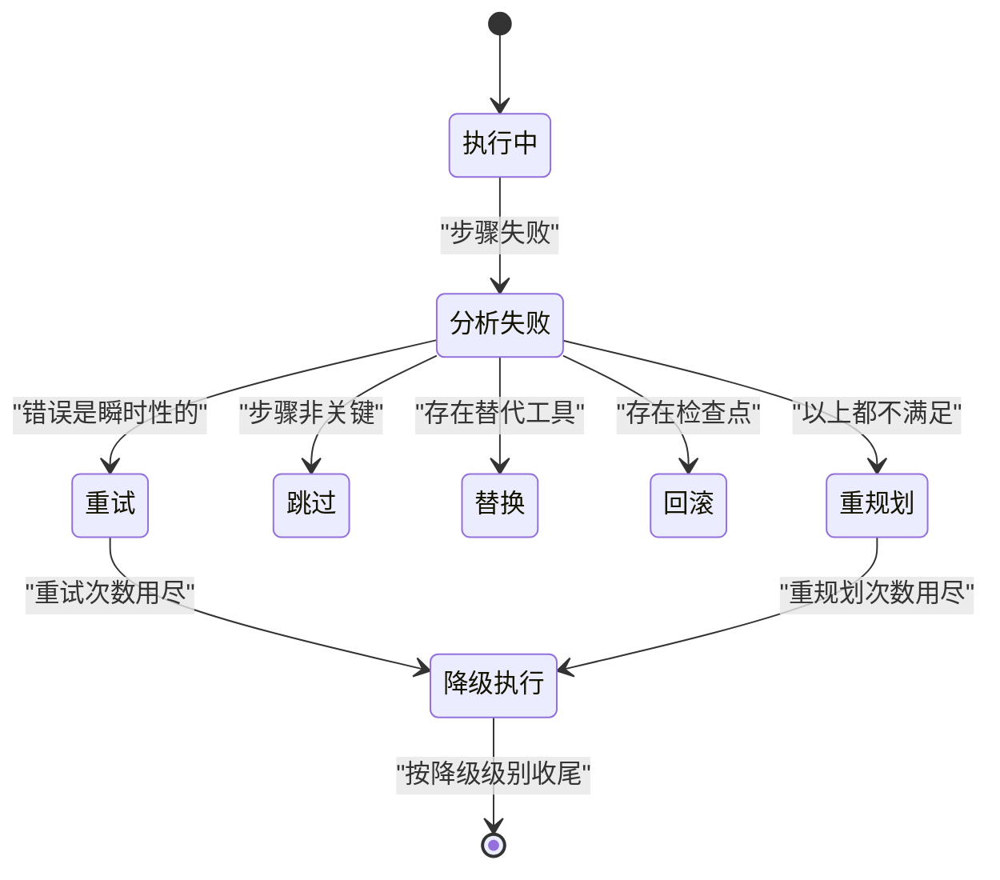

# 规划-执行：混合模式与优化

!!! abstract "学完这一页你能"
    - 画出 Plan-then-Act 的主循环，并说清规划、执行一步、判定重规划各自负责什么。
    - 把执行状态换算成完成率、失败率、偏差与机会四个指标，用阈值决定继续、改计划还是重生成。
    - 为规划结果设计缓存键、TTL 与驱逐策略，并说明语义缓存为什么需要向量粗筛加回表两步。
    - 用分层恢复与三级降级处理执行失败，并指出每一级降级砍掉了哪部分工作。

## 0. 知识地图



建议读法：先读第 1 节，把"规划一次、执行多步、每步回看"的骨架立起来。

再读第 2、3 节，搞清"什么时候值得重新规划"和"任务不同该换什么策略"。

最后读第 4、5、6 节，这三节都是 Optimization，分别省钱、省时间、扛故障。

!!! note "术语：Plan-then-Act"
    定义：先由规划器产出一份完整计划，再逐步执行，并在执行过程中允许局部重新规划的混合模式。
    例子：订票 agent 先写出"查车次、选座位、下单、通知"四步，执行到第三步发现车次取消时，只重写后两步。

!!! note "术语：重规划 Replanning"
    定义：在执行过程中放弃当前计划的一部分或全部，让规划器基于最新状态重新产出计划。
    例子：原计划要调用一个外部接口，该接口返回 503，于是把"取数据"这一步换成"读本地快照"。

!!! note "术语：判别联合 Discriminated Union"
    定义：多个类型共享一个字面量字段作为标签，靠这个标签区分彼此的类型写法。
    例子：重规划触发条件都带一个 type 字段，type 为 failure 的分支才有 afterAttempts 字段。

## 1. Plan-then-Act：混合模式的骨架

**先想一个问题**

你让 agent 订一张当天的高铁票。它先写完五步计划，执行到第三步才发现车次停运。

如果它只会照原计划走，任务必然失败；如果它每一步都重新问一遍模型，调用次数会从 1 次变成 5 次。

Plan-then-Act 就在这两端之间取中间点。

**心智模型**

!!! tip "心智模型"
    一句话模型：先写完整计划，但每执行完一步就回看一次计划是否还成立。
    日常类比：出门前查好公交路线，每到一个站点看一眼站牌，发现改道就换乘。
    类比不成立的地方：站牌会明确告诉你改道，而 agent 判断"计划是否还成立"要靠自己算指标，判断本身既可能错，也要花 token。

**图解**



图解逐步解读：

1. 调用方只调用一次 run，循环全部发生在 Agent 内部。
2. 规划器先产出一份完整计划，这一步的算力投入由规划深度决定。
3. 循环每轮只推进一个步骤，所以每轮结束后都有机会重新评估计划。
4. 判定命中且重规划次数未超上限时，才真的调用规划器覆盖计划。
5. 计划被覆盖后，下一轮执行的是新计划的下一步，而不是从第一步重来。

**一步一步来**

第 1 步：把"能调什么旋钮"固定成配置契约。这样做的原因是：规划质量与执行成本是一对矛盾，旋钮必须显式写出来才好调。

```ts
// 规划深度决定前期投入多少算力，重规划上限给重规划封顶
interface PlanThenActConfig {
  initialPlanningDepth: 'light' | 'moderate' | 'deep';
  allowReplanning: boolean;
  replanningTriggers: ReplanningTrigger[];
  maxReplanningAttempts: number;
}

// 用判别联合建模"何时该推翻原计划"：每个分支携带的字段不同
type ReplanningTrigger =
  | { type: 'failure'; afterAttempts?: number }   // 失败达到次数阈值才触发
  | { type: 'time_budget_exceeded' }              // 本地同步判断，开销低
  | { type: 'external_feedback' }                 // 外部反馈驱动
  | { type: 'environment_change' };               // 需要探测环境，判定要 await
```

**这段代码在做什么**：

- 第 1 段只声明契约，不含任何执行逻辑，方便调用方按场景传不同值。
- initialPlanningDepth 把"前期花多少算力"变成一个枚举，而不是散落在代码里的分支。
- maxReplanningAttempts 是最后一道熔断，防止"失败到重规划再到失败"的循环烧 token。
- 触发条件用判别联合而不是堆可选字段，switch 时 TypeScript 会自动收窄类型。
- 这段代码只声明规则，真正的判定写在后面的 checkReplanningTriggers 里。

第 2 步：写主循环，并把重规划计数在每轮 run 开头归零。

```ts
async run(task: string): Promise<AgentResult> {
  // 每轮 run 开头归零，否则计数器会跨任务累加，后续任务过早耗尽配额
  this.replanningCount = 0;
  this.currentPlan = await this.planner.createPlan(task, this.config.initialPlanningDepth);

  while (!this.isComplete()) {
    const stepResult = await this.executor.executeNextStep(this.currentPlan);

    // 双重门禁：先看配置是否允许，再看是否命中触发条件且未超上限
    if (this.config.allowReplanning) {
      const shouldReplan = await this.checkReplanningTriggers(stepResult);
      if (shouldReplan && this.replanningCount < this.config.maxReplanningAttempts) {
        this.currentPlan = await this.replan(task);
        this.replanningCount++;
      }
    }

    this.updateProgress(stepResult);
  }

  return this.compileResult();
}
```

**这段代码在做什么**：

- 循环条件 isComplete 必须能感知执行器的推进，否则计划为空或执行器走不动时会死循环。
- 每轮只调用一次 executeNextStep，这是"每步之后都能重评估"的前提。
- 上限判断放在触发判断之后，语义是"能不能重规划由 triggers 表达，上限只做熔断"。
- replan 内部只回传失败步骤、当前计划与累积知识三件套，控制提示词长度。
- 一次 replan 的成本与一次完整规划接近，所以必须有 maxReplanningAttempts 兜底。

!!! note "术语：熔断"
    定义：在累计次数或耗时触达上限时，强制停止某个动作，而不是继续尝试。
    例子：重规划次数达到上限后，即使再次命中失败触发条件，也不再调用规划器。

运行结果（示意）：

```text
第 1 轮：执行 查询车次 -> 成功
第 2 轮：执行 选择座位 -> 成功
第 3 轮：执行 下单 -> 失败，命中 failure 触发，重规划次数 0 小于 1，触发 replan
第 4 轮：执行 改用备用接口下单 -> 成功
结束：completed 4，replanningCount 1
```

**动手验证**

依赖：无第三方依赖。运行环境：Node 20 及以上，单文件保存为 plan-then-act.mjs。

```js
// plan-then-act.mjs
// 用一个假执行器复现"第三步失败后触发一次重规划"的完整流程
import assert from 'node:assert/strict';

const config = {
  allowReplanning: true,
  replanningTriggers: [{ type: 'failure' }], // 首次失败即触发
  maxReplanningAttempts: 1,                  // 上限由调用方给定，资料未覆盖默认值
};

// 第一版计划：第三步注定失败；重规划后换成备用步骤
const planV1 = [{ name: '查车次' }, { name: '选座' }, { name: '下单', willFail: true }];
const planV2 = [{ name: '查车次' }, { name: '选座' }, { name: '改用备用接口下单' }];

class FakeAgent {
  constructor() {
    this.plan = planV1;      // 当前计划
    this.replanningCount = 0;
    this.done = 0;           // 已完成步骤数
    this.trace = [];         // 记录每轮动作，便于断言
  }
  isComplete() {
    return this.done >= this.plan.length;
  }
  async executeNextStep() {
    const step = this.plan[this.done];
    const ok = !step.willFail;
    this.trace.push(`${ok ? '成功' : '失败'} ${step.name}`);
    if (ok) this.done += 1;  // 失败时不推进，由重规划解决
    return { success: ok, name: step.name, metadata: { attempts: 1 } };
  }
  async checkReplanningTriggers(result) {
    return config.replanningTriggers.some((t) => t.type === 'failure' && !result.success);
  }
  async replan() {
    this.plan = planV2;      // 简化：直接换成备用计划
    return this.plan;
  }
  async run() {
    this.replanningCount = 0; // 每轮 run 开头归零，防止跨任务累加
    while (!this.isComplete()) {
      const result = await this.executeNextStep();
      if (config.allowReplanning) {
        const should = await this.checkReplanningTriggers(result);
        if (should && this.replanningCount < config.maxReplanningAttempts) {
          await this.replan();
          this.replanningCount += 1;
        }
      }
    }
    return { completed: this.done, replanningCount: this.replanningCount };
  }
}

const agent = new FakeAgent();
const result = await agent.run();

assert.equal(result.replanningCount, 1);          // 只重规划一次
assert.equal(result.completed, 3);                // 三个步骤都完成
assert.deepEqual(agent.trace, [
  '成功 查车次',
  '成功 选座',
  '失败 下单',
  '成功 改用备用接口下单',
]);

console.log('trace:', agent.trace.join(' | '));
console.log('运行结果:', JSON.stringify(result));
```

预期输出：

```text
trace: 成功 查车次 | 成功 选座 | 失败 下单 | 成功 改用备用接口下单
运行结果: {"completed":3,"replanningCount":1}
```

**常见坑**

| 现象 | 原因 | 怎么修 |
| --- | --- | --- |
| 第二个任务刚开始就报"重规划次数已用完" | replanningCount 是实例字段，没在每轮 run 开头归零 | 把归零放进 run 的第一行，而不是构造器 |
| 执行器一直返回成功，循环却停不下来 | isComplete 判断的是计划长度，而计划对象每次都被替换 | 让 isComplete 依赖执行器维护的已完成集合，而不是计划引用 |
| 失败步骤被反复执行，token 翻倍 | 失败后仍推进 done，导致下一步判断错位 | 失败时不推进进度，交给重规划或恢复策略处理 |

**用在哪里**

场景一：后台管理的批量导入向导。

- 业务背景：用户上传一张 Excel，系统要校验、清洗、写库、回执四步。
- 这一节的知识怎么用：把四步写成计划，第三步写库失败时只重规划后两步，不重跑校验。
- 用什么指标衡量收益：单次导入的模型调用次数、导入成功率。
- 什么时候不该用：导入步骤固定且幂等时，直接用固定的管道代码，不需要规划器。

场景二：多步骤运维巡检 agent。

- 业务背景：一条巡检任务要连多台机器取指标，机器可能临时不可达。
- 这一节的知识怎么用：把每台机器当成一个步骤，失败即触发一次重规划，改走备用通道。
- 用什么指标衡量收益：巡检完成率、平均重规划次数。
- 什么时候不该用：机器状态在秒级变化时，规划这一步本身就会过期，直接并发探测。

**行业实践**

- LangChain 的 Plan-and-Execute 教程（出处名称：LangChain Plan-and-Execute 教程）：本站旧版资料只给出了该文档的名称与地址，未覆盖其中的接口签名，需核对官方文档：规划器与执行器之间传递的数据结构。
- AutoGPT（出处名称：AutoGPT 开源项目，GitHub 上的 Significant-Gravitas 仓库）：旧版资料把它列为自主 agent 的代表项目，但未覆盖其循环终止条件，需核对官方文档：它如何判断任务结束。
- BabyAGI（出处名称：BabyAGI 开源项目，GitHub 上的 yoheinakajima 仓库）：旧版资料把它列为任务驱动的自主 agent，未覆盖其任务队列实现细节，需核对官方文档：任务列表如何更新与去重。

怎么借鉴到你的项目：先把"规划器"和"执行器"拆成两个可替换的接口，再给重规划次数设一个显式上限，最后把每轮动作写进结构化日志。

**小结**

- Plan-then-Act 的价值在于把"重规划"从每步一次降到按需触发。
- 主循环的三段是规划、执行一步、判定是否重规划，缺一段都会退化成两头之一。
- 计数器归零与循环终止条件是这段代码里最容易写错的两处。

## 2. 动态重规划：先度量再决策

**先想一个问题**

执行到第 4 步时，你发现进度比预期慢。是让模型重写整份计划，还是继续跑？

凭直觉判断会带来两个代价：重写整份计划贵，继续跑可能彻底失败。所以要先算指标，再按阈值决策。

**心智模型**

!!! tip "心智模型"
    一句话模型：用少量标量指标做便宜的判断，只有确实需要改写计划时才付出模型调用成本。
    日常类比：开车时先看仪表盘上的速度与油量，油量见底才找加油站，而不是每分钟都导航到最近的加油站。
    类比不成立的地方：仪表盘读数不会互相干扰，而完成率与失败率来自同一份执行快照，取值时必须基于同一时刻的数据。

**图解**



图解逐步解读：

1. 四个指标全部从同一份执行状态快照里算出来，保证多次比较基于一致数据。
2. 最严重的分支排在最前，避免先命中低优先级分支，给濒临失败的计划打补丁。
3. 重生成分支同时要求完成率低与失败率高两个条件，防止整体接近完成时被推翻。
4. 偏差分支与机会分支都产出改后的计划，返回时计划已经是可直接执行的成品。
5. 三个条件都不成立时明确返回继续，而不是返回空值，调用方能无条件信任返回值。

!!! note "术语：余弦相似度 Cosine Similarity"
    定义：两个向量的点积除以各自模长的乘积，取值落在负一到一之间，越接近一说明方向越一致。
    例子：向量 一零一 与 一零 零点九 的余弦值接近 零点九九，说明两个任务描述方向几乎一致。

**一步一步来**

第 1 步：把杂乱的执行记录压成四个标量。这一步不调用模型，属于本地计算。

```ts
// 完成率与失败率的分母不同：完成率用计划总步数，失败率用已完成步数
const completedCount = state.completedSteps.size;   // 用 Set 去重，重复上报不算两次
const totalCount = plan.steps.length;
const completionRate = completedCount / totalCount;

// 已完成步数为零时直接取零，显式规避 零除零 得到 NaN
const failedCount = state.failedSteps.size;
const failureRate = completedCount > 0 ? failedCount / completedCount : 0;

// 偏差取绝对值：提前完成与滞后完成都说明预估模型失准
const expectedProgress = this.calculateExpectedProgress(state);
const deviationFromPlan = Math.abs(expectedProgress - completionRate);

const newOpportunities = await this.detectNewOpportunities(state);
```

**这段代码在做什么**：

- plan.steps 为空时 completionRate 会变成 NaN，之后所有阈值比较都返回 false 并静默落到继续分支。
- 失败率的分母是已完成步数，语义上更接近"重试消耗率"，而不是占总步数的比例。
- 偏差用时间维度的预期进度与数量维度的实际进度做差，两个维度不同但都要减。
- 识别新机会是四个指标里唯一可能需要外部探测的，因此放在最后并标为异步。

第 2 步：按分支优先级做决策，并让重生成分支不产出补丁式计划。

```ts
async shouldReplan(state: ExecutionState, plan: ExecutionPlan): Promise<ReplanningDecision> {
  const analysis = await this.analyzeExecutionState(state, plan); // 采集唯一一份事实快照

  // 风险最高的分支放最前：进度低于三成且失败率高于五成，判定为需要整份重来
  if (analysis.completionRate < 0.3 && analysis.failureRate > 0.5) {
    return { action: 'regenerate', reason: 'High failure rate with low progress' };
  }

  // 偏差超过三成：计划仍可用，但后续步骤需要模型重新裁剪
  if (analysis.deviationFromPlan > 0.3) {
    return { action: 'modify', modifiedPlan: await this.suggestModifications(analysis), reason: 'Significant deviation' };
  }

  // 进度正常但出现更优路径：保留原骨架，合并增量机会
  if (analysis.newOpportunities.length > 0) {
    return { action: 'modify', modifiedPlan: await this.integrateOpportunities(plan, analysis.newOpportunities), reason: 'New opportunities' };
  }

  return { action: 'continue', reason: 'Execution proceeding as expected' };
}
```

**这段代码在做什么**：

- 三个阈值 0.3、0.5、0.3 来自本站该页面的旧版内容，以原文为准，实际项目要按任务分布重新标定。
- action 为 abort 虽然在联合类型里声明过，但本类从不产出，它属于更上层编排器的熔断职责。
- 偏差分支与机会分支都返回 modify，但驱动因素不同，一个为纠偏，一个为增益。
- 修改建议用结构化输出约束模型返回 JSON，避免自由文本再解析这一故障点。
- 决策与执行分离，调用方只需按 action 分派，不必理解内部如何分析状态。

运行结果（示意）：

```text
输入 完成率 0.2 失败率 0.6 偏差 0.05 机会 0 个 -> regenerate
输入 完成率 0.5 失败率 0.2 偏差 0.4  机会 0 个 -> modify
输入 完成率 0.8 失败率 0.1 偏差 0.1  机会 0 个 -> continue
```

**动手验证**

依赖：无第三方依赖。运行环境：Node 20 及以上，单文件保存为 decide.mjs。

```js
// decide.mjs
// 复现动态重规划的四个指标与三分支决策，用断言锁定分支优先级
import assert from 'node:assert/strict';

function analyze(planSteps, completed, failed, expectedProgress, opportunities) {
  const completedCount = completed.size;
  const totalCount = planSteps.length;
  const completionRate = totalCount === 0 ? 0 : completedCount / totalCount; // 空计划取零，避免 NaN
  const failureRate = completedCount > 0 ? failed.size / completedCount : 0; // 分母为零时取零
  const deviationFromPlan = Math.abs(expectedProgress - completionRate);      // 提前与滞后都算偏差
  return { completionRate, failureRate, deviationFromPlan, newOpportunities: opportunities };
}

function decide(a) {
  // 分支顺序即风险顺序，重生成必须排在最前
  if (a.completionRate < 0.3 && a.failureRate > 0.5) return { action: 'regenerate' };
  if (a.deviationFromPlan > 0.3) return { action: 'modify' };
  if (a.newOpportunities.length > 0) return { action: 'modify' };
  return { action: 'continue' };
}

const plan = ['s1', 's2', 's3', 's4', 's5'];

// 用例一：进度低且失败高，即使偏差很小也要整份重来
const a1 = analyze(plan, new Set(['s1']), new Set(['s1', 's2']), 0.2, []);
assert.equal(decide(a1).action, 'regenerate');

// 用例二：完成率未低于阈值，但偏差很大，走局部修改
const a2 = analyze(plan, new Set(['s1', 's2']), new Set(['s1', 's2']), 0.9, []);
assert.equal(a2.failureRate, 1);           // 两个已完成步骤都失败
assert.equal(decide(a2).action, 'modify'); // 完成率 0.4 大于 0.3，进入偏差分支

// 用例三：进度正常、偏差小，但发现新机会，仍走修改
const a3 = analyze(plan, new Set(['s1', 's2', 's3', 's4']), new Set(), 0.8, ['useCache']);
assert.equal(decide(a3).action, 'modify');

// 用例四：三项都不触发，明确返回继续
const a4 = analyze(plan, new Set(['s1', 's2', 's3', 's4']), new Set(), 0.8, []);
assert.equal(decide(a4).action, 'continue');

// 边界：空计划不应产生 NaN
const a5 = analyze([], new Set(), new Set(), 0, []);
assert.ok(Number.isFinite(a5.completionRate));
assert.ok(Number.isFinite(a5.failureRate));

console.log('运行结果:', [a1, a2, a3, a4, a5].map((a) => decide(a).action).join(' | '));
```

预期输出：

```text
运行结果: regenerate | regenerate | modify | continue | continue
```

**常见坑**

| 现象 | 原因 | 怎么修 |
| --- | --- | --- |
| 明明快要完成却被整份推翻 | 判断顺序把重生成放在最前，却没加完成率下限 | 重生成分支同时要求完成率低于阈值与失败率高于阈值 |
| 某一轮决策时各种比例对不上 | 指标在不同时刻分别采集，边算边改 | 先取一份状态快照，四个指标只从这份快照算 |
| 计划为空时所有分支都走继续 | 完成率算成 NaN，比较结果全为 false | 计划为空或已完成步数为零时显式返回零 |

**用在哪里**

场景一：电商商品批量上架的自动化流水线。

- 业务背景：一次上架要过类目校验、图片处理、属性补全、上架四步，失败会卡在任意一步。
- 这一节的知识怎么用：用失败率与完成率区分"个别商品卡住"和"整批策略错误"，前者局部改，后者重生成。
- 用什么指标衡量收益：整批任务的重生成次数、单批总耗时。
- 什么时候不该用：单次上架只有两步时，判断成本高于直接重跑。

场景二：代码仓库的自动修复 agent。

- 业务背景：agent 要跑测试、定位失败、改代码、再跑测试。
- 这一节的知识怎么用：把偏差定义成"预期通过数减实际通过数"，偏差大就重排后续修复步骤。
- 用什么指标衡量收益：修复成功率、平均修复轮次。
- 什么时候不该用：测试结果本身不稳定时，偏差来自噪声，先稳定测试再谈重规划。

**行业实践**

- ReAct 论文（出处名称：ReAct: Synergizing Reasoning and Acting in Language Models）：旧版资料把它列为参考资源，用于对比"推理与行动交替"的风格，本页未覆盖其具体实验数据，需核对官方文档：论文中的任务设置与指标定义。
- LangChain 的 Plan-and-Execute 教程（出处名称：LangChain Plan-and-Execute 教程）：作为"先规划后执行"的对照实现，需核对官方文档：它在执行阶段是否内置重规划。

怎么借鉴到你的项目：把四个指标做成一次函数调用返回的对象，写进日志，之后用日志分布去标定阈值，而不是沿用示例里的数值。

**小结**

- 决策前先算指标，模型调用只发生在确实要改写计划时。
- 分支顺序就是风险顺序，重生成必须排在修改之前。
- 所有阈值都要用自己的日志重新标定，示例数值只说明方法。

## 3. 自适应规划：按任务类型换策略

**先想一个问题**

同一个规划深度用在所有任务上会浪费。写代码的任务适合中等深度、失败后重规划，而检索类任务适合浅规划、持续调整。

如果两者共用一套旋钮，要么代码任务规划过浅导致返工，要么检索任务规划过深导致首字延迟上升。

**心智模型**

!!! tip "心智模型"
    一句话模型：先给任务分类，取出对应的策略模板，再按当前上下文微调模板里的字段。
    日常类比：出门穿衣服先看季节，再看当天的温度和是否下雨，季节给模板，天气做微调。
    类比不成立的地方：季节不会因为你看错而改变，而任务分类由模型给出，分类错了后面的调整全都作用在错的模板上。

**图解**



图解逐步解读：

1. 分类把任务归到代码生成、数据分析、检索、自动化或通用之一。
2. 基础策略表给出该类任务的默认规划深度、重规划频率、是否并行与单步复杂度上限。
3. 收集上下文拿到的是当前时间预算、可用并发度与紧迫度，它们随时间变化。
4. 微调只改基础策略的副本，不会写回基础表，避免一次调整污染后续任务。
5. 配置好的规划器才真正产出计划，策略调整的最终效果体现在计划粒度上。

**一步一步来**

第 1 步：定义策略结构与基础策略表。

```ts
enum PlanningDepth { LIGHT = 0, MODERATE = 1, DEEP = 2 }

interface PlanningStrategy {
  name: string;
  planningDepth: PlanningDepth;
  replanningFrequency: 'never' | 'on_failure' | 'periodic' | 'continuous';
  parallelExecution: boolean;
  maxStepComplexity: number;  // 单个步骤允许的复杂度上限
}

// 基础策略表：不同任务类型的默认旋钮
const baseStrategies = {
  code_generation: { planningDepth: PlanningDepth.MODERATE, replanningFrequency: 'on_failure', parallelExecution: false, maxStepComplexity: 5 },
  data_analysis:   { planningDepth: PlanningDepth.DEEP,     replanningFrequency: 'periodic',   parallelExecution: true,  maxStepComplexity: 3 },
  research:        { planningDepth: PlanningDepth.LIGHT,    replanningFrequency: 'continuous', parallelExecution: true,  maxStepComplexity: 7 },
};
```

**这段代码在做什么**：

- 三个任务类型的默认值来自本站该页面的旧版内容，以原文为准。
- 规划深度用数字枚举，是为了能用 Math.min 做"只降不升"的比较。
- 重规划频率是四个档位的字符串联合，比布尔开关更能表达检索类任务的持续调整。
- maxStepComplexity 限制单个步骤的粒度，粒度过粗会导致失败后回滚范围过大。

第 2 步：按上下文微调策略，并保证不修改基础表。

```ts
private adjustStrategy(base: PlanningStrategy, context: PlanningContext): PlanningStrategy {
  const adjusted = { ...base };  // 复制一份，避免写回基础策略表

  // 时间预算低于五秒时，规划深度只能降到浅或保持更浅
  if (context.timeBudget < 5000) {
    adjusted.planningDepth = Math.min(adjusted.planningDepth, PlanningDepth.LIGHT);
  } else if (context.timeBudget > 60000) {
    adjusted.planningDepth = PlanningDepth.DEEP;  // 预算充裕时允许深规划
  }

  // 可用并发度低于二时关闭并行，否则调度器会排队等待
  if (context.availableConcurrency < 2) {
    adjusted.parallelExecution = false;
  }

  // 紧迫度高于零点八时，把重规划收敛到只在失败时做
  if (context.urgency > 0.8) {
    adjusted.replanningFrequency = 'on_failure';
  }

  return adjusted;
}
```

**这段代码在做什么**：

- 时间预算 5000 毫秒与 60000 毫秒、并发度 2、紧迫度 0.8 四个数值来自本站该页面的旧版内容，以原文为准。
- 浅预算分支用 Math.min，语义是"只能更浅，不能变深"，防止微调反而加重负担。
- 关闭并行只在并发度不足时发生，微调不会主动把并行打开。
- 紧迫度调整覆盖的是重规划频率，与规划深度是两个独立维度，互不干扰。

运行结果（示意）：

```text
data_analysis 加 3000 毫秒预算 -> 深度由 DEEP 降为 LIGHT
data_analysis 加 90000 毫秒预算 -> 深度保持 DEEP
research 加 并发度 1 -> parallelExecution 由 true 变 false
```

**动手验证**

依赖：无第三方依赖。运行环境：Node 20 及以上，单文件保存为 adaptive.mjs。

```js
// adaptive.mjs
// 复现自适应策略的取表与微调，用断言锁定四个调整规则
import assert from 'node:assert/strict';

const DEPTH = { LIGHT: 0, MODERATE: 1, DEEP: 2 };

const baseStrategies = {
  code_generation: { planningDepth: DEPTH.MODERATE, replanningFrequency: 'on_failure', parallelExecution: false, maxStepComplexity: 5 },
  data_analysis:   { planningDepth: DEPTH.DEEP,     replanningFrequency: 'periodic',   parallelExecution: true,  maxStepComplexity: 3 },
  research:        { planningDepth: DEPTH.LIGHT,    replanningFrequency: 'continuous', parallelExecution: true,  maxStepComplexity: 7 },
};

// 真实实现由模型调用完成，这里用关键词规则替代，便于断言
function classifyTask(task) {
  if (/重构|代码|函数/.test(task)) return 'code_generation';
  if (/报表|统计|数据/.test(task)) return 'data_analysis';
  if (/检索|调研|资料/.test(task)) return 'research';
  return 'code_generation';
}

function adjustStrategy(base, context) {
  const adjusted = { ...base }; // 复制，断言基础表未被改
  if (context.timeBudget < 5000) {
    adjusted.planningDepth = Math.min(adjusted.planningDepth, DEPTH.LIGHT);
  } else if (context.timeBudget > 60000) {
    adjusted.planningDepth = DEPTH.DEEP;
  }
  if (context.availableConcurrency < 2) adjusted.parallelExecution = false;
  if (context.urgency > 0.8) adjusted.replanningFrequency = 'on_failure';
  return adjusted;
}

const task = '把这张表做成分区统计报表';
const type = classifyTask(task);
assert.equal(type, 'data_analysis');

const base = baseStrategies[type];
const tight = adjustStrategy(base, { timeBudget: 3000, availableConcurrency: 4, urgency: 0.2 });
assert.equal(tight.planningDepth, DEPTH.LIGHT);   // 预算 3000 小于 5000，降为 LIGHT
assert.equal(tight.parallelExecution, true);      // 并发足够，保持并行

const loose = adjustStrategy(base, { timeBudget: 90000, availableConcurrency: 4, urgency: 0.2 });
assert.equal(loose.planningDepth, DEPTH.DEEP);    // 预算 90000 大于 60000，保持 DEEP

const urgent = adjustStrategy(base, { timeBudget: 90000, availableConcurrency: 1, urgency: 0.9 });
assert.equal(urgent.parallelExecution, false);    // 并发度 1 小于 2，关闭并行
assert.equal(urgent.replanningFrequency, 'on_failure'); // 紧迫度 0.9 大于 0.8，收敛重规划

// 基础表必须未被修改
assert.equal(baseStrategies[type].planningDepth, DEPTH.DEEP);
assert.equal(baseStrategies[type].replanningFrequency, 'periodic');

console.log('运行结果:', JSON.stringify({ tight, loose, urgent }));
```

预期输出：

```text
运行结果: {"tight":{"planningDepth":0,"replanningFrequency":"periodic","parallelExecution":true,"maxStepComplexity":3},"loose":{"planningDepth":2,"replanningFrequency":"periodic","parallelExecution":true,"maxStepComplexity":3},"urgent":{"planningDepth":2,"replanningFrequency":"on_failure","parallelExecution":false,"maxStepComplexity":3}}
```

**常见坑**

| 现象 | 原因 | 怎么修 |
| --- | --- | --- |
| 第二个任务的策略被第一个任务改坏 | adjustStrategy 直接改了基础表对象 | 进函数第一行先浅拷贝，再改副本 |
| 时间紧的任务规划反而更深 | 微调时直接赋值，没有用取最小值的方式约束 | 降级方向用 Math.min，升级方向才允许直接赋值 |
| 分类错误导致策略完全不匹配 | 分类只靠关键词或一次模型调用 | 在计划生成后加一次合理性检查，例如步骤数与复杂度上限比较 |

**用在哪里**

场景一：SaaS 后台的智能报表助手。

- 业务背景：用户提问既有"帮我统计上月转化"这类分析任务，也有"写个 SQL 模板"这类代码任务。
- 这一节的知识怎么用：按任务类型取策略，分析类走高深度与周期重规划，代码类走中等深度与失败重规划。
- 用什么指标衡量收益：首字延迟、计划返工率。
- 什么时候不该用：产品只支持单一任务类型时，策略表退化成常量，直接写死更省事。

场景二：企业内部的知识检索机器人。

- 业务背景：检索类任务需要在过程中不断调整关键词与数据源。
- 这一节的知识怎么用：给检索类配浅规划与持续重规划，并允许并行探索多个数据源。
- 用什么指标衡量收益：检索轮次、答案被采纳的比例。
- 什么时候不该用：数据源只有固定一个时，并行没有对象，只留浅规划即可。

**行业实践**

- ReAct 论文（出处名称：ReAct: Synergizing Reasoning and Acting in Language Models）：常被用来对照"持续调整"这一档重规划频率的设计思路，本页未覆盖其具体实现，需核对官方文档：它的推理与行动如何交替。
- 本站旧版资料的策略表（出处名称：本站该页面的旧版内容）：给出了代码生成、数据分析、检索三类的默认旋钮值，以原文为准；它没有说明这些数值的标定过程，需核对官方文档：这些默认值的来源实验。

怎么借鉴到你的项目：把策略表做成配置文件而不是代码常量，先在灰度环境里只记录"本该用哪套策略"，再开启实际切换。

**小结**

- 自适应规划分两步：按任务类型取模板，按上下文改副本。
- 微调要么收敛到更保守，要么在预算充裕时放宽，方向必须明确。
- 分类错误是本方案最主要的失效来源，要补一道合理性检查。

## 4. 计划缓存与语义缓存

**先想一个问题**

同一份周报模板，运营同学每天都要生成一次，任务描述只差日期。每次都为它重新规划一遍，是在重复付钱。

计划缓存解决的是"任务描述高度相似"这一类重复。难点在于：日期不同，字符串比对不会命中。

**心智模型**

!!! tip "心智模型"
    一句话模型：精确缓存按键取计划，语义缓存先按向量找近似条目，再按同一个键回表取计划。
    日常类比：图书馆先查索引卡找相近书名，再按索引号去书架取书；索引卡翻到了，书架上的书也可能已被借走。
    类比不成立的地方：索引卡与书架由图书馆统一维护，而语义缓存里向量索引与计划存储是两次独立写入，可能不同步。

**图解**



图解逐步解读：

1. 规范化先把数字替换成占位符、把引号内容泛化，让只差日期的描述落到同一个键上。
2. 精确缓存命中且未过期时直接返回，这一条路径不产生模型调用。
3. 未命中才计算查询向量，向量只算一次，循环里复用。
4. 阈值判断通过后才执行回表操作，避免为低分候选做昂贵的读取。
5. 回表可能取不到计划，说明索引与存储不同步，此时退回规划器而不是报错。

!!! note "术语：TTL Time To Live"
    定义：缓存条目从写入时刻起可被使用的时长，超过时长即视为失效。
    例子：为计划缓存设置一小时 TTL，一小时后同一任务的请求会重新走规划器。

!!! note "术语：LFU 与 LRU"
    定义：LFU 按命中次数淘汰，优先淘汰命中次数少的条目；LRU 按最近访问时间淘汰，优先淘汰最久未被访问的条目。
    例子：缓存满时 LFU 会先丢掉只被读过一次的条目，LRU 会先丢掉最久没被读过的条目。

**一步一步来**

第 1 步：生成缓存键，并把任务描述规范化。

```ts
generateCacheKey(task: string, context: PlanningContext): string {
  const components = [
    this.normalizeTask(task),                 // 规范化后的任务描述
    context.availableTools.sort().join(','),  // 工具集合排序后拼接，顺序不同视为同一个键
    context.constraintHash,                   // 约束条件的哈希
  ];
  return this.hashString(components.join('|')); // 用分隔符拼接后整体哈希
}

private normalizeTask(task: string): string {
  return task
    .toLowerCase()                 // 大小写不敏感
    .replace(/\s+/g, ' ')          // 连续空白压成一个空格
    .replace(/[0-9]+/g, '#')       // 数字替换成占位符，让只差日期的描述落到同一个键
    .replace(/"[^"]*"/g, '""');    // 引号内容泛化
}
```

**这段代码在做什么**：

- 键由三部分组成：任务描述、可用工具、约束哈希，任何一部分不同就是不同键。
- 工具集合先排序再拼接，避免同样的工具因为顺序不同产生两个键。
- 规范化把数字替换成占位符，这是"只差日期也能命中"的关键一步。
- 规范化会牺牲精度：把 5 步和 9 步的任务归到一起，阈值设置过松时会复用不合适的计划。

第 2 步：读写缓存并处理过期。

```ts
async get(key: string): Promise<ExecutionPlan | null> {
  const entry = this.cache.get(key);
  if (!entry) return null;                                  // 未命中

  // 用写入时刻加 TTL 判断过期，过期即删除并返回空
  if (Date.now() - entry.createdAt > entry.ttl) {
    this.cache.delete(key);
    return null;
  }

  entry.lastAccessedAt = Date.now();  // 更新最近访问时间，供 LRU 使用
  entry.hitCount++;                   // 累加命中次数，供 LFU 使用
  return entry.plan;
}

async set(key: string, plan: ExecutionPlan): Promise<void> {
  // 写入前先看容量，达到上限就先驱逐一批
  if (this.cache.size >= this.config.maxSize) await this.evict();
  this.cache.set(key, {
    plan, key,
    createdAt: Date.now(),        // 写入时刻是 TTL 判定的起点
    lastAccessedAt: Date.now(),
    hitCount: 0,
    ttl: this.config.defaultTtl,
  });
}
```

**这段代码在做什么**：

- 过期判定用写入时刻而不是最近访问时刻，所以反复读取不会延长条目寿命。
- 命中时同时更新最近访问时间与命中次数，两份统计分别供 LRU 与 LFU 使用。
- 写入前先判断容量，保证驱逐发生在插入之前，缓存大小不会瞬时超出上限。
- 驱逐比例在旧版实现里是按条目总数的百分之十取整，以本站该页面的旧版内容为准。

运行结果（示意）：

```text
写入任务 生成 # 月报表 的键 -> 命中返回计划，hitCount 变成 1
把创建时间回拨到 TTL 之外 -> get 返回 null，条目被删除
写入到第 maxSize 加 1 条 -> 触发驱逐，条数回到 maxSize
```

**动手验证**

依赖：无第三方依赖。运行环境：Node 20 及以上，单文件保存为 plan-cache.mjs。

```js
// plan-cache.mjs
// 复现计划缓存的键生成、TTL 过期与按命中次数驱逐
import assert from 'node:assert/strict';

function normalizeTask(task) {
  return task.toLowerCase().replace(/\s+/g, ' ').replace(/[0-9]+/g, '#');
}

// 非密码学哈希，仅用于把键压短；不要用于安全场景
function hashString(input) {
  let h = 0;
  for (const ch of input) h = (h * 31 + ch.codePointAt(0)) % 1_000_000_007;
  return String(h);
}

class PlanCache {
  constructor({ maxSize, defaultTtl }) {
    this.maxSize = maxSize;
    this.defaultTtl = defaultTtl;
    this.cache = new Map();
  }
  key(task, tools) {
    return hashString([normalizeTask(task), [...tools].sort().join(',')].join('|'));
  }
  set(key, plan, now = Date.now()) {
    if (this.cache.size >= this.maxSize) this.evict();
    this.cache.set(key, { plan, createdAt: now, lastAccessedAt: now, hitCount: 0, ttl: this.defaultTtl });
  }
  get(key, now = Date.now()) {
    const entry = this.cache.get(key);
    if (!entry) return null;
    if (now - entry.createdAt > entry.ttl) { // 过期判定用写入时刻
      this.cache.delete(key);
      return null;
    }
    entry.lastAccessedAt = now;
    entry.hitCount += 1;
    return entry.plan;
  }
  evict() {
    // LFU：按命中次数升序，淘汰前百分之十，至少淘汰一条
    const count = Math.max(1, Math.ceil(this.cache.size * 0.1));
    const victims = [...this.cache.entries()].sort((a, b) => a[1].hitCount - b[1].hitCount).slice(0, count);
    for (const [k] of victims) this.cache.delete(k);
    return victims.length;
  }
}

const t0 = 1_000_000;
const cache = new PlanCache({ maxSize: 3, defaultTtl: 60_000 });

// 只差日期的两个描述必须落到同一个键
const k1 = cache.key('生成 3 月报表', ['db', 'chart']);
const k2 = cache.key('生成 4 月报表', ['chart', 'db']); // 工具顺序不同
assert.equal(k1, k2);

cache.set(k1, { id: 'plan-1', steps: 4 }, t0);
assert.equal(cache.get(k1, t0 + 1000).id, 'plan-1');  // 未过期，命中
const entry = cache.cache.get(k1);
assert.equal(entry.hitCount, 1);                       // 命中次数累加

assert.equal(cache.get(k1, t0 + 60_001), null);        // 超过 TTL，返回空
assert.equal(cache.cache.size, 0);                      // 过期条目被删除

// 触发驱逐：容量 3，写入 4 条
cache.set('a', { id: 'a' }, t0);
cache.set('b', { id: 'b' }, t0);
cache.set('c', { id: 'c' }, t0);
cache.get('a', t0 + 1);                                 // a 命中一次
const removed = cache.evict();                          // 淘汰命中次数最低的
assert.ok(removed >= 1);
assert.ok(cache.cache.size < 4);

console.log('运行结果:', JSON.stringify({ key: k1, removed, size: cache.cache.size }));
```

预期输出：

```text
运行结果: {"key":"745630660","removed":1,"size":2}
```

（键的具体数字由哈希函数决定，断言只依赖两次规范化结果相等，不依赖这个数字。）

**常见坑**

| 现象 | 原因 | 怎么修 |
| --- | --- | --- |
| 相同任务反复不命中 | 工具集合没排序，顺序不同导致键不同 | 拼进键之前先 sort |
| 缓存里的计划早就该废弃却还在用 | 过期判定用了最近访问时间 | 判定基准固定为写入时刻加 TTL |
| 缓存大小一直超过上限 | 先插入后驱逐，中间存在超出窗口 | 在插入之前判断容量并驱逐 |

**用在哪里**

场景一：后台管理的报表自动生成。

- 业务背景：同一张模板每天被不同人触发，任务描述只差日期与部门名。
- 这一节的知识怎么用：规范化把日期替换成占位符，命中缓存后跳过规划阶段。
- 用什么指标衡量收益：规划阶段的模型调用次数、端到端耗时。
- 什么时候不该用：报表口径每周都变时，缓存命中反而返回过期口径。

场景二：客服工单的自动分类与派单规划。

- 业务背景：工单描述用语差异大，同一个诉求有多种说法。
- 这一节的知识怎么用：先用精确缓存兜住模板化描述，再用语义缓存覆盖换词表达。
- 用什么指标衡量收益：缓存命中率、误派单率。
- 什么时候不该用：派单规则随组织架构变动时，缓存要跟着规则版本一起失效。

**行业实践**

- LangChain 的 Plan-and-Execute 教程（出处名称：LangChain Plan-and-Execute 教程）：旧版资料把它列为参考资源，本页未覆盖其缓存相关说明，需核对官方文档：该教程是否包含计划复用机制。
- 本站旧版资料的缓存实现（出处名称：本站该页面的旧版内容）：给出了 LFU、LRU、TTL 三种驱逐策略与百分之十的淘汰比例，以原文为准；它未给出这些数值的压测过程，需核对官方文档：淘汰比例的选取依据。

怎么借鉴到你的项目：先把缓存键与规范化规则写进一个独立函数，再用真实日志统计"规范化后不同任务的键数量"，用这个数量决定容量。

**小结**

- 精确缓存靠规范化扩大命中面，代价是同键任务被当成同一个。
- 过期判定一定用写入时刻，否则长时间运行的进程里缓存永不过期。
- 语义缓存访问计划存储可能取空，调用方必须容忍这种不一致。

## 5. 语义缓存、并行规划与结果合并

**先想一个问题**

运营说"生成上个月的销售报表"，另一个说"把上月销售额做成表"。字面完全不同，语义几乎一致。

只靠规范化的精确缓存抓不到这类改写。语义缓存把任务描述变成向量，用方向一致度判断能否复用。

**心智模型**

!!! tip "心智模型"
    一句话模型：语义缓存负责找出"像"的历史计划，阈值负责决定"像到什么程度才敢用"。
    日常类比：在通讯录里看到两个名字读音接近，再点进去确认是不是同一个人。
    类比不成立的地方：通讯录里确认一次就够了，而向量相似度高不代表约束条件相同，工具集与权限仍需再校验。

**图解**



图解逐步解读：

1. 任务描述只向量化一次，循环里复用这份查询向量，避免重复调用向量模型。
2. 打分逐个缓存向量进行，复杂度与缓存条目数乘以向量维度成正比。
3. 先过阈值再回表，低分候选不会触发对计划存储的读取。
4. 回表可能返回空，说明向量索引里还留着条目而计划已被淘汰，此时按未命中处理。
5. 全部低于阈值时返回空，调用方转去规划器，语义上等价于缓存未命中。

!!! note "术语：结构化输出 Structured Output"
    定义：约束模型返回符合给定结构的数据，而不是自由文本，从而免去文本解析这一步。
    例子：要求模型按步骤名、工具名、预计耗时三个字段返回 JSON，缺字段即视为失败并重试。

**一步一步来**

第 1 步：写相似度原语，并处理两个容易出错的边界。

```ts
private cosineSimilarity(a: number[], b: number[]): number {
  // 点积：逐维相乘再求和
  const dot = a.reduce((sum, val, i) => sum + val * (b[i] ?? 0), 0);
  const magA = Math.sqrt(a.reduce((sum, val) => sum + val * val, 0));
  const magB = Math.sqrt(b.reduce((sum, val) => sum + val * val, 0));
  if (magA === 0 || magB === 0) return 0;  // 零向量时显式返回零，避免出现 NaN 逃过阈值比较
  return dot / (magA * magB);
}
```

**这段代码在做什么**：

- 分子是点积，分母是两个模长的乘积，结果与向量长度无关，只比方向。
- 对下标越界做兜底，长度不一致时按零补齐，避免算出 NaN 却不报错。
- 任一向量为零向量时直接返回零，这个分支必须有，否则比较会被 NaN 污染。
- 遍历次数为三次，可合并成一次循环，这里保留可读性。

第 2 步：实现检索路径，取最高分且可回表的候选。

```ts
async findSimilarPlan(task: string): Promise<ExecutionPlan | null> {
  const taskEmbedding = await this.embeddingModel.embed(task); // 只算一次查询向量
  let best: { key: string; plan: ExecutionPlan; similarity: number } | null = null;

  for (const [key, cachedEmbedding] of this.embeddings) {
    const similarity = this.cosineSimilarity(taskEmbedding, cachedEmbedding);
    if (similarity > this.similarityThreshold) {   // 严格大于，等于阈值不算命中
      const plan = await this.cache.get(key);      // 回表可能取空
      if (plan && (!best || similarity > best.similarity)) {
        best = { key, plan, similarity };          // 取分数最高的可回表候选
      }
    }
  }
  return best?.plan ?? null;                       // 无候选时返回空，语义即未命中
}
```

**这段代码在做什么**：

- 相似度阈值在旧版实现里取 0.85，以本站该页面的旧版内容为准，越高越保守。
- 判断用严格大于，分数正好等于阈值时视为未命中，这是可复现的行为约定。
- 回表用 await，可能返回空，空值被跳过而不是抛错。
- 只保留分数最高的可回表候选，避免低分候选覆盖已选中的高分候选。

运行结果（示意）：

```text
查询向量与缓存向量余弦值 0.999 -> 高于 0.85 -> 命中 plan-1
查询向量与缓存向量余弦值 0.000 -> 低于 0.85 -> 未命中
向量索引里有条目但计划已被淘汰 -> 回表取空 -> 按未命中处理
```

**动手验证**

依赖：无第三方依赖。运行环境：Node 20 及以上，单文件保存为 semantic-cache.mjs。真实项目里的向量由嵌入模型给出，这里用固定映射代替。

```js
// semantic-cache.mjs
// 复现语义缓存的阈值检索与回表为空两种情况
import assert from 'node:assert/strict';

function cosineSimilarity(a, b) {
  const len = Math.max(a.length, b.length);
  let dot = 0, magA = 0, magB = 0;
  for (let i = 0; i < len; i++) {
    const x = a[i] ?? 0;
    const y = b[i] ?? 0;
    dot += x * y;
    magA += x * x;
    magB += y * y;
  }
  if (magA === 0 || magB === 0) return 0; // 零向量显式返回零
  return dot / (Math.sqrt(magA) * Math.sqrt(magB));
}

// 用固定表代替嵌入模型，保证测试可复现
const vectors = new Map();
const plans = new Map();

async function embed(text) {
  if (text.includes('销售报表')) return [1, 1, 0];
  if (text.includes('上月销售额')) return [1, 0.95, 0.05];
  return [0, 0, 1];
}

const similarityThreshold = 0.85; // 来自旧版实现，以原文为准

async function findSimilarPlan(task) {
  const taskEmbedding = await embed(task);
  let best = null;
  for (const [key, cachedEmbedding] of vectors) {
    const similarity = cosineSimilarity(taskEmbedding, cachedEmbedding);
    if (similarity > similarityThreshold) {
      const plan = plans.get(key);           // 回表，可能取空
      if (plan && (!best || similarity > best.similarity)) {
        best = { key, plan, similarity };
      }
    }
  }
  return best ? best.plan : null;
}

vectors.set('k1', [1, 1, 0]);
plans.set('k1', { id: 'plan-1' });

const hit = await findSimilarPlan('把上月销售额做成表');
assert.equal(hit.id, 'plan-1');                       // 语义接近，命中
assert.ok(cosineSimilarity([1, 1, 0], [1, 0.95, 0.05]) > 0.85);

const miss = await findSimilarPlan('给服务器打个补丁');
assert.equal(miss, null);                             // 方向不一致，未命中

plans.delete('k1');                                   // 计划被淘汰，索引仍在
const dangling = await findSimilarPlan('把上月销售额做成表');
assert.equal(dangling, null);                         // 回表取空，按未命中处理

console.log('运行结果:', JSON.stringify({ hit: hit.id, miss, dangling }));
```

预期输出：

```text
运行结果: {"hit":"plan-1","miss":null,"dangling":null}
```

**常见坑**

| 现象 | 原因 | 怎么修 |
| --- | --- | --- |
| 命中了一条语义相近但工具集不同的计划 | 相似度只看任务描述，没带工具与权限 | 命中后追加一次工具集与约束校验，不通过则视为未命中 |
| 打分结果出现 NaN，阈值比较静默失败 | 两向量长度不一致或存在零向量 | 越界补零，并对零向量返回零 |
| 索引里条目越来越多，计划却取不到 | 向量写入与计划写入不是一次事务 | 允许孤儿向量存在，检索时按回表结果判定，并定期清理 |

**用在哪里**

场景一：智能客服的知识检索。

- 业务背景：用户同一诉求有多种表达，逐字匹配召回不到历史答案。
- 这一节的知识怎么用：用余弦相似度挑候选答案，再按阈值决定是否直接返回。
- 用什么指标衡量收益：一次解决率、平均检索轮次。
- 什么时候不该用：答案涉及金额或权限时，近似匹配的风险高于省下的调用成本。

场景二：内容平台的标题去重。

- 业务背景：同一热点会被反复创作，标题只有措辞差异。
- 这一节的知识怎么用：把标题向量化后与新稿比对，超过阈值时提示可能重复。
- 用什么指标衡量收益：重复内容拦截率、误拦率。
- 什么时候不该用：平台要求保留全部原稿时，去重只需要提示，不该自动丢弃。

**行业实践**

- 本站旧版资料的语义缓存实现（出处名称：本站该页面的旧版内容）：给出阈值 0.85 与"先阈值后回表"的顺序，以原文为准；该资料未给出阈值标定实验，需核对官方文档：这个阈值在哪类数据集上验证过。
- LangChain 的 Plan-and-Execute 教程（出处名称：LangChain Plan-and-Execute 教程）：被旧版资料列为参考资源，本页未覆盖其缓存与并行相关细节，需核对官方文档：它是否提供计划合并能力。

怎么借鉴到你的项目：把阈值做成配置项，并在日志里记录每次命中的相似度分布，用分布去调整阈值，而不是直接抄 0.85。

**小结**

- 语义缓存的关键顺序是先打分过阈值，再按 key 回表取计划。
- 相似度高只说明任务描述接近，工具与权限仍需二次校验。
- 向量索引与计划存储可能不同步，调用方必须容忍回表取空。

## 6. 失败恢复与优雅降级

**先想一个问题**

执行到第 5 步时外部接口返回超时。重试一次可能就好了，但如果接口整体不可用，重试只会浪费时间。

失败恢复要回答的是：这次失败属于哪一类、对应哪一档处理、处理不了时降到什么程度。

**心智模型**

!!! tip "心智模型"
    一句话模型：先给失败分类，再从重试、跳过、替换、回滚、重规划五档里挑一档，挑不到就降级。
    日常类比：家里跳闸先看是不是单个电器过载，是就拔掉那个电器；整路都跳就换到别的回路；再不行就只留照明。
    类比不成立的地方：电路的分支是设计好的，而 agent 的降级级别要自己定义，每一级砍掉哪些步骤必须提前写清楚。

**图解**



图解逐步解读：

1. 失败先进入分析状态，分类依据是错误类型与步骤自身声明的属性。
2. 瞬时性错误走重试，非关键步骤走跳过，有替代工具走替换。
3. 有检查点且允许回滚时走回滚，恢复到此前的稳定状态。
4. 以上都不满足才走重规划，这一档成本最高。
5. 重试用尽或重规划用尽后进入降级执行，按预定义级别收尾而不是直接失败。

!!! note "术语：优雅降级"
    定义：在主计划无法完整执行时，按预设的级别削减工作范围，保证核心功能仍然可用。
    例子：报表系统在算力紧张时先跳过多维下钻，只出汇总行。

**一步一步来**

第 1 步：给失败分类，再按分类挑恢复档位。

```ts
private selectStrategy(analysis: FailureAnalysis, context: RecoveryContext): RecoveryLevel {
  // 瞬时性错误优先重试，这类错误重试一次的收益最高
  if (analysis.isTransient) return RecoveryLevel.RETRY;
  // 步骤被标记为可跳过时，跳过不损失核心功能
  if (analysis.isNonCritical) return RecoveryLevel.SKIP;
  // 步骤声明了替代工具时，换工具比重新规划便宜
  if (analysis.hasAlternative) return RecoveryLevel.SUBSTITUTE;
  // 有可用检查点时才回滚，否则回滚无处可回
  if (analysis.canRollback && context.checkpointsAvailable > 0) return RecoveryLevel.ROLLBACK;
  return RecoveryLevel.REPLAN;  // 兜底档，成本最高
}

private isTransientError(error: Error): boolean {
  // 命中任一模式即视为瞬时性错误
  const patterns = [/timeout/i, /connection/i, /temporary/i, /network/i, /rate.limit/i];
  return patterns.some((p) => p.test(error.message));
}
```

**这段代码在做什么**：

- 五档的顺序就是成本从低到高，前面的档位都不满足才落到重规划。
- 瞬时性错误用错误消息的正则匹配判断，这是一种启发式，误判会把永久错误重试三次。
- 回滚档额外要求检查点数量大于零，否则回滚动作本身没有落点。
- 每档恢复执行前都会记录一次尝试历史，供后续统计与阈值调整使用。

第 2 步：定义降级级别，并按级别裁剪步骤。

```ts
private generateDegradedPlan(plan: ExecutionPlan, level: number): ExecutionPlan {
  let steps = [...plan.steps];
  switch (level) {
    case 1:
      // 轻度降级：去掉可选步骤，核心步骤全部保留
      steps = steps.filter((s) => s.criticality !== 'optional');
      break;
    case 2:
      // 中度降级：把复杂工具换成简化工具，并减半迭代次数
      steps = steps.map((s) => this.simplifyStep(s));
      break;
    case 3:
      // 重度降级：只保留必需步骤
      steps = steps.filter((s) => s.criticality === 'required');
      break;
  }
  return this.rebuildPlan(plan, steps);
}
```

**这段代码在做什么**：

- 降级分三级，级别越高保留的步骤越少，旧版资料就是这样划分的，以原文为准。
- 第一级只做过滤，不改变保留步骤的内部结构，风险最低。
- 第二级的简化动作包含换工具与减迭代，具体系数在旧版实现里是迭代次数取一半再向上取整。
- 三级降级都存在一个共同风险：被裁掉的步骤可能产生下游依赖的数据，必须靠 rebuildPlan 重新校验依赖。

运行结果（示意）：

```text
错误消息 request timeout -> isTransient 为真 -> 走 RETRY，最多三次
步骤非关键 -> 走 SKIP，计划继续往下执行
瞬时错误重试三次仍失败 -> 进入降级选择 -> 找到满足约束的级别后按该级别执行
```

**动手验证**

依赖：无第三方依赖。运行环境：Node 20 及以上，单文件保存为 recovery.mjs。

```js
// recovery.mjs
// 复现失败分类、恢复档位选择与三级降级裁剪
import assert from 'node:assert/strict';

const LEVEL = { RETRY: 'retry', SKIP: 'skip', SUBSTITUTE: 'substitute', ROLLBACK: 'rollback', REPLAN: 'replan' };

function isTransientError(message) {
  return [/timeout/i, /connection/i, /network/i, /rate.limit/i].some((p) => p.test(message));
}

function analyzeFailure(step, message) {
  return {
    isTransient: isTransientError(message),
    isNonCritical: step.onFailure === 'skip',
    hasAlternative: step.alternativeTool !== undefined,
    canRollback: step.rollbackAction !== undefined,
  };
}

function selectStrategy(analysis, context) {
  if (analysis.isTransient) return LEVEL.RETRY;
  if (analysis.isNonCritical) return LEVEL.SKIP;
  if (analysis.hasAlternative) return LEVEL.SUBSTITUTE;
  if (analysis.canRollback && context.checkpointsAvailable > 0) return LEVEL.ROLLBACK;
  return LEVEL.REPLAN;
}

function simplifyStep(step) {
  const next = { ...step };
  if (next.toolName === 'complex_analysis') next.toolName = 'simple_analysis';
  if (next.maxIterations) next.maxIterations = Math.ceil(next.maxIterations / 2); // 迭代减半
  return next;
}

function generateDegradedPlan(steps, level) {
  if (level === 1) return steps.filter((s) => s.criticality !== 'optional');     // 去可选
  if (level === 2) return steps.map(simplifyStep);                                // 简化处理
  return steps.filter((s) => s.criticality === 'required');                       // 只留必需
}

// 用例一：瞬时错误优先重试
const transient = analyzeFailure({ onFailure: 'fail' }, 'request timeout');
assert.equal(selectStrategy(transient, { checkpointsAvailable: 0 }), LEVEL.RETRY);

// 用例二：非瞬时但可跳过
const skippable = analyzeFailure({ onFailure: 'skip' }, 'schema mismatch');
assert.equal(selectStrategy(skippable, { checkpointsAvailable: 0 }), LEVEL.SKIP);

// 用例三：有替代工具
const substitutable = analyzeFailure({ onFailure: 'fail', alternativeTool: 'simple_analysis' }, 'schema mismatch');
assert.equal(selectStrategy(substitutable, { checkpointsAvailable: 0 }), LEVEL.SUBSTITUTE);

// 用例四：有检查点才回滚，没有检查点直接重规划
const rollbackable = analyzeFailure({ onFailure: 'fail', rollbackAction: 'undo' }, 'schema mismatch');
assert.equal(selectStrategy(rollbackable, { checkpointsAvailable: 2 }), LEVEL.ROLLBACK);
assert.equal(selectStrategy(rollbackable, { checkpointsAvailable: 0 }), LEVEL.REPLAN);

// 三级降级：步骤数单调不增
const steps = [
  { id: 's1', criticality: 'required', toolName: 'complex_analysis', maxIterations: 8 },
  { id: 's2', criticality: 'optional', toolName: 'chart' },
  { id: 's3', criticality: 'required', toolName: 'db' },
];
const l1 = generateDegradedPlan(steps, 1);
const l2 = generateDegradedPlan(steps, 2);
const l3 = generateDegradedPlan(steps, 3);
assert.equal(l1.length, 2);                                  // 去掉可选步骤
assert.equal(l2[0].toolName, 'simple_analysis');             // 复杂工具被替换
assert.equal(l2[0].maxIterations, 4);                        // 迭代次数减半
assert.equal(l3.length, 2);                                  // 只留必需步骤
assert.ok(l3.length <= l2.length && l2.length <= steps.length);

console.log('运行结果:', JSON.stringify({ l1: l1.length, l2: l2.length, l3: l3.length, tool: l2[0].toolName }));
```

预期输出：

```text
运行结果: {"l1":2,"l2":3,"l3":2,"tool":"simple_analysis"}
```

**常见坑**

| 现象 | 原因 | 怎么修 |
| --- | --- | --- |
| 返回永久性错误时也重试三次 | 瞬时性判断只靠正则匹配错误消息 | 对已知永久性错误维护一份例外清单，先查清单再走正则 |
| 回滚后状态更乱 | 有回滚动作但没有可用检查点 | 回滚档必须同时要求检查点数量大于零 |
| 降级后的计划缺数据 | 被裁掉的步骤是下游步骤的输入 | 裁剪后重算依赖，缺失依赖的步骤一并裁掉 |

**用在哪里**

场景一：财务系统的批量对账。

- 业务背景：一次对账要拉取多个渠道流水，某个渠道接口可能临时限流。
- 这一节的知识怎么用：限流错误走重试并配指数退避，渠道不可用时走替换档，用本地快照继续。
- 用什么指标衡量收益：对账成功率、平均恢复耗时。
- 什么时候不该用：涉及资金变动的步骤不能跳过，跳跃会破坏对账平衡。

场景二：内容平台的批量转码。

- 业务背景：一次转码任务可能因为源文件损坏而失败。
- 这一节的知识怎么用：损坏属于永久性错误，直接走跳过或替换，不进重试。
- 用什么指标衡量收益：整批任务完成率、失败文件可追溯比例。
- 什么时候不该用：源文件损坏比例很高时，应该先修上游，不靠恢复策略兜底。

**行业实践**

- 本站旧版资料的分层恢复实现（出处名称：本站该页面的旧版内容）：给出五档恢复级别与三级降级的分法，以原文为准；资料未给出退避上限的压测数据，需核对官方文档：退避上限三万毫秒的选取依据。
- LangChain 的 Plan-and-Execute 教程（出处名称：LangChain Plan-and-Execute 教程）：被旧版资料列为参考资源，本页未覆盖其失败处理细节，需核对官方文档：执行器失败后是否触发重新规划。

怎么借鉴到你的项目：先把五档恢复级别写成一个枚举并落到日志字段里，运行一段时间后再决定哪几档真的被用到，用不到的档位可以删。

**小结**

- 失败先分类再选档，档位顺序就是成本顺序。
- 降级不是丢功能，而是按预设级别削减范围，级别之间要有明确的裁剪规则。
- 重试要配上限，退避上限在旧版实现里是三万毫秒，以原文为准，实际值需自行压测。

## 应用地图

| 场景 | 用到本页哪个知识点 | 典型技术选型 | 注意事项 |
| --- | --- | --- | --- |
| 后台批量导入向导 | Plan-then-Act 主循环 | 任务队列加执行器骨架 | 失败时不推进进度，交给重规划 |
| 智能报表助手的重规划 | 动态重规划四指标 | 本地指标计算加结构化输出 | 阈值必须用自家日志标定 |
| 多类型任务共用一个 agent | 自适应规划策略表 | 配置化的策略模板 | 分类错误会污染后续所有调整 |
| 模板化报表每日生成 | 计划缓存与 TTL | 进程内 Map 或外部缓存服务 | 过期判定基准是写入时刻 |
| 客服工单的相似问法 | 语义缓存与阈值检索 | 向量模型加计划存储 | 命中后仍需校验工具与权限 |
| 多数据源并行探查 | 并行规划与结果合并 | Promise.all 加去重与拓扑排序 | 冲突检测要覆盖资源与输出文件 |
| 财务批量对账 | 分层恢复与优雅降级 | 五档恢复加三级降级 | 涉及资金的步骤不能进跳过档 |

## 动手作业

目标：写一个单文件 Node 20 脚本，把本页六节的知识串成一个能跑的迷你 agent。

步骤：

1. 定义一份三步计划，第三步在执行时必然失败，用主循环跑到第一次重规划。
2. 给执行器加上四个指标的统计，并让偏差超过 0.3 时返回修改动作。
3. 给规划结果加一层缓存，键由规范化任务描述与排序后的工具集拼成，TTL 设为 60000 毫秒。
4. 给语义层加一个固定向量的相似度检索，阈值取 0.85，并覆盖回表取空的路径。
5. 给失败步骤加五档恢复选择与三级降级裁剪。

验收标准（全部可检验）：

- 脚本用 node:assert/strict 断言，运行退出码为 0。
- 断言覆盖：重规划只发生一次、缓存命中次数为 1、过期返回空、语义检索命中一条且不命中两条、降级后步骤数单调不增。
- 脚本最后用 console.log 输出一份汇总对象，字段包含 replanningCount、cacheHit、semanticHit、degradedSteps。
- 失败步骤在日志里能区分"瞬时性"与"永久性"两类。

## 综合对比

| 维度 | Plan-then-Act 主循环 | 动态重规划 | 自适应规划 | 计划缓存 | 语义缓存 | 分层恢复 |
| --- | --- | --- | --- | --- | --- | --- |
| 解决的问题 | 计划与执行如何交替 | 何时该改写计划 | 不同任务用什么旋钮 | 重复任务不重复规划 | 换了说法也能复用 | 失败后怎么继续 |
| 主要成本 | 每步一次回看 | 一次指标计算 | 一次任务分类调用 | 一次哈希与查表 | 一次向量化与逐条打分 | 一次错误分类 |
| 关键参数 | 规划深度、重规划上限 | 完成率、失败率、偏差阈值 | 时间预算、并发度、紧迫度 | TTL、容量、淘汰比例 | 相似度阈值 | 重试上限、检查点数量 |
| 命中时的收益 | 降低重规划次数 | 避免整份重写 | 避免旋钮错配 | 跳过规划阶段 | 跳过规划阶段 | 缩短故障恢复时间 |
| 主要风险 | 循环不终止 | 阈值失准导致误判 | 分类错误 | 复用过期口径 | 近似但不等价 | 降级裁掉下游输入 |
| 是否依赖模型调用 | 每次重规划一次 | 仅修改分支一次 | 每次分类一次 | 否 | 是，向量化一次 | 否 |

## 自测题

??? question "1. Plan-then-Act 的主循环为什么每轮只执行一个步骤"
    因为每轮结束后都要重新评估计划是否还成立，只有把粒度控制在一个步骤上，才有评估的落点。
    如果一轮跑完多个步骤，中途环境变化就无法被察觉。
    代价是循环次数变多，每轮都有一次判定开销。

??? question "2. 重规划计数器为什么必须在每轮 run 开头归零"
    它是实例字段，同一个 agent 对象会被反复调用 run。
    不在开头归零，计数会跨任务累加，后续任务一开始就撞上重规划上限。
    症状是第二个任务报告"重规划次数已用完"。

??? question "3. 动态重规划为什么把重生成分支排在修改分支之前"
    分支顺序代表风险优先级，重生成针对的是已接近失败的计划。
    放到后面会先命中修改分支，给系统性失败打上局部补丁。
    重生成分支同时要求完成率低于 0.3 与失败率高于 0.5，避免整体接近完成时被推翻。

??? question "4. 失败率的分母为什么用已完成步骤数而不是计划总步数"
    用已完成步骤数时，这个比例表达的是"已完成的工作里有多少失败了"，接近重试消耗率。
    用计划总步数时，早期失败会被总数稀释，看起来风险很低。
    已完成步骤数为零时必须显式返回零，否则会出现零除零。

??? question "5. 计划缓存的键为什么要把工具集合排序后再拼接"
    工具顺序只是调用的书写顺序，不影响任务能否用同一份计划。
    不排序时，同样的两个工具因为顺序不同会生成两个键，命中率下降。
    排序让键只反映集合内容，而不是排列顺序。

??? question "6. 语义缓存为什么先比阈值再回表取计划"
    回表是读取计划存储，成本高于一次余弦计算。
    先比阈值可以把低分候选挡在外面，减少无效读取。
    但回表仍可能取空，因为向量索引与计划存储是两次写入，调用方要按未命中处理。

??? question "7. 自适应规划的微调为什么要复制一份基础策略"
    基础策略表是共享对象，直接修改会让本次调整污染后续所有任务。
    复制之后，每次调整只作用在当前任务的策略副本上。
    在测试里可以断言基础表未被修改，这是可检验的回归点。

??? question "8. 三级降级里最容易出错的地方是什么"
    裁剪步骤之后，被裁掉的步骤可能是下游步骤的数据来源。
    只按关键性过滤而不重算依赖，会得到一个缺输入的残缺计划。
    正确做法是裁剪后重算依赖，把依赖缺失的步骤一并裁掉。

## 延伸阅读

- LangChain 文档中的 Plan-and-Execute 教程章节（出处名称：LangChain Plan-and-Execute 教程，具体章节名需核对官方文档）。
- ReAct 论文（出处名称：ReAct: Synergizing Reasoning and Acting in Language Models），重点看推理与行动交替的部分，具体章节编号需核对官方文档。
- AutoGPT 开源项目（出处名称：AutoGPT，Significant-Gravitas 仓库）的 README 与任务循环说明，具体文件名需核对官方文档。
- BabyAGI 开源项目（出处名称：BabyAGI，yoheinakajima 仓库）的任务队列与执行循环说明，具体文件名需核对官方文档。
- 本站旧版资料《规划-执行：执行器与完整实现》（出处名称：本站该页面的上一篇文章），用于补齐执行器与检查点的实现细节。
