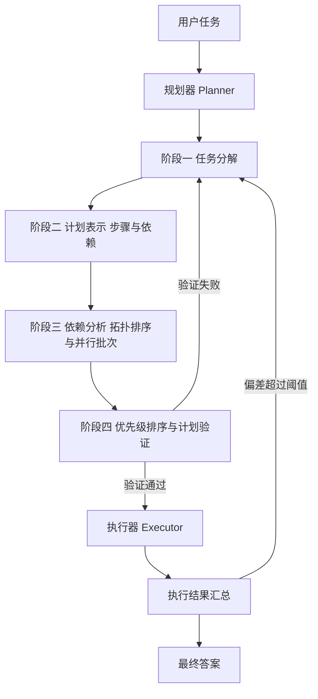
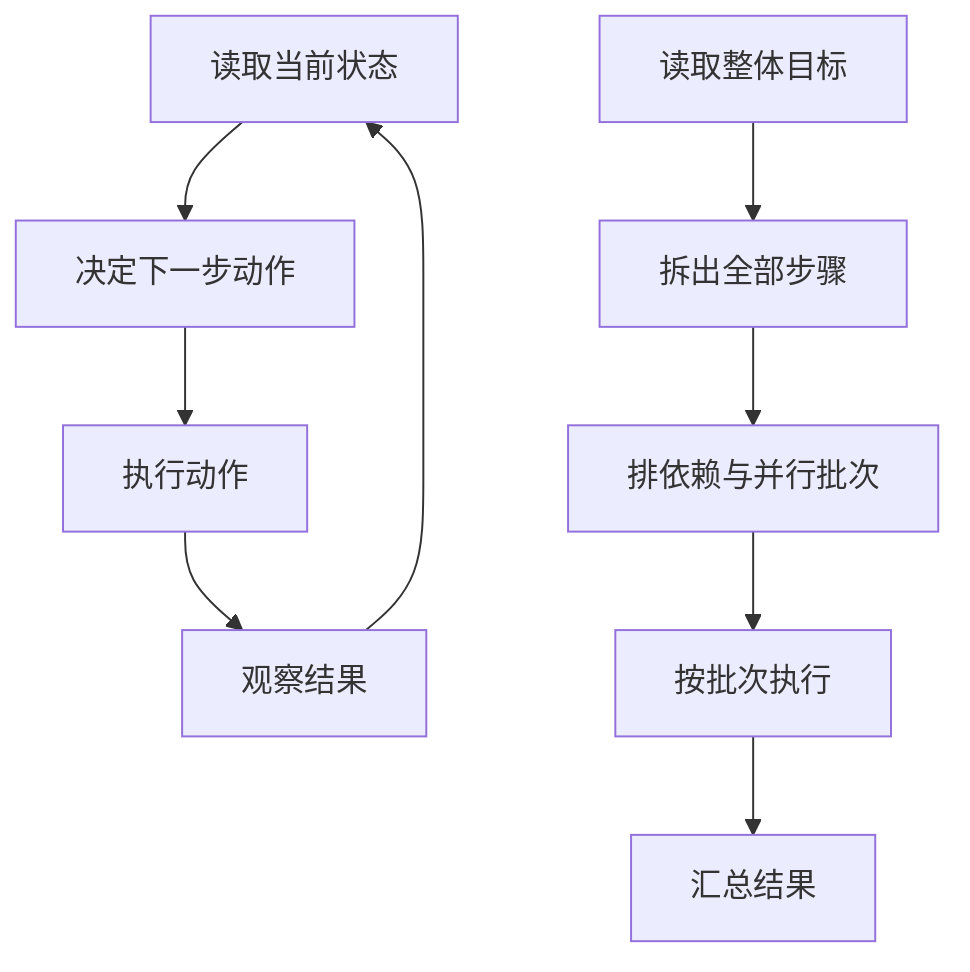
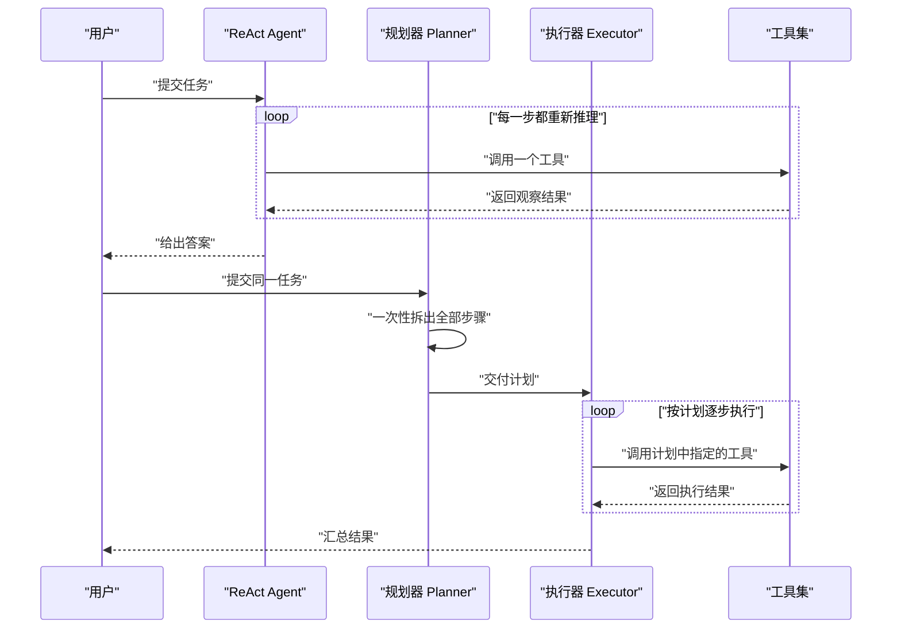
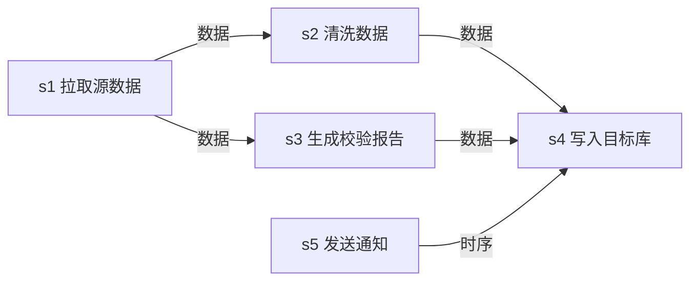
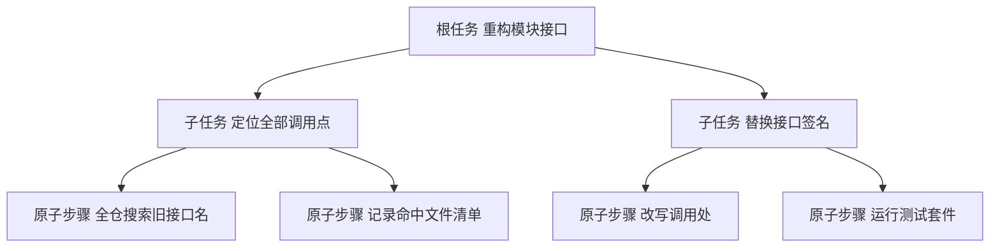
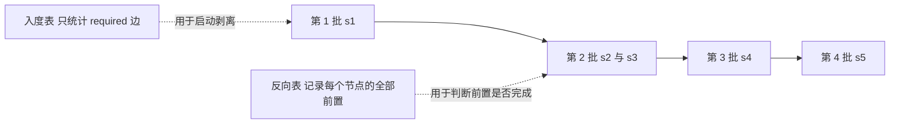
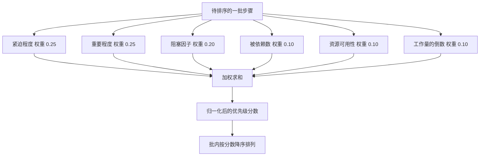
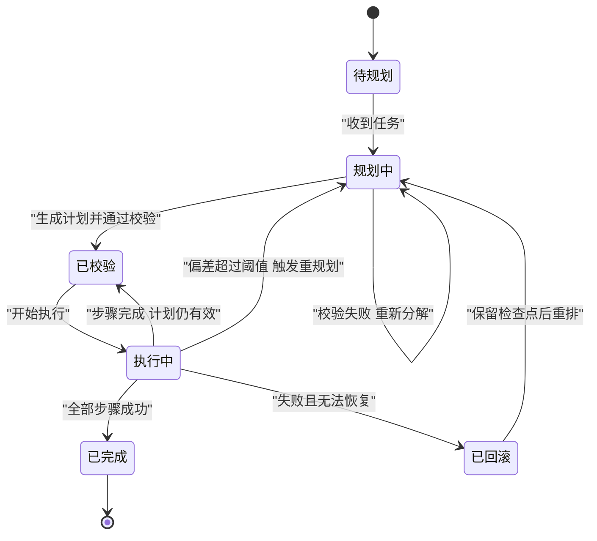

# 规划-执行：原理与规划器

!!! abstract "学完这一页你能"

- 用自己的话讲清 Plan-and-Execute 与 ReAct 在"什么时候做决策"上的差别，并按任务特征选型。
- 把一句自然语言任务拆成含 id、依赖、预估耗时的步骤数组，并写进一个可校验的计划对象。
- 用依赖图检测循环依赖，算出可并行批次与关键路径。
- 给规划器加上校验规则，并在执行偏差超过阈值时触发重规划。

## 0. 知识地图



建议按两条线读。第一条是原理线：第 1 节讲为什么要先规划，第 2 节讲它和 ReAct 的取舍。
第二条是构造线：第 3 到第 6 节按规划器内部的四个阶段依次展开，第 7 节收尾处理计划失效。

!!! note "术语：Agent（智能体）"
    一个能自己决定调用哪些工具、并循环执行直到任务完成的程序。例子：收到"查一下昨天的订单量"后，自己决定先调数据库工具、再调图表工具。

!!! note "术语：Plan-and-Execute（规划-执行）"
    把一次任务拆成两个阶段：规划阶段集中产出完整步骤列表，执行阶段按列表逐步做，不再重新决策。例子：批量改 50 个文件前先列出"搜调用点、改接口、跑测试"三步。

## 1. 为什么要先规划

**先想一个问题**

你要让程序重构一个包含 50 个文件的模块（来源：本站该页面的旧版内容，以原文为准）。
如果它每改完一个文件就重新看一遍当前状态再决定下一个改谁，第 5 步有可能把第 3 步的改动撤销掉。
原因是每步决策只看当前状态，看不到整条路径。

**心智模型**

!!! tip "心智模型"
    一句话模型：用一次完整推理换一张全局地图，之后每一步都在这张地图上走。
    日常类比：出差前先排行程单，把机票、酒店、会议时间一次性对齐，到了现场照单子走。
    类比不成立：行程单排好后基本不用改；程序排出的计划来自模型自估，执行时会遇到单子上没写的状况，所以必须保留重规划通道。

**图解**



1. 左侧循环是 ReAct 的形态：状态到动作再到观察，然后回到状态，循环次数由任务难度决定。
2. 右侧链路是规划-执行的形态：先一次性走到"排依赖与并行批次"。
3. 右侧从 G3 到 G4 是单向的，执行阶段不再回到 G2 重新拆步骤。
4. 只有当执行结果与计划偏差超过阈值时，才会跳回 G2 重排，这一步在第 7 节展开。

**一步一步来**

第 1 步：这一步要做什么——定义步骤与计划的数据形状，让后面的所有算法有统一的输入。
```ts
interface TaskStep {
  id: string;                    // 步骤唯一标识，依赖关系靠它引用
  name: string;                  // 人类可读的动作名，用于日志与展示
  estimatedTime: number;         // 预估耗时，单位由调用方约定，本页统一用分钟
  requiredCapabilities: string[];// 该步骤需要的能力名，用于匹配工具
  parallelizable: boolean;       // 是否允许与其他步骤同时执行
  dependencies: string[];        // 前置步骤 id，本步骤必须等它们完成
}

interface ExecutionPlan {
  targetGoals: string[];         // 计划要覆盖的目标，验证阶段用它查缺口
  steps: TaskStep[];             // 全部步骤
  criticalPath: string[];        // 关键路径上的步骤 id，决定总耗时下限
  parallelBatches: TaskStep[][]; // 分批结果，同批内互不依赖
}
```
**这段代码在做什么**

- `id` 是所有图算法的钥匙，拓扑排序与批次划分都只认它。
- `dependencies` 存前置步骤的 id，而不是存对象引用，这样计划可以直接序列化落盘。
- `requiredCapabilities` 存能力名而非工具名，换工具实现时计划不用改。
- `criticalPath` 与 `parallelBatches` 是派生字段，可以由 `steps` 重算，存下来是为了便于调试对比。

第 2 步：这一步要做什么——按依赖算出每个步骤的层级，层级相同且互不依赖的步骤可以放进同一批。
```js
/** 用递归求每个步骤的层级，层级等于最长前置链的边数 */
function computeLevels(steps) {
  const byId = new Map(steps.map((s) => [s.id, s])); // id 到步骤的索引，避免线性查找
  const level = new Map();                           // 缓存：步骤 id 到层级
  const visit = (s, path) => {
    if (level.has(s.id)) return level.get(s.id);     // 已经算过就直接返回
    if (path.has(s.id)) throw new Error(`循环依赖：${s.id}`); // 同一条路径上重复出现即为环
    path.add(s.id);
    let maxDep = -1;
    for (const dep of s.dependencies) {
      maxDep = Math.max(maxDep, visit(byId.get(dep), path)); // 取所有前置里最大层级
    }
    path.delete(s.id);                               // 回溯：离开路径时移除标记
    level.set(s.id, maxDep + 1);
    return maxDep + 1;
  };
  for (const s of steps) visit(s, new Set());        // 每个步骤都当一次起点，覆盖非连通图
  return level;
}
```
**这段代码在做什么**

- 无前置的步骤 `maxDep` 保持 -1，加一后层级为 0，也就是第一批。
- 有前置的步骤，层级等于所有前置层级最大值加一，保证前置一定在更小的层级里。
- `path` 是当前递归路径上的节点集合，只用来判环，不是全局已访问集合。
- `path.delete` 是必要的回溯，不删会让同层兄弟步骤被误判成环。
- 复杂度是 O(步骤数 + 依赖边数)，每个步骤只被真正计算一次。

运行结果（取本页后面动手验证里的四条步骤）：层级依次为 `s1=0, s2=1, s3=1, s4=2`。

**动手验证**

```js
// 依赖：无。运行环境：Node 20+，保存为 plan-levels.mjs 后执行 node plan-levels.mjs
import assert from 'node:assert/strict';

/** 创建一个步骤对象，dependencies 存前置步骤 id */
function makeStep(id, name, minutes, dependencies = []) {
  return { id, name, estimatedTime: minutes, dependencies };
}

/** 用递归求每个步骤的层级，层级等于最长前置链的边数 */
function computeLevels(steps) {
  const byId = new Map(steps.map((s) => [s.id, s])); // id 到步骤的索引，避免线性查找
  const level = new Map();                           // 缓存：步骤 id 到层级
  const visit = (s, path) => {
    if (level.has(s.id)) return level.get(s.id);     // 已经算过就直接返回
    if (path.has(s.id)) throw new Error(`循环依赖：${s.id}`); // 同一条路径上重复出现即为环
    path.add(s.id);
    let maxDep = -1;
    for (const dep of s.dependencies) {
      maxDep = Math.max(maxDep, visit(byId.get(dep), path)); // 取所有前置里最大层级
    }
    path.delete(s.id);                               // 回溯：离开路径时移除标记
    level.set(s.id, maxDep + 1);
    return maxDep + 1;
  };
  for (const s of steps) visit(s, new Set());        // 每个步骤都当一次起点，覆盖非连通图
  return level;
}

/** 把同一层级的步骤放进同一批，同批内步骤互不依赖 */
function toBatches(steps) {
  const level = computeLevels(steps);
  const buckets = [];
  for (const s of steps) {
    const l = level.get(s.id);
    if (!buckets[l]) buckets[l] = [];
    buckets[l].push(s.id);                           // 按层级归桶，桶内顺序即登记顺序
  }
  return buckets;
}

const plan = [
  makeStep('s1', '拉取源数据', 2),
  makeStep('s2', '清洗数据', 3, ['s1']),
  makeStep('s3', '生成校验报告', 1, ['s1']),
  makeStep('s4', '写入目标库', 4, ['s2', 's3']),
];

assert.deepEqual(toBatches(plan), [['s1'], ['s2', 's3'], ['s4']]); // 第 2 批两个步骤可并行
assert.deepEqual([...computeLevels(plan).values()], [0, 1, 1, 2]); // 层级与批次对应

const cyclic = [makeStep('a', 'A', 1, ['b']), makeStep('b', 'B', 1, ['a'])];
assert.throws(() => computeLevels(cyclic), /循环依赖/);            // 成环时必须抛错，不能静默

console.log('批次：', JSON.stringify(toBatches(plan)));
console.log('全部断言通过');
```

预期输出：
```
批次： [["s1"],["s2","s3"],["s4"]]
全部断言通过
```

**常见坑**

| 现象 | 原因 | 怎么修 |
| --- | --- | --- |
| 递归算层级时爆栈 | 步骤链过长，递归深度等于链长 | 改成显式的栈或按拓扑序迭代计算 |
| 明明有环却没有报错 | 只用了全局 visited 集合，没有维护当前路径集合 | 增加 recursionStack，离开节点时把它删掉 |
| 同批步骤互相有依赖 | 只用层级分批，没有检查同层之间的边 | 分批前先跑一次循环检测，或在批次内再做一次子图校验 |
| 计划重算后顺序变了 | 依赖 Map 或 Set 的遍历顺序受插入顺序影响 | 固定输入数组顺序，或在输出前按 id 排序 |

**用在哪里**

- 后台管理的批量导入。业务背景：运营上传一份万行商品表格，需要先校验再写库。这一节的知识怎么用：把导入拆成扫描校验、冲突合并、分批写入三步，算清哪几步能并行。指标衡量收益：单次导入的端到端耗时，以及中途失败后需要重跑的批次数。什么时候不该用：只有 3 到 5 行数据、单表写入的导入，跳过规划直接顺序执行。
- CI 流水线的多阶段构建。业务背景：仓库有 lint、单测、构建、镜像推送四个阶段。这一节的知识怎么用：按依赖排批，lint 与单测同批并行，构建等它们结束。指标衡量收益：流水线从提交到产物的墙钟时间。什么时候不该用：只有一个步骤的流水线，分层本身没有收益。
- 代码仓库批量重构助手。业务背景：把一个接口改名，涉及多个目录。这一节的知识怎么用：先算层级，同层文件可并行改写，跨层必须等前一层改完再跑测试。指标衡量收益：完成一次重构的步骤数与中途回滚次数。什么时候不该用：只改一个文件、调用点全在文件内部的情况。

**行业实践**

- ReAct 的原始论文（Yao 等人，出处名称：ReAct 论文，需核对官方文档确认 arXiv 编号）。它把推理与行动交替进行，正是第 1 节左侧循环的形态。怎么借鉴到你的项目：先把每一步的推理与观察单独打日志，再判断你的任务是否真的需要一次全局规划。
- 本站该页面的旧版内容中给出的自适应规划深度分级——NONE、LIGHT、MODERATE、DEEP 四档（来源：本站该页面的旧版内容，以原文为准）。怎么借鉴到你的项目：给规划器加一个深度参数，先只实现 LIGHT 与 DEEP 两档，用真实任务跑够样本后再细分。
- LangChain 官方文档的 Plan-and-Execute agents 章节。它把规划器与执行器拆成两个可替换组件。怎么借鉴到你的项目：把规划与执行拆成两个函数，规划函数只返回纯数据，执行函数只消费数据，这样两者可以分别测试。

**小结**

- 先规划换来的是全局视角，代价是多一次集中推理的开销。
- 计划的数据形状要能序列化，id 与依赖数组是最小的必要字段。
- 层级相同的步骤只说明前置更少，还要确认同层之间没有边，才能放进同一个并行批次。

## 2. ReAct 与 Plan-and-Execute 的对照与选型

**先想一个问题**

同一个"整理季度销售报表"任务，交给两种模式会得到什么不同的中间产物。
ReAct 的中间产物是一串思考-动作-观察记录，Plan-and-Execute 的中间产物是一张步骤表。
你更关心哪一个，决定了你该选哪种模式。

**心智模型**

!!! tip "心智模型"
    一句话模型：ReAct 是边走边问路，Plan-and-Execute 是先看地图再上路。
    日常类比：前者像在陌生城市里每到一个路口就打开手机查一次方向，后者像出发前把整条路线截图存下来。
    类比不成立：地图不会因为走错而失效，计划会——一旦某个步骤的真实结果与预估值差得远，整张步骤表都要重排。

**图解**



1. 上半段是 ReAct：工具调用在循环内部，每次调用前都要重新推理一次。
2. 下半段是规划-执行：规划器只出现一次，产出一份计划。
3. 执行器在循环里按计划指定的顺序调工具，不重新决定调哪个。
4. 两段共享同一个工具集，差别只在"谁决定调用哪一个"。

**一步一步来**

第 1 步：这一步要做什么——把两种模式写成两段可计数的循环，用模型调用次数把差别量化。
```js
// 反应式：每走一步都要问一次模型
function reactCalls(stepCount) {
  return stepCount;                 // 决策次数等于执行步数
}

// 规划式：只在规划阶段问一次模型，执行阶段照计划走
function plannedCalls(stepCount) {
  return stepCount > 0 ? 1 : 0;     // 决策次数恒为 1，与步数无关
}

console.log(reactCalls(6));         // 6
console.log(plannedCalls(6));       // 1
```
**这段代码在做什么**

- `reactCalls` 把"每步都要重新决策"这件事写成了线性关系。
- `plannedCalls` 把"决策集中在规划阶段"写成了常数关系。
- 两个函数都不关心步长，只关心调用次数，便于先做成本估算。
- 真实系统里规划那一次调用本身耗时会比单步推理长，公式没有体现这部分。

运行结果：
```
6
1
```

第 2 步：这一步要做什么——把旧版内容里的选型打分函数落到代码，得到一个可解释的档位。

```js
/** 按任务特征算出"是否值得规划"的分数，权重来源见下方说明 */
function planningMerit(task) {
  const complexity = Math.min(task.stepsCount / 10, 1) * 0.3; // 步骤越多越值得规划
  const dependency = task.stepDependencies * 0.3;             // 依赖越密越值得规划
  const exploration = (1 - task.explorationFactor) * 0.2;     // 探索性越低越值得规划
  const reversibility = (1 - task.reversibility) * 0.1;       // 越不可逆越值得规划
  const timeSensitivity = (1 - task.timeSensitivity) * 0.1;   // 越不着急越值得规划
  return complexity + dependency + exploration + reversibility + timeSensitivity;
}

/** 0.7 以上走规划-执行，0.3 以下走 ReAct，中间走混合 */
function recommend(task) {
  const s = planningMerit(task);
  if (s > 0.7) return 'plan-execute';
  if (s < 0.3) return 'react';
  return 'hybrid';
}
```

**这段代码在做什么**

- 五个因子各自的权重加总为 1.0，写法来源是本站旧版内容中给出的权重表（以原文为准）。
- `stepsCount / 10` 用 10 作为饱和点，超过 10 步不再增加复杂度得分。
- `1 - explorationFactor` 表示探索性越低、分数越高，因为探索任务里的计划很快会过期。
- 两个阈值 0.7 与 0.3 来自同一处旧版内容，属于经验值而非实验结论，改动前建议先用真实样本回归。
- 返回值只有三个字符串，方便在配置里直接映射到具体实现。

**动手验证**

```js
// 依赖：无。运行环境：Node 20+，保存为 select-mode.mjs 后执行 node select-mode.mjs
import assert from 'node:assert/strict';

/** 按任务特征算出"是否值得规划"的分数 */
function planningMerit(task) {
  const complexity = Math.min(task.stepsCount / 10, 1) * 0.3; // 步骤越多越值得规划
  const dependency = task.stepDependencies * 0.3;             // 依赖越密越值得规划
  const exploration = (1 - task.explorationFactor) * 0.2;     // 探索性越低越值得规划
  const reversibility = (1 - task.reversibility) * 0.1;       // 越不可逆越值得规划
  const timeSensitivity = (1 - task.timeSensitivity) * 0.1;   // 越不着急越值得规划
  return complexity + dependency + exploration + reversibility + timeSensitivity;
}

/** 0.7 以上走规划-执行，0.3 以下走 ReAct，中间走混合 */
function recommend(task) {
  const s = planningMerit(task);
  if (s > 0.7) return 'plan-execute';
  if (s < 0.3) return 'react';
  return 'hybrid';
}

const structured = { stepsCount: 12, stepDependencies: 1, explorationFactor: 0, reversibility: 0, timeSensitivity: 0 };
const exploratory = { stepsCount: 2, stepDependencies: 0, explorationFactor: 1, reversibility: 1, timeSensitivity: 1 };

assert.equal(recommend(structured), 'plan-execute'); // 12 步、全依赖、不可逆 -> 深度规划
assert.equal(recommend(exploratory), 'react');       // 2 步、全探索、可逆 -> 不规划
assert.ok(planningMerit(structured) > planningMerit(exploratory)); // 分数大小关系必须成立

console.log('结构化任务得分：', planningMerit(structured).toFixed(2));
console.log('探索式任务得分：', planningMerit(exploratory).toFixed(2));
console.log('全部断言通过');
```

预期输出（小数部分由浮点计算得到，请以你本地实际输出为准）：
```
结构化任务得分： 1.00
探索式任务得分： 0.00
全部断言通过
```

**常见坑**

| 现象 | 原因 | 怎么修 |
| --- | --- | --- |
| 打分函数永远返回 hybrid | 各因子取值都落在中间区间，阈值没被触发 | 先用真实任务统计因子分布，再决定阈值是否需要按业务调整 |
| 简单任务也走了深度规划 | 复杂度估计用了步骤数，而简单任务的步骤数被模型报高 | 复杂度估计改成对步骤做去重后再计数 |
| ReAct 反复走回头路 | 每步只看当前状态，没有记录已走过的路径 | 在状态里加已访问集合，或在循环里加重复动作检测 |
| 混用两种模式时状态打架 | 规划器持有的计划与执行器持有的状态是两份数据 | 让执行器只读计划，把运行状态写在另一个对象里 |

**用在哪里**

- 客服工单自动分类归档。业务背景：每天上万条工单，需要分派到不同队列。这一节的知识怎么用：工单分派步骤少、可逆、变化快，打分偏低，走 ReAct 式逐条处理。指标衡量收益：单条工单从进入到分派的耗时，以及误分派后被人工改回的条数。什么时候不该用：工单需要跨多个系统核对数据时，步骤数与依赖度都会上升，此时该切到规划-执行。
- 数据仓库的日常同步任务。业务背景：每天凌晨同步十几张表，表之间有外键顺序。这一节的知识怎么用：步骤多、依赖密、不可逆，打分高，走规划-执行并把计划落盘。指标衡量收益：同步窗口的总时长与失败后的重跑范围。什么时候不该用：只有一张表、且同步逻辑固定为一条 SQL 的场景。
- 交互式数据探索助手。业务背景：分析师连续追问"再按地区拆一下"。这一节的知识怎么用：每一轮目标都会被上一轮答案改写，属于探索性任务，走 ReAct。指标衡量收益：从提问到可用答案的轮数。什么时候不该用：已经确定要跑固定的四张报表，此时直接固化成步骤表。

**行业实践**

- ReAct 的原始论文（出处名称：ReAct 论文，需核对官方文档确认具体 arXiv 编号与作者列表）。它主张推理与行动交替，不预先产出完整计划。怎么借鉴到你的项目：把 ReAct 当成默认兜底路径，只在打分函数给出高值时启用规划。
- LangGraph 官方文档的规划-执行教程章节。它演示了规划器产出步骤列表后由执行器逐步消费的结构。怎么借鉴到你的项目：按文档里的两组件拆分，但把"步骤列表"定义成你自己的类型，避免被框架类型绑死。
- 本站该页面的旧版内容中给出的自适应规划深度分级（来源：本站该页面的旧版内容，以原文为准）：时间紧迫且复杂度低于 0.3 时用 LIGHT 档，复杂度高于 0.7 且可用时间超过 5000 毫秒时用 DEEP 档。怎么借鉴到你的项目：把这两个判据做成可配置项，先在灰度流量上观察，再决定是否放宽。

**小结**

- 两种模式的差别落在"决策次数"上，ReAct 与步数线性相关，规划-执行是常数。
- 选型不能拍脑袋，用一组可解释的因子算分，再把阈值当配置而不是常量。
- 规划本身有开销，步骤少、可逆、探索性强的任务不该付这笔开销。

## 3. 计划的表示：步骤、依赖与依赖图

**先想一个问题**

规划器把任务拆成了七步，执行器怎么知道第 4 步必须等第 2 步。
如果只给执行器一个数组，那执行顺序就由数组下标决定，可并行的地方会被压成串行。
要给执行器传递的信息至少有三种：做什么、依赖谁、能不能同时做。

**心智模型**

!!! tip "心智模型"
    一句话模型：计划是一张有向无环图，数组只是它的一种序列化写法。
    日常类比：装修施工顺序表，水电必须先于墙面，墙面必须先于家具，但灯具和窗帘可以同一天装。
    类比不成立：装修顺序是固定的工种经验，程序里的依赖是模型推断出来的，模型可能漏掉一条边，导致本应串行的两步被并行执行。

!!! note "术语：DAG（Directed Acyclic Graph，有向无环图）"
    由带方向的边连接、且沿边一直走不会回到起点的图。例子：s1 指向 s2、s2 指向 s4、s1 指向 s3，不存在任何一条回到 s1 的路径。

**图解**



1. s1 是入口，没有任何入边，可以立刻开始。
2. s2 与 s3 都只依赖 s1，它们之间没有边，所以能并行。
3. s4 依赖 s2 与 s3 两条边，必须等两者都完成。
4. s5 到 s4 的边类型是时序依赖，含义是"通知必须在写入之后"，与数据流无关。
5. 整张图没有回路，所以存在合法的执行顺序；一旦出现回路，第 5 节的检测会拦下来。

**一步一步来**

第 1 步：这一步要做什么——把计划写成可序列化的纯数据，并把校验规则一并定义好。

```ts
type Criticality = 'required' | 'preferred' | 'optional'; // 依赖强度：必须、建议、可选

interface Dependency {
  source: string;        // 依赖方的步骤 id
  target: string;        // 被依赖方的步骤 id，语义为 source 需要 target 先完成
  type: 'explicit' | 'implicit' | 'data' | 'temporal'; // 依赖来源分类
  criticality: Criticality;
  description: string;   // 人类可读说明，出问题时用于定位
}

interface PlanDraft {
  targetGoals: string[];   // 目标清单，验证阶段用来查缺口
  steps: TaskStep[];       // 步骤列表
  dependencies: Dependency[]; // 边列表
}
```
**这段代码在做什么**

- `type` 把依赖分成四类：显式声明的、模型推断的、数据流产生的、时间顺序要求的。
- `criticality` 分三档，其中 `required` 会参与入度计算，决定拓扑排序结果。
- `description` 是排障用的，没有它时循环依赖报错只能给出两个 id。
- `PlanDraft` 是规划阶段的产物，加上 `criticalPath` 与 `parallelBatches` 之后才是完整的 `ExecutionPlan`。

第 2 步：这一步要做什么——写一个最小校验器，检查 id 唯一、依赖两端都存在。

```js
/** 校验计划的引用完整性，返回错误消息数组，空数组表示通过 */
function validateRefs(draft) {
  const errors = [];
  const ids = new Set();
  for (const s of draft.steps) {
    if (ids.has(s.id)) errors.push(`重复的步骤 id：${s.id}`); // id 重复会让图索引互相覆盖
    ids.add(s.id);
  }
  for (const d of draft.dependencies) {
    if (!ids.has(d.source)) errors.push(`依赖的源步骤不存在：${d.source}`);
    if (!ids.has(d.target)) errors.push(`依赖的目标步骤不存在：${d.target}`);
  }
  return errors; // 返回数组而不是抛错，便于一次暴露全部问题
}
```
**这段代码在做什么**

- 第一轮遍历步骤，用 Set 检测 id 重复，复杂度 O(步骤数)。
- 第二轮遍历依赖边，两端分别判断，一条边可能同时报出两条错误。
- 返回数组而不是抛异常，因为规划阶段希望一次看到全部问题再重排。
- 这个函数只查引用完整性，循环依赖留给第 5 节的图算法处理。

运行结果（一个缺目标端的输入）：`["依赖的目标步骤不存在：s9"]`。

**动手验证**

```js
// 依赖：无。运行环境：Node 20+，保存为 plan-refs.mjs 后执行 node plan-refs.mjs
import assert from 'node:assert/strict';

/** 校验计划的引用完整性，返回错误消息数组，空数组表示通过 */
function validateRefs(draft) {
  const errors = [];
  const ids = new Set();
  for (const s of draft.steps) {
    if (ids.has(s.id)) errors.push(`重复的步骤 id：${s.id}`); // id 重复会让图索引互相覆盖
    ids.add(s.id);
  }
  for (const d of draft.dependencies) {
    if (!ids.has(d.source)) errors.push(`依赖的源步骤不存在：${d.source}`);
    if (!ids.has(d.target)) errors.push(`依赖的目标步骤不存在：${d.target}`);
  }
  return errors; // 返回数组而不是抛错，便于一次暴露全部问题
}

/** 统计每种 criticality 的边数，用于判断计划是否过度串行 */
function countByCriticality(draft) {
  const counter = { required: 0, preferred: 0, optional: 0 };
  for (const d of draft.dependencies) counter[d.criticality] += 1;
  return counter;
}

const steps = [
  { id: 's1', name: '拉取源数据' },
  { id: 's2', name: '清洗数据' },
  { id: 's3', name: '写入目标库' },
];

const good = {
  targetGoals: ['完成同步'],
  steps,
  dependencies: [
    { source: 's2', target: 's1', type: 'data', criticality: 'required', description: '清洗需要源数据' },
    { source: 's3', target: 's2', type: 'data', criticality: 'required', description: '写入需要清洗结果' },
  ],
};
assert.deepEqual(validateRefs(good), []);                          // 合法计划不应有错误
assert.deepEqual(countByCriticality(good), { required: 2, preferred: 0, optional: 0 });

const duplicated = { ...good, steps: [...steps, { id: 's1', name: '重复的 s1' }] };
assert.deepEqual(validateRefs(duplicated), ['重复的步骤 id：s1']); // 重复 id 必须被抓到

const dangling = { ...good, dependencies: [...good.dependencies,
  { source: 's3', target: 's9', type: 'data', criticality: 'required', description: '引用了不存在的步骤' }] };
assert.deepEqual(validateRefs(dangling), ['依赖的目标步骤不存在：s9']);

console.log('引用校验通过，required 边数：', countByCriticality(good).required);
console.log('全部断言通过');
```

预期输出：
```
引用校验通过，required 边数： 2
全部断言通过
```

**常见坑**

| 现象 | 原因 | 怎么修 |
| --- | --- | --- |
| 执行器把两步并行了，结果错乱 | 依赖表漏了一条边，图上看不出顺序要求 | 在规划阶段让模型显式输出边列表，再用数据流分析补边 |
| 计划换机器后读不出来 | 依赖里存了对象引用或函数 | 只存 id 字符串，把函数放在执行器侧用字符串映射 |
| 校验过了但执行时找不到步骤 | 校验器只查了 steps，没有查 dependencies 两端 | 补齐两端检查，并把错误一次返回 |
| 同一条依赖被重复添加 | 多轮分解各自推断出了同一条边 | 依赖入图前用 source 与 target 组合去重 |

**用在哪里**

- 财务系统月末结账。业务背景：先关子账、再汇总、再对账、最后出报表。这一节的知识怎么用：把每一步写成步骤对象，依赖用 required 边表示，确保不会先出报表再对账。指标衡量收益：结账批次被人工打断的次数，以及出现顺序错误后需要整批回滚的次数。什么时候不该用：单表对账、没有跨模块顺序要求的场景。
- 批量图片处理流水线。业务背景：上传 2000 张图，需要压缩、加水印、生成缩略图。这一节的知识怎么用：压缩是前置，加水印与生成缩略图同层可并行，用依赖边把它们挂到同一个前驱上。指标衡量收益：每秒处理张数，以及失败重试时被重复处理的图片数。什么时候不该用：图片数少于 20 张的批量任务，规划开销高于收益。
- 多步骤表单的提交编排。业务背景：下单需要校验库存、冻结额度、生成订单三个动作。这一节的知识怎么用：三者用 required 边串起来，任一步失败都要回到校验阶段重排。指标衡量收益：下单接口的失败率，以及库存与额度不一致的订单数。什么时候不该用：三个动作在同一个数据库事务里能原子完成的场景。

**行业实践**

- 本站该页面的旧版内容中给出的依赖分类（来源：本站该页面的旧版内容，以原文为准）：显式依赖、隐式依赖、数据依赖、时序依赖四类，以及 required、preferred、optional 三档强度。怎么借鉴到你的项目：先只落 required 一档，跑通后再引入 preferred，避免一开始就处理软约束。
- 本站该页面的旧版内容中关于数据流依赖的做法（来源：本站该页面的旧版内容，以原文为准）：用变量追踪器记录每个步骤产生和消费的变量，消费方找不到生产者时建立数据边。怎么借鉴到你的项目：在步骤对象里加 outputs 与 inputs 两个字符串数组，让建图阶段自动补边。资料未覆盖变量命名冲突的处理细节，需核对官方文档或自行设计。
- Mermaid 官方文档的 Flowchart 语法章节。它支持用带引号的标签描述节点与连线，适合把计划图直接写进文档。怎么借鉴到你的项目：把依赖图导出成 Mermaid 文本放进评审文档，让业务方核对顺序。

**小结**

- 计划的核心是边列表，而不是步骤数组的顺序。
- 依赖要分类也要分强度，否则调度器无法区分硬约束与软约束。
- 引用完整性校验放在建图之前，能拦掉大部分低级错误。

## 4. 任务分解：层次化与基于工具的两条路

**先想一个问题**

用户说"把上季度的销售数据整理成报表"，这是一个步骤还是十个步骤。
直接执行会卡在"整理"这个词上，因为它同时包含取数、清洗、汇总、排版四件事。
任务分解要做的，就是把这四件事拆到每件都能对应一个具体动作。

**心智模型**

!!! tip "心智模型"
    一句话模型：分解就是不断问"这件事由哪几件事组成"，直到每一件都能直接对应一个工具调用。
    日常类比：把"办一场年会"拆成定场地、定餐、定节目，再把定节目拆成选主持、排流程。
    类比不成立：年会的拆法是行业惯例，程序面对的每个任务都需要重新拆，拆出来的层级数也不固定。

!!! note "术语：任务分解（Task Decomposition）"
    把一句高层任务描述递归展开成若干可执行原子步骤的过程。例子：把"生成月报"展开成"拉数、清洗、聚合、渲染"四步。

!!! note "术语：原子步骤（Atomic Step）"
    能用一个工具调用、或一次模型调用直接完成的步骤，不再需要继续拆分。例子："调用 SQL 工具查询订单表"。

**图解**



1. 根任务在一层里被拆成两个子任务，分别对应"找"和"改"。
2. 每个子任务继续下探一层，直到拆出可以直接调用工具的原子步骤。
3. 四个原子步骤都挂在叶子位置，它们的层级由第 1 节的层级算法决定。
4. 若某个原子步骤仍然含混，比如"改写调用处"没有指定文件，就要再拆一层。

**一步一步来**

第 1 步：这一步要做什么——写一个递归分解函数，用一个可替换的分解器来决定每个节点怎么展开。

```ts
interface TaskNode {
  id: string;                 // 节点标识
  description: string;        // 该节点的任务描述
  abstractionLevel: 'high' | 'medium' | 'low'; // 抽象层级，low 即原子步骤
  children?: TaskNode[];      // 子节点，叶子节点此字段为空
  requiredCapabilities: string[]; // 完成该节点所需的能力名
}

/** 递归分解，直到全部叶子达到目标层级 */
async function decompose(node, targetLevel, expand) {
  if (node.abstractionLevel === targetLevel) return node;   // 到达目标层级就停
  const children = await expand(node.description);          // expand 可由模型或规则实现
  node.children = children.map((text) => ({
    id: `${node.id}-${hash(text)}`,                         // 用父 id 拼接，保证全局唯一
    description: text,
    abstractionLevel: nextLevel(node.abstractionLevel),     // 同时只下沉一级
    requiredCapabilities: inferCapabilities(text),
  }));
  for (const child of node.children) {
    await decompose(child, targetLevel, expand);            // 逐个子节点继续下探
  }
  return node;
}
```
**这段代码在做什么**

- 终止条件是抽象层级相等，而不是子节点数量，避免无限递归。
- `expand` 被抽成参数，模型实现与规则实现可以互换，测试时传一个固定返回值的假函数即可。
- 子节点 id 由父 id 与描述哈希拼接，父节点相同时不会与别的分支撞名。
- 每次只下沉一级，层级从 high 到 medium 再到 low，最多递归两层。
- `requiredCapabilities` 在分解阶段就推断出来，供第 5 节做依赖与工具匹配。

第 2 步：这一步要做什么——把分解结果与可用工具做匹配，落到具体步骤。

```js
/** 把能力名列表映射到具体工具，一个能力可能对应多个工具 */
function matchTools(capabilities, tools) {
  const picked = [];
  const used = new Set();                       // 去重：同一个工具不要被两个能力重复选中
  for (const cap of capabilities) {             // 外层保证能力的顺序不被打破
    for (const tool of tools) {
      if (used.has(tool.name)) continue;
      if (tool.capabilities.includes(cap)) {    // 能力命中即视为兼容
        picked.push({ capability: cap, tool: tool.name });
        used.add(tool.name);
      }
    }
  }
  return picked;
}
```
**这段代码在做什么**

- 外层遍历能力，保证 LLM 给出的执行顺序不被打破。
- 内层遍历工具，逐个检查能力命中，命中即选中。
- `used` 集合防止一个通用工具被多个能力重复占用。
- 返回结构同时保留能力名与工具名，便于在执行日志里追溯"当时为什么选它"。

运行结果（三个能力、两个工具）：`[{"capability":"search","tool":"grep"},{"capability":"edit","tool":"patcher"}]`。

**动手验证**

```js
// 依赖：无。运行环境：Node 20+，保存为 decompose.mjs 后执行 node decompose.mjs
import assert from 'node:assert/strict';

/** 用关键词规则模拟一个分解器，真实项目里换成模型调用 */
function ruleBasedExpand(text) {
  if (text.includes('重构')) return ['定位全部调用点', '替换接口签名'];
  if (text.includes('调用点')) return ['全仓搜索旧接口名', '记录命中文件清单'];
  if (text.includes('接口签名')) return ['改写调用处', '运行测试套件'];
  return []; // 无法继续拆分时返回空数组，递归到此终止
}

/** 推断任务描述需要哪些能力，规则同上，仅为演示 */
function inferCapabilities(text) {
  if (text.includes('搜索')) return ['search'];
  if (text.includes('改写')) return ['edit'];
  if (text.includes('测试')) return ['run-tests'];
  return ['plan']; // 兜底能力名，避免空数组让调度器无工具可用
}

const LEVELS = ['high', 'medium', 'low']; // 层级递增顺序
const nextLevel = (l) => LEVELS[Math.min(LEVELS.indexOf(l) + 1, LEVELS.length - 1)];

/** 递归分解，直到全部叶子达到目标层级 */
function decompose(node, targetLevel) {
  if (node.abstractionLevel === targetLevel) return node; // 到达目标层级就停
  const children = ruleBasedExpand(node.description);
  node.children = children.length === 0 ? [] : children.map((text, i) => ({
    id: `${node.id}-${i}`,                                // 用父 id 加序号，保证全局唯一
    description: text,
    abstractionLevel: nextLevel(node.abstractionLevel),    // 同时只下沉一级
    requiredCapabilities: inferCapabilities(text),
    children: [],
  }));
  for (const child of node.children) decompose(child, targetLevel); // 逐个子节点继续下探
  return node;
}

const root = { id: 'root', description: '重构模块接口', abstractionLevel: 'high', requiredCapabilities: [], children: [] };
decompose(root, 'low');

assert.equal(root.children.length, 2);                       // 第一层拆出两个子任务
assert.equal(root.children[0].abstractionLevel, 'medium');
assert.equal(root.children[0].children.length, 2);            // 第二层继续拆
assert.equal(root.children[0].children[0].abstractionLevel, 'low');
assert.deepEqual(root.children[0].children[0].requiredCapabilities, ['search']);

const leaves = (n) => (n.children.length === 0 ? [n] : n.children.flatMap(leaves));
const leafList = leaves(root);
assert.ok(leafList.every((n) => n.abstractionLevel === 'low')); // 全部叶子都在 low 层

console.log('原子步骤数：', leafList.length);
console.log('原子步骤：', leafList.map((n) => n.description).join(' | '));
console.log('全部断言通过');
```

预期输出：
```
原子步骤数： 4
原子步骤： 全仓搜索旧接口名 | 记录命中文件清单 | 改写调用处 | 运行测试套件
全部断言通过
```

**常见坑**

| 现象 | 原因 | 怎么修 |
| --- | --- | --- |
| 分解停不下来 | 终止条件写成"没有子节点"，而模型总能返回子节点 | 改成按抽象层级终止，并加一个最大深度兜底 |
| 拆出来的步骤没有工具可用 | 只做了分解，没做能力与工具的匹配 | 分解完立刻跑一次匹配，无匹配的步骤回炉重拆 |
| 步骤描述含混，执行器无法落地 | 分解层级不够，还停在"整理数据"这种粒度 | 定义原子步骤判据：能对应一次工具调用才算原子 |
| 同一个工具被排进两次 | 通用工具同时命中多个能力名 | 建步骤时维护已用工具集合，命中即跳过 |
| 父节点 id 与子节点撞名 | id 只用自增序号，不同分支会重复 | 用父 id 加分隔符再加序号拼接 |

**用在哪里**

- 后台管理的批量导入。业务背景：一份商品表格要导入，含必填校验、类目映射、库存初始化。这一节的知识怎么用：先用规则把导入拆成三个原子步骤，再给每步匹配能力。指标衡量收益：单次导入的步骤数，以及导入失败时定位到具体哪一步所需的时间。什么时候不该用：表格只有单一字段、直接写库的场景。
- 代码仓库批量重构助手。业务背景：一个接口改名涉及多个目录。这一节的知识怎么用：搜索与改写拆成两组原子步骤，搜索用 grep 能力，改写用 patch 能力。指标衡量收益：一次重构涉及的原子步骤数，以及因粒度太粗导致重跑的文件数。什么时候不该用：只改一个文件、调用点都在文件内部的情况。
- 跨系统数据核对机器人。业务背景：核对订单系统与结算系统的金额差异。这一节的知识怎么用：拆成"拉订单侧数据、拉结算侧数据、比对、输出差异清单"四步，前两步同层可并行。指标衡量收益：一次核对的端到端耗时，以及差异清单的误报条数。什么时候不该用：两边数据在同一个库、一条 SQL 就能比对的情况。

**行业实践**

- 本站该页面的旧版内容中给出的三级抽象层级（来源：本站该页面的旧版内容，以原文为准）：high、medium、low，递归分解直到叶子达到目标层级。怎么借鉴到你的项目：把目标层级做成配置，调试期设为 low 看清全部细节，上线期设为 medium 减少步骤数。
- 本站该页面的旧版内容中关于工具能力画像的做法（来源：本站该页面的旧版内容，以原文为准）：工具带有输入输出 schema、适用动作列表与示例。怎么借鉴到你的项目：在工具注册表里为每个工具补上 capabilities 字段，让匹配逻辑只读这一个字段。
- LangChain 官方文档的 Plan-and-Execute agents 章节。它的规划器输出一组字符串步骤，执行器逐个消费。怎么借鉴到你的项目：先照字符串步骤跑通端到端，再逐步把字符串升级成带 id 与依赖的对象，避免一次性引入过多结构。

**小结**

- 分解的终止条件应该是抽象层级，而不是子节点数量。
- 分解与工具匹配是两跳，中间隔着"能力"这一层，方便两端各自替换。
- 原子步骤的判据要写进团队文档，否则每个人拆出的粒度不一致。

## 5. 依赖分析与并行批次

**先想一个问题**

计划里有七步，其中两步必须等另外两步做完。
如果调度器按数组顺序一步接一步执行，本可以同时跑的两步就被压成了串行。
要发现并行机会，得先把边聚成图，再按"前置是否全部完成"分批剥离。

**心智模型**

!!! tip "心智模型"
    一句话模型：并行批次是把图中没有前置的节点一层层剥下来，剥一层就是一批。
    日常类比：排队洗澡，谁的前置都做完了谁就进去，一批可以同时进两个人。
    类比不成立：浴室的容量是物理限制，程序的批次大小只受依赖约束，能真正并行多少还要看下游的并发上限与工具配额。

!!! note "术语：拓扑排序（Topological Sort）"
    把有向无环图的节点排成一个线性序列，使得每条边的起点都排在终点之前。例子：s1、s2、s3、s4 就是上图中一个合法的拓扑序。

**图解**



1. 第 1 批只有 s1，它是整张图里唯一没有 required 前置的节点。
2. s1 完成后，s2 与 s3 的前置都满足了，它们进入第 2 批，可以同时执行。
3. s4 有两个前置，必须等 s2 与 s3 都完成，所以落在第 3 批。
4. 反向表是每个节点的前置集合，分批时靠它判断"前置是否全部完成"。
5. 入度表只统计 required 边，preferred 边不阻塞剥离，但会被分批逻辑尊重。

**一步一步来**

第 1 步：这一步要做什么——建立三张索引表，把步骤与依赖一次性物化成图结构。

```js
class DependencyGraph {
  constructor(steps, dependencies) {
    this.adjacency = new Map();  // 正向边：前置 -> 后继，供剥离时顺流而下
    this.reverse = new Map();    // 反向边：节点 -> 全部前置，供判断是否可执行
    this.inDegree = new Map();   // 入度：只统计 required 边
    for (const s of steps) {     // 第一轮先铺满所有节点，避免脏边引用未登记 id
      this.adjacency.set(s.id, new Set());
      this.reverse.set(s.id, new Set());
      this.inDegree.set(s.id, 0);
    }
    for (const d of dependencies) { // 第二轮再连边
      if (d.criticality !== 'required' && d.criticality !== 'preferred') continue;
      this.adjacency.get(d.target).add(d.source);  // 边由被依赖者指向依赖者
      this.reverse.get(d.source).add(d.target);
      if (d.criticality === 'required') {          // 只有硬约束计入入度
        this.inDegree.set(d.source, this.inDegree.get(d.source) + 1);
      }
    }
  }
}
```
**这段代码在做什么**

- 两张表加一张入度表看似冗余，实际是同一张图的三份视图，各自服务一种查询。
- 第一轮先铺点，让依赖数据里引用了不存在的 id 时不会把 `undefined` 传进 `get`。
- 边的方向是"被依赖者指向依赖者"，这样剥离时先出队的天然是前置步骤。
- `preferred` 边连进反向表但不计入入度，所以它不阻塞剥离，却会被分批逻辑尊重。
- `optional` 边完全不进图，属于展示用的建议。

第 2 步：这一步要做什么——用 Kahn 算法按入度剥离，得到拓扑序并顺带判环。

```js
/** Kahn 入度法拓扑排序，返回 null 表示存在环 */
topologicalSort() {
  const result = [];
  const queue = [];
  for (const [id, degree] of this.inDegree) {
    if (degree === 0) queue.push(id);       // 入度为 0 的节点就是天然起点
  }
  while (queue.length > 0) {
    const id = queue.shift();               // 出队即视为可执行
    result.push(id);
    for (const next of this.adjacency.get(id) || []) {
      const d = this.inDegree.get(next) - 1; // 摘掉当前节点，后继入度减一
      this.inDegree.set(next, d);
      if (d === 0) queue.push(next);        // 减到 0 说明约束全满足
    }
  }
  return result.length === this.adjacency.size ? result : null; // 排不完说明有环
}
```
**这段代码在做什么**

- 初始队列由入度为 0 的节点组成，迭代顺序也就是步骤登记顺序。
- 每出队一个节点就把它当作已完成，所有后继的入度减一。
- 减到 0 的后继立即入队，这保证了同一层的节点会连续出队。
- 结尾用出队数量与节点总数比较判环，比单独跑一次深度优先搜索省一遍遍历。
- 这个方法会改写 `this.inDegree`，实例因此变成一次性的，重复调用会拿到错误结果。

运行结果（第 1 节那四步）：`["s1","s2","s3","s4"]`，其中 s2 与 s3 的先后由登记顺序决定。

**动手验证**

```js
// 依赖：无。运行环境：Node 20+，保存为 dep-graph.mjs 后执行 node dep-graph.mjs
import assert from 'node:assert/strict';

class DependencyGraph {
  constructor(steps, dependencies) {
    this.adjacency = new Map();  // 正向边：前置 -> 后继，供剥离时顺流而下
    this.reverse = new Map();    // 反向边：节点 -> 全部前置，供判断是否可执行
    this.inDegree = new Map();   // 入度：只统计 required 边
    for (const s of steps) {     // 第一轮先铺满所有节点，避免脏边引用未登记 id
      this.adjacency.set(s.id, new Set());
      this.reverse.set(s.id, new Set());
      this.inDegree.set(s.id, 0);
    }
    for (const d of dependencies) { // 第二轮再连边
      if (d.criticality !== 'required' && d.criticality !== 'preferred') continue;
      this.adjacency.get(d.target).add(d.source);  // 边由被依赖者指向依赖者
      this.reverse.get(d.source).add(d.target);
      if (d.criticality === 'required') {          // 只有硬约束计入入度
        this.inDegree.set(d.source, this.inDegree.get(d.source) + 1);
      }
    }
  }

  /** 带路径标记的深度优先搜索，返回所有环 */
  detectCycles() {
    const visited = new Set();
    const stack = new Set();   // 当前递归路径上的节点
    const cycles = [];
    const dfs = (id, path) => {
      visited.add(id);
      stack.add(id);
      path.push(id);
      for (const next of this.adjacency.get(id) || []) {
        if (!visited.has(next)) dfs(next, [...path]);      // 传副本，每条支路拿到独立路径
        else if (stack.has(next)) {                        // 指向栈上节点即为回边
          cycles.push([...path.slice(path.indexOf(next)), next]);
        }
      }
      stack.delete(id);        // 关键回溯：离开节点必须出栈
    };
    for (const id of this.adjacency.keys()) if (!visited.has(id)) dfs(id, []);
    return cycles;
  }

  /** 用局部入度副本做剥离，避免污染实例状态 */
  topologicalSort() {
    const degree = new Map(this.inDegree);
    const result = [];
    const queue = [...degree.entries()].filter(([, d]) => d === 0).map(([id]) => id);
    while (queue.length > 0) {
      const id = queue.shift();               // 出队即视为可执行
      result.push(id);
      for (const next of this.adjacency.get(id) || []) {
        const d = degree.get(next) - 1;       // 摘掉当前节点，后继入度减一
        degree.set(next, d);
        if (d === 0) queue.push(next);        // 减到 0 说明约束全满足
      }
    }
    return result.length === this.adjacency.size ? result : null; // 排不完说明有环
  }

  /** 按前置是否全部完成做分层剥离，得到并行批次 */
  identifyParallelBatches() {
    const batches = [];
    const done = new Set();
    const remaining = new Set(this.adjacency.keys());
    while (remaining.size > 0) {
      const ready = [...remaining].filter((id) =>
        [...(this.reverse.get(id) || [])].every((dep) => done.has(dep))); // 前置是否都完成
      if (ready.length === 0) throw new Error('依赖图中存在循环');          // 一轮推不动即存在环
      batches.push(ready);                                                  // 批内两两无依赖
      for (const id of ready) { done.add(id); remaining.delete(id); }
    }
    return batches;
  }
}

const steps = ['s1', 's2', 's3', 's4'].map((id) => ({ id }));
const deps = [
  { source: 's2', target: 's1', criticality: 'required' },
  { source: 's3', target: 's1', criticality: 'required' },
  { source: 's4', target: 's2', criticality: 'required' },
  { source: 's4', target: 's3', criticality: 'required' },
];

const g = new DependencyGraph(steps, deps);
assert.deepEqual(g.detectCycles(), []);                                          // 无环
assert.deepEqual(g.topologicalSort(), ['s1', 's2', 's3', 's4']);                 // 前置一定在前
assert.deepEqual(g.identifyParallelBatches(), [['s1'], ['s2', 's3'], ['s4']]);   // 三层批次
assert.deepEqual(g.topologicalSort(), ['s1', 's2', 's3', 's4']);                 // 可重复调用

const cyclic = new DependencyGraph(
  ['a', 'b'].map((id) => ({ id })),
  [{ source: 'a', target: 'b', criticality: 'required' }, { source: 'b', target: 'a', criticality: 'required' }],
);
assert.equal(cyclic.detectCycles().length, 1);    // 恰好报出一个环
assert.equal(cyclic.topologicalSort(), null);     // 有环时必须返回 null
assert.throws(() => cyclic.identifyParallelBatches(), /循环/);

console.log('批次：', JSON.stringify(g.identifyParallelBatches()));
console.log('全部断言通过');
```

预期输出：
```
批次： [["s1"],["s2","s3"],["s4"]]
全部断言通过
```

**常见坑**

| 现象 | 原因 | 怎么修 |
| --- | --- | --- |
| 拓扑排序把节点漏掉了 | 入度表被上一次调用改过，实例不是一次性的 | 每次排序用入度副本，或排完重建图 |
| preferred 边阻塞了执行 | 连边时把 preferred 也计入了入度 | 只有 required 进 inDegree，preferred 只进反向表 |
| 分批函数一直不返回 | 图里有环，ready 永远为空且代码没有兜底 | 一轮推不动就抛错，并在外面先跑一次判环 |
| 同一个环被报告多次 | 判环用了全局 visited，不同起点各报一次 | 判环结果去重，或在文档里写明返回可能重复 |
| 悬空依赖让建图报错 | 边先于点处理，`get` 返回 undefined | 先铺满所有节点，再连边 |

**用在哪里**

- 数据仓库的每日调度。业务背景：几十张表按外键顺序刷新，希望窗口期内跑完。这一节的知识怎么用：把表建成图，用分批函数算出最少轮数，同批并行下发。指标衡量收益：调度窗口的总墙钟时间，以及一轮中实际的并发任务数。什么时候不该用：单表刷新或依赖全为线性链条时，分批结果与顺序执行没有差别。
- 微服务发布编排。业务背景：一次发布涉及网关、用户服务、订单服务、配置中心。这一节的知识怎么用：配置中心必须是所有服务的前置，网关等三个服务可同批发布。指标衡量收益：一次发布的墙钟时间与回滚次数。什么时候不该用：单服务发布，没有跨服务依赖。
- 构建系统的增量编译。业务背景：几百个包之间有依赖，希望并行编译。这一节的知识怎么用：用 required 边表示编译依赖，用 preferred 边表示"建议先编译核心包"。指标衡量收益：一次增量构建的耗时与并发核数利用率。什么时候不该用：只有一个包、构建耗时低于规划开销的场景。

**行业实践**

- 本站该页面的旧版内容中给出的 Kahn 入度法与批次剥离两套算法（来源：本站该页面的旧版内容，以原文为准）。前者返回线性序列，后者返回可并行批次，两者对 preferred 边的处理并不一致。怎么借鉴到你的项目：在文档里明确写出这个不一致，并为两套结果分别写测试，避免调用方误以为它们等价。
- 本站该页面的旧版内容中关于循环依赖检测的做法（来源：本站该页面的旧版内容，以原文为准）：用递归栈区分回边与已完成的支路，离开节点时出栈。怎么借鉴到你的项目：把判环做成建图后的第一步，失败时直接拒绝计划，不要留到执行期。
- LangGraph 官方文档关于图式编排的章节。它把节点与边作为一等概念，支持条件边与并行分支。怎么借鉴到你的项目：如果你的计划需要动态改写边，参考它的条件边设计，而不是自己造一套。

**小结**

- 图的三份视图各管一件事：正向边顺流、反向边判断就绪、入度启动剥离。
- 判环要早于调度，返回契约要统一，不要一处返回 null 一处抛异常。
- 批次数就是并行调度的最少轮数，是衡量计划质量的可比指标。

## 6. 优先级排序

**先想一个问题**

同一批里有五个步骤，它们互不依赖，执行器只有一个并发槽位。
先跑哪个，直接决定了后面的步骤能不能尽早开始。
如果先跑那个"是很多人前置"的步骤，整条流水线会提前解锁。

**心智模型**

!!! tip "心智模型"
    一句话模型：优先级等于若干因子加权求和，权重反映业务更看重哪一类。
    日常类比：待办清单上同时写着急事、要事、顺手就能做完的小事，你按三者的比重决定先做哪件。
    类比不成立：人对权重的判断是模糊的，程序必须写成确定的数字，而且这些数字要能被测试和被回滚。

!!! note "术语：关键路径（Critical Path）"
    依赖图中耗时最长的那条链，它决定了整个计划的最短完成时间。例子：s1 花 2 分钟、s2 花 3 分钟、s4 花 4 分钟，这条链共 9 分钟，压缩其他步骤不会让总时间低于 9 分钟。

**图解**



1. 六个因子各自取值在 0 到 1 之间，权重之和为 1.0。
2. 权重来源是本站旧版内容中给出的优先级权重表（以原文为准），紧迫与重要各占 0.25。
3. 阻塞因子占 0.20，它衡量"这个步骤卡住了多少其他步骤"。
4. 工作量的倒数是唯一一个需要换算的因子，工作量越大这个因子越小。
5. 加权求和后再归一化，得到 0 到 1 之间的分数，批内降序排列。

**一步一步来**

第 1 步：这一步要做什么——按权重表算出单个步骤的优先级分数。

```js
/** 按六个因子加权算优先级，权重来源见下方说明 */
function priorityScore(factors) {
  const weights = {                     // 六个权重之和为 1.0
    urgency: 0.25,                      // 紧迫程度
    importance: 0.25,                   // 重要程度
    blocking: 0.20,                     // 阻塞因子：卡住了多少后续步骤
    dependency: 0.10,                   // 被依赖数量
    resource: 0.10,                     // 资源可用性
    effortEfficiency: 0.10,             // 工作量效率：越小越快做完
  };
  const effortEfficiency = 1 / (1 + factors.effort); // 工作量越大，该因子越小
  const score =
    factors.urgency * weights.urgency +
    factors.importance * weights.importance +
    factors.blocking * weights.blocking +
    factors.dependency * weights.dependency +
    factors.resource * weights.resource +
    effortEfficiency * weights.effortEfficiency;
  return Math.min(Math.max(score, 0), 1); // 归一化到 0 到 1
}
```
**这段代码在做什么**

- 六个因子都要求调用方先归一到 0 到 1，函数本身不做量纲转换。
- `effortEfficiency` 用 `1 / (1 + effort)`，工作量 0 时因子为 1，工作量 9 时因子为 0.1。
- 权重表来自本站旧版内容（以原文为准），属于经验值，改动前应先用真实数据回归。
- 结尾的裁剪防止调用方传入越界值导致分数跑出 0 到 1。
- 函数是纯函数，同样的输入永远得到同样的输出，便于写断言。

运行结果（紧迫 0.9、重要 0.8、阻塞 0.5、被依赖 0.3、资源 1、工作量 1）：约 0.73。

第 2 步：这一步要做什么——执行中根据事件动态调整优先级。

```js
/** 根据执行事件调整优先级，返回值范围 0.1 到 1.0 */
function adjust(base, runtime, event) {
  switch (event.type) {
    case 'retry':
      runtime.retryCount += 1;
      return Math.max(0.1, base - runtime.retryCount * 0.1); // 重试降权，但有下限
    case 'resource_wait':
      runtime.waitTime += event.duration;
      return runtime.waitTime > 30000 ? base * 1.2 : base;   // 等待超过 30 秒则升权
    case 'deadline':
      return event.deadline - Date.now() < 60000             // 截止时间不足 1 分钟
        ? Math.min(1.0, base + 0.3)
        : base;
    default:
      return base;
  }
}
```
**这段代码在做什么**

- `retry` 每次把优先级降 0.1，最低降到 0.1，防止失败步骤被永久雪藏。
- `resource_wait` 累计等待时长，超过 30000 毫秒后把分数乘以 1.2。
- `deadline` 在距截止不足 60000 毫秒时加 0.3，上限为 1.0。
- 三个阈值都来自本站旧版内容（以原文为准），属于经验值。
- 函数只返回新分数，不改动传入对象以外的状态，`runtime` 除外。

**动手验证**

```js
// 依赖：无。运行环境：Node 20+，保存为 priority.mjs 后执行 node priority.mjs
import assert from 'node:assert/strict';

/** 按六个因子加权算优先级，权重之和为 1.0 */
function priorityScore(factors) {
  const weights = { urgency: 0.25, importance: 0.25, blocking: 0.20, dependency: 0.10, resource: 0.10, effortEfficiency: 0.10 };
  const effortEfficiency = 1 / (1 + factors.effort); // 工作量越大，该因子越小
  const score =
    factors.urgency * weights.urgency +
    factors.importance * weights.importance +
    factors.blocking * weights.blocking +
    factors.dependency * weights.dependency +
    factors.resource * weights.resource +
    effortEfficiency * weights.effortEfficiency;
  return Math.min(Math.max(score, 0), 1); // 归一化到 0 到 1
}

/** 根据执行事件调整优先级，返回值不低于 0.1 */
function adjust(base, runtime, event) {
  switch (event.type) {
    case 'retry':
      runtime.retryCount += 1;
      return Math.max(0.1, base - runtime.retryCount * 0.1); // 重试降权，但有下限
    case 'resource_wait':
      runtime.waitTime += event.duration;
      return runtime.waitTime > 30000 ? base * 1.2 : base;   // 等待超过 30 秒则升权
    case 'deadline':
      return event.deadline - Date.now() < 60000             // 截止时间不足 1 分钟
        ? Math.min(1.0, base + 0.3)
        : base;
    default:
      return base;
  }
}

const blocking = { urgency: 0.9, importance: 0.8, blocking: 0.5, dependency: 0.3, resource: 1, effort: 1 };
const trivial = { urgency: 0.2, importance: 0.1, blocking: 0, dependency: 0, resource: 0.5, effort: 9 };

const sBlocking = priorityScore(blocking);
const sTrivial = priorityScore(trivial);
assert.ok(sBlocking > sTrivial);                        // 阻塞别人的步骤应当排在前面
assert.ok(sBlocking <= 1 && sBlocking >= 0);            // 分数必须落在 0 到 1
assert.equal(priorityScore({ ...blocking, urgency: 99 }), 1); // 越界输入被裁剪到上界

const runtime = { retryCount: 0, waitTime: 0 };
assert.equal(adjust(0.5, runtime, { type: 'retry' }), 0.4);           // 一次重试降 0.1
assert.equal(adjust(0.15, runtime, { type: 'retry' }), 0.1);          // 触达下限 0.1
assert.equal(adjust(0.5, runtime, { type: 'resource_wait', duration: 31000 }), 0.6); // 超阈值升权
assert.equal(adjust(0.5, runtime, { type: 'deadline', deadline: Date.now() + 10000 }), 0.8); // 临近截止加 0.3

console.log('阻塞型步骤分数：', sBlocking.toFixed(2));
console.log('轻量步骤分数：', sTrivial.toFixed(2));
console.log('全部断言通过');
```

预期输出（浮点结果请以本地实际输出为准）：
```
阻塞型步骤分数： 0.73
轻量步骤分数： 0.11
全部断言通过
```

**常见坑**

| 现象 | 原因 | 怎么修 |
| --- | --- | --- |
| 权重调了以后行为完全变了 | 权重是硬编码常量，改动没有回归测试 | 把权重提到配置里，为典型输入写好断言再改 |
| 失败步骤永远排最后 | 重试降权没有设下限，多次重试后接近 0 | 用 `Math.max` 设下限，或限制重试次数上限 |
| 同分步骤顺序每次不同 | 排序算法不稳定，或输入来自 Set 遍历 | 排序时加第二排序键，比如步骤 id 升序 |
| 优先级覆盖了依赖约束 | 只按分数排序，没有先做分批 | 先分批，再在批内按分数排序 |

**用在哪里**

- 后台管理的批量导入。业务背景：导入过程中部分行校验失败需要重试，同时还有新行进入。这一节的知识怎么用：失败行降权放到队尾，超过等待阈值的行升权避免饿死。指标衡量收益：整批导入的完成时间，以及单行被无限推迟的条数。什么时候不该用：导入行数低于 50、总耗时在秒级的场景。
- 构建系统的任务调度。业务背景：增量构建里有些包被大量其他包依赖。这一节的知识怎么用：把阻塞因子调到高值，让被依赖多的包先编译。指标衡量收益：构建的墙钟时间与并行核数的占用率。什么时候不该用：包之间没有依赖的平坦构建图。
- 工单处理系统。业务背景：工单有 SLA（Service Level Agreement，服务等级协议）截止时间。这一节的知识怎么用：用截止时间事件动态加 0.3，让临近超时的工单插队。指标衡量收益：SLA 超时工单占比与平均处理时长。什么时候不该用：工单量小、人工排期的团队。

**行业实践**

- 本站该页面的旧版内容中给出的六因子权重（来源：本站该页面的旧版内容，以原文为准）：紧迫 0.25、重要 0.25、阻塞 0.20、被依赖 0.10、资源 0.10、工作量效率 0.10。怎么借鉴到你的项目：把这六个数字放进配置中心，为每次调整记录一条变更日志。
- 本站该页面的旧版内容中给出的动态调整规则（来源：本站该页面的旧版内容，以原文为准）：重试每次减 0.1 且下限 0.1，等待超过 30000 毫秒乘 1.2，距截止不足 60000 毫秒加 0.3 且上限 1.0。怎么借鉴到你的项目：先把这三条规则写进单元测试，再接入真实调度器。
- LangGraph 官方文档关于中断与恢复的章节。它讨论了在执行中途插入人工审批与状态恢复的做法，与优先级动态调整的诉求相邻。怎么借鉴到你的项目：把人工审批当作一次"外部事件"，用同一套 adjust 函数处理，而不是另起一套流程。

**小结**

- 优先级是一组可解释的权重，不是一个黑盒分数，改权重必须先有回归。
- 初次排序只解决同一批内部的顺序，跨批的顺序由依赖图决定。
- 动态调整必须设上下限，否则失败步骤会被永久推迟。

## 7. 计划验证与动态重规划

**先想一个问题**

规划器排出的计划看起来完整，执行到第三步才发现第二步的目标没有覆盖到。
如果等到执行完才报错，前面两步的工作都要作废。
所以计划在交付执行器之前，要先跑一遍校验和模拟。

**心智模型**

!!! tip "心智模型"
    一句话模型：验证是执行前的静态检查加沙盘推演，重规划是发现偏差后的局部改写。
    日常类比：出门前检查证件、钥匙、钱包，再看一眼路况预估到达时间。
    类比不成立：证件是确定的，计划的验证依赖模型对步骤语义的判断，可能误报也可能漏报，所以验证结果要给人工复核留通道。

!!! note "术语：动态重规划（Replanning）"
    执行过程中发现实际结果与计划不匹配时，用当前真实状态重新生成剩余步骤的过程。例子：第三步写入失败，保留前两步成果，只重排第三到第五步。

!!! note "术语：检查点（Checkpoint）"
    执行过程中保存的可恢复状态快照，回滚时从这里重新开始。例子：每完成一步就把已完成步骤 id 与中间产物路径写进一份 JSON。

**图解**



1. 从 Planning 回到自己的那条边表示校验失败后原地重排，不进入执行阶段。
2. Validated 到 Running 是单向的，只有校验通过才会开始执行。
3. Running 回到 Validated 表示某一步完成后计划仍然成立，继续下一步。
4. Running 直接回到 Planning 是关键路径：偏差超过阈值时丢弃未执行部分，保留已完成部分。
5. 走到 Rolled 说明失败无法恢复，此时先回退到最近的检查点，再重新规划。

**一步一步来**

第 1 步：这一步要做什么——把目标覆盖、依赖完整性、资源与时间四类检查串成一条流水线。

```js
/** 依次跑四类检查，最后汇总，errors 非空即判定计划无效 */
function validatePlan(plan) {
  const errors = [];
  const warnings = [];

  // 一、目标覆盖：哪些目标没有任何步骤声明覆盖
  const covered = new Set(plan.steps.flatMap((s) => s.achievesGoals || []));
  const missing = plan.targetGoals.filter((g) => !covered.has(g));
  if (missing.length > 0) {
    errors.push({ code: 'INCOMPLETE_GOAL', message: `目标未覆盖：${missing.join('、')}` });
  }

  // 二、循环依赖：交给依赖图判定
  const cycles = new DependencyGraph(plan.steps, plan.dependencies).detectCycles();
  if (cycles.length > 0) {
    errors.push({ code: 'CIRCULAR_DEPENDENCY', message: `发现环：${cycles.map((c) => c.join('->')).join('；')}` });
  }

  // 三、时间约束：超时只降级为警告，不阻断执行
  const estimated = plan.steps.reduce((sum, s) => sum + s.estimatedTime, 0);
  if (plan.timeLimit && estimated > plan.timeLimit) {
    warnings.push({ code: 'TIME_CONSTRAINT_VIOLATION', message: `预计 ${estimated} 超过限制 ${plan.timeLimit}` });
  }

  return { valid: errors.length === 0, errors, warnings }; // valid 是 errors 的纯函数
}
```
**这段代码在做什么**

- 目标覆盖用集合求差，把每步声明的 `achievesGoals` 扁平化后装进 Set 做 O(1) 查找。
- 循环依赖复用第 5 节的图算法，不重复实现。
- 时间超限只记为警告，因为人工调整后计划仍可能执行。
- `valid` 在最后统一由 `errors.length` 推导，中途不提前返回，保证一次暴露尽可能多的问题。
- `achievesGoals` 可能为空，用 `|| []` 兜底防止 `flatMap` 抛错。

第 2 步：这一步要做什么——写重规划触发条件，按偏差大小选择局部改写还是整体重排。

```js
/** 判断是否需要重规划，返回处理策略 */
function decideReplan(step, result, plan) {
  if (result.success) {
    // 成功但产出与预期结构不符，说明后续步骤的输入假设不成立
    const shapeChanged = !matchesExpectedShape(result.value, step.expectedShape);
    return shapeChanged ? 'replan-remaining' : 'continue';
  }
  const isLastStep = step.id === plan.steps[plan.steps.length - 1].id;
  if (isLastStep) return 'abort';             // 最后一步失败且没有可重排的剩余步骤
  if (result.retryable && result.attempts < 3) return 'retry'; // 可重试且未达上限
  return 'rollback-then-replan';              // 不可重试，先回退到检查点再重排
}
```
**这段代码在做什么**

- 成功分支也要判断，因为产出结构变了会让后续步骤的输入假设失效。
- `attempts < 3` 是重试上限，达到上限后不再重试。
- 最后一步失败时没有剩余步骤可重排，直接走 abort。
- 不可重试的失败先回退到检查点，再从该点重排，避免丢弃已完成的工作。
- 四个返回值是枚举语义的字符串，便于在上层用 switch 处理。

运行结果（一个可重试的中间步骤失败）：`"retry"`。

**动手验证**

```js
// 依赖：无。运行环境：Node 20+，保存为 validate-replan.mjs 后执行 node validate-replan.mjs
import assert from 'node:assert/strict';

/** 极简依赖图，只保留判环能力，供验证阶段复用 */
function detectCycles(steps, dependencies) {
  const adj = new Map(steps.map((s) => [s.id, new Set()])); // 先铺满节点，避免脏边引用
  for (const d of dependencies) adj.get(d.target).add(d.source);
  const visited = new Set();
  const stack = new Set();  // 当前递归路径上的节点
  const cycles = [];
  const dfs = (id, path) => {
    visited.add(id); stack.add(id); path.push(id);
    for (const next of adj.get(id) || []) {
      if (!visited.has(next)) dfs(next, [...path]);        // 传副本，每条支路拿到独立路径
      else if (stack.has(next)) cycles.push([...path.slice(path.indexOf(next)), next]); // 回边即环
    }
    stack.delete(id);                                      // 关键回溯：离开节点必须出栈
  };
  for (const id of adj.keys()) if (!visited.has(id)) dfs(id, []);
  return cycles;
}

/** 依次跑三类检查，最后汇总，errors 非空即判定计划无效 */
function validatePlan(plan) {
  const errors = [];
  const warnings = [];
  const covered = new Set(plan.steps.flatMap((s) => s.achievesGoals || []));
  const missing = plan.targetGoals.filter((g) => !covered.has(g)); // 集合求差得缺口
  if (missing.length > 0) errors.push({ code: 'INCOMPLETE_GOAL', message: `目标未覆盖：${missing.join('、')}` });

  const cycles = detectCycles(plan.steps, plan.dependencies);
  if (cycles.length > 0) errors.push({ code: 'CIRCULAR_DEPENDENCY', message: `发现环：${cycles.map((c) => c.join('->')).join('；')}` });

  const estimated = plan.steps.reduce((sum, s) => sum + s.estimatedTime, 0);
  if (plan.timeLimit && estimated > plan.timeLimit) warnings.push({ code: 'TIME_CONSTRAINT_VIOLATION', message: `预计 ${estimated} 超过限制 ${plan.timeLimit}` });

  return { valid: errors.length === 0, errors, warnings }; // valid 是 errors 的纯函数
}

/** 判断是否需要重规划，返回处理策略 */
function decideReplan(step, result, plan) {
  if (result.success) return 'continue';                  // 演示版只处理失败分支
  const isLast = step.id === plan.steps[plan.steps.length - 1].id;
  if (isLast) return 'abort';                             // 最后一步失败且无剩余步骤可重排
  if (result.retryable && result.attempts < 3) return 'retry'; // 可重试且未达上限
  return 'rollback-then-replan';                          // 不可重试，先回退到检查点再重排
}

const plan = {
  targetGoals: ['完成同步'],
  timeLimit: 8,
  steps: [
    { id: 's1', name: '拉取源数据', estimatedTime: 2, achievesGoals: [] },
    { id: 's2', name: '清洗数据', estimatedTime: 3, achievesGoals: ['完成同步'] },
    { id: 's3', name: '写入目标库', estimatedTime: 4, achievesGoals: [] },
  ],
  dependencies: [{ source: 's2', target: 's1' }, { source: 's3', target: 's2' }],
};

const ok = validatePlan(plan);
assert.equal(ok.valid, true);                              // 无错误
assert.equal(ok.warnings.length, 1);                       // 预计 9 超过限制 8，产生一条警告

const missGoal = validatePlan({ ...plan, targetGoals: ['完成同步', '生成回执'] });
assert.equal(missGoal.valid, false);
assert.equal(missGoal.errors[0].code, 'INCOMPLETE_GOAL');  // 缺口被识别

const cyclic = validatePlan({ ...plan, dependencies: [...plan.dependencies, { source: 's1', target: 's3' }] });
assert.equal(cyclic.valid, false);
assert.equal(cyclic.errors.some((e) => e.code === 'CIRCULAR_DEPENDENCY'), true);

assert.equal(decideReplan(plan.steps[1], { success: false, retryable: true, attempts: 1 }, plan), 'retry');
assert.equal(decideReplan(plan.steps[2], { success: false, retryable: true, attempts: 1 }, plan), 'abort');
assert.equal(decideReplan(plan.steps[1], { success: false, retryable: false, attempts: 1 }, plan), 'rollback-then-replan');

console.log('校验通过，警告数：', ok.warnings.length);
console.log('全部断言通过');
```

预期输出：
```
校验通过，警告数： 1
全部断言通过
```

**常见坑**

| 现象 | 原因 | 怎么修 |
| --- | --- | --- |
| 校验通过了但执行还是崩 | 只查了结构与引用，没有做可执行性模拟 | 增加一步沙盘推演，只跑前置条件检查不做真实调用 |
| 一有错就中断校验 | 遇到第一个错误就 return | 改成累积 errors 数组，最后一次返回 |
| 重规划把已完成的步骤也重排了 | 重规划入口没有带上已完成集合 | 重规划时传入检查点，只重排未完成的步骤 |
| 重试把不可重试的失败也重试了 | 没有区分可重试与不可重试错误 | 在结果对象里加 retryable 字段，由调用方设置 |
| 时间超限被当成硬错误 | 校验把警告也计入了 errors | 区分 errors 与 warnings，valid 只看 errors |

**用在哪里**

- 后台管理的批量导入。业务背景：导入过程中某批写入失败，前面的批次已经落库。这一节的知识怎么用：每批完成写一个检查点，失败后带着检查点重排剩余批次。指标衡量收益：失败后需要重跑的批次数，以及重复写入导致的冲突条数。什么时候不该用：整批在一个数据库事务里、失败即全部回滚的场景。
- 多步骤发布流程。业务背景：发布包含构建、灰度、全量、回滚四个步骤。这一节的知识怎么用：先用校验拦掉目标未覆盖的计划，灰度失败时按 decideReplan 决定重试还是回滚重排。指标衡量收益：一次发布的成功恢复比例与回滚耗时。什么时候不该用：单机脚本发布，没有中间状态需要保留。
- 长周期数据回填任务。业务背景：回填三个月的历史数据，每天一批。这一节的知识怎么用：每天一批写一个检查点，中途失败只重排当天剩余的分片。指标衡量收益：回填的总天数与失败日的重跑分片数。什么时候不该用：回填数据量小、一次跑完在分钟级的场景。

**行业实践**

- 本站该页面的旧版内容中给出的四类校验（来源：本站该页面的旧版内容，以原文为准）：目标覆盖、依赖完整性、资源需求、时间约束，其中时间超限只记为警告。怎么借鉴到你的项目：把校验结果分成 errors 与 warnings 两个数组，让调用方决定 warnings 是否阻断。
- 本站该页面的旧版内容中关于模拟执行的做法（来源：本站该页面的旧版内容，以原文为准）：逐步检查前置条件，被阻塞的步骤记录原因但继续模拟后续步骤。怎么借鉴到你的项目：模拟阶段只读不写，任何有副作用的调用都用桩替换。
- LangGraph 官方文档关于持久化与恢复的章节。它讨论了保存执行状态并在中断后恢复的做法。怎么借鉴到你的项目：把检查点设计成可序列化的纯数据，与业务对象解耦，便于换存储介质。

**小结**

- 校验在交付执行器之前完成，一次返回全部问题比逐条报错省时间。
- 重规划的粒度越小越省，能只重排剩余步骤就不要整体重来。
- 检查点是重规划的前提，没有它就只能从头再来。

## 应用地图

| 场景 | 用到本页哪个知识点 | 典型技术选型 | 注意事项 |
| --- | --- | --- | --- |
| 后台管理的批量导入 | 任务分解、依赖图、检查点重规划 | 规则分解加 SQL 批量写入 | 每批落一个检查点，失败只重跑剩余批次 |
| CI 流水线的多阶段构建 | 层级分批、并行批次 | 构建工具自带的依赖图加调度器 | 同批并发数受机器核数与缓存配额限制 |
| 数据仓库每日调度 | 拓扑排序、关键路径 | 调度平台加表级依赖声明 | 关键路径上的表不要随意加前置，会拉长窗口 |
| 代码仓库批量重构 | 能力匹配、原子步骤粒度 | 搜索工具加改写工具的组合 | 改写前的文件清单要落盘，便于回滚 |
| 客服工单自动分派 | ReAct 与规划-执行的选型打分 | 规则网关加模型兜底 | 打分低只是说明不需要规划，不代表可以省掉校验 |
| 多步骤表单提交编排 | 依赖强度与 criticality | 事务加补偿动作 | required 边保证顺序，补偿动作对应回滚计划 |
| 长周期数据回填 | 检查点、动态重规划 | 分片任务加断点续跑 | 检查点要写清分片边界，避免重复写入 |
| 增量构建调度 | 优先级排序、阻塞因子 | 构建缓存加任务队列 | 优先级只在同批内生效，不能覆盖依赖约束 |

## 动手作业

目标：写一个单文件规划器，输入一组步骤与依赖，输出一份通过校验的执行计划。

步骤：

1. 定义 `TaskStep`、`Dependency`、`ExecutionPlan` 三个结构，字段按第 3 节的最小集。
2. 实现 `computeLevels`、`topologicalSort`、`identifyParallelBatches` 三个函数。
3. 实现 `validatePlan`，检查目标覆盖与循环依赖两类问题。
4. 实现 `priorityScore`，按第 6 节的权重表在批内排序。
5. 为每个函数写至少两条断言，覆盖正常输入与非法输入各一。

验收标准：

- 用四条步骤三条依赖的输入，输出批次数为 3，分批结果为 `[["s1"],["s2","s3"],["s4"]]`。
- 把依赖改成含环的输入后，`validatePlan` 返回的 `valid` 为 `false`，且 `errors` 中含 `CIRCULAR_DEPENDENCY`。
- 目标清单里加一个没有任何步骤覆盖的目标后，`errors` 中含 `INCOMPLETE_GOAL`。
- 全部断言通过，脚本退出码为 0，控制台输出最后一行固定为 `全部断言通过`。

## 综合对比

| 维度 | ReAct | Plan-and-Execute | 混合式 |
| --- | --- | --- | --- |
| 决策时机 | 每一步 | 规划阶段集中一次 | 先规划，偏差超阈值时回到规划 |
| 决策次数与步数的关系 | 等于步数 | 恒为 1 次规划 | 介于两者之间，由重规划次数决定 |
| 全局视角 | 无，按当前状态贪心 | 有，基于完整依赖图 | 有，但会被重规划刷新 |
| 失败恢复方式 | 循环自然重试 | 需要显式的回滚与重排机制 | 局部重排，保留已完成部分 |
| 中间产物形态 | 思考、动作、观察的记录串 | 带 id 与依赖的步骤表 | 步骤表加一份检查点 |
| 调试难度来源 | 步数多、记录长 | 规划逻辑本身复杂 | 两套逻辑都要看 |
| 选型打分 | 低于 0.3 | 高于 0.7 | 0.3 到 0.7 之间 |
| 规划深度档位 | NONE | DEEP | LIGHT 或 MODERATE |
| 适用任务特征 | 步骤少、探索性强、可逆 | 步骤多、依赖密、不可逆 | 目标会被中间结果改写 |

权重与阈值的来源是本站该页面的旧版内容（以原文为准），属于经验值，落地前应先用真实任务样本回归。

## 自测题

??? question "Plan-and-Execute 与 ReAct 最本质的差别是什么？"
    - 差别在决策发生的时机，不在用了多少工具。
    - ReAct 每一步都要重新推理一次，决策次数与执行步数线性相关。
    - Plan-and-Execute 在规划阶段集中决策一次，执行阶段只做调度不做选择。
    - 代价是多了一次规划调用，收益是拿到了全局视角。
    - 全局视角让并行批次与依赖约束成为可计算的东西。

??? question "为什么计划要存成边列表，而不是只存一个步骤数组？"
    - 数组下标只能表达一种固定顺序，表达不了并行。
    - 边列表能表达"谁必须等谁"，也能表达"谁和谁无关"。
    - 有了边才能做拓扑排序、判环、算关键路径。
    - 边列表可以序列化，便于落盘与跨进程传递。
    - 只用数组时，漏掉一条顺序约束不会被任何检查发现。

??? question "循环依赖检测为什么不能只用一个已访问集合？"
    - 全局已访问集合区分不出"回边"与"走完的支路"。
    - 回边指向的是当前递归路径上还没回溯的节点，这才构成环。
    - 指向已完成节点的边只是正常的前向边，不是环。
    - 所以需要额外维护一个当前路径集合，离开节点时把它删掉。
    - 不做这个回溯，已完成的节点会被误判成环的端点。

??? question "拓扑排序返回 null 和抛异常，哪种契约更好？"
    - 两种都可以，关键是在同一个模块里保持统一。
    - 本页旧版内容中，排序失败返回 null，分批失败抛异常，调用方要分场景处理。
    - 返回 null 会迫使调用方在类型层面处理空值分支。
    - 抛异常适合"调用方无法继续"的场合，比如分批时一轮都推不动。
    - 混用会让调用方漏掉某个分支，最好统一后再写测试固定下来。

??? question "preferred 边为什么要连进图，却不计入入度？"
    - preferred 表示建议顺序，不是硬约束，不该阻塞执行。
    - 计入入度会让拓扑排序把它当成必须等待的前置。
    - 连进反向表后，分批逻辑仍然能看见它，从而尊重这个建议。
    - 结果是同一张图在拓扑排序与分批两处得到不同强度的约束。
    - 这个不对称要在文档里写明，否则调用方会误以为两者等价。

??? question "优先级分数为什么必须设上下限？"
    - 没有下限时，反复失败的步骤分数会一路降到接近 0。
    - 降到接近 0 意味着它几乎永远不会被调度，形成饿死。
    - 没有上限时，多个因子叠加可能让分数超过 1，失去可比性。
    - 本页的规则里，重试下限是 0.1，截止加权的上限是 1.0。
    - 这些阈值来自旧版内容的经验值，改动前要用真实数据回归。

??? question "什么情况下必须触发重规划，而不是重试当前步骤？"
    - 当前步骤成功但产出结构与预期不符时，后续步骤的输入假设已经不成立。
    - 当前步骤失败且错误不可重试时，重试只会重复失败。
    - 当前步骤失败且已达到重试次数上限时，继续重试没有意义。
    - 这三种情况都要回到规划阶段，带上检查点只重排未完成部分。
    - 最后一步失败时没有剩余步骤可重排，直接终止。

??? question "计划校验为什么要把时间超限只记为警告？"
    - 时间超限不改变计划的逻辑正确性，步骤与依赖依然成立。
    - 人工调整参数或资源后，同一个计划仍可能按期完成。
    - 把它当作硬错误会让计划被无谓地拒绝。
    - 所以校验结果分成 errors 与 warnings，valid 只看 errors。
    - 代价是调用方必须自己决定要不要处理 warnings，不能忽略这个字段。

## 延伸阅读

- LangChain 官方文档：Plan-and-Execute agents 章节
- LangGraph 官方文档：规划-执行教程章节、持久化与恢复章节
- Mermaid 官方文档：Flowchart 语法章节、Sequence Diagram 语法章节、State Diagram 语法章节
- Node.js 官方文档：node:assert 章节
- ReAct 论文原文（作者与编号需核对官方文档确认）
- TypeScript 官方文档：Interface 章节、Discriminated Unions 章节
