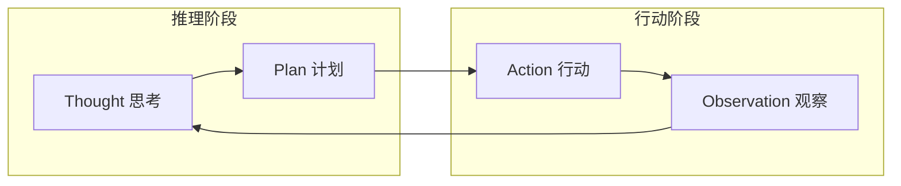
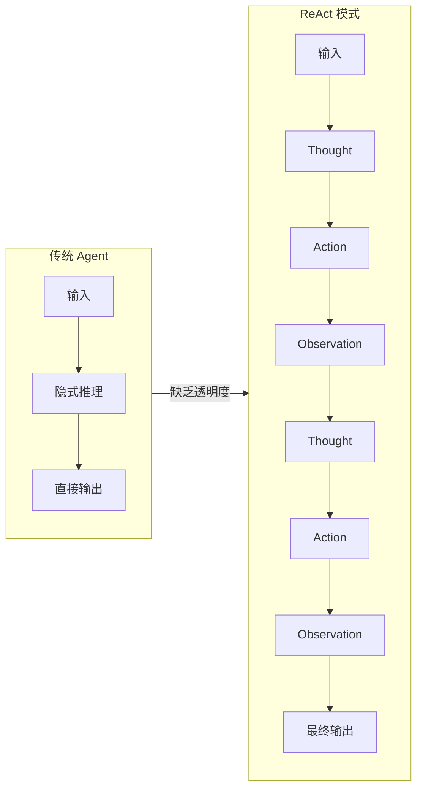
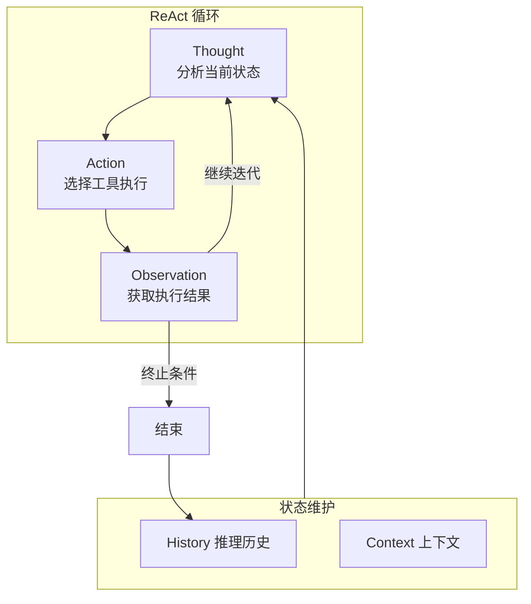
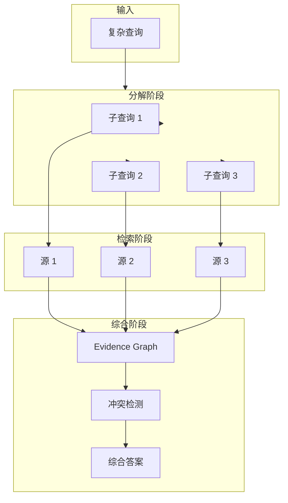
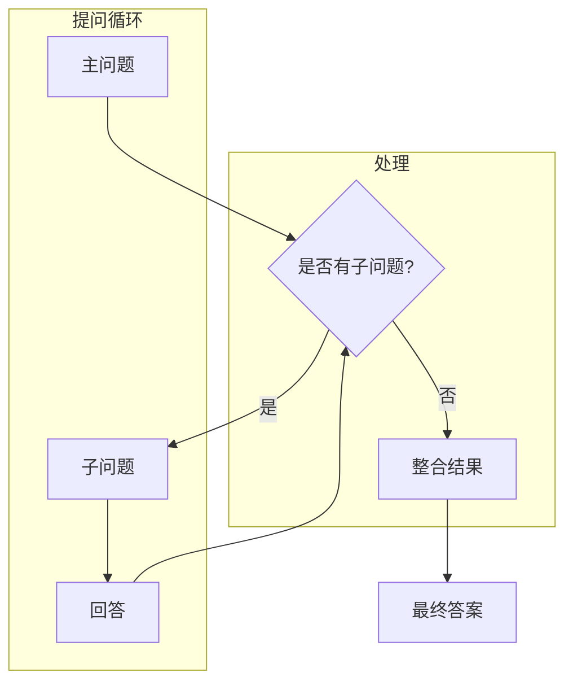

# ReAct 模式

## 1. 概述

ReAct (Synergizing Reasoning and Acting in Language Models) 是一种让大语言模型 (LLM) 能够交替进行**推理**和**行动**的模式。它通过将推理过程中的中间步骤外显化，使模型能够动态地规划、追踪和调整行动策略，从而更好地处理复杂的多步骤任务。



## 2. ReAct 模式原理

### 2.1 理论基础

ReAct 的核心创新在于将 **Reasoning** (推理) 和 **Acting** (行动) 交替进行，而非分离处理。这一思想源于认知科学中的"双重过程理论"：

| 理论来源 | 核心观点 | 在 ReAct 中的体现 |
|---------|---------|------------------|
| 双过程理论 | 系统1(直觉)与系统2(审慎)协作 | 交替进行快速推理与谨慎行动 |
| 内部 monologue | 思维内言指导行为 | `Thought` 字段作为外显的内部对话 |
| 工具使用理论 | 认知延伸通过外部工具 | `Action` 调用外部工具扩展能力 |

**数学表达**：

```
给定任务 T，ReAct 通过以下迭代过程求解：

P(t) = f_reasoning(H(t-1), T)     // 推理阶段：基于历史生成计划
A(t) = f_acting(P(t), Tools)       // 行动阶段：选择并执行工具
O(t) = execute(A(t))               // 观察阶段：获取工具返回结果
H(t) = H(t-1) ∪ {P(t), A(t), O(t)} // 状态更新

其中 f_reasoning 是 LLM 的推理函数
终止条件：O(t) 包含最终答案 或 |H(t)| > max_steps
```

### 2.2 与传统 Agent 的区别

| 特性 | 传统 Agent (ReAct 之前) | ReAct 模式 |
|-----|------------------------|-----------|
| **推理方式** | 隐式推理，最终输出 | 外显 Thought 过程 |
| **决策透明** | 黑盒决策 | 白盒，可追踪每步推理 |
| **错误恢复** | 难以定位失败原因 | 可精确定位失败步骤 |
| **多跳推理** | 难以处理链式问题 | 自然处理多跳问题 |
| **上下文利用** | 可能遗忘关键信息 | 完整保留历史轨迹 |

### 2.3 工作流对比



### 2.4 适用场景分析

**ReAct 最适合的场景**：

1. **多跳问答 (Multi-hop QA)**
   - 需要组合多个事实才能回答的问题
   - 示例：`"特斯拉 CEO 母亲的出生地是哪里？"`
   - 需要：找特斯拉CEO → 找其母亲 → 找出生地

2. **复杂工具调用**
   - 需要根据中间结果选择下一步工具
   - 示例：数据分析、代码调试、多API编排

3. **需要可解释性的任务**
   - 决策过程需要向用户解释
   - 示例：医疗诊断、法律咨询、金融分析

4. **开放世界交互**
   - 搜索、浏览、信息提取组合任务

**ReAct 不适合的场景**：

| 场景 | 原因 | 替代方案 |
|-----|------|---------|
| 简单问答 | 开销不必要 | 零样本或少样本 |
| 实时性要求高 | 循环延迟 | batch 模式预计算 |
| 高度结构化任务 | 规则更高效 | 基于规则引擎 |

## 3. ReAct 执行流程

### 3.1 Thought → Action → Observation 循环



### 3.2 状态追踪

ReAct 的核心是维护一个完整的**推理轨迹 (Reasoning Trace)**：

```typescript
interface ReActState {
  // 任务描述
  task: string;

  // 推理历史 (完整的 Thought-Action-Observation 链)
  history: ReActStep[];

  // 当前上下文摘要 (用于控制 token 长度)
  contextSummary: string;

  // 已使用的工具集合 (防止重复调用)
  usedTools: Set<string>;

  // 置信度评估
  confidence: number;

  // 错误计数 (用于触发重试)
  errorCount: number;
}

interface ReActStep {
  stepNumber: number;
  thought: string;      // 推理过程
  action: Action;        // 采取的行动
  observation: string;   // 观察结果
  timestamp: Date;
  duration?: number;     // 执行耗时
  error?: string;       // 错误信息 (如果有)
}
```

**状态演进示例**：

```
任务: "查找 2024 年获得诺贝尔物理学奖的科学家及其贡献"

Step 1:
  Thought: "我需要先搜索 2024 年诺贝尔物理学奖得主"
  Action: Search[query="2024 Nobel Prize Physics winner"]
  Observation: "2024 年诺贝尔物理学奖授予了 AI 领域的两位先驱..."

Step 2:
  Thought: "观察结果提到 AI 领域，但诺贝尔物理学奖通常颁发给物理学研究。
           我需要更精确的搜索。"
  Action: Search[query="2024 Nobel Prize Physics awarded to"]
  Observation: "2024 年诺贝尔物理学奖授予给 Pedro Gross..."

Step 3:
  Thought: "看来搜索结果不准确。让我直接查询诺贝尔奖官方网站。"
  Action: Browse[url="https://www.nobelprize.org/prizes/physics/2024/summary/"]
  Observation: "2024 年诺贝尔物理学奖授予给 Pierre Agostini, Ferenc Krausz, Anne L'Huillier，
               获奖理由：产生阿秒光脉冲用于研究电子动力学。"

Step 4 (终止):
  Thought: "我现在有了完整的答案。2024 年诺贝尔物理学奖授予三位科学家..."
  Action: Finalize[answer="..."]
  Observation: "任务完成"
```

### 3.3 终止条件

ReAct 需要明确的终止条件来避免无限循环：

| 终止类型 | 条件 | 实现 |
|---------|------|------|
| **成功终止** | 获得明确答案 | `observation.contains("<answer>")` |
| **最大步数** | 超过迭代上限 | `step >= max_steps` (通常 5-15) |
| **置信度阈值** | 达到高置信度 | `confidence >= 0.95` |
| **资源限制** | token/time 耗尽 | 预算耗尽时返回最佳答案 |
| **循环检测** | 检测重复模式 | `history` 中出现相似状态 |
| **工具失败** | 连续错误过多 | `errorCount >= max_errors` |

```typescript
// 终止条件检查
function shouldTerminate(state: ReActState): TerminationReason | null {
  // 1. 检查是否已有答案
  if (state.history.at(-1)?.observation.includes('[FINAL ANSWER]')) {
    return 'SUCCESS';
  }

  // 2. 检查最大步数
  if (state.history.length >= state.maxSteps) {
    return 'MAX_STEPS_EXCEEDED';
  }

  // 3. 检查循环
  if (isLooping(state.history)) {
    return 'LOOP_DETECTED';
  }

  // 4. 检查错误率
  if (state.errorCount >= 3) {
    return 'TOO_MANY_ERRORS';
  }

  // 5. 检查 token 预算
  if (estimateTokens(state) > state.maxTokens) {
    return 'TOKEN_BUDGET_EXCEEDED';
  }

  return null; // 继续循环
}
```

## 4. ReAct 实现详解

### 4.1 提示词工程

提示词是 ReAct 的核心，它需要明确指定三个关键部分：

```typescript
// 第 1 段：英文版 ReAct 提示词模板 —— 用「思考→行动→观察」的循环把大模型的推理与工具调用串起来
// 为什么这样写：ReAct 的核心是把模型输出结构化，让外部程序能按 Thought/Action/Observation 三段正则解析并回填工具结果。
// 关键数据流：{tools_description} 与 {task} 是占位符，需在运行时代码（如 .replace 或 format）中替换后才发给 LLM；这里只是字符串字面量，不会自动求值。
// 易错点：模板用反引号包裹，会原样保留换行与缩进；任何在反引号内新增的 `//` 都会被当成提示词正文发给模型，故本段内部不加行内注释。
const REACT_PROMPT_EN = `
You are a helpful assistant that uses the ReAct pattern to solve tasks.

You have access to the following tools:
{tools_description}

To use a tool, respond with the exact format:

Thought: <your reasoning about what to do next>
Action: <tool_name>[<input>]
Observation: <result of the action>

Follow this format for each step. When you have the final answer, respond:

Thought: I now know the final answer
Action: Final[<your answer>]
Observation: Task completed

Begin!

Task: {task}
`; // 结尾换行有意保留，便于拼接后续对话轮次而不粘连上一行

// 第 2 段：中文版 ReAct 提示词模板 —— 与英文版结构一一对应，仅自然语言部分本地化
// 为什么这样写：让模型用中文复述推理过程，降低中文任务的语义漂移；同时保留英文关键字 Thought/Action/Observation 以复用同一套解析器。
// 易错点：若解析器按关键字大小写或中英混排匹配，改动标题词（如把 Thought 译成「思考」）会导致解析失败，改动前需同步解析逻辑。
const REACT_PROMPT_ZH = `
你是一个使用 ReAct 模式解决问题的智能助手。

你有以下工具可用：
{tools_description}

使用工具时，请严格按照以下格式回复：

Thought: <你对下一步行动的推理>
Action: <工具名称>[<输入参数>]
Observation: <行动的结果>

获得最终答案时，请按以下格式回复：

Thought: 我现在知道最终答案了
Action: Final[<你的答案>]
Observation: 任务完成

现在开始！

任务: {task}
`; // 与英文版保持相同的结尾换行，确保两版替换/拼接逻辑可以共用
```
**高级提示词技巧**：

```typescript
// 第 1 段：声明 Few-shot 版 ReAct 提示词模板（用一个完整示例把"思考→行动→观察"循环演示给模型）
// 为什么：只给格式说明时，模型常在推理与工具调用之间脱节；用 in-context learning 塞一轮成功示例，等于把输出契约"演示"出来。
// 数据流：{tools_description}/{current_task} 是留给调用方做替换的占位符（刻意写花括号而非 ${}，避免模板定义时就被立即求值）；反引号负责原样保留换行与缩进。
// 易错点：示例里 Observation 必须紧跟 Action，否则模型会学成"跳过观察"；另外模板字符串内部不能加 // 注释，否则会被当成提示词正文注入，所以本段说明只能放在定义外部。
// 包含Few-shot示例的增强提示词
const REACT_PROMPT_FEW_SHOT = `
你是一个使用 ReAct 模式解决问题的智能助手。

你有以下工具可用：
{tools_description}

使用工具时，请严格按照以下格式回复：
Thought: <你的推理>
Action: <工具名>[<参数>]
Observation: <结果>

示例对话：

Task: 苹果公司的 CEO 是谁？
Thought: 我需要搜索苹果公司 CEO 的信息。
Action: Search["苹果公司 CEO"]
Observation: 蒂姆·库克（Tim Cook）是苹果公司的 CEO。

Task: {current_task}
`;

// 第 2 段：声明带思维链约束的提示词模板（零示例，仅用规则约束 Thought/Action 的行为）
// 为什么：与第 1 段是两种可切换策略——不给示例、只给规则，token 更省，适合任务分布简单或已知的场景。
// 关键点：规则 3、4 精准对抗 ReAct 的两大退化——原地打转（重复 Action）与过早放弃（搜不到就停），本质是"用自然语言写死的控制流"。
// 易错点：此处任务占位符是 {task}，与第 1 段的 {current_task} 命名不一致，替换时必须分别处理，否则会漏填导致任务为空。
// 带思维链约束的提示词
const REACT_PROMPT_CONSTRAINED = `
规则：
1. Thought 必须分析当前观察结果
2. Thought 必须解释为什么选择这个 Action
3. 不要重复相同的 Action
4. 如果三次搜索都没有找到信息，换一个搜索策略

可用工具：
{tools_description}

当前任务：{task}
`;
```
### 4.2 输出解析

ReAct 输出需要从 LLM 响应中精确提取 Thought、Action、Observation：

```typescript
// 正则表达式解析 ReAct 输出
const REACT_PATTERNS = {
  // 匹配 Thought 行
  thought: /Thought:\s*(.+?)(?=\nAction:|$)/is,

  // 匹配 Action 行
  action: /Action:\s*(\w+)\[(.+?)\]/,

  // 匹配 Observation 行
  observation: /Observation:\s*(.+?)(?=\n(?:Thought:|Action:)|$)/is,
};

interface ParsedReActOutput {
  thought: string;
  action: {
    name: string;
    args: string;
  };
  observation: string;
  isFinal: boolean;
}

function parseReActOutput(rawOutput: string): ParsedReActOutput {
  // 移除可能的 markdown 代码块
  const cleaned = rawOutput
    .replace(/^```(?:json|text)?\n?/gm, '')
    .replace(/```$/gm, '')
    .trim();

  const thoughtMatch = cleaned.match(REACT_PATTERNS.thought);
  const actionMatch = cleaned.match(REACT_PATTERNS.action);

  if (!thoughtMatch || !actionMatch) {
    throw new ParseError('Invalid ReAct format', cleaned);
  }

  const actionName = actionMatch[1];
  const actionArgs = actionMatch[2];

  return {
    thought: thoughtMatch[1].trim(),
    action: {
      name: actionName,
      args: actionArgs,
    },
    observation: extractObservation(cleaned, actionMatch.index! + actionMatch[0].length),
    isFinal: actionName === 'Final',
  };
}

function extractObservation(cleaned: string, startIndex: number): string {
  // 尝试从当前位置提取 Observation
  const remainder = cleaned.slice(startIndex);
  const obsMatch = remainder.match(/Observation:\s*(.+?)(?=\n(?:Thought:|Action:)|$)/is);

  if (obsMatch) {
    return obsMatch[1].trim();
  }

  // 如果没有找到显式的 Observation，假设 LLM 可能还没执行
  // 返回占位符，实际执行由外部处理
  return '[PENDING_EXECUTION]';
}
```

### 4.3 错误处理

```typescript
enum ReActErrorType {
  PARSE_ERROR = 'PARSE_ERROR',
  TOOL_NOT_FOUND = 'TOOL_NOT_FOUND',
  TOOL_EXECUTION_ERROR = 'TOOL_EXECUTION_ERROR',
  TIMEOUT = 'TIMEOUT',
  INVALID_RESPONSE = 'INVALID_RESPONSE',
  MAX_RETRIES_EXCEEDED = 'MAX_RETRIES_EXCEEDED',
}

class ReActError extends Error {
  constructor(
    public type: ReActErrorType,
    message: string,
    public context?: Partial<ReActState>
  ) {
    super(message);
    this.name = 'ReActError';
  }
}

// 错误处理策略
const ERROR_STRATEGIES: Record<ReActErrorType, ErrorHandler> = {
  [ReActErrorType.PARSE_ERROR]: {
    recovery: async (error, state) => {
      // 尝试更宽松的解析模式
      return tryFallbackParsing(error.context?.rawOutput);
    },
    maxRetries: 2,
  },

  [ReActErrorType.TOOL_NOT_FOUND]: {
    recovery: async (error, state) => {
      // 重新生成 Action，避开未知工具
      return regenerateAction(state, error.toolName);
    },
    maxRetries: 3,
  },

  [ReActErrorType.TOOL_EXECUTION_ERROR]: {
    recovery: async (error, state) => {
      // 重试或更换工具
      return retryOrFallback(state, error.toolName);
    },
    maxRetries: 2,
  },

  [ReActErrorType.TIMEOUT]: {
    recovery: async (error, state) => {
      // 缩短超时，增加重试
      return retryWithTimeout(state, 5000);
    },
    maxRetries: 1,
  },
};
```

### 4.4 重试机制

```typescript
// 第 1 段：重试策略的可调参数（类骨架）
// 把重试上限与基础退避时长抽成实例字段，而不是把魔法数字散落在 executeWithRetry 内部，
// 这样子类或单元测试可以覆写它们来压缩等待时间。
class ReActExecutor {
  private maxRetries: number = 3;
  private baseDelay: number = 1000;

  // 第 2 段：重试入口 —— 状态初始化
  // attempt 同时承担两个角色：循环计数器与退避指数（2^(attempt-1)），
  // 因此它必须在 catch 里先自增再使用，否则退避会整体少一档。
  // lastError 声明在循环外，因为循环正常退出（break 或次数耗尽）后还要靠它组织最终错误信息。
  async executeWithRetry(
    task: string,
    options: ReActOptions = {}
  ): Promise<ReActResult> {
    let attempt = 0;
    let lastError: Error | null = null;

    // 第 3 段：单次尝试与错误回调注入
    // 把 handleError 包成箭头函数传给 execute，等于把"错误处理"下沉进执行器内部，
    // 让它能在 ReAct 循环中途就把错误写进 history，而不是等整个 execute 抛出后才补救。
    // 易错点：箭头函数返回的是 Promise，若 execute 侧不 await 它，onError 会变成游离 Promise。
    // 另外 `...options` 放在前面，保证注入的 onError 一定覆盖调用方传入的同名回调。
    while (attempt < this.maxRetries) {
      try {
        return await this.execute(task, {
          ...options,
          onError: (error, state) => this.handleError(error, state, attempt),
        });
      } catch (error) {
        // 第 4 段：失败后的退避与继续/终止判定
        // 关键顺序：先自增 attempt 再交给 shouldRetry——两条判据（策略自身的 maxRetries、
        // 全局 maxRetries）都依赖自增后的值，顺序反了会多跑一轮。
        // 只有 shouldRetry 放行才 sleep 再 continue，否则立即 break，
        // 避免对不可重试的错误白白浪费一次退避等待（这也是本段的时间复杂度意义所在）。
        lastError = error as Error;
        attempt++;

        if (this.shouldRetry(error, attempt)) {
          // 指数退避序列：1s、2s、4s……减 1 是为了让首次重试只等一个 baseDelay
          await this.delay(this.baseDelay * Math.pow(2, attempt - 1));
          continue;
        }
        break;
      }
    }

    // 第 5 段：循环出口统一收口为领域错误
    // 走到这里意味着要么 break（不可重试），要么 while 条件不成立（次数耗尽），
    // 两种情况对外都归一化成 MAX_RETRIES_EXCEEDED，并带上 task 供上游定位。
    // lastError 用可选链兜底，覆盖"一次都没进入循环"（如 maxRetries <= 0）的边界情况。
    throw new ReActError(
      ReActErrorType.MAX_RETRIES_EXCEEDED,
      `Failed after ${attempt} attempts: ${lastError?.message}`,
      { task }
    );
  }

  // 第 6 段：把错误翻译成 LLM 可见的历史条目
  // 目的不是记录日志，而是让后续推理步骤"知道刚才失败过"，从而换方向重试；
  // 数据流：error → strategy 查表（决定是否值得记录）→ push 进 state.history。
  // stepNumber 用 history.length + 1 推导，说明 history 被当作按时间追加的单向日志。
  // attempt 参数当前未参与写入，保留是为将来按尝试次数调整提示策略留出扩展点。
  private async handleError(
    error: ReActError,
    state: ReActState,
    attempt: number
  ): Promise<void> {
    const strategy = ERROR_STRATEGIES[error.type];
    if (!strategy) return; // 未登记策略的错误类型直接忽略，避免污染 history

    // 添加错误信息到历史
    state.history.push({
      stepNumber: state.history.length + 1,
      thought: `遇到错误：${error.message}，尝试恢复...`,
      action: { name: 'ErrorRecovery', args: '' },
      observation: `错误类型: ${error.type}`,
      error: error.message,
    });
  }

  // 第 7 段：重试判定的双阈值语义
  // ReActError 走"按错误类型细分"的策略表：限流、格式错、超时等容忍次数各不相同；
  // 非 ReActError（未知异常）则退回全局 maxRetries 这个保守默认值。
  // 两个分支都用 `<` 而非 `<=`，所以 attempt 等于阈值时即停止重试，实际最多重试 maxRetries 次。
  // 注意策略表缺项时 `strategy && ...` 返回的是 undefined 而非 false，调用方按假值处理即可。
  private shouldRetry(error: Error, attempt: number): boolean {
    if (error instanceof ReActError) {
      const strategy = ERROR_STRATEGIES[error.type];
      return strategy && attempt < strategy.maxRetries;
    }
    return attempt < this.maxRetries;
  }

  // 第 8 段：基于 setTimeout 的最小异步休眠
  // 用 Promise 包一层是为了让调用方用 await 表达时序，同时不阻塞事件循环；
  // 边界：ms <= 0 时 setTimeout 会按 0 处理并立即触发，不会抛错，因此退避计算即使溢出也只会退化为"不休眠"。
  private delay(ms: number): Promise<void> {
    return new Promise(resolve => setTimeout(resolve, ms));
  }
}
```
## 5. ReAct 变体

### 5.1 ReAct-Syntha (知识综合)

ReAct-Syntha 是 ReAct 的扩展，专门用于从多个信息源综合知识：



**关键特点**：

**关键特点**：
- 自动分解复杂查询为子查询
- 并行从多个源获取信息
- 使用证据图 (Evidence Graph) 关联信息
- 支持冲突检测和消解

### 5.2 ReAct-Web (网络交互)

ReAct-Web 专门优化了网络搜索和浏览场景：

```typescript
// ReAct-Web 的专用工具集
const REACT_WEB_TOOLS = {
  // 搜索引擎
  web_search: {
    description: 'Search the web for information',
    parameters: {
      query: { type: 'string', description: 'Search query' },
      num_results: { type: 'number', default: 5 },
    },
  },

  // 页面访问
  visit_page: {
    description: 'Visit a URL and extract relevant information',
    parameters: {
      url: { type: 'string' },
      query: { type: 'string', description: 'What to look for' },
    },
  },

  // 链接提取
  find_links: {
    description: 'Extract all links from a page',
    parameters: {
      url: { type: 'string' },
    },
  },

  // 事实核查
  fact_check: {
    description: 'Verify a claim against reliable sources',
    parameters: {
      claim: { type: 'string' },
    },
  },
};

// ReAct-Web 的 Thought 模板
const REACT_WEB_THOUGHT_TEMPLATE = `
Consider what information you need to answer: {query}

Current understanding: {current_knowledge}

Gaps in knowledge:
{gaps}

Next action should:
1. Fill the most critical gap
2. Use the most reliable source
3. Avoid redundant searches
`;
```

### 5.3 PlanReAct (计划驱动的 ReAct)

PlanReAct 在执行前先生成显式计划，然后按计划执行：

```typescript
// PlanReAct 两阶段执行

interface PlanReActState {
  // 阶段1：计划
  plan: Plan | null;
  planningComplete: boolean;

  // 阶段2：执行
  currentStep: number;
  executionHistory: ExecutionStep[];

  // 共享状态
  task: string;
  finalAnswer: string | null;
}

interface Plan {
  goal: string;
  steps: PlanStep[];
  dependencies: Map<string, string[]>;  // step -> depends_on
  estimatedSteps: number;
}

interface PlanStep {
  id: string;
  description: string;
  tool: string;
  expectedOutput: string;
  status: 'pending' | 'in_progress' | 'completed' | 'failed';
}

// PlanReAct 执行流程
async function planReactExecute(task: string): Promise<string> {
  const state: PlanReActState = {
    task,
    plan: null,
    planningComplete: false,
    currentStep: 0,
    executionHistory: [],
    finalAnswer: null,
  };

  // 阶段1：规划
  state.plan = await generatePlan(task);

  // 验证计划可行性
  if (!validatePlan(state.plan)) {
    // 如果计划不可行，重新规划
    state.plan = await refinePlan(state.plan, task);
  }

  state.planningComplete = true;

  // 阶段2：按依赖顺序执行
  const executionOrder = topologicalSort(state.plan);

  for (const step of executionOrder) {
    const result = await executePlanStep(step, state);
    state.executionHistory.push(result);

    if (result.failed) {
      // 失败处理：重试或调整计划
      const recovery = await handleStepFailure(step, result.error, state);
      if (!recovery.success) {
        throw new Error(`Plan execution failed: ${result.error}`);
      }
    }
  }

  return state.finalAnswer!;
}
```

### 5.4 Self-Ask (自我提问)

Self-Ask 是 ReAct 的简化变体，专注于通过自我提问来分解问题：



**与 ReAct 的对比**：

**与 ReAct 的对比**：

| 特性 | ReAct | Self-Ask |
|-----|-------|----------|
| 推理标记 | Thought | Are there follow-up questions? |
| 行动标记 | Action | Q: / A: |
| 工具调用 | 显式 | 隐式 (通过追问) |
| 复杂度 | 高 | 低 |
| 适用场景 | 工具编排 | 简单多跳问答 |

## 6. 代码实现示例

### 6.1 TypeScript 实现

```typescript
import OpenAI from 'openai';

// ============ 类型定义 ============

interface Tool {
  name: string;
  description: string;
  parameters: Record<string, ToolParameter>;
  execute: (args: Record<string, unknown>) => Promise<string>;
}

interface ToolParameter {
  type: 'string' | 'number' | 'boolean' | 'object';
  description?: string;
  required?: boolean;
  default?: unknown;
}

interface ReActStep {
  stepNumber: number;
  thought: string;
  action: string;
  actionArgs: string;
  observation: string;
  error?: string;
}

interface ReActState {
  task: string;
  history: ReActStep[];
  tools: Map<string, Tool>;
  maxSteps: number;
  maxTokens: number;
}

interface ReActOptions {
  maxSteps?: number;
  maxTokens?: number;
  temperature?: number;
  model?: string;
}

// ============ 核心 ReAct 类 ============

class ReActAgent {
  private client: OpenAI;
  private systemPrompt: string;

  constructor(
    apiKey: string,
    private tools: Tool[],
    private model: string = 'gpt-4-turbo'
  ) {
    this.client = new OpenAI({ apiKey });
    this.systemPrompt = this.buildSystemPrompt();
  }

  // 构建系统提示词
  private buildSystemPrompt(): string {
    const toolsDescription = this.tools
      .map(t => `- ${t.name}: ${t.description}`)
      .join('\n');

    return `You are a ReAct agent that solves tasks through reasoning and acting.

You have access to the following tools:
${toolsDescription}

Follow the ReAct format strictly:
Thought: <your reasoning about what to do next>
Action: <tool_name>[<arguments>]
Observation: <result of the action>

When you have the final answer, use:
Thought: I now have the answer
Action: Final[<your answer>]
Observation: Task completed`;
  }

  // 执行 ReAct 循环
  async execute(task: string, options: ReActOptions = {}): Promise<string> {
    const state: ReActState = {
      task,
      history: [],
      tools: new Map(this.tools.map(t => [t.name, t])),
      maxSteps: options.maxSteps ?? 10,
      maxTokens: options.maxTokens ?? 4000,
    };

    let iteration = 0;

    while (iteration < state.maxSteps) {
      try {
        // 生成下一步
        const response = await this.generateNextStep(state);

        // 解析响应
        const { thought, action, actionArgs, isFinal } = this.parseResponse(response);

        // 执行行动
        const observation = isFinal
          ? await this.handleFinal(state, actionArgs)
          : await this.executeAction(state, action, actionArgs);

        // 记录历史
        state.history.push({
          stepNumber: iteration + 1,
          thought,
          action,
          actionArgs,
          observation,
        });

        // 检查是否终止
        if (isFinal) {
          return actionArgs;
        }

        iteration++;
      } catch (error) {
        // 错误处理
        const errorMessage = error instanceof Error ? error.message : 'Unknown error';
        state.history.push({
          stepNumber: iteration + 1,
          thought: `Error occurred: ${errorMessage}`,
          action: 'ERROR',
          actionArgs: '',
          observation: errorMessage,
          error: errorMessage,
        });

        // 根据错误类型决定是否继续
        if (this.shouldTerminateOnError(error)) {
          return this.generateFallbackAnswer(state);
        }

        iteration++;
      }
    }

    // 达到最大步数，返回最佳答案
    return this.generateFallbackAnswer(state);
  }

  // 生成下一步推理
  private async generateNextStep(state: ReActState): Promise<string> {
    const messages = this.buildMessages(state);

    const response = await this.client.chat.completions.create({
      model: this.model,
      messages,
      temperature: 0.7,
      max_tokens: 1000,
    });

    return response.choices[0]?.message?.content ?? '';
  }

  // 构建消息上下文
  private buildMessages(state: ReActState): OpenAI.Chat.ChatCompletionMessageParam[] {
    const messages: OpenAI.Chat.ChatCompletionMessageParam[] = [
      { role: 'system', content: this.systemPrompt },
    ];

    // 添加任务
    messages.push({
      role: 'user',
      content: `Task: ${state.task}`,
    });

    // 添加历史
    for (const step of state.history) {
      messages.push({
        role: 'assistant',
        content: `Thought: ${step.thought}\nAction: ${step.action}[${step.actionArgs}]`,
      });

      messages.push({
        role: 'user',
        content: `Observation: ${step.observation}`,
      });
    }

    return messages;
  }

  // 解析 LLM 响应
  private parseResponse(response: string): {
    thought: string;
    action: string;
    actionArgs: string;
    isFinal: boolean;
  } {
    const thoughtMatch = response.match(/Thought:\s*(.+?)(?=\nAction:|$)/is);
    const actionMatch = response.match(/Action:\s*(\w+)\[(.+?)\]/);

    if (!thoughtMatch || !actionMatch) {
      throw new Error(`Failed to parse ReAct response: ${response}`);
    }

    return {
      thought: thoughtMatch[1].trim(),
      action: actionMatch[1],
      actionArgs: actionMatch[2].trim(),
      isFinal: actionMatch[1] === 'Final',
    };
  }

  // 执行工具
  private async executeAction(
    state: ReActState,
    toolName: string,
    args: string
  ): Promise<string> {
    const tool = state.tools.get(toolName);

    if (!tool) {
      throw new Error(`Tool not found: ${toolName}`);
    }

    // 解析参数 (假设是 JSON 字符串或简单字符串)
    let parsedArgs: Record<string, unknown>;
    try {
      parsedArgs = JSON.parse(args);
    } catch {
      // 如果不是 JSON，假设是单个字符串参数
      parsedArgs = { input: args };
    }

    try {
      return await tool.execute(parsedArgs);
    } catch (error) {
      throw new Error(`Tool execution failed: ${error}`);
    }
  }

  // 处理最终答案
  private async handleFinal(state: ReActState, answer: string): Promise<string> {
    state.history.push({
      stepNumber: state.history.length + 1,
      thought: 'Final answer obtained',
      action: 'Final',
      actionArgs: answer,
      observation: 'Task completed',
    });

    return answer;
  }

  // 错误处理
  private shouldTerminateOnError(error: unknown): boolean {
    if (error instanceof Error) {
      // 某些错误应该终止
      return error.message.includes('INVALID_API_KEY');
    }
    return false;
  }

  // 生成后备答案
  private generateFallbackAnswer(state: ReActState): string {
    // 从历史中提取最佳答案
    const lastStep = state.history[state.history.length - 1];
    return lastStep?.observation ?? 'Could not complete the task';
  }
}

// ============ 使用示例 ============

// 定义工具
const searchTool: Tool = {
  name: 'Search',
  description: 'Search for information on the web',
  parameters: {
    query: { type: 'string', description: 'Search query' },
  },
  execute: async (args) => {
    // 实现搜索逻辑
    const response = await fetch(
      `https://api.search.example.com?q=${encodeURIComponent(args.query as string)}`
    );
    const data = await response.json();
    return JSON.stringify(data.results);
  },
};

const calculatorTool: Tool = {
  name: 'Calculator',
  description: 'Perform calculations',
  parameters: {
    expression: { type: 'string', description: 'Mathematical expression' },
  },
  execute: async (args) => {
    // 安全计算
    const result = eval(args.expression as string);
    return String(result);
  },
};

// 创建 Agent
const agent = new ReActAgent('your-api-key', [searchTool, calculatorTool]);

// 执行任务
const result = await agent.execute(
  'Search for the population of Tokyo and calculate its density if the area is 2194 km²'
);

console.log(result);
```

### 6.2 Python/LangChain 实现

```python
from langchain.agents import AgentType, initialize_agent
from langchain.agents.agent import AgentExecutor
from langchain.agents.react.base import ReActChain
from langchain.callbacks.manager import CallbackManager
from langchain.chat_models import ChatOpenAI
from langchain.tools import Tool, BaseTool
from langchain.schema import SystemMessage, HumanMessage
from typing import List, Optional, Any
import re


class ReActAgentPy:
    """Python ReAct Agent 实现"""

    def __init__(
        self,
        api_key: str,
        tools: List[BaseTool],
        model: str = "gpt-4-turbo",
        max_iterations: int = 10,
        max_tokens: int = 2000,
    ):
        self.llm = ChatOpenAI(
            model=model,
            openai_api_key=api_key,
            temperature=0.7,
            max_tokens=max_tokens,
        )
        self.tools = {tool.name: tool for tool in tools}
        self.max_iterations = max_iterations
        self.history = []

    def build_prompt(self, task: str) -> List:
        """构建 ReAct 提示词"""
        tools_desc = "\n".join(
            f"- {name}: {tool.description}"
            for name, tool in self.tools.items()
        )

        return [
            SystemMessage(content=f"""You are a ReAct agent.

You have access to these tools:
{tools_desc}

Follow the ReAct format exactly:
Thought: <your reasoning>
Action: <tool_name>[<arguments>]
Observation: <result>

When you have the answer:
Thought: I now know the answer
Action: Final[<answer>]
Observation: Task completed"""),
            HumanMessage(content=f"Task: {task}"),
        ]

    def parse_response(self, response: str) -> dict:
        """解析 LLM 响应"""
        thought_match = re.search(r"Thought:\s*(.+?)(?=\nAction:|$)", response, re.DOTALL)
        action_match = re.search(r"Action:\s*(\w+)\[(.+?)\]", response)

        if not thought_match or not action_match:
            raise ValueError(f"Failed to parse: {response}")

        return {
            "thought": thought_match.group(1).strip(),
            "action": action_match.group(1),
            "args": action_match.group(2).strip(),
        }

    def execute(self, task: str) -> str:
        """执行 ReAct 循环"""
        messages = self.build_prompt(task)
        iteration = 0

        while iteration < self.max_iterations:
            # 调用 LLM
            response = self.llm(messages)
            content = response.content

            # 解析响应
            parsed = self.parse_response(content)
            thought = parsed["thought"]
            action = parsed["action"]
            args = parsed["args"]

            # 执行工具
            if action == "Final":
                return args

            if action not in self.tools:
                observation = f"Error: Tool {action} not found"
            else:
                try:
                    observation = self.tools[action].run(args)
                except Exception as e:
                    observation = f"Error executing tool: {str(e)}"

            # 记录历史
            self.history.append({
                "step": iteration + 1,
                "thought": thought,
                "action": action,
                "args": args,
                "observation": observation,
            })

            # 添加到消息历史
            messages.append(HumanMessage(content=content))
            messages.append(HumanMessage(content=f"Observation: {observation}"))

            iteration += 1

        return self._generate_fallback()

    def _generate_fallback(self) -> str:
        """生成后备答案"""
        if self.history:
            last_obs = self.history[-1]["observation"]
            if last_obs and "Error" not in last_obs:
                return last_obs
        return "Could not complete the task"


# ============ 使用 LangChain 内置 ReAct ============

from langchain.agents import load_tools, initialize_agent


def use_langchain_react():
    """使用 LangChain 内置的 ReAct 链"""

    # 初始化 LLM
    llm = ChatOpenAI(
        model="gpt-4-turbo",
        openai_api_key="your-api-key",
        temperature=0.7,
    )

    # 加载内置工具
    tools = load_tools(["serpapi", "llm-math"], llm=llm)

    # 初始化 ReAct 代理
    agent = initialize_agent(
        tools=tools,
        llm=llm,
        agent=AgentType.REACT_DOCSTORE,
        verbose=True,
        max_iterations=10,
    )

    # 执行任务
    result = agent.run(
        "Who is the current CEO of Apple? What is their age raised to the power of 2?"
    )

    return result


# ============ 自定义工具示例 ============

from langchain.tools import tool


@tool
def search_web(query: str) -> str:
    """Search the web for information."""
    # 实现搜索逻辑
    pass


@tool
def calculate(expression: str) -> str:
    """Perform a calculation."""
    try:
        result = eval(expression)
        return str(result)
    except Exception as e:
        return f"Error: {e}"


# 创建自定义工具集
custom_tools = [
    Tool(
        name="Search",
        func=search_web.run,
        description="Search the web for information about a topic",
    ),
    Tool(
        name="Calculator",
        func=calculate.run,
        description="Use for mathematical calculations",
    ),
]

# 创建 Agent
agent = ReActAgentPy(
    api_key="your-api-key",
    tools=custom_tools,
    max_iterations=10,
)

# 执行任务
result = agent.execute(
    "What is the population of Japan? Calculate how many times larger China is."
)
```

### 6.3 提示词模板

```typescript
// ReAct 提示词模板集合

// ============ 基础模板 ============
const reactPromptBase = `You are a helpful AI assistant that uses the ReAct (Reasoning + Acting) pattern.

The ReAct pattern involves:
1. Reasoning about the current state
2. Taking an action (using a tool)
3. Observing the result
4. Repeating until the task is complete

Available tools:
{tools}

Output format:
Thought: <your reasoning>
Action: <tool_name>[<arguments>]
Observation: <result from the tool>

When you have the final answer:
Thought: I now know the answer
Action: Final[<your complete answer>]
`;

// ============ 带少样本示例的模板 ============
const reactPromptFewShot = `You are an expert problem solver using the ReAct pattern.

## Format
Thought: <reasoning>
Action: <tool>[<args>]
Observation: <result>

## Tools
{tools}

## Examples

Task: What is 15 + 27?
Thought: I need to calculate the sum of 15 and 27.
Action: Calculator[15 + 27]
Observation: 42
Thought: I now know the answer
Action: Final[42]

Task: Who wrote the novel "1984"?
Thought: The user is asking about the author of a famous novel. I should search for this information.
Action: Search["author of novel 1984"]
Observation: George Orwell wrote the novel "1984".
Thought: I now know the answer
Action: Final[George Orwell]

Task: {task}
`;

// ============ 中文模板 ============
const reactPromptChinese = `你是一个使用 ReAct（推理+行动）模式的智能助手。

## 模式说明
1. Thought（思考）：分析当前情况，决定下一步行动
2. Action（行动）：调用工具执行操作
3. Observation（观察）：获取行动结果
4. 重复直到任务完成

## 可用工具
{tools}

## 输出格式
Thought: <你的推理过程>
Action: <工具名>[<参数>]
Observation: <工具返回结果>

获得最终答案时：
Thought: 我现在知道答案了
Action: Final[<完整答案>]

## 示例

任务：北京的面积是多少平方公里？
思考：用户想知道北京的面积，这是一个地理信息问题，我需要搜索。
行动：Search[北京面积 平方公里]
观察：北京的总面积约为16410平方公里。
思考：我现在知道答案了
行动：Final[约16410平方公里]

开始执行任务！
任务：{task}
`;

// ============ 代码调试专用模板 ============
const reactPromptDebug = `You are debugging the following code:

\`\`\`
{code}
\`\`\`

Error message:
{error}

Use the ReAct pattern to debug:

Thought: <analyze the error and code>
Action: <tool>[<args>]
Observation: <result>

Debug tools available:
{tools}

Common debugging strategies:
1. Check for syntax errors first
2. Verify variable types and values
3. Test individual functions
4. Add logging to trace execution
5. Check external dependencies

Begin debugging!
`;

// ============ 数据分析专用模板 ============
const reactPromptDataAnalysis = `You are a data analyst using the ReAct pattern.

## Task
Analyze the following dataset:
{data_description}

## Available Tools
{tools}

## Analysis Workflow
1. First, understand the data structure
2. Identify relevant columns for the analysis
3. Perform calculations or transformations
4. Generate insights

Follow ReAct format strictly:
Thought: <analysis step>
Action: <tool>[<parameters>]
Observation: <result>

Begin analysis!
`;
```

## 7. 最佳实践

### 7.1 提示词优化

#### 7.1.1 清晰的指令结构

```typescript
// 好的提示词结构
const optimizedPrompt = `
# 角色定义
你是一个专业的{domain}助手，使用 ReAct 模式解决问题。

# 模式说明
- Thought: 分析当前状态，决定下一步
- Action: 调用工具（格式：工具名[参数]）
- Observation: 获取结果
- Final: 输出最终答案

# 约束规则
1. {constraint_1}
2. {constraint_2}
3. {constraint_3}

# 示例
{examples}

# 任务
{task}
`.trim();

// 不好的提示词示例
const badPrompt = `
You are smart. Use tools. Think carefully. Be helpful.
`.trim();
```

#### 7.1.2 Few-shot 示例设计

```typescript
// 示例设计原则
const exampleDesign = {
  // 1. 选择代表性示例
  representative: [
    // 简单案例
    { task: "1+1=?", steps: [...] },
    // 中等复杂度
    { task: "查找 X 的 Y", steps: [...] },
    // 边界情况
    { task: "无解的问题", steps: [...] },
  ],

  // 2. 包含错误恢复示例
  errorRecovery: [
    {
      error: "工具未找到",
      thought: "工具 A 不可用，尝试工具 B",
      action: "ToolB[args]",
    },
  ],

  // 3. 覆盖不同工具组合
  toolCombinations: [
    { tools: ["Search"], task: "..." },
    { tools: ["Search", "Calculate"], task: "..." },
    { tools: ["Search", "Browse", "Extract"], task: "..." },
  ],
};
```

### 7.2 工具设计

#### 7.2.1 工具接口规范

```typescript
interface ToolDefinition {
  // 工具名称：小写+下划线，描述性
  name: string;

  // 详细描述：说明功能、参数、返回值
  description: string;

  // 参数模式：JSON Schema
  parameters: {
    type: 'object';
    properties: Record<string, ParameterSchema>;
    required: string[];
    additionalProperties?: boolean;
  };

  // 执行函数
  execute: (args: Record<string, unknown>) => Promise<ToolResult>;
}

interface ParameterSchema {
  type: 'string' | 'number' | 'boolean' | 'array' | 'object';
  description: string;
  enum?: unknown[];
  default?: unknown;
  minimum?: number;
  maximum?: number;
  pattern?: string;  // 正则表达式
}

// 工具命名规范
const toolNaming = {
  // 动宾结构：动词 + 名词
  good: [
    'search_web',
    'calculate_sum',
    'get_user_info',
    'send_email',
    'read_file',
  ],

  // 避免使用
  bad: [
    'search',           // 太笼统
    'do_something',     // 不明确
    'handle',           // 动词不清
    'process_data_x',   // 缩写不清晰
  ],
};
```

#### 7.2.2 工具错误处理

```typescript
class RobustTool implements Tool {
  name = 'robust_search';
  description = 'Search for information';

  async execute(args: { query: string }): Promise<string> {
    try {
      // 验证输入
      if (!args.query || args.query.trim().length === 0) {
        return JSON.stringify({
          success: false,
          error: 'Query cannot be empty',
          results: [],
        });
      }

      // 执行搜索
      const results = await this.performSearch(args.query);

      // 返回结构化结果
      return JSON.stringify({
        success: true,
        results,
        metadata: {
          query: args.query,
          count: results.length,
          timestamp: new Date().toISOString(),
        },
      });
    } catch (error) {
      // 错误规范化
      return JSON.stringify({
        success: false,
        error: error instanceof Error ? error.message : 'Unknown error',
        results: [],
      });
    }
  }

  private async performSearch(query: string): Promise<unknown[]> {
    // 实现搜索逻辑
  }
}
```

### 7.3 状态管理

#### 7.3.1 状态持久化

```typescript
interface ReActStateStore {
  // 保存状态
  save(state: ReActState): Promise<void>;

  // 加载状态
  load(sessionId: string): Promise<ReActState>;

  // 更新状态
  update(sessionId: string, updates: Partial<ReActState>): Promise<void>;

  // 删除状态
  delete(sessionId: string): Promise<void>;

  // 列出所有会话
  list(): Promise<SessionInfo[]>;
}

// 内存状态存储
class InMemoryStateStore implements ReActStateStore {
  private states: Map<string, ReActState> = new Map();

  async save(state: ReActState): Promise<void> {
    const key = state.sessionId ?? crypto.randomUUID();
    this.states.set(key, {
      ...state,
      sessionId: key,
      updatedAt: new Date(),
    });
  }

  async load(sessionId: string): Promise<ReActState> {
    const state = this.states.get(sessionId);
    if (!state) {
      throw new Error(`Session not found: ${sessionId}`);
    }
    return state;
  }

  async update(sessionId: string, updates: Partial<ReActState>): Promise<void> {
    const current = await this.load(sessionId);
    const updated = { ...current, ...updates, updatedAt: new Date() };
    this.states.set(sessionId, updated);
  }

  async delete(sessionId: string): Promise<void> {
    this.states.delete(sessionId);
  }

  async list(): Promise<SessionInfo[]> {
    return Array.from(this.states.entries()).map(([id, state]) => ({
      sessionId: id,
      task: state.task,
      createdAt: state.createdAt,
      updatedAt: state.updatedAt,
      steps: state.history.length,
    }));
  }
}
```

#### 7.3.2 状态压缩

当上下文过长时，需要压缩历史状态：

```typescript
function compressState(state: ReActState, maxSteps: number = 5): ReActState {
  if (state.history.length <= maxSteps) {
    return state;
  }

  // 保留最近的 N 步
  const recentSteps = state.history.slice(-maxSteps);

  // 总结早期步骤
  const summarizedHistory = summarizeHistory(
    state.history.slice(0, -maxSteps)
  );

  return {
    ...state,
    history: [summarizedHistory, ...recentSteps],
    contextSummary: generateContextSummary(state),
  };
}

function summarizeHistory(steps: ReActStep[]): ReActStep {
  return {
    stepNumber: 0,  // 标记为总结
    thought: `Completed ${steps.length} steps:` +
      steps.slice(0, 3).map(s => s.thought.substring(0, 50)).join('; ') +
      (steps.length > 3 ? '...' : ''),
    action: 'SUMMARIZED',
    actionArgs: '',
    observation: `Retrieved ${steps.length} pieces of information`,
  };
}
```

#### 7.3.3 状态可视化

```typescript
// 第 1 段：定义日志记录的“行格式”，即对外输出契约
// 之所以单独抽出这个扁平接口，是因为日志最终要落盘或上报（JSON），必须是可序列化的纯数据；
// 同时固定字段集合让下游可以按列解析，无需针对不同事件写分支判断。
// 状态追踪日志格式
interface StateLog {
  timestamp: string; // 统一用 ISO 8601 字符串而非 Date：避免跨时区、跨进程序列化时的歧义与隐式转换
  sessionId: string; // 会话主键：同一 session 的所有事件可据此聚合、排序、回放
  event: 'START' | 'STEP' | 'ERROR' | 'COMPLETE' | 'ABORT'; // 字面量联合而非 enum：编译期可穷尽校验，运行时零额外开销
  stepNumber?: number; // 可选：START/COMPLETE 这类“非步骤”事件天然没有步号
  thought?: string;
  action?: string;
  observation?: string;
  error?: string;

  // 第 2 段：指标快照（可选子对象）
  // 把三个指标打包成一个对象而非平铺到顶层，好处是整体缺失时用 `metrics === undefined` 一次判断即可，
  // 也便于将来新增指标而不污染上面那些语义字段。
  metrics?: {
    tokenUsage: number; // 累计 token，具体口径由上游约定，本函数只做透传
    duration: number; // 耗时，单位由上游约定（通常是毫秒）
    memoryUsage: number; // 内存占用快照，不同 JS 运行时的量纲可能不一致
  };
}

// 第 3 段：纯函数式转换——把运行中的 ReActState 拍平成一条条日志
// 设计要点：不修改入参、不产生副作用，只读取 state 并返回全新数组，
// 因此可以在任意时刻（含并发）安全重复调用；时间复杂度 O(n)，n = state.history.length。
// 输出数组的顺序即时间顺序，读者只需顺序扫描就能重建一次推理轨迹。
// 输出格式化日志
function formatStateLog(state: ReActState): StateLog[] {
  // 第 4 段：先落 START 事件，作为整段回放的时间原点
  // 关键点：START 的 metrics 显式填 0 而不是留空，保证下游读取 metrics.tokenUsage 时永远不必判空；
  // startedAt 是非可选字段，所以这里无需条件分支，函数必然至少产生一条记录。
  const logs: StateLog[] = [{
    timestamp: state.startedAt.toISOString(),
    sessionId: state.sessionId,
    event: 'START',
    metrics: { tokenUsage: 0, duration: 0, memoryUsage: 0 },
  }];

  // 第 5 段：逐条把 history 中的步骤映射为一条日志行
  // 用 event 字段区分 ERROR/STEP，而不是拆成两个数组：保持单一有序事件流，
  // 下游按时间排序后即可还原“思考 → 行动 → 观察”的真实交错过程。
  // 易错点：step.error 为真时该步骤仍带有 action/observation，这里故意不过滤，以保留失败现场。
  for (const step of state.history) {
    logs.push({
      timestamp: step.timestamp.toISOString(),
      sessionId: state.sessionId,
      event: step.error ? 'ERROR' : 'STEP', // 一个步骤要么成功推进、要么失败，二者互斥，故用三元而非两个事件
      stepNumber: step.stepNumber,
      thought: step.thought,
      action: `${step.action}[${step.actionArgs}]`, // 把动作名与参数压成一个字符串，避免日志中出现嵌套对象、也便于 grep
      observation: step.observation,
      error: step.error,
    });
  }

  // 第 6 段：可选的成功收尾记录
  // completedAt 只在正常跑完时被赋值（异常或主动中断的路径下为 undefined），所以用真值判断即可；
  // 它不携带 metrics，说明耗时/用量的汇总并非本函数职责，而是由调用方另行计算。
  if (state.completedAt) {
    logs.push({
      timestamp: state.completedAt.toISOString(),
      sessionId: state.sessionId,
      event: 'COMPLETE',
    });
  }

  // 第 7 段：返回完整日志序列
  // 边界条件：当 history 为空且流程未完成时，返回值只有 1 条 START 记录，绝不会是空数组，
  // 这样调用方可以直接用 logs[0] 取会话起点，无需再写防御性判空。
  return logs;
}
```
### 7.4 性能优化

| 优化方向 | 策略 | 效果 |
|---------|------|------|
| Token 节省 | 历史压缩 | 减少 30-50% token |
| 并行执行 | 独立工具并行 | 减少 50% 等待时间 |
| 缓存 | 相同查询缓存结果 | 减少重复调用 |
| 早停 | 置信度阈值 | 减少不必要的步骤 |
| 模型选择 | 简单任务用小模型 | 成本降低 80% |

```typescript
// 自适应模型选择
async function selectModel(task: string): Promise<string> {
  // 简单任务
  if (isSimpleQuery(task)) {
    return 'gpt-3.5-turbo';
  }

  // 复杂推理任务
  if (requiresDeepReasoning(task)) {
    return 'gpt-4-turbo';
  }

  // 默认
  return 'gpt-4';
}

// 早停策略
function shouldStopEarly(state: ReActState): boolean {
  const lastStep = state.history.at(-1);

  // 检查是否已经找到明确答案
  if (lastStep?.observation.includes('[CONFIDENT]')) {
    return true;
  }

  // 检查置信度
  if (state.confidence >= 0.95) {
    return true;
  }

  // 检查是否陷入循环
  if (isLooping(state.history)) {
    return true;
  }

  return false;
}
```

## 8. 附录

### 8.1 A. 参考资源

- **原始论文**: Yao et al. "ReAct: Synergizing Reasoning and Acting in Language Models" (2022)
- **LangChain ReAct**: https://python.langchain.com/docs/modules/agents/agent_types/react
- **LangChain.js ReAct**: https://js.langchain.com/docs/modules/agents/how_to/reasoning_act

### 8.2 B. 常见问题

| 问题 | 解决方案 |
|-----|---------|
| LLM 不遵循格式 | 强化 prompt 中的格式说明，添加更多示例 |
| 陷入无限循环 | 设置最大步数，检测重复模式 |
| 工具调用失败 | 添加重试机制和错误处理 |
| Token 超出限制 | 实现状态压缩，早期总结 |

### 8.3 C. 版本历史

| 版本 | 日期 | 更新内容 |
|-----|------|---------|
| 1.0 | 2024-01 | 初始版本 |
| 1.1 | 2024-06 | 添加 PlanReAct、Self-Ask 变体 |
| 1.2 | 2024-09 | 增加 Python/LangChain 示例 |

## 深入阅读与参考

!!! tip "怎么用这些资料"
    先读「官方文档与规范」建立准确的概念，再读「源码与示例」核对细节，最后用「教程、书籍与视频」换一种讲法加深理解。每条都写明了读哪一节、带着什么问题读。

### 官方文档与规范

| 资源 | 为什么读 | 怎么读 |
|---|---|---|
| [ReAct 论文](https://arxiv.org/abs/2210.03629) | ReAct 原始论文，Thought-Action-Observation 循环的第一手定义与轨迹示例。 | 精读 Figure 1 与附录 Prompt，带着「何时停止思考」的问题读，读完手写一个 Thought→Action→Observation 循环。 |
| [Writing tools for agents](https://www.anthropic.com/engineering/writing-tools-for-agents) | 官方讲工具命名与描述如何影响调用成功率，正对应页面 Tools 与 Format 部分。 | 读工具设计原则一节，挑自己一个工具定义按建议改写名称与描述，再对比调用成功率变化。 |

### 源码与示例

| 资源 | 为什么读 | 怎么读 |
|---|---|---|
| [Mastra 仓库](https://github.com/mastra-ai/mastra) | 真实 agent 框架仓库，examples 目录里有可直接运行的 Agent 与工具调用示例。 | 从 examples 里选一个 agent 示例跑通，跟读它的循环终止条件与工具返回处理，再改造为你的场景。 |
| [Inspect AI 仓库](https://github.com/UKGovernmentBEIS/inspect_ai) | 评测框架示例展示如何为 agent 的沙箱与工具调用打分，可用来验证自己的 ReAct 实现。 | 看 examples 中的 agent 评测任务，照着为你的 ReAct 循环写一个最小评测脚本并跑一次。 |

### 教程、书籍与视频

| 资源 | 为什么读 | 怎么读 |
|---|---|---|
| [Building effective agents](https://www.anthropic.com/engineering/building-effective-agents) | 梳理 workflow 与 agent 的区别及常见模式，帮你把 ReAct 放进更大的选型框架。 | 读五种 workflow 模式一节，各举一个自己的场景，判断该任务是否真需要 ReAct 循环。 |

## 应用与行业实践

### 应用场景地图

| 场景 | 用到本页哪个知识点 | 典型技术选型 | 注意事项 |
| --- | --- | --- | --- |
| 后台管理的万行表格，运营用自然语言筛选并导出 | 执行流程：Thought-Action-Observation 循环 | 文本转 SQL 工具 + 只读数据库账号 | 生成的 SQL 先看扫描行数，超过阈值改成分页或加索引 |
| 客服工单的自动分类与派单 | Tools：可用工具的定义方式 | 分类工具 + 派单接口 | 派单是写操作，先返回建议，人工点击后再执行 |
| 运维告警的根因定位 | 模式原理：把中间推理外显化 | 日志查询、指标查询、变更记录三个只读工具 | 设最大步数，超时后把完整轨迹交回值班人 |
| 低端安卓的首屏加载排查 | 变体：反思式的二次检查 | 打包产物分析脚本 + 埋点查询 + 宏基准测试 | 设备先分档再比较，混档平均会掩盖低端机问题 |
| 财务报表的跨系统对账 | Format：输出格式约束 | 两个数据源的查询工具 + 结构化输出 | 金额用定点数，输出里带上单位与币种 |
| 代码仓库的依赖升级 | 执行流程：观察结果回灌下一步 | 依赖树工具 + 测试运行工具 | 测试失败要把编译日志回灌，不能让模型猜失败原因 |
| 合同条款比对与风险标注 | Tools：工具粒度与返回值设计 | 条款切分工具 + 条款检索工具 | 定位要回到原文页码与字符偏移，便于人工复核 |
| 多人协作白板的内容巡检 | 变体：反思循环 | 白板读取接口 + 规则校验工具 | 只读巡检与清理动作分开授权，清理走审批 |
| 数据分析师的取数问答 | Format：输出格式约束 | 语义层 + SQL 工具 | 口径写进工具描述，不要只写在系统提示里 |

### 三个场景拆解

#### 场景 1：后台管理的万行表格，自然语言取数

**业务背景**：运营要在一张几十万行的订单表上按条件筛选，走数据分析师排期，从提问到拿到结果按小时计。表结构稳定，字段有中文注释，问题集中在筛选、分组、导出三类。

**怎么用本页知识解决**：思路是把文本转 SQL 做成工具，让模型先写筛选条件的推理，再调用查询工具，看到返回行数后决定是否继续收窄条件。

```python
def react_query(question, max_steps=6):
    scratchpad = ""                            # 累积推理与观察，每步回灌给模型
    for step in range(max_steps):              # 限制步数，防止反复改条件
        out = llm(question, scratchpad, TOOLS) # TOOLS 只含 get_schema 与 run_sql
        if out.type == "final":
            return out.answer                  # 模型显式给出最终答案
        sql = out.args["sql"]
        if not is_select_only(sql):            # 挡掉写操作，只允许 SELECT
            scratchpad += "观察：只允许 SELECT\n"
            continue
        rows, scanned = run_sql(sql, timeout=5)          # 慢查询直接超时返回
        scratchpad += f"观察：{len(rows)} 行，扫描 {scanned} 行\n{rows[:5]}\n"
    return "步数用尽，请人工接管"
```

- 系统提示只写角色和停止条件，字段口径放进 get_schema 的返回值里。
- 每步只看前 5 行样本，原始数据不整段塞进上下文。
- 把扫描行数写进观察，模型会自己加筛选条件收窄范围。
- 数据库账号只给 SELECT 权限，写操作不走这条链路。

**怎么度量收益**：看三项指标。任务成功率，用固定 100 条问题的离线集，统计在 6 步内给出可执行 SQL 的比例；首次 SQL 的扫描行数分布，用查询审计日志或 EXPLAIN 取；人工改写率，从工单系统抽样统计。每步 trace 写入 OpenTelemetry 的 span 或 LangSmith。

**什么时候不该用**：

- 表结构每天变动、字段含义靠口头约定，模型拿不到可靠 schema。
- 问题要求跨库拼接口径，或对账结果必须精确到分。
- 查询本身就是一次全表扫描，模型收窄条件也降不下来。

#### 场景 2：运维告警的根因定位

**业务背景**：一条告警进来，值班人要翻日志、看指标、查最近变更，三处来回切换，单次排查按十分钟计。告警量大时，人只能处理最上面的几条，后面的靠堆积。

**怎么用本页知识解决**：思路是把日志、指标、变更记录封装成三个只读工具，模型交替推理与观察，最后输出假设和证据链，而不是直接给结论。

```python
TOOLS = [query_logs, query_metrics, list_recent_changes, conclude]  # 全部只读

def diagnose(alert, max_steps=8):
    trace = [f"告警：{alert.name} 于 {alert.time} 触发"]
    for _ in range(max_steps):
        thought, action = llm_step(trace, TOOLS)   # 模型选下一步工具与参数
        trace.append(f"推理：{thought}")
        try:
            obs = action.run(timeout=10)           # 单次工具调用 10 秒超时
        except Timeout:
            trace.append("观察：工具超时，换数据源")  # 超时也回灌，让模型改路线
            continue
        trace.append(f"观察：{truncate(obs, 2000)}")  # 截断，日志不占满上下文
        if action.name == "conclude":              # 模型主动结束
            break
    return trace                                   # 返回完整轨迹供人复核
```

- 工具描述写清数据时间范围与查询延迟，模型才会优先查实时指标。
- 观察截断到 2000 字符，先给聚合结果，需要明细再单独调工具。
- 超时当成一种观察返回，模型会换数据源，而不是直接抛错退出。
- conclude 也是一个工具，让模型显式决定停止条件。
- 值班人复核的是证据链，不是模型给出的结论。

**怎么度量收益**：看平均排查步数、给出可用假设的比例、每次告警的工具调用次数与 token 消耗。计数类指标用 Prometheus 记计数器，轨迹用 Jaeger 或 OpenTelemetry 查看，假设是否可用由值班人标注。

**什么时候不该用**：

- 根因处理需要改配置或重启服务，写操作必须交回人，Agent 只给建议。
- 日志采样率高、关键字段缺失，模型只能在噪声里拼因果。
- 告警字段本身不可靠，推理链再完整也定位不到真实故障点。

#### 场景 3：低端安卓的首屏加载排查

**业务背景**：同一版 APK 在低端机上首屏时间超出团队阈值，人工排查要反复装包、录 trace。机型与系统版本组合多，逐个复现的成本高于定位收益。

**怎么用本页知识解决**：思路是把打包产物分析、设备分档查询、宏基准测试封装成工具，模型先提假设，再调工具验证，假设不成立就换下一个。

```python
def perf_investigate(app_id, device_tier, max_steps=6):
    notes = []
    for _ in range(max_steps):
        step = llm_step(notes, TOOLS)   # TOOLS: read_bundle_manifest /
        if step.type == "final":        #        query_field_metrics /
            return step.hypotheses, notes  #    run_macrobenchmark
        obs = step.run()                # 一次只跑一个假设，避免多变量混淆
        notes.append({"假设": step.hypothesis, "证据": obs})
        if obs["no_change"]:            # 假设不成立就显式记下，避免重复提
            notes.append("该假设未获支持，排除")
    return "未定位，转人工", notes
```

- 一次只验证一个假设，同时改多个变量会得不到可复现结论。
- 设备按启动时的硬件等级字段分档，低端机单独跑，不混进平均值。
- 宏基准测试跑固定次数取中位数，单次结果不作为依据。
- 打包产物工具只读 manifest 与资源表，不改源码。

**怎么度量收益**：看首屏时间的中位数与 P90，用 Android Studio Profiler 或 Perfetto 抓 trace，用 Macrobenchmark 出结果；看假设命中率，人工标注每个被验证的假设是否成立；看每轮排查消耗的构建次数。三项指标都按设备分档上报。

**什么时候不该用**：

- 慢的根源在后端接口，端上工具看不到，要先接后端链路追踪。
- 只有一台测试机可用，分档对比做不了，结论无法成立。
- 首屏问题来自第三方 SDK 且不可替换，工具查完也没有可执行动作。

### 行业先进实践

工具描述写成模型可读的 JSON Schema（出处：OpenAI 官方文档 Function calling、Anthropic 官方文档 Tool use）。两家文档都要求为工具写名称、参数类型与用途说明，并说明何时该用。模型选工具只看这些文字，描述含糊就会选错。你的项目可以规定工具描述必须包含输入范围、返回结构、失败表现三项。

用 trace 记录每一步推理与工具调用（出处：LangSmith 官方文档的 tracing 功能；OpenTelemetry GenAI 语义约定，需核对官方文档：核对当前版本里 ReAct 步骤相关属性名的状态）。做法是把 Thought、Action、Observation 存成 span 属性，排障时能看出模型在哪一步跑偏。借鉴方式：每步打上步号、工具名、耗时、token 数四个字段。

限制循环步数与单次工具超时（出处：LangChain 官方文档的 Agent 执行器参数，需核对官方文档：核对当前版本的最大迭代次数参数名与默认值）。无界的推理-行动循环在工具反复失败时会耗尽预算与时间。借鉴方式是在代码里显式写 max_steps，并把超时当作观察返回给模型。

高风险动作走人在环审批（出处：LangGraph 官方文档的 human-in-the-loop 与 interrupt 能力，需核对官方文档：核对当前版本的中断与恢复接口名称）。写操作或不可逆动作先中断，等人确认后再继续，因为推理链完整也可能指向错误动作。借鉴方式是把工具分成只读与写入两类，写入类一律走审批。

用固定评测集做回归（出处：OpenAI Evals 开源项目、LangSmith 官方文档的评估功能）。把历史问题整理成带标准答案的集合，每次改提示词或工具都跑一遍。ReAct 的行为对提示词改动敏感，人工抽查发现不了回退。借鉴方式是把评测脚本挂进 CI，成功条数低于基线就让构建失败。

### 从学到用：落地路线

第 1 步，选一个只读工具、问题类型明确的场景跑通单轮循环。验收标准：能在 6 步内给出可执行结果，trace 完整落盘。

第 2 步，用固定问题集对比 ReAct 循环与不带工具的单次调用。验收标准：问题集不少于 30 条，两种方式的成功条数与平均步数都有记录。

第 3 步，把工具定义与系统提示抽成模板，新场景只替换工具与评测集。验收标准：新场景接入不改动循环代码，只改配置。

第 4 步，把评测接进 CI，给步数、超时率、工具错误率设阈值告警。验收标准：提示词或工具改动的合并请求自动跑评测，指标低于阈值时构建失败。

### 动手作业

**目标**：给本地 SQLite 的订单表做一个 ReAct 取数助手，支持筛选与分组统计两类问题。

**步骤**：

1. 造数据：写脚本生成订单表，字段包含地区、金额、状态、创建时间，插入十万行量级的数据。
2. 定义工具：只写两个，get_schema 返回表结构与字段口径，run_sql 执行 SELECT 并返回前 5 行与扫描行数。
3. 写循环：按本页执行流程实现 Thought-Action-Observation 循环，max_steps 设为 6，单次查询超时 5 秒。
4. 录 trace：每步的推理、SQL、返回行数、耗时写入 JSON 行文件。
5. 准备评测集：手写 30 条问题与标准答案，其中 10 条需要分组统计。
6. 跑对比：分别用直接生成 SQL 与 ReAct 循环跑同一评测集，记录成功条数。
7. 接 CI：把评测脚本挂到提交钩子上，成功条数低于基线时以非零码退出。

**验收标准**：

- 评测集成功条数达到 24 条以上，写入型语句一次都没被执行。
- 每条成功记录的 trace 里都能看到推理、SQL、观察三段。
- 没有超过 6 步的案例，所有超时都作为观察回灌。
- 报告里给出两种方式的成功条数与平均步数对照。
- 改动表结构后重跑评测，不通过时脚本以非零码退出。

