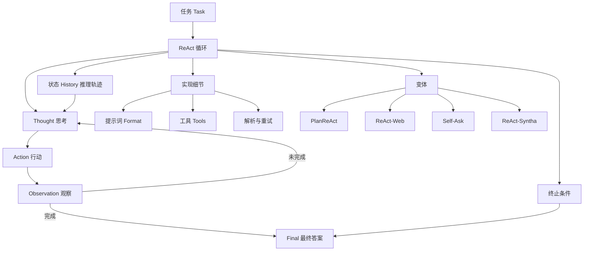
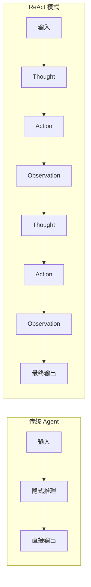
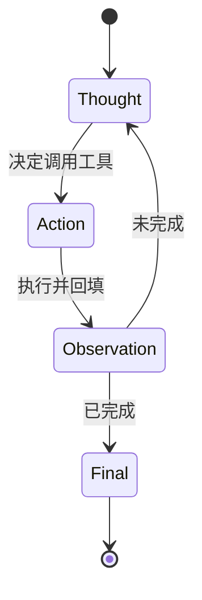
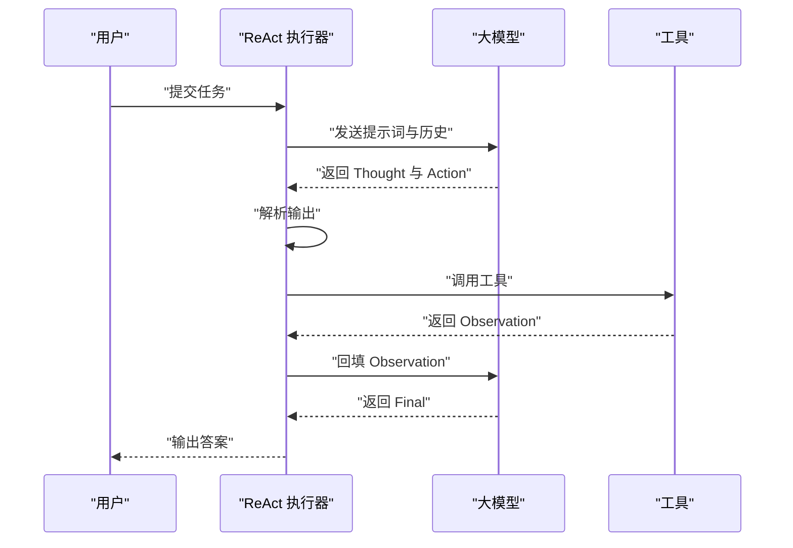
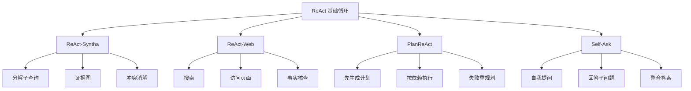
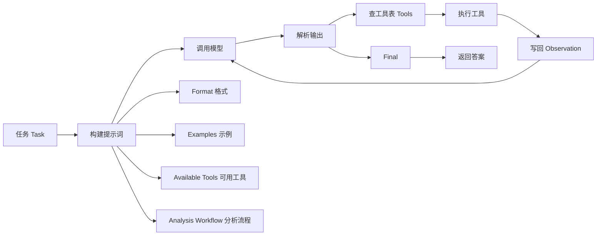
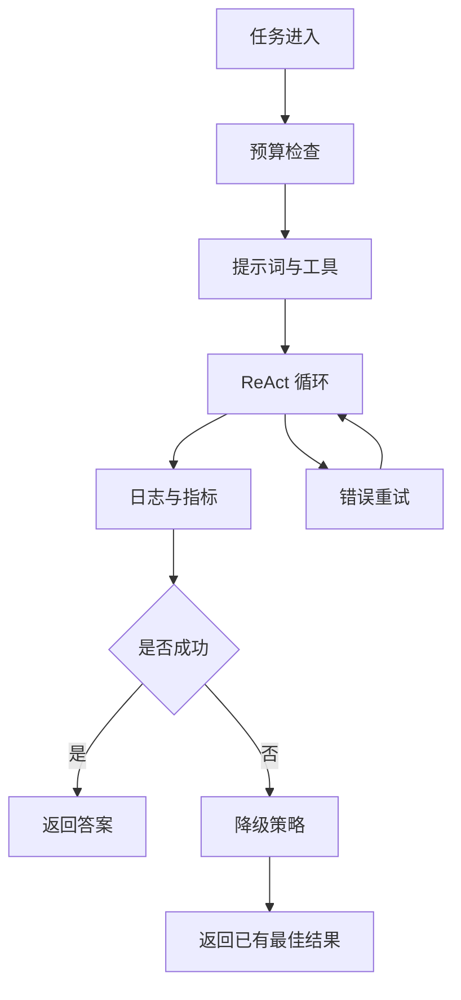

# ReAct 模式

!!! abstract "学完这一页你能"
    - 能用自己的话说明 ReAct 的 Thought、Action、Observation 循环，并画出状态流转图。
    - 能写出一个不依赖外部 API 的 ReAct 循环，包含解析、工具执行、终止条件与重试。
    - 能根据任务选择 ReAct、PlanReAct、Self-Ask 或普通单轮回答，并说明选择依据。
    - 能设计工具描述、少样本示例与错误恢复策略，让循环在失败后继续推进。

## 0. 知识地图



建议按三条线读。第一条线是循环：从任务到 Thought、Action、Observation，再到终止。第二条线是实现：提示词格式、工具注册、输出解析、错误重试。第三条线是选型：ReAct 与 PlanReAct、Self-Ask、ReAct-Syntha 的取舍。

!!! note "术语：ReAct"
    ReAct 是 Reasoning and Acting 的合写，指大模型交替输出推理文本与工具调用指令。例子：模型先写 Thought 说明要查天气，再写 Action 调用天气工具。

## 1. 概述与原理

**先想一个问题**

用户问：某公司 CEO 母亲的出生地是哪里。单轮回答容易漏掉中间事实。ReAct 先把问题拆成查 CEO、查母亲、查出生地，再一步步执行。

**心智模型**

!!! tip "心智模型"
    一句话模型：ReAct 把大模型的思考与外部工具调用写进同一条可读轨迹。
    日常类比：侦探先写推理笔记，再去档案室调卷，回来根据卷宗继续写。
    类比不成立：侦探可自选动作，ReAct 只能调用已注册工具；工具返回空值时循环仍要处理。

**图解**



1. 传统 Agent 把推理放在模型内部，输出只有结果，失败后难以定位。
2. ReAct 把 Thought 写出来，每一步推理都可被日志记录。
3. Action 选择工具，外部程序执行后得到 Observation。
4. Observation 回填给模型，模型继续下一轮 Thought。
5. 循环直到得到最终答案或触发终止条件。

!!! note "术语：Thought"
    Thought 是模型输出的推理文本，说明下一步为什么这样行动。例子：先用搜索工具查公司名称，因为问题要先定位公司。

!!! note "术语：Action"
    Action 是模型请求调用的工具名与参数。例子：Search 加查询词，表示调用搜索工具。

!!! note "术语：Observation"
    Observation 是外部程序执行 Action 后返回的结果。例子：搜索结果列出公司 CEO 姓名。

旧版内容把这一思想对应到三类理论：双过程理论、内部 monologue、工具使用理论。这些对应关系需核对原始文献，本页把它们当作旧版内容保留。旧版还给出数学表达，下面用代码表示状态更新。

```text
P(t) = f_reasoning(H(t-1), T)
A(t) = f_acting(P(t), Tools)
O(t) = execute(A(t))
H(t) = H(t-1) 并集 {P(t), A(t), O(t)}
终止条件：O(t) 包含最终答案 或 |H(t)| 超过 max_steps
```

旧版内容写 max_steps 通常取 5 到 15，置信度阈值示例为 0.95，错误计数上限示例为 3。这些数字来自本站旧版内容，以原文为准。

**一步一步来**

这一步要做什么：定义 ReAct 的状态结构，把任务、历史和工具放进同一个对象。

```js
// 定义单个推理步骤，保存 Thought、Action、Observation
function makeStep(stepNumber, thought, action, observation) {
  return {
    stepNumber,          // 步骤序号，从 1 开始
    thought,             // 模型输出中的 Thought 文本
    action,              // 模型选择的工具名
    actionArgs,          // 传给工具的参数
    observation,         // 工具执行后的返回
  };
}

// 定义整体状态，history 是完整的推理轨迹
function makeState(task, tools, maxSteps = 5) {
  return {
    task,                // 当前任务描述
    tools,               // 可用工具集合
    history: [],         // Thought-Action-Observation 链
    maxSteps,            // 最大步数，防止无限循环
    errorCount: 0,       // 连续错误计数
  };
}
```

**这段代码在做什么**

- `makeStep` 把一轮循环的四个字段固定下来。
- `makeState` 把任务、工具、历史、预算放在同一对象。
- `maxSteps` 是终止条件的输入。
- `history` 是后续推理要读取的上下文。
- `errorCount` 记录连续失败次数。

运行结果：两个函数返回普通对象，可在 Node 中直接打印。

这一步要做什么：用假模型函数跑一轮 Thought 到 Observation。

```js
function makeStep(stepNumber, thought, action, actionArgs, observation) {
  return {
    stepNumber,          // 步骤序号，从 1 开始
    thought,             // 模型输出中的 Thought 文本
    action,              // 模型选择的工具名
    actionArgs,          // 传给工具的参数
    observation,         // 工具执行后的返回
  };
}

// 假模型：根据任务和历史返回下一步 Thought 与 Action
function fakeModel(state) {
  const last = state.history.at(-1);
  if (!last) {
    return { thought: "先搜索 CEO 姓名", action: "Search", actionArgs: "公司 CEO" };
  }
  return { thought: "已有信息，输出答案", action: "Final", actionArgs: last.observation };
}

// 工具表：工具名到执行函数的映射
const tools = {
  Search: (query) => `搜索 ${query} 得到：蒂姆库克`,
};

// 执行一轮并写入 history
const state = makeState("查某公司 CEO", tools);
const decision = fakeModel(state);
const observation = tools[decision.action](decision.actionArgs);
state.history.push(makeStep(1, decision.thought, decision.action, decision.actionArgs, observation));
console.log(state.history[0]);
```
**这段代码在做什么**

- `fakeModel` 用历史判断是否已有信息。
- `tools` 把工具名映射到可执行函数。
- `decision` 是模型给出的 Thought 与 Action。
- `observation` 是工具返回值。
- `state.history` 追加一轮完整记录。

运行结果：打印第 1 步对象，observation 为搜索返回文本。

这一步要做什么：加入终止判断，让 Final 或超过 maxSteps 时退出循环。

```js
// 判断是否应终止，返回原因或 null
function shouldTerminate(state, decision) {
  if (decision.action === "Final") return "SUCCESS";
  if (state.history.length >= state.maxSteps) return "MAX_STEPS_EXCEEDED";
  if (state.errorCount >= 3) return "TOO_MANY_ERRORS";
  return null;
}

// 主循环：每轮生成决策、执行工具、记录历史
function runReAct(task, tools, maxSteps = 5) {
  const state = makeState(task, tools, maxSteps);
  while (true) {
    const decision = fakeModel(state);
    const reason = shouldTerminate(state, decision);
    if (reason === "SUCCESS") return decision.actionArgs;
    if (reason) return `终止：${reason}`;
    const observation = tools[decision.action](decision.actionArgs);
    state.history.push(makeStep(state.history.length + 1, decision.thought, decision.action, decision.actionArgs, observation));
  }
}

console.log(runReAct("查某公司 CEO", tools));
```

**这段代码在做什么**

- `shouldTerminate` 把成功、步数、错误计数集中判断。
- `runReAct` 每轮先取决策，再判断终止。
- 未终止时执行工具并写入历史。
- 成功时返回 Final 的参数。
- 失败时返回终止原因。

运行结果：第 2 轮返回 `Final`，输出搜索到的文本。

**动手验证**

依赖：Node 20+ 内置模块，无第三方包。把下面脚本保存为 `react-basic.mjs` 后运行 `node react-basic.mjs`。

```js
import assert from "node:assert/strict";

function makeStep(stepNumber, thought, action, actionArgs, observation) {
  return { stepNumber, thought, action, actionArgs, observation };
}

function makeState(task, tools, maxSteps = 5) {
  return { task, tools, history: [], maxSteps, errorCount: 0 };
}

function fakeModel(state) {
  const last = state.history.at(-1);
  if (!last) {
    return { thought: "先搜索 CEO 姓名", action: "Search", actionArgs: "公司 CEO" };
  }
  return { thought: "已有信息，输出答案", action: "Final", actionArgs: last.observation };
}

function shouldTerminate(state, decision) {
  if (decision.action === "Final") return "SUCCESS";
  if (state.history.length >= state.maxSteps) return "MAX_STEPS_EXCEEDED";
  if (state.errorCount >= 3) return "TOO_MANY_ERRORS";
  return null;
}

function runReAct(task, tools, maxSteps = 5) {
  const state = makeState(task, tools, maxSteps);
  while (true) {
    const decision = fakeModel(state);
    const reason = shouldTerminate(state, decision);
    if (reason === "SUCCESS") return decision.actionArgs;
    if (reason) return `终止：${reason}`;
    const observation = tools[decision.action](decision.actionArgs);
    state.history.push(makeStep(state.history.length + 1, decision.thought, decision.action, decision.actionArgs, observation));
  }
}

const tools = { Search: (query) => `搜索 ${query} 得到：蒂姆库克` };
const answer = runReAct("查某公司 CEO", tools);
assert.equal(answer, "搜索 公司 CEO 得到：蒂姆库克");
console.log("通过：", answer);
```

预期输出：

```text
通过： 搜索 公司 CEO 得到：蒂姆库克
```

**常见坑**

| 现象 | 原因 | 怎么修 |
| --- | --- | --- |
| 循环永远不结束 | 没有 maxSteps 或终止条件 | 每轮检查 maxSteps 与 Final |
| 工具名拼错 | 模型输出与工具表不一致 | 解析后先查工具表，缺失时写入 Observation |
| 历史越来越长 | 每轮都把全文拼进上下文 | 保存完整历史，发送前按预算裁剪 |

**用在哪里**

多跳问答场景。业务背景：企业知识库要回答跨文档问题。这一节的知识怎么用：把查人、查部门、查地点拆成工具调用。指标：答案命中率与平均步数。什么时候不该用：问题只涉及单条文档时。

开放世界搜索场景。业务背景：竞品调研要组合搜索与网页提取。这一节的知识怎么用：Search 与 Browse 交替执行。指标：来源覆盖数与人工复核率。什么时候不该用：实时性要求高且无法等待循环时。

**行业实践**

ReAct 论文《Synergizing Reasoning and Acting in Language Models》提出 Reason 与 Acting 交替的轨迹格式。借鉴方式：在提示词中固定 Thought、Action、Observation 三个字段，先跑通日志再调模型。

LangChain 官方文档 Agents 章节列出 ReAct 风格代理。借鉴方式：先读官方文档中工具描述与输出解析的约定；需核对官方文档：当前版本的 AgentType 名称与参数。

**小结**

- ReAct 用 Thought、Action、Observation 把推理过程外显。
- 状态结构要保存任务、历史、工具与终止预算。
- 旧版内容中的理论对应关系与数字需核对原始文献。

## 2. 执行流程：Thought Action Observation 循环

**先想一个问题**

用户问：北京的面积是多少平方公里。模型直接回答可能过时。ReAct 先搜索，再读取结果，再输出答案。

**心智模型**

!!! tip "心智模型"
    一句话模型：循环每转一圈，模型就多知道一条外部事实。
    日常类比：做菜时先尝味道，再决定加盐，再尝一次。
    类比不成立：做菜可以随时尝，ReAct 每轮都要消耗 token 与时间。

**图解**



1. 初始状态进入 Thought。
2. Thought 输出推理文本。
3. 模型接着输出 Action。
4. 外部程序执行 Action 得到 Observation。
5. Observation 回填后进入下一轮 Thought。
6. 完成时进入 Final，循环结束。

!!! note "术语：推理轨迹"
    推理轨迹是完整的 Thought、Action、Observation 记录。例子：三步搜索形成三条历史记录。

**一步一步来**

这一步要做什么：把历史拼成模型可读的文本。

```js
// 把 history 转成 ReAct 格式文本
function renderHistory(history) {
  return history.map((step) => {
    // 每一轮包含思考、行动、观察三段
    return [
      `Thought: ${step.thought}`,
      `Action: ${step.action}[${step.actionArgs}]`,
      `Observation: ${step.observation}`,
    ].join("\n");
  }).join("\n\n");
}

const text = renderHistory([
  { thought: "先搜索", action: "Search", actionArgs: "北京面积", observation: "约 16410 平方公里" },
]);
console.log(text);
```

**这段代码在做什么**

- `map` 遍历每条历史。
- 每条历史拼出 Thought、Action、Observation 三行。
- `join` 把多轮历史用空行隔开。
- 返回文本可放进下一轮提示词。

运行结果：打印三段文本。

这一步要做什么：实现循环并限制最大步数。

```js
// 运行循环，每轮把决策与观察追加到历史
function runLoop(task, tools, model, maxSteps = 5) {
  const history = [];
  for (let i = 0; i < maxSteps; i++) {
    const decision = model(task, history);
    if (decision.action === "Final") return decision.actionArgs;
    const tool = tools[decision.action];
    const observation = tool ? tool(decision.actionArgs) : `未知工具：${decision.action}`;
    history.push({ thought: decision.thought, action: decision.action, actionArgs: decision.actionArgs, observation });
  }
  return "达到最大步数";
}

console.log(runLoop("查北京面积", { Search: (q) => `搜索 ${q}：16410 平方公里` }, (task, history) => {
  if (history.length === 0) return { thought: "先搜索", action: "Search", actionArgs: "北京面积" };
  return { thought: "已有答案", action: "Final", actionArgs: history[0].observation };
}));
```

**这段代码在做什么**

- `for` 循环最多执行 maxSteps 次。
- 每轮调用模型得到决策。
- Final 直接返回答案。
- 工具缺失时把错误写入 Observation。
- 超出步数返回固定文本。

运行结果：输出搜索到的面积文本。

这一步要做什么：加入循环检测，发现重复 Action 时终止。

```js
// 检测连续相同 Action，避免原地打转
function isLooping(history) {
  if (history.length < 3) return false;
  const lastThree = history.slice(-3);
  return lastThree.every((step) => step.action === lastThree[0].action);
}

console.log(isLooping([
  { action: "Search" },
  { action: "Search" },
  { action: "Search" },
]));
```

**这段代码在做什么**

- `slice(-3)` 取最后三条历史。
- `every` 判断行动名是否相同。
- 返回布尔值供终止条件使用。
- 只检查行动名，不检查参数。
- 参数不同但工具相同的场景可能被误判，需要按业务调整。

运行结果：输出 `true`。

**动手验证**

依赖：Node 20+ 内置模块，无第三方包。保存为 `react-flow.mjs`。

```js
import assert from "node:assert/strict";

function renderHistory(history) {
  return history.map((step) => [
    `Thought: ${step.thought}`,
    `Action: ${step.action}[${step.actionArgs}]`,
    `Observation: ${step.observation}`,
  ].join("\n")).join("\n\n");
}

function isLooping(history) {
  if (history.length < 3) return false;
  const lastThree = history.slice(-3);
  return lastThree.every((step) => step.action === lastThree[0].action);
}

function runLoop(task, tools, model, maxSteps = 5) {
  const history = [];
  for (let i = 0; i < maxSteps; i++) {
    if (isLooping(history)) return "循环检测终止";
    const decision = model(task, history);
    if (decision.action === "Final") return decision.actionArgs;
    const tool = tools[decision.action];
    const observation = tool ? tool(decision.actionArgs) : `未知工具：${decision.action}`;
    history.push({ thought: decision.thought, action: decision.action, actionArgs: decision.actionArgs, observation });
  }
  return "达到最大步数";
}

const tools = { Search: (q) => `搜索 ${q}：16410 平方公里` };
const model = (task, history) => {
  if (history.length === 0) return { thought: "先搜索", action: "Search", actionArgs: "北京面积" };
  return { thought: "已有答案", action: "Final", actionArgs: history[0].observation };
};

const answer = runLoop("查北京面积", tools, model);
assert.equal(answer, "搜索 北京面积：16410 平方公里");
console.log("通过：", answer);
console.log("历史格式：\n" + renderHistory([{ thought: "先搜索", action: "Search", actionArgs: "北京面积", observation: "16410 平方公里" }]));
```

预期输出：

```text
通过： 搜索 北京面积：16410 平方公里
历史格式：
Thought: 先搜索
Action: Search[北京面积]
Observation: 16410 平方公里
```

**常见坑**

| 现象 | 原因 | 怎么修 |
| --- | --- | --- |
| 模型跳过 Observation | 提示词没要求等待工具结果 | 模板中固定 Observation 位置 |
| 重复调用同一工具 | 历史没有传回模型 | 每轮把完整历史拼进上下文 |
| 达到最大步数仍无答案 | 终止条件只有步数 | 增加置信度或循环检测 |

**用在哪里**

数据分析工作流。业务背景：运营要计算多张报表的环比。这一节的知识怎么用：Query 工具取数，Calculate 工具计算。指标：任务完成率与调用次数。什么时候不该用：单张固定报表可用定时任务。

代码调试助手。业务背景：开发者粘贴报错，助手要定位文件。这一节的知识怎么用：SearchCode 与 ReadFile 交替。指标：定位准确率与人工修改行数。什么时候不该用：编译错误直接由编译器提示。

**行业实践**

ReAct 论文给出 Thought、Action、Observation 的轨迹示例。借鉴方式：先用固定格式跑通日志，再替换真实模型。LangChain 官方文档 Agents 章节说明代理如何维护中间步骤。借鉴方式：对照官方文档检查历史拼接与工具返回；需核对官方文档：具体回调与解析器名称。

**小结**

- 循环的核心是历史回填，不是单次回答。
- 终止条件要同时覆盖成功、步数、循环与错误。
- 历史文本格式要稳定，便于解析与复盘。

## 3. 实现详解：提示词、解析、错误与重试

**先想一个问题**

模型返回了一段中文解释，但程序要提取工具名。格式不固定时，解析会失败。ReAct 的工程重点是把自然语言约束成可解析字段。

**心智模型**

!!! tip "心智模型"
    一句话模型：提示词是接口文档，解析器是接口实现，错误恢复是重试策略。
    日常类比：填表时先规定姓名、电话、地址三栏，收表人才能录入系统。
    类比不成立：模型仍可能填错，所以解析器要容错并给出反馈。

**图解**



1. 用户提交任务。
2. 执行器把提示词与历史发送给模型。
3. 模型返回 Thought 与 Action。
4. 执行器解析输出。
5. 执行器调用工具。
6. 工具返回 Observation。
7. 执行器把 Observation 回填给模型。
8. 模型返回 Final 后输出答案。

!!! note "术语：Few-shot"
    Few-shot 是在提示词中放入若干完整示例，让模型按示例格式输出。例子：放入一轮搜索问答，模型会模仿 Thought、Action、Observation。

!!! note "术语：指数退避"
    指数退避是每次重试等待时间按倍数增长。例子：首次等 1000 毫秒，第二次等 2000 毫秒，第三次等 4000 毫秒。

**一步一步来**

这一步要做什么：写基础提示词模板，固定三个字段。

```js
// 基础 ReAct 提示词，占位符 tools 与 task 由调用方替换
const REACT_PROMPT = `你是一个使用 ReAct 模式解决问题的助手。
可用工具：
{tools}
输出格式：
Thought: 你的推理
Action: 工具名[参数]
Observation: 工具结果
获得答案时：
Thought: 我现在知道答案了
Action: Final[答案]
Observation: 任务完成
任务: {task}`;

function renderPrompt(template, tools, task) {
  // 只替换占位符，不改动格式关键字
  return template.replace("{tools}", tools).replace("{task}", task);
}

console.log(renderPrompt(REACT_PROMPT, "Search: 搜索网页", "查北京面积"));
```

**这段代码在做什么**

- 模板保留 Thought、Action、Observation 关键字。
- `{tools}` 填入工具描述。
- `{task}` 填入任务文本。
- `replace` 只替换第一处匹配。
- 格式关键字不改，解析器才能复用。

运行结果：打印完整提示词。

这一步要做什么：用正则解析模型输出。

```js
// 解析 Thought、Action、Observation 三类字段
function parseReAct(raw) {
  const cleaned = raw.replace(/```(?:text)?/g, "").trim();
  const thought = cleaned.match(/Thought:\s*([\s\S]*?)(?=\nAction:|$)/)?.[1]?.trim();
  const action = cleaned.match(/Action:\s*(\w+)\[(.*?)\]/);
  const observation = cleaned.match(/Observation:\s*([\s\S]*?)(?=\nThought:|$)/)?.[1]?.trim();
  if (!thought || !action) throw new Error("格式不符合 ReAct");
  return {
    thought,
    actionName: action[1],
    actionArgs: action[2],
    observation: observation ?? "[待执行]",
    isFinal: action[1] === "Final",
  };
}

console.log(parseReAct("Thought: 先搜索\nAction: Search[北京面积]\nObservation: 16410"));
```

**这段代码在做什么**

- `replace` 去掉 Markdown 代码围栏。
- 正则提取 Thought 文本。
- 正则提取 Action 名称与参数。
- Observation 缺失时给占位符。
- `isFinal` 判断是否终止。

运行结果：打印包含 actionName、actionArgs 的对象。

这一步要做什么：给错误分类并设置重试策略。

```js
// 错误类型到最大重试次数的映射
const ERROR_STRATEGIES = {
  PARSE_ERROR: { maxRetries: 2 },
  TOOL_NOT_FOUND: { maxRetries: 3 },
  TOOL_EXECUTION_ERROR: { maxRetries: 2 },
  TIMEOUT: { maxRetries: 1 },
};

// 根据错误类型决定是否重试
function shouldRetry(type, attempt) {
  const strategy = ERROR_STRATEGIES[type];
  return Boolean(strategy && attempt < strategy.maxRetries);
}

// 计算退避毫秒数，baseDelay 默认为 1000
function backoff(attempt, baseDelay = 1000) {
  return baseDelay * Math.pow(2, attempt - 1);
}

console.log(shouldRetry("TOOL_NOT_FOUND", 1));
console.log(backoff(3));
```

**这段代码在做什么**

- 策略表按错误类型给出重试上限。
- `shouldRetry` 比较尝试次数与上限。
- `backoff` 用 2 的幂计算等待时间。
- 首次重试等待 1000 毫秒。
- 第三次重试等待 4000 毫秒。

运行结果：先输出 `true`，再输出 `4000`。

**动手验证**

依赖：Node 20+ 内置模块，无第三方包。保存为 `react-parse.mjs`。

```js
import assert from "node:assert/strict";

function parseReAct(raw) {
  const cleaned = raw.replace(/```(?:text)?/g, "").trim();
  const thought = cleaned.match(/Thought:\s*([\s\S]*?)(?=\nAction:|$)/)?.[1]?.trim();
  const action = cleaned.match(/Action:\s*(\w+)\[(.*?)\]/);
  const observation = cleaned.match(/Observation:\s*([\s\S]*?)(?=\nThought:|$)/)?.[1]?.trim();
  if (!thought || !action) throw new Error("格式不符合 ReAct");
  return { thought, actionName: action[1], actionArgs: action[2], observation: observation ?? "[待执行]", isFinal: action[1] === "Final" };
}

const ERROR_STRATEGIES = {
  PARSE_ERROR: { maxRetries: 2 },
  TOOL_NOT_FOUND: { maxRetries: 3 },
  TOOL_EXECUTION_ERROR: { maxRetries: 2 },
  TIMEOUT: { maxRetries: 1 },
};

function shouldRetry(type, attempt) {
  const strategy = ERROR_STRATEGIES[type];
  return Boolean(strategy && attempt < strategy.maxRetries);
}

function backoff(attempt, baseDelay = 1000) {
  return baseDelay * Math.pow(2, attempt - 1);
}

const parsed = parseReAct("Thought: 先搜索\nAction: Search[北京面积]\nObservation: 16410");
assert.equal(parsed.actionName, "Search");
assert.equal(parsed.actionArgs, "北京面积");
assert.equal(shouldRetry("TOOL_NOT_FOUND", 1), true);
assert.equal(backoff(3), 4000);
console.log("解析通过：", parsed.thought, parsed.actionName);
console.log("重试通过：", shouldRetry("TOOL_NOT_FOUND", 1), backoff(3));
```

预期输出：

```text
解析通过： 先搜索 Search
重试通过： true 4000
```

**常见坑**

| 现象 | 原因 | 怎么修 |
| --- | --- | --- |
| 解析抛错 | 模型输出多了 Markdown 围栏 | 解析前去掉围栏 |
| 工具找不到 | 模型用了未注册工具名 | 查工具表并把错误写回 Observation |
| 重试风暴 | 所有错误都无限重试 | 按错误类型设置上限 |

**用在哪里**

智能客服工单分流。业务背景：客服要查订单、查物流、查退款规则。这一节的知识怎么用：解析工具名后执行订单与物流工具。指标：首次解决率与转人工率。什么时候不该用：单一意图可用规则路由。

后台管理批量导入。业务背景：运营导入表格前要校验字段。这一节的知识怎么用：用 ReadTable 与 Validate 工具交替检查。指标：导入失败率与修复耗时。什么时候不该用：字段完全固定时用数据库约束。

**行业实践**

ReAct 论文给出格式说明与示例对输出的约束作用。借鉴方式：先写解析器，再写提示词，两者按同一字段表对齐。OpenAI 官方文档 Function calling 章节说明工具参数可用 JSON Schema 描述。借鉴方式：把工具参数写成模式，减少自由文本；需核对官方文档：当前模型支持的参数模式字段。

**小结**

- 提示词与解析器是同一接口的两端。
- 错误分类决定重试次数与退避时长。
- 工具缺失与解析失败都要写回历史，让模型换策略。

## 4. 变体：ReAct-Syntha、ReAct-Web、PlanReAct、Self-Ask

**先想一个问题**

同样是查资料，有人先列计划再执行，有人边查边问。不同任务需要不同循环。ReAct 变体就是把这些工作方式写成流程。

**心智模型**

!!! tip "心智模型"
    一句话模型：变体改变的是循环的骨架，不改变 Thought、Action、Observation 三个记录位。
    日常类比：同一套笔记格式，有人先写提纲再填内容，有人边问边填。
    类比不成立：变体有不同终止条件与状态字段，不能只换提示词。

**图解**



1. 基础循环提供 Thought、Action、Observation 三个位置。
2. ReAct-Syntha 增加子查询分解与证据图。
3. ReAct-Web 增加搜索、访问页面、链接提取与事实核查工具。
4. PlanReAct 增加显式计划与依赖排序。
5. Self-Ask 用自我提问替代显式工具调用。
6. 每种变体都要保留终止条件与错误恢复。

!!! note "术语：证据图"
    证据图是把来自不同来源的事实作为节点、把关系作为边的结构。例子：来源 A 说 CEO 是甲，来源 B 说甲的母亲住在乙地，两条事实连起来。

!!! note "术语：拓扑排序"
    拓扑排序是把有依赖关系的步骤排成可执行顺序。例子：先查公司，再查 CEO，再查母亲。

**一步一步来**

这一步要做什么：给 PlanReAct 定义计划步骤。

```js
// 计划步骤包含编号、描述、工具、依赖与状态
function makePlanStep(id, description, tool, dependsOn = []) {
  return { id, description, tool, dependsOn, status: "pending" };
}

const plan = [
  makePlanStep("s1", "查公司", "Search"),
  makePlanStep("s2", "查 CEO", "Search", ["s1"]),
  makePlanStep("s3", "查母亲出生地", "Search", ["s2"]),
];

console.log(plan);
```

**这段代码在做什么**

- `id` 唯一标识步骤。
- `dependsOn` 保存前置步骤编号。
- `status` 记录待执行、进行中、完成或失败。
- 计划先生成，再进入执行阶段。
- 依赖关系用于排序。

运行结果：打印三个计划步骤对象。

这一步要做什么：按依赖做拓扑排序。

```js
// 简易拓扑排序，返回可执行顺序
function topoSort(steps) {
  const done = new Set();
  const result = [];
  while (result.length < steps.length) {
    const ready = steps.find((step) => {
      if (done.has(step.id)) return false;
      return step.dependsOn.every((id) => done.has(id));
    });
    if (!ready) throw new Error("存在循环依赖");
    done.add(ready.id);
    result.push(ready);
  }
  return result;
}

console.log(topoSort([
  { id: "s2", dependsOn: ["s1"] },
  { id: "s1", dependsOn: [] },
]).map((step) => step.id));
```

**这段代码在做什么**

- `done` 记录已完成步骤。
- `find` 寻找依赖全部满足的步骤。
- 找不到时说明有循环依赖。
- 找到后加入结果集。
- 返回按依赖排好的数组。

运行结果：输出 `["s1","s2"]`。

这一步要做什么：用 Self-Ask 的问答格式分解问题。

```js
// Self-Ask 用追问标记替代显式工具调用
function selfAsk(question, knowledge) {
  if (knowledge[question]) return knowledge[question];
  return `需要追问：${question}`;
}

const knowledge = { "某公司 CEO 是谁": "蒂姆库克" };
console.log(selfAsk("某公司 CEO 是谁", knowledge));
console.log(selfAsk("该 CEO 母亲出生地", knowledge));
```

**这段代码在做什么**

- `knowledge` 保存已知答案。
- 已知时直接返回答案。
- 未知时生成追问文本。
- 追问文本可作为下一轮输入。
- 与 ReAct 的差别是行动被追问替代。

运行结果：先输出 CEO 姓名，再输出追问文本。

**动手验证**

依赖：Node 20+ 内置模块，无第三方包。保存为 `react-variants.mjs`。

```js
import assert from "node:assert/strict";

function topoSort(steps) {
  const done = new Set();
  const result = [];
  while (result.length < steps.length) {
    const ready = steps.find((step) => {
      if (done.has(step.id)) return false;
      return step.dependsOn.every((id) => done.has(id));
    });
    if (!ready) throw new Error("存在循环依赖");
    done.add(ready.id);
    result.push(ready);
  }
  return result;
}

function selfAsk(question, knowledge) {
  if (knowledge[question]) return knowledge[question];
  return `需要追问：${question}`;
}

const steps = [
  { id: "s3", dependsOn: ["s2"] },
  { id: "s1", dependsOn: [] },
  { id: "s2", dependsOn: ["s1"] },
];

const order = topoSort(steps).map((step) => step.id);
assert.deepEqual(order, ["s1", "s2", "s3"]);
assert.equal(selfAsk("某公司 CEO 是谁", { "某公司 CEO 是谁": "蒂姆库克" }), "蒂姆库克");
assert.equal(selfAsk("母亲出生地", {}), "需要追问：母亲出生地");
console.log("计划顺序：", order.join(" -> "));
console.log("Self-Ask 通过");
```

预期输出：

```text
计划顺序： s1 -> s2 -> s3
Self-Ask 通过
```

**常见坑**

| 现象 | 原因 | 怎么修 |
| --- | --- | --- |
| 计划无法执行 | 依赖形成环 | 拓扑排序时抛出并重新规划 |
| Self-Ask 停不下来 | 没有限制追问深度 | 设置最大追问层数 |
| 证据冲突未处理 | 多来源直接拼接 | 增加冲突检测与来源排序 |

**用在哪里**

竞品调研。业务背景：市场团队要组合搜索、访问页面、提取事实。这一节的知识怎么用：ReAct-Web 工具集串联网页操作。指标：来源数量与人工复核耗时。什么时候不该用：来源固定且可离线阅读时。

多文档知识综合。业务背景：法务要合并多份合同的同一字段。这一节的知识怎么用：ReAct-Syntha 分解子查询并建证据图。指标：字段一致率与冲突发现数。什么时候不该用：合同模板完全统一时。

**行业实践**

PlanReAct 类做法在公开代理框架中常见：先计划再执行，失败后重规划。借鉴方式：把计划步骤状态化，失败时只重跑依赖链；需核对官方文档：具体框架的计划器名称与状态字段。ReAct-Web 思路在搜索代理中常见：搜索、访问、核查分离。借鉴方式：把每个网页操作拆成独立工具并记录来源。

**小结**

- 变体改变骨架，不改变字段记录。
- PlanReAct 适合有依赖的多步骤任务。
- Self-Ask 适合问答分解，工具调用少时可用。

## 5. 代码实现示例与格式工具工作流

**先想一个问题**

面试官让你实现一个 ReAct 代理。你需要说清类型定义、提示词、工具注册、解析与运行入口。这一节把旧页的代码示例压缩成可讲清的骨架。

**心智模型**

!!! tip "心智模型"
    一句话模型：代理等于循环加工具表加解析器。
    日常类比：客服系统有工单流转、部门电话表、话术模板。
    类比不成立：部门电话表不会变，工具表会随业务增删。

**图解**



1. 任务进入提示词构建。
2. 提示词包含格式、示例、可用工具、分析流程。
3. 模型返回文本。
4. 解析器提取 Action。
5. 工具表按名称查找执行函数。
6. 执行结果写回 Observation。
7. 得到 Final 后返回答案。

!!! note "术语：JSON Schema"
    JSON Schema 是用结构化字段描述参数类型与必填项的模式。例子：query 字段类型为 string，且 marked required。

!!! note "术语：工具表"
    工具表是工具名到执行函数的映射。例子：Search 指向搜索函数，Calculator 指向计算函数。

**一步一步来**

这一步要做什么：定义工具接口与注册表。

```ts
// 工具参数与工具定义，真实项目可换成 JSON Schema
interface ToolParameter {
  type: "string" | "number" | "boolean" | "object";
  description?: string;
  required?: boolean;
}

interface Tool {
  name: string;
  description: string;
  parameters: Record<string, ToolParameter>;
  execute: (args: Record<string, unknown>) => Promise<string>;
}

// 把工具数组转成以名称为键的表
function buildToolMap(tools: Tool[]): Map<string, Tool> {
  return new Map(tools.map((tool) => [tool.name, tool]));
}
```

**这段代码在做什么**

- `ToolParameter` 描述单个参数。
- `Tool` 描述名称、说明、参数与执行函数。
- `buildToolMap` 把数组转为 Map。
- Map 便于按名称查找。
- 重名工具会覆盖，需要在注册时检查。

运行结果：TypeScript 编译后得到工具表。

这一步要做什么：构建系统提示词，列出可用工具。

```ts
// 用工具数组生成工具说明文本
function describeTools(tools: Tool[]): string {
  return tools.map((tool) => `- ${tool.name}: ${tool.description}`).join("\n");
}

// 系统提示词模板，固定输出格式
const systemPrompt = `You are a ReAct agent.
Available Tools:
${describeTools([
  { name: "Search", description: "搜索网页", parameters: {}, execute: async () => "" },
])}
Format:
Thought: 推理
Action: 工具名[参数]
Observation: 工具结果
Final:
Thought: 我现在知道答案了
Action: Final[答案]`;
```

**这段代码在做什么**

- `describeTools` 把工具名与说明拼成列表。
- 系统提示词声明角色。
- 提示词列出可用工具。
- 提示词固定输出格式。
- Final 格式用于终止。

运行结果：打印包含工具列表的提示词。

这一步要做什么：运行入口组合模型、解析器与工具表。

```ts
// 简化的运行入口，省略真实模型调用
async function runAgent(task: string, tools: Tool[], callModel: (prompt: string) => Promise<string>) {
  const toolMap = buildToolMap(tools);
  const history: string[] = [];
  for (let step = 0; step < 10; step++) {
    const raw = await callModel(`${systemPrompt}\nTask: ${task}\n${history.join("\n")}`);
    const parsed = parseReAct(raw);
    if (parsed.isFinal) return parsed.actionArgs;
    const tool = toolMap.get(parsed.actionName);
    const observation = tool ? await tool.execute({ input: parsed.actionArgs }) : `未知工具：${parsed.actionName}`;
    history.push(`Thought: ${parsed.thought}\nAction: ${parsed.actionName}[${parsed.actionArgs}]\nObservation: ${observation}`);
  }
  return "达到最大步数";
}
```

**这段代码在做什么**

- `toolMap` 提供按名查找。
- `history` 保存每轮文本。
- `callModel` 由调用方注入，便于测试。
- Final 直接返回答案。
- 未知工具写入 Observation。

运行结果：在真实项目中返回最终答案或终止原因。

**动手验证**

依赖：Node 20+ 内置模块，无第三方包。保存为 `react-tools.mjs`。

```js
import assert from "node:assert/strict";

function buildToolMap(tools) {
  return new Map(tools.map((tool) => [tool.name, tool]));
}

function describeTools(tools) {
  return tools.map((tool) => `- ${tool.name}: ${tool.description}`).join("\n");
}

function parseReAct(raw) {
  const action = raw.match(/Action:\s*(\w+)\[(.*?)\]/);
  if (!action) throw new Error("缺少 Action");
  return { actionName: action[1], actionArgs: action[2], isFinal: action[1] === "Final" };
}

async function runAgent(task, tools, callModel, maxSteps = 5) {
  const toolMap = buildToolMap(tools);
  const history = [];
  for (let step = 0; step < maxSteps; step++) {
    const raw = await callModel(task, history);
    const parsed = parseReAct(raw);
    if (parsed.isFinal) return parsed.actionArgs;
    const tool = toolMap.get(parsed.actionName);
    const observation = tool ? await tool.execute({ input: parsed.actionArgs }) : `未知工具：${parsed.actionName}`;
    history.push({ thought: parsed.thought, action: parsed.actionName, actionArgs: parsed.actionArgs, observation });
  }
  return "达到最大步数";
}

const tools = [
  { name: "Search", description: "搜索网页", execute: async ({ input }) => `搜索结果：${input}` },
];

const model = async (task, history) => {
  if (history.length === 0) return "Thought: 先搜索\nAction: Search[北京面积]\nObservation: 待执行";
  return "Thought: 已有答案\nAction: Final[16410 平方公里]\nObservation: 任务完成";
};

const answer = await runAgent("查北京面积", tools, model);
assert.equal(answer, "16410 平方公里");
console.log("工具列表：\n" + describeTools(tools));
console.log("答案：", answer);
```

预期输出：

```text
工具列表：
- Search: 搜索网页
答案： 16410 平方公里
```

**常见坑**

| 现象 | 原因 | 怎么修 |
| --- | --- | --- |
| 模型调用未注册工具 | 工具描述缺失 | 提示词中列出全部工具 |
| 参数解析失败 | 参数格式不固定 | 提示词给出参数示例 |
| 工具执行抛错 | 没有错误边界 | 执行函数内部捕获并返回错误文本 |

**用在哪里**

前端代码调试助手。业务背景：开发者粘贴报错，助手要搜代码、读文件、给出补丁。这一节的知识怎么用：SearchCode、ReadFile、SuggestPatch 三个工具。指标：定位准确率与建议采纳率。什么时候不该用：错误信息已指向唯一文件时。

运营活动配置助手。业务背景：运营要查配置、算库存、改活动时间。这一节的知识怎么用：查配置与计算工具交替。指标：配置错误率与操作耗时。什么时候不该用：操作有强事务要求时。

**行业实践**

旧版内容给出 TypeScript 与 Python LangChain 两套实现示例。借鉴方式：先用 TypeScript 类型固定工具接口，再用 Python 脚本做批量实验。LangChain 官方文档 Agents 章节说明工具与代理组合方式。借鉴方式：对照官方文档确认工具描述字段；需核对官方文档：当前版本是否仍使用 initialize_agent 与 AgentType.REACT_DOCSTORE。

**小结**

- 工具表是代理的扩展点，新增能力不改循环。
- 提示词要列出工具、格式、示例与任务。
- 解析器与模型调用要可替换，便于测试。

## 6. 生产最佳实践与选型

**先想一个问题**

团队要上线一个 ReAct 代理，日志里出现重复搜索与超时。问题不在模型，而在提示词、工具描述与重试策略。这一节给出上线前检查表。

**心智模型**

!!! tip "心智模型"
    一句话模型：生产化等于给循环加预算、日志、降级和评估。
    日常类比：汽车上路要有油量、刹车、行车记录仪。
    类比不成立：软件可以灰度发布，汽车不能半路换发动机。

**图解**



1. 任务进入先做预算检查。
2. 预算通过后组装提示词与工具。
3. 循环执行并记录日志。
4. 指标判断是否成功。
5. 成功返回答案。
6. 失败进入降级策略。
7. 可重试错误回到循环。

!!! note "术语：降级策略"
    降级策略是主流程失败后返回可接受结果的方案。例子：达到最大步数时返回历史中最新 Observation。

**一步一步来**

这一步要做什么：为每次运行设置 token 与步数预算。

```js
// 运行预算，防止单任务消耗过多资源
function makeBudget({ maxSteps = 5, maxTokens = 4000 } = {}) {
  return { maxSteps, maxTokens, usedTokens: 0 };
}

// 粗略估算 token，中文按字符数除 2 取整
function estimateTokens(text) {
  return Math.ceil(text.length / 2);
}

const budget = makeBudget({ maxSteps: 5, maxTokens: 4000 });
budget.usedTokens += estimateTokens("Thought: 先搜索\nAction: Search[北京面积]");
console.log(budget);
```

**这段代码在做什么**

- `makeBudget` 给出步数与 token 上限。
- `usedTokens` 记录已用预算。
- `estimateTokens` 用字符数粗略估算。
- 估算值只用于预算控制。
- 真实 token 数需核对官方文档：模型分词规则。

运行结果：打印预算对象。

这一步要做什么：为循环增加日志字段。

```js
// 每轮记录耗时与错误，便于复盘
function logStep(step, startTime) {
  const duration = Date.now() - startTime;
  console.log(JSON.stringify({
    stepNumber: step.stepNumber,
    action: step.action,
    duration,
    observationLength: step.observation.length,
  }));
}

logStep({ stepNumber: 1, action: "Search", observation: "16410 平方公里" }, Date.now() - 120);
```

**这段代码在做什么**

- `startTime` 记录本轮开始时间。
- `duration` 是本轮耗时。
- 日志包含步骤号与工具名。
- 观察长度用于判断返回是否为空。
- JSON 行日志便于采集。

运行结果：打印一行 JSON 日志。

这一步要做什么：设置降级答案。

```js
// 从历史中取最后一条有效观察作为降级答案
function fallbackAnswer(history) {
  for (let i = history.length - 1; i >= 0; i--) {
    const observation = history[i].observation;
    if (observation && !observation.startsWith("错误")) return observation;
  }
  return "无法完成任务";
}

console.log(fallbackAnswer([
  { observation: "错误：超时" },
  { observation: "搜索到北京面积 16410 平方公里" },
]));
```

**这段代码在做什么**

- 从历史末尾向前查找。
- 跳过错误开头的观察。
- 找到有效观察后返回。
- 全部无效时返回固定文本。
- 降级答案要标记为未完成。

运行结果：输出搜索到的面积文本。

**动手验证**

依赖：Node 20+ 内置模块，无第三方包。保存为 `react-production.mjs`。

```js
import assert from "node:assert/strict";

function makeBudget({ maxSteps = 5, maxTokens = 4000 } = {}) {
  return { maxSteps, maxTokens, usedTokens: 0 };
}

function estimateTokens(text) {
  return Math.ceil(text.length / 2);
}

function fallbackAnswer(history) {
  for (let i = history.length - 1; i >= 0; i--) {
    const observation = history[i].observation;
    if (observation && !observation.startsWith("错误")) return observation;
  }
  return "无法完成任务";
}

function shouldTerminate(state, decision) {
  if (decision.action === "Final") return "SUCCESS";
  if (state.history.length >= state.budget.maxSteps) return "MAX_STEPS_EXCEEDED";
  if (state.budget.usedTokens > state.budget.maxTokens) return "TOKEN_BUDGET_EXCEEDED";
  return null;
}

const budget = makeBudget({ maxSteps: 5, maxTokens: 4000 });
budget.usedTokens += estimateTokens("Thought: 先搜索 Action: Search[北京面积]");
assert.equal(budget.usedTokens > 0, true);
assert.equal(fallbackAnswer([{ observation: "错误：超时" }, { observation: "16410 平方公里" }]), "16410 平方公里");
assert.equal(shouldTerminate({ history: [], budget }, { action: "Final" }), "SUCCESS");
console.log("预算：", budget);
console.log("降级答案：", fallbackAnswer([{ observation: "错误：超时" }, { observation: "16410 平方公里" }]));
```

预期输出：

```text
预算： { maxSteps: 5, maxTokens: 4000, usedTokens: 8 }
降级答案： 16410 平方公里
```

**常见坑**

| 现象 | 原因 | 怎么修 |
| --- | --- | --- |
| 成本失控 | 没有 token 预算 | 每轮累计估算并终止 |
| 失败无输出 | 没有降级策略 | 从历史取有效观察 |
| 日志难排查 | 只记录最终答案 | 每轮记录工具名与耗时 |

**用在哪里**

企业知识库问答。业务背景：员工要查制度、流程、联系人。这一节的知识怎么用：工具拆分检索与摘要，预算限制步数。指标：回答准确率与平均成本。什么时候不该用：固定 FAQ 可用检索直达。

电商商品信息补全。业务背景：运营要补全商品参数。这一节的知识怎么用：Search 与 Extract 交替，失败降级到人工。指标：补全率与人工介入率。什么时候不该用：参数来自内部数据库时。

**行业实践**

OpenAI 官方文档 Function calling 章节建议工具参数用模式描述。借鉴方式：为每个工具写清参数类型与必填项，减少解析失败。LangChain 官方文档 Agents 章节给出代理执行器与工具组合。借鉴方式：用官方执行器做基线，再替换自定义循环；需核对官方文档：当前版本执行器的超时与重试参数。

**小结**

- 上线前先加预算、日志与降级。
- 工具描述越精确，解析失败越少。
- 选型要看任务步数、依赖关系与可解释性要求。

## 应用地图

| 场景 | 用到本页哪个知识点 | 典型技术选型 | 注意事项 |
| --- | --- | --- | --- |
| 多跳问答 | Thought、Action、Observation 循环 | 搜索工具加读取工具 | 限制最大步数，记录来源 |
| 数据分析 | 工具调用与终止条件 | Query 加 Calculate | 计算工具要防注入 |
| 代码调试 | 提示词格式与解析 | SearchCode 加 ReadFile | 错误信息写回 Observation |
| 网页调研 | ReAct-Web 工具集 | Search 加 Browse 加 Extract | 记录 URL 与抓取时间 |
| 合同字段综合 | ReAct-Syntha 证据图 | 多源检索加冲突检测 | 保留来源与版本 |
| 批量导入校验 | 错误分类与重试 | Validate 加 Report | 失败行可定位 |
| 客服工单 | 降级策略与预算 | 订单查询加物流查询 | 超时转人工 |
| 计划型任务 | PlanReAct 拓扑排序 | Plan 加 Execute | 失败只重跑依赖链 |

## 动手作业

目标：实现一个零依赖的 ReAct 循环，能完成“查城市面积并计算人口密度”的模拟任务。

步骤：

1. 定义 `Search`、`Calculate`、`Final` 三个工具或终止动作。
2. 实现 `parseReAct`，从文本提取 Thought、Action、Observation。
3. 实现 `runReAct`，最多 5 步，每步写入历史。
4. 加入循环检测：连续三次相同 Action 时终止。
5. 加入降级答案：达到最大步数时返回最后一条有效 Observation。
6. 用 `node:assert` 写至少 4 条断言。
7. 在 README 中写明运行命令与预期输出。

验收标准：

- `node react-homework.mjs` 退出码为 0。
- 断言覆盖解析、工具调用、终止与降级。
- 日志打印每步 Action 与 Observation。
- 最大步数设置为 5，连续重复 Action 能终止。
- 代码单文件，依赖为 Node 20+ 内置模块。

## 综合对比

| 维度 | 传统 Agent | ReAct | PlanReAct | Self-Ask |
| --- | --- | --- | --- | --- |
| 推理是否外显 | 否 | 是，Thought | 是，计划加执行 | 是，追问 |
| 工具调用 | 可有 | 显式 Action | 计划步骤绑定工具 | 间接 |
| 计划能力 | 无独立计划 | 边做边定 | 先生成计划 | 边问边定 |
| 终止条件 | 最终输出 | Final、步数、循环、错误 | 计划完成或失败 | 追问结束 |
| 适合任务 | 单步或简单工具 | 多跳问答、工具编排 | 有依赖的多步骤 | 问答分解 |
| 失败定位 | 难 | 可定位到步 | 可定位到计划步骤 | 可定位到子问题 |
| 状态字段 | 少 | history、errorCount | plan、executionHistory | 问答栈 |
| 实现复杂度 | 低 | 中 | 高 | 低 |

## 深入阅读与参考

!!! tip "怎么用这些资料"
    先读「官方文档与规范」建立准确的概念，再读「源码与示例」核对细节，最后用「教程、书籍与视频」换一种讲法加深理解。每条都写明了读哪一节、带着什么问题读。

### 官方文档与规范

| 资源 | 为什么读 | 怎么读 |
|---|---|---|
| [ReAct 论文](https://arxiv.org/abs/2210.03629) | ReAct 原始论文，Thought-Action-Observation 循环的第一手定义与轨迹示例。 | 精读 Figure 1 与附录 Prompt，带着「何时停止思考」的问题读，读完手写一个 Thought→Action→Observation 循环。 |
| [Writing tools for agents](https://www.anthropic.com/engineering/writing-tools-for-agents) | 官方讲工具命名与描述如何影响调用成功率，正对应页面 Tools 与 Format 部分。 | 读工具设计原则一节，挑自己一个工具定义按建议改写名称与描述，再对比调用成功率变化。 |

### 源码与示例

| 资源 | 为什么读 | 怎么读 |
|---|---|---|
| [Mastra 仓库](https://github.com/mastra-ai/mastra) | 真实 agent 框架仓库，examples 目录里有可直接运行的 Agent 与工具调用示例。 | 从 examples 里选一个 agent 示例跑通，跟读它的循环终止条件与工具返回处理，再改造为你的场景。 |
| [Inspect AI 仓库](https://github.com/UKGovernmentBEIS/inspect_ai) | 评测框架示例展示如何为 agent 的沙箱与工具调用打分，可用来验证自己的 ReAct 实现。 | 看 examples 中的 agent 评测任务，照着为你的 ReAct 循环写一个最小评测脚本并跑一次。 |

### 教程、书籍与视频

| 资源 | 为什么读 | 怎么读 |
|---|---|---|
| [Building effective agents](https://www.anthropic.com/engineering/building-effective-agents) | 梳理 workflow 与 agent 的区别及常见模式，帮你把 ReAct 放进更大的选型框架。 | 读五种 workflow 模式一节，各举一个自己的场景，判断该任务是否真需要 ReAct 循环。 |

## 自测题

??? question "ReAct 的 Thought、Action、Observation 分别是什么？"
    Thought 是模型输出的推理文本。
    Action 是模型请求调用的工具名与参数。
    Observation 是外部程序执行工具后的返回结果。
    三者按顺序写入推理轨迹。

??? question "为什么 ReAct 需要终止条件？"
    循环可能因重复行动或工具无返回而停不下来。
    常见终止条件有 Final、最大步数、循环检测、错误计数、token 预算。
    旧版内容写 maxSteps 通常取 5 到 15，以原文为准。

??? question "解析 ReAct 输出时为什么要先去 Markdown 围栏？"
    模型可能把输出包在代码块中。
    围栏会干扰正则匹配 Thought 与 Action。
    解析前统一去掉围栏可减少失败。

??? question "工具表在 ReAct 中起什么作用？"
    工具表把工具名映射到执行函数。
    模型只输出工具名与参数，执行由外部程序完成。
    工具缺失时要把错误写回 Observation。

??? question "指数退避是什么，为什么要用？"
    指数退避是每次重试等待时间按倍数增长。
    旧版内容示例为 1000 毫秒、2000 毫秒、4000 毫秒。
    它可减少对限流服务的连续冲击，以原文为准。

??? question "PlanReAct 与 ReAct 的差别是什么？"
    PlanReAct 先生成显式计划，再按依赖执行。
    ReAct 在每轮循环中边推理边决定下一步。
    PlanReAct 适合有依赖关系的多步骤任务。

??? question "Self-Ask 适合什么任务？"
    Self-Ask 用追问分解问题。
    它适合多跳问答，工具调用需求少时可用。
    与 ReAct 相比，它的行动标记是 Q 与 A。

??? question "生产环境上线 ReAct 前要加什么？"
    要加步数、token、时间预算。
    要加每轮日志与降级答案。
    要为工具错误分类并设置重试上限。

## 延伸阅读

- ReAct 论文《Synergizing Reasoning and Acting in Language Models》，第 2 节 ReAct 方法。
- LangChain 官方文档 Agents 章节，ReAct 代理与工具组合。
- OpenAI 官方文档 Function calling 章节，工具参数模式。
- Node.js 官方文档 assert 模块，断言 API。
- 需核对官方文档：LangChain 中 AgentType.REACT_DOCSTORE 的当前名称与参数。
- 需核对官方文档：模型分词与 token 计数规则，用于预算估算。
