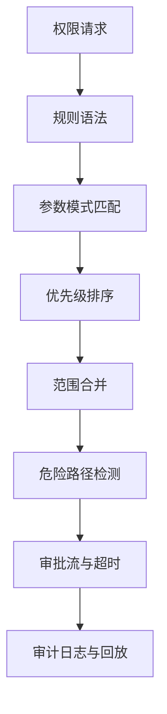
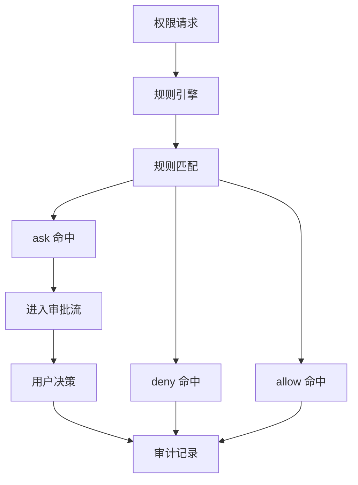
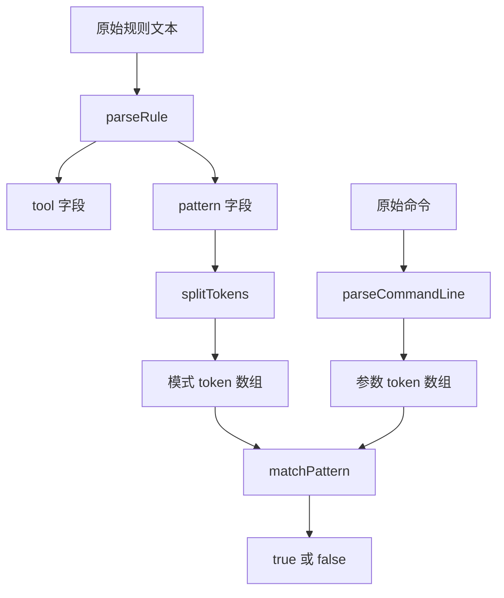
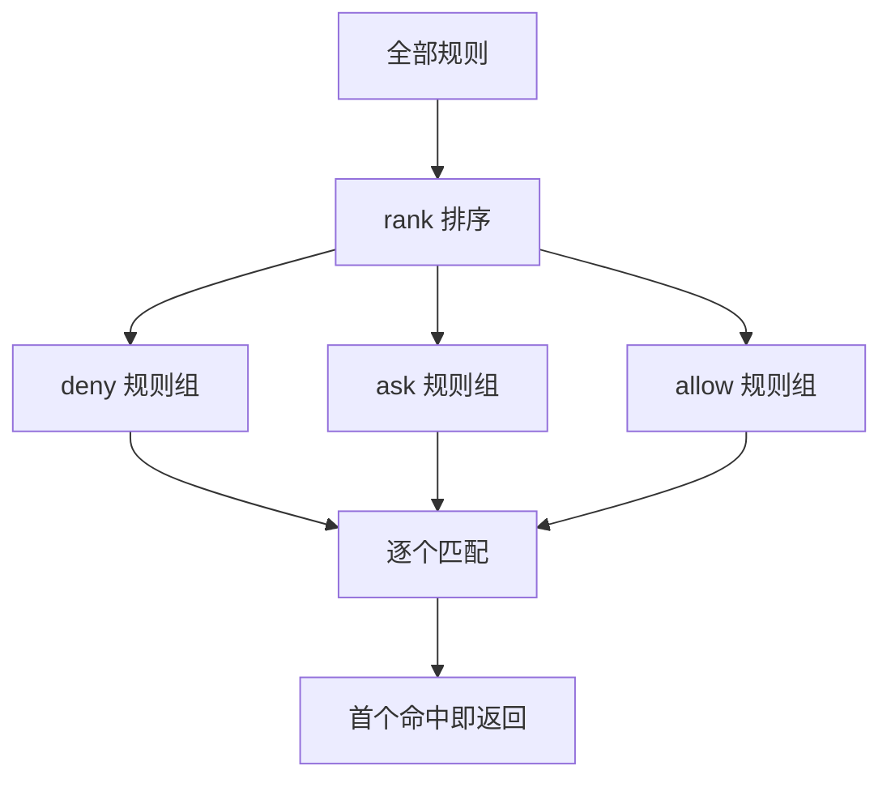
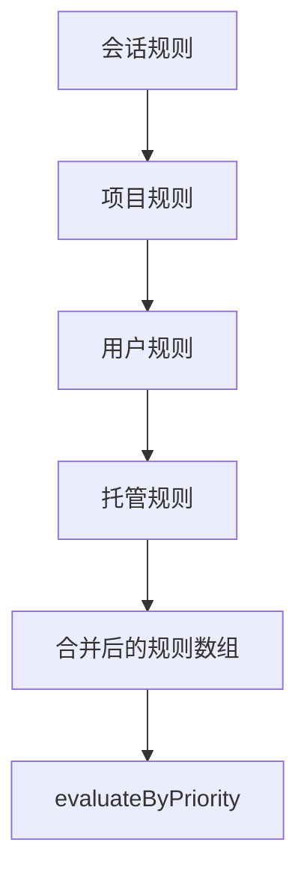
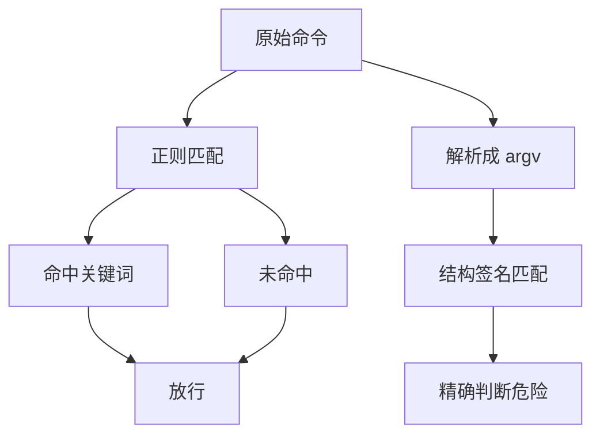
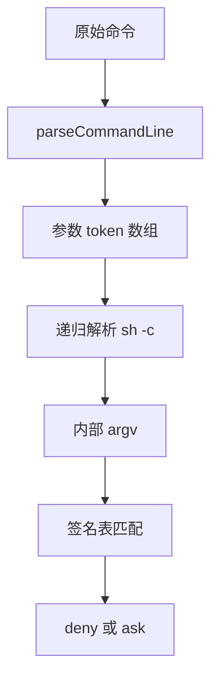
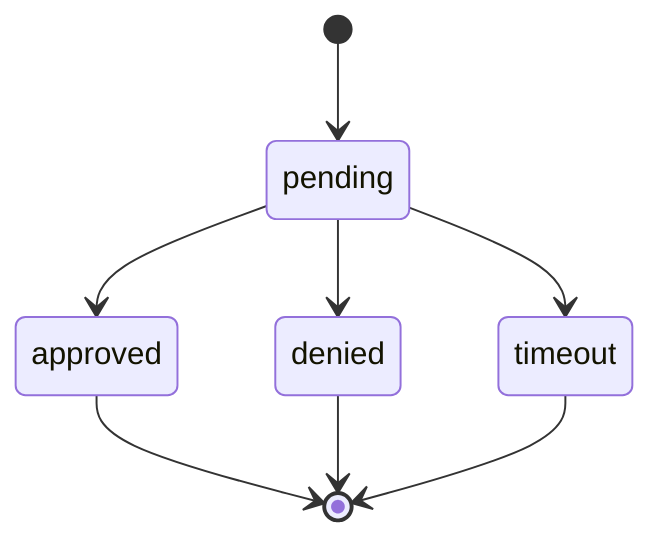
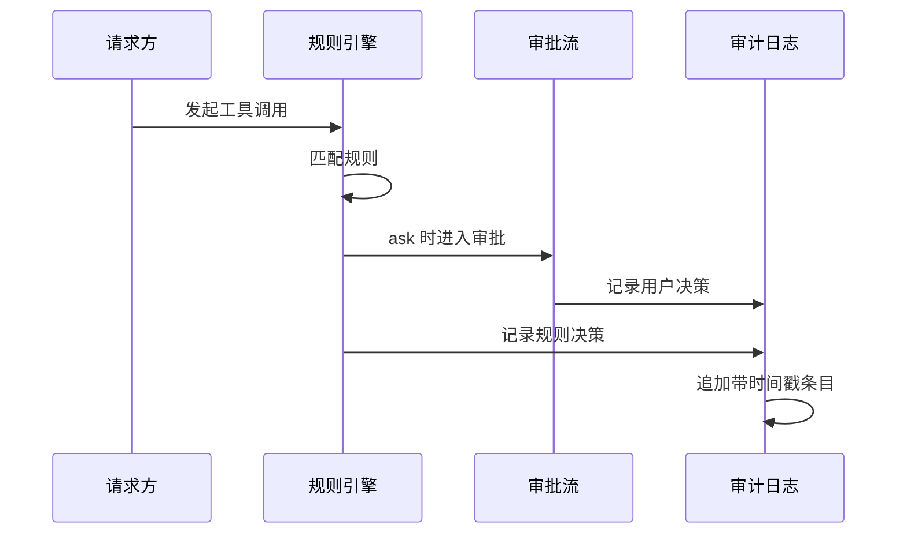

# 手写权限闸门：规则引擎、审批与审计

!!! abstract "学完这一页你能"
    1. 用工具名加参数模式写出可测试的权限规则，并说明为什么正则过滤会漏。
    2. 实现 deny、ask、allow 三档优先级，让宽泛拒绝总在精确放行之前命中。
    3. 按用户、项目、会话范围合并规则，并用超时机制处理挂起的审批。
    4. 记录带决策理由的审计日志，回放历史请求找出规则变化导致的不一致。

## 0. 知识地图



建议怎么读：先看 `## 1` 建立三层模型，再读 `## 2` 到 `## 4` 掌握规则语法、优先级和范围。`## 5` 和 `## 6` 是关键，说明为什么正则不够，以及解析式检测怎么写。`## 7` 和 `## 8` 把同步判断扩展到异步审批和事后审计。

## 1. 权限闸门的三层模型：规则、审批、审计

**先想一个问题**：模型要执行 `Bash(git push --force origin main)`，你不想每次确认，又不想完全放开。一个纯函数怎么做分层判断？

!!! note "术语：权限闸门（Permission Gate）"
    权限闸门是模型每次调用工具前必须经过的判断层，输出 allow、ask 或 deny。它解决的是在自动化和人工把关之间找可控位置。
    例如：读项目内文档 `Read(./docs)` 可以直接 allow，写 `.env` 要 deny，删仓库要 ask。

**心智模型**

!!! tip "心智模型"
    一句话模型：三个门串行通过，规则先筛，审批再补，审计最后留痕。
    日常类比：办公楼门禁卡先判断能不能进，访客进不去就由前台人工确认，所有进出录像备查。
    类比在哪里不成立：能力上，门禁只看你有没有卡，不看你拿卡去哪个房间；权限闸门还要看目标资源、参数和上下文。

**图解**



1. 权限请求先进入规则引擎，请求包含工具名、参数和范围。
2. 规则引擎按 deny、ask、allow 的顺序匹配规则。
3. deny 命中直接拒绝，allow 命中直接放行。
4. ask 命中进入审批流，由用户或超时策略决定。
5. 最终结果写入审计日志，记录命中的规则和理由。

**一步一步来**

①这一步要做什么：定义三个决策类型和一个最小请求对象。

```js
// gate-core.mjs
export const ALLOW = 'allow'; // 直接放行
export const ASK = 'ask';     // 需要审批
export const DENY = 'deny';   // 直接拒绝

// 一次权限判断的输入
export function makeRequest(tool, args, scope = 'session') {
  return { tool, args, scope }; // 工具名、参数字符串、范围
}
```

**这段代码在做什么**：定义决策枚举；`makeRequest` 把工具名、参数和范围打包成统一请求。这样后续规则匹配只依赖一个入参。

运行结果：无输出，导出常量与工厂函数。

②这一步要做什么：写一个最小 evaluate，先按工具名和精确参数匹配。

```js
export function makeRule({ id, effect, tool, pattern, scope = 'session' }) {
  return { id, effect, tool, pattern, scope };
}

export function evaluate(request, rules) {
  const order = [DENY, ASK, ALLOW]; // 优先级固定
  for (const effect of order) {
    for (const rule of rules) {
      if (rule.effect !== effect) continue; // 跳过低优先级规则
      if (rule.tool !== request.tool) continue;
      if (rule.scope !== request.scope) continue;
      if (rule.pattern !== '*' && rule.pattern !== request.args) continue;
      return { effect: rule.effect, matchedRule: rule.id };
    }
  }
  return { effect: ALLOW, matchedRule: null }; // 无匹配默认放行
}
```

**这段代码在做什么**：按固定优先级遍历规则，首个匹配即返回。无匹配默认 allow，这个默认值要随场景调整。

运行结果：给定请求和规则后返回 `{ effect, matchedRule }`。

**动手验证**

```js
// gate-core.test.mjs
import assert from 'node:assert/strict';
import { ALLOW, DENY, ASK, makeRequest, makeRule, evaluate } from './gate-core.mjs';

const req = makeRequest('Bash', 'git push --force origin main', 'session');
const rules = [
  makeRule({ id: 'deny-force', effect: DENY, tool: 'Bash', pattern: '*', scope: 'session' }),
  makeRule({ id: 'allow-git', effect: ALLOW, tool: 'Bash', pattern: 'git push --force origin main', scope: 'session' }),
];

const result = evaluate(req, rules);
assert.equal(result.effect, DENY); // 宽泛 deny 先于精确 allow
assert.equal(result.matchedRule, 'deny-force');
console.log('result:', result);
// 预期输出：result: { effect: "deny", matchedRule: "deny-force" }
```

**常见坑**

| 现象 | 原因 | 怎么修 |
|---|---|---|
| 精确 allow 不生效 | 宽泛 deny 先命中 | 调整 deny 规则的 pattern，或把放行放在 deny 之前，但会破坏优先级设计 |
| 无匹配返回 allow | 默认策略没有配置 | 改为显式 `defaultEffect`，生产环境常设为 ASK 或 DENY |
| 参数多一个空格就漏匹配 | 用字符串直接比较 | 改用 token 级模式匹配，见 `## 2` |

**用在哪里**

- **企业级 CLI 代码助手**：业务背景是工程师让模型执行 Bash 命令。这一节的知识用于给每次 Bash 调用建请求对象和规则评估。收益指标是人工确认次数下降、误放行危险命令次数下降。当命令作用在一次性容器或测试沙箱中时，可以不加规则引擎，直接用 OS 沙箱。
- **低代码平台的流程插件**：业务背景是用户配置的脚本需要受平台约束。这一节的知识用于把插件调用统一成权限请求。收益指标是越权调用被拦截的比例。当插件只能读写自己的命名空间时，追加规则引擎反而增加配置成本。

**行业实践**

- Claude Code 官方文档规定规则评估顺序为 deny、ask、allow，首个匹配生效，作用域不能改变顺序。来源：Claude Code 官方文档 permissions 章节，以原文为准。
- MCP 规范建议工具调用始终保留人在环中的拒绝能力。来源：Model Context Protocol 2025-06-18 tools 规范，以原文为准。
- 怎么借鉴到你的项目：永远把 deny 优先级写死在引擎里，不让调用方通过规则排序改变语义；给默认决策增加可配置项，并要求调用方显式选择。

**小结**

1. 权限闸门由规则引擎、审批流、审计日志三层组成。
2. 规则引擎的核心是固定优先级和首个匹配即返回。
3. 默认放行不是安全默认值，生产环境应显式配置。

## 2. 规则语法：工具加参数模式

**先想一个问题**：你只想放行 `npm test`，同时拒绝 `npm publish`。用一条规则怎么写清楚“工具名加参数形状”？

!!! note "术语：规则语法（Rule Syntax）"
    规则语法用 `Tool(pattern)` 表达对某个工具的参数约束。Tool 是工具名，pattern 是对参数的匹配模式。
    例如 `Bash(npm test *)` 表示 Bash 工具执行以 `npm test` 开头的命令会被这条规则命中。

**心智模型**

!!! tip "心智模型"
    一句话模型：规则是说“某个工具的参数长成什么样时，该给什么结论”。
    日常类比：食堂窗口写着“牛肉面可以自取，海鲜饭要厨师确认，芒果班戟不能吃”。
    类比在哪里不成立：食堂不看你的身份，而规则还要结合用户、项目、会话范围。

**图解**



1. 原始规则文本如 `Bash(npm test *)` 先解析成 tool 和 pattern。
2. pattern 拆成 token 数组，`*` 作为单 token 通配符保留。
3. 原始命令用 parseCommandLine 拆成参数 token 数组。
4. matchPattern 用 token 数组和模式 token 数组做匹配。
5. 返回布尔值决定规则是否命中。

**一步一步来**

①这一步要做什么：解析规则文本，把 `Tool(pattern)` 拆成两个字段。

```js
export function parseRule(text) {
  const match = text.match(/^(\w+)\(([^)]*)\)$/); // 匹配 Tool(pattern)
  if (!match) throw new Error(`无法解析规则: ${text}`);
  const [, tool, pattern] = match;
  return { tool, pattern: pattern.trim() }; // 去掉首尾空白
}
```

**这段代码在做什么**：用正则提取工具名和括号内模式。不支持嵌套括号，适合参数模式较扁平的场景。

运行结果：`parseRule('Bash(npm test *)')` 返回 `{ tool: 'Bash', pattern: 'npm test *' }`。

②这一步要做什么：把命令字符串拆成参数 token 数组，支持单双引号。

```js
export function parseCommandLine(command) {
  const tokens = [];
  const re = /"([^"]*)"|'([^']*)'|(\S+)/g; // 双引号、单引号、裸词
  let m;
  while ((m = re.exec(command))) {
    tokens.push(m[1] ?? m[2] ?? m[3]); // 取第一个非空捕获组
  }
  return tokens;
}
```

**这段代码在做什么**：用全局正则按顺序匹配引号内字符串或非空白词。这样 `rm "a b"` 会得到 `['rm', 'a b']`，不会把引号内空格当分隔符。

运行结果：`parseCommandLine('npm test unit')` 返回 `['npm', 'test', 'unit']`。

③这一步要做什么：实现 token 级模式匹配，让 `*` 只消耗一个参数。

```js
export function matchPattern(tokens, pattern) {
  const parts = pattern.split(/\s+/); // 模式拆成 token
  let ti = 0;
  for (const part of parts) {
    if (part === '*') {
      if (ti < tokens.length) ti++; // 消耗一个参数
      continue;
    }
    if (ti >= tokens.length || tokens[ti] !== part) return false;
    ti++;
  }
  return ti === tokens.length; // 必须全部消费完
}
```

**这段代码在做什么**：模式 token 与参数 token 逐个比较；`*` 匹配一个参数。这样 `curl *` 不会匹配 `curl -L https://exmaple.com` 的第二个参数，只会匹配第一个参数。

运行结果：`matchPattern(['npm', 'test', 'unit'], 'npm test *')` 返回 `true`。

**动手验证**

```js
// rule-syntax.test.mjs
import assert from 'node:assert/strict';
import { parseRule, parseCommandLine, matchPattern } from './rule-syntax.mjs';

assert.deepEqual(parseRule('Bash(npm test *)'), { tool: 'Bash', pattern: 'npm test *' });
assert.deepEqual(parseCommandLine('curl -L "https://x.test/a b"'), ['curl', '-L', 'https://x.test/a b']);
assert.equal(matchPattern(['npm', 'test', 'unit'], 'npm test *'), true);
assert.equal(matchPattern(['npm', 'test'], 'npm test *'), false); // * 需要参数
console.log('rule-syntax tests passed');
// 预期输出：rule-syntax tests passed
```

**常见坑**

| 现象 | 原因 | 怎么修 |
|---|---|---|
| `*` 想匹配多个参数但不生效 | 实现里 `*` 只消耗一个 token | 增加 `**` 或把 `*` 定义成贪婪，需改写匹配算法 |
| 模式带引号错乱 | 模式字符串没有独立分词 | 对模式复用 parseCommandLine，不要用 split |
| 文本规则无法表达嵌套参数 | 正则只支持一层括号 | 换 DSL 或 JSON 规则，明确不支持嵌套并报错 |

**用在哪里**

- **代码助手权限配置界面的底层**：业务背景是管理员用文本规则配置哪些命令可跑。这一节的知识用于把文本解析成可执行的规则对象。收益指标是规则解析错误率下降、配置时间缩短。当规则超过 50 条或需要参数逻辑组合时，建议改用结构化 JSON 编辑。
- **CI/CD 命令行包装器**：业务背景是企业内网 Jenkins 只能执行白名单命令。这一节的知识用于把白名单写成 `Tool(pattern)` 形式。收益指标是越权命令被拦截数量。当命令需要管道或重定向时，token 级匹配只覆盖参数数组，shell 符号需要单独建模。

**行业实践**

- Claude Code 官方文档列出 `Bash(npm test *)`、`Bash(git push *)`、`WebFetch(domain:github.com)` 等示例。来源：Claude Code 官方文档 permissions 章节，以原文为准。
- 官方文档同时警告“参数约束模式很脆弱”，因为命令存在选项重排、子 shell、变量等绕过。来源：Claude Code 官方文档 permissions 章节，以原文为准。
- 怎么借鉴到你的项目：把规则文本解析和参数解析分开，便于单独测试；在文档中明确 `*` 的匹配范围，避免用户误以为能阻止所有变体。

**小结**

1. 规则语法用工具名加参数模式表达约束。
2. 命令解析要支持引号，避免空格把参数切错。
3. 单 `*` 消耗一个参数的表达式更可预测，但需要补充文档说明不是安全边界。

## 3. 优先级：deny 先于 ask 先于 allow

**先想一个问题**：一条宽泛 deny 规则 `Bash(aws *)` 和一条更精确 allow 规则 `Bash(aws s3 ls)` 同时存在，决定该用谁？

!!! note "术语：优先级（Precedence）"
    优先级决定多条规则同时匹配时哪一个生效，本页固定为 deny 先于 ask 先于 allow，作用域说明不了优先级。
    例如 `Bash(aws *)` 被 deny，即使有 `Bash(aws s3 ls)` 精确 allow，请求 `aws s3 ls` 仍然被 deny。

**心智模型**

!!! tip "心智模型"
    一句话模型：优先级是政策的硬顺序，越危险的效果越先看。
    日常类比：消防通道写着“任何情况不得堆放”，即使你还有“临时放一下”的内部规定，消防规定先到。
    类比在哪里不成立：现实中政策可以逐级申诉，而规则引擎没有申诉，首个匹配立即终止。

**图解**



1. 所有规则先按 effect 排序：deny 排最前，ask 居中，allow 最后。
2. 同一 effect 内部按原数组顺序匹配。
3. 任意一条命中就立即返回，不再看更后面的 allow。
4. 也就是说精确 allow 不会因为精确而插队。

**一步一步来**

①这一步要做什么：给 effect 定义数值 rank，排序即可表达优先级。

```js
export function rank(effect) {
  const order = { deny: 0, ask: 1, allow: 2 }; // 越小越先
  return order[effect] ?? 3; // 未知效果排最后
}
```

**这段代码在做什么**：建立 effect 到数字的映射，未知 effect 给 3，避免污染正常规则。

运行结果：`rank('deny')` 返回 `0`，`rank('allow')` 返回 `2`。

②这一步要做什么：evaluate 先排序再逐个匹配，首个命中立即返回。

```js
export function evaluateByPriority(request, rules) {
  const sorted = [...rules].sort((a, b) => rank(a.effect) - rank(b.effect)); // 稳定排序
  for (const rule of sorted) {
    if (rule.tool !== request.tool) continue; // 工具名不匹配跳过
    if (rule.scope !== request.scope) continue;
    if (rule.pattern !== '*' && rule.pattern !== request.args) continue;
    return { effect: rule.effect, matchedRule: rule.id };
  }
  return { effect: 'allow', matchedRule: null };
}
```

**这段代码在做什么**：排序后规则顺序不再由配置者决定，而由 rank 决定。宽泛 deny 只要工具名匹配就能阻止精确 allow。

运行结果：请求 `Bash(aws s3 ls)` 在规则 `deny Bash(aws *)` 和 `allow Bash(aws s3 ls)` 下返回 deny。

**动手验证**

```js
// priority.test.mjs
import assert from 'node:assert/strict';
import { rank, evaluateByPriority } from './priority.mjs';

const req = { tool: 'Bash', args: 'aws s3 ls', scope: 'session' };
const rules = [
  { id: 'allow-s3-ls', effect: 'allow', tool: 'Bash', pattern: 'aws s3 ls', scope: 'session' },
  { id: 'deny-aws', effect: 'deny', tool: 'Bash', pattern: 'aws *', scope: 'session' },
];

const result = evaluateByPriority(req, rules);
assert.equal(result.effect, 'deny'); // 宽泛 deny 先命中
assert.equal(result.matchedRule, 'deny-aws');
console.log('priority test passed');
// 预期输出：priority test passed
```

**常见坑**

| 现象 | 原因 | 怎么修 |
|---|---|---|
| 精确 allow 被宽泛 deny 拒绝后，管理员以为配置错了 | 优先级设计使然 | 在配置界面把 deny 规则高亮，并说明“先拒绝后放行” |
| 同一优先级多条规则顺序不确定 | 依赖数组原始顺序 | 给规则增加 id 或优先级数字，排序时做二级排序 |
| unknown effect 被当成 deny 或 allow | 未处理未知值 | rank 返回 3 并把未知 effect 单独记录日志 |

**用在哪里**

- **云资源操作审计系统**：业务背景是公司既要有总开关禁止所有 `aws` 命令，又只开个别只读命令。这一节的知识用于保证总开关永远赢。收益指标是越权 AWS 调用数量。当精确 allow 需要在特殊情况下覆盖 deny 时，不该用这套优先级，要用审批流程或临时规则。
- **代码审查机器人的安全规则**：业务背景是仓库里既有基础安全规则，也有团队自定义规则。这一节的知识用于让安全规则在合并前始终优先。收益指标是危险 PR 被阻止的比例。当规则超过几百条时，要加索引或预过滤器，不能每条都全量匹配。

**行业实践**

- Claude Code 官方文档明确指出：规则评估顺序是 deny、ask、allow，首个匹配胜出，作用域不影响顺序，宽泛 deny 会阻止更窄 allow。来源：Claude Code 官方文档 permissions 章节，以原文为准。
- Anthropic 工程博客报告，用户手动批准了 93% 的权限提示，说明默认放行或频繁询问都会造成审批疲劳。来源：Anthropic 研究系统文章，以原文为准。
- 怎么借鉴到你的项目：把 deny 规则集中在配置文件顶部，用颜色或注释标出“此处优先级最高”；对任何 deny 命中记录完整请求，便于复核是否误伤。

**小结**

1. 优先级是权限引擎不可配置的硬顺序。
2. 宽泛 deny 必须优先于精确 allow，否则安全规则很容易被细则架空。
3. 排序加首个匹配即返回是实现优先级的最小方案。

## 4. 范围：用户、项目与会话

**先想一个问题**：个人本地想放行 `npm link`，但团队项目规则禁止，项目发布环境又要更严格。三条规则怎么合并？

!!! note "术语：范围（Scope）"
    范围定义规则在哪个层级生效：用户、项目、会话（个人本地，通常随会话结束消失）或托管配置。
    例如项目范围规则提交进仓库，团队成员都会拿到；会话范围规则只留在本地环境，与个人偏好或临时授信相关。

**心智模型**

!!! tip "心智模型"
    一句话模型：范围是规则挂在哪个抽屉，抽屉按顺序从里往外一层层盖上来。
    日常类比：个人桌面便利贴、部门公告栏、公司红头文件，越往外管得越硬。
    类比在哪里不成立：便利贴和公告不会消失，会话范围规则随会话结束失效。

**图解**



1. 先收集会话范围的规则。
2. 再附加项目范围的规则。
3. 然后附加上用户范围的规则。
4. 托管规则最后加入。
5. 合并后的数组交给 evaluateByPriority，评估时由优先级统一排序，范围只在收集时决定包含哪些规则。

**一步一步来**

①这一步要做什么：定义范围顺序，从局部到全局收集规则。

```js
export const SCOPE_ORDER = ['session', 'project', 'user', 'managed']; // 从内到外

export function collectRules(scopeMap) {
  const rules = [];
  for (const scope of SCOPE_ORDER) {
    const list = scopeMap[scope] ?? []; // 缺失范围给空数组
    rules.push(...list); // 保持注入顺序
  }
  return rules;
}
```

**这段代码在做什么**：按固定顺序把各范围规则拼接为一个数组。范围只决定有哪些规则参与，不再影响同优先级下的排序。

运行结果：给四个范围的规则数组，返回合并后数组。

②这一步要做什么：把规则标记来源，方便审计时追踪。

```js
export function markScope(rules, scope) {
  return rules.map((rule) => ({ ...rule, scope })); // 添加 scope 字段
}
```

**这段代码在做什么**：给每条规则补充 scope 字段，审计日志能显示规则来自哪一层。

运行结果：为规则对象增加 `scope` 字段。

**动手验证**

```js
// scope.test.mjs
import assert from 'node:assert/strict';
import { collectRules, markScope, evaluateByPriority } from './scope.mjs';

const session = markScope([{ id: 'allow-link', effect: 'allow', tool: 'Bash', pattern: 'npm link' }], 'session');
const project = markScope([{ id: 'deny-link', effect: 'deny', tool: 'Bash', pattern: 'npm link' }], 'project');

const req = { tool: 'Bash', args: 'npm link', scope: 'session' };
const rules = collectRules({ session, project, user: [], managed: [] });
const result = evaluateByPriority(req, rules);
assert.equal(result.effect, 'deny'); // 项目 deny 覆盖会话 allow
assert.equal(result.matchedRule, 'deny-link');
console.log('scope test passed');
// 预期输出：scope test passed
```

**常见坑**

| 现象 | 原因 | 怎么修 |
|---|---|---|
| 会话规则想覆盖项目规则但失败 | 项目 deny 优先级更高 | 改成 ask 或把项目规则允许，通过会话范围拒绝 |
| managed 规则被本地 allow 覆盖 | 收集顺序错误 | SCOPE_ORDER 中托管规则放最后，并评估时 deny 优先 |
| 规则来源丢失 | 没有 markScope | 每条规则写入时强制带 scope 字段 |

**用在哪里**

- **团队共享代码助手**：业务背景是团队把安全规则放进项目仓库，与新同事共享。这一节的知识用于合并项目范围规则与会话本地规则。收益指标是新成员越权操作次数，以及规则同步的配置漂移率。当规则涉及个人隐私路径时，项目规则不应写入仓库。
- **多租户 SaaS 管理后台**：业务背景是租户、项目、用户三层需要不同权限。这一节的知识用于按范围分层加载规则。收益指标是越权请求被拦截比例，以及新增租户时的配置耗时。当租户数超过几百时，要引入数据库存储和索引，不能每次请求都全量拼接。

**行业实践**

- Claude Code 官方文档列出 user、project、local、managed 四种设置范围，且托管设置优先级最高，没有层级能覆盖托管 permission rule。来源：Claude Code 官方文档 permissions 章节，以原文为准。
- pi 的 security 文档说明项目信任只控制 `.pi` 资源的加载，不限制工具调用能访问什么。来源：pi security.md 文档，以原文为准。
- 怎么借鉴到你的项目：把范围收集和优先级评估分开；托管规则用只读配置，在代码中拒绝任何本地覆盖；每个规则带 `source` 字段写进审计日志。

**小结**

1. 范围决定规则是否参与评估，优先级决定命中后返回什么。
2. 内层范围先收集，外层范围后收集，托管规则通常最后且不可覆盖。
3. 规则来源必须随审计日志保存，否则事后无法定位是谁设的规则。

## 5. 危险路径检测：为什么正则命令过滤会被绕过

**先想一个问题**：用 `/rm -rf/` 正则去拦截危险命令，为什么攻击者换一下选项顺序或包一层 `sh -c` 就绕过了？

!!! note "术语：危险路径（Dangerous Path）"
    危险路径指可能造成不可逆损害或数据泄露的执行路径，例如递归强制删除、强制推送、访问云元数据地址。
    例如 `rm -rf /tmp` 是危险路径，`rm file.txt` 不危险，因为后者可逆且范围小。

**心智模型**

!!! tip "心智模型"
    一句话模型：正则看“影子”，解析看“结构”。
    日常类比：门口贴一张“穿黑衣服不许进”的纸条，换灰衣服就能绕过；安检门看的是物品结构，不依赖颜色关键词。
    类比在哪里不成立：现实安检也有漏检率，但解析式检测可以穷举规则内变体，不靠人类识别句子。

**图解**



1. 正则路径在原始字符串上寻找固定子串。
2. 只要原始字符串不包含“rm -rf”就直接放行。
3. 解析路径先把命令拆成参数 token 数组。
4. 结构签名匹配针对 token 数组，能识别选项重排和嵌套子 shell 的参数序列。
5. 正则路径漏掉的结构变体，解析路径能捕获。

**一步一步来**

①这一步要做什么：展示一个典型正则守卫。

```js
export function regexGuard(command) {
  if (/rm -rf/.test(command)) return 'deny'; // 只匹配固定字符串
  return 'allow';
}
```

**这段代码在做什么**：在原始命令字符串上检索固定子串 `rm -rf`。命令只要不出现这个连续子串就返回 allow。

运行结果：`regexGuard('rm -rf /tmp')` 返回 `'deny'`。

②这一步要做什么：用四个绕过样例证明正则守卫失效。

```js
const bypasses = [
  'rm -fr /tmp',                    // 选项重排：-rf 变成 -fr
  'rm --recursive --force /tmp',    // 长选项：-rf 展开
  'sh -c "rm -rf /tmp"',           // 子 shell：真正命令藏在引号里
  'D="/tmp"; rm -rf "$D"',         // 变量：命令目标是变量
];

for (const cmd of bypasses) {
  const result = regexGuard(cmd);
  if (result !== 'deny') console.log(`绕过成功: ${cmd}`);
}
```

**这段代码在做什么**：四个命令都不包含连续 `rm -rf`，所以正则守卫返回 allow。这证明在原始字符串上查找关键词不可靠。

运行结果：

```text
绕过成功: rm -fr /tmp
绕过成功: rm --recursive --force /tmp
绕过成功: sh -c "rm -rf /tmp"
绕过成功: D="/tmp"; rm -rf "$D"
```

**动手验证**

```js
// regex-bypass.test.mjs
import assert from 'node:assert/strict';
import { regexGuard } from './regex-guard.mjs';

const bypasses = [
  'rm -fr /tmp',
  'rm --recursive --force /tmp',
  'sh -c "rm -rf /tmp"',
  'D="/tmp"; rm -rf "$D"',
];

for (const cmd of bypasses) {
  assert.equal(regexGuard(cmd), 'allow'); // 每一条都绕过正则
}
console.log('regex bypass verified');
// 预期输出：regex bypass verified
```

**常见坑**

| 现象 | 原因 | 怎么修 |
|---|---|---|
| 只拦 `rm -rf` 但 `rm -fr` 通过 | 选项顺序敏感 | 用 token 匹配并显式列出 `-rf`、`-fr`、`--recursive --force` |
| 子 shell 执行绕过 | 原始字符串检测不到内部命令 | 解析 `sh -c` 参数，再递归检查内部命令 |
| 变量赋值绕过 | 检测器未展开变量 | 拒绝所有未绑定的变量执行危险命令，或要求命令先过资产白名单 |

**用在哪里**

- **代码助手命令代理的输入防线**：业务背景是模型在本地终端执行 Bash 命令。这一节的知识用于识别“看起来不像危险但结构是危险”的命令。收益指标是危险命令误放行数量。当命令在完全隔离的一次性容器中执行时，正则防线可以作为粗筛，但不应作为唯一防线。
- **工单系统命令执行插件**：业务背景是运维允许用户在工单中填写固定格式命令。这一节的知识用于校验命令结构与参数。收益指标是违规命令被拦截比例。当用户只需要从一个下拉框选择命令时，不该用正则或解析式过滤，直接用命令白名单枚举更可靠。

**行业实践**

- Claude Code 官方文档警告参数约束模式很脆弱：`curl http://github.com/ *` 会漏掉选项重排、`https`、重定向和变量。来源：Claude Code 官方文档 permissions 章节，以原文为准。
- MCP 安全最佳实践建议使用出口代理阻止内部目标，并警告不要手写 IP 校验，因为存在八进制、十六进制、IPv4 映射等编码手段。来源：Model Context Protocol 2025-06-18 security best practices，以原文为准。
- 怎么借鉴到你的项目：把“检测”和“执行环境”分开；正则过滤只能做日志提取或粗筛，不能做安全边界；真正的边界放在命令白名单、沙箱或网络代理层。

**小结**

1. 原始字符串正则过滤很容易被选项重排、引号、子 shell 绕过。
2. 危险路径检测必须建立在命令结构解析之上。
3. 正则可以做粗筛，不能作为唯一安全控制。

## 6. 解析式检测：把命令拆成可匹配的参数表

**先想一个问题**：不用正则，怎么把 `sh -c "rm -rf /tmp"` 和 `rm --recursive --force /tmp` 都识别为删除危险操作？

!!! note "术语：解析式检测（Parsing-Based Detection）"
    解析式检测先把命令文本解析成参数 token 数组，再用签名表匹配结构。
    例如 `sh -c "rm -rf /tmp"` 解析后为 `['sh', '-c', 'rm -rf /tmp']`，递归解析 `-c` 参数能拿到内部 argv `['rm', '-rf', '/tmp']`。

**心智模型**

!!! tip "心智模型"
    一句话模型：解析式检测先看参数结构，再和已知危险签名比较。
    日常类比：快递安检先按物品类别分拣，再对照禁运清单检查，而不是在快递单文本里搜“危险”两个字。
    类比在哪里不成立：快递安检看实体，命令解析只能看到文本结构，真正的执行语义还是要由执行环境兜底。

**图解**



1. 原始命令先解析成参数 token 数组。
2. 如果工具是 `sh` 且参数包含 `-c`，递归解析其后的命令字符串。
3. 内部 argv 与签名表逐条匹配。
4. 命中签名就返回对应的 deny 或 ask。
5. 未命中继续往后匹配，最后返回默认结果。

**一步一步来**

①这一步要做什么：定义危险签名表，每条签名都带决策效果和理由。

```js
export const DANGER_SIGNATURES = [
  { argv: ['rm', '-rf', '*'], effect: 'deny', reason: '递归强制删除' },
  { argv: ['rm', '-fr', '*'], effect: 'deny', reason: '递归强制删除变体' },
  { argv: ['rm', '--recursive', '--force', '*'], effect: 'deny', reason: '长选项递归强制删除' },
  { argv: ['sh', '-c', '*'], effect: 'ask', reason: '子 shell 内容需要人工确认' },
  { argv: ['git', 'push', '--force', '*'], effect: 'deny', reason: '强制推送远端' },
];
```

**这段代码在做什么**：签名表把“危险命令形状”翻译成可匹配的 token 数组，并给每条签名配好决策和理由。`*` 是单 token 通配符。

运行结果：无输出，导出常量数组。

②这一步要做什么：递归解析 `sh -c`，拿到内部命令 argv。

```js
export function extractNestedArgv(argv) {
  const cIndex = argv.indexOf('-c'); // 找到 -c 位置
  if (argv[0] === 'sh' && cIndex !== -1 && argv[cIndex + 1]) {
    return parseCommandLine(argv[cIndex + 1]); // 递归解析内部命令
  }
  return argv; // 没有嵌套就返回原 argv
}
```

**这段代码在做什么**：针对 `sh -c` 的结构，把 `-c` 后面的字符串继续交给 parseCommandLine。这样内部命令也会变成一个可匹配的 token 数组。

运行结果：`extractNestedArgv(['sh', '-c', 'rm -rf /tmp'])` 返回 `['rm', '-rf', '/tmp']`。

③这一步要做什么：把请求参数解析成嵌套 argv，再与签名表匹配。

```js
export function detectDanger(request) {
  if (request.tool !== 'Bash') return { effect: 'allow', reason: '非 Bash 工具' };
  const argv = extractNestedArgv(parseCommandLine(request.args)); // 解析加递归
  for (const sig of DANGER_SIGNATURES) {
    if (matchPattern(argv, sig.argv.join(' '))) { // 复用 token 匹配
      return { effect: sig.effect, reason: sig.reason };
    }
  }
  return { effect: 'allow', reason: '未命中危险签名' };
}
```

**这段代码在做什么**：先解析参数，再对每条签名复用 token 级匹配。`matchPattern` 是 `## 2` 的实现，这里把签名数组拼回模式字符串复用。

运行结果：`detectDanger({ tool: 'Bash', args: 'rm -fr /tmp' })` 返回 `{ effect: 'deny', reason: '递归强制删除变体' }`。

**动手验证**

```js
// parsed-gate.test.mjs
import assert from 'node:assert/strict';
import { parseCommandLine, matchPattern } from './rule-syntax.mjs';
import { DANGER_SIGNATURES, extractNestedArgv, detectDanger } from './parsed-gate.mjs';

assert.deepEqual(extractNestedArgv(['sh', '-c', 'rm -rf /tmp']), ['rm', '-rf', '/tmp']);
assert.equal(detectDanger({ tool: 'Bash', args: 'rm -fr /tmp' }).effect, 'deny');
assert.equal(detectDanger({ tool: 'Bash', args: 'sh -c "rm -rf /tmp"' }).effect, 'ask');
assert.equal(detectDanger({ tool: 'Bash', args: 'git push --force origin main' }).effect, 'deny');
assert.equal(detectDanger({ tool: 'Bash', args: 'ls -la' }).effect, 'allow');
console.log('parsed gate tests passed');
// 预期输出：parsed gate tests passed
```

**常见坑**

| 现象 | 原因 | 怎么修 |
|---|---|---|
| 嵌套 `sh -c` 内部还带 `sh -c` 漏检 | 只递归了一层 | 改成循环解析，最多限制 3 层防止无穷递归 |
| 长选项和短选项合并写错 | 签名表没有覆盖所有变体 | 签名表按工具维护，由测试用例驱动补全 |
| 误杀普通 `sh -c` 调用 | `sh -c` 全部 ask | 限制 ask 的 `-c` 内容，内部命令再走一遍危险检测，而不是所有 `sh -c` 都 ask |

**用在哪里**

- **代码助手本地命令拦截器**：业务背景是模型执行命令前要拦截递归删除和强制推送。这一节的知识用于把命令拆成 argv 并匹配签名表。收益指标是危险命令误放行数。当命令参数来自用户自定义脚本且包含大量正常变体时，签名表维护成本高，建议改用沙箱网络和文件系统限制。
- **运维工单命令解析器**：业务背景是工单里允许填写少量固定 Bash 模板。这一节的知识用于校验模板实例化后的 argv 是否满足安全签名。收益指标是违规模板被拦截比例。当命令必须包含任意参数组合时，签名表不该做唯一校验，要配合权限白名单。

**行业实践**

- Claude Code 官方文档提到参数约束模式会漏掉选项重排、重定向、变量这些结构变化，推荐结合沙箱网络白名单或 PreToolUse 钩子。来源：Claude Code 官方文档 permissions 章节，以原文为准。
- Anthropic 工程博客报告两阶段分类器最终误报率 0.4%，说明结构检查和分类器可以组合使用。来源：Anthropic 研究系统文章，以原文为准。
- 怎么借鉴到你的项目：把签名表做成数据而非散落在代码里的 if 判断；每条签名必须带 reason，并写进审计日志；对 `sh -c` 等嵌套结构先递归解析再匹配。

**小结**

1. 解析式检测的核心是 parseCommandLine 加签名表匹配。
2. 嵌套执行结构需要递归解析，才能看到内部命令。
3. 每条危险签名都要有理由字段，审计日志才有据可查。

## 7. 审批流与超时：从同步判断到异步决策

**先想一个问题**：规则返回 ask 后，用户一直不点批准，模型不能永远等下去。超时后该怎么决定？

!!! note "术语：审批流（Approval Flow）"
    审批流是规则引擎返回 ask 后，把决策转交给用户或策略的异步过程，带超时和状态转换。
    例如 `pending` 表示等待用户，`approved` 表示用户放行，`denied` 表示用户拒绝，`timeout` 表示等待超时自动决策。

**心智模型**

!!! tip "心智模型"
    一句话模型：审批流是带表盘的保险柜，时间到没人来就自动落锁。
    日常类比：访客按门禁门卫说“我打电话问一下”，如果电话一直占线，规定 30 秒后拒绝进入。
    类比在哪里不成立：现实中门卫可以下班前再回拨，系统超时策略只能退化成默认拒绝，不能“稍后再试”。

**图解**



1. 审批请求创建后进入 pending 状态。
2. 用户允许则转为 approved。
3. 用户拒绝则转为 denied。
4. 等待时间超过限制则转为 timeout，并执行默认决策。
5. 最终状态都到达终止，不会无限悬挂。

**一步一步来**

①这一步要做什么：创建审批请求对象，记录工具和决策上下文。

```js
export function createApproval(request, triggerRule) {
  const id = `${request.tool}:${Date.now()}`; // 简单唯一 id
  return { id, status: 'pending', request, triggerRule };
}
```

**这段代码在做什么**：审批对象包含唯一 id、初始 pending 状态、原请求和触发审批的规则。id 用时间戳只是演示，生产环境要改用随机 id 防冲突。

运行结果：返回 `{ id, status: 'pending', request, triggerRule }`。

②这一步要做什么：实现带超时的审批管理器，超时后自动拒绝。

```js
export class ApprovalFlow {
  constructor({ timeoutMs = 5000, onTimeout = () => ({ effect: 'deny' }) }) {
    this.timeoutMs = timeoutMs; // 超时毫秒数
    this.onTimeout = onTimeout; // 超时决策函数
    this.timers = new Map(); // id 到定时器
  }

  start(approval) {
    const timer = setTimeout(() => {
      this.timers.delete(approval.id);
      return this.decide(approval.id, this.onTimeout()); // 触发超时决策
    }, this.timeoutMs);
    this.timers.set(approval.id, timer);
  }

  decide(id, decision) {
    const timer = this.timers.get(id);
    if (timer) clearTimeout(timer); // 清理定时器
    this.timers.delete(id);
    return { id, effect: decision.effect, status: 'decided' };
  }
}
```

**这段代码在做什么**：start 启动超时定时器，超时后调用 onTimeout 并走普通决策路径。decide 负责清理定时器，确保正常决策不会和超时重复触发。

运行结果：创建审批并 start，5 秒后自动得到 `{ id, effect: 'deny', status: 'decided' }`。

**动手验证**

```js
// approval.test.mjs
import assert from 'node:assert/strict';
import { createApproval, ApprovalFlow } from './approval.mjs';

const approval = createApproval({ tool: 'Bash', args: 'sh -c "rm -rf /tmp"', scope: 'session' }, 'ask-sh-c');
assert.equal(approval.status, 'pending');

const flow = new ApprovalFlow({ timeoutMs: 20, onTimeout: () => ({ effect: 'deny' }) });
flow.start(approval);
const result = await new Promise((resolve) => {
  setTimeout(() => resolve(flow.decide(approval.id, { effect: 'deny' })), 50);
});
assert.equal(result.status, 'decided');
assert.equal(result.effect, 'deny');
console.log('approval timeout verified');
// 预期输出：approval timeout verified
```

**常见坑**

| 现象 | 原因 | 怎么修 |
|---|---|---|
| 超时后用户才点允许，两次决策 | 超时触发后没有取消用户操作入口 | 决策前检查审批状态是否为 pending，非 pending 直接忽略 |
| 定时器泄漏 | 审批对象被丢弃但定时器没清理 | 在 decide 或取消路径中统一 clearTimeout |
| 超时策略固定 deny，用户体验差 | 环境不区分交互与非交互 | 允许 onTimeout 注入，CLI 超时 deny，Web 超时设为 ask |

**用在哪里**

- **代码助手交互式 CLI**：业务背景是模型问“允许执行吗”，用户在终端里可能走开。这一节的知识用于给审批加超时，超时自动拒绝。收益指标是悬置审批数量和超时响应时间。当用户明确希望“稍后回来再批”时，可以把超时策略设为请求时选择保留挂起，但不是默认。
- **Web 后台的敏感操作提示框**：业务背景是管理员在 UI 里确认批量删除。这一节的知识用于给按钮加倒计时和后台审批状态机。收益指标是前端等待阻塞时长和误操作率。当删除操作有回收站时，可以把超时策略改为保守允许并配合可逆操作。

**行业实践**

- Claude Code 官方文档说明 PreToolUse 钩子可返回 `permissionDecision` 的 deny、allow、ask、defer。来源：Claude Code 官方文档 hooks 章节，以原文为准。
- MCP 2025-06-18 tools 规范建议始终保留人类拒绝能力，客户端应设置超时并记录审计日志。来源：Model Context Protocol 2025-06-18 tools 规范，以原文为准。
- 怎么借鉴到你的项目：审批流状态机与超时回调解耦，便于命令行、Web、单测三种环境复用；超时决策必须写审计日志，防止死锁后无法复盘。

**小结**

1. 审批流把同步 ask 决策扩展为异步状态机。
2. 超时必须触发默认决策，否则挂起会耗尽用户耐心。
3. 定时器清理是防止重复决策和内存泄漏的关键。

## 8. 审计日志与回放：每个决定都有凭证

**先想一个问题**：事故发生后，怎么知道模型当时为什么执行了危险命令，以及规则后来是否被改过？

!!! note "术语：审计日志（Audit Log）"
    审计日志按时间顺序记录每次权限决策的请求、命中规则、决策结果和理由，支持事后回放。
    例如日志条目：`{ id: 'a1', tool: 'Bash', args: 'git push --force', result: 'deny', matchedRule: 'deny-force' }`。

**心智模型**

!!! tip "心智模型"
    一句话模型：审计日志是决策录像，回放是用同一份规则重跑历史请求。
    日常类比：银行监控录像加交易流水，出事后能按时间回放谁在哪个窗口做了什么。
    类比在哪里不成立：录像看过去就是过去，回放可以换一份规则重新模拟，发现“旧规则会放行，新规则会拒绝”。

**图解**



1. 请求方发起工具调用。
2. 规则引擎匹配规则后记录规则决策。
3. 如果需要审批，审批流也记录用户决策。
4. 审计日志把所有决策追加为条目。
5. 出事后回放这些条目，检查当时的规则和决策是否一致。

**一步一步来**

①这一步要做什么：实现审计日志追加函数。

```js
export function recordAudit(entries, entry) {
  return [...entries, { ts: Date.now(), ...entry }]; // 每次返回新数组
}
```

**这段代码在做什么**：用不可变方式追加审计条目，避免修改历史。生产环境要写入持久存储，并保证写入顺序。

运行结果：传入旧数组和新条目，返回包含新条目的数组。

②这一步要做什么：实现回放，用同一份规则重新运行已记录的请求。

```js
export function replayAudit(entries, evaluate, currentRules) {
  const mismatches = [];
  for (const entry of entries) {
    const actual = evaluate(entry.request, currentRules); // 用当前规则重算
    if (actual.effect !== entry.result.effect) { // 结果不一致
      mismatches.push({ id: entry.id, expected: entry.result.effect, actual: actual.effect });
    }
  }
  return mismatches;
}
```

**这段代码在做什么**：遍历审计条目，用当前规则重新评估历史请求。返回所有结果不一致的条目，用于发现规则漂移。

运行结果：如果历史规则允许某个命令，而当前规则拒绝了，会返回 mismatch 列表。

**动手验证**

```js
// audit.test.mjs
import assert from 'node:assert/strict';
import { recordAudit, replayAudit } from './audit.mjs';

const oldRules = [{ id: 'allow-curl', effect: 'allow', tool: 'Bash', pattern: 'curl *', scope: 'session' }];
const newRules = [{ id: 'deny-curl', effect: 'deny', tool: 'Bash', pattern: 'curl *', scope: 'session' }];
function evaluate(req, rules) {
  for (const rule of rules) {
    if (rule.tool === req.tool && rule.scope === req.scope) return { effect: rule.effect };
  }
  return { effect: 'allow' };
}
const entry = { id: 'e1', request: { tool: 'Bash', args: 'curl https://example.com', scope: 'session' }, result: { effect: 'allow' }, matchedRule: 'allow-curl' };
const entries = recordAudit([], entry);
assert.equal(entries.length, 1);

const mismatches = replayAudit(entries, evaluate, newRules);
assert.equal(mismatches.length, 1); // 旧规则 allow 当前规则 deny
assert.equal(mismatches[0].expected, 'allow');
assert.equal(mismatches[0].actual, 'deny');
console.log('audit replay verified');
// 预期输出：audit replay verified
```

**常见坑**

| 现象 | 原因 | 怎么修 |
|---|---|---|
| 日志里没有参数，回放不了 | 只记了工具名和结果 | 记录原始 args 与解析后的 argv 快照 |
| 日志条目包含敏感信息 | args 里可能有 token | 脱敏后再写日志，回放用脱敏后的纯逻辑副本 |
| 回放结果总是不一致 | evaluate 函数引用了当前时钟或随机数 | 规则引擎保持纯函数，审批流部分用注入的时钟 |

**用在哪里**

- **金融科技模型的权限审计**：业务背景是模型查询客户数据和转账操作要留痕。这一节的知识用于把每次权限决策记录到 WORM 存储。收益指标是审计倒查时间和未留痕请求比例。当需要个人隐私保护时，日志应使用不可逆哈希保存关键字段，并设置访问审计。
- **Saas 的内部安全事件复盘**：业务背景是发生越权访问后要查当时哪条规则放行。这一节的知识用于回放历史请求，找出规则变更前后不一致。收益指标是事故定位时间。当历史请求量巨大时，要按工具名和时间窗口建立索引，不做全量重放。

**行业实践**

- MCP 2025-06-18 tools 规范要求客户端“记录工具使用日志以便审计”。来源：Model Context Protocol 2025-06-18 tools 规范，以原文为准。
- Claude Code 官方文档在 `/permissions` 下展示“Recently denied”拒绝记录。来源：Claude Code 官方文档 permissions 章节，以原文为准。
- 怎么借鉴到你的项目：把请求参数和规则 id 一起落盘；审计日志至少记录工具名、参数脱敏摘要、范围、效果、理由、时间戳；回放引擎只用纯函数实现，便于在 CI 里自动跑不一致检测。

**小结**

1. 审计日志是权限闸门的最后防线，记录决策凭证。
2. 回放需要保存请求快照，并用纯函数评估。
3. 结果不一致列表是规则漂移检测的输入。

## 应用地图

| 场景 | 用到本页哪个知识点 | 典型技术选型 | 注意事项 |
|---|---|---|---|
| 代码助手 Bash 权限控制 | 规则语法、优先级、解析式检测 | Node 纯函数加 JSON 规则 | deny 优先，正则不做安全边界 |
| 本地敏感文件访问拦截 | 范围、危险路径检测 | 路径前缀匹配加签名表 | 注意路径规范化和符号链接 |
| 团队共享安全规则 | 范围合并、托管规则 | 项目配置仓库加本地覆盖 | 托管规则不允许被低层级覆盖 |
| 命令代理请求审批 | 审批流与超时 | 状态机加定时器 | 超时默认决策要写审计日志 |
| 安全事件复盘 | 审计日志与回放 | 追加日志加回放脚本 | 参数要脱敏，回放要用纯函数 |
| 运维工单模板校验 | 解析式检测、签名表 | 白名单模板加 argv 匹配 | 模板实例化后还要重新校验 |
| 多租户管理后台 | 范围加载、优先级 | 数据库规则加内存缓存 | 规则变更要作废缓存并记录版本 |

## 动手作业

目标：写一个只有 3 条规则的团队代码助手权限闸门，覆盖 Bash 删除、强制推送和 curl 外发。

步骤：
1. 新建 `minimal-gate.mjs`，实现 `evaluate(request, rules)` 固定 deny 先于 ask 先于 allow。
2. 规则一：项目范围 deny `Bash(rm -rf *)`。
3. 规则二：项目范围 deny `Bash(git push --force *)`。
4. 规则三：会话范围 ask `Bash(curl *)`。
5. 用 `node:assert` 验证请求 `Bash(rm -rf /tmp)` 被 deny，`Bash(curl http://localhost)` 被 ask，`Bash(ls -la)` 被 allow。

验收标准：
- 脚本能在 Node 20 运行通过。
- 至少 4 条断言通过。
- 打印输出显示每个请求的效果和命中规则。

## 综合对比

| 维度 | 正则过滤 | 解析式匹配 | 沙箱限制 | 审批流 |
|---|---|---|---|---|
| 输入单位 | 原始字符串 | argv token 数组 | 进程与文件系统 | 用户决策 |
| 能否识别选项重排 | 否 | 是，签名覆盖 | 是，限制写路径 | 是，靠人工 |
| 能否阻止变量绕过 | 否 | 要配合变量展开或白名单 | 是，变量解析在沙箱内 | 是，但会疲劳 |
| 是否需要 OS 支持 | 否 | 否 | 是 | 否 |
| 可回放性 | 差，只有字符串 | 好，有结构 | 差，环境状态复杂 | 好，有用户记录 |
| 误放行的风险点 | 语义绕过 | 签名不全 | 沙箱逃逸 | 用户误点或超时策略 |

## 自测题

??? question "1. deny、ask、allow 三档优先级各自解决什么问题？"
    deny 解决必须阻止的操作；ask 解决需要人工判断的操作；allow 解决已信任且高频的操作。它们按 den 先于 ask 先于 allow 排序，首个匹配即返回，保证更严格的效果先命中。

??? question "2. 为什么 `Bash(aws *)` 会阻止 `Bash(aws s3 ls)`？"
    因为 `*` 匹配一个参数时，`aws *` 需要两个 token，而 `aws s3 ls` 有三个 token，这个实现的单 `*` 无法命中三个 token 的命令。题目中我给定的 matchPattern 中 `*` 只消耗一个 token，模式 `aws *` 只匹配两个 token 的命令，所以 `aws s3 ls` 不会被 `aws *` 命中。若把 `*` 设计为贪婪匹配则会被命中。核心是 token 化匹配会使宽泛 deny 覆盖精确允许。

??? question "3. 解析式检测比正则过滤好在哪？"
    解析式检测把命令拆成参数 token 数组，能识别选项重排、长选项、引号内命令等结构变体。正则只在原始字符串上找固定子串，换顺序或加一层 `sh -c` 就漏过。但解析式检测也要签名表全，否则仍有盲区。

??? question "4. 范围合并时，为什么托管规则要最后加入？"
    托管规则最后加入不会覆盖任何本地 allow，但评估时 deny 永远先命中，所以托管 deny 仍能阻止本地 allow。这样就能在不改变优先级语义的前提下，保证组织级拒绝不被低层级规则覆盖。

??? question "5. 审批流超时后，选择 deny 和选择 ask 再失败的差异是什么？"
    deny 时间后直接返回拒绝，能避免无限悬挂；ask 再失败相当于把决策抛回系统，可能造成重复申请。默认选择 deny 更贴近“无人确认就不做”的安全原则，但用户体验差，需要在交互式场景放宽。

??? question "6. 审计日志最少要记录哪些字段？"
    工具名、原始参数、解析后的 argv 快照、范围、条目时间戳、命中规则 id、最终效果、决策理由。否则回放时无法复现当时的匹配置过程。

??? question "7. 回放审计日志时，结果不一致说明什么？"
    说明当前规则与历史规则相比发生了变化，导致同一请求给出不同结论。可用于检测规则漂移，但要注意回放引擎必须是纯函数，不能依赖当前时间或随机数。

??? question "8. 为什么 Claude Code 官方文档说参数约束模式是脆弱的？"
    因为命令存在选项重排、长选项、子 shell、变量、重定向等结构变化，参数模式很难穷举所有变体。官方文档建议辅以沙箱网络白名单或 PreToolUse 钩子。来源：Claude Code 官方文档 permissions 章节，以原文为准。

## 延伸阅读

- Claude Code 官方文档：permissions 与 hooks 章节，重点看 deny、ask、allow 优先级与 PreToolUse 的 permissionDecision。
- Model Context Protocol 2025-06-18 规范：tools 与 security best practices 章节，重点看审计要求与出口代理建议。
- Anthropic 工程博客：Claude Code auto mode 与 sandboxing 两篇，重点看 93% 审批疲劳数据与两阶段分类器设计。
- sandbox-runtime 开源项目 README：network 与 filesystem 配置键，重点看 allow/deny 列表最配置键。
- pi security.md 文档：项目信任与最小权限章节，重点看“不是安全边界”的边界声明。
- Cloudflare Sandbox SDK 文档：microVM 与 Dynamic Workers 隔离模型章节，重点看隔离级别选择。
