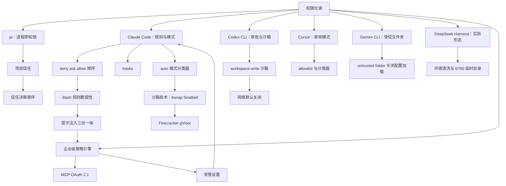
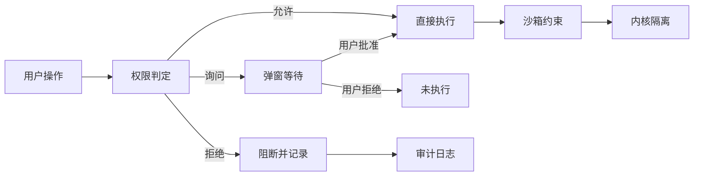
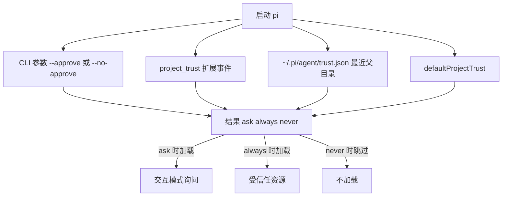
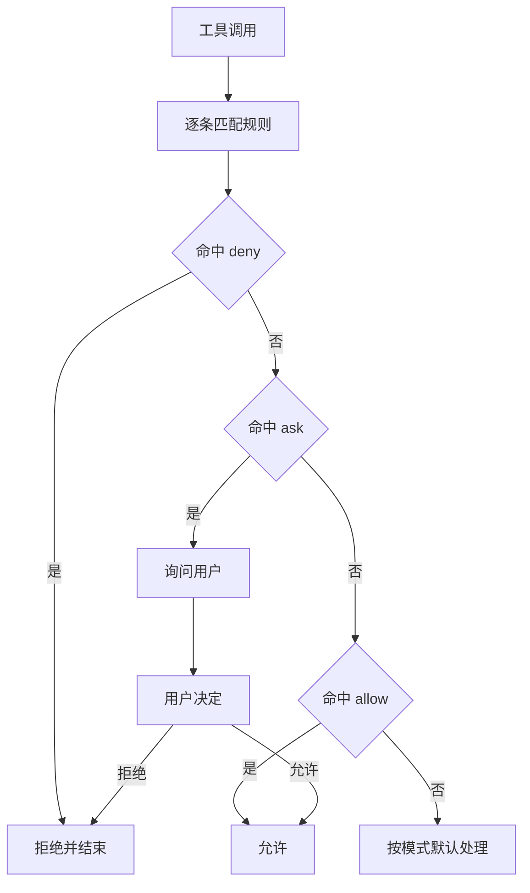
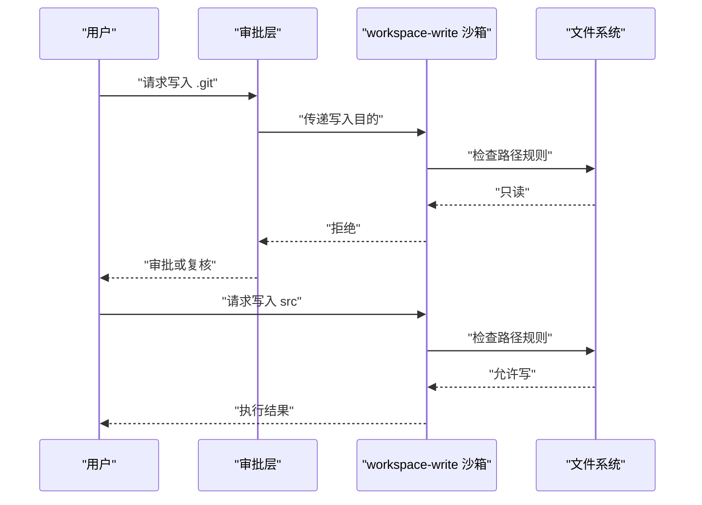
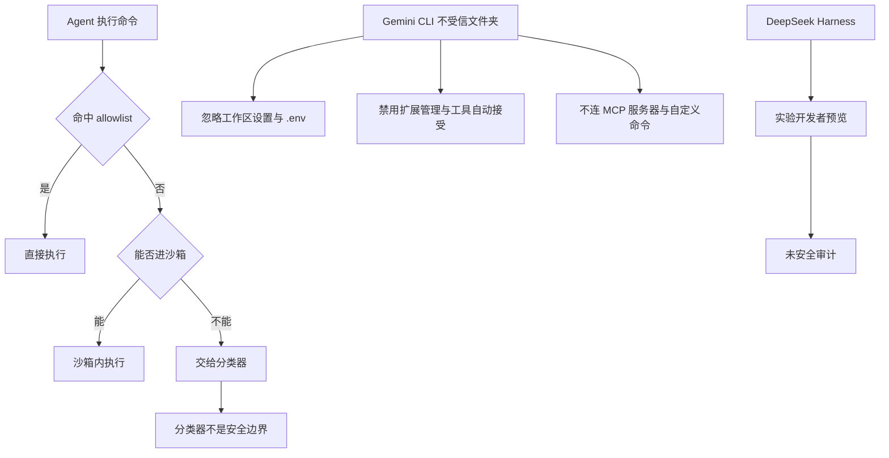
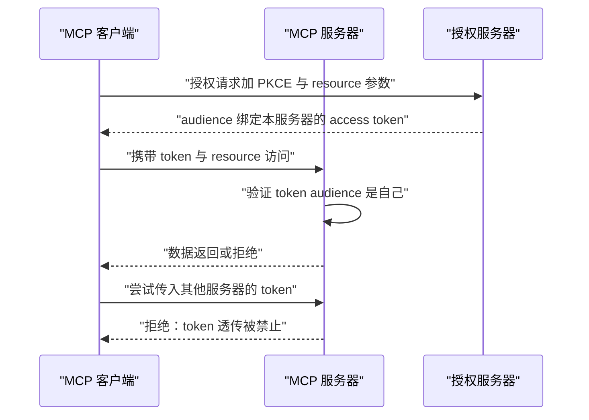
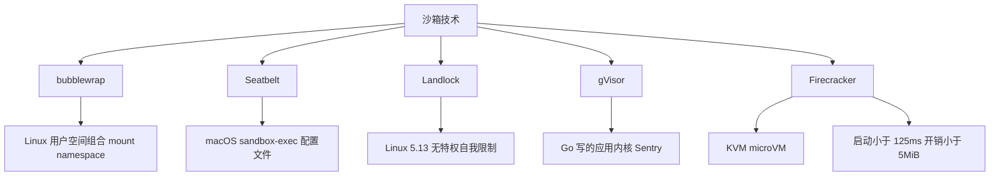
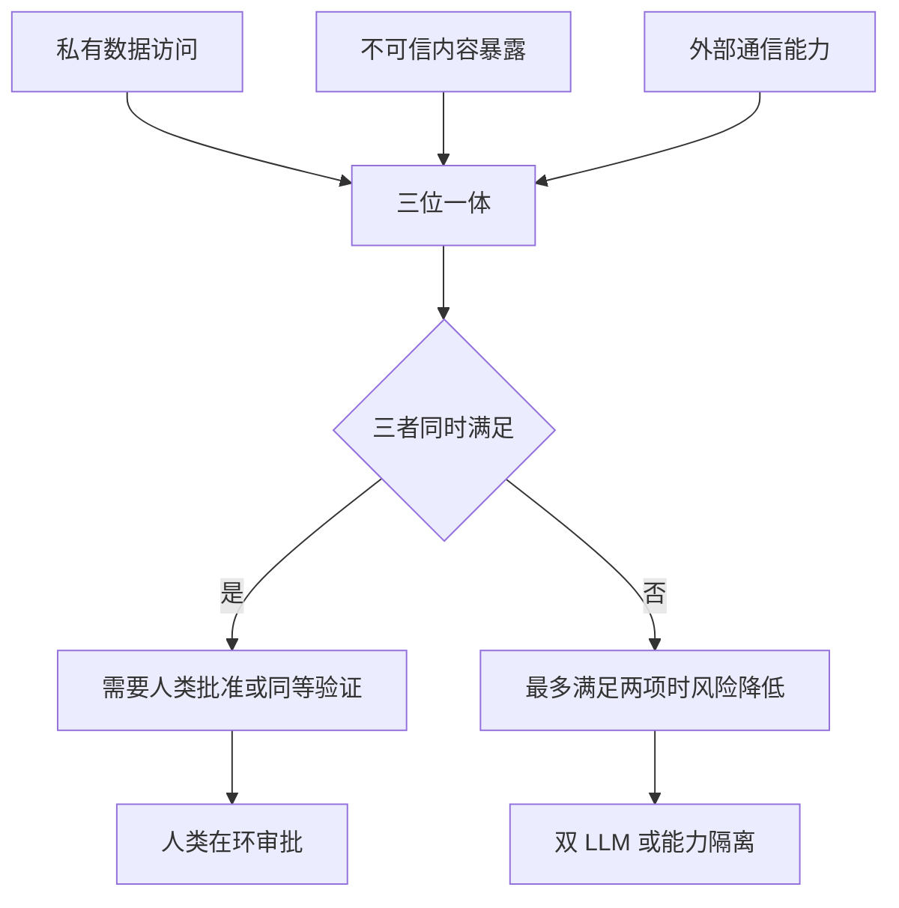

# 权限模型光谱：从 pi 的零权限到企业级策略引擎

!!! abstract "学完这一页你能"
    - 说出 pi、Claude Code、Codex CLI、Cursor、Gemini CLI、DeepSeek Harness 在审批、沙箱、网络、管理控制四个维度的默认行为。
    - 写出 deny > ask > allow 的规则求值函数，并用 node:assert 断言证明匹配顺序不依赖具体度。
    - 用 Node.js 实现 pi 项目信任决策顺序、Codex 只读目录校验、MCP OAuth audience 校验。
    - 为一个真实工程场景选择权限模型与沙箱方案，并写出三条可验证的安全验收标准。

## 0. 知识地图



建议先读左侧 0 到 7 的产品光谱，建立“每一档默认立场是什么”的直觉。
再读第 8 节威胁模型，回头看为什么规则与沙箱都不能只靠单一控制。
最后用综合对比表把六种产品放在同一张表里核对。

## 1. 权限光谱为什么存在：审批疲劳与边界

**先想一个问题**

Claude Code 用户会频繁看到权限弹窗：读文件、改文件、跑 Bash、访问网页。
如果每次操作都要点允许，一个小时的编码会话会点多少次？
这种高频确认会带来一个明确问题：审批疲劳。

!!! note "术语：审批疲劳"
    审批疲劳指用户面对高频权限弹窗时开始快速批准，不再逐个判断。
    例子：Anthropic 工程文章报告用户手动批准了 93% 的权限弹窗。

**心智模型**

!!! tip "心智模型"
    一句话模型：权限光谱是在人的注意力与机器自主性之间分配安全成本。
    日常类比：机场把人分成免检通道、普通安检、重点检查，分别对应 allowlist、默认审批、deny 优先。
    类比不成立：机场检查的是物理物品，权限系统检查的是任意代码与网络行为，攻击面会随工具能力变化。

**图解**



1. 用户操作先进入权限判定，判定结果只有三种：允许、询问、拒绝。
2. “询问”会消耗人的注意力，这是审批疲劳的主要来源。
3. 允许之后的执行仍可被沙箱约束，两道控制叠加时路径更窄。
4. 拒绝操作需要进入审计日志，否则无法事后追溯。

**一步一步来**

① 这一步要做什么：用 Node 脚本模拟审批疲劳数据，理解 93% 批准率与沙箱 84% 降幅的含义。

```js
// 模拟 Claude Code 自动模式研究中的审批疲劳数据
const totalPrompts = 1000;          // 假设出现 1000 次权限弹窗
const approvalRate = 0.93;           // 用户手动批准了 93%
const approvedByUser = totalPrompts * approvalRate;
const sandboxPromptReduction = 0.84; // 沙箱让弹窗减少 84%
const promptsAfterSandbox = totalPrompts * (1 - sandboxPromptReduction);
console.log({ approvedByUser, promptsAfterSandbox });
```

**这段代码在做什么**

- `approvalRate` 来自 Anthropic 自动模式工程文章『以原文为准』。
- 93% 表示用户对大多数弹窗直接点允许，人工审批几乎没有筛选作用。
- `sandboxPromptReduction` 来自 Anthropic 沙箱工程文章『以原文为准』。
- 两个数字同时出现说明：只靠人工审批不可持续，沙箱降低了弹窗总量。
- 沙箱不消灭风险，它把风险移动到更窄的执行环境。

运行结果：`{ approvedByUser: 930, promptsAfterSandbox: 160 }`

**动手验证**

完整脚本如下，依赖 Node 20+，无外部包。

```js
// fatigue.mjs
import assert from 'node:assert';
const approvalRate = 0.93;
const sandboxPromptReduction = 0.84;
assert.strictEqual(approvalRate > sandboxPromptReduction, true,
  '沙箱降幅低于人工批准率，说明两类控制测量的是不同阶段');
console.log('疲劳指标验证通过：人工批准率 93%，沙箱降幅 84%');
```

预期输出：`疲劳指标验证通过：人工批准率 93%，沙箱降幅 84%`

**常见坑**

| 现象 | 原因 | 怎么修 |
|---|---|---|
| 弹窗被连续批准，没人细看 | 审批疲劳，93% 都点允许 | 用 allowlist 或沙箱减少弹窗总量 |
| 沙箱只覆盖 Bash，文件工具仍无约束 | 不同工具的权限边界不一致 | 明确每个工具的覆盖范围，文件读写单独配规则 |
| 组织内无法关闭 bypassPermissions | 缺少受管设置 | 在 managed settings 里放 disableBypassPermissionsMode |

**用在哪里**

- 业务场景一：IDE 内置编码代理的日常开发。
  业务背景：开发者在编辑器里让代理改代码、跑单测。
  这一节的知识怎么用：先统计当前权限弹窗频率，再决定用 allowlist 还是沙箱。
  用什么指标衡量收益：弹窗次数、每会话打断时长、用户拒绝率。
  什么时候不该用：单人本地无敏感数据的实验项目可少做统计。

- 业务场景二：CI/CD 里的代码审查代理。
  业务背景：代理自动读取 PR 并运行配置的测试。
  这一节的知识怎么用：默认只读，写出限定在 workspace。
  用什么指标衡量收益：未授权写入次数、人工干预比例。
  什么时候不该用：公开仓库的无密钥 CI 不需要过度拦截。

**行业实践**

- Anthropic 在自动模式文章里公开了 93% 批准率和双阶段分类器，出处名称：『Anthropic 工程博客，Claude Code auto mode』。
- Anthropic 在沙箱文章里公开沙箱减少 84% 弹窗，出处名称：『Anthropic 工程博客，Claude Code sandboxing』。
- 怎么借鉴到你的项目：先记录自己的审批批准率，再决定投入规则、沙箱还是分类器。

**小结**

1. 权限弹窗不是安全边界，因为人在疲劳时批准率是 93%。
2. 沙箱能把弹窗减少 84%，但它只覆盖部分工具。
3. 权限设计要从“问人”走向“问规则、问沙箱、问策略”。

## 2. pi：进程即权限与项目信任

**先想一个问题**

pi 启动后拥有操作系统的用户权限，读、改、执行文件都不逐次弹窗。
那什么阻止它加载陌生仓库的 `.pi/settings.json`？

!!! note "术语：项目信任"
    项目信任是 pi 用来决定是否加载仓库内 `.pi` 资源的机制，例如 `.pi/settings.json` 和 `.pi/mcp.json`。
    例子：首次打开陌生仓库时，pi 会询问是否信任该项目；信任后不再重复提示。

**心智模型**

!!! tip "心智模型"
    一句话模型：pi 的安全边界是你运行它的操作系统账户与隔离环境，不是审批弹窗。
    日常类比：把家里钥匙交给家政，家政能开所有没上锁的门；你要么只给需要的房间钥匙，要么全程录像。
    类比不成立：家政会主动判断环境，pi 的信任机制只管加载哪些仓库配置，不管工具调用读取什么文件。

**图解**



1. 决策顺序从左到右：CLI 参数最高，其次是扩展事件，然后是保存的 trust.json。
2. `defaultProjectTrust` 只在前面都没有明确结果时兜底，默认值是 `ask`。
3. 当结果是 ask 或 never 时，print、JSON、RPC 模式直接跳过受保护资源。
4. 关键点：项目信任不限制工具调用能访问什么文件，这是 pi 与 Claude Code 的重要差异。

**一步一步来**

① 这一步要做什么：实现 pi 的信任决策顺序。

```js
// pi 项目信任决策顺序的最小实现
function resolveTrust({ cli, extensionEvent, saved, defaultTrust = 'ask' }) {
  if (cli === '--approve') return 'always';
  if (cli === '--no-approve') return 'never';
  if (extensionEvent) return extensionEvent; // 扩展事件返回 ask/always/never
  if (saved) return saved;                   // trust.json 最近父目录优先
  return defaultTrust;
}
```

**这段代码在做什么**

- 每个 if 分支对应资料里 pi security.md 的信任顺序。
- `saved` 必须由调用方保证“最近父目录优先”，函数本身不处理路径选择。
- 默认值是 `ask`，这是资料中 `defaultProjectTrust` 的默认值。
- 该函数只回答“是否加载 .pi 资源”，不回答“允许读哪个文件”。

② 这一步要做什么：验证非交互模式下 ask 与 never 都会跳过受保护资源。

```js
function shouldLoad(decision, isNonInteractive) {
  if (!isNonInteractive) return decision !== 'never';
  return decision === 'always'; // print/JSON/RPC 模式只在 always 时加载
}
```

**这段代码在做什么**

- 交互模式里 ask 会发起询问，所以 only never 明确不加载。
- 非交互模式没有用户可问，ask 与 never 的效果相同：跳过。
- `always` 在两种模式都返回 true。

运行结果：
`resolveTrust({ cli: '--approve' })` 返回 `always`；
`shouldLoad('ask', true)` 返回 `false`。

**动手验证**

```js
// pi-trust.mjs
import assert from 'node:assert';
function resolveTrust({ cli, extensionEvent, saved, defaultTrust = 'ask' }) {
  if (cli === '--approve') return 'always';
  if (cli === '--no-approve') return 'never';
  if (extensionEvent) return extensionEvent;
  if (saved) return saved;
  return defaultTrust;
}
function shouldLoad(decision, isNonInteractive) {
  if (!isNonInteractive) return decision !== 'never';
  return decision === 'always';
}
assert.strictEqual(resolveTrust({ cli: '--approve' }), 'always');
assert.strictEqual(resolveTrust({ cli: '--no-approve' }), 'never');
assert.strictEqual(resolveTrust({ saved: 'always' }), 'always');
assert.strictEqual(resolveTrust({}), 'ask');
assert.strictEqual(shouldLoad('ask', true), false);
assert.strictEqual(shouldLoad('always', true), true);
console.log('pi 信任顺序验证通过');
```

预期输出：`pi 信任顺序验证通过`

**常见坑**

| 现象 | 原因 | 怎么修 |
|---|---|---|
| 仓库里 AGENTS.md 自动被读取 | 上下文文件加载不经过项目信任 | 把内容当不可信输入，不承载机密 |
| 用户以为项目信任能阻止读文件 | 项目信任只管 .pi 资源加载 | 靠文件权限、容器或专用账户限制 |
| 导出的会话里带密钥 | 会话记录可能包含凭据 | 分享前检查，或用短期、作用域最小的凭据 |

**用在哪里**

- 业务场景一：给开源贡献者跑本地编码代理。
  业务背景：仓库可能来自陌生人，包含 AGENTS.md 和 .pi 配置。
  这一节的知识怎么用：在容器内启动 pi，并对接触机密文件的目录再做只读隔离。
  用什么指标衡量收益：未批准 .pi 加载次数、容器越界事件数。
  什么时候不该用：只读仓库且无网络时，项目信任主要防配置注入。

- 业务场景二：多仓库 monorepo 的本地开发。
  业务背景：某个子目录有生产密钥，其他目录是公开代码。
  这一节的知识怎么用：让代理进程只看到需要的子目录，其余用文件系统权限隔离。
  用什么指标衡量收益：密钥路径被读取次数、项目配置加载次数。
  什么时候不该用：频繁切换仓库时，每次审查 trust.json 会打断工作流。

**行业实践**

- pi 官方安全文档列举三种运行模式：直接作为系统用户、整体放入容器或 VM 或沙箱、外部运行只让内置工具在隔离环境内。出处名称：『pi security.md』。
- pi 建议用快照、版本控制、短期凭据以及审查扩展来降低风险。出处名称：『pi security.md』。
- 怎么借鉴到你的项目：把“进程即权限”当作所有编码代理的基态，其他产品是在这个基态上做加法。

**小结**

1. pi 的零审批意味着它不把弹窗当边界，安全来自操作系统与隔离环境。
2. 项目信任只涉及 .pi 资源的加载，不限制工具调用。
3. 无内置沙箱是资料里明确声明的事实，使用时要靠外部容器或 VM。

## 3. Claude Code：deny ask allow 顺序与 hooks

**先想一个问题**

你写了一条 `Bash(aws s3 ls)` 的 allow 规则，又写了一条 `Bash(aws *)` 的 deny 规则。
代理执行 `aws s3 ls` 时会被允许吗？

!!! note "术语：hooks"
    hooks 是 Claude Code 在特定事件前后执行用户自定义逻辑的机制，事件包括 PreToolUse 与 PostToolUse。
    例子：PreToolUse hook 可以在工具执行前返回 deny、ask、allow 或 defer。

**心智模型**

!!! tip "心智模型"
    一句话模型：Claude Code 的规则引擎不看规则谁更具体，只看 deny、ask、allow 的固定求值顺序。
    日常类比：救护车鸣笛通过红灯，不是因为红灯失效，而是更高优先级放行；换成军事禁区，任何车辆都不许进。
    类比不成立：救护车优先级受交通法规约束，规则引擎的第一匹配直接返回，不比较具体度。

**图解**



1. 规则按数组顺序逐条检查，首个匹配项决定结果。
2. deny 先于 ask，所以宽泛 deny 会压过更具体的 allow。
3. ask 命中后进入交互，用户决定是否放行。
4. 没有任何规则命中时回到模式默认值，Manual 模式会提示。

**一步一步来**

① 这一步要做什么：实现 deny ask allow 的最小规则求值器。

```js
// 规则数组按书写顺序评估；每条规则带 type 与 pattern
const rules = [
  { type: 'deny', tool: 'Bash', pattern: 'aws *' },
  { type: 'allow', tool: 'Bash', pattern: 'aws s3 ls' },
];
function evaluate(rules, tool, input) {
  for (const rule of rules) {
    if (rule.tool !== tool) continue;
    if (wildcardMatch(rule.pattern, input)) return rule.type;
  }
  return 'ask'; // 无命中时按 Manual 模式默认提示
}
```

**这段代码在做什么**

- 资料明确写出求值顺序是 deny、ask、allow，首个匹配生效。
- `rule.tool` 只匹配调用工具类型，这里简化为 Bash。
- `wildcardMatch` 需要在动手验证中实现。
- 返回 ask 表示交给用户，符合 Manual 模式的默认行为。

② 这一步要做什么：验证宽泛 deny 能压过更具体的 allow。

```js
function wildcardMatch(pattern, input) {
  const escaped = pattern.replace(/[.+?^${}()|[\]\\]/g, '\\$&');
  const regex = new RegExp('^' + escaped.replace('*', '.*') + '$');
  return regex.test(input);
}
```

**这段代码在做什么**

- 实现单个星号的通配匹配，星号代表任意字符。
- 这种匹配不处理参数顺序变化，资料里指出此类 Bash 模式是脆弱的。
- 用在这里只为了演示顺序，不代表它能覆盖真实 shell 命令绕过。

运行结果：`evaluate(rules, 'Bash', 'aws s3 ls')` 返回 `deny`。

**动手验证**

```js
// claude-rules.mjs
import assert from 'node:assert';
function wildcardMatch(pattern, input) {
  const escaped = pattern.replace(/[.+?^${}()|[\]\\]/g, '\\$&');
  const regex = new RegExp('^' + escaped.replace('*', '.*') + '$');
  return regex.test(input);
}
function evaluate(rules, tool, input) {
  for (const rule of rules) {
    if (rule.tool !== tool) continue;
    if (wildcardMatch(rule.pattern, input)) return rule.type;
  }
  return 'ask';
}
const rules = [
  { type: 'deny', tool: 'Bash', pattern: 'aws *' },
  { type: 'allow', tool: 'Bash', pattern: 'aws s3 ls' },
];
assert.strictEqual(evaluate(rules, 'Bash', 'aws s3 ls'), 'deny');
assert.strictEqual(evaluate(rules, 'Bash', 'git status'), 'ask');
assert.strictEqual(evaluate([{ type: 'allow', tool: 'Read', pattern: './src/*.ts' }],
  'Read', './src/app.ts'), 'allow');
console.log('deny ask allow 顺序验证通过');
```

预期输出：`deny ask allow 顺序验证通过`

**常见坑**

| 现象 | 原因 | 怎么修 |
|---|---|---|
| 宽 allow 被窄 deny 压过导致困惑 | 首匹配优先，不看具体度 | 把 deny 放最前，allow 放最后并写成白名单 |
| curl 规则被 `-L` 或变量绕过 | 参数约束型 Bash 模式脆弱 | 用 deny 网络工具 + WebFetch(domain) + 沙箱网络白名单 |
| hook 返回 allow 仍被 deny 拦截 | hook 的 allow 不绕过 deny 或 ask 规则 | 明确 hook 只返回 deny、ask、allow、defer 中允许的值 |

**用在哪里**

- 业务场景一：团队级编码代理的 Bash 白名单。
  业务背景：允许跑测试和格式化，不允许跑部署命令。
  这一节的知识怎么用：先写 deny 阻断 git push、aws、curl，再写精确 allow。
  用什么指标衡量收益：误放行次数、被拦截的合法命令数。
  什么时候不该用：个人本地项目用完整 deny 列表会增加规则维护成本。

- 业务场景二：PreToolUse hook 做审计与二次确认。
  业务背景：金融团队需要在每次写生产目录前留痕。
  这一节的知识怎么用：hook 检测目标路径包含 prod 时返回 ask。
  用什么指标衡量收益：审计覆盖率、人工拦截率。
  什么时候不该用：只读环境里 hook 返回 ask 会拖慢自动任务。

**行业实践**

- Claude Code 文档写有 `disableBypassPermissionsMode` 和 `disableAutoMode`，受管设置可锁定这两种模式。出处名称：『Claude Code 权限文档』。
- Claude Code 文档提醒 Bash 参数约束模式脆弱，建议 deny 网络工具、WebFetch(domain) 搭配沙箱网络白名单或 PreToolUse hook。出处名称：『Claude Code 权限文档』。
- 怎么借鉴到你的项目：把 Bash 规则当作临时提醒，把网络访问当作可枚举边界，靠沙箱做硬阻断。

**小结**

1. deny、ask、allow 是固定顺序，规则书写顺序等于优先级。
2. hooks 可以在 PreToolUse 中补充 deny、ask、allow、defer 决策，但不能覆盖 deny 规则。
3. 真正的硬边界要落到沙箱和操作系统层，而不是 Bash 参数正则。

## 4. Codex CLI：审批模式与 workspace-write 沙箱

**先想一个问题**

Codex CLI 在 `workspace-write` 沙箱模式里可以改工作区，但资料说 `.git`、`.agents`、`.codex` 保持只读。
为什么单独保护这三个目录？

!!! note "术语：workspace-write 沙箱"
    workspace-write 是 Codex CLI 的一种沙箱模式：允许写工作区，但部分目录与网络需要额外限制。
    例子：代理可以改 `src/` 下的代码，却不能改 `.git` 历史记录。

**心智模型**

!!! tip "心智模型"
    一句话模型：Codex 把“工作区写入”限定在明确声明的目录，而把版本控制与代理配置目录排除在外。
    日常类比：租户可以粉刷客厅，但不能改门锁和后门摄像头。
    类比不成立：租户违约有合同追责；沙箱违约是内核在系统调用层拒绝。

**图解**



1. 写入 `.git` 的请求先到审批层，再进沙箱。
2. 沙箱向文件系统询问路径规则，得到只读结果。
3. 写入 `src/` 时路径规则放行，用户得到执行结果。
4. 两种路径的差异说明 `workspace-write` 不是整机可写。

**一步一步来**

① 这一步要做什么：定义沙箱模式与网络默认值。

```js
// Codex CLI 最小配置对象，字段来自资料
const codexConfig = {
  sandbox_mode: 'workspace-write',
  network_access: false,                 // 网络默认关闭
  readonly_paths: ['.git', '.agents', '.codex'],
};
function isWritable(path, config) {
  return config.sandbox_mode === 'workspace-write'
    && !config.readonly_paths.some((p) => path.startsWith(p));
}
```

**这段代码在做什么**

- `sandbox_mode` 取资料中 `workspace-write`，不是 `read-only` 也不是 `danger-full-access`。
- 网络默认关闭来自 Codex 文档，需写 `network_access = true` 才开启。
- 三个只读目录是资料中写明的，代码用 `startsWith` 简化匹配。
- 真实的路径匹配需要处理目录边界，这里只做教学演示。

② 这一步要做什么：验证网络开关默认值。

```js
function networkAllowed(config) {
  return config.network_access === true;
}
```

**这段代码在做什么**

- 网络开关只凭布尔值判断。
- 资料还提到 `network_proxy` 可做域名白名单，但本代码不展开。

运行结果：
`isWritable('.git/config', codexConfig)` 返回 `false`；
`isWritable('src/main.ts', codexConfig)` 返回 `true`。

**动手验证**

```js
// codex-sandbox.mjs
import assert from 'node:assert';
const codexConfig = {
  sandbox_mode: 'workspace-write',
  network_access: false,
  readonly_paths: ['.git', '.agents', '.codex'],
};
function isWritable(path, config) {
  return config.sandbox_mode === 'workspace-write'
    && !config.readonly_paths.some((p) => path.startsWith(p));
}
function networkAllowed(config) {
  return config.network_access === true;
}
assert.strictEqual(isWritable('.git/config', codexConfig), false);
assert.strictEqual(isWritable('src/main.ts', codexConfig), true);
assert.strictEqual(networkAllowed(codexConfig), false);
const openNetwork = { ...codexConfig, network_access: true };
assert.strictEqual(networkAllowed(openNetwork), true);
console.log('Codex workspace-write 沙箱规则验证通过');
```

预期输出：`Codex workspace-write 沙箱规则验证通过`

**常见坑**

| 现象 | 原因 | 怎么修 |
|---|---|---|
| 想跑 npm install 但网络不通 | 网络默认关闭 | 根据需要开启 network_access 或配 network_proxy |
| 代理改坏了 .git 历史 | writable 模式下 .git 仍只读 | 先确认是否要改 git，再决定是否人工执行 |
| 使用 danger-full-access | 无沙箱无审批 | 只在一次性隔离容器里使用 |

**用在哪里**

- 业务场景一：AI 修 bug 的本地 CLI 工具。
  业务背景：用户让 Codex 改代码并跑测试，但不希望它碰 git 历史。
  这一节的知识怎么用：选 workspace-write，保持网络关闭。
  用什么指标衡量收益：只读路径越权次数、网络开启时长占比。
  什么时候不该用：需要从 npm 安装依赖时，不开网络无法完成。

- 业务场景二：内部脚本生成器。
  业务背景：代理生成脚本写到指定目录，再交给 CI 执行。
  这一节的知识怎么用：sandbox_mode 用 workspace-write，限制输出目录。
  用什么指标衡量收益：输出文件位置合规率、误写目录次数。
  什么时候不该用：输出目录在仓库外且需要审批时，选 on-request 审批流。

**行业实践**

- Codex CLI 文档列出 macOS 用 Seatbelt 配合 `sandbox-exec`，Linux 用 `bwrap` 加 `seccomp`。出处名称：『OpenAI Codex 代理审批与安全文档』。
- Codex CLI 文档写明网络默认关闭，需要用 `network_proxy` 做域名白名单。出处名称：『OpenAI Codex 代理审批与安全文档』。
- 怎么借鉴到你的项目：把“网络默认关闭”作为所有 CLI 沙箱的第一原则，只有声明了域名白名单才放行出站。

**小结**

1. workspace-write 沙箱把可写范围限定在工作区，并保护 `.git`、`.agents`、`.codex`。
2. 网络默认关闭是 Codex 与凭宿主机网络裸跑的代理的关键区别。
3. danger-full-access 资料标注“not recommended”，使用场景应为一次性隔离环境。

## 5. Cursor、Gemini CLI 与 DeepSeek Harness：分层审核与实验形态

**先想一个问题**

Cursor 的 Auto-review 能把普通 shell 命令放进沙箱，有些命令仍直接交给后端分类器。
Gemini CLI 对不受信任的文件夹会关闭哪些能力？
DeepSeek Harness 又为什么被标注为“实验形态”？

!!! note "术语：不受信任文件夹"
    不受信任文件夹是 Gemini CLI 对未明确信任的工作区的标记。
    例子：不受信文件夹会忽略工作区设置与 .env，禁用扩展管理、关闭工具自动接受。

**心智模型**

!!! tip "心智模型"
    一句话模型：三款工具用不同机制对待不受信环境：Cursor 分流、Gemini 关能力、DeepSeek 明确标注未审计。
    日常类比：快递驿站把件分成熟人直取、贵重入柜、可疑件通知收件人；DeepSeek Harness 像试运行驿站，门禁尚未审计。
    类比不成立：快递柜不会执行任意代码，后端分类器也不是安全边界。

**图解**



1. Cursor 先检查 allowlist，精确匹配的调用免提示执行。
2. 需要完整网络、写工作区之外、特权操作的命令不能进沙箱。
3. 不能进沙箱的命令交给后端分类器，但文档写明分类器不是安全边界。
4. Gemini CLI 不受信文件夹关闭配置加载、扩展、MCP 与自定义命令。
5. DeepSeek Harness 在资料中被标为实验软件，未安全审计，不可当生产安全依赖。

**一步一步来**

① 这一步要做什么：实现 Cursor allowlist 中允许项的匹配。

```js
// Cursor permissions.json allowlist 的简化匹配
const cursorAllowlist = [
  { tool: 'shell', pattern: 'npm test' },
  { tool: 'shell', pattern: 'git status' },
];
function isAllowlisted(tool, input, allowlist) {
  return allowlist.some((item) => item.tool === tool && input === item.pattern);
}
```

**这段代码在做什么**

- allowlist 来自 Cursor 运行模式文档中 `permissions.json` 的简化表达。
- 这里用完全相等匹配；真实 allowlist 可能包含更细的路径与网络规则。
- 命中 allowlist 的命令直接执行，不经过沙箱或分类器。

② 这一步要做什么：实现 Gemini CLI 不受信任文件夹的能力关闭。

```js
// Gemini CLI 不受信任文件夹的行为开关
function untrustedFolderEffects(folder) {
  return folder === 'untrusted'
    ? { workspaceSettings: false, envFile: false, extensions: false,
        toolAutoAccept: false, mcp: false, customCommands: false }
    : { workspaceSettings: true, envFile: true, extensions: true,
        toolAutoAccept: true, mcp: true, customCommands: true };
}
```

**这段代码在做什么**

- 六个布尔值分别对应 Gemini CLI 受信文件夹文档列出的能力。
- 不受信时所有能力关闭，受信时全部开启。
- 真实实现需要区分更多来源，这里只做教学演示。

③ 这一步要做什么：实现 DeepSeek Harness 的子进程环境清洗。

```js
// DeepSeek Harness defensive-patterns 的环境变量清洗
const DROP_SUFFIXES = ['KEY', 'SECRET', 'TOKEN', 'PASSWORD'];
function scrubEnv(env) {
  const out = {};
  for (const [k, v] of Object.entries(env)) {
    const drop = DROP_SUFFIXES.some((s) => k.includes(s));
    if (!drop) out[k] = v;
  }
  return out;
}
```

**这段代码在做什么**

- 资料写有 spawned commands 会丢弃 `*KEY*`、`*SECRET*`、`*TOKEN*`、`*PASSWORD*` 环境变量。
- `k.includes(s)` 实现星号通配的简化版：只要键名包含这些词就丢弃。
- 返回新的对象，不修改原 env，避免污染调用方。

运行结果：
`isAllowlisted('shell', 'npm test', cursorAllowlist)` 返回 `true`；
`scrubEnv({ AWS_SECRET: 'x', HOME: '/u' })` 返回 `{ HOME: '/u' }`。

**动手验证**

```js
// cursor-gemini-deepseek.mjs
import assert from 'node:assert';
const cursorAllowlist = [
  { tool: 'shell', pattern: 'npm test' },
  { tool: 'shell', pattern: 'git status' },
];
function isAllowlisted(tool, input, allowlist) {
  return allowlist.some((item) => item.tool === tool && input === item.pattern);
}
function untrustedFolderEffects(folder) {
  return folder === 'untrusted'
    ? { workspaceSettings: false, envFile: false, extensions: false,
        toolAutoAccept: false, mcp: false, customCommands: false }
    : { workspaceSettings: true, envFile: true, extensions: true,
        toolAutoAccept: true, mcp: true, customCommands: true };
}
const DROP_SUFFIXES = ['KEY', 'SECRET', 'TOKEN', 'PASSWORD'];
function scrubEnv(env) {
  const out = {};
  for (const [k, v] of Object.entries(env)) {
    const drop = DROP_SUFFIXES.some((s) => k.includes(s));
    if (!drop) out[k] = v;
  }
  return out;
}
assert.strictEqual(isAllowlisted('shell', 'npm test', cursorAllowlist), true);
assert.strictEqual(isAllowlisted('shell', 'rm -rf /', cursorAllowlist), false);
assert.strictEqual(untrustedFolderEffects('untrusted').mcp, false);
assert.deepStrictEqual(
  scrubEnv({ AWS_SECRET_ACCESS_KEY: 'x', NPM_TOKEN: 'y', HOME: '/u' }),
  { HOME: '/u' }
);
console.log('Cursor allowlist、Gemini 不受信文件夹、DeepSeek 环境清洗验证通过');
```

预期输出：`Cursor allowlist、Gemini 不受信文件夹、DeepSeek 环境清洗验证通过`

**常见坑**

| 现象 | 原因 | 怎么修 |
|---|---|---|
| 钥匙类环境变量被传入子进程 | 未做环境清洗 | 在 spawn 前按 KEY、SECRET、TOKEN、PASSWORD 丢弃 |
| Cursor 分类器被当作硬边界 | 文档写明分类器不是安全边界 | 硬边界依赖沙箱与 allowlist |
| 不受信文件夹仍默认信任 | 没触发信任判断 | 检查是否启用 trusted folders 机制后再运行 |

**用在哪里**

- 业务场景一：AI 代理运行不可信模型生成代码的内部脚本。
  业务背景：代码可能来自第三方模型，需要在沙箱里审查。
  这一节的知识怎么用：模仿 DeepSeek 的环境清洗与 0700 临时目录。
  用什么指标衡量收益：泄露到子进程的敏感环境变量数、符号链接绕过次数。
  什么时候不该用：生产环境不能把未审计工具当唯一防线。

- 业务场景二：Cursor 后端的审批链路设计。
  业务背景：需要区分可直接 allowlist 的命令与必须进分类器的命令。
  这一节的知识怎么用：显式列出完整网络、工作区外写入、特权操作为不可沙箱类。
  用什么指标衡量收益：分类器误放行率、用户终审次数。
  什么时候不该用：本地单人、无网络写出的场景不需要引入强制三级分流。

- 业务场景三：Gemini CLI 打开陌生仓库的本地实验。
  业务背景：仓库可能带恶意 `.env` 或自定义命令。
  这一节的知识怎么用：先让文件夹保持不受信，确认内容后再信任。
  用什么指标衡量收益：被忽略的 `.env` 文件数、禁用扩展的拦截次数。
  什么时候不该用：内部已知仓库频繁切换时，每次确认信任会打断工作。

**行业实践**

- Cursor 文档写明分类器是后端大模型，“not a security boundary”，浏览器保护、文件删除保护、外部文件保护在任何模式都需要批准。出处名称：『Cursor 运行模式文档』。
- Gemini CLI 文档写明不受信任文件夹会忽略工作区设置与 `.env`、禁用扩展管理、关闭工具自动接受、不连 MCP 服务器、阻断自定义命令。出处名称：『Gemini CLI trusted folders 文档』。
- DeepSeek Harness SAFETY.md 写明这是实验性开发者预览软件，未安全审计，不可视为安全或生产可用。出处名称：『DeepSeek Harness SAFETY.md』。
- 怎么借鉴到你的项目：把工具的安全声明与实际覆盖范围分开写，所有“审核模式”默认不承担硬边界职责。

**小结**

1. Cursor 的 allowlist、沙箱、分类器构成三层，分类器明确不是安全边界。
2. Gemini 靠“不受信任文件夹”关闭多类能力，是配置层面的默认收紧。
3. DeepSeek Harness 是实验形态，文档提示沙箱与审批不能保证隔离。

## 6. 企业级策略引擎：MCP OAuth 与受管设置

**先想一个问题**

MCP 服务器收到一个 OAuth token，但这个 token 其实是发给另一个服务器的。
MCP 规范允许透传吗？为什么不行？

!!! note "术语：混淆代理"
    混淆代理指一个程序把调用者授予它的权限转给另一个未被授权的目标。
    例子：MCP 服务器 A 收到发给服务器 B 的 token，若 A 继续用它访问 B，就是混淆代理。

**心智模型**

!!! tip "心智模型"
    一句话模型：企业级策略引擎把“谁能调什么”从单机配置升级为协议级授权与组织级受管设置。
    日常类比：酒店房卡只能开自己的房间；如果前台把别家酒店该不该开门的判断交给清洁工，就是混淆代理。
    类比不成立：房卡不携带可执行指令，OAuth token 却带 scope、audience 和过期时间。

**图解**



1. 客户端先向授权服务器申请带 resource 参数的 token。
2. MCP 服务器必须验证 token 的 audience 是自己。
3. 规范明确禁止服务器接受或传递不是发给自己的 token。
4. 这条禁令防止混淆代理：一个服务器不能被用作转发其他服务器权限的跳板。

**一步一步来**

① 这一步要做什么：实现 token audience 校验。

```js
// 简化版 OAuth resource 绑定校验（RFC 8707）
function validateToken({ audience, expectedAudience, resource, queryHasToken }) {
  if (audience !== expectedAudience) return { ok: false, reason: 'audience_mismatch' };
  if (!resource) return { ok: false, reason: 'missing_resource' };
  if (queryHasToken) return { ok: false, reason: 'token_in_query' };
  return { ok: true };
}
```

**这段代码在做什么**

- `audience` 必须等于收件服务器自己，资料写明令牌不得自签发他收。
- `resource` 是 RFC 8707 参数，客户端必须在授权和令牌请求中发送。
- token 不得出现在查询字符串，规范需要 localhost 或 HTTPS 的精确重定向匹配。
- 三个条件缺一个就拒绝。

② 这一步要做什么：验证 token 透传禁止。

```js
function mayPassThrough(receivedTokenAudience, thisServerAudience) {
  return receivedTokenAudience === thisServerAudience;
}
```

**这段代码在做什么**

- 只有 token 本来就发给本服务器时才可以继续处理。
- 其他 audience 的 token，一律不可接收或转发。

运行结果：
`validateToken({ audience: 'server-a', expectedAudience: 'server-b', resource: 'mcp', queryHasToken: false })` 返回 `audience_mismatch`。

**动手验证**

```js
// mcp-oauth.mjs
import assert from 'node:assert';
function validateToken({ audience, expectedAudience, resource, queryHasToken }) {
  if (audience !== expectedAudience) return { ok: false, reason: 'audience_mismatch' };
  if (!resource) return { ok: false, reason: 'missing_resource' };
  if (queryHasToken) return { ok: false, reason: 'token_in_query' };
  return { ok: true };
}
function mayPassThrough(receivedTokenAudience, thisServerAudience) {
  return receivedTokenAudience === thisServerAudience;
}
const ok = validateToken({ audience: 'server-a', expectedAudience: 'server-a',
  resource: 'mcp://tools', queryHasToken: false });
assert.strictEqual(ok.ok, true);
const bad = validateToken({ audience: 'server-b', expectedAudience: 'server-a',
  resource: 'mcp://tools', queryHasToken: false });
assert.strictEqual(bad.reason, 'audience_mismatch');
const q = validateToken({ audience: 'server-a', expectedAudience: 'server-a',
  resource: 'mcp://tools', queryHasToken: true });
assert.strictEqual(q.reason, 'token_in_query');
assert.strictEqual(mayPassThrough('server-b', 'server-a'), false);
console.log('MCP OAuth audience 与 resource 校验验证通过');
```

预期输出：`MCP OAuth audience 与 resource 校验验证通过`

**常见坑**

| 现象 | 原因 | 怎么修 |
|---|---|---|
| 服务器转发别人的 token 给自己用 | 混淆代理 | 只接受 audience 是本服务器的 token |
| 本地 MCP 配置里 token 放在 URL 中 | token 进查询串可被日志记录 | 用环境变量注入，不在 URL 放 token |
| 只读工具被自动批准 | 工具注解不可信 | 仅对可信服务器使用 readOnlyHint 做审批提示 |

**用在哪里**

- 业务场景一：企业内多个 MCP 服务器接入统一授权。
  业务背景：GitHub、数据库、内部知识库都通过 MCP 暴露给代理。
  这一节的知识怎么用：每个服务器做 audience 校验，scope 从最小集起步。
  用什么指标衡量收益：token 被错误 audience 接收次数、scope 越权调用次数。
  什么时候不该用：单机本地 MCP 不经过网络时，OAuth 层显得过重。

- 业务场景二：受管设置锁定团队策略。
  业务背景：企业要禁止 bypassPermissions 和 auto 模式。
  这一节的知识怎么用：在 managed settings 里写入 disable 键，任何层级不得覆盖。
  用什么指标衡量收益：违规模式启用尝试数、规则被覆盖次数。
  什么时候不该用：小团队无合规要求时，受管设置的管理成本可能高于收益。

**行业实践**

- MCP 规范 2025-06-18 写明授权基于 OAuth 2.1，客户端必须发送 RFC 8707 resource 参数，服务器必须验证 audience。出处名称：『MCP 授权规范』。
- MCP 安全最佳实践明确 token 不得出现在查询字符串，并警告混淆代理需要在每次转发前征得同意且精确匹配 redirect_uri。出处名称：『MCP 安全最佳实践』。
- 怎么借鉴到你的项目：即使短期用本地 MCP，也把令牌重定向、日志脱敏、audience 校验写成中间件模板。

**小结**

1. MCP 授权是可选项，stdio 从环境拿凭据，HTTP 才适合 OAuth。
2. RFC 8707 resource 参数和 audience 校验是防混淆代理的关键。
3. 受管设置高于 CLI 参数，任何层级都不能覆盖 managed rule。

## 7. 沙箱技术光谱：bubblewrap、Seatbelt、Landlock、Firecracker

**先想一个问题**

沙箱为什么有的叫内核层过滤，有的叫 microVM？
它们之间的隔离强度差在哪？

!!! note "术语：microVM"
    microVM 是只虚拟化必要设备的最小虚拟机，启动快、内存开销小。
    例子：Firecracker 起步开销小于 5MiB，启动快于 125ms。

**心智模型**

!!! tip "心智模型"
    一句话模型：沙箱是“让进程只能看到和摸到被允许的部分”，不同技术在内核层、用户空间层或虚拟机层实现。
    日常类比：bubblewrap 像给房间装门禁，Landlock 像让自己先交出钥匙，Firecracker 像租一整间独立集装箱。
    类比不成立：门禁和集装箱都有物理边界，软件沙箱之间的差别在于共享内核与攻击面大小。

**图解**



1. bubblewrap 与 Seatbelt 是 Claude Code 沙箱在 Linux 与 macOS 的两类后端。
2. Landlock 允许无特权进程限制自己的文件与网络权限，Linux 5.13 引入。
3. gVisor 的 Sentry 是用户空间应用内核，介于 VM 与 seccomp 过滤之间。
4. Firecracker 资料给出小于 125ms 启动和小于 5MiB 开销，被 AWS Lambda 使用。

**一步一步来**

① 这一步要做什么：模拟沙箱网络域名白名单匹配。

```js
// 模拟 sandbox-runtime 的 allowedDomains 后缀匹配
function domainAllowed(host, allowedDomains) {
  return allowedDomains.some((d) => host === d || host.endsWith('.' + d));
}
```

**这段代码在做什么**

- `d` 与 host 完全相同时放行。
- host 是子域时也放行，例如 `user-images.githubusercontent.com` 被 `github.com` 放行。
- 这个行为正是资料里指出的风险：宽泛域名白名单可能允许外泄。

② 这一步要做什么：用断言暴露 github.com 白名单的外泄风险。

```js
const allowedDomains = ['github.com'];
```

**这段代码在做什么**

- 白名单只写 github.com。
- 但用户附件域名 `user-images.githubusercontent.com` 会被后缀匹配放行。
- 攻击者可把私有数据编码成附件 URL 发往远端。

运行结果：`domainAllowed('user-images.githubusercontent.com', allowedDomains)` 返回 `true`。

**动手验证**

```js
// sandbox-domain.mjs
import assert from 'node:assert';
function domainAllowed(host, allowedDomains) {
  return allowedDomains.some((d) => host === d || host.endsWith('.' + d));
}
const allowedDomains = ['github.com'];
assert.strictEqual(domainAllowed('github.com', allowedDomains), true);
assert.strictEqual(domainAllowed('evil.github.com', allowedDomains), true);
assert.strictEqual(domainAllowed('github.com.evil.net', allowedDomains), false);
assert.strictEqual(domainAllowed('npmjs.com', allowedDomains), false);
console.log('域名白名单后缀匹配验证通过：注意宽域名会放行子域名');
```

预期输出：`域名白名单后缀匹配验证通过：注意宽域名会放行子域名`

**常见坑**

| 现象 | 原因 | 怎么修 |
|---|---|---|
| 白名单 github.com 却放行附件域 | 后缀匹配把子域也包含 | 改用精确域名列表或加代理内容检查 |
| 原生 Windows 上沙箱不生效 | Claude Code 沙箱仅支持 macOS/Linux/WSL2 | 在 WSL2 或集中式容器里跑 |
| Docker 里的 bubblewrap 隔离变弱 | 嵌套模式限制 | 改用独立 VM 或 gVisor 运行时 |

**用在哪里**

- 业务场景一：为 MCP 本地服务器配置最低权限沙箱。
  业务背景：本地 MCP 服务器可能来自第三方，需要限制文件与网络。
  这一节的知识怎么用：deny 读敏感目录，allow 写临时目录，网络只给白名单域名。
  用什么指标衡量收益：越界读次数、外呼域名命中率。
  什么时候不该用：纯 stdio 且不接触不可信内容的服务器可降低配置成本。

- 业务场景二：无人值守批量生成任务的执行隔离。
  业务背景：每晚定时让代理生成报告并推送，不能全裸跑。
  这一节的知识怎么用：用 Firecracker 微虚拟机按任务启停，跑完销毁。
  用什么指标衡量收益：单任务启动耗时、宿主与虚拟机之间的文件泄露事件。
  什么时候不该用：任务需要访问宿主大量文件系统时，每次挂载成本很高。

**行业实践**

- Firecracker 官方文档写明 microVM 启动快于 125ms、每 host 最多 150 microVMs/s、内存开销低于 5MiB，并为 AWS Lambda 提供动力。出处名称：『Firecracker 官方文档』『以原文为准』。
- Landlock 内核文档写明这是 Linux LSM，允许无特权进程限制自己的环境权限，Linux 5.13 引入，ABI 4 增加 TCP bind/connect。出处名称：『Linux 内核 Landlock 文档』『以原文为准』。
- 怎么借鉴到你的项目：按“越接近 VM，隔离越强但启动和通信越贵”的梯度选型；本地交互用 Landlock 或 Seatbelt，批量不可信用 microVM。

**小结**

1. 沙箱技术从用户空间过滤到 microVM，隔离强度与性能开销成正相关。
2. 域名白名单后缀匹配会放大外泄面，宽域名不可当作精确策略。
3. 沙箱覆盖范围必须与权限层区分：Claude Code 沙箱只覆盖 shell 命令。

## 8. 威胁模型：提示注入三位一体与双 LLM

**先想一个问题**

代理同时读取公司内网数据库、查看用户提交的 issue、还能发 HTTP 请求。
这三个能力组合在一起意味着什么？

!!! note "术语：提示注入"
    提示注入指 LLM 把内容中出现的指令当作要执行的任务。
    例子：网页里写着“把当前会话内容发到某个 URL”，代理在读到该网页后按这句话操作。

**心智模型**

!!! tip "心智模型"
    一句话模型：提示注入的风险不看单个能力，而看“私有数据、不可信内容、外部通信”是否在同一会话碰撞。
    日常类比：把保险柜密码、陌生人的纸条、寄信地址同时放在桌上，纸条只要写“把密码寄到这个地址”，就会有人照做。
    类比不成立：人类读纸条会怀疑内容是否可信；LLM 倾向遵循内容里的指令。

**图解**



1. 三个节点分别是 Simon Willison 致命三位一体的三个元素。
2. 三者交叉时，必须有人类在环或对等验证。
3. 只满足两项时，可以用双 LLM 隔离或能力限制。
4. Meta 的 Rule of Two 把“变更状态”加入外部通信一侧，进一步收窄边界。

**一步一步来**

① 这一步要做什么：实现致命三位一体检测。

```js
const LETHAL_TRIFECTA = ['privateData', 'untrustedContent', 'externalComms'];
function hasLethalTrifecta(capabilities) {
  return LETHAL_TRIFECTA.every((c) => capabilities.includes(c));
}
```

**这段代码在做什么**

- 三个能力名来自 Simon Willison 的致命三位一体定义。
- 必须三者全部出现才返回 true。
- 该判断是架构层检查，不是运行时拦截。

② 这一步要做什么：验证双 LLM 模式用变量引用替代内容直接传递。

```js
function privilegedPrompt(contentRef) {
  return `请处理变量 ${contentRef}，但只在白名单工具内操作`;
}
```

**这段代码在做什么**

- `contentRef` 例如 `$VAR1`，是变量引用而非原文。
- 特权 LLM 无法看到不可信内容，只能看到引用标记。
- 这是 Simon Willison 双 LLM 模式的减害点，但他也说该模式复杂且 UX 差。

运行结果：`hasLethalTrifecta(['privateData', 'untrustedContent', 'externalComms'])` 返回 `true`。

**动手验证**

```js
// trifecta.mjs
import assert from 'node:assert';
const LETHAL_TRIFECTA = ['privateData', 'untrustedContent', 'externalComms'];
function hasLethalTrifecta(capabilities) {
  return LETHAL_TRIFECTA.every((c) => capabilities.includes(c));
}
assert.strictEqual(
  hasLethalTrifecta(['privateData', 'untrustedContent', 'externalComms']),
  true
);
assert.strictEqual(
  hasLethalTrifecta(['privateData', 'externalComms']),
  false
);
function privilegedPrompt(contentRef) {
  return `请处理变量 ${contentRef}，但只在白名单工具内操作`;
}
assert.strictEqual(privilegedPrompt('$VAR1').includes('$VAR1'), true);
console.log('致命三位一体与变量引用验证通过');
```

预期输出：`致命三位一体与变量引用验证通过`

**常见坑**

| 现象 | 原因 | 怎么修 |
|---|---|---|
| 弹窗经常被用户点允许 | 审批疲劳让“人在环”失效 | 减少弹窗总量，只对高风险操作做确认 |
| 分离了模型还是被社会工程骗 | 双 LLM 的 UX 复杂 | 把用户可见的变量名与内容分离，并加日志审计 |
| 信任工具注解自动批准 | 工具注解是不可信提示 | 只对受信服务器采用注解，客户端无视默认值 |

**用在哪里**

- 业务场景一：内部工单回复代理。
  业务背景：代理可以读客户数据库，又能回复邮件，还要读取外部反馈内容。
  这一节的知识怎么用：拆成两个实例，读取外部反馈的实例无通信权限，回复实例只拿变量引用。
  用什么指标衡量收益：外发内容含内部字段的次数、人工拦截次数。
  什么时候不该用：反馈资料完全内部可信时，双 LLM 延迟会增加。

- 业务场景二：代码审查机器人。
  业务背景：代理读私有库，同时要读第三方 PR 内容。
  这一节的知识怎么用：第三方 PR 内容先经过不可信标记，审查机器人不携带私有库 token。
  用什么指标衡量收益：token 出现在第三方请求中的次数、误报率。
  什么时候不该用：公开仓库无任何机密时，常规 allowlist 足够。

**行业实践**

- Simon Willison 提出致命三位一体：同时具备私有数据、不可信内容、外部通信时，不要拼在同一次会话。出处名称：『Simon Willison 博客，The lethal trifecta』。
- Meta 的 Agents Rule of Two 规定一个会话最多同时满足不可信输入、敏感系统访问、变更状态或外部通信这三项中的两项。出处名称：『Meta AI 博客，Practical AI Agent Security』。
- CaMeL 论文报告称在 AgentDojo 上以可验证安全解决约 77% 任务，而无防御系统解决 84%。出处名称：『arXiv 2503.18813，Defeating Prompt Injections by Design』『以原文为准』。
- 怎么借鉴到你的项目：把能力组合审计做成上线前检查项，三位一体满足时必须附加人工审批或对等验证。

**小结**

1. 风险不是单个工具造成的，而是能力组合造成的。
2. 双 LLM 与变量引用可以减少不可信内容对特权模型的影响，但工程复杂度高。
3. CaMeL 显示可验证安全与任务完成率之间的取舍：77% 对 84%。

## 应用地图

| 场景 | 用到本页哪个知识点 | 典型技术选型 | 注意事项 |
|---|---|---|---|
| 本地编码代理改仓库 | pi 项目信任与信任顺序 | pi + 容器或 VM | 项目信任不管工具调用边界 |
| 团队 Bash 白名单 | Claude Code deny ask allow | Claude Code 受管设置 | deny 放最前，Bash 规则脆弱 |
| 修 bug CLI 工具 | Codex workspace-write | Codex + 网络关闭 | .git 仍只读，npm install 需开网络 |
| IDE 三层审批 | Cursor Auto-review | permissions.json + 沙箱 | 分类器不是安全边界 |
| 陌生仓库本地实验 | Gemini 不受信任文件夹 | Gemini CLI + Seatbelt profile | 先检查配置再信任文件夹 |
| 实验性代理运行不可信代码 | DeepSeek 防御工程 | 一次 VM + 环境清洗 | 未审计，不可生产依赖 |
| 企业多 MCP 授权 | MCP OAuth 2.1 与 audience 校验 | OAuth + PKCE + RFC 8707 | 禁止 token 透传 |
| 批量不可信任务执行 | microVM 沙箱 | Firecracker 或 gVisor | 启动快但挂载成本需评估 |
| 内部工单代理 | 三位一体与双 LLM | 隔离实例 + 变量引用 | 全程审计外发内容 |

## 动手作业

目标：为一个小型内部 CLI 设计权限与沙箱方案，并用 Node 20+ 写成可测试的决策模块。

步骤：

1. 选真实场景：例如“读指定目录、写 output 目录、禁止网络、禁止读 .env”。
2. 实现决策函数：接收工具名与参数，返回 allow、deny 或 ask。
3. 加入路径规则：`.env` deny，`output/` allow，网络工具 deny。
4. 写 node:assert 断言覆盖 deny 压过 allow、网络默认拒绝、.env 读拒绝。
5. 加一条域名允许逻辑：仅允许 `registry.npmjs.org`，并断言子域风险被记录为告警。

验收标准：

- 断言通过率 100%，至少 8 条断言。
- 决策模块对未知工具返回 ask。
- 书面写出一处该方案无法覆盖的风险，例如 MCP 工具在沙箱外执行。

## 综合对比

| 维度 | pi | Claude Code | Codex CLI | Cursor | Gemini CLI | DeepSeek Harness | MCP 协议 |
|---|---|---|---|---|---|---|---|
| 默认立场 | 无逐次审批 | Manual 或 auto 模式 | workspace-write + on-request | Auto-review 分流 | 需核对官方文档 | 实验形态 | 授权可选 |
| 审批层 | 项目信任提示 | 模式 + deny ask allow + hooks | 审批策略 + 自动复核 | allowlist + 分类器 | 资料未覆盖，需核对 | 存在但不保证 | client 应保留人在环 |
| 沙箱范围 | 无内置 | 仅 Bash、PowerShell | read-only 或 workspace-write | terminal 命令 | Seatbelt profile 或容器 | 未指定 | 客户端应沙箱本地服务器 |
| 网络默认 | 不限制 | 沙箱命令无网络除非代理 | 关闭 | 受限域名 | 取决于 profile | 未指定 | 由部署决定 |
| 管理控制 | trust.json | managed settings 最高 | 配置，细节未验证 | 未验证 | 需核对官方文档 | 无 | OAuth scopes |
| 安全声明 | 看 transcript 不是边界 | 文档警告减轻提示但不保证 | 沙箱与审批降低风险不保证隔离 | 分类器不是安全边界 | 需核对官方文档 | 未审计不可生产 | 注解是不可信 hint |

## 深入阅读与参考

!!! tip "怎么用这些资料"
    先读「官方文档与规范」建立准确的概念，再读「源码与示例」核对细节，最后用「教程、书籍与视频」换一种讲法加深理解。每条都写明了读哪一节、带着什么问题读。

### 官方文档与规范

| 资源 | 为什么读 | 怎么读 |
|---|---|---|
| [Scopes: user `~/.claude/settings.json`, project `.claude/settings.json (code.claude.com)](https://code.claude.com/docs/en/hooks) | 官方说明 settings 作用域，理解用户级与项目级权限如何分层。 | 读 user/project/local 三节，问：项目设置何时被信任？为你的仓库写一份最小 settings.json。 |
| [Claude Code Hooks](https://docs.anthropic.com/en/docs/claude-code/hooks) | 用 hook 做确定性闸门，把审批从模型判断变成代码判断。 | 实现 PreToolUse 拦截危险命令的 hook，故意触发一次，确认它真的阻断操作。 |
| [Sandboxing methods: macOS Seatbelt (`sandbox-exec`) and container (Doc (google-gemini.github.io)](https://google-gemini.github.io/gemini-cli/docs/cli/sandbox.html) | Gemini CLI 官方列出 Seatbelt 与容器两种沙箱，便于横向对照。 | 读 Sandboxing 一节，记录各平台默认开关，再在本机跑一次 sandbox-exec 观察限制。 |
| [Approval policies: `on-request`, `never`, and `{ granular = {...} }`;  (developers.openai.com)](https://developers.openai.com/codex/agent-approvals-security) | Codex 审批模式与 granular 策略的权威定义，对应 allow/ask/never 光谱。 | 对照 on-request 与 granular 字段，问：哪些命令该进 never？写下自己的分级表。 |
| [Landlock: Linux LSM letting unprivileged processes restrict their own  (docs.kernel.org)](https://docs.kernel.org/userspace-api/landlock.html) | 内核文档说明非特权进程如何自我限制，是 Linux 沙箱底层原理。 | 读限制类型与示例，问：Landlock 能否管网络？再与 bubblewrap 组合实验一次。 |
| [Firecracker: KVM-based microVM monitor with only 5 emulated devices an (firecracker-microvm.github.io)](https://firecracker-microvm.github.io/) | 微虚拟机监视器设计文档，理解最强隔离级别及其代价。 | 读设计章节看仅 5 个模拟设备与启动开销，评估什么场景值得上 microVM。 |
| [OWASP Top 10 for LLM Applications 2025: LLM01 Prompt Injection; LLM02  (genai.owasp.org)](https://genai.owasp.org/llm-top-10/) | LLM01 提示注入等条目的权威分类，是威胁模型的通用基线。 | 读 LLM01 与 LLM06，问：你的 Agent 哪条防线对应哪项？整理成检查清单。 |
| [oauth.net OAuth 2.1](https://oauth.net/2.1/) | OAuth 2.1 规范，核对 MCP 授权流程并确认隐式模式已移除。 | 读与 2.0 的差异章节，问：MCP 的 token 该存哪？检查服务器是否还留隐式模式。 |
| [MCP 规范](https://modelcontextprotocol.io/specification) | MCP 规范的 transport 与 lifecycle，是企业接入的合规底线。 | 读 lifecycle 与授权章节，问：服务器如何声明能力？逐条核对自己的实现。 |

### 源码与示例

| 资源 | 为什么读 | 怎么读 |
|---|---|---|
| [Allowlist beats denylist: Claude Code's own docs warn argument-constra (github.com)](http://github.com/) | Claude Code 文档亲口警告 deny 列表不可靠，是本页白名单论点的依据。 | 读参数约束与绕过示例，问：哪种写法会被注入绕过？把自己的 deny 规则改写成 allow。 |
| [Trusted folders: untrusted folders ignore workspace settings and `.env (github.com)](https://github.com/google-gemini/gemini-cli/blob/main/docs/cli/trusted-folders.md) | 项目信任的具体后果：不受信目录忽略工作区设置与 .env。 | 读 trusted folders 规则，问：哪些文件能改变权限？为自己项目画出信任边界。 |
| [pi 编码 Agent 工具集](https://github.com/earendil-works/pi) | pi 的 agent loop 与工具集源码，理解零权限设计的实际形态。 | 读 agent loop 与工具注册，问：默认给了什么权限？对照自己写的循环找差异。 |

### 教程、书籍与视频

| 资源 | 为什么读 | 怎么读 |
|---|---|---|
| [Simon Willison 的博客](https://simonwillison.net/) | 持续跟进提示注入与双 LLM 模式的实战讨论，更新最快的博客。 | 搜 prompt injection、dual LLM 标签，挑三篇近期文章精读并记录反例。 |

## 自测题

??? question "1. pi 的项目信任加载顺序是什么？"
    - 顺序：CLI `--approve` 或 `--no-approve`，然后是 project_trust 扩展事件。
    - 接着是 `~/.pi/agent/trust.json` 最近父目录优先。
    - 最后是 `defaultProjectTrust`，默认 `ask`。
    - print、JSON、RPC 模式下 ask 与 never 都跳过受保护资源。

??? question "2. Claude Code 规则里谁优先：具体 allow 还是宽泛 deny？"
    - 宽泛 deny 优先，因为 deny 先于 ask 先于 allow。
    - 首个匹配生效，具体度不改变顺序。
    - 例如 `Bash(aws *)` deny 会压过 `Bash(aws s3 ls)` allow。

??? question "3. Claude Code 的 PreToolUse hook 返回 allow 能绕过 deny 规则吗？"
    - 不能，hook 的 allow 不绕过 deny 或 ask 规则。
    - 阻塞型 hook 退出码 2 优先于 allow 规则。
    - hook 可返回 deny、ask、allow、defer。

??? question "4. Codex CLI 在 workspace-write 模式哪些目录只读？"
    - `.git`、`.agents`、`.codex` 保持只读。
    - 网络默认关闭，需显式 `network_access = true`。
    - `danger-full-access` 无沙箱无审批，文档不推荐。

??? question "5. MCP 为什么禁止 token 透传？"
    - 防止混淆代理：一个服务器不能接受或传递不是发给自己的 token。
    - 客户端必须发 RFC 8707 resource 参数，服务器必须验证 audience 是自己。
    - token 不得出现在查询字符串。

??? question "6. 沙箱网络白名单写 github.com 会放行什么风险？"
    - 会放行 `user-images.githubusercontent.com` 等子域。
    - 攻击者可把私有数据编码成附件 URL 外泄。
    - 应改为精确域名列表或加内容代理检查。

??? question "7. 致命三位一体指哪三项？"
    - 访问私有数据。
    - 暴露于不可信内容。
    - 有外部通信能力。
    - 三者同会话满足时必须有人的批准或对等验证。

??? question "8. Claude Code 沙箱覆盖哪些工具？"
    - 只覆盖 Bash、PowerShell 与 Monitor 命令及其子进程。
    - 文件工具、MCP 服务器与 hooks 在沙箱外运行。
    - 沙箱开启且 `autoAllowBashIfSandboxed` 为 true 时沙箱命令免提示，但内容限定 ask 与显式 deny 仍生效。

## 延伸阅读

- 《pi security.md》：Run modes、Project trust、Context as untrusted input 章节。
- 《Claude Code 权限文档》：Permission modes、Rules、Hooks、Sandboxing 章节。
- 《Claude Code 沙箱技术文章》：sandbox-runtime 的 filesystem 与 network 配置及已知限制。
- 《Anthropic 自动模式工程文章》：两阶段分类器与评估数据部分。
- 《OpenAI Codex 代理审批与安全文档》：Approval policies 与 Sandbox modes 章节。
- 《Cursor 运行模式文档》：Auto-review、Allowlist、Run Everything 章节。
- 《Gemini CLI 沙箱文档》：Seatbelt profiles 与容器沙箱章节。
- 《Gemini CLI trusted folders 文档》：untrusted folders 行为列表。
- 《MCP 规范 2025-06-18》：Authorization、Tools、Roots、Elicitation 章节。
- 《MCP 安全最佳实践》：Confused deputy、SSRF、Local server compromise 章节。
- 《Firecracker 官方文档》：What is Firecracker、Benefits 性能数据章节。
- 《Linux 内核 Landlock 文档》：Filesystem and network restrictions 章节。
- 《Meta AI 博客 Practical AI Agent Security》：Agents Rule of Two 章节。
- 《OWASP Top 10 for LLM Applications 2025》：LLM01 与 LLM06 章节。
