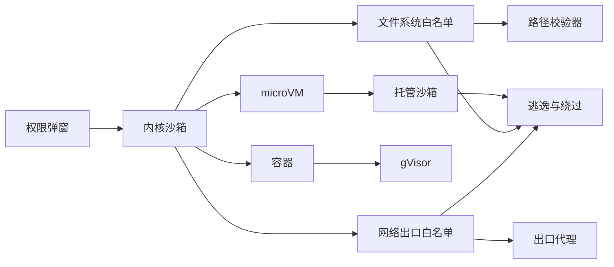
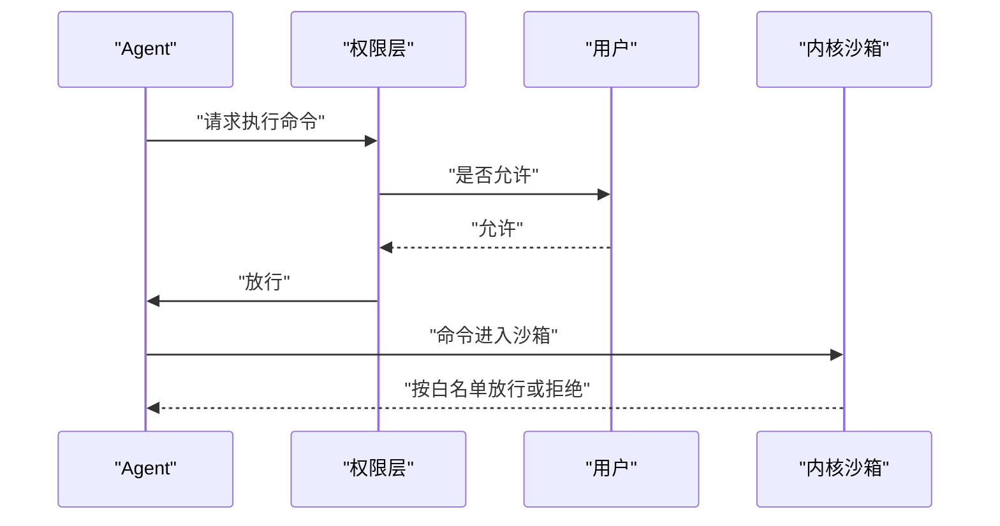
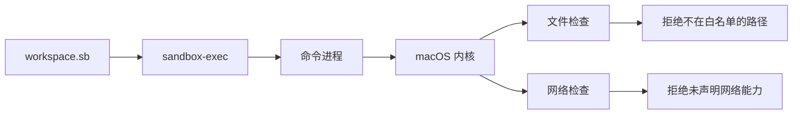
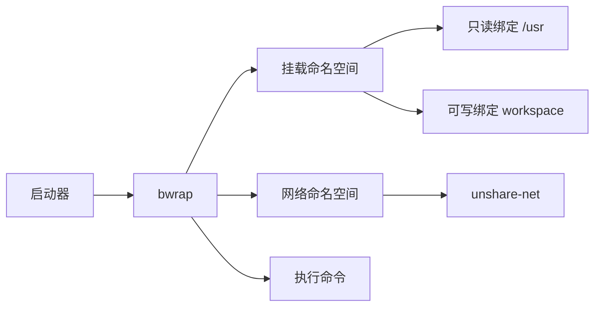
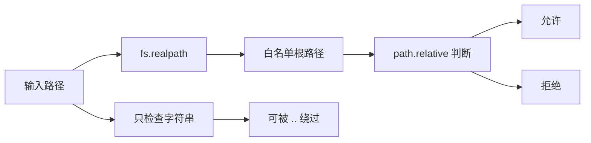
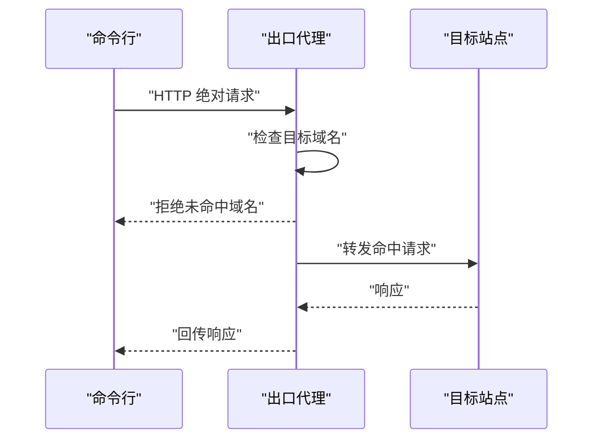
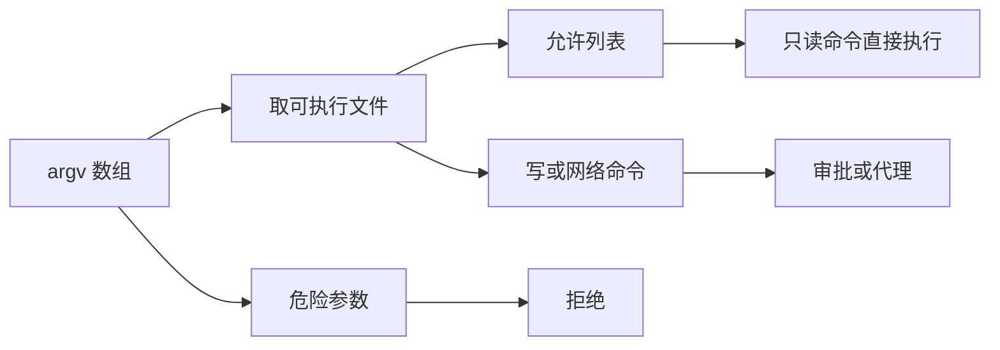
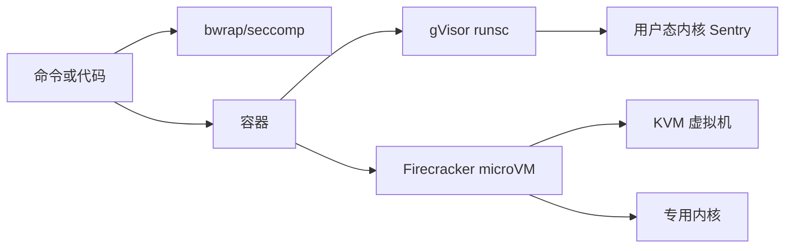
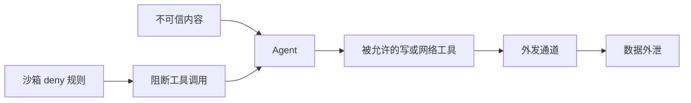

# 沙箱技术：从 seatbelt、bubblewrap 到 microVM

!!! abstract "学完这一页你能"

- 分清权限确认、内核沙箱、容器、gVisor、microVM 各自拦在哪一层。
- 写出一个带 `node:assert` 的路径白名单校验器，能挡 `../` 与符号链接逃逸。
- 写出一个域名精确匹配的网络出口代理，拒绝内网地址与未命中域名。
- 解释沙箱如何减少权限弹窗，以及宽域名白名单、命令正则过滤为何会失效。

## 0. 知识地图



建议先读第 1 节理解“为什么弹窗不够”，再按第 2、3 节看内核沙箱。第 4、5、6 节是可直接照抄的手写实现。第 7、8 节用于选型与防绕过。

## 1. 为什么需要沙箱：权限弹窗不是安全边界

**先想一个问题**

用户让 Agent 修复测试，Agent 却执行 `rm -rf`。每步都弹窗，用户习惯性点了允许。弹窗到底防住什么？

!!! note "术语：权限确认"

权限确认是程序在动作执行前请求用户批准。例如 Claude Code 的 Bash 编辑操作默认会询问用户。

!!! note "术语：沙箱"

沙箱是进程只能访问被允许文件、网络、系统调用的隔离环境。macOS Seatbelt、Linux bubblewrap/seccomp 都常被用来做沙箱。

**心智模型**

!!! tip "心智模型"

一句话模型：权限弹窗是决策入口，沙箱是执行边界。日常类比：门卫问你要不要进楼，沙箱只发你某一层某一间房的门卡。类比不成立处：门卫可能被你说服，门卡不看你的理由，只在门禁设备上生效。

**图解**



1. Agent 先把动作交给权限层。
2. 权限层可能把问题交给用户。
3. 用户允许后，命令还要经过内核沙箱。
4. 沙箱可按路径、网络、系统调用独立拒绝，即使权限层已经放行。

**一步一步来**

这一步要做什么：先做一个最小权限决策器，展示 deny、ask、allow 三层顺序。

```js
// 权限规则按 deny > ask > allow 顺序检查
const rules = [
  { effect: 'deny', when: /^rm\s+(-[a-z]*rf|--recursive\s+--force)/ },
  { effect: 'allow', when: /^git\s+status/ },
];

export function decide(command) {
  const rule = rules.find((r) => r.when.test(command));
  return rule?.effect ?? 'ask';
}
```

**这段代码在做什么**

- 规则是数组，`find` 找到第一条命中规则。
- 第一条是 deny，所以危险命令优先拒绝。
- 未命中时返回 `ask`。
- 这个正则只适合教学，不能做真实边界。

这一步要做什么：把沙箱状态加入最终决策，让弹窗与沙箱分离。

```js
export function finalDecision(command, sandboxActive) {
  const policy = decide(command);
  if (!sandboxActive && policy === 'ask') {
    return { run: false, reason: 'sandbox_not_ready' };
  }
  return { run: policy !== 'deny', reason: policy };
}
```

**这段代码在做什么**

- 未启用沙箱时，不确定动作不执行。
- deny 仍然覆盖 all允许。
- 允许的读命令可继续执行。

**动手验证**

```js
import assert from 'node:assert';

import { decide, finalDecision } from './decision.js';

assert.equal(decide('rm -rf node_modules'), 'deny');
assert.equal(decide('git status'), 'allow');
assert.equal(decide('npm test'), 'ask');
assert.equal(finalDecision('git status', true).run, true);
assert.equal(finalDecision('npm test', false).run, false);
console.log('权限决策顺序验证通过');
```

预期输出：`权限决策顺序验证通过`。

**常见坑**

| 现象 | 原因 | 怎么修 |
|---|---|---|
| 用户几乎每次都点允许 | 权限弹窗疲劳 | 用工作区沙箱把默认允许的动作先限制住 |
| 提示词里写“不要删除”仍然删除 | 提示词不是执行边界 | 用文件系统 deny 规则 |
| `rm $DIR` 绕过 `rm -rf` 正则 | 文本匹配只看到表面 | 分类器要解析 argv，不能只做字符串匹配 |

**用在哪里**

场景：前端 AI 编码助手连接本目录。

- 业务背景：用户让 Agent 改构建脚本，不想每次读文件都确认。
- 这一节的知识怎么用：读文件走默认允许，写文件由沙箱限制到项目根目录。
- 用什么指标衡量收益：每小时权限弹窗数、越权写操作被拦截次数。
- 什么时候不该用：用户要求改全局 npm 配置时，不能只给项目目录沙箱。

场景：后台管理执行用户提交的 shell 脚本。

- 业务背景：管理员上传脚本做批处理。
- 这一节的知识怎么用：先判定脚本是否属于已知操作，再压入 bwrap 或 Seatbelt。
- 用什么指标衡量收益：危险命令拒绝率、误拒绝率。
- 什么时候不该用：生产热修复时间窗内，不能因弹窗阻断而绕过审批。

**行业实践**

Anthropic 工程博客《Claude Code sandboxing》报告内部使用中“沙箱将权限提示减少 84%”，以原文为准。Claude Code 文档《Permissions》写明 deny 先于 ask、allow 的第一匹配顺序。可借鉴处：先做文件与网络双重 deny，再统计弹窗下降，不删审批日志。

**小结**

1. 权限确认适合表达用户意愿，不适合做安全边界。
2. 内核沙箱在用户允许后仍能按策略拒绝。
3. 文本正则只能做演示，不能单独承担危险命令过滤。

## 2. macOS Seatbelt：用 profile 约束文件与网络

**先想一个问题**

Agent 要读 `.ssh/id_rsa` 或调用 `curl`，macOS 终端本身没有限制。能不能让某个命令拿不到这些能力？

!!! note "术语：Seatbelt"

macOS 提供的沙箱机制，通过 `sandbox-exec` 读取 profile，由内核检查文件、网络等资源访问。例如 profile 只允许读 `/workspace`，读 `/Users/me/.ssh` 会被拒绝。

**心智模型**

!!! tip "心智模型"

一句话模型：Seatbelt profile 是一张按文件、网络、进程权限逐条声明的出入证。日常类比：剧院后台只给某张工作证开放指定通道。类比不成立处：工作证检查由内核完成，不是门口保安看人脸。

**图解**



1. `sandbox-exec` 读取 profile 文件。
2. 目标进程进入沙箱后，每次资源访问都要经内核检查。
3. 文件检查按 profile 中的 `allow file-read*` 等规则执行。
4. 网络能力也很少默认开放，需按 profile 声明。

**一步一步来**

这一步要做什么：写一个只允许读 `/workspace` 的 Seatbelt profile。

```text
; 教学用 Seatbelt profile，完整语法需核对 macOS sandbox-exec 手册
(version 1)
(deny default)
(allow process*)
(allow file-read* (subpath "/workspace"))
```

**这段代码在做什么**

- `(deny default)` 先拒绝一切未声明能力。
- `(allow process*)` 允许基本的进程操作。
- 只允许读取 `/workspace` 子树。
- 默认不允许网络能力。

这一步要做什么：用 `sandbox-exec` 加载 profile 执行命令。

```bash
sandbox-exec -f workspace.sb /bin/sh -c 'ls /workspace'

sandbox-exec -f workspace.sb /bin/sh -c 'cat /Users/me/.ssh/id_rsa'
```

**这段代码在做什么**

- 第一条命令读取授权目录。
- 第二条命令尝试读取授权外路径。
- 读 `/Users/me/.ssh/id_rsa` 时会被内核拒绝。

**动手验证**

```js
import assert from 'node:assert';
import { execFileSync } from 'node:child_process';

const profile = [
  '(version 1)',
  '(deny default)',
  '(allow process*)',
  '(allow file-read* (subpath "/workspace"))',
].join('\n');

assert.equal(profile.includes('(deny default)'), true);
assert.equal(profile.includes('file-read*'), true);

if (process.platform === 'darwin') {
  const out = execFileSync('sandbox-exec', ['-p', profile, '/bin/sh', '-c', 'echo ok']).toString();
  assert.match(out, /ok/);
}

console.log('Seatbelt profile 校验通过');
```

预期输出：`Seatbelt profile 校验通过`。

**常见坑**

| 现象 | 原因 | 怎么修 |
|---|---|---|
| 命令启动即失败 | `deny default` 后缺少动态库读取 | 补 `/usr/lib`、`/System` 的只读 allow |
| 网络工具不能使用 | profile 没有网络能力 | 显式声明所需的网络能力 |
| 写目录仍可访问 | profile 写路径声明过宽 | 只用 `subpath` 精确到最终目录 |

**用在哪里**

场景：macOS 桌面前端编码助手运行 Bash。

- 业务背景：用户在 VSCode 里让 Agent 跑 `npm test`。
- 这一节的知识怎么用：macOS 端用 Seatbelt profile 把读写限制到项目目录。
- 用什么指标衡量收益：越权文件读取被拦截数、网络访问被拦截数。
- 什么时候不该用：命令本来要写用户级缓存或 Keychain 时，不能用工作区 profile 硬拦。

场景：本地运行不可信构建脚本。

- 业务背景：开发者下载组件后要执行 `postinstall`。
- 这一节的知识怎么用：用最小 profile 执行构建，不允许访问 `.ssh`、`.aws`。
- 用什么指标衡量收益：密钥访问阻断次数、构建失败原因中沙箱误拦占比。
- 什么时候不该用：构建确实要读取用户证书时，应先拆开凭证授权。

**行业实践**

OpenAI Codex 文档说明 macOS 使用 Seatbelt 和 `sandbox-exec`，网络默认关闭。Gemini CLI 文档列出 `permissive-open`、`restrictive-closed` 等五个 Seatbelt profile。可借鉴处：把 profile 分档，默认选 `restrictive-*`，只给真正需要的文件与网络权限。

**小结**

1. Seatbelt 由 macOS 内核执行，profile 是声明式策略。
2. `deny default` 配明确 allow 是缩小攻击面的基础。
3. 文件与网络权限要分开声明，不能只堵文件。

## 3. Linux bubblewrap、seccomp 与 Landlock：内核强制

**先想一个问题**

在 Linux 服务器上让模型跑构建命令，如何不让它访问 `/home` 和 `/etc/passwd`？

!!! note "术语：bubblewrap"

Linux 上基于用户命名空间的轻量隔离工具，常被简称为 `bwrap`。它把文件系统重新挂载到一个隔离视图，只暴露命令需要的目录。

!!! note "术语：seccomp"

Linux 系统调用过滤机制。进程可以声明允许哪些系统调用，未声明的系统调用由内核拒绝。

!!! note "术语：Landlock"

Linux 安全模块，允许普通进程限制自己的文件系统与网络操作。文件系统规则从 Linux 5.13 开始可用，TCP 限制来自 ABI 4，UDP 来自 ABI 10。

**心智模型**

!!! tip "心智模型"

一句话模型：bwrap 让进程进入新挂载命名空间，seccomp 与 Landlock 再限制它能用哪些系统调用和网络操作。日常类比：给每个任务一个空房间，只搬进去它需要的柜子，再告诉他哪些动作不能做。类比不成立处：命名空间只隔离视图，宿主内核漏洞仍可能打破房间。

**图解**



1. bwrap 创建新的挂载命名空间。
2. 系统目录只读绑定进去，项目目录可写绑定进去。
3. 用 `--unshare-net` 取消网络命名空间。
4. 命令在里面看到的是受限文件视图，不可外连网络。

**一步一步来**

这一步要做什么：用 bwrap 只给命令 `/usr`、`/lib`、`workspace` 三个视图。

```bash
bwrap \
  --ro-bind /usr /usr \
  --ro-bind /lib /lib \
  --ro-bind /lib64 /lib64 \
  --proc /proc \
  --dev /dev \
  --bind ./workspace /workspace \
  --chdir /workspace \
  --unshare-net \
  -- /bin/sh
```

**这段代码在做什么**

- `--ro-bind` 把系统目录只读映射。
- `--bind` 把当前 `./workspace` 映射为 `/workspace`。
- `--chdir /workspace` 把工作目录固定到沙箱内。
- `--unshare-net` 让内部进程看不到宿主网络。
- 最后 `-- /bin/sh` 是真正执行的命令。

这一步要做什么：在 Node 里包装 bwrap，避免每次手敲参数。

```js
import { spawnSync } from 'node:child_process';

export function runInBwrap(argv) {
  return spawnSync('bwrap', [
    '--ro-bind', '/usr', '/usr',
    '--bind', './workspace', '/workspace',
    '--chdir', '/workspace',
    '--unshare-net',
    '--',
    ...argv,
  ], { stdio: 'inherit' });
}
```

**这段代码在做什么**

- 把固定 bwrap 参数放进函数。
- `argv` 是最终命令参数，而不是 shell 字符串。
- `--unshare-net` 阻断直接 TCP/UDP，除非进程能绕过网络命名空间。

**动手验证**

```js
import assert from 'node:assert';
import { spawnSync } from 'node:child_process';

const args = [
  '--ro-bind', '/usr', '/usr',
  '--bind', './workspace', '/workspace',
  '--chdir', '/workspace',
  '--unshare-net',
  '--', 'node', '-e', 'console.log(process.cwd())',
];

assert.equal(args.includes('--unshare-net'), true);
assert.equal(args.includes('./workspace'), true);

const result = spawnSync('bwrap', args, { encoding: 'utf8' });

if (result.error?.code === 'ENOENT') {
  console.log('未安装 bwrap，跳过执行');
} else {
  assert.match(result.stdout, /workspace/);
}

console.log('bwrap 参数校验通过');
```

预期输出：`bwrap 参数校验通过`，如果安装了 bwrap 则还会看到内部工作目录输出。

**常见坑**

| 现象 | 原因 | 怎么修 |
|---|---|---|
| bwrap 内部找不到链接器 | 缺少 `/lib64` 或 `/lib/x86_64-linux-gnu` | 补对应只读绑定 |
| `--unshare-net` 后 npm 失败 | 直接网络被切断 | 改用网络出口代理白名单 |
| Landlock 调用无效 | 内核未开启 Landlock 或版本过低 | 检查内核配置与 Linux 5.13 及以上版本 |

**用在哪里**

场景：前端 CI 跑不可信 PR 的构建。

- 业务背景：开源仓库收到 PR，CI 需要执行构建脚本。
- 这一节的知识怎么用：用 bwrap 只给仓库目录与工具链，禁止网络直接访问。
- 用什么指标衡量收益：构建中文件越界读取被拦数、网络直接连接被拦数。
- 什么时候不该用：构建必须拉取私有依赖时，不能直接 `--unshare-net`，应走域名白名单代理。

场景：后台管理执行用户提交的脚本。

- 业务背景：用户脚本要读取目标项目文件。
- 这一节的知识怎么用：bwrap 只挂载目标文件夹，seccomp 或 Landlock 限制写目录。
- 用什么指标衡量收益：读 `/etc/passwd` 阻断率、写工作区外阻断率。
- 什么时候不该用：脚本需要访问多个服务专用目录时，应拆成多个 bwrap 配置。

**行业实践**

Linux 内核文档《Landlock》写明普通进程可限制自己的文件系统，并从 ABI 4 起限制 TCP、ABI 10 起限制 UDP。OpenAI Codex 文档写明 Linux 使用 `bwrap` 加 `seccomp`。Cursor 文档写明 Linux 使用 Landlock/seccomp。可借鉴处：把文件系统与网络限制放到进程自己的权限里，而不是只靠外层容器。

**小结**

1. bwrap 负责文件系统视图与网络命名空间。
2. seccomp 负责系统调用级过滤。
3. Landlock 让进程自己缩权，适合在容器内再做第二层。

## 4. 文件系统白名单：手写路径校验器

**先想一个问题**

你已经把命令限制在工作区，但传入 `../../etc/passwd` 会怎样？

!!! note "术语：路径规范化"

把一个路径去除多余的 `.`、`..`、重复分隔符，得到标准形式。例如 `/workspace/../etc` 规范化后是 `/etc`。

**心智模型**

!!! tip "心智模型"

一句话模型：先解析真实路径，再判断真实路径是否在白名单根内。日常类比：查门牌要走到门口看实际地址，不能只看手写纸条。类比不成立处：文件可能在检查后被替换，仅靠检查不能完全消除竞态。

**图解**



1. 输入先交给 `realpath` 解析。
2. 输出的绝对路径与白名单根比较。
3. `path.relative` 结果不以 `..` 开头且不是绝对路径才算允许。
4. 只检查字符串会漏掉符号链接与 `..` 逃逸。

**一步一步来**

这一步要做什么：实现一个基于规范化路径的纯函数校验器。

```js
import { normalize, relative, isAbsolute } from 'node:path';

export function pathAllowed(input, workspaceRoot) {
  const root = normalize(workspaceRoot);
  const target = isAbsolute(input)
    ? normalize(input)
    : normalize(`${root}/${input}`);

  const rel = relative(root, target);
  return rel === '' || (!rel.startsWith('..') && !isAbsolute(rel));
}
```

**这段代码在做什么**

- 先把 root 与输入都规范化。
- 相对输入拼到 root 后面。
- `path.relative` 如果在根内部，结果不会以 `..` 开头。
- 这样阻止 `../etc/passwd` 和绝对路径越界。

这一步要做什么：对真实路径再做一次判断，防符号链接指向白名单外。

```js
import { realpath } from 'node:fs/promises';
import { pathAllowed } from './path-allowed.js';

export async function realPathAllowed(input, root) {
  const resolved = await realpath(input);
  return pathAllowed(resolved, root);
}
```

**这段代码在做什么**

- `fs.promises.realpath` 解析符号链接到实际文件路径。
- 再调用路径白名单判断实际路径。
- 符号链接指向 `/etc/passwd` 时会被拒绝。

**动手验证**

```js
import assert from 'node:assert';
import { normalize, relative, isAbsolute } from 'node:path';

function pathAllowed(input, root) {
  const target = isAbsolute(input)
    ? normalize(input)
    : normalize(`${normalize(root)}/${input}`);
  const rel = relative(normalize(root), target);
  return rel === '' || (!rel.startsWith('..') && !isAbsolute(rel));
}

assert.equal(pathAllowed('src/app.js', '/workspace'), true);
assert.equal(pathAllowed('../etc/passwd', '/workspace'), false);
assert.equal(pathAllowed('/workspace2/app.js', '/workspace'), false);
assert.equal(pathAllowed('/workspace/src/../api.js', '/workspace'), true);

console.log('路径白名单校验通过');
```

预期输出：`路径白名单校验通过`。

**常见坑**

| 现象 | 原因 | 怎么修 |
|---|---|---|
| `/workspace2` 被误许可 | 只判断前缀 `workspace` | 根后追加路径分隔符再比较 |
| `..` 字符串被规范化放过 | 只检查不规范化 | 先 normalize 再用 relative |
| 符号链接指向外部 | 未解析真实路径 | 先 realpath 再判断 |
| 检查后文件被替换 | 校验与打开不是原子操作 | 关键场景使用打开后校验文件描述符，具体需核对 OS 文档 |

**用在哪里**

场景：前端项目 CLI 只允许 Agent 操作当前项目目录。

- 业务背景：Agent 请求写 `src/components/Modal.tsx`。
- 这一节的知识怎么用：写前先 realpath，再判断是否在项目根内。
- 用什么指标衡量收益：越界写请求拒绝数、误拒绝数。
- 什么时候不该用：项目故意使用 monorepo 外共享包源码时，需要改白名单根列表。

场景：在线代码 playground 读取项目文件。

- 业务背景：用户打开一个文件 URL，服务端必须防止读任意服务器文件。
- 这一节的知识怎么用：URL 解码后取路径，realpath 后判断是否在分配的沙箱目录。
- 用什么指标衡量收益：路径穿越漏洞测试通过率。
- 什么时候不该用：文件通过虚拟文件系统间接暴露时，需要做虚拟路径映射。

**行业实践**

MCP 规范 2025-06-18《client/roots》要求客户端验证 root URI，防止路径穿越。Anthropic 开源 `sandbox-runtime` 的配置包含 `filesystem.denyRead`、`allowWrite`、`denyWrite`。可借鉴处：对外暴露文件路径前先做真实路径解析与白名单根判断。

**小结**

1. 路径白名单要先规范化再比较。
2. 符号链接指向白名单外时必须被拒绝。
3. 只靠字符串前缀会制造 `/workspace2` 这类误许可。

## 5. 网络出口代理：域名白名单最小实现

**先想一个问题**

域名白名单允许 `github.com`，Agent 却访问 `api.github.com` 还向它发数据。怎样在出口处拦截未命中域名？

!!! note "术语：出口代理"

负责转发内网进程到外网请求的中间服务。它能在请求离开受控环境前检查域名、路径与协议。

**心智模型**

!!! tip "心智模型"

一句话模型：出口代理是唯一网络门，未命中白名单的请求直接拒绝。日常类比：办公楼只开一个快递口，所有包裹都从这个口检查。类比不成立处：代理只能挡住显式配置的流量，UDP 直连或绕过代理机制的应用仍可能外发。

**图解**



1. 命令行把完整目标 URL 交给代理。
2. 代理先检查域名的精确匹配。
3. 未命中直接返回 403。
4. 命中才向后端站点转发。

**一步一步来**

这一步要做什么：写一个只做精确域名判断的校验函数。

```js
export function isAllowedExact(host, allowSet) {
  const withoutTrailingDot = host.replace(/\.$/, '');
  const noPort = withoutTrailingDot.replace(/:\d+$/, '');
  return allowSet.has(noPort.toLowerCase());
}
```

**这段代码在做什么**

- 去掉 IPv6 地址可能带有的末尾点。
- 去掉常见端口段，避免 `example.com:443` 误判。
- 精确 `Set.has` 判断，不用 `endsWith`。
- 这样 `api.github.com` 不会被 `github.com` 放行。

这一步要做什么：用 Node 实现一个最小 HTTP 出口代理。

```js
import http from 'node:http';

const allowed = new Set(['registry.npmjs.org', 'github.com']);

const server = http.createServer((req, res) => {
  const target = req.headers.host || new URL(req.url).hostname;
  if (!isAllowedExact(target, allowed)) {
    res.writeHead(403).end('blocked host\n');
    return;
  }
  // 教学简化：实际代理需要继续处理 HTTPS CONNECT
  res.writeHead(200).end(`would proxy to ${target}\n`);
});

server.listen(8080, '127.0.0.1');
```

**这段代码在做什么**

- 通过 `Host` 头或完整 URL 取目标域名。
- 未命中域名返回 403。
- 命中后只做演示回显，真实转发需补绝对 URL 或 CONNECT 隧道。
- 监听本地地址，避免代理暴露到外部网络。

**动手验证**

```js
import assert from 'node:assert';

function isAllowedExact(host, allowSet) {
  const noPort = host.replace(/:\d+$/, '');
  return allowSet.has(noPort.toLowerCase());
}

const allowed = new Set(['registry.npmjs.org', 'github.com']);

assert.equal(isAllowedExact('registry.npmjs.org', allowed), true);
assert.equal(isAllowedExact('api.github.com', allowed), false);
assert.equal(isAllowedExact('169.254.169.254', allowed), false);
assert.equal(isAllowedExact('evil.com', allowed), false);

console.log('域名白名单校验通过');
```

预期输出：`域名白名单校验通过`。

**常见坑**

| 现象 | 原因 | 怎么修 |
|---|---|---|
| `api.github.com` 被放行 | 用 `endsWith('github.com')` | 精确 `Set.has` |
| 内网 169.254.169.254 可访问 | 手写 IP 校验漏掉 IPv4 编码变体 | 只允许显式域名白名单 |
| 某些应用直连外网 | 未读取 `HTTP_PROXY` | 用网络命名空间或强制代理 |
| npm 需要 HTTPS | 只实现 HTTP 代理 | 补 CONNECT 隧道，具体协议需核对 HTTP 代理文档 |

**用在哪里**

场景：npm 安装只允许官方 registry。

- 业务背景：Agent 需要运行 `npm install`，但不应把内部包发到任意网站。
- 这一节的知识怎么用：网络出口只允许 `registry.npmjs.org`。
- 用什么指标衡量收益：外发请求被代理拦截数、安装失败中代理误拦占比。
- 什么时候不该用：项目使用私有 registry 时，要新增私有域名而非放开全部网络。

场景：AI Agent 拉取联网文档。

- 业务背景：Agent 只能读公司知识库的指定文档站点。
- 这一节的知识怎么用：出口代理只允许文档域名，且记录全部请求路径。
- 用什么指标衡量收益：非白名单域名请求被拦截数、数据外发告警数。
- 什么时候不该用：文档站点需要泛域名访问时，要明确到子域列表而不是一个宽后缀。

**行业实践**

MCP 安全最佳实践 2025-06-18 建议使用出口代理，例如 Smokescreen，阻止内部地址。Anthropic 工程博客描述 Claude Code Web 使用 git 代理在沙箱外校验凭据和命令内容，沙箱内不存放凭据。可借鉴处：把代理做成唯一出口，并记录完整请求日志供审计。

**小结**

1. 域名白名单要精确匹配，不能用后缀判断。
2. 代理进程应只监听本地回环地址。
3. 还可用网络命名空间保证直接外联被切断。

## 6. 命令分类器：把危险动作挡在执行前

**先想一个问题**

用正则判断 `rm -rf`，会被 `sh -c $CMD` 或变量赋值绕过。如何从命令参数而不是字符串判断？

!!! note "术语：argv"

操作系统给出的参数数组，每个参数是独立字符串。例如 `git status` 调用时 argv 是 `['git','status']`，比 shell 字符串更容易判断。

**心智模型**

!!! tip "心智模型"

一句话模型：分类器解析可执行文件、参数、重定向目标，再把它们放入允许、询问、拒绝三类。日常类比：安检看行李清单，不是扫一眼箱子。类比不成立处：清单仍可能伪造，所以最终边界还是内核沙箱。

**图解**



1. 分类器首先取 argv 第一个元素。
2. 只读命令进入 allow。
3. 写或网络命令进入 ask。
4. 危险参数进入 deny。

**一步一步来**

这一步要做什么：写一个只依据 argv 的分类器，不匹配原始 shell 文本。

```js
export function classifyArgv(argv) {
  const exe = argv[0];

  if (exe === 'git') {
    if (['status', 'diff', 'log'].includes(argv[1])) return 'allow';
    if (['push', 'commit'].includes(argv[1])) return 'ask';
  }

  if (exe === 'node' && argv[1]?.endsWith('.test.js')) return 'allow';
  if (exe === 'rm') return 'deny';

  return 'deny';
}
```

**这段代码在做什么**

- 依据 `argv[0]` 判断可执行文件。
- `git status` 走 allow，`git push` 走 ask。
- `rm` 不管参数直接 deny。
- 不再检查 shell 命令文本里的变量和引号。

这一步要做什么：把分类器接到执行入口，禁止直接 shell 文本。

```js
import { spawnSync } from 'node:child_process';

export function runClassified(argv) {
  const decision = classifyArgv(argv);

  if (decision === 'deny') {
    throw new Error(`denied: ${argv.join(' ')}`);
  }

  if (decision === 'ask') {
    throw new Error(`ask: ${argv.join(' ')}`);
  }

  return spawnSync(argv[0], argv.slice(1), { stdio: 'inherit' });
}
```

**这段代码在做什么**

- deny 与 ask 都不会静默放行。
- allow 使用 `spawnSync` 直接传 argv。
- 使用 `shell: false` 避免一层 shell 解释。

**动手验证**

```js
import assert from 'node:assert';

function classifyArgv(argv) {
  const exe = argv[0];
  if (exe === 'git') {
    if (['status', 'diff', 'log'].includes(argv[1])) return 'allow';
    if (['push', 'commit'].includes(argv[1])) return 'ask';
  }
  if (exe === 'node' && argv[1]?.endsWith('.test.js')) return 'allow';
  if (exe === 'rm') return 'deny';
  return 'deny';
}

assert.equal(classifyArgv(['git', 'status']), 'allow');
assert.equal(classifyArgv(['git', 'push', 'origin', 'main']), 'ask');
assert.equal(classifyArgv(['rm', '-rf', '.']), 'deny');
assert.equal(classifyArgv(['sh', '-c', 'rm -rf .']), 'deny');

console.log('命令分类器校验通过');
```

预期输出：`命令分类器校验通过`。

**常见坑**

| 现象 | 原因 | 怎么修 |
|---|---|---|
| `curl -L http://...` 绕过参数顺序正则 | 规则只匹配固定顺序 | 用 argv 和域名白名单双层控制 |
| 允许 `git` 后仍可 `git remote set-url` | 漏判特定子命令 | 对敏感子命令单独设 deny |
| 允许 `sh` 后内部命令无法分类 | shell 解释器会吞掉后续语义 | 不允许 shell 解释器直接入 allow |
| 可执行文件被路径别名绕过 | 只看名称不解析路径 | 对真实文件路径做白名单 |

**用在哪里**

场景：AI CLI 的 Bash 工具审批。

- 业务背景：模型请求运行 `git status` 或 `npm run deploy`。
- 这一节的知识怎么用：argv 分类器只放行只读动作，deploy 必须弹窗。
- 用什么指标衡量收益：危险命令被 deny 数、审批弹窗下降数。
- 什么时候不该用：命令必须包含复杂管道时，应要求用脚本文件并审核脚本内容。

场景：CI 任务命令行执行器。

- 业务背景：后台管理让用户选择预设任务运行。
- 这一节的知识怎么用：把用户输入映射为已知 argv 模板，不拼接任意 shell。
- 用什么指标衡量收益：命令注入测试通过率、生产执行失败中以 deny 拦截的比例。
- 什么时候不该用：临时运维必须运行任意命令时，需要独立权限等级与事后审计。

**行业实践**

Claude Code 文档《Permissions》写明用参数约束 Bash 规则很脆弱，例如 `curl -L`、变量赋值、重定向都能绕过。Anthropic 工程博客《Claude Code automatic permissions》描述自动模式分类器只读用户消息和命令，两阶段分类完整流水线报告 0.4% 误报率、17% 漏报率，以原文为准。可借鉴处：命令分类器要把 argv 作为输入，不要把完整 shell 文本当安全判断对象。

**小结**

1. 分类器输出是 allow、ask、deny，不执行原始 shell 字符串。
2. shell 解释器入 allow 会让后续命令不可分类。
3. 分类器漏报不归零时，后面还必须接沙箱边界。

## 7. 容器、gVisor 与 Firecracker：隔离强度谱系

**先想一个问题**

bwrap/seccomp 足够吗？如果运行的是恶意容器或需要更强隔离的代码，哪一层真正挡住？

!!! note "术语：microVM"

基于 KVM 的轻量虚拟机，每个实例有独立内核。Firecracker 是 microVM monitor，用于 AWS Lambda。

!!! note "术语：gVisor"

Go 编写的用户态“应用内核”，组件包括 Sentry 和 Gofer。`runsc` 是其 OCI runtime，可接 Docker 与 Kubernetes。

**心智模型**

!!! tip "心智模型"

一句话模型：容器共享宿主内核，gVisor 用用户态内核拦截系统调用，Firecracker 用 KVM 创建独立内核。日常类比：容器是同一栋楼隔间，gVisor 是加了前台登记，microVM 是独立板房。类比不成立处：隔离强度不是绝对，取决于攻击面与管理配置。

**图解**



1. bwrap/seccomp 适合单进程缩权。
2. 容器把文件系统、进程、网络放入命名空间。
3. gVisor 把系统调用送入用户态 Sentry。
4. Firecracker 每个实例带上专用内核。

**一步一步来**

这一步要做什么：配置 gVisor 作为 OCI runtime，用 no network 跑命令。

```bash
# OCI bundle 以 gVisor 官方文档为准
runsc --rootless --network=none run sandbox-id
```

**这段代码在做什么**

- `runsc` 是 gVisor 的 OCI runtime。
- `--rootless` 表示无 root 配置，实际支持情况以 gVisor 文档为准。
- `--network=none` 关闭网络。
- `sandbox-id` 是容器实例标识。

这一步要做什么：写出 Firecracker 启动最小 API 请求片段。

```json
{
  "kernel_image_path": "./vmlinux",
  "boot_args": "console=ttyS0 reboot=k panic=1",
  "drives": [],
  "network_interfaces": []
}
```

**这段代码在做什么**

- `boot-source` 使用内核镜像和启动参数。
- `drives` 把根文件系统挂到 microVM。
- `network_interfaces` 默认不配置，禁止任意直接网络访问。
- 具体 API 路径和字段需核对 Firecracker 官方文档。

**动手验证**

```js
import assert from 'node:assert';

const firecrackerFacts = {
  bootMsUpperBound: 125,
  perSecondPerHost: 150,
  overheadMiBUpperBound: 5,
};

assert.equal(firecrackerFacts.bootMsUpperBound <= 125, true);
assert.equal(firecrackerFacts.perSecondPerHost <= 150, true);
assert.equal(firecrackerFacts.overheadMiBUpperBound <= 5, true);

console.log('Firecracker 公开规格校验通过');
```

预期输出：`Firecracker 公开规格校验通过`。

**常见坑**

| 现象 | 原因 | 怎么修 |
|---|---|---|
| 容器被一个内核漏洞打穿 | 多个容器共享宿主内核 | 上 gVisor 或 Firecracker，隔离内核接触面 |
| `runsc` 默认网络外发 | 配置未显式关网络 | 总是写 `--network=none` 或显式 allowlist |
| microVM 启动延迟影响交互 | 频繁创建与销毁 | 预热实例池，或按任务批量复用 |
| Firecracker 只有少量模拟设备 | 完整设备功能不足 | 用官方 API 绑定 virtio 设备，具体以文档为准 |

**用在哪里**

场景：Serverless 执行用户 JavaScript。

- 业务背景：代码来自用户提交，运行时间短但必须避免访问宿主机。
- 这一节的知识怎么用：用 Firecracker 给每个函数独立内核。
- 用什么指标衡量收益：内核漏洞逃逸窗口、每秒可启动实例数。
- 什么时候不该用：每毫秒都敏感的测试脚本，若 microVM 冷启动代价不能接受则换容器加 gVisor。

场景：托管 AI Agent 工作区。

- 业务背景：用户在浏览器里让 Agent 跑代码和读写文件。
- 这一节的知识怎么用：厂商用按需 Linux VM 做会话隔离，文件系统与内存可快照。
- 用什么指标衡量收益：会话间数据隔离、恢复时间。
- 什么时候不该用：会话生命周期极短时，需要先估冷启动成本。

**行业实践**

Firecracker 官方文档公开其启动时间低于 125 ms、每台宿主可达 150 microVM/s、开销低于 5 MiB。gVisor 文档解释 Sentry 是用户态内核，Gofer 通过 9P 协调文件系统。Cloudflare Sandbox 文档描述其运行在“带专用内核与网络的完整 Linux microVM”中。可借鉴处：按任务信任级别分层，不把单进程缩权当成全部隔离。

**小结**

1. 技术越往下，隔离面越独立，但启动成本也可能越高。
2. gVisor 位于容器与 VM 之间，拦截系统调用。
3. Firecracker 提供专用内核，适合不可信代码或服务隔离。

## 8. 逃逸与绕过：宽白名单、提示注入与数据外发

**先想一个问题**

白名单域名是 `github.com`，Agent 把 token 编码成 gist URL，然后 fetch，数据就外传了。

!!! note "术语：提示注入"

不可信内容通过指令影响模型行为。间接注入来自网页、文档、邮件或工具输出。

**心智模型**

!!! tip "心智模型"

一句话模型：沙箱限制动作，不限制动作语义。日常类比：手机只给你一个合法外卖 App，但 App 里也能下单到陌生地址。类比不成立处：数据内容检查不在沙箱本身，需要单独做外发审计。

**图解**



1. 不可信内容先影响 Agent 行为。
2. Agent 使用本来被允许的工具。
3. 工具把数据发到外发通道。
4. 沙箱 deny 只在工具调用发生前阻断，不能识别语义。

**一步一步来**

这一步要做什么：复现宽域名后缀匹配放行 api.github.com。

```js
function isAllowedSuffix(host, allowList) {
  return allowList.some((item) => host.endsWith(item));
}

console.log(isAllowedSuffix('api.github.com', ['github.com']));
```

**这段代码在做什么**

- 后缀匹配把 `api.github.com` 当成 `github.com`。
- 数据可以发到 `api.github.com` 的 gist 接口。
- 这是域名白名单常见的过度放行问题。

这一步要做什么：换成精确域名匹配。

```js
export function isAllowedExact(host, allowSet) {
  const lower = host.replace(/:\d+$/, '').toLowerCase();
  return allowSet.has(lower);
}

console.log(isAllowedExact('api.github.com', new Set(['github.com'])));
```

**这段代码在做什么**

- 去掉端口后精确比较。
- `api.github.com` 未命中。
- 允许列表必须明确列出每个外发域名。

**动手验证**

```js
import assert from 'node:assert';

function isAllowedExact(host, allowSet) {
  const lower = host.replace(/:\d+$/, '').toLowerCase();
  return allowSet.has(lower);
}

const allowed = new Set(['github.com']);

assert.equal(isAllowedExact('github.com', allowed), true);
assert.equal(isAllowedExact('api.github.com', allowed), false);
assert.equal(isAllowedExact('169.254.169.254', allowed), false);

console.log('精确域名校验通过');
```

预期输出：`精确域名校验通过`。

**常见坑**

| 现象 | 原因 | 怎么修 |
|---|---|---|
| Markdown 图片把数据拼进 URL 外发 | 渲染不可信 Markdown 时加载外部图片 | 禁用不可信域图片加载 |
| MCP 服务批准后换工具描述 | 工具描述在批准后可变化 | 固定版本或校验和 |
| 允许 `github.com` 但 gist 外发 | 宽域名包含上传接口 | 只允许下载按路径前缀，且审计 POST |

**用在哪里**

场景：聊天界面渲染不可信 Git 仓库内容。

- 业务背景：Agent 返回文档摘要，聊天 UI 渲染 Markdown。
- 这一节的知识怎么用：关闭不可信域图片，阻止 `` 把数据发走。
- 用什么指标衡量收益：外部域名请求中出现编码数据的告警数。
- 什么时候不该用：文档站点必须渲染外部图片时，需要图片代理并强制缓存。

场景：MCP 本地服务提供网络工具。

- 业务背景：模型通过 MCP 读取网页并执行操作。
- 这一节的知识怎么用：每个 MCP 服务走独立域名白名单，不让服务代理任意内网地址。
- 用什么指标衡量收益：元数据端点 169.254.169.254 访问阻断数、内部地址阻断数。
- 什么时候不该用：服务本身需要访问内网 API 时，要用一次性回传而非模型直接读原始数据。

**行业实践**

Simon Willison 2025 年文章提出“lethal trifecta”：访问私有数据、接触不可信内容、能对外通信三者不要同时成立。Meta 2025 年博客提出 Agents 的 Rule of Two：单次会话里若同时处理不可信输入、访问敏感系统、改变状态或对外通信，就需要人类审批或等价验证。OWASP LLM06:2025 把过度权限列为独立风险。可借鉴处：先数一下自己的 Agent 同时沾了几项，再决定是否给网络或写权限。

**小结**

1. 宽域名与后缀匹配会把上传接口放行。
2. 沙箱只管动作，不识别动作里的数据是否外泄。
3. 对不可信内容要控制数据、指令、外发三条链路的组合。

## 应用地图

| 场景 | 用到本页哪个知识点 | 典型技术选型 | 注意事项 |
|---|---|---|---|
| AI 编码助手本地 Bash | Seatbelt、路径白名单、域名代理 | macOS sandbox-exec、bwrap+seccomp | 沙箱通常只盖 Bash 与子进程，不盖文件工具 |
| 前端 CI 不可信 PR | bwrap、Landlock、网络隔离 | bwrap --unshare-net、runsc | 网络关掉后依赖安装需要代理 |
| npm 自动安装 | 域名白名单 | 出口代理只允许 registry.npmjs.org | 私有 registry 要加具体域名 |
| 在线代码执行 | microVM | Firecracker、Cloudflare Sandbox | 注意启动成本与实例池 |
| MCP 本地服务 | 路径、网络白名单 | 用户权限沙箱加精确域名 | 禁止 token 透传 |
| Agent 读取网页 | 出口代理、域名白名单 | Smokescreen 类代理 | 断不可信 Markdown 图片外发 |
| 后台批量导入脚本 | 路径白名单、argv 分类器 | Node path guard、`spawn` argv | 正则不是边界 |
| 托管 Agent 工作区 | 每会话 VM 或微 VM | E2B、Cloudflare Sandbox | 确认持久化与 VPC 归属 |

## 动手作业

目标：做一个最小 Bash 沙箱包装器，用 Node 20+ 单文件完成。

步骤：

1. 初始化项目目录 `sandbox-guard`。
2. 实现 `pathAllowed(input, root)`，拒绝 `../`、绝对路径外的访问。
3. 实现 `realPathAllowed(input, root)`，对存在的路径先 `realpath` 再判断。
4. 实现 `classifyArgv(argv)`，只读命令返回 allow，写或网络命令返回 ask，其他返回 deny。
5. 实现 `isAllowedExact(host, allowSet)`，拒绝 `api.github.com` 与 `169.254.169.254`。
6. 实现 `runSandboxed(argv, cwd)`，依次做分类、路径检查与域名检查。

验收标准：

- `pathAllowed('src/app.js', root) === true`。
- `pathAllowed('../etc/passwd', root) === false`。
- `classifyArgv(['rm','-rf','.']) === 'deny'`。
- `classifyArgv(['git','push']) === 'ask'`。
- `isAllowedExact('api.github.com', new Set(['github.com'])) === false`。
- 用 `node --test` 或 `node:assert` 跑通全部断言。

## 综合对比

| 技术 | 隔离边界 | 文件限制方式 | 网络限制方式 | 典型启动成本 | 适用产品 |
|---|---|---|---|---|---|
| macOS Seatbelt | 进程级内核策略 | profile 声明 subpath | profile 声明网络能力 | 进程直接启动 | Codex、Cursor、Gemini |
| Linux bubblewrap+seccomp | 用户命名空间与系统调用 | bind mounts 收窄视图 | --unshare-net | 进程直接启动 | Codex |
| Linux Landlock | 进程自行限制 | 文件系统规则集 | TCP 从 ABI 4、UDP 从 ABI 10 | 进程内设置 | Cursor |
| 容器 runc/默认 runtime | 内核命名空间 | bind mount、rootfs | 网络命名空间 | 容器启动 | Docker、Podman |
| gVisor | 用户态内核 | Gofer 通过 9P 协调 | runsc network | 容器加拦截层 | Docker/K8s 强隔离 |
| Firecracker microVM | 专用内核虚拟机 | virtio 磁盘 | 专用网络接口 | 低于 125 ms，每宿主 150 实例/s | AWS Lambda、自建 FaaS |
| 托管沙箱 | 厂商管理 VM 或微 VM | API 与模板 | 专用网络 | 按厂商计费 | Cloudflare Sandbox、E2B |

## 深入阅读与参考

!!! tip "怎么用这些资料"
    先读「官方文档与规范」建立准确的概念，再读「源码与示例」核对细节，最后用「教程、书籍与视频」换一种讲法加深理解。每条都写明了读哪一节、带着什么问题读。

### 官方文档与规范

| 资源 | 为什么读 | 怎么读 |
|---|---|---|
| [MDN 文件系统 API](https://developer.mozilla.org/en-US/docs/Web/API/File_System_API) | 浏览器权限提示的真实行为，正好说明弹窗不等于安全边界。 | 读 File System Access API 权限一节，问授权后程序能做什么；再对照沙箱白名单设计。 |
| [Landlock: Linux LSM letting unprivileged processes restrict their own  (docs.kernel.org)](https://docs.kernel.org/userspace-api/landlock.html) | 内核官方文档，讲清非特权进程如何自我约束文件访问。 | 读 Access rights 与示例一节，问 handled_access_fs 如何生效；读后写一个最小自我沙箱程序。 |
| [gVisor: userspace application kernel written in Go ("Sentry"), "Gofer" (gvisor.dev)](https://gvisor.dev/docs/) | 解释用户态内核 Sentry 与 Gofer 如何拦截系统调用。 | 读架构页中 Sentry/Gofer 分工，问 syscall 兼容性代价；对照容器思考隔离强度。 |
| [Firecracker: KVM-based microVM monitor with only 5 emulated devices an (firecracker-microvm.github.io)](https://firecracker-microvm.github.io/) | microVM 官方文档，说明仅 5 个模拟设备为何就够安全。 | 读设备模型与 jailer 部分，问攻击面如何缩小；再与容器共享内核的边界对比。 |

### 源码与示例

| 资源 | 为什么读 | 怎么读 |
|---|---|---|
| [sandbox-runtime (SRT): no containers needed; macOS `sandbox-exec` with (github.com)](https://github.com/anthropic-experimental/sandbox-runtime) | 可直接读的开源实现，展示 seatbelt profile 是如何生成的。 | 看生成 profile 的代码与测试用例，问白名单条目怎么拼；照抄改一个自己的 profile 跑通。 |

### 教程、书籍与视频

| 资源 | 为什么读 | 怎么读 |
|---|---|---|
| [Sandboxing methods: macOS Seatbelt (`sandbox-exec`) and container (Doc (google-gemini.github.io)](https://google-gemini.github.io/gemini-cli/docs/cli/sandbox.html) | 把 macOS seatbelt 与容器两条路线并排讲，便于建立直观认知。 | 重点读 seatbelt 一节，留意 profile 语法与网络限制；随后在 macOS 上跑一次 sandbox-exec 实验。 |
| [E2B: sandbox is "a Linux virtual machine created on demand that can be (docs.e2b.dev)](https://docs.e2b.dev/) | 云端沙箱产品文档，展示按需 microVM 的接口与生命周期设计。 | 读沙箱创建、文件与网络接口三节，思考与本地 bubblewrap 方案的取舍差别。 |
| [Node.js 性能分析](https://nodejs.org/en/learn/getting-started/profiling) | 用 profile 量化隔离开销，判断沙箱是否拖慢被约束的执行。 | 在沙箱内外各跑一次同一命令，比较 --prof 输出，确认开销处于可接受范围。 |

## 自测题

??? question "为什么权限弹窗不能当作安全边界？"

用户会疲劳，Anthropic 工程博客报告用户手动批准了 93% 的权限请求。提示注入可影响 Agent 决策。内核沙箱白名单仍然独立生效。

??? question "Seatbelt profile 里 `deny default` 之后，什么情况会导致正常命令启动失败？"

动态链接器、系统库或证书文件未加入 `file-read*` allow。修复方法是补 `/usr/lib`、`/System` 等只读 allow。

??? question "`bwrap --unshare-net` 的作用是什么？"

让命令进入新的网络命名空间，无法直接建立宿主网络连接。需要网络时要走域名白名单代理。

??? question "路径校验为什么要先 `realpath` 再做边界比较？"

`realpath` 解析符号链接和 `..` 得到真实绝对路径。符号链接可能指向 `/etc/passwd`，仅比较输入字符串会放过。

??? question "为什么 MCP 安全实践不推荐手写 IP 校验器？"

IP 字面量有八进制、十六进制、IPv4 mapped 等表示，容易漏检。推荐只允许精确域名白名单，并用出口代理兜底。

??? question "给出两种命令正则过滤会被绕过的具体形式。"

`curl -L http://example.com` 与 `curl http://example.com -L` 参数顺序不同。`URL=... && curl $URL` 把 URL 藏在变量里。`sh -c` 也会包住后续命令。

??? question "容器共享宿主内核与 microVM 专用内核的差别主要是什么？"

容器命中宿主内核漏洞时，攻击可影响同宿主其他容器。microVM 每个实例独立内核，内核漏洞攻击面更小。具体容器对比 microVM 的隔离强度差异，资料未从一手来源覆盖，需核对官方安全文档。

??? question "用 lethal trifecta 或 Rule of Two 判断一个 Agent 配置该不该开网络。"

如果 Agent 同时接触私有数据、读到不可信网页、还能对外发请求，就组成致命三重条件。Meta Rule of Two 也要求三项全占时加入人类审批。因此这种配置不应默认开网络。

## 延伸阅读

- Anthropic 工程博客：Claude Code sandboxing、Claude Code automatic permissions。
- Claude Code 官方文档：Permissions、Permission modes、Sandboxing。
- anthropic-experimental/sandbox-runtime README：Configuration、Limitations。
- OpenAI Codex 官方文档：Agent approvals and security。
- Google Gemini CLI 官方文档：Sandbox、Trusted folders。
- Cursor 官方文档：Run modes、Security。
- Linux 内核官方文档：Landlock userspace API。
- gVisor 官方文档：Architecture Guide、Runtime。
- Firecracker 官方文档：Getting Started、Design。
- Cloudflare Sandbox 官方文档：Sandbox SDK。
- MCP 规范 2025-06-18：Security Best Practices、Authorization、Tools、Roots。
- OWASP GenAI：LLM Top 10 2025，LLM06 Excessive Agency。
