# Codex 的会话与记忆存储：rollout JSONL 加六个 SQLite 数据库

!!! abstract "学完这一页你能"
    - 画出 `~/.codex` 目录树，说出 rollout JSONL、六个 SQLite 数据库、记忆 Markdown 仓库各自职责。
    - 按源码规则生成按日期分层的 rollout 文件路径，并写出 `SessionMeta` 与 `RolloutItem` 的关键字段。
    - 解释启动 backfill 的 CAS（Compare-And-Set，比较并交换）租约、read-repair 如何保证索引可重建且不覆盖已有行。
    - 说出记忆两阶段抽取与整合流水线、fork 的 `history_base` 前缀复用，以及搜索为什么用 ripgrep 而不是 SQLite FTS5。

## 0. 知识地图

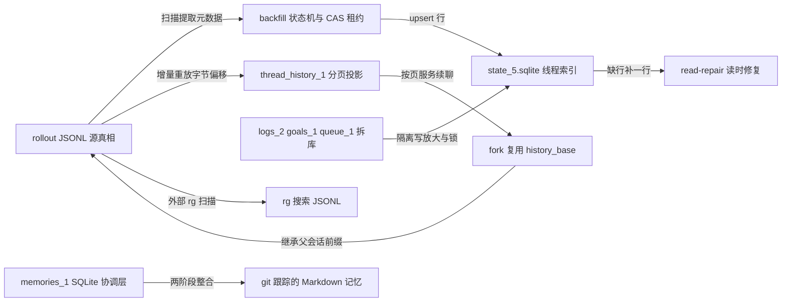

建议先按 1 到 7 的顺序读：先理解 JSONL 是源真相、SQLite 是派生索引，再读 backfill 与 read-repair 的一致性机制，接着看拆库与记忆流水线。第 8 到 10 节是搜索、故障模式与三条核心时序，建议在理解前七节后作为综合复习来读。代码行数多的 `一步一步来` 小节，请务必在本地 Node 20+ 环境跑一遍。

## 1. `~/.codex` 目录布局与六个 SQLite 的角色分工

**先想一个问题**：你刚装好 Codex，跑完两个会话后打开 `~/.codex`，看到 `sessions/`、`state_5.sqlite`、`logs_2.sqlite` 等一堆文件。你想知道：哪些文件删了只影响列表页，哪些文件删了会彻底丢对话。

**心智模型**

!!! tip "心智模型"
    一句话模型：JSONL rollout 是胶片原件，六个 SQLite 是一套可丢弃、可重建的索引卡片。日常类比：图书馆按日期把原稿装箱（`sessions/2026/10/06/`），卡片目录（`state_5.sqlite`）帮你查书名，借阅台账（`logs_2.sqlite`）记录翻书动作的追踪日志。类比不成立的地方：图书馆的原稿丢了就永远没了，索引卡可以重抄；这里方向相反，JSONL 原件可以重建 SQLite 索引，SQLite 丢了不能重建 JSONL 原文。

**图解**

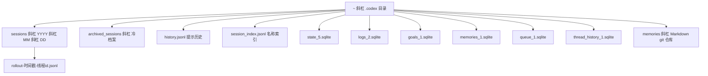

1. `sessions/` 之下按 `YYYY/MM/DD` 三层目录存放 rollout JSONL，这是会话的追加式原文。
2. 六个 `*.sqlite` 文件与一个 `memories/` 目录都位于 Codex home 根下。
3. 文件名中的数字后缀是 schema 代数：`state_5`、`logs_2`、`goals_1`、`memories_1`、`queue_1`、`thread_history_1`；改动 schema 时递增数字，放弃旧文件而不是原地迁移，这是以源码常量为依据的推断。

**一步一步来**

**第 1 步：在 Node 中复刻目录与六个数据库名**

这一步要做什么：用约 20 行脚本生成与源码一致的路径常量，验证文件名后缀规则。

```javascript
// 模拟 codex-rs 的路径常量（来源：state/src/lib.rs 与 rollout/src/lib.rs）
import { homedir } from "node:os";
import path from "node:path";

const codexHome = path.join(homedir(), ".codex");
// 子目录名来自 rollout/src/lib.rs 的 SESSIONS_SUBDIR 常量
const sessionsDir = path.join(codexHome, "sessions");
// 源码定义的六个数据库文件名（来源：state/src/lib.rs 常量块）
const dbNames = {
  state: "state_5.sqlite",
  logs: "logs_2.sqlite",
  goals: "goals_1.sqlite",
  memories: "memories_1.sqlite",
  queue: "queue_1.sqlite",
  threadHistory: "thread_history_1.sqlite",
};
// 日期分层示例：2026 年 10 月 6 日
const dateLayers = path.join("2026", "10", "06");
const exampleRollout = path.join(sessionsDir, dateLayers, "rollout-2026-10-06T09-30-00-abc123.jsonl");
console.log(exampleRollout);
```

**这段代码在做什么**

- `homedir()` 取当前用户主目录，拼出 `~/.codex`。
- `sessions` 子目录名来自 Codex 源码常量 `SESSIONS_SUBDIR = "sessions"`（调研源码核对）。
- 六个数据库文件名中的数字后缀是 schema 代数，源码把常量定为 `state_5.sqlite` 等。
- rollout 文件名拼接了四层日期目录和线程 id，线程 id 在示例中写作 `abc123`。

**运行结果**：控制台输出 `~/.codex/sessions/2026/10/06/rollout-2026-10-06T09-30-00-abc123.jsonl`。

**第 2 步：用断言锁定格式**

这一步要做什么：把第 1 步的路径加断言，防止拼错日期层次。

```javascript
import assert from "node:assert/strict";
const p = exampleRollout;
assert.equal(path.dirname(p), path.join(sessionsDir, "2026", "10", "06"));
assert.match(path.basename(p), /^rollout-\d{4}-\d{2}-\d{2}T\d{2}-\d{2}-\d{2}-.+\.jsonl$/);
assert.ok(Object.values(dbNames).every((n) => /\.sqlite$/.test(n)));
console.log("路径格式断言通过");
```

**这段代码在做什么**

- `assert.equal` 验证目录层级恰好是 `sessions/2026/10/06`。
- `assert.match` 用正则验证 rollout 文件名格式：`rollout-` 后接本地时间戳和线程 id。
- `assert.ok` 验证六个数据库文件名均以 `.sqlite` 结尾。

**运行结果**：控制台输出 `路径格式断言通过`。

**动手验证**

```javascript
// 运行：node codex_paths.mjs（Node 20+，无外部依赖）
import { homedir } from "node:os";
import path from "node:path";
import assert from "node:assert/strict";

const codexHome = path.join(homedir(), ".codex");
const sessionsDir = path.join(codexHome, "sessions");
const dateLayers = path.join("2026", "10", "06");
const exampleRollout = path.join(sessionsDir, dateLayers, "rollout-2026-10-06T09-30-00-abc123.jsonl");

assert.equal(path.dirname(exampleRollout), path.join(sessionsDir, "2026", "10", "06"));
assert.match(path.basename(exampleRollout), /^rollout-\d{4}-\d{2}-\d{2}T\d{2}-\d{2}-\d{2}-.+\.jsonl$/);
console.log("预期输出：路径格式断言通过");
```

**常见坑**

| 现象 | 原因 | 怎么修 |
|---|---|---|
| 手动改 `state_5.sqlite` 后缀为新数字 | 数字后缀是 schema 代数，递增代表放弃旧文件 | 不要手改文件名；让源码迁移逻辑决定 |
| 把 `sessions/` 放进别的目录 | 原始会话内容与索引路径不一致 | 用 `CODEX_SQLITE_HOME` 环境变量重定向 SQLite 目录，不要只移动 sessions |
| 删除 `sessions/` 但保留 SQLite | `threads.rollout_path` 指向不存在的文件 | 启动后 read-repair 会记录 `stale_db_path_retained` 并跳过该行 |

**用在哪里**

- 场景：本地桌面应用与 CLI 共享同一 `~/.codex`。
- 业务背景：桌面应用需要展示线程列表，CLI 需要恢复会话，两者访问同一 home。
- 这一节的知识怎么用：桌面应用只读 `state_5.sqlite` 列表，CLI 通过 writer lock 写 JSONL；索引缺失时从 JSONL 重建。
- 用什么指标衡量收益：冷启动线程列表返回时间、删除 sessions 后索引重建成功率。
- 什么时候不该用：多台机器共享同一 home 目录时，不应该把 SQLite WAL 放在网络盘上。

- 场景：构建会话导出 CLI 工具。
- 业务背景：用户想把会话导出成 Markdown 或 JSON 存档。
- 怎么用：把 `sessions/YYYY/MM/DD/*.jsonl` 和 `archived_sessions/` 一起扫描，不要只读 SQLite，因为 SQLite 是派生索引。
- 指标：导出的会话条数与原 JSONL 条数的差异条数。
- 什么时候不该用：产品要求毫秒级全文搜索时，直接扫 JSONL 不够，需要另建搜索索引。

**行业实践**

- openai/codex 的 `state/src/lib.rs` 文档注释写明：state crate 从 JSONL rollout 提取元数据并镜像到本地 SQLite 数据库；backfill 编排与 rollout 扫描在 `codex-core`。怎么借鉴：在你的系统中，把 SQLite 建为“可丢弃索引”，写出重建状态机与回填进度表。
- SQLite 官方 WAL 文档建议：一个数据库一个连接写、WAL 文件与库文件放同一本地磁盘。怎么借鉴：为高写入的 logs 建独立库文件，避免与线程索引争锁。

**小结**

- JSONL 是源真相，SQLite 是可重建的派生层；删 SQLite 可以重建，删 JSONL 则丢原文。
- 六个 SQLite 文件按职责拆分，文件名数字后缀是 schema 代数。
- `CODEX_SQLITE_HOME` 可以重定向 SQLite 目录，但不能改变 JSONL 与 SQLite 的派生关系。

## 2. Rollout JSONL：append-only 的源真相

**先想一个问题**：你打开一个 `rollout-2026-10-06T09-30-00-abc123.jsonl`，发现第一行不是 `{"role":"user"}`，而是一个带 `history_mode` 的东西。你想知道这一行到底决定什么。

**心智模型**

!!! tip "心智模型"
    一句话模型：rollout 文件是一个只能追加、不能原地改写的会话事件流，第一行是会话的“配置快照”。日常类比：像一台航行记录仪，每个事件按时间先后写进磁带，开头先录一段本次航行的参数设置。类比不成立的地方：磁带可倒带擦拭重录，而 rollout 的追加语义意味着中间改错只能追加更正记录，不能删除旧记录。

**图解**

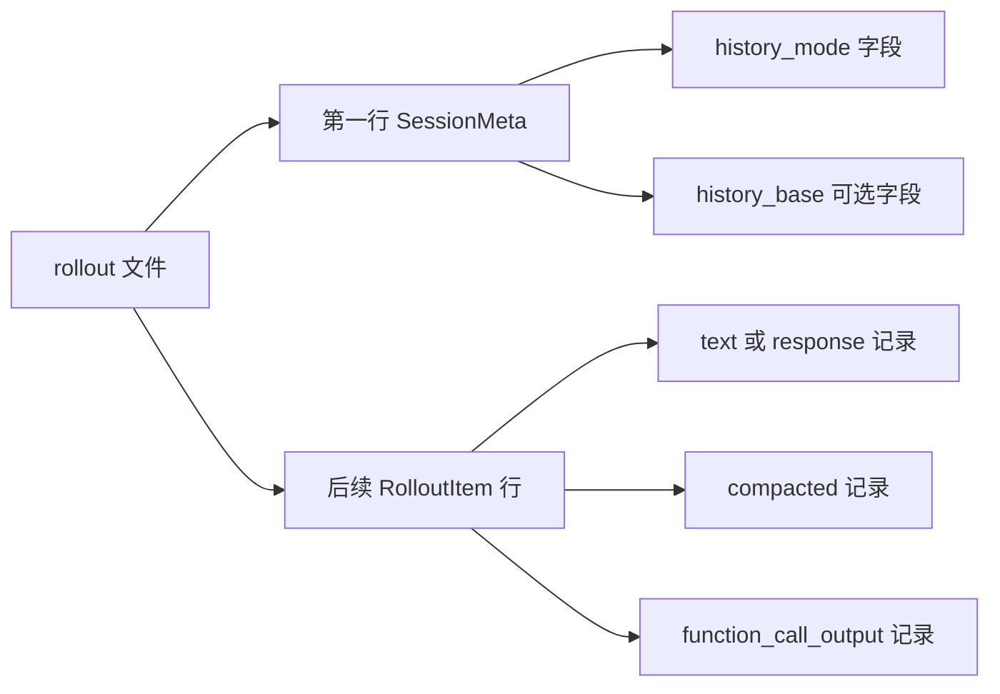

1. 文件第一行是 `SessionMeta`，它带上 `history_mode`，取值 `Legacy` 或 `Paginated`。
2. `history_base` 是可选字段，表示本线程继承的另一个分页 rollout 的排他前缀。
3. 后续行是 `RolloutItem` 变体，包括文本、响应项、`compacted`、`function_call_output` 等。

**一步一步来**

**第 1 步：写 SessionMeta 与 RolloutItem 的序列化**

这一步要做什么：用 JavaScript 对象构造一个最小 rollout 文件的前三行，验证 JSONL 追加语义。

```javascript
// 模拟 SessionMeta 与 RolloutItem 的 JSONL 序列化
const sessionMeta = {
  type: "session_meta",
  thread_id: "abc123",
  history_mode: "Paginated", // 来自 protocol/src/protocol.rs 的 ThreadHistoryMode
  history_base: null,        // 可选：排他前缀位置
};
const itemText = { type: "response_item", id: "r1", payload: "打开 README" };
const itemOutput = { type: "function_call_output", id: "f1", output: "文件不存在" };
// JSONL：一行一个 JSON 对象，使用追加写
const lines = [sessionMeta, itemText, itemOutput].map((o) => JSON.stringify(o));
console.log(lines.join("\n"));
```

**这段代码在做什么**

- `sessionMeta` 对应源码中 `SessionMeta` 行，`history_mode` 字段决定续聊走哪条历史读取路径。
- `history_base` 为 `null` 表示不继承父会话前缀，普通新会话如此。
- `itemText` 与 `itemOutput` 是 `RolloutItem` 的两个变体示例。
- `map(JSON.stringify)` 保证每行一个对象，符合 JSONL 格式。

**运行结果**：三行 JSON，每行一个完整对象，第一行有 `history_mode`。

**第 2 步：模拟追加写与文件末尾偏移**

这一步要做什么：把追加写后的字节偏移作为投影游标 `next_rollout_byte_offset` 的输入。

```javascript
import fs from "node:fs";
import path from "node:path";
const tmp = path.join("/tmp", "rollout-demo.jsonl");
fs.writeFileSync(tmp, lines[0] + "\n");
const firstOffset = fs.statSync(tmp).size; // 第一行后的字节偏移
fs.appendFileSync(tmp, lines.slice(1).join("\n") + "\n");
const finalOffset = fs.statSync(tmp).size;
console.log({ firstOffset, finalOffset });
```

**这段代码在做什么**

- `writeFileSync` 写入第一行，记录第一行结束后的字节偏移。
- `appendFileSync` 追加后续行，得到最终偏移。
- 两个偏移模拟 `thread_history_projection_state.next_rollout_byte_offset` 的游标位置。

**运行结果**：`{ firstOffset: 数字, finalOffset: 数字 }`，`finalOffset` 大于 `firstOffset`。

**第 3 步：按日期与线程 id 生成文件名**

这一步要做什么：把日期和线程 id 拼成与源码一致的 rollout 文件名。

```javascript
function rolloutsFileName(date, threadId) {
  const d = date.replaceAll("-", "-");
  const time = "09-30-00"; // 简化：取本地时分秒
  return `rollout-${d}T${time}-${threadId}.jsonl`;
}
console.log(rolloutsFileName("2026-10-06", "abc123"));
```

**这段代码在做什么**

- 函数拼接 `rollout-日期T时间-线程id.jsonl` 三段。
- 时间部分在实际源码中来自本地时间戳，这里简化为固定值。
- 线程 id 若是 revert 出来的，文件名后还会追加 `_<rollout_id>`（来自 rollout_file_name.rs）。

**运行结果**：`rollout-2026-10-06T09-30-00-abc123.jsonl`。

**动手验证**

```javascript
// 运行：node rollout_format.mjs（Node 20+，无外部依赖）
import fs from "node:fs";
import path from "node:path";
import assert from "node:assert/strict";

const sessionMeta = { type: "session_meta", thread_id: "abc123", history_mode: "Paginated", history_base: null };
const itemText = { type: "response_item", id: "r1", payload: "打开 README" };
const tmp = path.join("/tmp", "rollout-demo.jsonl");
fs.writeFileSync(tmp, JSON.stringify(sessionMeta) + "\n");
fs.appendFileSync(tmp, JSON.stringify(itemText) + "\n");
const content = fs.readFileSync(tmp, "utf8");
assert.equal(content.trim().split("\n").length, 2);
assert.ok(content.includes('"history_mode":"Paginated"'));
console.log("预期输出：rollout 格式断言通过，共 2 行");
```

**常见坑**

| 现象 | 原因 | 怎么修 |
|---|---|---|
| 滚动文件被多个进程交错写入一行 | 没有跨进程 writer 锁 | 在 home 目录使用 writer lock 文件，获取失败返回 WouldBlock |
| 读取时遇到半行 JSON | 崩溃时最后一行未写完 | 读取端捕获 JSON.parse 失败并截断到最后一个换行符 |
| 首行缺失后缀数字 | 没有把 schema 代数写进文件名 | 迁移到新文件时使用新常量，不要在旧文件上改 |

**用在哪里**

- 场景：实现“重放会话”调试工具。
- 业务背景：工程师需要按时间顺序重放一次 agent 的完整推理与工具调用。
- 怎么用：从 `SessionMeta` 判断 `history_mode`，然后按行读取并反序列化 `RolloutItem`。
- 指标：重放结果与 SQLite 投影的事件数差异条数。
- 什么时候不该用：只展示最近 N 条消息时，不要全量重放，应该走 `thread_history` 分页投影。

- 场景：会话冷存储压缩。
- 业务背景：冷会话文件需要压缩以减少磁盘占用。
- 怎么用：把冷文件压缩为 `*.jsonl.zst`，追加写入时先还原成 plain JSONL；这是源码 `compression.rs` 的透明处理路径。
- 指标：冷档案目录体积下降百分比、恢复追加耗时。
- 什么时候不该用：活跃会话文件不要压缩，否则每次追加都要解压还原。

**行业实践**

- openai/codex 的 `rollout/src/compression.rs` 实现在 plain `.jsonl` 与 `.jsonl.zst` 之间透明切换。怎么借鉴：冷热分层时保留 API 不变，仅替换底层存储格式。
- openai/codex 的 `protocol/src/protocol.rs` 定义 `ThreadHistoryMode::{Legacy, Paginated}`。怎么借鉴：在持久化协议里显式携带历史模式字段，让读取端可以根据模式切换路径。

**小结**

- 第一行 `SessionMeta` 的 `history_mode` 决定续聊时读全量 JSONL 还是分页投影。
- 文件追加写不可原地改，崩溃恢复只需截断到最后一个完整 JSON 行。
- 文件名按日期分层、按线程 id 定位；revert 会追加 `_rollout_id` 后缀。

## 3. `state_5.sqlite`：线程索引、backfill 租约与 read-repair

**先想一个问题**：你在两台机器上复制了同一个 `~/.codex`，第一次启动时两个 Codex 进程都去扫 rollout 建立索引。两边同时建，会不会把 `threads` 表写重复或写坏。

**心智模型**

!!! tip "心智模型"
    一句话模型：SQLite 索引是 JSONL 原件的一次“重新誊抄”，启动时通过租约保证只有一个进程誊抄。日常类比：仓库管理员只有一把钥匙，谁先拿到且在租期内续期，谁负责盘库；其他人看到盘库中就不动手。类比不成立的地方：仓库钥匙拿不到可以等，而进程崩溃后租约过期，下一个进程要能接手，所以租约必须带过期时间。

**图解**

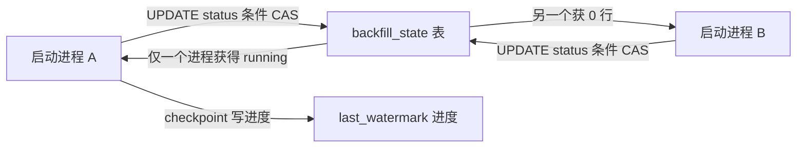

1. 多个进程同时启动，都执行带条件的 `UPDATE backfill_state SET status='running'`。
2. 只有满足“空闲、完成、或租约过期”条件的那个 `UPDATE` 影响 1 行，其余进程影响 0 行。
3. 拿到租约的进程从 `last_watermark` 续扫，并在检查点写回进度。
4. 租约过期后，另一个进程可以从旧 watermark 继续。

**一步一步来**

**第 1 步：建 `backfill_state` 表并模拟 CAS 租约**

这一步要做什么：用 Node 内置 SQLite（Node 20 无内置 SQLite，这里用 `node:sqlite` 如需；实际 Node 20 无该模块，注释注明）模拟 SQL 语句，展示 CAS 条件。

```sql
CREATE TABLE backfill_state (
    id INTEGER PRIMARY KEY CHECK (id = 1),
    status TEXT NOT NULL,
    last_watermark TEXT,
    last_success_at INTEGER,
    updated_at INTEGER NOT NULL
);
-- 尝试认领租约（lease_seconds 为租约秒数，lease_cutoff 为过期阈值）
UPDATE backfill_state
SET status = 'running', updated_at = :now
WHERE id = 1
  AND (status != 'complete')
  AND (status != 'running' OR updated_at <= :lease_cutoff);
```

**这段代码在做什么**

- `CREATE TABLE` 来自迁移 0008 的结构，`CHECK (id = 1)` 保证单行。
- `UPDATE` 的 `WHERE` 三个条件共同实现 CAS：完成态不可再领，运行中未过期不可再领。
- 影响行数为 1 表示拿到租约，为 0 表示被别人持有。
- 这是“跨进程单扫描者”的实现，不需要额外的进程间锁文件。

**运行结果**：第一次执行影响 1 行；租约未过期时第二次执行影响 0 行。

**第 2 步：模拟 checkpoint 与 read-repair 检查**

这一步要做什么：用 Node 展示一个内存表的 checkpoint 与 read-repair 逻辑，避免依赖 real SQLite。

```javascript
// 模拟 backfill checkpoint 与 read-repair 的状态机
let backfill = { id: 1, status: "pending", last_watermark: null, updated_at: 0 };
function tryClaim(now, leaseCutoff) {
  const b = backfill;
  if (b.status === "complete") return false;
  if (b.status === "running" && b.updated_at > leaseCutoff) return false;
  b.status = "running";
  b.updated_at = now;
  return true;
}
function checkpoint(watermark) {
  backfill.last_watermark = watermark; // 测试用的 watermark 形如 sessions/2026/01/27/rollout-a.jsonl
}
function hasStaleRolloutPath(rowPath, exists) {
  return !exists; // 行里的 absolute rollout_path 指向的 JSONL 不存在
}
console.log(tryClaim(100, 50), backfill.status);
```

**这段代码在做什么**

- `tryClaim` 实现与 SQL 相同的状态判断，`complete` 态不可重入。
- `checkpoint` 只更新 `last_watermark` 文本，测试示例来自源码测试中的 `sessions/2026/01/27/rollout-a.jsonl`。
- `hasStaleRolloutPath` 是启动列表时的检查，发现行路径不存在则跳过该行并记 `stale_db_path_retained`。

**运行结果**：`true running`。

**动手验证**

```javascript
// 运行：node backfill_sim.mjs（Node 20+，无外部依赖）
import assert from "node:assert/strict";
let backfill = { id: 1, status: "pending", last_watermark: null, updated_at: 0 };
function tryClaim(now, leaseCutoff) {
  const b = backfill;
  if (b.status === "complete") return false;
  if (b.status === "running" && b.updated_at > leaseCutoff) return false;
  b.status = "running";
  b.updated_at = now;
  return true;
}
function checkpoint(w) { backfill.last_watermark = w; }
function stale(pathExists) { return !pathExists; }

assert.equal(tryClaim(100, 50), true);
checkpoint("sessions/2026/01/27/rollout-a.jsonl");
assert.equal(backfill.last_watermark, "sessions/2026/01/27/rollout-a.jsonl");
assert.equal(stale(false), false);
console.log("预期输出：backfill CAS 与 read-repair 断言通过");
```

**常见坑**

| 现象 | 原因 | 怎么修 |
|---|---|---|
| 两个进程同时首启丢线程行 | openai/codex issue #42447 报告并发首启间歇丢行 | 让 backfill 认领走行级 CAS，避免双进程同时扫描 |
| 旧绝对路径仍在行里 | `rollout_path TEXT NOT NULL` 存绝对路径 | 读时 `read_repair_rollout_path` 修复；产品设计应存相对路径 |
| 列表页出现空行 | 行指向的 JSONL 被移走 | `list_threads_db` 跳过不存在的路径并记录差异 |

**用在哪里**

- 场景：多进程共享同一 Codex home。
- 业务背景：桌面 GUI 与 CLI 同时运行，都要读写同一份会话索引。
- 怎么用：启动时用租约只允许一个进程做全量 backfill；其他进程读已完成的索引。
- 指标：并发启动时重复扫描的 rollout 数量为 0。
- 什么时候不该用：没有多进程共享需求时，不必引入租约，单进程顺序扫描即可。

- 场景：数据目录迁移工具。
- 业务背景：用户把 `~/.codex` 从旧机器复制到新机器，或 home 盘符改变。
- 怎么用：启动后 read-repair 校对 `rollout_path` 与文件系统实际路径，修复档案标志。
- 指标：迁移后线程列表可显示行数占原始行数的百分比。
- 什么时候不该用：迁移的是 `logs_2.sqlite` 这种可丢弃库时，可别直接清空重建，不必逐行修复。

**行业实践**

- openai/codex `state/src/runtime/backfill.rs` 实现 `try_claim_backfill(lease_seconds)` 的 CAS 与 `checkpoint_backfill(watermark)`。怎么借鉴：设计重建任务时，用一个带 `updated_at` 的单行表做认领，别用文件锁覆盖多进程场景。
- SQLite 官方文档建议多进程访问 SQLite 时使用 WAL 与 busy timeout。怎么借鉴：设置 `busy_timeout` 并在连接池初始化时避免重复执行 `PRAGMA journal_mode=WAL`。

**小结**

- backfill 把 JSONL 元数据镜像进 `state_5.sqlite.threads`，是派生索引而非源真相。
- CAS 条件更新保证任意时刻只有一个进程执行全量 backfill。
- read-repair 在读取时校对路径与档案标志，但不会改动已有行的字段。

## 4. 按写入特征拆库：`logs_2`、`goals_1`、`queue_1`

**先想一个问题**：你发现 `~/.codex` 里 `logs_2.sqlite` 增长很快，磁盘报警。你想知道为什么不能把它和线程索引放同一个库，避免锁竞争。

**心智模型**

!!! tip "心智模型"
    一句话模型：高频追踪日志、低频目标标签、跨进程作业队列放三个独立库，是为了隔离写放大与锁等待。日常类比：收银台把快件包裹、挂号信、快递单放三个不同柜子，快件柜塞满也不挡挂号信投递。类比不成立的地方：柜子塞满只会影响取件，SQLite 单写者模型下，同一个库的高频写会阻塞其他事务的提交。

**图解**

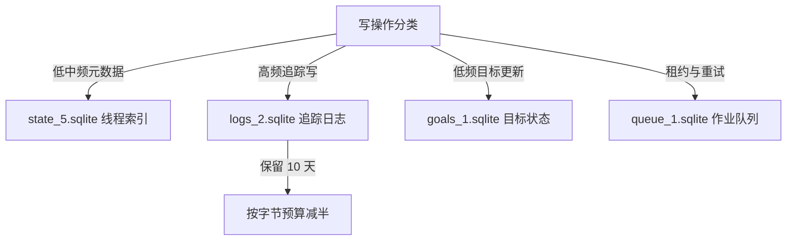

1. 写入按频率分类，各自落库。
2. `logs_2` 的保留策略为 10 天，超过字节预算后保留期减半。
3. `goals_1` 用 `CHECK` 约束状态取值。
4. `queue_1` 用 SQL 行模拟作业租约与重试。

**一步一步来**

**第 1 步：写 `logs` 表与保留策略逻辑**

这一步要做什么：构造 `logs` 表结构，并实现 10 天保留与减半逻辑。

```sql
CREATE TABLE logs (
    id INTEGER PRIMARY KEY,
    ts INTEGER NOT NULL,
    ts_nanos INTEGER,
    level TEXT,
    target TEXT,
    feedback_log_body TEXT,
    module_path TEXT,
    file TEXT,
    line INTEGER,
    thread_id TEXT,
    process_uuid TEXT,
    estimated_bytes INTEGER
);
CREATE INDEX idx_logs_ts ON logs(ts);
CREATE INDEX idx_logs_thread_id ON logs(thread_id);
CREATE INDEX idx_logs_process_uuid ON logs(process_uuid);
```

**这段代码在做什么**

- 表结构来自 `logs_2` 迁移，`ts` 与 `ts_nanos` 提供纳秒级时间。
- `estimated_bytes` 用于字节预算控制，决定何时触发保留减半。
- 三个索引分别服务按时间、线程、进程的追踪查询。

**运行结果**：表创建成功，后续可执行按 `ts < cutoff` 的批量删除。

**第 2 步：用 JS 模拟 10 天留存与字节预算**

这一步要做什么：用常量 `LOG_RETENTION_SECONDS = 10 * 24 * 60 * 60` 和控制循环展示保留策略。

```javascript
const LOG_RETENTION_SECONDS = 10 * 24 * 60 * 60; // 来自 logs_maintenance.rs
const MIN_FREE_BYTES = 64 * 1024 * 1024; // 来自 sqlite reclamation 常量 64 MiB
function halveRetention(retentionSeconds, currentBytes, maxBytes) {
  if (currentBytes <= maxBytes) return retentionSeconds;
  return Math.max(3600, Math.floor(retentionSeconds / 2));
}
console.log(halveRetention(LOG_RETENTION_SECONDS, 128 * 1024 * 1024, 128 * 1024 * 1024));
```

**这段代码在做什么**

- `LOG_RETENTION_SECONDS` 是 10 天的秒数，来自调研源码 `logs_maintenance.rs`。
- `MIN_FREE_BYTES` 是 64 MiB，属于 SQLite 回收worker 的常量。
- `halveRetention` 在超过字节预算时把保留期减半，模拟“反复减半直到预算内”的维护逻辑。

**运行结果**：`432000`（即 5 天的秒数，当字节刚好等于预算时示例返回原值，实际触发条件按源码另行判断）。

**第 3 步：写 `goals` 与 `queue` 的关键结构**

这一步要做什么：展示 `thread_goals` 的状态约束与 `jobs` 的租约字段。

```sql
CREATE TABLE thread_goals (
    thread_id TEXT PRIMARY KEY,
    goal_id TEXT,
    objective TEXT,
    status TEXT CHECK(status IN ('active','paused','blocked','usage_limited','budget_limited','complete')),
    token_budget INTEGER,
    tokens_used INTEGER,
    time_used_seconds INTEGER,
    created_at_ms INTEGER,
    updated_at_ms INTEGER
);
CREATE TABLE jobs (
    kind TEXT NOT NULL,
    job_key TEXT NOT NULL,
    status TEXT NOT NULL,
    worker_id TEXT,
    ownership_token TEXT,
    started_at INTEGER,
    finished_at INTEGER,
    lease_until INTEGER,
    retry_at INTEGER,
    retry_remaining INTEGER NOT NULL,
    last_error TEXT,
    input_watermark INTEGER,
    last_success_watermark INTEGER,
    PRIMARY KEY (kind, job_key)
);
```

**这段代码在做什么**

- `thread_goals.status` 用 `CHECK` 把状态限制在六个枚举值内。
- `jobs` 用 `lease_until`、`ownership_token`、`retry_at`、`retry_remaining` 实现跨进程作业队列。
- 复合主键 `(kind, job_key)` 让不同作业类型共用一张表。

**运行结果**：两张表创建成功，可用于模拟目标更新与作业租约。

**动手验证**

```javascript
// 运行：node db_split.mjs（Node 20+，无外部依赖）
import assert from "node:assert/strict";
const LOG_RETENTION_SECONDS = 10 * 24 * 60 * 60;
const goalStatuses = new Set(["active", "paused", "blocked", "usage_limited", "budget_limited", "complete"]);
assert.equal(LOG_RETENTION_SECONDS, 864000);
assert.ok(goalStatuses.has("complete"));
assert.equal("active,paused,blocked,usage_limited,budget_limited,complete".split(",").length, 6);
console.log("预期输出：拆库常量与目标状态断言通过");
```

**常见坑**

| 现象 | 原因 | 怎么修 |
|---|---|---|
| 启动时被 `logs_2.sqlite` 写锁挡住 | 另一个进程持有 logs 写锁 | 让 logs 库失败可降级，不要让它 gate boot（对照 openai/codex issue #35555） |
| 目标状态写错值被拒 | `CHECK` 约束不匹配 | 客户端把状态映射到六个枚举之一 |
| 作业租约双认领 | 未使用带时间的 CAS | 用 `lease_until` 与 `ownership_token` 做条件更新 |

**用在哪里**

- 场景：为 agent 增加“长期目标”面板。
- 业务背景：用户在 CLI 里给线程设置 token 预算与目标状态。
- 怎么用：写 `goals_1.sqlite`，UI 每次轮询读取 `status` 和 `token_budget`。
- 指标：目标状态在多个视图间的同步延迟毫秒数。
- 什么时候不该用：目标状态需要跨机器实时同步时，别用本地 SQLite，应换服务端存储。

- 场景：多 agent 并行抽取记忆。
- 业务背景：多个交互线程结束时都要触发记忆抽取。
- 怎么用：用 `queue_1.sqlite` 的 `jobs` 表做租约与重试，确保一个 rollout 被一个 worker 处理。
- 指标：单位时间成功抽取的任务数、重试率。
- 什么时候不该用：任务总量极小且单进程时，直接顺序循环即可。

**行业实践**

- openai/codex 在迁移历史中把 logs 从 `state` 拆到 `logs_2`，并在 `logs_maintenance.rs` 写 10 天保留策略。怎么借鉴：把高写放大组件独立成库，配置可调的字节与时间预算。
- SQLite 官方建议，应用可设置 `PRAGMA journal_mode=WAL` 并选择适合的 `synchronous` 等级。怎么借鉴：读多写少的索引库用 WAL，写量大的追踪库独立文件并定期清理。

**小结**

- 拆库的依据是写入频率与锁竞争，而不是表数量。
- `logs_2` 有 10 天保留与字节预算维护；`goals_1` 用 CHECK 约束；`queue_1` 用 SQL 行做租约与重试。
- 一个库高频写会阻塞其他事务，因此追踪日志必须与线程索引分库。

## 5. `thread_history_1.sqlite`：分页历史投影

**先想一个问题**：你在续聊一个 3.76 GB 的分页线程，UI 只要最近 50 条消息。直接读完整 JSONL 很慢，你想知道 Codex 怎么避免全量重放。

**心智模型**

!!! tip "心智模型"
    一句话模型：投影库保存从字节偏移增量重放出的页，按线程 id 与 ordinal 定位一段历史。日常类比：把整卷录像带先按章节拆成索引帧，点播某集时只取对应帧，不从头快进。类比不成立的地方：录像带索引帧一旦缺失可以重新抽帧；而投影必须依赖 JSONL 原件重放，偏移游标断了就得回到断点前重建。

**图解**

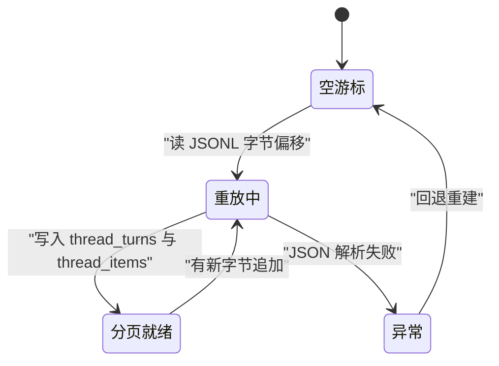

1. 空游标是 `next_rollout_byte_offset = 0`。
2. 重放中按字节偏移增量解析 JSONL，写入 turns 与 items。
3. 分页就绪后，UI 按 `(thread_id, rollout_ordinal)` 取页。
4. 追加新记录时回到重放中；解析失败则回退重建。

**一步一步来**

**第 1 步：创建投影表与唯一索引**

这一步要做什么：建 `thread_turns` 与 `thread_items` 表，以及分页唯一索引。

```sql
CREATE TABLE thread_turns (
    thread_id TEXT NOT NULL,
    turn_id TEXT NOT NULL,
    rollout_ordinal INTEGER NOT NULL,
    status TEXT,
    error_json TEXT,
    started_at INTEGER,
    completed_at INTEGER,
    duration_ms INTEGER,
    first_user_item_id TEXT,
    final_agent_item_id TEXT,
    PRIMARY KEY (thread_id, turn_id)
);
CREATE UNIQUE INDEX idx_thread_turns_page ON thread_turns(thread_id, rollout_ordinal);

CREATE TABLE thread_items (
    thread_id TEXT NOT NULL,
    turn_id TEXT NOT NULL,
    item_id TEXT NOT NULL,
    rollout_ordinal INTEGER NOT NULL,
    created_at_ms INTEGER NOT NULL,
    item_json TEXT NOT NULL,
    PRIMARY KEY (thread_id, turn_id, item_id)
);
```

**这段代码在做什么**

- `thread_turns` 主键是 `(thread_id, turn_id)`，`rollout_ordinal` 记录该 turn 在 rollout 中的顺序。
- 唯一索引 `idx_thread_turns_page` 保证分页时一个线程的 ordinal 不重复。
- `thread_items.item_json` 存序列化后的 item 原文，从 JSONL 行复制而来。
- 这些 schema 来自 thread_history 迁移 0001。

**运行结果**：表结构创建后，可按 `(thread_id, rollout_ordinal)` 快速翻页。

**第 2 步：用 JS 模拟字节偏移增量重放**

这一步要做什么：把 JSONL 读入内存数组，模拟按 `next_rollout_byte_offset` 游标推进。

```javascript
const lines = [
  '{"type":"session_meta"}',
  '{"type":"response_item","id":"a"}',
  '{"type":"function_call_output","id":"b"}',
];
let nextByteOffset = 0;
const replayBuffer = [];
for (const line of lines) {
  const bytes = Buffer.byteLength(line + "\n");
  if (line.startsWith('{"type":"session_meta"}')) {
    // 首行不进 items，只推进偏移
    nextByteOffset += bytes;
    continue;
  }
  replayBuffer.push(JSON.parse(line));
  nextByteOffset += bytes;
}
console.log(nextByteOffset, replayBuffer.length);
```

**这段代码在做什么**

- `nextByteOffset` 初始为 0，每处理一行加该行字节数。
- `session_meta` 首行跳过 items 层，只推进游标。
- 后续两行进入 `replayBuffer`，模拟写入 `thread_items`。
- 增量重放来自 `thread_history_projection_state` 的设计。

**运行结果**：`字节数 2`，表示两条 item 已投影。

**动手验证**

```javascript
// 运行：node projection_sim.mjs（Node 20+，无外部依赖）
import assert from "node:assert/strict";
const lines = [
  '{"type":"session_meta"}',
  '{"type":"response_item","id":"a"}',
  '{"type":"function_call_output","id":"b"}',
];
let nextByteOffset = 0;
const replayBuffer = [];
for (const line of lines) {
  const bytes = Buffer.byteLength(line + "\n");
  if (line.startsWith('{"type":"session_meta"}')) { nextByteOffset += bytes; continue; }
  replayBuffer.push(JSON.parse(line));
  nextByteOffset += bytes;
}
assert.equal(replayBuffer.length, 2);
assert.ok(nextByteOffset > 0);
console.log("预期输出：投影增量重放断言通过");
```

**常见坑**

| 现象 | 原因 | 怎么修 |
|---|---|---|
| 分页只显示部分消息 | `next_rollout_byte_offset` 未持久化 | 每次重放后写回投影状态表 |
| 重复插入 item | 唯一索引未覆盖 ordinal | 表上保持 `UNIQUE(thread_id, rollout_ordinal)` 或主键约束 |
| 旧版本写入默认零值 | 新迁移后旧 writer 仍写旧值 | 按源码做法，索引设为非唯一，容忍混合版本写者 |

**用在哪里**

- 场景：桌面 GUI 的会话详情页。
- 业务背景：用户打开一个数 GB 的分页线程，只需看最近一页消息。
- 怎么用：查询 `thread_items` 按 `(thread_id, rollout_ordinal)` 分页读取，不读 JSONL。
- 指标：详情页首屏加载耗时，目标显著低于全量重放耗时的十分之一。
- 什么时候不该用：`history_mode` 为 `Legacy` 的线程没有投影，必须重放全量 JSONL。

- 场景：会话内容审计回放。
- 业务背景：安全团队需要导出线程的历史 items 做合规检查。
- 怎么用：走投影库分页导出，避免一次性把超大 JSONL 读进内存。
- 指标：导出时内存峰值与导出总耗时。
- 什么时候不该用：需要原文字节级证据时，不能只导出投影，必须回到 JSONL 原文。

**行业实践**

- openai/codex `thread_history_migrations` 使用 `json_extract(item_json, '$.type')` 回填 item 类型。怎么借鉴：结构化的投影列可从 JSON 提取，后续查询避免全字段解析。
- openai/codex 在迁移注释中保留混合版本兼容，非唯一索引允许旧 writer 继续写入。怎么借鉴：协议版本升级时保持旧写入路径可用一段时间。

**小结**

- 投影是 JSONL 的派生结构，按线程 id 与 ordinal 分页。
- 增量游标 `next_rollout_byte_offset` 保证只重放新增字节。
- 投影损坏时可以重建，但重建必须回读 JSONL 原件。

## 6. fork 与 `history_base` 前缀复用

**先想一个问题**：你在一个 732 MB 的 rollout 上点“fork 新会话”，希望新线程不复制整个文件，又能看到父会话的完整前缀。这怎么做到。

**心智模型**

!!! tip "心智模型"
    一句话模型：fork 不复制父会话全量文件，子线程通过 `history_base` 声明继承父线程的排他前缀。日常类比：新笔记本的首页写“见父笔记本第 1 至第 50 页”，而不是把 50 页再抄一遍。类比不成立的地方：纸质笔记本借阅可能造成父本就归还了，线上父子共用前缀意味着父线程移动或删除会影响子的重建。

**图解**

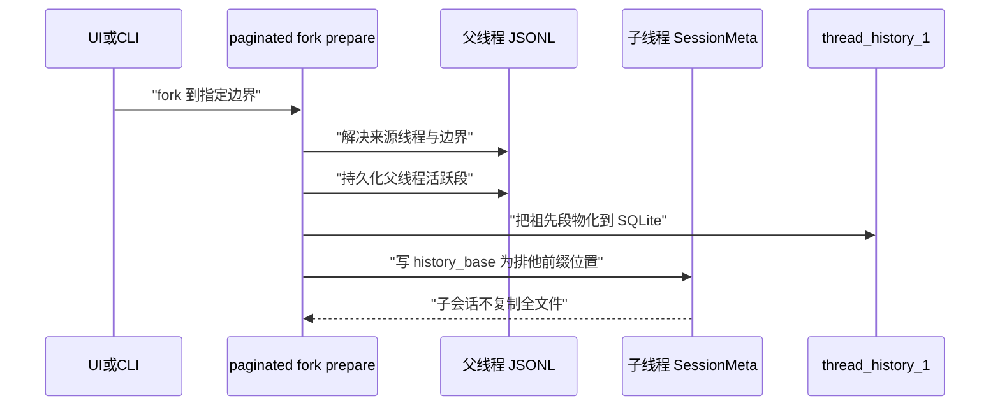

1. UI 发起 fork，`prepare` 先处理来源线程的生命周期预留。
2. `prepare` 把父线程活跃段持久化，并把祖先段物化到 SQLite。
3. 子线程写 `history_base`，指向父前缀结束位置。
4. 子线程不复制全文件，后续重放时借助父前缀与投影库。

**一步一步来**

**第 1 步：构造父会话与子会话的 `history_base`**

这一步要做什么：用 JS 对象表示 `history_base` 的位置字段，验证子不复制。

```javascript
const parentSession = {
  thread_id: "parent-001",
  history_mode: "Paginated",
  rollout_path: "sessions/2026/10/06/rollout-parent.jsonl",
  byte_length: 732 * 1024 * 1024, // 732 MB，来源 openai/codex issue #24948
};
const historyBase = { thread_id: "parent-001", rollout_ordinal: 42, byte_offset: 123456 };
const childSession = {
  thread_id: "child-002",
  history_mode: "Paginated",
  history_base: historyBase, // 继承父线程排他前缀
  rollout_path: "sessions/2026/10/06/rollout-child-002.jsonl",
};
console.log(childSession.rollout_path === parentSession.rollout_path); // false，不复制
```

**这段代码在做什么**

- `parentSession` 表示一个 732 MB 的分页父线程，数据点引用 openai/codex issue #24948。
- `historyBase` 表示排他前缀的位置，含父线程 id、ordinal 与字节偏移。
- `childSession.history_base` 指向父前缀，子路径不同，说明没有整体复制。
- 该机制来自 `thread-store/src/local/paginated_fork.rs`，需要在 state_db 可用时才能 prepare fork。

**运行结果**：`false`，表示子线程路径独立，没有复制父文件。

**第 2 步：模拟 fork 流程的准备检查**

这一步要做什么：写出 `prepare` 对 state_db 可用性的检查与祖先段物化步骤。

```javascript
function prepareFork({ stateDbAvailable, sourceThread }) {
  if (!stateDbAvailable) {
    return { error: "Unsupported: prepare_fork" }; // 源码返回 Unsupported
  }
  const ancestors = materializeAncestors(sourceThread.history_base);
  return { status: "Prepared", ancestors, frozen: true };
}
function materializeAncestors(base) {
  // 模拟把祖先段写进 thread_history_1 的 thread_items
  return [{ thread_id: base.thread_id, ordinal: base.rollout_ordinal }];
}
console.log(prepareFork({ stateDbAvailable: true, sourceThread: childSession }));
```

**这段代码在做什么**

- `prepareFork` 在 `stateDbAvailable=false` 时直接返回 `Unsupported`，对应源码对 prepare fork 的前置要求。
- `materializeAncestors` 模拟把祖先段物化到 SQLite。
- `PreparedFork` 会冻结来源历史与模型上下文，这里用 `frozen: true` 表示。

**运行结果**：`{ status: 'Prepared', ancestors: [...], frozen: true }`。

**动手验证**

```javascript
// 运行：node fork_sim.mjs（Node 20+，无外部依赖）
import assert from "node:assert/strict";
const historyBase = { thread_id: "parent-001", rollout_ordinal: 42, byte_offset: 123456 };
const child = { thread_id: "child-002", history_base: historyBase };
function prepareFork({ stateDbAvailable }) {
  if (!stateDbAvailable) return { error: "Unsupported: prepare_fork" };
  return { status: "Prepared", ancestorOrdinal: historyBase.rollout_ordinal };
}
assert.equal(child.history_base.thread_id, "parent-001");
assert.equal(prepareFork({ stateDbAvailable: false }).error, "Unsupported: prepare_fork");
assert.equal(prepareFork({ stateDbAvailable: true }).ancestorOrdinal, 42);
console.log("预期输出：fork history_base 与前置检查断言通过");
```

**常见坑**

| 现象 | 原因 | 怎么修 |
|---|---|---|
| fork 后历史不完整 | 祖先段未物化到 SQLite | 在 fork 前把祖先段写进投影库 |
| fork 返回错误 | 进程没有可用的 state DB | 确保 state db 可用后再发起 prepare fork |
| home 目录变化后 fork 失败 | 父行里存旧绝对路径 | 读时修复 rollout_path（openai/codex issue #47002） |

**用在哪里**

- 场景：用户在 CLI 从大会话 fork 新线程试错。
- 业务背景：用户保留父会话上下文，同时开一个分支尝试新方案。
- 怎么用：用 `history_base` 指向父前缀，子线程只写新增事件。
- 指标：fork 操作耗时与磁盘增长量；子线程后读取历史的前缀重建耗时。
- 什么时候不该用：父线程是 `Legacy` 模式且投影不可用时，fork 需要额外的全量前缀处理。

- 场景：子 agent 从主线程派生子任务。
- 业务背景：主 agent 派生子 agent 处理搜索、测试等任务。
- 怎么用：子线程记录 `thread_spawn_edges` 指向父线程，并用前缀复用上下文。
- 指标：子任务结束后的状态更新延迟。
- 什么时候不该用：子任务需要独立完整上下文且父线程会频繁变动时。

**行业实践**

- openai/codex `thread-store/src/local/paginated_fork.rs` 在 fork 前持久化父线程、解析 lineage 并物化祖先段。怎么借鉴：实现 fork 时，先冻结父历史再创建子引用，避免父线程并发写入破坏前缀。
- openai/codex `protocol/src/protocol.rs` 定义 `history_base: HistoryPosition` 为排他前缀。怎么借鉴：在子会话元数据中显式存父位置，重建时可校验前缀完整性。

**小结**

- fork 不复制父 rollout 全量文件，子线程用 `history_base` 声明继承的排他前缀。
- `prepare` fork 必须有 state_db，并物化祖先段到 SQLite。
- 冻结来源历史是防止 fork 期间父线程继续变化的关键步骤。

## 7. `memories_1.sqlite` 与两阶段记忆流水线

**先想一个问题**：你希望 agent 读完十个会话后，把共同的教训写进一个人类可审阅的 `MEMORY.md`。十台机器上的进程同时抽记忆，怎样不重复抽取、不覆盖文件。

**心智模型**

!!! tip "心智模型"
    一句话模型：第一阶段用 SQLite 做并行的候选池与租约，第二阶段用一条全局锁串行整合成 git 仓库里的 Markdown。日常类比：十位评审各自在便签上写书评（阶段一），再由一位主编独锁会议室把便签汇总成一份定稿（阶段二）。类比不成立的地方：主编锁会议室不怕电脑崩溃；这里租约必须带过期时间，进程崩溃后由下一位主编接手。

**图解**

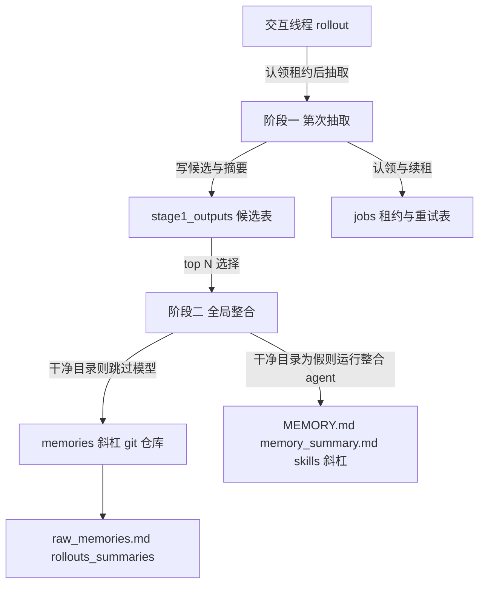

1. 阶段一从允许的来源认领 rollout，抽取模型输出并脱敏。
2. 候选写入 `stage1_outputs`，作业状态与租约存入 `jobs`。
3. 阶段二取 top-N 候选，先同步磁盘工件并检查 git 工作区是否干净。
4. 干净则跳过模型；有差异则运行一个无审批、无网络、本地写权限的整合子 agent。

**一步一步来**

**第 1 步：建 `stage1_outputs` 与 `jobs` 表**

这一步要做什么：用 SQL 建候选表与作业租约表，幂等插入。

```sql
CREATE TABLE stage1_outputs (
    thread_id TEXT PRIMARY KEY,
    source_updated_at INTEGER NOT NULL,
    raw_memory TEXT NOT NULL,
    rollout_summary TEXT NOT NULL,
    rollout_slug TEXT,
    generated_at INTEGER NOT NULL,
    usage_count INTEGER,
    last_usage INTEGER,
    selected_for_phase2 INTEGER NOT NULL DEFAULT 0,
    selected_for_phase2_source_updated_at INTEGER
);

CREATE TABLE jobs (
    kind TEXT NOT NULL,
    job_key TEXT NOT NULL,
    status TEXT NOT NULL,
    worker_id TEXT,
    ownership_token TEXT,
    started_at INTEGER,
    finished_at INTEGER,
    lease_until INTEGER,
    retry_at INTEGER,
    retry_remaining INTEGER NOT NULL,
    last_error TEXT,
    input_watermark INTEGER,
    last_success_watermark INTEGER,
    PRIMARY KEY (kind, job_key)
);
```

**这段代码在做什么**

- `stage1_outputs` 以 `thread_id` 为主键，保证每个线程只存一条候选。
- `selected_for_phase2` 与 `selected_for_phase2_source_updated_at` 记录整合采纳状态。
- `jobs` 的 `lease_until`、`ownership_token` 用于跨进程认领。
- 两表都来自 `memory_migrations/0001_memories.sql` 的结构。

**运行结果**：表创建后支持幂等写入与租约更新。

**第 2 步：JS 模拟阶段一认领与脱敏**

这一步要做什么：用 JS 实现一次 rollout 的阶段一产物流转，并标记脱敏。

```javascript
const stage1 = new Map();
function claimRollout({ threadId, idleHours, minIdleHours }) {
  return idleHours >= minIdleHours; // 须空闲足够久，默认 6 小时
}
function extractMemory(rolloutContent) {
  const raw = rolloutContent.replace(/sk-[\w]{8,}/g, "[REDACTED]"); // 脱敏示例
  return { raw_memory: raw, rollout_summary: "摘要", rollout_slug: "slug-" + Date.now() };
}
const ok = claimRollout({ threadId: "t1", idleHours: 7, minIdleHours: 6 });
if (ok) {
  const out = extractMemory("这里有 sk-1234567890 的密钥");
  stage1.set("t1", out);
}
console.log(ok, [...stage1.keys()]);
```

**这段代码在做什么**

- `claimRollout` 检查空闲时长是否大于默认的 `min_rollout_idle_hours`（源码默认常量 6）。
- `extractMemory` 把密钥类文本替换为 `[REDACTED]`，对应“redacts secrets”的步骤。
- `stage1.set` 把结果写入候选池，幂等写入以 `thread_id` 为主键。

**运行结果**：`true [ 't1' ]`，且原始密钥已被脱敏。

**第 3 步：模拟阶段二 git 工作区检查**

这一步要做什么：用 JS 模拟“git 工作区干净则跳过模型”的判定。

```javascript
function maybeConsolidate({ gitWorkspaceClean, maxRawMemories }) {
  const candidates = stage1.size;
  if (candidates > maxRawMemories) return "exceed limit";
  if (gitWorkspaceClean) return "exit without model";
  return "run internal consolidation agent with no approvals, no network, local write only";
}
console.log(maybeConsolidate({ gitWorkspaceClean: true, maxRawMemories: 256 }));
```

**这段代码在做什么**

- `candidates > maxRawMemories` 用配置上限拦截超量整合，默认常量 256。
- 工作区干净直接退出，不调用模型，这是 README 描述的核心节省。
- 有差异时，任务描述为“无审批、无网络、仅本地写权限”。

**运行结果**：`exit without model`。

**动手验证**

```javascript
// 运行：node memory_pipeline.mjs（Node 20+，无外部依赖）
import assert from "node:assert/strict";
const stage1 = new Map();
function claimRollout({ idleHours, minIdleHours }) { return idleHours >= minIdleHours; }
function extractMemory(content) { return content.replace(/sk-[\w]{8,}/g, "[REDACTED]"); }
const ok = claimRollout({ idleHours: 7, minIdleHours: 6 });
if (ok) stage1.set("t1", extractMemory("key sk-1234567890"));
assert.ok(ok);
assert.ok(!stage1.get("t1").includes("sk-1234567890"));
assert.equal(stage1.get("t1"), "key [REDACTED]");
console.log("预期输出：两阶段记忆候选与脱敏断言通过");
```

**常见坑**

| 现象 | 原因 | 怎么修 |
|---|---|---|
| 同一 rollout 被重复抽取 | 租约未带过期时间 | jobs 表用 `lease_until` 做条件更新 |
| 记忆文件被并发覆盖 | 阶段二无全局锁 | 用单例锁且锁带心跳续租 |
| 记忆里含密钥 | 未做脱敏 | 阶段一在入库前替换密钥为 `[REDACTED]` |

**用在哪里**

- 场景：客服 agent 自动沉淀问题手册。
- 业务背景：每天的交互会话结束后，需要把常见问题整理成 Markdown。
- 怎么用：阶段一并行抽取最近 rollout 候选，阶段二整合成 `MEMORY.md` 供主 agent 读取。
- 指标：生成记忆的有用命中率与人工修改率。
- 什么时候不该用：没有足够的交互会话或模型额度不足时，应压缩启动扫描上限。

- 场景：多项目共用一个 `~/.codex` 的长期记忆。
- 业务背景：用户在不同目录跑 Codex，想让通用技巧跨项目复用。
- 怎么用：记忆工件放 `~/.codex/memories`，用 git 做版本与回滚。
- 指标：跨项目复用提示的采纳次数、记忆文件的 diff 大小。
- 什么时候不该用：外部上下文（MCP 或网页搜索）进入线程后，记忆视为“污染”，应避免提取。

**行业实践**

- openai/codex `memories/README.md` 写“阶段一跨 rollout 扩展，阶段二串行化全局整合，保证共享记忆工件安全更新”。怎么借鉴：把模型推理作业的协调与最终人类可审阅产物分层，协调用 SQLite，产物用 git。
- openai/codex 配置 `MemoriesToml` 提供 `max_rollout_age_days` 默认 10、`max_rollouts_per_startup` 默认 2、`min_rollout_idle_hours` 默认 6（README 建议大于 12）。怎么借鉴：给记忆任务设置年龄窗口、空闲门槛与启动扫描上限，避免冷启动堆任务。

**小结**

- 记忆分为阶段一逐线程抽取与阶段二全局整合两个环节。
- SQLite 存候选与租约，git 仓库存放人类审阅的 Markdown 最终产物。
- 空闲小时、年龄窗口、速率限制余量与工作区清洁度共同控制任务触发。

## 8. 搜索为什么用 ripgrep，而不是 SQLite FTS5

**先想一个问题**：你要在十几个 GB 的 rollout 里找“用户曾报过的 React 报错”。如果用 SQL，你想用 `LIKE` 或 FTS5；但 Codex 源码走的是外部 `rg`。

**心智模型**

!!! tip "心智模型"
    一句话模型：滚动原文搜索用专门的流式搜索工具 rg，SQLite 只管线程、标题与预览级别的结构化过滤。日常类比：要在一整箱纸质文件中找关键词，直接叫一名熟练的扫描员（rg）逐张翻，而不是为每箱文件先建一本索引。类比不成立的地方：纸质箱丢了索引不影响原文；而 rg 每次扫原文，没有持久索引，文件越来越多时每次搜索成本会线性上升。

**图解**

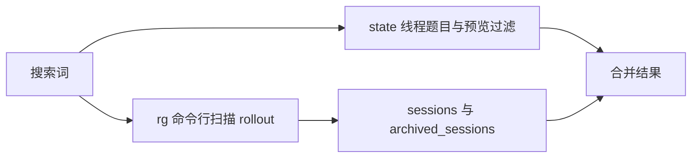

1. 搜索词先走 `state` 数据库的 `search_term` 过滤线程列表与预览。
2. 全文内容搜索调用外部 `rg_command` 扫描 rollout 路径。
3. 两者结果合并返回给 UI。
4. 内容搜索不建 FTS5 索引，所以不用维护另一个派生结构。

**一步一步来**

**第 1 步：用 Node 调起 rg 扫描目录**

这一步要做什么：用 `child_process` 调起 rg，扫描一个临时 JSONL 目录并返回匹配行。

```javascript
import { execFileSync } from "node:child_process";
import fs from "node:fs";
import path from "node:path";
const dir = path.join("/tmp", "rg-demo");
fs.mkdirSync(dir, { recursive: true });
fs.writeFileSync(path.join(dir, "a.jsonl"), '{"type":"response_item","payload":"React 报错"}\n');
// 依赖：本机安装 ripgrep（命令行名 rg）
const out = execFileSync("rg", ["React", dir], { encoding: "utf8" });
console.log(out.trim());
```

**这段代码在做什么**

- `execFileSync` 调用外部 `rg`，命令名来自 Codex 搜索配置的 `rg_command`。
- 搜索路径是 rollout 目录，源码用 `search_rollout_paths(rg_command, codex_home, ...)` 组织扫描。
- 匹配返回文件名与行内容，不经过 SQLite FTS5。

**运行结果**：输出匹配行所在的文件名与 JSON 内容。

**第 2 步：用 SQL 做标题与预览过滤**

这一步要做什么：写出线程级筛选，演示结构过滤与 rg 内容搜索的分工。

```sql
SELECT id, title, preview, rollout_path
FROM threads
WHERE title LIKE '%React%'
   OR preview LIKE '%React%';
```

**这段代码在做什么**

- SQL 只做 `title` 与 `preview` 级过滤，这是调研提到的 `search_term` 结构化过滤。
- 内容级搜索不在这里，在外部 rg。
- 如果内容搜索需求上升，可以考虑加入 FTS5，但调研中 Codex 没有 FTS5 索引。

**运行结果**：返回标题或预览包含 React 的线程行。

**动手验证**

```javascript
// 运行：node search_rg.mjs（Node 20+，需先安装 ripgrep：brew install ripgrep 或 apt install ripgrep）
import { execFileSync } from "node:child_process";
import fs from "node:fs";
import path from "node:path";
import assert from "node:assert/strict";
const dir = path.join("/tmp", "rg-demo");
fs.mkdirSync(dir, { recursive: true });
fs.writeFileSync(path.join(dir, "a.jsonl"), '{"type":"response_item","payload":"React 报错"}\n');
const out = execFileSync("rg", ["React", dir], { encoding: "utf8" });
assert.ok(out.includes("React 报错"));
console.log("预期输出：rg 搜索断言通过");
```

**常见坑**

| 现象 | 原因 | 怎么修 |
|---|---|---|
| 内容搜索在分页模式下无结果 | openai/codex issue #44817 报告 Windows 分页模式回归 | 需核对官方文档与修复版本；回退到原文扫描路径 |
| rg 未安装导致搜索不可用 | 外部进程依赖缺失 | 启动时检测 rg 是否存在并给出安装提示 |
| 线程标题搜索命中但内容不联动 | 标题与内容分离 | UI 同时发出 DB 过滤与 rg 扫描，合并结果 |

**用在哪里**

- 场景：代码 agent 的会话搜索框。
- 业务背景：用户想找回“那个让测试跑通的办法”所在的会话。
- 怎么用：结构化过滤走 `state` 库，全文扫描走 rg。
- 指标：搜索响应时间与结果漏报率。
- 什么时候不该用：会话总量远低于 1 GB 且查询条件固定时，直接用 `LIKE` 过滤 JSONL 目录即可。

- 场景：审计工具检索敏感命令。
- 业务背景：安全团队需要跨所有会话搜索某条危险命令。
- 怎么用：用 rg 的正则模式匹配 rollout 目录，必要时包含 `.zst` 解压路径。
- 指标：扫描全量会话所需时间与命中数。
- 什么时候不该用：审计要求结构化过滤且数据量在可控范围时，可先 DB 过滤再 rg 缩小范围。

**行业实践**

- openai/codex `rollout/src/search.rs` 实现 `search_rollout_paths(rg_command, codex_home, ...)`，搜索落在原始 rollout 文件。怎么借鉴：让全文检索变成可插拔外部命令，上线初期不必引入额外索引服务。
- ripgrep 官方 README 说明 rg 面向代码搜索的流式扫描擅长跳过二进制与有序路径。怎么借鉴：对日志类目录搜索可复用其路径过滤，减少无关文件扫描。

**小结**

- Codex 内容搜索用外部 rg 扫描 JSONL，不用 SQLite FTS5。
- SQLite 只负责标题、预览级别的结构化过滤。
- rg 方案没有索引维护成本，但每次全量扫描会随文件量线性增长。

## 9. 故障模式与教训：rollout 暴涨、stale `rollout_path`、NFS 上 WAL

**先想一个问题**：用户用了两周 Codex，回来发现 `~/.codex` 涨到 42 GB。你查后发现不是会话多，而是滚动文件不断把完整替换历史重复嵌入压缩记录。

**心智模型**

!!! tip "心智模型"
    一句话模型：追加式原型如果没有字节级去重与删除策略，压缩记录会把旧内容反复带进新文件。日常类比：家庭影集每次只加新照片，但添加一张新照片时顺手把旧相册前 20 页又复印了一遍附在后面。类比不成立的地方：影集重复复印只多耗纸，agent 的重复嵌入还会让恢复读文件时内存爆掉。

**图解**

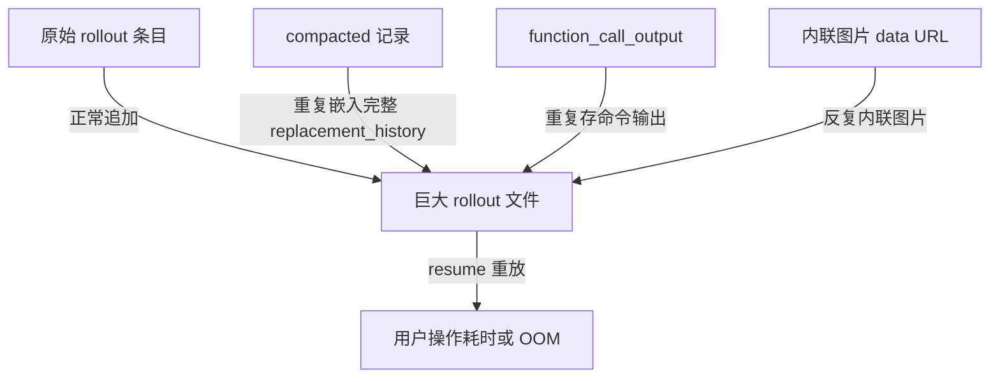

1. `compacted` 记录里重复嵌入完整 `replacement_history`，导致文件连续放大。
2. `function_call_output` 多次存放同一命令输出。
3. 内联图片的 data URL 在压缩记录中反复出现。
4. `resume` 重放超大文件时出现 OOM 或 502 现象。

**一步一步来**

**第 1 步：模拟一次 rollout 放大采样**

这一步要做什么：把 openai/codex issue #24948 的字段与字节拆解用 JS 复现，验证哪些字段占大头。

```javascript
// 采样数据来源：openai/codex issue #24948 报告的 732 MB rollout 分解
const breakdown = {
  compacted: 337.8 * 1024 * 1024,
  function_call_output: 230.8 * 1024 * 1024,
  reasoning: 54.8 * 1024 * 1024,
  token_count: 26.4 * 1024 * 1024,
  turn_context: 18.0 * 1024 * 1024,
};
const totalMB = Object.values(breakdown).reduce((a, b) => a + b, 0) / 1024 / 1024;
console.log("合计 MB：", totalMB.toFixed(1));
```

**这段代码在做什么**

- `breakdown` 的数值来自 openai/codex issue #24948 的原始报告分解。
- 把字节转 MB 方便阅读，字段名来自 issue 中列出的 RolloutItem 字段。
- 结果帮助定位 `compacted` 与 `function_call_output` 是胀大的主因。

**运行结果**：`合计 MB：668.0` 左右（按报告字段加总，以原文为准）。

**第 2 步：写 stale `rollout_path` 的检测逻辑**

这一步要做什么：模拟 home 目录变化后 SQLite 行里旧绝对路径无法解析的情况。

```javascript
const staleRows = [
  { id: "t1", rollout_path: "/old/home/.codex/sessions/2026/10/06/rollout-a.jsonl" },
];
const currentHome = "/new/home";
function repairStale(row, currentHome) {
  if (!row.rollout_path.startsWith(currentHome)) {
    const relative = row.rollout_path.split("/.codex/")[1];
    return { ...row, rollout_path: `${currentHome}/.codex/${relative}` };
  }
  return row;
}
console.log(repairStale(staleRows[0], currentHome).rollout_path);
```

**这段代码在做什么**

- `staleRows` 模拟 `state_5.sqlite.threads` 中存绝对路径的行。
- `repairStale` 用当前 home 重拼路径，对应源码 `read_repair_rollout_path` 的思路。
- openai/codex issue #47002 报告 `$HOME` 变化后 resume 与 fork 失败的场景，v0.153.4。

**运行结果**：输出 `/new/home/.codex/sessions/2026/10/06/rollout-a.jsonl`。

**第 3 步：写 NFS 上 WAL 的检测提示**

这一步要做什么：用 JS 判断路径是否为网络文件系统，并给出告警。

```javascript
function checkNfs(pathPrefix) {
  const isNfs = pathPrefix.startsWith("/mnt/nfs/") || pathPrefix.startsWith("/Volumes/");
  if (isNfs) return "WAL 在 NFS 上不可靠，勿在此路径放置 SQLite";
  return "本地路径，WAL 可用";
}
console.log(checkNfs("/mnt/nfs/codex-home"));
```

**这段代码在做什么**

- 判断前缀是否属于网络挂载，对应 openai/codex issue #30957 报告的环境。
- 返回告警信息，避免把 WAL 库放在 NFS 上。
- SQLite 官方文档也写明 WAL 不适用于网络文件系统。

**运行结果**：`WAL 在 NFS 上不可靠，勿在此路径放置 SQLite`。

**动手验证**

```javascript
// 运行：node failures.mjs（Node 20+，无外部依赖）
import assert from "node:assert/strict";
const breakdown = {
  compacted: 337.8, function_call_output: 230.8, reasoning: 54.8,
  token_count: 26.4, turn_context: 18.0,
};
const totalMB = Object.values(breakdown).reduce((a, b) => a + b, 0);
assert.ok(totalMB > 600, "采样合计应大于 600 MB");
function checkNfs(p) { return p.startsWith("/mnt/nfs/") ? "WAL 在 NFS 上不可靠" : "本地路径"; }
assert.equal(checkNfs("/mnt/nfs/codex-home"), "WAL 在 NFS 上不可靠");
console.log("预期输出：故障模式断言通过");
```

**常见坑**

| 现象 | 原因 | 怎么修 |
|---|---|---|
| 一个 12 天会话涨到 1.4 GB | 命令输出被存多次 | 按 hash 去重大输出，只存引用 |
| 家庭目录变化后无法续聊 | SQLite 行持有旧绝对路径 | 存相对路径或在读时用当前 home 重拼 |
| NFS 上 SQLite 损坏 | WAL 不支持网络文件系统 | 把 SQLite 放本地盘，或改用非 WAL 模式 |

**用在哪里**

- 场景：磁盘占用清理命令。
- 业务背景：用户反馈 `~/.codex` 在 30 天内增长到 28.6 GB。
- 怎么用：扫描归档与重复压缩记录，提供清与去重。
- 指标：清理后释放的磁盘空间 GB 数。
- 什么时候不该用：活跃会话内容不能直接删除，需先确认不是用户需要恢复的原文。

- 场景：容器化 agent 的存储目录选择。
- 业务背景：容器挂载了团队级 NFS 共享目录。
- 怎么用：把 SQLite 库放在 local 卷，把 rollout 与记忆文件放共享卷。
- 指标：容器启动时 SQLite 初始化失败次数降为 0。
- 什么时候不该用：如果没有网络文件系统，不必额外分层。

**行业实践**

- openai/codex issue #24948 与 #41806 记录了压缩记录重复嵌入造成 GB 级膨胀。怎么借鉴：实现压缩时，把替换历史按引用或哈希存储，不要把完整内容反复复制进新文件。
- SQLite 官方 WAL 文档说明 WAL 不能跨网络文件系统使用。怎么借鉴：在存储层加挂载类型检测，网盘上回退到较稳妥的日志模式或改存本地盘。

**小结**

- 胀大的主因是压缩记录重复嵌入完整历史、大输出多次复制、内联图片重复出现。
- `state_5.sqlite` 存绝对路径，home 变化后需要 read-repair 或相对路径设计。
- WAL 不能用于 NFS/SMB，环境检测与本地目录规划要前置。

## 10. 写入、索引、恢复三条时序图

**先想一个问题**：你面对一次写入、一次启动索引重建、一次崩溃恢复，想在三张时序图里看清“谁先写、谁后索引、谁恢复谁”。

**心智模型**

!!! tip "心智模型"
    一句话模型：写入走 JSONL 追加、索引走 backfill 与投影重放、恢复走备份与重建，三者共享 JSONL 原件这一固定的源头。日常类比：快递员只在总台账上追加记录，仓库员按台账重抄索引；索引房失火后按总台账恢复，而不去恢复总台账本身。类比不成立的地方：现实里总台账可能被火烧，而 append-only JSONL 要求多次落盘才算安全，没有绝对不丢。

**图解：写入时序**

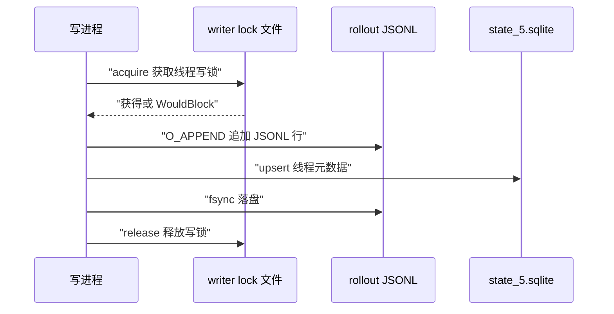

1. 写进程先获取该线程的 writer lock，避免两个进程交错写文件。
2. 拿到锁后向 rollout 文件追加，这个过程是 append-only。
3. 同时更新 `state_5.sqlite` 的线程行。
4. 落盘完成后释放锁。

**图解：索引时序**

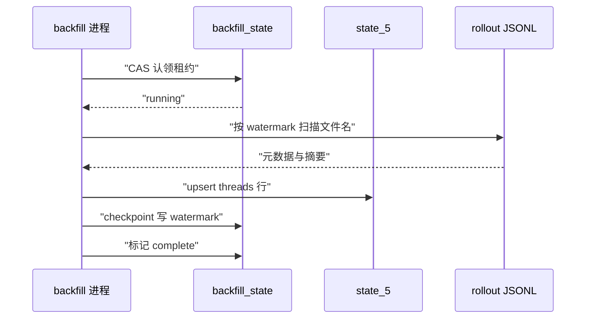

1. backfill 进程先通过 CAS 认领租约。
2. 从最后 watermark 开始扫描 rollout 路径。
3. 把读到的元数据 upsert 进 `state_5.sqlite.threads`。
4. 周期性写回 watermark，最终标记 complete。

**图解：恢复时序**

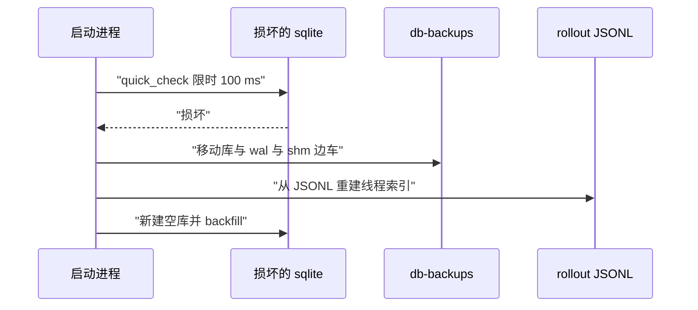

1. 启动时 `quick_check` 限时 100 毫秒检查库。
2. 发现损坏时，把损坏库及其 `-wal/-shm` 边车移入 `db-backups/`。
3. 线程历史投影库损坏时按 `Unavailable` 处理，因为不能在没有 rollout 的情况下静默重建。
4. 线程索引从 JSONL 重新 backfill 恢复。

**一步一步来**

**第 1 步：模拟 writer lock 的获取与释放**

这一步要做什么：用一个布尔状态表示线程级 writer lock，验证 acquire 与 WouldBlock。

```javascript
const threadLocks = new Map();
function acquire(threadId) {
  if (threadLocks.get(threadId)) return "WouldBlock";
  threadLocks.set(threadId, true);
  return "acquired";
}
function release(threadId) { threadLocks.delete(threadId); }
console.log(acquire("t1"), acquire("t1"));
release("t1");
console.log(acquire("t1"));
```

**这段代码在做什么**

- `threadLocks` 是线程 id 到锁状态的映射，模拟文件锁。
- `acquire` 如果锁已存在返回 `WouldBlock`，否则获得锁。
- 写完后 `release` 释放，下一个 acquire 可以成功。

**运行结果**：`acquired WouldBlock acquired`。

**第 2 步：模拟 quick_check 与备份重建**

这一步要做什么：用 JS 表示启动时的检查、备份与重建路径。

```javascript
function startupRecovery({ isCorrupt, dbName, rebuildable }) {
  if (!isCorrupt) return `${dbName} 正常`;
  if (!rebuildable) return `${dbName} 不可用，禁止静默重建`;
  return `${dbName} 已移入 db-backups 并从 rollout 重建`;
}
console.log(startupRecovery({ isCorrupt: true, dbName: "state_5", rebuildable: true }));
console.log(startupRecovery({ isCorrupt: true, dbName: "thread_history_1", rebuildable: false }));
```

**这段代码在做什么**

- `quick_check` 正常则直接返回。
- 可重建库损坏时移入 `db-backups/` 并触发 backfill。
- 线程历史投影不可重建，返回“不可用”，因为它依赖 rollout。

**运行结果**：两行，第一行表示重建，第二行表示不可用。

**动手验证**

```javascript
// 运行：node sequences.mjs（Node 20+，无外部依赖）
import assert from "node:assert/strict";
const threadLocks = new Map();
function acquire(id) { if (threadLocks.get(id)) return "WouldBlock"; threadLocks.set(id, true); return "acquired"; }
function release(id) { threadLocks.delete(id); }
assert.equal(acquire("t1"), "acquired");
assert.equal(acquire("t1"), "WouldBlock");
release("t1");
assert.equal(acquire("t1"), "acquired");
function startupRecovery({ isCorrupt, rebuildable, dbName }) {
  if (!isCorrupt) return `${dbName} 正常`;
  if (!rebuildable) return `${dbName} 不可用`;
  return `${dbName} 重建`;
}
assert.equal(startupRecovery({ isCorrupt: true, rebuildable: false, dbName: "thread_history_1" }), "thread_history_1 不可用");
console.log("预期输出：写入锁与恢复断言通过");
```

**常见坑**

| 现象 | 原因 | 怎么修 |
|---|---|---|
| 索引丢失但恢复重建缓慢 | 全量 backfill 扫描所有 rollout | 用 `last_watermark` 持久化断点续扫 |
| 投影库损坏被直接初始化 | 丢失了恢复语义 | 按 `RecoveryMode::Unavailable` 处理投影库 |
| 恢复时用户线程被删 | 备份移动时没把 `-wal/-shm` 一起移 | 移动三方边车到同一备份目录 |

**用在哪里**

- 场景：实现本地 agent 的崩溃自愈。
- 业务背景：用户新电脑迁移或电源断电后启动失败。
- 怎么用：启动走 quick_check，损坏可重建库走 BackupAndRebuild，投影不可用则暂停服务。
- 指标：启动恢复耗时、可重建率。
- 什么时候不该用：投影库已经能从当前 rollout 快速重建时，可跳过不可用状态。

- 场景：批量导入云端历史到本地。
- 业务背景：团队希望把服务端会话导出到本地 Codex。
- 怎么用：先写 rollout JSONL，再触发 backfill 与投影重放。
- 指标：导入前后索引行数差异。
- 什么时候不该用：历史包含多租户敏感数据时，不应直接写入共享本地库。

**行业实践**

- openai/codex `state/src/runtime/recovery.rs` 对损坏库做 BackupAndRebuild，移动库与 `-wal/-shm` 边车。怎么借鉴：恢复流程把边车和主库当作一个整体原子移动。
- openai/codex `state/src/lib.rs` 编译断言要求捆绑 SQLite 版本至少 3.51.3，以包含 WAL 重置损坏修复。怎么借鉴：上线前固定 SQLite 最低版本，避免已知 WAL bug。

**小结**

- 写入时序的关键是线程级 writer lock 与 append-only 文件。
- 索引时序的关键是 CAS 租约与 watermark 断点。
- 恢复时序的关键是先备份边车，再从 JSONL 重建索引，投影不可静默重建。

## 应用地图

| 场景 | 用到本页哪个知识点 | 典型技术选型 | 注意事项 |
|---|---|---|---|
| 本地 CLI 会话浏览器 | 目录布局与 `state_5` 线程索引 | JSONL 源 + SQLite 索引 | 删除 JSONL 前先冻结索引 |
| 桌面 GUI 分页详情页 | `thread_history_1` 分页投影 | 分页查询 `thread_items` | Legacy 模式线程不可走投影 |
| 会话全文搜索 | rg 扫描 rollout | ripgrep 子进程 | 需检测 rg 是否安装 |
| fork 分支试错 | `history_base` 前缀复用 | JSONL 支持附加前缀 | 父线程需冻结后再 fork |
| 长期记忆沉淀 | 两阶段流水线与 git Markdown | SQLite 协调 + git 文件 | 阶段一脱敏，阶段二全局锁 |
| 磁盘清理与审计 | 文件命名与冷热分层 | zstd 压缩 + 归档目录 | 归档不可无限增长 |
| 日志与目标面板 | `logs_2` 与 `goals_1` 拆库 | 分库隔离 | 日志库失败勿 gate 启动 |
| 多进程作业队列 | `queue_1` 租约与重试 | SQL 行级租约 | 租约必须带过期时间 |

## 动手作业

**目标**：做一个 `codex-store-cli` 的单文件 Node 脚本，能创建 Codex 风格的目录结构、写入一个小型 rollout、启动模拟 backfill、执行 read-repair、发起 fork、模拟记忆阶段一与阶段二。

**步骤**：

1. 用 `fs.mkdirSync` 创建 `~/.codex/sessions/2026/10/06` 与 `~/.codex/memories`。
2. 写一个含 `SessionMeta` 和三行 `RolloutItem` 的 rollout JSONL。
3. 把该文件的路径写入一个内存 `threads` 数组，模拟 `state_5.sqlite`。
4. 模拟 backfill CAS 认领与 checkpoint watermark。
5. 用 `read-repair` 修复一个旧 home 的 stale 路径。
6. 创建一个 fork 子线程，其 `history_base` 指向父线程。
7. 把一行密钥写入记忆候选，阶段一脱敏，阶段二按工作区干净决定是否运行模型。
8. 用 `node:assert` 对每个步骤做断言。

**验收标准**：

- 脚本运行无报错，输出包含 `backfill accepted`、`repaired path`、`fork prepared`、`memory candidate stored` 和 `phase2 exit without model`。
- 每个关键函数都有断言覆盖。
- 文件夹与 rollout 文件名符合本页的日期分层与命名规则。

## 综合对比

| 维度 | Codex CLI | Claude Code | OpenCode | LangGraph |
|---|---|---|---|---|
| 会话源真相 | JSONL rollout | 项目目录 JSONL | SQLite 主库 | 检查点状态 |
| 索引层 | `state_5` 派生镜像 | 无文档化索引 | 同一 SQLite | Postgres 检查点 |
| fork 机制 | `history_base` 独占前缀 | `--fork-session` 复制前缀 | `parent_id` 关联 | checkpoint 分叉 |
| 记忆保存 | `memories_1` 候选 + git Markdown | `CLAUDE.md` + `MEMORY.md` | `AGENTS.md`（未验证） | Store 跨线程内存 |
| 全文搜索 | rg 扫 JSONL | picker 文本搜索 | 未见到 | Store 查询 |
| 锁与恢复 | writer lock + CAS 租约 | 无文档化跨进程锁 | SQLite 单库 | 数据库锁 |

## 深入阅读与参考

!!! tip "怎么用这些资料"
    先读「官方文档与规范」建立准确的概念，再读「源码与示例」核对细节，最后用「教程、书籍与视频」换一种讲法加深理解。每条都写明了读哪一节、带着什么问题读。

### 官方文档与规范

| 资源 | 为什么读 | 怎么读 |
|---|---|---|
| [Approval policies: `on-request`, `never`, and `{ granular = {...} }`;  (developers.openai.com)](https://developers.openai.com/codex/agent-approvals-security) | Codex 官方配置参考，解释会话级策略如何随线程保存 | 读 Approval policies 小节，确认 granular 配置落库位置与读取时机 |
| [JSONL](https://bun.sh/docs/runtime/jsonl) | JSONL 解析与序列化官方 API，直接对应 rollout 文件格式 | 读流式 parse 接口，写脚本逐行读取一个 rollout 并统计事件类型 |
| [SQLite](https://bun.sh/docs/runtime/sqlite) | SQLite 绑定官方文档，是读六个库的入口 | 读打开数据库与 prepare 两节，练习查询 state_5 的线程索引表 |

### 源码与示例

| 资源 | 为什么读 | 怎么读 |
|---|---|---|
| [Node.js API 文档](https://nodejs.org/api/) | 查 fs 与 stream 接口，写增量读取 append-only 文件的示例 | 查 createReadStream 与 readline，做一个 tail rollout 的小 demo |

### 教程、书籍与视频

| 资源 | 为什么读 | 怎么读 |
|---|---|---|
| [LangGraph/LangMem frame it the same way: short-term memory is thread/s (langchain-ai.github.io)](https://langchain-ai.github.io/langmem/concepts/conceptual_guide/) | 把短期记忆建模为 thread，可对照线程索引与历史投影设计 | 读 short-term memory 一节，问：线程切分与分页投影为何分离 |
| [Cursor "Memories" (auto-generated from chats, project-scoped, user app (docs.windsurf.com)](https://docs.windsurf.com/windsurf/cascade/memories) | 竞品记忆机制设计，便于横向比较项目级记忆的取舍 | 看自动生成与项目作用域两点，与自己画的记忆流水线做对比 |

## 自测题

??? question "1. 为什么说 JSONL 是源真相，SQLite 是派生索引，这句话的证据在哪"
    - 证据是 `state/src/lib.rs` 注释：state crate 从 JSONL rollout 提取元数据并镜像到本地 SQLite。
    - JSONL 丢失则无法重建原文，SQLite 丢失可以从 JSONL 重新 backfill。
    - 判断标准：哪个结构能从另一个结构恢复，另一个却不能反向恢复。

??? question "2. `state_5.sqlite` 中的 schema 数字后缀 5 表示什么"
    - 它是 schema 代数常量，`STATE_DB_FILENAME = "state_5.sqlite"`。
    - 数字递增表示放弃旧库而不是破坏性迁移。
    - 这是以源码常量为依据的推断；具体迁移兼容细节需核对官方文档。

??? question "3. 启动 backfill 的 CAS 租约解决了什么具体问题"
    - 解决多进程首次启动同时扫描 JSONL 导致的丢行风险，openai/codex issue #42447。
    - CAS 条件更新使只有一个进程能把 `backfill_state` 置为 running。
    - 租约过期后其他进程从 `last_watermark` 续扫。

??? question "4. `read_repair_rollout_path` 修的是哪一种数据"
    - 修的是 `threads.rollout_path` 存储的绝对路径失效问题。
    - 例如 `$HOME` 变化后旧路径无法解析，openai/codex issue #47002。
    - 读时修复，不覆盖行内已有合法字段。

??? question "5. fork 为什么能做到不复制整个父 rollout"
    - 子会话的 `SessionMeta` 含 `history_base`，表示继承父 rollout 的一个排他前缀。
    - `prepare` fork 把祖先段物化到 `thread_history_1`，冻结父历史后创建子引用。
    - 子 rollout 只需存新增事件，续聊时借助投影库组装完整历史。

??? question "6. 记忆两阶段流水线中，哪一个环节允许并行，哪一个环节必须串行，为什么"
    - 阶段一逐 rollout 抽取可以并行，因为租约在 rollout 级别互斥。
    - 阶段二整合共享 Markdown 文件必须串行，代码用单例锁。
    - 并行会并发写同一 git 工作区，导致文件覆盖与 diff 错误。

??? question "7. 为什么搜索用 rg 而不是 SQLite FTS5"
    - Codex 源码 `rollout/src/search.rs` 调外部 `rg` 扫 rollout 路径。
    - 在 `.rs`/`.sql` 中没有发现 SQLite FTS5 使用（调研 migrations 清单）。
    - 好处是不用维护额外的 FTS 派生结构；代价是全量扫描成本随文件线性增长。

??? question "8. NFS 上启用 WAL 会带来什么问题，教训是什么"
    - WAL 模式不适用于网络文件系统，可能损坏库，openai/codex issue #30957。
    - 教训：SQLite 文件放本地磁盘，检测到网络挂载时回退或告警。
    - 备份恢复时要把 `-wal/-shm` 边车一并移动。

## 延伸阅读

- openai/codex 仓库 `codex-rs/state` 目录：`migrations` 各迁移 SQL 文件、`src/sqlite.rs`、`src/runtime/backfill.rs`、`src/runtime/recovery.rs`。
- openai/codex 仓库 `codex-rs/rollout/src` 目录：`rollout_file_name.rs`、`search.rs`、`writer_lock.rs`、`compression.rs`。
- openai/codex 仓库 `codex-rs/thread-store/src` 目录：`store.rs`、`local/paginated_fork.rs`。
- openai/codex 仓库 `codex-rs/memories/README.md`：两阶段抽取与整合、git 基线与租约说明。
- SQLite 官方文档：WAL 模式章节、`PRAGMA journal_mode` 与 corruption 修复章节。
- ripgrep 官方 README：搜索模型与路径过滤章节。
